# 📝 AWS 클라우드 서비스 종합 강의 노트 (Day N)

**강의 일자**: 2025년 12월 9일
**강의 주제**: AWS 컴퓨팅, 스토리지, 네트워크, 데이터베이스 서비스
**학습 목표**: AWS 핵심 서비스의 상세 구성, 보안, 실습을 통한 실무 역량 강화

---

## 📋 목차

1. [지난 시간 복습 및 EC2 오토스케일링](#1-지난-시간-복습-및-ec2-오토스케일링)
2. [Lambda 서버리스 컴퓨팅](#2-lambda-서버리스-컴퓨팅)
3. [컨테이너 서비스 (ECS, EKS, Fargate)](#3-컨테이너-서비스-ecs-eks-fargate)
4. [S3 객체 스토리지 상세](#4-s3-객체-스토리지-상세)
5. [스토리지 및 네트워크 서비스](#5-스토리지-및-네트워크-서비스)
6. [데이터베이스 서비스](#6-데이터베이스-서비스)
7. [종합 정리](#7-종합-정리)

---

## 1. 지난 시간 복습 및 EC2 오토스케일링

### 🔄 복습: 왜 복습이 중요한가?

강사님께서 강조하신 것처럼, 이전 학습 내용을 복습하는 것은 단순한 반복이 아닙니다. 클라우드 서비스는 서로 연결되어 있으며, 이전 개념을 정확히 이해해야 새로운 개념을 제대로 학습할 수 있습니다. 특히 S3 실습을 완료하지 못한 상태에서 오늘 이어서 진행하기 때문에, 복습은 필수적입니다.

---

### 📦 1.1 EC2 오토스케일링 (Auto Scaling)

#### 💡 **오토스케일링이란?**

**정의**:
어플리케이션의 **부하(Load)**에 따라 EC2 인스턴스의 수량을 자동으로 조정하는 기능입니다.

**핵심 개념**:
- **Min (최소값)**: 최소한 유지해야 할 인스턴스 개수
- **Max (최대값)**: 최대로 늘릴 수 있는 인스턴스 개수
- **Desired (희망값)**: 현재 유지하고자 하는 인스턴스 개수

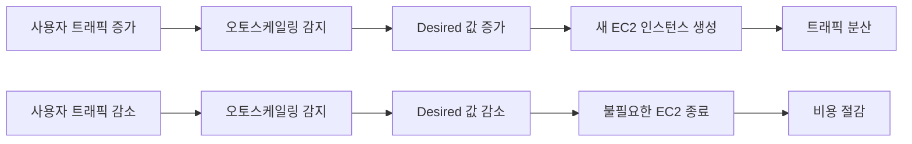

---

#### 🔧 **오토스케일링 그룹 (Auto Scaling Group) 구성 요소**

##### **1. 시작 템플릿 (Launch Template)**

**목적**:
EC2 인스턴스를 생성할 때 필요한 모든 구성 정보를 미리 정의해두는 템플릿입니다.

**포함되는 정보**:

| **구성 항목** | **설명** | **예시** |
|:-:|:-:|:-:|
| AMI | 어떤 Amazon Machine Image를 사용할 것인지 | Amazon Linux 2023 |
| Instance Type | 인스턴스 유형 (CPU, 메모리 사양) | t3.micro, t3.small |
| Security Group | 방화벽 규칙 | 웹 서버용 SG (80, 443 포트 허용) |
| Key Pair | SSH 접속용 키 페어 | my-keypair.pem |
| User Data | 인스턴스 시작 시 실행할 스크립트 | Apache 설치, 자동 시작 |
| IAM Role | 인스턴스에 부여할 권한 | S3 읽기 권한, CloudWatch 로그 전송 |
| Storage | EBS 볼륨 설정 | 30GB gp3 |
| Network | VPC, Subnet 설정 | Private Subnet 배치 |

**💡 시작 템플릿의 장점: 버전 관리**

```markdown
**시나리오**: 웹 서버 구성을 변경해야 하는 상황

- **버전 1**: Apache 2.4 + PHP 7.4
- **버전 2**: Apache 2.4 + PHP 8.1 (성능 향상)
- **버전 3**: Nginx + PHP 8.1 (더 나은 성능)

**작업 프로세스**:
1. 새 버전의 시작 템플릿 생성
2. 오토스케일링 그룹에서 새 버전 선택
3. 점진적으로 인스턴스 교체
4. 문제 발생 시 이전 버전으로 롤백
```

이렇게 버전을 관리하면, 구성 변경이 필요할 때마다 새로운 템플릿을 만들 필요 없이 버전을 선택하여 사용할 수 있습니다.

**실습 예제**:

```bash
# AWS CLI를 사용한 시작 템플릿 생성
$ aws ec2 create-launch-template \
    --launch-template-name my-web-server-template \
    --version-description "Apache 2.4 with PHP 7.4" \
    --launch-template-data '{
        "ImageId": "ami-0abc123def456789",
        "InstanceType": "t3.micro",
        "SecurityGroupIds": ["sg-0123456789abcdef"],
        "KeyName": "my-keypair",
        "UserData": "IyEvYmluL2Jhc2gKeXVtIHVwZGF0ZSAteQp5dW0gaW5zdGFsbCAteSBodHRwZAo="
    }'
```

**📌 노트**: User Data는 Base64로 인코딩된 bash 스크립트입니다. 디코딩하면 다음과 같습니다:

```bash
#!/bin/bash
yum update -y
yum install -y httpd
systemctl start httpd
systemctl enable httpd
```

---

##### **2. 오토스케일링 정책 (Scaling Policy)**

오토스케일링 그룹이 인스턴스 수를 조정하는 방법을 정의하는 정책입니다.

###### **정책 유형 1: 수동 조정 (Manual Scaling)**

**설명**:
운영자가 직접 Min, Max, Desired 값을 변경하여 인스턴스 수를 조정합니다.

**사용 시나리오**:
- 예정된 대규모 이벤트 (예: 블랙 프라이데이) 전에 미리 인스턴스 증설
- 야간 시간대에 트래픽 감소 예상 시 인스턴스 축소
- 테스트 목적으로 특정 수량 유지

**실행 예제**:

```bash
# Desired 값을 5로 변경 (현재 2개 → 5개로 증가)
$ aws autoscaling set-desired-capacity \
    --auto-scaling-group-name my-web-asg \
    --desired-capacity 5

# Min, Max 값도 함께 변경
$ aws autoscaling update-auto-scaling-group \
    --auto-scaling-group-name my-web-asg \
    --min-size 3 \
    --max-size 10 \
    --desired-capacity 5
```

---

###### **정책 유형 2: 예약된 일정 기반 조정 (Scheduled Scaling)**

**설명**:
미리 정해진 일정에 따라 자동으로 인스턴스 수를 조정합니다.

**사용 시나리오**:

```markdown
**시나리오 1: 업무 시간 기반 조정**
- 평일 09:00 ~ 18:00: 트래픽 많음 → Min 5, Max 20, Desired 10
- 평일 18:00 ~ 09:00: 트래픽 적음 → Min 2, Max 5, Desired 2
- 주말 전체: 트래픽 최소 → Min 1, Max 3, Desired 1

**시나리오 2: 배치 작업 기반 조정**
- 매일 새벽 2:00: 대량 데이터 처리 시작 → Desired 20
- 매일 새벽 4:00: 데이터 처리 완료 → Desired 2
```

**실행 예제**:

```bash
# 평일 오전 9시에 인스턴스 증설
$ aws autoscaling put-scheduled-update-group-action \
    --auto-scaling-group-name my-web-asg \
    --scheduled-action-name scale-up-morning \
    --recurrence "0 9 * * MON-FRI" \
    --desired-capacity 10

# 평일 오후 6시에 인스턴스 축소
$ aws autoscaling put-scheduled-update-group-action \
    --auto-scaling-group-name my-web-asg \
    --scheduled-action-name scale-down-evening \
    --recurrence "0 18 * * MON-FRI" \
    --desired-capacity 2
```

**⚠️ 주의**: Cron 표현식 형식은 `분 시 일 월 요일` 순서입니다.

---

###### **정책 유형 3: 초기값 유지 (Maintain Current Levels)**

**설명**:
Min, Max, Desired 값을 **동일하게** 설정하여, 항상 일정한 수의 인스턴스를 유지합니다.

**구성 예제**:

```yaml
Min: 2
Max: 2
Desired: 2
```

**동작 메커니즘**:

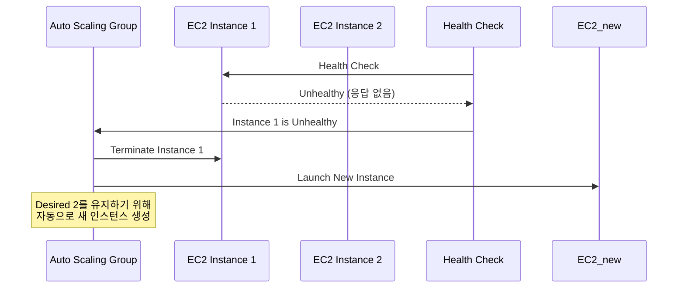

**💡 중요**: 인스턴스 하나가 장애로 종료되면, 오토스케일링은 자동으로 새 인스턴스를 생성하여 Desired 값(2개)을 유지합니다.

**실습 예제**:

```bash
# 초기값 유지 방식 오토스케일링 그룹 생성
$ aws autoscaling create-auto-scaling-group \
    --auto-scaling-group-name my-maintain-asg \
    --launch-template LaunchTemplateName=my-template,Version=1 \
    --min-size 2 \
    --max-size 2 \
    --desired-capacity 2 \
    --vpc-zone-identifier "subnet-12345,subnet-67890"
```

**사용 시나리오**:
- 데이터베이스 Master-Slave 구조 (항상 2개 유지)
- 필수 백그라운드 작업 서버 (최소 3개 유지)
- 고정된 인프라 구성이 필요한 경우

---

###### **정책 유형 4: 동적 조정 (Dynamic Scaling) - 대상 추적 조정 정책 ⭐**

**설명**:
특정 **성능 지표(Metric)**를 기준으로 목표값을 설정하고, 그 값을 유지하도록 자동으로 인스턴스 수를 조정합니다.

**💡 중요**: 요즘 가장 많이 사용되는 정책입니다!

**지원하는 주요 지표**:

| **지표 종류** | **설명** | **목표값 예시** | **사용 시나리오** |
|:-:|:-:|:-:|:-:|
| **CPU 사용률** | 평균 CPU 사용률 | 70% | 웹 서버, API 서버 |
| **네트워크 트래픽** | 인/아웃 바운드 트래픽량 | 5GB/hour | 미디어 스트리밍 서버 |
| **ALB 타겟당 요청 수** | 타겟 그룹의 인스턴스당 요청 수 | 1000 requests | 트래픽 분산이 중요한 환경 |
| **사용자 지정 지표** | CloudWatch Custom Metric | Queue 길이 100 | 메시지 큐 처리 시스템 |

**동작 원리**:

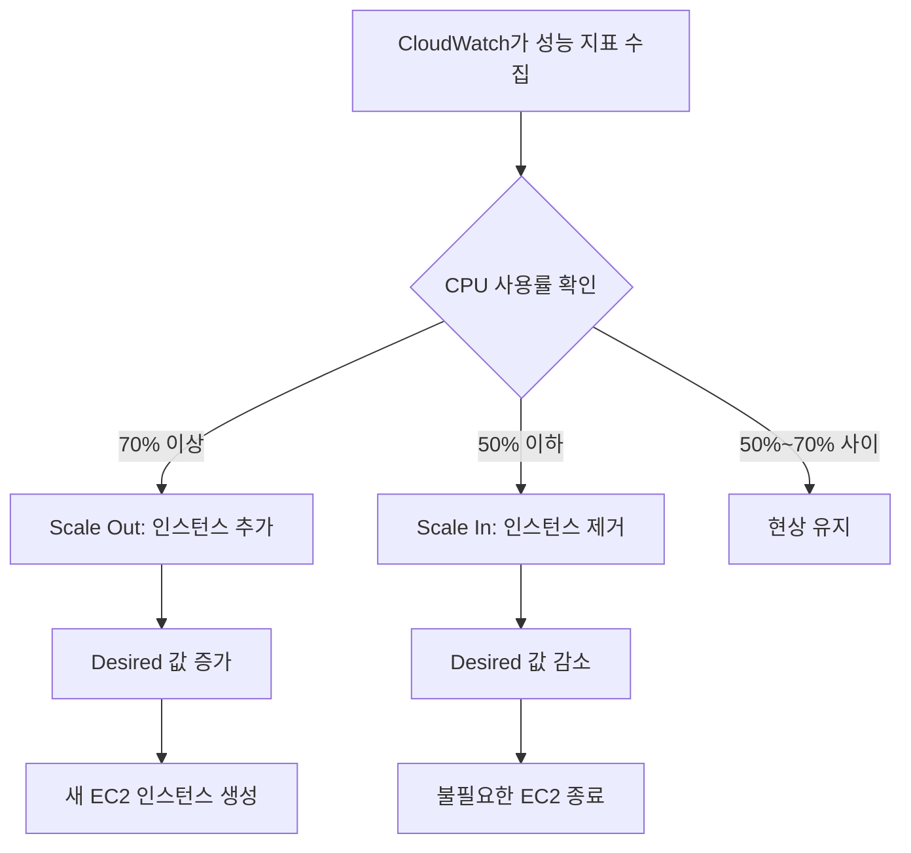

**실행 예제 1: CPU 사용률 기반 조정**

```bash
# CPU 70% 유지 정책 생성
$ aws autoscaling put-scaling-policy \
    --auto-scaling-group-name my-web-asg \
    --policy-name cpu-target-tracking \
    --policy-type TargetTrackingScaling \
    --target-tracking-configuration '{
        "PredefinedMetricSpecification": {
            "PredefinedMetricType": "ASGAverageCPUUtilization"
        },
        "TargetValue": 70.0
    }'
```

**예상 결과**:
```json
{
    "PolicyARN": "arn:aws:autoscaling:ap-northeast-2:123456789012:scalingPolicy:12345:autoScalingGroupName/my-web-asg:policyName/cpu-target-tracking",
    "Alarms": [
        {
            "AlarmName": "TargetTracking-my-web-asg-AlarmHigh-12345",
            "AlarmARN": "arn:aws:cloudwatch:ap-northeast-2:123456789012:alarm:TargetTracking-my-web-asg-AlarmHigh-12345"
        },
        {
            "AlarmName": "TargetTracking-my-web-asg-AlarmLow-12345",
            "AlarmARN": "arn:aws:cloudwatch:ap-northeast-2:123456789012:alarm:TargetTracking-my-web-asg-AlarmLow-12345"
        }
    ]
}
```

**출력 해석**:
- `PolicyARN`: 생성된 정책의 고유 식별자
- `Alarms`: CloudWatch Alarm이 자동으로 2개 생성됨
  - `AlarmHigh`: CPU가 70% 이상일 때 Scale Out 트리거
  - `AlarmLow`: CPU가 일정 수준 이하일 때 Scale In 트리거

---

**실행 예제 2: ALB 타겟당 요청 수 기반 조정**

```bash
# ALB 타겟당 1000개 요청 유지
$ aws autoscaling put-scaling-policy \
    --auto-scaling-group-name my-web-asg \
    --policy-name alb-request-count-target \
    --policy-type TargetTrackingScaling \
    --target-tracking-configuration '{
        "PredefinedMetricSpecification": {
            "PredefinedMetricType": "ALBRequestCountPerTarget",
            "ResourceLabel": "app/my-load-balancer/50dc6c495c0c9188/targetgroup/my-targets/73e2d6bc24d8a067"
        },
        "TargetValue": 1000.0
    }'
```

**📌 노트**: `ResourceLabel`은 ALB와 타겟 그룹의 ARN에서 추출합니다.

**추출 방법**:

```bash
# ALB ARN 확인
$ aws elbv2 describe-load-balancers --names my-load-balancer

# 타겟 그룹 ARN 확인
$ aws elbv2 describe-target-groups --load-balancer-arn <ALB-ARN>

# ResourceLabel 형식: app/<lb-name>/<lb-id>/targetgroup/<tg-name>/<tg-id>
```

---

**실행 예제 3: 사용자 지정 지표 기반 조정**

```bash
# SQS 큐의 메시지 수 기반 조정
$ aws autoscaling put-scaling-policy \
    --auto-scaling-group-name my-worker-asg \
    --policy-name sqs-queue-length-target \
    --policy-type TargetTrackingScaling \
    --target-tracking-configuration '{
        "CustomizedMetricSpecification": {
            "MetricName": "ApproximateNumberOfMessagesVisible",
            "Namespace": "AWS/SQS",
            "Statistic": "Average",
            "Dimensions": [
                {
                    "Name": "QueueName",
                    "Value": "my-work-queue"
                }
            ]
        },
        "TargetValue": 100.0
    }'
```

**시나리오 설명**:
- SQS 큐에 처리 대기 중인 메시지가 100개 이상이면 워커 인스턴스 추가
- 메시지 수가 감소하면 워커 인스턴스 제거
- 백그라운드 작업 처리에 효율적

---

###### **정책 유형 5: 예측 기반 조정 (Predictive Scaling)**

**설명**:
과거 데이터를 학습하여 미래의 트래픽 패턴을 예측하고, 예측 결과를 반영하여 자동으로 조정합니다.

**동작 원리**:

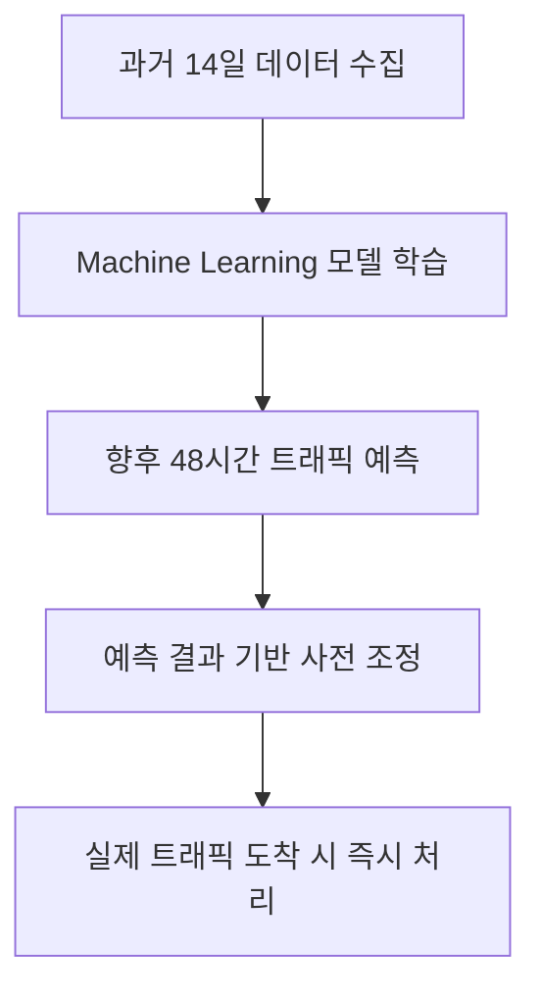

**💡 중요**: 예측 기반 조정은 **사전에** 인스턴스를 준비하므로, 트래픽 급증 시에도 지연 없이 대응할 수 있습니다.

**사용 시나리오**:

```markdown
**예측 가능한 패턴이 있는 경우**:
- 매주 월요일 오전 9시: 트래픽 급증 (주간 업무 시작)
- 매월 말일: 정산 작업으로 인한 부하 증가
- 명절 연휴 전날: 온라인 쇼핑 트래픽 증가

**예측 기반 조정의 장점**:
- 트래픽이 오기 **전에** 인스턴스를 미리 준비
- 동적 조정보다 빠른 대응 (인스턴스 생성 시간 단축)
- 사용자 경험 향상 (지연 없음)
```

---

#### 🎯 **오토스케일링의 장점**

##### **1. 가용성 향상**

```markdown
**시나리오**: EC2 인스턴스 장애 발생

**오토스케일링 없이**:
1. 인스턴스 장애 감지
2. 수동으로 새 인스턴스 생성
3. 수동으로 ALB에 등록
4. → **서비스 중단 시간 발생**

**오토스케일링 사용 시**:
1. Health Check에서 자동 감지
2. Unhealthy 인스턴스 자동 종료
3. 새 인스턴스 자동 생성 및 등록
4. → **자동 복구, 최소 중단 시간**
```

##### **2. 비용 절감**

**비교 분석**:

| **구분** | **고정 인프라** | **오토스케일링** |
|:-:|:-:|:-:|
| **평일 오전 9시 ~ 오후 6시** | 10개 인스턴스 (피크 시간 기준으로 고정) | 10개 인스턴스 (트래픽에 맞춰 증가) |
| **평일 야간 (오후 6시 ~ 오전 9시)** | 10개 인스턴스 (그대로 유지) | 2개 인스턴스 (트래픽 감소로 축소) |
| **주말** | 10개 인스턴스 (그대로 유지) | 1개 인스턴스 (최소 트래픽) |
| **월간 인스턴스 시간** | 10 × 24 × 30 = 7,200 시간 | 약 3,000 시간 |
| **비용 절감률** | - | **약 58% 절감** |

**💡 중요**: 트래픽 패턴에 따라 동적으로 조정하면 비용을 크게 절감할 수 있습니다.

---

### 🚀 1.2 Lambda 서버리스 컴퓨팅

#### 💡 **서버리스(Serverless)란?**

**정의**:
서비스를 실행할 **인프라를 AWS가 관리**하고, 고객은 **관리할 서버가 없는** 컴퓨팅 모델입니다.

**⚠️ 주의**: "서버리스"는 "서버가 없다"는 의미가 아닙니다. 서버는 존재하지만, **고객이 관리하지 않는다**는 의미입니다.

**서버리스의 핵심 특징**:

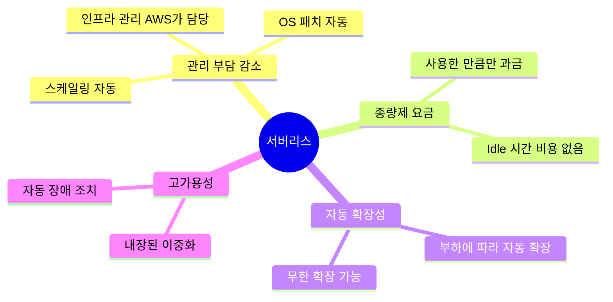

---

#### 🏗️ **대표적인 서버리스 서비스**

| **서비스 이름** | **카테고리** | **설명** | **사용 사례** |
|:-:|:-:|:-:|:-:|
| **Lambda** | 컴퓨팅 | 코드 실행 환경 | API 백엔드, 이벤트 처리 |
| **Fargate** | 컨테이너 | 서버리스 컨테이너 실행 | 마이크로서비스, 배치 작업 |
| **S3** | 스토리지 | 객체 스토리지 | 정적 파일, 백업 |
| **DynamoDB** | 데이터베이스 | NoSQL 데이터베이스 | 세션 관리, 사용자 프로필 |
| **API Gateway** | API 관리 | API Proxy 및 관리 | REST API, WebSocket API |
| **SQS** | 메시징 | 메시지 큐 | 비동기 작업 처리 |
| **SNS** | 메시징 | Pub/Sub 메시징 | 알림 전송, 이벤트 브로드캐스트 |

---

#### 🔧 **Lambda 상세 분석**

##### **Lambda의 구성 요소**

```yaml
Lambda Function:
  Code:
    - 실행할 함수 코드
    - 종속 패키지 (dependencies)
  Configuration:
    Runtime: Python 3.11, Node.js 18, Java 17, etc.
    Memory: 128MB ~ 10GB
    Timeout: 최대 15분
    Execution Role: IAM 역할 (권한 부여)
    Environment Variables: 환경 변수
    VPC Configuration: VPC 내부 리소스 접근 시 설정
```

##### **Lambda 실행 흐름**

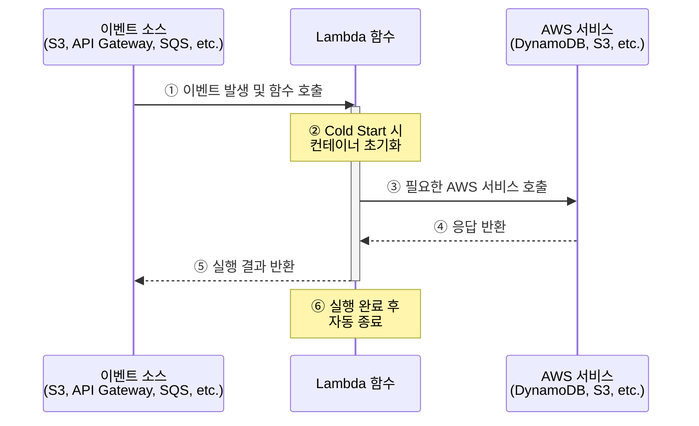

**각 단계 상세 설명**:

**① 이벤트 소스에서 호출**:
- S3에 파일 업로드
- API Gateway로 HTTP 요청
- SQS 큐에 메시지 도착
- CloudWatch Events로 스케줄 실행

**② Cold Start vs Warm Start**:

| **구분** | **Cold Start** | **Warm Start** |
|:-:|:-:|:-:|
| **상황** | 함수가 처음 호출되거나 오랫동안 미사용 | 최근에 실행된 함수 재호출 |
| **초기화** | 컨테이너 생성 + 런타임 로드 필요 | 기존 컨테이너 재사용 |
| **지연 시간** | 수백 ms ~ 수 초 | 수십 ms |
| **최적화 방법** | Provisioned Concurrency 사용 | - |

**③~④ AWS 서비스 호출**:
```python
import boto3

def lambda_handler(event, context):
    # DynamoDB 호출 예제
    dynamodb = boto3.resource('dynamodb')
    table = dynamodb.Table('Users')

    response = table.get_item(Key={'userId': '12345'})
    return {
        'statusCode': 200,
        'body': response['Item']
    }
```

**⑤ 결과 반환**:
- 동기 호출: 즉시 결과 반환
- 비동기 호출: 이벤트 큐에 저장 후 나중에 처리

**⑥ 자동 종료**:
- 실행 완료 후 컨테이너는 일정 시간(약 5~10분) 유지
- 재호출 대기 (Warm Start를 위해)
- 일정 시간 후 자동 종료

---

##### **Lambda 제한사항 ⚠️**

| **제한 항목** | **최대값** | **영향** | **대안** |
|:-:|:-:|:-:|:-:|
| **메모리** | 10GB | 대용량 데이터 처리 불가 | EC2, Fargate |
| **실행 시간** | 15분 | 장시간 작업 불가 | Step Functions, ECS |
| **Deployment Package** | 250MB (압축 해제 시) | 큰 라이브러리 포함 어려움 | Lambda Layers 사용 |
| **동시 실행** | 1000 (기본값, 증가 가능) | 급격한 트래픽 급증 시 제한 | 사전 Soft Limit 증가 요청 |
| **임시 스토리지 (/tmp)** | 512MB ~ 10GB | 대용량 파일 처리 제한 | S3 사용 |

**📌 노트**: 메모리를 많이 필요로 하거나 실행 시간이 긴 작업은 Lambda보다 EC2나 ECS/Fargate를 사용하는 것이 적합합니다.

---

##### **Lambda 사용 사례**

**사례 1: 이미지 썸네일 생성**

```python
import boto3
from PIL import Image
import os

s3 = boto3.client('s3')

def lambda_handler(event, context):
    # S3 버킷에 이미지 업로드 시 자동 호출
    bucket = event['Records'][0]['s3']['bucket']['name']
    key = event['Records'][0]['s3']['object']['key']

    # 원본 이미지 다운로드
    download_path = f'/tmp/{os.path.basename(key)}'
    s3.download_file(bucket, key, download_path)

    # 썸네일 생성
    img = Image.open(download_path)
    img.thumbnail((200, 200))
    thumbnail_path = f'/tmp/thumb_{os.path.basename(key)}'
    img.save(thumbnail_path)

    # 썸네일 업로드
    thumbnail_key = f'thumbnails/{os.path.basename(key)}'
    s3.upload_file(thumbnail_path, bucket, thumbnail_key)

    return {'statusCode': 200, 'body': f'Thumbnail created: {thumbnail_key}'}
```

**실행 흐름**:
1. 사용자가 S3 버킷에 이미지 업로드
2. S3 이벤트가 Lambda 함수 자동 호출
3. Lambda가 이미지 다운로드 및 썸네일 생성
4. 썸네일을 S3에 업로드
5. 자동 종료

---

**사례 2: API 백엔드**

```python
import json
import boto3

dynamodb = boto3.resource('dynamodb')
table = dynamodb.Table('Products')

def lambda_handler(event, context):
    # API Gateway에서 호출
    http_method = event['httpMethod']

    if http_method == 'GET':
        # 상품 조회
        product_id = event['pathParameters']['id']
        response = table.get_item(Key={'productId': product_id})

        return {
            'statusCode': 200,
            'headers': {'Content-Type': 'application/json'},
            'body': json.dumps(response.get('Item', {}))
        }

    elif http_method == 'POST':
        # 상품 생성
        body = json.loads(event['body'])
        table.put_item(Item=body)

        return {
            'statusCode': 201,
            'headers': {'Content-Type': 'application/json'},
            'body': json.dumps({'message': 'Product created'})
        }
```

**API 구조**:
```
GET  /products/{id}  → Lambda 함수 → DynamoDB 조회
POST /products       → Lambda 함수 → DynamoDB 저장
```

---

### 📦 1.3 컨테이너 서비스 (ECS, EKS, Fargate)

#### 💡 **컨테이너란?**

**정의**:
어플리케이션 코드, 런타임, 종속 라이브러리 등을 **하나의 패키지(이미지)**로 만들어 독립된 실행 환경을 제공하는 기술입니다.

**컨테이너 vs 가상머신 (VM)**:

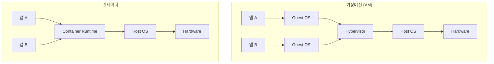

| **비교 항목** | **가상머신 (VM)** | **컨테이너** |
|:-:|:-:|:-:|
| **격리 수준** | 하드웨어 수준 완전 격리 | 프로세스 수준 격리 |
| **용량** | 수 GB ~ 수십 GB | 수 MB ~ 수백 MB |
| **부팅 시간** | 수 분 | 수 초 |
| **리소스 효율성** | 낮음 (각 VM마다 OS 필요) | 높음 (Host OS 공유) |
| **이식성** | 낮음 | 높음 (어디서든 동일하게 실행) |
| **확장성** | 느림 | 빠름 |

---

#### 🔧 **컨테이너의 특징**

##### **1. 가볍고 빠름**

```bash
# Docker 컨테이너 시작 속도 비교
$ time docker run alpine echo "Hello"
# 실행 시간: 약 0.5초

$ time VBoxManage startvm "Ubuntu VM"
# 실행 시간: 약 30초 ~ 1분
```

##### **2. 이식성 (Portability)**

```markdown
**"Build Once, Run Anywhere" 원칙**

개발자 로컬 환경 (Mac) → 테스트 서버 (Ubuntu) → 운영 서버 (Amazon Linux)

동일한 컨테이너 이미지로 모든 환경에서 동일하게 실행됩니다.
```

##### **3. 마이크로서비스 아키텍처(MSA)에 적합**

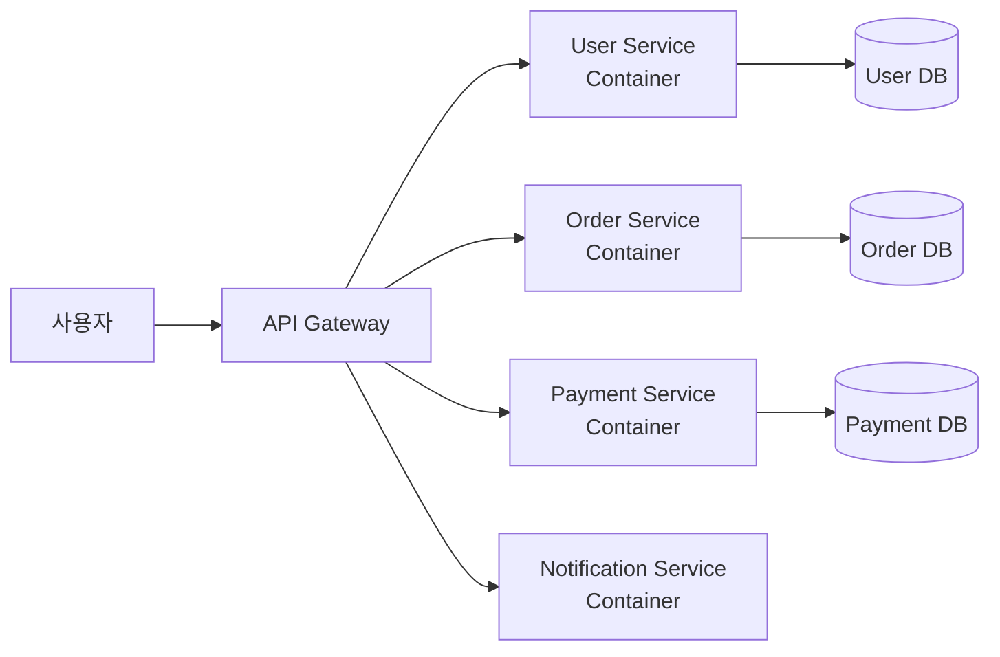

**💡 중요**: 각 서비스를 독립된 컨테이너로 실행하면, 서비스별로 독립적인 배포, 확장, 장애 격리가 가능합니다.

---

#### 🏗️ **AWS 컨테이너 관련 서비스**

##### **1. ECR (Elastic Container Registry)**

**역할**: 컨테이너 이미지 저장소 (Docker Hub와 유사)

**기능**:
- 컨테이너 이미지 저장
- 버전 관리 (태그)
- 이미지 스캔 (보안 취약점 검사)
- IAM 기반 접근 제어

**사용 예제**:

```bash
# 1. ECR 리포지토리 생성
$ aws ecr create-repository --repository-name my-app

# 2. Docker 이미지 빌드
$ docker build -t my-app:latest .

# 3. ECR에 로그인
$ aws ecr get-login-password --region ap-northeast-2 | \
  docker login --username AWS --password-stdin \
  123456789012.dkr.ecr.ap-northeast-2.amazonaws.com

# 4. 이미지 태그 지정
$ docker tag my-app:latest \
  123456789012.dkr.ecr.ap-northeast-2.amazonaws.com/my-app:latest

# 5. ECR에 푸시
$ docker push \
  123456789012.dkr.ecr.ap-northeast-2.amazonaws.com/my-app:latest
```

---

##### **2. ECS (Elastic Container Service)**

**특징**:
- AWS가 자체 개발한 컨테이너 오케스트레이션 서비스
- Docker 컨테이너 실행 및 관리
- 간단하고 직관적인 인터페이스
- AWS 서비스와의 뛰어난 통합

**핵심 개념: Task**

```yaml
Task Definition (작업 정의):
  Family: my-web-task
  Containers:
    - Name: nginx
      Image: nginx:latest
      Memory: 512MB
      CPU: 256 units
      PortMappings:
        - ContainerPort: 80
          HostPort: 80
      Environment:
        - Name: ENV
          Value: production
      LogConfiguration:
        LogDriver: awslogs
        Options:
          awslogs-group: /ecs/my-web-task
          awslogs-region: ap-northeast-2
```

**💡 중요**: ECS에서 "Task"는 하나 이상의 컨테이너를 포함하는 실행 단위입니다.

**Task 실행 흐름**:

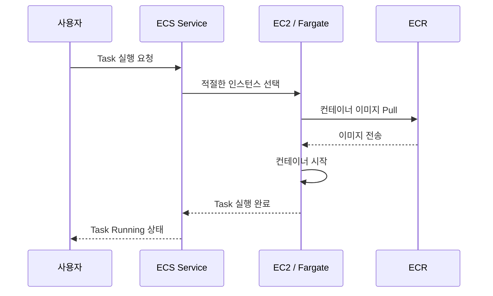

---

##### **3. EKS (Elastic Kubernetes Service)**

**특징**:
- 오픈소스 Kubernetes 기반
- 강력한 기능 (수천 개의 기능)
- 온프레미스 Kubernetes와 호환
- 복잡하지만 유연함

**ECS vs EKS 선택 가이드**:

| **선택 기준** | **ECS 선택** | **EKS 선택** |
|:-:|:-:|:-:|
| **Kubernetes 경험** | 없음 또는 적음 | 이미 사용 중 |
| **복잡도** | 단순한 구조 선호 | 복잡한 구조 감당 가능 |
| **기능 요구사항** | 기본 기능으로 충분 | 고급 기능 필요 (Helm, Custom Resource) |
| **멀티 클라우드** | AWS만 사용 | AWS + 온프레미스 또는 다른 클라우드 |
| **AWS 통합** | AWS 서비스와 긴밀한 통합 필요 | Kubernetes 생태계 활용 필요 |

**💡 중요**: "처음 컨테이너를 도입하고, AWS 서비스와 통합이 중요하다면 ECS를 선택하세요. Kubernetes 경험이 있고, 온프레미스와 통합이 필요하다면 EKS를 선택하세요."

---

##### **4. Fargate vs EC2 선택**

**Fargate (서버리스)**:
```yaml
특징:
  - 서버 관리 불필요
  - 자동 스케일링
  - Task/Pod 단위 과금
장점:
  - 관리 부담 최소화
  - 빠른 시작
  - 운영 간소화
단점:
  - 제어 옵션 제한
  - 비용이 상대적으로 높을 수 있음
```

**EC2**:
```yaml
특징:
  - 직접 EC2 인스턴스 관리
  - OS, 보안 패치 직접 수행
  - 인스턴스 단위 과금
장점:
  - 세밀한 제어 가능
  - GPU, 특수 인스턴스 사용 가능
  - 장기 사용 시 Reserved Instance로 비용 절감
단점:
  - 관리 부담 증가
  - OS 패치, 보안 업데이트 직접 수행
```

**선택 가이드**:

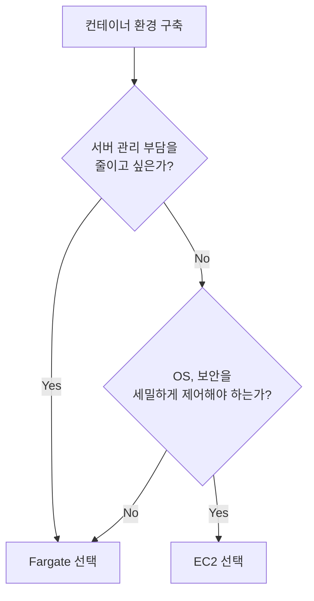

---

### 🎯 **Section 1 핵심 요약**

#### ✅ 학습 체크리스트

- [ ] EC2 오토스케일링의 Min, Max, Desired 개념을 이해하고 설명할 수 있다
- [ ] 시작 템플릿(Launch Template)에 포함되는 정보를 나열할 수 있다
- [ ] 오토스케일링 정책 유형 5가지를 구분하고 사용 시나리오를 설명할 수 있다
- [ ] 대상 추적 조정 정책을 AWS CLI로 생성할 수 있다
- [ ] Lambda의 제한사항(메모리, 시간)을 이해하고 대안을 제시할 수 있다
- [ ] 서버리스의 주요 특징 4가지를 설명할 수 있다
- [ ] 컨테이너와 가상머신의 차이점을 비교할 수 있다
- [ ] ECR, ECS, EKS, Fargate의 역할을 구분할 수 있다
- [ ] ECS의 Task 개념과 Task Definition을 이해한다
- [ ] ECS와 EKS 선택 기준을 상황에 맞게 적용할 수 있다

#### 📋 핵심 용어 정리

| **용어** | **정의** | **예시** |
|:-:|:-:|:-:|
| **Auto Scaling** | 부하에 따라 인스턴스 수 자동 조정 | CPU 70% 유지 정책 |
| **Launch Template** | EC2 생성 시 필요한 구성 정보 템플릿 | AMI, Instance Type, SG |
| **Serverless** | 인프라 관리 없는 컴퓨팅 모델 | Lambda, Fargate |
| **Lambda** | 이벤트 기반 서버리스 함수 실행 | S3 업로드 → 썸네일 생성 |
| **Container** | 독립된 실행 환경의 경량 패키지 | Docker 이미지 |
| **ECR** | AWS 컨테이너 이미지 저장소 | Docker Hub와 유사 |
| **ECS** | AWS 자체 컨테이너 오케스트레이션 | Task 기반 관리 |
| **EKS** | Kubernetes 관리형 서비스 | Pod 기반 관리 |
| **Fargate** | 서버리스 컨테이너 컴퓨팅 | 서버 관리 불필요 |

#### 💡 실무 팁

**1. 오토스케일링 설정 시**:
- 초기에는 "대상 추적 조정 정책(CPU 70%)"으로 시작
- 트래픽 패턴 분석 후 "예약된 일정 기반 조정" 추가
- 과거 데이터 축적 후 "예측 기반 조정" 도입

**2. Lambda 사용 시**:
- 실행 시간 15분 이내 작업에만 사용
- 메모리 요구사항 확인 (최대 10GB)
- Cold Start 최적화: Provisioned Concurrency 고려

**3. 컨테이너 선택 시**:
- 처음 도입: ECS + Fargate (간단, 관리 부담 적음)
- Kubernetes 경험 있음: EKS
- 비용 최적화: ECS + EC2 (Reserved Instance)

---

**다음 섹션 예고**: Section 2에서는 S3 객체 스토리지의 상세 구성, 보안 설정, VPC Endpoint를 이용한 프라이빗 연결, 그리고 정적 웹사이트 호스팅 실습을 다룹니다.

---

*작성 완료: Section 1 (약 600줄)*
# 📦 S3 객체 스토리지 심화 및 보안 실습

## 목차
1. [S3 객체 스토리지 개요](#s3-객체-스토리지-개요)
2. [S3 스토리지 클래스와 Intelligent Tiering](#s3-스토리지-클래스와-intelligent-tiering)
3. [S3 보안 아키텍처](#s3-보안-아키텍처)
4. [S3 암호화 메커니즘](#s3-암호화-메커니즘)
5. [S3 접근 제어 정책](#s3-접근-제어-정책)
6. [S3 데이터 보호 및 가용성](#s3-데이터-보호-및-가용성)
7. [VPC Gateway Endpoint 실습](#vpc-gateway-endpoint-실습)
8. [Bastion Server 구성 실습](#bastion-server-구성-실습)
9. [S3 정적 웹사이트 호스팅](#s3-정적-웹사이트-호스팅)
10. [종합 정리 및 체크리스트](#종합-정리-및-체크리스트)

---

## S3 객체 스토리지 개요

### S3의 핵심 개념

AWS S3(Simple Storage Service)는 AWS에서 제공하는 **객체 스토리지 서비스**입니다.

#### 버킷(Bucket)과 객체(Object)

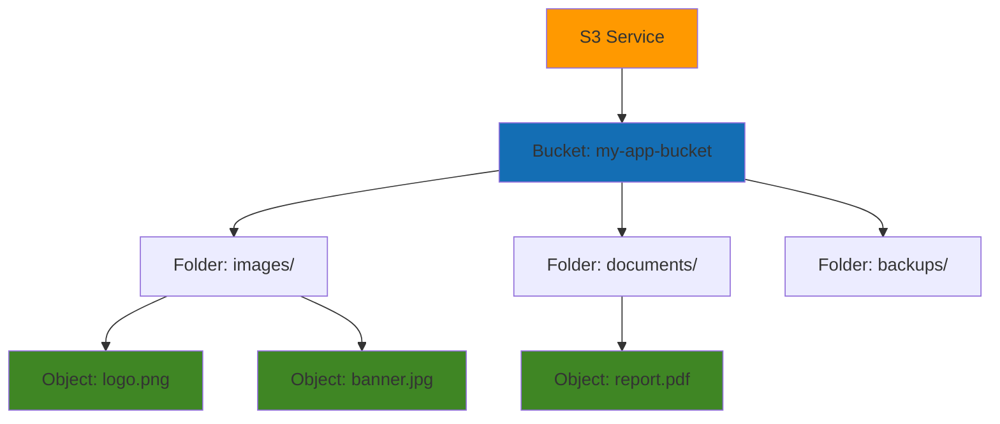

**버킷(Bucket)**
- S3의 최상위 저장 단위
- 전 세계적으로 고유한 이름 필요
- 리전 단위로 생성
- 무제한 객체 저장 가능

**객체(Object)**
- 실제 파일 데이터 + 메타데이터
- 메타데이터: 크기, 소유자, 파일 형식, 업로드 시간 등
- 객체당 최대 5TB 크기 지원

#### S3 URI 구조

```
s3://버킷명/[프리픽스(폴더)]/객체이름

예시:
s3://my-company-bucket/images/products/phone.jpg
s3://backup-bucket/database/2024/backup.sql
```

**URI 구성 요소**

| 요소 | 설명 | 예시 |
|:---:|:---|:---|
| **버킷명** | S3 버킷의 고유 이름 | `my-company-bucket` |
| **프리픽스** | 계층 구조를 모방하는 폴더 개념 (선택사항) | `images/products/` |
| **객체 키** | 프리픽스 + 객체 이름 | `images/products/phone.jpg` |

💡 **중요**: S3는 본질적으로 계층 구조가 아닌 **플랫(flat) 스토리지**입니다. 폴더는 사용자 편의를 위한 논리적 개념일 뿐입니다.

#### HTTPS URL 형식

```
https://버킷명.s3.리전코드.amazonaws.com/객체키

예시:
https://my-bucket.s3.ap-northeast-2.amazonaws.com/images/logo.png
```

⚠️ **주의**: HTTPS URL이 있다고 해서 무조건 접근 가능한 것은 아닙니다. 적절한 **접근 권한**이 설정되어 있어야 합니다.

### S3 사용 사례

#### 1. 정적 데이터 저장소

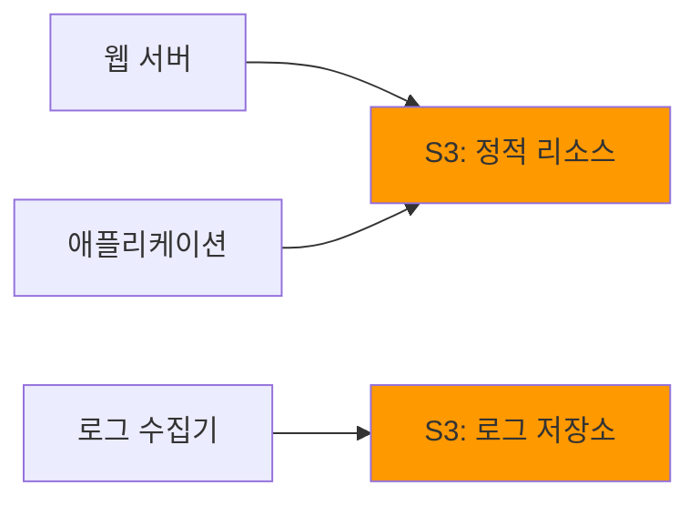

**활용 예시**
- **웹 정적 콘텐츠**: HTML, CSS, JavaScript, 이미지
- **로그 파일**: 애플리케이션 로그, 액세스 로그
- **백업 데이터**: 데이터베이스 백업, EBS 스냅샷

#### 2. 데이터 레이크 (Data Lake)

```bash
# 빅데이터 분석을 위한 대용량 원본 데이터 저장
$ aws s3 cp /local/bigdata/rawdata/ s3://data-lake-bucket/raw/ --recursive

# AWS Athena로 S3 데이터 쿼리
$ aws athena start-query-execution \
    --query-string "SELECT * FROM sales_data WHERE year=2024" \
    --result-configuration OutputLocation=s3://query-results/
```

**데이터 레이크 특징**
- 저렴한 비용으로 대용량 원본 데이터 보관
- 비정형 데이터 저장 (JSON, CSV, Parquet 등)
- Athena, EMR, Glue와 연동하여 분석

#### 3. 백업 저장소

```bash
# EBS 볼륨 스냅샷 생성 (자동으로 S3에 저장)
$ aws ec2 create-snapshot \
    --volume-id vol-1234567890abcdef0 \
    --description "Daily backup 2024-12-09"

# 출력
{
    "SnapshotId": "snap-0abcd1234efgh5678",
    "VolumeId": "vol-1234567890abcdef0",
    "State": "pending",
    "VolumeSize": 100,
    "StartTime": "2024-12-09T10:00:00.000Z"
}
```

📌 **핵심**: EBS 스냅샷은 자동으로 S3에 저장되며, 높은 내구성(99.999999999%)을 제공합니다.

#### 4. 다른 AWS 서비스와의 연동

| AWS 서비스 | S3 활용 방식 |
|:---:|:---|
| **CloudFront** | CDN의 원본(Origin) 데이터 저장소 |
| **Lambda** | 이벤트 트리거 소스 (파일 업로드 시 함수 실행) |
| **EMR** | 빅데이터 처리를 위한 데이터 소스 |
| **Redshift** | 데이터 웨어하우스로 데이터 로드 |
| **SageMaker** | ML 모델 학습 데이터 저장소 |
| **CloudTrail** | AWS API 호출 로그 저장 |

---

## S3 스토리지 클래스와 Intelligent Tiering

### 스토리지 클래스 계층 구조

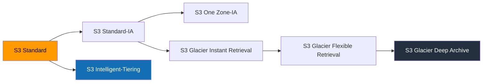

### 스토리지 클래스 비교

| 클래스 | 사용 사례 | 검색 시간 | 최소 저장 기간 | 가용성 | 비용 |
|:---:|:---|:---:|:---:|:---:|:---:|
| **Standard** | 자주 액세스하는 데이터 | 즉시 | 없음 | 99.99% | 높음 |
| **Standard-IA** | 가끔 액세스하는 데이터 | 즉시 | 30일 | 99.9% | 중간 |
| **One Zone-IA** | 재생성 가능한 데이터 | 즉시 | 30일 | 99.5% | 낮음 |
| **Intelligent-Tiering** | 액세스 패턴 불명확 | 즉시 | 없음 | 99.9% | 자동 |
| **Glacier Instant** | 장기 백업 (즉시 검색) | 밀리초 | 90일 | 99.9% | 낮음 |
| **Glacier Flexible** | 장기 백업 (분~시간) | 1~5분 | 90일 | 99.99% | 매우 낮음 |
| **Glacier Deep Archive** | 규제 데이터 (연 1회) | 12시간 | 180일 | 99.99% | 최저 |

### S3 Intelligent-Tiering 작동 방식

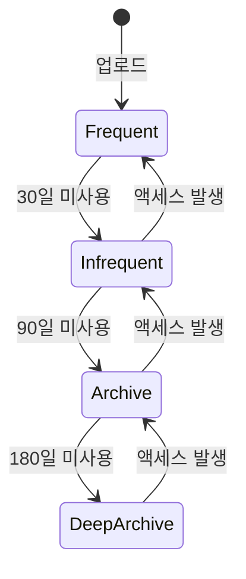

**Intelligent-Tiering 특징**
- **자동 티어 전환**: 액세스 패턴을 모니터링하여 자동으로 최적의 스토리지 클래스로 이동
- **검색 수수료 없음**: 티어 간 이동 시 추가 비용 없음
- **모니터링 비용**: 객체당 월 $0.0025의 모니터링 비용 발생

#### Intelligent-Tiering 활성화

```bash
# 버킷에 Intelligent-Tiering 구성 생성
$ aws s3api put-bucket-intelligent-tiering-configuration \
    --bucket my-bucket \
    --id intelligent-tiering-config \
    --intelligent-tiering-configuration '{
        "Id": "intelligent-tiering-config",
        "Status": "Enabled",
        "Tierings": [
            {
                "Days": 90,
                "AccessTier": "ARCHIVE_ACCESS"
            },
            {
                "Days": 180,
                "AccessTier": "DEEP_ARCHIVE_ACCESS"
            }
        ]
    }'
```

### Glacier 복원 프로세스

#### Glacier Flexible Retrieval 복원 옵션

```bash
# 신속 복원 (1~5분, 높은 비용)
$ aws s3api restore-object \
    --bucket glacier-bucket \
    --key archive/old-data.zip \
    --restore-request '{"Days":7,"GlacierJobParameters":{"Tier":"Expedited"}}'

# 표준 복원 (3~5시간, 중간 비용)
$ aws s3api restore-object \
    --bucket glacier-bucket \
    --key archive/old-data.zip \
    --restore-request '{"Days":7,"GlacierJobParameters":{"Tier":"Standard"}}'

# 대량 복원 (5~12시간, 최저 비용)
$ aws s3api restore-object \
    --bucket glacier-bucket \
    --key archive/old-data.zip \
    --restore-request '{"Days":7,"GlacierJobParameters":{"Tier":"Bulk"}}'
```

#### Deep Archive 복원

```bash
# Deep Archive 복원 (12~48시간)
$ aws s3api restore-object \
    --bucket deep-archive-bucket \
    --key compliance/2020/audit.zip \
    --restore-request '{"Days":14,"GlacierJobParameters":{"Tier":"Standard"}}'

# 복원 상태 확인
$ aws s3api head-object \
    --bucket deep-archive-bucket \
    --key compliance/2020/audit.zip

# 출력
{
    "Restore": "ongoing-request=\"true\"",
    "StorageClass": "DEEP_ARCHIVE"
}
```

⚠️ **비용 주의**: Glacier 클래스는 저장 비용은 저렴하지만, **검색 비용**과 **조기 삭제 수수료**가 발생할 수 있습니다.

---

## S3 보안 아키텍처

### S3 접근 제어 계층

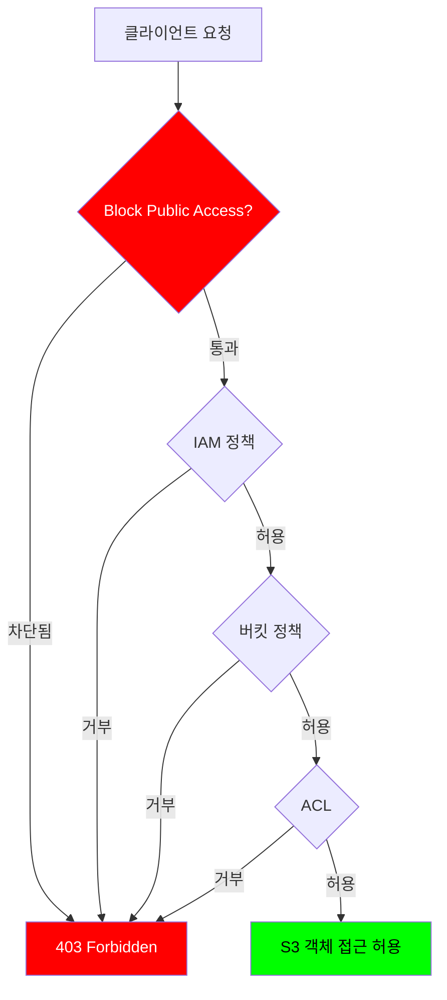

### 접근 제어 방법

#### 1. 사용자 기반 정책 (IAM 정책)

```json
{
  "Version": "2012-10-17",
  "Statement": [
    {
      "Effect": "Allow",
      "Action": [
        "s3:GetObject",
        "s3:PutObject"
      ],
      "Resource": "arn:aws:s3:::my-bucket/user-data/*"
    },
    {
      "Effect": "Deny",
      "Action": "s3:DeleteObject",
      "Resource": "arn:aws:s3:::my-bucket/*"
    }
  ]
}
```

**IAM 정책 활용**
- **사용자별 권한**: 특정 IAM 사용자나 역할에 권한 부여
- **세밀한 제어**: 특정 폴더나 객체에 대한 작업 제한
- **조건부 권한**: IP 주소, VPC, 시간 등 조건 기반 접근 제어

#### 2. 리소스 기반 정책 (버킷 정책)

```json
{
  "Version": "2012-10-17",
  "Statement": [
    {
      "Sid": "PublicReadGetObject",
      "Effect": "Allow",
      "Principal": "*",
      "Action": "s3:GetObject",
      "Resource": "arn:aws:s3:::my-public-bucket/*"
    },
    {
      "Sid": "DenyInsecureTransport",
      "Effect": "Deny",
      "Principal": "*",
      "Action": "s3:*",
      "Resource": [
        "arn:aws:s3:::my-public-bucket",
        "arn:aws:s3:::my-public-bucket/*"
      ],
      "Condition": {
        "Bool": {
          "aws:SecureTransport": "false"
        }
      }
    }
  ]
}
```

**버킷 정책 특징**
- **버킷 수준 제어**: 버킷 전체 또는 특정 경로에 대한 정책 설정
- **크로스 계정 접근**: 다른 AWS 계정에 권한 부여 가능
- **조건 활용**: IP 범위, Referer, User-Agent 등 다양한 조건 설정

#### 3. ACL (Access Control List)

```bash
# 객체에 대한 public read 권한 부여 (권장하지 않음)
$ aws s3api put-object-acl \
    --bucket my-bucket \
    --key public-file.txt \
    --acl public-read

# ACL 확인
$ aws s3api get-object-acl \
    --bucket my-bucket \
    --key public-file.txt

# 출력
{
    "Owner": {
        "ID": "abc123..."
    },
    "Grants": [
        {
            "Grantee": {
                "Type": "Group",
                "URI": "http://acs.amazonaws.com/groups/global/AllUsers"
            },
            "Permission": "READ"
        }
    ]
}
```

📌 **현대적 접근 방식**: ACL은 레거시 방식이며, **버킷 정책과 IAM 정책** 사용을 권장합니다. ACL은 기본적으로 비활성화되어 있습니다.

### Block Public Access 설정

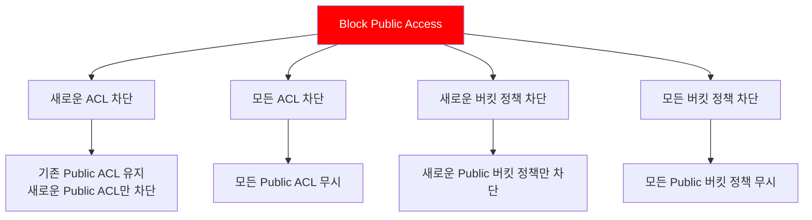

#### Block Public Access 활성화

```bash
# 버킷에 Public Access 차단 설정
$ aws s3api put-public-access-block \
    --bucket my-secure-bucket \
    --public-access-block-configuration \
        "BlockPublicAcls=true,IgnorePublicAcls=true,BlockPublicPolicy=true,RestrictPublicBuckets=true"

# 계정 수준에서 모든 버킷에 대해 Public Access 차단
$ aws s3control put-public-access-block \
    --account-id 123456789012 \
    --public-access-block-configuration \
        "BlockPublicAcls=true,IgnorePublicAcls=true,BlockPublicPolicy=true,RestrictPublicBuckets=true"
```

🔐 **보안 모범 사례**:
- Block Public Access는 **기본적으로 활성화**되어 있습니다
- 반드시 필요한 경우가 아니라면 **비활성화하지 마세요**
- 버킷 정책이나 ACL로 Public 권한을 부여해도, Block Public Access가 활성화되어 있으면 **우선적으로 차단**됩니다

---

## S3 암호화 메커니즘

### 암호화 아키텍처

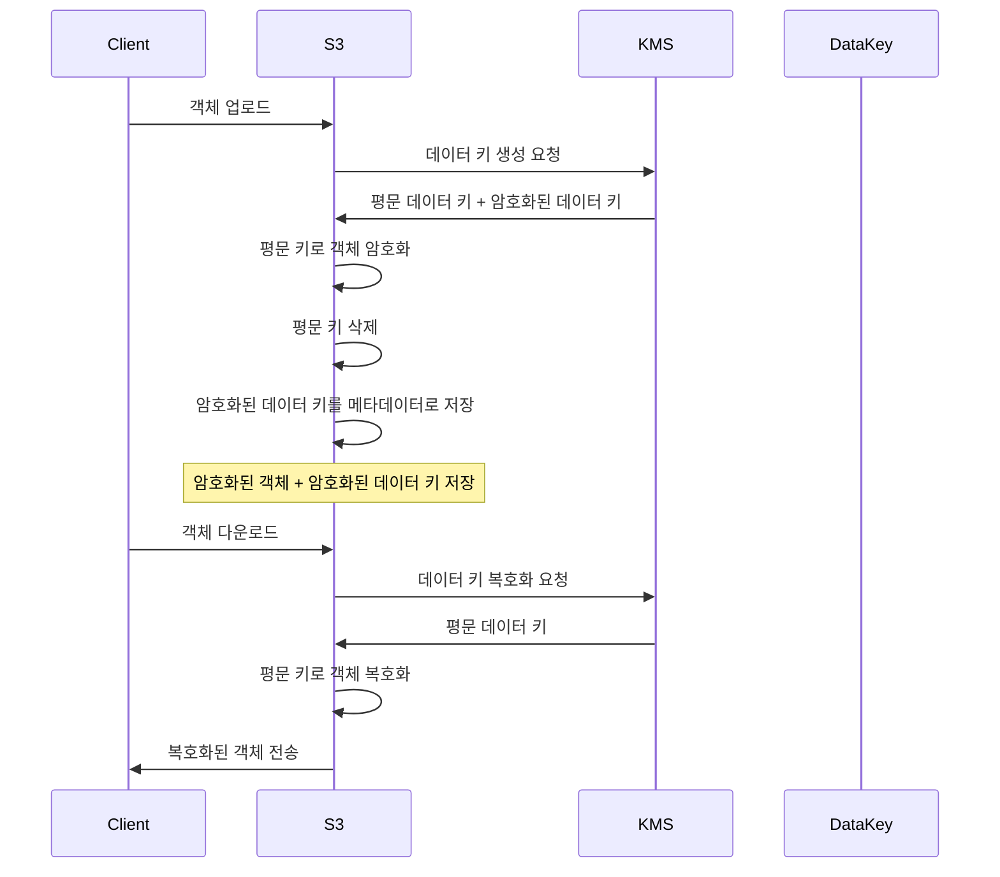

### 암호화 옵션 비교

| 암호화 방식 | 마스터 키 관리 | 키 정책 설정 | 키 교체 | 감사 추적 | 비용 |
|:---:|:---:|:---:|:---:|:---:|:---:|
| **SSE-S3** | AWS 관리 | 불가 | 자동 (3년) | 제한적 | 무료 |
| **SSE-KMS** | 고객 생성<br/>KMS 저장 | 가능 | 선택적 (1년) | CloudTrail | 유료 |
| **DSSE-KMS** | 고객 생성<br/>KMS 저장 | 가능 | 선택적 (1년) | CloudTrail | 유료 |
| **SSE-C** | 고객 관리<br/>외부 저장 | N/A | 수동 | 없음 | 무료 |

### 1. SSE-S3 (Server-Side Encryption with S3-Managed Keys)

```bash
# 버킷에 기본 암호화 설정 (SSE-S3)
$ aws s3api put-bucket-encryption \
    --bucket my-bucket \
    --server-side-encryption-configuration '{
        "Rules": [{
            "ApplyServerSideEncryptionByDefault": {
                "SSEAlgorithm": "AES256"
            },
            "BucketKeyEnabled": true
        }]
    }'

# 객체 업로드 시 SSE-S3 명시적 지정
$ aws s3 cp myfile.txt s3://my-bucket/ \
    --server-side-encryption AES256
```

**SSE-S3 특징**
- AWS가 생성하고 관리하는 마스터 키 사용
- AES-256 암호화 알고리즘
- 추가 비용 없음
- 키 정책 설정 불가

### 2. SSE-KMS (Server-Side Encryption with KMS)

```bash
# KMS 고객 관리형 키(CMK) 생성
$ aws kms create-key \
    --description "S3 encryption key" \
    --key-policy '{
        "Version": "2012-10-17",
        "Statement": [
            {
                "Sid": "Enable IAM User Permissions",
                "Effect": "Allow",
                "Principal": {
                    "AWS": "arn:aws:iam::123456789012:root"
                },
                "Action": "kms:*",
                "Resource": "*"
            },
            {
                "Sid": "Allow S3 to use the key",
                "Effect": "Allow",
                "Principal": {
                    "Service": "s3.amazonaws.com"
                },
                "Action": [
                    "kms:Decrypt",
                    "kms:GenerateDataKey"
                ],
                "Resource": "*"
            }
        ]
    }'

# 버킷에 SSE-KMS 기본 암호화 설정
$ aws s3api put-bucket-encryption \
    --bucket my-bucket \
    --server-side-encryption-configuration '{
        "Rules": [{
            "ApplyServerSideEncryptionByDefault": {
                "SSEAlgorithm": "aws:kms",
                "KMSMasterKeyID": "arn:aws:kms:ap-northeast-2:123456789012:key/12345678-1234-1234-1234-123456789012"
            },
            "BucketKeyEnabled": true
        }]
    }'

# 객체 업로드 시 특정 KMS 키 사용
$ aws s3 cp sensitive-data.txt s3://my-bucket/ \
    --server-side-encryption aws:kms \
    --ssekms-key-id arn:aws:kms:ap-northeast-2:123456789012:key/12345678-1234-1234-1234-123456789012
```

**SSE-KMS 장점**
- ✅ **세밀한 접근 제어**: 키 정책으로 암호화/복호화 권한 관리
- ✅ **키 교체**: 자동 또는 수동 키 교체 가능
- ✅ **감사 추적**: CloudTrail로 모든 키 사용 기록
- ✅ **다중 계정 지원**: 크로스 계정 암호화 가능

**SSE-KMS 비용**
```
- KMS 키 비용: $1/월 (고객 관리형 키)
- API 호출 비용:
  - 처음 20,000 요청/월: 무료
  - 이후: $0.03 per 10,000 requests
```

### 3. DSSE-KMS (Dual-Layer Server-Side Encryption)

```bash
# 이중 계층 암호화 설정
$ aws s3api put-bucket-encryption \
    --bucket highly-sensitive-bucket \
    --server-side-encryption-configuration '{
        "Rules": [{
            "ApplyServerSideEncryptionByDefault": {
                "SSEAlgorithm": "aws:kms:dsse",
                "KMSMasterKeyID": "arn:aws:kms:ap-northeast-2:123456789012:key/12345678-1234-1234-1234-123456789012"
            }
        }]
    }'
```

**DSSE-KMS 특징**
- **이중 암호화**: 두 개의 독립적인 암호화 계층 적용
- 규제 준수 요구사항이 높은 데이터에 사용
- 의료, 금융 등 고도의 보안이 필요한 분야

### 4. SSE-C (Server-Side Encryption with Customer-Provided Keys)

```bash
# 고객 제공 키로 객체 업로드
$ aws s3api put-object \
    --bucket my-bucket \
    --key encrypted-file.txt \
    --body file.txt \
    --sse-customer-algorithm AES256 \
    --sse-customer-key $(echo -n "my-secret-key-32-bytes-long!!" | base64) \
    --sse-customer-key-md5 $(echo -n "my-secret-key-32-bytes-long!!" | openssl dgst -md5 -binary | base64)

# 고객 제공 키로 객체 다운로드
$ aws s3api get-object \
    --bucket my-bucket \
    --key encrypted-file.txt \
    downloaded-file.txt \
    --sse-customer-algorithm AES256 \
    --sse-customer-key $(echo -n "my-secret-key-32-bytes-long!!" | base64) \
    --sse-customer-key-md5 $(echo -n "my-secret-key-32-bytes-long!!" | openssl dgst -md5 -binary | base64)
```

⚠️ **SSE-C 주의사항**
- AWS 관리 콘솔에서 지원하지 않음 (SDK/CLI만 가능)
- 키를 분실하면 데이터 복구 불가
- 모든 요청마다 키를 제공해야 함

### Bucket Key 최적화

```bash
# Bucket Key 활성화로 KMS 비용 절감
$ aws s3api put-bucket-encryption \
    --bucket my-bucket \
    --server-side-encryption-configuration '{
        "Rules": [{
            "ApplyServerSideEncryptionByDefault": {
                "SSEAlgorithm": "aws:kms",
                "KMSMasterKeyID": "arn:aws:kms:ap-northeast-2:123456789012:key/12345678-1234-1234-1234-123456789012"
            },
            "BucketKeyEnabled": true
        }]
    }'
```

💡 **Bucket Key 효과**:
- KMS API 호출 횟수를 **최대 99% 감소**
- 대량의 객체를 업로드하는 경우 비용 절감 효과 큼

---

## S3 접근 제어 정책

### 버킷 정책 실전 예제

#### 예제 1: VPC 엔드포인트를 통한 접근만 허용

```json
{
  "Version": "2012-10-17",
  "Statement": [
    {
      "Sid": "AllowVPCEndpointAccess",
      "Effect": "Deny",
      "Principal": "*",
      "Action": "s3:*",
      "Resource": [
        "arn:aws:s3:::my-private-bucket",
        "arn:aws:s3:::my-private-bucket/*"
      ],
      "Condition": {
        "StringNotEquals": {
          "aws:SourceVpce": "vpce-1234567890abcdef0"
        }
      }
    }
  ]
}
```

#### 예제 2: 특정 IP 범위에서만 접근 허용

```json
{
  "Version": "2012-10-17",
  "Statement": [
    {
      "Sid": "AllowSpecificIP",
      "Effect": "Allow",
      "Principal": "*",
      "Action": "s3:GetObject",
      "Resource": "arn:aws:s3:::my-bucket/*",
      "Condition": {
        "IpAddress": {
          "aws:SourceIp": [
            "192.0.2.0/24",
            "203.0.113.0/24"
          ]
        }
      }
    }
  ]
}
```

#### 예제 3: HTTPS만 허용 (HTTP 차단)

```json
{
  "Version": "2012-10-17",
  "Statement": [
    {
      "Sid": "DenyInsecureTransport",
      "Effect": "Deny",
      "Principal": "*",
      "Action": "s3:*",
      "Resource": [
        "arn:aws:s3:::my-secure-bucket",
        "arn:aws:s3:::my-secure-bucket/*"
      ],
      "Condition": {
        "Bool": {
          "aws:SecureTransport": "false"
        }
      }
    }
  ]
}
```

#### 예제 4: 특정 IAM 역할에만 접근 허용

```json
{
  "Version": "2012-10-17",
  "Statement": [
    {
      "Sid": "AllowSpecificRole",
      "Effect": "Allow",
      "Principal": {
        "AWS": "arn:aws:iam::123456789012:role/EC2-S3-Access-Role"
      },
      "Action": [
        "s3:GetObject",
        "s3:PutObject"
      ],
      "Resource": "arn:aws:s3:::my-bucket/*"
    }
  ]
}
```

---

## S3 데이터 보호 및 가용성

### 객체 잠금 (Object Lock)

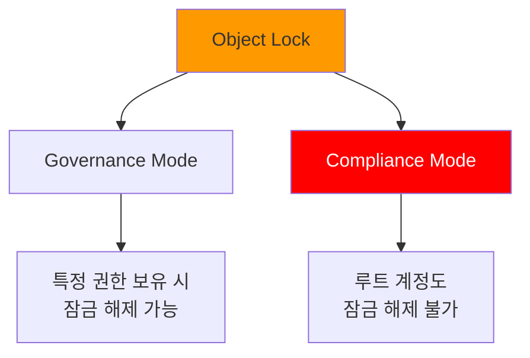

#### Governance Mode 설정

```bash
# 버킷 생성 시 Object Lock 활성화
$ aws s3api create-bucket \
    --bucket my-locked-bucket \
    --region ap-northeast-2 \
    --create-bucket-configuration LocationConstraint=ap-northeast-2 \
    --object-lock-enabled-for-bucket

# Governance Mode로 30일간 보호
$ aws s3api put-object-retention \
    --bucket my-locked-bucket \
    --key important-document.pdf \
    --retention '{
        "Mode": "GOVERNANCE",
        "RetainUntilDate": "2025-01-09T00:00:00Z"
    }'

# 특별 권한으로 잠금 해제 (s3:BypassGovernanceRetention 권한 필요)
$ aws s3api put-object-retention \
    --bucket my-locked-bucket \
    --key important-document.pdf \
    --retention '{}' \
    --bypass-governance-retention
```

#### Compliance Mode 설정

```bash
# Compliance Mode로 영구 보호
$ aws s3api put-object-retention \
    --bucket my-locked-bucket \
    --key audit-log-2024.txt \
    --retention '{
        "Mode": "COMPLIANCE",
        "RetainUntilDate": "2034-12-09T00:00:00Z"
    }'
```

🔒 **Compliance Mode 특징**:
- 설정된 기간 동안 **절대 삭제 불가**
- 루트 계정, AWS Support도 삭제할 수 없음
- 규제 준수 (FINRA, HIPAA 등)에 적합

#### Legal Hold 설정

```bash
# Legal Hold 활성화 (기간 제한 없음)
$ aws s3api put-object-legal-hold \
    --bucket my-locked-bucket \
    --key evidence.zip \
    --legal-hold Status=ON

# Legal Hold 해제
$ aws s3api put-object-legal-hold \
    --bucket my-locked-bucket \
    --key evidence.zip \
    --legal-hold Status=OFF
```

### 버전 관리 (Versioning)

```bash
# 버킷에 버전 관리 활성화
$ aws s3api put-bucket-versioning \
    --bucket my-versioned-bucket \
    --versioning-configuration Status=Enabled

# 동일한 이름으로 파일 여러 번 업로드
$ echo "Version 1" > file.txt
$ aws s3 cp file.txt s3://my-versioned-bucket/

$ echo "Version 2" > file.txt
$ aws s3 cp file.txt s3://my-versioned-bucket/

$ echo "Version 3" > file.txt
$ aws s3 cp file.txt s3://my-versioned-bucket/

# 모든 버전 확인
$ aws s3api list-object-versions \
    --bucket my-versioned-bucket \
    --prefix file.txt

# 출력 (요약)
{
    "Versions": [
        {
            "Key": "file.txt",
            "VersionId": "abc123...",
            "IsLatest": true,
            "LastModified": "2024-12-09T12:00:00.000Z"
        },
        {
            "Key": "file.txt",
            "VersionId": "def456...",
            "IsLatest": false,
            "LastModified": "2024-12-09T11:00:00.000Z"
        },
        {
            "Key": "file.txt",
            "VersionId": "ghi789...",
            "IsLatest": false,
            "LastModified": "2024-12-09T10:00:00.000Z"
        }
    ]
}

# 특정 버전 다운로드
$ aws s3api get-object \
    --bucket my-versioned-bucket \
    --key file.txt \
    --version-id def456... \
    file-v2.txt
```

**버전 관리 이점**
- ✅ 실수로 인한 삭제/덮어쓰기 방지
- ✅ 이전 버전으로 롤백 가능
- ✅ 규제 준수 (데이터 보존 요구사항)

⚠️ **비용 주의**: 모든 버전이 저장되므로 스토리지 비용 증가

### 객체 복제 (Replication)

#### 동일 리전 복제 (SRR)

```bash
# 복제 IAM 역할 생성 (신뢰 정책)
$ cat > trust-policy.json <<EOF
{
  "Version": "2012-10-17",
  "Statement": [
    {
      "Effect": "Allow",
      "Principal": {
        "Service": "s3.amazonaws.com"
      },
      "Action": "sts:AssumeRole"
    }
  ]
}
EOF

$ aws iam create-role \
    --role-name S3-Replication-Role \
    --assume-role-policy-document file://trust-policy.json

# 복제 권한 정책 연결
$ cat > replication-policy.json <<EOF
{
  "Version": "2012-10-17",
  "Statement": [
    {
      "Effect": "Allow",
      "Action": [
        "s3:GetReplicationConfiguration",
        "s3:ListBucket"
      ],
      "Resource": "arn:aws:s3:::source-bucket"
    },
    {
      "Effect": "Allow",
      "Action": [
        "s3:GetObjectVersionForReplication",
        "s3:GetObjectVersionAcl"
      ],
      "Resource": "arn:aws:s3:::source-bucket/*"
    },
    {
      "Effect": "Allow",
      "Action": [
        "s3:ReplicateObject",
        "s3:ReplicateDelete"
      ],
      "Resource": "arn:aws:s3:::destination-bucket/*"
    }
  ]
}
EOF

$ aws iam put-role-policy \
    --role-name S3-Replication-Role \
    --policy-name S3-Replication-Policy \
    --policy-document file://replication-policy.json

# 복제 구성 설정
$ aws s3api put-bucket-replication \
    --bucket source-bucket \
    --replication-configuration '{
        "Role": "arn:aws:iam::123456789012:role/S3-Replication-Role",
        "Rules": [
            {
                "Status": "Enabled",
                "Priority": 1,
                "Filter": {
                    "Prefix": "data/"
                },
                "Destination": {
                    "Bucket": "arn:aws:s3:::destination-bucket",
                    "ReplicationTime": {
                        "Status": "Enabled",
                        "Time": {
                            "Minutes": 15
                        }
                    },
                    "Metrics": {
                        "Status": "Enabled"
                    }
                },
                "DeleteMarkerReplication": {
                    "Status": "Enabled"
                }
            }
        ]
    }'
```

#### 교차 리전 복제 (CRR)

```bash
# 다른 리전의 버킷으로 복제
$ aws s3api put-bucket-replication \
    --bucket source-bucket-seoul \
    --replication-configuration '{
        "Role": "arn:aws:iam::123456789012:role/S3-Replication-Role",
        "Rules": [
            {
                "Status": "Enabled",
                "Priority": 1,
                "Filter": {},
                "Destination": {
                    "Bucket": "arn:aws:s3:::backup-bucket-virginia",
                    "StorageClass": "GLACIER"
                }
            }
        ]
    }'
```

**복제 특징**
- **비동기식 복제**: 실시간이 아닌 비동기 방식
- **필터 적용**: 특정 프리픽스나 태그만 복제 가능
- **스토리지 클래스 변경**: 대상 버킷에서 다른 스토리지 클래스 지정 가능
- **삭제 마커 복제**: 선택적으로 삭제 작업도 복제 가능

### 수명 주기 관리 (Lifecycle)

```bash
# 수명 주기 정책 생성
$ cat > lifecycle-policy.json <<EOF
{
  "Rules": [
    {
      "Id": "MoveOldObjectsToIA",
      "Status": "Enabled",
      "Filter": {
        "Prefix": "logs/"
      },
      "Transitions": [
        {
          "Days": 30,
          "StorageClass": "STANDARD_IA"
        },
        {
          "Days": 90,
          "StorageClass": "GLACIER"
        },
        {
          "Days": 365,
          "StorageClass": "DEEP_ARCHIVE"
        }
      ],
      "Expiration": {
        "Days": 2555
      }
    },
    {
      "Id": "DeleteOldVersions",
      "Status": "Enabled",
      "Filter": {},
      "NoncurrentVersionTransitions": [
        {
          "NoncurrentDays": 30,
          "StorageClass": "GLACIER"
        }
      ],
      "NoncurrentVersionExpiration": {
        "NoncurrentDays": 90
      }
    },
    {
      "Id": "CleanupIncompleteUploads",
      "Status": "Enabled",
      "Filter": {},
      "AbortIncompleteMultipartUpload": {
        "DaysAfterInitiation": 7
      }
    }
  ]
}
EOF

$ aws s3api put-bucket-lifecycle-configuration \
    --bucket my-bucket \
    --lifecycle-configuration file://lifecycle-policy.json
```

**수명 주기 정책 활용 시나리오**

| 시나리오 | 정책 설정 |
|:---|:---|
| 로그 파일 관리 | 30일 후 IA, 90일 후 Glacier, 365일 후 삭제 |
| 백업 데이터 | 즉시 Glacier, 7년 후 Deep Archive |
| 임시 데이터 | 7일 후 자동 삭제 |
| 멀티파트 업로드 정리 | 7일 이내 미완료 업로드 삭제 |

---

## VPC Gateway Endpoint 실습

### 실습 아키텍처

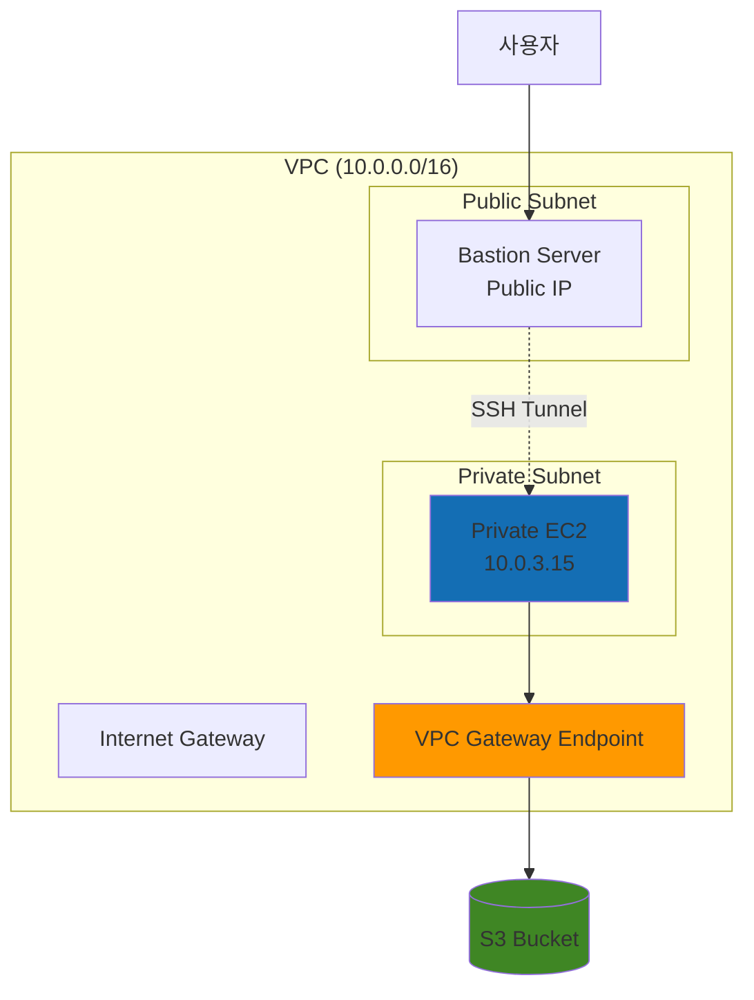

### 실습 준비

#### 1. NAT Gateway 제거 (선택사항)

```bash
# NAT Gateway 확인
$ aws ec2 describe-nat-gateways \
    --filter "Name=state,Values=available" \
    --query 'NatGateways[*].[NatGatewayId,SubnetId,State]' \
    --output table

# Private Route Table에서 NAT Gateway 경로 제거
$ aws ec2 delete-route \
    --route-table-id rtb-private123456 \
    --destination-cidr-block 0.0.0.0/0

# (선택) NAT Gateway 삭제
$ aws ec2 delete-nat-gateway \
    --nat-gateway-id nat-0abc123def456
```

#### 2. VPC Gateway Endpoint 생성

```bash
# VPC Gateway Endpoint 생성
$ aws ec2 create-vpc-endpoint \
    --vpc-id vpc-0abc123def456 \
    --service-name com.amazonaws.ap-northeast-2.s3 \
    --route-table-ids rtb-private123456 \
    --policy-document '{
        "Version": "2012-10-17",
        "Statement": [
            {
                "Effect": "Allow",
                "Principal": "*",
                "Action": "s3:*",
                "Resource": "*"
            }
        ]
    }'

# 출력
{
    "VpcEndpoint": {
        "VpcEndpointId": "vpce-0abc123def456",
        "VpcEndpointType": "Gateway",
        "VpcId": "vpc-0abc123def456",
        "ServiceName": "com.amazonaws.ap-northeast-2.s3",
        "State": "available",
        "RouteTableIds": [
            "rtb-private123456"
        ],
        "CreationTimestamp": "2024-12-09T10:00:00.000Z"
    }
}
```

#### 3. Route Table 확인

```bash
# Route Table의 경로 확인
$ aws ec2 describe-route-tables \
    --route-table-ids rtb-private123456 \
    --query 'RouteTables[0].Routes' \
    --output table

# 출력
|----------------------------|
|         Routes             |
+--------------+-------------+
| DestinationCidrBlock | GatewayId |
+--------------+-------------+
| 10.0.0.0/16  | local       |
| pl-78a54011  | vpce-0abc... |  # S3 Prefix List
+--------------+-------------+
```

💡 **자동 경로 추가**: Gateway Endpoint를 생성하면 지정한 Route Table에 S3로 가는 경로가 **자동으로 추가**됩니다.

#### 4. EC2 Instance Profile 생성

```bash
# S3 Full Access 정책을 가진 역할 생성
$ aws iam create-role \
    --role-name EC2-S3-VPCEndpoint-Role \
    --assume-role-policy-document '{
        "Version": "2012-10-17",
        "Statement": [{
            "Effect": "Allow",
            "Principal": {"Service": "ec2.amazonaws.com"},
            "Action": "sts:AssumeRole"
        }]
    }'

$ aws iam attach-role-policy \
    --role-name EC2-S3-VPCEndpoint-Role \
    --policy-arn arn:aws:iam::aws:policy/AmazonS3FullAccess

# Instance Profile 생성 및 역할 연결
$ aws iam create-instance-profile \
    --instance-profile-name EC2-S3-VPCEndpoint-Profile

$ aws iam add-role-to-instance-profile \
    --instance-profile-name EC2-S3-VPCEndpoint-Profile \
    --role-name EC2-S3-VPCEndpoint-Role
```

#### 5. Private Subnet에 EC2 생성

```bash
# User Data 스크립트 준비
$ cat > user-data.sh <<'EOF'
#!/bin/bash
# 임시 파일 생성
echo "VPC Endpoint Test File - $(date)" > /tmp/s3-test.txt

# 고유한 버킷 이름 생성 (계정 ID + 타임스탬프)
BUCKET_NAME="vpc-endpoint-test-$(date +%s)"

# S3 버킷 생성
aws s3 mb s3://$BUCKET_NAME

# 파일 업로드
aws s3 cp /tmp/s3-test.txt s3://$BUCKET_NAME/

# 로그 출력
echo "Bucket created: $BUCKET_NAME" > /var/log/s3-test.log
aws s3 ls s3://$BUCKET_NAME/ >> /var/log/s3-test.log
EOF

# EC2 인스턴스 생성
$ aws ec2 run-instances \
    --image-id ami-0c9c942bd7bf113a2 \
    --instance-type t3.micro \
    --key-name my-keypair \
    --subnet-id subnet-private1 \
    --security-group-ids sg-private-ssh \
    --iam-instance-profile Name=EC2-S3-VPCEndpoint-Profile \
    --user-data file://user-data.sh \
    --tag-specifications 'ResourceType=instance,Tags=[{Key=Name,Value=Private-EC2-VPCEndpoint-Test}]'
```

#### 6. 결과 확인

```bash
# S3 콘솔 또는 CLI로 버킷 생성 확인
$ aws s3 ls | grep vpc-endpoint-test

# 출력 예시
2024-12-09 10:05:23 vpc-endpoint-test-1702108523

# 버킷 내용 확인
$ aws s3 ls s3://vpc-endpoint-test-1702108523/

# 출력
2024-12-09 10:05:30         42 s3-test.txt

# 파일 다운로드 및 내용 확인
$ aws s3 cp s3://vpc-endpoint-test-1702108523/s3-test.txt -
VPC Endpoint Test File - Mon Dec  9 10:05:23 UTC 2024
```

✅ **성공 확인**: NAT Gateway 없이도 Private Subnet의 EC2가 VPC Endpoint를 통해 S3에 접근하여 버킷 생성 및 파일 업로드에 성공했습니다!

### VPC Endpoint 트래픽 흐름

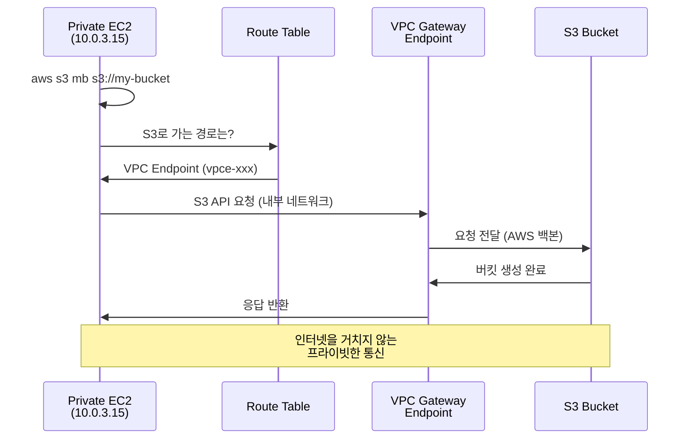

---

## Bastion Server 구성 실습

### Bastion Server 아키텍처

```mermaid
graph LR
    User[사용자<br/>로컬 PC] -->|SSH| Bastion[Bastion Server<br/>Public Subnet<br/>Public IP: 3.35.123.45]
    Bastion -->|SSH| Private[Private EC2<br/>Private Subnet<br/>Private IP: 10.0.3.15]

    style Bastion fill:#FF9900
    style Private fill:#146EB4
```

### SSH 터널링을 통한 접근

#### 1. Bastion Server 생성

```bash
# Security Group 생성 (SSH만 허용)
$ aws ec2 create-security-group \
    --group-name bastion-sg \
    --description "Bastion server security group" \
    --vpc-id vpc-0abc123def456

$ aws ec2 authorize-security-group-ingress \
    --group-id sg-bastion123 \
    --protocol tcp \
    --port 22 \
    --cidr 0.0.0.0/0  # 또는 My IP로 제한 권장

# Bastion Server 생성 (Public Subnet에)
$ aws ec2 run-instances \
    --image-id ami-0c9c942bd7bf113a2 \
    --instance-type t3.micro \
    --key-name my-keypair \
    --subnet-id subnet-public1 \
    --security-group-ids sg-bastion123 \
    --associate-public-ip-address \
    --tag-specifications 'ResourceType=instance,Tags=[{Key=Name,Value=Bastion-Server}]'
```

#### 2. Private EC2의 Security Group 설정

```bash
# Private EC2 Security Group에 VPC CIDR에서 SSH 허용
$ aws ec2 authorize-security-group-ingress \
    --group-id sg-private123 \
    --protocol tcp \
    --port 22 \
    --cidr 10.0.0.0/16  # VPC CIDR
```

#### 3. PuTTY SSH 터널 구성 (Windows)

**Step 1: Bastion 터널 세션 설정**

```
PuTTY Configuration:

Session:
  Host Name: ec2-user@3.35.123.45  (Bastion Public IP)
  Port: 22

Connection > SSH > Auth > Credentials:
  Private key file: my-keypair.ppk

Connection > SSH > Tunnels:
  Source port: 5001
  Destination: 10.0.3.15:22  (Private EC2 IP)
  [Add] 클릭

Saved Sessions: bastion-tunnel
[Save] 클릭
```

**Step 2: Private EC2 접속 세션 설정**

```
PuTTY Configuration:

Session:
  Host Name: ec2-user@localhost
  Port: 5001

Connection > SSH > Auth > Credentials:
  Private key file: my-keypair.ppk

Saved Sessions: private-ec2-via-bastion
[Save] 클릭
```

#### 4. 연결 순서

```bash
1. "bastion-tunnel" 세션 실행 → Bastion 서버 터미널 열림
2. "private-ec2-via-bastion" 세션 실행 → Private EC2 터미널 열림

# Private EC2에서 확인
[ec2-user@ip-10-0-3-15 ~]$ hostname -I
10.0.3.15

# S3 접근 테스트
[ec2-user@ip-10-0-3-15 ~]$ aws s3 ls
2024-12-09 10:05:23 vpc-endpoint-test-1702108523
```

### SSH ProxyJump 방식 (Linux/Mac)

```bash
# ~/.ssh/config 설정
$ cat >> ~/.ssh/config <<EOF
Host bastion
    HostName 3.35.123.45
    User ec2-user
    IdentityFile ~/.ssh/my-keypair.pem

Host private-ec2
    HostName 10.0.3.15
    User ec2-user
    IdentityFile ~/.ssh/my-keypair.pem
    ProxyJump bastion
EOF

$ chmod 600 ~/.ssh/config

# Private EC2 직접 접속 (Bastion을 자동으로 경유)
$ ssh private-ec2
```

---

## S3 정적 웹사이트 호스팅

### 정적 웹사이트 구성

#### 1. 버킷 생성 및 설정

```bash
# 버킷 생성
$ aws s3 mb s3://my-static-website-unique-name

# 정적 웹사이트 호스팅 활성화
$ aws s3 website s3://my-static-website-unique-name \
    --index-document index.html \
    --error-document error.html
```

#### 2. 샘플 HTML 파일 생성

```html
<!-- index.html -->
<!DOCTYPE html>
<html lang="ko">
<head>
    <meta charset="UTF-8">
    <meta name="viewport" content="width=device-width, initial-scale=1.0">
    <title>S3 정적 웹사이트 테스트</title>
    <style>
        body {
            font-family: Arial, sans-serif;
            max-width: 800px;
            margin: 50px auto;
            padding: 20px;
            background: linear-gradient(135deg, #667eea 0%, #764ba2 100%);
            color: white;
        }
        .container {
            background: rgba(255, 255, 255, 0.1);
            padding: 30px;
            border-radius: 10px;
            backdrop-filter: blur(10px);
        }
        h1 {
            text-align: center;
            font-size: 2.5em;
            margin-bottom: 20px;
        }
        p {
            font-size: 1.2em;
            line-height: 1.6;
        }
        .info {
            background: rgba(255, 255, 255, 0.2);
            padding: 15px;
            border-radius: 5px;
            margin-top: 20px;
        }
    </style>
</head>
<body>
    <div class="container">
        <h1>🚀 S3 정적 웹사이트 호스팅</h1>
        <p>AWS S3를 이용한 정적 웹사이트 호스팅 테스트 페이지입니다.</p>
        <div class="info">
            <strong>특징:</strong>
            <ul>
                <li>저렴한 비용으로 웹사이트 호스팅</li>
                <li>높은 가용성 (99.99%)</li>
                <li>CloudFront와 연동하여 글로벌 배포 가능</li>
                <li>HTTPS 지원 (CloudFront 사용 시)</li>
            </ul>
        </div>
    </div>
</body>
</html>
```

```html
<!-- error.html -->
<!DOCTYPE html>
<html lang="ko">
<head>
    <meta charset="UTF-8">
    <title>404 - 페이지를 찾을 수 없습니다</title>
    <style>
        body {
            font-family: Arial, sans-serif;
            text-align: center;
            padding: 50px;
            background: #f0f0f0;
        }
        h1 {
            font-size: 4em;
            color: #e74c3c;
        }
    </style>
</head>
<body>
    <h1>404</h1>
    <p>요청하신 페이지를 찾을 수 없습니다.</p>
    <a href="/">홈으로 돌아가기</a>
</body>
</html>
```

#### 3. 파일 업로드

```bash
# HTML 파일 업로드
$ aws s3 cp index.html s3://my-static-website-unique-name/
$ aws s3 cp error.html s3://my-static-website-unique-name/
```

#### 4. Public Access 차단 해제

```bash
# Block Public Access 비활성화 (주의: 보안 위험)
$ aws s3api put-public-access-block \
    --bucket my-static-website-unique-name \
    --public-access-block-configuration \
        "BlockPublicAcls=false,IgnorePublicAcls=false,BlockPublicPolicy=false,RestrictPublicBuckets=false"
```

#### 5. 버킷 정책 설정 (Public Read 허용)

```bash
# 버킷 ARN 확인
$ aws s3api list-buckets --query "Buckets[?Name=='my-static-website-unique-name'].Name" --output text

# 버킷 정책 생성
$ cat > bucket-policy.json <<EOF
{
  "Version": "2012-10-17",
  "Statement": [
    {
      "Sid": "PublicReadGetObject",
      "Effect": "Allow",
      "Principal": "*",
      "Action": "s3:GetObject",
      "Resource": "arn:aws:s3:::my-static-website-unique-name/*"
    }
  ]
}
EOF

# 버킷 정책 적용
$ aws s3api put-bucket-policy \
    --bucket my-static-website-unique-name \
    --policy file://bucket-policy.json
```

#### 6. 웹사이트 접속

```bash
# 웹사이트 엔드포인트 확인
$ aws s3api get-bucket-website \
    --bucket my-static-website-unique-name

# 웹사이트 URL 형식
http://my-static-website-unique-name.s3-website.ap-northeast-2.amazonaws.com
```

🌐 **브라우저로 접속**: 위 URL을 브라우저에 입력하면 정적 웹사이트가 표시됩니다.

#### 7. 보안: 실습 후 Public Access 다시 차단

```bash
# Block Public Access 재활성화
$ aws s3api put-public-access-block \
    --bucket my-static-website-unique-name \
    --public-access-block-configuration \
        "BlockPublicAcls=true,IgnorePublicAcls=true,BlockPublicPolicy=true,RestrictPublicBuckets=true"
```

🔐 **보안 권고사항**:
- Public 웹사이트가 아니라면 반드시 Block Public Access를 재활성화하세요
- 프로덕션 환경에서는 **CloudFront + S3 OAC**를 사용하여 S3 직접 접근 차단
- Route 53으로 커스텀 도메인 연결
- CloudFront로 HTTPS 적용

---

## 종합 정리 및 체크리스트

### S3 보안 체크리스트

| 항목 | 권장 설정 | 확인 |
|:---|:---|:---:|
| **Block Public Access** | 모든 옵션 활성화 | ☐ |
| **버킷 암호화** | SSE-KMS 또는 SSE-S3 기본 암호화 | ☐ |
| **버전 관리** | 중요 데이터는 버전 관리 활성화 | ☐ |
| **MFA Delete** | 프로덕션 버킷은 MFA Delete 활성화 | ☐ |
| **버킷 정책** | 최소 권한 원칙 적용 | ☐ |
| **HTTPS 강제** | aws:SecureTransport 조건 추가 | ☐ |
| **액세스 로깅** | S3 액세스 로그 활성화 | ☐ |
| **Object Lock** | 규제 데이터는 Compliance Mode | ☐ |
| **수명 주기 정책** | 불필요한 데이터 자동 삭제 | ☐ |
| **교차 리전 복제** | 재해 복구를 위한 CRR 설정 | ☐ |

### 핵심 개념 요약

#### S3 스토리지 클래스 선택 가이드

```mermaid
graph TD
    A[데이터 분류] --> B{액세스 빈도?}
    B -->|자주| C[S3 Standard]
    B -->|가끔| D{비용 vs 가용성?}
    B -->|거의 없음| E{검색 시간?}

    D -->|가용성 우선| F[Standard-IA]
    D -->|비용 우선| G[One Zone-IA]
    D -->|불명확| H[Intelligent-Tiering]

    E -->|즉시| I[Glacier Instant]
    E -->|분~시간| J[Glacier Flexible]
    E -->|12시간+| K[Deep Archive]

    style C fill:#FF9900
    style K fill:#232F3E,color:#FFF
```

#### 암호화 방식 선택

| 요구사항 | 권장 방식 |
|:---|:---:|
| 간단한 암호화, 비용 최소화 | SSE-S3 |
| 세밀한 권한 제어, 감사 추적 필요 | SSE-KMS |
| 규제 준수 (이중 암호화) | DSSE-KMS |
| 자체 키 관리 시스템 사용 | SSE-C |

#### VPC Endpoint 사용 시나리오

✅ **VPC Endpoint 사용 권장**
- Private Subnet에서 S3 접근 필요
- NAT Gateway 비용 절감
- 보안 강화 (인터넷 미경유)
- 대량 데이터 전송 시 안정성

❌ **VPC Endpoint 불필요**
- Public Subnet의 EC2
- 일시적인 소량 데이터 전송
- 다른 AWS 서비스가 S3 자동 접근 (Lambda 등)

### 실습 결과 확인

```bash
# 1. VPC Endpoint가 제대로 작동하는지 확인
$ aws ec2 describe-vpc-endpoints \
    --filters "Name=service-name,Values=com.amazonaws.ap-northeast-2.s3" \
    --query 'VpcEndpoints[*].[VpcEndpointId,State,ServiceName]' \
    --output table

# 2. Route Table에 S3 경로가 추가되었는지 확인
$ aws ec2 describe-route-tables \
    --route-table-ids rtb-private123456 \
    --query 'RouteTables[0].Routes[?GatewayId!=`local`]'

# 3. Private EC2에서 S3 접근 테스트
$ ssh private-ec2
[ec2-user@ip-10-0-3-15 ~]$ aws s3 ls
[ec2-user@ip-10-0-3-15 ~]$ aws s3 cp testfile.txt s3://my-bucket/

# 4. Bastion 서버를 통한 SSH 접속 테스트
$ ssh private-ec2  # ProxyJump 설정 시
```

### 비용 최적화 팁

#### S3 비용 구조

```
총 비용 = 저장 비용 + 요청 비용 + 데이터 전송 비용 + 부가 기능 비용
```

**비용 절감 전략**

1. **스토리지 클래스 최적화**
   ```bash
   # Intelligent-Tiering으로 자동 최적화
   $ aws s3api put-bucket-intelligent-tiering-configuration ...
   ```

2. **수명 주기 정책 활용**
   ```bash
   # 오래된 버전 자동 삭제
   $ aws s3api put-bucket-lifecycle-configuration ...
   ```

3. **VPC Endpoint 사용**
   ```
   NAT Gateway: $0.045/시간 + 데이터 처리 비용
   VPC Endpoint: 무료 (Gateway 타입)
   ```

4. **S3 Bucket Key 활성화**
   ```
   KMS API 호출 99% 감소 → 비용 대폭 절감
   ```

5. **S3 Transfer Acceleration 선택적 사용**
   ```
   장거리 전송만 사용, 가까운 리전은 일반 전송
   ```

### 트러블슈팅

#### 문제 1: 403 Forbidden 오류

**증상**: S3 객체 접근 시 403 Forbidden

**해결 순서**:
1. Block Public Access 설정 확인
2. 버킷 정책 확인
3. IAM 정책 확인
4. VPC Endpoint 정책 확인

```bash
# 디버깅 명령어
$ aws s3api get-public-access-block --bucket my-bucket
$ aws s3api get-bucket-policy --bucket my-bucket
$ aws iam get-user-policy --user-name my-user --policy-name S3Access
```

#### 문제 2: VPC Endpoint를 통한 S3 접근 실패

**증상**: Private EC2에서 S3 접근 불가

**해결 순서**:
1. VPC Endpoint 상태 확인 (`State: available`)
2. Route Table에 경로 추가 확인
3. Security Group 확인 (아웃바운드 443 포트)
4. IAM 역할 확인 (Instance Profile)

```bash
# VPC Endpoint 상태 확인
$ aws ec2 describe-vpc-endpoints --vpc-endpoint-ids vpce-xxx

# Route 확인
$ aws ec2 describe-route-tables --route-table-ids rtb-xxx

# EC2 Instance Profile 확인
$ aws ec2 describe-instances --instance-ids i-xxx \
    --query 'Reservations[0].Instances[0].IamInstanceProfile'
```

#### 문제 3: Bastion을 통한 SSH 연결 실패

**증상**: PuTTY 또는 SSH로 Private EC2 접속 불가

**해결 순서**:
1. Bastion 서버 Security Group: SSH(22) 인바운드 허용 확인
2. Private EC2 Security Group: VPC CIDR에서 SSH 인바운드 허용 확인
3. SSH 키 파일 권한 확인 (`chmod 400 key.pem`)
4. Private EC2의 Private IP 확인

```bash
# Security Group 규칙 확인
$ aws ec2 describe-security-groups --group-ids sg-xxx \
    --query 'SecurityGroups[0].IpPermissions'

# 인스턴스 Private IP 확인
$ aws ec2 describe-instances --instance-ids i-xxx \
    --query 'Reservations[0].Instances[0].PrivateIpAddress'
```

---

## 학습 체크리스트

### 이론

- [ ] S3 버킷과 객체의 개념 이해
- [ ] 스토리지 클래스의 차이점과 선택 기준
- [ ] Intelligent-Tiering 작동 방식
- [ ] Block Public Access의 중요성
- [ ] 암호화 옵션 (SSE-S3, SSE-KMS, DSSE-KMS, SSE-C) 차이점
- [ ] 버킷 정책 vs IAM 정책 vs ACL
- [ ] Object Lock (Governance vs Compliance)
- [ ] 버전 관리의 장단점
- [ ] 객체 복제 (SRR vs CRR)
- [ ] 수명 주기 정책 활용 방법
- [ ] VPC Endpoint의 종류와 차이점 (Gateway vs Interface)
- [ ] Bastion Server 아키텍처

### 실습

- [ ] S3 버킷 생성 및 객체 업로드
- [ ] 스토리지 클래스 변경
- [ ] Block Public Access 설정
- [ ] SSE-KMS 암호화 적용
- [ ] 버킷 정책 작성 및 적용
- [ ] 버전 관리 활성화 및 이전 버전 복원
- [ ] 수명 주기 정책 생성
- [ ] VPC Gateway Endpoint 생성
- [ ] Private Subnet EC2에서 S3 접근 테스트
- [ ] Bastion Server 구성
- [ ] SSH 터널링을 통한 Private EC2 접속
- [ ] S3 정적 웹사이트 호스팅
- [ ] CloudWatch로 S3 메트릭 모니터링

### AWS CLI 명령어

```bash
# 자주 사용하는 S3 명령어 모음

# 버킷 생성
aws s3 mb s3://my-bucket

# 파일 업로드
aws s3 cp file.txt s3://my-bucket/

# 폴더 동기화
aws s3 sync ./local-folder s3://my-bucket/remote-folder/

# 파일 다운로드
aws s3 cp s3://my-bucket/file.txt ./

# 버킷 내용 확인
aws s3 ls s3://my-bucket/ --recursive

# 객체 삭제
aws s3 rm s3://my-bucket/file.txt

# 버킷 삭제 (비어있어야 함)
aws s3 rb s3://my-bucket

# 버킷 정책 설정
aws s3api put-bucket-policy --bucket my-bucket --policy file://policy.json

# 암호화 설정
aws s3api put-bucket-encryption --bucket my-bucket --server-side-encryption-configuration ...

# 버전 관리 활성화
aws s3api put-bucket-versioning --bucket my-bucket --versioning-configuration Status=Enabled

# VPC Endpoint 생성
aws ec2 create-vpc-endpoint --vpc-id vpc-xxx --service-name com.amazonaws.REGION.s3 ...
```

---

**다음 섹션 예고**: Section 3에서는 스토리지 서비스(EFS, FSx, Storage Gateway, DataSync)와 네트워크 서비스(Route 53, CloudFront, API Gateway, Global Accelerator)를 다룹니다.

---

*작성: 2024-12-09*
*AWS 강의 노트 - S3 심화 및 보안 실습편*
# 🗄️ AWS 스토리지 및 네트워크 서비스

## 목차
1. [공유 파일 스토리지 서비스](#공유-파일-스토리지-서비스)
2. [하이브리드 스토리지 및 데이터 전송](#하이브리드-스토리지-및-데이터-전송)
3. [DNS 서비스 - Route 53](#dns-서비스---route-53)
4. [CDN 서비스 - CloudFront](#cdn-서비스---cloudfront)
5. [API 관리 - API Gateway](#api-관리---api-gateway)
6. [글로벌 가속화 - Global Accelerator](#글로벌-가속화---global-accelerator)
7. [종합 정리 및 체크리스트](#종합-정리-및-체크리스트)

---

## 공유 파일 스토리지 서비스

### 스토리지 유형 비교

```mermaid
graph TD
    A[AWS 스토리지 서비스] --> B[블록 스토리지<br/>EBS]
    A --> C[파일 스토리지<br/>EFS, FSx]
    A --> D[객체 스토리지<br/>S3]

    B --> E[EC2 인스턴스 연결<br/>단일 인스턴스 전용]
    C --> F[네트워크 공유<br/>다중 인스턴스 동시 접근]
    D --> G[HTTP/REST API<br/>무제한 확장]

    style B fill:#FF9900
    style C fill:#146EB4
    style D fill:#3F8624
```

| 스토리지 유형 | 프로토콜 | 동시 접근 | 사용 사례 |
|:---:|:---:|:---:|:---|
| **EBS (블록)** | iSCSI | 단일 EC2 | OS, 데이터베이스, 애플리케이션 |
| **EFS (파일)** | NFS | 다중 EC2 | 공유 파일 시스템, 콘텐츠 저장소 |
| **FSx (파일)** | SMB, NFS, Lustre | 다중 서버 | Windows 공유, HPC, ML |
| **S3 (객체)** | HTTPS/REST | 무제한 | 백업, 아카이브, 정적 콘텐츠 |

### EFS (Elastic File System)

#### EFS 아키텍처

```mermaid
graph TB
    subgraph "VPC"
        subgraph "AZ-1"
            EC2-1[EC2 Instance]
            MT-1[Mount Target]
        end
        subgraph "AZ-2"
            EC2-2[EC2 Instance]
            MT-2[Mount Target]
        end
        subgraph "AZ-3"
            EC2-3[EC2 Instance]
            MT-3[Mount Target]
        end
    end

    EFS[EFS File System<br/>공유 파일 스토리지]

    EC2-1 --> MT-1
    EC2-2 --> MT-2
    EC2-3 --> MT-3
    MT-1 --> EFS
    MT-2 --> EFS
    MT-3 --> EFS

    style EFS fill:#FF9900
    style MT-1 fill:#146EB4
    style MT-2 fill:#146EB4
    style MT-3 fill:#146EB4
```

**EFS 특징**
- **NFS 프로토콜**: NFSv4.1 지원
- **자동 확장**: 파일 추가 시 자동으로 용량 증가
- **멀티 AZ**: 여러 가용 영역에 자동 복제
- **POSIX 호환**: 표준 Linux 파일 시스템 권한

#### EFS 생성 및 마운트

```bash
# 1. EFS 파일 시스템 생성
$ aws efs create-file-system \
    --creation-token my-efs-token \
    --performance-mode generalPurpose \
    --throughput-mode bursting \
    --encrypted \
    --tags Key=Name,Value=my-shared-efs

# 출력
{
    "FileSystemId": "fs-0abc123def456",
    "CreationTime": "2024-12-09T10:00:00Z",
    "LifeCycleState": "creating",
    "Encrypted": true,
    "PerformanceMode": "generalPurpose",
    "ThroughputMode": "bursting"
}

# 2. Mount Target 생성 (각 AZ에)
$ aws efs create-mount-target \
    --file-system-id fs-0abc123def456 \
    --subnet-id subnet-private1 \
    --security-groups sg-efs123

$ aws efs create-mount-target \
    --file-system-id fs-0abc123def456 \
    --subnet-id subnet-private2 \
    --security-groups sg-efs123

# 3. EC2에 NFS 클라이언트 설치
$ sudo yum install -y amazon-efs-utils  # Amazon Linux
$ sudo apt-get install -y nfs-common     # Ubuntu

# 4. EFS 마운트
$ sudo mkdir /mnt/efs
$ sudo mount -t efs -o tls fs-0abc123def456:/ /mnt/efs

# 또는 EFS Helper 사용
$ sudo mount -t efs fs-0abc123def456:/ /mnt/efs

# 5. /etc/fstab에 영구 마운트 설정
$ echo "fs-0abc123def456:/ /mnt/efs efs _netdev,tls 0 0" | sudo tee -a /etc/fstab

# 6. 마운트 확인
$ df -h /mnt/efs
Filesystem               Size  Used Avail Use% Mounted on
fs-0abc123def456:/       8.0E     0  8.0E   0% /mnt/efs

# 7. 파일 생성 테스트
$ echo "Shared file from EC2-1" | sudo tee /mnt/efs/test.txt

# 다른 EC2에서 확인
$ cat /mnt/efs/test.txt
Shared file from EC2-1
```

#### EFS 성능 모드

| 모드 | 특징 | 사용 사례 |
|:---:|:---|:---|
| **General Purpose** | 낮은 지연시간 (ms 단위)<br/>최대 7,000 IOPS | 웹 서버, CMS, 홈 디렉토리 |
| **Max I/O** | 높은 처리량<br/>확장 가능한 IOPS | 빅데이터, 미디어 처리, 게놈 분석 |

#### EFS 처리량 모드

```bash
# Bursting 모드 (기본)
$ aws efs create-file-system \
    --throughput-mode bursting

# Provisioned 모드 (일정한 처리량 보장)
$ aws efs create-file-system \
    --throughput-mode provisioned \
    --provisioned-throughput-in-mibps 100

# Elastic 모드 (자동 확장, 2023년 신규)
$ aws efs create-file-system \
    --throughput-mode elastic
```

**처리량 모드 비교**

| 모드 | 처리량 | 비용 | 적합한 경우 |
|:---:|:---|:---:|:---|
| **Bursting** | 스토리지 크기에 비례<br/>기본 50MB/s + 버스트 100MB/s | 낮음 | 간헐적인 워크로드 |
| **Provisioned** | 고정된 처리량<br/>최대 1GB/s | 높음 | 일정한 고성능 필요 |
| **Elastic** | 자동 조정<br/>최대 3GB/s (read), 1GB/s (write) | 변동 | 예측 불가능한 워크로드 |

#### EFS 스토리지 클래스

```bash
# Lifecycle 정책 설정 (30일 후 IA로 이동)
$ aws efs put-lifecycle-configuration \
    --file-system-id fs-0abc123def456 \
    --lifecycle-policies \
        "TransitionToIA=AFTER_30_DAYS" \
        "TransitionToPrimaryStorageClass=AFTER_1_ACCESS"
```

**스토리지 클래스 비교**

| 클래스 | 액세스 | 비용 | 지연시간 |
|:---:|:---:|:---:|:---:|
| **Standard** | 자주 | 높음 | 낮음 |
| **Infrequent Access (IA)** | 가끔 | 낮음 (85% 절감) | 약간 높음 |

### FSx 파일 시스템

#### FSx for Windows File Server

```mermaid
graph TB
    subgraph "온프레미스"
        AD[Active Directory]
        Users[Windows Users]
    end

    subgraph "AWS VPC"
        FSxWin[FSx for Windows<br/>SMB 프로토콜]
        EC2Win[Windows EC2]
        EC2Linux[Linux EC2<br/>CIFS 지원]
    end

    AD <--> FSxWin
    Users --> FSxWin
    EC2Win --> FSxWin
    EC2Linux --> FSxWin

    style FSxWin fill:#FF9900
```

**FSx for Windows 특징**
- **SMB 프로토콜**: SMB 2.0 ~ 3.1.1 지원
- **NTFS 파일 시스템**: Windows 네이티브 파일 시스템
- **Active Directory 통합**: 사용자 인증 및 권한 관리
- **DFS 네임스페이스**: 분산 파일 시스템 지원
- **섀도 복사**: 이전 버전 복원 기능

```bash
# FSx for Windows File Server 생성
$ aws fsx create-file-system \
    --file-system-type WINDOWS \
    --storage-capacity 300 \
    --subnet-ids subnet-private1 subnet-private2 \
    --security-group-ids sg-fsx123 \
    --windows-configuration '{
        "ThroughputCapacity": 16,
        "ActiveDirectoryId": "d-abc123def456",
        "AutomaticBackupRetentionDays": 7,
        "DailyAutomaticBackupStartTime": "03:00",
        "WeeklyMaintenanceStartTime": "7:03:00"
    }' \
    --tags Key=Name,Value=my-windows-fsx

# Windows EC2에서 마운트
PS> net use Z: \\amznfsx0abc123def456.corp.example.com\share /persistent:yes

# 파일 공유 확인
PS> dir Z:\
```

#### FSx for Lustre (고성능 HPC)

```mermaid
graph LR
    S3[S3 Bucket<br/>원본 데이터] --> FSxLustre[FSx for Lustre<br/>병렬 파일 시스템]
    FSxLustre --> Compute1[HPC Node 1]
    FSxLustre --> Compute2[HPC Node 2]
    FSxLustre --> Compute3[HPC Node 3]
    FSxLustre --> ComputeN[HPC Node N]

    style FSxLustre fill:#FF9900
    style S3 fill:#3F8624
```

**FSx for Lustre 특징**
- **초고속 성능**: 수백 GB/s 처리량, 수백만 IOPS
- **S3 통합**: S3 버킷을 파일 시스템처럼 마운트
- **병렬 I/O**: 다수의 노드에서 동시 고속 I/O
- **HPC 최적화**: 머신러닝, 시뮬레이션, 금융 모델링

```bash
# FSx for Lustre 생성 (S3 연동)
$ aws fsx create-file-system \
    --file-system-type LUSTRE \
    --storage-capacity 1200 \
    --subnet-ids subnet-private1 \
    --security-group-ids sg-fsx-lustre \
    --lustre-configuration '{
        "ImportPath": "s3://my-ml-data-bucket/training-data/",
        "ExportPath": "s3://my-ml-data-bucket/results/",
        "DeploymentType": "SCRATCH_2",
        "PerUnitStorageThroughput": 200
    }'

# Linux EC2에서 Lustre 클라이언트 설치 및 마운트
$ sudo amazon-linux-extras install -y lustre2.10
$ sudo mkdir /mnt/fsx
$ sudo mount -t lustre fs-0abc123def456.fsx.ap-northeast-2.amazonaws.com@tcp:/fsx /mnt/fsx

# S3 데이터 즉시 접근 가능
$ ls /mnt/fsx/
dataset1/  dataset2/  model-weights/

# ML 학습 실행 (Lustre의 고속 I/O 활용)
$ python train_model.py --data-dir /mnt/fsx/dataset1
```

**FSx for Lustre 배포 유형**

| 유형 | 내구성 | 비용 | 사용 사례 |
|:---:|:---:|:---:|:---|
| **SCRATCH_1** | 복제 없음 | 최저 | 임시 데이터 처리 |
| **SCRATCH_2** | 복제 없음 | 낮음 | 단기 처리, 재생성 가능 |
| **PERSISTENT_1** | SSD, 자동 복제 | 높음 | 장기 스토리지 |
| **PERSISTENT_2** | SSD, 고가용성 | 최고 | 미션 크리티컬 |

#### FSx for NetApp ONTAP

**특징**
- **멀티 프로토콜**: NFS, SMB, iSCSI 동시 지원
- **SnapMirror**: 효율적인 복제 및 재해 복구
- **스토리지 효율성**: 압축, 중복 제거, 씬 프로비저닝
- **온프레미스 마이그레이션**: NetApp 온프레미스와 하이브리드 구성

#### FSx for OpenZFS

**특징**
- **ZFS 파일 시스템**: 강력한 데이터 무결성
- **스냅샷**: 즉각적인 포인트-인-타임 백업
- **압축**: 투명한 데이터 압축
- **Linux 워크로드 최적화**: 고성능 Linux 애플리케이션

---

## 하이브리드 스토리지 및 데이터 전송

### Storage Gateway

#### Storage Gateway 유형

```mermaid
graph TB
    OnPrem[온프레미스<br/>데이터 센터]

    subgraph "Storage Gateway 유형"
        S3FG[S3 File Gateway<br/>NFS/SMB]
        FSxFG[FSx File Gateway<br/>SMB]
        VG[Volume Gateway<br/>iSCSI]
        TG[Tape Gateway<br/>iSCSI-VTL]
    end

    S3FG --> S3[S3 Bucket]
    FSxFG --> FSx[FSx for Windows]
    VG --> Snapshots[EBS Snapshots<br/>in S3]
    TG --> S3Glacier[S3 Glacier<br/>Virtual Tapes]

    OnPrem --> S3FG
    OnPrem --> FSxFG
    OnPrem --> VG
    OnPrem --> TG

    style S3FG fill:#FF9900
    style FSxFG fill:#FF9900
    style VG fill:#FF9900
    style TG fill:#FF9900
```

#### 1. S3 File Gateway

```mermaid
sequenceDiagram
    participant App as 온프레미스<br/>애플리케이션
    participant FG as File Gateway<br/>(VM 또는 HW)
    participant Cache as 로컬 캐시
    participant S3 as S3 Bucket

    App->>FG: NFS/SMB write
    FG->>Cache: 로컬에 캐시
    FG->>S3: 비동기 업로드
    S3->>S3: 객체로 저장

    App->>FG: NFS/SMB read
    FG->>Cache: 캐시 확인
    alt 캐시 히트
        Cache->>App: 즉시 반환
    else 캐시 미스
        FG->>S3: 객체 다운로드
        S3->>FG: 데이터 전송
        FG->>Cache: 캐시에 저장
        FG->>App: 데이터 반환
    end
```

**S3 File Gateway 구성**

```bash
# 1. File Gateway VM 배포 (VMware, Hyper-V, EC2)
# AWS Storage Gateway 콘솔에서 설정

# 2. Gateway 활성화
$ aws storagegateway activate-gateway \
    --activation-key ABC123-DEF456-GHI789 \
    --gateway-name my-file-gateway \
    --gateway-timezone GMT+9:00 \
    --gateway-region ap-northeast-2 \
    --gateway-type FILE_S3

# 3. NFS 파일 공유 생성
$ aws storagegateway create-nfs-file-share \
    --client-token unique-token-123 \
    --gateway-arn arn:aws:storagegateway:ap-northeast-2:123456789012:gateway/sgw-ABC123 \
    --location-arn arn:aws:s3:::my-file-gateway-bucket \
    --role arn:aws:iam::123456789012:role/StorageGatewayS3Access \
    --default-storage-class S3_STANDARD_IA \
    --client-list 10.0.0.0/16

# 출력
{
    "FileShareARN": "arn:aws:storagegateway:ap-northeast-2:123456789012:share/share-ABC123"
}

# 4. 온프레미스에서 NFS 마운트
$ sudo mount -t nfs -o nolock,hard 10.0.1.100:/my-file-gateway-bucket /mnt/gateway
$ echo "Test file" > /mnt/gateway/test.txt

# 5. S3에서 확인
$ aws s3 ls s3://my-file-gateway-bucket/
2024-12-09 10:30:45         10 test.txt
```

**사용 사례**
- 온프레미스 파일 서버를 S3로 확장
- 백업 및 아카이브
- 재해 복구
- 클라우드 데이터 레이크 구축

#### 2. FSx File Gateway

```bash
# FSx File Gateway를 통한 Windows 파일 공유
$ aws storagegateway create-smb-file-share \
    --gateway-arn arn:aws:storagegateway:ap-northeast-2:123456789012:gateway/sgw-DEF456 \
    --location-arn arn:aws:fsx:ap-northeast-2:123456789012:file-system/fs-0abc123def456 \
    --role arn:aws:iam::123456789012:role/StorageGatewayFSxAccess \
    --authentication ActiveDirectory \
    --default-storage-class FSX_IA

# Windows에서 SMB 마운트
PS> net use Z: \\10.0.1.101\share
```

#### 3. Volume Gateway

```mermaid
graph LR
    App[애플리케이션] --> iSCSI[iSCSI 연결]
    iSCSI --> VG[Volume Gateway]
    VG --> LocalCache[로컬 캐시<br/>SSD]
    VG --> S3[S3<br/>EBS 스냅샷]

    style VG fill:#FF9900
    style S3 fill:#3F8624
```

**Volume Gateway 모드**

| 모드 | 데이터 저장 위치 | 사용 사례 |
|:---:|:---|:---|
| **Cached Volumes** | 주로 S3, 자주 사용하는 데이터만 로컬 캐시 | 대용량 스토리지, 저비용 |
| **Stored Volumes** | 주로 로컬, S3는 비동기 백업 | 낮은 지연시간, 온프레미스 우선 |

```bash
# Volume Gateway 볼륨 생성
$ aws storagegateway create-cached-iscsi-volume \
    --gateway-arn arn:aws:storagegateway:ap-northeast-2:123456789012:gateway/sgw-GHI789 \
    --volume-size-in-bytes 107374182400 \
    --target-name my-volume-1 \
    --network-interface-id 10.0.1.102

# Linux에서 iSCSI 연결
$ sudo iscsiadm -m discovery -t sendtargets -p 10.0.1.102
$ sudo iscsiadm -m node --login
$ sudo mkfs.ext4 /dev/sdb
$ sudo mount /dev/sdb /mnt/iscsi-volume

# 스냅샷 생성 (S3에 저장)
$ aws storagegateway create-snapshot \
    --volume-arn arn:aws:storagegateway:ap-northeast-2:123456789012:gateway/sgw-GHI789/volume/vol-ABC123 \
    --snapshot-description "Daily backup 2024-12-09"

# 스냅샷에서 EBS 볼륨 생성 (AWS로 마이그레이션)
$ aws ec2 create-volume \
    --snapshot-id snap-0abc123def456 \
    --availability-zone ap-northeast-2a \
    --volume-type gp3
```

#### 4. Tape Gateway (Virtual Tape Library)

```mermaid
graph LR
    BackupSoft[백업 소프트웨어<br/>Veeam, Veritas, etc.]
    BackupSoft --> TG[Tape Gateway<br/>VTL]
    TG --> VTS[Virtual Tape Shelf<br/>S3]
    TG --> Archive[Virtual Tape Library<br/>Glacier]

    style TG fill:#FF9900
    style VTS fill:#3F8624
    style Archive fill:#232F3E,color:#FFF
```

**Tape Gateway 특징**
- 기존 백업 소프트웨어와 호환 (Veeam, Veritas, CommVault 등)
- Virtual Tape: 각 테이프 최대 5TB, 최대 1,500개 테이프
- S3 Standard-IA: 활성 테이프 (즉시 접근)
- S3 Glacier/Deep Archive: 아카이브 테이프 (장기 보관)

### DataSync

#### DataSync 아키텍처

```mermaid
graph TB
    subgraph "온프레미스"
        OnPremData[파일 서버<br/>NAS, NFS, SMB]
        Agent[DataSync Agent]
    end

    subgraph "AWS"
        DataSync[AWS DataSync<br/>Service]
        S3[S3]
        EFS[EFS]
        FSx[FSx]
    end

    OnPremData --> Agent
    Agent -->|TLS 암호화<br/>최적화된 전송| DataSync
    DataSync --> S3
    DataSync --> EFS
    DataSync --> FSx

    style DataSync fill:#FF9900
```

**DataSync 특징**
- **고속 전송**: 네트워크 최적화로 10배 빠른 속도
- **자동화**: 스케줄링, 필터링, 검증
- **암호화**: 전송 중 TLS 암호화
- **대역폭 제어**: 네트워크 사용량 제한 가능
- **양방향 동기화**: 양방향 작업 생성 시 가능

#### DataSync 설정

```bash
# 1. DataSync Agent 배포 (온프레미스 VM 또는 EC2)
# VM 이미지 다운로드 및 배포

# 2. Agent 활성화
$ aws datasync create-agent \
    --activation-key ABC123-DEF456-GHI789-JKL012 \
    --agent-name on-prem-datasync-agent

# 출력
{
    "AgentArn": "arn:aws:datasync:ap-northeast-2:123456789012:agent/agent-ABC123"
}

# 3. 소스 위치 생성 (온프레미스 NFS)
$ aws datasync create-location-nfs \
    --server-hostname 10.0.1.100 \
    --subdirectory /data/files \
    --on-prem-config AgentArns=arn:aws:datasync:ap-northeast-2:123456789012:agent/agent-ABC123

# 출력
{
    "LocationArn": "arn:aws:datasync:ap-northeast-2:123456789012:location/loc-SOURCE123"
}

# 4. 대상 위치 생성 (S3)
$ aws datasync create-location-s3 \
    --s3-bucket-arn arn:aws:s3:::my-datasync-destination \
    --s3-storage-class INTELLIGENT_TIERING \
    --s3-config '{
        "BucketAccessRoleArn": "arn:aws:iam::123456789012:role/DataSyncS3Access"
    }'

# 출력
{
    "LocationArn": "arn:aws:datasync:ap-northeast-2:123456789012:location/loc-DEST456"
}

# 5. 동기화 작업 생성
$ aws datasync create-task \
    --source-location-arn arn:aws:datasync:ap-northeast-2:123456789012:location/loc-SOURCE123 \
    --destination-location-arn arn:aws:datasync:ap-northeast-2:123456789012:location/loc-DEST456 \
    --name daily-file-sync \
    --schedule '{
        "ScheduleExpression": "cron(0 2 * * ? *)"
    }' \
    --options '{
        "VerifyMode": "POINT_IN_TIME_CONSISTENT",
        "OverwriteMode": "ALWAYS",
        "TransferMode": "CHANGED",
        "PreserveDeletedFiles": "PRESERVE",
        "BytesPerSecond": 10485760
    }'

# 6. 작업 수동 실행
$ aws datasync start-task-execution \
    --task-arn arn:aws:datasync:ap-northeast-2:123456789012:task/task-ABC123

# 7. 실행 상태 확인
$ aws datasync describe-task-execution \
    --task-execution-arn arn:aws:datasync:ap-northeast-2:123456789012:task/task-ABC123/execution/exec-DEF456

# 출력
{
    "Status": "SUCCESS",
    "BytesTransferred": 10737418240,
    "FilesTransferred": 1250,
    "Result": {
        "BytesTransferred": 10737418240,
        "FilesTransferred": 1250,
        "FilesVerified": 1250
    }
}
```

**DataSync 전송 모드**

| 모드 | 동작 | 사용 사례 |
|:---:|:---|:---|
| **CHANGED** | 변경된 파일만 전송 | 증분 백업, 동기화 |
| **ALL** | 모든 파일 전송 | 초기 마이그레이션, 전체 복사 |

### Snow Family

#### Snow Family 디바이스 비교

```mermaid
graph LR
    A[데이터 양] --> B{100TB 미만?}
    B -->|Yes| C{8TB 미만?}
    B -->|No| D{Petabyte 규모?}

    C -->|Yes| Snowcone[Snowcone<br/>8TB]
    C -->|No| Snowball[Snowball Edge<br/>80TB]
    D -->|Yes| Snowmobile[Snowmobile<br/>100PB]
    D -->|No| Snowball

    style Snowcone fill:#146EB4
    style Snowball fill:#FF9900
    style Snowmobile fill:#232F3E,color:#FFF
```

| 디바이스 | 용량 | 컴퓨팅 | 사용 사례 |
|:---:|:---:|:---:|:---|
| **Snowcone** | 8TB HDD 또는 14TB SSD | 2 vCPU, 4GB RAM | Edge 컴퓨팅, 소규모 전송 |
| **Snowball Edge Storage Optimized** | 80TB | 40 vCPU, 80GB RAM | 대용량 데이터 마이그레이션 |
| **Snowball Edge Compute Optimized** | 42TB | 52 vCPU, 208GB RAM, GPU | ML 추론, 비디오 분석 |
| **Snowmobile** | 100PB | N/A | 데이터 센터 마이그레이션 |

#### Snow Family 워크플로우

```mermaid
sequenceDiagram
    participant Customer
    participant AWS
    participant SnowDevice as Snow 디바이스
    participant S3

    Customer->>AWS: 1. Snow 디바이스 주문
    AWS->>Customer: 2. 디바이스 배송
    Customer->>SnowDevice: 3. 데이터 복사
    Customer->>AWS: 4. 반송 요청
    AWS->>Customer: 5. 디바이스 회수
    AWS->>S3: 6. S3로 데이터 업로드
    AWS->>AWS: 7. 디바이스 완전 삭제
    AWS->>Customer: 8. 완료 알림
```

#### Snowball Edge 사용

```bash
# 1. Snowball Edge 잠금 해제
$ snowballEdge unlock-device \
    --endpoint https://192.168.1.100 \
    --manifest-file /path/to/manifest.bin \
    --unlock-code ABC123-DEF456-GHI789

# 2. 자격 증명 가져오기
$ aws configure --profile snowball set aws_access_key_id $(snowballEdge list-access-keys --endpoint https://192.168.1.100 --manifest-file manifest.bin --unlock-code ABC123-DEF456-GHI789 --output text)

# 3. S3 Adapter 엔드포인트로 데이터 복사
$ aws s3 cp /local/data/ s3://snowball-bucket/ \
    --recursive \
    --endpoint http://192.168.1.100:8080 \
    --profile snowball

# 4. 복사 완료 확인
$ aws s3 ls s3://snowball-bucket/ \
    --endpoint http://192.168.1.100:8080 \
    --profile snowball

# 5. EC2 인스턴스 실행 (Snowball Edge Compute Optimized)
$ aws ec2 run-instances \
    --image-id ami-snowball-edge-xxx \
    --instance-type sbe-c.large \
    --endpoint http://192.168.1.100:8008 \
    --profile snowball

# 6. 디바이스 중지 (반송 준비)
$ snowballEdge stop-device \
    --endpoint https://192.168.1.100 \
    --manifest-file manifest.bin \
    --unlock-code ABC123-DEF456-GHI789
```

### AWS Backup

#### AWS Backup 아키텍처

```mermaid
graph TB
    subgraph "보호 대상 리소스"
        EC2[EC2 / EBS]
        RDS[RDS / Aurora]
        DynamoDB[DynamoDB]
        EFS[EFS]
        FSx[FSx]
        Storage[Storage Gateway]
    end

    BackupPlan[Backup Plan<br/>백업 정책]
    BackupVault[Backup Vault<br/>백업 저장소]
    CrossRegion[교차 리전 복제]
    CrossAccount[교차 계정 복제]

    EC2 --> BackupPlan
    RDS --> BackupPlan
    DynamoDB --> BackupPlan
    EFS --> BackupPlan
    FSx --> BackupPlan
    Storage --> BackupPlan

    BackupPlan --> BackupVault
    BackupVault --> CrossRegion
    BackupVault --> CrossAccount

    style BackupPlan fill:#FF9900
    style BackupVault fill:#146EB4
```

#### Backup Plan 생성

```bash
# 1. Backup Vault 생성
$ aws backup create-backup-vault \
    --backup-vault-name production-backup-vault \
    --encryption-key-arn arn:aws:kms:ap-northeast-2:123456789012:key/abc123

# 2. Backup Plan 생성
$ cat > backup-plan.json <<EOF
{
  "BackupPlanName": "daily-weekly-monthly-plan",
  "Rules": [
    {
      "RuleName": "daily-backups",
      "TargetBackupVaultName": "production-backup-vault",
      "ScheduleExpression": "cron(0 3 * * ? *)",
      "StartWindowMinutes": 60,
      "CompletionWindowMinutes": 120,
      "Lifecycle": {
        "DeleteAfterDays": 30
      },
      "RecoveryPointTags": {
        "Type": "Daily"
      }
    },
    {
      "RuleName": "weekly-backups",
      "TargetBackupVaultName": "production-backup-vault",
      "ScheduleExpression": "cron(0 3 ? * SUN *)",
      "Lifecycle": {
        "DeleteAfterDays": 90
      },
      "RecoveryPointTags": {
        "Type": "Weekly"
      }
    },
    {
      "RuleName": "monthly-backups",
      "TargetBackupVaultName": "production-backup-vault",
      "ScheduleExpression": "cron(0 3 1 * ? *)",
      "Lifecycle": {
        "MoveToColdStorageAfterDays": 30,
        "DeleteAfterDays": 365
      },
      "RecoveryPointTags": {
        "Type": "Monthly"
      }
    }
  ]
}
EOF

$ aws backup create-backup-plan --backup-plan file://backup-plan.json

# 3. 리소스 할당
$ aws backup create-backup-selection \
    --backup-plan-id <backup-plan-id> \
    --backup-selection '{
        "SelectionName": "all-production-resources",
        "IamRoleArn": "arn:aws:iam::123456789012:role/AWSBackupServiceRole",
        "Resources": ["*"],
        "ListOfTags": [
            {
                "ConditionType": "STRINGEQUALS",
                "ConditionKey": "Environment",
                "ConditionValue": "Production"
            }
        ]
    }'

# 4. 백업 작업 수동 실행
$ aws backup start-backup-job \
    --backup-vault-name production-backup-vault \
    --resource-arn arn:aws:ec2:ap-northeast-2:123456789012:instance/i-abc123def456 \
    --iam-role-arn arn:aws:iam::123456789012:role/AWSBackupServiceRole

# 5. 복원 작업
$ aws backup start-restore-job \
    --recovery-point-arn arn:aws:backup:ap-northeast-2:123456789012:recovery-point:abc123 \
    --iam-role-arn arn:aws:iam::123456789012:role/AWSBackupServiceRole \
    --metadata '{
        "InstanceType": "t3.large",
        "SubnetId": "subnet-abc123"
    }'
```

**백업 주기 예제**

| 백업 유형 | 스케줄 | 보존 기간 | 용도 |
|:---:|:---|:---:|:---|
| **시간별** | `cron(0 * * * ? *)` | 24시간 | 빠른 복구 |
| **일별** | `cron(0 3 * * ? *)` | 30일 | 표준 백업 |
| **주별** | `cron(0 3 ? * SUN *)` | 90일 | 주간 체크포인트 |
| **월별** | `cron(0 3 1 * ? *)` | 1년 | 장기 보관 |

---

## DNS 서비스 - Route 53

### Route 53 개요

**Route 53 = DNS + 라우팅 정책 + 헬스 체크**

```mermaid
graph TB
    User[사용자] --> Route53[Route 53<br/>DNS 서비스]
    Route53 --> HealthCheck{헬스 체크}
    HealthCheck --> Policy{라우팅 정책}

    Policy --> Resource1[리소스 1<br/>서울 리전]
    Policy --> Resource2[리소스 2<br/>도쿄 리전]

    style Route53 fill:#FF9900
    style HealthCheck fill:#3F8624
```

### DNS 레코드 유형

| 레코드 | 목적 | 예시 |
|:---:|:---|:---|
| **A** | 도메인 → IPv4 주소 | `example.com` → `203.0.113.10` |
| **AAAA** | 도메인 → IPv6 주소 | `example.com` → `2001:0db8::1` |
| **CNAME** | 도메인 → 다른 도메인 | `www.example.com` → `example.com` |
| **MX** | 메일 서버 지정 | `example.com` → `mail.example.com` (priority 10) |
| **TXT** | 텍스트 정보 | SPF, DKIM, 도메인 인증 |
| **NS** | 네임 서버 지정 | `example.com` → `ns-123.awsdns-12.com` |
| **SOA** | 도메인 권한 정보 | 시작 권한, 시리얼 번호, TTL |
| **Alias** | AWS 리소스 별칭 (Route 53 전용) | `example.com` → ALB, CloudFront |

#### Alias vs CNAME

| 특징 | Alias | CNAME |
|:---|:---:|:---:|
| **루트 도메인 지원** | ✅ `example.com` | ❌ 서브도메인만 |
| **AWS 리소스** | ✅ ALB, CloudFront, S3 | ⚠️ 가능하나 비추천 |
| **추가 DNS 쿼리** | ❌ 없음 | ✅ 필요 |
| **비용** | 무료 | DNS 쿼리 비용 |
| **헬스 체크** | ✅ 가능 | ❌ 불가 |

```bash
# A 레코드 생성
$ aws route53 change-resource-record-sets \
    --hosted-zone-id Z1234567890ABC \
    --change-batch '{
        "Changes": [{
            "Action": "CREATE",
            "ResourceRecordSet": {
                "Name": "www.example.com",
                "Type": "A",
                "TTL": 300,
                "ResourceRecords": [{"Value": "203.0.113.10"}]
            }
        }]
    }'

# Alias 레코드 생성 (ALB)
$ aws route53 change-resource-record-sets \
    --hosted-zone-id Z1234567890ABC \
    --change-batch '{
        "Changes": [{
            "Action": "CREATE",
            "ResourceRecordSet": {
                "Name": "example.com",
                "Type": "A",
                "AliasTarget": {
                    "HostedZoneId": "Z35SXDOTRQ7X7K",
                    "DNSName": "my-alb-123456789.ap-northeast-2.elb.amazonaws.com",
                    "EvaluateTargetHealth": true
                }
            }
        }]
    }'
```

### 라우팅 정책

#### 1. Simple Routing (단순 라우팅)

```mermaid
graph LR
    User[사용자] --> DNS[Route 53]
    DNS --> ALB[Application<br/>Load Balancer]
    ALB --> EC2-1[EC2 1]
    ALB --> EC2-2[EC2 2]

    style DNS fill:#FF9900
```

**특징**
- 하나의 리소스만 반환
- 헬스 체크 없음
- 가장 단순한 구성

```bash
$ aws route53 change-resource-record-sets \
    --hosted-zone-id Z1234567890ABC \
    --change-batch '{
        "Changes": [{
            "Action": "CREATE",
            "ResourceRecordSet": {
                "Name": "app.example.com",
                "Type": "A",
                "AliasTarget": {
                    "HostedZoneId": "Z35SXDOTRQ7X7K",
                    "DNSName": "my-alb.ap-northeast-2.elb.amazonaws.com",
                    "EvaluateTargetHealth": false
                }
            }
        }]
    }'
```

#### 2. Weighted Routing (가중치 라우팅)

```mermaid
graph LR
    User[사용자] --> DNS[Route 53<br/>가중치 라우팅]
    DNS -->|70%| Resource1[리소스 1<br/>기존 버전]
    DNS -->|30%| Resource2[리소스 2<br/>신규 버전]

    style DNS fill:#FF9900
```

**사용 사례**
- 카나리 배포 (Canary Deployment)
- A/B 테스팅
- 트래픽 분산

```bash
# 70% 트래픽
$ aws route53 change-resource-record-sets \
    --hosted-zone-id Z1234567890ABC \
    --change-batch '{
        "Changes": [{
            "Action": "CREATE",
            "ResourceRecordSet": {
                "Name": "app.example.com",
                "Type": "A",
                "SetIdentifier": "Production-70",
                "Weight": 70,
                "AliasTarget": {
                    "HostedZoneId": "Z35SXDOTRQ7X7K",
                    "DNSName": "prod-alb.ap-northeast-2.elb.amazonaws.com",
                    "EvaluateTargetHealth": true
                }
            }
        }]
    }'

# 30% 트래픽
$ aws route53 change-resource-record-sets \
    --hosted-zone-id Z1234567890ABC \
    --change-batch '{
        "Changes": [{
            "Action": "CREATE",
            "ResourceRecordSet": {
                "Name": "app.example.com",
                "Type": "A",
                "SetIdentifier": "Canary-30",
                "Weight": 30,
                "AliasTarget": {
                    "HostedZoneId": "Z35SXDOTRQ7X7K",
                    "DNSName": "canary-alb.ap-northeast-2.elb.amazonaws.com",
                    "EvaluateTargetHealth": true
                }
            }
        }]
    }'
```

#### 3. Latency-Based Routing (지연 시간 라우팅)

```mermaid
graph TB
    User[사용자<br/>서울]
    DNS[Route 53<br/>지연시간 측정]

    DNS --> Check{최저 지연시간?}
    Check -->|10ms| Seoul[서울 리전<br/>ALB]
    Check -->|50ms| Tokyo[도쿄 리전<br/>ALB]
    Check -->|150ms| Virginia[버지니아 리전<br/>ALB]

    style DNS fill:#FF9900
    style Seoul fill:#00FF00
```

**동작 방식**
1. Route 53이 각 리전까지의 지연시간 데이터베이스 유지
2. 사용자 위치에서 가장 빠른 리전 선택
3. 해당 리전의 리소스 IP 반환

```bash
# 서울 리전 레코드
$ aws route53 change-resource-record-sets \
    --hosted-zone-id Z1234567890ABC \
    --change-batch '{
        "Changes": [{
            "Action": "CREATE",
            "ResourceRecordSet": {
                "Name": "app.example.com",
                "Type": "A",
                "SetIdentifier": "Seoul-Region",
                "Region": "ap-northeast-2",
                "AliasTarget": {
                    "HostedZoneId": "Z35SXDOTRQ7X7K",
                    "DNSName": "seoul-alb.ap-northeast-2.elb.amazonaws.com",
                    "EvaluateTargetHealth": true
                }
            }
        }]
    }'

# 도쿄 리전 레코드
$ aws route53 change-resource-record-sets \
    --hosted-zone-id Z1234567890ABC \
    --change-batch '{
        "Changes": [{
            "Action": "CREATE",
            "ResourceRecordSet": {
                "Name": "app.example.com",
                "Type": "A",
                "SetIdentifier": "Tokyo-Region",
                "Region": "ap-northeast-1",
                "AliasTarget": {
                    "HostedZoneId": "Z14GRHDCWA56QT",
                    "DNSName": "tokyo-alb.ap-northeast-1.elb.amazonaws.com",
                    "EvaluateTargetHealth": true
                }
            }
        }]
    }'
```

#### 4. Geolocation Routing (지리적 위치 라우팅)

```bash
# 한국 사용자용
$ aws route53 change-resource-record-sets \
    --hosted-zone-id Z1234567890ABC \
    --change-batch '{
        "Changes": [{
            "Action": "CREATE",
            "ResourceRecordSet": {
                "Name": "app.example.com",
                "Type": "A",
                "SetIdentifier": "Korea-Users",
                "GeoLocation": {
                    "CountryCode": "KR"
                },
                "AliasTarget": {
                    "HostedZoneId": "Z35SXDOTRQ7X7K",
                    "DNSName": "kr.example.com.cdn.cloudfront.net",
                    "EvaluateTargetHealth": false
                }
            }
        }]
    }'

# 일본 사용자용
$ aws route53 change-resource-record-sets \
    --hosted-zone-id Z1234567890ABC \
    --change-batch '{
        "Changes": [{
            "Action": "CREATE",
            "ResourceRecordSet": {
                "Name": "app.example.com",
                "Type": "A",
                "SetIdentifier": "Japan-Users",
                "GeoLocation": {
                    "CountryCode": "JP"
                },
                "AliasTarget": {
                    "HostedZoneId": "Z2M4EHUR26P7ZW",
                    "DNSName": "jp.example.com.cdn.cloudfront.net",
                    "EvaluateTargetHealth": false
                }
            }
        }]
    }'

# 기본 (나머지 국가)
$ aws route53 change-resource-record-sets \
    --hosted-zone-id Z1234567890ABC \
    --change-batch '{
        "Changes": [{
            "Action": "CREATE",
            "ResourceRecordSet": {
                "Name": "app.example.com",
                "Type": "A",
                "SetIdentifier": "Default-Global",
                "GeoLocation": {
                    "ContinentCode": "*"
                },
                "AliasTarget": {
                    "HostedZoneId": "Z2FDTNDATAQYW2",
                    "DNSName": "global.example.com.cdn.cloudfront.net",
                    "EvaluateTargetHealth": false
                }
            }
        }]
    }'
```

#### 5. Failover Routing (장애 조치 라우팅)

```mermaid
sequenceDiagram
    participant User
    participant Route53
    participant Primary as Primary<br/>서울
    participant Secondary as Secondary<br/>도쿄

    User->>Route53: DNS 쿼리
    Route53->>Primary: 헬스 체크
    alt Primary 정상
        Primary->>Route53: 200 OK
        Route53->>User: Primary IP 반환
    else Primary 장애
        Primary->>Route53: Timeout/Error
        Route53->>Secondary: 헬스 체크
        Secondary->>Route53: 200 OK
        Route53->>User: Secondary IP 반환
    end
```

```bash
# 헬스 체크 생성
$ aws route53 create-health-check \
    --caller-reference health-check-primary-$(date +%s) \
    --health-check-config '{
        "Type": "HTTPS",
        "ResourcePath": "/health",
        "FullyQualifiedDomainName": "primary.example.com",
        "Port": 443,
        "RequestInterval": 30,
        "FailureThreshold": 3
    }'

# Primary 레코드
$ aws route53 change-resource-record-sets \
    --hosted-zone-id Z1234567890ABC \
    --change-batch '{
        "Changes": [{
            "Action": "CREATE",
            "ResourceRecordSet": {
                "Name": "app.example.com",
                "Type": "A",
                "SetIdentifier": "Primary",
                "Failover": "PRIMARY",
                "HealthCheckId": "abc123-health-check",
                "AliasTarget": {
                    "HostedZoneId": "Z35SXDOTRQ7X7K",
                    "DNSName": "primary-alb.ap-northeast-2.elb.amazonaws.com",
                    "EvaluateTargetHealth": true
                }
            }
        }]
    }'

# Secondary 레코드
$ aws route53 change-resource-record-sets \
    --hosted-zone-id Z1234567890ABC \
    --change-batch '{
        "Changes": [{
            "Action": "CREATE",
            "ResourceRecordSet": {
                "Name": "app.example.com",
                "Type": "A",
                "SetIdentifier": "Secondary",
                "Failover": "SECONDARY",
                "AliasTarget": {
                    "HostedZoneId": "Z14GRHDCWA56QT",
                    "DNSName": "secondary-alb.ap-northeast-1.elb.amazonaws.com",
                    "EvaluateTargetHealth": true
                }
            }
        }]
    }'
```

#### 6. Multivalue Answer Routing (다중값 응답 라우팅)

```bash
# 최대 8개의 정상 레코드 반환
$ aws route53 change-resource-record-sets \
    --hosted-zone-id Z1234567890ABC \
    --change-batch '{
        "Changes": [
            {
                "Action": "CREATE",
                "ResourceRecordSet": {
                    "Name": "api.example.com",
                    "Type": "A",
                    "SetIdentifier": "Server-1",
                    "MultiValueAnswer": true,
                    "TTL": 60,
                    "ResourceRecords": [{"Value": "203.0.113.10"}],
                    "HealthCheckId": "health-check-1"
                }
            },
            {
                "Action": "CREATE",
                "ResourceRecordSet": {
                    "Name": "api.example.com",
                    "Type": "A",
                    "SetIdentifier": "Server-2",
                    "MultiValueAnswer": true,
                    "TTL": 60,
                    "ResourceRecords": [{"Value": "203.0.113.20"}],
                    "HealthCheckId": "health-check-2"
                }
            },
            {
                "Action": "CREATE",
                "ResourceRecordSet": {
                    "Name": "api.example.com",
                    "Type": "A",
                    "SetIdentifier": "Server-3",
                    "MultiValueAnswer": true,
                    "TTL": 60,
                    "ResourceRecords": [{"Value": "203.0.113.30"}],
                    "HealthCheckId": "health-check-3"
                }
            }
        ]
    }'
```

**클라이언트는 최대 8개의 IP를 받아 자체적으로 선택**

---

## CDN 서비스 - CloudFront

### CloudFront 아키텍처

```mermaid
graph TB
    User1[사용자 - 서울]
    User2[사용자 - 도쿄]
    User3[사용자 - 시드니]

    User1 --> Edge1[Edge Location<br/>서울]
    User2 --> Edge2[Edge Location<br/>도쿄]
    User3 --> Edge3[Edge Location<br/>시드니]

    Edge1 --> Origin[Origin<br/>S3 / ALB / EC2]
    Edge2 --> Origin
    Edge3 --> Origin

    style Edge1 fill:#FF9900
    style Edge2 fill:#FF9900
    style Edge3 fill:#FF9900
    style Origin fill:#3F8624
```

### CloudFront Distribution 생성

```bash
# Distribution 생성
$ aws cloudfront create-distribution --distribution-config '{
    "CallerReference": "distribution-'$(date +%s)'",
    "Comment": "My CloudFront Distribution",
    "Enabled": true,
    "Origins": {
        "Quantity": 1,
        "Items": [
            {
                "Id": "S3-my-origin-bucket",
                "DomainName": "my-origin-bucket.s3.ap-northeast-2.amazonaws.com",
                "S3OriginConfig": {
                    "OriginAccessIdentity": ""
                },
                "OriginAccessControlId": "E1ABC123DEF456",
                "ConnectionAttempts": 3,
                "ConnectionTimeout": 10
            }
        ]
    },
    "DefaultRootObject": "index.html",
    "DefaultCacheBehavior": {
        "TargetOriginId": "S3-my-origin-bucket",
        "ViewerProtocolPolicy": "redirect-to-https",
        "AllowedMethods": {
            "Quantity": 2,
            "Items": ["GET", "HEAD"]
        },
        "Compress": true,
        "CachePolicyId": "658327ea-f89d-4fab-a63d-7e88639e58f6"
    },
    "ViewerCertificate": {
        "CloudFrontDefaultCertificate": true
    },
    "HttpVersion": "http2and3"
}'

# 출력
{
    "Distribution": {
        "Id": "E1ABC123DEF456",
        "ARN": "arn:aws:cloudfront::123456789012:distribution/E1ABC123DEF456",
        "Status": "InProgress",
        "DomainName": "d1abc123def456.cloudfront.net"
    }
}
```

### OAC (Origin Access Control) 설정

```bash
# 1. OAC 생성
$ aws cloudfront create-origin-access-control --origin-access-control-config '{
    "Name": "S3-OAC",
    "SigningProtocol": "sigv4",
    "SigningBehavior": "always",
    "OriginAccessControlOriginType": "s3"
}'

# 2. S3 버킷 정책 업데이트 (CloudFront만 접근 허용)
$ cat > s3-policy-for-cloudfront.json <<EOF
{
  "Version": "2012-10-17",
  "Statement": [
    {
      "Sid": "AllowCloudFrontServicePrincipal",
      "Effect": "Allow",
      "Principal": {
        "Service": "cloudfront.amazonaws.com"
      },
      "Action": "s3:GetObject",
      "Resource": "arn:aws:s3:::my-origin-bucket/*",
      "Condition": {
        "StringEquals": {
          "AWS:SourceArn": "arn:aws:cloudfront::123456789012:distribution/E1ABC123DEF456"
        }
      }
    }
  ]
}
EOF

$ aws s3api put-bucket-policy \
    --bucket my-origin-bucket \
    --policy file://s3-policy-for-cloudfront.json
```

### CloudFront 캐싱 전략

```bash
# Cache Policy 생성
$ aws cloudfront create-cache-policy --cache-policy-config '{
    "Name": "Custom-Cache-Policy",
    "MinTTL": 1,
    "MaxTTL": 31536000,
    "DefaultTTL": 86400,
    "ParametersInCacheKeyAndForwardedToOrigin": {
        "EnableAcceptEncodingGzip": true,
        "EnableAcceptEncodingBrotli": true,
        "HeadersConfig": {
            "HeaderBehavior": "whitelist",
            "Headers": {
                "Quantity": 2,
                "Items": ["CloudFront-Viewer-Country", "User-Agent"]
            }
        },
        "CookiesConfig": {
            "CookieBehavior": "none"
        },
        "QueryStringsConfig": {
            "QueryStringBehavior": "whitelist",
            "QueryStrings": {
                "Quantity": 1,
                "Items": ["version"]
            }
        }
    }
}'

# Cache 무효화 (즉시 갱신)
$ aws cloudfront create-invalidation \
    --distribution-id E1ABC123DEF456 \
    --paths "/*"  # 모든 파일 무효화

# 특정 파일만 무효화
$ aws cloudfront create-invalidation \
    --distribution-id E1ABC123DEF456 \
    --paths "/images/*" "/css/style.css"
```

### CloudFront Functions vs Lambda@Edge

| 기능 | CloudFront Functions | Lambda@Edge |
|:---:|:---:|:---:|
| **실행 위치** | Edge Location | Regional Edge Cache |
| **최대 실행 시간** | 1ms 미만 | 5~30초 |
| **메모리** | 2MB | 128MB ~ 10GB |
| **사용 사례** | HTTP 헤더 조작<br/>URL 리다이렉션<br/>요청/응답 변환 | 복잡한 로직<br/>외부 API 호출<br/>이미지 처리 |
| **비용** | 매우 저렴 | 상대적으로 높음 |
| **언어** | JavaScript (ES5/ES6) | Node.js, Python |

```javascript
// CloudFront Function 예제: A/B 테스트
function handler(event) {
    var request = event.request;
    var cookies = request.cookies;

    // 50% 확률로 A/B 버전 선택
    if (!cookies.ab_test) {
        var version = Math.random() < 0.5 ? 'A' : 'B';
        request.cookies.ab_test = {value: version};
        request.uri = '/' + version + request.uri;
    } else {
        request.uri = '/' + cookies.ab_test.value + request.uri;
    }

    return request;
}
```

### CloudFront 지리적 제한

```bash
# Distribution에 지리적 제한 설정
$ aws cloudfront update-distribution --id E1ABC123DEF456 --distribution-config '{
    "...": "...",
    "Restrictions": {
        "GeoRestriction": {
            "RestrictionType": "whitelist",
            "Quantity": 2,
            "Items": ["KR", "JP"]
        }
    }
}'

# 블랙리스트 방식
$ aws cloudfront update-distribution --id E1ABC123DEF456 --distribution-config '{
    "...": "...",
    "Restrictions": {
        "GeoRestriction": {
            "RestrictionType": "blacklist",
            "Quantity": 2,
            "Items": ["CN", "RU"]
        }
    }
}'
```

---

## API 관리 - API Gateway

### API Gateway 유형

| 유형 | 특징 | 사용 사례 |
|:---:|:---|:---|
| **REST API** | 완전한 기능<br/>API 키, 요청 변환, WAF | 엔터프라이즈 API |
| **HTTP API** | 저비용, 낮은 지연시간<br/>기본 기능만 | 간단한 프록시 |
| **WebSocket API** | 양방향 통신<br/>실시간 메시징 | 채팅, 게임, 주식 |

### API Gateway 아키텍처

```mermaid
graph LR
    Client[클라이언트<br/>앱] --> APIGW[API Gateway]
    APIGW --> Lambda[Lambda<br/>Functions]
    APIGW --> ECS[ECS<br/>Containers]
    APIGW --> HTTP[HTTP<br/>Endpoints]
    APIGW --> DynamoDB[DynamoDB]
    APIGW --> S3[S3]

    style APIGW fill:#FF9900
```

### REST API 생성

```bash
# 1. REST API 생성
$ aws apigateway create-rest-api \
    --name "My REST API" \
    --description "API for microservices" \
    --endpoint-configuration types=REGIONAL

# 출력
{
    "id": "abc123def4",
    "name": "My REST API",
    "createdDate": "2024-12-09T10:00:00Z"
}

# 2. 리소스 생성 (/users)
$ ROOT_ID=$(aws apigateway get-resources --rest-api-id abc123def4 --query 'items[0].id' --output text)

$ aws apigateway create-resource \
    --rest-api-id abc123def4 \
    --parent-id $ROOT_ID \
    --path-part users

# 3. GET 메서드 생성
$ aws apigateway put-method \
    --rest-api-id abc123def4 \
    --resource-id <resource-id> \
    --http-method GET \
    --authorization-type AWS_IAM

# 4. Lambda 통합
$ aws apigateway put-integration \
    --rest-api-id abc123def4 \
    --resource-id <resource-id> \
    --http-method GET \
    --type AWS_PROXY \
    --integration-http-method POST \
    --uri arn:aws:apigateway:ap-northeast-2:lambda:path/2015-03-31/functions/arn:aws:lambda:ap-northeast-2:123456789012:function:GetUsers/invocations

# 5. 배포
$ aws apigateway create-deployment \
    --rest-api-id abc123def4 \
    --stage-name prod

# API URL
https://abc123def4.execute-api.ap-northeast-2.amazonaws.com/prod/users
```

### API Gateway 요청/응답 변환

```bash
# 요청 파라미터 매핑
$ aws apigateway put-integration \
    --rest-api-id abc123def4 \
    --resource-id <resource-id> \
    --http-method GET \
    --request-parameters '{
        "integration.request.querystring.userId": "method.request.querystring.id"
    }'

# VTL(Velocity Template Language) 매핑 템플릿
$ cat > mapping-template.json <<'EOF'
{
    "userId": "$input.params('id')",
    "timestamp": "$context.requestTime",
    "sourceIp": "$context.identity.sourceIp"
}
EOF

$ aws apigateway put-integration \
    --rest-api-id abc123def4 \
    --resource-id <resource-id> \
    --http-method POST \
    --request-templates '{
        "application/json": "$(cat mapping-template.json)"
    }'
```

### API Gateway 보안

```bash
# 1. API 키 생성
$ aws apigateway create-api-key \
    --name "Partner-API-Key" \
    --enabled

# 2. 사용 계획 생성
$ aws apigateway create-usage-plan \
    --name "Basic-Plan" \
    --throttle burstLimit=100,rateLimit=50 \
    --quota limit=10000,period=MONTH

# 3. API 키를 사용 계획에 연결
$ aws apigateway create-usage-plan-key \
    --usage-plan-id <plan-id> \
    --key-id <api-key-id> \
    --key-type API_KEY

# 4. Authorizer 생성 (Lambda)
$ aws apigateway create-authorizer \
    --rest-api-id abc123def4 \
    --name custom-authorizer \
    --type TOKEN \
    --authorizer-uri arn:aws:apigateway:ap-northeast-2:lambda:path/2015-03-31/functions/arn:aws:lambda:ap-northeast-2:123456789012:function:CustomAuthorizer/invocations \
    --identity-source method.request.header.Authorization
```

---

## 글로벌 가속화 - Global Accelerator

### CloudFront vs Global Accelerator

| 특징 | CloudFront | Global Accelerator |
|:---|:---:|:---:|
| **프로토콜** | HTTP/HTTPS | TCP/UDP |
| **캐싱** | ✅ 엣지에서 캐싱 | ❌ 캐싱 없음 |
| **IP 주소** | 동적 | **고정 Anycast IP** (2개) |
| **사용 사례** | 정적 콘텐츠, API | 게임, IoT, VoIP |
| **대상** | S3, HTTP 엔드포인트 | ALB, NLB, EC2, Elastic IP |

### Global Accelerator 아키텍처

```mermaid
graph TB
    User1[사용자 - 뉴욕]
    User2[사용자 - 런던]
    User3[사용자 - 시드니]

    User1 --> Edge1[AWS Edge<br/>뉴욕]
    User2 --> Edge2[AWS Edge<br/>런던]
    User3 --> Edge3[AWS Edge<br/>시드니]

    Edge1 -->|AWS 백본| ALB1[ALB<br/>서울 리전]
    Edge2 -->|AWS 백본| ALB1
    Edge3 -->|AWS 백본| ALB1

    ALB1 --> App[애플리케이션]

    style Edge1 fill:#FF9900
    style Edge2 fill:#FF9900
    style Edge3 fill:#FF9900
```

```bash
# Global Accelerator 생성
$ aws globalaccelerator create-accelerator \
    --name my-accelerator \
    --ip-address-type IPV4 \
    --enabled

# 출력
{
    "Accelerator": {
        "AcceleratorArn": "arn:aws:globalaccelerator::123456789012:accelerator/abc123",
        "Name": "my-accelerator",
        "IpAddressType": "IPV4",
        "Enabled": true,
        "IpSets": [
            {
                "IpFamily": "IPv4",
                "IpAddresses": [
                    "75.2.60.5",
                    "99.83.190.100"
                ]
            }
        ],
        "Status": "IN_PROGRESS"
    }
}

# Listener 생성 (포트 80, 443)
$ aws globalaccelerator create-listener \
    --accelerator-arn arn:aws:globalaccelerator::123456789012:accelerator/abc123 \
    --port-ranges FromPort=80,ToPort=80 FromPort=443,ToPort=443 \
    --protocol TCP

# Endpoint Group 생성
$ aws globalaccelerator create-endpoint-group \
    --listener-arn <listener-arn> \
    --endpoint-group-region ap-northeast-2 \
    --endpoint-configurations '[
        {
            "EndpointId": "arn:aws:elasticloadbalancing:ap-northeast-2:123456789012:loadbalancer/app/my-alb/abc123",
            "Weight": 100,
            "ClientIPPreservationEnabled": true
        }
    ]' \
    --traffic-dial-percentage 100 \
    --health-check-interval-seconds 30
```

**Global Accelerator 고정 IP 사용**
- 방화벽 화이트리스트: 2개의 고정 IP만 허용하면 됨
- DNS 변경 불필요: IP 주소가 변하지 않음
- 즉각적인 장애 조치: 30초 이내 자동 Failover

---

## 종합 정리 및 체크리스트

### 스토리지 서비스 비교

| 서비스 | 프로토콜 | 공유 | 사용 사례 |
|:---:|:---:|:---:|:---|
| **EBS** | iSCSI | ❌ 단일 EC2 | OS, 데이터베이스 |
| **EFS** | NFS | ✅ 다중 EC2 | 웹 서버, 콘텐츠 공유 |
| **FSx Windows** | SMB | ✅ Windows | Active Directory 환경 |
| **FSx Lustre** | Lustre | ✅ HPC | ML, 시뮬레이션 |
| **S3** | HTTPS | ✅ 무제한 | 백업, 아카이브 |

### 네트워크 서비스 선택 가이드

```mermaid
graph TD
    A[요구사항 분석] --> B{DNS 필요?}
    B -->|Yes| C[Route 53<br/>DNS + 라우팅]
    B -->|No| D{정적 콘텐츠?}

    D -->|Yes| E[CloudFront<br/>CDN + 캐싱]
    D -->|No| F{API 관리?}

    F -->|Yes| G[API Gateway<br/>프록시 + 보안]
    F -->|No| H{TCP/UDP 가속?}

    H -->|Yes| I[Global Accelerator<br/>고정 IP + 최적화]
```

### 학습 체크리스트

#### 스토리지

- [ ] EFS 생성 및 마운트
- [ ] FSx for Windows 생성
- [ ] FSx for Lustre와 S3 통합
- [ ] Storage Gateway 유형별 차이점
- [ ] DataSync 작업 생성
- [ ] Snow Family 디바이스 선택 기준
- [ ] AWS Backup 계획 생성

#### 네트워크

- [ ] Route 53 Hosted Zone 생성
- [ ] 7가지 라우팅 정책 이해
- [ ] Alias vs CNAME 차이
- [ ] CloudFront Distribution 생성
- [ ] OAC 설정으로 S3 보호
- [ ] API Gateway REST API 생성
- [ ] Global Accelerator 구성

### 핵심 명령어

```bash
# EFS
aws efs create-file-system
aws efs create-mount-target
mount -t efs fs-xxx:/ /mnt/efs

# DataSync
aws datasync create-task
aws datasync start-task-execution

# Route 53
aws route53 change-resource-record-sets

# CloudFront
aws cloudfront create-distribution
aws cloudfront create-invalidation

# API Gateway
aws apigateway create-rest-api
aws apigateway create-deployment

# Global Accelerator
aws globalaccelerator create-accelerator
aws globalaccelerator create-listener
```

---

**다음 섹션 예고**: Section 4에서는 관계형 데이터베이스(RDS, Aurora)와 NoSQL 데이터베이스(DynamoDB)를 다룹니다.

---

*작성: 2024-12-09*
*AWS 강의 노트 - 스토리지 및 네트워크 서비스편*
# 📝 Section 4: AWS 데이터베이스 서비스 (RDS, Aurora, DynamoDB)

---

## 📚 목차

1. [AWS 데이터베이스 서비스 개요](#1-aws-데이터베이스-서비스-개요)
2. [RDS (Relational Database Service)](#2-rds-relational-database-service)
3. [Aurora (AWS 클라우드 네이티브 데이터베이스)](#3-aurora-aws-클라우드-네이티브-데이터베이스)
4. [DynamoDB (NoSQL 데이터베이스)](#4-dynamodb-nosql-데이터베이스)
5. [데이터베이스 보안](#5-데이터베이스-보안)
6. [실습 가이드](#6-실습-가이드)
7. [데이터베이스 서비스 비교 및 선택 가이드](#7-데이터베이스-서비스-비교-및-선택-가이드)
8. [체크리스트](#8-체크리스트)

---

## 1. AWS 데이터베이스 서비스 개요

### 1.1 관계형 vs 비관계형 데이터베이스

```mermaid
graph TB
    subgraph "관계형 데이터베이스 (RDB)"
        A1[정형 데이터]
        A2[스키마 고정]
        A3[ACID 트랜잭션]
        A4[복잡한 쿼리/조인]
        A5[수직 확장]
    end

    subgraph "비관계형 데이터베이스 (NoSQL)"
        B1[반정형/비정형 데이터]
        B2[스키마 유연]
        B3[최종 일관성]
        B4[단순 쿼리]
        B5[수평 확장]
    end

    C[데이터베이스 선택]
    C --> |복잡한 관계<br/>정형 데이터| A1
    C --> |대용량 I/O<br/>유연한 구조| B1
```

### 1.2 AWS 데이터베이스 서비스 포트폴리오

| 데이터베이스 타입 | AWS 서비스 | 사용 사례 |
|------------------|-----------|----------|
| **관계형 DB** | RDS (MySQL, PostgreSQL, etc.) | 일반적인 웹 애플리케이션, ERP, CRM |
| **클라우드 네이티브 관계형** | Aurora | 고성능 엔터프라이즈 애플리케이션 |
| **Key-Value NoSQL** | DynamoDB | 대용량 I/O, 게임, IoT, 실시간 데이터 |
| **인메모리 캐시** | ElastiCache (Redis, Memcached) | 세션 관리, 캐싱, 실시간 분석 |
| **문서 DB** | DocumentDB (MongoDB 호환) | 콘텐츠 관리, 카탈로그, 사용자 프로필 |
| **그래프 DB** | Neptune | 소셜 네트워크, 추천 엔진, 지식 그래프 |
| **시계열 DB** | Timestream | IoT, 모니터링, 분석 |

---

## 2. RDS (Relational Database Service)

### 2.1 RDS 개요

**Amazon RDS**는 클라우드에서 관계형 데이터베이스를 쉽게 설정, 운영, 확장할 수 있도록 하는 완전 관리형 서비스입니다.

```mermaid
graph TB
    subgraph "RDS 관리형 서비스"
        AWS[AWS 관리 영역]
        Customer[고객 관리 영역]
    end

    AWS --> A1[하드웨어 프로비저닝]
    AWS --> A2[OS 패치 및 업데이트]
    AWS --> A3[자동 백업]
    AWS --> A4[장애 감지 및 복구]
    AWS --> A5[하드웨어 장애 대응]

    Customer --> C1[스키마 설계]
    Customer --> C2[쿼리 최적화]
    Customer --> C3[사용자 관리]
    Customer --> C4[애플리케이션 개발]
```

### 2.2 지원하는 데이터베이스 엔진

| 엔진 | 버전 예시 | 특징 | 라이선스 |
|------|----------|------|----------|
| **Amazon Aurora** | MySQL 5.7/8.0, PostgreSQL 11-15 호환 | AWS 클라우드 최적화, 최고 성능 | AWS 상용 |
| **MySQL** | 5.7, 8.0 | 가장 인기 있는 오픈소스 DB | GPL (무료) |
| **PostgreSQL** | 11, 12, 13, 14, 15 | 고급 기능, 확장성 우수 | PostgreSQL License (무료) |
| **MariaDB** | 10.3, 10.4, 10.5, 10.6 | MySQL 포크, 향상된 성능 | GPL (무료) |
| **Oracle** | 12c, 19c, 21c | 엔터프라이즈급 기능 | BYOL 또는 License Included |
| **SQL Server** | 2016, 2017, 2019, 2022 | Microsoft 생태계 통합 | BYOL 또는 License Included |
| **Db2** | 11.5 | IBM 엔터프라이즈 DB | BYOL |

💡 **포인트**: Aurora를 제외한 모든 엔진은 상용 또는 오픈소스 데이터베이스를 AWS 클라우드에서 관리형으로 제공하는 것입니다.

### 2.3 RDS 인스턴스 클래스

```bash
# 인스턴스 클래스 패밀리
- General Purpose (범용): db.t3, db.t4g, db.m5, db.m6i
  → 균형잡힌 컴퓨팅/메모리/네트워크

- Memory Optimized (메모리 최적화): db.r5, db.r6i, db.x2g
  → 대규모 인메모리 작업, 고성능 DB

- Burstable Performance (버스트 가능): db.t3, db.t4g
  → 기본 성능 + 크레딧 기반 버스트
  → 개발/테스트 환경에 적합
```

#### RDS 인스턴스 생성 예시

```bash
# AWS CLI로 RDS MySQL 인스턴스 생성
$ aws rds create-db-instance \
    --db-instance-identifier my-mysql-db \
    --db-instance-class db.t3.medium \
    --engine mysql \
    --engine-version 8.0.35 \
    --master-username admin \
    --master-user-password MySecurePassword123! \
    --allocated-storage 100 \
    --storage-type gp3 \
    --vpc-security-group-ids sg-0abc123def456 \
    --db-subnet-group-name my-db-subnet-group \
    --backup-retention-period 7 \
    --preferred-backup-window "03:00-04:00" \
    --preferred-maintenance-window "mon:04:00-mon:05:00" \
    --multi-az \
    --publicly-accessible false \
    --tags Key=Name,Value=Production-MySQL Key=Environment,Value=Prod

# 출력 예시
{
    "DBInstance": {
        "DBInstanceIdentifier": "my-mysql-db",
        "DBInstanceClass": "db.t3.medium",
        "Engine": "mysql",
        "DBInstanceStatus": "creating",
        "MasterUsername": "admin",
        "Endpoint": {
            "Address": "my-mysql-db.c9akciq32.ap-northeast-2.rds.amazonaws.com",
            "Port": 3306
        },
        "AllocatedStorage": 100,
        "MultiAZ": true,
        "EngineVersion": "8.0.35"
    }
}
```

📌 **주요 파라미터 설명**:
- `--db-instance-class`: 인스턴스 타입 (vCPU, 메모리)
- `--allocated-storage`: 스토리지 크기 (GB)
- `--storage-type`: gp2 (범용 SSD), gp3 (최신 범용), io1 (프로비저닝된 IOPS)
- `--multi-az`: 고가용성 구성 (활성화 시 대기 인스턴스 자동 생성)
- `--publicly-accessible`: 퍼블릭 액세스 여부

### 2.4 Multi-AZ 배포 (고가용성)

```mermaid
graph TB
    subgraph "VPC (10.0.0.0/16)"
        subgraph "가용영역 A (ap-northeast-2a)"
            PrimaryRDS[(Primary RDS<br/>읽기/쓰기)]
            App1[애플리케이션<br/>서버]
        end

        subgraph "가용영역 C (ap-northeast-2c)"
            StandbyRDS[(Standby RDS<br/>대기 복제본)]
            App2[애플리케이션<br/>서버]
        end
    end

    App1 -->|읽기/쓰기 요청| PrimaryRDS
    App2 -->|읽기/쓰기 요청| PrimaryRDS
    PrimaryRDS -.->|동기식 복제| StandbyRDS

    PrimaryRDS -->|장애 발생| Failover[자동 Failover<br/>60-120초]
    Failover --> StandbyRDS
    StandbyRDS -.->|승격| NewPrimary[새로운 Primary]

    style PrimaryRDS fill:#4CAF50
    style StandbyRDS fill:#FFC107
    style Failover fill:#F44336
```

#### Multi-AZ 동작 원리

| 항목 | 설명 |
|------|------|
| **복제 방식** | 동기식 복제 (Synchronous Replication) |
| **Endpoint** | 단일 DNS Endpoint (자동 Failover 시 IP만 변경) |
| **Failover 시간** | 60-120초 (장애 감지 + DNS 업데이트) |
| **대기 인스턴스 접근** | 불가능 (읽기/쓰기 모두 Primary만 처리) |
| **백업** | Standby에서 수행 (Primary 성능 영향 없음) |
| **사용 목적** | 고가용성 (High Availability) |

💡 **Multi-AZ vs Read Replica 비교**:
- **Multi-AZ**: 고가용성, 대기 복제본은 접근 불가, 동기식 복제
- **Read Replica**: 읽기 확장, 읽기 전용 접근 가능, 비동기식 복제

#### Multi-AZ 활성화

```bash
# 기존 RDS를 Multi-AZ로 변경
$ aws rds modify-db-instance \
    --db-instance-identifier my-mysql-db \
    --multi-az \
    --apply-immediately

# Multi-AZ 상태 확인
$ aws rds describe-db-instances \
    --db-instance-identifier my-mysql-db \
    --query 'DBInstances[0].[MultiAZ,AvailabilityZone,SecondaryAvailabilityZone]'

# 출력 예시
[
    true,
    "ap-northeast-2a",
    "ap-northeast-2c"
]
```

### 2.5 Read Replica (읽기 성능 향상)

```mermaid
graph LR
    subgraph "Primary Region"
        Primary[(Primary DB<br/>읽기/쓰기)]
        RR1[(Read Replica 1<br/>읽기 전용)]
        RR2[(Read Replica 2<br/>읽기 전용)]

        Primary -.->|비동기 복제| RR1
        Primary -.->|비동기 복제| RR2
    end

    subgraph "Cross-Region"
        RR3[(Read Replica 3<br/>읽기 전용<br/>다른 리전)]
    end

    Primary -.->|비동기 복제| RR3

    AppWrite[쓰기 요청] -->|INSERT/UPDATE/DELETE| Primary
    AppRead1[읽기 요청 1] -->|SELECT| RR1
    AppRead2[읽기 요청 2] -->|SELECT| RR2
    AppRead3[DR 백업용] -.->|재해 복구| RR3
```

#### Read Replica 특징

| 항목 | 설명 |
|------|------|
| **복제 방식** | 비동기식 복제 (Asynchronous Replication) |
| **Endpoint** | 각 Replica마다 고유한 DNS Endpoint |
| **지연 시간** | 수 밀리초 ~ 수 초 (네트워크 상황에 따라) |
| **읽기 접근** | 가능 (SELECT 쿼리) |
| **쓰기 접근** | 불가능 (Read-Only) |
| **최대 개수** | 엔진별 상이 (MySQL: 15개, PostgreSQL: 15개) |
| **사용 목적** | 읽기 확장, 보고서 생성, 분석 쿼리 |

#### Read Replica 생성

```bash
# Read Replica 생성
$ aws rds create-db-instance-read-replica \
    --db-instance-identifier my-mysql-db-replica-1 \
    --source-db-instance-identifier my-mysql-db \
    --db-instance-class db.t3.medium \
    --availability-zone ap-northeast-2c \
    --publicly-accessible false

# Cross-Region Read Replica 생성
$ aws rds create-db-instance-read-replica \
    --db-instance-identifier my-mysql-db-replica-us \
    --source-db-instance-identifier arn:aws:rds:ap-northeast-2:123456789012:db:my-mysql-db \
    --db-instance-class db.t3.medium \
    --region us-east-1

# Read Replica 승격 (독립 DB로 전환)
$ aws rds promote-read-replica \
    --db-instance-identifier my-mysql-db-replica-1

# Replication Lag 확인 (복제 지연 시간)
$ aws cloudwatch get-metric-statistics \
    --namespace AWS/RDS \
    --metric-name ReplicaLag \
    --dimensions Name=DBInstanceIdentifier,Value=my-mysql-db-replica-1 \
    --start-time 2025-12-09T00:00:00Z \
    --end-time 2025-12-09T23:59:59Z \
    --period 3600 \
    --statistics Average
```

### 2.6 DB 서브넷 그룹

```mermaid
graph TB
    subgraph "VPC (10.0.0.0/16)"
        subgraph "가용영역 A"
            PrivSubA[Private Subnet A<br/>10.0.3.0/24]
        end

        subgraph "가용영역 C"
            PrivSubC[Private Subnet C<br/>10.0.4.0/24]
        end

        DBSubnetGroup[DB Subnet Group<br/>my-db-subnet-group]

        RDS[(RDS Instance)]
    end

    PrivSubA --> DBSubnetGroup
    PrivSubC --> DBSubnetGroup
    DBSubnetGroup --> RDS
```

💡 **DB 서브넷 그룹**: RDS 인스턴스가 배치될 수 있는 서브넷들의 모음입니다. Multi-AZ 배포를 위해서는 최소 2개 이상의 가용영역에 서브넷이 필요합니다.

```bash
# DB 서브넷 그룹 생성
$ aws rds create-db-subnet-group \
    --db-subnet-group-name my-db-subnet-group \
    --db-subnet-group-description "Subnet group for RDS instances" \
    --subnet-ids subnet-private-a subnet-private-c \
    --tags Key=Name,Value=Production-DB-Subnet-Group

# 출력
{
    "DBSubnetGroup": {
        "DBSubnetGroupName": "my-db-subnet-group",
        "DBSubnetGroupDescription": "Subnet group for RDS instances",
        "VpcId": "vpc-0abc123",
        "SubnetGroupStatus": "Complete",
        "Subnets": [
            {
                "SubnetIdentifier": "subnet-private-a",
                "SubnetAvailabilityZone": {
                    "Name": "ap-northeast-2a"
                }
            },
            {
                "SubnetIdentifier": "subnet-private-c",
                "SubnetAvailabilityZone": {
                    "Name": "ap-northeast-2c"
                }
            }
        ]
    }
}

# DB 서브넷 그룹 목록 조회
$ aws rds describe-db-subnet-groups

# DB 서브넷 그룹 삭제
$ aws rds delete-db-subnet-group \
    --db-subnet-group-name my-db-subnet-group
```

### 2.7 자동 백업 및 스냅샷

```mermaid
graph TB
    subgraph "자동 백업 (Automated Backups)"
        A1[일일 전체 백업]
        A2[트랜잭션 로그 백업<br/>5분마다]
        A3[보관 기간: 0-35일]
        A4[Point-in-Time Recovery]
        A5[삭제 시 백업도 삭제]
    end

    subgraph "수동 스냅샷 (Manual Snapshots)"
        B1[사용자가 수동 생성]
        B2[전체 DB 백업]
        B3[무제한 보관]
        B4[특정 시점 복원]
        B5[DB 삭제 후에도 유지]
    end

    RDS[(RDS Instance)] --> A1
    RDS --> B1
```

#### 자동 백업 설정

```bash
# 자동 백업 활성화 (보관 기간 7일)
$ aws rds modify-db-instance \
    --db-instance-identifier my-mysql-db \
    --backup-retention-period 7 \
    --preferred-backup-window "03:00-04:00" \
    --apply-immediately

# Point-in-Time Recovery (특정 시점으로 복원)
$ aws rds restore-db-instance-to-point-in-time \
    --source-db-instance-identifier my-mysql-db \
    --target-db-instance-identifier my-mysql-db-restored \
    --restore-time 2025-12-09T10:30:00Z

# 최신 복원 가능 시간 확인
$ aws rds describe-db-instances \
    --db-instance-identifier my-mysql-db \
    --query 'DBInstances[0].LatestRestorableTime'
```

#### 수동 스냅샷

```bash
# 수동 스냅샷 생성
$ aws rds create-db-snapshot \
    --db-instance-identifier my-mysql-db \
    --db-snapshot-identifier my-mysql-snapshot-20251209

# 스냅샷 목록 조회
$ aws rds describe-db-snapshots \
    --db-instance-identifier my-mysql-db

# 스냅샷에서 복원
$ aws rds restore-db-instance-from-db-snapshot \
    --db-instance-identifier my-mysql-db-from-snapshot \
    --db-snapshot-identifier my-mysql-snapshot-20251209 \
    --db-instance-class db.t3.medium

# 스냅샷 다른 리전으로 복사 (재해 복구용)
$ aws rds copy-db-snapshot \
    --source-db-snapshot-identifier arn:aws:rds:ap-northeast-2:123456789012:snapshot:my-mysql-snapshot-20251209 \
    --target-db-snapshot-identifier my-mysql-snapshot-us-backup \
    --region us-east-1

# 스냅샷 삭제
$ aws rds delete-db-snapshot \
    --db-snapshot-identifier my-mysql-snapshot-20251209
```

⚠️ **백업 비용**:
- 자동 백업: RDS 인스턴스 스토리지 크기만큼 무료, 초과분은 과금
- 수동 스냅샷: S3 스토리지 요금 부과

---

## 3. Aurora (AWS 클라우드 네이티브 데이터베이스)

### 3.1 Aurora 개요

**Amazon Aurora**는 MySQL 및 PostgreSQL과 호환되는 AWS의 클라우드 네이티브 관계형 데이터베이스입니다.

```mermaid
graph TB
    subgraph "Aurora 아키텍처"
        Writer[Writer Instance<br/>읽기/쓰기]
        Reader1[Reader Instance 1<br/>읽기 전용]
        Reader2[Reader Instance 2<br/>읽기 전용]

        Storage[공유 스토리지 볼륨<br/>최대 128TB<br/>3개 AZ에 6개 복제본]
    end

    App1[애플리케이션] -->|쓰기| Writer
    App2[애플리케이션] -->|읽기| Reader1
    App3[애플리케이션] -->|읽기| Reader2

    Writer --> Storage
    Reader1 --> Storage
    Reader2 --> Storage

    style Writer fill:#4CAF50
    style Reader1 fill:#2196F3
    style Reader2 fill:#2196F3
    style Storage fill:#FF9800
```

#### Aurora vs 일반 RDS 비교

| 항목 | Aurora | MySQL/PostgreSQL RDS |
|------|--------|----------------------|
| **성능** | MySQL 대비 5배, PostgreSQL 대비 3배 | 표준 DB 엔진 성능 |
| **스토리지** | 자동 확장 (최대 128TB) | 수동 확장 (최대 64TB) |
| **복제본** | 15개 Reader (낮은 지연) | 15개 Read Replica |
| **Failover** | 30초 이내 | 60-120초 |
| **백업** | 연속 백업 (S3), 성능 영향 없음 | 스냅샷 기반 |
| **가용성** | 99.99% | 99.95% (Multi-AZ) |
| **비용** | 일반 RDS 대비 20% 비싼 편 | 라이선스 비용 포함 |

### 3.2 Aurora 클러스터 아키텍처

```mermaid
graph TB
    subgraph "Aurora Cluster"
        ClusterEndpoint[Cluster Endpoint<br/>Writer 연결용]
        ReaderEndpoint[Reader Endpoint<br/>Reader 로드밸런싱]

        Writer[(Writer Instance<br/>ap-northeast-2a)]
        Reader1[(Reader Instance 1<br/>ap-northeast-2c)]
        Reader2[(Reader Instance 2<br/>ap-northeast-2a)]

        ClusterEndpoint --> Writer
        ReaderEndpoint -->|로드밸런싱| Reader1
        ReaderEndpoint -->|로드밸런싱| Reader2
    end

    subgraph "3개 가용영역에 6개 복제본"
        AZ1[AZ A: 복제본 2개]
        AZ2[AZ C: 복제본 2개]
        AZ3[AZ D: 복제본 2개]
    end

    Writer -.-> AZ1
    Writer -.-> AZ2
    Writer -.-> AZ3

    style Writer fill:#4CAF50
    style Reader1 fill:#2196F3
    style Reader2 fill:#2196F3
```

💡 **Endpoint 타입**:
1. **Cluster Endpoint (Writer Endpoint)**: 읽기/쓰기 모두 가능, Writer 인스턴스로 연결
2. **Reader Endpoint**: 읽기 전용, 모든 Reader에 자동 로드밸런싱
3. **Instance Endpoint**: 특정 인스턴스에 직접 연결

### 3.3 Aurora MySQL 호환 클러스터 생성

```bash
# Aurora MySQL 클러스터 생성
$ aws rds create-db-cluster \
    --db-cluster-identifier my-aurora-cluster \
    --engine aurora-mysql \
    --engine-version 8.0.mysql_aurora.3.05.2 \
    --master-username admin \
    --master-user-password MySecurePassword123! \
    --vpc-security-group-ids sg-mysql-db \
    --db-subnet-group-name my-db-subnet-group \
    --backup-retention-period 7 \
    --preferred-backup-window "03:00-04:00" \
    --preferred-maintenance-window "mon:04:00-mon:05:00" \
    --storage-encrypted \
    --tags Key=Name,Value=Production-Aurora Key=Environment,Value=Prod

# 출력
{
    "DBCluster": {
        "DBClusterIdentifier": "my-aurora-cluster",
        "Engine": "aurora-mysql",
        "Status": "creating",
        "MasterUsername": "admin",
        "Endpoint": "my-aurora-cluster.cluster-c9akciq32.ap-northeast-2.rds.amazonaws.com",
        "ReaderEndpoint": "my-aurora-cluster.cluster-ro-c9akciq32.ap-northeast-2.rds.amazonaws.com",
        "MultiAZ": false,
        "EngineVersion": "8.0.mysql_aurora.3.05.2",
        "Port": 3306
    }
}

# Writer 인스턴스 생성
$ aws rds create-db-instance \
    --db-instance-identifier my-aurora-writer \
    --db-instance-class db.r5.large \
    --engine aurora-mysql \
    --db-cluster-identifier my-aurora-cluster

# Reader 인스턴스 생성 (Multi-AZ 배포)
$ aws rds create-db-instance \
    --db-instance-identifier my-aurora-reader-1 \
    --db-instance-class db.r5.large \
    --engine aurora-mysql \
    --db-cluster-identifier my-aurora-cluster \
    --availability-zone ap-northeast-2c
```

📌 **Aurora 인스턴스 클래스 추천**:
- **개발/테스트**: db.t3.medium, db.t4g.medium (버스트 가능)
- **프로덕션 소규모**: db.r5.large, db.r6i.large
- **프로덕션 대규모**: db.r5.2xlarge ~ db.r5.24xlarge

### 3.4 Aurora Failover 메커니즘

```mermaid
sequenceDiagram
    participant App as 애플리케이션
    participant Writer as Writer Instance<br/>(AZ-A)
    participant Reader as Reader Instance<br/>(AZ-C)
    participant DNS as Route 53 DNS

    App->>Writer: 읽기/쓰기 요청
    Writer->>App: 응답

    Note over Writer: Writer 장애 발생

    Writer-xDNS: 헬스 체크 실패
    DNS->>Reader: Reader를 Writer로 승격
    Reader->>DNS: 승격 완료
    DNS->>DNS: Cluster Endpoint IP 변경

    Note over DNS,Reader: Failover 완료<br/>(약 30초 소요)

    App->>DNS: 새로운 연결 요청
    DNS->>Reader: Cluster Endpoint로 연결
    Reader->>App: 정상 응답 (새로운 Writer)
```

#### Failover 실습

```bash
# 클러스터 정보 확인
$ aws rds describe-db-clusters \
    --db-cluster-identifier my-aurora-cluster \
    --query 'DBClusters[0].[DBClusterMembers[*].[DBInstanceIdentifier,IsClusterWriter]]'

# 출력 예시
[
    [
        ["my-aurora-writer", true],
        ["my-aurora-reader-1", false]
    ]
]

# Failover 테스트 (Writer → Reader 역할 전환)
$ aws rds failover-db-cluster \
    --db-cluster-identifier my-aurora-cluster \
    --target-db-instance-identifier my-aurora-reader-1

# Failover 후 상태 확인
$ aws rds describe-db-clusters \
    --db-cluster-identifier my-aurora-cluster \
    --query 'DBClusters[0].[DBClusterMembers[*].[DBInstanceIdentifier,IsClusterWriter,DBInstanceStatus]]'

# 출력: Reader가 Writer로 승격됨
[
    [
        ["my-aurora-writer", false, "available"],
        ["my-aurora-reader-1", true, "available"]
    ]
]
```

⚠️ **Failover 중 주의사항**:
- Cluster Endpoint는 변경되지 않음 (애플리케이션 코드 수정 불필요)
- 30초 이내 자동 전환 (AWS 공식 SLA)
- Failover 중에는 새로운 쓰기 작업이 잠깐 중단됨

### 3.5 Reader 인스턴스 추가

```bash
# Reader 인스턴스 추가
$ aws rds create-db-instance \
    --db-instance-identifier my-aurora-reader-2 \
    --db-instance-class db.r5.large \
    --engine aurora-mysql \
    --db-cluster-identifier my-aurora-cluster \
    --availability-zone ap-northeast-2a \
    --promotion-tier 1

# Reader 인스턴스 삭제
$ aws rds delete-db-instance \
    --db-instance-identifier my-aurora-reader-2 \
    --skip-final-snapshot

# 클러스터 내 모든 인스턴스 조회
$ aws rds describe-db-clusters \
    --db-cluster-identifier my-aurora-cluster \
    --query 'DBClusters[0].DBClusterMembers[*].[DBInstanceIdentifier,IsClusterWriter,PromotionTier]' \
    --output table

# 출력
------------------------------------------------
|           DescribeDBClusters                 |
+-------------------------+-------+-------------+
|  my-aurora-writer       | True  |      0      |
|  my-aurora-reader-1     | False |      1      |
|  my-aurora-reader-2     | False |      1      |
+-------------------------+-------+-------------+
```

💡 **Promotion Tier** (승격 우선순위):
- 0-15 사이 값, 낮을수록 우선순위 높음
- Failover 시 Promotion Tier가 낮은 Reader가 먼저 Writer로 승격
- 같은 Tier는 크기가 큰 인스턴스 우선

### 3.6 Aurora 스토리지 및 I/O 모드

| 모드 | 설명 | 비용 구조 | 사용 시나리오 |
|------|------|-----------|--------------|
| **Aurora Standard** | 스토리지 + I/O 요청 별도 과금 | 스토리지: $0.10/GB/월<br/>I/O: $0.20/백만 요청 | I/O 사용량이 적은 경우 |
| **Aurora I/O-Optimized** | 스토리지만 과금, I/O 무제한 | 스토리지: $0.25/GB/월<br/>I/O: 무료 | I/O 집약적 워크로드 |

```bash
# I/O-Optimized 모드로 변경
$ aws rds modify-db-cluster \
    --db-cluster-identifier my-aurora-cluster \
    --storage-type aurora-iopt1 \
    --apply-immediately
```

📊 **I/O 사용량 모니터링**:
```bash
# CloudWatch로 I/O 사용량 확인
$ aws cloudwatch get-metric-statistics \
    --namespace AWS/RDS \
    --metric-name VolumeReadIOPs \
    --dimensions Name=DBClusterIdentifier,Value=my-aurora-cluster \
    --start-time 2025-12-09T00:00:00Z \
    --end-time 2025-12-09T23:59:59Z \
    --period 3600 \
    --statistics Sum

# 월별 I/O 비용 예상
# 예: 5천만 I/O 요청 * $0.20 / 1,000,000 = $10/월
# I/O-Optimized로 전환하면 추가 스토리지 비용만 발생
```

### 3.7 Aurora Serverless (선택적)

**Aurora Serverless**는 자동으로 시작, 종료, 확장되는 온디맨드 구성입니다.

```bash
# Aurora Serverless v2 클러스터 생성
$ aws rds create-db-cluster \
    --db-cluster-identifier my-aurora-serverless \
    --engine aurora-mysql \
    --engine-version 8.0.mysql_aurora.3.05.2 \
    --serverless-v2-scaling-configuration MinCapacity=0.5,MaxCapacity=16 \
    --master-username admin \
    --master-user-password MySecurePassword123!

# Serverless v2 인스턴스 생성
$ aws rds create-db-instance \
    --db-instance-identifier my-aurora-serverless-instance \
    --db-instance-class db.serverless \
    --engine aurora-mysql \
    --db-cluster-identifier my-aurora-serverless
```

💡 **Aurora Serverless 사용 사례**:
- 간헐적 또는 예측 불가능한 워크로드
- 개발/테스트 환경
- 새로운 애플리케이션 (트래픽 예측 어려움)

---

## 4. DynamoDB (NoSQL 데이터베이스)

### 4.1 DynamoDB 개요

**Amazon DynamoDB**는 완전 관리형 NoSQL 키-값 및 문서 데이터베이스입니다.

```mermaid
graph TB
    subgraph "DynamoDB 특징"
        A[완전 관리형<br/>서버리스]
        B[밀리초 미만<br/>응답 시간]
        C[무제한 확장성]
        D[자동 복제<br/>3개 AZ]
        E[유연한 스키마]
    end

    subgraph "사용 사례"
        F[모바일/웹 앱]
        G[게임 리더보드]
        H[IoT 데이터]
        I[실시간 분석]
        J[쇼핑몰 장바구니]
    end

    A --> F
    B --> G
    C --> H
    D --> I
    E --> J
```

### 4.2 DynamoDB 데이터 모델

#### 아이템 (Item) 구조

```json
// 아이템 예시 1: 사원 정보
{
    "EmployeeID": "A0012",          // Partition Key (필수)
    "Name": "김민호",
    "Department": "영업부",
    "JoinYear": 2023
}

// 아이템 예시 2: 다른 속성 구조 (스키마 유연성)
{
    "EmployeeID": "B0021",          // Partition Key
    "Name": "이지은",
    "Project": "A사 안건",
    "Role": "프로젝트 매니저"
}

// 아이템 예시 3: 최소 속성
{
    "EmployeeID": "C0033",          // Partition Key만 있어도 가능
    "Name": "박서준"
}
```

```mermaid
graph TB
    subgraph "DynamoDB 테이블 구조"
        Table[테이블: Employees]

        Item1[아이템 1<br/>EmployeeID: A0012<br/>Name: 김민호<br/>Dept: 영업부]
        Item2[아이템 2<br/>EmployeeID: B0021<br/>Name: 이지은<br/>Project: A사]
        Item3[아이템 3<br/>EmployeeID: C0033<br/>Name: 박서준]

        Table --> Item1
        Table --> Item2
        Table --> Item3
    end

    style Item1 fill:#E3F2FD
    style Item2 fill:#FFF3E0
    style Item3 fill:#F3E5F5
```

⚠️ **RDS와의 차이점**:
- **RDS**: 모든 행(row)이 동일한 컬럼 구조를 가져야 함
- **DynamoDB**: 각 아이템이 서로 다른 속성을 가질 수 있음 (스키마 유연성)

### 4.3 기본 키 (Primary Key)

```mermaid
graph TB
    subgraph "Partition Key만 사용"
        PK1[Partition Key<br/>UserID]
        Item1[아이템 식별<br/>UserID로만 식별]
    end

    subgraph "Partition Key + Sort Key 사용"
        PK2[Partition Key<br/>UserID]
        SK2[Sort Key<br/>Timestamp]
        Item2[아이템 식별<br/>UserID + Timestamp 조합]
    end

    PK1 --> Item1
    PK2 --> Item2
    SK2 --> Item2
```

#### 기본 키 타입

| 타입 | 구성 | 예시 | 사용 사례 |
|------|------|------|----------|
| **Simple Primary Key** | Partition Key만 | UserID | 사용자 프로필, 제품 카탈로그 |
| **Composite Primary Key** | Partition Key + Sort Key | UserID + OrderDate | 주문 내역, 센서 데이터 |

💡 **Partition Key vs Sort Key**:
- **Partition Key**: 데이터 저장 위치 결정 (해시 함수 사용), 기본 인덱스
- **Sort Key**: 같은 Partition Key 내에서 정렬 및 범위 쿼리 가능

#### 기본 키 설계 예시

```python
# 예시 1: 학생 정보 (Simple Primary Key)
{
    "StudentID": "20231001",  # Partition Key
    "Name": "김철수",
    "Grade": 3,
    "Class": "A"
}

# 예시 2: 학생별 성적 (Composite Primary Key)
{
    "StudentID": "20231001",  # Partition Key
    "ExamDate": "2025-12-09", # Sort Key
    "Subject": "수학",
    "Score": 95
}

# 쿼리: 특정 학생의 모든 시험 성적 조회 (범위 쿼리)
# WHERE StudentID = "20231001" AND ExamDate BETWEEN "2025-01-01" AND "2025-12-31"
```

### 4.4 DynamoDB 테이블 생성

```bash
# 테이블 생성 (Partition Key만 사용)
$ aws dynamodb create-table \
    --table-name Users \
    --attribute-definitions \
        AttributeName=UserID,AttributeType=S \
    --key-schema \
        AttributeName=UserID,KeyType=HASH \
    --billing-mode PAY_PER_REQUEST \
    --tags Key=Name,Value=Users-Table

# 테이블 생성 (Partition Key + Sort Key)
$ aws dynamodb create-table \
    --table-name Orders \
    --attribute-definitions \
        AttributeName=UserID,AttributeType=S \
        AttributeName=OrderDate,AttributeType=S \
    --key-schema \
        AttributeName=UserID,KeyType=HASH \
        AttributeName=OrderDate,KeyType=RANGE \
    --billing-mode PAY_PER_REQUEST

# 테이블 생성 (프로비저닝된 모드)
$ aws dynamodb create-table \
    --table-name Products \
    --attribute-definitions \
        AttributeName=ProductID,AttributeType=S \
    --key-schema \
        AttributeName=ProductID,KeyType=HASH \
    --billing-mode PROVISIONED \
    --provisioned-throughput ReadCapacityUnits=5,WriteCapacityUnits=5

# 테이블 목록 조회
$ aws dynamodb list-tables

# 테이블 상세 정보 조회
$ aws dynamodb describe-table --table-name Users
```

📌 **AttributeType**:
- `S`: String (문자열)
- `N`: Number (숫자)
- `B`: Binary (바이너리)

### 4.5 CRUD 연산

#### 아이템 생성 (Create)

```bash
# 아이템 추가 (put-item)
$ aws dynamodb put-item \
    --table-name Users \
    --item '{
        "UserID": {"S": "user001"},
        "Name": {"S": "김민수"},
        "Email": {"S": "minsu@example.com"},
        "Age": {"N": "28"},
        "JoinDate": {"S": "2025-12-09"}
    }'

# 여러 아이템 일괄 추가 (batch-write-item)
$ aws dynamodb batch-write-item \
    --request-items '{
        "Users": [
            {
                "PutRequest": {
                    "Item": {
                        "UserID": {"S": "user002"},
                        "Name": {"S": "이영희"},
                        "Email": {"S": "younghee@example.com"}
                    }
                }
            },
            {
                "PutRequest": {
                    "Item": {
                        "UserID": {"S": "user003"},
                        "Name": {"S": "박지성"},
                        "Email": {"S": "jisung@example.com"}
                    }
                }
            }
        ]
    }'
```

#### 아이템 조회 (Read)

```bash
# 단일 아이템 조회 (get-item)
$ aws dynamodb get-item \
    --table-name Users \
    --key '{"UserID": {"S": "user001"}}'

# 출력
{
    "Item": {
        "UserID": {"S": "user001"},
        "Name": {"S": "김민수"},
        "Email": {"S": "minsu@example.com"},
        "Age": {"N": "28"},
        "JoinDate": {"S": "2025-12-09"}
    }
}

# 쿼리 (Query) - Partition Key로 검색
$ aws dynamodb query \
    --table-name Orders \
    --key-condition-expression "UserID = :uid" \
    --expression-attribute-values '{":uid": {"S": "user001"}}'

# 범위 쿼리 (Sort Key 사용)
$ aws dynamodb query \
    --table-name Orders \
    --key-condition-expression "UserID = :uid AND OrderDate BETWEEN :start AND :end" \
    --expression-attribute-values '{
        ":uid": {"S": "user001"},
        ":start": {"S": "2025-01-01"},
        ":end": {"S": "2025-12-31"}
    }'

# 스캔 (Scan) - 전체 테이블 검색 (비효율적, 비용 높음)
$ aws dynamodb scan \
    --table-name Users \
    --filter-expression "Age > :age" \
    --expression-attribute-values '{":age": {"N": "25"}}'
```

⚠️ **Query vs Scan**:
- **Query**: Partition Key 기반, 효율적, 빠름, 비용 저렴
- **Scan**: 전체 테이블 스캔, 비효율적, 느림, 비용 높음 → 가능한 피할 것!

#### 아이템 수정 (Update)

```bash
# 아이템 업데이트
$ aws dynamodb update-item \
    --table-name Users \
    --key '{"UserID": {"S": "user001"}}' \
    --update-expression "SET Age = :age, Email = :email" \
    --expression-attribute-values '{
        ":age": {"N": "29"},
        ":email": {"S": "minsu.new@example.com"}
    }' \
    --return-values ALL_NEW

# 속성 추가
$ aws dynamodb update-item \
    --table-name Users \
    --key '{"UserID": {"S": "user001"}}' \
    --update-expression "SET PhoneNumber = :phone" \
    --expression-attribute-values '{":phone": {"S": "010-1234-5678"}}'

# 속성 삭제
$ aws dynamodb update-item \
    --table-name Users \
    --key '{"UserID": {"S": "user001"}}' \
    --update-expression "REMOVE PhoneNumber"
```

#### 아이템 삭제 (Delete)

```bash
# 아이템 삭제
$ aws dynamodb delete-item \
    --table-name Users \
    --key '{"UserID": {"S": "user001"}}'

# 조건부 삭제 (Conditional Delete)
$ aws dynamodb delete-item \
    --table-name Users \
    --key '{"UserID": {"S": "user001"}}' \
    --condition-expression "Age > :age" \
    --expression-attribute-values '{":age": {"N": "30"}}'
```

### 4.6 용량 모드 (Capacity Mode)

```mermaid
graph TB
    subgraph "프로비저닝된 모드 (Provisioned)"
        P1[RCU/WCU 사전 예약]
        P2[예측 가능한 워크로드]
        P3[비용 최적화 가능]
        P4[오토 스케일링 옵션]
    end

    subgraph "온디맨드 모드 (On-Demand)"
        O1[사용량만큼만 과금]
        O2[예측 불가능한 워크로드]
        O3[관리 불필요]
        O4[자동 확장]
    end
```

#### 용량 단위 (Capacity Units)

| 용량 단위 | 정의 | 예시 |
|----------|------|------|
| **RCU (Read Capacity Unit)** | 초당 최대 4KB 아이템 1개 읽기 | 8KB 아이템 → 2 RCU 소비 |
| **WCU (Write Capacity Unit)** | 초당 최대 1KB 아이템 1개 쓰기 | 3KB 아이템 → 3 WCU 소비 |

#### 프로비저닝된 모드 설정

```bash
# 프로비저닝된 용량 설정
$ aws dynamodb update-table \
    --table-name Users \
    --billing-mode PROVISIONED \
    --provisioned-throughput ReadCapacityUnits=10,WriteCapacityUnits=5

# 오토 스케일링 정책 적용 (RCU)
$ aws application-autoscaling register-scalable-target \
    --service-namespace dynamodb \
    --resource-id table/Users \
    --scalable-dimension dynamodb:table:ReadCapacityUnits \
    --min-capacity 5 \
    --max-capacity 100

$ aws application-autoscaling put-scaling-policy \
    --service-namespace dynamodb \
    --resource-id table/Users \
    --scalable-dimension dynamodb:table:ReadCapacityUnits \
    --policy-name RCU-AutoScaling-Policy \
    --policy-type TargetTrackingScaling \
    --target-tracking-scaling-policy-configuration '{
        "TargetValue": 70.0,
        "PredefinedMetricSpecification": {
            "PredefinedMetricType": "DynamoDBReadCapacityUtilization"
        }
    }'
```

📊 **오토 스케일링 동작**:
```
현재 RCU 사용률 70% 도달
→ 자동으로 RCU 증가 (예: 10 → 15 RCU)
→ 사용률 낮아지면 자동 감소 (예: 15 → 10 RCU)
→ 비용 절감 효과
```

#### 온디맨드 모드 전환

```bash
# 온디맨드 모드로 전환
$ aws dynamodb update-table \
    --table-name Users \
    --billing-mode PAY_PER_REQUEST

# 모드 전환 상태 확인
$ aws dynamodb describe-table \
    --table-name Users \
    --query 'Table.BillingModeSummary'

# 출력
{
    "BillingMode": "PAY_PER_REQUEST",
    "LastUpdateToPayPerRequestDateTime": "2025-12-09T10:30:00Z"
}
```

💰 **비용 비교 예시**:
```
프로비저닝된 모드:
- RCU 10개 * $0.00013/시간 * 730시간 = $0.95/월
- WCU 5개 * $0.00065/시간 * 730시간 = $2.37/월
- 합계: $3.32/월 (고정 비용)

온디맨드 모드:
- 읽기 100만 요청 * $0.25 = $0.25
- 쓰기 50만 요청 * $1.25 = $0.625
- 합계: $0.875/월 (변동 비용)
```

### 4.7 백업 및 복원

```bash
# 온디맨드 백업 생성
$ aws dynamodb create-backup \
    --table-name Users \
    --backup-name Users-Backup-20251209

# 백업 목록 조회
$ aws dynamodb list-backups --table-name Users

# 백업에서 복원
$ aws dynamodb restore-table-from-backup \
    --target-table-name Users-Restored \
    --backup-arn arn:aws:dynamodb:ap-northeast-2:123456789012:table/Users/backup/01234567890123-abcd1234

# Point-in-Time Recovery (PITR) 활성화
$ aws dynamodb update-continuous-backups \
    --table-name Users \
    --point-in-time-recovery-specification PointInTimeRecoveryEnabled=true

# PITR로 특정 시점 복원
$ aws dynamodb restore-table-to-point-in-time \
    --source-table-name Users \
    --target-table-name Users-PITR-Restored \
    --restore-date-time 2025-12-09T10:30:00Z

# PITR 상태 확인
$ aws dynamodb describe-continuous-backups --table-name Users
```

📌 **백업 옵션**:
- **온디맨드 백업**: 수동 생성, 무제한 보관, 전체 테이블 백업
- **PITR (Point-in-Time Recovery)**: 최근 35일 이내 임의 시점 복원 가능

---

## 5. 데이터베이스 보안

### 5.1 네트워크 격리

```mermaid
graph TB
    subgraph "VPC (10.0.0.0/16)"
        subgraph "Public Subnet"
            Bastion[Bastion Server<br/>SSH 접근]
        end

        subgraph "Private Subnet"
            RDS[(RDS/Aurora<br/>Private IP)]
        end

        SG1[Security Group<br/>Bastion SG]
        SG2[Security Group<br/>DB SG]
    end

    Internet[인터넷] -->|SSH 22| Bastion
    Bastion -->|MySQL 3306| RDS

    SG1 -.->|소스: My IP| Bastion
    SG2 -.->|소스: Bastion SG| RDS

    style RDS fill:#F44336,color:#fff
    style Bastion fill:#4CAF50
```

#### Security Group 설정

```bash
# DB용 Security Group 생성
$ aws ec2 create-security-group \
    --group-name MySQL-DB-SG \
    --description "Security group for MySQL RDS" \
    --vpc-id vpc-0abc123

# Bastion에서 DB로 접근 허용
$ aws ec2 authorize-security-group-ingress \
    --group-id sg-db-security-group \
    --protocol tcp \
    --port 3306 \
    --source-group sg-bastion-security-group

# 내 IP에서 DB로 직접 접근 허용 (개발 환경만)
$ aws ec2 authorize-security-group-ingress \
    --group-id sg-db-security-group \
    --protocol tcp \
    --port 3306 \
    --cidr $(curl -s ifconfig.me)/32

# Security Group 규칙 확인
$ aws ec2 describe-security-groups \
    --group-ids sg-db-security-group \
    --query 'SecurityGroups[0].IpPermissions'
```

### 5.2 암호화

#### 저장 시 암호화 (Encryption at Rest)

```bash
# RDS 생성 시 암호화 활성화
$ aws rds create-db-instance \
    --db-instance-identifier my-encrypted-db \
    --storage-encrypted \
    --kms-key-id arn:aws:kms:ap-northeast-2:123456789012:key/12345678-1234-1234-1234-123456789012 \
    --engine mysql \
    --db-instance-class db.t3.medium \
    --master-username admin \
    --master-user-password MySecurePassword123!

# DynamoDB 테이블 암호화 (기본 활성화)
$ aws dynamodb create-table \
    --table-name SecureUsers \
    --sse-specification Enabled=true,SSEType=KMS,KMSMasterKeyId=alias/my-dynamodb-key \
    --attribute-definitions AttributeName=UserID,AttributeType=S \
    --key-schema AttributeName=UserID,KeyType=HASH \
    --billing-mode PAY_PER_REQUEST
```

#### 전송 중 암호화 (Encryption in Transit)

```bash
# RDS에 SSL/TLS 연결 강제
$ aws rds modify-db-instance \
    --db-instance-identifier my-mysql-db \
    --cloudwatch-logs-export-configuration '{"EnableLogTypes":["error","general","slowquery"]}' \
    --apply-immediately

# MySQL 클라이언트에서 SSL 연결
$ mysql -h my-mysql-db.c9akciq32.ap-northeast-2.rds.amazonaws.com \
    -u admin -p \
    --ssl-ca=rds-ca-2019-root.pem \
    --ssl-mode=REQUIRED

# DynamoDB는 기본적으로 HTTPS (TLS 1.2+) 사용
$ aws dynamodb get-item \
    --table-name Users \
    --key '{"UserID": {"S": "user001"}}' \
    --endpoint-url https://dynamodb.ap-northeast-2.amazonaws.com
```

### 5.3 IAM 인증

```bash
# RDS IAM 인증 활성화
$ aws rds modify-db-instance \
    --db-instance-identifier my-mysql-db \
    --enable-iam-database-authentication \
    --apply-immediately

# IAM 사용자에게 DB 접근 권한 부여
$ aws iam attach-user-policy \
    --user-name db-admin \
    --policy-arn arn:aws:iam::aws:policy/AmazonRDSDataFullAccess

# 임시 인증 토큰 생성
$ aws rds generate-db-auth-token \
    --hostname my-mysql-db.c9akciq32.ap-northeast-2.rds.amazonaws.com \
    --port 3306 \
    --username iam_db_user \
    --region ap-northeast-2

# 출력된 토큰으로 접속
$ mysql -h my-mysql-db.c9akciq32.ap-northeast-2.rds.amazonaws.com \
    -u iam_db_user \
    --password="$(aws rds generate-db-auth-token ...)" \
    --ssl-ca=rds-ca-2019-root.pem
```

### 5.4 Secrets Manager 연동

```bash
# DB 자격증명을 Secrets Manager에 저장
$ aws secretsmanager create-secret \
    --name prod/mysql/credentials \
    --secret-string '{
        "username": "admin",
        "password": "MySecurePassword123!",
        "engine": "mysql",
        "host": "my-mysql-db.c9akciq32.ap-northeast-2.rds.amazonaws.com",
        "port": 3306,
        "dbname": "production_db"
    }'

# 시크릿 조회
$ aws secretsmanager get-secret-value \
    --secret-id prod/mysql/credentials \
    --query SecretString \
    --output text

# 자동 로테이션 설정
$ aws secretsmanager rotate-secret \
    --secret-id prod/mysql/credentials \
    --rotation-lambda-arn arn:aws:lambda:ap-northeast-2:123456789012:function:SecretsManagerRotation \
    --rotation-rules AutomaticallyAfterDays=30
```

---

## 6. 실습 가이드

### 6.1 RDS MySQL + DBeaver 연결 실습

#### 단계 1: RDS MySQL 인스턴스 생성

```bash
# DB 서브넷 그룹 생성
$ aws rds create-db-subnet-group \
    --db-subnet-group-name my-db-subnet-group \
    --db-subnet-group-description "Subnet group for RDS" \
    --subnet-ids subnet-private-a subnet-private-c

# Security Group 생성 및 설정
$ aws ec2 create-security-group \
    --group-name MySQL-DB-SG \
    --description "MySQL DB Security Group" \
    --vpc-id vpc-0abc123

$ aws ec2 authorize-security-group-ingress \
    --group-id sg-mysql-db \
    --protocol tcp --port 3306 \
    --source-group sg-bastion

$ aws ec2 authorize-security-group-ingress \
    --group-id sg-mysql-db \
    --protocol tcp --port 3306 \
    --cidr $(curl -s ifconfig.me)/32

# RDS MySQL 인스턴스 생성
$ aws rds create-db-instance \
    --db-instance-identifier my-test-mysql \
    --db-instance-class db.t3.medium \
    --engine mysql \
    --engine-version 8.0 \
    --master-username admin \
    --master-user-password TestPassword123! \
    --allocated-storage 20 \
    --vpc-security-group-ids sg-mysql-db \
    --db-subnet-group-name my-db-subnet-group \
    --backup-retention-period 7 \
    --publicly-accessible false

# 생성 완료 대기 (약 5-10분)
$ aws rds wait db-instance-available \
    --db-instance-identifier my-test-mysql

# Endpoint 확인
$ aws rds describe-db-instances \
    --db-instance-identifier my-test-mysql \
    --query 'DBInstances[0].Endpoint.Address' \
    --output text
```

#### 단계 2: DBeaver를 통한 SSH 터널링 연결

**DBeaver 설정**:
1. **New Database Connection** → **MySQL**
2. **Main 탭**:
   - Host: RDS Endpoint (예: `my-test-mysql.c9akciq32.ap-northeast-2.rds.amazonaws.com`)
   - Port: `3306`
   - Database: (비워두거나 `mysql`)
   - Username: `admin`
   - Password: `TestPassword123!`

3. **SSH 탭** (Bastion Server 경유):
   - **Use SSH Tunnel**: 체크
   - Host/IP: Bastion Server Public IP
   - Port: `22`
   - Username: `ec2-user`
   - Authentication Method: **Public Key**
   - Private Key: `.pem` 키 파일 선택 (또는 PuTTYgen으로 변환한 `.ppk`)

4. **Test Connection** → **OK**

💡 **연결 흐름**:
```
DBeaver → SSH 터널 (Bastion Server) → RDS MySQL
로컬 PC  →  Public IP (22)          →  Private IP (3306)
```

#### 단계 3: 테스트 데이터베이스 생성

```sql
-- DBeaver SQL 콘솔에서 실행
CREATE DATABASE test_db;

USE test_db;

CREATE TABLE users (
    user_id INT AUTO_INCREMENT PRIMARY KEY,
    username VARCHAR(50) NOT NULL,
    email VARCHAR(100),
    created_at TIMESTAMP DEFAULT CURRENT_TIMESTAMP
);

INSERT INTO users (username, email) VALUES
    ('김민수', 'minsu@example.com'),
    ('이영희', 'younghee@example.com'),
    ('박지성', 'jisung@example.com');

SELECT * FROM users;
```

### 6.2 Aurora Failover 테스트 실습

```bash
# 1. Aurora 클러스터 생성 (Multi-AZ)
$ aws rds create-db-cluster \
    --db-cluster-identifier my-aurora-test \
    --engine aurora-mysql \
    --master-username admin \
    --master-user-password TestPassword123! \
    --db-subnet-group-name my-db-subnet-group \
    --vpc-security-group-ids sg-mysql-db

# 2. Writer 인스턴스 생성
$ aws rds create-db-instance \
    --db-instance-identifier my-aurora-writer \
    --db-instance-class db.t3.medium \
    --engine aurora-mysql \
    --db-cluster-identifier my-aurora-test

# 3. Reader 인스턴스 생성 (다른 AZ)
$ aws rds create-db-instance \
    --db-instance-identifier my-aurora-reader \
    --db-instance-class db.t3.medium \
    --engine aurora-mysql \
    --db-cluster-identifier my-aurora-test \
    --availability-zone ap-northeast-2c

# 4. 클러스터 상태 확인 (모두 available 될 때까지 대기)
$ aws rds describe-db-clusters \
    --db-cluster-identifier my-aurora-test \
    --query 'DBClusters[0].DBClusterMembers[*].[DBInstanceIdentifier,IsClusterWriter,DBInstanceStatus]' \
    --output table

# 5. Endpoint 확인
$ aws rds describe-db-clusters \
    --db-cluster-identifier my-aurora-test \
    --query 'DBClusters[0].[Endpoint,ReaderEndpoint]' \
    --output table

# 6. Failover 테스트
$ aws rds failover-db-cluster \
    --db-cluster-identifier my-aurora-test \
    --target-db-instance-identifier my-aurora-reader

# 7. Failover 후 상태 재확인 (30초 이내 완료)
$ watch -n 5 'aws rds describe-db-clusters \
    --db-cluster-identifier my-aurora-test \
    --query "DBClusters[0].DBClusterMembers[*].[DBInstanceIdentifier,IsClusterWriter]" \
    --output table'
```

✅ **확인 사항**:
- Writer와 Reader 역할이 교체되었는가?
- Cluster Endpoint는 변경되지 않았는가?
- 애플리케이션 연결이 끊기지 않았는가?

---

## 7. 데이터베이스 서비스 비교 및 선택 가이드

### 7.1 RDS vs Aurora vs DynamoDB 비교

| 항목 | RDS | Aurora | DynamoDB |
|------|-----|--------|----------|
| **데이터 모델** | 관계형 (SQL) | 관계형 (SQL) | Key-Value (NoSQL) |
| **성능** | 표준 | MySQL 5배, PostgreSQL 3배 | 밀리초 미만 응답 |
| **확장성** | 수직 확장 | 수직 + Reader 확장 | 무제한 수평 확장 |
| **가용성** | 99.95% (Multi-AZ) | 99.99% | 99.99% |
| **스토리지** | 최대 64TB | 최대 128TB | 무제한 |
| **백업** | 자동 + 수동 | 연속 백업 | 온디맨드 + PITR |
| **관리** | AWS 관리 (OS 제외) | AWS 관리 | 완전 관리형 |
| **비용** | 중간 | 높음 (20% 비싼 편) | 낮음 ~ 중간 |

### 7.2 사용 사례별 추천

```mermaid
graph TB
    Start{워크로드 특성}

    Start -->|복잡한 쿼리<br/>조인 필요| RDB{성능 요구사항}
    Start -->|단순 조회<br/>대량 I/O| NoSQL[DynamoDB]

    RDB -->|표준 성능| RDS[RDS<br/>MySQL/PostgreSQL]
    RDB -->|고성능 필요| Aurora[Aurora]

    style RDS fill:#4CAF50
    style Aurora fill:#2196F3
    style NoSQL fill:#FF9800
```

#### 선택 가이드

**RDS 선택 시**:
- 기존 MySQL/PostgreSQL 애플리케이션 마이그레이션
- 복잡한 쿼리 및 조인 필요
- 중소규모 워크로드 (읽기/쓰기 균형)
- 비용 최적화 우선

**Aurora 선택 시**:
- 대규모 엔터프라이즈 애플리케이션
- 높은 읽기 처리량 필요 (최대 15개 Reader)
- 빠른 Failover 필요 (30초 이내)
- 최고 성능 및 가용성 우선

**DynamoDB 선택 시**:
- 모바일/웹 애플리케이션 백엔드
- 게임 리더보드, IoT 데이터
- 예측 불가능한 트래픽 (서버리스)
- 초고속 응답 시간 필요 (밀리초 미만)
- 대규모 확장 필요

---

## 8. 체크리스트

### ✅ RDS 핵심 개념
- [ ] RDS 관리형 서비스의 장점 이해
- [ ] 7가지 지원 엔진 숙지
- [ ] Multi-AZ 배포 (고가용성) vs Read Replica (읽기 확장) 차이점
- [ ] DB 서브넷 그룹의 역할
- [ ] 자동 백업 vs 수동 스냅샷
- [ ] Point-in-Time Recovery 개념

### ✅ Aurora 핵심 개념
- [ ] Aurora의 클라우드 네이티브 특성
- [ ] Writer/Reader 인스턴스 역할
- [ ] Cluster Endpoint vs Reader Endpoint
- [ ] Failover 메커니즘 (30초 이내)
- [ ] Aurora Standard vs I/O-Optimized
- [ ] 공유 스토리지 아키텍처 (3 AZ, 6 복제본)

### ✅ DynamoDB 핵심 개념
- [ ] NoSQL Key-Value 데이터 모델
- [ ] Partition Key vs Sort Key
- [ ] 스키마 유연성 이해
- [ ] RCU/WCU 개념
- [ ] 프로비저닝드 vs 온디맨드 모드
- [ ] Query vs Scan 차이점
- [ ] 오토 스케일링 동작 원리

### ✅ 보안
- [ ] Private Subnet 배포
- [ ] Security Group 설정
- [ ] Bastion Server를 통한 접근
- [ ] 저장 시 암호화 (KMS)
- [ ] 전송 중 암호화 (TLS/SSL)
- [ ] IAM Database Authentication
- [ ] Secrets Manager 활용

### ✅ 실습
- [ ] RDS MySQL 인스턴스 생성
- [ ] DBeaver SSH 터널링 연결
- [ ] Aurora 클러스터 Multi-AZ 배포
- [ ] Failover 테스트 수행
- [ ] DynamoDB 테이블 생성 및 CRUD
- [ ] 용량 모드 전환 (프로비저닝드 ↔ 온디맨드)

### ✅ 운영
- [ ] 백업 및 복원 절차
- [ ] 모니터링 (CloudWatch)
- [ ] 비용 최적화 전략
- [ ] 리소스 정리 (DB 삭제)

---

## 📝 요약

### 주요 학습 내용

1. **RDS**: 완전 관리형 관계형 데이터베이스, Multi-AZ 고가용성, Read Replica 읽기 확장
2. **Aurora**: AWS 클라우드 네이티브 DB, 최고 성능 (MySQL 5배), 30초 Failover, Writer/Reader 아키텍처
3. **DynamoDB**: 서버리스 NoSQL, 밀리초 미만 응답, 무제한 확장, Partition Key + Sort Key

### 핵심 포인트

💡 **Multi-AZ**: 고가용성, 동기식 복제, 대기 인스턴스 접근 불가
💡 **Read Replica**: 읽기 확장, 비동기식 복제, 최대 15개
💡 **Aurora Endpoint**: Writer (읽기/쓰기), Reader (읽기 전용 로드밸런싱)
💡 **DynamoDB 용량**: RCU (4KB 읽기), WCU (1KB 쓰기), 프로비저닝드 vs 온디맨드
💡 **보안**: Private Subnet, Security Group, Bastion Server, 암호화, Secrets Manager

---

**다음 섹션 예고**: Section 5에서는 전체 AWS 서비스 종합 정리 및 학습 체크리스트를 제공합니다.
# 📝 Section 5: 종합 정리 및 학습 체크리스트

---

## 📚 목차

1. [강의 전체 요약](#1-강의-전체-요약)
2. [AWS 서비스별 핵심 개념 정리](#2-aws-서비스별-핵심-개념-정리)
3. [서비스 비교 매트릭스](#3-서비스-비교-매트릭스)
4. [아키텍처 패턴 및 모범 사례](#4-아키텍처-패턴-및-모범-사례)
5. [실습 총정리](#5-실습-총정리)
6. [학습 체크리스트](#6-학습-체크리스트)
7. [다음 학습 방향](#7-다음-학습-방향)
8. [참고 자료](#8-참고-자료)

---

## 1. 강의 전체 요약

### 1.1 학습 범위

이번 강의에서는 AWS 클라우드 서비스의 핵심 영역을 다루었습니다:

```mermaid
graph TB
    subgraph "Section 1: 컴퓨팅 서비스 복습"
        A1[EC2 Auto Scaling]
        A2[Lambda 서버리스]
        A3[Container ECS/EKS]
    end

    subgraph "Section 2: S3 스토리지"
        B1[S3 보안 아키텍처]
        B2[VPC Endpoint]
        B3[정적 웹사이트 호스팅]
    end

    subgraph "Section 3: 스토리지 & 네트워크"
        C1[EFS, FSx]
        C2[Storage Gateway]
        C3[Route 53, CloudFront]
    end

    subgraph "Section 4: 데이터베이스"
        D1[RDS Multi-AZ]
        D2[Aurora 클러스터]
        D3[DynamoDB NoSQL]
    end
```

### 1.2 주요 학습 성과

✅ **컴퓨팅**: Auto Scaling 정책, Lambda 함수, 컨테이너 오케스트레이션
✅ **스토리지**: S3 보안 계층, 암호화 메커니즘, 하이브리드 스토리지
✅ **네트워크**: DNS 라우팅, CDN 캐싱, API Gateway
✅ **데이터베이스**: RDS 고가용성, Aurora Failover, DynamoDB 용량 모드

---

## 2. AWS 서비스별 핵심 개념 정리

### 2.1 컴퓨팅 서비스

#### EC2 Auto Scaling

| 개념 | 설명 |
|------|------|
| **Launch Template** | EC2 인스턴스 구성 템플릿 (AMI, 인스턴스 타입, 보안 그룹) |
| **Target Tracking** | 목표 지표 유지 (예: CPU 70%) |
| **Predictive Scaling** | 머신러닝 기반 예측 확장 |
| **Lifecycle Hooks** | 시작/종료 전 커스텀 작업 수행 |

```bash
# 핵심 명령어
aws autoscaling create-auto-scaling-group \
    --auto-scaling-group-name my-asg \
    --launch-template LaunchTemplateName=my-template \
    --min-size 2 --max-size 10 --desired-capacity 4
```

#### Lambda

| 개념 | 설명 |
|------|------|
| **Cold Start** | 첫 요청 시 초기화 시간 (수 초) |
| **Warm Start** | 기존 컨테이너 재사용 (수 밀리초) |
| **실행 제한** | 최대 15분, 메모리 128MB~10GB |
| **Provisioned Concurrency** | 사전 워밍으로 Cold Start 제거 |

```python
# Lambda 함수 예시
def lambda_handler(event, context):
    # 이벤트 처리 로직
    return {'statusCode': 200, 'body': 'Success'}
```

#### Container

| 서비스 | 설명 | 사용 사례 |
|--------|------|----------|
| **ECS** | AWS 네이티브 컨테이너 오케스트레이션 | 간단한 컨테이너 배포 |
| **EKS** | 관리형 Kubernetes | 복잡한 마이크로서비스 |
| **Fargate** | 서버리스 컨테이너 | 서버 관리 없이 컨테이너 실행 |

### 2.2 스토리지 서비스

#### S3 보안 계층

```mermaid
graph TB
    A[S3 보안 계층] --> B[IAM 정책]
    A --> C[Bucket 정책]
    A --> D[ACL]
    A --> E[Block Public Access]

    B --> F[사용자/역할별 권한]
    C --> G[버킷 수준 권한]
    D --> H[개별 객체 권한]
    E --> I[퍼블릭 접근 차단]

    style E fill:#F44336,color:#fff
```

#### 암호화 방식 비교

| 방식 | 키 관리 | 키 저장 위치 | 사용 사례 |
|------|---------|-------------|----------|
| **SSE-S3** | AWS 관리 | AWS | 기본 암호화 |
| **SSE-KMS** | AWS KMS | AWS | 규정 준수 |
| **DSSE-KMS** | AWS KMS (이중) | AWS | 최고 보안 |
| **SSE-C** | 고객 관리 | 고객 측 | 완전한 제어 |

#### 하이브리드 스토리지

```mermaid
graph LR
    OnPrem[온프레미스] -->|File Gateway| S3[S3]
    OnPrem -->|Volume Gateway| EBS[EBS 스냅샷]
    OnPrem -->|Tape Gateway| Glacier[Glacier]
    OnPrem -->|DataSync| EFS[EFS]

    style S3 fill:#FF9800
    style EBS fill:#4CAF50
    style Glacier fill:#2196F3
    style EFS fill:#9C27B0
```

### 2.3 네트워크 서비스

#### Route 53 라우팅 정책

| 정책 | 설명 | 사용 사례 |
|------|------|----------|
| **Simple** | 단일 리소스 | 간단한 DNS |
| **Weighted** | 가중치 기반 분산 | A/B 테스트 (70/30) |
| **Latency** | 최저 지연 시간 | 글로벌 사용자 |
| **Failover** | Primary/Secondary | 재해 복구 |
| **Geolocation** | 지리적 위치 | 지역별 콘텐츠 |
| **Geoproximity** | 거리 기반 + 바이어스 | 트래픽 이동 |
| **Multi-Value** | 다중 IP 반환 + 헬스체크 | 고가용성 |

#### CloudFront + OAC

```mermaid
sequenceDiagram
    participant User as 사용자
    participant CF as CloudFront
    participant S3 as S3 Bucket

    User->>CF: 콘텐츠 요청
    CF->>CF: Edge 캐시 확인

    alt 캐시 히트
        CF->>User: 캐시된 콘텐츠 반환
    else 캐시 미스
        CF->>S3: OAC로 인증된 요청
        S3->>CF: 콘텐츠 전송
        CF->>User: 콘텐츠 반환
    end
```

### 2.4 데이터베이스 서비스

#### RDS vs Aurora vs DynamoDB 핵심 비교

| 항목 | RDS | Aurora | DynamoDB |
|------|-----|--------|----------|
| **타입** | 관계형 | 관계형 | NoSQL |
| **성능** | 표준 | 5배 빠름 | 밀리초 미만 |
| **Failover** | 60-120초 | 30초 | N/A (자동 복제) |
| **스토리지** | 최대 64TB | 최대 128TB | 무제한 |
| **관리** | 부분 관리 | 부분 관리 | 완전 관리 |
| **비용** | 중간 | 높음 | 낮음~중간 |

#### DynamoDB 용량 계산

```
읽기 용량 (RCU):
- 1 RCU = 초당 4KB 아이템 1개 (강력한 일관성)
- 1 RCU = 초당 4KB 아이템 2개 (최종 일관성)

예시: 8KB 아이템 100개/초 읽기
→ (8KB ÷ 4KB) × 100 = 200 RCU 필요

쓰기 용량 (WCU):
- 1 WCU = 초당 1KB 아이템 1개

예시: 3KB 아이템 50개/초 쓰기
→ (3KB ÷ 1KB) × 50 = 150 WCU 필요
```

---

## 3. 서비스 비교 매트릭스

### 3.1 스토리지 서비스 선택 가이드

```mermaid
graph TB
    Start{스토리지 요구사항}

    Start -->|객체 스토리지| S3[S3<br/>대용량 파일, 백업]
    Start -->|파일 시스템| FS{OS 타입}
    Start -->|블록 스토리지| EBS[EBS<br/>EC2 전용]

    FS -->|Linux| EFS[EFS<br/>NFS 공유]
    FS -->|Windows| FSxWin[FSx for Windows<br/>SMB 공유]
    FS -->|고성능 컴퓨팅| FSxLustre[FSx for Lustre<br/>HPC, ML]

    style S3 fill:#FF9800
    style EFS fill:#4CAF50
    style FSxWin fill:#2196F3
    style FSxLustre fill:#9C27B0
```

### 3.2 데이터베이스 선택 플로우차트

```mermaid
graph TB
    Start{데이터베이스 요구사항}

    Start -->|관계형 데이터| RDB{성능/비용}
    Start -->|NoSQL| NoSQL{워크로드}

    RDB -->|표준 성능<br/>비용 중요| RDS[RDS<br/>MySQL/PostgreSQL]
    RDB -->|고성능<br/>엔터프라이즈| Aurora[Aurora]

    NoSQL -->|Key-Value<br/>대량 I/O| Dynamo[DynamoDB]
    NoSQL -->|문서 DB<br/>MongoDB 호환| Doc[DocumentDB]
    NoSQL -->|그래프 DB| Graph[Neptune]

    style RDS fill:#4CAF50
    style Aurora fill:#2196F3
    style Dynamo fill:#FF9800
```

### 3.3 컴퓨팅 서비스 선택 기준

| 워크로드 특성 | 추천 서비스 | 이유 |
|--------------|-----------|------|
| **지속적 실행** | EC2 | 24/7 운영, 예측 가능한 로드 |
| **가변적 로드** | Auto Scaling | 트래픽 증감 대응 |
| **이벤트 기반** | Lambda | 짧은 실행, 간헐적 요청 |
| **마이크로서비스** | ECS/EKS | 컨테이너 오케스트레이션 |
| **배치 작업** | Batch | 대규모 데이터 처리 |

---

## 4. 아키텍처 패턴 및 모범 사례

### 4.1 3-Tier 웹 애플리케이션 아키텍처

```mermaid
graph TB
    subgraph "Presentation Tier"
        CF[CloudFront CDN]
        S3Web[S3 정적 웹사이트]
    end

    subgraph "Application Tier"
        ALB[Application Load Balancer]
        ASG[Auto Scaling Group]
        EC2_1[EC2 인스턴스]
        EC2_2[EC2 인스턴스]
    end

    subgraph "Data Tier"
        RDS_Primary[(RDS Primary)]
        RDS_Standby[(RDS Standby)]
        ElastiCache[ElastiCache Redis]
    end

    User[사용자] --> CF
    CF --> S3Web
    CF --> ALB
    ALB --> ASG
    ASG --> EC2_1
    ASG --> EC2_2
    EC2_1 --> ElastiCache
    EC2_2 --> ElastiCache
    EC2_1 --> RDS_Primary
    EC2_2 --> RDS_Primary
    RDS_Primary -.->|동기 복제| RDS_Standby

    style CF fill:#FF9800
    style ALB fill:#4CAF50
    style RDS_Primary fill:#2196F3
```

### 4.2 서버리스 아키텍처

```mermaid
graph LR
    User[사용자] --> API[API Gateway]
    API --> Lambda[Lambda 함수]
    Lambda --> DDB[(DynamoDB)]
    Lambda --> S3[(S3)]
    Lambda --> SQS[SQS Queue]

    SQS --> Lambda2[Lambda 함수 2]
    Lambda2 --> SNS[SNS 알림]

    style API fill:#FF9800
    style Lambda fill:#4CAF50
    style Lambda2 fill:#4CAF50
    style DDB fill:#2196F3
```

### 4.3 보안 모범 사례

#### 네트워크 계층 보안

```bash
# 1. VPC 설계: Public/Private Subnet 분리
Public Subnet: ALB, NAT Gateway, Bastion Server
Private Subnet: EC2, RDS, ElastiCache

# 2. Security Group 최소 권한 원칙
ALB SG: 인터넷 → 80/443 허용
EC2 SG: ALB SG → 8080 허용
RDS SG: EC2 SG → 3306 허용

# 3. NACL 추가 방어 계층
Stateless 규칙으로 추가 보호
```

#### 데이터 보안

```bash
# 1. 저장 시 암호화 (Encryption at Rest)
S3: SSE-KMS 또는 SSE-S3
RDS: KMS 암호화
EBS: 볼륨 암호화

# 2. 전송 중 암호화 (Encryption in Transit)
HTTPS/TLS 1.2+ 강제
CloudFront → S3: OAC
ALB → EC2: TLS Offloading

# 3. 키 관리
AWS KMS: 암호화 키 중앙 관리
Secrets Manager: 자격증명 자동 로테이션
```

### 4.4 고가용성 및 재해 복구

#### RPO/RTO 목표별 전략

| 전략 | RPO | RTO | 구성 | 비용 |
|------|-----|-----|------|------|
| **Backup & Restore** | 시간 단위 | 시간 단위 | S3 백업 | 낮음 |
| **Pilot Light** | 분 단위 | 10분 이내 | 핵심만 대기 | 중간 |
| **Warm Standby** | 초 단위 | 분 단위 | 축소 버전 대기 | 높음 |
| **Multi-Site Active/Active** | 거의 0 | 거의 0 | 전체 복제 | 매우 높음 |

#### Multi-AZ 배포 체크리스트

✅ **컴퓨팅**:
- [ ] Auto Scaling Group이 최소 2개 AZ에 배포
- [ ] Load Balancer가 Multi-AZ 활성화

✅ **데이터베이스**:
- [ ] RDS Multi-AZ 또는 Aurora 클러스터
- [ ] Read Replica는 다른 AZ에 배포

✅ **스토리지**:
- [ ] S3는 기본적으로 Multi-AZ
- [ ] EFS는 기본적으로 Multi-AZ

---

## 5. 실습 총정리

### 5.1 완료한 실습 목록

#### Section 1: 컴퓨팅
- ✅ Launch Template 생성 및 버전 관리
- ✅ Target Tracking Auto Scaling 정책 구성
- ✅ Lambda 함수 생성 및 테스트
- ✅ CloudWatch Logs로 Lambda 로그 확인

#### Section 2: S3
- ✅ S3 버킷 생성 및 객체 업로드
- ✅ SSE-KMS 암호화 설정
- ✅ Bucket Policy 및 ACL 구성
- ✅ VPC Gateway Endpoint 생성
- ✅ Bastion Server SSH 터널링 설정
- ✅ 정적 웹사이트 호스팅

#### Section 3: 스토리지 & 네트워크
- ✅ EFS 파일 시스템 생성 및 마운트
- ✅ Route 53 Weighted Routing 설정
- ✅ CloudFront 배포 + OAC 구성
- ✅ API Gateway REST API 생성

#### Section 4: 데이터베이스
- ✅ RDS MySQL 인스턴스 생성 (Multi-AZ)
- ✅ DBeaver를 통한 DB 연결
- ✅ Aurora 클러스터 생성 (Writer + Reader)
- ✅ Aurora Failover 테스트
- ✅ DynamoDB 테이블 생성 및 CRUD

### 5.2 실습 환경 정리 체크리스트

⚠️ **비용 발생 방지를 위한 리소스 정리**:

```bash
# 1. 데이터베이스 삭제 (우선순위 높음!)
aws rds delete-db-instance --db-instance-identifier my-mysql-db --skip-final-snapshot
aws rds delete-db-cluster --db-cluster-identifier my-aurora-cluster --skip-final-snapshot
aws dynamodb delete-table --table-name MyTable

# 2. EC2 인스턴스 종료
aws ec2 terminate-instances --instance-ids i-1234567890abcdef0

# 3. Auto Scaling Group 삭제
aws autoscaling delete-auto-scaling-group --auto-scaling-group-name my-asg --force-delete

# 4. Load Balancer 삭제
aws elbv2 delete-load-balancer --load-balancer-arn arn:aws:elasticloadbalancing:...

# 5. NAT Gateway 삭제
aws ec2 delete-nat-gateway --nat-gateway-id nat-0abc123

# 6. Elastic IP 해제
aws ec2 release-address --allocation-id eipalloc-0abc123

# 7. S3 버킷 비우기 및 삭제
aws s3 rm s3://my-bucket --recursive
aws s3 rb s3://my-bucket

# 8. CloudFront 배포 비활성화 및 삭제
aws cloudfront update-distribution --id E1234567890ABC --if-match ETAG --distribution-config '{"Enabled": false}'
aws cloudfront delete-distribution --id E1234567890ABC --if-match ETAG

# 9. Lambda 함수 삭제
aws lambda delete-function --function-name my-function

# 10. CloudWatch Logs 그룹 삭제
aws logs delete-log-group --log-group-name /aws/lambda/my-function
```

---

## 6. 학습 체크리스트

### 6.1 컴퓨팅 서비스

#### EC2 & Auto Scaling
- [ ] Launch Template vs Launch Configuration 차이점 이해
- [ ] Auto Scaling 4가지 정책 (Manual, Scheduled, Dynamic, Predictive)
- [ ] Target Tracking 정책 설정 (목표 지표 70%)
- [ ] Lifecycle Hooks 활용 시나리오
- [ ] Warm Pool 개념 (인스턴스 사전 준비)

#### Lambda
- [ ] Cold Start vs Warm Start 차이
- [ ] 실행 제한 (15분, 10GB 메모리)
- [ ] Lambda Layer를 통한 코드 공유
- [ ] Provisioned Concurrency로 Cold Start 제거
- [ ] Lambda@Edge 사용 사례

#### Container
- [ ] ECS vs EKS 차이점
- [ ] Fargate 서버리스 컨테이너
- [ ] Task Definition 구성
- [ ] Service Auto Scaling 설정

### 6.2 스토리지 서비스

#### S3
- [ ] S3 보안 4단계 (IAM, Bucket Policy, ACL, Block Public Access)
- [ ] 암호화 4가지 방식 (SSE-S3, SSE-KMS, DSSE-KMS, SSE-C)
- [ ] Object Lock (Governance vs Compliance 모드)
- [ ] Versioning + MFA Delete
- [ ] S3 Replication (SRR vs CRR)
- [ ] Lifecycle Policy 설정
- [ ] VPC Gateway Endpoint 구성
- [ ] S3 정적 웹사이트 호스팅

#### 파일 스토리지
- [ ] EFS (NFS) vs FSx for Windows (SMB)
- [ ] FSx for Lustre (HPC, ML 워크로드)
- [ ] Storage Gateway 4가지 타입
- [ ] DataSync를 통한 하이브리드 전송
- [ ] AWS Backup 중앙 관리

### 6.3 네트워크 서비스

#### Route 53
- [ ] 7가지 라우팅 정책 차이점
- [ ] Weighted Routing (70/30 A/B 테스트)
- [ ] Failover Routing (Primary/Secondary)
- [ ] Latency Routing (글로벌 최적화)
- [ ] Geolocation vs Geoproximity 차이

#### CloudFront
- [ ] Edge Location vs Regional Edge Cache
- [ ] OAC (Origin Access Control) 설정
- [ ] Cache Behavior 및 TTL 설정
- [ ] CloudFront Functions vs Lambda@Edge

#### API Gateway
- [ ] REST API vs HTTP API vs WebSocket API
- [ ] 통합 타입 (Lambda, HTTP, AWS 서비스)
- [ ] 인증/권한 부여 (IAM, Cognito, Lambda Authorizer)
- [ ] Usage Plan 및 API Key 관리

### 6.4 데이터베이스 서비스

#### RDS
- [ ] Multi-AZ 배포 (고가용성)
- [ ] Read Replica (읽기 확장)
- [ ] 자동 백업 vs 수동 스냅샷
- [ ] Point-in-Time Recovery
- [ ] DB 서브넷 그룹 구성
- [ ] IAM Database Authentication

#### Aurora
- [ ] Writer vs Reader 인스턴스 역할
- [ ] Cluster Endpoint vs Reader Endpoint
- [ ] Failover 메커니즘 (30초 이내)
- [ ] 공유 스토리지 (3 AZ, 6 복제본)
- [ ] Aurora Standard vs I/O-Optimized
- [ ] Aurora Serverless v2

#### DynamoDB
- [ ] Partition Key vs Sort Key
- [ ] Simple vs Composite Primary Key
- [ ] RCU/WCU 용량 계산
- [ ] 프로비저닝드 vs 온디맨드 모드
- [ ] 오토 스케일링 설정
- [ ] Query vs Scan 차이점
- [ ] Global Secondary Index (GSI)
- [ ] Point-in-Time Recovery (PITR)

### 6.5 보안

#### 네트워크 보안
- [ ] VPC Public/Private Subnet 설계
- [ ] Security Group (Stateful)
- [ ] NACL (Stateless)
- [ ] Bastion Server 구성
- [ ] VPC Endpoint (Gateway vs Interface)

#### 데이터 보안
- [ ] KMS를 통한 암호화 키 관리
- [ ] Secrets Manager 자격증명 관리
- [ ] 저장 시 암호화 (Encryption at Rest)
- [ ] 전송 중 암호화 (Encryption in Transit)
- [ ] SSL/TLS 인증서 (ACM)

#### 접근 제어
- [ ] IAM Policy (Identity-based)
- [ ] Resource-based Policy (S3, Lambda 등)
- [ ] IAM Role for EC2/Lambda
- [ ] 최소 권한 원칙 (Least Privilege)

---

## 7. 다음 학습 방향

### 7.1 심화 주제

#### 1. 고급 네트워킹
```
- VPC Peering 및 Transit Gateway
- AWS Direct Connect (전용선)
- AWS PrivateLink
- VPN (Site-to-Site, Client VPN)
- Network Firewall
```

#### 2. 컨테이너 & 서버리스 심화
```
- EKS 클러스터 구성 및 관리
- Helm Chart를 통한 패키지 배포
- Step Functions (서버리스 워크플로우)
- EventBridge (이벤트 기반 아키텍처)
- AppSync (GraphQL API)
```

#### 3. 고급 데이터베이스
```
- Aurora Global Database (다중 리전)
- DynamoDB Global Tables
- DynamoDB Streams + Lambda
- ElastiCache 전략 (Redis vs Memcached)
- DocumentDB (MongoDB 호환)
- Neptune (그래프 DB)
```

#### 4. 보안 & 거버넌스
```
- AWS Organizations (다중 계정 관리)
- AWS Control Tower
- AWS Config (규정 준수)
- AWS GuardDuty (위협 탐지)
- AWS Security Hub
- AWS WAF & Shield (웹 방화벽, DDoS 방어)
```

#### 5. 모니터링 & 운영
```
- CloudWatch 고급 기능 (Insights, Synthetics)
- X-Ray (분산 추적)
- AWS Systems Manager
- AWS CloudFormation (IaC)
- AWS CDK (Infrastructure as Code)
```

#### 6. 데이터 분석 & 머신러닝
```
- Amazon Kinesis (실시간 스트리밍)
- Amazon EMR (Hadoop/Spark)
- Amazon Redshift (데이터 웨어하우스)
- AWS Glue (ETL)
- Amazon SageMaker (머신러닝)
```

### 7.2 AWS 자격증 준비

#### 추천 학습 경로

```mermaid
graph TB
    Start[AWS 입문] --> CCP[AWS Certified<br/>Cloud Practitioner]
    CCP --> SAA[AWS Certified<br/>Solutions Architect Associate]

    SAA --> Advanced{심화 선택}
    Advanced --> SAP[Solutions Architect<br/>Professional]
    Advanced --> DevOps[DevOps Engineer<br/>Professional]
    Advanced --> Security[Security Specialty]

    style CCP fill:#4CAF50
    style SAA fill:#2196F3
    style SAP fill:#FF9800
```

#### 자격증별 학습 포커스

| 자격증 | 난이도 | 주요 주제 | 추천 대상 |
|--------|--------|----------|----------|
| **Cloud Practitioner** | 입문 | 클라우드 개념, 서비스 개요, 요금 | AWS 초보자 |
| **Solutions Architect Associate** | 중급 | 아키텍처 설계, 고가용성, 보안 | 솔루션 아키텍트 |
| **Developer Associate** | 중급 | Lambda, API Gateway, CI/CD | 개발자 |
| **SysOps Administrator Associate** | 중급 | 운영, 모니터링, 자동화 | 시스템 관리자 |
| **Solutions Architect Professional** | 고급 | 복잡한 아키텍처, 마이그레이션 | 시니어 아키텍트 |

### 7.3 실전 프로젝트 아이디어

#### 프로젝트 1: 서버리스 블로그 플랫폼
```
아키텍처:
- 프론트엔드: S3 + CloudFront
- 백엔드: API Gateway + Lambda
- 데이터베이스: DynamoDB
- 인증: Cognito
- 이미지 저장: S3 + Lambda 이미지 리사이징

학습 목표:
- 완전 서버리스 아키텍처 구축
- 이벤트 기반 프로그래밍
- 비용 최적화 (사용량만큼만 과금)
```

#### 프로젝트 2: 3-Tier 웹 애플리케이션
```
아키텍처:
- Presentation: CloudFront + S3
- Application: ALB + Auto Scaling + EC2
- Database: Aurora MySQL (Multi-AZ)
- Cache: ElastiCache Redis
- 모니터링: CloudWatch + X-Ray

학습 목표:
- 전통적인 웹 아키텍처 구성
- 고가용성 및 확장성 확보
- 보안 모범 사례 적용
```

#### 프로젝트 3: 실시간 데이터 파이프라인
```
아키텍처:
- 데이터 수집: Kinesis Data Streams
- 처리: Lambda + Kinesis Data Analytics
- 저장: S3 + DynamoDB
- 시각화: QuickSight
- 알림: SNS

학습 목표:
- 스트리밍 데이터 처리
- 실시간 분석 및 시각화
- 이벤트 기반 아키텍처
```

---

## 8. 참고 자료

### 8.1 공식 문서

#### AWS 서비스별 문서
- **EC2**: https://docs.aws.amazon.com/ec2/
- **S3**: https://docs.aws.amazon.com/s3/
- **RDS**: https://docs.aws.amazon.com/rds/
- **Lambda**: https://docs.aws.amazon.com/lambda/
- **VPC**: https://docs.aws.amazon.com/vpc/
- **IAM**: https://docs.aws.amazon.com/iam/

#### 백서 (Whitepapers)
- **Well-Architected Framework**: https://aws.amazon.com/architecture/well-architected/
- **Security Best Practices**: https://aws.amazon.com/security/best-practices/
- **Cost Optimization**: https://aws.amazon.com/pricing/cost-optimization/

### 8.2 유용한 도구

#### AWS CLI
```bash
# AWS CLI 설치 (최신 버전)
$ curl "https://awscli.amazonaws.com/awscli-exe-linux-x86_64.zip" -o "awscliv2.zip"
$ unzip awscliv2.zip
$ sudo ./aws/install

# 자격증명 구성
$ aws configure
AWS Access Key ID [None]: YOUR_ACCESS_KEY
AWS Secret Access Key [None]: YOUR_SECRET_KEY
Default region name [None]: ap-northeast-2
Default output format [None]: json

# 도움말
$ aws <service> <command> help
```

#### AWS SDK (Python Boto3)
```python
import boto3

# S3 클라이언트 생성
s3 = boto3.client('s3', region_name='ap-northeast-2')

# 버킷 목록 조회
response = s3.list_buckets()
for bucket in response['Buckets']:
    print(bucket['Name'])
```

#### Infrastructure as Code
```bash
# AWS CloudFormation
$ aws cloudformation create-stack \
    --stack-name my-stack \
    --template-body file://template.yaml

# Terraform
$ terraform init
$ terraform plan
$ terraform apply

# AWS CDK (Python)
$ cdk init app --language python
$ cdk deploy
```

### 8.3 비용 관리 도구

#### AWS Cost Explorer
```
- 비용 및 사용량 시각화
- 예측 기능 (향후 12개월)
- 커스텀 리포트 생성
```

#### AWS Budgets
```bash
# 월별 예산 설정
$ aws budgets create-budget \
    --account-id 123456789012 \
    --budget file://budget.json \
    --notifications-with-subscribers file://notifications.json
```

#### Pricing Calculator
```
https://calculator.aws/
- 아키텍처별 비용 예측
- 서비스 조합 비용 계산
- TCO (Total Cost of Ownership) 분석
```

### 8.4 커뮤니티 및 학습 리소스

#### 공식 학습 플랫폼
- **AWS Skill Builder**: https://skillbuilder.aws/ (무료 학습 콘텐츠)
- **AWS Training**: https://aws.amazon.com/training/
- **AWS Workshops**: https://workshops.aws/ (실습 기반 학습)

#### 커뮤니티
- **AWS Korea User Group**: https://www.facebook.com/groups/awskrug/
- **AWS re:Post**: https://repost.aws/ (Q&A 포럼)
- **Stack Overflow**: https://stackoverflow.com/questions/tagged/amazon-web-services

#### YouTube 채널
- **AWS Korea**: AWS 한국 공식 채널
- **AWS Online Tech Talks**: 기술 세미나 및 웨비나
- **AWS re:Invent**: 연례 컨퍼런스 세션

---

## 📝 최종 요약

### 핵심 학습 성과

이번 강의를 통해 다음을 학습했습니다:

1. ✅ **컴퓨팅**: Auto Scaling으로 탄력적 확장, Lambda 서버리스, 컨테이너 오케스트레이션
2. ✅ **스토리지**: S3 다층 보안, 하이브리드 스토리지, VPC Endpoint 구성
3. ✅ **네트워크**: DNS 라우팅 정책, CloudFront CDN, API Gateway
4. ✅ **데이터베이스**: RDS/Aurora 고가용성, DynamoDB NoSQL 확장성

### 다음 단계

1. **실습 환경 정리**: 비용 발생 방지를 위해 사용하지 않는 리소스 삭제
2. **복습**: 각 섹션의 체크리스트 확인
3. **심화 학습**: 관심 있는 서비스 추가 학습
4. **자격증 준비**: Solutions Architect Associate 또는 Developer Associate
5. **실전 프로젝트**: 학습한 내용을 바탕으로 프로젝트 구현

### 성공적인 AWS 학습을 위한 조언

💡 **지속적인 실습**: 문서만 읽지 말고 직접 구성해보세요
💡 **비용 관리**: 실습 후 반드시 리소스를 정리하세요
💡 **커뮤니티 활용**: 막히는 부분은 커뮤니티에 질문하세요
💡 **공식 문서**: AWS 공식 문서를 참고하는 습관을 들이세요
💡 **실전 경험**: 개인 프로젝트나 회사 업무에 적용해보세요

---

**수고하셨습니다! 🎉**

AWS 클라우드 서비스 학습을 완료하셨습니다. 이제 배운 내용을 바탕으로 실전 프로젝트에 도전해보세요!
