# 📝 보안관제(SOC) 실무 강의 노트 - 1일차

**강의 날짜**: 2026년 1월 15일
**강사**: 노우 민철 수석 (실더스, 16년 경력)
**교육 과정**: 보안 과정
**교육 시간**: 09:20 ~ 18:00

---

## 📚 목차

1. [강의 개요 및 강사 소개](#1-강의-개요-및-강사-소개)
2. [교육 운영 방식](#2-교육-운영-방식)
3. [관제 업무 수행 시 반드시 알아야 할 3가지](#3-관제-업무-수행-시-반드시-알아야-할-3가지)
4. [관제 업무자가 하지 말아야 할 것들](#4-관제-업무자가-하지-말아야-할-것들)
5. [학습 목표 및 로드맵](#5-학습-목표-및-로드맵)

---

## 1. 강의 개요 및 강사 소개

### 1.1 강의 소개

💡 **학습 목표**

이번 2일간의 교육은 **생성형 AI를 활용한 보안관제 실무**에 초점을 맞추고 있습니다. 다만, 강사님께서 강조하신 점은 현재 AI가 실제 관제 현장에 적용된 사례가 매우 제한적이라는 점입니다.

> "실제 여러분들한테 AI에 대한 설명을 드릴 수 있는 내용이 굉장히 협소합니다. 왜냐하면 우리가 지금 이 사회적으로는 AI AI 많이 떠들고는 있는데, 실제 관제 업무에 대해서는 AI가 적용된 게 거의 없습니다."

⚠️ **중요한 현실 인식**

AI 관제는 아직 초기 단계이며, 실제 현장에서는 여전히 전통적인 방법론과 경험에 기반한 관제가 주를 이룹니다.

### 1.2 강사 소개: 노우 민철 수석

#### 경력 요약

| 구분 | 내용 |
|:---:|:---|
| **소속** | 실더스(ShieldUs) |
| **근무 기간** | 2010년 ~ 현재 (16년차) |
| **주요 업무** | 취약점 진단, CERT, 관제 |
| **PM 수행 기간** | 2011년 ~ 2023년 |
| **현재 업무** | 관제 컨설팅 |

#### 주요 프로젝트 경험

**1) 세종 지역 관제 사이트**
- 세종에 관제 사이트가 의외로 많음
- 여러 중앙행정기관 및 공공기관 관제 수행

**2) 현대자동차 (마지막 PM 프로젝트)**
```
특징:
- 글로벌 기업으로 관제 난이도가 매우 높음
- 관제 사이트 중 가장 어려운 사이트로 꼽힘
- 투입 시 초기 적응에 상당한 어려움
```

💡 **강사님의 조언**

> "여러분들이 이제 관제 업무에 투입되면, 이 현대자동차처럼 어려운 사이트일 수도 있고 상대적으로 수월한 곳일 수도 있습니다. 하지만 어떤 곳이든 처음에는 환경 파악이 가장 중요합니다."

---

## 2. 교육 운영 방식

### 2.1 교육 구성

#### 이론과 실습의 비율

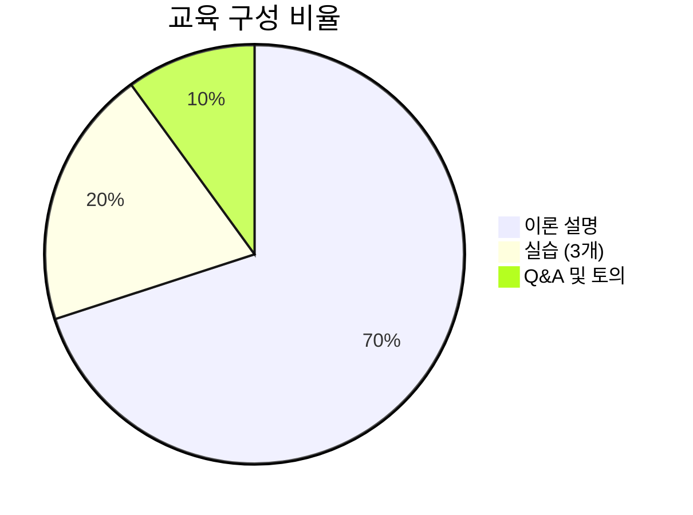

📌 **강사님의 설명**

> "제 수업은 기술적인 실습이라기보다는 거의 설명이죠. 다만 이틀 동안 진행하면서 좀 내용이 딱딱할 수도 있고 할 수도 있어요."

#### 실습 운영 방식

| 항목 | 세부 내용 |
|:---:|:---|
| **실습 개수** | 총 3개 |
| **팀 구성** | 조별 (약 6개 조) |
| **제출 방식** | 조당 1개 결과물 제출 |
| **점수 반영** | ❌ 없음 (부담 없이 진행) |
| **발표** | 실습당 2개 조씩 사다리타기로 선정 |

⚠️ **실습 목적**

점수 반영이 없기 때문에 부담 갖지 말고, **최대한 토의를 많이 해서 실무 감각을 익히는 것**이 목표입니다.

### 2.2 실습 주제 (3가지)

#### 실습 1: 보안관제 업무 절차 이해
- 보안관제 센터에서 침해사고 발생 시 대응 절차도 작성
- 각 부서(보안관제, 침해대응, 보안진단)의 역할 정리

#### 실습 2: 보안사고 대응 방안 수립
- 실제 발생 가능한 보안사고 시나리오
- 담당자 입장에서 대응 방안 작성
- 기존 대응 체계가 없다면 새로운 방안 수립

#### 실습 3: 관제 결과 보고서 작성
- 탐지된 이벤트를 고객에게 전달하는 보고서
- 포함되어야 할 필수 항목
- 실무 형식의 보고서 작성

---

## 3. 관제 업무 수행 시 반드시 알아야 할 3가지

### 3.1 네트워크 구성도 숙지 (1순위)

#### 📊 중요도: ⭐⭐⭐⭐⭐

💡 **왜 중요한가?**

관제뿐만 아니라 **컨설팅, 취약점 진단** 등 모든 보안 업무의 기본은 네트워크 구성도 파악입니다.

#### 네트워크 구성도에서 확인해야 할 사항

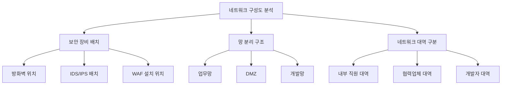

#### 실제 사례: 원격 취약점 진단 중 통신 차단

📌 **상황**

원격으로 취약점 진단을 수행하던 중 **중간에 통신이 끊기는 현상** 발생

**문제 원인**
- 네트워크 구성도를 정확히 파악하지 못함
- 중간 구간에 있는 보안 장비(방화벽, IPS)를 인지하지 못함
- 담당자도 정확한 구성을 모르는 경우가 많음

**해결 방법**
```
1. 네트워크 구성도를 펼쳐놓음
2. 트래픽이 어떻게 흘러가는지 경로 추적
3. 어디서 막히는지 구간별로 확인
4. 해당 구간의 보안 정책 확인 및 조정
```

> "네트워크 구성도를 쫙 펴놓은 다음에 트래픽이 어떻게 들어가서 어디 따라 해서 막히는지를 보고, 아, 여기서 막히는 거구나 라고 많이 알게 됩니다."

#### 정부 보안 기본 지침 참고

**국가정보보안 기본지침**
- 발행 기관: 국가정보원
- 최신 개정: 2023년
- 접근 방법: 국정원 웹사이트에서 공개 열람 가능

📋 **주요 내용**
- 망 분리 정책
- 네트워크 대역 구분 원칙
- 보안 장비 배치 기준
- 각 기관의 보안 의무사항

#### 네트워크 대역 구분 예시

| 대역 구분 | 용도 | 접근 권한 | 보안 장비 |
|:---:|:---|:---:|:---:|
| **업무망** | 내부 직원 업무용 | 전 직원 | 방화벽, IPS |
| **협력업체망** | 외부 협력사 접근 | 협력사 | 방화벽, 접근제어 |
| **개발망** | 시스템 개발 및 테스트 | 개발자 | 방화벽, 망 연계 |
| **DMZ** | 외부 서비스 제공 | 인터넷 | 방화벽, WAF, IDS |

### 3.2 관제 대상 파악 (2순위)

#### 📊 중요도: ⭐⭐⭐⭐

💡 **파견 관제 vs 원격 관제 개념 혼재**

많은 사람들이 **"파견 관제 = 한 곳만 관제"**라고 생각하지만, 실제로는 다릅니다.

#### 관제 대상의 다양성

```
┌─────────────────────────────────────┐
│     보안관제센터 (파견 관제)         │
│                                     │
│  ┌─────────────────────────┐       │
│  │  본부 시스템 관제        │       │
│  └─────────────────────────┘       │
│           ↓ ↓ ↓                   │
│  ┌─────┐ ┌─────┐ ┌─────┐          │
│  │기관A│ │기관B│ │기관C│  ...     │
│  └─────┘ └─────┘ └─────┘          │
│                                     │
│  원격 관제 개념 포함됨              │
└─────────────────────────────────────┘
```

📌 **실제 사례: 실더스 관제 대상**

현재 실더스는 약 **50여 개의 사이트**를 관제하고 있으며, 파견 관제 인력이 여러 기관을 동시에 모니터링하는 구조입니다.

| 지역 | 주요 기관 |
|:---:|:---|
| **서쪽 (최서단)** | 인천국제공항공사 |
| **동쪽 (최동단)** | 원주 대한적십자 (2026년 신규) |
| **남쪽 (최남단)** | 제주도 JDC (제주국제자유도시개발센터) |
| **중부** | 세종, 서울 등 다수 |

> "여러분들이 이제 지금까지 생각하실 때 관제면은 관제, 우리는 관제를 하니까 거기만 하면 될 것이라고 생각하실 수도 있는데 그게 아니고 실제 파견 관제의 개념을 그대로 받아들여서 업무를 수행하고 있지만 실제 그 속에는 원격 관제 같은 그런 개념도 녹여져 있다고 생각을 하시면 됩니다."

#### 하이브리드 관제인가?

❓ **질문**: 파견 + 원격 개념이면 하이브리드 관제가 아닌가요?

✅ **답변**:
- 정확히 따지면 **파견 관제에 포함**되는 개념
- 하이브리드 관제는 **파견 관제와 원격 관제가 명확히 분리**되어 각각 운영되면서 협업하는 형태
- 현재는 파견 관제 인력이 원격 관제 개념까지 수행하는 구조

### 3.3 보안 장비 및 시스템 연결 구조 이해 (3순위)

#### 📊 중요도: ⭐⭐⭐⭐

#### 보안 장비 배치 이해의 중요성

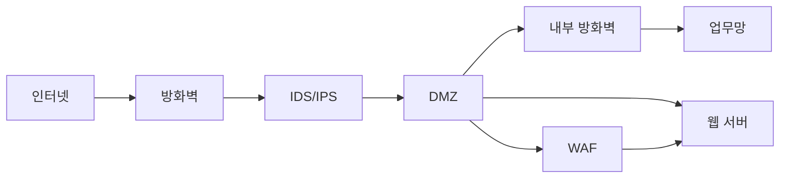

💡 **트래픽 흐름 이해**

공격 트래픽이 들어왔을 때:
1. 어디서 탐지되었는가?
2. 어디서 차단되었는가?
3. 응답은 정상적으로 나갔는가?
4. 중간에 어디서 막혔는가?

이 모든 것을 파악하려면 **보안 장비 배치와 연결 구조**를 알아야 합니다.

#### 실제 관제 시나리오

**상황**: IDS에서 SQL Injection 공격 탐지

**분석 절차**:
```
Step 1: IDS 로그 확인
  ↓ 공격 출발지 IP: 203.0.113.50
  ↓ 공격 목적지: 내부 웹 서버 (10.0.1.100)
  ↓
Step 2: 방화벽 로그 확인
  ↓ 해당 IP가 방화벽을 통과했는가?
  ↓ YES → 방화벽 정책에 허용 규칙 존재
  ↓
Step 3: WAF 로그 확인
  ↓ WAF가 차단했는가?
  ↓ NO → WAF 정책 미흡
  ↓
Step 4: 웹 서버 로그 확인
  ↓ 공격이 실제로 도달했는가?
  ↓ 공격 성공 여부는?
  ↓
Step 5: 종합 분석 및 대응
```

이런 분석을 위해서는 **네트워크 구성도와 보안 장비 배치**를 정확히 알아야 합니다.

---

## 4. 관제 업무자가 하지 말아야 할 것들

### 4.1 초심 잃지 않기 ⭐⭐⭐⭐⭐

#### 관제 업무의 특성

| 특성 | 설명 |
|:---:|:---|
| **24시간 운영** | 주야간 교대 근무 필수 |
| **반복적 업무** | 정적인 모니터링 작업 |
| **신체적 부담** | 야간 근무로 인한 바이오리듬 깨짐 |
| **정신적 스트레스** | 긴장감 유지 필요 |

💡 **초기 다짐과 현실의 괴리**

신입 관제 인력과 면담 시:
> "처음에 입사를 하는 사람들은 굉장히 생각이 커요. 아 난 뭘 하고 싶다고 하나 말씀을 드리고 싶은 게 난 이거를 정말 꼭 해야 되겠다. 목표를 가지고서 한다면 뭐 그대로 가셔도 됩니다."

하지만:
```
시간 경과 → 목표 흐려짐 → 다른 길로 전환 고려
```

#### 목표 설정의 유연성

**강사님의 조언**:

1. **확고한 목표가 있다면** → 그 길로 계속 가세요
   - 예: "나는 꼭 CERT 전문가가 되겠다"

2. **아직 확신이 없다면** → 서두르지 마세요
   - 관제 업무를 하면서 잘 지켜보세요
   - 중간중간 생각하면서 내가 가야 할 길 찾기
   - 목표를 잡는 데 2-3년 걸려도 늦지 않음

3. **기술 트렌드 변화 고려**
   - 새로운 기술이 계속 등장
   - 보안 정책도 계속 변화
   - 트렌드에 맞춰 길을 바꿀 수도 있음

⚠️ **함정: 야간 근무 수당에 안주**

```
야간 근무 수당 = 상당한 금액
        ↓
   안주하기 쉬움
        ↓
 업무 전환 시 수당 감소
        ↓
   망설이게 됨
```

> "야간 근무를 할 때 받았던 이 수당이 갑자기 확 줄어들게 되죠. 좀 망설이지게 됩니다."

**조언**: 주간 근무(업무 전환)가 필요하다면 **과감하게 포기할 건 포기**해야 합니다.

### 4.2 자기개발 게을리하지 않기 ⭐⭐⭐⭐⭐

#### 실더스 교육 지원 제도

**온라인 교육 지원**
- 연간 3~4개 과정 지원
- 수료 시: 회사가 100% 비용 부담
- 미수료 시: 50:50 분담 (회사 50%, 개인 50% 월급에서 공제)

**업무 전환 교육**
- 제공 시기: 관제 업무 2~3년 경력 후
- 빈도: 연 2회 (전반기/후반기)
- 전환 가능 분야:
  - CERT (침해사고 대응)
  - 모의해킹
  - 취약점 진단
  - 기타 희망 분야

📌 **업무 전환 프로세스**

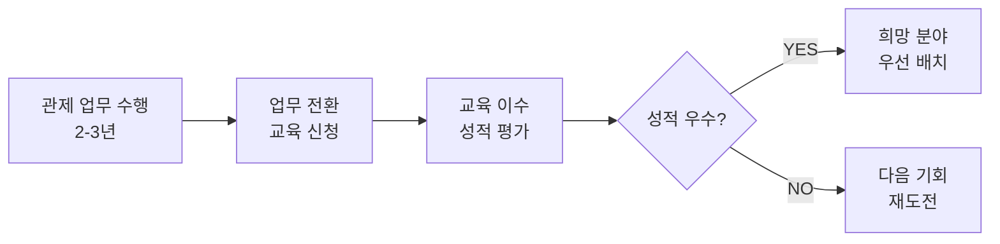

⚠️ **자기개발의 함정**

**관제 업무의 특수성**:
- 24시간 교대 근무 → 피곤함
- 야간 근무 후 비번 → 휴식 필요
- 처음 3개월 → 적응 기간 (힘듦)
- 적응 후에도 → 준비하기 어려움

**실제 현장 모습**:
> "나름 열심히 공부하고 막 하는 친구들도 보이고 그냥 물 흘러가듯이 그냥 조용히 흘러가는 친구들도 많이 보입니다."

💡 **자기개발 기회는 계속 제공됨**

회사는 계속 기회를 줍니다. **그 기회를 놓치지 마세요!**

### 4.3 이력서(연봉) 관리 전략 ⭐⭐⭐⭐

#### ❌ 잘못된 질문

교육 중 자주 받는 질문:
> "어떻게 하면 연봉을 최대한 높일 수 있을까요?"
> "어떻게 하면 돈을 많이 벌 수 있을까요?"

**강사님의 답변**:
> "그 질문은 본인의 욕심이 있다는 건 충분히 이해하겠는데, 제가 봤을 때 이해가 안 되는 질문입니다."

#### ✅ 올바른 연봉 상승 전략

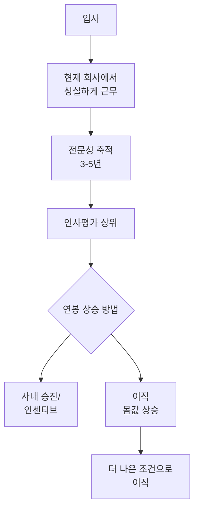

**1단계: 현재 회사에서 최선을 다하기**
- 업무 성실히 수행
- 인사평가 최대한 잘 받기
- 연봉 인상 / 보너스 / 인센티브 획득

**2단계: 전문성 축적 (3-5년)**
- 충분한 경력 쌓기
- 전문 기술 습득
- 실무 경험 축적

**3단계: 이직 고려**
- 현재 몸값보다 높은 조건 확인
- 더 나은 회사로 이직
- 경력 인정받아 연봉 상승

⚠️ **하지 말아야 할 것: 잦은 이직**

```
❌ 잘못된 패턴:
A사 (1년) → B사 (1년) → C사 (1년) → ...

문제점:
- 1년마다 이직 → 신뢰성 하락
- "이 사람은 1년 후에 나갈 사람" 인식
- 나중에 채용이 어려워짐
```

> "너무 자주 옮기면 여러분들한테 별로 안 좋습니다."

📌 **권장 이직 주기**: 최소 3-5년

---

## 5. 학습 목표 및 로드맵

### 5.1 2일간 학습 계획

#### Day 1 (오늘)
- ✅ 보안관제 기본 개념
- ✅ 보안관제 역사 및 국가 체계
- ✅ 관제 시스템 구성
- ✅ 보안관제 유형
- ✅ 실습 1: 관제 절차도 작성

#### Day 2 (내일)
- 📝 보안관제 실무 프로세스
- 📝 침해사고 대응 절차
- 📝 정오탐 분석
- 📝 AI 활용 방안 (제한적)
- 📝 실습 2, 3

### 5.2 강의 자료 구성

본 강의에서 다루는 내용:

1. **보안관제 이해**
   - 개념, 역사, 목적

2. **관제 시스템**
   - ESM, SIM, SOAR

3. **보안관제 솔루션 분류**
   - 참고자료로 제공 (상세 설명 제외)
   - 이유: 2일은 모든 솔루션을 설명하기에 부족한 시간

4. **실제 보안관제 실무**
   - 어떻게 운영되는지
   - 업무 프로세스
   - 실전 사례

5. **AI 보안관제** (제한적)
   - 현재 상황
   - 미래 전망

### 5.3 학습 시 유의사항

💡 **기술보다 프로세스 이해**

이번 강의는 **기술적인 실습**보다는 **실무 프로세스 이해**에 초점을 맞춥니다.

📌 **왜 그런가?**

- 기술은 환경마다 다름
- 하지만 프로세스는 공통적
- 프로세스를 알면 어떤 환경에서든 적응 가능

⚠️ **내용이 딱딱할 수 있음**

> "다만 이틀 동안 진행하면서 좀 내용이 딱딱할 수도 있고 할 수도 있어요."

하지만 **실무에서 꼭 필요한 내용**이므로 집중해서 들어주시기 바랍니다.

---

## ✅ Section 1 학습 체크리스트

이 섹션을 학습한 후 다음 항목을 스스로 점검해보세요:

- [ ] 강의 구성과 운영 방식을 이해했다
- [ ] 실습 방식과 평가 방법을 알고 있다
- [ ] 관제 업무 수행 시 반드시 파악해야 할 3가지를 알고 있다
- [ ] 네트워크 구성도가 왜 중요한지 설명할 수 있다
- [ ] 관제 대상이 단일 사이트가 아닐 수 있음을 이해했다
- [ ] 초심, 자기개발, 이력서 관리의 중요성을 인식했다
- [ ] 올바른 연봉 상승 전략을 이해했다
- [ ] 2일간의 학습 로드맵을 파악했다

---

## 📋 Section 1 핵심 요약

### 🎯 핵심 개념 3가지

1. **네트워크 구성도 파악이 모든 보안 업무의 기본**
   - 보안 장비 배치 확인
   - 망 분리 구조 이해
   - 트래픽 흐름 파악

2. **관제 대상은 생각보다 넓을 수 있다**
   - 파견 관제 ≠ 한 곳만 관제
   - 원격 관제 개념 혼재 가능

3. **장기적 관점의 경력 관리 필요**
   - 초심 유지
   - 지속적 자기개발
   - 전략적 이직 (3-5년 주기)

### 📚 다음 섹션 예고

다음 섹션에서는 **보안관제의 역사와 국가 사이버 안보 체계**를 다룹니다:
- 1999년부터 현재까지의 보안관제 발전 과정
- 국가 사이버 안보센터의 역할
- 사이버위기경보단계
- 보안관제의 기본 원칙

---

**작성일**: 2026-01-16
**Section 1 끝** | [Section 2로 이동 →]
# 📝 보안관제(SOC) 실무 강의 노트 - 섹션 2

## 보안관제의 역사와 개념

---

## 1. 보안관제(SOC)의 역사

### 1.1 보안관제의 탄생과 발전 (1999년~현재)

보안관제는 **1999년**에 시작되어 약 **30년이 채 안 된** 비교적 짧은 역사를 가지고 있습니다.

#### 📅 연도별 주요 이정표

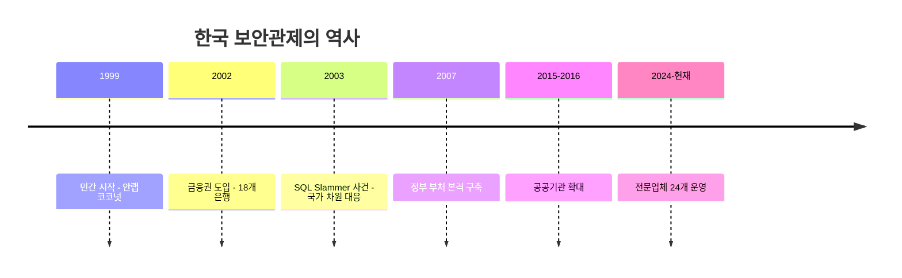

### 1.2 시기별 상세 분석

#### 🏢 **1999년: 민간 부문의 시작**

| 항목 | 내용 |
|------|------|
| **최초 시작** | **안랩 코코넛**(안랩의 자회사) |
| **관제 형태** | 본격 관제 형식 (원격관제) |
| **특징** | "보안관제"라는 용어 최초 사용 |
| **현재** | 안랩에 병합되어 현재까지 운영 중 |

> **💡 강사의 인사이트**
> "안랩이 처음 시작했고, 지금 따지고 보면 안랩이 원조라고 보시면 됩니다. 그때는 안랩 코코넛이라는 회사가 있었는데 자회사가 보안관제 서비스를 처음 시작했습니다."

**보안관제**라는 용어 자체가 1999년 안랩에서 처음 사용한 이후 지금까지 그대로 사용되고 있으며, 누구도 이의를 제기한 바 없습니다.

---

#### 🏦 **2002년: 금융권 도입**

| 항목 | 내용 |
|------|------|
| **도입 시기** | 2002년 (민간 시작 3년 후) |
| **대상** | **18개 은행** |
| **배경** | 민간에서 관제 서비스가 효과적이라는 인식 확산 |
| **관제 형태** | 금융기관 대상 전문 관제 |

```
민간(1999) → 금융권(2002) → 국가기관(2003~)
```

금융권은 돈이 오가는 중요한 시스템이기 때문에, 민간에서 관제가 시작된 후 "우리도 관제를 해야 되지 않나"라는 인식이 생겨 빠르게 도입했습니다.

---

#### ⚠️ **2003년: SQL Slammer 웜 사건 - 전환점**

##### 📍 사건 개요

```markdown
┌─────────────────────────────────────────────┐
│  2003년 SQL Slammer 웜 (슬래머 웜)          │
├─────────────────────────────────────────────┤
│  영향: 전국 네트워크 마비                    │
│  기간: 약 2-3일간 인터넷 사용 불가           │
│  원인: KT DNS 서버 마비                      │
│  결과: 국가 차원의 관제 필요성 대두          │
└─────────────────────────────────────────────┘
```

**당시 상황:**

- 모든 ISP 업체(하나로통신, KT, 온세통신 등)가 **KT의 DNS**를 통합 사용
- Slammer 웜이 KT DNS를 공격하여 마비
- **전국 인터넷이 2-3일간 완전 중단**
- 기업, 정부, 개인 모두 인터넷 사용 불가

> **🔴 위기의 순간**
> "슬래머 웜이 뻥 터지면서 KT의 DNS가 마비되어 한 2, 3일 정도 인터넷을 사용을 아예 못한 적이 있었거든요."

##### 🏛️ 국가 대응

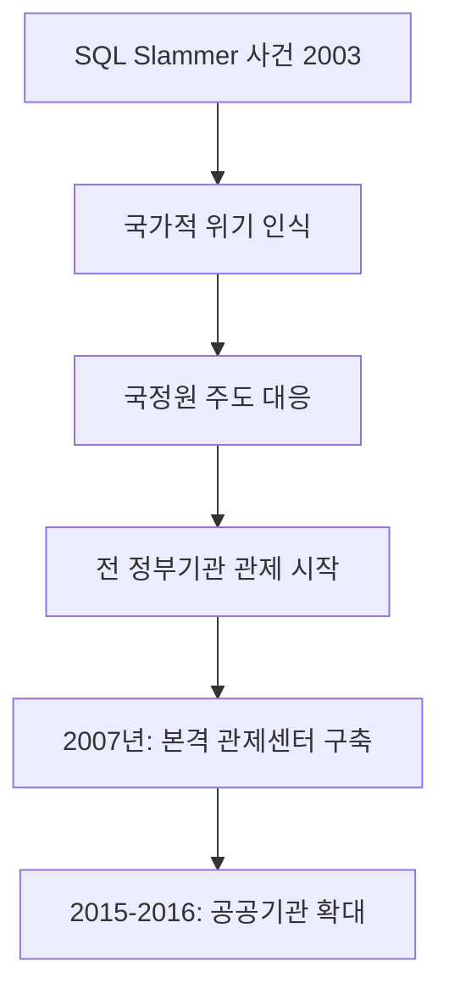

| 시기 | 조치 내용 |
|------|-----------|
| **2003년 직후** | 국정원 주도로 **전 기관 대상 보안관제** 시작 |
| **2007년** | 각 **정부 부처별 관제센터** 본격 구축 |
| **2015-2016년** | 정부 부처 **산하 기관**(공사, 공단, 협회 등)까지 확대 |

---

#### 🏛️ **2007년 이후: 정부 부처 본격화**

##### 관제센터 설치 대상

```
┌─────────────────────────────────────────────┐
│  중앙행정기관 (예: 교육부, 국토부 등)        │
├─────────────────────────────────────────────┤
│  광역시/도 (예: 서울시, 경기도 등)           │
├─────────────────────────────────────────────┤
│  광역교육청 (예: 서울교육청 등)              │
├─────────────────────────────────────────────┤
│  소속기관 (본부-지방청 구조)                 │
├─────────────────────────────────────────────┤
│  산하기관 (공사, 공단, 협회 등)              │
│  예: LH공사, 도로공사, 인천공항공사 등       │
└─────────────────────────────────────────────┘
```

**소속기관 vs 산하기관:**

| 구분 | 정의 | 예시 |
|------|------|------|
| **소속기관** | 본부와 같은 공무원 조직 | 본부 - 지방청 |
| **산하기관** | 독립 법인 (공공기관) | ○○공사, ○○공단, ○○협회 |

---

#### 🏢 **2015-2016년: 공공기관 확대**

정부 부처 관제가 안정화되면서, 정부 부처에 관련된 다른 기관들까지 관제 의무화가 확대되었습니다.

```
중앙행정기관 관제센터 → 관위(管爲) 보안관제센터
```

**관위 보안관제센터:**
- 중앙행정기관의 **산하 기관**을 위한 관제센터
- 예: 국토교통부 산하 LH공사, 도로공사 등

---

### 1.3 실더스(ShieldUs) 관제 사이트 현황

#### 📍 지역별 분포

```
서쪽 ◄─────────────────────────────► 동쪽
인천                세종                원주
국제공항              (중심부)          (대한적십자)
```

| 지역 | 주요 사이트 | 특징 |
|------|-------------|------|
| **서쪽** | 인천국제공항공사 | 가장 서쪽 사이트 |
| **동쪽** | 원주 대한적십자 | 2025년 신규 구축 (가장 동쪽) |
| **남쪽** | 제주 JDC (제주국제자유도시개발센터) | 제주공항 면세점 관련 기관 |
| **중앙** | 서울, 세종 중심 | 대부분의 사이트 집중 |

**총 사이트 수:** 약 **50여 개**

**사이트 구성:**
- 공공기관
- 금융기관
- 민간기업

> **💡 업무 특성**
> "공공하고 금융하고 기업하고 이런 기관의 특성들이 좀 있어서 인력들도 그렇고 업무들도 그렇고 다 어떤 공통적인 부분도 있지만 또 그 기관의 특성 때문에 업무적인 내용들이 약간 서로 틀리는 내용들도 있습니다."

---

## 2. 보안관제의 개념

### 2.1 관제(Monitoring)의 의미

#### 🛫 항공관제와의 비교

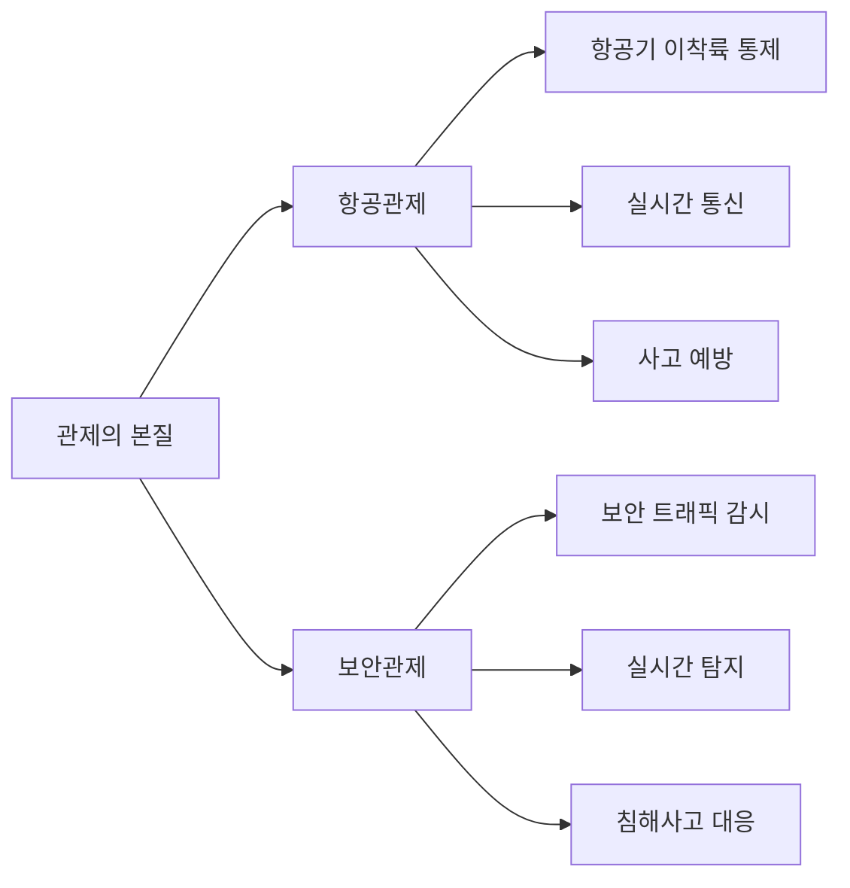

| 항목 | 항공관제 | 보안관제 |
|------|----------|----------|
| **대상** | 항공기 | 네트워크 트래픽, 시스템 |
| **목적** | 안전한 이착륙 | 안전한 서비스 제공 |
| **방법** | 무전 통신, 할주로 지정 | 로그 분석, 이벤트 탐지 |
| **위치** | 관제탑 | 보안관제센터(SOC) |
| **시간** | 24시간 365일 | 24시간 365일 |
| **핵심** | 실시간 소통 | 실시간 탐지 및 대응 |

**공통점:**
- ✅ 24시간 365일 무중단 운영
- ✅ 실시간 모니터링 및 대응
- ✅ 사고 예방 및 즉각 조치
- ✅ 전문성 요구

> **📖 강사의 설명**
> "관제 탑에서 항공기를, 항공기하고 무전을 해가면서 몇 번 할주로로 이륙을 해라, 몇 번 할주로로 착륙해라, 대기해라, 지금 이제 착륙해라, 이륙해라 뭐 그런 식으로 계속 관제를 해가면서 서로 소통을 해서 사고 없이 쭉 운영이 되게끔 하는 겁니다."

---

### 2.2 보안관제의 정의

#### 협의(狹義)와 광의(廣義)

```
┌─────────────────────────────────────────┐
│  협의의 보안관제                         │
├─────────────────────────────────────────┤
│  • 단순 모니터링                         │
│  • 트래픽 감시                           │
│  • 이벤트 탐지                           │
│  • 로그 수집 및 분석                     │
└─────────────────────────────────────────┘
                   ↓
┌─────────────────────────────────────────┐
│  광의의 보안관제                         │
├─────────────────────────────────────────┤
│  • 모니터링 (탐지)                       │
│  • 대응 (차단, 격리)                     │
│  • 분석 (포렌식, 원인 분석)              │
│  • 복구 (시스템 복구, 재발 방지)         │
└─────────────────────────────────────────┘
```

#### 📊 보안관제 = 모니터링 + 대응

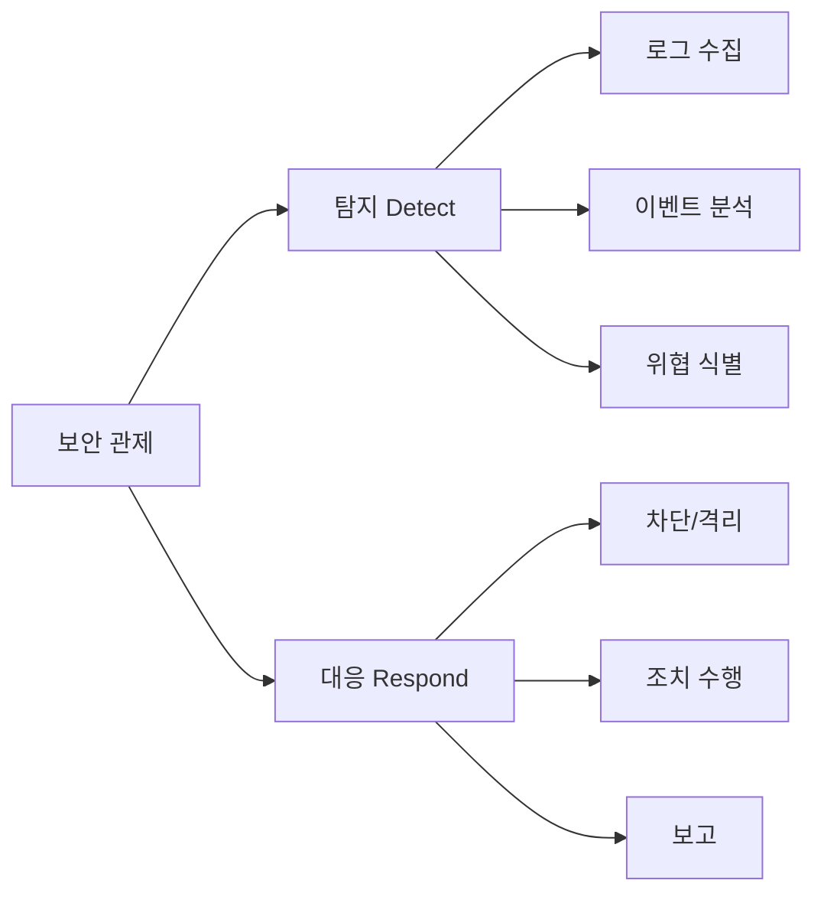

---

### 2.3 보안관제 생태계

#### 🏢 관제센터 내 업무 구성

```
┌─────────────────────────────────────────────┐
│           보안관제센터 (SOC)                 │
├─────────────────────────────────────────────┤
│  1. 보안 관제 (Monitoring)                   │
│     └─ 24/7 실시간 모니터링                  │
├─────────────────────────────────────────────┤
│  2. CERT (침해사고 대응팀)                   │
│     └─ 사고 분석 및 대응                     │
├─────────────────────────────────────────────┤
│  3. 취약점 진단 (Vulnerability Assessment)   │
│     └─ 모의해킹, 시스템 점검                 │
├─────────────────────────────────────────────┤
│  4. 보안 운영 (Security Operations)          │
│     └─ 정책 관리, 시스템 운영                │
└─────────────────────────────────────────────┘
```

| 업무 | 역할 | 협조 관계 |
|------|------|-----------|
| **보안관제** | 실시간 탐지 | → CERT에 사고 전달 |
| **CERT** | 사고 대응, 포렌식 | ← 관제에서 탐지 받음 |
| **취약점 진단** | 사전 예방 | → 관제에 취약점 정보 제공 |
| **보안 운영** | 정책 수립, 시스템 관리 | ↔ 모든 팀과 협조 |

> **🔗 협업의 중요성**
> "관제센터에서는 여러 가지 업무가 있다고 해서 관제가 있고 그 뒤에 서트가 있고 그 다음 취약점 진단, 그래서 취약점 진단은 모의해킹 종목 시스템 분석이 있습니다. 그런 식으로 이제 서로 협조를 해가면서 관제를 수행을 하고 있습니다."

---

## 3. 보안관제의 법적 근거 및 표준

### 3.1 국가기관 및 공공기관

#### 📜 주요 법령

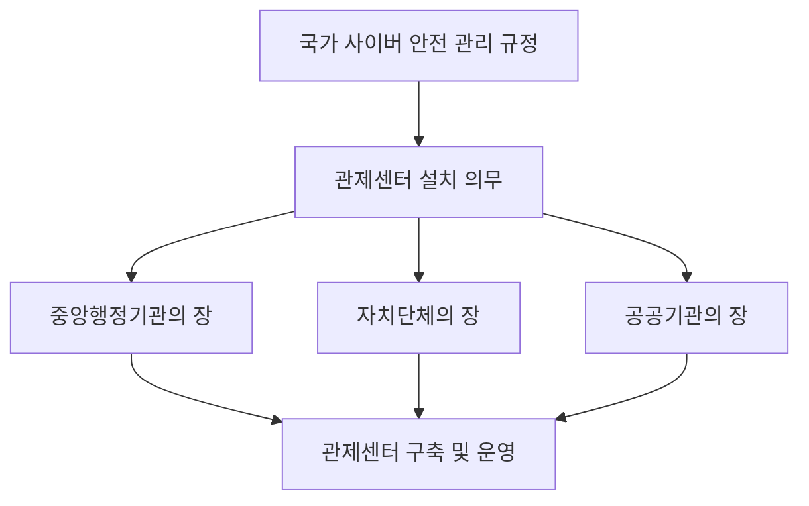

##### 🏛️ **국가 사이버 안전 관리 규정**

```
┌─────────────────────────────────────────────────────┐
│  제○조 (보안관제센터의 설치·운영)                   │
├─────────────────────────────────────────────────────┤
│  중앙행정기관의 장, 자치단체의 장 및                 │
│  공공기관의 장은 사이버 공격 정보를                  │
│  탐지·분석하여 즉시 대응 조치할 수 있는             │
│  기구를 설치·운영해야 한다.                         │
└─────────────────────────────────────────────────────┘
```

**핵심 키워드:**
- ✅ **탐지·분석**
- ✅ **즉시 대응 조치**
- ✅ **설치·운영 의무**

---

### 3.2 민간 기업 및 금융기관

#### 📋 관련 법령

| 법령 | 적용 대상 | 관제 관련 조항 |
|------|-----------|----------------|
| **정보통신망법** | 정보통신 서비스 제공자 | 침해사고 탐지·대응 의무 |
| **정보통신기반보호법** | 주요정보통신기반시설 운영자 | 보호대책 수립·시행 |
| **전자금융거래법** | 금융회사, 전자금융업자 | 전자금융사고 예방·대응 |

**특징:**
- ❌ 명시적인 "관제센터 설치" 조항 없음
- ✅ "침해 시도 발견 및 즉시 대응" 의무 있음
- ✅ 이를 근거로 관제센터 구축·운영

> **💡 법령 해석**
> "기업이나 금융권에서는 정보통신망법이나 정보통신기반보호법, 전자금융거래법 요 근거로 해서 관제센터를 구축을 합니다. 다만 맨 위에 어떤 관제센터를 설치, 운영해야 된다 이런 식으로 명확하게 이런 조항은 없고요, 내용은 없고 어떤 침해 시도를 발견을 하고 즉시 대응하고 조치를 해야 된다 그런 내용들이 있습니다."

---

### 3.3 보안관제 전문업체 지정 제도

#### 🏅 KISA 지정 전문업체

```
┌─────────────────────────────────────────────┐
│  한국인터넷진흥원(KISA) 지정                 │
├─────────────────────────────────────────────┤
│  보안관제 전문업체 (2025년 12월 기준)        │
│  총 24개 업체                                │
└─────────────────────────────────────────────┘
```

**주요 업체 (예시):**
- ✅ 실더스 (ShieldUs)
- ✅ 안랩 (AhnLab)
- ✅ 이글루코퍼레이션
- ✅ 기타 21개 업체

##### 📋 지정 절차 및 관리

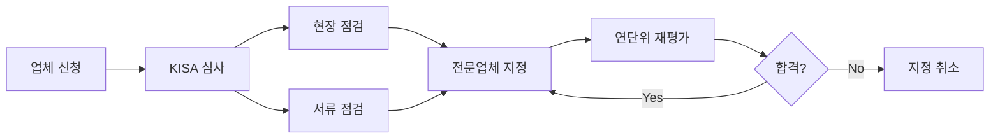

| 항목 | 내용 |
|------|------|
| **지정 기관** | KISA (한국인터넷진흥원) |
| **지정 기준** | 인력, 시설, 장비, 기술력 등 |
| **평가 주기** | 연 1회 |
| **평가 방법** | 현장 점검 + 서류 심사 |
| **변동 사항** | 신규 등록 및 탈락 업체 발생 |

> **🔄 업체 변동**
> "이 안에서는 지금까지 몇 개의 업체가 있었는데 중간에 사라지는 업체도 있었고 다시 이제 새로이 등록되는 업체도 있었습니다."

---

### 3.4 국가 전산망 보안관제 지침

```
┌─────────────────────────────────────────────┐
│  적용 대상                                   │
├─────────────────────────────────────────────┤
│  ✅ 국가 중앙행정기관                        │
│  ✅ 공공기관                                 │
│  ⚠️  민간 기업 (선택 사항)                   │
└─────────────────────────────────────────────┘
```

**민간 기업의 경우:**
- 법적 강제성은 없음
- 참고 자료로 활용 가능
- 자체 관제 기준 수립 시 참조

---

## 4. 국가 사이버 안보 수행 체계

### 4.1 국가 사이버 안보 체계 구조

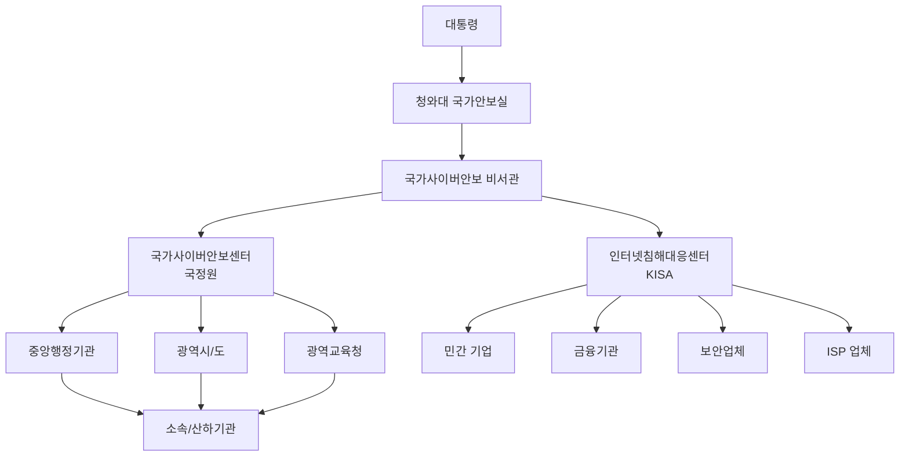

---

### 4.2 주요 기관별 역할

#### 🏛️ **국가사이버안보센터 (NCSC, 국정원 소속)**

```
┌─────────────────────────────────────────────┐
│  국가사이버안보센터 (NCSC)                   │
├─────────────────────────────────────────────┤
│  📍 주관: 국가정보원                         │
│  🎯 역할:                                    │
│    • 국가 사이버 안전 정책 총괄              │
│    • 중앙행정기관 대상 관제                  │
│    • 각 부문별 사이버안전센터 지휘·감독      │
│    • 중요 공격(제로데이 등) 모니터링         │
│    • 정부 부처 공격 탐지 시 통보             │
└─────────────────────────────────────────────┘
```

**업무 범위:**
1. **정책 수립:** 국가 사이버 안전 정책 총괄
2. **직접 관제:** 중앙행정기관, 광역시/도, 광역교육청
3. **지휘·감독:** 소속/산하기관의 부문별 사이버안전센터
4. **협력 관제:** 중요 취약점 발견 시 전 기관 동시 모니터링

> **🔍 실제 운영 사례**
> "국정원에서 좀 중요시 하는 트래픽, 최근에 어떤 제로데이 취약점이라든지 아니면 중요한 취약점이 발견이 돼서 이에 대한 공격이 발생했을 때는 국가사이버안보센터에서 같이 관제를 해가면서 뭔가 탐지가 되면 각 부문별 사이버안전센터에다가 통보를 해줍니다."

**역사적 변천:**
```
국가사이버안전센터 (구)
    → 모든 정부 부처 관제 담당 (과부하)
    → 각 부처별 관제센터 구축 (2007~)
    → 국가사이버안보센터 (현)
    → 정책 총괄 + 중요 사안 협력 관제
```

---

#### 🌐 **인터넷침해대응센터 (KrCERT/CC, KISA 소속)**

```
┌─────────────────────────────────────────────┐
│  인터넷침해대응센터 (KrCERT/CC)              │
├─────────────────────────────────────────────┤
│  📍 주관: KISA (과학기술정보통신부)          │
│  🎯 역할:                                    │
│    • 민간 기업 지원                          │
│    • 금융기관 지원                           │
│    • 보안업체 협력                           │
│    • ISP 업체 협력                           │
│    • 중소기업 중심 지원                      │
└─────────────────────────────────────────────┘
```

**지원 정책:**

| 구분 | 지원 여부 | 이유 |
|------|-----------|------|
| **대기업** | ❌ 제한적 지원 | 자체 대응 능력 충분 |
| **금융 대기업** | ❌ 제한적 지원 | 전문 인력 보유 |
| **중소기업** | ✅ 적극 지원 | 능력 부족, 예산 부족 |
| **국가적 사고** | ✅ 전면 지원 | 예: 2024년 서울보증보험, SK텔레콤 침해사고 |

**국가적 침해사고 예시 (2024년):**
- 서울보증보험 침해사고
- SK텔레콤 등 통신사 3사 침해사고
- → KISA 개입 및 국가 차원 조사 진행

> **💡 지원 기준**
> "대기업, 어느 정도 수준이 있는 기업이든 금융기관이든 그런 데는 대상으로 했을 때 별로 지원을 잘 안 해줍니다. 왜냐하면 그쪽에서는 충분히 업무를 수행할 수 있는 능력이 있다고 보기 때문에 정말 국가적으로 큰 사고가 발생을 했을 때 그때는 KISA가 개입을 해서 지휘통제를 하지만 국가적인 차원이 아닌 회사 차원에서 해결을 할 수 있는 부분이라고 한다면 대기업은 거의 지원을 안 하고 중소기업 대상으로 해서 능력이 좀 떨어지는 그런 회사를 대상으로 해가지고 KISA에서 지원을 해주고 있습니다."

---

#### 🏢 **부문별 사이버안전센터**

```
┌─────────────────────────────────────────────┐
│  각 정부 부처 사이버안전센터                 │
├─────────────────────────────────────────────┤
│  📍 위치: 각 중앙행정기관                    │
│  🎯 역할:                                    │
│    • 자체 기관 관제                          │
│    • 소속 기관 지휘·통제                     │
│    • 국가사이버안보센터 협력                 │
│    • 침해사고 대응                           │
└─────────────────────────────────────────────┘
```

**설립 배경:**
- 2007년부터 본격 구축
- 국가사이버안전센터 업무 분담
- 각 부처 특성에 맞는 전문 관제

---

### 4.3 기관별 관계도

```
┌──────────────────────────────────────────────────┐
│                   대통령                          │
│              국가안보실 비서관                    │
└──────────────────┬───────────────────────────────┘
                   │
        ┌──────────┴──────────┐
        │                     │
┌───────▼───────┐     ┌───────▼──────────┐
│ 국가사이버안보 │     │ 인터넷침해대응   │
│ 센터 (국정원)  │     │ 센터 (KISA)      │
└───────┬───────┘     └───────┬──────────┘
        │                     │
   ┌────┼────┬────────┐   ┌───┼────┬────────┐
   │    │    │        │   │   │    │        │
 중앙  광역  광역     소속  민간 금융 보안   ISP
 행정  시도  교육청   산하  기업 기관 업체   업체
 기관                기관
```

---

### 4.4 협력 관계

#### 🔗 국가사이버안보센터 ↔ 부문별 사이버안전센터

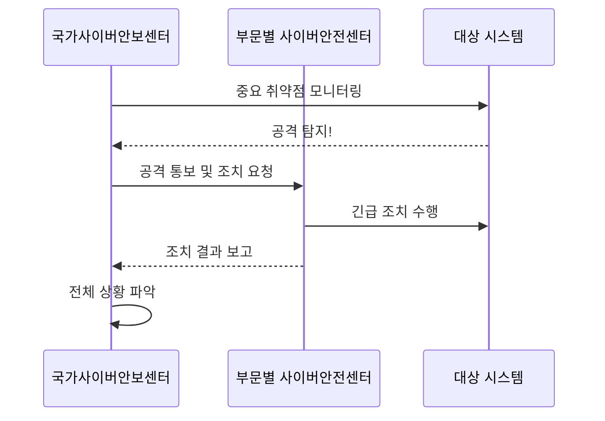

**협력 프로세스:**
1. NCSC가 중요 위협 발견
2. 전 정부 부처 동시 모니터링 시작
3. 공격 탐지 시 해당 부처 통보
4. 부문별 센터에서 즉시 조치
5. 결과를 NCSC에 보고

---

#### 🔗 KISA ↔ 민간/금융

```
KISA (정책/지원) ←→ 보안업체 ←→ 민간기업/금융기관
```

**협력 형태:**
- **정보 공유:** 최신 위협 정보, 공격 패턴
- **기술 지원:** 침해사고 분석, 복구 지원
- **교육 훈련:** 보안 인력 양성
- **제도 개선:** 보안 정책 수립 지원

---

## 5. 사이버 위기 경보 단계

### 5.1 경보 단계 체계

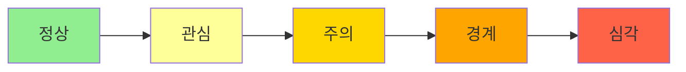

#### 📊 5단계 분류 (과거) → 4단계 분류 (현재)

| 단계 | 색상 | 현재 운영 여부 | 상황 |
|------|------|----------------|------|
| **정상** | 🟢 녹색 | ❌ 제외 (매뉴얼에만 존재) | 평시 |
| **관심** | 🟡 노란색 | ✅ 운영 | 잠재적 위협 |
| **주의** | 🟠 주황색 | ✅ 운영 | 위협 증가, 예의주시 |
| **경계** | 🔴 빨간색 | ✅ 운영 (미발령) | 사이버 전쟁 임박 |
| **심각** | ⚫ 검은색 | ✅ 운영 (미발령) | 사이버 전쟁 |

> **⚠️ 역대 최고 단계**
> "지금까지 가장 많이 사이버 위기경보단계가 올라간 거는 주의까지가 올라갔고요. 경계 심각 단계는 올라간 적은 없습니다."

---

### 5.2 단계별 상세 설명

#### 🟢 **정상 단계** (현재 제외)

```
상황: 평시, 이상 징후 없음
조치: 일상적 모니터링
```

**참고:**
- 현재는 **관심 단계**부터 적용
- 매뉴얼에는 여전히 정상 단계 설명 포함

---

#### 🟡 **관심 단계** (현재 기본 단계)

```
┌─────────────────────────────────────────────┐
│  관심 단계 (1단계)                           │
├─────────────────────────────────────────────┤
│  상황:                                       │
│    • 해외에서 특정 위협 발생                 │
│    • 국내 영향 가능성 낮음                   │
│    • 잠재적 위협 존재                        │
│                                              │
│  대응:                                       │
│    • 정보 수집 및 모니터링 강화              │
│    • 관련 기관 정보 공유                     │
│    • 예방 조치 검토                          │
└─────────────────────────────────────────────┘
```

**예시:**
- 해외에서 새로운 랜섬웨어 발견
- 국내 유입 가능성 모니터링

---

#### 🟠 **주의 단계** (역대 최고)

```
┌─────────────────────────────────────────────┐
│  주의 단계 (2단계)                           │
├─────────────────────────────────────────────┤
│  상황:                                       │
│    • 국내 공격 징후 포착                     │
│    • 특정 기관/산업 대상 공격 증가           │
│    • 피해 발생 가능성 높음                   │
│                                              │
│  대응:                                       │
│    • 24시간 모니터링 강화                    │
│    • 긴급 패치 및 보안 업데이트              │
│    • 유관기관 협조 체계 가동                 │
│    • 상황 보고 체계 강화                     │
└─────────────────────────────────────────────┘
```

**역대 사례:**
- DDoS 공격 대규모 발생
- 중요 취약점 악용 공격 다수 탐지
- 특정 산업군 집중 공격

> **📈 주의 단계까지 대응 가능**
> "주의까지는 하여튼 최대한 대응할 수 있는 그런 부분들을 고려해서 기관에 맞게 대응을 하면 되는데..."

---

#### 🔴 **경계 단계** (미발령, 사이버 전쟁)

```
┌─────────────────────────────────────────────┐
│  경계 단계 (3단계) - 사이버 전쟁 임박        │
├─────────────────────────────────────────────┤
│  상황:                                       │
│    • 국가 기반시설 대상 대규모 공격          │
│    • 물리적 전쟁과 연계 가능성               │
│    • 다수 기관 동시 마비                     │
│                                              │
│  대응:                                       │
│    • 국가 차원 통제 체계 가동                │
│    • 주요 시스템 격리 운영                   │
│    • 비상 대응팀 전면 투입                   │
│    • 국제 협력 요청                          │
└─────────────────────────────────────────────┘
```

> **⚠️ 위기 상황**
> "경계 단계에서는 어떤 국가적인 차원에서 통제를 하게 됩니다."

---

#### ⚫ **심각 단계** (미발령, 전면 전쟁)

```
┌─────────────────────────────────────────────┐
│  심각 단계 (4단계) - 국가 비상사태            │
├─────────────────────────────────────────────┤
│  상황:                                       │
│    • 네트워크 전면 마비                      │
│    • 물리적 전쟁 진행 중                     │
│    • 국가 존립 위협                          │
│                                              │
│  대응:                                       │
│    • 최소한의 핵심 시스템만 운영             │
│    • 복구 우선순위에 따라 선택적 운영        │
│    • 군사 작전과 연계 대응                   │
└─────────────────────────────────────────────┘
```

> **💀 최악의 시나리오**
> "심각 단계로 되면 이때는 그냥 다 끝났다고 보시면 돼요, 네트워크는. 그래서 정말 최소화를 해가면서 이 시스템이 꼭 살아야 된다고 주어지면 그 시스템을 살려서 운영을 하는 거죠."

**재복구 우선순위 적용:**
- 각 기관/기업은 **재복구 우선순위** 사전 수립
- 심각 단계 시 우선순위에 따라 시스템 선별 운영
- 핵심 시스템만 유지

---

### 5.3 사이버 위기 대응 매뉴얼

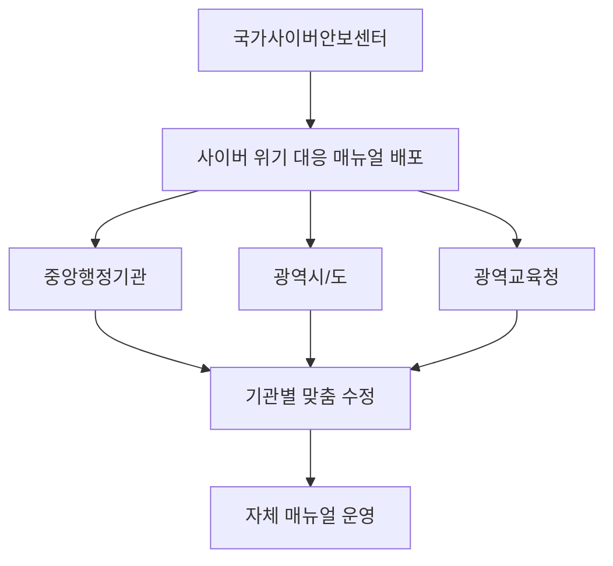

**매뉴얼 체계:**
1. **국가 기준 매뉴얼:** 국가사이버안보센터 작성
2. **배포:** 모든 정부 부처 및 공공기관
3. **수정(Modify):** 각 기관 특성에 맞게 커스터마이징
4. **운영:** 자체 매뉴얼로 대응 체계 구축

**매뉴얼 내용:**
- 단계별 대응 절차
- 보고 체계
- 비상 연락망
- 시스템 격리 방법
- 복구 우선순위

---

## 6. 보안관제의 기본 원칙

### 6.1 3대 기본 원칙

```
┌─────────────────────────────────────────────┐
│  보안관제 3대 기본 원칙                      │
├─────────────────────────────────────────────┤
│  1️⃣  무중단의 원칙 (Non-Stop)               │
│  2️⃣  전문성의 원칙 (Professionalism)        │
│  3️⃣  정보공유의 원칙 (Information Sharing)  │
└─────────────────────────────────────────────┘
```

---

### 6.2 원칙 1: 무중단의 원칙 (24/7/365)

#### ⏰ 개념

```
무중단 = 24시간 × 365일 × 실시간 대응
```

**핵심 키워드:**
- ✅ **24시간 365일** 운영
- ✅ **실시간 탐지 및 차단**
- ✅ **교대 근무 체계**
- ✅ **불은 절대 꺼지지 않음**

#### 🏢 운영 방식

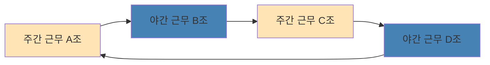

| 구분 | 근무 형태 | 특징 |
|------|-----------|------|
| **파견관제** | 2인 1개조, 4개조 편성 | 사이트 상주, 교대 근무 |
| **원격관제** | 교대조 편성 | 중앙관제센터 운영 |
| **자체관제** | 내부 인력 순환 | 기관 자체 운영 |
| **하이브리드** | 파견 + 원격 혼합 | 주간 파견, 야간 원격 등 |

**교대 근무 패턴 (파견관제 예시):**
```
A조: 월요일 주간 → 화요일 야간 → 수목 비번 → 금요일 주간...
B조: 월화 비번 → 수요일 주간 → 목요일 야간 → 금토 비번...
```

> **💡 관제센터는 절대 멈추지 않는다**
> "관제센터가 있으면 불은 안 꺼지죠. 뭐 파견관제를 하든 하이브리드 관제를 하든 간에 관제센터는 어떻게 해서든 불은 꺼지지 않습니다. 그래서 교대를 해가면서 관제를 수행을 하고 있고 공격이 들어오면 신속하게 탐지하고 대응하는 이런 무중단의 원칙이 여기에 적용이 됩니다."

---

### 6.3 원칙 2: 전문성의 원칙

#### 🎓 보안관제 전문 인력

```
┌─────────────────────────────────────────────┐
│  보안관제 전문업체 지정 요건                 │
├─────────────────────────────────────────────┤
│  ✅ 전문 인력 보유                           │
│  ✅ 기술력 인증                              │
│  ✅ 시설 및 장비 기준 충족                   │
│  ✅ 보안 관제 실적                           │
└─────────────────────────────────────────────┘
```

**전문 인력 구성:**

| 직급 | 역할 | 자격 요건 |
|------|------|-----------|
| **PM (고급)** | 프로젝트 관리, 고객 응대 | 5년 이상 경력, 관련 자격증 |
| **관제원 (중급)** | 실시간 모니터링, 분석 | 2-5년 경력, 기술 숙련도 |
| **관제원 (초급)** | 이벤트 탐지, 1차 대응 | 신입~2년, 기본 교육 이수 |
| **CERT** | 침해사고 대응, 포렌식 | 전문 자격증, 고급 기술 |
| **취약점 진단** | 모의해킹, 시스템 점검 | 보안 자격증, 해킹 기술 |

#### 🏅 전문성 확보 방법

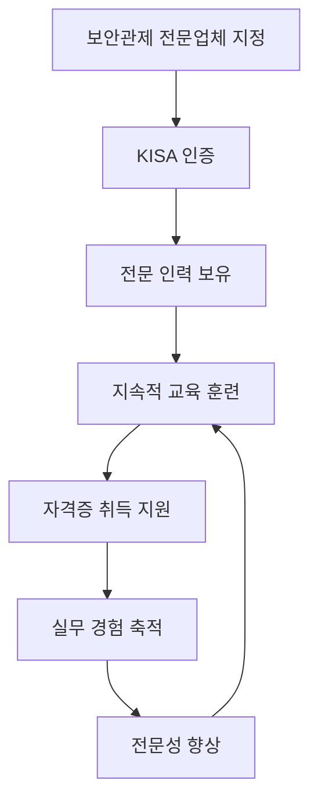

> **🎯 전문성의 중요성**
> "보안컨설팅 전문 업체도 또 지정이 되어 있어요. 그래서 각각의 분야별로 업무를 수행한다 하더라도 전문성을 가지고 있는 인력들이 업무를 수행한다는 원칙입니다. 그래서 보안관제 전문 업체 지정이 있으면 그 전문 업체에 등록돼 있는 인원들 그리고 포렌식이든 취약점 점검이든 분석할 수 있는 전문적인 인력들이 중요하다라고 판단이 됐기 때문에 전문성의 원칙이 포함이 되고요."

---

### 6.4 원칙 3: 정보공유의 원칙

#### 🔗 정보공유의 필요성

```
새로운 공격 탐지 → 즉시 공유 → 사전 예방
```

**공유 대상:**
- ✅ 동일 산업군 (예: 금융권 은행들)
- ✅ 정부 부처 간
- ✅ 공공기관 간
- ✅ 보안업체 - 고객사
- ✅ 관제업체 - 고객사

#### 📊 정보공유 프로세스

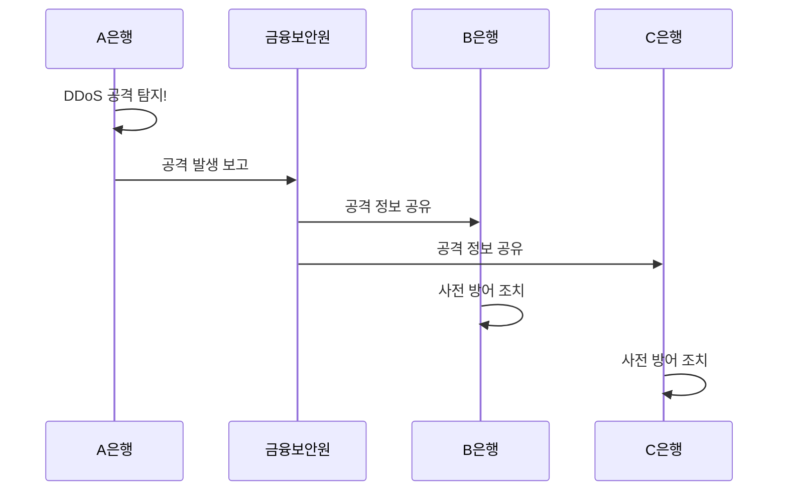

#### 💰 **사례: 금융권 DDoS 공격**

```
┌─────────────────────────────────────────────┐
│  금융권 DDoS 공격 대응                       │
├─────────────────────────────────────────────┤
│  발생 빈도: 월 1-2회 (거의 모든 은행)        │
│  공격 형태:                                  │
│    • 단시간 (5분) 테스트성 공격              │
│    • 장시간 (1-2시간) 집중 공격              │
│                                              │
│  대응 절차:                                  │
│    1. 공격 받은 은행 → 금융보안원 보고       │
│    2. 금융보안원 → 전체 은행에 공유          │
│    3. 각 은행 사전 방어 태세 강화            │
└─────────────────────────────────────────────┘
```

> **🚨 실제 사례 설명**
> "금융권 같은 경우는 돈이 왔다갔다 해야 되는 그런 상황인데 심심하면 DDoS 공격이 많이 터집니다. 한 달에 최소 한두 번씩은 거의 모든 은행을 대상으로 DDoS 공격이 발생한다고 보시면 돼요. 그래서 어떨 때는 5분 잠깐 빠짝 들어왔다가 빠지고 아니면 정말 한 번 죽어봐라 그래서 한두 시간 계속 지속적으로 공격을 할 때도 있습니다. 그러면 어떤 은행이 DDoS 공격을 받게 되면 그 은행에서는 금융보안원이든 어디다가 금융위원회든 보고를 해야 돼요. 현재 지금 공격이 발생을 했다 그러면은 그 공격이 발생을 했기 때문에 각각의 다른 은행에다가 이 내용을 공유를 해주고 지금 현재 공격이 발생을 했으니까 DDoS 공격이 발생할 수 있으니 미리 사전에 준비해라 그런 공유를 해가면서 사전에 대응을 하고 있습니다."

#### 📧 PM 간 정보공유

```
PM 네트워크
├─ 새로운 취약점 발견 → 공유
├─ 공격 패턴 변화 → 공유
├─ 대응 방안 논의 → 공유
└─ 오탐/정탐 사례 → 공유
```

**공유 방법:**
- 이메일
- 전화
- 메신저
- 정기 회의
- CQDM 등 솔루션

> **🤝 협력의 힘**
> "저희 관제를 저도 하고 있지만 각각의 PM들이 공유를 많이 해주고 있습니다. 그래서 현재 뭐 어떤 새로운 취약점이 발견됐다 아니면 우리 쪽에 지금 공격이 뭐가 계속 들어오고 있는데 지금 다른 데서도 이런 비슷한 공격이 들어오고 있냐 아니면 예전에 이런게 발생을 했느냐 그런 어떤 공유에 물어보든 아니면 새로운 것을 전달해 주든 이런 식으로 공유를 계속 해줘서 그 내용을 참고해가지고 관제를 또 수행을 하고 있습니다."

---

## 7. 보안관제의 목적

### 7.1 최종 목적

```
┌─────────────────────────────────────────────┐
│        🎯 안전한 서비스 제공                 │
│                                              │
│  공격을 신속하게 탐지하고 대응하여           │
│  공격이 성공하지 못하도록 차단               │
└─────────────────────────────────────────────┘
```

---

### 7.2 목적 달성을 위한 프로세스

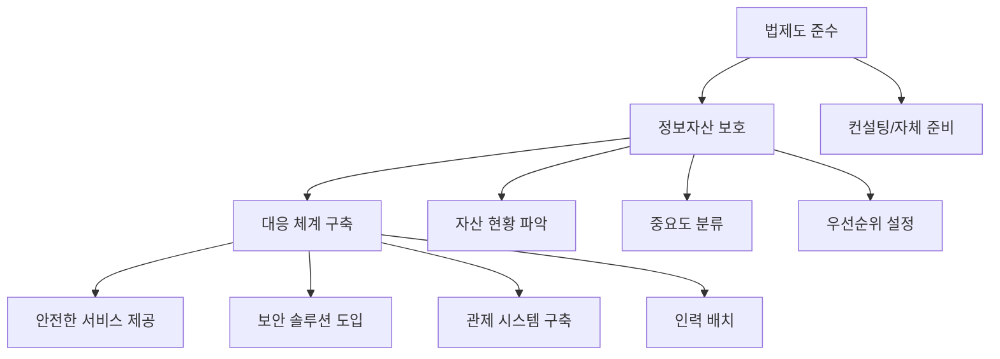

#### 1️⃣ **법제도 준수**

```
┌─────────────────────────────────────────────┐
│  법제도 준수 단계                            │
├─────────────────────────────────────────────┤
│  과제:                                       │
│    • 정보보호법, 개인정보보호법 등 준수      │
│    • 매년 개정되는 법령 반영                 │
│                                              │
│  방법:                                       │
│    A. 외부 전문업체 컨설팅 받기              │
│    B. 내부 정보보호팀 자체 준비              │
└─────────────────────────────────────────────┘
```

**법령 변화 대응:**
- 매년 정보보호법, 개인정보보호법 개정
- 기업/기관은 개정 내용에 맞춰 대응
- 컨설팅 또는 자체 TF 구성

---

#### 2️⃣ **정보자산 보호**

```
정보자산 파악 → 중요도 분류 → 우선순위 설정
```

**정보자산 분류:**

| 자산 유형 | 예시 | 보호 중요도 |
|-----------|------|-------------|
| **서버** | DB 서버, 웹 서버, 메일 서버 | ⭐⭐⭐⭐⭐ |
| **네트워크 장비** | 방화벽, IPS, 라우터, 스위치 | ⭐⭐⭐⭐⭐ |
| **소프트웨어** | OS, DBMS, 업무 시스템 | ⭐⭐⭐⭐ |
| **데이터** | 고객정보, 거래정보, 로그 | ⭐⭐⭐⭐⭐ |
| **인력** | 보안 담당자, 시스템 관리자 | ⭐⭐⭐⭐ |

**재해복구 우선순위 설정:**
1. 핵심 업무 시스템 (1순위)
2. 고객 서비스 시스템 (2순위)
3. 내부 업무 시스템 (3순위)
4. 기타 시스템 (4순위)

> **📋 우선순위의 중요성**
> "그 다음 각각의 이 시스템이 다 이렇게 운영이 되고 있는데 이 중에서 가장 중요한 시스템들이 뭔지 그래서 만약에 장애가 터지던 상황을 해 가지고 이게 다운이 되면 어떤 것부터 먼저 복구를 해야 될지 그런 우선순위가 다 부여가 되어야 됩니다."

---

#### 3️⃣ **대응 체계 구축**

```
보안 솔루션 도입 → 관제 시스템 구축 → 운영 인력 배치
```

**보안 솔루션 예시:**
- 🛡️ **제로데이 대응:** EDR, XDR
- 🔒 **랜섬웨어 탐지:** Anti-Ransomware 솔루션
- 🔍 **통합 관제:** SIEM, ESM
- 🚨 **위협 대응:** SOAR

---

### 7.3 전체 프로세스 시각화

```
법제도 준수
    ↓
정보자산 파악 및 분류
    ↓
중요도 평가 및 우선순위 설정
    ↓
보안 솔루션 도입
    ↓
관제 시스템 구축
    ↓
전문 인력 배치
    ↓
24/7 모니터링 및 대응
    ↓
✅ 안전한 서비스 제공
```

> **🔄 지속적 개선**
> "보안관제의 목적은 가장 최종의 큰 목적은 안전한 서비스를 제공하는 겁니다. 어떻게 하면 공격이 들어왔을 때 탐지하고 빨리 대응을 해서 공격이 성공되지 않도록 대응하는 겁니다."

---

## 8. 섹션 요약 및 핵심 체크리스트

### ✅ 학습 목표 달성 체크

- [ ] 보안관제의 역사를 시기별로 설명할 수 있다
- [ ] SQL Slammer 사건의 의미를 이해한다
- [ ] 보안관제의 협의와 광의 개념을 구분할 수 있다
- [ ] 국가 사이버 안보 체계를 그릴 수 있다
- [ ] 사이버 위기 경보 4단계를 설명할 수 있다
- [ ] 보안관제 3대 원칙을 암기하고 설명할 수 있다
- [ ] 보안관제의 최종 목적을 이해한다

---

### 📝 핵심 키워드

```
┌─────────────────────────────────────────────┐
│  반드시 기억해야 할 키워드                   │
├─────────────────────────────────────────────┤
│  ✅ 1999년 안랩 코코넛 (최초)                │
│  ✅ 2003년 SQL Slammer (전환점)              │
│  ✅ 무중단, 전문성, 정보공유 (3대 원칙)      │
│  ✅ NCSC, KISA, 부문별 센터 (체계)           │
│  ✅ 관심-주의-경계-심각 (경보단계)           │
│  ✅ 24개 전문업체 (KISA 지정)                │
└─────────────────────────────────────────────┘
```

---

### 🎓 실무 적용 포인트

1. **역사 이해:** 왜 관제가 필요한지 배경 이해
2. **법적 근거:** 관제센터 구축 시 법령 확인
3. **체계 파악:** NCSC/KISA와의 협력 방법 숙지
4. **경보단계:** 위기 시 대응 매뉴얼 숙지
5. **3대 원칙:** 관제 업무의 핵심 가치 체화

---

### 💬 강사의 조언

> "보안관제는 1999년부터 시작된 비교적 짧은 역사를 가지고 있지만, 2003년 SQL Slammer 사건을 계기로 국가 차원의 필수 인프라가 되었습니다. 무중단, 전문성, 정보공유라는 3대 원칙은 단순한 이론이 아니라 실제 현장에서 매일 실천해야 하는 철칙입니다. 특히 정보공유의 원칙은 금융권 DDoS 대응 사례에서 보듯이 한 기관의 피해를 전체의 예방으로 바꾸는 핵심 가치입니다."

---

## 다음 섹션 예고

**섹션 3: 관제 유형 및 시스템**

다음 섹션에서는 보안관제의 다양한 유형(원격, 파견, 자체, 하이브리드, 클라우드)과 각 유형의 장단점, 그리고 관제 시스템(SIEM, ESM, SOAR 등)에 대해 상세히 다룹니다.

```
원격 관제 ↔ 파견 관제 ↔ 자체 관제
            ↓
      하이브리드 관제
            ↓
      클라우드 관제 (미래)
            ↓
        AI 관제 (검토 중)
```

---

**작성일:** 2026-01-15
**강사:** 노우 민철 수석 (실더스)
**작성자:** AI 학습 노트 시스템
**다음 페이지:** [섹션 3: 관제 유형 및 시스템](section3_monitoring_types.md)
# 📝 보안관제(SOC) 실무 강의 노트 - 섹션 3

## 관제 유형 및 시스템

---

## 1. 보안관제의 유형

### 1.1 관제 유형 개요

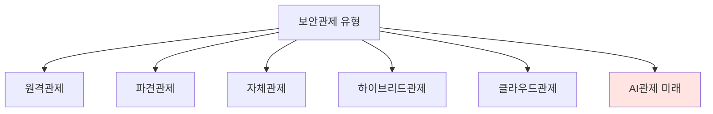

보안관제는 **5가지 주요 유형**으로 분류됩니다:

| 유형 | 특징 | 비용 | 서비스 수준 |
|------|------|------|-------------|
| **원격관제** | 중앙 관제센터에서 원격 모니터링 | 💰 낮음 | ⭐⭐ 제한적 |
| **파견관제** | 고객사에 상주하며 관제 | 💰💰💰 높음 | ⭐⭐⭐⭐⭐ 최상 |
| **자체관제** | 내부 인력으로 직접 운영 | 💰💰 중간 | ⭐⭐⭐ 변동 |
| **하이브리드관제** | 원격 + 파견/자체 혼합 | 💰💰 중간 | ⭐⭐⭐⭐ 우수 |
| **클라우드관제** | 클라우드 환경 특화 관제 | 💰💰💰 높음 | ⭐⭐⭐ 발전 중 |

---

## 2. 원격관제 (Remote Monitoring)

### 2.1 개념 및 구조

```
┌──────────────────────────────────────┐
│      중앙 관제센터 (SOC)              │
│  ┌──────────────────────────────┐   │
│  │   관제 인원 (교대 근무)       │   │
│  │   SIEM/ESM 통합 모니터링     │   │
│  └──────────────────────────────┘   │
└───────────┬──────────────────────────┘
            │
    ┌───────┴───────┐
    │               │
┌───▼────┐    ┌────▼────┐
│ 고객사A │    │ 고객사B │
│ (원격)  │    │ (원격)  │
└────────┘    └─────────┘
```

**핵심 특징:**
- ✅ **한 곳에서 여러 고객사** 동시 모니터링
- ✅ 수천 개의 보안장비 통합 관제
- ✅ 가성비 높은 운영 방식
- ✅ 인력 고용 부담 없음

---

### 2.2 원격관제 장단점

#### ✅ **장점**

```
💰 비용 효율성
├─ 직원 채용 불필요
├─ 관제센터 구축 불필요
└─ 장비 구매 부담 경감

⚡ 운영 편의성
├─ 24/7 관제 보장
├─ 전문 인력 활용
└─ 업체 전문성 활용
```

#### ❌ **단점 및 한계**

```
┌─────────────────────────────────────────┐
│  원격관제의 주요 문제점                  │
├─────────────────────────────────────────┤
│  1️⃣  야간/휴일 대응 지연                │
│     • 담당자 부재 시 즉각 대응 어려움    │
│     • 전화/메일로만 통보 가능            │
│                                          │
│  2️⃣  과도한 알림 (Alert Fatigue)        │
│     • 하루 수백~수천 건 메일/SMS         │
│     • 정탐/오탐 구분 어려움              │
│     • 담당자 피로도 급증                 │
│                                          │
│  3️⃣  제한적 서비스 범위                 │
│     • CERT 서비스 미포함                 │
│     • 침해사고 대응 불가                 │
│     • 통보 이후 자체 처리 필요           │
│                                          │
│  4️⃣  즉각적 조치 불가                   │
│     • 물리적 접근 불가                   │
│     • 네트워크 격리 등 긴급 조치 지연    │
└─────────────────────────────────────────┘
```

---

### 2.3 실제 운영 사례

#### 📧 **CQDM 솔루션 통한 통보**

```mermaid
sequenceDiagram
    participant SOC as 원격관제센터
    participant CQDM as CQDM 솔루션
    participant Email as 이메일
    participant SMS as SMS
    participant Manager as 보안담당자

    SOC->>CQDM: 공격 탐지 및 분석
    CQDM->>Email: 탐지 내용 발송
    CQDM->>SMS: 긴급 알림 발송
    Email->>Manager: 메일 수신
    SMS->>Manager: SMS 수신
    Manager->>Manager: 확인 및 판단
    Manager-->>SOC: 조치 결과 회신
```

> **⚠️ 실무자의 고충**
> "어떤 사람은 하루에 천 통도 받아봤대요 메일을. 자동으로 계속 나가다 보니까 이게 정탐이든 오탐이든 그런 거 상관없이 계속 메일이 막 나갑니다. SMS도. 보면은 별로 아무것도 아닌데 계속 나와요."

#### 🔴 **원격관제 계약 시 주의사항**

```
원격관제 ≠ 침해사고 대응
├─ 탐지 및 통보까지만 책임
├─ CERT 서비스 별도 계약
└─ 사고 발생 시 자체 대응 필요
```

---

## 3. 파견관제 (On-site Monitoring)

### 3.1 개념

```
"차려진 밥상에 숟가락만 놓으면 되는 방식"
```

**파견관제 = 고객사 상주 + 전문 인력 투입**

```
┌──────────────────────────────────────────┐
│         고객사 관제센터                   │
│  ┌────────────────────────────────────┐  │
│  │  공간: 고객사 제공 ✅                │  │
│  │  시스템: 고객사 구축 ✅              │  │
│  │  장비: 고객사 소유 ✅                │  │
│  │  인력: 관제업체 파견 👥              │  │
│  └────────────────────────────────────┘  │
└──────────────────────────────────────────┘
```

---

### 3.2 파견관제 구축 프로세스

```mermaid
graph TD
    A[고객사 관제 필요성 판단] --> B[컨설팅 받기]
    B --> C[관제센터 공간 확보]
    C --> D[시스템 구축]
    D --> E[제안요청서 RFP 작성]
    E --> F[관제업체 입찰]
    F --> G[업체 선정]
    G --> H[인력 파견]
    H --> I[관제 시작]
```

#### 📋 **고객사 준비사항**

| 항목 | 내용 | 비고 |
|------|------|------|
| **공간** | 관제센터 전용 공간 | 보안구역 지정 필수 |
| **DID 상황판** | 대형 모니터 설치 | 실시간 현황 표시 |
| **SIEM/ESM** | 통합 보안관제 시스템 | 모든 보안장비 연동 |
| **보안장비** | 방화벽, IPS, WAF 등 | 로그 수집 가능 상태 |
| **네트워크** | 관제망 구축 | 로그 저장소와 연결 |
| **로그 저장소** | 1년치 로그 보관 | 법적 요구사항 |

---

### 3.3 파견 인력 구성 및 등급

#### 👥 **인력 편성 예시 (9명 구성)**

```
PM (1명, 고급)
    ├─ 관제조 A (2명: 중급 1 + 초급 1)
    ├─ 관제조 B (2명: 중급 1 + 초급 1)
    ├─ 관제조 C (2명: 중급 1 + 초급 1)
    └─ 관제조 D (2명: 중급 1 + 초급 1)

근무 형태: 2인 1개조 × 4개조 = 24시간 교대 근무
```

#### 💼 **등급별 역할 및 자격**

| 등급 | 역할 | 경력 요건 | 주요 업무 |
|------|------|-----------|-----------|
| **고급 (PM)** | 프로젝트 관리자 | 5년 이상 | 고객 응대, 팀 관리, 보고 |
| **중급** | 관제 리더 | 2-5년 | 실시간 분석, 의사결정 |
| **초급** | 관제원 | 신입-2년 | 이벤트 탐지, 1차 대응 |

> **💰 등급이 중요한 이유**
> "이 급수가 왜 필요하냐? 이게 다 단가거든요. 그래서 단가에 맞게 이제 사업이 편성이 되다 보니까 이제 그런 게 비싸게 된 거죠. 이게 모든 게 다 돈입니다."

---

### 3.4 파견관제 특화 서비스

```
┌─────────────────────────────────────────┐
│  파견관제만의 차별화된 서비스            │
├─────────────────────────────────────────┤
│  ✅ 즉각 대응                            │
│     • 물리적 접근 가능                   │
│     • 장비 직접 조치                     │
│     • 네트워크 격리 등 긴급 조치         │
│                                          │
│  ✅ CERT 서비스                          │
│     • 침해사고 즉시 대응                 │
│     • 포렌식 분석                        │
│     • 복구 지원                          │
│                                          │
│  ✅ 취약점 진단                          │
│     • 정기적 시스템 점검                 │
│     • 모의해킹                           │
│     • 패치 관리                          │
│                                          │
│  ✅ 보안 운영                            │
│     • 정책 관리                          │
│     • 장비 운영                          │
│     • 업데이트 및 패치                   │
└─────────────────────────────────────────┘
```

---

### 3.5 파견관제 운영 이슈

#### 🔄 **인력 교체 관리**

```mermaid
sequenceDiagram
    participant Customer as 고객
    participant PM as PM
    participant Company as 본사
    participant NewPerson as 신규 인력

    Customer->>PM: 인력 교체 요청 (성과 불만족)
    PM->>Company: 교체 인력 요청
    Company->>Company: 동일 등급 인력 물색
    Company->>NewPerson: 투입 준비
    NewPerson->>PM: 인수인계 (2주)
    PM->>Customer: 교체 완료 보고
```

**교체 시 주의사항:**
- ✅ **동일 등급** 유지 필수 (중급 → 중급)
- ✅ **2주 인수인계** 기간 확보
- ✅ 고객 만족도 고려

---

#### 📅 **장기 휴가 대체 인력 규정**

```
┌─────────────────────────────────────────┐
│  대체 인력 투입 기준 (계약서 명시)       │
├─────────────────────────────────────────┤
│  조건: 워킹데이 기준 5일 이상 휴가       │
│                                          │
│  예시:                                   │
│  • 결혼 휴가 (5일) → 대체 인력 필수      │
│  • 병가 (5일 이상) → 대체 인력 필수      │
│  • 여름 휴가 (5일) → 대체 인력 필수      │
│                                          │
│  예외:                                   │
│  • 교대 근무자 → 비번일 있어 제외        │
│  • 주간 상시 근무자 → 적용 대상          │
└─────────────────────────────────────────┘
```

---

### 3.6 파견관제 장단점 정리

#### ✅ **장점**

```
🏆 최상의 서비스 품질
├─ 즉각적인 대응
├─ 물리적 접근 가능
├─ 전문 인력 상주
└─ 맞춤형 서비스 제공

🛡️ 포괄적 보안 서비스
├─ 관제 + CERT
├─ 관제 + 취약점 진단
└─ 관제 + 보안 운영
```

#### ❌ **단점**

```
💸 높은 비용
├─ 인건비 (급수별 단가)
├─ 인프라 구축 비용 (고객 부담)
└─ 유지보수 비용

🔄 인력 관리 부담
├─ 교체 인력 확보
├─ 장기 휴가 대체 인력
└─ 고객 만족도 관리
```

---

## 4. 자체관제 (In-house Monitoring)

### 4.1 개념

```
자체관제 = 내부 인력으로 직접 운영
```

**대표 사례:**
- 🏛️ 국가사이버안보센터 (국정원)
- 🚔 경찰청 (일부 외주 지원)
- 🏦 대형 금융기관

---

### 4.2 자체관제 장단점

#### ✅ **장점**

```
🔒 보안성
├─ 내부 정보 유출 위험 감소
├─ 높은 통제력
└─ 기밀 유지

💡 업무 이해도
├─ 조직 특성 파악
├─ 시스템 숙지
└─ 빠른 의사결정
```

#### ❌ **단점**

```
┌─────────────────────────────────────────┐
│  자체관제의 주요 문제점                  │
├─────────────────────────────────────────┤
│  1️⃣  인력 순환 문제                     │
│     • 2-3년 단위 보직 변경               │
│     • 전문성 축적 어려움                 │
│     • 인수인계 공백 발생                 │
│                                          │
│  2️⃣  전문성 부족                        │
│     • 전문 교육 부족                     │
│     • 최신 위협 대응 어려움              │
│     • 기술 격차 발생                     │
│                                          │
│  3️⃣  24/7 운영 어려움                   │
│     • 교대 근무 인력 부족                │
│     • 야간/휴일 대응 취약                │
│     • 업무 과부하                        │
└─────────────────────────────────────────┘
```

---

### 4.3 경찰청 사례

> **⚠️ 순환보직의 문제**
> "경찰청이라는 건 업무 순환이 되는 거죠. 그러면 뭐 2년이든 3년이든 간에 사람이 바뀌게 됩니다. 보직변경이 돼가지고 다른 사람이 왔어요. 근데 난 관제를 몰라요. 그래서 관제를 어떻게 하는지 알려주세요."

**현재 운영 방식:**
```
자체관제 (경찰 공무원)
    +
외부 지원 (관제업체 파견)
    =
하이브리드 형태
```

---

### 4.4 ISP 업체 자체관제

```
┌─────────────────────────────────────────┐
│  KT, LG U+, SK브로드밴드                 │
├─────────────────────────────────────────┤
│  자체관제 + 고객사 협력                  │
│                                          │
│  특화 서비스: DDoS 공격 대응             │
│  • ISP 레벨에서 트래픽 차단              │
│  • 실시간 협조 체계                      │
│  • 네트워크 단에서 조기 차단             │
└─────────────────────────────────────────┘
```

---

## 5. 하이브리드관제 (Hybrid Monitoring)

### 5.1 개념

```
하이브리드 = 파견/자체 + 원격 조합
```

**운영 모델:**

```
주간 (09:00-18:00)
├─ 파견 관제 또는 자체 관제
└─ 현장 상주, 즉각 대응

야간/휴일 (18:00-09:00, 주말)
├─ 원격 관제
└─ 중앙 관제센터에서 모니터링
```

---

### 5.2 하이브리드관제 운영 패턴

#### 📊 **운영 패턴 A: 시간대별 구분**

```mermaid
gantt
    title 하이브리드관제 운영 (시간대별)
    dateFormat HH:mm
    section 평일
    파견/자체 관제    :09:00, 9h
    원격 관제         :18:00, 15h
    section 주말
    원격 관제         :00:00, 24h
```

**장점:**
- ✅ 주간 즉각 대응 가능
- ✅ 야간 비용 절감
- ✅ 24/7 관제 보장

**단점:**
- ❌ 야간 대응 지연 가능
- ❌ 인수인계 필요
- ❌ 일관성 관리 어려움

---

#### 📊 **운영 패턴 B: 1인 관제 + 원격**

```
┌─────────────────────────────────────────┐
│  지방 은행 하이브리드 모델               │
├─────────────────────────────────────────┤
│  주간: 파견 인력 1명 상주                │
│  야간: 원격관제로 전환                   │
│  휴가: 원격관제로 대체                   │
│                                          │
│  특징:                                   │
│  • 최소 인력으로 운영                    │
│  • 비용 효율적                           │
│  • 공백 최소화                           │
└─────────────────────────────────────────┘
```

---

### 5.3 하이브리드관제 전환 시나리오

```mermaid
sequenceDiagram
    participant Day as 주간 관제원
    participant System as 관제 시스템
    participant Remote as 원격 관제센터
    participant Customer as 고객 담당자

    Day->>System: 주간 업무 수행
    Day->>Remote: 18:00 인계 (주요 이슈 전달)
    Remote->>System: 야간 모니터링 시작
    Remote->>Customer: 이벤트 발생 시 통보
    Customer->>Remote: 조치 결과 회신
    Remote->>Day: 09:00 인수 (야간 현황 전달)
    Day->>System: 주간 업무 재개
```

---

### 5.4 하이브리드관제 장단점

#### ✅ **장점**

```
⚖️ 비용과 서비스의 균형
├─ 원격관제보다 우수한 서비스
├─ 파견관제보다 저렴한 비용
└─ 유연한 운영 가능

🕐 시간대별 최적화
├─ 주간 집중 대응
├─ 야간 비용 절감
└─ 24/7 관제 유지
```

#### ❌ **단점**

```
🔄 전환 시 이슈
├─ 인수인계 공백 가능성
├─ 일관성 유지 어려움
└─ 커뮤니케이션 복잡

⏱️ 야간 대응 제한
├─ 즉각 조치 어려움
├─ 원격관제 한계 동일
└─ 담당자 부재 시 문제
```

---

## 6. 클라우드관제 (Cloud Monitoring)

### 6.1 개념 및 현황

```
클라우드관제 = 클라우드 환경 특화 보안관제
```

**초기 기대:**
- ✅ 언제 어디서나 접근 가능
- ✅ 유연한 확장성
- ✅ 초기 투자 비용 절감

**현실:**
- ❌ 예상보다 높은 비용
- ❌ 복잡한 구성
- ❌ 제한적인 연동

---

### 6.2 클라우드관제 비용 현실

#### 💸 **비용 사례 (3년 전)**

```
┌─────────────────────────────────────────┐
│  월간 클라우드 관제 비용                 │
├─────────────────────────────────────────┤
│  로그 수집 비용:        약 10억 원/월    │
│  트래픽 전송 비용 포함                   │
│                                          │
│  현재 (2026년):         10억 원 이상/월  │
│                                          │
│  결론: 온프레미스와 비용 유사            │
└─────────────────────────────────────────┘
```

> **💰 비용 비교의 함정**
> "클라우드가 편하고 싸다 라고 생각할 수 있지만 막상 사용을 하다보면 똑같습니다. 그래서 클라우드 처음에는 클라우드 클라우드 해가면서 클라우드를 다 전환해야지 라고 했는데 막상 사용하다 보니까 다들 똑같은 말이에요. 똑같네, 온프레미스 방식으로 했을 때는 처음에 구축하는 비용이 좀 들어가서 그렇지 막상 사용하다 보면 클라우드든 온프레미스든 비용 똑같네 그런 결론을 많이 내죠."

---

### 6.3 클라우드관제 기술적 과제

#### 🔗 **로그 수집 문제**

```
┌─────────────────────────────────────────┐
│  직접 연동 vs 중간 서버 방식             │
├─────────────────────────────────────────┤
│  문제:                                   │
│  • CSP 방화벽 제한                       │
│  • 직접 연동 불가                        │
│  • 보안 정책 제약                        │
│                                          │
│  해결책:                                 │
│  중간 로그 서버 구축                     │
│    ↓                                     │
│  클라우드 보안장비 → 로그 서버 → SIEM   │
└─────────────────────────────────────────┘
```

```mermaid
graph LR
    A[클라우드 보안장비] --> B[로그 수집 서버]
    B --> C[VPN 터널]
    C --> D[SIEM]

    style B fill:#FFE4B5
    style C fill:#90EE90
```

---

#### 🛡️ **보안장비 선택 문제**

```
┌─────────────────────────────────────────┐
│  CSP 네이티브 vs 서드파티                │
├─────────────────────────────────────────┤
│  CSP 네이티브 (AWS, Azure, GCP 제공):   │
│  ✅ 안정적인 연동                        │
│  ✅ CSP 지원                             │
│  ❌ 기능 제한적                          │
│  ❌ 정책 수 제한 (예: AWS WAF 기본 10개) │
│                                          │
│  서드파티 (외부 보안 솔루션):            │
│  ✅ 풍부한 기능                          │
│  ✅ 유연한 정책 설정                     │
│  ❌ 연동 복잡                            │
│  ❌ 호환성 이슈                          │
└─────────────────────────────────────────┘
```

**AWS WAF 예시:**
- **기본 제품:** 탐지 정책 10개 제한
- **프리미엄 제품:** 무제한 정책 (추가 비용)

---

#### 🔐 **네트워크 보안 고려사항**

```
로그 전송 시 보안
├─ 평문 전송 ❌
├─ TLS 암호화 ✅
├─ VPN 터널링 ✅
└─ 전용선 (고비용) ✅
```

> **🔒 보안 강화 필요**
> "이 로그 수집하는게 그냥 일반 평문으로 왔다갔다 하는게 아니고 어떤 보안적인 측면이 강화가 되다 보니까 왔다갔다 할 때 뭐 암호화를 시킨다던가 아니면 VPN을 통해서 내부에 터널링으로 해가지고 암호화를 시킨다던가 그런 식으로 로그를 수집을 하고 분석을 하다 보니까 그런 부분까지도 같이 고려를 해서 운영을 해야 되는게 부담이 되고 있습니다."

---

### 6.4 클라우드관제 현황

```
┌─────────────────────────────────────────┐
│  2026년 현재 관제 방식 비율 (추정)       │
├─────────────────────────────────────────┤
│  온프레미스:          약 90%             │
│  클라우드:            약 10% 이내        │
│                                          │
│  이유:                                   │
│  • 비용 문제                             │
│  • 기술적 복잡성                         │
│  • 검증된 온프레미스 선호                │
└─────────────────────────────────────────┘
```

---

## 7. AI관제 (미래 전망)

### 7.1 현재 상황

```
⚠️ AI관제 = 현재 상용화 단계 아님
```

**역사:**
- 2010년대 초반부터 AI 관제 논의 시작
- 수차례 POC (Proof of Concept) 시도
- 기대에 미치지 못하는 결과

---

### 7.2 AI관제 시도 및 한계

#### 🧪 **POC 결과**

```
┌─────────────────────────────────────────┐
│  AI 관제 POC 평가                        │
├─────────────────────────────────────────┤
│  테스트 방법:                            │
│  • 네트워크단에 AI 장비 배치             │
│  • 인바운드/아웃바운드 트래픽 학습       │
│  • 탐지 성능 평가                        │
│                                          │
│  결과:                                   │
│  ❌ 기존 관제 대비 뚜렷한 우위 없음      │
│  ❌ 새로운 위협 발견 부족                │
│  ❌ "굳이 이거를 해야 돼?" 반응          │
└─────────────────────────────────────────┘
```

---

### 7.3 최신 AI 기술 접목 시도

#### 🔧 **현재 접근 방식**

```mermaid
graph TD
    A[SIEM/ESM] --> B[로그 수집]
    B --> C[AI 분석]

    C --> D[MLTK Machine Learning Toolkit]
    C --> E[LLM 기반 분석]

    D --> F[패턴 분석]
    E --> G[이상 탐지]

    style C fill:#FFE4B5
    style D fill:#90EE90
    style E fill:#87CEEB
```

**주요 기술:**

| 기술 | 설명 | 대표 제품 |
|------|------|-----------|
| **MLTK** | 머신러닝 툴킷 | Splunk MLTK |
| **LLM** | 대규모 언어 모델 | GPT 기반 분석 |

---

### 7.4 실제 운영 사례

> **📊 현황 조사 결과**
> "제가 이제 여기저기 계속 AI 관제를 하고 있는지를 확인을 해 봤는데 한 군데에서 AI 관제를 하고 있었습니다. 나머지는 SIEM하고 SOAR 기능을 이용을 해서 지금까지 관제를 수행을 하고 있죠."

**AI 관제 1개 사이트 vs SIEM+SOAR 다수 사이트**

---

### 7.5 향후 전망

```
┌─────────────────────────────────────────┐
│  AI 관제 상용화 전망                     │
├─────────────────────────────────────────┤
│  예상 시기: 최소 5년 후 (2031년~)        │
│                                          │
│  이유:                                   │
│  1. 기술적 성숙도 부족                   │
│  2. 비용 대비 효과 불명확                │
│  3. 기존 시스템 대체 어려움              │
│  4. 신뢰성 검증 필요                     │
└─────────────────────────────────────────┘
```

> **⏰ 조심스러운 예측**
> "앞으로 5년은 더 내다봐야 될 것이다 라고 예측을 했는데 제가 봤을 때는 저도 지금 상태에서도 봤을 때 5년은 더 내다봐야 되지 않을까 라는 조심스러운 예측을 하고 있습니다."

#### 🚗 **전기차 비유**

```
AI 관제 ≈ 전기차의 교훈

초기 기대: 혁신적, 효율적
실제 사용: 불편함, 위험성
현재 상황: 수요 감소

→ 기술 발전 ≠ 즉각적인 현장 적용
```

---

## 8. 관제 유형 비교표

### 8.1 종합 비교

| 항목 | 원격관제 | 파견관제 | 자체관제 | 하이브리드 | 클라우드 |
|------|----------|----------|----------|------------|----------|
| **비용** | 💰 | 💰💰💰 | 💰💰 | 💰💰 | 💰💰💰 |
| **대응 속도** | ⭐⭐ | ⭐⭐⭐⭐⭐ | ⭐⭐⭐⭐ | ⭐⭐⭐⭐ | ⭐⭐⭐ |
| **서비스 범위** | 탐지·통보 | 전방위 | 기본 | 혼합 | 발전 중 |
| **CERT 지원** | ❌ | ✅ | △ | △ | △ |
| **물리적 접근** | ❌ | ✅ | ✅ | △ | ❌ |
| **24/7 운영** | ✅ | ✅ | △ | ✅ | ✅ |
| **전문성** | ⭐⭐⭐⭐ | ⭐⭐⭐⭐⭐ | ⭐⭐ | ⭐⭐⭐⭐ | ⭐⭐⭐ |
| **적합 대상** | 중소기업 | 대기업, 공공 | 국가기관 | 중견기업 | 클라우드 기업 |

---

### 8.2 선택 가이드

```mermaid
graph TD
    A{예산은?} --> |넉넉함| B{즉각 대응 필요?}
    A --> |부족함| C[원격관제 추천]

    B --> |매우 중요| D[파견관제 추천]
    B --> |보통| E{클라우드 사용?}

    E --> |Yes| F[클라우드관제 검토]
    E --> |No| G[하이브리드관제 추천]

    style D fill:#90EE90
    style G fill:#FFE4B5
    style C fill:#FFB6C1
```

---

## 9. 보안관제 시스템 패러다임

### 9.1 4세대 진화 과정

```mermaid
timeline
    title 보안관제 시스템 발전사
    section 1세대
        2000년대 초: 단위보안관제
                   : 방화벽, IDS, IPS
    section 2세대
        2010년경: ESM (통합보안관제)
                : 에이전트 방식, 상관분석
    section 3세대
        2015년경: SIEM (빅데이터 기반)
                : 시나리오 관제
    section 4세대
        2020년~: SOAR
               : 플레이북, 자동화
```

---

### 9.2 1세대: 단위보안관제

#### 📦 **개별 보안장비 운영 시대**

```
┌─────────────────────────────────────────┐
│  1세대: 단위보안관제 (2000년대 초반)     │
├─────────────────────────────────────────┤
│  보안장비:                               │
│  • 방화벽 (Firewall)                     │
│  • IDS (Intrusion Detection System)     │
│  • IPS (Intrusion Prevention System)    │
│  • 백신 (Anti-Virus)                     │
│                                          │
│  관제 방식:                              │
│  • 각 장비 개별 모니터링                 │
│  • 1-2명이 전체 관리 가능                │
│  • 수동 정책 설정                        │
│                                          │
│  핵심: 보안 정책 (Security Policy)       │
└─────────────────────────────────────────┘
```

**특징:**
- 보안장비 수 적음
- 단순한 관제 환경
- 네트워크 통신 위주의 관제
- 해킹 개념 부족

> **📖 2000년대 초반 상황**
> "그때는 뭐 크게 보안에 대한 그런 중요성이 별로 없었죠. 그냥 개발하고 시스템을 운영하는 데에 중점을 많이 줬었지 거기에 맞게 보안 정책을 설정하고 그런 게 거의 없었습니다."

---

### 9.3 2세대: ESM (통합보안관제)

#### 🔗 **Enterprise Security Management**

```
┌─────────────────────────────────────────┐
│  2세대: ESM (2010년경)                   │
├─────────────────────────────────────────┤
│  등장 배경:                              │
│  • 보안장비 급증                         │
│  • 개별 관리의 한계                      │
│  • 통합 모니터링 필요성                  │
│                                          │
│  핵심 기능:                              │
│  1️⃣  단일 정책 (Single Policy)          │
│     • 장비별 정책 통합 관리              │
│                                          │
│  2️⃣  상관 분석 (Correlation Analysis)   │
│     • 여러 장비의 이벤트 연관 분석       │
│     • 공격 경로 추적                     │
└─────────────────────────────────────────┘
```

---

#### 🔧 **ESM 동작 방식**

```mermaid
graph LR
    A[방화벽] --> E[ESM Agent]
    B[IPS] --> F[ESM Agent]
    C[WAF] --> G[ESM Agent]
    D[서버] --> H[ESM Agent]

    E --> I[ESM 서버]
    F --> I
    G --> I
    H --> I

    I --> J[관제원]

    style I fill:#FFE4B5
```

**에이전트 방식:**
```
보안장비 → 에이전트 설치 → 로그 전송 → ESM 서버
```

**비용 구조:**
- 에이전트 1개당 약 300만 원 (당시 가격)
- 100개 에이전트 = 3억 원

---

#### ⚙️ **상관 분석 (Correlation Analysis)**

```
┌─────────────────────────────────────────┐
│  상관 분석 예시                          │
├─────────────────────────────────────────┤
│  공격 탐지: IDS에서 SQL Injection 탐지   │
│     ↓                                    │
│  연관 검색:                              │
│  • 방화벽 로그에 동일 IP 확인?           │
│  • WAF에서 유사 패턴 탐지?               │
│  • 서버 로그에 비정상 접근?              │
│     ↓                                    │
│  결과: 종합적인 공격 시나리오 파악       │
└─────────────────────────────────────────┘
```

---

#### ❌ **ESM의 한계**

```
1. 성능 저하
   • 로그 누적 시 속도 급감
   • 1-3개월 조회 시 과부하
   • 시스템 다운 빈번

2. 상관 분석의 한계
   • 복잡한 분석 시 실패
   • 이론적으로는 우수, 실제로는 제한적
   • 단순 분석만 실용 가능

3. 비용 문제
   • 에이전트 라이선스 비용
   • 확장 시 비용 증가
```

---

### 9.4 3세대: SIEM (빅데이터 기반)

#### 📊 **Security Information and Event Management**

```
┌─────────────────────────────────────────┐
│  3세대: SIEM (2015년경)                  │
├─────────────────────────────────────────┤
│  ESM과의 차이:                           │
│  • 빅데이터 기반 처리                    │
│  • 에이전트리스 방식 (Agent-less)        │
│  • 트래픽 기반 라이선스                  │
│  • 압도적인 속도                         │
│                                          │
│  핵심 기능:                              │
│  1️⃣  ESM 모든 기능 포함                 │
│  2️⃣  빅데이터 기반 처리                 │
│  3️⃣  시나리오 관제 (Scenario-based)     │
└─────────────────────────────────────────┘
```

---

#### 🚀 **SIEM의 강점**

```
속도 비교:
ESM:  1개월 로그 조회 → 수 분~수십 분
SIEM: 1개월 로그 조회 → 수 초 (초기)

※ 초기 POC 시 1초 안에 결과 표시 (과장된 마케팅)
```

**실제 속도:**
- 로그 누적 시 속도 감소는 여전히 존재
- ESM 대비 월등히 빠름
- 멀티태스킹 가능 (백그라운드 조회)

---

#### 📋 **시나리오 관제**

```
┌─────────────────────────────────────────┐
│  시나리오 예시: 자료 유출 탐지           │
├─────────────────────────────────────────┤
│  Step 1: DB 접속 시도                    │
│  • 1초 내 5회 이상 로그인 실패           │
│  • Alert Level 1                         │
│     ↓                                    │
│  Step 2: 정상 접속 성공                  │
│  • 의심스러운 계정 사용                  │
│  • Alert Level 2                         │
│     ↓                                    │
│  Step 3: 대용량 데이터 전송              │
│  • 10MB 이상 아웃바운드 트래픽           │
│  • Alert Level 3                         │
│     ↓                                    │
│  🚨 최종 경보: 자료 유출 의심!           │
└─────────────────────────────────────────┘
```

**시나리오 관제의 핵심:**
```
단일 이벤트 ❌ → 연속된 이벤트 패턴 분석 ✅
```

> **📊 실제 활용**
> "시나리오 관제를 한다 라고 보시면 됩니다. 어 보면은 이 시나리오도 그렇게 많이 활용하고는 있지만 개수는 그렇게 많지는 않습니다. 보통 많이 쓰게 되면 30개 정도가 많이 쓰고 있는 걸로 보고는 있습니다."

---

#### 🔄 **에이전트리스 방식 vs 트래픽 기반**

```
ESM: 에이전트 방식
├─ 장비마다 에이전트 설치
├─ 라이선스: 에이전트 개수 기준
└─ 비용: 개수 × 단가

SIEM: 에이전트리스 방식
├─ Port-to-Port 통신
├─ 라이선스: 일일 트래픽량 기준
└─ 비용: 트래픽양 × 단가
```

**라이선스 초과 문제:**
> "하루에 수집되는 양이 너네가 지금 5기가를 쓰고 있는데 보니까 이 5기가를 초과를 해서 관제가 지금 안되고 있다는 결과를 많이 받았습니다."

---

#### 🔍 **Parsing (파싱)**

```
┌─────────────────────────────────────────┐
│  로그 파싱의 필요성                      │
├─────────────────────────────────────────┤
│  문제:                                   │
│  장비에서 보낸 로그를 SIEM이 못 알아봄   │
│                                          │
│  해결: Parsing (데이터 정규화)           │
│  • 로그 형식을 SIEM이 이해할 수 있게 변환│
│  • 필드 매핑 (IP, Port, Protocol 등)     │
│                                          │
│  ESM: 개발사에 요청 → 패치 배포          │
│  SIEM: 운영자가 직접 파싱 설정 가능      │
└─────────────────────────────────────────┘
```

---

### 9.5 4세대: SOAR

#### 🤖 **Security Orchestration, Automation and Response**

```
┌─────────────────────────────────────────┐
│  4세대: SOAR (2020년~)                   │
├─────────────────────────────────────────┤
│  목표: 자동화된 대응                     │
│                                          │
│  핵심 개념:                              │
│  • SIEM과 연동                           │
│  • 자동 대응 (Auto-Response)             │
│  • 워크플로우 자동화                     │
│                                          │
│  핵심 기능: 플레이북 (Playbook)          │
│  • 대응 절차 자동화                      │
│  • 반복 작업 자동 수행                   │
│  • 보고서 자동 생성                      │
└─────────────────────────────────────────┘
```

---

#### 📚 **플레이북 (Playbook)**

```mermaid
graph TD
    A[이벤트 발생] --> B[SIEM 탐지]
    B --> C[SOAR 플레이북 실행]

    C --> D[자동 분석]
    C --> E[IP 차단 실행]
    C --> F[담당자 통보]
    C --> G[보고서 생성]

    D --> H[종결]
    E --> H
    F --> H
    G --> H

    style C fill:#FFE4B5
    style H fill:#90EE90
```

**플레이북 예시:**

| 작업 | 수동 (기존) | 자동 (SOAR) |
|------|-------------|-------------|
| **이벤트 분석** | 관제원이 수동 분석 | AI/Rule 기반 자동 분석 |
| **IP 차단** | 방화벽 수동 설정 | API로 자동 차단 |
| **담당자 통보** | 수동 메일/SMS | 자동 발송 |
| **보고서 작성** | 수동 작성 (30분) | 자동 생성 (즉시) |

---

#### 🛠️ **플레이북 개발**

```
┌─────────────────────────────────────────┐
│  플레이북 개발 프로세스                  │
├─────────────────────────────────────────┤
│  1. 업무 프로세스 분석                   │
│     • 관제원의 반복 작업 파악            │
│     • 자동화 가능 여부 판단              │
│                                          │
│  2. 개발자 투입                          │
│     • SOAR 전문 개발자 필요              │
│     • 관제원이 직접 개발 어려움          │
│                                          │
│  3. 플레이북 작성                        │
│     • 코드 또는 GUI 기반                 │
│     • API 연동 설정                      │
│                                          │
│  4. 테스트 및 배포                       │
│     • 실제 환경 테스트                   │
│     • 모니터링 및 개선                   │
└─────────────────────────────────────────┘
```

---

#### ❌ **SOAR의 현실적 한계**

```
┌─────────────────────────────────────────┐
│  자동 대응의 한계                        │
├─────────────────────────────────────────┤
│  이론:                                   │
│  공격 탐지 → 자동 차단 (방화벽 정책 추가)│
│                                          │
│  현실:                                   │
│  • 국산 SOAR × 외산 보안장비 = 연동 ❌   │
│  • 외산 SOAR × 국산 보안장비 = 연동 ❌   │
│                                          │
│  결과: 자동 대응 기능 대부분 미활용      │
└─────────────────────────────────────────┘
```

> **💔 아이러니한 상황**
> "이게 되게 좀 아이러니 하죠. SOAR라고 나왔는데 이거 왜 안 돼요? 그러면 거의 대부분 이 이후로 해서 대응이 안 되고 있는 게 보입니다."

---

#### ✅ **SOAR의 실제 활용: 자동화**

```
자동 대응 ❌ → 업무 자동화 ✅
```

**실용적인 SOAR 활용:**

1. **보고서 자동 생성**
   ```
   일일 보안관제 현황 보고서
   - 이벤트 발생 건수
   - 정탐/오탐 통계
   - 주요 공격 유형
   → 클릭 한 번으로 자동 생성
   ```

2. **티켓 자동 처리**
   ```
   이벤트 발생 → 자동 티켓 생성 → 담당자 배정
   ```

3. **통보 자동화**
   ```
   정탐 판정 → 자동 메일/SMS 발송 → 히스토리 기록
   ```

---

### 9.6 이벤트와 티켓의 개념

#### 📋 **용어 정의**

```
┌─────────────────────────────────────────┐
│  이벤트 (Event) vs 티켓 (Ticket)         │
├─────────────────────────────────────────┤
│  이벤트:                                 │
│  • 보안장비에서 탐지된 알림              │
│  • 원본 로그 단계                        │
│                                          │
│  티켓:                                   │
│  • SIEM/ESM에 올라온 분석 대상           │
│  • 관제원이 처리해야 할 작업             │
│                                          │
│  티켓팅 (Ticketing):                     │
│  • 티켓 생성 → 분석 → 조치 → 종결       │
│  • 전체 처리 프로세스                    │
└─────────────────────────────────────────┘
```

---

#### 🔄 **티켓 처리 프로세스**

```mermaid
graph TD
    A[보안장비에서 이벤트 발생] --> B[SIEM으로 전송]
    B --> C{티켓 생성}

    C --> D[관제원 접수]
    D --> E[정오탐 분석]

    E --> F{오탐?}
    F -->|Yes| G[즉시 종결]
    F -->|No| H[정탐 처리]

    H --> I[고객사 통보]
    I --> J[고객사 확인]
    J --> K[회신]
    K --> L[최종 종결]

    style C fill:#FFE4B5
    style L fill:#90EE90
```

---

#### 📊 **티켓 관리의 실제**

```
SOAR 도입 전:
├─ SIEM에서 티켓 관리
├─ 별도 티켓 시스템 (API 연동)
└─ 수동 관리 부담

SOAR 도입 후:
├─ 통합 티켓 관리
├─ 자동 히스토리 기록
├─ 메일/SMS 발송 이력 추적
└─ 보고서 자동 생성
```

---

### 9.7 패러다임별 핵심 키워드

```
┌─────────────────────────────────────────┐
│  세대별 핵심 키워드 (반드시 암기!)       │
├─────────────────────────────────────────┤
│  1세대: 보안 정책 (Security Policy)      │
│                                          │
│  2세대: 단일 정책 + 상관 분석            │
│         (Single Policy + Correlation)    │
│                                          │
│  3세대: 시나리오 관제                    │
│         (Scenario-based Monitoring)      │
│                                          │
│  4세대: 플레이북 (Playbook)              │
└─────────────────────────────────────────┘
```

> **⚠️ 강사 강조**
> "이게 가장 핵심이라고 보시면 되겠습니다. 정책, 단일정책, 상관분석 아니면 연관분석, 시나리오, SOAR의 플레이북 이거는 꼭 알아두시기 바라겠습니다."

---

## 10. 보안관제 시스템 구성

### 10.1 3대 영역 구조

```
┌─────────────────────────────────────────┐
│  보안관제 시스템 영역 구분               │
├─────────────────────────────────────────┤
│  1️⃣  정보시스템 영역                    │
│     • 네트워크                           │
│     • 서버                               │
│     • DB                                 │
│     • 애플리케이션                       │
│                                          │
│  2️⃣  단위보안시스템 영역                │
│     • 방화벽, IPS, WAF                   │
│     • DB 암호화, 접근제어                │
│     • 계정 관리                          │
│                                          │
│  3️⃣  통합보안관제시스템 영역            │
│     • ESM / SIEM                         │
│     • SOAR                               │
│     • 관제센터                           │
└─────────────────────────────────────────┘
```

---

### 10.2 네트워크 구성도 예시

```
Internet
    │
    ▼
[Anti-DDoS] ← 1단계 방어
    │
    ▼
[백본 스위치]
    │
    ├───► [방화벽/UTM] ← 2단계 방어
    │         │
    │         ▼
    │     [DMZ 구간]
    │         ├─ 웹서버
    │         ├─ [WAF]
    │         └─ 메일서버
    │
    └───► [내부망]
              ├─ [IPS] ← 내부 보안
              ├─ 업무망
              └─ [망분리 시스템]
                     └─ 망연계 구간
```

**핵심 포인트:**
- ✅ 다층 방어 (Multi-Layer Defense)
- ✅ DMZ 분리
- ✅ 망분리 (인터넷망 ↔ 업무망)
- ✅ 모든 장비 → SIEM 연동

---

### 10.3 SIEM 구성 요소

```
┌─────────────────────────────────────────┐
│  SIEM/ESM 3대 기능                       │
├─────────────────────────────────────────┤
│  1. 전송 (Transmission)                  │
│     • 에이전트 방식                      │
│     • 에이전트리스 (Port-to-Port)        │
│                                          │
│  2. 저장 (Storage)                       │
│     • 로그 저장 기간: 1년                │
│     • 법적 요구사항 준수                 │
│                                          │
│  3. 분석 (Analysis)                      │
│     • 상관 분석                          │
│     • 시나리오 분석                      │
│     • 통계 분석                          │
└─────────────────────────────────────────┘
```

---

## 11. 섹션 요약 및 핵심 체크리스트

### ✅ 학습 목표 달성 체크

- [ ] 5가지 관제 유형의 차이를 설명할 수 있다
- [ ] 원격관제와 파견관제의 장단점을 비교할 수 있다
- [ ] 하이브리드관제의 운영 방식을 이해한다
- [ ] 클라우드관제의 현실과 과제를 안다
- [ ] AI관제의 현재와 미래를 설명할 수 있다
- [ ] 1-4세대 관제 시스템의 핵심 키워드를 암기한다
- [ ] 이벤트와 티켓의 차이를 구분할 수 있다
- [ ] SOAR의 플레이북 개념을 이해한다

---

### 📝 핵심 키워드

```
┌─────────────────────────────────────────┐
│  반드시 기억해야 할 키워드               │
├─────────────────────────────────────────┤
│  관제 유형:                              │
│  ✅ 원격, 파견, 자체, 하이브리드, 클라우드│
│                                          │
│  시스템 패러다임:                        │
│  ✅ 1세대 - 보안 정책                    │
│  ✅ 2세대 - 단일정책, 상관분석 (ESM)     │
│  ✅ 3세대 - 시나리오 (SIEM)              │
│  ✅ 4세대 - 플레이북 (SOAR)              │
│                                          │
│  핵심 개념:                              │
│  ✅ 이벤트 vs 티켓                       │
│  ✅ 티켓팅 프로세스                      │
│  ✅ Parsing (파싱)                       │
└─────────────────────────────────────────┘
```

---

### 🎓 실무 적용 포인트

1. **관제 유형 선택:** 예산과 요구사항에 맞는 유형 선택
2. **원격관제 한계 인지:** Alert Fatigue 관리 방법 숙지
3. **파견관제 인력 관리:** 등급별 역할과 교체 절차 이해
4. **하이브리드 운영:** 주야간 전환 시 인수인계 중요성
5. **SIEM 운영:** 파싱의 중요성, 라이선스 관리
6. **SOAR 활용:** 자동 대응보다 업무 자동화에 집중

---

### 💬 강사의 조언

> "보안관제 유형은 조직의 규모, 예산, 요구사항에 따라 선택해야 합니다. 가장 비싼 파견관제가 항상 정답은 아닙니다. 중요한 것은 24/7 무중단 관제와 신속한 대응 체계입니다. 또한 ESM에서 SIEM, SOAR로 발전해온 과정을 이해하면 현재 관제 시스템의 한계와 가능성을 파악할 수 있습니다. 특히 1-4세대의 핵심 키워드는 면접이나 실무에서 반드시 물어보는 내용이니 꼭 암기하시기 바랍니다."

---

## 다음 섹션 예고

**섹션 4: 실무 운영 및 방법론**

다음 섹션에서는 실제 보안관제 운영 절차, 보안관제 방법론, 근무 형태(주야비비 vs 주주주주야비비), SLA 평가, 그리고 보안관제 인수인계 절차에 대해 상세히 다룹니다.

```
관제 운영 프로세스
├─ 정보 수집
├─ 모니터링
├─ 탐지 및 분석
├─ 대응 및 조치
└─ 보고
```

---

**작성일:** 2026-01-15
**강사:** 노우 민철 수석 (실더스)
**작성자:** AI 학습 노트 시스템
**다음 페이지:** [섹션 4: 실무 운영 및 방법론](section4_practical_operations.md)
# 섹션 4: 보안관제 실무 운영 및 방법론

> **학습 목표**
> - 보안관제 실무 운영의 6가지 방법론 이해
> - 근무 형태와 인력 운영 체계 파악
> - SLA 평가 기준과 운영 관리 방법 습득
> - 보안관제 특수 시스템 운영 방법 학습
> - 인수인계 절차와 실무 프로세스 이해

---

## 1. 보안관제 방법론 6가지 구분

### 1.1 방법론의 필요성

보안관제는 단순히 모니터링만 하는 것이 아니라, 체계적인 방법론에 따라 운영됩니다. ShieldUs를 비롯한 전문 보안관제 업체들은 관제 업무를 6가지 카테고리로 분류하여 관리합니다.

```mermaid
graph TB
    A[보안관제 방법론] --> B[1. 보안관제]
    A --> C[2. 침해예방]
    A --> D[3. 침해대응]
    A --> E[4. 보안진단]
    A --> F[5. 운영]
    A --> G[6. 사업관리]

    B --> B1[실시간 모니터링]
    B --> B2[이벤트 분석]
    B --> B3[위협 탐지]

    C --> C1[정책 수립]
    C --> C2[예방 조치]
    C --> C3[보안 강화]

    D --> D1[사고 대응]
    D --> D2[CERT 활동]
    D --> D3[포렌식]

    E --> E1[취약점 점검]
    E --> E2[보안성 검토]
    E --> E3[모의해킹]

    F --> F1[시스템 운영]
    F --> F2[장비 관리]
    F --> F3[로그 관리]

    G --> G1[프로젝트 관리]
    G --> G2[고객 관리]
    G --> G3[보고 및 평가]
```

### 1.2 각 방법론의 상세 설명

#### 1) 보안관제 (Security Monitoring)

**핵심 업무:**
- 24시간 365일 실시간 모니터링
- 보안 이벤트 탐지 및 1차 분석
- 이상 징후 식별 및 경보
- 정탐/오탐 판단
- 티켓 생성 및 처리

**주요 활동:**
```
├── 실시간 대시보드 모니터링
│   ├── SIEM 콘솔 관제
│   ├── 보안장비 로그 확인
│   └── 상관분석 룰 모니터링
├── 이벤트 분석
│   ├── 로그 원본 확인
│   ├── 공격 시그니처 매칭
│   └── 위험도 평가
└── 초기 대응
    ├── IP 차단 요청
    ├── 담당자 통보
    └── 에스컬레이션
```

**관제요원의 역할:**
- 1차 게이트키퍼 (Gatekeeper) 역할
- 빠른 탐지와 정확한 판단
- 침해대응팀과의 협업

#### 2) 침해예방 (Threat Prevention)

**핵심 업무:**
- 사전 위협 정보 수집 및 분석
- 보안 정책 및 룰 최적화
- 취약점 패치 관리 지원
- 보안 강화 가이드 제공

**주요 활동:**
- 위협 인텔리전스 분석
- 보안 패치 모니터링
- 정책 튜닝 및 개선
- 보안 교육 및 인식 제고

**예방적 조치 예시:**

| 구분 | 예방 활동 | 주기 | 담당 |
|------|-----------|------|------|
| 정책 관리 | 탐지 정책 업데이트 | 주 1회 | 관제팀 |
| 취약점 관리 | 패치 모니터링 및 적용 확인 | 월 1회 | 운영팀 |
| 위협 정보 | Threat Intelligence 수집 | 일 1회 | 분석팀 |
| 보안 교육 | 피싱 시뮬레이션 | 분기 1회 | 보안팀 |
| 정책 리뷰 | 보안 정책 검토 및 개선 | 분기 1회 | PM |

#### 3) 침해대응 (Incident Response)

**핵심 업무:**
- 침해사고 발생 시 긴급 대응
- CERT/CSIRT 활동
- 증적 수집 및 포렌식 분석
- 사고 원인 규명 및 복구

**대응 단계:**
```
1. 탐지/접수 → 2. 초기분석 → 3. 상세분석 → 4. 격리/차단 → 5. 복구 → 6. 사후관리
```

**CERT 발동 조건:**
- 침해사고 확정 시
- 데이터 유출 의심 시
- 랜섬웨어 감염 시
- 고객사 긴급 요청 시

#### 4) 보안진단 (Security Assessment)

**핵심 업무:**
- 취약점 점검 및 진단
- 모의해킹 (Penetration Testing)
- 보안성 검토 (Security Review)
- 컴플라이언스 체크

**진단 유형:**

| 진단 유형 | 내용 | 주기 | 보고 |
|----------|------|------|------|
| 시스템 취약점 점검 | 서버/네트워크/DB 취약점 스캔 | 분기 1회 | 진단보고서 |
| 웹 애플리케이션 진단 | 웹 취약점 점검 (OWASP Top 10) | 반기 1회 | 진단보고서 |
| 모의해킹 | 실제 공격 시뮬레이션 | 연 1회 | 침투테스트 보고서 |
| 보안성 검토 | 신규 시스템 보안성 검토 | 필요시 | 검토의견서 |
| 컴플라이언스 점검 | ISMS-P, ISO 27001 등 | 연 1회 | 준수여부 보고서 |

#### 5) 운영 (Operations)

**핵심 업무:**
- 보안 시스템 운영 및 유지보수
- 장비 성능 관리
- 로그 수집 및 저장 관리
- 백업 및 복구 관리

**운영 업무 상세:**

```mermaid
graph LR
    A[운영 업무] --> B[시스템 운영]
    A --> C[로그 관리]
    A --> D[장비 관리]
    A --> E[성능 관리]

    B --> B1[정기 점검]
    B --> B2[장애 대응]
    B --> B3[패치 적용]

    C --> C1[로그 수집]
    C --> C2[로그 저장 1년]
    C --> C3[로그 파싱]

    D --> D1[장비 상태 모니터링]
    D --> D2[라이센스 관리]
    D --> D3[하드웨어 유지보수]

    E --> E1[성능 모니터링]
    E --> E2[용량 관리]
    E --> E3[최적화]
```

**로그 관리의 3대 요소:**
1. **전송 (Transmission)** - 각 보안장비 → SIEM으로 로그 전송
2. **저장 (Storage)** - 최소 1년 보관 (법적 요구사항)
3. **분석 (Analysis)** - 파싱, 정규화, 상관분석

#### 6) 사업관리 (Project Management)

**핵심 업무:**
- 프로젝트 일정 관리
- 인력 배치 및 관리
- 예산 관리
- 고객 관계 관리 (CRM)
- 정기 보고 및 평가

**PM의 주요 역할:**
- 프로젝트 전체 총괄
- 고객사와의 커뮤니케이션
- SLA 관리 및 평가
- 인력 교체 및 충원 결정
- 월간/분기/연간 보고서 작성

---

## 2. 근무 형태 및 인력 운영

### 2.1 근무 패턴의 종류

보안관제는 24시간 365일 무중단 운영이 원칙이므로, 교대 근무가 필수입니다. 주요 근무 패턴은 다음과 같습니다.

#### 패턴 1: 주야비비 (2조 2교대)

```
┌─────────────────────────────────────────┐
│          주야비비 (2조 2교대)            │
├─────────────────────────────────────────┤
│ 1조: 주간 - 야간 - 비번 - 비번          │
│ 2조: 비번 - 비번 - 주간 - 야간          │
└─────────────────────────────────────────┘

일자별 상세:
월요일: 1조 주간(08:00~20:00) / 2조 비번
화요일: 1조 야간(20:00~08:00) / 2조 비번
수요일: 1조 비번 / 2조 주간(08:00~20:00)
목요일: 1조 비번 / 2조 야간(20:00~08:00)
금요일: 1조 주간(08:00~20:00) / 2조 비번
... (반복)
```

**특징:**
- 가장 기본적인 2교대 근무 패턴
- 주간 12시간, 야간 12시간 근무
- 2일 근무 후 2일 휴무
- 인력 2명 필요 (1조 1인 × 2조)

**장점:**
- 단순하고 이해하기 쉬운 패턴
- 충분한 휴식 시간 보장
- 인력 운영이 효율적

**단점:**
- 야간 근무 후 바로 비번이라 피로도 누적
- 생체리듬 적응 어려움

#### 패턴 2: 주주주주야비비 (3조 3교대)

```
┌──────────────────────────────────────────────┐
│       주주주주야비비 (3조 3교대)              │
├──────────────────────────────────────────────┤
│ 1조: 주-주-주-주-야-비-비                     │
│ 2조: 야-비-비-주-주-주-주                     │
│ 3조: 주-주-주-야-비-비-주                     │
└──────────────────────────────────────────────┘

일자별 상세:
월: 1조 주간 / 2조 야간 / 3조 주간
화: 1조 주간 / 2조 비번 / 3조 주간
수: 1조 주간 / 2조 비번 / 3조 주간
목: 1조 주간 / 2조 주간 / 3조 야간
금: 1조 야간 / 2조 주간 / 3조 비번
토: 1조 비번 / 2조 주간 / 3조 비번
일: 1조 비번 / 2조 주간 / 3조 주간
```

**특징:**
- 3명 이상의 인력으로 운영
- 주간 근무 연속 4일, 야간 근무 1일, 휴무 2일
- 파견관제에서 주로 사용

**장점:**
- 주간 근무가 연속되어 안정적
- 야간 근무 부담이 적음
- 생체리듬 관리가 상대적으로 용이

**단점:**
- 인력이 더 많이 필요 (최소 3명)
- 인건비 증가
- 일정 관리가 복잡

### 2.2 근무 시간 및 휴게 시간

#### 주간 근무 (Day Shift)
- **근무 시간:** 08:00 ~ 20:00 (12시간)
- **실근무 시간:** 10.5시간
- **휴게 시간:** 1.5시간 (점심 1시간 + 휴식 0.5시간)

#### 야간 근무 (Night Shift)
- **근무 시간:** 20:00 ~ 익일 08:00 (12시간)
- **실근무 시간:** 10.5시간
- **휴게 시간:** 1.5시간 (저녁 식사 + 휴식)

**중요 포인트:**
```
총 근무 시간: 12시간
- 휴게시간: 1.5시간 (유급)
- 실근무시간: 10.5시간
= 정규근무 8시간 + 연장근무 2.5시간
```

### 2.3 야간 근무 수당 계산

#### 기본 계산 방식

강의에서 설명한 실제 계산 예시:

```
[전제 조건]
- 야간 근무: 20:00 ~ 익일 08:00 (12시간)
- 휴게시간: 1.5시간 제외
- 실근무: 10.5시간

[계산]
1. 정규 근무 시간: 8시간
2. 연장 근무: 10.5 - 8 = 2.5시간
3. 야간 가산: 22:00 ~ 06:00 (8시간) × 0.5배 = 4시간

총 연장근무 시간 = 2.5 + 4 = 6.5시간

하지만 실제로는 5.5시간으로 적용
(회사마다 계산 방식 다름)

[월 야간 근무 수당]
- 야간 근무: 월 7~8회
- 연장근무: 5.5시간 × 7~8회 = 약 38.5~44시간
- 연장근무 수당: 시급 × 1.5배 × 연장시간
```

#### 국가공휴일 근무

```
국가공휴일 근무 시:
- 기본 급여: 100%
- 휴일 가산: 50%
────────────────────
  총 지급액: 150%
```

**예시:**
```
통상임금이 시급 20,000원이라고 가정할 때:

평일 야간 12시간 근무:
20,000 × 10.5시간 = 210,000원
+ 야간/연장 가산 약 110,000원
= 약 320,000원

국가공휴일 12시간 근무:
20,000 × 10.5시간 × 1.5배
= 315,000원
+ 야간/연장 가산
= 약 420,000원
```

### 2.4 근무 인력 구성

#### 원격관제 (중앙 센터)

```
┌─────────────────────────────────────┐
│     원격관제 센터 인력 구성          │
├─────────────────────────────────────┤
│ PM (Project Manager)        : 1명   │
│ 관제조장                    : 2명   │
│ 관제요원                    : 4~6명 │
│ CERT 요원                   : 2~3명 │
│ 진단/모의해킹 요원          : 2명   │
│ 시스템 운영 요원            : 1~2명 │
├─────────────────────────────────────┤
│ 총 인원                     : 12~16명│
└─────────────────────────────────────┘
```

#### 파견관제 (고객사 상주)

앞서 섹션 3에서 본 9명 구성의 예시:
```
PM 1명 + 관제 6명 + CERT 2명 = 총 9명

관제 6명의 근무 배치:
- 주간: 2명 (모니터링 + 분석)
- 야간: 2명 (모니터링 + 대기)
- 비번: 2명
```

---

## 3. SLA 및 성과 평가

### 3.1 SLA (Service Level Agreement) 개념

**SLA란?**
- Service Level Agreement의 약자
- 서비스 제공자와 고객 간의 서비스 수준 합의서
- 측정 가능한 지표로 서비스 품질 정의
- 계약서에 명시되며 법적 구속력 있음

```mermaid
graph TB
    A[SLA 구성 요소] --> B[가용성 Availability]
    A --> C[성능 Performance]
    A --> D[대응시간 Response Time]
    A --> E[처리율 Resolution Rate]

    B --> B1[시스템 가동률 99.9% 이상]
    C --> C1[이벤트 처리 시간 20-30분]
    D --> D1[긴급사고 10분 이내 초기대응]
    E --> E1[이벤트 처리율 100%]
```

### 3.2 보안관제 주요 SLA 지표

#### 1) 이벤트 처리율

```
이벤트 처리율 = (처리 완료 이벤트 수 / 전체 발생 이벤트 수) × 100%

목표: 100%
(미처리 이벤트가 있어서는 안 됨)
```

**평가 기준:**
- 100%: 우수
- 99% 이상: 보통
- 99% 미만: 개선 필요
- 95% 미만: 경고 (페널티 가능)

#### 2) 평균 이벤트 처리 시간

```
평균 처리 시간 = 총 처리 소요 시간 / 처리 이벤트 수

목표: 20~30분 이내
(이벤트 접수부터 종결까지)
```

**처리 시간 기준:**

| 이벤트 등급 | 목표 처리 시간 | 최대 허용 시간 |
|-------------|----------------|----------------|
| Critical (심각) | 10분 이내 | 30분 |
| High (높음) | 20분 이내 | 1시간 |
| Medium (중간) | 30분 이내 | 2시간 |
| Low (낮음) | 1시간 이내 | 4시간 |
| Info (정보) | 처리 불요 | - |

**처리 시간 산정 예시:**

```
[이벤트 A - SQL Injection 탐지]
─────────────────────────────────────
09:15 - 이벤트 발생 (자동 탐지)
09:17 - 관제요원 확인 시작
09:20 - 로그 원본 분석
09:25 - 공격 IP 확인 및 정탐 판단
09:28 - 차단 요청 (방화벽팀)
09:35 - 차단 완료 확인
09:37 - 담당자 보고
09:40 - 티켓 종결
─────────────────────────────────────
총 소요 시간: 25분 (목표 달성)
```

#### 3) 시스템 가용성

```
가용성 = [(총 시간 - 장애 시간) / 총 시간] × 100%

목표: 99.9% 이상
(연간 약 8.76시간 이하의 다운타임)
```

**가용성 레벨:**

| 레벨 | 가용률 | 연간 다운타임 | 월간 다운타임 |
|------|--------|---------------|---------------|
| 3-Nine | 99.9% | 8.76시간 | 43.8분 |
| 4-Nine | 99.99% | 52.56분 | 4.38분 |
| 5-Nine | 99.999% | 5.26분 | 26.3초 |

보안관제는 일반적으로 **99.9% (3-Nine)** 수준을 목표로 합니다.

#### 4) 오탐률 (False Positive Rate)

```
오탐률 = (오탐 건수 / 전체 탐지 건수) × 100%

목표: 30% 이하
(정탐률 70% 이상 유지)
```

**오탐 관리가 중요한 이유:**
- 오탐이 많으면 관제요원 피로도 증가
- 진짜 공격을 놓칠 위험 (알람 피로)
- 고객 신뢰도 하락
- 정책 튜닝 필요

#### 5) 침해사고 대응 시간

```
초기 대응 시간: 10분 이내 (사고 인지 → 초기 조치)
상세 분석 시간: 2시간 이내 (원인 분석)
복구 완료 시간: 4시간 이내 (서비스 정상화)
```

**침해사고 대응 SLA 예시:**

| 단계 | 목표 시간 | 조치 내용 |
|------|-----------|-----------|
| 탐지/접수 | 즉시 | 자동 탐지 or 신고 접수 |
| 초기 대응 | 10분 | IP 차단, 격리, 보고 |
| 초기 분석 | 30분 | 로그 분석, 공격 유형 파악 |
| 상세 분석 | 2시간 | CERT 투입, 포렌식 |
| 대응 완료 | 4시간 | 복구, 정상화 |
| 보고서 작성 | 24시간 | 상세 분석 보고서 제출 |

### 3.3 SLA 평가 및 패널티

#### 평가 주기

```
일일 모니터링 → 주간 리뷰 → 월간 평가 → 분기 보고
```

#### 평가 방법

**월간 SLA 평가 예시:**

```
[2026년 1월 SLA 평가표]
─────────────────────────────────────────────
지표                     목표    실적    달성률
─────────────────────────────────────────────
이벤트 처리율           100%   99.8%    △
평균 처리 시간         30분    25분     ○
시스템 가용성         99.9%   99.95%    ○
오탐률                 30%     28%      ○
침해사고 대응 시간     10분     8분     ○
─────────────────────────────────────────────
종합 평가: 우수 (4/5 달성)
```

#### 패널티 조항

대부분의 보안관제 계약서에는 SLA 미달성 시 패널티가 명시되어 있습니다:

```
[패널티 예시]
───────────────────────────────────────
SLA 달성률          패널티 비율
───────────────────────────────────────
95% 이상           없음
90% ~ 95% 미만     월 계약금의 5%
85% ~ 90% 미만     월 계약금의 10%
85% 미만           월 계약금의 20% + 계약해지 가능
───────────────────────────────────────
```

**실제 사례:**
```
고객사 A의 2025년 11월 이벤트 처리율이 94%였습니다.
월 계약금: 3,000만원
패널티: 3,000만원 × 5% = 150만원 차감
실 지급액: 2,850만원
```

### 3.4 SLA 관리 전략

#### 1) 프로세스 표준화

```mermaid
graph LR
    A[표준 프로세스] --> B[이벤트 분류 기준 정립]
    A --> C[처리 절차 문서화]
    A --> D[에스컬레이션 규칙]
    A --> E[자동화 적용]

    B --> B1[등급별 기준 명확화]
    C --> C1[플레이북 작성]
    D --> D1[레벨 1,2,3 정의]
    E --> E1[자동 차단, 자동 보고]
```

#### 2) 지속적 모니터링

```
실시간 대시보드:
├── 현재 처리 중인 이벤트 수
├── 평균 처리 시간 (실시간)
├── 미처리 이벤트 경고
├── 시스템 가용률 모니터
└── 오탐/정탐 비율 추적
```

#### 3) 인력 관리

- **충분한 인력 확보**: 피크 타임 대비
- **교육 및 훈련**: 처리 속도 향상
- **백업 인력**: 휴가/병가 대비
- **온콜 체계**: 야간/주말 긴급 상황

#### 4) 정기 리뷰

```
주간 회의:
- SLA 달성 현황 공유
- 문제 케이스 분석
- 개선 방안 논의

월간 보고:
- 고객사 보고서 제출
- 트렌드 분석
- 차월 개선 계획
```

---

## 4. 인수인계 절차

### 4.1 인수인계의 중요성

보안관제는 24시간 연속 운영되므로, **완벽한 인수인계**는 필수입니다. 인수인계가 제대로 되지 않으면:

❌ 진행 중인 이벤트 누락
❌ 중요 정보 전달 실패
❌ 침해사고 대응 지연
❌ 고객사 신뢰 하락
❌ SLA 미달성

### 4.2 교대 시 인수인계 (일상적 인수인계)

#### 인수인계 타이밍

```
주간 → 야간: 19:45 ~ 20:00 (15분)
야간 → 주간: 07:45 ~ 08:00 (15분)
```

최소 15분 전에 출근하여 인수인계를 받아야 합니다.

#### 인수인계 체크리스트

```markdown
## 보안관제 교대 인수인계 체크리스트

### 1. 진행 중인 이벤트 (★★★ 최우선)
□ 현재 처리 중인 이벤트 목록
□ 각 이벤트의 진행 상황
□ 대기 중인 회신/조치 사항
□ 에스컬레이션된 케이스

예시:
[티켓 #12345] SQL Injection 탐지
- 19:30 탐지, 공격 IP: 203.234.x.x
- 방화벽팀에 차단 요청 (대기 중)
- 고객사 담당자 통보 완료
- 다음 조치: 차단 완료 확인 → 티켓 종결

### 2. 당일 주요 이벤트 요약
□ 총 이벤트 발생 건수
□ 정탐/오탐 통계
□ 특이사항 (비정상 트래픽 등)
□ 차단 조치 내역

### 3. 시스템 상태
□ SIEM 정상 작동 여부
□ 로그 수집 현황 (지연/누락 없는지)
□ 보안장비 상태 (장애 여부)
□ 백업 시스템 점검 결과

### 4. 고객사 관련 사항
□ 고객사 긴급 요청 사항
□ 예정된 작업 (패치, 점검 등)
□ 고객사 연락 이력
□ 대기 중인 회신

### 5. 정책 변경 사항
□ 금일 적용된 정책
□ 테스트 중인 정책
□ 삭제된 정책 및 사유

### 6. 기타 참고사항
□ 공지사항 (사내/고객사)
□ 다음 근무조 유의사항
□ 인력 변동 사항 (휴가 등)
```

#### 인수인계 기록 양식 예시

```
═══════════════════════════════════════════════
     보안관제 인수인계서 (양식)
═══════════════════════════════════════════════
[기본 정보]
인계자: 홍길동 (주간조)
인수자: 김철수 (야간조)
인계일시: 2026-01-16 19:50
───────────────────────────────────────────────
[진행 중인 이벤트]
티켓번호    내용               상태       조치필요
#12345   SQL Injection     차단대기    방화벽팀 회신 확인
#12346   DDoS 의심         분석중      로그 추가 수집
───────────────────────────────────────────────
[당일 이벤트 통계]
총 이벤트: 237건
정탐: 45건 (19%)
오탐: 192건 (81%)
차단: 12건
───────────────────────────────────────────────
[시스템 상태]
SIEM: 정상
로그 수집: 정상 (지연 없음)
방화벽: 정상
IDS/IPS: 정상
백업: 정상 완료 (03:00)
───────────────────────────────────────────────
[특이사항]
1. 203.234.x.x 대역에서 SQL Injection 공격 지속
   → 해당 IP 차단 요청 중
2. 고객사 웹서버 패치 예정 (내일 02:00~04:00)
   → 해당 시간 로그 수집 중단될 수 있음
3. 보안담당자 휴가 (1/17~1/19)
   → 긴급 시 PM에게 연락
───────────────────────────────────────────────
인계자 확인: 홍길동 (서명)
인수자 확인: 김철수 (서명)
═══════════════════════════════════════════════
```

### 4.3 인력 교체 시 인수인계 (장기 인수인계)

관제요원이 교체되는 경우 (퇴사, 이동, 파견지 변경 등), 최소 **2주간의 인수인계 기간**이 필요합니다.

#### 2주 인수인계 일정 예시

```
┌──────────────────────────────────────────────┐
│       2주 인력 교체 인수인계 계획             │
├──────────────────────────────────────────────┤
│ 1~2일차: 환경 파악 및 문서 리뷰              │
│  - 시스템 접근 권한 확보                     │
│  - 관제 매뉴얼 및 절차서 숙지                │
│  - 고객사 정보 및 시스템 구성도 확인         │
├──────────────────────────────────────────────┤
│ 3~5일차: 실무 관찰 (Shadowing)               │
│  - 인계자와 함께 근무하며 관찰               │
│  - 이벤트 처리 과정 학습                     │
│  - 고객사 담당자 소개                        │
├──────────────────────────────────────────────┤
│ 6~8일차: 실습 (Supervised Practice)          │
│  - 인수자가 직접 이벤트 처리                 │
│  - 인계자가 옆에서 검토 및 피드백            │
│  - 긴급 상황 시뮬레이션                      │
├──────────────────────────────────────────────┤
│ 9~10일차: 독립 수행 (Independent Practice)   │
│  - 인수자가 단독으로 업무 수행               │
│  - 인계자는 온콜 대기 (필요 시 지원)         │
│  - 최종 점검 및 질의응답                     │
└──────────────────────────────────────────────┘
```

#### 인수인계 항목 (장기)

```markdown
## 장기 인수인계 체크리스트

### A. 환경 및 시스템
□ 고객사 정보 (회사명, 업종, 규모, 특성)
□ 시스템 구성도 및 네트워크 토폴로지
□ SIEM 접속 정보 및 사용법
□ 각 보안장비 정보 및 접근 방법
□ 로그 서버, 백업 서버 정보
□ 각종 시스템 계정 및 비밀번호
□ VPN 접속 정보 (원격관제의 경우)

### B. 업무 프로세스
□ 이벤트 탐지 및 분석 절차
□ 정탐/오탐 판단 기준
□ 차단 요청 절차
□ 에스컬레이션 기준 및 절차
□ 고객사 보고 양식 및 절차
□ 침해사고 대응 절차
□ 정기 보고서 작성 방법

### C. 고객사 특이사항
□ 고객사 담당자 연락처
□ 업무 시간 및 비상 연락망
□ 고객사 요구사항 및 민감도
□ 과거 이슈 및 대응 사례
□ 정기 점검 일정
□ 금지된 조치 (사전 승인 필요 사항)

### D. 정책 및 규칙
□ 현재 적용 중인 탐지 정책 목록
□ 정책별 설명 및 목적
□ 화이트리스트/블랙리스트
□ 상관분석 룰 설명
□ 정책 추가/수정/삭제 절차

### E. 문서 및 자료
□ 관제 매뉴얼
□ 고객사 계약서 (보안 유지)
□ SLA 기준 및 평가 방법
□ 과거 보고서 샘플
□ 침해사고 대응 사례집
□ 연락처 리스트
□ FAQ 및 대응 스크립트

### F. 기타
□ 근무 시간 및 교대 방식
□ 사내 시스템 사용법 (결재, 근태 등)
□ 비상 상황 대응 체계
□ 유의사항 및 팁
```

#### 인수인계 완료 확인서 예시

```
═══════════════════════════════════════════════
     인력 교체 인수인계 완료 확인서
═══════════════════════════════════════════════
프로젝트명: ○○공공기관 보안관제
고객사: ○○공공기관
인계자: 홍길동 (책임관제요원)
인수자: 김철수 (신규 배치)
인계 기간: 2026-01-06 ~ 2026-01-17 (2주)
───────────────────────────────────────────────
[인수인계 완료 항목 체크]
☑ 시스템 접근 권한 확보 및 사용법 숙지
☑ 관제 매뉴얼 및 절차서 리뷰 완료
☑ 고객사 정보 및 네트워크 구성 이해
☑ 이벤트 처리 프로세스 실습 완료
☑ 정탐/오탐 판단 기준 숙지
☑ 고객사 담당자 미팅 완료
☑ 침해사고 대응 절차 시뮬레이션
☑ 정기 보고서 작성 실습
☑ 긴급 상황 대응 체계 숙지
☑ 모든 질의사항 해결
───────────────────────────────────────────────
[인수자 자가 평가]
시스템 이해도:     ★★★★☆ (4/5)
업무 프로세스:     ★★★★☆ (4/5)
독립 수행 가능성:  ★★★★☆ (4/5)
───────────────────────────────────────────────
[인계자 의견]
2주간 인수인계를 진행한 결과, 인수자(김철수)는
시스템에 대한 이해도가 높고 학습 속도가 빠릅니다.
이벤트 처리 절차를 잘 숙지하였으며, 독립적으로
업무 수행이 가능한 수준입니다.
다만, 고객사 담당자와의 커뮤니케이션 경험이
부족하므로 초기 1개월간은 PM의 지원이 필요합니다.
───────────────────────────────────────────────
인계자 확인: 홍길동 (서명)         일자: 2026-01-17
인수자 확인: 김철수 (서명)         일자: 2026-01-17
PM 확인:     박영희 (서명)         일자: 2026-01-17
═══════════════════════════════════════════════
```

### 4.4 인수인계 베스트 프랙티스

#### DO (해야 할 것)

```
✓ 상세하게 기록하라
  - 구두 전달만으로는 부족
  - 문서화하여 인수자가 언제든 참고 가능하도록

✓ 실습 시간을 충분히 가져라
  - 이론보다 실제 이벤트 처리 경험이 중요

✓ 질문을 장려하라
  - "질문 있으면 언제든 연락해"
  - 사소한 질문도 환영

✓ 고객사에 미리 통보하라
  - 인력 교체 사실을 고객에게 알림
  - 신규 담당자 소개

✓ 온콜 지원 기간을 가져라
  - 인계 완료 후에도 1~2주간은 연락 가능하도록
```

#### DON'T (하지 말아야 할 것)

```
✗ 마지막 날에 몰아서 하지 마라
  - "내일 퇴사인데 오늘 인수인계"는 최악

✗ 암묵적 지식을 전달하지 않고 넘어가지 마라
  - "다들 알겠지" 하고 넘기지 말 것
  - 특히 고객사 특이사항은 반드시 전달

✗ 부정적인 이야기만 하지 마라
  - "여기 진짜 힘들어", "고객 까다로워" 등
  - 객관적 사실을 전달하되 편견 주입 금지

✗ 문서 없이 구두로만 하지 마라
  - 기억은 불완전함
  - 반드시 서면 기록 남기기
```

---

## 5. 보안관제 특수 시스템

보안관제는 일반적인 SIEM, 방화벽, IDS/IPS 외에도 특수한 목적의 시스템들을 함께 운영합니다.

### 5.1 TMS (Threat Management System) - 유해사이트 관리 시스템

#### TMS란?

```
┌────────────────────────────────────────┐
│  TMS (Threat Management System)        │
│  = 유해사이트(유협) 관리 시스템         │
├────────────────────────────────────────┤
│ 주요 기능:                             │
│ - 유해 사이트 탐지 및 차단              │
│ - 국정원 유해 정보 연동                │
│ - 실시간 URL 필터링                    │
│ - 사용자 접근 모니터링                 │
└────────────────────────────────────────┘
```

#### TMS의 특징

**1. 국정원 연동**
```
국가정보원 (NIS)
      ↓
[유해 사이트 DB]
      ↓
   TMS 연동
      ↓
고객사 보안시스템에 자동 적용
```

- 국정원에서 수집한 유해/악성 사이트 정보를 실시간으로 받아옴
- 피싱, 랜섬웨어 유포지, 해킹 사이트 등
- 매일 업데이트 (신규 유해 사이트 추가)

**2. 차단 메커니즘**

```mermaid
sequenceDiagram
    participant User as 사용자
    participant Proxy as 프록시/방화벽
    participant TMS as TMS
    participant Site as 외부 사이트

    User->>Proxy: 사이트 접속 요청
    Proxy->>TMS: URL 검증 요청
    TMS->>TMS: 유해 사이트 DB 조회
    alt 유해 사이트
        TMS->>Proxy: 차단
        Proxy->>User: 접속 차단 안내 페이지
    else 정상 사이트
        TMS->>Proxy: 허용
        Proxy->>Site: 연결
        Site->>User: 페이지 표시
    end
```

**3. 모니터링 기능**

```
TMS 대시보드:
├── 차단 통계 (일/주/월)
├── 상위 차단 URL Top 10
├── 부서별 차단 현황
├── 사용자별 접근 시도 이력
└── 유해 카테고리별 통계
    ├── 악성코드 유포
    ├── 피싱
    ├── 랜섬웨어
    ├── 성인물
    └── 도박/불법 사이트
```

#### TMS 운영 실무

**관제요원의 역할:**

1. **일일 모니터링**
```
- TMS 차단 로그 확인
- 비정상적인 접근 패턴 탐지
- 오차단(False Block) 확인
```

2. **예외 처리**
```
정상 사이트가 차단되었을 경우:
→ 고객사 요청 접수
→ URL 검증 (VirusTotal, URLhaus 등)
→ 안전 확인 후 화이트리스트 등록
→ PM 승인 받고 적용
```

3. **보고**
```
월간 TMS 보고 항목:
- 총 차단 건수
- 카테고리별 통계
- 주요 차단 URL 목록
- 예외 처리 내역
```

### 5.2 홈페이지 위변조 탐지 시스템

#### 위변조 탐지의 중요성

```
홈페이지 위변조(Defacement):
공격자가 웹사이트의 내용을 임의로 변경하는 공격

피해 사례:
- 정부기관 홈페이지에 "해킹당함" 메시지 노출
- 기업 홈페이지가 불법 사이트로 변조
- 악성코드 유포지로 악용
```

#### 탐지 메커니즘

```
┌─────────────────────────────────────┐
│   홈페이지 위변조 탐지 프로세스      │
├─────────────────────────────────────┤
│ 1. 크롤링 (Crawling)                │
│    - 5분 단위로 홈페이지 수집       │
│    - 주요 페이지 스냅샷 저장        │
├─────────────────────────────────────┤
│ 2. 비교 (Comparison)                │
│    - 이전 버전과 현재 버전 비교     │
│    - 변경 사항 자동 감지            │
├─────────────────────────────────────┤
│ 3. 임계치 판단 (Threshold)          │
│    - 변경률 30~40% 이상 시 경보     │
│    - 해시값 불일치 시 경보          │
├─────────────────────────────────────┤
│ 4. 알림 (Alert)                     │
│    - 관제요원에게 즉시 알림         │
│    - 고객사 담당자에게 SMS/메일     │
└─────────────────────────────────────┘
```

#### 실무 운영

**1. 모니터링 주기**

강의에서 언급된 것처럼:
```
5분 단위로 자동 크롤링
= 1시간에 12회
= 1일 288회 점검
```

**2. 임계치 설정**

```
변경률 임계치: 30~40%

예시:
- 홈페이지 총 1,000줄
- 변경된 줄: 350줄
- 변경률: 35%
→ 임계치 초과 → 경보 발생
```

**이유:**
- 너무 낮게 설정하면 정상 업데이트도 경보 (오탐 증가)
- 너무 높게 설정하면 실제 위변조 놓칠 위험
- 30~40%가 실무적으로 적절

**3. 대응 절차**

```mermaid
graph TB
    A[위변조 경보 발생] --> B{1차 확인}
    B -->|정상 업데이트| C[오탐 처리]
    B -->|의심스러움| D[고객사 담당자 확인 요청]

    D --> E{고객사 확인}
    E -->|정상 작업| F[화이트리스트 등록]
    E -->|비인가 변경| G[위변조 사고 확정]

    G --> H[긴급 조치]
    H --> I[1. 서비스 중단]
    H --> J[2. 관리자 계정 차단]
    H --> K[3. CERT 발동]

    K --> L[포렌식 분석]
    L --> M[복구 및 사후관리]
```

**4. 예외 처리**

```
정기 업데이트 시간대 예외 처리:

고객사 A: 매주 수요일 02:00~04:00 홈페이지 업데이트
→ 해당 시간대는 알림 임시 차단 (Maintenance Window)
→ 사전에 PM 승인 필요
→ 업데이트 완료 후 다시 모니터링 활성화
```

**5. 보고**

```
[위변조 탐지 월간 보고서]
─────────────────────────────────
검사 횟수:     8,640회 (5분×30일)
경보 발생:     12건
실제 위변조:   0건
정상 업데이트: 12건
오탐률:        100% (개선 필요)
─────────────────────────────────
조치사항: 임계치를 35% → 45%로 상향 조정 권고
```

### 5.3 개인정보 노출 점검 시스템

#### 개인정보 노출의 위험성

```
개인정보 보호법 위반:
- 주민등록번호 노출: 최대 5천만원 과태료
- 개인정보 유출: 최대 5억원 과태료
- 형사 처벌 가능
```

#### 탐지 메커니즘

**1. 패턴 매칭**

강의에서 언급된 패턴:

```python
# 주민등록번호 패턴 (13자리)
Pattern 1: \d{6}-\d{7}
Pattern 2: \d{13}

예시:
123456-1234567 ← 탐지
1234561234567  ← 탐지

# 전화번호 패턴 (11자리)
Pattern: 010-\d{4}-\d{4}
         01[0-9]-\d{3,4}-\d{4}

예시:
010-1234-5678 ← 탐지
011-123-4567  ← 탐지
```

**2. 점검 대상**

```
웹 페이지:
├── 게시판 (공지사항, 자료실 등)
├── 첨부파일 (PDF, DOC, XLS 등)
├── 이미지 파일 (OCR 적용)
└── 소스코드 내 하드코딩

파일 서버:
├── 공유 폴더
├── FTP 서버
└── 클라우드 스토리지
```

**3. 탐지 프로세스**

```mermaid
sequenceDiagram
    participant Crawler as 크롤러
    participant System as 점검 시스템
    participant ML as 패턴 매칭
    participant Alert as 경보

    Crawler->>System: 웹 페이지/파일 수집
    System->>ML: 텍스트 추출 및 분석
    ML->>ML: 정규식 패턴 매칭
    alt 개인정보 발견
        ML->>Alert: 경보 발생
        Alert->>Alert: 관제요원 통보
        Alert->>Alert: 고객사 통보
    else 정상
        ML->>System: 이상 없음
    end
```

**4. 오탐 방지**

```
문제: 숫자 13자리는 모두 주민번호가 아님

예시:
1234567890123 ← 주문번호? 주민번호?
9999999999999 ← 테스트 데이터

해결책:
1. 유효성 검증
   - 생년월일 유효성 (앞 6자리)
   - 성별코드 유효성 (7번째 자리: 1~4)
   - 체크섬 검증 (마지막 자리)

2. 컨텍스트 분석
   - 주변 단어 확인 ("주민등록번호", "생년월일" 등)
   - 같은 페이지에 이름, 주소 등이 함께 있는지

3. 화이트리스트
   - 테스트 페이지, 개발 서버 제외
   - 샘플 데이터 제외
```

**5. 대응 절차**

```
[개인정보 노출 발견 시]

1단계: 즉시 조치 (10분 이내)
───────────────────────────
□ 해당 페이지 URL 확인
□ 고객사 담당자 긴급 연락
□ 가능하면 즉시 페이지 비공개 처리

2단계: 확인 및 분석 (30분 이내)
───────────────────────────
□ 실제 개인정보인지 재확인
□ 노출 범위 파악 (몇 건, 어느 범위)
□ 노출 경로 추적 (업로드 시점, 담당자)

3단계: 복구 및 보고 (2시간 이내)
───────────────────────────
□ 노출된 정보 완전 삭제
□ 검색엔진 캐시 삭제 요청 (Google, Naver)
□ 사고 보고서 작성
□ 필요시 개인정보보호위원회 신고

4단계: 재발 방지 (1주 이내)
───────────────────────────
□ 업로드 프로세스 개선
□ 자동 필터링 강화
□ 담당자 교육
```

**6. 보고 양식**

```
════════════════════════════════════════════
    개인정보 노출 점검 월간 보고서
════════════════════════════════════════════
점검 기간: 2026년 1월 1일 ~ 1월 31일
────────────────────────────────────────────
[점검 현황]
점검 URL 수:        1,250개
점검 파일 수:       3,480개
총 점검 횟수:       일 2회 (자정, 정오)
────────────────────────────────────────────
[탐지 결과]
경보 발생:          5건
실제 개인정보:      2건 (40%)
오탐:               3건 (60%)
────────────────────────────────────────────
[상세 내역]
1. 2026-01-05: 게시판에 엑셀 파일 업로드
   - 고객 명단 157명 (이름, 전화번호)
   - 즉시 삭제 조치

2. 2026-01-23: 공지사항에 신청서 이미지
   - 주민등록번호 1건 노출
   - 마스킹 처리 후 재게시
────────────────────────────────────────────
[개선 조치]
- 첨부파일 업로드 시 자동 스캔 기능 추가
- 게시판 관리자 교육 실시 (1/25)
════════════════════════════════════════════
```

### 5.4 로그 관리 시스템

#### 로그 저장 의무

강의에서 강조한 내용:

```
┌────────────────────────────────────┐
│  법적 요구사항: 로그 1년 보관       │
├────────────────────────────────────┤
│ 근거:                              │
│ - 정보통신망법 제48조의4           │
│ - 개인정보보호법 제30조            │
│ - ISMS-P 인증 기준                 │
└────────────────────────────────────┘
```

**보관 대상 로그:**
- 접근 로그 (Access Log)
- 인증 로그 (Authentication Log)
- 시스템 로그 (System Log)
- 보안 이벤트 로그 (Security Event Log)
- 변경 이력 로그 (Change Log)

#### 로그 관리 3대 요소

```mermaid
graph LR
    A[로그 관리 3대 요소] --> B[1. 전송 Transmission]
    A --> C[2. 저장 Storage]
    A --> D[3. 분석 Analysis]

    B --> B1[Syslog]
    B --> B2[SNMP]
    B --> B3[Agent]

    C --> C1[중앙 로그 서버]
    C --> C2[백업 스토리지]
    C --> C3[1년 보관]

    D --> D1[파싱]
    D --> D2[정규화]
    D --> D3[상관분석]
```

#### 1) 전송 (Transmission)

```
각 보안장비/시스템에서 SIEM으로 로그 전송

전송 방식:
┌──────────────────────────────────┐
│ Syslog (UDP 514 or TCP 514)      │
│ - 가장 일반적인 방식             │
│ - 실시간 전송                    │
├──────────────────────────────────┤
│ SNMP (Simple Network Protocol)   │
│ - 네트워크 장비용                │
│ - Trap 방식                      │
├──────────────────────────────────┤
│ Agent                            │
│ - 전용 에이전트 설치             │
│ - 안정적, 고급 기능 지원         │
├──────────────────────────────────┤
│ API                              │
│ - 클라우드 환경                  │
│ - REST API 통신                  │
└──────────────────────────────────┘
```

**로그 전송 모니터링:**

```
관제요원이 매일 확인해야 할 사항:

✓ 로그 수신 현황 대시보드
  - 각 장비별 로그 수신량
  - 전일 대비 증감율
  - 지연 또는 누락 여부

✓ 이상 징후
  - 로그가 갑자기 안 들어오는 장비 (장애 의심)
  - 로그가 급증한 장비 (공격 또는 오류)
  - 수신 지연 (네트워크 문제)
```

#### 2) 저장 (Storage)

```
로그 스토리지 설계:

[Hot Storage] - 최근 3개월
├── 고속 SSD
├── SIEM에서 즉시 조회 가능
└── 실시간 분석용

[Warm Storage] - 3개월 ~ 1년
├── 일반 HDD
├── 조회는 가능하나 다소 느림
└── 장기 보관용

[Cold Storage] - 1년 이상 (선택)
├── 테이프 백업 or 클라우드 스토리지
├── 규제 대응용
└── 복원에 시간 소요
```

**용량 산정 예시:**

```
[고객사 A의 로그 용량 산정]

장비 목록:
- 방화벽 2대: 각 1GB/일
- IDS 1대: 3GB/일
- IPS 1대: 3GB/일
- 서버 20대: 평균 100MB/일
- 기타: 1GB/일

총 로그 발생량:
(1GB×2) + 3GB + 3GB + (0.1GB×20) + 1GB
= 11GB/일

1년 보관 시:
11GB × 365일 = 4,015GB ≈ 4TB

여유분 30% 고려:
4TB × 1.3 = 5.2TB

→ 최소 6TB 스토리지 필요
```

#### 3) 분석 (Analysis)

**파싱 (Parsing):**

```
원본 로그 → 파싱 → 정규화된 형태

예시:
원본:
Jan 16 10:30:15 firewall-01 %ASA-4-106023: Deny tcp src outside:203.234.5.67/45123 dst inside:10.10.10.100/80

파싱 후:
{
  "timestamp": "2026-01-16T10:30:15",
  "device": "firewall-01",
  "severity": "4",
  "action": "Deny",
  "protocol": "tcp",
  "src_ip": "203.234.5.67",
  "src_port": "45123",
  "dst_ip": "10.10.10.100",
  "dst_port": "80"
}
```

**정규화 (Normalization):**

```
서로 다른 장비의 로그를 통일된 형식으로 변환

Cisco 방화벽: "Deny"
Fortinet 방화벽: "dropped"
Palo Alto 방화벽: "deny"
───────────────────────────
정규화 후: "block"
```

**상관분석 (Correlation):**

```
여러 로그를 조합하여 위협 탐지

예시:
09:00 - 외부 IP에서 포트 스캔 (IDS 탐지)
09:05 - 동일 IP에서 웹 서버 접근 시도 (방화벽)
09:10 - SQL Injection 시그니처 탐지 (WAF)
09:15 - 비정상 DB 쿼리 급증 (DB 로그)
───────────────────────────────────────────
상관분석 결과:
"외부 IP에서 체계적인 공격 진행 중" → 경보
```

---

## 6. 실무 Tips 및 주의사항

### 6.1 신입 관제요원이 자주 하는 실수

#### 1) 업무 파악 부족

```
문제:
- 고객사 환경을 제대로 모름
- 어떤 시스템이 중요한지 모름
- 어떤 이벤트가 심각한지 판단 못함

해결:
✓ 처음 2주는 학습 기간으로 생각
✓ 인수인계 문서 반복 숙독
✓ 모르는 것은 반드시 질문
✓ 과거 이벤트 케이스 스터디
```

#### 2) 정탐/오탐 판단 실수

```
사례 1: 오탐을 정탐으로 처리
→ 정상 서비스를 차단
→ 고객사 업무 중단
→ 심하면 손해배상 요구

사례 2: 정탐을 오탐으로 처리
→ 실제 공격 놓침
→ 침해사고 발생
→ 책임 문제

원칙:
의심스러우면 → 정탐으로 처리 후 확인
확실히 오탐이면 → 오탐 처리
```

#### 3) 보고 누락

```
반드시 보고해야 하는 상황:
- Critical/High 등급 이벤트
- 차단 조치를 취한 경우
- 고객사 요청 사항
- 시스템 장애
- 비정상적인 로그 패턴

보고 방법:
□ 티켓 시스템 등록
□ 이메일 발송
□ 전화 통보 (긴급 시)
□ 인수인계서 기록
```

#### 4) 임의 조치

강의에서 강조한 내용:

```
❌ 절대 해서는 안 되는 것:
- 고객 승인 없이 정책 변경
- 고객 승인 없이 IP 차단
- 고객 승인 없이 시스템 재시작

✓ 예외: 긴급 상황
- 공격이 진행 중이고
- 즉시 조치하지 않으면 큰 피해 예상
→ 선조치 후보고 (사후 승인)
```

#### 5) 인수인계 불성실

```
문제 상황:
오전 근무자: "오늘 특이사항 없음"
오후 근무자: 확인해보니 진행 중인 이벤트 3건

결과:
→ 이벤트 처리 지연
→ SLA 위반
→ 고객 불만

올바른 방법:
✓ 진행 중인 모든 이벤트 공유
✓ 대기 중인 회신 알림
✓ 특이사항 상세히 기록
```

### 6.2 관제 실력 향상 방법

#### 1) 케이스 스터디

```
매주 1회, 팀원들과 함께:
- 이번 주 처리한 흥미로운 이벤트 공유
- 어떻게 분석했는지 설명
- 더 나은 대응 방법 토의
- 배운 점 정리
```

#### 2) 개인 공부

```
추천 학습 자료:
├── OWASP Top 10
├── MITRE ATT&CK Framework
├── CVE 데이터베이스
├── 보안 블로그 구독
│   ├── KISA 인터넷 보호나라
│   ├── 국내 보안 업체 블로그
│   └── 해외: Krebs on Security, Dark Reading
└── 실습 환경
    ├── HackTheBox
    ├── TryHackMe
    └── OverTheWire
```

#### 3) 자격증 취득

```
관제요원에게 유용한 자격증:

입문:
- 정보보안기사 (국내)
- Security+ (CompTIA)

중급:
- 정보보안산업기사
- CEH (Certified Ethical Hacker)

고급:
- CISSP (관리 중심)
- GCIA (GIAC Certified Intrusion Analyst)
- GCIH (GIAC Certified Incident Handler)
```

#### 4) 스터디 그룹

```
사내 또는 외부 스터디:
- 주제 정하고 돌아가며 발표
- CTF 대회 참가
- 해킹 기법 연구
- 최신 보안 이슈 토론
```

### 6.3 경력 개발 로드맵

```mermaid
graph TB
    A[신입 관제요원] -->|1~2년| B[주임 관제요원]
    B -->|2~3년| C[관제 조장]
    C -->|3~5년| D{경력 분기}

    D --> E[침해대응 전문가 CERT]
    D --> F[보안 분석가 Analyst]
    D --> G[관제센터 PM]
    D --> H[보안 컨설턴트]

    E --> I[포렌식 전문가]
    F --> J[위협 인텔리전스 전문가]
    G --> K[CISO 보안 책임자]
    H --> L[프리랜서 컨설턴트]
```

**각 단계별 역량:**

```
[신입 관제요원] 0~2년
─────────────────────────
- 이벤트 모니터링 및 1차 분석
- 정탐/오탐 판단
- 기본 보고서 작성
- 관제 시스템 사용법 숙지

[주임 관제요원] 2~4년
─────────────────────────
- 복잡한 이벤트 분석
- 상관분석 이해
- 정책 튜닝 지원
- 신입 교육 지원

[관제 조장] 4~7년
─────────────────────────
- 팀원 관리
- 시프트 스케줄 관리
- 고객사 커뮤니케이션
- 정책 개발 및 최적화
- 월간 보고서 작성

[침해대응 전문가] 7년+
─────────────────────────
- 침해사고 분석 및 대응
- 포렌식 조사
- 취약점 연구
- 고급 위협 분석

[보안 분석가] 7년+
─────────────────────────
- 위협 인텔리전스 분석
- 사이버 위협 연구
- 상관분석 룰 개발
- 보안 아키텍처 설계

[PM / 팀장] 7년+
─────────────────────────
- 프로젝트 총괄
- 인력 관리
- 예산 관리
- 고객사 관계 관리
- 사업 개발

[CISO] 10년+
─────────────────────────
- 조직 전체 보안 전략
- 경영진 보고
- 보안 거버넌스
- 컴플라이언스 관리
```

---

## 7. 실습 문제

### 문제 1: SLA 계산

```
다음 상황에서 월간 SLA 지표를 계산하시오.

[2026년 1월 관제 현황]
- 전체 이벤트 발생: 5,230건
- 처리 완료: 5,210건
- 미처리: 20건
- 총 처리 소요 시간: 130,250분
- 시스템 가동 시간: 743.5시간 (전체 744시간 중)

계산하시오:
1) 이벤트 처리율
2) 평균 처리 시간
3) 시스템 가용률
4) SLA 목표 달성 여부 판단
```

<details>
<summary>정답 보기</summary>

```
1) 이벤트 처리율
   = (5,210 / 5,230) × 100%
   = 99.62%
   → 목표 100%에 약간 미달 (개선 필요)

2) 평균 처리 시간
   = 130,250분 / 5,210건
   = 25분
   → 목표 20~30분 내에 달성 ✓

3) 시스템 가용률
   = (743.5 / 744) × 100%
   = 99.93%
   → 목표 99.9% 이상 달성 ✓

4) 종합 판단
   - 3개 지표 중 2개 달성
   - 이벤트 처리율 99.62%로 개선 필요
   - 미처리 20건 원인 분석 및 재발 방지 대책 수립
```
</details>

### 문제 2: 인수인계 시나리오

```
당신은 야간 근무를 시작하려고 합니다.
주간 근무자로부터 다음과 같은 인수인계를 받았습니다:

"오늘 특별한 거 없어요. 이벤트 좀 많았는데 다 처리했어요."

이 인수인계의 문제점을 지적하고,
반드시 확인해야 할 사항을 나열하시오.
```

<details>
<summary>정답 보기</summary>

```
[문제점]
1. 너무 간략함 - 구체적 정보 없음
2. 진행 중인 이벤트 언급 없음
3. 시스템 상태 미전달
4. 특이사항 누락 가능성

[반드시 확인해야 할 사항]
□ 현재 진행 중인 이벤트가 있는가?
□ 오늘 총 이벤트 발생 건수는?
□ 정탐/오탐 비율은?
□ 차단 조치한 IP가 있는가?
□ 고객사 요청 사항이 있는가?
□ 시스템 장애나 이상은 없는가?
□ 로그 수집 지연은 없는가?
□ 야간 근무 시 주의해야 할 사항은?
□ 대기 중인 회신이 있는가?
□ 내일 예정된 작업이 있는가?

[올바른 조치]
1. 인수인계서 양식에 따라 다시 받기
2. 티켓 시스템 직접 확인
3. SIEM 대시보드 점검
4. 불명확한 사항은 전화로 재확인
```
</details>

### 문제 3: 홈페이지 위변조 판단

```
홈페이지 위변조 탐지 시스템에서 경보가 발생했습니다.

[경보 내용]
- 대상: www.example.com/index.html
- 변경률: 45%
- 시간: 2026-01-16 02:30

고객사에 전화했더니 아무도 받지 않습니다 (새벽 시간).
어떻게 대응하시겠습니까? 단계별로 서술하시오.
```

<details>
<summary>정답 보기</summary>

```
[대응 절차]

1단계: 즉시 확인 (2:30~2:35)
──────────────────────────
□ 실제 홈페이지 직접 접속하여 육안 확인
□ 변경 내용 캡처 (스크린샷)
□ 소스코드 비교 (이전 버전 vs 현재)
□ 명백한 위변조 흔적 확인
  - 이상한 메시지
  - 악성 스크립트
  - 불법 콘텐츠

2단계: 위험도 판단 (2:35~2:40)
──────────────────────────
Case A: 명백한 위변조 확인
→ 3단계로 진행 (긴급 조치)

Case B: 정상 업데이트로 보임
→ 아침에 고객사 확인 후 처리

Case C: 판단 불가
→ PM에게 보고 후 지시 대기

3단계: 긴급 조치 (2:40~2:50)
──────────────────────────
□ 고객사 비상 연락망 전체 통보
  - 담당자 휴대폰 (SMS/전화)
  - 보안책임자
  - PM
□ 가능하다면 임시 서비스 중단 검토
□ CERT 대기 상태 전환
□ 증거 확보 (로그, 스크린샷, 소스코드)

4단계: 보고 및 기록 (2:50~3:00)
──────────────────────────
□ 티켓 생성 (긴급)
□ 상황 보고서 작성
□ 타임라인 기록
□ 다음 근무조에 인수인계 준비

중요:
- 선조치 후보고 원칙 (긴급 상황)
- 모든 조치 내용 상세 기록
- 고객사가 확인하기 전까지 모니터링 지속
```
</details>

---

## 8. 자가 점검 체크리스트

```markdown
## 섹션 4 학습 완료 체크리스트

### 보안관제 방법론
□ 6가지 방법론의 종류와 내용을 설명할 수 있다
□ 각 방법론의 담당 역할을 이해했다
□ 실무에서 어떻게 협업하는지 이해했다

### 근무 형태 및 인력 운영
□ 주야비비 패턴을 이해하고 설명할 수 있다
□ 주주주주야비비 패턴의 장단점을 안다
□ 야간 근무 수당 계산 방법을 이해했다
□ 근무 인력 구성을 파악했다

### SLA 및 성과 평가
□ SLA의 개념과 중요성을 이해했다
□ 주요 SLA 지표 5가지를 암기했다
□ 이벤트 처리율과 평균 처리 시간을 계산할 수 있다
□ SLA 관리 전략을 수립할 수 있다

### 인수인계 절차
□ 교대 시 인수인계 항목을 숙지했다
□ 인수인계 체크리스트를 작성할 수 있다
□ 장기 인수인계 (2주) 계획을 세울 수 있다
□ 인수인계 베스트 프랙티스를 이해했다

### 특수 시스템
□ TMS의 역할과 운영 방법을 이해했다
□ 홈페이지 위변조 탐지 메커니즘을 설명할 수 있다
□ 개인정보 노출 점검 방법을 이해했다
□ 로그 관리 3대 요소를 암기했다

### 실무 Tips
□ 신입 관제요원의 흔한 실수를 알고 있다
□ 정탐/오탐 판단 원칙을 이해했다
□ 관제 실력 향상 방법을 계획했다
□ 경력 개발 로드맵을 그려봤다
```

---

## 9. 다음 섹션 예고

**섹션 5: 침해사고 대응**에서는 다음 내용을 다룹니다:

```
📌 주요 내용
- 침해사고 대응 프로세스 (탐지→접수→분석→대응→복구)
- 팀별 역할 분담 (관제팀, 침해대응팀, 진단팀, 고객사)
- CERT 발동 및 현장 대응 절차
- 증거 수집 및 포렌식 분석
- 네트워크 격리 및 메모리 보전
- 정탐/오탐 처리 원칙과 실제 사례
- KISA 침해사고 분석 절차 안내서 (7단계)
- 실무 사례 분석 (WAF 차단 모드 미적용 사고 등)
```

---

**학습을 마치며:**

섹션 4에서는 보안관제의 실무 운영에 필요한 핵심 내용을 다뤘습니다. 방법론, 근무 체계, SLA 관리, 인수인계, 특수 시스템까지 - 이 모든 것이 실제 관제 현장에서 매일 일어나는 일입니다.

특히 강사님이 강조하신 것처럼:

> "의심스러우면 차단하고 나중에 풀어주는 것이 낫다"
> "인수인계는 생명이다 - 불성실한 인수인계는 사고로 이어진다"
> "고객 승인 없이 임의로 조치하는 것은 절대 안 된다"

이 원칙들을 항상 기억하고 실천해야 합니다.

다음 섹션에서는 침해사고가 실제로 발생했을 때 어떻게 대응하는지, 그 전체 프로세스를 상세히 살펴보겠습니다.

---

*이 문서는 2026년 1월 15일 ShieldUs 노민철 수석의 강의를 바탕으로 작성되었습니다.*
*섹션 4 완료 | 다음: 섹션 5 - 침해사고 대응*
# 섹션 5: 침해사고 대응

> **학습 목표**
> - 침해사고 대응의 전체 프로세스 이해
> - 탐지부터 복구까지의 각 단계별 조치 사항 파악
> - 팀 간 협업 체계 및 역할 분담 이해
> - CERT 발동 및 현장 대응 절차 습득
> - 포렌식 증거 수집 방법 학습
> - 정탐/오탐 처리 원칙과 실제 사례 분석

---

## 1. 침해사고 대응 개요

### 1.1 침해사고란?

```
침해사고 (Security Incident):
정보시스템에 대한 불법적인 접근, 파괴, 변경, 유출 등으로
인해 정보의 기밀성, 무결성, 가용성이 침해되는 사건
```

**침해사고의 유형:**

| 유형 | 설명 | 예시 |
|------|------|------|
| 악성코드 감염 | 랜섬웨어, 트로이목마, 웜 등 | WannaCry, Emotet |
| 해킹 침입 | 시스템 무단 접근 및 권한 탈취 | APT 공격, 제로데이 공격 |
| 데이터 유출 | 개인정보, 기밀정보 외부 유출 | SQL Injection, 내부자 유출 |
| 서비스 거부 | DDoS 공격 등으로 서비스 마비 | DDoS, 슬로우 로리스 |
| 웹 변조 | 홈페이지 위변조 | Defacement 공격 |
| 내부자 공격 | 내부 직원의 고의적 침해 | 정보 유출, 시스템 파괴 |

### 1.2 침해사고 대응의 중요성

```mermaid
graph TB
    A[침해사고 발생] --> B{신속한 대응?}

    B -->|신속| C[피해 최소화]
    B -->|지연| D[피해 확대]

    C --> C1[서비스 조기 복구]
    C --> C2[데이터 유출 차단]
    C --> C3[2차 피해 방지]
    C --> C4[고객 신뢰 유지]

    D --> D1[서비스 장기 중단]
    D --> D2[데이터 대량 유출]
    D --> D3[연쇄 침해사고]
    D --> D4[기업 이미지 실추]
```

**골든 타임 (Golden Time):**
```
침해사고 발생 후 초기 10~30분이 가장 중요!

초기 10분: 공격 확산 차단
초기 30분: 피해 범위 파악
초기 2시간: 원인 규명 및 초기 분석
초기 4시간: 복구 및 정상화
```

---

## 2. 침해사고 대응 프로세스

### 2.1 전체 프로세스 개요

```mermaid
graph LR
    A[1. 사전준비] --> B[2. 탐지/접수]
    B --> C[3. 초기분석]
    C --> D[4. 상세분석]
    D --> E[5. 대응/복구]
    E --> F[6. 사후관리]
    F --> G[7. 보고서 작성]
```

### 2.2 단계별 상세 설명

#### 1단계: 사전준비 (Preparation)

침해사고가 발생하기 **전에** 미리 준비해두는 단계입니다.

**준비 항목:**

```markdown
## 사전준비 체크리스트

### A. 대응 체계 구축
□ 침해사고 대응 조직 구성 (CERT/CSIRT)
□ 비상 연락망 구축
□ 역할 및 책임 명확화
□ 에스컬레이션 절차 수립

### B. 도구 및 환경
□ 포렌식 툴킷 준비
  - 메모리 덤프 도구 (DumpIt, WinPmem 등)
  - 디스크 복제 도구 (FTK Imager, dd 등)
  - 로그 분석 도구
  - 네트워크 패킷 캡처 도구 (Wireshark 등)
□ 백업 시스템 점검
□ 격리 네트워크 준비
□ 분석 전용 시스템 구축

### C. 문서화
□ 침해사고 대응 절차서 작성
□ 플레이북 (Playbook) 작성
  - 랜섬웨어 대응 플레이북
  - DDoS 대응 플레이북
  - 데이터 유출 대응 플레이북
□ 시스템 정보 문서화
  - 네트워크 토폴로지
  - 서버 목록 및 중요도
  - 담당자 연락처

### D. 교육 및 훈련
□ 대응 팀원 교육
□ 모의 훈련 실시 (연 1~2회)
□ 테이블탑 훈련 (Tabletop Exercise)
```

**플레이북 예시:**

```
═══════════════════════════════════════════════
    랜섬웨어 침해사고 대응 플레이북
═══════════════════════════════════════════════

[1단계: 초기 대응 - 10분 이내]
─────────────────────────────────────────────
□ 감염 PC/서버의 네트워크 즉시 차단
  - 랜선 물리적 제거 또는
  - 스위치에서 포트 차단
□ 전원은 끄지 말 것 (메모리 보전)
□ CERT 긴급 소집
□ 고객사 보안책임자 통보

[2단계: 피해 범위 파악 - 30분 이내]
─────────────────────────────────────────────
□ 감염된 시스템 목록 작성
□ 랜섬웨어 종류 식별
  - ID Ransomware 사용
  - 암호화 파일 확장자 확인
□ 백업 시스템 확인
  - 백업 서버 격리
  - 백업 데이터 무결성 검증
□ 추가 감염 여부 모니터링

[3단계: 격리 및 차단 - 1시간 이내]
─────────────────────────────────────────────
□ 감염 시스템 완전 격리
□ C&C 서버 IP 차단
□ 관련 파일 해시 차단
□ 공격 경로 차단

[4단계: 분석 - 2시간 이내]
─────────────────────────────────────────────
□ 초기 감염 경로 분석
□ 타임라인 작성
□ 복호화 가능 여부 확인
  - No More Ransom 프로젝트 확인
□ 유출 데이터 확인

[5단계: 복구 - 4시간 이내]
─────────────────────────────────────────────
□ 백업에서 복구 (복호화 불가 시)
□ 시스템 재설치 (필요 시)
□ 보안 패치 적용
□ 정상화 확인

[6단계: 사후 관리]
─────────────────────────────────────────────
□ 침투 경로 취약점 제거
□ 재발 방지 대책 수립
□ 보고서 작성
□ 법적 신고 (필요 시)
═══════════════════════════════════════════════
```

#### 2단계: 탐지/접수 (Detection/Reporting)

침해사고를 **발견**하고 **접수**하는 단계입니다.

**탐지 경로:**

```
┌──────────────────────────────────────┐
│        침해사고 탐지 경로             │
├──────────────────────────────────────┤
│ 1. 보안관제 시스템 자동 탐지         │
│    - SIEM 상관분석 룰 매칭           │
│    - IDS/IPS 시그니처 탐지           │
│    - 이상 행위 탐지 (Anomaly)        │
├──────────────────────────────────────┤
│ 2. 사용자 신고                       │
│    - 시스템 오작동 신고              │
│    - 의심스러운 파일 발견            │
│    - 랜섬웨어 화면 발견              │
├──────────────────────────────────────┤
│ 3. 시스템 관리자 발견                │
│    - 서버 성능 이상                  │
│    - 계정 무단 사용 흔적             │
│    - 비정상 프로세스 발견            │
├──────────────────────────────────────┤
│ 4. 외부 제보                         │
│    - 보안 업체 제보                  │
│    - 국정원/KISA 통보                │
│    - 고객사 신고                     │
└──────────────────────────────────────┘
```

**접수 프로세스:**

```mermaid
sequenceDiagram
    participant Det as 탐지
    participant Ctrl as 보안관제
    participant Mgr as 고객사 담당자
    participant CERT as CERT

    alt 자동 탐지
        Det->>Ctrl: SIEM 경보 발생
        Ctrl->>Ctrl: 1차 정탐 여부 확인
    else 신고 접수
        Mgr->>Ctrl: 이상 증상 신고
        Ctrl->>Ctrl: 증상 확인
    end

    Ctrl->>Ctrl: 침해사고 판단
    Ctrl->>Mgr: 침해사고 발생 통보
    Ctrl->>CERT: CERT 발동 요청
    CERT->>CERT: 긴급 소집
```

#### 3단계: 초기분석 (Initial Analysis)

침해사고로 확정되면, **빠르게** 상황을 파악하는 단계입니다.

**초기분석 항목:**

```
┌─────────────────────────────────────────┐
│         초기분석 체크리스트              │
├─────────────────────────────────────────┤
│ □ What (무엇): 어떤 공격인가?          │
│   - SQL Injection                       │
│   - 랜섬웨어                            │
│   - 웹쉘 업로드                         │
│   - 계정 탈취 등                        │
├─────────────────────────────────────────┤
│ □ When (언제): 공격 시작 시점은?       │
│   - 로그 역추적 (1개월~3개월)          │
│   - 최초 공격 시도 확인                 │
├─────────────────────────────────────────┤
│ □ Where (어디): 어느 시스템?           │
│   - 피해 서버/PC 목록                   │
│   - 영향 범위 파악                      │
├─────────────────────────────────────────┤
│ □ Who (누가): 공격자 정보는?           │
│   - 공격 출발지 IP                      │
│   - 사용된 도구/기법                    │
│   - APT 그룹 연관성                     │
├─────────────────────────────────────────┤
│ □ How (어떻게): 침투 경로는?           │
│   - 취약점 종류                         │
│   - 공격 벡터                           │
├─────────────────────────────────────────┤
│ □ Impact (영향): 피해 규모는?          │
│   - 데이터 유출 여부                    │
│   - 서비스 중단 시간                    │
│   - 금전적 피해                         │
└─────────────────────────────────────────┘
```

**로그 역추적:**

강의에서 강조한 내용:

```
침해사고 발생 시, 최소 1~3개월 이전까지 로그를 뒤져봐야 합니다.

이유:
- 공격자는 오래 전부터 정찰(Reconnaissance)을 시작
- 취약점을 찾고 테스트하는 기간
- 실제 공격은 나중에 수행

예시:
현재: 2026-01-16 침해사고 발견
→ 2025-12-16부터의 로그 전체 분석
→ 공격자가 2개월 전부터 포트 스캔, 취약점 스캔 시도 발견
```

#### 4단계: 상세분석 (Detailed Analysis)

CERT가 투입되어 **깊이 있는** 분석을 수행하는 단계입니다.

**분석 방법론:**

```
┌───────────────────────────────────────────┐
│          포렌식 분석 절차                  │
├───────────────────────────────────────────┤
│ 1. 증거 수집 (Evidence Collection)        │
│    ├─ 메모리 덤프                         │
│    ├─ 디스크 이미징                       │
│    ├─ 로그 수집                           │
│    └─ 네트워크 패킷 캡처                  │
├───────────────────────────────────────────┤
│ 2. 타임라인 분석 (Timeline Analysis)      │
│    ├─ 파일 생성/수정/접근 시간            │
│    ├─ 로그 시간 순 정렬                   │
│    └─ 공격 순서 재구성                    │
├───────────────────────────────────────────┤
│ 3. 아티팩트 분석 (Artifact Analysis)      │
│    ├─ 레지스트리 분석 (Windows)           │
│    ├─ 이벤트 로그 분석                    │
│    ├─ 웹 브라우저 히스토리                │
│    └─ 프리페치 파일                       │
├───────────────────────────────────────────┤
│ 4. 악성코드 분석 (Malware Analysis)       │
│    ├─ 정적 분석 (Static)                  │
│    ├─ 동적 분석 (Dynamic)                 │
│    └─ 행위 분석 (Behavioral)              │
├───────────────────────────────────────────┤
│ 5. 네트워크 분석 (Network Analysis)       │
│    ├─ C&C 통신 분석                       │
│    ├─ 데이터 유출 경로 추적               │
│    └─ 외부 연결 분석                      │
└───────────────────────────────────────────┘
```

**증거 수집 - 메모리 덤프:**

강의에서 강조한 핵심 내용:

```
═══════════════════════════════════════════════
       침해사고 발생 시 가장 먼저 할 일
═══════════════════════════════════════════════

❌ 절대 하지 말 것:
   시스템 전원 끄기!

✓ 반드시 해야 할 것:
   1. 네트워크 차단 (랜선 제거)
   2. 전원은 그대로 유지
   3. 메모리 덤프 떠오기

이유: 휘발성 데이터 보존
─────────────────────────────────────────────
전원을 끄면 RAM에 있는 모든 데이터가 사라집니다:
- 실행 중인 악성코드
- 네트워크 연결 상태
- 프로세스 정보
- 암호화되지 않은 데이터
- 공격자의 명령어 히스토리

CERT가 도착할 때까지 시스템을 그대로 유지!
═══════════════════════════════════════════════
```

**메모리 덤프 도구:**

| 도구 | OS | 특징 |
|------|-----|------|
| DumpIt | Windows | 가장 간단, 1클릭 덤프 |
| WinPmem | Windows | 전문가용, 다양한 옵션 |
| FTK Imager | Windows | 디스크+메모리 통합 |
| LiME | Linux | 커널 모듈 방식 |
| Volatility | 분석용 | 덤프 파일 분석 |

**디스크 이미징:**

```
디스크 이미징 절차:

1. 쓰기 방지 장치 연결
   └─ Write Blocker 사용 (증거 무결성 보장)

2. 복제 도구 실행
   └─ dd, FTK Imager, EnCase 등

3. 해시값 계산
   ┌────────────────────────────────┐
   │ MD5:  a1b2c3d4e5f6...          │
   │ SHA1: 9f8e7d6c5b4a...          │
   │ SHA256: 3d4e5f6g7h8i...        │
   └────────────────────────────────┘
   └─ 원본과 복사본의 해시 일치 확인

4. 체인 오브 커스터디 (Chain of Custody) 기록
   └─ 증거 관리 대장 작성
```

**연관 분석 (Correlation Analysis):**

```mermaid
graph TB
    A[연관 분석] --> B[로그 통합]
    A --> C[패턴 분석]
    A --> D[공격 체인 재구성]

    B --> B1[방화벽 로그]
    B --> B2[IDS 로그]
    B --> B3[웹 서버 로그]
    B --> B4[DB 로그]

    C --> C1[동일 IP 활동]
    C --> C2[시간대별 패턴]
    C --> C3[공격 시그니처]

    D --> D1[1. 정찰]
    D --> D2[2. 무기화]
    D --> D3[3. 전달]
    D --> D4[4. 취약점 공격]
    D --> D5[5. 설치]
    D --> D6[6. C&C 통신]
    D --> D7[7. 목표 달성]
```

#### 5단계: 대응/복구 (Response/Recovery)

분석이 완료되면 **신속하게** 대응하고 복구하는 단계입니다.

**대응 조치:**

```
[긴급 대응 조치]

1. 격리 (Containment)
─────────────────────────────────────
□ 네트워크 격리
  - 감염 시스템 네트워크 차단
  - VLAN 분리
  - 방화벽 룰 적용

□ 계정 차단
  - 침해당한 계정 비활성화
  - 패스워드 강제 변경
  - 2FA 적용

□ 공격 IP 차단
  - 방화벽에서 출발지 IP 차단
  - IPS에서 차단 정책 적용

2. 제거 (Eradication)
─────────────────────────────────────
□ 악성코드 제거
  - 백신으로 치료
  - 수동 삭제 (지속성 메커니즘 포함)

□ 백도어 제거
  - 불법 계정 삭제
  - 웹쉘 제거
  - 스케줄 작업 점검

□ 취약점 패치
  - 침투 경로 취약점 패치
  - 관련 시스템 전체 패치

3. 복구 (Recovery)
─────────────────────────────────────
□ 시스템 복구
  - 백업에서 복원 (클린 백업 확인)
  - 또는 시스템 재설치

□ 데이터 복구
  - 백업 데이터 복원
  - 무결성 검증

□ 정상화 확인
  - 서비스 정상 작동 테스트
  - 모니터링 강화 (재침투 감시)
```

**복구 시 주의사항:**

강의에서 강조한 사례:

```
═══════════════════════════════════════════════
        절대 하지 말아야 할 것
═══════════════════════════════════════════════

사례 1: 조급한 서비스 재개
───────────────────────────────────────────
상황:
침해사고 발생 → CERT 출동 → 분석 중

고객사: "서비스 빨리 복구해야 돼! 지금 당장 켜!"
CERT:   "분석 끝날 때까지 기다려주세요."
고객사: "안 돼! 손해가 막심해! 지금 켜!"

→ 고객사가 강행
→ 분석 완료 전 서비스 재개
→ 공격자가 기다렸다는 듯이 재공격
→ SQL Injection으로 DB 데이터 대량 유출

교훈:
복구가 완전히 끝나고, 취약점이 제거될 때까지
절대로 서비스를 재개하면 안 됩니다!
═══════════════════════════════════════════════
```

실제 강의 내용:
```
"침해 사고가 발생을 했어요. 현장에 출동을 했는데
보니까 지금 서비스를 해 줘야 된대요.
하지 마셔라. 이거는 침해 사고가 발생했기 때문에
또 다시 공격이 들어올 수 있다.
그러니까 이게 완벽하게 분석이 되고 복구가 된 이후에
서비스를 해야 된다 라고 얘기를 했는데
이걸 또 무시하고 연결을 했어요.
그랬더니 기다렸다는 듯이 다시 공격이 들어오기 시작하고..."
```

#### 6단계: 사후관리 (Post-Incident)

사고가 종료된 후 **재발 방지**와 **교훈 도출**을 하는 단계입니다.

**사후관리 활동:**

```
[사후관리 체크리스트]

1. 재발 방지 대책
─────────────────────────────────────
□ 침투 경로 취약점 완전 제거
□ 탐지 정책 추가/개선
□ 모니터링 강화
□ 시스템 강화 (하드닝)

2. 모니터링 강화 기간 운영
─────────────────────────────────────
□ 사고 후 1개월간 집중 모니터링
□ 동일 IP 활동 추적
□ 유사 공격 패턴 감시
□ 일일 보고

3. 관련 시스템 전수 점검
─────────────────────────────────────
□ 동일 취약점 보유 시스템 점검
□ 유사 구성 시스템 취약점 진단
□ 전사 보안 패치 적용

4. 교육 및 인식 제고
─────────────────────────────────────
□ 사고 사례 공유 (사내)
□ 담당자 보안 교육
□ 대응 절차 개선
```

#### 7단계: 보고서 작성 (Reporting)

모든 과정을 **상세히 문서화**하는 단계입니다.

**침해사고 보고서 목차 예시:**

```
═══════════════════════════════════════════════
      침해사고 분석 보고서
═══════════════════════════════════════════════

1. 요약 (Executive Summary)
   - 사고 개요
   - 피해 규모
   - 대응 결과

2. 사고 개요
   - 탐지 일시 및 경위
   - 사고 유형
   - 피해 시스템

3. 상세 분석
   3.1 공격 타임라인
   3.2 공격 기법 분석
   3.3 침투 경로 분석
   3.4 악성코드 분석 (해당 시)
   3.5 데이터 유출 여부

4. 대응 내역
   4.1 긴급 조치
   4.2 복구 절차
   4.3 대응 타임라인

5. 근본 원인 분석 (Root Cause Analysis)
   5.1 취약점 분석
   5.2 보안 통제 미흡 사항
   5.3 프로세스 문제점

6. 재발 방지 대책
   6.1 기술적 대책
   6.2 관리적 대책
   6.3 물리적 대책

7. 교훈 및 권고사항

부록
- A. 로그 분석 원본
- B. 포렌식 증거 목록
- C. IOC (Indicators of Compromise)
═══════════════════════════════════════════════
```

---

## 3. 팀별 역할 및 협업

### 3.1 침해사고 대응 조직도

```mermaid
graph TB
    A[침해사고 발생] --> B[보안관제팀]
    B --> C{사고 확정}

    C -->|Yes| D[CERT 발동]
    C -->|No| E[정상 처리]

    D --> F[침해대응팀 CERT]
    D --> G[보안진단팀]
    D --> H[시스템운영팀]
    D --> I[고객사 담당자]

    F --> J[현장 출동]
    F --> K[포렌식 분석]
    F --> L[원인 규명]

    G --> M[취약점 점검]
    G --> N[재발 방지]

    H --> O[시스템 복구]
    H --> P[백업/복원]

    I --> Q[내부 조치]
    I --> R[경영진 보고]
```

### 3.2 각 팀의 역할

강의에서 나온 팀 토의 결과를 바탕으로 정리:

#### 보안관제팀 (Security Monitoring Team)

**탐지 단계:**
```
협업 부서:
- 단위 보안장비 (방화벽, IDS/IPS 등)
- 클라우드 트레일 (CloudTrail)
- IoT Gateway
- SIEM

역할:
□ 관제대상 이벤트 로그 수집
□ 위험도 선정 및 경보 설정
□ 보안 이벤트 모니터링
□ 1차 정탐 여부 판단
```

**대응 단계:**
```
역할:
□ 상황 전파 및 추가 대응
□ 관련 부서 통보
□ 보고 및 종결
□ 탐지 정책 최적화
```

#### 침해대응팀 (CERT - Computer Emergency Response Team)

**분석 단계:**
```
역할:
□ 침해 사고 정밀 분석
□ 초기 대응 가이드 준비
□ 증적 수집 필요 여부 결정
```

**대응 단계:**
```
협업 부서:
- 고객 IT 부서
- 고객 담당 부서

역할:
□ IP 차단 및 격리
□ 정보공유 및 협업
□ 침입 경로 및 취약점 상세 분석
□ 포렌식 조사
□ 복구 지원
```

#### 보안진단팀 (Security Assessment Team)

**분석 단계:**
```
역할:
□ 진단 대상 공록 및 보안 시스템 점검
□ 취약점 사전 점검
```

**대응 단계:**
```
역할:
□ 침해 원인 분석
□ 취약점 진단 및 재발 방지
□ 전사 시스템 유사 취약점 점검
```

#### 시스템운영팀 (System Operations Team)

**전 단계 지원:**
```
역할:
□ 시스템, 클라우드, IoT 운영
□ 로그/이벤트 제공
□ 내부 시스템 조치 수행
□ 기관 담당자에게 보고
□ 정상화 확인
□ 백업 및 복구
```

### 3.3 실제 협업 시나리오

```
═══════════════════════════════════════════════
    실제 침해사고 대응 시나리오
═══════════════════════════════════════════════

[시간: 14:30] 보안관제팀
───────────────────────────────────────────
□ SIEM에서 웹서버에 SQL Injection 탐지
□ 로그 확인: 공격자 IP 203.234.x.x
□ 1차 분석: 정탐으로 판단
□ → 티켓 생성 (#2026-0116-001)

[시간: 14:35] 보안관제팀
───────────────────────────────────────────
□ 방화벽팀에 IP 차단 요청
□ 고객사 담당자에게 전화 통보
  "웹서버에 SQL Injection 공격 탐지했습니다.
   차단 조치 진행 중입니다."

[시간: 14:40] 시스템운영팀 (방화벽 담당)
───────────────────────────────────────────
□ 차단 요청 접수
□ 방화벽에서 203.234.x.x 차단 설정
□ 차단 완료 회신

[시간: 14:42] 보안관제팀
───────────────────────────────────────────
□ 차단 완료 확인
□ 추가 로그 분석 중...
□ 발견: 동일 IP에서 1개월간 지속적 공격 시도
□ 발견: DB 응답 시간이 비정상적으로 느림
□ → 침해 의심, PM에게 에스컬레이션

[시간: 14:50] PM
───────────────────────────────────────────
□ 상황 검토
□ 판단: 침해사고 가능성 높음
□ → CERT 발동 결정
□ → 고객사 보안책임자에게 보고

[시간: 15:00] CERT 팀장
───────────────────────────────────────────
□ 긴급 소집 (팀원 2명)
□ 관제팀으로부터 브리핑
□ 분석 계획 수립
□ → 현장 출동 준비

[시간: 15:30] CERT (현장 도착)
───────────────────────────────────────────
□ 고객사 담당자 미팅
□ 웹서버 접근
□ 확인: 네트워크는 이미 차단됨 (Good!)
□ 확인: 서버 전원 켜져있음 (Good!)
□ → 메모리 덤프 시작

[시간: 16:00] CERT
───────────────────────────────────────────
□ 메모리 덤프 완료
□ 디스크 이미징 진행
□ 웹 로그 수집
□ DB 로그 수집

[시간: 17:00] CERT (복귀 후 분석실)
───────────────────────────────────────────
□ 수집한 증거 분석 시작
□ 웹쉘 발견: /upload/admin.php
□ 타임라인 분석:
  - 12/20: 파일 업로드 취약점 공격 시도
  - 12/25: 웹쉘 업로드 성공
  - 1/16: SQL Injection으로 DB 접근

[시간: 18:00] 보안진단팀 합류
───────────────────────────────────────────
□ 파일 업로드 취약점 상세 분석
□ 웹 애플리케이션 소스코드 리뷰
□ 발견: 파일 확장자 검증 미흡

[시간: 19:00] 중간 보고
───────────────────────────────────────────
□ PM → 고객사 보고
  "파일 업로드 취약점을 통해 웹쉘 설치되었으며,
   이를 통해 DB 접근한 것으로 확인됩니다.
   현재 상세 분석 중이며, 데이터 유출 여부를
   확인하고 있습니다."

[시간: 21:00] CERT
───────────────────────────────────────────
□ DB 로그 분석 완료
□ 확인: SELECT 쿼리만 수행됨 (유출 시도)
□ 확인: 실제 데이터 유출은 차단으로 막힘
□ → 피해: 최소화됨

[다음날 09:00] 복구 작업
───────────────────────────────────────────
□ 웹쉘 제거
□ 파일 업로드 기능 보완
  - 화이트리스트 방식으로 변경
  - 업로드 디렉토리 실행 권한 제거
□ 웹 애플리케이션 재배포
□ 보안 패치 적용

[다음날 11:00] 정상화 확인
───────────────────────────────────────────
□ 서비스 재개
□ 모니터링 강화
□ 정상 작동 확인

[다음날 15:00] 보고서 작성
───────────────────────────────────────────
□ CERT: 상세 분석 보고서
□ 보안진단팀: 취약점 진단 보고서
□ PM: 고객사 종합 보고서
═══════════════════════════════════════════════
```

---

## 4. CERT 현장 대응 상세

### 4.1 CERT란?

```
CERT (Computer Emergency Response Team)
또는
CSIRT (Computer Security Incident Response Team)

= 침해사고 전문 대응 팀
```

**CERT의 역할:**
- 침해사고 현장 출동
- 포렌식 조사
- 악성코드 분석
- 공격 기법 연구
- 취약점 분석
- 보고서 작성

### 4.2 CERT 발동 기준

```
[CERT 발동 기준]

필수 발동:
□ 데이터 유출 확정 또는 의심
□ 랜섬웨어 감염
□ 시스템 해킹 침입 확정
□ 웹쉘 발견
□ APT 공격 의심

선택 발동:
□ 지속적인 공격 시도
□ 고객사 명시적 요청
□ PM 판단
```

### 4.3 현장 대응 프로토콜

#### 출동 준비물

```
┌────────────────────────────────────────┐
│      CERT 출동 키트 (Go Bag)            │
├────────────────────────────────────────┤
│ [하드웨어]                             │
│ □ 노트북 (분석용)                      │
│ □ 외장 HDD (용량 충분히)               │
│ □ USB 메모리 (포렌식 도구 포함)       │
│ □ 쓰기 방지 장치 (Write Blocker)      │
│ □ 디스크 복제 장비                     │
│ □ 네트워크 케이블                      │
│ □ USB to SATA/IDE 어댑터              │
├────────────────────────────────────────┤
│ [소프트웨어 (USB에 포함)]              │
│ □ 메모리 덤프 도구                     │
│   - DumpIt, WinPmem, LiME             │
│ □ 디스크 이미징 도구                   │
│   - FTK Imager, dd, dc3dd             │
│ □ 로그 수집 스크립트                   │
│ □ 악성코드 스캔 도구                   │
│ □ 네트워크 분석 도구                   │
│   - Wireshark, tcpdump                │
│ □ 포렌식 분석 도구                     │
│   - Volatility, Autopsy, Sleuth Kit   │
├────────────────────────────────────────┤
│ [문서]                                 │
│ □ 현장 조사 체크리스트                 │
│ □ 증거 관리 대장                       │
│ □ 동의서 양식                          │
│ □ 명함                                 │
└────────────────────────────────────────┘
```

#### 현장 도착 후 절차

```
[현장 대응 체크리스트]

1. 초기 조치 (5분)
───────────────────────────────────────
□ 고객사 담당자 확인
□ 사고 상황 브리핑 청취
□ 현장 상태 확인
  - 시스템 전원 상태
  - 네트워크 연결 상태
  - 현장 보존 상태

2. 네트워크 격리 확인 (3분)
───────────────────────────────────────
□ 이미 격리되었는지 확인
□ 안 되었다면 즉시 격리
  - 물리적 랜선 제거 or
  - 스위치 포트 차단

⚠️  중요: 전원은 끄지 않음!

3. 휘발성 데이터 수집 (30분)
───────────────────────────────────────
우선순위 순서대로:

① 메모리 덤프 (가장 먼저!)
  - Windows: DumpIt 실행
    ```
    DumpIt.exe
    [Enter] → 덤프 시작
    저장 위치: 외장 HDD
    ```
  - Linux: LiME 사용
    ```bash
    insmod lime.ko "path=/mnt/usb/memory.lime format=lime"
    ```

② 실행 중인 프로세스 목록
  - Windows:
    ```
    tasklist /v > processes.txt
    ```
  - Linux:
    ```bash
    ps aux > processes.txt
    ```

③ 네트워크 연결 상태
  - Windows:
    ```
    netstat -anob > netstat.txt
    ```
  - Linux:
    ```bash
    netstat -tulpn > netstat.txt
    ss -tulpn >> netstat.txt
    ```

④ 로그인 세션
  - Windows:
    ```
    quser > sessions.txt
    ```
  - Linux:
    ```bash
    w > sessions.txt
    who >> sessions.txt
    ```

⑤ 자동 실행 항목
  - Windows:
    ```
    wmic startup list full > startup.txt
    ```

4. 비휘발성 데이터 수집 (1~3시간)
───────────────────────────────────────
□ 디스크 이미징
  - 쓰기 방지 장치 연결
  - FTK Imager 또는 dd 사용
  - 해시값 계산 및 기록

□ 로그 파일 수집
  - 시스템 로그
  - 애플리케이션 로그
  - 웹 서버 로그 (access.log, error.log)
  - DB 로그
  - 보안 장비 로그

□ 웹쉘 또는 악성파일 수집
  - 발견 시 별도 보관
  - 해시값 기록

5. 증거 관리 (10분)
───────────────────────────────────────
□ 증거 목록 작성
□ 해시값 기록
□ 라벨 부착 (수집 일시, 담당자)
□ 체인 오브 커스터디 양식 작성
□ 고객사 담당자 서명 받기

6. 현장 종료 (5분)
───────────────────────────────────────
□ 수집 완료 확인
□ 빠진 것 없는지 재확인
□ 고객사에게 다음 단계 안내
  "분석 후 연락드리겠습니다"
□ 복귀
```

### 4.4 포렌식 증거 수집 원칙

#### 증거의 5대 원칙

```
1. 정당성 (Legality)
   - 적법한 절차에 따라 수집
   - 동의서 확보

2. 무결성 (Integrity)
   - 원본 훼손 금지
   - 해시값으로 검증

3. 재현성 (Reproducibility)
   - 동일 분석 시 동일 결과
   - 절차 문서화

4. 신속성 (Speed)
   - 휘발성 데이터 우선 수집
   - 골든타임 준수

5. 연속성 (Continuity)
   - 증거 관리 연속성 확보
   - Chain of Custody 유지
```

#### Chain of Custody (증거 관리 연속성)

```
═══════════════════════════════════════════════
         증거 관리 대장
═══════════════════════════════════════════════
증거번호: E-2026-0116-001
사건명: ○○기관 웹서버 침해사고
───────────────────────────────────────────────
증거물: 웹서버 메모리 덤프 파일
파일명: webserver01_memory_20260116.dmp
용량: 16GB
해시값(MD5): a1b2c3d4e5f6789...
───────────────────────────────────────────────
[이력]
2026-01-16 15:45 수집  홍길동(CERT) → 외장HDD
2026-01-16 17:00 이관  홍길동 → 김철수(분석관)
2026-01-16 17:10 분석시작 김철수
2026-01-17 14:00 분석완료 김철수
2026-01-17 14:30 보관  김철수 → 증거보관함 A-15
───────────────────────────────────────────────
각 단계마다 인수인계자 서명 필수
═══════════════════════════════════════════════
```

---

## 5. 정탐/오탐 처리 원칙

### 5.1 정탐 vs 오탐

```
정탐 (True Positive)
= 실제 공격을 정확히 탐지

오탐 (False Positive)
= 정상 행위를 공격으로 오인

미탐 (False Negative) ← 가장 위험!
= 실제 공격을 탐지하지 못함

정상 허용 (True Negative)
= 정상을 정상으로 정확히 판단
```

### 5.2 판단 원칙

강의에서 강조한 핵심 원칙:

```
═══════════════════════════════════════════════
       의심스러우면 차단하라!
═══════════════════════════════════════════════

원칙:
의심스러운 트래픽은 → 일단 차단 (정탐 처리)
정상이라 판명되면 → 나중에 풀어줌

이유:
───────────────────────────────────────────────
Case A: 오탐을 정탐으로 처리 (차단)
  → 정상 서비스 일시 중단
  → 고객이 문의
  → 확인 후 풀어줌
  → 피해: 일시적 불편

Case B: 정탐을 오탐으로 처리 (허용)
  → 실제 공격 허용
  → 침해사고 발생
  → 데이터 유출, 시스템 마비
  → 피해: 치명적

∴ Case A가 Case B보다 훨씬 낫다!
═══════════════════════════════════════════════
```

### 5.3 실제 사례

#### 사례 1: 정탐을 오탐으로 처리한 사고

```
[상황]
공격자 IP: 203.234.x.x
공격 유형: SQL Injection

타임라인:
───────────────────────────────────────────────
1월 5일: 공격 탐지
  → 관제요원 A가 정탐 판단, 차단 요청

1월 6일: 다시 공격 탐지
  → 관제요원 B가 오탐 처리
  → 이유: "로그가 불완전해서 판단 어려움"

1월 6일 밤: 침해사고 발생
  → SQL Injection 성공
  → DB 데이터 유출

결과:
───────────────────────────────────────────────
- 고객사 엄청난 피해
- 관제요원 B 문책
- 회사 신뢰도 하락
- 계약 해지 위기

교훈:
───────────────────────────────────────────────
로그가 불완전하더라도, 이전에 정탐 처리된
동일 IP의 공격이라면 계속 차단해야 했음!
```

#### 사례 2: 정탐을 정탐으로 처리했으나 고객 불만

```
[상황]
공격 의심 트래픽 탐지
→ 관제요원이 정탐 판단, IP 차단

1주일 후:
고객사로부터 항의 전화
"우리 협력사 IP를 차단해서 업무 마비됐다!
 1주일간 손해가 막심하다! 보상하라!"

대응:
───────────────────────────────────────────────
PM과 보안담당자가 고객과 협의

우리 주장:
"보안 장비에서 탐지된 공격 패턴이었습니다.
 사전에 화이트리스트를 제공해주셨다면
 이런 일이 없었을 것입니다."

고객 반박:
"그래도 1주일이나 방치한 건 문제다!"

타협:
───────────────────────────────────────────────
- 즉시 해제
- 고객사는 앞으로 협력사 IP 리스트 제공하기로
- 화이트리스트에 등록
- 보상 없음 (우리 절차대로 한 것이므로)

교훈:
───────────────────────────────────────────────
차단은 정당했으나, 고객과의 소통이 부족했음.
차단 후 정기적으로 확인하거나,
고객에게 차단 사실을 적극 알렸어야 함.
```

#### 사례 3: WAF 차단 모드 미적용 사고

강의에서 상세히 언급된 실제 사례:

```
[배경]
정보보호 담당자가 WAF(웹 방화벽)를 새로 구매

[과정]
엔지니어: "WAF 설치 완료했습니다.
          차단 모드까지 적용하겠습니다."

담당자: "아, 내년에 어차피 홈페이지 리뉴얼할 건데,
        그냥 연결만 해놔."

엔지니어: "그래도 혹시 모르니 차단 모드를..."

담당자: "굳이 차단까지 할 필요 없으니까
        그냥 연결만 하고 가."

엔지니어: 할 수 없이 탐지 모드만 적용하고 퇴근

[결과]
───────────────────────────────────────────────
그 사이에 공격자가 공격 시작
→ WAF가 탐지는 했으나 차단은 안 함
→ SQL Injection 성공
→ DB 데이터 유출

침해사고 발생 후 CERT 출동
→ 원인 분석
→ WAF가 탐지만 하고 차단 안 한 것 발견

[책임 소재]
───────────────────────────────────────────────
담당자: "엔지니어가 제대로 안 해줬다!"
엔지니어: "담당자가 하지 말라고 했다!"

→ 결국 담당자 책임

교훈:
───────────────────────────────────────────────
1. 보안 장비는 반드시 차단 모드로 운영
2. 담당자의 잘못된 지시는 거부해야 함
3. 안 되면 서면으로 면책 받기
   "귀하의 요청에 따라 탐지 모드만 적용하며,
    이로 인한 침해사고 발생 시 책임지지 않습니다."
```

### 5.4 오탐 처리 방법

```
[오탐 발생 시 처리 절차]

1. 오탐 확정
───────────────────────────────────────
□ 로그 상세 분석
□ 공격 시그니처와 실제 패킷 비교
□ 고객사 담당자 확인
  "해당 IP는 정상 서비스인가요?"

2. 원인 파악
───────────────────────────────────────
□ 어떤 정책/룰에서 탐지되었는가?
□ 왜 오탐이 발생했는가?
  - 정책이 너무 광범위
  - 문자열 매칭이 부정확
  - 정상 행위를 오인

3. 정책 수정
───────────────────────────────────────
□ 정책 튜닝
  - 예외 조건 추가
  - 임계값 조정
  - 정규표현식 개선

□ 화이트리스트 등록
  - 정상 IP 화이트리스트
  - 정상 URL 패턴 화이트리스트

4. 테스트
───────────────────────────────────────
□ 수정된 정책 테스트
□ 오탐 재발 여부 확인
□ 정탐은 여전히 탐지되는지 확인

5. 승인 및 적용
───────────────────────────────────────
□ PM에게 보고
□ 고객사 승인
□ 정책 적용
□ 적용 결과 모니터링
```

---

## 6. KISA 침해사고 분석 절차 안내서

### 6.1 개요

```
KISA (한국인터넷진흥원)에서 발행한
"침해사고 분석 절차 안내서"
- 최신 버전: 2025년 8월 (강의 당시 기준)
- 7단계로 구성
```

### 6.2 KISA 7단계 프로세스

```mermaid
graph LR
    A[1.사전준비] --> B[2.탐지]
    B --> C[3.초기분석]
    C --> D[4.상세분석]
    D --> E[5.복구]
    E --> F[6.사후관리]
    F --> G[7.보고]
```

**각 단계 요약:**

| 단계 | 주요 활동 | 산출물 |
|------|-----------|--------|
| 1. 사전준비 | 대응 체계 구축, 도구 준비 | 대응 매뉴얼, 플레이북 |
| 2. 탐지 | 침해사고 식별 및 접수 | 접수증, 초기 보고서 |
| 3. 초기분석 | 사고 유형 및 범위 파악 | 초기분석 보고서 |
| 4. 상세분석 | 공격 기법, 원인 규명 | 상세분석 보고서 |
| 5. 복구 | 시스템 복구 및 정상화 | 복구 보고서 |
| 6. 사후관리 | 재발 방지, 모니터링 강화 | 개선 계획서 |
| 7. 보고 | 최종 보고서 작성 및 제출 | 최종 보고서 |

### 6.3 실무 적용

강의 내용:

```
"키사에 보면 침해 사고 분석 절차 안내서라는 게 있습니다.
작년 8월에 새로 나온 버전이 있는데 그때는 그 내용에는
7단계로 이루어져 있습니다."

"침해 사고가 발생했을 때 어떻게 해야 된다라는 그런
교과서적인 내용은 없지만 그래도 그나마 그 내용으로
참고를 해서 절차를 진행을 할 수 있다고 보여집니다."
```

**실무 활용 방법:**

```
KISA 7단계를 기본 프레임워크로 사용하되,
조직의 특성에 맞게 커스터마이징

예시:
- 7단계 → 5단계로 통합 (소규모 조직)
- 단계별 체크리스트 추가
- 자동화 도구 연계
- SLA 시간 명시
```

---

## 7. 크로스 체크 및 품질 관리

### 7.1 크로스 체크의 중요성

강의에서 강조한 내용:

```
"오전 주간에 근무했던 인원들의 그 탐지 내용하고
오후에 출근을 해서 인수인계에 받아야 되는 그런 인원들이
서로 크로스 체크를 해서 얘네들이 관제를 하면서
제대로 탐지를 했는지 아니면 지금 탐지를 했는데
이 내용이 좀 부족한 것 같아요. 아니면은 오탐이야.
아니면 이 오탐인데 왜 이 오탐 처리를 했냐.
내가 봤을 땐 정탐인데."
```

### 7.2 크로스 체크 절차

```
┌──────────────────────────────────────┐
│     관제 품질 크로스 체크 절차        │
├──────────────────────────────────────┤
│ 1. 일일 크로스 체크                  │
│    - 교대 시 전일 이벤트 전수 검토   │
│    - 정탐/오탐 판단 재확인           │
│    - 의심스러운 처리 재분석          │
├──────────────────────────────────────┤
│ 2. 주간 샘플링 검토                  │
│    - 무작위로 50건 샘플링            │
│    - 팀 전체가 함께 리뷰             │
│    - 잘못된 판단 피드백              │
├──────────────────────────────────────┤
│ 3. 월간 품질 평가                    │
│    - 오탐률 통계                     │
│    - 미탐 케이스 분석 (사고 발생 시) │
│    - 우수 사례 공유                  │
└──────────────────────────────────────┘
```

### 7.3 품질 개선 활동

```
[침해사고가 연속 발생하는 경우]

문제:
- 탐지 실패 반복
- 고객 신뢰 급락
- 조목조목 따지기 시작

대응:
───────────────────────────────────────
1. 긴급 대책 회의
   □ 왜 탐지 못했는지 원인 분석
   □ 정책 Gap 식별
   □ 인력 역량 점검

2. 집중 교육
   □ 사내 선임 전문가 강의
   □ 외부 교육 (가능하면)
   □ 케이스 스터디 집중 학습

3. 스킬업 프로그램
   □ CERT와 관제팀 합동 스터디
   □ 주간 기술 세미나
   □ 해킹 기법 연구

4. 프로세스 개선
   □ 더블 체크 도입
   □ 에스컬레이션 기준 하향
     (의심스러우면 바로 CERT에게)
   □ 자동화 룰 추가

5. 모니터링 강화
   □ 고객사 일일 보고
   □ 주간 대면 미팅
   □ 신뢰 회복 노력
```

---

## 8. 신입 관제요원을 위한 Q&A

### Q1: 신입이 가장 많이 하는 실수는?

강의 답변:

```
"신입들이 가장 많이 하는 실수는 잘 모르잖아요.
거기에 대한 어떤 환경이라든지 절차, 관제를 하면서
이벤트들을 처리하는 것도 그렇고. 그래서 뭐 가장 많이
하는 실수가 뭐냐라고 한다면 이제 업무 파악이 제대로
안되다 보니까 뭘 해야 될지 모르는 거예요."

정리:
─────────────────────────────────────
1순위 실수: 업무 파악 부족
→ 무엇을 해야 할지 모름
→ 우선순위를 모름
→ 중요한 것과 사소한 것 구분 못함

해결책:
□ 처음 2주~1개월은 학습 기간
□ 인수인계 문서 반복 숙독
□ 모르면 반드시 질문
□ 선배 관제요원 옆에서 관찰
```

### Q2: 교대 근무는 언제부터 투입되나요?

강의 답변:

```
"교대 근무는 수입돼요. 몇 개월 그런 거 없어요.
보통 교대 근무를 하게 되면 1인 관제를 주 야간에 했을 때
야간에 혼자 근무를 서게 되면 이거는 바로 투입을 못 하죠.
근데 2인 1개조 이상이 되면 분명히 거기에 조장이던
누군가가 있기 때문에 같이 근무를 교대 근무를 돌립니다."

정리:
─────────────────────────────────────
1인 관제: 2주~1개월 교육 후 투입 (PM 재량)
2인 이상: 바로 교대 근무 투입 (조장과 함께)

이유:
- 2인 이상이면 선임이 커버 가능
- 실전에서 배우는 것이 가장 빠름
- 단, 초기에는 선임이 최종 판단
```

### Q3: 야간 근무, 힘들지 않나요?

강의 답변:

```
"세력 근무는 어떤 마음의 준비는 하고 있기 때문에
그렇게 거기에 이 내용에 대해서는 세력 근무에 대해서는
그렇게 불만한 사람들은 거의 없어요."

정리:
─────────────────────────────────────
야간 근무 자체는 대부분 괜찮음
- 입사 전부터 알고 있음
- 마음의 준비 되어 있음

실제로 힘든 것:
□ 업무가 과도하게 많을 때
□ 같이 근무하는 사람과 안 맞을 때
□ 환경 적응 실패 (일부)

→ 근무 패턴보다 업무 강도와 인간관계가 더 중요
```

### Q4: 연휴에도 근무하나요?

강의 답변:

```
"연휴 때 근무 어떻게 하냐 라고 하는데
연휴 때 근무는 크게 어떤 뭐 그런게 없습니다.
순번 대로 그대로 갑니다."

정리:
─────────────────────────────────────
24시간 365일 무중단 운영 원칙

연휴/명절:
□ 평소와 동일하게 교대 근무
□ 특별 휴무 없음
□ 단, 국가공휴일 수당 1.5배 지급

보상:
□ 대체휴무 (조직마다 다름)
□ 추가 수당
□ 명절 상여금 (회사마다)
```

### Q5: 24시간 근무는 불법 아닌가요?

강의 답변:

```
"24시간씩 근무를 해야 되냐. 원래는 노동법상 걸립니다.
근로기준법상으로 24시간 한 게 아니고 주 야간 교대 근무를
하는 게 정상적입니다. 근데 이제 어떤 편의성을 봐주기
위해서 24시간 근무를 해도 된다 라고 고객이 먼저 얘기를
해 주는 데도 있긴 한데 실제 근무를 할 때는 주 야간 교대
근무를 해줘야 되는 게 맞습니다."

정리:
─────────────────────────────────────
원칙: 주야간 교대 근무 (12시간씩)

24시간 근무:
- 근로기준법 위반 소지
- 단, 고객사가 허용하면 가능 (편의상)
- 하지만 정식으로는 12시간 교대가 원칙

현실:
□ 대부분 12시간 2교대 (주야비비)
□ 일부는 24시간 근무 후 24시간 휴무
```

---

## 9. 실습 문제

### 문제 1: 침해사고 대응 순서

```
다음 침해사고 대응 활동을 올바른 순서로 나열하시오.

A. 상세 분석 (포렌식)
B. 보고서 작성
C. 네트워크 격리
D. 메모리 덤프
E. 사후 관리 (재발 방지)
F. 복구 (시스템 정상화)
G. 초기 분석 (5W1H)

정답: ___ → ___ → ___ → ___ → ___ → ___ → ___
```

<details>
<summary>정답 보기</summary>

```
정답: C → D → G → A → F → E → B

해설:
1. C (네트워크 격리): 가장 먼저! 추가 피해 차단
2. D (메모리 덤프): 휘발성 데이터 보존
3. G (초기 분석): 5W1H 파악
4. A (상세 분석): CERT 포렌식 조사
5. F (복구): 시스템 정상화
6. E (사후 관리): 재발 방지 대책
7. B (보고서 작성): 전체 과정 문서화
```
</details>

### 문제 2: 침해사고 발생, 어떻게 할 것인가?

```
당신은 오후 2시 주간 근무 중입니다.
SIEM에서 다음과 같은 경보가 발생했습니다:

[경보]
시간: 14:00:35
이벤트: SQL Injection detected
출발지 IP: 45.142.x.x (러시아)
목적지: 웹서버 (10.10.10.100:80)
심각도: High

로그를 확인해보니:
- 공격 쿼리: ' OR '1'='1
- 시도 횟수: 15회
- DB 응답: Error (차단된 것으로 보임)

어떻게 대응하시겠습니까? 단계별로 서술하시오.
```

<details>
<summary>예시 답안 보기</summary>

```
[대응 절차]

1단계: 즉시 대응 (14:00~14:05)
───────────────────────────────────
□ 로그 원본 확인 및 캡처
□ 공격 IP 정보 확인
  - VirusTotal, AbuseIPDB 조회
  - 이전 공격 이력 확인
□ 정탐 여부 판단
  - SQL Injection 시그니처 명확함
  - 러시아 IP, 정당한 이유 없음
  → 정탐 확정
□ 티켓 생성

2단계: 차단 조치 (14:05~14:10)
───────────────────────────────────
□ 방화벽팀에 IP 차단 요청
  - 출발지 IP: 45.142.x.x
  - 차단 방향: Inbound
□ 차단 완료 확인

3단계: 영향 분석 (14:10~14:30)
───────────────────────────────────
□ DB 접근 성공 여부 확인
  - DB 로그 분석
  - 에러 로그 확인
  → 다행히 WAF/방화벽에서 차단된 것으로 보임
□ 유사 공격 확인
  - 동일 IP 다른 시도
  - 다른 IP 동일 패턴
□ 로그 역추적
  - 언제부터 시도했는지 확인
  - 1개월 전 로그까지 검색

4단계: 보고 (14:30~14:35)
───────────────────────────────────
□ PM에게 보고
  "웹서버에 SQL Injection 공격 탐지,
   차단 조치 완료했습니다.
   침해 성공 징후는 없으나,
   지속적 모니터링 중입니다."
□ 고객사 담당자에게 통보

5단계: 후속 조치 (14:35~)
───────────────────────────────────
□ 모니터링 강화
□ 웹 취약점 점검 권고
□ 타 서버 동일 취약점 확인
□ 인수인계 시 후임에게 전달

판단:
- 현재는 차단 성공으로 보임
- CERT 발동 불필요 (침해 성공 없음)
- 단, 계속 모니터링 필요
```
</details>

---

## 10. 자가 점검 체크리스트

```markdown
## 섹션 5 학습 완료 체크리스트

### 침해사고 대응 프로세스
□ 7단계 프로세스를 순서대로 설명할 수 있다
□ 각 단계의 주요 활동을 이해했다
□ 골든타임의 중요성을 안다

### 증거 수집
□ 메모리 덤프가 왜 먼저인지 이해했다
□ 전원을 끄면 안 되는 이유를 안다
□ 휘발성 데이터와 비휘발성 데이터를 구분할 수 있다
□ Chain of Custody의 개념을 이해했다

### 팀 협업
□ 각 팀(관제/CERT/진단/운영)의 역할을 안다
□ 협업 흐름을 이해했다
□ CERT 발동 기준을 알고 있다

### CERT 현장 대응
□ CERT 출동 키트에 무엇이 필요한지 안다
□ 현장 도착 후 절차를 이해했다
□ 증거 수집 우선순위를 안다

### 정탐/오탐 처리
□ 의심스러우면 차단하라는 원칙을 이해했다
□ 실제 사례를 통해 교훈을 얻었다
□ 오탐 처리 절차를 알고 있다

### KISA 안내서
□ KISA 7단계를 알고 있다
□ 실무 적용 방법을 이해했다

### 품질 관리
□ 크로스 체크의 중요성을 이해했다
□ 품질 개선 방법을 알고 있다
```

---

## 11. 다음 섹션 예고

**섹션 6: 종합 정리**에서는 다음 내용을 다룹니다:

```
📌 주요 내용
- 전체 강의 내용 요약 및 정리
- 보안관제 커리어 로드맵
- 실무 투입 준비 사항
- 지속적 학습 방법
- 참고 자료 및 리소스
- 최종 Q&A 정리
```

---

**학습을 마치며:**

섹션 5에서는 침해사고 대응의 전 과정을 상세히 다뤘습니다. 탐지, 분석, 대응, 복구의 각 단계와, 팀 간 협업, CERT의 현장 대응, 그리고 무엇보다 중요한 **"의심스러우면 차단하라"**는 원칙까지.

강사님이 강조하신 실제 사례들을 통해 배운 교훈:

> "전원을 끄지 마라 - 메모리 보존이 최우선"
> "분석이 완료될 때까지 서비스를 재개하지 마라"
> "정탐을 오탐으로 처리하는 것이 오탐을 정탐으로 처리하는 것보다 훨씬 위험하다"

침해사고 대응은 기술만이 아니라 판단력, 신속성, 그리고 팀워크가 필요한 종합 예술입니다. 이 섹션에서 배운 내용을 바탕으로, 실제 사고 발생 시 당황하지 않고 체계적으로 대응할 수 있기를 바랍니다.

다음 섹션에서는 지금까지 배운 모든 내용을 정리하고, 앞으로의 커리어 개발 방향에 대해 알아보겠습니다.

---

*이 문서는 2026년 1월 15일 ShieldUs 노민철 수석의 강의를 바탕으로 작성되었습니다.*
*섹션 5 완료 | 다음: 섹션 6 - 종합 정리*
# 섹션 6: 종합 정리 및 마무리

> **학습 목표**
> - 전체 강의 내용 요약 및 핵심 개념 정리
> - 보안관제 커리어 개발 로드맵 수립
> - 실무 투입 전 준비사항 점검
> - 지속적 학습 방법 및 자료 파악
> - 보안관제 분야의 미래 전망 이해

---

## 1. 전체 강의 내용 총정리

### 1.1 섹션별 핵심 요약

```mermaid
graph TB
    A[보안관제 완전정복] --> B[섹션 1: 서론]
    A --> C[섹션 2: 역사와 개념]
    A --> D[섹션 3: 관제 유형과 시스템]
    A --> E[섹션 4: 실무 운영]
    A --> F[섹션 5: 침해사고 대응]

    B --> B1[강사 소개<br/>교육 구조<br/>3가지 알아야 할 것]
    C --> C1[1999-현재 역사<br/>법적 근거<br/>3대 원칙]
    D --> D1[5가지 관제 유형<br/>ESM→SIEM→SOAR<br/>이벤트 vs 티켓]
    E --> E1[6가지 방법론<br/>SLA 관리<br/>특수 시스템]
    F --> F1[7단계 대응<br/>CERT 활동<br/>정탐/오탐 원칙]
```

#### 섹션 1: 서론 및 강사 소개 - 핵심 요약

```
┌────────────────────────────────────────┐
│ 강사: 노민철 수석 (ShieldUs)           │
│ 경력: 보안관제 실무 전문가             │
├────────────────────────────────────────┤
│ 교육 방식:                             │
│ - 오전: 이론 강의                      │
│ - 오후: 토의 및 실습                   │
│ - 현업 중심 실무 교육                  │
├────────────────────────────────────────┤
│ 꼭 알아야 할 3가지:                    │
│ 1. 보안관제 유형 (원격/파견/자체...)   │
│ 2. 관제 시스템 발전 과정               │
│ 3. 침해사고 대응 절차                  │
├────────────────────────────────────────┤
│ 하지 말아야 할 것:                     │
│ ❌ 고객 승인 없는 임의 조치            │
│ ❌ 전원 끄기 (증거 훼손)               │
│ ❌ 불성실한 인수인계                   │
└────────────────────────────────────────┘
```

#### 섹션 2: 보안관제 역사 및 개념 - 핵심 요약

```
┌────────────────────────────────────────┐
│ 한국 보안관제 역사                      │
├────────────────────────────────────────┤
│ 1999년: 안랩 코코넛 (최초)             │
│ 2003년: SQL Slammer (전환점)           │
│ 2007년: 정부 부처 본격 도입            │
│ 현재: 24개 전문업체 (KISA 지정)        │
├────────────────────────────────────────┤
│ 법적 근거                              │
├────────────────────────────────────────┤
│ - 국가 사이버 안전 관리 규정           │
│ - 정보통신망법                         │
│ - 개인정보보호법                       │
├────────────────────────────────────────┤
│ 사이버 위기 경보 4단계                 │
├────────────────────────────────────────┤
│ 관심(Blue) → 주의(Yellow)              │
│  → 경계(Orange) → 심각(Red)            │
├────────────────────────────────────────┤
│ 3대 기본 원칙                          │
├────────────────────────────────────────┤
│ 1. 무중단: 24시간 365일                │
│ 2. 전문성: 고도화된 전문 인력          │
│ 3. 정보공유: 유기적 협력 체계          │
└────────────────────────────────────────┘
```

#### 섹션 3: 관제 유형 및 시스템 - 핵심 요약

```
┌─────────────────────────────────────────┐
│ 5가지 보안관제 유형                      │
├─────────────────────────────────────────┤
│ 1. 원격관제: 중앙센터에서 원격           │
│    장점: 비용 효율, 전문성              │
│    단점: 현장 대응 느림                 │
│                                         │
│ 2. 파견관제: 고객사 상주 (9명 구성)     │
│    장점: 신속 대응, 맞춤형              │
│    단점: 고비용                         │
│                                         │
│ 3. 자체관제: 내부 인력 직접             │
│    장점: 기밀 유지, 통제력              │
│    단점: 전문성 부족, 인력난            │
│                                         │
│ 4. 하이브리드: 원격+파견 혼합           │
│    장점: 균형잡힌 접근                  │
│                                         │
│ 5. 클라우드관제: AWS/Azure 전문         │
│    장점: 클라우드 특화                  │
│    단점: 매우 고비용 (월 10억+)         │
├─────────────────────────────────────────┤
│ 관제 시스템 4세대 발전                   │
├─────────────────────────────────────────┤
│ 1세대: 보안 정책                        │
│ 2세대: ESM (단일 정책, 상관분석)        │
│ 3세대: SIEM (시나리오 관제)             │
│ 4세대: SOAR (플레이북 자동화)           │
├─────────────────────────────────────────┤
│ 이벤트 vs 티켓                          │
├─────────────────────────────────────────┤
│ 이벤트: 보안장비 원시 탐지 (초당 수천건)│
│ 티켓: 인간 분석 필요 (하루 수십건)      │
│ → 상관분석으로 이벤트를 티켓으로 변환   │
└─────────────────────────────────────────┘
```

#### 섹션 4: 실무 운영 및 방법론 - 핵심 요약

```
┌─────────────────────────────────────────┐
│ 보안관제 6가지 방법론                    │
├─────────────────────────────────────────┤
│ 1. 보안관제: 24/7 모니터링              │
│ 2. 침해예방: 사전 위협 차단             │
│ 3. 침해대응: CERT 긴급 출동             │
│ 4. 보안진단: 취약점 점검                │
│ 5. 운영: 시스템 유지보수                │
│ 6. 사업관리: PM 총괄                    │
├─────────────────────────────────────────┤
│ 근무 패턴                               │
├─────────────────────────────────────────┤
│ 주야비비: 주간-야간-비번-비번 (2조)     │
│ 주주주주야비비: 주4-야1-비2 (3조)       │
│                                         │
│ 야간 근무: 20:00~08:00 (12시간)         │
│ - 휴게 1.5시간 제외 = 10.5시간 실근무   │
│ - 연장근무 약 5.5시간 인정              │
│ - 월 7~8회 야간                         │
├─────────────────────────────────────────┤
│ SLA 주요 지표                           │
├─────────────────────────────────────────┤
│ • 이벤트 처리율: 100% 목표              │
│ • 평균 처리 시간: 20~30분               │
│ • 시스템 가용률: 99.9% 이상             │
│ • 오탐률: 30% 이하                      │
├─────────────────────────────────────────┤
│ 특수 시스템                             │
├─────────────────────────────────────────┤
│ • TMS: 유해사이트 차단 (국정원 연동)    │
│ • 홈페이지 위변조: 5분마다 크롤링       │
│   → 변경률 30~40% 임계치               │
│ • 개인정보 노출: 13자리/11자리 패턴     │
│ • 로그 관리: 1년 보관 의무              │
└─────────────────────────────────────────┘
```

#### 섹션 5: 침해사고 대응 - 핵심 요약

```
┌─────────────────────────────────────────┐
│ KISA 침해사고 대응 7단계                 │
├─────────────────────────────────────────┤
│ 1. 사전준비: 플레이북, 도구 준비        │
│ 2. 탐지/접수: 사고 발견 및 접수         │
│ 3. 초기분석: 5W1H 파악                  │
│ 4. 상세분석: 포렌식 조사                │
│ 5. 대응/복구: 격리, 제거, 복구          │
│ 6. 사후관리: 재발 방지                  │
│ 7. 보고서: 문서화                       │
├─────────────────────────────────────────┤
│ CERT 현장 대응 필수 절차                │
├─────────────────────────────────────────┤
│ ⚠️  절대 규칙:                          │
│ ❌ 전원 끄지 마라 (메모리 보존!)        │
│ ✅ 네트워크만 차단 (랜선 제거)          │
│                                         │
│ 우선순위:                               │
│ 1순위: 메모리 덤프 (휘발성)             │
│ 2순위: 디스크 이미징 (비휘발성)         │
│ 3순위: 로그 수집                        │
├─────────────────────────────────────────┤
│ 정탐/오탐 처리 원칙                     │
├─────────────────────────────────────────┤
│ 💡 핵심 원칙:                           │
│ "의심스러우면 일단 차단!"               │
│                                         │
│ 이유:                                   │
│ - 오탐을 정탐으로 → 일시 불편          │
│ - 정탐을 오탐으로 → 침해사고 발생      │
│                                         │
│ → 전자가 후자보다 훨씬 안전!            │
├─────────────────────────────────────────┤
│ 복구 시 절대 규칙                       │
├─────────────────────────────────────────┤
│ ❌ 분석 완료 전 서비스 재개 금지!       │
│                                         │
│ 실제 사례:                              │
│ 고객이 조급해서 분석 중 서비스 재개     │
│ → 공격자가 기다렸다는듯 재공격          │
│ → SQL Injection으로 DB 유출             │
│                                         │
│ 교훈: 완벽한 복구 전까지 절대 재개 금지 │
└─────────────────────────────────────────┘
```

### 1.2 핵심 키워드 총정리

```
┌──────────────────────────────────────────────┐
│          보안관제 핵심 키워드 50선            │
├──────────────────────────────────────────────┤
│ [기본 개념]                                  │
│ 01. SOC (Security Operations Center)        │
│ 02. 보안관제 (Security Monitoring)           │
│ 03. 24시간 365일 무중단 원칙                 │
│ 04. 3대 원칙: 무중단/전문성/정보공유         │
│                                              │
│ [관제 유형]                                  │
│ 05. 원격관제 (Remote Monitoring)             │
│ 06. 파견관제 (On-site Monitoring)            │
│ 07. 자체관제 (In-house Monitoring)           │
│ 08. 하이브리드관제 (Hybrid)                  │
│ 09. 클라우드관제 (Cloud Monitoring)          │
│                                              │
│ [시스템]                                     │
│ 10. ESM (Enterprise Security Management)    │
│ 11. SIEM (Security Info & Event Mgmt)       │
│ 12. SOAR (Security Orchestration Auto...)   │
│ 13. 이벤트 (Event) vs 티켓 (Ticket)         │
│ 14. 상관분석 (Correlation Analysis)          │
│ 15. 플레이북 (Playbook)                      │
│ 16. 파싱 (Parsing) / 정규화                  │
│                                              │
│ [실무 운영]                                  │
│ 17. 주야비비 (2조 2교대)                     │
│ 18. SLA (Service Level Agreement)           │
│ 19. 이벤트 처리율 100%                       │
│ 20. 평균 처리 시간 20~30분                   │
│ 21. 인수인계 (Handover)                      │
│ 22. 크로스 체크 (Cross Check)                │
│ 23. 정탐 (True Positive)                     │
│ 24. 오탐 (False Positive)                    │
│ 25. 미탐 (False Negative)                    │
│                                              │
│ [특수 시스템]                                │
│ 26. TMS (Threat Management System)          │
│ 27. 홈페이지 위변조 탐지                     │
│ 28. 개인정보 노출 점검                       │
│ 29. 로그 1년 보관 의무                       │
│                                              │
│ [침해사고 대응]                              │
│ 30. CERT (Computer Emergency Response Team) │
│ 31. CSIRT (Computer Security Incident...)   │
│ 32. 7단계 대응 프로세스                      │
│ 33. 골든타임 (Golden Time)                   │
│ 34. 포렌식 (Digital Forensics)               │
│ 35. 메모리 덤프 (Memory Dump)                │
│ 36. 디스크 이미징 (Disk Imaging)             │
│ 37. 휘발성 데이터 (Volatile Data)            │
│ 38. 비휘발성 데이터 (Non-volatile)           │
│ 39. Chain of Custody (증거 관리 연속성)      │
│ 40. 5W1H (Who/What/When/Where/Why/How)      │
│                                              │
│ [법규 및 표준]                               │
│ 41. KISA (한국인터넷진흥원)                  │
│ 42. 국가 사이버 안전 관리 규정               │
│ 43. 정보통신망법                             │
│ 44. 개인정보보호법                           │
│ 45. ISMS-P (정보보호 및 개인정보보호)        │
│                                              │
│ [기타 핵심]                                  │
│ 46. SQL Slammer (2003년 전환점)              │
│ 47. 사이버 위기 경보 4단계                   │
│ 48. 의심스러우면 차단 원칙                   │
│ 49. 고객 승인 없는 임의 조치 금지            │
│ 50. 전원 끄지 마라 (메모리 보존)             │
└──────────────────────────────────────────────┘
```

---

## 2. 보안관제 커리어 로드맵

### 2.1 경력 단계별 발전 경로

```mermaid
graph TB
    A[신입 관제요원<br/>0-2년] --> B{경력 개발 방향 선택<br/>2-4년}

    B --> C[기술 전문가<br/>Technical Track]
    B --> D[관리자<br/>Management Track]

    C --> C1[주임 관제요원<br/>2-4년]
    C1 --> C2[선임 관제요원<br/>4-7년]
    C2 --> C3[CERT 전문가<br/>7년+]
    C3 --> C4[Chief Analyst<br/>10년+]

    D --> D1[관제 조장<br/>3-5년]
    D1 --> D2[팀장/PM<br/>5-8년]
    D2 --> D3[센터장<br/>8-12년]
    D3 --> D4[CISO<br/>12년+]

    C4 --> E[Consultant<br/>Security Expert]
    D4 --> E
```

### 2.2 단계별 상세 역량 및 연봉 가이드

#### 신입 관제요원 (0~2년)

```
┌─────────────────────────────────────────┐
│ 신입 관제요원 (Entry Level)              │
├─────────────────────────────────────────┤
│ 역할:                                   │
│ • 24시간 교대 근무                      │
│ • 이벤트 모니터링 및 1차 분석           │
│ • 정탐/오탐 기본 판단                   │
│ • 티켓 생성 및 처리                     │
│ • 일일 보고서 작성                      │
├─────────────────────────────────────────┤
│ 필수 역량:                              │
│ ✓ 네트워크 기초 (TCP/IP, OSI 7계층)    │
│ ✓ 보안 기초 지식                        │
│ ✓ 리눅스/윈도우 기본 명령어             │
│ ✓ 로그 분석 기초                        │
│ ✓ 책임감 및 성실성                      │
├─────────────────────────────────────────┤
│ 추천 자격증:                            │
│ • 정보보안기사 (필수)                   │
│ • 리눅스마스터 2급                      │
│ • 네트워크관리사 2급                    │
│ • CompTIA Security+                     │
├─────────────────────────────────────────┤
│ 예상 연봉:                              │
│ • 대졸 신입: 3,000~3,500만원            │
│ • 경력 1년: 3,500~4,000만원             │
│ • 경력 2년: 4,000~4,500만원             │
│                                         │
│ * 야간수당, 명절수당 등 포함 시         │
│   실수령액은 10~15% 증가                │
└─────────────────────────────────────────┘
```

#### 주임/선임 관제요원 (2~7년)

```
┌─────────────────────────────────────────┐
│ 주임/선임 관제요원 (Mid Level)           │
├─────────────────────────────────────────┤
│ 역할:                                   │
│ • 복잡한 이벤트 심층 분석               │
│ • 상관분석 룰 이해 및 튜닝 지원         │
│ • 침해사고 초기 대응                    │
│ • 신입 관제요원 교육 및 멘토링          │
│ • 주간/월간 보고서 작성 지원            │
├─────────────────────────────────────────┤
│ 필수 역량:                              │
│ ✓ 공격 기법 이해 (OWASP Top 10 등)     │
│ ✓ 정책 튜닝 능력                        │
│ ✓ 침해지표(IOC) 분석                    │
│ ✓ 기본 포렌식 지식                      │
│ ✓ 커뮤니케이션 능력                     │
├─────────────────────────────────────────┤
│ 추천 자격증:                            │
│ • 정보보안기사 (필수)                   │
│ • CEH (Certified Ethical Hacker)        │
│ • CCNA Security                         │
│ • CHFI (Computer Hacking Forensics)     │
├─────────────────────────────────────────┤
│ 예상 연봉:                              │
│ • 3년차: 4,500~5,500만원                │
│ • 5년차: 5,500~6,500만원                │
│ • 7년차: 6,500~7,500만원                │
└─────────────────────────────────────────┘
```

#### CERT 전문가 / 관제 조장 (7년+)

```
┌─────────────────────────────────────────┐
│ CERT 전문가 / 관제 조장 (Senior Level)   │
├─────────────────────────────────────────┤
│ 역할 (CERT):                            │
│ • 침해사고 현장 대응 총괄               │
│ • 포렌식 조사 및 분석                   │
│ • 악성코드 리버스 엔지니어링            │
│ • 고급 위협 분석 (APT 등)               │
│ • 침해사고 보고서 작성                  │
│                                         │
│ 역할 (조장):                            │
│ • 관제팀 관리 (5~10명)                  │
│ • 시프트 스케줄 관리                    │
│ • 품질 관리 및 크로스 체크              │
│ • 고객사 커뮤니케이션                   │
│ • 정책 개발 및 최적화                   │
├─────────────────────────────────────────┤
│ 필수 역량:                              │
│ ✓ 고급 포렌식 기술                      │
│ ✓ 악성코드 분석                         │
│ ✓ 침해사고 대응 경험 (다수)             │
│ ✓ 리더십 및 팀 관리                     │
│ ✓ 보고서 작성 능력                      │
├─────────────────────────────────────────┤
│ 추천 자격증:                            │
│ • CISSP (관리 중심)                     │
│ • GCIA (GIAC Certified Intrusion...)    │
│ • GCIH (GIAC Certified Incident...)     │
│ • EnCE (EnCase Certified Examiner)      │
│ • OSCP (Offensive Security Certified)   │
├─────────────────────────────────────────┤
│ 예상 연봉:                              │
│ • CERT: 7,000~9,000만원                 │
│ • 조장: 6,500~8,500만원                 │
│ • 수석: 8,000~1억원                     │
└─────────────────────────────────────────┘
```

#### PM / 센터장 / CISO (10년+)

```
┌─────────────────────────────────────────┐
│ PM / 센터장 / CISO (Executive Level)     │
├─────────────────────────────────────────┤
│ 역할:                                   │
│ • 프로젝트 전체 총괄                    │
│ • 인력 및 예산 관리                     │
│ • 고객사 관계 관리                      │
│ • 사업 개발 및 제안                     │
│ • 보안 전략 수립 (CISO)                 │
│ • 경영진 보고 및 의사결정               │
├─────────────────────────────────────────┤
│ 필수 역량:                              │
│ ✓ 프로젝트 관리 능력                    │
│ ✓ 비즈니스 감각                         │
│ ✓ 고객 관계 관리                        │
│ ✓ 전략적 사고                           │
│ ✓ 리더십 및 조직 관리                   │
├─────────────────────────────────────────┤
│ 추천 자격증:                            │
│ • CISSP (필수)                          │
│ • CISM (Certified Info Security Mgr)   │
│ • PMP (Project Management Prof.)        │
│ • MBA (경영학 석사)                     │
├─────────────────────────────────────────┤
│ 예상 연봉:                              │
│ • PM: 8,000만원~1.2억원                 │
│ • 센터장: 1억~1.5억원                   │
│ • CISO: 1.2억~2억원+                    │
│                                         │
│ * 대기업 CISO는 2억 이상도 가능         │
└─────────────────────────────────────────┘
```

### 2.3 이직 및 전직 경로

```mermaid
graph LR
    A[보안관제 경력] --> B{전직 방향}

    B --> C[보안 업체 이동]
    B --> D[고객사 내부 이직]
    B --> E[컨설팅/프리랜서]
    B --> F[관련 분야 전환]

    C --> C1[더 큰 보안업체<br/>연봉 상승]
    C --> C2[특화 분야<br/>클라우드보안 등]

    D --> D1[고객사 보안팀<br/>안정성]
    D --> D2[금융/공공기관<br/>복지]

    E --> E1[보안 컨설턴트<br/>높은 수입]
    E --> E2[강사/교육<br/>자유로움]

    F --> F1[DevSecOps<br/>개발+보안]
    F --> F2[침투테스터<br/>모의해킹]
    F --> F3[보안 제품 개발<br/>벤더]
```

**이직 타이밍:**

```
┌────────────────────────────────────────┐
│ 경력별 이직 적정 시기                  │
├────────────────────────────────────────┤
│ 1~2년차: 아직 이르다                   │
│ → 최소 2년은 한 곳에서 배우기          │
│                                        │
│ 3~4년차: 첫 이직 적기                  │
│ → 주임급으로 더 나은 조건 찾기         │
│                                        │
│ 5~7년차: 선임급 이직                   │
│ → 조장/팀장급 도전 또는               │
│   전문가(CERT) 경로 선택               │
│                                        │
│ 8년+: 매니저급 이직                    │
│ → PM, 센터장급 포지션                  │
│   또는 고객사 내부 전환                │
└────────────────────────────────────────┘
```

---

## 3. 실무 투입 준비사항

### 3.1 기술적 준비

#### 필수 기술 스택

```markdown
## 관제요원 필수 기술 체크리스트

### 네트워킹
□ TCP/IP 프로토콜 이해
□ OSI 7계층 모델
□ 포트 번호 (well-known ports 암기)
  - 20/21: FTP
  - 22: SSH
  - 23: Telnet
  - 25: SMTP
  - 53: DNS
  - 80: HTTP
  - 443: HTTPS
  - 3306: MySQL
  - 3389: RDP
  - 1433: MS SQL
□ 서브넷 마스크 계산
□ 라우팅 기본 개념

### 운영체제
□ Linux 기본 명령어 (50개 이상)
  - ls, cd, pwd, cat, grep, find, ps, netstat, tail...
□ Windows 명령어
  - ipconfig, netstat, tasklist, systeminfo...
□ 파일 권한 (chmod, chown)
□ 프로세스 관리
□ 로그 위치 파악
  - Linux: /var/log/
  - Windows: Event Viewer

### 보안 지식
□ OWASP Top 10 숙지
  1. Broken Access Control
  2. Cryptographic Failures
  3. Injection (SQL Injection 등)
  4. Insecure Design
  5. Security Misconfiguration
  6. Vulnerable Components
  7. Authentication Failures
  8. Software Integrity Failures
  9. Logging Failures
  10. SSRF
□ 주요 공격 기법 이해
  - SQL Injection
  - XSS (Cross-Site Scripting)
  - CSRF
  - DDoS
  - Phishing
  - Ransomware
□ 암호화 기본 (대칭/비대칭)
□ 인증 방식 (ID/PW, 2FA, SSO 등)

### 도구 사용법
□ Wireshark (패킷 분석)
□ Nmap (포트 스캔)
□ Burp Suite (웹 취약점)
□ Metasploit (침투 테스트)
□ Volatility (메모리 포렌식)
□ FTK/EnCase (디스크 포렌식)
□ SIEM 도구 (Splunk, ELK 등)
```

#### 실습 환경 구축

```
┌─────────────────────────────────────────┐
│        홈랩(Home Lab) 구축 가이드        │
├─────────────────────────────────────────┤
│ 최소 사양:                              │
│ • CPU: 4코어 이상                       │
│ • RAM: 16GB 이상 (32GB 권장)            │
│ • HDD: 500GB 이상                       │
│                                         │
│ 가상화 플랫폼:                          │
│ • VMware Workstation Pro (유료)         │
│ • VirtualBox (무료)                     │
│ • Hyper-V (Windows 10 Pro)              │
│                                         │
│ 구성 예시:                              │
│ ┌──────────────────────┐                │
│ │ Host OS (Windows)    │                │
│ ├──────────────────────┤                │
│ │ VM1: Kali Linux      │ ← 공격자       │
│ │ VM2: Ubuntu Server   │ ← 웹서버       │
│ │ VM3: Windows Server  │ ← 타겟         │
│ │ VM4: pfSense         │ ← 방화벽       │
│ │ VM5: Security Onion  │ ← SIEM         │
│ └──────────────────────┘                │
│                                         │
│ 실습 시나리오:                          │
│ 1. VM1에서 VM2로 SQL Injection 공격     │
│ 2. VM5 SIEM에서 탐지 확인               │
│ 3. VM4 방화벽에서 차단                  │
│ 4. VM3 포렌식 분석                      │
└─────────────────────────────────────────┘
```

### 3.2 업무적 준비

#### 첫 출근 전 준비물

```
□ 노트북 (회사 지급 또는 개인)
□ USB 메모리 (보안 USB)
□ 수첩 및 필기구
□ 명함 케이스
□ 간단한 간식 (야간 근무용)
□ 개인 컵/텀블러
□ 충전기 (노트북, 휴대폰)
□ 이어폰 (조용한 업무 환경용)

□ 정신적 준비:
  - 24시간 교대 근무 각오
  - 지속적 학습 의지
  - 책임감과 성실성
```

#### 첫 주 생존 가이드

```
┌─────────────────────────────────────────┐
│         신입 관제요원 첫 주 가이드        │
├─────────────────────────────────────────┤
│ Day 1: 오리엔테이션                     │
│ □ 팀원 소개 및 인사                     │
│ □ 시스템 계정 발급                      │
│ □ 관제 센터 투어                        │
│ □ 기본 문서 숙독 (매뉴얼, 절차서)       │
│                                         │
│ Day 2-3: 환경 파악                      │
│ □ SIEM 접속 및 기본 사용법              │
│ □ 고객사 시스템 구성도 파악             │
│ □ 과거 이벤트 케이스 스터디             │
│ □ 선배와 함께 모니터링 (Shadowing)      │
│                                         │
│ Day 4-5: 실습                           │
│ □ 간단한 이벤트 직접 처리 (지도 하에)   │
│ □ 티켓 시스템 사용법                    │
│ □ 보고서 작성 연습                      │
│ □ 질문 목록 정리 및 질의응답            │
│                                         │
│ 첫 주 목표:                             │
│ ✓ 팀에 적응하기                         │
│ ✓ 시스템 기본 사용법 익히기             │
│ ✓ 업무 흐름 파악하기                    │
│ ✓ 너무 조급해하지 않기!                 │
└─────────────────────────────────────────┘
```

---

## 4. 지속적 학습 방법

### 4.1 학습 자료

#### 온라인 리소스

```
┌─────────────────────────────────────────┐
│         추천 온라인 학습 자료            │
├─────────────────────────────────────────┤
│ [국내 사이트]                           │
│ • KISA 인터넷 보호나라                  │
│   https://www.boho.or.kr                │
│   - 보안 공지, 취약점 정보              │
│                                         │
│ • KRCERT 보안 공지                      │
│   - 최신 보안 위협 정보                 │
│                                         │
│ • BoB (Best of the Best)                │
│   - 보안 교육 프로그램                  │
│                                         │
│ [해외 사이트]                           │
│ • SANS Internet Storm Center            │
│   https://isc.sans.edu                  │
│   - 글로벌 위협 인텔리전스              │
│                                         │
│ • Krebs on Security                     │
│   https://krebsonsecurity.com           │
│   - 보안 뉴스 및 분석                   │
│                                         │
│ • Dark Reading                          │
│   https://www.darkreading.com           │
│   - 엔터프라이즈 보안 뉴스              │
│                                         │
│ [실습 플랫폼]                           │
│ • HackTheBox                            │
│   https://www.hackthebox.com            │
│   - 침투 테스트 실습                    │
│                                         │
│ • TryHackMe                             │
│   https://tryhackme.com                 │
│   - 초보자 친화적                       │
│                                         │
│ • OverTheWire                           │
│   https://overthewire.org               │
│   - 리눅스 및 보안 기초                 │
│                                         │
│ [YouTube 채널]                          │
│ • 보안프로젝트 (국내)                   │
│ • John Hammond (해외)                   │
│ • IppSec (해외 - HTB Walkthrough)       │
│ • LiveOverflow (해외 - CTF)             │
└─────────────────────────────────────────┘
```

#### 추천 도서

```
┌─────────────────────────────────────────┐
│            추천 도서 목록                │
├─────────────────────────────────────────┤
│ [입문서]                                │
│ 1. "해킹 입문자를 위한 TCP/IP 이론과    │
│     보안" - 보안프로젝트                │
│                                         │
│ 2. "처음 배우는 인공지능" - 네트워크    │
│     보안 기초                           │
│                                         │
│ [중급서]                                │
│ 3. "해킹 공격의 예술" - 케빈 미트닉     │
│    (The Art of Deception)               │
│                                         │
│ 4. "웹 해킹 & 보안 완벽 가이드"         │
│                                         │
│ 5. "리버싱 핵심 원리" - 이승원          │
│                                         │
│ [고급서]                                │
│ 6. "Practical Malware Analysis"         │
│    - 악성코드 분석의 바이블             │
│                                         │
│ 7. "The Art of Memory Forensics"        │
│    - 메모리 포렌식 전문서               │
│                                         │
│ 8. "Applied Network Security            │
│     Monitoring" - SIEM 운영 실무        │
│                                         │
│ [참고서]                                │
│ 9. "NIST Cybersecurity Framework"       │
│    - 보안 프레임워크                    │
│                                         │
│ 10. "MITRE ATT&CK Framework"            │
│     - 공격 기법 분류 체계               │
└─────────────────────────────────────────┘
```

### 4.2 자격증 로드맵

```mermaid
graph TB
    A[입문] --> B[중급] --> C[고급] --> D[전문가]

    A --> A1[정보보안기사<br/>국내 필수]
    A --> A2[Network+<br/>CompTIA]
    A --> A3[Security+<br/>CompTIA]

    B --> B1[CEH<br/>Ethical Hacker]
    B --> B2[CHFI<br/>Forensics Investigator]
    B --> B3[CCNA Security<br/>Cisco]

    C --> C1[CISSP<br/>관리 중심]
    C --> C2[GCIA<br/>Intrusion Analyst]
    C --> C3[GCIH<br/>Incident Handler]

    D --> D1[OSCP<br/>Pentesting 전문]
    D --> D2[GREM<br/>Malware 전문]
    D --> D3[EnCE<br/>Forensics 전문]
```

**자격증 우선순위 및 비용:**

| 자격증 | 난이도 | 비용 | 우선순위 | 비고 |
|--------|--------|------|----------|------|
| 정보보안기사 | 중 | 60만원 | ★★★★★ | 국내 필수 |
| Security+ | 하 | $400 | ★★★★☆ | 입문용 |
| CEH | 중 | $1,200 | ★★★★☆ | 인지도 높음 |
| CISSP | 상 | $750 | ★★★★★ | 관리자급 필수 |
| GCIA | 상 | $8,000+ | ★★★☆☆ | 전문가용 고비용 |
| OSCP | 최상 | $1,500 | ★★★★☆ | 실력 증명용 |

### 4.3 일일 학습 루틴

```
┌─────────────────────────────────────────┐
│      보안 전문가의 하루 학습 루틴        │
├─────────────────────────────────────────┤
│ 출근 전 (30분)                          │
│ □ 보안 뉴스 체크                        │
│   - KISA 보안 공지                      │
│   - SANS ISC                            │
│   - Reddit /r/netsec                    │
│                                         │
│ 점심시간 (20분)                         │
│ □ 보안 블로그 읽기                      │
│ □ CVE 최신 취약점 확인                  │
│                                         │
│ 퇴근 후 (1시간)                         │
│ □ 월/수/금: 기술 공부                   │
│   - 온라인 강의 수강                    │
│   - 기술 서적 읽기                      │
│   - HackTheBox 실습                     │
│                                         │
│ □ 화/목: 자격증 준비                    │
│   - 문제 풀이                           │
│   - 모의시험                            │
│                                         │
│ 주말 (4시간)                            │
│ □ 토요일: 프로젝트                      │
│   - 홈랩 구축 및 실험                   │
│   - CTF 참가                            │
│   - 오픈소스 기여                       │
│                                         │
│ □ 일요일: 복습 및 정리                  │
│   - 한 주 배운 내용 정리                │
│   - 기술 블로그 작성                    │
│   - 다음 주 계획 수립                   │
│                                         │
│ 핵심 원칙:                              │
│ • 매일 조금씩 (꾸준함이 핵심)           │
│ • 실습 중심 (이론만으로 부족)           │
│ • 커뮤니티 활동 (정보 교류)             │
│ • 문서화 습관 (블로그, 노트)            │
└─────────────────────────────────────────┘
```

---

## 5. 보안관제 분야 미래 전망

### 5.1 시장 전망

```
┌─────────────────────────────────────────┐
│    보안관제 시장 전망 (2026-2030)        │
├─────────────────────────────────────────┤
│ 시장 규모:                              │
│ • 2026년: 약 2조원 (국내)               │
│ • 2030년: 약 3.5조원 (예상)             │
│ • 연평균 성장률: 15% 이상               │
│                                         │
│ 성장 동력:                              │
│ ✓ 사이버 공격 증가                      │
│   - 랜섬웨어 급증                       │
│   - APT 공격 정교화                     │
│   - IoT 보안 위협                       │
│                                         │
│ ✓ 법규 강화                             │
│   - ISMS-P 의무화 확대                  │
│   - 개인정보보호법 강화                 │
│   - 클라우드 보안 인증                  │
│                                         │
│ ✓ 디지털 전환 가속화                    │
│   - 클라우드 전환                       │
│   - 재택근무 확대                       │
│   - 디지털 서비스 증가                  │
└─────────────────────────────────────────┘
```

### 5.2 기술 트렌드

#### 1) AI/ML 기반 관제

```
현재 (2026):
─────────────────────────────────────
• SIEM의 단순 규칙 기반 탐지
• 오탐률 높음 (30~40%)
• 수동 분석 의존

5년 후 (2031):
─────────────────────────────────────
• AI가 이상 행위 자동 탐지
• 오탐률 대폭 감소 (10% 이하)
• 반자동 대응 (AI 제안 → 인간 승인)

10년 후 (2036):
─────────────────────────────────────
• 완전 자동화 관제 (일부)
• AI가 독립적 판단 및 차단
• 관제요원은 AI 감독 역할로 전환
```

강의에서 언급:

```
"AI 관제가 5년 후에는 어느 정도 나올 것으로
전망하고 있습니다. 하지만 완전 자동화는 어렵고,
AI가 제안하면 인간이 최종 판단하는 형태가 될 것입니다."
```

#### 2) 클라우드 네이티브 보안

```
트렌드:
─────────────────────────────────────
• CSPM (Cloud Security Posture Mgmt)
• CWPP (Cloud Workload Protection)
• CASB (Cloud Access Security Broker)

필요 역량:
─────────────────────────────────────
□ AWS/Azure/GCP 보안 서비스
□ Kubernetes 보안
□ 컨테이너 보안
□ IaC (Infrastructure as Code) 보안
```

#### 3) SOAR의 확산

```
현재:
─────────────────────────────────────
일부 대기업만 SOAR 도입

향후:
─────────────────────────────────────
중소기업까지 확산
→ 플레이북 작성 능력 필수 역량화
→ 자동화 엔지니어 수요 증가
```

### 5.3 직업 전망

```
┌─────────────────────────────────────────┐
│         관제요원 직업 안정성             │
├─────────────────────────────────────────┤
│ 긍정적 요인:                            │
│ ✅ 수요 지속 증가                       │
│ ✅ 대체 불가능성 (AI로도 완전 대체 어려움)│
│ ✅ 경력 쌓을수록 가치 상승               │
│ ✅ 다양한 커리어 패스                   │
│                                         │
│ 주의할 점:                              │
│ ⚠️  지속적 학습 필수                    │
│ ⚠️  기술 변화 빠름                      │
│ ⚠️  야간 근무 체력적 부담               │
│ ⚠️  초기 연봉은 높지 않음               │
│                                         │
│ 종합 평가:                              │
│ ⭐⭐⭐⭐☆ (5점 만점 4점)               │
│                                         │
│ 추천 대상:                              │
│ • 기술에 관심 많은 사람                 │
│ • 지속적 학습을 즐기는 사람             │
│ • 책임감과 꼼꼼함을 갖춘 사람           │
│ • 야간 근무 가능한 사람                 │
└─────────────────────────────────────────┘
```

---

## 6. 마무리 메시지

### 6.1 강사님의 조언

강의 말미에 강사님께서 해주신 핵심 조언:

```
═══════════════════════════════════════════════
        보안관제를 시작하는 여러분께
═══════════════════════════════════════════════

1. 겸손하게 배우십시오.
   "잘 모르잖아요. 거기에 대한 어떤 환경이라든지
    절차, 관제를 하면서 이벤트들을 처리하는 것도
    그렇고. 뭘 해야 될지 모르는 거예요."

   → 모르는 것을 인정하고, 적극적으로 질문하고,
      배우려는 자세가 가장 중요합니다.

2. 책임감을 가지십시오.
   "관제를 할 때 최종적으로 결론을 짓고 진행해야 될
    사람은 여러분들입니다."

   → 여러분의 판단 하나가 고객사의 보안을 좌우합니다.
      항상 신중하고 책임감 있게 행동하세요.

3. 의심스러우면 차단하십시오.
   "의심이 된다면 정탐으로 분류해서 우선 차단하는 게
    맞습니다. 차단을 하면 언젠가는 연락이 옵니다."

   → 정탐을 오탐으로 처리하는 것보다,
      오탐을 정탐으로 처리하는 것이 훨씬 안전합니다.

4. 지속적으로 공부하십시오.
   "보안 관제 전문 어떤 교육 자체가 없기 때문에...
    자체적으로 스터디를 해서 하나하나 밟아가면서
    본인들의 어떤 역량을 계속 쌓아야 되는 그런 과정이
    필요로 하게 되는 거죠."

   → 정규 교육이 부족한 분야이므로,
      스스로 학습하는 습관이 무엇보다 중요합니다.

5. 인수인계를 철저히 하십시오.
   "인수인계가 이루어져야 되는 게 맞습니다."

   → 24시간 연속 운영의 핵심은 완벽한 인수인계입니다.
      불성실한 인수인계는 사고로 이어집니다.

6. 고객을 신뢰하고 소통하십시오.
   "항상 고객한테 보고를 하고 고객이 승인을 한 이후에
    진행이 돼야 됩니다."

   → 임의로 조치하지 말고, 항상 고객의 승인을 받으세요.
      긴급 상황만 예외입니다 (선조치 후보고).

═══════════════════════════════════════════════
```

### 6.2 성공하는 관제요원의 7가지 습관

```
┌─────────────────────────────────────────┐
│   성공하는 보안관제요원의 7가지 습관     │
├─────────────────────────────────────────┤
│ 1. 매일 보안 뉴스 확인                  │
│    - 출근 전 30분                       │
│    - 최신 위협 동향 파악                │
│                                         │
│ 2. 모든 이벤트를 학습 기회로            │
│    - 처리한 이벤트 복기                 │
│    - 더 나은 대응 방법 고민             │
│                                         │
│ 3. 완벽한 문서화                        │
│    - 상세한 티켓 작성                   │
│    - 개인 학습 노트 정리                │
│                                         │
│ 4. 적극적 커뮤니케이션                  │
│    - 모르면 즉시 질문                   │
│    - 특이사항 빠짐없이 공유             │
│                                         │
│ 5. 주도적 학습                          │
│    - 주 1회 기술 공부                   │
│    - 월 1권 보안 서적                   │
│    - 분기 1회 CTF 참가                  │
│                                         │
│ 6. 팀워크 중시                          │
│    - 동료 도움 주기                     │
│    - 크로스 체크 협조                   │
│    - 지식 공유 문화                     │
│                                         │
│ 7. 건강 관리                            │
│    - 야간 근무 후 충분한 수면           │
│    - 규칙적인 운동                      │
│    - 스트레스 관리                      │
└─────────────────────────────────────────┘
```

### 6.3 최종 체크리스트

```markdown
## 보안관제 전문가 되기 최종 체크리스트

### 기술 역량
□ 네트워크 기초 완벽 숙지
□ Linux/Windows 명령어 자유자재
□ OWASP Top 10 암기
□ 주요 보안 도구 사용 가능
□ 로그 분석 능력
□ 포렌식 기초 지식

### 업무 역량
□ SIEM 사용법 숙지
□ 정탐/오탐 판단 능력
□ 티켓 작성 능력
□ 보고서 작성 능력
□ 인수인계 능력
□ 고객 커뮤니케이션

### 자격증
□ 정보보안기사 (필수)
□ Security+ (권장)
□ CEH (중급)
□ CISSP (고급, 관리자급)

### 태도
□ 책임감과 성실성
□ 지속적 학습 의지
□ 겸손과 열린 마음
□ 팀워크 정신
□ 스트레스 관리 능력

### 준비물
□ 홈랩 환경 구축
□ 학습 자료 확보
□ 보안 뉴스 구독
□ 커뮤니티 가입
□ 멘토 찾기
```

---

## 7. 참고 자료

### 7.1 주요 웹사이트

```
[국내]
─────────────────────────────────────
• KISA 한국인터넷진흥원
  https://www.kisa.or.kr

• KRCERT 침해사고대응지원센터
  https://www.krcert.or.kr

• 보안뉴스
  https://www.boannews.com

• 데일리시큐
  https://www.dailysecu.com

[해외]
─────────────────────────────────────
• MITRE ATT&CK
  https://attack.mitre.org

• OWASP
  https://owasp.org

• SANS Institute
  https://www.sans.org

• CVE Database
  https://cve.mitre.org
```

### 7.2 커뮤니티

```
[온라인 커뮤니티]
─────────────────────────────────────
• Reddit
  - r/netsec
  - r/AskNetsec
  - r/cybersecurity

• Discord
  - HackTheBox 공식 디스코드
  - InfoSec 커뮤니티

• 카카오톡 오픈채팅
  - 정보보안 공부방
  - 보안관제 실무자 모임

[오프라인 모임]
─────────────────────────────────────
• 정보보안 컨퍼런스
  - CodeEngn (리버싱)
  - HDCON (해킹 방어)
  - SECUINSIDE

• 지역별 보안 스터디
  - 각 지역 대학 보안 동아리
  - 직장인 스터디 모임
```

---

## 8. Q&A 모음

강의 중 나온 질문과 답변을 정리합니다.

### Q1: 연휴에도 근무하나요?

**A:** 네, 24시간 365일 무중단이 원칙이므로 연휴에도 순번대로 근무합니다. 다만 국가공휴일 근무 시 수당이 1.5배 지급됩니다.

### Q2: 교대 근무는 언제부터 시작하나요?

**A:** 2인 이상 팀이면 바로 교대 근무에 투입됩니다. 1인 관제의 경우 2주~1개월 교육 후 투입하며, PM의 판단에 따릅니다.

### Q3: 야간 근무가 힘들지 않나요?

**A:** 입사 전부터 알고 있어서 마음의 준비가 되어 있으므로 크게 불만은 없습니다. 오히려 업무 강도나 인간관계가 더 중요합니다.

### Q4: 24시간 근무는 불법 아닌가요?

**A:** 원칙적으로는 근로기준법상 12시간 2교대가 맞습니다. 24시간 근무는 고객사가 허용하는 경우에만 가능하며, 대부분은 12시간 교대 근무를 합니다.

### Q5: 신입이 가장 많이 하는 실수는?

**A:** 업무 파악 부족입니다. 환경, 절차, 이벤트 처리 방법을 모르다 보니 뭘 해야 할지 모르는 경우가 많습니다. 적극적으로 질문하고 배우는 자세가 중요합니다.

---

## 9. 최종 정리

```
═══════════════════════════════════════════════
          보안관제 완전정복 총정리
═══════════════════════════════════════════════

이 강의를 통해 배운 것:
─────────────────────────────────────────────
✓ 보안관제의 역사와 개념 (1999~현재)
✓ 5가지 관제 유형과 각 장단점
✓ ESM→SIEM→SOAR 시스템 발전 과정
✓ 6가지 보안관제 방법론
✓ 실무 운영 (근무 패턴, SLA, 인수인계)
✓ 침해사고 대응 7단계
✓ CERT 현장 대응 절차
✓ 정탐/오탐 처리 원칙

핵심 원칙 3가지:
─────────────────────────────────────────────
1. "의심스러우면 일단 차단!"
2. "전원은 절대 끄지 마라 (메모리 보존)"
3. "고객 승인 없는 임의 조치 금지"

앞으로 해야 할 것:
─────────────────────────────────────────────
□ 기술 역량 강화 (매일 조금씩)
□ 자격증 취득 (정보보안기사 필수)
□ 홈랩 구축 및 실습
□ 보안 뉴스 구독 및 트렌드 파악
□ 커뮤니티 활동 및 네트워킹
□ 첫 직장 선택 (신중하게)
□ 지속적 학습 및 성장

마지막 당부:
─────────────────────────────────────────────
보안관제는 단순 모니터링이 아닙니다.
고객의 자산을 지키는 막중한 책임이 있는 업무입니다.

항상 겸손하게 배우고,
책임감 있게 행동하며,
꾸준히 성장하는 보안 전문가가 되시기 바랍니다.

여러분의 성공적인 보안관제 커리어를 응원합니다!

═══════════════════════════════════════════════
```

---

## 10. 감사의 말

```
이 학습 노트는 2026년 1월 15일
ShieldUs 노민철 수석님의 강의를 바탕으로 작성되었습니다.

현업 실무자로서 생생한 경험과 노하우를 아낌없이
나눠주신 강사님께 깊은 감사를 드립니다.

또한 이 강의를 통해 보안관제의 길을 걸어가게 될
모든 수강생 여러분의 앞날에 행운이 가득하기를 바랍니다.
```

---

**전체 섹션 완료!**

```
✅ 섹션 1: 서론 및 강사 소개
✅ 섹션 2: 보안관제 역사 및 개념
✅ 섹션 3: 관제 유형 및 시스템
✅ 섹션 4: 실무 운영 및 방법론
✅ 섹션 5: 침해사고 대응
✅ 섹션 6: 종합 정리 (완료)

다음 단계: 모든 섹션 파일 병합 → 최종 검증
```

---

*"보안은 제품이 아니라 프로세스다." - Bruce Schneier*

*여러분 모두 훌륭한 보안 전문가가 되시길 바랍니다!*
