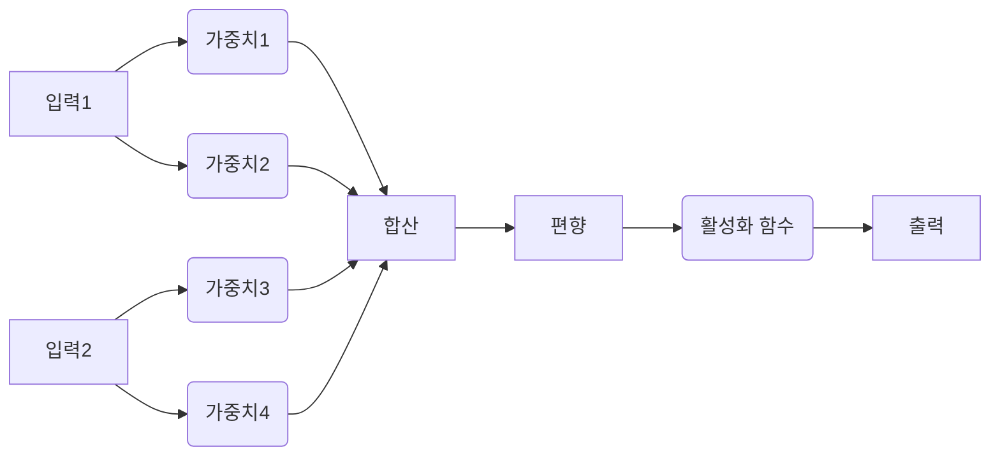
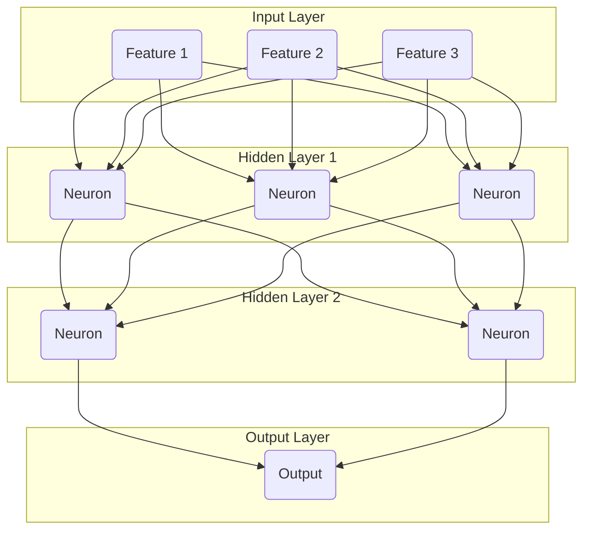

# 🧠 2. 딥러닝 기초: 복잡한 보안 패턴 학습의 열쇠

## 🔄 이전 단원 복습: 머신러닝의 기본과 보안 적용

이전 단원 `1. 머신러닝 기초.md`에서 우리는 머신러닝의 핵심 개념과 지도/비지도 학습의 유형, 그리고 `Scikit-learn`을 활용한 분류 모델 구축 및 평가 방법을 학습했습니다. 특히 보안 분야에서 머신러닝 모델의 오탐(False Positive)과 미탐(False Negative)의 중요성, 그리고 데이터 오염 공격(Data Poisoning)과 적대적 공격(Adversarial Attack)과 같은 모델 자체의 보안 위협에 대해서도 깊이 있게 다루었습니다.

> **핵심 복습:**
>
> *   **머신러닝의 가치:** 규칙 기반 시스템의 한계를 넘어, 데이터로부터 스스로 학습하여 새로운 위협을 탐지하는 지능형 보안 시스템 구축의 기반.
> *   **지도 학습:** 레이블(정답)이 있는 데이터로 학습하여 분류(Classification) 및 회귀(Regression) 문제 해결. 보안에서는 악성코드/침입 탐지 등에 활용.
> *   **모델 평가:** 정확도(Accuracy) 외에 정밀도(Precision), 재현율(Recall), F1-Score가 중요하며, 특히 보안에서는 미탐(False Negative)을 줄이는 재현율이 핵심.
> *   **모델 보안:** 훈련 데이터의 오염이나 입력값 조작(적대적 공격)으로 모델이 오작동할 수 있음을 인지하고 방어 전략 필요.
>
> 머신러닝은 강력하지만, 복잡하고 비정형적인 데이터(예: 이미지, 음성, 자연어)에서 특징(Feature)을 추출하는 데는 한계가 있습니다. 이러한 특징 추출은 여전히 인간 전문가의 도메인 지식에 크게 의존해야 했습니다. 오늘 배울 딥러닝은 이러한 한계를 극복하고, 데이터로부터 스스로 특징을 학습하는 혁신적인 기술입니다.

---

## 🤔 딥러닝을 왜 배워야 할까요? (The "Why")

전통적인 머신러닝은 데이터의 특징(Feature)을 사람이 직접 설계하고 추출해야 했습니다. 예를 들어, 악성코드 이미지 분류 모델을 만들려면, 사람이 악성코드 이미지에서 '특정 API 호출 패턴', '섹션 구조', '문자열 길이' 등과 같은 특징을 정의하고 추출해야 했습니다. 이 과정은 매우 어렵고 시간이 많이 소요되며, 인간의 지식 범위를 벗어나는 새로운 특징은 찾아내기 어려웠습니다.

**[전통 머신러닝의 한계]**
*   **수동 특징 추출:** 복잡한 데이터(이미지, 텍스트)에서 유의미한 특징을 사람이 직접 설계해야 함.
*   **성능 한계:** 데이터의 복잡도가 높아질수록 모델의 성능 향상에 한계가 있음.
*   **도메인 지식 의존:** 특정 분야의 전문가 지식이 없으면 모델 구축 자체가 어려움.

**[딥러닝의 해결책]**
딥러닝(Deep Learning)은 인간의 뇌를 모방한 **인공 신경망(Artificial Neural Network, ANN)**을 기반으로 합니다. 여러 층(Layer)의 신경망을 깊게 쌓아 올린 구조(Deep)를 통해, 데이터로부터 **스스로 특징을 학습(Feature Learning)**하고 복잡한 패턴을 인식하는 능력을 가집니다.

> **보안 전문가에게 딥러닝이란?**
>
> 기존 머신러닝으로는 탐지하기 어려웠던 **고도로 은닉된 악성코드의 행위 패턴**, **변형된 피싱 메일의 문맥적 특징**, **암호화된 트래픽 속의 이상 징후** 등을 데이터로부터 직접 학습하여 찾아내는 **'초지능형 보안 분석 엔진'**을 만드는 기술입니다. 이는 AI 기반 보안 시스템의 성능을 한 단계 끌어올리는 핵심 동력입니다.

---

## 1. 🧠 딥러닝의 핵심: 인공 신경망 (Artificial Neural Network, ANN)

### 1.1. 💡 뉴런(Neuron)과 활성화 함수(Activation Function)

인공 신경망의 가장 기본적인 구성 요소는 **뉴런(Neuron)**입니다. 뉴런은 여러 개의 입력을 받아 가중치(Weight)를 곱하고 편향(Bias)을 더한 후, **활성화 함수(Activation Function)**를 통과시켜 최종 출력을 내보냅니다.



> **용어 해설: 활성화 함수(Activation Function)**
>
> 뉴런의 출력값을 결정하는 비선형 함수입니다. 신경망에 비선형성을 부여하여 복잡한 패턴을 학습할 수 있도록 합니다. `ReLU`, `Sigmoid`, `Tanh` 등이 대표적입니다. 보안 관점에서는, 활성화 함수가 너무 단순하면 모델이 복잡한 공격 패턴을 학습하지 못하고, 너무 복잡하면 과적합될 위험이 있습니다.

### 1.2. 🏗️ 다층 퍼셉트론 (Multi-Layer Perceptron, MLP)

여러 개의 뉴런들이 층(Layer)을 이루고, 이 층들이 여러 개 쌓여 있는 구조를 **다층 퍼셉트론(MLP)** 또는 **피드포워드 신경망(Feedforward Neural Network)**이라고 합니다.

*   **입력층 (Input Layer):** 데이터의 특징(Feature)을 받아들이는 층.
*   **은닉층 (Hidden Layer):** 입력층과 출력층 사이에 위치하며, 데이터로부터 복잡한 특징을 학습하는 핵심적인 역할을 합니다. 층이 깊을수록(Deep) 더 추상적인 특징을 학습할 수 있습니다.
*   **출력층 (Output Layer):** 최종 예측 결과를 내보내는 층. 분류 문제에서는 클래스 확률, 회귀 문제에서는 연속적인 값을 출력합니다.



---

## 2. 🧪 딥러닝 프레임워크: TensorFlow와 Keras

`TensorFlow`는 Google에서 개발한 오픈소스 머신러닝 라이브러리이며, `Keras`는 TensorFlow 위에서 동작하는 고수준(High-level) API입니다. Keras를 사용하면 복잡한 신경망 모델을 매우 쉽고 빠르게 구축할 수 있습니다.

### 2.1. 🛡️ MLP를 이용한 악성코드 분류 모델 구축

이전 머신러닝 단원에서 사용했던 악성/정상 트래픽 분류 문제를 딥러닝 MLP 모델로 해결해 보겠습니다.

#### **PoC: Keras를 이용한 악성코드 분류 MLP 모델**

```python
import pandas as pd
import numpy as np
from sklearn.model_selection import train_test_split
from sklearn.preprocessing import StandardScaler # 데이터 스케일링
from tensorflow.keras.models import Sequential
from tensorflow.keras.layers import Dense
from tensorflow.keras.optimizers import Adam
from sklearn.metrics import classification_report, confusion_matrix
import io

# --- 1. 데이터 준비 (가상 데이터) ---
data = {
    'file_size': [307200, 22528, 153600, 98765, 50000, 100000, 200000, 10000],
    'text_entropy': [7.8, 6.1, 7.5, 6.3, 7.0, 6.5, 7.2, 5.9],
    'has_suspicious_api': [1, 0, 1, 0, 1, 0, 1, 0],
    'is_malicious': [1, 0, 1, 0, 1, 0, 1, 0] # 1:악성, 0:정상 (Label)
}
df = pd.DataFrame(data)

X = df[['file_size', 'text_entropy', 'has_suspicious_api']]
y = df['is_malicious']

# --- 2. 데이터 분할 및 스케일링 ---
X_train, X_test, y_train, y_test = train_test_split(X, y, test_size=0.3, random_state=42)

# 💡 보안 관점: 스케일링은 매우 중요합니다!
#    file_size와 text_entropy처럼 값의 범위가 크게 다른 특징이 있을 경우,
#    스케일링을 하지 않으면 모델이 큰 값의 특징에만 영향을 받아 학습이 제대로 이루어지지 않습니다.
#    StandardScaler: 각 특징의 평균을 0, 표준편차를 1로 조정합니다.
scaler = StandardScaler()
X_train_scaled = scaler.fit_transform(X_train)
X_test_scaled = scaler.transform(X_test)

print("--- 📊 스케일링된 훈련 데이터 (일부) ---")
print(X_train_scaled[:3])

# --- 3. 딥러닝 모델 구축 (Keras Sequential API) ---
model = Sequential([
    # 입력층: input_shape는 첫 번째 은닉층에만 지정. 특징의 개수(X_train.shape[1])
    Dense(64, activation='relu', input_shape=(X_train.shape[1],)), 
    # 은닉층: Dense는 완전 연결(Fully Connected) 층을 의미. 64개의 뉴런, 활성화 함수는 ReLU
    Dense(32, activation='relu'), # 또 다른 은닉층
    # 출력층: 이진 분류(악성/정상)이므로 1개의 뉴런, 활성화 함수는 sigmoid (0~1 사이 확률 출력)
    Dense(1, activation='sigmoid') 
])

# --- 4. 모델 컴파일 ---
# optimizer: Adam은 가장 널리 사용되는 최적화 알고리즘 중 하나
# loss: 이진 분류이므로 binary_crossentropy 사용
# metrics: 모델 성능 평가 지표 (accuracy)
model.compile(optimizer=Adam(learning_rate=0.001), loss='binary_crossentropy', metrics=['accuracy'])

model.summary() # 모델 구조 요약

# --- 5. 모델 훈련 ---
# epochs: 전체 훈련 데이터를 몇 번 반복 학습할 것인지
# batch_size: 한 번에 몇 개의 샘플을 학습할 것인지
history = model.fit(X_train_scaled, y_train, epochs=50, batch_size=8, validation_split=0.2, verbose=0)

print("\n✅ 딥러닝 모델 훈련 완료!")

# --- 6. 모델 예측 및 평가 ---
y_pred_proba = model.predict(X_test_scaled) # 0~1 사이의 확률 값 예측
y_pred = (y_pred_proba > 0.5).astype(int) # 0.5를 기준으로 0 또는 1로 변환

print("\n--- 📊 딥러닝 모델 평가 결과 ---")
print(classification_report(y_test, y_pred, target_names=['정상', '악성']))
print("\n--- 📈 혼동 행렬 ---")
print(confusion_matrix(y_test, y_pred))
```
**[분석]**
Keras의 `Sequential` API를 사용하여 간단한 MLP 모델을 구축하고, 악성코드 특징 데이터를 학습시켜 분류 모델을 만들었습니다. `StandardScaler`를 이용한 데이터 스케일링은 딥러닝 모델 학습에 필수적입니다. `classification_report`와 `confusion_matrix`를 통해 모델의 성능을 평가하는 것은 머신러닝과 동일하게 중요합니다.

---

## 3. 🛡️ 딥러닝 모델의 보안 위협과 방어

딥러닝 모델은 복잡한 패턴을 학습하는 강력한 능력을 가지지만, 그만큼 새로운 형태의 공격에 취약할 수 있습니다.

### 3.1. 💥 적대적 예제 공격 (Adversarial Examples Attack)

이전 단원에서 다룬 적대적 공격의 심화 버전입니다. 딥러닝 모델은 입력 데이터에 인간이 인지하기 어려운 미세한 변화(노이즈)를 주었을 때, 완전히 다른 결과(오분류)를 내놓을 수 있습니다.

> **보안 관점:**
>
> *   **악성코드 우회:** 공격자가 악성코드 파일에 미세한 바이트를 추가하여 딥러닝 기반 악성코드 탐지 시스템을 우회할 수 있습니다.
> *   **침입 탐지 우회:** 정상 트래픽처럼 보이는 미세한 변형을 가하여 IDS/IPS를 속일 수 있습니다.
> *   **안면 인식 시스템 우회:** 특정 패턴의 안경을 착용하는 것만으로 다른 사람으로 인식되게 할 수 있습니다.

#### **방어 전략:**
*   **적대적 훈련 (Adversarial Training):** 적대적 예제를 훈련 데이터에 포함시켜 모델의 견고성을 높입니다.
*   **모델 앙상블 (Model Ensemble):** 여러 모델의 예측을 결합하여 단일 모델의 취약점을 보완합니다.
*   **입력 전처리 (Input Preprocessing):** 입력 데이터의 노이즈를 제거하거나 특징을 변환하여 적대적 예제의 효과를 줄입니다.

### 3.2. 💥 모델 추출 공격 (Model Extraction Attack)

공격자가 쿼리(Query)를 통해 모델의 예측 결과를 반복적으로 요청하여, 원본 모델과 유사한 기능을 하는 '복제 모델'을 만들어내는 공격입니다.

> **보안 관점:**
>
> *   **지적 재산권 침해:** 힘들게 개발한 고성능 모델의 핵심 로직이 유출될 수 있습니다.
> *   **우회 공격 개발:** 복제 모델을 이용하여 적대적 예제를 만들거나, 원본 모델의 취약점을 분석하여 우회 공격을 개발할 수 있습니다.

#### **방어 전략:**
*   **쿼리 제한 (Query Limiting):** API 호출 횟수를 제한하여 대량의 쿼리를 통한 모델 추출을 어렵게 합니다.
*   **출력 교란 (Output Perturbation):** 모델의 출력에 미세한 노이즈를 추가하여 복제 모델의 정확도를 떨어뜨립니다.

---

## 👨‍💻 현직자 통합 시나리오: AI 기반 피싱 메일 탐지 시스템 고도화

**[상황]**
AI 보안 엔지니어 '제미니'는 기존의 규칙 기반 피싱 메일 탐지 시스템의 오탐/미탐률을 줄이기 위해 딥러닝 기반의 새로운 시스템을 구축하고자 합니다. 특히, 메일 본문의 복잡한 문맥적 특징을 학습하여 정교한 피싱 메일을 탐지하는 것이 목표입니다.

**[데이터셋]**
가상의 이메일 본문 텍스트 데이터셋. 각 메일은 `text`와 `is_phishing` (1: 피싱, 0: 정상) 레이블을 가집니다.

```python
import pandas as pd
import numpy as np
from sklearn.model_selection import train_test_split
from sklearn.preprocessing import LabelEncoder
from tensorflow.keras.models import Sequential
from tensorflow.keras.layers import Dense, Embedding, Flatten
from tensorflow.keras.preprocessing.text import Tokenizer
from tensorflow.keras.preprocessing.sequence import pad_sequences
from sklearn.metrics import classification_report, confusion_matrix
import io

# --- 1. 데이터 준비 ---
data = {
    'text': [
        "귀하의 계정이 잠겼습니다. 즉시 로그인하여 잠금을 해제하세요. [링크]",
        "안녕하세요, 고객님. 주문하신 상품이 배송 시작되었습니다. 송장 번호 확인 [링크]",
        "긴급! 은행 계좌 정보 업데이트 필요. 지금 클릭하세요. [링크]",
        "주간 업무 보고서입니다. 확인 부탁드립니다.",
        "당신의 계정이 해킹되었습니다. 비밀번호를 변경하세요. [링크]",
        "친구 요청이 도착했습니다. 프로필을 확인하세요.",
        "세금 환급 안내. 자세한 내용은 첨부 파일을 확인하세요.",
        "회의 시간 변경 안내. 새로운 시간은 오후 3시입니다."
    ],
    'is_phishing': [1, 0, 1, 0, 1, 0, 1, 0] # 1: 피싱, 0: 정상
}
df = pd.DataFrame(data)

X_text = df['text']
y = df['is_phishing']

# --- 2. 텍스트 데이터 전처리 (딥러닝 모델 입력 형태로 변환) ---
# 💡 텍스트 데이터를 딥러닝 모델이 이해할 수 있는 숫자로 변환하는 과정
# Tokenizer: 텍스트를 단어 단위로 분리하고 각 단어에 고유한 숫자(인덱스)를 부여
tokenizer = Tokenizer(num_words=1000, oov_token="<unk>") # 1000개 단어만 사용, 없는 단어는 <unk>
tokenizer.fit_on_texts(X_text)
sequences = tokenizer.texts_to_sequences(X_text)

# pad_sequences: 문장의 길이를 동일하게 맞춰줌 (가장 긴 문장에 맞춰 부족한 부분은 0으로 채움)
# 💡 보안 관점: 패딩(Padding) 방식에 따라 모델이 특정 위치의 특징을 더 중요하게 학습할 수 있으므로 주의
padded_sequences = pad_sequences(sequences, maxlen=20, padding='post') # 최대 길이 20, 뒤에 0 채움

X_train, X_test, y_train, y_test = train_test_split(padded_sequences, y, test_size=0.3, random_state=42)

print("--- 📊 전처리된 텍스트 데이터 (일부) ---")
print(X_train[:3])

# --- 3. 딥러닝 모델 구축 (텍스트 분류를 위한 MLP) ---
model = Sequential([
    # Embedding 층: 단어 인덱스를 밀집 벡터(Dense Vector)로 변환. 단어의 의미를 벡터 공간에 표현
    # input_dim: 단어 사전의 크기 (tokenizer.word_index의 길이 + 1)
    # output_dim: 임베딩 벡터의 차원 (각 단어를 몇 차원 벡터로 표현할지)
    # input_length: 입력 시퀀스의 길이 (pad_sequences의 maxlen)
    Embedding(input_dim=len(tokenizer.word_index) + 1, output_dim=16, input_length=20),
    Flatten(), # 임베딩된 벡터들을 1차원으로 펼침
    Dense(32, activation='relu'),
    Dense(1, activation='sigmoid')
])

model.compile(optimizer='adam', loss='binary_crossentropy', metrics=['accuracy'])
model.summary()

# --- 4. 모델 훈련 ---
model.fit(X_train, y_train, epochs=10, batch_size=2, validation_split=0.2, verbose=0)

print("\n✅ 딥러닝 모델 훈련 완료!")

# --- 5. 모델 예측 및 평가 ---
y_pred_proba = model.predict(X_test)
y_pred = (y_pred_proba > 0.5).astype(int)

print("\n--- 📊 딥러닝 모델 평가 결과 ---")
print(classification_report(y_test, y_pred, target_names=['정상', '피싱']))
print("\n--- 📈 혼동 행렬 ---")
print(confusion_matrix(y_test, y_pred))
```
**[시나리오 분석]**
'제미니' 엔지니어는 Keras를 사용하여 이메일 텍스트 데이터를 전처리하고, `Embedding` 층을 포함한 딥러닝 모델을 구축하여 피싱 메일을 탐지하는 시스템을 시연했습니다. 텍스트 데이터의 복잡한 문맥적 특징을 딥러닝 모델이 스스로 학습함으로써, 기존 규칙 기반 시스템보다 훨씬 정교하게 피싱 메일을 분류할 수 있음을 보여줍니다.

---

## ➡️ 다음 단원에서는?

이번 단원에서는 딥러닝의 기본 개념인 인공 신경망(ANN)과 다층 퍼셉트론(MLP)의 구조를 이해하고, `TensorFlow/Keras`를 사용하여 실제 딥러닝 모델을 구축하는 방법을 학습했습니다. 또한 딥러닝 모델의 적대적 예제 공격과 모델 추출 공격과 같은 새로운 보안 위협과 방어 전략에 대해서도 알아보았습니다.

**다음 단원인 `3. 딥러닝 심화.md`** 에서는, 딥러닝의 꽃이라고 할 수 있는 **CNN(Convolutional Neural Network)**과 **RNN(Recurrent Neural Network)**의 구조와 원리를 깊이 있게 다룹니다. 이미지 기반 악성코드 분석, 시계열 데이터 기반 이상 탐지, 자연어 처리 기반 위협 인텔리전스 분석 등 보안 분야의 다양한 문제에 딥러닝을 어떻게 적용할 수 있는지 구체적인 사례와 함께 학습하게 될 것입니다.

---

## 📌 요약 정리 (Executive Summary)

1.  **딥러닝의 필요성**: 전통 머신러닝의 수동 특징 추출 한계를 극복하고, 데이터로부터 스스로 복잡하고 추상적인 특징을 학습하여 고도화된 보안 위협 탐지 및 분석을 가능하게 한다.
2.  **인공 신경망 (ANN)**: 딥러닝의 기본 구조로, 뉴런(Neuron)과 활성화 함수(Activation Function)로 구성된다. 여러 층을 쌓아 올린 다층 퍼셉트론(MLP)이 기본 모델이다.
3.  **활성화 함수**: 신경망에 비선형성을 부여하여 복잡한 패턴 학습을 가능하게 한다. `ReLU`, `Sigmoid` 등이 대표적이다.
4.  **딥러닝 프레임워크**: `TensorFlow`와 그 위에 구축된 `Keras`는 딥러닝 모델을 쉽고 빠르게 구축할 수 있도록 돕는다.
5.  **모델 구축 과정**: 데이터 준비 -> 데이터 분할 및 스케일링 -> 모델 구축 (`Sequential` API, `Dense` 층) -> 모델 컴파일 (`optimizer`, `loss`, `metrics`) -> 모델 훈련 (`fit`) -> 예측 및 평가.
6.  **딥러닝 모델의 보안 위협**:
    *   **적대적 예제 공격 (Adversarial Examples Attack)**: 미세한 노이즈로 모델을 오분류하게 만든다. (방어: 적대적 훈련, 앙상블, 입력 전처리)
    *   **모델 추출 공격 (Model Extraction Attack)**: 모델의 예측 결과를 반복 요청하여 복제 모델을 만든다. (방어: 쿼리 제한, 출력 교란)
7.  **보안 관점**: 딥러닝은 강력한 도구이지만, 모델 자체의 취약점을 이해하고 방어 전략을 함께 고려해야만 견고한 AI 기반 보안 시스템을 구축할 수 있다. 특히 텍스트 데이터와 같은 비정형 데이터를 다룰 때는 `Embedding` 층을 통해 단어의 의미를 벡터 공간에 표현하는 것이 중요하다.