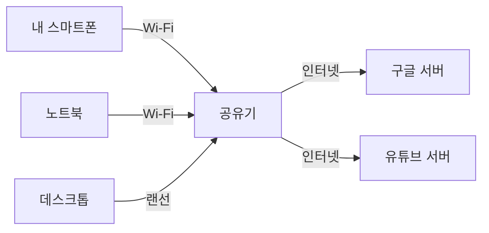
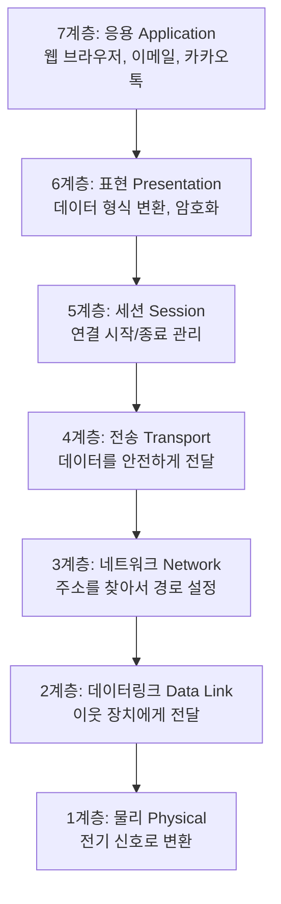
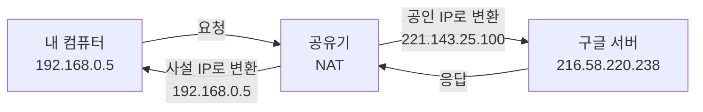
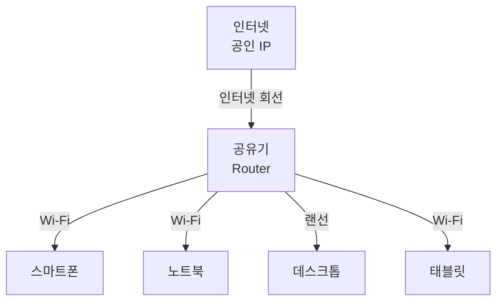
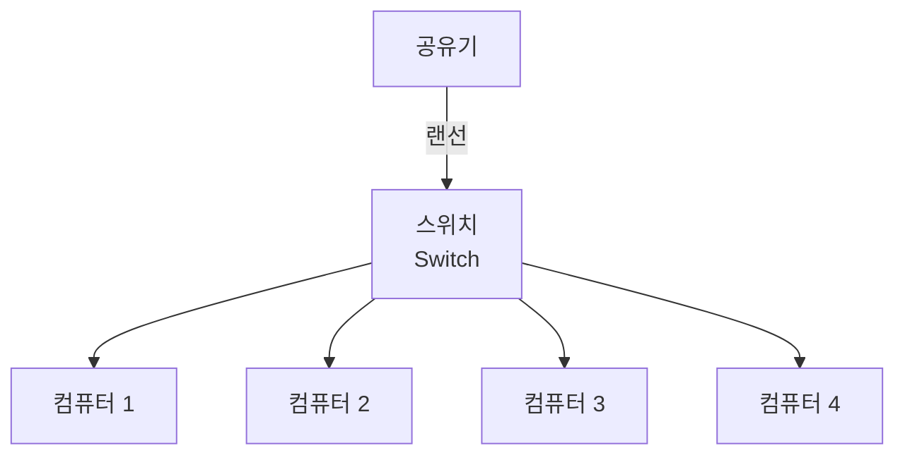
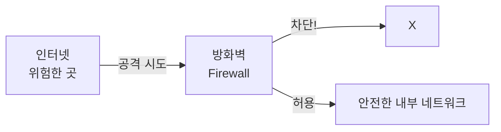

# 🌐 1. 네트워크 기초: 인터넷은 어떻게 작동할까요?

## 🎯 이 문서를 읽고 나면

- 네트워크가 무엇인지, 왜 중요한지 이해할 수 있습니다
- 우리가 매일 사용하는 인터넷의 기본 원리를 알게 됩니다
- IP 주소가 무엇이고, 어떻게 사용되는지 이해할 수 있습니다
- 네트워크 보안의 기초 개념을 배울 수 있습니다

---

## 📖 네트워크란 무엇인가요?

### 1.1. 🤝 네트워크의 정의

**네트워크(Network)**는 여러 대의 컴퓨터나 장치들이 서로 연결되어 정보를 주고받을 수 있는 시스템입니다.

일상 생활의 예시로 생각해볼까요?



- **집 안 네트워크**: 스마트폰, 노트북, TV가 공유기를 통해 연결
- **회사 네트워크**: 여러 직원의 컴퓨터들이 연결되어 파일 공유
- **인터넷**: 전 세계의 컴퓨터들이 연결된 거대한 네트워크

### 1.2. 🌍 왜 네트워크를 배워야 할까요?

네트워크는 우리 일상의 거의 모든 것과 연결되어 있습니다:

1. **웹 브라우징**: 구글에서 검색할 때
2. **메신저**: 카카오톡으로 메시지를 보낼 때
3. **동영상 시청**: 유튜브나 넷플릭스를 볼 때
4. **온라인 게임**: 게임을 즐길 때
5. **쇼핑**: 쿠팡이나 네이버 쇼핑을 할 때

> **중요한 사실**:
>
> 이 모든 활동이 네트워크를 통해 이루어집니다. 그리고 사이버 공격도 마찬가지로 네트워크를 통해 일어납니다. 따라서 네트워크를 이해하는 것은 보안의 첫걸음입니다!

### 1.3. 🏠 네트워크의 종류

**규모에 따른 분류:**

| 종류 | 이름 | 범위 | 예시 |
|-----|------|-----|-----|
| **PAN** | Personal Area Network | 개인 주변 (몇 미터) | 블루투스 이어폰, 스마트워치 |
| **LAN** | Local Area Network | 건물 내부 (수백 미터) | 집 Wi-Fi, 사무실 네트워크 |
| **MAN** | Metropolitan Area Network | 도시 전체 (수십 km) | 도시 공공 Wi-Fi |
| **WAN** | Wide Area Network | 국가/대륙 (무한대) | 인터넷, 기업 본사-지사 연결 |

> **초보자 Tip**:
>
> - **LAN**: 집이나 회사처럼 한정된 공간의 네트워크
> - **WAN**: 인터넷처럼 멀리 떨어진 곳까지 연결하는 네트워크
> - 대부분의 경우 LAN과 WAN만 기억하셔도 충분합니다!

---

## 2. 🏗️ 네트워크는 어떻게 작동할까요? - OSI 7계층 쉽게 이해하기

### 2.1. 📦 우체국 시스템으로 이해하는 네트워크

네트워크 통신을 우체국에 소포를 보내는 과정으로 생각해봅시다:

1. **편지 작성** (응용 계층) - 내용을 쓴다
2. **봉투 준비** (표현/세션 계층) - 읽을 수 있게 정리한다
3. **주소 작성** (전송/네트워크 계층) - 어디로 보낼지 적는다
4. **우체국 접수** (데이터링크 계층) - 우체부에게 전달한다
5. **배달** (물리 계층) - 실제로 운반한다

이처럼 네트워크도 여러 단계로 나누어 동작합니다. 이것을 **OSI 7계층 모델**이라고 합니다.

### 2.2. 🌈 OSI 7계층 모델 - 그림으로 이해하기



### 2.3. 📚 각 계층을 쉽게 이해하기

#### 7계층: 응용 계층 (Application Layer)
**"우리가 실제로 사용하는 프로그램"**

- **예시**: 크롬 브라우저, 카카오톡, 이메일 프로그램
- **하는 일**: 사용자가 네트워크를 이용할 수 있게 해줌
- **일상 예시**:
  - 웹 브라우저에서 "www.google.com" 입력
  - 카카오톡에서 친구에게 메시지 전송
  - 이메일 앱에서 메일 보내기

> **보안 포인트**:
> 피싱 사이트, 악성코드가 숨어있는 이메일 등 우리가 직접 보는 곳에서 공격이 시작됩니다.

#### 6계층: 표현 계층 (Presentation Layer)
**"데이터를 읽을 수 있는 형태로 바꿔주는 번역가"**

- **예시**: JPEG(이미지), MP4(동영상), 암호화
- **하는 일**: 데이터 형식 변환, 압축, 암호화
- **일상 예시**:
  - 사진을 JPEG 파일로 저장
  - 동영상을 압축해서 전송
  - 비밀번호를 암호화해서 저장

> **보안 포인트**:
> 약한 암호화를 사용하면 해커가 정보를 훔쳐볼 수 있습니다.

#### 5계층: 세션 계층 (Session Layer)
**"대화를 시작하고 끝내는 관리자"**

- **하는 일**: 연결을 만들고, 유지하고, 종료함
- **일상 예시**:
  - 웹사이트 로그인 → 페이지 이동 → 로그아웃
  - 화상 통화 시작 → 대화 → 통화 종료

> **보안 포인트**:
> 로그인 정보를 계속 유지하는 "세션"을 해커가 가로채면 내 계정이 도용될 수 있습니다.

#### 4계층: 전송 계층 (Transport Layer)
**"택배 기사처럼 물건을 안전하게 배달"**

- **주요 프로토콜**: TCP(안전 배달), UDP(빠른 배달)
- **하는 일**: 데이터를 나누고, 순서대로 전달하고, 오류 확인
- **일상 예시**:
  - **TCP**: 택배 (배송 확인, 서명 필요) - 파일 다운로드, 이메일
  - **UDP**: 퀵서비스 (빠르지만 확인 안 함) - 동영상 스트리밍, 온라인 게임

> **보안 포인트**:
> 포트 번호를 통해 어떤 프로그램으로 데이터가 가는지 결정합니다. 해커는 열려있는 포트를 찾아 침입합니다.

#### 3계층: 네트워크 계층 (Network Layer)
**"내비게이션처럼 목적지까지의 길을 찾아줌"**

- **핵심 개념**: IP 주소 (인터넷 주소)
- **하는 일**: 어디로 보낼지 주소를 찾고 경로를 정함
- **일상 예시**:
  - 내비게이션이 집에서 학교까지 길을 찾아주는 것
  - 우편물에 "서울시 강남구..." 라고 주소를 쓰는 것

> **보안 포인트**:
> IP 주소를 속여서(IP 스푸핑) 다른 사람인 척 할 수 있습니다.

#### 2계층: 데이터링크 계층 (Data Link Layer)
**"바로 옆 집에 물건 전달하기"**

- **핵심 개념**: MAC 주소 (장치 고유 번호)
- **하는 일**: 바로 연결된 장치끼리 데이터 전달
- **일상 예시**:
  - 내 컴퓨터 → 공유기
  - 공유기 → 다음 라우터

> **보안 포인트**:
> MAC 주소를 속여서 다른 사람의 인터넷을 몰래 쓸 수 있습니다.

#### 1계층: 물리 계층 (Physical Layer)
**"전기 신호로 바꿔서 케이블로 전송"**

- **예시**: 랜선(UTP 케이블), 광케이블, Wi-Fi 전파
- **하는 일**: 데이터를 전기 신호나 빛, 전파로 변환
- **일상 예시**:
  - 랜선에 흐르는 전기 신호
  - Wi-Fi 공유기에서 나오는 무선 신호
  - 광케이블의 빛 신호

> **보안 포인트**:
> 케이블을 몰래 연결해서 데이터를 엿볼 수 있습니다 (물리적 도청).

### 2.4. 🎬 실제 예시: 유튜브 동영상 보기

"스마트폰으로 유튜브 동영상을 본다"는 과정을 7계층으로 분해하면:

1. **응용 계층**: 유튜브 앱에서 동영상 클릭
2. **표현 계층**: 동영상을 MP4 형식으로 변환
3. **세션 계층**: 유튜브 서버와 연결 시작
4. **전송 계층**: UDP로 빠르게 동영상 데이터 전송
5. **네트워크 계층**: 유튜브 서버 IP 주소 찾기
6. **데이터링크 계층**: 공유기를 거쳐 인터넷 연결
7. **물리 계층**: Wi-Fi 신호로 전송

---

## 3. 🏠 IP 주소: 인터넷의 집 주소

### 3.1. 📮 IP 주소란?

**IP 주소(IP Address)**는 네트워크에 연결된 모든 장치의 고유한 주소입니다.

- **실생활 비유**: 우리 집 주소 "서울시 강남구 테헤란로 123"
- **네트워크**: 내 컴퓨터 주소 "192.168.0.5"

```
실제 집 주소:  서울시 강남구 테헤란로 123번길 45
               ↓
IP 주소:       192  .  168  .   0   .   5
               (동)   (구)   (번지)  (호수)
```

### 3.2. 🔢 IP 주소의 두 가지 버전

#### IPv4 (현재 가장 많이 사용)

- **형태**: 숫자 4개를 점(.)으로 구분
- **예시**: `192.168.1.100`, `8.8.8.8`
- **범위**: 각 숫자는 0~255 사이
- **총 개수**: 약 43억 개

```
IPv4 주소 예시:
- 192.168.0.1     (집 공유기)
- 8.8.8.8         (구글 DNS 서버)
- 172.16.0.50     (회사 컴퓨터)
- 1.1.1.1         (Cloudflare DNS)
```

#### IPv6 (미래의 IP 주소)

- **형태**: 16진수 8개를 콜론(:)으로 구분
- **예시**: `2001:0db8:85a3:0000:0000:8a2e:0370:7334`
- **총 개수**: 거의 무한대 (340조의 1조의 1조 배)
- **왜 필요한가요?**: IPv4 주소가 다 떨어져서!

> **초보자 Tip**:
>
> 지금은 IPv4만 이해하셔도 충분합니다. IPv6는 점점 더 많이 사용되고 있지만, 아직 대부분은 IPv4를 씁니다.

### 3.3. 🌍 공인 IP vs 사설 IP

#### 공인 IP (Public IP)
**"인터넷에서 볼 수 있는 주소"**

- 전 세계에서 유일한 주소
- 인터넷에 직접 연결됨
- ISP(KT, SK 등)에서 제공
- **예시**: 우리 집 대문 주소

```
예시:
- 221.143.25.100  (우리 집 공유기의 공인 IP)
- 216.58.220.238  (구글 서버)
```

#### 사설 IP (Private IP)
**"집 안에서만 쓰는 주소"**

- 내부 네트워크에서만 사용
- 인터넷에서 직접 접근 불가
- 무료로 사용 가능
- **예시**: 아파트 내 동호수

```
사설 IP 주소 대역:
- 10.0.0.0 ~ 10.255.255.255
- 172.16.0.0 ~ 172.31.255.255
- 192.168.0.0 ~ 192.168.255.255  ← 가장 많이 사용

우리 집 네트워크 예시:
- 공유기: 192.168.0.1
- 내 컴퓨터: 192.168.0.5
- 엄마 노트북: 192.168.0.10
- 동생 스마트폰: 192.168.0.15
```

### 3.4. 🔄 NAT: 사설 IP로 인터넷 쓰기

**NAT (Network Address Translation)**: 사설 IP를 공인 IP로 바꿔주는 기술



**NAT의 장점:**
1. **IP 주소 절약**: 여러 기기가 하나의 공인 IP 공유
2. **보안 강화**: 외부에서 내부 기기 직접 접근 불가

> **일상 예시**:
>
> 아파트(사설 IP)에서 우편물을 보낼 때, 아파트 관리실(NAT)이 발신자 주소를 아파트 대표 주소(공인 IP)로 바꿔서 보내는 것과 같습니다.

### 3.5. 🔍 내 IP 주소 확인하기

#### Windows에서 확인:
```bash
# 명령 프롬프트(cmd)에서
ipconfig

# 출력 예시:
# 이더넷 어댑터 로컬 영역 연결:
#    IPv4 주소 . . . . . . . . . : 192.168.0.5
#    서브넷 마스크 . . . . . . . : 255.255.255.0
#    기본 게이트웨이 . . . . . . : 192.168.0.1
```

#### Mac/Linux에서 확인:
```bash
# 터미널에서
ifconfig
# 또는
ip addr show

# 출력에서 "inet" 다음에 나오는 숫자가 IP 주소
```

#### 웹 브라우저에서 공인 IP 확인:
- [https://www.whatismyip.com/](https://www.whatismyip.com/)
- [https://ipconfig.kr/](https://ipconfig.kr/)

---

## 4. 🔌 포트(Port): 아파트의 각 집 호수

### 4.1. 🚪 포트란 무엇인가요?

**포트(Port)**는 하나의 컴퓨터에서 여러 프로그램이 네트워크를 사용할 수 있게 해주는 번호입니다.

```
아파트 비유:
IP 주소 = 아파트 주소 (서울시 강남구 테헤란로 123)
포트 = 각 집의 호수 (101호, 102호, 103호...)

실제 네트워크:
IP 주소: 192.168.0.5
포트 80: 웹 서버 (크롬 브라우저)
포트 443: 보안 웹 서버 (HTTPS)
포트 22: 원격 접속 (SSH)
```

### 4.2. 📌 자주 사용하는 포트 번호

| 포트 번호      | 서비스    | 설명          | 예시                     |
| ---------- | ------ | ----------- | ---------------------- |
| **20, 21** | FTP    | 파일 전송       | 파일 서버 접속               |
| **22**     | SSH    | 안전한 원격 접속   | 서버 관리                  |
| **23**     | Telnet | 원격 접속 (비보안) | ⚠️ 사용 금지               |
| **25**     | SMTP   | 이메일 발송      | 메일 보내기                 |
| **53**     | DNS    | 도메인 이름 변환   | google.com → IP 주소     |
| **80**     | HTTP   | 웹 사이트       | http://www.naver.com   |
| **443**    | HTTPS  | 보안 웹 사이트    | https://www.google.com |
| **3306**   | MySQL  | 데이터베이스      | 웹사이트 DB 연결             |
| **3389**   | RDP    | 윈도우 원격 데스크톱 | 원격으로 PC 제어             |

### 4.3. 🌐 URL에서 포트 이해하기

웹 주소(URL)를 분해해봅시다:

```
https://www.google.com:443/search?q=network

https://     → 프로토콜 (보안 웹)
www.google.com  → 도메인 이름
:443         → 포트 번호 (생략 가능)
/search      → 경로
?q=network   → 매개변수
```

**포트가 생략된 경우:**
- `http://` → 자동으로 80번 포트
- `https://` → 자동으로 443번 포트

### 4.4. 🔓 열린 포트와 보안

**열린 포트 = 열어둔 창문**

- **장점**: 필요한 서비스 제공
- **단점**: 해커의 침입 경로가 될 수 있음

```
예시:
✅ 포트 80, 443: 웹 서버 운영 중 → 필요하면 열어둠
⚠️ 포트 22: SSH (원격 접속) → 꼭 필요할 때만
❌ 포트 23: Telnet (비보안) → 절대 사용 금지
❌ 포트 3389: RDP → 외부에서 접근 금지
```

> **보안 원칙**:
>
> **"필요한 포트만 열고, 나머지는 모두 닫아두세요!"**

---

## 5. 🔧 네트워크 장비: 어떻게 연결될까요?

### 5.1. 🏠 공유기 (Router)

**가장 흔하게 볼 수 있는 네트워크 장비**



**공유기가 하는 일:**
1. **인터넷 공유**: 한 개의 인터넷 회선을 여러 기기가 사용
2. **무선 Wi-Fi**: 무선으로 인터넷 연결
3. **IP 주소 할당**: 각 기기에 사설 IP 부여 (DHCP)
4. **NAT**: 사설 IP ↔ 공인 IP 변환
5. **간단한 방화벽**: 외부 침입 차단

### 5.2. 🔄 스위치 (Switch)

**여러 컴퓨터를 유선으로 연결**



**스위치의 특징:**
- 유선 연결만 가능
- 빠른 속도
- 사무실, PC방 등에서 많이 사용

> **공유기 vs 스위치**:
>
> - **공유기**: 인터넷 연결 + Wi-Fi + 스위치 기능
> - **스위치**: 유선 연결만 (인터넷 공유 안 됨)

### 5.3. 🛡️ 방화벽 (Firewall)

**네트워크를 지키는 경비원**



**방화벽이 하는 일:**
- 허용된 트래픽만 통과
- 의심스러운 접속 차단
- 포트 제어

**방화벽 규칙 예시:**
```
규칙 1: 외부에서 포트 80(웹) 접속 → 허용
규칙 2: 외부에서 포트 22(SSH) 접속 → 차단
규칙 3: 내부에서 모든 외부 접속 → 허용
규칙 4: 중국 IP에서 접속 → 차단
```

---

## 6. 🔐 네트워크 보안 기초

### 6.1. ⚠️ 일반적인 네트워크 위협

#### 1) 스니핑 (Sniffing) - 엿듣기
```
해커 → 📡 (네트워크 트래픽 가로채기)
     "아! 비밀번호가 1234구나!"
```

**예방법:**
- HTTPS 사용 (주소 앞에 자물쇠 🔒 확인)
- 공공 Wi-Fi 사용 시 VPN 사용
- 중요한 정보는 암호화

#### 2) 포트 스캔 (Port Scanning)
```
해커 → "이 서버는 어떤 포트가 열려있을까?"
     → 포트 22 열림! (SSH 발견)
     → 포트 80 열림! (웹 서버 발견)
     → 포트 3389 열림! (RDP 발견) → 공격 가능!
```

**예방법:**
- 불필요한 포트 닫기
- 방화벽 설정
- 포트 변경 (기본 포트 대신 다른 번호 사용)

#### 3) IP 스푸핑 (IP Spoofing) - 신분 위조
```
해커 → "나는 192.168.0.5입니다!" (거짓말)
     → 서버가 믿고 데이터 전송
```

**예방법:**
- 방화벽에서 IP 검증
- 인증 시스템 사용

#### 4) DDoS 공격 - 과부하 공격
```
해커 → 수천 대의 컴퓨터로 동시 접속
     → 서버 다운!
```

**예방법:**
- DDoS 방어 서비스 사용
- 트래픽 분산 (로드 밸런서)

### 6.2. 🛡️ 안전한 네트워크 사용법

#### 집에서:
1. **공유기 관리자 비밀번호 변경**
   - 기본 비밀번호(admin/admin) 사용 금지!

2. **Wi-Fi 암호화**
   - WPA3 또는 WPA2 사용
   - 강력한 비밀번호 설정

3. **펌웨어 업데이트**
   - 공유기 설정 페이지에서 최신 버전으로 업데이트

#### 공공 Wi-Fi 사용 시:
1. **VPN 사용**: 암호화된 터널로 안전하게 통신
2. **HTTPS 확인**: 주소창의 🔒 자물쇠 확인
3. **중요한 작업 자제**: 인터넷 뱅킹, 비밀번호 입력 피하기

#### 회사에서:
1. **회사 Wi-Fi만 사용**
2. **의심스러운 링크 클릭 금지**
3. **VPN으로 회사 네트워크 접속**

---

## 7. 🧪 실습: 네트워크 기초 명령어

### 7.1. 💻 내 네트워크 정보 확인하기

#### Windows (명령 프롬프트):
```bash
# IP 주소 확인
ipconfig

# 상세 정보 확인
ipconfig /all

# 네트워크 연결 확인
netstat -an

# 특정 사이트 응답 확인
ping google.com

# 경로 추적
tracert google.com
```

#### Mac/Linux (터미널):
```bash
# IP 주소 확인
ifconfig
# 또는
ip addr show

# 네트워크 연결 확인
netstat -an
# 또는
ss -tulnp

# 특정 사이트 응답 확인
ping google.com

# 경로 추적
traceroute google.com
```

### 7.2. 🔍 실습 예제

#### 예제 1: 내 IP 주소 찾기
```bash
# Windows
ipconfig

# 결과에서 찾기:
# IPv4 주소: 192.168.0.5  ← 이것이 내 사설 IP
# 기본 게이트웨이: 192.168.0.1  ← 공유기 IP
```

#### 예제 2: 구글 서버까지 경로 확인
```bash
# Windows
tracert google.com

# Mac/Linux
traceroute google.com

# 결과 해석:
# 1 단계: 192.168.0.1 (내 공유기)
# 2 단계: 211.xxx.xxx.xxx (ISP 라우터)
# 3 단계: ...
# 마지막: 216.58.220.238 (구글 서버)
```

#### 예제 3: 특정 포트가 열려있는지 확인 (Windows)
```bash
# 내 컴퓨터에서 열린 포트 확인
netstat -ano | findstr LISTENING

# 특정 포트 확인
netstat -ano | findstr :80
netstat -ano | findstr :443
```

---

## 8. 📊 네트워크 성능 이해하기

### 8.1. 🚀 속도 단위

```
1,000 bps (bit per second) = 1 Kbps
1,000 Kbps = 1 Mbps (메가비트)
1,000 Mbps = 1 Gbps (기가비트)

주의! 1 Byte = 8 bits
→ 100 Mbps 인터넷 = 실제 다운로드 속도 약 12.5 MB/s
```

**일반적인 인터넷 속도:**
- 100 Mbps: 기본 가정용 인터넷
- 500 Mbps ~ 1 Gbps: 빠른 인터넷
- 10 Gbps: 기업용, 데이터센터

### 8.2. ⏱️ 핑(Ping)과 지연시간

**핑(Ping)**: 데이터가 목적지까지 갔다가 돌아오는 시간

```
ping google.com

응답 속도:
- 1~10 ms: 매우 빠름 (게임, 주식 거래 가능)
- 10~50 ms: 빠름 (일반적인 웹 사용)
- 50~100 ms: 보통 (동영상 시청 가능)
- 100 ms 이상: 느림 (게임, 화상회의 불편)
```

### 8.3. 📶 Wi-Fi vs 유선 랜

| 비교 항목 | Wi-Fi (무선) | 유선 랜 (Ethernet) |
|---------|-------------|------------------|
| **속도** | 느림 (100~1000 Mbps) | 빠름 (1~10 Gbps) |
| **안정성** | 불안정 (거리, 장애물) | 안정적 |
| **편의성** | 매우 편함 | 케이블 필요 |
| **보안** | 상대적으로 취약 | 더 안전함 |
| **추천 용도** | 일반 웹, 모바일 | 게임, 업무, 서버 |

---

## 9. 🎯 핵심 정리

### ✅ 꼭 기억해야 할 내용

1. **네트워크는 컴퓨터들이 서로 연결되어 정보를 주고받는 시스템**

2. **OSI 7계층**: 네트워크 통신을 7단계로 나눈 모델
   - 7계층(응용): 우리가 사용하는 프로그램
   - 4계층(전송): TCP/UDP, 포트
   - 3계층(네트워크): IP 주소
   - 1계층(물리): 케이블, Wi-Fi 신호

3. **IP 주소**: 네트워크 상의 고유한 주소
   - 공인 IP: 인터넷에서 보이는 주소
   - 사설 IP: 집/회사 내부 주소 (192.168.x.x)

4. **포트**: 프로그램마다 다른 번호
   - 80: HTTP (웹)
   - 443: HTTPS (보안 웹)
   - 22: SSH (원격 접속)

5. **보안 기본 원칙**:
   - 불필요한 포트는 닫기
   - 공공 Wi-Fi는 조심
   - HTTPS 사용하기
   - 비밀번호 강력하게

### 📝 자주 묻는 질문 (FAQ)

**Q1: IP 주소는 어떻게 받나요?**
- 집/회사: 공유기에서 자동 할당 (DHCP)
- 인터넷: ISP(KT, SK 등)에서 제공

**Q2: 포트는 몇 개까지 있나요?**
- 0번부터 65535번까지 (총 65,536개)
- 0~1023번: 잘 알려진 서비스 전용
- 1024~49151번: 일반 프로그램 사용
- 49152~65535번: 임시 포트

**Q3: 공인 IP는 계속 같나요?**
- **고정 IP**: 항상 같음 (추가 비용)
- **유동 IP**: 재부팅하면 바뀜 (일반 가정용)

**Q4: VPN이 뭔가요?**
- Virtual Private Network
- 암호화된 터널을 만들어 안전하게 통신
- 공공 Wi-Fi에서 필수!

---

## 🚀 다음 단계

이제 네트워크의 기초를 이해했다면:

1. **다음 문서**: "2. 주요 프로토콜 분석_기초.md"
   - TCP, UDP, HTTP 등 프로토콜 자세히 배우기

2. **실습 추천**:
   - 내 컴퓨터 IP 주소 확인해보기
   - ping 명령어로 여러 사이트 응답 시간 측정
   - 공유기 관리 페이지 접속 (192.168.0.1 또는 192.168.1.1)

3. **추가 학습 자료**:
   - YouTube: "네트워크 기초" 검색
   - 생활코딩: 네트워크 강좌
   - Khan Academy: Computer Networks

---

## 📚 용어 정리

| 용어 | 영문 | 설명 |
|-----|------|-----|
| 네트워크 | Network | 컴퓨터들이 연결된 시스템 |
| 프로토콜 | Protocol | 통신 규칙 |
| IP 주소 | IP Address | 네트워크 상의 주소 |
| 포트 | Port | 프로그램을 구분하는 번호 |
| 공유기 | Router | 인터넷을 여러 기기에 나눠주는 장치 |
| 방화벽 | Firewall | 네트워크 보안 장치 |
| 대역폭 | Bandwidth | 네트워크 속도 (Mbps) |
| 지연시간 | Latency | 데이터 전송 시간 (ms) |
| VPN | Virtual Private Network | 가상 사설 네트워크 |
| DNS | Domain Name System | 도메인을 IP로 변환 |

---

**🎉 축하합니다!**

네트워크 기초 개념을 모두 학습하셨습니다. 이제 인터넷이 어떻게 작동하는지, IP 주소가 무엇인지, 그리고 기본적인 네트워크 보안 개념을 이해하셨습니다.

다음 단계에서는 더 구체적인 프로토콜과 보안 기술을 배워보겠습니다!

---

*작성일: 2025년*
*난이도: ⭐ 입문*
*예상 학습 시간: 2-3시간*