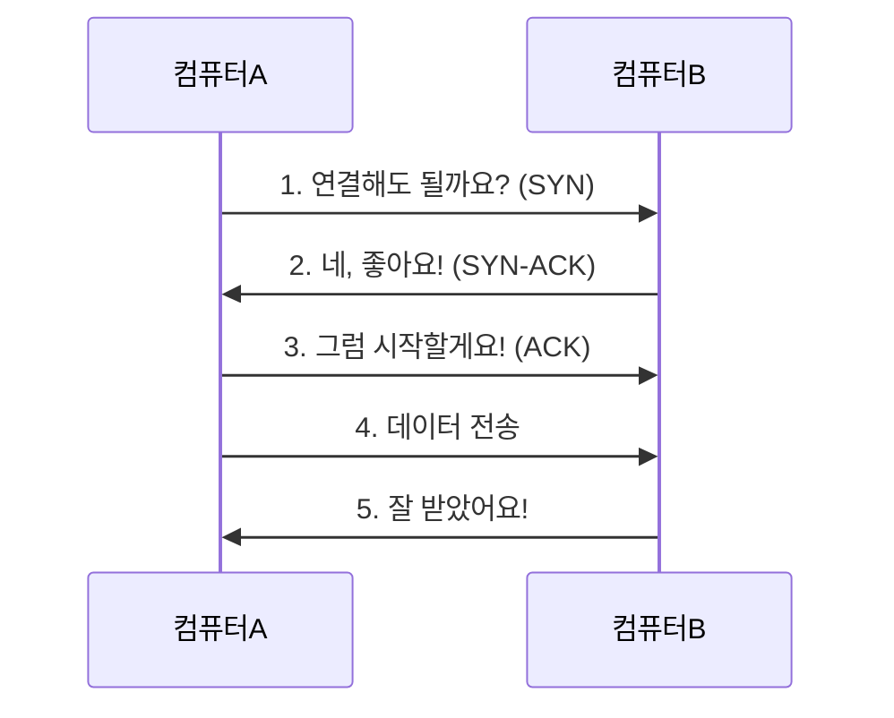
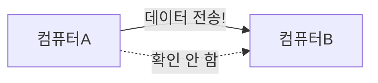
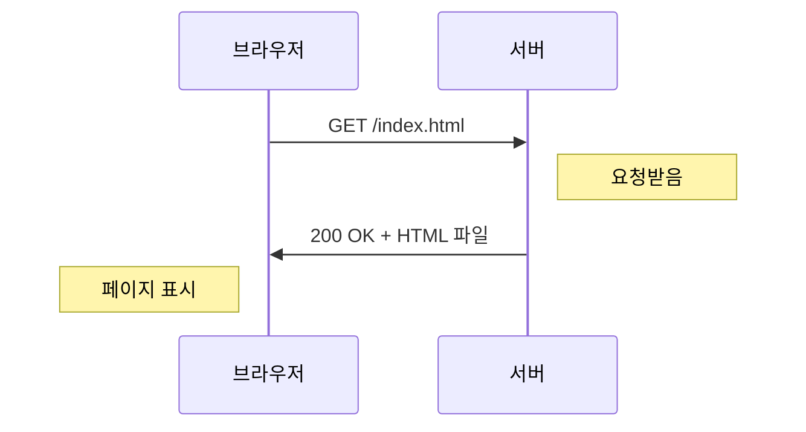
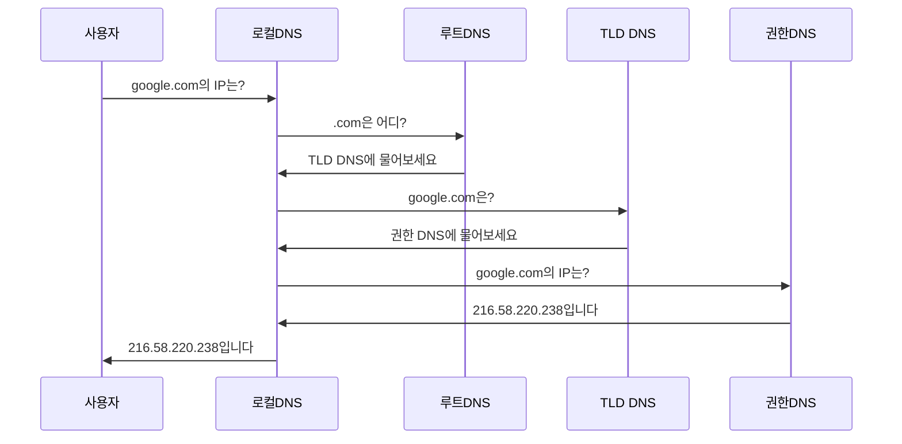
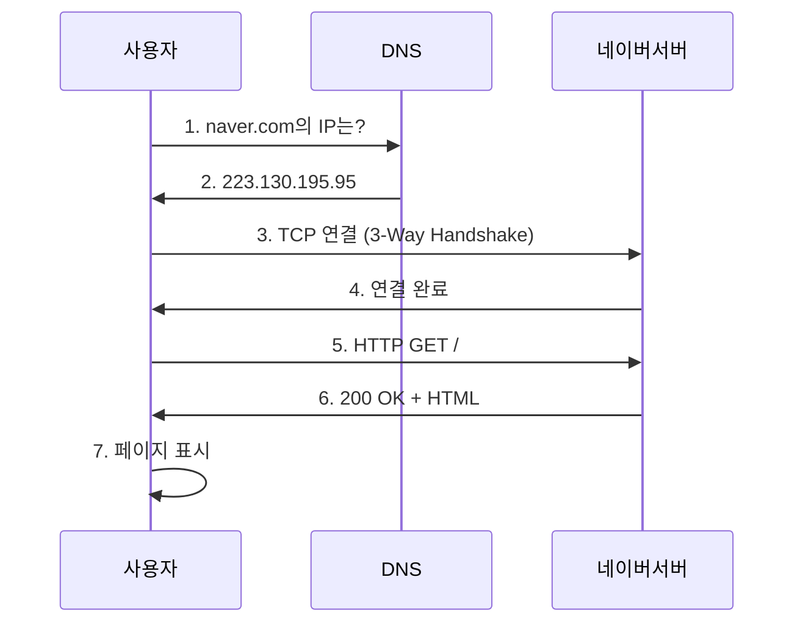

# 📡 2. 주요 프로토콜 분석: 인터넷의 언어 배우기

## 🎯 이 문서를 읽고 나면

- 프로토콜이 무엇인지 이해할 수 있습니다
- TCP와 UDP의 차이를 알게 됩니다
- 웹 브라우징이 어떻게 작동하는지 이해할 수 있습니다
- 일상에서 사용하는 인터넷 서비스의 원리를 배웁니다

---

## 📖 프로토콜이란 무엇인가요?

### 1.1. 🤝 프로토콜의 정의

**프로토콜(Protocol)**은 컴퓨터들이 서로 통신할 때 지켜야 하는 규칙입니다.

**일상 생활의 비유:**

```
전화 통화 예절 (프로토콜)
1. "여보세요?" (연결 확인)
2. "안녕하세요, 저는 ___입니다" (신원 확인)
3. 용건 전달 (데이터 전송)
4. "네, 감사합니다. 안녕히 계세요" (연결 종료)
```

**네트워크 프로토콜:**

```
웹 사이트 접속 (HTTP 프로토콜)
1. "google.com에 연결하고 싶어요" (요청)
2. "네, 어떤 페이지를 보시겠어요?" (응답)
3. "메인 페이지 주세요" (데이터 요청)
4. "여기 있습니다" (데이터 전송)
```

### 1.2. 📚 주요 프로토콜 소개

| 프로토콜 | 사용처 | 비유 |
|---------|--------|------|
| **TCP** | 파일 다운로드, 이메일 | 등기우편 (정확하게 배달) |
| **UDP** | 동영상 스트리밍, 게임 | 일반 우편 (빠르게 배달) |
| **HTTP** | 웹 사이트 | 도서관에서 책 빌리기 |
| **HTTPS** | 보안 웹 사이트 | 비밀 편지 (암호화) |
| **DNS** | 도메인 이름 변환 | 전화번호부 |
| **ICMP** | 네트워크 진단 (ping) | 메아리 (반향) |

---

## 2. 🚚 TCP와 UDP: 두 가지 배송 방법

### 2.1. 📦 TCP (Transmission Control Protocol)

#### "정확하고 안전한 배달"

**TCP의 특징:**

1. **연결 확인**: 통신 전에 상대방이 준비되었는지 확인
2. **순서 보장**: 데이터가 순서대로 전달됨
3. **오류 검사**: 잘못된 데이터는 다시 보냄
4. **느리지만 확실**: 정확성이 중요한 곳에 사용



**TCP를 사용하는 서비스:**

```
✅ 파일 다운로드
  - 파일이 정확해야 함
  - 느려도 괜찮음

✅ 이메일
  - 내용이 정확해야 함
  - 순서가 중요함

✅ 웹 페이지
  - 모든 데이터가 필요함
```

#### 🔐 TCP의 3-Way Handshake

**"통화 전 인사하기"**

```
1단계: SYN (Synchronize)
   컴퓨터A: "연결하고 싶어요!"

2단계: SYN-ACK (Synchronize-Acknowledge)
   컴퓨터B: "좋아요! 저도 연결할게요!"

3단계: ACK (Acknowledge)
   컴퓨터A: "네, 시작합시다!"

→ 연결 완료! 데이터 전송 시작
```

**일상 예시:**

```
전화 통화 시작
1. 발신자: "여보세요?" (SYN)
2. 수신자: "네, 여보세요!" (SYN-ACK)
3. 발신자: "안녕하세요!" (ACK)
4. → 대화 시작
```

### 2.2. 🚀 UDP (User Datagram Protocol)

#### "빠르지만 확인 안 함"

**UDP의 특징:**

1. **연결 확인 없음**: 바로 데이터 전송
2. **순서 보장 없음**: 순서가 바뀔 수 있음
3. **오류 검사 최소**: 잘못되어도 다시 안 보냄
4. **빠름**: 속도가 중요한 곳에 사용



**UDP를 사용하는 서비스:**

```
✅ 동영상 스트리밍 (유튜브, 넷플릭스)
  - 몇 프레임 빠져도 괜찮음
  - 빠른 전송이 중요

✅ 온라인 게임
  - 실시간 반응 필요
  - 약간의 오류는 허용

✅ 인터넷 전화 (VoIP)
  - 실시간 음성 중요
  - 약간 끊겨도 괜찮음

✅ 라이브 방송
  - 지연 없이 빠르게
```

### 2.3. ⚖️ TCP vs UDP 비교

| 특징 | TCP | UDP |
|-----|-----|-----|
| **연결** | 연결 후 통신 | 바로 통신 |
| **신뢰성** | 높음 (재전송) | 낮음 (재전송 없음) |
| **속도** | 느림 | 빠름 |
| **순서** | 보장됨 | 보장 안 됨 |
| **오버헤드** | 높음 | 낮음 |
| **사용 예** | 웹, 이메일, 파일 전송 | 스트리밍, 게임, VoIP |
| **비유** | 등기우편 | 일반 우편 |

**언제 무엇을 쓸까요?**

```
💼 중요한 파일, 정확한 데이터 → TCP
  예: 계약서 PDF 다운로드, 은행 거래

🎮 실시간 반응, 빠른 속도 → UDP
  예: 배틀그라운드, 롤, 유튜브 라이브
```

---

## 3. 🌐 HTTP와 HTTPS: 웹의 언어

### 3.1. 📄 HTTP (HyperText Transfer Protocol)

#### "웹 사이트와 대화하기"

**HTTP는 웹 브라우저와 웹 서버가 대화하는 방법입니다.**



#### 📬 HTTP 요청 (Request)

**"웹 서버에게 보내는 편지"**

```http
GET /search?q=고양이 HTTP/1.1
Host: www.google.com
User-Agent: Chrome/100.0
Accept: text/html
```

**각 줄의 의미:**
- `GET`: "이 페이지 주세요"
- `/search?q=고양이`: "검색 페이지, 고양이로 검색"
- `Host`: "google.com 서버"
- `User-Agent`: "크롬 브라우저 사용 중"
- `Accept`: "HTML 형식으로 주세요"

#### 📭 HTTP 응답 (Response)

**"웹 서버가 보내는 답장"**

```http
HTTP/1.1 200 OK
Content-Type: text/html
Content-Length: 1234

<!DOCTYPE html>
<html>
  <body>
    <h1>검색 결과</h1>
    ...
  </body>
</html>
```

**각 줄의 의미:**
- `200 OK`: "요청 성공!"
- `Content-Type`: "HTML 파일입니다"
- `Content-Length`: "파일 크기는 1234바이트"
- 그 아래: 실제 HTML 내용

#### 📊 HTTP 상태 코드

**"서버의 답변 종류"**

| 코드 | 의미 | 예시 |
|------|------|------|
| **200** | 성공 | OK (정상 처리) |
| **301** | 이동됨 | 다른 주소로 이동 |
| **400** | 잘못된 요청 | Bad Request |
| **401** | 인증 필요 | 로그인 필요 |
| **403** | 접근 금지 | Forbidden |
| **404** | 없음 | Not Found (페이지 없음) |
| **500** | 서버 오류 | Internal Server Error |

**일상 예시:**

```
🟢 200 OK
   도서관: "여기 책 있습니다"

🔴 404 Not Found
   도서관: "그 책은 없어요"

🟡 500 Internal Server Error
   도서관: "죄송, 시스템 고장났어요"
```

#### 🔑 HTTP 메서드 (Method)

**"서버에게 하는 부탁의 종류"**

| 메서드 | 의미 | 예시 |
|--------|------|------|
| **GET** | 데이터 가져오기 | 웹 페이지 보기 |
| **POST** | 데이터 보내기 | 로그인, 게시글 작성 |
| **PUT** | 데이터 수정 | 프로필 업데이트 |
| **DELETE** | 데이터 삭제 | 게시글 삭제 |

```
GET /board/123
  → 123번 게시글 보여주세요

POST /login
  → 로그인 정보 처리해주세요

DELETE /board/123
  → 123번 게시글 삭제해주세요
```

### 3.2. 🔐 HTTPS (HTTP Secure)

#### "암호화된 웹 통신"

**HTTPS = HTTP + 암호화(SSL/TLS)**

```
HTTP (암호화 안 됨):
  해커 → 📖 "비밀번호: 1234" (다 보임!)

HTTPS (암호화됨):
  해커 → 🔒 "?!#@$%^&*" (알아볼 수 없음)
```

#### 🔒 HTTPS를 사용해야 하는 이유

```
✅ 로그인할 때
  - 아이디/비밀번호 보호

✅ 쇼핑할 때
  - 신용카드 정보 보호

✅ 개인정보 입력할 때
  - 주민등록번호, 주소 보호

✅ 인터넷 뱅킹
  - 금융 정보 보호
```

#### 🔍 HTTPS 확인 방법

**브라우저 주소창 확인:**

```
✅ 안전한 사이트
   🔒 https://www.google.com
   주소 앞에 자물쇠 표시

❌ 안전하지 않은 사이트
   ⚠️ http://example.com
   "주의: 안전하지 않음" 경고
```

**자물쇠를 클릭하면:**
- 인증서 정보 확인 가능
- 암호화 연결 확인
- 사이트 신원 확인

---

## 4. 📞 DNS: 인터넷의 전화번호부

### 4.1. 🗂️ DNS란?

**DNS (Domain Name System)**는 사람이 기억하기 쉬운 도메인 이름을 컴퓨터가 이해하는 IP 주소로 바꿔줍니다.

```
사람: "www.google.com에 가고 싶어요"
DNS: "google.com = 216.58.220.238 입니다"
컴퓨터: "216.58.220.238로 연결!"
```

**일상 비유:**

```
📱 전화번호부
  이름: "엄마"
  번호: 010-1234-5678

  당신: "엄마"라고 검색
  전화: 010-1234-5678로 전화

🌐 DNS
  도메인: "google.com"
  IP: 216.58.220.238

  당신: "google.com" 입력
  브라우저: 216.58.220.238로 접속
```

### 4.2. 🔄 DNS 작동 과정



**단계별 설명:**

```
1단계: "google.com의 IP 주소는?"
   → 로컬 DNS 서버에 질문

2단계: 로컬 DNS가 모르면
   → 상위 DNS 서버들에 차례로 질문

3단계: 최종적으로 IP 주소 찾음
   → 216.58.220.238

4단계: 웹 브라우저에 알려줌
   → 해당 IP로 접속
```

### 4.3. 🏷️ 도메인 이름의 구조

```
www.google.com.

구조:
.                → 루트 (보통 생략)
com              → 최상위 도메인 (TLD)
google           → 2차 도메인 (회사명)
www              → 서브도메인 (서비스명)
```

**도메인 종류:**

| TLD | 의미 | 예시 |
|-----|------|------|
| .com | 상업용 (Commercial) | google.com, amazon.com |
| .net | 네트워크 (Network) | speedtest.net |
| .org | 비영리 (Organization) | wikipedia.org |
| .edu | 교육 (Education) | mit.edu |
| .gov | 정부 (Government) | whitehouse.gov |
| .kr | 한국 (Korea) | naver.com, daum.net |
| .co.kr | 한국 기업 | samsung.co.kr |

### 4.4. 🧪 DNS 조회 실습

#### Windows (명령 프롬프트):

```bash
# DNS 조회
nslookup google.com

# 결과:
# Server:  kns.kornet.net
# Address:  168.126.63.1
#
# 이름:    google.com
# Addresses:  216.58.220.238
```

#### Mac/Linux (터미널):

```bash
# DNS 조회
dig google.com

# 또는
nslookup google.com

# 상세 조회
dig google.com +short
# 216.58.220.238
```

### 4.5. 🚨 DNS 관련 보안 문제

#### 1) DNS 스푸핑

**"가짜 전화번호부 만들기"**

```
정상:
  사용자: "bank.com의 IP는?"
  DNS: "1.2.3.4입니다"
  → 진짜 은행 사이트

해킹:
  사용자: "bank.com의 IP는?"
  가짜DNS: "5.6.7.8입니다"
  → 피싱 사이트로 이동!
```

**예방 방법:**
- 신뢰할 수 있는 DNS 사용 (8.8.8.8 Google, 1.1.1.1 Cloudflare)
- HTTPS 사이트만 사용
- 주소 확인 습관

#### 2) DNS 캐시 오염

**"전화번호부에 거짓 정보 적기"**

```
해커가 DNS 캐시에 잘못된 정보 입력
→ 많은 사용자가 가짜 사이트로 이동
```

---

## 5. 🏓 ICMP: 네트워크 진단 도구

### 5.1. 📡 ICMP란?

**ICMP (Internet Control Message Protocol)**는 네트워크 상태를 확인하고 오류를 알려주는 프로토콜입니다.

**대표적인 ICMP 도구: ping**

```
ping은 메아리처럼 작동합니다

1. 컴퓨터A: "야호!" (Echo Request)
2. 컴퓨터B: "야호!" (Echo Reply)
3. 컴퓨터A: "응답 시간 측정"
```

### 5.2. 🧪 ping 명령어 사용하기

#### Windows/Mac/Linux:

```bash
# 구글 서버에 ping
ping google.com

# 결과:
# 64 bytes from 216.58.220.238: icmp_seq=1 ttl=117 time=34 ms
# 64 bytes from 216.58.220.238: icmp_seq=2 ttl=117 time=35 ms
# 64 bytes from 216.58.220.238: icmp_seq=3 ttl=117 time=33 ms
```

**결과 해석:**

```
✅ 응답 성공
  - 216.58.220.238: 서버 IP 주소
  - time=34 ms: 응답 시간 (34밀리초)
  - ttl=117: 패킷 생존 시간

❌ 응답 없음
  - "Request timeout"
  - 서버가 꺼져있거나
  - 방화벽이 차단하거나
  - 네트워크 문제
```

### 5.3. 📊 ICMP 메시지 종류

| Type | 이름 | 설명 | 사용 예 |
|------|------|------|---------|
| **0** | Echo Reply | 응답 | ping 응답 |
| **3** | Destination Unreachable | 도착 불가 | 서버 없음 |
| **8** | Echo Request | 요청 | ping 요청 |
| **11** | Time Exceeded | 시간 초과 | traceroute |

### 5.4. 🗺️ traceroute: 경로 추적

**"택배가 어느 경로로 왔는지 확인"**

```bash
# Windows
tracert google.com

# Mac/Linux
traceroute google.com

# 결과:
# 1    2 ms    1 ms    1 ms  192.168.0.1 (내 공유기)
# 2   10 ms   11 ms   10 ms  211.xxx.xxx.xxx (ISP 라우터)
# 3   15 ms   16 ms   15 ms  220.xxx.xxx.xxx
# 4   34 ms   35 ms   34 ms  216.58.220.238 (구글 서버)
```

**각 줄의 의미:**
- 숫자: 경유하는 장비(홉) 순서
- ms: 각 구간의 응답 시간
- IP: 각 장비의 주소

---

## 6. 🎯 실생활 프로토콜 예제

### 6.1. 🌐 웹 페이지 접속 전체 과정

**"www.naver.com 접속하기"**



**단계별 상세:**

```
1단계: DNS 조회
   "naver.com의 IP 주소는?"
   → 223.130.195.95

2단계: TCP 연결
   SYN → SYN-ACK → ACK
   → 연결 완료

3단계: HTTP 요청
   GET / HTTP/1.1
   Host: www.naver.com

4단계: HTTP 응답
   200 OK
   Content-Type: text/html
   <html>...</html>

5단계: 브라우저 렌더링
   HTML 파싱 → CSS 적용 → 화면 표시
```

### 6.2. 📧 이메일 전송 과정

**"메일 보내기"**

```
1. 이메일 작성
   → "안녕하세요" 입력

2. "보내기" 클릭
   → SMTP 프로토콜 사용 (포트 25/587)

3. 메일 서버에 전송
   → TCP로 안전하게 전송

4. 수신자 메일 서버로 전달
   → DNS로 수신자 서버 찾기

5. 수신자가 확인
   → POP3 또는 IMAP 프로토콜
```

### 6.3. 🎮 온라인 게임

**"롤(LoL) 게임하기"**

```
게임 접속:
  - TCP: 로그인 정보 전송 (정확해야 함)
  - HTTP/HTTPS: 게임 패치 다운로드

게임 플레이:
  - UDP: 캐릭터 위치, 스킬 사용
    (빠른 전송이 중요, 약간의 오류 허용)
  - 실시간 반응 필요

채팅:
  - TCP: 채팅 메시지 (정확해야 함)
```

### 6.4. 📺 유튜브 시청

**"유튜브 동영상 보기"**

```
1. 유튜브 접속
   - DNS: youtube.com → IP 주소
   - HTTPS: 보안 연결

2. 동영상 검색
   - HTTP GET: 검색 요청
   - HTTP 200: 검색 결과

3. 동영상 재생
   - HTTP/HTTPS: 동영상 파일 다운로드
   - UDP (일부): 스트리밍 데이터
   - 버퍼링: 미리 데이터 저장

4. 댓글 작성
   - HTTP POST: 댓글 데이터 전송
```

---

## 7. 🔐 프로토콜 보안 기초

### 7.1. ⚠️ 일반적인 프로토콜 공격

#### 1) 패킷 스니핑 (Sniffing)

**"우편물 몰래 훔쳐보기"**

```
❌ HTTP (암호화 안 됨):
  해커가 네트워크 트래픽 감청
  → 비밀번호, 쿠키 등 다 보임

✅ HTTPS (암호화됨):
  암호화된 데이터만 보임
  → 해커도 내용 알 수 없음
```

**예방:**
- HTTPS 사용
- VPN 사용 (공공 Wi-Fi에서)
- 중요한 정보는 암호화

#### 2) 중간자 공격 (MITM: Man-In-The-Middle)

**"우편물 가로채서 위조하기"**

```
정상 통신:
  사용자 ↔ 서버

중간자 공격:
  사용자 ↔ 해커 ↔ 서버
  (해커가 모든 통신 가로챔)
```

**예방:**
- HTTPS 인증서 확인
- 공공 Wi-Fi 주의
- 이상한 인증서 경고 무시하지 않기

#### 3) DDoS 공격 (분산 서비스 거부)

**"은행에 수천 명이 동시 방문"**

```
정상:
  사용자 100명 → 서버 정상 작동

DDoS:
  사용자 100,000명 → 서버 다운!
  (실제로는 해커가 조종하는 좀비 PC)
```

**특징:**
- 서버 과부하로 정상 사용자도 이용 불가
- TCP SYN Flooding, UDP Flooding 등
- 대량의 요청으로 서버 마비

### 7.2. 🛡️ 안전한 프로토콜 사용법

#### 웹 브라우징:

```
✅ HTTPS 사이트만 사용
  - 주소창에 🔒 확인

✅ 공공 Wi-Fi에서 주의
  - VPN 사용
  - 중요한 작업 피하기

✅ 이상한 링크 클릭 금지
  - URL 주소 확인
  - 피싱 사이트 주의
```

#### 개인정보 입력:

```
✅ HTTPS 확인
  - 비밀번호, 카드번호 입력 전

✅ 인증서 경고 주의
  - "이 사이트는 안전하지 않음" 무시 금지

✅ 공인인증서/공동인증서
  - 금융 거래 시 필수
```

---

## 8. 🧪 프로토콜 실습

### 8.1. 🌐 HTTP 요청 확인하기

#### 브라우저 개발자 도구:

```
1. 크롬 브라우저에서 F12 키
2. "Network" 탭 클릭
3. 웹 페이지 새로고침
4. 각 요청 클릭해서 확인

확인 가능한 정보:
- Request URL
- Request Method (GET, POST 등)
- Status Code (200, 404 등)
- Response Headers
- Request Headers
```

### 8.2. 📡 네트워크 연결 테스트

#### Windows 명령 프롬프트:

```bash
# 1. DNS 확인
nslookup google.com

# 2. 연결 테스트
ping google.com

# 3. 경로 추적
tracert google.com

# 4. 열린 포트 확인
netstat -ano | findstr LISTENING
```

#### Mac/Linux 터미널:

```bash
# 1. DNS 확인
dig google.com

# 2. 연결 테스트
ping google.com

# 3. 경로 추적
traceroute google.com

# 4. 열린 포트 확인
netstat -an | grep LISTEN
```

### 8.3. 🔍 실습 예제

#### 예제 1: 웹 사이트 응답 시간 측정

```bash
# Windows
ping www.naver.com -n 10

# Mac/Linux
ping www.naver.com -c 10

# 결과 해석:
# time=34ms → 응답 속도 34밀리초
# 평균 응답 시간 확인 가능
```

#### 예제 2: DNS 서버 변경 효과 확인

```bash
# 현재 DNS로 조회
nslookup google.com

# Google DNS로 조회
nslookup google.com 8.8.8.8

# Cloudflare DNS로 조회
nslookup google.com 1.1.1.1

# 응답 속도 비교
```

---

## 9. 📊 프로토콜 계층별 정리

### 9.1. 🎯 계층별 프로토콜 요약

```
7계층 (응용):
  HTTP, HTTPS, FTP, SMTP, DNS
  → 우리가 직접 사용하는 서비스

4계층 (전송):
  TCP, UDP
  → 데이터 전달 방법

3계층 (네트워크):
  IP, ICMP
  → 주소와 경로

2계층 (데이터링크):
  Ethernet, Wi-Fi
  → 물리적 연결

1계층 (물리):
  Cable, 전파
  → 실제 신호
```

### 9.2. 📌 자주 사용하는 프로토콜과 포트

| 프로토콜 | 포트 | 용도 | 암호화 |
|---------|------|------|--------|
| HTTP | 80 | 웹 사이트 | ❌ |
| HTTPS | 443 | 보안 웹 사이트 | ✅ |
| FTP | 21 | 파일 전송 | ❌ |
| SSH | 22 | 안전한 원격 접속 | ✅ |
| SMTP | 25/587 | 이메일 발송 | ⚠️ |
| DNS | 53 | 도메인 조회 | ⚠️ |
| POP3 | 110 | 이메일 수신 | ❌ |
| IMAP | 143 | 이메일 수신 | ❌ |

---

## 10. 🎯 핵심 정리

### ✅ 꼭 기억해야 할 내용

1. **프로토콜**: 컴퓨터 간 통신 규칙

2. **TCP vs UDP**:
   - TCP: 정확하고 느림 (파일, 웹, 이메일)
   - UDP: 빠르지만 불확실 (스트리밍, 게임)

3. **HTTP vs HTTPS**:
   - HTTP: 평문 통신 (위험)
   - HTTPS: 암호화 통신 (안전) 🔒

4. **DNS**: 도메인 → IP 변환
   - google.com → 216.58.220.238

5. **ICMP**: 네트워크 진단
   - ping으로 연결 확인

### 📝 자주 묻는 질문 (FAQ)

**Q1: 왜 HTTP 대신 HTTPS를 써야 하나요?**
- HTTP: 정보가 그대로 노출
- HTTPS: 암호화되어 안전
- 특히 로그인, 결제 시 필수!

**Q2: TCP가 느린데 왜 사용하나요?**
- 정확성이 중요한 곳에서는 TCP 필수
- 파일, 문서는 완벽해야 함
- 속도보다 정확성 우선

**Q3: DNS 서버는 어떤 걸 쓰는게 좋나요?**
- Google DNS: 8.8.8.8, 8.8.4.4
- Cloudflare DNS: 1.1.1.1, 1.0.0.1
- 통신사 DNS: 자동 설정

**Q4: 공공 Wi-Fi에서 안전하게 사용하려면?**
- VPN 사용
- HTTPS 사이트만 접속
- 중요한 작업 피하기
- 자동 연결 끄기

**Q5: 포트란 무엇인가요?**
- 같은 IP에서 여러 서비스 구분
- 80: 웹, 443: 보안 웹, 22: SSH
- 아파트 각 호수와 비슷

---

## 🚀 다음 단계

이제 주요 프로토콜의 기초를 이해했다면:

1. **다음 문서**: "3. 네트워크 공격과 방어_기초.md"
   - 실제 공격 사례 배우기
   - 방어 방법 익히기

2. **실습 추천**:
   - ping, nslookup 명령어 사용해보기
   - 브라우저 개발자 도구로 HTTP 요청 확인
   - 다양한 웹사이트에서 HTTPS 확인

3. **추가 학습**:
   - Wireshark로 패킷 분석 (고급)
   - 프로토콜 깊이 이해하기
   - 네트워크 보안 기초

---

## 📚 용어 정리

| 용어 | 영문 | 설명 |
|-----|------|-----|
| 프로토콜 | Protocol | 통신 규칙 |
| TCP | Transmission Control Protocol | 신뢰성 있는 전송 |
| UDP | User Datagram Protocol | 빠른 전송 |
| HTTP | HyperText Transfer Protocol | 웹 통신 |
| HTTPS | HTTP Secure | 보안 웹 통신 |
| DNS | Domain Name System | 도메인 변환 |
| ICMP | Internet Control Message Protocol | 네트워크 진단 |
| 핸드셰이크 | Handshake | 연결 확인 과정 |
| 패킷 | Packet | 네트워크 데이터 단위 |
| 암호화 | Encryption | 데이터 보호 |

---

**🎉 축하합니다!**

네트워크 프로토콜의 기초를 모두 학습하셨습니다. TCP와 UDP의 차이, HTTP/HTTPS의 작동 원리, DNS의 역할 등 인터넷의 핵심 원리를 이해하셨습니다.

이제 이 지식을 바탕으로 네트워크 보안을 공부할 준비가 되셨습니다!

---

*작성일: 2025년*
*난이도: ⭐ 입문*
*예상 학습 시간: 2-3시간*