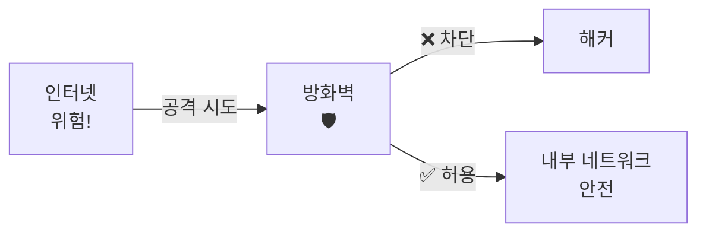
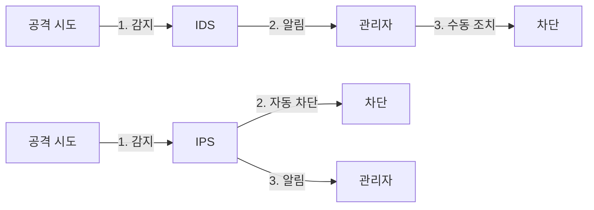
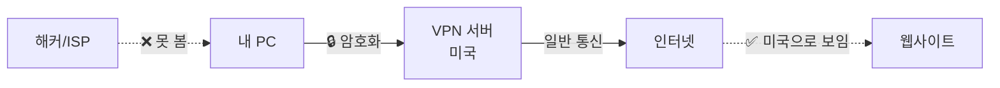
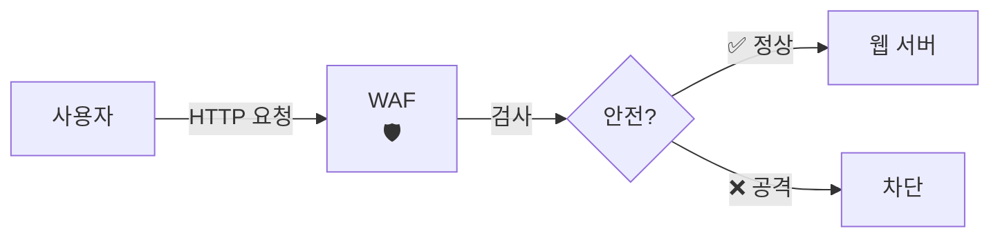
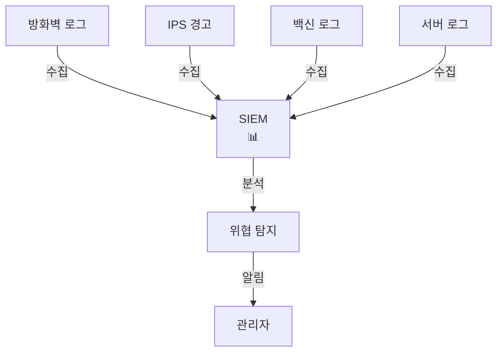

# 🛡️ 4. 보안 솔루션: 네트워크를 지키는 보안 장비들

## 🎯 이 문서를 읽고 나면

- 보안 솔루션이 무엇인지 이해할 수 있습니다
- 방화벽, 백신, VPN 등의 역할을 알게 됩니다
- 각 보안 장비가 어떻게 우리를 보호하는지 배웁니다
- 일상에서 사용하는 보안 도구들을 이해할 수 있습니다

---

## 📖 보안 솔루션이란?

### 1.1. 🛡️ 보안 솔루션의 정의

**보안 솔루션**은 네트워크와 시스템을 보호하기 위한 하드웨어나 소프트웨어입니다.

**실생활 비유:**

```
집의 보안 시스템:
🚪 대문 자물쇠     → 방화벽 (Firewall)
📹 CCTV            → 침입 탐지 시스템 (IDS)
🚨 경보기           → 보안 관제 (SIEM)
🚓 경비원           → 백신 프로그램
🔐 금고             → 암호화 (VPN)
```

### 1.2. 📊 보안 솔루션의 종류

| 솔루션 | 역할 | 비유 |
|--------|------|------|
| **방화벽** | 불법 접근 차단 | 건물 경비원 |
| **백신** | 악성코드 제거 | 의사 |
| **IDS/IPS** | 침입 탐지/차단 | CCTV + 경보기 |
| **VPN** | 안전한 통신 | 비밀 터널 |
| **WAF** | 웹 공격 차단 | 웹사이트 경비원 |
| **SIEM** | 보안 관제 | 종합 관제센터 |

### 1.3. 🎯 왜 필요할까요?

```
💼 기업:
  - 고객 정보 보호
  - 영업 기밀 보안
  - 시스템 안정성

👤 개인:
  - 개인정보 보호
  - 금융 정보 안전
  - 프라이버시 유지

🏛️ 정부:
  - 국가 기밀 보호
  - 주요 인프라 방어
```

---

## 2. 🔥 방화벽 (Firewall)

### 2.1. 🚪 방화벽이란?

**"건물 입구의 경비원처럼 네트워크를 지키는 첫 번째 방어선"**



**방화벽의 역할:**

```
1. 들어오는 트래픽 검사
  "어디서 왔어? 어디로 가려고?"

2. 규칙에 따라 판단
  "이건 허용, 저건 차단"

3. 불법 접근 차단
  "여긴 못 들어와!"

4. 로그 기록
  "누가 언제 무엇을 했는지 기록"
```

### 2.2. 🎭 방화벽의 종류

#### 1) 하드웨어 방화벽

**"건물 입구의 물리적 경비실"**

```
위치: 네트워크 입구에 설치
특징:
  ✅ 강력한 성능
  ✅ 여러 컴퓨터 동시 보호
  ✅ 전문적인 관리 필요

사용처:
  - 회사 사무실
  - 데이터센터
  - 학교, 병원
```

**예시:**
- Cisco ASA
- Palo Alto Networks
- Fortinet FortiGate
- Check Point

#### 2) 소프트웨어 방화벽

**"각 방마다 있는 개인 자물쇠"**

```
위치: 개별 컴퓨터에 설치
특징:
  ✅ 개인 PC 보호
  ✅ 설정이 간단
  ✅ 무료로 제공되는 경우 많음

사용처:
  - 개인 PC
  - 노트북
  - 스마트폰
```

**예시:**
- Windows Defender 방화벽 (기본 내장)
- ZoneAlarm
- GlassWire
- Mac 방화벽

### 2.3. 📋 방화벽 규칙 이해하기

**"출입 명단과 같은 개념"**

```
규칙 예시:

규칙 1: 웹 브라우징 허용
  - 목적지: 모든 웹사이트
  - 포트: 80, 443
  - 행동: ✅ 허용

규칙 2: 외부 SSH 접속 차단
  - 출발지: 외부
  - 포트: 22
  - 행동: ❌ 차단

규칙 3: 특정 국가 차단
  - 출발지: 중국, 러시아
  - 행동: ❌ 차단

규칙 4: 업무 시간 외 접속
  - 시간: 평일 18:00 ~ 09:00
  - 행동: ❌ 차단
```

### 2.4. 🔧 Windows 방화벽 설정하기

**실습: 내 컴퓨터 방화벽 확인**

```
1단계: 설정 열기
  - Win + I 키
  - "Windows 보안" 클릭
  - "방화벽 및 네트워크 보호" 클릭

2단계: 방화벽 상태 확인
  ✅ 도메인 네트워크: 켜짐
  ✅ 개인 네트워크: 켜짐
  ✅ 공용 네트워크: 켜짐

3단계: 고급 설정
  - "고급 설정" 클릭
  - "인바운드 규칙" / "아웃바운드 규칙" 확인

4단계: 앱 허용/차단
  - "앱이 방화벽을 통과하도록 허용"
  - 필요한 프로그램만 체크
```

**주의사항:**

```
⚠️ 방화벽을 끄지 마세요!
  "문 열어놓고 자는 것과 같습니다"

⚠️ 모든 프로그램을 허용하지 마세요!
  "누구나 들어올 수 있게 됩니다"

✅ 신뢰할 수 있는 프로그램만 허용
✅ 공용 Wi-Fi에서는 더욱 엄격하게
```

### 2.5. 🌐 차세대 방화벽 (NGFW)

**"슈퍼 경비원 - 얼굴 인식부터 행동 분석까지"**

```
기존 방화벽:
  "어디서 왔어?" (IP 주소만 확인)

차세대 방화벽:
  "어디서 왔어?" (IP 주소)
  "누구야?" (사용자 식별)
  "뭐 하려고?" (애플리케이션 확인)
  "평소와 다르게 행동하네?" (이상 행위 탐지)
```

**추가 기능:**

```
✅ 애플리케이션 제어
  - 카카오톡 허용, 게임 차단

✅ 사용자 식별
  - 부장님은 모든 접속 가능
  - 인턴은 제한적 접속

✅ 침입 방지 (IPS)
  - 공격 시도를 자동 차단

✅ 위협 인텔리전스
  - 전 세계 해커 정보 실시간 업데이트
```

---

## 3. 🦠 백신 프로그램 (Anti-Virus)

### 3.1. 💊 백신이란?

**"컴퓨터의 의사 - 병(바이러스)을 찾아서 치료"**

```
백신의 역할:

🔍 검사 (Scan)
  - 파일 하나하나 검사
  - 의심스러운 행동 감시

🚨 탐지 (Detect)
  - "이거 바이러스야!"
  - 사용자에게 알림

🗑️ 치료 (Clean)
  - 바이러스 제거
  - 감염된 파일 격리

🛡️ 예방 (Prevent)
  - 실시간 보호
  - 다운로드 전 검사
```

### 3.2. 🦠 악성코드의 종류

| 종류 | 설명 | 비유 |
|-----|------|------|
| **바이러스** | 파일에 붙어서 전염 | 감기 바이러스 |
| **웜** | 스스로 복제하여 전파 | 기생충 |
| **트로이 목마** | 정상 프로그램으로 위장 | 선물 상자 속 폭탄 |
| **랜섬웨어** | 파일 암호화 후 돈 요구 | 인질범 |
| **스파이웨어** | 정보를 몰래 수집 | 스파이 |
| **애드웨어** | 광고를 강제로 표시 | 광고 전단지 |

### 3.3. 🔍 백신의 탐지 방법

#### 1) 시그니처 기반 탐지

**"수배자 명단과 비교"**

```
작동 방식:
  1. 알려진 바이러스 패턴 저장
  2. 파일을 검사하며 패턴 비교
  3. 일치하면 바이러스로 판정

장점:
  ✅ 정확도 높음
  ✅ 빠른 탐지

단점:
  ❌ 새로운 바이러스 못 찾음
  ❌ 업데이트 필수
```

**예시:**

```
바이러스 A의 시그니처:
  "0xABCD1234..."

파일 검사:
  파일 1: 0x1234... → 정상
  파일 2: 0xABCD1234... → 🚨 바이러스!
```

#### 2) 행위 기반 탐지

**"수상한 행동 감시"**

```
작동 방식:
  1. 프로그램 행동 관찰
  2. 의심스러운 행동 감지
  3. 경고 또는 차단

장점:
  ✅ 새로운 바이러스도 탐지
  ✅ 변종 바이러스 대응

단점:
  ❌ 오탐 가능성
  ❌ 정상 프로그램도 차단될 수 있음
```

**의심스러운 행동:**

```
🚨 수상한 행동:
  - 많은 파일을 암호화
  - 레지스트리 무단 변경
  - 백신 프로그램 종료 시도
  - 다른 프로그램에 코드 삽입
  - 개인정보 파일 외부 전송
```

### 3.4. 💻 백신 프로그램 종류

#### 무료 백신

```
Windows Defender (추천!)
  ✅ Windows 기본 내장
  ✅ 성능 우수
  ✅ 자동 업데이트
  ✅ 추가 설치 불필요

Avast Free
  ✅ 강력한 보호
  ⚠️ 광고 표시
  ⚠️ 시스템 느려질 수 있음

AVG Free
  ✅ 사용하기 쉬움
  ⚠️ 일부 기능 제한
```

#### 유료 백신

```
Norton 360
  ✅ 종합 보안 기능
  ✅ VPN 포함
  💰 연 59,000원~

Kaspersky
  ✅ 강력한 탐지율
  ✅ 다양한 기능
  💰 연 39,000원~

V3 (안랩)
  ✅ 한국 환경 최적화
  ✅ 기술 지원 우수
  💰 연 30,000원~
```

### 3.5. 🛡️ 백신 사용법

**기본 사용 방법:**

```
1. 실시간 보호 켜기
  - 항상 감시 상태 유지
  - 파일 실행 전 자동 검사

2. 정기 검사
  - 매주 전체 검사 권장
  - 빠른 검사: 주요 영역만
  - 전체 검사: 모든 파일

3. 업데이트
  - 자동 업데이트 설정
  - 매일 새로운 바이러스 정보

4. 의심 파일 검사
  - 우클릭 → "검사"
  - 다운로드 직후 검사
```

**백신 팁:**

```
✅ 백신 한 개만 설치
  - 여러 개 설치 시 충돌
  - 시스템 느려짐

✅ 정기적인 업데이트
  - 새 바이러스 정보 필요

✅ 의심 파일은 격리
  - 바로 삭제하지 말고 격리
  - 오탐일 수 있음

✅ USB/외장하드 검사
  - 연결 시 자동 검사 설정
```

---

## 4. 🕵️ 침입 탐지/방지 시스템 (IDS/IPS)

### 4.1. 📹 IDS/IPS란?

**"집의 CCTV + 자동 방범 시스템"**

```
IDS (Intrusion Detection System)
  = 침입 탐지 시스템
  = "CCTV"

  역할:
    👀 감시
    🚨 알림
    📝 기록

IPS (Intrusion Prevention System)
  = 침입 방지 시스템
  = "CCTV + 자동 문 잠금"

  역할:
    👀 감시
    🚨 알림
    🛡️ 차단
    📝 기록
```

### 4.2. 🔍 IDS vs IPS 비교



| 기능 | IDS | IPS |
|-----|-----|-----|
| **탐지** | ✅ | ✅ |
| **알림** | ✅ | ✅ |
| **자동 차단** | ❌ | ✅ |
| **성능 영향** | 낮음 | 보통 |
| **비용** | 저렴 | 비쌈 |

### 4.3. 🚨 탐지 방법

#### 1) 시그니처 기반 탐지

**"수배자 사진과 비교"**

```
알려진 공격 패턴:
  SQL Injection: ' OR 1=1 --
  XSS: <script>alert('XSS')</script>
  포트 스캔: 짧은 시간 내 많은 포트 접근

패턴 발견 시:
  🚨 경고!
  "SQL Injection 공격 탐지!"
```

#### 2) 이상 행위 기반 탐지

**"평소와 다른 행동 감지"**

```
정상 패턴 학습:
  - 평균 트래픽: 100MB/h
  - 접속 시간: 09:00 ~ 18:00
  - 접속 국가: 한국

이상 행위:
  🚨 트래픽 갑자기 1GB/h
  🚨 새벽 3시에 대량 접속
  🚨 중국에서 접속 시도
```

### 4.4. 📊 실제 탐지 예시

```
예시 1: 포트 스캔 탐지

정상:
  192.168.1.5 → 8.8.8.8:80 (구글 접속)

공격:
  192.168.1.5 → 8.8.8.8:21 (FTP 확인)
  192.168.1.5 → 8.8.8.8:22 (SSH 확인)
  192.168.1.5 → 8.8.8.8:23 (Telnet 확인)
  ...
  192.168.1.5 → 8.8.8.8:3389 (RDP 확인)

IDS/IPS:
  🚨 포트 스캔 탐지!
  출발지: 192.168.1.5
  행동: ❌ IP 차단 (IPS)
```

```
예시 2: SQL Injection 탐지

정상 웹 요청:
  GET /user?id=123

공격 시도:
  GET /user?id=' OR '1'='1

IDS/IPS:
  🚨 SQL Injection 패턴 탐지!
  패턴: ' OR '1'='1
  행동: ❌ 요청 차단 (IPS)
```

### 4.5. 🏢 기업에서의 IDS/IPS

```
네트워크 IDS/IPS (NIDS/NIPS)
  위치: 네트워크 입구
  감시: 모든 네트워크 트래픽
  예시: Snort, Suricata

호스트 IDS/IPS (HIDS/HIPS)
  위치: 개별 서버/PC
  감시: 서버 내부 활동
  예시: OSSEC, Wazuh
```

**배치 위치:**

```
인터넷 → 방화벽 → IPS → 스위치 → 서버
                ↓
            탐지 + 차단
```

---

## 5. 🔐 VPN (Virtual Private Network)

### 5.1. 🌐 VPN이란?

**"인터넷 상의 비밀 터널"**

```
VPN 없이:
  내 PC → (평문) → 인터넷
  👁️ 누구나 볼 수 있음

VPN 사용:
  내 PC → (🔒암호화 터널) → VPN 서버 → 인터넷
  ❌ 아무도 못 봄
```



### 5.2. 🎯 VPN의 역할

#### 1) 데이터 암호화

```
암호화 전:
  ID: admin
  PW: password123
  → 누구나 볼 수 있음

암호화 후:
  aGV5IHRoZXJlIQ==
  → 알 수 없는 암호문
```

#### 2) IP 주소 숨기기

```
VPN 없이:
  웹사이트: "접속 IP: 121.xxx.xxx.xxx (서울)"

VPN 사용:
  웹사이트: "접속 IP: 8.8.8.8 (미국)"

장점:
  ✅ 프라이버시 보호
  ✅ 추적 방지
  ✅ 지역 제한 우회
```

#### 3) 공용 Wi-Fi 보호

```
카페 Wi-Fi:
  ❌ 암호화 안 됨
  ❌ 같은 Wi-Fi 사용자가 볼 수 있음
  ❌ 해커가 중간 가로채기 가능

카페 Wi-Fi + VPN:
  ✅ 모든 데이터 암호화
  ✅ 안전한 통신
  ✅ 해커가 못 봄
```

### 5.3. 🏢 VPN의 종류

#### 1) 개인용 VPN (Commercial VPN)

**"내 프라이버시 보호"**

```
목적:
  - 개인정보 보호
  - 익명 브라우징
  - 지역 제한 우회

사용 상황:
  ✅ 공용 Wi-Fi 사용 시
  ✅ 해외 여행 중
  ✅ 검열 우회
  ✅ 스트리밍 서비스

인기 서비스:
  - NordVPN
  - ExpressVPN
  - ProtonVPN
  - Surfshark
```

#### 2) 기업용 VPN (Corporate VPN)

**"회사 네트워크 안전 접속"**

```
목적:
  - 원격 근무
  - 안전한 업무 환경
  - 회사 자료 접근

사용 상황:
  ✅ 재택 근무
  ✅ 출장 중
  ✅ 외부에서 회사 시스템 접속

예시:
  - Cisco AnyConnect
  - Fortinet SSL-VPN
  - Palo Alto GlobalProtect
```

### 5.4. 💻 VPN 사용 방법

**Windows에서 VPN 설정:**

```
1. 상용 VPN 서비스 (추천)
   - NordVPN 등 앱 설치
   - 로그인
   - 국가 선택
   - "연결" 클릭

2. Windows 내장 VPN
   - 설정 → 네트워크 및 인터넷
   - VPN 추가
   - VPN 공급자 정보 입력
   - 연결
```

**스마트폰에서 VPN:**

```
Android:
  - Play Store에서 VPN 앱 설치
  - 로그인 후 연결

iPhone:
  - App Store에서 VPN 앱 설치
  - 로그인 후 연결

무료 VPN 주의!
  ⚠️ 개인정보 수집 가능
  ⚠️ 느린 속도
  ⚠️ 제한적인 데이터
```

### 5.5. ⚖️ VPN 장단점

**장점:**

```
✅ 강력한 암호화
  - 데이터 안전

✅ 프라이버시 보호
  - IP 주소 숨김

✅ 지역 제한 우회
  - 해외 콘텐츠 시청

✅ 공용 Wi-Fi 안전
  - 해킹 방지
```

**단점:**

```
❌ 속도 저하
  - 암호화로 인한 지연

❌ 비용
  - 유료 서비스 필요 (대부분)

❌ 일부 사이트 차단
  - 넷플릭스 VPN 차단

❌ 신뢰 필요
  - VPN 회사를 믿어야 함
```

### 5.6. 🔍 좋은 VPN 선택 기준

```
✅ No-Log 정책
  - 사용 기록을 저장하지 않음

✅ 강력한 암호화
  - AES-256 이상

✅ Kill Switch
  - VPN 끊기면 인터넷 자동 차단
  - IP 노출 방지

✅ 빠른 속도
  - 여러 서버 위치

✅ 동시 접속
  - 여러 기기 동시 사용

✅ 고객 지원
  - 24시간 지원

❌ 피해야 할 VPN:
  - 중국/러시아 기반
  - 로그 저장하는 서비스
  - 무료 VPN (대부분)
```

---

## 6. 🌐 웹 방화벽 (WAF)

### 6.1. 🛡️ WAF란?

**"웹사이트 전용 경비원"**

```
일반 방화벽:
  네트워크 트래픽 전체 감시

웹 방화벽 (WAF):
  웹 트래픽만 전문적으로 감시
  HTTP/HTTPS 공격 차단
```



### 6.2. 🎯 WAF가 막는 공격

```
1. SQL Injection
  공격: /user?id=' OR '1'='1
  WAF: ❌ 차단! "SQL Injection 패턴"

2. XSS (Cross-Site Scripting)
  공격: <script>alert('해킹')</script>
  WAF: ❌ 차단! "악성 스크립트"

3. 파일 업로드 공격
  공격: shell.php 업로드
  WAF: ❌ 차단! "실행 파일 업로드"

4. DDoS
  공격: 1초에 1000번 요청
  WAF: ❌ 차단! "비정상 트래픽"
```

### 6.3. 🏢 WAF 서비스

```
클라우드 WAF:
  - Cloudflare (무료 플랜 있음!)
  - AWS WAF
  - Azure WAF

장점:
  ✅ 설치 필요 없음
  ✅ 자동 업데이트
  ✅ DDoS 방어 포함
  ✅ CDN 기능

사용 예:
  - 블로그
  - 쇼핑몰
  - 회사 웹사이트
```

---

## 7. 📊 SIEM (보안 정보 및 이벤트 관리)

### 7.1. 🎛️ SIEM이란?

**"종합 관제센터 - 모든 보안 장비의 정보를 한곳에"**

```
SIEM = Security Information and Event Management

역할:
  1. 📥 로그 수집
    방화벽, 백신, IDS/IPS 등 모든 로그

  2. 📊 통합 분석
    여러 소스의 정보를 연결

  3. 🚨 위협 탐지
    패턴 분석으로 공격 발견

  4. 📋 보고서 생성
    보안 현황 리포트
```

### 7.2. 🔗 SIEM 작동 원리



**실제 시나리오:**

```
09:00 - 방화벽: 외부 IP 203.x.x.x 접속 시도
09:01 - IPS: 포트 스캔 탐지
09:02 - 서버: 로그인 실패 10회
09:03 - 백신: 악성코드 다운로드 시도

SIEM 분석:
  🚨 경고!
  "203.x.x.x에서 다단계 공격 진행 중!"
  권장 조치: IP 즉시 차단
```

### 7.3. 🏢 SIEM 제품

```
상용:
  - Splunk (가장 유명)
  - IBM QRadar
  - LogRhythm

오픈소스:
  - ELK Stack (Elasticsearch, Logstash, Kibana)
  - Wazuh
  - OSSIM

대기업에서 주로 사용
```

---

## 8. 🛡️ 보안 솔루션 조합하기

### 8.1. 🏰 다층 방어 (Defense in Depth)

**"양파껍질처럼 여러 겹으로 보호"**

```
외부
  ↓
🔥 1단계: 방화벽
  "불법 접근 차단"
  ↓
📹 2단계: IPS
  "공격 탐지 및 차단"
  ↓
🌐 3단계: WAF
  "웹 공격 차단"
  ↓
🦠 4단계: 백신
  "악성코드 제거"
  ↓
🔐 5단계: 암호화
  "데이터 보호"
  ↓
내부 시스템
```

### 8.2. 💼 규모별 보안 구성

#### 개인 사용자

```
필수:
  ✅ Windows Defender (무료)
  ✅ 방화벽 켜기
  ✅ 정기 업데이트

권장:
  ✅ VPN (공공 Wi-Fi 사용 시)
  ✅ 비밀번호 관리자
  ✅ 2단계 인증
```

#### 소규모 기업 (직원 10~50명)

```
필수:
  ✅ 하드웨어 방화벽
  ✅ 유료 백신 (업무용)
  ✅ VPN (원격 근무)
  ✅ 백업 시스템

권장:
  ✅ UTM (통합 위협 관리)
  ✅ 클라우드 WAF
  ✅ 이메일 보안
```

#### 대기업 (직원 100명 이상)

```
필수:
  ✅ 차세대 방화벽 (NGFW)
  ✅ IPS
  ✅ WAF
  ✅ 엔터프라이즈 백신
  ✅ VPN
  ✅ NAC (접근 제어)
  ✅ SIEM (관제 시스템)
  ✅ DLP (데이터 유출 방지)

조직:
  👥 보안팀 구성
  📋 보안 정책 수립
  📚 직원 보안 교육
```

---

## 9. 🎯 핵심 정리

### ✅ 꼭 기억해야 할 내용

1. **보안 솔루션 = 보호 장치**:
   - 방화벽: 경비원 (불법 접근 차단)
   - 백신: 의사 (바이러스 치료)
   - IDS/IPS: CCTV (침입 감시/차단)
   - VPN: 비밀 터널 (안전한 통신)

2. **다층 방어 원칙**:
   - 하나의 솔루션만으로는 부족
   - 여러 보안 장치를 겹겹이 배치
   - 한 곳이 뚫려도 다음 방어선이 막음

3. **개인 필수 보안**:
   - Windows Defender 켜기
   - 방화벽 활성화
   - 정기 업데이트
   - VPN 사용 (공공 Wi-Fi)

4. **보안 솔루션 선택**:
   - 개인: 무료 도구도 충분
   - 기업: 전문 솔루션 필요
   - 규모에 맞게 선택

### 📝 자주 묻는 질문 (FAQ)

**Q1: 무료 백신으로 충분한가요?**
- Windows Defender만으로도 충분합니다
- 추가 기능 필요하면 유료 고려
- 여러 백신 동시 설치는 금물

**Q2: VPN은 항상 켜야 하나요?**
- 집: 선택 사항
- 공용 Wi-Fi: 필수!
- 중요한 작업 시: 권장

**Q3: 방화벽을 꺼도 되나요?**
- 절대 안 됩니다!
- 문 열어놓고 자는 것과 같음
- 항상 켜두세요

**Q4: IDS와 IPS 중 뭐가 좋나요?**
- 개인: 필요 없음 (방화벽이면 충분)
- 기업: IPS 권장 (자동 차단)
- 예산 부족: IDS로 시작

**Q5: 보안 솔루션 비용은 얼마나 드나요?**

```
개인:
  - 무료 (Windows Defender)
  - VPN: 월 5,000~10,000원

소기업:
  - 방화벽: 100~500만원 (1회)
  - 백신: 인당 월 5,000원
  - VPN: 인당 월 10,000원
  - 총: 월 50~100만원

대기업:
  - NGFW: 1,000만원~ (1회)
  - IPS: 500만원~
  - SIEM: 수천만원~
  - 총: 수억원 (연간)
```

---

## 🚀 다음 단계

이제 보안 솔루션의 기초를 이해했다면:

1. **다음 문서**: "2-2. 클라우드 보안"
   - AWS, Azure 클라우드 보안
   - 클라우드 특화 보안 배우기

2. **실천 사항**:
   - Windows Defender 상태 확인
   - 방화벽 설정 점검
   - VPN 서비스 알아보기 (필요시)
   - 정기 백신 검사 예약

3. **추가 학습**:
   - 보안 뉴스 구독
   - 보안 제품 리뷰 읽기
   - 보안 인증 공부 (Security+, CEH)

---

## 📚 용어 정리

| 용어 | 영문 | 설명 |
|-----|------|-----|
| 방화벽 | Firewall | 불법 접근 차단 장치 |
| 백신 | Anti-Virus | 악성코드 탐지/제거 |
| IDS | Intrusion Detection System | 침입 탐지 시스템 |
| IPS | Intrusion Prevention System | 침입 방지 시스템 |
| VPN | Virtual Private Network | 가상 사설 네트워크 |
| WAF | Web Application Firewall | 웹 방화벽 |
| SIEM | Security Information and Event Management | 보안 정보 관리 |
| UTM | Unified Threat Management | 통합 위협 관리 |
| NGFW | Next-Generation Firewall | 차세대 방화벽 |
| NAC | Network Access Control | 네트워크 접근 제어 |

---

**🎉 축하합니다!**

네트워크 보안 솔루션의 기초를 모두 학습하셨습니다. 이제 각 보안 장비의 역할과 중요성을 이해하고, 실생활에서 적용할 수 있는 기초 지식을 갖추셨습니다!

보안은 한 번의 설정이 아닌 지속적인 관리가 중요합니다. 항상 최신 상태를 유지하세요!

---

*작성일: 2025년*
*난이도: ⭐ 입문*
*예상 학습 시간: 2-3시간*