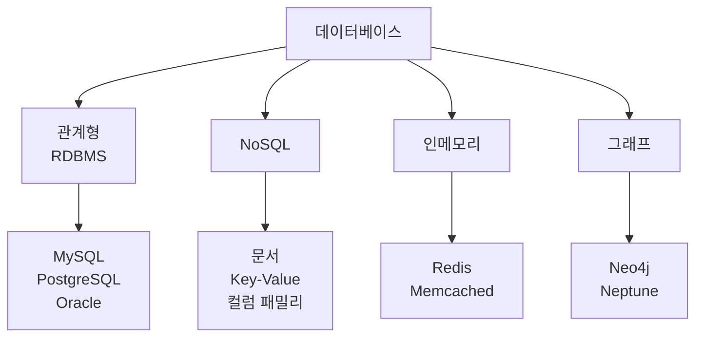
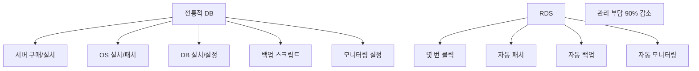
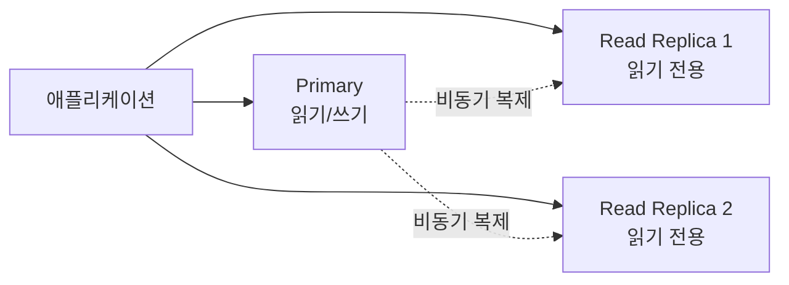
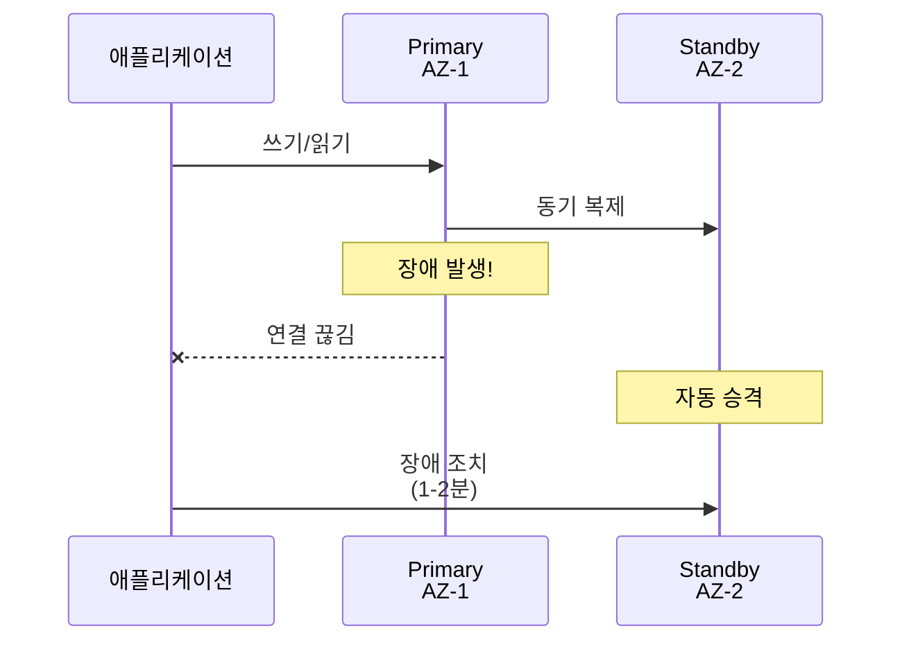
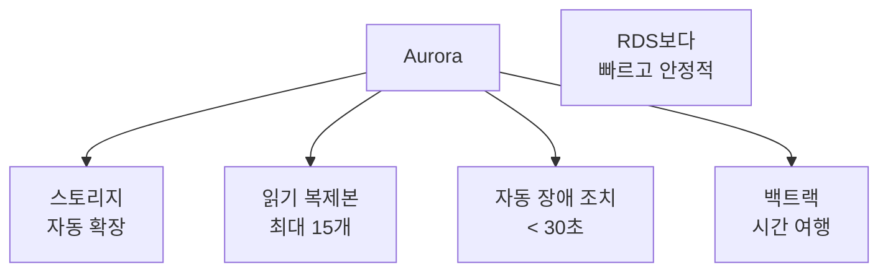
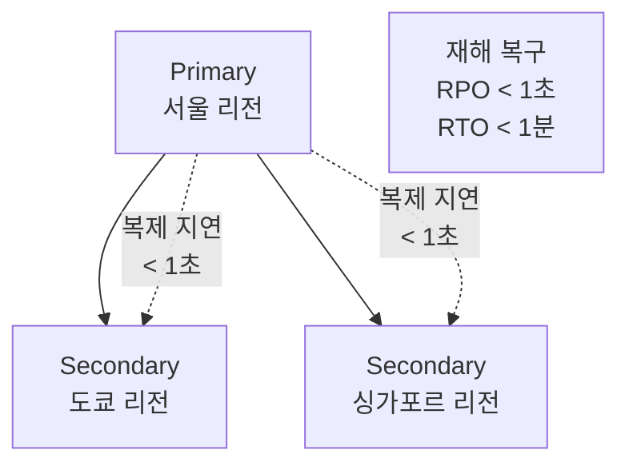
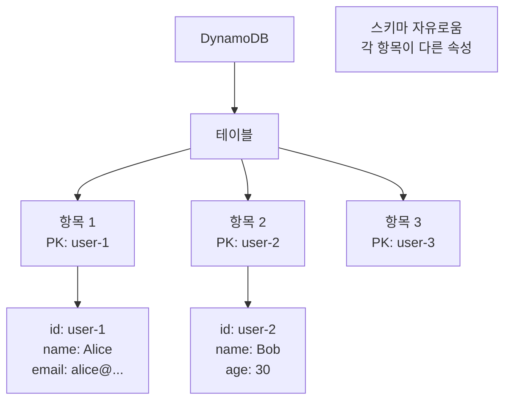
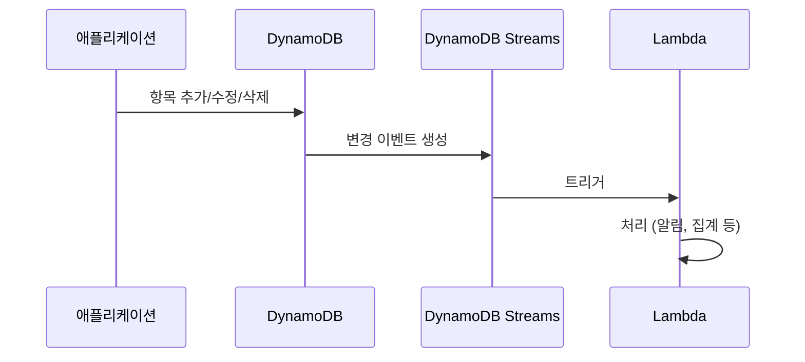
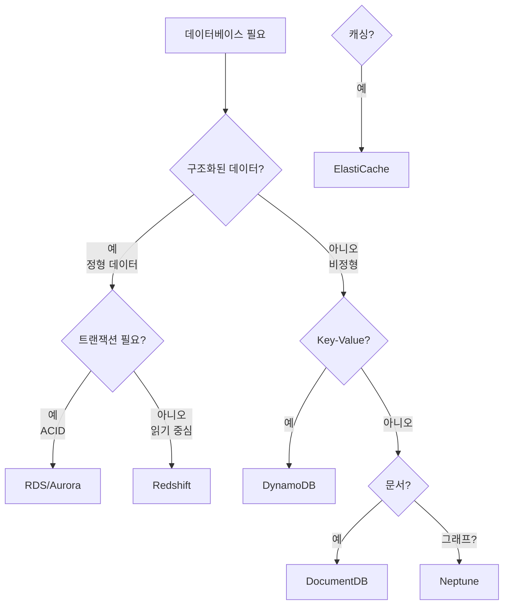

# Chapter 08: AWS 데이터베이스 서비스 - 데이터의 모든 것

> **이 챕터의 목표**
> AWS의 다양한 데이터베이스 서비스를 깊이 이해합니다.
> 관계형, NoSQL, 인메모리, 그래프 데이터베이스까지 완벽하게 마스터합니다.
> 전통적인 데이터베이스 개념과 AWS 관리형 서비스를 비교하며 학습합니다.

---

## 목차
1. [데이터베이스 기초 개념](#1-데이터베이스-기초-개념)
2. [Amazon RDS - 관계형 데이터베이스](#2-amazon-rds---관계형-데이터베이스)
3. [Amazon Aurora - 클라우드 네이티브 DB](#3-amazon-aurora---클라우드-네이티브-db)
4. [Amazon DynamoDB - NoSQL](#4-amazon-dynamodb---nosql)
5. [Amazon ElastiCache - 인메모리](#5-amazon-elasticache---인메모리)
6. [데이터베이스 선택 가이드](#6-데이터베이스-선택-가이드)

---

## 1. 데이터베이스 기초 개념

### 1.1 데이터베이스의 종류



**관계형 데이터베이스 (RDBMS):**
```
특징:
- 테이블 기반 구조
- SQL 쿼리 언어
- ACID 트랜잭션
- 정규화

예시:
테이블: users
| id | name  | email            |
|----|-------|------------------|
| 1  | Alice | alice@email.com  |
| 2  | Bob   | bob@email.com    |

테이블: orders
| id | user_id | product | amount |
|----|---------|---------|--------|
| 1  | 1       | Laptop  | 1000   |
| 2  | 2       | Mouse   | 20     |

조인:
SELECT users.name, orders.product
FROM users JOIN orders ON users.id = orders.user_id
```

**NoSQL 데이터베이스:**
```
특징:
- 유연한 스키마
- 수평 확장 (샤딩)
- BASE (Basically Available, Soft state, Eventually consistent)
- 높은 성능

타입:
1. 문서 (Document): MongoDB, DynamoDB
2. Key-Value: Redis, DynamoDB
3. 컬럼 패밀리: Cassandra
4. 그래프: Neo4j, Neptune
```

### 1.2 ACID vs BASE

**ACID (관계형 DB):**

```
Atomicity (원자성):
- 트랜잭션의 모든 작업이 성공하거나 모두 실패
- 부분 성공 없음

예:
BEGIN TRANSACTION;
  UPDATE accounts SET balance = balance - 100 WHERE id = 1;
  UPDATE accounts SET balance = balance + 100 WHERE id = 2;
COMMIT;

→ 둘 다 성공하거나 둘 다 롤백

Consistency (일관성):
- 데이터베이스가 항상 일관된 상태 유지
- 제약 조건 (외래키, 유니크 등) 위반 불가

Isolation (격리성):
- 동시 트랜잭션이 서로 영향 안 줌
- 격리 수준: Read Uncommitted, Read Committed, Repeatable Read, Serializable

Durability (지속성):
- 커밋된 트랜잭션은 영구 저장
- 시스템 장애 후에도 복구
```

**BASE (NoSQL):**

```
Basically Available (기본적으로 가용):
- 항상 응답 (부분 장애 허용)
- 일부 노드 다운돼도 서비스 제공

Soft state (유연한 상태):
- 복제 지연 허용
- 일시적 불일치 가능

Eventually consistent (최종 일관성):
- 시간이 지나면 일관성 달성
- 즉시 일관성 보장 안 함

예:
소셜 미디어 '좋아요' 카운트:
- 사용자 A가 '좋아요' 클릭
- 일부 서버: 100개
- 다른 서버: 99개 (아직 동기화 안 됨)
- 수 초 후: 모든 서버 100개 (최종 일관성)
```

### 1.3 읽기 vs 쓰기 최적화

```
읽기 중심 워크로드:
- 전자상거래 제품 카탈로그
- 뉴스 사이트
- 분석 대시보드

최적화:
- 읽기 복제본 (Read Replica)
- 캐싱 (ElastiCache)
- 컬럼 스토어 (Redshift)

쓰기 중심 워크로드:
- IoT 센서 데이터
- 로그 수집
- 실시간 분석

최적화:
- NoSQL (DynamoDB)
- 배치 쓰기
- 샤딩
```

---

## 2. Amazon RDS - 관계형 데이터베이스

### 2.1 RDS의 본질

**Amazon RDS (Relational Database Service):**
- AWS가 관리하는 **관계형 데이터베이스**
- 하드웨어, OS, DB 패치 자동화



**지원 엔진:**

```
1. MySQL
   - 오픈소스
   - 웹 애플리케이션
   - 가장 널리 사용

2. PostgreSQL
   - 오픈소스
   - 고급 기능 (JSON, PostGIS)
   - 복잡한 쿼리

3. MariaDB
   - MySQL 포크
   - MySQL 호환

4. Oracle
   - 엔터프라이즈
   - 라이선스 필요
   - 레거시 시스템

5. SQL Server
   - Microsoft
   - .NET 애플리케이션
   - Windows 통합

6. Amazon Aurora
   - AWS 자체 엔진
   - MySQL/PostgreSQL 호환
   - 최고 성능
```

### 2.2 RDS 핵심 기능

#### 1. 자동 백업

```
백업 윈도우:
- 매일 자동 백업
- 보관 기간: 0~35일 (기본 7일)
- 특정 시간 복원 (Point-in-Time Recovery)

예:
오늘 오후 3시에 실수로 테이블 삭제

복구:
1. 오후 2:59 스냅샷으로 새 RDS 인스턴스 생성
2. 애플리케이션을 새 인스턴스로 전환
3. 데이터 복구 완료

주의:
- 원본 인스턴스는 그대로 유지
- 새 인스턴스 생성 (5-10분 소요)
```

#### 2. 읽기 전용 복제본 (Read Replica)



**사용 사례:**

```
시나리오: 전자상거래 사이트
- 주문 쓰기: Primary DB
- 제품 카탈로그 읽기: Read Replica
- 분석 쿼리: Read Replica

장점:
- Primary 부하 감소
- 읽기 성능 향상
- 최대 5개 복제본

제한:
- 비동기 복제 (지연 발생 가능)
- 쓰기 불가
```

#### 3. Multi-AZ (고가용성)



**Multi-AZ 특징:**

```
동기 복제:
- 모든 쓰기가 Standby에 즉시 복제
- 데이터 손실 없음

자동 장애 조치:
- 1-2분 내 자동 전환
- DNS 자동 업데이트
- 애플리케이션 재시작 필요 없음

용도:
- 프로덕션 워크로드
- 데이터 손실 허용 안 함
- 높은 가용성 필요

비용:
- 2배 (Primary + Standby)

vs Read Replica:
- Multi-AZ: 고가용성 (장애 조치)
- Read Replica: 성능 (읽기 분산)
```

### 2.3 RDS 성능 최적화

#### 1. 인스턴스 타입 선택

```
T 시리즈 (Burstable):
- db.t3.micro, db.t3.small
- CPU 크레딧 기반
- 개발/테스트

M 시리즈 (General Purpose):
- db.m5.large, db.m5.xlarge
- 균형 잡힌 성능
- 대부분의 워크로드

R 시리즈 (Memory Optimized):
- db.r5.large, db.r5.xlarge
- 메모리 집약적
- 대용량 데이터셋, 캐싱

예:
작은 애플리케이션: db.t3.small (2GB RAM)
중형 웹사이트: db.m5.large (8GB RAM)
대용량 DB: db.r5.2xlarge (64GB RAM)
```

#### 2. 스토리지 타입

```
General Purpose SSD (gp3):
- IOPS: 3,000 ~ 16,000
- 처리량: 125 ~ 1,000 MB/s
- 비용 효율적
- 대부분의 워크로드

Provisioned IOPS SSD (io1):
- IOPS: 최대 64,000
- 일관된 성능
- 프로덕션 OLTP

Magnetic (레거시):
- 저렴
- 낮은 성능
- 새로운 인스턴스 비권장
```

#### 3. 파라미터 그룹

```sql
-- MySQL 파라미터 그룹 예시

max_connections: 150 → 300
(동시 연결 수 증가)

innodb_buffer_pool_size: 75% of RAM
(캐시 크기 최적화)

slow_query_log: 1
(느린 쿼리 로깅)

long_query_time: 2
(2초 이상 쿼리 로깅)
```

### 2.4 RDS vs 셀프 관리 DB

| 특성 | RDS | EC2 자체 설치 |
|------|-----|---------------|
| **설치** | 자동 | 수동 |
| **패치** | 자동 (유지보수 윈도우) | 수동 |
| **백업** | 자동 | 수동 설정 |
| **고가용성** | Multi-AZ (클릭 한 번) | 수동 구성 |
| **확장** | 클릭/API | 수동 |
| **모니터링** | CloudWatch 통합 | 수동 설정 |
| **OS 접근** | 불가 | 가능 |
| **비용** | 높음 (관리 비용 포함) | 낮음 (EC2만) |
| **유연성** | 제한적 | 완전 제어 |

---

## 3. Amazon Aurora - 클라우드 네이티브 DB

### 3.1 Aurora의 혁신

**Amazon Aurora:**
- AWS가 **클라우드용으로 새로 설계**한 DB
- MySQL/PostgreSQL과 **호환**
- RDS 대비 **5배 성능** (MySQL), **3배 성능** (PostgreSQL)



**전통적 DB vs Aurora:**

```
MySQL (RDS):
[애플리케이션] → [DB 인스턴스] → [EBS 볼륨]
- EBS 한계: IOPS, 처리량
- 스토리지 확장: 수동

Aurora:
[애플리케이션] → [DB 인스턴스] → [분산 스토리지 (6개 복사본)]
- 자동 확장: 10GB → 128TB
- 3개 AZ, 각 2개 복사본
- 쓰기 6개 중 4개 성공하면 완료
- 읽기 6개 중 3개 성공하면 완료
```

### 3.2 Aurora 고급 기능

#### 1. Aurora Serverless

```
기존 Aurora:
- 고정 인스턴스 크기 (db.r5.large)
- 24시간 실행
- 사용 안 해도 비용 발생

Aurora Serverless:
- 자동 확장/축소
- 사용량 기반 과금 (ACU - Aurora Capacity Unit)
- 유휴 시 자동 일시 중지

사용 사례:
- 간헐적 워크로드
- 개발/테스트 환경
- 신규 애플리케이션 (트래픽 예측 어려움)

예:
블로그 사이트:
- 평소: 1 ACU (최소)
- 포스팅 바이럴: 32 ACU (자동 확장)
- 밤 시간: 0 ACU (일시 중지)
```

#### 2. Aurora Global Database



**특징:**

```
복제 성능:
- 물리적 복제 (바이너리 로그 아님)
- 지연시간: < 1초
- 전용 인프라 사용

재해 복구:
- RPO (Recovery Point Objective): < 1초 (데이터 손실)
- RTO (Recovery Time Objective): < 1분 (복구 시간)

장애 조치:
- 수동 또는 자동
- Secondary를 Primary로 승격
- 글로벌 분산 읽기
```

#### 3. Aurora 백트랙

```
시간 여행 기능:

09:00 - 데이터 정상
10:00 - 실수로 테이블 삭제
10:30 - 백트랙 실행 → 09:55로 복원

특징:
- 새 인스턴스 생성 불필요
- 몇 분 내 복원
- 72시간까지 가능

vs 스냅샷:
- 백트랙: 빠름, 동일 인스턴스
- 스냅샷: 느림, 새 인스턴스
```

### 3.3 Aurora 비용 최적화

```
I/O 최적화 모드:
- 기본: 읽기/쓰기 I/O 요청당 과금
- I/O 최적화: I/O 무제한, 인스턴스 비용 40% 증가

선택 기준:
일반 워크로드: 기본 모드
고 I/O 워크로드 (월 I/O 비용 > 인스턴스 비용 40%): I/O 최적화
```

---

## 4. Amazon DynamoDB - NoSQL

### 4.1 DynamoDB의 본질

**Amazon DynamoDB:**
- **완전 관리형 NoSQL** 데이터베이스
- **서버리스** (용량 계획 불필요)
- **한 자릿수 밀리초** 지연시간



**DynamoDB vs RDBMS:**

```
RDBMS (MySQL):
테이블 정의:
CREATE TABLE users (
  id INT PRIMARY KEY,
  name VARCHAR(100) NOT NULL,
  email VARCHAR(100) NOT NULL
);

모든 행이 동일한 컬럼 필요

DynamoDB:
항목 1:
{
  "id": "user-1",
  "name": "Alice",
  "email": "alice@example.com"
}

항목 2:
{
  "id": "user-2",
  "name": "Bob",
  "age": 30,
  "hobbies": ["reading", "gaming"]
}

→ 각 항목이 다른 속성 가능
```

### 4.2 파티션 키와 정렬 키

```
파티션 키 (Partition Key):
- 데이터 분산 기준
- 해시 함수로 파티션 결정
- 반드시 필요

정렬 키 (Sort Key):
- 파티션 내 정렬
- 선택적

예시 1: 파티션 키만
테이블: Users
PK: userId
{
  "userId": "user-123",
  "name": "Alice"
}

쿼리:
GetItem(userId="user-123")

예시 2: 파티션 키 + 정렬 키
테이블: Orders
PK: userId, SK: orderDate
{
  "userId": "user-123",
  "orderDate": "2024-12-11",
  "items": [...]
}

쿼리:
Query(userId="user-123", orderDate BETWEEN "2024-12-01" AND "2024-12-31")
→ 특정 사용자의 12월 주문 모두
```

### 4.3 읽기 일관성

```
Eventual Consistent Read (최종 일관성):
- 기본값
- 빠름
- 저렴 (1 RCU)
- 최신 데이터 보장 안 함 (보통 1초 이내)

Strongly Consistent Read (강한 일관성):
- 최신 데이터 보장
- 느림
- 비쌈 (2 RCU)

예:
쓰기: userId=user-1, balance=100

Eventual Read (즉시):
→ balance=90 (이전 값) 가능

Strongly Consistent Read:
→ balance=100 (최신 값) 보장
```

### 4.4 인덱스

#### 1. 로컬 보조 인덱스 (LSI)

```
기본 테이블:
PK: userId, SK: orderDate

LSI:
PK: userId, SK: amount
→ 같은 사용자의 주문을 금액 순으로 조회

제약:
- 테이블 생성 시에만 정의
- 최대 5개
- 파티션 키 동일
```

#### 2. 글로벌 보조 인덱스 (GSI)

```
기본 테이블:
PK: userId, SK: orderDate

GSI:
PK: productId, SK: orderDate
→ 특정 제품의 모든 주문 조회

특징:
- 언제든 추가/삭제
- 다른 파티션 키 사용
- 별도 처리량 설정
- 최대 20개
```

### 4.5 용량 모드

#### 1. 프로비저닝 모드

```
수동 설정:
- 읽기 용량: 100 RCU
- 쓰기 용량: 50 WCU

RCU (Read Capacity Unit):
- 1 RCU = 4KB 강한 일관성 읽기/초
- 1 RCU = 8KB 최종 일관성 읽기/초

WCU (Write Capacity Unit):
- 1 WCU = 1KB 쓰기/초

예:
항목 크기: 10KB
강한 일관성 읽기: 10KB / 4KB = 3 RCU
쓰기: 10KB / 1KB = 10 WCU
```

#### 2. 온디맨드 모드

```
자동 확장:
- 용량 계획 불필요
- 사용량 기반 과금
- 읽기: $1.25 per 1M requests
- 쓰기: $6.25 per 1M requests

사용 사례:
- 예측 불가능한 워크로드
- 새로운 애플리케이션
- 트래픽 급증
```

### 4.6 DynamoDB Streams



**사용 사례:**

```
1. 실시간 집계:
   주문 추가 → Lambda → 총 판매액 업데이트

2. 데이터 복제:
   테이블 A 변경 → Lambda → 테이블 B 복제

3. 알림:
   신규 사용자 → Lambda → 환영 이메일

4. 감사 로그:
   모든 변경 → Lambda → S3 저장
```

---

## 5. Amazon ElastiCache - 인메모리

### 5.1 캐싱의 필요성

**왜 캐시?**

```
DB 없이:
사용자 → 애플리케이션 → DB (100ms)

DB + 캐시:
사용자 → 애플리케이션 → 캐시 (1ms) → 응답
                         ↓ (캐시 미스)
                        DB (100ms) → 캐시 저장

성능 향상: 100배
```

**캐시 패턴:**

```
1. Lazy Loading (Cache-Aside):
   - 읽기 시 캐시 확인
   - 캐시 미스 → DB 조회 → 캐시 저장

   장점: 필요한 데이터만 캐싱
   단점: 첫 요청 느림

2. Write-Through:
   - 쓰기 시 캐시와 DB 동시 업데이트

   장점: 캐시 항상 최신
   단점: 쓰기 지연 증가

3. TTL (Time To Live):
   - 일정 시간 후 자동 만료
   - 데이터 신선도 유지
```

### 5.2 Redis vs Memcached

| 특성 | Redis | Memcached |
|------|-------|-----------|
| **데이터 타입** | String, List, Set, Hash, Sorted Set | String만 |
| **지속성** | 디스크 저장 가능 | 메모리만 |
| **복제** | 지원 (Read Replica) | 불가 |
| **고가용성** | 자동 장애 조치 | 불가 |
| **트랜잭션** | 지원 | 불가 |
| **Pub/Sub** | 지원 | 불가 |
| **멀티스레드** | 단일 스레드 | 멀티스레드 |
| **사용 사례** | 복잡한 데이터, 세션 | 단순 캐싱 |

### 5.3 Redis 고급 기능

#### 1. 데이터 타입

```redis
String:
SET user:1000 "Alice"
GET user:1000

List (대기열):
LPUSH queue "job1"
LPUSH queue "job2"
RPOP queue  → "job1"

Set (고유 값):
SADD tags "aws" "database" "redis"
SMEMBERS tags

Hash (객체):
HSET user:1000 name "Alice" age 30
HGET user:1000 name

Sorted Set (순위):
ZADD leaderboard 100 "player1"
ZADD leaderboard 200 "player2"
ZRANGE leaderboard 0 10  → 상위 10명
```

#### 2. Pub/Sub

```redis
# Subscriber
SUBSCRIBE notifications

# Publisher
PUBLISH notifications "New order #1234"

사용 사례:
- 실시간 알림
- 채팅 애플리케이션
- 이벤트 브로드캐스팅
```

#### 3. 클러스터 모드

```
클러스터 모드 비활성화:
- 단일 노드 또는 복제본
- 최대 5개 읽기 복제본

클러스터 모드 활성화:
- 데이터 샤딩 (최대 500개 샤드)
- 수평 확장
- 대용량 데이터셋
```

### 5.4 캐시 전략

```python
# Python 예시 (Lazy Loading + TTL)

def get_user(user_id):
    # 1. 캐시 확인
    cache_key = f"user:{user_id}"
    cached = redis.get(cache_key)

    if cached:
        return json.loads(cached)  # 캐시 히트

    # 2. 캐시 미스 → DB 조회
    user = db.query("SELECT * FROM users WHERE id = %s", user_id)

    # 3. 캐시 저장 (TTL 3600초 = 1시간)
    redis.setex(cache_key, 3600, json.dumps(user))

    return user

def update_user(user_id, data):
    # 1. DB 업데이트
    db.execute("UPDATE users SET ... WHERE id = %s", user_id)

    # 2. 캐시 무효화
    redis.delete(f"user:{user_id}")
```

---

## 6. 데이터베이스 선택 가이드

### 6.1 의사결정 트리



### 6.2 워크로드별 추천

#### 1. 웹 애플리케이션

```
프로덕션:
✅ Aurora MySQL
- 자동 장애 조치
- 읽기 복제본
- 백업

개발/테스트:
✅ RDS MySQL (t3.small)
또는
✅ Aurora Serverless
- 비용 절감

세션 스토어:
✅ ElastiCache Redis
- 빠른 읽기/쓰기
- 자동 만료 (TTL)
```

#### 2. IoT 애플리케이션

```
센서 데이터 수집:
✅ DynamoDB
- 초당 수백만 쓰기
- 자동 확장
- 서버리스

시계열 데이터:
✅ Timestream
- 시계열 최적화
- 자동 데이터 계층화
```

#### 3. 전자상거래

```
제품 카탈로그:
✅ Aurora + ElastiCache
- Aurora: 주 데이터베이스
- ElastiCache: 제품 정보 캐싱

장바구니:
✅ DynamoDB
- 빠른 읽기/쓰기
- 자동 확장

주문 내역:
✅ Aurora
- ACID 트랜잭션
- 복잡한 쿼리
```

#### 4. 분석/BI

```
데이터 웨어하우스:
✅ Redshift
- 컬럼 스토어
- 페타바이트 규모
- SQL 쿼리

실시간 분석:
✅ DynamoDB + Kinesis + Redshift
- DynamoDB: 운영 DB
- Kinesis: 스트리밍
- Redshift: 분석
```

### 6.3 마이그레이션 전략

```
온프레미스 MySQL → AWS:

1단계: 평가
   - 데이터 크기
   - 쿼리 패턴 분석
   - 종속성 확인

2단계: 선택
   옵션 A: RDS MySQL
   - 최소 변경
   - 빠른 마이그레이션

   옵션 B: Aurora MySQL
   - 성능 향상
   - 비용 증가

3단계: 마이그레이션
   - AWS DMS (Database Migration Service)
   - 최소 다운타임
   - 실시간 복제

4단계: 검증
   - 데이터 일관성 확인
   - 성능 테스트
```

### 6.4 비용 최적화

#### 1. Reserved Instances

```
온디맨드:
db.r5.large: $0.29/시간
월: $210

1년 예약 (선결제):
db.r5.large: $0.18/시간 (38% 할인)
월: $130

3년 예약 (선결제):
db.r5.large: $0.12/시간 (59% 할인)
월: $87

권장:
- 프로덕션 워크로드
- 안정적 사용량
```

#### 2. Aurora I/O 최적화

```
월 I/O 비용:
100M 요청 × $0.20/M = $20

인스턴스 비용:
db.r5.large: $200/월

I/O가 인스턴스의 40% 이상:
→ I/O 최적화 모드 사용
→ I/O 무제한, 인스턴스 +40% ($280)
→ 절감: $20 vs $80
```

#### 3. DynamoDB 온디맨드

```
프로비저닝 (예측 가능):
100 RCU × $0.00013/시간 × 730시간 = $9.49
50 WCU × $0.00065/시간 × 730시간 = $23.73
총: $33.22/월

온디맨드 (변동):
1M 읽기 × $0.25 = $0.25
1M 쓰기 × $1.25 = $1.25

사용량 예측 가능: 프로비저닝
사용량 변동: 온디맨드
```

---

## 7. 요약 및 체크리스트

### 핵심 개념 요약

**관계형 DB (RDS/Aurora):**
```
✅ ACID 트랜잭션
✅ SQL 쿼리
✅ 복잡한 조인
✅ 정형 데이터
```

**NoSQL (DynamoDB):**
```
✅ 유연한 스키마
✅ 수평 확장
✅ 한 자릿수 ms 지연
✅ Key-Value 액세스
```

**인메모리 (ElastiCache):**
```
✅ 초고속 (< 1ms)
✅ 캐싱, 세션
✅ Redis: 복잡한 데이터 타입
✅ Memcached: 단순 캐싱
```

### 실전 체크리스트

```
□ RDS 설정
  □ Multi-AZ: 프로덕션 필수
  □ 자동 백업: 7일 이상
  □ Read Replica: 읽기 부하 분산
  □ 파라미터 그룹: 워크로드 최적화

□ DynamoDB 설계
  □ 파티션 키: 고르게 분산
  □ GSI: 다양한 쿼리 패턴 지원
  □ 용량 모드: 온디맨드 vs 프로비저닝
  □ Streams: 실시간 처리

□ 캐싱 전략
  □ ElastiCache: 자주 읽는 데이터
  □ TTL: 데이터 신선도
  □ 캐시 무효화: 업데이트 시

□ 보안
  □ 암호화: 저장/전송 중
  □ VPC: 프라이빗 서브넷
  □ IAM: 최소 권한
  □ 보안 그룹: 필요한 포트만

□ 모니터링
  □ CloudWatch: CPU, 메모리, 연결 수
  □ Enhanced Monitoring: 상세 메트릭
  □ Performance Insights: 쿼리 분석
  □ 알람: 임계값 설정
```

---

**이 챕터에서 배운 내용:**

1. **데이터베이스 기초**: RDBMS vs NoSQL, ACID vs BASE
2. **RDS**: 관리형 관계형 DB, Multi-AZ, Read Replica
3. **Aurora**: 클라우드 네이티브, Serverless, Global Database
4. **DynamoDB**: NoSQL, 파티션 키, GSI, Streams
5. **ElastiCache**: Redis vs Memcached, 캐싱 전략
6. **선택 가이드**: 워크로드별 추천, 마이그레이션, 비용 최적화

AWS 데이터베이스 서비스는 관리 부담을 대폭 줄이고 확장성과 가용성을 자동으로 제공합니다.
올바른 데이터베이스 선택은 애플리케이션 성능과 비용에 큰 영향을 미칩니다.
