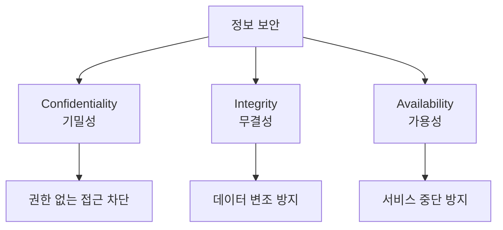
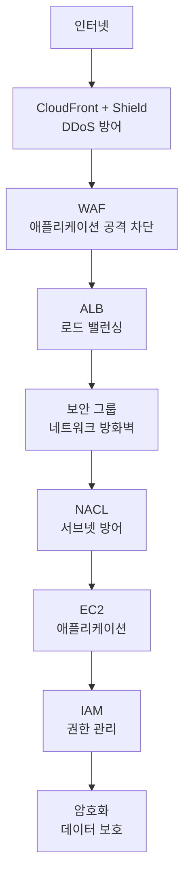
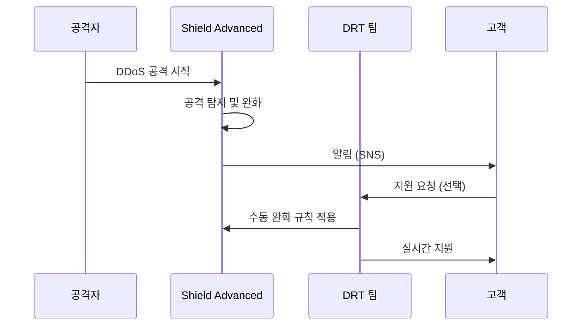
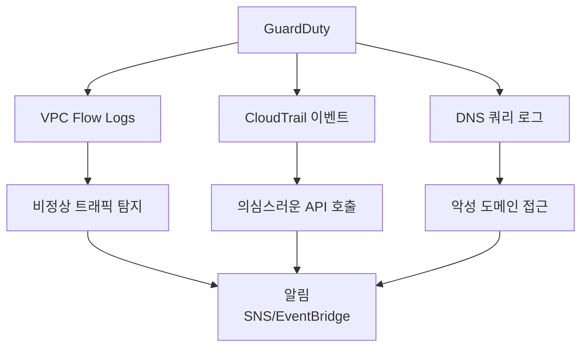
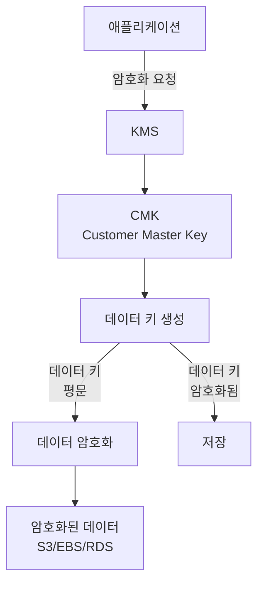

# Chapter 09: AWS 보안 서비스 - 보안의 모든 것

> **이 챕터의 목표**
> AWS의 보안 서비스들을 깊이 이해합니다.
> 암호화, 모니터링, 위협 탐지, 규정 준수까지 완벽하게 마스터합니다.
> 전통적인 보안 개념(방화벽, IDS/IPS, 로깅)과 AWS 서비스를 비교하며 학습합니다.

---

## 목차
1. [보안의 기초 개념](#1-보안의-기초-개념)
2. [AWS Shield - DDoS 방어](#2-aws-shield---ddos-방어)
3. [AWS WAF - 웹 애플리케이션 방화벽](#3-aws-waf---웹-애플리케이션-방화벽)
4. [Amazon GuardDuty - 위협 탐지](#4-amazon-guardduty---위협-탐지)
5. [AWS CloudTrail - 감사 로깅](#5-aws-cloudtrail---감사-로깅)
6. [AWS KMS - 암호화 키 관리](#6-aws-kms---암호화-키-관리)
7. [보안 모범 사례](#7-보안-모범-사례)

---

## 1. 보안의 기초 개념

### 1.1 CIA 삼원칙



**기밀성 (Confidentiality):**
```
정의: 권한이 없는 사용자의 정보 접근 차단

전통적 방법:
- 파일 권한 (chmod 600)
- 방화벽
- VPN

AWS:
- IAM (권한 관리)
- 보안 그룹
- 암호화 (KMS)

예:
고객 개인정보:
- S3 버킷 암호화
- IAM으로 접근 제한
- VPC 프라이빗 서브넷
```

**무결성 (Integrity):**
```
정의: 데이터가 무단으로 변조되지 않음을 보장

전통적 방법:
- 체크섬 (MD5, SHA256)
- 디지털 서명
- 버전 관리

AWS:
- S3 버전 관리
- S3 객체 잠금
- CloudTrail (변경 감사)

예:
소프트웨어 다운로드:
파일: app.zip
체크섬: SHA256: abc123...
→ 다운로드 후 검증
→ 일치하면 변조 안 됨
```

**가용성 (Availability):**
```
정의: 필요할 때 서비스 이용 가능

전통적 방법:
- 이중화 (Active-Standby)
- 로드 밸런서
- 백업

AWS:
- Multi-AZ
- Auto Scaling
- S3 (99.99% SLA)

예:
웹 사이트:
- ALB + Auto Scaling
- 2개 AZ
- DDoS 공격 시에도 서비스 유지
```

### 1.2 공격 유형

#### 1. DDoS (Distributed Denial of Service)

```
공격 원리:
수천~수백만 대의 봇넷에서 동시 요청
→ 서버 과부하
→ 정상 사용자 접근 불가

레이어별 공격:

Layer 3 (Network):
- SYN Flood
- UDP Flood
초당 수백만 패킷

Layer 7 (Application):
- HTTP GET Flood
- Slowloris
정상 요청처럼 보이지만 대량 발생

전통적 방어:
- 방화벽 (연결 수 제한)
- IPS (Intrusion Prevention System)
- CDN

AWS 방어:
- AWS Shield (자동)
- CloudFront (분산)
- WAF (애플리케이션 계층)
```

#### 2. SQL Injection

```sql
-- 취약한 코드
$username = $_POST['username'];
$password = $_POST['password'];
$query = "SELECT * FROM users WHERE username='$username' AND password='$password'";

-- 공격
username: admin' --
password: 아무거나

-- 실제 실행 쿼리
SELECT * FROM users WHERE username='admin' -- ' AND password='...'
→ 비밀번호 검증 우회 (-- 이후 주석 처리)

방어:
1. Prepared Statement (파라미터화된 쿼리)
2. 입력 검증
3. WAF (SQL Injection 패턴 차단)
```

#### 3. XSS (Cross-Site Scripting)

```html
<!-- 취약한 코드 -->
<?php
  $name = $_GET['name'];
  echo "Hello, $name";
?>

<!-- 공격 URL -->
http://example.com/?name=<script>alert(document.cookie)</script>

<!-- 실제 출력 -->
Hello, <script>alert(document.cookie)</script>
→ 스크립트 실행, 쿠키 탈취

방어:
1. 입력 이스케이프
2. Content-Security-Policy 헤더
3. WAF
```

### 1.3 보안 계층 (Defense in Depth)



---

## 2. AWS Shield - DDoS 방어

### 2.1 Shield Standard

**AWS Shield Standard:**
- **모든 AWS 고객에게 무료 제공**
- 자동 활성화

```
보호 범위:
- Layer 3 (네트워크): SYN Flood, UDP Flood
- Layer 4 (전송): TCP 상태 공격

보호 서비스:
- CloudFront
- Route 53
- Elastic Load Balancing
- AWS Global Accelerator

예:
공격: 초당 10Gbps SYN Flood
Shield Standard: 자동 차단
→ 사용자는 알아차리지 못함
→ 추가 비용 없음
```

### 2.2 Shield Advanced

**AWS Shield Advanced:**
- **유료** ($3,000/월)
- 고급 DDoS 방어

```
추가 보호:
- EC2 Elastic IP
- 더 큰 규모 공격 방어
- 실시간 공격 알림
- 24/7 DDoS Response Team (DRT)

비용 보호:
- DDoS 공격으로 인한 Auto Scaling 비용 환불

사용 사례:
- 미션 크리티컬 애플리케이션
- 금융, 의료 등
- 게임 서버 (타겟 공격 대상)
```

**Shield Advanced 대응 프로세스:**



---

## 3. AWS WAF - 웹 애플리케이션 방화벽

### 3.1 WAF의 역할

**AWS WAF (Web Application Firewall):**
- **Layer 7 (애플리케이션 계층)** 방화벽
- HTTP/HTTPS 트래픽 검사

```
전통적 WAF (ModSecurity):
LoadBalancer -> WAF 서버 -> 웹 서버

설정:
- 소프트웨어 설치
- 규칙 작성 (복잡)
- 서버 관리

AWS WAF:
CloudFront/ALB -> WAF (관리형) -> 백엔드

설정:
- 콘솔/API로 규칙 생성
- 관리형 규칙 세트 사용
- 서버리스
```

### 3.2 WAF 규칙

**규칙 타입:**

```
1. IP 세트:
   - 특정 IP 차단/허용
   - CIDR 범위 지정

   예:
   악성 IP: 203.0.113.0/24 차단

2. 문자열 매칭:
   - URL, 헤더, 본문에서 패턴 찾기

   예:
   SQL Injection 차단:
   - URI에 "UNION SELECT" 포함 시 차단
   - URI에 "' OR '1'='1" 포함 시 차단

3. 크기 제한:
   - 요청 크기 제한

   예:
   - 본문 크기 > 100KB → 차단

4. 지리적 제한:
   - 국가별 차단/허용

   예:
   - 한국, 미국만 허용
   - 나머지 국가 차단

5. 속도 제한:
   - IP당 요청 수 제한

   예:
   - 5분에 1,000 요청 초과 → 차단
```

**규칙 예시:**

```
규칙 1: SQL Injection 방어
IF 요청 URI에 다음 포함:
  - ' OR '
  - UNION SELECT
  - DROP TABLE
THEN 차단

규칙 2: XSS 방어
IF 요청 본문에 다음 포함:
  - <script>
  - javascript:
  - onerror=
THEN 차단

규칙 3: 속도 제한
IF IP가 5분에 1,000 요청 초과
THEN 1시간 차단

우선순위:
1 → 2 → 3 순서로 평가
```

### 3.3 관리형 규칙 세트

**AWS Managed Rules:**
```
1. Core Rule Set (CRS):
   - OWASP Top 10 방어
   - SQL Injection
   - XSS
   - 무료

2. Known Bad Inputs:
   - 알려진 악성 패턴
   - CVE 취약점
   - 무료

3. IP Reputation List:
   - 악성 IP 목록
   - 봇넷, 스캐너
   - 유료

사용법:
1. WAF → Web ACL 생성
2. 관리형 규칙 추가 (클릭)
3. CloudFront/ALB에 연결
→ 즉시 보호 시작
```

### 3.4 WAF 로깅

```
로그 대상:
- S3
- CloudWatch Logs
- Kinesis Data Firehose

로그 내용:
{
  "timestamp": 1701234567890,
  "action": "BLOCK",
  "ruleId": "SQL-Injection-Rule",
  "httpRequest": {
    "clientIp": "203.0.113.1",
    "uri": "/login?id=1' OR '1'='1",
    "httpMethod": "GET"
  }
}

분석:
- 차단된 IP 확인
- 공격 패턴 분석
- 오탐 (False Positive) 확인
```

---

## 4. Amazon GuardDuty - 위협 탐지

### 4.1 GuardDuty의 개념

**Amazon GuardDuty:**
- **지능형 위협 탐지** 서비스
- 머신러닝 기반
- 지속적 모니터링



**전통적 IDS (Intrusion Detection System):**

```
Snort, Suricata:
- 네트워크 패킷 캡처
- 서명 기반 탐지
- 수동 규칙 업데이트

설정:
1. IDS 서버 설치
2. 네트워크 미러링 설정
3. 서명 데이터베이스 업데이트
4. 알림 설정

AWS GuardDuty:
- 자동 활성화 (클릭 한 번)
- 머신러닝 + 서명
- AWS가 위협 인텔리전스 업데이트
- 자동 알림
```

### 4.2 탐지 유형

#### 1. Recon (정찰) 공격

```
탐지:
- 포트 스캔
- 비정상적인 API 호출 패턴

예:
Recon:EC2/PortProbeUnprotectedPort
→ EC2 인스턴스에 대한 포트 스캔 탐지
→ 알림: "203.0.113.1이 22, 80, 443, 3306 등 포트 스캔"

대응:
1. 보안 그룹 검토
2. 불필요한 포트 닫기
3. 공격자 IP 차단 (NACL 또는 WAF)
```

#### 2. 자격 증명 탈취

```
탐지:
UnauthorizedAccess:IAMUser/TorIPCaller
→ Tor 네트워크에서 AWS API 호출

UnauthorizedAccess:IAMUser/MaliciousIPCaller.Custom
→ 알려진 악성 IP에서 접근

예:
평소 한국에서만 접속하던 IAM 유저
→ 갑자기 러시아에서 로그인
→ GuardDuty 알림

대응:
1. 즉시 IAM 유저 비활성화
2. Access Key 교체
3. CloudTrail로 활동 조사
```

#### 3. 암호화폐 채굴

```
탐지:
CryptoCurrency:EC2/BitcoinTool.B!DNS
→ EC2가 비트코인 채굴 풀에 접속

예:
해킹당한 EC2:
→ 악성코드가 채굴 프로그램 실행
→ mining.pool.com 접속
→ GuardDuty 즉시 탐지

대응:
1. EC2 격리 (보안 그룹 모든 트래픽 차단)
2. 스냅샷 생성 (포렌식)
3. 인스턴스 종료
4. AMI에서 새 인스턴스 시작
```

### 4.3 GuardDuty 심각도

```
심각도 레벨:

Low (낮음):
- 심각도: 0.1 - 3.9
- 예: 일반적인 정찰 활동
- 대응: 모니터링

Medium (중간):
- 심각도: 4.0 - 6.9
- 예: 비정상적 API 호출
- 대응: 조사 필요

High (높음):
- 심각도: 7.0 - 8.9
- 예: 자격 증명 유출
- 대응: 즉각 대응

Critical (긴급):
- 심각도: 9.0+
- 예: 실제 공격 진행 중
- 대응: 긴급 대응 (격리, 차단)
```

---

## 5. AWS CloudTrail - 감사 로깅

### 5.1 CloudTrail의 역할

**AWS CloudTrail:**
- **모든 AWS API 호출 기록**
- 누가, 언제, 무엇을 했는지 추적

```
기록 내용:
- 사용자 신원 (IAM User, Role)
- 시간
- 소스 IP
- 요청 파라미터
- 응답

예:
{
  "eventTime": "2024-12-11T10:30:00Z",
  "eventName": "DeleteBucket",
  "userIdentity": {
    "type": "IAMUser",
    "userName": "alice"
  },
  "sourceIPAddress": "203.0.113.1",
  "requestParameters": {
    "bucketName": "important-data"
  },
  "responseElements": null
}

→ alice가 203.0.113.1에서 important-data 버킷 삭제
```

**전통적 로깅:**

```
Linux /var/log/:
- auth.log: 인증 로그
- syslog: 시스템 로그
- apache/access.log: 웹 로그

문제:
- 로그 분산 (각 서버마다)
- 중앙 집중 어려움
- 로그 조작 가능

CloudTrail:
- 모든 AWS 계정 활동 중앙 기록
- S3에 암호화 저장
- 무결성 검증 (다이제스트 파일)
- 로그 조작 불가
```

### 5.2 CloudTrail 이벤트 타입

#### 1. Management Events (관리 이벤트)

```
정의: AWS 리소스 관리 작업

예:
- EC2 인스턴스 시작/중지
- S3 버킷 생성/삭제
- IAM 유저 생성
- 보안 그룹 규칙 변경

기본: 활성화 (90일 보관)
```

#### 2. Data Events (데이터 이벤트)

```
정의: 리소스 내부 데이터 작업

예:
- S3 객체 GetObject/PutObject
- Lambda 함수 Invoke
- DynamoDB PutItem/GetItem

기본: 비활성화 (볼륨 많음)
활성화: 명시적 설정 필요
```

#### 3. Insights Events (인사이트 이벤트)

```
정의: 비정상적인 활동 패턴 자동 탐지

예:
평소 하루 10개 EC2 시작
→ 갑자기 100개 시작
→ CloudTrail Insights 알림

평소 한 리전만 사용
→ 갑자기 10개 리전 동시 사용
→ 계정 탈취 의심
```

### 5.3 CloudTrail 활용

#### 1. 보안 감사

```
시나리오: 중요 S3 버킷 삭제됨

조사:
1. CloudTrail에서 DeleteBucket 검색
2. 이벤트 발견:
   - 시간: 2024-12-11 03:00 AM
   - 유저: temp-admin
   - IP: 198.51.100.1 (외국)

3. 추가 조사:
   - temp-admin의 모든 활동 검색
   - 계정 탈취 확인

4. 대응:
   - temp-admin 비활성화
   - 백업에서 버킷 복구
   - MFA 강제 적용
```

#### 2. 규정 준수

```
HIPAA, PCI-DSS, SOC 2:
- 모든 활동 로그 필수
- 최소 7년 보관

CloudTrail 설정:
1. 활성화
2. S3 버킷 지정 (암호화)
3. S3 라이프사이클:
   - 90일: Standard
   - 1년: Glacier
   - 7년 후: 삭제
4. CloudWatch Logs 통합 (실시간 알림)
```

#### 3. 트러블슈팅

```
문제: EC2 인스턴스가 갑자기 중지됨

조사:
1. CloudTrail: StopInstances 검색
2. 이벤트:
   - Auto Scaling이 인스턴스 종료
   - 이유: 헬스 체크 실패

3. 원인 분석:
   - 애플리케이션 에러
   - 헬스 체크 엔드포인트 다운

4. 해결:
   - 애플리케이션 수정
   - 헬스 체크 설정 조정
```

---

## 6. AWS KMS - 암호화 키 관리

### 6.1 암호화 기초

**대칭 vs 비대칭 암호화:**

```
대칭키 암호화:
- 암호화와 복호화에 동일한 키 사용
- 빠름
- AES-256

예:
원본: "Hello World"
키: abc123
암호화: encrypt("Hello World", abc123) = "x7#$k..."
복호화: decrypt("x7#$k...", abc123) = "Hello World"

문제: 키를 안전하게 공유해야 함

비대칭키 암호화:
- 공개키 (Public Key): 암호화
- 개인키 (Private Key): 복호화
- 느림
- RSA, ECC

예:
공개키로 암호화: encrypt("Hello", 공개키) = "x7#$k..."
개인키로 복호화: decrypt("x7#$k...", 개인키) = "Hello"

장점: 공개키는 공유해도 안전
```

### 6.2 KMS 개념

**AWS KMS (Key Management Service):**
- **암호화 키 생성 및 관리**
- HSM (Hardware Security Module) 기반



**전통적 키 관리:**

```
파일로 저장:
/etc/secrets/encryption.key

문제:
- 파일 유출 위험
- 키 교체 어려움
- 접근 제어 복잡

KMS:
- 키를 직접 보지 않음
- API로만 사용
- IAM으로 접근 제어
- 자동 키 교체
- 모든 사용 감사 (CloudTrail)
```

### 6.3 KMS 키 타입

#### 1. AWS Managed Key

```
특징:
- AWS 서비스가 자동 생성
- 키 이름: aws/s3, aws/rds, aws/ebs
- 무료
- 3년마다 자동 교체

사용:
S3 버킷 암호화 활성화
→ AWS가 aws/s3 키 자동 사용

제한:
- 키 정책 변경 불가
- 삭제 불가
```

#### 2. Customer Managed Key (CMK)

```
특징:
- 사용자가 생성
- 완전한 제어
- $1/월
- 수동 또는 자동 교체 (1년)

사용:
1. KMS → CMK 생성
2. 키 정책 설정:
   - 누가 사용 가능
   - 누가 관리 가능
3. S3/EBS/RDS 등에서 CMK 선택

장점:
- 세밀한 권한 제어
- 감사 추적
- 키 비활성화/삭제 가능
```

#### 3. Custom Key Store

```
특징:
- CloudHSM 사용
- 키가 AWS 인프라 밖에 존재
- 규정 준수 (FIPS 140-2 Level 3)

사용 사례:
- 금융, 의료
- 정부 기관
- 키를 완전히 제어해야 할 때
```

### 6.4 봉투 암호화 (Envelope Encryption)

```
문제:
대용량 파일 (1GB) 암호화
→ KMS로 직접 암호화?
→ KMS 요청 한도 (5,500 요청/초)

해결: 봉투 암호화

1. 데이터 키 생성 요청:
   KMS.GenerateDataKey()
   → 응답: 평문 데이터 키 + 암호화된 데이터 키

2. 평문 데이터 키로 파일 암호화:
   AES-256(파일, 평문 데이터 키)
   → 암호화된 파일

3. 평문 데이터 키 삭제 (메모리에서)

4. 암호화된 파일 + 암호화된 데이터 키 저장

복호화:
1. KMS.Decrypt(암호화된 데이터 키)
   → 평문 데이터 키
2. 평문 데이터 키로 파일 복호화
3. 평문 데이터 키 삭제

장점:
- 대용량 파일도 빠름 (로컬 암호화)
- KMS 요청 최소화
- 키 교체 용이
```

### 6.5 암호화 적용

#### 1. S3 암호화

```
SSE-S3 (서버 측 암호화 - S3 관리):
- S3가 키 관리
- AES-256
- 무료

SSE-KMS (서버 측 암호화 - KMS):
- KMS CMK 사용
- 키 접근 감사
- $1/월 + API 비용

SSE-C (서버 측 암호화 - 고객 제공):
- 고객이 키 제공
- AWS는 키 저장 안 함
- 키 유실 시 복구 불가

클라이언트 측 암호화:
- 업로드 전 암호화
- AWS는 암호화된 데이터만 봄
```

#### 2. EBS 암호화

```
활성화:
EC2 → EBS 볼륨 생성 → 암호화 체크

특징:
- 볼륨 전체 암호화
- 스냅샷도 암호화
- 성능 영향 거의 없음 (하드웨어 가속)

키:
- AWS Managed Key (기본)
- CMK (선택)

주의:
- 암호화된 볼륨 → 비암호화 변환 불가
- 생성 시에만 설정
```

#### 3. RDS 암호화

```
활성화:
RDS 인스턴스 생성 → 암호화 활성화

암호화 대상:
- DB 데이터 파일
- 자동 백업
- 읽기 복제본
- 스냅샷

제한:
- DB 생성 후 암호화 추가 불가
- 마이그레이션 필요:
  1. 암호화된 스냅샷 생성
  2. 스냅샷에서 암호화된 인스턴스 복원
```

---

## 7. 보안 모범 사례

### 7.1 계정 보안

```
1. 루트 계정:
   ✅ MFA 활성화
   ✅ Access Key 삭제
   ✅ 일상 작업 사용 금지
   ✅ 비밀번호 강력하게

2. IAM 유저:
   ✅ 최소 권한 원칙
   ✅ 그룹으로 권한 관리
   ✅ 강력한 비밀번호 정책:
      - 최소 12자
      - 대소문자, 숫자, 특수문자
      - 90일마다 변경
   ✅ MFA 권장

3. Access Key:
   ✅ 90일마다 교체
   ✅ 코드에 하드코딩 금지
   ✅ IAM Role 사용 (EC2, Lambda)
```

### 7.2 네트워크 보안

```
1. VPC 설계:
   ✅ 퍼블릭/프라이빗 서브넷 분리
   ✅ 프라이빗: DB, 앱 서버
   ✅ 퍼블릭: ALB, NAT GW만

2. 보안 그룹:
   ✅ 필요한 포트만 열기
   ✅ 소스 제한 (0.0.0.0/0 지양)
   ✅ 설명 추가 (감사 용이)

3. NACL:
   ✅ 추가 방어 계층
   ✅ 특정 IP 차단

4. VPC Flow Logs:
   ✅ 활성화
   ✅ S3/CloudWatch 저장
   ✅ 비정상 트래픽 분석
```

### 7.3 데이터 보안

```
1. 암호화:
   ✅ 저장 중 암호화 (at rest):
      - S3: SSE-KMS
      - EBS: 암호화 활성화
      - RDS: 암호화 인스턴스
   ✅ 전송 중 암호화 (in transit):
      - HTTPS/TLS
      - VPN/Direct Connect

2. 백업:
   ✅ 자동 백업 활성화
   ✅ 백업도 암호화
   ✅ 다른 리전 복제 (재해 복구)

3. 버전 관리:
   ✅ S3 버전 관리
   ✅ 객체 잠금 (중요 데이터)
```

### 7.4 모니터링 및 감사

```
1. CloudTrail:
   ✅ 모든 리전 활성화
   ✅ S3 암호화 저장
   ✅ 로그 무결성 검증
   ✅ CloudWatch Logs 통합

2. GuardDuty:
   ✅ 활성화
   ✅ 알림 설정 (SNS)
   ✅ 정기 검토

3. Config:
   ✅ 리소스 변경 추적
   ✅ 규정 준수 확인

4. CloudWatch 알람:
   ✅ 루트 계정 로그인
   ✅ IAM 정책 변경
   ✅ 보안 그룹 변경
   ✅ 비정상 API 호출
```

### 7.5 인시던트 대응

```
사고 대응 절차:

1. 탐지:
   - GuardDuty 알림
   - CloudWatch 알람
   - 사용자 신고

2. 격리:
   - 의심 인스턴스 격리 (보안 그룹 변경)
   - IAM 유저 비활성화
   - Access Key 교체

3. 조사:
   - CloudTrail 로그 분석
   - VPC Flow Logs 확인
   - 스냅샷 생성 (포렌식)

4. 복구:
   - 백업에서 복원
   - 패치 적용
   - 보안 강화

5. 사후 분석:
   - 근본 원인 분석
   - 재발 방지 대책
   - 문서화
```

---

## 8. 요약 및 체크리스트

### 핵심 개념 요약

**DDoS 방어:**
```
✅ Shield Standard: 자동, 무료
✅ Shield Advanced: 고급 방어, 유료
✅ CloudFront + WAF: 다층 방어
```

**애플리케이션 보안:**
```
✅ WAF: Layer 7 방화벽
✅ 관리형 규칙: OWASP Top 10
✅ 속도 제한: 봇 차단
```

**위협 탐지:**
```
✅ GuardDuty: ML 기반 탐지
✅ CloudTrail: 감사 로깅
✅ Config: 리소스 변경 추적
```

**암호화:**
```
✅ KMS: 키 관리
✅ 저장 중 암호화: S3, EBS, RDS
✅ 전송 중 암호화: HTTPS, TLS
```

### 실전 체크리스트

```
□ 계정 보안
  □ 루트 계정 MFA
  □ IAM 유저 최소 권한
  □ Access Key 정기 교체

□ 네트워크 보안
  □ VPC 퍼블릭/프라이빗 분리
  □ 보안 그룹 최소 포트
  □ VPC Flow Logs 활성화

□ DDoS 방어
  □ CloudFront 사용
  □ Shield Standard (자동)
  □ WAF 설정 (Layer 7)

□ 위협 탐지
  □ GuardDuty 활성화
  □ 알림 설정 (SNS)
  □ 정기 검토

□ 감사 로깅
  □ CloudTrail 모든 리전
  □ S3 암호화 저장
  □ CloudWatch Logs 통합

□ 암호화
  □ S3 버킷 암호화
  □ EBS 볼륨 암호화
  □ RDS 암호화
  □ HTTPS/TLS

□ 모니터링
  □ CloudWatch 알람
  □ 루트 계정 로그인 감지
  □ 보안 그룹 변경 감지

□ 백업
  □ 자동 백업 활성화
  □ 다른 리전 복제
  □ 복구 테스트 정기 실시
```

---

**이 챕터에서 배운 내용:**

1. **보안 기초**: CIA 삼원칙, 공격 유형, 심층 방어
2. **DDoS 방어**: Shield Standard/Advanced
3. **WAF**: Layer 7 방화벽, 관리형 규칙
4. **GuardDuty**: ML 기반 위협 탐지
5. **CloudTrail**: 모든 활동 감사 로깅
6. **KMS**: 암호화 키 관리, 봉투 암호화
7. **모범 사례**: 계정, 네트워크, 데이터 보안

AWS 보안은 공동 책임 모델입니다.
AWS는 "클라우드의" 보안을 책임지고, 고객은 "클라우드 안의" 보안을 책임집니다.
올바른 보안 설정과 모니터링으로 안전한 AWS 환경을 구축할 수 있습니다.
