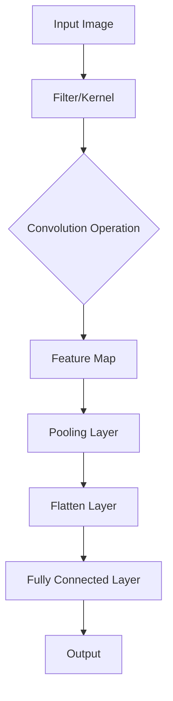
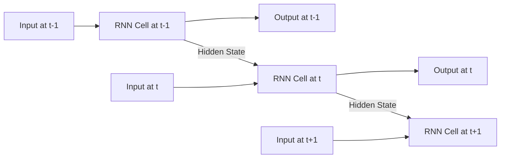

---

layout: post
title: " 3. 딥러닝 심화: CNN과 RNN으로 복잡한 보안 패턴에 도전"
date: 2024-01-07 09:00:00 +0900
categories: [ai-fundamentals, ml-dl]
tags: [AI, Cybersecurity, SK-Rookies]

---

# 🚀 3. 딥러닝 심화: CNN과 RNN으로 복잡한 보안 패턴에 도전

## 🔄 이전 단원 복습: 딥러닝 기초와 모델의 취약점

이전 단원 `2. 딥러닝 기초.md`에서 우리는 딥러닝의 근간이 되는 인공 신경망(ANN)과 다층 퍼셉트론(MLP)의 구조 및 작동 원리를 학습했습니다. `TensorFlow/Keras`를 활용하여 MLP 모델을 구축하고 피싱 메일을 탐지하는 실습도 진행했습니다. 또한 딥러닝 모델에 대한 적대적 예제 공격과 모델 추출 공격의 개념과 방어 전략도 살펴보았습니다.

> **핵심 복습:**
>
> *   **MLP의 한계:** 복잡한 이미지나 시계열 데이터(텍스트 포함)는 원본 데이터의 구조적 특징(공간적 인접성, 시간적 순서)을 잃어버리고 단순한 1차원 벡터로 변환될 때 정보 손실이 발생합니다.
> *   **특징 학습:** 딥러닝은 데이터로부터 스스로 특징을 추출하는 능력이 있어, 기존 머신러닝의 수동 특징 추출 한계를 극복합니다.
> *   **모델 보안:** 딥러닝 모델도 완벽하지 않으며, 적대적 예제나 모델 추출과 같은 공격에 취약하므로 방어 기술을 함께 고려해야 합니다.
>
> MLP는 강력하지만, 특정 종류의 데이터(이미지, 텍스트, 시계열 데이터)를 처리하는 데는 구조적인 한계가 있습니다. 오늘 배울 **CNN(Convolutional Neural Network)**과 **RNN(Recurrent Neural Network)**은 이러한 데이터의 특성을 최대한 보존하고 활용하여 효율적으로 학습할 수 있도록 설계된 딥러닝 모델의 심화 아키텍처입니다.

---

## 🤔 딥러닝 심화를 왜 배워야 할까요? (The "Why")

세상의 모든 데이터가 숫자 벡터로 변환하기 쉬운 형태는 아닙니다. 보안 전문가가 다루는 데이터 중에는 악성코드 **이미지**, 네트워크 **시계열 트래픽**, 피싱 **메일 본문(텍스트)** 등과 같이 고유한 구조를 가지는 데이터가 많습니다.

**[MLP의 이미지/시계열 데이터 처리 한계]**
*   **공간 정보 손실:** 이미지를 MLP에 입력하기 위해 1차원 벡터로 펼치면, 픽셀 간의 공간적 인접성(예: 악성코드의 특정 시각적 패턴) 정보가 사라집니다. MLP는 픽셀 하나하나의 독립된 특징만 학습하지, "인접한 픽셀들이 모여 만드는 부분 패턴"은 학습하기 어렵습니다.
*   **시간 정보 손실:** 텍스트나 시계열 데이터를 MLP에 입력할 때 단어/데이터의 순서 정보가 무시됩니다. "로그인 실패 -> 관리자 권한 탈취"는 순서가 중요한 시퀀스인데, MLP는 이를 인과 관계로 파악하기 어렵습니다.

**[CNN & RNN의 해결책]**
*   **CNN (Convolutional Neural Network):** 주로 이미지 데이터에 특화된 신경망으로, **합성곱(Convolution)** 연산을 통해 이미지의 공간적 특징(모양, 질감 등)을 효과적으로 추출합니다. 보안 분야에서는 악성코드 이미지 분류, 익스플로잇 코드 패턴 인식 등에 활용됩니다.
*   **RNN (Recurrent Neural Network):** 주로 시계열 데이터(Sequential Data)에 특화된 신경망으로, **과거의 정보를 기억**하며 현재 시점의 데이터를 처리합니다. 자연어 처리, 시계열 예측 등에 사용되며, 보안 분야에서는 이상 트래픽 탐지, 악성 URL/C2 커뮤니케이션 패턴 분석 등에 사용됩니다.

> **보안 전문가에게 CNN/RNN이란?**
>
> *   **CNN**: 악성코드의 시그니처를 시각적으로 분석하거나, UI/UX 취약점을 이미지 기반으로 탐지하는 **'시각적 패턴 분석기'**입니다. (예: 악성코드의 바이트 코드를 이미지화하여 분류)
> *   **RNN**: 시간의 흐름에 따라 변화하는 네트워크 트래픽, 시스템 로그, 사용자 행위 패턴을 분석하여 **'시간 기반 이상 행위 탐지기'**를 구현하는 핵심 기술입니다. (예: 비정상적인 로그인 시도 시퀀스 탐지)

---

## 1. 🖼️ CNN (Convolutional Neural Network): 이미지 보안 분석의 혁명

### 1.1. ⚙️ 합성곱(Convolution)과 필터(Filter)

CNN의 핵심은 **합성곱(Convolution)** 연산입니다. 필터(Filter 또는 Kernel)라는 작은 행렬이 이미지를 훑으면서 이미지의 특징(가로선, 세로선, 특정 패턴 등)을 추출합니다. 이 과정에서 이미지의 공간적 정보가 보존됩니다.



> **용어 해설: Pooling Layer**
>
> 합성곱을 통해 추출된 특징 맵(Feature Map)의 크기를 줄여(다운샘플링) 계산량을 감소시키고, 과적합을 방지하는 층입니다. `Max Pooling`이 가장 흔하게 사용됩니다.

### 1.2. 🛡️ CNN을 이용한 악성코드 이미지 분류

악성코드 파일을 바이트 배열로 읽어 들인 후, 이를 픽셀 값에 매핑하여 흑백 이미지로 변환할 수 있습니다. 이렇게 생성된 악성코드 이미지는 특정 시각적 패턴을 가지며, CNN은 이 패턴을 학습하여 악성코드를 분류할 수 있습니다.

#### **PoC: Keras를 이용한 간단한 CNN 모델 (개념)**

```python
import numpy as np
import tensorflow as tf
from tensorflow.keras.models import Sequential
from tensorflow.keras.layers import Conv2D, MaxPooling2D, Flatten, Dense
from sklearn.model_selection import train_test_split
from sklearn.metrics import classification_report, confusion_matrix

# --- 1. 가상 악성코드 이미지 데이터 생성 ---
# 실제 악성코드 이미지 데이터는 용량이 크고 다양한 형태를 가지므로,
# 여기서는 개념 이해를 돕기 위한 흑백 이미지(8x8 픽셀) 데이터셋을 생성합니다.
# 100개의 샘플 (8x8 픽셀, 1채널 흑백 이미지)
num_samples = 100
# (샘플 수, 높이, 너비, 채널 수)
X_images = np.random.rand(num_samples, 8, 8, 1).astype(np.float32) 
# 악성 1, 정상 0
y_labels = np.random.randint(2, size=num_samples) 

# 일부 샘플에 '악성' 패턴 주입 (단순 예시)
for i in range(num_samples // 4):
    X_images[i, 2:5, 2:5, 0] = 1.0 # 특정 영역을 밝게 (패턴으로 간주)
    y_labels[i] = 1

X_train, X_test, y_train, y_test = train_test_split(X_images, y_labels, test_size=0.2, random_state=42)

print(f"훈련 이미지 데이터 형태: {X_train.shape}")
print(f"훈련 라벨 데이터 형태: {y_train.shape}")

# --- 2. CNN 모델 구축 (Keras Sequential API) ---
model = Sequential([
    # Conv2D: 32개의 필터, 3x3 크기, ReLU 활성화, 입력 이미지 형태
    Conv2D(32, (3, 3), activation='relu', input_shape=(8, 8, 1)),
    # MaxPooling2D: 2x2 크기로 이미지 축소
    MaxPooling2D((2, 2)),
    # Flatten: 2차원 특징 맵을 1차원 벡터로 펼침 (MLP의 입력으로 사용하기 위함)
    Flatten(),
    # Dense: 완전 연결층
    Dense(64, activation='relu'),
    # 출력층: 이진 분류이므로 1개의 뉴런, sigmoid 활성화
    Dense(1, activation='sigmoid')
])

model.compile(optimizer='adam', loss='binary_crossentropy', metrics=['accuracy'])
model.summary()

# --- 3. 모델 훈련 ---
history = model.fit(X_train, y_train, epochs=10, batch_size=16, validation_split=0.2, verbose=0)
print("\n✅ CNN 모델 훈련 완료!")

# --- 4. 모델 예측 및 평가 ---
y_pred_proba = model.predict(X_test)
y_pred = (y_pred_proba > 0.5).astype(int)

print("\n--- 📊 CNN 모델 평가 결과 ---")
print(classification_report(y_test, y_pred, target_names=['정상', '악성']))
print("\n--- 📈 혼동 행렬 ---")
print(confusion_matrix(y_test, y_pred))
```
**[분석]**
CNN 모델은 `Conv2D`와 `MaxPooling2D` 층을 통해 이미지 데이터의 공간적 패턴을 효과적으로 학습합니다. 이를 악성코드 분석에 적용하면, 파일의 바이트 스트림을 시각화하여 얻은 이미지에서 특정 악성 패턴을 찾아내고 분류 정확도를 높일 수 있습니다.

---

## 2. ⏳ RNN (Recurrent Neural Network): 시계열 보안 데이터 분석

### 2.1. ⚙️ 순환(Recurrence) 구조: 과거 정보의 기억

RNN은 내부적으로 **순환(Recurrent)**하는 구조를 가지고 있어, 이전 시점의 정보(hidden state)를 현재 시점의 계산에 반영할 수 있습니다. 이는 시계열 데이터나 자연어와 같이 순서 정보가 중요한 데이터에 특화되어 있습니다.



> **용어 해설: Vanishing Gradient Problem (기울기 소실 문제)**
>
> 일반적인 RNN은 순환 구조가 길어질수록 과거 시점의 정보가 현재 시점까지 제대로 전달되지 못하고, 학습 능력이 저하되는 문제가 발생합니다. 이를 **기울기 소실 문제**라고 하며, LSTM(Long Short-Term Memory)이나 GRU(Gated Recurrent Unit)와 같은 개선된 RNN 아키텍처가 이 문제를 해결합니다.

### 2.2. 🛡️ RNN (LSTM)을 이용한 비정상 로그인 시퀀스 탐지

사용자의 로그인 시도 이력(시퀀스)을 분석하여 비정상적인 로그인 시퀀스를 탐지하는 모델을 구축할 수 있습니다. 예를 들어, 짧은 시간 내에 여러 국가에서 동시 로그인 시도가 발생하는 패턴 등을 학습합니다.

#### **PoC: Keras LSTM을 이용한 시퀀스 분류 (개념)**

```python
import numpy as np
import tensorflow as tf
from tensorflow.keras.models import Sequential
from tensorflow.keras.layers import Embedding, LSTM, Dense
from tensorflow.keras.preprocessing.sequence import pad_sequences
from sklearn.model_selection import train_test_split
from sklearn.metrics import classification_report, confusion_matrix

# --- 1. 가상 로그인 시퀀스 데이터 생성 ---
# 각 숫자는 특정 로그인 이벤트 유형(예: 0:성공, 1:비밀번호 오류, 2:ID 오류, 3:타지역 로그인)을 의미
# 시퀀스 데이터 (Numpy 배열)
sequences = np.array([
    [0, 0, 0, 0, 0], # 정상: 연속 성공
    [0, 1, 0, 1, 0], # 정상: 가끔 오류 발생 후 성공
    [1, 1, 1, 1, 1], # 비정상: 연속 비밀번호 오류
    [0, 3, 0, 3, 0], # 비정상: 타지역 로그인 반복
    [1, 2, 1, 2, 1], # 비정상: ID/PW 오류 반복
    [0, 0, 0, 0, 0],
    [0, 1, 0, 1, 0],
    [1, 1, 1, 1, 1],
    [0, 3, 0, 3, 0],
    [1, 2, 1, 2, 1]
])

# 해당 시퀀스가 비정상(1)인지 정상(0)인지 레이블
labels = np.array([0, 0, 1, 1, 1, 0, 0, 1, 1, 1])

# 시퀀스의 길이를 통일 (여기서는 이미 통일되어 있지만, 실제 데이터에서는 pad_sequences 사용)
max_sequence_length = sequences.shape[1] 
vocab_size = len(np.unique(sequences)) # 모든 이벤트 종류의 개수 (0,1,2,3 -> 4개)

X_train, X_test, y_train, y_test = train_test_split(sequences, labels, test_size=0.3, random_state=42)

print(f"훈련 시퀀스 데이터 형태: {X_train.shape}")
print(f"훈련 라벨 데이터 형태: {y_train.shape}")

# --- 2. LSTM 모델 구축 ---
model = Sequential([
    # Embedding: 각 이벤트 유형(정수 인덱스)을 밀집 벡터로 변환 (텍스트 처리와 유사)
    Embedding(input_dim=vocab_size + 1, output_dim=16, input_length=max_sequence_length),
    # LSTM: Long Short-Term Memory 층. 과거 정보를 효과적으로 기억
    LSTM(32), # 32개의 LSTM 유닛
    # Dense: 완전 연결층
    Dense(1, activation='sigmoid') # 이진 분류
])

model.compile(optimizer='adam', loss='binary_crossentropy', metrics=['accuracy'])
model.summary()

# --- 3. 모델 훈련 ---
history = model.fit(X_train, y_train, epochs=10, batch_size=4, validation_split=0.2, verbose=0)
print("\n✅ LSTM 모델 훈련 완료!")

# --- 4. 모델 예측 및 평가 ---
y_pred_proba = model.predict(X_test)
y_pred = (y_pred_proba > 0.5).astype(int)

print("\n--- 📊 LSTM 모델 평가 결과 ---")
print(classification_report(y_test, y_pred, target_names=['정상', '비정상']))
print("\n--- 📈 혼동 행렬 ---")
print(confusion_matrix(y_test, y_pred))
```
**[분석]**
LSTM 모델은 `Embedding` 층을 통해 이벤트 시퀀스를 벡터로 변환하고, `LSTM` 층을 통해 시퀀스 내의 시간적 의존성(이전 이벤트가 다음 이벤트에 미치는 영향)을 학습합니다. 이를 통해 연속적인 비정상 로그인 시도를 효과적으로 탐지할 수 있습니다.

---

## 👨‍💻 현직자 통합 시나리오: AI 기반 악성코드/정상 파일 분류 시스템 고도화

**[상황]**
AI 분석가 '제미니'는 새로운 악성코드가 발견될 때마다 신속하게 분류하고 대응할 수 있는 시스템을 구축해야 합니다. 기존의 시그니처 기반 방식은 한계가 있으므로, 파일의 바이트 스트림을 이미지화하여 CNN으로 분류하고, 파일 API 호출 시퀀스를 LSTM으로 분석하는 **하이브리드(Hybrid) 딥러닝 시스템**을 구상합니다.

**[데이터]**
1.  **파일 바이트 이미지 데이터 (`img_features`)**: 파일 바이트를 시각화한 흑백 이미지 데이터.
2.  **API 호출 시퀀스 데이터 (`api_sequences`)**: 파일이 실행될 때 호출하는 API 목록의 시퀀스 데이터.
3.  **레이블 (`labels`)**: 해당 파일이 악성(1)인지 정상(0)인지 여부.

```python
import numpy as np
import tensorflow as tf
from tensorflow.keras.models import Model
from tensorflow.keras.layers import Input, Conv2D, MaxPooling2D, Flatten, Embedding, LSTM, Dense, Concatenate
from sklearn.model_selection import train_test_split
from sklearn.metrics import classification_report, confusion_matrix

# --- 1. 하이브리드 데이터 생성 (가상 데이터) ---
num_samples = 200
# 이미지 특징: (샘플 수, 높이, 너비, 채널 수)
img_features = np.random.rand(num_samples, 16, 16, 1).astype(np.float32)
# 시퀀스 특징: (샘플 수, 시퀀스 길이)
api_sequences = np.random.randint(0, 100, size=(num_samples, 10)) # 0~99까지의 API ID, 길이 10
# 레이블
labels = np.random.randint(2, size=num_samples)

# 데이터 분할
img_train, img_test, seq_train, seq_test, y_train, y_test = train_test_split(
    img_features, api_sequences, labels, test_size=0.2, random_state=42
)

# --- 2. 하이브리드 모델 구축: CNN (이미지) + LSTM (시퀀스) ---

# --- 이미지 입력 파이프라인 ---
img_input = Input(shape=(16, 16, 1), name='image_input')
x = Conv2D(32, (3, 3), activation='relu')(img_input)
x = MaxPooling2D((2, 2))(x)
x = Flatten()(x)
img_output = Dense(64, activation='relu')(x)

# --- 시퀀스 입력 파이프라인 ---
seq_input = Input(shape=(10,), name='sequence_input')
y = Embedding(input_dim=101, output_dim=16, input_length=10)(seq_input) # API ID 0~100
y = LSTM(32)(y)
seq_output = Dense(32, activation='relu')(y)

# --- 두 개의 출력을 결합 (Concatenate) ---
merged = Concatenate()([img_output, seq_output])

# --- 최종 분류층 ---
z = Dense(64, activation='relu')(merged)
output = Dense(1, activation='sigmoid')(z)

# --- 모델 생성 ---
# Input이 2개이고 Output이 1개인 모델
hybrid_model = Model(inputs=[img_input, seq_input], outputs=output)

hybrid_model.compile(optimizer='adam', loss='binary_crossentropy', metrics=['accuracy'])
hybrid_model.summary()

# --- 3. 모델 훈련 ---
history = hybrid_model.fit(
    {'image_input': img_train, 'sequence_input': seq_train}, # 딕셔너리 형태로 입력
    y_train,
    epochs=10,
    batch_size=32,
    validation_split=0.2, # 훈련 데이터 중 20%를 검증 데이터로 사용
    verbose=0
)
print("\n✅ 하이브리드 딥러닝 모델 훈련 완료!")

# --- 4. 모델 예측 및 평가 ---
y_pred_proba = hybrid_model.predict({'image_input': img_test, 'sequence_input': seq_test})
y_pred = (y_pred_proba > 0.5).astype(int)

print("\n--- 📊 하이브리드 모델 평가 결과 ---")
print(classification_report(y_test, y_pred, target_names=['정상', '악성']))
print("\n--- 📈 혼동 행렬 ---")
print(confusion_matrix(y_test, y_pred))
```
**[시나리오 분석]**
'제미니' 분석가는 CNN과 LSTM을 각각 사용하여 파일의 시각적 특징과 API 호출의 시퀀스적 특징을 학습한 뒤, 이 두 모델의 결과물을 `Concatenate` 층으로 결합하여 최종 분류를 수행하는 하이브리드 딥러닝 모델을 구축했습니다. 이는 단일 모델로는 탐지하기 어려운 복합적인 형태의 악성코드를 더욱 정교하게 분류할 수 있게 해주는 고도화된 접근 방식입니다.

---

## ➡️ 다음 단원에서는?

이번 단원에서는 CNN과 RNN의 핵심 아키텍처를 이해하고, 이를 악성코드 이미지 분류 및 비정상 로그인 시퀀스 탐지와 같은 보안 문제에 적용하는 심화된 기법을 학습했습니다.

**다음 단원인 `4. 모듈 프로젝트.md`** 에서는, 지금까지 `1단계 AI 기본 역량` 파트에서 배운 모든 파이썬 기초, 데이터 핸들링(Pandas), 수치 연산(Numpy), API 활용, 머신러닝, 그리고 딥러닝 개념을 총집합하여 **미니 프로젝트**를 수행하게 됩니다. 실제와 유사한 데이터를 분석하고 AI 모델을 구축하여 특정 보안 문제를 해결하는 과정을 직접 경험하며, 지금까지의 학습 내용을 견고히 다지는 기회를 가질 것입니다.

---

## 📌 요약 정리 (Executive Summary)

1.  **CNN (Convolutional Neural Network)**:
    *   **특징**: 이미지와 같은 공간적 정보를 가진 데이터에 특화된 딥러닝 모델. **합성곱(Convolution)** 연산을 통해 이미지의 지역적 패턴(테두리, 질감 등)을 추출하고, **풀링(Pooling)**을 통해 특징 맵의 크기를 효율적으로 줄인다.
    *   **보안 활용**: 악성코드 이미지 분류, UI/UX 취약점 시각적 탐지, 악성 파일 아이콘 분석 등.
2.  **RNN (Recurrent Neural Network)**:
    *   **특징**: 시계열 데이터(텍스트, 로그 시퀀스)와 같이 순서 정보가 중요한 데이터에 특화된 딥러닝 모델. **순환(Recurrence) 구조**를 통해 과거의 정보를 기억하며 현재를 예측한다.
    *   **보안 활용**: 비정상 로그인 시퀀스 탐지, 네트워크 트래픽 이상 탐지, 악성 URL/명령어 시퀀스 분석 등. **LSTM**과 **GRU**는 기울기 소실 문제(Vanishing Gradient Problem)를 해결한 개선된 RNN이다.
3.  **하이브리드 딥러닝**: CNN과 RNN처럼 서로 다른 모델을 결합하여, 각 모델의 장점을 활용해 더욱 복잡하고 다면적인 데이터를 분석하고 예측하는 고급 기법이다. (예: 악성코드의 시각적 특징과 행위 시퀀스 동시 분석)
4.  **Keras 활용**: `Conv2D`, `MaxPooling2D`, `Flatten`, `Embedding`, `LSTM` 등 다양한 층(Layer)을 조합하여 CNN, RNN 모델을 쉽고 빠르게 구축할 수 있다. `Input`과 `Concatenate` 층을 사용하여 복수의 입력 데이터를 처리하는 복잡한 모델도 만들 수 있다.
5.  **보안 관점**: 딥러닝 심화 모델은 고도화된 위협을 탐지하는 강력한 수단을 제공하지만, 모델 아키텍처의 선택은 데이터의 특성(이미지, 시퀀스 등)과 탐지하려는 위협의 종류에 따라 신중하게 이루어져야 한다. 새로운 모델의 복잡성은 또 다른 잠재적 취약점을 내포할 수 있음을 항상 인지해야 한다.