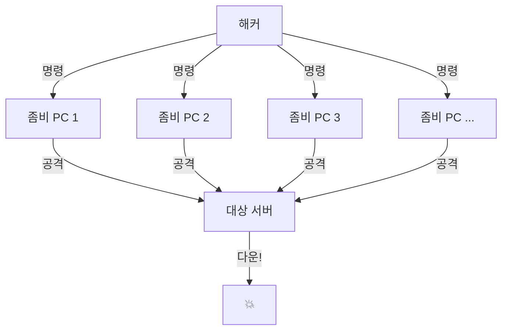
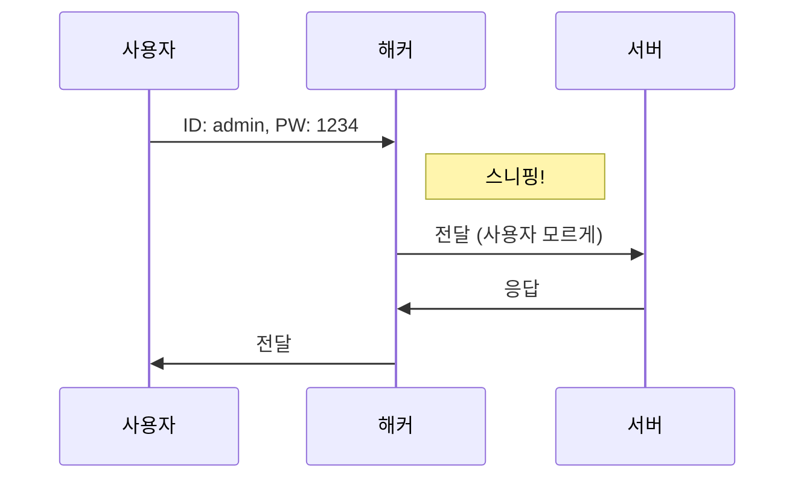
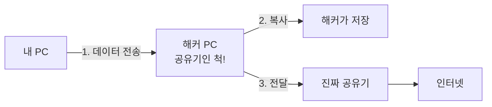
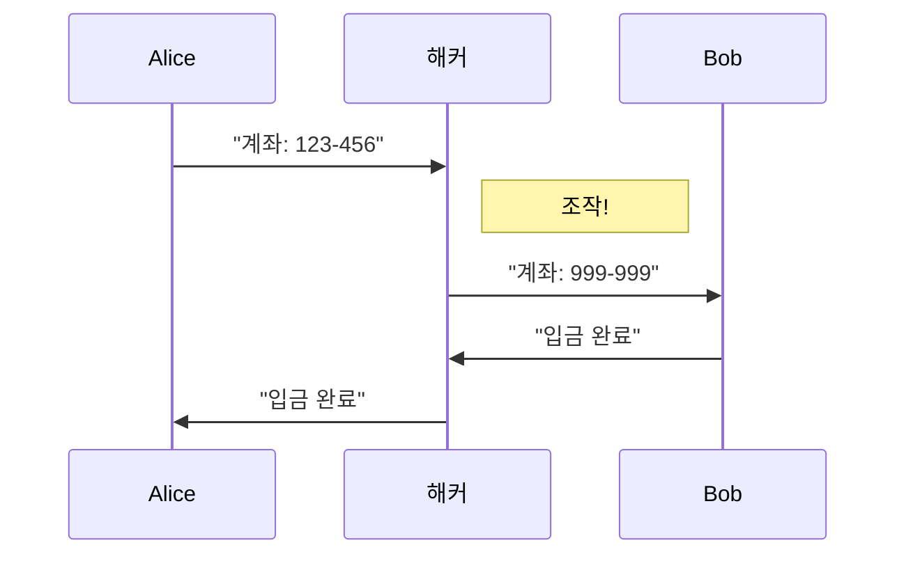
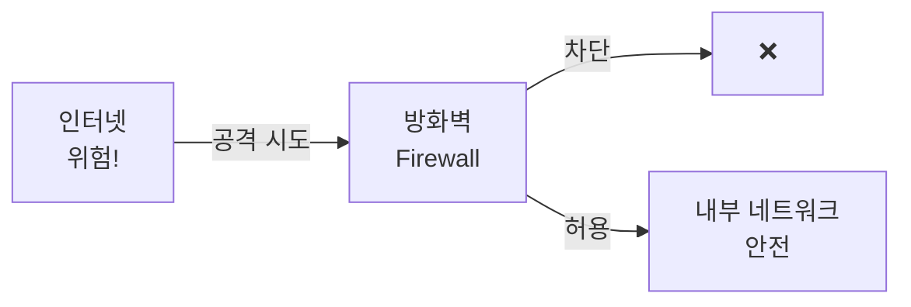
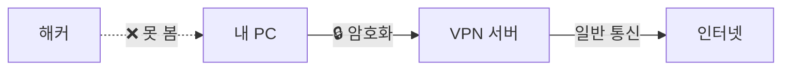

# 💥 3. 네트워크 공격과 방어: 해커로부터 지키는 법

## 🎯 이 문서를 읽고 나면

- 일반적인 네트워크 공격 방법을 이해할 수 있습니다
- 왜 사이버 공격이 발생하는지 알게 됩니다
- 기본적인 방어 방법을 배울 수 있습니다
- 안전한 인터넷 사용법을 익힐 수 있습니다

---

## 📖 네트워크 공격이란?

### 1.1. 🎭 공격의 정의

**네트워크 공격**은 네트워크를 통해 컴퓨터 시스템이나 데이터에 불법적으로 접근하거나 피해를 주는 행위입니다.

**일상 생활의 비유:**

```
은행 털기:
1. 정찰 (취약점 찾기)
2. 침입 (네트워크 공격)
3. 돈 훔치기 (데이터 탈취)
4. 도주 (흔적 지우기)

네트워크 공격도 비슷한 단계를 거칩니다.
```

### 1.2. 🎯 왜 공격을 당할까요?

```
💰 금전적 이득
  - 개인정보 판매
  - 랜섬웨어 (파일 암호화 후 돈 요구)
  - 신용카드 정보 탈취

🔍 정보 수집
  - 기업 기밀 정보
  - 개인 프라이버시
  - 국가 기밀

😈 단순 재미/과시
  - 실력 과시
  - 악의적 장난

⚔️ 정치적/사회적 목적
  - 해킹티비즘 (Hacktivism)
  - 사이버 전쟁
```

### 1.3. 📊 공격의 종류

| 공격 유형 | 목적 | 예시 |
|----------|------|------|
| **DoS/DDoS** | 서비스 마비 | 웹사이트 다운 |
| **피싱** | 정보 탈취 | 가짜 이메일 |
| **악성코드** | 시스템 감염 | 랜섬웨어, 바이러스 |
| **스푸핑** | 신분 위장 | 가짜 웹사이트 |
| **스니핑** | 데이터 도청 | 비밀번호 가로채기 |
| **중간자 공격** | 통신 가로채기 | 공공 Wi-Fi 해킹 |

---

## 2. 💥 주요 네트워크 공격 방법

### 2.1. 🚫 DDoS 공격 (분산 서비스 거부)

#### "은행에 동시에 수만 명이 몰려와서 업무 마비"

**DDoS란?**

```
정상 상황:
  사용자 100명 → 서버 정상 작동

DDoS 공격:
  봇넷(좀비 PC) 100,000대 → 서버 다운!
```



**DDoS의 종류:**

1. **트래픽 과부하**
   - 대량의 데이터를 보내서 네트워크 대역폭 고갈
   - 예: UDP Flooding, ICMP Flooding

2. **자원 고갈**
   - 서버의 CPU, 메모리 소진
   - 예: SYN Flooding (연결 대기 큐 가득 채우기)

3. **애플리케이션 공격**
   - 웹 서버의 취약점 공격
   - 예: HTTP Flooding, Slowloris

**실제 사례:**

```
2016년 Dyn DNS 공격
  - IoT 장치 수십만 대 동원
  - Twitter, Netflix, Reddit 등 다운
  - 미국 동부 인터넷 마비

2013년 GitHub DDoS
  - 초당 1.35 Tbps 트래픽
  - 사상 최대 규모 공격
```

**피해:**

```
❌ 웹사이트 접속 불가
❌ 서비스 중단
❌ 금전적 손실
❌ 평판 손상
```

**예방 방법:**

```
✅ 클라우드 DDoS 방어 서비스
  - Cloudflare, AWS Shield 등

✅ 트래픽 모니터링
  - 비정상 트래픽 감지

✅ 로드 밸런서
  - 트래픽 분산

✅ Rate Limiting
  - 요청 속도 제한
```

### 2.2. 🎭 피싱 (Phishing)

#### "가짜 은행 사이트로 유인해서 비밀번호 훔치기"

**피싱이란?**

```
정상:
  사용자 → 진짜 은행 사이트 → 로그인

피싱:
  사용자 → 가짜 은행 사이트 → 비밀번호 탈취
         → 해커가 정보 수집!
```

**피싱의 종류:**

| 종류 | 설명 | 예시 |
|-----|------|------|
| **이메일 피싱** | 가짜 이메일 | "계정이 해킹당했습니다. 클릭하세요" |
| **스미싱** | 문자 메시지 피싱 | "택배 조회하기: http://..." |
| **보이스 피싱** | 전화 피싱 | "경찰서입니다. 계좌번호를..." |
| **스피어 피싱** | 특정 타겟 공격 | CEO에게 보낸 것처럼 위장 |

**피싱 이메일 예시:**

```
발신: security@bank.com (가짜!)
제목: 🚨 긴급! 계정 보안 경고

안녕하세요, OO은행입니다.

귀하의 계정에서 의심스러운 활동이 감지되었습니다.
24시간 내에 확인하지 않으면 계정이 정지됩니다.

👉 지금 확인하기: http://bank-security.com (가짜 사이트!)

OO은행 드림
```

**피싱 식별 방법:**

```
🔍 체크리스트:

❌ 발신자 주소가 이상함
   정상: security@realbank.com
   피싱: security@ba nk.com (띄어쓰기 주의)

❌ 긴급함을 강조
   "24시간 내", "즉시", "지금 바로"

❌ 이상한 링크
   마우스 올렸을 때 이상한 URL
   (클릭하지 말고 확인!)

❌ 문법 오류, 맞춤법 틀림
   "귀하의 계좌는 정지됬습니다"

❌ 개인정보 요구
   은행은 이메일로 비밀번호 안 물어봄!
```

**대응 방법:**

```
✅ 의심되면 클릭하지 않기
✅ 공식 앱/웹사이트에서 직접 확인
✅ 이메일 발신자 주소 확인
✅ HTTPS 확인 (자물쇠 🔒)
✅ 2단계 인증 (2FA) 설정
```

### 2.3. 🕵️ 스니핑 (Sniffing)

#### "전화 도청하듯이 네트워크 엿듣기"

**스니핑이란?**

```
정상 통신:
  내 컴퓨터 → 암호화 → 서버

스니핑:
  내 컴퓨터 → 해커가 가로챔 → 서버
             ↓
        비밀번호 읽힘!
```



**위험한 상황:**

```
🚨 공공 Wi-Fi 사용
  - 카페, 공항, 지하철
  - 암호화 안 된 네트워크
  - 해커가 쉽게 감청 가능

🚨 HTTP 사이트 (HTTPS 아님)
  - 평문 전송
  - 비밀번호, 카드번호 노출

🚨 의심스러운 Wi-Fi
  - "무료 Wi-Fi"
  - "Starbucks_Free" (가짜!)
```

**스니핑 공격 시나리오:**

```
1. 카페에서 노트북 켜기
2. "Free_WiFi" 접속 (해커가 만든 가짜)
3. 네이버 로그인 (HTTP)
4. 해커가 아이디/비밀번호 수집
5. 나중에 계정 도용
```

**대응 방법:**

```
✅ HTTPS 사이트만 사용
  - 주소창 자물쇠 🔒 확인

✅ VPN 사용
  - 암호화된 터널
  - 특히 공공 Wi-Fi에서 필수

✅ 공공 Wi-Fi 주의
  - 중요한 작업 피하기
  - 인터넷 뱅킹, 로그인 자제

✅ 자동 연결 끄기
  - Wi-Fi 자동 연결 비활성화
```

### 2.4. 🎪 스푸핑 (Spoofing)

#### "다른 사람인 척 신분 위장하기"

**스푸핑이란?**

```
신분 위장의 종류:

📧 이메일 스푸핑
  "CEO@company.com" 으로 위장

🌐 IP 스푸핑
  "192.168.1.1" (신뢰받는 IP)로 위장

🔗 ARP 스푸핑
  공유기인 척 속이기

🌍 DNS 스푸핑
  "naver.com" → 가짜 사이트로 연결
```

**ARP 스푸핑 예시:**

```
정상 통신:
  내 PC → 공유기 → 인터넷

ARP 스푸핑:
  내 PC → 해커 PC → 공유기 → 인터넷
         ↓
    모든 데이터 가로채기!
```



**DNS 스푸핑 예시:**

```
정상:
  "bank.com" 입력
  → DNS: "1.2.3.4" (진짜 은행)
  → 진짜 은행 사이트

DNS 스푸핑:
  "bank.com" 입력
  → 가짜 DNS: "5.6.7.8" (피싱 사이트)
  → 가짜 은행 사이트!
```

**대응 방법:**

```
✅ HTTPS 인증서 확인
  - 자물쇠 클릭해서 인증서 확인

✅ 북마크 사용
  - 중요한 사이트는 북마크로 접속

✅ 주소 확인
  - bank.com (정상)
  - ba nk.com (피싱!)
  - bank-secure.com (피싱!)

✅ 2단계 인증
  - SMS, OTP 인증 추가
```

### 2.5. 👤 중간자 공격 (MITM)

#### "두 사람 대화 중간에서 엿듣고 조작하기"

**중간자 공격이란?**

```
정상:
  Alice → Bob
  "안녕? 만나자"

중간자 공격:
  Alice → 해커 → Bob
  "안녕? 만나자" → "안녕? 못 만나"
  (해커가 메시지 조작!)
```



**실제 시나리오:**

```
1. 공공 Wi-Fi 접속
2. 해커가 ARP 스푸핑으로 중간자 위치 확보
3. Alice가 Bob에게 이메일 전송
4. 해커가 중간에서 내용 확인/변조
5. 변조된 이메일이 Bob에게 전달
```

**위험한 상황:**

```
🚨 공공 Wi-Fi
🚨 암호화 안 된 통신 (HTTP)
🚨 가짜 Wi-Fi 핫스팟
🚨 악성 프록시 서버
```

**대응 방법:**

```
✅ HTTPS 사용 (필수!)
✅ VPN 사용
✅ 인증서 경고 무시 금지
✅ 공공 Wi-Fi에서 중요 작업 피하기
✅ End-to-End 암호화 (E2E)
  - Signal, WhatsApp 등
```

---

## 3. 🛡️ 네트워크 방어 방법

### 3.1. 🔥 방화벽 (Firewall)

#### "건물 입구의 경비원"

**방화벽이란?**

```
방화벽의 역할:
  1. 들어오는 트래픽 검사
  2. 허용/차단 결정
  3. 불법 접근 차단
```



**방화벽 종류:**

| 종류 | 설명 | 예시 |
|-----|------|------|
| **하드웨어 방화벽** | 물리적 장비 | 회사 네트워크 입구 |
| **소프트웨어 방화벽** | PC에 설치 | Windows 방화벽 |
| **웹 방화벽 (WAF)** | 웹 공격 차단 | SQL Injection 방어 |

**방화벽 규칙 예시:**

```
규칙 1: 외부 → 포트 80 (웹)
  → ✅ 허용 (웹 사이트 접속 허용)

규칙 2: 외부 → 포트 22 (SSH)
  → ❌ 차단 (원격 접속 차단)

규칙 3: 내부 → 모든 외부
  → ✅ 허용 (내부에서 외부 접속 허용)

규칙 4: 중국 IP
  → ❌ 차단 (특정 국가 차단)
```

**Windows 방화벽 확인:**

```
1. 제어판 → Windows Defender 방화벽
2. "방화벽 상태" 확인
3. "앱 또는 기능이 Windows Defender 방화벽을 통과하도록 허용"
4. 필요한 프로그램만 허용
```

### 3.2. 🛡️ 백신 프로그램 (Anti-Virus)

#### "병원의 백신처럼 컴퓨터 보호"

**백신이 하는 일:**

```
1. 파일 검사
  - 다운로드한 파일
  - USB 연결 시
  - 이메일 첨부파일

2. 악성코드 탐지
  - 바이러스
  - 트로이 목마
  - 랜섬웨어

3. 격리 및 삭제
  - 위험한 파일 제거
```

**유명한 백신:**

```
무료:
  - Windows Defender (기본 내장)
  - Avast
  - AVG

유료:
  - Norton
  - Kaspersky
  - V3 (안랩)
```

**백신 사용 팁:**

```
✅ 실시간 보호 켜기
✅ 정기적으로 전체 검사
✅ 업데이트 자동 설정
✅ 의심 파일은 수동 검사
```

### 3.3. 🔒 VPN (Virtual Private Network)

#### "비밀 터널로 안전하게 통신"

**VPN이란?**

```
VPN 없이:
  내 PC → (평문) → 인터넷
  누구나 볼 수 있음

VPN 사용:
  내 PC → (암호화 터널) → VPN 서버 → 인터넷
  아무도 못 봄!
```



**VPN의 장점:**

```
✅ 데이터 암호화
  - 공공 Wi-Fi에서 안전

✅ IP 주소 숨기기
  - 프라이버시 보호

✅ 지역 제한 우회
  - 해외 사이트 접속

✅ 추적 방지
  - 온라인 활동 보호
```

**VPN 서비스:**

```
무료 (제한적):
  - ProtonVPN
  - Windscribe

유료:
  - NordVPN
  - ExpressVPN
  - CyberGhost
```

**VPN 사용 시나리오:**

```
✅ 공공 Wi-Fi 사용 시
✅ 해외 여행 중
✅ 회사 네트워크 접속
✅ 프라이버시 중요한 작업
```

### 3.4. 🔑 2단계 인증 (2FA/MFA)

#### "2개의 열쇠로 문 열기"

**2단계 인증이란?**

```
1단계: 비밀번호 입력
  - 아는 것 (What you know)

2단계: 추가 인증
  - 가진 것 (What you have)
    예: 스마트폰, OTP
  - 또는 본인 것 (What you are)
    예: 지문, 얼굴
```

**2FA 종류:**

| 방법 | 설명 | 예시 |
|-----|------|------|
| **SMS 인증** | 문자로 코드 | "인증번호: 123456" |
| **OTP** | 시간 기반 코드 | Google Authenticator |
| **생체 인증** | 지문, 얼굴 | Touch ID, Face ID |
| **하드웨어 키** | 물리적 장치 | YubiKey |

**2FA 설정 방법:**

```
1. 구글 계정 예시:
   - google.com → 보안
   - "2단계 인증" 클릭
   - 전화번호 등록
   - OTP 앱 설정

2. 네이버 계정 예시:
   - 내정보 → 보안설정
   - 2단계 인증 설정
   - 인증 방법 선택
```

**왜 중요할까요?**

```
비밀번호만:
  해커가 비밀번호 알면 → 해킹 성공

2단계 인증:
  해커가 비밀번호 알아도 → 스마트폰 필요
  → 해킹 실패!
```

### 3.5. 🔐 강력한 비밀번호

#### "복잡한 자물쇠 만들기"

**나쁜 비밀번호:**

```
❌ 1234, password, qwerty
❌ 생일: 19900101
❌ 이름: kimcheolsu
❌ 짧은 비밀번호: abc
❌ 모든 사이트에 같은 비밀번호
```

**좋은 비밀번호:**

```
✅ 12자 이상
✅ 대소문자 혼합
✅ 숫자 포함
✅ 특수문자 포함
✅ 사이트마다 다른 비밀번호

예시:
  MyP@ssw0rd2024!Naver
  SecureG00gle#2024
```

**비밀번호 만들기:**

```
방법 1: 문장으로 만들기
  "I love coffee every morning!"
  → IlCem!2024

방법 2: 랜덤 생성기 사용
  → xK9!mP2@qR7#vL5

방법 3: 패스워드 매니저
  - 1Password
  - LastPass
  - Bitwarden
```

**비밀번호 관리:**

```
✅ 비밀번호 매니저 사용
  - 모든 비밀번호 안전하게 저장
  - 마스터 비밀번호 하나만 기억

✅ 정기적으로 변경
  - 최소 3~6개월마다

✅ 절대 공유하지 않기
✅ 메모장/포스트잇에 적지 않기
```

---

## 4. 🏠 일상에서 안전하게 인터넷 사용하기

### 4.1. 💻 컴퓨터/스마트폰 보안

```
✅ 최신 업데이트 유지
  - Windows Update
  - macOS Update
  - 안드로이드/iOS 업데이트

✅ 백신 프로그램 설치
  - 실시간 보호 켜기

✅ 방화벽 활성화
  - Windows Defender 방화벽

✅ 자동 잠금 설정
  - 화면 보호기
  - 자동 로그아웃

✅ 화면 잠금 비밀번호
  - PIN, 패턴, 지문
```

### 4.2. 📧 이메일 보안

```
✅ 발신자 확인
  - 이상한 주소 주의

✅ 첨부파일 주의
  - 실행 파일 (.exe) 열지 않기
  - 백신으로 검사

✅ 링크 클릭 전 확인
  - 마우스 올려서 URL 확인
  - 의심되면 클릭 금지

✅ 스팸 신고
  - 의심 이메일은 스팸 처리
```

### 4.3. 🌐 웹 브라우징 보안

```
✅ HTTPS 사이트만 사용
  - 🔒 자물쇠 확인

✅ 북마크 사용
  - 중요 사이트는 북마크 저장

✅ 개인정보 주의
  - 꼭 필요한 곳에만 입력

✅ 쿠키 관리
  - 정기적으로 삭제
  - 광고 추적 차단

✅ 시크릿 모드
  - 공용 PC 사용 시
```

### 4.4. 📱 모바일 보안

```
✅ 앱 다운로드 주의
  - 공식 스토어만 사용
  - Play Store, App Store

✅ 앱 권한 확인
  - 불필요한 권한 거부
  - 예: 손전등 앱이 연락처 권한?

✅ 공공 Wi-Fi 주의
  - VPN 사용
  - 중요한 작업 피하기

✅ 블루투스/NFC 끄기
  - 사용하지 않을 때

✅ 분실 대비
  - 원격 잠금/삭제 기능 설정
  - Find My Device 활성화
```

### 4.5. 💳 온라인 쇼핑/뱅킹 보안

```
✅ 공식 사이트/앱만 사용
  - 검색 결과 클릭 주의

✅ HTTPS 확인 필수
  - 결제 전 자물쇠 확인

✅ 공공 Wi-Fi 금지
  - 집 Wi-Fi나 LTE/5G 사용

✅ 카드 정보 저장 주의
  - 가능하면 저장 안 함

✅ 거래 내역 확인
  - 정기적으로 확인
  - 이상 거래 즉시 신고

✅ 백신/방화벽 확인
  - 결제 전 확인
```

---

## 5. 🚨 해킹당했을 때 대처 방법

### 5.1. 📝 체크리스트

```
의심 증상:
❓ 로그인이 안 됨
❓ 이상한 계정 활동 감지
❓ 친구들이 이상한 메시지 받았다고 함
❓ 비밀번호가 변경됨
❓ 파일이 암호화됨 (랜섬웨어)
❓ 컴퓨터가 느려짐
```

### 5.2. 🔧 즉시 조치사항

```
1️⃣ 네트워크 차단
  - Wi-Fi 끄기
  - 랜선 뽑기

2️⃣ 비밀번호 변경
  - 다른 안전한 기기에서
  - 모든 중요 계정 변경

3️⃣ 백신 전체 검사
  - 악성코드 제거

4️⃣ 은행/카드사 연락
  - 계좌/카드 정지

5️⃣ 관련 기관 신고
  - 경찰청 사이버안전국
  - 118 (사이버범죄 신고)
  - 1336 (금융감독원)
```

### 5.3. 🆘 도움 받을 곳

```
📞 긴급 연락처:
  - 경찰청 사이버안전국: 182
  - 한국인터넷진흥원: 118
  - 금융감독원: 1332
  - 개인정보침해신고센터: 118

🌐 온라인 신고:
  - ecrm.police.go.kr (경찰청)
  - privacy.kisa.or.kr (개인정보)
```

---

## 6. 🎯 핵심 정리

### ✅ 꼭 기억해야 할 내용

1. **주요 공격 방법**:
   - DDoS: 대량 트래픽으로 서비스 마비
   - 피싱: 가짜 사이트로 정보 탈취
   - 스니핑: 네트워크 데이터 도청
   - 스푸핑: 신분 위장
   - 중간자 공격: 통신 가로채기

2. **필수 방어 도구**:
   - 방화벽 (경비원)
   - 백신 (의사)
   - VPN (비밀 터널)
   - 2단계 인증 (이중 자물쇠)
   - 강력한 비밀번호

3. **안전한 인터넷 사용**:
   - HTTPS 확인 (🔒)
   - 공공 Wi-Fi 주의
   - 의심 링크 클릭 금지
   - 정기적인 업데이트
   - 백신 실시간 보호

4. **해킹 대응**:
   - 네트워크 즉시 차단
   - 비밀번호 변경
   - 관련 기관 신고

### 📝 자주 묻는 질문 (FAQ)

**Q1: VPN을 항상 켜야 하나요?**
- 공공 Wi-Fi 사용 시 필수
- 집에서는 선택 사항
- 프라이버시 중요하면 추천

**Q2: 무료 백신으로도 충분한가요?**
- Windows Defender만으로도 기본 보호 가능
- 추가 기능 필요하면 유료 고려

**Q3: 비밀번호를 얼마나 자주 바꿔야 하나요?**
- 최소 3~6개월마다
- 보안 사고 발생 시 즉시
- 2단계 인증 사용하면 덜 자주도 OK

**Q4: 공공 Wi-Fi는 절대 안 되나요?**
- VPN 사용하면 안전
- 중요한 작업(뱅킹, 결제)은 피하기
- 웹 검색 정도는 괜찮음

**Q5: 스마트폰도 해킹당하나요?**
- 네, 충분히 가능합니다
- 공식 앱 스토어만 사용
- 권한 관리 주의
- 최신 업데이트 유지

---

## 🚀 다음 단계

이제 네트워크 공격과 방어의 기초를 이해했다면:

1. **다음 문서**: "4. 보안 솔루션_기초.md"
   - 전문 보안 장비 배우기
   - 기업 보안 시스템 이해

2. **실천 사항**:
   - 2단계 인증 설정하기
   - 비밀번호 매니저 사용
   - VPN 서비스 알아보기
   - 방화벽 설정 확인

3. **추가 학습**:
   - 보안 뉴스 구독
   - 보안 블로그 읽기
   - 실습 환경에서 테스트

---

## 📚 유용한 자료

### 🔗 공식 사이트

```
🇰🇷 국내:
  - 한국인터넷진흥원 (KISA)
  - 경찰청 사이버안전국
  - 개인정보보호위원회

🌍 해외:
  - OWASP (웹 보안)
  - NIST (보안 표준)
  - CERT (보안 대응팀)
```

### 📖 학습 자료

```
유튜브:
  - 생활코딩 "네트워크 보안"
  - 노마드 코더 "보안 기초"

웹사이트:
  - Khan Academy: Computer Security
  - Coursera: Cybersecurity Basics
```

---

**🎉 축하합니다!**

네트워크 공격과 방어의 기초를 모두 학습하셨습니다. 이제 일상에서 안전하게 인터넷을 사용하는 방법을 알게 되었습니다.

항상 경계심을 가지고, 배운 내용을 실천하세요!

---

*작성일: 2025년*
*난이도: ⭐ 입문*
*예상 학습 시간: 2-3시간*