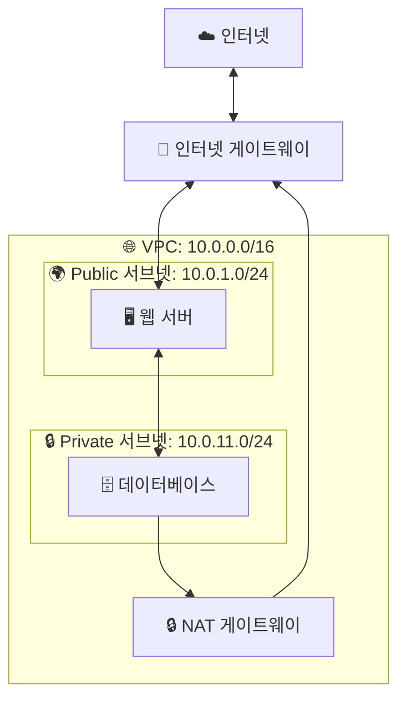

# 🌐 3. 네트워크 격리 (VPC)_기초: 클라우드에 내 전용 네트워크 만들기

## 🎯 학습 목표

이 문서를 끝까지 읽고 나면, 여러분은 다음을 할 수 있습니다:
- VPC가 무엇이고 왜 필요한지 이해하기
- Public 서브넷과 Private 서브넷의 차이점 알기
- 보안 그룹으로 방화벽 설정하는 방법 배우기
- 클라우드 서버를 안전하게 분리하는 방법 이해하기
- 실제로 간단한 VPC 구조 설계해보기

---

## 🤔 VPC가 뭔가요? 왜 필요할까요?

### VPC를 이해하기 위한 실생활 비유

**🏢 아파트 단지를 생각해보세요:**

```
일반 건물 (VPC 없이):
🏪 1층: 편의점 (누구나 출입 가능)
🏪 2층: 식당 (누구나 출입 가능)
🏪 3층: 회사 사무실 (누구나 출입 가능) ❌ 위험!
🏪 4층: 은행 (누구나 출입 가능) ❌ 매우 위험!

→ 모든 층이 외부에 노출됨
→ 도둑이 쉽게 침입 가능
→ 보안 문제!

아파트 단지 (VPC 사용):
🏢 외부 (인터넷)
   ↓
🚪 정문 (인터넷 게이트웨이)
   ↓
🏘️ 아파트 단지 안 (VPC)
   ├── 🏬 상가동 (Public 서브넷)
   │   - 누구나 방문 가능
   │   - 편의점, 식당
   │
   └── 🏠 주거동 (Private 서브넷)
       - 주민만 출입 가능
       - 출입증 필요
       - 각 집마다 도어락

→ 외부 방문자는 상가동만 접근
→ 주거동은 주민만 출입
→ 안전!
```

**클라우드로 비유하면:**

```
VPC 없이 (위험!):
☁️ 인터넷
   ↓
🖥️ 웹 서버 (누구나 접속 가능)
🖥️ 데이터베이스 (누구나 접속 가능) ❌
🖥️ 관리 서버 (누구나 접속 가능) ❌

→ 모든 서버가 인터넷에 노출!
→ 해커가 데이터베이스에 직접 접속 가능!
→ 회사 데이터 유출 위험!

VPC 사용 (안전!):
☁️ 인터넷
   ↓
🚪 인터넷 게이트웨이
   ↓
🌐 VPC (회사 전용 네트워크)
   ├── 🌍 Public 서브넷
   │   └── 🖥️ 웹 서버 (외부 접속 가능)
   │
   └── 🔒 Private 서브넷
       ├── 🗄️ 데이터베이스 (외부 접속 불가)
       └── ⚙️ 관리 서버 (외부 접속 불가)

→ 웹 서버만 외부에 공개
→ 데이터베이스는 완전히 보호
→ 안전!
```

---

## 📚 VPC의 핵심 구성 요소

VPC는 여러 부품으로 이루어져 있습니다. 아파트 단지로 계속 비유해서 이해해봅시다!

### 1. 🏘️ VPC - "아파트 단지 전체"

**실생활 비유: 담장으로 둘러싸인 아파트 단지**

```
🏘️ 신축 아파트 단지

주소 범위: 서울시 강남구 테헤란로 100번지 일대
- 101동 ~ 110동 (10개 동)
- 각 동마다 고유한 번지수

VPC의 주소 범위 (CIDR):
10.0.0.0/16
- 10.0.0.1 ~ 10.0.255.254
- 총 65,536개의 IP 주소 사용 가능!

설명:
- 내 전용 네트워크 공간
- 다른 사람의 VPC와 완전히 분리
- 내가 IP 주소 범위를 결정
```

**CIDR 쉽게 이해하기:**

```
10.0.0.0/16 이게 뭔 뜻이죠?

쉬운 설명:
- 10.0 까지는 고정 (네트워크 부분)
- 뒤의 0.0 은 자유롭게 변경 가능 (호스트 부분)

예시:
- 10.0.0.1 ✅ 사용 가능
- 10.0.0.2 ✅ 사용 가능
- 10.0.1.1 ✅ 사용 가능
- 10.0.255.254 ✅ 사용 가능
- 10.1.0.1 ❌ 사용 불가 (범위 벗어남)

비유:
- 전화번호 02-1234-XXXX
- 02-1234 는 고정 (지역번호+국번)
- XXXX 는 자유롭게 할당 (0000~9999)
```

### 2. 🏬 서브넷 - "동별 구분"

**실생활 비유: 아파트 단지의 각 동**

```
🏘️ 아파트 단지 (VPC)
   ├── 🏬 101동 (상가동) = Public 서브넷
   │   - 1층: 편의점
   │   - 2층: 식당
   │   - 외부 사람들이 자유롭게 방문
   │
   ├── 🏬 102동 (상가동) = Public 서브넷
   │   - 1층: 카페
   │   - 2층: 서점
   │
   ├── 🏠 103동 (주거동) = Private 서브넷
   │   - 주민만 출입
   │   - 출입증 필요
   │
   └── 🏠 104동 (주거동) = Private 서브넷
       - 주민만 출입
       - CCTV 감시
```

**클라우드로 비유하면:**

```
🌐 VPC: 10.0.0.0/16
   ├── 🌍 Public 서브넷 A: 10.0.1.0/24
   │   └── 🖥️ 웹 서버
   │   - 인터넷에서 직접 접속 가능
   │   - 사용자가 웹사이트 방문
   │
   ├── 🌍 Public 서브넷 B: 10.0.2.0/24
   │   └── 🖥️ 로드 밸런서
   │   - 트래픽 분산
   │
   ├── 🔒 Private 서브넷 A: 10.0.11.0/24
   │   └── 🗄️ 데이터베이스
   │   - 인터넷에서 직접 접속 불가
   │   - 웹 서버만 접근 가능
   │
   └── 🔒 Private 서브넷 B: 10.0.12.0/24
       └── ⚙️ 백업 서버
       - 완전히 격리
```

**Public vs Private 서브넷 비교:**

| 구분 | Public 서브넷 | Private 서브넷 |
|------|--------------|----------------|
| **외부 접속** | ✅ 가능 | ❌ 불가능 |
| **인터넷 게이트웨이** | ✅ 연결됨 | ❌ 연결 안 됨 |
| **용도** | 웹 서버, 로드 밸런서 | 데이터베이스, 백엔드 서버 |
| **보안 수준** | ⭐⭐ 중간 | ⭐⭐⭐⭐⭐ 매우 높음 |
| **비유** | 아파트 상가동 | 아파트 주거동 |

### 3. 🚪 인터넷 게이트웨이 - "아파트 정문"

**실생활 비유: 아파트 단지의 정문**

```
🚪 아파트 정문 (인터넷 게이트웨이)

역할:
- 외부 방문자 출입 통로
- 배달 음식 받는 곳
- 택배 받는 곳
- 손님 맞이하는 곳

특징:
- 단지 내 ↔ 외부 세상 연결
- 24시간 개방
- 경비원 상주 (보안)
```

**클라우드로 비유하면:**

```
☁️ 인터넷 (외부 세상)
   ↕
🚪 인터넷 게이트웨이 (정문)
   ↕
🌐 VPC (아파트 단지)
   └── 🌍 Public 서브넷
       └── 🖥️ 웹 서버

흐름:
1. 사용자가 웹사이트 접속
2. 요청이 인터넷 게이트웨이 통과
3. Public 서브넷의 웹 서버 도착
4. 웹 서버가 응답 생성
5. 인터넷 게이트웨이 통해 사용자에게 전달
```

### 4. 🔒 NAT 게이트웨이 - "뒷문 (나가기만 가능)"

**실생활 비유: 주민 전용 뒷문**

```
🔒 주민 전용 뒷문 (NAT 게이트웨이)

특징:
- 주민이 밖으로 나갈 수는 있음 ✅
  (예: 쓰레기 버리기, 산책)

- 외부 사람이 들어올 수는 없음 ❌
  (안에서 문 열어줘야만 들어옴)

- 일방통행!
```

**클라우드로 비유하면:**

```
🔒 Private 서브넷 (주거동)
   └── 🗄️ 데이터베이스

문제:
- 데이터베이스가 보안 업데이트를 받아야 함
- 하지만 인터넷에 노출되면 안 됨!

해결: NAT 게이트웨이 사용

🗄️ 데이터베이스
   ↓ (업데이트 요청)
🔒 NAT 게이트웨이
   ↓
☁️ 인터넷 (보안 업데이트 다운로드)
   ↓
🔒 NAT 게이트웨이
   ↓
🗄️ 데이터베이스

외부에서 들어오기:
☁️ 인터넷 → 🔒 NAT 게이트웨이 → ❌ 차단!

결과:
✅ 데이터베이스가 업데이트 다운로드 가능
❌ 해커는 데이터베이스에 접근 불가
```

### 5. 🛡️ 보안 그룹 - "집 도어락"

**실생활 비유: 각 집의 도어락**

```
🏠 101호 도어락 설정

허용 목록:
✅ 가족: 비밀번호 알면 출입 가능
✅ 배달원: 초인종 누르면 확인 후 출입
✅ 친구: 전화로 확인 후 출입

거부 목록:
❌ 모르는 사람: 출입 불가
❌ 영업 사원: 출입 불가
```

**클라우드로 비유하면:**

```
🖥️ 웹 서버의 보안 그룹 설정

인바운드 규칙 (들어오는 트래픽):
✅ HTTP (포트 80): 모든 사람 허용
   → 웹사이트 방문자

✅ HTTPS (포트 443): 모든 사람 허용
   → 보안 웹사이트 방문자

✅ SSH (포트 22): 회사 사무실 IP만 허용
   → 관리자가 서버 관리

❌ 나머지: 모두 차단

아웃바운드 규칙 (나가는 트래픽):
✅ 모든 트래픽 허용
   → 웹 서버가 외부 API 호출 가능
```

**보안 그룹 규칙 예시:**

```
📋 웹 서버 보안 그룹

규칙 1:
- 유형: HTTP
- 포트: 80
- 출발지: 0.0.0.0/0 (모든 IP)
- 설명: 누구나 웹사이트 접속 가능

규칙 2:
- 유형: SSH
- 포트: 22
- 출발지: 203.0.113.0/24 (회사 IP)
- 설명: 회사에서만 서버 관리 가능

규칙 3:
- 유형: MySQL
- 포트: 3306
- 출발지: sg-db-access (다른 보안 그룹)
- 설명: 특정 서버들만 DB 접근 가능
```

### 6. 🚧 네트워크 ACL - "동 출입구"

**실생활 비유: 각 동의 출입구**

```
🏬 101동 출입구 (상가동)

규칙:
1. 영업 시간에만 출입 가능 ✅
2. 위험 물품 반입 금지 ❌
3. 애완동물 동반 금지 ❌

특징:
- 동 전체에 적용되는 규칙
- 모든 방문자 확인
- 통과하면 각 호수 도어락도 확인
```

**클라우드로 비유하면:**

```
🌍 Public 서브넷의 NACL

인바운드 규칙:
규칙 100: HTTP (80) 허용 ✅
규칙 200: HTTPS (443) 허용 ✅
규칙 300: SSH (22) 거부 ❌
규칙 *: 나머지 모두 거부

아웃바운드 규칙:
규칙 100: 모든 트래픽 허용 ✅

특징:
- 서브넷 전체에 적용
- 들어올 때 + 나갈 때 모두 검사
- 보안 그룹의 추가 방어선
```

**보안 그룹 vs NACL 비교:**

| 구분 | 보안 그룹 | NACL |
|------|----------|------|
| **적용 대상** | 서버 (인스턴스) | 서브넷 (동 전체) |
| **상태 추적** | Stateful (자동 응답 허용) | Stateless (수동 설정) |
| **규칙 처리** | 모든 규칙 확인 | 순서대로 확인 |
| **기본 정책** | 모두 거부 | 모두 허용 |
| **비유** | 집 도어락 | 동 출입구 |

---

## 🏗️ 실제 VPC 구조 예시

### 기본 웹 서비스 구조



**이해하기:**

```
1. 사용자가 웹사이트 접속
   ☁️ 인터넷 → 🚪 IGW → 🖥️ 웹 서버

2. 웹 서버가 데이터베이스 조회
   🖥️ 웹 서버 → 🗄️ 데이터베이스

3. 데이터베이스가 보안 업데이트
   🗄️ DB → 🔒 NAT → 🚪 IGW → ☁️ 인터넷

4. 해커가 데이터베이스 공격 시도
   ☁️ 인터넷 → 🚪 IGW → ❌ Private 서브넷 차단!
```

---

## 🛡️ VPC로 서버를 안전하게 지키는 방법

### 1. 🌍 Public과 Private 서브넷 분리

**원칙: 외부에 노출될 필요가 있는 것만 Public에!**

```
✅ Public 서브넷에 배치할 것:
- 🖥️ 웹 서버 (사용자가 접속해야 함)
- ⚖️ 로드 밸런서 (트래픽 분산)
- 🚪 Bastion Host (관리용 서버)

❌ Public 서브넷에 절대 두면 안 되는 것:
- 🗄️ 데이터베이스
- 💾 백업 서버
- ⚙️ 내부 관리 시스템

✅ Private 서브넷에 배치할 것:
- 🗄️ 데이터베이스
- 🖥️ 백엔드 애플리케이션 서버
- 💾 백업 및 로그 서버
- ⚙️ 내부 도구들
```

**실제 사례:**

```
❌ 나쁜 예:

🌐 VPC
   └── 🌍 Public 서브넷
       ├── 🖥️ 웹 서버
       └── 🗄️ 데이터베이스 ❌

문제점:
- 데이터베이스가 인터넷에 노출됨
- 해커가 직접 공격 가능
- SQL Injection 공격 위험
- 데이터 유출 가능성 높음

✅ 좋은 예:

🌐 VPC
   ├── 🌍 Public 서브넷
   │   └── 🖥️ 웹 서버
   │
   └── 🔒 Private 서브넷
       └── 🗄️ 데이터베이스 ✅

장점:
- 데이터베이스가 인터넷에서 완전 격리
- 웹 서버만 DB 접근 가능
- 해커가 직접 접근 불가
- 데이터 유출 위험 최소화
```

### 2. 🔐 최소 권한 원칙 적용

**필요한 포트만 딱 열기!**

```
❌ 위험한 보안 그룹 설정:

규칙: 모든 포트 (0-65535)
출발지: 0.0.0.0/0 (모든 IP)
→ 모든 사람이 모든 포트로 접속 가능!
→ 해커가 취약점 스캔 쉽게 가능!
→ 매우 위험!

✅ 안전한 보안 그룹 설정:

웹 서버:
- 포트 80 (HTTP): 0.0.0.0/0 ✅
- 포트 443 (HTTPS): 0.0.0.0/0 ✅
- 포트 22 (SSH): 203.0.113.5/32 ✅ (관리자 IP만)
- 나머지: 모두 차단 ❌

데이터베이스:
- 포트 3306 (MySQL): sg-web-servers ✅ (웹 서버만)
- 나머지: 모두 차단 ❌
```

### 3. 🔍 정기적인 보안 점검

**매주 확인해야 할 것들:**

```
✅ 보안 체크리스트:

□ Public 서브넷에 민감한 서버 없는지 확인
  → 데이터베이스, 백업 서버 등

□ 보안 그룹 규칙 점검
  → 0.0.0.0/0으로 SSH(22) 열린 곳 없는지
  → 사용하지 않는 규칙 제거

□ NACL 규칙 검토
  → 불필요한 허용 규칙 확인

□ VPC Flow Logs 분석
  → 비정상적인 트래픽 패턴 확인
  → 알 수 없는 IP 접속 시도

□ 인터넷 게이트웨이 연결 확인
  → Private 서브넷이 IGW에 연결 안 됐는지
```

---

## 🎓 실습: 간단한 VPC 구조 설계하기

### 시나리오

```
여러분은 작은 웹 서비스를 런칭합니다.

필요한 서버:
1. 🖥️ 웹 서버 (사용자가 접속)
2. 🗄️ 데이터베이스 (사용자 정보 저장)

요구사항:
- 웹 서버는 외부에서 접속 가능해야 함
- 데이터베이스는 절대 외부 노출 금지
- 데이터베이스는 보안 업데이트 받아야 함
```

### 설계 단계

**1단계: VPC 생성**

```
VPC 이름: my-web-vpc
IP 범위: 10.0.0.0/16

사용 가능한 IP:
- 10.0.0.0 ~ 10.0.255.255
- 약 65,000개 IP 주소
```

**2단계: 서브넷 생성**

```
Public 서브넷:
- 이름: public-subnet-1
- IP 범위: 10.0.1.0/24
- 용도: 웹 서버
- 가용 IP: 256개

Private 서브넷:
- 이름: private-subnet-1
- IP 범위: 10.0.11.0/24
- 용도: 데이터베이스
- 가용 IP: 256개
```

**3단계: 인터넷 게이트웨이 생성 및 연결**

```
인터넷 게이트웨이:
- 이름: my-igw
- VPC에 연결: my-web-vpc

라우팅 테이블 (Public):
- 목적지: 0.0.0.0/0 (모든 인터넷)
- 대상: my-igw
- 의미: 모든 인터넷 트래픽을 IGW로!
```

**4단계: NAT 게이트웨이 생성**

```
NAT 게이트웨이:
- 이름: my-nat
- 위치: public-subnet-1
- 탄력적 IP: 자동 할당

라우팅 테이블 (Private):
- 목적지: 0.0.0.0/0
- 대상: my-nat
- 의미: 나가는 트래픽만 NAT로!
```

**5단계: 보안 그룹 설정**

```
웹 서버 보안 그룹 (sg-web):

인바운드:
1. HTTP (80): 0.0.0.0/0 ✅
2. HTTPS (443): 0.0.0.0/0 ✅
3. SSH (22): 내 IP만 ✅

아웃바운드:
- 모든 트래픽 허용 ✅

데이터베이스 보안 그룹 (sg-db):

인바운드:
1. MySQL (3306): sg-web만 ✅

아웃바운드:
- 모든 트래픽 허용 ✅
  (보안 업데이트 받기 위해)
```

**6단계: 서버 배치**

```
Public 서브넷:
└── 🖥️ 웹 서버
    - IP: 10.0.1.10
    - 보안 그룹: sg-web
    - 외부 IP: 203.0.113.100

Private 서브넷:
└── 🗄️ 데이터베이스
    - IP: 10.0.11.10
    - 보안 그룹: sg-db
    - 외부 IP: 없음 (격리됨)
```

**완성된 구조:**

```
☁️ 인터넷
   ↕
🚪 my-igw
   ↕
🌐 my-web-vpc (10.0.0.0/16)
   ├── 🌍 public-subnet-1 (10.0.1.0/24)
   │   ├── 🖥️ 웹 서버 (10.0.1.10)
   │   └── 🔒 my-nat
   │
   └── 🔒 private-subnet-1 (10.0.11.0/24)
       └── 🗄️ 데이터베이스 (10.0.11.10)

트래픽 흐름:
1. 사용자 → IGW → 웹 서버 ✅
2. 웹 서버 → 데이터베이스 ✅
3. 데이터베이스 → NAT → IGW → 업데이트 서버 ✅
4. 해커 → IGW → 데이터베이스 ❌ 차단!
```

---

## ⚠️ 흔한 실수와 해결 방법

### 실수 1: 데이터베이스를 Public 서브넷에 배치

```
❌ 잘못된 구성:

Public 서브넷:
├── 웹 서버
└── 데이터베이스 ❌

위험:
- 데이터베이스가 인터넷에 노출
- 포트 스캔으로 쉽게 발견됨
- 무차별 대입 공격 가능
- 데이터 유출 위험

실제 사고 사례:
"MongoDB가 Public 서브넷에 있었고
기본 비밀번호를 사용하여
수백만 명의 개인정보가 유출됨"

✅ 올바른 구성:

Public 서브넷:
└── 웹 서버

Private 서브넷:
└── 데이터베이스 ✅

보안:
- 데이터베이스가 인터넷에서 격리
- 웹 서버만 접근 가능
- 해커가 직접 공격 불가
```

### 실수 2: SSH 포트를 전 세계에 개방

```
❌ 위험한 보안 그룹:

규칙: SSH (포트 22)
출발지: 0.0.0.0/0 (모든 IP) ❌

문제:
- 전 세계 모든 사람이 SSH 시도 가능
- 무차별 대입 공격에 노출
- 매일 수천 번의 로그인 시도
- 비밀번호 뚫릴 위험

실제 로그:
2024-11-22 10:01:23 Failed login from 45.123.45.67
2024-11-22 10:01:25 Failed login from 45.123.45.67
2024-11-22 10:01:27 Failed login from 45.123.45.67
... (수천 번 반복)

✅ 안전한 보안 그룹:

규칙: SSH (포트 22)
출발지: 203.0.113.5/32 (내 IP만) ✅

또는:
규칙: SSH (포트 22)
출발지: 10.0.0.0/16 (VPC 내부만) ✅

장점:
- 특정 IP에서만 SSH 접속 가능
- 무차별 대입 공격 원천 차단
- 로그가 깨끗함
- 안전!
```

### 실수 3: NACL과 보안 그룹 혼동

```
초보자의 흔한 실수:
"보안 그룹에서 HTTP를 허용했는데
NACL에서 차단하고 있었음!"

문제:
- 트래픽이 NACL에서 먼저 차단됨
- 보안 그룹까지 도달하지 못함
- 웹사이트가 작동 안 함

해결 순서:
1. NACL 규칙 확인
   - HTTP (80) 허용되어 있는지?
   - 응답 트래픽도 허용되어 있는지?

2. 보안 그룹 규칙 확인
   - HTTP (80) 허용되어 있는지?

3. 라우팅 테이블 확인
   - 인터넷 게이트웨이로 연결되어 있는지?

💡 팁:
NACL은 대부분 기본 설정 사용!
보안 그룹만 세밀하게 설정하세요!
```

---

## ❓ FAQ: 자주 묻는 질문

**Q1: VPC는 꼭 만들어야 하나요?**
```
A: AWS는 기본 VPC를 자동으로 제공합니다.

기본 VPC:
- 자동으로 생성됨
- Public 서브넷만 있음
- 간단한 테스트용으로 좋음

하지만 실제 서비스에는:
✅ 직접 VPC를 설계하세요!
- Public/Private 서브넷 분리
- 적절한 보안 그룹 설정
- 더 안전하고 체계적

비유:
- 기본 VPC = 원룸 (간단, 빠름)
- 맞춤 VPC = 아파트 (안전, 체계적)
```

**Q2: Public 서브넷에 데이터베이스를 두면 안 되나요?**
```
A: 절대 안 됩니다! 매우 위험합니다!

위험한 이유:
1. 인터넷에 직접 노출
2. 포트 스캔으로 쉽게 발견
3. 무차별 대입 공격 대상
4. 데이터 유출 가능성 높음

실제 사고 사례:
- 2019년: MongoDB 노출로 2억 건 유출
- 2020년: Elasticsearch 노출로 10억 건 유출
- 2021년: Redis 노출로 수백만 건 유출

모두 Public 서브넷에 DB를 둔 것이 원인!

✅ 반드시 Private 서브넷에!
```

**Q3: NAT 게이트웨이 비용이 비싼데 안 쓰면 안 되나요?**
```
A: 상황에 따라 다릅니다.

NAT 게이트웨이가 필요한 경우:
✅ Private 서브넷 서버가 인터넷 접속 필요
   - 보안 업데이트 다운로드
   - 외부 API 호출
   - 패키지 설치

NAT 게이트웨이 없이 가능한 경우:
✅ Private 서버가 완전 격리
✅ VPC Endpoint 사용 (S3, DynamoDB 등)
✅ 업데이트 서버를 VPC 내부에 구축

비용 절감 팁:
- VPC Endpoint 사용 (S3, DynamoDB)
- 필요할 때만 NAT 게이트웨이 켜기
- NAT 인스턴스 사용 (저렴하지만 관리 필요)
```

**Q4: 보안 그룹과 NACL 중 뭘 써야 하나요?**
```
A: 둘 다 사용하되, 주로 보안 그룹 사용!

권장 방법:

1단계: 보안 그룹 (주요 방어)
- 각 서버마다 세밀하게 설정
- 대부분의 보안은 여기서 처리
- 관리하기 쉬움

2단계: NACL (추가 방어)
- 서브넷 전체에 대한 기본 정책
- 알려진 악성 IP 대역 차단
- 특정 포트 서브넷 전체 차단

비유:
- 보안 그룹 = 각 집의 도어락 (주요 방어)
- NACL = 동 출입구 (추가 방어)

💡 팁:
NACL은 기본 설정으로 두고
보안 그룹만 꼼꼼하게 관리하세요!
```

**Q5: VPC 설계가 너무 어려워요!**
```
A: 단계별로 천천히 하면 됩니다!

초보자용 체크리스트:

□ 1단계: VPC 생성
  - IP 범위: 10.0.0.0/16
  - 간단하게 시작!

□ 2단계: 2개 서브넷 생성
  - Public: 10.0.1.0/24
  - Private: 10.0.11.0/24

□ 3단계: 인터넷 게이트웨이
  - VPC에 연결
  - Public 서브넷 라우팅

□ 4단계: 보안 그룹 설정
  - 웹 서버: 80, 443 허용
  - DB: 웹 서버만 허용

□ 5단계: 서버 배치
  - 웹 서버 → Public
  - DB → Private

□ 6단계: 테스트
  - 웹사이트 접속 되는지
  - DB 외부 접속 안 되는지

💡 시작은 간단하게!
나중에 필요할 때 확장하세요!
```

---

## 📊 요약: 꼭 기억하세요!

### VPC 핵심 개념 5가지

```
1. VPC = 내 전용 네트워크 공간
   🏘️ 아파트 단지처럼 독립적인 공간

2. Public vs Private 서브넷
   🌍 Public: 외부 접속 가능 (웹 서버)
   🔒 Private: 외부 접속 불가 (데이터베이스)

3. 인터넷 게이트웨이
   🚪 VPC와 인터넷을 연결하는 정문
   Public 서브넷만 연결!

4. NAT 게이트웨이
   🔒 나가기만 가능한 뒷문
   Private 서버가 업데이트 받을 때 사용

5. 보안 그룹
   🛡️ 각 서버의 방화벽
   필요한 포트만 열기!
```

### 보안 원칙

```
✅ 반드시 지켜야 할 것:

1. 민감한 서버는 Private 서브넷에!
   - 데이터베이스 ✅
   - 백업 서버 ✅
   - 내부 시스템 ✅

2. 최소 권한 원칙
   - 필요한 포트만 열기
   - 특정 IP만 허용
   - 0.0.0.0/0 주의!

3. 정기적인 점검
   - 보안 그룹 규칙 검토
   - 불필요한 규칙 제거
   - 로그 분석

❌ 절대 하지 말아야 할 것:

1. DB를 Public 서브넷에 두기
2. SSH를 0.0.0.0/0에 열기
3. 모든 포트 개방
4. 보안 점검 안 하기
```

---

## 🎓 학습 점검 퀴즈

```
Q1. VPC는 무엇의 약자인가요?
a) Very Private Cloud
b) Virtual Private Cloud
c) Very Public Cloud
d) Virtual Public Cloud

정답: b) Virtual Private Cloud
→ 가상 사설 클라우드, 내 전용 네트워크 공간입니다!

Q2. 데이터베이스는 어디에 배치해야 하나요?
a) Public 서브넷
b) Private 서브넷
c) 인터넷 게이트웨이
d) 상관없음

정답: b) Private 서브넷
→ 데이터베이스는 반드시 Private 서브넷에!

Q3. NAT 게이트웨이의 역할은?
a) 들어오는 트래픽만 허용
b) 나가는 트래픽만 허용
c) 모든 트래픽 차단
d) 모든 트래픽 허용

정답: b) 나가는 트래픽만 허용
→ Private 서버가 밖으로 나갈 수만 있고, 들어올 수는 없습니다!

Q4. 보안 그룹의 특징은?
a) 서브넷에 적용
b) 서버에 적용
c) VPC에 적용
d) 리전에 적용

정답: b) 서버에 적용
→ 각 서버(인스턴스)마다 적용되는 방화벽입니다!

Q5. 0.0.0.0/0의 의미는?
a) 내 IP만
b) 회사 IP만
c) 모든 IP
d) IP 없음

정답: c) 모든 IP
→ 전 세계 모든 IP 주소를 의미합니다! SSH에는 절대 사용하지 마세요!

🎉 모두 맞으셨나요?
- 5개: VPC 마스터! 🌟
- 3-4개: 잘하셨어요! 복습 추천! ✅
- 1-2개: 다시 읽어보세요! 📖
- 0개: 처음부터 천천히! 💪
```

---

## ➡️ 다음 단원에서는?

**다음 단원: "4. 클라우드 위협 및 대응_기초"**

```
배울 내용:
🚨 클라우드에서 발생하는 실제 위협들
🔍 데이터 유출 사고 사례
🛡️ 클라우드 공격으로부터 방어하기
📊 보안 모니터링 방법
⚡ 사고 발생 시 대응 절차

왜 중요할까요?
→ VPC로 네트워크를 구축했다면
   이제 실제 위협에 대비하는 법을 배워야 합니다!

예고편:
"여러분의 클라우드는 안전한가요?
실제 발생한 클라우드 보안 사고와
이를 예방하는 방법을 배웁니다!"
```

---

## 🙏 마치며

VPC는 클라우드 보안의 기초이자 가장 중요한 부분입니다.

**기억하세요:**
- VPC = 내 전용 아파트 단지
- Public 서브넷 = 상가동 (외부 방문 가능)
- Private 서브넷 = 주거동 (주민만 출입)
- 보안 그룹 = 집 도어락 (개별 보안)

**여러분은 이제:**
✅ VPC가 무엇인지 이해했습니다
✅ Public과 Private 서브넷을 구별할 수 있습니다
✅ 보안 그룹으로 방화벽을 설정할 수 있습니다
✅ 안전한 네트워크 구조를 설계할 수 있습니다
✅ 흔한 실수를 피할 수 있습니다

**다음 단계:**
1. AWS 콘솔에서 VPC 만들어보기
2. Public과 Private 서브넷 생성하기
3. 간단한 웹 서버 배포해보기
4. 보안 그룹 규칙 설정해보기

**클라우드 보안 전문가의 길, 함께 걸어가요!** 💪🌐

---

<div style="text-align: center; padding: 2rem; background: #f0f0f0; border-radius: 10px; margin: 2rem 0;">
  <h3>🎉 VPC 학습 완료!</h3>
  <p>축하합니다! 클라우드 네트워크 격리의 핵심을 마스터했습니다!</p>
  <p><strong>다음: "4. 클라우드 위협 및 대응_기초"에서 만나요!</strong></p>
</div>

---

**문서 정보**
- 작성일: 2024년
- 대상: 클라우드 네트워크 초보자
- 난이도: ⭐⭐ (초급)
- 예상 학습 시간: 2-3시간
- 실습 필요: AWS 계정 (무료)
- 선수 지식: 클라우드 기초, IAM 기초