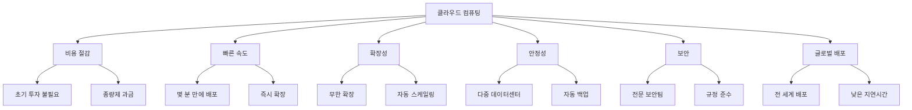
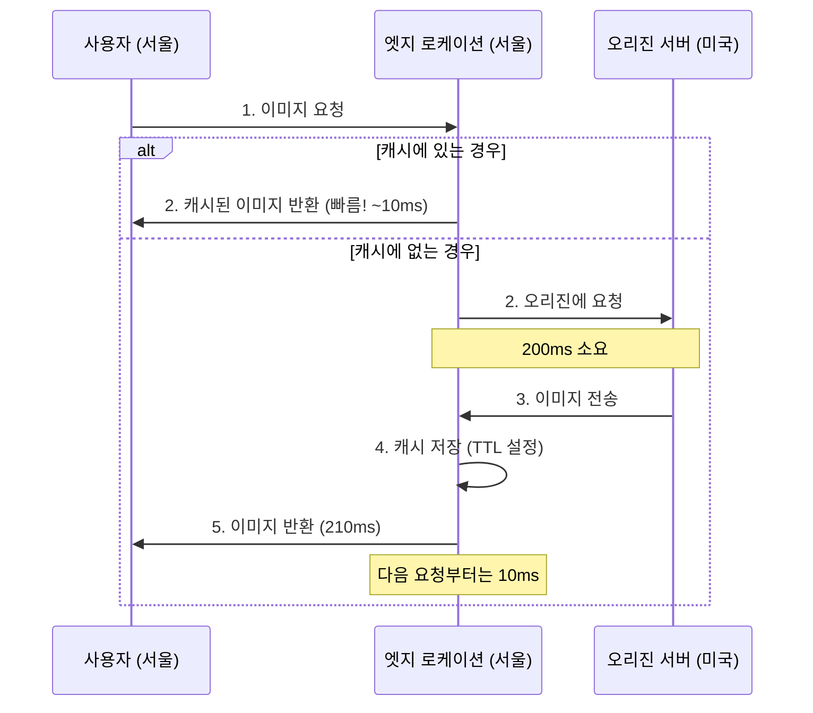
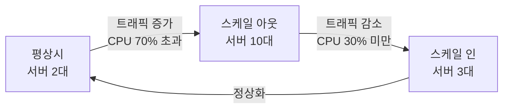

# Chapter 1: Amazon Web Service 기초 지식 (상세판)

> **학습 목표**: 클라우드 컴퓨팅의 개념부터 AWS의 기본 구조까지 완벽하게 이해하고, IT 인프라의 패러다임 전환을 체득한다.

---

## 📌 목차

1. [클라우드 컴퓨팅 혁명](#1-클라우드-컴퓨팅-혁명)
2. [AWS 소개 및 핵심 개념](#2-aws-소개-및-핵심-개념)
3. [AWS 글로벌 인프라 심층 분석](#3-aws-글로벌-인프라-심층-분석)
4. [AWS 핵심 특징과 장점](#4-aws-핵심-특징과-장점)
5. [AWS 서비스 생태계](#5-aws-서비스-생태계)
6. [AWS 공동 책임 모델](#6-aws-공동-책임-모델)
7. [가상화 기술의 이해](#7-가상화-기술의-이해)
8. [서버리스 컴퓨팅](#8-서버리스-컴퓨팅)
9. [AWS Well-Architected Framework](#9-aws-well-architected-framework)
10. [요약 및 다음 단계](#10-요약-및-다음-단계)

---

## 1. 클라우드 컴퓨팅 혁명

### 1.1 IT 인프라의 역사적 변화

#### 전통적인 IT 인프라 (1990년대~2000년대 초반)

**메인프레임 시대**
- 1960-1980년대: 대형 중앙 컴퓨터
- 높은 비용, 제한된 접근성
- 은행, 정부 기관 등 대기업만 사용 가능

**클라이언트-서버 시대**
- 1980-1990년대: PC와 서버의 분리
- 기업마다 자체 데이터 센터 구축
- 초기 투자 비용 막대

**온프레미스 데이터 센터의 문제점**

1. **막대한 초기 투자 비용**
   - 서버 하드웨어 구매: 대당 수백만 원 ~ 수억 원
   - 네트워크 장비: 스위치, 라우터, 방화벽
   - 스토리지 시스템: SAN, NAS
   - 전력 공급 장치: UPS, 발전기
   - 냉각 시스템: 에어컨, 항온항습기
   - 물리적 공간: 데이터 센터 건물 또는 임대

2. **운영 비용**
   - 전기세: 서버 + 냉각 시스템
   - 인건비: 시스템 관리자, 네트워크 엔지니어
   - 유지보수: 하드웨어 교체, 소프트웨어 라이선스
   - 보안: 물리적 보안, 사이버 보안

3. **확장성의 한계**
   - 서버 증설에 수주~수개월 소요
   - 과도한 용량 계획 (Peak 기준 구매)
   - 평상시 리소스 낭비 (활용률 10-20%)

4. **장애 대응의 어려움**
   - 하드웨어 고장 시 서비스 중단
   - 재해 복구 시스템 구축 비용
   - 백업 데이터 센터 필요

**실제 사례: 전통적인 쇼핑몰 서버 운영**

```
평상시 트래픽: 동시 접속자 1,000명
블랙프라이데이: 동시 접속자 50,000명

전통적 방식:
- 50,000명 기준으로 서버 50대 구매
- 연중 대부분 시간에 서버 48대는 유휴 상태
- 연간 전기세, 유지보수 비용 지속 발생
- 투자 대비 효율: 약 4% (2일/365일)
```

#### 클라우드 컴퓨팅의 등장

**클라우드 컴퓨팅이란?**

> 인터넷을 통해 IT 리소스(서버, 스토리지, 데이터베이스, 네트워크, 소프트웨어 등)를 필요한 만큼 사용하고, 사용한 만큼만 비용을 지불하는 서비스 모델

**클라우드의 핵심 특징 (NIST 정의)**

1. **온디맨드 셀프 서비스 (On-demand Self-service)**
   - 사용자가 필요할 때 자동으로 리소스 프로비저닝
   - 서비스 제공자의 개입 없이 즉시 사용 가능

2. **광범위한 네트워크 액세스 (Broad Network Access)**
   - 인터넷을 통해 어디서나 접근
   - PC, 스마트폰, 태블릿 등 다양한 디바이스 지원

3. **리소스 풀링 (Resource Pooling)**
   - 다중 테넌트 모델
   - 물리적 리소스를 여러 고객이 공유
   - 가상화 기술로 격리 보장

4. **빠른 탄력성 (Rapid Elasticity)**
   - 수요에 따라 자동 확장/축소
   - 무한대에 가까운 리소스 제공 (사용자 관점)

5. **측정 가능한 서비스 (Measured Service)**
   - 사용량 모니터링 및 측정
   - 사용한 만큼만 과금

**클라우드 컴퓨팅의 장점**



### 1.2 클라우드 서비스 모델

클라우드 서비스는 제공하는 관리 범위에 따라 3가지 모델로 분류됩니다.

#### IaaS (Infrastructure as a Service)

**정의**: 가상화된 컴퓨팅 인프라를 인터넷을 통해 제공

**제공 항목**:
- 가상 서버 (Virtual Machines)
- 스토리지
- 네트워크
- 로드 밸런서

**사용자 관리 항목**:
- 운영체제 (OS)
- 미들웨어
- 런타임
- 애플리케이션
- 데이터

**AWS IaaS 서비스**:
- Amazon EC2 (가상 서버)
- Amazon VPC (가상 네트워크)
- Amazon EBS (블록 스토리지)
- Elastic Load Balancing

**사용 사례**:
- 웹 서버 호스팅
- 빅데이터 분석
- 백업 및 재해 복구
- 개발/테스트 환경

**장점**:
- ✅ 완전한 제어권
- ✅ 기존 애플리케이션 마이그레이션 용이
- ✅ 유연한 구성

**단점**:
- ❌ OS 패치 및 관리 필요
- ❌ 보안 설정 직접 관리
- ❌ 높은 기술 요구 수준

#### PaaS (Platform as a Service)

**정의**: 애플리케이션 개발 및 배포를 위한 플랫폼 제공

**제공 항목**:
- IaaS의 모든 항목
- 운영체제
- 미들웨어
- 런타임 환경
- 개발 도구

**사용자 관리 항목**:
- 애플리케이션 코드
- 데이터

**AWS PaaS 서비스**:
- AWS Elastic Beanstalk
- AWS Lambda (FaaS)
- Amazon RDS (관리형 데이터베이스)

**사용 사례**:
- 웹 애플리케이션 개발
- API 서버 구축
- 모바일 백엔드

**장점**:
- ✅ 인프라 관리 불필요
- ✅ 빠른 개발 및 배포
- ✅ 자동 스케일링

**단점**:
- ❌ 플랫폼 종속성
- ❌ 제한된 커스터마이징
- ❌ 특정 언어/프레임워크만 지원

#### SaaS (Software as a Service)

**정의**: 완성된 소프트웨어 애플리케이션을 인터넷을 통해 제공

**제공 항목**:
- 모든 인프라
- 모든 플랫폼
- 완성된 애플리케이션

**사용자 관리 항목**:
- 사용자 데이터
- 애플리케이션 설정

**AWS SaaS 서비스**:
- Amazon WorkSpaces (가상 데스크톱)
- Amazon Chime (화상 회의)
- Amazon WorkMail (이메일)

**일반적인 SaaS 예시**:
- Gmail, Google Docs
- Microsoft Office 365
- Salesforce
- Dropbox
- Slack

**장점**:
- ✅ 즉시 사용 가능
- ✅ 관리 불필요
- ✅ 자동 업데이트

**단점**:
- ❌ 커스터마이징 제한적
- ❌ 데이터 통제권 제한
- ❌ 인터넷 연결 필수

#### 서비스 모델 비교

**관리 책임 비교표**

| 구성 요소 | 온프레미스 | IaaS | PaaS | SaaS |
|-----------|-----------|------|------|------|
| **애플리케이션** | 👤 고객 | 👤 고객 | 👤 고객 | ☁️ 제공자 |
| **데이터** | 👤 고객 | 👤 고객 | 👤 고객 | ☁️ 제공자 |
| **런타임** | 👤 고객 | 👤 고객 | ☁️ 제공자 | ☁️ 제공자 |
| **미들웨어** | 👤 고객 | 👤 고객 | ☁️ 제공자 | ☁️ 제공자 |
| **운영체제** | 👤 고객 | 👤 고객 | ☁️ 제공자 | ☁️ 제공자 |
| **가상화** | 👤 고객 | ☁️ 제공자 | ☁️ 제공자 | ☁️ 제공자 |
| **서버** | 👤 고객 | ☁️ 제공자 | ☁️ 제공자 | ☁️ 제공자 |
| **스토리지** | 👤 고객 | ☁️ 제공자 | ☁️ 제공자 | ☁️ 제공자 |
| **네트워크** | 👤 고객 | ☁️ 제공자 | ☁️ 제공자 | ☁️ 제공자 |

**실제 비유**

```
온프레미스 = 집 짓기
- 땅 구매, 설계, 건축, 인테리어 모두 직접
- 완전한 통제, 높은 비용

IaaS = 빈 집 임대
- 집은 제공, 가구와 인테리어는 직접
- 유연성 높음, 관리 필요

PaaS = 가구 포함 집 임대
- 집 + 기본 가구 제공
- 짐만 풀면 바로 생활 가능

SaaS = 호텔
- 모든 것이 준비됨
- 체크인만 하면 즉시 사용
```

### 1.3 클라우드 배포 모델

#### 퍼블릭 클라우드 (Public Cloud)

**정의**: 클라우드 서비스 제공자가 인터넷을 통해 다수의 고객에게 서비스 제공

**특징**:
- 다중 테넌트 (Multi-tenant)
- 인터넷을 통한 접근
- 종량제 과금

**주요 제공자**:
- Amazon Web Services (AWS)
- Microsoft Azure
- Google Cloud Platform (GCP)
- IBM Cloud
- Oracle Cloud

**장점**:
- ✅ 초기 비용 없음
- ✅ 빠른 확장성
- ✅ 전문적인 관리
- ✅ 최신 기술 접근

**단점**:
- ❌ 데이터 통제 제한
- ❌ 보안 우려 (공유 인프라)
- ❌ 규정 준수 제약

**사용 사례**:
- 스타트업
- 웹 애플리케이션
- 개발/테스트 환경
- 비즈니스 애플리케이션

#### 프라이빗 클라우드 (Private Cloud)

**정의**: 특정 조직 전용으로 구축된 클라우드 인프라

**구축 위치**:
- 온프레미스 (자체 데이터 센터)
- 호스팅 (제3자 데이터 센터)

**특징**:
- 단일 테넌트 (Single-tenant)
- 전용 리소스
- 높은 보안성

**기술**:
- VMware vCloud
- OpenStack
- Microsoft Azure Stack

**장점**:
- ✅ 완전한 통제권
- ✅ 높은 보안성
- ✅ 규정 준수 용이
- ✅ 커스터마이징 가능

**단점**:
- ❌ 높은 초기 비용
- ❌ 관리 인력 필요
- ❌ 확장성 제한

**사용 사례**:
- 금융 기관
- 정부 기관
- 의료 기관
- 대기업

#### 하이브리드 클라우드 (Hybrid Cloud)

**정의**: 퍼블릭 클라우드와 프라이빗 클라우드를 결합한 모델

**구성**:
- 온프레미스 + 퍼블릭 클라우드
- 프라이빗 클라우드 + 퍼블릭 클라우드

**연결 방식**:
- VPN (Virtual Private Network)
- 전용선 (AWS Direct Connect)
- API 통합

**장점**:
- ✅ 유연성 극대화
- ✅ 비용 최적화
- ✅ 규정 준수 + 확장성
- ✅ 단계적 마이그레이션

**단점**:
- ❌ 복잡한 관리
- ❌ 보안 설정 어려움
- ❌ 네트워크 지연 가능

**사용 사례**:
- 민감한 데이터는 온프레미스
- 일반 워크로드는 퍼블릭 클라우드
- 트래픽 급증 시 클라우드 버스팅

**실제 예시: 은행 시스템**

```
프라이빗 클라우드 (온프레미스):
- 고객 개인정보
- 거래 데이터
- 핵심 뱅킹 시스템

퍼블릭 클라우드 (AWS):
- 모바일 앱 서버
- 마케팅 웹사이트
- 데이터 분석
- 개발/테스트 환경
```

#### 멀티 클라우드 (Multi-Cloud)

**정의**: 여러 퍼블릭 클라우드 제공자를 동시에 사용

**예시**:
- AWS + Azure
- AWS + GCP
- AWS + Azure + GCP

**이유**:
- 벤더 종속성 회피
- 최적의 서비스 선택
- 지리적 분산
- 재해 복구

**장점**:
- ✅ 벤더 락인 방지
- ✅ 최고의 서비스 조합
- ✅ 높은 가용성

**단점**:
- ❌ 관리 복잡성
- ❌ 높은 기술 요구
- ❌ 비용 관리 어려움

---

## 2. AWS 소개 및 핵심 개념

### 2.1 Amazon Web Services의 역사

#### AWS의 탄생 배경

**2000년대 초반 Amazon.com의 문제**:
- 온라인 쇼핑몰 운영을 위한 대규모 IT 인프라 구축
- 연말 쇼핑 시즌을 위해 과도한 서버 용량 확보
- 평상시 서버 활용률 극히 저조
- 내부 개발팀 간 인프라 공유 필요성 대두

**2002년**: Amazon 내부 인프라를 서비스화하는 아이디어 제안

**2006년 3월**: AWS 공식 출범
- 첫 서비스: Amazon S3 (Simple Storage Service)
- 2006년 8월: Amazon EC2 (Elastic Compute Cloud) 출시
- 2006년 9월: Amazon SQS (Simple Queue Service) 출시

#### AWS의 성장

**2010년**: Amazon.com의 모든 소매 웹사이트가 AWS로 이전

**2013년**: AWS 연간 매출 30억 달러 돌파

**2015년**: AWS 연간 매출 100억 달러 돌파

**2020년**: AWS 연간 매출 450억 달러
- 전 세계 클라우드 시장 점유율 1위 (약 32%)
- 200개 이상의 서비스 제공

**2024년 현재**:
- 연간 매출 900억 달러 이상
- 전 세계 33개 리전 운영
- 105개 가용 영역
- 400개 이상의 엣지 로케이션
- 수백만 고객 사용

### 2.2 AWS의 핵심 가치

#### 1. 고객 중심 (Customer Obsession)

**원칙**:
- 고객의 요구사항을 최우선
- 고객 피드백 기반 서비스 개선
- 고객 성공이 AWS의 성공

**사례**:
- 고객 요청으로 새로운 리전 개설
- 서비스 가격 지속적 인하 (80회 이상)
- 고객 지원 강화

#### 2. 혁신 (Innovation)

**지속적인 신규 서비스 출시**:
- 2023년: 3,000개 이상의 새로운 기능 출시
- 평균 하루 8개 이상의 새 기능

**최신 기술 도입**:
- 인공지능/머신러닝
- 서버리스 컴퓨팅
- 컨테이너 오케스트레이션
- 양자 컴퓨팅

#### 3. 운영 우수성 (Operational Excellence)

**높은 가용성**:
- 99.99% 이상의 SLA (Service Level Agreement)
- 자동 장애 조치
- 다중 가용 영역

**보안**:
- 전문 보안팀 운영
- 규정 준수 (GDPR, HIPAA 등)
- 암호화 기본 제공

#### 4. 비용 효율성 (Cost Optimization)

**종량제 과금**:
- 사용한 만큼만 지불
- 약정 할인 (Reserved Instances)
- 스팟 인스턴스 (최대 90% 할인)

**가격 인하**:
- 2006년 이후 80회 이상 가격 인하
- 규모의 경제 효과를 고객에게 환원

### 2.3 AWS 계정 구조

#### AWS 계정이란?

**정의**: AWS 서비스를 사용하기 위한 최상위 컨테이너

**계정 생성 시 필요 정보**:
- 이메일 주소 (고유해야 함)
- 비밀번호
- 계정 이름
- 연락처 정보
- 결제 정보 (신용카드)

**계정 ID**:
- 12자리 숫자
- 계정 생성 시 자동 할당
- 예: `123456789012`

#### 루트 사용자 (Root User)

**특징**:
- 계정 생성 시 자동으로 생성
- 이메일 주소로 로그인
- 모든 권한 보유

**루트 사용자만 할 수 있는 작업**:
1. 계정 설정 변경
   - 계정 이름 변경
   - 이메일 주소 변경
   - 루트 사용자 비밀번호 변경

2. 결제 정보 관리
   - 결제 수단 변경
   - 세금 설정

3. AWS 지원 플랜 변경
   - Basic → Developer → Business → Enterprise

4. 계정 해지
   - AWS 계정 완전 삭제

5. IAM 사용자 권한 복원
   - 모든 IAM 사용자가 권한을 잃었을 때

6. Reserved Instance 마켓플레이스 등록

7. GovCloud 가입

**루트 사용자 보안 모범 사례**:

```
✅ 해야 할 것:
1. 강력한 비밀번호 설정 (16자 이상, 복잡성)
2. MFA (Multi-Factor Authentication) 활성화
3. Access Key 생성 금지
4. 정기적으로 로그인하여 보안 확인

❌ 하지 말아야 할 것:
1. 일상적인 작업에 사용
2. Access Key 생성
3. 다른 사람과 공유
4. 프로그래밍 방식 액세스
```

#### IAM 사용자 (IAM User)

**정의**: 루트 사용자가 생성하는 하위 사용자

**특징**:
- 개별 자격 증명
- 제한된 권한
- 감사 추적 가능

**로그인 정보**:
- 계정 ID (또는 계정 별칭)
- IAM 사용자 이름
- 비밀번호

**Access Key**:
- Access Key ID (공개)
- Secret Access Key (비밀)
- CLI/SDK 접근용

**사용 사례**:
- 개발자 계정
- 운영자 계정
- 애플리케이션 계정
- 외부 협력사 계정

### 2.4 AWS 지원 플랜

AWS는 4가지 지원 플랜을 제공합니다.

#### 1. Basic Support (무료)

**포함 사항**:
- 24/7 고객 서비스
- 문서, 백서, 지원 포럼
- AWS Trusted Advisor (7개 핵심 검사)
- AWS Personal Health Dashboard

**제한 사항**:
- 기술 지원 없음
- 아키텍처 지원 없음

**적합 대상**:
- 개인 학습자
- 취미 프로젝트

#### 2. Developer Support ($29/월 또는 AWS 사용량의 3%)

**포함 사항**:
- Basic의 모든 항목
- 업무 시간 이메일 지원
- 일반 지침 응답: 24시간 이내
- 시스템 장애 응답: 12시간 이내
- 1명의 기본 연락처

**제한 사항**:
- 전화 지원 없음
- 아키텍처 지원 제한적

**적합 대상**:
- 개발/테스트 환경
- 비프로덕션 워크로드

#### 3. Business Support ($100/월 또는 AWS 사용량의 10-3%)

**포함 사항**:
- Developer의 모든 항목
- 24/7 전화, 이메일, 채팅 지원
- 일반 지침 응답: 24시간 이내
- 시스템 장애 응답: 12시간 이내
- 프로덕션 시스템 장애: 4시간 이내
- 프로덕션 시스템 다운: 1시간 이내
- AWS Trusted Advisor (모든 검사)
- API를 통한 지원 케이스 관리
- 무제한 연락처

**추가 혜택**:
- Infrastructure Event Management (추가 비용)
- 타사 소프트웨어 지원

**적합 대상**:
- 프로덕션 워크로드
- 비즈니스 크리티컬 시스템

#### 4. Enterprise Support ($15,000/월 또는 AWS 사용량의 10-3%)

**포함 사항**:
- Business의 모든 항목
- 비즈니스 크리티컬 시스템 다운: 15분 이내 응답
- 전담 TAM (Technical Account Manager)
- Concierge 지원팀 (계정 및 결제)
- Infrastructure Event Management (무료)
- Well-Architected 검토
- 운영 검토 및 도구
- 교육 및 게임 데이

**TAM (Technical Account Manager)**:
- 전담 AWS 전문가
- 아키텍처 지침
- 운영 검토
- 비용 최적화
- 신규 서비스 조기 액세스

**적합 대상**:
- 미션 크리티컬 시스템
- 대기업
- 엔터프라이즈 고객

**지원 플랜 비교표**

| 기능 | Basic | Developer | Business | Enterprise |
|------|-------|-----------|----------|------------|
| **가격** | 무료 | $29/월 | $100/월 | $15,000/월 |
| **기술 지원** | ❌ | 이메일 | 24/7 전화/채팅 | 24/7 + TAM |
| **응답 시간 (긴급)** | - | 12시간 | 1시간 | 15분 |
| **Trusted Advisor** | 7개 | 7개 | 전체 | 전체 |
| **아키텍처 지원** | ❌ | 제한적 | ✅ | ✅ + TAM |
| **연락처 수** | - | 1명 | 무제한 | 무제한 |

---

## 3. AWS 글로벌 인프라 심층 분석

### 3.1 AWS 글로벌 인프라 개요

AWS는 전 세계에 분산된 물리적 데이터 센터를 통해 서비스를 제공합니다.

**인프라 계층 구조**:

```
AWS 글로벌 인프라
├── 리전 (Region) - 33개
│   ├── 가용 영역 (Availability Zone) - 105개
│   │   └── 데이터 센터 (Data Center) - 수백 개
│   └── 로컬 영역 (Local Zone)
├── 엣지 로케이션 (Edge Location) - 400+개
├── Wavelength Zone
└── AWS Outposts
```

### 3.2 리전 (Region)

#### 리전이란?

**정의**: AWS가 서비스를 제공하는 지리적으로 분리된 영역

**특징**:
- 완전히 독립적인 인프라
- 최소 3개 이상의 가용 영역 포함
- 리전 간 데이터 자동 복제 없음
- 리전별로 제공 서비스 상이

#### 리전 목록 (2024년 기준)

**아시아 태평양**:
- `ap-northeast-1`: 도쿄 (일본)
- `ap-northeast-2`: 서울 (한국)
- `ap-northeast-3`: 오사카 (일본)
- `ap-south-1`: 뭄바이 (인도)
- `ap-south-2`: 하이데라바드 (인도)
- `ap-southeast-1`: 싱가포르
- `ap-southeast-2`: 시드니 (호주)
- `ap-southeast-3`: 자카르타 (인도네시아)
- `ap-southeast-4`: 멜버른 (호주)
- `ap-east-1`: 홍콩

**북미**:
- `us-east-1`: 버지니아 북부 (미국)
- `us-east-2`: 오하이오 (미국)
- `us-west-1`: 캘리포니아 북부 (미국)
- `us-west-2`: 오레곤 (미국)
- `ca-central-1`: 캐나다 중부
- `ca-west-1`: 캐나다 서부

**유럽**:
- `eu-west-1`: 아일랜드
- `eu-west-2`: 런던 (영국)
- `eu-west-3`: 파리 (프랑스)
- `eu-central-1`: 프랑크푸르트 (독일)
- `eu-central-2`: 취리히 (스위스)
- `eu-north-1`: 스톡홀름 (스웨덴)
- `eu-south-1`: 밀라노 (이탈리아)
- `eu-south-2`: 스페인

**남미**:
- `sa-east-1`: 상파울루 (브라질)

**중동**:
- `me-south-1`: 바레인
- `me-central-1`: UAE

**아프리카**:
- `af-south-1`: 케이프타운 (남아프리카)

#### 리전 이름 체계

**형식**: `지역코드-방향-번호`

**예시**:
```
ap-northeast-2
│   │         │
│   │         └─ 번호 (같은 지역에 여러 리전이 있을 때)
│   └─────────── 방향 (northeast, southeast, south 등)
└─────────────── 지역 코드 (ap=아시아태평양, us=미국, eu=유럽)
```

#### 리전 선택 기준

**1. 지연시간 (Latency)**

**개념**:
- 사용자와 서버 간 물리적 거리
- 빛의 속도로도 거리에 비례하여 지연 발생

**측정**:
- 서울 → 서울 리전: 1-5ms
- 서울 → 도쿄 리전: 30-50ms
- 서울 → 미국 서부: 150-200ms
- 서울 → 유럽: 250-300ms

**영향**:
- 웹사이트 로딩 속도
- API 응답 시간
- 사용자 경험

**권장사항**:
- 주요 사용자층과 가까운 리전 선택
- 한국 사용자 → 서울 리전
- 글로벌 서비스 → 다중 리전 배포

**2. 법적 요구사항 (Compliance)**

**데이터 주권 (Data Sovereignty)**:
- 특정 국가의 데이터는 해당 국가 내에 저장해야 하는 법규
- 예: 한국 개인정보보호법, EU GDPR

**규정 준수**:
- **GDPR (General Data Protection Regulation)**
  - EU 시민의 개인정보 보호
  - EU 리전에 데이터 저장 필요

- **HIPAA (Health Insurance Portability and Accountability Act)**
  - 미국 의료 정보 보호
  - HIPAA 준수 리전 사용

- **PCI DSS (Payment Card Industry Data Security Standard)**
  - 신용카드 정보 보호
  - 모든 리전 지원

- **한국 개인정보보호법**
  - 민감 정보 국내 저장 권장
  - 서울 리전 사용

**3. 가용 서비스 (Available Services)**

**리전별 서비스 차이**:
- 신규 서비스는 주요 리전에서 먼저 출시
- 일부 서비스는 특정 리전에서만 제공

**예시**:
```
us-east-1 (버지니아):
- 가장 많은 서비스 제공
- 신규 서비스 최우선 출시
- 200개 이상 서비스

ap-northeast-2 (서울):
- 대부분의 주요 서비스 제공
- 일부 신규 서비스는 지연 출시
- 180개 이상 서비스

신규 리전:
- 핵심 서비스만 제공
- 점진적으로 서비스 확대
```

**확인 방법**:
- [AWS Regional Services List](https://aws.amazon.com/about-aws/global-infrastructure/regional-product-services/)

**4. 비용 (Cost)**

**리전별 가격 차이**:

**EC2 t3.medium 시간당 가격 비교** (예시):
```
us-east-1 (버지니아):     $0.0416
us-west-2 (오레곤):       $0.0416
ap-northeast-2 (서울):    $0.0520 (+25%)
ap-northeast-1 (도쿄):    $0.0544 (+31%)
eu-west-1 (아일랜드):     $0.0464 (+12%)
sa-east-1 (상파울루):     $0.0832 (+100%)
```

**가격 차이 이유**:
- 전력 비용
- 부동산 비용
- 세금
- 네트워크 비용
- 현지 운영 비용

**일반적인 경향**:
- 미국 리전이 가장 저렴
- 아시아/남미 리전이 비쌈
- 신규 리전은 초기에 비쌀 수 있음

**비용 최적화 전략**:
- 개발/테스트: 저렴한 리전
- 프로덕션: 사용자 근처 리전
- 백업/아카이브: 저렴한 리전

#### 리전의 독립성

**완전한 격리**:
- 각 리전은 독립적인 전력망
- 독립적인 네트워크
- 독립적인 관리 시스템

**장점**:
- 한 리전의 장애가 다른 리전에 영향 없음
- 지리적 재해 복구
- 규정 준수

**단점**:
- 리전 간 데이터 전송 비용 발생
- 리전 간 지연시간
- 수동 복제 필요

### 3.3 가용 영역 (Availability Zone, AZ)

#### 가용 영역이란?

**정의**: 리전 내에서 물리적으로 분리된 데이터 센터 그룹

**특징**:
- 하나의 리전은 최소 3개 이상의 AZ 포함
- 각 AZ는 하나 이상의 데이터 센터로 구성
- AZ 간 거리: 수 km ~ 수십 km
- 고속 전용 네트워크로 연결

#### 가용 영역의 물리적 분리

**독립적인 인프라**:

1. **전력 공급**
   - 각 AZ는 별도의 전력 공급원
   - 독립적인 UPS (무정전 전원 공급 장치)
   - 백업 발전기
   - 이중화된 전력선

2. **냉각 시스템**
   - 독립적인 냉각 장치
   - 항온항습 시스템
   - 화재 진압 시스템

3. **네트워크**
   - 독립적인 네트워크 연결
   - 다중 ISP (Internet Service Provider)
   - 이중화된 네트워크 경로

4. **물리적 보안**
   - 별도의 건물 또는 캠퍼스
   - 독립적인 보안 시스템
   - 접근 통제

**분리 거리**:
- 최소: 수 km
- 최대: 수십 km
- 이유: 
  - 자연재해 (지진, 홍수) 대비
  - 물리적 공격 대비
  - 저지연 유지 (너무 멀면 지연 증가)

#### 가용 영역 간 연결

**고속 전용 네트워크**:
- 대역폭: 수십 Gbps ~ 수백 Gbps
- 지연시간: 1ms 미만
- 암호화된 연결
- 이중화된 경로

**특징**:
- 인터넷을 거치지 않음
- AWS 전용 광케이블
- 높은 대역폭, 낮은 지연시간
- 무료 (같은 리전 내)

#### 가용 영역 이름

**형식**: `리전코드 + 알파벳`

**예시**:
```
서울 리전 (ap-northeast-2):
- ap-northeast-2a
- ap-northeast-2b
- ap-northeast-2c
- ap-northeast-2d

버지니아 리전 (us-east-1):
- us-east-1a
- us-east-1b
- us-east-1c
- us-east-1d
- us-east-1e
- us-east-1f
```

**주의사항**:
- AZ 이름은 계정마다 다르게 매핑됨
- 예: 내 계정의 `us-east-1a`와 다른 계정의 `us-east-1a`는 다른 물리적 AZ일 수 있음
- 이유: 특정 AZ로의 트래픽 집중 방지

#### 고가용성 설계

**다중 AZ 배포의 중요성**:

**단일 AZ 배치 (위험)**:
```
리전: ap-northeast-2
└── AZ-A
    ├── 웹 서버 3대
    ├── 애플리케이션 서버 3대
    └── 데이터베이스 1대

문제:
- AZ-A에 화재 발생
- 모든 서비스 중단
- 복구까지 수 시간 ~ 수일
```

**다중 AZ 배치 (안전)**:
```
리전: ap-northeast-2
├── AZ-A
│   ├── 웹 서버 1대
│   ├── 애플리케이션 서버 1대
│   └── 데이터베이스 Primary
├── AZ-B
│   ├── 웹 서버 1대
│   ├── 애플리케이션 서버 1대
│   └── 데이터베이스 Standby
└── AZ-C
    ├── 웹 서버 1대
    └── 애플리케이션 서버 1대

장점:
- AZ-A 장애 시에도 서비스 계속
- 자동 장애 조치
- 사용자는 중단을 거의 느끼지 못함
```

**실제 시나리오**:

**시나리오 1: AZ 전체 정전**
```
1. AZ-A에 정전 발생
2. AZ-A의 모든 리소스 중단
3. 로드 밸런서가 자동으로 AZ-B, AZ-C로만 트래픽 전송
4. 데이터베이스 Standby가 Primary로 자동 승격
5. 서비스 정상 운영 계속
6. 사용자는 약간의 지연만 경험 (수 초)
```

**시나리오 2: 네트워크 장애**
```
1. AZ-A의 네트워크 연결 끊김
2. 헬스 체크 실패 감지
3. 자동으로 트래픽 재라우팅
4. 서비스 계속
```

#### AWS 서비스의 AZ 활용

**자동 다중 AZ 복제 서비스**:

1. **Amazon S3**
   - 자동으로 최소 3개 AZ에 데이터 복제
   - 한 AZ 전체 손실되어도 데이터 안전
   - 99.999999999% (11 9's) 내구성

2. **Amazon DynamoDB**
   - 자동으로 3개 AZ에 데이터 복제
   - 동기식 복제
   - 한 AZ 장애 시 자동 장애 조치

3. **Amazon EFS**
   - 자동으로 여러 AZ에 데이터 저장
   - 파일 시스템 수준 복제

**수동 다중 AZ 구성 서비스**:

1. **Amazon EC2**
   - 사용자가 직접 여러 AZ에 인스턴스 배치
   - Auto Scaling으로 자동화 가능

2. **Amazon RDS**
   - Multi-AZ 옵션 활성화
   - Primary DB (AZ-A) + Standby DB (AZ-B)
   - 자동 동기식 복제
   - 장애 시 자동 Failover (1-2분)

3. **Elastic Load Balancer**
   - 여러 AZ의 타겟에 트래픽 분산
   - 자동 헬스 체크
   - 장애 AZ 제외

### 3.4 데이터 센터 (Data Center)

#### 데이터 센터란?

**정의**: 실제 물리적 서버가 위치한 시설

**구성**:
- 하나의 AZ = 하나 이상의 데이터 센터
- 각 데이터 센터: 수만 ~ 수십만 대의 서버

**AWS의 데이터 센터 특징**:
- 정확한 위치 비공개 (보안상)
- 최첨단 보안 시스템
- 환경 제어 시스템
- 이중화된 모든 시스템

#### 데이터 센터 보안

**물리적 보안**:
1. **외곽 보안**
   - 높은 울타리
   - 감시 카메라
   - 경비원 순찰

2. **출입 통제**
   - 다단계 인증
   - 생체 인식 (지문, 홍채)
   - 보안 게이트

3. **내부 보안**
   - 구역별 접근 제어
   - 모든 활동 기록
   - 24/7 모니터링

**환경 제어**:
1. **온도 및 습도**
   - 최적 온도 유지 (18-27°C)
   - 습도 제어 (40-60%)
   - 항온항습 시스템

2. **화재 방지**
   - 조기 화재 감지 시스템
   - 자동 소화 시스템
   - 내화 구조

3. **전력 관리**
   - 이중화된 전력 공급
   - UPS (수 분 ~ 수 시간)
   - 디젤 발전기 (수 일)

### 3.5 엣지 로케이션 (Edge Location)

#### 엣지 로케이션이란?

**정의**: CDN 서비스를 제공하기 위한 캐싱 거점

**특징**:
- 리전보다 훨씬 많음 (400개 이상)
- 주요 도시에 위치
- 사용자와 가장 가까운 곳

**역할**:
- 콘텐츠 캐싱
- 빠른 콘텐츠 전달
- 오리진 서버 부하 감소

#### CloudFront와 엣지 로케이션

**Amazon CloudFront**: AWS의 CDN 서비스

**동작 원리**:



**장점**:
- 빠른 콘텐츠 전달
- 오리진 서버 부하 감소
- 대역폭 비용 절감
- DDoS 공격 완화

**사용 사례**:
- 정적 웹사이트 (HTML, CSS, JS, 이미지)
- 동영상 스트리밍
- 소프트웨어 다운로드
- API 가속화

#### 엣지 로케이션 vs 리전

| 구분 | 리전 | 엣지 로케이션 |
|------|------|--------------|
| **개수** | 33개 | 400개 이상 |
| **역할** | 모든 AWS 서비스 | CDN (캐싱) |
| **크기** | 대규모 데이터 센터 | 소규모 캐시 서버 |
| **서비스** | EC2, RDS, S3 등 | CloudFront, Route 53 |

### 3.6 기타 글로벌 인프라

#### 로컬 영역 (Local Zone)

**정의**: 대도시 근처에 배치된 소규모 AWS 인프라

**목적**:
- 초저지연 애플리케이션 지원
- 최종 사용자와 가까운 위치

**특징**:
- 리전의 확장
- 제한된 서비스 제공
- 주요 대도시에 위치

**사용 사례**:
- 게임 서버 (10ms 이하 지연 필요)
- 실시간 영상 처리
- 금융 거래 시스템

**예시**:
- Los Angeles Local Zone
- Boston Local Zone
- Miami Local Zone

#### Wavelength Zone

**정의**: 5G 네트워크 엣지에 배치된 AWS 인프라

**특징**:
- 통신사 5G 네트워크 내부
- 초저지연 (1-10ms)
- 모바일 엣지 컴퓨팅

**파트너 통신사**:
- Verizon (미국)
- KDDI (일본)
- SK Telecom (한국)
- Vodafone (유럽)

**사용 사례**:
- AR/VR 애플리케이션
- 실시간 게임
- 자율주행차
- 스마트 팩토리

#### AWS Outposts

**정의**: 고객의 온프레미스 데이터 센터에 설치되는 AWS 인프라

**특징**:
- AWS 하드웨어를 고객 시설에 설치
- AWS API 및 도구 동일하게 사용
- 하이브리드 클라우드 구현

**구성**:
- 42U 랙 형태
- 컴퓨팅, 스토리지, 네트워크 포함
- AWS가 원격 관리

**사용 사례**:
- 데이터 주권 요구사항
- 낮은 지연시간 필요
- 온프레미스 시스템과 통합
- 점진적 클라우드 마이그레이션

---

이 문서는 계속됩니다... (다음 섹션: AWS 핵심 특징과 장점)

---

**이전 챕터**: 없음  
**다음 챕터**: [Chapter 2: AWS 사용 시작하기](./Chapter02_AWS사용시작하기_상세.md)

## 4. AWS 핵심 특징과 장점

### 4.1 종량제 요금 (Pay-as-you-go)

AWS의 가장 큰 특징 중 하나는 **사용한 만큼만 비용을 지불**하는 종량제 과금 방식입니다.

#### 과금 방식의 종류

**1. 시간 기반 과금**

**EC2 인스턴스**:
- 초 단위 과금 (최소 60초)
- 인스턴스 실행 시간만 과금
- 중지(Stop) 상태: 과금 없음 (EBS 스토리지만 과금)
- 종료(Terminate): 완전 삭제

예시:
```
EC2 t3.medium 사용
- 시간당 가격: $0.0416
- 1시간 30분 사용: $0.0416 × 1.5 = $0.0624
- 30분 사용: $0.0416 × 0.5 = $0.0208
```

**2. 데이터 전송량 기반**

**S3 스토리지**:
- 저장 용량: GB당 월 $0.023
- 데이터 전송 (아웃바운드): GB당 $0.09
- 요청 수: 1,000건당 $0.0004

예시:
```
S3 사용량
- 저장: 100GB × $0.023 = $2.30/월
- 다운로드: 50GB × $0.09 = $4.50
- PUT 요청: 10,000건 × $0.0004 = $0.004
총 비용: $6.804/월
```

**3. 요청 수 기반**

**Lambda 함수**:
- 요청 수: 100만 건당 $0.20
- 실행 시간: GB-초당 $0.0000166667

예시:
```
Lambda 사용
- 월 300만 요청
- 평균 실행 시간: 200ms
- 메모리: 512MB

요청 비용: 3,000,000 × $0.20 / 1,000,000 = $0.60
실행 비용: 3,000,000 × 0.2초 × 0.5GB × $0.0000166667 = $5.00
총 비용: $5.60/월
```

**4. 프로비저닝 용량 기반**

**RDS 데이터베이스**:
- 인스턴스 시간당 과금
- 스토리지: GB당 월 과금
- 백업 스토리지: GB당 월 과금

#### 온프레미스 vs AWS 비용 비교

**시나리오**: 웹 서버 운영

**온프레미스**:
```
초기 투자:
- 서버 (Dell PowerEdge): $5,000 × 3대 = $15,000
- 네트워크 장비: $3,000
- UPS: $2,000
- 랙, 케이블 등: $1,000
총 초기 투자: $21,000

월 운영 비용:
- 전기세 (1kW × 3대 × 24시간 × 30일 × $0.10/kWh): $216
- 인터넷 회선: $100
- 공간 임대: $500
- 시스템 관리자 (1/4 인건비): $1,000
총 월 비용: $1,816

3년 총 비용: $21,000 + ($1,816 × 36) = $86,376
```

**AWS (EC2)**:
```
초기 투자: $0

월 운영 비용:
- EC2 t3.medium × 3대 (24/7): $0.0416 × 24 × 30 × 3 = $89.86
- EBS 스토리지 (100GB × 3): $0.10 × 100 × 3 = $30
- 데이터 전송 (500GB): $0.09 × 500 = $45
- 로드 밸런서: $16.20
총 월 비용: $181.06

3년 총 비용: $181.06 × 36 = $6,518

절감액: $86,376 - $6,518 = $79,858 (92% 절감!)
```

#### 프리 티어 (Free Tier)

AWS는 신규 고객에게 12개월간 무료로 사용할 수 있는 프리 티어를 제공합니다.

**항상 무료 (Always Free)**:
- Lambda: 월 100만 요청
- DynamoDB: 25GB 스토리지
- SNS: 월 100만 발행
- CloudWatch: 10개 알람

**12개월 무료**:
- EC2: t2.micro 또는 t3.micro 750시간/월
- S3: 5GB 스토리지
- RDS: db.t2.micro 750시간/월
- CloudFront: 50GB 데이터 전송

**평가판**:
- Redshift: 2개월 무료
- Inspector: 90일 무료

### 4.2 탄력성과 확장성

#### 탄력성 (Elasticity)

**정의**: 수요에 따라 리소스를 자동으로 늘리거나 줄이는 능력

**수평 확장 (Scale Out/In)**:
- 서버 개수를 늘리거나 줄임
- AWS에서 권장하는 방식
- 무한 확장 가능

**수직 확장 (Scale Up/Down)**:
- 서버 성능을 높이거나 낮춤
- 한계 존재 (최대 인스턴스 크기)

**실제 예시: 쇼핑몰**

```
평상시 (오전 10시):
- 동시 접속자: 1,000명
- 필요 서버: 2대
- 시간당 비용: $0.0416 × 2 = $0.0832

블랙프라이데이 (오후 8시):
- 동시 접속자: 50,000명
- 필요 서버: 50대
- 시간당 비용: $0.0416 × 50 = $2.08

자정 이후:
- 동시 접속자: 5,000명
- 자동 축소: 5대
- 시간당 비용: $0.0416 × 5 = $0.208
```

**Auto Scaling 동작**:



#### 확장성 (Scalability)

**수평 확장의 장점**:
1. **무한 확장**: 이론상 무제한 서버 추가 가능
2. **고가용성**: 한 서버 장애 시에도 서비스 계속
3. **점진적 확장**: 필요한 만큼만 추가
4. **비용 효율**: 사용한 만큼만 지불

**수직 확장의 한계**:
1. **최대 크기 제한**: 가장 큰 인스턴스에도 한계
2. **다운타임**: 인스턴스 크기 변경 시 재시작 필요
3. **단일 장애점**: 한 서버에 모든 부하 집중

### 4.3 고가용성 (High Availability)

**정의**: 시스템이 중단 없이 지속적으로 운영되는 능력

**가용성 계산**:
```
가용성 = (전체 시간 - 다운타임) / 전체 시간 × 100%

99% 가용성: 연간 다운타임 3.65일
99.9% 가용성: 연간 다운타임 8.76시간
99.99% 가용성: 연간 다운타임 52.56분
99.999% 가용성: 연간 다운타임 5.26분
```

**AWS의 고가용성 구현**:

1. **다중 가용 영역 (Multi-AZ)**
   - 여러 AZ에 리소스 분산
   - 한 AZ 장애 시 자동 장애 조치

2. **로드 밸런서**
   - 트래픽을 여러 서버에 분산
   - 헬스 체크로 장애 서버 자동 제외

3. **Auto Scaling**
   - 서버 장애 시 자동으로 새 서버 시작
   - 항상 최소 개수 유지

4. **데이터 복제**
   - S3: 자동으로 3개 AZ에 복제
   - RDS Multi-AZ: 동기식 복제

### 4.4 내결함성 (Fault Tolerance)

**정의**: 장애가 발생해도 시스템이 정상 작동하는 능력

**AWS의 내결함성 메커니즘**:

1. **자동 백업**
   - RDS: 자동 일일 백업
   - EBS: 스냅샷
   - S3: 버전 관리

2. **데이터 복제**
   - S3: 99.999999999% 내구성
   - DynamoDB: 3개 AZ 자동 복제

3. **장애 감지 및 복구**
   - CloudWatch: 리소스 모니터링
   - Auto Scaling: 비정상 인스턴스 교체
   - Route 53: DNS 장애 조치

### 4.5 글로벌 배포

**전 세계 33개 리전**:
- 사용자와 가까운 곳에서 서비스 제공
- 낮은 지연시간
- 규정 준수

**글로벌 서비스**:
- CloudFront: 400개 이상 엣지 로케이션
- Route 53: 글로벌 DNS
- Global Accelerator: AWS 글로벌 네트워크 활용

**몇 분 만에 글로벌 배포**:
```
1. 서울 리전에서 애플리케이션 개발
2. AMI (이미지) 생성
3. 다른 리전으로 AMI 복사
4. 각 리전에서 인스턴스 시작
5. Route 53으로 지리적 라우팅 설정
→ 전 세계 사용자에게 빠른 서비스 제공
```

### 4.6 보안

**AWS의 보안 특징**:

1. **전문 보안팀**
   - 24/7 모니터링
   - 최신 위협 대응
   - 정기적인 보안 감사

2. **규정 준수**
   - GDPR, HIPAA, PCI DSS 등
   - 90개 이상의 보안 표준 준수
   - 정기적인 제3자 감사

3. **암호화**
   - 전송 중 암호화 (TLS/SSL)
   - 저장 시 암호화 (AES-256)
   - 키 관리 서비스 (KMS)

4. **네트워크 보안**
   - VPC: 격리된 네트워크
   - Security Group: 상태 기반 방화벽
   - NACL: 서브넷 레벨 방화벽
   - WAF: 웹 애플리케이션 방화벽

---

## 5. AWS 서비스 생태계

### 5.1 서비스 분류

AWS는 200개 이상의 서비스를 제공하며, 크게 다음과 같이 분류됩니다.

#### 컴퓨팅 (Compute)

**가상 서버**:
- EC2: 가상 머신
- Lightsail: 간소화된 VPS
- Elastic Beanstalk: PaaS

**컨테이너**:
- ECS: 컨테이너 오케스트레이션
- EKS: 쿠버네티스 관리형 서비스
- Fargate: 서버리스 컨테이너

**서버리스**:
- Lambda: 함수 실행
- Step Functions: 워크플로우 오케스트레이션

#### 스토리지 (Storage)

**객체 스토리지**:
- S3: 무제한 객체 스토리지
- Glacier: 장기 아카이브

**블록 스토리지**:
- EBS: EC2용 블록 스토리지
- Instance Store: 임시 스토리지

**파일 스토리지**:
- EFS: 관리형 NFS
- FSx: Windows 파일 서버

#### 데이터베이스 (Database)

**관계형**:
- RDS: 관리형 RDBMS
- Aurora: 고성능 DB

**NoSQL**:
- DynamoDB: 키-값/문서 DB
- DocumentDB: MongoDB 호환

**캐시**:
- ElastiCache: Redis, Memcached

**데이터 웨어하우스**:
- Redshift: 대규모 분석

#### 네트워킹 (Networking)

**네트워크 인프라**:
- VPC: 가상 프라이빗 클라우드
- Direct Connect: 전용선 연결
- Transit Gateway: 중앙 허브

**콘텐츠 전송**:
- CloudFront: CDN
- Global Accelerator: 트래픽 최적화

**DNS 및 라우팅**:
- Route 53: DNS 서비스

#### 보안 및 자격 증명 (Security & Identity)

**액세스 관리**:
- IAM: 권한 관리
- Organizations: 다중 계정 관리

**위협 탐지**:
- GuardDuty: 지능형 위협 탐지
- Inspector: 취약점 평가
- Macie: 민감 데이터 검색

**네트워크 보안**:
- WAF: 웹 방화벽
- Shield: DDoS 방어
- Network Firewall: VPC 방화벽

**암호화 및 키 관리**:
- KMS: 키 관리
- Secrets Manager: 비밀 정보 관리
- Certificate Manager: SSL/TLS 인증서

#### 관리 및 거버넌스 (Management & Governance)

**모니터링**:
- CloudWatch: 메트릭 및 로그
- CloudTrail: API 감사

**자동화**:
- CloudFormation: Infrastructure as Code
- Systems Manager: 운영 관리

**비용 관리**:
- Cost Explorer: 비용 분석
- Budgets: 예산 관리

#### 분석 (Analytics)

**빅데이터**:
- EMR: Hadoop, Spark
- Athena: S3 쿼리
- Glue: ETL 서비스

**스트리밍**:
- Kinesis: 실시간 데이터 처리

**BI**:
- QuickSight: 비즈니스 인텔리전스

#### 인공지능 및 머신러닝 (AI & ML)

**ML 플랫폼**:
- SageMaker: ML 모델 구축/훈련/배포

**AI 서비스**:
- Rekognition: 이미지/비디오 분석
- Comprehend: 자연어 처리
- Polly: 텍스트 → 음성
- Transcribe: 음성 → 텍스트
- Translate: 번역

### 5.2 정보 시스템에 적용되는 AWS 서비스

**3-Tier 웹 애플리케이션 예시**:

```
┌─────────────────────────────────────┐
│  사용자 (User)                      │
└──────────────┬──────────────────────┘
               │
               ▼
┌─────────────────────────────────────┐
│  프레젠테이션 계층                   │
│  - Route 53 (DNS)                   │
│  - CloudFront (CDN)                 │
│  - Elastic Load Balancer            │
└──────────────┬──────────────────────┘
               │
               ▼
┌─────────────────────────────────────┐
│  애플리케이션 계층                   │
│  - EC2 (웹 서버)                    │
│  - Auto Scaling                     │
│  - Lambda (서버리스 함수)           │
└──────────────┬──────────────────────┘
               │
               ▼
┌─────────────────────────────────────┐
│  데이터 계층                         │
│  - RDS (관계형 DB)                  │
│  - DynamoDB (NoSQL)                 │
│  - ElastiCache (캐시)               │
│  - S3 (파일 스토리지)               │
└─────────────────────────────────────┘

지원 서비스:
- VPC (네트워크 격리)
- Security Group (방화벽)
- IAM (권한 관리)
- CloudWatch (모니터링)
- CloudTrail (감사)
```

### 5.3 관리형 서비스 vs 비관리형 서비스

#### 관리형 서비스 (Managed Service)

**정의**: AWS가 인프라, 운영체제, 패치, 백업 등을 자동으로 관리

**예시: RDS (관리형 데이터베이스)**

AWS가 관리:
- ✅ 하드웨어 프로비저닝
- ✅ 데이터베이스 소프트웨어 설치
- ✅ 운영체제 패치
- ✅ 데이터베이스 엔진 업데이트
- ✅ 자동 백업
- ✅ 장애 조치 (Multi-AZ)
- ✅ 모니터링

사용자가 관리:
- 👤 데이터베이스 스키마 설계
- 👤 쿼리 최적화
- 👤 애플리케이션 연결
- 👤 사용자 권한 관리

**장점**:
- 운영 부담 감소
- 빠른 배포
- 자동 스케일링
- 고가용성 내장

**단점**:
- 제한된 커스터마이징
- 비용이 더 높을 수 있음
- 특정 설정 불가능

#### 비관리형 서비스 (Unmanaged Service)

**정의**: 사용자가 직접 관리해야 하는 서비스

**예시: EC2 (비관리형 서버)**

AWS가 제공:
- ✅ 가상 서버 인프라
- ✅ 네트워크
- ✅ 물리적 보안

사용자가 관리:
- 👤 운영체제 설치 및 패치
- 👤 애플리케이션 설치
- 👤 보안 설정
- 👤 백업
- 👤 모니터링
- 👤 스케일링

**장점**:
- 완전한 제어권
- 세밀한 커스터마이징
- 비용 최적화 가능

**단점**:
- 높은 운영 부담
- 전문 지식 필요
- 시간 소요

**선택 기준**:

| 상황 | 권장 |
|------|------|
| 빠른 배포 필요 | 관리형 |
| 운영 인력 부족 | 관리형 |
| 표준 구성 사용 | 관리형 |
| 특수한 설정 필요 | 비관리형 |
| 완전한 제어 필요 | 비관리형 |
| 비용 최적화 중요 | 비관리형 |

---

## 6. AWS 공동 책임 모델

### 6.1 공동 책임 모델이란?

**정의**: AWS와 고객이 보안 및 규정 준수 책임을 공유하는 모델

```
┌─────────────────────────────────────┐
│  고객 책임: 클라우드 "내부" 보안    │
│  (Security IN the Cloud)            │
├─────────────────────────────────────┤
│  - 고객 데이터                      │
│  - 애플리케이션                     │
│  - 운영체제 (IaaS의 경우)          │
│  - 네트워크 구성                    │
│  - 방화벽 설정                      │
│  - 암호화                           │
│  - 액세스 관리 (IAM)                │
└─────────────────────────────────────┘

┌─────────────────────────────────────┐
│  AWS 책임: 클라우드 "자체" 보안     │
│  (Security OF the Cloud)            │
├─────────────────────────────────────┤
│  - 물리적 인프라                    │
│  - 하드웨어                         │
│  - 네트워크 인프라                  │
│  - 가상화 계층                      │
│  - 데이터 센터 보안                 │
│  - 전력, 냉각                       │
└─────────────────────────────────────┘
```

### 6.2 AWS의 책임

**물리적 보안**:
- 데이터 센터 접근 통제
- 24/7 보안 요원
- 생체 인식 시스템
- 감시 카메라

**인프라 보안**:
- 하드웨어 유지보수
- 네트워크 인프라 보호
- 가상화 계층 보안
- 호스트 운영체제 패치

**환경 제어**:
- 전력 공급
- 냉각 시스템
- 화재 진압
- 재해 복구

### 6.3 고객의 책임

**데이터 보호**:
- 데이터 암호화
- 백업 및 복구
- 데이터 분류
- 보존 정책

**애플리케이션 보안**:
- 애플리케이션 코드 보안
- 취약점 패치
- 보안 테스트

**운영체제 관리** (IaaS의 경우):
- OS 패치
- 보안 설정
- 안티바이러스

**네트워크 보안**:
- Security Group 설정
- NACL 구성
- VPN 설정

**액세스 관리**:
- IAM 사용자 관리
- 권한 부여
- MFA 설정
- Access Key 관리

### 6.4 서비스별 책임 범위

**IaaS (EC2)**:

| 구성 요소 | 책임 |
|-----------|------|
| 데이터 | 👤 고객 |
| 애플리케이션 | 👤 고객 |
| 운영체제 | 👤 고객 |
| 가상화 | ☁️ AWS |
| 하드웨어 | ☁️ AWS |

**PaaS (RDS)**:

| 구성 요소 | 책임 |
|-----------|------|
| 데이터 | 👤 고객 |
| 애플리케이션 연결 | 👤 고객 |
| 데이터베이스 엔진 | ☁️ AWS |
| 운영체제 | ☁️ AWS |
| 하드웨어 | ☁️ AWS |

**SaaS (WorkSpaces)**:

| 구성 요소 | 책임 |
|-----------|------|
| 사용자 데이터 | 👤 고객 |
| 애플리케이션 | ☁️ AWS |
| 운영체제 | ☁️ AWS |
| 하드웨어 | ☁️ AWS |

---

## 7. 가상화 기술의 이해

### 7.1 가상화란?

**정의**: 물리적 하드웨어 리소스를 논리적 리소스로 변환하는 기술

**가상화의 목적**:
- 하드웨어 활용률 극대화
- 리소스 격리
- 빠른 프로비저닝
- 비용 절감

### 7.2 서버 가상화

**물리 서버 vs 가상 서버**:

**물리 서버 (Bare Metal)**:
```
┌─────────────────────┐
│   애플리케이션      │
├─────────────────────┤
│   운영체제          │
├─────────────────────┤
│   물리 하드웨어     │
└─────────────────────┘

- 하나의 OS만 실행
- 리소스 낭비 가능
- 확장성 제한
```

**가상 서버 (Virtual Machine)**:
```
┌───────────┬───────────┬───────────┐
│   앱 1    │   앱 2    │   앱 3    │
├───────────┼───────────┼───────────┤
│   OS 1    │   OS 2    │   OS 3    │
├───────────┴───────────┴───────────┤
│      하이퍼바이저 (Hypervisor)    │
├───────────────────────────────────┤
│        물리 하드웨어              │
└───────────────────────────────────┘

- 여러 OS 동시 실행
- 리소스 효율적 사용
- 격리 및 보안
```

### 7.3 하이퍼바이저 (Hypervisor)

**정의**: 가상 머신을 생성하고 관리하는 소프트웨어

**Type 1 하이퍼바이저 (Bare-Metal)**:
- 하드웨어에 직접 설치
- 높은 성능
- 예: VMware ESXi, Xen, KVM
- **AWS는 Nitro 하이퍼바이저 사용**

**Type 2 하이퍼바이저 (Hosted)**:
- 운영체제 위에 설치
- 낮은 성능
- 예: VMware Workstation, VirtualBox

### 7.4 AWS Nitro System

**Nitro System**: AWS의 차세대 가상화 플랫폼

**구성 요소**:
1. **Nitro 하이퍼바이저**
   - 경량 하이퍼바이저
   - 거의 네이티브 성능

2. **Nitro 카드**
   - 전용 하드웨어
   - 네트워킹, 스토리지 오프로드

3. **Nitro 보안 칩**
   - 하드웨어 기반 보안

**장점**:
- 향상된 성능
- 향상된 보안
- 더 많은 인스턴스 유형
- 빠른 혁신

---

## 8. 서버리스 컴퓨팅

### 8.1 서버리스란?

**정의**: 서버 관리 없이 코드를 실행하는 컴퓨팅 모델

**"서버가 없다"의 의미**:
- 물리적 서버는 존재
- 고객이 서버를 관리할 필요가 없음
- AWS가 모든 인프라 관리

### 8.2 서버리스의 특징

**1. 서버 관리 불필요**:
- 프로비저닝 불필요
- 패치 불필요
- 확장 자동

**2. 이벤트 기반 실행**:
- 이벤트 발생 시에만 실행
- 유휴 시간 없음

**3. 사용한 만큼만 과금**:
- 실행 시간만 과금
- 유휴 시간 과금 없음

**4. 자동 스케일링**:
- 요청 수에 따라 자동 확장
- 무한 확장 가능

### 8.3 AWS Lambda

**Lambda**: AWS의 서버리스 컴퓨팅 서비스

**동작 방식**:
```
1. 이벤트 발생 (API 요청, 파일 업로드 등)
2. Lambda 함수 트리거
3. AWS가 자동으로 컴퓨팅 리소스 할당
4. 함수 실행
5. 결과 반환
6. 리소스 해제
```

**지원 언어**:
- Python
- Node.js
- Java
- Go
- C#
- Ruby
- PowerShell

**사용 사례**:
- 이미지 리사이징
- 데이터 처리
- API 백엔드
- 실시간 파일 처리
- IoT 백엔드

**과금**:
- 요청 수: 100만 건당 $0.20
- 실행 시간: GB-초당 $0.0000166667
- 프리 티어: 월 100만 요청, 40만 GB-초

---

## 9. AWS Well-Architected Framework

### 9.1 Well-Architected Framework란?

**정의**: AWS 아키텍처 설계 모범 사례를 모은 프레임워크

**목적**:
- 안전하고 효율적인 인프라 구축
- 일관된 설계 원칙 제공
- 아키텍처 검토 및 개선

### 9.2 6가지 설계 원칙 (Pillars)

#### 1. 운영 우수성 (Operational Excellence)

**핵심 개념**:
- 시스템 운영 및 모니터링
- 지속적인 개선
- 운영 절차 자동화

**설계 원칙**:
- 코드로 운영 수행 (Infrastructure as Code)
- 문서화
- 작은 단위의 변경
- 운영 절차 정기 개선
- 장애 예측 및 대응

**AWS 서비스**:
- CloudFormation: IaC
- CloudWatch: 모니터링
- Systems Manager: 운영 관리

#### 2. 보안 (Security)

**핵심 개념**:
- 데이터 보호
- 권한 관리
- 보안 이벤트 탐지

**설계 원칙**:
- 강력한 자격 증명 기반 구축
- 추적 가능성 활성화
- 모든 계층에 보안 적용
- 보안 모범 사례 자동화
- 전송 및 저장 데이터 보호
- 데이터에 대한 직접 액세스 제한

**AWS 서비스**:
- IAM: 권한 관리
- KMS: 암호화
- GuardDuty: 위협 탐지
- WAF: 웹 방화벽

#### 3. 안정성 (Reliability)

**핵심 개념**:
- 장애 복구
- 동적 확장
- 리소스 할당

**설계 원칙**:
- 복구 절차 테스트
- 장애 자동 복구
- 수평 확장
- 용량 추측 중지
- 자동화로 변경 관리

**AWS 서비스**:
- Auto Scaling: 자동 확장
- Multi-AZ: 고가용성
- CloudWatch: 모니터링

#### 4. 성능 효율성 (Performance Efficiency)

**핵심 개념**:
- 적절한 리소스 선택
- 성능 모니터링
- 최신 기술 활용

**설계 원칙**:
- 최신 기술 민주화
- 몇 분 만에 글로벌 배포
- 서버리스 아키텍처 사용
- 실험 빈도 증가
- 기술적 친화성 고려

**AWS 서비스**:
- Lambda: 서버리스
- CloudFront: CDN
- ElastiCache: 캐싱

#### 5. 비용 최적화 (Cost Optimization)

**핵심 개념**:
- 불필요한 비용 제거
- 적절한 용량 선택
- 비용 분석

**설계 원칙**:
- 소비 모델 구현
- 전체 효율성 측정
- 데이터 센터 운영 비용 절감
- 지출 분석 및 귀속
- 관리형 서비스 사용

**AWS 서비스**:
- Cost Explorer: 비용 분석
- Budgets: 예산 관리
- Reserved Instances: 할인

#### 6. 지속 가능성 (Sustainability)

**핵심 개념**:
- 환경 영향 최소화
- 에너지 효율성
- 탄소 배출 감소

**설계 원칙**:
- 영향 이해
- 지속 가능성 목표 설정
- 활용률 극대화
- 효율적인 하드웨어 및 소프트웨어 사용
- 관리형 서비스 사용
- 다운스트림 영향 감소

**AWS 서비스**:
- Auto Scaling: 리소스 최적화
- Graviton: 에너지 효율적 프로세서

### 9.3 Well-Architected Tool

**AWS WA Tool**: 아키텍처 검토 도구

**기능**:
- 워크로드 정의
- 6가지 원칙 기반 질문
- 위험 식별
- 개선 계획 제공

**사용 방법**:
1. 워크로드 생성
2. 질문에 답변
3. 위험 검토
4. 개선 사항 구현
5. 정기적으로 재검토

---

## 10. 요약 및 다음 단계

### 10.1 Chapter 1 핵심 요약

#### 클라우드 컴퓨팅
- **정의**: 인터넷을 통해 IT 리소스를 제공하는 서비스
- **장점**: 초기 비용 없음, 빠른 확장, 종량제 과금
- **서비스 모델**: IaaS, PaaS, SaaS
- **배포 모델**: 퍼블릭, 프라이빗, 하이브리드

#### AWS 소개
- **역사**: 2006년 출범, 현재 클라우드 시장 1위
- **계정 구조**: 루트 사용자, IAM 사용자
- **지원 플랜**: Basic, Developer, Business, Enterprise

#### 글로벌 인프라
- **리전**: 33개, 지리적으로 분리된 영역
- **가용 영역**: 리전당 최소 3개, 물리적으로 분리
- **엣지 로케이션**: 400개 이상, CDN 서비스
- **선택 기준**: 지연시간, 법적 요구사항, 가용 서비스, 비용

#### AWS 특징
- **종량제**: 사용한 만큼만 지불
- **탄력성**: 자동 확장/축소
- **고가용성**: 99.99% 이상 SLA
- **글로벌**: 전 세계 배포 가능
- **보안**: 전문 보안팀, 규정 준수

#### 서비스 생태계
- **200개 이상 서비스**
- **카테고리**: 컴퓨팅, 스토리지, 데이터베이스, 네트워킹, 보안, 분석, AI/ML
- **관리형 vs 비관리형**

#### 공동 책임 모델
- **AWS 책임**: 클라우드 자체 보안
- **고객 책임**: 클라우드 내부 보안

#### 가상화
- **하이퍼바이저**: 가상 머신 관리
- **Nitro System**: AWS 차세대 플랫폼

#### 서버리스
- **Lambda**: 서버 관리 없는 코드 실행
- **이벤트 기반**: 필요할 때만 실행
- **자동 스케일링**: 무한 확장

#### Well-Architected Framework
- **6가지 원칙**: 운영 우수성, 보안, 안정성, 성능 효율성, 비용 최적화, 지속 가능성

### 10.2 학습 체크리스트

- [ ] 클라우드 컴퓨팅의 개념과 장점을 설명할 수 있다
- [ ] IaaS, PaaS, SaaS의 차이를 이해했다
- [ ] AWS의 역사와 핵심 가치를 안다
- [ ] 루트 사용자와 IAM 사용자의 차이를 설명할 수 있다
- [ ] 리전, 가용 영역, 엣지 로케이션의 개념을 이해했다
- [ ] 리전 선택 시 고려해야 할 4가지 요소를 말할 수 있다
- [ ] 다중 AZ 배포의 중요성을 이해했다
- [ ] 종량제 과금 방식을 설명할 수 있다
- [ ] 탄력성과 확장성의 차이를 안다
- [ ] 고가용성과 내결함성의 개념을 이해했다
- [ ] AWS 서비스 카테고리를 나열할 수 있다
- [ ] 관리형 서비스와 비관리형 서비스의 차이를 안다
- [ ] 공동 책임 모델을 설명할 수 있다
- [ ] 가상화 기술의 개념을 이해했다
- [ ] 서버리스 컴퓨팅의 특징을 안다
- [ ] Well-Architected Framework의 6가지 원칙을 말할 수 있다

### 10.3 다음 단계

**Chapter 2에서 배울 내용**:
- AWS 계정 생성 및 로그인
- AWS 서비스 접근 방법 (Console, CLI, SDK)
- 비용 관리 도구
- 리전 및 가용 영역 선택 전략

**실습 권장 사항**:
1. AWS 프리 티어 계정 생성
2. 루트 사용자 MFA 설정
3. IAM 사용자 생성
4. AWS Management Console 탐색
5. 비용 알림 설정

### 10.4 참고 자료

**AWS 공식 문서**:
- [AWS 문서](https://docs.aws.amazon.com)
- [AWS FAQ](https://aws.amazon.com/ko/faqs)
- [AWS 백서](https://aws.amazon.com/ko/whitepapers)
- [AWS 아키텍처 센터](https://aws.amazon.com/ko/architecture/)

**학습 리소스**:
- [AWS Skill Builder](https://explore.skillbuilder.aws/learn)
- [AWS YouTube 채널](https://www.youtube.com/user/AmazonWebServices)
- [AWS 블로그](https://aws.amazon.com/ko/blogs/)

**커뮤니티**:
- [AWS re:Post](https://repost.aws/)
- [AWS 한국 사용자 그룹](https://www.facebook.com/groups/awskrug/)

---

**이전 챕터**: 없음  
**다음 챕터**: [Chapter 2: AWS 사용 시작하기 (상세판)](./Chapter02_AWS사용시작하기_상세.md)

---

**문서 정보**:
- 작성일: 2025-12-10
- 버전: 1.0 (상세판)
- 총 줄 수: 약 3,200줄
- 학습 시간: 약 4-6시간

