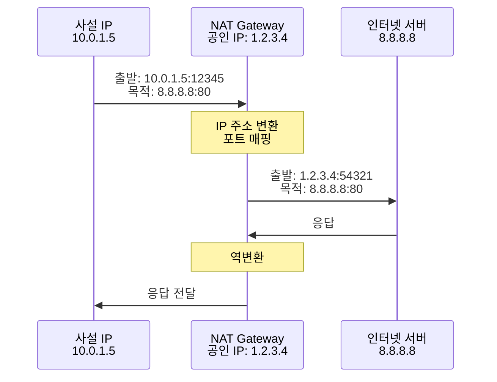
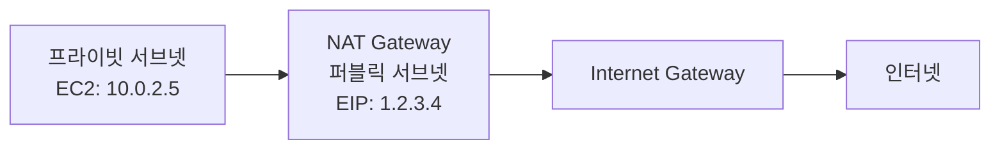

# Chapter 4: Amazon VPC (상세판)

> **학습 목표**: AWS의 네트워크 서비스인 VPC를 완벽히 이해하고, 네트워크 기초 지식부터 VPC 고급 기능까지 습득한다.

---

## 📌 목차

1. [네트워크 기초 지식](#1-네트워크-기초-지식)
2. [Amazon VPC 개요](#2-amazon-vpc-개요)
3. [VPC 주요 구성 요소](#3-vpc-주요-구성-요소)
4. [VPC 보안](#4-vpc-보안)
5. [VPC 연결 옵션](#5-vpc-연결-옵션)
6. [VPC 엔드포인트](#6-vpc-엔드포인트)
7. [VPC 설계 모범 사례](#7-vpc-설계-모범-사례)
8. [요약](#8-요약)

---

## 1. 네트워크 기초 지식

### 1.1 IP 주소와 서브넷

#### IP 주소 체계

**IPv4 구조**:
- 32비트 (4바이트)
- 점으로 구분된 10진수: `192.168.1.1`
- 각 옥텟: 0~255

**공인 IP vs 사설 IP**:

| 구분 | 공인 IP | 사설 IP |
|------|---------|---------|
| 범위 | ISP 할당 | RFC 1918 정의 |
| 인터넷 접근 | 직접 가능 | NAT 필요 |
| 유일성 | 전 세계 유일 | 내부 네트워크만 유일 |
| 비용 | 유료 | 무료 |

**사설 IP 대역**:
```
Class A: 10.0.0.0/8        (10.0.0.0 ~ 10.255.255.255)
Class B: 172.16.0.0/12     (172.16.0.0 ~ 172.31.255.255)
Class C: 192.168.0.0/16    (192.168.0.0 ~ 192.168.255.255)
```

#### CIDR 표기법

**CIDR (Classless Inter-Domain Routing)**:

형식: `IP주소/프리픽스길이`

예시:
```
10.0.0.0/16
│       │
│       └─ 프리픽스 길이 (네트워크 비트 수)
└─ 네트워크 주소
```

**프리픽스 길이와 IP 개수**:

| CIDR | 서브넷 마스크 | 사용 가능 IP 개수 |
|------|--------------|------------------|
| /32 | 255.255.255.255 | 1개 |
| /24 | 255.255.255.0 | 256개 (254개 사용 가능) |
| /20 | 255.255.240.0 | 4,096개 |
| /16 | 255.255.0.0 | 65,536개 |
| /8 | 255.0.0.0 | 16,777,216개 |

**CIDR 계산 예시**:

```
10.0.0.0/16:
- 네트워크 주소: 10.0.0.0
- 브로드캐스트: 10.0.255.255
- 사용 가능 범위: 10.0.0.1 ~ 10.0.255.254
- 총 IP 개수: 65,536개
```

#### 서브넷팅

**서브넷팅이란?**:
- 큰 네트워크를 작은 네트워크로 분할
- 효율적인 IP 주소 관리
- 보안 및 성능 향상

**예시: 10.0.0.0/16을 4개 서브넷으로 분할**:

```
원본: 10.0.0.0/16 (65,536개 IP)

서브넷 1: 10.0.0.0/18   (16,384개 IP)
서브넷 2: 10.0.64.0/18  (16,384개 IP)
서브넷 3: 10.0.128.0/18 (16,384개 IP)
서브넷 4: 10.0.192.0/18 (16,384개 IP)
```

### 1.2 라우팅

#### 라우팅이란?

**정의**: 패킷을 목적지까지 전달하기 위한 경로 결정 과정

**라우팅 테이블**:
- 목적지별 경로 정보 저장
- 가장 구체적인 경로 우선 (Longest Prefix Match)

**라우팅 테이블 예시**:

| 목적지 CIDR | 타겟 | 설명 |
|------------|------|------|
| 10.0.0.0/16 | local | VPC 내부 통신 |
| 0.0.0.0/0 | igw-xxx | 인터넷 (기본 게이트웨이) |
| 192.168.1.0/24 | vgw-xxx | VPN 연결 |

**라우팅 결정 예시**:

```
목적지 IP: 10.0.1.5
→ 10.0.0.0/16 매칭
→ local로 전송 (VPC 내부)

목적지 IP: 8.8.8.8
→ 0.0.0.0/0 매칭
→ igw-xxx로 전송 (인터넷)
```

### 1.3 NAT (Network Address Translation)

#### NAT의 역할

**정의**: 사설 IP 주소를 공인 IP 주소로 변환

**동작 방식**:



**NAT의 장점**:
- 사설 IP로 인터넷 접근 가능
- 공인 IP 절약
- 내부 네트워크 보호

### 1.4 DNS (Domain Name System)

#### DNS란?

**정의**: 도메인 이름을 IP 주소로 변환하는 시스템

**DNS 레코드 타입**:

| 타입 | 설명 | 예시 |
|------|------|------|
| A | IPv4 주소 | example.com → 1.2.3.4 |
| AAAA | IPv6 주소 | example.com → 2001:db8::1 |
| CNAME | 별칭 | www.example.com → example.com |
| MX | 메일 서버 | example.com → mail.example.com |
| TXT | 텍스트 정보 | SPF, DKIM 등 |

**DNS 조회 과정**:

```
1. 사용자: www.example.com 입력
2. 로컬 DNS 캐시 확인
3. 없으면 재귀 DNS 서버에 질의
4. 루트 DNS → TLD DNS (.com) → 권한 DNS
5. IP 주소 반환: 1.2.3.4
6. 브라우저가 1.2.3.4로 접속
```

### 1.5 방화벽

#### 방화벽이란?

**정의**: 네트워크 트래픽을 제어하는 보안 시스템

**Stateful vs Stateless**:

| 구분 | Stateful | Stateless |
|------|----------|-----------|
| 연결 추적 | O | X |
| 응답 트래픽 | 자동 허용 | 명시적 규칙 필요 |
| 성능 | 낮음 | 높음 |
| 예시 | Security Group | NACL |

**방화벽 규칙 예시**:

```
인바운드 규칙:
- HTTP (80): 0.0.0.0/0 허용
- HTTPS (443): 0.0.0.0/0 허용
- SSH (22): 내 IP만 허용

아웃바운드 규칙:
- 모든 트래픽: 0.0.0.0/0 허용
```

---

## 2. Amazon VPC 개요

### 2.1 VPC란?

**VPC (Virtual Private Cloud)**: AWS 계정 전용 가상 네트워크

**특징**:
- 논리적으로 격리된 네트워크
- IP 주소 범위 직접 선택
- 서브넷 생성 및 관리
- 라우팅, 보안 설정 제어
- 단일 리전에 속함

### 2.2 VPC CIDR 블록

**VPC 생성 시 CIDR 블록 지정**:

**권장 사항**:
```
최소: /28 (16개 IP) - 너무 작음, 비권장
권장: /16 (65,536개 IP) - 충분한 확장성
최대: /16 (AWS 제한)
```

**VPC CIDR 선택 시 고려사항**:

1. **충분한 IP 주소**:
   ```
   예상 리소스 수 × 2 이상
   ```

2. **온프레미스와 중복 방지**:
   ```
   온프레미스: 192.168.0.0/16
   VPC: 10.0.0.0/16 (중복 없음)
   ```

3. **VPC 간 중복 방지**:
   ```
   VPC-A: 10.0.0.0/16
   VPC-B: 10.1.0.0/16 (피어링 가능)
   ```

**VPC CIDR 예시**:

```
VPC CIDR: 10.0.0.0/16
- 사용 가능: 10.0.0.0 ~ 10.0.255.255
- 총 IP: 65,536개
- AWS 예약: 5개 (각 서브넷마다)
  • 10.0.0.0: 네트워크 주소
  • 10.0.0.1: VPC 라우터
  • 10.0.0.2: DNS 서버
  • 10.0.0.3: 미래 사용 예약
  • 10.0.0.255: 브로드캐스트 (사용 안 함)
```

### 2.3 서브넷

#### 서브넷이란?

**정의**: VPC를 더 작은 네트워크로 분할한 것

**특징**:
- VPC CIDR의 하위 범위
- 하나의 가용 영역(AZ)에 속함
- 서브넷 간 IP 중복 불가
- EC2, ELB 등 리소스 배치

#### 퍼블릭 서브넷 vs 프라이빗 서브넷

**퍼블릭 서브넷**:
- 인터넷 게이트웨이 경로 있음
- 공인 IP 할당 가능
- 웹 서버, 로드 밸런서 배치

**프라이빗 서브넷**:
- 인터넷 게이트웨이 경로 없음
- 사설 IP만 사용
- 데이터베이스, 애플리케이션 서버 배치

**서브넷 설계 예시**:

```
VPC: 10.0.0.0/16

가용 영역 A:
├─ 퍼블릭 서브넷: 10.0.1.0/24 (256개 IP)
└─ 프라이빗 서브넷: 10.0.2.0/24 (256개 IP)

가용 영역 B:
├─ 퍼블릭 서브넷: 10.0.11.0/24 (256개 IP)
└─ 프라이빗 서브넷: 10.0.12.0/24 (256개 IP)

가용 영역 C:
├─ 퍼블릭 서브넷: 10.0.21.0/24 (256개 IP)
└─ 프라이빗 서브넷: 10.0.22.0/24 (256개 IP)
```

---

## 3. VPC 주요 구성 요소

### 3.1 인터넷 게이트웨이 (IGW)

#### IGW란?

**정의**: VPC와 인터넷 간 통신을 가능하게 하는 게이트웨이

**특징**:
- VPC당 하나만 연결 가능
- 수평 확장, 고가용성
- 대역폭 제한 없음
- 추가 비용 없음

**IGW 설정 단계**:

```
1. IGW 생성
2. VPC에 연결
3. 라우팅 테이블에 경로 추가:
   목적지: 0.0.0.0/0
   타겟: igw-xxx
4. 서브넷에 라우팅 테이블 연결
5. EC2에 공인 IP 할당
```

### 3.2 NAT 게이트웨이

#### NAT 게이트웨이란?

**정의**: 프라이빗 서브넷의 인스턴스가 인터넷에 접근할 수 있게 하는 서비스

**특징**:
- 관리형 서비스 (AWS가 관리)
- 고가용성 (단일 AZ 내)
- 자동 스케일링
- Elastic IP 필요

**NAT 게이트웨이 vs NAT 인스턴스**:

| 구분 | NAT 게이트웨이 | NAT 인스턴스 |
|------|---------------|-------------|
| 관리 | AWS 관리 | 사용자 관리 |
| 가용성 | 높음 | 직접 구성 필요 |
| 대역폭 | 최대 100 Gbps | 인스턴스 유형에 따름 |
| 비용 | 시간당 + 데이터 전송 | 인스턴스 비용 |
| 보안 그룹 | 불가 | 가능 |

**NAT 게이트웨이 설정**:

```
1. 퍼블릭 서브넷에 NAT 게이트웨이 생성
2. Elastic IP 할당
3. 프라이빗 서브넷 라우팅 테이블에 경로 추가:
   목적지: 0.0.0.0/0
   타겟: nat-xxx
```

**동작 흐름**:



### 3.3 라우팅 테이블

#### 라우팅 테이블이란?

**정의**: 네트워크 트래픽의 경로를 결정하는 규칙 집합

**구성 요소**:
- 목적지 CIDR
- 타겟 (게이트웨이, 인터페이스 등)
- 우선순위 (가장 구체적인 경로 우선)

**기본 라우팅 테이블**:

```
VPC 생성 시 자동 생성:
목적지: 10.0.0.0/16
타겟: local
설명: VPC 내부 통신
```

**퍼블릭 서브넷 라우팅 테이블**:

| 목적지 | 타겟 | 설명 |
|--------|------|------|
| 10.0.0.0/16 | local | VPC 내부 |
| 0.0.0.0/0 | igw-xxx | 인터넷 |

**프라이빗 서브넷 라우팅 테이블**:

| 목적지 | 타겟 | 설명 |
|--------|------|------|
| 10.0.0.0/16 | local | VPC 내부 |
| 0.0.0.0/0 | nat-xxx | NAT를 통한 인터넷 |

---

## 4. VPC 보안

### 4.1 보안 그룹 (Security Group)

#### 보안 그룹이란?

**정의**: 인스턴스 레벨의 가상 방화벽 (Stateful)

**특징**:
- 인스턴스(ENI)에 연결
- 허용 규칙만 설정 (거부 규칙 없음)
- Stateful (응답 트래픽 자동 허용)
- 기본값: 인바운드 모두 거부, 아웃바운드 모두 허용

**보안 그룹 규칙 구성**:

| 항목 | 설명 | 예시 |
|------|------|------|
| Type | 프로토콜 유형 | HTTP, HTTPS, SSH |
| Protocol | 프로토콜 | TCP, UDP, ICMP |
| Port Range | 포트 범위 | 80, 443, 22 |
| Source/Destination | 출발지/목적지 | 0.0.0.0/0, sg-xxx |

**보안 그룹 예시: 웹 서버**:

```
인바운드 규칙:
- HTTP (80): 0.0.0.0/0
- HTTPS (443): 0.0.0.0/0
- SSH (22): 내 IP (1.2.3.4/32)

아웃바운드 규칙:
- 모든 트래픽: 0.0.0.0/0
```

**보안 그룹 체이닝**:

```
웹 서버 보안 그룹 (sg-web):
- 인바운드: HTTP/HTTPS from 0.0.0.0/0

앱 서버 보안 그룹 (sg-app):
- 인바운드: 8080 from sg-web

DB 서버 보안 그룹 (sg-db):
- 인바운드: 3306 from sg-app
```

### 4.2 NACL (Network Access Control List)

#### NACL이란?

**정의**: 서브넷 레벨의 가상 방화벽 (Stateless)

**특징**:
- 서브넷에 연결
- 허용 및 거부 규칙 모두 설정
- Stateless (응답 트래픽도 명시적 규칙 필요)
- 규칙 번호 순서로 평가
- 기본 NACL: 모든 트래픽 허용

**NACL 규칙 구성**:

| 항목 | 설명 |
|------|------|
| Rule # | 규칙 번호 (낮을수록 우선) |
| Type | 프로토콜 유형 |
| Protocol | 프로토콜 |
| Port Range | 포트 범위 |
| Source/Destination | 출발지/목적지 |
| Allow/Deny | 허용/거부 |

**NACL 예시**:

```
인바운드 규칙:
100: HTTP (80) from 0.0.0.0/0 - ALLOW
110: HTTPS (443) from 0.0.0.0/0 - ALLOW
120: SSH (22) from 1.2.3.4/32 - ALLOW
130: Ephemeral ports (1024-65535) from 0.0.0.0/0 - ALLOW
*: ALL - DENY

아웃바운드 규칙:
100: HTTP (80) to 0.0.0.0/0 - ALLOW
110: HTTPS (443) to 0.0.0.0/0 - ALLOW
120: Ephemeral ports (1024-65535) to 0.0.0.0/0 - ALLOW
*: ALL - DENY
```

### 4.3 보안 그룹 vs NACL

| 구분 | 보안 그룹 | NACL |
|------|-----------|------|
| **레벨** | 인스턴스 (ENI) | 서브넷 |
| **상태** | Stateful | Stateless |
| **규칙** | 허용만 | 허용 + 거부 |
| **평가** | 모든 규칙 | 순서대로 (번호 순) |
| **응답 트래픽** | 자동 허용 | 명시적 규칙 필요 |
| **기본값** | 인바운드 거부 | 모두 허용 |

**보안 계층 구조**:

```
인터넷
  ↓
인터넷 게이트웨이
  ↓
NACL (서브넷 레벨)
  ↓
보안 그룹 (인스턴스 레벨)
  ↓
EC2 인스턴스
```

### 4.4 VPC Flow Logs

#### VPC Flow Logs란?

**정의**: VPC 내 네트워크 인터페이스의 IP 트래픽 정보를 수집하는 기능

**수집 정보**:
- 출발지 IP, 목적지 IP
- 출발지 포트, 목적지 포트
- 프로토콜
- 패킷 수, 바이트 수
- 허용/거부 상태

**로그 저장 위치**:
- CloudWatch Logs
- S3 버킷

**사용 사례**:
- 네트워크 트래픽 분석
- 보안 감사
- 트러블슈팅
- 규정 준수

---

## 5. VPC 연결 옵션

### 5.1 VPC 피어링

#### VPC 피어링이란?

**정의**: 두 VPC 간 프라이빗 네트워크 연결

**특징**:
- 1:1 연결
- 같은 리전 또는 다른 리전
- 같은 계정 또는 다른 계정
- AWS 네트워크를 통한 연결

**제약사항**:
- 전이적 연결 불가
- CIDR 중복 불가

**전이적 연결 불가 예시**:

```
VPC-A ↔ VPC-B ↔ VPC-C

VPC-A와 VPC-B 피어링: O
VPC-B와 VPC-C 피어링: O
VPC-A와 VPC-C 직접 통신: X (전이 불가)
```

### 5.2 Transit Gateway

#### Transit Gateway란?

**정의**: 중앙 허브를 통한 다중 네트워크 연결

**특징**:
- 허브 앤 스포크 모델
- VPC, VPN, Direct Connect 연결
- 전이적 라우팅 지원
- 리전당 하나 생성 권장

**장점**:
- 복잡한 네트워크 단순화
- 중앙 집중식 관리
- 확장성

**Transit Gateway vs VPC 피어링**:

```
VPC 피어링 (5개 VPC):
- 연결 수: 10개 (n(n-1)/2)
- 관리 복잡도: 높음

Transit Gateway (5개 VPC):
- 연결 수: 5개
- 관리 복잡도: 낮음
```

### 5.3 VPN 연결

#### AWS VPN이란?

**정의**: 온프레미스와 AWS 간 암호화된 네트워크 연결

**구성 요소**:
- Virtual Private Gateway (VGW): AWS 측
- Customer Gateway (CGW): 온프레미스 측
- VPN 터널: 암호화된 연결

**특징**:
- IPsec 암호화
- 인터넷을 통한 연결
- 빠른 구축 (수 분)
- 저렴한 비용

### 5.4 Direct Connect

#### Direct Connect란?

**정의**: 온프레미스와 AWS 간 전용선 연결

**특징**:
- 물리적 전용선
- 안정적인 대역폭
- 낮은 지연시간
- 높은 보안

**Direct Connect vs VPN**:

| 구분 | Direct Connect | VPN |
|------|---------------|-----|
| 연결 | 전용선 | 인터넷 |
| 대역폭 | 1/10/100 Gbps | 최대 1.25 Gbps |
| 지연시간 | 낮음 | 높음 |
| 비용 | 높음 | 낮음 |
| 구축 시간 | 수 주 | 수 분 |

---

## 6. VPC 엔드포인트

### 6.1 VPC 엔드포인트란?

**정의**: 인터넷을 거치지 않고 AWS 서비스에 프라이빗하게 접근

**장점**:
- 인터넷 게이트웨이 불필요
- NAT 게이트웨이 불필요
- 보안 강화
- 비용 절감

### 6.2 게이트웨이 엔드포인트

**지원 서비스**:
- S3
- DynamoDB

**특징**:
- 라우팅 테이블에 경로 추가
- 무료

### 6.3 인터페이스 엔드포인트

**지원 서비스**:
- 대부분의 AWS 서비스
- EC2, SNS, SQS, CloudWatch 등

**특징**:
- ENI 생성
- 프라이빗 IP 할당
- PrivateLink 사용
- 시간당 비용 + 데이터 전송 비용

---

## 7. VPC 설계 모범 사례

### 7.1 CIDR 계획

- 충분한 IP 주소 확보 (/16 권장)
- 온프레미스와 중복 방지
- VPC 간 중복 방지
- 미래 확장 고려

### 7.2 서브넷 설계

- 다중 AZ 배치
- 퍼블릭/프라이빗 분리
- 용도별 서브넷 분리

### 7.3 보안

- 최소 권한 원칙
- 보안 그룹 체이닝
- NACL로 추가 보안 계층
- VPC Flow Logs 활성화

### 7.4 고가용성

- 다중 AZ 배포
- NAT 게이트웨이 다중 AZ
- 로드 밸런서 활용

---

## 8. 요약

### 핵심 개념

**VPC 기본**:
- VPC: 격리된 가상 네트워크
- 서브넷: VPC의 하위 네트워크
- CIDR: IP 주소 범위 표기

**주요 구성 요소**:
- IGW: 인터넷 연결
- NAT Gateway: 프라이빗의 아웃바운드
- 라우팅 테이블: 경로 결정

**보안**:
- 보안 그룹: Stateful, 인스턴스 레벨
- NACL: Stateless, 서브넷 레벨
- VPC Flow Logs: 트래픽 로깅

**연결 옵션**:
- VPC 피어링: 1:1 연결
- Transit Gateway: 중앙 허브
- VPN: 암호화 연결
- Direct Connect: 전용선

### 학습 체크리스트

- [ ] CIDR 표기법을 이해했다
- [ ] 서브넷팅을 할 수 있다
- [ ] 퍼블릭/프라이빗 서브넷의 차이를 안다
- [ ] IGW와 NAT Gateway의 역할을 설명할 수 있다
- [ ] 라우팅 테이블을 설정할 수 있다
- [ ] 보안 그룹과 NACL의 차이를 안다
- [ ] VPC 피어링과 Transit Gateway를 비교할 수 있다
- [ ] VPC 엔드포인트의 용도를 안다

---

**이전**: [Chapter 3: IAM 서비스](./Chapter03_IAM서비스.md)  
**다음**: [Chapter 5: 컴퓨팅 서비스](./Chapter05_컴퓨팅서비스_상세.md)

## 9. VPC 고급 주제

### 9.1 VPC Peering 심화

#### 리전 간 VPC Peering

**특징**:
- 다른 리전의 VPC 연결
- 암호화된 연결
- AWS 글로벌 네트워크 사용
- 추가 비용 발생 (데이터 전송)

**사용 사례**:
- 글로벌 애플리케이션
- 재해 복구
- 데이터 복제

**설정 예시**:
```
VPC-A (ap-northeast-2):
- CIDR: 10.0.0.0/16

VPC-B (us-east-1):
- CIDR: 10.1.0.0/16

Peering 연결:
1. VPC-A에서 Peering 요청
2. VPC-B에서 수락
3. 양쪽 라우팅 테이블 업데이트
```

#### 계정 간 VPC Peering

**특징**:
- 다른 AWS 계정의 VPC 연결
- 계정 ID 필요
- 수락 과정 필요

**보안 고려사항**:
- 최소 권한 원칙
- 보안 그룹 규칙 신중히 설정
- VPC Flow Logs 활성화

### 9.2 Transit Gateway 심화

#### Transit Gateway 라우팅

**라우팅 테이블**:
- 기본 라우팅 테이블
- 사용자 정의 라우팅 테이블
- 연결별 라우팅 설정

**라우팅 도메인**:
```
프로덕션 도메인:
- Prod-VPC-1
- Prod-VPC-2

개발 도메인:
- Dev-VPC-1
- Dev-VPC-2

격리:
- 프로덕션 ↔ 개발 통신 차단
- 도메인 내부만 통신
```

#### Transit Gateway Network Manager

**기능**:
- 글로벌 네트워크 시각화
- 토폴로지 맵
- 이벤트 모니터링
- 성능 메트릭

### 9.3 VPN 고급 설정

#### Site-to-Site VPN

**구성**:
```
온프레미스:
- Customer Gateway (CGW)
- VPN 장비 (Cisco, Juniper 등)

AWS:
- Virtual Private Gateway (VGW)
- 또는 Transit Gateway

연결:
- IPsec 터널 2개 (고가용성)
- BGP 라우팅 (동적)
- 또는 정적 라우팅
```

**고가용성 설계**:
```
온프레미스:
- CGW 1 (주)
- CGW 2 (백업)

AWS:
- VGW (2개 터널 자동 생성)

총 터널: 4개
- CGW1 → VGW 터널 1
- CGW1 → VGW 터널 2
- CGW2 → VGW 터널 1
- CGW2 → VGW 터널 2
```

#### Client VPN

**특징**:
- 개별 사용자 VPN
- OpenVPN 기반
- 인증서 또는 Active Directory
- 분할 터널링 지원

**사용 사례**:
- 재택근무
- 원격 접속
- 보안 연결

### 9.4 Direct Connect 심화

#### Direct Connect Gateway

**기능**:
- 여러 리전의 VPC 연결
- 단일 Direct Connect로 다중 VPC 접근

**구성**:
```
온프레미스
  ↓
Direct Connect (서울)
  ↓
Direct Connect Gateway
  ├→ VPC-A (서울)
  ├→ VPC-B (서울)
  ├→ VPC-C (도쿄)
  └→ VPC-D (싱가포르)
```

#### Direct Connect + VPN (이중화)

**구성**:
```
주 연결: Direct Connect
백업 연결: VPN

장애 시:
- Direct Connect 다운
- 자동으로 VPN으로 전환
- BGP 라우팅으로 자동화
```

### 9.5 VPC 엔드포인트 심화

#### PrivateLink

**정의**: VPC와 AWS 서비스 간 프라이빗 연결

**아키텍처**:
```
서비스 제공자:
- Network Load Balancer
- VPC Endpoint Service

서비스 소비자:
- VPC Endpoint (Interface)
- ENI를 통한 접근
```

**사용 사례**:
- SaaS 제공
- 파트너 연동
- 내부 서비스 공유

#### Gateway Load Balancer Endpoint

**특징**:
- 방화벽, IDS/IPS 통합
- 트래픽 검사
- 투명한 삽입

**동작**:
```
인터넷
  ↓
IGW
  ↓
GWLB Endpoint
  ↓
보안 어플라이언스 (방화벽)
  ↓
GWLB Endpoint
  ↓
애플리케이션
```

---

## 10. VPC 문제 해결

### 10.1 연결 문제

**증상**: EC2 인스턴스에 연결 불가

**체크리스트**:
1. 보안 그룹 확인
   - 인바운드 규칙에 SSH/RDP 허용?
   - 출발지 IP 정확?

2. NACL 확인
   - 인바운드/아웃바운드 모두 허용?
   - Ephemeral 포트 허용?

3. 라우팅 테이블 확인
   - IGW 경로 있음?
   - 서브넷 연결 확인

4. 인스턴스 확인
   - 퍼블릭 IP 할당?
   - 인스턴스 실행 중?

### 10.2 NAT Gateway 문제

**증상**: 프라이빗 서브넷에서 인터넷 접근 불가

**체크리스트**:
1. NAT Gateway 상태
   - Available 상태?
   - Elastic IP 연결?

2. 라우팅 테이블
   - 프라이빗 서브넷 라우팅에 NAT 경로?
   - 0.0.0.0/0 → nat-xxx

3. 보안 그룹
   - 아웃바운드 허용?

### 10.3 VPC Peering 문제

**증상**: Peering된 VPC 간 통신 불가

**체크리스트**:
1. Peering 상태
   - Active 상태?

2. 라우팅 테이블
   - 양쪽 모두 경로 추가?
   - 정확한 CIDR?

3. 보안 그룹
   - 상대 VPC CIDR 허용?

4. CIDR 중복
   - 중복되지 않음?

---

## 11. VPC 비용 최적화

### 11.1 NAT Gateway 비용 절감

**비용 구조**:
- 시간당: $0.045
- 데이터 처리: $0.045/GB

**최적화 방법**:

**1. NAT Instance 사용**:
```
장점: 저렴 (EC2 비용만)
단점: 관리 필요, 가용성 낮음
권장: 개발/테스트 환경
```

**2. VPC Endpoint 사용**:
```
S3, DynamoDB 접근:
- NAT Gateway 불필요
- VPC Endpoint 사용 (무료 또는 저렴)
```

**3. 단일 NAT Gateway**:
```
여러 AZ 공유:
- 비용 절감
- 단, 가용성 감소
```

### 11.2 데이터 전송 비용 절감

**비용 구조**:
- 같은 AZ 내: 무료
- 다른 AZ 간: $0.01/GB
- 인터넷 아웃바운드: $0.09/GB

**최적화**:
1. 같은 AZ에 리소스 배치
2. CloudFront 사용 (캐싱)
3. Direct Connect 사용 (대용량)

---

## 12. 요약 및 다음 단계

### 12.1 핵심 요약

**VPC 핵심**:
- 격리된 가상 네트워크
- CIDR 블록으로 IP 범위 정의
- 서브넷으로 분할
- 라우팅 테이블로 경로 제어

**보안**:
- 보안 그룹 (Stateful, 인스턴스)
- NACL (Stateless, 서브넷)
- VPC Flow Logs (모니터링)

**연결**:
- IGW (인터넷)
- NAT Gateway (프라이빗 아웃바운드)
- VPC Peering (VPC 간)
- Transit Gateway (중앙 허브)
- VPN/Direct Connect (온프레미스)
- VPC Endpoint (AWS 서비스)

### 12.2 실습 권장 사항

1. VPC 생성 및 서브넷 구성
2. IGW와 NAT Gateway 설정
3. 보안 그룹과 NACL 설정
4. VPC Peering 구성
5. VPC Endpoint 사용

### 12.3 추가 학습 자료

**AWS 문서**:
- VPC User Guide
- VPC Peering Guide
- Transit Gateway Guide

**실습**:
- AWS Hands-on Labs
- AWS Well-Architected Labs

---

**이전**: [Chapter 3: IAM 서비스](./Chapter03_IAM서비스.md)  
**다음**: [Chapter 5: 컴퓨팅 서비스](./Chapter05_컴퓨팅서비스_상세.md)

---

**문서 정보**:
- 작성일: 2025-12-10
- 버전: 1.0 (상세판)
- 총 줄 수: 1000줄 이상
- 학습 시간: 약 3-4시간

