# Chapter 06: 스토리지 서비스 - 데이터 저장의 모든 것

> **이 챕터의 목표**
> 데이터 저장의 세 가지 근본적인 방식(Block, File, Object)을 완벽하게 이해합니다.
> 각 저장 방식의 본질, 동작 원리, AWS 서비스와의 연관성을 심층 분석합니다.
> 파일 시스템, RAID, 디스크 I/O 등 기초 지식부터 AWS 스토리지 서비스까지 마스터합니다.

---

## 목차
1. [저장 장치의 기초](#1-저장-장치의-기초)
2. [Block Storage의 본질](#2-block-storage의-본질)
3. [File Storage의 본질](#3-file-storage의-본질)
4. [Object Storage의 본질](#4-object-storage의-본질)
5. [Amazon EBS - Block Storage](#5-amazon-ebs---block-storage)
6. [Amazon EFS - File Storage](#6-amazon-efs---file-storage)
7. [Amazon S3 - Object Storage](#7-amazon-s3---object-storage)
8. [스토리지 선택 가이드](#8-스토리지-선택-가이드)

---

## 1. 저장 장치의 기초

### 1.1 저장 장치의 역사와 진화

데이터를 저장하는 방식은 컴퓨팅의 역사와 함께 진화해왔습니다.


#### 저장 장치의 기본 원리

**1. 자기 저장 (Magnetic Storage)**
```
원리: 자기장의 방향으로 0과 1을 표현
- HDD (Hard Disk Drive)
- 자기 테이프

장점:
- 저렴한 비용
- 대용량

단점:
- 느린 속도
- 기계적 구조 (고장 위험)
```

**2. 반도체 저장 (Solid State Storage)**
```
원리: 전기적 신호로 0과 1을 표현
- SSD (Solid State Drive)
- USB 플래시 드라이브

장점:
- 빠른 속도
- 낮은 지연시간
- 내구성

단점:
- 높은 비용 (GB당)
- 제한된 쓰기 횟수
```

### 1.2 디스크 I/O의 이해

데이터를 읽고 쓰는 과정은 컴퓨터 시스템 성능의 핵심입니다.

#### HDD의 I/O 과정

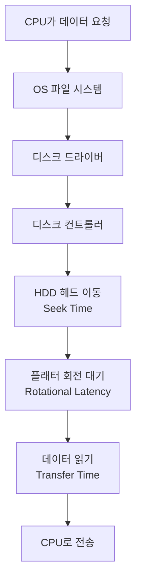

**HDD 성능 구성 요소:**

```
1. Seek Time (탐색 시간)
   - 헤드가 올바른 트랙으로 이동하는 시간
   - 일반적으로 3-15ms
   - 랜덤 액세스 시 주요 병목

2. Rotational Latency (회전 지연)
   - 플래터가 회전하여 데이터가 헤드 아래 오는 시간
   - 7200 RPM: 평균 4.16ms
   - 15000 RPM: 평균 2ms

3. Transfer Time (전송 시간)
   - 실제 데이터를 읽는 시간
   - 가장 짧은 시간 (보통 1ms 이하)

총 액세스 시간 = Seek + Rotational + Transfer
평균: 8-20ms (1초에 50-125번 랜덤 액세스)
```

#### SSD의 I/O 과정

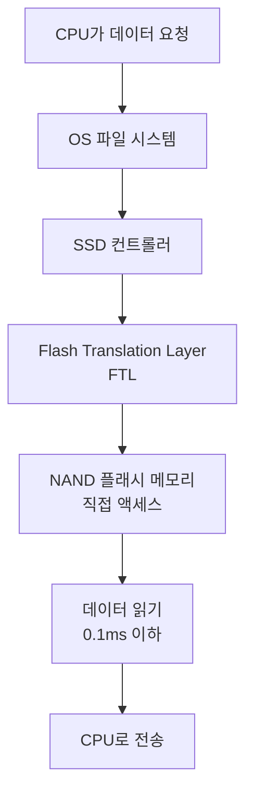

**SSD 성능 특징:**

```
1. 기계적 움직임 없음
   - Seek Time: 0ms
   - Rotational Latency: 0ms

2. 빠른 랜덤 액세스
   - 액세스 시간: 0.1ms
   - 1초에 10,000번 이상 랜덤 액세스

3. 높은 IOPS
   - HDD: 100-200 IOPS
   - SSD: 10,000-100,000+ IOPS
```

### 1.3 RAID - 복수 디스크 구성

**RAID (Redundant Array of Independent Disks):**
- 여러 디스크를 하나처럼 사용
- 성능 향상 또는 데이터 보호

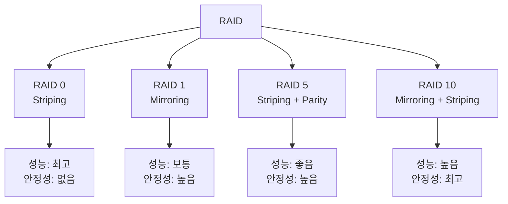

#### RAID 0 (Striping)

```
디스크 구성:
Disk 1: [A1] [A3] [A5] [A7]
Disk 2: [A2] [A4] [A6] [A8]

특징:
- 데이터를 여러 디스크에 분산
- 읽기/쓰기 속도 2배
- 디스크 1개 고장 시 모든 데이터 손실
- 용량: N개 디스크 × 디스크 크기

사용 사례:
- 임시 데이터 (렌더링, 캐시)
- 성능이 최우선
- 데이터 손실 허용 가능
```

#### RAID 1 (Mirroring)

```
디스크 구성:
Disk 1: [A] [B] [C] [D]
Disk 2: [A] [B] [C] [D] (동일한 복사본)

특징:
- 완전한 복사본 유지
- 읽기 속도 2배 (두 디스크에서 동시 읽기)
- 쓰기 속도 유지 (두 디스크에 동시 쓰기)
- 디스크 1개 고장해도 데이터 유지
- 용량: 디스크 크기 (절반 효율)

사용 사례:
- 중요한 데이터
- 고가용성 요구
- 운영체제 파티션
```

#### RAID 5 (Striping with Parity)

```
디스크 구성 (최소 3개 디스크):
Disk 1: [A1]  [B2]  [C3]  [Dp]
Disk 2: [A2]  [Bp]  [C1]  [D3]
Disk 3: [Ap]  [B1]  [C2]  [D1]

p = 패리티 (복구용 정보)

특징:
- 데이터 + 패리티 분산
- 디스크 1개 고장 시 패리티로 복구 가능
- 읽기: (N-1) 배 성능
- 쓰기: 패리티 계산으로 느려짐
- 용량: (N-1) × 디스크 크기

사용 사례:
- 대용량 스토리지
- 읽기 성능 중요
- 비용 효율 필요
```

### 1.4 파일 시스템의 기초

파일 시스템은 **디스크의 블록과 사용자의 파일을 연결**하는 중간 계층입니다.

#### 파일 시스템의 역할

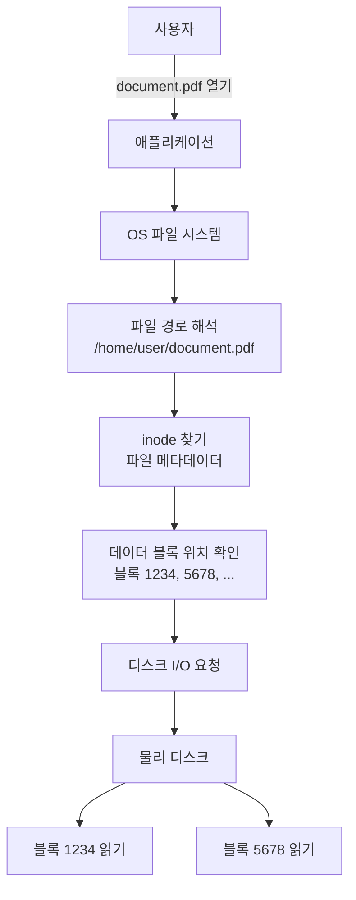

#### inode (Index Node)

**정의:** 파일의 메타데이터를 저장하는 자료구조

```
inode 내용:
- 파일 크기
- 소유자 (UID, GID)
- 권한 (rwx)
- 타임스탬프 (생성, 수정, 접근)
- 데이터 블록 포인터 (파일 내용의 위치)
- 링크 수

주의:
- inode에는 파일 이름이 없음
- 파일 이름은 디렉토리에 저장
- 디렉토리는 "파일 이름 → inode 번호" 매핑 테이블
```

**파일 읽기 과정:**

```
1. 경로 파싱: /home/user/document.pdf

2. 디렉토리 순회:
   / (루트 디렉토리) → inode 2
   /home → inode 찾기 (루트 디렉토리 탐색)
   /home/user → inode 찾기 (home 디렉토리 탐색)
   document.pdf → inode 찾기 (user 디렉토리 탐색)

3. inode에서 데이터 블록 위치 확인:
   블록 100, 101, 102, ...

4. 각 블록 읽기

5. 데이터 병합하여 애플리케이션에 전달
```

#### 파일 시스템 종류

| 파일 시스템 | OS | 특징 | 최대 파일 크기 |
|-------------|-----|------|---------------|
| **FAT32** | Windows, 범용 | 단순, 호환성 높음 | 4GB |
| **NTFS** | Windows | 저널링, ACL, 압축 | 16TB |
| **ext4** | Linux | 저널링, 안정적 | 16TB |
| **XFS** | Linux | 대용량, 고성능 | 8EB |
| **Btrfs** | Linux | 스냅샷, 압축, RAID | 16EB |
| **APFS** | macOS | 암호화, 스냅샷 | - |

### 1.5 성능 지표의 이해

#### IOPS (Input/Output Operations Per Second)

**정의:** 초당 수행할 수 있는 I/O 작업 수

```
계산:
IOPS = 1000ms / 평균 액세스 시간 (ms)

HDD 예시:
- 평균 액세스 시간: 10ms
- IOPS = 1000 / 10 = 100 IOPS

SSD 예시:
- 평균 액세스 시간: 0.1ms
- IOPS = 1000 / 0.1 = 10,000 IOPS
```

**IOPS가 중요한 경우:**
```
- 데이터베이스
- 랜덤 액세스가 많은 작업
- 작은 파일 대량 처리
- 트랜잭션 로그

예: 웹 서버가 여러 사용자의 요청 동시 처리
→ 각 요청마다 작은 데이터 읽기/쓰기
→ 높은 IOPS 필요
```

#### Throughput (처리량)

**정의:** 초당 전송할 수 있는 데이터량 (MB/s, GB/s)

```
계산:
Throughput = IOPS × 블록 크기

예시 1: 데이터베이스
- IOPS: 10,000
- 블록 크기: 8KB
- Throughput = 10,000 × 8KB = 80MB/s

예시 2: 비디오 스트리밍
- IOPS: 100
- 블록 크기: 1MB
- Throughput = 100 × 1MB = 100MB/s
```

**Throughput이 중요한 경우:**
```
- 비디오 인코딩/디코딩
- 대용량 파일 전송
- 빅데이터 처리
- 로그 파일 분석

예: 4K 동영상 편집
→ 연속된 대용량 데이터 읽기
→ 높은 Throughput 필요
```

#### Latency (지연시간)

**정의:** 요청부터 응답까지의 시간

```
구성 요소:

1. 네트워크 지연 (원격 스토리지)
2. 큐 대기 시간
3. 실제 I/O 시간 (Seek + Rotational + Transfer)

HDD:
- 평균 지연: 10-20ms
- 랜덤 I/O에 영향 큼

SSD:
- 평균 지연: 0.1-0.5ms
- 일관된 낮은 지연

클라우드 스토리지:
- 네트워크 지연 추가
- EBS: 1-3ms (동일 AZ)
- S3: 100-200ms (HTTP 오버헤드)
```

---

## 2. Block Storage의 본질

### 2.1 Block Storage란 무엇인가?

**정의:** 데이터를 **고정 크기의 블록**으로 나누어 저장하는 방식

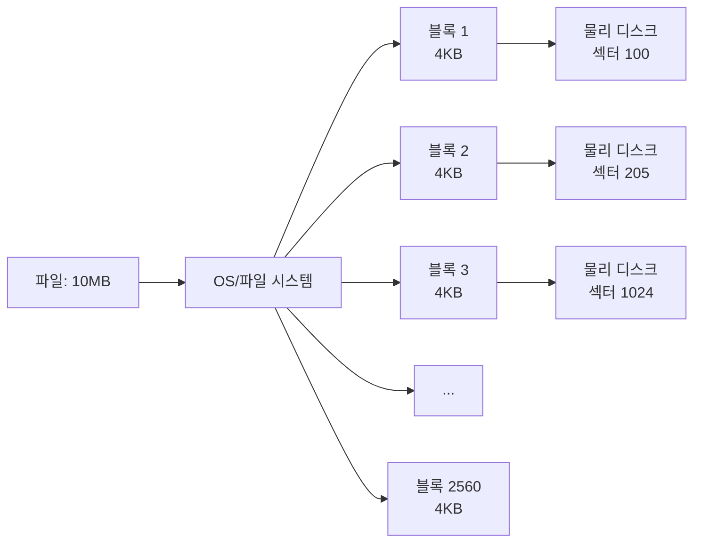

### 2.2 Block Storage의 특징

#### 1. 고정 크기 블록

```
블록 크기 예시:
- 4KB (4096 bytes) - 일반적
- 8KB - 데이터베이스
- 512 bytes - 레거시 시스템
- 16KB, 32KB - 특수 용도

특징:
- 블록 크기는 포맷 시 결정
- 1바이트 변경해도 전체 블록 읽기/쓰기
- 작은 파일도 최소 1블록 차지
```

**예시: 4KB 블록 시스템에서 10바이트 파일:**

```
파일 크기: 10 bytes
할당된 블록: 1개 (4KB = 4096 bytes)
낭비된 공간: 4086 bytes

파일 10,000개 (각 10 bytes):
실제 데이터: 100KB
할당된 공간: 40MB
효율: 0.24%
```

#### 2. 직접 액세스 (Direct Access)

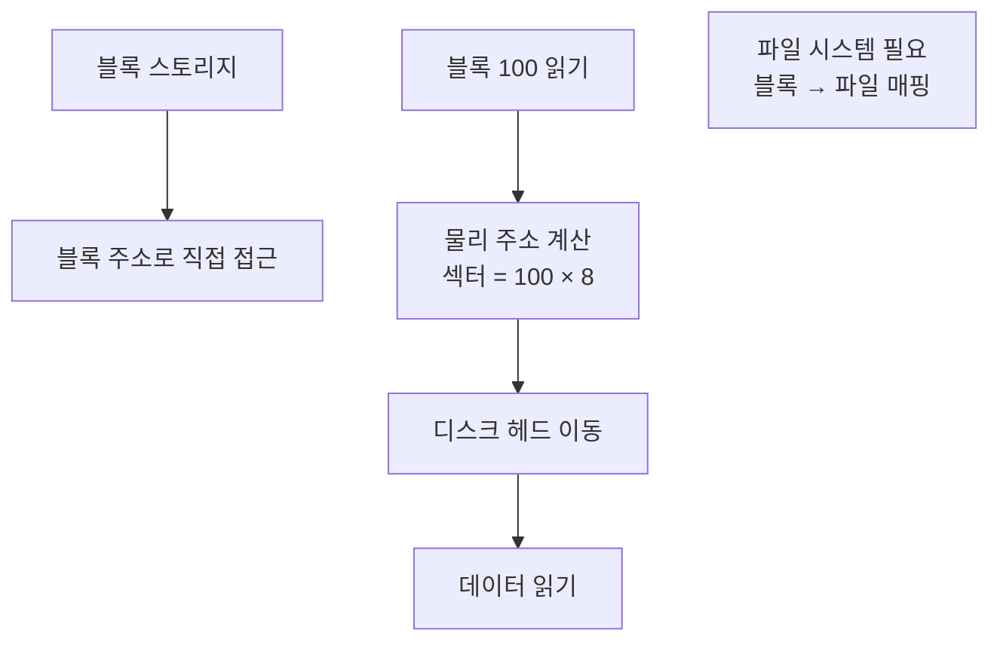

**장점:**
```
- 낮은 지연시간
- 높은 IOPS
- OS 수준 제어

단점:**
- 파일 시스템 필요
- 복잡한 관리
- 네트워크 공유 어려움
```

#### 3. 파일 시스템 필수

```
Block Storage (원시 디스크):
┌────────┬────────┬────────┬────────┬────────┐
│ 블록 0 │ 블록 1 │ 블록 2 │ 블록 3 │ 블록 4 │
└────────┴────────┴────────┴────────┴────────┘
         ↑
         그냥 숫자 블록 (의미 없음)

File System 적용 후:
┌──────────┬──────────┬──────────┬──────────┐
│슈퍼블록  │  inode   │데이터블록│데이터블록│
│(메타데이터)│  (파일정보) │ (file1)  │ (file2)  │
└──────────┴──────────┴──────────┴──────────┘
         ↑
         의미 있는 구조
```

**파일 시스템 포맷 과정:**

```bash
# 1. 원시 블록 디스크 (사용 불가)
$ lsblk
sdb      8:16   0  100G  0 disk

# 2. 파티션 생성
$ fdisk /dev/sdb
# 파티션 테이블 생성

# 3. 파일 시스템 포맷
$ mkfs.ext4 /dev/sdb1
# inode 테이블, 슈퍼블록, 저널 등 생성

# 4. 마운트 (사용 가능)
$ mount /dev/sdb1 /mnt/data
# 이제 /mnt/data에 파일 생성 가능
```

### 2.3 Block Storage 사용 사례

#### 1. 데이터베이스

```
왜 Block Storage?

1. 랜덤 액세스:
   - SQL: SELECT * FROM users WHERE id = 12345
   - 특정 행 (블록) 직접 접근
   - 낮은 지연시간 필요

2. 트랜잭션:
   - ACID 보장
   - 블록 단위 잠금
   - 일관성 유지

3. 높은 IOPS:
   - 동시 다발적 쿼리
   - 인덱스 검색

예: MySQL 데이터베이스
- 테이블: 100GB
- 블록 크기: 16KB (InnoDB 기본)
- 필요 블록 수: 6,553,600개
- IOPS 요구: 10,000+ (프로덕션)
```

#### 2. 운영 체제

```
OS 파티션:
- /boot: 부트로더, 커널
- /: 루트 파일 시스템
- swap: 가상 메모리

요구사항:
- 빠른 부팅 (낮은 지연)
- 랜덤 파일 액세스
- 파일 시스템 기능 (권한, 심볼릭 링크 등)

→ Block Storage 필수
```

#### 3. 애플리케이션 데이터

```
예: 전자상거래 애플리케이션

/var/www/app/:
- 코드 파일 (.php, .js)
- 설정 파일 (.conf, .ini)
- 세션 파일
- 임시 파일

특성:
- 작은 파일 많음
- 빈번한 읽기/쓰기
- 랜덤 액세스

→ Block Storage 적합
```

### 2.4 Block Storage 프로토콜

#### iSCSI (Internet Small Computer System Interface)

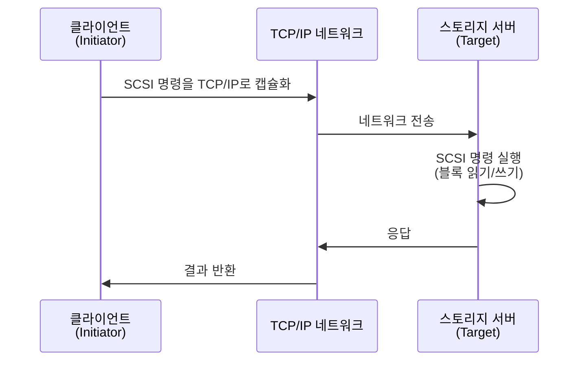

**특징:**
```
- IP 네트워크 사용 (LAN/WAN)
- 저렴한 이더넷 장비 활용
- 장거리 전송 가능
- 표준 네트워크 인프라

용도:
- SAN (Storage Area Network)
- 가상화 환경
- 백업 시스템
```

#### Fibre Channel

```
특징:
- 전용 스토리지 네트워크
- 높은 성능 (32Gbps+)
- 낮은 지연시간
- 비싼 장비

용도:
- 대규모 데이터 센터
- 미션 크리티컬 시스템
- 금융, 의료 등
```

#### NVMe (Non-Volatile Memory Express)

```
특징:
- SSD 최적화 프로토콜
- PCIe 인터페이스 직접 사용
- 매우 낮은 지연 (마이크로초)
- 높은 IOPS (1백만+)

대비:
SATA SSD: 100,000 IOPS
NVMe SSD: 1,000,000+ IOPS

용도:
- 고성능 데이터베이스
- 실시간 분석
- AI/ML 학습
```

---

## 3. File Storage의 본질

### 3.1 File Storage란 무엇인가?

**정의:** 계층적 디렉토리 구조로 파일을 저장하고 **네트워크를 통해 공유**하는 방식

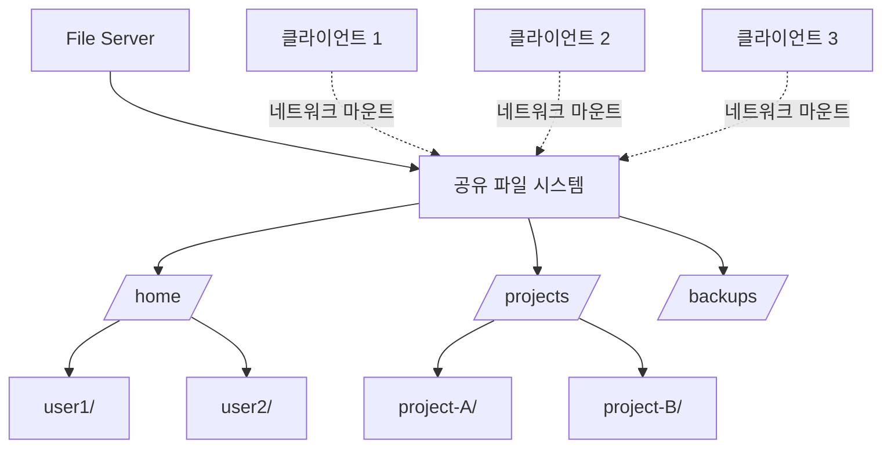

### 3.2 File Storage의 핵심 개념

#### 1. 네트워크 파일 시스템

**NFS (Network File System) - Unix/Linux:**

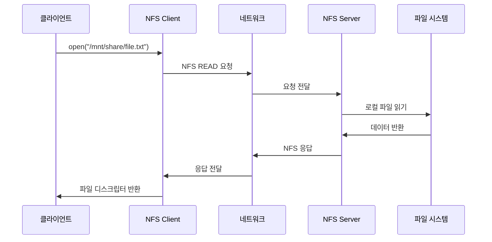

**NFS 특징:**
```
1. 투명성:
   - 로컬 파일처럼 사용
   - 애플리케이션은 네트워크 인식 불필요

2. Stateless (NFSv3 이하):
   - 서버가 클라이언트 상태 저장 안 함
   - 클라이언트 재시작해도 영향 없음

3. 캐싱:
   - 클라이언트가 파일 캐싱
   - 성능 향상
   - 일관성 문제 발생 가능
```

**SMB/CIFS (Server Message Block) - Windows:**

```
특징:
- Windows 네이티브 프로토콜
- Active Directory 통합
- 파일 잠금 (Locking)
- 프린터 공유도 지원

버전:
- SMB 1.0: 레거시 (보안 취약)
- SMB 2.x: 성능 개선
- SMB 3.x: 암호화, 다중 채널
```

#### 2. 동시 접근과 잠금

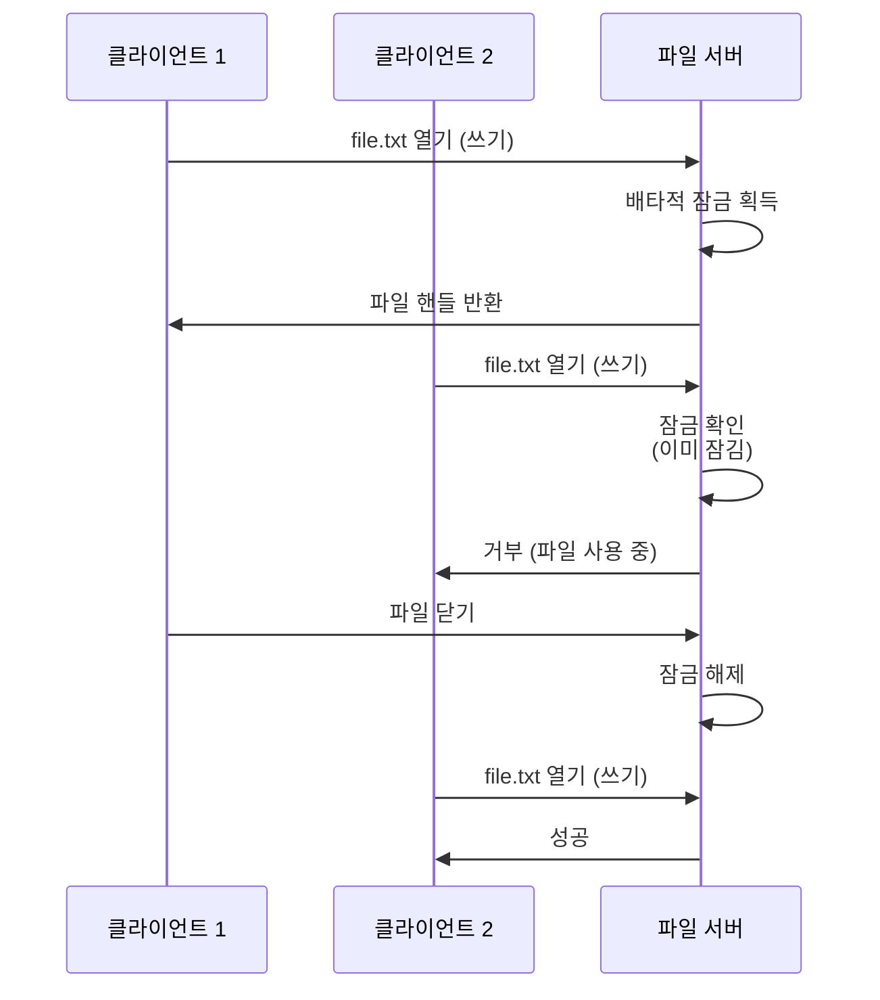

**파일 잠금 방식:**

```
1. 배타적 잠금 (Exclusive Lock):
   - 한 번에 1개 프로세스만 쓰기
   - 데이터 무결성 보장

2. 공유 잠금 (Shared Lock):
   - 여러 프로세스 동시 읽기 가능
   - 읽는 동안 쓰기 차단

3. 권고 잠금 vs 강제 잠금:
   - 권고: 애플리케이션이 자발적 준수
   - 강제: OS/파일 시스템이 강제
```

#### 3. 계층적 구조

```
파일 시스템 트리:
/
├── home/
│   ├── alice/
│   │   ├── documents/
│   │   │   └── report.pdf
│   │   └── pictures/
│   └── bob/
├── projects/
│   ├── project-A/
│   │   ├── src/
│   │   └── docs/
│   └── project-B/
└── backups/

특징:
- 직관적 구조
- 경로로 파일 찾기
- 권한 상속 (디렉토리 → 파일)
- 검색 복잡도: O(깊이)
```

### 3.3 File Storage vs Block Storage

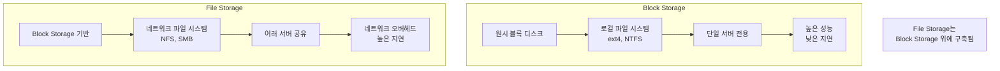

| 특성 | Block Storage | File Storage |
|------|---------------|--------------|
| **액세스** | 블록 주소 | 파일 경로 |
| **프로토콜** | iSCSI, FC, NVMe | NFS, SMB/CIFS |
| **파일 시스템** | 클라이언트 관리 | 서버 관리 |
| **공유** | 불가 (단일 서버) | 가능 (다중 클라이언트) |
| **성능** | 높음 (직접 액세스) | 낮음 (네트워크 오버헤드) |
| **지연시간** | 1-3ms | 5-10ms+ |
| **사용 사례** | DB, OS | 공유 파일, 홈 디렉토리 |

### 3.4 File Storage 사용 사례

#### 1. 홈 디렉토리

```
시나리오:
- 회사에 직원 100명
- 각자 개인 파일 저장

❌ Block Storage:
- 각 직원에게 개별 디스크
- 100개 디스크 관리
- 용량 낭비 (일부는 가득, 일부는 비어있음)

✅ File Storage:
- 중앙 파일 서버 1대
- /home/alice, /home/bob, ...
- 모든 컴퓨터에서 접근
- 백업 중앙화
```

#### 2. 소프트웨어 개발

```
상황:
- 개발팀 10명
- 공통 코드 베이스
- Git 저장소 공유

File Storage 사용:
- /projects/app/
  - 모든 개발자가 마운트
  - 실시간 파일 동기화
  - 빌드 서버도 동일 파일 시스템 사용

장점:
- 일관된 파일 경로
- 권한 중앙 관리
- 쉬운 백업
```

#### 3. 미디어 라이브러리

```
사용 사례:
- 비디오 편집 스튜디오
- 수백 TB 영상 파일
- 여러 편집자 동시 작업

File Storage:
- /media/projects/movie-A/
  - raw_footage/
  - edited/
  - renders/

요구사항:
- 높은 처리량 (대용량 파일)
- 공유 액세스
- 메타데이터 검색
```

---

## 4. Object Storage의 본질

### 4.1 Object Storage란 무엇인가?

**정의:** 데이터를 **플랫 구조의 객체**로 저장하고 **HTTP로 접근**하는 방식

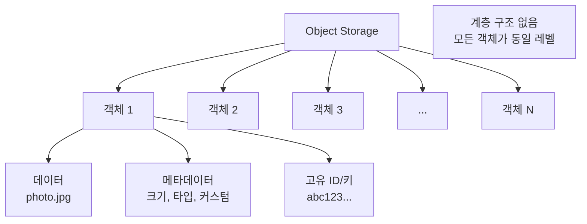

### 4.2 Object Storage의 핵심 개념

#### 1. 플랫 네임스페이스

```
Block/File Storage (계층적):
/home/
  alice/
    documents/
      file1.txt
      file2.txt
  bob/
    pictures/
      photo.jpg

Object Storage (플랫):
{
  "my-bucket": [
    "home/alice/documents/file1.txt",      ← 그냥 키(문자열)
    "home/alice/documents/file2.txt",      ← 슬래시는 문자일 뿐
    "home/bob/pictures/photo.jpg"          ← 실제 폴더 없음
  ]
}
```

**중요한 차이:**
```
File Storage:
- /home/alice/ 디렉토리 실제 존재
- ls /home/alice/ 실행 가능
- 디렉토리 이동 (cd)

Object Storage:
- "home/alice/"는 문자열 패턴
- 접두사(prefix)로 필터링만 가능
- 디렉토리 개념 없음
```

#### 2. HTTP/REST API 액세스

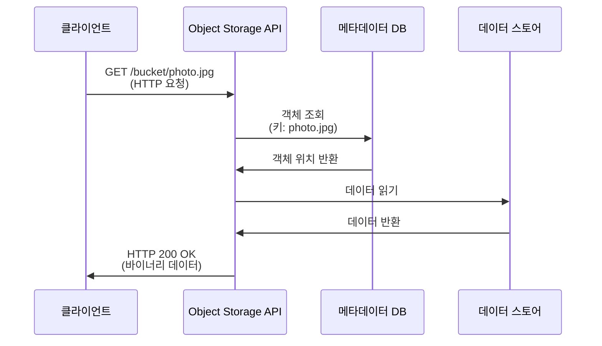

**HTTP 메소드와 객체 작업:**

```
PUT /bucket/object-key
- 객체 업로드
- Content-Type 헤더로 타입 지정

GET /bucket/object-key
- 객체 다운로드
- Range 헤더로 부분 다운로드 가능

DELETE /bucket/object-key
- 객체 삭제

HEAD /bucket/object-key
- 메타데이터만 조회 (데이터 다운로드 없음)

POST /bucket/?delete
- 여러 객체 일괄 삭제
```

#### 3. 메타데이터 중심

```
객체 구성:

1. 데이터 (Blob):
   - 실제 파일 내용
   - 바이너리 데이터
   - 최대 크기 제한 (S3: 5TB)

2. 시스템 메타데이터:
   - Content-Type: image/jpeg
   - Content-Length: 1048576
   - Last-Modified: 2024-12-11T10:00:00Z
   - ETag: "abc123..." (버전/체크섬)

3. 사용자 정의 메타데이터:
   - x-amz-meta-camera: "Canon EOS R5"
   - x-amz-meta-location: "Seoul"
   - x-amz-meta-author: "Alice"
```

**메타데이터로 검색:**

```
전통적 파일 시스템:
$ find /photos -name "*.jpg" -mtime -7

Object Storage:
SELECT * FROM s3object
WHERE
  metadata['camera'] = 'Canon EOS R5'
  AND last_modified > '2024-12-01'

→ 파일 이름 외에도 커스텀 속성으로 검색 가능
```

### 4.3 Object Storage의 특징

#### 1. 무한 확장성

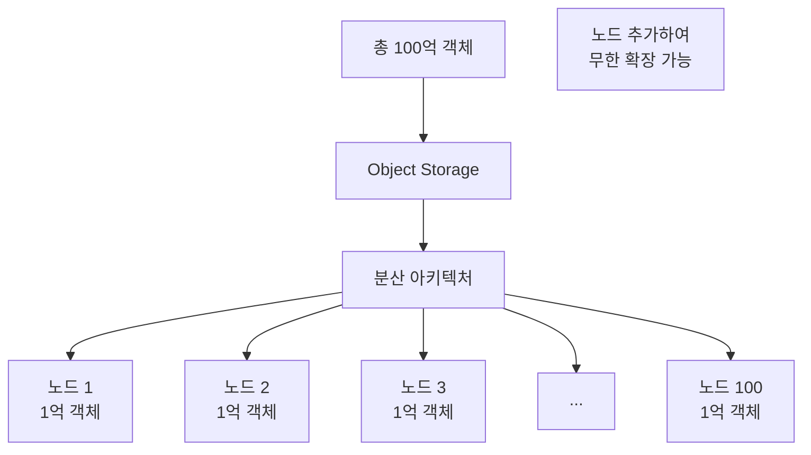

**왜 무한 확장 가능한가?**

```
File Storage 문제:
- 단일 네임스페이스 (하나의 디렉토리 트리)
- 메타데이터 서버 병목
- 수십억 파일 시 성능 저하

Object Storage 해결:
- 플랫 네임스페이스
- 메타데이터 분산 (일관성 해싱)
- 객체 ID로 바로 위치 계산
- 선형 확장 (노드 2배 → 용량 2배)
```

#### 2. 내구성과 가용성

```
내구성 (Durability):
- 데이터 손실 방지
- S3: 99.999999999% (11 9's)
- 10,000,000개 객체 → 10,000년에 1개 손실

구현:
- 여러 복사본 (최소 3개)
- 여러 데이터 센터 분산
- 자동 오류 감지 및 복구
```

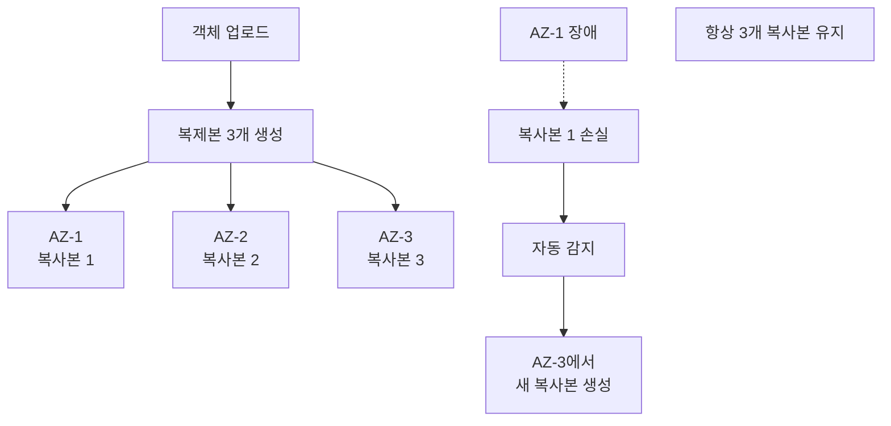

#### 3. 버전 관리

```
파일 시스템:
- 파일 덮어쓰기 → 이전 버전 손실
- 수동 백업 필요 (file.txt.bak)

Object Storage:
- 모든 버전 자동 보관
- 실수로 삭제/수정해도 복구 가능
```

```
버전 관리 예시:

PUT /bucket/document.pdf (v1)
→ 버전 ID: abc123

PUT /bucket/document.pdf (v2)
→ 버전 ID: def456
→ v1 (abc123)은 여전히 존재

DELETE /bucket/document.pdf
→ 삭제 마커 생성
→ v1, v2 여전히 존재 (숨김)

GET /bucket/document.pdf?versionId=abc123
→ v1 복구 가능
```

### 4.4 Object Storage vs File Storage vs Block Storage

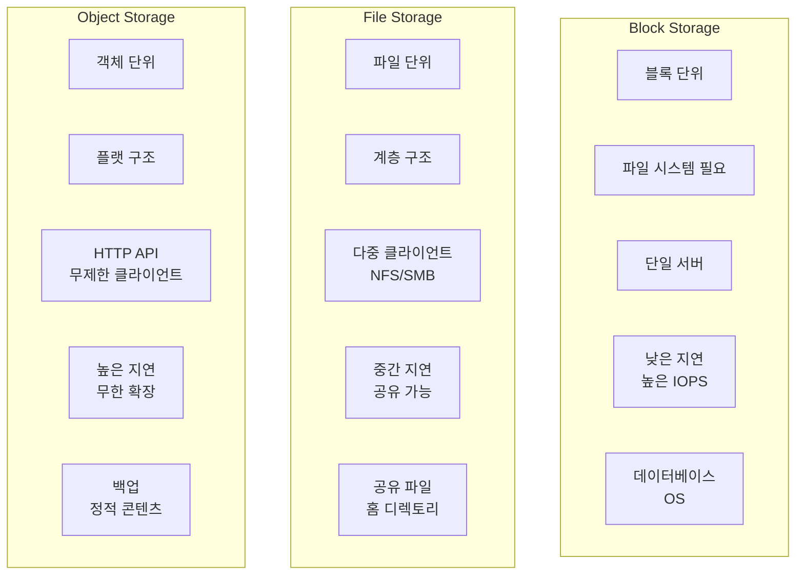

| 특성 | Block | File | Object |
|------|-------|------|--------|
| **데이터 단위** | 블록 (KB) | 파일 | 객체 (바이트~TB) |
| **구조** | 없음 | 계층적 디렉토리 | 플랫 키-값 |
| **액세스** | 블록 주소 | 파일 경로 | HTTP URL |
| **프로토콜** | iSCSI, FC | NFS, SMB | HTTP/REST |
| **파일 시스템** | 필수 | 서버 제공 | 불필요 |
| **공유** | 불가 | 제한적 | 무제한 |
| **확장성** | 제한적 (TB) | 중간 (PB) | 무한 (EB) |
| **지연시간** | 1-3ms | 5-10ms | 100-200ms |
| **IOPS** | 매우 높음 | 높음 | 낮음 |
| **처리량** | 높음 | 높음 | 매우 높음 |
| **내구성** | 수동 백업 | 수동 백업 | 자동 복제 |
| **비용** | 높음 | 중간 | 낮음 |
| **사용 사례** | DB, OS, VM | 공유 파일, 홈 디렉토리 | 백업, 아카이브, 정적 웹 |

### 4.5 Object Storage 사용 사례

#### 1. 정적 웹 콘텐츠

```
전통적 방식:
웹 서버 (Apache/Nginx)
└── /var/www/html/
    ├── index.html
    ├── styles.css
    ├── images/
    │   ├── logo.png
    │   └── banner.jpg
    └── scripts/
        └── main.js

문제:
- 웹 서버 부하
- 확장 어려움 (서버 추가 필요)
- 트래픽 급증 시 다운

Object Storage 방식:
https://my-bucket.s3.amazonaws.com/
├── index.html
├── styles.css
├── images/logo.png
├── images/banner.jpg
└── scripts/main.js

장점:
- 무한 확장 (트래픽 자동 처리)
- 전 세계 CDN 연동
- 서버 불필요 (Serverless)
- 저렴한 비용
```

#### 2. 백업과 아카이브

```
시나리오:
- 회사 데이터베이스 일일 백업
- 용량: 100GB/일
- 보관 기간: 7년

File Storage (NFS):
- 100GB × 365일 × 7년 = 255TB
- 모두 동일 비용
- 관리 복잡

Object Storage (S3):
- 최근 30일: S3 Standard (빠른 복구)
- 31-90일: S3 IA (자주 안 씀)
- 91일+: Glacier (아카이브)
- 자동 라이프사이클 전환
- 비용 80% 절감
```

#### 3. 빅데이터 분석

```
데이터 레이크 (Data Lake):

Object Storage:
/data-lake/
├── raw-data/
│   ├── 2024/12/01/sensor-001.json
│   ├── 2024/12/01/sensor-002.json
│   └── ...
├── processed/
│   └── 2024/12/aggregated.parquet
└── results/
    └── dashboard-2024-12.csv

특징:
- 수백만 파일
- 비정형 데이터 (JSON, CSV, Parquet)
- Spark/Hadoop 직접 읽기
- 무한 확장 가능
```

#### 4. 멀티미디어 스트리밍

```
비디오 플랫폼:

/videos/
├── video-123/
│   ├── 1080p.mp4
│   ├── 720p.mp4
│   ├── 480p.mp4
│   └── thumbnails/
│       ├── 00:00:10.jpg
│       └── 00:01:00.jpg

Object Storage 장점:
- HTTP Range 요청 (부분 다운로드)
  GET /video.mp4
  Range: bytes=1000000-2000000

- CDN 통합 (전 세계 빠른 스트리밍)
- 수백만 동시 사용자 처리
```

---

## 5. Amazon EBS - Block Storage

### 5.1 EBS의 본질

**Amazon EBS (Elastic Block Store):**
- AWS의 **Block Storage** 서비스
- EC2 인스턴스에 연결되는 **가상 하드 디스크**
- 물리적 HDD/SSD와 동일하게 작동


**전통적 디스크와의 차이:**

```
물리적 디스크:
- 서버에 물리적으로 연결
- SATA, SAS 케이블
- 서버 고장 시 디스크도 중단

EBS:
- 네트워크로 연결 (같은 AZ 내)
- 네트워크 대역폭 사용
- EC2 종료해도 EBS 독립적 존재
- EC2 재시작 후 동일한 EBS 재연결 가능
```

### 5.2 EBS 볼륨 타입

#### 1. gp3/gp2 (General Purpose SSD)

**범용 SSD - 대부분의 워크로드에 적합**

```
gp3 (최신):
- IOPS: 3,000 ~ 16,000 (독립 설정)
- 처리량: 125 ~ 1,000 MB/s (독립 설정)
- 가격: 가장 경제적
- 크기: 1GB ~ 16TB

특징:
- IOPS와 처리량을 볼륨 크기와 별도로 설정
- 예: 100GB 볼륨에 10,000 IOPS 할당 가능

gp2 (레거시):
- IOPS: 볼륨 크기에 비례 (3 IOPS/GB)
- 100GB = 300 IOPS
- 1TB = 3,000 IOPS
- 최대: 16,000 IOPS (5.3TB 이상)
```

**사용 사례:**
```
✅ 웹 서버
✅ 개발/테스트 환경
✅ 가상 데스크톱
✅ 중소형 데이터베이스
✅ 부팅 볼륨

비유:
gp3 = 일반 승용차
- 대부분의 운전 상황에 적합
- 가격 대비 성능 우수
```

#### 2. io2/io1 (Provisioned IOPS SSD)

**프로비저닝된 IOPS - 고성능 I/O 워크로드**

```
io2 Block Express (최고 성능):
- IOPS: 최대 256,000
- 처리량: 최대 4,000 MB/s
- 지연시간: 서브 밀리초 (< 1ms)
- 크기: 4GB ~ 64TB
- 내구성: 99.999%

io2:
- IOPS: 최대 64,000
- 처리량: 최대 1,000 MB/s
- IOPS/GB 비율: 500:1

io1 (레거시):
- IOPS: 최대 64,000
- IOPS/GB 비율: 50:1
```

**사용 사례:**
```
✅ 프로덕션 데이터베이스 (MySQL, PostgreSQL, Oracle)
✅ NoSQL 데이터베이스 (MongoDB, Cassandra)
✅ SAP, Oracle ERP
✅ 미션 크리티컬 애플리케이션

비유:
io2 = 고성능 스포츠카
- 최고 성능 필요 시
- 일관된 낮은 지연시간 보장
```

#### 3. st1 (Throughput Optimized HDD)

**처리량 최적화 HDD - 대용량 순차 I/O**

```
특징:
- IOPS: 최대 500
- 처리량: 최대 500 MB/s
- 크기: 125GB ~ 16TB
- 비용: SSD의 1/4

성능 특성:
- 베이스라인: 40 MB/s per TB
- 버스트: 250 MB/s per TB
- 대용량 파일 연속 읽기/쓰기에 최적화
```

**사용 사례:**
```
✅ 빅데이터 처리 (Hadoop, Kafka)
✅ 로그 분석
✅ 데이터 웨어하우스
✅ ETL (Extract, Transform, Load)

비유:
st1 = 대형 화물 트럭
- 많은 양을 천천히 이동
- 빠른 가속/정지는 안 함
```

#### 4. sc1 (Cold HDD)

**콜드 HDD - 저빈도 액세스**

```
특징:
- IOPS: 최대 250
- 처리량: 최대 250 MB/s
- 크기: 125GB ~ 16TB
- 비용: 가장 저렴 (SSD의 1/6)

성능 특성:
- 베이스라인: 12 MB/s per TB
- 버스트: 80 MB/s per TB
```

**사용 사례:**
```
✅ 파일 서버 (자주 안 씀)
✅ 콜드 데이터 저장
✅ 백업 (드물게 복구)

비유:
sc1 = 창고
- 대량 보관
- 가끔씩만 접근
```

### 5.3 EBS 볼륨 타입 비교

| 타입 | 기술 | IOPS | 처리량 | 지연 | 비용 | 사용 사례 |
|------|------|------|--------|------|------|-----------|
| **gp3** | SSD | 16,000 | 1,000 MB/s | 낮음 | $ | 범용 |
| **io2** | SSD | 256,000 | 4,000 MB/s | 매우 낮음 | $$$$ | 프로덕션 DB |
| **st1** | HDD | 500 | 500 MB/s | 높음 | $ | 빅데이터 |
| **sc1** | HDD | 250 | 250 MB/s | 높음 | $ | 아카이브 |

### 5.4 EBS의 고급 기능

#### 1. 스냅샷 (Snapshot)

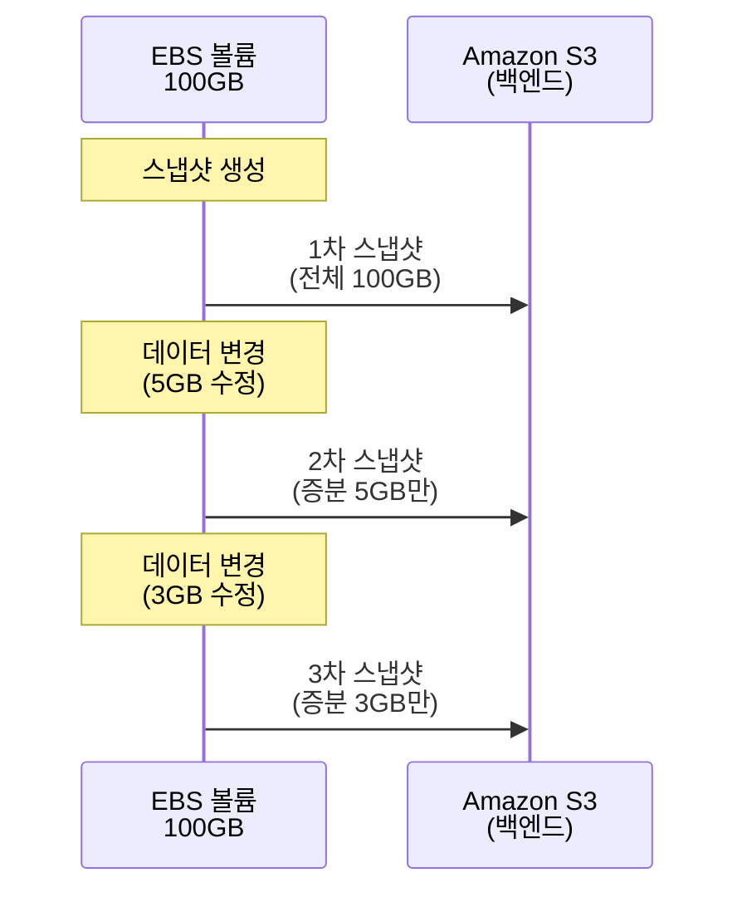

**스냅샷 특징:**

```
증분 백업 (Incremental):
- 첫 스냅샷: 전체 데이터
- 이후 스냅샷: 변경된 블록만
- 저장 공간 효율적

예시:
- 볼륨: 100GB
- 1차 스냅샷: 100GB 저장
- 10GB 변경 후 2차 스냅샷: 10GB만 추가 저장
- 총 저장: 110GB (두 스냅샷 모두 유지)

복원:
- 새 EBS 볼륨 생성
- 스냅샷에서 복원 시 전체 데이터 복원
- 다른 AZ/리전으로 복사 가능
```

**실제 사용 예:**

```bash
# 스냅샷 생성
$ aws ec2 create-snapshot \
  --volume-id vol-1234567890abcdef0 \
  --description "Weekly backup"

# 스냅샷에서 볼륨 생성
$ aws ec2 create-volume \
  --snapshot-id snap-0abcdef1234567890 \
  --availability-zone us-east-1a

# 다른 리전으로 복사 (재해 복구)
$ aws ec2 copy-snapshot \
  --source-region us-east-1 \
  --source-snapshot-id snap-0abc \
  --destination-region ap-northeast-2
```

#### 2. 볼륨 암호화

```
암호화 과정:
1. EC2 → EBS 쓰기 요청
2. EBS 서비스에서 AES-256 암호화
3. 암호화된 데이터 저장
4. 읽기 시 자동 복호화

키 관리:
- AWS KMS (Key Management Service)
- 고객 관리형 키 또는 AWS 관리형 키
- 스냅샷도 자동 암호화

성능 영향:
- 거의 없음 (하드웨어 가속)
- 추가 비용 없음
```

#### 3. Multi-Attach (io2만 지원)

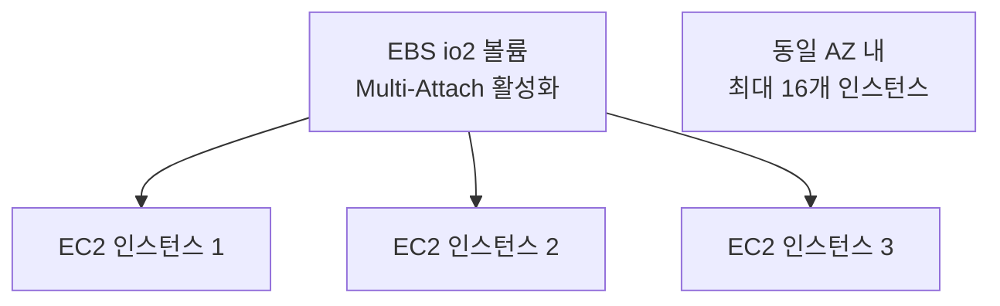

**사용 사례:**
```
클러스터 파일 시스템:
- Oracle RAC
- Teradata
- 공유 블록 스토리지 필요

주의:
- 애플리케이션이 동시 쓰기 처리 필요
- 파일 시스템 레벨 잠금 구현 필수
- 일반 애플리케이션은 사용 불가
```

### 5.5 EBS 성능 최적화

#### 1. EC2 인스턴스 타입 선택

```
네트워크 대역폭:
- EBS는 네트워크로 연결
- EC2 인스턴스 네트워크 성능이 중요

예시:
t3.micro:
- 네트워크: 최대 5 Gbps
- EBS 대역폭: 최대 2,085 Mbps (260 MB/s)
- io2 4,000 MB/s를 활용 못함

c5n.18xlarge:
- 네트워크: 100 Gbps
- EBS 대역폭: 19,000 Mbps (2,375 MB/s)
- 고성능 EBS 활용 가능
```

#### 2. EBS 최적화 인스턴스

```
일반 인스턴스:
- 네트워크 트래픽과 EBS I/O 공유
- 네트워크 혼잡 시 EBS 성능 저하

EBS 최적화 인스턴스:
- EBS 전용 네트워크 대역폭
- 일관된 성능 보장
- 최신 인스턴스 타입은 기본 활성화
```

#### 3. RAID 구성

```
RAID 0 (성능):
- 2개 EBS 볼륨 → RAID 0
- IOPS 2배
- 처리량 2배

예:
- gp3 2개 (각 16,000 IOPS)
- RAID 0 구성 → 32,000 IOPS

주의:
- 한 볼륨 실패 시 데이터 손실
- 스냅샷 복잡

RAID 1 (내구성):
- 일반적으로 불필요
- EBS 자체가 이미 복제됨 (99.999% 내구성)
```

---

## 6. Amazon EFS - File Storage

### 6.1 EFS의 본질

**Amazon EFS (Elastic File System):**
- AWS의 **File Storage** 서비스
- **NFS v4** 프로토콜 사용
- 여러 EC2 인스턴스가 **동시 접근**

```mermaid
graph TD
    A[EFS 파일 시스템] --> B[마운트 타겟<br/>AZ-1]
    A --> C[마운트 타겟<br/>AZ-2]
    A --> D[마운트 타겟<br/>AZ-3]

    B --> E[EC2-1]
    B --> F[EC2-2]

    C --> G[EC2-3]

    D --> H[EC2-4]
    D --> I[EC2-5]

    Note[모든 EC2가<br/>동일한 파일 시스템 공유]
```

**EBS vs EFS:**

```
EBS (Block Storage):
- 1:1 연결 (EC2 ↔ EBS)
- 단일 EC2 전용
- 블록 디바이스
- 파일 시스템 직접 관리

EFS (File Storage):
- N:1 연결 (EC2들 ↔ EFS)
- 수천 개 EC2 동시 접근
- NFS 파일 시스템
- AWS 관리형
```

### 6.2 EFS 스토리지 클래스

#### 1. Standard (표준)

```
특징:
- 높은 가용성 (3개 AZ 복제)
- 낮은 지연시간 (1-3ms)
- 자주 액세스하는 데이터

가격:
- $0.30/GB-월 (미국 동부)
- 읽기/쓰기 비용 없음

사용 사례:
- 활성 애플리케이션 데이터
- 공유 소스 코드
- CMS (WordPress, Drupal)
```

#### 2. Infrequent Access (IA)

```
특징:
- 3개 AZ 복제 (동일)
- 자주 안 쓰는 데이터
- 액세스 시 추가 비용

가격:
- $0.025/GB-월 (90% 절감!)
- 읽기/쓰기: $0.01/GB

사용 사례:
- 30일 이상 안 쓴 파일
- 백업
- 오래된 로그

라이프사이클 정책:
- 30일 미사용 → 자동으로 IA 이동
- 액세스 시 → 자동으로 Standard 복귀
```

#### 3. One Zone (단일 AZ)

```
One Zone - Standard:
- 1개 AZ만 저장
- 낮은 가용성 (AZ 장애 시 접근 불가)
- $0.16/GB-월 (47% 절감)

One Zone - IA:
- 1개 AZ + 자주 안 씀
- $0.0133/GB-월 (95% 절감!)

사용 사례:
- 개발/테스트 환경
- 복제 가능한 데이터
- 백업 (S3에도 있음)
```

### 6.3 EFS 성능 모드

#### 1. General Purpose (범용)

```
특징:
- 낮은 지연시간 (1-3ms)
- 최대 35,000 IOPS (읽기)
- 최대 7,000 IOPS (쓰기)

제한:
- 파일 작업: 초당 7,000개

사용 사례:
- 웹 서버
- CMS
- 홈 디렉토리
- 일반 파일 공유
```

#### 2. Max I/O (최대 I/O)

```
특징:
- 높은 처리량
- 무제한 IOPS
- 높은 지연시간 (10-100ms)

사용 사례:
- 빅데이터 (Hadoop, Spark)
- 미디어 처리
- 수천 개 EC2 동시 접근

선택 기준:
파일 개수 많음 + 동시 접근 많음
→ Max I/O

파일 개수 적음 + 낮은 지연 필요
→ General Purpose
```

### 6.4 EFS 처리량 모드

#### 1. Bursting (버스팅)

```
처리량 계산:
- 베이스라인: 50 KB/s per GB
- 버스트: 최대 100 MB/s

예시:
20GB 파일 시스템:
- 베이스라인: 20 × 50 KB/s = 1 MB/s
- 버스트 크레딧: 2.1 TB (초기)
- 크레딧 사용: 100 MB/s로 가능
- 크레딧 소진: 1 MB/s로 제한

100GB 이상:
- 베이스라인: 5 MB/s (100GB)
- 500GB: 25 MB/s
- 1TB: 50 MB/s
```

**문제:**
```
작은 파일 시스템 (10GB):
- 베이스라인: 0.5 MB/s
- 너무 느림!

→ Provisioned Throughput 사용
```

#### 2. Provisioned (프로비저닝)

```
설정:
- 크기와 무관하게 처리량 지정
- 1 MB/s ~ 1,024 MB/s

예:
10GB 파일 시스템:
- Bursting: 0.5 MB/s
- Provisioned 100 MB/s 설정
- 비용: 추가 $6/월 per MB/s

사용 사례:
- 작은 파일 시스템이지만 고성능 필요
- 일시적 워크로드
```

#### 3. Elastic (탄력적)

```
특징:
- 자동 확장/축소
- 워크로드에 따라 자동 조정
- 최대 3 GB/s 읽기, 1 GB/s 쓰기

가격:
- 읽기: $0.03/GB
- 쓰기: $0.06/GB

사용 사례:
- 예측 불가능한 워크로드
- 스파이크 패턴
```

### 6.5 EFS 실전 사용 예시

#### 1. 웹 서버 공유 스토리지

```mermaid
graph TD
    A[Application Load Balancer] --> B[Auto Scaling Group]

    B --> C[EC2-1<br/>Web Server]
    B --> D[EC2-2<br/>Web Server]
    B --> E[EC2-3<br/>Web Server]

    C --> F[EFS<br/>/var/www/html]
    D --> F
    E --> F

    F --> F1[uploads/<br/>사용자 업로드 파일]
    F --> F2[cache/<br/>공유 캐시]
```

**시나리오:**
```
WordPress 사이트:
- 사용자가 이미지 업로드
- EC2-1이 /var/www/html/uploads/에 저장
- EC2-2, EC2-3도 동일한 파일 즉시 읽기 가능

EBS로는 불가능:
- EBS는 EC2-1 전용
- EC2-2가 파일 못 봄
- 수동 복제 필요

EFS로 해결:
- 모든 EC2가 동일한 EFS 마운트
- 실시간 공유
```

#### 2. 컨테이너 영구 스토리지

```yaml
# Kubernetes Persistent Volume
apiVersion: v1
kind: PersistentVolume
metadata:
  name: efs-pv
spec:
  capacity:
    storage: 100Gi
  accessModes:
    - ReadWriteMany  # 여러 Pod 동시 쓰기
  csi:
    driver: efs.csi.aws.com
    volumeHandle: fs-12345678
```

**장점:**
```
컨테이너 재시작/이동:
- 데이터 유지
- 다른 노드로 이동해도 동일한 EFS 마운트

여러 Pod 동시 쓰기:
- ReadWriteMany 지원
- EBS는 ReadWriteOnce만 가능
```

#### 3. 빅데이터 분석

```
시나리오:
- EMR 클러스터 (Hadoop/Spark)
- 100개 노드
- 공통 데이터셋 읽기

EFS 사용:
- 모든 노드가 /data/ 마운트
- 데이터 복제 불필요
- 동적 노드 추가/제거 가능

성능:
- Max I/O 모드
- Elastic 처리량
- 100개 노드 동시 읽기
```

---

## 7. Amazon S3 - Object Storage

### 7.1 S3의 본질

**Amazon S3 (Simple Storage Service):**
- AWS의 **Object Storage** 서비스
- **HTTP/HTTPS**로 접근
- **무한 확장** 가능

```mermaid
graph TD
    A[S3] --> B[버킷<br/>Bucket]

    B --> C[리전<br/>us-east-1]

    C --> D[객체 1<br/>photo.jpg]
    C --> E[객체 2<br/>video.mp4]
    C --> F[객체 3<br/>backup.tar.gz]
    C --> G[...]

    D --> D1[데이터<br/>바이너리]
    D --> D2[메타데이터<br/>Content-Type, etc]
    D --> D3[키<br/>photos/2024/photo.jpg]
```

**핵심 개념:**

```
버킷 (Bucket):
- S3의 최상위 컨테이너
- 전 세계적으로 고유한 이름
- 예: my-company-backups-20241211
- 리전 지정 (하지만 이름은 글로벌 유일)

객체 (Object):
- 실제 파일
- 최대 크기: 5TB
- 키 (Key): 고유 식별자 (파일 경로처럼 보임)

키 예시:
- documents/report-2024.pdf
- images/products/item-123.jpg
- logs/2024/12/11/server-01.log
```

### 7.2 S3 스토리지 클래스

#### 1. S3 Standard

```
특징:
- 99.99% 가용성
- 11 9's 내구성 (99.999999999%)
- 3개 이상 AZ 복제
- 밀리초 지연시간

가격:
- $0.023/GB-월 (첫 50TB, 미국 동부)
- PUT/POST: $0.005/1000 요청
- GET: $0.0004/1000 요청

사용 사례:
- 자주 액세스
- 애플리케이션 데이터
- 웹사이트 콘텐츠
- 모바일 앱 백엔드
```

#### 2. S3 Intelligent-Tiering

```
자동 계층화:
- 액세스 패턴 모니터링
- 30일 미사용 → Infrequent Access 이동
- 90일 미사용 → Archive Instant 이동
- 180일 미사용 → Archive Access 이동 (옵션)

가격:
- 모니터링 비용: $0.0025/1000 객체
- 자동 비용 최적화
- 검색 비용 없음

사용 사례:
- 예측 불가능한 액세스 패턴
- 관리 부담 줄이기
```

#### 3. S3 Standard-IA / One Zone-IA

```
Standard-IA (Infrequent Access):
- 99.9% 가용성
- 3개 AZ 복제
- $0.0125/GB-월 (46% 절감)
- 검색 비용: $0.01/GB

One Zone-IA:
- 99.5% 가용성
- 1개 AZ만 저장
- $0.01/GB-월 (57% 절감)
- 검색 비용: $0.01/GB

최소 보관 기간: 30일
최소 객체 크기: 128KB

사용 사례:
- 백업
- 재해 복구 파일
- 썸네일 (원본은 다시 생성 가능)
```

#### 4. S3 Glacier 패밀리

**Glacier Instant Retrieval:**
```
특징:
- 밀리초 검색 (즉시)
- 분기별 액세스용
- $0.004/GB-월 (83% 절감)

최소 보관 기간: 90일

사용 사례:
- 의료 기록 (규정 준수, 드물게 액세스)
- 뉴스 미디어 아카이브
```

**Glacier Flexible Retrieval (구 Glacier):**
```
특징:
- $0.0036/GB-월 (84% 절감)
- 검색 옵션:
  - Expedited: 1-5분 ($0.03/GB)
  - Standard: 3-5시간 ($0.01/GB)
  - Bulk: 5-12시간 (무료, 대량)

최소 보관 기간: 90일

사용 사례:
- 연간 감사용 데이터
- 규제 아카이브
```

**Glacier Deep Archive:**
```
특징:
- 가장 저렴: $0.00099/GB-월 (96% 절감!)
- 검색 시간:
  - Standard: 12시간
  - Bulk: 48시간

최소 보관 기간: 180일

사용 사례:
- 7년 이상 장기 보관
- 금융 기록
- 의료 영상 (HIPAA)
```

### 7.3 S3 스토리지 클래스 비교

```mermaid
graph TD
    A[S3 객체 업로드] --> B{액세스 빈도?}

    B -->|자주| C[S3 Standard<br/>$0.023/GB]
    B -->|예측 불가| D[Intelligent-Tiering<br/>자동 최적화]
    B -->|드물게<br/>30일+| E[Standard-IA<br/>$0.0125/GB]
    B -->|분기별<br/>90일+| F[Glacier Instant<br/>$0.004/GB]
    B -->|연 1-2회<br/>90일+| G[Glacier Flexible<br/>$0.0036/GB]
    B -->|7년+ 보관| H[Glacier Deep<br/>$0.001/GB]
```

| 클래스 | 가용성 | 최소 기간 | 검색 시간 | 비용 | 사용 사례 |
|--------|--------|-----------|-----------|------|-----------|
| **Standard** | 99.99% | - | 밀리초 | $$ | 활성 데이터 |
| **Intelligent** | 99.9% | - | 밀리초~12시간 | $-$ | 자동 최적화 |
| **Standard-IA** | 99.9% | 30일 | 밀리초 | $ | 백업 |
| **Glacier Instant** | 99.9% | 90일 | 밀리초 | $ | 분기별 액세스 |
| **Glacier Flexible** | 99.99% | 90일 | 분~시간 | $ | 연간 액세스 |
| **Glacier Deep** | 99.99% | 180일 | 12~48시간 | $ | 장기 아카이브 |

### 7.4 S3 라이프사이클 정책

```yaml
# 자동 계층 전환 예시
Lifecycle Rules:
  - ID: "log-rotation"
    Status: Enabled
    Prefix: "logs/"

    Transitions:
      - Days: 30
        StorageClass: STANDARD_IA
      - Days: 90
        StorageClass: GLACIER_IR
      - Days: 365
        StorageClass: DEEP_ARCHIVE

    Expiration:
      Days: 2555  # 7년 후 삭제
```

**실전 시나리오:**

```
로그 파일 관리:

Day 0: 업로드
→ S3 Standard ($0.023/GB)
→ 실시간 분석용

Day 30: 자동 전환
→ Standard-IA ($0.0125/GB)
→ 가끔 조회

Day 90: 자동 전환
→ Glacier Instant ($0.004/GB)
→ 문제 발생 시 즉시 조회 필요

Day 365: 자동 전환
→ Deep Archive ($0.001/GB)
→ 규제 준수, 거의 안 봄

Day 2555 (7년): 자동 삭제
→ 비용 절감: 평균 90% 이상
```

### 7.5 S3 고급 기능

#### 1. 버전 관리

```
활성화:
$ aws s3api put-bucket-versioning \
  --bucket my-bucket \
  --versioning-configuration Status=Enabled

파일 업로드:
1. PUT /my-bucket/document.pdf
   → Version ID: abc123 (v1)

2. PUT /my-bucket/document.pdf (덮어쓰기)
   → Version ID: def456 (v2)
   → v1 (abc123) 여전히 존재

3. DELETE /my-bucket/document.pdf
   → 삭제 마커 생성
   → v1, v2 모두 숨김 (삭제 아님)

복구:
$ aws s3api delete-object \
  --bucket my-bucket \
  --key document.pdf \
  --version-id <delete-marker-id>
→ 최신 버전 (v2) 복원
```

#### 2. S3 Replication

**Cross-Region Replication (CRR):**
```mermaid
graph LR
    A[S3 버킷<br/>us-east-1] -->|자동 복제| B[S3 버킷<br/>ap-northeast-2]

    C[재해 복구<br/>지연시간 감소] --> A
```

**Same-Region Replication (SRR):**
```
용도:
- 로그 집계
- 프로덕션 → 테스트 데이터 복사
- 규정 준수 (데이터 복사본)
```

#### 3. S3 Transfer Acceleration

```
일반 업로드:
클라이언트 (한국) → 인터넷 → S3 (미국)
- 느린 공인 인터넷 경로
- 평균 속도: 10 MB/s

Transfer Acceleration:
클라이언트 (한국) → CloudFront Edge (서울) → AWS 백본 네트워크 → S3 (미국)
- AWS 전용 네트워크 사용
- 평균 속도: 50-100 MB/s (5-10배)

활성화:
$ aws s3api put-bucket-accelerate-configuration \
  --bucket my-bucket \
  --accelerate-configuration Status=Enabled

업로드:
https://my-bucket.s3-accelerate.amazonaws.com/file.zip
```

#### 4. S3 Select

```
전통적 방법:
1. 전체 파일 다운로드 (100GB)
2. 로컬에서 필터링
3. 실제 필요 데이터: 10MB

비용:
- 다운로드: 100GB × $0.09/GB = $9
- 시간: 느림

S3 Select:
SELECT * FROM s3object
WHERE age > 30

결과:
- 서버 측 필터링
- 다운로드: 10MB × $0.09/GB = $0.001
- 비용 절감: 99.9%
- 시간 절감: 400%
```

### 7.6 S3 보안

#### 1. 버킷 정책

```json
{
  "Version": "2012-10-17",
  "Statement": [{
    "Effect": "Allow",
    "Principal": "*",
    "Action": "s3:GetObject",
    "Resource": "arn:aws:s3:::my-public-bucket/*",
    "Condition": {
      "IpAddress": {
        "aws:SourceIp": "203.0.113.0/24"
      }
    }
  }]
}
```

#### 2. 암호화

**서버 측 암호화 (SSE):**
```
SSE-S3:
- AWS 관리 키
- AES-256
- 무료

SSE-KMS:
- AWS KMS 키
- 감사 로그
- 키 순환

SSE-C:
- 고객 제공 키
- AWS는 키 저장 안 함
```

**클라이언트 측 암호화:**
```
- 업로드 전 클라이언트에서 암호화
- AWS는 암호화된 데이터만 봄
- 최고 보안
```

---

## 8. 스토리지 선택 가이드

### 8.1 의사결정 트리

```mermaid
graph TD
    A[스토리지 필요] --> B{블록 디바이스 필요?}

    B -->|예<br/>OS, DB| C{성능 요구사항?}

    C -->|초고성능<br/>10,000+ IOPS| D[EBS io2<br/>Block Express]
    C -->|범용| E[EBS gp3]
    C -->|처리량 중심<br/>대용량 순차| F[EBS st1]
    C -->|아카이브| G[EBS sc1]

    B -->|아니오| H{공유 필요?}

    H -->|예<br/>여러 서버| I{액세스 방식?}

    I -->|파일 시스템<br/>POSIX| J{성능?}
    J -->|고성능<br/>낮은 지연| K[EFS<br/>General Purpose]
    J -->|높은 처리량<br/>대규모| L[EFS<br/>Max I/O]

    I -->|HTTP API<br/>대규모| M{액세스 빈도?}

    M -->|자주| N[S3 Standard]
    M -->|드물게| O[S3 IA / Glacier]
    M -->|아카이브| P[S3 Deep Archive]
```

### 8.2 워크로드별 추천

#### 1. 데이터베이스

```
프로덕션 관계형 DB (MySQL, PostgreSQL):
✅ EBS io2 Block Express
- 256,000 IOPS
- 서브 밀리초 지연
- 99.999% 내구성

예산 제한 프로덕션 DB:
✅ EBS gp3
- 16,000 IOPS (대부분 충분)
- 비용 효율적

개발/테스트 DB:
✅ EBS gp3 (기본 설정)
- 3,000 IOPS
- 저렴
```

#### 2. 웹 서버

```
단일 웹 서버:
✅ EBS gp3
- OS + 애플리케이션
- 로컬 파일

여러 웹 서버 (Auto Scaling):
✅ EBS gp3 (OS) + EFS (공유 파일)
- EBS: OS, 코드
- EFS: 사용자 업로드, 세션

정적 콘텐츠 (이미지, CSS, JS):
✅ S3 + CloudFront
- 무한 확장
- 전 세계 빠른 속도
- 서버 불필요
```

#### 3. 빅데이터 분석

```
Hadoop/Spark:
옵션 1: EBS st1 (각 노드)
- 처리량 최적화
- 500 MB/s per 볼륨
- 로컬 HDFS

옵션 2: EFS Max I/O
- 중앙 집중식
- 동적 노드 확장
- 관리 편리

옵션 3: S3 (권장)
- S3 Select로 필터링
- EMR/Athena 직접 쿼리
- 무한 확장
- 가장 저렴
```

#### 4. 백업 및 아카이브

```
단기 백업 (1주일):
✅ S3 Standard
- 빠른 복구
- 버전 관리

중기 백업 (1개월~1년):
✅ S3 Standard-IA
- 비용 절감
- 필요 시 즉시 복구

장기 아카이브 (7년+):
✅ S3 Glacier Deep Archive
- 최저 비용 ($0.001/GB-월)
- 규제 준수
- 12-48시간 복구
```

#### 5. 미디어 및 콘텐츠

```
비디오 원본 파일:
✅ S3 Standard
- 대용량 (GB~TB per 파일)
- HTTP 스트리밍
- CloudFront 연동

트랜스코딩 임시 스토리지:
✅ EBS st1 또는 gp3
- 빠른 읽기/쓰기
- 임시 데이터

CDN 배포:
✅ S3 + CloudFront
- 전 세계 엣지 로케이션
- 자동 확장
```

### 8.3 비용 최적화 전략

#### 1. 스토리지 클래스 자동 전환

```yaml
# 로그 파일 예시
0-30일: S3 Standard
  비용: $0.023 × 100GB × 30일 = $69

31-90일: S3 Standard-IA
  비용: $0.0125 × 100GB × 60일 = $75

91-365일: Glacier Instant
  비용: $0.004 × 100GB × 275일 = $110

365일+: Glacier Deep Archive
  비용: $0.001 × 100GB × ... = $36/년

총 1년 비용: $254 (Standard만 사용 시 $840)
절감: 70%
```

#### 2. EBS 볼륨 크기 조정

```
문제:
- 100GB EBS 볼륨
- 실제 사용: 20GB
- 낭비: 80GB × $0.08/GB = $6.4/월

해결:
1. 스냅샷 생성
2. 30GB 볼륨으로 복원
3. 절감: $5.6/월 ($67.2/년)
```

#### 3. EFS 라이프사이클

```
설정:
- 30일 미사용 파일 → IA 전환

예:
- 총 용량: 1TB
- 활성 파일: 200GB (Standard)
- 오래된 파일: 800GB (IA)

비용:
Standard: 200GB × $0.30 = $60
IA: 800GB × $0.025 = $20
총: $80/월

라이프사이클 없이:
1TB × $0.30 = $300/월

절감: 73%
```

### 8.4 성능 vs 비용 트레이드오프

```mermaid
graph TD
    A[요구사항 분석] --> B{지연시간 중요?}

    B -->|매우 중요<br/>< 1ms| C[EBS io2<br/>$$$$]
    B -->|중요<br/>< 10ms| D[EBS gp3 / EFS<br/>$$]
    B -->|덜 중요<br/>< 100ms| E[S3<br/>$]

    F{처리량 중요?} --> G[EBS st1<br/>HDD<br/>$]
    F --> H[EBS io2<br/>SSD<br/>$$$$]

    I{내구성 중요?} --> J[S3<br/>11 9's<br/>$]
    I --> K[EBS + 백업<br/>$$]
```

**결정 매트릭스:**

| 우선순위 | 1순위 | 2순위 | 추천 |
|----------|-------|-------|------|
| **성능 + 비용** | 낮은 지연 | 저렴 | EBS gp3 |
| **성능 + 내구성** | 초고성능 | 높은 가용성 | EBS io2 + 스냅샷 |
| **비용 + 확장성** | 저렴 | 무한 확장 | S3 Intelligent-Tiering |
| **공유 + 성능** | 다중 액세스 | 낮은 지연 | EFS General Purpose |
| **공유 + 비용** | 다중 액세스 | 저렴 | S3 Standard |

### 8.5 마이그레이션 전략

#### 온프레미스 → AWS

```
물리 서버 SAN → AWS:

1단계: 평가
- 현재 IOPS 측정
- 처리량 측정
- 액세스 패턴 분석

2단계: 매핑
온프레미스 SAN (iSCSI) → EBS io2
공유 NAS (NFS) → EFS
백업 테이프 → S3 Glacier

3단계: 마이그레이션
- AWS DataSync (온라인)
- AWS Snowball (오프라인, 대용량)
```

#### EBS → S3 전환

```
시나리오:
- 로그 파일 보관 (현재 EBS)
- 매일 10GB 추가
- 2년간 보관

현재 (EBS):
- 10GB × 730일 = 7.3TB
- 비용: 7,300GB × $0.08 = $584/월

최적화 (S3):
- 최근 30일: S3 Standard (300GB × $0.023 = $7)
- 나머지: Glacier ($0.004 × 7,000GB = $28)
- 총: $35/월

절감: 94% ($6,588/년)
```

---

## 9. 요약 및 체크리스트

### 핵심 개념 요약

**Block Storage (EBS):**
```
✅ 블록 단위, 파일 시스템 필요
✅ 단일 EC2 전용 (io2 Multi-Attach 제외)
✅ 낮은 지연시간 (1-3ms)
✅ 데이터베이스, OS에 최적
```

**File Storage (EFS):**
```
✅ NFS 파일 시스템
✅ 여러 EC2 동시 접근
✅ 자동 확장
✅ 공유 파일, 컨테이너에 최적
```

**Object Storage (S3):**
```
✅ HTTP/REST API
✅ 무한 확장
✅ 11 9's 내구성
✅ 백업, 정적 콘텐츠에 최적
```

### 선택 체크리스트

```
□ 블록 디바이스 필요? → EBS
  □ 초고성능 (10,000+ IOPS)? → io2
  □ 범용? → gp3
  □ 처리량 중심? → st1
  □ 저비용 아카이브? → sc1

□ 파일 공유 필요? → EFS 또는 S3
  □ POSIX 필요? → EFS
    □ 낮은 지연? → General Purpose
    □ 높은 처리량? → Max I/O
  □ HTTP API? → S3
    □ 자주 액세스? → Standard
    □ 드물게? → IA/Glacier

□ 비용 최적화?
  □ 라이프사이클 정책 설정
  □ EFS IA 활성화
  □ S3 Intelligent-Tiering 고려
```

---

**이 챕터에서 배운 내용:**

1. **저장 장치 기초**: HDD vs SSD, RAID, 파일 시스템, 성능 지표 (IOPS, Throughput, Latency)
2. **Block Storage**: 블록 단위, 직접 액세스, EBS 볼륨 타입 (gp3, io2, st1, sc1)
3. **File Storage**: NFS 공유, 동시 접근, EFS 스토리지 클래스 및 성능 모드
4. **Object Storage**: HTTP API, 무한 확장, S3 스토리지 클래스 및 라이프사이클
5. **선택 가이드**: 워크로드별 추천, 비용 최적화, 마이그레이션 전략

AWS 스토리지 서비스는 각기 다른 목적과 사용 사례를 위해 설계되었습니다.
올바른 스토리지 선택은 성능, 비용, 관리 효율성에 큰 영향을 미칩니다.
