# Chapter 07: AWS 네트워크 서비스 - 네트워크의 모든 것

> **이 챕터의 목표**
> AWS의 네트워크 서비스들을 깊이 이해합니다.
> VPC의 네트워크 개념부터 DNS, CDN, 로드밸런서까지 완벽하게 마스터합니다.
> 전통적인 네트워크 개념(TCP/IP, Routing, DNS)과 AWS 서비스를 비교하며 학습합니다.

---

## 목차
1. [VPC 심화 - 가상 네트워크](#1-vpc-심화---가상-네트워크)
2. [서브넷과 라우팅](#2-서브넷과-라우팅)
3. [인터넷 연결 - IGW와 NAT](#3-인터넷-연결---igw와-nat)
4. [보안 그룹과 NACL](#4-보안-그룹과-nacl)
5. [Route 53 - DNS 서비스](#5-route-53---dns-서비스)
6. [CloudFront - CDN 서비스](#6-cloudfront---cdn-서비스)
7. [Elastic Load Balancing](#7-elastic-load-balancing)
8. [VPC 고급 기능](#8-vpc-고급-기능)

---

## 1. VPC 심화 - 가상 네트워크

### 1.1 VPC의 본질

**VPC (Virtual Private Cloud):**
- AWS 클라우드 내에 **논리적으로 격리된 네트워크**
- 사용자가 완전히 제어하는 **가상 네트워크 환경**

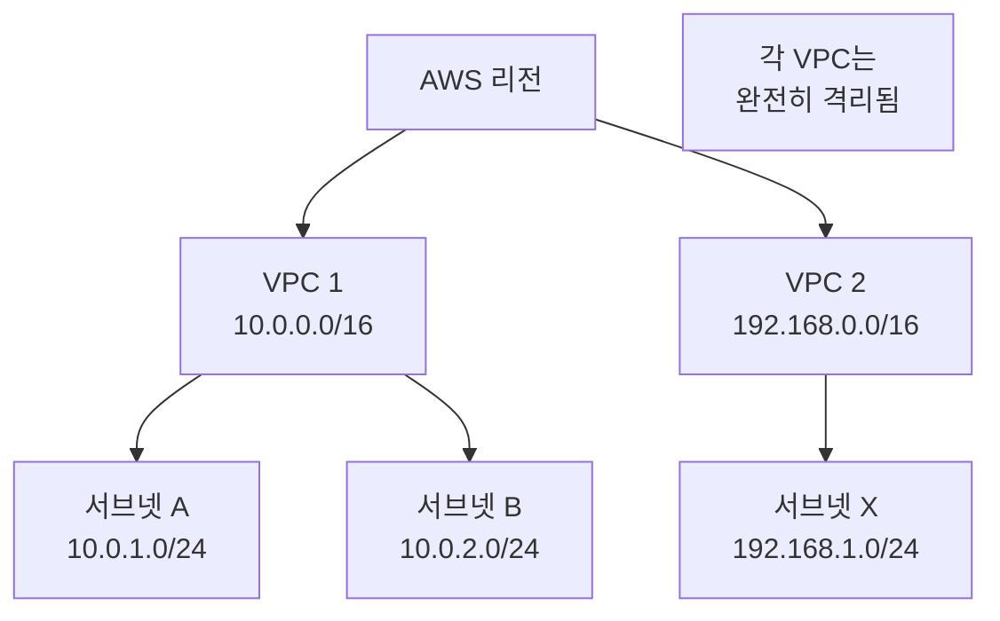

**전통적 네트워크와의 비교:**

```
물리적 데이터 센터:
- 실제 라우터, 스위치 구매
- 물리적 케이블 연결
- 하드웨어 설치/유지보수

AWS VPC:
- 소프트웨어로 정의된 네트워크 (SDN)
- 클릭/API로 라우터, 서브넷 생성
- 물리적 작업 불필요
- 몇 분 안에 구축
```

### 1.2 CIDR 블록의 이해

**CIDR (Classless Inter-Domain Routing):**
- IP 주소 범위를 표현하는 방법
- 형식: `IP주소/접두사 길이`

```
예시: 10.0.0.0/16

10.0.0.0 = 네트워크 주소
/16 = 앞 16비트는 네트워크 부분

계산:
- 32비트 - 16비트 = 16비트 (호스트 부분)
- 2^16 = 65,536개 IP 주소
- 실제 사용 가능: 65,531개 (5개는 AWS 예약)
```

**AWS 예약 IP (각 서브넷마다):**

```
서브넷: 10.0.1.0/24 (256개 IP)

예약 IP:
10.0.1.0   - 네트워크 주소
10.0.1.1   - VPC 라우터 (게이트웨이)
10.0.1.2   - DNS 서버
10.0.1.3   - 향후 사용 예약
10.0.1.255 - 브로드캐스트 주소 (AWS에서 사용 안 함)

사용 가능: 10.0.1.4 ~ 10.0.1.254 (251개)
```

### 1.3 VPC 크기 선택

```mermaid
graph TD
    A[VPC 크기 결정] --> B{필요한 IP 개수?}

    B -->|소규모<br/>< 256| C[/24<br/>251 IPs]
    B -->|중규모<br/>< 4096| D[/20<br/>4,091 IPs]
    B -->|대규모<br/>< 65536| E[/16<br/>65,531 IPs]

    F[확장 고려] --> G[처음부터 크게<br/>/16 권장]
```

**CIDR 크기 표:**

| CIDR | IP 개수 (총) | 사용 가능 | 사용 사례 |
|------|-------------|----------|-----------|
| /28 | 16 | 11 | 테스트 |
| /24 | 256 | 251 | 소규모 앱 |
| /20 | 4,096 | 4,091 | 중규모 앱 |
| /16 | 65,536 | 65,531 | 대규모 (권장) |

**실전 권장사항:**

```
프로덕션 VPC:
✅ /16 사용 (10.0.0.0/16)
- 향후 확장 여유
- 서브넷 유연하게 분할
- IP 부족 걱정 없음

개발/테스트 VPC:
✅ /20 또는 /24
- 비용 절감보다 관리 편의성
```

---

## 2. 서브넷과 라우팅

### 2.1 서브넷의 개념

**서브넷 (Subnet):**
- VPC를 **더 작은 네트워크로 분할**
- 각 서브넷은 **하나의 가용 영역 (AZ)**에 위치

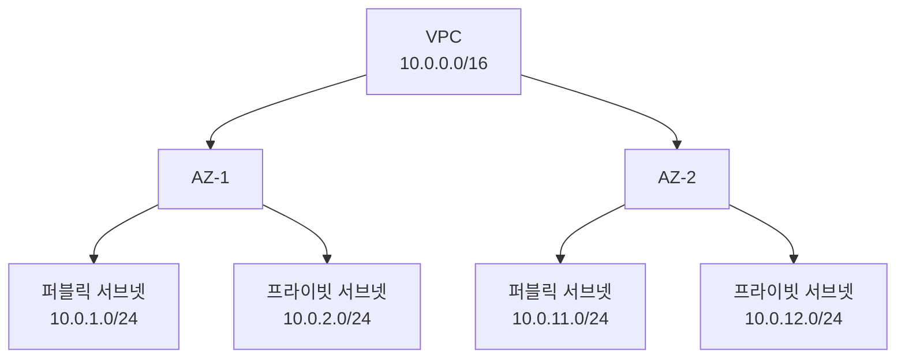

**서브넷 설계 예시:**

```
VPC: 10.0.0.0/16

AZ-1 (ap-northeast-2a):
  퍼블릭:  10.0.1.0/24  (웹 서버)
  프라이빗: 10.0.2.0/24  (앱 서버)
  데이터:  10.0.3.0/24  (DB)

AZ-2 (ap-northeast-2b):
  퍼블릭:  10.0.11.0/24 (웹 서버)
  프라이빗: 10.0.12.0/24 (앱 서버)
  데이터:  10.0.13.0/24 (DB)

예비:   10.0.20.0/22 (확장용)
```

### 2.2 퍼블릭 vs 프라이빗 서브넷

```
퍼블릭 서브넷:
- 인터넷 게이트웨이(IGW)로 가는 라우트 있음
- 공인 IP 할당 가능
- 인터넷과 직접 통신

프라이빗 서브넷:
- 인터넷 게이트웨이로 가는 라우트 없음
- 공인 IP 없음
- NAT 게이트웨이를 통해서만 인터넷 접근
```

**퍼블릭 서브넷 라우트 테이블:**

| 목적지 | 타겟 | 설명 |
|--------|------|------|
| 10.0.0.0/16 | local | VPC 내부 통신 |
| 0.0.0.0/0 | igw-xxx | 인터넷 (모든 IP) |

**프라이빗 서브넷 라우트 테이블:**

| 목적지 | 타겟 | 설명 |
|--------|------|------|
| 10.0.0.0/16 | local | VPC 내부 통신 |
| 0.0.0.0/0 | nat-xxx | NAT 게이트웨이 |

### 2.3 라우팅 테이블 동작 원리

**전통적 라우터:**

```
Linux 라우팅 테이블:
$ route -n

Destination     Gateway         Iface
192.168.1.0     0.0.0.0         eth0
0.0.0.0         192.168.1.1     eth0

동작:
1. 패킷 목적지 확인
2. 가장 구체적인(longest match) 라우트 선택
3. 해당 게이트웨이로 전달
```

**AWS 라우트 테이블:**

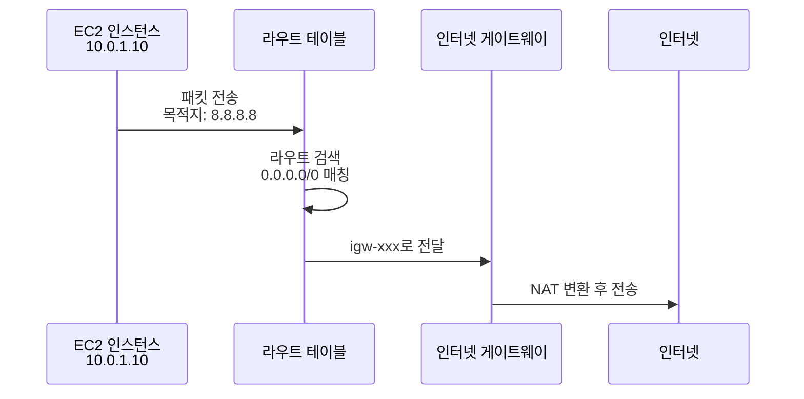

**라우팅 우선순위:**

```
패킷 목적지: 10.0.2.50

라우트 테이블:
1. 10.0.0.0/16  → local
2. 10.0.2.0/24  → pcx-yyy (VPC Peering)
3. 0.0.0.0/0    → igw-xxx

선택: 10.0.2.0/24 (가장 구체적)
→ VPC Peering 연결로 전달
```

---

## 3. 인터넷 연결 - IGW와 NAT

### 3.1 인터넷 게이트웨이 (IGW)

**Internet Gateway:**
- VPC와 인터넷을 연결하는 **게이트웨이**
- **NAT (Network Address Translation)** 수행

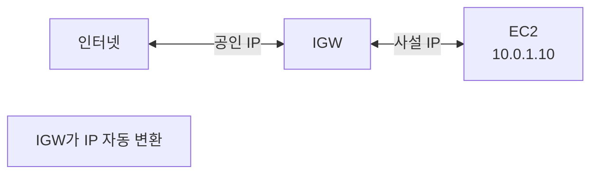

**NAT 동작:**

```
아웃바운드 (EC2 → 인터넷):
EC2: 10.0.1.10 → 8.8.8.8 (Google DNS)
IGW: 54.180.1.10 → 8.8.8.8 (공인 IP로 변환)

인바운드 (인터넷 → EC2):
요청: 인터넷 → 54.180.1.10
IGW: 54.180.1.10 → 10.0.1.10 (사설 IP로 변환)
```

**전통적 NAT와 비교:**

```
Linux NAT (iptables):
iptables -t nat -A POSTROUTING -o eth0 -j MASQUERADE

설정 필요:
- IP 포워딩 활성화
- iptables 규칙 작성
- 라우팅 설정

AWS IGW:
- 클릭 한 번으로 생성
- 자동 NAT
- 무제한 대역폭
- 추가 비용 없음
```

### 3.2 NAT 게이트웨이

**NAT Gateway:**
- **프라이빗 서브넷**의 인스턴스가 인터넷 접근
- **단방향** 연결 (프라이빗 → 인터넷만)

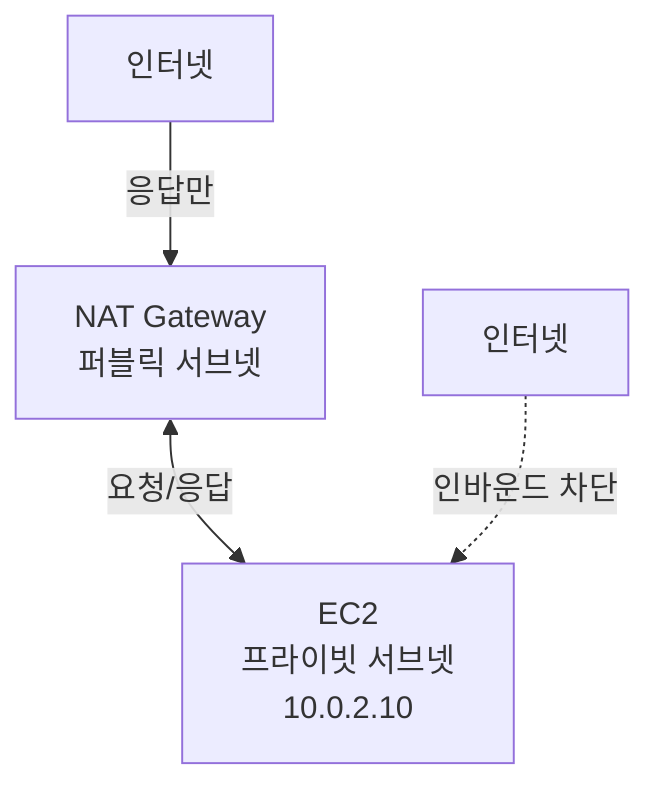

**NAT Gateway 동작:**

```
시나리오: 프라이빗 EC2가 패키지 업데이트

1. EC2 (10.0.2.10) → apt update 실행
2. 패킷: 10.0.2.10 → security.ubuntu.com
3. 라우트: 0.0.0.0/0 → nat-xxx
4. NAT GW: 10.0.2.10 → 퍼블릭 IP로 변환
5. IGW를 통해 인터넷으로 나감
6. 응답 역순으로 도착

외부에서 10.0.2.10으로 직접 연결: 불가능
```

### 3.3 NAT Gateway vs NAT Instance

| 특성 | NAT Gateway | NAT Instance |
|------|-------------|--------------|
| **관리** | AWS 완전 관리 | 사용자 관리 (EC2) |
| **가용성** | 자동 고가용성 | 수동 설정 필요 |
| **대역폭** | 최대 45 Gbps | 인스턴스 타입 따름 |
| **비용** | 시간당 $0.045 + 데이터 전송 | EC2 비용 |
| **보안 그룹** | 불가 | 가능 |
| **배스천 호스트** | 불가 | 가능 |

**NAT Gateway 고가용성 설계:**

```
VPC: 10.0.0.0/16

AZ-1:
  퍼블릭: 10.0.1.0/24 (NAT GW 1)
  프라이빗: 10.0.2.0/24 → NAT GW 1 사용

AZ-2:
  퍼블릭: 10.0.11.0/24 (NAT GW 2)
  프라이빗: 10.0.12.0/24 → NAT GW 2 사용

장점:
- AZ 하나 장애 시에도 다른 AZ는 정상
- 각 AZ가 독립적 인터넷 연결
```

---

## 4. 보안 그룹과 NACL

### 4.1 보안 그룹 (Security Group)

**Security Group:**
- 인스턴스 레벨의 **가상 방화벽**
- **상태 저장 (Stateful)**

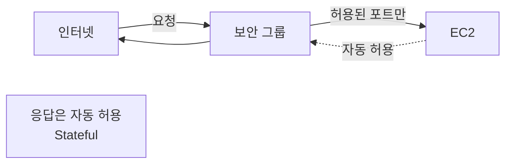

**전통적 방화벽과 비교:**

```
iptables (Linux):
# 인바운드 허용
iptables -A INPUT -p tcp --dport 80 -j ACCEPT

# 아웃바운드도 명시적으로 허용 필요
iptables -A OUTPUT -p tcp --sport 80 -m state --state ESTABLISHED -j ACCEPT

AWS 보안 그룹:
# 인바운드만 허용
Port 80, Source: 0.0.0.0/0

→ 응답은 자동 허용 (Stateful)
```

**보안 그룹 규칙 예시:**

```
웹 서버 보안 그룹:

인바운드:
Port 80   (HTTP)   Source: 0.0.0.0/0 (모든 IP)
Port 443  (HTTPS)  Source: 0.0.0.0/0
Port 22   (SSH)    Source: 관리자 IP/32

아웃바운드:
All traffic       Destination: 0.0.0.0/0 (기본)
```

### 4.2 NACL (Network ACL)

**Network ACL:**
- 서브넷 레벨의 **방화벽**
- **상태 비저장 (Stateless)**

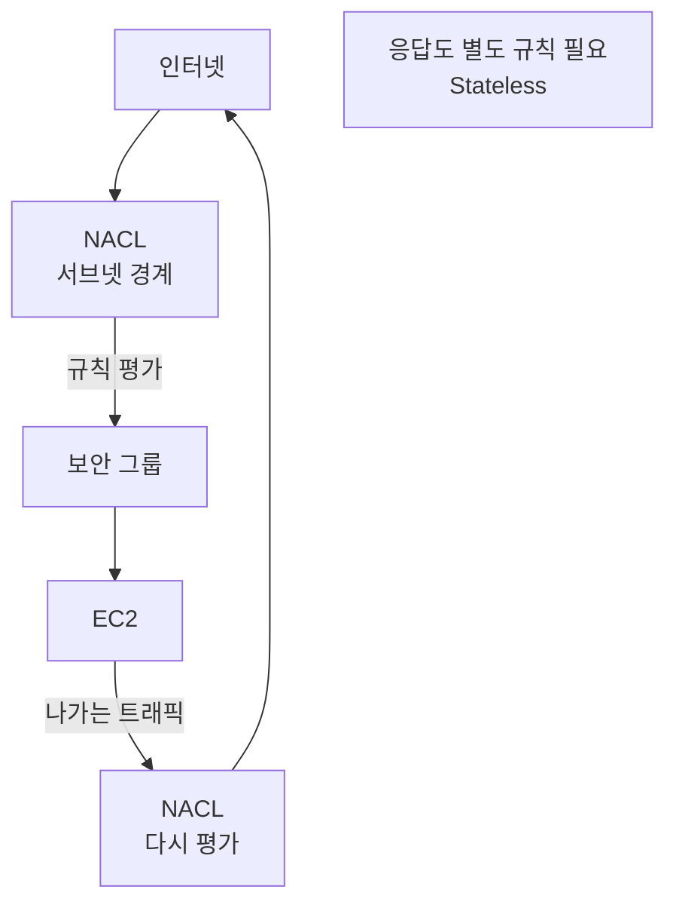

**NACL 규칙 평가:**

```
NACL 규칙 (순서대로 평가):

규칙 #  Type        Port  Source        Allow/Deny
100     HTTP        80    0.0.0.0/0     ALLOW
200     HTTPS       443   0.0.0.0/0     ALLOW
300     SSH         22    10.0.0.0/16   ALLOW
*       All         All   0.0.0.0/0     DENY

평가 과정:
1. 패킷이 들어옴 (HTTP, 포트 80)
2. 규칙 #100 매칭 → ALLOW
3. 즉시 허용 (이후 규칙 무시)

패킷 (포트 8080):
1. 규칙 #100 불일치
2. 규칙 #200 불일치
3. 규칙 #300 불일치
4. 규칙 * 매칭 → DENY
```

### 4.3 보안 그룹 vs NACL

| 특성 | 보안 그룹 | NACL |
|------|-----------|------|
| **레벨** | 인스턴스 | 서브넷 |
| **상태** | Stateful (응답 자동) | Stateless (응답 규칙 필요) |
| **규칙** | ALLOW만 | ALLOW와 DENY |
| **평가** | 모든 규칙 평가 | 번호 순서대로 평가 |
| **적용** | 인스턴스에 명시적 연결 | 서브넷 자동 적용 |

**Stateful vs Stateless:**

```
시나리오: 클라이언트가 웹 서버에 HTTP 요청

보안 그룹 (Stateful):
인바운드: Port 80 ALLOW
아웃바운드: (자동 허용 - 규칙 불필요)

NACL (Stateless):
인바운드: Port 80 ALLOW
아웃바운드: Port 1024-65535 ALLOW (임시 포트)
→ 응답을 위한 명시적 규칙 필요!
```

**방어 계층 설계:**

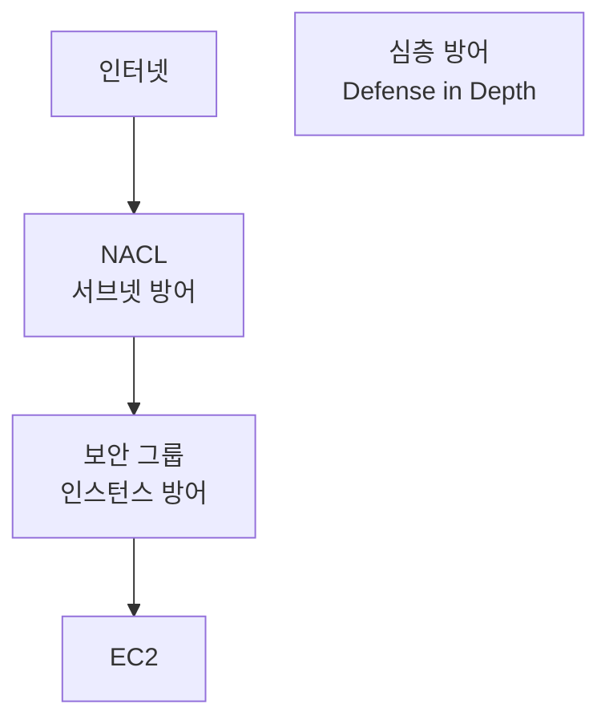

---

## 5. Route 53 - DNS 서비스

### 5.1 DNS 기초

**DNS (Domain Name System):**
- **도메인 이름을 IP 주소로 변환**
- 인터넷의 전화번호부

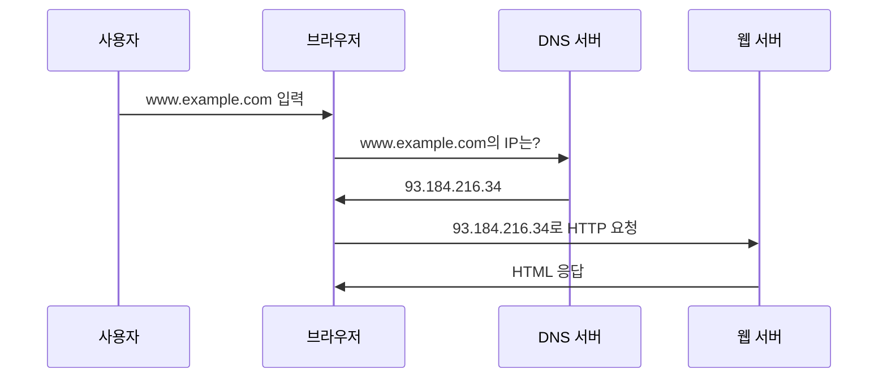

**전통적 DNS (BIND):**

```bash
# BIND 설정 (Linux DNS 서버)
zone "example.com" {
    type master;
    file "/etc/bind/db.example.com";
};

# db.example.com 파일
www    IN  A      93.184.216.34
mail   IN  A      93.184.216.35
       IN  MX 10  mail.example.com.

문제:
- 서버 관리 필요
- 장애 대응 어려움
- 확장성 제한
```

### 5.2 Route 53의 특징

**Amazon Route 53:**
- AWS의 **관리형 DNS** 서비스
- **고가용성** (100% SLA)
- **글로벌 애니캐스트** 네트워크

```
Route 53 장점:

1. 고가용성:
   - 전 세계 DNS 서버
   - 자동 장애 조치

2. 라우팅 정책:
   - 지리적 위치 기반
   - 지연 시간 기반
   - 가중치 기반
   - 장애 조치

3. 헬스 체크:
   - 엔드포인트 상태 모니터링
   - 자동 장애 조치
```

### 5.3 레코드 타입

**주요 DNS 레코드:**

```
A 레코드 (Address):
www.example.com  →  93.184.216.34 (IPv4)

AAAA 레코드:
www.example.com  →  2001:0db8::1 (IPv6)

CNAME 레코드 (Canonical Name):
blog.example.com  →  www.example.com
→ www의 IP를 따라감 (별칭)

MX 레코드 (Mail eXchange):
example.com  →  mail.example.com (우선순위 10)

TXT 레코드:
example.com  →  "v=spf1 include:_spf.google.com ~all"
→ SPF, 도메인 인증 등
```

**Route 53 특수 레코드:**

```
Alias 레코드:
- AWS 리소스에 대한 별칭
- CNAME과 유사하지만 더 강력
- Zone Apex (example.com) 지원

예:
example.com  →  Alias to ELB
→ ELB의 IP가 변경되어도 자동 추적
→ 쿼리 비용 무료
```

### 5.4 라우팅 정책

#### 1. Simple Routing (단순 라우팅)

```
www.example.com → 93.184.216.34

특징:
- 하나의 레코드에 하나 또는 여러 IP
- 랜덤 선택
- 헬스 체크 불가
```

#### 2. Weighted Routing (가중치 기반)

```
www.example.com:
  - 70%: 서버 A (54.180.1.10)
  - 30%: 서버 B (54.180.1.20)

사용 사례:
- A/B 테스팅
- 카나리 배포
- 점진적 트래픽 이동
```

#### 3. Latency-Based Routing (지연 시간 기반)

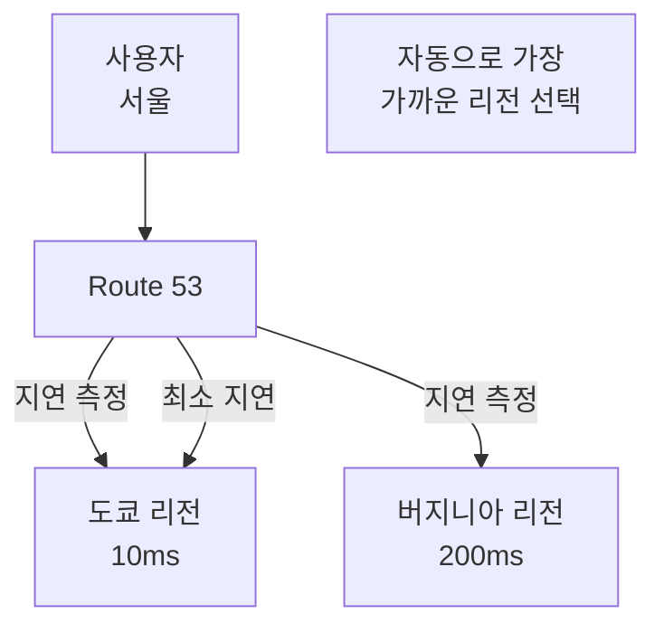

#### 4. Geolocation Routing (지리적 위치 기반)

```
사용자 위치에 따라 다른 서버:

한국 사용자: 서울 리전
일본 사용자: 도쿄 리전
미국 사용자: 버지니아 리전
기타: 기본값 (싱가포르)

사용 사례:
- 지역별 콘텐츠 제공
- 규정 준수 (데이터 주권)
```

#### 5. Failover Routing (장애 조치)

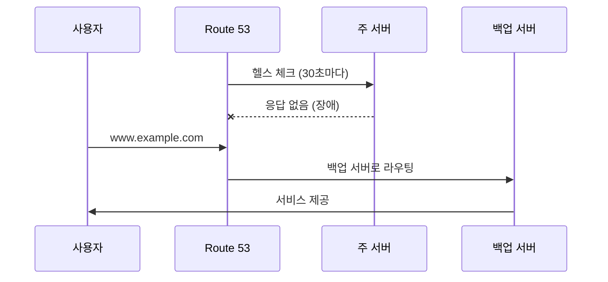

---

## 6. CloudFront - CDN 서비스

### 6.1 CDN의 개념

**CDN (Content Delivery Network):**
- 전 세계에 분산된 **캐시 서버**
- 사용자와 **가까운 위치**에서 콘텐츠 제공

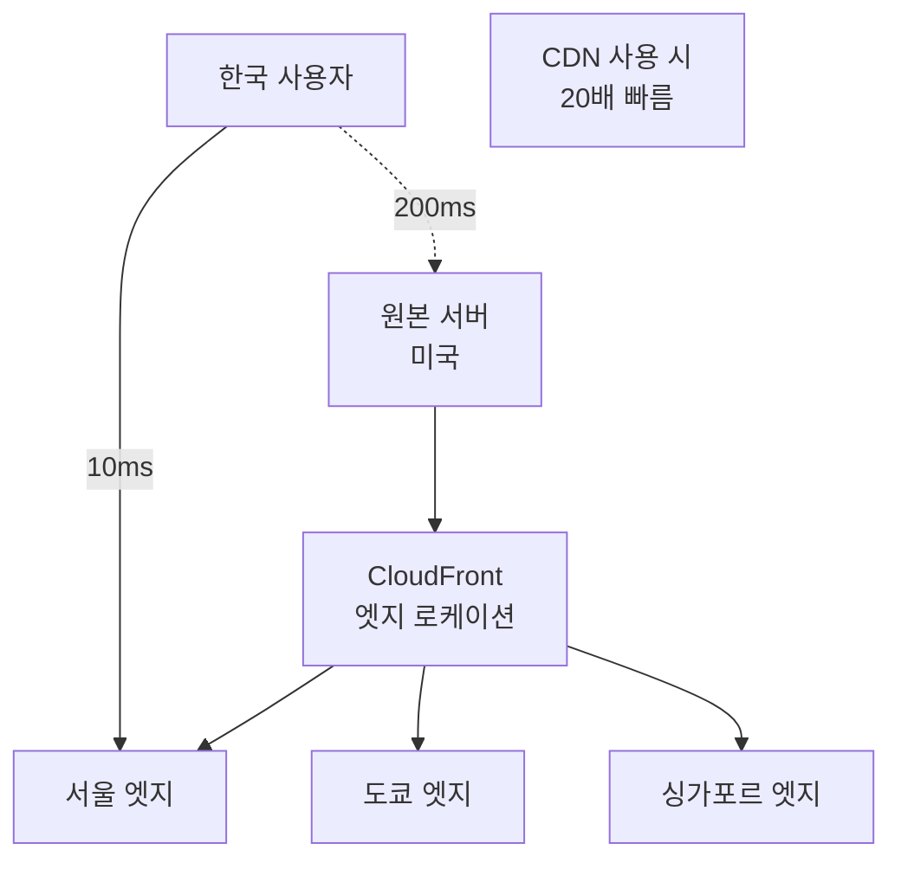

**전통적 웹 서비스:**

```
사용자 (서울) → 원본 서버 (미국)
- 거리: 10,000km
- 지연: 200ms
- 대역폭 제한

문제:
- 느린 로딩 속도
- 서버 부하
- 글로벌 사용자 경험 저하
```

### 6.2 CloudFront 동작 원리

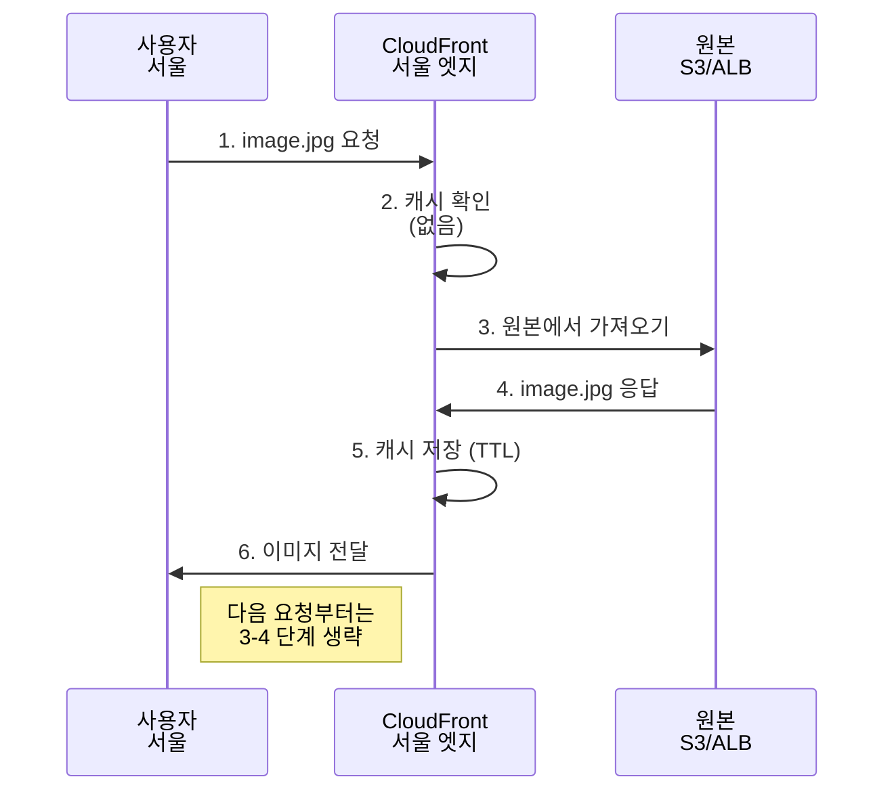

**캐시 동작:**

```
첫 번째 요청:
사용자 → 엣지 (캐시 없음) → 원본
응답 시간: 200ms

캐시 저장 (TTL: 24시간)

두 번째 요청부터:
사용자 → 엣지 (캐시 있음) → 즉시 응답
응답 시간: 10ms

TTL 만료 후:
엣지 → 원본 (If-Modified-Since)
원본 → 304 Not Modified (변경 없음)
→ 캐시 재사용
```

### 6.3 오리진 (Origin) 타입

**1. S3 버킷:**

```
CloudFront → S3

장점:
- 정적 콘텐츠 (HTML, CSS, JS, 이미지)
- OAI (Origin Access Identity)로 보안
- S3는 CloudFront만 접근 가능

사용 사례:
- 정적 웹사이트
- 대용량 파일 배포
```

**2. ALB/EC2:**

```
CloudFront → ALB → EC2

장점:
- 동적 콘텐츠
- API 가속
- 캐시 제어 (Cache-Control 헤더)

사용 사례:
- API 엔드포인트
- 동적 웹 애플리케이션
```

### 6.4 CloudFront 고급 기능

#### 1. 캐시 제어

```http
HTTP 헤더로 캐시 제어:

Cache-Control: max-age=86400
→ 24시간 캐시

Cache-Control: no-cache
→ 매번 원본 검증

Cache-Control: no-store
→ 캐시 안 함

ETag: "abc123"
If-None-Match: "abc123"
→ 변경 여부 확인
```

#### 2. 지리적 제한

```
국가별 접근 제어:

허용 목록 (Whitelist):
- 한국, 일본, 미국만 허용

차단 목록 (Blacklist):
- 특정 국가 차단

사용 사례:
- 저작권 준수
- 규정 준수
```

#### 3. SSL/TLS

```
HTTPS 설정:

1. CloudFront 기본 인증서:
   - *.cloudfront.net
   - 무료

2. 사용자 정의 도메인:
   - ACM (AWS Certificate Manager)에서 인증서
   - www.example.com
   - 무료

보안:
- TLS 1.2/1.3만 허용
- 약한 암호화 차단
```

---

## 7. Elastic Load Balancing

### 7.1 로드 밸런서의 개념

**Load Balancer:**
- 트래픽을 **여러 서버에 분산**
- **고가용성** 보장

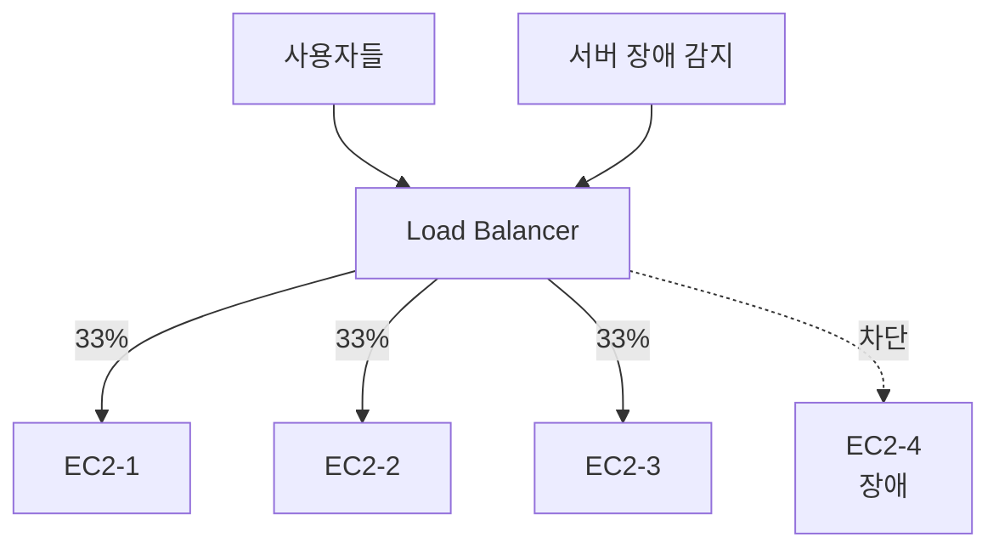

**전통적 로드 밸런서 (HAProxy):**

```
# HAProxy 설정
frontend http_front
    bind *:80
    default_backend http_back

backend http_back
    balance roundrobin
    server server1 10.0.1.10:80 check
    server server2 10.0.1.11:80 check
    server server3 10.0.1.12:80 check

문제:
- HAProxy 서버 자체가 SPOF
- 확장 어려움
- 관리 부담
```

### 7.2 ELB 타입

#### 1. Application Load Balancer (ALB)

**Layer 7 (애플리케이션 계층) 로드 밸런서**

```
HTTP/HTTPS 트래픽 처리

기능:
- 경로 기반 라우팅
- 호스트 기반 라우팅
- HTTP 헤더 기반 라우팅
- WebSocket 지원
```

**라우팅 예시:**

```
www.example.com/api/*     → API 서버 그룹
www.example.com/images/*  → 이미지 서버 그룹
www.example.com/*         → 웹 서버 그룹

api.example.com           → API 서버 그룹
www.example.com           → 웹 서버 그룹
```

#### 2. Network Load Balancer (NLB)

**Layer 4 (전송 계층) 로드 밸런서**

```
TCP/UDP 트래픽 처리

특징:
- 초고성능 (수백만 RPS)
- 매우 낮은 지연시간 (마이크로초)
- 고정 IP 지원
- TLS 오프로드

사용 사례:
- 게임 서버
- IoT
- TCP 기반 애플리케이션
```

#### 3. Gateway Load Balancer (GWLB)

```
Layer 3 (네트워크 계층) 로드 밸런서

용도:
- 방화벽
- IDS/IPS
- DPI (Deep Packet Inspection)

특수 목적 로드 밸런서
```

### 7.3 ALB vs NLB 비교

| 특성 | ALB | NLB |
|------|-----|-----|
| **계층** | Layer 7 (HTTP/HTTPS) | Layer 4 (TCP/UDP) |
| **라우팅** | URL, 헤더 기반 | IP, 포트 기반 |
| **성능** | 높음 | 매우 높음 |
| **지연** | 밀리초 | 마이크로초 |
| **고정 IP** | 불가 | 가능 |
| **TLS 종료** | 가능 | 가능 |
| **WebSocket** | 지원 | 지원 |
| **비용** | 중간 | 낮음 |

### 7.4 헬스 체크

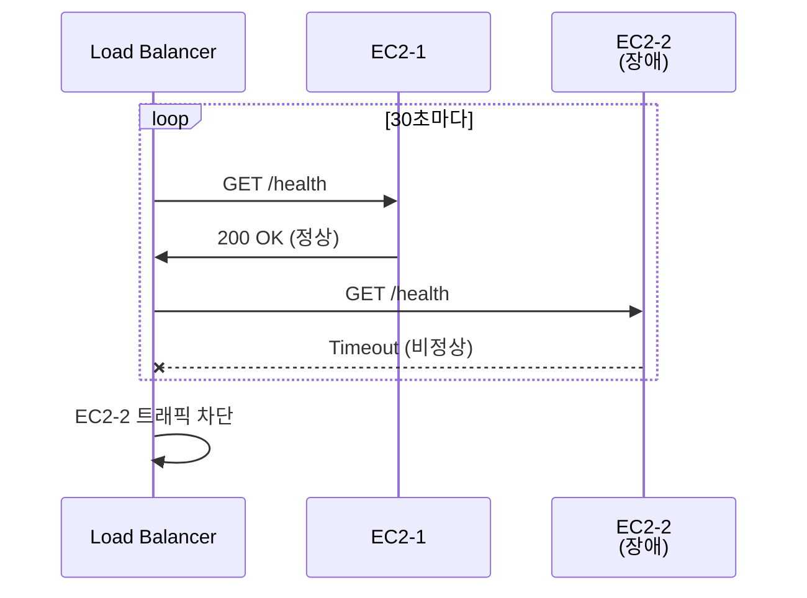

**헬스 체크 설정:**

```
프로토콜: HTTP
경로: /health
포트: 80
간격: 30초
타임아웃: 5초
정상 임계값: 2회 연속 성공
비정상 임계값: 2회 연속 실패

/health 엔드포인트:
{
  "status": "healthy",
  "database": "connected",
  "cache": "connected"
}
```

---

## 8. VPC 고급 기능

### 8.1 VPC Peering

**VPC Peering:**
- **두 VPC를 직접 연결**
- 사설 IP로 통신

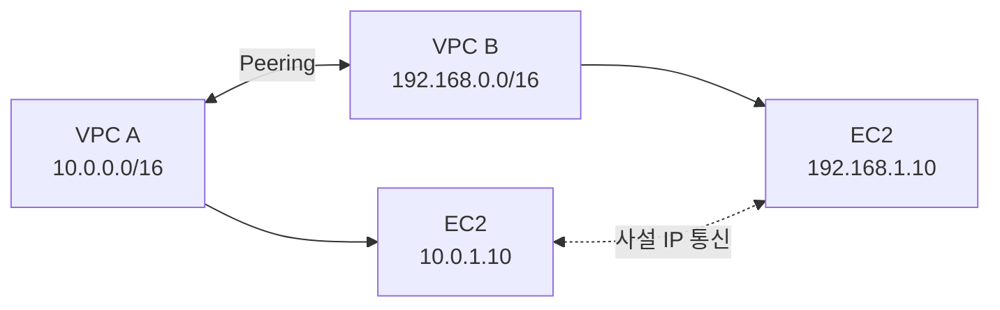

**제약 사항:**

```
❌ CIDR 중복 불가:
VPC A: 10.0.0.0/16
VPC B: 10.0.0.0/16
→ Peering 불가!

❌ 전이적 연결 불가:
VPC A ↔ VPC B ↔ VPC C
→ A와 C는 직접 통신 불가
→ A-C Peering 별도 필요

✅ 리전 간 Peering:
서울 VPC ↔ 도쿄 VPC
→ 가능 (추가 비용)
```

### 8.2 VPC Endpoint

**VPC Endpoint:**
- VPC에서 AWS 서비스로 **프라이빗 연결**
- 인터넷 거치지 않음

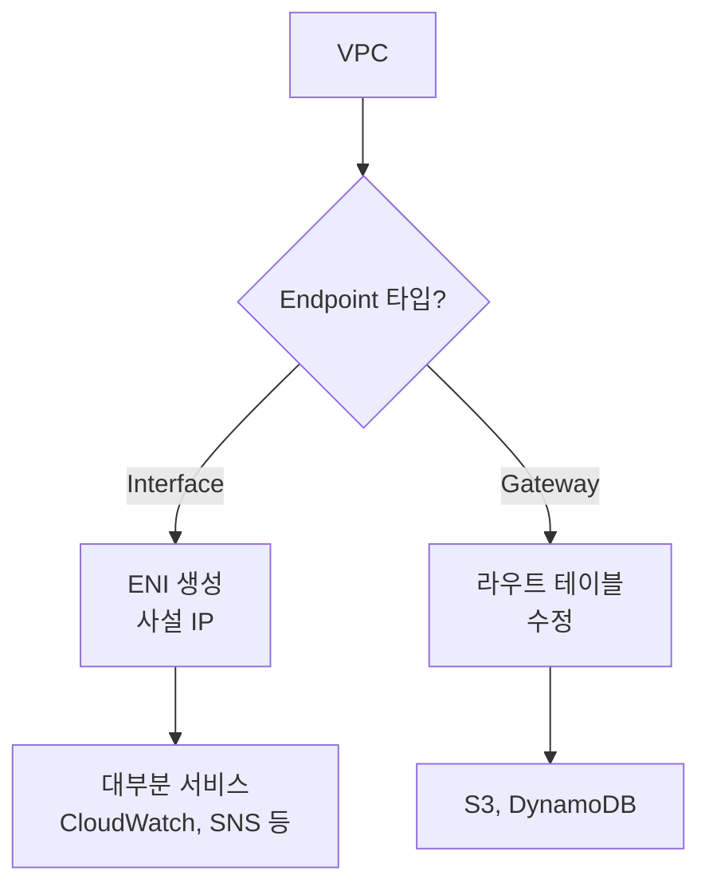

**Gateway Endpoint (S3 예시):**

```
Endpoint 없이:
프라이빗 EC2 → NAT GW → IGW → 인터넷 → S3
- 비용: NAT GW 시간 + 데이터 전송
- 보안: 인터넷 노출

Gateway Endpoint:
프라이빗 EC2 → VPC Endpoint → S3
- 비용: 무료!
- 보안: AWS 내부 네트워크
- 빠름
```

### 8.3 Transit Gateway

**Transit Gateway:**
- **여러 VPC와 온프레미스를 중앙 집중식으로 연결**

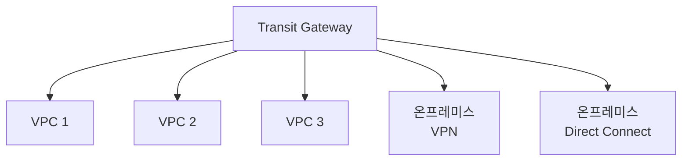

**VPC Peering vs Transit Gateway:**

```
VPC 10개 연결:

VPC Peering:
- 필요한 Peering: 45개 (n*(n-1)/2)
- 관리 복잡도: 매우 높음

Transit Gateway:
- 필요한 연결: 10개
- 중앙 관리
- 라우팅 간단
```

### 8.4 Direct Connect

**AWS Direct Connect:**
- 온프레미스와 AWS를 **전용 네트워크로 연결**

```
일반 VPN:
온프레미스 → 인터넷 → AWS
- 대역폭: 불안정
- 지연: 높음
- 보안: IPsec

Direct Connect:
온프레미스 → 전용선 → AWS
- 대역폭: 1Gbps, 10Gbps, 100Gbps
- 지연: 낮고 일관됨
- 보안: 전용선
- 비용: 높음

사용 사례:
- 대용량 데이터 전송
- 하이브리드 클라우드
- 지연 민감 애플리케이션
```

---

## 9. 요약 및 체크리스트

### 핵심 개념 요약

**VPC:**
```
✅ 논리적으로 격리된 가상 네트워크
✅ CIDR 블록으로 IP 범위 정의
✅ 서브넷으로 AZ별 분할
```

**보안:**
```
✅ 보안 그룹: 인스턴스 레벨, Stateful
✅ NACL: 서브넷 레벨, Stateless
✅ 심층 방어 (Defense in Depth)
```

**DNS/CDN:**
```
✅ Route 53: 관리형 DNS, 다양한 라우팅 정책
✅ CloudFront: 글로벌 CDN, 엣지 캐싱
```

**로드 밸런싱:**
```
✅ ALB: Layer 7, HTTP/HTTPS, URL 기반 라우팅
✅ NLB: Layer 4, TCP/UDP, 초고성능
```

### 실전 체크리스트

```
□ VPC 설계
  □ CIDR 크기: /16 권장
  □ 서브넷: 최소 2개 AZ, 퍼블릭/프라이빗 분리
  □ NAT Gateway: 각 AZ마다 (고가용성)

□ 보안 설정
  □ 보안 그룹: 최소 권한 원칙
  □ NACL: 추가 방어 계층 (선택)
  □ VPC Flow Logs: 네트워크 트래픽 모니터링

□ 인터넷 연결
  □ IGW: 퍼블릭 서브넷
  □ NAT GW: 프라이빗 서브넷 인터넷 접근

□ DNS/CDN
  □ Route 53: 도메인 등록 및 관리
  □ CloudFront: 정적 콘텐츠 가속

□ 로드 밸런싱
  □ ALB: 웹 애플리케이션
  □ 헬스 체크: 엔드포인트 모니터링
  □ 다중 AZ: 고가용성
```

---

**이 챕터에서 배운 내용:**

1. **VPC와 서브넷**: 논리적 네트워크 격리, CIDR, 퍼블릭/프라이빗 서브넷
2. **라우팅과 게이트웨이**: IGW, NAT Gateway, 라우트 테이블
3. **보안**: 보안 그룹 vs NACL, Stateful vs Stateless
4. **DNS**: Route 53, 라우팅 정책, 헬스 체크
5. **CDN**: CloudFront, 엣지 로케이션, 캐싱
6. **로드 밸런싱**: ALB vs NLB, 헬스 체크, 고가용성
7. **고급 기능**: VPC Peering, Endpoint, Transit Gateway, Direct Connect

AWS 네트워크 서비스는 전통적인 네트워크 개념을 클라우드에 적용하여 유연하고 확장 가능한 인프라를 구축할 수 있게 합니다.
