# Chapter 10: AWS 기타 서비스

> **학습 목표**: AWS의 추가 핵심 서비스들(서버리스, 모니터링, 메시징, IaC, 배포 자동화)을 이해하고, 각 서비스의 특징과 사용 사례를 파악한다.

---

## 📌 목차

1. [AWS Lambda - 서버리스 컴퓨팅](#1-aws-lambda---서버리스-컴퓨팅)
2. [Amazon CloudWatch - 모니터링 및 로깅](#2-amazon-cloudwatch---모니터링-및-로깅)
3. [Amazon SNS & SQS - 메시징 서비스](#3-amazon-sns--sqs---메시징-서비스)
4. [AWS CloudFormation - Infrastructure as Code](#4-aws-cloudformation---infrastructure-as-code)
5. [AWS Elastic Beanstalk - 애플리케이션 배포](#5-aws-elastic-beanstalk---애플리케이션-배포)
6. [AWS Systems Manager - 운영 관리](#6-aws-systems-manager---운영-관리)
7. [AWS Auto Scaling - 자동 확장](#7-aws-auto-scaling---자동-확장)
8. [Amazon EventBridge - 이벤트 기반 아키텍처](#8-amazon-eventbridge---이벤트-기반-아키텍처)
9. [요약](#9-요약)

---

## 1. AWS Lambda - 서버리스 컴퓨팅

### 1.1 Lambda란?

**AWS Lambda**는 서버 관리 없이 코드를 실행할 수 있는 서버리스 컴퓨팅 서비스입니다.

#### Lambda의 특징

**서버리스 (Serverless)**:
- 서버 프로비저닝 불필요
- 서버 관리 불필요 (패치, 유지보수 AWS가 담당)
- 자동 확장 (트래픽에 따라 자동 스케일링)

**이벤트 기반 실행**:
- S3에 파일 업로드 → Lambda 실행
- API Gateway 요청 → Lambda 실행
- DynamoDB 변경 → Lambda 실행
- CloudWatch 알람 → Lambda 실행

**비용 효율**:
- 코드 실행 시간만 과금
- 요청 횟수에 따른 과금
- 유휴 시간 비용 없음

### 1.2 전통적인 서버 vs Lambda

#### 전통적인 서버 운영

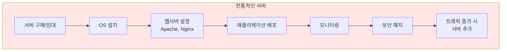

**문제점**:
- 서버 관리 부담 (OS, 패치, 보안)
- 트래픽 예측 어려움
- 유휴 시간에도 비용 발생
- 확장 시 수동 작업 필요

#### Lambda 사용

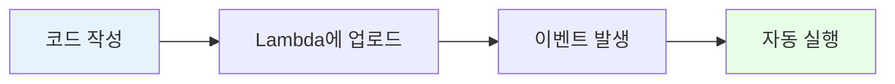

**장점**:
- 코드만 작성하면 됨
- 서버 관리 불필요
- 자동 확장
- 사용한 만큼만 과금

### 1.3 Lambda 작동 방식

#### Lambda 실행 프로세스

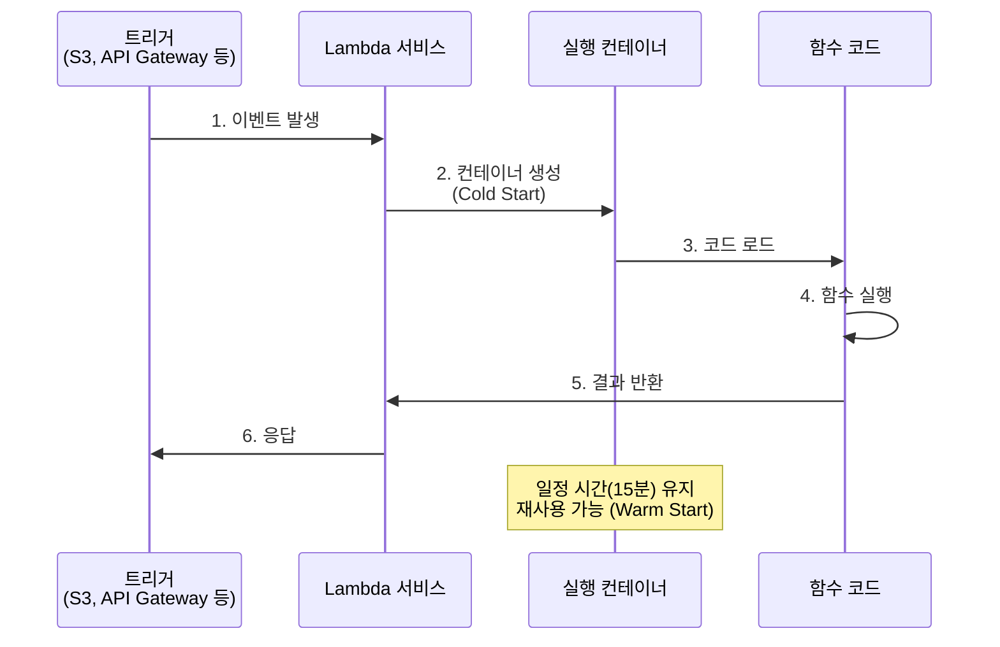

#### Cold Start vs Warm Start

**Cold Start (콜드 스타트)**:
- 첫 실행 또는 오랜 유휴 후 실행
- 컨테이너 초기화 필요
- 실행 시간: 수백 ms ~ 수 초
- 레이턴시 증가

**Warm Start (웜 스타트)**:
- 기존 컨테이너 재사용
- 초기화 불필요
- 실행 시간: 수 ms
- 빠른 응답

**Cold Start 최소화 방법**:
- Provisioned Concurrency 사용 (미리 컨테이너 예열)
- 함수 코드 최적화 (의존성 최소화)
- 적절한 메모리 할당

### 1.4 Lambda 제한 사항

| 제한 사항 | 값 | 설명 |
|----------|-----|------|
| **최대 실행 시간** | 15분 | 15분 이상 걸리는 작업은 Lambda 부적합 |
| **메모리** | 128 MB ~ 10,240 MB | 메모리 할당에 따라 CPU 성능도 비례 |
| **임시 스토리지 (/tmp)** | 10 GB | 함수 실행 중 임시 파일 저장 공간 |
| **동시 실행** | 1,000개 (기본) | 계정당 동시 실행 수 제한 (증가 요청 가능) |
| **배포 패키지 크기** | 50 MB (압축), 250 MB (압축 해제) | 코드 + 의존성 크기 제한 |

### 1.5 Lambda 사용 사례

#### 1️⃣ 이미지 리사이징

**시나리오**: 사용자가 S3에 이미지 업로드 시 자동으로 썸네일 생성

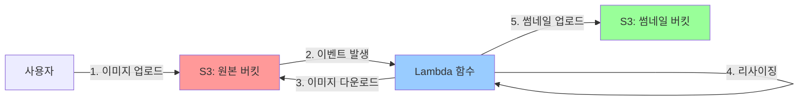

**전통적인 방법**:
- 웹 서버가 24/7 대기
- 업로드 시 서버에서 처리
- 트래픽 많을 때 서버 과부하

**Lambda 사용**:
- 업로드 시에만 실행
- 자동 확장 (동시 업로드 처리)
- 비용 절감 (실행 시간만 과금)

#### 2️⃣ API 백엔드

**시나리오**: 모바일 앱 API 서버

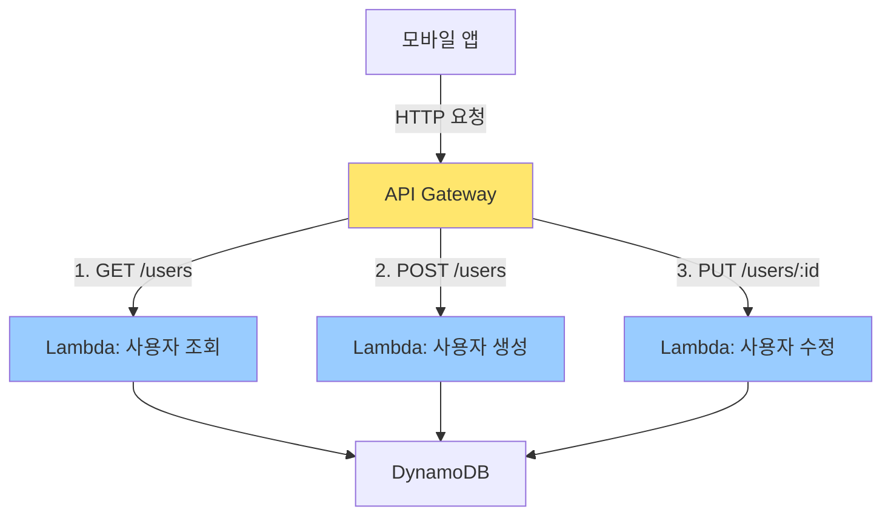

**장점**:
- 서버 관리 불필요
- 트래픽에 따라 자동 확장
- 마이크로서비스 아키텍처 구현

#### 3️⃣ 데이터 처리 파이프라인

**시나리오**: 로그 파일 자동 분석

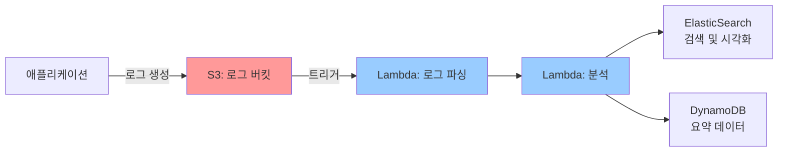

#### 4️⃣ Scheduled Task (정기 작업)

**시나리오**: 매일 밤 12시 일일 리포트 생성

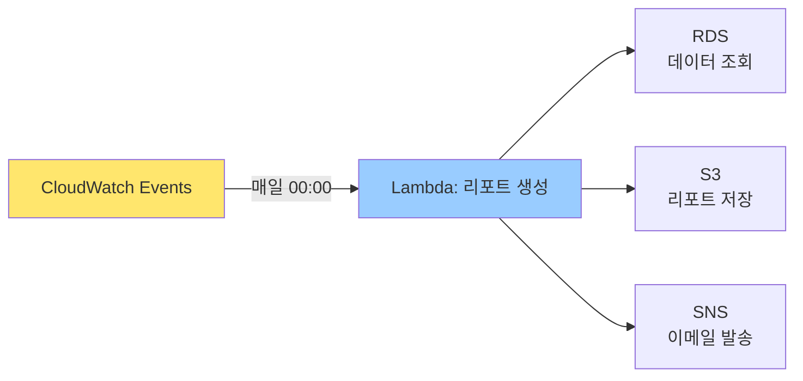

**전통적인 방법**: Cron 작업 (서버 필요)
**Lambda**: EventBridge (CloudWatch Events)로 스케줄링

### 1.6 Lambda vs 전통적인 서버

| 구분 | 전통적인 서버 (EC2) | Lambda |
|------|-------------------|--------|
| **서버 관리** | 필요 (OS, 패치, 보안) | 불필요 |
| **확장성** | 수동 (Auto Scaling 설정) | 자동 (무제한에 가까움) |
| **비용** | 24/7 과금 | 실행 시간만 과금 |
| **시작 시간** | 수 분 (인스턴스 부팅) | 수 ms ~ 수 초 |
| **최대 실행 시간** | 무제한 | 15분 |
| **사용 사례** | 장시간 실행, 복잡한 워크로드 | 단기 실행, 이벤트 기반 작업 |

---

## 2. Amazon CloudWatch - 모니터링 및 로깅

### 2.1 CloudWatch란?

**Amazon CloudWatch**는 AWS 리소스와 애플리케이션을 모니터링하고 로그를 수집하는 서비스입니다.

#### CloudWatch 주요 기능

**1️⃣ 메트릭 (Metrics)**:
- 리소스 성능 지표 수집
- CPU 사용률, 네트워크 트래픽 등
- 자동 수집 + 커스텀 메트릭 가능

**2️⃣ 로그 (Logs)**:
- 애플리케이션 로그 수집
- 로그 검색 및 분석
- 실시간 로그 스트리밍

**3️⃣ 알람 (Alarms)**:
- 메트릭 기반 알림
- 임계값 초과 시 알림
- 자동 조치 (Auto Scaling 트리거 등)

**4️⃣ 대시보드 (Dashboards)**:
- 메트릭 시각화
- 여러 리소스 한 눈에 모니터링

### 2.2 전통적인 모니터링 vs CloudWatch

#### 전통적인 모니터링 (Nagios, Zabbix, Prometheus)

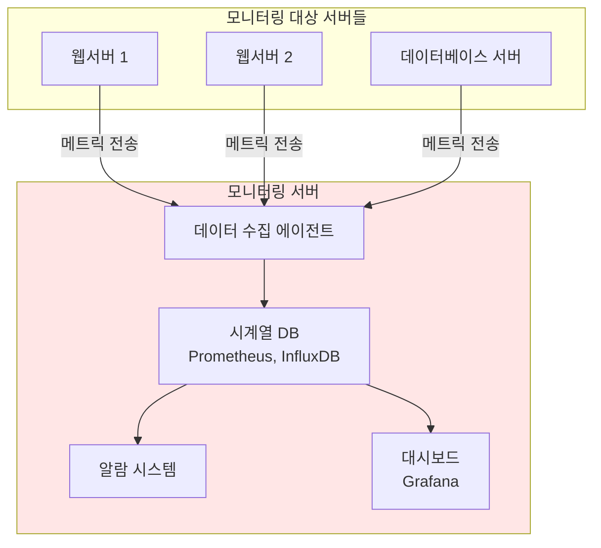

**단점**:
- 모니터링 서버 별도 구축 필요
- 서버 관리 부담 (HA 구성, 백업)
- 확장 시 추가 설정 필요

#### CloudWatch 사용

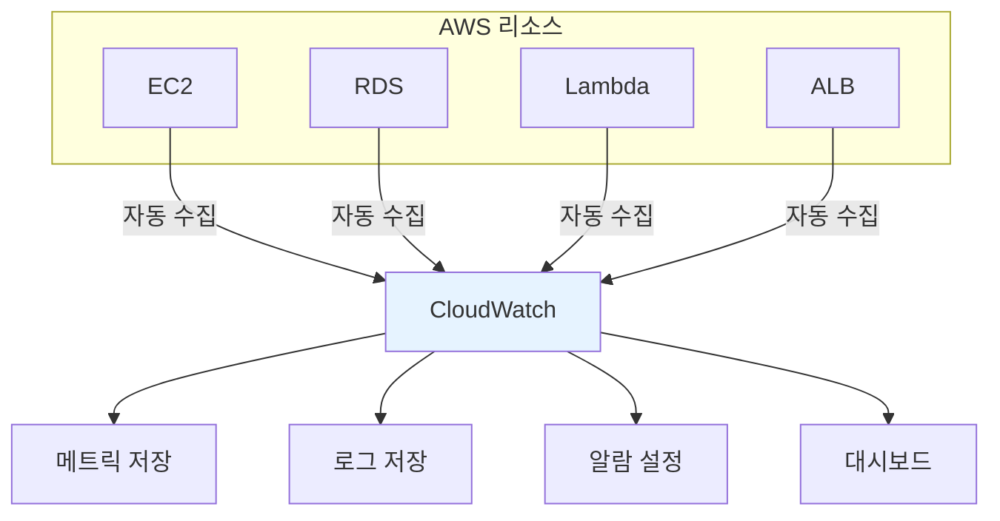

**장점**:
- 별도 서버 불필요
- AWS 리소스 자동 수집
- 확장 자동 처리

### 2.3 CloudWatch Metrics

#### 기본 메트릭 (AWS가 자동 수집)

**EC2 인스턴스**:
- `CPUUtilization`: CPU 사용률 (%)
- `NetworkIn/Out`: 네트워크 트래픽 (바이트)
- `DiskReadOps/WriteOps`: 디스크 I/O 횟수
- `StatusCheckFailed`: 상태 확인 실패 여부

**RDS**:
- `CPUUtilization`: CPU 사용률
- `DatabaseConnections`: DB 연결 수
- `FreeableMemory`: 사용 가능한 메모리
- `ReadLatency/WriteLatency`: 읽기/쓰기 지연 시간

**ALB (Application Load Balancer)**:
- `RequestCount`: 요청 수
- `TargetResponseTime`: 타겟 응답 시간
- `HTTPCode_Target_2XX_Count`: 2xx 응답 수
- `HealthyHostCount`: 정상 호스트 수

#### 커스텀 메트릭

**사용 사례**:
- 애플리케이션별 비즈니스 메트릭
- 예: 주문 수, 로그인 횟수, 결제 성공률

**전통적인 방법** (Prometheus):
```
애플리케이션에서 메트릭 노출 (HTTP endpoint)
→ Prometheus가 주기적으로 스크래핑
→ Grafana로 시각화
```

**CloudWatch**:
```
애플리케이션에서 CloudWatch API로 메트릭 전송
→ CloudWatch에 자동 저장
→ 대시보드/알람 설정
```

### 2.4 CloudWatch Logs

#### 로그 수집 흐름

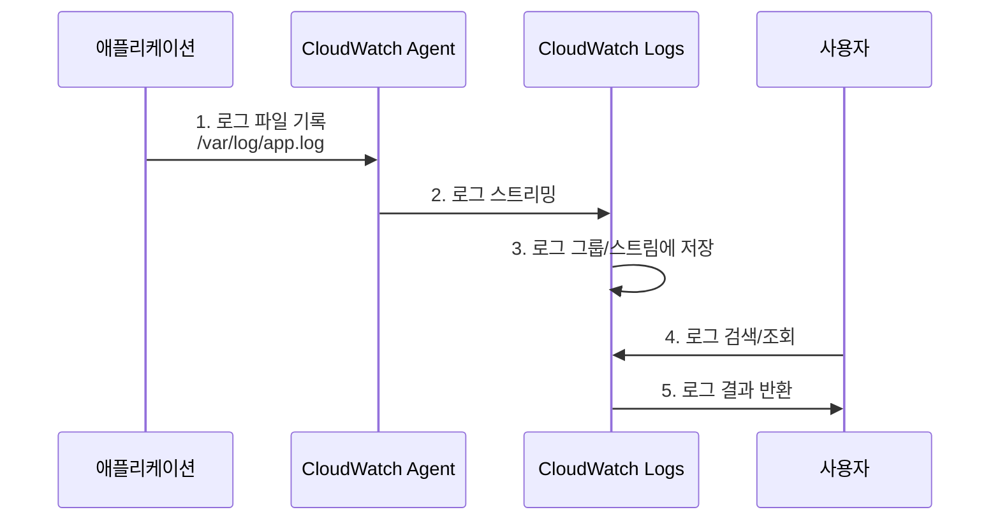

#### 로그 그룹과 로그 스트림

**로그 그룹 (Log Group)**:
- 로그 스트림의 컨테이너
- 보존 기간 설정 (1일 ~ 무제한)
- 접근 권한 관리

**로그 스트림 (Log Stream)**:
- 동일한 소스의 로그 시퀀스
- 예: 각 EC2 인스턴스별로 개별 스트림

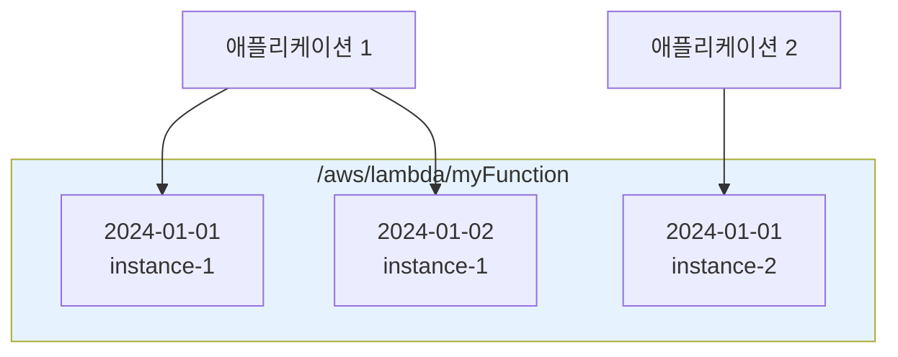

#### 로그 인사이트 (Logs Insights)

**로그 쿼리 및 분석 도구**

**전통적인 방법** (ELK Stack):
```
로그 파일 → Logstash (수집) → Elasticsearch (저장/검색) → Kibana (시각화)
```

**CloudWatch Logs Insights**:
```
로그 쿼리 언어로 직접 검색 및 분석
```

**사용 예시**:
- 특정 시간 범위 로그 검색
- 에러 로그만 필터링
- 응답 시간 통계 분석

### 2.5 CloudWatch Alarms

#### 알람 구성 요소

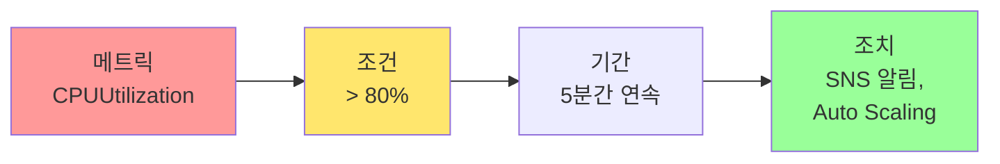

#### 알람 상태

| 상태 | 설명 |
|------|------|
| **OK** | 메트릭이 정상 범위 내 |
| **ALARM** | 임계값 초과 (조치 실행) |
| **INSUFFICIENT_DATA** | 데이터 부족 (판단 불가) |

#### 알람 활용 예시

**1️⃣ 높은 CPU 사용률 알림**:
- 메트릭: `CPUUtilization` > 80%
- 기간: 5분간 연속
- 조치: SNS로 관리자에게 이메일 발송

**2️⃣ Auto Scaling 트리거**:
- 메트릭: `CPUUtilization` > 70%
- 조치: EC2 인스턴스 추가 (Scale Out)

**3️⃣ 헬스체크 실패 시 복구**:
- 메트릭: `StatusCheckFailed` = 1
- 조치: EC2 인스턴스 재부팅

### 2.6 전통적인 로깅 vs CloudWatch Logs

| 구분 | 전통적인 로깅 (Syslog, ELK) | CloudWatch Logs |
|------|---------------------------|----------------|
| **인프라** | 별도 로그 서버 필요 | 서버리스 (관리 불필요) |
| **확장성** | 수동 확장 | 자동 확장 |
| **보존** | 디스크 용량 제한 | 거의 무제한 (설정에 따라) |
| **검색** | Elasticsearch 필요 | Logs Insights 내장 |
| **비용** | 서버 비용 | 저장 용량 + 쿼리 비용 |

---

## 3. Amazon SNS & SQS - 메시징 서비스

### 3.1 메시징 패턴

#### Pub/Sub (발행/구독) vs 메시지 큐

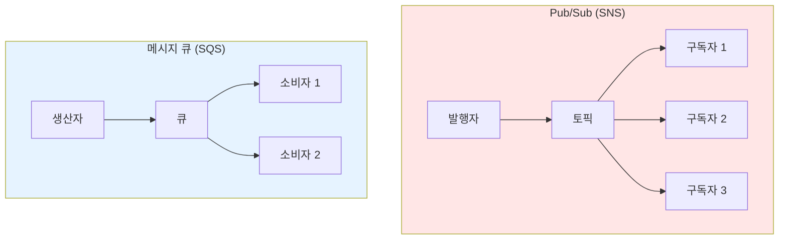

**Pub/Sub (SNS)**:
- 1개 메시지 → N개 구독자
- 브로드캐스트 방식
- 실시간 알림

**메시지 큐 (SQS)**:
- 1개 메시지 → 1개 소비자
- 작업 분산 처리
- 비동기 처리

### 3.2 Amazon SNS (Simple Notification Service)

#### SNS란?

**SNS**는 Pub/Sub 메시징 서비스로, 메시지를 여러 구독자에게 전달합니다.

#### SNS 구성 요소

**토픽 (Topic)**:
- 메시지 발행 채널
- 여러 구독자를 가질 수 있음

**구독 (Subscription)**:
- 토픽에 등록된 수신자
- 프로토콜: 이메일, SMS, HTTP, Lambda, SQS 등

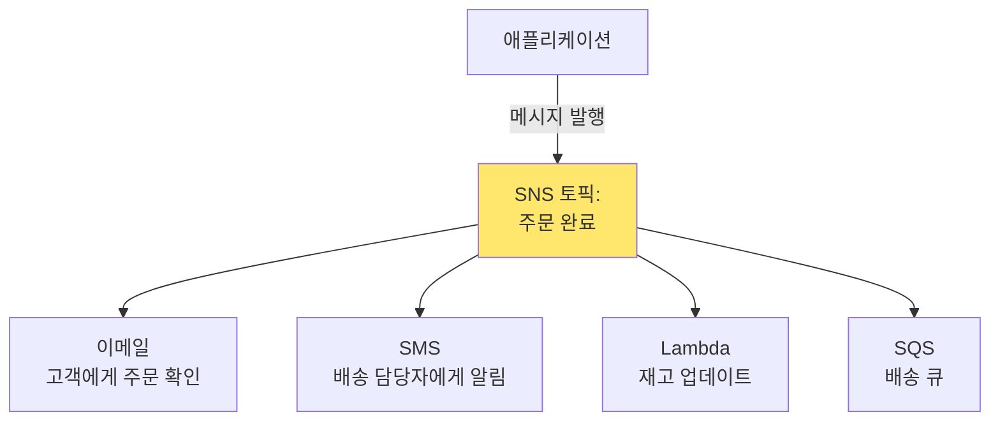

#### SNS 사용 사례

**1️⃣ 알림 발송**:
- 시스템 장애 알림
- 비용 임계값 초과 알림
- 보안 경고

**2️⃣ 이벤트 브로드캐스팅**:
- 주문 완료 → 재고, 배송, 알림 시스템에 전파
- 사용자 가입 → 환영 이메일, 분석, CRM 업데이트

**3️⃣ Fan-Out 패턴**:
- 하나의 이벤트를 여러 SQS 큐로 전달
- 독립적인 처리 파이프라인 구성

### 3.3 Amazon SQS (Simple Queue Service)

#### SQS란?

**SQS**는 분산 메시지 큐 서비스로, 애플리케이션 간 비동기 통신을 지원합니다.

#### 전통적인 메시지 큐 vs SQS

**전통적인 메시지 큐 (RabbitMQ, ActiveMQ)**:
- 별도 서버 설치/관리 필요
- 클러스터 구성 필요 (HA)
- 메시지 손실 방지 위해 복제 설정

**SQS**:
- 완전 관리형 (서버 불필요)
- 자동 확장
- 내구성 보장 (여러 AZ에 복제)

#### SQS 큐 유형

**1️⃣ Standard Queue (표준 큐)**

**특징**:
- 거의 무제한 처리량
- 최소 1회 전달 (At-Least-Once Delivery)
- 메시지 순서 보장 안 함 (Best-Effort Ordering)

**사용 사례**:
- 순서가 중요하지 않은 작업
- 높은 처리량 필요
- 예: 이미지 리사이징, 이메일 발송

**2️⃣ FIFO Queue (선입선출 큐)**

**특징**:
- 정확히 1회 전달 (Exactly-Once Processing)
- 엄격한 순서 보장
- 처리량 제한: 300 TPS (배치 사용 시 3,000 TPS)

**사용 사례**:
- 순서가 중요한 작업
- 중복 처리 방지 필요
- 예: 금융 거래, 주문 처리

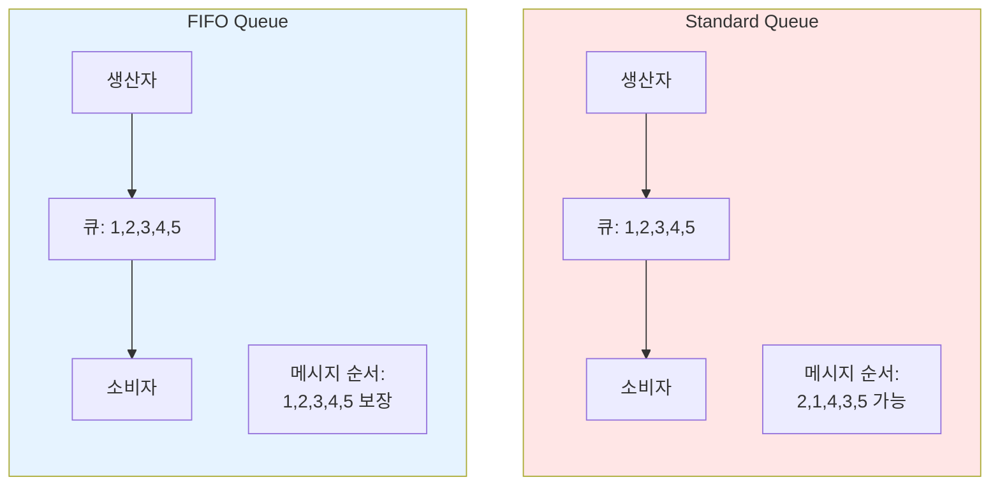

#### SQS 작동 방식

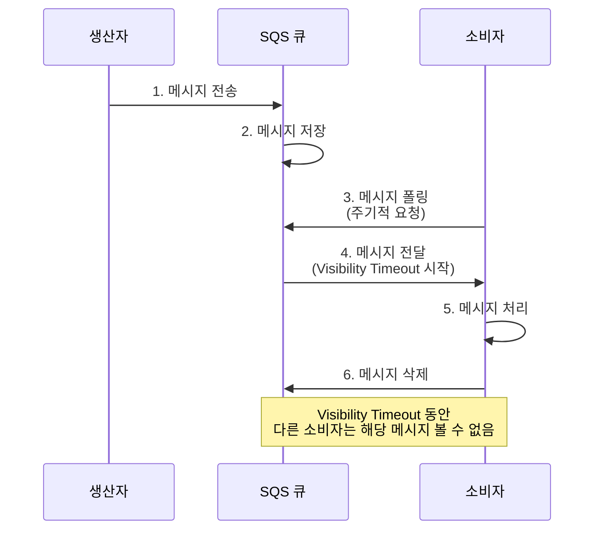

#### Visibility Timeout (가시성 제한 시간)

**개념**:
- 소비자가 메시지를 받은 후, 일정 시간 동안 다른 소비자가 해당 메시지를 받지 못하도록 숨김
- 메시지 처리 시간 확보

**동작**:
1. 소비자 A가 메시지 수신
2. Visibility Timeout 시작 (예: 30초)
3. 30초 내 소비자 A가 메시지 삭제 → 정상 처리
4. 30초 내 삭제 안 됨 → 메시지 다시 큐에 표시 (재처리)

**설정**:
- 기본: 30초
- 범위: 0초 ~ 12시간
- 메시지 처리 시간보다 길게 설정 권장

### 3.4 SNS + SQS 조합 (Fan-Out 패턴)

#### Fan-Out 아키텍처

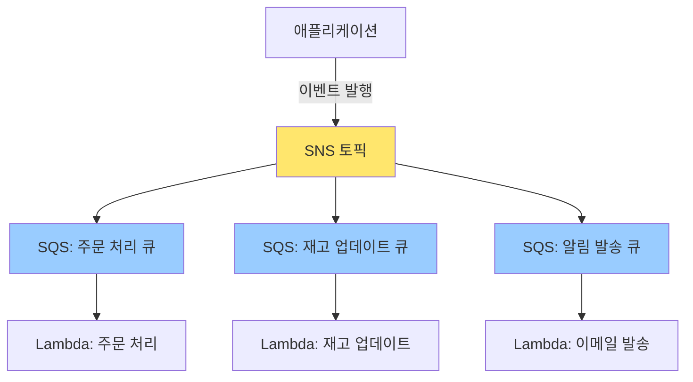

**장점**:
- 각 큐가 독립적으로 처리
- 한 큐의 장애가 다른 큐에 영향 없음
- 각 큐마다 처리 속도 조절 가능

**사용 사례**:
- 주문 시스템: 주문 처리, 재고 관리, 배송, 알림을 각각 독립적으로 처리
- 데이터 파이프라인: 원본 데이터를 여러 분석 시스템에 동시 전달

### 3.5 전통적인 메시징 vs AWS 메시징

| 구분 | RabbitMQ / Kafka | SNS / SQS |
|------|------------------|-----------|
| **설치/관리** | 직접 설치 및 관리 | 완전 관리형 |
| **확장성** | 수동 확장 | 자동 확장 |
| **내구성** | 복제 설정 필요 | 기본 제공 (다중 AZ) |
| **비용** | 서버 비용 | 사용량 기반 과금 |
| **모니터링** | 별도 도구 필요 | CloudWatch 통합 |

---

## 4. AWS CloudFormation - Infrastructure as Code

### 4.1 CloudFormation이란?

**AWS CloudFormation**은 인프라를 코드로 정의하고 자동으로 프로비저닝하는 서비스입니다.

#### Infrastructure as Code (IaC)

**전통적인 인프라 구축**:
```
1. AWS Console 로그인
2. VPC 수동 생성 (클릭)
3. 서브넷 수동 생성 (클릭)
4. EC2 인스턴스 수동 생성 (클릭)
5. 보안 그룹 설정 (클릭)
6. ... 반복 작업
```

**문제점**:
- 시간 소모적
- 재현 어려움 (다른 환경에 동일하게 구축 어려움)
- 휴먼 에러 발생 가능
- 문서화 어려움

**IaC 방식 (CloudFormation)**:
```
1. 템플릿 작성 (YAML/JSON)
   - VPC, 서브넷, EC2, 보안 그룹 등 정의
2. CloudFormation에 템플릿 제출
3. 자동으로 모든 리소스 생성
```

**장점**:
- 재현 가능 (동일한 환경 반복 생성)
- 버전 관리 (Git으로 템플릿 관리)
- 문서화 (템플릿 자체가 문서)
- 자동화 (수동 작업 최소화)

### 4.2 전통적인 IaC vs CloudFormation

#### 전통적인 IaC 도구 (Terraform)

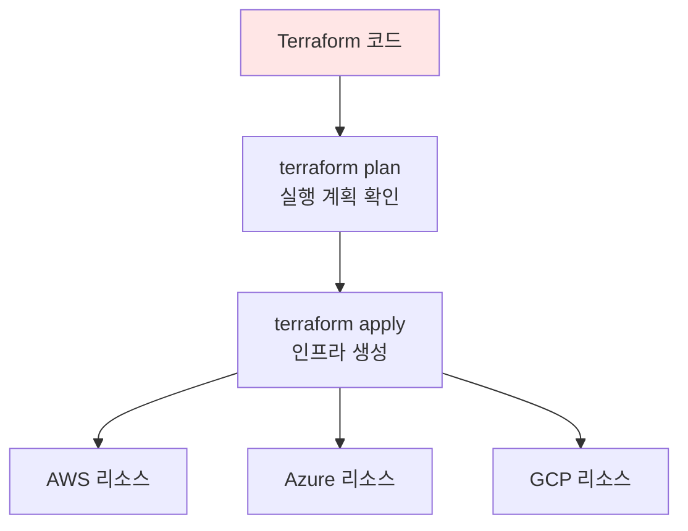

**특징**:
- 멀티 클라우드 지원 (AWS, Azure, GCP)
- HCL 언어 사용
- 별도 도구 설치 필요
- 상태 파일 관리 필요

#### CloudFormation

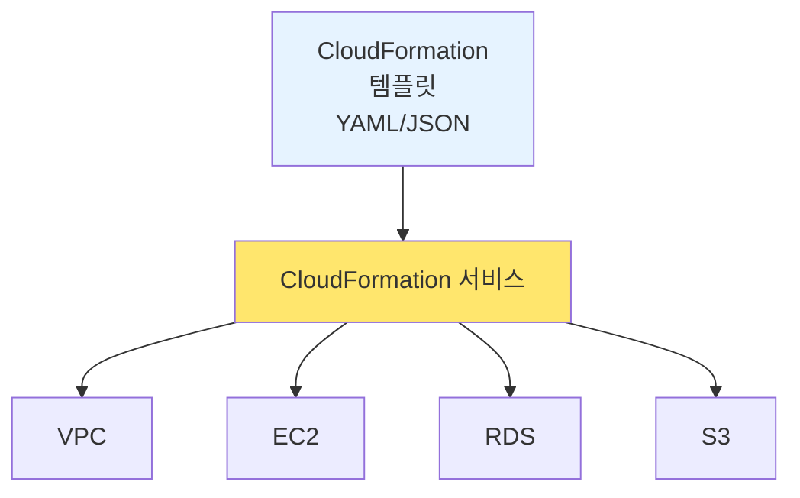

**특징**:
- AWS 전용
- YAML/JSON 사용
- 별도 설치 불필요 (AWS 내장 서비스)
- 상태 관리 자동

### 4.3 CloudFormation 구성 요소

#### 템플릿 (Template)

**템플릿**은 인프라를 정의하는 YAML 또는 JSON 파일입니다.

**템플릿 구조**:

```yaml
AWSTemplateFormatVersion: '2010-09-09'
Description: '간단한 EC2 인스턴스 생성 템플릿'

Parameters:
  # 사용자 입력 받기
  InstanceType:
    Type: String
    Default: t3.micro
    Description: EC2 인스턴스 타입

Resources:
  # 생성할 리소스 정의
  MyEC2Instance:
    Type: AWS::EC2::Instance
    Properties:
      ImageId: ami-0c55b159cbfafe1f0
      InstanceType: !Ref InstanceType

Outputs:
  # 출력 값
  InstanceId:
    Description: EC2 인스턴스 ID
    Value: !Ref MyEC2Instance
```

**주요 섹션**:

| 섹션 | 필수 | 설명 |
|------|------|------|
| **AWSTemplateFormatVersion** | ❌ | 템플릿 버전 (보통 '2010-09-09') |
| **Description** | ❌ | 템플릿 설명 |
| **Parameters** | ❌ | 사용자 입력 변수 |
| **Resources** | ✅ | 생성할 AWS 리소스 (필수!) |
| **Outputs** | ❌ | 스택 생성 후 출력할 값 |

#### 스택 (Stack)

**스택**은 템플릿을 기반으로 생성된 리소스의 집합입니다.

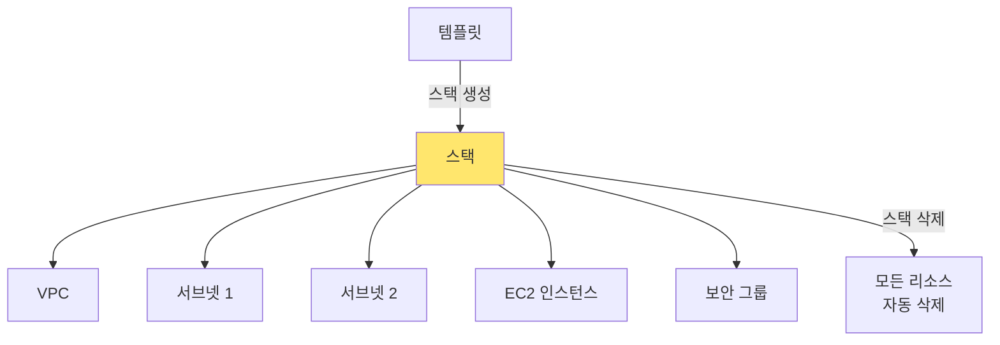

**스택 생명주기**:
1. **Create**: 템플릿 기반으로 리소스 생성
2. **Update**: 템플릿 수정하여 스택 업데이트
3. **Delete**: 스택 삭제 시 모든 리소스 자동 삭제

**장점**:
- 리소스 그룹 관리
- 한 번에 모든 리소스 삭제 가능 (테스트 환경 정리 용이)

### 4.4 CloudFormation 작동 방식

```mermaid
sequenceDiagram
    participant User as 사용자
    participant CF as CloudFormation
    participant AWS as AWS 서비스

    User->>CF: 1. 템플릿 제출<br/>(CreateStack)
    CF->>CF: 2. 템플릿 검증
    CF->>AWS: 3. VPC 생성 요청
    AWS->>CF: 4. VPC 생성 완료
    CF->>AWS: 5. 서브넷 생성 요청
    AWS->>CF: 6. 서브넷 생성 완료
    CF->>AWS: 7. EC2 생성 요청
    AWS->>CF: 8. EC2 생성 완료
    CF->>User: 9. 스택 생성 완료<br/>(CREATE_COMPLETE)
```

**의존성 자동 관리**:
- VPC → 서브넷 → EC2 순서로 자동 생성
- 의존 관계 분석하여 올바른 순서로 리소스 생성

### 4.5 CloudFormation 사용 사례

#### 1️⃣ 개발/스테이징/프로덕션 환경 복제

**시나리오**: 동일한 인프라를 여러 환경에 배포

```mermaid
graph TB
    Template[동일한 템플릿]

    Template -->|파라미터: Env=Dev| Dev[개발 환경 스택]
    Template -->|파라미터: Env=Staging| Staging[스테이징 환경 스택]
    Template -->|파라미터: Env=Prod| Prod[프로덕션 환경 스택]

    style Template fill:#ffe66d
```

**장점**:
- 환경 간 일관성 보장
- 파라미터만 변경하여 다른 환경 생성

#### 2️⃣ 재해 복구 (Disaster Recovery)

**시나리오**: 장애 발생 시 다른 리전에 인프라 즉시 복구

```
1. 평상시: 서울 리전에서 운영
2. 장애 발생: 도쿄 리전에 동일 템플릿으로 스택 생성
3. 복구: 수 분 내 인프라 재구축
```

#### 3️⃣ 일시적인 테스트 환경

**시나리오**: 기능 테스트를 위한 임시 환경

```
1. 아침: 템플릿으로 테스트 환경 생성
2. 낮: 테스트 수행
3. 저녁: 스택 삭제 → 모든 리소스 자동 삭제
```

**비용 절감**: 필요할 때만 생성하고 사용 후 삭제

### 4.6 Terraform vs CloudFormation

| 구분 | Terraform | CloudFormation |
|------|-----------|----------------|
| **클라우드** | 멀티 클라우드 (AWS, Azure, GCP) | AWS 전용 |
| **언어** | HCL (HashiCorp Configuration Language) | YAML / JSON |
| **상태 관리** | 별도 상태 파일 관리 필요 | AWS가 자동 관리 |
| **도구 설치** | 필요 | 불필요 (AWS 서비스) |
| **리소스 지원** | 모든 AWS 서비스 빠르게 지원 | 새 서비스 지원 느림 |
| **커뮤니티** | 방대한 모듈 생태계 | AWS 공식 지원 |

---

## 5. AWS Elastic Beanstalk - 애플리케이션 배포

### 5.1 Elastic Beanstalk란?

**AWS Elastic Beanstalk**는 웹 애플리케이션을 쉽게 배포하고 관리할 수 있는 PaaS (Platform as a Service) 서비스입니다.

#### PaaS의 개념

**전통적인 배포 (IaaS)**:
```
1. EC2 인스턴스 생성
2. 웹 서버 설치 (Apache, Nginx)
3. 애플리케이션 런타임 설치 (Python, Node.js, Java)
4. 애플리케이션 배포
5. Load Balancer 설정
6. Auto Scaling 설정
7. 모니터링 설정
→ 복잡하고 시간 소모적
```

**Elastic Beanstalk (PaaS)**:
```
1. 애플리케이션 코드 업로드
2. Elastic Beanstalk가 자동으로:
   - EC2 인스턴스 생성
   - 웹 서버 설치
   - Load Balancer 설정
   - Auto Scaling 설정
   - 모니터링 설정
→ 간단하고 빠름
```

### 5.2 Elastic Beanstalk 아키텍처

```mermaid
graph TB
    User[사용자] -->|코드 업로드| EB[Elastic Beanstalk]

    EB --> ALB[Application<br/>Load Balancer]
    EB --> ASG[Auto Scaling Group]
    EB --> CW[CloudWatch<br/>모니터링]

    ASG --> EC2-1[EC2 인스턴스 1<br/>웹 서버 + 앱]
    ASG --> EC2-2[EC2 인스턴스 2<br/>웹 서버 + 앱]

    ALB --> EC2-1
    ALB --> EC2-2

    style EB fill:#ffe66d
    style ALB fill:#99ccff
```

**Elastic Beanstalk가 자동으로 생성하는 리소스**:
- EC2 인스턴스
- Load Balancer (ALB/NLB/CLB)
- Auto Scaling Group
- Security Group
- CloudWatch 알람

### 5.3 지원 플랫폼

**웹 애플리케이션 플랫폼**:
- Java (Tomcat)
- .NET (IIS)
- Node.js
- Python (Django, Flask)
- Ruby (Passenger, Puma)
- PHP
- Go
- Docker (단일 컨테이너 / 멀티 컨테이너)

### 5.4 Elastic Beanstalk 배포 방식

#### 1️⃣ All at Once (한 번에 모두)

```mermaid
graph LR
    V1-1[인스턴스 1<br/>v1.0] -->|업데이트| V2-1[인스턴스 1<br/>v2.0]
    V1-2[인스턴스 2<br/>v1.0] -->|업데이트| V2-2[인스턴스 2<br/>v2.0]

    style V1-1 fill:#ff9999
    style V1-2 fill:#ff9999
    style V2-1 fill:#99ff99
    style V2-2 fill:#99ff99
```

**특징**:
- 모든 인스턴스를 동시에 업데이트
- **다운타임 발생** (서비스 중단)
- 가장 빠른 배포
- 개발/테스트 환경에 적합

**프로세스**:
1. 모든 인스턴스 중지
2. 새 버전 배포
3. 모든 인스턴스 시작

#### 2️⃣ Rolling (순차적)

```mermaid
sequenceDiagram
    participant Batch1 as 배치 1 (인스턴스 1,2)
    participant Batch2 as 배치 2 (인스턴스 3,4)

    Note over Batch1: v1.0 → v2.0 업데이트
    Note over Batch1,Batch2: 배치 1 업데이트 중<br/>배치 2는 v1.0으로 서비스
    Note over Batch2: v1.0 → v2.0 업데이트
    Note over Batch1,Batch2: 모든 배치 v2.0
```

**특징**:
- 인스턴스를 그룹으로 나눠서 순차 업데이트
- **다운타임 없음**
- 배포 중 용량 감소 (일부 인스턴스 업데이트 중)
- 무료 (추가 인스턴스 불필요)

**프로세스**:
1. 배치 1 (예: 2개 인스턴스) 중지
2. 배치 1에 새 버전 배포
3. 배치 1 시작
4. 배치 2 중지 및 배포
5. 반복

#### 3️⃣ Rolling with Additional Batch (추가 배치 포함 순차적)

```mermaid
graph TB
    subgraph Initial["초기 (4개 인스턴스)"]
        I1[인스턴스 1-4<br/>v1.0]
    end

    subgraph Deploy["배포 중 (6개)"]
        I2[인스턴스 1-4<br/>v1.0]
        I3[추가 인스턴스 2개<br/>v2.0]
    end

    subgraph Final["최종 (4개)"]
        I4[인스턴스 1-4<br/>v2.0]
    end

    Initial --> Deploy
    Deploy --> Final

    style Deploy fill:#ffe6e6
```

**특징**:
- 먼저 **추가 인스턴스** 생성하여 새 버전 배포
- 기존 인스턴스는 순차 업데이트
- **용량 유지** (항상 전체 용량 유지)
- 추가 비용 발생 (일시적으로 더 많은 인스턴스)

**프로세스**:
1. 추가 인스턴스 2개 생성 (새 버전)
2. 기존 인스턴스 배치별 업데이트
3. 모든 업데이트 완료 후 추가 인스턴스 종료

#### 4️⃣ Immutable (불변)

```mermaid
graph TB
    subgraph Old["기존 ASG"]
        O1[인스턴스 1-4<br/>v1.0]
    end

    subgraph New["새 ASG (임시)"]
        N1[인스턴스 1-4<br/>v2.0]
    end

    Old --> Test[새 버전 테스트]
    New --> Test
    Test -->|성공| Switch[트래픽 전환]
    Switch --> Delete[기존 ASG 삭제]

    style New fill:#e6ffe6
    style Old fill:#ffe6e6
```

**특징**:
- 완전히 새로운 인스턴스 그룹 생성
- 새 버전 테스트 후 트래픽 전환
- **롤백 빠름** (기존 인스턴스 유지)
- 추가 비용 발생 (2배 용량)

**프로세스**:
1. 새 Auto Scaling Group 생성
2. 새 인스턴스에 새 버전 배포
3. 정상 동작 확인
4. Load Balancer 트래픽 전환
5. 기존 ASG 삭제

#### 5️⃣ Blue/Green (블루/그린)

```mermaid
graph LR
    subgraph Blue["Blue 환경"]
        B1[인스턴스 1-4<br/>v1.0]
    end

    subgraph Green["Green 환경"]
        G1[인스턴스 1-4<br/>v2.0]
    end

    LB[Load Balancer] -->|초기| Blue
    LB -.전환.-> Green

    style Blue fill:#99ccff
    style Green fill:#99ff99
```

**특징**:
- 완전히 독립적인 두 환경 유지
- **즉시 롤백** 가능 (트래픽만 전환)
- 가장 안전한 배포 방식
- 비용 높음 (2배 환경)

**프로세스**:
1. Green 환경 (새 버전) 생성
2. Green 환경 테스트
3. DNS 또는 LB 트래픽 전환
4. 문제 발생 시 즉시 Blue로 전환

### 5.5 Elastic Beanstalk vs 직접 배포

| 구분 | 직접 배포 (EC2 + ALB) | Elastic Beanstalk |
|------|---------------------|-------------------|
| **설정 복잡도** | 높음 (모든 것 수동 설정) | 낮음 (자동 설정) |
| **배포 속도** | 느림 | 빠름 |
| **인프라 제어** | 완전한 제어 | 제한적 (Beanstalk 관리) |
| **모니터링** | 수동 설정 | 자동 통합 (CloudWatch) |
| **비용** | EC2 + ALB 비용만 | 추가 비용 없음 (관리 비용 무료) |
| **적합한 경우** | 복잡한 인프라, 세밀한 제어 필요 | 빠른 배포, 간단한 웹 앱 |

---

## 6. AWS Systems Manager - 운영 관리

### 6.1 Systems Manager란?

**AWS Systems Manager**는 AWS 인프라를 대규모로 운영하고 관리하기 위한 통합 도구입니다.

#### 주요 기능

**1️⃣ Session Manager**:
- EC2 인스턴스에 SSH/RDP 없이 접속
- 브라우저 기반 셸 액세스
- 포트 개방 불필요 (보안 강화)

**2️⃣ Run Command**:
- 여러 인스턴스에 명령어 일괄 실행
- 스크립트 배포 및 실행
- 예: 100대 서버에 패치 동시 적용

**3️⃣ Patch Manager**:
- 운영체제 패치 자동화
- 패치 기준선 정의
- 유지 관리 기간 설정

**4️⃣ Parameter Store**:
- 설정 값 및 암호 저장
- 버전 관리
- KMS 통합 (암호화)

**5️⃣ Automation**:
- 일반적인 운영 작업 자동화
- AMI 생성, 인스턴스 재부팅 등
- 사전 정의된 워크플로우 실행

### 6.2 전통적인 서버 관리 vs Systems Manager

#### 전통적인 서버 관리

```mermaid
graph TB
    Admin[시스템 관리자] -->|SSH 접속| Server1[서버 1]
    Admin -->|SSH 접속| Server2[서버 2]
    Admin -->|SSH 접속| Server3[서버 3]
    Admin -->|SSH 접속| ServerN[서버 N...]

    Admin -->|수동 실행| Patch[패치 적용]
    Admin -->|수동 실행| Config[설정 변경]

    style Admin fill:#ffe6e6
```

**문제점**:
- SSH 포트(22번) 개방 필요 (보안 위험)
- 서버마다 개별 접속
- 대량 작업 시 스크립트 작성 필요
- 작업 이력 추적 어려움

#### Systems Manager 사용

```mermaid
graph TB
    Admin[시스템 관리자] --> SSM[Systems Manager]

    SSM -->|Session Manager| Server1[서버 1]
    SSM -->|Run Command| Server2[서버 2]
    SSM -->|Patch Manager| Server3[서버 3]
    SSM -->|일괄 관리| ServerN[서버 N...]

    SSM --> CloudTrail[CloudTrail<br/>작업 이력 기록]

    style SSM fill:#e6f3ff
```

**장점**:
- SSH 포트 불필요 (보안 강화)
- 브라우저에서 접속
- 대량 작업 쉬움
- 모든 작업 CloudTrail에 기록

### 6.3 Session Manager 상세

#### 작동 방식

```mermaid
sequenceDiagram
    participant Admin as 관리자
    participant Console as AWS Console
    participant SSM as SSM Agent
    participant EC2 as EC2 인스턴스

    Admin->>Console: 1. Session Manager 클릭
    Console->>SSM: 2. 세션 시작 요청
    SSM->>EC2: 3. EC2의 SSM Agent와 통신
    EC2->>SSM: 4. 세션 수립
    SSM->>Console: 5. 브라우저 셸 표시
    Admin->>Console: 6. 명령어 입력
    Console->>EC2: 7. 명령어 전달 및 실행
```

**필요 조건**:
- EC2에 SSM Agent 설치 (Amazon Linux 2는 기본 설치)
- EC2에 IAM 역할 연결 (SSM 권한)
- 아웃바운드 HTTPS (443) 허용

**장점**:
- SSH 키 관리 불필요
- Bastion Host 불필요
- 세션 로그 자동 기록 (S3 또는 CloudWatch)
- IAM 기반 접근 제어

### 6.4 Run Command 상세

#### 사용 사례

**시나리오**: 100대 웹 서버에 보안 패치 적용

**전통적인 방법**:
```
1. Ansible/Puppet 스크립트 작성
2. 인벤토리 파일 관리
3. SSH 키 배포
4. 스크립트 실행
→ 복잡한 설정
```

**Systems Manager Run Command**:
```
1. AWS Console에서 명령어 선택 (AWS-RunShellScript)
2. 대상 인스턴스 선택 (태그 기반 또는 전체)
3. 명령어 입력 (예: yum update -y)
4. 실행
→ 간단하고 빠름
```

#### 작동 예시

```mermaid
graph TB
    Console[AWS Console] -->|Run Command| SSM[Systems Manager]

    SSM -->|명령: yum update -y| Web1[웹서버 1]
    SSM -->|명령: yum update -y| Web2[웹서버 2]
    SSM -->|명령: yum update -y| WebN[웹서버 N...]

    Web1 -->|결과 반환| SSM
    Web2 -->|결과 반환| SSM
    WebN -->|결과 반환| SSM

    SSM --> CW[CloudWatch Logs<br/>명령 실행 로그]

    style SSM fill:#ffe66d
```

### 6.5 Parameter Store

#### Parameter Store란?

**설정 값과 암호를 안전하게 저장하고 관리**하는 서비스입니다.

#### 전통적인 설정 관리 vs Parameter Store

**전통적인 방법**:
```
애플리케이션 코드에 하드코딩:
DB_HOST = "mysql.example.com"
DB_PASSWORD = "mypassword123"

→ 보안 위험! 코드에 암호 노출
```

**환경 변수 사용**:
```
export DB_HOST="mysql.example.com"
export DB_PASSWORD="mypassword123"

→ 서버마다 수동 설정 필요
```

**Parameter Store 사용**:
```
1. Parameter Store에 저장:
   /myapp/db/host = "mysql.example.com"
   /myapp/db/password = "mypassword123" (암호화)

2. 애플리케이션에서 API로 조회:
   db_host = ssm.get_parameter('/myapp/db/host')
   db_password = ssm.get_parameter('/myapp/db/password', WithDecryption=True)
```

**장점**:
- 중앙 집중식 관리
- 자동 암호화 (KMS 통합)
- 버전 관리
- 접근 제어 (IAM)

#### Parameter 계층 구조

```
/myapp/
  ├── dev/
  │   ├── db/host
  │   ├── db/password
  │   └── api/key
  ├── staging/
  │   ├── db/host
  │   ├── db/password
  │   └── api/key
  └── prod/
      ├── db/host
      ├── db/password
      └── api/key
```

**환경별 설정 분리 가능**

### 6.6 Patch Manager

#### 자동 패치 관리

**시나리오**: 매월 둘째 주 일요일 새벽 2시에 모든 서버 보안 패치

```mermaid
graph LR
    Baseline[패치 기준선<br/>보안 패치만 적용] --> Window[유지 관리 기간<br/>매월 둘째 주 일요일<br/>02:00-04:00]
    Window --> Target[대상 인스턴스<br/>태그: Env=Prod]
    Target --> Execute[자동 패치 실행]
    Execute --> Reboot[재부팅<br/>필요 시]

    style Baseline fill:#ff9999
    style Window fill:#ffe66d
    style Execute fill:#99ff99
```

**패치 기준선 (Patch Baseline)**:
- 어떤 패치를 적용할지 정의
- 보안 패치만, 모든 패치, 특정 카테고리 등

**유지 관리 기간 (Maintenance Window)**:
- 패치 적용 시간 스케줄
- 트래픽 적은 시간대 설정

---

## 7. AWS Auto Scaling - 자동 확장

### 7.1 Auto Scaling이란?

**Auto Scaling**은 트래픽에 따라 EC2 인스턴스 수를 자동으로 조정하는 기능입니다.

#### 전통적인 용량 관리

```mermaid
graph TB
    subgraph Manual["수동 관리"]
        Peak[피크 시간<br/>많은 트래픽] --> Over[과다 프로비저닝<br/>항상 많은 서버 유지]
        Night[야간<br/>적은 트래픽] --> Waste[리소스 낭비<br/>유휴 서버 많음]
    end

    style Over fill:#ff9999
    style Waste fill:#ffe6e6
```

**문제점**:
- 피크 시간 대비 → 평소 서버 낭비
- 트래픽 급증 시 → 수동 서버 추가 (느림)
- 비용 비효율

#### Auto Scaling 사용

```mermaid
graph TB
    subgraph AutoScale["자동 확장"]
        Peak2[피크 시간<br/>많은 트래픽] --> ScaleOut[자동 확장<br/>서버 추가]
        Night2[야간<br/>적은 트래픽] --> ScaleIn[자동 축소<br/>서버 제거]
    end

    style ScaleOut fill:#99ff99
    style ScaleIn fill:#99ccff
```

**장점**:
- 트래픽에 따라 자동 조정
- 비용 최적화
- 고가용성 보장

### 7.2 Auto Scaling Group (ASG)

#### ASG 구성 요소

```mermaid
graph TB
    ASG[Auto Scaling Group]

    ASG --> Config[시작 템플릿<br/>AMI, 인스턴스 타입 등]
    ASG --> Min[최소 용량<br/>예: 2개]
    ASG --> Desired[원하는 용량<br/>예: 4개]
    ASG --> Max[최대 용량<br/>예: 10개]
    ASG --> Policy[스케일링 정책<br/>CPU > 70% 시 확장]

    style ASG fill:#ffe66d
```

**시작 템플릿 (Launch Template)**:
- EC2 인스턴스 생성 시 사용할 설정
- AMI ID, 인스턴스 타입, 보안 그룹 등

**용량 설정**:
- **최소 (Min)**: 최소 인스턴스 수 (항상 유지)
- **원하는 (Desired)**: 평상시 인스턴스 수
- **최대 (Max)**: 최대 인스턴스 수 (상한선)

### 7.3 스케일링 정책

#### 1️⃣ 대상 추적 스케일링 (Target Tracking)

**개념**: 특정 메트릭을 목표 값으로 유지

**예시**: 평균 CPU 사용률 50% 유지

```mermaid
graph LR
    CPU[CPU 사용률] -->|> 50%| ScaleOut[인스턴스 추가]
    CPU -->|< 50%| ScaleIn[인스턴스 제거]

    ScaleOut --> Target[목표: 50%]
    ScaleIn --> Target

    style Target fill:#ffe66d
```

**장점**:
- 설정 간단
- AWS가 자동으로 Scale In/Out 결정

**사용 사례**:
- 평균 CPU 사용률 유지
- ALB 타겟당 요청 수 유지

#### 2️⃣ 단계 스케일링 (Step Scaling)

**개념**: 메트릭 범위에 따라 단계별 조정

**예시**:
- CPU 50-60%: 인스턴스 1개 추가
- CPU 60-70%: 인스턴스 2개 추가
- CPU > 70%: 인스턴스 4개 추가

```mermaid
graph TB
    CPU[CPU 사용률]

    CPU -->|50-60%| Add1[+1 인스턴스]
    CPU -->|60-70%| Add2[+2 인스턴스]
    CPU -->|> 70%| Add4[+4 인스턴스]

    style CPU fill:#ff9999
```

**장점**:
- 세밀한 제어
- 급격한 트래픽 증가에 빠르게 대응

#### 3️⃣ 예약된 스케일링 (Scheduled Scaling)

**개념**: 미리 정해진 시간에 용량 조정

**예시**:
- 평일 09:00: 10개로 증가 (업무 시작)
- 평일 18:00: 2개로 감소 (업무 종료)
- 주말: 1개 유지

```mermaid
gantt
    title 주간 스케일링 스케줄
    dateFormat HH:mm
    axisFormat %H:%M

    section 평일
    최소 (2개)       :done, 00:00, 09:00
    최대 (10개)      :active, 09:00, 18:00
    최소 (2개)       :done, 18:00, 24:00

    section 주말
    최소 (1개)       :crit, 00:00, 24:00
```

**장점**:
- 예측 가능한 트래픽 패턴에 적합
- 비용 절감

### 7.4 Auto Scaling과 Load Balancer 통합

```mermaid
graph TB
    Users[사용자들] --> ALB[Application<br/>Load Balancer]

    ALB --> ASG[Auto Scaling Group]

    ASG --> EC2-1[EC2 1]
    ASG --> EC2-2[EC2 2]
    ASG --> EC2-3[EC2 3]
    ASG -.자동 추가.-> EC2-N[EC2 N]

    CW[CloudWatch] -->|CPU 사용률 모니터링| ASG
    ASG -->|확장/축소| CW

    ALB -.자동 등록.-> EC2-N

    style ASG fill:#ffe66d
    style ALB fill:#99ccff
```

**통합 장점**:
- 새 인스턴스 자동으로 LB에 등록
- 인스턴스 제거 시 LB에서 자동 해제
- 헬스 체크 연동 (비정상 인스턴스 자동 교체)

### 7.5 전통적인 확장 vs Auto Scaling

| 구분 | 수동 확장 | Auto Scaling |
|------|----------|--------------|
| **확장 시간** | 수 분 ~ 수십 분 (수동 작업) | 수 분 (자동) |
| **야간 관리** | 수동 축소 또는 그대로 유지 | 자동 축소 (비용 절감) |
| **트래픽 급증** | 대응 느림 | 자동 빠른 대응 |
| **비용** | 과다 프로비저닝 → 낭비 | 사용량 기반 → 최적화 |
| **고가용성** | 수동 모니터링 필요 | 자동 복구 (헬스 체크) |

---

## 8. Amazon EventBridge - 이벤트 기반 아키텍처

### 8.1 EventBridge란?

**Amazon EventBridge**는 AWS 서비스, SaaS 애플리케이션, 커스텀 애플리케이션 간 이벤트를 연결하는 서버리스 이벤트 버스입니다.

#### 이벤트 기반 아키텍처 (Event-Driven Architecture)

**전통적인 방식 (폴링)**:
```
애플리케이션 → "새로운 파일 있어?" (5초마다 확인)
S3 → "없어"
애플리케이션 → "새로운 파일 있어?"
S3 → "있어!"
애플리케이션 → 처리 시작
```

**문제점**:
- 불필요한 요청 (리소스 낭비)
- 실시간 대응 어려움

**이벤트 기반 (EventBridge)**:
```
S3 → "파일 업로드됨!" (이벤트 발생)
EventBridge → Lambda 트리거
Lambda → 즉시 처리
```

**장점**:
- 실시간 대응
- 느슨한 결합 (서비스 간 독립성)
- 리소스 효율

### 8.2 EventBridge 구성 요소

```mermaid
graph LR
    Source[이벤트 소스<br/>EC2, S3, 사용자 정의] -->|이벤트 발생| Bus[이벤트 버스]
    Bus --> Rule1[규칙 1<br/>EC2 종료 이벤트]
    Bus --> Rule2[규칙 2<br/>S3 업로드 이벤트]

    Rule1 --> Target1[Lambda<br/>알림 발송]
    Rule2 --> Target2[Step Functions<br/>워크플로우 시작]
    Rule2 --> Target3[SNS<br/>관리자 알림]

    style Bus fill:#ffe66d
```

**이벤트 소스 (Event Source)**:
- AWS 서비스 (EC2, S3, RDS 등)
- SaaS 애플리케이션 (Salesforce, Shopify 등)
- 커스텀 애플리케이션

**이벤트 버스 (Event Bus)**:
- 이벤트가 전달되는 채널
- 기본 이벤트 버스 (AWS 서비스 이벤트)
- 커스텀 이벤트 버스 (사용자 정의 이벤트)

**규칙 (Rule)**:
- 이벤트 필터링
- 조건에 맞는 이벤트만 타겟으로 전달

**타겟 (Target)**:
- Lambda, Step Functions, SNS, SQS, Kinesis 등
- 이벤트를 받아 처리하는 서비스

### 8.3 EventBridge 사용 사례

#### 1️⃣ EC2 인스턴스 자동 태깅

**시나리오**: 새로 생성된 EC2 인스턴스에 자동으로 태그 추가

```mermaid
sequenceDiagram
    participant User as 사용자
    participant EC2 as EC2 서비스
    participant EB as EventBridge
    participant Lambda as Lambda

    User->>EC2: 1. EC2 인스턴스 생성
    EC2->>EB: 2. EC2 Instance State-change 이벤트 발생
    EB->>Lambda: 3. 규칙 매칭 → Lambda 트리거
    Lambda->>EC2: 4. 태그 추가<br/>(Owner, CreatedDate 등)
```

**장점**:
- 수동 태깅 불필요
- 태깅 정책 일관성 유지

#### 2️⃣ 보안 그룹 변경 알림

**시나리오**: 보안 그룹에 0.0.0.0/0 (모든 IP) 허용 규칙 추가 시 알림

```mermaid
graph LR
    SG[보안 그룹 변경] -->|이벤트| EB[EventBridge]
    EB -->|규칙: 0.0.0.0/0 포함| Lambda[Lambda]
    Lambda --> SNS[SNS<br/>보안팀 알림]
    Lambda --> CloudWatch[CloudWatch Logs<br/>로그 기록]

    style SG fill:#ff9999
    style EB fill:#ffe66d
```

**보안 강화**: 위험한 설정 변경 즉시 탐지

#### 3️⃣ 예약 작업 (Cron)

**시나리오**: 매일 자정에 데이터베이스 백업

**전통적인 방법** (EC2 + Cron):
```
EC2 인스턴스 24/7 실행
→ Cron 작업 (0 0 * * *)
→ 비용 발생
```

**EventBridge + Lambda**:
```
EventBridge 규칙 (cron: 0 0 * * ? *)
→ Lambda 트리거 (매일 자정)
→ RDS 스냅샷 생성
→ Lambda 실행 시간만 과금
```

```mermaid
graph LR
    EB[EventBridge<br/>규칙: 매일 00:00] -->|트리거| Lambda[Lambda]
    Lambda --> RDS[RDS<br/>스냅샷 생성]
    Lambda --> S3[S3<br/>백업 보관]

    style EB fill:#ffe66d
```

**비용 절감**: EC2 서버 불필요

#### 4️⃣ 멀티 리전 복제

**시나리오**: 서울 리전 S3 업로드 시 도쿄 리전에 자동 복제

```mermaid
graph LR
    S3Seoul[S3<br/>서울 리전] -->|이벤트| EBSeoul[EventBridge<br/>서울]
    EBSeoul --> Lambda[Lambda]
    Lambda --> S3Tokyo[S3<br/>도쿄 리전<br/>복제]

    style S3Seoul fill:#ff9999
    style S3Tokyo fill:#99ff99
```

### 8.4 EventBridge vs CloudWatch Events

**CloudWatch Events**는 EventBridge의 이전 버전입니다.

| 구분 | CloudWatch Events | EventBridge |
|------|-------------------|-------------|
| **이벤트 소스** | AWS 서비스만 | AWS + SaaS + 커스텀 |
| **스키마 레지스트리** | 없음 | 있음 (이벤트 구조 정의) |
| **이벤트 버스** | 기본 버스만 | 커스텀 버스 지원 |
| **SaaS 통합** | 불가 | 가능 (Salesforce 등) |
| **권장** | ❌ (레거시) | ✅ (최신) |

**EventBridge는 CloudWatch Events의 상위 호환 버전**

### 8.5 전통적인 스케줄링 vs EventBridge

| 구분 | Cron (EC2) | EventBridge |
|------|-----------|-------------|
| **서버** | EC2 필요 (24/7 실행) | 불필요 (서버리스) |
| **비용** | EC2 + 데이터 전송 | EventBridge + Lambda 실행 시간 |
| **관리** | 서버 관리 필요 | 관리 불필요 |
| **확장성** | 수동 확장 | 자동 확장 |
| **고가용성** | 별도 HA 구성 필요 | 기본 제공 |

---

## 9. 요약

### 핵심 서비스 정리

#### 1️⃣ Lambda - 서버리스 컴퓨팅
- 서버 관리 없이 코드 실행
- 이벤트 기반 트리거
- 실행 시간만 과금
- 15분 제한

**사용 사례**:
- 이미지 리사이징
- API 백엔드
- 데이터 처리 파이프라인
- 정기 작업

#### 2️⃣ CloudWatch - 모니터링 및 로깅
- AWS 리소스 메트릭 수집
- 로그 수집 및 분석
- 알람 설정
- 대시보드 시각화

**주요 기능**:
- Metrics: 성능 지표
- Logs: 로그 수집
- Alarms: 임계값 알림
- Logs Insights: 로그 쿼리

#### 3️⃣ SNS & SQS - 메시징
**SNS (Pub/Sub)**:
- 1개 메시지 → N개 구독자
- 실시간 알림
- 이메일, SMS, Lambda 등 지원

**SQS (메시지 큐)**:
- 1개 메시지 → 1개 소비자
- 비동기 작업 처리
- Standard (순서 보장 안 함) vs FIFO (순서 보장)

**Fan-Out 패턴**: SNS + SQS 조합

#### 4️⃣ CloudFormation - Infrastructure as Code
- 인프라를 코드로 정의 (YAML/JSON)
- 재현 가능한 인프라
- 스택 단위 관리
- 자동 롤백

**장점**:
- 환경 복제 용이
- 버전 관리
- 자동화

#### 5️⃣ Elastic Beanstalk - 애플리케이션 배포
- PaaS (Platform as a Service)
- 코드만 업로드하면 자동 배포
- 다양한 플랫폼 지원 (Java, Python, Node.js 등)

**배포 방식**:
- All at Once: 빠르지만 다운타임
- Rolling: 순차 업데이트
- Immutable: 새 인스턴스 그룹 생성
- Blue/Green: 가장 안전

#### 6️⃣ Systems Manager - 운영 관리
- Session Manager: SSH 없이 인스턴스 접속
- Run Command: 대량 명령 실행
- Parameter Store: 설정 및 암호 저장
- Patch Manager: 자동 패치

**장점**:
- SSH 포트 불필요
- 중앙 집중식 관리
- 자동화

#### 7️⃣ Auto Scaling - 자동 확장
- 트래픽에 따라 EC2 자동 조정
- 비용 최적화
- 고가용성

**스케일링 정책**:
- Target Tracking: 목표 값 유지
- Step Scaling: 단계별 조정
- Scheduled Scaling: 예약 스케일링

#### 8️⃣ EventBridge - 이벤트 기반 아키텍처
- 서비스 간 이벤트 연결
- 실시간 반응
- 느슨한 결합

**사용 사례**:
- 자동 태깅
- 보안 알림
- 예약 작업 (Cron 대체)

### 서비스 선택 가이드

#### 컴퓨팅 선택

| 요구사항 | 선택 |
|----------|------|
| 단기 실행 (< 15분), 이벤트 기반 | Lambda |
| 장시간 실행, 복잡한 워크로드 | EC2 |
| 웹 앱 빠른 배포 | Elastic Beanstalk |
| 컨테이너 | ECS / EKS |

#### 메시징 선택

| 요구사항 | 선택 |
|----------|------|
| 여러 구독자에게 브로드캐스트 | SNS |
| 작업 큐 (비동기 처리) | SQS |
| 순서 보장 필요 | SQS FIFO |
| 실시간 스트리밍 | Kinesis |

#### IaC 선택

| 요구사항 | 선택 |
|----------|------|
| AWS 전용 | CloudFormation |
| 멀티 클라우드 | Terraform |
| 빠른 배포 (웹 앱) | Elastic Beanstalk |

---

## 📚 참고 자료

### AWS 공식 문서
- [AWS Lambda 사용 설명서](https://docs.aws.amazon.com/lambda/)
- [Amazon CloudWatch 사용 설명서](https://docs.aws.amazon.com/cloudwatch/)
- [Amazon SNS 개발자 가이드](https://docs.aws.amazon.com/sns/)
- [Amazon SQS 개발자 가이드](https://docs.aws.amazon.com/sqs/)
- [AWS CloudFormation 사용 설명서](https://docs.aws.amazon.com/cloudformation/)
- [AWS Elastic Beanstalk 개발자 가이드](https://docs.aws.amazon.com/elasticbeanstalk/)
- [AWS Systems Manager 사용 설명서](https://docs.aws.amazon.com/systems-manager/)
- [Amazon EC2 Auto Scaling 사용 설명서](https://docs.aws.amazon.com/autoscaling/)
- [Amazon EventBridge 사용 설명서](https://docs.aws.amazon.com/eventbridge/)

---

## ✅ 학습 체크리스트

- [ ] Lambda의 서버리스 개념과 Cold Start를 이해했다
- [ ] Lambda 사용 사례 (이미지 리사이징, API 백엔드)를 설명할 수 있다
- [ ] CloudWatch Metrics, Logs, Alarms의 차이를 안다
- [ ] SNS (Pub/Sub)와 SQS (메시지 큐)의 차이를 설명할 수 있다
- [ ] SQS Standard와 FIFO의 차이를 안다
- [ ] CloudFormation 템플릿과 스택의 개념을 이해했다
- [ ] Infrastructure as Code의 장점을 설명할 수 있다
- [ ] Elastic Beanstalk의 배포 방식 (Rolling, Immutable, Blue/Green)을 비교할 수 있다
- [ ] Systems Manager Session Manager의 보안 장점을 안다
- [ ] Auto Scaling의 스케일링 정책을 설명할 수 있다
- [ ] EventBridge의 이벤트 기반 아키텍처 개념을 이해했다
- [ ] 각 서비스의 적절한 사용 사례를 판단할 수 있다

---

**축하합니다!** 🎉

10개 챕터 모두 완료하셨습니다. AWS의 핵심 서비스들에 대한 깊이 있는 이해를 갖추셨습니다. 이제 실제 AWS 환경에서 실습하며 경험을 쌓아보세요!
