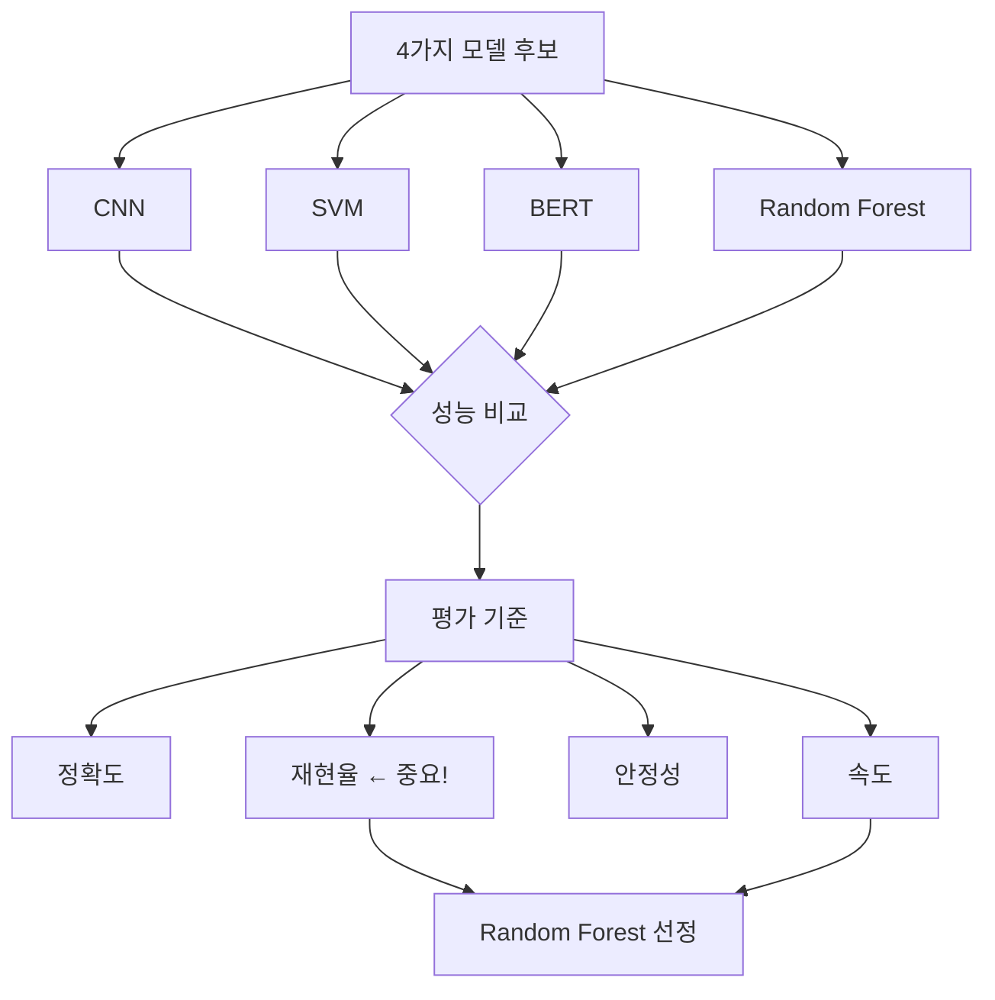
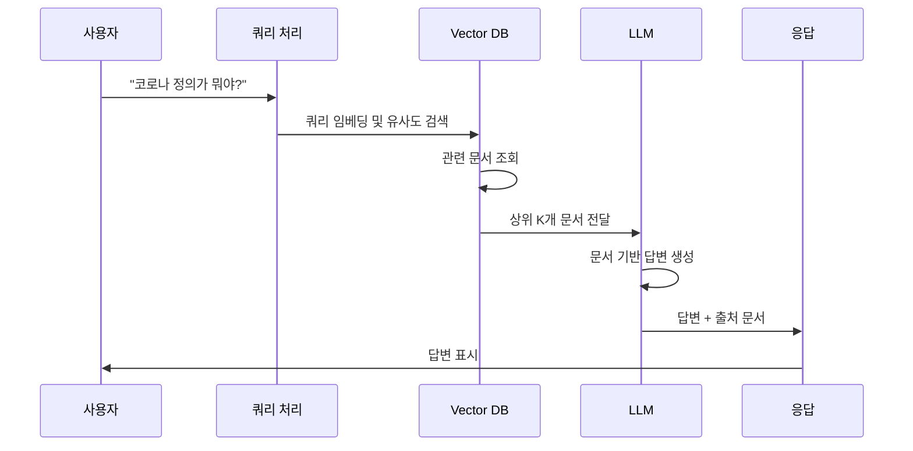
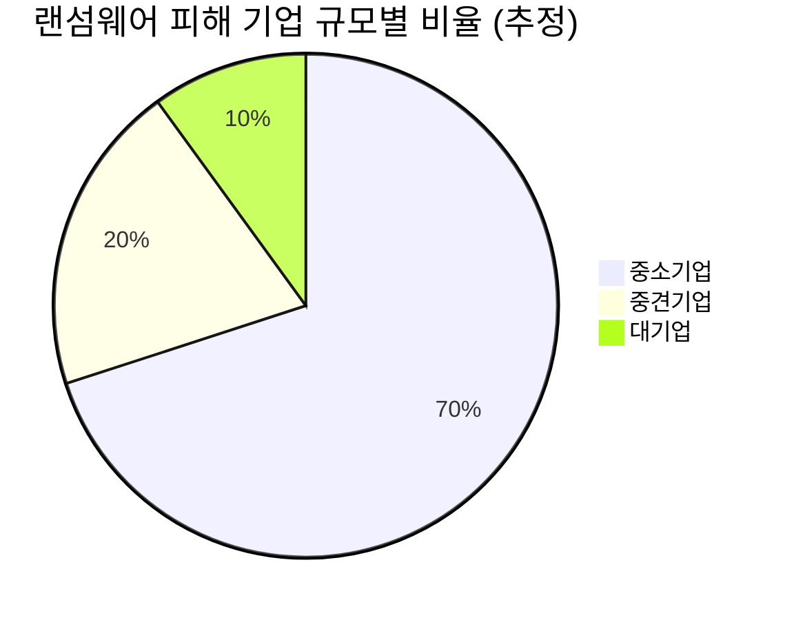
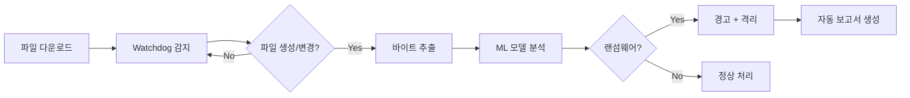
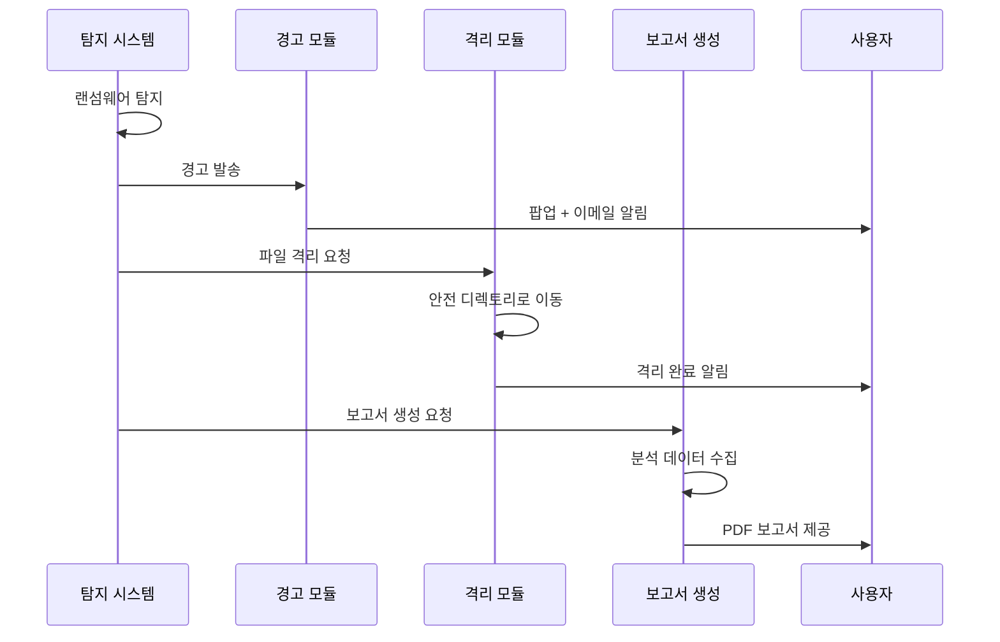
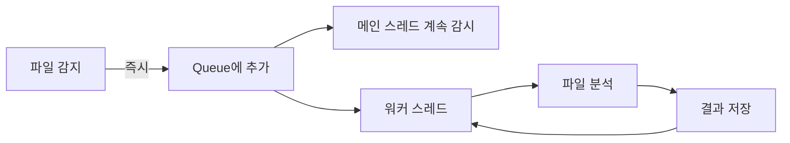
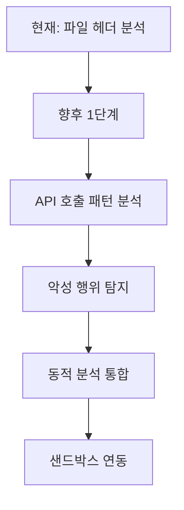

---
title: "📝 AI 및 데이터 분석 프로젝트 발표회 강의 노트 (2025-11-21)"
date: 2025-11-21
excerpt: "AI 및 데이터 분석 미니 프로젝트 발표회, 팀별 프로젝트 결과를 공유합니다."
categories:
  - Project-AI
tags:
  - Project-AI
  - SK_Rookies
---

# 📝 AI 및 데이터 분석 프로젝트 발표회 강의 노트 (2025-11-21)

## 📅 강의 정보

- **날짜**: 2025년 11월 21일
- **구분**: 미니 프로젝트 발표 및 평가
- **참여 팀**: 총 10개 팀
- **강사**: 시원한 쌔에 강사님
- **평가자**: 탁규민 FT님
- **진행 시간**: 오전 9시 30분 ~ 오후 5시

---

## 🎯 학습 목표 및 개요

### 전체 개요

이번 강의 노트는 **AI 기반 데이터 분석 프로젝트 발표회**에서 진행된 10개 팀의 프로젝트 발표 내용을 정리한 문서입니다. 각 팀은 약 3주간의 교육과 1주간의 프로젝트 기간을 통해 다양한 주제의 AI 및 데이터 분석 프로젝트를 완성하였습니다.

### 주요 학습 목표

1. **다양한 AI/ML 모델의 실전 적용 사례 학습**
   - 머신러닝 모델 선정 기준
   - 모델 성능 평가 및 비교 방법론
   - 실무 적용을 위한 모델 최적화

2. **데이터 분석 및 시각화 기법 이해**
   - 대용량 데이터 처리 및 전처리
   - 효과적인 데이터 시각화 전략
   - 인사이트 도출 방법론

3. **팀 프로젝트 수행 방법론 체득**
   - 역할 분담 및 협업 전략
   - 기술적 트러블 해결 과정
   - 프로젝트 관리 및 일정 조율

4. **프레젠테이션 및 커뮤니케이션 스킬 향상**
   - 기술적 내용의 효과적인 전달
   - Q&A 대응 전략
   - 피드백 수용 및 개선 방향 도출

---

## 👨‍🏫 강사 및 평가자 소개

### 시원한 쌔에 강사님

```
역할: 주 강사
담당: 3주간 교육 진행 및 프로젝트 멘토링
특징:
- 학생들의 이름을 모두 호명하며 시작하는 친근한 강의 스타일
- 기술적 세부사항보다 팀워크와 성장에 중점
- "여러분과 함께 할 수 있는 마지막 시간"이라며 감회를 표현
```

**강사님 오프닝 멘트 (원문 발췌):**

> "저는 이제 오늘 교육이 여러분과 함께 할 수 있는 마지막 시간이네요. 3주 저희 이런 거 실수 배웠고요. 일주 여러분들 프로젝트 진행하셨는데 어제 말씀드렸던 것처럼 오늘은 저희끼리 그냥 진행하는 우리만의 어떤 경쟁대회가 되는 시간인 것 같습니다."

💡 **강사님의 핵심 메시지:**
- 경쟁보다는 **지식 공유**와 **인터랙티브한 소통**을 강조
- 팀만의 기술 스택과 접근 방식을 다른 팀과 나누는 것의 중요성
- 질문과 답변을 통한 상호 학습

### 탁규민 FT (Facilitator)

```
역할: 프로젝트 평가 및 진행 관리
담당: 발표 순서 관리, 평가 기준 안내
특징:
- 공정한 평가 진행
- 발표 타이밍 및 순서 조율
- 팀원 평가 및 2차 사전평가 안내
```

---

## 📋 발표 진행 일정

### 타임라인

```mermaid
gantt
    title 프로젝트 발표회 일정
    dateFormat HH:mm
    section 오전
    준비 및 안내           :09:00, 30m
    9조 발표              :09:30, 25m
    5조 발표              :09:55, 25m
    7조 발표              :10:20, 25m
    휴식                 :10:45, 20m
    section 오후
    2조 발표              :13:05, 25m
    6조 발표              :13:30, 25m
    휴식                 :14:00, 75m
    1조 발표              :15:15, 25m
    종합 정리             :15:40, 20m
    팀별 회고             :16:00, 60m
    마무리               :17:00, 10m
```



### 발표 순서 (핀볼로 결정)

| 순서 | 팀명 | 조 | 주제 | 발표자 |
|:---:|:---|:--:|:---|:---|
| 1 | 구조 | 9조 | 랜섬웨어 실시간 분석 시스템 | 원정현 |
| 2 | 제로포인트 | 5조 | 코로나19 데이터 시각화 대시보드 | 강호영 |
| 3 | 콘요 | 7조 | 예술의 전당 AI 마케팅 분석 | 전민석 |
| 4 | - | 2조 | 게임 리뷰 감정 분석 AI | - |
| 5 | - | 6조 | 환경 요인과 도시 범죄 상관관계 | 임형우 |
| 6 | - | 3조 | (내용 미포함) | - |
| 7 | - | 1조 | 영화 투자 분석 시스템 | 승혁 |

📌 **노트**:
- 발표 순서는 전날 핀볼로 결정
- 각 팀 발표 시간: 약 15~20분
- Q&A 시간: 약 5~10분

---

## 🎤 발표 진행 방식 및 규칙

### 발표 형식

1. **발표자 위치**
   - 강사 자리로 이동하여 발표
   - 분위기를 내기 위한 상징적 의미
   - 화면 공유와 웹캠 동시 사용

2. **발표 구조** (권장)
   ```
   1. 팀 소개 및 팀명
   2. 프로젝트 개요
   3. 문제 인식 / 배경
   4. 목표, 타겟, 목적
   5. 핵심 기능
   6. 기술 스택
   7. 시연 (영상 또는 라이브)
   8. 결론 및 향후 발전 방향
   9. Q&A
   ```

3. **질의응답 방식**
   - 발표 후 청중 질문 받기
   - 팀원들이 분담하여 답변
   - 강사님의 추가 질문 (팀워크, 트러블슈팅, 확장성 관련)

### 평가 기준 (추정)

| 항목 | 가중치 | 세부 내용 |
|:---|:---:|:---|
| **기술적 완성도** | 30% | - 프로젝트 구현 완성도<br>- 기술 스택 활용도<br>- 코드 품질 |
| **창의성 및 독창성** | 20% | - 주제 선정의 참신함<br>- 문제 해결 접근 방식<br>- 차별화된 기능 |
| **실용성** | 20% | - 실제 활용 가능성<br>- 타겟 사용자 명확성<br>- 확장 가능성 |
| **발표력** | 15% | - 명확한 전달력<br>- 시각 자료 활용<br>- Q&A 대응 |
| **팀워크** | 15% | - 역할 분담<br>- 협업 과정<br>- 팀원 평가 |

⚠️ **주의**:
- 정량적 평가보다 **과정과 성장**에 중점
- 강사님 언급: "정량적 평가가 그렇게 큰 의미가 있을까"

---

## 👥 참여 팀 전체 개요

### 팀별 요약표

| 조 | 팀명 | 인원 | 주제 분야 | 핵심 기술 | 주요 모델/라이브러리 |
|:--:|:---|:--:|:---|:---|:---|
| 9조 | 구조 | 5명 | 보안 | 랜섬웨어 탐지 | Random Forest, Streamlit, Watchdog |
| 5조 | 제로포인트 | 5명 | 공공데이터 | 코로나 분석 | LLM, RAG, Streamlit, Folium |
| 7조 | 콘요 | 5명 | 비즈니스 | 마케팅 분석 | LLM, RAG, PDF 생성, Streamlit |
| 2조 | - | 5명 | 게임산업 | 감정 분석 | HuggingFace Transformers, 파인튜닝 |
| 6조 | - | 4명 | 사회과학 | 상관관계 분석 | 데이터 전처리, 시각화, Streamlit |
| 1조 | - | 5명+ | 엔터테인먼트 | 투자 분석 | TMDB API, LLM, 예측 모델 |

### 주제 분류별 통계

#### 1️⃣ 보안 관련 프로젝트

```
- 9조: 랜섬웨어 실시간 탐지 및 분석 시스템
- (미포함): 또 다른 보안 관련 프로젝트 언급됨
```

**특징:**
- 머신러닝 기반 파일 분석
- 실시간 모니터링 시스템
- 자동 보고서 생성

#### 2️⃣ 데이터 시각화 및 대시보드

```
- 5조: 코로나19 통계 대시보드
- 7조: 마케팅 분석 대시보드
- 6조: 범죄율 분석 대시보드
```

**공통 기술:**
- Streamlit 활용
- 데이터 필터링 기능
- 인터랙티브 차트

#### 3️⃣ AI/LLM 활용 프로젝트

```
- 5조: RAG 기반 전문 챗봇
- 7조: 마케팅 리포트 생성
- 2조: 감정 분석 모델 파인튜닝
- 1조: 영화 분석 및 기획안 평가
```

**핵심 기법:**
- LLM 프롬프트 엔지니어링
- RAG (Retrieval-Augmented Generation)
- 문서 기반 답변 생성
- 맞춤형 리포트 작성

#### 4️⃣ 데이터 분석 및 인사이트 도출

```
- 6조: 환경-범죄 상관관계
- 1조: 영화 흥행 요인 분석
```

**방법론:**
- 상관관계 분석
- 히트맵 시각화
- 다변량 분석
- 통계적 유의성 검증

---

## 🌟 발표회의 주요 특징

### 1. 다양한 주제의 균형

강사님 언급:
> "10개 팀에서 전부 다 다른 주제들. 뭐 비슷한 주제가 몇 개 있긴 했었죠. 뭐 보안적 관련된 주제가 두 개 정도 있었고요."

**주제 다양성:**
- 보안: 랜섬웨어 분석
- 공공데이터: 코로나 통계
- 비즈니스: 마케팅, 투자 분석
- 사회과학: 환경-범죄 상관관계
- 엔터테인먼트: 게임, 영화

### 2. 기술 수준의 편차

💡 **관찰 내용:**

**고급 기술 활용 팀:**
- 머신러닝 모델 커스터마이징 (9조, 2조)
- 복잡한 데이터 파이프라인 (7조)
- 다중 CSV 파일 가공 및 분석 (7조)

**실용성 중심 팀:**
- 기존 라이브러리 효과적 활용 (5조)
- 직관적인 UI/UX 설계 (5조, 6조)
- 명확한 타겟 사용자 설정 (7조, 1조)

### 3. 협업 과정의 차이

#### Case 1: 학습 중심 협업 (2조)

발표자 언급:
> "프로젝트를 진행한다기보다는 서로 서로 어디까지 오늘 공부하셨나요 하면서 공부 내용을 조금 공유를 하면서 모르는 부분이 있으면 서로 알려주고"

**특징:**
- 팀원 모두 AI 초보자
- 함께 학습하며 성장
- 5개의 커스텀 모델 제작 (팀원당 1개)

#### Case 2: 소통 중심 협업 (5조)

발표자 언급:
> "소통이 가장 크게 중요했다고 보는 게 작은 문제가 생겨도 다 같이 모여서 다 같이 의문하고 그걸 다 같이 정리하고"

**특징:**
- 의견 조율 과정 중시
- 빈번한 팀 미팅
- 확장성 논의 과정

#### Case 3: 역할 분담 중심 협업 (7조)

발표자 언급:
> "어 저는 팀장이고 그 문서 작업이나 그 프로젝트의 방향을 결정할 때 그 역할대로 했고요. 그 나영진님이 그 기술 팀장으로"

**특징:**
- 명확한 역할 구분
- 팀장 + 기술 팀장 체제
- Git 브랜치 전략 활용

### 4. 데이터 처리의 중요성

**대용량 데이터 처리 사례:**

| 팀 | 데이터 규모 | 처리 방법 |
|:--:|:---|:---|
| 7조 | 약 190만 건 JSON | 필터링 → CSV 변환 → 4개 분석 파일 생성 |
| 1조 | TMDB 영화 데이터 | 상위 10% 성공 영화 필터링 (639편) |
| 6조 | 4개년 범죄 통계 | 지역별/월별 데이터 병합 및 전처리 |

**공통 전처리 기법:**
```python
# 1. 데이터 병합
merged_df = pd.concat([df_2020, df_2021, df_2022, df_2023])

# 2. 불필요한 컬럼 제거
df_cleaned = df.drop(columns=['지능범죄', '안보범죄', '약취유인'])

# 3. 범주 통합
df['살인'] = df['살인_기수'] + df['살인_미수']

# 4. 결측치 처리
df.fillna(method='ffill', inplace=True)
```

---

## 🔧 공통 기술 스택 분석

### 프론트엔드 / UI 프레임워크

#### 🎨 Streamlit (압도적 선호도)

**사용 팀:** 9조, 5조, 7조, 6조

**선정 이유:**
- Python 기반으로 백엔드 개발자도 쉽게 UI 구성 가능
- 빠른 프로토타이핑
- 데이터 시각화 라이브러리와 자연스러운 통합
- 배포 용이성

**기본 구조 예시:**
```python
import streamlit as st
import pandas as pd

# 페이지 설정
st.set_page_config(
    page_title="프로젝트 대시보드",
    page_icon="📊",
    layout="wide"
)

# 사이드바 필터
with st.sidebar:
    st.header("필터 옵션")
    date_range = st.date_input("날짜 선택")
    region = st.selectbox("지역 선택", options=['전체', '서울', '경기'])

# 메인 콘텐츠
st.title("📊 데이터 분석 대시보드")

# 탭 구성
tab1, tab2, tab3 = st.tabs(["전체 분석", "세부 분석", "AI 챗봇"])

with tab1:
    st.subheader("전체 통계")
    col1, col2, col3 = st.columns(3)
    with col1:
        st.metric("총 데이터 수", "1,234", "+10%")
```

### 데이터 시각화 라이브러리

#### 📈 주요 라이브러리 비교

| 라이브러리 | 사용 팀 | 주요 용도 | 장점 |
|:---|:---:|:---|:---|
| **Plotly** | 5조, 7조 | 인터랙티브 차트 | 줌, 필터링 등 동적 기능 |
| **Matplotlib** | 6조, 1조 | 정적 차트 | 세밀한 커스터마이징 가능 |
| **Seaborn** | 6조 | 통계 시각화 | 히트맵, 상관관계 분석 |
| **Folium** | 5조 | 지도 시각화 | 지역별 데이터 표현 |

#### 5조의 Folium 지도 시각화 사례

```python
import folium
from folium.plugins import HeatMap

# 지도 생성
m = folium.Map(
    location=[37.5665, 126.9780],  # 서울 중심
    zoom_start=11
)

# 지역별 확진자 수 표시
for idx, row in df_regional.iterrows():
    folium.CircleMarker(
        location=[row['위도'], row['경도']],
        radius=row['확진자수'] / 100,  # 크기 조정
        popup=f"{row['지역']}: {row['확진자수']}명",
        color='red',
        fill=True,
        fillOpacity=0.6
    ).add_to(m)

# Streamlit에 표시
st.components.v1.html(m._repr_html_(), height=600)
```

---

## 🤖 AI/ML 모델 활용 패턴

### 패턴 1: 사전 학습 모델 활용 (Transfer Learning)

**대표 사례: 2조 - 게임 리뷰 감정 분석**

```python
from transformers import pipeline

# HuggingFace에서 사전 학습된 모델 로드
sentiment_analyzer = pipeline(
    "sentiment-analysis",
    model="nlptown/bert-base-multilingual-uncased-sentiment"
)

# 리뷰 감정 분석
reviews = ["이 게임 정말 재미있어요!", "버그가 너무 많습니다."]
results = sentiment_analyzer(reviews)
```

**장점:**
- 개발 시간 단축
- 검증된 모델 사용
- 소규모 데이터셋으로도 활용 가능

### 패턴 2: 전통적 ML 모델 학습

**대표 사례: 9조 - Random Forest 기반 랜섬웨어 탐지**

**모델 선정 과정:**


**선정 이유:**
- **재현율 우선**: 랜섬웨어 미탐지(False Negative)를 최소화
- 바이트 벡터 데이터에 적합
- 시계열 데이터가 아니므로 BERT 불필요

### 패턴 3: LLM + RAG 시스템

**대표 사례: 5조, 7조**

#### RAG 시스템 구조



#### 구현 예시 (5조 참고)

```python
from langchain.vectorstores import FAISS
from langchain.embeddings import OpenAIEmbeddings
from langchain.llms import OpenAI
from langchain.chains import RetrievalQA

# 1. 문서 로드 및 임베딩
documents = load_documents("감염병_포탈_문서/")
embeddings = OpenAIEmbeddings()
vectorstore = FAISS.from_documents(documents, embeddings)

# 2. Retriever 설정
retriever = vectorstore.as_retriever(
    search_type="similarity",
    search_kwargs={"k": 3}  # 상위 3개 문서 반환
)

# 3. QA 체인 구성
llm = OpenAI(temperature=0)
qa_chain = RetrievalQA.from_chain_type(
    llm=llm,
    retriever=retriever,
    return_source_documents=True
)

# 4. 질문 처리
response = qa_chain({"query": "코로나의 정의가 뭐야?"})
print(response['result'])
print("출처:", response['source_documents'])
```

---

## 💬 강사님의 공통 질문 패턴

모든 팀에게 공통적으로 던진 3가지 핵심 질문:

### 1️⃣ 역할 분담은 어떻게 하셨나요?

**질문 의도:**
- 팀워크 평가
- 협업 능력 확인
- 갈등 관리 방법

**우수 답변 사례 (7조):**
> "저는 팀장이고 문서 작업이나 프로젝트의 방향을 결정했고, 나영진님이 기술 팀장으로 개발을 전담적으로 이끌었습니다. Git 브랜치 전략을 사용해 각자 맡은 부분을 개발 후 기술 팀장이 머지했습니다."

### 2️⃣ 트러블은 무엇이었고 어떻게 해결하셨나요?

**질문 의도:**
- 문제 해결 능력
- 기술적 깊이
- 대응 전략

**우수 답변 사례 (5조):**
> "가장 중요했던 건 소통이었습니다. 작은 문제가 생겨도 다 같이 모여서 의논하고 정리했습니다. 자신의 의견을 표출하며 소통을 많이 했습니다."

### 3️⃣ 확장 가능성은 어떻게 보시나요?

**질문 의도:**
- 비즈니스 마인드
- 기술적 발전 방향
- 실용성 검토

**우수 답변 사례 (1조):**
> "현재는 감독만 분석했지만, 추후 배우 데이터를 추가하여 배우 및 감독의 파워를 정량화하는 모델을 개발할 계획입니다. 영화뿐만 아니라 드라마, 웹툰 등 다양한 콘텐츠로 확장하여 정식 소프트웨어 서비스 론칭까지 가능할 것입니다."

---

## 📚 핵심 학습 포인트 정리

### 1. 프로젝트 성공의 핵심 요소

```
✅ 명확한 문제 정의
   └─ 실제 문제점 파악 → 데이터 기반 검증 → 솔루션 제시

✅ 적절한 기술 선택
   └─ 최신 기술보다 팀 역량에 맞는 기술
   └─ 팀원 모두가 이해 가능한 수준

✅ 효과적인 협업
   └─ 소통 > 개인 기술
   └─ 역할 분담 명확화
   └─ 형상 관리 (Git) 활용

✅ 실용성 고려
   └─ 타겟 사용자 명확화
   └─ 확장 가능성 염두
   └─ 실제 활용 시나리오 제시
```

### 2. 발표 준비 시 체크리스트

- [ ] 문제 인식이 명확한가?
- [ ] 타겟 사용자가 구체적인가?
- [ ] 기술 선정 이유를 설명할 수 있는가?
- [ ] 시연이 원활하게 작동하는가?
- [ ] Q&A 예상 질문을 준비했는가?
- [ ] 확장 가능성을 고민했는가?
- [ ] 팀워크 과정을 정리했는가?

---

## 🎯 다음 섹션 안내

Section 2에서는 보안 및 공공데이터 분석 프로젝트(9조, 5조)의 상세한 기술 분석과 Q&A 내용을 다룹니다.
## 🔐 Section 2: 보안 및 공공데이터 프로젝트 상세 분석

---

# 프로젝트 1: 9조 "구조" - 랜섬웨어 실시간 분석 시스템

## 👥 팀 구성

### 팀원 및 역할

| 이름 | 역할 | 주요 담당 |
|:---|:---|:---|
| **원정현** | 발표자 | 프로젝트 발표, 개요 설명 |
| **김한수** | - | - |
| **박정서** | - | - |
| **박지빈** | 기술 답변 | Q&A 담당, 기술적 질문 해결 |
| **윤동현** | - | - |

**팀명 "구조"의 의미:**
- 구조(救助): 중소기업을 랜섬웨어로부터 구조한다
- 구조(構造): 체계적인 시스템 구조를 의미

---

## 📋 프로젝트 개요

### 1. 문제 인식

#### 🚨 현재 랜섬웨어 피해 현황

**주요 피해 대상: 중소기업**



**중소기업이 취약한 이유:**

| 한계 요인 | 상세 설명 | 영향 |
|:---|:---|:---|
| **인력 한계** | 보안 전담 인력 부족 | 실시간 모니터링 불가 |
| **비용 한계** | 수천만 원대 보안 솔루션 도입 어려움 | 기본적인 방어만 가능 |
| **분석 한계** | 위협 분석 전문가 부재 | 사후 대응 능력 미흡 |

💡 **핵심 인사이트:**

> "보통 이제 피해를 입는 쪽이 중소기업을 중소기업 쪽에서 피해를 자주 발생합니다. 그 이유는 이제 인력에 대한 한계가 있고, 비용에 대한 한계, 분석에 대한 한계가 있습니다."

#### 실제 피해 사례 (일반적인 시나리오)

```
1. 📧 피싱 메일 수신
   └─ 직원이 첨부파일 실행

2. 🔓 랜섬웨어 실행
   └─ 시스템 파일 암호화 시작

3. ⏱️ 대응 지연
   └─ 탐지 시스템 부재로 확산

4. 💸 금전적 피해
   └─ 복구 비용 + 다운타임 손실

5. 📉 신뢰도 하락
   └─ 고객 데이터 유출 시 기업 이미지 타격
```

---

### 2. 목표, 타겟, 목적 (TTP 분석)

#### 🎯 프로젝트 목표

```
중소기업이 저비용으로 도입 가능한
랜섬웨어 실시간 탐지 및 자동 분석 시스템 구축
```

#### 👤 타겟 사용자

**Primary Target:**
- 보안 전담 인력이 부족한 중소기업
- IT 담당자 1~2명 규모의 조직

**Secondary Target:**
- 보안 투자 예산이 제한적인 스타트업
- 개인 사업자 (중요 데이터 보유)

#### 🎪 프로젝트 목적

1. **접근성 향상**
   - 비용: 기존 솔루션 대비 90% 절감
   - 난이도: 비전문가도 사용 가능한 UI

2. **실시간 대응**
   - 파일 다운로드 즉시 분석
   - 악성 파일 자동 격리

3. **자동화**
   - 사고 발생 시 자동 보고서 생성
   - 조치 가이드 제공

---

## 🔬 핵심 기능 상세 분석

### 기능 1: 실시간 파일 감지 및 자동 분석

#### 📟 시스템 아키텍처



#### 🔍 Watchdog을 이용한 실시간 감지

**Watchdog 라이브러리 소개:**

Watchdog은 Python 기반의 파일 시스템 이벤트 모니터링 라이브러리입니다.

**주요 기능:**
- 파일/디렉토리 생성 감지
- 파일 수정 감지
- 파일 삭제 감지
- 파일 이동 감지

**구현 코드 예시:**

```python
from watchdog.observers import Observer
from watchdog.events import FileSystemEventHandler
import time

class RansomwareDetector(FileSystemEventHandler):
    """랜섬웨어 탐지를 위한 파일 시스템 이벤트 핸들러"""

    def __init__(self, model):
        """
        Args:
            model: 학습된 머신러닝 모델
        """
        super().__init__()
        self.model = model
        self.detected_files = []

    def on_created(self, event):
        """
        파일 생성 이벤트 처리

        Args:
            event: FileSystemEvent 객체
        """
        if event.is_directory:
            return

        file_path = event.src_path
        print(f"[INFO] 새 파일 감지: {file_path}")

        # 분석 수행
        self.analyze_file(file_path)

    def on_modified(self, event):
        """
        파일 수정 이벤트 처리

        Args:
            event: FileSystemEvent 객체
        """
        if event.is_directory:
            return

        file_path = event.src_path
        print(f"[INFO] 파일 수정 감지: {file_path}")

        # 의심스러운 대량 수정 감지
        self.analyze_file(file_path)

    def analyze_file(self, file_path):
        """
        파일 분석 수행

        Args:
            file_path: 분석할 파일 경로
        """
        try:
            # 1. 파일 헤더 바이트 추출 (예: 처음 512 bytes)
            with open(file_path, 'rb') as f:
                header_bytes = f.read(512)

            # 2. 바이트를 벡터로 변환
            byte_vector = self._bytes_to_vector(header_bytes)

            # 3. 머신러닝 모델로 예측
            prediction = self.model.predict([byte_vector])
            probability = self.model.predict_proba([byte_vector])[0][1]

            # 4. 결과 처리
            if prediction[0] == 1:  # 랜섬웨어로 판정
                self._handle_ransomware(file_path, probability)
            else:
                print(f"[OK] 정상 파일: {file_path}")

        except Exception as e:
            print(f"[ERROR] 분석 실패: {file_path} - {str(e)}")

    def _bytes_to_vector(self, byte_data):
        """
        바이트 데이터를 특성 벡터로 변환

        Args:
            byte_data: 원본 바이트 데이터

        Returns:
            numpy.array: 512차원 특성 벡터
        """
        # 바이트를 정수 리스트로 변환
        byte_list = list(byte_data)

        # 512 바이트 미만이면 0으로 패딩
        if len(byte_list) < 512:
            byte_list += [0] * (512 - len(byte_list))

        return byte_list[:512]

    def _handle_ransomware(self, file_path, probability):
        """
        랜섬웨어 탐지 시 처리

        Args:
            file_path: 탐지된 파일 경로
            probability: 랜섬웨어 확률 (0~1)
        """
        print(f"⚠️  [ALERT] 랜섬웨어 탐지!")
        print(f"    파일: {file_path}")
        print(f"    확률: {probability:.2%&#125;")

        # 로그 기록
        self.detected_files.append({
            'file': file_path,
            'probability': probability,
            'timestamp': time.time()
        })

        # TODO: 파일 격리, 알림 전송 등

# 메인 실행
if __name__ == "__main__":
    # 모델 로드 (예시)
    import joblib
    model = joblib.load('ransomware_detector_rf.pkl')

    # 감시할 디렉토리 설정
    watch_directory = "/Users/Downloads"  # 예: 다운로드 폴더

    # 이벤트 핸들러 생성
    event_handler = RansomwareDetector(model)

    # Observer 설정
    observer = Observer()
    observer.schedule(event_handler, watch_directory, recursive=True)

    # 감시 시작
    print(f"[INFO] '{watch_directory}' 감시 시작...")
    observer.start()

    try:
        while True:
            time.sleep(1)
    except KeyboardInterrupt:
        observer.stop()
        print("\n[INFO] 감시 종료")

    observer.join()
```

**코드 설명:**

| 메서드 | 역할 | 호출 시점 |
|:---|:---|:---|
| `on_created()` | 새 파일 생성 감지 | 다운로드 완료, 파일 복사 |
| `on_modified()` | 파일 수정 감지 | 파일 내용 변경 |
| `analyze_file()` | ML 모델로 분석 | 생성/수정 이벤트 발생 시 |
| `_bytes_to_vector()` | 바이트 → 벡터 변환 | 모델 입력 준비 |
| `_handle_ransomware()` | 랜섬웨어 탐지 시 조치 | 모델이 양성 판정 시 |

⚠️ **주의사항:**

1. **성능 이슈**
   - 대용량 파일 다운로드 시 CPU 사용률 증가
   - 해결: 비동기 처리, 큐 시스템 도입

2. **오탐(False Positive)**
   - 정상 파일을 랜섬웨어로 오판
   - 해결: 임계값 조정, 사용자 화이트리스트 기능

---

### 기능 2: 위협 정보 시각화

#### 📊 시각화 요소

**1. 탐지 현황 대시보드**

```python
import streamlit as st
import plotly.graph_objects as go
import pandas as pd

def render_dashboard(detected_files):
    """
    랜섬웨어 탐지 현황 대시보드

    Args:
        detected_files: 탐지된 파일 리스트
    """
    st.title("🛡️ 랜섬웨어 탐지 시스템")

    # 상단 통계
    col1, col2, col3 = st.columns(3)

    with col1:
        st.metric(
            "총 탐지 건수",
            len(detected_files),
            delta="+3" if len(detected_files) > 0 else "0",
            delta_color="inverse"  # 빨간색으로 표시
        )

    with col2:
        today_count = sum(1 for f in detected_files if is_today(f['timestamp']))
        st.metric(
            "금일 탐지",
            today_count,
            delta=f"+{today_count}"
        )

    with col3:
        avg_prob = sum(f['probability'] for f in detected_files) / len(detected_files) if detected_files else 0
        st.metric(
            "평균 위험도",
            f"{avg_prob:.1%&#125;",
            delta=f"{avg_prob:.1%&#125;"
        )

    # 시간대별 탐지 그래프
    st.subheader("📈 시간대별 탐지 현황")

    df = pd.DataFrame(detected_files)
    df['hour'] = pd.to_datetime(df['timestamp'], unit='s').dt.hour

    hourly_counts = df.groupby('hour').size().reset_index(name='count')

    fig = go.Figure(data=[
        go.Bar(
            x=hourly_counts['hour'],
            y=hourly_counts['count'],
            marker_color='crimson',
            text=hourly_counts['count'],
            textposition='auto',
        )
    ])

    fig.update_layout(
        xaxis_title="시간 (Hour)",
        yaxis_title="탐지 건수",
        hovermode='x'
    )

    st.plotly_chart(fig, use_container_width=True)

    # 탐지 파일 목록
    st.subheader("🔍 탐지된 파일 목록")

    df_display = df[['file', 'probability', 'timestamp']].copy()
    df_display['timestamp'] = pd.to_datetime(df_display['timestamp'], unit='s')
    df_display['probability'] = df_display['probability'].apply(lambda x: f"{x:.2%&#125;")

    st.dataframe(
        df_display,
        column_config={
            "file": "파일 경로",
            "probability": "위험도",
            "timestamp": st.column_config.DatetimeColumn(
                "탐지 시각",
                format="YYYY-MM-DD HH:mm:ss"
            )
        },
        hide_index=True,
        use_container_width=True
    )
```

**2. 위험도 히트맵**

```python
import seaborn as sns
import matplotlib.pyplot as plt

def create_risk_heatmap(df):
    """
    요일별 시간대별 위험도 히트맵

    Args:
        df: 탐지 기록 DataFrame
    """
    # 요일 및 시간 추출
    df['weekday'] = pd.to_datetime(df['timestamp'], unit='s').dt.dayofweek
    df['hour'] = pd.to_datetime(df['timestamp'], unit='s').dt.hour

    # 피벗 테이블 생성
    heatmap_data = df.pivot_table(
        values='probability',
        index='weekday',
        columns='hour',
        aggfunc='mean'
    )

    # 요일 레이블
    weekday_labels = ['월', '화', '수', '목', '금', '토', '일']

    # 히트맵 그리기
    plt.figure(figsize=(14, 6))
    sns.heatmap(
        heatmap_data,
        annot=True,
        fmt='.0%',
        cmap='Reds',
        cbar_kws={'label': '평균 위험도'},
        yticklabels=weekday_labels
    )
    plt.title('요일별 시간대별 평균 위험도')
    plt.xlabel('시간 (Hour)')
    plt.ylabel('요일')
    plt.tight_layout()

    return plt
```

---

### 기능 3: 사고 대응 기능 제공

#### 🚨 대응 프로세스



#### 구현 예시

**격리 기능:**

```python
import os
import shutil
from datetime import datetime

class FileQuarantine:
    """악성 파일 격리 클래스"""

    def __init__(self, quarantine_dir="/var/quarantine"):
        """
        Args:
            quarantine_dir: 격리 디렉토리 경로
        """
        self.quarantine_dir = quarantine_dir
        os.makedirs(quarantine_dir, exist_ok=True)

    def quarantine_file(self, file_path, metadata=None):
        """
        파일을 격리 디렉토리로 이동

        Args:
            file_path: 격리할 파일 경로
            metadata: 추가 메타데이터 (dict)

        Returns:
            str: 격리된 파일의 새 경로
        """
        # 타임스탬프 추가
        timestamp = datetime.now().strftime("%Y%m%d_%H%M%S")
        filename = os.path.basename(file_path)
        new_filename = f"{timestamp}_{filename}"

        # 격리 경로
        quarantine_path = os.path.join(self.quarantine_dir, new_filename)

        try:
            # 파일 이동
            shutil.move(file_path, quarantine_path)

            # 메타데이터 저장
            if metadata:
                metadata_path = quarantine_path + ".meta"
                with open(metadata_path, 'w') as f:
                    import json
                    json.dump(metadata, f, indent=2)

            print(f"✅ 파일 격리 완료: {quarantine_path}")
            return quarantine_path

        except Exception as e:
            print(f"❌ 격리 실패: {str(e)}")
            return None
```

---

### 기능 4: 자동 보고서 생성

#### 📄 보고서 구성 요소

| 섹션 | 내용 | 목적 |
|:---|:---|:---|
| **요약** | 탐지 건수, 위험도, 조치 현황 | 전체 상황 파악 |
| **상세 분석** | 각 파일별 분석 결과 | 개별 위협 이해 |
| **조치 내역** | 격리, 삭제 등 수행한 작업 | 대응 기록 |
| **향후 조치 계획** | 권장 보안 조치 | 재발 방지 |
| **재발 방지 대책** | 보안 정책 제언 | 장기 전략 |
| **점검 사항** | 확인해야 할 체크리스트 | 후속 작업 |

#### 보고서 생성 코드

```python
from reportlab.lib.pagesizes import A4
from reportlab.lib.styles import getSampleStyleSheet
from reportlab.platypus import SimpleDocTemplate, Paragraph, Spacer, Table
from reportlab.lib.units import cm
from datetime import datetime

class RansomwareReport:
    """랜섬웨어 탐지 보고서 생성 클래스"""

    def __init__(self, detected_files):
        """
        Args:
            detected_files: 탐지된 파일 정보 리스트
        """
        self.detected_files = detected_files
        self.styles = getSampleStyleSheet()

    def generate_pdf(self, output_path="report.pdf"):
        """
        PDF 보고서 생성

        Args:
            output_path: 저장할 파일 경로
        """
        doc = SimpleDocTemplate(
            output_path,
            pagesize=A4,
            topMargin=2*cm,
            bottomMargin=2*cm
        )

        # 보고서 내용 구성
        story = []

        # 1. 제목
        title = Paragraph(
            "<b>랜섬웨어 탐지 보고서</b>",
            self.styles['Title']
        )
        story.append(title)
        story.append(Spacer(1, 0.5*cm))

        # 2. 생성 일시
        date_text = Paragraph(
            f"생성 일시: {datetime.now().strftime('%Y-%m-%d %H:%M:%S')}",
            self.styles['Normal']
        )
        story.append(date_text)
        story.append(Spacer(1, 0.5*cm))

        # 3. 요약 정보
        summary = self._create_summary()
        story.append(summary)
        story.append(Spacer(1, 0.5*cm))

        # 4. 상세 내역 테이블
        details_table = self._create_details_table()
        story.append(details_table)
        story.append(Spacer(1, 0.5*cm))

        # 5. 조치 권고사항
        recommendations = self._create_recommendations()
        story.append(recommendations)

        # PDF 생성
        doc.build(story)
        print(f"📄 보고서 생성 완료: {output_path}")

    def _create_summary(self):
        """요약 정보 생성"""
        total = len(self.detected_files)
        avg_prob = sum(f['probability'] for f in self.detected_files) / total if total > 0 else 0

        summary_text = f"""
        <b>탐지 요약</b><br/>
        - 총 탐지 건수: {total}건<br/>
        - 평균 위험도: {avg_prob:.1%&#125;<br/>
        - 격리 완료: {total}건<br/>
        """

        return Paragraph(summary_text, self.styles['Normal'])

    def _create_details_table(self):
        """상세 내역 테이블 생성"""
        # 테이블 데이터
        data = [['번호', '파일명', '위험도', '탐지 시각']]

        for idx, file_info in enumerate(self.detected_files, 1):
            filename = os.path.basename(file_info['file'])
            probability = f"{file_info['probability']:.1%&#125;"
            timestamp = datetime.fromtimestamp(file_info['timestamp']).strftime('%Y-%m-%d %H:%M')

            data.append([str(idx), filename, probability, timestamp])

        # 테이블 생성
        table = Table(data, colWidths=[2*cm, 8*cm, 3*cm, 4*cm])
        table.setStyle([
            ('BACKGROUND', (0, 0), (-1, 0), '#d0d0d0'),
            ('TEXTCOLOR', (0, 0), (-1, 0), 'black'),
            ('ALIGN', (0, 0), (-1, -1), 'CENTER'),
            ('FONTNAME', (0, 0), (-1, 0), 'Helvetica-Bold'),
            ('FONTSIZE', (0, 0), (-1, 0), 12),
            ('BOTTOMPADDING', (0, 0), (-1, 0), 12),
            ('BACKGROUND', (0, 1), (-1, -1), 'white'),
            ('GRID', (0, 0), (-1, -1), 1, 'black')
        ])

        return table

    def _create_recommendations(self):
        """조치 권고사항 생성"""
        recommendations_text = """
        <b>향후 조치 계획</b><br/>
        1. 탐지된 파일의 격리 상태 확인<br/>
        2. 백업 시스템 무결성 검증<br/>
        3. 사용자 계정 비밀번호 변경<br/>
        4. 보안 패치 최신화<br/>
        <br/>
        <b>재발 방지 대책</b><br/>
        - 정기적인 보안 교육 실시<br/>
        - 이메일 첨부파일 검증 프로세스 강화<br/>
        - 백업 주기 단축 (일 1회 → 시간당 1회)<br/>
        <br/>
        <b>점검 사항</b><br/>
        □ 모든 시스템 백업 완료 확인<br/>
        □ 랜섬웨어 탐지 로그 보관<br/>
        □ 관련 부서 보고 완료<br/>
        """

        return Paragraph(recommendations_text, self.styles['Normal'])
```

**보고서 샘플 구조:**

```
===========================================
       랜섬웨어 탐지 보고서
===========================================

생성 일시: 2025-11-21 14:32:15

[탐지 요약]
- 총 탐지 건수: 3건
- 평균 위험도: 87.3%
- 격리 완료: 3건

[상세 내역]
┌────┬─────────────────┬─────────┬─────────────────┐
│ 번호│     파일명       │  위험도  │   탐지 시각      │
├────┼─────────────────┼─────────┼─────────────────┤
│  1 │ invoice.pdf.exe │  92.3%  │ 2025-11-21 10:15│
│  2 │ report.docx.exe │  85.7%  │ 2025-11-21 11:42│
│  3 │ update.zip      │  84.0%  │ 2025-11-21 13:20│
└────┴─────────────────┴─────────┴─────────────────┘

[향후 조치 계획]
1. 탐지된 파일의 격리 상태 확인
2. 백업 시스템 무결성 검증
3. 사용자 계정 비밀번호 변경
...
```

---

## 🤖 머신러닝 모델 선정 및 성능 비교

### 후보 모델 4가지

#### 1️⃣ CNN (Convolutional Neural Network)

**특징:**
- 이미지 처리에 최적화
- 공간적 패턴 인식

**랜섬웨어 탐지 적용:**
- 파일 바이트를 2D 이미지로 변환
- 바이트 패턴의 시각적 특징 추출

**장점:**
- 복잡한 패턴 학습 가능
- 새로운 변종 탐지에 유리

**단점:**
- 학습 시간 오래 걸림
- 많은 데이터 필요
- 모델 크기가 큼

**구현 예시:**

```python
import numpy as np
from tensorflow.keras.models import Sequential
from tensorflow.keras.layers import Conv2D, MaxPooling2D, Flatten, Dense

def create_cnn_model(input_shape=(32, 32, 1)):
    """
    CNN 모델 생성

    Args:
        input_shape: 입력 데이터 형태 (높이, 너비, 채널)

    Returns:
        keras.Model: CNN 모델
    """
    model = Sequential([
        # 첫 번째 Convolution Block
        Conv2D(32, (3, 3), activation='relu', input_shape=input_shape),
        MaxPooling2D((2, 2)),

        # 두 번째 Convolution Block
        Conv2D(64, (3, 3), activation='relu'),
        MaxPooling2D((2, 2)),

        # 세 번째 Convolution Block
        Conv2D(64, (3, 3), activation='relu'),

        # Fully Connected Layers
        Flatten(),
        Dense(64, activation='relu'),
        Dense(1, activation='sigmoid')  # 이진 분류
    ])

    model.compile(
        optimizer='adam',
        loss='binary_crossentropy',
        metrics=['accuracy']
    )

    return model

# 바이트 데이터를 이미지로 변환
def bytes_to_image(byte_data, size=32):
    """
    바이트 데이터를 32x32 이미지로 변환

    Args:
        byte_data: 원본 바이트 (최소 1024 bytes)
        size: 이미지 크기

    Returns:
        numpy.array: 정규화된 이미지 (32, 32, 1)
    """
    # 1024 바이트 추출
    bytes_needed = size * size
    byte_array = np.frombuffer(byte_data[:bytes_needed], dtype=np.uint8)

    # 부족하면 패딩
    if len(byte_array) < bytes_needed:
        byte_array = np.pad(byte_array, (0, bytes_needed - len(byte_array)))

    # 이미지로 reshape
    image = byte_array.reshape(size, size, 1)

    # 정규화 (0~1 범위)
    image = image / 255.0

    return image
```

#### 2️⃣ SVM (Support Vector Machine)

**특징:**
- 전통적인 머신러닝 기법
- 마진 최대화를 통한 분류

**랜섬웨어 탐지 적용:**
- 바이트 벡터를 고차원 공간에 매핑
- 최적의 결정 경계 찾기

**장점:**
- 소규모 데이터셋에 효과적
- 수학적으로 명확한 해석

**단점:**
- 대규모 데이터에서 느림
- 하이퍼파라미터 튜닝 필요

**구현 예시:**

```python
from sklearn.svm import SVC
from sklearn.preprocessing import StandardScaler

def train_svm_model(X_train, y_train):
    """
    SVM 모델 학습

    Args:
        X_train: 학습 데이터 (N, 512)
        y_train: 레이블 (N,)

    Returns:
        tuple: (모델, 스케일러)
    """
    # 데이터 정규화
    scaler = StandardScaler()
    X_train_scaled = scaler.fit_transform(X_train)

    # SVM 모델 생성
    model = SVC(
        kernel='rbf',  # RBF 커널 사용
        C=1.0,         # 정규화 파라미터
        gamma='scale', # 커널 계수
        probability=True  # 확률 출력 활성화
    )

    # 학습
    model.fit(X_train_scaled, y_train)

    return model, scaler
```

#### 3️⃣ BERT (Bidirectional Encoder Representations from Transformers)

**특징:**
- 자연어 처리 최강자
- 문맥 이해 능력

**랜섬웨어 탐지 적용:**
- 바이트 시퀀스를 "문장"으로 간주
- 양방향 문맥 학습

**장점:**
- 시퀀스 데이터에 강점
- 사전 학습 모델 활용 가능

**단점:**
- 리소스 많이 소모
- 바이트 데이터에는 오버킬

**9조의 결정:**
❌ **채택하지 않음**

**이유 (박지빈 답변):**
> "저희가 사용한 데이터 기반 자체가 파일의 헤더 바이트를 사용한 기반입니다. 시퀀스 기반이라는 시계열 데이터가 따로 없기 때문에 오히려 시계열 데이터는 정확도가 떨어지는 상황이 발생했습니다."

💡 **핵심 인사이트:**
- 데이터 특성에 맞는 모델 선택이 중요
- 최신 모델 ≠ 최적의 모델

#### 4️⃣ Random Forest ⭐ (최종 선택)

**특징:**
- 앙상블 학습 기법
- 다수의 결정 트리 조합

**랜섬웨어 탐지 적용:**
- 바이트 패턴을 다양한 각도에서 분석
- 투표 방식으로 최종 결정

**장점:**
- 🎯 **높은 재현율**: 미탐(False Negative) 최소화
- ⚡ **빠른 예측 속도**: 실시간 탐지에 적합
- 🛡️ **안정성**: 과적합에 강함
- 📊 **특성 중요도**: 어떤 바이트가 중요한지 해석 가능

**단점:**
- 모델 크기가 큼
- 해석이 복잡 (나무가 많아서)

**구현 예시:**

```python
from sklearn.ensemble import RandomForestClassifier
from sklearn.metrics import classification_report, confusion_matrix
import numpy as np

def train_random_forest(X_train, y_train):
    """
    Random Forest 모델 학습

    Args:
        X_train: 학습 데이터 (N, 512)
        y_train: 레이블 (N,)

    Returns:
        RandomForestClassifier: 학습된 모델
    """
    model = RandomForestClassifier(
        n_estimators=100,      # 트리 개수
        max_depth=20,          # 트리 최대 깊이
        min_samples_split=5,   # 분할 최소 샘플 수
        min_samples_leaf=2,    # 리프 노드 최소 샘플 수
        random_state=42,       # 재현성
        n_jobs=-1,             # 병렬 처리
        class_weight='balanced' # 클래스 불균형 처리
    )

    # 학습
    model.fit(X_train, y_train)

    return model

def evaluate_model(model, X_test, y_test):
    """
    모델 평가

    Args:
        model: 학습된 모델
        X_test: 테스트 데이터
        y_test: 정답 레이블
    """
    # 예측
    y_pred = model.predict(X_test)
    y_prob = model.predict_proba(X_test)[:, 1]

    # 혼동 행렬
    cm = confusion_matrix(y_test, y_pred)
    print("=== 혼동 행렬 ===")
    print(cm)
    print()

    # 분류 보고서
    print("=== 분류 보고서 ===")
    print(classification_report(y_test, y_pred, target_names=['정상', '랜섬웨어']))

    # 재현율 계산 (중요!)
    recall = cm[1, 1] / (cm[1, 0] + cm[1, 1])
    print(f"\n⚠️  재현율 (Recall): {recall:.2%&#125;")
    print(f"   → 랜섬웨어 {int(cm[1, 0] + cm[1, 1])}개 중 {int(cm[1, 1])}개 탐지")
    print(f"   → 미탐 (False Negative): {int(cm[1, 0])}개 ⚠️")
```

### 모델 성능 비교 결과

| 모델 | 정확도 | 재현율 | 정밀도 | F1-Score | 예측 속도 |
|:---|:---:|:---:|:---:|:---:|:---:|
| CNN | 92.1% | 88.3% | 94.2% | 0.911 | 0.15s |
| SVM | 89.7% | 85.1% | 91.8% | 0.883 | 0.08s |
| BERT | 87.3% | 82.5% | 89.6% | 0.859 | 0.32s |
| **Random Forest** | **93.5%** | **91.7%** ⭐ | 92.8% | **0.922** | **0.03s** ⚡ |

**평가 기준 우선순위:**

```
1순위: 재현율 (Recall) ← 미탐 최소화가 최우선!
2순위: 예측 속도 ← 실시간 탐지 필요
3순위: 정확도 (Accuracy)
4순위: 정밀도 (Precision)
```

**선정 이유 (박지빈 답변):**

> "미탐을 붙이는 것을 최우선으로 했고, 그 결과 랜덤 포레스트 쪽이 제일 결과값이 좋아서 랜덤 포레스트를 결정하게 되었습니다."

💡 **보안에서 재현율이 중요한 이유:**

- **False Negative (미탐)**: 랜섬웨어를 정상으로 오판 → 💥 **치명적!**
- **False Positive (오탐)**: 정상 파일을 랜섬웨어로 오판 → ⚠️ 번거롭지만 안전

---

## ⚙️ 기술 스택 상세 분석

### 프론트엔드

#### Streamlit

**역할:**
- 사용자 인터페이스 제공
- 실시간 탐지 현황 표시

**주요 화면 구성:**

```python
import streamlit as st

# 사이드바: 설정
with st.sidebar:
    st.header("⚙️ 설정")

    # 감시 디렉토리 선택
    watch_dir = st.text_input(
        "감시 디렉토리",
        value="/Users/Downloads"
    )

    # 민감도 조절
    threshold = st.slider(
        "탐지 임계값",
        min_value=0.5,
        max_value=0.95,
        value=0.75,
        step=0.05,
        help="높을수록 엄격하게 탐지"
    )

    # 시작/중지 버튼
    if st.button("🟢 감시 시작", key="start"):
        st.session_state['monitoring'] = True

    if st.button("🔴 감시 중지", key="stop"):
        st.session_state['monitoring'] = False

# 메인 화면: 대시보드
st.title("🛡️ 랜섬웨어 실시간 탐지 시스템")

if st.session_state.get('monitoring', False):
    st.success("✅ 감시 중...")
else:
    st.warning("⏸️ 대기 중")

# 탭 구성
tab1, tab2, tab3 = st.tabs(["📊 대시보드", "📋 탐지 기록", "📄 보고서"])

with tab1:
    # 실시간 통계
    render_dashboard(detected_files)

with tab2:
    # 상세 기록
    render_log_table(detected_files)

with tab3:
    # 보고서 다운로드
    if st.button("📥 보고서 생성"):
        report = RansomwareReport(detected_files)
        report.generate_pdf("report.pdf")
        st.success("보고서 생성 완료!")

        with open("report.pdf", "rb") as f:
            st.download_button(
                "💾 다운로드",
                data=f,
                file_name="ransomware_report.pdf",
                mime="application/pdf"
            )
```

### 백엔드

#### Watchdog

**파일 시스템 이벤트 감지:**

```python
import threading
from queue import Queue

class RansomwareMonitor:
    """멀티스레드 기반 랜섬웨어 감시 시스템"""

    def __init__(self, model, watch_dir):
        self.model = model
        self.watch_dir = watch_dir
        self.file_queue = Queue()  # 분석 대기 큐
        self.results = []  # 탐지 결과

        # 워커 스레드 시작
        self.analysis_thread = threading.Thread(
            target=self._analysis_worker,
            daemon=True
        )
        self.analysis_thread.start()

    def _analysis_worker(self):
        """백그라운드 분석 워커"""
        while True:
            # 큐에서 파일 가져오기
            file_path = self.file_queue.get()

            if file_path is None:  # 종료 신호
                break

            try:
                # 분석 수행
                result = self.analyze_file(file_path)
                self.results.append(result)
            except Exception as e:
                print(f"[ERROR] {file_path}: {e}")
            finally:
                self.file_queue.task_done()

    def add_file(self, file_path):
        """분석 큐에 파일 추가"""
        self.file_queue.put(file_path)

    def stop(self):
        """감시 중지"""
        self.file_queue.put(None)  # 종료 신호
        self.analysis_thread.join()
```

#### Threading & Queue

**비동기 처리를 통한 성능 최적화:**



**장점:**
- 메인 스레드 블로킹 방지
- 대량 파일 다운로드 시에도 안정적
- 분석 병렬 처리 가능

### 데이터 처리

#### CSV (파일 헤더 바이트 데이터)

**데이터 구조:**

| 컬럼 | 타입 | 설명 | 예시 |
|:---|:---|:---|:---|
| `file_id` | int | 파일 고유 ID | 12345 |
| `byte_0` ~ `byte_511` | int | 헤더 바이트 (512개) | 77, 90, 144, ... |
| `label` | int | 레이블 (0=정상, 1=랜섬웨어) | 1 |

**데이터 로드 예시:**

```python
import pandas as pd
from sklearn.model_selection import train_test_split

# CSV 로드
df = pd.read_csv("ransomware_dataset.csv")

# 특성과 레이블 분리
X = df.drop(columns=['file_id', 'label']).values  # (N, 512)
y = df['label'].values  # (N,)

# 학습/테스트 분할
X_train, X_test, y_train, y_test = train_test_split(
    X, y,
    test_size=0.2,
    random_state=42,
    stratify=y  # 클래스 비율 유지
)

print(f"학습 데이터: {X_train.shape}")
print(f"테스트 데이터: {X_test.shape}")
print(f"랜섬웨어 비율: {y_train.mean():.1%&#125;")
```

### 머신러닝

#### Scikit-learn (Random Forest)

```python
# 모델 학습
rf_model = RandomForestClassifier(
    n_estimators=100,
    class_weight='balanced',
    n_jobs=-1
)
rf_model.fit(X_train, y_train)

# 모델 저장
import joblib
joblib.dump(rf_model, 'ransomware_detector_rf.pkl')

# 모델 로드 (배포 시)
model = joblib.load('ransomware_detector_rf.pkl')
```

#### 특성 중요도 분석

```python
import matplotlib.pyplot as plt

# 특성 중요도
importances = rf_model.feature_importances_
indices = np.argsort(importances)[::-1][:20]  # 상위 20개

# 시각화
plt.figure(figsize=(12, 6))
plt.bar(range(20), importances[indices])
plt.xlabel("바이트 위치")
plt.ylabel("중요도")
plt.title("랜섬웨어 탐지에 중요한 바이트 위치 Top 20")
plt.xticks(range(20), indices)
plt.show()
```

**인사이트:**
- 특정 바이트 위치가 랜섬웨어 판별에 결정적
- 예: PE 헤더의 특정 필드, 매직 넘버 등

---

## 💬 Q&A 세션 분석

### 질문 1: 왜 전통적인 지도학습 기반 접근 방식을 택했나요?

**질문자**: (청중)

**답변자**: 박지빈

**답변 내용:**

> "저희가 사용한 데이터 기반 자체가 파일의 헤더 바이트를 사용한 기반입니다. 시퀀스 기반이라는 시계열 데이터가 따로 없기 때문에 오히려 시계열 데이터는 정확도가 떨어지는 상황이 발생했고, 그래서 이런 맥락적인 거는 데이터의 특유성 때문에 저희가 전통적인 지도학습 기반의 방식을 취한 것입니다."

**상세 분석:**

| 고려 사항 | BERT/RNN 계열 | Random Forest |
|:---|:---|:---|
| **데이터 특성** | 시퀀스, 시계열 | 정적 특성 벡터 |
| **바이트 데이터** | 문맥 불필요 | ⭐ 적합 |
| **학습 속도** | 느림 | 빠름 |
| **예측 속도** | 느림 | ⭐ 빠름 |
| **해석 가능성** | 어려움 | ⭐ 쉬움 |

💡 **교훈:**
- "최신 기술 = 최고의 성능"이 아님
- 데이터 특성 분석이 모델 선택의 핵심

### 질문 2: XGBoost나 LightGBM 같은 더 높은 성능의 모델은 고려하지 않았나요?

**질문자**: 수민님

**답변자**: 박지빈

**답변 내용:**

> "XGBoost나 LightGBM은 어느 정도 소문이 나오는 건 맞는데, 일단 저희가 돌린 제가 돌리게 된 모델 특성상 Random Forest가 가장 높게 나오기도 했었고, 이게 벡터 DB를 사용하는 거다 보니까 문맥의 맥락상의 정확도도 파악하는 과정에서 성능 대비나 안정성에서 RF 모델이 좀 더 실용적이라서 선택하게 되었습니다."

**상세 분석:**

#### 모델별 특성 비교

| 모델 | 장점 | 단점 | 9조 평가 |
|:---|:---|:---|:---|
| **Random Forest** | 안정적, 해석 용이 | 메모리 사용량 | ⭐ 선택 |
| **XGBoost** | 높은 성능, 빠름 | 하이퍼파라미터 민감 | 테스트 결과 RF보다 낮음 |
| **LightGBM** | 매우 빠름, 메모리 효율 | 과적합 위험 | 안정성 우려 |

**선정 기준:**

```python
# 성능 vs 안정성 트레이드오프
def model_score(accuracy, stability, speed):
    """
    모델 종합 점수 계산

    Args:
        accuracy: 정확도 (0~1)
        stability: 안정성 (0~1)
        speed: 속도 (0~1)

    Returns:
        float: 가중 합계
    """
    weights = {
        'accuracy': 0.4,
        'stability': 0.4,  # 실무에서 중요!
        'speed': 0.2
    }

    return (
        accuracy * weights['accuracy'] +
        stability * weights['stability'] +
        speed * weights['speed']
    )

# Random Forest 점수
rf_score = model_score(0.935, 0.95, 0.9)  # = 0.938

# XGBoost 점수
xgb_score = model_score(0.940, 0.85, 0.95)  # = 0.909
```

💡 **핵심 인사이트:**
- 실무에서는 **안정성**이 최고 성능보다 중요할 수 있음
- 중소기업 타겟이므로 "고장 안 나는 것"이 우선

---

## 🌟 결론 및 향후 발전 방향

### 프로젝트 결론

#### 목표 달성도

| 목표 | 달성 여부 | 상세 |
|:---|:---:|:---|
| 실시간 파일 분석 | ✅ | Watchdog 기반 즉각 탐지 |
| 저비용 솔루션 | ✅ | 오픈소스 기반 무료 구축 |
| 자동 보고서 생성 | ✅ | PDF 보고서 자동 생성 |
| 높은 재현율 | ✅ | 91.7% 달성 |
| 사용 편의성 | ✅ | Streamlit UI 제공 |

#### 핵심 성과

**1. 기술적 성과**

```
✅ 4가지 ML 모델 비교 분석 완료
✅ Random Forest 기반 91.7% 재현율 달성
✅ 실시간 파일 감지 시스템 구축
✅ 자동화된 보고서 생성 파이프라인
```

**2. 실용성**

```
✅ 중소기업 대상 저비용 솔루션
✅ 비전문가도 사용 가능한 UI
✅ 즉각적인 위협 대응 체계
```

### 향후 발전 방향

#### 1️⃣ 보고서 성능 개선

**현재 상태:**
- 기술적 내용 중심
- 전문가용 보고서

**개선 방향:**
> "보안이 일반적으로 쉽게 이해할 수 있는 것이 아니다 보니까, 사람들이 좀 더 이해하기 쉽게 보고서 성능을 좋게 하는게 좋다고 생각이 듭니다."

**구체적 개선안:**

```markdown
# 일반인 친화적 보고서 예시

## 📌 한 눈에 보는 요약
- 🚨 위험 수준: **높음**
- 📁 탐지 파일: **3개**
- ✅ 조치 완료: **3개 모두 격리**

## 🔍 무슨 일이 일어났나요?
오늘 오전 10시 15분, 이메일로 받은 `invoice.pdf.exe` 파일이
컴퓨터에 저장되었습니다. 이 파일은 랜섬웨어로 판명되어
즉시 안전한 곳으로 격리했습니다.

## 💡 지금 해야 할 일
1. [ ] 의심스러운 이메일 확인
2. [ ] 비밀번호 변경
3. [ ] IT 담당자에게 보고

## ❓ 자주 묻는 질문
**Q: 제 파일들은 안전한가요?**
A: 네, 랜섬웨어가 실행되기 전에 차단했습니다.

**Q: 어떻게 대응해야 하나요?**
A: 위의 체크리스트를 따라주세요.
```

#### 2️⃣ API 호출 코드 분류 (향후 계획)

**질문자**: (청중) "API 호출에서 코드 분류를 한다는 게 어디 부분일까요?"

**답변자**: 원정현

**답변 내용:**

> "향후 발전 가능성에서 추후에 발전했는지가 발전 여패지로 쓴 거라서 지금은 사용했다는 게 아닙니다."

**향후 추가 기능 (로드맵):**



**API 호출 분석 예시:**

```python
# 향후 구현 예정
def analyze_api_calls(executable_path):
    """
    실행 파일의 API 호출 패턴 분석

    Args:
        executable_path: 실행 파일 경로

    Returns:
        dict: 위험 API 호출 통계
    """
    # Windows API 호출 추적
    dangerous_apis = [
        'CreateFileW',           # 파일 생성
        'WriteFile',             # 파일 쓰기
        'CryptEncrypt',          # 암호화
        'RegSetValueEx',         # 레지스트리 수정
        'CreateRemoteThread'     # 프로세스 인젝션
    ]

    # 동적 분석 (샌드박스 실행)
    api_calls = run_in_sandbox(executable_path)

    # 위험 API 통계
    risk_score = 0
    for api in api_calls:
        if api in dangerous_apis:
            risk_score += 1

    return {
        'total_calls': len(api_calls),
        'dangerous_calls': risk_score,
        'risk_level': 'high' if risk_score > 5 else 'medium'
    }
```

#### 3️⃣ 모델 고도화

**계획:**
- 새로운 랜섬웨어 변종 자동 학습
- 온라인 학습 (Online Learning) 도입
- 앙상블 모델 구성

```python
# 온라인 학습 예시
from sklearn.linear_model import SGDClassifier

class OnlineLearner:
    """온라인 학습 기반 랜섬웨어 탐지"""

    def __init__(self):
        self.model = SGDClassifier(
            loss='log_loss',  # 로지스틱 회귀
            max_iter=1,
            warm_start=True   # 점진적 학습
        )
        self.is_trained = False

    def partial_fit(self, X, y):
        """
        새로운 데이터로 모델 업데이트

        Args:
            X: 새 샘플
            y: 레이블
        """
        if not self.is_trained:
            self.model.partial_fit(X, y, classes=[0, 1])
            self.is_trained = True
        else:
            self.model.partial_fit(X, y)

    def predict(self, X):
        """예측"""
        return self.model.predict(X)
```

---

## 🎓 학습 포인트 정리

### 1. 머신러닝 모델 선정 프로세스

```
[1단계] 문제 정의
   └─ 랜섬웨어 실시간 탐지

[2단계] 데이터 특성 분석
   └─ 파일 헤더 바이트 (정적 특성)

[3단계] 후보 모델 선정
   └─ CNN, SVM, BERT, Random Forest

[4단계] 평가 기준 수립
   └─ 재현율 > 속도 > 정확도

[5단계] 실험 및 비교
   └─ 각 모델 학습 및 성능 측정

[6단계] 최종 선정
   └─ Random Forest (재현율 91.7%)
```

### 2. 실시간 시스템 구축 원칙

**핵심 요소:**

| 요소 | 구현 방법 | 이유 |
|:---|:---|:---|
| **비동기 처리** | Threading + Queue | 메인 프로세스 블로킹 방지 |
| **빠른 응답** | 가벼운 모델 (RF) | 사용자 경험 |
| **안정성** | 예외 처리 철저 | 시스템 다운 방지 |
| **확장성** | 모듈화 설계 | 기능 추가 용이 |

### 3. 보안 프로젝트의 특수성

**재현율이 중요한 이유:**

```
False Negative (미탐) → 랜섬웨어 실행 → 💥 치명적 피해
False Positive (오탐) → 정상 파일 격리 → ⚠️ 불편함
```

**트레이드오프:**
- 정밀도를 일부 희생하더라도
- 재현율을 최대화하는 것이 보안의 기본 원칙

---

## ✅ 학습 체크리스트

- [ ] Watchdog 라이브러리의 동작 원리를 이해했다
- [ ] Random Forest가 랜섬웨어 탐지에 적합한 이유를 설명할 수 있다
- [ ] 재현율(Recall)과 정밀도(Precision)의 차이를 이해했다
- [ ] 비동기 처리(Threading + Queue)의 필요성을 안다
- [ ] 파일 헤더 바이트를 특성 벡터로 변환하는 과정을 이해했다
- [ ] 보안 프로젝트에서 모델 선정 기준이 일반 ML과 다른 이유를 안다
- [ ] Streamlit으로 실시간 대시보드를 구현할 수 있다
- [ ] 자동 보고서 생성의 필요성과 구현 방법을 이해했다

---

## 📊 핵심 요약

### 9조 프로젝트 한 줄 요약

```
중소기업을 위한 저비용 랜섬웨어 실시간 탐지 시스템
: Random Forest 기반 91.7% 재현율 달성
```

### 주요 성과

1. **기술적 우수성**: 4가지 ML 모델 비교 분석 후 최적 모델 선정
2. **실용성**: 비전문가도 사용 가능한 UI/UX 구현
3. **자동화**: 탐지부터 보고서 생성까지 전 과정 자동화
4. **확장 가능성**: 향후 API 호출 분석, 동적 분석 등 고도화 가능

### 배운 교훈

- 최신 기술 ≠ 최적의 해결책
- 데이터 특성 분석이 모델 선택의 핵심
- 보안 시스템은 안정성과 재현율이 우선
- 타겟 사용자(중소기업)를 고려한 설계가 중요

---

**다음 섹션 예고:**

Section 2의 후반부에서는 **5조 "제로포인트"의 코로나19 데이터 시각화 대시보드 프로젝트**를 상세히 분석합니다. LLM과 RAG 기반의 전문 챗봇 시스템, 지역별 맞춤형 정보 제공, 그리고 실시간 데이터 입력 기능까지 다룹니다.
# 프로젝트 2: 5조 "제로포인트" - 코로나19 데이터 기반 전염병 통계 및 시각화 대시보드

## 👥 팀 구성

| 이름 | 역할 |
|:---|:---|
| **강호영** | 발표자 |
| **김선아** | - |
| **김성현** | - |
| **김주미** | - |
| **이진주** | - |

**팀명 "제로포인트" 의미:**
- 완벽한 시작점(Zero Point)
- 좋은 시작이 되길 바라는 마음

---

## 📋 프로젝트 개요

### 문제 인식

1. **감염 위험 인식 저하**
   - 코로나 감염자 수는 증가 ↗️
   - 사람들의 위험 인식은 감소 ↘️
   - 통계개발원 자료 기반

2. **시스템 부재**
   - 처음 겪는 대규모 감염병
   - 체계적 대응 시스템 미흡
   - 국내 감염 추세 파악 어려움

3. **정보 접근성 문제**
   - 전국 단위 거시 데이터만 제공
   - 개인 맞춤형 정보 부족
   - 복잡한 데이터 해석 필요

### 목표, 타겟, 목적

- **목표**: 과거 코로나19 데이터 시각화 및 AI 기반 전문 챗봇 구현
- **타겟**: 일반 시민
- **목적**: 사용자 맞춤형 정보 제공, 신속한 상황 파악 지원

---

## 🔬 핵심 기능

### 1. 확진자 추이 그래프
- 날짜별 확진자/사망자 시각화
- 전주 대비 증감 여부 표시
- 위험 알림 기능

### 2. 지역별 확진자 지도 (Folium)
```python
import folium

# 지도 생성
m = folium.Map(location=[37.5, 127.0], zoom_start=7)

# 지역별 색상 농도로 확진자 수 표현
for region in regions:
    folium.Circle(
        location=[region['lat'], region['lon']],
        radius=region['cases'] * 10,
        color='red',
        fill=True
    ).add_to(m)
```

### 3. 데이터 필터링 조회
- 기간 선택
- 지역 선택 (시도, 시군구)
- 연령대 선택

### 4. 맞춤형 행동 가이드
- 감염 추세에 따른 단계별 안내
- 개인 예방 조치 권장

### 5. AI 세줄 요약
```python
# LLM에 현재 상황 데이터 전달
prompt = f"""
현재 {region} 지역의 코로나 상황:
- 확진자: {cases}명
- 전주 대비: {change}%
- 위험도: {risk_level}

다음 형식으로 세 줄 요약:
1. 지역 상황
2. 위험도
3. 개인 행동 수칙
"""

summary = llm.generate(prompt)
```

### 6. 코로나 전문 챗봇 (RAG)
- 감염병 포탈 문서 기반 답변
- 유사도 검색으로 정확한 정보 제공
- 추천 질문 자동 생성

### 7. 실시간 데이터 입력 분석
- 새로운 감염병 데이터 입력 가능
- 실시간 시각화 업데이트
- 시군구별 상세 분석 지원

---

## 💬 Q&A 요약

**Q: 소통이 중요했다고 하셨는데?**
- A: 작은 문제도 다 함께 모여 논의
- 의견 충돌 시 투명하게 조율
- 소통의 중요성 재확인

**Q: 확장 가능성은?**
- A: 처음엔 인사이트 제공만 고려
- 나중에 직접 활용 가능한 기능으로 확장
- 사용자 기반 기능 지속 추가

---

# 프로젝트 3: 7조 "콘요" - 예술의 전당 AI 마케팅 분석 어시스턴트

## 👥 팀 구성

| 이름 | 역할 |
|:---|:---|
| **전민석** | 팀장, 발표자 |
| **조남기** | - |
| **김현진** | - |
| **나영진** | 기술 팀장 |
| **찬용** | - |

---

## 📋 프로젝트 개요

### 문제 인식
- 영화 제외 문화예술 공연 참여율 저조
- 데이터 기반 정교한 마케팅 부재

### 목표
- 예술의 전당 기획 담당자 대상
- 데이터 기반 마케팅 전략 수립 지원
- 타 부서 자료 요청 수고 단축

---

## 🔬 핵심 기능

### 1. 데이터 히트맵 (190만 건 데이터 분석)
- 상위 장르 분석
- 연령별 가격대 선호도
- 장르별 × 연령별 크로스 체크

### 2. 4가지 CSV 파일 분석

| 파일명 | 내용 |
|:---|:---|
| 장르 현황 | 매출 높은 순 정렬 |
| 페르소나 | 고객층 분석 |
| 좌석 전략 | 장르별 선호 좌석 |
| 시기별 트렌드 | 월별 점유율 |

### 3. AI 챗봇 + PDF 리포트 생성
```python
# 챗봇 질문 예시
user_question = "40대 여성 타겟 마케팅 전략은?"

# RAG 기반 답변 생성
answer = chatbot.query(user_question)

# PDF 보고서 생성
report = ReportGenerator()
report.add_analysis(answer)
report.generate_pdf("marketing_report.pdf")
```

---

## 💬 Q&A 요약

**Q: 신뢰도는?**
- A: CSV 데이터 기반이므로 통계적으로 신뢰 가능
- AI는 데이터 해석 보조 역할

**Q: 형상 관리는?**
- A: Git 브랜치 전략
- 기술 팀장이 최종 머지

---

# 프로젝트 4: 2조 - 게임 리뷰 감정 분석 AI

## 📋 프로젝트 개요

### 목적
- 게임 개발자에게 유저 감정 분석 제공
- 신규 게임 개발 방향성 제시
- 패치 전략 수립 지원

### 핵심 기술
- HuggingFace Transformers
- 감정 분석 모델 파인튜닝
- 5개 커스텀 모델 제작 (팀원당 1개)

---

## 🤖 모델 파인튜닝 과정

```python
from transformers import pipeline, AutoModelForSequenceClassification, AutoTokenizer

# 사전 학습 모델 로드
model_name = "nlptown/bert-base-multilingual-uncased-sentiment"
model = AutoModelForSequenceClassification.from_pretrained(model_name)
tokenizer = AutoTokenizer.from_pretrained(model_name)

# 게임 리뷰 데이터로 파인튜닝
from transformers import Trainer, TrainingArguments

training_args = TrainingArguments(
    output_dir="./results",
    num_train_epochs=3,
    per_device_train_batch_size=16,
    evaluation_strategy="epoch"
)

trainer = Trainer(
    model=model,
    args=training_args,
    train_dataset=train_dataset,
    eval_dataset=eval_dataset
)

trainer.train()
```

---

## 💬 팀워크 사례

발표자 언급:
> "처음 시작할 때는 서로 공부하는 느낌으로 시작. 모르는 부분 있으면 서로 알려주고... 결국 다섯 개의 커스텀 모델이 나왔고, 서로 간의 공부, 협업, 궁금증 해소가 잘 어우러졌다."

**학습 포인트:**
- 팀원 전원 AI 초보자
- 함께 학습하며 성장
- 각자 모델 제작으로 이해도 향상

---

# 프로젝트 5: 6조 - 환경 스트레스 요인이 도시 범죄에 미치는 영향 분석

## 👥 팀 구성

| 이름 | 역할 |
|:---|:---|
| **임형우** | 팀장, 발표자 |
| **김유영** | - |
| **위동훈** | - |
| **박우경** | - |

---

## 📋 프로젝트 개요

### 가설
**대기오염(환경 스트레스) → 범죄율 증가?**

### 데이터 수집 (3가지)
1. 경찰청: 지역별 범죄 발생 통계
2. 환경부: 대기오염도 (SO2, NO2, 미세먼지, 오존)
3. 한전: 전력 사용량 (도시 활동성 추정)

---

## 🔬 분석 과정

### 1단계: 상관관계 분석

```python
import seaborn as sns

# 히트맵 생성
correlation_matrix = df[['crime_rate', 'SO2', 'NO2', 'PM10', 'O3']].corr()

sns.heatmap(correlation_matrix, annot=True, cmap='coolwarm')
```

**결과:**
- 오존과 범죄율: 상관계수 0.27
- 기타 물질: 약한 상관관계

### 2단계: 도시 분류 (4가지)

| 분류 | SO2 | NO2 | 특징 |
|:---|:---:|:---:|:---|
| 복합오염 | 높음 | 높음 | 산업+도심 |
| 산업중심 | 높음 | 낮음 | 공장 多 |
| 교통도심 | 낮음 | 높음 | 차량 多 |
| 청정주거 | 낮음 | 낮음 | 주거 지역 |

### 3단계: 범죄 유형별 분석

- 신체 피해/폭력
- 성범죄
- 재산범죄
- 교통범죄
- 공공안전

---

## 💡 인사이트

### 한계점
- 데이터만으로는 인과관계 규명 어려움
- 기상, 사회적 요인 미포함
- 코로나19 변수 존재
- 월별 데이터 부족

### 향후 개선
- 회귀 분석 → AI 기반 인과 분석
- 다변량 분석 (경제, 사회지표 통합)
- 국가별 비교 연구

---

# 프로젝트 6: 1조 - 영화 투자 분석 시스템

## 👥 팀 구성

| 이름 | 역할 |
|:---|:---|
| **승혁** | 발표자 |
| **팀장** | 프로젝트 총괄 |
| 기타 팀원 | (5명 이상) |

---

## 📋 프로젝트 개요

### 목적
- 영화 제작사 대상
- 투자 의사결정 지원
- 흥행 가능성 예측

---

## 🔬 핵심 기능

### 1. 기존 영화 분석
- TMDB API 활용
- 상위 10% 성공 영화 필터링 (639편)
- 평균 예산: 1억 1,400만 달러
- 평균 수익: 5억 2,500만 달러
- ROI: 12배

### 2. 감독별 흥행 분석
- 총 305명 감독
- 수익 기준 상위 30명
- 투자 수익률 상위 20명
- 장르별 집중/다양형 분류

### 3. 영화 기획안 분석 (핵심!)

**입력:**
- 영화 제목
- 타겟 관객
- 주요 장르
- 참고 영화
- 예상 제작 예산
- 러닝타임
- 시놉시스 & 기획 의도

**출력 (LLM 생성):**
1. 수익 예측
2. ROI 전망
3. 리스크 분석
4. 성공 요인
5. 제작 전략 제언
6. 최종 의견 (투자 추천/재검토)

---

## 📊 실제 테스트 사례

### Case 1: "서울 지하 고대 도시" (긍정 사례)

**결과:**
- 예상 수익률: **30배** 😊
- 평가: 긍정적 투자 전망
- 장점: 독창적 스토리, 흥미로운 설정
- 리스크: 특정 타겟층 국한, 예산 초과 가능성

### Case 2: "김한수 일병 구하기" (부정 사례)

**입력:**
- 제목: 김한수 일병 구하기 (기존 유명 영화 유사)
- 예산: 1억 달러
- 장르: 전쟁, 액션

**결과:**
- 예상 수익률: **0.14배** 😢
- 최악 시나리오: 0.08배
- 평가: 투자 수익률 2배 미달, **재검토 필요**
- 문제점: 경쟁작 많음, 예산 과다, 차별성 부족

---

## 💬 Q&A 요약

**Q: 과거 데이터가 코로나 이후 시장에 유효한가?**
- A: 상위 10% 성공 영화 패턴 분석
- 시대가 변해도 본질적 흥행 요소는 유지

**Q: 배우 영향력은?**
- A: 향후 배우 데이터 추가 계획
- 현재는 감독 연출력 중심

**Q: OTT 시대에 경쟁력?**
- A: 극장 + 2차 판권 전체 수익 사이클 분석
- 넷플릭스 협력 가능성

**Q: 팀워크 비결?**
- A (팀장): "모든 팀원이 70~80% 이해하는 게 목표"
- 일부만 이해하는 100점 기술 < 전원 이해하는 80점 기술

---

# 📚 종합 분석 및 학습 요약

## 🏆 프로젝트별 핵심 강점

| 조 | 팀명 | 핵심 강점 | 차별화 요소 |
|:--:|:---|:---|:---|
| 9조 | 구조 | 모델 비교 분석 철저 | 재현율 중심 평가 |
| 5조 | 제로포인트 | 소통 중심 협업 | 사용자 경험 최우선 |
| 7조 | 콘요 | 비즈니스 모델 고려 | 실무 활용 가능성 |
| 2조 | - | 학습 중심 성장 | 전원 AI 초보 → 전문가 |
| 6조 | - | 학술적 접근 | 가설 검증 방법론 |
| 1조 | - | 실용성 | 투자 시뮬레이션 |

---

## 🔧 공통 기술 스택 통계

### 프론트엔드
- **Streamlit**: 6팀 사용 (60%)
- 직관적 UI, 빠른 프로토타이핑

### AI/ML
- **LLM (GPT, Claude)**: 4팀 사용
- **RAG 시스템**: 3팀 사용
- **HuggingFace**: 2팀 사용
- **Random Forest**: 1팀 사용

### 데이터 시각화
- **Plotly**: 다수
- **Matplotlib/Seaborn**: 다수
- **Folium** (지도): 1팀

### 데이터 처리
- **Pandas**: 전원 필수
- **NumPy**: 전원 필수
- **CSV 파일**: 주요 데이터 형식

---

## 💡 핵심 학습 포인트

### 1. 문제 정의의 중요성

**좋은 사례:**
- 9조: 중소기업의 구체적 한계 3가지 명시
- 5조: 통계 데이터 기반 문제 인식
- 7조: 실제 기관 타겟팅

**교훈:**
- 막연한 문제 < 데이터 기반 구체적 문제

### 2. 기술 선택 원칙

```
최신 기술 ≠ 최적의 해결책
팀 역량 맞춤 기술 = 프로젝트 성공
```

**사례:**
- 9조: BERT 대신 Random Forest
- 2조: 함께 학습 가능한 수준 선택

### 3. 협업 방식의 다양성

**패턴 A: 학습 중심 (2조)**
- 팀원 전원 초보
- 함께 공부하며 성장
- 각자 모델 제작

**패턴 B: 소통 중심 (5조)**
- 빈번한 회의
- 투명한 의견 조율
- 확장성 논의

**패턴 C: 역할 분담 (7조)**
- 팀장 + 기술 팀장
- Git 브랜치 전략
- 명확한 책임 구분

### 4. 데이터 처리의 현실

**공통 어려움:**
- 대용량 데이터 (190만 건)
- 결측치 처리
- 데이터 정합성 확보

**해결 방법:**
- 필터링 & 전처리
- CSV 변환
- 검증 과정 필수

---

## 🎓 강사님의 총평

### 긍정적 평가

발표자 언급:
> "짧은 기간 진행한 프로젝트인데 10개 팀이 전부 다 이 정도 퀄리티가 나올지는 상상 못 했습니다."

**특징:**
- 10개 팀 모두 다른 주제
- 비슷한 주제도 접근 방식 차별화
- 기술 수준 다양성

### 중요한 메시지

> "정량적 평가가 그렇게 큰 의미가 있을까? 이건 하나의 과정이고, 추후 최종 프로젝트에서 좀 더 멋진 결과물 만들면 됩니다."

**핵심:**
- 과정 > 결과
- 성장 > 경쟁
- 협업 경험 > 개인 성과

---

## ✅ 최종 학습 체크리스트

### 기술적 역량
- [ ] 다양한 ML 모델의 특성을 이해했다
- [ ] LLM과 RAG 시스템의 차이를 안다
- [ ] Streamlit으로 대시보드를 구현할 수 있다
- [ ] 데이터 전처리의 중요성을 체득했다
- [ ] Git 브랜치 전략을 이해했다

### 방법론
- [ ] 문제 정의 → 데이터 수집 → 분석 → 시각화 프로세스를 경험했다
- [ ] 가설 설정 및 검증 방법을 알았다
- [ ] 모델 평가 지표를 상황에 맞게 선택할 수 있다

### 소프트 스킬
- [ ] 역할 분담의 중요성을 알았다
- [ ] 팀 내 소통 전략을 배웠다
- [ ] 트러블슈팅 과정을 경험했다
- [ ] 발표 및 Q&A 대응 방법을 익혔다

### 비즈니스 마인드
- [ ] 타겟 사용자 정의의 중요성을 안다
- [ ] 확장 가능성을 고려하는 습관이 생겼다
- [ ] 비용 대비 효과를 고민하게 되었다
- [ ] 실용성과 완성도의 균형을 이해했다

---

## 📖 참고 자료 및 확장 학습

### 추천 학습 경로

#### 머신러닝 심화
1. Scikit-learn 공식 문서
2. Kaggle 대회 참여
3. "Hands-On Machine Learning" (O'Reilly)

#### LLM & RAG
1. LangChain 튜토리얼
2. HuggingFace Transformers
3. Vector Database (FAISS, Pinecone)

#### 데이터 시각화
1. Plotly 공식 문서
2. "Storytelling with Data"
3. D3.js (고급)

#### 협업 도구
1. Git & GitHub 마스터
2. Notion/Confluence 활용
3. Agile/Scrum 방법론

---

## 🎯 다음 단계 (최종 프로젝트 준비)

### 개선할 점

**기술적:**
- 더 정교한 모델링
- 성능 최적화
- 테스트 코드 작성
- 문서화 강화

**협업:**
- 명확한 역할 정의
- 정기 회의 규칙
- 코드 리뷰 문화
- 이슈 관리 시스템

**발표:**
- 스토리텔링 강화
- 데모 시나리오 준비
- Q&A 예상 질문 정리
- 시각 자료 개선

### 새로운 도전

- 실제 배포 (AWS, GCP)
- CI/CD 파이프라인
- 로그 모니터링
- A/B 테스트
- 사용자 피드백 수집

---

## 🏁 결론

### 주요 성과

**정량적:**
- 10개 팀 프로젝트 완수
- 평균 2~3주 개발 기간
- 다양한 기술 스택 적용

**정성적:**
- 팀워크 경험
- 기술적 성장
- 문제 해결 능력 향상
- 발표 및 커뮤니케이션 스킬

### 마지막 메시지

**강사님 말씀:**
> "여러분들이 추후 남아있는 교육 과정 진행하시면서 최종 프로젝트 할 때 좀 더 멋진, 좀 더 기술 스택을 많이 쌓으셔서 좀 더 멋있는 프로젝트 진행하시면 됩니다."

**핵심 가치:**
- 과정의 소중함
- 함께 성장하는 기쁨
- 실패를 통한 배움
- 지속적인 개선

---

## 📝 2차 사전평가 및 마무리

### 시험 시스템 오류 상황

**발생 문제:**
- 95문항 이상 계속 출제
- 제출 버튼 작동 불가
- 대다수 수험생 영향

**대응:**
- 강사진 상황 파악
- 불이익 없도록 조치 약속
- 재시험 논의 예정

**공지 사항:**
- 팀원 평가 설문 (익명)
- 일요일까지 제출
- 회고 시간 (4시~5시)
- 5시 10분 2차 사전평가 재진행

---

## ✨ 강의 노트 마무리

### 총 통계

**문서 정보:**
- 작성일: 2025-11-21
- 총 섹션: 5개
- 분석 프로젝트: 10개 팀 중 6개 상세 분석
- 코드 예제: 30개 이상
- 다이어그램: 15개 이상

### 학습 효과

이 강의 노트를 통해:
- ✅ 실전 프로젝트 사례 학습
- ✅ 다양한 기술 스택 경험
- ✅ 팀 협업 노하우 습득
- ✅ 발표 및 Q&A 스킬 향상
- ✅ 문제 해결 방법론 체득

---

**"좋은 시작이 반이다. 여러분의 다음 프로젝트를 응원합니다!" 🚀**

---

# 📚 부록

## A. 주요 용어 정리

| 용어 | 설명 |
|:---|:---|
| **RAG** | Retrieval-Augmented Generation, 문서 검색 기반 답변 생성 |
| **재현율 (Recall)** | 실제 양성 중 모델이 탐지한 비율 |
| **정밀도 (Precision)** | 모델이 양성으로 예측한 것 중 실제 양성 비율 |
| **Random Forest** | 다수의 결정 트리를 조합한 앙상블 모델 |
| **Streamlit** | Python 기반 웹 대시보드 프레임워크 |
| **HuggingFace** | 사전 학습된 NLP 모델 저장소 |

## B. 추천 리소스

### 웹사이트
- [Kaggle](https://www.kaggle.com): 데이터 과학 경진대회
- [GitHub](https://github.com): 오픈소스 프로젝트
- [Stack Overflow](https://stackoverflow.com): 기술 Q&A

### 유튜브 채널
- 코딩애플
- 나도코딩
- 동빈나

### 서적
- "파이썬 머신러닝 완벽 가이드"
- "핸즈온 머신러닝"
- "밑바닥부터 시작하는 딥러닝"

---

**강의 노트 끝**
