--- 
title: "📝 리눅스 시스템 & TCP/IP 네트워크 강의 노트 (1일차)"
date: 2025-11-24
excerpt: "강의일시: 2025-11-24"
categories:
  - SK_Rookies
  - Linux-Network
tags:
  - SK_Rookies
  - Linux-Network
---

# 📝 리눅스 시스템 & TCP/IP 네트워크 강의 노트 (1일차)

> **강의일시**: 2025-11-24
> **강사**: 조종회 강사님
> **주제**: 리눅스 시스템 기초, 서버 인프라스트럭처, 운영체제 개념

---

## 📌 강의 개요

### 🎯 학습 목표

1. **리눅스 시스템 구조 이해**: 파일 시스템, 디렉터리 구조, 커널 아키텍처
2. **리눅스 기초 명령어 습득**: ls, cp, mv, mkdir, find 등 필수 명령어 마스터
3. **시스템 관리 명령어 학습**: 사용자 관리, 권한 관리, 프로세스 관리
4. **시스템 운영 및 로그 분석**: 시스템 로그 파일 이해 및 모니터링 기법

### 📚 전체 과정 구성

**7일간 커리큘럼**:
- **Day 1~3.5**: 유닉스/리눅스 시스템 + 기본 보안
- **Day 3.5~7**: TCP/IP 네트워크 + 네트워크 보안
- **이후**: AWS 클라우드 컴퓨팅

💡 **중요!** 강의 자료는 저작권이 있는 이미지가 포함되어 있으므로, 외부 반출 금지. 개인 학습 목적으로만 사용할 것.

---

## 👨‍🏫 강사 소개 및 배경

### 경력 사항

#### 1️⃣ **썬 마이크로시스템즈 (Sun Microsystems)** - 강사
- **회사 개요**:
  - 유닉스 계열 장비 제조사 (현재 Oracle에 인수됨)
  - **자바(Java) 언어**의 탄생지 (James Gosling 외 개발팀)
  - SPARC CPU 기반 서버 제조
  - **Solaris** 유닉스 운영체제 개발

- **담당 업무**: Solaris 유닉스 운영체제 강의

#### 2️⃣ **컨설팅 회사** - 컨설턴트
- **Capacity Planning (용량 산정)**:
  - 클라우드 이전 시대의 필수 작업
  - 시스템 구축 시 필요한 하드웨어 용량 산정
  - 비즈니스 계획, 시장 전망 기반 용량 계획 수립

- **Performance Tuning (성능 튜닝)**:
  - 시스템 성능 최적화
  - 병목 지점 분석 및 개선

📌 **노트**: 과거에는 용량 산정이 매우 중요했으나, 클라우드 시대에는 탄력적 확장이 가능해 개념이 거의 사라짐.

#### 3️⃣ **대통령 비서실** (2003년) - IT 운영 담당
- **업무혁신 비서관실** IT 기획 및 운영
- 정부 IT 시스템 관리

#### 4️⃣ **주식회사 대교** - IT 지원실
- IT 기획 업무 10년 이상 수행
- 기업 IT 인프라 관리

#### 5️⃣ **현재** - 프리랜서 강사
- **AWS 클라우드** 강의
- **유닉스/리눅스** 시스템 강의
- **TCP/IP 네트워크** 강의

### 💡 강사님의 핵심 메시지

> "리눅스 명령어는 유닉스에서도 동일하게 사용 가능합니다. 대기업에서는 여전히 HP-UX, IBM AIX 같은 유닉스를 핵심 서비스에 사용하고 있습니다. 리눅스를 배우면 유닉스도 자연스럽게 다룰 수 있습니다."

---

## 🗓️ 강의 진행 방식

### 질문 방법
- **채팅 사용**: 전체 채팅 또는 프라이빗 채팅
- **프라이빗 질문 시**: 질문자 이름은 공개하지 않고 내용만 공유

### 실습 환경
- **VirtualBox** 사용 (Oracle VM VirtualBox)
- **Ubuntu 22.04 LTS Desktop** 설치
- **NAT Network** 네트워크 구성

---

# 📡 Module 1: 서버 인프라스트럭처와 운영체제

## 🏗️ 서버 인프라스트럭처의 진화

서버 인프라스트럭처는 시대에 따라 **베어메탈 → 가상화 → 컨테이너**로 진화해왔습니다.

---

## 1️⃣ 베어메탈 (Bare Metal) 환경

### 📐 구조 다이어그램

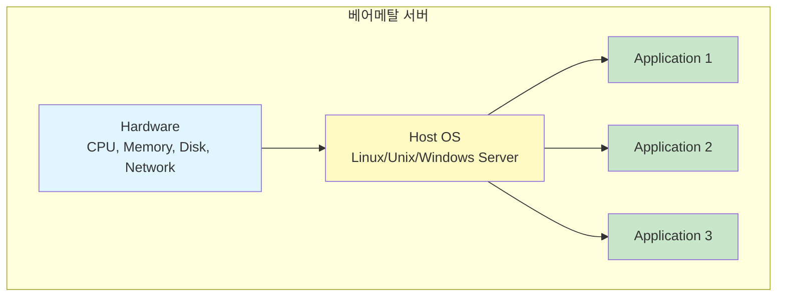

### 🔍 개념 설명

**베어메탈**이란 물리적 서버에 운영체제를 직접 설치하고, 그 위에 애플리케이션을 동작시키는 전통적인 방식입니다.

#### 구성 요소
1. **물리적 서버 (Physical Server)**
   - CPU, 메모리, 디스크, 네트워크 카드 등 하드웨어

2. **호스트 운영체제 (Host OS)**
   - Windows Server (2016, 2018, 2019, 2022 등)
   - Linux 계열 (Ubuntu, CentOS, RHEL 등)
   - Unix 계열:
     - **IBM AIX**: IBM이 만든 유닉스
     - **HP-UX**: HP(Hewlett-Packard)가 만든 유닉스
     - **Solaris**: Oracle(구 Sun Microsystems)의 유닉스

3. **애플리케이션**
   - 단독 또는 여러 개의 애플리케이션 실행

### ✅ 장점

| 장점 | 설명 |
|:---:|:---|
| **최고 성능** | 하드웨어 자원을 100% 활용 가능 |
| **격리 우수** | 물리적으로 완전히 분리되어 보안성 최상 |
| **안정성** | 가상화 오버헤드 없음 |
| **예측 가능한 성능** | 자원 경쟁 없음 |

#### 💡 적합한 사용 사례
- **고성능 컴퓨팅 (HPC)**: 대규모 시뮬레이션, 과학 연구
- **대용량 데이터베이스**: Oracle RAC, IBM DB2 등
- **실시간 게임 서버**: 낮은 레이턴시 필요
- **금융 시스템**: 트랜잭션 처리 시스템
- **민감 정보 처리**: 개인정보, 의료 데이터 등

### ⚠️ 단점

| 단점 | 설명 |
|:---:|:---|
| **자원 낭비** | CPU 사용률 10~30% 수준, 나머지는 유휴 상태 |
| **높은 비용** | 서버당 하나의 애플리케이션만 운영 |
| **확장성 부족** | 물리적 서버 추가 필요 (시간 소요) |
| **유연성 부족** | 환경 변경 어려움 |

### 🔐 보안 관점

**강사님 강조 사항**:
> "10~15년 전 보안 권고사항으로, 데이터베이스 서버는 가상화 환경이 아닌 베어메탈로 운영할 것을 권장했습니다. 개인정보 등 민감 데이터가 많기 때문입니다."

📌 **현재 상황**: 가상화 기술이 발전하면서 중소 규모 DB는 가상화 환경에서도 운영 가능해짐.

### 📊 실제 사례 분석

#### 사례 1: 연구소 서버
```
상황: 회사 연구소의 민감한 연구 자료 보관
결정: 베어메탈 서버에 단독 애플리케이션 운영
이유: 보안 정책상 가상화 환경 사용 불가

실제 자원 사용률:
- CPU: 8코어 중 평균 3코어 사용 (37.5%)
- 메모리: 256GB 중 128GB 사용 (50%)
- 결과: 나머지 자원은 유휴 상태로 낭비
```

#### 사례 2: 2000년대 후반 서버 자원 조사
- 대부분 기업의 평균 CPU 사용률: **50% 이하**
- 많은 기업이 가상화로 전환 결정
- 웹 서버, 애플리케이션 서버 우선 전환

---

## 2️⃣ 가상화 (Virtualization) 환경

### 📐 구조 다이어그램

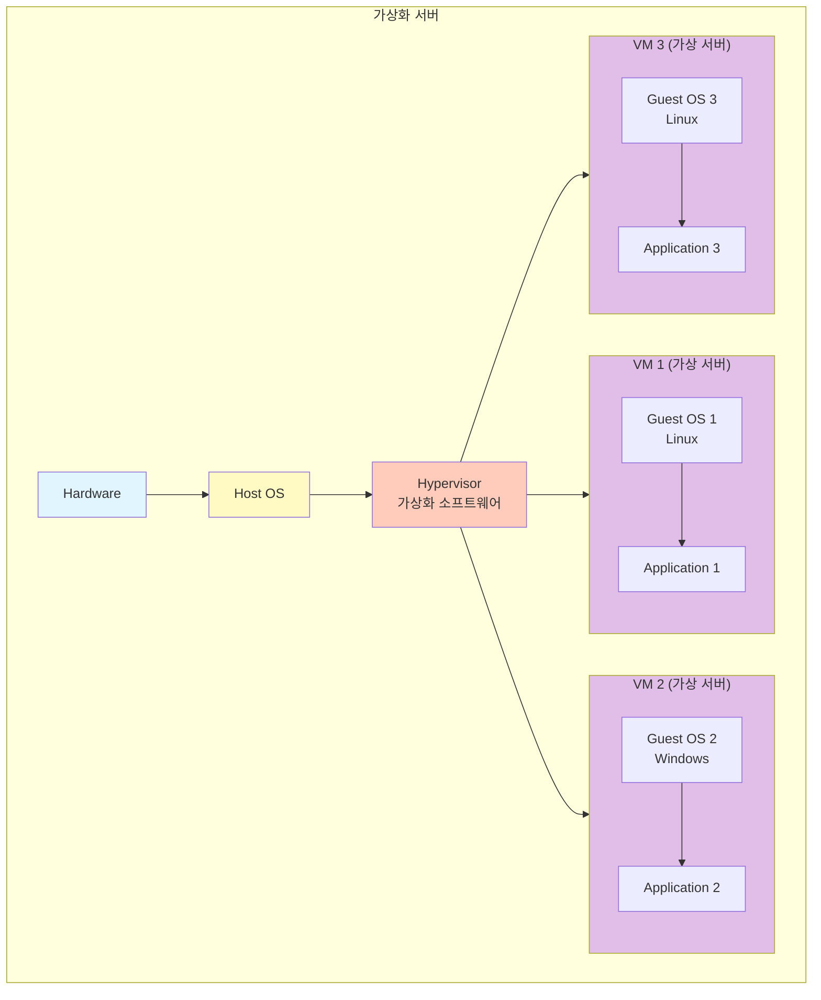

### 🔍 개념 설명

**가상화(Virtualization)**는 하나의 물리적 서버 위에 여러 개의 논리적 서버(가상 머신)를 만들어 운영하는 기술입니다.

#### 핵심 구성 요소

1. **하이퍼바이저 (Hypervisor)**
   - 가상화를 지원하는 소프트웨어
   - 가상 머신을 생성, 관리, 제어
   - 하드웨어 자원을 가상 머신에 할당

2. **가상 머신 (Virtual Machine, VM)**
   - 논리적인 독립 서버
   - 각자 독립된 Guest OS 보유
   - 물리적으로는 하나의 서버지만 논리적으로 분리

3. **Guest OS (게스트 운영체제)**
   - 가상 머신 내부의 운영체제
   - Linux, Windows, Unix 등 자유롭게 선택

### 🎯 하이퍼바이저 종류

#### Type 2: Hosted Hypervisor

**구조**: Hardware → Host OS → Hypervisor → Virtual Machines

| 제품명 | 제조사 | 특징 | 용도 |
|:---:|:---:|:---|:---|
| **VirtualBox** | Oracle | 무료, 개인 학습용 | 테스트, 개발, 교육 |
| **VMware Workstation** | VMware | 유료/무료 버전 | 개발, 테스트 |
| **Virtual PC** | Microsoft | Windows 전용 | 레거시 지원 |

💡 **실습 환경**: 우리는 VirtualBox를 사용합니다.

#### Type 1: Native/Bare-Metal Hypervisor

**구조**: Hardware → Hypervisor (OS 역할 포함) → Virtual Machines

| 제품명 | 제조사 | 특징 | 용도 |
|:---:|:---:|:---|:---|
| **VMware ESXi** | VMware | 기업용 표준, 유료 | 엔터프라이즈 가상화 |
| **Linux KVM** | Red Hat/Linux | 오픈소스, 무료 | 클라우드, 데이터센터 |
| **Microsoft Hyper-V** | Microsoft | Windows Server 통합 | Windows 환경 |
| **Xen** | Citrix/Linux Foundation | 오픈소스 | 클라우드 IaaS |

**강사님 강조**:
> "기업에서는 주로 Type 1을 사용합니다. Type 2보다 성능이 우수하며, Host OS 개입이 없어 오버헤드가 적습니다. 가격은 비싸지만 안정성과 성능이 검증되어 있습니다."

### ✅ 장점

| 장점 | 상세 설명 |
|:---:|:---|
| **자원 효율성** | 하나의 물리 서버에서 여러 VM 운영으로 자원 활용률 극대화 |
| **독립성** | 각 VM은 독립된 OS를 가지므로 라이브러리 충돌 없음 |
| **유연성** | VM 추가/삭제가 빠르고 쉬움 |
| **스냅샷** | VM 상태를 저장하고 복원 가능 |
| **마이그레이션** | 실행 중인 VM을 다른 물리 서버로 이동 가능 (Live Migration) |

#### 💡 라이브러리 충돌 해결 예시

```
문제 상황 (베어메탈):
- App 1: Python 2.7 + Library A v1.0 사용
- App 2: Python 3.9 + Library A v2.0 사용
→ 동일 OS에서 충돌 발생 가능

해결 (가상화):
- VM1: Python 2.7 + Library A v1.0 + App 1
- VM2: Python 3.9 + Library A v2.0 + App 2
→ 완전히 독립된 환경으로 충돌 없음
```

### ⚠️ 단점

| 단점 | 설명 |
|:---:|:---|
| **성능 오버헤드** | 하이퍼바이저 계층으로 인한 성능 손실 (약 5~15%) |
| **복잡성** | 관리 도구 필요, 학습 곡선 존재 |
| **라이선스 비용** | Guest OS마다 라이선스 필요 |

### 📊 자원 활용률 비교

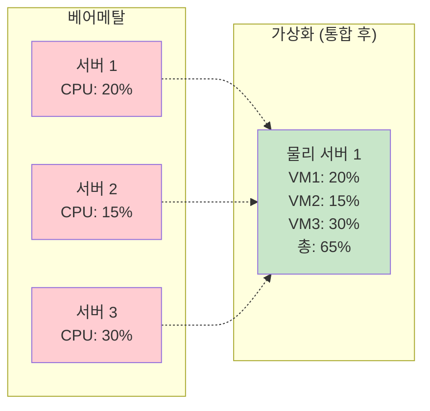

**결과**: 3대의 물리 서버를 1대로 통합하여 비용 절감 및 자원 효율성 향상!

---

## 3️⃣ 컨테이너 (Container) 환경

### 📐 구조 다이어그램

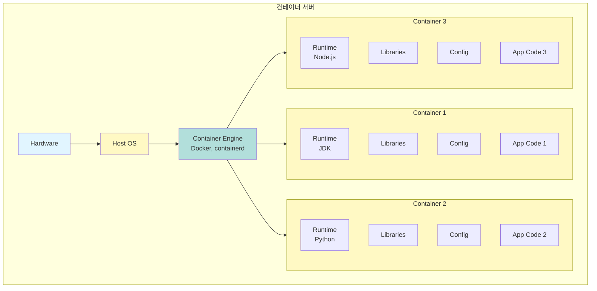

### 🔍 개념 설명

**컨테이너**는 애플리케이션과 그 실행에 필요한 모든 것(코드, 런타임, 라이브러리, 설정)을 하나의 패키지로 묶은 **프로세스 수준의 격리 환경**입니다.

#### 가상화 vs 컨테이너

| 구분 | 가상화 (VM) | 컨테이너 |
|:---:|:---|:---|
| **격리 수준** | OS 수준 (하드웨어 가상화) | 프로세스 수준 |
| **OS** | 각 VM마다 독립된 Guest OS | Host OS 공유 |
| **크기** | 수 GB ~ 수십 GB | 수 MB ~ 수백 MB |
| **시작 시간** | 수십 초 ~ 수 분 | 수 초 이내 |
| **성능** | 일부 오버헤드 존재 | 거의 Native 성능 |
| **이식성** | 하이퍼바이저 의존 | 높음 (Docker 이미지) |

### 🐳 Docker: 대표적인 컨테이너 엔진

**Docker**는 리눅스 기반의 컨테이너 관리 소프트웨어입니다.

#### 컨테이너 이미지 구성 요소

```
컨테이너 이미지 = 애플리케이션 코드
                 + 설정 파일 (Configuration)
                 + 종속 라이브러리 (Dependencies)
                 + 런타임 엔진 (JDK, Python, Node.js 등)
```

#### 🔄 컨테이너 실행 프로세스

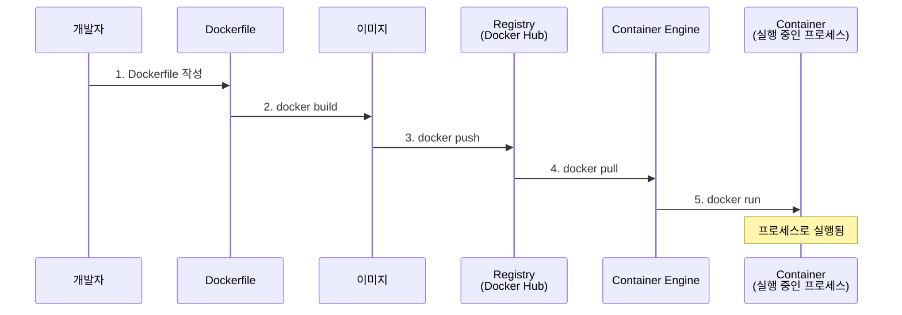

#### 실행 예시: 웹 서버 컨테이너

**Dockerfile 예시**:
```dockerfile
# 베이스 이미지
FROM ubuntu:22.04

# 패키지 설치
RUN apt-get update && apt-get install -y \
    apache2 \
    openjdk-11-jdk

# 애플리케이션 코드 복사
COPY ./webapp /var/www/html

# 설정 파일 복사
COPY ./config/apache2.conf /etc/apache2/

# 라이브러리 복사
COPY ./libs /usr/local/libs

# 포트 노출
EXPOSE 80

# 실행 명령
CMD ["apache2ctl", "-D", "FOREGROUND"]
```

**실행**:
```bash
# 이미지 빌드
$ docker build -t mywebapp:1.0 .

# Docker Hub에 푸시
$ docker push myuser/mywebapp:1.0

# 다른 서버에서 풀 & 실행
$ docker pull myuser/mywebapp:1.0
$ docker run -d -p 80:80 mywebapp:1.0
```

### ✅ 장점

| 장점 | 설명 |
|:---:|:---|
| **경량** | OS 전체가 아닌 프로세스 수준, 빠른 시작 |
| **높은 자원 효율** | 오버헤드 최소화 |
| **뛰어난 이식성** | "내 컴퓨터에서는 됐는데..." 문제 해결 |
| **빠른 배포** | CI/CD 파이프라인과 완벽 통합 |
| **마이크로서비스 최적** | 서비스별 독립 배포 및 확장 |

### 🎯 적합한 사용 사례

#### 마이크로서비스 아키텍처 (MSA)

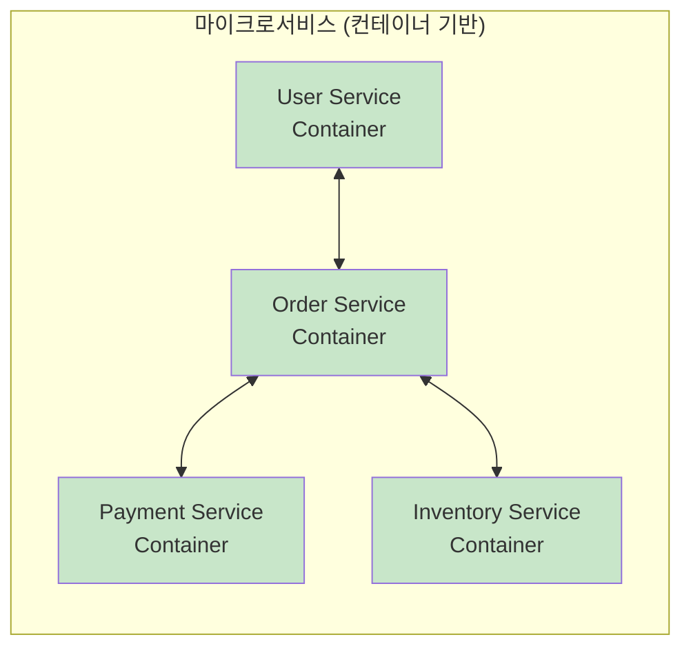

**특징**:
- 각 서비스를 독립적으로 배포, 업데이트, 스케일링
- 빈번한 업데이트에 유리
- Netflix, Amazon, Uber 등이 적극 활용

### 🔐 보안 및 격리

**컨테이너 간 격리**:
- 각 컨테이너는 독립된 **네임스페이스**를 가짐
- **cgroups**로 자원 사용량 제한
- 컨테이너 A는 컨테이너 B의 파일 시스템, 프로세스에 접근 불가

**주의 사항**:
- Host OS 커널 공유 → 커널 취약점 주의
- 루트 권한으로 실행 시 위험
- 보안 강화: SELinux, AppArmor, seccomp 활용

---

## 🔄 세 가지 환경 비교 및 선택 기준

### 📊 종합 비교표

| 항목 | 베어메탈 | 가상화 (VM) | 컨테이너 |
|:---:|:---:|:---:|:---:|
| **성능** | ⭐⭐⭐⭐⭐ | ⭐⭐⭐⭐ | ⭐⭐⭐⭐⭐ |
| **격리 수준** | ⭐⭐⭐⭐⭐ | ⭐⭐⭐⭐ | ⭐⭐⭐ |
| **자원 효율** | ⭐⭐ | ⭐⭐⭐⭐ | ⭐⭐⭐⭐⭐ |
| **시작 시간** | 수 분 | 수십 초 | 수 초 |
| **이식성** | ⭐⭐ | ⭐⭐⭐ | ⭐⭐⭐⭐⭐ |
| **관리 복잡도** | ⭐⭐ | ⭐⭐⭐⭐ | ⭐⭐⭐ |
| **비용** | 높음 | 중간 | 낮음 |

### 🎯 사용 사례별 권장

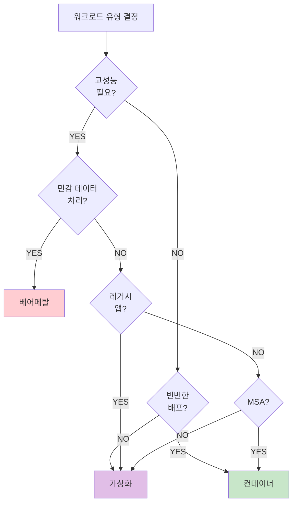

#### 실무 혼합 사례

**대기업 전형적인 구성**:

| 계층 | 환경 | 이유 |
|:---:|:---:|:---|
| **데이터베이스** | 베어메탈 | 대용량, 고성능, 미션 크리티컬 |
| **백엔드 API** | 컨테이너 (Kubernetes) | MSA, 빈번한 배포, 확장성 |
| **웹 서버** | 컨테이너 또는 가상화 | 부하 분산, 확장 용이 |
| **레거시 시스템** | 가상화 | 기존 애플리케이션 유지 |

**강사님의 실무 조언**:
> "실제 현장에서는 '모두 베어메탈만', '모두 컨테이너만' 이런 식으로 운영하지 않습니다. 각 워크로드의 특성에 맞게 혼합하여 사용합니다. DB는 베어메탈, 웹/앱 서버는 컨테이너, 이런 식으로요."

---

## ✅ 학습 체크리스트

- [ ] 베어메탈의 장단점과 사용 사례를 설명할 수 있다
- [ ] 가상화의 두 가지 타입(Type 1, Type 2)의 차이를 이해했다
- [ ] 컨테이너와 가상화의 차이점을 명확히 구분할 수 있다
- [ ] Docker 컨테이너 이미지의 구성 요소를 나열할 수 있다
- [ ] 워크로드 특성에 따라 적절한 인프라를 선택할 수 있다

---

## 📋 핵심 요약

1. **베어메탈**: 최고 성능과 보안, 하지만 자원 낭비 우려. 고성능 DB, 금융 시스템에 적합.
2. **가상화**: 자원 효율성과 독립성 확보. 기업 표준 환경. Type 1(ESXi, KVM) 주로 사용.
3. **컨테이너**: 경량, 빠름, 이식성. 마이크로서비스와 DevOps에 최적.
4. **실무 혼합 전략**: 워크로드 특성에 따라 베어메탈 + 가상화 + 컨테이너를 조합하여 사용.

---
# 💻 운영체제 (Operating System)

## 🔍 운영체제란 무엇인가?

### 정의

**운영체제 (Operating System, OS)**는 하드웨어와 시스템 자원을 제어하고, 프로그램에 대한 일반적인 서비스를 지원하는 **시스템 소프트웨어**입니다.

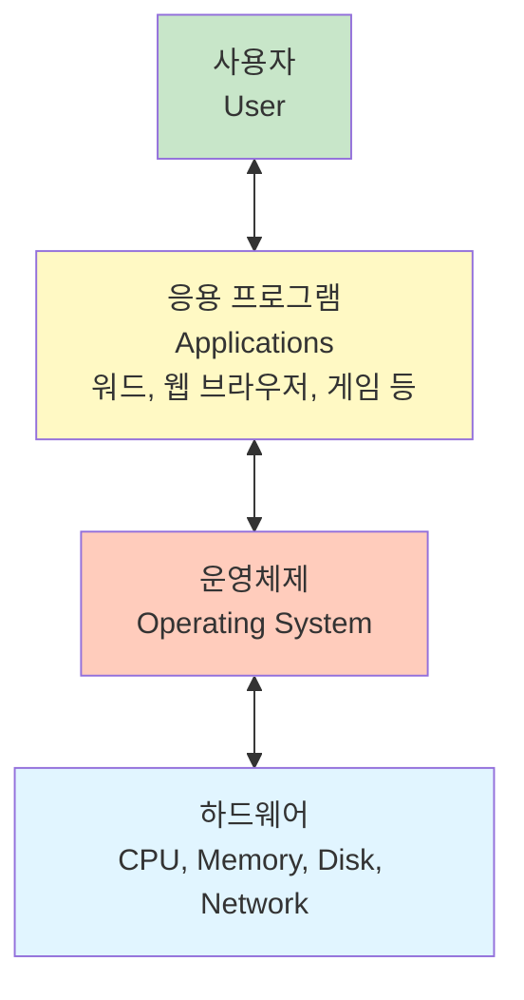

### 📌 주요 목적

| 목적 | 설명 |
|:---:|:---|
| **1. 자원 관리** | CPU, 메모리, 디스크, 네트워크 등 하드웨어 자원을 효율적으로 관리 |
| **2. 사용자와 컴퓨터 간 커뮤니케이션** | 사용자가 컴퓨터를 쉽게 사용할 수 있도록 인터페이스 제공 |
| **3. 응용 프로그램 관리** | 프로그램의 실행을 제어하고 충돌 방지 |

### 💡 왜 응용 프로그램이 직접 하드웨어를 제어하면 안 될까?

**문제 상황 예시**:

```
시나리오: 응용 프로그램이 직접 하드웨어를 제어하는 경우

1. 프로그램 A가 디스크를 점유
2. 프로그램 A가 무한 루프에 빠짐
3. 프로그램 B는 디스크를 사용하지 못하고 무한정 대기
4. 시스템 전체가 멈춤 (데드락)
```

**OS의 역할**:
- 타임 슬라이스: 각 프로그램에 공평하게 자원 할당
- 스케줄링: 우선순위에 따라 실행 순서 조정
- 강제 회수: 독점하는 프로그램으로부터 자원 회수

---

## 🏗️ 운영체제 구조

### 📐 계층 구조 다이어그램

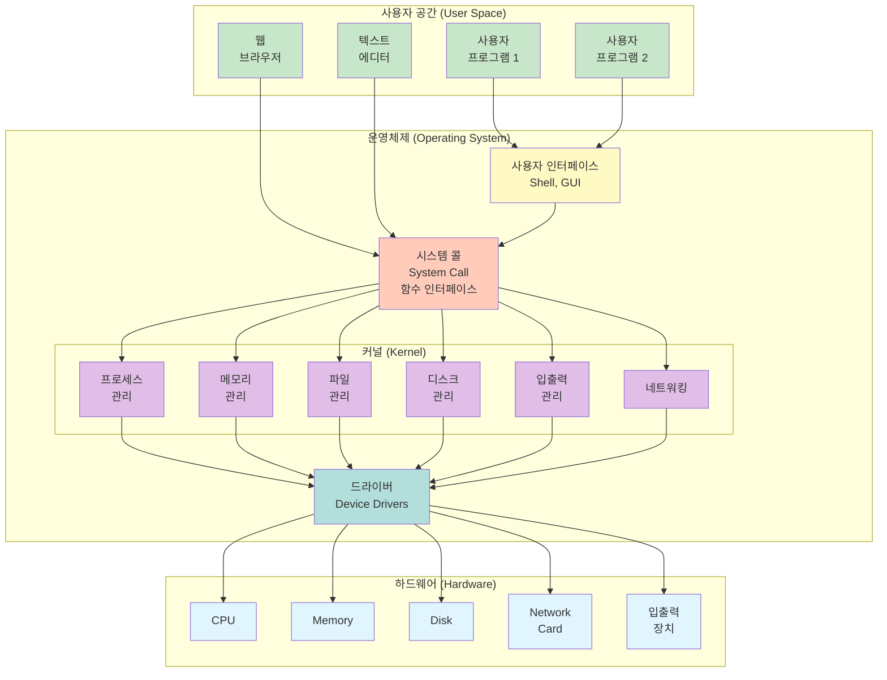

### 🔧 구성 요소 상세 설명

#### 1️⃣ 사용자 인터페이스 (User Interface)

**두 가지 유형**:

| 유형 | 설명 | 예시 |
|:---:|:---|:---|
| **CLI** | Command Line Interface<br/>명령어 기반 텍스트 인터페이스 | Shell (Bash, Zsh) |
| **GUI** | Graphical User Interface<br/>그래픽 기반 인터페이스 | GNOME, KDE, Windows 탐색기 |

**Shell의 역할**:
- 사용자가 명령어를 입력할 수 있는 환경 제공
- 명령어를 해석하고 실행
- 사용자와 커널 사이의 **대화 창구** 역할

💡 **강사님 비유**: "Shell은 MS-DOS의 도스창, Windows의 탐색기와 같은 역할입니다."

#### 2️⃣ 시스템 콜 (System Call)

**시스템 콜**은 응용 프로그램이 커널의 기능을 호출하기 위해 사용하는 **함수 인터페이스**입니다.

**동작 원리**:

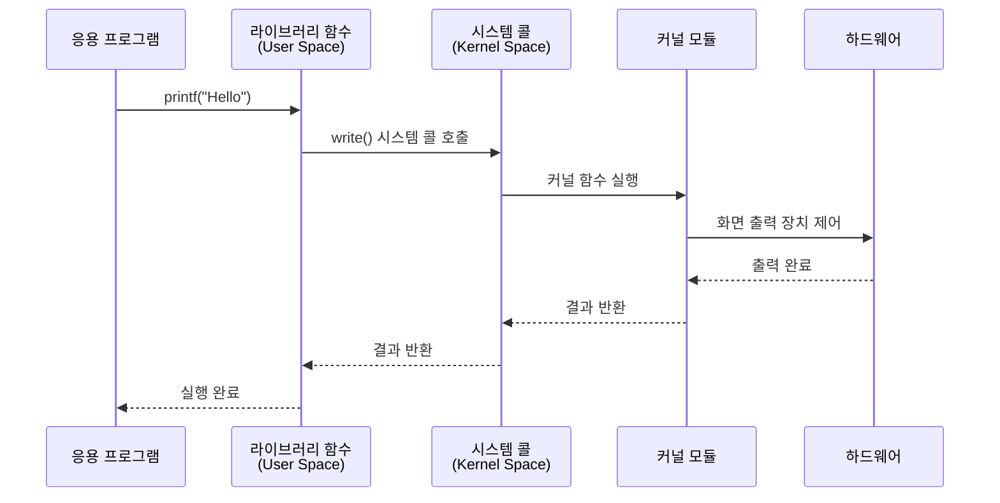

**예시: Python에서 파일 쓰기**

```python
# Python 코드 (User Space)
with open("test.txt", "w") as f:
    f.write("Hello, World!")

# 내부 동작:
# 1. Python write() 함수 호출
# 2. C 라이브러리 함수 호출
# 3. write() 시스템 콜 호출
# 4. 커널의 파일 관리 모듈 실행
# 5. 디스크 드라이버를 통해 실제 디스크에 쓰기
```

**시스템 콜의 보안 중요성**:
- 응용 프로그램은 **직접** 하드웨어에 접근할 수 없음
- 반드시 시스템 콜을 통해야만 접근 가능
- 커널이 모든 요청을 **검증**하고 **승인**
- 악의적인 프로그램의 직접 하드웨어 조작 차단

#### 3️⃣ 커널 (Kernel)

**커널**은 운영체제의 핵심 부분으로, 하드웨어를 직접 제어하고 관리하는 프로그램 모듈의 집합입니다.

##### 📦 커널 모듈 구성

| 모듈 | 역할 | 주요 기능 |
|:---:|:---|:---|
| **프로세스 관리** | 프로세스 스케줄링 및 제어 | 생성, 종료, 스케줄링, 문맥 전환 |
| **메모리 관리** | 메모리 할당 및 회수 | 가상 메모리, 페이징, 스와핑 |
| **파일 관리** | 파일 시스템 관리 | 파일 생성/삭제/읽기/쓰기 |
| **디스크 관리** | 저장 장치 관리 | 파티션, 마운트, I/O 스케줄링 |
| **입출력 관리** | I/O 장치 제어 | 키보드, 마우스, 모니터, 프린터 |
| **네트워킹** | 네트워크 통신 관리 | TCP/IP, 소켓, 라우팅 |

##### 프로세스 관리 상세

**프로세스 상태 전이**:

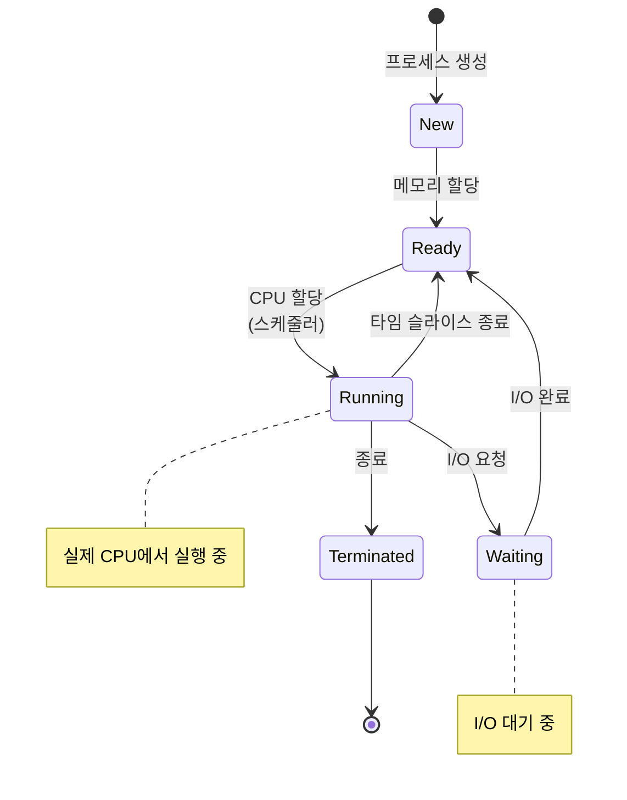

**스케줄링 알고리즘**:
- **FCFS (First-Come, First-Served)**: 선착순
- **SJF (Shortest Job First)**: 짧은 작업 우선
- **Round Robin**: 타임 슬라이스 기반 순환
- **Priority Scheduling**: 우선순위 기반
- **Multilevel Queue**: 다단계 큐

#### 4️⃣ 드라이버 (Device Driver)

**드라이버**는 특정 하드웨어 장치를 제어하는 **커널 레벨 프로그램**입니다.

**역할**:
- 하드웨어와 커널 사이의 **번역기**
- 커널의 표준 인터페이스 → 하드웨어 고유 명령어 변환

**예시**:
```
사용자: "파일을 디스크에 저장해줘"
    ↓
커널: write() 시스템 콜 처리
    ↓
파일 시스템: 저장할 블록 결정
    ↓
디스크 드라이버:
  - 디스크 컨트롤러에 명령 전송
  - 헤드 이동, 섹터 위치 지정
  - 데이터 전송
    ↓
디스크 하드웨어: 실제 데이터 기록
```

💡 **실생활 비유**: "새 프린터를 사면 드라이버를 설치하잖아요? 그게 바로 커널에 해당 프린터를 제어할 수 있는 프로그램을 추가하는 과정입니다."

---

## 🔄 멀티 유저 & 멀티 태스킹 시스템

### 멀티 유저 (Multi-User)

**개념**: 여러 사용자가 **동시에** 하나의 시스템에 로그인하여 자원을 사용할 수 있는 환경.

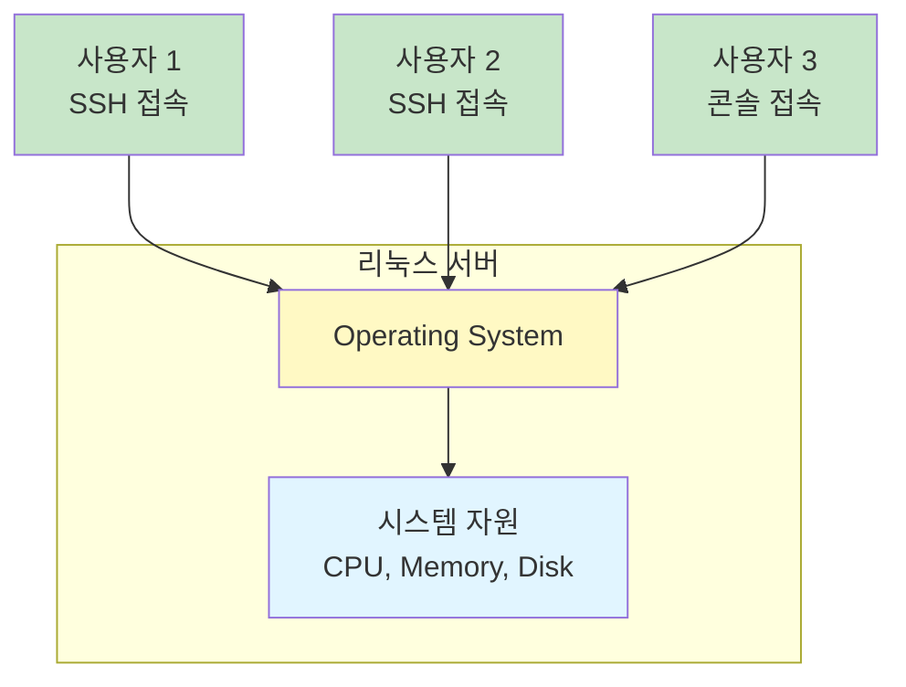

**예시**:
```bash
# 서버에 접속한 사용자 확인
$ who
ubuntu   tty1         2024-11-24 09:00
admin    pts/0        2024-11-24 10:30 (192.168.1.100)
dev      pts/1        2024-11-24 11:15 (192.168.1.101)

# 3명의 사용자가 동시에 로그인 상태
```

### 멀티 태스킹 (Multi-Tasking)

**개념**: 하나의 CPU에서 여러 프로세스를 **동시에 실행**하는 것처럼 보이게 하는 기술.

#### ⏱️ 타임 슬라이스 (Time Slice) 원리

```mermaid
gantt
    title CPU 타임 슬라이스 (10ms 단위)
    dateFormat X
    axisFormat %L

    section CPU
    프로세스 A :a1, 0, 10
    프로세스 B :a2, 10, 10
    프로세스 C :a3, 20, 10
    프로세스 A :a4, 30, 10
    프로세스 B :a5, 40, 10
    프로세스 C :a6, 50, 10
```

**동작 원리**:
1. CPU 시간을 매우 작은 단위 (예: 10ms)로 분할
2. 각 프로세스에 순차적으로 할당
3. 사용자는 체감할 수 없을 정도로 빠른 전환
4. **마치 동시에 실행되는 것처럼 느껴짐**

**실제 예시**:
```bash
# 현재 실행 중인 프로세스 확인
$ ps aux
USER       PID %CPU %MEM    VSZ   RSS TTY      STAT START   TIME COMMAND
ubuntu    1234  2.5  1.2 123456 45678 ?        S    09:00   0:15 /usr/bin/python3 app.py
ubuntu    5678  0.5  0.8  98765 32145 ?        S    10:30   0:05 /usr/bin/node server.js
ubuntu    9012  1.2  2.1 234567 89012 ?        R    11:15   0:08 /usr/bin/java -jar app.jar

# 여러 프로세스가 동시에 실행 중
```

### 🔒 멀티 유저 환경의 보안 필요성

멀티 유저 환경에서는 **소유권(Ownership)**과 **권한(Permission)**이 매우 중요합니다.

**문제 상황**:
```
사용자 A: 중요한 재무 보고서 작성 → report.xlsx
사용자 B: 호기심에 사용자 A의 파일을 열어봄
사용자 C: 실수로 사용자 A의 파일을 삭제

→ 소유권과 권한 시스템이 없다면 이런 문제 발생!
```

**해결책: Ownership & Permission**

```bash
$ ls -l report.xlsx
-rw------- 1 userA finance 1024 Nov 24 10:00 report.xlsx
│││││││││  │ │     │       │    │
││││││││└─ 그룹(group) 권한: 없음
│││││││└── 소유자(owner) 권한: 읽기, 쓰기
││││││└─── 기타(others) 권한: 없음
│││││└──── 파일 타입: - (일반 파일)
││││└───── 그룹 이름: finance
│││└────── 소유자 이름: userA
││└─────── 링크 수: 1
│└──────── 크기: 1024 bytes
└───────── 수정 시간: Nov 24 10:00
```

💡 이 내용은 뒤에 "Ownership과 Permission" 챕터에서 깊이 있게 다룹니다!

---

## 🖥️ 주요 운영체제 종류

### 📊 운영체제 분류

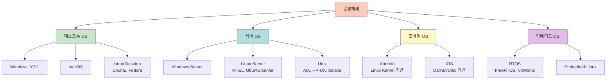

### 🌐 서버 운영체제 상세

#### Unix 계열

| OS | 제조사 | 특징 | 주요 사용처 |
|:---:|:---:|:---|:---|
| **AIX** | IBM | Power 시스템 전용, 엔터프라이즈급 안정성 | 금융, 대기업 핵심 시스템 |
| **HP-UX** | HPE | Itanium 프로세서 지원, 미션 크리티컬 | 통신, 제조업 |
| **Solaris** | Oracle | ZFS 파일 시스템, 컨테이너(Zone) | 대규모 데이터베이스 서버 |

**강사님의 경험담**:
> "2000년대 초반 닷컴 붐 시절에는 Sun Microsystems의 Solaris 서버가 시장 1위를 차지할 정도로 많이 사용되었습니다. 지금은 Oracle에 인수되었지만, 여전히 대기업에서 사용 중입니다."

#### Linux 계열

| 배포판 | 계열 | 특징 | 패키지 관리자 |
|:---:|:---:|:---|:---:|
| **Ubuntu** | Debian | 사용 편의성, 커뮤니티 지원 | `apt` |
| **Linux Mint** | Debian | Ubuntu 기반, 초보자 친화적 | `apt` |
| **RHEL** | Red Hat | 유료, 엔터프라이즈 지원 | `yum` / `dnf` |
| **CentOS** | Red Hat | RHEL 무료 버전 (단종 예정) | `yum` |
| **Fedora** | Red Hat | 최신 기술 테스트베드 | `dnf` |

**배포판 선택 기준**:

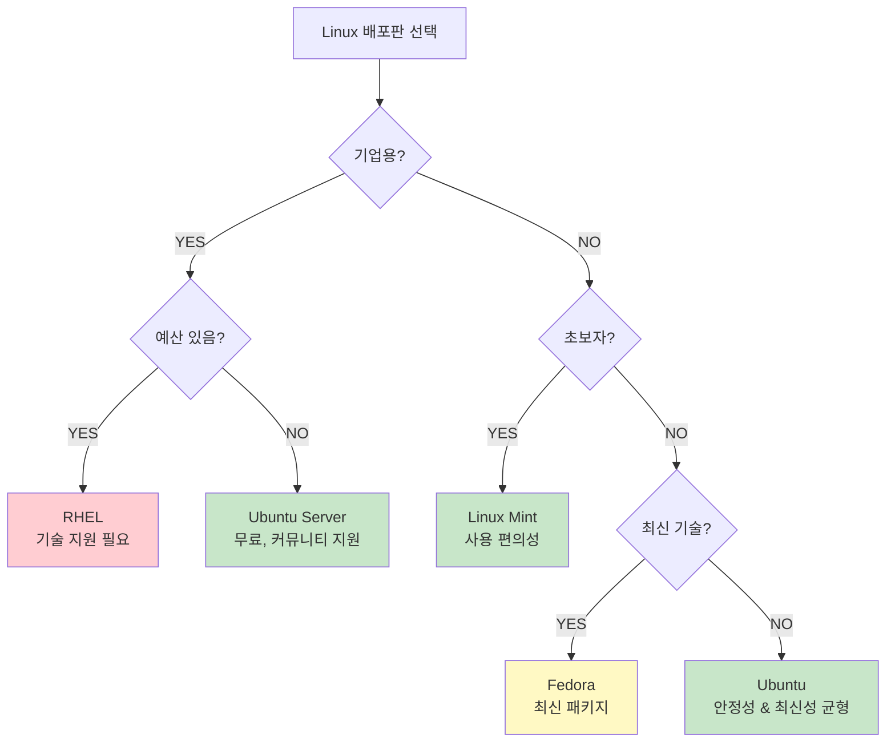

#### 🔄 Debian 계열 vs Red Hat 계열 명령어 차이

**패키지 설치 명령어**:

| 작업 | Debian/Ubuntu | Red Hat/CentOS/Fedora |
|:---:|:---:|:---:|
| **패키지 설치** | `apt install package` | `yum install package` |
| **패키지 업데이트** | `apt update` | `yum update` |
| **패키지 검색** | `apt search keyword` | `yum search keyword` |
| **패키지 제거** | `apt remove package` | `yum remove package` |

💡 **강사님 조언**: "현장에서 어떤 배포판을 사용할지 모르니, Ubuntu와 Red Hat 계열을 각각 한 번씩 설치해보고 명령어 차이를 경험해보는 것을 권장합니다."

### 📱 모바일 운영체제

#### Android

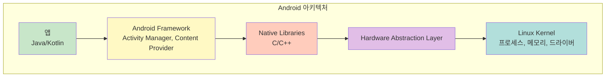

**특징**:
- **Linux 커널 기반**: 프로세스 관리, 메모리 관리, 드라이버
- **오픈소스**: AOSP (Android Open Source Project)
- **Dalvik/ART 가상 머신**: Java/Kotlin 앱 실행

#### iOS

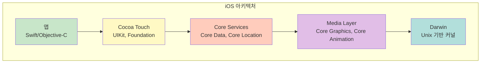

**특징**:
- **Darwin 커널**: macOS와 동일한 Unix 기반
- **폐쇄적**: Apple 하드웨어에서만 실행
- **높은 보안성**: 샌드박싱, 코드 서명

---

## ✅ 학습 체크리스트

- [ ] 운영체제의 정의와 주요 목적 3가지를 설명할 수 있다
- [ ] 운영체제 계층 구조 (User Space, Kernel Space, Hardware)를 이해했다
- [ ] 시스템 콜의 역할과 동작 원리를 설명할 수 있다
- [ ] 커널의 주요 모듈 6가지를 나열할 수 있다
- [ ] 드라이버의 역할을 이해하고 예시를 들 수 있다
- [ ] 멀티 유저와 멀티 태스킹의 개념을 구분할 수 있다
- [ ] 타임 슬라이스 원리를 설명할 수 있다
- [ ] Unix와 Linux의 차이를 설명할 수 있다

---

## 📋 핵심 요약

1. **OS는 시스템 소프트웨어**: 하드웨어와 응용 프로그램 사이의 중재자.
2. **계층 구조**: User Space → System Call → Kernel → Driver → Hardware.
3. **시스템 콜**: 응용 프로그램이 커널 기능을 호출하는 유일한 합법적 경로.
4. **커널**: 프로세스, 메모리, 파일, 디스크, I/O, 네트워크 관리 모듈로 구성.
5. **멀티 유저/멀티 태스킹**: 여러 사용자와 프로세스가 자원을 공유하여 사용.
6. **타임 슬라이스**: CPU 시간을 작은 단위로 분할하여 동시 실행처럼 보이게 함.
7. **Linux vs Unix**: Linux는 Unix와 유사하지만 독립적으로 개발된 오픈소스 OS.

---
# 🐧 리눅스 특징, Shell, 그리고 기본 명령어

## 🌟 리눅스의 특징

### 핵심 특징 7가지

| 특징 | 설명 |
|:---:|:---|
| **1. 이식성** | 다양한 하드웨어 플랫폼에서 실행 가능 (x86, ARM, SPARC 등) |
| **2. 호환성** | POSIX 표준 준수로 유닉스 호환성 |
| **3. 저비용** | 무료 오픈소스, 라이선스 비용 없음 |
| **4. 멀티 유저/멀티 태스킹** | 여러 사용자와 프로세스 동시 실행 |
| **5. 컴팩트한 커널** | 필요한 최소 기능만 커널에 포함, 나머지는 외부 모듈 |
| **6. 빠른 업그레이드** | 커뮤니티 기반 신속한 업데이트 |
| **7. 오픈소스** | 소스 코드 공개, 누구나 수정/배포 가능 |

💡 **강사님 강조**: "저비용, 이식성, 호환성이 기업에게는 가장 큰 매력입니다. 특히 클라우드 시대에 Linux는 사실상의 표준입니다."

---

## 📜 유닉스 역사

### 타임라인

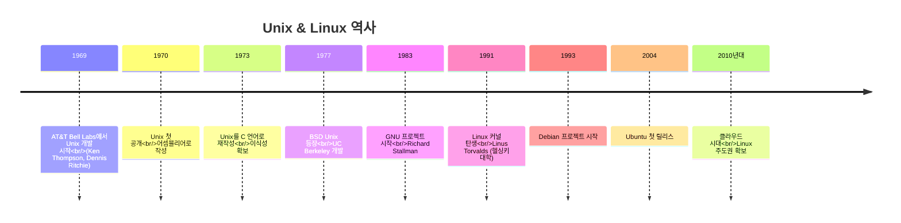

### 💡 주요 인물

| 인물 | 공헌 |
|:---:|:---|
| **Ken Thompson & Dennis Ritchie** | Unix 창시자 |
| **Richard Stallman** | GNU 프로젝트, 자유 소프트웨어 운동 |
| **Linus Torvalds** | Linux 커널 개발자 (1991, 21세) |

**강사님 감탄**:
> "Linus Torvalds가 대학생 때 만든 커널이 지금 전 세계 서버의 대부분을 움직이고 있습니다. 정말 부러운 머리입니다!"

### 🔀 Unix vs Linux

| 구분 | Unix | Linux |
|:---:|:---:|:---:|
| **기원** | AT&T Bell Labs (1969) | Linus Torvalds (1991) |
| **관계** | 원조 | Unix 유사 (Unix-like) |
| **라이선스** | 독점 (AIX, Solaris 등) | GPL (오픈소스) |
| **비용** | 유료 | 무료 |
| **제조사** | IBM, HP, Oracle | 커뮤니티/Red Hat 등 |

📌 **핵심**: Linux는 Unix에서 파생된 것이 아니라, Unix와 **유사하게 만든 독립적인 OS**입니다. 하지만 명령어와 사용법은 거의 동일합니다.

---

## 🐚 Shell (쉘)

### Shell이란?

**Shell**은 사용자와 커널 사이의 **명령어 해석기 (Command Interpreter)**입니다.

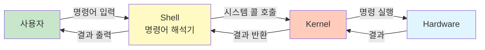

### Shell의 종류

| Shell | 경로 | 설명 | 특징 |
|:---:|:---:|:---|:---|
| **sh** | `/bin/sh` | Bourne Shell | 최초의 Shell, 모든 Shell의 조상 |
| **bash** | `/bin/bash` | Bourne Again Shell | Linux 표준, sh의 개선 버전 |
| **csh** | `/bin/csh` | C Shell | C 언어 유사 문법 |
| **ksh** | `/bin/ksh` | Korn Shell | sh와 csh의 장점 결합 |
| **zsh** | `/bin/zsh` | Z Shell | 강력한 자동완성, 플러그인 |

💡 **현재 Shell 확인**:
```bash
$ echo $SHELL
/bin/bash

$ ps -p $$
  PID TTY          TIME CMD
12345 pts/0    00:00:00 bash
```

### Shell의 주요 기능

#### 1️⃣ 명령어 처리
```bash
# 명령어 실행
$ ls -la /etc

# 여러 명령어 순차 실행 (;)
$ cd /tmp ; ls ; pwd

# 이전 명령어 성공 시에만 실행 (&&)
$ mkdir test && cd test && touch file.txt

# 이전 명령어 실패 시에만 실행 (||)
$ cd /nonexistent || echo "디렉토리 없음"
```

#### 2️⃣ 변수 및 환경 변수
```bash
# 변수 선언
$ NAME="Ubuntu"
$ echo $NAME
Ubuntu

# 환경 변수 설정 (export)
$ export PATH=$PATH:/usr/local/bin

# 환경 변수 확인
$ printenv
$ env
```

#### 3️⃣ 리다이렉션 (Redirection)

| 기호 | 의미 | 예시 |
|:---:|:---|:---|
| `>` | 표준 출력을 파일로 (덮어쓰기) | `ls > list.txt` |
| `>>` | 표준 출력을 파일로 (추가) | `date >> log.txt` |
| `<` | 파일을 표준 입력으로 | `sort < names.txt` |
| `2>` | 표준 에러를 파일로 | `find / -name "*.txt" 2> errors.txt` |
| `&>` | 표준 출력과 에러 모두 파일로 | `command &> output.txt` |

**예시**:
```bash
# 명령어 결과를 파일로 저장
$ ls -la > file_list.txt

# 파일에 내용 추가
$ echo "New line" >> file_list.txt

# 에러 메시지 숨기기 (/dev/null로 버리기)
$ find / -name "passwd" 2> /dev/null
```

#### 4️⃣ 파이프 (Pipe)

```bash
# 명령어의 출력을 다음 명령어의 입력으로
$ ls -la | grep ".txt"

# 여러 파이프 연결
$ ps aux | grep apache | wc -l

# 파일의 줄 수 세기
$ cat /etc/passwd | wc -l
```

#### 5️⃣ Shell Script

**예시: backup.sh**
```bash
#!/bin/bash
# 백업 스크립트

# 변수 설정
BACKUP_DIR="/backup"
DATE=$(date +%Y%m%d)
SOURCE="/home/ubuntu"

# 백업 디렉토리 생성
mkdir -p $BACKUP_DIR

# tar로 압축
tar -czf $BACKUP_DIR/backup_$DATE.tar.gz $SOURCE

echo "백업 완료: backup_$DATE.tar.gz"
```

**실행**:
```bash
$ chmod +x backup.sh
$ ./backup.sh
```

---

## 🖥️ 리눅스 기본 명령어

### 로그인 & 로그아웃

#### 로그인 (Login)

**개념**: 시스템에 접속하여 자신에게 주어진 권한을 얻는 과정.

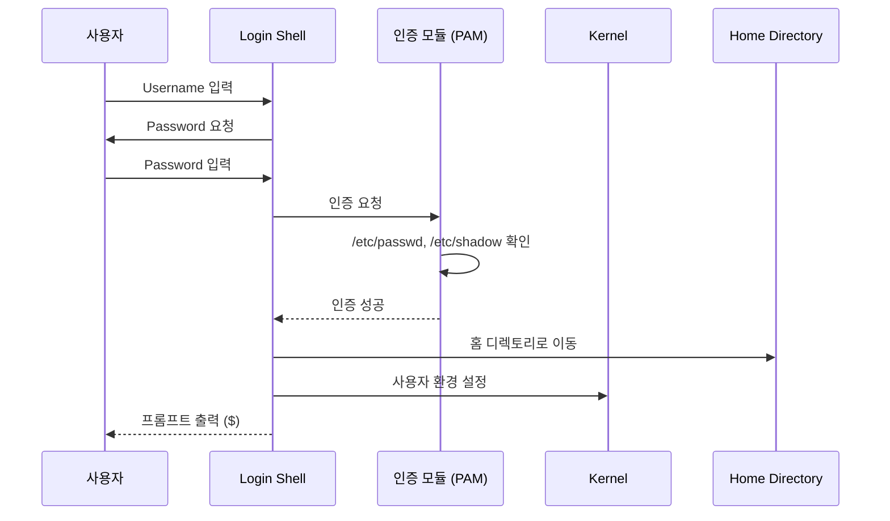

**주의 사항**:
- **대소문자 구분**: `ubuntu` ≠ `Ubuntu` ≠ `UBUNTU`
- **비밀번호 미표시**: CLI 환경에서는 입력 중 아무것도 표시되지 않음 (보안)
- **Caps Lock**: 켜져 있으면 대문자로 입력됨, 주의!

#### 로그아웃 (Logout)

```bash
# 방법 1: exit 명령어
$ exit

# 방법 2: logout 명령어
$ logout

# 방법 3: Ctrl + D
```

---

### 📁 파일 및 디렉토리 명령어

#### `pwd` - 현재 작업 디렉토리 출력

```bash
$ pwd
/home/ubuntu
```

**의미**: Print Working Directory

#### `cd` - 디렉토리 이동

| 명령어 | 의미 | 예시 |
|:---:|:---|:---|
| `cd /path` | 절대 경로로 이동 | `cd /etc` |
| `cd ..` | 상위 디렉토리로 이동 | `cd ..` |
| `cd ~` | 홈 디렉토리로 이동 | `cd ~` 또는 `cd` |
| `cd -` | 이전 디렉토리로 이동 | `cd -` |

**실습 예시**:
```bash
$ cd /etc
$ pwd
/etc

$ cd /var/log
$ pwd
/var/log

$ cd -
/etc

$ cd ~
$ pwd
/home/ubuntu
```

#### `ls` - 파일 목록 출력

**기본 문법**:
```bash
ls [옵션] [경로]
```

**주요 옵션**:

| 옵션 | 의미 | 효과 |
|:---:|:---|:---|
| `-l` | Long format | 상세 정보 출력 |
| `-a` | All | 숨김 파일 포함 (`.`으로 시작) |
| `-h` | Human readable | 파일 크기를 K, M, G 단위로 표시 |
| `-t` | Time | 수정 시간순 정렬 |
| `-r` | Reverse | 역순 정렬 |
| `-R` | Recursive | 하위 디렉토리까지 재귀적으로 출력 |

**실행 예제 1: 기본 목록**
```bash
$ ls
Desktop  Documents  Downloads  Music  Pictures  Videos
```

**실행 예제 2: 상세 정보 (`-l`)**
```bash
$ ls -l
total 24
drwxr-xr-x 2 ubuntu ubuntu 4096 Nov 24 09:00 Desktop
drwxr-xr-x 3 ubuntu ubuntu 4096 Nov 24 10:30 Documents
-rw-r--r-- 1 ubuntu ubuntu  156 Nov 24 11:15 test.txt
```

**출력 해석**:
```
-rw-r--r-- 1 ubuntu ubuntu  156 Nov 24 11:15 test.txt
│││││││││  │ │      │      │   │           └─ 파일명
││││││││└─ 링크 수
│││││││└── 소유자 (Owner)
││││││└─── 그룹 (Group)
│││││└──── 파일 크기 (Bytes)
││││└───── 수정 시간
│││└────── 기타(Others) 권한: r--
││└─────── 그룹(Group) 권한: r--
│└──────── 소유자(Owner) 권한: rw-
└───────── 파일 타입: - (일반 파일)
            d (디렉토리)
            l (심볼릭 링크)
```

**실행 예제 3: 숨김 파일 포함 (`-a`)**
```bash
$ ls -la
total 32
drwxr-xr-x  5 ubuntu ubuntu 4096 Nov 24 09:00 .
drwxr-xr-x 10 root   root   4096 Nov 23 15:00 ..
-rw-------  1 ubuntu ubuntu  220 Nov 20 10:00 .bash_history
-rw-r--r--  1 ubuntu ubuntu  807 Nov 20 10:00 .bashrc
drwxr-xr-x  2 ubuntu ubuntu 4096 Nov 24 09:00 Desktop
```

**실행 예제 4: 사람이 읽기 쉬운 크기 (`-lh`)**
```bash
$ ls -lh
-rw-r--r-- 1 ubuntu ubuntu  1.5M Nov 24 10:00 largefile.dat
-rw-r--r-- 1 ubuntu ubuntu   45K Nov 24 10:30 image.png
-rw-r--r-- 1 ubuntu ubuntu  2.3G Nov 24 11:00 video.mp4
```

**실무 활용 팁**:
```bash
# 가장 최근 수정된 파일 10개
$ ls -lt | head -10

# 크기 큰 파일 순서대로
$ ls -lhS

# 숨김 파일만 보기
$ ls -ld .*

# 디렉토리만 보기
$ ls -ld */
```

#### `cp` - 파일/디렉토리 복사

**기본 문법**:
```bash
cp [옵션] 소스 목적지
```

**주요 옵션**:

| 옵션 | 의미 | 사용 사례 |
|:---:|:---|:---|
| `-i` | Interactive | 덮어쓰기 전 확인 (안전) |
| `-f` | Force | 강제 덮어쓰기 (위험!) |
| `-r` | Recursive | 디렉토리 복사 |
| `-p` | Preserve | 소유자, 권한, 시간 정보 유지 |
| `-a` | Archive | `-dpR`과 동일, 모든 속성 유지 |
| `-v` | Verbose | 진행 상황 출력 |

**실행 예제 1: 파일 복사**
```bash
# 기본 복사
$ cp /etc/hosts ~/hosts

# 확인
$ ls -l ~/hosts
-rw-r--r-- 1 ubuntu ubuntu 220 Nov 24 10:00 /home/ubuntu/hosts
```

**실행 예제 2: 덮어쓰기 확인 (`-i`)**
```bash
$ cp -i file1.txt file2.txt
cp: overwrite 'file2.txt'? y
```

**실행 예제 3: 디렉토리 복사 (`-r`)**
```bash
# 디렉토리 전체 복사
$ cp -r /home/ubuntu/Documents /backup/Documents

# 확인
$ ls -R /backup/Documents
```

**실행 예제 4: 속성 유지 (`-p`)**
```bash
# 원본 파일 정보
$ ls -l original.txt
-rw-r--r-- 1 root root 1024 Nov 20 10:00 original.txt

# -p 옵션 없이 복사 (소유자 변경됨)
$ cp original.txt copy1.txt
$ ls -l copy1.txt
-rw-r--r-- 1 ubuntu ubuntu 1024 Nov 24 10:00 copy1.txt

# -p 옵션으로 복사 (소유자, 시간 유지 - root 권한 필요)
$ sudo cp -p original.txt copy2.txt
$ ls -l copy2.txt
-rw-r--r-- 1 root root 1024 Nov 20 10:00 copy2.txt
```

**실무 시나리오: 백업**
```bash
# 로그 파일 백업 (속성 유지)
$ sudo cp -p /var/log/syslog /backup/syslog.$(date +%Y%m%d)

# 설정 파일 백업 (안전하게)
$ sudo cp -pi /etc/nginx/nginx.conf /etc/nginx/nginx.conf.backup
```

⚠️ **주의사항**:
- `-f` 옵션 사용 시 **매우 신중**해야 함
- 중요한 파일 복사 시 `-i` 또는 `-p` 옵션 권장
- 대용량 파일 복사 시 시간 소요

#### `mv` - 파일/디렉토리 이동 & 이름 변경

**기본 문법**:
```bash
mv [옵션] 소스 목적지
```

**주요 옵션**:

| 옵션 | 의미 | 사용 사례 |
|:---:|:---|:---|
| `-i` | Interactive | 덮어쓰기 전 확인 |
| `-f` | Force | 강제 덮어쓰기 |
| `-u` | Update | 최신 파일만 이동 |
| `-b` | Backup | 덮어쓸 파일 백업 후 이동 |
| `-S suffix` | Suffix | 백업 파일 접미사 지정 |

**실행 예제 1: 파일 이름 변경**
```bash
$ mv old_name.txt new_name.txt

$ ls
new_name.txt
```

**실행 예제 2: 파일 이동**
```bash
$ mv /home/ubuntu/test.txt /tmp/test.txt

$ ls /tmp/test.txt
/tmp/test.txt
```

**실행 예제 3: 백업 후 이동 (`-b`)**
```bash
# 목적지에 동일 파일 존재
$ ls /tmp/
important.txt

# 백업 후 이동
$ mv -b important.txt /tmp/important.txt

# 확인 (원본은 important.txt~로 백업됨)
$ ls /tmp/
important.txt  important.txt~
```

**실행 예제 4: 커스텀 백업 접미사 (`-S`)**
```bash
$ mv -b -S .backup config.yaml /etc/config.yaml

$ ls /etc/config.*
/etc/config.yaml  /etc/config.yaml.backup
```

#### `mkdir` - 디렉토리 생성

**기본 문법**:
```bash
mkdir [옵션] 디렉토리명
```

**주요 옵션**:

| 옵션 | 의미 | 사용 사례 |
|:---:|:---|:---|
| `-p` | Parents | 상위 디렉토리 자동 생성 (매우 중요!) |
| `-m` | Mode | 생성 시 권한 지정 |

**실행 예제 1: 단일 디렉토리 생성**
```bash
$ mkdir test_dir

$ ls -ld test_dir
drwxr-xr-x 2 ubuntu ubuntu 4096 Nov 24 10:00 test_dir
```

**실행 예제 2: 여러 디렉토리 동시 생성**
```bash
$ mkdir dir1 dir2 dir3

$ ls -d dir*
dir1  dir2  dir3
```

**실행 예제 3: 중첩 디렉토리 생성 (`-p`)** ⭐ **매우 중요!**
```bash
# -p 없이 시도 (실패)
$ mkdir /home/ubuntu/project/src/main
mkdir: cannot create directory '/home/ubuntu/project/src/main': No such file or directory

# -p 옵션 사용 (성공 - 중간 디렉토리 자동 생성)
$ mkdir -p /home/ubuntu/project/src/main

$ ls -R /home/ubuntu/project
/home/ubuntu/project:
src

/home/ubuntu/project/src:
main

/home/ubuntu/project/src/main:
```

**실행 예제 4: 권한 지정하여 생성 (`-m`)**
```bash
# 700 권한으로 생성 (소유자만 접근 가능)
$ mkdir -m 700 private_dir

$ ls -ld private_dir
drwx------ 2 ubuntu ubuntu 4096 Nov 24 10:00 private_dir
```

**실무 활용 팁**:
```bash
# 프로젝트 디렉토리 구조 한 번에 생성
$ mkdir -p ~/myproject/{src,bin,lib,doc,test}

$ tree ~/myproject
/home/ubuntu/myproject
├── bin
├── doc
├── lib
├── src
└── test
```

#### `rm` - 파일/디렉토리 삭제

**기본 문법**:
```bash
rm [옵션] 파일/디렉토리
```

**주요 옵션**:

| 옵션 | 의미 | 위험도 | 사용 권장 |
|:---:|:---|:---:|:---:|
| `-i` | Interactive | 🟢 낮음 | ✅ 권장 |
| `-f` | Force | 🔴 높음 | ⚠️ 주의 |
| `-r` | Recursive | 🟡 중간 | △ 필요시 |
| `-rf` | Recursive + Force | 🔴🔴 매우 높음 | ❌ 극도 주의 |

**실행 예제 1: 파일 삭제 (안전)**
```bash
$ rm -i test.txt
rm: remove regular file 'test.txt'? y
```

**실행 예제 2: 디렉토리 삭제 (`-r`)**
```bash
$ rm -r old_project
```

**실행 예제 3: 강제 삭제 (`-rf`)** ⚠️ **매우 위험!**
```bash
# 확인 없이 디렉토리 전체 삭제
$ rm -rf /tmp/temporary_files
```

**🚨 실무 사고 사례**:

```bash
# 😱 실제 발생한 치명적인 실수
$ cd /important/data
$ rm -rf ./*    # 의도: 현재 디렉토리의 파일 삭제

# 하지만 실수로...
$ cd /
$ rm -rf ./*    # 😱 루트 디렉토리에서 실행!
# → 시스템 전체 파괴!
```

**안전한 삭제 방법**:
```bash
# 방법 1: -i 옵션 사용
$ rm -ri directory

# 방법 2: 먼저 확인
$ ls -la directory
$ rm -r directory

# 방법 3: 휴지통 개념 사용 (실무)
$ mv directory /tmp/trash/directory_$(date +%Y%m%d)
```

💡 **강사님의 조언**:
> "어떤 기업에서는 `rm -rf` 명령어를 모니터링합니다. 특히 F 옵션이 감지되면 보안팀에서 연락이 옵니다. '왜 삭제하려고 하셨나요?'라고요. 실제로 그런 회사들이 있습니다."

#### `rmdir` - 빈 디렉토리 삭제

**기본 문법**:
```bash
rmdir [옵션] 디렉토리
```

**제한 사항**: 반드시 **빈 디렉토리**여야 함.

**실행 예제**:
```bash
# 빈 디렉토리 삭제 (성공)
$ mkdir empty_dir
$ rmdir empty_dir

# 파일이 있는 디렉토리 삭제 시도 (실패)
$ mkdir not_empty
$ touch not_empty/file.txt
$ rmdir not_empty
rmdir: failed to remove 'not_empty': Directory not empty

# 해결책: rm -r 사용
$ rm -r not_empty
```

---

### 📄 파일 내용 보기 명령어

#### `cat` - 파일 내용 출력

**기본 문법**:
```bash
cat [옵션] 파일명
```

**실행 예제 1: 파일 내용 출력**
```bash
$ cat /etc/hosts
127.0.0.1   localhost
127.0.1.1   ubuntu-vm
```

**실행 예제 2: 여러 파일 연결 (Concatenate)**
```bash
$ cat file1.txt file2.txt file3.txt
```

**실행 예제 3: 파일 생성 (리다이렉션)**
```bash
# 방법 1: 단일 라인
$ echo "Hello, World!" > greeting.txt

# 방법 2: Heredoc (여러 줄)
$ cat > multi_line.txt << EOF
첫 번째 줄
두 번째 줄
세 번째 줄
EOF
```

**실행 예제 4: 파일 내용 추가 (`>>`)**
```bash
$ cat >> log.txt << EOF
[2024-11-24 10:00:00] 로그 시작
[2024-11-24 10:01:00] 처리 완료
EOF
```

#### `touch` - 빈 파일 생성 또는 타임스탬프 변경

**기본 문법**:
```bash
touch [옵션] 파일명
```

**실행 예제 1: 빈 파일 생성**
```bash
$ touch newfile.txt

$ ls -l newfile.txt
-rw-r--r-- 1 ubuntu ubuntu 0 Nov 24 10:00 newfile.txt
```

**실행 예제 2: 타임스탬프 변경**
```bash
# 원본 파일
$ ls -l test.txt
-rw-r--r-- 1 ubuntu ubuntu 1024 Nov 20 10:00 test.txt

# touch 실행
$ touch test.txt

# 수정 시간 변경됨
$ ls -l test.txt
-rw-r--r-- 1 ubuntu ubuntu 1024 Nov 24 10:00 test.txt
```

**실무 활용**:
```bash
# 여러 파일 한 번에 생성
$ touch file1.txt file2.txt file3.txt

# 템플릿 파일 생성
$ touch index.{html,css,js}
$ ls
index.html  index.css  index.js
```

#### `head` - 파일 앞부분 출력

**기본 문법**:
```bash
head [옵션] 파일명
```

**주요 옵션**:

| 옵션 | 의미 | 예시 |
|:---:|:---|:---|
| `-n 숫자` | 앞에서 N줄 출력 | `head -n 20 file.txt` |
| `-숫자` | 단축형 | `head -20 file.txt` |
| `-c 숫자` | 앞에서 N 바이트 출력 | `head -c 100 file.txt` |

**실행 예제 1: 기본 (10줄)**
```bash
$ head /etc/passwd
root:x:0:0:root:/root:/bin/bash
daemon:x:1:1:daemon:/usr/sbin:/usr/sbin/nologin
bin:x:2:2:bin:/bin:/usr/sbin/nologin
sys:x:3:3:sys:/dev:/usr/sbin/nologin
sync:x:4:65534:sync:/bin:/bin/sync
...
```

**실행 예제 2: 특정 줄 수 지정**
```bash
$ head -n 5 /etc/passwd
root:x:0:0:root:/root:/bin/bash
daemon:x:1:1:daemon:/usr/sbin:/usr/sbin/nologin
bin:x:2:2:bin:/bin:/usr/sbin/nologin
sys:x:3:3:sys:/dev:/usr/sbin/nologin
sync:x:4:65534:sync:/bin:/bin/sync
```

**실무 활용**:
```bash
# 로그 파일 상단 확인
$ head -30 /var/log/syslog

# CSV 파일 헤더 확인
$ head -1 data.csv
```

#### `tail` - 파일 뒷부분 출력

**기본 문법**:
```bash
tail [옵션] 파일명
```

**주요 옵션**:

| 옵션 | 의미 | 사용 사례 |
|:---:|:---|:---|
| `-n 숫자` | 뒤에서 N줄 출력 | `tail -n 50 file.txt` |
| `-숫자` | 단축형 | `tail -50 file.txt` |
| `-c 숫자` | 뒤에서 N 바이트 출력 | `tail -c 1024 file.txt` |
| **`-f`** | Follow (실시간 모니터링) ⭐ | `tail -f /var/log/syslog` |

**실행 예제 1: 마지막 10줄**
```bash
$ tail /var/log/syslog
Nov 24 09:55:23 ubuntu systemd[1]: Started Session 10 of user ubuntu.
Nov 24 09:58:45 ubuntu kernel: [12345.678910] eth0: link up
...
```

**실행 예제 2: 특정 줄 수 지정**
```bash
$ tail -n 20 /var/log/auth.log
```

**실행 예제 3: 실시간 모니터링 (`-f`)** ⭐⭐⭐ **매우 중요!**

```bash
# 시스템 로그 실시간 모니터링
$ sudo tail -f /var/log/syslog
Nov 24 10:00:01 ubuntu CRON[12345]: (root) CMD (/usr/bin/check.sh)
Nov 24 10:00:15 ubuntu systemd[1]: Started Daily apt download activities.
Nov 24 10:00:23 ubuntu kernel: [67890.123456] USB disconnect, device 2
# (계속 추가되는 로그 실시간 출력)
# Ctrl+C로 종료
```

**실무 시나리오: 트러블슈팅**

```bash
# 터미널 1: 로그 모니터링
$ sudo tail -f /var/log/apache2/error.log

# 터미널 2: 웹 서버 재시작
$ sudo systemctl restart apache2

# 터미널 1에서 실시간으로 에러 메시지 확인 가능!
```

💡 **강사님 강조**:
> "`tail -f` 옵션은 현장에서 정말 많이 사용합니다. 실시간으로 로그를 보면서 트러블슈팅할 때 필수입니다. 꼭 기억하세요!"

#### `more` - 페이지 단위로 파일 내용 보기

**기본 문법**:
```bash
more 파일명
```

**내부 명령어**:

| 키 | 동작 |
|:---:|:---|
| **Space** | 다음 페이지 |
| **Enter** | 다음 한 줄 |
| **b** | 이전 페이지 (back) |
| **q** | 종료 (quit) |
| **h** | 도움말 (help) |
| **/pattern** | 패턴 검색 |

**실행 예제**:
```bash
$ more /etc/services
# 화면 단위로 끊어서 출력됨
# --More--(35%) 형태로 진행률 표시
```

**파이프와 함께 사용**:
```bash
$ ls -la /etc | more
```

---

### 🔍 검색 명령어

#### `find` - 파일/디렉토리 검색

**기본 문법**:
```bash
find [경로] [옵션] [검색조건] [액션]
```

**주요 옵션**:

| 옵션 | 의미 | 예시 |
|:---:|:---|:---|
| `-name` | 이름으로 검색 | `find / -name "*.txt"` |
| `-type` | 타입으로 검색 (f, d, l) | `find /home -type d` |
| `-user` | 소유자로 검색 | `find / -user ubuntu` |
| `-size` | 크기로 검색 | `find / -size +100M` |
| `-mtime` | 수정 시간으로 검색 | `find / -mtime -7` |
| `-exec` | 검색 결과에 명령 실행 | `find / -name "*.log" -exec rm {} \;` |

**실행 예제 1: 이름으로 검색**
```bash
# passwd 파일 찾기
$ find /etc -name "passwd"
/etc/passwd
/etc/pam.d/passwd

# 와일드카드 사용
$ find /home -name "*.txt"
/home/ubuntu/test.txt
/home/ubuntu/Documents/notes.txt
```

**실행 예제 2: 타입으로 검색**
```bash
# 디렉토리만 검색
$ find /home/ubuntu -type d

# 일반 파일만 검색
$ find /var/log -type f

# 심볼릭 링크만 검색
$ find /etc -type l
```

**실행 예제 3: 크기로 검색**
```bash
# 100MB 이상 파일
$ find / -type f -size +100M

# 1KB 이하 파일
$ find /tmp -type f -size -1k

# 정확히 1024 바이트 파일
$ find . -size 1024c
```

**실행 예제 4: 수정 시간으로 검색**
```bash
# 최근 7일 이내 수정된 파일
$ find /var/log -mtime -7

# 7일 이전에 수정된 파일
$ find /tmp -mtime +7

# 최근 1시간 이내 접근한 파일
$ find /home -amin -60
```

**실행 예제 5: `-exec`로 검색 결과 처리** ⚠️ **신중 사용**

```bash
# 검색된 로그 파일 모두 삭제
$ find /var/log -name "*.log.old" -exec rm {} \;

# 권한 변경
$ find /var/www -type d -exec chmod 755 {} \;
$ find /var/www -type f -exec chmod 644 {} \;

# 파일 목록 출력
$ find /home -name "*.pdf" -exec ls -lh {} \;
```

**실무 시나리오: SetUID 파일 찾기 (보안)**

```bash
# SetUID 비트가 설정된 파일 찾기 (보안 점검)
$ find / -type f -perm /4000 -ls 2>/dev/null

# 결과 예시:
1234567 100 -rwsr-xr-x 1 root root 98765 Nov 1 10:00 /usr/bin/passwd
2345678 200 -rwsr-xr-x 1 root root 123456 Nov 1 10:00 /usr/bin/sudo
```

💡 **보안 강사님 조언**:
> "SetUID 파일은 보안 점검 시 반드시 확인해야 합니다. 공격자가 악의적인 SetUID 파일을 심어놓으면 권한 상승 공격이 가능합니다."

#### `file` - 파일 타입 확인

**기본 문법**:
```bash
file [옵션] 파일명
```

**실행 예제 1: 일반 파일**
```bash
$ file test.txt
test.txt: ASCII text

$ file image.png
image.png: PNG image data, 1920 x 1080, 8-bit/color RGB, non-interlaced

$ file /bin/ls
/bin/ls: ELF 64-bit LSB executable, x86-64
```

**실행 예제 2: 디바이스 파일**
```bash
$ file -s /dev/sda1
/dev/sda1: Linux rev 1.0 ext4 filesystem data
```

**실무 활용**:
```bash
# 확장자가 없는 파일의 타입 확인
$ file unknown_file
unknown_file: Bourne-Again shell script, ASCII text executable

# 여러 파일 동시 확인
$ file *
```

---

### 🔗 Alias (별칭) 명령어

**Alias**는 자주 사용하는 명령어에 짧은 이름을 부여하는 기능입니다.

**기본 문법**:
```bash
alias 별칭='명령어'
```

**실행 예제 1: 현재 설정된 alias 확인**
```bash
$ alias
alias ll='ls -alF'
alias la='ls -A'
alias l='ls -CF'
```

**실행 예제 2: alias 생성**
```bash
# 단순 별칭
$ alias c='clear'
$ alias h='history'

# 옵션 포함
$ alias ll='ls -la'
$ alias grep='grep --color=auto'

# 복잡한 명령
$ alias update='sudo apt update && sudo apt upgrade -y'
```

**실행 예제 3: alias 해제**
```bash
$ unalias ll
$ unalias -a  # 모든 alias 해제
```

**영구 적용 (`.bashrc`)**:
```bash
# .bashrc 파일 편집
$ vi ~/.bashrc

# 마지막에 추가
alias ll='ls -la'
alias c='clear'
alias ..='cd ..'
alias ...='cd ../..'

# 적용
$ source ~/.bashrc
```

**실무 활용 팁**:
```bash
# 자주 가는 디렉토리
alias gohome='cd /home/ubuntu'
alias golog='cd /var/log'
alias goweb='cd /var/www/html'

# 안전한 명령어
alias rm='rm -i'
alias cp='cp -i'
alias mv='mv -i'

# 시스템 관리
alias ports='netstat -tulanp'
alias meminfo='free -h'
alias cpuinfo='lscpu'
```

---

## ✅ 학습 체크리스트

- [ ] Shell의 역할과 종류를 설명할 수 있다
- [ ] Bash Shell의 주요 기능 5가지를 나열할 수 있다
- [ ] 리다이렉션 (`>`, `>>`, `<`, `2>`)의 차이를 이해했다
- [ ] 파이프 (`|`)를 활용한 명령어 조합을 만들 수 있다
- [ ] `ls -la` 출력 결과를 해석할 수 있다
- [ ] `cp`, `mv`, `rm` 명령어의 주요 옵션을 구분할 수 있다
- [ ] `mkdir -p`의 중요성을 이해했다
- [ ] `rm -rf`의 위험성을 인지하고 안전한 사용법을 알고 있다
- [ ] `tail -f`로 로그를 실시간 모니터링할 수 있다
- [ ] `find` 명령어로 다양한 조건의 파일을 검색할 수 있다
- [ ] `alias`를 생성하고 영구 적용할 수 있다

---

## 📋 핵심 요약

1. **Shell**: 사용자와 커널 사이의 명령어 해석기. Bash가 Linux 표준.
2. **리다이렉션**: `>` (덮어쓰기), `>>` (추가), `2>` (에러), `&>` (모두).
3. **필수 명령어**: `ls`, `cd`, `pwd`, `cp`, `mv`, `rm`, `mkdir`, `cat`, `head`, `tail`, `find`.
4. **안전 옵션**: `cp -i`, `mv -i`, `rm -i` (Interactive 모드).
5. **위험 명령**: `rm -rf` (극도 주의, 복구 불가).
6. **실시간 모니터링**: `tail -f` (로그 파일 실시간 확인).
7. **검색**: `find` (파일 검색), `file` (파일 타입 확인).
8. **Alias**: 자주 쓰는 명령어 단축, `.bashrc`에 영구 등록.

---
# 🛠️ 실습 환경 구축 및 실습 예제

## 💻 VirtualBox 실습 환경 구축

### 📥 소프트웨어 다운로드

#### 1. VirtualBox 다운로드

**다운로드 URL**: https://www.virtualbox.org/wiki/Downloads

**설치 파일**:
1. **VirtualBox Platform Package** - Windows hosts
   - 최신 버전 (예: 7.0.12)
   - 설치 경로: 기본값 사용 권장

2. **VirtualBox Extension Pack**
   - VirtualBox와 동일한 버전
   - USB 3.0, 원격 데스크톱 등 추가 기능

**설치 단계**:
```
1. VirtualBox 설치 파일 실행
2. Next → I Agree → Next
3. 설치 경로 확인 (기본값 권장)
4. Warning (네트워크 일시 끊김) → Yes
5. Install → Finish

6. Extension Pack 설치:
   - VirtualBox 실행
   - 파일 → 도구 → 확장 → 설치
   - Extension Pack 파일 선택
   - 라이선스 스크롤 다운 → Install
```

#### 2. Ubuntu Linux 다운로드

**다운로드 URL**: https://ubuntu.com/download/desktop

**강사님 권장 버전**: Ubuntu 22.04 LTS (Long Term Support)

💡 **왜 22.04인가?**
- Ubuntu 24.04는 VirtualBox에서 화면 떨림 이슈 존재
- 22.04 LTS는 안정성 검증됨
- 2027년까지 지원

**다운로드 방법**:
```
1. Ubuntu 공식 사이트 접속
2. "Alternative downloads" 클릭
3. "Past releases and other flavours" 선택
4. Ubuntu 22.04.X LTS Desktop 선택
5. ISO 파일 다운로드 (약 4.5GB)
```

**🚀 빠른 다운로드 (미러 사이트)**:
- Kakao 미러: http://mirror.kakao.com/ubuntu-releases/
- Daum 미러: http://ftp.daum.net/ubuntu-releases/
- 22.04 디렉토리 선택 → `ubuntu-22.04.x-desktop-amd64.iso` 다운로드

---

## 🌐 NAT Network 생성

**목적**: 가상 서버들이 서로 통신할 수 있도록 네트워크 구성

### VirtualBox 네트워크 모드 비교

```mermaid
graph TB
    subgraph "NAT Network (우리가 사용할 모드)"
        NATNET[NAT Network<br/>10.0.2.0/24]
        VM1N[VM 1<br/>10.0.2.15]
        VM2N[VM 2<br/>10.0.2.16]
        VM3N[VM 3<br/>10.0.2.17]

        NATNET --> VM1N
        NATNET --> VM2N
        NATNET --> VM3N

        VM1N <-.->|통신 가능| VM2N
        VM2N <-.->|통신 가능| VM3N
        VM1N <-.->|통신 가능| VM3N
    end

    style NATNET fill:#c8e6c9
    style VM1N fill:#fff9c4
    style VM2N fill:#fff9c4
    style VM3N fill:#fff9c4
```

**네트워크 모드 특징 비교**:

| 모드 | VM ↔ Host | VM ↔ VM | VM ↔ 인터넷 | 인터넷 → VM |
|:---:|:---:|:---:|:---:|:---:|
| **NAT** | ❌ | ❌ | ✅ | ❌ |
| **NAT Network** | ✅ | ✅ | ✅ | ✅ (포트 포워딩) |
| **Bridged** | ✅ | ✅ | ✅ | ✅ |
| **Host-only** | ✅ | ✅ | ❌ | ❌ |
| **Internal** | ❌ | ✅ | ❌ | ❌ |

### NAT Network 생성 단계

```
1. VirtualBox 실행
2. 파일 → 환경 설정
3. 네트워크 탭 선택
4. NAT 네트워크 탭 선택
5. "+" 버튼 클릭 (새 NAT 네트워크 추가)

기본 설정:
- 네트워크 이름: NatNetwork
- 네트워크 CIDR: 10.0.2.0/24
- 네트워크 옵션: "DHCP 지원" 체크
- 포트 포워딩: (필요시 추가)

6. 확인 클릭
```

**네트워크 CIDR 설명**:
```
10.0.2.0/24 의미:
- 네트워크 주소: 10.0.2.0
- 서브넷 마스크: 255.255.255.0 (/24)
- 사용 가능 IP 범위: 10.0.2.1 ~ 10.0.2.254
- 게이트웨이: 10.0.2.1 (VirtualBox 자동 할당)
- DHCP 범위: 10.0.2.15 ~ 10.0.2.254
```

---

## 🖥️ Ubuntu 가상 머신 생성

### 가상 머신 생성 단계

**Step 1: 새로 만들기**
```
VirtualBox 관리자 → 머신 → 새로 만들기 (Ctrl+N)
```

**Step 2: 이름 및 운영 체제**
```
이름: Ubuntu-22.04-Desktop-01
폴더: C:\Users\사용자명\VirtualBox VMs (기본값)
ISO 이미지: (다운로드한 ubuntu-22.04.x-desktop-amd64.iso 선택)
종류: Linux
버전: Ubuntu (64-bit)

✅ "Skip Unattended Installation" 체크 해제!

다음 클릭
```

**Step 3: Unattended Install (무인 설치) 설정**
```
Username and Password:
- Username: ubuntu (필수!)
- Password: ubuntu2024!@
- Hostname: ubuntu-vm

⚠️ 중요: Username을 반드시 "ubuntu"로 설정!

Guest Additions:
✅ "Install Guest Additions" 체크

다음 클릭
```

💡 **Guest Additions란?**
- 마우스 통합, 클립보드 공유, 화면 해상도 자동 조정 등 기능 제공
- 반드시 설치 권장

**Step 4: Hardware (하드웨어)**
```
Base Memory: 4096 MB (4GB)
- 최소 2GB, 권장 4GB
- 호스트 메모리의 50% 이하로 설정

Processors: 2 CPU
- 호스트 CPU의 절반 이하 권장

다음 클릭
```

**Step 5: Virtual Hard disk (가상 하드 디스크)**
```
Create a Virtual Hard Disk Now

Disk Size: 25 GB
- 최소 20GB, 권장 25~30GB

⚠️ "Pre-allocate Full Size" 체크 해제!
(체크 시 디스크 I/O 성능 향상하지만 설치 시간 증가)

다음 클릭
```

**Step 6: 요약 확인**
```
설정 내용 최종 확인:
- 이름: Ubuntu-22.04-Desktop-01
- RAM: 4096 MB
- CPU: 2 코어
- Disk: 25 GB
- ISO: ubuntu-22.04.x-desktop-amd64.iso

완료 클릭
```

### 가상 머신 네트워크 설정

생성 직후 네트워크 어댑터 변경:

```
1. 가상 머신 선택 → 설정 (Ctrl+S)
2. 네트워크 탭 선택
3. 어댑터 1:
   - 네트워크 어댑터 사용하기: ✅ 체크
   - 다음에 연결됨: NAT Network
   - 이름: NatNetwork (앞서 생성한 NAT Network)

4. 확인 클릭
```

---

## 🚀 Ubuntu 설치 및 초기 설정

### 가상 머신 시작

```
1. 가상 머신 선택
2. 시작 버튼 클릭 (녹색 화살표)
3. Ubuntu 설치 화면 자동 시작
```

### 설치 진행 과정

**자동 무인 설치**:
- Unattended Install 덕분에 대부분 자동 진행
- 약 10~15분 소요
- 설치 중 화면: 진행률 표시

**설치 완료 후**:
```
1. 자동 재부팅
2. 로그인 화면 표시
3. Username: ubuntu
4. Password: ubuntu2024!@
5. 로그인 완료
```

### 초기 설정 마법사

로그인 후 다음 화면들이 순차적으로 나타납니다:

**1. Connect Your Online Accounts**
```
→ Skip 클릭 (온라인 계정 연결 안 함)
```

**2. Upgrade Available (업그레이드 알림)**
```
→ "Don't Upgrade" 또는 "Skip for Now" 클릭
⚠️ 업그레이드 하지 않기!
```

**3. Help Improve Ubuntu**
```
→ "No, don't send system info" 선택
→ Next
```

**4. Privacy**
```
→ Location Services: OFF
→ Next
```

**5. Ready to Go**
```
→ Done 클릭
```

💡 **업그레이드 하지 않는 이유**:
- 강의 환경과 버전 일치 유지
- 예상치 못한 호환성 문제 방지
- 22.04 LTS 자체로도 충분히 안정적

---

## 🔒 Root 계정 설정

### Root 사용자란?

- **슈퍼 유저 (Super User)**: 시스템의 모든 권한을 가진 관리자 계정
- **UID 0**: 고유 식별자가 0
- **제약 없음**: 모든 파일 접근, 모든 명령어 실행 가능

### Root 계정 전환 방법

#### 방법 1: `su -` (Switch User)

```bash
# Root 계정으로 전환
$ su -
Password: (root 비밀번호 입력)

# 프롬프트 변경 확인
ubuntu@ubuntu-vm:~$   # 일반 사용자
root@ubuntu-vm:~#     # root 사용자
```

**`su` vs `su -` 차이**:

| 명령어 | 환경 변수 | 작업 디렉토리 | 설명 |
|:---:|:---:|:---:|:---|
| `su` | 유지 | 유지 | 사용자만 변경 |
| `su -` | 변경 | /root | 완전한 root 환경 |

#### 방법 2: `sudo` (Super User DO)

```bash
# 단일 명령어를 root 권한으로 실행
$ sudo apt update

# root 쉘 시작
$ sudo -i
```

### Root 비밀번호 설정

Ubuntu는 기본적으로 root 계정 비밀번호가 설정되어 있지 않습니다.

```bash
# Root 비밀번호 설정
$ sudo passwd root
New password: (root 비밀번호 입력)
Retype new password: (재입력)
passwd: password updated successfully

# 이제 su - 로 전환 가능
$ su -
Password: (방금 설정한 root 비밀번호)
#
```

### 사용자 확인 명령어

```bash
# 현재 사용자 이름 확인
$ whoami
ubuntu

# 현재 사용자 상세 정보 확인
$ id
uid=1000(ubuntu) gid=1000(ubuntu) groups=1000(ubuntu),4(adm),24(cdrom),27(sudo),...

# Root로 전환 후
$ su -
# whoami
root

# id
uid=0(root) gid=0(root) groups=0(root)
```

---

## 🧪 실습 예제

### 실습 1: 기본 명령어 연습

**목표**: `pwd`, `cd`, `ls`, `mkdir`, `touch` 명령어 숙달

```bash
# 1. 현재 위치 확인
$ pwd
/home/ubuntu

# 2. 루트 디렉토리로 이동
$ cd /
$ pwd
/

# 3. etc 디렉토리로 이동
$ cd /etc
$ pwd
/etc

# 4. 상위 디렉토리로 이동
$ cd ..
$ pwd
/

# 5. 홈 디렉토리로 이동
$ cd ~
$ pwd
/home/ubuntu

# 6. 파일 목록 확인
$ ls
Desktop  Documents  Downloads  Music  Pictures  Videos

# 7. 상세 정보 확인
$ ls -la
total 28
drwxr-xr-x 6 ubuntu ubuntu 4096 Nov 24 09:00 .
drwxr-xr-x 3 root   root   4096 Nov 24 08:00 ..
-rw------- 1 ubuntu ubuntu  220 Nov 24 08:00 .bash_history
...

# 8. 디렉토리 생성
$ mkdir test_directory
$ ls -ld test_directory
drwxr-xr-x 2 ubuntu ubuntu 4096 Nov 24 10:00 test_directory

# 9. 빈 파일 생성
$ touch test_file.txt
$ ls -l test_file.txt
-rw-r--r-- 1 ubuntu ubuntu 0 Nov 24 10:00 test_file.txt
```

### 실습 2: 파일 복사 및 이동

**목표**: `cp`, `mv` 명령어 숙달, 옵션 이해

```bash
# Root 계정으로 전환
$ su -

# 1. /etc/hosts 파일을 홈 디렉토리로 복사
$ cp /etc/hosts /home/ubuntu/hosts

# 2. 복사 확인
$ ls -l /home/ubuntu/hosts
-rw-r--r-- 1 root root 220 Nov 24 10:00 /home/ubuntu/hosts

# 3. 소유권 확인 (root가 복사했으므로 소유자가 root)
$ ls -l /home/ubuntu/hosts
-rw-r--r-- 1 root root 220 Nov 24 10:00 /home/ubuntu/hosts

# 4. 속성 유지하며 복사 (-p 옵션)
$ cp -p /etc/passwd /home/ubuntu/passwd
$ ls -l /etc/passwd /home/ubuntu/passwd
-rw-r--r-- 1 root root 1234 Nov 20 10:00 /etc/passwd
-rw-r--r-- 1 root root 1234 Nov 20 10:00 /home/ubuntu/passwd
# 수정 시간까지 동일!

# 5. 파일 이름 변경 (mv)
$ mv /home/ubuntu/hosts /home/ubuntu/hosts.backup
$ ls -l /home/ubuntu/hosts*
-rw-r--r-- 1 root root 220 Nov 24 10:00 /home/ubuntu/hosts.backup

# 6. 파일 이동
$ mv /home/ubuntu/hosts.backup /tmp/hosts
$ ls /tmp/hosts
/tmp/hosts
```

### 실습 3: 디렉토리 생성 및 삭제

**목표**: `mkdir -p`, `rm -r` 이해

```bash
# 1. 중첩 디렉토리 생성 (-p 없이 시도)
$ mkdir /root/down/backup/logs
mkdir: cannot create directory '/root/down/backup/logs': No such file or directory

# 2. -p 옵션으로 성공
$ mkdir -p /root/down/backup/logs
$ ls -R /root/down
/root/down:
backup

/root/down/backup:
logs

/root/down/backup/logs:

# 3. 파일 생성
$ touch /root/down/file1.txt /root/down/file2.txt
$ touch /root/down/backup/backup_file.txt
$ ls -R /root/down
/root/down:
backup  file1.txt  file2.txt

/root/down/backup:
backup_file.txt  logs

/root/down/backup/logs:

# 4. 빈 디렉토리 삭제 (성공)
$ rmdir /root/down/backup/logs
$ ls /root/down/backup
backup_file.txt

# 5. 파일이 있는 디렉토리 삭제 시도 (실패)
$ rmdir /root/down/backup
rmdir: failed to remove '/root/down/backup': Directory not empty

# 6. -r 옵션으로 삭제 (성공)
$ rm -r /root/down/backup
$ ls /root/down
file1.txt  file2.txt

# 7. 전체 디렉토리 삭제
$ rm -r /root/down
$ ls /root/down
ls: cannot access '/root/down': No such file or directory
```

### 실습 4: 파일 내용 확인

**목표**: `cat`, `head`, `tail`, `tail -f` 사용법

```bash
# 1. /etc/passwd 파일 전체 보기
$ cat /etc/passwd
root:x:0:0:root:/root:/bin/bash
daemon:x:1:1:daemon:/usr/sbin:/usr/sbin/nologin
bin:x:2:2:bin:/bin:/usr/sbin/nologin
...

# 2. 앞 5줄만 보기
$ head -n 5 /etc/passwd
root:x:0:0:root:/root:/bin/bash
daemon:x:1:1:daemon:/usr/sbin:/usr/sbin/nologin
bin:x:2:2:bin:/bin:/usr/sbin/nologin
sys:x:3:3:sys:/dev:/usr/sbin/nologin
sync:x:4:65534:sync:/bin:/bin/sync

# 3. 뒤 5줄만 보기
$ tail -n 5 /etc/passwd
systemd-coredump:x:999:999:systemd Core Dumper:/:/usr/sbin/nologin
ubuntu:x:1000:1000:Ubuntu:/home/ubuntu:/bin/bash
lxd:x:998:100::/var/snap/lxd/common/lxd:/bin/false
mysql:x:113:118:MySQL Server,,,:/nonexistent:/bin/false
sshd:x:114:65534::/run/sshd:/usr/sbin/nologin

# 4. 시스템 로그 실시간 모니터링
$ tail -f /var/log/syslog
Nov 24 10:00:01 ubuntu CRON[1234]: (root) CMD (  /usr/bin/check.sh)
Nov 24 10:00:23 ubuntu systemd[1]: Started Session 5 of user ubuntu.
# (계속 업데이트됨)
# Ctrl+C로 종료
```

### 실습 5: 파일 검색

**목표**: `find` 명령어 다양한 옵션 사용

```bash
# 1. 이름으로 검색
$ find /etc -name "passwd"
/etc/passwd
/etc/pam.d/passwd

# 2. 타입으로 검색 (디렉토리만)
$ find /home/ubuntu -type d
/home/ubuntu
/home/ubuntu/Desktop
/home/ubuntu/Documents
/home/ubuntu/Downloads
...

# 3. 크기로 검색 (1MB 이상)
$ find /var/log -type f -size +1M
/var/log/journal/abc123.../system.journal
/var/log/apt/history.log

# 4. 최근 7일 이내 수정된 파일
$ find /home/ubuntu -mtime -7
/home/ubuntu/test.txt
/home/ubuntu/Documents/notes.txt

# 5. 빈 파일 찾기
$ find /tmp -type f -empty
/tmp/empty_file.txt

# 6. 특정 권한 파일 찾기 (SetUID)
$ find / -type f -perm /4000 -ls 2>/dev/null
   123456  100 -rwsr-xr-x   1 root   root     98765 Nov  1 10:00 /usr/bin/passwd
   234567  200 -rwsr-xr-x   1 root   root    123456 Nov  1 10:00 /usr/bin/sudo
```

### 실습 6: Alias 생성

**목표**: 자주 쓰는 명령어 단축

```bash
# 1. 현재 alias 확인
$ alias
alias ll='ls -alF'
alias la='ls -A'
alias l='ls -CF'

# 2. 새 alias 생성
$ alias c='clear'
$ alias h='history'
$ alias ll='ls -la'

# 3. 사용
$ c          # clear 실행됨
$ h          # history 실행됨
$ ll         # ls -la 실행됨

# 4. 영구 적용 (.bashrc 수정)
$ vi ~/.bashrc

# 마지막에 추가:
alias c='clear'
alias h='history'
alias ll='ls -la'
alias ..='cd ..'
alias gohome='cd ~'

# 저장 후 적용
$ source ~/.bashrc

# 5. 확인
$ alias
# 추가한 alias들이 보임
```

### 🎯 종합 실습: 프로젝트 디렉토리 구조 만들기

**시나리오**: 웹 프로젝트 디렉토리 구조 생성

```bash
# Root 계정으로 전환
$ su -

# 1. 프로젝트 루트 디렉토리 생성
$ mkdir -p /root/myproject/{src/{main,test},lib,bin,doc,config,logs}

# 2. 구조 확인
$ tree /root/myproject
/root/myproject
├── bin
├── config
├── doc
├── lib
├── logs
└── src
    ├── main
    └── test

# 3. 파일 생성
$ touch /root/myproject/README.md
$ touch /root/myproject/src/main/app.py
$ touch /root/myproject/src/test/test_app.py
$ touch /root/myproject/config/settings.yaml

# 4. 전체 구조 확인
$ ls -R /root/myproject
/root/myproject:
bin  config  doc  lib  logs  README.md  src

/root/myproject/bin:

/root/myproject/config:
settings.yaml

/root/myproject/doc:

/root/myproject/lib:

/root/myproject/logs:

/root/myproject/src:
main  test

/root/myproject/src/main:
app.py

/root/myproject/src/test:
test_app.py

# 5. 파일에 내용 작성
$ cat > /root/myproject/README.md << EOF
# My Project

This is a sample Python project.

## Directory Structure
- src/: Source code
- bin/: Binary files
- lib/: Libraries
- doc/: Documentation
- config/: Configuration files
- logs/: Log files
EOF

# 6. 내용 확인
$ cat /root/myproject/README.md
# My Project

This is a sample Python project.

## Directory Structure
- src/: Source code
- bin/: Binary files
- lib/: Libraries
- doc/: Documentation
- config/: Configuration files
- logs/: Log files

# 7. 백업
$ cp -r /root/myproject /backup/myproject_$(date +%Y%m%d)
$ ls -ld /backup/myproject_*
drwxr-xr-x 8 root root 4096 Nov 24 10:30 /backup/myproject_20241124
```

---

## ✅ 실습 체크리스트

- [ ] VirtualBox 설치 완료
- [ ] Ubuntu 22.04 LTS 가상 머신 생성 완료
- [ ] NAT Network 구성 완료
- [ ] Ubuntu 설치 및 초기 설정 완료
- [ ] Root 계정 설정 및 전환 가능
- [ ] 기본 명령어 (`pwd`, `cd`, `ls`) 실습 완료
- [ ] 파일 복사/이동 (`cp`, `mv`) 실습 완료
- [ ] 디렉토리 생성/삭제 (`mkdir -p`, `rm -r`) 실습 완료
- [ ] 파일 내용 확인 (`cat`, `head`, `tail -f`) 실습 완료
- [ ] 파일 검색 (`find`) 다양한 조건으로 실습 완료
- [ ] Alias 생성 및 영구 적용 완료

---

## 📋 핵심 요약

1. **VirtualBox**: Type 2 하이퍼바이저, 개인 학습/테스트에 적합.
2. **Ubuntu 22.04 LTS**: 안정적이고 장기 지원, VirtualBox와 호환성 우수.
3. **NAT Network**: VM 간 통신 가능, 인터넷 접속 가능, 포트 포워딩 지원.
4. **Root 계정**: `su -` 또는 `sudo`로 전환, 시스템 관리 작업 시 필요.
5. **실습 환경**: 명령어 직접 타이핑하며 익히기, 단순 복사 붙여넣기 지양.
6. **백업 습관**: 중요한 작업 전 항상 백업, `cp -r` 또는 `tar` 활용.
7. **로그 모니터링**: `tail -f /var/log/syslog`로 시스템 상태 실시간 확인.

---

## 🎓 다음 학습 내용 (2일차 예고)

- **vi 에디터**: 리눅스 기본 텍스트 에디터, 필수 사용법
- **사용자 계정 관리**: `useradd`, `usermod`, `userdel`, `passwd`
- **Ownership & Permission**: 소유권과 권한의 이해, `chmod`, `chown`
- **Special Permission**: SetUID, SetGID, Sticky Bit
- **프로세스 관리**: `ps`, `top`, `kill`, 시그널

---
