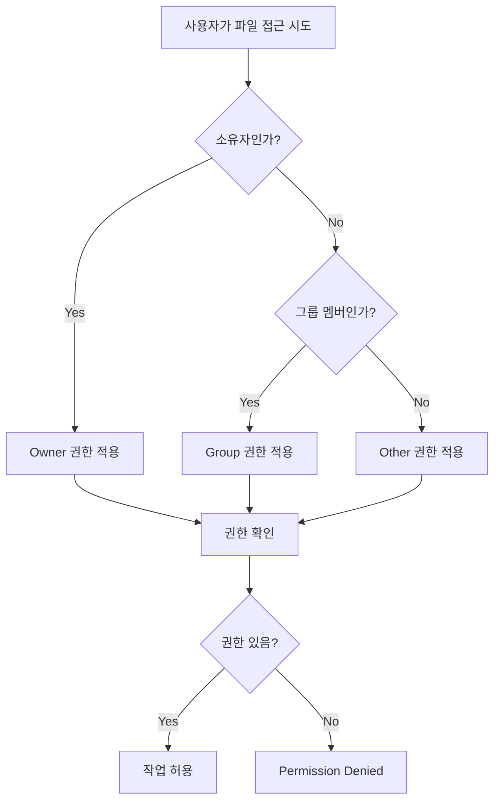
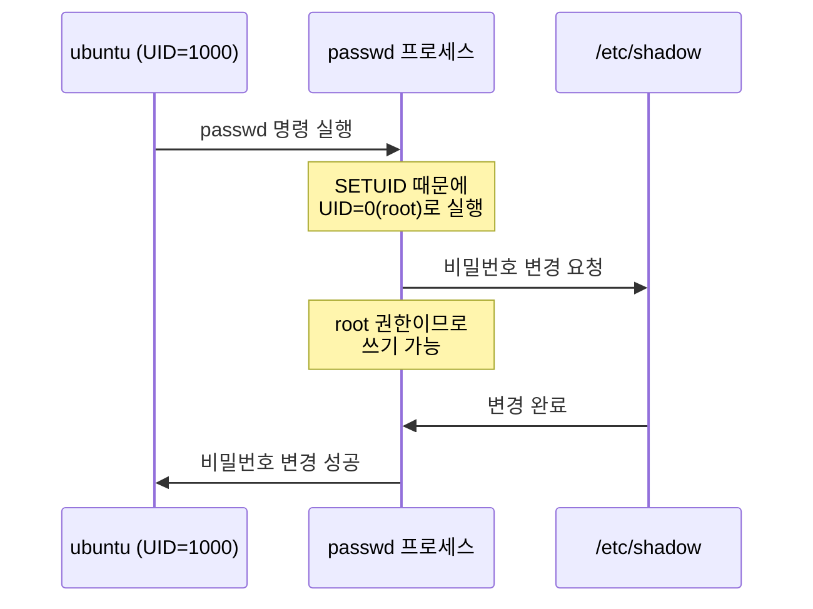

--- 
title: "📝 Linux 시스템 보안 - 사용자 관리 및 파일 권한 강의 노트"
date: 2025-11-25
excerpt: "오늘 강의에서는 Linux 시스템의 핵심적인 보안 요소인 사용자 관리와 파일 권한 시스템에 대해 학습했습니다. 이 두 가지 개념은 Linux 시스템 보안의 기초이자 가장 중요한 방어 메커니즘입니다."
categories:
  - SK_Rookies
  - Linux-Network
tags:
  - Linux-Network
  - SK_Rookies
---

# 📝 Linux 시스템 보안 - 사용자 관리 및 파일 권한 강의 노트

## 📚 강의 개요

오늘 강의에서는 Linux 시스템의 핵심적인 보안 요소인 **사용자 관리**와 **파일 권한 시스템**에 대해 학습했습니다. 이 두 가지 개념은 Linux 시스템 보안의 기초이자 가장 중요한 방어 메커니즘입니다.

### 🎯 학습 목표

이번 강의를 통해 다음과 같은 내용을 학습합니다:

1. **사용자 및 그룹 관리 시스템 이해**
   - Linux의 사용자 계정 구조
   - 그룹 개념과 권한 관리
   - 사용자 정보 저장 파일들의 구조와 의미

2. **사용자/그룹 관리 명령어 마스터**
   - `useradd`, `usermod`, `userdel` 명령어
   - `groupadd`, `groupmod`, `groupdel` 명령어
   - `passwd` 명령어를 통한 비밀번호 관리
   - `su`, `sudo` 명령어를 통한 권한 전환

3. **파일 권한(Permission) 시스템**
   - 읽기(r), 쓰기(w), 실행(x) 권한의 의미
   - 소유자(Owner), 그룹(Group), 기타(Other) 권한 구조
   - `chmod`, `chown`, `chgrp` 명령어

4. **특수 권한 이해**
   - SETUID, SETGID의 동작 원리와 보안 위험성
   - Sticky Bit의 역할
   - umask를 통한 기본 권한 설정

### 💡 왜 이것이 중요한가?

Linux 시스템에서 **사용자 관리**와 **파일 권한**은 보안의 가장 기본적인 방어선입니다:

- **최소 권한 원칙(Principle of Least Privilege)**: 각 사용자와 프로세스는 작업 수행에 필요한 최소한의 권한만 가져야 합니다.
- **권한 분리(Separation of Privileges)**: root 사용자의 막강한 권한을 제한하고, 일반 사용자가 필요할 때만 특정 권한을 획득하도록 합니다.
- **데이터 보호**: 파일과 디렉터리의 권한을 적절히 설정하여 무단 접근, 수정, 삭제를 방지합니다.
- **감사 추적(Audit Trail)**: 누가, 언제, 무엇을 했는지 추적할 수 있는 기반을 마련합니다.

⚠️ **보안 관점에서의 중요성**: 대부분의 시스템 침해 사고는 부적절한 사용자 권한 설정이나 잘못된 파일 권한으로 인해 발생합니다. 특히 **SETUID** 권한이 잘못 설정된 파일은 **권한 상승(Privilege Escalation)** 공격의 주요 경로가 됩니다.

---

## 📋 강의 구성

### 제1부: 사용자 및 그룹 관리의 기초
- Linux의 사용자 계정 시스템
- `/etc/passwd`, `/etc/shadow`, `/etc/group` 파일 구조
- 사용자 생성 시 기본 설정 파일들

### 제2부: 사용자 및 그룹 관리 명령어
- 사용자 생성, 수정, 삭제
- 그룹 생성, 수정, 삭제
- 비밀번호 정책 및 관리
- `su`와 `sudo`의 차이점

### 제3부: 파일 권한 시스템
- 파일과 디렉터리의 권한 구조
- 읽기, 쓰기, 실행 권한의 실제 의미
- 소유권(Ownership) 관리

### 제4부: 특수 권한과 보안
- SETUID/SETGID의 동작 원리
- SETUID의 보안 위험성
- Sticky Bit의 활용
- umask를 통한 기본 권한 제어

### 제5부: 종합 실습
- 사용자 생성 및 권한 설정
- 파일 권한 변경 실습
- 특수 권한 설정 및 검증

---

## 🔐 강의 중 강조된 보안 포인트

강사님께서 특별히 강조하신 보안 관련 핵심 사항들:

1. **SETUID는 매우 위험한 권한입니다**
   - 잘못 설정하면 권한 상승 공격의 경로가 됩니다
   - 반드시 필요한 시스템 파일에만 설정해야 합니다
   - 정기적으로 SETUID가 설정된 파일을 점검해야 합니다

2. **sudo 권한 부여 시 주의사항**
   - 모든 사용자에게 sudo 권한을 주면 안 됩니다
   - 최소 권한 원칙에 따라 필요한 명령어만 허용해야 합니다
   - 감사 로그를 통해 sudo 사용 내역을 추적해야 합니다

3. **umask 값 설정의 중요성**
   - umask 값이 너무 낮으면(예: 0000) 보안 취약점이 됩니다
   - 일반적으로 022 또는 027을 권장합니다
   - 취약점 점검 시 부적절한 umask 값은 즉시 발견됩니다

4. **섀도우 파일의 보호**
   - `/etc/shadow` 파일은 root만 읽기/쓰기 가능해야 합니다
   - 비밀번호 해시가 노출되면 brute-force 공격의 대상이 됩니다

---

## 📌 사전 준비 사항

이번 강의 실습을 위해 다음 환경이 필요합니다:

### 시스템 요구사항
- **운영체제**: Ubuntu Linux (강의에서는 Ubuntu 사용)
- **권한**: root 권한 또는 sudo 권한이 있는 계정
- **터미널**: 최소 2개의 터미널 창 (일반 사용자 / root 사용자)

### 필요한 지식
- 기본적인 Linux 명령어 (`ls`, `cd`, `cat`, `mkdir` 등)
- 터미널 사용 방법
- 텍스트 에디터 사용법 (`vi` 또는 `nano`)

### 실습 환경 설정

**Step 1: root 사용자로 전환하기**
```bash
# 방법 1: su 명령어 사용
$ su -
Password: [root 비밀번호 입력]

# 방법 2: sudo를 통한 root shell 실행
$ sudo -i
[sudo] password for ubuntu: [현재 사용자 비밀번호 입력]
```

**Step 2: 터미널 창 2개 열기**
- 터미널 1: root 사용자용
- 터미널 2: 일반 사용자(ubuntu)용

**Step 3: 실습용 디렉터리 생성**
```bash
# root 사용자로 실행
# mkdir -p /backup
# cd /backup
```

---

## 🎓 강의에서 사용하는 표기 규칙

강의 노트에서 사용하는 프롬프트 표시:

- `#`: root 사용자 프롬프트 (UID=0인 슈퍼유저)
- `$`: 일반 사용자 프롬프트 (ubuntu 등)

**예시:**
```bash
# useradd testuser    # root 권한이 필요한 명령어
$ passwd              # 일반 사용자도 실행 가능한 명령어
```

### 파일 경로 표기

- **절대 경로**: `/etc/passwd` (루트 디렉터리부터 시작)
- **상대 경로**: `./test.txt` (현재 디렉터리 기준)
- **홈 디렉터리**: `~/` 또는 `$HOME` (사용자 홈 디렉터리)

---

## 💭 학습 팁

### 이론과 실습의 병행
- **개념을 먼저 이해하고**, 반드시 **직접 실습**해보세요
- 명령어를 실행한 후 **결과를 확인**하는 습관을 들이세요
- 의도한 결과와 다르게 나왔다면 **왜 그런지 분석**하세요

### 보안 마인드셋
- 모든 설정을 할 때 "**이게 보안상 안전한가?**"를 먼저 생각하세요
- "**최소 권한 원칙**"을 항상 염두에 두세요
- 실습 환경이라도 **프로덕션 환경**처럼 신중하게 접근하세요

### 문서화 습관
- 실습 중 발견한 **에러 메시지와 해결 방법**을 기록하세요
- 자주 사용하는 명령어는 **별도로 정리**해두세요
- **왜 이런 설정을 했는지** 이유를 함께 기록하세요

---

다음 섹션에서는 Linux의 사용자 계정 시스템에 대해 상세히 살펴보겠습니다.
# 🏗️ 섹션 2: Linux 사용자 및 그룹 관리 기초

## 📋 사용자 계정 시스템 개요

Linux는 **다중 사용자 시스템(Multi-User System)**입니다. 여러 사용자가 동시에 시스템을 사용할 수 있으며, 각 사용자는 **고유한 식별자(UID)**와 **권한**을 가집니다.

### 💡 왜 사용자 관리가 중요한가?

1. **보안 격리**: 각 사용자의 데이터와 프로세스를 분리하여 보호
2. **접근 제어**: 시스템 리소스에 대한 접근을 제어
3. **감사 추적**: 누가 무엇을 했는지 추적 가능
4. **리소스 할당**: 사용자별 리소스 사용량 관리

---

## 📂 사용자 정보 저장 파일들

Linux 시스템에서 사용자 및 그룹 정보는 다음 파일들에 저장됩니다:

### 1️⃣ `/etc/passwd` - 사용자 계정 정보

**파일 위치**: `/etc/passwd`
**권한**: `-rw-r--r--` (644) - 모든 사용자가 읽을 수 있음

이 파일은 시스템의 모든 사용자 계정 정보를 저장합니다.

#### 📟 `/etc/passwd` 파일 구조

**기본 문법:**
```
username:password:UID:GID:comment:home_directory:shell
```

**각 필드 설명:**

| 필드 번호 | 필드명 | 설명 | 예시 |
|:-:|:-:|:-:|:-:|
| 1 | username | 로그인 ID (사용자 이름) | ubuntu, root |
| 2 | password | 비밀번호 (현재는 'x'로 표시, 실제는 /etc/shadow에 저장) | x |
| 3 | UID | 사용자 ID (User ID) | 1000, 0 (root) |
| 4 | GID | 기본 그룹 ID (Group ID) | 1000 |
| 5 | comment | 사용자 설명 (GECOS 필드) | Ubuntu User, 홍길동 |
| 6 | home_directory | 사용자 홈 디렉터리 경로 | /home/ubuntu |
| 7 | shell | 로그인 시 실행될 쉘 | /bin/bash, /bin/sh |

#### 실제 예제

**`/etc/passwd` 파일 내용 확인:**
```bash
$ cat /etc/passwd
```

**예상 출력:**
```
root:x:0:0:root:/root:/bin/bash
ubuntu:x:1000:1000:Ubuntu User:/home/ubuntu:/bin/bash
test0:x:1001:1001::/home/test0:/bin/sh
```

**출력 해석:**

**첫 번째 라인 분석** (`root:x:0:0:root:/root:/bin/bash`):
- **username**: `root` - 슈퍼유저 계정
- **password**: `x` - 비밀번호는 `/etc/shadow`에 암호화되어 저장
- **UID**: `0` - UID가 0이면 슈퍼유저(최고 권한)
- **GID**: `0` - root 그룹
- **comment**: `root` - 계정 설명
- **home_directory**: `/root` - root 사용자의 홈 디렉터리
- **shell**: `/bin/bash` - bash 쉘 사용

💡 **중요**: UID가 0인 사용자는 **슈퍼유저(root)**로 인식됩니다. 계정 이름이 "root"가 아니어도 UID가 0이면 최고 권한을 가집니다!

**두 번째 라인 분석** (`ubuntu:x:1000:1000:Ubuntu User:/home/ubuntu:/bin/bash`):
- **username**: `ubuntu` - 일반 사용자 계정
- **UID**: `1000` - 일반 사용자의 시작 UID (보통 1000번부터)
- **GID**: `1000` - ubuntu 그룹 (사용자와 동일한 이름의 그룹)
- **home_directory**: `/home/ubuntu` - 일반 사용자 홈 디렉터리

#### 🔍 UID 범위 이해하기

| UID 범위 | 용도 | 설명 |
|:-:|:-:|:-:|
| 0 | root | 슈퍼유저 (최고 권한) |
| 1~499 | 시스템 계정 | 시스템 서비스용 계정 |
| 500~999 | 시스템 예약 | 배포판에 따라 다름 |
| 1000~ | 일반 사용자 | 실제 로그인하는 사용자 계정 |

**시스템 계정 예시:**
```bash
$ grep -E "^(daemon|bin|sys)" /etc/passwd
daemon:x:1:1:daemon:/usr/sbin:/usr/sbin/nologin
bin:x:2:2:bin:/bin:/usr/sbin/nologin
sys:x:3:3:sys:/dev:/usr/sbin/nologin
```

이러한 시스템 계정들은:
- 사람이 직접 로그인하지 않음
- 특정 서비스나 데몬을 실행하기 위해 사용됨
- 쉘이 `/usr/sbin/nologin`으로 설정되어 로그인 불가

---

### 2️⃣ `/etc/shadow` - 비밀번호 정보

**파일 위치**: `/etc/shadow`
**권한**: `-rw-r-----` (640) - root만 쓰기 가능, shadow 그룹만 읽기 가능

🔐 **보안**: 이 파일은 암호화된 비밀번호를 저장하므로 일반 사용자는 읽을 수 없습니다.

#### 📟 `/etc/shadow` 파일 구조

**기본 문법:**
```
username:encrypted_password:lastchg:min:max:warn:inactive:expire:reserved
```

**각 필드 설명:**

| 필드 | 설명 | 값 의미 | 예시 |
|:-:|:-:|:-:|:-:|
| 1 | username | 사용자 이름 | ubuntu |
| 2 | encrypted_password | 암호화된 비밀번호 | $6$random... |
| 3 | lastchg | 마지막 비밀번호 변경일 (1970/1/1부터의 일수) | 19800 |
| 4 | min | 비밀번호 최소 사용일 | 0 (즉시 변경 가능) |
| 5 | max | 비밀번호 최대 사용일 (유효기간) | 99999 (사실상 무제한) |
| 6 | warn | 만료 경고일 | 7 (만료 7일 전부터 경고) |
| 7 | inactive | 비활성화 유예일 | 비어있음 |
| 8 | expire | 계정 만료일 | 비어있음 |
| 9 | reserved | 예약 필드 | 비어있음 |

#### 실제 예제

**`/etc/shadow` 파일 내용 확인:**
```bash
# root 권한 필요
$ sudo cat /etc/shadow
```

**예상 출력:**
```
root:$6$xyz123...:19800:0:99999:7:::
ubuntu:$6$abc456...:19800:0:99999:7:::
test0:!:19801:0:99999:7:::
```

**비밀번호 필드 (2번째 필드) 값의 의미:**

| 값 | 의미 | 상태 |
|:-:|:-:|:-:|
| `$6$salt$hash...` | SHA-512로 암호화된 비밀번호 | 로그인 가능 |
| `!` | 잠금 상태 | 로그인 불가 |
| `!!` | 비밀번호 미설정 | 로그인 불가 |
| `*` | 비밀번호 사용 불가 | 로그인 불가 |

💡 **암호화 알고리즘 식별:**
- `$1$...`: MD5 (오래됨, 권장 안 함)
- `$5$...`: SHA-256
- `$6$...`: SHA-512 (권장)
- `$y$...`: yescrypt (최신)

#### 비밀번호 만료 정책 예제

**비밀번호를 90일마다 변경하도록 설정된 계정:**
```
testuser:$6$...:19800:7:90:14:30:20000:
```

해석:
- **lastchg**: 19800일에 마지막 변경
- **min**: 7일 - 비밀번호 변경 후 최소 7일은 다시 변경 불가
- **max**: 90일 - 90일마다 비밀번호 변경 필요
- **warn**: 14일 - 만료 14일 전부터 경고 메시지 표시
- **inactive**: 30일 - 만료 후 30일 동안은 로그인 가능 (변경 필수)
- **expire**: 20000일 - 계정 자체가 만료되는 날짜

---

### 3️⃣ `/etc/group` - 그룹 정보

**파일 위치**: `/etc/group`
**권한**: `-rw-r--r--` (644) - 모든 사용자가 읽을 수 있음

#### 📟 `/etc/group` 파일 구조

**기본 문법:**
```
groupname:password:GID:members
```

**각 필드 설명:**

| 필드 | 설명 | 예시 |
|:-:|:-:|:-:|
| 1 | groupname | 그룹 이름 | sudo, ubuntu |
| 2 | password | 그룹 비밀번호 (거의 사용 안 함) | x |
| 3 | GID | 그룹 ID | 27, 1000 |
| 4 | members | 그룹 멤버 (쉼표로 구분) | ubuntu,test1,test2 |

#### 실제 예제

**`/etc/group` 파일 내용 확인:**
```bash
$ cat /etc/group
```

**예상 출력:**
```
root:x:0:
sudo:x:27:ubuntu
ubuntu:x:1000:
test_group:x:1001:test1,test2,test3
```

**출력 해석:**

**sudo 그룹 분석** (`sudo:x:27:ubuntu`):
- **groupname**: `sudo` - sudo 권한을 가진 그룹
- **GID**: `27` - sudo 그룹의 ID
- **members**: `ubuntu` - ubuntu 사용자가 sudo 그룹의 멤버

💡 **sudo 그룹**: 이 그룹의 멤버는 `sudo` 명령어를 사용하여 관리자 권한으로 명령을 실행할 수 있습니다.

**test_group 분석** (`test_group:x:1001:test1,test2,test3`):
- 여러 사용자가 하나의 그룹에 속할 수 있음
- 그룹 멤버는 쉼표(`,`)로 구분
- 이 그룹의 멤버: test1, test2, test3

#### 🔍 기본 그룹 vs 추가 그룹

**기본 그룹(Primary Group)**:
- `/etc/passwd`의 4번째 필드에 정의
- 사용자가 파일을 생성할 때 기본적으로 적용되는 그룹
- 각 사용자는 하나의 기본 그룹만 가짐

**추가 그룹(Secondary/Supplementary Groups)**:
- `/etc/group`의 4번째 필드에 정의
- 사용자가 여러 추가 그룹에 속할 수 있음
- 특정 리소스 접근 권한 부여에 사용

**예제: ubuntu 사용자의 그룹 확인**
```bash
# ubuntu 사용자의 모든 그룹 확인
$ groups ubuntu
ubuntu : ubuntu sudo docker

# id 명령어로 더 자세한 정보 확인
$ id ubuntu
uid=1000(ubuntu) gid=1000(ubuntu) groups=1000(ubuntu),27(sudo),999(docker)
```

해석:
- **기본 그룹**: ubuntu (GID=1000)
- **추가 그룹**: sudo (GID=27), docker (GID=999)

---

## ⚙️ 사용자 생성 관련 설정 파일

### 4️⃣ `/etc/login.defs` - 사용자 계정 기본 설정

**파일 위치**: `/etc/login.defs`
**목적**: 사용자 계정 생성 시 적용되는 기본 정책 정의

#### 주요 설정 항목

**파일 내용 확인 (주석 제외):**
```bash
# 주석과 빈 줄을 제외하고 실제 설정만 보기
$ grep -v '^#' /etc/login.defs | grep -v '^$'
```

**주요 설정 변수:**

| 변수명 | 설명 | 기본값 예시 |
|:-:|:-:|:-:|
| `PASS_MAX_DAYS` | 비밀번호 최대 사용일 | 99999 |
| `PASS_MIN_DAYS` | 비밀번호 최소 사용일 | 0 |
| `PASS_MIN_LEN` | 비밀번호 최소 길이 | 8 |
| `PASS_WARN_AGE` | 비밀번호 만료 경고일 | 7 |
| `UID_MIN` | 일반 사용자 UID 시작 번호 | 1000 |
| `UID_MAX` | 일반 사용자 UID 최대 번호 | 60000 |
| `GID_MIN` | 일반 그룹 GID 시작 번호 | 1000 |
| `GID_MAX` | 일반 그룹 GID 최대 번호 | 60000 |
| `CREATE_HOME` | 홈 디렉터리 자동 생성 여부 | yes |
| `UMASK` | 홈 디렉터리 기본 퍼미션 umask | 022 |
| `ENCRYPT_METHOD` | 비밀번호 암호화 방식 | SHA512 |

#### 실제 설정 예제

**`/etc/login.defs` 주요 내용:**
```bash
# 비밀번호 정책
PASS_MAX_DAYS   99999
PASS_MIN_DAYS   0
PASS_MIN_LEN    8
PASS_WARN_AGE   7

# UID/GID 범위
UID_MIN         1000
UID_MAX        60000
GID_MIN         1000
GID_MAX        60000

# 시스템 계정 범위
SYS_UID_MIN      100
SYS_UID_MAX      999
SYS_GID_MIN      100
SYS_GID_MAX      999

# 홈 디렉터리 설정
CREATE_HOME     yes
UMASK           022

# 암호화 방식
ENCRYPT_METHOD  SHA512
```

**설정 변경 예제:**

비밀번호를 90일마다 변경하도록 강제하려면:
```bash
# /etc/login.defs 파일 편집 (root 권한 필요)
$ sudo vi /etc/login.defs

# 다음 값 수정
PASS_MAX_DAYS   90      # 기본값: 99999
PASS_MIN_DAYS   7       # 기본값: 0 (변경 후 7일간 재변경 불가)
PASS_WARN_AGE   14      # 기본값: 7 (만료 14일 전부터 경고)
```

⚠️ **주의**: 이 설정은 **새로 생성되는 사용자**에게만 적용됩니다. 기존 사용자는 `chage` 명령어로 별도 변경해야 합니다.

---

### 5️⃣ `/etc/default/useradd` - useradd 명령어 기본값

**파일 위치**: `/etc/default/useradd`
**목적**: `useradd` 명령어 실행 시 생략된 옵션의 기본값 정의

#### 파일 내용 확인

```bash
$ cat /etc/default/useradd
```

**예상 출력:**
```bash
# Default values for useradd(8)
GROUP=100
HOME=/home
INACTIVE=-1
EXPIRE=
SHELL=/bin/sh
SKEL=/etc/skel
CREATE_MAIL_SPOOL=yes
```

**각 설정의 의미:**

| 설정 | 설명 | 값 |
|:-:|:-:|:-:|
| `GROUP` | 기본 그룹 GID | 100 |
| `HOME` | 홈 디렉터리 상위 경로 | /home |
| `INACTIVE` | 비밀번호 만료 후 유예일 | -1 (무제한) |
| `EXPIRE` | 계정 만료일 | 비어있음 (무제한) |
| `SHELL` | 기본 쉘 | /bin/sh |
| `SKEL` | 스켈레톤 디렉터리 | /etc/skel |
| `CREATE_MAIL_SPOOL` | 메일 스풀 생성 여부 | yes |

#### 기본값 조회 및 변경

**현재 기본값 조회:**
```bash
$ useradd -D
GROUP=100
HOME=/home
INACTIVE=-1
EXPIRE=
SHELL=/bin/sh
SKEL=/etc/skel
CREATE_MAIL_SPOOL=yes
```

**기본 쉘을 bash로 변경:**
```bash
# -D 옵션과 -s 옵션을 함께 사용
$ sudo useradd -D -s /bin/bash

# 변경 확인
$ useradd -D
SHELL=/bin/bash
```

**홈 디렉터리 기본 경로 변경:**
```bash
# 홈 디렉터리를 /new_home 아래에 생성하도록 변경
$ sudo useradd -D -b /new_home

# 변경 확인
$ useradd -D
HOME=/new_home
```

---

### 6️⃣ `/etc/skel` - 스켈레톤 디렉터리

**디렉터리 위치**: `/etc/skel`
**목적**: 새 사용자 생성 시 홈 디렉터리에 자동으로 복사될 기본 파일들 저장

#### 스켈레톤 디렉터리 내용 확인

```bash
# 숨김 파일까지 모두 보기
$ ls -la /etc/skel
total 24
drwxr-xr-x  2 root root 4096 Apr 18  2023 .
drwxr-xr-x 98 root root 4096 Nov 25 09:00 ..
-rw-r--r--  1 root root  220 Apr 18  2023 .bash_logout
-rw-r--r--  1 root root 3526 Apr 18  2023 .bashrc
-rw-r--r--  1 root root  807 Apr 18  2023 .profile
```

#### 주요 파일 설명

**1. `.bashrc` - Bash 쉘 설정 파일**

사용자가 **bash 쉘을 실행할 때마다** 자동으로 실행되는 스크립트입니다.

**용도:**
- 명령어 별칭(alias) 정의
- 쉘 프롬프트 커스터마이징
- 환경 변수 설정
- 자주 사용하는 함수 정의

**예제 내용:**
```bash
# User specific aliases and functions
alias ll='ls -la'
alias rm='rm -i'
alias cp='cp -i'
alias mv='mv -i'

# Custom prompt
PS1='\u@\h:\w\$ '

# History 설정
HISTSIZE=1000
HISTFILESIZE=2000
```

**2. `.bash_logout` - 로그아웃 시 실행**

**bash 쉘에서 로그아웃할 때** 실행되는 스크립트입니다.

**용도:**
- 임시 파일 정리
- 화면 클리어
- 로그 기록

**예제 내용:**
```bash
# ~/.bash_logout: executed by bash(1) when login shell exits

# Clear the screen for security
clear
```

**3. `.profile` - 로그인 시 실행**

**로그인 쉘**이 시작될 때 실행되는 스크립트입니다.

**용도:**
- PATH 환경 변수 설정
- 기타 환경 변수 설정
- `.bashrc` 호출

**예제 내용:**
```bash
# ~/.profile: executed by the command interpreter for login shells

# Set PATH
if [ -d "$HOME/bin" ] ; then
    PATH="$HOME/bin:$PATH"
fi

# Include .bashrc if it exists
if [ -f "$HOME/.bashrc" ]; then
    . "$HOME/.bashrc"
fi
```

#### 스켈레톤 디렉터리 활용

**새 사용자 생성 시 자동 복사:**
```bash
# test0 사용자 생성 (-m 옵션: 홈 디렉터리 생성)
$ sudo useradd -m test0

# test0의 홈 디렉터리 확인
$ sudo ls -la /home/test0
-rw-r--r-- 1 test0 test0  220 Nov 25 10:00 .bash_logout
-rw-r--r-- 1 test0 test0 3526 Nov 25 10:00 .bashrc
-rw-r--r-- 1 test0 test0  807 Nov 25 10:00 .profile
```

→ `/etc/skel`의 파일들이 `/home/test0`으로 복사되었습니다!

**조직 전체에 공통 설정 배포:**

모든 신규 사용자에게 동일한 별칭을 제공하고 싶다면:

```bash
# /etc/skel/.bashrc 편집 (root 권한)
$ sudo vi /etc/skel/.bashrc

# 다음 내용 추가
alias ll='ls -alF'
alias la='ls -A'
alias l='ls -CF'
alias update='sudo apt update && sudo apt upgrade'
```

이제 새로 생성되는 모든 사용자는 이 별칭들을 기본으로 가지게 됩니다.

---

## 🔄 쉘 시작 프로세스와 설정 파일 실행 순서

사용자가 로그인하면 다음 순서로 파일들이 실행됩니다:

```mermaid
graph TD
    A[사용자 로그인] --> B[로그인 프로세스]
    B --> C{인증 성공?}
    C -->|Yes| D[/etc/passwd에서 쉘 확인]
    C -->|No| Z[로그인 거부]
    D --> E[bash 쉘 실행]
    E --> F[/etc/profile 실행]
    F --> G[/etc/bash.bashrc 실행]
    G --> H[~/.bash_profile 또는 ~/.profile 실행]
    H --> I[~/.bashrc 실행]
    I --> J[프롬프트 표시]
    J --> K[사용자 명령 대기]
```

**실행 순서:**
1. **전역 설정** (모든 사용자 공통)
   - `/etc/profile` → 시스템 전체 환경 변수
   - `/etc/bash.bashrc` → 시스템 전체 bash 설정

2. **사용자 개인 설정**
   - `~/.bash_profile` 또는 `~/.profile` → 개인 환경 변수
   - `~/.bashrc` → 개인 bash 설정 (별칭, 함수 등)

💡 **관리 가이드:**
- **모든 사용자에게 적용**: `/etc/profile` 또는 `/etc/bash.bashrc` 수정 (root 권한)
- **특정 사용자에게만 적용**: `~/.bashrc` 또는 `~/.profile` 수정 (해당 사용자 권한)

---

## ✅ 학습 체크리스트

이 섹션을 학습한 후 다음 사항들을 확인할 수 있어야 합니다:

- [ ] `/etc/passwd` 파일의 각 필드 의미를 설명할 수 있다
- [ ] UID가 0인 사용자가 슈퍼유저임을 이해한다
- [ ] `/etc/shadow` 파일의 비밀번호 필드 값(`!`, `!!`, `*`)의 차이를 안다
- [ ] 비밀번호 정책 설정 (`PASS_MAX_DAYS` 등)을 이해한다
- [ ] 기본 그룹과 추가 그룹의 차이를 설명할 수 있다
- [ ] `/etc/skel` 디렉터리의 역할을 이해한다
- [ ] `.bashrc`, `.profile`, `.bash_logout`의 실행 시점을 안다
- [ ] 사용자별 설정과 시스템 전체 설정의 차이를 안다

---

## 📋 핵심 요약

### 주요 파일들

| 파일 | 용도 | 권한 | 관리자 |
|:-:|:-:|:-:|:-:|
| `/etc/passwd` | 사용자 계정 정보 | 644 (모두 읽기) | root |
| `/etc/shadow` | 비밀번호 해시 | 640 (root만 쓰기) | root |
| `/etc/group` | 그룹 정보 | 644 (모두 읽기) | root |
| `/etc/login.defs` | 계정 기본 정책 | 644 | root |
| `/etc/default/useradd` | useradd 기본값 | 644 | root |
| `/etc/skel/*` | 신규 사용자 기본 파일 | 644 | root |

### UID/GID 범위

- **0**: root (슈퍼유저)
- **1~499/999**: 시스템 계정
- **1000~**: 일반 사용자

### 쉘 설정 파일 실행 순서

**로그인 시**:
1. `/etc/profile` (전역)
2. `/etc/bash.bashrc` (전역)
3. `~/.profile` (개인)
4. `~/.bashrc` (개인)

**로그아웃 시**:
- `~/.bash_logout`

---

다음 섹션에서는 사용자와 그룹을 실제로 생성, 수정, 삭제하는 명령어들을 상세히 학습하겠습니다.
# 🛠️ 섹션 3: 사용자 및 그룹 관리 명령어 완전 정복

## 📝 사용자 관리 명령어 개요

Linux에서 사용자를 관리하는 핵심 명령어들:
- `useradd`: 새 사용자 생성
- `usermod`: 기존 사용자 정보 수정
- `userdel`: 사용자 삭제
- `passwd`: 비밀번호 관리
- `chage`: 비밀번호 만료 정책 관리

---

## 🔧 useradd - 사용자 생성

### 📟 `useradd` 명령어 상세 분석

**명령어 개요:**
- **목적**: 시스템에 새로운 사용자 계정 생성
- **사용 시나리오**: 새 직원 입사, 서비스 계정 생성, 테스트 계정 생성
- **권한**: root 권한 필요

**기본 문법:**
```bash
useradd [옵션] USERNAME
```

### 주요 옵션 설명

| **옵션** | **의미** | **사용 목적** | **예시** |
|:-:|:-:|:-:|:-:|
| `-m` | 홈 디렉터리 생성 | 사용자의 개인 공간 제공 | `useradd -m john` |
| `-u UID` | UID 지정 | 특정 UID 할당 | `useradd -u 2000 john` |
| `-g GID` | 기본 그룹 지정 | Primary 그룹 설정 | `useradd -g 1000 john` |
| `-G GROUP` | 추가 그룹 지정 | Secondary 그룹 추가 | `useradd -G sudo,docker john` |
| `-d DIR` | 홈 디렉터리 경로 지정 | 기본 경로 변경 | `useradd -d /data/john john` |
| `-s SHELL` | 로그인 쉘 지정 | 사용할 쉘 결정 | `useradd -s /bin/bash john` |
| `-c COMMENT` | 설명 추가 | 사용자 정보 기록 | `useradd -c "John Doe" john` |
| `-r` | 시스템 계정 생성 | 서비스용 계정 생성 | `useradd -r nginx` |
| `-e DATE` | 계정 만료일 지정 | 임시 계정 생성 | `useradd -e 2024-12-31 temp` |
| `-D` | 기본값 확인/설정 | 기본 설정 관리 | `useradd -D` |

### 실행 예제 1: 기본 사용자 생성

**시나리오**: 홈 디렉터리만 있는 기본 사용자 생성

```bash
# root 권한으로 실행
# useradd -m test0
```

**예상 결과:**
```bash
# 사용자 정보 확인
# grep test0 /etc/passwd
test0:x:1001:1001::/home/test0:/bin/sh

# 홈 디렉터리 확인
# ls -ld /home/test0
drwxr-xr-x 2 test0 test0 4096 Nov 25 10:00 /home/test0

# shadow 파일 확인 (비밀번호 미설정 상태)
# grep test0 /etc/shadow
test0:!:19801:0:99999:7:::
```

**결과 해석:**
- **UID/GID**: 시스템이 자동으로 1001 할당 (1000 이후 사용 가능한 첫 번호)
- **홈 디렉터리**: `/home/test0` 생성됨
- **쉘**: `/bin/sh` (기본값, `/etc/default/useradd`에 정의)
- **비밀번호**: `!` → 잠금 상태, 로그인 불가

### 실행 예제 2: 모든 옵션 지정하여 생성

**시나리오**: 관리자가 원하는 설정으로 완전하게 사용자 생성

```bash
# 사전 준비: 그룹 생성
# groupadd -g 500 dev_team

# 사용자 생성 (모든 옵션 지정)
# useradd \
  -u 2001 \
  -g 500 \
  -G sudo,docker \
  -d /home/developers/john \
  -s /bin/bash \
  -c "John Doe - Senior Developer" \
  -m \
  john
```

**명령어 해석:**
- `-u 2001`: UID를 2001로 지정
- `-g 500`: 기본 그룹을 GID 500(dev_team)으로 설정
- `-G sudo,docker`: sudo, docker 그룹에 추가
- `-d /home/developers/john`: 홈 디렉터리 경로 지정
- `-s /bin/bash`: bash 쉘 사용
- `-c "..."`: 사용자 설명 추가
- `-m`: 홈 디렉터리 생성

**예상 출력:**
```bash
# 생성된 사용자 확인
# id john
uid=2001(john) gid=500(dev_team) groups=500(dev_team),27(sudo),999(docker)

# passwd 파일 확인
# grep john /etc/passwd
john:x:2001:500:John Doe - Senior Developer:/home/developers/john:/bin/bash

# 홈 디렉터리 확인
# ls -ld /home/developers/john
drwxr-xr-x 2 john dev_team 4096 Nov 25 10:30 /home/developers/john
```

### 실행 예제 3: 시스템 계정 생성

**시나리오**: 웹 서비스용 시스템 계정 생성 (로그인 불가)

```bash
# nginx 서비스 계정 생성
# useradd -r -s /usr/sbin/nologin -c "Nginx Web Server" nginx
```

**옵션 설명:**
- `-r`: 시스템 계정으로 생성 (UID가 1~999 범위에서 할당됨)
- `-s /usr/sbin/nologin`: 로그인 불가 쉘 지정
- `-c`: 계정 설명

**예상 출력:**
```bash
# 생성된 시스템 계정 확인
# grep nginx /etc/passwd
nginx:x:998:998:Nginx Web Server:/home/nginx:/usr/sbin/nologin

# 로그인 시도 (실패)
$ su - nginx
This account is currently not available.
```

**시스템 계정 특징:**
- UID가 작은 범위 (보통 100~999)
- 로그인 불가 (`/usr/sbin/nologin` 또는 `/bin/false`)
- 특정 서비스나 데몬 실행 용도
- 보안: 직접 로그인 못하므로 안전

### 실행 예제 4: 임시 계정 생성 (만료일 지정)

**시나리오**: 3개월 계약직 직원용 계정 (2024년 12월 31일 만료)

```bash
# 만료일이 있는 임시 계정 생성
# useradd -m -e 2024-12-31 -c "Temporary Contractor" temp_user
```

**예상 출력:**
```bash
# shadow 파일에서 만료일 확인
# grep temp_user /etc/shadow
temp_user:!:19801:0:99999:7::20087:
                               ^^^^^
                               만료일 (1970-01-01부터의 일수)
```

**만료일 계산:**
```bash
# 만료일을 읽기 쉬운 형식으로 확인
# chage -l temp_user
Account expires                       : Dec 31, 2024
```

**만료 후 동작:**
- 2024-12-31 이후에는 로그인 불가
- 시스템이 자동으로 계정 잠금
- 수동으로 기한 연장 필요

### 실행 예제 5: 옵션 생략 시 기본 동작

**시나리오**: 옵션 없이 사용자 이름만으로 생성

```bash
# 최소한의 명령어
# useradd test1
```

**기본 동작:**
```bash
# /etc/default/useradd의 기본값 사용
# useradd -D
GROUP=100
HOME=/home
INACTIVE=-1
EXPIRE=
SHELL=/bin/sh
SKEL=/etc/skel
```

**결과:**
```bash
# 생성된 사용자 확인
# grep test1 /etc/passwd
test1:x:1002:100::/home/test1:/bin/sh
       ^^^^  ^^^
       자동   기본 그룹 100
       할당
```

**주의사항:**
- `-m` 옵션을 생략하면 홈 디렉터리가 생성되지 않을 수 있음
- `/etc/login.defs`의 `CREATE_HOME` 설정에 따라 다름
- 실무에서는 명시적으로 옵션 지정 권장

### 실무 활용 팁

**팁 1: 배치 작업으로 여러 사용자 생성**

```bash
#!/bin/bash
# add_users.sh - 여러 사용자를 한 번에 생성

USERS="alice bob charlie"

for user in $USERS; do
    echo "Creating user: $user"
    useradd -m -s /bin/bash -G developers $user
    echo "$user:Temp1234" | chpasswd
    chage -d 0 $user  # 첫 로그인 시 비밀번호 변경 강제
done
```

**팁 2: 표준 템플릿 사용**

조직의 표준 사용자 생성 명령어를 스크립트로 만들어 일관성 유지:

```bash
#!/bin/bash
# standard_user.sh <username> <fullname>

USERNAME=$1
FULLNAME=$2

useradd \
  -m \
  -s /bin/bash \
  -G sudo \
  -c "$FULLNAME" \
  $USERNAME

# 비밀번호 설정
passwd $USERNAME

# 첫 로그인 시 비밀번호 변경 강제
chage -d 0 $USERNAME
```

**팁 3: 안전한 UID 할당**

UID가 겹치지 않도록 확인:

```bash
# 다음 사용 가능한 UID 찾기
NEXT_UID=$(awk -F: '$3 >= 1000 && $3 < 60000 {print $3}' /etc/passwd | sort -n | tail -1)
NEXT_UID=$((NEXT_UID + 1))

echo "Next available UID: $NEXT_UID"

# 해당 UID로 사용자 생성
useradd -u $NEXT_UID -m newuser
```

### 자주 발생하는 오류와 해결

**오류 1: 그룹이 존재하지 않음**

```bash
# useradd -g 9999 testuser
useradd: group '9999' does not exist
```

**해결:**
```bash
# 그룹을 먼저 생성
# groupadd -g 9999 mygroup
# useradd -g 9999 -m testuser
```

**오류 2: UID가 이미 사용 중**

```bash
# useradd -u 1000 newuser
useradd: UID 1000 is not unique
```

**해결:**
```bash
# 사용 가능한 UID 확인
# grep :1000: /etc/passwd

# 다른 UID 사용
# useradd -u 1005 -m newuser
```

**오류 3: 홈 디렉터리가 이미 존재**

```bash
# useradd -m -d /home/existing existuser
useradd: warning: the home directory already exists
```

**해결:**
```bash
# 기존 디렉터리 백업 후 삭제
# mv /home/existing /home/existing.bak

# 또는 기존 디렉터리 사용 (-M 옵션으로 생성 안 함)
# useradd -M -d /home/existing existuser
```

---

## 🔄 usermod - 사용자 정보 수정

### 📟 `usermod` 명령어 상세 분석

**명령어 개요:**
- **목적**: 기존 사용자 계정의 정보 수정
- **사용 시나리오**: 부서 이동, 권한 변경, 계정 정보 업데이트
- **권한**: root 권한 필요

**기본 문법:**
```bash
usermod [옵션] USERNAME
```

### 주요 옵션 설명

| **옵션** | **의미** | **사용 목적** | **예시** |
|:-:|:-:|:-:|:-:|
| `-l NEW_NAME` | 로그인 이름 변경 | 사용자 이름 변경 | `usermod -l john_new john` |
| `-u UID` | UID 변경 | UID 재할당 | `usermod -u 2000 john` |
| `-g GID` | 기본 그룹 변경 | Primary 그룹 변경 | `usermod -g developers john` |
| `-G GROUPS` | 추가 그룹 **재설정** | Secondary 그룹 완전 교체 | `usermod -G sudo john` |
| `-aG GROUPS` | 추가 그룹 **추가** | 기존 유지하며 추가 | `usermod -aG docker john` |
| `-d DIR` | 홈 디렉터리 경로 변경 | 경로만 변경 | `usermod -d /new/home john` |
| `-md DIR` | 홈 디렉터리 **이동** | 실제 디렉터리 이동 | `usermod -md /new/home john` |
| `-s SHELL` | 쉘 변경 | 로그인 쉘 변경 | `usermod -s /bin/zsh john` |
| `-L` | 계정 잠금 | 로그인 차단 | `usermod -L john` |
| `-U` | 계정 잠금 해제 | 로그인 허용 | `usermod -U john` |
| `-e DATE` | 계정 만료일 설정 | 임시 계정 관리 | `usermod -e 2024-12-31 john` |
| `-c COMMENT` | 설명 변경 | 사용자 정보 업데이트 | `usermod -c "John - Manager" john` |

### 실행 예제 1: UID 변경

**시나리오**: test2 사용자의 UID를 1005로 변경

```bash
# 현재 UID 확인
# id test2
uid=1002(test2) gid=1002(test2) groups=1002(test2)

# UID 변경
# usermod -u 1005 test2

# 변경 확인
# id test2
uid=1005(test2) gid=1002(test2) groups=1002(test2)

# passwd 파일 확인
# grep test2 /etc/passwd
test2:x:1005:1002::/home/test2:/bin/sh
```

**⚠️ 주의사항:**
- UID 변경 시 **기존 파일의 소유권은 자동으로 변경되지 않음**
- 홈 디렉터리와 소유 파일들의 소유권을 수동으로 변경해야 함

**소유권 업데이트:**
```bash
# 홈 디렉터리 소유권 변경
# chown -R test2:test2 /home/test2

# 시스템 전체에서 이전 UID로 소유된 파일 찾기 및 변경
# find / -user 1002 -exec chown test2 {} \; 2>/dev/null
```

### 실행 예제 2: sudo 그룹에 사용자 추가

**시나리오**: ubuntu 사용자에게 sudo 권한 부여

```bash
# 현재 그룹 확인
# groups ubuntu
ubuntu : ubuntu

# sudo 그룹에 추가 (-a 옵션 필수!)
# usermod -aG sudo ubuntu

# 변경 확인
# groups ubuntu
ubuntu : ubuntu sudo

# id 명령어로 상세 확인
# id ubuntu
uid=1000(ubuntu) gid=1000(ubuntu) groups=1000(ubuntu),27(sudo)
```

**⚠️ 중요: `-a` 옵션 반드시 사용!**

**잘못된 방법** (기존 그룹이 사라짐):
```bash
# -a 없이 실행하면 기존 그룹이 모두 제거됨!
# usermod -G sudo ubuntu
# groups ubuntu
ubuntu : sudo    # ubuntu 그룹에서 제외됨!
```

**올바른 방법** (기존 그룹 유지):
```bash
# -a 옵션으로 기존 그룹 유지하며 추가
# usermod -aG sudo ubuntu
# groups ubuntu
ubuntu : ubuntu sudo    # 모두 유지됨
```

### 실행 예제 3: 홈 디렉터리 변경 (-m 옵션의 중요성)

**시나리오 A**: `-m` 옵션 **없이** 홈 디렉터리 변경

```bash
# 먼저 새 경로에 디렉터리 생성
# mkdir -p /new_home

# -m 없이 경로만 변경
# usermod -d /new_home/test1 test1

# passwd 파일 확인 (경로만 변경됨)
# grep test1 /etc/passwd
test1:x:1001:1001::/new_home/test1:/bin/sh

# 실제 디렉터리 확인
# ls /new_home/test1
ls: cannot access '/new_home/test1': No such file exists

# 이전 홈 디렉터리는 그대로 있음
# ls /home/test1
total 16
-rw-r--r-- 1 test1 test1  220 Nov 25 .bash_logout
```

**문제점:**
- `/etc/passwd`의 경로만 변경됨
- 실제 파일들은 이전 위치에 그대로 존재
- 사용자 로그인 시 홈 디렉터리를 찾을 수 없음

**시나리오 B**: `-m` 옵션 **사용**하여 홈 디렉터리 이동

```bash
# -m 옵션과 함께 변경 (파일까지 이동)
# usermod -md /new_home/test1 test1

# 변경 확인
# grep test1 /etc/passwd
test1:x:1001:1001::/new_home/test1:/bin/sh

# 실제 디렉터리 확인 (파일들이 이동됨)
# ls -la /new_home/test1
total 16
-rw-r--r-- 1 test1 test1  220 Nov 25 .bash_logout
-rw-r--r-- 1 test1 test1 3526 Nov 25 .bashrc

# 이전 경로는 비어있음
# ls /home/test1
ls: cannot access '/home/test1': No such file exists
```

**권장 방법:**
```bash
# 항상 -m 옵션을 함께 사용
usermod -md <새경로> <사용자명>
```

### 실행 예제 4: 기본 그룹 변경

**시나리오**: test3 사용자를 dev_team 그룹으로 변경

```bash
# 그룹 생성
# groupadd -g 600 dev_team

# 기본 그룹 변경
# usermod -g 600 test3

# 확인
# id test3
uid=1003(test3) gid=600(dev_team) groups=600(dev_team)

# passwd 파일 확인
# grep test3 /etc/passwd
test3:x:1003:600::/home/test3:/bin/sh
```

**결과:**
- 기본 그룹이 dev_team(600)으로 변경
- 이제 test3가 만드는 파일의 그룹 소유권은 dev_team이 됨

### 실행 예제 5: 계정 잠금 및 해제

**시나리오**: 퇴사 예정 직원의 계정을 임시로 잠금

```bash
# 현재 상태 확인
# grep test0 /etc/shadow
test0:$6$randomhash...:19801:0:99999:7:::
      ^^^^^^^^^^^^^^ 정상 비밀번호

# 계정 잠금
# usermod -L test0

# 잠금 확인 (비밀번호 앞에 ! 추가됨)
# grep test0 /etc/shadow
test0:!$6$randomhash...:19801:0:99999:7:::
      ^ 잠금 표시

# 로그인 시도 (실패)
$ su - test0
su: Authentication failure
```

**잠금 해제:**
```bash
# 계정 잠금 해제
# usermod -U test0

# 확인
# grep test0 /etc/shadow
test0:$6$randomhash...:19801:0:99999:7:::
      ^^^^^^^^^^^^^^ ! 제거됨
```

**실무 활용:**
- 퇴사 직원 계정 일시 정지
- 보안 사고 발생 시 즉시 계정 차단
- 휴직 중인 직원 계정 관리

### 실행 예제 6: 여러 옵션 동시 사용

**시나리오**: 부서 이동으로 인한 종합적인 계정 정보 변경

```bash
# 상황: john이 개발팀에서 관리팀으로 이동
# - 그룹을 admin_team으로 변경
# - 홈 디렉터리를 /home/admin/john으로 이동
# - 설명 업데이트

# 한 번에 변경
# usermod \
  -g admin_team \
  -md /home/admin/john \
  -c "John Doe - Admin Team Manager" \
  john

# 확인
# grep john /etc/passwd
john:x:2001:800:John Doe - Admin Team Manager:/home/admin/john:/bin/bash

# 그룹 확인
# id john
uid=2001(john) gid=800(admin_team) groups=800(admin_team),27(sudo)
```

### 실무 활용 팁

**팁 1: 안전한 그룹 추가 스크립트**

```bash
#!/bin/bash
# safe_group_add.sh <username> <groupname>

USERNAME=$1
GROUPNAME=$2

# 사용자 존재 확인
if ! id "$USERNAME" &>/dev/null; then
    echo "Error: User $USERNAME does not exist"
    exit 1
fi

# 그룹 존재 확인
if ! getent group "$GROUPNAME" &>/dev/null; then
    echo "Error: Group $GROUPNAME does not exist"
    exit 1
fi

# 이미 그룹 멤버인지 확인
if groups "$USERNAME" | grep -q "\b$GROUPNAME\b"; then
    echo "User $USERNAME is already a member of $GROUPNAME"
    exit 0
fi

# 그룹 추가
usermod -aG "$GROUPNAME" "$USERNAME"
echo "Successfully added $USERNAME to $GROUPNAME"
```

**팁 2: 홈 디렉터리 안전 이동**

```bash
#!/bin/bash
# safe_home_move.sh <username> <new_home_path>

USERNAME=$1
NEW_HOME=$2

# 현재 홈 디렉터리 확인
CURRENT_HOME=$(getent passwd "$USERNAME" | cut -d: -f6)

# 백업 생성
echo "Creating backup..."
tar -czf "/tmp/${USERNAME}_home_backup_$(date +%Y%m%d).tar.gz" "$CURRENT_HOME"

# 홈 디렉터리 이동
echo "Moving home directory..."
usermod -md "$NEW_HOME" "$USERNAME"

echo "Home directory moved from $CURRENT_HOME to $NEW_HOME"
echo "Backup saved at /tmp/${USERNAME}_home_backup_$(date +%Y%m%d).tar.gz"
```

**팁 3: 대량 계정 정보 업데이트**

```bash
#!/bin/bash
# update_team_shell.sh - 특정 팀 전체 쉘 변경

TEAM_MEMBERS="alice bob charlie"
NEW_SHELL="/bin/zsh"

for user in $TEAM_MEMBERS; do
    echo "Updating shell for $user..."
    usermod -s "$NEW_SHELL" "$user"
done

echo "All team members now use $NEW_SHELL"
```

### 자주 발생하는 오류와 해결

**오류 1: 사용자가 로그인 중일 때 변경 시도**

```bash
# usermod -l john_new john
usermod: user john is currently used by process 1234
```

**해결:**
```bash
# 로그인 프로세스 종료
# pkill -u john

# 또는 로그아웃 요청 후 변경
```

**오류 2: 홈 디렉터리 이동 실패**

```bash
# usermod -md /new/home/john john
usermod: directory /new/home does not exist
```

**해결:**
```bash
# 상위 디렉터리 먼저 생성
# mkdir -p /new/home
# usermod -md /new/home/john john
```

---

## 🗑️ userdel - 사용자 삭제

### 📟 `userdel` 명령어 상세 분석

**명령어 개요:**
- **목적**: 시스템에서 사용자 계정 삭제
- **사용 시나리오**: 퇴사자 계정 제거, 테스트 계정 정리
- **권한**: root 권한 필요

**기본 문법:**
```bash
userdel [옵션] USERNAME
```

### 주요 옵션 설명

| **옵션** | **의미** | **삭제 범위** | **주의사항** |
|:-:|:-:|:-:|:-:|
| (옵션 없음) | 계정만 삭제 | passwd, shadow, group | 홈 디렉터리 유지 |
| `-r` | 완전 삭제 | 계정 + 홈 디렉터리 + 메일 스풀 | 복구 불가 |
| `-f` | 강제 삭제 | 로그인 중이어도 삭제 | 위험! 데이터 손실 가능 |

### 실행 예제 1: 계정만 삭제 (홈 디렉터리 유지)

**시나리오**: 테스트 계정 제거하되 데이터는 보존

```bash
# 삭제 전 확인
# id test0
uid=1001(test0) gid=1001(test0) groups=1001(test0)

# ls -ld /home/test0
drwxr-xr-x 2 test0 test0 4096 Nov 25 /home/test0

# 계정만 삭제 (옵션 없음)
# userdel test0

# 계정 삭제 확인
# id test0
id: 'test0': no such user

# 홈 디렉터리는 여전히 존재
# ls -ld /home/test0
drwxr-xr-x 2 1001 1001 4096 Nov 25 /home/test0
                ^^^^ ^^^^ UID/GID가 숫자로 표시됨
```

**결과:**
- `/etc/passwd`, `/etc/shadow`, `/etc/group`에서 사용자 정보 제거
- 홈 디렉터리 `/home/test0`은 그대로 유지
- 소유권이 UID/GID 숫자로 표시 (계정명이 사라졌으므로)

**언제 사용:**
- 데이터를 백업하거나 다른 사용자에게 이전해야 할 때
- 실수로 삭제했을 경우 복구 가능하도록

### 실행 예제 2: 완전 삭제 (-r 옵션)

**시나리오**: 더 이상 필요없는 계정과 데이터 완전 제거

```bash
# 삭제 전 확인
# du -sh /home/test1
150M    /home/test1

# 완전 삭제
# userdel -r test1

# 홈 디렉터리 확인 (삭제됨)
# ls /home/test1
ls: cannot access '/home/test1': No such file or directory

# 메일 스풀도 삭제됨
# ls /var/mail/test1
ls: cannot access '/var/mail/test1': No such file or directory
```

**⚠️ 경고:**
- `-r` 옵션은 **복구 불가능**한 삭제
- 중요한 데이터가 있다면 반드시 백업 먼저!

**안전한 삭제 절차:**
```bash
# 1. 백업 생성
# tar -czf /backup/test1_home_$(date +%Y%m%d).tar.gz /home/test1

# 2. 백업 확인
# tar -tzf /backup/test1_home_$(date +%Y%m%d).tar.gz | head

# 3. 삭제 실행
# userdel -r test1
```

### 실행 예제 3: 강제 삭제 (-f 옵션)

**시나리오**: 로그인 중인 사용자를 즉시 삭제 (긴급 상황)

```bash
# 사용자가 로그인 중인 상태 확인
# who
test2    pts/0        2024-11-25 10:00

# 일반 삭제 시도 (실패)
# userdel test2
userdel: user test2 is currently used by process 5678

# 강제 삭제
# userdel -f test2
userdel: user test2 is currently used by process 5678
userdel: test2 mail spool (/var/mail/test2) not found

# 삭제 확인
# id test2
id: 'test2': no such user
```

**⚠️ 위험:**
- 로그인 중인 사용자의 프로세스가 강제 종료될 수 있음
- 작업 중인 데이터 손실 위험
- 시스템 불안정 가능

**안전한 대안:**
```bash
# 1. 사용자에게 로그아웃 요청
# wall "Please log out. Account maintenance in progress."

# 2. 계정 잠금 (임시 조치)
# usermod -L test2

# 3. 사용자가 로그아웃한 후 삭제
# userdel -r test2
```

### 실행 예제 4: 그룹 소유 파일이 있는 경우

**시나리오**: 다른 사용자가 해당 그룹을 사용 중

```bash
# test_group 그룹의 멤버 확인
# grep test_group /etc/group
test_group:x:1001:test3,alice,bob

# test3 삭제 시도
# userdel test3
userdel: group test3 is the primary group of another user

# 해결: 다른 사용자들의 기본 그룹 변경 후 삭제
# usermod -g alice alice
# usermod -g bob bob
# userdel -r test3
```

### 삭제 전 체크리스트

**보안 점검:**
```bash
#!/bin/bash
# user_delete_check.sh <username>

USERNAME=$1

echo "=== User Deletion Pre-Check ==="
echo ""

# 1. 현재 로그인 여부
echo "1. Login Status:"
who | grep "^$USERNAME " || echo "Not logged in"
echo ""

# 2. 실행 중인 프로세스
echo "2. Running Processes:"
ps -u "$USERNAME" | head -5
echo ""

# 3. cron 작업
echo "3. Cron Jobs:"
crontab -u "$USERNAME" -l 2>/dev/null || echo "No cron jobs"
echo ""

# 4. 소유 파일 수
echo "4. Owned Files:"
FILECOUNT=$(find / -user "$USERNAME" 2>/dev/null | wc -l)
echo "Total files owned: $FILECOUNT"
echo ""

# 5. 홈 디렉터리 크기
echo "5. Home Directory Size:"
du -sh "/home/$USERNAME" 2>/dev/null || echo "Home directory not found"
echo ""

# 6. 그룹 멤버십
echo "6. Group Memberships:"
groups "$USERNAME"
echo ""

echo "=== End of Check ==="
```

### 실무 활용 팁

**팁 1: 안전한 삭제 스크립트**

```bash
#!/bin/bash
# safe_user_delete.sh <username>

USERNAME=$1

# 사용자 존재 확인
if ! id "$USERNAME" &>/dev/null; then
    echo "Error: User $USERNAME does not exist"
    exit 1
fi

# 백업 디렉터리 생성
BACKUP_DIR="/backup/deleted_users/$(date +%Y%m%d)"
mkdir -p "$BACKUP_DIR"

# 홈 디렉터리 백업
if [ -d "/home/$USERNAME" ]; then
    echo "Backing up home directory..."
    tar -czf "$BACKUP_DIR/${USERNAME}_home.tar.gz" "/home/$USERNAME"
fi

# cron 작업 백업
if crontab -u "$USERNAME" -l &>/dev/null; then
    echo "Backing up cron jobs..."
    crontab -u "$USERNAME" -l > "$BACKUP_DIR/${USERNAME}_crontab"
fi

# 사용자 정보 저장
echo "Saving user information..."
getent passwd "$USERNAME" > "$BACKUP_DIR/${USERNAME}_passwd"
getent shadow "$USERNAME" > "$BACKUP_DIR/${USERNAME}_shadow"

# 계정 삭제
echo "Deleting user..."
userdel -r "$USERNAME"

echo "User deleted. Backup saved at $BACKUP_DIR"
```

**팁 2: 퇴사자 계정 아카이브**

```bash
#!/bin/bash
# archive_departed.sh <username>

USERNAME=$1
ARCHIVE_DIR="/archive/departed_employees"

# 아카이브 준비
mkdir -p "$ARCHIVE_DIR/$USERNAME"

# 1. 홈 디렉터리 압축
tar -czf "$ARCHIVE_DIR/$USERNAME/home.tar.gz" "/home/$USERNAME"

# 2. 메일 백업
if [ -f "/var/mail/$USERNAME" ]; then
    cp "/var/mail/$USERNAME" "$ARCHIVE_DIR/$USERNAME/mail"
fi

# 3. 계정 정보 저장
getent passwd "$USERNAME" > "$ARCHIVE_DIR/$USERNAME/account_info.txt"

# 4. 소유 파일 목록 생성
find / -user "$USERNAME" 2>/dev/null > "$ARCHIVE_DIR/$USERNAME/owned_files.txt"

# 5. 계정 잠금 (즉시 삭제하지 않음)
usermod -L "$USERNAME"
usermod -e 1 "$USERNAME"  # 즉시 만료

echo "Account archived and locked. Manual deletion required."
```

---

## 🔑 passwd - 비밀번호 관리

### 📟 `passwd` 명령어 상세 분석

**명령어 개요:**
- **목적**: 사용자 비밀번호 설정 및 관리
- **사용 시나리오**: 비밀번호 변경, 계정 잠금/해제, 만료 정책 관리
- **권한**:
  - 일반 사용자: 자신의 비밀번호만 변경
  - root: 모든 사용자의 비밀번호 변경 가능

**기본 문법:**
```bash
passwd [옵션] [USERNAME]
```

### 주요 옵션 설명

| **옵션** | **의미** | **사용 목적** | **권한** |
|:-:|:-:|:-:|:-:|
| (옵션 없음) | 비밀번호 변경 | 자신 또는 타인 비밀번호 변경 | 본인/root |
| `-l` | 계정 잠금 | 로그인 차단 | root |
| `-u` | 계정 잠금 해제 | 로그인 허용 | root |
| `-d` | 비밀번호 삭제 | 비밀번호 없이 로그인 | root |
| `-e` | 비밀번호 만료 | 다음 로그인 시 변경 강제 | root |
| `-n DAYS` | 최소 사용일 | 변경 후 최소 대기일 | root |
| `-x DAYS` | 최대 사용일 | 유효 기간 설정 | root |
| `-w DAYS` | 경고일 | 만료 전 경고 기간 | root |
| `-i DAYS` | 비활성 유예일 | 만료 후 로그인 가능 일수 | root |
| `-S` | 상태 확인 | 비밀번호 상태 조회 | 본인/root |

### 실행 예제 1: 비밀번호 변경 (일반 사용자)

**시나리오**: 사용자가 자신의 비밀번호 변경

```bash
# 일반 사용자로 실행
$ passwd
Changing password for ubuntu.
Current password: ********
New password: ************
Retype new password: ************
passwd: password updated successfully
```

**프로세스:**
1. 현재 비밀번호 확인 (보안)
2. 새 비밀번호 입력
3. 새 비밀번호 재확인
4. 비밀번호 복잡도 검사
5. `/etc/shadow` 파일 업데이트

**비밀번호 규칙:**
```bash
# PAM 설정에 의해 결정 (/etc/pam.d/common-password)
- 최소 8자 이상
- 대소문자, 숫자, 특수문자 조합 권장
- 이전 비밀번호와 유사하면 거부
- 사전 단어 사용 불가
```

### 실행 예제 2: root가 타 사용자 비밀번호 변경

**시나리오**: 관리자가 test0 사용자의 비밀번호 설정

```bash
# root 권한으로 실행
# passwd test0
New password: ************
Retype new password: ************
passwd: password updated successfully
```

**특징:**
- 현재 비밀번호 확인 **불필요** (root 권한)
- 비밀번호 복잡도 규칙 **우회 가능** (경고만 표시)
- 즉시 적용

**비밀번호 없이 설정 (파이프 사용):**
```bash
# 스크립트에서 사용 (보안 주의!)
# echo "NewPassword123" | passwd --stdin test0

# 또는 chpasswd 사용 (더 안전)
# echo "test0:NewPassword123" | chpasswd
```

### 실행 예제 3: 계정 잠금 및 해제

**시나리오 A**: 의심스러운 활동으로 계정 긴급 잠금

```bash
# 계정 잠금
# passwd -l test0
passwd: password expiry information changed.

# shadow 파일 확인
# grep test0 /etc/shadow
test0:!$6$xyz...:19801:0:99999:7:::
      ^ 잠금 표시

# 잠금 상태 확인
# passwd -S test0
test0 L 11/25/2024 0 99999 7 -1
      ^ L = Locked
```

**시나리오 B**: 조사 완료 후 계정 해제

```bash
# 계정 잠금 해제
# passwd -u test0
passwd: password expiry information changed.

# 상태 확인
# passwd -S test0
test0 P 11/25/2024 0 99999 7 -1
      ^ P = Password set (usable)
```

**상태 코드:**
- `L`: Locked (잠금)
- `NP`: No Password (비밀번호 없음)
- `P`: Password (정상)

### 실행 예제 4: 비밀번호 만료 강제

**시나리오**: 보안 정책 변경으로 모든 사용자 비밀번호 재설정 필요

```bash
# 비밀번호 즉시 만료
# passwd -e test0
passwd: password expiry information changed.

# 만료 확인
# chage -l test0
Last password change                                    : password must be changed
Password expires                                        : password must be changed

# 사용자가 다음 로그인 시 보게 될 화면
$ ssh test0@localhost
Warning: your password has expired.
Password:
You are required to change your password immediately (administrator enforced)
New password:
```

**대량 적용:**
```bash
#!/bin/bash
# force_password_change.sh - 모든 일반 사용자 비밀번호 만료

awk -F: '$3 >= 1000 && $3 < 60000 {print $1}' /etc/passwd | while read user; do
    echo "Expiring password for $user..."
    passwd -e "$user"
done
```

### 실행 예제 5: 비밀번호 정책 설정

**시나리오**: 90일마다 비밀번호 변경 정책 적용

```bash
# 최대 사용일 설정 (90일)
# passwd -x 90 test0

# 변경 후 최소 사용일 설정 (7일, 재변경 방지)
# passwd -n 7 test0

# 만료 14일 전부터 경고
# passwd -w 14 test0

# 만료 후 30일 유예 (이 기간 내 로그인 시 변경 가능)
# passwd -i 30 test0

# 설정 확인
# passwd -S test0
test0 P 11/25/2024 7 90 14 30
```

**shadow 파일에 반영:**
```bash
# grep test0 /etc/shadow
test0:$6$...:19801:7:90:14:30::
                  ^  ^  ^  ^
                  |  |  |  └─ inactive
                  |  |  └──── warn
                  |  └──────── max
                  └──────────── min
```

### 실행 예제 6: 비밀번호 삭제 (위험!)

**시나리오**: 테스트 환경에서 비밀번호 없이 로그인

```bash
# 비밀번호 삭제
# passwd -d test0
passwd: password expiry information changed.

# shadow 파일 확인 (비밀번호 필드 비어있음)
# grep test0 /etc/shadow
test0::19801:0:99999:7:::
     ^^ 비밀번호 없음

# 이제 비밀번호 없이 로그인 가능 (매우 위험!)
$ su - test0
$ (비밀번호 입력 없이 바로 로그인됨)
```

**⚠️ 경고:**
- 절대 프로덕션 환경에서 사용 금지
- 보안 취약점 심각
- 테스트 환경에서만 제한적으로 사용

### 비밀번호 상태 확인

**`passwd -S` 상세 해석:**

```bash
# passwd -S ubuntu
ubuntu P 11/20/2024 0 99999 7 -1
│      │ │          │ │     │ │
│      │ │          │ │     │ └─ 비활성 유예일 (-1 = 없음)
│      │ │          │ │     └─── 경고일 (7일)
│      │ │          │ └───────── 최대 사용일 (99999 = 무제한)
│      │ │          └──────────── 최소 사용일 (0 = 즉시 변경 가능)
│      │ └─────────────────────── 마지막 변경일
│      └───────────────────────── 상태 (P/L/NP)
└──────────────────────────────── 사용자명
```

### 실무 활용 팁

**팁 1: 신규 사용자 비밀번호 초기 설정**

```bash
#!/bin/bash
# new_user_password.sh <username>

USERNAME=$1

# 임시 비밀번호 생성
TEMP_PASS=$(openssl rand -base64 12)

# 비밀번호 설정
echo "$USERNAME:$TEMP_PASS" | chpasswd

# 첫 로그인 시 변경 강제
passwd -e "$USERNAME"

# 임시 비밀번호 출력 (안전하게 전달)
echo "Temporary password for $USERNAME: $TEMP_PASS"
echo "User must change password on first login"
```

**팁 2: 비밀번호 정책 일괄 적용**

```bash
#!/bin/bash
# apply_password_policy.sh

POLICY_MAX_DAYS=90
POLICY_MIN_DAYS=7
POLICY_WARN_DAYS=14
POLICY_INACTIVE_DAYS=30

# 모든 일반 사용자 대상
awk -F: '$3 >= 1000 && $3 < 60000 {print $1}' /etc/passwd | while read user; do
    echo "Applying policy to $user..."
    passwd -x $POLICY_MAX_DAYS "$user"
    passwd -n $POLICY_MIN_DAYS "$user"
    passwd -w $POLICY_WARN_DAYS "$user"
    passwd -i $POLICY_INACTIVE_DAYS "$user"
done

echo "Password policy applied to all users"
```

**팁 3: 비밀번호 만료 모니터링**

```bash
#!/bin/bash
# check_password_expiry.sh

echo "Users with password expiring soon:"
echo "=================================="

awk -F: '$3 >= 1000 && $3 < 60000 {print $1}' /etc/passwd | while read user; do
    # 만료까지 남은 일수 계산
    STATUS=$(passwd -S "$user")
    MAX_DAYS=$(echo "$STATUS" | awk '{print $5}')
    LAST_CHANGE=$(echo "$STATUS" | awk '{print $3}')

    # 만료일이 설정된 경우에만 계산
    if [ "$MAX_DAYS" != "99999" ]; then
        # 간단한 계산 (실제로는 더 정교한 날짜 계산 필요)
        EXPIRE_DATE=$(date -d "$LAST_CHANGE + $MAX_DAYS days" +%Y-%m-%d)
        DAYS_LEFT=$(( ($(date -d "$EXPIRE_DATE" +%s) - $(date +%s)) / 86400 ))

        if [ $DAYS_LEFT -le 14 ]; then
            echo "$user: $DAYS_LEFT days left (expires $EXPIRE_DATE)"
        fi
    fi
done
```

### 🔐 보안 고려사항

**비밀번호 정책 권장사항:**

```bash
# /etc/login.defs에 기본 정책 설정
PASS_MAX_DAYS   90      # 90일마다 변경
PASS_MIN_DAYS   7       # 변경 후 7일간 재변경 불가
PASS_MIN_LEN    14      # 최소 14자
PASS_WARN_AGE   14      # 만료 14일 전 경고

# PAM 설정으로 복잡도 강화 (/etc/pam.d/common-password)
password requisite pam_pwquality.so retry=3 minlen=14 difok=3 ucredit=-1 lcredit=-1 dcredit=-1 ocredit=-1
```

**해설:**
- `retry=3`: 3번까지 재시도 허용
- `minlen=14`: 최소 14자
- `difok=3`: 이전 비밀번호와 최소 3자 다름
- `ucredit=-1`: 대문자 최소 1개
- `lcredit=-1`: 소문자 최소 1개
- `dcredit=-1`: 숫자 최소 1개
- `ocredit=-1`: 특수문자 최소 1개

---

다음 섹션에서는 그룹 관리 명령어와 su/sudo 명령어를 다루겠습니다.
# 🔒 섹션 4: Linux 파일 권한(Permission) 시스템

## 📋 파일 권한의 개념

Linux에서 모든 파일과 디렉터리는 **소유권(Ownership)**과 **권한(Permission)**을 가집니다.

### 💡 왜 권한 시스템이 중요한가?

1. **접근 제어**: 누가 파일을 읽고, 수정하고, 실행할 수 있는지 제어
2. **데이터 보호**: 중요한 파일을 무단 열람/수정/삭제로부터 보호
3. **시스템 보안**: 시스템 파일을 실수나 악의적 행위로부터 보호
4. **멀티유저 환경**: 여러 사용자가 안전하게 시스템을 공유

---

## 🔍 파일 권한 구조 이해하기

### ls -l 출력 해석

```bash
$ ls -l
-rw-r--r--  1 ubuntu ubuntu 1234 Nov 25 10:00 example.txt
drwxr-xr-x  2 ubuntu ubuntu 4096 Nov 25 10:00 mydir
```

**출력 구조:**
```
-rw-r--r--  1 ubuntu ubuntu 1234 Nov 25 10:00 example.txt
│├┼┼┼┼┼┼┼┼┤  │ │      │      │    │           │
││└┴┴┴┴┴┴┴┘  │ │      │      │    │           └─ 파일명
││  Other    │ │      │      │    └───────────── 수정일시
││           │ │      │      └────────────────── 크기(bytes)
│└─ Group    │ │      └───────────────────────── 그룹 소유자
└── Owner    │ └──────────────────────────────── 사용자 소유자
             └─────────────────────────────────── 링크 수
```

### 권한 비트 구조

```
- rw- r-- r--
│ │└┼─┘└┼─┘└┼─┘
│ │ │   │   └─ Other (기타 사용자) 권한
│ │ │   └───── Group (그룹) 권한
│ │ └───────── Owner (소유자) 권한
│ └─────────── 권한 비트 (9자리)
└───────────── 파일 유형
```

### 파일 유형 기호

| 기호 | 유형 | 설명 |
|:-:|:-:|:-:|
| `-` | 일반 파일 | 텍스트, 바이너리 등 |
| `d` | 디렉터리 | Directory |
| `l` | 심볼릭 링크 | Symbolic Link |
| `c` | 문자 장치 | Character Device (키보드, 터미널 등) |
| `b` | 블록 장치 | Block Device (하드디스크 등) |
| `s` | 소켓 | Socket |
| `p` | 파이프 | Named Pipe |

---

## 📝 권한의 의미

### 파일 권한

| 권한 | 기호 | 8진수 | 의미 | 할 수 있는 작업 |
|:-:|:-:|:-:|:-:|:-:|
| 읽기 | `r` | 4 | Read | 파일 내용 보기 (`cat`, `less`, `vi` 읽기 모드) |
| 쓰기 | `w` | 2 | Write | 파일 내용 수정 (`vi` 쓰기, `echo >`, 삭제는 아님!) |
| 실행 | `x` | 1 | Execute | 프로그램 실행 (바이너리, 스크립트) |
| 없음 | `-` | 0 | No Permission | 해당 권한 없음 |

#### 📟 파일 권한 상세 설명

**읽기 권한 (r):**
```bash
# 읽기 권한이 있을 때 가능한 명령어
$ cat file.txt          # 내용 출력
$ less file.txt         # 페이지 단위로 보기
$ grep "text" file.txt  # 검색
$ cp file.txt copy.txt  # 복사 (내용을 읽어야 하므로)
$ vi file.txt           # 읽기 전용 모드로 열기
```

**쓰기 권한 (w):**
```bash
# 쓰기 권한이 있을 때 가능한 명령어
$ echo "text" > file.txt         # 내용 덮어쓰기
$ echo "more" >> file.txt        # 내용 추가
$ vi file.txt                    # 편집하고 저장
$ sed -i 's/old/new/' file.txt   # 내용 수정

# ⚠️ 주의: 파일 삭제는 디렉터리의 쓰기 권한 필요!
```

**실행 권한 (x):**
```bash
# 실행 가능한 스크립트
$ chmod +x script.sh
$ ./script.sh           # 직접 실행
$ bash script.sh        # 쉘로 실행 (x 권한 불필요)

# 바이너리 프로그램
$ chmod +x /usr/bin/program
$ program               # PATH에 있으면 직접 실행
```

### 디렉터리 권한

| 권한 | 기호 | 의미 | 할 수 있는 작업 |
|:-:|:-:|:-:|:-:|
| 읽기 | `r` | Read | 디렉터리 내용 목록 보기 (`ls`) |
| 쓰기 | `w` | Write | 파일/디렉터리 생성, 삭제, 이름 변경 |
| 실행 | `x` | Execute | 디렉터리로 이동 (`cd`), 파일 접근 |

#### 📟 디렉터리 권한 상세 설명

**읽기 권한 (r):**
```bash
# 디렉터리 읽기 권한 → 목록 볼 수 있음
$ ls mydir
file1.txt  file2.txt  subdir

# 하지만 x 권한 없으면 상세 정보는 못 봄
$ ls -l mydir
ls: cannot access 'mydir/file1.txt': Permission denied
total 0
-????????? ? ? ? ?            ? file1.txt
```

**쓰기 권한 (w):**
```bash
# 디렉터리 쓰기 권한 → 파일 생성/삭제 가능
$ touch mydir/newfile.txt       # 파일 생성
$ rm mydir/oldfile.txt          # 파일 삭제
$ mv mydir/a.txt mydir/b.txt    # 이름 변경
$ mkdir mydir/subdir            # 서브디렉터리 생성

# ⚠️ 주의: 파일 삭제는 파일 권한이 아닌 디렉터리 권한!
```

**실행 권한 (x):**
```bash
# 디렉터리 실행 권한 → 접근 가능
$ cd mydir              # 디렉터리로 이동
$ cat mydir/file.txt    # 파일 내용 읽기
$ ls -l mydir          # 상세 정보 보기

# x 권한 없으면 접근 불가
$ cd no_x_dir
bash: cd: no_x_dir: Permission denied
```

💡 **중요**: 디렉터리는 **r과 x가 거의 항상 같이** 설정됩니다!
- `r-x`: 목록 보기 + 접근 (일반적)
- `r--`: 목록만 보이지만 파일 접근 불가 (거의 무의미)
- `--x`: 파일 이름을 알면 접근 가능 (숨김 디렉터리)

---

## 🎭 권한 대상 (Owner, Group, Other)

### 3가지 권한 대상

```
rwx  r-x  r--
└┬┘  └┬┘  └┬┘
 │    │    └─ Others (기타 사용자): 소유자도 그룹도 아닌 모든 사용자
 │    └────── Group (그룹): 파일의 그룹에 속한 사용자
 └─────────── Owner (소유자): 파일을 만든 사용자
```

### 권한 적용 우선순위



**중요**: 소유자라면 **그룹 권한과 Other 권한은 무시**됩니다!

### 예제: 권한 적용 시나리오

**파일 상태:**
```bash
$ ls -l secret.txt
-rw-------  1 alice developers  100 Nov 25 10:00 secret.txt
```

**시나리오 분석:**

| 사용자 | 소유자? | 그룹 멤버? | 적용 권한 | 읽기 | 쓰기 | 실행 |
|:-:|:-:|:-:|:-:|:-:|:-:|:-:|
| alice | ✅ | - | `rw-` | ✅ | ✅ | ❌ |
| bob (developers) | ❌ | ✅ | `---` | ❌ | ❌ | ❌ |
| charlie | ❌ | ❌ | `---` | ❌ | ❌ | ❌ |

**실제 테스트:**
```bash
# alice (소유자)
$ cat secret.txt        # ✅ 성공
$ echo "new" >> secret.txt  # ✅ 성공

# bob (developers 그룹)
$ cat secret.txt        # ❌ Permission denied
$ echo "test" >> secret.txt  # ❌ Permission denied

# charlie (기타 사용자)
$ cat secret.txt        # ❌ Permission denied
```

---

## 🔢 권한의 숫자 표현 (8진수)

### 권한 비트 값

| 권한 | 2진수 | 8진수 | 의미 |
|:-:|:-:|:-:|:-:|
| `---` | 000 | 0 | 권한 없음 |
| `--x` | 001 | 1 | 실행만 |
| `-w-` | 010 | 2 | 쓰기만 |
| `-wx` | 011 | 3 | 쓰기 + 실행 |
| `r--` | 100 | 4 | 읽기만 |
| `r-x` | 101 | 5 | 읽기 + 실행 |
| `rw-` | 110 | 6 | 읽기 + 쓰기 |
| `rwx` | 111 | 7 | 모든 권한 |

### 권한 계산 방법

**방법 1: 더하기**
```
r (읽기)  = 4
w (쓰기)  = 2
x (실행)  = 1

rwx = 4 + 2 + 1 = 7
r-x = 4 + 0 + 1 = 5
r-- = 4 + 0 + 0 = 4
```

**예제:**
```bash
-rw-r--r--

Owner  = rw- = 4 + 2 + 0 = 6
Group  = r-- = 4 + 0 + 0 = 4
Others = r-- = 4 + 0 + 0 = 4

→ 644
```

### 일반적인 권한 조합

| 8진수 | 심볼 | 용도 | 예시 |
|:-:|:-:|:-:|:-:|
| `644` | `rw-r--r--` | 일반 파일 | 텍스트 파일, 문서 |
| `755` | `rwxr-xr-x` | 실행 파일 | 스크립트, 프로그램 |
| `600` | `rw-------` | 비밀 파일 | 개인 키, 비밀번호 파일 |
| `700` | `rwx------` | 개인 디렉터리 | 사용자 전용 폴더 |
| `750` | `rwxr-x---` | 그룹 공유 | 팀 프로젝트 폴더 |
| `775` | `rwxrwxr-x` | 협업 디렉터리 | 공동 작업 공간 |
| `777` | `rwxrwxrwx` | 모두 접근 | ⚠️ 위험! 사용 자제 |

---

## 🛠️ chmod - 권한 변경 명령어

### 📟 `chmod` 명령어 상세 분석

**명령어 개요:**
- **목적**: 파일 및 디렉터리의 권한 변경
- **사용 시나리오**: 권한 설정, 보안 강화, 협업 환경 구성
- **권한**: 소유자 또는 root

**기본 문법:**
```bash
chmod [옵션] MODE FILE...
```

### 방법 1: 숫자 모드 (Octal Mode)

**문법:**
```bash
chmod [옵션] NNN FILE
```

**예제 1: 일반 파일 권한 설정**
```bash
# 644 권한 부여 (rw-r--r--)
$ chmod 644 document.txt

# 확인
$ ls -l document.txt
-rw-r--r-- 1 user group 1234 Nov 25 document.txt
```

**예제 2: 실행 파일 권한 설정**
```bash
# 755 권한 부여 (rwxr-xr-x)
$ chmod 755 script.sh

# 확인
$ ls -l script.sh
-rwxr-xr-x 1 user group 567 Nov 25 script.sh

# 실행 가능
$ ./script.sh
```

**예제 3: 비밀 파일 권한 설정**
```bash
# 600 권한 부여 (rw-------)
$ chmod 600 ~/.ssh/id_rsa

# 확인
$ ls -l ~/.ssh/id_rsa
-rw------- 1 user group 1679 Nov 25 /home/user/.ssh/id_rsa
```

💡 **SSH 키는 반드시 600 또는 400**이어야 합니다. 그렇지 않으면 SSH가 키 사용을 거부합니다!

### 방법 2: 심볼릭 모드 (Symbolic Mode)

**문법:**
```bash
chmod [who][operator][permission] FILE
```

**구성 요소:**

| 요소 | 기호 | 의미 |
|:-:|:-:|:-:|
| **who** | `u` | User (소유자) |
|  | `g` | Group (그룹) |
|  | `o` | Others (기타) |
|  | `a` | All (모두) |
| **operator** | `+` | 권한 추가 |
|  | `-` | 권한 제거 |
|  | `=` | 권한 설정 (기존 무시) |
| **permission** | `r` | Read (읽기) |
|  | `w` | Write (쓰기) |
|  | `x` | Execute (실행) |

**예제 1: 권한 추가 (+)**
```bash
# 소유자에게 실행 권한 추가
$ chmod u+x script.sh
$ ls -l script.sh
-rwxr--r-- 1 user group 567 Nov 25 script.sh

# 그룹에 쓰기 권한 추가
$ chmod g+w file.txt
$ ls -l file.txt
-rw-rw-r-- 1 user group 123 Nov 25 file.txt

# 모두에게 실행 권한 추가
$ chmod a+x program
$ ls -l program
-rwxr-xr-x 1 user group 890 Nov 25 program
```

**예제 2: 권한 제거 (-)**
```bash
# 그룹과 기타에서 쓰기 권한 제거
$ chmod go-w file.txt
$ ls -l file.txt
-rw-r--r-- 1 user group 123 Nov 25 file.txt

# 기타에서 모든 권한 제거
$ chmod o-rwx secret.txt
$ ls -l secret.txt
-rw-r----- 1 user group 456 Nov 25 secret.txt
```

**예제 3: 권한 설정 (=)**
```bash
# 소유자는 모든 권한, 나머지는 읽기만
$ chmod u=rwx,go=r file.txt
$ ls -l file.txt
-rwxr--r-- 1 user group 123 Nov 25 file.txt

# 그룹에 읽기+실행만 설정
$ chmod g=rx file.txt
$ ls -l file.txt
-rwxr-xr-- 1 user group 123 Nov 25 file.txt
```

**예제 4: 복합 사용**
```bash
# 소유자 실행 추가, 기타 모든 권한 제거
$ chmod u+x,o-rwx script.sh
$ ls -l script.sh
-rwxr-x--- 1 user group 567 Nov 25 script.sh
```

### 재귀 옵션 (-R)

**디렉터리와 하위 파일 모두 변경:**
```bash
# 디렉터리 구조 예시
$ tree myproject/
myproject/
├── file1.txt
├── file2.txt
└── subdir/
    └── file3.txt

# 모든 파일과 디렉터리에 755 권한 부여
$ chmod -R 755 myproject/

# 확인
$ ls -lR myproject/
drwxr-xr-x 3 user group 4096 Nov 25 myproject
-rwxr-xr-x 1 user group  100 Nov 25 file1.txt
-rwxr-xr-x 1 user group  200 Nov 25 file2.txt
drwxr-xr-x 2 user group 4096 Nov 25 subdir
-rwxr-xr-x 1 user group  300 Nov 25 file3.txt
```

⚠️ **주의**: `-R` 옵션은 신중하게 사용해야 합니다. 모든 하위 파일에 동일한 권한이 적용됩니다!

**더 안전한 방법:**
```bash
# 디렉터리만 755
$ find myproject -type d -exec chmod 755 {} \;

# 파일만 644
$ find myproject -type f -exec chmod 644 {} \;
```

### 실행 예제: 스크립트 권한 문제 해결

**시나리오**: 스크립트가 실행되지 않는 문제

```bash
# 스크립트 생성
$ cat > hello.sh << 'EOF'
#!/bin/bash
echo "Hello, World!"
EOF

# 실행 시도
$ ./hello.sh
bash: ./hello.sh: Permission denied

# 권한 확인
$ ls -l hello.sh
-rw-r--r-- 1 user group 33 Nov 25 hello.sh
      ^ 실행 권한 없음

# 실행 권한 추가
$ chmod +x hello.sh
# 또는
$ chmod 755 hello.sh

# 다시 실행
$ ./hello.sh
Hello, World!

# 권한 확인
$ ls -l hello.sh
-rwxr-xr-x 1 user group 33 Nov 25 hello.sh
    ^^^ 실행 권한 추가됨
```

### 실무 활용 팁

**팁 1: 웹 서버 파일 권한 표준**
```bash
#!/bin/bash
# web_permissions.sh - 웹 서버 파일 권한 설정

WEB_ROOT="/var/www/html"

# 디렉터리: 755 (rwxr-xr-x)
find "$WEB_ROOT" -type d -exec chmod 755 {} \;

# PHP/HTML 파일: 644 (rw-r--r--)
find "$WEB_ROOT" -type f -name "*.php" -exec chmod 644 {} \;
find "$WEB_ROOT" -type f -name "*.html" -exec chmod 644 {} \;

# 업로드 디렉터리: 775 (rwxrwxr-x)
chmod 775 "$WEB_ROOT/uploads"

# 설정 파일: 600 (rw-------)
chmod 600 "$WEB_ROOT/config.php"

echo "Web server permissions set"
```

**팁 2: 프로젝트 초기 권한 설정**
```bash
#!/bin/bash
# project_setup.sh <project_dir>

PROJECT_DIR=$1

# 기본 디렉터리 구조 생성
mkdir -p "$PROJECT_DIR"/{src,bin,config,logs,data}

# 기본 권한 설정
chmod 755 "$PROJECT_DIR"
chmod 755 "$PROJECT_DIR"/{src,bin}
chmod 750 "$PROJECT_DIR"/config   # 설정 파일은 더 엄격하게
chmod 775 "$PROJECT_DIR"/logs     # 로그 디렉터리는 그룹 쓰기 허용
chmod 770 "$PROJECT_DIR"/data     # 데이터는 그룹만 접근

echo "Project $PROJECT_DIR initialized with secure permissions"
```

**팁 3: 보안 파일 권한 감사**
```bash
#!/bin/bash
# security_audit.sh - 위험한 권한 설정 찾기

echo "=== Security Audit ==="

# 777 권한 파일 찾기 (매우 위험!)
echo "Files with 777 permissions (CRITICAL):"
find / -type f -perm 0777 2>/dev/null | head -20

# World-writable 파일 찾기
echo ""
echo "World-writable files:"
find / -type f -perm -002 2>/dev/null | head -20

# SUID/SGID 파일 찾기
echo ""
echo "SUID/SGID files:"
find / -type f \( -perm -4000 -o -perm -2000 \) 2>/dev/null | head -20
```

---

## 👤 chown - 소유권 변경

### 📟 `chown` 명령어 상세 분석

**명령어 개요:**
- **목적**: 파일/디렉터리의 소유자 및 그룹 변경
- **사용 시나리오**: 파일 이전, 권한 위임, 시스템 복구
- **권한**: root 권한 필요 (일반 사용자는 자신의 파일도 변경 불가!)

**기본 문법:**
```bash
chown [옵션] [소유자][:그룹] FILE...
```

### 사용 패턴

| 패턴 | 변경 대상 | 예시 |
|:-:|:-:|:-:|
| `chown user file` | 소유자만 | `chown john file.txt` |
| `chown user:group file` | 소유자와 그룹 | `chown john:developers file.txt` |
| `chown :group file` | 그룹만 | `chown :developers file.txt` |
| `chown user: file` | 소유자 + 사용자의 기본 그룹 | `chown john: file.txt` |

### 실행 예제 1: 소유자 변경

**시나리오**: root가 생성한 파일을 일반 사용자에게 이전

```bash
# root로 파일 생성
# touch /tmp/test.txt
# ls -l /tmp/test.txt
-rw-r--r-- 1 root root 0 Nov 25 /tmp/test.txt

# 소유자를 ubuntu로 변경
# chown ubuntu /tmp/test.txt

# 확인
# ls -l /tmp/test.txt
-rw-r--r-- 1 ubuntu root 0 Nov 25 /tmp/test.txt
               ^^^^^^ 변경됨
```

### 실행 예제 2: 소유자와 그룹 동시 변경

**시나리오**: 프로젝트 파일을 새 담당자에게 완전 이전

```bash
# 현재 상태
$ ls -l project.zip
-rw-r--r-- 1 alice developers 1024 Nov 25 project.zip

# 소유자를 bob으로, 그룹을 managers로 변경
# chown bob:managers project.zip

# 확인
# ls -l project.zip
-rw-r--r-- 1 bob managers 1024 Nov 25 project.zip
```

### 실행 예제 3: 재귀적 소유권 변경

**시나리오**: 디렉터리 전체를 다른 사용자에게 이전

```bash
# 디렉터리 구조
$ tree userdata/
userdata/
├── file1.txt
├── file2.txt
└── subdir/
    └── file3.txt

# 현재 소유권
$ ls -lR userdata/
drwxr-xr-x 3 root root 4096 userdata
-rw-r--r-- 1 root root  100 file1.txt
-rw-r--r-- 1 root root  200 file2.txt
drwxr-xr-x 2 root root 4096 subdir
-rw-r--r-- 1 root root  300 file3.txt

# 재귀적으로 john에게 이전
# chown -R john:john userdata/

# 확인
$ ls -lR userdata/
drwxr-xr-x 3 john john 4096 userdata
-rw-r--r-- 1 john john  100 file1.txt
-rw-r--r-- 1 john john  200 file2.txt
drwxr-xr-x 2 john john 4096 subdir
-rw-r--r-- 1 john john  300 file3.txt
```

### 실행 예제 4: 참조 파일 사용

**시나리오**: 다른 파일과 동일한 소유권 적용

```bash
# reference.txt와 동일한 소유권을 target.txt에 적용
# chown --reference=reference.txt target.txt

# 예시
$ ls -l
-rw-r--r-- 1 alice developers 100 reference.txt
-rw-r--r-- 1 bob   managers   200 target.txt

# 적용
# chown --reference=reference.txt target.txt

# 확인
$ ls -l
-rw-r--r-- 1 alice developers 100 reference.txt
-rw-r--r-- 1 alice developers 200 target.txt
```

---

## 👥 chgrp - 그룹 소유권 변경

### 📟 `chgrp` 명령어 상세 분석

**명령어 개요:**
- **목적**: 파일/디렉터리의 그룹 소유권만 변경
- **사용 시나리오**: 그룹 공유 설정, 협업 환경 구성
- **권한**: root 권한 또는 소유자이면서 해당 그룹 멤버

**기본 문법:**
```bash
chgrp [옵션] GROUP FILE...
```

### 실행 예제

**그룹 변경:**
```bash
# 현재 상태
$ ls -l project.txt
-rw-r--r-- 1 john developers 1024 Nov 25 project.txt

# 그룹을 managers로 변경
$ chgrp managers project.txt

# 확인
$ ls -l project.txt
-rw-r--r-- 1 john managers 1024 Nov 25 project.txt
```

**재귀적 그룹 변경:**
```bash
# 프로젝트 디렉터리 전체를 developers 그룹으로
$ chgrp -R developers /opt/project/
```

💡 **팁**: `chgrp`은 `chown :group` 과 동일한 기능입니다.

---

다음 섹션에서는 특수 권한(SETUID, SETGID, Sticky Bit)과 umask를 다루겠습니다.
# 🌟 섹션 5: 특수 권한 (SETUID, SETGID, Sticky Bit) 및 umask

## ⚡ 특수 권한이란?

일반 권한 (rwx) 외에 Linux는 **3가지 특수 권한**을 제공합니다:
- **SETUID**: 파일 실행 시 소유자 권한 획득
- **SETGID**: 파일 실행 시 그룹 권한 획득 / 디렉터리 그룹 상속
- **Sticky Bit**: 디렉터리에서 자신의 파일만 삭제 가능

🔐 **보안 경고**: 특수 권한은 강력하지만 위험합니다! 잘못 사용하면 시스템 보안 위협이 됩니다.

---

## 🔴 SETUID (Set User ID)

### 개념

**SETUID가 설정된 실행 파일**을 실행하면, 프로세스는 **실행한 사용자가 아닌 파일 소유자의 권한**으로 동작합니다.

### 표시 방법

```bash
$ ls -l /usr/bin/passwd
-rwsr-xr-x 1 root root 68208 Nov 25 /usr/bin/passwd
   ^
   └─ s = SETUID 설정됨 (소유자 실행 권한 위치)
```

- `s` (소문자): 실행 권한 있음 + SETUID
- `S` (대문자): 실행 권한 없음 + SETUID (무의미)

### 왜 필요한가? - passwd 명령어 예제

**문제 상황:**
- 사용자가 자신의 비밀번호를 변경하려면 `/etc/shadow` 파일을 수정해야 함
- `/etc/shadow`는 root만 쓰기 가능 (`-rw-r-----`)
- 일반 사용자는 접근 불가

**해결책: SETUID**

```bash
# /usr/bin/passwd 파일 확인
$ ls -l /usr/bin/passwd
-rwsr-xr-x 1 root root 68208 /usr/bin/passwd
    ^
    └─ SETUID 설정

# shadow 파일 권한 확인
$ ls -l /etc/shadow
-rw-r----- 1 root shadow 1234 /etc/shadow
```

**동작 과정:**



**1. 일반 사용자가 passwd 실행:**
```bash
$ whoami
ubuntu

$ passwd
Current password: ****
New password: ********
```

**2. passwd 프로세스는 SETUID 때문에 root 권한 획득:**
```bash
# 프로세스 확인 (다른 터미널에서)
$ ps aux | grep passwd
root     1234  ... /usr/bin/passwd
         ^^^^
         root로 실행 중!
```

**3. root 권한으로 /etc/shadow 수정 성공**

### SETUID 설정 방법

**숫자 모드:**
```bash
# 4000을 더함
$ chmod 4755 program
$ ls -l program
-rwsr-xr-x 1 owner group 1234 program
```

**심볼릭 모드:**
```bash
$ chmod u+s program
$ ls -l program
-rwsr-xr-x 1 owner group 1234 program
```

### 실습 예제: SETUID 권한 상승 테스트

**⚠️ 경고**: 이 예제는 **교육 목적**으로만 사용하세요!

**1. 테스트 프로그램 작성:**
```bash
$ cat > test_setuid.c << 'EOF'
#include <stdio.h>
#include <stdlib.h>
#include <unistd.h>
#include <sys/types.h>

int main(int argc, char *argv[]) {
    printf("Real UID: %d\n", getuid());
    printf("Effective UID: %d\n", geteuid());

    // SETUID로 root 권한 획득
    setuid(0);
    setgid(0);

    if (argc > 1 && strcmp(argv[1], "hacker") == 0) {
        printf("Launching root shell...\n");
        system("/bin/bash");
    } else {
        printf("Normal execution\n");
    }

    return 0;
}
EOF
```

**2. 컴파일:**
```bash
$ gcc test_setuid.c -o test_setuid
```

**3. root가 소유권 변경 및 SETUID 설정:**
```bash
# root 권한으로 실행
# chown root:root test_setuid
# chmod 4755 test_setuid

# 확인
$ ls -l test_setuid
-rwsr-xr-x 1 root root 16856 Nov 25 test_setuid
    ^
```

**4. 일반 사용자가 실행:**
```bash
# 일반 실행
$ ./test_setuid
Real UID: 1000
Effective UID: 0      ← root 권한 획득!
Normal execution

# "hacker" 인자로 실행
$ ./test_setuid hacker
Real UID: 1000
Effective UID: 0
Launching root shell...
# whoami
root                  ← root 쉘 획득!
```

### 🔐 SETUID 보안 위험성

**위험 1: 권한 상승 공격**

잘못 작성된 SETUID 프로그램은 공격자에게 root 권한을 줄 수 있습니다:

```c
// 취약한 코드 예시
system(user_input);  // 사용자 입력을 직접 실행 - 매우 위험!
```

**공격 시나리오:**
```bash
$ ./vulnerable_program "; bash"
# root 쉘 획득!
```

**위험 2: 버퍼 오버플로우**
```c
char buffer[100];
gets(buffer);  // 버퍼 오버플로우 취약점
```

**위험 3: 경로 조작**
```c
system("ls");  // PATH 조작으로 악성 "ls" 실행 가능
```

### SETUID 파일 점검

**시스템의 모든 SETUID 파일 찾기:**
```bash
$ find / -type f -perm -4000 2>/dev/null
/usr/bin/passwd
/usr/bin/sudo
/usr/bin/su
/usr/bin/newgrp
/usr/bin/gpasswd
/usr/bin/chsh
/usr/bin/chfn
/usr/lib/openssh/ssh-keysign
```

**SETUID 파일 목록 저장 (정기 감사):**
```bash
#!/bin/bash
# setuid_audit.sh

REPORT="/var/log/setuid_files_$(date +%Y%m%d).txt"

echo "SETUID Files Audit - $(date)" > "$REPORT"
echo "================================" >> "$REPORT"

find / -type f -perm -4000 2>/dev/null | while read file; do
    ls -l "$file" >> "$REPORT"
done

echo ""  >> "$REPORT"
echo "Total SETUID files: $(find / -type f -perm -4000 2>/dev/null | wc -l)" >> "$REPORT"
```

**주간 비교:**
```bash
# 이번 주 스캔
$ find / -type f -perm -4000 2>/dev/null | sort > setuid_current.txt

# 지난 주와 비교
$ diff setuid_last_week.txt setuid_current.txt
> /usr/local/bin/suspicious_program   ← 새로 추가된 SETUID 파일 (점검 필요!)
```

### SETUID 보안 권장사항

✅ **권장 사항:**
1. **최소 사용**: 꼭 필요한 시스템 파일에만 설정
2. **정기 감사**: 주기적으로 SETUID 파일 목록 점검
3. **변경 모니터링**: 새로운 SETUID 파일 생성 감시
4. **코드 검토**: SETUID 프로그램 소스 코드 보안 감사
5. **제거 우선**: 대안이 있다면 SETUID 제거

❌ **금지 사항:**
1. 쉘 스크립트에 SETUID 설정 (동작하지 않음)
2. 사용자 입력을 직접 system() 실행
3. 테스트 프로그램에 SETUID 유지
4. 불필요한 프로그램에 SETUID 설정

---

## 🟡 SETGID (Set Group ID)

### 개념

SETGID는 **두 가지 용도**로 사용됩니다:

1. **실행 파일**: 파일 실행 시 그룹 권한 획득
2. **디렉터리**: 생성되는 파일이 부모 디렉터리 그룹 상속

### 1. 실행 파일의 SETGID

**표시:**
```bash
$ ls -l /usr/bin/wall
-rwxr-sr-x 1 root tty 35432 /usr/bin/wall
      ^
      └─ s = SETGID 설정 (그룹 실행 권한 위치)
```

**동작:**
- 파일 실행 시 실행 사용자의 그룹이 아닌 **파일 그룹의 권한** 획득

### 2. 디렉터리의 SETGID (더 중요!)

**표시:**
```bash
$ ls -ld /shared/project
drwxrwsr-x 2 root developers 4096 /shared/project
      ^
      └─ s = SETGID 설정
```

**동작:**
- 이 디렉터리에 생성되는 모든 파일과 디렉터리는 **부모 디렉터리의 그룹을 상속**

### 실습 예제: 팀 협업 디렉터리

**시나리오**: developers 팀이 공동으로 작업하는 디렉터리 설정

**문제 상황 (SETGID 없을 때):**
```bash
# 공유 디렉터리 생성
$ mkdir /shared/project
$ chgrp developers /shared/project
$ chmod 775 /shared/project

# alice가 파일 생성
$ su - alice
$ touch /shared/project/alice_file.txt
$ ls -l /shared/project/
-rw-r--r-- 1 alice alice 0 alice_file.txt
                     ^^^^^
                     alice의 기본 그룹 (developers 아님!)

# bob이 수정 시도 (실패!)
$ su - bob
$ echo "edit" >> /shared/project/alice_file.txt
bash: /shared/project/alice_file.txt: Permission denied
```

**해결 (SETGID 설정):**
```bash
# SETGID 설정
$ chmod g+s /shared/project
$ ls -ld /shared/project
drwxrwsr-x 2 root developers 4096 /shared/project
      ^

# alice가 파일 생성
$ su - alice
$ touch /shared/project/team_file.txt
$ ls -l /shared/project/
-rw-r--r-- 1 alice developers 0 team_file.txt
                    ^^^^^^^^^^
                    부모 디렉터리 그룹 상속!

# bob이 수정 (성공!)
$ su - bob
$ echo "Bob's edit" >> /shared/project/team_file.txt
$ cat /shared/project/team_file.txt
Bob's edit
```

### SETGID 설정 방법

**숫자 모드:**
```bash
# 2000을 더함
$ chmod 2775 /shared/project
$ ls -ld /shared/project
drwxrwsr-x 2 root developers 4096 /shared/project
```

**심볼릭 모드:**
```bash
$ chmod g+s /shared/project
```

### 완벽한 협업 디렉터리 설정

```bash
#!/bin/bash
# setup_team_directory.sh <dir> <group>

DIR=$1
GROUP=$2

# 디렉터리 생성
mkdir -p "$DIR"

# 그룹 설정
chgrp "$GROUP" "$DIR"

# 권한 설정: rwxrwxr-x + SETGID
chmod 2775 "$DIR"

# umask 설정 (협업을 위해)
# 사용자들의 ~/.bashrc에 추가
echo "umask 002" >> ~/.bashrc

echo "Team directory setup complete:"
ls -ld "$DIR"
```

**실행:**
```bash
$ setup_team_directory.sh /opt/dev_project developers
Team directory setup complete:
drwxrwsr-x 2 root developers 4096 /opt/dev_project
```

---

## 🟢 Sticky Bit

### 개념

**Sticky Bit가 설정된 디렉터리**에서는:
- 모든 사용자가 파일을 생성할 수 있지만
- **자신의 파일만 삭제/이름 변경** 가능
- 다른 사람의 파일은 수정은 가능하지만 삭제/이름 변경 불가

### 표시 방법

```bash
$ ls -ld /tmp
drwxrwxrwt 20 root root 4096 Nov 25 /tmp
        ^
        └─ t = Sticky Bit 설정 (Other 실행 권한 위치)
```

- `t` (소문자): 실행 권한 있음 + Sticky Bit
- `T` (대문자): 실행 권한 없음 + Sticky Bit

### 왜 필요한가? - /tmp 디렉터리

**/tmp 디렉터리:**
- 모든 사용자가 임시 파일 생성 필요 → `rwx` 권한 필요
- 하지만 다른 사람 파일을 삭제하면 안 됨

**Sticky Bit 없을 때의 문제:**
```bash
# /tmp 디렉터리 (Sticky Bit 제거한 경우)
$ ls -ld /tmp
drwxrwxrwx 20 root root 4096 /tmp
        ^^^
        모든 권한 있음

# alice가 파일 생성
$ su - alice
$ echo "alice data" > /tmp/alice_file
$ ls -l /tmp/alice_file
-rw-r--r-- 1 alice alice 11 /tmp/alice_file

# bob이 삭제 시도 (성공! - 문제!)
$ su - bob
$ rm /tmp/alice_file      # 성공! (본인 파일 아닌데!)
$ ls /tmp/alice_file
ls: cannot access '/tmp/alice_file': No such file or directory
```

**Sticky Bit 있을 때:**
```bash
# /tmp 디렉터리 (Sticky Bit 설정)
$ ls -ld /tmp
drwxrwxrwt 20 root root 4096 /tmp
        ^

# alice가 파일 생성
$ su - alice
$ echo "alice data" > /tmp/alice_file

# bob이 삭제 시도 (실패! - 정상)
$ su - bob
$ rm /tmp/alice_file
rm: cannot remove '/tmp/alice_file': Operation not permitted

# bob이 수정은 가능 (파일 권한에 따라)
$ echo "bob edit" >> /tmp/alice_file  # 파일 권한이 허용하면 가능
```

### Sticky Bit 설정 방법

**숫자 모드:**
```bash
# 1000을 더함
$ chmod 1777 /shared/temp
$ ls -ld /shared/temp
drwxrwxrwt 2 root root 4096 /shared/temp
```

**심볼릭 모드:**
```bash
$ chmod +t /shared/temp
# 또는
$ chmod o+t /shared/temp
```

### 실습 예제: 공유 임시 디렉터리

**시나리오**: 팀원 모두가 사용하는 임시 파일 공간

```bash
# 공유 임시 디렉터리 생성
$ mkdir /shared/team_temp
$ chmod 1777 /shared/team_temp
$ ls -ld /shared/team_temp
drwxrwxrwt 2 root root 4096 /shared/team_temp

# alice가 파일 생성
$ su - alice
$ echo "Alice's temp data" > /shared/team_temp/alice.tmp
$ ls -l /shared/team_temp/
-rw-r--r-- 1 alice alice 18 alice.tmp

# bob이 자신의 파일 생성
$ su - bob
$ echo "Bob's temp data" > /shared/team_temp/bob.tmp

# bob이 alice 파일 삭제 시도 (실패)
$ rm /shared/team_temp/alice.tmp
rm: cannot remove '/shared/team_temp/alice.tmp': Operation not permitted

# bob이 자신의 파일 삭제 (성공)
$ rm /shared/team_temp/bob.tmp
$ ls /shared/team_temp/
alice.tmp     # bob의 파일만 삭제됨
```

### Sticky Bit 권장 사용처

✅ **권장:**
- `/tmp` - 시스템 임시 디렉터리
- `/var/tmp` - 재부팅 후에도 유지되는 임시 디렉터리
- 공유 업로드 디렉터리
- 공유 임시 작업 공간

---

## 🔢 특수 권한 숫자 표현

### 4자리 8진수 모드

```
[특수권한][Owner][Group][Other]
    │       │      │      │
    │       └──────┴──────┴─ 일반 권한 (rwx)
    └─ SETUID(4) + SETGID(2) + Sticky(1)
```

### 특수 권한 값

| 값 | 의미 | 조합 |
|:-:|:-:|:-:|
| 4 | SETUID | 4000 |
| 2 | SETGID | 2000 |
| 1 | Sticky Bit | 1000 |
| 6 | SETUID + SETGID | 6000 |
| 7 | SETUID + SETGID + Sticky | 7000 |

### 예제

```bash
# SETUID + 755
$ chmod 4755 program
-rwsr-xr-x

# SETGID + 775
$ chmod 2775 directory
drwxrwsr-x

# Sticky Bit + 777
$ chmod 1777 /tmp
drwxrwxrwt

# SETUID + SETGID + 755
$ chmod 6755 program
-rwsr-sr-x
```

---

## 📊 umask - 기본 권한 설정

### umask 개념

**umask**는 **파일/디렉터리 생성 시 적용되는 기본 권한**을 결정합니다.

**계산 방식:**
```
파일 권한     = 666 - umask
디렉터리 권한 = 777 - umask
```

### umask 값 확인

```bash
$ umask
0022

# 심볼릭 형식으로 보기
$ umask -S
u=rwx,g=rx,o=rx
```

### umask 계산 예제

**umask 022인 경우:**

```
파일:
  666 (최대)
- 022 (umask)
------
  644 (rw-r--r--)

디렉터리:
  777 (최대)
- 022 (umask)
------
  755 (rwxr-xr-x)
```

**실제 테스트:**
```bash
$ umask
0022

# 파일 생성
$ touch newfile.txt
$ ls -l newfile.txt
-rw-r--r-- 1 user group 0 newfile.txt
  ^^^^^^^^
  644 = 666 - 022

# 디렉터리 생성
$ mkdir newdir
$ ls -ld newdir
drwxr-xr-x 2 user group 4096 newdir
  ^^^^^^^^^
  755 = 777 - 022
```

### 일반적인 umask 값

| umask | 파일 | 디렉터리 | 용도 | 보안 수준 |
|:-:|:-:|:-:|:-:|:-:|
| 0022 | 644 | 755 | 일반 사용자 | 표준 |
| 0027 | 640 | 750 | 보안 강화 | 높음 |
| 0077 | 600 | 700 | 최고 보안 | 매우 높음 |
| 0002 | 664 | 775 | 협업 환경 | 낮음 |
| 0000 | 666 | 777 | 위험! | 매우 낮음 ❌ |

### umask 변경

**임시 변경 (현재 세션만):**
```bash
$ umask 027

# 확인
$ umask
0027

# 파일 생성 테스트
$ touch test.txt
$ ls -l test.txt
-rw-r----- 1 user group 0 test.txt
  ^^^^^^^^
  640 = 666 - 027
```

**영구 변경:**
```bash
# 사용자별: ~/.bashrc
$ echo "umask 027" >> ~/.bashrc

# 시스템 전체: /etc/profile
# echo "umask 027" >> /etc/profile
```

### 보안 권장 umask

**일반 사용자:**
```bash
umask 022    # 기본값, 적절
# 또는
umask 027    # 더 안전 (Other 권한 제거)
```

**시스템 관리자:**
```bash
umask 077    # 최고 보안 (본인만 접근)
```

**협업 환경:**
```bash
umask 002    # 그룹 쓰기 허용
# + SETGID 디렉터리 사용
```

### 실무 예제: 보안 강화

**시나리오**: 금융 시스템의 보안 설정

```bash
#!/bin/bash
# secure_umask.sh

# /etc/profile.d/secure.sh 생성
cat > /etc/profile.d/secure.sh << 'EOF'
# Secure default umask for financial system

# 일반 사용자: 027
if [ $UID -ge 1000 ]; then
    umask 027
fi

# root: 077
if [ $UID -eq 0 ]; then
    umask 077
fi

# 특정 그룹 (developers): 002
if groups | grep -q developers; then
    umask 002
fi
EOF

chmod 755 /etc/profile.d/secure.sh
```

### umask 검증

```bash
#!/bin/bash
# check_umask.sh - 시스템 umask 감사

echo "=== umask Audit ==="

# 현재 umask
echo "Current umask: $(umask)"

# 파일 생성 테스트
TEST_FILE="/tmp/umask_test_$$"
touch "$TEST_FILE"
FILE_PERM=$(stat -c %a "$TEST_FILE")
rm "$TEST_FILE"

# 디렉터리 생성 테스트
TEST_DIR="/tmp/umask_dir_$$"
mkdir "$TEST_DIR"
DIR_PERM=$(stat -c %a "$TEST_DIR")
rmdir "$TEST_DIR"

echo "File permissions: $FILE_PERM"
echo "Directory permissions: $DIR_PERM"

# 권장 사항
if [ "$FILE_PERM" = "666" ] || [ "$DIR_PERM" = "777" ]; then
    echo "⚠️  WARNING: Insecure umask detected!"
    echo "Current umask allows world-writable files."
    echo "Recommended: umask 022 or 027"
fi
```

---

## ✅ 특수 권한 종합 정리

### 비교표

| 특수 권한 | 대상 | 표시 | 숫자 | 주요 용도 |
|:-:|:-:|:-:|:-:|:-:|
| SETUID | 실행 파일 | `rws` | 4000 | 소유자 권한으로 실행 |
| SETGID | 실행 파일 | `rws` | 2000 | 그룹 권한으로 실행 |
| SETGID | 디렉터리 | `rws` | 2000 | 그룹 상속 |
| Sticky Bit | 디렉터리 | `rwt` | 1000 | 자기 파일만 삭제 |

### 실전 설정 예제

**1. 시스템 명령어 (SETUID):**
```bash
-rwsr-xr-x 1 root root /usr/bin/passwd
```

**2. 팀 프로젝트 디렉터리 (SETGID):**
```bash
drwxrwsr-x 2 root developers /opt/project
```

**3. 공유 임시 디렉터리 (Sticky Bit):**
```bash
drwxrwxrwt 2 root root /tmp
```

**4. 협업 + 보호 (SETGID + Sticky Bit):**
```bash
$ chmod 3775 /shared/uploads
drwxrwsr-t 2 root team /shared/uploads
      ^^^
      SETGID + Sticky Bit
```

---

다음 섹션에서는 실습 가이드와 종합 정리를 다루겠습니다.
