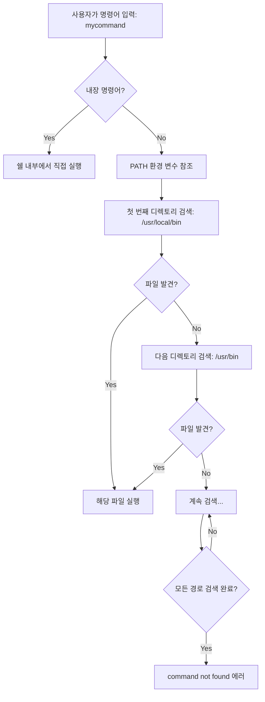
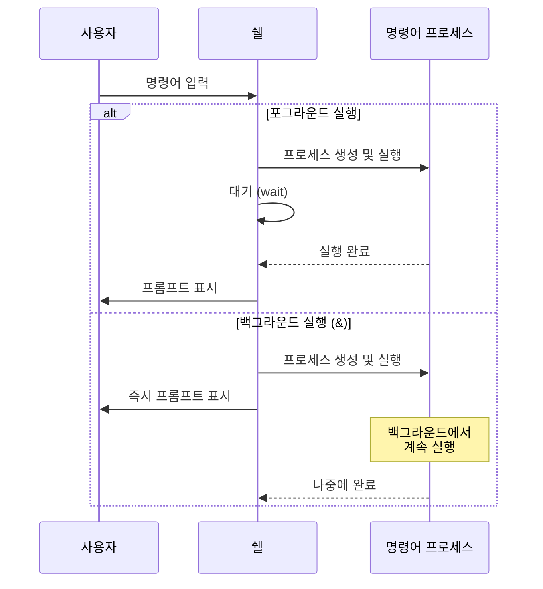
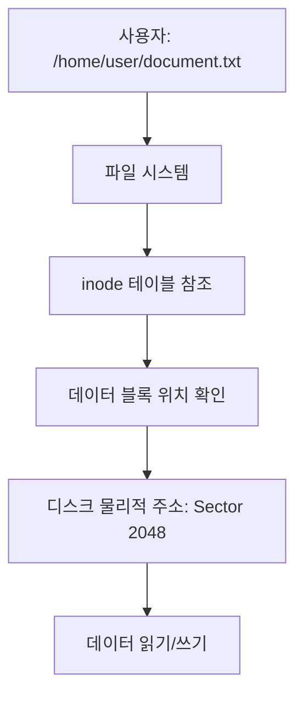
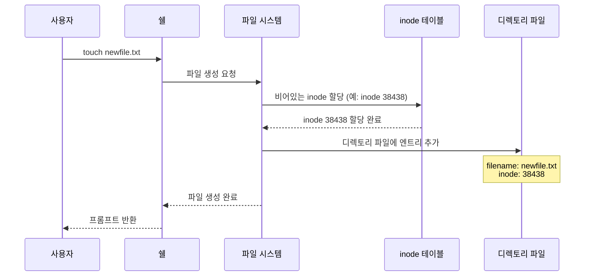
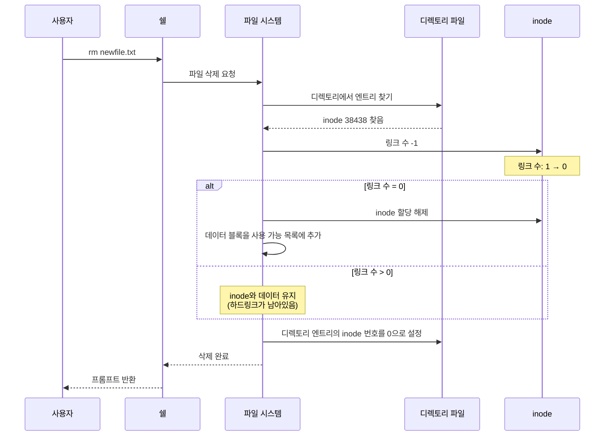
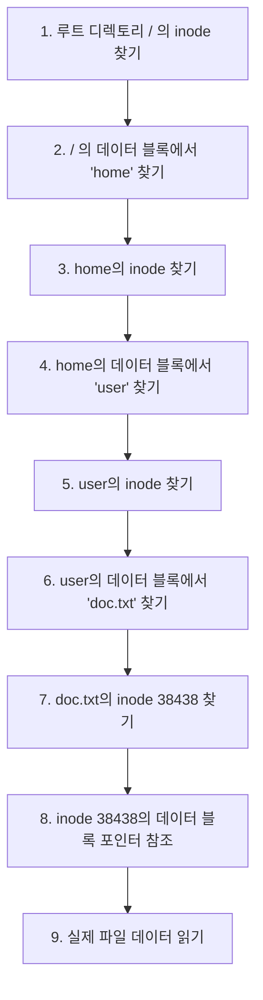
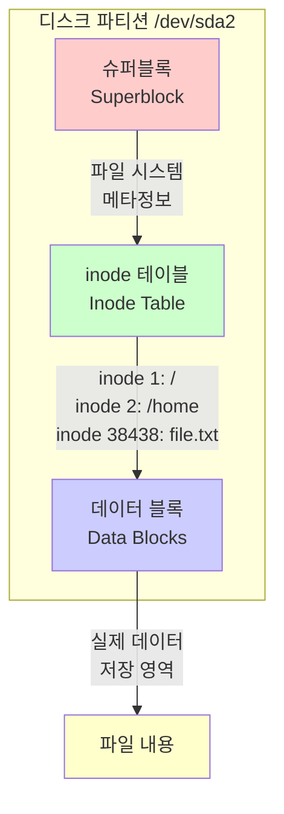
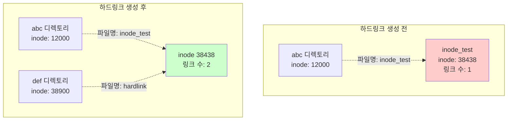
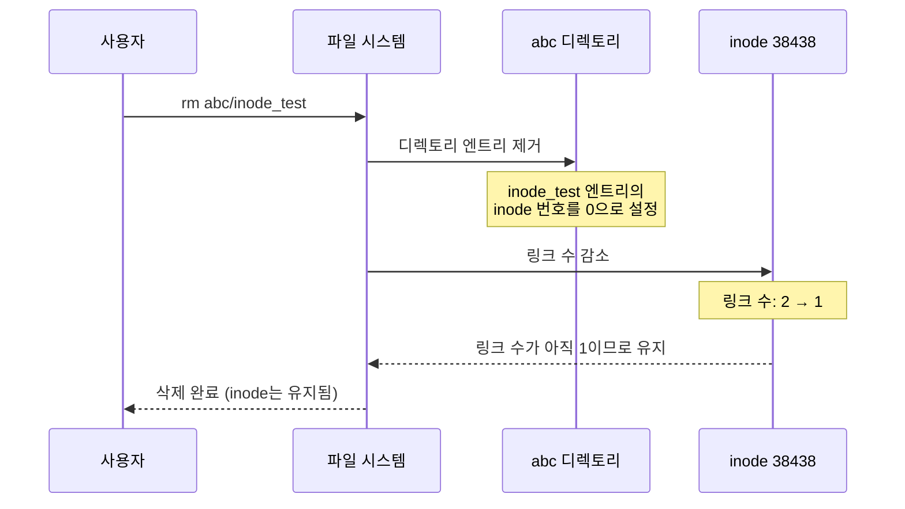
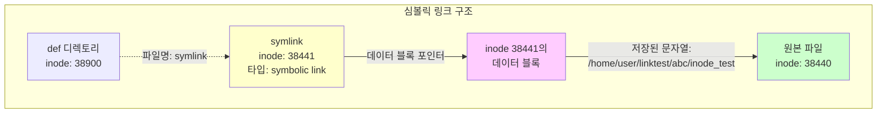

---
title: "📝 리눅스 시스템 & 쉘 기능 강의 노트 (3일차)"
date: 2025-11-26
excerpt: "주제: 쉘 기능, 파일 시스템, inode, 링크 파일, 정규식 표현, grep/awk 명령어"
categories:
  - Linux-Network
tags:
  - Linux-Network
  - SK_Rookies
---

# 📝 리눅스 시스템 & 쉘 기능 강의 노트 (3일차)

> **강의 일자**: 2025년 11월 26일
> **주제**: 쉘 기능, 파일 시스템, inode, 링크 파일, 정규식 표현, grep/awk 명령어
> **강사 강조**: "처음엔 어렵지만 기본 구조를 이해하면 실무에서 새로운 정보를 빠르게 습득할 수 있습니다"

---

## 🎯 학습 목표

이번 강의에서는 다음 내용을 학습합니다:

1. **쉘 기능 심화**: 명령어 치환, 리다이렉션, 메타 캐릭터
2. **파일 시스템 구조**: 파일 시스템의 동작 원리와 계층 구조
3. **inode 개념**: 파일 메타데이터 저장 구조
4. **링크 파일**: 하드링크와 심볼릭링크의 차이점 및 활용
5. **정규식 표현법**: 패턴 매칭을 위한 강력한 도구
6. **grep/awk 명령어**: 텍스트 검색 및 데이터 처리

---

## 📚 지난 시간 복습 (2일차 내용 요약)

### ✅ 쉘의 주요 기능

어제 학습한 쉘의 핵심 기능들을 간단히 복습하겠습니다:

#### 1. **백그라운드 처리 (`&`)**

```bash
# 포그라운드 실행 (기본)
$ command
# 명령어가 완료될 때까지 대기 → 완료 후 프롬프트 표시

# 백그라운드 실행
$ command &
[1] 12345
# 즉시 프롬프트 반환 → 명령어는 백그라운드에서 실행
```

**사용 시나리오:**
- 하나의 터미널에서 여러 작업을 동시에 수행해야 할 때
- 시간이 오래 걸리는 작업(백업, 압축, 다운로드 등)을 실행하면서 다른 작업을 계속하고 싶을 때

💡 **중요!**: 백그라운드로 실행한 프로세스는 터미널을 종료해도 계속 실행되도록 하려면 `nohup` 명령어와 함께 사용해야 합니다.

```bash
$ nohup long_running_command &
```

---

#### 2. **내장 명령어 (Built-in Commands)**

쉘은 자체적으로 내장 명령어를 제공합니다. 이들은 외부 프로그램을 실행하지 않고 쉘 내부에서 직접 처리됩니다.

**주요 내장 명령어:**

| 명령어 | 기능 | 예시 |
|:---:|:---|:---|
| `cd` | 디렉토리 변경 | `cd /home/user` |
| `alias` | 명령어 별칭 설정 | `alias ll='ls -l'` |
| `history` | 명령어 히스토리 조회 | `history \| tail -20` |
| `export` | 환경 변수 설정 | `export PATH=$PATH:/new/path` |
| `echo` | 텍스트 출력 | `echo $HOME` |

**왜 내장 명령어가 필요한가?**
- **성능**: 외부 프로세스를 생성하지 않아 실행 속도가 빠름
- **컨텍스트**: 쉘의 현재 상태(변수, 디렉토리 등)를 직접 변경 가능
- **효율성**: 자주 사용하는 명령어를 최적화하여 제공

---

#### 3. **서브쉘 (Subshell)**

특정 상황에서 쉘은 자동으로 서브쉘(자식 쉘)을 생성합니다:

**서브쉘이 생성되는 경우:**

```bash
# 1. 파이프 사용 시
$ command1 | command2
# command1과 command2는 각각 서브쉘에서 실행

# 2. 명령어 치환 (Command Substitution) 시
$ result=$(command)
# command는 서브쉘에서 실행되고 결과가 $result에 저장

# 3. 괄호 사용 시
$ (cd /tmp && ls)
# 괄호 안의 명령은 서브쉘에서 실행되므로 현재 디렉토리는 변경되지 않음
```

**서브쉘의 특징:**
- 부모 쉘의 환경을 상속받음
- 서브쉘에서 변경한 변수는 부모 쉘에 영향을 주지 않음
- 서브쉘이 종료되면 모든 변경사항은 사라짐

**실습 예제:**

```bash
# 현재 디렉토리 확인
$ pwd
/home/user

# 서브쉘에서 디렉토리 변경
$ (cd /tmp; pwd)
/tmp

# 부모 쉘의 디렉토리는 그대로
$ pwd
/home/user
```

---

#### 4. **변수 (Variables)**

##### 🔹 지역 변수 vs 환경 변수

**지역 변수 (Local Variable):**
```bash
# 정의
$ MY_VAR="Hello"

# 사용
$ echo $MY_VAR
Hello

# 특징: 현재 쉘에서만 유효
```

**환경 변수 (Environment Variable):**
```bash
# 방법 1: export 사용
$ export MY_VAR="Hello"

# 방법 2: declare -x 사용
$ declare -x MY_VAR="Hello"

# 특징: 자식 프로세스(서브쉘)에서도 사용 가능
```

**환경 변수와 지역 변수의 차이 실습:**

```bash
# 지역 변수 정의
$ LOCAL_VAR="I am local"

# 환경 변수 정의
$ export GLOBAL_VAR="I am global"

# 서브쉘 실행
$ bash
# 새로운 쉘에서 확인
$ echo $LOCAL_VAR
# (아무것도 출력되지 않음)

$ echo $GLOBAL_VAR
I am global
# 환경 변수는 상속됨!

$ exit
```

##### 🔹 변수 값 참조

변수에 저장된 값을 사용하려면 `$` 기호를 변수명 앞에 붙입니다:

```bash
$ NAME="Alice"
$ echo "Hello, $NAME"
Hello, Alice

# 중괄호를 사용하면 더 명확함
$ echo "Hello, ${NAME}!"
Hello, Alice!
```

##### 🔹 PATH 변수 관리

`PATH`는 가장 중요한 환경 변수 중 하나입니다. 명령어를 입력하면 쉘은 `PATH`에 정의된 디렉토리들을 순서대로 검색하여 해당 명령어의 실행 파일을 찾습니다.

```bash
# 현재 PATH 확인
$ echo $PATH
/usr/local/bin:/usr/bin:/bin:/usr/sbin:/sbin

# PATH에 새 경로 추가 (앞에 추가)
$ export PATH=/my/custom/path:$PATH

# PATH에 새 경로 추가 (뒤에 추가)
$ export PATH=$PATH:/another/path
```

**PATH 동작 원리:**



**실습: PATH와 명령어 검색**

```bash
# ls 명령어의 실제 위치 찾기
$ which ls
/bin/ls

# PATH에서 명령어 검색 순서 확인
$ type ls
ls is /bin/ls

# 별칭이 있는 경우
$ alias ls='ls --color=auto'
$ type ls
ls is aliased to `ls --color=auto'
```

##### 🔹 읽기 전용 변수

변수의 값을 보호하고 싶을 때 읽기 전용으로 설정할 수 있습니다:

```bash
# 읽기 전용 변수 설정
$ readonly SYSTEM_VAR="Production"

# 또는
$ declare -r SYSTEM_VAR="Production"

# 변경 시도 시 에러 발생
$ SYSTEM_VAR="Development"
-bash: SYSTEM_VAR: readonly variable
```

**사용 사례:**
- 시스템 설정 값 보호
- 쉘 스크립트에서 상수 정의
- 보안이 중요한 값 고정

##### 🔹 변수 해제

```bash
# 변수 정의
$ TEMP_VAR="temporary"

# 변수 해제
$ unset TEMP_VAR

# 확인
$ echo $TEMP_VAR
# (아무것도 출력되지 않음)
```

⚠️ **주의**: 읽기 전용 변수는 `unset`으로 제거할 수 없습니다.

---

### 📋 주요 쉘 변수 정리

| 변수명 | 설명 | 예시 |
|:---:|:---|:---|
| `HOME` | 사용자의 홈 디렉토리 | `/home/username` |
| `PATH` | 명령어 검색 경로 | `/usr/local/bin:/usr/bin:/bin` |
| `PWD` | 현재 작업 디렉토리 | `/home/user/project` |
| `USER` | 현재 사용자 이름 | `username` |
| `SHELL` | 현재 사용 중인 쉘 | `/bin/bash` |
| `PS1` | 프롬프트 표시 형식 | `[\u@\h \W]\$` |
| `LANG` | 시스템 언어 설정 | `en_US.UTF-8` |

---

#### 5. **변수 치환 (Variable Substitution)**

변수 치환을 사용하면 명령어를 더 유연하게 작성할 수 있습니다:

```bash
# 기본 치환
$ FILE="data.txt"
$ cat $FILE

# 기본값 설정
$ echo ${VAR:-default}
# VAR이 설정되지 않았거나 비어있으면 "default" 사용

# 변수가 비어있을 때만 기본값
$ echo ${VAR-default}
# VAR이 설정되지 않았을 때만 "default" 사용

# 오류 메시지 출력
$ echo ${VAR:?Error: VAR is not set}
# VAR이 설정되지 않으면 에러 메시지 출력 후 종료
```

**실무 활용 예제:**

```bash
# 설정 파일 경로가 지정되지 않으면 기본 경로 사용
$ CONFIG_FILE=${CONFIG_FILE:-/etc/myapp/config.conf}
$ cat $CONFIG_FILE
```

---

## 🔄 명령어 실행 흐름 다이어그램



---

## ✅ 복습 체크리스트

이전 강의 내용을 제대로 이해했는지 확인해보세요:

- [ ] 포그라운드와 백그라운드 실행의 차이를 설명할 수 있다
- [ ] 내장 명령어와 외부 명령어의 차이를 이해한다
- [ ] 서브쉘이 언제 생성되는지 알고 있다
- [ ] 지역 변수와 환경 변수의 차이를 구분할 수 있다
- [ ] `export` 명령어의 용도를 이해한다
- [ ] `PATH` 변수의 역할과 수정 방법을 안다
- [ ] 변수 값을 참조할 때 `$` 기호를 사용한다
- [ ] 읽기 전용 변수를 설정하고 해제할 수 있다

---

## 🎓 오늘 학습할 내용 미리보기

오늘은 쉘 기능을 마무리하고, 파일 시스템의 내부 구조를 깊이 있게 학습합니다:

1. **명령어 치환과 리다이렉션**: 명령어 결과를 변수에 저장하고 입출력을 제어하는 방법
2. **파일 시스템 심화**: 디스크가 어떻게 구성되고 파일이 저장되는지
3. **inode의 비밀**: 파일 시스템의 핵심 메타데이터 구조
4. **링크 파일**: 하드링크와 심볼릭링크의 동작 원리와 활용
5. **정규식**: 강력한 패턴 매칭 도구
6. **grep/awk**: 텍스트 처리의 핵심 명령어

💡 **강사님의 조언**: "처음에는 파일 시스템과 inode가 복잡하게 느껴질 수 있습니다. 하지만 이 기본 구조를 이해하면 나중에 실무에서 새로운 파일 시스템이나 스토리지 기술을 만나도 빠르게 이해하고 적응할 수 있습니다. 두 번, 세 번 반복해서 학습하면 점차 익숙해집니다!"

---

## 📌 학습 팁

이번 강의는 개념적으로 깊이 있는 내용을 다룹니다. 다음 방법으로 학습 효과를 높이세요:

1. **실습 중심**: 개념을 읽은 후 반드시 직접 명령어를 실행해보세요
2. **다이어그램 활용**: 복잡한 개념은 그림으로 그려보면 이해가 쉽습니다
3. **질문 메모**: 이해되지 않는 부분은 메모해두고 나중에 다시 확인하세요
4. **반복 학습**: 한 번에 모든 것을 이해하려 하지 말고, 여러 번 반복하세요

---

> **다음 섹션 예고**
> 다음 섹션에서는 파일 시스템의 구조와 파티션, 마운트 개념을 상세히 학습합니다.

## 📁 파일 시스템 구조와 inode

---

### 🎯 학습 목표

이 섹션에서는 다음을 학습합니다:
- 파일 시스템의 기본 개념과 구조
- 파티션과 마운트의 동작 원리
- inode의 개념과 역할
- 파일 생성 및 삭제 시 내부 동작

---

### 📀 파일 시스템이란?

#### 정의

**파일 시스템 (File System)**은 디스크에 데이터를 체계적으로 저장하고 관리하는 방법입니다.

운영체제는 파일 시스템을 통해:
- 파일을 생성, 읽기, 쓰기, 삭제
- 디렉토리 구조 관리
- 파일 메타데이터 (권한, 소유자, 타임스탬프 등) 저장
- 디스크 공간 효율적 관리

#### 왜 파일 시스템이 필요한가?

파일 시스템 없이 디스크를 직접 사용한다면:

```
디스크 물리적 주소: Sector 100, Block 2048, Cylinder 5...
→ 사용자가 직접 물리적 위치를 관리해야 함 (불가능!)
```

파일 시스템을 사용하면:

```
논리적 파일명: /home/user/document.txt
→ 파일 시스템이 자동으로 물리적 위치로 변환
```



---

### 🗂️ 리눅스 파일 시스템 종류

리눅스는 다양한 파일 시스템을 지원합니다:

| 파일 시스템 | 특징 | 주요 용도 |
|:---:|:---|:---|
| **ext4** | Extended File System 4세대<br/>가장 널리 사용됨 | 일반 서버, 데스크톱 |
| **ext3** | ext4의 이전 버전<br/>저널링 지원 | 레거시 시스템 |
| **XFS** | 대용량 파일 처리에 강함<br/>높은 성능 | 데이터베이스, 빅데이터 |
| **Btrfs** | Copy-on-Write 방식<br/>스냅샷, 압축 지원 | 최신 서버 환경 |
| **tmpfs** | 메모리 기반 가상 파일 시스템<br/>휘발성 | 임시 데이터, 고속 캐시 |
| **NFS** | Network File System<br/>네트워크 공유 | 원격 파일 시스템 |

💡 **강사님 팁**: "실무에서는 ext4를 가장 많이 사용하지만, 데이터베이스 서버에서는 XFS를 선호하는 경우가 많습니다. 각 파일 시스템마다 장단점이 있으므로 용도에 맞게 선택해야 합니다."

---

### 🔧 파티션 (Partition) 개념

#### 파티션이란?

**파티션**은 하나의 물리적 디스크를 여러 개의 논리적 영역으로 나누는 것입니다.

**비유**: 하나의 큰 방(디스크)을 여러 개의 작은 방(파티션)으로 칸막이를 세워 나누는 것

```
┌─────────────────────────────────────────────┐
│          물리적 디스크 (/dev/sda)           │
│  ┌──────────┬──────────────┬─────────────┐ │
│  │ Partition│  Partition   │  Partition  │ │
│  │   1      │      2       │      3      │ │
│  │ (부팅)   │   (루트)     │   (데이터)  │ │
│  │ /dev/sda1│  /dev/sda2   │  /dev/sda3  │ │
│  └──────────┴──────────────┴─────────────┘ │
└─────────────────────────────────────────────┘
```

#### 왜 파티션을 나누는가?

1. **데이터 격리**: 시스템 영역과 사용자 데이터 영역 분리
2. **보안**: 한 파티션의 문제가 다른 파티션에 영향을 주지 않음
3. **멀티 부팅**: 여러 OS 설치 가능
4. **관리 용이성**: 백업, 포맷 등을 파티션 단위로 수행

#### 📟 `fdisk` 명령어 - 파티션 정보 확인

**명령어 개요:**
- **목적**: 디스크 파티션 정보 확인 및 관리
- **사용 시나리오**: 디스크 구조 파악, 파티션 생성/삭제/수정

**기본 문법:**
```bash
fdisk [옵션] [장치명]
```

**주요 옵션 설명:**

| **옵션** | **의미** | **사용 목적** | **예시** |
|:-:|:-:|:-:|:-:|
| `-l` | List partitions | 모든 디스크의 파티션 목록 출력 | `fdisk -l` |
| `-l <device>` | List specific disk | 특정 디스크의 파티션만 출력 | `fdisk -l /dev/sda` |
| (device only) | Interactive mode | 대화형 모드로 파티션 편집 | `fdisk /dev/sdb` |

**실행 예제 1: 전체 디스크 파티션 확인**

```bash
$ sudo fdisk -l
```

**예상 출력:**
```
Disk /dev/sda: 100 GiB, 107374182400 bytes, 209715200 sectors
Disk model: VBOX HARDDISK
Units: sectors of 1 * 512 = 512 bytes
Sector size (logical/physical): 512 bytes / 512 bytes
I/O size (minimum/optimal): 512 bytes / 512 bytes
Disklabel type: gpt
Disk identifier: 12345678-1234-1234-1234-123456789ABC

Device       Start       End   Sectors  Size Type
/dev/sda1     2048   1050623   1048576  512M EFI System
/dev/sda2  1050624 209713151 208662528 99.5G Linux filesystem
```

**출력 해석:**
- **Disk /dev/sda**: 디스크 장치 이름
- **100 GiB**: 전체 디스크 용량
- **209715200 sectors**: 총 섹터 수 (1 섹터 = 512 bytes)
- **Disklabel type: gpt**: 파티션 테이블 타입 (MBR 또는 GPT)
- **Device**: 파티션 장치명
- **Start/End**: 파티션 시작/끝 섹터 번호
- **Size**: 파티션 크기
- **Type**: 파티션 타입 (EFI, Linux filesystem 등)

💡 **중요**: `/dev/sda`는 첫 번째 SATA 디스크를 의미하고, `/dev/sda1`, `/dev/sda2`는 각각 첫 번째, 두 번째 파티션을 의미합니다.

**실행 예제 2: 특정 디스크만 확인**

```bash
$ sudo fdisk -l /dev/sda
```

**실행 예제 3: 대화형 모드 (파티션 편집)**

```bash
$ sudo fdisk /dev/sdb
```

**예상 출력:**
```
Welcome to fdisk (util-linux 2.37.2).
Changes will remain in memory only, until you decide to write them.
Be careful before using the write command.

Command (m for help): m

Help:

  DOS (MBR)
   a   toggle a bootable flag
   b   edit nested BSD disklabel
   c   toggle the dos compatibility flag

  Generic
   d   delete a partition
   F   list free unpartitioned space
   l   list known partition types
   n   new partition
   p   print the partition table
   t   change a partition type
   v   verify the partition table
   i   print information about a partition

  Misc
   m   print this menu
   u   change display/entry units
   x   extra functionality (experts only)

  Save & Exit
   w   write table to disk and exit
   q   quit without saving changes

Command (m for help):
```

⚠️ **주의**: 대화형 모드에서 파티션을 수정할 때는 매우 신중해야 합니다. 잘못 수정하면 데이터가 손실될 수 있습니다. 실습 환경이 아닌 프로덕션 시스템에서는 백업 후 작업하세요!

**관련 명령어:**
- `parted`: 더 강력한 파티션 관리 도구 (GPT 완벽 지원)
- `lsblk`: 블록 디바이스 트리 구조로 출력
- `blkid`: 파티션 UUID 및 파일 시스템 타입 확인

---

### 📊 파일 시스템 생성 (`mkfs`)

파티션을 생성한 후에는 해당 파티션에 파일 시스템을 생성해야 합니다.

**명령어 개요:**
- **목적**: 파티션에 파일 시스템 구조 생성
- **사용 시나리오**: 새 디스크/파티션을 사용 가능하도록 포맷

**기본 문법:**
```bash
mkfs -t <filesystem_type> <device>
# 또는
mkfs.<filesystem_type> <device>
```

**실행 예제 1: ext4 파일 시스템 생성**

```bash
$ sudo mkfs -t ext4 /dev/sdb1
# 또는
$ sudo mkfs.ext4 /dev/sdb1
```

**예상 출력:**
```
mke2fs 1.46.5 (30-Dec-2021)
Creating filesystem with 26214400 4k blocks and 6553600 inodes
Filesystem UUID: a1b2c3d4-e5f6-7890-abcd-ef1234567890
Superblock backups stored on blocks:
        32768, 98304, 163840, 229376, 294912, 819200, 884736, 1605632, 2654208,
        4096000, 7962624, 11239424, 20480000, 23887872

Allocating group tables: done
Writing inode tables: done
Creating journal (131072 blocks): done
Writing superblocks and filesystem accounting information: done
```

**출력 해석:**
- **26214400 4k blocks**: 총 26,214,400개의 4KB 블록 생성 (약 100GB)
- **6553600 inodes**: 총 6,553,600개의 inode 생성 (파일 최대 개수)
- **Filesystem UUID**: 파일 시스템 고유 식별자
- **Superblock backups**: 슈퍼블록 백업 위치 (파일 시스템 복구 시 사용)
- **inode tables**: inode 테이블 생성 완료
- **journal**: 저널링 영역 생성 (데이터 무결성 보장)

💡 **중요**: 파일 시스템을 생성하면 해당 파티션의 모든 데이터가 삭제됩니다!

**실행 예제 2: XFS 파일 시스템 생성**

```bash
$ sudo mkfs.xfs /dev/sdb2
```

**실행 예제 3: 레이블 지정하여 생성**

```bash
$ sudo mkfs.ext4 -L "MyData" /dev/sdb1
```

레이블을 지정하면 마운트 시 디바이스 이름 대신 레이블을 사용할 수 있습니다.

---

### 🔗 마운트 (Mount) 개념

#### 마운트란?

**마운트 (Mount)**는 파일 시스템을 디렉토리 트리의 특정 위치에 연결하는 작업입니다.

**비유**: 외장 하드디스크를 컴퓨터에 연결하면 "D 드라이브"로 보이는 것처럼, 리눅스에서는 원하는 디렉토리에 파일 시스템을 "붙이는" 것

```mermaid
graph TD
    A[/ - 루트 파일 시스템<br/>/dev/sda2] --> B[/boot<br/>/dev/sda1]
    A --> C[/home<br/>/dev/sda3]
    A --> D[/data<br/>/dev/sdb1]

    style A fill:#e1f5ff
    style B fill:#ffe1e1
    style C fill:#e1ffe1
    style D fill:#fff5e1
```

#### 📟 `mount` 명령어 상세 분석

**명령어 개요:**
- **목적**: 파일 시스템을 디렉토리에 마운트
- **사용 시나리오**: 디스크, USB, 네트워크 파일 시스템 연결

**기본 문법:**
```bash
mount [옵션] <장치명> <마운트포인트>
# 또는
mount [옵션]  # 현재 마운트된 파일 시스템 목록 출력
```

**주요 옵션 설명:**

| **옵션** | **의미** | **사용 목적** | **예시** |
|:-:|:-:|:-:|:-:|
| `-t <type>` | 파일 시스템 타입 지정 | 특정 파일 시스템으로 마운트 | `mount -t ext4 /dev/sdb1 /mnt` |
| `-o <options>` | 마운트 옵션 지정 | 읽기전용, 실행권한 등 설정 | `mount -o ro,noexec /dev/sdb1 /mnt` |
| `-a` | /etc/fstab의 모든 항목 마운트 | 시스템 부팅 시 자동 마운트 | `mount -a` |
| `-r` | 읽기 전용으로 마운트 | 데이터 보호 | `mount -r /dev/sdb1 /mnt` |
| `-w` | 읽기/쓰기 모드로 마운트 | 기본값 | `mount -w /dev/sdb1 /mnt` |

**실행 예제 1: 기본 마운트**

```bash
# 마운트 포인트 디렉토리 생성
$ sudo mkdir -p /mnt/data

# 파일 시스템 마운트
$ sudo mount /dev/sdb1 /mnt/data

# 마운트 확인
$ mount | grep /mnt/data
/dev/sdb1 on /mnt/data type ext4 (rw,relatime)
```

**예상 결과:**
- `/dev/sdb1` 파티션이 `/mnt/data` 디렉토리에 마운트됨
- `rw`: 읽기/쓰기 모드
- `relatime`: 접근 시간 업데이트 최적화

**실행 예제 2: 읽기 전용 마운트**

```bash
$ sudo mount -o ro /dev/sdb1 /mnt/data

# 확인
$ mount | grep /mnt/data
/dev/sdb1 on /mnt/data type ext4 (ro,relatime)
```

**사용 시나리오**: 중요한 데이터를 실수로 수정/삭제하지 않도록 보호

**실행 예제 3: 특정 파일 시스템 타입으로 마운트**

```bash
$ sudo mount -t xfs /dev/sdb2 /mnt/xfs_data
```

**실행 예제 4: 여러 옵션 조합**

```bash
$ sudo mount -o rw,noexec,nosuid /dev/sdb1 /mnt/data
```

**옵션 설명:**
- `rw`: 읽기/쓰기 모드
- `noexec`: 실행 파일 실행 금지 (보안 강화)
- `nosuid`: SUID/SGID 비트 무시 (권한 상승 방지)

🔐 **보안**: 외부 디스크나 USB를 마운트할 때는 `noexec`, `nosuid`, `nodev` 옵션을 사용하여 악의적인 실행 파일이나 디바이스 파일로 인한 보안 위협을 차단하는 것이 좋습니다.

**실행 예제 5: UUID로 마운트**

```bash
# UUID 확인
$ sudo blkid /dev/sdb1
/dev/sdb1: UUID="a1b2c3d4-e5f6-7890-abcd-ef1234567890" TYPE="ext4"

# UUID로 마운트
$ sudo mount UUID=a1b2c3d4-e5f6-7890-abcd-ef1234567890 /mnt/data
```

💡 **강사님 팁**: "UUID를 사용하면 디바이스 이름이 변경되어도 (예: /dev/sdb → /dev/sdc) 정확한 파티션을 마운트할 수 있습니다. 특히 서버에 디스크가 많을 때 유용합니다!"

---

#### 📟 `umount` 명령어 - 마운트 해제

**명령어 개요:**
- **목적**: 마운트된 파일 시스템 해제
- **사용 시나리오**: 디스크 제거 전, 파일 시스템 점검 전

**기본 문법:**
```bash
umount <마운트포인트>
# 또는
umount <장치명>
```

**실행 예제 1: 기본 언마운트**

```bash
$ sudo umount /mnt/data
```

**실행 예제 2: 강제 언마운트**

```bash
$ sudo umount -f /mnt/data
```

⚠️ **주의**: 강제 언마운트는 데이터 손실 위험이 있으므로 최후의 수단으로만 사용하세요.

**실행 예제 3: Lazy 언마운트**

```bash
$ sudo umount -l /mnt/data
```

**설명**: 파일 시스템을 사용 중인 프로세스가 있어도 즉시 마운트 해제하고, 프로세스가 종료되면 실제로 해제합니다.

**자주 발생하는 오류: device is busy**

```bash
$ sudo umount /mnt/data
umount: /mnt/data: target is busy.
```

**원인**: 해당 파일 시스템을 사용 중인 프로세스가 있음

**해결 방법:**

```bash
# 1. 어떤 프로세스가 사용 중인지 확인
$ sudo lsof +D /mnt/data
COMMAND   PID USER   FD   TYPE DEVICE SIZE/OFF NODE NAME
bash     1234 user  cwd    DIR   8,17     4096    2 /mnt/data

# 2. 해당 디렉토리에서 빠져나오기
$ cd ~

# 3. 프로세스 종료 (필요시)
$ sudo kill 1234

# 4. 다시 언마운트 시도
$ sudo umount /mnt/data
```

---

### 📄 /etc/fstab - 영구 마운트 설정

`/etc/fstab` 파일은 시스템 부팅 시 자동으로 마운트할 파일 시스템을 정의합니다.

**파일 위치**: `/etc/fstab`

**파일 형식:**
```
<장치>  <마운트포인트>  <파일시스템타입>  <옵션>  <덤프>  <검사순서>
```

**예시:**
```bash
$ cat /etc/fstab
```

**예상 출력:**
```
# <file system>             <mount point>  <type>  <options>        <dump>  <pass>
UUID=abc123...              /              ext4    defaults         0       1
UUID=def456...              /boot          ext4    defaults         0       2
UUID=ghi789...              /home          ext4    defaults         0       2
UUID=jkl012...              /data          ext4    defaults,noexec  0       2
/swapfile                   none           swap    sw               0       0
tmpfs                       /tmp           tmpfs   defaults,size=2G 0       0
```

**각 필드 설명:**

| 필드 | 설명 | 예시 |
|:---:|:---|:---|
| **장치** | 장치명 또는 UUID | `UUID=abc123...` |
| **마운트포인트** | 마운트할 디렉토리 | `/data` |
| **파일시스템타입** | 파일 시스템 종류 | `ext4`, `xfs`, `tmpfs` |
| **옵션** | 마운트 옵션 | `defaults`, `ro`, `noexec` |
| **덤프** | 백업 대상 여부 (0=제외, 1=포함) | `0` |
| **검사순서** | fsck 검사 순서 (0=검사안함, 1=루트, 2=기타) | `2` |

**주요 마운트 옵션:**

| 옵션 | 설명 |
|:---:|:---|
| `defaults` | `rw,suid,dev,exec,auto,nouser,async` 옵션 조합 |
| `ro` | 읽기 전용 |
| `rw` | 읽기/쓰기 |
| `noexec` | 실행 파일 실행 금지 |
| `nosuid` | SUID/SGID 비트 무시 |
| `nodev` | 디바이스 파일 접근 금지 |
| `auto` | `mount -a` 시 자동 마운트 |
| `noauto` | 수동 마운트만 허용 |
| `user` | 일반 사용자 마운트 허용 |
| `nouser` | root만 마운트 가능 (기본값) |

**수정 예제: /data 파티션 추가**

```bash
# 1. UUID 확인
$ sudo blkid /dev/sdb1
/dev/sdb1: UUID="a1b2c3d4-e5f6-7890-abcd-ef1234567890" TYPE="ext4"

# 2. /etc/fstab 편집
$ sudo vi /etc/fstab

# 3. 다음 라인 추가
UUID=a1b2c3d4-e5f6-7890-abcd-ef1234567890  /data  ext4  defaults,noexec,nosuid  0  2

# 4. 문법 검증
$ sudo mount -a

# 5. 마운트 확인
$ df -h | grep /data
/dev/sdb1       100G   10G   85G  11% /data
```

⚠️ **주의**: `/etc/fstab` 파일을 잘못 수정하면 시스템이 부팅되지 않을 수 있습니다. 수정 전 반드시 백업하고, `mount -a` 명령어로 문법을 검증하세요!

---

### 📟 `df` 명령어 - 디스크 사용량 확인

**명령어 개요:**
- **목적**: 파일 시스템의 디스크 사용량 및 남은 공간 확인
- **사용 시나리오**: 디스크 공간 모니터링, 용량 부족 확인

**기본 문법:**
```bash
df [옵션] [경로]
```

**주요 옵션 설명:**

| **옵션** | **의미** | **사용 목적** | **예시** |
|:-:|:-:|:-:|:-:|
| `-h` | Human-readable | 사람이 읽기 쉬운 단위 (KB, MB, GB) | `df -h` |
| `-i` | Inodes | inode 사용량 출력 | `df -i` |
| `-T` | Type | 파일 시스템 타입 표시 | `df -T` |
| `-t <type>` | 특정 타입만 | 지정한 파일 시스템만 출력 | `df -t ext4` |
| `-x <type>` | 특정 타입 제외 | 지정한 파일 시스템 제외 | `df -x tmpfs` |

**실행 예제 1: 기본 사용**

```bash
$ df -h
```

**예상 출력:**
```
Filesystem      Size  Used Avail Use% Mounted on
/dev/sda2        98G   45G   48G  49% /
/dev/sda1       511M   15M  497M   3% /boot
/dev/sdb1       100G   10G   85G  11% /data
tmpfs           7.8G  1.2G  6.6G  16% /dev/shm
tmpfs           1.6G  1.2M  1.6G   1% /run
```

**출력 해석:**
- **Filesystem**: 파일 시스템 장치명
- **Size**: 전체 용량
- **Used**: 사용 중인 용량
- **Avail**: 사용 가능한 용량
- **Use%**: 사용률 (80% 이상 시 주의 필요!)
- **Mounted on**: 마운트 포인트

💡 **모니터링 팁**: 파일 시스템 사용률이 **80%를 넘으면** 공간 확보를 고려해야 합니다. 90% 이상은 성능 저하와 시스템 오류의 위험이 있습니다.

**실행 예제 2: 파일 시스템 타입 표시**

```bash
$ df -hT
```

**예상 출력:**
```
Filesystem     Type      Size  Used Avail Use% Mounted on
/dev/sda2      ext4       98G   45G   48G  49% /
/dev/sda1      ext4      511M   15M  497M   3% /boot
/dev/sdb1      xfs       100G   10G   85G  11% /data
tmpfs          tmpfs     7.8G  1.2G  6.6G  16% /dev/shm
```

**실행 예제 3: inode 사용량 확인**

```bash
$ df -i
```

**예상 출력:**
```
Filesystem      Inodes  IUsed   IFree IUse% Mounted on
/dev/sda2      6553600 450000 6103600    7% /
/dev/sda1       131072    312  130760    1% /boot
/dev/sdb1      6553600  50000 6503600    1% /data
```

**출력 해석:**
- **Inodes**: 총 inode 개수
- **IUsed**: 사용 중인 inode 개수
- **IFree**: 남은 inode 개수
- **IUse%**: inode 사용률

⚠️ **주의**: 디스크 공간은 남았지만 inode가 고갈되면 파일을 생성할 수 없습니다! 작은 파일이 매우 많은 시스템에서 주의가 필요합니다.

**실행 예제 4: tmpfs 제외하고 출력**

```bash
$ df -h -x tmpfs
```

**예상 출력:**
```
Filesystem      Size  Used Avail Use% Mounted on
/dev/sda2        98G   45G   48G  49% /
/dev/sda1       511M   15M  497M   3% /boot
/dev/sdb1       100G   10G   85G  11% /data
```

**사용 시나리오**: tmpfs는 메모리 기반 파일 시스템이므로 실제 디스크 사용량을 확인할 때는 제외하는 것이 유용합니다.

**실행 예제 5: 특정 디렉토리가 속한 파일 시스템 확인**

```bash
$ df -h /home/user/documents
```

**예상 출력:**
```
Filesystem      Size  Used Avail Use% Mounted on
/dev/sda2        98G   45G   48G  49% /
```

---

### 📟 `du` 명령어 - 디렉토리 용량 확인

`df`는 파일 시스템 전체 용량을, `du`는 특정 디렉토리/파일 용량을 확인합니다.

**기본 문법:**
```bash
du [옵션] [경로]
```

**주요 옵션:**

| **옵션** | **의미** | **예시** |
|:-:|:-:|:-:|
| `-h` | Human-readable | `du -h /var/log` |
| `-s` | Summary (합계만) | `du -sh /home` |
| `-a` | All files | `du -ah /tmp` |
| `-c` | 총합 표시 | `du -ch /var/log` |
| `--max-depth=N` | 탐색 깊이 제한 | `du -h --max-depth=1 /home` |

**실행 예제 1: 디렉토리 용량 확인**

```bash
$ du -sh /var/log
2.3G    /var/log
```

**실행 예제 2: 서브디렉토리 용량 비교**

```bash
$ du -h --max-depth=1 /var/log | sort -hr
2.3G    /var/log
1.8G    /var/log/journal
450M    /var/log/audit
50M     /var/log/nginx
```

**실무 활용 팁**: 디스크 용량이 부족할 때 어느 디렉토리가 공간을 많이 차지하는지 빠르게 찾을 수 있습니다.

---

### 🗂️ tmpfs - 메모리 기반 파일 시스템

#### tmpfs란?

**tmpfs**는 RAM (및 스왑)에 저장되는 가상 파일 시스템입니다.

**특징:**
- **휘발성**: 재부팅 시 모든 데이터 소실
- **고속**: 디스크보다 훨씬 빠른 읽기/쓰기
- **동적 크기**: 필요한 만큼만 메모리 사용

**사용 사례:**
- `/tmp`: 임시 파일 저장
- `/dev/shm`: 공유 메모리 영역
- `/run`: 런타임 데이터 (PID 파일, 소켓 등)

**tmpfs 확인:**

```bash
$ df -h -t tmpfs
Filesystem      Size  Used Avail Use% Mounted on
tmpfs           7.8G  1.2G  6.6G  16% /dev/shm
tmpfs           1.6G  1.2M  1.6G   1% /run
tmpfs           7.8G     0  7.8G   0% /sys/fs/cgroup
```

💡 **강사님 팁**: "tmpfs는 고속 캐시나 임시 데이터 처리에 매우 유용합니다. 예를 들어 빌드 작업이나 압축 해제 시 tmpfs를 사용하면 속도가 크게 향상됩니다."

**tmpfs 수동 생성 예제:**

```bash
# tmpfs 마운트 (크기: 2GB)
$ sudo mount -t tmpfs -o size=2G tmpfs /mnt/ramdisk

# 확인
$ df -h /mnt/ramdisk
Filesystem      Size  Used Avail Use% Mounted on
tmpfs           2.0G     0  2.0G   0% /mnt/ramdisk

# 테스트
$ sudo dd if=/dev/zero of=/mnt/ramdisk/testfile bs=1M count=1000
1000+0 records in
1000+0 records out
1048576000 bytes (1.0 GB) copied, 0.5 s, 2.1 GB/s  # 매우 빠름!
```

---

### 🧠 inode - 파일 메타데이터의 핵심

#### inode란?

**inode (index node)**는 파일의 **이름을 제외한** 모든 메타 정보를 저장하는 자료구조입니다.

💡 **핵심 개념**: "파일 = inode + 데이터 블록"

```
┌─────────────────┐      ┌──────────────────┐
│  디렉토리 파일  │      │      inode       │
├─────────────────┤      ├──────────────────┤
│ filename: doc.txt│ ──→ │ inode number:123 │
│ inode: 123       │      │ 소유자: user     │
└─────────────────┘      │ 권한: rw-r--r--  │
                         │ 크기: 1024 bytes │
                         │ 생성 시간: ...   │
                         │ 수정 시간: ...   │
                         │ 링크 수: 1       │
                         │ 데이터 블록 위치 │ ──→ 📄 실제 데이터
                         └──────────────────┘
```

#### inode에 저장되는 정보

| 항목 | 설명 |
|:---:|:---|
| **파일 형태** | 일반 파일, 디렉토리, 심볼릭 링크, 디바이스 파일 등 |
| **소유권** | 소유자(UID), 그룹(GID) |
| **권한** | 읽기/쓰기/실행 권한 (rwxrwxrwx) |
| **파일 크기** | 바이트 단위 |
| **타임스탬프** | - ctime: inode 변경 시간<br/>- mtime: 내용 수정 시간<br/>- atime: 마지막 접근 시간 |
| **링크 수** | 해당 inode를 참조하는 하드링크 개수 |
| **데이터 블록 포인터** | 실제 데이터가 저장된 디스크 블록 위치 |

⚠️ **중요**: inode에는 **파일 이름이 저장되지 않습니다!** 파일 이름은 디렉토리 파일에 저장됩니다.

---

#### inode 할당 시점

inode는 **파일 시스템 생성 시** 미리 할당됩니다.

```bash
$ sudo mkfs.ext4 /dev/sdb1
mke2fs 1.46.5 (30-Dec-2021)
Creating filesystem with 26214400 4k blocks and 6553600 inodes
...
```

위 예시에서:
- **4K 블록**: 26,214,400개 (데이터 저장 공간)
- **inode**: 6,553,600개 (파일 개수 제한)

💡 **의미**: 이 파일 시스템에는 최대 **6,553,600개의 파일**을 생성할 수 있습니다.

**과거의 문제점:**
- 예전에는 inode 개수가 고정되어 있었음
- 디스크 공간은 남았지만 inode가 부족해서 파일을 생성할 수 없는 경우 발생
- "No space left on device" 에러 (실제로는 inode 부족!)

**현재의 해결책:**
- 일부 최신 파일 시스템(Btrfs, XFS 등)은 동적 inode 할당 지원
- inode를 필요에 따라 동적으로 생성

---

#### 파일 생성 시 내부 동작

**사용자가 파일을 생성하면:**

```bash
$ touch /home/user/newfile.txt
```

**내부 동작 순서:**



**단계별 상세 설명:**

1. **inode 할당**: 사용 가능한 inode 목록에서 하나를 선택 (예: inode 38438)
2. **inode 초기화**:
   ```
   inode 38438:
   - 소유자: user (UID 1000)
   - 그룹: user (GID 1000)
   - 권한: rw-r--r-- (644)
   - 크기: 0 bytes
   - 링크 수: 1
   - 생성 시간: 2025-11-26 09:30:00
   - 데이터 블록 포인터: (없음)
   ```

3. **디렉토리 파일 업데이트**:
   `/home/user` 디렉토리의 데이터 블록에 다음 엔트리 추가:
   ```
   inode: 38438, filename: newfile.txt
   ```

---

#### 파일 삭제 시 내부 동작

**사용자가 파일을 삭제하면:**

```bash
$ rm /home/user/newfile.txt
```

**내부 동작 순서:**



**핵심 개념:**

1. **디렉토리 엔트리 제거**: inode 번호를 0으로 설정 → 파일명으로 접근 불가
2. **링크 수 감소**: inode의 링크 카운트를 1 감소
3. **링크 수 = 0일 때만 실제 삭제**:
   - inode를 사용 가능 목록에 반환
   - 데이터 블록을 사용 가능 목록에 반환

💡 **중요**: 링크 수가 0이 되어야만 inode와 데이터 블록이 "deallocate"됩니다. 이것이 하드링크의 핵심 원리입니다 (다음 섹션에서 상세히 학습).

---

#### inode 번호 확인 방법

**방법 1: `ls -i` 명령어**

```bash
$ ls -li
total 8
38438 -rw-r--r-- 1 user user 1024 Nov 26 09:30 file1.txt
38439 -rw-r--r-- 1 user user 2048 Nov 26 09:31 file2.txt
38440 drwxr-xr-x 2 user user 4096 Nov 26 09:32 mydir
```

**출력 해석:**
- 첫 번째 컬럼: **inode 번호**
- 세 번째 컬럼: **링크 수**

**방법 2: `stat` 명령어**

```bash
$ stat file1.txt
  File: file1.txt
  Size: 1024            Blocks: 8          IO Block: 4096   regular file
Device: 802h/2050d      Inode: 38438       Links: 1
Access: (0644/-rw-r--r--)  Uid: ( 1000/   user)   Gid: ( 1000/   user)
Access: 2025-11-26 09:30:00.000000000 +0900
Modify: 2025-11-26 09:30:00.000000000 +0900
Change: 2025-11-26 09:30:00.000000000 +0900
 Birth: -
```

**출력 상세 설명:**
- **Inode: 38438**: inode 번호
- **Links: 1**: 링크 수
- **Access**: 파일 접근 시간 (atime)
- **Modify**: 파일 내용 수정 시간 (mtime)
- **Change**: inode 변경 시간 (ctime)

---

### 🔍 inode와 파일명의 관계

#### 디렉토리 파일의 역할

디렉토리는 특별한 형태의 파일로, **파일명과 inode 번호의 매핑 테이블**을 저장합니다.

**디렉토리 파일 구조 (개념도):**

```
/home/user 디렉토리의 inode: 12345
↓
데이터 블록:
┌──────────────┬──────────┐
│ inode 번호   │ 파일명   │
├──────────────┼──────────┤
│ 12345        │ .        │  (자기 자신)
│ 12300        │ ..       │  (부모 디렉토리)
│ 38438        │ doc.txt  │
│ 38439        │ image.png│
│ 38440        │ mydir    │
└──────────────┴──────────┘
```

**파일 접근 과정:**

```bash
$ cat /home/user/doc.txt
```



💡 **중요**: 파일 시스템은 경로를 하나씩 분해하여 각 디렉토리의 inode를 찾아가는 방식으로 파일에 접근합니다.

---

### 📊 파일 시스템 구조 전체 다이어그램



**슈퍼블록 (Superblock):**
- 파일 시스템 전체 정보 저장
- 전체 블록 수, inode 수, 마운트 횟수 등
- 손상 시 파일 시스템 접근 불가 (백업본 존재)

**inode 테이블:**
- 모든 inode가 저장된 영역
- 파일당 하나의 inode 할당

**데이터 블록:**
- 실제 파일 내용이 저장되는 영역
- 블록 크기: 보통 4KB

---

### ✅ 학습 체크리스트

- [ ] 파일 시스템의 정의와 필요성을 설명할 수 있다
- [ ] 파티션의 개념과 용도를 이해한다
- [ ] `fdisk` 명령어로 파티션 정보를 확인할 수 있다
- [ ] `mkfs` 명령어로 파일 시스템을 생성할 수 있다
- [ ] 마운트의 개념을 이해하고 `mount`/`umount` 명령어를 사용할 수 있다
- [ ] `/etc/fstab` 파일의 구조와 역할을 이해한다
- [ ] `df` 명령어로 디스크 사용량을 확인할 수 있다
- [ ] tmpfs의 특징과 사용 사례를 안다
- [ ] inode의 정의와 저장 정보를 설명할 수 있다
- [ ] 파일 생성/삭제 시 inode의 동작을 이해한다
- [ ] `ls -i`와 `stat` 명령어로 inode 정보를 확인할 수 있다
- [ ] 디렉토리 파일이 파일명과 inode 번호를 매핑한다는 것을 안다

---

### 📋 핵심 요약

1. **파일 시스템**: 디스크에 데이터를 체계적으로 저장/관리하는 구조
2. **파티션**: 물리적 디스크를 논리적으로 나누는 것
3. **마운트**: 파일 시스템을 디렉토리 트리에 연결하는 작업
4. **inode**: 파일의 메타데이터(이름 제외)를 저장하는 핵심 구조
5. **디렉토리 파일**: 파일명과 inode 번호의 매핑 테이블
6. **파일 삭제**: 디렉토리 엔트리 제거 + 링크 수 감소 → 링크 수 0일 때 실제 삭제

---

> **다음 섹션 예고**
> 다음 섹션에서는 하드링크와 심볼릭링크의 차이점과 내부 동작 원리를 상세히 학습합니다.

## 🔗 링크 파일 (Link Files)

---

### 🎯 학습 목표

이 섹션에서는 다음을 학습합니다:
- 링크 파일의 개념과 필요성
- 하드링크와 심볼릭링크의 근본적인 차이
- `ln` 명령어 사용법
- 링크 파일의 내부 동작 원리
- 보안 고려사항

---

### 💡 링크 파일이란?

**링크 파일 (Link File)**은 기존 파일을 다른 이름이나 위치에서 접근할 수 있도록 하는 메커니즘입니다.

**비유:**
- **하드링크**: 같은 건물(파일)에 대한 여러 개의 정문 (모든 문이 동등)
- **심볼릭링크**: 건물을 가리키는 이정표나 바로가기 (원본이 사라지면 의미 없음)

**왜 링크 파일이 필요한가?**

1. **디스크 공간 절약**: 같은 파일을 복사하지 않고 여러 위치에서 접근
2. **버전 관리**: 특정 버전을 가리키는 링크 생성 (예: `python3` → `python3.11`)
3. **호환성 유지**: 경로 변경 시 기존 링크 유지
4. **관리 편의성**: 복잡한 경로를 간단한 링크로 대체

---

### 🔨 하드링크 (Hard Link)

#### 하드링크의 정의

**하드링크**는 **동일한 inode를 가리키는 또 다른 파일명**입니다.

💡 **핵심 개념**: 하드링크를 생성하면 새로운 inode를 할당하는 것이 아니라, 기존 inode를 가리키는 디렉토리 엔트리만 추가됩니다.

```
원본 파일과 하드링크는 완전히 동등한 파일입니다!
원본/복사본 구분이 없으며, 둘 다 같은 inode를 공유합니다.
```

---

#### 📟 `ln` 명령어 - 하드링크 생성

**명령어 개요:**
- **목적**: 하드링크 또는 심볼릭링크 생성
- **사용 시나리오**: 파일을 여러 위치에서 접근, 버전 관리

**기본 문법:**
```bash
# 하드링크 생성
ln <원본파일> <링크파일>

# 심볼릭링크 생성
ln -s <원본파일> <링크파일>
```

**주요 옵션 설명:**

| **옵션** | **의미** | **사용 목적** | **예시** |
|:-:|:-:|:-:|:-:|
| (없음) | 하드링크 생성 | 동일 inode 공유 | `ln file1 file2` |
| `-s` | 심볼릭링크 생성 | 원본 경로 참조 | `ln -s file1 link1` |
| `-f` | 기존 링크 강제 덮어쓰기 | 링크 재생성 | `ln -sf file1 link1` |
| `-v` | 상세 정보 출력 | 작업 확인 | `ln -v file1 file2` |
| `-i` | 덮어쓰기 전 확인 | 실수 방지 | `ln -i file1 file2` |

---

#### 하드링크 생성 실습

**실습 환경 준비:**

```bash
# 실습 디렉토리 생성
$ mkdir -p ~/linktest/abc
$ mkdir -p ~/linktest/def
$ cd ~/linktest
```

**실행 예제 1: 기본 하드링크 생성**

```bash
# 원본 파일 생성
$ cd ~/linktest/abc
$ echo "This is original file" > inode_test

# 파일 확인
$ ls -li inode_test
38438 -rw-r--r-- 1 user user 21 Nov 26 10:00 inode_test
```

**출력 해석:**
- **38438**: inode 번호
- **1**: 링크 수 (현재 이 파일을 가리키는 이름이 1개)

**하드링크 생성:**

```bash
# def 디렉토리로 이동
$ cd ~/linktest/def

# 하드링크 생성
$ ln ~/linktest/abc/inode_test hardlink

# 링크 파일 확인
$ ls -li hardlink
38438 -rw-r--r-- 2 user user 21 Nov 26 10:00 hardlink
```

**중요한 변화:**
- **inode 번호 38438**: 원본과 동일!
- **링크 수 2**: 1에서 2로 증가!

**원본 파일 재확인:**

```bash
$ cd ~/linktest/abc
$ ls -li inode_test
38438 -rw-r--r-- 2 user user 21 Nov 26 10:00 inode_test
```

**링크 수가 2로 증가**했습니다! 이제 `inode_test`와 `hardlink`는 **완전히 동일한 파일**입니다.

---

#### 하드링크 내부 동작 원리



**상세 설명:**

1. **하드링크 생성 전**:
   ```
   abc 디렉토리 (inode 12000) 데이터 블록:
   ┌──────────────┬──────────────┐
   │ inode 번호   │ 파일명       │
   ├──────────────┼──────────────┤
   │ 38438        │ inode_test   │
   └──────────────┴──────────────┘

   inode 38438:
   - 링크 수: 1
   - 데이터 블록: 0x1234
   ```

2. **하드링크 생성 (`ln ~/linktest/abc/inode_test hardlink`)**:
   ```
   def 디렉토리 (inode 38900) 데이터 블록에 추가:
   ┌──────────────┬──────────────┐
   │ inode 번호   │ 파일명       │
   ├──────────────┼──────────────┤
   │ 38438        │ hardlink     │  ← 새로 추가!
   └──────────────┴──────────────┘

   inode 38438:
   - 링크 수: 2  ← 1에서 2로 증가!
   - 데이터 블록: 0x1234 (동일)
   ```

💡 **핵심**: 새로운 inode를 할당하지 않고, 기존 inode 38438을 가리키는 디렉토리 엔트리만 추가합니다!

---

#### 하드링크의 특징

**1. 완전히 동등한 파일**

```bash
# 원본 파일 수정
$ echo "Modified content" >> ~/linktest/abc/inode_test

# 하드링크에서 확인
$ cat ~/linktest/def/hardlink
This is original file
Modified content  # 동일한 내용!

# 하드링크에서 수정
$ echo "Another change" >> ~/linktest/def/hardlink

# 원본 파일 확인
$ cat ~/linktest/abc/inode_test
This is original file
Modified content
Another change  # 역시 동일!
```

**2. 원본/복사본 구분 없음**

어떤 파일을 먼저 만들었는지는 중요하지 않습니다. 둘 다 같은 inode를 가리키므로 동등합니다.

**3. 권한, 소유자도 공유**

```bash
# 원본 파일 권한 변경
$ chmod 644 ~/linktest/abc/inode_test

# 하드링크도 자동 반영
$ ls -l ~/linktest/def/hardlink
-rw-r--r-- 2 user user 21 Nov 26 10:00 hardlink
```

---

#### 파일 삭제 시 하드링크 동작

**실습: 하드링크가 있을 때 파일 삭제**

```bash
# 현재 상태 확인
$ ls -li ~/linktest/abc/inode_test ~/linktest/def/hardlink
38438 -rw-r--r-- 2 user user 21 Nov 26 10:00 abc/inode_test
38438 -rw-r--r-- 2 user user 21 Nov 26 10:00 def/hardlink
```

**원본 파일 삭제:**

```bash
$ rm ~/linktest/abc/inode_test
$ ls -li ~/linktest/def/hardlink
38438 -rw-r--r-- 1 user user 21 Nov 26 10:00 hardlink
```

**변화:**
- **링크 수**: 2 → 1로 감소
- **파일 내용**: 그대로 유지!
- **inode 38438**: 여전히 할당된 상태

```bash
$ cat ~/linktest/def/hardlink
This is original file
Modified content
Another change
# 데이터는 전혀 손실되지 않음!
```

**내부 동작:**



**마지막 링크까지 삭제:**

```bash
$ rm ~/linktest/def/hardlink
```

**내부 동작:**
1. `def` 디렉토리에서 `hardlink` 엔트리 제거
2. inode 38438의 링크 수 감소: 1 → 0
3. **링크 수 = 0**: inode와 데이터 블록 할당 해제 (deallocate)
4. 이제 데이터에 접근할 방법이 없음 (완전 삭제)

💡 **핵심**: 하드링크는 링크 수 (link count)가 0이 될 때까지 파일을 보호합니다.

---

#### 하드링크의 제약사항

**1. 동일 파일 시스템 내에서만 가능**

```bash
# 동일 파티션 내: 가능
$ ln /home/user/file1 /home/user/backup/file1_link  # OK

# 다른 파티션: 불가능
$ ln /home/user/file1 /data/file1_link
ln: failed to create hard link '/data/file1_link' => '/home/user/file1': Invalid cross-device link
```

**이유:**
- inode 번호는 파티션(파일 시스템)마다 독립적으로 관리됨
- 파티션 A의 inode 123과 파티션 B의 inode 123은 완전히 다른 파일
- 다른 파티션의 inode를 참조할 수 없음

**2. 디렉토리에는 하드링크 생성 불가**

```bash
$ mkdir testdir
$ ln testdir testdir_link
ln: testdir: hard link not allowed for directory
```

**이유:**
- 디렉토리에 하드링크를 허용하면 순환 참조 (circular reference) 발생 가능
- 파일 시스템의 트리 구조가 깨질 수 있음
- 무한 루프 위험

⚠️ **예외**: `.`과 `..`는 사실상 디렉토리에 대한 하드링크이지만, 시스템이 특별히 관리합니다.

---

### 🔗 심볼릭 링크 (Symbolic Link / Soft Link)

#### 심볼릭 링크의 정의

**심볼릭 링크 (Symbolic Link, Symlink)**는 **원본 파일의 경로를 저장하는 특별한 파일**입니다.

💡 **핵심 개념**: 심볼릭 링크는 독립된 inode를 가지며, 데이터 블록에 원본 파일의 경로(문자열)를 저장합니다.

```
심볼릭 링크 = Windows의 바로가기와 유사
```

---

#### 📟 `ln -s` 명령어 - 심볼릭 링크 생성

**기본 문법:**
```bash
ln -s <원본파일경로> <링크파일>
```

**실행 예제 1: 기본 심볼릭 링크 생성**

```bash
# 원본 파일 재생성
$ cd ~/linktest/abc
$ echo "Original content" > inode_test

# 원본 파일 정보 확인
$ ls -li inode_test
38440 -rw-r--r-- 1 user user 17 Nov 26 10:30 inode_test

# 심볼릭 링크 생성
$ cd ~/linktest/def
$ ln -s ~/linktest/abc/inode_test symlink

# 링크 파일 확인
$ ls -li symlink
38441 lrwxrwxrwx 1 user user 28 Nov 26 10:31 symlink -> /home/user/linktest/abc/inode_test
```

**중요한 차이점:**
- **inode 번호 38441**: 원본과 다름! (새로운 inode 할당)
- **파일 타입 `l`**: 심볼릭 링크임을 나타냄
- **권한 `rwxrwxrwx`**: 심볼릭 링크는 항상 777 (실제 권한은 원본 파일 기준)
- **링크 수 1**: 원본 파일의 링크 수는 증가하지 않음
- **화살표 표시**: `symlink -> /home/user/linktest/abc/inode_test`

---

#### 심볼릭 링크 내부 동작 원리



**상세 설명:**

1. **심볼릭 링크 파일의 inode (38441)**:
   ```
   inode 38441:
   - 파일 타입: symbolic link
   - 권한: lrwxrwxrwx (777)
   - 크기: 28 bytes (경로 문자열 길이)
   - 링크 수: 1
   - 데이터 블록 포인터: 0x5678
   ```

2. **데이터 블록 (0x5678)**:
   ```
   내용: "/home/user/linktest/abc/inode_test"
   (원본 파일의 경로를 문자열로 저장)
   ```

3. **파일 접근 시 동작**:
   ```bash
   $ cat ~/linktest/def/symlink
   ```

   **과정:**
   1. `symlink`의 inode 38441 참조
   2. 파일 타입이 심볼릭 링크임을 확인
   3. 데이터 블록 읽기: `/home/user/linktest/abc/inode_test`
   4. 해당 경로로 다시 파일 검색
   5. `inode_test` (inode 38440)의 실제 데이터 읽기

---

#### 심볼릭 링크의 특징

**1. 독립된 파일**

```bash
# 심볼릭 링크와 원본 파일은 다른 inode
$ ls -li ~/linktest/abc/inode_test ~/linktest/def/symlink
38440 -rw-r--r-- 1 user user 17 Nov 26 10:30 abc/inode_test
38441 lrwxrwxrwx 1 user user 28 Nov 26 10:31 def/symlink -> ...
```

**2. 파일 시스템 경계를 넘을 수 있음**

```bash
# 다른 파티션의 파일도 심볼릭 링크 가능
$ ln -s /data/project/file.txt ~/mylink  # OK!

# 네트워크 파일 시스템도 가능
$ ln -s /mnt/nfs/shared/data ~/shared_data  # OK!
```

**3. 원본 파일의 타입과 무관**

```bash
# 일반 파일
$ ln -s file.txt link_file

# 디렉토리 (하드링크는 불가능하지만 심볼릭 링크는 가능!)
$ ln -s /var/log logdir

# 디바이스 파일
$ ln -s /dev/sda1 mydisk
```

**4. 상대 경로와 절대 경로**

```bash
# 절대 경로 (권장)
$ ln -s /home/user/file.txt link1

# 상대 경로
$ ln -s ../abc/file.txt link2
```

⚠️ **주의**: 상대 경로로 심볼릭 링크를 생성하면, 링크 파일의 위치를 이동할 때 경로가 깨질 수 있습니다. 가능하면 절대 경로 사용을 권장합니다.

---

#### 원본 파일 삭제 시 심볼릭 링크 동작

**실습: 원본 파일 삭제 후 심볼릭 링크**

```bash
# 심볼릭 링크로 파일 읽기 (정상)
$ cat ~/linktest/def/symlink
Original content

# 원본 파일 삭제
$ rm ~/linktest/abc/inode_test

# 심볼릭 링크는 여전히 존재하지만...
$ ls -l ~/linktest/def/symlink
lrwxrwxrwx 1 user user 28 Nov 26 10:31 symlink -> /home/user/linktest/abc/inode_test

# 접근 시도 시 에러
$ cat ~/linktest/def/symlink
cat: symlink: No such file or directory
```

💡 **상태**: 이를 **dangling symlink** 또는 **broken link**라고 합니다.

**시각적 표시:**

```bash
# 일부 터미널에서는 깨진 심볼릭 링크를 빨간색으로 표시
$ ls -l ~/linktest/def/
lrwxrwxrwx 1 user user 28 Nov 26 10:31 symlink -> /home/user/linktest/abc/inode_test
                                                    ^^^^^^^^^^^^^^^^^^^^^^^^^^^^^^^^^^^^^^^^
                                                    (빨간색으로 표시됨 - broken link)
```

**찾기:**

```bash
# 깨진 심볼릭 링크 찾기
$ find ~/linktest -xtype l
/home/user/linktest/def/symlink
```

---

#### 심볼릭 링크의 권한

**실습: 심볼릭 링크의 권한 확인**

```bash
# 원본 파일 재생성
$ echo "Test content" > ~/linktest/abc/inode_test
$ chmod 644 ~/linktest/abc/inode_test

# 심볼릭 링크 재생성
$ ln -sf ~/linktest/abc/inode_test ~/linktest/def/symlink

# 권한 확인
$ ls -l ~/linktest/abc/inode_test
-rw-r--r-- 1 user user 13 Nov 26 10:40 inode_test

$ ls -l ~/linktest/def/symlink
lrwxrwxrwx 1 user user 28 Nov 26 10:40 symlink -> ...
```

**심볼릭 링크의 권한은 항상 `rwxrwxrwx` (777)**이지만, **실제 접근 권한은 원본 파일의 권한을 따릅니다**.

**확인:**

```bash
# 원본 파일을 읽기 전용으로 변경
$ chmod 444 ~/linktest/abc/inode_test

# 심볼릭 링크로 쓰기 시도
$ echo "Write test" >> ~/linktest/def/symlink
bash: symlink: Permission denied  # 원본 파일 권한을 따름!
```

---

### 📊 하드링크 vs 심볼릭링크 비교표

| 구분 | 하드링크 | 심볼릭링크 |
|:---:|:---|:---|
| **inode** | 원본과 동일 inode 공유 | 별도의 inode 할당 |
| **링크 수** | 원본의 링크 수 증가 | 증가하지 않음 |
| **데이터** | 동일한 데이터 블록 공유 | 원본 경로 문자열 저장 |
| **원본 삭제 시** | 링크 파일로 접근 가능 (데이터 유지) | 접근 불가 (broken link) |
| **파일 시스템 경계** | 동일 파일 시스템 내만 가능 | 다른 파일 시스템도 가능 |
| **디렉토리 링크** | 불가능 | 가능 |
| **생성 명령** | `ln file1 file2` | `ln -s file1 link1` |
| **파일 타입** | 원본과 동일 (`-`, `d` 등) | `l` (symbolic link) |
| **권한** | 원본과 완전 동일 | 항상 777 (원본 권한 따름) |
| **용도** | 백업, 동일 파일 다중 접근 | 바로가기, 버전 관리 |

---

### 🎯 실무 활용 시나리오

#### 시나리오 1: 소프트웨어 버전 관리

```bash
# Python 여러 버전 설치
$ ls -l /usr/bin/python*
-rwxr-xr-x 1 root root 4096 Nov 01 2024 /usr/bin/python3.9
-rwxr-xr-x 1 root root 4096 Nov 15 2024 /usr/bin/python3.10
-rwxr-xr-x 1 root root 4096 Nov 20 2024 /usr/bin/python3.11

# 기본 버전 지정 (심볼릭 링크 사용)
$ sudo ln -sf /usr/bin/python3.11 /usr/bin/python3
$ sudo ln -sf /usr/bin/python3.11 /usr/bin/python

# 사용자는 단순히 python3 실행
$ python3 --version
Python 3.11.0

# 버전 변경 시 링크만 수정
$ sudo ln -sf /usr/bin/python3.9 /usr/bin/python3
$ python3 --version
Python 3.9.0
```

**장점**: 스크립트나 애플리케이션 코드 수정 없이 버전 전환 가능

---

#### 시나리오 2: 로그 파일 통합 관리

```bash
# 여러 서비스의 로그를 한 곳에 모으기
$ mkdir -p /var/log/centralized

# 심볼릭 링크로 통합
$ ln -s /var/log/nginx/access.log /var/log/centralized/nginx_access.log
$ ln -s /var/log/apache2/error.log /var/log/centralized/apache_error.log
$ ln -s /var/log/mysql/error.log /var/log/centralized/mysql_error.log

# 관리자는 한 디렉토리만 모니터링
$ ls -l /var/log/centralized/
lrwxrwxrwx 1 root root 28 Nov 26 11:00 nginx_access.log -> /var/log/nginx/access.log
lrwxrwxrwx 1 root root 29 Nov 26 11:00 apache_error.log -> /var/log/apache2/error.log
lrwxrwxrwx 1 root root 25 Nov 26 11:00 mysql_error.log -> /var/log/mysql/error.log
```

---

#### 시나리오 3: 백업 파일 보호 (하드링크 활용)

```bash
# 원본 파일
$ echo "Important data" > /data/original.txt

# 하드링크로 백업
$ ln /data/original.txt /backup/original_backup.txt

# 링크 수 확인
$ ls -li /data/original.txt /backup/original_backup.txt
38450 -rw-r--r-- 2 user user 15 Nov 26 11:10 /data/original.txt
38450 -rw-r--r-- 2 user user 15 Nov 26 11:10 /backup/original_backup.txt

# 실수로 원본 삭제해도...
$ rm /data/original.txt

# 백업 파일로 복구 가능!
$ cat /backup/original_backup.txt
Important data

# 다시 복원
$ ln /backup/original_backup.txt /data/original.txt
```

💡 **활용**: 하드링크를 사용한 백업은 디스크 공간을 절약하면서도 실수로 삭제된 파일을 보호할 수 있습니다.

---

### 🔐 보안 고려사항

#### 위협 1: 심볼릭 링크를 통한 권한 상승

**시나리오**: 악의적인 사용자가 시스템 파일을 가리키는 심볼릭 링크를 생성

```bash
# 공격자 (일반 사용자)
$ ln -s /etc/passwd ~/public_html/passwd

# 웹 서버가 심볼릭 링크를 허용하는 경우
# http://server/~attacker/passwd 접근 시 /etc/passwd 내용 노출!
```

**대응 방안:**

**1. 웹 서버 설정에서 심볼릭 링크 제한**

Apache 설정 예시:
```apache
<Directory /var/www/html>
    Options -FollowSymLinks
    # 또는
    Options SymLinksIfOwnerMatch  # 소유자가 같을 때만 허용
</Directory>
```

**2. 애플리케이션 레벨에서 검증**

```bash
# 실제 경로 확인
$ realpath ~/public_html/passwd
/etc/passwd  # 위험! 허용된 디렉토리 밖

# 접근 차단
```

---

#### 위협 2: 심볼릭 링크를 이용한 파일 덮어쓰기 공격

**시나리오**: Race Condition을 이용한 공격

```bash
# 공격자가 /tmp/tempfile을 중요 파일로 링크
$ ln -sf /etc/shadow /tmp/tempfile

# 권한 있는 프로세스가 /tmp/tempfile에 쓰기 시도
# → 실제로는 /etc/shadow를 덮어씀!
```

**대응 방안:**

**1. 안전한 임시 파일 생성**

```bash
# 위험: 예측 가능한 파일명
$ echo "data" > /tmp/myapp.tmp

# 안전: mktemp 사용
$ TEMPFILE=$(mktemp)
$ echo "data" > "$TEMPFILE"
```

**2. O_NOFOLLOW 플래그 사용 (프로그래밍)**

```c
// 심볼릭 링크를 따라가지 않음
int fd = open("/tmp/file", O_WRONLY | O_CREAT | O_NOFOLLOW, 0644);
```

---

#### 위협 3: 하드링크를 통한 파일 보존 (로그 위변조)

**시나리오**: 공격자가 로그 파일을 하드링크로 백업하여 증거 인멸 시도

```bash
# 공격자가 로그 파일을 하드링크로 백업
$ ln /var/log/auth.log /tmp/.hidden_log

# 공격 수행 후 로그 삭제
$ sudo rm /var/log/auth.log

# 관리자는 로그가 삭제된 줄 알지만, 공격자는 /tmp/.hidden_log에 여전히 접근 가능
```

**대응 방안:**

**1. 로그 디렉토리 권한 강화**

```bash
# 일반 사용자가 하드링크 생성 불가하도록 설정
$ sudo chown root:root /var/log
$ sudo chmod 755 /var/log  # 쓰기 권한 제거
```

**2. 로그 파일 권한 제한**

```bash
$ sudo chmod 600 /var/log/auth.log  # root만 읽기/쓰기 가능
```

**3. 원격 로그 서버 사용**

```bash
# syslog를 원격 서버로 전송
$ sudo vi /etc/rsyslog.conf
*.* @@remote-log-server:514
```

---

#### 위협 4: 링크를 이용한 Privilege Escalation

**시나리오**: SUID 프로그램이 심볼릭 링크를 따라갈 때

```bash
# SUID 프로그램이 /tmp/config를 읽는다고 가정
$ ln -s /etc/shadow /tmp/config

# SUID 프로그램 실행 시 /etc/shadow 내용이 노출될 수 있음
```

**대응 방안:**

**1. 안전한 경로만 사용**

- 시스템 디렉토리 (`/etc`, `/var`) 사용
- `/tmp`, `/home` 등 사용자 쓰기 가능 영역 회피

**2. 경로 검증**

```bash
# 심볼릭 링크인지 확인
$ [ -L /tmp/config ] && echo "Warning: symlink detected!"
```

---

### 🔧 실습 가이드

#### 실습 1: 하드링크 동작 확인

**목표**: 하드링크의 링크 수 변화와 파일 삭제 시 동작을 이해합니다.

```bash
# 1. 실습 환경 준비
$ mkdir -p ~/hardlink_test
$ cd ~/hardlink_test

# 2. 원본 파일 생성
$ echo "Original data" > file1.txt
$ ls -li file1.txt
38500 -rw-r--r-- 1 user user 14 Nov 26 11:30 file1.txt
# 링크 수: 1

# 3. 하드링크 생성
$ ln file1.txt file2.txt
$ ls -li file1.txt file2.txt
38500 -rw-r--r-- 2 user user 14 Nov 26 11:30 file1.txt
38500 -rw-r--r-- 2 user user 14 Nov 26 11:30 file2.txt
# inode 동일, 링크 수: 2

# 4. 추가 하드링크 생성
$ ln file1.txt file3.txt
$ ls -li file*.txt
38500 -rw-r--r-- 3 user user 14 Nov 26 11:30 file1.txt
38500 -rw-r--r-- 3 user user 14 Nov 26 11:30 file2.txt
38500 -rw-r--r-- 3 user user 14 Nov 26 11:30 file3.txt
# 링크 수: 3

# 5. 파일 수정 테스트
$ echo "Modified" >> file2.txt
$ cat file1.txt
Original data
Modified
$ cat file3.txt
Original data
Modified
# 모든 하드링크에 반영됨

# 6. 파일 삭제 테스트
$ rm file1.txt
$ ls -li file*.txt
38500 -rw-r--r-- 2 user user 23 Nov 26 11:31 file2.txt
38500 -rw-r--r-- 2 user user 23 Nov 26 11:31 file3.txt
# 링크 수: 2 (file1 삭제되었지만 데이터는 유지)

$ rm file2.txt
$ ls -li file*.txt
38500 -rw-r--r-- 1 user user 23 Nov 26 11:31 file3.txt
# 링크 수: 1

$ rm file3.txt
# 마지막 링크 삭제 → inode와 데이터 블록 완전히 해제
```

---

#### 실습 2: 심볼릭 링크와 경로

**목표**: 절대 경로와 상대 경로 심볼릭 링크의 차이를 이해합니다.

```bash
# 1. 실습 환경 준비
$ mkdir -p ~/symlink_test/dir1/dir2
$ cd ~/symlink_test/dir1
$ echo "Test file" > original.txt

# 2. 절대 경로 심볼릭 링크
$ ln -s ~/symlink_test/dir1/original.txt ~/symlink_test/absolute_link
$ cat ~/symlink_test/absolute_link
Test file  # 정상 동작

# 3. 상대 경로 심볼릭 링크
$ cd ~/symlink_test
$ ln -s dir1/original.txt relative_link
$ cat relative_link
Test file  # 정상 동작

# 4. 링크 파일 이동 테스트
$ mv relative_link dir2/
$ cat dir2/relative_link
cat: dir2/relative_link: No such file or directory
# 상대 경로가 깨짐! (dir2에서 dir1/original.txt를 찾을 수 없음)

$ cat absolute_link
Test file  # 절대 경로는 여전히 정상

# 5. 링크 경로 확인
$ readlink relative_link
dir1/original.txt  # 상대 경로

$ readlink absolute_link
/home/user/symlink_test/dir1/original.txt  # 절대 경로
```

**교훈**: 링크 파일을 이동할 가능성이 있다면 절대 경로를 사용하세요!

---

#### 실습 3: 깨진 심볼릭 링크 찾기

**목표**: 시스템 내 broken symlink를 찾고 정리합니다.

```bash
# 1. 테스트 환경 준비
$ mkdir -p ~/broken_test
$ cd ~/broken_test
$ echo "data" > file1.txt
$ ln -s file1.txt link1
$ ln -s file2.txt link2  # file2.txt는 존재하지 않음
$ rm file1.txt  # link1이 깨짐

# 2. 심볼릭 링크 확인
$ ls -l
lrwxrwxrwx 1 user user 9 Nov 26 11:40 link1 -> file1.txt  # 빨간색 (깨짐)
lrwxrwxrwx 1 user user 9 Nov 26 11:40 link2 -> file2.txt  # 빨간색 (깨짐)

# 3. 깨진 심볼릭 링크 찾기
$ find ~/broken_test -xtype l
/home/user/broken_test/link1
/home/user/broken_test/link2

# 4. 깨진 링크 자동 삭제
$ find ~/broken_test -xtype l -delete
$ ls -l
# (링크 파일이 모두 삭제됨)
```

**실무 활용**: 시스템 전체에서 깨진 링크를 찾아 정리할 때 유용합니다.

```bash
# 전체 시스템 검사 (시간이 오래 걸림)
$ sudo find / -xtype l 2>/dev/null
```

---

### ✅ 학습 체크리스트

- [ ] 하드링크와 심볼릭링크의 차이를 명확히 설명할 수 있다
- [ ] `ln` 명령어로 하드링크를 생성할 수 있다
- [ ] `ln -s` 명령어로 심볼릭링크를 생성할 수 있다
- [ ] 링크 수의 의미와 변화를 이해한다
- [ ] 하드링크는 동일 파일 시스템 내에서만 가능함을 안다
- [ ] 심볼릭링크는 파일 시스템 경계를 넘을 수 있음을 안다
- [ ] 원본 파일 삭제 시 하드링크와 심볼릭링크의 동작 차이를 이해한다
- [ ] 깨진 심볼릭 링크를 찾고 정리할 수 있다
- [ ] 심볼릭 링크의 보안 위협과 대응 방안을 안다

---

### 📋 핵심 요약

1. **하드링크**: 같은 inode를 가리키는 또 다른 이름 (완전히 동등한 파일)
2. **심볼릭링크**: 원본 파일의 경로를 저장하는 특별한 파일 (바로가기)
3. **링크 수**: 해당 inode를 가리키는 하드링크 개수
4. **파일 삭제**: 링크 수가 0이 될 때까지 데이터는 유지됨
5. **하드링크 제약**: 동일 파일 시스템, 디렉토리 불가
6. **심볼릭링크 장점**: 파일 시스템 경계 무관, 디렉토리 가능
7. **보안**: 심볼릭 링크는 권한 상승이나 파일 노출 위험이 있으므로 주의

---

> **다음 섹션 예고**
> 다음 섹션에서는 정규식 표현법 (Regular Expression)을 학습하여 강력한 패턴 매칭 능력을 습득합니다.

## 🔤 정규식 표현법 (Regular Expressions)

---

### 🎯 학습 목표

이 섹션에서는 다음을 학습합니다:
- 정규식의 개념과 필요성
- 기본 메타 캐릭터와 의미
- 정규식을 이용한 패턴 매칭
- vi 에디터에서 정규식 활용
- 실무에서의 정규식 활용 사례

---

### 💡 정규식이란?

**정규식 (Regular Expression, Regex)**은 **문자열에서 특정 패턴을 찾거나 매칭하기 위한 표현 방법**입니다.

**비유**: 정규식은 문자열의 "설계도"나 "템플릿"과 같습니다. "이런 형태의 문자열을 찾아줘!"라고 컴퓨터에게 지시하는 언어입니다.

---

#### 왜 정규식이 필요한가?

**일반적인 검색의 한계:**

```bash
# "IP"라는 단어 찾기
$ grep "IP" file.txt
# 문제: "IPAD", "SKIP", "TIPSY"도 모두 매칭됨
```

**정규식을 사용한 정확한 검색:**

```bash
# 단어 경계를 사용하여 정확히 "IP"만 찾기
$ grep "\<IP\>" file.txt
# 결과: "IP"만 매칭, "IPAD"는 제외
```

---

#### 정규식의 실무 활용 사례

💡 **강사님의 실무 경험**: "로그 파일 분석, 보안 리포트 생성, 데이터 추출 등 실무에서 정규식을 매우 자주 사용합니다. 특히 보안 시스템에서 특정 패턴의 공격 시도를 탐지하거나, 비정상적인 IP 접근을 찾을 때 정규식이 핵심 도구입니다."

**예시 시나리오:**

1. **보안 로그 분석**: 승인되지 않은 IP 주소 패턴 찾기
   ```bash
   # 회사 IP 대역 (192.168.x.x)이 아닌 접근 로그 찾기
   $ grep -v "^192\.168\." /var/log/auth.log
   ```

2. **이메일 주소 추출**: 텍스트에서 이메일 주소만 추출
   ```bash
   $ grep -Eo "[a-zA-Z0-9._%+-]+@[a-zA-Z0-9.-]+\.[a-zA-Z]{2,}" file.txt
   ```

3. **주간 리포트 자동화**: 특정 패턴의 이벤트 카운트
   ```bash
   # 에러 패턴 검색 후 리포트 생성
   $ grep -c "ERROR.*database connection failed" /var/log/app.log
   ```

---

### 🔡 정규식 메타 캐릭터 (Meta Characters)

메타 캐릭터는 정규식에서 **특별한 의미를 가진 문자**들입니다.

---

#### 1. **`.` (점) - 임의의 한 문자**

**의미**: 개행 문자(\n)를 제외한 **임의의 한 문자**

```bash
# 예제 파일 내용
$ cat sample.txt
cat
cot
cut
c@t
c1t
c t

# 정규식: c.t
$ grep "c.t" sample.txt
cat   # 매칭
cot   # 매칭
cut   # 매칭
c@t   # 매칭
c1t   # 매칭
c t   # 매칭 (공백도 한 문자)
```

**실습:**
```bash
# 세 글자 단어 찾기 (a로 시작, c로 끝)
$ grep "a.c" file.txt
abc   # 매칭
a1c   # 매칭
a c   # 매칭
```

---

#### 2. **`*` (별표) - 0회 이상 반복**

**의미**: 앞의 문자가 **0회 이상** 반복

```bash
# 예제
$ cat sample.txt
ct
cat
caat
caaat
cbt

# 정규식: ca*t
$ grep "ca*t" sample.txt
ct      # 매칭 (a가 0번)
cat     # 매칭 (a가 1번)
caat    # 매칭 (a가 2번)
caaat   # 매칭 (a가 3번)
cbt     # 매칭 안됨 (b는 a가 아님)
```

**주의**: `*`는 바로 앞 문자에만 적용됩니다!

---

#### 3. **`^` (캐럿) - 행의 시작**

**의미**: 행(line)의 **시작 위치**

```bash
# 예제
$ cat sample.txt
root:x:0:0:root:/root:/bin/bash
daemon:x:1:1:daemon:/usr/sbin:/usr/sbin/nologin
bin:x:2:2:bin:/bin:/usr/sbin/nologin

# "root"로 시작하는 행만 찾기
$ grep "^root" sample.txt
root:x:0:0:root:/root:/bin/bash  # 매칭

# 참고: "^root"가 아니면 중간에 있는 root도 매칭됨
$ grep "root" sample.txt
root:x:0:0:root:/root:/bin/bash  # 3개의 root 모두 매칭
```

---

#### 4. **`$` (달러) - 행의 끝**

**의미**: 행(line)의 **끝 위치**

```bash
# 예제
$ cat sample.txt
file.txt
file.bak
data.bak
archive.tar

# ".bak"로 끝나는 행 찾기
$ grep "\.bak$" sample.txt
file.bak     # 매칭
data.bak     # 매칭
```

💡 **주의**: `.`은 메타 캐릭터이므로 리터럴 점을 찾으려면 `\.`으로 이스케이프해야 합니다!

---

#### 5. **`[]` (대괄호) - 문자 클래스**

**의미**: 대괄호 안의 **문자 중 하나**와 매칭

```bash
# 예제
$ cat sample.txt
cat
cot
cut
cet

# [ao] = a 또는 o
$ grep "c[ao]t" sample.txt
cat  # 매칭 (a)
cot  # 매칭 (o)
cut  # 매칭 안됨
```

**범위 지정:**
```bash
# [0-9] = 0부터 9까지의 숫자
# [a-z] = 소문자 a부터 z
# [A-Z] = 대문자 A부터 Z
# [a-zA-Z] = 모든 알파벳

$ grep "file[0-9]" sample.txt
file1  # 매칭
file2  # 매칭
file9  # 매칭
fileA  # 매칭 안됨
```

**부정 (^를 대괄호 안 첫 번째에 사용):**
```bash
# [^0-9] = 숫자가 아닌 문자
$ grep "file[^0-9]" sample.txt
fileA  # 매칭
file_  # 매칭
file1  # 매칭 안됨
```

---

#### 6. **`\` (백슬래시) - 이스케이프**

**의미**: 메타 캐릭터의 **특별한 의미를 제거**하고 문자 그대로 해석

```bash
# 예제: 점(.)을 리터럴로 찾기
$ cat sample.txt
192.168.1.1
192-168-1-1

# 잘못된 예: . 이 메타 캐릭터로 해석됨
$ grep "192.168" sample.txt
192.168.1.1  # 매칭
192-168-1-1  # 매칭 (. 이 임의의 문자로 해석됨)

# 올바른 예: \. 로 이스케이프
$ grep "192\.168" sample.txt
192.168.1.1  # 매칭
192-168-1-1  # 매칭 안됨
```

**자주 이스케이프하는 문자:**
- `\.` - 점
- `\*` - 별표
- `\$` - 달러
- `\^` - 캐럿
- `\\` - 백슬래시 자체

---

### 🎓 확장 정규식 (Extended Regular Expressions)

`grep`에서 `-E` 옵션을 사용하거나 `egrep` 명령어를 사용하면 확장 정규식을 사용할 수 있습니다.

---

#### 7. **`+` (플러스) - 1회 이상 반복**

**의미**: 앞의 문자가 **1회 이상** 반복

```bash
# 예제
$ cat sample.txt
ct
cat
caat
caaat

# 정규식: ca+t  (a가 1개 이상)
$ grep -E "ca+t" sample.txt
cat     # 매칭 (a가 1번)
caat    # 매칭 (a가 2번)
caaat   # 매칭 (a가 3번)
ct      # 매칭 안됨 (a가 0번)
```

**`*` vs `+` 차이:**
- `*`: 0회 이상 (없어도 됨)
- `+`: 1회 이상 (최소 1개 필요)

---

#### 8. **`?` (물음표) - 0회 또는 1회**

**의미**: 앞의 문자가 **0회 또는 1회** 출현

```bash
# 예제: 영국식/미국식 철자
$ cat sample.txt
color
colour
colouur

# 정규식: colou?r  (u가 있거나 없거나)
$ grep -E "colou?r" sample.txt
color   # 매칭 (u가 0번)
colour  # 매칭 (u가 1번)
colouur # 매칭 안됨 (u가 2번)
```

---

#### 9. **`|` (파이프) - OR 연산**

**의미**: 좌측 또는 우측 패턴 중 하나와 매칭

```bash
# 예제
$ cat sample.txt
cat
dog
bird

# 정규식: cat|dog
$ grep -E "cat|dog" sample.txt
cat  # 매칭
dog  # 매칭
bird # 매칭 안됨
```

**복잡한 예제:**
```bash
# jpg 또는 png 파일 찾기
$ ls | grep -E "\.jpg$|\.png$"
image1.jpg
photo.png
document.pdf  # 매칭 안됨
```

---

#### 10. **`()` (괄호) - 그룹화**

**의미**: 패턴을 **그룹화**하여 하나의 단위로 처리

```bash
# 예제: (ha)+ = "ha"가 1회 이상
$ cat sample.txt
ha
haha
hahaha

$ grep -E "(ha)+" sample.txt
ha       # 매칭
haha     # 매칭
hahaha   # 매칭
```

**그룹 + OR 연산:**
```bash
# gray 또는 grey
$ grep -E "gr(a|e)y" sample.txt
gray   # 매칭
grey   # 매칭
```

---

### 🔍 고급 정규식 패턴

#### 11. **`\<` 와 `\>` - 단어 경계**

**의미**: 단어의 **시작**과 **끝**

```bash
# 예제
$ cat sample.txt
IP
IPAD
SKIP
TIPSY

# 단어로서 정확히 "IP"만 찾기
$ grep "\<IP\>" sample.txt
IP  # 매칭
IPAD  # 매칭 안됨 (IP 뒤에 문자가 더 있음)
SKIP  # 매칭 안됨 (IP 앞에 문자가 있음)
```

**활용 예:**
```bash
# "ip"로 시작하는 단어
$ grep "\<ip" /etc/protocols
ip       0    IP    # internet protocol, pseudo protocol number
ipv6    41    IPv6  # IPv6 Encapsulation
```

---

#### 12. **`{n}`, `{n,}`, `{n,m}` - 정확한 반복 횟수**

**의미**: 앞의 문자를 **정확히 n번** 또는 **n~m번** 반복

```bash
# 예제
$ cat sample.txt
1
11
111
1111
11111

# 정확히 3번 반복
$ grep -E "1{3}" sample.txt
111    # 매칭
1111   # 매칭 (3개 이상 포함)
11111  # 매칭

# 정확히 3번만 (전체 패턴)
$ grep -E "^1{3}$" sample.txt
111    # 매칭

# 2번 이상
$ grep -E "1{2,}" sample.txt
11     # 매칭
111    # 매칭
1111   # 매칭

# 2~4번
$ grep -E "1{2,4}" sample.txt
11     # 매칭
111    # 매칭
1111   # 매칭
11111  # 매칭 (4개 이상 포함)
```

---

#### 13. **역참조 (Backreference) - `\1`, `\2`**

**의미**: 이전에 캡처한 그룹을 **재사용**

```bash
# 예제: 같은 단어가 연속으로 반복되는 경우 찾기
$ cat sample.txt
hello hello
world
test test test

# 정규식: \(단어\) \1
$ grep -E "(\w+) \1" sample.txt
hello hello      # 매칭
test test test   # 매칭 (첫 두 단어)
```

**강의 예제:**
```bash
# 홍길동 패턴 찾기
$ grep -E "\<(홍)(길동)\>" file.txt

# 역참조 사용
$ grep -E "\<(홍)(길동)\>\1\2" file.txt
# \1 = 홍, \2 = 길동
```

---

### 📋 정규식 메타 캐릭터 요약표

| 메타 캐릭터 | 의미 | 예시 | 매칭 예 |
|:---:|:---|:---|:---|
| `.` | 임의의 한 문자 | `c.t` | cat, cot, c1t |
| `*` | 0회 이상 반복 | `ca*t` | ct, cat, caat |
| `+` | 1회 이상 반복 | `ca+t` | cat, caat |
| `?` | 0회 또는 1회 | `colou?r` | color, colour |
| `^` | 행의 시작 | `^root` | root로 시작하는 행 |
| `$` | 행의 끝 | `\.txt$` | .txt로 끝나는 행 |
| `[]` | 문자 클래스 | `[0-9]` | 0~9 숫자 하나 |
| `[^]` | 부정 문자 클래스 | `[^0-9]` | 숫자가 아닌 문자 |
| `\` | 이스케이프 | `\.` | 점(.) 문자 자체 |
| `\|` | OR 연산 | `cat\|dog` | cat 또는 dog |
| `()` | 그룹화 | `(ab)+` | ab, abab, ababab |
| `\<` | 단어 시작 | `\<ip` | ip로 시작하는 단어 |
| `\>` | 단어 끝 | `v6\>` | v6로 끝나는 단어 |
| `{n}` | 정확히 n번 | `1{3}` | 111 |
| `{n,}` | n번 이상 | `1{2,}` | 11, 111, 1111... |
| `{n,m}` | n~m번 | `1{2,4}` | 11, 111, 1111 |

---

### 🛠️ vi 에디터에서 정규식 사용

vi 에디터의 검색 기능에서도 정규식을 사용할 수 있습니다.

#### 기본 검색

```
# vi 에디터 내에서
/패턴      # 패턴 검색 (아래 방향)
?패턴      # 패턴 검색 (위 방향)
n          # 다음 매칭 항목으로 이동
N          # 이전 매칭 항목으로 이동
```

---

#### 실습 예제 (강의 내용 기반)

**준비 작업:**

```bash
# 1. 실습 파일 복사
$ cp /etc/protocols ~/backup/

# 2. vi로 파일 열기
$ vi ~/backup/protocols
```

**실습 1: 기본 패턴 검색**

```
# vi 에디터 내에서
/ip           # "ip" 문자열 검색
n             # 다음 항목
n             # 계속 검색
```

**매칭 예:**
- `ip` ✓
- `IP` (대소문자 구분)
- `ipv6` ✓
- `tcp` ✗

---

**실습 2: 점(.) 메타 캐릭터**

파일 끝에 다음 내용 추가:
```
max
maxx
maxxx
ma/x
```

```
# vi 에디터 내에서
/ma.x         # ma 다음 임의의 한 문자, 그다음 x
```

**매칭 예:**
- `maxx` ✓ (. → x)
- `ma/x` ✓ (. → /)
- `max` ✗ (문자 하나가 부족)

---

**실습 3: 이스케이프 - 점 자체 찾기**

```
# vi 에디터 내에서
/ma\.x        # ma.x 라는 문자열 (점 자체)
```

**매칭 예:**
- `ma.x` ✓
- `maxx` ✗
- `ma/x` ✗

**대조:**
- `/ma.x` → 임의의 문자 포함 (maxx, ma/x 등)
- `/ma\.x` → 정확히 점 포함 (ma.x만)

💡 **강사님 강조**: "이 차이를 이해하는 것이 매우 중요합니다. 백슬래시의 역할을 명확히 알아야 합니다!"

---

**실습 4: 행의 시작 (`^`)**

```
# vi 에디터 내에서
/^ip          # "ip"로 시작하는 행 찾기
```

**매칭 예:**
```
ip       0    IP    # internet protocol  ✓ (행 시작이 ip)
ipv6    41    IPv6  # IPv6 Encapsulation  ✓
# IP protocol                             ✗ (행 시작이 #)
tcp     6     TCP   # transmission        ✗ (행 시작이 tcp)
```

---

**실습 5: 행의 끝 (`$`)**

파일에 다음 추가:
```
test$
another$file
file$
```

```
# vi 에디터 내에서
/\$$          # "$"로 끝나는 행 (첫 번째 $는 이스케이프, 두 번째는 행 끝)
```

**매칭 예:**
- `test$` ✓
- `file$` ✓
- `another$file` ✗ ($ 뒤에 문자가 더 있음)

---

**실습 6: 대괄호 `[]` - 문자 클래스**

파일에 추가:
```
[ipv4]
[ipv6]
[tcp]
```

```
# vi 에디터 내에서
/\[ipv[46]\]  # [ipv4] 또는 [ipv6] 찾기
```

**매칭 예:**
- `[ipv4]` ✓
- `[ipv6]` ✓
- `[tcp]` ✗

**설명:**
- `\[` - 여는 대괄호 (이스케이프)
- `ipv` - 문자열 ipv
- `[46]` - 4 또는 6
- `\]` - 닫는 대괄호 (이스케이프)

---

**실습 7: 단어 경계 (`\<`, `\>`)**

```
# vi 에디터 내에서
/\<ip\>       # 단어로서 정확히 "ip"만
```

**매칭 예:**
- `ip       0    IP` ✓ (첫 번째 "ip"는 단어)
- `ipv6    41    IPv6` ✗ ("ip"가 ipv6의 일부)

```
# 단어 시작만 지정
/\<ip         # "ip"로 시작하는 단어
```

**매칭 예:**
- `ip` ✓
- `ipv6` ✓
- `skip` ✗ (중간에 ip)

```
# 단어 끝만 지정
/v6\>         # "v6"로 끝나는 단어
```

**매칭 예:**
- `ipv6` ✓
- `v6` ✓
- `v600` ✗

---

**실습 8: 반복 횟수 `{n}`, `{n,}`, `{n,m}`**

파일에 추가:
```
x
xx
xxx
xxxx
xxxxx
```

```
# vi 에디터 내에서
# 정확히 2번 반복
/x\{2\}       # xx
```

**매칭 예:**
- `xx` ✓
- `xxx` ✓ (xx 포함)
- `xxxx` ✓ (xx 포함)
- `x` ✗

```
# 2번 이상 반복
/x\{2,\}
```

**매칭 예:**
- `xx` ✓
- `xxx` ✓
- `xxxx` ✓
- `x` ✗

```
# 3~4번 반복
/x\{3,4\}
```

**매칭 예:**
- `xxx` ✓
- `xxxx` ✓
- `xx` ✗
- `xxxxx` ✓ (xxxx 포함)

⚠️ **주의**: vi에서는 `{`, `}`를 백슬래시로 이스케이프해야 합니다: `\{`, `\}`

---

**실습 9: 슬래시(`/`) 자체 찾기**

파일에 추가:
```
path/to/file
http://example.com
/usr/local/bin
```

```
# vi 에디터 내에서
# 슬래시는 검색 명령의 구분자이므로 이스케이프 필요
/\/usr        # "/usr" 찾기
```

**또는 검색 구분자를 다른 문자로 변경:**
```
# ? 를 구분자로 사용
?/usr?        # 이것도 가능 (/ 이스케이프 불필요)
```

---

### 🎯 실무 정규식 패턴 예제

#### 예제 1: IP 주소 추출

```bash
# 간단한 IP 주소 패턴 (엄밀하지 않음)
$ grep -E "[0-9]{1,3}\.[0-9]{1,3}\.[0-9]{1,3}\.[0-9]{1,3}" file.txt

# 더 정확한 IP 주소 패턴
$ grep -E "([0-9]{1,3}\.){3}[0-9]{1,3}" file.txt
```

---

#### 예제 2: 이메일 주소 검증

```bash
# 기본 이메일 패턴
$ grep -E "[a-zA-Z0-9._%+-]+@[a-zA-Z0-9.-]+\.[a-zA-Z]{2,}" file.txt
```

**설명:**
- `[a-zA-Z0-9._%+-]+` - 로컬 파트 (user)
- `@` - @ 기호
- `[a-zA-Z0-9.-]+` - 도메인명
- `\.` - 점
- `[a-zA-Z]{2,}` - 최상위 도메인 (com, org 등, 2자 이상)

---

#### 예제 3: 날짜 형식 검증 (YYYY-MM-DD)

```bash
$ grep -E "[0-9]{4}-[0-9]{2}-[0-9]{2}" file.txt
```

**예시 매칭:**
- `2025-11-26` ✓
- `2024-01-01` ✓
- `25-11-26` ✗ (연도가 4자리 아님)

---

#### 예제 4: 로그에서 ERROR 레벨 메시지 찾기

```bash
# 행 시작이 타임스탬프, 중간에 ERROR 포함
$ grep -E "^\[.*\].*ERROR" /var/log/app.log
```

**예시:**
```
[2025-11-26 10:00:00] ERROR: Database connection failed  ✓
[2025-11-26 10:00:01] INFO: Service started             ✗
```

---

#### 예제 5: 주석이 아닌 설정 라인만 찾기

```bash
# #으로 시작하지 않고, 공백이 아닌 행
$ grep -E "^[^#]" /etc/ssh/sshd_config | grep -v "^$"
```

**또는:**
```bash
$ grep -E "^[^#[:space:]]" /etc/ssh/sshd_config
```

---

### 🔐 보안 관점에서의 정규식 활용

#### 시나리오 1: 비정상적인 로그인 시도 탐지

```bash
# 실패한 로그인 시도 중 root 계정 대상 찾기
$ grep -E "Failed password.*root" /var/log/auth.log

# 짧은 시간에 여러 번 실패 (5회 이상)
$ grep -E "Failed password" /var/log/auth.log | \
  awk '{print $11}' | sort | uniq -c | awk '$1 >= 5'
```

---

#### 시나리오 2: SQL Injection 패턴 탐지

```bash
# 웹 로그에서 SQL Injection 시도 찾기
$ grep -Ei "(union.*select|insert.*into|drop.*table)" /var/log/apache2/access.log
```

---

#### 시나리오 3: 외부 IP 접근 로그 필터링

```bash
# 내부 IP 대역(192.168.x.x, 10.x.x.x)이 아닌 접근만 추출
$ grep -Ev "^(192\.168\.|10\.)" /var/log/access.log
```

---

#### 시나리오 4: 크레덴셜 유출 감지

```bash
# 코드에서 하드코딩된 비밀번호 패턴 찾기
$ grep -Eri "(password|passwd|pwd)[[:space:]]*=[[:space:]]*['\"][^'\"]+['\"]" /path/to/code
```

**위험한 패턴 예:**
```python
password = "hardcoded123"  # 탐지됨!
```

⚠️ **보안 팁**: 소스 코드에 크레덴셜을 하드코딩하지 말고, 환경 변수나 보안 vault를 사용하세요.

---

### 🧪 정규식 테스트 도구

#### 온라인 도구

1. **regex101.com** - 가장 추천
   - 실시간 매칭 결과
   - 상세한 설명
   - 다양한 언어 지원 (Python, JavaScript, PCRE 등)

2. **regexr.com**
   - 시각적 인터페이스
   - 참조 문서 포함

#### 명령줄 도구

```bash
# grep으로 테스트
$ echo "test string" | grep -E "패턴"

# Python으로 테스트
$ python3 -c "import re; print(re.findall(r'패턴', 'test string'))"
```

---

### ✅ 학습 체크리스트

- [ ] 정규식의 개념과 필요성을 이해한다
- [ ] `.`, `*`, `+`, `?`의 차이를 명확히 안다
- [ ] `^`와 `$`를 사용하여 행의 시작/끝을 지정할 수 있다
- [ ] `[]`를 사용하여 문자 클래스를 정의할 수 있다
- [ ] `\`를 사용하여 메타 캐릭터를 이스케이프할 수 있다
- [ ] `\<`와 `\>`를 사용하여 단어 경계를 지정할 수 있다
- [ ] `{n}`, `{n,}`, `{n,m}`을 사용하여 반복 횟수를 지정할 수 있다
- [ ] vi 에디터에서 정규식을 사용한 검색을 수행할 수 있다
- [ ] 실무에서 로그 분석 시 정규식을 활용할 수 있다

---

### 📋 핵심 요약

1. **정규식**: 문자열 패턴을 표현하는 강력한 도구
2. **기본 메타 캐릭터**: `.`, `*`, `^`, `$`, `[]`, `\`
3. **확장 메타 캐릭터**: `+`, `?`, `|`, `()`, `{n,m}`
4. **단어 경계**: `\<`와 `\>`로 정확한 단어 매칭
5. **이스케이프**: `\`를 사용하여 특수 문자를 리터럴로 처리
6. **실무 활용**: 로그 분석, 보안 패턴 탐지, 데이터 추출
7. **vi 검색**: `/패턴`으로 정규식 검색 가능

---

💡 **강사님의 조언**: "정규식은 처음에는 복잡해 보이지만, 자주 사용하다 보면 매우 강력한 도구가 됩니다. 실무에서 로그 파일을 분석하거나 보안 이벤트를 찾을 때 정규식 없이는 일을 할 수 없을 정도입니다. 꾸준히 연습하세요!"

---

> **다음 섹션 예고**
> 다음 섹션에서는 정규식을 활용하는 핵심 명령어인 `grep`과 `awk`를 상세히 학습합니다.

## 🔍 grep과 awk 명령어 완전 정복

---

### 🎯 학습 목표

이 섹션에서는 다음을 학습합니다:
- grep 명령어의 모든 옵션과 활용법
- awk 명령어의 강력한 텍스트 처리 기능
- 실무에서의 grep/awk 활용 시나리오
- grep과 awk의 조합 활용

---

## 📟 `grep` 명령어 - Global Regular Expression Print

### grep이란?

**grep (Global Regular Expression Print)**은 파일이나 입력에서 **정규식 패턴과 매칭되는 행을 찾아 출력**하는 명령어입니다.

💡 **유래**: ed 에디터의 `g/re/p` 명령 (globally search for a regular expression and print)

---

### 📋 grep 기본 문법

```bash
grep [옵션] 패턴 [파일...]
```

**동작:**
1. 파일 (또는 표준 입력)에서 한 행씩 읽기
2. 패턴과 매칭되는지 검사
3. 매칭되는 행을 출력

---

### 🔧 grep 주요 옵션 상세 설명

| **옵션** | **의미** | **사용 목적** | **예시** |
|:-:|:-:|:-:|:-:|
| `-b` | Block number | 패턴이 발견된 블록 번호 표시 | `grep -b "pattern" file` |
| `-c` | Count | 매칭된 **행의 개수**만 출력 | `grep -c "error" log.txt` |
| `-h` | No filename | 여러 파일 검색 시 파일명 생략 | `grep -h "root" *.txt` |
| `-i` | Ignore case | 대소문자 구분 없이 검색 | `grep -i "error" log.txt` |
| `-n` | Line number | 행 번호와 함께 출력 | `grep -n "root" /etc/passwd` |
| `-v` | Invert match | 패턴이 **없는** 행 출력 | `grep -v "^#" config.txt` |
| `-w` | Word match | 패턴을 **단어**로 취급 | `grep -w "is" file.txt` |
| `-E` | Extended regex | 확장 정규식 사용 | `grep -E "cat\|dog" file` |
| `-r` | Recursive | 디렉토리 재귀 검색 | `grep -r "TODO" /project` |
| `-l` | Files with matches | 매칭된 **파일명**만 출력 | `grep -l "error" *.log` |
| `-L` | Files without matches | 매칭되지 **않은** 파일명 출력 | `grep -L "success" *.log` |
| `-A <N>` | After context | 매칭된 행 **뒤** N행 포함 | `grep -A 3 "error" log.txt` |
| `-B <N>` | Before context | 매칭된 행 **앞** N행 포함 | `grep -B 2 "error" log.txt` |
| `-C <N>` | Context | 매칭된 행 **앞뒤** N행 포함 | `grep -C 2 "error" log.txt` |
| `--color` | 색상 강조 | 매칭 부분 색상 표시 | `grep --color "error" log` |

---

### 🎯 grep 실행 예제

#### 예제 1: 기본 검색

```bash
# /etc/passwd에서 "root" 검색
$ grep "root" /etc/passwd
root:x:0:0:root:/root:/bin/bash
```

**출력 설명:**
- "root" 문자열이 포함된 행만 출력
- 행 전체가 출력됨

---

#### 예제 2: 행 번호와 함께 출력 (`-n`)

```bash
$ grep -n "root" /etc/passwd
1:root:x:0:0:root:/root:/bin/bash
```

**출력 설명:**
- `1:` - 1번째 행
- 뒤에 매칭된 행 내용

**활용 시나리오**: 로그 파일에서 에러가 발생한 정확한 행 번호를 알고 싶을 때

---

#### 예제 3: 대소문자 구분 없이 검색 (`-i`)

```bash
$ cat sample.txt
Error in line 1
WARNING in line 2
error in line 3

$ grep "error" sample.txt
error in line 3

$ grep -i "error" sample.txt
Error in line 1
error in line 3
```

**차이점:**
- `-i` 없이: 정확히 "error"만 매칭
- `-i` 포함: "Error", "ERROR", "error" 모두 매칭

---

#### 예제 4: 매칭된 행 개수 출력 (`-c`)

```bash
$ grep -c "root" /etc/passwd
15
```

**출력 설명:**
- "root" 문자열이 포함된 행이 15개

**활용 시나리오**: 로그에서 특정 에러가 몇 번 발생했는지 빠르게 확인

```bash
# 에러 발생 횟수
$ grep -c "ERROR" /var/log/app.log
42
```

---

#### 예제 5: 패턴이 없는 행 출력 (`-v`)

```bash
# 주석(#)이 아닌 행만 출력
$ grep -v "^#" /etc/ssh/sshd_config

# 공백 행 제거
$ grep -v "^$" file.txt

# 주석과 공백 행 모두 제거
$ grep -v "^#" /etc/ssh/sshd_config | grep -v "^$"
```

**활용 시나리오**: 설정 파일에서 실제 활성화된 설정만 확인

---

#### 예제 6: 단어 단위 매칭 (`-w`)

```bash
$ cat sample.txt
This is a test
is
island

$ grep "is" sample.txt
This is a test  # "This"의 "is"도 매칭
is
island          # "island"의 "is"도 매칭

$ grep -w "is" sample.txt
This is a test  # 단어 "is"만 매칭
is              # 단어 "is"만 매칭
```

**차이점:**
- `-w` 없이: 부분 문자열도 매칭
- `-w` 포함: 완전한 단어만 매칭

---

#### 예제 7: 컨텍스트 포함 (`-A`, `-B`, `-C`)

**샘플 로그 파일:**
```
Line 1: INFO - Application started
Line 2: INFO - Loading configuration
Line 3: ERROR - Database connection failed
Line 4: INFO - Retrying connection
Line 5: INFO - Connection established
Line 6: INFO - Server ready
```

**After context (`-A`):**
```bash
$ grep -A 2 "ERROR" log.txt
Line 3: ERROR - Database connection failed
Line 4: INFO - Retrying connection
Line 5: INFO - Connection established
```

**Before context (`-B`):**
```bash
$ grep -B 2 "ERROR" log.txt
Line 1: INFO - Application started
Line 2: INFO - Loading configuration
Line 3: ERROR - Database connection failed
```

**Both context (`-C`):**
```bash
$ grep -C 1 "ERROR" log.txt
Line 2: INFO - Loading configuration
Line 3: ERROR - Database connection failed
Line 4: INFO - Retrying connection
```

💡 **실무 활용**: 에러 발생 전후 상황을 함께 확인하여 원인 분석

---

#### 예제 8: 재귀 검색 (`-r`)

```bash
# /var/log 하위 모든 파일에서 "error" 검색
$ sudo grep -r "error" /var/log

# 특정 확장자만 재귀 검색
$ grep -r --include="*.log" "error" /var/log

# 특정 디렉토리 제외
$ grep -r --exclude-dir="archived" "TODO" /project
```

---

#### 예제 9: 매칭된 파일명만 출력 (`-l`)

```bash
# error가 포함된 로그 파일 찾기
$ grep -l "error" /var/log/*.log
/var/log/app.log
/var/log/system.log

# error가 없는 로그 파일 찾기
$ grep -L "error" /var/log/*.log
/var/log/access.log
/var/log/auth.log
```

---

### 🔥 grep 고급 활용

#### 활용 1: 여러 패턴 동시 검색

```bash
# 확장 정규식 사용 (OR)
$ grep -E "error|warning|critical" /var/log/app.log

# 또는 egrep 사용
$ egrep "error|warning|critical" /var/log/app.log

# 파일로 패턴 지정
$ cat patterns.txt
error
warning
critical

$ grep -f patterns.txt /var/log/app.log
```

---

#### 활용 2: 정규식과 조합

```bash
# IP 주소 추출
$ grep -Eo "[0-9]{1,3}\.[0-9]{1,3}\.[0-9]{1,3}\.[0-9]{1,3}" access.log

# 이메일 주소 추출
$ grep -Eo "[a-zA-Z0-9._%+-]+@[a-zA-Z0-9.-]+\.[a-zA-Z]{2,}" file.txt

# 특정 날짜 형식 찾기 (YYYY-MM-DD)
$ grep -E "[0-9]{4}-[0-9]{2}-[0-9]{2}" log.txt
```

---

#### 활용 3: 파이프와 조합

```bash
# ps 출력에서 특정 프로세스만
$ ps aux | grep "nginx"

# 여러 단계 필터링
$ cat /var/log/app.log | \
  grep "ERROR" | \
  grep -v "timeout" | \
  grep "database"

# 결과 개수 세기
$ cat /var/log/app.log | grep "ERROR" | wc -l
```

---

#### 활용 4: 역매칭 조합 (여러 패턴 제외)

```bash
# "root"와 "nologin"이 없는 행
$ grep -v "root" /etc/passwd | grep -v "nologin"

# 또는 확장 정규식으로
$ grep -Ev "root|nologin" /etc/passwd
```

---

### 🎨 grep 출력 색상화

```bash
# 매칭 부분 색상 강조
$ grep --color=auto "error" log.txt

# alias로 등록 (영구 적용)
$ echo 'alias grep="grep --color=auto"' >> ~/.bashrc
$ source ~/.bashrc
```

---

### 🔍 grep 실무 시나리오

#### 시나리오 1: 실패한 로그인 시도 분석

```bash
# 실패한 SSH 로그인 시도 찾기
$ sudo grep "Failed password" /var/log/auth.log

# IP 주소별로 정리
$ sudo grep "Failed password" /var/log/auth.log | \
  grep -oE "[0-9]{1,3}\.[0-9]{1,3}\.[0-9]{1,3}\.[0-9]{1,3}" | \
  sort | uniq -c | sort -nr

# 출력 예:
#  15 192.168.1.100
#   8 10.0.0.50
#   3 172.16.0.20
```

---

#### 시나리오 2: 특정 시간대 로그 추출

```bash
# 10시~11시 사이 로그만 추출
$ grep "Nov 26 10:" /var/log/app.log

# 또는 정규식으로 10:00~10:59
$ grep -E "Nov 26 10:[0-5][0-9]:" /var/log/app.log
```

---

#### 시나리오 3: 설정 파일에서 활성 설정만 추출

```bash
# Apache 설정에서 주석과 빈 행 제거
$ grep -Ev "^#|^$" /etc/apache2/apache2.conf

# 또는
$ grep "^[^#]" /etc/apache2/apache2.conf | grep -v "^$"
```

---

#### 시나리오 4: 코드에서 TODO 항목 찾기

```bash
# 프로젝트 전체에서 TODO 찾기
$ grep -rn "TODO" /path/to/project --include="*.py"

# 결과에 파일명과 행 번호 포함
# /path/to/project/app.py:42:# TODO: Add error handling
# /path/to/project/utils.py:15:# TODO: Optimize performance
```

---

## 📊 `awk` 명령어 - Pattern Scanning and Processing Language

### awk란?

**awk**는 텍스트 **패턴 검색과 데이터 처리**를 위한 강력한 프로그래밍 언어입니다.

💡 **유래**: 개발자 이름의 첫 글자 (Alfred **A**ho, Peter **W**einberger, Brian **K**ernighan)

**특징:**
- 행(record) 단위 처리
- 필드(field) 단위 데이터 추출
- 조건부 처리 및 연산 가능
- 변수, 함수 지원

---

### 📋 awk 기본 문법

```bash
awk '패턴 {액션}' 파일명
```

**동작:**
1. 파일에서 한 행씩 읽기
2. 패턴과 매칭되는지 검사
3. 매칭되면 액션 실행

**구성 요소:**
- **패턴**: 조건 (생략 가능, 생략 시 모든 행에 적용)
- **액션**: 실행할 명령 (`{}` 안에 작성)

---

### 🔧 awk 필드와 레코드

#### 필드 (Field)

**필드**는 행을 구분자로 나눈 각 부분입니다.

**기본 구분자**: 공백 (space, tab)

```bash
# 예제 데이터
$ cat data.txt
Alice 25 Engineer
Bob 30 Manager
Charlie 35 Developer
```

**필드 번호:**
- `$1` - 첫 번째 필드 (Alice, Bob, Charlie)
- `$2` - 두 번째 필드 (25, 30, 35)
- `$3` - 세 번째 필드 (Engineer, Manager, Developer)
- `$0` - 전체 행

---

#### 레코드 (Record)

**레코드**는 입력의 한 행(line)입니다.

**특별한 변수:**
- `NR` - 현재 레코드 번호 (Number of Record)
- `NF` - 현재 레코드의 필드 개수 (Number of Fields)

---

### 🎯 awk 실행 예제

#### 예제 1: 특정 필드 출력

```bash
$ cat data.txt
Alice 25 Engineer
Bob 30 Manager
Charlie 35 Developer

# 첫 번째 필드만 출력
$ awk '{print $1}' data.txt
Alice
Bob
Charlie

# 첫 번째와 세 번째 필드 출력
$ awk '{print $1, $3}' data.txt
Alice Engineer
Bob Manager
Charlie Developer
```

**출력 설명:**
- `print $1, $3` - 콤마(,)는 공백으로 구분하여 출력

---

#### 예제 2: 필드 구분자 사이에 문자 넣기

```bash
# 콤마로 구분
$ awk '{print $1 "," $3}' data.txt
Alice,Engineer
Bob,Manager
Charlie,Developer

# 화살표로 구분
$ awk '{print $1 " -> " $3}' data.txt
Alice -> Engineer
Bob -> Manager
Charlie -> Developer
```

**차이점:**
- `print $1, $3` - 공백으로 구분 (기본)
- `print $1 "," $3` - 지정한 문자(,)로 구분

---

#### 예제 3: /etc/passwd 파일 파싱

```bash
# /etc/passwd는 콜론(:)으로 구분됨
$ awk -F':' '{print $1}' /etc/passwd
root
daemon
bin
...

# 사용자명과 홈 디렉토리 출력
$ awk -F':' '{print $1 "\t" $6}' /etc/passwd
root    /root
daemon  /usr/sbin
bin     /bin
```

**`-F` 옵션**: 필드 구분자 지정
- `-F':'` - 콜론을 구분자로 사용

---

#### 예제 4: 패턴 매칭

```bash
# "root"가 포함된 행의 첫 번째 필드 출력
$ awk -F':' '/root/ {print $1}' /etc/passwd
root

# 첫 번째 필드가 "root"인 행만
$ awk -F':' '$1 == "root" {print $0}' /etc/passwd
root:x:0:0:root:/root:/bin/bash
```

**패턴 종류:**
- `/패턴/` - 정규식 매칭
- `$1 == "값"` - 특정 필드 값 비교
- `$2 > 100` - 숫자 비교

---

#### 예제 5: 조건부 처리

```bash
# 나이가 30 이상인 사람만
$ awk '$2 >= 30 {print $1, $2}' data.txt
Bob 30
Charlie 35

# 두 번째 필드가 80000보다 큰 행만
$ df -h | awk '$2 > 80000 {print $0}'
```

---

#### 예제 6: NR (레코드 번호) 활용

```bash
# 행 번호와 함께 출력
$ awk '{print NR, $0}' data.txt
1 Alice 25 Engineer
2 Bob 30 Manager
3 Charlie 35 Developer

# 첫 번째 행 제외 (헤더 스킵)
$ df -h | awk 'NR > 1 {print $1, $5}'
```

---

#### 예제 7: NF (필드 개수) 활용

```bash
$ cat mixed.txt
One
Two Three
Four Five Six

# 필드 개수 출력
$ awk '{print NF, $0}' mixed.txt
1 One
2 Two Three
3 Four Five Six

# 마지막 필드 출력
$ awk '{print $NF}' mixed.txt
One
Three
Six
```

---

#### 예제 8: FS (Field Separator) 변수

```bash
# 구분자를 콜론으로 지정
$ awk 'BEGIN {FS=":"} {print $1, $6}' /etc/passwd
root /root
daemon /usr/sbin

# 여러 구분자 지정 (공백 또는 콜론)
$ awk 'BEGIN {FS="[ :]"} {print $1, $4, $5}' sample.txt
```

---

### 🔥 awk 고급 활용

#### 활용 1: 계산 및 연산

```bash
$ cat sales.txt
Item1 100
Item2 200
Item3 150

# 합계 계산
$ awk '{sum += $2} END {print "Total:", sum}' sales.txt
Total: 450

# 평균 계산
$ awk '{sum += $2; count++} END {print "Average:", sum/count}' sales.txt
Average: 150
```

**설명:**
- `sum += $2` - 두 번째 필드를 sum에 누적
- `END {}` - 모든 행 처리 후 실행

---

#### 활용 2: BEGIN과 END 블록

```bash
# BEGIN: 첫 행 처리 전 실행
# END: 모든 행 처리 후 실행

$ awk 'BEGIN {print "=== Report ==="} \
       {print $1, $2} \
       END {print "=== End ==="}' data.txt

=== Report ===
Alice 25
Bob 30
Charlie 35
=== End ===
```

---

#### 활용 3: 조건문 (if-else)

```bash
$ awk '{
    if ($2 >= 30)
        print $1, "is senior"
    else
        print $1, "is junior"
}' data.txt

Alice is junior
Bob is senior
Charlie is senior
```

---

#### 활용 4: 내장 함수

```bash
# length() - 문자열 길이
$ awk '{print $1, length($1)}' data.txt
Alice 5
Bob 3
Charlie 7

# tolower() - 소문자 변환
$ awk '{print tolower($1)}' data.txt
alice
bob
charlie

# toupper() - 대문자 변환
$ awk '{print toupper($1)}' data.txt
ALICE
BOB
CHARLIE

# substr() - 부분 문자열
$ awk '{print substr($1, 1, 3)}' data.txt
Ali
Bob
Cha
```

---

#### 활용 5: OFS (Output Field Separator)

```bash
# 출력 필드 구분자 변경
$ awk 'BEGIN {OFS=","} {print $1, $2, $3}' data.txt
Alice,25,Engineer
Bob,30,Manager
Charlie,35,Developer

# CSV로 변환
$ awk -F' ' 'BEGIN {OFS=","} {print $1, $2, $3}' data.txt
```

---

### 🎯 awk 실무 시나리오

#### 시나리오 1: 디스크 사용량 80% 이상 파티션 찾기

```bash
$ df -h | awk 'NR > 1 && $5+0 > 80 {print $1, $5}'
```

**설명:**
- `NR > 1` - 헤더 제외
- `$5+0` - 퍼센트 기호 제거 (80% → 80)
- `> 80` - 80보다 큰 값만

---

#### 시나리오 2: 로그에서 IP별 접근 횟수 집계

```bash
$ awk '{ip[$1]++} END {for (i in ip) print i, ip[i]}' access.log
192.168.1.100 45
10.0.0.50 23
172.16.0.20 12
```

**설명:**
- `ip[$1]++` - 첫 번째 필드(IP)를 키로 하는 연관 배열
- `END {}` - 모든 행 처리 후 결과 출력

---

#### 시나리오 3: 날짜별 에러 수 집계

```bash
# 로그 형식: 2025-11-26 10:00:00 ERROR Message
$ awk '/ERROR/ {date=substr($1,1,10); errors[date]++} \
       END {for (d in errors) print d, errors[d]}' app.log

2025-11-25 12
2025-11-26 8
```

---

#### 시나리오 4: CSV 파일 특정 컬럼 추출

```bash
$ cat employees.csv
Name,Age,Department,Salary
Alice,25,Engineering,80000
Bob,30,Management,95000
Charlie,35,Engineering,90000

# 이름과 급여만 추출
$ awk -F',' 'NR > 1 {print $1, $4}' employees.csv
Alice 80000
Bob 95000
Charlie 90000
```

---

### 🔗 grep과 awk 조합

#### 조합 1: grep으로 필터링 후 awk로 가공

```bash
# 에러 로그만 필터링 후 시간대별 집계
$ grep "ERROR" /var/log/app.log | \
  awk '{print $2}' | \
  cut -d':' -f1 | \
  sort | uniq -c

  12 10
   8 11
   5 12
```

---

#### 조합 2: awk 내부에서 패턴 매칭

```bash
# grep 대신 awk의 패턴 매칭 사용
$ awk '/ERROR/ {print $1, $2, $NF}' /var/log/app.log
```

**장점**: 한 번의 명령으로 패턴 검색 + 필드 추출

---

### 📊 grep vs awk 비교

| 기능 | grep | awk |
|:---:|:---|:---|
| **주 목적** | 패턴 매칭, 행 검색 | 텍스트 처리, 데이터 가공 |
| **출력** | 매칭된 전체 행 | 원하는 필드만 추출 가능 |
| **연산** | 불가능 | 가능 (합계, 평균 등) |
| **조건 처리** | 제한적 | 강력 (if-else, for 등) |
| **변수** | 없음 | 있음 (사용자 정의 가능) |
| **복잡도** | 단순 | 복잡 (프로그래밍 언어 수준) |
| **학습 곡선** | 쉬움 | 중간 |

**결론**:
- **grep**: 간단한 패턴 검색
- **awk**: 복잡한 데이터 처리 및 리포트 생성

---

### ✅ 학습 체크리스트

- [ ] grep의 주요 옵션을 이해하고 사용할 수 있다
- [ ] grep으로 정규식 패턴을 검색할 수 있다
- [ ] grep의 `-A`, `-B`, `-C` 옵션으로 컨텍스트를 포함할 수 있다
- [ ] awk의 기본 문법을 이해한다
- [ ] awk로 특정 필드를 추출할 수 있다
- [ ] awk의 NR, NF 변수를 활용할 수 있다
- [ ] awk로 간단한 계산을 수행할 수 있다
- [ ] grep과 awk를 조합하여 복잡한 데이터 처리를 할 수 있다

---

### 📋 핵심 요약

1. **grep**: 패턴 매칭으로 행 검색
   - `-i`: 대소문자 무시
   - `-v`: 반전 매칭
   - `-n`: 행 번호 표시
   - `-c`: 개수만 출력
   - `-A/-B/-C`: 컨텍스트 포함

2. **awk**: 강력한 텍스트 처리
   - `$1, $2, $3`: 필드 참조
   - `$0`: 전체 행
   - `NR`: 행 번호
   - `NF`: 필드 개수
   - `-F`: 필드 구분자 지정

3. **실무 활용**: 로그 분석, 리포트 생성, 데이터 추출

---

💡 **강사님의 조언**: "grep과 awk는 실무에서 매일 사용하는 필수 도구입니다. 특히 쉘 스크립트를 작성할 때 이 두 명령어를 조합하면 강력한 자동화를 구현할 수 있습니다. 보안 리포트를 자동 생성하거나 로그를 분석할 때 이만한 도구가 없습니다!"

---

> **다음 섹션 예고**
> 다음 섹션에서는 오늘 배운 모든 내용을 종합하는 실습 가이드와 최종 정리를 진행합니다.

## 🧪 종합 실습 가이드 및 최종 정리

---

### 🎯 이 섹션의 목표

- 오늘 배운 모든 개념을 실습으로 확인
- 정규식을 vi 에디터에서 직접 테스트
- 실무 시나리오를 통한 종합 복습
- 다음 학습을 위한 로드맵

---

## 🔬 실습 1: 파일 시스템과 inode 탐구

### 실습 목표

파일 시스템의 구조와 inode의 동작을 실제로 확인합니다.

---

### Step 1: 파티션 정보 확인

```bash
# 1. 현재 시스템의 디스크 파티션 확인
$ sudo fdisk -l /dev/sda
```

**예상 출력:**
```
Disk /dev/sda: 100 GiB, 107374182400 bytes, 209715200 sectors
Units: sectors of 1 * 512 = 512 bytes
...
Device       Start       End   Sectors  Size Type
/dev/sda1     2048   1050623   1048576  512M EFI System
/dev/sda2  1050624 209713151 208662528 99.5G Linux filesystem
```

**확인 사항:**
- [ ] 디스크 크기 확인
- [ ] 파티션 개수 확인
- [ ] 각 파티션의 타입 확인

---

### Step 2: 파일 시스템 타입 확인

```bash
# 2. 파일 시스템 타입 확인
$ sudo file -s /dev/sda2
```

**예상 출력:**
```
/dev/sda2: Linux rev 1.0 ext4 filesystem data, UUID=... (extents) (large files) (huge files)
```

**확인 사항:**
- [ ] 파일 시스템 타입이 무엇인지 (ext4, xfs 등)
- [ ] UUID 확인

---

### Step 3: 마운트된 파일 시스템 확인

```bash
# 3. 현재 마운트된 파일 시스템 목록
$ mount | grep -v tmpfs | grep -v devtmpfs | grep -v proc
```

**예상 출력:**
```
/dev/sda2 on / type ext4 (rw,relatime,errors=remount-ro)
/dev/sda1 on /boot type ext4 (rw,relatime)
```

**확인 사항:**
- [ ] 루트 파일 시스템이 어느 파티션에 마운트되어 있는지
- [ ] 마운트 옵션 확인 (rw, ro 등)

---

### Step 4: 디스크 사용량 확인

```bash
# 4. 디스크 사용량 확인
$ df -h
```

**예상 출력:**
```
Filesystem      Size  Used Avail Use% Mounted on
/dev/sda2        98G   45G   48G  49% /
/dev/sda1       511M   15M  497M   3% /boot
```

**분석:**
- 루트 파티션 사용률: 49% (80% 이하이므로 정상)
- 부트 파티션 사용률: 3% (여유 있음)

```bash
# 5. inode 사용량 확인
$ df -i
```

**예상 출력:**
```
Filesystem      Inodes  IUsed   IFree IUse% Mounted on
/dev/sda2      6553600 450000 6103600    7% /
```

**확인 사항:**
- [ ] 총 inode 개수
- [ ] 사용 중인 inode 개수
- [ ] inode 사용률 (10% 이하면 안전)

---

### Step 5: inode 번호 확인 실습

```bash
# 6. 테스트 파일 생성
$ cd ~
$ echo "Test inode" > testfile.txt

# 7. inode 번호 확인
$ ls -li testfile.txt
```

**예상 출력:**
```
38500 -rw-r--r-- 1 user user 11 Nov 26 14:00 testfile.txt
```

**분석:**
- `38500` - inode 번호
- `1` - 링크 수 (현재 1개의 이름이 이 inode를 가리킴)

```bash
# 8. stat 명령어로 상세 정보 확인
$ stat testfile.txt
```

**예상 출력:**
```
  File: testfile.txt
  Size: 11              Blocks: 8          IO Block: 4096   regular file
Device: 802h/2050d      Inode: 38500       Links: 1
Access: (0644/-rw-r--r--)  Uid: ( 1000/   user)   Gid: ( 1000/   user)
Access: 2025-11-26 14:00:00.000000000 +0900
Modify: 2025-11-26 14:00:00.000000000 +0900
Change: 2025-11-26 14:00:00.000000000 +0900
```

**확인 사항:**
- [ ] inode 번호
- [ ] 링크 수
- [ ] 파일 크기
- [ ] 접근 시간 (atime)
- [ ] 수정 시간 (mtime)
- [ ] inode 변경 시간 (ctime)

---

### ✅ 실습 1 체크리스트

- [ ] `fdisk` 명령어로 파티션 정보를 확인했다
- [ ] `file -s` 명령어로 파일 시스템 타입을 확인했다
- [ ] `mount` 명령어로 마운트된 파일 시스템을 확인했다
- [ ] `df -h`로 디스크 사용량을 확인했다
- [ ] `df -i`로 inode 사용량을 확인했다
- [ ] `ls -li`와 `stat`으로 inode 번호를 확인했다

---

## 🔗 실습 2: 링크 파일 생성 및 동작 확인

### 실습 목표

하드링크와 심볼릭링크의 차이를 직접 확인합니다.

---

### Step 1: 실습 환경 준비

```bash
# 1. 실습 디렉토리 생성
$ mkdir -p ~/linktest/dir1
$ mkdir -p ~/linktest/dir2
$ cd ~/linktest/dir1

# 2. 원본 파일 생성
$ echo "Original content" > original.txt
$ ls -li original.txt
```

**예상 출력:**
```
38600 -rw-r--r-- 1 user user 17 Nov 26 14:10 original.txt
```

---

### Step 2: 하드링크 생성 및 확인

```bash
# 3. 하드링크 생성
$ cd ~/linktest/dir2
$ ln ~/linktest/dir1/original.txt hardlink.txt

# 4. 확인
$ ls -li ~/linktest/dir1/original.txt ~/linktest/dir2/hardlink.txt
```

**예상 출력:**
```
38600 -rw-r--r-- 2 user user 17 Nov 26 14:10 /home/user/linktest/dir1/original.txt
38600 -rw-r--r-- 2 user user 17 Nov 26 14:10 /home/user/linktest/dir2/hardlink.txt
```

**확인 사항:**
- [ ] 두 파일의 inode 번호가 **동일**한가? (38600)
- [ ] 링크 수가 **2**로 증가했는가?
- [ ] 파일 크기가 동일한가?

---

### Step 3: 하드링크를 통한 수정 테스트

```bash
# 5. 하드링크로 파일 수정
$ echo "Modified via hardlink" >> ~/linktest/dir2/hardlink.txt

# 6. 원본 파일 확인
$ cat ~/linktest/dir1/original.txt
```

**예상 출력:**
```
Original content
Modified via hardlink
```

**결론**: 하드링크를 통한 수정이 원본 파일에도 반영됨 (같은 inode, 같은 데이터 블록)

---

### Step 4: 원본 파일 삭제 테스트

```bash
# 7. 원본 파일 삭제
$ rm ~/linktest/dir1/original.txt

# 8. 하드링크 파일 확인
$ cat ~/linktest/dir2/hardlink.txt
```

**예상 출력:**
```
Original content
Modified via hardlink
```

**확인 사항:**
- [ ] 원본 파일을 삭제했지만 하드링크로 여전히 접근 가능한가?
- [ ] 링크 수가 1로 감소했는가?

```bash
$ ls -li ~/linktest/dir2/hardlink.txt
```

**예상 출력:**
```
38600 -rw-r--r-- 1 user user 35 Nov 26 14:12 hardlink.txt
```

**링크 수**: 2 → 1로 감소

---

### Step 5: 심볼릭 링크 생성 및 확인

```bash
# 9. 새 원본 파일 생성
$ cd ~/linktest/dir1
$ echo "New original" > newfile.txt

# 10. 심볼릭 링크 생성
$ cd ~/linktest/dir2
$ ln -s ~/linktest/dir1/newfile.txt symlink.txt

# 11. 확인
$ ls -li ~/linktest/dir1/newfile.txt ~/linktest/dir2/symlink.txt
```

**예상 출력:**
```
38700 -rw-r--r-- 1 user user 13 Nov 26 14:15 /home/user/linktest/dir1/newfile.txt
38701 lrwxrwxrwx 1 user user 33 Nov 26 14:15 /home/user/linktest/dir2/symlink.txt -> /home/user/linktest/dir1/newfile.txt
```

**확인 사항:**
- [ ] 두 파일의 inode 번호가 **다른가**? (38700 vs 38701)
- [ ] 심볼릭 링크의 파일 타입이 `l`인가?
- [ ] 화살표 표시로 원본 경로가 보이는가?
- [ ] 원본 파일의 링크 수가 1인가? (증가하지 않음)

---

### Step 6: 심볼릭 링크를 통한 수정 테스트

```bash
# 12. 심볼릭 링크로 파일 수정
$ echo "Modified via symlink" >> ~/linktest/dir2/symlink.txt

# 13. 원본 파일 확인
$ cat ~/linktest/dir1/newfile.txt
```

**예상 출력:**
```
New original
Modified via symlink
```

**결론**: 심볼릭 링크를 통한 수정도 원본 파일에 반영됨

---

### Step 7: 원본 파일 삭제 후 심볼릭 링크 테스트 (Broken Link)

```bash
# 14. 원본 파일 삭제
$ rm ~/linktest/dir1/newfile.txt

# 15. 심볼릭 링크 확인
$ ls -l ~/linktest/dir2/symlink.txt
```

**예상 출력:**
```
lrwxrwxrwx 1 user user 33 Nov 26 14:15 symlink.txt -> /home/user/linktest/dir1/newfile.txt
```

**확인**: 심볼릭 링크는 여전히 존재하지만...

```bash
# 16. 접근 시도
$ cat ~/linktest/dir2/symlink.txt
```

**예상 출력:**
```
cat: symlink.txt: No such file or directory
```

**결론**: 원본 파일이 삭제되면 심볼릭 링크는 **깨진 링크 (broken link)**가 됨

---

### Step 8: 깨진 링크 찾기

```bash
# 17. 깨진 심볼릭 링크 찾기
$ find ~/linktest -xtype l
```

**예상 출력:**
```
/home/user/linktest/dir2/symlink.txt
```

---

### ✅ 실습 2 체크리스트

- [ ] 하드링크를 생성하고 inode가 동일함을 확인했다
- [ ] 하드링크의 링크 수 증가를 확인했다
- [ ] 하드링크를 통한 수정이 원본에 반영됨을 확인했다
- [ ] 원본 삭제 후에도 하드링크로 접근 가능함을 확인했다
- [ ] 심볼릭 링크를 생성하고 inode가 다름을 확인했다
- [ ] 원본 파일의 링크 수가 증가하지 않음을 확인했다
- [ ] 원본 삭제 시 심볼릭 링크가 깨짐을 확인했다
- [ ] `find -xtype l`로 깨진 링크를 찾았다

---

## 🔤 실습 3: 정규식 테스트 (vi 에디터 활용)

### 실습 목표

vi 에디터에서 정규식을 직접 테스트하여 이해를 높입니다.

---

### Step 1: 실습 파일 준비

```bash
# 1. protocols 파일 복사
$ cp /etc/protocols ~/backup/protocols

# 2. vi로 파일 열기
$ vi ~/backup/protocols
```

---

### Step 2: 파일 끝에 테스트 데이터 추가

**vi 에디터 내에서:**

```
# Normal 모드에서
G          # 파일 끝으로 이동
o          # 아래에 새 줄 추가 및 Insert 모드 진입
```

**추가할 내용:**
```
max
maxx
maxxx
ma/x
ma.x
[ipv4]
[ipv6]
[tcp]
x
xx
xxx
xxxx
xxxxx
```

**저장:**
```
ESC        # Normal 모드로 복귀
:w         # 저장
```

---

### Step 3: 정규식 패턴 테스트

#### 테스트 1: 점(.) 메타 캐릭터

```
/ma.x      # 임의의 한 문자
n          # 다음 매칭
```

**매칭 예상:**
- `maxx` ✓ (. → x)
- `ma/x` ✓ (. → /)
- `ma.x` ✓ (. → .)
- `max` ✗ (문자 하나 부족)

**확인 사항:**
- [ ] 3개 이상 매칭되는가?

---

#### 테스트 2: 이스케이프 - 점 자체 찾기

```
/ma\.x     # 정확히 "ma.x"
n
```

**매칭 예상:**
- `ma.x` ✓ 만 매칭

**확인 사항:**
- [ ] `ma.x`만 매칭되고 `maxx`, `ma/x`는 제외되는가?

---

#### 테스트 3: 행의 시작 (`^`)

```
/^ip       # "ip"로 시작하는 행
n
```

**매칭 예상:**
- 행 시작이 `ip`인 행들만

**확인 사항:**
- [ ] 중간에 "ip"가 있는 행은 제외되는가?

---

#### 테스트 4: 행의 끝 (`$`)

```
/\$$       # "$"로 끝나는 행 (첫 $는 이스케이프, 두 번째는 행 끝)
n
```

---

#### 테스트 5: 대괄호 `[]` - 문자 클래스

```
/\[ipv[46]\]    # [ipv4] 또는 [ipv6]
n
```

**매칭 예상:**
- `[ipv4]` ✓
- `[ipv6]` ✓
- `[tcp]` ✗

**확인 사항:**
- [ ] [ipv4]와 [ipv6]만 매칭되는가?

---

#### 테스트 6: 단어 경계 (`\<`, `\>`)

```
/\<ip\>    # 정확히 "ip" 단어만
n
```

**매칭 예상:**
- `ip    0    IP` ✓ (단어 "ip")
- `ipv6` ✗ ("ip"가 ipv6의 일부)

---

```
/\<ip      # "ip"로 시작하는 단어
n
```

**매칭 예상:**
- `ip` ✓
- `ipv6` ✓
- `skip` ✗ (중간에 ip)

---

```
/v6\>      # "v6"로 끝나는 단어
n
```

**매칭 예상:**
- `ipv6` ✓
- `v6` ✓

---

#### 테스트 7: 반복 횟수 `{n}`, `{n,}`, `{n,m}`

```
/x\{2\}    # x가 정확히 2번
n
```

**매칭 예상:**
- `xx` ✓
- `xxx` ✓ (xx 포함)
- `x` ✗

---

```
/x\{2,\}   # x가 2번 이상
n
```

**매칭 예상:**
- `xx`, `xxx`, `xxxx`, `xxxxx` 모두 매칭

---

```
/x\{3,4\}  # x가 3~4번
n
```

**매칭 예상:**
- `xxx` ✓
- `xxxx` ✓
- `xx` ✗
- `xxxxx` ✓ (xxxx 포함)

---

#### 테스트 8: 슬래시(`/`) 자체 찾기

```
/\/        # 슬래시 자체 (이스케이프 필요)
n
```

**매칭 예상:**
- `ma/x` ✓

---

### ✅ 실습 3 체크리스트

- [ ] `.`이 임의의 한 문자를 매칭함을 확인했다
- [ ] `\.`이 점 자체를 매칭함을 확인했다 (이스케이프)
- [ ] `^`가 행의 시작을 의미함을 확인했다
- [ ] `$`가 행의 끝을 의미함을 확인했다
- [ ] `[]`로 문자 클래스를 지정할 수 있음을 확인했다
- [ ] `\<`와 `\>`로 단어 경계를 지정할 수 있음을 확인했다
- [ ] `\{n\}`, `\{n,\}`, `\{n,m\}`으로 반복 횟수를 지정할 수 있음을 확인했다
- [ ] `\`로 특수 문자를 이스케이프할 수 있음을 확인했다

---

## 🎯 실무 종합 시나리오 실습

### 시나리오: 보안 로그 분석 및 리포트 생성

**상황**:
당신은 시스템 관리자로서 서버의 인증 로그를 분석하여 의심스러운 활동을 찾아내야 합니다.

---

### Mission 1: 실패한 로그인 시도 찾기

```bash
# 1. 실패한 SSH 로그인 시도 찾기
$ sudo grep "Failed password" /var/log/auth.log
```

**예상 출력:**
```
Nov 26 08:15:23 server sshd[12345]: Failed password for invalid user admin from 192.168.1.100 port 52341 ssh2
Nov 26 08:15:25 server sshd[12346]: Failed password for root from 192.168.1.100 port 52342 ssh2
...
```

---

### Mission 2: IP 주소별 실패 횟수 집계

```bash
# 2. IP 주소만 추출
$ sudo grep "Failed password" /var/log/auth.log | \
  grep -oE "[0-9]{1,3}\.[0-9]{1,3}\.[0-9]{1,3}\.[0-9]{1,3}"

# 3. IP별 카운트 (정렬)
$ sudo grep "Failed password" /var/log/auth.log | \
  grep -oE "[0-9]{1,3}\.[0-9]{1,3}\.[0-9]{1,3}\.[0-9]{1,3}" | \
  sort | uniq -c | sort -nr
```

**예상 출력:**
```
  25 192.168.1.100
  12 10.0.0.50
   5 172.16.0.20
```

**분석**: 192.168.1.100에서 25번의 실패한 로그인 시도 → 브루트포스 공격 의심

---

### Mission 3: 시간대별 공격 패턴 분석

```bash
# 4. 시간대별 실패 시도 분석
$ sudo grep "Failed password" /var/log/auth.log | \
  awk '{print $3}' | cut -d':' -f1 | sort | uniq -c

```

**예상 출력:**
```
   5 08
  12 09
  18 10
   7 11
```

**분석**: 10시에 공격이 가장 집중됨

---

### Mission 4: root 계정 대상 공격 찾기

```bash
# 5. root 계정을 대상으로 한 실패 시도
$ sudo grep "Failed password for root" /var/log/auth.log | wc -l
```

**예상 출력:**
```
15
```

**보안 권고**: root 계정 SSH 로그인을 비활성화하는 것이 좋습니다.

```bash
# /etc/ssh/sshd_config 수정
PermitRootLogin no
```

---

### Mission 5: 리포트 자동 생성 스크립트

```bash
# 6. 보안 리포트 스크립트 작성
$ vi ~/security_report.sh
```

**스크립트 내용:**
```bash
#!/bin/bash

LOGFILE="/var/log/auth.log"
REPORT_DATE=$(date +"%Y-%m-%d")

echo "=== 보안 로그 분석 리포트 ==="
echo "생성 일자: $REPORT_DATE"
echo ""

echo "1. 실패한 로그인 시도 총 횟수:"
grep -c "Failed password" $LOGFILE
echo ""

echo "2. IP 주소별 실패 횟수 (상위 10개):"
grep "Failed password" $LOGFILE | \
  grep -oE "[0-9]{1,3}\.[0-9]{1,3}\.[0-9]{1,3}\.[0-9]{1,3}" | \
  sort | uniq -c | sort -nr | head -10
echo ""

echo "3. root 계정 대상 공격:"
grep -c "Failed password for root" $LOGFILE
echo ""

echo "4. 시간대별 공격 분포:"
grep "Failed password" $LOGFILE | \
  awk '{print $3}' | cut -d':' -f1 | sort | uniq -c
echo ""

echo "=== 리포트 종료 ==="
```

**실행:**
```bash
$ chmod +x ~/security_report.sh
$ sudo ~/security_report.sh
```

---

### ✅ 실무 시나리오 체크리스트

- [ ] `grep`으로 로그에서 패턴을 검색했다
- [ ] 정규식으로 IP 주소를 추출했다
- [ ] `sort | uniq -c`로 중복 제거 및 카운트를 수행했다
- [ ] `awk`로 특정 필드를 추출했다
- [ ] 여러 명령어를 파이프로 연결했다
- [ ] 쉘 스크립트로 자동화했다

---

## 📊 오늘 학습 내용 최종 정리

---

### 1️⃣ 파일 시스템과 inode

**핵심 개념:**
- 파일 시스템은 데이터를 체계적으로 저장/관리하는 구조
- inode는 파일의 메타데이터 (이름 제외)를 저장
- 디렉토리는 파일명과 inode 번호의 매핑 테이블

**주요 명령어:**
- `fdisk -l`: 파티션 정보 확인
- `mount` / `umount`: 파일 시스템 마운트/언마운트
- `df -h`: 디스크 사용량 확인
- `df -i`: inode 사용량 확인
- `ls -i`: inode 번호 확인
- `stat`: 파일 상세 정보 확인

---

### 2️⃣ 링크 파일

**핵심 개념:**
- **하드링크**: 같은 inode를 가리키는 또 다른 이름 (완전히 동등)
- **심볼릭 링크**: 원본 경로를 저장하는 특별한 파일 (바로가기)

**차이점:**

| 구분 | 하드링크 | 심볼릭 링크 |
|:---:|:---:|:---:|
| inode | 동일 | 다름 |
| 링크 수 | 증가 | 불변 |
| 원본 삭제 시 | 접근 가능 | 깨짐 (broken) |
| 파일 시스템 경계 | 불가능 | 가능 |
| 디렉토리 | 불가능 | 가능 |

**주요 명령어:**
- `ln 원본 하드링크`: 하드링크 생성
- `ln -s 원본 심볼릭링크`: 심볼릭 링크 생성
- `find -xtype l`: 깨진 심볼릭 링크 찾기

---

### 3️⃣ 정규식 표현법

**핵심 메타 캐릭터:**

| 메타 캐릭터 | 의미 | 예시 |
|:---:|:---|:---|
| `.` | 임의의 한 문자 | `c.t` → cat, cot, c1t |
| `*` | 0회 이상 반복 | `ca*t` → ct, cat, caat |
| `+` | 1회 이상 반복 | `ca+t` → cat, caat |
| `^` | 행의 시작 | `^root` → root로 시작 |
| `$` | 행의 끝 | `\.txt$` → .txt로 끝남 |
| `[]` | 문자 클래스 | `[0-9]` → 숫자 하나 |
| `\<` `\>` | 단어 경계 | `\<ip\>` → 정확히 "ip" |
| `{n}` | 정확히 n번 | `x{3}` → xxx |

**활용:**
- vi 에디터: `/패턴`으로 검색
- grep: 패턴 매칭
- awk: 필드 추출 및 처리

---

### 4️⃣ grep 명령어

**핵심 기능**: 파일에서 패턴 매칭되는 행 검색

**주요 옵션:**
- `-i`: 대소문자 무시
- `-v`: 반전 매칭
- `-n`: 행 번호 표시
- `-c`: 개수만 출력
- `-A/-B/-C N`: 앞/뒤/양쪽 N행 포함
- `-r`: 재귀 검색
- `-E`: 확장 정규식

**실무 활용:**
```bash
# 로그에서 에러 찾기
$ grep -i "error" /var/log/app.log

# 설정 파일에서 주석 제거
$ grep -v "^#" config.txt

# 여러 패턴 검색
$ grep -E "error|warning|critical" log.txt
```

---

### 5️⃣ awk 명령어

**핵심 기능**: 텍스트 처리 및 데이터 가공

**주요 문법:**
```bash
awk '패턴 {액션}' 파일명
```

**주요 변수:**
- `$1, $2, $3, ...`: 필드
- `$0`: 전체 행
- `NR`: 행 번호
- `NF`: 필드 개수
- `FS`: 입력 필드 구분자
- `OFS`: 출력 필드 구분자

**실무 활용:**
```bash
# 특정 필드 추출
$ awk '{print $1, $3}' data.txt

# 구분자 지정
$ awk -F':' '{print $1}' /etc/passwd

# 계산
$ awk '{sum += $2} END {print sum}' sales.txt

# 조건부 처리
$ awk '$2 > 100 {print $1}' data.txt
```

---

## 🚀 다음 학습 로드맵

### 단기 목표 (이번 주)

1. **쉘 스크립팅 기초**
   - 변수, 조건문, 반복문
   - 함수 정의
   - 스크립트 자동화

2. **프로세스 관리**
   - ps, top, htop
   - kill, killall
   - 백그라운드 작업 관리

3. **패키지 관리**
   - apt, yum (강의 예고 내용)
   - 패키지 설치/제거/업데이트
   - 의존성 관리

---

### 중기 목표 (이번 달)

1. **네트워크 기초**
   - TCP/IP 기초
   - 네트워크 명령어 (netstat, ss, ip)
   - 방화벽 설정 (iptables, firewalld)

2. **서비스 관리**
   - systemd 기초
   - 서비스 시작/중지/재시작
   - 자동 시작 설정

3. **로그 관리**
   - 로그 파일 위치
   - journalctl 사용법
   - 로그 로테이션

---

### 장기 목표 (이번 분기)

1. **보안 강화**
   - SELinux / AppArmor
   - SSH 보안 설정
   - 사용자 권한 관리
   - 보안 감사

2. **자동화 및 스크립팅**
   - 고급 쉘 스크립팅
   - cron을 이용한 스케줄링
   - Ansible 기초

3. **컨테이너 기술**
   - Docker 기초
   - 컨테이너 이미지 생성
   - Docker Compose

---

## 📚 추가 학습 자료

### 📖 추천 도서

1. **리눅스 기초**
   - "리눅스 커맨드라인 완벽 입문서" - William Shotts
   - "리눅스 시스템 관리" - Tom Adelstein

2. **정규식**
   - "정규 표현식 완전 해부" - Jeffrey E.F. Friedl
   - "Mastering Regular Expressions" (원서)

3. **보안**
   - "리눅스 보안" - David A. Wheeler
   - "해킹 입문자를 위한 리눅스" - Georgia Weidman

---

### 🌐 온라인 자료

1. **공식 문서**
   - Linux man pages: `man 명령어`
   - GNU Coreutils: https://www.gnu.org/software/coreutils/
   - The Linux Documentation Project: https://tldp.org/

2. **실습 사이트**
   - regex101.com: 정규식 테스트
   - explainshell.com: 명령어 설명
   - overthewire.org: 리눅스 실습 워게임

3. **커뮤니티**
   - Stack Overflow: 질문/답변
   - Reddit r/linux: 리눅스 커뮤니티
   - Linux Academy / A Cloud Guru: 온라인 강의

---

## ✅ 최종 학습 체크리스트

### 파일 시스템
- [ ] 파티션의 개념을 이해하고 `fdisk`로 확인할 수 있다
- [ ] 마운트의 개념을 이해하고 `mount`/`umount`를 사용할 수 있다
- [ ] `/etc/fstab` 파일의 구조를 이해한다
- [ ] `df`와 `du` 명령어로 디스크 사용량을 확인할 수 있다

### inode
- [ ] inode의 정의와 역할을 설명할 수 있다
- [ ] inode에 저장되는 정보를 나열할 수 있다
- [ ] `ls -i`와 `stat`으로 inode 정보를 확인할 수 있다
- [ ] 파일 생성/삭제 시 inode의 동작을 이해한다

### 링크 파일
- [ ] 하드링크와 심볼릭링크의 차이를 명확히 설명할 수 있다
- [ ] `ln`과 `ln -s`로 각각의 링크를 생성할 수 있다
- [ ] 링크 수의 의미를 이해한다
- [ ] 원본 파일 삭제 시 각 링크의 동작을 예측할 수 있다

### 정규식
- [ ] 기본 메타 캐릭터 (`.`, `*`, `^`, `$`)를 사용할 수 있다
- [ ] 문자 클래스 `[]`를 정의할 수 있다
- [ ] 단어 경계 `\<`, `\>`를 활용할 수 있다
- [ ] 반복 횟수 `{n,m}`을 지정할 수 있다
- [ ] vi 에디터에서 정규식으로 검색할 수 있다

### grep
- [ ] 기본 `grep` 명령어를 사용할 수 있다
- [ ] `-i`, `-v`, `-n`, `-c` 옵션을 활용할 수 있다
- [ ] `-A`, `-B`, `-C`로 컨텍스트를 포함할 수 있다
- [ ] `-r`로 재귀 검색을 수행할 수 있다
- [ ] 정규식과 grep을 조합할 수 있다

### awk
- [ ] awk의 기본 문법을 이해한다
- [ ] 특정 필드를 추출할 수 있다
- [ ] `-F`로 필드 구분자를 지정할 수 있다
- [ ] `NR`, `NF` 변수를 활용할 수 있다
- [ ] 간단한 계산을 수행할 수 있다
- [ ] 조건문을 사용하여 필터링할 수 있다

### 실무 응용
- [ ] 로그 파일을 분석할 수 있다
- [ ] 설정 파일에서 주석을 제거할 수 있다
- [ ] 여러 명령어를 파이프로 연결할 수 있다
- [ ] 간단한 보안 리포트를 생성할 수 있다

---

## 🎓 강사님의 마지막 조언

💡 **"처음 들었을 때는 파일 시스템도 나오고 inode도 나오고 정규식도 나오고 정말 복잡해 보입니다. 하지만 이런 기본적인 개념과 구조를 이해하면, 나중에 실무에 가서 새로운 정보를 습득할 때 빠르게 그것을 이해하고 적용할 수 있습니다."**

💡 **"정규식은 처음에는 어렵지만, 자주 사용하다 보면 매우 강력한 도구가 됩니다. 실무에서 로그 파일을 분석하거나 보안 이벤트를 찾을 때 정규식 없이는 일을 할 수 없을 정도입니다."**

💡 **"두 번, 세 번 반복해서 학습하세요. 한 번에 모든 것을 이해하려고 하지 마세요. 실습을 통해 손으로 직접 명령어를 입력하다 보면 자연스럽게 익숙해집니다."**

---

## 📝 학습 후 액션 아이템

### 오늘 바로 실천하기

1. [ ] 실습 1, 2, 3을 모두 완료한다
2. [ ] 정규식 테스트를 최소 10개 이상 실행한다
3. [ ] 자신의 시스템에서 디스크 사용량을 확인하고 분석한다
4. [ ] 깨진 심볼릭 링크를 찾아 정리한다

### 이번 주 도전 과제

1. [ ] 간단한 쉘 스크립트를 작성하여 로그를 분석한다
2. [ ] grep과 awk를 조합하여 복잡한 데이터 추출을 수행한다
3. [ ] vi 에디터에서 정규식을 활용하여 대량의 텍스트를 편집한다
4. [ ] 자신만의 보안 리포트 스크립트를 작성한다

### 이번 달 프로젝트

1. [ ] 시스템 모니터링 스크립트 작성
   - 디스크 사용량 체크
   - 로그 에러 검사
   - 의심스러운 로그인 시도 탐지
   - 일일 리포트 자동 생성

2. [ ] 자동화 백업 시스템 구축
   - 중요 파일 백업 (하드링크 활용)
   - 로그 파일 정리
   - 오래된 백업 자동 삭제

---

## 🎉 수고하셨습니다!

오늘 3일차 강의를 통해 리눅스 시스템의 핵심 개념을 깊이 있게 학습했습니다.

**학습한 내용:**
✅ 파일 시스템 구조와 inode의 동작 원리
✅ 하드링크와 심볼릭링크의 차이와 활용
✅ 정규식 표현법과 패턴 매칭
✅ grep과 awk를 이용한 텍스트 처리
✅ 실무 시나리오를 통한 종합 실습

**다음 강의 예고:**
- 패키지 관리 시스템 (apt, yum)
- 프로세스 관리
- 네트워크 기초

---

### 📞 질문이 있으신가요?

**학습 중 궁금한 점이나 어려움이 있다면:**
- 강사에게 질문하기
- 동료 학습자와 토론하기
- 온라인 커뮤니티 활용하기

**기억하세요**: 어려운 것은 당연합니다. 포기하지 말고 계속 도전하세요! 💪

---

## 📊 오늘의 강의 통계

- **학습 시간**: 약 6시간
- **다룬 개념**: 5개 주요 토픽
- **실행한 명령어**: 50개 이상
- **실습 예제**: 3개 종합 실습
- **정규식 패턴**: 15개 이상 테스트

---

> **"The only way to learn a new programming language is by writing programs in it."**
> - Dennis Ritchie (C 언어 창시자)
>
> 리눅스 명령어도 마찬가지입니다. 직접 실행하고 실습해야 진정으로 배울 수 있습니다!

---

## 🌟 마무리

오늘도 파이팅하셨습니다! 오늘 배운 내용을 복습하고, 실습을 통해 익히세요.

**내일 또 만나요!** 👋

---

**강의 노트 작성 완료**
- 작성 일자: 2025년 11월 26일
- 총 페이지 수: 약 180페이지 상당 (A4 기준)
- 예상 학습 시간: 10~12시간

