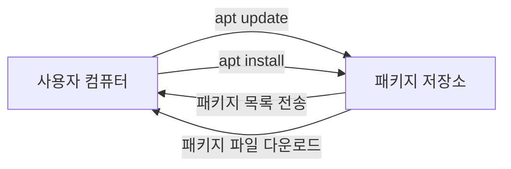
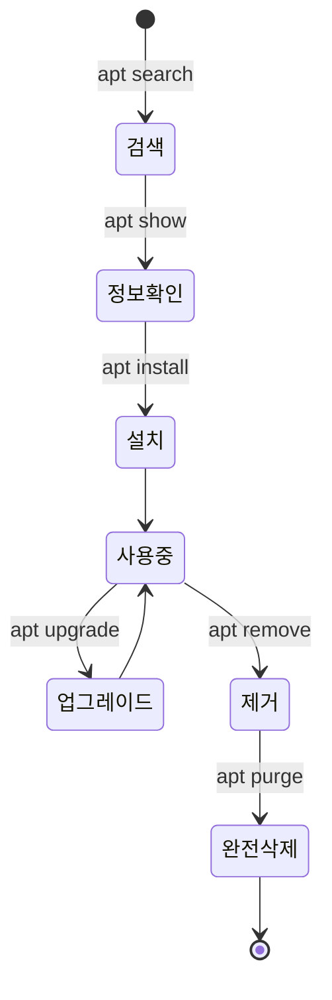
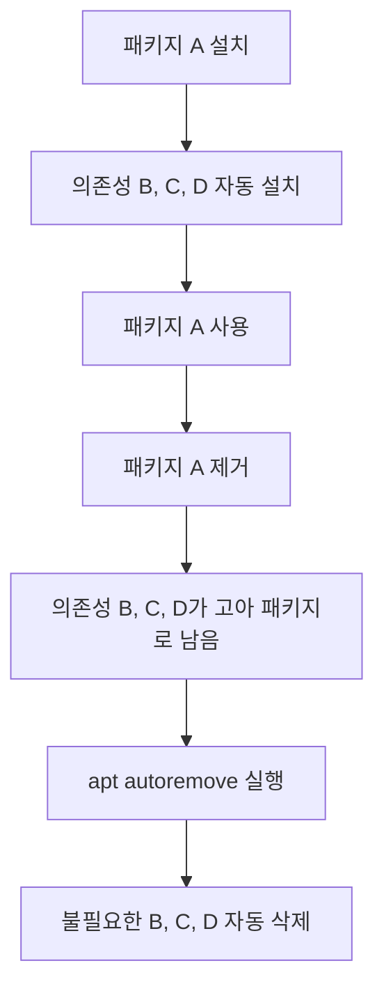
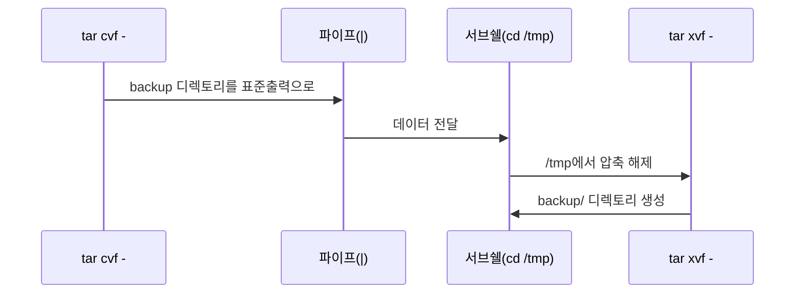
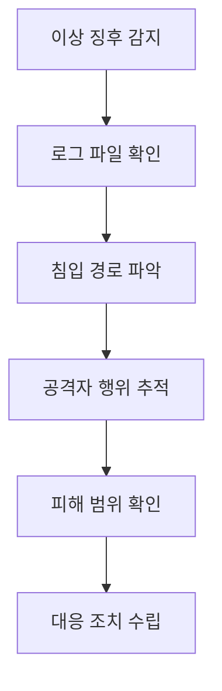
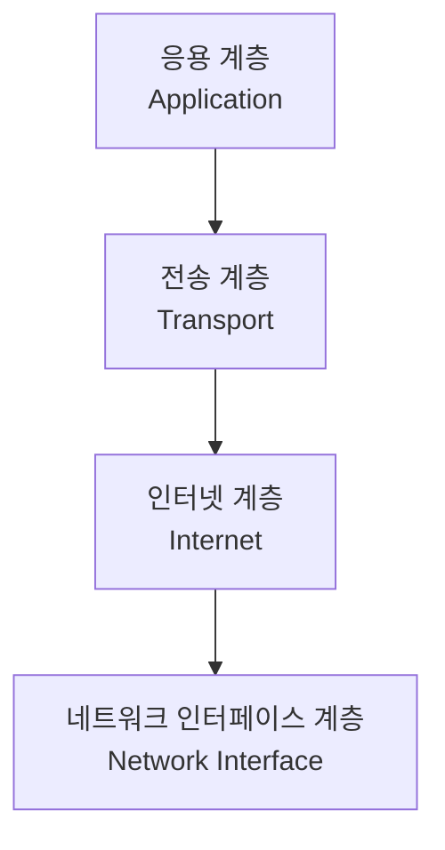

--- 
title: "📝 리눅스 시스템·네트워크·보안 강의 노트 (4일차)"
date: 2025-11-27
excerpt: "강사 노트: 7일 과정 중 4일차 - 리눅스 시스템 관리 핵심 기능 학습"
categories:
  - Linux-Network
tags:
  - Linux-Network
  - SK_Rookies
---

# 📝 리눅스 시스템·네트워크·보안 강의 노트 (4일차)

> **강의 날짜**: 2025년 11월 27일
> **주요 주제**: 패키지 관리, 아카이브 및 압축, 시스템 로그, 네트워크 기초
> **강사 노트**: 7일 과정 중 4일차 - 리눅스 시스템 관리 핵심 기능 학습

---

## 📚 강의 개요 및 학습 목표

### 🎯 이번 강의에서 배울 내용

이번 강의는 리눅스 시스템 관리의 핵심이 되는 **패키지 관리**와 **아카이브/압축**, **시스템 로그 분석**, 그리고 **네트워크 기초 개념**을 다룹니다.

**강의 구성**:
1. **패키지 관리 시스템** - `apt`, `yum` 명령어
2. **아카이브 및 압축** - `tar`, `gzip`, `bzip2` 명령어
3. **시스템 로그 관리** - `wtmp`, `rsyslog`, 침해사고 분석
4. **네트워크 기초** - TCP/IP 모델, 네트워크 장비, 물리계층

---

## 💡 학습 시작 전 중요한 안내사항

### 📌 지난 시간 복습의 중요성

강사님께서 강조하신 내용:

> "어제 학습하신 내용은 파일 시스템 쪽 개념이라든가 이런 것들을 하다 보니까 조금 어려웠을 부분이 좀 있었던 것 같아요."

**비전공자 및 처음 접하시는 분들을 위한 조언**:
- 어려웠다고 느껴지는 것은 자연스러운 현상입니다
- 강의 내용을 **다시 듣기**를 통해 복습하세요
- 교재를 **반복해서 읽어보세요** - 혼자 학습할 수 있게 상세히 설명되어 있습니다
- "어느 순간 딱 강사가 그때 했던 얘기가 이 얘기구나"라는 느낌이 올 때가 옵니다

💡 **중요!**: 처음 접하시는 분들은 **반복 학습**이 필수입니다. 포기하지 마세요!

---

### 🗓️ 7일 과정 진행 상황

**현재 진행도**: 4일차 (절반 통과)

**이전 학습 내용**:
- 1~2일차: 리눅스 기초, 쉘 명령어
- 3일차: 파일 시스템, inode, 정규표현식, grep/awk

**앞으로 학습할 내용**:
- 4일차(오늘): 패키지 관리, 압축, 로그, 네트워크 기초
- 5~7일차: 네트워크 심화, 보안, 실전 프로젝트

---

## 🎓 학습 태도 및 마인드셋

강사님의 조언:

> "뭐든지 다 꾸준히 하시면 원하시는 어떤 수준까지 다 올라가실 수 있으시니까 절대 포기하지 마시고, 절대 포기하지 마시고 계속 해주시면 좋을 것 같습니다."

### ✅ 학습 성공을 위한 핵심 원칙

1. **반복 학습**: 한 번에 이해되지 않아도 괜찮습니다
2. **실습 중심**: 명령어는 직접 쳐보면서 익혀야 합니다
3. **꾸준함**: 조금씩이라도 매일 학습하세요
4. **질문하기**: 이해되지 않는 부분은 적극적으로 질문하세요
5. **교재 활용**: 교재를 옆에 두고 계속 참고하세요

---

## 📖 오늘 배울 내용 미리보기

### 1️⃣ 패키지 관리 (Package Management)

**왜 필요한가?**
- 리눅스를 사용하다 보면 **필요한 프로그램이나 도구**가 시스템에 설치되지 않은 경우가 있습니다
- 이때 필요한 소프트웨어를 **찾아서 설치**해야 합니다
- 이를 위한 명령어가 바로 **패키지 관리 명령어**입니다

**학습할 내용**:
- Debian 계열(Ubuntu): `apt` 명령어
- Red Hat 계열(CentOS): `yum` 명령어
- 패키지 설치, 업데이트, 삭제, 검색 방법

---

### 2️⃣ 아카이브 및 압축 (Archive & Compression)

**왜 필요한가?**

강사님의 실무 예시:

> "현장에 가서 봤더니 로그 파일들이 쫙 있어. 그런데 이 로그 파일들을 내가 지금 이렇게 한땀 한땀 파일을 열어서 분석을 하려니까 너무 어렵다. 그래서 이 로그를 가지고 가서 우리 회사에 잘 만들어진 로그 분석 솔루션에 딱 넣어주면 로그 파일과 로그 파일의 연관성을 고려해서 필요한 항목들을 쫙쫙 연결해서 맵을 만들어줄 수 있어요."

**실무 시나리오**:
1. 고객 현장에서 로그 파일 수집
2. 여러 파일을 하나로 **묶기** (Archive)
3. 용량을 줄이기 위해 **압축** (Compression)
4. 회사로 가져와서 분석

**학습할 내용**:
- `tar`: 여러 파일을 하나로 묶는 명령어
- `gzip`, `bzip2`: 파일을 압축하는 명령어
- 묶음과 압축을 동시에 하는 방법

---

### 3️⃣ 시스템 로그 관리 (System Logging)

**로그란 무엇인가?**

로그는 **시스템에 접속한 사용자들의 행위**를 저장하고 기록해 놓은 것입니다:
- 사용자가 어떤 명령어를 사용했는지
- 소프트웨어/애플리케이션이 실행하면서 필요한 정보를 기록
- 네트워크 프로그램들의 상태 정보 기록

**로그의 중요성**:
1. **보안 사고 분석**: 외부 침입자가 어떤 행동을 했는지 추적
2. **시스템 오류 진단**: 프로그램 오류 원인 파악
3. **사용자 추적**: 누가 언제 어디서 접속했는지 확인
4. **규정 준수**: 법적 의무, 책임 추궁 시 증거 자료

**학습할 내용**:
- `wtmp`, `utmp`: 사용자 로그인 기록
- `rsyslog`: 시스템 로그 관리
- 침해사고 체크리스트
- 로그 파일 분석 방법

---

### 4️⃣ 네트워크 기초 (Network Fundamentals)

**왜 네트워크를 배워야 하나?**
- 서버는 네트워크 없이 존재할 수 없습니다
- 보안은 네트워크를 이해해야 제대로 할 수 있습니다
- 시스템 관리자는 네트워크 기본 지식이 필수입니다

**학습할 내용**:
- TCP/IP 4계층 모델 (OSI 7계층과 비교)
- 네트워크 장비: 허브, 스위치, 라우터, 방화벽, 로드밸런서
- 물리계층: 케이블 종류, 이더넷
- 데이터 링크계층: MAC 주소, ARP 프로토콜

---

## 🔥 오늘 강의의 핵심 포인트

### ⭐ 패키지 관리는 시스템 운영의 기본

시스템을 사용하다 보면 **필요한 도구를 설치**해야 하는 경우가 많습니다:
- 네트워크 분석 도구: `net-tools`
- 편집기: `vim`
- 파일 시스템 도구: `xfsprogs`

패키지 관리를 모르면 필요한 도구를 설치할 수 없어 업무가 불가능합니다.

---

### ⭐ 압축과 아카이브는 실무 필수 기술

**실무에서 자주 사용하는 시나리오**:
1. **백업**: 중요한 데이터를 묶어서 백업
2. **로그 수집**: 현장 로그를 압축해서 가져오기
3. **파일 전송**: 여러 파일을 하나로 묶어서 전송
4. **디스크 공간 절약**: 오래된 로그를 압축해서 보관

💡 **중요!**: `tar` 명령어는 **리눅스/유닉스를 사용하면서 반드시 알아야 할 필수 명령어**입니다!

---

### ⭐ 로그 분석은 보안의 시작

**로그가 왜 중요한가?**

강사님의 말씀:

> "시스템에 어떤 문제가 발생했을 때, 그게 꼭 침해 사고가 아닐지라도 프로그램이 동작하다가 발생되어진 어떤 오류, 이런 것들을 해결하기 위해서 맨 처음에 우리는 뭐부터 그 자료를 찾느냐 하면 그와 관련된 로그부터 찾아요."

**로그 분석의 중요성**:
1. 문제 발생 시 **가장 먼저 확인**하는 것이 로그입니다
2. 로그가 없으면 **원인 파악이 불가능**합니다
3. 보안 사고 발생 시 **유일한 증거**가 로그입니다
4. 로그를 통해 **사전 징후**를 포착할 수 있습니다

---

### ⭐ 네트워크는 모든 것의 기반

**네트워크를 이해해야 하는 이유**:
1. **서버 운영**: 서버는 네트워크로 연결되어 있습니다
2. **보안**: 네트워크를 모르면 보안을 할 수 없습니다
3. **문제 해결**: 네트워크 문제가 가장 빈번합니다
4. **성능 최적화**: 네트워크 병목을 찾아야 합니다

---

## 🎯 학습 목표 및 성취 기준

이번 강의를 마치면 다음을 할 수 있어야 합니다:

### ✅ 패키지 관리
- [ ] `apt` 명령어로 패키지를 설치, 업데이트, 삭제할 수 있다
- [ ] 패키지를 검색하고 상세 정보를 확인할 수 있다
- [ ] Ubuntu와 Red Hat 계열의 패키지 관리 차이를 이해한다
- [ ] 의존성 패키지의 개념을 이해한다

### ✅ 아카이브 및 압축
- [ ] `tar` 명령어로 파일을 묶고 풀 수 있다
- [ ] `gzip`, `bzip2`로 파일을 압축하고 해제할 수 있다
- [ ] 묶음과 압축을 동시에 실행할 수 있다
- [ ] 압축 파일의 내용을 확인할 수 있다
- [ ] 절대경로와 상대경로의 차이를 이해한다

### ✅ 시스템 로그
- [ ] 주요 로그 파일의 위치와 용도를 안다
- [ ] `wtmp`, `utmp` 로그를 확인할 수 있다
- [ ] `rsyslog` 설정 파일을 이해한다
- [ ] 침해사고 발생 시 확인해야 할 체크리스트를 안다
- [ ] 로그의 중요성과 보존의 필요성을 이해한다

### ✅ 네트워크 기초
- [ ] TCP/IP 4계층 모델을 설명할 수 있다
- [ ] 주요 네트워크 장비의 역할을 이해한다
- [ ] MAC 주소와 IP 주소의 차이를 안다
- [ ] 물리계층의 역할과 케이블 종류를 안다

---

## 💬 강사님의 격려 메시지

> "여러분 나중에 개인적으로 학습하실 때 이 VirtualBox에 지금 저희는 Ubuntu, Ubuntu 계열의 리눅스만 하나 설치했잖아요. 근데 여기 요거 VirtualBox에 하나 더, Red 계열의 CentOS나 아니면 Fedora 버전 중에 하나를 선택하셔서 설치하셔가지고 한번 같이 연습해 보시면 좋겠죠."

**개인 학습 권장사항**:
1. VirtualBox에 Ubuntu와 CentOS/Fedora를 동시에 설치
2. 같은 명령어를 두 시스템에서 비교하며 실습
3. Ubuntu에서는 `apt`, CentOS에서는 `yum`을 연습
4. 차이점을 노트에 정리하면 기억에 오래 남습니다

---

## 📝 강의 노트 작성 방법

**효과적인 노트 작성 팁**:
1. 명령어는 **직접 타이핑**하면서 익히세요
2. 옵션의 **의미**를 이해하면서 외우세요
3. **예제 출력 결과**를 캡처하거나 복사해두세요
4. **자주 하는 실수**와 **해결 방법**을 메모하세요
5. **실무 활용 시나리오**를 상상하며 학습하세요

---

## 🚀 다음 섹션 미리보기

다음 섹션에서는 **패키지 관리 시스템의 개념**과 **apt 명령어 상세 분석**을 다룰 예정입니다.

**주요 학습 내용**:
- 패키지란 무엇인가?
- 패키지 관리자의 역할
- `apt` 명령어 vs `apt-get` 명령어
- 패키지 저장소(Repository)의 개념
- 의존성(Dependency) 관리

---

**💡 Tip**: 이 강의 노트를 옆에 두고 실습을 진행하세요. 막히는 부분이 있으면 언제든지 이 노트로 돌아와서 확인할 수 있습니다!

## 📦 패키지 관리 시스템 (Package Management System)

### 🎯 패키지 관리란 무엇인가?

**패키지 관리의 필요성**

강사님의 설명:

> "리눅스, Ubuntu 리눅스건 아니면 Red Hat 계열의 리눅스건, 이런 리눅스를 사용하시다 보면 내가 필요로 하는 어떤 프로그램, 툴 이런 것들이 현재 내 시스템에 설치 안 되어져 있을 때가 있습니다. 그러면 어떻게 해야 돼요? 그걸 찾아서 설치해 주셔야 되죠."

**패키지(Package)란?**
- 소프트웨어와 그 소프트웨어를 실행하는 데 필요한 파일들을 하나로 모아놓은 **압축된 형태의 파일**
- 프로그램 실행 파일, 라이브러리, 설정 파일, 문서 등을 포함
- 설치, 업데이트, 제거를 쉽게 할 수 있도록 만들어진 **배포 단위**

**패키지 관리자(Package Manager)란?**
- 패키지의 설치, 업그레이드, 삭제를 담당하는 **소프트웨어 도구**
- 패키지 간의 **의존성(Dependency)**을 자동으로 처리
- 패키지 저장소(Repository)로부터 패키지를 다운로드하고 설치

---

### 🐧 리눅스 배포판별 패키지 관리 시스템

리눅스는 배포판(Distribution)에 따라 서로 다른 패키지 관리 시스템을 사용합니다.

#### 📋 주요 리눅스 배포판과 패키지 시스템 비교표

| **구분** | **Debian 계열** | **Red Hat 계열** |
|:-:|:-:|:-:|
| **대표 배포판** | Ubuntu, Debian, Linux Mint | CentOS, RHEL, Fedora, Rocky Linux |
| **패키지 파일 형식** | `.deb` (Debian Package) | `.rpm` (Red Hat Package Manager) |
| **저수준 명령어** | `dpkg` | `rpm` |
| **고수준 명령어** | `apt`, `apt-get` | `yum`, `dnf` |
| **패키지 저장소** | Debian Repository | Red Hat Repository |
| **의존성 자동 해결** | ✅ apt가 자동 처리 | ✅ yum/dnf가 자동 처리 |

💡 **중요**: 우리 수업에서는 **Ubuntu (Debian 계열)**를 사용하므로 `apt` 명령어를 중심으로 학습합니다!

---

### 🔄 패키지 관리 시스템의 작동 원리

#### 1️⃣ 패키지 저장소 (Repository)

**저장소란 무엇인가?**


**저장소의 역할**:
- 수많은 패키지 파일들을 **중앙 집중식으로 관리**
- 패키지의 **최신 버전 정보**를 유지
- 패키지 **의존성 정보**를 제공
- 인터넷을 통해 패키지를 **빠르게 배포**

**저장소 설정 파일 위치**:
- Debian/Ubuntu: `/etc/apt/sources.list` 및 `/etc/apt/sources.list.d/`
- Red Hat/CentOS: `/etc/yum.repos.d/`

---

#### 2️⃣ 의존성 관리 (Dependency Management)

**의존성이란?**

강사님의 설명:

> "예를 들어서 우리가 어떤 패키지를 하나 설치해요. A라는 패키지를 하나 설치하면 이 패키지 A만 설치되는 게 아니라 이 A가 정상적으로 수행되려면 B와 C와 D가 필요한 경우도 있어요. 이런 걸 가르쳐서 의존성이 있는 패키지다 라고 부릅니다."

**의존성 예시**:
```
패키지 A (설치하려는 프로그램)
├── 패키지 B (라이브러리 1)
│   └── 패키지 E (하위 라이브러리)
├── 패키지 C (라이브러리 2)
└── 패키지 D (라이브러리 3)
```

**의존성 자동 해결**:
- 과거 `dpkg`나 `rpm`을 직접 사용할 때는 의존성을 **수동으로 해결**해야 했습니다
- 현대의 `apt`, `yum`은 의존성을 **자동으로 찾아서 함께 설치**합니다
- 패키지 삭제 시에도 더 이상 필요 없는 의존성 패키지를 자동으로 정리할 수 있습니다

**의존성 관련 문제 시나리오**:

| **상황** | **문제** | **해결** |
|:-:|:-:|:-:|
| 패키지 A 설치 | B, C, D도 함께 설치됨 | `apt`가 자동으로 처리 |
| 패키지 A 삭제 | B, C, D는 남아있음 | `apt autoremove`로 정리 |
| 패키지 A 업그레이드 | B, C, D도 업그레이드 필요 | `apt upgrade`로 일괄 처리 |

---

#### 3️⃣ 패키지 생명주기 (Package Lifecycle)



**1단계: 패키지 검색 (Search)**
- 필요한 패키지의 이름을 모를 때 키워드로 검색
- `apt search [키워드]`

**2단계: 패키지 정보 확인 (Show)**
- 패키지의 상세 정보, 버전, 의존성 확인
- `apt show [패키지명]`

**3단계: 패키지 설치 (Install)**
- 패키지와 의존성을 함께 설치
- `apt install [패키지명]`

**4단계: 패키지 업그레이드 (Upgrade)**
- 설치된 패키지를 최신 버전으로 업데이트
- `apt upgrade`

**5단계: 패키지 제거 (Remove/Purge)**
- `remove`: 패키지 삭제, 설정 파일은 유지
- `purge`: 패키지와 설정 파일까지 완전 삭제

---

### ⚙️ 패키지 관리 시 중요한 개념

#### 🔐 Root 권한의 필요성

**왜 root 권한이 필요한가?**
- 패키지는 시스템 디렉토리(`/usr`, `/bin`, `/etc` 등)에 설치됩니다
- 이러한 디렉토리는 **일반 사용자가 수정할 수 없습니다**
- 따라서 패키지 관리 명령어는 **반드시 root 권한**으로 실행해야 합니다

**root 권한 획득 방법**:

1. **root 사용자로 전환**:
```bash
$ su -
Password: [root 비밀번호 입력]
# apt install vim
```

2. **sudo 명령어 사용** (권장):
```bash
$ sudo apt install vim
[sudo] password for user: [현재 사용자 비밀번호 입력]
```

💡 **권장 방식**: `sudo`를 사용하는 것이 더 안전합니다!
- `su -`는 root로 완전히 전환되어 실수로 위험한 명령어를 실행할 수 있습니다
- `sudo`는 **필요한 명령어만** root 권한으로 실행하므로 더 안전합니다

---

#### 📊 패키지 상태 관리

**패키지가 가질 수 있는 상태**:

| **상태** | **의미** | **확인 방법** |
|:-:|:-:|:-:|
| **설치됨 (Installed)** | 시스템에 설치되어 사용 가능 | `apt list --installed` |
| **업그레이드 가능 (Upgradable)** | 새 버전이 저장소에 존재 | `apt list --upgradable` |
| **자동 설치됨 (Auto-installed)** | 의존성으로 자동 설치된 패키지 | `apt-mark showauto` |
| **제거됨 (Removed)** | 제거되었으나 설정 파일 남음 | -  |
| **완전 제거됨 (Purged)** | 패키지와 설정 파일 모두 삭제 | - |

**예시: 패키지 상태 확인**

```bash
# 설치된 모든 패키지 목록
$ apt list --installed
Listing...
vim/focal-updates,now 2:8.1.2269-1ubuntu5.16 amd64 [installed]
openssh-server/focal-updates,now 1:8.2p1-4ubuntu0.11 amd64 [installed]
...

# 업그레이드 가능한 패키지 목록
$ apt list --upgradable
Listing...
curl/focal-updates 7.68.0-1ubuntu2.20 amd64 [upgradable from: 7.68.0-1ubuntu2.19]
...
```

---

#### 🗑️ 패키지 제거 시 주의사항

**`remove` vs `purge`의 차이**

강사님의 설명:

> "삭제를 remove라는 키워드로 사용해서 삭제를 하게 되면 우리가 설정 파일들 있죠. 구성 파일들 이런 것들이 남아 있을 수 있어요. 왜냐하면 우리가 사용하다 보면 설정 파일들을 수정했다거나 이럴 수 있죠. 그러면 그 수정된 파일들은 그대로 남아 있을 수 있습니다. 그런데 그런 것들 모두 완전히 제거해요 할 때는 purge라는 명령이 또 별도로 있습니다."

**`remove` 사용 예시**:
```bash
$ sudo apt remove vim

# 실행 파일 삭제 확인
$ which vim
# (아무 결과 없음)

# 하지만 설정 파일은 남아있음
$ ls -la ~/.vimrc
-rw-r--r-- 1 user user 1024 Nov 20 10:00 /home/user/.vimrc
```

**`purge` 사용 예시**:
```bash
$ sudo apt purge vim

# 설정 파일까지 모두 삭제됨
$ ls -la ~/.vimrc
ls: cannot access '/home/user/.vimrc': No such file or directory
```

**언제 remove를 사용하고 언제 purge를 사용할까?**

| **상황** | **사용할 명령어** | **이유** |
|:-:|:-:|:-:|
| 임시로 삭제, 나중에 재설치 예정 | `remove` | 설정 파일 유지로 재설치 시 설정 복원 |
| 완전히 제거, 다시 사용하지 않을 것 | `purge` | 디스크 공간 절약, 깔끔한 삭제 |
| 보안상 민감한 패키지 삭제 | `purge` | 설정 파일에 민감 정보 있을 수 있음 |
| 테스트용 패키지 삭제 | `purge` | 완전 삭제 후 새로 테스트 |

---

#### ♻️ 의존성 패키지 정리 (autoremove)

**autoremove가 필요한 이유**

강사님의 설명:

> "우리가 어떤 패키지를 하나 설치해요. A라는 패키지를 하나 설치하면 이 패키지 A만 설치되는 게 아니라 이 A가 정상적으로 수행되려면 B와 C와 D가 필요한 경우도 있어요. 의존성 있는 패키지들까지 모두 정리, 현재 어떤 특정 패키지를 삭제하다 보니까 의존성 있는 패키지만 남아있어, 그런 의존성 있는 패키지들을 모두 다 제거하고 싶어, 불필요한 의존성 있는 패키지들을 제거하고 싶어, 이럴 때 이용하는 게 autoremove라는 명령어도 있습니다."

**autoremove 사용 시나리오**:



**예시: autoremove 사용**

```bash
# 패키지 A 제거 후
$ sudo apt remove packageA
Reading package lists... Done
Building dependency tree
Reading state information... Done
The following packages were automatically installed and are no longer required:
  packageB packageC packageD
Use 'sudo apt autoremove' to remove them.

# 불필요한 의존성 패키지 제거
$ sudo apt autoremove
Reading package lists... Done
Building dependency tree
Reading state information... Done
The following packages will be REMOVED:
  packageB packageC packageD
0 upgraded, 0 newly installed, 3 to remove and 0 not upgraded.
After this operation, 15.3 MB disk space will be freed.
Do you want to continue? [Y/n] Y
```

💡 **모범 사례**: 패키지를 제거한 후에는 항상 `apt autoremove`를 실행하여 디스크 공간을 확보하세요!

---

### 🔍 패키지 검색과 정보 확인

#### 📌 패키지 검색 (search)

**언제 사용하는가?**

강사님의 설명:

> "내가 어떤 명령어를 하나 기억하고 있는데 이런 명령어가 포함되어져 있는 패키지를 좀 확인하고 싶은 거예요. 패키지 이름을 모르겠고 내가 하고 싶은 어떤 명령어, 키워드가 있는 거야. 그래서 그 키워드를 기준으로 해서 이 키워드에 대한 디스크립션이라든가 이런 거에 포함하고 있는 그런 어떤 패키지 목록을 내가 검색하고 싶어."

**search 사용 예시**:

```bash
# "top"이라는 키워드로 검색
$ apt search top
Sorting... Done
Full Text Search... Done
htop/focal 2.2.0-2build1 amd64
  interactive processes viewer

top/focal 3.3.15-1 amd64
  Task manager and system monitor

atop/focal 2.5.0-1 amd64
  Monitor for system resources and process activity
...
```

**검색 결과 해석**:
- `htop`: 패키지 이름
- `/focal`: Ubuntu 버전 (Focal = 20.04)
- `2.2.0-2build1`: 패키지 버전
- `amd64`: 아키텍처 (64비트)
- `interactive processes viewer`: 패키지 설명

---

#### 📋 패키지 상세 정보 확인 (show)

**show 명령어의 용도**

강사님의 설명:

> "show라는 명령어는 특정 패키지에 대한 상세 정보를 확인하고자 할 때 사용하는 명령어입니다."

**show 사용 예시**:

```bash
$ sudo apt show htop
Package: htop
Version: 2.2.0-2build1
Priority: optional
Section: universe/utils
Origin: Ubuntu
Maintainer: Ubuntu Developers <ubuntu-devel-discuss@lists.ubuntu.com>
Original-Maintainer: Daniel Lange <DLange@debian.org>
Bugs: https://bugs.launchpad.net/ubuntu/+filebug
Installed-Size: 221 kB
Depends: libc6 (>= 2.15), libncursesw6 (>= 6), libtinfo6 (>= 6)
Homepage: https://htop.dev/
Download-Size: 93.0 kB
APT-Manual-Installed: yes
APT-Sources: http://archive.ubuntu.com/ubuntu focal/universe amd64 Packages
Description: interactive processes viewer
 Htop is an ncursed-based process viewer similar to top, but it
 allows one to scroll the list vertically and horizontally to see
 all processes and their full command lines.
```

**주요 정보 해석**:

| **필드** | **의미** | **예시 값** |
|:-:|:-:|:-:|
| Package | 패키지 이름 | htop |
| Version | 패키지 버전 | 2.2.0-2build1 |
| Priority | 우선순위 | optional (선택 설치) |
| Section | 카테고리 | universe/utils |
| Installed-Size | 설치 후 크기 | 221 kB |
| **Depends** | **의존성 패키지** | libc6, libncursesw6, libtinfo6 |
| Download-Size | 다운로드 크기 | 93.0 kB |
| Description | 패키지 설명 | 대화형 프로세스 뷰어 |

**💡 핵심 확인 항목**:
1. **Depends**: 이 패키지를 설치하면 함께 설치될 의존성 패키지
2. **Installed-Size**: 설치 후 디스크 사용량
3. **Download-Size**: 다운로드할 파일 크기
4. **Description**: 이 패키지가 정말 필요한 것인지 확인

---

### 🔄 패키지 업데이트 프로세스

#### 1️⃣ update vs upgrade 차이점

많은 초보자가 혼동하는 부분입니다!

| **명령어** | **동작** | **실제 설치 여부** |
|:-:|:-:|:-:|
| `apt update` | 저장소의 패키지 **목록 정보**만 업데이트 | ❌ 설치하지 않음 |
| `apt upgrade` | 설치된 패키지를 **실제로 업그레이드** | ✅ 실제 설치함 |

**올바른 업데이트 순서**:

```bash
# 1단계: 패키지 목록 정보 업데이트
$ sudo apt update
Hit:1 http://archive.ubuntu.com/ubuntu focal InRelease
Get:2 http://security.ubuntu.com/ubuntu focal-security InRelease [114 kB]
...
Reading package lists... Done
Building dependency tree
Reading state information... Done
5 packages can be upgraded. Run 'apt list --upgradable' to see them.

# 2단계: 업그레이드 가능한 패키지 확인 (선택사항)
$ apt list --upgradable
Listing...
curl/focal-updates 7.68.0-1ubuntu2.20 amd64 [upgradable from: 7.68.0-1ubuntu2.19]
openssh-server/focal-updates 1:8.2p1-4ubuntu0.12 amd64 [upgradable from: 1:8.2p1-4ubuntu0.11]
...

# 3단계: 실제 업그레이드 실행
$ sudo apt upgrade
Reading package lists... Done
Building dependency tree
Reading state information... Done
Calculating upgrade... Done
The following packages will be upgraded:
  curl openssh-server ...
5 upgraded, 0 newly installed, 0 to remove and 0 not upgraded.
Need to get 2,345 kB of archives.
After this operation, 123 kB of additional disk space will be used.
Do you want to continue? [Y/n] Y
```

**🔍 상세 분석**:

**`apt update`가 하는 일**:
1. `/etc/apt/sources.list`에 설정된 저장소에 접속
2. 각 저장소의 **패키지 목록 파일**을 다운로드
3. 로컬 패키지 데이터베이스 업데이트 (`/var/lib/apt/lists/`)
4. **어떤 패키지를 업그레이드할 수 있는지** 확인

**`apt upgrade`가 하는 일**:
1. 업데이트된 패키지 목록을 기반으로 업그레이드 가능한 패키지 확인
2. 해당 패키지들의 **새 버전을 다운로드**
3. **실제로 설치**하여 기존 버전 교체
4. 필요시 서비스 재시작

💡 **모범 사례**: 패키지를 설치하기 전에는 **항상 `apt update`를 먼저 실행**하세요!

---

#### 2️⃣ upgrade vs full-upgrade 차이점

| **명령어** | **동작 방식** | **사용 시나리오** |
|:-:|:-:|:-:|
| `apt upgrade` | 기존 패키지 삭제 없이 업그레이드만 | 일반적인 업데이트 |
| `apt full-upgrade` | 필요시 패키지 삭제/추가하며 업그레이드 | 시스템 전체 업그레이드 |

**upgrade 사용 예시**:
```bash
$ sudo apt upgrade
# 기존 패키지를 삭제하지 않고 안전하게 업그레이드
# 일부 패키지가 "held back" 될 수 있음
```

**full-upgrade 사용 예시**:
```bash
$ sudo apt full-upgrade
# 의존성 변경으로 인해 필요시 패키지 삭제/추가
# 시스템 전체를 최신 상태로 업그레이드
```

⚠️ **주의**: `full-upgrade`는 패키지를 삭제할 수 있으므로 **신중하게 사용**하세요!

---

### 🌐 패키지 저장소 (Repository) 관리

#### 저장소 설정 파일

**Ubuntu의 저장소 설정 파일**: `/etc/apt/sources.list`

```bash
$ cat /etc/apt/sources.list
deb http://archive.ubuntu.com/ubuntu focal main restricted
deb http://archive.ubuntu.com/ubuntu focal-updates main restricted
deb http://archive.ubuntu.com/ubuntu focal universe
deb http://archive.ubuntu.com/ubuntu focal-updates universe
deb http://security.ubuntu.com/ubuntu focal-security main restricted
deb http://security.ubuntu.com/ubuntu focal-security universe
```

**저장소 줄 해석**:
- `deb`: 바이너리 패키지 저장소
- `http://archive.ubuntu.com/ubuntu`: 저장소 URL
- `focal`: Ubuntu 버전 코드명
- `main restricted universe multiverse`: 저장소 섹션

**저장소 섹션의 의미**:
- `main`: Ubuntu에서 공식 지원하는 오픈소스 소프트웨어
- `restricted`: Ubuntu에서 지원하지만 제한된 라이선스의 소프트웨어
- `universe`: 커뮤니티에서 유지관리하는 오픈소스 소프트웨어
- `multiverse`: 제한된 라이선스의 소프트웨어

---

### 💼 실무 활용 시나리오

#### 시나리오 1: 새로운 서버 셋업

```bash
# 1. 시스템 업데이트
$ sudo apt update && sudo apt upgrade -y

# 2. 필수 도구 설치
$ sudo apt install -y vim git curl wget

# 3. 웹 서버 설치
$ sudo apt install -y nginx

# 4. 데이터베이스 설치
$ sudo apt install -y postgresql

# 5. 불필요한 패키지 정리
$ sudo apt autoremove -y
```

#### 시나리오 2: 디스크 공간 부족

```bash
# 1. 불필요한 의존성 패키지 제거
$ sudo apt autoremove

# 2. 패키지 캐시 정리
$ sudo apt clean

# 3. 사용하지 않는 패키지 제거
$ sudo apt remove [패키지명]
```

---

## ✅ 학습 체크리스트

이 섹션을 학습한 후 다음 항목을 확인하세요:

- [ ] 패키지와 패키지 관리자의 개념을 이해했다
- [ ] Debian 계열과 Red Hat 계열의 차이를 안다
- [ ] 패키지 의존성(Dependency)의 개념을 이해했다
- [ ] `update`와 `upgrade`의 차이를 명확히 안다
- [ ] `remove`와 `purge`의 차이를 이해했다
- [ ] `autoremove`의 필요성을 이해했다
- [ ] 패키지 검색과 정보 확인 방법을 안다
- [ ] root 권한이 필요한 이유를 이해했다

---

## 📋 핵심 요약

1. **패키지 관리자**: 소프트웨어 설치/업데이트/삭제를 자동화하는 도구
2. **의존성 관리**: 패키지가 필요로 하는 다른 패키지를 자동으로 처리
3. **저장소**: 패키지 파일과 정보를 중앙에서 관리하는 서버
4. **update**: 패키지 목록 정보만 업데이트 (실제 설치 X)
5. **upgrade**: 실제로 패키지를 최신 버전으로 업그레이드
6. **remove**: 패키지 삭제, 설정 파일 유지
7. **purge**: 패키지와 설정 파일 모두 삭제
8. **autoremove**: 불필요한 의존성 패키지 자동 제거

---

다음 섹션에서는 **`apt` 명령어의 상세한 사용법과 실습 예제**를 다룰 예정입니다!

## 📟 apt 명령어 상세 분석 (Ubuntu/Debian)

### 🎯 apt vs apt-get 차이점

**apt란 무엇인가?**

강사님의 설명:

> "apt Advanced Package Tool이라고 해서 이 Debian 계열의 리눅스 배포판에서 사용하는 software 설치 업그레이드 제거를 할 때 이용하는 명령어입니다."

**apt와 apt-get의 관계**:
- `apt-get`: 전통적인 패키지 관리 명령어 (여전히 사용 가능)
- `apt`: `apt-get`을 더 **사용하기 쉽도록** 만든 개선 버전
- `apt`는 `apt-get`과 `apt-cache`의 **자주 사용하는 기능**을 결합

| **구분** | **apt-get / apt-cache** | **apt** |
|:-:|:-:|:-:|
| 출시 시기 | 오래됨 (1990년대) | 최신 (2014년~) |
| 사용 편의성 | 복잡함 | 간단함 |
| 진행 상황 표시 | 제한적 | 진행률 바 표시 |
| 컬러 출력 | 없음 | 컬러 하이라이팅 |
| 권장 사용 | 스크립트용 | 대화형 사용 |

💡 **권장**: 일반 사용자는 `apt`를, 자동화 스크립트에서는 `apt-get`을 사용하세요!

---

### 📋 apt 명령어 주요 키워드

강사님께서 소개한 주요 명령어들:

```bash
apt update        # 패키지 목록 업데이트
apt install       # 패키지 설치
apt remove        # 패키지 제거 (설정 파일 유지)
apt purge         # 패키지 완전 제거 (설정 파일 포함)
apt upgrade       # 설치된 패키지 업그레이드
apt full-upgrade  # 시스템 전체 업그레이드
apt autoremove    # 불필요한 의존성 패키지 제거
apt search        # 패키지 검색
apt show          # 패키지 상세 정보 확인
apt list          # 패키지 목록 조회
```

---

### 📦 apt update - 패키지 목록 업데이트

#### 📟 `apt update` 명령어 상세 분석

**명령어 개요:**
- 목적: 패키지 저장소의 최신 패키지 정보를 로컬 데이터베이스로 업데이트
- 사용 시나리오: 패키지 설치 전, 시스템 업데이트 전

**기본 문법:**
```bash
sudo apt update
```

**실행 예제 1: 기본 업데이트**
```bash
$ sudo apt update
[sudo] password for user:
Hit:1 http://archive.ubuntu.com/ubuntu focal InRelease
Get:2 http://archive.ubuntu.com/ubuntu focal-updates InRelease [114 kB]
Get:3 http://archive.ubuntu.com/ubuntu focal-backports InRelease [108 kB]
Get:4 http://security.ubuntu.com/ubuntu focal-security InRelease [114 kB]
Fetched 336 kB in 2s (168 kB/s)
Reading package lists... Done
Building dependency tree
Reading state information... Done
5 packages can be upgraded. Run 'apt list --upgradable' to see them.
```

**예상 출력 해석:**
- `Hit`: 저장소가 변경되지 않음 (캐시 사용)
- `Get`: 새로운 패키지 정보를 다운로드
- `Fetched 336 kB`: 다운로드한 패키지 목록 파일 크기
- `5 packages can be upgraded`: 업그레이드 가능한 패키지 수

**실무 활용 팁:**

강사님의 설명:

> "패키지를 바로 install하기 전에 일반적으로 update라는 명령어를 사용해서 어떤 어떤 패키지들이 새로이 추가되었고 최신 버전이 몇인지 이런 것들을 저장소 정보를 읽어서 update를 한번 쳐주는 거예요."

```bash
# 모범 사례: 패키지 설치 전 항상 update 실행
$ sudo apt update
$ sudo apt install vim
```

**💡 중요**: `apt update`는 패키지를 **설치하지 않습니다**! 단지 **정보만 업데이트**합니다!

---

### 💿 apt install - 패키지 설치

#### 📟 `apt install` 명령어 상세 분석

**명령어 개요:**
- 목적: 패키지와 그 의존성을 설치
- 사용 시나리오: 새로운 소프트웨어 설치 시

**기본 문법:**
```bash
sudo apt install [옵션] <패키지명>
```

**주요 옵션 설명:**

| **옵션** | **의미** | **사용 목적** | **예시** |
|:-:|:-:|:-:|:-:|
| `-y` | 모든 질문에 자동으로 yes | 스크립트 자동화 | `apt install -y vim` |
| `--no-install-recommends` | 권장 패키지 설치하지 않음 | 최소 설치 | `apt install --no-install-recommends nginx` |
| `--reinstall` | 패키지 재설치 | 손상된 패키지 복구 | `apt install --reinstall vim` |
| `-s` | 시뮬레이션 (실제 설치 안함) | 테스트용 | `apt install -s vim` |

**실행 예제 1: vim 설치**

강사님의 실습 예시:

```bash
$ sudo apt install vim
Reading package lists... Done
Building dependency tree
Reading state information... Done
The following additional packages will be installed:
  vim-common vim-runtime xxd
Suggested packages:
  ctags vim-doc vim-scripts
The following NEW packages will be installed:
  vim vim-common vim-runtime xxd
0 upgraded, 4 newly installed, 0 to remove and 5 not upgraded.
Need to get 7,225 kB of archives.
After this operation, 33.9 MB of additional disk space will be used.
Do you want to continue? [Y/n] Y
Get:1 http://archive.ubuntu.com/ubuntu focal/main amd64 xxd amd64 2:8.1.2269-1ubuntu5 [52.4 kB]
Get:2 http://archive.ubuntu.com/ubuntu focal/main amd64 vim-common all 2:8.1.2269-1ubuntu5 [87.3 kB]
...
Unpacking vim (2:8.1.2269-1ubuntu5) ...
Setting up xxd (2:8.1.2269-1ubuntu5) ...
Setting up vim-common (2:8.1.2269-1ubuntu5) ...
Setting up vim-runtime (2:8.1.2269-1ubuntu5) ...
Setting up vim (2:8.1.2269-1ubuntu5) ...
update-alternatives: using /usr/bin/vim.basic to provide /usr/bin/vim (vim) in auto mode
update-alternatives: using /usr/bin/vim.basic to provide /usr/bin/vimdiff (vimdiff) in auto mode
update-alternatives: using /usr/bin/vim.basic to provide /usr/bin/rvim (rvim) in auto mode
...
```

**출력 해석:**
- `additional packages will be installed`: 의존성 패키지 목록
- `Suggested packages`: 선택적으로 설치 가능한 관련 패키지
- `Need to get 7,225 kB`: 다운로드할 파일 크기
- `After this operation, 33.9 MB`: 설치 후 디스크 사용량
- `Do you want to continue?`: 설치 확인 프롬프트

**실행 예제 2: -y 옵션으로 자동 설치**

강사님의 설명:

> "가끔 우리가 이런 경우가 있어요. 질문하는 거 귀찮아 이거죠. 질문하는 거 너무 귀찮아. 그러면 install 명령어 다음에 -y라고 이렇게 해 주고 패키지 이름을 써 주시면 이 패키지를 install하는 동안 물어보는 질문에 대해서는 모두 다 yes라고 대답할래 이런 식으로 설정해 놓고 패키지를 install하는 방법도 있습니다."

```bash
$ sudo apt install -y xfsprogs
Reading package lists... Done
Building dependency tree
Reading state information... Done
The following NEW packages will be installed:
  xfsprogs
0 upgraded, 1 newly installed, 0 to remove and 5 not upgraded.
Need to get 991 kB of archives.
After this operation, 3,473 kB of additional disk space will be used.
Get:1 http://archive.ubuntu.com/ubuntu focal/main amd64 xfsprogs amd64 5.3.0-1ubuntu2 [991 kB]
Fetched 991 kB in 1s (991 kB/s)
Selecting previously unselected package xfsprogs.
(Reading database ... 185432 files and directories currently installed.)
Preparing to unpack .../xfsprogs_5.3.0-1ubuntu2_amd64.deb ...
Unpacking xfsprogs (5.3.0-1ubuntu2) ...
Setting up xfsprogs (5.3.0-1ubuntu2) ...
Processing triggers for man-db (2.9.1-1) ...
```

**💡 자동화 스크립트 예시**:
```bash
#!/bin/bash
# 웹 서버 자동 설치 스크립트

sudo apt update
sudo apt install -y nginx
sudo apt install -y php-fpm
sudo apt install -y mysql-server
```

**실행 예제 3: net-tools 패키지 설치**

강사님의 실습 예시:

> "우리가 이제 시스템을 관리 운영하다 보면 네트워크 상태를 모니터링 하다거나 이럴 때 이용하는 여러가지 명령어들이 있어요. 가장 대표적으로 netstat라는 명령어가 있어요. 그런데 이런 netstat 명령어를 지금 여기서 사용할 수가 없대요. 왜? 안 설치가 되어져 있으니까."

```bash
# netstat 명령어 실행 시도
$ netstat
Command 'netstat' not found, but can be installed with:
sudo apt install net-tools

# net-tools 패키지 설치
$ sudo apt install -y net-tools
Reading package lists... Done
Building dependency tree
Reading state information... Done
The following NEW packages will be installed:
  net-tools
0 upgraded, 1 newly installed, 0 to remove and 0 not upgraded.
Need to get 196 kB of archives.
After this operation, 864 kB of additional disk space will be used.
Get:1 http://archive.ubuntu.com/ubuntu focal/main amd64 net-tools amd64 1.60+git20180626.aebd88e-1ubuntu1 [196 kB]
Fetched 196 kB in 0s (491 kB/s)
Selecting previously unselected package net-tools.
(Reading database ... 185445 files and directories currently installed.)
Preparing to unpack .../net-tools_1.60+git20180626.aebd88e-1ubuntu1_amd64.deb ...
Unpacking net-tools (1.60+git20180626.aebd88e-1ubuntu1) ...
Setting up net-tools (1.60+git20180626.aebd88e-1ubuntu1) ...
Processing triggers for man-db (2.9.1-1) ...

# 설치 후 netstat 사용 가능
$ netstat -an
Active Internet connections (servers and established)
Proto Recv-Q Send-Q Local Address           Foreign Address         State
tcp        0      0 0.0.0.0:22              0.0.0.0:*               LISTEN
tcp        0      0 127.0.0.53:53           0.0.0.0:*               LISTEN
...

# 라우팅 테이블 확인 (강사님 예시)
$ netstat -rn
Kernel IP routing table
Destination     Gateway         Genmask         Flags   MSS Window  irtt Iface
0.0.0.0         192.168.1.1     0.0.0.0         UG        0 0          0 eth0
192.168.1.0     0.0.0.0         255.255.255.0   U         0 0          0 eth0
```

**netstat 명령어 주요 옵션**:
- `-an`: 모든 네트워크 연결 상태 표시 (숫자 형식)
- `-rn`: 라우팅 테이블 표시 (숫자 형식)
- `-tulpn`: TCP/UDP 리스닝 포트와 프로세스 표시

**🔧 실무 활용**: `net-tools` 패키지는 네트워크 문제 해결 시 필수!

---

### 🗑️ apt remove & purge - 패키지 제거

#### 📟 `apt remove` 명령어 상세 분석

**명령어 개요:**
- 목적: 패키지 제거 (설정 파일 유지)
- 사용 시나리오: 프로그램은 삭제하지만 설정은 보존하고 싶을 때

**기본 문법:**
```bash
sudo apt remove <패키지명>
```

**실행 예제: vim 제거**

```bash
$ sudo apt remove vim
Reading package lists... Done
Building dependency tree
Reading state information... Done
The following packages will be REMOVED:
  vim
0 upgraded, 0 newly installed, 1 to remove and 0 not upgraded.
After this operation, 3,109 kB disk space will be freed.
Do you want to continue? [Y/n] Y
(Reading database ... 185461 files and directories currently installed.)
Removing vim (2:8.1.2269-1ubuntu5) ...
update-alternatives: using /usr/bin/vim.tiny to provide /usr/bin/vim (vim) in auto mode
update-alternatives: using /usr/bin/vim.tiny to provide /usr/bin/vimdiff (vimdiff) in auto mode
...
```

**제거 후 확인**:
```bash
# 실행 파일 삭제됨
$ which vim
# (출력 없음)

# 하지만 설정 파일은 남아있음
$ ls -la ~/.vimrc
-rw-r--r-- 1 user user 1234 Nov 25 10:00 /home/user/.vimrc
```

---

#### 📟 `apt purge` 명령어 상세 분석

**명령어 개요:**
- 목적: 패키지와 설정 파일 완전 제거
- 사용 시나리오: 패키지를 완전히 삭제하고 싶을 때

강사님의 설명:

> "우리가 설정 파일들 있죠. 구성 파일들 이런 것들이 남아 있을 수 있어요. 왜냐하면 우리가 사용하다 보면 설정 파일들을 수정했다거나 이럴 수 있죠. 그러면 그 수정된 파일들은 그대로 남아 있을 수 있습니다. 그런데 그런 것들 모두 완전히 제거해요 할 때는 purge라는 명령이 또 별도로 있습니다."

**기본 문법:**
```bash
sudo apt purge <패키지명>
```

**실행 예제: nginx 완전 삭제**

```bash
$ sudo apt purge nginx
Reading package lists... Done
Building dependency tree
Reading state information... Done
The following packages will be REMOVED:
  nginx nginx-common nginx-core
0 upgraded, 0 newly installed, 3 to remove and 0 not upgraded.
After this operation, 1,234 kB disk space will be freed.
Do you want to continue? [Y/n] Y
(Reading database ... 185461 files and directories currently installed.)
Removing nginx (1.18.0-0ubuntu1.4) ...
Removing nginx-core (1.18.0-0ubuntu1.4) ...
Purging configuration files for nginx-core (1.18.0-0ubuntu1.4) ...
Purging configuration files for nginx-common (1.18.0-0ubuntu1.4) ...
Processing triggers for man-db (2.9.1-1) ...
```

**설정 파일 삭제 확인**:
```bash
# 설정 디렉토리도 삭제됨
$ ls /etc/nginx
ls: cannot access '/etc/nginx': No such file or directory
```

**🔐 보안 팁**: 민감한 정보가 포함된 패키지는 반드시 `purge`로 완전 삭제하세요!

---

### ♻️ apt autoremove - 불필요한 패키지 정리

#### 📟 `apt autoremove` 명령어 상세 분석

**명령어 개요:**
- 목적: 더 이상 필요하지 않은 의존성 패키지 자동 제거
- 사용 시나리오: 패키지 제거 후 불필요한 의존성 정리

강사님의 설명:

> "의존성 있는 패키지들까지 모두 정리, 현재 어떤 특정 패키지를 삭제하다 보니까 의존성 있는 패키지만 남아있어, 그런 의존성 있는 패키지들을 모두 다 제거하고 싶어, 불필요한 의존성 있는 패키지들을 제거하고 싶어, 이럴 때 이용하는 게 autoremove라는 명령어도 있습니다."

**기본 문법:**
```bash
sudo apt autoremove
```

**실행 예제: 불필요한 의존성 제거**

```bash
$ sudo apt autoremove
Reading package lists... Done
Building dependency tree
Reading state information... Done
The following packages will be REMOVED:
  libc6-dev-i386 libc6-i386 linux-headers-5.4.0-90
  linux-headers-5.4.0-90-generic linux-image-5.4.0-90-generic
  linux-modules-5.4.0-90-generic linux-modules-extra-5.4.0-90-generic
0 upgraded, 0 newly installed, 7 to remove and 0 not upgraded.
After this operation, 456 MB disk space will be freed.
Do you want to continue? [Y/n] Y
(Reading database ... 234567 files and directories currently installed.)
Removing linux-headers-5.4.0-90-generic (5.4.0-90.101) ...
Removing linux-headers-5.4.0-90 (5.4.0-90.101) ...
Removing linux-modules-extra-5.4.0-90-generic (5.4.0-90.101) ...
Removing linux-image-5.4.0-90-generic (5.4.0-90.101) ...
...
```

**💡 모범 사례**: 정기적으로 `apt autoremove`를 실행하여 디스크 공간을 확보하세요!

---

### 🔍 apt search & show - 패키지 검색 및 정보 확인

#### 📟 `apt search` 명령어 상세 분석

**명령어 개요:**
- 목적: 키워드로 패키지 검색
- 사용 시나리오: 패키지 이름을 모를 때

강사님의 설명:

> "내가 어떤 명령어를 하나 기억하고 있는데 이런 명령어가 포함되어져 있는 패키지를 좀 확인하고 싶은 거예요. 패키지 이름을 모르겠고 내가 하고 싶은 어떤 명령어, 키워드가 있는 거야. 그래서 그 키워드를 기준으로 해서 이 키워드에 대한 디스크립션이라든가 이런 거에 포함하고 있는 그런 어떤 패키지 목록을 내가 검색하고 싶어."

**기본 문법:**
```bash
apt search <키워드>
```

**실행 예제 1: htop 검색**

강사님의 실습 예시:

```bash
$ apt search htop
Sorting... Done
Full Text Search... Done
htop/focal 2.2.0-2build1 amd64
  interactive processes viewer

aha/focal 0.5-1 amd64
  ANSI color to HTML converter

bashtop/focal 0.9.25-1 all
  Resource monitor that shows usage and stats

btop/focal 1.0.17-1 amd64
  Modern resource monitor
...
```

**검색 결과 해석**:
- `htop/focal`: 패키지 이름과 Ubuntu 버전
- `2.2.0-2build1`: 패키지 버전
- `amd64`: 아키텍처
- `interactive processes viewer`: 패키지 설명

---

#### 📟 `apt show` 명령어 상세 분석

**명령어 개요:**
- 목적: 패키지의 상세 정보 확인
- 사용 시나리오: 설치 전 패키지 정보 확인

강사님의 설명:

> "show라는 명령어는 특정 패키지에 대한 상세 정보를 확인하고자 할 때 사용하는 명령어입니다."

**기본 문법:**
```bash
apt show <패키지명>
```

**실행 예제: htop 상세 정보 확인**

강사님의 실습 예시:

```bash
# 일반 사용자도 조회 가능
$ apt show htop
Package: htop
Version: 2.2.0-2build1
Priority: optional
Section: universe/utils
Origin: Ubuntu
Maintainer: Ubuntu Developers <ubuntu-devel-discuss@lists.ubuntu.com>
Original-Maintainer: Daniel Lange <DLange@debian.org>
Bugs: https://bugs.launchpad.net/ubuntu/+filebug
Installed-Size: 221 kB
Depends: libc6 (>= 2.15), libncursesw6 (>= 6), libtinfo6 (>= 6)
Suggests: lsof, strace
Conflicts: htop:i386
Homepage: https://htop.dev/
Download-Size: 93.0 kB
APT-Sources: http://archive.ubuntu.com/ubuntu focal/universe amd64 Packages
Description: interactive processes viewer
 Htop is an ncursed-based process viewer similar to top, but it
 allows one to scroll the list vertically and horizontally to see
 all processes and their full command lines.
 .
 Tasks related to processes (killing, renicing) can be done without
 entering their PIDs.
```

**중요 정보 해석**:

강사님의 설명:

> "패키지 이름이 이거구요 버전은 이거에요. 그리고 얘는 보니까 optional이에요. 꼭 필수는 아닌 거란 거죠. 보통 이제 utility 계열의 것들이 필요할 때 그냥 optional하게 설치해서 사용하는 그런 계열의 패키지다 라는 거죠."

| **필드** | **의미** | **실무 활용** |
|:-:|:-:|:-:|
| `Package` | 패키지 이름 | 설치 시 사용할 정확한 이름 |
| `Version` | 버전 | 호환성 확인 |
| `Priority` | 우선순위 (optional/required/important) | 필수 패키지 여부 |
| `Installed-Size` | 설치 후 디스크 사용량 | 디스크 공간 계획 |
| `Depends` | 의존성 패키지 목록 | 함께 설치될 패키지 확인 |
| `Suggests` | 권장 패키지 | 추가 기능 제공 패키지 |
| `Download-Size` | 다운로드 파일 크기 | 네트워크 대역폭 고려 |

**sudo로 실행 가능**:

강사님의 실습 예시:

```bash
$ sudo apt show htop
# (동일한 정보 출력)
```

💡 **Tip**: `apt show`는 sudo 없이도 실행 가능하지만, 일관성을 위해 sudo를 사용해도 됩니다.

---

### 📋 apt list - 패키지 목록 조회

#### 📟 `apt list` 명령어 상세 분석

**명령어 개요:**
- 목적: 다양한 조건으로 패키지 목록 조회
- 사용 시나리오: 설치된 패키지 확인, 업그레이드 가능 패키지 확인

**주요 옵션 설명:**

| **옵션** | **의미** | **사용 목적** | **예시** |
|:-:|:-:|:-:|:-:|
| `--installed` | 설치된 패키지만 표시 | 현재 시스템 상태 확인 | `apt list --installed` |
| `--upgradable` | 업그레이드 가능한 패키지 표시 | 업데이트 계획 수립 | `apt list --upgradable` |
| `--all-versions` | 모든 버전 표시 | 버전 선택 설치 | `apt list --all-versions vim` |

**실행 예제 1: 설치된 패키지 목록**

강사님의 실습 예시:

```bash
$ apt list --installed
Listing... Done
accountsservice/focal-updates,now 0.6.55-0ubuntu12~20.04.7 amd64 [installed,automatic]
acl/focal,now 2.2.53-6 amd64 [installed]
adduser/focal,now 3.118ubuntu2 all [installed]
apparmor/focal-updates,now 2.13.3-7ubuntu5.3 amd64 [installed]
apt/focal-updates,now 2.0.9 amd64 [installed]
...
vim/focal-updates,now 2:8.1.2269-1ubuntu5.16 amd64 [installed]
```

**출력 해석**:
- `vim`: 패키지 이름
- `/focal-updates`: 저장소
- `now`: 현재 설치된 버전
- `2:8.1.2269-1ubuntu5.16`: 버전 번호
- `amd64`: 아키텍처
- `[installed]`: 설치 상태

**실행 예제 2: 업그레이드 가능한 패키지 목록**

강사님의 실습 예시:

```bash
$ apt list --upgradable
Listing... Done
curl/focal-updates 7.68.0-1ubuntu2.20 amd64 [upgradable from: 7.68.0-1ubuntu2.19]
libcurl4/focal-updates 7.68.0-1ubuntu2.20 amd64 [upgradable from: 7.68.0-1ubuntu2.19]
openssh-client/focal-updates 1:8.2p1-4ubuntu0.12 amd64 [upgradable from: 1:8.2p1-4ubuntu0.11]
openssh-server/focal-updates 1:8.2p1-4ubuntu0.12 amd64 [upgradable from: 1:8.2p1-4ubuntu0.11]
```

**활용 방법**:
```bash
# 1. 업그레이드 가능한 패키지 확인
$ apt list --upgradable

# 2. 업그레이드 실행
$ sudo apt upgrade
```

---

### 🔄 apt upgrade & full-upgrade - 패키지 업그레이드

#### 📟 `apt upgrade` 명령어 상세 분석

**명령어 개요:**
- 목적: 설치된 모든 패키지를 최신 버전으로 업그레이드
- 사용 시나리오: 시스템 정기 업데이트

강사님의 설명:

> "upgrade는 시스템에 설치되어 있는 모든 패키지들을 최신 버전으로 업그레이드 할래요 라고 할 때 사용하는 명령어예요."

**기본 문법:**
```bash
sudo apt upgrade
```

**실행 예제: 시스템 업그레이드**

```bash
$ sudo apt upgrade
Reading package lists... Done
Building dependency tree
Reading state information... Done
Calculating upgrade... Done
The following packages have been kept back:
  linux-generic linux-headers-generic linux-image-generic
The following packages will be upgraded:
  curl libcurl4 openssh-client openssh-server openssh-sftp-server
5 upgraded, 0 newly installed, 0 to remove and 3 not upgraded.
Need to get 2,345 kB of archives.
After this operation, 12.3 kB of additional disk space will be used.
Do you want to continue? [Y/n] Y
Get:1 http://archive.ubuntu.com/ubuntu focal-updates/main amd64 curl amd64 7.68.0-1ubuntu2.20 [161 kB]
Get:2 http://archive.ubuntu.com/ubuntu focal-updates/main amd64 libcurl4 amd64 7.68.0-1ubuntu2.20 [235 kB]
...
Preparing to unpack .../curl_7.68.0-1ubuntu2.20_amd64.deb ...
Unpacking curl (7.68.0-1ubuntu2.20) over (7.68.0-1ubuntu2.19) ...
Setting up libcurl4:amd64 (7.68.0-1ubuntu2.20) ...
Setting up curl (7.68.0-1ubuntu2.20) ...
...
```

**주의사항**:
- `kept back`: 업그레이드하지 않은 패키지 (의존성 문제)
- 이런 패키지는 `full-upgrade`로 업그레이드 가능

---

#### 📟 `apt full-upgrade` 명령어 상세 분석

**명령어 개요:**
- 목적: 의존성 변경으로 인한 패키지 추가/삭제를 포함한 전체 업그레이드
- 사용 시나리오: 주요 시스템 업데이트, 버전 업그레이드

**기본 문법:**
```bash
sudo apt full-upgrade
```

**upgrade vs full-upgrade 비교**:

| **항목** | **apt upgrade** | **apt full-upgrade** |
|:-:|:-:|:-:|
| 패키지 삭제 | ❌ 삭제하지 않음 | ✅ 필요시 삭제 |
| 패키지 추가 | ⚠️ 제한적 | ✅ 필요시 추가 |
| kept back 패키지 | 업그레이드 안 함 | 업그레이드 시도 |
| 안전성 | 더 안전 | 더 적극적 |
| 사용 시기 | 일상적 업데이트 | 주요 버전 업그레이드 |

---

## 🔴 yum 명령어 (Red Hat 계열)

### 🎯 yum이란?

강사님의 설명:

> "yum이라는 명령어가 있는데요. 요거는 Red Hat 계열의 Linux에서 사용하는 명령어 입니다."

**yum (Yellowdog Updater, Modified)**:
- Red Hat, CentOS, Fedora 등에서 사용하는 패키지 관리자
- `.rpm` (Red Hat Package Manager) 파일 형식 사용
- `apt`와 유사한 기능 제공

---

### 📋 yum vs apt 명령어 비교

강사님의 조언:

> "현장에 가셨을 때, 현장에 갔을 때 Ubuntu 계열의 Linux일 수도 있고요. Red Hat 계열의 Linux일 수도 있어요. 대부분 관리하는 기본 형태는 좀 비슷해요. 비슷합니다. 그런데 일부 좀 디테일하게 들어가면 좀 달라지는 부분이 있는데 뭐 이런 것들이 좀 달라질 수 있어요."

| **기능** | **Debian/Ubuntu (apt)** | **Red Hat/CentOS (yum)** |
|:-:|:-:|:-:|
| 패키지 목록 업데이트 | `apt update` | `yum list` 또는 `yum check-update` |
| 패키지 설치 | `apt install <pkg>` | `yum install <pkg>` |
| 패키지 제거 | `apt remove <pkg>` | `yum remove <pkg>` |
| 패키지 업그레이드 | `apt upgrade` | `yum update` |
| 패키지 검색 | `apt search <keyword>` | `yum search <keyword>` |
| 패키지 정보 확인 | `apt show <pkg>` | `yum info <pkg>` |
| 불필요한 패키지 제거 | `apt autoremove` | `yum autoremove` |
| 설치된 패키지 목록 | `apt list --installed` | `yum list installed` |

**📁 패키지 파일 형식**:
- Debian/Ubuntu: `.deb`
- Red Hat/CentOS: `.rpm`

**🗂️ 저장소 설정 파일**:
- Debian/Ubuntu: `/etc/apt/sources.list`
- Red Hat/CentOS: `/etc/yum.repos.d/`

---

### 💡 실무 학습 권장사항

강사님의 조언:

> "여러분 나중에 개인적으로 학습하실 때 이 VirtualBox에 지금 저희는 Ubuntu, Ubuntu 계열의 Linux만 하나 설치했잖아요. 근데 여기 요거 VirtualBox에 하나 더, Red Hat 계열의 CentOS나 아니면 Fedora 버전 중에 하나를 선택하셔서 설치하셔가지고 한번 같이 연습해 보시면 좋겠죠. Ubuntu에서는 이런 명령어를 쓰는데, Red Hat 계열에서는 어떤 명령어를 쓰는지 또 찾아보고 이렇게 해보시면 될 것 같아요. 그러면 좀 더 기억에 오래 남겠죠."

**개인 학습 계획**:
1. VirtualBox에 CentOS 또는 Fedora 설치
2. Ubuntu와 CentOS에서 같은 작업을 수행
3. 명령어 차이를 노트에 정리
4. 두 시스템을 번갈아 가며 연습

---

## ✅ 학습 체크리스트

- [ ] `apt update`의 역할을 이해했다 (패키지 정보 업데이트)
- [ ] `apt install`로 패키지를 설치할 수 있다
- [ ] `-y` 옵션의 용도를 이해했다 (자동 yes)
- [ ] `apt remove`와 `apt purge`의 차이를 안다
- [ ] `apt autoremove`의 필요성을 이해했다
- [ ] `apt search`로 패키지를 검색할 수 있다
- [ ] `apt show`로 패키지 상세 정보를 확인할 수 있다
- [ ] `apt list --installed`와 `--upgradable` 옵션을 사용할 수 있다
- [ ] `apt upgrade`와 `full-upgrade`의 차이를 안다
- [ ] Ubuntu(`apt`)와 CentOS(`yum`)의 명령어 차이를 이해했다
- [ ] `net-tools` 패키지를 설치하고 `netstat` 명령어를 사용할 수 있다

---

## 📋 핵심 요약

### apt 명령어 요약표

| **명령어** | **목적** | **실제 설치 여부** |
|:-:|:-:|:-:|
| `apt update` | 패키지 목록 업데이트 | ❌ |
| `apt install` | 패키지 설치 | ✅ |
| `apt remove` | 패키지 제거 (설정 유지) | ✅ |
| `apt purge` | 패키지 완전 제거 | ✅ |
| `apt autoremove` | 불필요한 의존성 제거 | ✅ |
| `apt upgrade` | 패키지 업그레이드 | ✅ |
| `apt full-upgrade` | 전체 시스템 업그레이드 | ✅ |
| `apt search` | 패키지 검색 | ❌ |
| `apt show` | 패키지 정보 확인 | ❌ |
| `apt list` | 패키지 목록 조회 | ❌ |

### 필수 암기 명령어

```bash
# 패키지 설치 전 필수
sudo apt update

# 패키지 설치
sudo apt install -y <패키지명>

# 시스템 업데이트
sudo apt update && sudo apt upgrade -y

# 디스크 공간 확보
sudo apt autoremove
```

---

다음 섹션에서는 **tar, gzip, bzip2를 이용한 아카이브 및 압축**을 다룰 예정입니다!

## 📦 아카이브 및 압축 (Archive & Compression)

### 🎯 아카이브와 압축의 필요성

**왜 파일을 묶고 압축하는가?**

강사님의 실무 예시:

> "예를 들면 현장에 가서 봤더니 로그 파일들이 쫙 있어. 그런데 이 로그 파일들을 내가 지금 이렇게 한땀 한땀 파일을 열어서 또는 grep이나 어제게 배우신 awk 같은 명령어 가지고 분석을 하려니까 너무 어렵다 이거죠. 그래서 이 로그를 가지고 가서 우리 회사에 잘 만들어진 어떤 로그 분석 솔루션에 딱 넣어주면 요즘은 워낙 기술들이 발전해서 로그를 딱 넣어주고 몇가지 힌트만 딱 주면 얘가 로그 파일과 로그 파일의 연관성을 고려해서 필요한 항목들을 쫙쫙 연결해서 맵을 만들어줄 수 있어요."

**실무 시나리오**:
1. **로그 수집**: 현장에서 여러 로그 파일 수집 필요
2. **파일 묶기**: 여러 파일을 하나로 묶어야 관리 용이
3. **압축**: 용량이 크면 압축하여 전송 시간 단축
4. **전송**: 회사로 가져와서 분석 솔루션에 투입

**아카이브와 압축의 차이**:
- **아카이브(Archive)**: 여러 파일을 **하나로 묶는 것** (용량 감소 없음)
- **압축(Compression)**: 파일의 **용량을 줄이는 것**

---

### 📚 리눅스 아카이브 및 압축 도구

#### 주요 도구 요약

| **도구** | **용도** | **확장자** | **특징** |
|:-:|:-:|:-:|:-:|
| `tar` | 아카이브 (묶기) | `.tar` | 여러 파일을 하나로 묶음 |
| `gzip` | 압축 | `.gz` | 빠른 압축, 일반적으로 사용 |
| `bzip2` | 압축 | `.bz2` | 더 높은 압축률 |
| `tar` + `gzip` | 묶기 + 압축 | `.tar.gz` 또는 `.tgz` | 가장 많이 사용 |
| `tar` + `bzip2` | 묶기 + 압축 | `.tar.bz2` 또는 `.tbz` | 높은 압축률 |

강사님의 설명:

> "tar라는 명령어를 사용해서 여러개의 파일을 하나로 묶어주는 거에요. 묶어줄 때 사용하는게 tar. 그리고 gzip, gzip이나 bzip2는 요거는 압축할 때 사용하는 명령어."

---

## 📦 tar 명령어 (Tape Archive)

### 🎯 tar란 무엇인가?

강사님의 설명:

> "tar, 리눅스, 유닉스를 사용하면서 tar를 모른다 이러면 안 돼요. 그만큼 아주 필수적인 명령어 중에 하나에요. tar라는 명령어를 사용해서 여러개의 파일을 하나로 묶어주는 거에요."

**tar의 역사**:
- 과거 테이프 백업 시절부터 사용된 전통적인 명령어
- Tape ARchive의 약자
- 현재까지도 가장 널리 사용되는 아카이브 도구

**tar의 특징**:
- 여러 파일과 디렉토리를 **하나의 파일로 묶음**
- **원본 파일을 유지**함 (원본 파일 삭제하지 않음)
- 압축 기능과 결합하여 사용 가능 (`-z`, `-j` 옵션)

---

### 📋 tar 명령어 주요 옵션

#### 필수 옵션 (핵심 3가지)

| **옵션** | **의미** | **사용 목적** |
|:-:|:-:|:-:|
| `c` | Create | tar 파일 **생성** |
| `x` | eXtract | tar 파일 **해제** (압축 풀기) |
| `t` | lisT | tar 파일 **목록 확인** (압축 풀지 않고) |

#### 보조 옵션

| **옵션** | **의미** | **사용 목적** |
|:-:|:-:|:-:|
| `f` | File | 묶음 파일 이름 지정 (거의 필수!) |
| `v` | Verbose | 상세 정보 출력 |
| `z` | gZip | gzip으로 압축/해제 |
| `j` | bzip2 | bzip2로 압축/해제 |
| `p` | Preserve | 파일 권한 유지 |

강사님의 설명:

> "tar 파일을 만들래요 할 때는 c 쓰구요. 묶여져 있는 tar 파일을 풀거예요, 풀거예요 할 때는 x, extract의 약자인 x를 가져가다가 사용합니다. 그리고 나는 풀지는 않고 그냥 어떤 파일들이 묶여 있는지 목록만 확인하고 싶어요 그럴 때는 t 이렇게 사용하시면 됩니다."

**f 옵션의 중요성**:

> "묶음 파일의 이름을 내가 지정하고 지정할래요? 그럴 때는 f. 그래서 보통 c하고 f, x하고 f, t하고 f 이렇게 같이 묶음으로 사용합니다. 그래야 이 파일을 풀어라 이 파일을 만들어라 이게 되는 거예요. 묶음 파일을 풀어라 묶음 파일을 만들어라 할 때 파일 이름을 지정해줘야 되잖아요. 그때 요 f옵션을 사용한다 라는 거죠."

---

### 📦 tar 파일 생성 (c 옵션)

#### 📟 기본 tar 파일 생성

**기본 문법:**
```bash
tar cvf <묶음파일명.tar> <대상파일/디렉토리>
```

**옵션 조합 해석**:
- `c`: Create (생성)
- `v`: Verbose (상세 출력)
- `f`: File (파일명 지정)

**실행 예제 1: 디렉토리를 tar로 묶기**

강사님의 실습 예시:

```bash
# backup 디렉토리를 backup.tar로 묶기
$ tar cvf ~/backup.tar /root/backup
tar: Removing leading '/' from member names
/root/backup/
/root/backup/passwd
/root/backup/shadow
/root/backup/profile
...
```

**예상 출력 해석**:
- `tar: Removing leading '/' from member names`: 최상위 `/`를 제거함 (중요!)
- `/root/backup/`: 디렉토리가 묶임
- `/root/backup/passwd`: 파일들이 묶임
- `v` 옵션으로 묶이는 파일 목록이 화면에 출력됨

**💡 중요: 절대경로 주의사항**

강사님의 중요한 설명:

> "이렇게 절대경로를 사용해서 했을 때 이런식으로 경로 안에 이런 이런 이런 파일들이 있는데 이것들을 묶었어요. 그런데 뭐예요? 맨 상위에 있는 맨 상위에 있는 슬래시 가장 꼭대기 루트 있죠? 디렉토리는 어떻게 했대요? 제외했다 라는 거예요."

**절대경로 vs 상대경로 처리**:


**실습 예제: 절대경로 문제 이해**

```bash
# 1. 절대경로로 tar 생성
$ cd /
$ tar cvf bk.tar /root/backup
tar: Removing leading '/' from member names
/root/backup/
...

# 2. /data 디렉토리에서 압축 해제
$ mkdir /data
$ cd /data
$ tar xvf /bk.tar
root/backup/
root/backup/passwd
root/backup/shadow
...

# 3. 결과 확인
$ ls -l
drwxr-xr-x 2 root root 4096 Nov 27 10:00 root/

# root/ 디렉토리가 생김 (절대경로 /root/가 아님!)
$ ls -l root/
drwxr-xr-x 2 root root 4096 Nov 27 10:00 backup/
```

**⚠️ 주의**: 절대경로로 묶어도 **상대경로 형태로 저장**됩니다!

---

#### 📦 상대경로 권장 방법

강사님의 권장 방법:

```bash
# 올바른 방법: 대상 디렉토리로 이동 후 상대경로 사용
$ cd /root
$ tar cvf backup.tar backup/
backup/
backup/passwd
backup/shadow
...

# 또는 명확한 경로 지정
$ cd /data
$ tar cvf /data/backup.tar -C /root backup/
```

**설명**:
- `-C` 옵션: Change directory (작업 디렉토리 변경)
- `backup/`: 상대경로로 명시

---

### 🗜️ tar + gzip 압축 (z 옵션)

#### 📟 tar와 gzip을 동시에 사용

**기본 문법:**
```bash
tar czvf <묶음파일명.tar.gz> <대상>
```

**옵션 조합**:
- `c`: Create
- `z`: gZip 압축
- `v`: Verbose
- `f`: File

강사님의 설명:

> "묶음과 압축을 동시에 하고 싶어요. 그럼 뭐? z나 j를 써주신다. 보통 일반적으로 z, gzip이라는 요 명령어는 일반적으로 리눅스, 유닉스 계열의 거의 대부분 존재하거든요. 그래서 요거 많이 사용합니다."

**실행 예제: 묶기와 압축을 동시에**

```bash
# backup 디렉토리를 묶고 gzip으로 압축
$ tar czvf ~/backup.tar.gz /root/backup
tar: Removing leading '/' from member names
/root/backup/
/root/backup/passwd
/root/backup/shadow
...

# 파일 크기 비교
$ ls -lh ~/backup.tar*
-rw-r--r-- 1 root root 10M Nov 27 10:00 backup.tar
-rw-r--r-- 1 root root 2.1M Nov 27 10:05 backup.tar.gz
```

**압축률 확인**:
- 원본 tar: 10MB
- gzip 압축: 2.1MB
- **약 79% 압축** (5분의 1 크기로 축소)

---

#### 📦 tar + bzip2 압축 (j 옵션)

**기본 문법:**
```bash
tar cjvf <묶음파일명.tar.bz2> <대상>
```

**실행 예제: bzip2로 압축**

```bash
$ tar cjvf ~/backup.tar.bz2 /root/backup
...

# 압축률 비교
$ ls -lh ~/backup.tar*
-rw-r--r-- 1 root root 10M Nov 27 10:00 backup.tar
-rw-r--r-- 1 root root 2.1M Nov 27 10:05 backup.tar.gz
-rw-r--r-- 1 root root 1.8M Nov 27 10:10 backup.tar.bz2
```

**gzip vs bzip2 비교**:

| **항목** | **gzip (-z)** | **bzip2 (-j)** |
|:-:|:-:|:-:|
| 압축률 | 보통 (79%) | 높음 (82%) |
| 압축 속도 | 빠름 | 느림 |
| 호환성 | 매우 높음 | 높음 |
| 사용 권장 | 일반적인 경우 | 용량이 중요한 경우 |

강사님의 설명:

> "압축 방식이 서로 기술적으로 조금 다르다보니까 아마 gzip으로 압축했을 때와 bzip2로 압축했을 때 같은 파일이어도 용량이 아마 달라질 겁니다."

---

### 📂 tar 파일 목록 확인 (t 옵션)

#### 📟 압축 풀지 않고 내용 확인

**기본 문법:**
```bash
tar tvf <묶음파일명.tar>
tar tzvf <묶음파일명.tar.gz>  # gzip 압축인 경우
tar tjvf <묶음파일명.tar.bz2>  # bzip2 압축인 경우
```

강사님의 설명:

> "나는 풀지는 않고 그냥 어떤 파일들이 묶여 있는지 목록만 확인하고 싶어요 그럴 때는 t 이렇게 사용하시면 됩니다."

**실행 예제: tar 파일 내용 확인**

```bash
$ tar tvf backup.tar
drwxr-xr-x root/root         0 2025-11-27 10:00 backup/
-rw-r--r-- root/root      2935 2025-11-27 09:30 backup/passwd
-rw------- root/root      1547 2025-11-27 09:30 backup/shadow
-rw-r--r-- root/root       807 2025-11-27 09:30 backup/profile
...
```

**출력 해석**:
- `drwxr-xr-x`: 파일 권한 (d=디렉토리)
- `root/root`: 소유자/그룹
- `0`: 파일 크기
- `2025-11-27 10:00`: 수정 날짜
- `backup/`: 파일/디렉토리 이름

**💡 활용**: 압축 해제 전에 어떤 파일이 들어있는지 미리 확인!

---

### 📂 tar 파일 압축 해제 (x 옵션)

#### 📟 tar 파일 풀기

**기본 문법:**
```bash
tar xvf <묶음파일명.tar>
tar xzvf <묶음파일명.tar.gz>  # gzip 압축인 경우
tar xjvf <묶음파일명.tar.bz2>  # bzip2 압축인 경우
```

강사님의 설명:

> "실제 풀 때는 x, v, f하고 파일 이름을 써주시면 됩니다. 그러면 실제 풀려요."

**실행 예제 1: tar 파일 압축 해제**

```bash
# 현재 디렉토리에 압축 해제
$ tar xvf backup.tar
backup/
backup/passwd
backup/shadow
backup/profile
...

# 결과 확인
$ ls -l
drwxr-xr-x 2 root root 4096 Nov 27 10:00 backup/
```

**실행 예제 2: gzip 압축된 tar 파일 해제**

```bash
$ tar xzvf backup.tar.gz
backup/
backup/passwd
backup/shadow
...
```

**실행 예제 3: 특정 디렉토리에 압축 해제**

```bash
# -C 옵션으로 압축 해제 위치 지정
$ tar xvf backup.tar -C /tmp/
backup/
backup/passwd
...

$ ls -l /tmp/
drwxr-xr-x 2 root root 4096 Nov 27 10:00 backup/
```

---

### 🔀 tar 파이프 활용 (고급 기법)

#### 📟 파일을 만들지 않고 파이프로 전달

강사님의 고급 예제:

> "여기 보시면 명령어 요렇게 했어요. tar cvf f 다음에 뭐가 와야 되죠? 원래 파일 이름이 나오죠? 파일 이름이 나와야 되는데 파일 이름을 안쓰고 dash로 썼어요. 이 dash라는 건 그냥 마찬가지로 화면에 그냥 뿌려라 이겁니다. 화면으로. 어떤 파일로 만들지 말라 이거예요. 그냥 화면으로 뿌려라 이겁니다."

**기본 문법:**
```bash
tar cvf - <대상> | (cd <목적지> && tar xvf -)
```

**실행 예제: 파일 없이 디렉토리 복사**

```bash
# backup 디렉토리를 /tmp로 즉시 복사
$ tar cvf - backup | (cd /tmp && tar xvf -)
backup/
backup/passwd
backup/shadow
...

# /tmp에 바로 풀림
$ ls -l /tmp/
drwxr-xr-x 2 root root 4096 Nov 27 10:00 backup/
```

**작동 원리**:


**실무 활용 시나리오**:

강사님의 설명:

> "이런 형태는 어떨 때 쓸 거예요? tar 묵은 파일을 또 만들어서 걔를 가지고 하는 게 아니라 그냥 디스크에 tar 묵은 파일을 만들지 말고 메모리 내서 만들면서 파이프로 넘겨서 바로 그냥 즉시 이겁니다. 묵은파일을 굳이 디스크에 만들지 말고 표준 출력될 걸 파이프라는 걸 통해 받아서 어떻게 해라? 바로 그냥 원하는 위치에 가서 풀어라."

**장점**:
1. **디스크 공간 절약**: tar 파일을 만들지 않음
2. **빠른 속도**: 중간 파일 생성 단계 생략
3. **권한 보존**: `cp`보다 파일 속성 보존에 유리

**cp 대신 tar 파이프를 사용하는 이유**:

강사님의 설명:

> "왜 저런 형태를 많이 쓰냐면, copy 대신 tar 명령어 가지고 파일을 복사하는 형태를 많이 쓰는 이유는 오너십 부분과 시간 부분을 건드리지 않고 옮길 수가 있어요."

| **항목** | **cp 명령어** | **tar 파이프** |
|:-:|:-:|:-:|
| 파일 권한 | `-p` 옵션 필요 | 기본적으로 보존 |
| 타임스탬프 | `-p` 옵션 필요 | 기본적으로 보존 |
| 소유자 | 변경될 수 있음 | 원본 유지 |
| 심볼릭 링크 | 추가 옵션 필요 | 자동 처리 |

---

## 🗜️ gzip & bzip2 명령어 (압축 전용)

### 🎯 gzip - 압축 및 해제

#### 📟 `gzip` 명령어 상세 분석

**명령어 개요:**
- 목적: 개별 파일을 gzip 형식으로 압축
- 사용 시나리오: 단일 파일 압축

강사님의 설명:

> "gzip, gzip이나 bzip2는 요거는 압축할 때 사용하는 명령어. 압축을 풀 때는 요, gunzip이나 아니면 gzip -d, d라는 건 압축을 풀겠다 라는 옵션이에요."

**기본 문법:**
```bash
gzip <파일명>            # 압축
gzip -d <파일명.gz>      # 압축 해제
gunzip <파일명.gz>       # 압축 해제 (동일)
```

**실행 예제 1: 파일 압축**

강사님의 실습 예시:

```bash
# 압축 전 파일 확인
$ ls -lh .profile
-rw-r--r-- 1 user user 2.9K Nov 27 09:00 .profile

# gzip으로 압축
$ gzip .profile

# 압축 후 확인
$ ls -lh .profile.gz
-rw-r--r-- 1 user user 1.0K Nov 27 09:00 .profile.gz
```

**⚠️ 중요: 원본 파일 삭제**

강사님의 중요한 설명:

> "gzip 프로파일에서 압축을 딱 했어요. 그리고 ls 딱 해서 보면 어떻게 되죠? 원본파일 자체를 그냥 압축해 버리죠. 그래서 원본파일이 압축이 안되면 원본파일이 없어져 버려요."

**원본 파일 유지하며 압축**:

```bash
# -c 옵션과 리다이렉션 사용
$ gzip -c .profile > .profile.gz

# 결과: 원본과 압축 파일 모두 존재
$ ls -lh .profile*
-rw-r--r-- 1 user user 2.9K Nov 27 09:00 .profile
-rw-r--r-- 1 user user 1.0K Nov 27 09:00 .profile.gz
```

강사님의 설명:

> "원본도 유지하면서 압축하고 싶어 라고 할 때는 이렇게 해 주시면 유지하고 압축하실 수 있습니다. gzip -c 파일 이름 이렇게 하면 압축을 하는데 그 결과를 표준 아웃풋으로 뿌려라. 이런 뜻이에요. 요거 redirection 기호. 그쵸? 쉘에서 제공하는 기능 중에서 redirection."

---

#### 📟 `gunzip` / `gzip -d` - 압축 해제

**기본 문법:**
```bash
gunzip <파일명.gz>
gzip -d <파일명.gz>
```

**실행 예제: 압축 해제**

```bash
# gunzip으로 압축 해제
$ gunzip .profile.gz

# 결과: 원본 파일로 복원, .gz 파일 삭제
$ ls -lh .profile
-rw-r--r-- 1 user user 2.9K Nov 27 09:00 .profile
```

---

#### 🗂️ 디렉토리 전체 압축 (-r 옵션)

**기본 문법:**
```bash
gzip -r <디렉토리명>
```

강사님의 설명:

> "디렉토리 통째로 디렉토리. 디렉토리 아래에 있는 모든 파일을 다 압축하고 싶어 라고 할 때 이렇게 -r 옵션과 함께 이렇게 디렉토리 이름을 써 주실 수도 있다."

**실행 예제: 디렉토리 내 모든 파일 압축**

```bash
# backup 디렉토리 내 모든 파일 압축
$ gzip -r backup/

# 결과: 각 파일이 개별적으로 압축됨
$ ls -l backup/
-rw-r--r-- 1 root root 1234 Nov 27 10:00 passwd.gz
-rw------- 1 root root  987 Nov 27 10:00 shadow.gz
-rw-r--r-- 1 root root  456 Nov 27 10:00 profile.gz
```

**💡 주의**: 디렉토리 구조는 유지되지만, 각 파일이 개별적으로 압축됩니다!

---

### 🔐 bzip2 - 높은 압축률

#### 📟 `bzip2` 명령어 상세 분석

**명령어 개요:**
- 목적: gzip보다 높은 압축률 제공
- 사용 시나리오: 압축률이 중요한 경우

**기본 문법:**
```bash
bzip2 <파일명>           # 압축
bzip2 -d <파일명.bz2>    # 압축 해제
bunzip2 <파일명.bz2>     # 압축 해제 (동일)
```

**실행 예제: bzip2 압축**

```bash
# 압축 전
$ ls -lh largefile.log
-rw-r--r-- 1 user user 100M Nov 27 10:00 largefile.log

# bzip2 압축
$ bzip2 largefile.log

# 압축 후
$ ls -lh largefile.log.bz2
-rw-r--r-- 1 user user 15M Nov 27 10:05 largefile.log.bz2
```

**압축률 비교 예시**:

| **원본** | **gzip** | **bzip2** |
|:-:|:-:|:-:|
| 100MB | 21MB (79% 압축) | 15MB (85% 압축) |

---

## 🔧 실전 압축 활용 시나리오

### 시나리오 1: 로그 파일 백업

**요구사항**:
- `/var/log` 디렉토리의 로그 파일들을 백업
- 압축하여 디스크 공간 절약
- 백업 파일은 `/backup` 디렉토리에 저장

**해결 과정**:

```bash
# 1. 백업 디렉토리 생성
$ sudo mkdir -p /backup

# 2. 오늘 날짜로 백업 파일 생성
$ sudo tar czvf /backup/logs_$(date +%Y%m%d).tar.gz /var/log/
tar: Removing leading '/' from member names
/var/log/
/var/log/syslog
/var/log/auth.log
...

# 3. 백업 파일 확인
$ ls -lh /backup/
-rw-r--r-- 1 root root 25M Nov 27 10:00 logs_20251127.tar.gz

# 4. 백업 파일 내용 확인 (압축 풀지 않고)
$ sudo tar tzvf /backup/logs_20251127.tar.gz | head
drwxr-xr-x root/root         0 2025-11-27 10:00 var/log/
-rw-r--r-- root/root    234567 2025-11-27 09:59 var/log/syslog
-rw-r----- root/adm      12345 2025-11-27 09:58 var/log/auth.log
...
```

---

### 시나리오 2: 웹사이트 전체 백업

**요구사항**:
- `/var/www/html` 웹 디렉토리 전체 백업
- 파일 권한과 타임스탬프 유지
- 최대 압축률 적용 (bzip2)

**해결 과정**:

```bash
# 웹사이트 전체를 bzip2로 압축 백업
$ sudo tar cjvf ~/website_backup_$(date +%Y%m%d).tar.bz2 /var/www/html/
...

# 백업 파일 크기 확인
$ ls -lh ~/website_backup_*.tar.bz2
-rw-r--r-- 1 root root 150M Nov 27 10:00 website_backup_20251127.tar.bz2
```

---

### 시나리오 3: 설정 파일 모음

**요구사항**:
- 여러 설정 파일을 하나로 묶어 관리
- `/etc/nginx`, `/etc/ssh`, `/etc/mysql` 등

**해결 과정**:

```bash
# 여러 디렉토리를 하나의 tar 파일로
$ sudo tar czvf ~/config_backup.tar.gz \
    /etc/nginx/ \
    /etc/ssh/ \
    /etc/mysql/
...

# 특정 설정 파일만 복원
$ sudo tar xzvf ~/config_backup.tar.gz etc/nginx/nginx.conf
etc/nginx/nginx.conf
```

---

## ✅ 학습 체크리스트

- [ ] 아카이브와 압축의 차이를 이해했다
- [ ] `tar`의 기본 옵션 `c`, `x`, `t`를 사용할 수 있다
- [ ] `tar cvf`로 파일을 묶을 수 있다
- [ ] `tar xvf`로 파일을 풀 수 있다
- [ ] `tar tvf`로 내용을 확인할 수 있다
- [ ] `-z` 옵션으로 gzip 압축을 할 수 있다
- [ ] `-j` 옵션으로 bzip2 압축을 할 수 있다
- [ ] 절대경로 사용 시 주의사항을 이해했다
- [ ] `gzip`과 `bzip2`의 차이를 안다
- [ ] 원본 파일 유지하며 압축하는 방법을 안다
- [ ] tar 파이프 기법을 이해했다

---

## 📋 핵심 요약

### 필수 암기 명령어

```bash
# tar 파일 생성 (묶기)
tar cvf <파일명.tar> <대상>

# tar 파일 압축 해제 (풀기)
tar xvf <파일명.tar>

# tar 파일 내용 확인
tar tvf <파일명.tar>

# gzip 압축과 함께 묶기
tar czvf <파일명.tar.gz> <대상>

# gzip 압축 해제
tar xzvf <파일명.tar.gz>

# bzip2 압축과 함께 묶기
tar cjvf <파일명.tar.bz2> <대상>

# bzip2 압축 해제
tar xjvf <파일명.tar.bz2>
```

### tar vs gzip vs tar+gzip 비교

| **명령어** | **결과** | **용량** | **파일 수** |
|:-:|:-:|:-:|:-:|
| `tar cvf backup.tar files/` | 묶음만 | 10MB | 1개 (.tar) |
| `gzip file` | 압축만 | 2MB | N개 (.gz) |
| `tar czvf backup.tar.gz files/` | 묶음+압축 | 2MB | 1개 (.tar.gz) |

---

다음 섹션에서는 **시스템 로그 관리와 보안 분석**을 다룰 예정입니다!

## 📊 시스템 로그 관리 (System Logging)

### 🎯 로그란 무엇인가?

강사님의 설명:

> "로그란 시스템에 접속한 사용자들의 행위를 저장, 기록해 놓은 것을 가르쳐 로그라고 합니다. 사용자가 어떤 명령어를 사용했는지 또는 소프트웨어 자체적으로 어플리케이션이 작동하면서 필요한 정보를 기록하는 것, 이것들을 다 로그라고 합니다."

**로그의 종류**:
1. **사용자 행위 로그**: 누가 언제 어디서 접속했는지
2. **애플리케이션 로그**: 프로그램 실행 중 발생한 이벤트
3. **네트워크 로그**: 네트워크 연결 및 통신 기록
4. **시스템 로그**: OS 레벨의 이벤트 기록

---

### 🔍 로그 분석의 필요성

#### 1️⃣ 보안 사고 추적

강사님의 설명:

> "외부 침입으로부터 공격자가 시스템에 어떠한 일들을 했는지, 이런 로그들을 어디서 접속해서 어떠한 일들을 했는지, 이런 것들을 로그를 통해서 행위를 기록해 놓은, 상태를 기록해 놓은 그 행위 기록을 통해서 우리가 확인할 수 있다는 겁니다."

**보안 사고 대응 시나리오**:


---

#### 2️⃣ 시스템 오류 진단

강사님의 설명:

> "또한 시스템에 어떤 문제가 발생했을 때 그게 꼭 침해 사고가 아닐지라도 프로그램이 동작하다가 발생되어진 어떤 오류 이런 것들을 해결하기 위해서 맨 처음에 우리는 뭐부터 그 자료를 찾느냐 하면 그와 관련된 로그부터 찾아요."

**문제 해결 프로세스**:
1. **증상 확인**: 어떤 문제가 발생했는가?
2. **로그 확인**: 관련 로그 파일 검색
3. **원인 분석**: 로그 메시지 해석
4. **해결 방안**: 조치 사항 결정
5. **재발 방지**: 모니터링 강화

---

#### 3️⃣ 사용자 취향 및 마케팅 분석

강사님의 예시:

> "예를 들어서 사용자의 취향, 우리 웹 서비스 같은 경우 사용자 A라는 사용자가 조종이라는 사용자가 들어와서 주로 보는 정보가 어떤 메뉴인가 뭐 이런 것들을 분석한다거나 이럴 때 우리 웹 로그를 보죠. 웹 로그를 가지고 그걸 분석을 합니다."

**웹 로그 활용 사례**:
- 사용자 행동 패턴 분석
- 유입 경로 추적 (어느 사이트에서 유입?)
- 인기 콘텐츠 파악
- 전환율 측정

---

#### 4️⃣ 규정 준수 및 책임 추궁

강사님의 설명:

> "로그들은 규정준수를 위해서 많은 기업들이 로그를 일정기간 기록하고 있고 함부로 그것을 수정할 수 없도록 하고 있습니다. 그래서 기업들은 중요한 로그들을 잘 관리해야 된다는 거죠. 그리고 문제가 발생했을 때 누가 언제 어떤 행동을 했는지 이런 것들을 분석해서 우리는 책임, 당신이 이러이러한 행동을 했으니 당신은 어떤 어떤 법적인 의무를 지지 않았어요. 법적인 의무를 준수하지 않았어요. 이런 것들에 대한 책임 추궁성 이런 것들 또는 우리 회사의 그 규정에 어긋난 행동을 했습니다. 이런 것들을 증거자료로 활용할 수 있다는 겁니다."

**법적 증거로서의 로그**:
- 금융권: 최소 5~7년 보관 의무
- 의료/개인정보: 법적 보관 기간 준수
- 내부 감사: 직원 행위 추적
- 소송 대응: 법정 증거 자료

---

### 📋 로그 데이터의 구성 요소

강사님의 설명:

> "일반적으로 이런 시간, 이 로그를 떨어뜨린 만든 시간, 해당 로그 이벤트가 발생한 시간, 그 다음에 이벤트 유형, 이 이벤트는 어떤 이벤트 유형인지 단순한 정보성인 이벤트 유형 또 있고요. 아니면 치명적인 어떤 오류나 에러 이런 것일 수도 있고요."

**일반적인 로그 형식**:
```
[시간] [이벤트 유형] [소스] [메시지]
```

**예시**:
```log
2025-11-27 10:00:15 [INFO] sshd[1234]: Accepted password for user from 192.168.1.100 port 54321
2025-11-27 10:05:32 [WARNING] apache2: mod_ssl error: certificate will expire in 7 days
2025-11-27 10:10:45 [ERROR] mysql: Connection refused - max connections reached
```

**로그 레벨 (심각도)**:

| **레벨** | **의미** | **예시** |
|:-:|:-:|:-:|
| DEBUG | 디버깅 정보 | 변수 값, 함수 호출 |
| INFO | 일반 정보 | 서비스 시작/종료 |
| WARNING | 경고 | 리소스 부족 경고 |
| ERROR | 오류 | 연결 실패 |
| CRITICAL | 치명적 오류 | 시스템 다운 |

---

## 🗂️ 주요 시스템 로그 파일

### 📁 wtmp & utmp - 사용자 로그인 기록

#### 📟 wtmp 로그 파일

**파일 위치**: `/var/run/wtmp` 또는 `/var/log/wtmp`

강사님의 설명:

> "wtmp라는 로그파일이에요. `/var/run/wtmp`라는 파일로 존재해요. 운영체제마다 이 디렉토리 위치가 살짝 다른 경우도 있어요. 예전에 유닉스 계열에서는 `/var/adm` 이라는 곳에 있었어요."

**wtmp가 기록하는 정보**:
- 사용자 이름
- 접속한 터미널 장치 이름
- 원격 로그인 시 원격 서버 IP
- 사용자가 로그인한 시간
- 시스템 재부팅 기록

**파일 형식**:
- 바이너리 파일 (텍스트 에디터로 읽기 불가)
- 전용 명령어로만 확인 가능: `who`, `w`, `last`

---

#### 📟 `who` 명령어 - 현재 로그인 사용자

**기본 문법:**
```bash
who
```

**실행 예제:**
```bash
$ who
user     pts/0        2025-11-27 09:00 (192.168.1.100)
root     tty1         2025-11-27 08:00
admin    pts/1        2025-11-27 09:30 (10.0.0.50)
```

**출력 해석**:
- `user`: 사용자 이름
- `pts/0`: 가상 터미널 (원격 접속)
- `tty1`: 물리적 콘솔
- `2025-11-27 09:00`: 로그인 시간
- `(192.168.1.100)`: 접속한 IP 주소

---

#### 📟 `w` 명령어 - 확장된 사용자 정보

**기본 문법:**
```bash
w
```

강사님의 설명:

> "w라는 명령어를 사용하시면 이 uptime까지 확인할 수 있어요. 이 컴퓨터가 얼마나 오랫동안 켜져 있나 뭐 이런 거"

**실행 예제:**
```bash
$ w
 10:15:30 up 25 days,  3:45,  3 users,  load average: 0.15, 0.10, 0.08
USER     TTY      FROM             LOGIN@   IDLE   JCPU   PCPU WHAT
user     pts/0    192.168.1.100    09:00    0.00s  0.25s  0.01s w
root     tty1     -                08:00   25:00   0.05s  0.05s -bash
admin    pts/1    10.0.0.50        09:30    5:00   0.10s  0.02s vim config.txt
```

**출력 해석**:
- `up 25 days, 3:45`: 시스템 가동 시간 (uptime)
- `load average`: CPU 부하 (1분, 5분, 15분 평균)
- `IDLE`: 유휴 시간
- `JCPU`: 해당 터미널의 모든 프로세스 CPU 시간
- `PCPU`: 현재 프로세스 CPU 시간
- `WHAT`: 현재 실행 중인 명령어

---

#### 📟 `last` 명령어 - 로그인 이력 확인

**기본 문법:**
```bash
last [옵션] [사용자명]
```

강사님의 설명:

> "wtmp라는 파일은 사용자의 로그인 로그아웃 히스토리를 누적하고 있는 파일이에요. 그리고 우리가 시스템을 셧다운 했거나 재부팅 했다거나 그러면 그런 재부팅 한 시점 셧다운 한 시점 이런 정보도 wtmp에 저장되어져 있습니다."

**실행 예제 1: 전체 로그인 이력**
```bash
$ last
user     pts/0        192.168.1.100    Tue Nov 27 09:00   still logged in
admin    pts/1        10.0.0.50        Tue Nov 27 09:30 - 10:00  (00:30)
root     tty1                          Tue Nov 27 08:00   still logged in
reboot   system boot  5.4.0-90-generic Tue Nov 27 07:58   still running
user     pts/0        192.168.1.100    Mon Nov 26 14:00 - 18:00  (04:00)
...
```

**실행 예제 2: 특정 사용자 이력**
```bash
$ last user
user     pts/0        192.168.1.100    Tue Nov 27 09:00   still logged in
user     pts/0        192.168.1.100    Mon Nov 26 14:00 - 18:00  (04:00)
user     pts/1        192.168.1.50     Sun Nov 25 10:00 - 12:30  (02:30)
```

**실행 예제 3: 재부팅 이력만 확인**
```bash
$ last reboot
reboot   system boot  5.4.0-90-generic Tue Nov 27 07:58   still running
reboot   system boot  5.4.0-89-generic Mon Nov 26 06:00 - 07:55  (1+01:55)
reboot   system boot  5.4.0-89-generic Sun Nov 25 05:30 - 06:00  (00:30)
```

**실행 예제 4: 콘솔 접속만 확인**
```bash
$ last console
# console 장치를 통한 로그인 이벤트 표시
```

---

### ⚠️ 로그 파일의 취약점

강사님의 중요한 경고:

> "그런데 여러분도 아시겠지만 wtmp, utmp는 제가 예전 과거사부터 쭉 사용해야하던 로그라는 거죠. 그래서 우리만 알겠습니까? 당연히 해커들도 알겠죠. 해커들이 와서 어만짓 하고 wtmp, utmp를 그냥 가만 놔두겠어요. 수정해 놓고 나갑니다. 그래서 이거 가지고 안 보일 때도 부수기하게 많아요."

**보안 권장사항**:
1. **로그 백업**: 로그 파일을 정기적으로 원격 서버에 백업
2. **무결성 검증**: 로그 파일 해시값 저장 및 검증
3. **중앙 집중 로깅**: 별도의 로그 서버로 실시간 전송
4. **Write-Once 저장소**: 로그를 수정 불가능한 저장소에 보관

---

## 📊 rsyslog - 시스템 로그 관리

### 🎯 rsyslog란?

강사님의 설명:

> "이거는 보안뿐만 아니라 시스템 운영과 관련된 일을 하실 때, 시스템에서 발생되어진 로그들을 수집, 저장하고자 할 때 내가 어떠한 로그 형태를 어떠한 레벨로 저장할 건가 그런 것들을 운영자가 정의해서 사용하실 수가 있거든요. 그때 사용하는 게 syslog 입니다. 예전에는 syslog라고 불렀는데 요즘은 rsyslog라고 부르기도 합니다."

**rsyslog의 역할**:
- 시스템 로그 수집 및 저장
- 로그 레벨별 필터링
- 원격 서버로 로그 전송
- 로그 파일 회전(rotation) 관리

---

### 📁 rsyslog 설정 파일

**주요 설정 파일 위치**:
- Ubuntu: `/etc/rsyslog.conf`, `/etc/rsyslog.d/*.conf`
- 특히 Ubuntu: `/etc/rsyslog.d/50-default.conf`

강사님의 설명:

> "사용자 인증, 그와 관련된 로그 또는 커널로그, 각종 서비스 데몬들, 그런 데몬들이 생성하는 로그 이런 것들을 어떻게 어디에다가 저장할지 어떤 정도의 수준으로 저장할지 이런 것들을 정의해 줄 수 있다라는 겁니다."

---

### 📋 rsyslog 설정 문법

**기본 형식**:
```
facility.priority   destination
```

강사님의 설명:

> "룰, 룰의 작성 형식은 이런 식으로 되어져 있습니다. facility.priority 우선순위 그리고 destination 이렇게 지정을 해요."

**예시 설정**:
```
auth,authpriv.*     /var/log/auth.log
kern.*              /var/log/kern.log
mail.*              /var/log/mail.log
mail.err            /var/log/mail.err
*.emerg             :omusrmsg:*
```

---

#### 1️⃣ Facility (시설)

**로그 유형을 나타냄**:

| **Facility** | **의미** |
|:-:|:-:|
| `auth`, `authpriv` | 사용자 인증 및 보안 관련 |
| `kern` | 커널 메시지 |
| `mail` | 메일 시스템 |
| `daemon` | 시스템 데몬 |
| `syslog` | syslogd 자체 메시지 |
| `cron` | cron 작업 |
| `user` | 사용자 프로세스 |
| `local0-local7` | 사용자 정의 |

---

#### 2️⃣ Priority (우선순위/심각도)

강사님의 설명:

> "프라이리티는 이런 것들이 있어요. 그래서 우리가 이제 기억해 볼 만한 건 뭐냐면 이런 emergency는 굉장히 심각한 걸 얘기하는 겁니다. 시스템이 갑자기 죽어버린다거나 이런 많은 아주 심각한 어떤 메시지 이런 거예요."

| **Priority** | **레벨** | **의미** | **예시** |
|:-:|:-:|:-:|:-:|
| `emerg` | 0 | 긴급 - 시스템 불능 | 시스템 다운 |
| `alert` | 1 | 즉시 조치 필요 | 디스크 풀 임박 |
| `crit` | 2 | 치명적 오류 | 하드웨어 오류 |
| `err` | 3 | 일반 오류 | 프로그램 실패 |
| `warning` | 4 | 경고 | 경고 메시지 |
| `notice` | 5 | 정상적이지만 주목 | 설정 변경 |
| `info` | 6 | 정보성 메시지 | 일반 정보 |
| `debug` | 7 | 디버그 메시지 | 디버깅 정보 |

**우선순위 지정 방법**:
- `*`: 모든 우선순위
- `=level`: 특정 레벨만
- `level`: 해당 레벨 이상
- `!level`: 해당 레벨 제외

---

#### 3️⃣ Destination (목적지)

**로그를 저장할 위치**:

| **형식** | **의미** | **예시** |
|:-:|:-:|:-:|
| `/var/log/파일명` | 로컬 파일 | `/var/log/auth.log` |
| `@원격IP:포트` | 원격 서버 (UDP) | `@192.168.1.10:514` |
| `@@원격IP:포트` | 원격 서버 (TCP) | `@@log.example.com:514` |
| `:omusrmsg:*` | 모든 로그인 사용자 화면 | 긴급 메시지 |
| `/dev/console` | 콘솔 출력 | 시스템 콘솔 |

---

### 📋 rsyslog 설정 예시 해석

강사님의 예시 분석:

```bash
# 1. 인증 관련 로그 (모든 레벨)
auth,authpriv.*     /var/log/auth.log
```
"인증과 관련된 로그들을 모든 심각도에 대해서 어디에 다 저장해라, `/var/log/auth.log`에 다 저장해라"

```bash
# 2. 인증 로그 제외한 나머지
*.*;auth,authpriv.none   /var/log/syslog
```
"auth와 authpriv를 뺀 나머지들은 어디다가요? `/var/log/syslog`에 다 저장해라"

```bash
# 3. 커널 로그
kern.*              /var/log/kern.log
```
"커널 쪽에서 발생되는 모든 로그는 `/var/log/kern.log`에 다 저장해라"

```bash
# 4. 메일 로그
mail.*              /var/log/mail.log
mail.err            /var/log/mail.err
```
"메일과 관련된 모든 것들은 `/var/log/mail.log`에 저장, 에러만 `/var/log/mail.err`에 저장"

```bash
# 5. 긴급 메시지
*.emerg             :omusrmsg:*
```
"모든 facility의 emergency 수준 메시지는 현재 로그인한 모든 사용자에게 보내줘라"

---

## 🔐 침해사고 체크리스트

### 📋 침해 탐지 시 확인 사항

강사님의 설명:

> "침입 탐지 여부를 판단하기 위해서 우리가 분석을 할 때, 일단 기본적으로 last 로그라고 해서 우리가 이제 누가 접속했는지, 누가 접속했는지 그런 것을 확인하는 로그 부분이라든가 프로세스들이 어떤 것들을 했는지, 그런 프로세스 기록, 그리고 시스템, 운영체제 레벨에서 발생되어지는 시스템 로그들이 있습니다. 그런 시스템 로그들을 조사하죠."

#### 1️⃣ 로그 파일 확인
- `last`: 사용자 로그인 이력
- 프로세스 기록
- 시스템 로그 (`/var/log/syslog`, `/var/log/auth.log`)
- **외부 IP 접속 기록** 확인

#### 2️⃣ SetUID 파일 검사

강사님의 설명:

> "신입을 당했다고 판단되어 있는 시스템에 혹시 setuid 파일들이 새로 만들어졌거나, 원래 그게 설정되지 말았어야 할 파일이 설정되어져 있거나 등등을 확인해 볼 필요가 있겠죠. 혹시 내가 만들지 않은 시스템에서 원래 제공하지 않는 그런 어떤 파일들이, setuid 설정이 내 파일들이 만들어진 건 아닌지 이런 것을 확인해 볼 필요도 있습니다."

**SetUID 파일 검색**:
```bash
# SetUID 파일 찾기
$ find / -perm -4000 -type f 2>/dev/null
/usr/bin/passwd
/usr/bin/sudo
/usr/bin/su
...

# 최근 생성된 SetUID 파일 찾기
$ find / -perm -4000 -type f -mtime -7 2>/dev/null
```

#### 3️⃣ 바이너리 파일 변조 확인

강사님의 설명:

> "그리고 바이너리 파일을 살짝 바꿔놓은 경우가 있어요. 예를 들어서 기존에 ls라는 명령어 대신에 자기 해커가 만든 ls를 갖다가 놓는 거죠. 우리는 '어? 뭐 바뀐 거 없는 것 같은데?' 라고 생각하지만 실제 ls라는 명령어를 실행시키면 진짜 ls가 아닌 해킹 프로그램이 동작하는 그런 구조를 만들 수 있죠."

**주요 시스템 명령어 무결성 검사**:
```bash
# 파일 해시 확인
$ md5sum /bin/ls
$ md5sum /usr/bin/netstat
$ md5sum /bin/ps

# 패키지 무결성 검증
$ debsums -c  # Debian/Ubuntu
$ rpm -V coreutils  # Red Hat/CentOS
```

**의심 대상 명령어**:
- `ls`: 파일 목록 조작
- `netstat`: 네트워크 연결 숨김
- `ps`: 프로세스 숨김
- `top`: 시스템 모니터링 조작

#### 4️⃣ 스니퍼 및 패킷 캡처 프로그램

강사님의 설명:

> "그리고 네트워크 모니터링 프로그램이 불법적으로 사용된 건 없는지, 스니퍼 또는 패킷 스니퍼 이런 것들, 프로그램들이 불법적으로 설치되어 져서 실행된 건 없는지 이런 것들을 우리가 확인해 볼 필요가 있다는 겁니다."

**스니퍼 탐지**:
```bash
# 프로미스큐어스 모드 인터페이스 확인
$ ip link show
$ ifconfig -a | grep PROMISC

# tcpdump 실행 여부 확인
$ ps aux | grep tcpdump
$ ps aux | grep wireshark
```

#### 5️⃣ Cron 및 At 작업 확인

강사님의 설명:

> "그 다음에 cron이나 at라는 명령어 우리 살펴봤죠. cron이나 at라는 걸 사용해서 타용자가 만들지 않은 해커가 만든 어떤 백도어 프로그램이 실행된 건 아닌지 이런 것들을 로그 파일들을 한번 살펴볼 필요가 있습니다."

**Cron 작업 확인**:
```bash
# 사용자별 crontab 확인
$ crontab -l

# 시스템 crontab 확인
$ cat /etc/crontab
$ ls -la /etc/cron.d/
$ ls -la /etc/cron.hourly/
$ ls -la /etc/cron.daily/
$ ls -la /etc/cron.weekly/
$ ls -la /etc/cron.monthly/

# Cron 로그 확인
$ grep CRON /var/log/syslog
```

#### 6️⃣ 불법 서비스 확인

**xinetd 서비스 (레거시)**:

강사님의 설명:

> "xinetd.conf라는 건 한 10년 전까지는 엄청 많이 사용하던 프로그램이에요. 그런데 요즘은 이거 잘 안 쓰고 xinetd 방식 보다는 요즘은 systemd가 구동시키는 그런 소켓 형식으로 네트워크 서비스들을 구동시킵니다."

```bash
# xinetd 확인 (거의 사용 안함)
$ ls -la /etc/xinetd.conf
$ ls -la /etc/xinetd.d/

# systemd 소켓 서비스 확인
$ systemctl list-sockets
$ systemctl list-units --type=socket
```

**원격 쉘 확인**:
```bash
# 리버스 쉘 프로세스 확인
$ ps aux | grep -E '(nc|ncat|netcat|bash|sh)'
$ netstat -tulpn | grep ESTABLISHED
```

#### 7️⃣ 패스워드 파일 변조 확인

강사님의 설명:

> "etc 밑에 passwd 파일의 변경 여부를 또 확인해 보셔야 되겠죠. 그러니까 불법적인 사용자 계정이 만들어졌거나 이런 게 없는지 이거죠. 그리고 암호가 없는 계정이 있거나 아니면 setuid 값이 변경되요. 특히 0번 uid를 갖는 id가 root 말고 또 다른 애가 있는지 이거 매우 중요하죠."

**UID 0 계정 확인**:
```bash
# UID 0인 계정 찾기 (root 외에 있으면 의심!)
$ awk -F: '$3 == 0 {print $1}' /etc/passwd
root

# 패스워드 없는 계정 찾기
$ awk -F: '$2 == "" {print $1}' /etc/shadow

# 최근 변경된 사용자 계정
$ cat /etc/passwd | grep -v "^#" | sort -t: -k3 -n
```

강사님의 중요한 설명:

> "실제 root라는 이름은 별로 중요하지 않아요. 내부적으로 진짜 중요한 건 뭐다? 0이라는 uid 번호예요. 이거 가지고 내가 슈퍼 유저인지 아닌지를 판단한단 말이죠. OS가. 그렇기 때문에 이런 0번 uid를 갖는 사용자가 새로 만들어진 건 없는지 이런 것들도 한번 체크해 볼 필요가 있다라는 거고요."

#### 8️⃣ 숨겨진 파일 확인

강사님의 설명:

> "그리고 또한 침입자가 들어와서 사용자들에게 눈에 띄게 파일을 만들어 놓고 가지 않겠죠. 그렇기 때문에 눈에 띄지 않는 이런 히든 파일이 있는지 이런 것들 확인해 보실 수 있습니다. 히든 파일이 뭐죠? 우리 점으로 시작되어 있는 파일들. 점, .profile 이런 거 있죠. 점, -rc 이런 식으로 점으로 시작되어 있는 것들은 그냥 ls 하면 안 보인다고 했죠."

**숨겨진 파일 찾기**:
```bash
# 모든 숨겨진 파일 표시
$ ls -la

# 최근 생성된 숨겨진 파일
$ find / -name ".*" -type f -mtime -7 2>/dev/null

# 의심스러운 이름의 파일
$ find / -name ".*" -type f | grep -E '\.\.|\.\.\.|\s'
```

---

## 🌐 네트워크 기초 개념 (간략 요약)

### 📡 TCP/IP 4계층 모델

강사님께서 네트워크 부분도 강의하셨지만, 여기서는 핵심만 요약합니다.



**각 계층의 역할**:

| **계층** | **주요 프로토콜** | **역할** | **주소** |
|:-:|:-:|:-:|:-:|
| 응용 | HTTP, FTP, SSH, DNS | 사용자 서비스 제공 | - |
| 전송 | TCP, UDP | 포트 기반 통신 | Port 번호 |
| 인터넷 | IP, ICMP, ARP | 네트워크 간 라우팅 | IP 주소 |
| 네트워크 인터페이스 | Ethernet, Wi-Fi | 물리적 전송 | MAC 주소 |

---

### 🔧 주요 네트워크 장비

| **장비** | **계층** | **역할** | **주소 기준** |
|:-:|:-:|:-:|:-:|
| **허브 (Hub)** | L1 | 단순 신호 증폭/전달 | 없음 |
| **스위치 (Switch)** | L2 | MAC 주소 기반 전달 | MAC 주소 |
| **라우터 (Router)** | L3 | IP 주소 기반 경로 설정 | IP 주소 |
| **방화벽 (Firewall)** | L3-L7 | 패킷 필터링 | IP, Port, Protocol |
| **L4 스위치** | L4 | 로드밸런싱 (Port 기반) | IP, Port |
| **L7 스위치** | L7 | 로드밸런싱 (URL 기반) | URL, HTTP 헤더 |

---

### 🎯 라우팅 개념

강사님의 설명:

> "라우터는 IP 주소를 보고 다른 네트워크로 패킷을 전달하는 역할을 하는 장비를 가르쳐서 라우터라고 부르고 있습니다. 패킷의 IP 주소를 보고 이건 다른 네트워크에 있는 목적지로 보내는 거네 라고 판단을 해서 그 패킷을 다른 네트워크로 보낼 수 있게끔 전달하는 역할을 하는 게 라우터라고 하고요."

**라우팅 테이블 확인**:
```bash
# netstat으로 라우팅 테이블 확인
$ netstat -rn
Kernel IP routing table
Destination     Gateway         Genmask         Flags   MSS Window  irtt Iface
0.0.0.0         192.168.1.1     0.0.0.0         UG        0 0          0 eth0
192.168.1.0     0.0.0.0         255.255.255.0   U         0 0          0 eth0

# ip route 명령어
$ ip route show
default via 192.168.1.1 dev eth0
192.168.1.0/24 dev eth0 proto kernel scope link src 192.168.1.100
```

---

## 🔧 실습 예제 및 종합 정리

### 📝 실습 1: 패키지 관리 종합 실습

**목표**: 웹 서버 환경 구축

```bash
# 1. 시스템 업데이트
$ sudo apt update && sudo apt upgrade -y

# 2. 웹 서버 설치
$ sudo apt install -y nginx

# 3. PHP 설치
$ sudo apt install -y php-fpm php-mysql

# 4. 데이터베이스 설치
$ sudo apt install -y mysql-server

# 5. 서비스 상태 확인
$ systemctl status nginx
$ systemctl status php8.1-fpm
$ systemctl status mysql

# 6. 불필요한 패키지 정리
$ sudo apt autoremove -y
```

---

### 📝 실습 2: 백업 및 압축 종합 실습

**목표**: 시스템 설정 파일 백업

```bash
# 1. 백업 디렉토리 생성
$ mkdir -p ~/backups

# 2. 설정 파일 백업 (tar + gzip)
$ sudo tar czvf ~/backups/config_$(date +%Y%m%d).tar.gz \
    /etc/nginx/ \
    /etc/php/ \
    /etc/mysql/

# 3. 로그 파일 백업 (tar + bzip2, 높은 압축률)
$ sudo tar cjvf ~/backups/logs_$(date +%Y%m%d).tar.bz2 \
    /var/log/nginx/ \
    /var/log/mysql/

# 4. 백업 파일 확인
$ ls -lh ~/backups/
-rw-r--r-- 1 user user 2.1M Nov 27 10:00 config_20251127.tar.gz
-rw-r--r-- 1 user user 5.3M Nov 27 10:05 logs_20251127.tar.bz2

# 5. 백업 파일 내용 확인 (압축 풀지 않고)
$ tar tzvf ~/backups/config_20251127.tar.gz | head

# 6. 특정 파일만 복원
$ tar xzvf ~/backups/config_20251127.tar.gz etc/nginx/nginx.conf
```

---

### 📝 실습 3: 로그 분석 실습

**목표**: 시스템 침입 시도 탐지

```bash
# 1. 최근 로그인 시도 확인
$ last -n 20

# 2. 인증 실패 로그 확인
$ sudo grep "Failed password" /var/log/auth.log | tail -20
Nov 27 09:15:32 server sshd[1234]: Failed password for invalid user admin from 203.0.113.50 port 54321 ssh2
Nov 27 09:15:45 server sshd[1235]: Failed password for invalid user root from 203.0.113.50 port 54322 ssh2

# 3. SSH 접속 성공 로그 확인
$ sudo grep "Accepted password" /var/log/auth.log | tail -10

# 4. 특정 IP에서의 접속 시도
$ sudo grep "203.0.113.50" /var/log/auth.log

# 5. SetUID 파일 확인
$ sudo find / -perm -4000 -type f 2>/dev/null

# 6. 최근 변경된 파일 찾기
$ sudo find /bin /usr/bin /sbin /usr/sbin -type f -mtime -7 2>/dev/null

# 7. UID 0 계정 확인
$ awk -F: '$3 == 0 {print $1}' /etc/passwd
```

---

### 📝 실습 4: 네트워크 상태 확인

**목표**: 시스템 네트워크 상태 점검

```bash
# 1. 현재 네트워크 연결 확인
$ netstat -an | grep ESTABLISHED
tcp        0      0 192.168.1.100:22        192.168.1.50:54321      ESTABLISHED

# 2. 리스닝 포트 확인
$ sudo netstat -tulpn
Active Internet connections (only servers)
Proto Recv-Q Send-Q Local Address           Foreign Address         State       PID/Program name
tcp        0      0 0.0.0.0:22              0.0.0.0:*               LISTEN      1234/sshd
tcp        0      0 0.0.0.0:80              0.0.0.0:*               LISTEN      5678/nginx

# 3. 라우팅 테이블 확인
$ netstat -rn

# 4. 인터페이스 상태 확인
$ ip addr show
$ ifconfig -a
```

---

## ✅ 최종 학습 체크리스트

### 📦 패키지 관리
- [ ] `apt update`와 `apt upgrade`의 차이를 이해했다
- [ ] `apt install`로 패키지를 설치할 수 있다
- [ ] `apt remove`와 `apt purge`의 차이를 안다
- [ ] `apt autoremove`를 사용할 수 있다
- [ ] Ubuntu와 CentOS의 패키지 관리 차이를 안다

### 📦 아카이브 및 압축
- [ ] `tar cvf`로 파일을 묶을 수 있다
- [ ] `tar xvf`로 압축을 풀 수 있다
- [ ] `tar tvf`로 내용을 확인할 수 있다
- [ ] `-z`, `-j` 옵션의 차이를 안다
- [ ] 절대경로 사용 시 주의사항을 이해했다
- [ ] `gzip`과 `bzip2`의 차이를 안다

### 📊 시스템 로그
- [ ] 로그의 중요성을 이해했다
- [ ] `who`, `w`, `last` 명령어를 사용할 수 있다
- [ ] `wtmp`, `utmp` 로그의 역할을 안다
- [ ] `rsyslog` 설정 파일을 이해했다
- [ ] 침해사고 체크리스트를 숙지했다
- [ ] SetUID 파일을 찾을 수 있다
- [ ] UID 0 계정을 확인할 수 있다

### 🌐 네트워크 기초
- [ ] TCP/IP 4계층 모델을 이해했다
- [ ] 주요 네트워크 장비의 역할을 안다
- [ ] 라우팅의 개념을 이해했다
- [ ] `netstat` 명령어를 사용할 수 있다

---

## 🎓 강의 마무리

강사님의 마무리 말씀:

> "고생하셨습니다. 힘드시죠? 저희가 이제 실습이 없이 계속 가다가 어디쯤에서 실습을 하냐면 ARP 프로토콜 들어가면서부터 실습을 하실 수가 있거든요. 그러다 보니까 앞에 조금 지루하실 수 있을 것 같아요. 어쨌든 앞부분은 그냥 개념적인 거라 내일은 조금 더 필요한 알고 계셔야 할 정보, 네트워크 하실 분들이 아닐 수도 있으니까 원하시는 분들이 알고 계셔야 할 부분 중심으로 해서 가장 기본 개념만 소개할게요. 실습이 기대돼요. 기대하시는 만큼 만족시켜 드려야 될 텐데 걱정이네요."

---

## 📋 핵심 요약

### 패키지 관리 핵심 명령어
```bash
sudo apt update                    # 패키지 목록 업데이트
sudo apt install <패키지>          # 패키지 설치
sudo apt remove <패키지>           # 패키지 제거
sudo apt purge <패키지>            # 완전 제거
sudo apt autoremove                # 불필요한 패키지 정리
```

### 압축 핵심 명령어
```bash
tar cvf backup.tar 대상            # 묶기
tar xvf backup.tar                 # 풀기
tar czvf backup.tar.gz 대상        # 묶기+gzip 압축
tar xzvf backup.tar.gz             # gzip 압축 해제
```

### 로그 핵심 명령어
```bash
who                                # 현재 로그인 사용자
w                                  # 확장된 사용자 정보
last                               # 로그인 이력
grep "Failed password" /var/log/auth.log  # 인증 실패 로그
```

### 네트워크 핵심 명령어
```bash
netstat -an                        # 네트워크 연결 상태
netstat -tulpn                     # 리스닝 포트
netstat -rn                        # 라우팅 테이블
```

---

**🎉 강의 노트 작성 완료!**

이 강의 노트는 리눅스 시스템 관리의 핵심 개념인 패키지 관리, 아카이브/압축, 로그 관리, 네트워크 기초를 다뤘습니다. 반복 학습과 실습을 통해 완전히 익히시기 바랍니다!

**💡 복습 권장사항**:
1. 각 명령어를 직접 실행해보세요
2. 실습 예제를 따라하세요
3. 체크리스트를 활용하세요
4. 모르는 부분은 강의를 다시 들으세요
5. 교재를 반복해서 읽으세요

**화이팅! 🚀**

