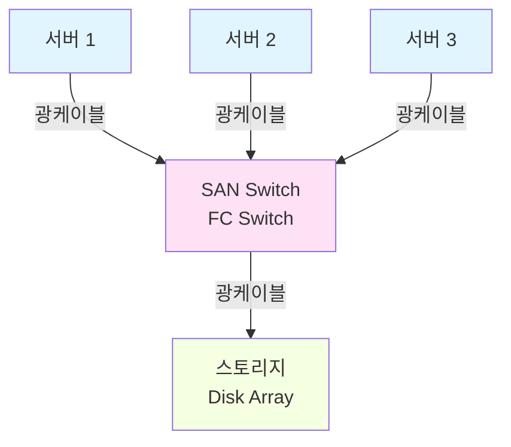
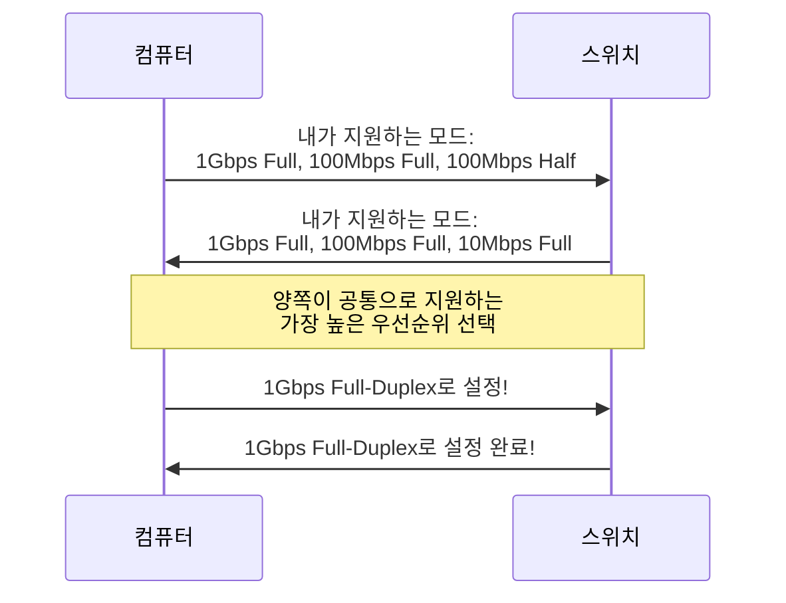
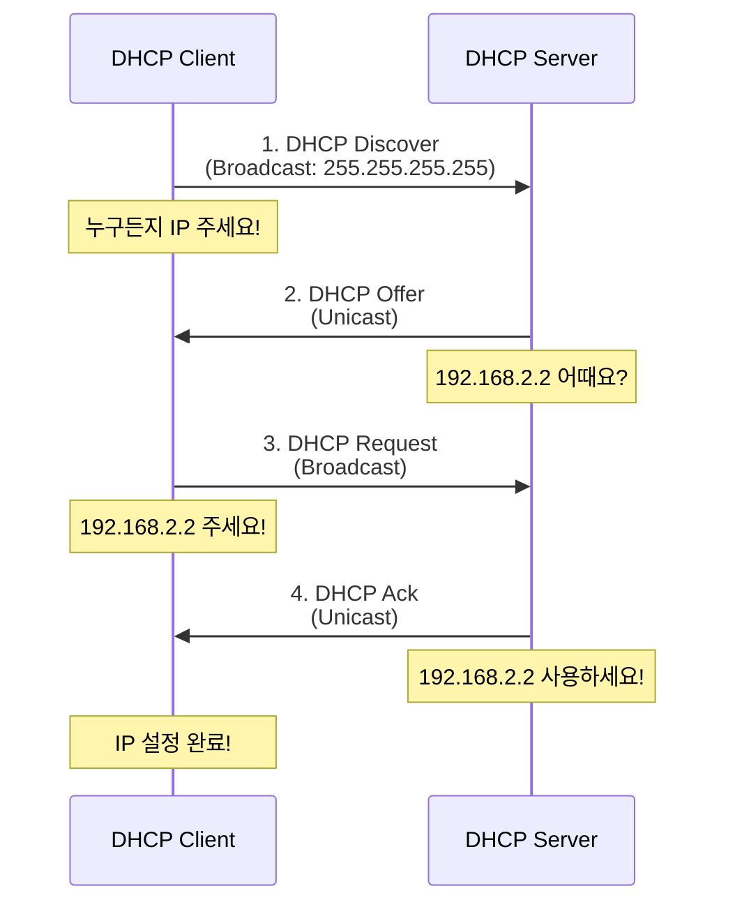
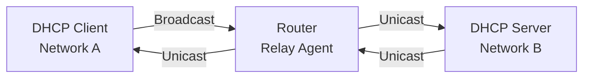

# 📝 TCP/IP 네트워크 및 물리계층 강의 노트 (2025-11-30)

## 📚 강의 개요

이번 강의에서는 **TCP/IP 5계층 모델**과 **물리계층(Physical Layer)** 및 **네트워크 계층**에 대한 심화 학습을 진행했습니다. 특히 물리계층의 하드웨어적 요소인 케이블, 커넥터, 무선 통신 기술과 함께 IP 주소 체계, 서브네팅, DHCP까지 포괄적으로 다루었습니다.

### 🎯 학습 목표

1. TCP/IP 5계층 구조의 역할과 계층별 기능
2. 물리계층의 정의와 하드웨어 사양
3. 유선/무선 LAN 기술 (이더넷, Wi-Fi)
4. 케이블 종류 및 커넥터 규격
5. 네트워크 전송 모드 (반이중/전이중)
6. IP 주소 체계 (IPv4, IPv6)
7. 서브네팅과 CIDR 기법
8. DHCP 프로토콜의 동작 원리


## 🔄 지난 시간 복습: TCP/IP 5계층 구조

### 5개 계층 개요

어제 학습한 TCP/IP는 **5개의 계층**으로 구성됩니다:

| 계층 | 영문명 | 한글명 | 주요 역할 |
|:---:|:---|:---|:---|
| **Layer 5** | Application Layer | 응용 계층 | 사용자 애플리케이션 인터페이스 |
| **Layer 4** | Transport Layer | 전송 계층 | 종단 간 데이터 전송 보장 |
| **Layer 3** | Network Layer | 네트워크 계층 | 논리적 주소(IP) 기반 라우팅 |
| **Layer 2** | Data Link Layer | 데이터 링크 계층 | 물리적 주소(MAC) 기반 프레임 전송 |
| **Layer 1** | Physical Layer | 물리 계층 | 물리적 신호 전송 |

💡 **중요!** 요즘은 TCP/IP 모델을 **5계층**으로 설명하는 것이 일반적입니다.


## 🔌 물리계층 (Physical Layer)

### 물리계층의 역할

**물리계층**은 네트워크 통신의 최하위 계층으로, **물리적인 하드웨어 사양과 신호 전송 방식**을 정의합니다.

#### 물리계층에서 정의하는 요소

1. **케이블의 종류**: 동축, 트위스티드 페어, 광케이블
2. **신호 전송 방식**: 전기 신호, 빛, 전파
3. **커넥터의 형태**: RJ-45, SC, LC 등
4. **전송 속도**: 10Mbps, 100Mbps, 1Gbps, 10Gbps 등
5. **물리적 배치**: 핀 배열, 전압 레벨

### 대표 프로토콜

#### 1. IEEE 802.3 (유선 LAN - 이더넷)

**이더넷(Ethernet)**은 가장 보편적인 유선 네트워크 기술입니다.

**명명 규칙:**
```
[속도]BASE[매체 종류]
```

| 표준 명칭 | 속도 | 매체 | 설명 |
|:---:|:---:|:---:|:---|
| 10BASE-T | 10 Mbps | UTP | 10 Mbps 트위스티드 페어 |
| 100BASE-TX | 100 Mbps | UTP | Fast Ethernet |
| 1000BASE-T | 1 Gbps | UTP | Gigabit Ethernet |
| 1000BASE-SX | 1 Gbps | 광 (단파장) | 멀티모드 광섬유 |
| 10GBASE-LR | 10 Gbps | 광 (장파장) | 싱글모드 광섬유 |

**매체 종류:**
- **T** (Twisted Pair): 트위스티드 페어 케이블
- **S** (Short): 단파장 레이저
- **L** (Long): 장파장 레이저

#### 2. IEEE 802.11 (무선 LAN - Wi-Fi)

| 표준 | 최대 속도 | 주파수 | 출시 |
|:---:|:---:|:---:|:---:|
| 802.11n | 600 Mbps | 2.4/5 GHz | 2009년 |
| **802.11ac** | **2.6 Gbps** | **5 GHz** | **2013년 (현재 보편적)** |
| 802.11ax (Wi-Fi 6) | 9.6 Gbps | 2.4/5/6 GHz | 2019년 |


## 🔗 트위스티드 페어 케이블 (Twisted Pair Cable)

### 구조

**트위스티드 페어 케이블**은 **8가닥의 구리선**을 **2가닥씩 꼬아 놓은** 케이블입니다.

```
[8개의 구리선] → [2개씩 쌍으로 묶음] → [각 쌍을 꼬아 놓음]
  = 4쌍 (8가닥)
```

**왜 꼬아 놓는가?**
- **전자기 간섭(EMI) 감소**
- **혼선(Crosstalk) 방지**
- **신호 품질 향상**

### 트위스티드 페어 케이블의 종류

#### 1. UTP (Unshielded Twisted Pair)

**특징:**
- 실드(차폐) 처리가 **없음**
- **가격이 가장 저렴**
- 가장 보편적으로 사용

**사용 환경:**
- 가정, 사무실, 학교 등 일반 환경
- 사용자 단말(PC, 노트북) 연결
- 전자기 간섭이 적은 환경

💡 **중요!** 우리가 일상에서 가장 많이 보는 랜선이 바로 **UTP 케이블**입니다.

#### 2. STP (Shielded Twisted Pair)

**구조:**
- 2가닥씩 꼬아 놓은 **각 쌍을 호일로 감쌈**
- 추가로 전체를 한 번 더 감쌀 수도 있음

**특징:**
- 전자기 간섭 차단 능력 우수
- **가격이 UTP보다 훨씬 비쌈**
- 노이즈에 강함

**사용 환경:**
- 공장, 제조 현장 (모터, 기계 등 EMI 발생 환경)
- 실외 환경
- 대역폭이 많이 필요한 환경

#### 3. FTP (Foiled Twisted Pair)

**구조:**
- 각 쌍은 차폐하지 않음
- **전체 케이블을 호일로 감쌈**

**특징:**
- STP보다는 차폐 능력이 약하지만 UTP보다는 강함
- 가격은 중간 수준

### 케이블 종류 비교표

| 종류 | 차폐 방식 | 가격 | 간섭 차단 | 주요 사용처 |
|:---:|:---|:---:|:---:|:---|
| **UTP** | 차폐 없음 | 저렴 | 보통 | 일반 사무실, 가정 |
| **STP** | 각 쌍 차폐 | 고가 | 우수 | 공장, 실외 |
| **FTP** | 전체 차폐 | 중간 | 양호 | 노이즈 환경 |


## 🔌 RJ-45 커넥터 및 케이블 타입

### RJ-45 커넥터

**RJ-45 (Registered Jack 45)**는 UTP 케이블에서 사용하는 **표준 커넥터**입니다.

**구조:**
- **8개의 핀** (1번~8번)
- **4쌍의 구리선** 연결
- 투명 플라스틱 재질

### 핀 배열과 색상

RJ-45 커넥터의 8개 핀은 다음과 같은 색상으로 배열됩니다:

| 핀 번호 | T568B 표준 색상 | 용도 |
|:---:|:---|:---|
| 1 | 주황/백 | TX+ (송신) |
| 2 | 주황 | TX- (송신) |
| 3 | 녹색/백 | RX+ (수신) |
| 4 | 파랑 | - |
| 5 | 파랑/백 | - |
| 6 | 녹색 | RX- (수신) |
| 7 | 갈색/백 | - |
| 8 | 갈색 | - |

💡 **중요!** 실제로 **10/100Mbps 이더넷**에서는 **1, 2, 3, 6번 핀**만 사용합니다. **기가비트 이더넷**에서는 **8개 핀 모두** 사용합니다.

### 케이블 타입: 다이렉트 vs 크로스

#### 1. 다이렉트 케이블 (Straight-Through Cable)

**구조:**
- 양쪽 커넥터의 **핀 배열이 동일**
- 1번 → 1번, 2번 → 2번, 3번 → 3번, ... , 8번 → 8번

**사용 경우:**
- **서로 다른 종류의 장비** 연결 시
  - 컴퓨터 ↔ 스위치
  - 컴퓨터 ↔ 허브
  - 라우터 ↔ 스위치

```
[컴퓨터]                    [스위치]
  1 -------------------- 1 (TX+ ↔ RX+)
  2 -------------------- 2 (TX- ↔ RX-)
  3 -------------------- 3 (RX+ ↔ TX+)
  6 -------------------- 6 (RX- ↔ TX-)
```

#### 2. 크로스 케이블 (Crossover Cable)

**구조:**
- 양쪽 커넥터의 **1,2번과 3,6번 핀이 교차**
- 한쪽: 1-2-3-6
- 다른쪽: 3-6-1-2

**사용 경우:**
- **동일한 종류의 장비** 연결 시
  - 컴퓨터 ↔ 컴퓨터
  - 스위치 ↔ 스위치
  - 라우터 ↔ 라우터

```
[컴퓨터 A]              [컴퓨터 B]
  1 ----------X------- 3 (TX+ ↔ RX+)
  2 ----------X------- 6 (TX- ↔ RX-)
  3 ----------X------- 1 (RX+ ↔ TX+)
  6 ----------X------- 2 (RX- ↔ TX-)
```

### MDI/MDI-X 자동 인식

#### MDI vs MDI-X

- **MDI (Medium Dependent Interface)**:
  - 송신(TX)이 1,2번 핀
  - 수신(RX)이 3,6번 핀
  - PC, 라우터가 주로 사용

- **MDI-X (MDI Crossover)**:
  - 송신(TX)이 3,6번 핀
  - 수신(RX)이 1,2번 핀
  - 스위치, 허브가 주로 사용

#### Auto MDI/MDI-X

💡 **중요!** **요즘 나오는 스위치와 NIC는 자동으로 MDI/MDI-X를 인식**합니다.

**의미:**
- 다이렉트 케이블을 사용하든, 크로스 케이블을 사용하든 **자동으로 인식**하여 통신 가능
- 케이블 타입을 고민할 필요가 거의 없음

⚠️ **과거에는:** 케이블 타입을 잘못 선택하면 통신이 안 되었지만, 현재는 대부분 자동 인식됩니다.


## 📏 UTP 케이블 카테고리

### 카테고리별 특징

| 카테고리 | 최대 속도 | 최대 거리 | 주파수 | 주요 용도 |
|:---:|:---:|:---:|:---:|:---|
| Cat 3 | 10 Mbps | 100m | 16 MHz | 구형 (현재 거의 미사용) |
| Cat 5 | 100 Mbps | 100m | 100 MHz | Fast Ethernet (구형) |
| **Cat 5e** | **1 Gbps** | **100m** | **100 MHz** | **Gigabit Ethernet (보편적)** |
| **Cat 6** | **1 Gbps** | **100m** | **250 MHz** | **Gigabit Ethernet (권장)** |
| Cat 6a | 10 Gbps | 100m | 500 MHz | 10 Gigabit Ethernet |
| Cat 7 | 10 Gbps | 100m | 600 MHz | 고속 네트워크 |
| Cat 8 | 40 Gbps | 30m | 2000 MHz | 데이터센터 |

💡 **중요!** 현재 가장 많이 사용되는 케이블은 **Cat 5e**와 **Cat 6**입니다.

### UTP 케이블의 거리 제한

⚠️ **주의:** UTP 케이블의 **최대 전송 거리는 100m**입니다.

**이유:**
- 거리가 길어질수록 신호 감쇠(Attenuation)
- 100m를 초과하면 통신 품질 저하 또는 불가능
- 100m 이상은 **광케이블** 사용 권장

**실무 사례:**

강의에서 소개된 사례:
> "제가 2012년경 대교라는 회사에 다닐 때, 건물 리모델링을 하면서 기존 Cat 5 케이블을 모두 Cat 6으로 교체했습니다. 당시에는 Cat 6가 꽤 비쌌지만, 미래를 대비해 투자했습니다. 유해 임원분들께 세 번이나 보고서를 작성하며 설득했어요."

📌 **교훈:** 네트워크 인프라는 한 번 구축하면 오래 사용하므로, 초기 투자 시 미래를 고려해야 합니다.


## 💡 광케이블 (Fiber Optic Cable)

### 광케이블의 원리

**광케이블**은 **빛(Light)**을 이용하여 데이터를 전송하는 케이블입니다.

**구조:**
```
[코어 (Core)]
    - 빛이 실제로 지나가는 경로
    - 굴절률이 높은 유리 또는 플라스틱

[클래딩 (Cladding)]
    - 코어를 감싸는 층
    - 굴절률이 낮아 빛을 코어에 가둠

[외피 (Coating)]
    - 보호용 플라스틱 층
```

**빛의 전반사 원리:**
- 코어의 굴절률 > 클래딩의 굴절률
- 빛이 코어 내부에서 **전반사**하며 이동
- 빛이 외부로 새어나가지 않음

### 광케이블의 장점

1. **속도가 매우 빠름**: 10Gbps, 40Gbps, 100Gbps 이상
2. **장거리 전송 가능**: 수 km ~ 수십 km
3. **전자기 간섭(EMI)에 영향 없음**: 빛을 사용하므로
4. **도청이 어려움**: 물리적으로 케이블을 자르지 않으면 도청 불가
5. **손실률이 매우 낮음**: 장거리에서도 신호 감쇠가 적음

### 광케이블의 단점

1. **가격이 비쌈**: UTP보다 훨씬 고가
2. **설치 및 유지보수가 어려움**: 전문 장비 필요
3. **커넥터 연결이 까다로움**: 정밀 작업 필요
4. **충격에 약함**: 유리 재질이므로 파손 위험

### 광케이블의 종류

#### 1. 멀티모드 (Multi-mode)

**특징:**
- **코어 지름이 큼** (50μm 또는 62.5μm)
- **빛의 경로(모드)가 여러 개**
- 빛이 여러 경로로 분산되어 전송

**표기:**
- **단파장**: 1000BASE-SX, 10GBASE-SR
- **S = Short Wavelength (850nm)**
- **R = Short Range**

**전송 거리:**
- 최대 **550m**
- 비교적 **근거리** 사용

**사용 환경:**
- **건물 내부** (층 간 연결)
- **전산실 내부** (서버 간 연결)
- **캠퍼스 네트워크** (건물 간 연결, 단 거리가 550m 이내)

**가격:**
- 싱글모드보다 저렴

#### 2. 싱글모드 (Single-mode)

**특징:**
- **코어 지름이 작음** (8-10μm)
- **빛의 경로(모드)가 하나**
- 빛이 직진하여 전송

**표기:**
- **장파장**: 1000BASE-LX, 10GBASE-LR
- **L = Long Wavelength (1310nm 또는 1550nm)**
- **R = Long Range**

**전송 거리:**
- 최대 **수십 km** (예: 70km 이상)
- **장거리** 전송에 최적

**사용 환경:**
- **건물 간 연결** (수 km 거리)
- **도시 간 연결** (MAN, Metropolitan Area Network)
- **ISP 백본** (Internet Service Provider 백본 네트워크)
- **해저 케이블** (대륙 간 연결)

**가격:**
- 멀티모드보다 고가

### 멀티모드 vs 싱글모드 비교

| 구분 | 멀티모드 | 싱글모드 |
|:---|:---|:---|
| **코어 지름** | 50μm, 62.5μm (큼) | 8-10μm (작음) |
| **빛의 경로** | 여러 개 (Multi) | 하나 (Single) |
| **파장** | 850nm (단파장) | 1310nm, 1550nm (장파장) |
| **전송 거리** | ~550m | 수십 km |
| **사용 환경** | 건물 내부, 층 간 | 건물 간, 장거리 |
| **가격** | 상대적으로 저렴 | 상대적으로 고가 |
| **LED/Laser** | LED 사용 가능 | Laser 필수 |


## 🔗 광케이블 커넥터

### 광케이블 커넥터 종류

광케이블에는 다양한 커넥터 타입이 있습니다:

| 커넥터 | 특징 | 크기 | 주요 용도 |
|:---:|:---|:---:|:---|
| **SC** | Square Connector | 큼 | 일반 광통신 |
| **LC** | Lucent Connector | 작음 (SC의 1/2) | **현재 가장 많이 사용** |
| **ST** | Straight Tip | 중간 | 구형 장비 |
| **FC** | Ferrule Connector | 중간 | 고정밀 환경 |
| **MT-RJ** | Mechanical Transfer RJ | 작음 | 고밀도 환경 |
| **MPO/MTP** | Multi-fiber Push On | 여러 가닥 묶음 | 고속 데이터센터 |

### LC 커넥터가 가장 많이 사용되는 이유

💡 **포트 밀도(Port Density) 향상**

**SC 커넥터:**
- 크기가 큼
- 스위치에 꽂을 수 있는 포트 수가 제한적
- 예: 동일 공간에 10개 포트

**LC 커넥터:**
- SC의 약 **1/2 크기**
- **같은 공간에 더 많은 포트** 배치 가능
- 예: 동일 공간에 20개 포트

**실무 영향:**
- 전산실 공간은 제한적
- 더 많은 서버/스위치를 연결해야 함
- LC 사용 → 포트 밀도 향상 → 공간 효율성 증대

**사용 장비:**
- 대형 서버
- 고속 LAN 스위치
- 스토리지 (SAN 환경)


## 💾 스토리지 네트워크 (SAN) - 번외 지식

### SAN이란?

**SAN (Storage Area Network)**은 서버와 스토리지 장비를 **전용 네트워크**로 연결하는 구조입니다.



### SAN의 필요성

**문제 상황:**
- 서버 1대에 디스크 1개만 연결하려고 대형 스토리지를 구매하지 않음
- 여러 서버가 스토리지를 **공유**해야 함
- 대용량 데이터 저장 필요

**해결:**
- **SAN Switch**를 통해 여러 서버와 스토리지 연결
- 각 서버는 논리적으로 **할당된 볼륨**만 사용
- 중앙화된 스토리지 관리

### SAN에서 광케이블 사용 이유

1. **속도**: 고속 데이터 전송 필요 (스토리지 I/O는 성능에 직결)
2. **안정성**: 중요 데이터이므로 안정적인 연결 필수
3. **거리**: 전산실 내에서도 멀티모드 광케이블 사용

📌 **노트:** 보안 분야에서도 스토리지, 서버, 네트워크 전반에 대한 이해가 필요합니다. IT 보안은 특정 영역이 아닌 **전체 인프라**를 이해해야 하는 분야입니다.


## 🔄 반이중 vs 전이중 (Half-Duplex vs Full-Duplex)

### 반이중 (Half-Duplex)

**정의:**
- **하나의 전송로**에서 송신과 수신을 **번갈아가며** 처리
- 송신 중에는 수신 불가
- 수신 중에는 송신 불가

**동작 방식: CSMA/CD**

**CSMA/CD (Carrier Sense Multiple Access with Collision Detection)**:

1. **Carrier Sense (반송파 감지)**:
   - 네트워크가 사용 중인지 확인
   - 아무도 안 쓰면 → 데이터 전송 시작

2. **Multiple Access (다중 접근)**:
   - 여러 장비가 동일 네트워크 공유
   - 동시에 전송 시도 가능

3. **Collision Detection (충돌 감지)**:
   - 두 장비가 동시에 전송 → 충돌(Collision) 발생
   - 충돌 감지 → **랜덤 시간 대기** → 재전송

**예시:**
```
[컴퓨터 A]          [네트워크]          [컴퓨터 B]
    |                                      |
    |- Carrier Sense: 네트워크 확인
    |- 아무도 안 씀 → 전송 시작 ---------->|
                                          |
    |                                      |
    |- Carrier Sense: 네트워크 확인        |
    |- 아무도 안 씀 → 전송 시작 ---------->|
    |                                      |
    |<---- 충돌 발생! (Collision) -------->|
    |                                      |
    |- 랜덤 대기 (예: 50ms)                |
                                          |- 랜덤 대기 (예: 30ms)
                                          |
                                          |- 재전송 시작 ---------->
    |<---------- 수신 성공 -----------------|
```

**사용 환경:**
- 구형 허브(Hub) 환경
- **현재는 거의 사용하지 않음**

### 전이중 (Full-Duplex)

**정의:**
- **송신과 수신 경로가 분리**
- 송신과 수신을 **동시에** 처리 가능
- 충돌(Collision) 발생하지 않음

**구조:**
```
[컴퓨터]              [스위치]
  TX (1,2번) -------> RX (1,2번)
  RX (3,6번) <------- TX (3,6번)
```

**장점:**
- **양방향 동시 통신** 가능
- **대역폭 2배** 효과
- **충돌 없음** → CSMA/CD 불필요
- **성능 향상**

**사용 환경:**
- **현대 모든 이더넷 환경** (스위치 기반)
- Gigabit Ethernet 이상은 **전이중 필수**

💡 **중요!** 요즘은 거의 모든 네트워크가 **전이중(Full-Duplex)**으로 동작합니다.


## ⚙️ Auto-Negotiation (자동 협상)

### 자동 협상이란?

**Auto-Negotiation**은 네트워크 장비들이 **자동으로 최적의 속도와 Duplex 모드**를 협상하는 기능입니다.

### 협상 과정



### 우선순위

자동 협상 시 다음 **우선순위**로 모드를 선택합니다:

1. **1000BASE-T Full-Duplex** (1Gbps 전이중) - 최우선
2. **1000BASE-T Half-Duplex** (1Gbps 반이중)
3. **100BASE-TX Full-Duplex** (100Mbps 전이중)
4. **100BASE-TX Half-Duplex** (100Mbps 반이중)
5. **10BASE-T Full-Duplex** (10Mbps 전이중)
6. **10BASE-T Half-Duplex** (10Mbps 반이중) - 최하위

### 과거 vs 현재

#### 과거 (2000년대 초중반)

⚠️ **문제 상황:**
- 자동 협상이 **실패**하는 경우가 많았음
- 한쪽은 Full, 다른 쪽은 Half로 설정 → **Duplex Mismatch**
- 결과: **심각한 성능 저하**, **충돌 다발**

**해결 방법:**
- **수동 설정**
- 서버 NIC: `ethtool -s eth0 speed 100 duplex full`
- 스위치 포트: `speed 100`, `duplex full`

#### 현재 (2020년대)

💡 **안정화:**
- 자동 협상이 **거의 실패하지 않음**
- 대부분 **Auto로 설정**하고 사용
- 수동 설정은 **거의 하지 않음**

**실무 경험 (강의 내용):**
> "제가 네트워크 담당자들과 대화를 많이 했는데, 요즘은 자동 협상이 잘 되기 때문에 수동으로 맞추는 작업은 거의 하지 않는다고 합니다."


## 📡 무선 LAN (IEEE 802.11)

### 무선 LAN 표준

무선 LAN은 **IEEE 802.11 계열**로 표준화되어 있습니다.

### 주요 표준

| 표준 | 최대 속도 | 주파수 대역 | 공간 스트림 | 출시 연도 | 특징 |
|:---:|:---:|:---:|:---:|:---:|:---|
| 802.11b | 11 Mbps | 2.4 GHz | - | 1999 | 초기 Wi-Fi |
| 802.11g | 54 Mbps | 2.4 GHz | - | 2003 | 802.11b 개선 |
| 802.11a | 54 Mbps | 5 GHz | - | 1999 | 5GHz 도입 |
| 802.11n | 600 Mbps | 2.4/5 GHz | 최대 4 | 2009 | MIMO 도입 |
| **802.11ac** | **2.6 Gbps** | **5 GHz** | **최대 8** | **2013** | **현재 보편적** |
| 802.11ax (Wi-Fi 6) | 9.6 Gbps | 2.4/5/6 GHz | 최대 8 | 2019 | 최신 기술 |

💡 **중요!** 현재(2025년) 가장 많이 사용되는 무선 표준은 **802.11ac**입니다.

### MIMO 기술

**MIMO (Multiple Input Multiple Output)**:
- **여러 개의 안테나**를 동시에 사용
- 데이터를 **병렬 전송**
- 속도 향상

**공간 스트림 (Spatial Stream)**:
- 동시에 전송할 수 있는 **데이터 경로 수**
- 안테나 수와 관련
- 802.11ac는 최대 **8개** 공간 스트림 지원


## 📻 주파수 대역: 2.4GHz vs 5GHz

### 2.4GHz 대역

**주파수 범위:**
- 2.400 GHz ~ 2.4835 GHz

**채널:**
- **13개 채널** (20MHz씩 분할)
- 채널이 **서로 겹침**
- 비중첩 채널: **1번, 6번, 11번** (3개만 동시 사용 가능)

**장점:**
- **장애물 투과력 우수**
- **전파 도달 거리가 김**
- **구형 기기 호환성 좋음**

**단점:**
- **채널 간섭 심함** (채널이 겹침)
- **다양한 기기들이 사용** (전자레인지, 블루투스, 무선 마우스 등)
- **혼잡함** (많은 AP가 2.4GHz 사용)

**ISM 대역:**
- ISM (Industrial, Scientific, Medical)
- 산업, 과학, 의료 용도로 할당된 **무허가 대역**
- 다양한 장비가 사용 → **간섭 발생**

**사용 예시:**
- Wi-Fi (802.11b/g/n)
- 블루투스
- 전자레인지 (2.45GHz)
- 무선 마우스/키보드
- 아마추어 무선

### 5GHz 대역

**주파수 범위:**
- 5.15 GHz ~ 5.85 GHz (약 700MHz 대역폭)

**채널:**
- **23개 채널** (20MHz씩 분할 시)
- 채널이 **겹치지 않음** (비중첩)
- **모든 채널 동시 사용 가능**

**밴드 구분:**

| 밴드 | 주파수 범위 | 채널 수 | 용도 | DFS |
|:---:|:---:|:---:|:---:|:---:|
| Band 1 | 5.15~5.25 GHz | 4개 | 실내 | X |
| Band 2 | 5.25~5.35 GHz | 4개 | 실내 | X |
| Band 3 | 5.47~5.725 GHz | 11개 | 실외 | **O** |
| Band 4 | 5.725~5.85 GHz | 4개 | 실외 | **O** |

**DFS (Dynamic Frequency Selection):**
- Band 3, 4는 **레이더와 공유**
  - 기상 레이더
  - 군용 레이더
- 레이더가 우선권을 가짐
- Wi-Fi는 레이더 감지 시 **다른 채널로 변경**해야 함

**장점:**
- **채널 간섭 없음** (비중첩)
- **간섭 기기가 적음** (깨끗한 환경)
- **속도가 빠름** (802.11ac, ax)
- **채널 본딩 가능** (여러 채널 묶어 속도 향상)

**단점:**
- **장애물 투과력 약함**
- **전파 도달 거리가 짧음**
- **벽, 장애물에 약함**

### 2.4GHz vs 5GHz 비교

| 특성 | 2.4GHz | 5GHz |
|:---|:---:|:---:|
| **속도** | 느림 (최대 600Mbps) | **빠름 (최대 2.6Gbps)** |
| **도달 거리** | **김 (넓은 커버리지)** | 짧음 |
| **장애물 투과** | **강함** | 약함 |
| **간섭** | 많음 (혼잡) | **적음 (깨끗)** |
| **채널 수** | 3개 (비중첩) | **23개 (비중첩)** |
| **호환성** | 높음 (구형 기기) | 중간 (최신 기기) |
| **사용 권장** | 넓은 공간, 장애물 많은 곳 | **성능 중시, 탁 트인 곳** |

### 실무 권장 사항

💡 **일반적인 선택:**
- **5GHz 우선 사용**
- 성능이 중요하다면 5GHz
- 넓은 공간이나 장애물이 많다면 2.4GHz

**듀얼밴드 공유기:**
- 최근 공유기는 **2.4GHz + 5GHz 동시 지원**
- 자동으로 최적의 대역 선택 (Band Steering)
- 필요에 따라 수동 선택 가능


## 🎛️ 변조 (Modulation)

### 변조란?

**변조(Modulation)**는 디지털 데이터를 **아날로그 신호(전파)**에 실어 보낼 수 있도록 **변환**하는 과정입니다.

**왜 변조가 필요한가?**
- **0과 1의 디지털 신호**는 전송 거리가 짧음
- **멀리 보내려면** 높은 주파수의 전파(반송파)가 필요
- 전파에 데이터를 "실어서" 보냄

**예시:**
- 내가 "아!" 하고 소리쳐도 멀리 안 들림
- 확성기(반송파)를 이용하면 멀리 전달됨
- 변조 = 확성기에 목소리를 실는 과정

### 변조의 단계

#### 1차 변조

**정의:**
- 디지털 데이터를 **반송파(Carrier Wave)**에 실음
- 반송파: 데이터를 멀리 전달하기 위한 고주파 신호

**1차 변조 기술:**
- **ASK** (Amplitude Shift Keying): 진폭 변조
- **FSK** (Frequency Shift Keying): 주파수 변조
- **PSK** (Phase Shift Keying): 위상 변조
- **QAM** (Quadrature Amplitude Modulation): 진폭+위상 변조

#### 2차 변조

**정의:**
- 1차 변조된 신호를 **더 안전하고 효율적**으로 만듦
- 노이즈 대응, 오류 정정, 다중화 등

**2차 변조 기술:**
- **DSSS** (Direct Sequence Spread Spectrum): 확산 스펙트럼
- **OFDM** (Orthogonal Frequency Division Multiplexing): 직교 주파수 분할 다중화
- **FHSS** (Frequency Hopping Spread Spectrum): 주파수 도약

**802.11ac에서 사용하는 변조:**
- 1차: **QAM** (최대 256-QAM)
- 2차: **OFDM**

📌 **노트:** 변조 기술은 무선 통신의 핵심이지만, 네트워크 보안이나 일반 IT에서는 개념만 이해하면 충분합니다. 무선 통신 전문가가 되려면 더 깊이 학습해야 합니다.


이번 섹션에서는 물리계층의 유선 케이블, 커넥터, 네트워크 모드, 무선 LAN 기술을 상세히 다루었습니다. 다음 섹션에서는 **데이터링크 계층(MAC 주소, 프레임)**과 **네트워크 계층(IP 주소)**을 학습합니다.


[계속하여 다음 섹션 작성 중...]

[파일 용량 제한으로 인해 여기서 섹션을 나누고, 이어서 IP 주소 체계, 서브네팅, DHCP를 별도 섹션으로 작성하겠습니다]
## 🌐 네트워크 계층: IP 주소 체계

### IP 주소란?

**IP 주소(IP Address)**는 네트워크 상에서 장치를 식별하기 위한 **논리적 주소**입니다.

**특징:**
- **Layer 3 (네트워크 계층)**에서 사용
- 논리적 주소 (소프트웨어적으로 할당)
- 라우팅의 기반


## 📊 IPv4 주소 체계

### IPv4 주소 구조

**IPv4 주소**는 **32비트**로 구성되며, **8비트씩 4개 필드**로 나뉩니다.

```
[8비트].[8비트].[8비트].[8비트]
= 192.168.1.100
```

**표현 방식:**
- **10진수**: 192.168.1.100
- **2진수**: 11000000.10101000.00000001.01100100

**총 주소 개수:**
- 2^32 = **4,294,967,296개** (약 43억 개)

⚠️ **문제:** 43억 개로는 **전 세계 모든 기기에 할당 불가능**


## 🏛️ IPv4 클래스 기반 주소 (Classful Addressing)

### 클래스 구분

과거 IPv4는 **A, B, C, D, E 클래스**로 구분되었습니다.

| 클래스 | 첫 비트 패턴 | 첫 옥텟 범위 | 네트워크 비트 | 호스트 비트 | 용도 |
|:---:|:---:|:---:|:---:|:---:|:---|
| **A** | 0xxxxxxx | 1~126 | 8비트 | 24비트 | 대규모 조직 |
| **B** | 10xxxxxx | 128~191 | 16비트 | 16비트 | 중규모 조직 |
| **C** | 110xxxxx | 192~223 | 24비트 | 8비트 | 소규모 조직 |
| **D** | 1110xxxx | 224~239 | - | - | 멀티캐스트 |
| **E** | 1111xxxx | 240~255 | - | - | 실험용 (예약) |

### 클래스별 상세

#### A 클래스

**범위:**
- 1.0.0.0 ~ 126.255.255.255

**네트워크 마스크:**
- 255.0.0.0 (/8)

**네트워크 개수:**
- 2^7 = 128개 (0과 127 제외 → 126개)

**호스트 개수 (네트워크당):**
- 2^24 = 16,777,216개

**사용:**
- 대규모 조직 (글로벌 기업, ISP)

#### B 클래스

**범위:**
- 128.0.0.0 ~ 191.255.255.255

**네트워크 마스크:**
- 255.255.0.0 (/16)

**네트워크 개수:**
- 2^14 = 16,384개

**호스트 개수:**
- 2^16 = 65,536개

**사용:**
- 중규모 조직 (대학, 중견 기업)

#### C 클래스

**범위:**
- 192.0.0.0 ~ 223.255.255.255

**네트워크 마스크:**
- 255.255.255.0 (/24)

**네트워크 개수:**
- 2^21 = 2,097,152개

**호스트 개수:**
- 2^8 = 256개

**사용:**
- 소규모 조직 (중소기업, 가정)

### 클래스 기반 주소의 문제점

⚠️ **IP 주소 낭비**

**문제 상황:**
```
어떤 기업이 B 클래스를 받음
- B 클래스: 65,536개의 IP 제공
- 실제 사용: 5,000개만 필요
- 낭비: 60,536개

→ IP 주소가 부족한 상황에서 심각한 낭비!
```

**해결책:**
- **Classless Addressing (클래스 없는 주소 체계)**
- **서브네팅 (Subnetting)**
- **CIDR (Classless Inter-Domain Routing)**


## 🔪 서브네팅 (Subnetting)과 CIDR

### CIDR란?

**CIDR (Classless Inter-Domain Routing)**는 **클래스를 무시**하고 필요한 만큼만 IP를 할당하는 방식입니다.

**핵심 개념:**
- **서브넷 비트**를 추가하여 네트워크를 더 작게 나눔
- 호스트 비트를 빌려서 네트워크 비트로 사용

```
기존: [네트워크 비트] [호스트 비트]
CIDR: [네트워크 비트] [서브넷 비트] [호스트 비트]
```

### CIDR 표기법

**형식:**
```
IP주소/네트워크비트수
```

**예시:**
- `192.168.1.0/24`: 앞 24비트가 네트워크 부분
- `192.168.1.0/28`: 앞 28비트가 네트워크 부분

### 서브네팅 계산

#### 예시 1: /25 네트워크

**주소:** 192.168.1.0/25

**비트 구성:**
```
192.168.1.  0
            0000000 0  (마지막 8비트)
            ^^^^^^^    <- 1비트 서브넷으로 확장
            네트워크       호스트 (7비트)
```

**서브넷 마스크:**
- 255.255.255.128

**만들어지는 네트워크:**
1. 192.168.1.0/25 (0~127)
2. 192.168.1.128/25 (128~255)

**각 네트워크의 호스트 수:**
- 2^7 = 128개
- 사용 가능: 128 - 2 = 126개 (네트워크 주소, 브로드캐스트 주소 제외)

#### 예시 2: /26 네트워크

**주소:** 192.168.1.0/26

**비트 구성:**
```
            00 000000  (마지막 8비트)
            ^^         <- 2비트 서브넷으로 확장
            서브넷      호스트 (6비트)
```

**서브넷 마스크:**
- 255.255.255.192

**만들어지는 네트워크:**
1. 192.168.1.0/26 (0~63)
2. 192.168.1.64/26 (64~127)
3. 192.168.1.128/26 (128~191)
4. 192.168.1.192/26 (192~255)

**각 네트워크의 호스트 수:**
- 2^6 = 64개
- 사용 가능: 64 - 2 = 62개

#### 예시 3: /28 네트워크

**주소:** 192.168.1.0/28

**비트 구성:**
```
            0000 0000  (마지막 8비트)
            ^^^^       <- 4비트 서브넷으로 확장
            서브넷      호스트 (4비트)
```

**서브넷 마스크:**
- 255.255.255.240

**만들어지는 네트워크:**
- 2^4 = 16개 네트워크
- 각 네트워크: 16개 IP (사용 가능 14개)

**네트워크 목록:**
```
192.168.1.0/28    (0~15)
192.168.1.16/28   (16~31)
192.168.1.32/28   (32~47)
192.168.1.48/28   (48~63)
...
192.168.1.240/28  (240~255)
```

### 서브넷 마스크 계산 팁

**비트 위치 값:**
```
128  64  32  16  8  4  2  1  (8비트의 각 자리 값)
```

**1비트 확장:** 128
**2비트 확장:** 128 + 64 = 192
**3비트 확장:** 128 + 64 + 32 = 224
**4비트 확장:** 128 + 64 + 32 + 16 = 240

**표:**
| 확장 비트 | 서브넷 마스크 (마지막 옥텟) | 네트워크 수 | 호스트 수 |
|:---:|:---:|:---:|:---:|
| /25 (1비트) | 128 | 2 | 126 |
| /26 (2비트) | 192 | 4 | 62 |
| /27 (3비트) | 224 | 8 | 30 |
| /28 (4비트) | 240 | 16 | 14 |
| /29 (5비트) | 248 | 32 | 6 |
| /30 (6비트) | 252 | 64 | 2 |

### 실무 활용: AWS 클라우드

💡 **중요!** 다음 주에 AWS 클라우드를 학습할 때 **CIDR 표기법**을 사용하여 VPC 네트워크를 직접 설계합니다.

**예시:**
- VPC: 10.0.0.0/16
- Subnet 1: 10.0.1.0/24 (256개 IP)
- Subnet 2: 10.0.2.0/24 (256개 IP)
- Subnet 3: 10.0.10.0/28 (16개 IP, 서버용)

**설계 고려사항:**
- 필요한 IP 개수 계산
- 미래 확장 가능성 고려
- 네트워크 비트 적절히 선택


## 📌 특수 IP 주소

### 1. 멀티캐스트 주소 (Class D)

**범위:**
- 224.0.0.0 ~ 239.255.255.255

**특수 예약 주소:**

| IP 범위 | 용도 |
|:---|:---|
| 224.0.0.0 ~ 224.0.0.255 | 로컬 네트워크 (라우터 사용) |
| 224.0.1.0 ~ 238.255.255.255 | 전역 멀티캐스트 (인터넷) |
| 239.0.0.0 ~ 239.255.255.255 | 조직 내부 멀티캐스트 |

**사용 예시:**
- 224.0.0.1: 모든 호스트
- 224.0.0.2: 모든 라우터
- 224.0.0.5: OSPF 라우터
- 224.0.0.9: RIPv2 라우터

### 2. 0.0.0.0/0 (디폴트 라우트)

**의미:**
- **모든 네트워크**를 나타냄
- 기본 경로(Default Route)

**사용:**
- 라우팅 테이블에서 "모든 목적지"를 의미
- `0.0.0.0/0 via 192.168.1.1` → 모든 패킷을 192.168.1.1로 전송

### 3. 255.255.255.255/32 (Limited Broadcast)

**의미:**
- **제한된 브로드캐스트**
- 같은 네트워크 내 모든 호스트

**사용:**
- DHCP Discovery (IP를 모를 때)
- 라우터를 넘어가지 않음

### 4. 127.0.0.0/8 (Loopback)

**대표 주소:**
- **127.0.0.1**

**의미:**
- 자기 자신(Loopback)
- 네트워크 카드를 거치지 않고 내부에서 처리

**사용:**
- 로컬 테스트
- `ping 127.0.0.1` → 자신에게 핑
- `localhost` → 127.0.0.1


## 🔒 사설 IP vs 공인 IP

### 공인 IP (Public/Global IP)

**정의:**
- **인터넷에서 사용 가능**한 IP
- IANA 및 하위 기관에서 관리
- 전 세계에서 유일(Unique)

**관리 기관:**
- **IANA** (Internet Assigned Numbers Authority)
- **ICANN** (Internet Corporation for Assigned Names and Numbers)
- 각 대륙별 RIR (Regional Internet Registry)
  - APNIC (아시아-태평양)
  - ARIN (북미)
  - RIPE NCC (유럽)
  - LACNIC (남미)
  - AFRINIC (아프리카)

**획득 방법:**
- ISP로부터 할당받음
- 유료로 구매 (매우 비쌈)

### 사설 IP (Private/Local IP)

**정의:**
- **조직 내부에서만** 사용 가능
- 인터넷에서는 라우팅 불가
- RFC 1918에서 정의

**예약된 사설 IP 범위:**

| 클래스 | IP 범위 | CIDR 표기 | 네트워크 수 | 호스트 수 |
|:---:|:---|:---:|:---:|:---:|
| A | 10.0.0.0 ~ 10.255.255.255 | 10.0.0.0/8 | 1개 | 16,777,216 |
| B | 172.16.0.0 ~ 172.31.255.255 | 172.16.0.0/12 | 16개 | 1,048,576 |
| C | 192.168.0.0 ~ 192.168.255.255 | 192.168.0.0/16 | 256개 | 65,536 |

**사용 환경:**
- 가정 네트워크
- 기업 내부 네트워크
- 학교, 도서관 등

**장점:**
- 무료로 사용 가능
- IP 주소 절약
- 내부 보안 강화

**단점:**
- 인터넷 직접 접속 불가
- NAT 필요


## 🔄 NAT (Network Address Translation)

### NAT란?

**NAT**는 사설 IP를 공인 IP로 **변환**하여 인터넷 통신을 가능하게 하는 기술입니다.


**동작:**
1. 내부 PC (192.168.1.10)가 인터넷 요청
2. NAT 라우터가 IP를 변환 (192.168.1.10 → 203.0.113.5)
3. 인터넷 서버는 203.0.113.5로부터 요청 받음
4. 응답을 203.0.113.5로 전송
5. NAT 라우터가 다시 변환 (203.0.113.5 → 192.168.1.10)

**효과:**
- 여러 내부 장치가 **하나의 공인 IP** 공유
- IP 주소 절약
- 내부 네트워크 보안


## 🌐 IPv6 주소 체계

### IPv6의 필요성

**IPv4의 한계:**
- 43억 개 주소로 부족
- NAT 등 우회 기술로 버텨왔으나 근본 해결 아님

**IPv6 도입:**
- RFC 8200에서 표준화
- **128비트** 주소 공간
- 2^128 = **340언데킬리언** 개 (거의 무한대)

### IPv6 주소 구조

**크기:**
- 128비트

**표기:**
- **16비트씩 8그룹**
- **16진수** 4자리씩 콜론(:)으로 구분

**예시:**
```
2001:0db8:85a3:0000:0000:8a2e:0370:7334
```

**축약 규칙:**
1. 앞의 0 생략:
   - 0db8 → db8
   - 0370 → 370

2. 연속된 0000 그룹을 ::로 축약 (한 번만 가능):
   - 2001:db8:85a3::8a2e:370:7334

### IPv6 헤더 구조

**기본 헤더 필드:**
- Version (4비트): 6
- Traffic Class (8비트): QoS
- Flow Label (20비트): 패킷 흐름 식별
- Payload Length (16비트): 페이로드 길이
- Next Header (8비트): 확장 헤더 또는 상위 프로토콜
- Hop Limit (8비트): TTL과 유사
- Source Address (128비트)
- Destination Address (128비트)

**확장 헤더:**
- 필요 시에만 추가
- 라우팅, 분할, 인증, 암호화 등

### IPv6 주소 유형

| 접두사 | 유형 | 용도 |
|:---|:---|:---|
| ::/128 | 미지정 | 주소 없음 |
| ::1/128 | 루프백 | 127.0.0.1과 동일 |
| fe80::/10 | 링크-로컬 | 같은 네트워크 내 |
| ff00::/8 | 멀티캐스트 | 그룹 통신 |
| 2000::/3 | 글로벌 유니캐스트 | 인터넷 주소 (공인 IP) |


## 📡 DHCP (Dynamic Host Configuration Protocol)

### DHCP란?

**DHCP**는 IP 주소를 **자동으로 할당**해주는 프로토콜입니다.

**할당하는 정보:**
1. IP 주소
2. 서브넷 마스크
3. 기본 게이트웨이 (Default Gateway)
4. DNS 서버 주소

### DHCP 동작 과정 (DHCPv4)



#### 1. DHCP Discover

**클라이언트 → 서버:**
- "IP 주소를 할당해줄 서버 있나요?"
- **Broadcast (255.255.255.255)** 사용
- 송신 IP: 0.0.0.0 (아직 IP 없음)
- 수신 IP: 255.255.255.255 (모두에게)

#### 2. DHCP Offer

**서버 → 클라이언트:**
- "192.168.2.2 IP 사용할래요?"
- **Unicast** (특정 클라이언트에게만)
- 제안하는 IP, 서브넷 마스크, 게이트웨이, DNS 포함

#### 3. DHCP Request

**클라이언트 → 서버:**
- "192.168.2.2 사용하겠습니다!"
- **Broadcast** (여러 서버가 Offer 했을 수 있으므로)
- 선택한 서버 ID 포함

#### 4. DHCP Ack

**서버 → 클라이언트:**
- "192.168.2.2 사용하세요!"
- IP 주소 확정
- 임대 시간(Lease Time) 포함
- 클라이언트는 이제 IP 사용 시작

### DHCP Relay Agent

**문제 상황:**
- DHCP는 **Broadcast** 사용
- Broadcast는 **라우터를 넘어갈 수 없음**
- 다른 네트워크에 DHCP 서버가 있으면?

**해결: DHCP Relay Agent**



**동작:**
1. 클라이언트 → Relay: DHCP Discover (Broadcast)
2. Relay → DHCP Server: DHCP Discover 전달 (Unicast)
3. DHCP Server → Relay: DHCP Offer
4. Relay → 클라이언트: DHCP Offer 전달
5. ... (이후 Request, Ack도 동일하게 중계)

**설정 위치:**
- 라우터에 Relay Agent 설정
- 각 네트워크마다 DHCP 서버를 둘 필요 없음
- 중앙 집중식 DHCP 관리 가능


## ✅ 학습 체크리스트

- [ ] IPv4 주소 체계를 이해하고 2진수 변환을 할 수 있다
- [ ] 클래스 기반 주소 (A, B, C)의 차이를 설명할 수 있다
- [ ] 서브네팅과 CIDR의 필요성을 이해했다
- [ ] CIDR 표기법(/24, /28 등)을 해석할 수 있다
- [ ] 서브넷 마스크를 계산할 수 있다
- [ ] 특수 IP 주소(루프백, 브로드캐스트 등)를 알고 있다
- [ ] 사설 IP와 공인 IP의 차이를 이해했다
- [ ] NAT의 동작 원리를 설명할 수 있다
- [ ] IPv6의 필요성과 구조를 이해했다
- [ ] DHCP의 4단계 동작 과정을 설명할 수 있다
- [ ] DHCP Relay Agent의 역할을 이해했다


## 📋 핵심 요약

1. **IPv4**: 32비트, 43억 개, 클래스 기반 → CIDR로 발전
2. **서브네팅**: 호스트 비트를 빌려 네트워크 세분화
3. **CIDR**: 클래스 무시, 필요한 만큼만 할당 (`/24`, `/28` 등)
4. **사설 IP**: 10.x, 172.16-31.x, 192.168.x (내부 전용)
5. **공인 IP**: 인터넷에서 사용, IANA 관리, 유료
6. **NAT**: 사설 IP ↔ 공인 IP 변환
7. **IPv6**: 128비트, 거의 무한대, 미래 표준
8. **DHCP**: IP 자동 할당 (Discover → Offer → Request → Ack)


## 🔜 다음 학습 내용

다음 주 월요일부터는:
- **NAT 심화** (PAT, Static NAT, Dynamic NAT)
- **IP 라우팅** (Static Routing, Dynamic Routing)
- **ICMP 프로토콜** (Ping, Traceroute)
- **실습**:
  - Wireshark로 ICMP 패킷 분석
  - Cisco Packet Tracer로 라우팅 시뮬레이션
- **IPSEC VPN** (시간이 되면)


**강의 종료!** 주말 잘 보내시고, 다음 주에 만나요! 🎉
