--- 
title: "📝 리눅스 시스템 네트워크 보안 강의 노트 (6일차)"
date: 2025-12-01
categories:
  - Linux-Network
tags:
  - Linux-Network
  - SK_Rookies
---

# 📝 리눅스 시스템 네트워크 보안 강의 노트 (6일차)
## Section 1: 서론 및 IP 프로토콜 복습

---

## 📅 강의 정보

- **강의 날짜**: 2025년 12월 1일 (월요일)
- **강의 차수**: 6일차
- **주요 주제**:
  - 지난 시간 복습 (IP 프로토콜, IP 주소체계)
  - NAT (Network Address Translation)
  - 라우팅 개념
  - TCP/IP 전송 제어
- **강의 형식**: 온라인 실시간 강의 (이론 + 실습)

---

## 🔙 지난 시간 복습

### 강의 진행 상황

지난주 금요일(5일차)에 **네트워크 계층(Network Layer)**에 대한 학습을 진행했으나, 시간 관계상 모든 내용을 완료하지 못한 상태로 종료했습니다. 오늘은 지난 시간에 학습한 내용을 복습하면서 시작하고, 이어서 새로운 내용(NAT, 라우팅, TCP)으로 진행합니다.

### 네트워크 계층의 역할

💡 **핵심 개념**: 네트워크 계층은 **다른 네트워크에 있는 단말과의 연결성(Connectivity)을 확보**하는 계층입니다.

**다른 네트워크란?**
- 서로 다른 IP 네트워크 대역
- 라우터로 구분되는 별도의 네트워크 세그먼트
- 물리적 또는 논리적으로 분리된 네트워크

**연결성 확보란?**
- 서로 다른 네트워크에 있는 단말 간 패킷 전달
- 라우터를 통한 경로 설정 및 패킷 전송
- IP 주소 기반의 단말 식별 및 통신

---

## 🌐 IP 프로토콜 (Internet Protocol)

### IP 프로토콜 개요

**IP 프로토콜**은 네트워크 계층의 대표적인 프로토콜입니다. OSI 7계층 모델의 Layer 3 (Network Layer)에서 동작하며, TCP/IP 모델에서는 Internet Layer에 해당합니다.

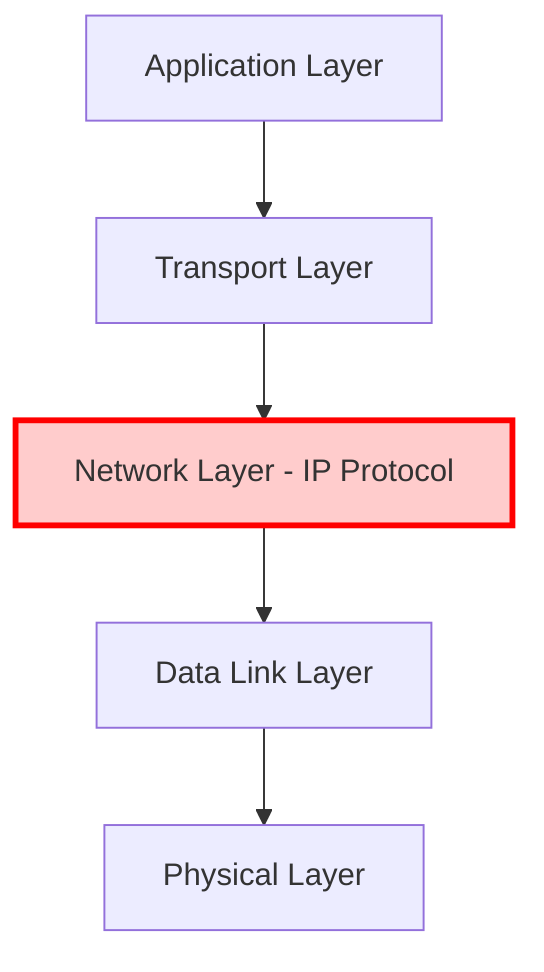

---

## 🔧 IP 프로토콜의 4가지 핵심 기능

💡 **중요!**: IP 프로토콜은 네 가지 핵심 기능을 가지고 있으며, 이 기능들을 통해 인터넷 통신의 기반을 제공합니다.

### 1️⃣ **패킷 분할 및 조립 (Fragmentation & Reassembly)**

#### 개념 설명

IP 프로토콜은 상위 계층(Transport Layer)에서 받은 데이터를 **분할(Fragment)하고 조립(Reassemble)**하는 기능을 가지고 있습니다.

#### 왜 분할이 필요한가?

**문제 상황:**
- 상위 계층(Transport Layer)에서 전달받은 세그먼트(TCP Segment) 또는 데이터그램(UDP Datagram)에 IP 헤더를 붙이면 **IP 패킷**이 됩니다.
- 이 IP 패킷을 하위 계층인 Data Link Layer의 이더넷 프레임(Ethernet Frame)의 **페이로드(Payload)** 영역에 넣어야 합니다.
- 그런데 이더넷 프레임의 페이로드 최대 크기는 **일반적으로 1500바이트**로 제한되어 있습니다.

**MTU (Maximum Transmission Unit):**
- 이더넷 프레임의 페이로드 최대 크기를 **MTU**라고 부릅니다.
- 일반적인 이더넷 환경에서 MTU = **1500 bytes**
- 만약 상위에서 받은 IP 패킷의 크기가 1500바이트를 초과하면, 그대로 이더넷 프레임에 넣을 수 없습니다.

#### 패킷 분할 과정

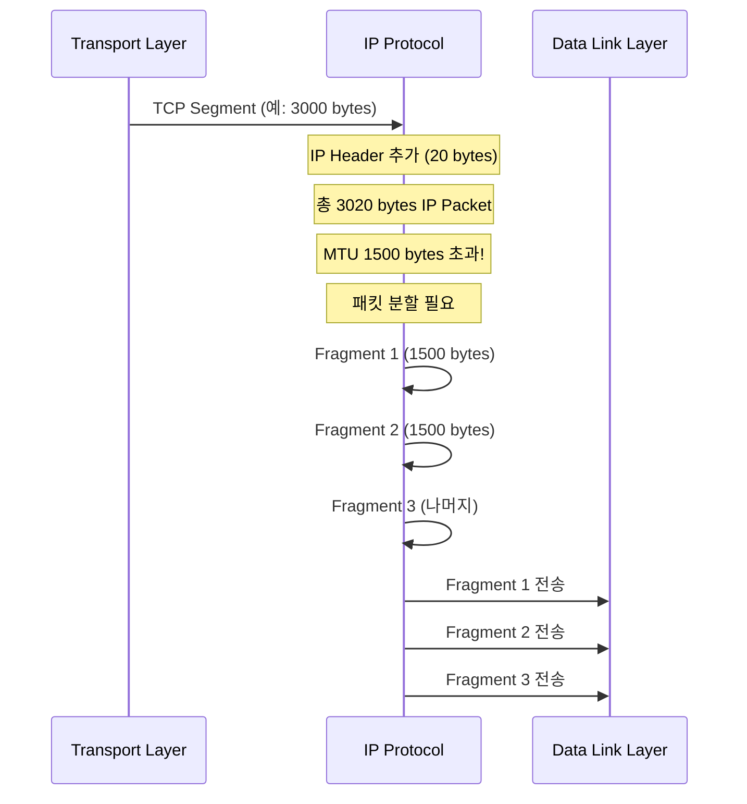

#### 패킷 조립 과정

**수신 측에서의 처리:**
1. 수신 측의 네트워크 계층(IP 프로토콜)은 분할된 패킷들을 받습니다.
2. IP 헤더의 **Identification**, **Flags**, **Fragment Offset** 필드를 확인합니다.
3. 같은 Identification을 가진 패킷들을 모아서 순서대로 조립합니다.
4. 모든 조각이 도착하면 원래의 IP 패킷으로 복원합니다.
5. 상위 계층(Transport Layer)으로 전달합니다.

#### IP 헤더의 Fragmentation 관련 필드

| **필드명** | **크기** | **역할** | **설명** |
|:-:|:-:|:-:|:-:|
| Identification | 16 bits | 패킷 식별자 | 같은 원본 패킷에서 분할된 조각들은 동일한 ID를 가짐 |
| Flags | 3 bits | 분할 제어 | DF(Don't Fragment), MF(More Fragments) 비트 포함 |
| Fragment Offset | 13 bits | 조각 위치 | 원본 데이터에서 이 조각의 위치 (8바이트 단위) |

**Flags 필드 상세:**
- **Bit 0**: 예약됨 (항상 0)
- **Bit 1 (DF)**: Don't Fragment
  - 1로 설정 시: 이 패킷을 분할하지 말라는 의미
  - 라우터가 분할해야 하는 상황이면 패킷을 버리고 ICMP 에러 메시지 전송
- **Bit 2 (MF)**: More Fragments
  - 1로 설정 시: 뒤에 더 많은 조각이 있음
  - 0으로 설정 시: 이것이 마지막 조각임

#### 실전 예제: 패킷 분할 시나리오

**시나리오:**
- 송신 측에서 3000 bytes의 데이터를 전송하려고 함
- IP 헤더 크기: 20 bytes
- 전체 IP 패킷 크기: 3020 bytes
- MTU: 1500 bytes

**분할 계산:**
```
Fragment 1:
- IP Header: 20 bytes
- Data: 1480 bytes (1500 - 20)
- Total: 1500 bytes
- MF flag: 1 (더 많은 조각 있음)
- Fragment Offset: 0

Fragment 2:
- IP Header: 20 bytes
- Data: 1480 bytes
- Total: 1500 bytes
- MF flag: 1 (더 많은 조각 있음)
- Fragment Offset: 185 (1480 / 8)

Fragment 3:
- IP Header: 20 bytes
- Data: 40 bytes (3000 - 1480 - 1480)
- Total: 60 bytes
- MF flag: 0 (마지막 조각)
- Fragment Offset: 370 (2960 / 8)
```

📌 **노트**: Fragment Offset은 **8바이트 단위**로 표현됩니다. 따라서 실제 오프셋 값을 8로 나눈 값을 필드에 저장합니다.

#### Path MTU Discovery

**문제점:**
- 송신자와 수신자 사이의 경로에 있는 모든 라우터의 MTU가 다를 수 있습니다.
- 어떤 라우터는 MTU가 1500이지만, 다른 라우터는 1400일 수 있습니다.

**해결책: Path MTU Discovery (PMTUD)**
1. 송신자는 DF(Don't Fragment) 비트를 1로 설정하여 패킷을 전송합니다.
2. 경로 상의 라우터가 MTU보다 큰 패킷을 받으면 패킷을 버립니다.
3. 라우터는 ICMP "Fragmentation Needed" 메시지를 송신자에게 보냅니다.
4. 송신자는 패킷 크기를 줄여서 다시 전송합니다.
5. 이 과정을 반복하여 경로 상의 최소 MTU를 찾습니다.

---

### 2️⃣ **IP 주소 기반 단말 식별 (Host Identification)**

#### IP 주소의 역할

IP 네트워크에서 각 단말(Host)을 식별하기 위한 **논리적 주소**가 바로 **IP 주소**입니다.

**특징:**
- MAC 주소는 **물리적 주소** (하드웨어에 고정)
- IP 주소는 **논리적 주소** (소프트웨어로 설정 가능)
- IP 주소를 통해 네트워크 상의 단말 A와 단말 B를 구분할 수 있습니다.

#### IP 주소의 구조

```
단말 A: 192.168.1.10
단말 B: 192.168.1.20
라우터: 192.168.1.1

각 단말은 고유한 IP 주소를 가지며, 이를 통해 식별됩니다.
```

---

### 3️⃣ **패킷 라우팅 (Packet Routing)**

#### 라우팅의 개념

IP 패킷이 목적지까지 가기 위해서는 **여러 개의 라우터**를 거쳐야 합니다. 이렇게 라우터를 건너가면서 패킷이 목적지를 찾아가는 과정을 **패킷 전송(Packet Forwarding)** 또는 **패킷 라우팅(Packet Routing)**이라고 합니다.

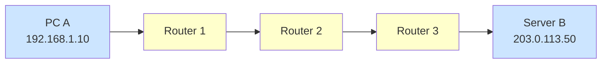

**라우팅 과정:**
1. PC A가 Server B로 패킷을 전송합니다.
2. 패킷은 기본 게이트웨이인 Router 1로 전달됩니다.
3. Router 1은 라우팅 테이블을 확인하여 다음 홉(Next Hop)을 결정합니다.
4. 패킷은 Router 2로 전달됩니다.
5. Router 2는 다시 라우팅 테이블을 확인하여 Router 3으로 패킷을 전달합니다.
6. Router 3은 최종적으로 Server B가 연결된 네트워크로 패킷을 전달합니다.

📌 **노트**: 각 라우터는 **독립적으로** 다음 홉을 결정합니다. 전체 경로를 미리 알 필요는 없으며, 단지 "다음에 어디로 보낼지"만 알면 됩니다.

---

### 4️⃣ **다른 네트워크와의 연결성 제공 (Inter-network Connectivity)**

#### 네트워크 간 연결

IP 프로토콜은 서로 다른 네트워크에 있는 단말들이 통신할 수 있도록 **연결성(Connectivity)**을 제공합니다.

**예시:**
```
네트워크 A: 192.168.1.0/24
네트워크 B: 192.168.2.0/24
네트워크 C: 10.0.0.0/24

이 세 개의 서로 다른 네트워크에 있는 단말들이
라우터와 IP 프로토콜을 통해 서로 통신할 수 있습니다.
```

#### 캡슐화와 디캡슐화

**캡슐화 (Encapsulation):**
- 상위 계층에서 하위 계층으로 데이터가 전달될 때 헤더가 추가되는 과정

**디캡슐화 (Decapsulation):**
- 하위 계층에서 상위 계층으로 데이터가 전달될 때 헤더가 제거되는 과정

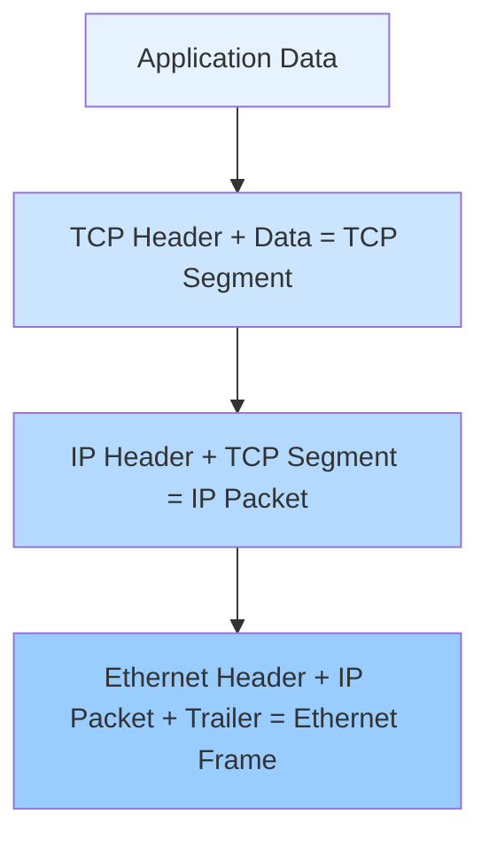

📌 **노트**: 패킷이 라우터를 거칠 때마다 **Ethernet Header**는 제거되고 다시 추가되지만, **IP Header**는 유지됩니다. 이것이 Layer 3 (IP 계층)에서의 라우팅입니다.

---

## 📦 IP 패킷 포맷 (IP Packet Format)

### IPv4 헤더 구조

IPv4 헤더는 기본적으로 **20바이트** (옵션이 없을 경우)이며, 다음과 같은 필드로 구성됩니다.

```
 0                   1                   2                   3
 0 1 2 3 4 5 6 7 8 9 0 1 2 3 4 5 6 7 8 9 0 1 2 3 4 5 6 7 8 9 0 1
+-+-+-+-+-+-+-+-+-+-+-+-+-+-+-+-+-+-+-+-+-+-+-+-+-+-+-+-+-+-+-+-+
|Version|  IHL  |Type of Service|          Total Length         |
+-+-+-+-+-+-+-+-+-+-+-+-+-+-+-+-+-+-+-+-+-+-+-+-+-+-+-+-+-+-+-+-+
|         Identification        |Flags|      Fragment Offset    |
+-+-+-+-+-+-+-+-+-+-+-+-+-+-+-+-+-+-+-+-+-+-+-+-+-+-+-+-+-+-+-+-+
|  Time to Live |    Protocol   |         Header Checksum       |
+-+-+-+-+-+-+-+-+-+-+-+-+-+-+-+-+-+-+-+-+-+-+-+-+-+-+-+-+-+-+-+-+
|                       Source Address                          |
+-+-+-+-+-+-+-+-+-+-+-+-+-+-+-+-+-+-+-+-+-+-+-+-+-+-+-+-+-+-+-+-+
|                    Destination Address                        |
+-+-+-+-+-+-+-+-+-+-+-+-+-+-+-+-+-+-+-+-+-+-+-+-+-+-+-+-+-+-+-+-+
|                    Options (if any)                           |
+-+-+-+-+-+-+-+-+-+-+-+-+-+-+-+-+-+-+-+-+-+-+-+-+-+-+-+-+-+-+-+-+
```

### 주요 필드 상세 설명

| **필드명** | **크기** | **설명** |
|:-:|:-:|:-:|
| **Version** | 4 bits | IP 버전 번호 (IPv4 = 4, IPv6 = 6) |
| **IHL (Internet Header Length)** | 4 bits | IP 헤더 길이 (4바이트 단위, 최소값 5 = 20바이트) |
| **Type of Service (ToS)** | 8 bits | 서비스 품질 (QoS) 지정 |
| **Total Length** | 16 bits | 전체 IP 패킷 길이 (헤더 + 데이터) |
| **Identification** | 16 bits | 패킷 식별자 (분할된 조각 식별) |
| **Flags** | 3 bits | 분할 제어 플래그 (DF, MF) |
| **Fragment Offset** | 13 bits | 분할된 조각의 위치 |
| **Time to Live (TTL)** | 8 bits | 패킷의 생존 시간 (홉 카운트) |
| **Protocol** | 8 bits | 상위 계층 프로토콜 (TCP=6, UDP=17, ICMP=1) |
| **Header Checksum** | 16 bits | 헤더 오류 검사 |
| **Source Address** | 32 bits | 송신자 IP 주소 |
| **Destination Address** | 32 bits | 수신자 IP 주소 |
| **Options** | 가변 | 선택적 옵션 필드 |

---

## ⏱️ TTL (Time To Live) - 생존 시간

### TTL의 필요성

💡 **중요!**: **TTL 필드는 반드시 기억해 두어야 할 중요한 개념**입니다.

**문제 상황:**
- IP 패킷이 인터넷 세상을 **무한정 떠돌아다니면** 어떻게 될까요?
- 네트워크에 패킷이 계속 쌓여서 네트워크 혼잡이 발생합니다.
- 라우팅 루프(Routing Loop)가 발생하면 패킷이 계속 순환합니다.

**해결책: TTL 필드**
- 패킷이 거칠 수 있는 **최대 라우터 수**를 제한합니다.
- TTL 값은 **라우터를 하나 건널 때마다 1씩 감소**합니다.
- TTL이 **0이 되면** 패킷은 폐기됩니다.

### TTL 동작 원리

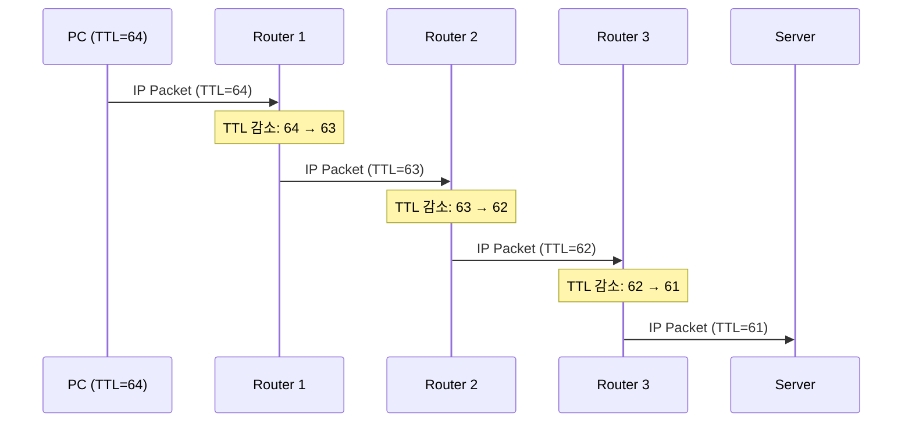

### TTL = 0일 때의 처리

**시나리오:**
1. 패킷이 라우터를 거치다가 TTL이 0이 됩니다.
2. 해당 라우터는 패킷을 **폐기(Discard)**합니다.
3. 라우터는 송신자에게 **ICMP 메시지**를 보냅니다.
   - ICMP Type 11: Time Exceeded
   - ICMP Code 0: TTL Exceeded in Transit
4. 송신자는 패킷이 목적지에 도달하지 못했음을 알게 됩니다.

### TTL 기본값

운영체제마다 TTL 기본값이 다릅니다:

| **운영체제** | **기본 TTL 값** |
|:-:|:-:|
| Windows | 128 |
| Linux | 64 |
| macOS | 64 |
| Cisco IOS | 255 |

📌 **노트**: TTL 값을 보면 패킷이 어떤 운영체제에서 출발했는지 추측할 수 있습니다. 예를 들어, TTL이 120이면 Windows(128)에서 출발하여 8개의 라우터를 거쳤다고 추측할 수 있습니다.

### TTL 활용 사례

#### 1. Traceroute 명령어

**Traceroute**는 TTL을 이용하여 목적지까지의 경로를 추적하는 도구입니다.

**동작 원리:**
1. TTL=1로 패킷을 전송 → 첫 번째 라우터에서 ICMP Time Exceeded 응답
2. TTL=2로 패킷을 전송 → 두 번째 라우터에서 ICMP Time Exceeded 응답
3. TTL=3로 패킷을 전송 → 세 번째 라우터에서 ICMP Time Exceeded 응답
4. 이 과정을 반복하여 목적지까지의 모든 라우터를 확인합니다.

**Linux/macOS 명령어:**
```bash
$ traceroute www.google.com
```

**Windows 명령어:**
```cmd
> tracert www.google.com
```

**예상 출력:**
```
traceroute to www.google.com (172.217.31.164), 30 hops max
 1  192.168.1.1 (192.168.1.1)  1.234 ms  1.123 ms  1.045 ms
 2  10.0.0.1 (10.0.0.1)  5.678 ms  5.432 ms  5.234 ms
 3  172.16.0.1 (172.16.0.1)  10.234 ms  10.123 ms  10.045 ms
 4  203.0.113.1 (203.0.113.1)  15.456 ms  15.234 ms  15.123 ms
 5  172.217.31.164 (172.217.31.164)  20.789 ms  20.567 ms  20.456 ms
```

**출력 해석:**
- **각 줄**: 패킷이 거친 라우터 (홉)
- **IP 주소**: 해당 라우터의 IP
- **시간 값**: 응답 시간 (3번 측정)

#### 2. TTL 기반 보안 탐지

**TTL 값의 비정상적인 변화를 통해 네트워크 공격을 탐지할 수 있습니다.**

**예시:**
- 정상적인 TTL 값: 64, 62, 60... (라우터를 거치면서 감소)
- 비정상적인 TTL 값: 255 (갑자기 증가) → 패킷 위조 의심

---

## 🏷️ IP 주소 체계 (IP Addressing)

### IPv4 주소 구조

#### 기본 개념

**IPv4**는 **32비트 주소 체계**를 사용합니다.

**표기 방법:**
- 32비트를 **8비트씩 4개**로 나눕니다 (옥텟, Octet).
- 각 옥텟을 **10진수**로 변환합니다.
- 옥텟 사이를 **점(.)으로 구분**합니다.
- 이를 **Dotted Decimal Notation**이라고 부릅니다.

**예시:**
```
2진수: 11000000.10101000.00000001.00001010
10진수: 192.168.1.10
```

#### IP 주소의 구성

IP 주소는 두 부분으로 나뉩니다:

1. **Network ID (네트워크 부분)**: 어떤 네트워크인지 식별
2. **Host ID (호스트 부분)**: 네트워크 내의 어떤 단말인지 식별

```
예시: 192.168.1.10/24

192.168.1   : Network ID (네트워크 부분)
       .10  : Host ID (호스트 부분)
```

#### 서브넷 마스크 (Subnet Mask)

**서브넷 마스크**는 IP 주소에서 **네트워크 부분과 호스트 부분을 구분**하는 역할을 합니다.

**규칙:**
- 맨 처음 상위 비트부터 **연속적인 1**로 표시된 부분 → **Network ID**
- 나머지 **0으로 표시된 부분** → **Host ID**

**예시:**
```
IP 주소:      192.168.1.10
서브넷 마스크: 255.255.255.0

2진수 변환:
IP 주소:      11000000.10101000.00000001.00001010
서브넷 마스크: 11111111.11111111.11111111.00000000
                ↑--------------------↑     ↑------↑
                   Network ID (24비트)   Host ID (8비트)
```

**AND 연산을 통한 네트워크 주소 계산:**
```
IP 주소:      192.168.1.10    (11000000.10101000.00000001.00001010)
서브넷 마스크: 255.255.255.0   (11111111.11111111.11111111.00000000)
-----------------------------------------------------------------
네트워크 주소: 192.168.1.0     (11000000.10101000.00000001.00000000)
```

---

### 클래스 기반 IP 주소 (Classful Addressing)

#### 초창기 IP 주소 체계

IPv4가 처음 나왔을 때는 **클래스 기반(Classful)** IP 주소를 사용했습니다.

#### 클래스별 특징

| **클래스** | **첫 번째 옥텟 범위** | **기본 서브넷 마스크** | **네트워크 수** | **호스트 수** | **용도** |
|:-:|:-:|:-:|:-:|:-:|:-:|
| **A** | 0 ~ 127 | 255.0.0.0 (/8) | 128개 | 16,777,214개 | 대규모 네트워크 |
| **B** | 128 ~ 191 | 255.255.0.0 (/16) | 16,384개 | 65,534개 | 중규모 네트워크 |
| **C** | 192 ~ 223 | 255.255.255.0 (/24) | 2,097,152개 | 254개 | 소규모 네트워크 |
| **D** | 224 ~ 239 | - | - | - | 멀티캐스트 |
| **E** | 240 ~ 255 | - | - | - | 연구용 (예약됨) |

**클래스 식별 방법:**
```
A 클래스: 0xxxxxxx.xxxxxxxx.xxxxxxxx.xxxxxxxx (첫 비트가 0)
B 클래스: 10xxxxxx.xxxxxxxx.xxxxxxxx.xxxxxxxx (첫 2비트가 10)
C 클래스: 110xxxxx.xxxxxxxx.xxxxxxxx.xxxxxxxx (첫 3비트가 110)
D 클래스: 1110xxxx.xxxxxxxx.xxxxxxxx.xxxxxxxx (첫 4비트가 1110)
E 클래스: 1111xxxx.xxxxxxxx.xxxxxxxx.xxxxxxxx (첫 4비트가 1111)
```

#### 클래스별 네트워크 크기

**A 클래스:**
- 네트워크 비트: 8비트
- 호스트 비트: 24비트
- 호스트 개수: 2^24 = 16,777,216개 (네트워크 주소와 브로드캐스트 주소 제외 시 16,777,214개)

**B 클래스:**
- 네트워크 비트: 16비트
- 호스트 비트: 16비트
- 호스트 개수: 2^16 = 65,536개 (실제 사용 가능: 65,534개)

**C 클래스:**
- 네트워크 비트: 24비트
- 호스트 비트: 8비트
- 호스트 개수: 2^8 = 256개 (실제 사용 가능: 254개)

📌 **노트**: 각 네트워크에서 첫 번째 주소는 **네트워크 주소**, 마지막 주소는 **브로드캐스트 주소**로 사용되므로 실제 호스트에 할당할 수 없습니다.

#### 클래스 기반 주소의 문제점

⚠️ **주의**: 클래스 기반 주소 체계는 **IP 주소 낭비**가 심합니다!

**문제 상황:**
- A 클래스: 1,600만 개 이상의 IP 주소를 할당받을 수 있지만, 실제로 그만큼 많은 단말을 연결하는 조직은 거의 없습니다.
- B 클래스: 6만 개 이상의 IP 주소를 할당받지만, 대부분의 조직은 그렇게 많은 IP를 사용하지 않습니다.
- 결과적으로 할당받은 IP 주소 중 대부분이 **사용되지 않고 낭비**됩니다.

**해결책:**
- 클래스 기반 주소 체계를 버리고 → **클래스리스(Classless) 주소 체계**로 전환
- **서브네팅(Subnetting)**과 **CIDR 표기법** 도입

---

### 클래스리스 주소 체계 (Classless Addressing)

#### CIDR (Classless Inter-Domain Routing)

💡 **중요!**: 현대 네트워크에서는 **CIDR 표기법**을 사용합니다.

**CIDR 표기법:**
```
IP 주소/프리픽스

예시: 192.168.1.10/24
```

**프리픽스(Prefix)의 의미:**
- 상위 비트부터 **네트워크 부분으로 사용하는 비트 수**
- `/24`는 상위 24비트가 네트워크 부분임을 의미

**장점:**
- 클래스 개념을 무시하고 필요한 만큼의 IP 주소만 할당 가능
- IP 주소 낭비를 최소화
- 라우팅 테이블 크기 축소 (경로 집약 가능)

#### CIDR 표기법 예시

| **CIDR 표기** | **서브넷 마스크** | **호스트 수** | **용도 예시** |
|:-:|:-:|:-:|:-:|
| /32 | 255.255.255.255 | 1개 | 단일 호스트 |
| /30 | 255.255.255.252 | 2개 | 점대점 링크 |
| /29 | 255.255.255.248 | 6개 | 초소형 네트워크 |
| /28 | 255.255.255.240 | 14개 | 소형 네트워크 |
| /24 | 255.255.255.0 | 254개 | 일반 LAN |
| /16 | 255.255.0.0 | 65,534개 | 대규모 조직 |
| /8 | 255.0.0.0 | 16,777,214개 | 초대규모 네트워크 |

**계산 예시: 192.168.1.25/28**

```
IP 주소: 192.168.1.25
프리픽스: /28 (상위 28비트가 네트워크 부분)

2진수 변환:
192.168.1.25 = 11000000.10101000.00000001.00011001
                ↑-----------------------↑ ↑--↑
                     Network (28비트)    Host (4비트)

서브넷 마스크: 255.255.255.240 (11111111.11111111.11111111.11110000)

네트워크 주소: 192.168.1.16  (00010000의 호스트 부분을 모두 0으로)
브로드캐스트 주소: 192.168.1.31  (00011111의 호스트 부분을 모두 1로)
사용 가능한 호스트: 192.168.1.17 ~ 192.168.1.30 (14개)
```

📌 **노트**: 프리픽스 길이가 증가할수록 네트워크 크기는 줄어듭니다. /24보다 /28이 더 작은 네트워크입니다.

---

### 서브네팅 (Subnetting)

#### 서브네팅의 개념

**서브네팅(Subnetting)**은 하나의 큰 네트워크를 **여러 개의 작은 서브넷(Subnet)**으로 나누는 기술입니다.

**방법:**
- 원래 **호스트 부분**이었던 비트 중에서
- 상위 비트 일부를 **네트워크 부분으로 확장**
- 확장된 비트 수만큼 **서브넷을 생성**

**이점:**
1. IP 주소 효율적 사용
2. 브로드캐스트 도메인 분리 (네트워크 성능 향상)
3. 보안 강화 (네트워크 분리)
4. 네트워크 관리 용이

#### 서브네팅 예제

**시나리오:**
- 할당받은 네트워크: 192.168.1.0/24 (C 클래스)
- 목표: 4개의 서브넷으로 분할

**계산:**
```
원래 네트워크: 192.168.1.0/24
- 네트워크 비트: 24비트
- 호스트 비트: 8비트
- 호스트 수: 2^8 - 2 = 254개

4개의 서브넷 필요 → 2^2 = 4
→ 호스트 비트에서 2비트를 네트워크 비트로 가져옴
→ 새로운 프리픽스: /26

새로운 서브넷: /26
- 네트워크 비트: 26비트
- 호스트 비트: 6비트
- 서브넷당 호스트 수: 2^6 - 2 = 62개
```

**4개의 서브넷:**

| **서브넷** | **네트워크 주소** | **첫 번째 호스트** | **마지막 호스트** | **브로드캐스트** |
|:-:|:-:|:-:|:-:|:-:|
| 1 | 192.168.1.0/26 | 192.168.1.1 | 192.168.1.62 | 192.168.1.63 |
| 2 | 192.168.1.64/26 | 192.168.1.65 | 192.168.1.126 | 192.168.1.127 |
| 3 | 192.168.1.128/26 | 192.168.1.129 | 192.168.1.190 | 192.168.1.191 |
| 4 | 192.168.1.192/26 | 192.168.1.193 | 192.168.1.254 | 192.168.1.255 |

#### 가변 길이 서브넷 마스크 (VLSM)

**VLSM (Variable Length Subnet Mask)**은 서브넷마다 **다른 크기의 서브넷 마스크**를 사용하는 기술입니다.

**필요성:**
- 어떤 네트워크는 많은 IP가 필요 (예: 사무실 네트워크 - 100대)
- 어떤 네트워크는 적은 IP가 필요 (예: 점대점 링크 - 2대)
- VLSM을 사용하면 필요한 만큼만 IP를 할당하여 낭비를 줄일 수 있습니다.

**예시:**
```
전체 네트워크: 192.168.1.0/24

서브넷 1 (사무실): 192.168.1.0/25   (126개 호스트)
서브넷 2 (서버실): 192.168.1.128/27  (30개 호스트)
서브넷 3 (관리실): 192.168.1.160/27  (30개 호스트)
서브넷 4 (링크 1): 192.168.1.192/30  (2개 호스트)
서브넷 5 (링크 2): 192.168.1.196/30  (2개 호스트)
서브넷 6 (링크 3): 192.168.1.200/30  (2개 호스트)
...
```

⚠️ **주의**: VLSM을 사용할 때는 서브넷 주소가 **겹치지 않도록** 주의해야 합니다.

---

### 특수 목적 IP 주소

#### 멀티캐스트 주소 (Multicast Address)

**D 클래스 (224.0.0.0 ~ 239.255.255.255)**는 멀티캐스트 주소입니다.

**멀티캐스트란?**
- 하나의 패킷을 **여러 수신자에게 동시에** 전송
- 특정 멀티캐스트 그룹에 가입한 모든 단말이 패킷을 수신
- 스트리밍, 화상 회의, IPTV 등에 사용

**멀티캐스트 주소 범위:**

| **범위** | **용도** |
|:-:|:-:|
| 224.0.0.0 ~ 224.0.0.255 | 로컬 네트워크 제어 (라우터를 넘지 않음) |
| 224.0.1.0 ~ 238.255.255.255 | 인터넷 멀티캐스트 (등록 필요) |
| 239.0.0.0 ~ 239.255.255.255 | 조직 내부 멀티캐스트 (등록 불필요) |

**인터넷 멀티캐스트 주소 사용:**
- 상용 솔루션을 개발하여 **인터넷에서 사용**하려면 → **224.0.1.0 ~ 238.255.255.255** 범위에서 주소를 할당받아야 합니다 (IANA에 신청).
- 회사 내부에서만 사용하려면 → **239.0.0.0 ~ 239.255.255.255** 범위를 자유롭게 사용할 수 있습니다.

#### 기본 경로 주소 (Default Route)

**0.0.0.0/0**

💡 **중요!**: 이 주소는 **"모든 네트워크"**를 의미합니다.

**용도:**
- **기본 경로(Default Route)** 또는 **기본 게이트웨이(Default Gateway)**를 정의할 때 사용
- 라우팅 테이블에서 특정 목적지를 찾지 못했을 때 사용하는 "마지막 수단"

**예시:**
```bash
# 라우팅 테이블에 기본 경로 추가
$ ip route add 0.0.0.0/0 via 192.168.1.1

의미: 특정 경로가 없으면 모든 트래픽을 192.168.1.1 (기본 게이트웨이)로 보내라
```

#### 리미티드 브로드캐스트 주소

**255.255.255.255**

**특징:**
- **모든 비트가 1**인 특수 주소
- 같은 네트워크 세그먼트의 **모든 단말**에게 패킷 전송
- 라우터를 **넘어가지 않음** (로컬 브로드캐스트)

**용도:**
- **DHCP Discovery** 메시지 전송 시 사용
- IP 주소를 모르는 상태에서 네트워크 상의 모든 단말에게 메시지를 보낼 때

**DHCP 시나리오:**
```
클라이언트 (IP 없음):
"나 IP 주소를 모르는데, 누가 나한테 IP를 줄 수 있어?"
→ 목적지 주소를 255.255.255.255로 설정하여 브로드캐스트

DHCP 서버:
"어, 내가 DHCP 서버야. 너한테 IP를 줄 수 있어!"
```

#### 루프백 주소 (Loopback Address)

**127.0.0.0 ~ 127.255.255.255** (일반적으로 **127.0.0.1** 사용)

**특징:**
- **자기 자신**을 가리키는 주소
- 물리적 네트워크 인터페이스를 거치지 않음
- 운영체제 내부에서 처리

**용도:**

1. **자기 자신과의 통신:**
```bash
# 자기 자신의 웹 서버에 접속
$ curl http://127.0.0.1:8080
```

2. **TCP/IP 스택 테스트:**
```bash
# 자신의 네트워크 스택이 정상 동작하는지 확인
$ ping 127.0.0.1

PING 127.0.0.1 (127.0.0.1): 56 data bytes
64 bytes from 127.0.0.1: icmp_seq=0 ttl=64 time=0.031 ms
64 bytes from 127.0.0.1: icmp_seq=1 ttl=64 time=0.045 ms
```

**테스트 시나리오:**
- Application Layer → Transport Layer → Network Layer → Data Link Layer → Network Layer → Transport Layer → Application Layer
- 모든 계층을 거치면서 프로토콜 스택이 정상 동작하는지 확인
- 물리적 네트워크 문제와 무관하게 OS 내부의 TCP/IP 구현을 테스트

📌 **노트**: 루프백 주소로 ping이 정상 작동하면, 최소한 운영체제의 TCP/IP 스택은 정상이라는 것을 확인할 수 있습니다. 만약 실제 네트워크 통신이 안 된다면 네트워크 카드, 케이블, 라우터 등 외부 요인을 확인해야 합니다.

---

### 공인 IP vs 사설 IP (Public IP vs Private IP)

#### 공인 IP (Public IP / Global IP)

**정의:**
- **IANA (Internet Assigned Numbers Authority)** 및 하위 조직에서 관리하는 IP 주소
- **인터넷에서 사용 가능**한 IP 주소
- **전 세계적으로 유일**해야 함 (중복 불가)

**특징:**
- 인터넷 상에서 단말을 **고유하게 식별**
- ISP(Internet Service Provider)로부터 할당받아 사용
- 개수가 **제한적** (IPv4는 약 43억 개)

**문제점:**
⚠️ **주의**: IPv4 공인 IP 주소는 **고갈** 상태입니다!
- 전 세계 인터넷 사용자와 기기가 급증
- 모든 단말에 공인 IP를 할당할 수 없음
- 해결책: 사설 IP + NAT, IPv6 도입

#### 사설 IP (Private IP)

**정의:**
- 조직 내부 네트워크에서만 사용하는 IP 주소
- **인터넷에서 직접 사용 불가**
- **RFC 1918**에서 정의한 특정 범위만 사설 IP로 사용 가능

**사설 IP 주소 범위:**

| **클래스** | **사설 IP 범위** | **프리픽스** | **네트워크 개수** |
|:-:|:-:|:-:|:-:|
| A | 10.0.0.0 ~ 10.255.255.255 | 10.0.0.0/8 | 1개 (1,600만 IP) |
| B | 172.16.0.0 ~ 172.31.255.255 | 172.16.0.0/12 | 16개 (각 6만 IP) |
| C | 192.168.0.0 ~ 192.168.255.255 | 192.168.0.0/16 | 256개 (각 254 IP) |

**가정용 공유기에서 많이 사용하는 주소:**
- 대부분의 가정용 공유기는 **192.168.x.x** 대역을 사용합니다.
- 예: 192.168.0.1, 192.168.1.1, 192.168.219.1 등

**사설 IP 사용 예시:**
```
기업 내부 네트워크:
- 사무실 네트워크: 192.168.1.0/24
- 서버실 네트워크: 192.168.2.0/24
- DMZ 네트워크: 192.168.3.0/24

가정 네트워크:
- 공유기 내부: 192.168.0.0/24
  - 공유기: 192.168.0.1
  - PC: 192.168.0.10
  - 스마트폰: 192.168.0.11
  - 스마트TV: 192.168.0.12
```

#### 공인 IP와 사설 IP 비교

| **구분** | **공인 IP** | **사설 IP** |
|:-:|:-:|:-:|
| **사용 범위** | 인터넷 전체 | 조직 내부 |
| **유일성** | 전 세계적으로 유일 | 각 조직마다 독립적 (중복 가능) |
| **할당** | ISP로부터 할당 | 자유롭게 설정 |
| **비용** | 유료 (ISP 요금) | 무료 |
| **인터넷 접속** | 직접 가능 | NAT 필요 |
| **개수** | 제한적 (고갈 상태) | 충분 |

---

## 📡 IPv6 주소 체계

### IPv6의 필요성

**IPv4의 한계:**
- IPv4는 32비트 주소 → 약 **43억 개**의 주소만 사용 가능
- 인터넷 사용자와 IoT 기기의 폭발적 증가
- 공인 IPv4 주소 **고갈**

**해결책: IPv6**
- IPv6는 128비트 주소 → 약 **340간(undecillion)** 개의 주소 사용 가능
- 2^128 = 340,282,366,920,938,463,463,374,607,431,768,211,456개
- 사실상 **무한대**의 주소 공간

### IPv6 주소 구조

**기본 형식:**
- **128비트** 주소 체계
- **16비트씩 8그룹**으로 나눔
- 각 그룹을 **16진수 4자리**로 표현
- 그룹 사이를 **콜론(:)**으로 구분

**예시:**
```
2001:0db8:85a3:0000:0000:8a2e:0370:7334
```

**축약 규칙:**

1. **Leading Zero 생략:**
```
2001:0db8:85a3:0000:0000:8a2e:0370:7334
↓
2001:db8:85a3:0:0:8a2e:370:7334
```

2. **연속된 0 그룹을 :: 으로 축약 (한 번만 가능):**
```
2001:db8:85a3:0:0:8a2e:370:7334
↓
2001:db8:85a3::8a2e:370:7334
```

### IPv6 주소 유형

| **주소 유형** | **프리픽스** | **설명** | **예시** |
|:-:|:-:|:-:|:-:|
| **루프백** | ::1/128 | 자기 자신 (IPv4의 127.0.0.1) | ::1 |
| **링크 로컬** | fe80::/10 | 같은 링크 내에서만 사용 (IPv4의 사설 IP 개념) | fe80::1 |
| **유니크 로컬** | fc00::/7 | 조직 내부 (IPv4의 사설 IP) | fd00::1 |
| **글로벌 유니캐스트** | 2000::/3 | 인터넷 전역 (IPv4의 공인 IP) | 2001:db8::1 |
| **멀티캐스트** | ff00::/8 | 멀티캐스트 | ff02::1 |

📌 **노트**: 현재 대부분의 인터넷 서비스와 애플리케이션은 여전히 **IPv4를 주로 사용**하고 있습니다. IPv6 전환은 진행 중이지만, 완전한 전환까지는 시간이 필요합니다.

---

## 🔄 DHCP (Dynamic Host Configuration Protocol)

### DHCP의 필요성

**IP 주소 할당 방식:**

1. **정적 할당 (Static Assignment):**
   - 네트워크 관리자가 **수동으로** 각 단말에 IP 주소 설정
   - 장점: 주소가 고정되어 관리하기 쉬움 (특히 서버)
   - 단점: 단말이 많으면 관리 부담 증가

2. **동적 할당 (Dynamic Assignment):**
   - **DHCP 서버**가 **자동으로** IP 주소 할당
   - 장점: 관리 부담 감소, IP 주소 효율적 사용
   - 단점: IP 주소가 변경될 수 있음

💡 **중요!**: 서버는 일반적으로 **정적 할당**, 클라이언트는 **동적 할당**을 많이 사용합니다.

### DHCP 동작 과정 (DORA)

DHCP는 **4단계 과정**을 거쳐 IP 주소를 할당합니다. 이를 **DORA**라고 부릅니다.

#### 1. DHCP Discover (발견)

**클라이언트 → 네트워크 (브로드캐스트)**

- 클라이언트가 IP 주소를 모르는 상태
- "나 IP 주소가 필요해! 누가 나한테 IP를 줄 수 있어?"
- 목적지 주소: **255.255.255.255** (리미티드 브로드캐스트)
- 출발지 주소: **0.0.0.0** (아직 IP가 없음)

#### 2. DHCP Offer (제안)

**DHCP 서버 → 클라이언트 (유니캐스트 또는 브로드캐스트)**

- DHCP 서버가 Discover 메시지를 받음
- "어, 내가 DHCP 서버야. 너한테 IP를 줄 수 있어!"
- 제안 내용:
  - IP 주소 (예: 192.168.1.100)
  - 서브넷 마스크
  - 임대 시간 (Lease Time)

#### 3. DHCP Request (요청)

**클라이언트 → 네트워크 (브로드캐스트)**

- 클라이언트가 Offer를 받고 수락
- "좋아! 나 그 IP 주소 사용할게!"
- 목적지 주소: **255.255.255.255** (브로드캐스트)
- 이유: 다른 DHCP 서버들에게도 "나 이미 IP 받았어"라고 알림

#### 4. DHCP Ack (확인)

**DHCP 서버 → 클라이언트 (유니캐스트 또는 브로드캐스트)**

- DHCP 서버가 최종 승인
- "확인했어! 이제 이 IP 주소를 사용해!"
- 추가 정보 제공:
  - IP 주소
  - 서브넷 마스크
  - 기본 게이트웨이
  - DNS 서버 주소
  - 임대 시간

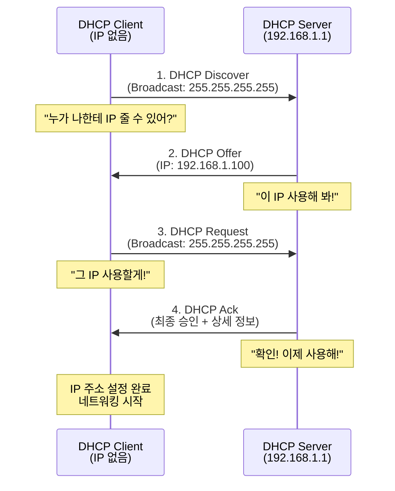

### DHCP Relay (릴레이)

**문제 상황:**
- 기업 네트워크는 여러 개의 서브넷으로 나뉘어 있음
- 브로드캐스트는 **라우터를 넘어갈 수 없음**
- 각 서브넷마다 DHCP 서버를 두는 것은 비효율적

**해결책: DHCP Relay Agent**
- 라우터에서 DHCP Relay 기능 활성화
- 클라이언트의 DHCP Discover를 받아서 **유니캐스트**로 DHCP 서버에 전달
- DHCP 서버의 응답을 다시 클라이언트에게 전달

**동작 과정:**
```
[클라이언트] --Discover(Broadcast)--> [라우터/Relay Agent]
                                           ↓
                                      Discover(Unicast)
                                           ↓
                                      [DHCP 서버]
                                           ↓
                                       Offer(Unicast)
                                           ↓
[클라이언트] <--Offer---------------[라우터/Relay Agent]
```

📌 **노트**: DHCP Relay를 사용하면 하나의 DHCP 서버로 여러 서브넷의 클라이언트에게 IP 주소를 할당할 수 있습니다.

---

## ✅ Section 1 학습 체크리스트

- [ ] IP 프로토콜의 4가지 핵심 기능을 설명할 수 있다
- [ ] 패킷 분할 및 조립 과정을 이해하고 MTU의 개념을 알고 있다
- [ ] TTL의 역할과 동작 원리를 설명할 수 있다
- [ ] IP 주소의 구조 (Network ID + Host ID)를 이해하고 있다
- [ ] 서브넷 마스크를 사용하여 네트워크 주소를 계산할 수 있다
- [ ] 클래스 기반 IP 주소와 CIDR의 차이점을 알고 있다
- [ ] 서브네팅의 개념과 필요성을 이해하고 있다
- [ ] 공인 IP와 사설 IP의 차이점을 설명할 수 있다
- [ ] 사설 IP 주소 범위를 외우고 있다
- [ ] IPv6의 필요성과 기본 구조를 이해하고 있다
- [ ] DHCP의 4단계 동작 과정(DORA)을 설명할 수 있다
- [ ] DHCP Relay의 필요성과 동작 원리를 이해하고 있다

---

## 📋 Section 1 핵심 요약

### 1. IP 프로토콜의 4가지 기능
- **패킷 분할/조립**: MTU(1500 bytes)에 맞춰 패킷을 분할하고 재조립
- **단말 식별**: IP 주소를 통한 단말 식별
- **패킷 라우팅**: 여러 라우터를 거쳐 목적지까지 패킷 전달
- **네트워크 연결성**: 서로 다른 네트워크 간 통신 가능

### 2. TTL (Time To Live)
- 라우터를 거칠 때마다 1씩 감소
- 0이 되면 패킷 폐기 및 ICMP Time Exceeded 메시지 전송
- Traceroute 명령어의 핵심 원리

### 3. IP 주소 체계
- **IPv4**: 32비트, Dotted Decimal Notation (192.168.1.10)
- **Network ID + Host ID**: 서브넷 마스크로 구분
- **CIDR 표기법**: 프리픽스로 네트워크 부분 표현 (예: /24)

### 4. 서브네팅
- 하나의 큰 네트워크를 여러 서브넷으로 분할
- 호스트 비트 일부를 네트워크 비트로 확장
- IP 주소 효율적 사용, 브로드캐스트 도메인 분리

### 5. 사설 IP 주소 범위 (RFC 1918)
- **10.0.0.0/8**: 10.0.0.0 ~ 10.255.255.255
- **172.16.0.0/12**: 172.16.0.0 ~ 172.31.255.255
- **192.168.0.0/16**: 192.168.0.0 ~ 192.168.255.255

### 6. DHCP (Dynamic Host Configuration Protocol)
- **DORA 과정**: Discover → Offer → Request → Ack
- **자동 IP 할당**: IP, 서브넷 마스크, 게이트웨이, DNS 정보 제공
- **DHCP Relay**: 라우터를 넘어서 DHCP 서비스 제공

---

**다음 섹션에서는 NAT(Network Address Translation)와 라우팅 개념에 대해 학습합니다.**

# 📝 리눅스 시스템 네트워크 보안 강의 노트 (6일차)
## Section 2: NAT, 라우팅, ICMP 프로토콜

---

## 🔄 NAT (Network Address Translation)

### NAT의 필요성

💡 **중요!**: NAT는 **IP 주소 부족 문제**를 해결하기 위한 핵심 기술입니다.

**문제 상황:**
- 글로벌 공인 IP 주소의 개수가 **제한적**
- 모든 단말에 공인 IP를 할당할 수 없음
- 기업 및 가정에서는 사설 IP를 사용

**해결책: NAT**
- **사설 IP**를 **공인 IP**로 변환
- 내부 네트워크 주소를 숨겨서 **보안 강화**
- 라우터나 방화벽에서 주로 동작

### NAT의 개념

**NAT (Network Address Translation)**은 사설 IP 주소를 공인 IP 주소로, 공인 IP 주소를 다시 사설 IP 주소로 **변환**하는 기술입니다.

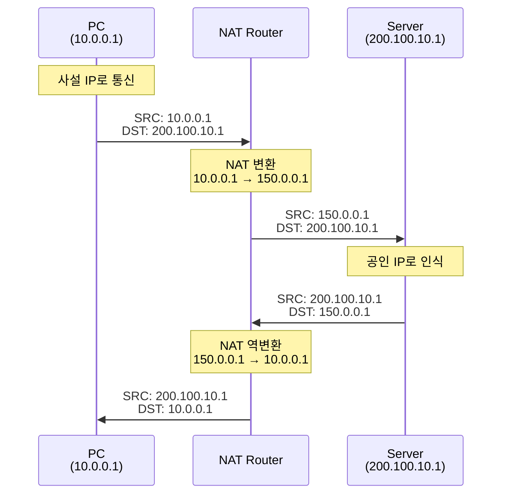

**동작 과정:**
1. **내부 → 외부**: 사설 IP (10.0.0.1) → 공인 IP (150.0.0.1)
2. **외부 → 내부**: 공인 IP (150.0.0.1) → 사설 IP (10.0.0.1)

---

### NAT의 종류

#### 1️⃣ 정적 NAT (Static NAT)

**개념:**
- 사설 IP 하나와 공인 IP 하나를 **1:1로 매핑**
- 고정된 매핑 관계 유지

**사용 목적:**
- 외부에서 내부 서버로 접근해야 할 경우
- 파트너사와의 B2B 연동
- DMZ 영역의 서버 노출

**설정 예시:**
```
사설 IP          공인 IP
192.168.1.10  ←→  150.0.0.1
192.168.1.20  ←→  150.0.0.2
192.168.1.30  ←→  150.0.0.3
```

**실무 사례:**
```
CJ 택배 시스템과 연동:
- 내부 서버: 192.168.1.10 (배송 정보 API 서버)
- 외부 공개 IP: 150.0.0.1
- 파트너사는 150.0.0.1로 접근
- NAT가 자동으로 192.168.1.10으로 변환
```

⚠️ **주의**: 공인 IP가 많이 필요하므로 주로 **서버에만** 사용합니다.

#### 2️⃣ 동적 NAT (Dynamic NAT)

**개념:**
- 공인 IP 주소 **풀(Pool)**을 준비
- 필요할 때마다 풀에서 무작위로 할당
- 사용 후 반납

**동작 방식:**
```
공인 IP Pool: 150.0.0.1 ~ 150.0.0.10 (10개)

사설 IP           할당된 공인 IP
192.168.1.10  →  150.0.0.3 (동적 할당)
192.168.1.20  →  150.0.0.7 (동적 할당)
192.168.1.30  →  150.0.0.2 (동적 할당)
```

**특징:**
- 동시에 NAT 할 수 있는 개수 = 풀 크기
- 통신 종료 후 IP 반납 → 다른 사용자가 재사용

#### 3️⃣ PAT / NAPT (Port Address Translation)

**개념:**
- **포트 번호**를 활용하여 여러 사설 IP를 **하나의 공인 IP**로 매핑 (**N:1**)
- **가장 널리 사용**되는 NAT 방식

**별칭:**
- PAT (Port Address Translation)
- NAPT (Network Address and Port Translation)
- NAT Overload

**동작 원리:**
```
공인 IP: 150.0.0.1 (하나만 사용)

사설 IP:포트          →  공인 IP:포트
192.168.1.10:50001  →  150.0.0.1:60001
192.168.1.20:50002  →  150.0.0.1:60002
192.168.1.30:50003  →  150.0.0.1:60003
```

**NAT 매핑 테이블:**

| **내부 IP** | **내부 포트** | **외부 IP** | **외부 포트** | **목적지 IP** | **목적지 포트** |
|:-:|:-:|:-:|:-:|:-:|:-:|
| 192.168.1.10 | 50001 | 150.0.0.1 | 60001 | 200.100.10.1 | 80 |
| 192.168.1.20 | 50002 | 150.0.0.1 | 60002 | 200.100.10.1 | 443 |
| 192.168.1.30 | 50003 | 150.0.0.1 | 60003 | 8.8.8.8 | 53 |

💡 **중요!**: 가정용 공유기와 기업 방화벽에서 **가장 많이 사용**하는 방식입니다.

**장점:**
- 공인 IP 하나로 수천 대의 내부 단말 지원 가능
- IP 주소 절약 효과 극대화
- 내부 네트워크 구조 은닉 (보안 강화)

---

## 🛣️ IP 라우팅 (IP Routing)

### 라우팅의 개념

💡 **중요!**: **라우팅**은 IP 패킷을 최적의 경로로 선택하여 목적지까지 전송하는 과정입니다.

**라우팅 기능을 가진 장치:**
- 라우터 (Router)
- L3 스위치 (Layer 3 Switch)
- 방화벽 (Firewall)
- PC/서버 (TCP/IP 스택이 있는 모든 장치)

### 라우팅 테이블 (Routing Table)

**라우팅 테이블**은 패킷을 어디로 보낼지 결정하는 **경로 규칙 정보**를 담고 있는 테이블입니다.

**구성 요소:**

| **필드** | **설명** | **예시** |
|:-:|:-:|:-:|
| **Destination** | 목적지 네트워크 | 192.168.20.0/24 |
| **Netmask** | 서브넷 마스크 | 255.255.255.0 |
| **Gateway** | 다음 홉 라우터 | 192.168.10.2 |
| **Interface** | 출력 인터페이스 | eth0, fa0/0 |
| **Metric** | 경로 우선순위 | 1, 10, 100 |

**라우팅 테이블 예시:**

```
PC의 라우팅 테이블:
Destination      Gateway          Interface
192.168.1.0/24   직접 연결        eth0
0.0.0.0/0        192.168.1.254    eth0 (기본 경로)

Router1의 라우팅 테이블:
Destination      Gateway          Interface
192.168.1.0/24   직접 연결        fa0/0
192.168.10.0/24  직접 연결        fa0/1
192.168.20.0/24  192.168.10.2     fa0/1

Router2의 라우팅 테이블:
Destination      Gateway          Interface
192.168.10.0/24  직접 연결        fa0/0
192.168.20.0/24  직접 연결        fa0/1
192.168.1.0/24   192.168.10.1     fa0/0
```

**라우팅 테이블 확인 명령어:**

**Linux:**
```bash
$ ip route show
$ route -n
```

**Windows:**
```cmd
> route print
> netstat -r
```

**Cisco Router:**
```cisco
Router# show ip route
```

---

### 패킷 전송 과정 (Packet Forwarding)

#### 전체 네트워크 구조

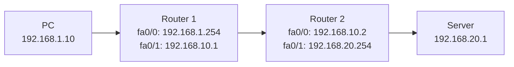

#### 단계별 패킷 전송 과정

**초기 상태:**
- 송신자: PC (192.168.1.10)
- 수신자: Server (192.168.20.1)

**Step 1: PC에서 패킷 생성**

1. **Application Layer**: 데이터 생성
2. **Transport Layer**: TCP/UDP 헤더 추가 → 세그먼트 생성
3. **Network Layer (IP)**: IP 헤더 추가 → IP 패킷 생성
   - Source IP: 192.168.1.10
   - Destination IP: 192.168.20.1

4. **라우팅 테이블 확인:**
   - 192.168.20.1은 같은 네트워크(192.168.1.0/24)가 아님
   - 기본 경로(0.0.0.0/0)를 확인 → Gateway: 192.168.1.254

5. **Data Link Layer**: Ethernet 헤더 추가
   - Source MAC: PC의 MAC 주소
   - Destination MAC: **Router1 fa0/0의 MAC 주소** (192.168.1.254)
   - **중요**: IP 주소는 변경되지 않지만, MAC 주소는 다음 홉으로 변경!

6. **Physical Layer**: 전기 신호로 변환하여 전송

**Step 2: Router1에서 패킷 처리**

1. **Data Link Layer**: Ethernet 헤더 확인
   - Destination MAC이 자신의 MAC과 일치 → 패킷 수신
   - Ethernet 헤더 제거 (디캡슐화)

2. **Network Layer (IP)**: IP 헤더 확인
   - Destination IP: 192.168.20.1
   - 자신의 IP가 아님 → 라우팅 필요

3. **라우팅 테이블 확인:**
   - 192.168.20.0/24 → Gateway: 192.168.10.2 (Router2)

4. **Data Link Layer**: 새로운 Ethernet 헤더 추가
   - Source MAC: Router1 fa0/1의 MAC 주소
   - Destination MAC: **Router2 fa0/0의 MAC 주소** (192.168.10.2)
   - **IP 헤더는 그대로 유지!**

5. **Physical Layer**: Router2로 전송

**Step 3: Router2에서 패킷 처리**

1. **Data Link Layer**: Ethernet 헤더 확인 및 제거

2. **Network Layer (IP)**: IP 헤더 확인
   - Destination IP: 192.168.20.1

3. **라우팅 테이블 확인:**
   - 192.168.20.0/24 → 직접 연결됨 (fa0/1)

4. **Data Link Layer**: 새로운 Ethernet 헤더 추가
   - Source MAC: Router2 fa0/1의 MAC 주소
   - Destination MAC: **Server의 MAC 주소** (192.168.20.1)

5. **Physical Layer**: Server로 전송

**Step 4: Server에서 패킷 수신**

1. **Data Link Layer**: Ethernet 헤더 확인 및 제거
2. **Network Layer (IP)**: IP 헤더 확인 및 제거
3. **Transport Layer**: TCP/UDP 처리
4. **Application Layer**: 데이터 전달

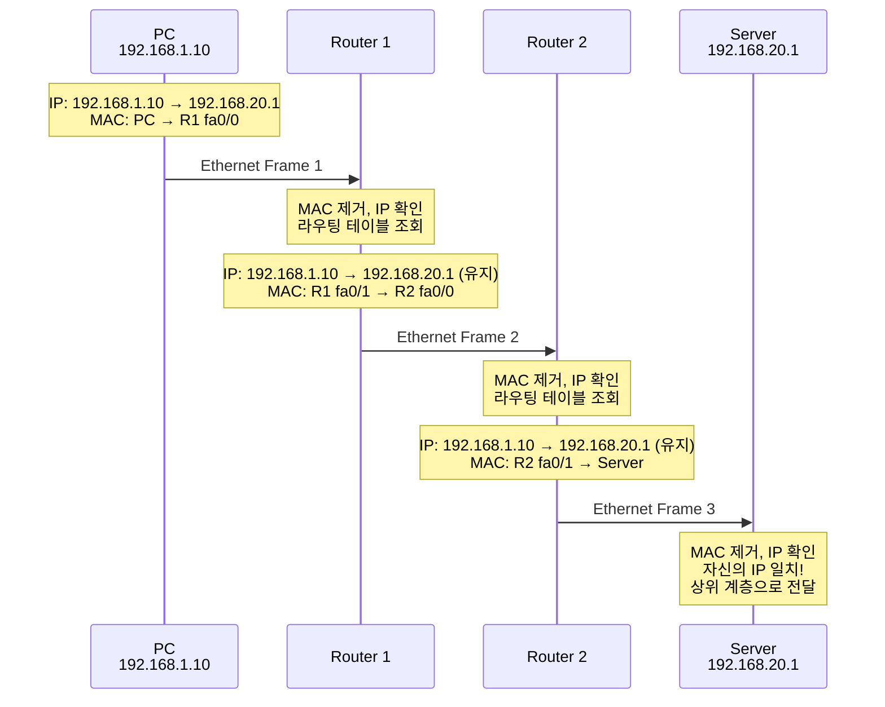

💡 **중요!**: **MAC 주소는 홉마다 변경**되지만, **IP 주소는 송신자와 수신자 주소로 유지**됩니다!

---

### 기본 게이트웨이 (Default Gateway)

**기본 게이트웨이**는 라우팅 테이블에서 특정 경로를 찾지 못했을 때 사용하는 **"마지막 수단" 라우터**입니다.

**설정 방법:**
- 목적지: 0.0.0.0/0 (모든 네트워크)
- 게이트웨이: 기본 라우터의 IP 주소

**예시:**
```
Destination      Gateway
0.0.0.0/0        192.168.1.1

의미: 특정 경로가 없으면 모든 트래픽을 192.168.1.1로 보내라
```

---

## 📨 ICMP (Internet Control Message Protocol)

### ICMP의 개념

**ICMP**는 IP 레벨에서 통신 상태를 확인하거나 오류를 알리는 **제어 메시지 프로토콜**입니다.

**특징:**
- **네트워크 계층** 프로토콜 (IP 위에 존재)
- IP 패킷으로 캡슐화되어 전송
- TCP나 UDP가 아닌 **독립적인 프로토콜**

**용도:**
1. 통신 상태 확인 (`ping` 명령어)
2. 경로 추적 (`traceroute` 명령어)
3. 네트워크 오류 보고

### ICMP 메시지 구조

**ICMP 헤더:**
- **Type**: 메시지 유형 (8비트)
- **Code**: 메시지 세부 코드 (8비트)
- **Checksum**: 오류 검사 (16비트)
- **기타 필드**: 메시지 유형에 따라 다름

### 주요 ICMP 메시지 유형

| **Type** | **Code** | **메시지 이름** | **설명** | **사용 명령어** |
|:-:|:-:|:-:|:-:|:-:|
| **0** | 0 | Echo Reply | Echo Request에 대한 응답 | `ping` |
| **3** | 0 | Destination Network Unreachable | 네트워크에 도달 불가 | 자동 |
| **3** | 1 | Destination Host Unreachable | 호스트에 도달 불가 | 자동 |
| **3** | 2 | Destination Protocol Unreachable | 프로토콜에 도달 불가 | 자동 |
| **3** | 3 | Destination Port Unreachable | 포트에 도달 불가 | 자동 |
| **3** | 9 | Network Administratively Prohibited | 관리자가 네트워크 차단 | 방화벽 |
| **3** | 10 | Host Administratively Prohibited | 관리자가 호스트 차단 | 방화벽 |
| **5** | 0 | Redirect for Network | 네트워크 경로 변경 | 자동 |
| **5** | 1 | Redirect for Host | 호스트 경로 변경 | 자동 |
| **8** | 0 | Echo Request | 상대방 응답 요청 | `ping` |
| **11** | 0 | Time to Live Exceeded | TTL 초과 | `traceroute` |
| **11** | 1 | Fragment Reassembly Time Exceeded | 재조립 시간 초과 | 자동 |

---

### Ping 명령어

#### 개념

**Ping**은 상대방 호스트가 **응답 가능한지 확인**하는 네트워크 진단 도구입니다.

**동작 원리:**
1. Echo Request (Type 8, Code 0) 전송
2. 상대방이 Echo Reply (Type 0, Code 0) 응답
3. 왕복 시간(RTT) 측정

#### 사용 방법

**Linux/macOS:**
```bash
$ ping 8.8.8.8
PING 8.8.8.8 (8.8.8.8): 56 data bytes
64 bytes from 8.8.8.8: icmp_seq=0 ttl=117 time=10.234 ms
64 bytes from 8.8.8.8: icmp_seq=1 ttl=117 time=10.123 ms
64 bytes from 8.8.8.8: icmp_seq=2 ttl=117 time=10.456 ms

--- 8.8.8.8 ping statistics ---
3 packets transmitted, 3 packets received, 0.0% packet loss
round-trip min/avg/max/stddev = 10.123/10.271/10.456/0.145 ms
```

**Windows:**
```cmd
> ping 8.8.8.8
Pinging 8.8.8.8 with 32 bytes of data:
Reply from 8.8.8.8: bytes=32 time=10ms TTL=117
Reply from 8.8.8.8: bytes=32 time=10ms TTL=117

Ping statistics for 8.8.8.8:
    Packets: Sent = 2, Received = 2, Lost = 0 (0% loss)
```

**출력 해석:**
- **64 bytes**: 패킷 크기
- **icmp_seq**: 순서 번호
- **ttl**: 남은 TTL 값
- **time**: 왕복 시간 (Round Trip Time, RTT)

---

### Traceroute 명령어

#### 개념

**Traceroute**는 패킷이 목적지까지 **거쳐가는 경로**를 추적하는 도구입니다.

**동작 원리:**
1. TTL=1로 패킷 전송 → 첫 번째 라우터에서 ICMP Time Exceeded (Type 11, Code 0) 응답
2. TTL=2로 패킷 전송 → 두 번째 라우터에서 ICMP Time Exceeded 응답
3. TTL=3, 4, 5... 계속 증가시키면서 전송
4. 최종 목적지 도달 시 Echo Reply (Type 0, Code 0) 응답

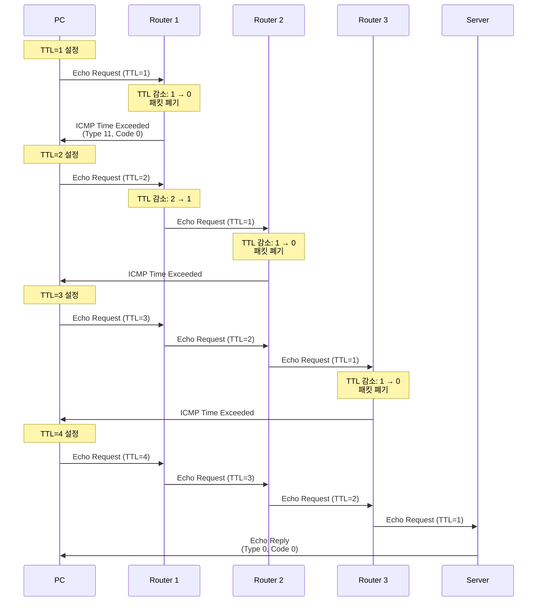

#### 사용 방법

**Linux/macOS:**
```bash
$ traceroute 8.8.8.8
traceroute to 8.8.8.8 (8.8.8.8), 30 hops max
 1  192.168.1.1 (192.168.1.1)  1.234 ms  1.123 ms  1.045 ms
 2  10.0.0.1 (10.0.0.1)  5.678 ms  5.432 ms  5.234 ms
 3  172.16.0.1 (172.16.0.1)  10.234 ms  10.123 ms  10.045 ms
 4  203.0.113.1 (203.0.113.1)  15.456 ms  15.234 ms  15.123 ms
 5  8.8.8.8 (8.8.8.8)  20.789 ms  20.567 ms  20.456 ms
```

**Windows:**
```cmd
> tracert 8.8.8.8
Tracing route to dns.google [8.8.8.8]
over a maximum of 30 hops:

  1    <1 ms    <1 ms    <1 ms  192.168.1.1
  2     5 ms     5 ms     5 ms  10.0.0.1
  3    10 ms    10 ms    10 ms  172.16.0.1
  4    15 ms    15 ms    15 ms  203.0.113.1
  5    20 ms    20 ms    20 ms  dns.google [8.8.8.8]
```

**출력 해석:**
- **숫자**: 홉 번호 (거쳐간 라우터 순서)
- **IP 주소**: 해당 홉의 라우터 IP
- **시간 값**: 왕복 시간 (3번 측정)
- **별표(*)**: 응답 없음 (타임아웃 또는 방화벽 차단)

---

## 🔬 ICMP 패킷 분석 실습

### Wireshark를 이용한 ICMP 패킷 캡처

#### 실습 환경 준비

1. **Wireshark 설치** (이미 설치되어 있다고 가정)
2. **명령 프롬프트(cmd) 또는 터미널 실행**

#### 실습 1: Ping 패킷 분석

**Step 1: Wireshark 필터 설정**
```
icmp
```

**Step 2: 캡처 시작**
- 상어 지느러미 모양의 파란색 버튼 클릭

**Step 3: Ping 명령어 실행**
```bash
$ ping 8.8.8.8
```

**Step 4: 패킷 분석**

**Echo Request 패킷 선택:**
- **Internet Control Message Protocol**

 섹션 확장
  - **Type**: 8 (Echo Request)
  - **Code**: 0
  - **Identifier**: 프로세스 ID
  - **Sequence Number**: 순서 번호

**Echo Reply 패킷 선택:**
- **Type**: 0 (Echo Reply)
- **Code**: 0
- **Identifier**: 동일한 프로세스 ID
- **Sequence Number**: 동일한 순서 번호

#### 실습 2: Traceroute 패킷 분석

**Step 1: Wireshark 필터 유지**
```
icmp
```

**Step 2: Traceroute 명령어 실행**
```bash
$ traceroute 8.8.8.8    # Linux/macOS
> tracert 8.8.8.8       # Windows
```

**Step 3: 패킷 분석**

**TTL=1 패킷:**
- Echo Request 패킷 확인
- **IP Header → Time to Live**: 1
- 첫 번째 라우터로부터 ICMP Time Exceeded (Type 11, Code 0) 응답

**TTL=2 패킷:**
- **IP Header → Time to Live**: 2
- 두 번째 라우터로부터 ICMP Time Exceeded 응답

**TTL 증가 패턴 확인:**
- 각 패킷의 TTL 값이 1씩 증가
- 최종 목적지 도달 시 Echo Reply (Type 0, Code 0) 수신

---

## 📋 Section 2 핵심 요약

### 1. NAT (Network Address Translation)
- **정적 NAT**: 1:1 매핑 (서버용)
- **동적 NAT**: Pool 방식 (다수 사용자용)
- **PAT/NAPT**: N:1 매핑 (가장 널리 사용, 포트 번호 활용)

### 2. IP 라우팅
- 라우팅 테이블: 경로 규칙 정보
- MAC 주소: 홉마다 변경
- IP 주소: 송신자와 수신자 주소 유지
- 기본 게이트웨이: 0.0.0.0/0

### 3. ICMP 프로토콜
- **Type 0/8**: Echo Reply/Request (Ping)
- **Type 3**: Destination Unreachable
- **Type 11**: Time Exceeded (Traceroute)

### 4. 네트워크 진단 도구
- **Ping**: 연결 확인 및 RTT 측정
- **Traceroute**: 경로 추적
- **Wireshark**: 패킷 분석

---

**다음 섹션에서는 Cisco Packet Tracer를 이용한 라우터 실습을 진행합니다.**

# 📝 리눅스 시스템 네트워크 보안 강의 노트 (6일차)
## Section 3-6: Cisco 라우터 실습 및 TCP 프로토콜

---

## Section 3: Cisco Packet Tracer 실습

### Cisco Packet Tracer 소개

**Packet Tracer**는 Cisco에서 제공하는 **네트워크 시뮬레이션** 도구입니다.

**특징:**
- 라우터, 스위치 등 네트워크 장비 시뮬레이션
- 실제 Cisco 명령어 학습 가능
- 패킷 흐름 시각화 (Simulation Mode)
- 무료 제공 (Cisco Networking Academy 계정 필요)

### 라우터 CLI 모드

#### 1. User Mode (사용자 모드)
```
Router>
```
- 기본 정보만 확인 가능
- 설정 변경 불가

#### 2. Privileged Mode (특권 모드)
```
Router# enable
Router#
```
- 모든 설정 확인 가능
- 설정 변경 가능한 모드로 진입 가능

#### 3. Global Configuration Mode (전역 설정 모드)
```
Router# configure terminal
Router(config)#
```
- 라우터 전역 설정 변경
- 호스트 이름, 비밀번호 등 설정

#### 4. Interface Configuration Mode (인터페이스 설정 모드)
```
Router(config)# interface fa0/0
Router(config-if)#
```
- 특정 인터페이스 설정

### 주요 명령어

| **명령어** | **설명** | **예시** |
|:-:|:-:|:-:|
| `enable` | Privileged Mode 진입 | `Router> enable` |
| `configure terminal` | Global Config Mode 진입 | `Router# conf t` |
| `show running-config` | 현재 설정 확인 | `Router# sh run` |
| `show ip route` | 라우팅 테이블 확인 | `Router# sh ip route` |
| `show ip interface brief` | 인터페이스 요약 정보 | `Router# sh ip int br` |
| `hostname` | 호스트 이름 설정 | `Router(config)# hostname R1` |
| `interface` | 인터페이스 선택 | `Router(config)# int fa0/0` |
| `ip address` | IP 주소 설정 | `Router(config-if)# ip address 192.168.1.1 255.255.255.0` |
| `no shutdown` | 인터페이스 활성화 | `Router(config-if)# no shut` |
| `ip route` | Static Route 설정 | `Router(config)# ip route 0.0.0.0 0.0.0.0 192.168.1.254` |

💡 **중요!**: `no shutdown` 명령어는 설정 후 **반드시** 실행해야 합니다!

### 라우터 설정 실습

**실습 토폴로지:**
```
[PC1] --- [Router1] --- [Router2] --- [PC2]
10.1       10.254  20.1  20.2  30.254  30.1
```

**Router1 설정:**
```cisco
Router> enable
Router# configure terminal
Router(config)# hostname R1
R1(config)# interface gig0/0
R1(config-if)# ip address 192.168.10.254 255.255.255.0
R1(config-if)# no shutdown
R1(config-if)# exit
R1(config)# interface gig0/1
R1(config-if)# ip address 192.168.20.1 255.255.255.0
R1(config-if)# no shutdown
R1(config-if)# exit
R1(config)# ip route 192.168.30.0 255.255.255.0 192.168.20.2
R1(config)# exit
R1# show ip route
R1# show ip interface brief
```

**Static Routing 설정:**
```cisco
R1(config)# ip route [목적지 네트워크] [서브넷 마스크] [다음 홉 IP]
R1(config)# ip route 192.168.30.0 255.255.255.0 192.168.20.2
```

**기본 경로 설정:**
```cisco
R1(config)# ip route 0.0.0.0 0.0.0.0 192.168.20.2
```

---

## Section 4: TCP 프로토콜 기초

### Transport Layer 개요

**역할:**
- **종단 간 통신** (End-to-End Communication)
- **포트 번호**를 통한 애플리케이션 구분
- **신뢰성 있는 데이터 전송** (TCP)
- **빠른 데이터 전송** (UDP)

### UDP vs TCP 비교

| **특성** | **UDP** | **TCP** |
|:-:|:-:|:-:|
| **연결** | 비연결형 (Connectionless) | 연결형 (Connection-Oriented) |
| **신뢰성** | 낮음 (패킷 손실 가능) | 높음 (패킷 손실 복구) |
| **순서 보장** | 없음 | 있음 |
| **오류 검출** | 기본 Checksum만 | 재전송, ACK 등 |
| **속도** | 빠름 | 상대적으로 느림 |
| **사용 예** | DNS, 스트리밍, VoIP | HTTP, FTP, SSH, 이메일 |

### 포트 번호 (Port Number)

**포트 번호 범위:**

| **범위** | **이름** | **용도** |
|:-:|:-:|:-:|
| **0 ~ 1023** | Well-Known Ports | 표준 서비스 (HTTP, FTP, SSH 등) |
| **1024 ~ 49151** | Registered Ports | 등록된 애플리케이션 |
| **49152 ~ 65535** | Dynamic Ports | 임시 포트 (클라이언트가 사용) |

**주요 Well-Known Ports:**

| **포트** | **프로토콜** | **서비스** |
|:-:|:-:|:-:|
| 20/21 | TCP | FTP (File Transfer Protocol) |
| 22 | TCP | SSH (Secure Shell) |
| 23 | TCP | Telnet |
| 25 | TCP | SMTP (Simple Mail Transfer Protocol) |
| 53 | UDP/TCP | DNS (Domain Name System) |
| 67/68 | UDP | DHCP (Dynamic Host Configuration Protocol) |
| 80 | TCP | HTTP (Hypertext Transfer Protocol) |
| 110 | TCP | POP3 (Post Office Protocol v3) |
| 143 | TCP | IMAP (Internet Message Access Protocol) |
| 443 | TCP | HTTPS (HTTP Secure) |
| 3306 | TCP | MySQL |
| 3389 | TCP | RDP (Remote Desktop Protocol) |

### TCP 헤더 구조

```
 0                   1                   2                   3
 0 1 2 3 4 5 6 7 8 9 0 1 2 3 4 5 6 7 8 9 0 1 2 3 4 5 6 7 8 9 0 1
+-+-+-+-+-+-+-+-+-+-+-+-+-+-+-+-+-+-+-+-+-+-+-+-+-+-+-+-+-+-+-+-+
|          Source Port          |       Destination Port        |
+-+-+-+-+-+-+-+-+-+-+-+-+-+-+-+-+-+-+-+-+-+-+-+-+-+-+-+-+-+-+-+-+
|                        Sequence Number                        |
+-+-+-+-+-+-+-+-+-+-+-+-+-+-+-+-+-+-+-+-+-+-+-+-+-+-+-+-+-+-+-+-+
|                    Acknowledgment Number                      |
+-+-+-+-+-+-+-+-+-+-+-+-+-+-+-+-+-+-+-+-+-+-+-+-+-+-+-+-+-+-+-+-+
|  Data |       |C|E|U|A|P|R|S|F|                               |
| Offset| Rsrvd |W|C|R|C|S|S|Y|I|            Window             |
|       |       |R|E|G|K|H|T|N|N|                               |
+-+-+-+-+-+-+-+-+-+-+-+-+-+-+-+-+-+-+-+-+-+-+-+-+-+-+-+-+-+-+-+-+
|           Checksum            |         Urgent Pointer        |
+-+-+-+-+-+-+-+-+-+-+-+-+-+-+-+-+-+-+-+-+-+-+-+-+-+-+-+-+-+-+-+-+
```

**주요 필드:**

| **필드** | **크기** | **설명** |
|:-:|:-:|:-:|
| **Source Port** | 16 bits | 송신 포트 번호 |
| **Destination Port** | 16 bits | 수신 포트 번호 |
| **Sequence Number** | 32 bits | 데이터의 순서 번호 |
| **Acknowledgment Number** | 32 bits | 수신 확인 번호 |
| **Data Offset** | 4 bits | TCP 헤더 길이 |
| **Flags** | 9 bits | 제어 플래그 (SYN, ACK, FIN 등) |
| **Window** | 16 bits | 수신 윈도우 크기 |
| **Checksum** | 16 bits | 오류 검사 |

### TCP 플래그 (Control Bits)

| **플래그** | **이름** | **용도** |
|:-:|:-:|:-:|
| **URG** | Urgent | 긴급 데이터 |
| **ACK** | Acknowledgment | 확인 응답 |
| **PSH** | Push | 즉시 전달 |
| **RST** | Reset | 연결 강제 종료 |
| **SYN** | Synchronize | 연결 수립 |
| **FIN** | Finish | 연결 종료 |

---

## Section 5: TCP 전송제어

### 3-Way Handshake (연결 수립)

💡 **중요!**: TCP는 데이터 전송 전에 **연결(Connection)**을 먼저 수립합니다.

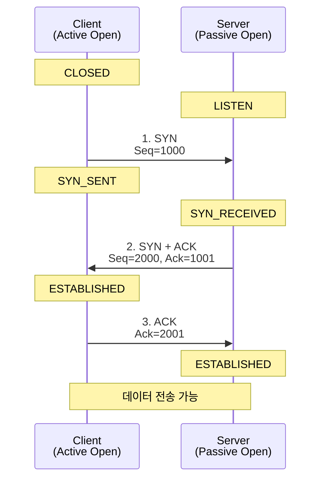

**단계별 설명:**

**Step 1: SYN (클라이언트 → 서버)**
- 클라이언트가 연결 요청
- **SYN 플래그 = 1**
- **Sequence Number = 랜덤 값** (예: 1000)
- 상태: CLOSED → SYN_SENT

**Step 2: SYN + ACK (서버 → 클라이언트)**
- 서버가 연결 수락
- **SYN 플래그 = 1**, **ACK 플래그 = 1**
- **Sequence Number = 랜덤 값** (예: 2000)
- **Acknowledgment Number = 클라이언트 Seq + 1** (예: 1001)
- 상태: LISTEN → SYN_RECEIVED

**Step 3: ACK (클라이언트 → 서버)**
- 클라이언트가 최종 확인
- **ACK 플래그 = 1**
- **Acknowledgment Number = 서버 Seq + 1** (예: 2001)
- 상태: SYN_SENT → ESTABLISHED (양쪽 모두)

💡 **중요!**: **3-Way Handshake 완료 후** 데이터 전송이 가능합니다!

---

### 4-Way Handshake (연결 종료)

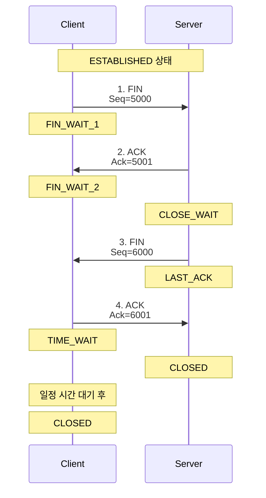

**단계별 설명:**

**Step 1: FIN (클라이언트 → 서버)**
- 클라이언트가 종료 요청
- **FIN 플래그 = 1**
- 상태: ESTABLISHED → FIN_WAIT_1

**Step 2: ACK (서버 → 클라이언트)**
- 서버가 종료 요청 확인
- **ACK 플래그 = 1**
- 상태: Client (FIN_WAIT_2), Server (CLOSE_WAIT)

**Step 3: FIN (서버 → 클라이언트)**
- 서버도 종료 준비 완료
- **FIN 플래그 = 1**
- 상태: Server (LAST_ACK)

**Step 4: ACK (클라이언트 → 서버)**
- 클라이언트가 최종 확인
- **ACK 플래그 = 1**
- 상태: Client (TIME_WAIT → CLOSED), Server (CLOSED)

#### TIME_WAIT 상태

💡 **중요!**: TIME_WAIT은 **지연된 패킷을 기다리기 위한** 상태입니다.

**필요성:**
- 네트워크에서 지연되어 늦게 도착하는 패킷이 있을 수 있음
- 잘못된 연결로 패킷이 전달되는 것을 방지

**기본 대기 시간:** 일반적으로 **2 x MSL** (Maximum Segment Lifetime)
- Linux: 60초
- Windows: 120초

**문제 상황:**
- 웹 서버처럼 **짧은 연결이 많은 환경**에서는 TIME_WAIT 상태의 연결이 많이 쌓임
- TCP 리소스 고갈 → 새로운 연결 생성 불가

**해결 방법: 튜닝**
```bash
# Linux 예시
$ sysctl -w net.ipv4.tcp_fin_timeout=30  # 기본 60초 → 30초로 감소
```

---

### Selective ACK (선택적 확인응답)

**문제 상황:**
- 여러 패킷 전송 중 **일부 패킷만 손실**
- 기존 방식: 손실된 패킷 이후의 **모든 패킷을 재전송**
- 비효율적!

**Selective ACK 해결:**
- 수신자가 **어떤 패킷을 받았는지** 명시적으로 알림
- 송신자는 **손실된 패킷만** 재전송

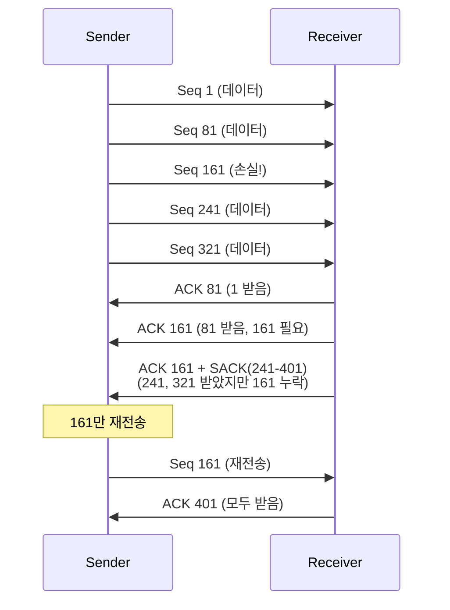

💡 **중요!**: 현대 TCP는 **Selective ACK를 기본으로 사용**하여 성능을 향상시킵니다.

---

### 흐름제어 (Flow Control)

**목적:** 수신자의 **버퍼 오버플로우 방지**

**방법: Sliding Window**
- 수신자가 **Window Size** 필드로 수신 가능한 데이터량 알림
- 송신자는 ACK를 기다리지 않고 Window Size만큼 전송 가능

```
수신자: "나는 2048 bytes까지 받을 수 있어" (Window Size = 2048)
송신자: "OK, 2048 bytes 보낼게"
수신자: "지금은 버퍼가 꽉 찼어" (Window Size = 0)
송신자: "알았어, 대기할게"
수신자: "이제 다시 1024 bytes 받을 수 있어" (Window Size = 1024)
송신자: "OK, 1024 bytes 보낼게"
```

---

### 혼잡제어 (Congestion Control)

**목적:** 네트워크 **혼잡 상황 감지 및 조절**

**방법:**
1. **패킷 손실 감지** (중복 ACK, 타임아웃)
2. **전송 속도 감소**
3. **점진적으로 속도 증가** (Slow Start, Congestion Avoidance)

**알고리즘:**
- **Slow Start**: 지수적 증가
- **Congestion Avoidance**: 선형 증가
- **Fast Retransmit**: 중복 ACK 3개 수신 시 즉시 재전송
- **Fast Recovery**: 혼잡 회피 단계로 빠르게 복구

---

## Section 6: 종합 정리 및 다음 강의 예고

### 오늘 학습한 주요 개념

#### 1. IP 프로토콜 (복습)
- 패킷 분할/조립, TTL, IP 주소, 라우팅
- MTU, Fragmentation, 서브네팅

#### 2. NAT (Network Address Translation)
- 정적 NAT: 1:1 매핑
- 동적 NAT: Pool 방식
- PAT/NAPT: N:1 매핑 (포트 번호 활용)

#### 3. IP 라우팅
- 라우팅 테이블
- 패킷 전송 과정 (MAC 주소 변경, IP 주소 유지)
- 기본 게이트웨이 (0.0.0.0/0)

#### 4. ICMP 프로토콜
- Echo Request/Reply (Ping)
- Destination Unreachable
- Time Exceeded (Traceroute)

#### 5. Cisco 라우터 설정
- User/Privileged/Global Config Mode
- Interface 설정 (ip address, no shutdown)
- Static Routing (ip route)

#### 6. TCP 프로토콜
- 3-Way Handshake (SYN → SYN+ACK → ACK)
- 4-Way Handshake (FIN → ACK → FIN → ACK)
- Selective ACK
- 흐름제어 (Sliding Window)
- 혼잡제어 (Slow Start, Congestion Avoidance)

---

### 실습 복습 체크리스트

#### Cisco 라우터 설정
- [ ] Packet Tracer 설치 완료
- [ ] User Mode → Privileged Mode 진입 가능
- [ ] Global Configuration Mode 진입 가능
- [ ] Interface IP 설정 가능
- [ ] Static Routing 설정 가능
- [ ] show ip route 명령어로 라우팅 테이블 확인 가능

#### ICMP 패킷 분석
- [ ] Wireshark 설치 및 실행 가능
- [ ] ICMP 필터 설정 가능
- [ ] Ping 패킷 캡처 및 분석 가능
- [ ] Traceroute 패킷 캡처 및 분석 가능
- [ ] Echo Request/Reply 구분 가능
- [ ] Time Exceeded 메시지 이해

---

### 다음 강의 예고 (7일차)

#### 1. TCP 3-Way Handshake 실제 패킷 분석
- Wireshark로 3-Way Handshake 캡처
- SYN, SYN+ACK, ACK 패킷 상세 분석
- Sequence Number, Acknowledgment Number 추적

#### 2. Nmap 포트 스캐닝 실습
- Nmap 설치 및 기본 사용법
- 다양한 스캔 기법 (SYN Scan, Connect Scan, UDP Scan)
- 방화벽 우회 기법
- 스캔 결과 분석

#### 3. Application Layer (HTTP 프로토콜)
- HTTP 요청/응답 구조
- HTTP 메서드 (GET, POST, PUT, DELETE)
- HTTP 상태 코드
- HTTPS (TLS/SSL)

---

### 학습 권장 사항

#### 복습 자료
1. **RFC 문서**
   - RFC 791: Internet Protocol (IP)
   - RFC 792: Internet Control Message Protocol (ICMP)
   - RFC 793: Transmission Control Protocol (TCP)
   - RFC 1918: Address Allocation for Private Internets (사설 IP)
   - RFC 1631: The IP Network Address Translator (NAT)

2. **온라인 자료**
   - Cisco Networking Academy
   - Wireshark Tutorial
   - TCP/IP Illustrated (책)

3. **실습 환경**
   - GNS3 (네트워크 시뮬레이터, Packet Tracer보다 고급)
   - VirtualBox/VMware (가상 머신으로 리눅스 서버 구축)
   - AWS/Azure Free Tier (클라우드 환경 실습)

#### 추가 학습 주제
1. **네트워크 보안**
   - 방화벽 (iptables, firewalld)
   - IDS/IPS (Snort, Suricata)
   - VPN (IPsec, OpenVPN, WireGuard)

2. **네트워크 프로토콜**
   - ARP (Address Resolution Protocol)
   - DNS (Domain Name System)
   - DHCP (Dynamic Host Configuration Protocol)
   - NTP (Network Time Protocol)

3. **네트워크 도구**
   - tcpdump (명령줄 패킷 캡처)
   - netstat/ss (네트워크 연결 상태 확인)
   - nslookup/dig (DNS 조회)
   - curl/wget (HTTP 클라이언트)

---

### 최종 학습 체크리스트

#### 이론 이해
- [ ] IP 프로토콜의 4가지 기능을 설명할 수 있다
- [ ] NAT의 3가지 유형을 구분할 수 있다
- [ ] 라우팅 과정에서 MAC 주소와 IP 주소의 변화를 설명할 수 있다
- [ ] ICMP의 주요 메시지 유형을 알고 있다
- [ ] TCP 3-Way/4-Way Handshake 과정을 그릴 수 있다
- [ ] TCP 흐름제어와 혼잡제어의 차이를 설명할 수 있다

#### 실습 능력
- [ ] Cisco 라우터 기본 설정을 할 수 있다
- [ ] Static Routing을 설정할 수 있다
- [ ] Ping과 Traceroute를 활용하여 네트워크를 진단할 수 있다
- [ ] Wireshark로 패킷을 캡처하고 분석할 수 있다
- [ ] TCP 연결 수립/종료 패킷을 식별할 수 있다

#### 문제 해결 능력
- [ ] 네트워크 연결 문제를 체계적으로 진단할 수 있다
- [ ] 라우팅 문제를 해결할 수 있다
- [ ] 패킷 손실 원인을 분석할 수 있다
- [ ] 성능 문제를 TCP 관점에서 분석할 수 있다

---

## 🎯 마무리

오늘 강의에서는 **네트워크 계층부터 전송 계층까지** 폭넓은 주제를 다루었습니다.

**핵심 메시지:**
1. **IP 라우팅**은 네트워크의 기본이며, MAC 주소와 IP 주소의 역할을 정확히 이해해야 합니다.
2. **NAT**는 현대 네트워크에서 필수적인 기술이며, 특히 PAT/NAPT는 가장 널리 사용됩니다.
3. **TCP**는 신뢰성 있는 통신을 위해 복잡한 메커니즘을 가지고 있으며, 3-Way/4-Way Handshake는 반드시 이해해야 합니다.
4. **실습**을 통해 이론을 확인하는 것이 중요하며, Packet Tracer와 Wireshark는 강력한 학습 도구입니다.

**다음 강의 준비:**
- Nmap 설치 (https://nmap.org/)
- Wireshark 설치 확인
- HTTP 프로토콜에 대한 기본 지식 복습

---

**강의 노트 작성 완료!** 📚✨

