--- 
title: "📝 AWS 보안 기초 강의 노트 (4일차)"
date: 2025-12-08
categories:
  - AWS-Cloud
tags:
  - AWS-Cloud
  - SK_Rookies
---

# 📝 AWS 보안 기초 강의 노트 (4일차)

**강의 일자**: 2025년 12월 8일
**강의 주제**: EC2 Auto Scaling, AWS Lambda, Amazon S3
**이전 학습 복습**: VPC Peering, Transit Gateway, VPN, Direct Connect, EC2, ELB

---

## 🎯 강의 개요 및 학습 목표

### 📌 오늘 배울 내용

오늘은 AWS 보안 기초 과정의 **4일차**입니다. 지난 금요일에 학습한 내용을 복습하고, 이어서 다음 주제들을 학습합니다:

1. **EC2 Auto Scaling (오토 스케일링)**
   - 애플리케이션 부하에 따른 자동 확장/축소
   - Launch Template, Auto Scaling Group 구성
   - 스케일링 정책 설정 및 실습

2. **AWS Lambda (서버리스 컴퓨팅)**
   - 이벤트 기반 함수 실행
   - Lambda 함수 생성 및 관리
   - API Gateway, S3, EventBridge 연동

3. **Amazon S3 (객체 스토리지)**
   - 버킷 생성 및 관리
   - 버전 관리 및 객체 복제
   - 퍼블릭 액세스 제어
   - 정적 웹사이트 호스팅

### 💡 학습의 흐름

강사님께서 강조하신 것처럼, 오늘 배우는 내용들은 **지난 시간에 학습한 네트워크 및 컴퓨팅 기초 위에 쌓이는 고급 기능들**입니다. 특히 Auto Scaling과 Lambda는 **클라우드 네이티브 애플리케이션의 핵심 패턴**이므로, 실무에서 매우 자주 사용됩니다.

---

## 🔄 지난 시간 복습

강사님께서 본격적인 학습에 앞서, 지난 금요일에 배운 내용들을 빠르게 복습해주셨습니다. 이 복습 내용은 오늘 배울 내용의 기반이 되므로 매우 중요합니다.

---

## 📡 Section 1: VPC Peering (VPC 피어링)

### 🌐 VPC Peering이란?

**VPC Peering**은 **VPC 간 사설 네트워크(Private Network)를 구성**할 때 사용하는 AWS 서비스입니다.

#### 핵심 특징

| 특징 | 설명 | 중요도 |
|:---:|:---|:---:|
| **1대1 연결** | VPC와 VPC를 직접 연결하는 관계 | ⭐⭐⭐ |
| **CIDR 블록 중복 불가** | 연결하려는 VPC의 CIDR 블록이 겹치면 피어링 불가능 | ⭐⭐⭐ |
| **전이적 피어링 불가** | A↔B, B↔C가 피어링되어도 A↔C는 자동 연결 안 됨 | ⭐⭐⭐ |
| **사설 네트워크 통신** | 인터넷을 거치지 않고 AWS 백본을 통한 안전한 통신 | ⭐⭐ |

#### 🔍 전이적 피어링(Transitive Peering)이 안 되는 이유

이 부분이 매우 중요합니다. 강사님께서 특히 강조하셨습니다.

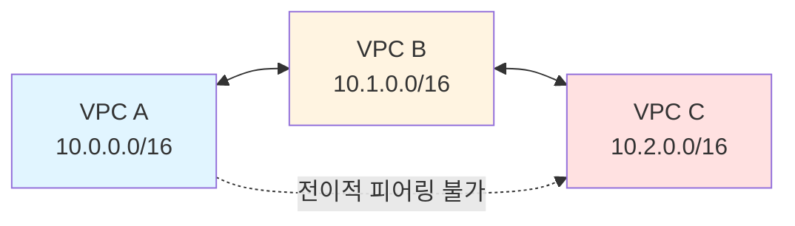
```mermaid
graph LR
    A[VPC A<br/>10.0.0.0/16] <--> B[VPC B<br/>10.1.0.0/16]
    B <--> C[VPC C<br/>10.2.0.0/16]
    A -.->|전이적 피어링 불가| C

    style A fill:#e1f5ff
    style B fill:#fff4e1
    style C fill:#ffe1e1
```

**시나리오:**
- VPC A와 VPC B가 피어링 관계
- VPC B와 VPC C가 피어링 관계
- **문제**: VPC A와 VPC C가 통신할 수 있는가?
- **답**: **불가능!** A와 C가 통신하려면 **별도로 피어링을 추가로 설정**해야 함

💡 **왜 이게 중요한가?**
- 전이적 피어링을 허용하면 보안상 위험
- 의도하지 않은 네트워크 연결이 발생할 수 있음
- 명시적으로 연결 관계를 정의해야 보안 통제 가능

#### 🔴 Full Mesh 구조의 문제점

**상황**: 회사에 VPC가 많아지면?

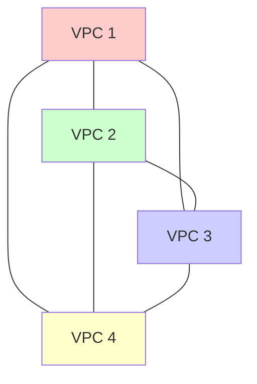
```mermaid
graph TD
    VPC1[VPC 1] --- VPC2[VPC 2]
    VPC1 --- VPC3[VPC 3]
    VPC1 --- VPC4[VPC 4]
    VPC2 --- VPC3
    VPC2 --- VPC4
    VPC3 --- VPC4

    style VPC1 fill:#ffcccc
    style VPC2 fill:#ccffcc
    style VPC3 fill:#ccccff
    style VPC4 fill:#ffffcc
```

**문제점:**
- VPC가 4개만 되어도 **6개의 피어링 연결** 필요 (n개일 때 n×(n-1)/2개)
- VPC가 10개면? → **45개의 피어링 연결** 필요!
- 라우팅 테이블이 복잡해짐
- 관리가 매우 어려워짐

💡 **해결책**: Transit Gateway 사용 (다음 섹션에서 설명)

---

## 🚇 Section 2: Transit Gateway (트랜짓 게이트웨이)

### 🎯 Transit Gateway란?

**Transit Gateway**는 VPC Peering의 복잡성을 해결하기 위한 **네트워크 허브(Hub)** 서비스입니다.

#### 왜 Transit Gateway가 필요한가?

VPC Peering의 Full Mesh 문제를 해결하기 위해 **Hub and Spoke(허브 앤 스포크)** 아키텍처를 제공합니다.

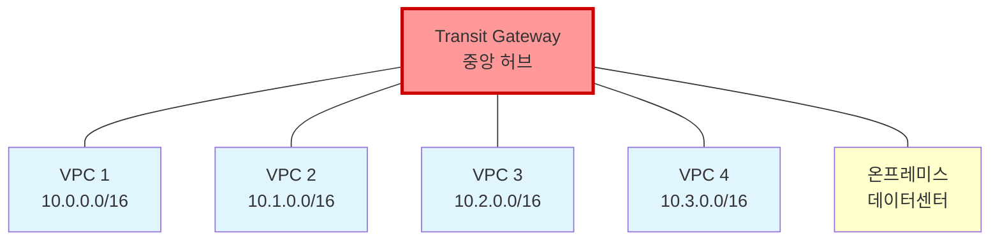
```mermaid
graph TD
    TGW[Transit Gateway<br/>중앙 허브]
    VPC1[VPC 1<br/>10.0.0.0/16]
    VPC2[VPC 2<br/>10.1.0.0/16]
    VPC3[VPC 3<br/>10.2.0.0/16]
    VPC4[VPC 4<br/>10.3.0.0/16]
    OnPrem[온프레미스<br/>데이터센터]

    TGW --- VPC1
    TGW --- VPC2
    TGW --- VPC3
    TGW --- VPC4
    TGW --- OnPrem

    style TGW fill:#ff9999,stroke:#cc0000,stroke-width:3px
    style VPC1 fill:#e1f5ff
    style VPC2 fill:#e1f5ff
    style VPC3 fill:#e1f5ff
    style VPC4 fill:#e1f5ff
    style OnPrem fill:#ffffcc
```

#### 🌟 Transit Gateway의 주요 특징

| 특징 | 설명 | 장점 |
|:---:|:---|:---|
| **Hub and Spoke 아키텍처** | Transit Gateway를 중심으로 모든 네트워크 연결 | 관리 단순화 |
| **다양한 연결 지원** | VPC, VPN, Direct Connect Gateway, 다른 TGW | 유연성 |
| **라우팅 테이블 제어** | 전체/부분적 네트워크 연결 제어 가능 | 세밀한 제어 |
| **리전 간 연결** | 서로 다른 리전의 VPC도 연결 가능 | 글로벌 네트워크 |

#### 🔧 Transit Gateway가 연결할 수 있는 대상

1. **VPC** - Virtual Private Cloud
2. **VPN** - Site-to-Site VPN 연결
3. **Direct Connect Gateway** - 전용선 연결
4. **Transit Gateway Peering** - 다른 Transit Gateway와 연결 (리전 간 연결)

#### 📊 라우팅 테이블을 통한 네트워크 제어

Transit Gateway의 강력한 기능 중 하나는 **라우팅 테이블을 이용한 세밀한 네트워크 제어**입니다.

**시나리오 1: 전체 통신 허용**
- 모든 VPC가 서로 통신 가능
- 라우팅 테이블에 모든 대상 등록

**시나리오 2: 부분적 네트워크 연결**
- VPC A는 VPC B와만 통신 가능
- VPC C는 VPC D와만 통신 가능
- 라우팅 테이블에서 선택적 경로만 등록

💡 **실무 활용 예시:**
```
개발 환경 VPC ← TGW → 개발 환경끼리만 통신
운영 환경 VPC ← TGW → 운영 환경끼리만 통신
관리 VPC ← TGW → 모든 환경과 통신 가능
```

#### 비교: VPC Peering vs Transit Gateway

| 구분 | VPC Peering | Transit Gateway |
|:---:|:---|:---|
| **연결 방식** | 1대1 직접 연결 | Hub를 통한 중앙 집중식 |
| **확장성** | VPC 수 증가 시 복잡도 기하급수적 증가 | VPC 수 증가해도 관리 단순 |
| **라우팅** | 각 VPC의 라우팅 테이블 개별 관리 | TGW 라우팅 테이블로 중앙 관리 |
| **비용** | 피어링 자체는 무료 (데이터 전송 비용만) | TGW 사용 비용 + 데이터 전송 비용 |
| **적합한 경우** | 소수의 VPC 연결 | 다수의 VPC 및 하이브리드 환경 |

---

## 🔐 Section 3: VPN (Virtual Private Network)

### 🌉 AWS VPN 서비스 개요

AWS는 **온프레미스 네트워크와 VPC를 안전하게 연결**하기 위한 VPN 서비스를 제공합니다.

#### 🎯 VPN이 필요한 이유

- 기존 데이터센터(온프레미스)의 리소스와 클라우드 연결 필요
- 인터넷을 통하되 **암호화된 터널**로 안전한 통신
- 빠른 구축 가능 (수분 내 설정 완료)
- 비교적 저렴한 비용

---

### 🏗️ Site-to-Site VPN 구성 요소

AWS에서 제공하는 Site-to-Site VPN은 다음 구성 요소로 이루어집니다:

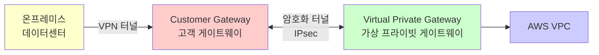
```mermaid
graph LR
    OnPrem[온프레미스<br/>데이터센터] -->|VPN 터널| CGW[Customer Gateway<br/>고객 게이트웨이]
    CGW <-->|암호화 터널<br/>IPsec| VGW[Virtual Private Gateway<br/>가상 프라이빗 게이트웨이]
    VGW --> VPC[AWS VPC]

    style OnPrem fill:#ffffcc
    style CGW fill:#ffcccc
    style VGW fill:#ccffcc
    style VPC fill:#ccccff
```

#### 📌 Virtual Private Gateway (VGW)

**역할**: VPC 측 VPN 종단점

| 속성 | 설명 |
|:---|:---|
| **배포 위치** | AWS VPC에 생성 |
| **기능** | VPN 연결의 AWS 측 게이트웨이 |
| **대역폭** | 최대 **1.25 Gbps** |
| **이중화** | 자동으로 이중화된 터널 구성 |

⚠️ **주의사항**: 1.25 Gbps의 속도 제한이 있으므로, 더 높은 대역폭이 필요하면 Direct Connect 고려

#### 📌 Customer Gateway (CGW)

**역할**: 온프레미스 측 VPN 종단점

**Customer Gateway가 될 수 있는 장비:**
- **라우터** - Cisco, Juniper 등의 네트워크 라우터
- **방화벽** - Palo Alto, Fortinet, CheckPoint 등
- **전용 VPN 장비** - VPN 전용 어플라이언스
- **소프트웨어 VPN** - OpenVPN, StrongSwan 등

💡 **실무 팁**: 대부분의 기업 방화벽은 VPN 기능을 내장하고 있으므로, 별도 장비 없이 기존 방화벽 활용 가능

#### 🔒 VPN 터널의 특징

**1. IPsec 기반 암호화**
- 업계 표준 IPsec 프로토콜 사용
- AES-256 암호화 지원
- 데이터 무결성 보장

**2. 이중 터널 구성**
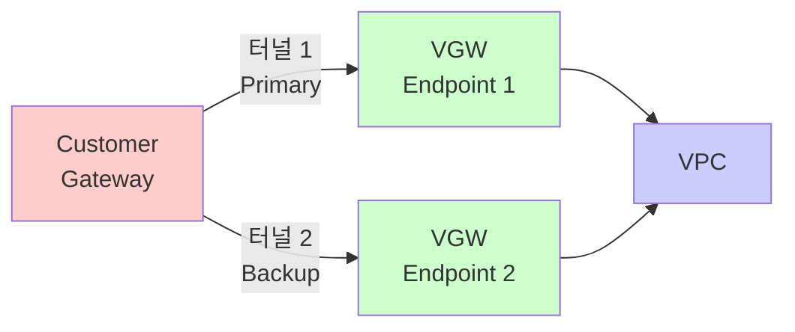
```mermaid
graph LR
    CGW[Customer<br/>Gateway] -->|터널 1<br/>Primary| VGW1[VGW<br/>Endpoint 1]
    CGW -->|터널 2<br/>Backup| VGW2[VGW<br/>Endpoint 2]
    VGW1 --> VPC[VPC]
    VGW2 --> VPC

    style CGW fill:#ffcccc
    style VGW1 fill:#ccffcc
    style VGW2 fill:#ccffcc
    style VPC fill:#ccccff
```

- **고가용성**: 2개의 터널을 자동으로 생성
- **장애 대응**: 하나의 터널 장애 시 자동으로 다른 터널로 전환
- **AWS 관리**: AWS가 자동으로 이중화 구성 제공

**3. 빠른 구축**

| 단계 | 소요 시간 | 작업 내용 |
|:---:|:---:|:---|
| 1 | 5분 | Virtual Private Gateway 생성 |
| 2 | 5분 | Customer Gateway 정보 등록 |
| 3 | 5분 | VPN Connection 생성 |
| 4 | 10-20분 | CGW 장비에 설정 다운로드 및 적용 |
| **합계** | **30분 내** | **Site-to-Site VPN 구축 완료** |

강사님 말씀: *"내가 마음만 먹으면 고객의 게이트웨이 쪽에 환경 설정하고, 그다음에 VPC 쪽에 Virtual Private Gateway 만들고, VPN 연결하는 서비스 이렇게 연결만 하면 수분 내에 Site-to-Site VPN 환경을 바로 만들 수 있다는 장점이 있습니다."*

#### 📊 Site-to-Site VPN 설정 단계

**Step 1: Virtual Private Gateway 생성**
```bash
# AWS CLI 예제
aws ec2 create-vpn-gateway --type ipsec.1

# 출력 예시
{
    "VpnGateway": {
        "VpnGatewayId": "vgw-1234567890abcdef0",
        "State": "available",
        "Type": "ipsec.1"
    }
}
```

**Step 2: VPC에 VGW 연결**
```bash
aws ec2 attach-vpn-gateway \
    --vpn-gateway-id vgw-1234567890abcdef0 \
    --vpc-id vpc-0123456789abcdef0
```

**Step 3: Customer Gateway 생성**
```bash
aws ec2 create-customer-gateway \
    --type ipsec.1 \
    --public-ip 203.0.113.12 \
    --bgp-asn 65000

# public-ip: 고객 측 공인 IP
# bgp-asn: BGP AS 번호 (동적 라우팅 사용 시)
```

**Step 4: VPN Connection 생성**
```bash
aws ec2 create-vpn-connection \
    --type ipsec.1 \
    --customer-gateway-id cgw-1234567890abcdef0 \
    --vpn-gateway-id vgw-1234567890abcdef0
```

**Step 5: 라우팅 테이블 업데이트**
- VPC의 라우팅 테이블에 온프레미스 네트워크 대역 추가
- 예: `192.168.0.0/16` → `vgw-1234567890abcdef0`

---

### 👤 Client VPN

**Client VPN**은 **개별 단말(PC, 노트북, 서버)에서 VPC로 접속**하는 VPN 서비스입니다.

#### Site-to-Site VPN vs Client VPN

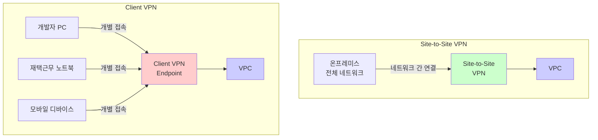
```mermaid
graph TD
    subgraph "Site-to-Site VPN"
    OnPrem[온프레미스<br/>전체 네트워크] -->|네트워크 간 연결| S2S[Site-to-Site<br/>VPN]
    S2S --> VPC1[VPC]
    end

    subgraph "Client VPN"
    PC1[개발자 PC] -->|개별 접속| ClientVPN[Client VPN<br/>Endpoint]
    PC2[재택근무 노트북] -->|개별 접속| ClientVPN
    Mobile[모바일 디바이스] -->|개별 접속| ClientVPN
    ClientVPN --> VPC2[VPC]
    end

    style S2S fill:#ccffcc
    style ClientVPN fill:#ffcccc
    style VPC1 fill:#ccccff
    style VPC2 fill:#ccccff
```

| 구분 | Site-to-Site VPN | Client VPN |
|:---:|:---|:---|
| **연결 대상** | 네트워크 전체 | 개별 단말 |
| **사용 사례** | 데이터센터-클라우드 연결 | 재택근무, 원격 관리 |
| **인증 방식** | 사전 공유 키 (PSK) | 사용자 인증 (인증서, AD) |
| **클라이언트** | 네트워크 장비 | VPN 클라이언트 소프트웨어 |
| **대역폭** | 최대 1.25 Gbps | 개별 세션당 제한 |

💡 **실무 활용 예시:**
- 재택근무 직원이 회사 VPC의 리소스에 안전하게 접근
- 외주 개발자에게 제한적인 VPC 액세스 제공
- 관리자가 출장 중 VPC 내 서버 관리

---

## 🚀 Section 4: Direct Connect (다이렉트 커넥트)

### 🎯 Direct Connect란?

**AWS Direct Connect**는 **온프레미스와 AWS 간 전용선(Dedicated Line) 연결** 서비스입니다.

강사님 강조: *"Direct Connect는 뭐라고요? 전용선 서비스입니다, 전용선!"*

#### 🔍 VPN vs Direct Connect

| 구분 | VPN | Direct Connect |
|:---:|:---|:---|
| **연결 방식** | 인터넷 기반 암호화 터널 | 물리적 전용선 |
| **대역폭** | 최대 1.25 Gbps | **최대 400 Gbps** (리전에 따라 다름) |
| **지연시간** | 인터넷 경로에 따라 변동 | 일관되고 낮은 지연시간 |
| **보안** | IPsec 암호화 | 전용 회선 (암호화 옵션) |
| **비용** | 상대적으로 저렴 | 상대적으로 고가 |
| **구축 시간** | **수분~수십 분** | **수주~수개월** |
| **안정성** | 인터넷 품질 의존 | 매우 높음 |

#### 📊 Direct Connect 대역폭

강사님 말씀: *"최대 100Gbps... 그런데 요즘은 최근에 데이터를 찾아봤더니 400기가까지 가능하더라고요. 400 Gbps까지 최근에는 지원해요."*

**지원 대역폭:**
- 50 Mbps
- 100 Mbps
- 200 Mbps
- 300 Mbps
- 400 Mbps
- 500 Mbps
- 1 Gbps
- 2 Gbps
- 5 Gbps
- 10 Gbps
- 100 Gbps
- **400 Gbps** (최신, 리전에 따라 지원 여부 다름)

⚠️ **중요**: 모든 지역이 400 Gbps를 지원하는 것은 아닙니다. 리전별로 지원 대역폭이 다르므로 반드시 확인 필요!

#### 🏗️ Direct Connect 구성 요소

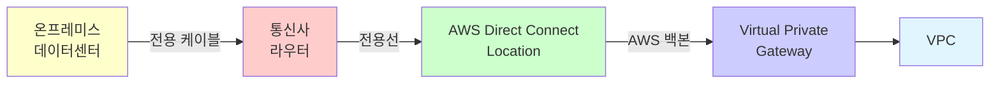
```mermaid
graph LR
    OnPrem[온프레미스<br/>데이터센터] -->|전용 케이블| ISP[통신사<br/>라우터]
    ISP -->|전용선| DXL[AWS Direct Connect<br/>Location]
    DXL -->|AWS 백본| VGW[Virtual Private<br/>Gateway]
    VGW --> VPC[VPC]

    style OnPrem fill:#ffffcc
    style ISP fill:#ffcccc
    style DXL fill:#ccffcc
    style VGW fill:#ccccff
    style VPC fill:#e1f5ff
```

**구성 단계:**
1. **통신사와 계약** - KT, SK, LG U+ 등
2. **Direct Connect Location 선택** - AWS와 통신사가 공동 운영하는 시설
3. **Cross Connect 설정** - 통신사 라우터와 AWS 장비 연결
4. **Virtual Interface 생성** - VPC와의 논리적 연결 설정

#### ⏰ 구축 시간 비교

| 서비스 | 구축 시간 | 이유 |
|:---:|:---:|:---|
| **VPN** | 30분~1시간 | 소프트웨어 설정만 필요 |
| **Direct Connect** | **수주~수개월** | 물리적 케이블 설치, 통신사 계약 필요 |

강사님 말씀: *"얘는 별도의 계약이 수반되어지기 때문에 구축하는데 시간이 걸립니다. 왜냐하면 통신사로부터 케이블도 깔아야 되고, 통신사의 라우터와 연결도 해줘야 되고 등등, 이런 작업들이 필요하다 보니까 좀 더 시간이 많이 걸립니다."*

#### 💰 비용 고려사항

**Direct Connect 비용 구조:**
- **포트 시간당 비용** - 대역폭에 따라 다름
- **데이터 전송 비용** - 아웃바운드 데이터 전송 비용
- **Cross Connect 비용** - 통신사와의 연결 비용
- **통신사 회선 비용** - 별도 통신사 계약 비용

**언제 Direct Connect를 선택해야 하는가?**

✅ **Direct Connect가 적합한 경우:**
- 대용량 데이터 전송이 빈번한 경우
- 일관된 네트워크 성능이 중요한 경우
- 규제/컴플라이언스로 인터넷 경유 불가한 경우
- 장기간 사용 예정 (비용 상쇄 가능)

❌ **VPN이 더 적합한 경우:**
- 빠른 구축이 필요한 경우
- 임시/테스트 목적
- 예산이 제한적인 경우
- 대역폭 요구사항이 낮은 경우 (1 Gbps 이하)

---

## 🔌 Section 5: VPC Endpoint

### 🎯 VPC Endpoint란?

**VPC Endpoint**는 **VPC 내부에서 AWS 서비스로 접속할 때 인터넷을 거치지 않고 프라이빗 네트워크로 통신**하도록 해주는 서비스입니다.

#### 왜 VPC Endpoint가 필요한가?

**기존 방식의 문제점:**
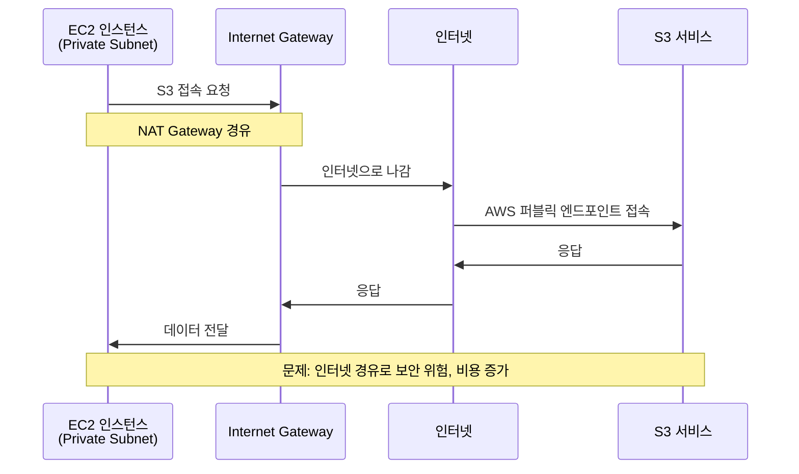
```mermaid
sequenceDiagram
    participant EC2 as EC2 인스턴스<br/>(Private Subnet)
    participant IGW as Internet Gateway
    participant Internet as 인터넷
    participant S3 as S3 서비스

    EC2->>IGW: S3 접속 요청
    Note over EC2,IGW: NAT Gateway 경유
    IGW->>Internet: 인터넷으로 나감
    Internet->>S3: AWS 퍼블릭 엔드포인트 접속
    S3->>Internet: 응답
    Internet->>IGW: 응답
    IGW->>EC2: 데이터 전달

    Note over EC2,S3: 문제: 인터넷 경유로 보안 위험, 비용 증가
```

**VPC Endpoint 사용 시:**
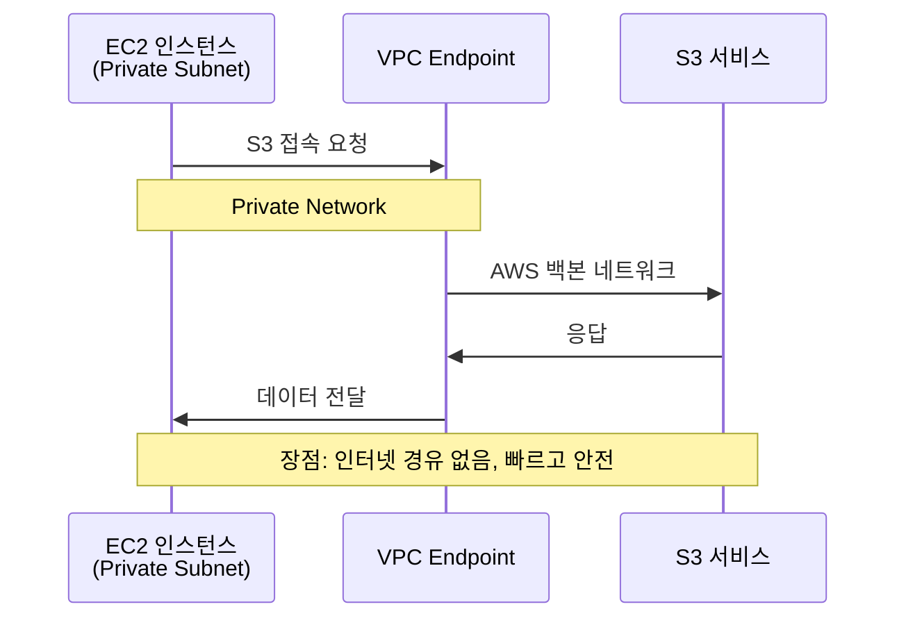
```mermaid
sequenceDiagram
    participant EC2 as EC2 인스턴스<br/>(Private Subnet)
    participant VPCE as VPC Endpoint
    participant S3 as S3 서비스

    EC2->>VPCE: S3 접속 요청
    Note over EC2,VPCE: Private Network
    VPCE->>S3: AWS 백본 네트워크
    S3->>VPCE: 응답
    VPCE->>EC2: 데이터 전달

    Note over EC2,S3: 장점: 인터넷 경유 없음, 빠르고 안전
```

#### 📌 VPC Endpoint의 주요 특징

| 특징 | 설명 |
|:---|:---|
| **단방향 통신** | VPC 내부 → VPC 외부 AWS 서비스 (반대 방향 불가) |
| **프라이빗 통신** | AWS 백본 네트워크 사용, 인터넷 경유 없음 |
| **보안 강화** | 인터넷 노출 없이 AWS 서비스 사용 |
| **비용 절감** | NAT Gateway 비용 절감 가능 |
| **응답 수신 가능** | 요청에 대한 응답은 당연히 받을 수 있음 |

강사님 강조: *"얘는 특징이 단방향 통신이에요. VPC 내부에서 VPC 외부로 이렇게 나가는 통신만 지원합니다. 물론 VPC 내부에서 VPC 외부로 통신하고 그에 대한 응답은 당연히 받겠죠. 근데 외부 서비스에서 VPC 내부로 거꾸로 이렇게 들어오는 촉이 발생되어진 그런 트래픽은 안 된다는 거고요."*

---

### 🔧 VPC Endpoint 유형

AWS는 두 가지 유형의 VPC Endpoint를 제공합니다:

#### 1️⃣ Gateway Endpoint

**특징:**
- **지원 서비스**: **S3**와 **DynamoDB**만 지원
- **라우팅 테이블 기반**: 라우팅 테이블에 경로 추가 필요
- **비용**: **무료** (데이터 전송 비용만 발생)
- **고가용성**: AWS가 자동으로 관리

**설정 방법:**
1. VPC Endpoint 생성 (Gateway 타입 선택)
2. 대상 서비스 선택 (S3 또는 DynamoDB)
3. 라우팅 테이블에 자동으로 경로 추가됨

**라우팅 테이블 예시:**
| Destination | Target | 설명 |
|:---|:---|:---|
| 10.0.0.0/16 | local | VPC 내부 통신 |
| 0.0.0.0/0 | nat-gateway-id | 인터넷 (NAT) |
| pl-12345678 (S3) | vpce-gateway-id | **S3 VPC Endpoint** |

💡 **pl-12345678은 무엇인가?**
- Prefix List: AWS가 관리하는 S3/DynamoDB의 IP 주소 범위
- 자동으로 업데이트됨 (IP 변경 시 수동 관리 불필요)

#### 2️⃣ Interface Endpoint

**특징:**
- **지원 서비스**: S3, DynamoDB + **다양한 AWS 서비스** (100개 이상)
- **ENI 기반**: 서브넷에 네트워크 인터페이스(ENI) 생성
- **Private Link 사용**: AWS Private Link 기술 기반
- **보안 그룹 적용 가능**: ENI에 보안 그룹 연결로 트래픽 제어
- **비용**: 시간당 비용 + 데이터 처리 비용 발생

강사님 말씀: *"Interface Endpoint는 다양한 서비스를 모두 지원합니다. S3, DynamoDB + Alpha라는 거예요."*

**지원 서비스 예시:**
- EC2, Lambda, SNS, SQS, CloudWatch
- Kinesis, Systems Manager, Secrets Manager
- KMS, API Gateway, Step Functions
- 기타 100개 이상의 AWS 서비스

**구성 요소:**

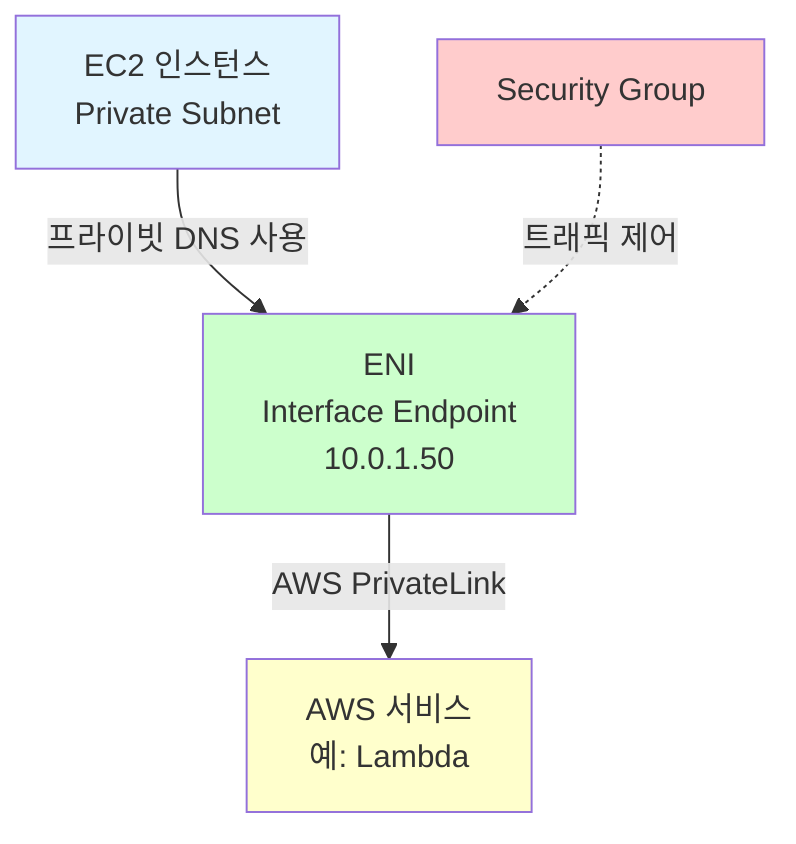
```mermaid
graph TD
    EC2[EC2 인스턴스<br/>Private Subnet] -->|프라이빗 DNS 사용| ENI[ENI<br/>Interface Endpoint<br/>10.0.1.50]
    ENI -->|AWS PrivateLink| Service[AWS 서비스<br/>예: Lambda]
    SG[Security Group] -.->|트래픽 제어| ENI

    style EC2 fill:#e1f5ff
    style ENI fill:#ccffcc
    style Service fill:#ffffcc
    style SG fill:#ffcccc
```

**ENI (Elastic Network Interface)란?**
- 논리적 네트워크 카드
- 프라이빗 IP 주소 할당
- 보안 그룹 연결 가능
- 서브넷에 생성됨

강사님 말씀: *"ENI가 있다는 얘기는요, ENI가 있다는 얘기는 Security Group 같은 걸 연결해서 트래픽 제어도 가능하다라는 뜻이에요."*

#### 📊 Gateway Endpoint vs Interface Endpoint 비교

| 구분 | Gateway Endpoint | Interface Endpoint |
|:---:|:---|:---|
| **지원 서비스** | S3, DynamoDB만 | S3, DynamoDB + 100개 이상 |
| **구현 방식** | 라우팅 테이블 기반 | ENI (네트워크 인터페이스) 기반 |
| **비용** | 무료 | 시간당 + 데이터 처리 비용 |
| **보안 그룹** | 적용 불가 | 적용 가능 |
| **DNS** | 자동 | Private DNS 사용 |
| **가용 영역** | 리전 전체 | 특정 서브넷 (AZ별 배포 권장) |

#### 🔒 보안 고려사항

**Gateway Endpoint 보안:**
- 엔드포인트 정책으로 액세스 제어
- VPC 내부에서만 접근 가능
- IAM 정책과 결합하여 세밀한 권한 제어

**Interface Endpoint 보안:**
- 보안 그룹으로 트래픽 제어 (소스 IP, 포트 제한)
- 엔드포인트 정책으로 API 수준 제어
- Private DNS 사용으로 코드 수정 없이 적용 가능

💡 **실무 권장사항:**
- S3/DynamoDB만 사용한다면 → Gateway Endpoint (무료)
- 다른 서비스도 함께 사용한다면 → Interface Endpoint
- 보안 요구사항이 높다면 → Interface Endpoint (보안 그룹 적용 가능)

---

## 🖥️ Section 6: EC2 (Elastic Compute Cloud) 복습

### 🎯 EC2란?

**Amazon EC2 (Elastic Compute Cloud)**는 AWS에서 제공하는 **가상화 기반 컴퓨팅 서비스**입니다.

강사님 말씀: *"EC2는 AWS에서 제공하는 서버 가상화 기반 컴퓨팅 서비스예요. 가상화 기반의 컴퓨팅 서비스입니다."*

#### 🌟 EC2의 주요 특징

| 특징 | 설명 |
|:---|:---|
| **가상화 기반** | 물리 서버를 가상화하여 제공 |
| **탄력적 확장** | 필요에 따라 용량 조정 가능 |
| **다양한 OS 지원** | Linux, Windows, macOS |
| **초 단위 과금** | 실행 중일 때만 비용 발생 |
| **글로벌 배포** | 전 세계 리전에 즉시 배포 가능 |

#### 💰 과금 방식

강사님 강조: *"실행 중일 때만 비용을 결제해요. 초 단위 또는 분 또는 시간 단위의 결제입니다."*

**과금 단위:**
- **대부분**: 초 단위 과금
- **일부 OS/인스턴스**: 시간 단위 과금 (예: Windows, RHEL 일부)
- **Stopped 상태**: EC2 인스턴스 비용은 발생 안 함 (EBS 볼륨 비용은 발생)

---

### 🔧 EC2 생성 시 주요 설정 항목

#### 1️⃣ AMI (Amazon Machine Image)

**AMI란?**
- OS + 애플리케이션 + 설정 파일이 포함된 **템플릿 이미지**
- EC2 인스턴스를 실행하기 위한 모든 정보 포함

**AMI에 포함되는 내용:**
- 운영체제 (OS)
- 설치된 애플리케이션 및 유틸리티
- 볼륨 디바이스 매핑 정보
- 시작 권한 (어떤 계정이 이 AMI를 사용할 수 있는지)
- 설정 파일

**AMI를 얻을 수 있는 곳:**

| 소스 | 설명 | 사용 시나리오 |
|:---|:---|:---|
| **Quick Start** | AWS 제공 공식 이미지 | 표준 OS 사용 |
| **Marketplace** | 3rd party 벤더 제공 (유/무료) | 상용 소프트웨어 포함 이미지 |
| **Community AMI** | 커뮤니티 공유 이미지 | 특정 구성이 필요한 경우 |
| **My AMIs** | 사용자가 직접 생성한 이미지 | 회사 표준 이미지 사용 |

💡 **실무 팁**: 회사의 표준 구성을 AMI로 만들어두면, 새 서버 생성 시 매번 동일한 설정 작업 불필요

---

#### 2️⃣ 인스턴스 타입 (Instance Type)

**인스턴스 타입 명명 규칙:**

```
m6a.xlarge
│ │ │  │
│ │ │  └─ 크기 (Size)
│ │ └──── 특성 (Processor)
│ └────── 세대 (Generation)
└──────── 패밀리 (Family)
```

**예시: `m6a.xlarge` 해석**
- `m`: **패밀리** - 범용 (General Purpose)
- `6`: **세대** - 6세대
- `a`: **특성** - AMD 프로세서
- `xlarge`: **크기** - vCPU 4개, 메모리 16GB

**주요 패밀리:**

| 패밀리 | 이름 | 사용 사례 |
|:---:|:---|:---|
| **M** | 범용 (General Purpose) | 일반적인 웹 서버, 애플리케이션 |
| **T** | 버스터블 (Burstable) | 개발/테스트, 소규모 애플리케이션 |
| **C** | 컴퓨팅 최적화 | CPU 집약적 워크로드 |
| **R** | 메모리 최적화 | 인메모리 데이터베이스, 캐시 |
| **I** | 스토리지 최적화 | NoSQL DB, 데이터 웨어하우스 |
| **G/P** | GPU 인스턴스 | ML, 그래픽 렌더링 |

**프로세서 특성 문자:**

| 문자 | 의미 | 비고 |
|:---:|:---|:---|
| `a` | AMD EPYC | 가격 대비 성능 우수 |
| `i` | Intel Xeon | 표준 Intel 프로세서 |
| `g` | AWS Graviton | ARM 기반, 효율적 |
| `n` | 네트워크 최적화 | 높은 네트워크 성능 |
| `d` | 로컬 NVMe SSD | 빠른 로컬 스토리지 |

---

#### 3️⃣ 키 페어 (Key Pair)

**역할**: EC2 인스턴스에 SSH 접속 시 인증에 사용

**키 페어 기반 인증 흐름:**
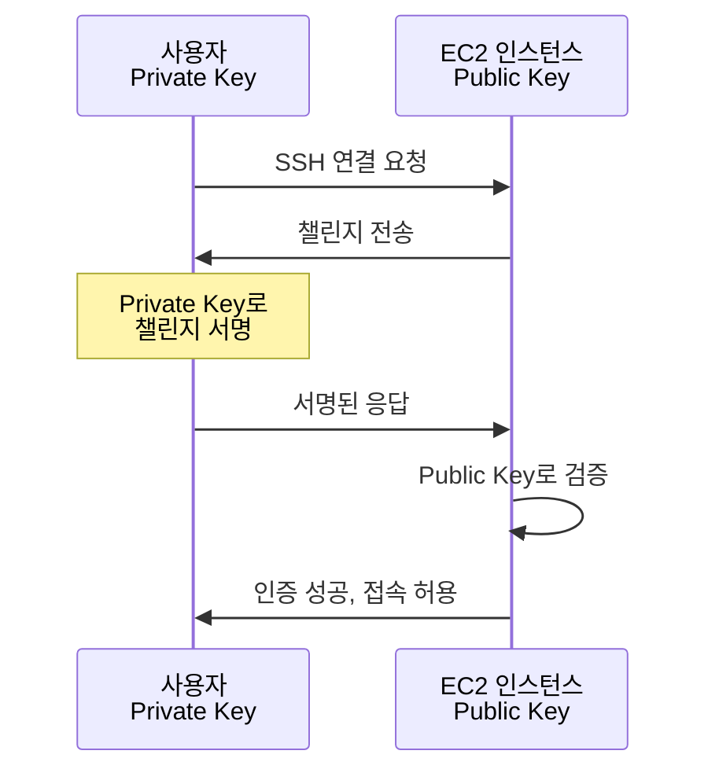
```mermaid
sequenceDiagram
    participant User as 사용자<br/>Private Key
    participant EC2 as EC2 인스턴스<br/>Public Key

    User->>EC2: SSH 연결 요청
    EC2->>User: 챌린지 전송
    Note over User: Private Key로<br/>챌린지 서명
    User->>EC2: 서명된 응답
    EC2->>EC2: Public Key로 검증
    EC2->>User: 인증 성공, 접속 허용
```

**키 페어 파일 형식:**
- **PEM**: Linux/macOS에서 사용 (`.pem`)
- **PPK**: Windows PuTTY에서 사용 (`.ppk`)

**키 페어를 사용한 SSH 접속:**
```bash
# 키 파일 권한 설정 (보안상 필수)
$ chmod 400 my-key-pair.pem

# SSH 접속
$ ssh -i my-key-pair.pem ec2-user@54.123.45.67

# 예상 출력:
#    __|  __|_  )
#    _|  (     /   Amazon Linux 2 AMI
#   ___|\___|___|
#
# [ec2-user@ip-10-0-1-50 ~]$
```

⚠️ **보안 주의사항:**
- Private Key는 절대 공유하지 말 것
- 키 파일 권한을 `400` 또는 `600`으로 제한
- 키 분실 시 인스턴스 접근 불가 (복구 어려움)

---

#### 4️⃣ Systems Manager Session Manager (키 페어 없이 접속)

**Session Manager의 장점:**

| 특징 | 설명 | 기존 SSH 대비 장점 |
|:---|:---|:---|
| **키 페어 불필요** | Private Key 관리 필요 없음 | 키 분실 위험 없음 |
| **SSH 포트 불필요** | 22번 포트 열 필요 없음 | 보안 강화 |
| **IAM 기반 인증** | AWS IAM으로 접근 제어 | 중앙 집중식 권한 관리 |
| **로깅** | 모든 세션 활동 기록 | 감사 추적 용이 |

강사님 말씀: *"세션 매니저는, 세션 매니저라는 얘 자체는 SSH 방식으로 접속하는 게 아니기 때문에 시큐리티 그룹에 SSH 오픈을 안 해도 접속 가능하고요, 키페어가 없어도 접속 가능합니다."*

**Session Manager 사용을 위한 요구사항:**

1. **IAM Role 필요**
   - 정책: `AmazonSSMManagedInstanceCore`
   - EC2에 Instance Profile로 연결

2. **네트워크 요구사항**
   - Systems Manager 엔드포인트와 통신 가능해야 함
   - 인터넷 or VPC Endpoint 필요

**Session Manager 접속 방법:**

**방법 1: AWS 콘솔**
1. EC2 콘솔로 이동
2. 인스턴스 선택
3. "연결" → "Session Manager" 탭
4. "연결" 버튼 클릭

**방법 2: AWS CLI**
```bash
# Session Manager Plugin 설치 필요
$ aws ssm start-session --target i-1234567890abcdef0

# 출력:
# Starting session with SessionId: john-0123456789abcdef0
#
# sh-4.2$ whoami
# ssm-user
```

---

#### 5️⃣ 네트워크 설정

**필수 설정 항목:**

| 설정 | 설명 | 중요도 |
|:---|:---|:---:|
| **VPC** | 인스턴스를 배포할 VPC 선택 | ⭐⭐⭐ |
| **Subnet** | 배포할 서브넷 선택 (AZ 결정) | ⭐⭐⭐ |
| **퍼블릭 IP 자동 할당** | 인터넷 통신 필요 시 활성화 | ⭐⭐ |
| **보안 그룹** | 방화벽 규칙 설정 | ⭐⭐⭐ |
| **추가 ENI** | 필요 시 네트워크 인터페이스 추가 | ⭐ |

**퍼블릭 서브넷 vs 프라이빗 서브넷:**

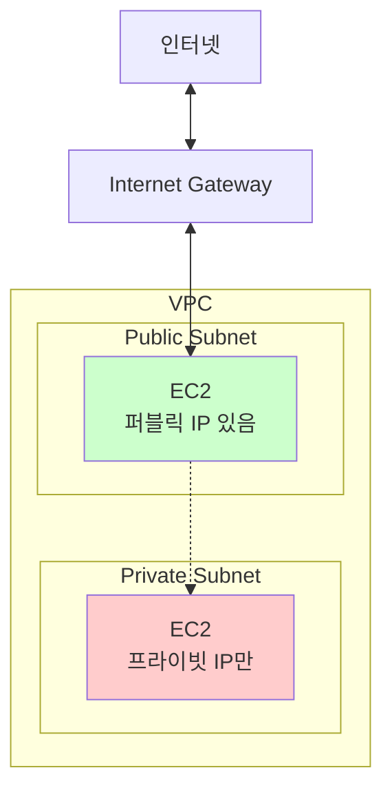
```mermaid
graph TD
    Internet[인터넷]
    IGW[Internet Gateway]

    subgraph VPC
        subgraph "Public Subnet"
            EC2_Public[EC2<br/>퍼블릭 IP 있음]
        end

        subgraph "Private Subnet"
            EC2_Private[EC2<br/>프라이빗 IP만]
        end
    end

    Internet <--> IGW
    IGW <--> EC2_Public
    EC2_Public -.-> EC2_Private

    style EC2_Public fill:#ccffcc
    style EC2_Private fill:#ffcccc
```

**EC2의 IP 주소:**

| IP 유형 | 필수 여부 | 특징 | 용도 |
|:---|:---:|:---|:---|
| **프라이빗 IP** | ✅ 필수 | VPC 내부에서만 통신 | VPC 내부 통신 |
| **퍼블릭 IP** | ❌ 선택 | 인스턴스 재시작 시 변경됨 | 임시 인터넷 통신 |
| **Elastic IP** | ❌ 선택 | 고정 IP, 별도 할당 필요 | 고정 IP 필요 시 |

강사님 말씀: *"모든 EC2 인스턴스는 이 프라이빗 IP를 무조건 가져갑니다. 얘는 필수에요. 필수. 프라이빗 IP는. 그리고 퍼블릭 IP는 옵션얼이에요. 어떨 때만 필요하면 돼요? 인터넷에 있는 어떤 리소스, 다른 외부와 통신이 필요한 경우만 퍼블릭 IP가 필요하다."*

---

#### 6️⃣ 보안 그룹 (Security Group)

**보안 그룹이란?**
- EC2 인스턴스에 연결되는 **가상 방화벽**
- 인바운드/아웃바운드 트래픽 제어
- 상태 저장 방화벽 (Stateful)

강사님 강조: *"이 보안그룹 굉장히 중요해요. EC2 인스턴스에 연결되어지는 방화벽이다라고 했습니다."*

**보안 그룹 규칙 예시:**

**인바운드 규칙:**
| 유형 | 프로토콜 | 포트 | 소스 | 설명 |
|:---|:---:|:---:|:---|:---|
| SSH | TCP | 22 | 203.0.113.0/24 | 특정 IP 대역에서만 SSH 허용 |
| HTTP | TCP | 80 | 0.0.0.0/0 | 모든 곳에서 HTTP 허용 |
| HTTPS | TCP | 443 | 0.0.0.0/0 | 모든 곳에서 HTTPS 허용 |
| Custom | TCP | 3000 | sg-1234567 | 다른 보안 그룹에서만 허용 |

**아웃바운드 규칙:**
| 유형 | 프로토콜 | 포트 | 대상 | 설명 |
|:---|:---:|:---:|:---|:---|
| All traffic | All | All | 0.0.0.0/0 | 모든 아웃바운드 허용 (기본값) |

**Stateful의 의미:**
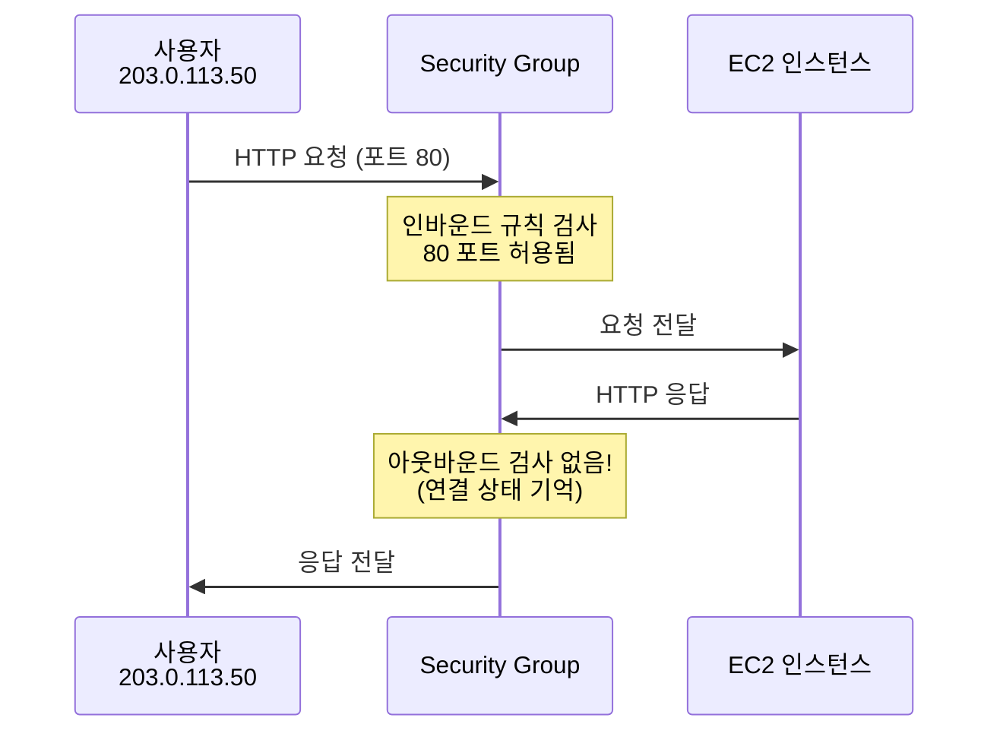
```mermaid
sequenceDiagram
    participant User as 사용자<br/>203.0.113.50
    participant SG as Security Group
    participant EC2 as EC2 인스턴스

    User->>SG: HTTP 요청 (포트 80)
    Note over SG: 인바운드 규칙 검사<br/>80 포트 허용됨
    SG->>EC2: 요청 전달
    EC2->>SG: HTTP 응답
    Note over SG: 아웃바운드 검사 없음!<br/>(연결 상태 기억)
    SG->>User: 응답 전달
```

💡 **중요**: 인바운드로 들어온 연결에 대한 응답은 아웃바운드 규칙 검사 없이 자동 허용!

---

#### 7️⃣ 스토리지 - EBS (Elastic Block Store)

**EBS란?**
- EC2에 연결할 수 있는 **블록 스토리지**
- OS 볼륨 또는 데이터 볼륨으로 사용
- 인스턴스와 독립적으로 존재 (인스턴스 삭제 후에도 보존 가능)

**EBS 볼륨 타입:**

| 타입 | 유형 | IOPS | 사용 사례 | 가격 |
|:---|:---:|:---|:---|:---:|
| **gp3** | SSD | 3,000 ~ 16,000 | 범용, 권장 | $$ |
| **gp2** | SSD | 크기 비례 | 범용, 레거시 | $$ |
| **io2** | SSD | 최대 64,000 | 고성능 DB | $$$$ |
| **io2 Block Express** | SSD | 최대 256,000 | 초고성능 DB | $$$$$ |
| **st1** | HDD | - | 처리량 최적화 | $ |
| **sc1** | HDD | - | Cold 데이터 | $ |

강사님 말씀: *"GP3라는 것은 볼륨 크기에 상관없이 기본 IOPS, 초당 읽기와 쓰기를 3천까지 지원해 주는 애예요. 그래서 GP2를 쓸 거예요, GP3를 쓸 거예요 라고 할 때 볼륨 크기가 작으면서도 어느 정도의 어떤 성능이 보장되어야만 한다 라고 할 때는 GP2 보다는 뭐 GP3가 더 좋다."*

**gp2 vs gp3 비교:**

| 구분 | gp2 | gp3 |
|:---|:---|:---|
| **기본 IOPS** | 볼륨 크기 × 3 (최소 100) | **3,000 (고정)** |
| **최대 IOPS** | 16,000 | 16,000 (추가 비용으로 증설 가능) |
| **처리량** | IOPS에 비례 | 125 MB/s (기본, 증설 가능) |
| **가격** | GB당 $0.10 | GB당 $0.08 |

💡 **권장사항**: 소형 볼륨(100GB 이하)에서 성능이 필요하면 **gp3 선택**

---

#### 8️⃣ 사용자 데이터 (User Data)

**사용자 데이터란?**
- EC2 인스턴스 **최초 부팅 시 자동 실행**되는 스크립트
- 초기 설정 자동화에 유용

**사용 사례:**
- 소프트웨어 업데이트 및 설치
- 애플리케이션 자동 배포
- 서비스 데몬 자동 실행
- 설정 파일 다운로드 및 적용

**User Data 예시 (Linux):**
```bash
#!/bin/bash
# 시스템 업데이트
yum update -y

# Apache 웹 서버 설치
yum install -y httpd

# 웹 페이지 생성
echo "<h1>Hello from EC2!</h1>" > /var/www/html/index.html

# Apache 시작 및 부팅 시 자동 실행 설정
systemctl start httpd
systemctl enable httpd
```

**User Data 예시 (Windows):**
```powershell
<powershell>
# IIS 설치
Install-WindowsFeature -name Web-Server -IncludeManagementTools

# 웹 페이지 생성
Set-Content -Path "C:\inetpub\wwwroot\index.html" -Value "<h1>Hello from Windows EC2!</h1>"
</powershell>
```

⚠️ **주의사항:**
- User Data는 **최초 부팅 시 1회만** 실행
- 스크립트 실행 실패 시 EC2는 정상 실행됨 (실패 감지 안 됨)
- 로그 확인: `/var/log/cloud-init-output.log` (Linux)

---

### 💰 EC2 요금제

강사님께서 EC2의 다양한 요금제에 대해 설명하셨습니다.

#### 📊 요금제 비교

| 요금제 | 할인율 | 약정 | 사용 사례 | 특징 |
|:---|:---:|:---|:---|:---|
| **On-Demand** | 0% | 없음 | 예측 불가능한 워크로드 | 기본 요금제 |
| **Savings Plans** | 최대 72% | 1년/3년 | 장기 사용 | 유연한 인스턴스 변경 |
| **Reserved Instance** | 최대 75% | 1년/3년 | 고정 인스턴스 | 특정 인스턴스 예약 |
| **Spot Instance** | 최대 90% | 없음 | 중단 가능 워크로드 | 강제 회수 가능 |

#### 1️⃣ On-Demand (온디맨드)

**특징:**
- 약정 없이 사용한 만큼 결제
- 언제든지 시작/중지 가능
- 가장 비쌈

**적합한 경우:**
- 단기간 사용
- 트래픽 예측 불가능
- 개발/테스트 환경

---

#### 2️⃣ Savings Plans (세이빙스 플랜)

**특징:**
- 1년 또는 3년 약정
- 시간당 사용량($US/hour) 약정
- On-Demand 대비 최대 72% 할인

강사님 말씀: *"내가 이거 1년 이상, 3년 이상 변경 없이 그냥 쭉 쓸 것 같아요라고 할 때는 Savings Plans라는 방식을 이용하시면 On-Demand 대비 할인율을 높은 할인율로 이용하실 수가 있으십니다."*

**종류:**
- **Compute Savings Plans**: 최대 유연성 (인스턴스 패밀리, 리전 변경 가능)
- **EC2 Instance Savings Plans**: 특정 패밀리 약정 (더 높은 할인율)

**적합한 경우:**
- 안정적인 워크로드
- 장기간 사용 예정
- 일정한 사용량 보장 가능

---

#### 3️⃣ Spot Instance (스팟 인스턴스)

**특징:**
- AWS의 유휴 리소스를 저렴하게 사용
- On-Demand 대비 최대 90% 할인
- **강제 회수 가능** (2분 전 알림)

강사님 강조: *"한 가지 제한점이 있어요. 뭐 인스턴스 중단이 발생해도 인스턴스가 강제로 회수될 수 있다. 보통 회수되기 2분 전에 알림을 줍니다."*

**강제 회수 흐름:**
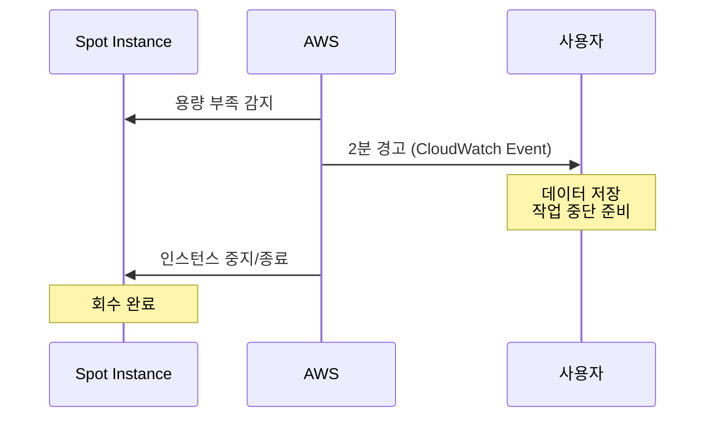
```mermaid
sequenceDiagram
    participant Spot as Spot Instance
    participant AWS as AWS
    participant User as 사용자

    AWS->>Spot: 용량 부족 감지
    AWS->>User: 2분 경고 (CloudWatch Event)
    Note over User: 데이터 저장<br/>작업 중단 준비
    AWS->>Spot: 인스턴스 중지/종료
    Note over Spot: 회수 완료
```

**적합한 경우:**
- **내결함성 있는 워크로드**
  - 여러 인스턴스 중 일부가 중단되어도 서비스 가능
  - 예: Auto Scaling 그룹에서 일부 인스턴스로 사용
- **배치 작업**
  - 중단되어도 나중에 재실행 가능
  - 예: 데이터 분석, 이미지 처리
- **개발/테스트 환경**
  - 중단되어도 큰 영향 없음

강사님 예시: *"예를 들어서 우리가 어떤 작업을 배치 형식으로 돌리는데 이거 중단이 되면 이따가 1시간 후에 또 돌리지 뭐. 이거 중단이 되면 2시간 후에 또 돌리지 뭐. 이런 식으로 얼마든지 유연한 업무 그런 업무들을 한다거나 이럴 때 사용하는 거예요."*

**내결함성(Fault Tolerance) 아키텍처 예시:**
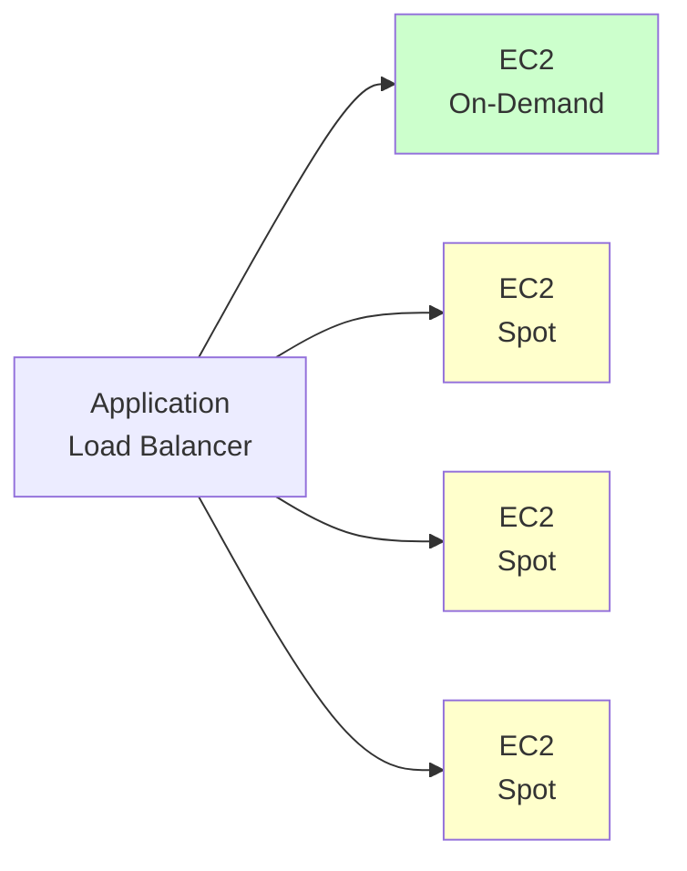
```mermaid
graph LR
    ALB[Application<br/>Load Balancer] --> EC2_1[EC2<br/>On-Demand]
    ALB --> EC2_2[EC2<br/>Spot]
    ALB --> EC2_3[EC2<br/>Spot]
    ALB --> EC2_4[EC2<br/>Spot]

    style EC2_1 fill:#ccffcc
    style EC2_2 fill:#ffffcc
    style EC2_3 fill:#ffffcc
    style EC2_4 fill:#ffffcc
```

- EC2_2, EC2_3, EC2_4 중 하나가 회수되어도 서비스는 계속됨
- 비용 절감 효과 큼

---

### ⚙️ EC2 인스턴스 수명 주기 (Life Cycle)

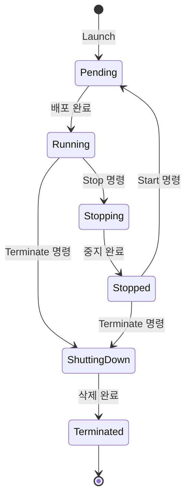
```mermaid
stateDiagram-v2
    [*] --> Pending: Launch
    Pending --> Running: 배포 완료
    Running --> Stopping: Stop 명령
    Stopping --> Stopped: 중지 완료
    Stopped --> Pending: Start 명령
    Running --> ShuttingDown: Terminate 명령
    Stopped --> ShuttingDown: Terminate 명령
    ShuttingDown --> Terminated: 삭제 완료
    Terminated --> [*]
```

**각 상태 설명:**

| 상태 | 설명 | 과금 여부 | 복구 가능 |
|:---|:---|:---:|:---:|
| **Pending** | 물리 서버 배정 중 | ❌ | - |
| **Running** | 실행 중 | ✅ | - |
| **Stopping** | 중지 중 | ✅ (짧은 시간) | - |
| **Stopped** | 중지됨 | ❌ (EBS만 과금) | ✅ |
| **Shutting-down** | 종료 중 | ✅ (짧은 시간) | ❌ |
| **Terminated** | 삭제됨 | ❌ | ❌ |

강사님 경고: *"터미네이트 잘못 시키면 어떻게 된다? 복구 불가능하다."*

⚠️ **중요한 차이:**
- **Stop**: 일시 중지, 재시작 가능, EBS 볼륨 유지
- **Terminate**: 완전 삭제, 복구 불가능, EBS 볼륨도 삭제 (설정에 따라)

💡 **실무 팁**: Terminate 방지를 위해 "Termination Protection" 활성화 권장

---

## ⚖️ Section 7: ELB (Elastic Load Balancing) 복습

### 🎯 ELB란?

**Elastic Load Balancer (ELB)**는 **클라이언트 요청 트래픽을 여러 대상에게 자동으로 분산**시켜주는 서비스입니다.

강사님 말씀: *"ELB는 클라이언트 요청 트래픽을 받아서 그것을 여러 대상에게 자동으로 분산시켜주는 서비스. 그걸 ELB다."*

#### 🌟 ELB의 주요 기능

| 기능 | 설명 | 장점 |
|:---|:---|:---|
| **부하 분산** | 트래픽을 여러 인스턴스에 분산 | 성능 향상 |
| **헬스 체크** | 대상의 상태를 주기적으로 확인 | 고가용성 |
| **자동 스케일링 연동** | Auto Scaling과 자동 통합 | 탄력적 운영 |
| **SSL/TLS 종료** | 인증서 관리 및 암호화 오프로드 | 서버 부담 감소 |
| **보안 그룹 적용** | 방화벽 규칙으로 트래픽 제어 | 보안 강화 |

---

### 🏥 헬스 체크 (Health Check)

**헬스 체크란?**
- ELB가 대상 인스턴스의 상태를 주기적으로 확인하는 기능
- 비정상 인스턴스를 자동으로 트래픽 분산 대상에서 제외

**헬스 체크 흐름:**
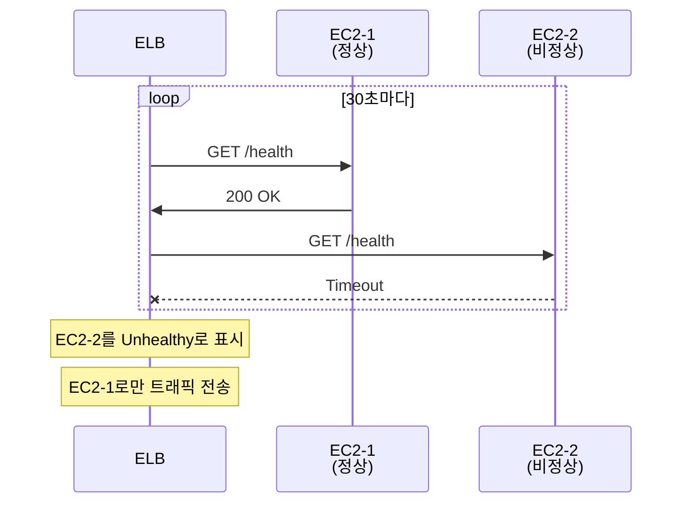
```mermaid
sequenceDiagram
    participant ELB
    participant EC2_1 as EC2-1<br/>(정상)
    participant EC2_2 as EC2-2<br/>(비정상)

    loop 30초마다
        ELB->>EC2_1: GET /health
        EC2_1->>ELB: 200 OK
        ELB->>EC2_2: GET /health
        EC2_2--xELB: Timeout
    end

    Note over ELB: EC2-2를 Unhealthy로 표시
    Note over ELB: EC2-1로만 트래픽 전송
```

**헬스 체크 파라미터:**

| 파라미터 | 설명 | 기본값 | 권장값 |
|:---|:---|:---:|:---:|
| **Protocol** | 헬스 체크 프로토콜 | HTTP | HTTP/HTTPS |
| **Path** | 체크할 경로 | `/` | `/health` |
| **Interval** | 체크 간격 | 30초 | 30초 |
| **Timeout** | 응답 대기 시간 | 5초 | 5초 |
| **Healthy Threshold** | 정상 판단 연속 성공 횟수 | 5회 | 2-5회 |
| **Unhealthy Threshold** | 비정상 판단 연속 실패 횟수 | 2회 | 2회 |

💡 **실무 팁**:
- 헬스 체크 경로는 간단하고 빠른 응답을 하는 엔드포인트 사용
- DB 연결까지 체크하면 헬스 체크 자체가 부하가 될 수 있음

---

### 🔐 SSL/TLS 오프로드

**SSL 오프로드란?**
- HTTPS 암호화/복호화 작업을 ELB가 대신 처리
- 백엔드 서버의 CPU 부담 감소

강사님 말씀: *"서버에 부담을 좀 덜어주고 싶어요 라고 할 때 이 인증서를 어디로? 앞으로 뺀다. ELB 쪽으로 뺀다 이겁니다. 그걸 뭐라고 부른다? SSL 오프로드다."*

**기존 방식 (서버에 인증서):**
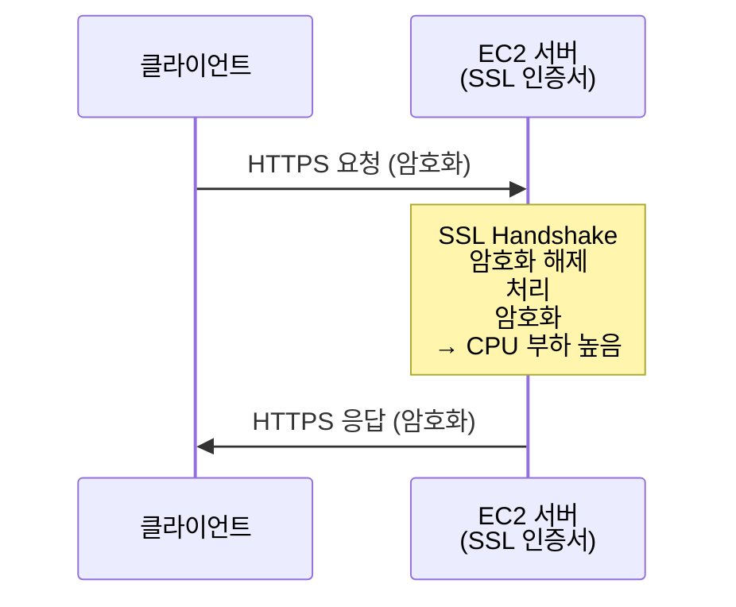
```mermaid
sequenceDiagram
    participant Client as 클라이언트
    participant EC2 as EC2 서버<br/>(SSL 인증서)

    Client->>EC2: HTTPS 요청 (암호화)
    Note over EC2: SSL Handshake<br/>암호화 해제<br/>처리<br/>암호화<br/>→ CPU 부하 높음
    EC2->>Client: HTTPS 응답 (암호화)
```

**SSL 오프로드 방식 (ELB에 인증서):**
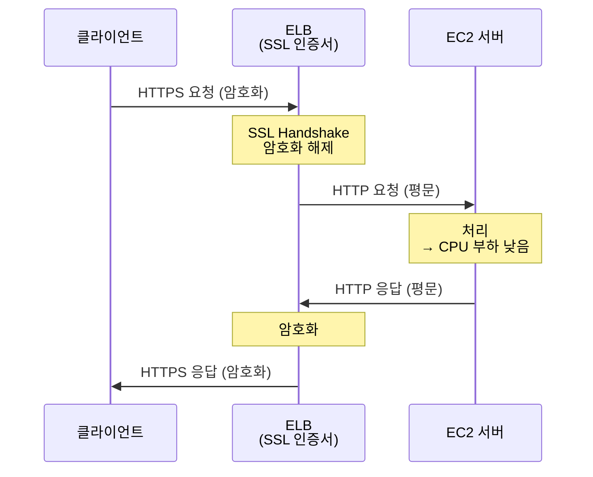
```mermaid
sequenceDiagram
    participant Client as 클라이언트
    participant ELB as ELB<br/>(SSL 인증서)
    participant EC2 as EC2 서버

    Client->>ELB: HTTPS 요청 (암호화)
    Note over ELB: SSL Handshake<br/>암호화 해제
    ELB->>EC2: HTTP 요청 (평문)
    Note over EC2: 처리<br/>→ CPU 부하 낮음
    EC2->>ELB: HTTP 응답 (평문)
    Note over ELB: 암호화
    ELB->>Client: HTTPS 응답 (암호화)
```

**장점:**
- 서버 CPU 사용량 감소
- 인증서 관리 중앙화
- 인증서 갱신 시 ELB만 수정하면 됨

⚠️ **보안 고려사항:**
- ELB → EC2 구간은 평문 통신 (VPC 내부이므로 일반적으로 안전)
- 더 높은 보안이 필요하면 End-to-End 암호화 사용 (ELB → EC2도 HTTPS)

---

### 🏗️ ELB 구성 요소

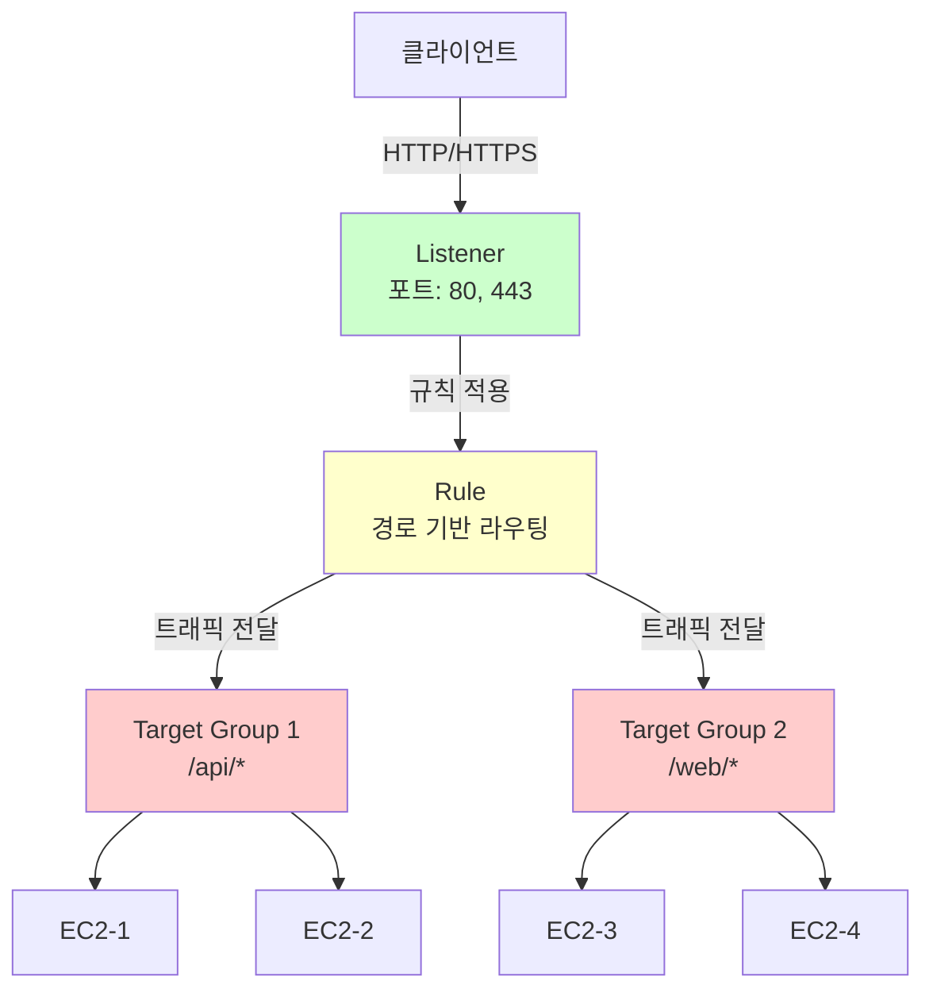
```mermaid
graph TD
    Client[클라이언트] -->|HTTP/HTTPS| Listener[Listener<br/>포트: 80, 443]
    Listener -->|규칙 적용| Rule[Rule<br/>경로 기반 라우팅]
    Rule -->|트래픽 전달| TG1[Target Group 1<br/>/api/*]
    Rule -->|트래픽 전달| TG2[Target Group 2<br/>/web/*]
    TG1 --> EC2_1[EC2-1]
    TG1 --> EC2_2[EC2-2]
    TG2 --> EC2_3[EC2-3]
    TG2 --> EC2_4[EC2-4]

    style Listener fill:#ccffcc
    style Rule fill:#ffffcc
    style TG1 fill:#ffcccc
    style TG2 fill:#ffcccc
```

#### 1️⃣ Listener (리스너)

**역할**: 특정 포트로 들어오는 트래픽을 수신

**설정 항목:**
- **프로토콜**: HTTP, HTTPS, TCP, UDP, TLS
- **포트**: 80 (HTTP), 443 (HTTPS) 등
- **기본 동작**: 어느 Target Group으로 전달할지

**예시:**
```
Listener 1:
  Protocol: HTTP
  Port: 80
  Default Action: Forward to target-group-web

Listener 2:
  Protocol: HTTPS
  Port: 443
  SSL Certificate: arn:aws:acm:...
  Default Action: Forward to target-group-web
```

#### 2️⃣ Rule (규칙)

**역할**: 트래픽을 어느 Target Group으로 보낼지 결정

**규칙 조건 (ALB):**
- Host 헤더 (도메인)
- Path 패턴 (URL 경로)
- HTTP 메소드 (GET, POST 등)
- 소스 IP
- HTTP 헤더
- Query String

**예시:**
```
Rule 1 (우선순위: 1):
  IF path is /api/*
  THEN forward to api-target-group

Rule 2 (우선순위: 2):
  IF host is admin.example.com
  THEN forward to admin-target-group

Default Rule:
  THEN forward to web-target-group
```

#### 3️⃣ Target Group (대상 그룹)

**역할**: 실제 트래픽을 처리할 대상들의 그룹

**대상 유형:**
- **Instance**: EC2 인스턴스
- **IP**: IP 주소 (온프레미스 포함)
- **Lambda**: Lambda 함수
- **ALB**: 다른 ALB (체이닝)

**Target Group 설정:**
- 프로토콜 및 포트
- 헬스 체크 설정
- 로드 밸런싱 알고리즘

#### 4️⃣ Target (대상)

**역할**: 실제 요청을 처리하는 컴퓨팅 리소스

- EC2 인스턴스
- ECS 컨테이너
- Lambda 함수
- 온프레미스 서버 (IP 대상 유형 사용 시)

---

### 📊 ELB 유형 비교

AWS는 3가지 유형의 ELB를 제공합니다:

#### 1️⃣ ALB (Application Load Balancer)

**레이어**: OSI 7계층 (Application Layer)
**프로토콜**: HTTP, HTTPS

**특징:**
- 콘텐츠 기반 라우팅 (경로, 헤더, 메소드 등)
- WebSocket 지원
- HTTP/2 지원
- Lambda 대상 지원

강사님 말씀: *"ALB는 HTTP와 HTTPS를 지원해 주고요. Layer 7, 즉 애플리케이션의 콘텐츠 기반 부하 분산을 할 수가 있습니다."*

**사용 사례:**
- 웹 애플리케이션
- 마이크로서비스 아키텍처
- 컨테이너 기반 애플리케이션

---

#### 2️⃣ NLB (Network Load Balancer)

**레이어**: OSI 4계층 (Transport Layer)
**프로토콜**: TCP, UDP, TLS

**특징:**
- 초고성능 (초당 수백만 요청 처리)
- **고정 IP 지원** (Elastic IP 할당 가능)
- 낮은 지연시간
- Source IP 보존

강사님 강조: *"가장 큰 장점 중에 하나는 고정 IP를 지원한다라는 거예요. 장점이라는 거는 보니까 ALB는 고정 IP를 지원하지 않는다는 뜻이에요."*

**사용 사례:**
- 고성능 요구 워크로드
- TCP/UDP 프로토콜 사용 애플리케이션
- 고정 IP가 필요한 경우 (파트너사 방화벽 등록)
- IoT 디바이스 연결

**고정 IP 활용 시나리오:**
```
파트너사: "우리는 보안 때문에 모든 IP를 열어줄 수 없습니다.
          귀사의 고정 IP를 알려주시면 그 IP만 허용하겠습니다."

→ NLB 사용 필수!
  (ALB는 IP가 동적으로 변경되므로 불가능)
```

---

#### 3️⃣ GLB (Gateway Load Balancer)

**레이어**: OSI 3계층 (Network Layer)
**프로토콜**: GENEVE (UDP 포트 6081)

**특징:**
- 보안 어플라이언스 통합 전용
- 방화벽, IDS/IPS, DPI 등과 연동
- 투명 프록시 역할

강사님 말씀: *"GLB, 보안 어플라이언스 연결할 때 사용한다. 그리고 얘는 L3 계층에서 동작한다."*

**사용 사례:**
- Third-party 보안 솔루션 통합
- 네트워크 트래픽 검사
- 트래픽 미러링

---

#### 🔍 ELB 유형 선택 가이드

| 요구사항 | 선택 | 이유 |
|:---|:---:|:---|
| HTTP/HTTPS 웹 애플리케이션 | **ALB** | 콘텐츠 기반 라우팅 |
| 경로 기반 라우팅 필요 | **ALB** | Layer 7 기능 |
| 초고성능 필요 (TCP/UDP) | **NLB** | 최고 성능 |
| 고정 IP 필요 | **NLB** | Elastic IP 할당 가능 |
| 보안 어플라이언스 통합 | **GLB** | GENEVE 프로토콜 |
| WebSocket 지원 필요 | **ALB** | WebSocket 네이티브 지원 |
| Lambda 함수 연동 | **ALB** | Lambda 대상 지원 |

---

## ✅ 복습 체크리스트

지금까지 복습한 내용을 확인해봅시다:

- [ ] VPC Peering의 1대1 연결 특성과 전이적 피어링 불가를 이해했다
- [ ] Transit Gateway의 Hub and Spoke 아키텍처를 이해했다
- [ ] Site-to-Site VPN과 Client VPN의 차이를 설명할 수 있다
- [ ] Direct Connect와 VPN의 차이점을 비교할 수 있다
- [ ] VPC Endpoint의 두 가지 유형(Gateway/Interface)을 구분할 수 있다
- [ ] EC2 인스턴스 타입 명명 규칙을 해석할 수 있다
- [ ] Session Manager로 키 페어 없이 EC2에 접속할 수 있다
- [ ] 보안 그룹의 Stateful 특성을 이해했다
- [ ] EBS 볼륨 타입(gp2/gp3/io2)의 차이를 설명할 수 있다
- [ ] EC2 요금제(On-Demand/Savings Plans/Spot)를 비교할 수 있다
- [ ] ELB의 3가지 유형(ALB/NLB/GLB)을 구분할 수 있다
- [ ] ALB의 콘텐츠 기반 라우팅을 이해했다
- [ ] NLB의 고정 IP 지원 이유와 활용 사례를 안다
- [ ] SSL 오프로드의 개념과 장점을 설명할 수 있다

---

**다음 섹션 예고**: 이제 본격적으로 **EC2 Auto Scaling**에 대해 학습하겠습니다! 🚀
# 🚀 EC2 Auto Scaling - 개념 및 실습

## 📌 이전 복습 완료!

지금까지 지난 시간에 배운 내용들을 복습했습니다:
- VPC Peering & Transit Gateway
- VPN & Direct Connect
- VPC Endpoint
- EC2 기초
- ELB

이제 본격적으로 **EC2 Auto Scaling**을 학습하겠습니다!

---

## 🎯 EC2 Auto Scaling이란?

### 🔍 정의 및 개념

**Amazon EC2 Auto Scaling**은 애플리케이션의 부하를 처리할 수 있도록 **EC2 인스턴스의 수량을 자동으로 증가(Scale Out) 또는 감소(Scale In)**시켜주는 서비스입니다.

강사님 말씀: *"EC2 오토 스케일링, 아마존 EC2 오토 스케일링은 애플리케이션 부하를 처리할 수 있는 EC2 수량을 자동으로 추가 제거를 할 수 있다는 거예요."*

#### 핵심 특징

| 특징 | 설명 | 장점 |
|:---|:---|:---|
| **자동 확장/축소** | 부하에 따라 인스턴스 수량 자동 조절 | 운영 부담 감소 |
| **고가용성** | 최소 수량 보장으로 서비스 안정성 확보 | 장애 대응 |
| **비용 절감** | 필요한 만큼만 리소스 사용 | 불필요한 비용 제거 |
| **유연한 정책** | 다양한 스케일링 정책 제공 | 워크로드 최적화 |

---

### 💰 왜 Auto Scaling이 필요한가?

#### 문제 상황: 고정 용량의 한계

회사의 **주간 부하 패턴**을 분석한 결과:

```mermaid
graph LR
    A[일요일<br/>부하: 10%] --> B[월요일<br/>부하: 70%]
    B --> C[화요일<br/>부하: 80%]
    C --> D[수요일<br/>부하: 100%]
    D --> E[목요일<br/>부하: 75%]
    E --> F[금요일<br/>부하: 65%]
    F --> G[토요일<br/>부하: 15%]
    G --> A

    style D fill:#ff9999
    style A fill:#ccffcc
    style G fill:#ccffcc
```

**현재 문제:**
- **수요일** 부하가 가장 높음 (100%)
- 수요일 기준으로 용량을 확보하면?
  - ✅ 수요일: 적정 용량
  - ❌ 토요일/일요일: **85-90% 리소스 낭비**
  - ❌ 월~금요일: **20-35% 리소스 낭비**

**그림으로 이해하기:**

```mermaid
graph TD
    subgraph "고정 용량 방식 (문제)"
    Fixed[확보 용량: 100%<br/>고정]
    Sun[일요일 사용: 10%<br/>낭비: 90%]
    Wed[수요일 사용: 100%<br/>낭비: 0%]
    Fixed -.->|항상 100%| Sun
    Fixed -.->|항상 100%| Wed
    end

    subgraph "Auto Scaling 방식 (해결)"
    Auto[Auto Scaling]
    Sun2[일요일 용량: 10%<br/>낭비: 0%]
    Wed2[수요일 용량: 100%<br/>낭비: 0%]
    Auto -->|자동 조절| Sun2
    Auto -->|자동 조절| Wed2
    end

    style Fixed fill:#ffcccc
    style Auto fill:#ccffcc
```

강사님 말씀: *"활당은 했지만 사용하지 않아요. 그런데 어떻게 해요? 비용은 나가겠죠? 비용은 나갈 겁니다. 그래서 어떻게 한다? 오토스케일링 기능을 이용해서 현재의 사용량에 가장 근접하게 알아서 자동으로 크기를, 용량을 조정하는 것. 이게 바로 오토스케일링입니다."*

#### Auto Scaling의 효과

**1. 비용 절감**
```
주간 총 비용 비교:
- 고정 용량 (100%): 7일 × 100% = 700%
- Auto Scaling:
  - 일요일: 10%
  - 월요일: 70%
  - 화요일: 80%
  - 수요일: 100%
  - 목요일: 75%
  - 금요일: 65%
  - 토요일: 15%
  합계: 415%

절감율: (700 - 415) / 700 = 40.7% 절감!
```

**2. 고가용성 유지**
- 부하가 증가하면 자동으로 인스턴스 추가
- 사용자 경험 저하 방지

**3. 장애 대응**
- 인스턴스 장애 시 자동으로 새 인스턴스 생성
- 최소 수량 보장

---

### 📊 Scale In vs Scale Out vs Scale Up vs Scale Down

용어 정리가 매우 중요합니다!

#### 🔄 Scale In / Scale Out (수평 확장)

**수량 개념**: 인스턴스 개수 증감

```mermaid
graph LR
    subgraph "Scale Out (확장)"
    EC2_1[EC2] --> EC2_2[EC2<br/>+1대 추가]
    EC2_2 --> EC2_3[EC2<br/>+1대 추가]
    end

    subgraph "Scale In (축소)"
    EC2_4[EC2<br/>EC2<br/>EC2] --> EC2_5[EC2<br/>EC2<br/>-1대 제거]
    EC2_5 --> EC2_6[EC2<br/>-1대 제거]
    end
```

| 구분 | Scale Out | Scale In |
|:---|:---|:---|
| **의미** | 수량 증가 | 수량 감소 |
| **예시** | 2대 → 3대 → 4대 | 4대 → 3대 → 2대 |
| **시기** | 부하 증가 시 | 부하 감소 시 |

---

#### ⬆️ Scale Up / Scale Down (수직 확장)

**스펙 개념**: 인스턴스 크기 변경

```mermaid
graph TD
    subgraph "Scale Up (성능 향상)"
    T2[t2.micro<br/>1 vCPU<br/>1 GB RAM] -->|업그레이드| T3[t3.medium<br/>2 vCPU<br/>4 GB RAM]
    T3 -->|업그레이드| M5[m5.large<br/>2 vCPU<br/>8 GB RAM]
    end

    subgraph "Scale Down (성능 축소)"
    M5_2[m5.large<br/>2 vCPU<br/>8 GB RAM] -->|다운그레이드| T3_2[t3.medium<br/>2 vCPU<br/>4 GB RAM]
    T3_2 -->|다운그레이드| T2_2[t2.micro<br/>1 vCPU<br/>1 GB RAM]
    end
```

| 구분 | Scale Up | Scale Down |
|:---|:---|:---|
| **의미** | CPU/메모리 증가 | CPU/메모리 감소 |
| **예시** | t2.micro → m5.large | m5.large → t2.micro |
| **특징** | 인스턴스 재시작 필요 | 인스턴스 재시작 필요 |

💡 **중요**: EC2 Auto Scaling은 **Scale In/Out (수평 확장)**만 지원!

강사님 정리: *"Scale In, Scale Out은 수량 개념으로 보시면 돼요. Scale Out은 수량을 늘리는 거. Scale In은 수량을 줄이는 거. Scale Up과 Scale Down은 스펙을 올리고 스펙을 낮추는 개념."*

---

## 🏗️ Auto Scaling Group 구성 요소

Auto Scaling을 사용하려면 **Auto Scaling Group (ASG)**을 생성해야 합니다.

### 📐 주요 구성 요소

```mermaid
graph TD
    ASG[Auto Scaling Group]
    Launch[Launch Template<br/>인스턴스 생성 템플릿]
    Min[Minimum Size<br/>최소 수량]
    Max[Maximum Size<br/>최대 수량]
    Desired[Desired Capacity<br/>희망 수량]
    Policy[Scaling Policy<br/>확장 정책]

    ASG --> Launch
    ASG --> Min
    ASG --> Max
    ASG --> Desired
    ASG --> Policy

    style ASG fill:#ff9999
    style Launch fill:#ccffcc
    style Desired fill:#ffffcc
```

---

### 1️⃣ Launch Template (시작 템플릿)

**역할**: EC2 인스턴스를 생성할 때 필요한 모든 설정 정보를 담은 템플릿

**포함 정보:**
- ✅ AMI (Amazon Machine Image)
- ✅ 인스턴스 타입 (예: t2.micro, m5.large)
- ✅ 키 페어
- ✅ 보안 그룹
- ✅ IAM Instance Profile (역할)
- ✅ 사용자 데이터 (User Data)
- ✅ EBS 볼륨 설정
- ✅ 네트워크 인터페이스 설정

**장점:**
- 버전 관리 가능 (v1, v2, v3...)
- 재사용 가능
- 일관된 인스턴스 배포

강사님 말씀: *"시작 템플릿. EC2를 배포해야 되잖아요. EC2를 배포할 때에 필요한 정보를 다 구성을 해서 만들어 놓은 거. 그게 바로 시작 템플릿이에요."*

**Launch Template 예시:**
```
템플릿 이름: web-server-template-v1
AMI: ami-0c55b159cbfafe1f0 (Amazon Linux 2023)
Instance Type: t3.micro
Key Pair: my-key-pair
Security Group: web-sg
IAM Role: SSM-InstanceProfile
User Data:
  #!/bin/bash
  yum update -y
  yum install -y httpd
  systemctl start httpd
  systemctl enable httpd
  echo "<h1>Server: $(hostname -f)</h1>" > /var/www/html/index.html
```

---

### 2️⃣ Capacity 설정 (Min / Max / Desired)

Auto Scaling Group의 **핵심 개념**입니다!

#### 📊 용량 파라미터

| 파라미터 | 의미 | 설정 기준 |
|:---|:---|:---|
| **Minimum Size** | 최소 인스턴스 수량 | 가용성 + 최소 부하 |
| **Maximum Size** | 최대 인스턴스 수량 | 최대 부하 + 예산 |
| **Desired Capacity** | 현재 실행 중인 수량 | 자동/수동 조정 |

#### 🔍 각 파라미터 상세 설명

**Minimum Size (최소 수량)**

**고려 사항:**
1. **최소 부하**: 부하가 가장 적을 때 필요한 수량
2. **가용성**: 장애 대응을 위한 최소 수량

강사님 강조: *"내가 아무리 하나만 가지고 충분히 가능하다 할지라도 가용성을 고려한다면 어떻게 해야 될까요? 최소 2개 이상은 두어야 할 필요성이 있을 수 있겠죠?"*

**시나리오:**
```
상황: 주말에는 사용자가 거의 없음
- 부하 관점: EC2 1대만 있어도 충분
- 가용성 관점: 1대 장애 시 서비스 중단!

해결: Minimum Size = 2
- 1대 장애 시에도 나머지 1대로 서비스 계속
- 가용성 보장!
```

**권장사항:**
- 단일 AZ: 최소 2대
- 다중 AZ: 각 AZ당 최소 1대 (총 2-3대)

---

**Maximum Size (최대 수량)**

**고려 사항:**
1. **최대 부하**: 부하가 가장 높을 때 필요한 수량
2. **예산**: 최대 비용 제한

강사님 말씀: *"맥스 사이즈를 정의할 때는 우리가 가지고 있는 예산 또 좀 고려해 볼 필요가 있습니다. 내가 가지고 있는 예산은, 예산은 최대 4대까지밖에 없어. 그런데 내가 이 맥스 사이즈를 막 10대씩 이렇게 정의해 놓으면 우리 예산을 오버해버릴 수 있죠."*

**딜레마 상황:**
```
문제: 최대 부하 시 6대 필요 vs 예산은 4대까지

해결 방법:
1. 예산 확보 (추가 투자)
2. 애플리케이션 최적화 (성능 튜닝)
   - 데이터베이스 쿼리 최적화
   - 캐싱 적용
   - 코드 효율화
3. 혼합: 일부 예산 확보 + 일부 최적화
```

강사님 조언: *"예산을 더 확보를 하시던가 아니면 또 뭘 해주셔야 돼요? 애플리케이션 튜닝을 해주셔야죠. 애플리케이션 튜닝. 애플리케이션 어디서 부하가 많은가를 잘 보셔야 됩니다."*

---

**Desired Capacity (희망 수량)**

**특징:**
- **현재 실행 중인** 인스턴스 수량
- Auto Scaling이 **이 값을 조정**하여 확장/축소
- 운영자가 **수동으로 조정** 가능

**Auto Scaling의 동작 원리:**
```mermaid
sequenceDiagram
    participant AS as Auto Scaling
    participant Metric as CloudWatch Metric
    participant ASG as ASG (Desired: 2)
    participant EC2 as EC2 Instances

    Metric->>AS: CPU 사용률 70% (임계치 초과!)
    AS->>ASG: Desired Capacity 2 → 3으로 변경
    ASG->>EC2: EC2 인스턴스 1대 추가 생성
    EC2->>ASG: 생성 완료 (총 3대)
    Note over ASG: Desired: 3, 실제: 3 (일치!)
```

강사님 설명: *"Desired 수량을 바꿔가면서 수량을 늘렸다 줄였다 한다 라고 보시면 돼요. 현재 Desired 수량이 2야. 그런데 트래픽이 더 늘어나고 있어서 우리가 더 늘려줘야 돼. 수량을 더 늘려줘야 돼. 그러면 수량을 3. 이렇게 바꿔주는 거예요."*

**수동 조정 예시:**
```
현재 상태: Desired = 2, Running = 2

운영자가 수동으로 Desired = 5로 변경
↓
Auto Scaling이 감지: 2대 부족!
↓
자동으로 3대 추가 생성
↓
최종 상태: Desired = 5, Running = 5
```

---

#### 📐 Capacity 설정 예시

**예시 1: 동일한 값 (초기값 유지 정책)**
```
Minimum: 2
Maximum: 2
Desired: 2

→ 항상 2대 유지 (확장/축소 없음)
→ 장애 시에만 인스턴스 교체
```

**예시 2: 유연한 확장**
```
Minimum: 2
Maximum: 10
Desired: 3 (시작 시)

→ 평상시: 3대
→ 부하 증가 시: 최대 10대까지 확장
→ 부하 감소 시: 최소 2대까지 축소
```

**예시 3: 예산 제한**
```
Minimum: 1
Maximum: 4
Desired: 2

→ 예산 제약으로 최대 4대 제한
→ 부하가 더 높아져도 4대를 초과할 수 없음
```

---

### 3️⃣ Scaling Policy (스케일링 정책)

**Desired Capacity를 언제, 어떻게 변경할 것인가?**를 정의하는 규칙입니다.

#### 📋 정책 유형 개요

| 정책 유형 | 특징 | 사용 시나리오 |
|:---|:---|:---|
| **수동** | 운영자가 직접 조정 | 특별 이벤트 |
| **예약** | 일정 기반 자동 조정 | 패턴이 예측 가능한 경우 |
| **초기값 유지** | Min=Max=Desired | 고정 수량 운영 |
| **동적 - 단순** | 단일 임계치 기반 | 간단한 워크로드 |
| **동적 - 단계** | 여러 임계치 기반 | 세밀한 제어 필요 |
| **동적 - 대상 추적** | 목표값 자동 유지 | **가장 권장!** |
| **예측** | ML 기반 예측 | 충분한 데이터 있을 때 |

---

#### 🎯 1. 수동 조정 (Manual Scaling)

**방법**: 운영자가 Desired Capacity를 직접 변경

**사용 사례:**
- 특별 이벤트 (예: 블랙프라이데이 세일)
- 긴급 상황 대응
- 테스트 목적

**예시:**
```bash
# AWS CLI로 수동 조정
$ aws autoscaling set-desired-capacity \
    --auto-scaling-group-name my-asg \
    --desired-capacity 10

# 또는 AWS 콘솔에서 직접 변경
ASG 선택 → Details → Edit → Desired Capacity: 10
```

---

#### 📅 2. 예약된 조정 (Scheduled Scaling)

**방법**: 특정 시간에 자동으로 용량 조정

**사용 사례:**
- 일정한 패턴의 워크로드
- 영업 시간/비영업 시간 구분
- 주간/주말 패턴

**예시 시나리오: 쇼핑몰 서비스**
```
월-금 09:00: Desired = 10 (업무 시작)
월-금 18:00: Desired = 5 (업무 종료)
토-일 10:00: Desired = 15 (주말 특수)
토-일 22:00: Desired = 3 (야간)
```

**설정 예시:**
```json
{
  "ScheduledActions": [
    {
      "ScheduledActionName": "scale-up-weekday-morning",
      "Recurrence": "0 9 * * MON-FRI",
      "MinSize": 5,
      "MaxSize": 20,
      "DesiredCapacity": 10
    },
    {
      "ScheduledActionName": "scale-down-weekday-evening",
      "Recurrence": "0 18 * * MON-FRI",
      "DesiredCapacity": 5
    }
  ]
}
```

💡 **Cron 표현식**: `분 시 일 월 요일`

---

#### 🔄 3. 초기값 유지 (Maintain Current Instance Levels)

**방법**: Min = Max = Desired로 설정

**특징:**
- 확장/축소 없음
- 고정된 수량 유지
- 장애 시에만 인스턴스 교체

**사용 사례:**
- 예측 가능한 고정 부하
- 스테이징 환경
- 레거시 애플리케이션

**예시:**
```
Minimum: 3
Maximum: 3
Desired: 3

→ 항상 3대 유지
→ 1대 장애 발생 시: 자동으로 새 인스턴스 생성하여 3대 유지
```

---

#### ⚡ 4. 동적 조정 - 단순 조정 (Simple Scaling)

**방법**: **하나의 임계치**에 도달하면 **고정된 수량** 증감

**특징:**
- 가장 기본적인 동적 정책
- 설정이 간단
- 세밀한 제어 어려움

**예시:**
```
정책: CPU 사용률 > 50% 이면 1대 추가

현재 상태:
- Running: 2대
- CPU: 55%

동작:
1. CloudWatch가 CPU > 50% 감지
2. Auto Scaling 트리거
3. Desired Capacity: 2 → 3
4. 인스턴스 1대 추가
```

**문제점:**
- CPU가 80%여도 1대만 추가
- CPU가 51%여도 1대 추가
- → 세밀한 대응 불가

---

#### 📶 5. 동적 조정 - 단계 조정 (Step Scaling)

**방법**: **여러 임계치**에 따라 **다른 수량** 증감

**특징:**
- Simple Scaling의 개선판
- 부하 수준에 따라 세밀한 대응
- 더 빠른 확장 가능

**예시:**
```
정책:
- CPU 50-60%: +1대 추가
- CPU 60-75%: +2대 추가
- CPU 75% 이상: +3대 추가

현재 상태:
- Running: 2대
- CPU: 78%

동작:
1. CloudWatch가 CPU 78% 감지
2. 75% 이상 → +3대 정책 적용
3. Desired Capacity: 2 → 5
4. 인스턴스 3대 추가
```

**설정 예시:**
```json
{
  "StepAdjustments": [
    {
      "MetricIntervalLowerBound": 0,
      "MetricIntervalUpperBound": 10,
      "ScalingAdjustment": 1
    },
    {
      "MetricIntervalLowerBound": 10,
      "MetricIntervalUpperBound": 25,
      "ScalingAdjustment": 2
    },
    {
      "MetricIntervalLowerBound": 25,
      "ScalingAdjustment": 3
    }
  ]
}
```

---

#### 🎯 6. 동적 조정 - 대상 추적 (Target Tracking Scaling) ⭐

**가장 권장되는 정책!**

**방법**: **목표값을 설정**하면 Auto Scaling이 **자동으로 계산하여** 적정 수량 유지

강사님 강조: *"요즘은 이런 대상 추적 정책을 많이 쓴다 이거죠."*

**특징:**
- AWS가 자동으로 필요한 수량 계산
- 가장 간편한 설정
- 효율적인 리소스 사용

**동작 원리:**
```
목표: 평균 CPU 사용률 50% 유지

현재 상태:
- Running: 2대
- 각 인스턴스 CPU: 70%
- 평균 CPU: 70%

Auto Scaling 계산:
- 70%를 50%로 낮추려면?
- 필요 인스턴스 수 = (현재 2대 × 70%) / 50% = 2.8대
- → 3대 필요!

동작:
1. Desired Capacity: 2 → 3
2. 인스턴스 1대 추가
3. 평균 CPU가 50% 근처로 안정화
```

**주요 메트릭:**

| 메트릭 | 설명 | 권장 목표값 |
|:---|:---|:---:|
| **CPU 사용률** | 평균 CPU 사용률 | 40-60% |
| **네트워크 In** | 들어오는 트래픽 | 워크로드 기준 |
| **네트워크 Out** | 나가는 트래픽 | 워크로드 기준 |
| **ALB 요청 수** | 인스턴스당 요청 수 | 1000-5000 |
| **커스텀 메트릭** | 사용자 정의 | 워크로드 기준 |

**설정 예시:**
```json
{
  "TargetValue": 50.0,
  "PredefinedMetricSpecification": {
    "PredefinedMetricType": "ASGAverageCPUUtilization"
  }
}
```

강사님 설명: *"내가 늘릴 때 뭘 기준으로? CPU 사용률을 기준으로 50% 이하가 유지되도록 항상 운영하겠다라고 해주는 거예요. 그러면 CPU 사용률이 50% 이상 튀면 얘가 자동으로 어떻게 해준다? 무조건 50% 이하가 될 수 있는 수량을 늘려줘요."*

💡 **실무 권장사항:**
- CPU 기반: 목표 50%
- 네트워크 기반: 워크로드 특성에 따라
- ALB 요청 수: 인스턴스 성능 테스트 후 결정

---

#### 🔮 7. 예측 조정 (Predictive Scaling)

**방법**: 과거 데이터를 **기계학습으로 분석**하여 미래 부하 예측

**특징:**
- AI/ML 기반
- 과거 패턴 학습
- 사전 예방적 확장

**동작 원리:**
```mermaid
graph LR
    Historical[과거 데이터<br/>최소 14일] -->|ML 학습| Predict[부하 예측<br/>24시간 전]
    Predict --> Scale[사전 확장<br/>부하 발생 전]

    style Historical fill:#e1f5ff
    style Predict fill:#ffffcc
    style Scale fill:#ccffcc
```

**학습 과정:**
1. 최소 14일간의 데이터 수집
2. 패턴 분석 (요일별, 시간대별)
3. 예측 모델 생성
4. 24시간 전 예측 & 사전 확장

**예시:**
```
학습 결과:
- 매주 월요일 09:00에 트래픽 급증
- 평균 10대 필요

예측 조정:
- 월요일 08:30에 미리 10대로 확장
- 09:00 트래픽 급증 시 이미 준비 완료
```

**필요 조건:**
- 최소 14일 이상의 안정적인 데이터
- 규칙적인 패턴이 있는 워크로드
- Target Tracking과 함께 사용 권장

---

#### 📊 정책 비교 및 선택 가이드

| 정책 | 설정 난이도 | 효율성 | 적합한 경우 |
|:---|:---:|:---:|:---|
| **수동** | ⭐ | ⭐⭐ | 특별 이벤트 |
| **예약** | ⭐⭐ | ⭐⭐⭐ | 예측 가능한 패턴 |
| **초기값 유지** | ⭐ | ⭐⭐ | 고정 용량 |
| **단순 조정** | ⭐⭐ | ⭐⭐ | 간단한 워크로드 |
| **단계 조정** | ⭐⭐⭐ | ⭐⭐⭐⭐ | 세밀한 제어 |
| **대상 추적** | ⭐⭐ | ⭐⭐⭐⭐⭐ | **대부분의 경우 권장** |
| **예측** | ⭐⭐⭐ | ⭐⭐⭐⭐⭐ | 충분한 데이터 |

💡 **실무 권장 조합:**
```
기본: Target Tracking (CPU 50%)
+ 예약 조정 (특별 이벤트 대비)
+ 예측 조정 (데이터 충분 시)
```

---

### 4️⃣ Health Check (상태 모니터링)

Auto Scaling은 인스턴스의 상태를 지속적으로 모니터링합니다.

#### 🏥 Health Check 유형

**1. EC2 Status Check**
- EC2 인스턴스의 시스템 상태 확인
- 하드웨어/네트워크 문제 감지

**2. ELB Health Check**
- Target Group의 Health Check 결과 활용
- 애플리케이션 수준의 상태 확인

**권장 설정:**
```
✅ EC2 Health Check: 활성화 (기본)
✅ ELB Health Check: 활성화 (애플리케이션 수준 감지)
```

#### 🔄 Unhealthy 인스턴스 처리

```mermaid
sequenceDiagram
    participant ASG as Auto Scaling
    participant EC2_1 as EC2-1 (정상)
    participant EC2_2 as EC2-2 (장애)
    participant EC2_3 as EC2-3 (신규)

    ASG->>EC2_1: Health Check
    EC2_1->>ASG: Healthy

    ASG->>EC2_2: Health Check
    EC2_2--xASG: Unhealthy

    Note over ASG: EC2-2를 종료하고<br/>새 인스턴스 생성 결정

    ASG->>EC2_2: Terminate
    ASG->>EC2_3: Launch (교체)
    EC2_3->>ASG: Healthy

    Note over ASG: Desired Capacity 유지 완료
```

**프로세스:**
1. Health Check 실패 감지
2. 해당 인스턴스를 Unhealthy로 표시
3. 인스턴스 종료 (Terminate)
4. 새 인스턴스 자동 생성
5. Desired Capacity 유지

강사님 말씀: *"오토 스케일링도 인스턴스의 상태를 모니터링 하는 기능이 있어요. 인스턴스의 상태를 모니터링 하고 있어서 어떤 인스턴스에 장애가 발생을 하면 장애 발생한 인스턴스를 제외하고 새로운 인스턴스를 대체해 줍니다."*

---

## 🌐 ELB + Auto Scaling + CloudWatch 통합

이 세 가지 서비스가 함께 동작하여 **고가용성 & 탄력적 확장**을 실현합니다!

### 🔗 통합 아키텍처

```mermaid
graph TD
    User[사용자] -->|HTTP 요청| ELB[Elastic Load Balancer<br/>트래픽 분산]

    ELB -->|Health Check| TG[Target Group]
    TG --> EC2_1[EC2-1]
    TG --> EC2_2[EC2-2]
    TG --> EC2_3[EC2-3]

    EC2_1 -->|메트릭 전송| CW[CloudWatch<br/>모니터링]
    EC2_2 -->|메트릭 전송| CW
    EC2_3 -->|메트릭 전송| CW

    CW -->|임계치 초과| Alarm[CloudWatch Alarm<br/>경보 발생]
    Alarm -->|트리거| ASG[Auto Scaling Group<br/>수량 조정]

    ASG -.->|인스턴스 추가/제거| TG

    style ELB fill:#ccffcc
    style CW fill:#ffffcc
    style ASG fill:#ffcccc
```

### 📊 통합 동작 흐름

**시나리오: CPU 사용률 증가로 인한 Scale Out**

```mermaid
sequenceDiagram
    participant User as 사용자
    participant ELB as ELB
    participant EC2 as EC2 (2대)
    participant CW as CloudWatch
    participant ASG as Auto Scaling

    User->>ELB: 트래픽 증가
    ELB->>EC2: 부하 분산
    Note over EC2: CPU 사용률 상승

    loop 5분마다
        EC2->>CW: CPU 메트릭 전송
    end

    CW->>CW: CPU 평균: 70%
    Note over CW: 목표값 50% 초과!

    CW->>ASG: Alarm 트리거
    ASG->>ASG: Desired: 2 → 3 계산
    ASG->>EC2: 인스턴스 1대 추가

    EC2->>ELB: 새 인스턴스 등록
    ELB->>EC2: Health Check
    EC2->>ELB: Healthy

    ELB->>EC2: 트래픽 분산 (3대)
    Note over EC2: CPU 사용률 정상화 (50%)
```

**Step-by-Step 설명:**

1. **사용자 트래픽 증가**
   - ELB로 요청 급증
   - 2대의 EC2로 분산

2. **CPU 사용률 상승**
   - 각 인스턴스 CPU 70%
   - CloudWatch가 메트릭 수집 (5분 간격)

3. **CloudWatch Alarm 발생**
   - 평균 CPU 70% > 목표 50%
   - Alarm 상태로 전환

4. **Auto Scaling 트리거**
   - Target Tracking 정책 확인
   - 필요 인스턴스 수 계산: (2×70%)/50% = 2.8 → 3대
   - Desired Capacity: 2 → 3

5. **인스턴스 추가**
   - Launch Template 기반 EC2 생성
   - User Data 실행 (웹 서버 설치)
   - IAM Role 연결

6. **ELB 등록**
   - 새 인스턴스가 Target Group에 자동 등록
   - Health Check 시작

7. **트래픽 분산**
   - Health Check 통과 시 트래픽 전달 시작
   - 3대로 트래픽 분산
   - CPU 사용률 정상화 (약 47%)

강사님 설명: *"이 세 가지를 잘 결합하시면 보다 고가용성 있고 그다음에 확장성이 뛰어난 어플리케이션 환경을 구축할 수 있습니다."*

---

### 🔧 CloudWatch의 역할

**1. 메트릭 수집**
- EC2 인스턴스 메트릭 (CPU, 네트워크, 디스크)
- ELB 메트릭 (요청 수, 지연 시간)
- 커스텀 메트릭 (애플리케이션 정의)

**2. Alarm 설정**
```json
{
  "AlarmName": "HighCPU",
  "MetricName": "CPUUtilization",
  "Namespace": "AWS/EC2",
  "Statistic": "Average",
  "Period": 300,
  "EvaluationPeriods": 2,
  "Threshold": 50.0,
  "ComparisonOperator": "GreaterThanThreshold"
}
```

**3. Auto Scaling 트리거**
- Alarm 상태 변경 시 Auto Scaling 정책 실행
- Scale Out/In 결정

---

## ✅ 핵심 요약

### 📋 Auto Scaling 체크리스트

- [ ] Auto Scaling의 필요성을 이해했다 (비용 절감 + 고가용성)
- [ ] Scale In/Out과 Scale Up/Down의 차이를 구분할 수 있다
- [ ] Launch Template의 역할을 안다
- [ ] Min/Max/Desired Capacity의 의미를 이해했다
- [ ] Minimum Size 설정 시 가용성을 고려해야 함을 안다
- [ ] Maximum Size 설정 시 예산을 고려해야 함을 안다
- [ ] Desired Capacity가 Auto Scaling이 조정하는 값임을 안다
- [ ] 7가지 스케일링 정책 유형을 안다
- [ ] Target Tracking 정책이 가장 권장됨을 안다
- [ ] ELB + Auto Scaling + CloudWatch 통합 구조를 이해했다

### 💡 중요 포인트

1. **Auto Scaling은 Desired Capacity를 조정**하여 인스턴스 수를 늘리거나 줄임
2. **Target Tracking 정책**이 가장 간편하고 효율적
3. **Min Size는 가용성**을 고려하여 설정 (최소 2대 권장)
4. **Max Size는 예산**을 고려하여 설정
5. **ELB Health Check**를 함께 사용하면 애플리케이션 수준 모니터링 가능

---

**다음 섹션 예고**: 이제 실제로 Auto Scaling을 **실습**해보겠습니다! 🛠️

NAT Gateway부터 시작하여 Target Group, ALB, Launch Template, Auto Scaling Group을 차례로 생성하고, 실제로 인스턴스가 자동으로 추가/제거되는 것을 확인하겠습니다.
# 🛠️ EC2 Auto Scaling 실습 가이드

## 🎯 실습 목표

이번 실습에서는 다음을 구축하고 테스트합니다:

```mermaid
graph TD
    Internet[인터넷] -->|HTTP| IGW[Internet Gateway]
    IGW --> ALB[Application Load Balancer<br/>Public Subnet]
    ALB -->|Health Check| TG[Target Group]

    subgraph "Auto Scaling Group"
        TG --> EC2_1[EC2-1<br/>Private Subnet 1a]
        TG --> EC2_2[EC2-2<br/>Private Subnet 1c]
    end

    EC2_1 -->|인터넷 접속| NAT[NAT Gateway<br/>Public Subnet]
    EC2_2 -->|인터넷 접속| NAT
    NAT --> IGW

    style ALB fill:#ccffcc
    style NAT fill:#ffffcc
    style EC2_1 fill:#ffcccc
    style EC2_2 fill:#ffcccc
```

**구축할 리소스:**
1. ✅ NAT Gateway (Private 인스턴스의 인터넷 접속)
2. ✅ Target Group (ELB의 대상 그룹)
3. ✅ Application Load Balancer (트래픽 분산)
4. ✅ Launch Template (인스턴스 생성 템플릿)
5. ✅ Auto Scaling Group (자동 확장/축소)

**테스트할 내용:**
1. ✅ ALB를 통한 웹 서버 접속
2. ✅ 인스턴스 장애 시 자동 교체
3. ✅ Desired Capacity 수동 조정

---

## 🚀 실습 시작!

### ⚠️ 사전 준비사항

**필수 확인:**
- [ ] VPC가 생성되어 있음 (Public Subnet 2개, Private Subnet 2개)
- [ ] Internet Gateway가 VPC에 연결되어 있음
- [ ] Security Group이 생성되어 있음:
  - ALB용 SG (HTTP 80 포트 허용)
  - Web Server용 SG (ALB로부터 HTTP 80 포트 허용)
- [ ] IAM Role 생성되어 있음 (SSM-InstanceProfile)

💡 **모르겠다면?** 지난 금요일 실습 내용을 참고하거나, Security Group 콘솔에서 확인!

---

## 📍 Step 1: NAT Gateway 생성

### 🎯 왜 NAT Gateway가 필요한가?

Private Subnet의 EC2 인스턴스는:
- ❌ 직접 인터넷 접속 불가 (Public IP 없음)
- ✅ NAT Gateway를 통해 아웃바운드 인터넷 접속 가능
- 용도: `yum update`, 패키지 설치 등

---

### 🔧 NAT Gateway 생성 과정

#### Step 1-1: VPC 콘솔로 이동

1. AWS Management Console 접속
2. 서비스 검색: `VPC`
3. **리전 확인**: 서울 리전 (ap-northeast-2) 선택되어 있는지 확인!

---

#### Step 1-2: NAT Gateway 생성

**경로**: VPC 콘솔 → 왼쪽 메뉴 → **NAT gateways** → **Create NAT gateway**

**설정값 입력:**

| 항목 | 값 | 설명 |
|:---|:---|:---|
| **Name** | `[본인이름]-nat-gateway` | 예: `khsqowp-nat-gateway` |
| **Subnet** | **Public Subnet 1a** | ⚠️ 반드시 Public Subnet 선택! |
| **Connectivity type** | `Public` | 인터넷 연결용 |
| **Elastic IP** | **Allocate Elastic IP** 클릭 | 새 EIP 자동 할당 |

**화면 예시:**
```
┌─────────────────────────────────────┐
│ Create NAT gateway                  │
├─────────────────────────────────────┤
│ Name: khsqowp-nat-gateway          │
│                                     │
│ Subnet: public-subnet-1a *         │
│  ├─ public-subnet-1a (ap-northeast-2a)
│  └─ public-subnet-1c (ap-northeast-2c)
│                                     │
│ Connectivity type:                  │
│  ● Public  ○ Private                │
│                                     │
│ Elastic IP allocation ID:           │
│  [Allocate Elastic IP] ← 클릭!     │
│                                     │
│ [ Create NAT gateway ]              │
└─────────────────────────────────────┘
```

⚠️ **중요**: Subnet은 **반드시 Public Subnet**을 선택해야 합니다!
- Public Subnet: 인터넷과 통신 가능
- NAT Gateway가 인터넷과 통신해야 Private 인스턴스를 중계할 수 있음

**생성 완료:**
```
✅ Successfully created NAT gateway: nat-0123456789abcdef0
   State: Pending → Available (약 1-2분 소요)
```

---

#### Step 1-3: Private Subnet 라우팅 테이블 업데이트

**목적**: Private Subnet의 EC2가 NAT Gateway를 통해 인터넷 접속하도록 설정

**경로**: VPC 콘솔 → **Route tables** → **Private Subnet용 라우팅 테이블** 선택

**라우팅 테이블 식별 방법:**
1. Route tables 목록에서 각 라우팅 테이블 선택
2. 하단 **Subnet associations** 탭 확인
3. Private Subnet 2개가 연결된 라우팅 테이블 찾기

**라우팅 규칙 추가:**

| Destination | Target | 설명 |
|:---|:---|:---|
| `10.0.0.0/16` | `local` | VPC 내부 통신 (기존) |
| `0.0.0.0/0` | `nat-0123...` | **인터넷 → NAT Gateway (추가)** |

**상세 설정 과정:**

1. **Edit routes** 버튼 클릭
2. **Add route** 클릭
3. 설정값 입력:
   - **Destination**: `0.0.0.0/0`
   - **Target**: `NAT Gateway` 선택 → 방금 생성한 NAT Gateway 선택
4. **Save changes** 클릭

**최종 라우팅 테이블:**
```
┌───────────────┬─────────────────────┬────────┐
│ Destination   │ Target              │ Status │
├───────────────┼─────────────────────┼────────┤
│ 10.0.0.0/16   │ local               │ Active │
│ 0.0.0.0/0     │ nat-0123456789abc   │ Active │ ← 추가됨
└───────────────┴─────────────────────┴────────┘

Subnet associations: private-subnet-1a, private-subnet-1c
```

---

#### Step 1-4: Public Subnet 라우팅 테이블 확인

**경로**: Route tables → **Public Subnet용 라우팅 테이블** 선택

**확인 사항:**

| Destination | Target | 설명 |
|:---|:---|:---|
| `10.0.0.0/16` | `local` | VPC 내부 통신 |
| `0.0.0.0/0` | `igw-xxxxx` | **인터넷 → Internet Gateway** |

**Subnet associations:** `public-subnet-1a`, `public-subnet-1c`

✅ 이미 설정되어 있어야 함 (지난 실습에서 생성)

---

## 🎯 Step 2: Target Group 생성

### 🔍 Target Group이란?

- ELB가 트래픽을 전달할 **대상(EC2 인스턴스)들의 그룹**
- Health Check 설정 포함
- Auto Scaling Group과 연동

---

### 🔧 Target Group 생성 과정

#### Step 2-1: EC2 콘솔로 이동

**경로**: AWS Console → 서비스 검색 → `EC2`

---

#### Step 2-2: Target Group 생성

**경로**: EC2 콘솔 → 왼쪽 메뉴 스크롤 → **Load Balancing** → **Target Groups** → **Create target group**

**Basic configuration:**

| 항목 | 값 | 설명 |
|:---|:---|:---|
| **Choose a target type** | **Instances** | EC2 인스턴스 대상 |
| **Target group name** | `[본인이름]-asg-tg` | 예: `khsqowp-asg-tg` |
| **Protocol** | `HTTP` | 웹 트래픽 |
| **Port** | `80` | HTTP 포트 |
| **VPC** | **실습용 VPC 선택** | 본인이 생성한 VPC |

**화면 예시:**
```
┌─────────────────────────────────────────┐
│ Specify group details                   │
├─────────────────────────────────────────┤
│ Choose a target type *                  │
│  ● Instances                            │
│  ○ IP addresses                         │
│  ○ Lambda function                      │
│  ○ Application Load Balancer            │
│                                         │
│ Target group name * khsqowp-asg-tg     │
│                                         │
│ Protocol: HTTP     Port: 80            │
│ IP address type: IPv4                   │
│                                         │
│ VPC * lab-vpc                          │
│                                         │
│ Protocol version: HTTP1                 │
└─────────────────────────────────────────┘
```

---

**Health checks (건강 상태 확인):**

기본값 유지, 중요한 파라미터만 확인:

| 항목 | 기본값 | 설명 |
|:---|:---:|:---|
| **Health check protocol** | `HTTP` | HTTP GET 요청 |
| **Health check path** | `/` | 루트 경로 체크 |
| **Health check interval** | `30초` | 30초마다 체크 |
| **Healthy threshold** | `5` | 연속 5회 성공 시 정상 |
| **Unhealthy threshold** | `2` | 연속 2회 실패 시 비정상 |
| **Timeout** | `5초` | 5초 내 응답 없으면 실패 |
| **Success codes** | `200` | HTTP 200 OK |

**Health Check 동작 원리:**
```
30초마다: GET http://인스턴스IP/
응답 대기: 최대 5초
판정:
  - 200 OK × 5회 연속 → Healthy
  - Timeout or 200 외 × 2회 연속 → Unhealthy
```

강사님 설명: *"30초 간격으로 헬스 체크를 해서 리턴 코드가 200 코드를 받는데, 다섯 번 받으면 헬스라고 인정하겠다. 두 개를 받으면 이 200을 두 개 이상 못 받았어. 그러면 뭐라고요? 언엘시로 취급하겠다."*

---

**Register targets (대상 등록):**

현재는 등록할 인스턴스가 없으므로:
- **아무것도 선택하지 말고** → **Next** 클릭

💡 Auto Scaling Group이 자동으로 인스턴스를 이 Target Group에 등록합니다!

---

**Review:**

설정 내용 확인 후 → **Create target group** 클릭

**생성 완료:**
```
✅ Successfully created target group: khsqowp-asg-tg
   State: Active
   Registered targets: 0
```

---

## ⚖️ Step 3: Application Load Balancer 생성

### 🔍 ALB란?

- HTTP/HTTPS 트래픽을 여러 EC2로 분산
- Public Subnet에 배포
- Target Group으로 트래픽 전달

---

### 🔧 ALB 생성 과정

#### Step 3-1: Load Balancer 생성 시작

**경로**: EC2 콘솔 → **Load Balancers** → **Create Load Balancer**

**Load balancer types:**
- **Application Load Balancer** 선택 → **Create** 클릭

---

#### Step 3-2: Basic configuration

| 항목 | 값 | 설명 |
|:---|:---|:---|
| **Load balancer name** | `[본인이름]-asg-alb` | 예: `khsqowp-asg-alb` |
| **Scheme** | **Internet-facing** | 인터넷에서 접근 가능 |
| **IP address type** | **IPv4** | IPv4 주소 사용 |

**화면 예시:**
```
┌─────────────────────────────────────┐
│ Create Application Load Balancer    │
├─────────────────────────────────────┤
│ Load balancer name *                │
│ khsqowp-asg-alb                     │
│                                     │
│ Scheme *                            │
│  ● Internet-facing                  │
│  ○ Internal                         │
│                                     │
│ IP address type *                   │
│  ● IPv4                             │
│  ○ Dualstack                        │
└─────────────────────────────────────┘
```

---

#### Step 3-3: Network mapping

**VPC:**
- 실습용 VPC 선택

**Availability Zones:**
⚠️ **매우 중요!** 반드시 **Public Subnet 2개** 선택!

| AZ | Subnet | 이유 |
|:---|:---|:---|
| **ap-northeast-2a** | **public-subnet-1a** | 인터넷 접근 가능 |
| **ap-northeast-2c** | **public-subnet-1c** | 고가용성 (Multi-AZ) |

**화면 예시:**
```
┌──────────────────────────────────────────┐
│ Network mapping                          │
├──────────────────────────────────────────┤
│ VPC: lab-vpc                            │
│                                          │
│ Mappings                                 │
│                                          │
│ ☑ ap-northeast-2a                       │
│   Subnet: public-subnet-1a  ✓          │
│                                          │
│ ☑ ap-northeast-2c                       │
│   Subnet: public-subnet-1c  ✓          │
└──────────────────────────────────────────┘
```

⚠️ **주의**: Private Subnet을 선택하면 인터넷에서 접근 불가!

강사님 강조: *"우리는 Public Subnet에다가 ALB를 만들어주는 거예요. 그래야 인터넷으로부터 오는 요청을 받아서 처리해줄 수 있으니까."*

---

#### Step 3-4: Security groups

**Security groups:**
- 기존 ALB용 Security Group 선택
- HTTP 80 포트가 0.0.0.0/0에서 허용되어 있어야 함

**ALB Security Group 확인 방법:**
```
EC2 콘솔 → Security Groups 메뉴
→ 각 SG의 Inbound rules 확인
→ HTTP (80) from 0.0.0.0/0 허용된 SG 선택
```

**예상 Inbound rules:**
| Type | Protocol | Port | Source | 설명 |
|:---|:---:|:---:|:---|:---|
| HTTP | TCP | 80 | 0.0.0.0/0 | 인터넷에서 HTTP 허용 |

---

#### Step 3-5: Listeners and routing

**Listener:**

| Protocol | Port | Default action |
|:---|:---:|:---|
| **HTTP** | **80** | **Forward to target group** |

**Default action:**
- **Target group**: 방금 생성한 `khsqowp-asg-tg` 선택

**화면 예시:**
```
┌────────────────────────────────────────┐
│ Listeners and routing                  │
├────────────────────────────────────────┤
│ Listener HTTP:80                       │
│                                        │
│ Default action:                        │
│  Forward to ▼  khsqowp-asg-tg         │
└────────────────────────────────────────┘
```

**의미**: HTTP 80 포트로 들어오는 모든 트래픽을 `khsqowp-asg-tg` Target Group으로 전달

---

#### Step 3-6: 나머지 설정

**Tags, Monitoring 등:** 기본값 유지

**Create load balancer** 클릭!

**생성 완료:**
```
✅ Successfully created load balancer: khsqowp-asg-alb
   DNS name: khsqowp-asg-alb-1234567890.ap-northeast-2.elb.amazonaws.com
   State: Provisioning → Active (약 2-3분 소요)
```

💡 **DNS Name 복사**: 나중에 웹 브라우저에서 접속할 때 사용!

---

## 📄 Step 4: Launch Template 생성

### 🔍 Launch Template이란?

- EC2 인스턴스를 생성할 때 필요한 모든 설정을 담은 템플릿
- Auto Scaling Group이 이 템플릿을 사용하여 인스턴스 자동 생성
- 버전 관리 가능

---

### 🔧 Launch Template 생성 과정

#### Step 4-1: Launch Template 생성 시작

**경로**: EC2 콘솔 → 왼쪽 메뉴 → **Instances** → **Launch Templates** → **Create launch template**

---

#### Step 4-2: Launch template name and description

| 항목 | 값 | 설명 |
|:---|:---|:---|
| **Launch template name** | `[본인이름]-web-template` | 예: `khsqowp-web-template` |
| **Template version description** | `v1` | 버전 설명 |
| **Auto Scaling guidance** | ☑ 체크 | Auto Scaling 가이드 활성화 |

**화면 예시:**
```
┌────────────────────────────────────────┐
│ Launch template name and description   │
├────────────────────────────────────────┤
│ Launch template name *                 │
│ khsqowp-web-template                   │
│                                        │
│ Template version description           │
│ v1                                     │
│                                        │
│ ☑ Provide guidance to help me...      │
│   (Auto Scaling guidance)              │
└────────────────────────────────────────┘
```

강사님 말씀: *"Launch Template의 장점은 버전 관리가 가능하다라는 장점이 있어요. 내가 이제 사용을 하다 보면 계속 뭔가 정보가 바뀌거나 수정해줘야 할 게 있잖아요. 그럴 때마다 버전을 하나씩 하나씩 수정해서 만들어 주실 수 있어요."*

---

#### Step 4-3: Application and OS Images (AMI)

**Quick Start:**
- **Amazon Linux** 선택
- **Amazon Linux 2023 AMI** 선택 (최신 버전)

**AMI ID 예시:**
```
ami-0c55b159cbfafe1f0
Amazon Linux 2023 AMI
Kernel 6.1, SSD Volume Type
```

---

#### Step 4-4: Instance type

**Instance type:**
- `t2.micro` 또는 `t3.micro` 선택
- 프리티어 대상 (비용 최소화)

**선택 이유:**
- 실습용으로 작은 인스턴스 사용
- 실제 운영 환경에서는 워크로드에 맞는 타입 선택

---

#### Step 4-5: Key pair (login)

**Key pair:**
- **Don't include in launch template** 선택

**이유**: Session Manager를 사용할 예정이므로 키 페어 불필요

💡 SSH로 접속하려면 키 페어 선택 필요

---

#### Step 4-6: Network settings

**Subnet:**
- **Don't include in launch template** 선택

**이유**: Auto Scaling Group에서 Subnet 지정 예정

**Security groups:**
- 기존 Web Server용 Security Group 선택
- ALB로부터 HTTP 80 포트 허용된 SG

**Web Server Security Group 확인:**
```
Inbound rules:
┌──────┬──────────┬──────┬─────────────┬──────────┐
│ Type │ Protocol │ Port │ Source      │ 설명     │
├──────┼──────────┼──────┼─────────────┼──────────┤
│ HTTP │ TCP      │ 80   │ sg-alb-xxx  │ ALB에서  │
└──────┴──────────┴──────┴─────────────┴──────────┘
```

강사님 말씀: *"ALB로부터 오는 HTTP 80이 들어가 있는 Security Group을 선택해 주시면 됩니다."*

**모르겠다면?**
```bash
EC2 콘솔 → Security Groups
→ 각 SG 선택 → Inbound rules 탭 확인
→ Source가 ALB Security Group ID인 HTTP 80 규칙 찾기
```

---

#### Step 4-7: Storage (volumes)

**Root volume:**
- 기본값 유지 (8 GiB gp3)
- OS 볼륨만 있으면 충분

**추가 볼륨:**
- 필요 없음

---

#### Step 4-8: Advanced details

**스크롤 다운** → 중요한 설정 2가지:

**1. IAM instance profile:**
- `SSM-InstanceProfile` 선택 (Session Manager용 역할)

**IAM Role 설명:**
```
Role Name: SSM-InstanceProfile
Policies:
  - AmazonSSMManagedInstanceCore
Purpose:
  - Session Manager로 EC2 접속 가능
  - 키 페어 없이 안전한 접속
```

---

**2. User data:**

**목적**: 인스턴스 최초 부팅 시 자동으로 웹 서버 설치 및 설정

**User data 스크립트:**
```bash
#!/bin/bash
# 시스템 업데이트
yum update -y

# Apache 웹 서버 설치
yum install -y httpd

# 웹 페이지 생성 (서버 정보 표시)
cat > /var/www/html/index.html <<'EOF'
<!DOCTYPE html>
<html>
<head>
    <title>Auto Scaling Test</title>
    <style>
        body {
            font-family: Arial;
            text-align: center;
            padding: 50px;
            background: linear-gradient(135deg, #667eea 0%, #764ba2 100%);
            color: white;
        }
        h1 { font-size: 3em; }
        .info {
            background: rgba(255,255,255,0.1);
            padding: 20px;
            border-radius: 10px;
            margin: 20px auto;
            max-width: 600px;
        }
    </style>
</head>
<body>
    <h1>🚀 Auto Scaling Test</h1>
    <div class="info">
        <h2>Server Information</h2>
        <p><strong>Hostname:</strong> $(hostname -f)</p>
        <p><strong>Private IP:</strong> $(hostname -I | awk '{print $1}')</p>
        <p><strong>Instance ID:</strong> $(ec2-metadata --instance-id | cut -d " " -f 2)</p>
        <p><strong>Availability Zone:</strong> $(ec2-metadata --availability-zone | cut -d " " -f 2)</p>
    </div>
</body>
</html>
EOF

# Apache 시작 및 부팅 시 자동 실행 설정
systemctl start httpd
systemctl enable httpd
```

**스크립트 설명:**
1. 시스템 패키지 업데이트
2. Apache HTTP Server 설치
3. HTML 페이지 생성 (서버 정보 표시)
4. Apache 시작 및 자동 실행 설정

**결과**: 웹 브라우저에서 접속 시 서버 정보 표시 (어느 인스턴스에 접속했는지 확인 가능)

---

#### Step 4-9: Create launch template

모든 설정 완료 후 → **Create launch template** 클릭!

**생성 완료:**
```
✅ Successfully created launch template: khsqowp-web-template
   Latest version: 1
   Status: Available
```

---

## 🔄 Step 5: Auto Scaling Group 생성

### 🔍 Auto Scaling Group이란?

- EC2 인스턴스의 수량을 자동으로 조정하는 그룹
- Min/Max/Desired Capacity 설정
- Scaling Policy 적용

---

### 🔧 Auto Scaling Group 생성 과정

#### Step 5-1: Auto Scaling Group 생성 시작

**경로**: EC2 콘솔 → 왼쪽 메뉴 맨 아래 → **Auto Scaling** → **Auto Scaling Groups** → **Create Auto Scaling group**

---

#### Step 5-2: Choose launch template

**Step 1: Choose launch template or configuration**

| 항목 | 값 |
|:---|:---|
| **Auto Scaling group name** | `[본인이름]-web-asg` |
| **Launch template** | 방금 생성한 템플릿 선택 |
| **Version** | `Latest` (자동 선택) |

**화면 예시:**
```
┌────────────────────────────────────────┐
│ Step 1: Choose launch template         │
├────────────────────────────────────────┤
│ Auto Scaling group name *              │
│ khsqowp-web-asg                        │
│                                        │
│ Launch template *                      │
│ khsqowp-web-template ▼                │
│                                        │
│ Version: Latest                        │
└────────────────────────────────────────┘
```

**Next** 클릭

---

#### Step 5-3: Choose instance launch options

**Step 2: Choose instance launch options**

**Network:**

| 항목 | 값 |
|:---|:---|
| **VPC** | 실습용 VPC 선택 |
| **Availability Zones and subnets** | ⚠️ **Private Subnet 2개** 선택 |

**Availability Zones and subnets (중요!):**

☑ **ap-northeast-2a** | private-subnet-1a
☑ **ap-northeast-2c** | private-subnet-1c

**화면 예시:**
```
┌────────────────────────────────────────┐
│ Network                                │
├────────────────────────────────────────┤
│ VPC: lab-vpc                          │
│                                        │
│ Availability Zones and subnets *       │
│ ☑ ap-northeast-2a                     │
│   private-subnet-1a  ✓                │
│                                        │
│ ☑ ap-northeast-2c                     │
│   private-subnet-1c  ✓                │
└────────────────────────────────────────┘
```

⚠️ **주의**: 반드시 **Private Subnet** 선택! (Public 아님!)

강사님 강조: *"우리는 이 Auto Scaling 그룹을 어디에다 만들어야 되죠? Private Subnet에. 가용성을 높여주기 위해서 Multi 가용 영역에 만들어줘야 하기 때문에 가용 영역 1번에 만들어진 Private Subnet, 가용 영역도 두 번째... 이렇게 두 개를 선택해 주시면 되는 거예요."*

**Next** 클릭

---

#### Step 5-4: Configure advanced options

**Step 3: Configure advanced options**

**Load balancing:**
- **Attach to an existing load balancer** 선택

**Attach to an existing load balancer:**
- **Choose from your load balancer target groups** 선택
- **Existing load balancer target groups**: `khsqowp-asg-tg` 선택

**화면 예시:**
```
┌────────────────────────────────────────┐
│ Load balancing                         │
├────────────────────────────────────────┤
│ ○ No load balancer                     │
│ ● Attach to an existing load balancer  │
│                                        │
│ Choose from your load balancer         │
│ target groups ▼                        │
│                                        │
│ khsqowp-asg-tg  ✓                     │
└────────────────────────────────────────┘
```

---

**Health checks:**

☑ **Turn on Elastic Load Balancing health checks**
- **Health check grace period**: `300` seconds (기본값)

**의미**:
- ELB Health Check와 EC2 Status Check 모두 사용
- 인스턴스 생성 후 300초(5분) 동안은 Health Check 실패해도 교체하지 않음 (초기화 시간 제공)

강사님 설명: *"이렇게 Auto Scaling 헬스체크와 ALB 헬스체크를 다 쓰겠다 이거예요."*

**Next** 클릭

---

#### Step 5-5: Configure group size and scaling

**Step 4: Configure group size and scaling policies**

**Group size:**

| 항목 | 값 | 설명 |
|:---|:---:|:---|
| **Desired capacity** | `2` | 시작 시 2대 |
| **Minimum capacity** | `2` | 최소 2대 유지 |
| **Maximum capacity** | `2` | 최대 2대 |

**화면 예시:**
```
┌────────────────────────────────────────┐
│ Group size                             │
├────────────────────────────────────────┤
│ Desired capacity *  [  2  ]            │
│ Minimum capacity *  [  2  ]            │
│ Maximum capacity *  [  2  ]            │
└────────────────────────────────────────┘
```

💡 **설정 이유**: 실습에서는 항상 2대 유지 (초기값 유지 정책)

---

**Scaling policies:**

**옵션 1 (실습 기본):**
- **None** 선택
- 수동으로만 Desired Capacity 조정

**옵션 2 (추가 실습 원하는 경우):**
- **Target tracking scaling policy** 선택
- **Metric type**: `Average CPU utilization`
- **Target value**: `50`

강사님 말씀: *"일단 저희는 No Scaling Policy를 쓸 건데 만약에 여러분들이 그 대상 추적 정책을 사용하겠다 그러면 Target Tracking Scaling Policy를 쓰실 수 있습니다."*

**Target Tracking 설정 시:**
```
┌────────────────────────────────────────┐
│ Scaling policies                       │
├────────────────────────────────────────┤
│ ● Target tracking scaling policy       │
│                                        │
│ Scaling policy name:                   │
│ TargetTracking-Policy                  │
│                                        │
│ Metric type: Average CPU utilization ▼ │
│                                        │
│ Target value: [  50  ]                 │
│                                        │
│ Instances need: [ 300 ] seconds warm up│
└────────────────────────────────────────┘
```

**Metric type 옵션:**
- Average CPU utilization
- Average Network In (bytes)
- Average Network Out (bytes)
- ALB Request Count Per Target

---

**Instance maintenance policy:**
- 기본값 유지

**Next** 클릭

---

#### Step 5-6: Add notifications (선택 사항)

**Step 5: Add notifications**

**실습에서는 생략 가능!** (원하면 설정)

**설정 방법 (선택):**
1. **Add notification** 클릭
2. **Create topic** 클릭
3. **Topic name**: 원하는 이름 입력
4. **Email endpoints**: 본인 이메일 주소 입력
5. **Event types**: 알림 받을 이벤트 선택
   - ☑ Launch
   - ☑ Terminate
   - ☑ Launch error
   - ☑ Terminate error

**결과**: 인스턴스 생성/종료 시 이메일 알림 수신

💡 **참고**: 이메일로 Subscription 확인 메일이 오면 **Confirm subscription** 클릭 필요

**Next** 클릭

---

#### Step 5-7: Add tags (선택 사항)

**Step 6: Add tags**

필요 시 태그 추가 가능, 실습에서는 생략

**Next** 클릭

---

#### Step 5-8: Review and create

**Step 7: Review**

모든 설정 내용 최종 확인:
- ✅ Launch template 확인
- ✅ VPC & Subnets (Private) 확인
- ✅ Load balancer target group 확인
- ✅ Capacity (2/2/2) 확인

**Create Auto Scaling group** 클릭!

**생성 완료:**
```
✅ Successfully created Auto Scaling group: khsqowp-web-asg
   Desired capacity: 2
   Min: 2, Max: 2
   Status: Updating capacity
```

---

## ✅ Step 6: 동작 확인 및 테스트

### 🔍 인스턴스 생성 확인

#### Step 6-1: Auto Scaling Group 상태 확인

**경로**: EC2 콘솔 → Auto Scaling Groups → `khsqowp-web-asg` 선택

**Details 탭:**
```
┌────────────────────────────────────────┐
│ Group details                          │
├────────────────────────────────────────┤
│ Desired capacity: 2                    │
│ Min: 2, Max: 2                         │
│ Status: Update in progress...          │
│                                        │
│ Launch template: khsqowp-web-template  │
│ VPC: lab-vpc                          │
└────────────────────────────────────────┘
```

---

**Activity 탭:**

**경로**: Auto Scaling Group 선택 → **Activity** 탭

**확인 내용:**
```
Activity history:
┌──────────────────────┬─────────────┬────────────┐
│ Description          │ Status      │ Start time │
├──────────────────────┼─────────────┼────────────┤
│ Launching instance   │ Successful  │ 14:30:15   │
│ i-0abcdef123456      │             │            │
│                      │             │            │
│ Launching instance   │ Successful  │ 14:30:15   │
│ i-0fedcba987654      │             │            │
└──────────────────────┴─────────────┴────────────┘
```

💡 인스턴스 2개가 생성되었음을 확인!

---

**Instance management 탭:**

**경로**: Auto Scaling Group 선택 → **Instance management** 탭

**확인 내용:**
```
┌───────────────────┬──────────────┬─────────┬──────────┐
│ Instance ID       │ Lifecycle    │ Health  │ AZ       │
├───────────────────┼──────────────┼─────────┼──────────┤
│ i-0abcdef123456   │ InService    │ Healthy │ 2a       │
│ i-0fedcba987654   │ InService    │ Healthy │ 2c       │
└───────────────────┴──────────────┴─────────┴──────────┘
```

**상태 설명:**
- **Lifecycle: InService** - 정상 서비스 중
- **Health: Healthy** - Health Check 통과
- **AZ: 2a, 2c** - 다중 가용 영역에 분산 배치 ✅

---

#### Step 6-2: EC2 Instances 확인

**경로**: EC2 콘솔 → **Instances**

**확인 내용:**
```
┌───────────────────┬──────────┬─────────────────┬──────────┐
│ Instance ID       │ State    │ Private IP      │ Name     │
├───────────────────┼──────────┼─────────────────┼──────────┤
│ i-0abcdef123456   │ running  │ 10.0.11.50      │ (ASG)    │
│ i-0fedcba987654   │ running  │ 10.0.12.75      │ (ASG)    │
└───────────────────┴──────────┴─────────────────┴──────────┘
```

**Status checks 확인:**
- **System status**: ✅ 2/2 checks passed
- **Instance status**: ✅ 2/2 checks passed

⏳ 모든 Status checks가 통과될 때까지 대기 (약 2-3분)

---

#### Step 6-3: Target Group Health Check 확인

**경로**: EC2 콘솔 → Target Groups → `khsqowp-asg-tg` 선택 → **Targets** 탭

**확인 내용:**
```
Registered targets:
┌───────────────────┬───────────────┬──────────┬────────┐
│ Instance ID       │ Port          │ Health   │ Status │
├───────────────────┼───────────────┼──────────┼────────┤
│ i-0abcdef123456   │ 80            │ healthy  │ ✅     │
│ i-0fedcba987654   │ 80            │ healthy  │ ✅     │
└───────────────────┴───────────────┴──────────┴────────┘
```

💡 **Status:**
- **initial**: Health check 시작 전
- **healthy**: Health check 통과 (트래픽 전달 시작)
- **unhealthy**: Health check 실패

⏳ 모든 인스턴스가 `healthy` 상태가 될 때까지 대기 (약 2-3분)

---

### 🌐 Step 6-4: ALB를 통한 웹 서버 접속

#### ALB DNS Name 확인

**경로**: EC2 콘솔 → Load Balancers → ALB 선택 → **Description** 탭

**DNS name 복사:**
```
DNS name: khsqowp-asg-alb-1234567890.ap-northeast-2.elb.amazonaws.com
```

---

#### 웹 브라우저 접속

**주소창에 입력:**
```
http://khsqowp-asg-alb-1234567890.ap-northeast-2.elb.amazonaws.com
```

⚠️ **주의**: 반드시 `http://` 사용! (`https://` 아님, 인증서 미설정)

강사님 주의사항: *"여러분도 혹시 저처럼 그렇게 나오면 여기 주소에 HTTP로 접속해 주세요. 우리는 인증서를 안 만들었기 때문에 HTTPS 통신을 지금 테스트해 볼 수가 없어요."*

---

**예상 화면:**
```
┌──────────────────────────────────────┐
│                                      │
│       🚀 Auto Scaling Test           │
│                                      │
│     Server Information               │
│                                      │
│  Hostname: ip-10-0-11-50.ec2.internal│
│  Private IP: 10.0.11.50              │
│  Instance ID: i-0abcdef123456        │
│  Availability Zone: ap-northeast-2a  │
│                                      │
└──────────────────────────────────────┘
```

---

#### 부하 분산 확인

**웹 브라우저에서 새로고침 (F5) 여러 번:**

```
1회: Instance ID: i-0abcdef123456, IP: 10.0.11.50
2회: Instance ID: i-0fedcba987654, IP: 10.0.12.75
3회: Instance ID: i-0abcdef123456, IP: 10.0.11.50
4회: Instance ID: i-0fedcba987654, IP: 10.0.12.75
...
```

✅ **확인**: IP 주소와 Instance ID가 번갈아 나타남 → 부하 분산 정상 동작!

---

### 🔥 Step 7: 장애 테스트 (Auto Healing)

**목적**: 인스턴스 장애 시 Auto Scaling이 자동으로 새 인스턴스를 생성하는지 확인

---

#### Step 7-1: 인스턴스 종료

**경로**: EC2 콘솔 → Instances

**인스턴스 2개 중 1개 선택** → **Instance state** → **Terminate instance**

**확인 창:**
```
┌────────────────────────────────────────┐
│ Terminate instances?                   │
├────────────────────────────────────────┤
│ The following instances will be        │
│ terminated:                            │
│                                        │
│ i-0abcdef123456                        │
│                                        │
│ [ Cancel ]  [ Terminate ]              │
└────────────────────────────────────────┘
```

**Terminate** 클릭!

강사님 설명: *"하나를 우리가 이제 어떤 한 서버가 뭔가 장애로 인해서 제대로 서비스가 될 수 없음을 나타내 주는 상태를 강제로 만들어 보는 거예요."*

---

#### Step 7-2: Auto Scaling 동작 확인

**경로**: Auto Scaling Groups → `khsqowp-web-asg` 선택 → **Activity** 탭

⏳ **Refresh 버튼을 주기적으로 클릭하며 확인 (30초마다)**

**예상 Activity history:**
```
Activity history:
┌────────────────────────────┬─────────────┬───────────┐
│ Description                │ Status      │ Time      │
├────────────────────────────┼─────────────┼───────────┤
│ Launching instance         │ Successful  │ 14:35:20  │ ← 새 인스턴스 생성
│ i-0xyz789abcd123456        │             │           │
│                            │             │           │
│ Terminating instance       │ Successful  │ 14:35:00  │ ← 종료 감지
│ i-0abcdef123456            │             │           │
│ (Instance became unhealthy)│             │           │
└────────────────────────────┴─────────────┴───────────┘
```

강사님 말씀: *"하나가 문제가 있다는 걸 감지하면 개를 빼고 새로운 애를 Launch을 합니다. 새로운 애를 Launch을 합니다. 왜 우리는 Min, Max, Desired 수량을 2, 2, 2로 이렇게 동일하게 맞췄기 때문에 Auto Scaling 서비스가 알아서 그룹에 정의해 놓은 그 수량을 맞춰 주는 거예요."*

---

#### Step 7-3: 새 인스턴스 확인

**경로**: EC2 콘솔 → Instances

**확인 내용:**
```
┌───────────────────┬─────────────┬─────────────────┐
│ Instance ID       │ State       │ Private IP      │
├───────────────────┼─────────────┼─────────────────┤
│ i-0abcdef123456   │ terminated  │ 10.0.11.50     │ ← 종료됨
│ i-0fedcba987654   │ running     │ 10.0.12.75     │ ← 유지
│ i-0xyz789abcd123  │ running     │ 10.0.11.88     │ ← 새로 생성!
└───────────────────┴─────────────┴─────────────────┘
```

✅ **확인**:
- 종료된 인스턴스: `terminated` 상태
- 기존 인스턴스: 계속 `running`
- **새 인스턴스**: 자동으로 생성되어 `running`!

---

#### Step 7-4: 웹 접속으로 최종 확인

**웹 브라우저에서 ALB DNS Name 재접속 및 새로고침:**

```
1회: Instance ID: i-0fedcba987654, IP: 10.0.12.75 (기존)
2회: Instance ID: i-0xyz789abcd123, IP: 10.0.11.88 (신규!) ✅
3회: Instance ID: i-0fedcba987654, IP: 10.0.12.75 (기존)
...
```

✅ **성공**: 새로운 IP와 Instance ID 확인! Auto Healing 정상 동작!

---

### 📊 Step 8: Desired Capacity 수동 조정 (선택)

**목적**: Desired Capacity를 변경하여 인스턴스 수량을 수동으로 조정

---

#### Step 8-1: Capacity 변경

**경로**: Auto Scaling Groups → `khsqowp-web-asg` 선택 → **Details** 탭 → **Edit**

**변경:**
- Desired capacity: `2` → `1`
- Minimum capacity: `2` → `1`

**Save** 클릭

---

#### Step 8-2: 인스턴스 감소 확인

**경로**: Instance management 탭

⏳ 잠시 기다리면 인스턴스 1대가 종료됨

**결과:**
```
Running instances: 2 → 1
```

---

#### Step 8-3: Capacity 복원

**Desired capacity와 Minimum을 다시 `2`로 변경** → 인스턴스 1대 추가 생성 확인

---

## 🧹 Step 9: 리소스 정리 (중요!)

⚠️ **실습 완료 후 반드시 리소스를 삭제해야 불필요한 비용 발생을 방지할 수 있습니다!**

### 🗑️ 삭제 순서 (매우 중요!)

**올바른 삭제 순서를 따라야 오류 없이 삭제 가능합니다.**

---

#### Step 9-1: Auto Scaling Group 삭제

**경로**: EC2 콘솔 → Auto Scaling Groups → `khsqowp-web-asg` 선택 → **Actions** → **Delete**

**확인:**
- 입력창에 `delete` 입력 → **Delete** 클릭

**결과**: 연결된 모든 EC2 인스턴스 자동 종료

---

#### Step 9-2: Application Load Balancer 삭제

**경로**: EC2 콘솔 → Load Balancers → ALB 선택 → **Actions** → **Delete load balancer**

**확인:**
- 입력창에 `confirm` 입력 → **Delete** 클릭

---

#### Step 9-3: Target Group 삭제

**경로**: EC2 콘솔 → Target Groups → `khsqowp-asg-tg` 선택 → **Actions** → **Delete**

**확인:**
- **Yes, delete** 클릭

---

#### Step 9-4: Launch Template 삭제

**경로**: EC2 콘솔 → Launch Templates → 템플릿 선택 → **Actions** → **Delete template**

**확인:**
- **Delete** 클릭

---

#### Step 9-5: NAT Gateway 삭제

**경로**: VPC 콘솔 → NAT Gateways → NAT Gateway 선택 → **Actions** → **Delete NAT gateway**

**확인:**
- 입력창에 `delete` 입력 → **Delete** 클릭

⏳ **상태**: Deleting → Deleted (약 1-2분)

💰 **비용**: NAT Gateway는 시간당 과금되므로 반드시 삭제!

---

#### Step 9-6: Elastic IP 해제 (중요!)

**NAT Gateway 삭제 후:**

**경로**: VPC 콘솔 → Elastic IPs → EIP 선택 → **Actions** → **Release Elastic IP addresses**

**확인:**
- **Release** 클릭

💰 **중요**: EIP는 사용하지 않아도 할당만 되어 있으면 비용 발생!

---

#### Step 9-7: Private Subnet 라우팅 테이블 수정

**경로**: VPC 콘솔 → Route Tables → Private 라우팅 테이블 선택 → **Routes** 탭 → **Edit routes**

**삭제:**
- `0.0.0.0/0` → NAT Gateway 경로 삭제

**Save changes** 클릭

---

### ✅ 삭제 확인 체크리스트

- [ ] Auto Scaling Group 삭제됨
- [ ] EC2 Instances 모두 `terminated` 상태
- [ ] Application Load Balancer 삭제됨
- [ ] Target Group 삭제됨
- [ ] Launch Template 삭제됨
- [ ] NAT Gateway 삭제됨 (상태: Deleted)
- [ ] Elastic IP 해제됨
- [ ] Private 라우팅 테이블에서 NAT Gateway 경로 제거됨

---

## 🎓 추가 실습: CPU 부하 테스트 (선택)

### 🔥 목적

실제 CPU 부하를 발생시켜 **Target Tracking Scaling Policy**가 동작하는 것을 확인

---

### 📋 사전 준비

**Auto Scaling Group 수정:**
- Minimum: `2`
- Maximum: `10`
- Desired: `2`
- **Scaling Policy: Target Tracking**
  - Metric: Average CPU utilization
  - Target value: `20` (빠른 테스트를 위해 낮게 설정)

---

### 🛠️ CPU 부하 발생 방법

#### Step 1: 인스턴스 접속

**Session Manager로 인스턴스 접속:**
1. EC2 콘솔 → Instances → 인스턴스 선택
2. **Connect** → **Session Manager** → **Connect**

---

#### Step 2: stress 도구 설치

```bash
# Amazon Linux 2023
sudo yum install -y stress
```

---

#### Step 3: CPU 부하 발생

```bash
# 모든 CPU 코어에 부하 발생 (10분간)
stress --cpu $(nproc) --timeout 600
```

**출력:**
```
stress: info: [12345] dispatching hogs: 1 cpu, 0 io, 0 vm, 0 hdd
```

---

#### Step 4: CloudWatch 메트릭 확인

**경로**: CloudWatch 콘솔 → **Metrics** → **EC2** → **Per-Instance Metrics**

**확인:**
- CPU Utilization이 100% 근처로 상승

---

#### Step 5: Auto Scaling 동작 확인

**경로**: Auto Scaling Groups → Activity 탭

⏳ 약 3-5분 후 **인스턴스 추가 Activity 확인**

**예상:**
```
Launching instance i-xxx...
Cause: CPU utilization exceeded target value (20%)
```

---

#### Step 6: stress 중지

```bash
# Ctrl+C로 stress 중지
```

---

#### Step 7: Scale In 확인

⏳ CPU 사용률이 낮아지면 약 5-10분 후 **인스턴스 감소**

강사님 설명: *"늘리는 건 가급적이면 빨리빨리 늘려주거든요. 그런데 줄이는 건 되게 천천히 줄여줘요. 왜냐하면 그 위에서 동작하고 있는 어떤 서비스가 있을 수도 있잖아요. Connection이 아직 남아 있을 수도 있기 때문에 천천히 줄이고..."*

---

## 💡 실습 요약

### 🎯 학습 내용

1. ✅ **NAT Gateway**: Private Subnet의 인터넷 접속 제공
2. ✅ **Target Group**: ELB의 대상 그룹 생성 및 Health Check 설정
3. ✅ **Application Load Balancer**: 트래픽 분산 및 Public 접근 제공
4. ✅ **Launch Template**: 인스턴스 생성 템플릿 및 User Data 설정
5. ✅ **Auto Scaling Group**: 자동 확장/축소 그룹 생성
6. ✅ **Auto Healing**: 장애 인스턴스 자동 교체 확인
7. ✅ **Capacity 조정**: Desired Capacity 수동 변경

---

### 💰 비용 관련 주의사항

**실습 후 반드시 삭제:**
- ⚠️ NAT Gateway (시간당 과금)
- ⚠️ Elastic IP (미사용 시 과금)
- ⚠️ EC2 Instances
- ⚠️ Application Load Balancer (시간당 과금)

**삭제 확인 방법:**
- EC2 Instances: `terminated` 상태 확인
- NAT Gateway: `deleted` 상태 확인
- EIP: Elastic IPs 목록에서 사라짐
- ALB: Load Balancers 목록에서 사라짐

---

### 🎓 핵심 포인트

1. **Private Subnet에 웹 서버 배포 가능** (NAT Gateway 활용)
2. **ALB를 통한 트래픽 분산** (Public Subnet에 ALB 배포)
3. **Auto Scaling Group의 자동 복구 기능** (Desired Capacity 유지)
4. **Health Check 통합** (EC2 + ELB Health Check)
5. **User Data로 초기 설정 자동화** (웹 서버 자동 설치)

---

## 🎉 실습 완료!

훌륭합니다! EC2 Auto Scaling 실습을 완료하셨습니다.

**다음 섹션 예고**: 이제 **AWS Lambda (서버리스 컴퓨팅)**에 대해 학습하겠습니다! 🚀
# Section 4: AWS Lambda - 서버리스 컴퓨팅 완벽 가이드

## 4.1 서버리스(Serverless) 개념 이해

### 4.1.1 서버리스란 무엇인가?

**서버리스의 정의**
```
서버리스(Serverless) = 서비스를 실행할 인프라를 AWS에서 관리
→ 고객은 관리할 서버가 없다는 의미
```

> **💡 강사님 말씀**
> "진짜 서버가 없는 것은 아니겠죠. 어딘가엔 서버가 있을 거예요. 그쵸? 그걸 누가? AWS가 관리를 잘 할 테니까 고객께서는 서버 관리에 신경 쓰지 마시고 뭐에 집중을 하셔라. 고객의 비즈니스를 최적화하기 위한 개발 업무에 집중을 하셔라 라는 게 서버리스가 나온 취지입니다."

### 4.1.2 서버리스의 핵심 특징

#### 1️⃣ **인프라 관리 부담 제거**
- AWS가 모든 인프라 관리 담당
- 서버 프로비저닝, 패치, 유지보수 불필요
- 개발자는 비즈니스 로직 개발에만 집중

#### 2️⃣ **종량제 요금 (Pay-as-you-go)**
```
📊 비용 산정 방식

전통적인 서버 방식:
- 24시간 365일 서버 가동
- 사용 여부와 관계없이 비용 발생
- 트래픽이 없어도 과금

서버리스 방식:
- 실행된 시간만큼만 과금
- 실행되지 않으면 비용 0원
- 호출 횟수 + 실행 시간 기준 과금
```

#### 3️⃣ **자동 크기 조정 (Auto Scaling)**
- 부하에 따라 자동으로 확장/축소
- 고객이 별도 확장성 환경 구성 불필요
- 트래픽 급증 시 자동 대응

#### 4️⃣ **내장된 보안 및 고가용성**
- 보안 패치: AWS가 자동 적용
- 장애 관리: AWS가 처리
- 고가용성: 기본적으로 Multi-AZ 구성

### 4.1.3 AWS 서버리스 서비스 포트폴리오

| 서비스 | 카테고리 | 설명 | 주요 사용 사례 |
|--------|----------|------|----------------|
| **Lambda** | 컴퓨팅 | 서버리스 함수 실행 환경 | API 백엔드, 데이터 처리 |
| **S3** | 스토리지 | 객체 스토리지 서비스 | 파일 저장, 정적 웹 호스팅 |
| **DynamoDB** | 데이터베이스 | NoSQL 데이터베이스 | 실시간 애플리케이션 |
| **API Gateway** | API 관리 | API Proxy/중개 시스템 | RESTful API 제공 |
| **SNS** | 메시징 | 알림 서비스 | 이메일/SMS 발송 |
| **SQS** | 메시징 | 메시지 대기열 서비스 | 비동기 작업 처리 |
| **EventBridge** | 이벤트 | 이벤트 버스 서비스 | 스케줄링, 이벤트 라우팅 |

```mermaid
graph TB
    subgraph "서버리스 에코시스템"
        A[API Gateway] -->|API 요청| B[Lambda 함수]
        B -->|데이터 저장| C[DynamoDB]
        B -->|파일 처리| D[S3]
        E[EventBridge] -->|스케줄 실행| B
        B -->|알림 발송| F[SNS]
        B -->|메시지 큐잉| G[SQS]
    end

    style B fill:#FF9900,stroke:#232F3E,stroke-width:3px,color:#fff
    style A fill:#FF4F8B,stroke:#232F3E,stroke-width:2px,color:#fff
```

---

## 4.2 EC2 vs Lambda - 책임 범위 비교

### 4.2.1 관리 영역 비교

```mermaid
graph LR
    subgraph "EC2 환경"
        EC2_Stack[하드웨어<br/>↓<br/>OS 설치<br/>↓<br/>OS 설정<br/>↓<br/>가용성/확장성 구성<br/>↓<br/>소프트웨어 관리<br/>↓<br/>애플리케이션 코드]
    end

    subgraph "Lambda 환경"
        Lambda_Stack[하드웨어<br/>↓<br/>OS 설치<br/>↓<br/>OS 설정<br/>↓<br/>가용성/확장성 구성<br/>↓<br/>소프트웨어 관리<br/>↓<br/>애플리케이션 코드]
    end

    AWS1[AWS 관리] -.->|하드웨어+OS| EC2_Stack
    Customer1[고객 관리] -.->|설정+코드| EC2_Stack

    AWS2[AWS 관리] -.->|전체 인프라| Lambda_Stack
    Customer2[고객 관리] -.->|코드만| Lambda_Stack

    style AWS1 fill:#FF9900,color:#fff
    style AWS2 fill:#FF9900,color:#fff
    style Customer1 fill:#146EB4,color:#fff
    style Customer2 fill:#146EB4,color:#fff
```

### 4.2.2 상세 비교표

| 관리 영역 | EC2 | Lambda (서버리스) |
|-----------|-----|-------------------|
| **하드웨어** | ✅ AWS 관리 | ✅ AWS 관리 |
| **OS 설치** | ✅ AWS 관리 (AMI 제공) | ✅ AWS 관리 |
| **OS 설정/패치** | ❌ 고객 관리 | ✅ AWS 관리 |
| **가용성 구성** | ❌ 고객 관리 (직접 설계) | ✅ AWS 관리 (자동) |
| **확장성 구성** | ❌ 고객 관리 (ASG 설정) | ✅ AWS 관리 (자동) |
| **소프트웨어 설치** | ❌ 고객 관리 | ✅ AWS 관리 (런타임 제공) |
| **애플리케이션 코드** | ❌ 고객 관리 | ❌ 고객 관리 |

**📌 핵심 차이점**
```
EC2: 고객이 OS 이상의 모든 계층을 관리
Lambda: 고객은 코드만 관리, 나머지는 AWS가 자동 관리
```

---

## 4.3 AWS Lambda 핵심 개념

### 4.3.1 Lambda 함수 구조

```mermaid
graph TB
    subgraph "Lambda 함수 구성 요소"
        A[Lambda 함수] --> B[코드<br/>Code]
        A --> C[라이브러리<br/>Dependencies]
        A --> D[런타임<br/>Runtime]
        A --> E[핸들러<br/>Handler]
        A --> F[IAM 실행 역할<br/>Execution Role]
        A --> G[메모리/시간 설정<br/>Resource Config]
    end

    B -.->|ZIP 패키징| H[배포 패키지]
    C -.->|ZIP 패키징| H

    D -->|예시| D1[Python 3.12<br/>Java 17<br/>Node.js 20<br/>Go 1.x]

    style A fill:#FF9900,stroke:#232F3E,stroke-width:3px,color:#fff
    style H fill:#146EB4,stroke:#232F3E,stroke-width:2px,color:#fff
```

#### Lambda 함수 생성 과정

```python
# Step 1: 코드 작성 (예: Python)
def lambda_handler(event, context):
    """
    Lambda 함수의 진입점 (Entry Point)

    Parameters:
    - event: 입력 데이터 (JSON 형식)
    - context: 런타임 정보 객체
    """
    key1 = event.get('key1', 'default_value')
    key2 = event.get('key2', 'default_value')

    # 비즈니스 로직 실행
    result = f"Value1: {key1}, Value2: {key2}"

    return {
        'statusCode': 200,
        'body': result
    }
```

```bash
# Step 2: 의존성 패키징 (필요 시)
# 라이브러리가 필요한 경우 함께 ZIP으로 묶음
cd my-lambda-function/
pip install requests -t .
zip -r lambda_function.zip .

# Step 3: Lambda 함수 생성 (AWS CLI 예시)
aws lambda create-function \
    --function-name my-hello-world-function \
    --runtime python3.12 \
    --role arn:aws:iam::123456789012:role/lambda-execution-role \
    --handler lambda_function.lambda_handler \
    --zip-file fileb://lambda_function.zip \
    --memory-size 256 \
    --timeout 30
```

### 4.3.2 Lambda 함수 설정 요소

#### 1️⃣ **런타임 (Runtime)**
Lambda가 지원하는 프로그래밍 언어 환경

| 언어 | 지원 버전 (2024년 기준) |
|------|-------------------------|
| **Python** | 3.8, 3.9, 3.10, 3.11, 3.12 |
| **Node.js** | 16.x, 18.x, 20.x |
| **Java** | 8, 11, 17, 21 |
| **Go** | 1.x |
| **.NET** | 6, 7, 8 |
| **Ruby** | 3.2, 3.3 |

#### 2️⃣ **핸들러 (Handler)**
Lambda 함수의 진입점을 지정하는 명시

```
형식: <파일명>.<함수명>

예시:
- lambda_function.lambda_handler
  → lambda_function.py 파일의 lambda_handler 함수

- index.handler
  → index.js 파일의 handler 함수
```

#### 3️⃣ **IAM 실행 역할 (Execution Role)**
Lambda 함수가 다른 AWS 서비스에 접근하기 위한 권한

```json
// 예시: S3와 DynamoDB 접근 권한을 가진 실행 역할 정책
{
  "Version": "2012-10-17",
  "Statement": [
    {
      "Effect": "Allow",
      "Action": [
        "s3:GetObject",
        "s3:PutObject"
      ],
      "Resource": "arn:aws:s3:::my-bucket/*"
    },
    {
      "Effect": "Allow",
      "Action": [
        "dynamodb:PutItem",
        "dynamodb:GetItem"
      ],
      "Resource": "arn:aws:dynamodb:ap-northeast-2:*:table/MyTable"
    },
    {
      "Effect": "Allow",
      "Action": [
        "logs:CreateLogGroup",
        "logs:CreateLogStream",
        "logs:PutLogEvents"
      ],
      "Resource": "arn:aws:logs:*:*:*"
    }
  ]
}
```

> **⚠️ 보안 주의사항**
> 실행 역할에는 **최소 권한 원칙(Principle of Least Privilege)**을 적용해야 합니다.
> 필요한 최소한의 권한만 부여하여 보안을 강화하세요.

#### 4️⃣ **메모리 및 실행 시간 설정**

**메모리 설정**
```
최소값: 128MB
최대값: 10,240MB (10GB)
증가 단위: 1MB

💡 중요: CPU는 메모리에 비례하여 자동 할당
- 메모리 ↑ → CPU 성능 ↑
- 메모리 ↓ → CPU 성능 ↓
```

**실행 시간 (Timeout) 설정**
```
최소값: 1초
최대값: 900초 (15분)
기본값: 3초

⚠️ 제약사항:
- 15분 이상 실행되는 작업은 Lambda 부적합
- 장시간 실행 작업은 EC2, ECS, Fargate 등 고려
```

### 4.3.3 Lambda 실행 제한 사항

| 항목 | 제한값 | 설명 |
|------|--------|------|
| **메모리** | 최대 10GB | CPU는 메모리 비례 할당 |
| **실행 시간** | 최대 15분 | 그 이상은 다른 서비스 사용 |
| **배포 패키지 크기** | 250MB (압축 해제) | 큰 패키지는 S3 경유 |
| **동시 실행** | 기본 1,000개 (계정당) | Soft limit, 증가 요청 가능 |
| **환경 변수** | 4KB | 민감 정보는 암호화 권장 |
| **/tmp 디렉토리** | 10,240MB | 임시 파일 저장 공간 |

> **💰 비용 최적화 팁**
> "메모리를 많이 주고 실행 시간을 많이 준다는 얘기는 비용이 그만큼 더 늘어난다는 의미로 보셔도 됩니다. 그래서 개발자분께서는 개발을 하고 얘가 실행되어질 동안에 사용되어질 대략적인 메모리를 예측할 수 있으셔야 하고, 그 다음에 사용시간 같은 것들을 어느 정도 예측해서 잡아주셔야 됩니다."

---

## 4.4 Lambda 실행 모델

### 4.4.1 이벤트 드리븐 아키텍처

```mermaid
sequenceDiagram
    participant ES as 이벤트 소스<br/>(Event Source)
    participant Lambda as Lambda 함수
    participant Service as AWS 서비스<br/>(S3, DynamoDB 등)
    participant Log as CloudWatch Logs

    Note over Lambda: ⏸️ 대기 상태<br/>(비용 발생 없음)

    ES->>Lambda: ① 이벤트 발생 (호출)
    activate Lambda
    Note over Lambda: ▶️ 함수 실행 시작<br/>(이 시점부터 과금)

    Lambda->>Service: ② AWS 서비스 작업 수행<br/>(실행 역할 권한 사용)
    Service-->>Lambda: ③ 작업 결과 반환

    Lambda->>Log: ④ 실행 로그 기록

    Lambda-->>ES: ⑤ 응답 반환 (선택사항)
    deactivate Lambda
    Note over Lambda: ⏹️ 자동 종료<br/>(과금 종료)
```

### 4.4.2 Lambda 비용 산정 방식

```
💵 Lambda 요금 구성 요소

1. 요청 요금
   - 첫 100만 요청: 무료
   - 이후 100만 요청당: $0.20

2. 실행 시간 요금 (GB-초 단위)
   - 메모리 할당량 × 실행 시간
   - 첫 40만 GB-초: 무료 (매달)

📊 비용 계산 예시:

시나리오:
- 메모리: 512MB (0.5GB)
- 실행 시간: 1초
- 월간 실행 횟수: 300만 회

계산:
1. 요청 요금:
   (300만 - 100만) × $0.20 / 100만 = $0.40

2. 실행 시간 요금:
   GB-초 = 0.5GB × 1초 × 300만 = 150만 GB-초
   과금 대상 = 150만 - 40만 = 110만 GB-초
   비용 = 110만 × $0.0000166667 ≈ $18.33

총 비용: $0.40 + $18.33 = $18.73/월
```

> **💡 강사님 말씀**
> "람다함수를 만들었다고 해서 비용이 막 나가는 게 아니에요. 그 람다함수를 호출해서 실행되어야만 비용이 나간다는 거예요."

---

## 4.5 Lambda 이벤트 소스 (Event Sources)

### 4.5.1 주요 이벤트 소스 유형

Lambda 함수를 트리거할 수 있는 AWS 서비스들:

| 카테고리 | 서비스 | 트리거 시점 | 사용 사례 |
|----------|--------|-------------|-----------|
| **API/웹** | API Gateway | HTTP 요청 수신 | RESTful API 백엔드 |
| **API/웹** | ALB | HTTP 요청 수신 | 로드밸런서 통합 |
| **스토리지** | S3 | 객체 생성/삭제 | 이미지 리사이징, ETL |
| **데이터베이스** | DynamoDB | 스트림 레코드 변경 | 데이터 동기화 |
| **메시징** | SNS | 메시지 발행 | 알림 처리 |
| **메시징** | SQS | 메시지 큐 도착 | 비동기 작업 처리 |
| **스트림** | Kinesis | 데이터 스트림 수신 | 실시간 데이터 처리 |
| **스케줄** | EventBridge | 스케줄/이벤트 발생 | 정기 배치 작업 |
| **인증** | Cognito | 사용자 인증 이벤트 | 사용자 관리 로직 |
| **CDN** | CloudFront | 엣지 요청 | Lambda@Edge |

### 4.5.2 활용 예시 1: API Gateway 통합

```mermaid
sequenceDiagram
    participant Client as 클라이언트<br/>애플리케이션
    participant APIG as API Gateway<br/>(API Proxy)
    participant Lambda as Lambda 함수
    participant DB as DynamoDB

    Client->>APIG: ① HTTP GET /users/123
    Note over APIG: Lambda 주소 숨김<br/>API Gateway 주소만 노출

    APIG->>Lambda: ② Lambda 함수 호출<br/>(매핑 규칙에 따라)
    activate Lambda

    Lambda->>DB: ③ 데이터 조회
    DB-->>Lambda: ④ 조회 결과

    Lambda-->>APIG: ⑤ JSON 응답
    deactivate Lambda

    APIG-->>Client: ⑥ HTTP 200 OK<br/>+ JSON 데이터
```

**구성 방법**
```bash
# API Gateway 생성
aws apigateway create-rest-api \
    --name "MyAPI" \
    --description "Lambda integrated API"

# Lambda 통합 설정
aws apigateway put-integration \
    --rest-api-id abc123 \
    --resource-id xyz789 \
    --http-method GET \
    --type AWS_PROXY \
    --integration-http-method POST \
    --uri arn:aws:apigateway:ap-northeast-2:lambda:path/2015-03-31/functions/arn:aws:lambda:ap-northeast-2:123456789012:function:MyFunction/invocations

# Lambda 권한 부여 (API Gateway가 호출할 수 있도록)
aws lambda add-permission \
    --function-name MyFunction \
    --statement-id apigateway-invoke \
    --action lambda:InvokeFunction \
    --principal apigateway.amazonaws.com
```

> **💡 강사님 말씀**
> "이 중간에 API Proxy를 두고 API Gateway를 두고, 어플리케이션이 API Gateway를 호출하는 거예요. 즉, 이 뒤에 있는 람다의 주소를 숨기고, 여기 API Gateway에서 고객한테는 API Gateway 주소를 알려주는 거예요."

### 4.5.3 활용 예시 2: S3 이벤트 알림

```mermaid
flowchart LR
    A[사용자] -->|파일 업로드| B[S3 버킷]
    B -->|이벤트 발생| C{Event<br/>Notification}
    C -->|트리거| D[Lambda 함수]
    D -->|처리 결과 저장| E[(DynamoDB)]
    D -->|처리된 파일 저장| F[S3 결과 버킷]

    style B fill:#569A31,stroke:#232F3E,stroke-width:2px,color:#fff
    style D fill:#FF9900,stroke:#232F3E,stroke-width:2px,color:#fff
    style E fill:#3B48CC,stroke:#232F3E,stroke-width:2px,color:#fff
```

**이벤트 알림 설정 (JSON)**
```json
{
  "LambdaFunctionConfigurations": [
    {
      "Id": "ImageUploadTrigger",
      "LambdaFunctionArn": "arn:aws:lambda:ap-northeast-2:123456789012:function:ImageProcessor",
      "Events": [
        "s3:ObjectCreated:*"
      ],
      "Filter": {
        "Key": {
          "FilterRules": [
            {
              "Name": "prefix",
              "Value": "uploads/"
            },
            {
              "Name": "suffix",
              "Value": ".jpg"
            }
          ]
        }
      }
    }
  ]
}
```

**Lambda 함수 예시 (Python)**
```python
import boto3
import os
from PIL import Image

s3 = boto3.client('s3')

def lambda_handler(event, context):
    """
    S3에 이미지 업로드 시 자동으로 썸네일 생성
    """
    # S3 이벤트에서 정보 추출
    bucket = event['Records'][0]['s3']['bucket']['name']
    key = event['Records'][0]['s3']['object']['key']

    # 원본 이미지 다운로드
    download_path = f'/tmp/{os.path.basename(key)}'
    s3.download_file(bucket, key, download_path)

    # 썸네일 생성
    image = Image.open(download_path)
    image.thumbnail((200, 200))

    # 썸네일 업로드
    thumbnail_key = f"thumbnails/{os.path.basename(key)}"
    thumbnail_path = f'/tmp/thumb_{os.path.basename(key)}'
    image.save(thumbnail_path)

    s3.upload_file(thumbnail_path, bucket, thumbnail_key)

    return {
        'statusCode': 200,
        'body': f'Thumbnail created: {thumbnail_key}'
    }
```

> **⚠️ 보안 필수사항**
> Lambda 실행 역할에 다음 권한 필요:
> - `s3:GetObject` (원본 이미지 읽기)
> - `s3:PutObject` (썸네일 저장)

### 4.5.4 활용 예시 3: EventBridge 스케줄 실행

```mermaid
flowchart TB
    subgraph "정기 작업 자동화"
        A[EventBridge<br/>스케줄러]
        A -->|매일 자정 00:00| B[Lambda:<br/>개발 서버 중지]
        A -->|매일 오전 09:00| C[Lambda:<br/>개발 서버 시작]

        B -->|EC2 Stop| D[개발 EC2<br/>인스턴스]
        C -->|EC2 Start| D
    end

    E[💰 비용 절감 효과] -.->|9시간 절약/일<br/>월 270시간| D

    style A fill:#E7157B,stroke:#232F3E,stroke-width:2px,color:#fff
    style B fill:#FF9900,stroke:#232F3E,stroke-width:2px,color:#fff
    style C fill:#FF9900,stroke:#232F3E,stroke-width:2px,color:#fff
```

**EventBridge Rule 생성 (AWS CLI)**
```bash
# 스케줄 규칙 생성 (매일 자정)
aws events put-rule \
    --name "StopDevServersDaily" \
    --schedule-expression "cron(0 15 * * ? *)" \
    --description "Stop development servers at midnight KST (3PM UTC)"

# Lambda 함수를 타겟으로 설정
aws events put-targets \
    --rule StopDevServersDaily \
    --targets "Id"="1","Arn"="arn:aws:lambda:ap-northeast-2:123456789012:function:StopEC2Instances"

# Lambda 권한 부여
aws lambda add-permission \
    --function-name StopEC2Instances \
    --statement-id eventbridge-invoke \
    --action lambda:InvokeFunction \
    --principal events.amazonaws.com \
    --source-arn arn:aws:events:ap-northeast-2:123456789012:rule/StopDevServersDaily
```

**Lambda 함수 예시 (Python)**
```python
import boto3

ec2 = boto3.client('ec2')

def lambda_handler(event, context):
    """
    개발 환경 EC2 인스턴스를 자동으로 중지
    """
    # 태그로 개발 서버 식별
    response = ec2.describe_instances(
        Filters=[
            {'Name': 'tag:Environment', 'Values': ['Development']},
            {'Name': 'instance-state-name', 'Values': ['running']}
        ]
    )

    instance_ids = []
    for reservation in response['Reservations']:
        for instance in reservation['Instances']:
            instance_ids.append(instance['InstanceId'])

    if instance_ids:
        ec2.stop_instances(InstanceIds=instance_ids)
        print(f"Stopped instances: {instance_ids}")
        return {
            'statusCode': 200,
            'body': f'Successfully stopped {len(instance_ids)} instances'
        }
    else:
        print("No running development instances found")
        return {
            'statusCode': 200,
            'body': 'No instances to stop'
        }
```

**실행 역할 정책**
```json
{
  "Version": "2012-10-17",
  "Statement": [
    {
      "Effect": "Allow",
      "Action": [
        "ec2:DescribeInstances",
        "ec2:StopInstances",
        "ec2:StartInstances"
      ],
      "Resource": "*",
      "Condition": {
        "StringEquals": {
          "ec2:ResourceTag/Environment": "Development"
        }
      }
    }
  ]
}
```

> **💡 강사님 말씀**
> "예를 들어서 우리가 우리 회사의 개발 서버, 개발 서버는 개발자들이 야근을 할 때도 있긴 있어요. 그렇기 때문에 매일 자정에는 개발 서버를 꺼놓는 거지. 그러면 자정에 끄고 9시에 켜고 이렇게 해 놓는다 그러면 그 기간 동안은 비용을 안 내도 되겠죠."

---

## 4.6 실습 11: Hello World Lambda 함수 만들기

### 4.6.1 실습 개요

| 항목 | 내용 |
|------|------|
| **실습 목표** | AWS Lambda 함수 생성 및 테스트 경험 |
| **소요 시간** | 약 15분 |
| **난이도** | ⭐ 초급 |
| **사용 서비스** | Lambda, CloudWatch Logs, IAM |

**실습 흐름도**
```mermaid
flowchart TD
    A[Lambda 콘솔 접속] --> B[블루프린트 선택]
    B --> C[함수 설정<br/>이름/런타임/실행 역할]
    C --> D[함수 생성 완료]
    D --> E[코드 확인]
    E --> F[테스트 이벤트 생성]
    F --> G[함수 실행 및 결과 확인]
    G --> H[CloudWatch Logs 확인]
    H --> I[리소스 정리]

    style D fill:#FF9900,stroke:#232F3E,stroke-width:2px,color:#fff
    style G fill:#569A31,stroke:#232F3E,stroke-width:2px,color:#fff
```

### 4.6.2 Step 1: Lambda 함수 생성

**1️⃣ Lambda 콘솔 이동**
```
AWS 콘솔 → 서비스 검색 → "Lambda" 입력 → Lambda 콘솔 선택
```

**2️⃣ 블루프린트를 사용한 함수 생성**

| 옵션 | 선택 | 설명 |
|------|------|------|
| **생성 방법** | `Use a blueprint` | 사전 작성된 템플릿 사용 |
| **블루프린트 검색** | `hello-world-python` | Python으로 작성된 Hello World 예제 |
| **런타임** | `Python 3.12` | 최신 Python 런타임 |

**3️⃣ 함수 기본 설정**

```yaml
함수 설정:
  함수 이름: qowp-hello-world-lambda
  런타임: Python 3.12

실행 역할:
  옵션: "Create a new role with basic Lambda permissions"
  역할 이름: (자동 생성)
  권한: AWSLambdaBasicExecutionRole

설명:
  이 역할은 Lambda 함수가 CloudWatch Logs에 로그를 기록할 수 있는
  기본 권한을 제공합니다.
```

**실행 역할 자동 생성 정책**
```json
{
  "Version": "2012-10-17",
  "Statement": [
    {
      "Effect": "Allow",
      "Action": [
        "logs:CreateLogGroup",
        "logs:CreateLogStream",
        "logs:PutLogEvents"
      ],
      "Resource": "arn:aws:logs:*:*:*"
    }
  ]
}
```

**4️⃣ 함수 코드 확인**

생성된 기본 코드:
```python
import json

def lambda_handler(event, context):
    """
    Lambda 함수의 메인 핸들러

    Parameters:
    - event (dict): 입력 데이터 (JSON 형식)
    - context (object): Lambda 런타임 정보

    Returns:
    - dict: HTTP 응답 형식의 결과
    """
    # 이벤트에서 값 추출
    value1 = event.get('key1', 'default_value1')
    value2 = event.get('key2', 'default_value2')
    value3 = event.get('key3', 'default_value3')

    # 로그 출력 (CloudWatch Logs에 기록됨)
    print(f"value1 = {value1}")
    print(f"value2 = {value2}")
    print(f"value3 = {value3}")

    # 응답 반환
    return {
        'statusCode': 200,
        'body': json.dumps({
            'message': 'Hello from Lambda!',
            'input': {
                'key1': value1,
                'key2': value2,
                'key3': value3
            }
        })
    }
```

**5️⃣ Create function 버튼 클릭**

### 4.6.3 Step 2: 함수 설정 확인

**Configuration 탭 → General configuration**

| 설정 항목 | 기본값 | 설정 범위 | 설명 |
|-----------|--------|-----------|------|
| **Memory** | 128 MB | 128 MB ~ 10,240 MB | 메모리 할당량 (CPU 비례) |
| **Timeout** | 3 seconds | 1s ~ 900s (15분) | 최대 실행 시간 |
| **Execution role** | (자동 생성) | - | IAM 역할 ARN |

> **💡 강사님 말씀**
> "실제 얘가 사용되어지는 메모리가 적은데, 실제 실행할 때 필요한 메모리는 128 미만인데, 여기에다가 막 10기가씩 이렇게 부여하시면 쓸데없이 돈을 낭비하시는 거예요. 메모리를 많이 잡아주면 비용이 더 나갈 수 있습니다."

**Runtime settings 확인**

```yaml
Runtime: python3.12
Handler: lambda_function.lambda_handler
Architecture: x86_64

설명:
  Handler는 "파일명.함수명" 형식
  → lambda_function.py 파일의 lambda_handler 함수가 진입점
```

### 4.6.4 Step 3: 테스트 이벤트 생성

**1️⃣ Test 탭으로 이동**

**2️⃣ 테스트 이벤트 설정**

```json
{
  "Event name": "MyTestEvent",
  "Event sharing settings": "Private",
  "Template": "hello-world",
  "Event JSON": {
    "key1": "Hello",
    "key2": "World",
    "key3": "Test"
  }
}
```

실제 입력 JSON:
```json
{
  "key1": "Hello",
  "key2": "World",
  "key3": "Test"
}
```

**3️⃣ Save 버튼 클릭**

### 4.6.5 Step 4: 함수 실행 및 결과 확인

**1️⃣ Test 버튼 클릭하여 실행**

**2️⃣ 실행 결과 확인**

```
✅ Execution result: succeeded

Response:
{
  "statusCode": 200,
  "body": "{\"message\": \"Hello from Lambda!\", \"input\": {\"key1\": \"Hello\", \"key2\": \"World\", \"key3\": \"Test\"&#125;&#125;"
}

Function Logs:
START RequestId: a1b2c3d4-e5f6-7890-abcd-ef1234567890 Version: $LATEST
value1 = Hello
value2 = World
value3 = Test
END RequestId: a1b2c3d4-e5f6-7890-abcd-ef1234567890
REPORT RequestId: a1b2c3d4-e5f6-7890-abcd-ef1234567890
Duration: 1.25 ms
Billed Duration: 2 ms
Memory Size: 128 MB
Max Memory Used: 38 MB
Init Duration: 125.45 ms
```

**실행 지표 분석**

| 지표 | 값 | 의미 |
|------|-----|------|
| **Duration** | 1.25 ms | 실제 함수 실행 시간 |
| **Billed Duration** | 2 ms | 과금 대상 시간 (1ms 단위 반올림) |
| **Memory Size** | 128 MB | 할당된 메모리 |
| **Max Memory Used** | 38 MB | 실제 사용한 최대 메모리 |
| **Init Duration** | 125.45 ms | 콜드 스타트 초기화 시간 |

```
💡 비용 계산 예시:

GB-초 = (128 MB / 1024) × (2 ms / 1000) = 0.00025 GB-초
비용 = 0.00025 × $0.0000166667 ≈ $0.0000000042

→ 이 Lambda 함수 1회 실행 비용: $0.0000000042
→ 100만 번 실행해도: $4.2 + $0.20(요청 요금) = $4.40
```

### 4.6.6 Step 5: CloudWatch Logs 확인

**1️⃣ 실행 결과 화면에서 "CloudWatch logs" 링크 클릭**

또는 직접 이동:
```
AWS 콘솔 → CloudWatch → Logs → Log groups
→ /aws/lambda/qowp-hello-world-lambda
```

**2️⃣ 로그 스트림 선택**
```
로그 그룹 구조:
/aws/lambda/qowp-hello-world-lambda/
  └─ 2024/12/08/[$LATEST]abcdef123456...  ← Lambda 인스턴스 ID
```

**3️⃣ 로그 내용 확인**

```
2024-12-08T12:34:56.789+00:00  START RequestId: a1b2c3d4-e5f6-7890-abcd-ef1234567890 Version: $LATEST
2024-12-08T12:34:56.790+00:00  value1 = Hello
2024-12-08T12:34:56.790+00:00  value2 = World
2024-12-08T12:34:56.790+00:00  value3 = Test
2024-12-08T12:34:56.791+00:00  END RequestId: a1b2c3d4-e5f6-7890-abcd-ef1234567890
2024-12-08T12:34:56.791+00:00  REPORT RequestId: a1b2c3d4-e5f6-7890-abcd-ef1234567890  Duration: 1.25 ms  Billed Duration: 2 ms  Memory Size: 128 MB  Max Memory Used: 38 MB  Init Duration: 125.45 ms
```

> **💡 강사님 말씀**
> "실제 실행 중인 lambda들에 대한 로그는 어디 가서? CloudWatch Logos에 가서 확인해 보시는 거예요. 그럼 여기에는 많은 lambda들의 로그들이 이 아래에 쫙 쌓일 거라고요. 그러면 그거 가지고 이제 분석하는 거죠."

### 4.6.7 Step 6: Monitor 탭에서 지표 확인

**Monitor 탭 → CloudWatch metrics**

```mermaid
graph LR
    A[Lambda 함수] --> B[Invocations<br/>호출 횟수]
    A --> C[Duration<br/>실행 시간]
    A --> D[Error count<br/>오류 수]
    A --> E[Success rate<br/>성공률]
    A --> F[Throttles<br/>제한 횟수]
    A --> G[Concurrent executions<br/>동시 실행 수]

    style A fill:#FF9900,stroke:#232F3E,stroke-width:2px,color:#fff
```

**모니터링 지표 설명**

| 지표 | 설명 | 활용 방안 |
|------|------|-----------|
| **Invocations** | 함수 호출 총 횟수 | 사용 패턴 분석 |
| **Duration** | 평균/최대 실행 시간 | 성능 최적화 기준 |
| **Errors** | 실행 중 발생한 오류 | 디버깅 우선순위 |
| **Throttles** | 동시 실행 제한 초과 | 한도 증가 필요성 판단 |
| **Concurrent executions** | 동시 실행 함수 수 | 용량 계획 |

### 4.6.8 Step 7: 리소스 정리

**정리 순서 (중요: 역순으로 삭제)**

```mermaid
flowchart TD
    A[1. Lambda 함수 삭제] --> B[2. IAM 실행 역할 삭제]
    B --> C[3. CloudWatch 로그 그룹 삭제]

    style A fill:#FF0000,stroke:#232F3E,stroke-width:2px,color:#fff
```

#### 1️⃣ Lambda 함수 삭제

```
Lambda 콘솔 → Functions → qowp-hello-world-lambda 선택
→ Actions → Delete
→ 확인 입력 → Delete
```

AWS CLI 방식:
```bash
aws lambda delete-function \
    --function-name qowp-hello-world-lambda
```

#### 2️⃣ IAM 실행 역할 삭제

```
IAM 콘솔 → Roles → 검색: qowp-hello-world-lambda
→ 자동 생성된 역할 선택 (예: qowp-hello-world-lambda-role-abc123)
→ Delete
→ 역할 이름 입력 → Delete
```

AWS CLI 방식:
```bash
# 역할에 연결된 정책 제거
aws iam detach-role-policy \
    --role-name qowp-hello-world-lambda-role-abc123 \
    --policy-arn arn:aws:iam::aws:policy/service-role/AWSLambdaBasicExecutionRole

# 역할 삭제
aws iam delete-role \
    --role-name qowp-hello-world-lambda-role-abc123
```

#### 3️⃣ CloudWatch 로그 그룹 삭제

```
CloudWatch 콘솔 → Logs → Log groups
→ /aws/lambda/qowp-hello-world-lambda 선택
→ Actions → Delete log group(s)
→ Delete
```

AWS CLI 방식:
```bash
aws logs delete-log-group \
    --log-group-name /aws/lambda/qowp-hello-world-lambda
```

> **⚠️ 주의사항**
> Lambda 함수를 삭제해도 CloudWatch Logs는 자동 삭제되지 않습니다.
> 로그 보관 비용이 발생하므로 불필요한 로그 그룹은 수동으로 삭제해야 합니다.

---

## 4.7 Lambda 디버깅 및 문제 해결

### 4.7.1 일반적인 오류 유형

#### 1️⃣ **메모리 부족 오류**

```
오류 메시지:
Task timed out after 3.00 seconds
REPORT RequestId: xxx
Memory Size: 128 MB
Max Memory Used: 128 MB  ← 할당량 100% 사용
```

**원인 분석**
- 할당된 메모리(128MB)를 모두 사용
- 더 많은 메모리 필요

**해결 방법**
```bash
# 메모리 증가 (예: 256MB로)
aws lambda update-function-configuration \
    --function-name MyFunction \
    --memory-size 256
```

#### 2️⃣ **실행 시간 초과 오류**

```
오류 메시지:
Task timed out after 3.00 seconds
```

**원인 분석**
- Timeout 설정(3초)보다 긴 실행 시간
- 외부 API 호출 지연
- 대용량 데이터 처리

**해결 방법**
```bash
# Timeout 증가 (예: 30초로)
aws lambda update-function-configuration \
    --function-name MyFunction \
    --timeout 30
```

#### 3️⃣ **권한 부족 오류**

```
오류 메시지:
An error occurred (AccessDeniedException) when calling the PutItem operation:
User: arn:aws:sts::123456789012:assumed-role/lambda-role/MyFunction
is not authorized to perform: dynamodb:PutItem on resource:
arn:aws:dynamodb:ap-northeast-2:123456789012:table/MyTable
```

**해결 방법**
```json
// 실행 역할에 필요한 권한 추가
{
  "Effect": "Allow",
  "Action": "dynamodb:PutItem",
  "Resource": "arn:aws:dynamodb:ap-northeast-2:123456789012:table/MyTable"
}
```

### 4.7.2 CloudWatch Logs 활용 디버깅

**효과적인 로깅 전략**

```python
import json
import logging

# 로거 설정
logger = logging.getLogger()
logger.setLevel(logging.INFO)

def lambda_handler(event, context):
    # 입력 이벤트 로깅 (디버깅용)
    logger.info(f"Received event: {json.dumps(event)}")

    try:
        # 비즈니스 로직
        result = process_data(event)
        logger.info(f"Processing succeeded: {result}")

        return {
            'statusCode': 200,
            'body': json.dumps(result)
        }

    except Exception as e:
        # 오류 상세 정보 로깅
        logger.error(f"Error occurred: {str(e)}", exc_info=True)

        return {
            'statusCode': 500,
            'body': json.dumps({'error': str(e)})
        }
```

**CloudWatch Logs Insights 쿼리 예시**

```sql
-- 오류가 발생한 요청만 필터링
fields @timestamp, @message
| filter @message like /ERROR/
| sort @timestamp desc
| limit 100

-- 실행 시간이 1초 이상인 느린 요청 찾기
fields @timestamp, @duration
| filter @type = "REPORT"
| filter @duration > 1000
| sort @duration desc
| limit 50

-- 메모리 사용량 분석
fields @timestamp, @maxMemoryUsed, @memorySize
| filter @type = "REPORT"
| stats avg(@maxMemoryUsed), max(@maxMemoryUsed), avg(@memorySize)
```

---

## 4.8 Lambda 보안 모범 사례

### 4.8.1 최소 권한 원칙 적용

```mermaid
flowchart TB
    subgraph "❌ 잘못된 권한 설정"
        A1[Lambda 함수] -->|실행 역할| B1[IAM Role]
        B1 -->|"*:*" 전체 권한| C1[모든 AWS 서비스]
    end

    subgraph "✅ 올바른 권한 설정"
        A2[Lambda 함수] -->|실행 역할| B2[IAM Role]
        B2 -->|특정 작업만| C2[특정 리소스만]
    end

    style A1 fill:#FF0000,color:#fff
    style A2 fill:#00FF00,color:#000
```

**나쁜 예시**
```json
{
  "Effect": "Allow",
  "Action": "*",
  "Resource": "*"
}
```

**좋은 예시**
```json
{
  "Effect": "Allow",
  "Action": [
    "s3:GetObject"
  ],
  "Resource": "arn:aws:s3:::my-specific-bucket/specific-prefix/*"
}
```

### 4.8.2 환경 변수 보안

**민감 정보는 암호화 저장**
```bash
# KMS 키로 암호화된 환경 변수 설정
aws lambda update-function-configuration \
    --function-name MyFunction \
    --environment Variables="{
        DB_HOST=mydb.example.com,
        DB_USER=admin
    }" \
    --kms-key-id arn:aws:kms:ap-northeast-2:123456789012:key/12345678-1234-1234-1234-123456789012
```

**Lambda 함수에서 복호화**
```python
import os
import boto3
from base64 import b64decode

# 암호화된 환경 변수 복호화
ENCRYPTED_PASSWORD = os.environ['DB_PASSWORD']
kms = boto3.client('kms')

decrypted = kms.decrypt(
    CiphertextBlob=b64decode(ENCRYPTED_PASSWORD)
)
DB_PASSWORD = decrypted['Plaintext'].decode('utf-8')
```

### 4.8.3 VPC 내부 배치 (선택사항)

```mermaid
graph TB
    subgraph "VPC"
        subgraph "Private Subnet"
            Lambda[Lambda 함수]
            RDS[(RDS 데이터베이스)]
        end
        Lambda -->|프라이빗 연결| RDS
    end

    Internet[인터넷] -.->|차단| RDS

    style Lambda fill:#FF9900,stroke:#232F3E,stroke-width:2px,color:#fff
    style RDS fill:#3B48CC,stroke:#232F3E,stroke-width:2px,color:#fff
```

**사용 사례**
- RDS 데이터베이스 접근
- ElastiCache 접근
- 내부 API 호출

**주의사항**
- VPC Lambda는 콜드 스타트 시간 증가
- NAT Gateway 필요 시 비용 발생

---

## 4.9 Lambda vs EC2 vs 컨테이너 비교

| 기준 | EC2 | Lambda | 컨테이너 (ECS/Fargate) |
|------|-----|--------|------------------------|
| **관리 범위** | OS 이상 모두 관리 | 코드만 관리 | 컨테이너 이미지 관리 |
| **시작 시간** | 수분 | 밀리초 (콜드 스타트 시 수초) | 수십 초 |
| **확장성** | Auto Scaling 설정 필요 | 자동 확장 | Auto Scaling 설정 필요 |
| **비용 모델** | 시간당 과금 | 실행 시간 과금 | 실행 시간 과금 |
| **실행 시간 제한** | 없음 | 최대 15분 | 없음 |
| **적합한 워크로드** | 장시간 실행, 상태 유지 | 짧은 실행, 이벤트 드리븐 | 마이크로서비스, 배치 |
| **상태 관리** | 디스크 사용 가능 | /tmp만 사용 (10GB) | 디스크 사용 가능 |

---

## 4.10 Section 4 핵심 요약

### ✅ 반드시 기억해야 할 개념

1. **서버리스 = 인프라 관리 AWS 위임**
   - 고객은 코드만 관리
   - 실행 시간만큼만 비용 발생
   - 자동 확장 및 고가용성 내장

2. **Lambda 실행 모델**
   - 이벤트 소스의 호출로 시작
   - 실행 중에만 과금
   - 종료 시 자동 정리

3. **Lambda 제한 사항**
   ```
   메모리: 최대 10GB
   실행 시간: 최대 15분
   배포 패키지: 최대 250MB (압축 해제)
   ```

4. **IAM 실행 역할 필수**
   - 다른 AWS 서비스 접근 시 권한 필요
   - 최소 권한 원칙 적용
   - CloudWatch Logs 권한은 기본 제공

5. **CloudWatch 통합**
   - 모든 실행 로그 자동 저장
   - 성능 지표 모니터링
   - Logs Insights로 분석 가능

### 📊 주요 이벤트 소스

| 이벤트 소스 | 사용 사례 |
|-------------|-----------|
| **API Gateway** | RESTful API 백엔드 |
| **S3** | 파일 업로드 시 처리 |
| **EventBridge** | 스케줄 작업 자동화 |
| **DynamoDB Streams** | 데이터 변경 감지 |
| **SQS** | 비동기 메시지 처리 |

### 🔒 보안 체크리스트

- [ ] 최소 권한 원칙 적용 (IAM 역할)
- [ ] 환경 변수 암호화 (KMS 사용)
- [ ] VPC 내부 배치 (필요 시)
- [ ] CloudWatch Logs 모니터링 설정
- [ ] 리소스 기반 정책으로 호출 제한

### 💰 비용 최적화 팁

1. **메모리 적정 할당**: 과도한 메모리 할당 지양
2. **실행 시간 최적화**: 불필요한 대기 제거
3. **배치 처리**: 여러 요청을 묶어서 처리
4. **CloudWatch Logs 보관 기간**: 필요 기간만 설정
5. **Reserved Concurrency**: 예측 가능한 워크로드는 예약

---

## 4.11 다음 섹션 예고

다음 섹션에서는 **Amazon S3 (Simple Storage Service)** 를 학습합니다.

**주요 학습 내용 미리보기:**
- S3 버킷 및 객체 관리
- 버전 관리 및 수명 주기 정책
- 퍼블릭 액세스 제어 및 보안
- S3 암호화 (SSE-S3, SSE-KMS)
- 정적 웹사이트 호스팅
- S3 실습: 버킷 생성부터 보안 설정까지

> **강사님의 당부**
> "람다 간단하게 한번 만들어 볼까요? 헬로월드 람다 이건 뭐 엄청 간단한 거라 여러분들이 람다 하나 한번 가볍게 만들어 보죠."

---

**📚 Section 4 학습 완료! 수고하셨습니다!** 🎉
# Section 5: Amazon S3 - 클라우드 스토리지의 중심

## 5.1 스토리지 유형의 이해

클라우드 스토리지를 이해하기 위해서는 먼저 스토리지의 세 가지 저장 방식을 알아야 합니다.

### 5.1.1 스토리지 분류 체계

```mermaid
graph TB
    Storage[스토리지<br/>저장 방식] --> Block[블록 스토리지<br/>Block Storage]
    Storage --> File[파일 스토리지<br/>File Storage]
    Storage --> Object[객체 스토리지<br/>Object Storage]

    Block -->|AWS 서비스| EBS[EBS<br/>Elastic Block Store]
    File -->|AWS 서비스| EFS[EFS<br/>Elastic File System]
    File -->|AWS 서비스| FSx[FSx<br/>for Windows File Server]
    Object -->|AWS 서비스| S3[S3<br/>Simple Storage Service]

    style Storage fill:#232F3E,stroke:#FF9900,stroke-width:3px,color:#fff
    style Block fill:#D45B07,stroke:#232F3E,stroke-width:2px,color:#fff
    style File fill:#7AA116,stroke:#232F3E,stroke-width:2px,color:#fff
    style Object fill:#569A31,stroke:#232F3E,stroke-width:2px,color:#fff
```

---

## 5.2 블록 스토리지 (Block Storage)

### 5.2.1 블록 스토리지 구조

```mermaid
flowchart TD
    subgraph "블록 스토리지 구조"
        A[OS] -->|SCSI/iSCSI<br/>Fiber Channel| B[스토리지 장치]
        B --> C[디스크 파티션]
        C --> D[파일 시스템<br/>ext4, xfs, NTFS]
        D --> E[블록 단위 I/O<br/>4K, 8K, 16K, 32K]
    end

    F[데이터 저장] -->|블록 단위로 분할| E
    E -->|블록 단위로 읽기/쓰기| G[데이터 액세스]

    style D fill:#D45B07,stroke:#232F3E,stroke-width:2px,color:#fff
    style E fill:#FF9900,stroke:#232F3E,stroke-width:2px,color:#fff
```

### 5.2.2 블록 스토리지 특징

**핵심 개념**
```
블록 (Block) = 데이터 I/O 처리 단위

파일 시스템을 생성할 때 블록 크기 결정:
- ext4: 기본 4KB 블록
- xfs: 기본 4KB 블록
- NTFS: 기본 4KB 클러스터
```

**동작 방식**
1. **파일 시스템 생성 시**
   - Super Block: 파일 시스템 메타정보 저장
   - inode 영역: 파일/디렉토리 정보 저장
   - Data Block: 실제 데이터 저장

2. **I/O 처리**
   ```bash
   # 파일 열기 (예: vi, cat, more 등)
   open() → 파일 시스템 드라이버 → 블록 I/O 처리
   ```

### 5.2.3 AWS 블록 스토리지: EBS

| 특징 | 설명 |
|------|------|
| **사용 사례** | OS 루트 볼륨, 애플리케이션 데이터 볼륨 |
| **연결 방식** | EC2 인스턴스에 네트워크로 연결 |
| **I/O 방식** | 블록 단위 I/O |
| **대표 예시** | C 드라이브, D 드라이브 (Windows)<br/>/dev/xvda, /dev/xvdb (Linux) |

> **💡 강사님 말씀**
> "여러분 컴퓨터, 노트북에 연결되어져 있는 c drive, d drive 이게 뭐라고요? block storage. block storage예요."

---

## 5.3 파일 스토리지 (File Storage)

### 5.3.1 파일 스토리지 아키텍처

```mermaid
flowchart TB
    subgraph "파일 스토리지 환경"
        Server[NFS 서버]
        Client1[NFS 클라이언트 1]
        Client2[NFS 클라이언트 2]
        Client3[NFS 클라이언트 3]

        Server -->|/usr/data 공유| Network[네트워크<br/>TCP/IP]
        Network -->|mount| Client1
        Network -->|mount| Client2
        Network -->|mount| Client3

        Server --> Storage[(실제 스토리지)]
    end

    style Server fill:#7AA116,stroke:#232F3E,stroke-width:2px,color:#fff
    style Network fill:#FF9900,stroke:#232F3E,stroke-width:2px,color:#fff
```

### 5.3.2 파일 스토리지 동작 방식

**NFS (Network File System) 예시**
```bash
# 서버 측: 디렉토리 공유
# /etc/exports 설정
/usr/data  192.168.1.0/24(rw,sync,no_root_squash)

# 서비스 시작
exportfs -a
systemctl restart nfs-server

# 클라이언트 측: 마운트
mount -t nfs server_ip:/usr/data /usr/data

# 확인
df -h /usr/data
```

**I/O 처리 흐름**
```
애플리케이션 → File I/O → TCP/IP 통신 → 서버 → Block I/O → 스토리지
```

### 5.3.3 파일 스토리지 사용 사례

| 용도 | 설명 | 장점 |
|------|------|------|
| **공유 데이터** | 여러 서버가 동일 데이터 접근 | 동시 접근 가능 |
| **홈 디렉토리** | 사용자 개인 파일 보관 | 중앙 집중 관리 |
| **애플리케이션 소스** | 웹 서버 소스 코드 공유 | 코드 변경 시 한 곳만 수정 |

> **💡 강사님 말씀**
> "어플리케이션 소스들을 여기다 소스 코드들을 여기다 한 군데 모아놓고 어플리케이션들이 실제 usr 밑에 데이터 부분을 바라보면 실제 어플리케이션 코드를 모두 다 같이 공유할 수 있습니다. 그래서 이런 구조가 되었을 때 어떤 장점이 있어요? 우리가 새로운 코드를 변경해야 돼요. 그럼 어디에다가만 저장하면 되죠? 여기 서버에다가만 저장해 두면 돼요."

### 5.3.4 AWS 파일 스토리지 서비스

```mermaid
graph LR
    A[AWS 파일 스토리지] --> B[EFS<br/>Elastic File System]
    A --> C[FSx for Windows<br/>File Server]
    A --> D[FSx for Lustre]

    B -->|사용 사례| B1[Linux 워크로드<br/>컨테이너 스토리지]
    C -->|사용 사례| C1[Windows 애플리케이션<br/>SMB 프로토콜]
    D -->|사용 사례| D1[HPC<br/>머신러닝]

    style B fill:#7AA116,stroke:#232F3E,stroke-width:2px,color:#fff
    style C fill:#7AA116,stroke:#232F3E,stroke-width:2px,color:#fff
```

---

## 5.4 객체 스토리지 (Object Storage)

### 5.4.1 객체 스토리지 구조

```mermaid
flowchart TB
    subgraph "객체 스토리지 아키텍처"
        Client[브라우저/<br/>클라이언트 프로그램]
        API[API Handler<br/>계층]
        Mapping[매핑 정보<br/>메타데이터]
        Storage[플랫 스토리지<br/>계층 구조 없음]

        Client -->|HTTP API 요청| API
        API -->|객체 ID로 조회| Mapping
        Mapping -->|위치 정보| Storage
        Storage -->|객체 반환| Client
    end

    style API fill:#569A31,stroke:#232F3E,stroke-width:2px,color:#fff
    style Storage fill:#FF9900,stroke:#232F3E,stroke-width:2px,color:#fff
```

### 5.4.2 객체 스토리지 vs 블록/파일 스토리지

| 비교 항목 | 블록/파일 스토리지 | 객체 스토리지 |
|-----------|-------------------|--------------|
| **저장 구조** | 계층 구조 (디렉토리/폴더) | 플랫 구조 (객체 ID) |
| **I/O 단위** | 블록 단위 (4KB, 8KB 등) | 객체 전체 단위 |
| **수정 방식** | 부분 수정 가능 | 전체 교체 (Overwrite) |
| **적합 용도** | 빈번한 읽기/쓰기 | 읽기 중심, 정적 데이터 |
| **동시 액세스** | 동시 쓰기 제한적 | 동시 읽기에 최적화 |

**객체 스토리지 I/O 특징**
```
파일 업로드: 전체 객체 업로드
파일 수정: 전체 객체 덮어쓰기 (Overwrite)
파일 읽기: 전체 객체 다운로드 (부분 읽기도 가능하지만 제한적)

💡 블록 스토리지는 블록 단위로 수정 가능
   객체 스토리지는 객체 전체 단위로만 교체 가능
```

### 5.4.3 객체 스토리지 사용 사례

| 사용 사례 | 설명 | 이유 |
|-----------|------|------|
| **정적 데이터 보관** | 이미지, 동영상, 문서 | 변경 빈도 낮음 |
| **백업 데이터** | 데이터베이스 백업, 로그 아카이브 | 대용량 저장, 저렴한 비용 |
| **빅데이터 분석** | 데이터 레이크 (Data Lake) | 무한 확장 가능 |
| **정적 웹사이트** | HTML, CSS, JS 파일 호스팅 | CDN 연동 용이 |

> **💡 강사님 말씀**
> "얘는 여러 요청을 동시다발로 처리를 하는데 유용하지만 쓰기보다는 읽기에 적합해요. 왜냐하면 I/O가 발생했을 때 객체 단위 I/O가 발생합니다. 그러니까 통 I/O가 발생한다는 뜻이에요."

---

## 5.5 Amazon S3 개요

### 5.5.1 S3란 무엇인가?

```
S3 = Simple Storage Service

핵심 개념:
- 객체 기반 클라우드 스토리지
- 사실상 무제한 용량
- 고가용성 및 내구성 (99.999999999% - 11개의 9)
- 다양한 스토리지 클래스 제공
```

### 5.5.2 S3 핵심 구성 요소

```mermaid
flowchart TB
    subgraph "S3 구조"
        Bucket[버킷<br/>Bucket]
        Object[객체<br/>Object]
        Key[객체 키<br/>Object Key]

        Bucket -->|포함| Object
        Object -->|식별자| Key

        Object --> Data[실제 데이터]
        Object --> Meta[메타데이터]
    end

    style Bucket fill:#569A31,stroke:#232F3E,stroke-width:3px,color:#fff
    style Object fill:#FF9900,stroke:#232F3E,stroke-width:2px,color:#fff
```

#### 1️⃣ **버킷 (Bucket)**

**정의**
```
버킷 = 객체를 저장하는 최상위 컨테이너
     = S3의 "저장소" 단위
```

**버킷 이름 규칙**
- **글로벌 고유성**: 전 세계 모든 AWS 계정과 리전에서 고유해야 함
- **명명 규칙**:
  - 3~63자 길이
  - 소문자, 숫자, 하이픈(-), 마침표(.)만 사용
  - 시작과 끝은 소문자 또는 숫자
  - IP 주소 형식 사용 불가

```bash
# 좋은 예시
my-company-data-2024
user-uploads-ap-northeast-2

# 나쁜 예시
MyBucket         # 대문자 불가
my_bucket        # 언더스코어 불가
192.168.1.1      # IP 주소 형식 불가
```

> **⚠️ 중요**
> "버킷의 이름은 글로벌 리전에서 고유하게 사용되어져야만 합니다. 고유해야만 합니다. 그래서 우리가 버킷을 만들 때 뒤에다 이미 숫자도 넣어보고 이렇게 한 게 뭐냐면 다른 계정, 다른 리전에서 사용하지 않는 고유한 이름의 버킷 이름을 만들어야 하기 때문입니다."

#### 2️⃣ **객체 (Object)**

**구성 요소**
```
객체 = 실제 파일 데이터 + 메타데이터

실제 데이터:
- 텍스트 파일, 이미지, 동영상, 압축 파일 등
- 최대 크기: 5TB

메타데이터:
- 크기, 마지막 수정 시간
- 암호화 여부
- 콘텐츠 타입 (Content-Type)
- 사용자 정의 메타데이터
```

#### 3️⃣ **객체 키 (Object Key)**

**정의 및 구조**
```
객체 키 = 버킷 내에서 객체를 고유하게 식별하는 이름

구조: [프리픽스/]객체이름

예시:
- images/photo.jpg
- documents/2024/report.pdf
- data/logs/2024/12/08/app.log
```

**프리픽스 (Prefix)**
```
프리픽스 = 0바이트 크기의 특수 객체
         = 폴더처럼 보이지만 실제로는 이름의 일부

특징:
- 실제 계층 구조가 아님 (플랫 구조)
- 동일한 이름의 객체를 구분하는 용도
- 관리 콘솔에서는 폴더처럼 표시됨
```

> **💡 강사님 말씀**
> "실제 S3라는 객체 스토리지는 개칭형 구조로 되어져 있지 않다고 했어요. 분명히 앞서서 그림에서 보신 것처럼. 이런 폴더밑에 ~, 폴더밑에 ~ 이런 형태가 아니고 그냥 즉각의 객체가 저장되어져 있고 이것을 뭘로? 객체 키, 객체 키 가지고 구별해준다 라고 했습니다."

### 5.5.3 S3 객체 URI 표기법

**URI 형식**
```
S3 URI 형식:
s3://bucket-name/[prefix/]object-name

예시:
s3://my-bucket/images/photo.jpg
```

**HTTPS URL 형식**
```
일반 형식:
https://bucket-name.s3.region-code.amazonaws.com/[prefix/]object-name

예시:
https://my-bucket.s3.ap-northeast-2.amazonaws.com/images/photo.jpg
```

---

## 5.6 S3 주요 특징

### 5.6.1 확장성과 내구성

```mermaid
flowchart LR
    subgraph "S3 확장성"
        A[자동 확장] --> B[객체 업로드 시<br/>자동 증가]
        B --> C[객체 삭제 시<br/>자동 감소]
    end

    subgraph "S3 내구성"
        D[99.999999999%<br/>11개의 9] --> E[다중 AZ<br/>자동 복제]
        E --> F[데이터 손실<br/>거의 없음]
    end

    style A fill:#569A31,stroke:#232F3E,stroke-width:2px,color:#fff
    style D fill:#FF9900,stroke:#232F3E,stroke-width:2px,color:#fff
```

**확장성**
```
용량 제한: 사실상 무제한
객체 크기: 최대 5TB
객체 수: 버킷당 무제한

특징:
- 사전 용량 정의 불필요
- 사용한 만큼만 과금
- 자동 확장/축소
```

**내구성**
```
내구성: 99.999999999% (11개의 9)

의미:
- 10,000,000개의 객체를 저장하면
- 10,000년에 1개 손실 가능

구현 방식:
- 최소 3개의 가용 영역에 자동 복제
- 데이터 무결성 자동 검증
- 손상된 데이터 자동 복구
```

> **💡 강사님 말씀**
> "확장성이 뛰어나다는 얘기는 거의 용량이 무한대란 뜻이에요. 용량이 무한대다. 그리고 내가 파일을 이 버킷에 업로드할 때마다 알아서 자동으로 크기가 커지는 거예요. 우리가 크기를 얼마로 내가 씁니다라고 디파인할 필요가 없어요."

### 5.6.2 다양한 AWS 서비스와의 통합

```mermaid
graph TB
    S3[Amazon S3] <--> VPC[VPC Flow Logs<br/>네트워크 로그]
    S3 <--> EBS[EBS Snapshots<br/>볼륨 백업]
    S3 <--> Lambda[Lambda<br/>함수 코드/로그]
    S3 <--> CF[CloudFront<br/>CDN 원본]
    S3 <--> Athena[Athena<br/>데이터 분석]
    S3 <--> EMR[EMR<br/>빅데이터 처리]

    style S3 fill:#569A31,stroke:#232F3E,stroke-width:3px,color:#fff
```

---

## 5.7 S3 스토리지 클래스

### 5.7.1 스토리지 클래스 개요

```mermaid
flowchart TB
    subgraph "빈번한 액세스"
        A[S3 Standard<br/>범용 스토리지]
    end

    subgraph "낮은 빈도 액세스"
        B[S3 Standard-IA<br/>Infrequent Access]
        C[S3 One Zone-IA<br/>단일 AZ]
    end

    subgraph "자동 최적화"
        D[S3 Intelligent-Tiering<br/>자동 계층 이동]
    end

    subgraph "아카이브"
        E[S3 Glacier<br/>Instant Retrieval]
        F[S3 Glacier<br/>Flexible Retrieval]
        G[S3 Glacier<br/>Deep Archive]
    end

    A -->|사용 빈도 감소| B
    B -->|더 긴 미사용| E
    E -->|장기 보관| F
    F -->|초장기 보관| G

    style A fill:#569A31,stroke:#232F3E,stroke-width:2px,color:#fff
    style D fill:#FF9900,stroke:#232F3E,stroke-width:2px,color:#fff
    style G fill:#146EB4,stroke:#232F3E,stroke-width:2px,color:#fff
```

### 5.7.2 스토리지 클래스 비교표

| 스토리지 클래스 | 사용 사례 | 접근 시간 | 최소 저장 기간 | 가용 영역 | 비용 |
|----------------|-----------|-----------|---------------|-----------|------|
| **S3 Standard** | 자주 액세스 | 밀리초 | 없음 | ≥3 | 높음 |
| **S3 Standard-IA** | 월 1회 액세스 | 밀리초 | 30일 | ≥3 | 중간 |
| **S3 One Zone-IA** | 재생성 가능 데이터 | 밀리초 | 30일 | 1 | 중하 |
| **S3 Intelligent-Tiering** | 예측 불가 패턴 | 밀리초 | 없음 | ≥3 | 자동 |
| **S3 Glacier Instant** | 분기 1회 액세스 | 밀리초 | 90일 | ≥3 | 낮음 |
| **S3 Glacier Flexible** | 반기 1회 액세스 | 분~시간 | 90일 | ≥3 | 매우 낮음 |
| **S3 Glacier Deep Archive** | 연 1회 액세스 | 12시간+ | 180일 | ≥3 | 최저 |

### 5.7.3 스토리지 클래스 선택 기준

**결정 트리**
```
질문 1: 자주 액세스하나요?
├─ 예: S3 Standard
└─ 아니오: 질문 2로

질문 2: 얼마나 자주 액세스하나요?
├─ 월 1회: S3 Standard-IA
├─ 분기 1회: S3 Glacier Instant Retrieval
├─ 반기 1회: S3 Glacier Flexible Retrieval
└─ 연 1회 이하: S3 Glacier Deep Archive

질문 3: 액세스 패턴을 예측하기 어렵나요?
└─ 예: S3 Intelligent-Tiering (자동 최적화)
```

### 5.7.4 S3 Intelligent-Tiering 상세

```mermaid
stateDiagram-v2
    [*] --> Frequent: 업로드
    Frequent --> Infrequent: 30일간 미사용
    Infrequent --> ArchiveInstant: 90일간 미사용
    ArchiveInstant --> ArchiveDeep: 180일간 미사용

    ArchiveDeep --> Frequent: 액세스 발생
    ArchiveInstant --> Frequent: 액세스 발생
    Infrequent --> Frequent: 액세스 발생

    note right of Frequent
        빈번한 액세스 계층
        추가 검색 비용 없음
    end note

    note right of Infrequent
        낮은 빈도 액세스 계층
        30일 후 자동 이동
    end note

    note right of ArchiveInstant
        즉시 검색 아카이브
        90일 후 자동 이동
    end note

    note right of ArchiveDeep
        딥 아카이브 계층
        180일 후 자동 이동
    end note
```

**Intelligent-Tiering 작동 방식**
```
1단계: 객체 업로드
→ Frequent Access Tier에 저장

2단계: 30일간 미사용
→ Infrequent Access Tier로 자동 이동

3단계: 91일간 미사용
→ Archive Instant Access Tier로 자동 이동

4단계: 180일간 미사용
→ Archive Deep Access Tier로 자동 이동

액세스 시: 즉시 Frequent Access Tier로 자동 복귀
```

> **💡 강사님 말씀**
> "Intelligent Tiering이라고 사용하시면요. 맨 처음에 데이터는 Frequent Access Tier에 저장되어져요. 이따가 얘가 사용하지 않으면 30일 동안 사용을 한 번도 안 했어. 그러면 Infrequent Access Tier로 이동을 합니다. S3가 알아서 이동시켜줘요."

**비용 최적화 예시**
```
📊 시나리오: 100GB 데이터를 1년간 저장

S3 Standard (모두 Frequent로 유지):
- 저장 비용: $2.30/월 × 12개월 = $27.60

S3 Intelligent-Tiering (자동 최적화):
- 저장 비용: 평균 $1.20/월 × 12개월 = $14.40
- 모니터링 비용: 100,000 객체 × $0.0025 = $0.25
- 총 비용: $14.65

💰 절감액: $12.95 (약 47% 절감)
```

### 5.7.5 Glacier 아카이브 스토리지

| Glacier 클래스 | 액세스 빈도 | 복원 시간 | 사용 사례 |
|---------------|------------|-----------|-----------|
| **Instant Retrieval** | 분기 1회 | 밀리초 | 의료 이미지, 뉴스 미디어 아카이브 |
| **Flexible Retrieval** | 반기 1회 | 분~시간 | 백업, 재해 복구 |
| **Deep Archive** | 연 1회 | 12~48시간 | 장기 규제 아카이브, 디지털 보존 |

**복원 옵션 (Flexible Retrieval)**
```bash
# 긴급 복원 (1~5분)
aws s3api restore-object \
    --bucket my-bucket \
    --key archived-file.zip \
    --restore-request Days=7,GlacierJobParameters={Tier=Expedited}

# 표준 복원 (3~5시간)
aws s3api restore-object \
    --bucket my-bucket \
    --key archived-file.zip \
    --restore-request Days=7,GlacierJobParameters={Tier=Standard}

# 벌크 복원 (5~12시간) - 가장 저렴
aws s3api restore-object \
    --bucket my-bucket \
    --key archived-file.zip \
    --restore-request Days=7,GlacierJobParameters={Tier=Bulk}
```

---

## 5.8 S3 수명 주기 관리 (Lifecycle Policies)

### 5.8.1 수명 주기 정책 개념

```mermaid
flowchart LR
    A[객체 생성] -->|0일| B[S3 Standard]
    B -->|30일 후| C[S3 Standard-IA]
    C -->|90일 후| D[S3 Glacier<br/>Flexible Retrieval]
    D -->|365일 후| E[S3 Glacier<br/>Deep Archive]
    E -->|2555일 후<br/>7년| F[삭제]

    style A fill:#569A31,stroke:#232F3E,stroke-width:2px,color:#fff
    style F fill:#D13212,stroke:#232F3E,stroke-width:2px,color:#fff
```

### 5.8.2 수명 주기 정책 예시

**JSON 형식 정책**
```json
{
  "Rules": [
    {
      "Id": "MoveToIA-ThenGlacier-ThenDelete",
      "Status": "Enabled",
      "Filter": {
        "Prefix": "documents/"
      },
      "Transitions": [
        {
          "Days": 30,
          "StorageClass": "STANDARD_IA"
        },
        {
          "Days": 90,
          "StorageClass": "GLACIER_FLEXIBLE_RETRIEVAL"
        },
        {
          "Days": 365,
          "StorageClass": "DEEP_ARCHIVE"
        }
      ],
      "Expiration": {
        "Days": 2555
      }
    }
  ]
}
```

**AWS CLI로 정책 적용**
```bash
# 수명 주기 정책 생성
aws s3api put-bucket-lifecycle-configuration \
    --bucket my-bucket \
    --lifecycle-configuration file://lifecycle-policy.json

# 정책 확인
aws s3api get-bucket-lifecycle-configuration \
    --bucket my-bucket
```

### 5.8.3 수명 주기 정책 사용 사례

| 사용 사례 | 정책 설정 | 효과 |
|-----------|-----------|------|
| **로그 파일** | 30일 후 IA → 90일 후 삭제 | 저장 비용 60% 절감 |
| **백업 데이터** | 7일 후 Glacier → 2년 후 Deep Archive | 저장 비용 90% 절감 |
| **임시 파일** | 1일 후 삭제 | 불필요한 저장 비용 제거 |
| **규제 데이터** | 90일 후 Deep Archive → 7년 후 삭제 | 규정 준수 + 비용 최적화 |

> **💡 강사님 말씀**
> "우리 회사의 데이터는 30일 동안은 열심히 사용해요. 그리고 딱 한 달이 지나면 더 이상 필요 없어. 그러면 굳이 IA나 이런 쪽으로 옮길 필요도 없어. 그러면 어떻게 한다? 그냥 아예 30일 지난 후에는 삭제해버리도록 할 수가 있다는 거죠."

---

## 5.9 S3 액세스 관리 방식

### 5.9.1 AWS CLI를 통한 S3 액세스

```bash
# 파일 업로드
aws s3 cp local-file.txt s3://my-bucket/

# 파일 다운로드
aws s3 cp s3://my-bucket/file.txt local-file.txt

# 디렉토리 동기화
aws s3 sync ./local-folder s3://my-bucket/remote-folder/

# 파일 목록 조회
aws s3 ls s3://my-bucket/

# 파일 삭제
aws s3 rm s3://my-bucket/file.txt
```

**SDK를 사용한 S3 액세스 (Python boto3)**
```python
import boto3

# S3 클라이언트 생성
s3 = boto3.client('s3')

# 파일 업로드
s3.upload_file('local-file.txt', 'my-bucket', 'uploaded-file.txt')

# 파일 다운로드
s3.download_file('my-bucket', 'uploaded-file.txt', 'downloaded-file.txt')

# 객체 목록 조회
response = s3.list_objects_v2(Bucket='my-bucket')
for obj in response['Contents']:
    print(obj['Key'])

# 파일 삭제
s3.delete_object(Bucket='my-bucket', Key='uploaded-file.txt')
```

---

## 5.10 S3 비용 구조

### 5.10.1 S3 요금 구성 요소

```mermaid
graph TB
    Cost[S3 비용] --> Storage[저장 비용<br/>GB당 요금]
    Cost --> Request[요청 비용<br/>API 호출 횟수]
    Cost --> Transfer[데이터 전송 비용<br/>아웃바운드 트래픽]
    Cost --> Acceleration[전송 가속화<br/>Transfer Acceleration]
    Cost --> Management[관리 기능<br/>분석/복제 등]

    style Cost fill:#FF9900,stroke:#232F3E,stroke-width:3px,color:#fff
```

### 5.10.2 비용 상세

#### 1️⃣ **저장 비용**

| 스토리지 클래스 | 비용 (GB/월) | 설명 |
|----------------|-------------|------|
| S3 Standard | $0.023 | 가장 높음 |
| S3 Standard-IA | $0.0125 | 약 45% 저렴 |
| S3 Intelligent-Tiering | $0.0025~$0.023 | 자동 최적화 |
| S3 Glacier Instant | $0.004 | 약 83% 저렴 |
| S3 Glacier Flexible | $0.0036 | 약 84% 저렴 |
| S3 Glacier Deep Archive | $0.00099 | 약 96% 저렴 |

#### 2️⃣ **요청 비용**

```
PUT/COPY/POST 요청: $0.005 / 1,000 요청
GET/SELECT 요청: $0.0004 / 1,000 요청
DELETE/LIST 요청: 무료
```

#### 3️⃣ **데이터 전송 비용**

```
인터넷으로 데이터 전송 (아웃바운드):
- 처음 10TB/월: $0.114 / GB
- 다음 40TB/월: $0.089 / GB
- 다음 100TB/월: $0.086 / GB

인바운드 (업로드): 무료
동일 리전 내 전송: 무료
CloudFront로 전송: 무료
```

#### 4️⃣ **S3 Transfer Acceleration**

```mermaid
flowchart LR
    subgraph "일반 전송"
        User1[사용자<br/>한국] -->|인터넷| S3_EU[S3 버킷<br/>유럽]
    end

    subgraph "Transfer Acceleration"
        User2[사용자<br/>한국] -->|로컬 인터넷| Edge[Edge Location<br/>서울]
        Edge -->|AWS 네트워크| S3_EU2[S3 버킷<br/>유럽]
    end

    style Edge fill:#FF9900,stroke:#232F3E,stroke-width:2px,color:#fff
```

**사용 방법**
```bash
# Transfer Acceleration 활성화
aws s3api put-bucket-accelerate-configuration \
    --bucket my-bucket \
    --accelerate-configuration Status=Enabled

# 가속화 엔드포인트 사용
aws s3 cp large-file.zip \
    s3://my-bucket/ \
    --endpoint-url https://my-bucket.s3-accelerate.amazonaws.com
```

**비용**
```
추가 비용: 전송량의 $0.04 ~ $0.08 / GB
성능 향상: 50% ~ 500% 빠른 업로드
```

> **💡 강사님 말씀**
> "전송과속화 s3 엑설러레이터라는 기능이 있어요. 그걸 사용하게 되면 어떻게 하느냐. 사용자 가까이 뭐가 있죠? 엣지 로케이션이 있어요. 여기까지는 인터넷이에요. 여기서부터 여기까지는 AWS의 네트워크를 이용하는 겁니다."

---

## 5.11 실습 12: S3 버킷 생성 및 객체 관리

### 5.11.1 실습 개요

| 항목 | 내용 |
|------|------|
| **실습 목표** | S3 버킷 생성, 객체 업로드/다운로드, 버전 관리 |
| **소요 시간** | 약 20분 |
| **난이도** | ⭐ 초급 |

### 5.11.2 Step 1: S3 버킷 생성

**1️⃣ S3 콘솔 접속**
```
AWS 콘솔 → 서비스 검색 → "S3" 입력 → S3 선택
```

**2️⃣ 버킷 생성**

```yaml
버킷 설정:
  버킷 이름: qowp-lab-bucket-20241208
  리전: ap-northeast-2 (서울)

  ACL (Access Control Lists):
    상태: Disabled (비활성화) ✅ 권장
    설명: 최신 권장 사항, 버킷 정책 사용 권장

  퍼블릭 액세스 차단:
    Block all public access: ✅ 활성화
    경고: "이 버킷과 그 안의 객체에 대한 퍼블릭 액세스를 차단합니다"

  버전 관리:
    상태: Disable (나중에 활성화 예정)

  암호화:
    기본 암호화: SSE-S3 (서버 측 암호화 - S3 관리형 키)
    설명: AWS가 키를 자동 관리
```

**3️⃣ Create bucket 버튼 클릭**

> **⚠️ 중요한 보안 설정**
> "여기 보시면 all public access는 차단을 활성화 시켜놨습니다. 이게 기본 값이에요. 보안적인 측면에서 큰 의미를 갖습니다. 이게 실제 AWS 환경에 대해서 보안 취업점 점검할 때 이런 public access가 허용되어져 있는 버킷을 조사해서 이거 정말 필요한가요? 라는 질문을 던져야 된다는 거죠."

### 5.11.3 Step 2: 객체 업로드 및 다운로드

**1️⃣ 테스트 파일 생성**
```
메모장 또는 텍스트 에디터에서:
파일 이름: test-file.txt
내용: "This is a test file for S3 upload."
```

**2️⃣ 객체 업로드**
```
버킷 선택 → Objects 탭 → Upload 버튼
→ Add files → test-file.txt 선택 → Upload
```

**3️⃣ 객체 다운로드**
```
업로드된 객체 선택 → Download 버튼
```

**AWS CLI 방식 (참고)**
```bash
# 업로드
aws s3 cp test-file.txt s3://qowp-lab-bucket-20241208/

# 다운로드
aws s3 cp s3://qowp-lab-bucket-20241208/test-file.txt downloaded-file.txt

# 확인
aws s3 ls s3://qowp-lab-bucket-20241208/
```

### 5.11.4 Step 3: 버전 관리 활성화

**1️⃣ 버전 관리 활성화**
```
버킷 선택 → Properties 탭 → Bucket Versioning
→ Edit → Enable → Save changes
```

**2️⃣ 테스트 파일 수정 및 재업로드**
```
1. test-file.txt 내용 수정:
   "This is version 2 of the test file."

2. 동일한 이름으로 재업로드:
   Objects 탭 → Upload → Add files → test-file.txt

3. 버전 확인:
   객체 선택 → Versions 탭
   → 현재 버전 및 이전 버전 모두 표시됨
```

**버전 정보 확인**
```
각 버전마다 고유한 Version ID 부여:
- 현재 버전: xxxx-yyyy-zzzz-1111
- 이전 버전: aaaa-bbbb-cccc-2222

크기 및 마지막 수정 시간도 각각 표시됨
```

**3️⃣ 이전 버전 다운로드**
```
Versions 탭에서:
→ 이전 버전 선택 → Download
→ 내용 비교하여 실제로 이전 버전인지 확인
```

**4️⃣ 최신 버전 삭제 (복원 테스트)**
```
1. 현재 버전 선택 → Delete
2. 확인 메시지: "Permanently delete" 입력
3. 결과: 이전 버전이 최신 버전으로 승격

내부 동작:
- 실제로는 Delete Marker가 추가됨
- 데이터는 삭제되지 않고 숨겨짐
- API로 복원 가능
```

**AWS CLI로 버전 확인**
```bash
# 모든 버전 조회
aws s3api list-object-versions \
    --bucket qowp-lab-bucket-20241208

# 특정 버전 다운로드
aws s3api get-object \
    --bucket qowp-lab-bucket-20241208 \
    --key test-file.txt \
    --version-id xxxx-yyyy-zzzz-1111 \
    version-1.txt
```

---

## 5.12 S3 버전 관리 (Versioning) 심화

### 5.12.1 버전 관리 작동 방식

```mermaid
sequenceDiagram
    participant User as 사용자
    participant S3 as S3 버킷
    participant V as 버전 저장소

    User->>S3: ① file.txt 업로드 (v1)
    S3->>V: Version ID: abc123 생성
    Note over V: v1 (최신)

    User->>S3: ② file.txt 재업로드 (v2)
    S3->>V: Version ID: def456 생성
    Note over V: v2 (최신)<br/>v1 (이전)

    User->>S3: ③ file.txt 삭제 요청
    S3->>V: Delete Marker 추가
    Note over V: Delete Marker (최신)<br/>v2 (숨김)<br/>v1 (숨김)

    User->>S3: ④ Delete Marker 제거
    S3->>V: v2가 최신 버전으로 복구
    Note over V: v2 (최신)<br/>v1 (이전)
```

### 5.12.2 버전 관리 주요 개념

**Delete Marker**
```
Delete Marker = 논리적 삭제 표시

특징:
- 크기: 0 bytes
- 실제 데이터 삭제 없음
- 최신 버전처럼 표시됨
- 제거 시 이전 버전 복구

확인 방법:
S3 콘솔 → Show versions 활성화 → Delete markers 표시
```

**버전 ID**
```
버전 ID = 각 버전의 고유 식별자

형식: 랜덤 문자열 (예: 3/L4kqtJlcpXroDTDmJ+rmSpXd3dIbrHY+MTRCxf3vjVBH40Nr8X8gdRQBpUMLUo)

특징:
- 자동 생성
- 변경 불가
- API/CLI에서 특정 버전 지정 가능
```

### 5.12.3 버전 관리 비용 고려사항

```
⚠️ 비용 증가 요인:
- 각 버전마다 별도 저장 공간 사용
- 삭제해도 이전 버전은 계속 과금

💰 비용 예시:
파일: 100MB
업로드 10회 → 총 1GB 저장 공간 사용
→ 10배의 저장 비용 발생

💡 비용 절감 방법:
- 수명 주기 정책으로 오래된 버전 자동 삭제
- 90일 이상 된 버전은 자동 제거 설정
```

**수명 주기 정책으로 오래된 버전 삭제**
```json
{
  "Rules": [
    {
      "Id": "DeleteOldVersions",
      "Status": "Enabled",
      "NoncurrentVersionExpiration": {
        "NoncurrentDays": 90
      }
    }
  ]
}
```

---

## 5.13 Section 5 핵심 요약

### ✅ 반드시 기억해야 할 개념

**1. 스토리지 유형 3가지**
```
블록 스토리지: 블록 단위 I/O (EBS, 로컬 디스크)
파일 스토리지: 네트워크 파일 공유 (EFS, NFS)
객체 스토리지: 객체 단위 I/O (S3)
```

**2. S3 핵심 구성**
```
버킷 (Bucket): 글로벌 고유 이름
객체 (Object): 최대 5TB, 데이터 + 메타데이터
객체 키 (Object Key): 버킷 내 고유 식별자
```

**3. S3 주요 특징**
```
확장성: 사실상 무제한 용량, 자동 확장/축소
내구성: 99.999999999% (11개의 9)
가용성: 다중 AZ 자동 복제
```

**4. 스토리지 클래스 선택**
```
자주 사용: S3 Standard
월 1회: S3 Standard-IA
분기 1회: S3 Glacier Instant Retrieval
반기 1회: S3 Glacier Flexible Retrieval
연 1회: S3 Glacier Deep Archive
패턴 불명확: S3 Intelligent-Tiering (자동)
```

**5. 버전 관리**
```
활성화: 버킷 단위 설정
삭제: Delete Marker 추가 (실제 삭제 아님)
복원: Delete Marker 제거로 복구 가능
비용: 각 버전마다 저장 공간 사용
```

### 📊 비용 최적화 팁

| 방법 | 효과 | 구현 |
|------|------|------|
| **수명 주기 정책** | 60~90% 절감 | 자동 계층 이동 설정 |
| **Intelligent-Tiering** | 자동 최적화 | 예측 불가 패턴에 사용 |
| **오래된 버전 삭제** | 버전 관리 비용 절감 | 90일 이상 버전 자동 삭제 |
| **Transfer Acceleration** | 성능 vs 비용 | 필요 시에만 활성화 |

### 🔒 보안 체크리스트

- [ ] Block all public access 활성화 (기본값 유지)
- [ ] 기본 암호화 활성화 (SSE-S3 또는 SSE-KMS)
- [ ] 버킷 정책으로 액세스 제어
- [ ] 버전 관리 활성화 (중요 데이터)
- [ ] CloudTrail로 액세스 로그 기록
- [ ] MFA Delete 활성화 (중요 버킷)

---

## 5.14 다음 섹션 예고

다음 섹션에서는 **S3 고급 기능 및 종합 정리**를 학습합니다.

**주요 학습 내용 미리보기:**
- S3 액세스 제어 (IAM 정책, 버킷 정책, ACL, Public Access Block)
- S3 암호화 (SSE-S3, SSE-KMS, KMS 키 관리)
- S3 객체 복제 (동일/교차 리전)
- S3 객체 잠금 (WORM)
- S3 정적 웹사이트 호스팅
- S3 데이터 레이크 구축
- Public Access 실습
- 최종 정리 및 체크리스트

---

**📚 Section 5 학습 완료! 수고하셨습니다!** 🎉
# Section 6: S3 고급 기능 및 최종 정리

## 6.1 S3 액세스 제어 체계

### 6.1.1 S3 액세스 제어 개요

```mermaid
flowchart TB
    User[사용자/역할] -->|액세스 시도| Decision{액세스 제어<br/>평가}

    Decision -->|확인 1| IAM[IAM 정책<br/>자격 증명 기반]
    Decision -->|확인 2| Bucket[버킷 정책<br/>리소스 기반]
    Decision -->|확인 3| ACL[ACL<br/>객체/버킷 단위]

    IAM -->|평가| Result{권한 결정}
    Bucket -->|평가| Result
    ACL -->|평가| Result

    Result -->|명시적 거부 발견| Deny[🚫 액세스 거부]
    Result -->|명시적 허용 존재| Allow[✅ 액세스 허용]
    Result -->|둘 다 없음| Deny2[🚫 묵시적 거부]

    style Decision fill:#FF9900,stroke:#232F3E,stroke-width:2px,color:#fff
    style Deny fill:#D13212,stroke:#232F3E,stroke-width:2px,color:#fff
    style Allow fill:#569A31,stroke:#232F3E,stroke-width:2px,color:#fff
```

### 6.1.2 액세스 제어 방법 비교

| 방법 | 적용 범위 | 세밀도 | 사용 추세 | 사용 사례 |
|------|-----------|--------|-----------|-----------|
| **IAM 정책** | 사용자/역할 | 높음 | ⭐⭐⭐⭐⭐ | 사용자별 권한 관리 |
| **버킷 정책** | 버킷/프리픽스 | 높음 | ⭐⭐⭐⭐⭐ | 버킷 단위 공유, Cross-Account |
| **ACL** | 객체/버킷 | 낮음 | ⭐ (레거시) | 특수한 경우에만 |

> **💡 강사님 말씀**
> "기본적으로 ACL은 비활성화 되어져 있습니다. 요즘은 버킷 정책을 통해서 접근 제어를 하는 것을 더 많이 사용하는 편입니다. ACL은 이렇게 되어져 있어요, 구조가. 여기 보시면 Every One, Public Access를 허용할 거니 말 거니, 특정 그룹 또는 특정 계정 이런 식으로 설정할 수 있어요. 그래서 좀 디테일하게 어느 사용자는 누구누구는 이런 식으로 아주 세밀한 제어는 불가능하다라는 거예요."

---

## 6.2 IAM 정책을 통한 S3 액세스 제어

### 6.2.1 IAM 정책 예시

**읽기 전용 액세스**
```json
{
  "Version": "2012-10-17",
  "Statement": [
    {
      "Sid": "S3ReadOnlyAccess",
      "Effect": "Allow",
      "Action": [
        "s3:GetObject",
        "s3:GetObjectVersion",
        "s3:ListBucket"
      ],
      "Resource": [
        "arn:aws:s3:::my-bucket",
        "arn:aws:s3:::my-bucket/*"
      ]
    }
  ]
}
```

**특정 프리픽스에 대한 읽기/쓰기**
```json
{
  "Version": "2012-10-17",
  "Statement": [
    {
      "Sid": "AllowUserFolderAccess",
      "Effect": "Allow",
      "Action": [
        "s3:PutObject",
        "s3:GetObject",
        "s3:DeleteObject"
      ],
      "Resource": "arn:aws:s3:::my-bucket/users/${aws:username}/*"
    },
    {
      "Sid": "AllowListBucket",
      "Effect": "Allow",
      "Action": "s3:ListBucket",
      "Resource": "arn:aws:s3:::my-bucket",
      "Condition": {
        "StringLike": {
          "s3:prefix": "users/${aws:username}/*"
        }
      }
    }
  ]
}
```

**명시적 거부 예시**
```json
{
  "Version": "2012-10-17",
  "Statement": [
    {
      "Sid": "DenyDeleteOperations",
      "Effect": "Deny",
      "Action": [
        "s3:DeleteObject",
        "s3:DeleteObjectVersion",
        "s3:DeleteBucket"
      ],
      "Resource": [
        "arn:aws:s3:::production-bucket",
        "arn:aws:s3:::production-bucket/*"
      ]
    }
  ]
}
```

---

## 6.3 버킷 정책 (Bucket Policy)

### 6.3.1 버킷 정책 개념

```
버킷 정책 = 리소스 기반 정책 (Resource-Based Policy)
           = 버킷에 직접 연결되는 액세스 제어 정책

특징:
- JSON 형식으로 작성
- Cross-Account 액세스 가능
- 조건부 액세스 지원
- Public 액세스 설정 가능 (주의 필요)
```

### 6.3.2 버킷 정책 예시

#### 예시 1: 특정 계정에 읽기 권한 부여

```json
{
  "Version": "2012-10-17",
  "Statement": [
    {
      "Sid": "AllowCrossAccountRead",
      "Effect": "Allow",
      "Principal": {
        "AWS": "arn:aws:iam::123456789012:root"
      },
      "Action": [
        "s3:GetObject",
        "s3:ListBucket"
      ],
      "Resource": [
        "arn:aws:s3:::my-shared-bucket",
        "arn:aws:s3:::my-shared-bucket/*"
      ]
    }
  ]
}
```

#### 예시 2: 특정 IP에서만 액세스 허용

```json
{
  "Version": "2012-10-17",
  "Statement": [
    {
      "Sid": "AllowAccessFromSpecificIP",
      "Effect": "Allow",
      "Principal": "*",
      "Action": "s3:*",
      "Resource": [
        "arn:aws:s3:::my-bucket",
        "arn:aws:s3:::my-bucket/*"
      ],
      "Condition": {
        "IpAddress": {
          "aws:SourceIp": [
            "203.0.113.0/24",
            "198.51.100.0/24"
          ]
        }
      }
    }
  ]
}
```

#### 예시 3: HTTPS만 허용

```json
{
  "Version": "2012-10-17",
  "Statement": [
    {
      "Sid": "DenyInsecureTransport",
      "Effect": "Deny",
      "Principal": "*",
      "Action": "s3:*",
      "Resource": [
        "arn:aws:s3:::my-secure-bucket",
        "arn:aws:s3:::my-secure-bucket/*"
      ],
      "Condition": {
        "Bool": {
          "aws:SecureTransport": "false"
        }
      }
    }
  ]
}
```

#### 예시 4: CloudFront를 통한 액세스만 허용

```json
{
  "Version": "2012-10-17",
  "Statement": [
    {
      "Sid": "AllowCloudFrontServicePrincipal",
      "Effect": "Allow",
      "Principal": {
        "Service": "cloudfront.amazonaws.com"
      },
      "Action": "s3:GetObject",
      "Resource": "arn:aws:s3:::my-cdn-bucket/*",
      "Condition": {
        "StringEquals": {
          "AWS:SourceArn": "arn:aws:cloudfront::123456789012:distribution/EDFDVBD6EXAMPLE"
        }
      }
    }
  ]
}
```

---

## 6.4 Public Access Block (퍼블릭 액세스 차단)

### 6.4.1 Public Access Block 개념

```mermaid
flowchart TB
    subgraph "Public Access Block 보호 계층"
        Layer1[계정 수준<br/>Public Access Block]
        Layer2[버킷 수준<br/>Public Access Block]
        Layer3[버킷 정책/<br/>ACL 설정]

        Layer1 -->|우선 적용| Layer2
        Layer2 -->|우선 적용| Layer3
    end

    Attack[❌ 의도치 않은<br/>Public 노출 시도] -.->|차단| Layer1

    style Layer1 fill:#D13212,stroke:#232F3E,stroke-width:3px,color:#fff
    style Layer2 fill:#FF9900,stroke:#232F3E,stroke-width:2px,color:#fff
    style Attack fill:#000,stroke:#D13212,stroke-width:2px,color:#fff
```

**4가지 Public Access Block 설정**

| 설정 | 차단 대상 | 설명 |
|------|-----------|------|
| **BlockPublicAcls** | 새로운 Public ACL | 새 Public ACL 및 Public 객체 업로드 차단 |
| **IgnorePublicAcls** | 기존 Public ACL | 기존 Public ACL 무시 (적용 안 함) |
| **BlockPublicPolicy** | Public 버킷 정책 | Public 액세스 권한 부여하는 버킷 정책 차단 |
| **RestrictPublicBuckets** | Public 버킷 제한 | Public 버킷에 대한 AWS 외부 액세스 제한 |

> **⚠️ 보안 중요사항**
> "기본적으로는 Public Access가 차단되도록 활성화 되어져 있습니다. Block, 차단이란 뜻이에요. All Public Access. 모든 Public Access는 기본적으로 차단이 활성화 되어졌습니다. 이렇게 해두시면 사용자가 ACL이라든가 아니면 버킷 정책 등을 사용해서 내가 실수로 공개를 하도록 하는 것을 막을 수가 있어요."

### 6.4.2 Public Access Block 설정 위치

**1️⃣ 계정 수준 설정**
```
위치: S3 콘솔 → Account → Organization settings
또는: IAM 콘솔 → Account settings

영향 범위: 해당 계정의 모든 리전, 모든 버킷

사용 사례:
- 조직 전체 보안 정책 강제
- 실수로 인한 Public 노출 방지
```

**AWS CLI로 계정 수준 설정**
```bash
# 계정 수준 Public Access Block 활성화
aws s3control put-public-access-block \
    --account-id 123456789012 \
    --public-access-block-configuration \
    BlockPublicAcls=true,IgnorePublicAcls=true,BlockPublicPolicy=true,RestrictPublicBuckets=true
```

**2️⃣ 버킷 수준 설정**
```
위치: S3 콘솔 → 버킷 선택 → Permissions 탭 → Block public access

영향 범위: 해당 버킷만

사용 사례:
- 버킷별 세밀한 제어
- 특정 버킷만 Public 허용 (정적 웹사이트 등)
```

> **💡 강사님 말씀**
> "대부분의 환경에서는 Public Access가 굳이 필요치 않다보니까 대부분의 환경은 이게 기본 활성화 되어지는 것을 사용합니다. 이거는 이제 계정 단위. 계정 단위로 전체 퍼블릭 옥세스를 차단할 것인지 말 것인지. 이렇게 하면 모든 리전에 반영되는 거예요. 그러니까 얘는 정말 필요한지를 잘 판단하셔야 되는 겁니다."

---

## 6.5 액세스 제어 정책 평가 순서

### 6.5.1 정책 평가 우선순위

```mermaid
flowchart TD
    Start[액세스 요청] --> Step1{명시적 거부<br/>존재?}

    Step1 -->|예| Deny1[🚫 액세스 거부<br/>즉시 종료]
    Step1 -->|아니오| Step2{명시적 허용<br/>존재?}

    Step2 -->|예| Check[IAM 정책 또는<br/>버킷 정책에<br/>허용 존재?]
    Step2 -->|아니오| Deny2[🚫 묵시적 거부]

    Check -->|예| Boundary{권한 경계<br/>설정?}
    Check -->|아니오| Deny2

    Boundary -->|예| Intersect[IAM 정책 ∩<br/>권한 경계]
    Boundary -->|아니오| Allow[✅ 액세스 허용]

    Intersect -->|교집합 있음| Allow
    Intersect -->|교집합 없음| Deny2

    style Deny1 fill:#D13212,stroke:#232F3E,stroke-width:2px,color:#fff
    style Deny2 fill:#D13212,stroke:#232F3E,stroke-width:2px,color:#fff
    style Allow fill:#569A31,stroke:#232F3E,stroke-width:2px,color:#fff
```

**평가 순서 정리**
```
1순위: 명시적 거부 (Explicit Deny)
   → IAM 정책, 버킷 정책, SCP 등 어디서든 거부 발견 시 즉시 차단

2순위: 명시적 허용 (Explicit Allow)
   → IAM 정책 또는 버킷 정책 중 하나라도 허용 시 승인
   → 단, 권한 경계가 있으면 교집합만 허용

3순위: 묵시적 거부 (Implicit Deny)
   → 명시적 허용이 없으면 기본적으로 거부
```

> **💡 강사님 말씀**
> "어떤 기준으로 적군이 허용되고 안 되고가 결정되죠? 우선순위, 정책 평가 우선순위 기억나세요? 한 범위에서 보면 명시적 거부를 먼저 찾아요. 명시적 거부가 있느냐, IAM 정책, 버킷 정책 모두에서 명시적 거부가 있는 자를 찾고 있으면 바로 거부가 되는 거예요. 명시적 거부가 없어 그러면 명시적 허용이 있는가를 찾습니다."

### 6.5.2 실제 시나리오 예시

**시나리오 1: IAM 허용 + 버킷 정책 허용 = ✅ 허용**
```json
// IAM 정책
{
  "Effect": "Allow",
  "Action": "s3:GetObject",
  "Resource": "arn:aws:s3:::my-bucket/*"
}

// 버킷 정책
{
  "Effect": "Allow",
  "Principal": {"AWS": "arn:aws:iam::123456789012:user/alice"},
  "Action": "s3:GetObject",
  "Resource": "arn:aws:s3:::my-bucket/*"
}

결과: ✅ 액세스 허용 (둘 다 허용)
```

**시나리오 2: IAM 허용 + 버킷 정책 거부 = 🚫 거부**
```json
// IAM 정책
{
  "Effect": "Allow",
  "Action": "s3:*",
  "Resource": "arn:aws:s3:::my-bucket/*"
}

// 버킷 정책
{
  "Effect": "Deny",
  "Principal": "*",
  "Action": "s3:DeleteObject",
  "Resource": "arn:aws:s3:::my-bucket/*"
}

결과: 🚫 DeleteObject만 거부 (명시적 거부 우선)
```

**시나리오 3: IAM 허용만 있음 = 🚫 거부 (Cross-Account)**
```json
// 계정 A의 IAM 정책
{
  "Effect": "Allow",
  "Action": "s3:GetObject",
  "Resource": "arn:aws:s3:::account-b-bucket/*"
}

// 계정 B의 버킷 정책 없음

결과: 🚫 액세스 거부 (Cross-Account는 버킷 정책 필요)
```

---

## 6.6 S3 암호화 (Encryption)

### 6.6.1 암호화 개요

```mermaid
flowchart TB
    subgraph "S3 암호화 방식"
        A[암호화 방식] --> B[서버 측 암호화<br/>Server-Side Encryption]
        A --> C[클라이언트 측 암호화<br/>Client-Side Encryption]

        B --> B1[SSE-S3<br/>S3 관리형 키]
        B --> B2[SSE-KMS<br/>KMS 관리형 키]
        B --> B3[SSE-C<br/>고객 제공 키]

        C --> C1[클라이언트에서<br/>암호화 후 업로드]
    end

    style B1 fill:#569A31,stroke:#232F3E,stroke-width:2px,color:#fff
    style B2 fill:#FF9900,stroke:#232F3E,stroke-width:2px,color:#fff
```

### 6.6.2 서버 측 암호화 상세

#### 1️⃣ **SSE-S3 (S3 Managed Keys)**

```mermaid
sequenceDiagram
    participant Client as 클라이언트
    participant S3 as S3
    participant Key as S3 관리형 키

    Client->>S3: ① 객체 업로드
    S3->>Key: ② 데이터 키 생성 요청
    Key-->>S3: ③ 데이터 키 반환
    S3->>S3: ④ 데이터 암호화
    S3->>Key: ⑤ 데이터 키 암호화
    S3->>S3: ⑥ 암호화된 데이터 + 암호화된 키 저장

    Note over S3: AES-256 암호화<br/>AWS가 키 관리
```

**특징**
```
암호화 알고리즘: AES-256
키 관리: AWS가 자동 관리
사용자 제어: 불가능
비용: 추가 비용 없음
헤더: x-amz-server-side-encryption: AES256

장점:
- 가장 간단한 암호화 방식
- 추가 설정 불필요
- 자동 키 회전 (AWS 내부)

단점:
- 키에 대한 제어 권한 없음
- 키 사용 로그 불가능
- 키 정책 설정 불가능
```

**활성화 방법**
```bash
# 버킷 기본 암호화 설정
aws s3api put-bucket-encryption \
    --bucket my-bucket \
    --server-side-encryption-configuration \
    '{"Rules":[{"ApplyServerSideEncryptionByDefault":{"SSEAlgorithm":"AES256"&#125;&#125;]}'

# 객체 업로드 시 지정
aws s3 cp file.txt s3://my-bucket/ \
    --server-side-encryption AES256
```

#### 2️⃣ **SSE-KMS (KMS Managed Keys)**

```mermaid
sequenceDiagram
    participant Client as 클라이언트
    participant S3 as S3
    participant KMS as AWS KMS
    participant CMK as 고객 마스터 키

    Client->>S3: ① 객체 업로드
    S3->>KMS: ② 데이터 키 생성 요청
    KMS->>CMK: ③ CMK로 데이터 키 암호화
    KMS-->>S3: ④ 암호화된 데이터 키 반환
    S3->>S3: ⑤ 데이터 암호화
    S3->>S3: ⑥ 암호화된 데이터 + 암호화된 키 저장

    Note over KMS: CloudTrail 로그 기록<br/>키 정책 적용
```

**특징**
```
암호화 알고리즘: AES-256
키 관리: AWS KMS
사용자 제어: 가능 (키 정책, 권한)
비용: KMS API 호출 비용 발생
헤더: x-amz-server-side-encryption: aws:kms

장점:
- 세밀한 권한 제어 가능
- CloudTrail로 키 사용 감사 가능
- 키 회전 자동/수동 가능
- 키 비활성화 가능

단점:
- KMS API 호출 비용 추가
- KMS 호출 한도 고려 필요
```

**KMS 키 생성**
```bash
# 고객 관리형 CMK 생성
aws kms create-key \
    --description "S3 encryption key for my-bucket" \
    --key-policy file://key-policy.json

# 별칭 생성
aws kms create-alias \
    --alias-name alias/my-s3-key \
    --target-key-id <key-id>

# 버킷 기본 암호화 설정 (SSE-KMS)
aws s3api put-bucket-encryption \
    --bucket my-bucket \
    --server-side-encryption-configuration \
    '{"Rules":[{"ApplyServerSideEncryptionByDefault":{"SSEAlgorithm":"aws:kms","KMSMasterKeyID":"alias/my-s3-key"&#125;&#125;]}'
```

**KMS 키 정책 예시**
```json
{
  "Version": "2012-10-17",
  "Statement": [
    {
      "Sid": "Enable IAM User Permissions",
      "Effect": "Allow",
      "Principal": {
        "AWS": "arn:aws:iam::123456789012:root"
      },
      "Action": "kms:*",
      "Resource": "*"
    },
    {
      "Sid": "Allow S3 to use the key",
      "Effect": "Allow",
      "Principal": {
        "Service": "s3.amazonaws.com"
      },
      "Action": [
        "kms:Decrypt",
        "kms:GenerateDataKey"
      ],
      "Resource": "*"
    },
    {
      "Sid": "Allow specific users to encrypt/decrypt",
      "Effect": "Allow",
      "Principal": {
        "AWS": [
          "arn:aws:iam::123456789012:user/alice",
          "arn:aws:iam::123456789012:role/DataAnalystRole"
        ]
      },
      "Action": [
        "kms:Encrypt",
        "kms:Decrypt",
        "kms:ReEncrypt*",
        "kms:GenerateDataKey*",
        "kms:DescribeKey"
      ],
      "Resource": "*"
    }
  ]
}
```

> **💡 강사님 말씀**
> "SSE-KMS라는 이 방식은 고객이 마스터 키를 정의해줄 수 있습니다. 고객이 마스터 키를 생성해줄 수 있고 고객이 마스터 키를 생성할 수 있고, 그리고 이 마스터 키에 대한 그 정책, 사용 정책을 정의해줄 수 있어요. 정의해줄 수 있습니다. 예를 들어서 어떤 어떤 IAM 사용자 역할은 이 마스터 키에 대해서 마스터 키를 이용해서 인크립션 할 수 있어요. 데크립션 할 수 있어요."

#### 3️⃣ **SSE-C (Customer-Provided Keys)**

```
암호화 키: 고객이 직접 제공
키 관리: 고객 책임
S3 저장: 키는 S3에 저장 안 됨 (암호화된 데이터만 저장)
사용 복잡도: 높음

⚠️ 주의사항:
- 키를 분실하면 데이터 복구 불가능
- 매 요청마다 키를 제공해야 함
- HTTPS 필수
- 콘솔에서 설정 불가 (API/CLI만 가능)
```

**사용 예시**
```bash
# 객체 업로드 (고객 제공 키 사용)
aws s3api put-object \
    --bucket my-bucket \
    --key encrypted-file.txt \
    --body file.txt \
    --sse-customer-algorithm AES256 \
    --sse-customer-key $(base64 < my-encryption-key) \
    --sse-customer-key-md5 $(openssl md5 -binary < my-encryption-key | base64)

# 객체 다운로드 (동일한 키 필요)
aws s3api get-object \
    --bucket my-bucket \
    --key encrypted-file.txt \
    downloaded-file.txt \
    --sse-customer-algorithm AES256 \
    --sse-customer-key $(base64 < my-encryption-key) \
    --sse-customer-key-md5 $(openssl md5 -binary < my-encryption-key | base64)
```

### 6.6.3 클라이언트 측 암호화

```mermaid
flowchart LR
    A[원본 데이터] -->|클라이언트에서| B[암호화]
    B -->|암호화된 데이터| C[S3 업로드]
    C --> D[S3 저장소]

    D -->|다운로드| E[암호화된 데이터]
    E -->|클라이언트에서| F[복호화]
    F --> G[원본 데이터]

    style B fill:#FF9900,stroke:#232F3E,stroke-width:2px,color:#fff
    style F fill:#569A31,stroke:#232F3E,stroke-width:2px,color:#fff
```

**Python 예시 (AWS Encryption SDK)**
```python
import aws_encryption_sdk
from aws_encryption_sdk import CommitmentPolicy

# 암호화 클라이언트 생성
client = aws_encryption_sdk.EncryptionSDKClient(
    commitment_policy=CommitmentPolicy.REQUIRE_ENCRYPT_REQUIRE_DECRYPT
)

# KMS 키 공급자
kms_kwargs = dict(key_ids=['arn:aws:kms:ap-northeast-2:123456789012:key/...'])
master_key_provider = aws_encryption_sdk.StrictAwsKmsMasterKeyProvider(**kms_kwargs)

# 데이터 암호화
plaintext = b"Sensitive data to encrypt"
ciphertext, _ = client.encrypt(
    source=plaintext,
    key_provider=master_key_provider
)

# S3에 업로드
s3_client.put_object(Bucket='my-bucket', Key='encrypted-data', Body=ciphertext)

# 다운로드 및 복호화
encrypted_data = s3_client.get_object(Bucket='my-bucket', Key='encrypted-data')['Body'].read()
decrypted, _ = client.decrypt(
    source=encrypted_data,
    key_provider=master_key_provider
)
```

---

## 6.7 AWS KMS (Key Management Service) 심화

### 6.7.1 KMS 개념

```
KMS = 암호화 키를 중앙에서 관리하는 서비스

주요 기능:
1. 키 생성 및 저장
2. 키 회전 (자동/수동)
3. 키 사용 감사 (CloudTrail)
4. 키 권한 제어 (키 정책)
5. 다른 AWS 서비스와 통합
```

```mermaid
flowchart TB
    subgraph "KMS 키 계층 구조"
        CMK[고객 마스터 키<br/>Customer Master Key]
        DEK[데이터 암호화 키<br/>Data Encryption Key]
        Data[실제 데이터]

        CMK -->|암호화| DEK
        DEK -->|암호화| Data
    end

    CloudTrail[CloudTrail] -.->|감사 로그| CMK

    style CMK fill:#FF9900,stroke:#232F3E,stroke-width:3px,color:#fff
    style DEK fill:#146EB4,stroke:#232F3E,stroke-width:2px,color:#fff
```

**키 타입**

| 키 타입 | 관리 주체 | 회전 | 키 정책 | 비용 |
|---------|-----------|------|---------|------|
| **AWS 관리형** | AWS | 자동 (3년) | 불가능 | 무료 |
| **고객 관리형** | 고객 | 자동/수동 가능 | 가능 | $1/월 |
| **고객 제공** | 고객 (외부) | 고객 책임 | 불가능 | 무료 (KMS 사용 안 함) |

### 6.7.2 KMS 키 회전

```bash
# 자동 키 회전 활성화
aws kms enable-key-rotation --key-id <key-id>

# 키 회전 상태 확인
aws kms get-key-rotation-status --key-id <key-id>
```

**자동 키 회전 동작 방식**
```
1년마다 자동 키 회전:
- 새로운 암호화 재료 (Cryptographic material) 생성
- 이전 키는 보관 (복호화 용도)
- 새로운 암호화는 새 키 사용
- 기존 암호화된 데이터는 재암호화 불필요

투명한 회전:
- 사용자에게 투명 (Key ID 변경 없음)
- 애플리케이션 수정 불필요
```

---

## 6.8 S3 객체 복제 (Replication)

### 6.8.1 복제 유형

```mermaid
flowchart LR
    subgraph "동일 리전 복제 (SRR)"
        S1[소스 버킷<br/>서울 리전]
        D1[대상 버킷<br/>서울 리전]
        S1 -.->|비동기 복제| D1
    end

    subgraph "교차 리전 복제 (CRR)"
        S2[소스 버킷<br/>서울 리전]
        D2[대상 버킷<br/>도쿄 리전]
        S2 -.->|비동기 복제| D2
    end

    style S1 fill:#569A31,stroke:#232F3E,stroke-width:2px,color:#fff
    style S2 fill:#569A31,stroke:#232F3E,stroke-width:2px,color:#fff
```

| 복제 유형 | 약어 | 사용 사례 | 비용 |
|-----------|------|-----------|------|
| **Same-Region Replication** | SRR | 프로덕션/테스트 분리, 로그 집계 | 저장 비용만 |
| **Cross-Region Replication** | CRR | 재해 복구, 지연 시간 최소화 | 저장 + 전송 비용 |

### 6.8.2 복제 설정 요구사항

```
필수 조건:
1. ✅ 소스 버킷에 버전 관리 활성화
2. ✅ 대상 버킷에 버전 관리 활성화
3. ✅ S3가 소스 버킷의 객체를 읽을 수 있는 IAM 역할
4. ✅ 대상 버킷에 쓸 수 있는 권한

선택 조건:
- 특정 프리픽스만 복제 (필터)
- 스토리지 클래스 변경
- 소유권 변경 (Cross-Account)
```

### 6.8.3 복제 설정 예시

**복제 규칙 JSON**
```json
{
  "Role": "arn:aws:iam::123456789012:role/S3ReplicationRole",
  "Rules": [
    {
      "Status": "Enabled",
      "Priority": 1,
      "DeleteMarkerReplication": {
        "Status": "Enabled"
      },
      "Filter": {
        "Prefix": "documents/"
      },
      "Destination": {
        "Bucket": "arn:aws:s3:::replica-bucket",
        "ReplicationTime": {
          "Status": "Enabled",
          "Time": {
            "Minutes": 15
          }
        },
        "Metrics": {
          "Status": "Enabled",
          "EventThreshold": {
            "Minutes": 15
          }
        },
        "StorageClass": "STANDARD_IA"
      }
    }
  ]
}
```

**AWS CLI로 복제 설정**
```bash
# 복제 규칙 적용
aws s3api put-bucket-replication \
    --bucket source-bucket \
    --replication-configuration file://replication-config.json

# 복제 상태 확인
aws s3api get-bucket-replication --bucket source-bucket
```

### 6.8.4 복제 동작 방식

```
비동기 복제:
- 실시간 복제 아님 (일반적으로 수 분 이내)
- Replication Time Control (RTC): 15분 내 복제 보장 (추가 비용)

복제 대상:
✅ 규칙 생성 후 새로운 객체
✅ 메타데이터, ACL, 태그
❌ 규칙 생성 전 기존 객체 (Batch Operations로 가능)
❌ SSE-C로 암호화된 객체
❌ 복제된 객체의 재복제 (체인 불가)
```

> **💡 강사님 말씀**
> "S3 버킷의 복제, 객체 복제는요. 비동기식 복제입니다. 실시간 복제 아니에요. 비동기식 복제가 기본입니다. 조금 빠르게 복제되면 그 옵션 중에서 15분 내로 복제될 것을 보장하겠다 정도의 옵션은 있어요. 그러나 이제 우리가 완전 실시간은 아니다. 비동기식 복제다."

---

## 6.9 S3 객체 잠금 (Object Lock) - WORM

### 6.9.1 객체 잠금 개념

```
Object Lock = Write Once, Read Many (WORM) 모델

목적:
- 객체 삭제 방지
- 객체 덮어쓰기 방지
- 규정 준수 (Compliance)
- 법적 보존 (Legal Hold)

사용 사례:
- 금융 거래 기록
- 의료 기록
- 감사 로그
- 법적 증거 자료
```

### 6.9.2 객체 잠금 모드

```mermaid
graph TB
    Lock[Object Lock] --> Gov[Governance 모드]
    Lock --> Comp[Compliance 모드]

    Gov -->|특징| G1[특별 권한으로 해제 가능]
    Gov -->|사용 사례| G2[내부 규정 준수]

    Comp -->|특징| C1[Root 계정도 해제 불가]
    Comp -->|사용 사례| C2[법적 규제 준수]

    style Gov fill:#FF9900,stroke:#232F3E,stroke-width:2px,color:#fff
    style Comp fill:#D13212,stroke:#232F3E,stroke-width:2px,color:#fff
```

| 모드 | 설명 | 제거 가능 여부 | 사용 사례 |
|------|------|---------------|-----------|
| **Governance** | 거버넌스 모드 | ✅ 특별 권한 보유 시 가능 | 개발/테스트, 내부 규정 |
| **Compliance** | 규정 준수 모드 | ❌ Root 포함 모든 사용자 불가 | 법적 요구사항, SEC 규칙 |

### 6.9.3 보존 기간 vs 법적 보존

**보존 기간 (Retention Period)**
```
특징:
- 지정된 기간 동안 객체 보호
- 기간 만료 후 자동 해제

설정:
- Days 또는 Years 단위
- Governance 또는 Compliance 모드 선택
```

**법적 보존 (Legal Hold)**
```
특징:
- 기간 제한 없음
- 명시적으로 제거할 때까지 유지
- 보존 기간과 독립적으로 작동

사용:
- 소송 중인 문서
- 조사 진행 중인 데이터
```

### 6.9.4 객체 잠금 설정

**버킷 생성 시 활성화 (필수)**
```bash
# Object Lock이 활성화된 버킷 생성
aws s3api create-bucket \
    --bucket my-locked-bucket \
    --region ap-northeast-2 \
    --create-bucket-configuration LocationConstraint=ap-northeast-2 \
    --object-lock-enabled-for-bucket

# 기본 보존 설정
aws s3api put-object-lock-configuration \
    --bucket my-locked-bucket \
    --object-lock-configuration \
    '{
      "ObjectLockEnabled": "Enabled",
      "Rule": {
        "DefaultRetention": {
          "Mode": "GOVERNANCE",
          "Days": 30
        }
      }
    }'
```

**객체별 보존 설정**
```bash
# Compliance 모드로 1년간 보존
aws s3api put-object-retention \
    --bucket my-locked-bucket \
    --key important-document.pdf \
    --retention \
    '{
      "Mode": "COMPLIANCE",
      "RetainUntilDate": "2025-12-31T23:59:59Z"
    }'

# Legal Hold 설정
aws s3api put-object-legal-hold \
    --bucket my-locked-bucket \
    --key legal-evidence.pdf \
    --legal-hold Status=ON
```

**Governance 모드 우회 (특별 권한 필요)**
```bash
# s3:BypassGovernanceRetention 권한 필요
aws s3api delete-object \
    --bucket my-locked-bucket \
    --key document.pdf \
    --bypass-governance-retention
```

> **💡 강사님 말씀**
> "거버넌스 모드는 권한이 있는 계정은 객체 잠금 기능을 제거할 수가 있는 게 거버넌스 모드예요. 권한이 있는 사람은 잠금 기능을 해제할 수도 있다는 거예요. 근데 규정준수 모드는 루트조차도 잠금 기능을 제거할 수 없습니다. 그게 규정준수 모드예요. 그래서 법적인 어떤 요건을 갖추어 절대 절대 삭제 덮어 쓰기 불가능해 라고 해야 할 경우는 규정준수 모드로 설정해 주셔야 되겠죠."

---

## 6.10 S3 정적 웹사이트 호스팅

### 6.10.1 정적 웹사이트 호스팅 개념

```mermaid
flowchart LR
    User[사용자] -->|HTTP 요청| S3[S3 버킷<br/>정적 웹사이트]
    S3 -->|HTML/CSS/JS| User

    S3_HTTPS[HTTPS 필요 시] --> CF[CloudFront]
    CF -->|원본| S3
    CF -->|HTTPS 응답| User2[사용자]

    style S3 fill:#569A31,stroke:#232F3E,stroke-width:2px,color:#fff
    style CF fill:#FF9900,stroke:#232F3E,stroke-width:2px,color:#fff
```

**엔드포인트 형식**
```
HTTP 엔드포인트:
http://bucket-name.s3-website-region.amazonaws.com

예시:
http://my-static-site.s3-website-ap-northeast-2.amazonaws.com
```

### 6.10.2 정적 웹사이트 호스팅 설정

**1️⃣ 웹사이트 기능 활성화**
```bash
# 웹사이트 설정
aws s3 website s3://my-static-site/ \
    --index-document index.html \
    --error-document error.html
```

**2️⃣ 버킷 정책으로 Public 읽기 허용**
```json
{
  "Version": "2012-10-17",
  "Statement": [
    {
      "Sid": "PublicReadGetObject",
      "Effect": "Allow",
      "Principal": "*",
      "Action": "s3:GetObject",
      "Resource": "arn:aws:s3:::my-static-site/*"
    }
  ]
}
```

**3️⃣ Public Access Block 해제**
```bash
# 버킷의 Public Access Block 비활성화
aws s3api put-public-access-block \
    --bucket my-static-site \
    --public-access-block-configuration \
    "BlockPublicAcls=false,IgnorePublicAcls=false,BlockPublicPolicy=false,RestrictPublicBuckets=false"
```

**4️⃣ 웹 콘텐츠 업로드**
```html
<!-- index.html -->
<!DOCTYPE html>
<html>
<head>
    <title>My Static Website on S3</title>
    <style>
        body {
            font-family: Arial, sans-serif;
            text-align: center;
            padding: 50px;
            background: linear-gradient(135deg, #667eea 0%, #764ba2 100%);
            color: white;
        }
    </style>
</head>
<body>
    <h1>🌟 Welcome to My S3 Website</h1>
    <p>This is a static website hosted on Amazon S3</p>
</body>
</html>
```

```bash
# 업로드
aws s3 cp index.html s3://my-static-site/
aws s3 cp error.html s3://my-static-site/
```

### 6.10.3 CloudFront를 통한 HTTPS 제공

```bash
# CloudFront 배포 생성
aws cloudfront create-distribution \
    --origin-domain-name my-static-site.s3.ap-northeast-2.amazonaws.com \
    --default-root-object index.html
```

**CloudFront + S3 아키텍처 장점**
```
✅ HTTPS 지원
✅ 전 세계 엣지 로케이션에서 캐싱
✅ 낮은 지연 시간
✅ DDoS 보호 (AWS Shield)
✅ 사용자 지정 도메인 사용 가능
✅ 비용 효율적 (S3 데이터 전송 비용 절감)
```

> **💡 강사님 말씀**
> "얘는 http만 지원해요. 그래서 http s로 하려면 요 앞에 클라우드 프론트를 붙이고 이렇게 정적 웹사이트 s3에 만든 정적 웹사이트를 사용하도록 하면 http s도 지원합니다. 왜냐? 요 클라우드 프론트에다가는 인증서를 올릴 수가 있거든요."

---

## 6.11 S3를 데이터 레이크로 활용

### 6.11.1 데이터 레이크 아키텍처

```mermaid
flowchart TB
    subgraph "데이터 소스"
        Log[애플리케이션<br/>로그]
        IoT[IoT 센서<br/>데이터]
        DB[데이터베이스<br/>백업]
        Stream[스트리밍<br/>데이터]
    end

    subgraph "S3 데이터 레이크"
        Raw[Raw Data<br/>원시 데이터]
        Processed[Processed Data<br/>처리된 데이터]
        Curated[Curated Data<br/>정제된 데이터]
    end

    subgraph "데이터 처리"
        Glue[AWS Glue<br/>ETL]
        Crawler[Glue Crawler<br/>스키마 탐색]
        Catalog[Glue Data Catalog<br/>메타데이터]
    end

    subgraph "분석 및 시각화"
        Athena[Amazon Athena<br/>SQL 쿼리]
        EMR[Amazon EMR<br/>빅데이터 처리]
        Redshift[Amazon Redshift<br/>데이터 웨어하우스]
        QuickSight[Amazon QuickSight<br/>BI 대시보드]
    end

    Log --> Raw
    IoT --> Raw
    DB --> Raw
    Stream --> Raw

    Raw --> Glue
    Glue --> Processed
    Glue --> Curated

    Crawler --> Catalog
    Catalog --> Athena
    Catalog --> EMR

    Processed --> Athena
    Curated --> Athena
    Curated --> Redshift

    Athena --> QuickSight
    Redshift --> QuickSight

    style Raw fill:#569A31,stroke:#232F3E,stroke-width:2px,color:#fff
    style Catalog fill:#FF9900,stroke:#232F3E,stroke-width:2px,color:#fff
```

### 6.11.2 데이터 레이크 계층 구조

**계층별 역할**

| 계층 | 디렉토리 | 데이터 형식 | 목적 |
|------|----------|------------|------|
| **Raw** | s3://datalake/raw/ | 원본 그대로 | 데이터 백업, 재처리 |
| **Processed** | s3://datalake/processed/ | Parquet, ORC | 성능 최적화, 압축 |
| **Curated** | s3://datalake/curated/ | 파티션된 Parquet | 분석 준비 완료 |

**예시 디렉토리 구조**
```
s3://my-datalake/
├── raw/
│   ├── logs/
│   │   └── 2024/12/08/
│   │       ├── app-log-001.json
│   │       └── app-log-002.json
│   └── iot/
│       └── sensors/device123/2024-12-08.csv
├── processed/
│   └── logs/
│       └── year=2024/month=12/day=08/
│           └── data.parquet
└── curated/
    └── user_analytics/
        └── year=2024/month=12/
            └── daily_summary.parquet
```

### 6.11.3 Athena를 이용한 S3 데이터 쿼리

**테이블 생성 (DDL)**
```sql
-- S3 데이터를 외부 테이블로 정의
CREATE EXTERNAL TABLE IF NOT EXISTS logs (
    timestamp STRING,
    user_id INT,
    action STRING,
    ip_address STRING
)
PARTITIONED BY (year INT, month INT, day INT)
STORED AS PARQUET
LOCATION 's3://my-datalake/processed/logs/';

-- 파티션 로드
MSCK REPAIR TABLE logs;
```

**데이터 쿼리**
```sql
-- 특정 날짜의 사용자 활동 분석
SELECT
    user_id,
    COUNT(*) as action_count,
    COUNT(DISTINCT action) as unique_actions
FROM logs
WHERE year = 2024 AND month = 12 AND day = 8
GROUP BY user_id
ORDER BY action_count DESC
LIMIT 100;

-- 비용: 스캔한 데이터 크기에 따라 과금 ($5 per TB)
```

---

## 6.12 실습 13: S3 Public Access 및 ACL 실습

### 6.12.1 실습 목표

```
⚠️ 이 실습은 Public Access의 위험성을 이해하기 위한 교육 목적입니다.
실습 후 반드시 Public Access를 다시 차단해야 합니다!

학습 목표:
1. Public Access Block의 중요성 이해
2. ACL vs 버킷 정책 차이 이해
3. 여러 보안 계층이 존재하는 이유 파악
```

### 6.12.2 Step 1: Public Access Block 해제

**⚠️ 실습 전 경고**
```
이 단계는 버킷을 인터넷에 노출시킵니다!
절대로 민감한 데이터가 포함된 버킷에서 시도하지 마세요!
```

**1️⃣ 버킷 수준 Public Access Block 해제**
```
버킷 선택 → Permissions 탭 → Block public access (bucket settings)
→ Edit → ❌ Block all public access 체크 해제
→ "confirm" 입력 → Save changes
```

**경고 메시지 확인**
```
⚠️ "You are about to turn off Block all public access.
    This might result in this bucket and the objects within becoming public."
```

> **💡 강사님 말씀**
> "여기 경고 메시지 나오죠? 경고 메시지 나오고, 그래도 할 거니? 그러면 confirm을 써라. 이렇게 되면 모두에게 public access가 허용된 거예요."

### 6.12.3 Step 2: Object Ownership 활성화 (ACL 사용)

**Object Ownership 설정 변경**
```
버킷 선택 → Permissions 탭 → Object Ownership
→ Edit → ⭕ ACLs enabled 선택
→ ⚠️ "I acknowledge that ACLs will be restored" 체크
→ Save changes
```

**설정 의미**
```
ACLs disabled (권장):
- 최신 권장 방식
- 버킷 정책과 IAM 정책으로만 제어
- 객체 소유자: 버킷 소유자로 자동 설정

ACLs enabled (레거시):
- 객체 단위 ACL 설정 가능
- 복잡한 권한 관리
- 업로더가 객체 소유자가 될 수 있음
```

### 6.12.4 Step 3: 객체 ACL로 Public 읽기 허용

**1️⃣ 테스트 객체 업로드**
```
Objects 탭 → Upload → test-public-file.txt 업로드
```

**2️⃣ 객체 ACL 설정**
```
객체 선택 → Permissions 탭 → Access control list (ACL)
→ Edit → Everyone (public access) 섹션:
  ✅ Read 체크
→ ⚠️ "I understand the effects of these changes" 체크
→ Save changes
```

**3️⃣ Object URL로 접근 테스트**
```
객체 선택 → Properties 탭 → Object URL 복사
→ 브라우저 새 탭에서 접근

성공 시: 파일 내용 표시
실패 시: AccessDenied 에러 (추가 설정 필요)
```

### 6.12.5 Step 4: 버킷 정책으로 Public 읽기 허용 (권장)

**ACL 대신 버킷 정책 사용 (더 권장)**
```
버킷 선택 → Permissions 탭 → Bucket policy
→ Edit → 아래 정책 입력
```

**버킷 정책 JSON**
```json
{
  "Version": "2012-10-17",
  "Statement": [
    {
      "Sid": "PublicReadGetObject",
      "Effect": "Allow",
      "Principal": "*",
      "Action": "s3:GetObject",
      "Resource": "arn:aws:s3:::qowp-lab-bucket-20241208/*"
    }
  ]
}
```

**정책 적용 후**
```
모든 객체가 Public 읽기 가능 상태가 됨
객체 URL로 직접 액세스 가능
ACL 설정 없이도 작동
```

### 6.12.6 Step 5: ⚠️ 실습 종료 - Public Access 차단 복구

**필수! 실습 후 보안 복구**

**1️⃣ 버킷 정책 삭제**
```
Permissions 탭 → Bucket policy → Delete → Confirm
```

**2️⃣ Public Access Block 재활성화**
```
Permissions 탭 → Block public access (bucket settings)
→ Edit → ✅ Block all public access 체크
→ Confirm → Save changes
```

**3️⃣ 접근 차단 확인**
```
이전에 접근 가능했던 Object URL 다시 시도
→ AccessDenied 에러 확인 (정상)
```

> **⚠️ 강사님 강조**
> "이거는 public 권한 허용은 보안상 위험함으로 이제 CSV 끝나고 나면 원래대로 돌려놔라 라는 거예요. 그래서 여기 가셔서 원래대로 딱 체크해 주시고 나면 바로 접속이 안 됩니다."

---

## 6.13 AWS 보안 모범 사례 종합

### 6.13.1 S3 보안 체크리스트

```mermaid
flowchart TB
    Start[S3 보안 강화] --> C1{Block Public<br/>Access 활성화?}
    C1 -->|아니오| Fix1[즉시 활성화<br/>계정/버킷 수준]
    C1 -->|예| C2{기본 암호화<br/>활성화?}

    Fix1 --> C2
    C2 -->|아니오| Fix2[SSE-S3 or<br/>SSE-KMS 활성화]
    C2 -->|예| C3{버킷 정책<br/>최소 권한?}

    Fix2 --> C3
    C3 -->|아니오| Fix3[불필요한 권한<br/>제거]
    C3 -->|예| C4{버전 관리<br/>활성화?}

    Fix3 --> C4
    C4 -->|아니오| Fix4[중요 데이터는<br/>버전 관리 활성화]
    C4 -->|예| C5{MFA Delete<br/>활성화?}

    Fix4 --> C5
    C5 -->|아니오| Fix5[중요 버킷에<br/>MFA Delete 활성화]
    C5 -->|예| C6{액세스 로깅<br/>활성화?}

    Fix5 --> C6
    C6 -->|아니오| Fix6[CloudTrail &<br/>S3 Access Logs]
    C6 -->|예| Done[✅ 보안 준수]

    Fix6 --> Done

    style Done fill:#569A31,stroke:#232F3E,stroke-width:3px,color:#fff
    style Fix1 fill:#FF9900,stroke:#232F3E,stroke-width:2px,color:#fff
    style Fix2 fill:#FF9900,stroke:#232F3E,stroke-width:2px,color:#fff
```

**필수 보안 설정**

| 항목 | 권장 설정 | 중요도 | 구현 난이도 |
|------|-----------|--------|-------------|
| **Block Public Access** | ✅ 활성화 (계정/버킷) | 🔴 Critical | ⭐ Easy |
| **기본 암호화** | SSE-S3 이상 | 🔴 Critical | ⭐ Easy |
| **버킷 정책** | 최소 권한 원칙 | 🟠 High | ⭐⭐ Medium |
| **버전 관리** | 중요 데이터만 | 🟠 High | ⭐ Easy |
| **MFA Delete** | 프로덕션 버킷 | 🟡 Medium | ⭐⭐ Medium |
| **액세스 로깅** | CloudTrail + S3 Logs | 🟡 Medium | ⭐⭐⭐ Hard |
| **수명 주기 정책** | 비용 최적화 | 🟢 Low | ⭐⭐ Medium |

### 6.13.2 최소 권한 원칙 예시

**나쁜 예시 ❌**
```json
{
  "Effect": "Allow",
  "Action": "s3:*",
  "Resource": "*"
}
```

**좋은 예시 ✅**
```json
{
  "Effect": "Allow",
  "Action": [
    "s3:GetObject",
    "s3:PutObject"
  ],
  "Resource": "arn:aws:s3:::my-bucket/user-uploads/${aws:username}/*"
}
```

---

## 6.14 최종 정리 및 학습 마무리

### 6.14.1 전체 학습 내용 요약

**Day 4 학습 주제 총정리**

```mermaid
mindmap
  root((AWS 보안 기초<br/>Day 4))
    EC2 Auto Scaling
      Scale In/Out vs Up/Down
      Launch Template
      Scaling Policies
      Target Tracking
      실습: ALB + ASG
    AWS Lambda
      서버리스 개념
      이벤트 드리븐
      제한사항 15분/10GB
      실습: Hello World
    Amazon S3
      스토리지 유형
        블록/파일/객체
      S3 기본 개념
        버킷/객체/키
      스토리지 클래스
        Standard ~ Deep Archive
        Intelligent-Tiering
      액세스 제어
        IAM 정책
        버킷 정책
        Public Access Block
      암호화
        SSE-S3
        SSE-KMS
        KMS 키 관리
      고급 기능
        버전 관리
        복제 SRR/CRR
        Object Lock
        정적 웹호스팅
        데이터 레이크
```

### 6.14.2 핵심 개념 총정리

#### 1️⃣ **EC2 Auto Scaling**
```
핵심 개념:
- Scale Out/In: 인스턴스 수 조정 (수평 확장)
- Launch Template: 인스턴스 설정 템플릿
- Target Tracking: 목표 지표 기반 자동 조정
- CloudWatch: 모니터링 및 알람

실무 팁:
✅ 예측 가능한 패턴: Scheduled Scaling
✅ 변동이 심한 경우: Target Tracking
✅ 단계적 조정: Step Scaling
✅ 비용 절감: 평균 50-70% 가능
```

#### 2️⃣ **AWS Lambda**
```
핵심 개념:
- 서버리스: 인프라 관리 AWS 위임
- 이벤트 드리븐: 호출 시에만 실행 및 과금
- 제한사항: 최대 15분, 10GB 메모리

실무 팁:
✅ 짧은 실행 작업에 적합
✅ IAM 실행 역할 필수
✅ CloudWatch Logs로 디버깅
✅ 메모리 최적화로 비용 절감
```

#### 3️⃣ **Amazon S3**
```
핵심 개념:
- 객체 스토리지: 플랫 구조, 무한 확장
- 11개의 9: 99.999999999% 내구성
- 스토리지 클래스: Standard ~ Deep Archive
- 다중 보안 계층: IAM + 버킷 정책 + Public Block

실무 팁:
✅ 수명 주기 정책으로 60-90% 비용 절감
✅ Intelligent-Tiering으로 자동 최적화
✅ 버전 관리로 실수 방지
✅ Public Access Block 필수 활성화
```

### 6.14.3 실습 완료 체크리스트

**실습 11: Lambda 함수 생성**
- [ ] Lambda 함수 생성 완료
- [ ] 테스트 이벤트 실행 성공
- [ ] CloudWatch Logs 확인
- [ ] Lambda 함수 삭제
- [ ] IAM 실행 역할 삭제
- [ ] CloudWatch 로그 그룹 삭제

**실습 12: S3 버킷 및 버전 관리**
- [ ] S3 버킷 생성 완료
- [ ] 객체 업로드/다운로드 성공
- [ ] 버전 관리 활성화
- [ ] 다중 버전 업로드 테스트
- [ ] 이전 버전 다운로드 확인
- [ ] 버전 삭제 및 복원 테스트

**실습 13: Public Access 실습**
- [ ] Public Access Block 해제 (교육 목적)
- [ ] ACL로 Public 읽기 허용
- [ ] 버킷 정책으로 Public 읽기 허용
- [ ] Object URL 접근 확인
- [ ] ⚠️ Public Access 다시 차단 (필수!)

### 6.14.4 리소스 정리 최종 확인

**정리해야 할 리소스 목록**

```bash
# 1. Auto Scaling 리소스
# - Auto Scaling Group 삭제
# - Application Load Balancer 삭제
# - Target Group 삭제
# - Launch Template 삭제
# - NAT Gateway 삭제 (비용 발생!)
# - Elastic IP 릴리스

# 2. Lambda 리소스
# - Lambda 함수 삭제
# - IAM 실행 역할 삭제
# - CloudWatch 로그 그룹 삭제

# 3. S3 리소스
# - 버킷 내 모든 객체 삭제
# - 버킷 삭제

# 4. VPC 리소스 (Day 3에서 생성한 경우)
# - NAT Gateway 삭제
# - Elastic IP 릴리스
# - VPC 삭제 (필요 시)
```

**비용 발생 리소스 우선 삭제**
```
🚨 즉시 삭제 필요 (시간당 과금):
1. NAT Gateway ($0.045/시간)
2. Elastic IP (연결 안 된 경우 $0.005/시간)
3. 실행 중인 EC2 인스턴스

⚠️ 데이터 저장 비용 발생:
1. S3 버킷 (GB당 $0.023/월)
2. EBS 볼륨 (GB당 $0.10/월)
3. CloudWatch Logs (GB당 $0.50/월)
```

### 6.14.5 추가 학습 자료

**AWS 공식 문서**
```
S3 사용 설명서:
https://docs.aws.amazon.com/s3/

Lambda 개발자 가이드:
https://docs.aws.amazon.com/lambda/

Auto Scaling 사용 설명서:
https://docs.aws.amazon.com/autoscaling/

Well-Architected Framework:
https://aws.amazon.com/architecture/well-architected/
```

**실습 환경**
```
AWS Free Tier 계정:
- Lambda: 100만 요청/월 무료
- S3: 5GB 저장 + 2만 Get 요청 무료
- EC2: t2.micro 750시간/월 무료 (12개월)

AWS Skill Builder:
https://skillbuilder.aws/
- 무료 디지털 교육 과정
- 실습 랩 환경 제공
```

---

## 6.15 마무리 말씀

### 최종 학습 목표 달성 확인

```
✅ EC2 Auto Scaling으로 자동 확장 이해
✅ Lambda 서버리스 컴퓨팅 경험
✅ S3 객체 스토리지 완벽 이해
✅ 스토리지 클래스 선택 기준 습득
✅ 다층 보안 체계 이해
✅ 암호화 및 키 관리 학습
✅ 실습을 통한 실무 경험 획득
```

### 실무 적용 가이드

**소규모 스타트업**
```
추천 구성:
- EC2: t3.small + Auto Scaling (최소 2대)
- Lambda: API 백엔드
- S3: Standard + Intelligent-Tiering
- 비용: 월 $50-100 예상
```

**중견 기업**
```
추천 구성:
- EC2: m5.large + Target Tracking
- Lambda: 이벤트 처리
- S3: Standard + Standard-IA + Glacier
- 암호화: SSE-KMS
- 복제: CRR 재해 복구
- 비용: 월 $500-1,000 예상
```

**대기업/엔터프라이즈**
```
추천 구성:
- EC2: 다양한 인스턴스 타입 + 예측 확장
- Lambda: 마이크로서비스 아키텍처
- S3: 전체 스토리지 클래스 활용
- 암호화: SSE-KMS + 고객 관리형 CMK
- 복제: SRR + CRR + Object Lock
- 데이터 레이크: S3 + Glue + Athena
- 비용: 월 $5,000+ 예상
```

---

## 📚 Day 4 학습 완료!

```
 ██████╗ ██████╗ ███╗   ██╗ ██████╗ ██████╗  █████╗ ████████╗███████╗██╗
██╔════╝██╔═══██╗████╗  ██║██╔════╝ ██╔══██╗██╔══██╗╚══██╔══╝██╔════╝██║
██║     ██║   ██║██╔██╗ ██║██║  ███╗██████╔╝███████║   ██║   ███████╗██║
██║     ██║   ██║██║╚██╗██║██║   ██║██╔══██╗██╔══██║   ██║   ╚════██║╚═╝
╚██████╗╚██████╔╝██║ ╚████║╚██████╔╝██║  ██║██║  ██║   ██║   ███████║██╗
 ╚═════╝ ╚═════╝ ╚═╝  ╚═══╝ ╚═════╝ ╚═╝  ╚═╝╚═╝  ╚═╝   ╚═╝   ╚══════╝╚═╝
```

**수고하셨습니다! AWS 보안 기초 Day 4를 완료하셨습니다!** 🎉

여러분은 이제:
- ✅ EC2 Auto Scaling 전문가
- ✅ Lambda 서버리스 개발자
- ✅ S3 스토리지 아키텍트

다음 학습을 위해 오늘 배운 내용을 복습하고 실습해보세요!

---

**📝 학습 노트 작성 완료: 2024년 12월 8일**
