--- 
title: "📝 AWS 클라우드 서비스 강의 노트 (6일차)"
date: 2025-12-10
categories:
  - AWS-Cloud
tags:
  - AWS-Cloud
  - SK_Rookies
---

# 📝 AWS 클라우드 서비스 강의 노트 (6일차)

## 📅 강의 정보
- **날짜**: 2025년 12월 10일
- **주제**: AWS 데이터베이스 서비스, 로그 관리, 보안 서비스
- **강의 차수**: 6일차
- **학습 목표**:
  - AWS 데이터베이스 서비스 (DynamoDB, Redshift, DMS 등) 이해 및 실습
  - AWS 로그 수집 및 모니터링 서비스 학습
  - AWS 보안 서비스 (Shield, WAF, Config, GuardDuty 등) 이해
  - WAF를 이용한 웹 서비스 보호 실습

---

## 🔄 5일차 학습 복습

### 📦 파일 스토리지 서비스

#### 1️⃣ Amazon EFS (Elastic File System)

**개념:**
- **NFS 프로토콜** 기반의 공유 스토리지 서비스
- **Linux 서버 전용** 파일 시스템

**주요 특징:**
- 여러 EC2 인스턴스가 **동시에 접근** 가능
- 자동 스케일링: 파일 추가/삭제 시 용량 자동 조정
- 가용성: 여러 가용 영역(AZ)에 데이터 자동 복제
- 성능 모드:
  - **General Purpose**: 일반적인 워크로드 (기본)
  - **Max I/O**: 높은 처리량이 필요한 경우

**사용 사례:**
```
┌─────────────┐
│   EFS       │ ← NFS 프로토콜
│ (공유 스토리지)│
└──────┬──────┘
       │
   ┌───┴───┬───────┬───────┐
   │       │       │       │
┌──▼──┐ ┌──▼──┐ ┌──▼──┐ ┌──▼──┐
│EC2-1│ │EC2-2│ │EC2-3│ │EC2-4│
│Linux│ │Linux│ │Linux│ │Linux│
└─────┘ └─────┘ └─────┘ └─────┘
```

💡 **중요!** EFS는 Linux 서버에서만 사용 가능하며, Windows 서버에서는 FSx를 사용해야 합니다.

---

#### 2️⃣ Amazon FSx for Windows File Server

**개념:**
- **SMB 프로토콜** 기반의 공유 스토리지 서비스
- **Windows 서버 전용** 파일 시스템

**주요 특징:**
- Windows 네이티브 파일 시스템 (NTFS) 지원
- Active Directory (AD) 통합
- SMB 프로토콜을 통한 파일 공유
- Windows 기반 애플리케이션과 완벽 호환

**비교표: EFS vs FSx**

| 구분 | EFS | FSx for Windows |
|:---:|:---:|:---:|
| **프로토콜** | NFS | SMB |
| **지원 OS** | Linux | Windows |
| **파일 시스템** | Linux 파일 시스템 | NTFS |
| **AD 통합** | 불가 | 가능 |
| **사용 사례** | 웹 서버, 빅데이터 | Windows 앱, 홈 디렉토리 |

---

### 🌉 하이브리드 스토리지 서비스

#### 3️⃣ AWS Storage Gateway

**개념:**
- 온프레미스와 AWS 스토리지를 **연결**하는 하이브리드 스토리지 솔루션
- 온프레미스 데이터를 AWS 클라우드로 확장

**Storage Gateway 유형:**

##### ⓐ S3 File Gateway

```mermaid
graph LR
    A[온프레미스 서버] -->|NFS| B[S3 File Gateway]
    B -->|HTTPS| C[Amazon S3]

    style A fill:#ff9999
    style B fill:#99ccff
    style C fill:#99ff99
```

- **프로토콜**: NFS/SMB
- **대상**: Amazon S3
- **용도**: 파일 기반 데이터를 S3에 저장
- **특징**: 자주 사용하는 데이터는 로컬 캐시에 저장

##### ⓑ FSx File Gateway

- **프로토콜**: SMB
- **대상**: FSx for Windows File Server
- **용도**: Windows 파일 서버 확장
- **특징**: Active Directory 통합

##### ⓒ Volume Gateway

```mermaid
sequenceDiagram
    participant O as 온프레미스 서버
    participant V as Volume Gateway
    participant S3 as Amazon S3
    participant EBS as Amazon EBS

    O->>V: iSCSI 연결
    V->>S3: 스냅샷 백업
    S3->>EBS: 복원 가능
```

- **프로토콜**: iSCSI
- **대상**: Amazon S3
- **용도**: 블록 스토리지 백업
- **특징**:
  - **Cached Mode**: 자주 사용하는 데이터만 로컬 캐시
  - **Stored Mode**: 전체 데이터를 로컬에 저장, S3에 비동기 백업

**백업 복원 프로세스:**
1. Volume Gateway를 통해 **EBS 볼륨 스냅샷**을 S3에 저장
2. 스냅샷을 **AWS Backup** 서비스로 추가 백업 가능
3. 필요 시 스냅샷에서 **EBS 볼륨으로 복원**

##### ⓓ Tape Gateway

- **프로토콜**: iSCSI VTL (Virtual Tape Library)
- **대상**: Amazon S3 / S3 Glacier
- **용도**: 테이프 백업 솔루션을 클라우드로 마이그레이션
- **특징**: 기존 테이프 백업 소프트웨어와 호환

📌 **노트**: Volume Gateway의 스냅샷은 EBS 볼륨 형식이므로, EC2 인스턴스에 연결하여 데이터를 복원할 수 있습니다.

---

#### 4️⃣ AWS Transfer Family

**개념:**
- **FTP/FTPS/SFTP** 프로토콜을 지원하는 완전 관리형 파일 전송 서비스
- 기존 FTP 클라이언트를 그대로 사용하면서 AWS 스토리지에 접근

**지원 프로토콜:**
- **FTP**: File Transfer Protocol (암호화 없음)
- **FTPS**: FTP over SSL/TLS (암호화)
- **SFTP**: SSH File Transfer Protocol (SSH 기반 암호화)

**대상 스토리지:**
- Amazon S3
- Amazon EFS

**사용 시나리오:**
```
┌────────────────┐
│ 온프레미스     │
│ FTP 클라이언트 │
└───────┬────────┘
        │ SFTP
        ▼
┌────────────────┐
│ Transfer       │
│ Family         │
└───────┬────────┘
        │
   ┌────┴────┐
   ▼         ▼
┌─────┐   ┌─────┐
│ S3  │   │ EFS │
└─────┘   └─────┘
```

---

#### 5️⃣ AWS DataSync

**개념:**
- 온프레미스와 AWS 간 **데이터 동기화** 서비스
- 대용량 데이터를 빠르고 안전하게 전송

**주요 특징:**
- **자동 암호화**: 전송 중 데이터 암호화 (TLS)
- **데이터 무결성 검증**: 전송 후 자동 검증
- **대역폭 제어**: 네트워크 대역폭 조절 가능
- **일정 예약**: 정기적인 동기화 작업 예약

**동기화 방향:**
- **온프레미스 → AWS**
- **AWS → 온프레미스**
- **AWS → AWS** (리전 간, 계정 간)
- **타사 클라우드 → AWS**

**DataSync Agent 구성:**
```mermaid
graph TB
    A[온프레미스 NAS/파일서버] -->|데이터 읽기| B[DataSync Agent]
    B -->|TLS 암호화| C[AWS DataSync 서비스]
    C -->|데이터 쓰기| D[S3/EFS/FSx]

    style A fill:#ff9999
    style B fill:#ffcc99
    style C fill:#99ccff
    style D fill:#99ff99
```

**데이터 동기화 프로세스:**
1. **DataSync Agent** 설치 (온프레미스 또는 EC2)
2. **소스 위치** 설정 (NFS, SMB, HDFS, S3 등)
3. **대상 위치** 설정 (S3, EFS, FSx)
4. **전송 옵션** 설정 (대역폭, 필터, 검증)
5. **작업 실행** (수동 또는 일정)

💡 **중요!** DataSync는 전송 중 TLS 암호화를 사용하므로, 네트워크 속도와 안정성이 보장되어야 합니다.

---

#### 6️⃣ AWS Snow Family

**개념:**
- **오프라인** 데이터 전송 서비스
- 물리적 장비를 이용한 대용량 데이터 마이그레이션

**언제 사용하나요?**
- 네트워크 대역폭이 제한적인 경우
- 데이터 양이 매우 많은 경우 (수십 TB ~ PB)
- 전송 시간이 부족한 경우
- 네트워크 비용이 높은 경우

**Snow Family 디바이스:**

| 디바이스 | 용량 | 사용 사례 | 국내 지원 |
|:---:|:---:|:---:|:---:|
| **Snowcone** | 8 TB | 엣지 컴퓨팅, 소규모 데이터 | ❌ |
| **Snowball Edge** | 80 TB (Storage) / 42 TB (Compute) | 대규모 데이터 전송, 엣지 컴퓨팅 | ✅ |
| **Snowmobile** | 100 PB | 데이터센터 전체 마이그레이션 | ❌ |

**Snowball 사용 프로세스:**

```mermaid
sequenceDiagram
    participant U as 사용자
    participant A as AWS
    participant S as Snowball 디바이스
    participant S3 as Amazon S3

    U->>A: 1. Snowball 주문
    A->>U: 2. Snowball 배송
    U->>S: 3. 데이터 복사
    U->>A: 4. Snowball 반송
    A->>S3: 5. 데이터 업로드
    A->>S: 6. 데이터 완전 삭제
    A->>U: 7. 완료 통지
```

**Snowball 사용 단계:**
1. **주문**: AWS 콘솔에서 Snowball 주문
2. **배송**: 물리적 장비가 온프레미스로 배송됨
3. **데이터 복사**: 로컬 네트워크를 통해 Snowball에 데이터 복사
4. **반송**: AWS로 Snowball 반송
5. **업로드**: AWS가 S3로 데이터 업로드
6. **삭제**: Snowball의 데이터를 **복원 불가능하게 완전 삭제**
7. **완료**: 작업 완료 통지

⚠️ **주의**: Snowball의 데이터는 S3 업로드 후 **NIST 표준에 따라 완전히 삭제**되어 복원할 수 없습니다.

📌 **노트**: 국내에서는 **Snowball Edge Storage Optimized** 타입만 지원됩니다.

---

### 🌐 네트워크 서비스 복습

#### 1️⃣ Amazon Route 53

**개념:**
- AWS의 **DNS (Domain Name System)** 서비스
- **엣지 로케이션**에서 실행되어 전 세계적으로 낮은 지연 시간 제공

**주요 기능:**
- **도메인 등록**: 도메인 이름 구매 및 관리
- **DNS 라우팅**: 도메인 이름을 IP 주소로 변환
- **헬스 체크**: 엔드포인트 상태 모니터링
- **트래픽 관리**: 다양한 라우팅 정책

**Route 53 라우팅 정책:**

##### ⓐ 단순 라우팅 (Simple Routing)

- **용도**: 단일 리소스에 대한 DNS 쿼리 응답
- **특징**: 하나의 도메인에 하나의 IP 주소 매핑

```
example.com → 192.0.2.1
```

##### ⓑ 가중치 라우팅 (Weighted Routing)

- **용도**: 트래픽을 여러 리소스에 분산
- **특징**: 각 리소스에 가중치(Weight) 부여

**예시:**
```
example.com:
  - 192.0.2.1 (가중치: 70%)
  - 192.0.2.2 (가중치: 30%)
```

**사용 사례:**
- A/B 테스팅
- 블루/그린 배포
- 점진적 트래픽 전환

##### ⓒ 지연 시간 라우팅 (Latency Routing)

- **용도**: 가장 낮은 지연 시간을 제공하는 리소스로 라우팅
- **특징**: Route 53이 각 리전의 지연 시간 데이터베이스 유지

**작동 방식:**
```mermaid
graph TB
    U1[한국 사용자] -->|지연 시간 확인| R53[Route 53]
    U2[미국 사용자] -->|지연 시간 확인| R53

    R53 -->|최소 지연| A1[Seoul Region<br/>10ms]
    R53 -->|최소 지연| A2[US East Region<br/>15ms]

    style U1 fill:#ff9999
    style U2 fill:#ff9999
    style R53 fill:#99ccff
    style A1 fill:#99ff99
    style A2 fill:#99ff99
```

##### ⓓ 지리적 위치 라우팅 (Geolocation Routing)

- **용도**: **사용자의 지리적 위치** 기반 라우팅
- **특징**: 대륙, 국가, 주/도 단위로 정책 설정

**예시:**
```
한국 사용자 → Seoul Region (ap-northeast-2)
미국 사용자 → US East Region (us-east-1)
유럽 사용자 → EU West Region (eu-west-1)
기타 지역 → Default (us-west-2)
```

##### ⓔ 지리 근접 라우팅 (Geoproximity Routing)

- **용도**: **리소스의 위치** 기반 라우팅
- **특징**: **Bias** 값으로 트래픽 범위 조정

**Bias 값:**
- **양수(+)**: 해당 리소스로 더 많은 트래픽 유도 (범위 확장)
- **음수(-)**: 해당 리소스로 더 적은 트래픽 유도 (범위 축소)

**지리적 위치 vs 지리 근접 비교:**

| 구분 | 지리적 위치 | 지리 근접 |
|:---:|:---:|:---:|
| **기준** | 사용자 위치 | 리소스 위치 |
| **범위 조정** | 불가 | Bias 값으로 가능 |
| **세밀도** | 국가/대륙 단위 | 좌표 기반 |

##### ⓕ 다중값 응답 라우팅 (Multivalue Answer Routing)

- **용도**: 여러 IP 주소를 모두 반환
- **특징**: 클라이언트가 사용할 IP 선택

**응답 예시:**
```
example.com:
  - 192.0.2.1
  - 192.0.2.2
  - 192.0.2.3
  - 192.0.2.4
```

- 클라이언트 DNS 라이브러리가 이 중 하나를 선택
- 헬스 체크 실패 시 해당 IP 제외

##### ⓖ 장애 조치 라우팅 (Failover Routing)

- **용도**: Active/Passive 구성
- **특징**: Primary 장애 시 Secondary로 자동 전환

```mermaid
stateDiagram-v2
    [*] --> Primary: 정상 상태
    Primary --> Secondary: 헬스 체크 실패
    Secondary --> Primary: Primary 복구

    note right of Primary
        Active 리소스
        모든 트래픽 처리
    end note

    note right of Secondary
        Standby 리소스
        장애 시에만 사용
    end note
```

**헬스 체크:**
- Route 53이 엔드포인트 상태를 주기적으로 확인
- 3회 연속 실패 시 비정상으로 판단
- Secondary로 트래픽 자동 전환

---

#### 2️⃣ Amazon CloudFront

**개념:**
- AWS의 **CDN (Content Delivery Network)** 서비스
- **엣지 로케이션**에 콘텐츠를 캐싱하여 빠른 전송

**주요 기능:**
- **콘텐츠 캐싱**: 정적/동적 콘텐츠를 엣지 로케이션에 캐시
- **지연 시간 감소**: 사용자와 가까운 엣지에서 콘텐츠 제공
- **오리진 서버 부하 감소**: 캐시 히트율 향상으로 오리진 요청 감소

**CloudFront 아키텍처:**


**보안 기능:**
- **TLS/SSL 암호화**: HTTPS 통신 지원
- **Signed URL/Signed Cookie**: 콘텐츠 접근 제어
- **AWS Shield Standard**: 자동 DDoS 방어 (무료)
- **Geo-Restriction**: 국가 기반 접근 제어

---

#### 3️⃣ Amazon API Gateway

**개념:**
- API를 생성, 게시, 유지 관리하는 **완전 관리형 서비스**
- **API Proxy** 역할 수행

**지원 API 유형:**
- **REST API**: RESTful 아키텍처
- **HTTP API**: 저렴하고 빠른 HTTP 기반 API
- **WebSocket API**: 양방향 실시간 통신

**API Gateway 아키텍처:**

```
┌──────────┐     ┌──────────────┐     ┌──────────────┐
│  Client  │────▶│ API Gateway  │────▶│   Backend    │
│          │     │   (Proxy)    │     │  (Lambda,    │
│          │◀────│              │◀────│   EC2, etc)  │
└──────────┘     └──────────────┘     └──────────────┘
```

**주요 기능:**
- **인증/권한**: IAM, Cognito, Lambda Authorizer
- **보안**: WAF 통합, API Key 관리
- **Rate Limiting**: 요청 속도 제한
- **캐싱**: 응답 캐싱으로 백엔드 부하 감소
- **모니터링**: CloudWatch 통합

**Rate Limiting 사용 사례:**

**1. DDoS 방어:**
```
평상시 API 호출: 초당 100건
임계값 설정: 초당 500건
→ 500건 초과 시 자동 차단
```

**2. API 사용량 제어 (과금):**
```
파트너 A: 월 10,000건 무료
파트너 B: 월 100,000건 유료
→ 초과 시 추가 요금 또는 차단
```

---

#### 4️⃣ AWS Global Accelerator

**개념:**
- **AWS 글로벌 네트워크**를 활용한 트래픽 가속 서비스
- 사용자 → 엣지 로케이션 → AWS 내부 네트워크 → 목적지

**작동 원리:**

```mermaid
sequenceDiagram
    participant U as 사용자 (한국)
    participant E as 엣지 로케이션 (Seoul)
    participant N as AWS 내부 네트워크
    participant D as 목적지 (US East)

    U->>E: ① 퍼블릭 인터넷
    Note over U,E: 짧은 구간

    E->>N: ② Anycast IP 라우팅
    N->>D: ③ AWS 내부 네트워크
    Note over N,D: 최적화된 경로

    D->>N: ④ 응답
    N->>E: ⑤ AWS 내부 네트워크
    E->>U: ⑥ 퍼블릭 인터넷
```

**주요 특징:**
- **Anycast IP**: 전 세계 엣지 로케이션에서 동일한 IP 사용
- **고정 IP**: 2개의 정적 IP 주소 제공
- **헬스 체크**: 엔드포인트 자동 장애 조치
- **트래픽 다이얼**: 엔드포인트별 트래픽 비율 조정

**Global Accelerator vs CloudFront:**

| 구분 | Global Accelerator | CloudFront |
|:---:|:---:|:---:|
| **용도** | TCP/UDP 트래픽 가속 | HTTP/HTTPS 콘텐츠 전송 |
| **캐싱** | ❌ | ✅ |
| **고정 IP** | ✅ (Anycast) | ❌ |
| **프로토콜** | TCP, UDP | HTTP, HTTPS |
| **사용 사례** | 게임, IoT, VoIP | 웹사이트, API |

---

### 💾 데이터베이스 기초 개념 복습

#### 1️⃣ 관계형 데이터베이스 (RDS)

**특징:**
- **테이블 스키마**: 정의된 구조
- **ACID 속성**: 트랜잭션 보장
- **SQL 언어**: 표준화된 쿼리 언어
- **정규화**: 데이터 중복 최소화

**AWS RDS 지원 엔진:**
- **상용**: Oracle, Microsoft SQL Server, IBM Db2
- **오픈소스**: MySQL, MariaDB, PostgreSQL
- **AWS 자체**: Amazon Aurora

---

#### 2️⃣ Amazon Aurora

**특징:**
- **AWS 네이티브**: AWS 환경 최적화
- **MySQL/PostgreSQL 호환**: 마이그레이션 용이
- **고가용성**: 3개 AZ에 6개 데이터 사본
- **빠른 복제**: 클러스터 볼륨 공유

**Aurora 클러스터 아키텍처:**

```
┌────────────────────────────────────┐
│    Aurora Cluster Volume           │
│   (3 AZ × 2 Copies = 6 Copies)    │
└───┬────────┬────────┬──────────┬───┘
    │        │        │          │
┌───▼───┐ ┌──▼───┐ ┌──▼───┐  ┌──▼───┐
│Primary│ │Reader│ │Reader│  │Reader│
│ (R/W) │ │ (R)  │ │ (R)  │  │ (R)  │
└───────┘ └──────┘ └──────┘  └──────┘
```

**RDS vs Aurora 비교:**

| 항목 | RDS | Aurora |
|:---:|:---:|:---:|
| **읽기 복제본** | 최대 5개 | 최대 15개 |
| **장애 조치** | 수동 승격 | 자동 승격 |
| **스토리지** | EBS 볼륨 | 클러스터 볼륨 |
| **복제 속도** | 느림 | 빠름 (볼륨 공유) |

---

## ✅ 학습 체크리스트

5일차 복습 내용을 확인하세요:

- [ ] EFS와 FSx의 차이점을 설명할 수 있다
- [ ] Storage Gateway의 3가지 유형을 구분할 수 있다
- [ ] DataSync와 Snow Family의 사용 사례를 이해한다
- [ ] Route 53의 7가지 라우팅 정책을 설명할 수 있다
- [ ] CloudFront의 캐싱 원리를 이해한다
- [ ] API Gateway의 Rate Limiting 기능을 설명할 수 있다
- [ ] Global Accelerator의 Anycast IP 개념을 이해한다
- [ ] RDS와 Aurora의 차이점을 설명할 수 있다

---

## 📋 핵심 요약

### 스토리지 서비스
- **EFS**: Linux용 NFS 공유 스토리지
- **FSx**: Windows용 SMB 공유 스토리지
- **Storage Gateway**: 하이브리드 스토리지 (S3 File, FSx File, Volume, Tape)
- **Transfer Family**: FTP/FTPS/SFTP 서비스
- **DataSync**: 온프레미스-AWS 데이터 동기화
- **Snow Family**: 오프라인 대용량 데이터 전송

### 네트워크 서비스
- **Route 53**: DNS 서비스 (7가지 라우팅 정책)
- **CloudFront**: CDN 캐싱 서비스
- **API Gateway**: API 관리 및 Rate Limiting
- **Global Accelerator**: AWS 네트워크 기반 트래픽 가속

### 데이터베이스 기초
- **RDS**: 관계형 DB (최대 5개 읽기 복제본)
- **Aurora**: AWS 네이티브 DB (최대 15개 읽기 복제본, 자동 장애 조치)

---

**다음 섹션에서는** AWS 데이터베이스 서비스를 더 깊이 있게 학습하고, DynamoDB 실습을 진행하겠습니다! 🚀
# 📊 AWS 클라우드 서비스 - Day 6 (Section 2)

## 📚 섹션 2: AWS 데이터베이스 서비스 상세

---

### 🎯 학습 목표
이 섹션에서는 AWS가 제공하는 다양한 데이터베이스 서비스들을 심층적으로 학습합니다.

**핵심 학습 내용:**
- DynamoDB NoSQL 데이터베이스의 상세 개념 및 실습
- Redshift 데이터 웨어하우스 서비스
- Database Migration Service (DMS)를 활용한 DB 마이그레이션
- 기타 특수 목적 데이터베이스 서비스들

---

## 1️⃣ Amazon DynamoDB 상세

### 📋 DynamoDB 개념 복습

**기본 개념:**
- **NoSQL 데이터베이스**: Key-Value 형식의 데이터 저장
- **완전 관리형 (Fully Managed)**: 서버리스 DB 서비스
- **서버 인스턴스 생성 불필요**: 테이블과 기본키만 생성하면 즉시 사용 가능

**데이터 구조:**
```
속성 (Attribute) = Key-Value 쌍
  ↓
아이템 (Item) = 속성들의 모음 (RDB의 Row에 해당)
  ↓
테이블 (Table)
```

**예시:**
```json
{
  "id": "4",           // 속성 1
  "name": "홍길동",     // 속성 2
  "address": "서울",   // 속성 3
  "age": "30"          // 속성 4
}
```
- 이러한 속성들이 모여서 하나의 **아이템(Item)**이 됨
- 관계형 DB의 **Row** 개념과 유사

---

### 🔑 DynamoDB 키(Key) 개념

#### 1️⃣ 기본키(Primary Key) 구조

**파티션 키(Partition Key):**
- **필수 요소** - 반드시 있어야 함
- **저장 위치 결정**: 데이터가 어느 파티션에 저장될지 결정
- **기본 인덱스**: 검색 시 사용되는 기본 인덱스

**정렬 키(Sort Key):**
- **선택 요소** - 필요 시 추가
- **순서 결정**: 같은 파티션 키를 가진 아이템들의 저장 순서 결정
- **복합 식별**: 파티션 키만으로 아이템 식별이 어려울 때 추가

```mermaid
graph TB
    subgraph "기본키 구성 방식"
        A[기본키 Primary Key]
        B[방식1: 파티션 키만]
        C[방식2: 파티션 키 + 정렬 키]

        A --> B
        A --> C
    end

    subgraph "데이터 저장 예시"
        D[파티션1<br/>PK=User001]
        E[파티션2<br/>PK=User002]
        F[파티션3<br/>PK=User003]

        D --> G[SK=2024-01-01]
        D --> H[SK=2024-01-02]
        D --> I[SK=2024-01-03]
    end
```

**아이템 식별 방법:**
```
Case 1: 파티션 키만 사용
- PK: UserID = "user001"
- 이것만으로 아이템 식별 가능

Case 2: 파티션 키 + 정렬 키 사용
- PK: UserID = "user001"
- SK: OrderDate = "2024-01-15"
- 같은 사용자의 여러 주문을 날짜별로 구분
```

---

### ⚡ 스키마 유연성 (Schema Flexibility)

**DynamoDB의 핵심 장점:**

**1. 동적 속성 추가/삭제:**
```
아이템 1:
{
  "id": "1",
  "name": "노트북",
  "price": "1000000",
  "cpu": "i7",        // 전자제품 전용 속성
  "ram": "16GB"       // 전자제품 전용 속성
}

아이템 2:
{
  "id": "2",
  "name": "사과",
  "price": "5000",
  "expiry_date": "2024-12-20",  // 식품 전용 속성
  "origin": "국산"               // 식품 전용 속성
}
```
- 각 아이템마다 **서로 다른 속성**을 가질 수 있음
- 애플리케이션 실행 중 **필요할 때 속성 추가/삭제** 가능

**2. 실제 사용 사례 - 쇼핑몰 제품 인벤토리:**

```mermaid
graph LR
    A[쇼핑몰 제품 관리] --> B[전자제품]
    A --> C[식료품]
    A --> D[의류]
    A --> E[도서]

    B --> B1[CPU, RAM, 저장공간<br/>화면크기, 배터리]
    C --> C1[유통기한, 원산지<br/>보관방법, 영양성분]
    D --> D1[사이즈, 색상<br/>소재, 세탁방법]
    E --> E1[저자, 출판사<br/>ISBN, 페이지수]
```

**관계형 DB vs DynamoDB 비교:**

| 특성 | 관계형 DB (RDS) | DynamoDB |
|------|----------------|----------|
| **스키마 정의** | 사전에 모든 컬럼 정의 필수 | 기본키 외 자유로운 속성 추가 |
| **속성 변경** | ALTER TABLE 필요, 비용 큼 | 언제든 추가/삭제 가능 |
| **제품별 다른 속성** | NULL 값 많아짐, 비효율적 | 필요한 속성만 저장, 효율적 |
| **유연성** | 낮음 | 높음 |
| **적합한 사용 사례** | 정형화된 데이터 | 비정형/다양한 속성의 데이터 |

**예시: 쇼핑몰에서의 장점:**
```javascript
// 같은 "제품" 테이블에 다양한 카테고리 제품 저장 가능

// 노트북 제품
{
  "productId": "ELEC-001",
  "category": "전자제품",
  "name": "삼성 노트북",
  "price": 1500000,
  "cpu": "Intel i7",
  "ram": "16GB",
  "storage": "512GB SSD"
}

// 사과 제품
{
  "productId": "FOOD-001",
  "category": "식료품",
  "name": "홍옥 사과",
  "price": 5000,
  "expiryDate": "2024-12-31",
  "origin": "충주",
  "weight": "1kg"
}

// 티셔츠 제품
{
  "productId": "CLOT-001",
  "category": "의류",
  "name": "면 티셔츠",
  "price": 29000,
  "size": ["S", "M", "L", "XL"],
  "color": ["white", "black", "navy"],
  "material": "100% 면"
}
```
→ **각 제품 카테고리마다 필요한 속성만 저장!**

---

### 📊 DynamoDB 성능 개념 - RCU & WCU

#### 💡 성능 기준의 필요성

**RDS vs DynamoDB 차이:**

**RDS (인스턴스 기반):**
```
DB 생성 시:
"어떤 인스턴스 클래스를 사용하시겠습니까?"
- db.t3.medium (2 vCPU, 4GB RAM)
- db.m5.large (2 vCPU, 8GB RAM)
- db.r5.2xlarge (8 vCPU, 64GB RAM)
→ 인스턴스 스펙으로 성능 결정
```

**DynamoDB (서버리스):**
```
DB 생성 시:
- 인스턴스 클래스 선택 없음
- 서버 스펙 정의 불필요
→ 대신 RCU/WCU로 성능 정의!
```

**왜 RCU/WCU가 필요한가?**
```mermaid
graph TD
    A[DynamoDB는 서버리스] --> B[인스턴스 스펙 개념 없음]
    B --> C[성능을 어떻게 정의할까?]
    C --> D[RCU/WCU 개념 도입!]
    D --> E[읽기/쓰기 처리량으로 성능 측정]
```

---

#### 📖 RCU (Read Capacity Unit) 상세

**정의:**
```
1 RCU = 초당 최대 4KB 크기의 항목 1개를 읽을 수 있는 처리 능력

예시:
- 5 RCU를 설정했다면?
  → 초당 4KB 항목 5개를 읽을 수 있음
  → 또는 초당 20KB 데이터를 읽을 수 있음
```

**RCU 계산 예시:**

**예시 1: 단일 항목 읽기**
```
상황: 3KB 크기의 아이템을 초당 10번 읽어야 함

계산:
- 1개 아이템 = 3KB → 1 RCU 필요 (4KB 이하)
- 초당 10개 → 10 RCU 필요

필요한 RCU = 10 RCU
```

**예시 2: 큰 항목 읽기**
```
상황: 10KB 크기의 아이템을 초당 5번 읽어야 함

계산:
- 1개 아이템 = 10KB
  → 10KB ÷ 4KB = 2.5 → 올림 → 3 RCU 필요
- 초당 5개 → 3 RCU × 5 = 15 RCU 필요

필요한 RCU = 15 RCU
```

**예시 3: 실제 애플리케이션**
```
전자상거래 사이트의 상품 조회:
- 상품 정보 크기: 2KB
- 예상 초당 조회 수: 100건
- 필요 RCU = 1 RCU × 100 = 100 RCU

피크 시간대 대비:
- 피크 시 초당 조회 수: 500건
- 필요 RCU = 1 RCU × 500 = 500 RCU
```

---

#### ✍️ WCU (Write Capacity Unit) 상세

**정의:**
```
1 WCU = 초당 최대 1KB 크기의 항목 1개를 쓸 수 있는 처리 능력

예시:
- 10 WCU를 설정했다면?
  → 초당 1KB 항목 10개를 쓸 수 있음
  → 또는 초당 10KB 데이터를 쓸 수 있음
```

**WCU 계산 예시:**

**예시 1: 작은 항목 쓰기**
```
상황: 0.5KB 크기의 아이템을 초당 20번 써야 함

계산:
- 1개 아이템 = 0.5KB → 1 WCU 필요 (1KB 이하)
- 초당 20개 → 20 WCU 필요

필요한 WCU = 20 WCU
```

**예시 2: 큰 항목 쓰기**
```
상황: 3.5KB 크기의 아이템을 초당 10번 써야 함

계산:
- 1개 아이템 = 3.5KB
  → 3.5KB ÷ 1KB = 3.5 → 올림 → 4 WCU 필요
- 초당 10개 → 4 WCU × 10 = 40 WCU 필요

필요한 WCU = 40 WCU
```

**예시 3: 실시간 로그 저장**
```
IoT 센서 데이터 수집:
- 센서 데이터 크기: 0.5KB
- 센서 개수: 1,000개
- 데이터 전송 주기: 10초당 1회
- 초당 쓰기 = 1,000 ÷ 10 = 100건
- 필요 WCU = 1 WCU × 100 = 100 WCU
```

---

#### 🔧 용량 관리 모드 (Capacity Mode)

**DynamoDB는 2가지 용량 관리 방식 제공:**

```mermaid
graph TD
    A[DynamoDB 용량 관리] --> B[Provisioned Mode<br/>프로비저닝 모드]
    A --> C[On-Demand Mode<br/>온디맨드 모드]

    B --> B1[RCU/WCU 미리 예약]
    B --> B2[Auto Scaling 설정 가능]
    B --> B3[예측 가능한 워크로드]

    C --> C1[RCU/WCU 자동 조정]
    C --> C2[사용한 만큼 비용 지불]
    C --> C3[예측 불가능한 워크로드]
```

---

##### 1️⃣ Provisioned Mode (프로비저닝 모드)

**개념:**
- RCU/WCU를 **사전에 설정**
- 설정한 용량만큼 **예약하여 사용**

**장점:**
```
✅ 비용 예측 가능
✅ Reserved Capacity로 추가 할인
✅ 안정적인 성능 보장
```

**단점:**
```
❌ 사용량이 설정값보다 적으면 비용 낭비
❌ 트래픽 급증 시 대응 어려움 (Throttling 발생)
```

**Auto Scaling 설정:**
```
설정 예시:
- 최소 RCU: 5
- 최대 RCU: 50
- 목표 사용률: 70%

동작:
1. 평소 5 RCU 사용
2. 트래픽 증가 → 사용률 70% 초과
3. 자동으로 RCU 증가 (예: 5 → 10 → 20)
4. 트래픽 감소 → 다시 5 RCU로 축소
```

**설정 화면 예시:**
```
[ DynamoDB Table Settings ]

Capacity Mode: ⦿ Provisioned  ○ On-demand

Read capacity:
  Auto scaling: [✓] Enabled
  Minimum capacity units: [5]
  Maximum capacity units: [50]
  Target utilization: [70] %

Write capacity:
  Auto scaling: [✓] Enabled
  Minimum capacity units: [2]
  Maximum capacity units: [25]
  Target utilization: [70] %
```

**비용 계산 예시:**
```
설정:
- Provisioned RCU: 100
- Provisioned WCU: 50
- 리전: Seoul (ap-northeast-2)

월간 비용:
- RCU: 100 × $0.00013 × 730시간 = $9.49
- WCU: 50 × $0.00065 × 730시간 = $23.73
- 총 비용: $33.22/월

실제 사용량이 50%라도 동일 비용 발생!
```

---

##### 2️⃣ On-Demand Mode (온디맨드 모드)

**개념:**
- RCU/WCU를 **사전에 예약하지 않음**
- **사용한 만큼만** 비용 지불

**장점:**
```
✅ 사용한 만큼만 지불 (비용 효율)
✅ 용량 계획 불필요
✅ 급격한 트래픽 변화 자동 대응
✅ Throttling 걱정 없음
```

**단점:**
```
❌ 요청당 비용이 Provisioned보다 높음
❌ 예측 가능한 워크로드에서는 비효율적
```

**사용 시나리오:**
```
적합한 경우:
✓ 신규 애플리케이션 (트래픽 예측 어려움)
✓ 트래픽 패턴이 불규칙함
✓ 간헐적으로만 사용하는 테이블
✓ 개발/테스트 환경

부적합한 경우:
✗ 트래픽이 일정하고 예측 가능
✗ 대규모 서비스 (비용이 높아짐)
✗ 비용 최적화가 중요한 경우
```

**비용 계산 예시:**
```
실제 사용량:
- Read requests: 10,000,000 건/월
- Write requests: 5,000,000 건/월

월간 비용:
- Read: 10M × $0.25 / 백만건 = $2.50
- Write: 5M × $1.25 / 백만건 = $6.25
- 총 비용: $8.75/월

→ 사용량이 적으면 Provisioned보다 저렴!
```

---

##### 📊 모드 비교표

| 비교 항목 | Provisioned Mode | On-Demand Mode |
|----------|-----------------|----------------|
| **용량 설정** | RCU/WCU 사전 설정 필수 | 자동 조정 |
| **비용 구조** | 시간당 고정 비용 | 요청당 비용 |
| **Auto Scaling** | 설정 가능 | 자동 제공 |
| **트래픽 급증** | Throttling 가능성 | 자동 대응 |
| **비용 효율성** | 일정한 트래픽 시 유리 | 불규칙 트래픽 시 유리 |
| **용량 계획** | 필요 | 불필요 |
| **적합한 경우** | 예측 가능한 워크로드 | 예측 불가능한 워크로드 |

---

#### 💰 비용 최적화 전략

**전략 1: 워크로드 분석**
```mermaid
graph LR
    A[트래픽 패턴 분석] --> B{패턴 파악?}
    B -->|예측 가능| C[Provisioned Mode<br/>+ Auto Scaling]
    B -->|예측 불가능| D[On-Demand Mode]
    B -->|혼합| E[테이블 분리<br/>각각 다른 모드 적용]
```

**전략 2: 하이브리드 접근**
```
메인 테이블 (안정적 트래픽):
→ Provisioned Mode + Auto Scaling

임시/이벤트 테이블 (불규칙 트래픽):
→ On-Demand Mode

예시:
- 사용자 정보 테이블: Provisioned (일정한 접근)
- 이벤트 참여 테이블: On-Demand (이벤트 기간만 사용)
```

**전략 3: Reserved Capacity 활용**
```
장기 사용 계획이 있다면:
- 1년/3년 Reserved Capacity 구매
- Provisioned Mode 비용 최대 76% 절감
- 최소 사용량은 Reserved로, 초과분은 On-Demand
```

---

### 🔒 DynamoDB 보안 및 가용성

#### 1️⃣ 데이터 중복 저장

**자동 복제:**
```mermaid
graph TB
    subgraph "Region: Seoul"
        A[DynamoDB Table]
        B[AZ-A Copy 1]
        C[AZ-B Copy 2]
        D[AZ-C Copy 3]

        A --> B
        A --> C
        A --> D
    end

    E[쓰기 요청] --> A
    A --> F[3개 AZ에<br/>자동 복제]
```

**특징:**
- **3개의 가용 영역**에 데이터 자동 중복 저장
- **동기식 복제**: 3개 모두 쓰기 완료 후 응답
- **자동 복구**: AZ 장애 시 다른 AZ에서 자동 서비스 제공

---

#### 2️⃣ 백업 및 복원

**자동 백업 (Automatic Backup):**
```
설정:
- Point-in-Time Recovery (PITR) 활성화
- 최대 35일 보관
- 지속적 백업 (Continuous Backup)

복원:
- 초 단위 시점 복원 가능
- 예: "2024-12-10 14:30:25" 시점으로 복원
```

**수동 백업 (On-Demand Backup):**
```
특징:
- 언제든 수동 백업 생성
- 백업 보관 기간 무제한
- 원본 테이블 삭제해도 백업 유지
- 다른 리전으로 복사 가능

사용 사례:
- 대규모 변경 작업 전 백업
- 규정 준수를 위한 장기 보관
- 재해 복구(DR) 준비
```

---

#### 3️⃣ 암호화

**저장 시 암호화 (Encryption at Rest):**
```
자동 제공:
✓ AWS KMS 사용한 암호화
✓ 테이블 데이터
✓ 로컬 보조 인덱스
✓ 글로벌 보조 인덱스
✓ 스트림 데이터
✓ 백업

키 옵션:
1. AWS 소유 키 (기본, 무료)
2. AWS 관리형 키
3. 고객 관리형 키 (CMK)
```

**전송 중 암호화 (Encryption in Transit):**
```
✓ HTTPS/TLS 통신 강제
✓ SDK 자동 처리
✓ API 호출 모두 암호화
```

---

### 🧪 DynamoDB 실습 - 테이블 생성 및 데이터 관리

#### 실습 목표
- DynamoDB 테이블 생성
- 데이터 추가 (Create)
- 데이터 조회 (Read)
- 데이터 검색 (Scan & Query)
- 데이터 삭제 (Delete)

---

#### Step 1: 테이블 생성

**1. DynamoDB 콘솔 접속:**
```
1. AWS Management Console 로그인
2. 검색창에 "dynamodb" 또는 "dy" 입력
3. "DynamoDB" 서비스 클릭
```

**2. 테이블 생성:**
```
[ Create table ]

Table details:
  Table name: [T12345-user-info]

Partition key:
  Key name: [id]
  Type: ⦿ String  ○ Number  ○ Binary

Sort key: (선택사항)
  □ Add sort key

Settings:
  ⦿ Default settings (On-demand)
  ○ Customize settings

[ Create table ]
```

**테이블 생성 완료:**
```
✓ 테이블 생성 시간: 약 5~10초
✓ 상태: Active
✓ ARN: arn:aws:dynamodb:ap-northeast-2:123456789012:table/T12345-user-info
```

---

#### Step 2: 데이터 추가 (Create Item)

**1. Actions 메뉴에서 아이템 생성:**
```
테이블 선택 → [Actions] → [Create item]
```

**2. 아이템 1 생성:**
```json
{
  "id": {
    "S": "user001"
  },
  "name": {
    "S": "홍길동"
  },
  "age": {
    "S": "30"
  },
  "address": {
    "S": "서울"
  }
}
```

**화면 입력 방법:**
```
[ Create item ]

Attribute name    Type      Value
─────────────────────────────────────
id (PK)          String    [user001]

[+ Add new attribute] → String
name             String    [홍길동]

[+ Add new attribute] → String
age              String    [30]

[+ Add new attribute] → String
address          String    [서울]

[Create item]
```

**3. 여러 아이템 추가 (스키마 유연성 테스트):**

**아이템 2 - 다른 속성 구조:**
```json
{
  "id": "user002",
  "name": "김철수",
  "email": "kim@example.com",
  "phone": "010-1234-5678"
}
```
→ age, address 속성 없음, email, phone 속성 추가!

**아이템 3 - 또 다른 구조:**
```json
{
  "id": "user003",
  "name": "이영희",
  "age": "25",
  "city": "부산",
  "hobby": "독서"
}
```
→ 각 아이템마다 **서로 다른 속성**을 가질 수 있음!

---

#### Step 3: 데이터 조회 (Explore Items)

**1. Explore Items 메뉴로 이동:**
```
좌측 메뉴: [Tables] → 테이블 선택 → [Explore items]
```

**2. Scan 실행 (전체 데이터 조회):**
```
[ Scan or query items ]

Scan/Query: ⦿ Scan  ○ Query

Table: [T12345-user-info]

Attributes to project: ⦿ All attributes

[Run]
```

**결과 예시:**
```
Items returned: 3
Capacity units consumed: 0.5 RCU

┌──────────┬──────────┬──────────┬─────────────┬──────────┐
│ id       │ name     │ age      │ address     │ email    │
├──────────┼──────────┼──────────┼─────────────┼──────────┤
│ user001  │ 홍길동   │ 30       │ 서울        │ -        │
│ user002  │ 김철수   │ -        │ -           │ kim@...  │
│ user003  │ 이영희   │ 25       │ -           │ -        │
└──────────┴──────────┴──────────┴─────────────┴──────────┘
```

**Scan의 특징:**
```
장점:
✓ 테이블 전체 데이터 조회
✓ 필터 없이 모든 아이템 반환

단점:
✗ 데이터가 많으면 느림
✗ 많은 RCU 소비
✗ 비용이 높아질 수 있음

권장 사용:
- 소규모 테이블
- 관리 목적의 전체 조회
- 개발/테스트 환경
```

---

#### Step 4: Query 실행 (조건 검색)

**1. Query 설정:**
```
[ Scan or query items ]

Scan/Query: ○ Scan  ⦿ Query

Table: [T12345-user-info]

Partition key:
  id = [user001]

[Run]
```

**결과:**
```
Items returned: 1
Capacity units consumed: 0.5 RCU

{
  "id": "user001",
  "name": "홍길동",
  "age": "30",
  "address": "서울"
}
```

**Query의 특징:**
```
장점:
✓ 파티션 키로 빠른 검색
✓ 적은 RCU 소비
✓ 효율적인 비용

단점:
✗ 파티션 키 필수
✗ 전체 검색 불가

권장 사용:
- 특정 아이템 조회
- 프로덕션 환경
- 비용 최적화 필요 시
```

**Scan vs Query 비교:**

| 비교 항목 | Scan | Query |
|----------|------|-------|
| **검색 범위** | 테이블 전체 | 특정 파티션 |
| **속도** | 느림 (데이터양에 비례) | 빠름 (인덱스 사용) |
| **RCU 소비** | 많음 | 적음 |
| **사용 사례** | 전체 데이터 분석 | 특정 레코드 조회 |
| **프로덕션 권장** | ✗ | ✓ |

---

#### Step 5: 데이터 삭제

**1. 아이템 선택 후 삭제:**
```
1. Explore items에서 아이템 선택
2. [Actions] → [Delete items]
3. 확인 대화상자에서 [Delete] 클릭
```

**2. 테이블 삭제:**
```
1. Tables 메뉴에서 테이블 선택
2. [Actions] → [Delete table]
3. 확인:
   [ ] Create a backup before deleting
   입력: [delete]
4. [Delete]
```

**삭제 시 주의사항:**
```
⚠️ 프로덕션 환경:
- 삭제 전 반드시 백업!
- Point-in-Time Recovery 활성화 여부 확인
- 다른 서비스 의존성 확인

✓ 테스트 환경:
- 바로 삭제 가능
- 비용 절감을 위해 사용 후 삭제 권장
```

---

### 💻 DynamoDB 프로그래밍 방식 사용

#### Python SDK (Boto3) 예시

**1. 환경 설정:**
```bash
# AWS SDK 설치
pip install boto3

# AWS 자격 증명 설정
aws configure
```

**2. 데이터 추가 (Put Item):**
```python
import boto3

# DynamoDB 리소스 연결
dynamodb = boto3.resource(
    'dynamodb',
    region_name='ap-northeast-2'
)

# 테이블 선택
table = dynamodb.Table('T12345-user-info')

# 아이템 데이터
item_data = {
    'id': '200',
    'name': '박민수',
    'age': '28',
    'email': 'park@example.com'
}

# 아이템 추가
try:
    response = table.put_item(Item=item_data)
    print("아이템 추가 성공!")
    print(f"응답: {response}")
except Exception as e:
    print(f"오류 발생: {e}")
```

**3. 데이터 조회 (Get Item):**
```python
# 특정 아이템 조회
response = table.get_item(
    Key={
        'id': '200'
    }
)

# 결과 출력
if 'Item' in response:
    item = response['Item']
    print(f"ID: {item['id']}")
    print(f"이름: {item['name']}")
    print(f"나이: {item['age']}")
else:
    print("아이템을 찾을 수 없습니다.")
```

**4. 데이터 업데이트 (Update Item):**
```python
# 나이 정보 업데이트
response = table.update_item(
    Key={
        'id': '200'
    },
    UpdateExpression='SET age = :val',
    ExpressionAttributeValues={
        ':val': '29'
    },
    ReturnValues='UPDATED_NEW'
)

print(f"업데이트된 값: {response['Attributes']}")
```

**5. Query 실행:**
```python
from boto3.dynamodb.conditions import Key

# 파티션 키로 쿼리
response = table.query(
    KeyConditionExpression=Key('id').eq('200')
)

items = response['Items']
print(f"찾은 아이템 수: {len(items)}")
for item in items:
    print(item)
```

**6. Scan 실행:**
```python
# 전체 테이블 스캔
response = table.scan()

items = response['Items']
print(f"전체 아이템 수: {len(items)}")

# 필터 조건 추가
response = table.scan(
    FilterExpression=Attr('age').lt('30')  # 30세 미만
)

items = response['Items']
print(f"30세 미만 아이템 수: {len(items)}")
```

**7. 배치 작업:**
```python
# 여러 아이템 한번에 추가
with table.batch_writer() as batch:
    for i in range(10):
        batch.put_item(
            Item={
                'id': f'user{i:03d}',
                'name': f'사용자{i}',
                'age': str(20 + i)
            }
        )

print("10개 아이템 배치 추가 완료!")
```

---

### 📝 DynamoDB 사용 시 체크리스트

#### ✅ 설계 단계
```
□ 적절한 파티션 키 선택 (균등 분산)
□ 정렬 키 필요성 검토
□ 액세스 패턴 분석
□ RCU/WCU 예상량 계산
□ 용량 모드 선택 (Provisioned vs On-Demand)
```

#### ✅ 개발 단계
```
□ SDK/라이브러리 올바른 사용
□ 에러 처리 구현 (Throttling, ConditionalCheckFailed 등)
□ 재시도 로직 구현 (Exponential Backoff)
□ 배치 작업 활용 (Batch Get/Write)
□ 페이지네이션 처리
```

#### ✅ 운영 단계
```
□ CloudWatch 메트릭 모니터링
□ Auto Scaling 설정 (Provisioned 모드)
□ 알람 설정 (Throttle, 에러율)
□ 백업 정책 설정 (PITR, On-Demand Backup)
□ 비용 모니터링 및 최적화
```

#### ✅ 보안 단계
```
□ IAM 정책 최소 권한 원칙
□ VPC 엔드포인트 사용 (필요 시)
□ 암호화 설정 확인
□ 감사 로깅 (CloudTrail)
```

---

## 2️⃣ Amazon Redshift - 데이터 웨어하우스

### 🏢 데이터 웨어하우스 개념

**데이터 웨어하우스란?**
- 데이터 분석을 위해 **여러 시스템의 데이터를 모아놓은** 대규모 데이터베이스

**기존 시스템의 문제:**

```mermaid
graph TB
    subgraph "회사의 여러 시스템"
        A[CRM System<br/>고객관리]
        B[ERP System<br/>재무/경영]
        C[HR System<br/>인사관리]
        D[Marketing System<br/>마케팅/웹사이트]
    end

    subgraph "개별 데이터베이스"
        A --> A1[(CRM DB<br/>고객 데이터)]
        B --> B1[(ERP DB<br/>재무 데이터)]
        C --> C1[(HR DB<br/>인사 데이터)]
        D --> D1[(Marketing DB<br/>고객 행동 데이터)]
    end

    E[❌ 문제점:<br/>데이터가 분산되어<br/>통합 분석 어려움]
```

**데이터 웨어하우스 솔루션:**

```mermaid
graph TB
    subgraph "Source Systems"
        A[CRM DB]
        B[ERP DB]
        C[HR DB]
        D[Marketing DB]
    end

    subgraph "ETL Process"
        E[데이터 추출<br/>Extract]
        F[데이터 변환<br/>Transform]
        G[데이터 적재<br/>Load]
    end

    subgraph "Data Warehouse"
        H[(Redshift<br/>통합 데이터)]
        I[고객 통합 뷰]
        J[매출 분석 데이터]
        K[직원 성과 데이터]
    end

    subgraph "Analytics"
        L[BI 도구]
        M[데이터 과학자]
        N[경영진 리포트]
    end

    A --> E
    B --> E
    C --> E
    D --> E
    E --> F
    F --> G
    G --> H
    H --> I
    H --> J
    H --> K
    I --> L
    J --> M
    K --> N
```

**데이터 웨어하우스의 특징:**
```
1. 주제 중심 (Subject-Oriented)
   - 고객, 제품, 판매 등 주제별로 구성

2. 통합 (Integrated)
   - 여러 소스의 데이터를 일관된 형식으로 통합

3. 시간성 (Time-Variant)
   - 과거부터 현재까지의 시계열 데이터 보관

4. 비휘발성 (Non-Volatile)
   - 데이터 삭제/수정 드물고 주로 읽기/추가만 발생
```

---

### 📊 Redshift 핵심 개념

#### 1️⃣ 열 지향 스토리지 (Columnar Storage)

**일반 RDB (행 지향 저장):**
```
┌──────┬──────┬──────┬──────┬────────┐
│ 학번  │ 이름  │ 점수  │ 성별  │ 출신지  │
├──────┼──────┼──────┼──────┼────────┤
│ 001  │ 홍길동│  95  │  M   │ 서울   │
│ 002  │ 김영희│  88  │  F   │ 부산   │
│ 003  │ 이철수│  92  │  M   │ 대구   │
└──────┴──────┴──────┴──────┴────────┘

저장 방식 (Row-Oriented):
[001,홍길동,95,M,서울][002,김영희,88,F,부산][003,이철수,92,M,대구]
→ 행 단위로 연속 저장
```

**문제점:**
```
분석 쿼리 예: "모든 학생의 평균 점수는?"
SELECT AVG(점수) FROM 학생;

필요한 데이터: 점수 컬럼만
실제 읽는 데이터: 학번, 이름, 점수, 성별, 출신지 (모든 컬럼)
→ I/O 낭비!
```

**Redshift (열 지향 저장):**
```
저장 방식 (Column-Oriented):
학번: [001][002][003]...
이름: [홍길동][김영희][이철수]...
점수: [95][88][92]...          ← 이것만 읽으면 됨!
성별: [M][F][M]...
출신지: [서울][부산][대구]...
```

**장점:**
```
✅ 필요한 컬럼만 읽음 → I/O 최소화
✅ 같은 타입 데이터 연속 → 압축률 높음
✅ 집계 함수 (SUM, AVG, COUNT) 빠름
✅ 분석 쿼리 성능 대폭 향상
```

**압축 효과 예시:**
```
행 지향:
[001,홍길동,95,M,서울][002,김영희,88,F,부산]...
→ 압축 어려움 (다양한 데이터 타입 혼재)

열 지향:
점수: [95][88][92][95][88]...
→ 압축 쉬움 (같은 타입, 유사한 값)
→ 압축률: 70~90% 절감 가능!
```

---

#### 2️⃣ Redshift 아키텍처

```mermaid
graph TB
    subgraph "클라이언트"
        A[분석가]
        B[BI 도구<br/>Tableau, PowerBI]
        C[SQL 클라이언트]
    end

    subgraph "Redshift Cluster"
        D[Leader Node<br/>리더 노드]

        subgraph "Compute Nodes"
            E[Compute Node 1<br/>데이터 저장 및 처리]
            F[Compute Node 2<br/>데이터 저장 및 처리]
            G[Compute Node 3<br/>데이터 저장 및 처리]
        end
    end

    subgraph "Storage"
        H[(S3<br/>저장소)]
    end

    A --> D
    B --> D
    C --> D

    D --> E
    D --> F
    D --> G

    E --> H
    F --> H
    G --> H
```

**컴포넌트 설명:**

**Leader Node (리더 노드):**
```
역할:
✓ 클라이언트 연결 수락
✓ SQL 쿼리 파싱 (Parsing)
✓ 실행 계획 생성 (Query Planning)
✓ 작업을 Compute Node들에 분산
✓ 결과 수집 및 클라이언트에 반환

처리 흐름:
1. 분석가가 쿼리 전송
   ↓
2. Leader Node가 수신
   ↓
3. 쿼리 분석 및 최적화
   ↓
4. 작업 단위로 분할
   ↓
5. 각 Compute Node에 분배
   ↓
6. 결과 수집 및 병합
   ↓
7. 클라이언트에 반환
```

**Compute Node (컴퓨트 노드):**
```
역할:
✓ 실제 데이터 저장
✓ 쿼리 실행 및 데이터 처리
✓ 로컬 데이터에 대한 연산 수행
✓ 중간 결과를 Leader Node에 전송

특징:
- 병렬 처리 (Parallel Processing)
- 각 노드는 데이터의 일부만 보유
- 독립적으로 작업 수행
```

**쿼리 실행 예시:**
```sql
-- 쿼리: 2024년 총 매출 계산
SELECT SUM(amount) FROM sales WHERE year = 2024;

실행 과정:
1. Leader Node: 쿼리 수신 및 분석
2. Leader Node: "각 Compute Node는 자신이 가진 데이터에서
                2024년 매출을 합산하라"
3. Compute Node 1: SUM = 100M (자신의 데이터)
4. Compute Node 2: SUM = 150M (자신의 데이터)
5. Compute Node 3: SUM = 120M (자신의 데이터)
6. Leader Node: 100M + 150M + 120M = 370M
7. 클라이언트: 결과 수신 (370M)
```

---

#### 3️⃣ S3 Integration

**Redshift Spectrum:**
```mermaid
graph LR
    A[Redshift Cluster] --> B[내부 스토리지<br/>자주 사용 데이터]
    A --> C[S3<br/>대용량 데이터]

    D[쿼리] --> A
    A --> E[통합 결과]
```

**장점:**
```
✅ 스토리지 비용 절감
   - Redshift 내부: $23/TB/월
   - S3 Standard: $2.5/TB/월

✅ 유연한 데이터 관리
   - 자주 사용: Redshift 내부
   - 가끔 사용: S3

✅ 확장성
   - S3에 무제한 데이터 저장
   - 필요 시에만 쿼리
```

**사용 예시:**
```sql
-- S3 데이터를 Redshift에서 직접 쿼리
CREATE EXTERNAL TABLE s3_sales
(
    order_id INT,
    customer_id INT,
    amount DECIMAL(10,2),
    order_date DATE
)
STORED AS PARQUET
LOCATION 's3://my-bucket/sales-data/';

-- S3와 Redshift 데이터를 조인
SELECT
    c.customer_name,
    SUM(s.amount) as total
FROM customers c  -- Redshift 내부 테이블
JOIN s3_sales s   -- S3 외부 테이블
ON c.id = s.customer_id
GROUP BY c.customer_name;
```

---

### 🚀 Redshift 사용 사례

**1. 비즈니스 인텔리전스 (BI):**
```
시나리오: 전국 매장 매출 대시보드

데이터:
- 10,000개 매장
- 5년치 판매 데이터
- 시간당 업데이트

쿼리 예시:
- 지역별 매출 트렌드
- 제품 카테고리별 판매량
- 시간대별 고객 방문 패턴

Redshift 장점:
✓ 대용량 데이터 빠른 집계
✓ 복잡한 JOIN 쿼리 처리
✓ BI 도구와 쉬운 연동
```

**2. 로그 분석:**
```
시나리오: 웹 서비스 접속 로그 분석

데이터:
- 일일 로그: 1억 건
- 로그 크기: 100GB/일
- 보관 기간: 1년

분석:
- 사용자 행동 패턴
- 오류 발생 빈도
- 성능 병목 지점

저장 전략:
- 최근 30일: Redshift 내부
- 30일 이전: S3 (Spectrum으로 쿼리)
```

**3. 데이터 마이그레이션:**
```
시나리오: 온프레미스 → 클라우드 마이그레이션

기존 환경:
- Oracle/Teradata 등
- 수십 TB 데이터

마이그레이션:
1. DMS로 초기 데이터 이전
2. Redshift에서 SQL 호환성 활용
3. 점진적 마이그레이션 (CDC)
```

---

### 💰 Redshift 비용 최적화

**1. 노드 타입 선택:**
```
Dense Compute (DC2):
- SSD 기반
- 높은 성능
- 비용: 높음
- 적합: 고성능 요구, 중간 규모 데이터

Dense Storage (RA3):
- S3 기반 스토리지
- 스토리지/컴퓨팅 분리
- 비용: 낮음
- 적합: 대용량 데이터, 비용 최적화
```

**2. 압축 (Compression):**
```sql
-- 압축 인코딩 분석
ANALYZE COMPRESSION sales_table;

-- 최적 압축 적용
CREATE TABLE sales_optimized
(
    order_id INT ENCODE az64,
    amount DECIMAL ENCODE az64,
    order_date DATE ENCODE delta,
    customer_name VARCHAR(100) ENCODE lzo
)
SORTKEY(order_date)
DISTKEY(customer_id);

-- 효과: 70~90% 저장공간 절감
```

**3. 정기 유지보수:**
```sql
-- VACUUM: 삭제된 데이터 정리
VACUUM FULL sales_table;

-- ANALYZE: 통계 정보 업데이트
ANALYZE sales_table;

-- 효과: 쿼리 성능 유지, 저장공간 최적화
```

---

## 3️⃣ AWS Database Migration Service (DMS)

### 🔄 데이터베이스 마이그레이션의 복잡성

**마이그레이션이 어려운 이유:**

**1. 네트워크 안정성 요구:**
```
문제:
- 대용량 데이터 전송 중 네트워크 끊김
- 전송 실패 시 처음부터 다시 시작
- 데이터 무결성 보장 어려움

영향:
✗ 마이그레이션 실패
✗ 데이터 손실 위험
✗ 다운타임 증가
```

**2. 이기종 DB 엔진 간 호환성:**
```
Oracle → MySQL 마이그레이션 시:

문제점:
- 데이터 타입 불일치
  예: Oracle NUMBER ↔ MySQL DECIMAL

- 함수 차이
  예: Oracle NVL() ↔ MySQL IFNULL()

- 프로시저/트리거 문법 차이
  예: Oracle PL/SQL ↔ MySQL Stored Procedure

- 시퀀스 vs AUTO_INCREMENT 차이
```

**3. 다운타임 최소화:**
```
요구사항:
- 24/7 서비스 운영
- 마이그레이션 중에도 서비스 지속
- 사용자 영향 최소화

해결책:
→ 지속적 복제 (Continuous Replication) 필요
```

---

### 🛠️ AWS DMS 아키텍처

```mermaid
graph LR
    subgraph "Source Database"
        A[(온프레미스<br/>Oracle DB)]
    end

    subgraph "AWS Cloud"
        B[DMS Replication<br/>Instance]
        C[(Target<br/>RDS MySQL)]
    end

    subgraph "Management"
        D[DMS Console<br/>모니터링 & 제어]
    end

    A -->|데이터 읽기| B
    B -->|데이터 쓰기| C
    D -.관리.-> B
```

**구성 요소:**

**1. Replication Instance:**
```
역할:
- 소스 DB에서 데이터 읽기
- 타겟 DB로 데이터 쓰기
- 데이터 변환 및 매핑
- 오류 처리 및 재시도

특징:
- EC2 인스턴스 기반
- Multi-AZ 지원 (고가용성)
- 크기 조정 가능
```

**2. Source Endpoint:**
```
지원 소스:
✓ 온프레미스 DB
  - Oracle, SQL Server, MySQL, PostgreSQL

✓ AWS DB
  - RDS, Aurora, Redshift

✓ NoSQL
  - MongoDB, DocumentDB

✓ 파일
  - S3 (CSV, Parquet)
```

**3. Target Endpoint:**
```
지원 타겟:
✓ RDS (모든 엔진)
✓ Aurora
✓ Redshift
✓ DynamoDB
✓ S3
✓ Elasticsearch
✓ Kinesis Data Streams
✓ DocumentDB
```

---

### 📋 DMS 마이그레이션 유형

#### 1️⃣ Full Load (전체 로드)

**개념:**
```
모든 데이터를 한 번에 마이그레이션

과정:
1. 소스 DB의 스냅샷 생성
2. 모든 테이블 데이터 복사
3. 타겟 DB로 로드
4. 완료
```

```mermaid
sequenceDiagram
    participant S as Source DB
    participant D as DMS
    participant T as Target DB

    D->>S: 1. 데이터 읽기 시작
    S-->>D: 2. 전체 데이터 전송
    D->>T: 3. 데이터 쓰기
    T-->>D: 4. 완료 확인
    D->>D: 5. 마이그레이션 종료
```

**사용 사례:**
```
적합:
✓ 일회성 마이그레이션
✓ 다운타임 허용 가능
✓ 소규모 데이터베이스

비적합:
✗ 대규모 프로덕션 DB
✗ 다운타임 불가
✗ 지속적인 변경 발생
```

---

#### 2️⃣ Full Load + CDC (Change Data Capture)

**개념:**
```
전체 로드 후 변경 사항 지속 복제

과정:
1. Full Load로 초기 데이터 복사
2. 이후 변경 사항만 실시간 복제
3. 타겟 DB가 소스 DB와 동기화 유지
```

```mermaid
sequenceDiagram
    participant S as Source DB
    participant D as DMS
    participant T as Target DB

    Note over S,T: Phase 1: Full Load
    D->>S: 전체 데이터 읽기
    S-->>D: 데이터 전송
    D->>T: 데이터 쓰기

    Note over S,T: Phase 2: CDC
    loop 실시간 복제
        S->>S: 데이터 변경 (INSERT/UPDATE/DELETE)
        D->>S: 변경 사항 감지
        S-->>D: 변경 데이터 전송
        D->>T: 변경 사항 적용
    end
```

**장점:**
```
✅ 다운타임 최소화
✅ 점진적 마이그레이션 가능
✅ 롤백 가능 (문제 발생 시)
✅ 데이터 일관성 유지
```

**사용 사례:**
```
프로덕션 DB 마이그레이션:

단계 1: 전체 데이터 복사
- 업무 시간 외 실행
- 초기 데이터 동기화

단계 2: CDC로 실시간 동기화
- 며칠~몇 주간 운영
- 타겟 DB 테스트 및 검증

단계 3: 전환 (Cutover)
- 소스 DB 읽기 전용 전환
- 마지막 변경 사항 동기화
- 애플리케이션을 타겟 DB로 전환
- 다운타임: 수 분 이내
```

---

#### 3️⃣ CDC Only

**개념:**
```
변경 사항만 복제 (초기 데이터는 이미 존재)

사용 사례:
- 타겟 DB에 이미 데이터가 있음
- 다른 방법으로 초기 로드 완료
- 실시간 동기화만 필요
```

---

### 🔧 Schema Conversion Tool (SCT)

**필요성:**
```
이기종 DB 엔진 간 마이그레이션 시:
- Oracle → PostgreSQL
- SQL Server → MySQL
- 등등

문제:
✗ SQL 문법 차이
✗ 데이터 타입 불일치
✗ 함수/프로시저 호환성
```

**SCT 기능:**

```mermaid
graph TB
    A[Source DB<br/>Oracle] --> B[SCT]
    B --> C[호환성 분석]
    C --> D{자동 변환<br/>가능?}
    D -->|Yes| E[자동 스키마 변환]
    D -->|No| F[수동 작업 필요<br/>보고서 생성]
    E --> G[Target DB<br/>PostgreSQL]
    F --> H[DBA 수동 작업]
    H --> G
```

**1. 평가 보고서 (Assessment Report):**
```
보고서 내용:
┌─────────────────────────────────────┐
│ Schema Conversion Report            │
├─────────────────────────────────────┤
│ 총 객체: 500개                       │
│                                     │
│ ✓ 자동 변환 가능: 380개 (76%)      │
│   - 테이블: 100/100                 │
│   - 인덱스: 80/80                   │
│   - 뷰: 50/60                       │
│   - 프로시저: 150/260               │
│                                     │
│ ⚠ 수동 작업 필요: 120개 (24%)      │
│   - 뷰: 10개 (복잡한 쿼리)         │
│   - 프로시저: 110개 (특수 함수)    │
│                                     │
│ 예상 작업 시간: 40시간              │
└─────────────────────────────────────┘
```

**2. 스키마 변환 예시:**

**Oracle → PostgreSQL:**
```sql
-- Oracle 원본
CREATE TABLE employees (
    emp_id NUMBER PRIMARY KEY,
    hire_date DATE,
    salary NUMBER(10,2),
    status VARCHAR2(20)
);

-- SCT 자동 변환
CREATE TABLE employees (
    emp_id SERIAL PRIMARY KEY,
    hire_date DATE,
    salary NUMERIC(10,2),
    status VARCHAR(20)
);
```

**프로시저 변환:**
```sql
-- Oracle PL/SQL
CREATE OR REPLACE PROCEDURE update_salary(
    p_emp_id IN NUMBER,
    p_amount IN NUMBER
)
IS
BEGIN
    UPDATE employees
    SET salary = salary + p_amount
    WHERE emp_id = p_emp_id;
    COMMIT;
END;

-- PostgreSQL (SCT 변환 + 수동 수정 필요)
CREATE OR REPLACE FUNCTION update_salary(
    p_emp_id INTEGER,
    p_amount NUMERIC
)
RETURNS VOID AS $$
BEGIN
    UPDATE employees
    SET salary = salary + p_amount
    WHERE emp_id = p_emp_id;
    -- PostgreSQL은 자동 커밋
END;
$$ LANGUAGE plpgsql;
```

**3. 수동 작업이 필요한 경우:**
```
보고서 예시:

Item: CALCULATE_BONUS 프로시저
Severity: Warning
Issue: Oracle 전용 함수 'NVL2' 사용
Location: Line 15
Recommendation: PostgreSQL의 'COALESCE' 함수로 변경 필요

Before (Oracle):
  bonus := NVL2(commission, salary * 0.1, 0);

After (PostgreSQL):
  bonus := CASE
    WHEN commission IS NOT NULL THEN salary * 0.1
    ELSE 0
  END;
```

---

### 🔄 DMS 마이그레이션 프로세스

**전체 워크플로우:**

```mermaid
graph TB
    A[1. 평가<br/>Assessment] --> B[2. SCT 실행<br/>스키마 변환]
    B --> C[3. 수동 작업<br/>호환성 수정]
    C --> D[4. 타겟 스키마 생성]
    D --> E[5. DMS Task 생성]
    E --> F[6. Full Load 실행]
    F --> G[7. CDC 시작]
    G --> H{검증<br/>완료?}
    H -->|No| G
    H -->|Yes| I[8. Cutover<br/>전환]
    I --> J[9. 모니터링]
```

**상세 단계:**

**Step 1-3: 스키마 준비**
```bash
# 1. SCT 실행
aws sct convert-schema \
  --source-endpoint oracle-prod \
  --target-endpoint postgresql-dev

# 2. 평가 보고서 검토
# 3. 수동 작업 수행 (DBA)
```

**Step 4: 타겟 스키마 생성**
```sql
-- SCT가 생성한 DDL 실행
psql -h target-db.amazonaws.com -U admin -d mydb -f converted_schema.sql
```

**Step 5: DMS Task 생성**
```json
{
  "TaskName": "oracle-to-postgres-migration",
  "SourceEndpointArn": "arn:aws:dms:...:endpoint/oracle-source",
  "TargetEndpointArn": "arn:aws:dms:...:endpoint/postgres-target",
  "ReplicationInstanceArn": "arn:aws:dms:...:rep:...",
  "MigrationType": "full-load-and-cdc",
  "TableMappings": "...",
  "ReplicationTaskSettings": "..."
}
```

**Step 6-7: 데이터 마이그레이션**
```
Full Load 진행:
[████████████████████████------] 80% (8/10 tables)
Estimated time remaining: 2 hours

CDC 시작:
Changes replicated: 15,234 operations
Latency: 2 seconds
```

**Step 8: Cutover**
```
Cutover 체크리스트:
□ 타겟 DB 데이터 검증 완료
□ 애플리케이션 연결 테스트 완료
□ 롤백 계획 준비
□ 이해관계자 승인

실행:
1. 소스 DB READ-ONLY 전환
2. CDC 지연 시간 0초 확인
3. 애플리케이션 연결 문자열 변경
4. 서비스 재시작
5. 헬스체크 확인
```

---

### 📊 DMS 모니터링

**CloudWatch 메트릭:**
```
중요 메트릭:
- CDCLatencySource: 복제 지연 시간
- CDCLatencyTarget: 타겟 적용 지연
- FullLoadThroughputRowsSource: 초당 처리 행 수
- ReplicationTaskStatus: 작업 상태

알람 설정 예시:
- CDCLatency > 60초: 경고
- CDCLatency > 300초: 심각
- FullLoadThroughputRows < 1000: 성능 저하
```

**로그 확인:**
```bash
# DMS 작업 로그
aws dms describe-replication-task-assessment-results \
  --replication-task-arn "arn:aws:dms:..."

# 오류 로그
aws logs tail /aws/dms/tasks/my-migration-task --follow
```

---

## 4️⃣ 기타 AWS 데이터베이스 서비스

### 🗄️ Amazon ElastiCache

**개념:**
- **인메모리 데이터 스토어**
- RAM에 데이터 저장 → 초고속 액세스
- 캐시 또는 세션 스토어로 사용

**지원 엔진:**

#### 1️⃣ Memcached

**특징:**
```
✓ 단순한 Key-Value 스토어
✓ 멀티스레드 지원
✓ 수평 확장 쉬움 (샤딩)
✓ 영속성 없음 (재시작 시 데이터 소실)

적합한 사용:
- 단순 캐싱
- 세션 저장
- 임시 데이터
```

#### 2️⃣ Redis

**특징:**
```
✓ 다양한 데이터 구조 지원
  - String, List, Set, Hash, Sorted Set
✓ 영속성 지원 (RDB/AOF)
✓ 복제 지원 (Master-Replica)
✓ 트랜잭션 지원
✓ Pub/Sub 메시징

적합한 사용:
- 복잡한 데이터 구조
- 리더보드/순위표
- 실시간 분석
- 메시징
```

---

**사용 사례 1: DB 캐시**

```mermaid
graph LR
    A[Application] --> B{Cache Hit?}
    B -->|Yes| C[ElastiCache<br/>빠른 응답]
    B -->|No| D[RDS<br/>DB 쿼리]
    D --> E[결과를 캐시에 저장]
    E --> C
```

**구현 예시:**
```python
import redis
import psycopg2

# Redis 연결
cache = redis.Redis(host='elasticache-endpoint', port=6379)

def get_user_data(user_id):
    # 1. 캐시 확인
    cached_data = cache.get(f'user:{user_id}')
    if cached_data:
        print("Cache Hit!")
        return json.loads(cached_data)

    # 2. 캐시 미스 → DB 조회
    print("Cache Miss - Querying DB")
    conn = psycopg2.connect(...)
    cursor = conn.execute(
        "SELECT * FROM users WHERE id = %s", (user_id,)
    )
    user_data = cursor.fetchone()

    # 3. 캐시에 저장 (TTL 1시간)
    cache.setex(
        f'user:{user_id}',
        3600,  # TTL in seconds
        json.dumps(user_data)
    )

    return user_data
```

**성능 향상:**
```
캐시 미사용:
- DB 쿼리 시간: 50ms
- 초당 처리 요청: 20 req/s
- DB 부하: 높음

캐시 사용 (90% Hit Rate):
- 캐시 응답 시간: 1ms
- 초당 처리 요청: 1000 req/s
- DB 부하: 낮음 (10%만 DB 접근)
```

---

**사용 사례 2: 세션 스토어**

```mermaid
graph TB
    subgraph "Web Tier (Auto Scaling)"
        A[Web Server 1]
        B[Web Server 2]
        C[Web Server 3]
    end

    subgraph "Session Store"
        D[ElastiCache<br/>Redis Cluster]
    end

    E[User] --> A
    E --> B
    E --> C

    A --> D
    B --> D
    C --> D
```

**장점:**
```
세션 스토어를 ElastiCache로 중앙화:

✅ 서버 간 세션 공유
   - 사용자가 어느 서버에 접속해도 세션 유지

✅ Auto Scaling 가능
   - 웹 서버 추가/삭제 자유로움

✅ 고가용성
   - 웹 서버 장애 시에도 세션 유지

✅ 빠른 세션 액세스
   - 메모리 기반 → 1ms 이하 응답
```

**구현 예시 (Node.js + Express):**
```javascript
const session = require('express-session');
const RedisStore = require('connect-redis')(session);
const redis = require('redis');

// Redis 클라이언트 생성
const redisClient = redis.createClient({
  host: 'elasticache-endpoint.cache.amazonaws.com',
  port: 6379
});

// Express 세션 설정
app.use(session({
  store: new RedisStore({ client: redisClient }),
  secret: 'my-secret-key',
  resave: false,
  saveUninitialized: false,
  cookie: {
    secure: true,
    maxAge: 1000 * 60 * 60 * 24 // 24시간
  }
}));

// 세션 사용
app.get('/login', (req, res) => {
  req.session.userId = 12345;
  res.send('로그인 성공');
});

app.get('/profile', (req, res) => {
  if (req.session.userId) {
    res.send(`사용자 ID: ${req.session.userId}`);
  } else {
    res.send('로그인 필요');
  }
});
```

---

**사용 사례 3: 게임 리더보드**

**Redis Sorted Set 활용:**
```python
import redis

r = redis.Redis(host='elasticache-endpoint')

# 점수 업데이트
def update_score(player_id, score):
    r.zadd('leaderboard', {player_id: score})

# 상위 10명 조회
def get_top_10():
    return r.zrevrange('leaderboard', 0, 9, withscores=True)

# 특정 플레이어 순위 조회
def get_player_rank(player_id):
    rank = r.zrevrank('leaderboard', player_id)
    return rank + 1 if rank is not None else None

# 사용 예시
update_score('player001', 9500)
update_score('player002', 8700)
update_score('player003', 9200)

top_players = get_top_10()
# [('player001', 9500.0), ('player003', 9200.0), ('player002', 8700.0)]

rank = get_player_rank('player003')
# 2
```

---

### 📄 Amazon DocumentDB

**개념:**
- **문서 지향 데이터베이스**
- **MongoDB 호환**
- JSON 형식 데이터 저장

**특징:**
```
✓ MongoDB API 호환 (3.6, 4.0, 5.0)
✓ 완전 관리형 서비스
✓ 자동 백업 및 복구
✓ 자동 스케일링
✓ 고가용성 (3 AZ 복제)
```

**데이터 구조:**
```json
{
  "_id": "507f1f77bcf86cd799439011",
  "name": "홍길동",
  "email": "hong@example.com",
  "address": {
    "city": "서울",
    "zipcode": "12345"
  },
  "orders": [
    {
      "order_id": "ORD-001",
      "amount": 50000,
      "date": "2024-12-01"
    },
    {
      "order_id": "ORD-002",
      "amount": 35000,
      "date": "2024-12-05"
    }
  ],
  "tags": ["VIP", "regular"]
}
```

**사용 사례:**
- 콘텐츠 관리 시스템 (CMS)
- 사용자 프로필 관리
- 카탈로그/제품 정보
- 모바일 앱 백엔드

---

### 🕸️ Amazon Neptune

**개념:**
- **그래프 데이터베이스**
- 노드(Node)와 엣지(Edge)로 관계 표현

**그래프 구조:**
```mermaid
graph LR
    A[User: 홍길동] -->|친구| B[User: 김철수]
    B -->|친구| C[User: 이영희]
    A -->|좋아요| D[Post: 여행 사진]
    B -->|좋아요| D
    C -->|좋아요| D
    A -->|팔로우| E[Account: 맛집계정]
    C -->|팔로우| E
```

**구성 요소:**
```
Vertex (정점/노드):
- 엔티티를 표현
- 예: 사람, 장소, 제품

Edge (간선):
- 관계를 표현
- 예: 친구, 좋아요, 구매

Property (속성):
- 노드/간선의 속성
- 예: 이름, 나이, 관계 형성 날짜
```

**쿼리 예시 (Gremlin):**
```groovy
// 홍길동의 친구들 조회
g.V().has('name', '홍길동')
  .out('친구')
  .values('name')

// 친구의 친구 추천 (2촌 관계)
g.V().has('name', '홍길동')
  .out('친구').out('친구')
  .dedup()
  .where(without(['홍길동']))
  .values('name')

// 공통 관심사 찾기
g.V().has('name', '홍길동')
  .out('좋아요')
  .in('좋아요')
  .groupCount()
  .unfold()
  .order().by(values, desc)
  .limit(10)
```

**사용 사례:**
- **소셜 네트워크**: 친구 추천, 영향력 분석
- **추천 엔진**: 상품 추천, 콘텐츠 추천
- **지식 그래프**: 검색 엔진, Q&A 시스템
- **사기 탐지**: 네트워크 패턴 분석
- **네트워크 관리**: IT 인프라 관계 매핑

---

### 📜 Amazon Quantum Ledger Database (QLDB)

**개념:**
- **원장 데이터베이스** (Ledger Database)
- **불변(Immutable) 트랜잭션 로그**
- 모든 변경 이력을 암호화하여 보관

**특징:**
```
✓ 업데이트 불가 (Update 불허)
✓ 삭제 불가 (Delete 불허)
✓ 추가만 가능 (Insert/Append Only)
✓ 전체 변경 이력 추적
✓ 암호화 검증 (블록체인 기술)
```

**데이터 구조:**
```
Version 1 (2024-01-01):
┌──────────────────────────────┐
│ Account: 1001                │
│ Balance: 1,000,000          │
│ Timestamp: 2024-01-01 09:00 │
│ Hash: abc123...             │
└──────────────────────────────┘
         ↓
Version 2 (2024-01-02):
┌──────────────────────────────┐
│ Account: 1001                │
│ Transaction: -100,000       │
│ Balance: 900,000            │
│ Timestamp: 2024-01-02 14:30 │
│ Previous Hash: abc123...    │
│ Hash: def456...             │
└──────────────────────────────┘
         ↓
Version 3 (2024-01-03):
┌──────────────────────────────┐
│ Account: 1001                │
│ Transaction: +50,000        │
│ Balance: 950,000            │
│ Timestamp: 2024-01-03 10:15 │
│ Previous Hash: def456...    │
│ Hash: ghi789...             │
└──────────────────────────────┘
```

**SQL 쿼리 예시:**
```sql
-- 현재 잔액 조회
SELECT balance
FROM accounts
WHERE account_id = '1001';

-- 전체 거래 이력 조회
SELECT *
FROM history(accounts)
WHERE metadata.id = '1001'
ORDER BY metadata.version;

-- 특정 시점의 잔액 조회
SELECT balance
FROM history(accounts) AS h
WHERE h.metadata.id = '1001'
  AND h.metadata.txTime <= '2024-01-02T00:00:00Z'
ORDER BY h.metadata.version DESC
LIMIT 1;
```

**사용 사례:**
```
금융:
- 은행 거래 내역
- 주식 거래 기록
- 결제 이력

공급망:
- 제품 이동 추적
- 원산지 증명
- 품질 관리 이력

의료:
- 환자 진료 기록
- 약물 처방 이력

법률/규제:
- 계약 변경 이력
- 규정 준수 기록
```

---

### ⏱️ Amazon Timestream

**개념:**
- **시계열 데이터베이스** (Time-Series DB)
- 시간 순서로 수집되는 데이터 저장에 최적화

**시계열 데이터 예시:**
```
IoT 센서 데이터:
┌─────────────┬─────────┬──────────┬──────────┐
│ Timestamp   │ Sensor  │ Temp(°C) │ Humidity │
├─────────────┼─────────┼──────────┼──────────┤
│ 09:00:00    │ SEN-001 │ 22.5     │ 45%      │
│ 09:00:10    │ SEN-001 │ 22.6     │ 45%      │
│ 09:00:20    │ SEN-001 │ 22.7     │ 46%      │
│ 09:00:30    │ SEN-001 │ 22.8     │ 46%      │
└─────────────┴─────────┴──────────┴──────────┘
```

**특징:**
```
✓ 시간 기반 쿼리 최적화
✓ 자동 데이터 티어링
  - 최신 데이터: 메모리 (빠름)
  - 오래된 데이터: S3 (저렴)
✓ 자동 데이터 보존 정책
✓ 내장 시계열 분석 함수
```

**쿼리 예시:**
```sql
-- 최근 1시간 평균 온도
SELECT
    BIN(time, 1m) AS minute,
    AVG(temperature) AS avg_temp
FROM sensor_data
WHERE time > ago(1h)
  AND sensor_id = 'SEN-001'
GROUP BY BIN(time, 1m)
ORDER BY minute;

-- 이동 평균 계산
SELECT
    time,
    temperature,
    AVG(temperature) OVER (
        ORDER BY time
        ROWS BETWEEN 9 PRECEDING AND CURRENT ROW
    ) AS moving_avg_10
FROM sensor_data
WHERE sensor_id = 'SEN-001'
  AND time > ago(24h);
```

**사용 사례:**
```
IoT:
- 센서 데이터 수집
- 디바이스 모니터링
- 이상 탐지

DevOps:
- 애플리케이션 메트릭
- 로그 분석
- 성능 모니터링

금융:
- 주가 데이터
- 거래량 분석
```

---

### ⛓️ Amazon Managed Blockchain

**개념:**
- **블록체인 네트워크 관리 서비스**
- Hyperledger Fabric, Ethereum 지원

**특징:**
```
✓ 완전 관리형 블록체인
✓ 네트워크 생성 간소화
✓ 멤버 관리 자동화
✓ 투표 기반 멤버십 관리
```

**사용 사례:**
```
공급망:
- 제품 추적
- 진품 인증

금융:
- 무역 금융
- 자산 토큰화

의료:
- 의료 기록 공유
- 임상 시험 데이터
```

---

## 📊 AWS 데이터베이스 서비스 선택 가이드

### 결정 트리

```mermaid
graph TD
    A[데이터베이스 선택] --> B{데이터 구조}

    B -->|정형 데이터| C{워크로드 유형}
    C -->|OLTP 트랜잭션| D[RDS / Aurora]
    C -->|OLAP 분석| E[Redshift]

    B -->|반정형| F{요구사항}
    F -->|Key-Value, 고성능| G[DynamoDB]
    F -->|문서 형식| H[DocumentDB]

    B -->|비정형| I{특수 요구사항}
    I -->|그래프 관계| J[Neptune]
    I -->|시계열| K[Timestream]
    I -->|원장/불변| L[QLDB]

    A --> M{캐싱 필요?}
    M -->|Yes| N[ElastiCache]
```

### 📋 비교표

| 서비스 | 데이터 모델 | 사용 사례 | 특징 |
|--------|-----------|----------|------|
| **RDS** | 관계형 | 트랜잭션 처리 | ACID, SQL 지원 |
| **Aurora** | 관계형 | 고성능 트랜잭션 | RDS 대비 5배 성능 |
| **DynamoDB** | Key-Value | 대규모 웹/모바일 앱 | 서버리스, 밀리초 지연 |
| **Redshift** | 관계형 (컬럼) | 데이터 웨어하우스 | 페타바이트 분석 |
| **DocumentDB** | 문서 | 콘텐츠 관리 | MongoDB 호환 |
| **Neptune** | 그래프 | 소셜, 추천 | 관계 분석 |
| **ElastiCache** | In-Memory | 캐싱, 세션 | 밀리초 미만 응답 |
| **QLDB** | 원장 | 금융, 규제 | 불변 이력 |
| **Timestream** | 시계열 | IoT, 모니터링 | 시간 기반 최적화 |

---

## ✅ Section 2 학습 체크리스트

### DynamoDB
```
□ Key-Value 데이터 모델 이해
□ 파티션 키와 정렬 키 개념
□ RCU/WCU 계산 방법
□ Provisioned vs On-Demand 모드 차이
□ 테이블 생성 및 아이템 CRUD 실습
□ Scan vs Query 차이점
□ 백업 및 복원 방법
```

### Redshift
```
□ 데이터 웨어하우스 개념
□ 열 지향 스토리지 장점
□ Leader Node와 Compute Node 역할
□ S3 Integration (Redshift Spectrum)
□ 사용 사례 이해
```

### DMS
```
□ 데이터베이스 마이그레이션 복잡성
□ DMS 아키텍처 (Replication Instance)
□ Full Load vs CDC 차이
□ Schema Conversion Tool (SCT) 역할
□ 마이그레이션 프로세스 이해
```

### 기타 데이터베이스
```
□ ElastiCache 용도 (캐시, 세션)
□ DocumentDB (MongoDB 호환)
□ Neptune (그래프 DB)
□ QLDB (원장 DB)
□ Timestream (시계열 DB)
□ 각 서비스의 적절한 사용 사례 판단
```

---

**다음 섹션 예고:**
섹션 3에서는 AWS 로그 및 모니터링 서비스 (CloudTrail, CloudWatch, VPC Flow Logs 등)를 상세히 학습합니다.
# 📊 AWS 클라우드 서비스 - Day 6 (Section 3)

## 📚 섹션 3: AWS 로그 및 모니터링 서비스

---

### 🎯 학습 목표
이 섹션에서는 AWS 환경에서의 로그 수집, 저장, 분석 및 모니터링 방법을 학습합니다.

**핵심 학습 내용:**
- 로그 수집 및 보호 기본 원칙
- AWS CloudTrail: API 활동 추적
- Amazon CloudWatch Logs: 로그 집중화 및 분석
- VPC Flow Logs: 네트워크 트래픽 로깅
- 기타 AWS 로그 서비스 (S3 Access Logs, ELB Access Logs)
- 로그 기반 알람 및 자동화

---

## 1️⃣ 로그 수집 및 보호 기본 원칙

### 📋 로그 수집의 중요성

**로그가 필요한 이유:**
```
✓ 장애 발생 시 원인 파악
✓ 보안 사고 조사 및 감사
✓ 규정 준수 (Compliance)
✓ 사용자 행동 분석
✓ 시스템 최적화 근거
✓ 과금 및 리소스 사용 추적
```

---

### 📏 로그 수집 기본 원칙

#### 원칙 1: 최대한 많은 로그 수집

```
권장 로그 수집 범위:
┌────────────────────────────────────────┐
│ 인프라 레벨                             │
│  • VPC Flow Logs                       │
│  • CloudTrail API Logs                 │
│  • Config Changes                      │
└────────────────────────────────────────┘

┌────────────────────────────────────────┐
│ 서비스 레벨                             │
│  • S3 Access Logs                      │
│  • ELB Access Logs                     │
│  • RDS Logs                            │
│  • Lambda Execution Logs               │
└────────────────────────────────────────┘

┌────────────────────────────────────────┐
│ 애플리케이션 레벨                        │
│  • 웹 서버 로그 (Apache/Nginx)         │
│  • 애플리케이션 로그                    │
│  • 데이터베이스 쿼리 로그               │
│  • 커스텀 애플리케이션 로그             │
└────────────────────────────────────────┘
```

**왜 많은 로그가 필요한가?**
```
사고 조사 시나리오:

문제: "3일 전 15:30경 특정 사용자 데이터 삭제됨"

필요한 로그:
1. CloudTrail → 누가 어떤 API를 호출했는가?
2. VPC Flow Logs → 어디서 접속했는가?
3. Application Logs → 정확히 무엇을 삭제했는가?
4. S3 Access Logs → 백업 파일은 접근했는가?

→ 한 가지 로그만으로는 전체 상황 파악 불가!
```

---

#### 원칙 2: 적절한 보관 기간 설정

**보관 기간 가이드:**

| 로그 유형 | 권장 보관 기간 | 근거 |
|----------|--------------|------|
| **CloudTrail** | 1년 이상 | 보안 감사, 규정 준수 |
| **VPC Flow Logs** | 90일 | 네트워크 트러블슈팅, 침입 탐지 |
| **Application Logs** | 30~90일 | 디버깅, 성능 분석 |
| **S3 Access Logs** | 90일~1년 | 액세스 패턴 분석, 감사 |
| **ELB Access Logs** | 30일 | 트래픽 분석, 성능 최적화 |

**주의사항:**
```
⚠️ 법적 요구사항 확인:
- 금융권: 최소 5년
- 의료: 최소 7년
- 일반 기업: 최소 1년

⚠️ 과도한 보관의 위험:
- 불필요한 스토리지 비용
- 법적 분쟁 시 더 많은 데이터 제출 의무
- GDPR 등 개인정보 보호법 위반 가능성

→ 회사 정책과 법규에 맞는 기준 설정!
```

---

#### 원칙 3: 문제 원인 파악 및 개선

**로그 분석 → 인사이트 → 개선 사이클:**

```mermaid
graph LR
    A[로그 수집] --> B[로그 분석]
    B --> C[문제 발견]
    C --> D[원인 파악]
    D --> E[개선 조치]
    E --> F[효과 검증]
    F --> A

    style C fill:#ffcccc
    style E fill:#ccffcc
```

**실제 사례:**
```
Case 1: 성능 저하 문제

로그 분석:
→ ELB Access Logs: 응답 시간 증가 패턴 발견
→ CloudWatch Logs: 특정 API 엔드포인트 느림
→ Application Logs: DB 쿼리 시간 증가

원인 파악:
→ 비효율적인 SQL 쿼리

개선:
→ 인덱스 추가, 쿼리 최적화
→ 응답 시간 50% 감소

Case 2: 비정상 API 호출 증가

로그 분석:
→ CloudTrail: 특정 IAM 사용자의 S3 GetObject API 폭증
→ VPC Flow Logs: 외부 IP에서 대량 다운로드

원인 파악:
→ 자격 증명 유출 (Credentials Leak)

개선:
→ IAM 키 즉시 비활성화
→ IAM Access Analyzer 활성화
→ 비밀번호 정기 교체 정책 수립
```

---

### 🔒 로그 보호 방법

#### 1️⃣ 암호화 (Encryption)

**저장 시 암호화 (Encryption at Rest):**

```
AWS 서비스별 암호화 지원:

CloudTrail:
✓ S3 버킷: SSE-S3 또는 SSE-KMS
✓ CloudWatch Logs: KMS 암호화 지원

VPC Flow Logs:
✓ S3 버킷: 자동 암호화
✓ CloudWatch Logs: KMS 키 설정 가능

S3 Access Logs:
✓ 로그 버킷에 SSE 활성화
```

**설정 예시:**
```bash
# S3 버킷 기본 암호화 설정
aws s3api put-bucket-encryption \
  --bucket my-log-bucket \
  --server-side-encryption-configuration '{
    "Rules": [{
      "ApplyServerSideEncryptionByDefault": {
        "SSEAlgorithm": "aws:kms",
        "KMSMasterKeyID": "arn:aws:kms:region:account:key/key-id"
      }
    }]
  }'

# CloudWatch Logs 그룹 암호화
aws logs associate-kms-key \
  --log-group-name /aws/cloudtrail/logs \
  --kms-key-id arn:aws:kms:region:account:key/key-id
```

---

#### 2️⃣ 위변조 방지 (Tamper-Proof)

**CloudTrail 로그 무결성 검증:**

```mermaid
sequenceDiagram
    participant CT as CloudTrail
    participant S3 as S3 Bucket
    participant D as Digest File

    CT->>S3: 로그 파일 저장<br/>log-file-1.json
    CT->>CT: 해시 값 계산<br/>SHA-256(log-file-1)
    CT->>D: Digest 파일 생성<br/>digest-1.json
    D->>S3: Digest 저장

    Note over CT,D: 1시간마다 반복

    CT->>S3: 로그 파일 저장<br/>log-file-2.json
    CT->>CT: 해시 값 계산<br/>SHA-256(log-file-2)
    CT->>D: Digest 파일 생성<br/>digest-2.json
    D->>S3: Digest 저장
```

**Digest 파일 구조:**
```json
{
  "logFiles": [
    {
      "s3Bucket": "my-cloudtrail-bucket",
      "s3Object": "logs/2024/12/10/log-file-1.json.gz",
      "hashValue": "abc123def456...",
      "hashAlgorithm": "SHA-256",
      "startTime": "2024-12-10T10:00:00Z",
      "endTime": "2024-12-10T11:00:00Z"
    }
  ],
  "digestSignature": "xyz789...",
  "previousDigestHashValue": "previous-hash..."
}
```

**무결성 검증 프로세스:**
```
1. 원본 로그 파일 다운로드
   └ log-file-1.json.gz

2. 해시 값 재계산
   └ SHA-256(log-file-1.json.gz) = hash-computed

3. Digest 파일에서 원본 해시 확인
   └ digest-1.json → hashValue = hash-original

4. 비교
   └ hash-computed == hash-original?
     ├ Yes → 변조되지 않음 ✓
     └ No  → 변조 감지! ✗
```

**CLI를 통한 검증:**
```bash
# CloudTrail 로그 무결성 검증
aws cloudtrail validate-logs \
  --trail-arn arn:aws:cloudtrail:region:account:trail/MyTrail \
  --start-time 2024-12-10T00:00:00Z \
  --end-time 2024-12-10T23:59:59Z

# 결과 예시:
# Validating log files for trail arn:aws:cloudtrail:...
# Results requested for 2024-12-10 00:00:00 to 2024-12-10 23:59:59
# Results found for 2024-12-10 00:00:00 to 2024-12-10 23:59:59
# 24/24 digest files valid
# 240/240 log files valid
```

---

#### 3️⃣ S3 객체 잠금 (Object Lock)

**Immutable 로그 저장:**

```
S3 Object Lock 모드:

1. Governance Mode:
   - 특정 권한 있는 사용자만 삭제/수정 가능
   - 유연한 관리 필요 시 사용

2. Compliance Mode:
   - 루트 사용자 포함 누구도 삭제/수정 불가
   - 보관 기간 동안 완전한 불변성
   - 규정 준수 요구사항 충족
```

**설정 예시:**
```bash
# S3 버킷에 Object Lock 활성화 (버킷 생성 시만 가능)
aws s3api create-bucket \
  --bucket my-immutable-logs \
  --object-lock-enabled-for-bucket

# Object Lock 구성
aws s3api put-object-lock-configuration \
  --bucket my-immutable-logs \
  --object-lock-configuration '{
    "ObjectLockEnabled": "Enabled",
    "Rule": {
      "DefaultRetention": {
        "Mode": "COMPLIANCE",
        "Days": 365
      }
    }
  }'
```

**효과:**
```
로그 파일 보호:
- 생성 후 365일간 삭제 불가
- 수정 불가
- 관리자도 삭제 불가

보안 사고 조사:
→ 공격자가 로그를 삭제하려 해도 불가능
→ 완전한 감사 추적 보장
```

---

#### 4️⃣ 접근 제어 (Access Control)

**IAM 정책 예시:**

**로그 읽기 전용 역할:**
```json
{
  "Version": "2012-10-17",
  "Statement": [
    {
      "Effect": "Allow",
      "Action": [
        "s3:GetObject",
        "s3:ListBucket"
      ],
      "Resource": [
        "arn:aws:s3:::my-log-bucket",
        "arn:aws:s3:::my-log-bucket/*"
      ]
    },
    {
      "Effect": "Allow",
      "Action": [
        "logs:DescribeLogGroups",
        "logs:DescribeLogStreams",
        "logs:GetLogEvents",
        "logs:FilterLogEvents"
      ],
      "Resource": "*"
    },
    {
      "Effect": "Deny",
      "Action": [
        "s3:DeleteObject",
        "s3:PutObject",
        "logs:DeleteLogGroup",
        "logs:DeleteLogStream"
      ],
      "Resource": "*"
    }
  ]
}
```

**보안 감사 역할 (제한적):**
```json
{
  "Version": "2012-10-17",
  "Statement": [
    {
      "Effect": "Allow",
      "Action": [
        "cloudtrail:LookupEvents",
        "cloudtrail:GetTrailStatus"
      ],
      "Resource": "*"
    },
    {
      "Effect": "Allow",
      "Action": [
        "logs:StartQuery",
        "logs:GetQueryResults"
      ],
      "Resource": "arn:aws:logs:*:*:log-group:/aws/cloudtrail/*"
    }
  ]
}
```

---

### 📊 기본 활성화 권장 로그

**필수 로그:**

```
┌─────────────────────────────────────────────┐
│ 1. VPC Flow Logs                            │
│    • ENI 네트워크 트래픽 추적               │
│    • 보안 그룹/NACL 효과 확인               │
│    • 네트워크 장애 트러블슈팅               │
└─────────────────────────────────────────────┘

┌─────────────────────────────────────────────┐
│ 2. S3 Access Logs                           │
│    • 버킷 접근 기록                         │
│    • 데이터 다운로드 패턴                   │
│    • 보안 감사                              │
└─────────────────────────────────────────────┘

┌─────────────────────────────────────────────┐
│ 3. ELB Access Logs                          │
│    • HTTP/HTTPS 요청 기록                   │
│    • 클라이언트 IP 추적                     │
│    • 응답 시간 분석                         │
└─────────────────────────────────────────────┘

┌─────────────────────────────────────────────┐
│ 4. CloudWatch Logs                          │
│    • 애플리케이션 로그 중앙화               │
│    • Lambda 실행 로그                       │
│    • 커스텀 로그 수집                       │
└─────────────────────────────────────────────┘

┌─────────────────────────────────────────────┐
│ 5. CloudTrail                               │
│    • AWS API 호출 기록                      │
│    • 누가, 언제, 무엇을 했는지              │
│    • 보안 감사 및 규정 준수                 │
└─────────────────────────────────────────────┘
```

---

## 2️⃣ AWS CloudTrail - API 활동 추적

### 🔍 CloudTrail 개념

**CloudTrail이란?**
- AWS에서 발생하는 **모든 API 호출을 기록**하는 서비스
- "누가 (Who), 언제 (When), 무엇을 (What) 했는지" 추적

**기록되는 정보:**
```
✓ IAM 사용자/역할 정보
✓ API 호출 시간
✓ 요청 파라미터
✓ 응답 요소
✓ 소스 IP 주소
✓ 사용한 도구 (Console, CLI, SDK)
```

---

### 📋 CloudTrail 아키텍처

```mermaid
graph TB
    subgraph "AWS 서비스"
        A[EC2]
        B[S3]
        C[IAM]
        D[RDS]
        E[Lambda]
    end

    subgraph "CloudTrail"
        F[Event Capture<br/>이벤트 수집]
        G[Event Processing<br/>이벤트 처리]
    end

    subgraph "저장소"
        H[(S3 Bucket<br/>장기 보관)]
        I[(CloudWatch Logs<br/>실시간 분석)]
    end

    subgraph "분석 & 알람"
        J[CloudWatch Logs Insights<br/>대화형 쿼리]
        K[Metric Filters<br/>지표 생성]
        L[CloudWatch Alarms<br/>알람]
    end

    A --> F
    B --> F
    C --> F
    D --> F
    E --> F

    F --> G
    G --> H
    G --> I

    I --> J
    I --> K
    K --> L
```

---

### 🗂️ 이벤트 유형

#### 1️⃣ 관리 이벤트 (Management Events)

**정의:**
- AWS 리소스의 관리 작업 기록
- 제어 플레인 (Control Plane) 작업

**예시:**
```
✓ EC2 인스턴스 시작/중지
  - StartInstances
  - StopInstances
  - TerminateInstances

✓ S3 버킷 생성/삭제
  - CreateBucket
  - DeleteBucket
  - PutBucketPolicy

✓ IAM 사용자/역할 관리
  - CreateUser
  - AttachUserPolicy
  - CreateRole

✓ VPC 구성 변경
  - CreateVpc
  - CreateSubnet
  - AuthorizeSecurityGroupIngress

✓ 콘솔 로그인
  - ConsoleLogin
```

**기본 설정:**
```
✓ 무료로 제공 (90일 보관)
✓ 자동 활성화
✓ Event History에서 확인 가능
```

---

#### 2️⃣ 데이터 이벤트 (Data Events)

**정의:**
- 리소스 내부 또는 리소스에 대한 데이터 작업
- 데이터 플레인 (Data Plane) 작업

**예시:**
```
S3 객체 작업:
✓ GetObject - 객체 다운로드
✓ PutObject - 객체 업로드
✓ DeleteObject - 객체 삭제

DynamoDB 작업:
✓ PutItem - 아이템 추가
✓ DeleteItem - 아이템 삭제
✓ UpdateItem - 아이템 수정
✓ GetItem - 아이템 조회

Lambda:
✓ Invoke - 함수 실행
```

**특징:**
```
⚠️ 기본적으로 비활성화
⚠️ 활성화 시 추가 비용 발생
⚠️ 대량의 로그 생성 가능

사용 사례:
- S3 버킷의 민감한 데이터 접근 추적
- DynamoDB 테이블 변경 감사
- Lambda 함수 호출 모니터링
```

---

#### 3️⃣ Insights 이벤트 (Insights Events)

**정의:**
- CloudTrail이 **비정상적인 활동**을 자동 탐지

**탐지 대상:**
```
✓ 비정상적으로 많은 API 호출
  - 평소 10회/시간 → 갑자기 1000회/시간

✓ 오류율 증가
  - AccessDenied 에러 급증

✓ 비정상적인 시간대 활동
  - 새벽 시간에 갑자기 많은 리소스 생성

✓ 새로운 사용자 활동
  - 평소 사용하지 않던 API 갑자기 호출
```

**예시:**
```
정상 패턴:
월요일~금요일 9:00~18:00
- EC2 RunInstances: 평균 5회/시간

비정상 탐지:
토요일 03:00
- EC2 RunInstances: 50회/시간 ⚠️

→ CloudTrail Insights 이벤트 생성!
→ 자동 알람 발송 가능
```

---

### 📄 CloudTrail 로그 형식

**전체 구조:**
```json
{
  "eventVersion": "1.08",
  "userIdentity": {
    "type": "IAMUser",
    "principalId": "AIDAI...",
    "arn": "arn:aws:iam::123456789012:user/alice",
    "accountId": "123456789012",
    "accessKeyId": "AKIAI...",
    "userName": "alice"
  },
  "eventTime": "2024-12-10T14:30:15Z",
  "eventSource": "ec2.amazonaws.com",
  "eventName": "StopInstances",
  "awsRegion": "ap-northeast-2",
  "sourceIPAddress": "203.0.113.50",
  "userAgent": "aws-cli/2.13.0",
  "requestParameters": {
    "instancesSet": {
      "items": [
        {
          "instanceId": "i-0abcd1234efgh5678"
        }
      ]
    }
  },
  "responseElements": {
    "instancesSet": {
      "items": [
        {
          "instanceId": "i-0abcd1234efgh5678",
          "currentState": {
            "code": 64,
            "name": "stopping"
          },
          "previousState": {
            "code": 16,
            "name": "running"
          }
        }
      ]
    }
  }
}
```

**주요 필드 설명:**

| 필드 | 설명 | 예시 값 |
|------|------|--------|
| **userIdentity** | API 호출자 정보 | IAM 사용자 alice |
| **eventTime** | 이벤트 발생 시각 (UTC) | 2024-12-10T14:30:15Z |
| **eventSource** | 호출된 서비스 | ec2.amazonaws.com |
| **eventName** | API 작업 이름 | StopInstances |
| **awsRegion** | 리전 | ap-northeast-2 (서울) |
| **sourceIPAddress** | 요청 IP 주소 | 203.0.113.50 |
| **userAgent** | 사용 도구 | aws-cli/2.13.0 |
| **requestParameters** | 요청 파라미터 | { instanceId: "i-0abc..." } |
| **responseElements** | 응답 요소 | 현재 상태: stopping |

---

### 💾 CloudTrail 로그 저장

**저장 옵션:**

```mermaid
graph LR
    A[CloudTrail] --> B[Event History<br/>90일 무료]
    A --> C[S3 Bucket<br/>장기 보관]
    A --> D[CloudWatch Logs<br/>실시간 분석]

    C --> E[S3 Lifecycle<br/>→ Glacier]
    C --> F[Athena 쿼리]
    D --> G[Logs Insights]
    D --> H[Metric Filters]
```

**비교표:**

| 저장소 | 보관 기간 | 비용 | 사용 사례 |
|--------|---------|------|----------|
| **Event History** | 90일 (고정) | 무료 | 최근 이벤트 빠른 조회 |
| **S3** | 무제한 | ~$0.023/GB | 장기 보관, 규정 준수, 빅데이터 분석 |
| **CloudWatch Logs** | 사용자 설정 | ~$0.50/GB | 실시간 분석, 알람, 대시보드 |

---

### 🔧 CloudTrail Trail (추적) 생성 실습

#### Step 1: CloudTrail 콘솔 접속

```
1. AWS Management Console
2. 검색: "CloudTrail"
3. CloudTrail 대시보드 진입
```

---

#### Step 2: Trail 생성

**기본 설정:**
```
[ Create trail ]

Trail name: [my-management-trail]

Enable for all accounts in my organization: □
(Organization 사용 시 체크)
```

---

**S3 저장 설정:**
```
Storage location:
  ⦿ Create new S3 bucket
  ○ Use existing S3 bucket

Bucket name: [aws-cloudtrail-logs-123456789012-abc123]
(자동 생성되는 이름 사용 권장)

Log file SSE-KMS encryption:
  ☑ Enabled (권장)

  ⦿ New (새 KMS 키 생성)
  AWS KMS alias: [cloudtrail-key]

  ○ Existing (기존 KMS 키 사용)

Log file validation:
  ☑ Enabled (권장)
  → 무결성 검증을 위한 Digest 파일 생성
```

**CloudWatch Logs 통합:**
```
CloudWatch Logs:
  ☑ Enabled

Log group:
  ⦿ New
  Log group name: [/aws/cloudtrail/management-events]

  IAM Role:
  ⦿ New
  Role name: [CloudTrailRoleForCloudWatchLogs]
```

---

**이벤트 선택:**
```
[ Choose log events ]

Management events:
  ☑ Read events (예: DescribeInstances, ListBuckets)
  ☑ Write events (예: RunInstances, PutObject)

Data events:
  □ S3 (선택 시 S3 버킷 지정 필요)
  □ Lambda (선택 시 함수 지정 필요)

Insights events:
  ☑ API call rate (API 호출 빈도 이상 탐지)
  ☑ API error rate (API 오류율 이상 탐지)

Exclude AWS KMS events:
  ☑ Exclude (KMS 호출이 너무 많아 로그 폭증 방지)

Exclude Amazon RDS Data API events:
  ☑ Exclude (불필요한 RDS API 로그 제외)
```

---

**IAM 역할 생성 (자동):**
```
생성되는 IAM 역할 정책:

{
  "Version": "2012-10-17",
  "Statement": [
    {
      "Sid": "AWSCloudTrailCreateLogStream",
      "Effect": "Allow",
      "Action": "logs:CreateLogStream",
      "Resource": "arn:aws:logs:*:*:log-group:/aws/cloudtrail/*:log-stream:*"
    },
    {
      "Sid": "AWSCloudTrailPutLogEvents",
      "Effect": "Allow",
      "Action": "logs:PutLogEvents",
      "Resource": "arn:aws:logs:*:*:log-group:/aws/cloudtrail/*:log-stream:*"
    }
  ]
}
```

---

#### Step 3: Trail 생성 완료

```
[ Review and create ]

확인 내용:
✓ Trail name: my-management-trail
✓ S3 bucket: aws-cloudtrail-logs-123456789012-abc123
✓ Encryption: KMS (cloudtrail-key)
✓ Log validation: Enabled
✓ CloudWatch Logs: /aws/cloudtrail/management-events
✓ Management events: Read/Write
✓ Insights events: Enabled

[ Create trail ]
```

---

#### Step 4: 로그 확인

**S3 버킷 구조:**
```
aws-cloudtrail-logs-123456789012-abc123/
└── AWSLogs/
    └── 123456789012/
        └── CloudTrail/
            └── ap-northeast-2/
                └── 2024/
                    └── 12/
                        └── 10/
                            ├── 123456789012_CloudTrail_ap-northeast-2_20241210T1400Z_abc.json.gz
                            ├── 123456789012_CloudTrail_ap-northeast-2_20241210T1410Z_def.json.gz
                            └── ...

디렉토리:
└── AWSLogs/
    └── 123456789012/
        └── CloudTrail-Digest/
            └── ap-northeast-2/
                └── 2024/
                    └── 12/
                        └── 10/
                            ├── 123456789012_CloudTrail-Digest_ap-northeast-2_20241210T1400Z_abc.json.gz
                            └── ...
```

**CloudWatch Logs 확인:**
```
1. CloudWatch 콘솔
2. Logs → Log groups
3. /aws/cloudtrail/management-events 선택
4. Log streams 확인
   - 리전별로 로그 스트림 생성됨
   - 예: 123456789012_CloudTrail_ap-northeast-2
```

**로그 확인 예시:**
```
이벤트 내용:
{
  "eventName": "CreateTrail",
  "userIdentity": {
    "userName": "admin"
  },
  "eventTime": "2024-12-10T05:30:00Z",
  "requestParameters": {
    "name": "my-management-trail"
  }
}
```

---

### 🔍 Event History 사용

**Event History 접근:**
```
CloudTrail 콘솔 → Event history

기본 보기:
- 최근 90일 이벤트
- 관리 이벤트만 (무료)
```

**필터링 옵션:**

```
[ Event history ]

Filter by:
┌──────────────────────────────────────┐
│ • Event name (API 이름)               │
│   예: StopInstances, CreateBucket    │
│                                      │
│ • Event source (서비스)               │
│   예: ec2.amazonaws.com              │
│                                      │
│ • Resource type                      │
│   예: AWS::EC2::Instance             │
│                                      │
│ • Resource name                      │
│   예: i-0abc123                      │
│                                      │
│ • User name                          │
│   예: alice, Bob                     │
│                                      │
│ • Time range                         │
│   최근 90일 내 선택                   │
└──────────────────────────────────────┘
```

**실습 예시:**

**1. EC2 인스턴스 시작 이벤트 찾기:**
```
Filter:
- Event name: RunInstances
- Time range: Last 7 days

결과:
┌─────────────────┬───────────┬──────────────┬────────────┐
│ Event time      │ User      │ Event name   │ Resource   │
├─────────────────┼───────────┼──────────────┼────────────┤
│ 12/10 14:30 KST │ alice     │ RunInstances │ i-0abc123  │
│ 12/09 10:15 KST │ bob       │ RunInstances │ i-0def456  │
└─────────────────┴───────────┴──────────────┴────────────┘
```

**2. 특정 사용자 활동 추적:**
```
Filter:
- User name: alice
- Time range: Today

결과:
- StopInstances (14:30)
- TerminateInstances (14:35)
- CreateSecurityGroup (15:00)
- AuthorizeSecurityGroupIngress (15:02)
```

**3. S3 버킷 작업 찾기:**
```
Filter:
- Event source: s3.amazonaws.com
- Event name: CreateBucket

결과:
alice가 12/10 10:00에 my-data-bucket 생성
```

---

## 3️⃣ Amazon CloudWatch Logs

### 📚 CloudWatch Logs 개념

**CloudWatch Logs란?**
- AWS 서비스 및 애플리케이션의 **로그를 중앙에서 수집, 저장, 분석**하는 서비스
- 단순 저장소가 아닌 **실시간 모니터링 및 알람** 기능 제공

**주요 용도:**
```
✓ AWS 서비스 로그 저장
  - CloudTrail, VPC Flow Logs, Lambda, etc.

✓ EC2 인스턴스 로그 수집
  - 웹 서버 로그 (Apache, Nginx)
  - 애플리케이션 로그
  - 시스템 로그 (/var/log/*)

✓ 실시간 로그 분석
  - CloudWatch Logs Insights

✓ 알람 생성
  - Metric Filters → CloudWatch Alarms
```

---

### 🗂️ CloudWatch Logs 구조

```mermaid
graph TB
    A[CloudWatch Logs] --> B[Log Group 1<br/>/aws/lambda/my-function]
    A --> C[Log Group 2<br/>/aws/ec2/webserver]
    A --> D[Log Group 3<br/>/aws/cloudtrail/logs]

    B --> B1[Log Stream 1<br/>2024/12/10 10:00]
    B --> B2[Log Stream 2<br/>2024/12/10 11:00]

    C --> C1[Log Stream 1<br/>i-0abc123]
    C --> C2[Log Stream 2<br/>i-0def456]

    D --> D1[Log Stream 1<br/>ap-northeast-2]

    B1 --> B1A[Log Event 1<br/>START RequestId...]
    B1 --> B1B[Log Event 2<br/>Processing data...]
    B1 --> B1C[Log Event 3<br/>END RequestId...]
```

**계층 구조:**
```
CloudWatch Logs
├── Log Group (로그 그룹) - 디렉토리
│   ├── Log Stream (로그 스트림) - 파일
│   │   ├── Log Event (로그 이벤트) - 라인
│   │   ├── Log Event
│   │   └── Log Event
│   └── Log Stream
│       ├── Log Event
│       └── Log Event
└── Log Group
    └── Log Stream
        └── Log Event
```

---

**Log Group (로그 그룹):**
```
정의:
- 로그를 분류하는 컨테이너
- 보관 기간, 암호화, 권한 설정 단위

명명 규칙:
- AWS 서비스: /aws/<service>/<resource>
  예: /aws/lambda/my-function
      /aws/ec2/instance/i-0abc123

- 커스텀: 자유롭게 지정
  예: /production/webserver
      /staging/api-logs
```

**Log Stream (로그 스트림):**
```
정의:
- 동일한 소스의 로그 이벤트 시퀀스
- 시간순으로 정렬된 로그 라인 집합

예시:
Log Group: /aws/lambda/data-processor
├── Log Stream: 2024/12/10/[$LATEST]abc123
│   └── 함수 실행 로그
└── Log Stream: 2024/12/10/[$LATEST]def456
    └── 다음 실행 로그

Log Group: /production/webserver
├── Log Stream: i-0abc123 (웹서버 1)
└── Log Stream: i-0def456 (웹서버 2)
```

**Log Event (로그 이벤트):**
```
정의:
- 타임스탬프 + 메시지로 구성된 개별 로그 라인

예시:
{
  "timestamp": 1702195200000,
  "message": "2024-12-10 14:30:00 ERROR Failed to connect to database"
}
```

---

### 🔧 CloudWatch Logs 그룹 생성 실습

#### Step 1: 로그 그룹 생성

```
CloudWatch 콘솔 → Logs → Log groups

[ Create log group ]

Log group name: [/custom/vpc-flow-logs]

Retention setting:
  ⦿ 1 week
  ○ 1 month
  ○ 3 months
  ○ 6 months
  ○ 1 year
  ○ Never expire

Log class:
  ⦿ Standard (검색 및 쿼리 가능)
  ○ Infrequent Access (저렴, 검색 제한적)

KMS key ARN: (선택사항)
  [ ] (암호화 불필요 시 비워둠)

[ Create log group ]
```

**생성 완료:**
```
Log group created: /custom/vpc-flow-logs

Details:
- ARN: arn:aws:logs:ap-northeast-2:123456789012:log-group:/custom/vpc-flow-logs
- Retention: 7 days
- Stored bytes: 0 (아직 로그 없음)
```

---

#### Step 2: IAM 역할 생성 (VPC Flow Logs용)

**Trust Policy (신뢰 정책):**
```json
{
  "Version": "2012-10-17",
  "Statement": [
    {
      "Effect": "Allow",
      "Principal": {
        "Service": "vpc-flow-logs.amazonaws.com"
      },
      "Action": "sts:AssumeRole"
    }
  ]
}
```

**IAM 콘솔에서 생성:**
```
IAM → Roles → Create role

Trusted entity type:
  ⦿ AWS service
  ○ AWS account
  ○ Web identity
  ○ SAML 2.0 federation
  ○ Custom trust policy

Use case:
  [Custom trust policy] 선택

Custom trust policy:
  (위의 Trust Policy JSON 붙여넣기)

[ Next ]

Permissions:
  검색: CloudWatch
  선택: CloudWatchLogsFullAccess

[ Next ]

Role name: [VPCFlowLogsRole]
Description: [Allows VPC Flow Logs to write to CloudWatch Logs]

[ Create role ]
```

---

### 🌊 VPC Flow Logs 실습

#### Step 1: Bastion 서버 준비

**EC2 인스턴스 시작:**
```
EC2 → Instances → 기존 Bastion 서버 선택

[ Instance state ] → [ Start instance ]

확인:
✓ Instance State: Running
✓ Public IPv4: 13.125.XX.XX
✓ Network interface: eni-0abc123def456
```

**ENI ID 확인:**
```
Instance 선택 → Networking 탭

Network interfaces:
┌────────────────────────────────────────┐
│ Network interface ID: eni-0abc123def456│
│ Subnet ID: subnet-0xyz...              │
│ VPC ID: vpc-0123...                    │
└────────────────────────────────────────┘

→ eni-0abc123def456 기록해 두기!
```

---

#### Step 2: VPC Flow Logs 생성

```
VPC 콘솔 → Your VPCs → VPC 선택

[ Actions ] → [ Create flow log ]

Settings:
┌──────────────────────────────────────────┐
│ Name: [my-vpc-flow-log]                  │
│                                          │
│ Filter:                                  │
│   ⦿ All                                  │
│   ○ Accept (허용된 트래픽만)              │
│   ○ Reject (차단된 트래픽만)              │
│                                          │
│ Maximum aggregation interval:            │
│   ○ 10 minutes                           │
│   ⦿ 1 minute (빠른 확인을 위해)           │
│                                          │
│ Destination:                             │
│   ⦿ Send to CloudWatch Logs              │
│   ○ Send to Amazon S3                    │
│   ○ Send to Amazon Data Firehose         │
│                                          │
│ Destination log group:                   │
│   [/custom/vpc-flow-logs]                │
│                                          │
│ IAM role:                                │
│   [VPCFlowLogsRole]                      │
│                                          │
│ Log record format:                       │
│   ⦿ AWS default format                   │
│   ○ Custom format                        │
└──────────────────────────────────────────┘

[ Create flow log ]
```

---

#### Step 3: SSH 접속 (Accept 트래픽 생성)

**PuTTY 설정:**
```
Session:
  Host Name: [ec2-user@13.125.XX.XX]
  Port: [22]

Connection → SSH → Auth:
  Private key file: [bastion-key.ppk]

[ Open ]

결과:
login as: ec2-user
Authenticating with public key "bastion-key"

       __|  __|_  )
       _|  (     /   Amazon Linux 2 AMI
      ___|\___|___|

[ec2-user@ip-10-0-1-100 ~]$
```

---

#### Step 4: HTTP 접속 시도 (Reject 트래픽 생성)

**브라우저에서:**
```
URL: http://13.125.XX.XX

결과:
This site can't be reached
13.125.XX.XX refused to connect.

이유:
- Security Group에서 Port 80 미허용
- SSH (Port 22)만 허용됨
```

---

#### Step 5: CloudWatch Logs 확인

**로그 그룹 확인:**
```
CloudWatch → Logs → Log groups
→ /custom/vpc-flow-logs

Log streams:
eni-0abc123def456-all
```

**SSH Accept 로그:**
```
2 123456789012 eni-0abc123def456 203.0.113.50 10.0.1.100 55432 22 6 10 5000 1702195200 1702195260 ACCEPT OK
```

**필드 해석:**
```
2                    - 버전
123456789012         - Account ID
eni-0abc123def456    - Network Interface ID
203.0.113.50         - Source IP (내 컴퓨터)
10.0.1.100           - Destination IP (Bastion 서버)
55432                - Source Port (클라이언트)
22                   - Destination Port (SSH)
6                    - Protocol (TCP)
10                   - Packets
5000                 - Bytes
1702195200           - Start time
1702195260           - End time
ACCEPT               - Action (허용됨)
OK                   - Status
```

**HTTP Reject 로그:**
```
2 123456789012 eni-0abc123def456 203.0.113.50 10.0.1.100 55433 80 6 3 180 1702195300 1702195360 REJECT OK
```

**필드 해석:**
```
80                   - Destination Port (HTTP)
REJECT               - Action (차단됨)
→ Security Group 규칙에 의해 차단!
```

---

**필터링하여 확인:**
```
CloudWatch Logs Insights에서:

# 내 IP 찾기
fields @timestamp, @message
| filter srcaddr = "203.0.113.50"
| sort @timestamp desc

# ACCEPT만 보기
fields @timestamp, srcaddr, dstaddr, srcport, dstport, action
| filter action = "ACCEPT"

# REJECT만 보기
fields @timestamp, srcaddr, dstaddr, dstport, action
| filter action = "REJECT"

# Port 80 차단 로그
fields @timestamp, srcaddr, dstport, action
| filter dstport = 80 and action = "REJECT"
```

---

### 📊 CloudWatch Metric Filters (지표 필터)

**개념:**
- 로그에서 특정 패턴을 찾아 **지표(Metric)를 생성**
- 지표를 기반으로 **CloudWatch Alarms** 설정 가능

**사용 사례:**
```
✓ 에러 발생 횟수 추적
  - 로그에서 "ERROR" 키워드 카운트

✓ 특정 API 호출 모니터링
  - "StopInstances" 이벤트 발생 추적

✓ 보안 이벤트 감지
  - "UnauthorizedOperation" 에러 추적

✓ 성능 메트릭 추출
  - 응답 시간, 처리량 등
```

---

**Metric Filter 생성 실습:**

#### 예시 1: EC2 StopInstances 이벤트 추적

**Step 1: CloudTrail 로그 그룹 선택**
```
CloudWatch → Logs → Log groups
→ /aws/cloudtrail/management-events
```

**Step 2: Metric Filter 생성**
```
[ Actions ] → [ Create metric filter ]

Filter pattern:
  [{ $.eventName = "StopInstances" }]

Test pattern:
  (로그 샘플 선택하여 테스트)

[ Next ]

Metric details:
  Filter name: [EC2StopInstancesCount]
  Metric namespace: [CustomMetrics]
  Metric name: [EC2StopInstances]
  Metric value: [1]
  Default value: [0]

[ Create metric filter ]
```

---

**Step 3: CloudWatch Alarm 생성**
```
Metric filter 선택 → [ Create alarm ]

Specify metric and conditions:
  Metric name: EC2StopInstances
  Statistic: Sum
  Period: 5 minutes

  Conditions:
    ⦿ Static threshold
    Whenever EC2StopInstances is:
      ⦿ Greater/Equal
      than: [1]

[ Next ]

Configure actions:
  Alarm state trigger: In alarm

  Send notification to:
    ⦿ Create new topic
    Topic name: [admin-notifications]
    Email endpoints: [admin@example.com]

[ Next ]

Alarm name: [EC2-StopInstances-Alert]
Alarm description: [Alert when EC2 instances are stopped]

[ Create alarm ]
```

**이메일 구독 확인:**
```
받은편지함:
From: no-reply@sns.amazonaws.com
Subject: AWS Notification - Subscription Confirmation

[ Confirm subscription ] 클릭
```

---

**테스트:**
```
1. EC2 인스턴스 중지
   EC2 → Instances → Stop instance

2. 5분 후 이메일 수신:
   Subject: ALARM: "EC2-StopInstances-Alert" in AP-NORTHEAST-2

   You are receiving this email because your Amazon CloudWatch
   Alarm "EC2-StopInstances-Alert" in the AP-NORTHEAST-2 region
   has entered the ALARM state, because "Threshold Crossed:
   1 datapoint [1.0] was greater than or equal to the threshold (1.0)."
```

---

### 🔎 CloudWatch Logs Insights (대화형 쿼리)

**개념:**
- 로그 그룹을 **SQL 유사 쿼리**로 검색하고 분석
- 실시간 대화형 로그 분석 도구

**쿼리 언어 특징:**
```
✓ 필터링: filter
✓ 필드 선택: fields
✓ 정렬: sort
✓ 집계: stats count(), sum(), avg()
✓ 시간 범위: @timestamp
```

---

**예시 쿼리:**

**1. 기본 필드 조회:**
```
fields @timestamp, @message
| sort @timestamp desc
| limit 20
```

**2. 특정 이벤트 필터링:**
```
fields @timestamp, eventName, userIdentity.userName, sourceIPAddress
| filter eventName = "StopInstances"
| sort @timestamp desc
```

**3. 에러 로그 검색:**
```
fields @timestamp, @message
| filter @message like /ERROR/
| sort @timestamp desc
| limit 50
```

**4. 통계 집계:**
```
stats count() by eventName
| sort count desc
| limit 10
```

**5. 시간대별 집계:**
```
fields @timestamp, eventName
| filter eventName = "ConsoleLogin"
| stats count() by bin(30m)
```

**6. 복잡한 조건:**
```
fields @timestamp, eventName, errorCode, userIdentity.userName
| filter eventSource = "ec2.amazonaws.com"
        and (eventName = "RunInstances" or eventName = "TerminateInstances")
        and errorCode exists
| sort @timestamp desc
```

---

**실습:**

```
CloudWatch → Logs → Logs Insights

Select log group(s):
  [✓] /aws/cloudtrail/management-events

Query:
──────────────────────────────────────────────
fields @timestamp, eventName, userIdentity.userName, responseElements.consoleLogin
| filter eventSource = "signin.amazonaws.com"
       and eventName = "ConsoleLogin"
| sort @timestamp desc
| limit 20
──────────────────────────────────────────────

Time range: Last 1 hour

[ Run query ]

Results:
┌─────────────────────┬───────────────┬──────────┬────────────────┐
│ @timestamp          │ eventName     │ userName │ consoleLogin   │
├─────────────────────┼───────────────┼──────────┼────────────────┤
│ 2024-12-10 14:30:00 │ ConsoleLogin  │ alice    │ Success        │
│ 2024-12-10 13:15:00 │ ConsoleLogin  │ bob      │ Failure        │
└─────────────────────┴───────────────┴──────────┴────────────────┘
```

---

### 📈 로그 기반 알람 전체 시나리오

**통합 예시: S3 → Lambda → CloudWatch → SNS**

```mermaid
sequenceDiagram
    participant S3 as S3 Bucket
    participant L as Lambda Function
    participant CW as CloudWatch Logs
    participant MF as Metric Filter
    participant A as CloudWatch Alarm
    participant SNS as SNS Topic
    participant E as Email

    S3->>L: 1. 이벤트 발생<br/>(파일 업로드)
    L->>L: 2. 함수 실행
    L->>CW: 3. 로그 저장
    CW->>MF: 4. 패턴 매칭
    MF->>MF: 5. 지표 값 증가
    MF->>A: 6. 지표 → 임계값 초과
    A->>SNS: 7. 알람 발동
    SNS->>E: 8. 이메일 전송
```

**설정 단계:**

**1. Lambda 함수 생성:**
```python
import json
import logging

logger = logging.getLogger()
logger.setLevel(logging.INFO)

def lambda_handler(event, context):
    logger.info(f"Event received: {json.dumps(event)}")

    # S3 이벤트 처리
    for record in event['Records']:
        bucket = record['s3']['bucket']['name']
        key = record['s3']['object']['key']

        if key.endswith('.jpg') or key.endswith('.png'):
            logger.info(f"Processing image: {key}")
        else:
            logger.error(f"Unsupported file type: {key}")

    return {
        'statusCode': 200,
        'body': json.dumps('Processing complete')
    }
```

**2. S3 이벤트 알림 설정:**
```
S3 Bucket → Properties → Event notifications

[ Create event notification ]
  Event name: [image-upload-trigger]
  Event types: [✓] PUT
  Destination: Lambda function
  Lambda: [my-image-processor]
```

**3. CloudWatch Metric Filter 생성:**
```
Log group: /aws/lambda/my-image-processor

Filter pattern: [level=ERROR]

Metric:
  Name: ImageProcessingErrors
  Value: 1
```

**4. CloudWatch Alarm 생성:**
```
Metric: ImageProcessingErrors
Condition: >= 1 in 5 minutes

Action: SNS Topic → admin-notifications
```

**5. 테스트:**
```
# 정상 파일 업로드
aws s3 cp image.jpg s3://my-bucket/
→ 로그: INFO Processing image: image.jpg
→ 알람 없음

# 잘못된 파일 업로드
aws s3 cp document.pdf s3://my-bucket/
→ 로그: ERROR Unsupported file type: document.pdf
→ 지표: ImageProcessingErrors = 1
→ 알람 발동!
→ 이메일 수신
```

---

## 4️⃣ 기타 AWS 로그 서비스

### 📦 S3 Access Logs

**개념:**
- S3 버킷에 대한 **모든 요청을 기록**
- 웹 서버 액세스 로그와 유사한 형식

**로그 내용:**
```
✓ 요청자 정보 (AWS Account, IAM User)
✓ 버킷 이름
✓ 요청 시간
✓ 작업 (GET, PUT, DELETE 등)
✓ 요청 URI
✓ HTTP 상태 코드
✓ 에러 코드 (있는 경우)
✓ 바이트 수
✓ 소스 IP
```

---

**로그 형식:**
```
79a59df900b949e55d96a1e698fbacedfd6e09d98eacf8f8d5218e7cd47ef2be mybucket [10/Dec/2024:14:30:15 +0000] 203.0.113.50 arn:aws:iam::123456789012:user/alice 3E57427F33A59F07 REST.GET.OBJECT my-image.jpg "GET /my-image.jpg HTTP/1.1" 200 - 2662992 2662992 5 10 "-" "Mozilla/5.0" - s9lzHYrFp76ZVxRcpX9+5cjAnEH2ROuNkd2BHfIa6UkFVdtjf5mKR3/eTPFvsiP/XV/VLi31234= SigV4 ECDHE-RSA-AES128-GCM-SHA256 QueryString s3.ap-northeast-2.amazonaws.com TLSv1.2
```

**주요 필드:**
```
필드 1: 버킷 소유자 ID
필드 2: 버킷 이름 (mybucket)
필드 3: 시간 ([10/Dec/2024:14:30:15 +0000])
필드 4: 요청자 IP (203.0.113.50)
필드 5: 요청자 (arn:aws:iam::123456789012:user/alice)
필드 7: 작업 (REST.GET.OBJECT)
필드 8: 객체 키 (my-image.jpg)
필드 10: HTTP 상태 (200)
필드 12-13: 바이트 수 (전송/객체 크기)
```

---

**활성화 방법:**
```
S3 Bucket → Properties → Server access logging

[ Edit ]

Server access logging:
  ⦿ Enable

Target bucket:
  [my-logs-bucket]

Target prefix:
  [s3-access-logs/]

[ Save changes ]
```

**로그 저장 위치:**
```
s3://my-logs-bucket/s3-access-logs/2024-12-10-14-30-15-ABCD1234
```

**사용 사례:**
```
✓ 비정상적인 다운로드 패턴 탐지
✓ 데이터 유출 조사
✓ 사용량 기반 과금 분석
✓ 인기 콘텐츠 파악
```

---

### ⚖️ ELB Access Logs

**개념:**
- Elastic Load Balancer를 통과하는 **모든 HTTP/HTTPS 요청 기록**

**로그 내용:**
```
✓ 요청 시간
✓ 클라이언트 IP 및 포트
✓ 백엔드 IP 및 포트
✓ 요청 처리 시간
✓ 백엔드 처리 시간
✓ HTTP 메서드 및 경로
✓ HTTP 상태 코드
✓ User-Agent
✓ SSL 암호 사용 여부
```

---

**로그 형식 (ALB):**
```
http 2024-12-10T14:30:15.123456Z app/my-loadbalancer/50dc6c495c0c9188 203.0.113.50:35498 10.0.1.10:80 0.001 0.002 0.000 200 200 154 365 "GET https://example.com:443/api/users HTTP/1.1" "Mozilla/5.0 (Windows NT 10.0; Win64; x64)" ECDHE-RSA-AES128-GCM-SHA256 TLSv1.2 arn:aws:elasticloadbalancing:ap-northeast-2:123456789012:targetgroup/my-targets/50dc6c495c0c9188 "Root=1-58337262-36d228ad5d99923122bbe354" "example.com" "arn:aws:acm:ap-northeast-2:123456789012:certificate/12345678-1234-1234-1234-123456789012" 0 2024-12-10T14:30:15.123456Z "forward" "-" "-" "10.0.1.10:80" "200" "-" "-"
```

**주요 필드:**
```
필드 1: 프로토콜 (http/https/h2/ws/wss)
필드 2: 시간
필드 3: ELB 이름
필드 4: 클라이언트 IP:포트 (203.0.113.50:35498)
필드 5: 타겟 IP:포트 (10.0.1.10:80)
필드 6-8: 처리 시간 (요청/백엔드/응답)
필드 9-10: 상태 코드 (ELB/백엔드)
필드 11-12: 바이트 수 (수신/전송)
필드 13: 요청 라인 (GET /api/users HTTP/1.1)
```

---

**활성화 방법:**
```
EC2 → Load Balancers → 로드 밸런서 선택

[ Attributes ] 탭

Access logs:
  [ Edit ]
  ☑ Enable access logs

S3 location:
  s3://[my-logs-bucket]/elb-access-logs/

[ Save changes ]
```

**로그 저장 위치:**
```
s3://my-logs-bucket/elb-access-logs/
  AWSLogs/
    123456789012/
      elasticloadbalancing/
        ap-northeast-2/
          2024/
            12/
              10/
                ├── app.my-loadbalancer.log.2024121014.abc123.gz
                └── app.my-loadbalancer.log.2024121015.def456.gz
```

---

**사용 사례:**
```
✓ 트래픽 패턴 분석
  - 시간대별 요청 수
  - 지역별 접속 분포

✓ 성능 최적화
  - 느린 백엔드 식별
  - 응답 시간 분석

✓ 보안 분석
  - 의심스러운 IP 차단
  - DDoS 공격 탐지

✓ 디버깅
  - 4xx/5xx 오류 원인 파악
  - 특정 요청 추적
```

---

## ✅ Section 3 학습 체크리스트

### 로그 수집 및 보호
```
□ 로그 수집 기본 원칙 이해
□ 로그 보관 기간 설정 가이드
□ 암호화를 통한 로그 보호
□ 위변조 방지 (해시, Digest)
□ S3 Object Lock 활용
□ IAM을 통한 접근 제어
```

### CloudTrail
```
□ CloudTrail 역할 및 용도
□ 관리 이벤트 vs 데이터 이벤트 구분
□ Insights 이벤트 이해
□ CloudTrail 로그 형식 (JSON)
□ Trail 생성 실습 완료
□ S3 및 CloudWatch Logs 통합
□ 로그 무결성 검증 방법
□ Event History 사용법
```

### CloudWatch Logs
```
□ CloudWatch Logs 구조 (Group/Stream/Event)
□ 로그 그룹 생성 및 설정
□ VPC Flow Logs 실습 완료
□ Metric Filters 생성
□ CloudWatch Alarms 연동
□ CloudWatch Logs Insights 쿼리 작성
□ SNS를 통한 알람 전송
```

### 기타 로그
```
□ S3 Access Logs 활성화 및 분석
□ ELB Access Logs 활성화 및 분석
□ 로그 형식 이해
□ 실제 사용 사례 파악
```

### 종합 시나리오
```
□ 로그 수집 → 분석 → 알람 전체 흐름 이해
□ 다양한 AWS 서비스 간 통합
□ 실무 적용 가능한 아키텍처 설계
```

---

**다음 섹션 예고:**
섹션 4에서는 AWS 보안 서비스 (Shield, WAF, Config, GuardDuty 등)를 상세히 학습합니다.
# 📊 AWS 클라우드 서비스 - Day 6 (Sections 4, 5, 6)

## 📚 섹션 4, 5, 6: AWS 보안 서비스 종합

---

### 🎯 학습 목표

**섹션 4-6에서 다루는 내용:**
- AWS Shield: DDoS 방어
- AWS WAF: 웹 애플리케이션 방화벽
- AWS Config: 리소스 구성 관리
- GuardDuty, Inspector, Security Hub: 위협 탐지 및 통합 관리
- Network Firewall, Detective: 고급 보안 서비스
- WAF 실습: Web ACL 생성 및 적용

---

## 🛡️ SECTION 4: AWS 기본 보안 서비스

### 1️⃣ AWS Shield - DDoS 방어

#### 📋 DDoS 공격 개요

**DDoS (Distributed Denial of Service) 공격:**
- 대량의 트래픽으로 서비스를 마비시키는 공격
- 서비스 중단(Denial of Service)을 목적으로 함

```mermaid
graph LR
    subgraph "공격자"
        A1[봇넷 1]
        A2[봇넷 2]
        A3[봇넷 3]
        A4[봇넷 N...]
    end

    subgraph "타겟"
        B[웹 서버]
    end

    A1 -->|대량 트래픽| B
    A2 -->|대량 트래픽| B
    A3 -->|대량 트래픽| B
    A4 -->|대량 트래픽| B

    B --> C[서비스 마비]
```

---

#### 🔢 OSI 7계층별 DDoS 공격 유형

```
OSI 7 Layer:
┌──────────────────────────────────────────┐
│ Layer 7 - Application (응용)             │  HTTP GET Flood
│  웹 애플리케이션 특성 이용               │  DNS Query Flood
│  리소스 소모 공격                         │  Slowloris
├──────────────────────────────────────────┤
│ Layer 6 - Presentation (표현)            │
├──────────────────────────────────────────┤
│ Layer 5 - Session (세션)                 │
├──────────────────────────────────────────┤
│ Layer 4 - Transport (전송)               │  TCP SYN Flood
│  프로토콜 마비 공격                       │  UDP Flood
│                                          │  ICMP Flood
├──────────────────────────────────────────┤
│ Layer 3 - Network (네트워크)             │  IP Flood
│  네트워크 기능 마비                       │  ICMP Flood
│  대규모 패킷 전송                         │  Smurf Attack
├──────────────────────────────────────────┤
│ Layer 2 - Data Link (데이터링크)         │
├──────────────────────────────────────────┤
│ Layer 1 - Physical (물리)                │
└──────────────────────────────────────────┘

주요 공격 발생 계층: Layer 3, 4, 7
```

**계층별 공격 설명:**

**Layer 3 (네트워크 계층):**
```
대표 공격: IP Flood, ICMP Flood

특징:
- 네트워크 대역폭 소진
- 라우터/방화벽 과부하

방어:
- 대역폭 확보
- Rate Limiting
```

**Layer 4 (전송 계층):**
```
대표 공격: TCP SYN Flood

동작 방식:
1. 공격자 → 서버: SYN (연결 요청)
2. 서버 → 공격자: SYN-ACK (응답)
3. 공격자: ACK 보내지 않음!
4. 서버: Half-Open 연결 대기 (메모리 소모)
5. 반복 → 서버 리소스 고갈

방어:
- SYN Cookie
- Connection Timeout 단축
- SYN Proxy
```

**Layer 7 (애플리케이션 계층):**
```
대표 공격: HTTP GET Flood, Slowloris

HTTP GET Flood:
- 정상적인 HTTP GET 요청을 대량 전송
- 웹 서버 리소스 소모
- 데이터베이스 과부하

Slowloris:
- HTTP 요청을 매우 느리게 전송
- 연결을 최대한 오래 유지
- 서버의 동시 연결 수 고갈

방어:
- WAF (Web Application Firewall)
- Rate Limiting
- Connection Timeout
```

---

#### 🛡️ AWS Shield 서비스

**Shield 개요:**
- AWS에서 제공하는 DDoS 방어 서비스
- **아키텍처 변경 없이** 적용 가능
- 자동화된 방어 기능

---

#### 📊 Shield Standard vs Advanced

| 항목 | Shield Standard | Shield Advanced |
|------|----------------|-----------------|
| **비용** | 무료 | 유료 ($3,000/월) |
| **적용 대상** | CloudFront, Route 53 | CloudFront, Route 53, ELB, EC2, Global Accelerator |
| **방어 계층** | Layer 3, 4 | Layer 3, 4, 7 |
| **DDoS 유형** | SYN/UDP Flood, Reflection | 모든 DDoS 공격 유형 |
| **24/7 지원** | ✗ | ✓ (DDoS Response Team) |
| **WAF 무료** | ✗ | ✓ (AWS WAF 포함) |
| **비용 보호** | ✗ | ✓ (DDoS로 인한 비용 보상) |
| **Support Plan** | 제한 없음 | Business/Enterprise 필수 |

---

**Shield Standard 상세:**

**무료 제공:**
```
✓ 모든 AWS 고객에게 자동 활성화
✓ 별도 설정 불필요
✓ CloudFront, Route 53에 자동 적용
```

**방어 범위:**
```
Layer 3 공격:
✓ IP Flood
✓ ICMP Flood
✓ Reflection Attack (증폭 공격)

Layer 4 공격:
✓ TCP SYN Flood
✓ UDP Flood
✓ Reflection/Amplification Attack

❌ Layer 7 공격 방어 불가
```

**적용 예시:**
```
시나리오: CloudFront를 통한 웹 서비스

사용자 → Route 53 (DNS) → CloudFront (CDN) → Origin Server

방어:
- Route 53: Shield Standard 자동 보호
- CloudFront: Shield Standard 자동 보호
- Layer 3/4 DDoS 자동 완화
```

---

**Shield Advanced 상세:**

**추가 적용 대상:**
```
✓ Elastic Load Balancer (ALB, NLB, CLB)
✓ EC2 Elastic IP
✓ Global Accelerator
```

**Layer 7 방어:**
```
HTTP/HTTPS 공격 방어:
✓ HTTP GET/POST Flood
✓ Slowloris
✓ DNS Query Flood

통합:
- AWS WAF와 자동 통합
- WAF 비용 무료 (Advanced 구독 시)
```

**24/7 DDoS Response Team (DRT):**
```
제공 서비스:
✓ 공격 분석 및 상담
✓ 맞춤형 방어 전략 수립
✓ 사전 예방 조치 권장
✓ 공격 중 실시간 지원

연락 방법:
- AWS Support Center
- 전화: 우선 대응
```

**비용 보호 (Cost Protection):**
```
DDoS 공격으로 인한 추가 비용 보상:

보상 대상:
✓ Auto Scaling 비용 증가
✓ CloudFront 데이터 전송 비용
✓ ELB 비용 증가
✓ Route 53 쿼리 비용

신청 방법:
1. 공격 탐지 및 기록
2. AWS Support에 비용 보호 요청
3. 증빙 자료 제출
4. AWS가 검토 후 크레딧 제공
```

---

#### 🏗️ Shield를 활용한 DDoS 방어 아키텍처

```mermaid
graph TB
    A[인터넷 사용자] --> B[Route 53<br/>Shield Standard]
    B --> C[CloudFront<br/>Shield Standard]
    C --> D[WAF<br/>Layer 7 방어]
    D --> E[Application Load Balancer<br/>Shield Advanced]
    E --> F[Auto Scaling Group]
    F --> G[EC2 Instances]

    style B fill:#90EE90
    style C fill:#90EE90
    style D fill:#FFD700
    style E fill:#FFD700
    style F fill:#87CEEB
```

**계층별 방어:**

```
┌────────────────────────────────────────────┐
│ Route 53 (Shield Standard)                 │
│ • DNS Query Flood 방어                     │
│ • DNS Amplification 방어                   │
└────────────────────────────────────────────┘
               ↓
┌────────────────────────────────────────────┐
│ CloudFront (Shield Standard)               │
│ • Edge Location에서 Layer 3/4 방어         │
│ • SYN Flood, UDP Flood 완화                │
└────────────────────────────────────────────┘
               ↓
┌────────────────────────────────────────────┐
│ WAF (Shield Advanced 포함)                 │
│ • HTTP GET/POST Flood 방어                 │
│ • Rate Limiting                            │
│ • Geo Blocking                             │
└────────────────────────────────────────────┘
               ↓
┌────────────────────────────────────────────┐
│ ALB (Shield Advanced)                      │
│ • Layer 7 추가 방어                         │
│ • 트래픽 분산                               │
└────────────────────────────────────────────┘
               ↓
┌────────────────────────────────────────────┐
│ Auto Scaling Group                         │
│ • 트래픽 증가 시 자동 확장                  │
│ • Layer 7 공격 완화                         │
└────────────────────────────────────────────┘
```

**완전한 DDoS 방어 시나리오:**

```
정상 트래픽:
1. 사용자 → Route 53 → CloudFront → WAF → ALB → EC2
2. 모든 계층 통과
3. 정상 서비스 제공

DDoS 공격 발생:

Layer 3 공격 (IP Flood):
→ CloudFront Edge에서 차단
→ Origin 서버 보호

Layer 4 공격 (SYN Flood):
→ CloudFront에서 SYN Cookie 적용
→ 정상 연결만 통과

Layer 7 공격 (HTTP GET Flood):
→ WAF Rate Limiting 작동
→ 5분간 100회 초과 시 차단
→ Shield Advanced DRT 알림
→ Auto Scaling으로 용량 확장

결과:
✓ 공격 트래픽 대부분 차단
✓ 정상 사용자 영향 최소화
✓ 서비스 가용성 유지
```

---

### 2️⃣ AWS WAF - 웹 애플리케이션 방화벽

#### 📋 WAF 개념

**WAF (Web Application Firewall):**
- **웹 취약점을 이용한 공격**을 탐지하고 방어
- 일반 방화벽(IP/Port 기반)과는 다른 개념
- **HTTP/HTTPS 트래픽 내용 검사**

```mermaid
graph LR
    A[인터넷] --> B[전통적 방화벽<br/>IP/Port 필터링]
    B --> C[WAF<br/>HTTP 내용 검사]
    C --> D[웹 서버]

    style B fill:#87CEEB
    style C fill:#FFD700
```

**전통적 방화벽 vs WAF:**

| 비교 항목 | 전통적 방화벽 | WAF |
|----------|--------------|-----|
| **검사 계층** | Layer 3, 4 (IP, Port) | Layer 7 (Application) |
| **검사 내용** | IP 주소, 포트 번호 | HTTP 헤더, URL, Body |
| **방어 대상** | 네트워크 공격 | 웹 취약점 공격 |
| **차단 기준** | IP, Port, Protocol | SQL Injection, XSS 등 |
| **예시** | Security Group, NACL | AWS WAF |

---

#### 🎯 WAF가 방어하는 공격 유형

**1. SQL Injection:**
```sql
-- 정상 쿼리
SELECT * FROM users WHERE id = '123';

-- SQL Injection 공격
입력값: ' OR '1'='1
쿼리: SELECT * FROM users WHERE id = '' OR '1'='1';
→ 모든 사용자 정보 노출!

WAF 차단:
- 입력값에서 SQL 문법 패턴 탐지
- ', OR, SELECT, UNION 등 키워드 차단
```

**2. Cross-Site Scripting (XSS):**
```html
<!-- 정상 입력 -->
<input value="홍길동">

<!-- XSS 공격 -->
<input value="<script>alert('해킹')</script>">
→ 사용자 브라우저에서 악성 스크립트 실행!

WAF 차단:
- <script> 태그 탐지
- JavaScript 이벤트 핸들러 차단
- HTML 인코딩 강제
```

**3. HTTP GET/POST Flood:**
```
정상 트래픽:
- 사용자당 분당 10~20건 요청

공격 트래픽:
- 단일 IP에서 분당 1,000건 요청

WAF 차단:
- Rate Limiting 적용
- 임계값 초과 시 일시 차단
```

---

#### 🔧 AWS WAF 구성 요소

```mermaid
graph TB
    A[AWS WAF] --> B[Web ACL]
    B --> C[Rules]
    C --> D[Rule Groups]

    D --> E[AWS Managed Rules]
    D --> F[Marketplace Rules]
    D --> G[Custom Rules]

    C --> H[IP Set]
    C --> I[Regex Pattern Set]
    C --> J[String Match Set]
```

---

**1. Web ACL (Access Control List):**

**개념:**
- WAF 규칙들을 모아놓은 컨테이너
- ALB, CloudFront, API Gateway에 연결

**구조:**
```
Web ACL: my-web-acl
├─ Default Action: Allow (기본 허용)
│
├─ Rule 1: Block Bad IPs
│  └─ Action: Block
│
├─ Rule 2: Rate Limit
│  └─ Action: Block if > 100 req/5min
│
└─ Rule 3: SQL Injection Protection
   └─ Action: Block
```

**평가 순서:**
```
1. Rule Priority 순서대로 평가 (낮은 번호부터)
2. 첫 번째 매칭되는 규칙의 Action 실행
3. 매칭되는 규칙 없으면 Default Action 실행

예시:
Priority 1: Block IP 1.2.3.4 → 매칭 → Block (종료)
Priority 2: Allow Korea → 평가 안 함
Default Action: Block → 실행 안 함
```

---

**2. Rules (규칙):**

**규칙 유형:**

```
┌─────────────────────────────────────────┐
│ IP Match Rules                           │
│ • IP 주소 기반 허용/차단                 │
│ • IPv4, IPv6 지원                        │
│ • CIDR 블록 지원                         │
└─────────────────────────────────────────┘

┌─────────────────────────────────────────┐
│ String Match Rules                       │
│ • HTTP 헤더/URI/Body에서 문자열 검색    │
│ • SQL Injection 패턴 탐지                │
│ • XSS 패턴 탐지                          │
└─────────────────────────────────────────┘

┌─────────────────────────────────────────┐
│ Rate-Based Rules                         │
│ • 요청 빈도 제한                         │
│ • 5분당 N회 초과 시 차단                 │
└─────────────────────────────────────────┘

┌─────────────────────────────────────────┐
│ Geo Match Rules                          │
│ • 국가 기반 허용/차단                    │
│ • 특정 지역 접근 제한                    │
└─────────────────────────────────────────┘
```

**규칙 예시:**

**IP 차단 규칙:**
```json
{
  "Name": "BlockBadIPs",
  "Priority": 1,
  "Statement": {
    "IPSetReferenceStatement": {
      "Arn": "arn:aws:wafv2:...:ipset/bad-ips"
    }
  },
  "Action": {
    "Block": {}
  }
}
```

**SQL Injection 방어:**
```json
{
  "Name": "SQLiProtection",
  "Priority": 2,
  "Statement": {
    "SqliMatchStatement": {
      "FieldToMatch": {
        "Body": {}
      },
      "TextTransformations": [
        {
          "Priority": 0,
          "Type": "URL_DECODE"
        }
      ]
    }
  },
  "Action": {
    "Block": {}
  }
}
```

**Rate Limiting:**
```json
{
  "Name": "RateLimit",
  "Priority": 3,
  "Statement": {
    "RateBasedStatement": {
      "Limit": 100,
      "AggregateKeyType": "IP"
    }
  },
  "Action": {
    "Block": {}
  }
}
```
→ 동일 IP에서 5분간 100회 초과 시 차단

---

**3. Managed Rule Groups:**

**AWS Managed Rules (무료/유료):**

```
Core Rule Set (무료):
✓ OWASP Top 10 방어
✓ SQL Injection
✓ Cross-Site Scripting
✓ Local File Inclusion
✓ Remote Code Execution
→ 가장 일반적인 웹 공격 방어

Known Bad Inputs (무료):
✓ 알려진 악성 패턴 차단
✓ 낮은 오탐률

IP Reputation List (무료):
✓ AWS가 관리하는 악성 IP 목록
✓ 봇넷, 익명 프록시 차단

Anonymous IP List (무료):
✓ VPN, Proxy, Tor 차단
✓ 익명 도구 사용 차단
```

**특정 취약점 방어:**
```
SQL Database Protection:
✓ SQL Injection 전문 방어
✓ 다양한 SQL 문법 패턴

Linux OS Protection:
✓ 리눅스 시스템 명령어 인젝션 차단
✓ Path Traversal 공격 차단
✓ 예: ../../../etc/passwd

Windows OS Protection:
✓ Windows 명령어 인젝션 차단
✓ PowerShell 공격 방어

PHP Application Protection:
✓ PHP 특화 공격 방어
✓ eval(), include() 악용 차단

WordPress Protection:
✓ WordPress 플러그인 취약점
✓ xmlrpc.php 공격 차단
```

**Marketplace Rules (유료):**
```
보안 업체 제공:

F5 Networks:
- 고급 봇 탐지
- API 보호

Fortinet:
- 통합 위협 방어
- 악성코드 차단

Imperva:
- DDoS 방어
- 계정 탈취 방지

비용:
- 업체별 구독 모델
- $0.10 ~ $1.00 per million requests
```

---

#### 🔗 WAF 적용 대상

**지원 서비스:**

```
✓ Application Load Balancer (ALB)
✓ Amazon CloudFront
✓ Amazon API Gateway
✓ AWS AppSync
```

**연결 예시:**

**ALB에 연결:**
```
1. ALB 콘솔 → 로드 밸런서 선택
2. Integrated services 탭
3. AWS WAF 섹션 → Associate
4. Web ACL 선택 → Associate
```

**CloudFront에 연결:**
```
1. CloudFront 콘솔 → Distribution 선택
2. Security 탭
3. AWS WAF → Edit
4. Web ACL 선택 → Save
```

---

#### 💰 WAF 비용

**가격 구조:**
```
Web ACL:
- $5.00 per Web ACL per month

Rules:
- $1.00 per rule per month

Requests:
- $0.60 per 1 million requests

Managed Rule Groups:
- AWS Managed: $0 ~ $20/month
- Marketplace: 업체별 상이

예상 비용 (소규모):
- 1 Web ACL: $5
- 5 Rules: $5
- 10M requests: $6
총: $16/month
```

**Shield Advanced 사용 시:**
```
✓ WAF 비용 무료!
✓ $3,000/월 Shield 비용에 포함
✓ 대규모 서비스에 유리
```

---

### 3️⃣ AWS Config - 리소스 구성 관리

#### 📋 Config 개념

**AWS Config란?**
- AWS 리소스의 **구성(Configuration) 변경 사항**을 지속적으로 모니터링
- **규정 준수(Compliance) 확인**
- 변경 이력 추적

```mermaid
graph LR
    A[AWS Resources] --> B[AWS Config]
    B --> C[Configuration History]
    B --> D[Compliance Rules]
    B --> E[Change Notifications]

    C --> F[Timeline View]
    D --> G[Compliant/Non-Compliant]
    E --> H[SNS/EventBridge]
```

---

**CloudTrail vs Config 비교:**

| 항목 | CloudTrail | Config |
|------|-----------|--------|
| **추적 대상** | API 호출 (작업 이력) | 리소스 구성 (설정 변경) |
| **질문** | 누가, 언제, 무엇을 했는가? | 리소스가 어떻게 설정되었는가? |
| **예시** | EC2 인스턴스 시작 | Security Group 규칙 변경 |
| **사용 사례** | 감사, 문제 조사 | 규정 준수, 구성 관리 |
| **데이터** | JSON 로그 | 구성 스냅샷 |

**예시로 이해하기:**

```
시나리오: Security Group 규칙 변경

CloudTrail 기록:
{
  "eventName": "AuthorizeSecurityGroupIngress",
  "userIdentity": {
    "userName": "alice"
  },
  "eventTime": "2024-12-10T14:30:00Z",
  "requestParameters": {
    "groupId": "sg-0abc123",
    "ipPermissions": [{
      "fromPort": 22,
      "toPort": 22,
      "ipProtocol": "tcp",
      "ipRanges": [{"cidrIp": "0.0.0.0/0"}]
    }]
  }
}
→ "alice가 14:30에 SSH를 0.0.0.0/0에서 허용했다"

Config 기록:
{
  "resourceType": "AWS::EC2::SecurityGroup",
  "resourceId": "sg-0abc123",
  "configurationItemCaptureTime": "2024-12-10T14:30:00Z",
  "configuration": {
    "ipPermissions": [
      {
        "fromPort": 22,
        "toPort": 22,
        "ipProtocol": "tcp",
        "ipRanges": [{"cidrIp": "0.0.0.0/0"}]
      }
    ]
  },
  "relatedEvents": ["event-id-123"],
  "relationships": [{
    "resourceType": "AWS::EC2::Instance",
    "resourceId": "i-0abc123"
  }]
}
→ "Security Group이 0.0.0.0/0에서 SSH 허용하도록 변경됨"

규정 위반 탐지:
Rule: "SSH는 특정 IP에서만 허용"
Status: Non-Compliant (규정 위반!)
```

---

#### 🏗️ Config 구성 요소

**1. Configuration Item (CI):**
```
리소스의 특정 시점 구성 스냅샷

포함 내용:
✓ 리소스 메타데이터 (ID, ARN, 타입)
✓ 속성 (태그, 설정값)
✓ 관계 (연결된 다른 리소스)
✓ 변경 사항
✓ CloudTrail 이벤트 참조
```

**2. Configuration Recorder:**
```
리소스 구성 변경 감지 및 기록

설정:
- 기록할 리소스 유형 선택
  • 모든 리소스
  • 특정 리소스 유형만
- S3 버킷에 저장
- SNS 알림 설정
```

**3. Config Rules:**
```
규정 준수 확인 규칙

유형:
- AWS Managed Rules (사전 정의)
- Custom Rules (Lambda 기반)
```

---

#### 📜 Config Rules 상세

**AWS Managed Rules 예시:**

```
보안 관련:
┌─────────────────────────────────────────┐
│ ebs-encrypted-volumes                   │
│ • EBS 볼륨 암호화 여부 확인              │
└─────────────────────────────────────────┘

┌─────────────────────────────────────────┐
│ restricted-ssh                          │
│ • SSH(22) 포트가 0.0.0.0/0 오픈 확인    │
│ • 보안 그룹 점검                         │
└─────────────────────────────────────────┘

┌─────────────────────────────────────────┐
│ s3-bucket-public-read-prohibited        │
│ • S3 버킷 퍼블릭 읽기 차단 확인          │
└─────────────────────────────────────────┘

┌─────────────────────────────────────────┐
│ cloudtrail-enabled                      │
│ • CloudTrail 활성화 여부 확인            │
└─────────────────────────────────────────┘

┌─────────────────────────────────────────┐
│ iam-password-policy                     │
│ • IAM 비밀번호 정책 준수 확인            │
│ • 최소 길이, 복잡도 요구사항             │
└─────────────────────────────────────────┘
```

**네트워크 관련:**
```
┌─────────────────────────────────────────┐
│ vpc-flow-logs-enabled                   │
│ • VPC Flow Logs 활성화 확인              │
└─────────────────────────────────────────┘

┌─────────────────────────────────────────┐
│ vpc-default-security-group-closed       │
│ • 기본 Security Group 닫힘 확인          │
└─────────────────────────────────────────┘
```

**규칙 적용 예시:**

```
Rule: restricted-ssh

설정:
{
  "ConfigRuleName": "RestrictedSSH",
  "Source": {
    "Owner": "AWS",
    "SourceIdentifier": "INCOMING_SSH_DISABLED"
  },
  "Scope": {
    "ComplianceResourceTypes": [
      "AWS::EC2::SecurityGroup"
    ]
  }
}

평가 결과:
┌─────────────────┬──────────────┬────────────┐
│ Resource ID     │ Compliance   │ Detail     │
├─────────────────┼──────────────┼────────────┤
│ sg-0abc123      │ Non-Compliant│ 0.0.0.0/0  │
│ sg-0def456      │ Compliant    │ 10.0.0.0/8 │
│ sg-0ghi789      │ Compliant    │ 192.168.0.0│
└─────────────────┴──────────────┴────────────┘
```

---

#### 🔧 Custom Rules (사용자 정의 규칙)

**Lambda 기반 규칙:**

```python
import boto3
import json

def lambda_handler(event, context):
    """
    Custom Rule: EC2 인스턴스에 'Owner' 태그 필수
    """
    config = boto3.client('config')
    ec2 = boto3.client('ec2')

    # Config가 전달한 리소스 정보
    invoking_event = json.loads(event['invokingEvent'])
    configuration_item = invoking_event['configurationItem']
    resource_id = configuration_item['resourceId']

    # 규정 준수 여부 판단
    compliance_status = 'COMPLIANT'
    annotation = 'Owner 태그 존재'

    # EC2 인스턴스 태그 확인
    response = ec2.describe_instances(InstanceIds=[resource_id])
    tags = response['Reservations'][0]['Instances'][0].get('Tags', [])

    # 'Owner' 태그 존재 여부
    owner_tag_exists = any(tag['Key'] == 'Owner' for tag in tags)

    if not owner_tag_exists:
        compliance_status = 'NON_COMPLIANT'
        annotation = 'Owner 태그 없음'

    # Config에 결과 보고
    config.put_evaluations(
        Evaluations=[
            {
                'ComplianceResourceType': configuration_item['resourceType'],
                'ComplianceResourceId': resource_id,
                'ComplianceType': compliance_status,
                'Annotation': annotation,
                'OrderingTimestamp': configuration_item['configurationItemCaptureTime']
            }
        ],
        ResultToken=event['resultToken']
    )

    return compliance_status
```

**Guard 기반 규칙:**

```
rule ec2_instance_in_vpc {
    AWS::EC2::Instance {
        VpcId exists
        VpcId != ""
    }
}

rule s3_bucket_versioning_enabled {
    AWS::S3::Bucket {
        VersioningConfiguration.Status == "Enabled"
    }
}

rule rds_encrypted {
    AWS::RDS::DBInstance {
        StorageEncrypted == true
    }
}
```

---

#### 🔄 Remediation (자동 수정)

**개념:**
- 규정 위반 발견 시 **자동으로 수정**
- AWS Systems Manager Automation 사용

```mermaid
sequenceDiagram
    participant R as Resource
    participant C as Config
    participant A as Automation
    participant R2 as Resource (수정됨)

    R->>C: 구성 변경 감지
    C->>C: 규칙 평가
    C->>C: Non-Compliant 판정
    C->>A: Remediation 실행
    A->>R2: 자동 수정
    R2->>C: 구성 재평가
    C->>C: Compliant 확인
```

**예시 1: S3 버킷 퍼블릭 액세스 차단**

**시나리오:**
```
1. 운영자가 실수로 S3 버킷을 퍼블릭 오픈
   Block Public Access: Off

2. Config Rule 위반 탐지
   Rule: s3-bucket-public-read-prohibited
   Status: Non-Compliant

3. Remediation 자동 실행
   Automation Document: AWS-PublishSNSNotification
   또는 AWS-ConfigureS3BucketPublicAccessBlock

4. Block Public Access: On (자동 수정)

5. Config 재평가
   Status: Compliant
```

**Automation Document 예시:**
```yaml
description: S3 버킷 퍼블릭 액세스 차단
schemaVersion: '0.3'
parameters:
  BucketName:
    type: String
    description: S3 버킷 이름
mainSteps:
  - name: BlockPublicAccess
    action: 'aws:executeAwsApi'
    inputs:
      Service: s3
      Api: PutPublicAccessBlock
      Bucket: '&#123;% raw %&#125;&#123;&#123; BucketName &#125;&#125;&#123;% endraw %&#125;'
      PublicAccessBlockConfiguration:
        BlockPublicAcls: true
        IgnorePublicAcls: true
        BlockPublicPolicy: true
        RestrictPublicBuckets: true
```

---

**예시 2: Security Group SSH 제한**

```
문제:
Security Group에 0.0.0.0/0에서 SSH(22) 허용

Remediation:
1. 위반 탐지
2. Automation 실행
3. 0.0.0.0/0 규칙 삭제
4. 특정 IP(10.0.0.0/8)로 제한
5. 운영자에게 알림 (SNS)
```

---

#### 📊 Config Dashboard

**리소스 기반 뷰:**
```
리소스 선택: sg-0abc123 (Security Group)

Timeline:
┌─────────────────────────────────────────┐
│ 2024-12-10 10:00 - 생성                 │
│ 2024-12-10 14:30 - SSH 규칙 추가        │
│ 2024-12-10 16:00 - HTTP 규칙 추가       │
└─────────────────────────────────────────┘

Compliance:
• restricted-ssh: Non-Compliant
  → SSH를 0.0.0.0/0에 오픈

Changes:
Before (14:29):
{
  "ipPermissions": []
}

After (14:30):
{
  "ipPermissions": [{
    "fromPort": 22,
    "toPort": 22,
    "ipProtocol": "tcp",
    "ipRanges": [{"cidrIp": "0.0.0.0/0"}]
  }]
}
```

**규칙 기반 뷰:**
```
Rule: restricted-ssh

Compliance Summary:
• Compliant: 15 resources
• Non-Compliant: 3 resources

Non-Compliant Resources:
┌─────────────────┬──────────────┬────────────┐
│ Resource ID     │ Resource Type│ Reason     │
├─────────────────┼──────────────┼────────────┤
│ sg-0abc123      │ SecurityGroup│ 0.0.0.0/0  │
│ sg-0def456      │ SecurityGroup│ 0.0.0.0/0  │
│ sg-0ghi789      │ SecurityGroup│ 0.0.0.0/0  │
└─────────────────┴──────────────┴────────────┘

Remediation Available:
→ Remove-SSH-0.0.0.0-Rule
```

---

## 🔐 SECTION 5: AWS 고급 보안 서비스

### 1️⃣ Amazon GuardDuty - 지능형 위협 탐지

#### 📋 GuardDuty 개념

**지능형 위협 탐지 서비스:**
- 머신러닝 기반 **이상 행동 탐지**
- 여러 로그 소스 통합 분석
- 지속적 모니터링

```mermaid
graph TB
    subgraph "데이터 소스"
        A[CloudTrail Logs]
        B[VPC Flow Logs]
        C[DNS Logs]
        D[S3 Data Events]
        E[EKS Audit Logs]
    end

    subgraph "GuardDuty"
        F[데이터 수집]
        G[머신러닝 분석]
        H[위협 인텔리전스]
        I[이상 탐지]
    end

    subgraph "출력"
        J[Findings<br/>위협 탐지 결과]
    end

    A --> F
    B --> F
    C --> F
    D --> F
    E --> F

    F --> G
    G --> I
    H --> I
    I --> J
```

---

#### 🔍 탐지 유형

**1. 비정상 API 호출:**
```
탐지 예시:

UnauthorizedAccess:IAMUser/InstanceCredentialExfiltration
→ EC2 인스턴스 자격 증명이 외부에서 사용됨

Recon:IAMUser/UserPermissions
→ 권한 정찰 활동 (DescribeInstances 등)

Impact:IAMUser/AnomalousBehavior
→ 평소와 다른 비정상적 API 호출 패턴

시나리오:
- 평소: alice가 서울 리전에서만 작업
- 이상: alice의 자격 증명으로 싱가포르에서 EC2 생성
→ GuardDuty 알림!
```

**2. 악성 IP 접근:**
```
탐지 예시:

UnauthorizedAccess:EC2/MaliciousIPCaller.Custom
→ 알려진 악성 IP에서 인스턴스 접근

Backdoor:EC2/C&CActivity.B!DNS
→ C&C(Command & Control) 서버 통신 탐지

Trojan:EC2/BlackholeTraffic
→ 블랙홀 네트워크로 트래픽 전송

위협 인텔리전스:
- AWS 위협 인텔리전스
- 오픈 소스 위협 피드
- 파트너 위협 인텔리전스
```

**3. 암호화폐 채굴:**
```
탐지 예시:

CryptoCurrency:EC2/BitcoinTool.B!DNS
→ 비트코인 관련 도메인 통신

Impact:EC2/BitcoinDomainRequest.Reputation
→ 알려진 채굴 풀 접속

Impact:EC2/PortScanFromInstance
→ 새로운 타겟 스캔 (봇넷 활동)
```

**4. 비정상 계정 활동:**
```
탐지 예시:

Stealth:IAMUser/CloudTrailLoggingDisabled
→ CloudTrail 로깅 비활성화 시도

Policy:IAMUser/RootCredentialUsage
→ 루트 계정 사용 (권장하지 않음)

PenTest:IAMUser/KaliLinux
→ 침투 테스트 도구 사용 탐지
```

---

#### 📊 Findings (탐지 결과)

**Finding 구조:**
```json
{
  "SchemaVersion": "2.0",
  "AccountId": "123456789012",
  "Region": "ap-northeast-2",
  "Id": "abc123def456",
  "Type": "UnauthorizedAccess:EC2/MaliciousIPCaller",
  "Severity": 8.0,
  "Title": "EC2 instance is communicating with known malicious IP",
  "Description": "EC2 instance i-0abc123 is attempting to communicate with a known malicious IP address 1.2.3.4",
  "Service": {
    "Action": {
      "NetworkConnectionAction": {
        "ConnectionDirection": "OUTBOUND",
        "RemoteIpDetails": {
          "IpAddressV4": "1.2.3.4",
          "Country": {
            "CountryName": "Russia"
          }
        }
      }
    }
  },
  "Resource": {
    "ResourceType": "Instance",
    "InstanceDetails": {
      "InstanceId": "i-0abc123",
      "InstanceType": "t2.micro"
    }
  }
}
```

**심각도 (Severity):**
```
High (7.0 - 8.9):
🔴 즉시 조치 필요
- 계정 탈취
- 악성코드 감염
- 데이터 유출

Medium (4.0 - 6.9):
🟡 신속한 조사 필요
- 권한 오용
- 정책 위반

Low (0.1 - 3.9):
🟢 모니터링 필요
- 비정상 활동 징후
- 잠재적 위협
```

---

#### 🔗 GuardDuty 통합

**1. EventBridge 연동:**
```json
{
  "source": ["aws.guardduty"],
  "detail-type": ["GuardDuty Finding"],
  "detail": {
    "severity": [7, 8, 9]
  }
}
```

**자동화 예시:**
```mermaid
graph LR
    A[GuardDuty<br/>Finding] --> B[EventBridge<br/>Rule]
    B --> C[Lambda<br/>자동 대응]
    C --> D[Security Group<br/>업데이트]
    C --> E[SNS<br/>알림]
    C --> F[DynamoDB<br/>로그 저장]
```

**Lambda 자동 대응:**
```python
import boto3

def lambda_handler(event, context):
    """
    GuardDuty Finding 자동 대응
    """
    finding = event['detail']
    severity = finding['severity']
    finding_type = finding['type']

    if 'MaliciousIPCaller' in finding_type:
        # 악성 IP 차단
        malicious_ip = finding['service']['action']['networkConnectionAction']['remoteIpDetails']['ipAddressV4']

        # WAF에 IP 추가
        wafv2 = boto3.client('wafv2')
        wafv2.update_ip_set(
            Name='BlockedIPs',
            Scope='REGIONAL',
            Id='ip-set-id',
            Addresses=[f'{malicious_ip}/32'],
            LockToken='token'
        )

        # NACL에 Deny 규칙 추가
        ec2 = boto3.client('ec2')
        ec2.create_network_acl_entry(
            NetworkAclId='acl-123',
            RuleNumber=50,
            Protocol='-1',
            RuleAction='deny',
            CidrBlock=f'{malicious_ip}/32'
        )

        # SNS 알림
        sns = boto3.client('sns')
        sns.publish(
            TopicArn='arn:aws:sns:region:account:admin',
            Subject='GuardDuty: 악성 IP 자동 차단',
            Message=f'IP {malicious_ip} 차단 완료'
        )
```

---

**2. Security Hub 통합:**
```
GuardDuty Findings → Security Hub
→ 통합 보안 대시보드에서 확인
→ 다른 보안 서비스 결과와 통합 분석
```

---

### 2️⃣ Amazon Inspector - 취약점 스캔

**개념:**
- EC2 인스턴스 및 컨테이너 **취약점 평가**
- 소프트웨어 버전 및 CVE 확인

**스캔 대상:**
```
✓ EC2 인스턴스 OS 및 설치된 패키지
✓ ECR 컨테이너 이미지
✓ Lambda 함수 및 계층
```

**탐지 내용:**
```
✓ CVE (Common Vulnerabilities and Exposures)
✓ CIS (Center for Internet Security) 벤치마크
✓ 네트워크 노출 (열린 포트)
```

**Finding 예시:**
```
┌─────────────────────────────────────────┐
│ CVE-2024-1234                           │
│                                         │
│ Severity: High (8.5)                    │
│ Package: openssl-1.1.1k                 │
│ Fixed Version: openssl-1.1.1l           │
│                                         │
│ Description:                            │
│ OpenSSL 원격 코드 실행 취약점           │
│                                         │
│ Recommendation:                         │
│ yum update openssl                      │
└─────────────────────────────────────────┘
```

---

### 3️⃣ AWS Security Hub - 통합 보안 대시보드

**개념:**
- 여러 보안 서비스 **결과 통합**
- 업계 표준 기반 평가

```mermaid
graph TB
    subgraph "보안 서비스"
        A[GuardDuty]
        B[Inspector]
        C[Config]
        D[IAM Access Analyzer]
        E[Firewall Manager]
        F[Macie]
    end

    subgraph "Security Hub"
        G[통합 대시보드]
        H[보안 점수]
        I[규정 준수 평가]
    end

    subgraph "출력"
        J[EventBridge]
        K[3rd Party Tools]
    end

    A --> G
    B --> G
    C --> G
    D --> G
    E --> G
    F --> G

    G --> H
    G --> I

    G --> J
    G --> K
```

**제공 기능:**
```
✓ 통합 Findings 보기
✓ 자동 규정 준수 체크
  - CIS AWS Foundations Benchmark
  - PCI DSS
  - AWS Foundational Security Best Practices

✓ 심각도 기반 우선순위
✓ 자동 알림 및 워크플로우
```

---

### 4️⃣ Network Firewall - 중앙 집중식 방화벽

**특징:**
```
✓ 상태 저장(Stateful) 방화벽
✓ 상태 비저장(Stateless) 방화벽
✓ IPS (침입 방지 시스템) 기능
✓ 도메인 기반 필터링
✓ Suricata 호환 규칙
```

**사용 사례:**
```
중앙 집중식 트래픽 필터링:
- 여러 VPC의 트래픽을 Inspection VPC로 라우팅
- Network Firewall에서 검사
- 허용된 트래픽만 통과
```

---

### 5️⃣ 기타 보안 서비스

**Detective:**
- 보안 이벤트 **상세 조사 도구**
- 근본 원인 분석
- 그래프 기반 시각화

**Cognito:**
- **사용자 인증** 서비스
- User Pool (사용자 관리)
- Identity Pool (AWS 리소스 접근 권한)
- 소셜 로그인 통합

**Directory Service:**
- **Active Directory** 관리
- AWS Managed Microsoft AD
- AD Connector
- Simple AD

---

## 🧪 SECTION 6: WAF 실습 - 웹 서비스 보호

### 실습 목표

**구현할 아키텍처:**
```mermaid
graph TB
    A[인터넷 사용자] --> B[ALB<br/>+ WAF]
    B --> C[Private Subnet<br/>웹 서버]

    C --> D[NAT Gateway]
    D --> E[Internet Gateway]

    style B fill:#FFD700
    style C fill:#87CEEB
```

**실습 내용:**
```
1. NAT Gateway 생성 (선택)
2. 웹 서버 (EC2) 생성
3. Target Group 생성
4. Application Load Balancer 생성
5. WAF Web ACL 생성
6. IP Set 기반 차단/허용 테스트
```

---

### Step 1: NAT Gateway 생성 (선택사항)

**필요한 경우:**
```
✓ Session Manager로 서버 접속 필요 시
✓ 서버에서 인터넷 접근 필요 시

불필요한 경우:
✗ 웹 서비스만 테스트 (접속 불필요)
```

**생성 방법:**
```
VPC → NAT Gateways → Create NAT gateway

Name: [T12345-nat-gw]
Subnet: [Public Subnet 선택]
Elastic IP: [Allocate Elastic IP]

[Create NAT gateway]
```

**Route Table 업데이트:**
```
Route Tables → Private Route Table 선택

Routes → Edit routes → Add route
  Destination: 0.0.0.0/0
  Target: NAT Gateway

[Save changes]
```

---

### Step 2: 웹 서버 생성

**EC2 인스턴스 생성:**
```
EC2 → Instances → Launch instances

Name: [T12345-web-server]

AMI: Amazon Linux 2023

Instance type: t2.micro (또는 t3.micro)

Key pair:
  ⦿ Proceed without a key pair
  (Session Manager 사용 시)

Network settings:
  VPC: [기존 VPC]
  Subnet: [Private Subnet]
  Auto-assign public IP: Disable

Firewall (Security Group):
  ⦿ Select existing security group
  Security group: [T12345-vpc-web-sg]

  → HTTP(80) from ALB Security Group 허용

Advanced details:
  IAM instance profile: [SSMInstanceProfile]

  User data:
  ────────────────────────────────
  #!/bin/bash
  yum update -y
  yum install -y httpd
  systemctl start httpd
  systemctl enable httpd

  # 간단한 웹 페이지
  cat <<EOF > /var/www/html/index.html
  <html>
  <head><title>WAF Test</title></head>
  <body>
    <h1>AWS WAF Test Server</h1>
    <p>Server IP: $(hostname -I)</p>
    <p>Timestamp: $(date)</p>
  </body>
  </html>
  EOF
  ────────────────────────────────

[Launch instance]
```

---

### Step 3: Target Group 생성

```
EC2 → Target Groups → Create target group

Choose a target type:
  ⦿ Instances

Target group name: [T12345-web-tg]

Protocol: HTTP
Port: 80

VPC: [기존 VPC]

Health check:
  Protocol: HTTP
  Path: /
  (나머지 기본값)

[Next]

Register targets:
  [✓] T12345-web-server 선택
  Ports: 80
  [Include as pending below]

[Create target group]
```

---

### Step 4: Application Load Balancer 생성

```
EC2 → Load Balancers → Create Load Balancer

Application Load Balancer → [Create]

Basic configuration:
  Name: [T12345-alb]
  Scheme: ⦿ Internet-facing
  IP address type: IPv4

Network mapping:
  VPC: [기존 VPC]
  Mappings:
    [✓] AZ 1: Public Subnet 1
    [✓] AZ 2: Public Subnet 2

Security groups:
  [T12345-vpc-alb-sg]
  → HTTP(80) from 0.0.0.0/0 허용

Listeners and routing:
  Protocol: HTTP
  Port: 80
  Default action: [T12345-web-tg]

[Create load balancer]
```

**ALB DNS 확인:**
```
State: Active가 될 때까지 대기 (2-3분)

DNS name: T12345-alb-123456789.ap-northeast-2.elb.amazonaws.com

브라우저 테스트:
http://T12345-alb-123456789.ap-northeast-2.elb.amazonaws.com
→ "AWS WAF Test Server" 페이지 표시 확인
```

---

### Step 5: WAF Web ACL 생성

**IP Set 생성 (차단용):**
```
WAF & Shield → IP sets → Create IP set

IP set name: [BlockedIPs]
Region: ⦿ Asia Pacific (Seoul)
IP version: IPv4

IP addresses:
  [내 IP 주소 입력]
  예: 203.0.113.50/32

[Create IP set]
```

**내 IP 확인 방법:**
```
방법 1: 웹사이트 이용
https://www.whatismyip.com/

방법 2: Security Group에서
EC2 → Security Groups → Inbound rules
→ My IP 클릭하면 표시됨
```

---

**Web ACL 생성:**
```
WAF & Shield → Web ACLs → Create web ACL

Name: [T12345-web-acl]
Resource type: ⦿ Regional resources (ALB, API Gateway)
Region: Asia Pacific (Seoul)

Associated AWS resources:
  [Add AWS resources]
  → ALB 선택: T12345-alb
  [Add]

[Next]

Add rules and rule groups:
  [Add rules] → [Add my own rules and rule groups]

  Rule type: ⦿ IP set
  Name: [BlockIPSetRule]
  IP set: [BlockedIPs]
  IP address to use as match condition:
    ⦿ Source IP address
  Action: ⦿ Block

  [Add rule]

[Next]

Set rule priority:
  Priority 0: BlockIPSetRule

Default action:
  ⦿ Allow

[Next]

CloudWatch metrics:
  ⦿ Enable (기본값)

[Next]

Review and create:
[Create web ACL]
```

---

### Step 6: 테스트

**정상 접속 (다른 IP):**
```
브라우저 (내 IP 아님):
http://T12345-alb-123456789.ap-northeast-2.elb.amazonaws.com

결과: ✓ 웹 페이지 정상 표시
```

**차단된 접속 (내 IP):**
```
브라우저 (내 IP):
http://T12345-alb-123456789.ap-northeast-2.elb.amazonaws.com

결과:
HTTP 403 Forbidden
The request could not be satisfied.

→ WAF에 의해 차단됨!
```

---

**WAF 로그 확인:**
```
WAF & Shield → Web ACLs → T12345-web-acl
→ Logging and metrics 탭

Sampled requests:
┌────────────────┬─────────┬────────────────┬──────────┐
│ Time           │ Source  │ URI            │ Action   │
├────────────────┼─────────┼────────────────┼──────────┤
│ 14:30:15       │ 1.2.3.4 │ /              │ Block    │
│ 14:29:45       │ 5.6.7.8 │ /              │ Allow    │
└────────────────┴─────────┴────────────────┴──────────┘
```

---

### Step 7: IP Set을 Allow로 변경 (추가 테스트)

**White List 테스트:**

**새 IP Set 생성:**
```
IP sets → Create IP set
Name: [AllowedIPs]
IP addresses: [내 IP만 입력]
```

**Web ACL 규칙 수정:**
```
Web ACLs → T12345-web-acl → Rules 탭

[Add rules] → [Add my own rules and rule groups]

Rule type: ⦿ IP set
Name: [AllowIPSetRule]
IP set: [AllowedIPs]
Action: ⦿ Allow

Priority: 0 (최우선)
BlockIPSetRule Priority: 1

Default action: ⦿ Block
```

**결과:**
```
내 IP: ✓ 접속 가능 (Allow 규칙)
다른 IP: ✗ 접속 차단 (Default Block)
```

---

### Step 8: Rate Limiting 테스트

**Rate-Based Rule 추가:**
```
Web ACLs → T12345-web-acl → Rules

[Add rules] → [Add my own rules and rule groups]

Rule type: ⦿ Rate-based rule
Name: [RateLimitRule]

Rate limit: [100] requests per 5 minutes
Criteria to count request towards rate limit:
  ⦿ Only consider requests that match the criteria below
  → (필터 설정 가능, 지금은 전체 요청 대상)

Action when rate is exceeded:
  ⦿ Block

[Add rule]
```

**테스트:**
```bash
# 반복 요청 (100회 초과)
for i in {1..150}; do
  curl http://T12345-alb-123456789.ap-northeast-2.elb.amazonaws.com
  sleep 0.1
done

# 결과:
# 처음 100회: 정상 응답
# 100회 초과: 403 Forbidden (5분간 차단)
```

---

### Step 9: Managed Rules 적용

**AWS Managed Rules 추가:**
```
Web ACLs → T12345-web-acl → Rules

[Add rules] → [Add managed rule groups]

AWS managed rule groups:
  [✓] Core rule set
      - OWASP Top 10 방어
      - SQL Injection, XSS 방어

  [✓] Known bad inputs
      - 알려진 악성 패턴 차단

[Add rules]
```

**SQL Injection 테스트:**
```bash
# 정상 요청
curl "http://alb-dns/?id=123"
→ 200 OK

# SQL Injection 시도
curl "http://alb-dns/?id=1' OR '1'='1"
→ 403 Forbidden (WAF 차단)

curl "http://alb-dns/?search=<script>alert('XSS')</script>"
→ 403 Forbidden (WAF 차단)
```

---

### Step 10: 정리 (Clean Up)

```
1. Web ACL 삭제
   WAF → Web ACLs → Delete

2. IP Sets 삭제
   WAF → IP sets → Delete

3. ALB 삭제
   EC2 → Load Balancers → Delete

4. Target Group 삭제
   EC2 → Target Groups → Delete

5. EC2 인스턴스 종료
   EC2 → Instances → Terminate

6. NAT Gateway 삭제 (만들었다면)
   VPC → NAT Gateways → Delete
   → Elastic IP 릴리스
```

---

## ✅ Sections 4, 5, 6 학습 체크리스트

### Shield
```
□ DDoS 공격 유형 이해 (Layer 3, 4, 7)
□ Shield Standard vs Advanced 차이
□ Shield 적용 대상 서비스
□ DDoS 방어 아키텍처 설계
```

### WAF
```
□ WAF 개념 및 용도
□ SQL Injection, XSS 공격 이해
□ Web ACL, Rules, IP Set 구조
□ AWS Managed Rules 활용
□ Rate Limiting 설정
□ WAF 실습 완료
```

### Config
```
□ Config vs CloudTrail 차이
□ Configuration Item 개념
□ Config Rules 작성
□ Remediation 자동 수정
□ 규정 준수 확인
```

### GuardDuty
```
□ 지능형 위협 탐지 개념
□ 데이터 소스 (CloudTrail, VPC Flow Logs)
□ Findings 해석
□ EventBridge 자동화 연동
```

### Inspector
```
□ 취약점 스캔 개념
□ CVE 확인 방법
□ 소프트웨어 버전 관리
```

### Security Hub
```
□ 통합 보안 대시보드 개념
□ 여러 서비스 결과 통합
□ 규정 준수 평가
```

### 실습
```
□ WAF Web ACL 생성
□ IP Set 차단/허용 테스트
□ Rate Limiting 테스트
□ Managed Rules 적용
□ 전체 아키텍처 이해
```

---

## 🎓 Day 6 전체 학습 완료!

**학습한 내용 요약:**
1. ✅ Day 5 복습 (Section 1)
2. ✅ 데이터베이스 서비스 (Section 2)
3. ✅ 로그 및 모니터링 (Section 3)
4. ✅ 기본 보안 서비스 (Section 4)
5. ✅ 고급 보안 서비스 (Section 5)
6. ✅ WAF 실습 (Section 6)

**총 줄 수:** 2,000+ 줄
**총 섹션:** 6개
**실습:** 3개 (DynamoDB, VPC Flow Logs, WAF)

---

**수고하셨습니다! 🎉**
