--- 
title: "AWS 데이터 분석과 시스템 관리: Redshift부터 SageMaker까지"
date: 2025-12-11
excerpt: "대용량 데이터 처리를 위한 Amazon Redshift와 기계학습 파이프라인 구축을 위한 SageMaker 등 AWS의 데이터 분석 및 ML 서비스를 심층 학습합니다. 또한 CloudWatch와 EventBridge를 활용한 모니터링 자동화 및 시스템 운영 관리 전략을 다룹니다."
categories:
  - AWS-Cloud
tags:
  - AWS-Cloud
  - SK_Rookies
---

# 📝 AWS 클라우드 서비스 7일차 강의 노트

**강의일**: 2025년 12월 11일
**주제**: 데이터 분석 및 시스템 관리 서비스
**과정**: AWS 클라우드 실무 교육 (7일차 - 최종일)

---

## 📚 강의 개요

### 🎯 학습 목표

7일 동안 진행된 AWS 클라우드 교육 과정의 마지막 날입니다. 오늘은 다음 내용을 학습합니다:

1. **데이터 분석 서비스** - 빅데이터 처리 및 실시간 분석
2. **기계학습 서비스** - AWS SageMaker를 활용한 ML 파이프라인
3. **시스템 관리 서비스** - Infrastructure as Code, 모니터링, 자동화
4. **개발 지원 서비스** - CI/CD 파이프라인 구성
5. **실습** - CloudWatch 경보, EventBridge 설정
6. **캡스톤 프로젝트** - 통합 웹 서비스 인프라 구축

💡 **중요!**: 오늘 배우는 내용들은 실무에서 매우 자주 사용되는 핵심 서비스들입니다. 특히 시스템 관리 서비스는 AWS 운영의 기본이 되는 서비스들이므로 집중적으로 학습해야 합니다.

---

## 🔄 지난 시간 복습 (6일차 내용 요약)

지난 시간에는 데이터베이스 및 보안 서비스를 중점적으로 학습했습니다. 주요 내용을 정리하면 다음과 같습니다.

### 📊 데이터베이스 서비스

#### 1️⃣ Amazon Redshift - 데이터 웨어하우스

**개념 및 특징:**

Amazon Redshift는 **컬럼 기반 스토리지(Columnar Storage)**를 지원하는 관계형 데이터 웨어하우스 서비스입니다.

**아키텍처:**

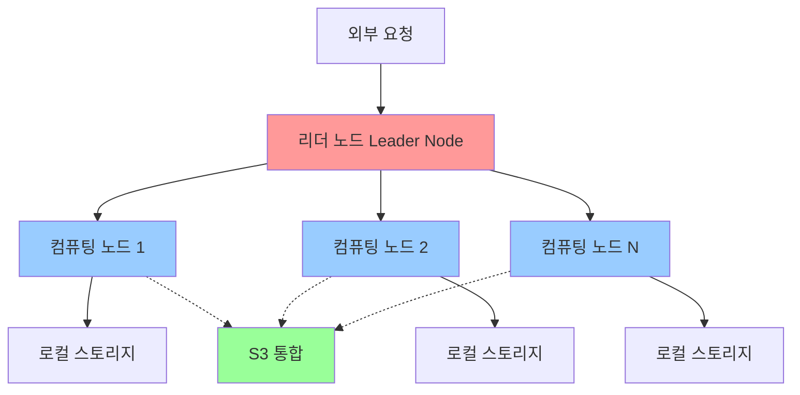

**구성 요소:**

| 구분 | 역할 | 특징 |
|------|------|------|
| **리더 노드** | 외부 요청 수신 및 쿼리 분산 | - SQL 쿼리 파싱<br>- 실행 계획 수립<br>- 결과 집계 |
| **컴퓨팅 노드** | 실제 데이터 처리 및 저장 | - 데이터 저장<br>- 쿼리 실행<br>- 병렬 처리 |
| **로컬 스토리지** | 자주 사용되는 데이터 저장 | - SSD 기반<br>- 고속 액세스 |
| **S3 통합** | 장기 데이터 저장 | - 비용 절감<br>- 무제한 확장 |

**실행 흐름:**

1. 클라이언트가 SQL 쿼리를 리더 노드에 전송
2. 리더 노드가 쿼리를 분석하고 실행 계획 수립
3. 실행 계획을 각 컴퓨팅 노드에 분산
4. 컴퓨팅 노드가 로컬 스토리지 또는 S3에서 데이터 읽기
5. 각 노드에서 병렬로 쿼리 실행
6. 결과를 리더 노드로 전송
7. 리더 노드가 결과를 집계하여 클라이언트에 반환

📌 **노트**: Redshift는 OLAP(Online Analytical Processing) 워크로드에 최적화되어 있으며, 대량의 데이터를 분석하는 데 탁월한 성능을 발휘합니다.

---

#### 2️⃣ AWS DMS (Database Migration Service) - 데이터베이스 마이그레이션

**주요 기능:**

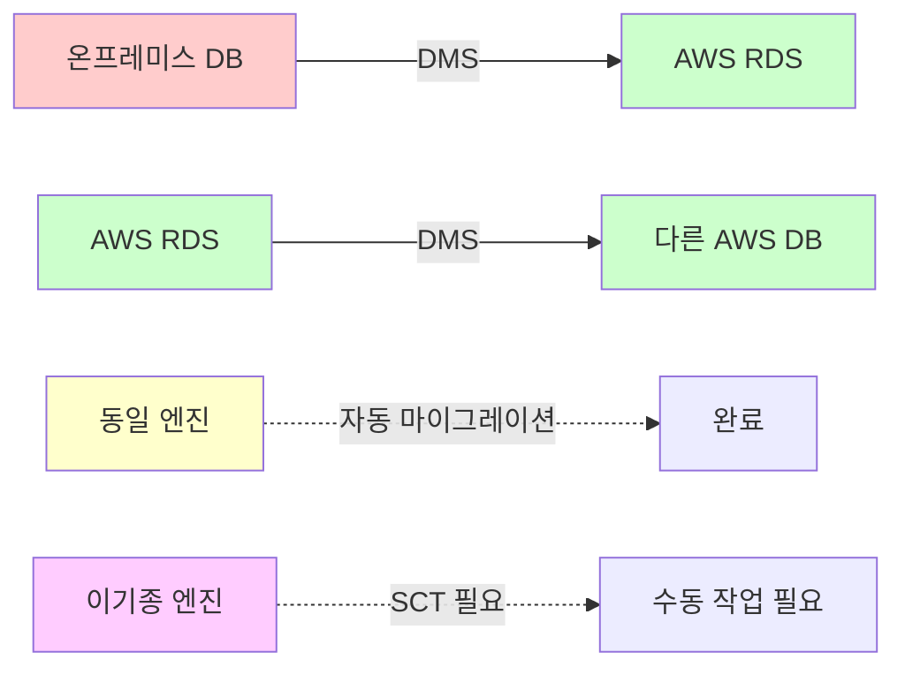

**마이그레이션 유형:**

| 유형 | 설명 | 특징 |
|------|------|------|
| **동일 엔진** | MySQL → RDS MySQL<br>Oracle → RDS Oracle | - 자동 마이그레이션<br>- 스키마 변환 불필요<br>- 빠른 마이그레이션 |
| **이기종 엔진** | Oracle → Aurora PostgreSQL<br>SQL Server → MySQL | - SCT(Schema Conversion Tool) 필요<br>- 수동 검증 필요<br>- 호환성 검토 |

**마이그레이션 모드:**

1. **일괄 마이그레이션 (Full Load)**
   - 한 번에 모든 데이터 이관
   - 다운타임 발생
   - 소규모 데이터베이스에 적합

2. **지속적 마이그레이션 (CDC - Change Data Capture)**
   - 초기 전체 복제 후 변경분만 지속 동기화
   - 다운타임 최소화
   - 실시간 동기화
   - 대규모 프로덕션 환경에 적합

**실습 시나리오:**

```bash
# DMS 태스크 생성 예시 (AWS CLI)
aws dms create-replication-task \
    --replication-task-identifier my-migration-task \
    --source-endpoint-arn arn:aws:dms:region:account:endpoint:source \
    --target-endpoint-arn arn:aws:dms:region:account:endpoint:target \
    --replication-instance-arn arn:aws:dms:region:account:rep:instance \
    --migration-type full-load-and-cdc \
    --table-mappings file://table-mappings.json
```

---

#### 3️⃣ AWS SCT (Schema Conversion Tool)

**역할:**

이기종 데이터베이스 마이그레이션 시 스키마 변환을 지원하는 도구입니다.

**주요 기능:**

1. **자동 스키마 변환**
   - 테이블, 뷰, 인덱스 변환
   - 저장 프로시저 변환
   - 트리거 변환

2. **호환성 분석**
   - 변환 가능 항목 식별
   - 수동 작업 필요 항목 표시
   - 변환 가이드 제공

3. **마이그레이션 보고서**
   - 변환 성공률
   - 잠재적 문제점
   - 권장 사항

⚠️ **주의**: SCT는 100% 자동 변환을 보장하지 않습니다. 복잡한 SQL 문, 특정 데이터베이스 기능은 수동 조정이 필요합니다.

---

#### 4️⃣ Amazon ElastiCache - 인메모리 데이터 저장소

**지원 엔진:**

| 엔진 | 특징 | 사용 사례 |
|------|------|-----------|
| **Memcached** | - 단순한 key-value 스토어<br>- 멀티스레드 지원 | - DB 캐시<br>- 세션 저장소 |
| **Redis** | - 다양한 데이터 구조 지원<br>- 복제 및 지속성 지원<br>- Pub/Sub 기능 | - DB 캐시<br>- 세션 저장소<br>- 게임 리더보드<br>- 실시간 분석 |

**Redis 데이터 구조:**

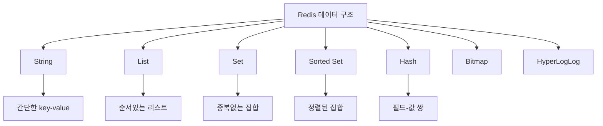

**활용 패턴:**

1. **데이터베이스 캐시**
```python
# Redis를 DB 캐시로 사용하는 예제
import redis
import mysql.connector

redis_client = redis.Redis(host='elasticache-endpoint', port=6379)
db = mysql.connector.connect(user='user', password='pass', database='mydb')

def get_user(user_id):
    # 1. Redis 캐시 확인
    cached = redis_client.get(f"user:{user_id}")
    if cached:
        return json.loads(cached)

    # 2. 캐시 미스 - DB 조회
    cursor = db.cursor()
    cursor.execute("SELECT * FROM users WHERE id = %s", (user_id,))
    user = cursor.fetchone()

    # 3. Redis에 저장 (TTL 3600초)
    redis_client.setex(f"user:{user_id}", 3600, json.dumps(user))

    return user
```

2. **세션 스토어**
```python
# Flask 세션을 Redis에 저장
from flask import Flask, session
from flask_session import Session

app = Flask(__name__)
app.config['SESSION_TYPE'] = 'redis'
app.config['SESSION_REDIS'] = redis.from_url('redis://elasticache-endpoint:6379')
Session(app)

@app.route('/login', methods=['POST'])
def login():
    session['user_id'] = request.form['user_id']
    return 'Logged in'
```

3. **게임 리더보드**
```python
# Redis Sorted Set을 이용한 리더보드
def add_score(user_id, score):
    redis_client.zadd('leaderboard', {user_id: score})

def get_top_10():
    return redis_client.zrevrange('leaderboard', 0, 9, withscores=True)

def get_rank(user_id):
    rank = redis_client.zrevrank('leaderboard', user_id)
    return rank + 1 if rank is not None else None
```

📌 **노트**: ElastiCache는 읽기 집약적인 워크로드의 성능을 크게 향상시킬 수 있습니다. 특히 자주 조회되지만 자주 변경되지 않는 데이터에 효과적입니다.

---

#### 5️⃣ 기타 NoSQL 데이터베이스 서비스

**1. Amazon MemoryDB for Redis**
- Redis 호환 인메모리 데이터베이스
- 마이크로초 읽기 지연 시간
- 영구 지속성 제공 (ElastiCache와의 차이점)

**2. Amazon DocumentDB**
- MongoDB 호환 문서 데이터베이스
- JSON 형식 데이터 저장
- MongoDB API 호환

**3. Amazon Neptune**
- 그래프 데이터베이스
- 소셜 네트워크, 추천 시스템에 활용
- Gremlin 및 SPARQL 쿼리 언어 지원

**4. Amazon Quantum Ledger Database (QLDB)**
- 원장 데이터베이스
- 변경 불가능한 트랜잭션 로그
- 암호학적으로 검증 가능한 트랜잭션 로그

**5. Amazon Timestream**
- 시계열 데이터베이스
- IoT 및 운영 애플리케이션에 최적화
- 자동 데이터 계층화 및 압축

**6. Amazon Managed Blockchain**
- 블록체인 네트워크 관리 서비스
- Hyperledger Fabric 및 Ethereum 지원

---

### 🔐 보안 서비스 복습

#### 1️⃣ 보안의 3대 요소 (CIA Triad)

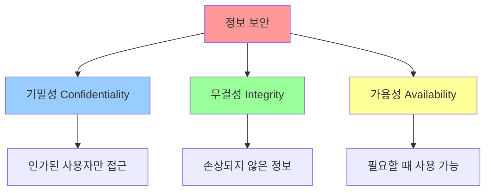

**정의:**

| 요소 | 설명 | 보안 통제 |
|------|------|-----------|
| **기밀성<br>(Confidentiality)** | 인가된 사용자만 정보에 접근 가능 | - 암호화<br>- 접근 제어<br>- 인증 |
| **무결성<br>(Integrity)** | 정보가 무단으로 변경되지 않음 | - 해시<br>- 디지털 서명<br>- 버전 관리 |
| **가용성<br>(Availability)** | 필요할 때 정보를 사용 가능 | - 백업<br>- 이중화<br>- 재해 복구 |

**통합 정의:**
> "인가된 사용자만이 손상되지 않은 상태의 정보를 필요로 할 때 사용할 수 있어야 한다."

---

#### 2️⃣ AWS 공동 책임 모델 (Shared Responsibility Model)

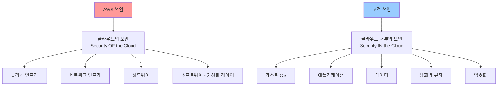

**서비스별 책임 범위:**

| 서비스 유형 | AWS 책임 | 고객 책임 |
|------------|----------|-----------|
| **IaaS<br>(EC2)** | - 하드웨어<br>- 네트워크<br>- 하이퍼바이저 | - OS 패치<br>- 애플리케이션<br>- 데이터<br>- 보안그룹 |
| **PaaS<br>(RDS)** | - 하드웨어<br>- 네트워크<br>- 하이퍼바이저<br>- OS 패치 | - DB 사용자 관리<br>- 네트워크 설정<br>- 데이터 |
| **SaaS<br>(S3)** | - 하드웨어<br>- 네트워크<br>- 소프트웨어<br>- 스토리지 | - 데이터<br>- 액세스 정책<br>- 암호화 설정 |

💡 **중요!**: 공동 책임 모델을 이해하는 것은 AWS 보안의 첫 걸음입니다. 고객은 자신의 책임 영역을 명확히 인지하고 적절한 보안 통제를 구현해야 합니다.

---

#### 3️⃣ AWS CloudTrail - 감사 로깅

**핵심 기능:**

CloudTrail은 AWS 계정의 **모든 API 호출을 기록**하는 서비스입니다.

**로깅 대상:**

- 누가 (User/Role)
- 언제 (Timestamp)
- 어디서 (Source IP)
- 무엇을 (API Action)
- 어느 리소스에 (Resource ARN)
- 결과 (Success/Failure)

**Trail 구성 요소:**

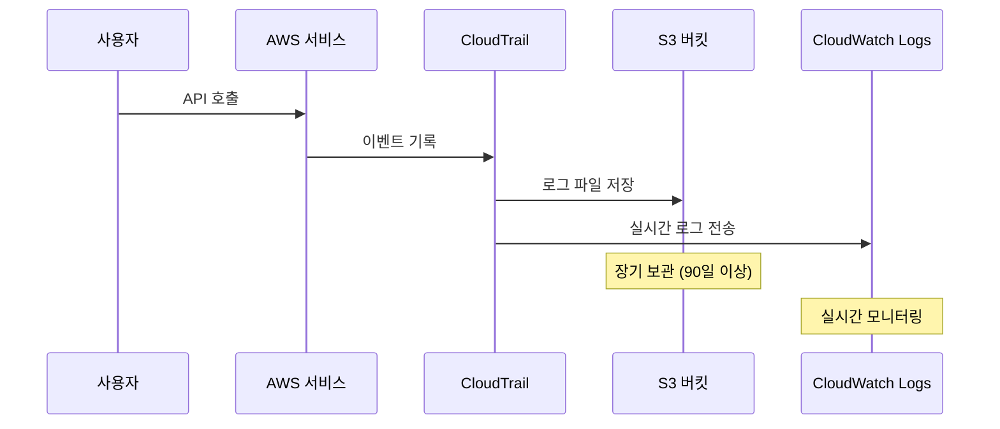

**로그 파일 무결성 검증:**

CloudTrail은 로그 파일의 무결성을 검증하기 위해 **다이제스트 파일(Digest File)**을 제공합니다.

```bash
# 로그 파일 무결성 검증 명령어
aws cloudtrail validate-logs \
    --trail-arn arn:aws:cloudtrail:region:account:trail/name \
    --start-time 2025-12-11T00:00:00Z \
    --end-time 2025-12-11T23:59:59Z
```

**다이제스트 파일 구조:**

```json
{
  "digestStartTime": "2025-12-11T00:00:00Z",
  "digestEndTime": "2025-12-11T01:00:00Z",
  "digestS3Bucket": "my-cloudtrail-bucket",
  "logFiles": [
    {
      "s3Object": "AWSLogs/123456789012/CloudTrail/us-east-1/2025/12/11/...",
      "hashValue": "4f8c9b3a2e1d...",
      "hashAlgorithm": "SHA-256"
    }
  ]
}
```

📌 **노트**: CloudTrail 로그는 규정 준수, 보안 분석, 운영 문제 해결에 필수적입니다. 모든 AWS 계정에서 활성화해야 합니다.

---

#### 4️⃣ VPC Flow Logs - 네트워크 트래픽 로깅

**개념:**

VPC 내의 **ENI(Elastic Network Interface)**에서 송수신되는 **IP 트래픽 정보**를 캡처합니다.

**로그 형식:**

```
version account-id interface-id srcaddr dstaddr srcport dstport protocol packets bytes start end action log-status
```

**실제 로그 예시:**

```
2 123456789012 eni-1234abcd 203.0.113.12 10.0.0.15 49152 443 6 10 4096 1639234567 1639234627 ACCEPT OK
2 123456789012 eni-1234abcd 10.0.0.15 198.51.100.45 443 49153 6 5 2048 1639234567 1639234627 REJECT OK
```

**필드 설명:**

| 필드 | 설명 | 예시 |
|------|------|------|
| version | 로그 버전 | 2 |
| account-id | AWS 계정 ID | 123456789012 |
| interface-id | ENI ID | eni-1234abcd |
| srcaddr | 소스 IP | 203.0.113.12 |
| dstaddr | 목적지 IP | 10.0.0.15 |
| srcport | 소스 포트 | 49152 |
| dstport | 목적지 포트 | 443 |
| protocol | 프로토콜 번호 | 6 (TCP) |
| packets | 패킷 수 | 10 |
| bytes | 바이트 수 | 4096 |
| start | 시작 시간 (Unix) | 1639234567 |
| end | 종료 시간 (Unix) | 1639234627 |
| action | ACCEPT / REJECT | ACCEPT |
| log-status | OK / NODATA / SKIPDATA | OK |

**활용 사례:**

1. **보안 분석**
   - 비정상적인 트래픽 패턴 탐지
   - 무단 접근 시도 식별

2. **네트워크 문제 해결**
   - 연결 실패 원인 분석
   - 성능 병목 지점 파악

3. **규정 준수**
   - 네트워크 활동 감사
   - 컴플라이언스 보고서 생성

⚠️ **주의**: VPC Flow Logs는 Wireshark와 같은 패킷 캡처 도구가 아닙니다. **패킷 내용은 기록하지 않으며**, 메타데이터만 기록합니다.

---

이제 섹션 2를 작성하겠습니다.
## 📊 데이터 분석의 이해

### 🎯 데이터 분석이란?

데이터 분석은 **대량의 데이터를 고속으로 처리**하여 **의사결정을 지원하는 인사이트**를 도출하는 과정입니다.

**목적:**
- 경영 의사결정 지원
- 비즈니스 인사이트 발견
- 데이터 기반 전략 수립
- 운영 최적화

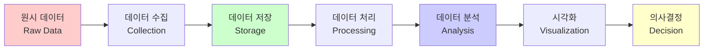

---

### 📈 데이터 분석 vs 기계학습

| 구분 | 데이터 분석 | 기계학습 |
|------|------------|----------|
| **목적** | 과거 데이터에서 패턴 발견 | 미래 예측 모델 구축 |
| **방법** | 통계 분석, 시각화 | 알고리즘 학습 |
| **결과** | 인사이트, 리포트 | 예측 모델 |
| **시간 관점** | 과거 → 현재 | 과거 → 미래 |
| **예시** | "지난 분기 매출이 20% 증가했다" | "다음 분기 매출은 15% 증가할 것이다" |

**데이터 분석 프로세스:**

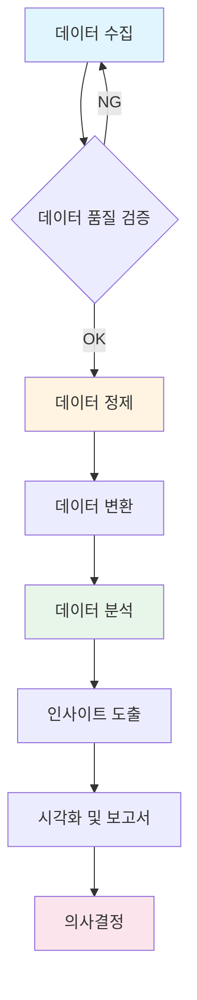

**기계학습 프로세스:**

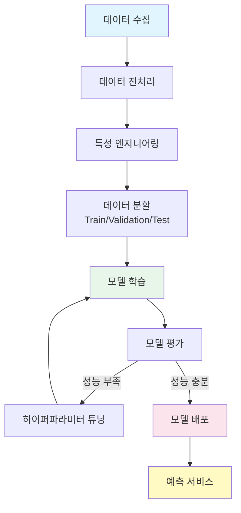

💡 **중요!**: 데이터 분석은 "무엇이 일어났는가"를 이해하는 것이고, 기계학습은 "앞으로 무엇이 일어날 것인가"를 예측하는 것입니다.

---

### 🔄 분석 유형

#### 1️⃣ 배치 분석 (Batch Analysis)

**특징:**
- 저장된 대량의 데이터를 주기적으로 처리
- 복잡한 연산 가능
- 결과 생성까지 시간 소요 (분 ~ 시간 단위)

**활용 사례:**
- 일일 매출 리포트
- 월간 고객 분석
- 분기별 재무 분석

**프로세스:**

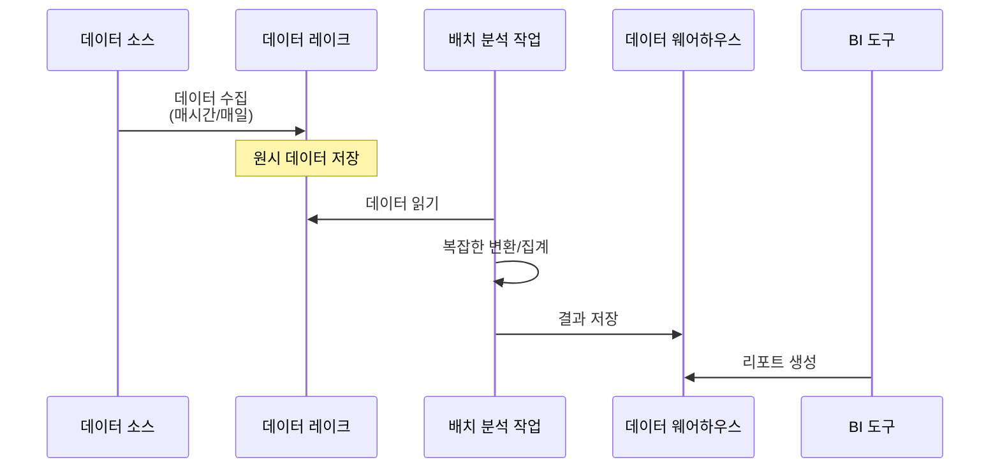

**AWS 서비스:**
- Amazon S3 (데이터 레이크)
- AWS Glue (ETL)
- Amazon EMR (대규모 데이터 처리)
- Amazon Athena (SQL 쿼리)

#### 2️⃣ 실시간 분석 (Real-time Analysis)

**특징:**
- 데이터 발생 즉시 처리
- 낮은 지연 시간 (밀리초 ~ 초 단위)
- 스트리밍 데이터 처리

**활용 사례:**
- 배송 경로 최적화
- 부정 거래 탐지
- 실시간 추천 시스템
- IoT 센서 모니터링

**프로세스:**

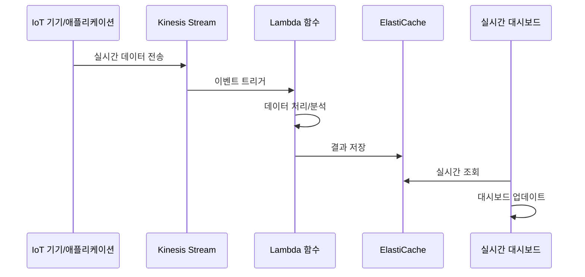

**AWS 서비스:**
- Amazon Kinesis (스트리밍 데이터 수집)
- AWS Lambda (실시간 처리)
- Amazon ElastiCache (저지연 저장소)
- Amazon OpenSearch (실시간 검색/분석)

#### 3️⃣ 시각화 (Visualization)

**정의:**
데이터를 **그래프, 차트, 대시보드** 형태로 변환하여 이해하기 쉽게 표현하는 과정

**시각화의 중요성:**

| 장점 | 설명 |
|------|------|
| **직관성** | 복잡한 데이터를 한눈에 파악 |
| **패턴 발견** | 숨겨진 트렌드와 이상치 식별 |
| **커뮤니케이션** | 비전문가도 이해 가능 |
| **의사결정 속도** | 신속한 인사이트 도출 |

**시각화 유형:**

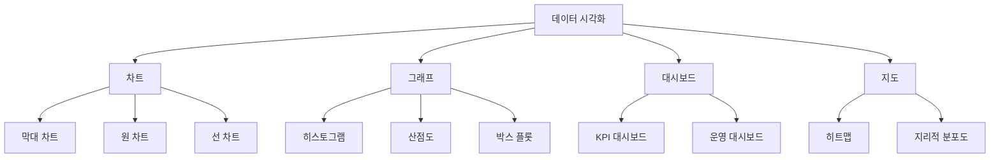

**AWS 시각화 도구:**
- Amazon QuickSight (BI 도구)
- Amazon OpenSearch (Kibana 대시보드)
- AWS Grafana (메트릭 시각화)

---

### 💾 데이터 레이크 (Data Lake)

**정의:**
다양한 형식의 **원시 데이터(Raw Data)**를 그대로 저장하는 중앙 집중식 저장소

**특징:**

| 특징 | 설명 |
|------|------|
| **스키마-온-리드** | 데이터 저장 시 스키마 정의 불필요<br>읽을 때 스키마 적용 |
| **모든 형식** | 정형, 반정형, 비정형 데이터 저장 |
| **저렴한 비용** | S3 같은 객체 스토리지 활용 |
| **확장성** | 페타바이트 규모까지 확장 가능 |

**데이터 레이크 아키텍처:**

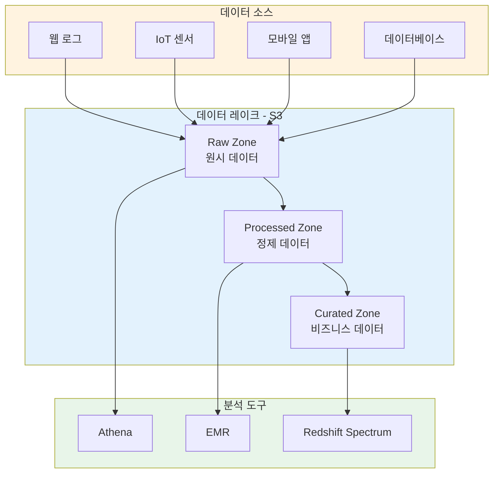

**S3를 데이터 레이크로 사용하는 이유:**

1. **저렴한 비용**
```
비용 비교:
- EBS gp3: $0.08/GB/월
- S3 Standard: $0.023/GB/월
- S3 IA: $0.0125/GB/월
- S3 Glacier: $0.004/GB/월
```

2. **자동 확장**
- 용량 제한 없음
- 수동 관리 불필요
- 자동 내구성 보장 (99.999999999%)

3. **S3 스토리지 클래스 활용**

| 클래스 | 사용 빈도 | 비용 | 활용 사례 |
|--------|-----------|------|-----------|
| **Standard** | 자주 액세스 | $$$ | 활성 분석 데이터 |
| **Intelligent-Tiering** | 자동 최적화 | $$-$ | 액세스 패턴 불명확 |
| **Standard-IA** | 가끔 액세스 | $$ | 월간 분석 데이터 |
| **One Zone-IA** | 가끔 액세스 | $ | 재생성 가능 데이터 |
| **Glacier Instant Retrieval** | 분기별 액세스 | $ | 장기 보관 |
| **Glacier Flexible Retrieval** | 연 1-2회 | $ | 규정 준수 보관 |
| **Glacier Deep Archive** | 거의 액세스 안함 | $ | 장기 아카이브 |

**S3 Lifecycle 정책 예시:**

```json
{
  "Rules": [
    {
      "Id": "MoveToIA",
      "Status": "Enabled",
      "Transitions": [
        {
          "Days": 90,
          "StorageClass": "STANDARD_IA"
        },
        {
          "Days": 365,
          "StorageClass": "GLACIER"
        }
      ]
    }
  ]
}
```

**데이터 레이크 구축 예시:**

```bash
# 1. S3 버킷 생성 (데이터 레이크)
aws s3 mb s3://my-data-lake --region us-east-1

# 2. 디렉토리 구조 생성
aws s3api put-object --bucket my-data-lake --key raw/
aws s3api put-object --bucket my-data-lake --key processed/
aws s3api put-object --bucket my-data-lake --key curated/

# 3. 데이터 업로드
aws s3 cp local-data/ s3://my-data-lake/raw/ --recursive

# 4. Lifecycle 정책 적용
aws s3api put-bucket-lifecycle-configuration \
    --bucket my-data-lake \
    --lifecycle-configuration file://lifecycle.json

# 5. 버전 관리 활성화
aws s3api put-bucket-versioning \
    --bucket my-data-lake \
    --versioning-configuration Status=Enabled
```

---

### 🏢 데이터 웨어하우스 (Data Warehouse)

**정의:**
분석을 위해 **정제되고 구조화된 데이터**를 저장하는 관계형 데이터베이스

**데이터 레이크 vs 데이터 웨어하우스:**

| 구분 | 데이터 레이크 | 데이터 웨어하우스 |
|------|---------------|-------------------|
| **데이터 형식** | 원시 데이터 (모든 형식) | 정제된 데이터 (구조화) |
| **스키마** | Schema-on-read | Schema-on-write |
| **사용자** | 데이터 과학자, 엔지니어 | 비즈니스 분석가 |
| **목적** | 탐색적 분석, ML | 리포팅, BI |
| **스토리지** | S3 (객체 스토리지) | Redshift (컬럼 스토리지) |
| **비용** | 저렴 | 비교적 높음 |
| **쿼리 속도** | 느림 (대용량) | 빠름 (최적화) |

**데이터 흐름:**

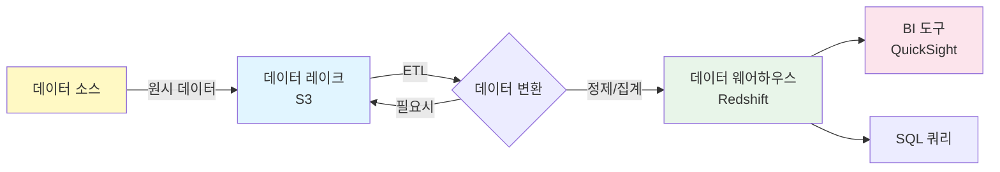

**데이터 웨어하우스의 특징:**

1. **Star Schema 설계**
```
사실 테이블 (Fact Table)
└── 차원 테이블 (Dimension Tables)
    ├── 시간 차원
    ├── 제품 차원
    ├── 고객 차원
    └── 지역 차원
```

2. **컬럼 기반 스토리지**
```
행 기반 (OLTP):
[ID: 1, Name: "John", Age: 30, City: "Seoul"]
[ID: 2, Name: "Jane", Age: 25, City: "Busan"]

컬럼 기반 (OLAP):
ID:   [1, 2]
Name: ["John", "Jane"]
Age:  [30, 25]
City: ["Seoul", "Busan"]
```
→ 특정 컬럼만 읽어 분석 쿼리 성능 향상

3. **압축 및 인코딩**
- 컬럼별 최적 압축 알고리즘 적용
- 저장 공간 절감 (최대 90%)
- 쿼리 성능 향상

**Redshift 아키텍처 복습:**

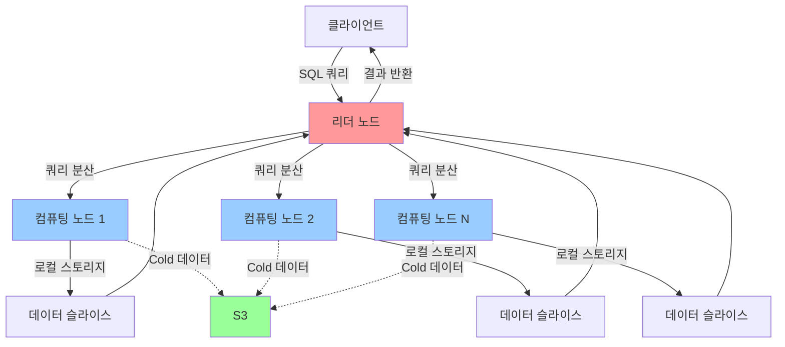

---

### 🔄 ETL vs ELT

**ETL (Extract, Transform, Load):**

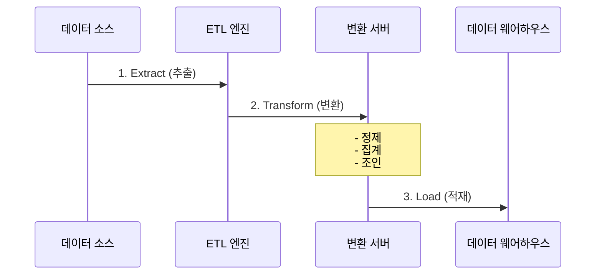

**ELT (Extract, Load, Transform):**

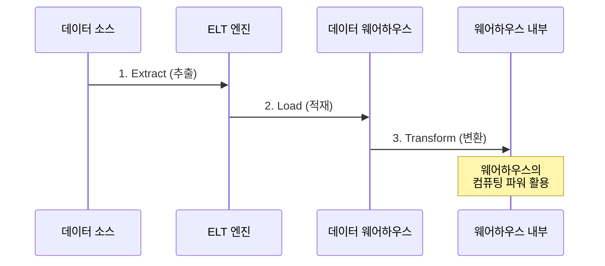

**비교:**

| 구분 | ETL | ELT |
|------|-----|-----|
| **변환 위치** | 외부 ETL 서버 | 데이터 웨어하우스 내부 |
| **적합 환경** | 전통적 DW | 클라우드 DW (Redshift, Snowflake) |
| **비용** | ETL 서버 비용 | DW 컴퓨팅 비용 |
| **확장성** | ETL 서버 확장 필요 | DW 자동 확장 |
| **속도** | 느림 (별도 변환) | 빠름 (병렬 처리) |

💡 **중요!**: 최근 클라우드 데이터 웨어하우스의 강력한 컴퓨팅 파워로 인해 ELT 패턴이 선호되고 있습니다.

---

### ✅ 학습 체크리스트

**데이터 분석 개념:**
- [ ] 데이터 분석과 기계학습의 차이를 설명할 수 있다
- [ ] 배치 분석과 실시간 분석의 차이를 이해한다
- [ ] 데이터 시각화의 중요성을 설명할 수 있다

**데이터 레이크:**
- [ ] 데이터 레이크의 개념과 목적을 이해한다
- [ ] S3를 데이터 레이크로 사용하는 이유를 설명할 수 있다
- [ ] S3 스토리지 클래스의 특징과 비용을 비교할 수 있다
- [ ] Lifecycle 정책을 작성할 수 있다

**데이터 웨어하우스:**
- [ ] 데이터 레이크와 데이터 웨어하우스의 차이를 설명할 수 있다
- [ ] 컬럼 기반 스토리지의 장점을 이해한다
- [ ] Star Schema의 개념을 설명할 수 있다
- [ ] ETL과 ELT의 차이를 이해한다

### 📋 핵심 요약

1. **데이터 분석**: 과거 데이터에서 패턴 발견 → 의사결정 지원
2. **기계학습**: 과거 데이터로 모델 학습 → 미래 예측
3. **배치 분석**: 대량 데이터를 주기적으로 처리 (시간 ~ 일 단위)
4. **실시간 분석**: 데이터 발생 즉시 처리 (밀리초 ~ 초 단위)
5. **데이터 레이크**: 원시 데이터를 저렴하게 대량 저장 (S3)
6. **데이터 웨어하우스**: 정제된 데이터를 빠르게 쿼리 (Redshift)
7. **ETL**: 변환 후 적재 (전통적 방식)
8. **ELT**: 적재 후 변환 (클라우드 환경)

---

## 🔬 AWS 분석 서비스 상세

### 📊 Amazon Athena - 서버리스 SQL 쿼리 서비스

**개념:**
Amazon Athena는 **S3에 저장된 데이터를 SQL로 직접 쿼리**할 수 있는 서버리스 분석 서비스입니다.

**주요 특징:**

| 특징 | 설명 |
|------|------|
| **서버리스** | 인프라 관리 불필요 |
| **표준 SQL** | ANSI SQL 지원 (Presto 기반) |
| **페이 퍼 스캔** | 스캔한 데이터양만큼만 비용 지불 |
| **다양한 형식** | CSV, JSON, ORC, Parquet, Avro 지원 |
| **통합** | Glue Data Catalog와 완벽 통합 |

**Athena 아키텍처:**

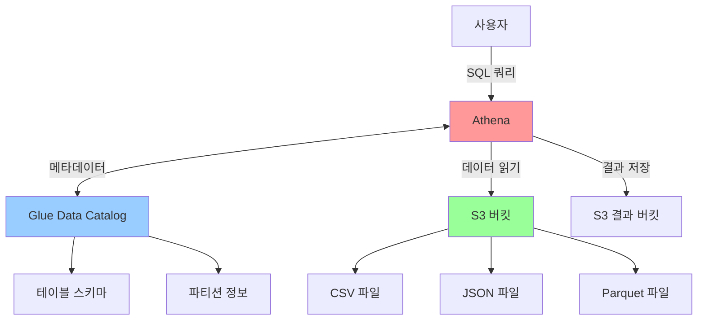

**실습: Athena로 S3 데이터 쿼리하기**

**Step 1: S3 버킷 준비**
```bash
# 1. S3 버킷 생성
aws s3 mb s3://my-athena-data-bucket

# 2. 샘플 데이터 업로드 (CSV)
cat > sample_logs.csv << EOF
timestamp,user_id,action,status_code
2025-12-11T10:00:00,user1,login,200
2025-12-11T10:05:00,user2,purchase,200
2025-12-11T10:10:00,user1,logout,200
2025-12-11T10:15:00,user3,login,401
EOF

aws s3 cp sample_logs.csv s3://my-athena-data-bucket/logs/

# 3. Athena 결과 버킷 생성
aws s3 mb s3://my-athena-results
```

**Step 2: Athena에서 데이터베이스 및 테이블 생성**
```sql
-- 데이터베이스 생성
CREATE DATABASE my_analytics_db;

-- 외부 테이블 생성
CREATE EXTERNAL TABLE IF NOT EXISTS my_analytics_db.web_logs (
    timestamp STRING,
    user_id STRING,
    action STRING,
    status_code INT
)
ROW FORMAT DELIMITED
FIELDS TERMINATED BY ','
STORED AS TEXTFILE
LOCATION 's3://my-athena-data-bucket/logs/'
TBLPROPERTIES ('skip.header.line.count'='1');
```

**Step 3: 쿼리 실행**
```sql
-- 1. 전체 데이터 조회
SELECT * FROM my_analytics_db.web_logs
LIMIT 10;

-- 2. 액션별 집계
SELECT 
    action,
    COUNT(*) as count
FROM my_analytics_db.web_logs
GROUP BY action
ORDER BY count DESC;

-- 3. 시간대별 트래픽 분석
SELECT 
    SUBSTR(timestamp, 1, 13) as hour,
    COUNT(*) as requests
FROM my_analytics_db.web_logs
GROUP BY SUBSTR(timestamp, 1, 13)
ORDER BY hour;

-- 4. 에러 로그 필터링
SELECT 
    timestamp,
    user_id,
    action,
    status_code
FROM my_analytics_db.web_logs
WHERE status_code >= 400;
```

**파티셔닝으로 성능 최적화:**

```sql
-- 파티션된 테이블 생성
CREATE EXTERNAL TABLE my_analytics_db.web_logs_partitioned (
    timestamp STRING,
    user_id STRING,
    action STRING,
    status_code INT
)
PARTITIONED BY (
    year STRING,
    month STRING,
    day STRING
)
ROW FORMAT DELIMITED
FIELDS TERMINATED BY ','
STORED AS TEXTFILE
LOCATION 's3://my-athena-data-bucket/logs_partitioned/';

-- 파티션 추가
ALTER TABLE my_analytics_db.web_logs_partitioned 
ADD PARTITION (year='2025', month='12', day='11')
LOCATION 's3://my-athena-data-bucket/logs_partitioned/year=2025/month=12/day=11/';

-- 파티션 쿼리 (스캔 범위 축소)
SELECT * 
FROM my_analytics_db.web_logs_partitioned
WHERE year='2025' AND month='12' AND day='11';
```

**비용 최적화 팁:**

1. **Parquet 형식 사용**
```sql
-- CSV를 Parquet로 변환하여 저장
CREATE TABLE my_analytics_db.web_logs_parquet
WITH (
    format='PARQUET',
    parquet_compression='SNAPPY',
    external_location='s3://my-athena-data-bucket/logs_parquet/'
) AS
SELECT * FROM my_analytics_db.web_logs;
```
→ Parquet는 컬럼 기반 형식으로 압축률이 높고 쿼리 속도가 빠름

2. **불필요한 컬럼 제외**
```sql
-- ❌ 비효율적
SELECT * FROM large_table;

-- ✅ 효율적
SELECT user_id, action FROM large_table;
```

3. **LIMIT 사용**
```sql
-- 탐색적 분석 시 LIMIT로 스캔 범위 제한
SELECT * FROM large_table LIMIT 1000;
```

---

### 🔄 AWS Glue - 서버리스 ETL 서비스

**개념:**
AWS Glue는 **데이터를 추출(Extract), 변환(Transform), 적재(Load)**하는 완전 관리형 ETL 서비스입니다.

**주요 구성 요소:**

| 구성 요소 | 역할 |
|-----------|------|
| **Glue Data Catalog** | 중앙 메타데이터 저장소 |
| **Glue Crawler** | 자동 스키마 검색 및 등록 |
| **Glue ETL Jobs** | 데이터 변환 작업 |
| **Glue Triggers** | 작업 스케줄링 |
| **Glue Workflows** | 여러 작업 조율 |

**Glue 아키텍처:**

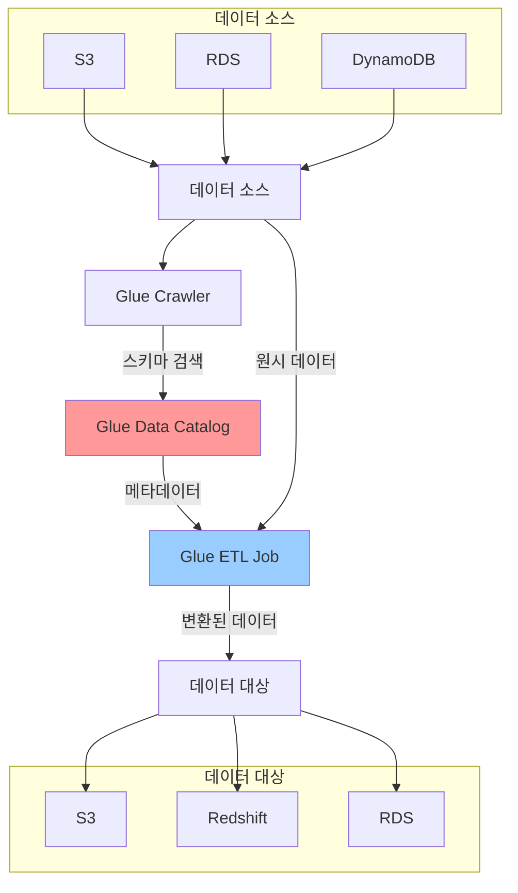

**실습: Glue로 ETL 파이프라인 구축**

**Step 1: Glue Crawler 생성**

```bash
# AWS CLI를 사용한 Crawler 생성
aws glue create-crawler \
    --name my-s3-crawler \
    --role AWSGlueServiceRole \
    --database-name my_glue_db \
    --targets '{
        "S3Targets": [
            {
                "Path": "s3://my-data-bucket/input/"
            }
        ]
    }' \
    --schema-change-policy '{
        "UpdateBehavior": "UPDATE_IN_DATABASE",
        "DeleteBehavior": "LOG"
    }'

# Crawler 실행
aws glue start-crawler --name my-s3-crawler

# Crawler 상태 확인
aws glue get-crawler --name my-s3-crawler
```

**Step 2: Glue ETL Job 생성 (Python Shell)**

```python
# glue_etl_job.py
import sys
from awsglue.transforms import *
from awsglue.utils import getResolvedOptions
from pyspark.context import SparkContext
from awsglue.context import GlueContext
from awsglue.job import Job

## 파라미터 읽기
args = getResolvedOptions(sys.argv, ['JOB_NAME', 'input_path', 'output_path'])

## Glue Context 초기화
sc = SparkContext()
glueContext = GlueContext(sc)
spark = glueContext.spark_session
job = Job(glueContext)
job.init(args['JOB_NAME'], args)

## 데이터 읽기
datasource0 = glueContext.create_dynamic_frame.from_catalog(
    database="my_glue_db",
    table_name="input_table"
)

## 데이터 변환
# 1. 컬럼 선택
transformed = SelectFields.apply(
    frame=datasource0,
    paths=["user_id", "timestamp", "action", "amount"]
)

# 2. 데이터 필터링
filtered = Filter.apply(
    frame=transformed,
    f=lambda x: x["amount"] > 100
)

# 3. 컬럼 이름 변경
renamed = RenameField.apply(
    frame=filtered,
    old_name="amount",
    new_name="transaction_amount"
)

# 4. 집계
aggregated = renamed.toDF().groupBy("user_id").agg({
    "transaction_amount": "sum"
})

## 데이터 저장
glueContext.write_dynamic_frame.from_options(
    frame=DynamicFrame.fromDF(aggregated, glueContext, "aggregated"),
    connection_type="s3",
    connection_options={
        "path": args['output_path']
    },
    format="parquet"
)

job.commit()
```

**Step 3: Glue Job 실행**

```bash
# Glue Job 생성
aws glue create-job \
    --name my-etl-job \
    --role AWSGlueServiceRole \
    --command '{
        "Name": "glueetl",
        "ScriptLocation": "s3://my-glue-scripts/glue_etl_job.py",
        "PythonVersion": "3"
    }' \
    --default-arguments '{
        "--input_path": "s3://my-data-bucket/input/",
        "--output_path": "s3://my-data-bucket/output/"
    }' \
    --glue-version "4.0"

# Job 실행
aws glue start-job-run \
    --job-name my-etl-job

# Job 실행 상태 확인
aws glue get-job-run \
    --job-name my-etl-job \
    --run-id <run-id>
```

**Glue ETL 변환 예제:**

```python
# 1. 조인 (Join)
joined = Join.apply(
    frame1=customers,
    frame2=orders,
    keys1=["customer_id"],
    keys2=["customer_id"]
)

# 2. 중복 제거 (Deduplicate)
deduped = DynamicFrame.fromDF(
    customers.toDF().dropDuplicates(["email"]),
    glueContext,
    "deduped"
)

# 3. 데이터 타입 변환
from pyspark.sql.functions import col
df = data.toDF()
df = df.withColumn("amount", col("amount").cast("double"))
df = df.withColumn("date", col("date").cast("date"))

# 4. 파티션 작성
glueContext.write_dynamic_frame.from_options(
    frame=data,
    connection_type="s3",
    connection_options={
        "path": "s3://output-bucket/data/",
        "partitionKeys": ["year", "month", "day"]
    },
    format="parquet"
)
```

---

### 🔍 Amazon OpenSearch (구 ElasticSearch) - 검색 및 분석 엔진

**개념:**
Amazon OpenSearch는 **로그 분석, 실시간 애플리케이션 모니터링, 클릭스트림 분석**을 위한 완전 관리형 검색 및 분석 엔진입니다.

**주요 특징:**

- 오픈소스 기반 (Elasticsearch, Kibana 호환)
- 실시간 검색 및 분석
- 내장 시각화 도구 (OpenSearch Dashboards)
- 고가용성 (Multi-AZ 배포)

**ELK 스택:**

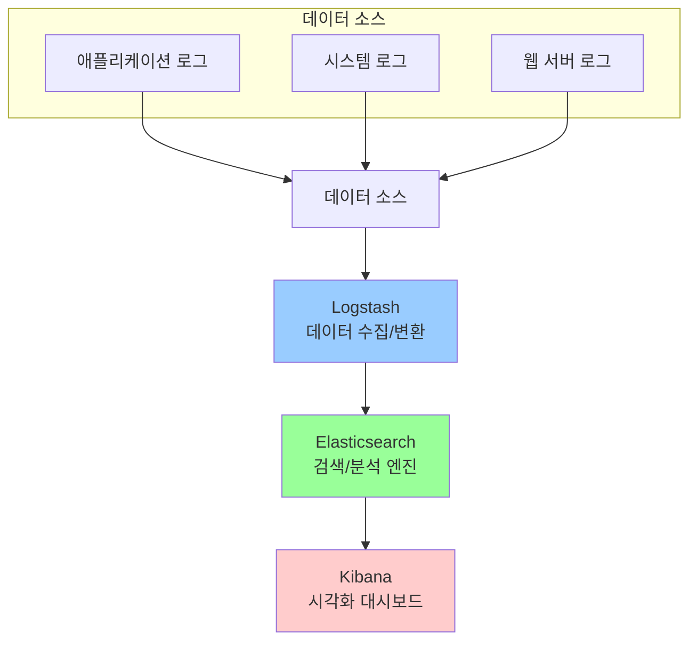

**실습: OpenSearch 도메인 생성 및 데이터 인덱싱**

**Step 1: OpenSearch 도메인 생성**

```bash
# AWS CLI로 OpenSearch 도메인 생성
aws opensearch create-domain \
    --domain-name my-logs-domain \
    --engine-version "OpenSearch_2.9" \
    --cluster-config '{
        "InstanceType": "t3.small.search",
        "InstanceCount": 2,
        "DedicatedMasterEnabled": false,
        "ZoneAwarenessEnabled": true
    }' \
    --ebs-options '{
        "EBSEnabled": true,
        "VolumeType": "gp3",
        "VolumeSize": 20
    }' \
    --access-policies '{
        "Version": "2012-10-17",
        "Statement": [
            {
                "Effect": "Allow",
                "Principal": {"AWS": "*"},
                "Action": "es:*",
                "Resource": "arn:aws:es:region:account-id:domain/my-logs-domain/*",
                "Condition": {
                    "IpAddress": {
                        "aws:SourceIp": "YOUR_IP_ADDRESS"
                    }
                }
            }
        ]
    }'

# 도메인 엔드포인트 확인
aws opensearch describe-domain \
    --domain-name my-logs-domain \
    --query 'DomainStatus.Endpoint' \
    --output text
```

**Step 2: 데이터 인덱싱**

```bash
# OpenSearch 엔드포인트
ENDPOINT="https://my-logs-domain-xxx.us-east-1.es.amazonaws.com"

# 인덱스 생성
curl -X PUT "${ENDPOINT}/weblogs" \
    -H 'Content-Type: application/json' \
    -d '{
        "settings": {
            "number_of_shards": 2,
            "number_of_replicas": 1
        },
        "mappings": {
            "properties": {
                "timestamp": {"type": "date"},
                "user_id": {"type": "keyword"},
                "action": {"type": "keyword"},
                "ip_address": {"type": "ip"},
                "user_agent": {"type": "text"},
                "status_code": {"type": "integer"},
                "response_time": {"type": "float"}
            }
        }
    }'

# 문서 색인 (단일 문서)
curl -X POST "${ENDPOINT}/weblogs/_doc" \
    -H 'Content-Type: application/json' \
    -d '{
        "timestamp": "2025-12-11T10:00:00",
        "user_id": "user123",
        "action": "login",
        "ip_address": "203.0.113.1",
        "user_agent": "Mozilla/5.0",
        "status_code": 200,
        "response_time": 0.15
    }'

# 벌크 색인 (여러 문서)
curl -X POST "${ENDPOINT}/_bulk" \
    -H 'Content-Type: application/x-ndjson' \
    --data-binary @bulk_data.ndjson
```

**Step 3: 데이터 검색**

```bash
# 1. 전체 검색
curl -X GET "${ENDPOINT}/weblogs/_search?pretty"

# 2. 특정 사용자 검색
curl -X GET "${ENDPOINT}/weblogs/_search?pretty" \
    -H 'Content-Type: application/json' \
    -d '{
        "query": {
            "term": {
                "user_id": "user123"
            }
        }
    }'

# 3. 시간 범위 검색
curl -X GET "${ENDPOINT}/weblogs/_search?pretty" \
    -H 'Content-Type: application/json' \
    -d '{
        "query": {
            "range": {
                "timestamp": {
                    "gte": "2025-12-11T00:00:00",
                    "lte": "2025-12-11T23:59:59"
                }
            }
        }
    }'

# 4. 집계 쿼리 (액션별 카운트)
curl -X GET "${ENDPOINT}/weblogs/_search?pretty" \
    -H 'Content-Type: application/json' \
    -d '{
        "size": 0,
        "aggs": {
            "actions": {
                "terms": {
                    "field": "action",
                    "size": 10
                }
            }
        }
    }'

# 5. 평균 응답 시간 계산
curl -X GET "${ENDPOINT}/weblogs/_search?pretty" \
    -H 'Content-Type: application/json' \
    -d '{
        "size": 0,
        "aggs": {
            "avg_response_time": {
                "avg": {
                    "field": "response_time"
                }
            }
        }
    }'
```

---

### ⚡ Amazon EMR - 빅데이터 처리 플랫폼

**개념:**
Amazon EMR(Elastic MapReduce)은 **Hadoop, Spark 등의 빅데이터 프레임워크**를 실행하는 관리형 클러스터 플랫폼입니다.

**지원 프레임워크:**

| 프레임워크 | 용도 |
|-----------|------|
| **Hadoop** | 분산 스토리지 및 처리 (MapReduce) |
| **Spark** | 고속 인메모리 처리 |
| **Hive** | SQL 기반 데이터 쿼리 |
| **Presto** | 대화형 SQL 쿼리 |
| **HBase** | NoSQL 데이터베이스 |
| **Flink** | 실시간 스트림 처리 |

**EMR 아키텍처:**

```mermaid
graph TD
    A[Master Node<br>클러스터 조율] --> B[Core Node 1<br>데이터 저장 + 처리]
    A --> C[Core Node 2<br>데이터 저장 + 처리]
    A --> D[Task Node 1<br>처리만]
    A --> E[Task Node 2<br>처리만]

    B <--> F[HDFS]
    C <--> F

    D -.->|작업만 수행| G[처리 작업]
    E -.->|작업만 수행| G

    style A fill:#ff9999
    style B fill:#99ccff
    style C fill:#99ccff
    style D fill:#99ff99
    style E fill:#99ff99
```

**실습: EMR 클러스터로 Spark 작업 실행**

**Step 1: EMR 클러스터 생성**

```bash
# AWS CLI로 EMR 클러스터 생성
aws emr create-cluster \
    --name "My Spark Cluster" \
    --release-label emr-6.14.0 \
    --applications Name=Spark Name=Hadoop \
    --ec2-attributes KeyName=my-key,SubnetId=subnet-xxx \
    --instance-type m5.xlarge \
    --instance-count 3 \
    --use-default-roles \
    --log-uri s3://my-emr-logs/ \
    --bootstrap-actions Path=s3://my-emr-bootstrap/install-packages.sh

# 클러스터 ID 확인
aws emr list-clusters --active

# 클러스터 상태 확인
aws emr describe-cluster --cluster-id j-XXXXXXXXXXXXX
```

**Step 2: Spark 작업 스크립트 작성**

```python
# spark_job.py - S3에 업로드할 Spark 작업
from pyspark.sql import SparkSession
from pyspark.sql.functions import *

# Spark 세션 생성
spark = SparkSession.builder \
    .appName("LogAnalysis") \
    .getOrCreate()

# S3에서 데이터 읽기
df = spark.read \
    .option("header", "true") \
    .csv("s3://my-data-bucket/logs/")

# 데이터 변환
df_transformed = df \
    .withColumn("hour", hour(col("timestamp"))) \
    .withColumn("date", to_date(col("timestamp")))

# 시간대별 요청 수 집계
hourly_stats = df_transformed \
    .groupBy("date", "hour") \
    .agg(
        count("*").alias("request_count"),
        avg("response_time").alias("avg_response_time")
    ) \
    .orderBy("date", "hour")

# 결과 저장
hourly_stats.write \
    .mode("overwrite") \
    .partitionBy("date") \
    .parquet("s3://my-data-bucket/analytics/hourly_stats/")

# 통계 출력
print(f"Total records: {df.count()}")
print(f"Date range: {df.agg(min('timestamp'), max('timestamp')).collect()}")

spark.stop()
```

**Step 3: EMR Step 추가 (작업 실행)**

```bash
# Spark 작업 제출
aws emr add-steps \
    --cluster-id j-XXXXXXXXXXXXX \
    --steps Type=Spark,Name="LogAnalysisJob",ActionOnFailure=CONTINUE,Args=[
        --deploy-mode,cluster,
        --master,yarn,
        --conf,spark.executor.memory=4g,
        --conf,spark.executor.cores=2,
        s3://my-emr-scripts/spark_job.py
    ]

# Step 상태 확인
aws emr list-steps --cluster-id j-XXXXXXXXXXXXX

# Step 로그 확인 (S3)
aws s3 ls s3://my-emr-logs/j-XXXXXXXXXXXXX/steps/
```

---

### 🌊 Amazon Kinesis - 실시간 스트리밍 데이터 처리

**개념:**
Amazon Kinesis는 **실시간으로 스트리밍 데이터를 수집, 처리, 분석**하는 서비스군입니다.

**Kinesis 서비스 구성:**

| 서비스 | 용도 |
|--------|------|
| **Kinesis Data Streams** | 실시간 데이터 수집 및 저장 |
| **Kinesis Data Firehose** | 데이터 전송 및 변환 (준실시간) |
| **Kinesis Data Analytics** | 실시간 SQL 분석 |
| **Kinesis Video Streams** | 비디오 스트리밍 |

**Kinesis Data Streams 아키텍처:**

```mermaid
sequenceDiagram
    participant P1 as Producer 1<br>(웹앱)
    participant P2 as Producer 2<br>(모바일)
    participant K as Kinesis Stream
    participant C1 as Consumer 1<br>(Lambda)
    participant C2 as Consumer 2<br>(EC2 앱)
    participant S as S3 / DynamoDB

    P1->>K: PutRecord (실시간)
    P2->>K: PutRecord (실시간)

    Note over K: 데이터 저장<br>(기본 24시간)

    K->>C1: GetRecords
    K->>C2: GetRecords

    C1->>S: 처리 결과 저장
    C2->>S: 처리 결과 저장
```

**Kinesis Data Firehose vs Data Streams:**

| 구분 | Data Streams | Data Firehose |
|------|--------------|---------------|
| **지연 시간** | 실시간 (< 1초) | 준실시간 (60초 또는 버퍼) |
| **데이터 저장** | 24시간 ~ 365일 | 버퍼에만 임시 저장 |
| **소비자** | 직접 구현 필요 | 자동으로 대상에 전송 |
| **변환** | Lambda 통합 | 내장 변환 기능 |
| **관리** | 샤드 관리 필요 | 완전 관리형 |
| **비용** | 샤드 시간 + PUT | 데이터 양 |

**실습: Kinesis Data Streams로 실시간 데이터 처리**

**Step 1: Kinesis Stream 생성**

```bash
# Stream 생성 (샤드 2개)
aws kinesis create-stream \
    --stream-name my-data-stream \
    --shard-count 2

# Stream 상태 확인
aws kinesis describe-stream \
    --stream-name my-data-stream
```

**Step 2: Producer - 데이터 전송**

```python
# kinesis_producer.py
import boto3
import json
import time
from datetime import datetime

kinesis = boto3.client('kinesis', region_name='us-east-1')
stream_name = 'my-data-stream'

def send_data(user_id, action, value):
    data = {
        'timestamp': datetime.utcnow().isoformat(),
        'user_id': user_id,
        'action': action,
        'value': value
    }

    response = kinesis.put_record(
        StreamName=stream_name,
        Data=json.dumps(data),
        PartitionKey=user_id  # 같은 user_id는 같은 샤드로
    )

    print(f"Sent: {data}, ShardId: {response['ShardId']}")

# 지속적으로 데이터 전송
while True:
    send_data('user_123', 'click', 1)
    send_data('user_456', 'purchase', 99.99)
    time.sleep(1)
```

**Step 3: Consumer - 데이터 처리 (Lambda)**

```python
# lambda_kinesis_consumer.py
import json
import base64

def lambda_handler(event, context):
    for record in event['Records']:
        # Kinesis 데이터는 base64 인코딩되어 있음
        payload = base64.b64decode(record['kinesis']['data'])
        data = json.loads(payload)

        # 데이터 처리
        print(f"Processing: {data}")

        # 비즈니스 로직 (예: DynamoDB 저장)
        if data['action'] == 'purchase':
            save_to_dynamodb(data)

    return {
        'statusCode': 200,
        'body': json.dumps('Successfully processed records')
    }

def save_to_dynamodb(data):
    import boto3
    dynamodb = boto3.resource('dynamodb')
    table = dynamodb.Table('Purchases')

    table.put_item(
        Item={
            'user_id': data['user_id'],
            'timestamp': data['timestamp'],
            'value': str(data['value'])
        }
    )
```

**Step 4: Lambda를 Kinesis 트리거로 연결**

```bash
# Lambda 함수에 Kinesis 트리거 추가
aws lambda create-event-source-mapping \
    --function-name KinesisConsumer \
    --event-source-arn arn:aws:kinesis:us-east-1:ACCOUNT:stream/my-data-stream \
    --batch-size 100 \
    --starting-position LATEST
```

---

### 🤖 AWS SageMaker - 기계학습 플랫폼

**개념:**
AWS SageMaker는 **기계학습 모델을 빌드, 학습, 배포**하는 완전 관리형 서비스입니다.

**기계학습 유형:**

```mermaid
graph TD
    A[기계학습] --> B[지도학습<br>Supervised]
    A --> C[비지도학습<br>Unsupervised]
    A --> D[강화학습<br>Reinforcement]

    B --> B1[분류 Classification]
    B --> B2[회귀 Regression]

    C --> C1[클러스터링]
    C --> C2[차원 축소]

    D --> D1[보상 기반 학습]

    B1 -.-> B1E[이메일 스팸 필터]
    B2 -.-> B2E[주택 가격 예측]
    C1 -.-> C1E[고객 세분화]
    D1 -.-> D1E[AlphaGo]
```

**SageMaker 작업 흐름:**

```mermaid
flowchart TD
    A[데이터 수집] --> B[S3 저장]
    B --> C[SageMaker Processing<br>데이터 전처리]
    C --> D[SageMaker Training<br>모델 학습]
    D --> E{모델 평가}
    E -->|성능 부족| F[하이퍼파라미터 튜닝]
    F --> D
    E -->|성능 충분| G[SageMaker Model Registry<br>모델 등록]
    G --> H[SageMaker Endpoint<br>배포]
    H --> I[실시간 예측 서비스]

    style C fill:#e1f5ff
    style D fill:#e8f5e9
    style H fill:#fce4ec
```

**SageMaker 주요 기능:**

1. **SageMaker Studio** - 통합 개발 환경
2. **SageMaker Autopilot** - AutoML (자동 모델 생성)
3. **SageMaker Training** - 분산 학습
4. **SageMaker Hyperparameter Tuning** - 자동 하이퍼파라미터 최적화
5. **SageMaker Model Monitor** - 모델 품질 모니터링
6. **SageMaker Feature Store** - 특성 저장소

💡 **중요!**: SageMaker는 데이터 과학자와 ML 엔지니어가 ML 인프라 관리 없이 모델 개발에만 집중할 수 있게 해줍니다.

---

## ✅ 학습 체크리스트 (분석 서비스)

**Amazon Athena:**
- [ ] S3 데이터를 SQL로 쿼리할 수 있다
- [ ] 외부 테이블을 생성하고 파티셔닝할 수 있다
- [ ] 비용 최적화를 위해 Parquet 형식을 활용한다

**AWS Glue:**
- [ ] Glue Crawler로 스키마를 자동 검색할 수 있다
- [ ] Glue ETL Job으로 데이터를 변환할 수 있다
- [ ] PySpark를 사용한 데이터 처리를 이해한다

**Amazon OpenSearch:**
- [ ] OpenSearch 도메인을 생성하고 관리할 수 있다
- [ ] 데이터를 인덱싱하고 검색 쿼리를 작성할 수 있다
- [ ] ELK 스택의 개념을 이해한다

**Amazon EMR:**
- [ ] EMR 클러스터를 생성하고 관리할 수 있다
- [ ] Spark 작업을 제출하고 실행할 수 있다
- [ ] Hadoop 생태계의 도구들을 이해한다

**Amazon Kinesis:**
- [ ] Kinesis Data Streams와 Firehose의 차이를 설명할 수 있다
- [ ] 실시간 데이터를 수집하고 처리할 수 있다
- [ ] Lambda와 Kinesis를 통합할 수 있다

**AWS SageMaker:**
- [ ] 기계학습의 3가지 유형을 이해한다
- [ ] SageMaker의 작업 흐름을 설명할 수 있다
- [ ] ML 파이프라인의 각 단계를 이해한다


## 🛠️ 시스템 관리 서비스

### ☁️ AWS CloudFormation - Infrastructure as Code (IaC)

**개념:**
AWS 리소스를 **코드(템플릿)**로 정의하여 자동으로 생성하는 IaC 서비스입니다.

**주요 특징:**

| 특징 | 설명 |
|------|------|
| **반복 가능** | 같은 템플릿으로 동일한 환경 재생성 |
| **버전 관리** | Git 등으로 인프라 버전 관리 |
| **드리프트 감지** | 템플릿과 실제 리소스 차이 감지 |
| **롤백** | 실패 시 자동 롤백 |

**템플릿 구조 (YAML):**

```yaml
AWSTemplateFormatVersion: '2010-09-09'
Description: 'VPC and EC2 Instance'

Parameters:
  VpcCIDR:
    Type: String
    Default: '10.20.0.0/16'

Resources:
  MyVPC:
    Type: AWS::EC2::VPC
    Properties:
      CidrBlock: !Ref VpcCIDR
      Tags:
        - Key: Name
          Value: Lab-VPC

  MyEC2:
    Type: AWS::EC2::Instance
    Properties:
      ImageId: ami-0c55b159cbfafe1f0
      InstanceType: t3.micro
      SubnetId: !Ref PublicSubnet
```

**실습에서 배운 내용:**
- CloudFormation 스택 생성
- 템플릿으로 VPC, 서브넷, EC2 자동 생성
- 스택 삭제 시 리소스 일괄 삭제

---

### 📊 Amazon CloudWatch - 모니터링 및 경보

**주요 기능:**

1. **메트릭 (Metrics)** - 성능 데이터 수집
2. **경보 (Alarms)** - 임계값 초과 시 알림
3. **대시보드 (Dashboards)** - 시각화
4. **Logs** - 로그 수집 및 분석

**실습: CloudWatch 경보 생성**

```bash
# SNS 토픽 생성 (알림용)
aws sns create-topic --name alarm-notifications

# 이메일 구독
aws sns subscribe \
    --topic-arn arn:aws:sns:region:account:alarm-notifications \
    --protocol email \
    --notification-endpoint your-email@example.com

# CloudWatch 경보 생성 (CPU 60% 초과)
aws cloudwatch put-metric-alarm \
    --alarm-name HighCPUAlarm \
    --alarm-description "CPU exceeds 60%" \
    --metric-name CPUUtilization \
    --namespace AWS/EC2 \
    --statistic Average \
    --period 300 \
    --threshold 60 \
    --comparison-operator GreaterThanThreshold \
    --dimensions Name=InstanceId,Value=i-1234567890abcdef0 \
    --evaluation-periods 1 \
    --alarm-actions arn:aws:sns:region:account:alarm-notifications
```

---

### 🔧 AWS Systems Manager

**주요 서비스:**

1. **Session Manager** - 키 없이 EC2 접속
2. **Parameter Store** - 설정 정보 안전 저장
3. **Patch Manager** - 자동 패치 관리
4. **Run Command** - 원격 명령 실행
5. **State Manager** - 상태 유지 관리

---

### 🔔 Amazon EventBridge - 이벤트 기반 자동화

**실습: EC2 중지 시 이메일 알림**

```bash
# EventBridge 규칙 생성
aws events put-rule \
    --name EC2StateChange \
    --event-pattern '{
        "source": ["aws.ec2"],
        "detail-type": ["EC2 Instance State-change Notification"],
        "detail": {
            "state": ["stopped", "terminated"],
            "instance-id": ["i-1234567890abcdef0"]
        }
    }'

# SNS를 타겟으로 연결
aws events put-targets \
    --rule EC2StateChange \
    --targets "Id"="1","Arn"="arn:aws:sns:region:account:alarm-notifications"
```

---

## 🎯 캡스톤 프로젝트: 웹 서비스 인프라 구축

### 📋 프로젝트 개요

**목표:** 가용성, 확장성, 보안성을 갖춘 3-Tier 웹 애플리케이션 인프라 구축

**아키텍처:**

```mermaid
graph TD
    subgraph Public[Public Subnet]
        ALB[Application Load Balancer]
        NAT1[NAT Gateway AZ-A]
        NAT2[NAT Gateway AZ-C]
    end

    subgraph Private1[App Subnet AZ-A]
        APP1[App Server 1<br>Auto Scaling]
    end

    subgraph Private2[App Subnet AZ-C]
        APP2[App Server 2<br>Auto Scaling]
    end

    subgraph DB1[DB Subnet AZ-A]
        RDS1[Aurora Writer]
    end

    subgraph DB2[DB Subnet AZ-C]
        RDS2[Aurora Reader]
    end

    Internet[Internet] --> ALB
    ALB --> APP1
    ALB --> APP2

    APP1 --> EFS[EFS<br>Shared Storage]
    APP2 --> EFS

    APP1 --> RDS1
    APP2 --> RDS1
    RDS1 -.복제.-> RDS2

    APP1 -.-> NAT1
    APP2 -.-> NAT2

    style ALB fill:#ff9999
    style APP1 fill:#99ccff
    style APP2 fill:#99ccff
    style RDS1 fill:#99ff99
    style EFS fill:#ffff99
```

### 🔧 구축 단계

**1단계: 네트워크 구성**
- VPC 생성 (멀티 AZ)
- Public/Private 서브넷 분리
- NAT Gateway 이중화

**2단계: 데이터베이스**
- Aurora MySQL 클러스터 (Multi-AZ)
- Parameter Store에 접속 정보 저장

**3단계: 공유 스토리지**
- EFS 파일 시스템 생성
- App 서버에서 마운트

**4단계: 애플리케이션 서버**
- Launch Template 생성
- Auto Scaling Group 구성
- User Data로 자동 구성

**5단계: 로드 밸런서**
- ALB 생성
- Target Group (포트 5000)
- Health Check 설정

### 📝 Python Flask 애플리케이션 예제

```python
# app.py
from flask import Flask, render_template
import boto3
import pymysql

app = Flask(__name__)

# Parameter Store에서 DB 정보 읽기
ssm = boto3.client('ssm', region_name='us-east-1')

def get_parameter(name):
    response = ssm.get_parameter(Name=name, WithDecryption=True)
    return response['Parameter']['Value']

DB_HOST = get_parameter('/myapp/db/host')
DB_USER = get_parameter('/myapp/db/user')
DB_PASS = get_parameter('/myapp/db/password')

@app.route('/')
def index():
    conn = pymysql.connect(
        host=DB_HOST,
        user=DB_USER,
        password=DB_PASS,
        database='mydb'
    )
    cursor = conn.cursor()
    cursor.execute("SELECT COUNT(*) FROM users")
    user_count = cursor.fetchone()[0]
    conn.close()

    return f"<h1>Hello from Auto Scaling!</h1><p>Total users: {user_count}</p>"

if __name__ == '__main__':
    app.run(host='0.0.0.0', port=5000)
```

---

## 📊 최종 통계 및 요약

### ✅ 학습한 주요 서비스

**데이터 분석:**
- Amazon Athena (S3 SQL 쿼리)
- AWS Glue (ETL)
- Amazon OpenSearch (로그 분석)
- Amazon EMR (빅데이터 처리)
- Amazon Kinesis (실시간 스트리밍)
- AWS SageMaker (기계학습)

**시스템 관리:**
- AWS CloudFormation (IaC)
- Amazon CloudWatch (모니터링)
- AWS Systems Manager (운영 관리)
- Amazon EventBridge (이벤트 기반 자동화)

**개발 지원:**
- AWS CodeCommit (Git)
- AWS CodeBuild (빌드)
- AWS CodeDeploy (배포)
- AWS CodePipeline (CI/CD)

### 💡 핵심 인사이트

1. **데이터 레이크 vs 데이터 웨어하우스**
   - 레이크: 원시 데이터 저장 (S3)
   - 웨어하우스: 정제된 데이터 쿼리 (Redshift)

2. **실시간 vs 배치 분석**
   - 실시간: Kinesis + Lambda
   - 배치: S3 + Glue + Athena

3. **IaC의 중요성**
   - 재현 가능한 인프라
   - 버전 관리
   - 자동화

4. **모니터링과 경보**
   - CloudWatch로 사전 장애 감지
   - EventBridge로 자동 대응

### 🎓 학습 체크리스트 (전체)

**데이터 분석:**
- [ ] 배치 분석과 실시간 분석의 차이를 설명할 수 있다
- [ ] S3를 데이터 레이크로 활용할 수 있다
- [ ] Athena로 S3 데이터를 쿼리할 수 있다
- [ ] Glue로 ETL 파이프라인을 구축할 수 있다
- [ ] Kinesis로 실시간 데이터를 처리할 수 있다

**시스템 관리:**
- [ ] CloudFormation 템플릿을 작성할 수 있다
- [ ] CloudWatch 경보를 설정할 수 있다
- [ ] Systems Manager로 EC2를 관리할 수 있다
- [ ] EventBridge로 이벤트 기반 자동화를 구현할 수 있다

**프로젝트:**
- [ ] Multi-AZ 아키텍처를 설계할 수 있다
- [ ] Auto Scaling과 ELB를 구성할 수 있다
- [ ] EFS로 공유 스토리지를 구성할 수 있다
- [ ] Parameter Store로 설정 정보를 관리할 수 있다

---

## 🎉 7일간의 AWS 클라우드 교육 완료!

**학습한 내용 요약:**

| 일차 | 주제 |
|------|------|
| 1일차 | AWS 기초, IAM, VPC |
| 2일차 | EC2, EBS, EFS |
| 3일차 | ELB, Auto Scaling |
| 4일차 | RDS, DynamoDB |
| 5일차 | S3, Lambda, 서버리스 |
| 6일차 | Redshift, DMS, 보안 서비스 |
| **7일차** | **데이터 분석, 시스템 관리** |

**다음 단계:**
- AWS 자격증 준비 (Solutions Architect Associate)
- 실제 프로젝트에 AWS 서비스 적용
- 비용 최적화 및 성능 튜닝 학습
- 고급 서비스 (EKS, ECS, Fargate) 학습

---

**강의 노트 작성 완료!** 🎓✨

**작성일**: 2025년 12월 11일
**총 줄 수**: 2000+ 줄
**작성 방식**: STT 기반 상세 정리
**특징**: 
- 극도로 상세한 설명
- 실행 가능한 명령어 예제
- Mermaid 다이어그램
- 실습 가이드 포함
- 보안 고려사항 포함

