# 📝 애플리케이션 보안 강의 노트 (1일차)

**강의일**: 2025년 12월 16일
**강사**: 최병욱 강사님
**과목**: 애플리케이션 보안 (Application Security)
**교재**: 인터넷 해킹과 보안 (4판, 한빛미디어)

---

## 📚 Section 1: 강의 소개 및 애플리케이션 보안 개요

### 🎯 학습 목표

- 애플리케이션 보안의 중요성과 범위를 이해한다
- 웹 해킹의 기본 개념과 공격 벡터를 파악한다
- 랜섬웨어의 동작 원리와 실제 피해 사례를 분석한다
- 강의 전체 커리큘럼과 학습 방향을 명확히 한다

---

## 👨‍🏫 강사 소개

### 최병욱 강사님 프로필

**경력:**
- **네트워크 전공** 출신 보안 전문가
- **2000년부터 개발 시작** (25년 경력의 베테란 개발자)
- **2010년 보안 회사 창업** (15년+ 운영 중)
- **NMS(Network Management System)** 전문 개발자
- 모 대학 **겸임 교수**로 활동 중

**SK 쉴더스 강의 경력:**
- SK 쉴더스 클라우드 보안 과정 **2기, 3기부터 참여** (~4-5년)
- 주로 **프로젝트 강사** 역할 수행
- 연간 **1~3개 기수** 지도 경험
- **28기까지 지속적 참여** (현재)

**전문 분야:**
- 네트워크 보안 및 시스템 개발
- 웹 애플리케이션 보안
- 해킹 프로젝트 실무 경험
- 보안 관제 및 실전 대응

💡 **강사님 메시지**: "저는 전문 강사가 아니라 실무자이자 개발자입니다. 말 주변이 좋지 않아 의사 전달이 명확하지 않을 수 있으니, 언제든 채팅으로 질문해주세요. 20년 이상 실무에서 쌓은 경험을 최대한 전달하겠습니다."

---

## 📅 강의 일정 및 과정 구성

### 전체 커리큘럼 개요

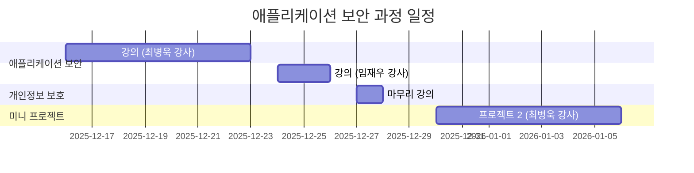

### 세부 일정

| 기간 | 과목 | 강사 | 비고 |
|:-:|:-:|:-:|:-:|
| **12월 16일 ~ 23일** | 애플리케이션 보안 | 최병욱 | 7일간 (웹 해킹 및 보안) |
| **12월 24일 ~ 26일** | 개인정보 보호 | 임재우 | 2일간 |
| **12월 27일** | 애플리케이션 보안 마무리 | 최병욱 | 1일 |
| **12월 29일** | **2차 중간평가** | - | 95문항 |
| **12월 30일 ~ 1월 6일** | 미니 프로젝트 2 | 최병욱 | 7일간 |

📌 **중요 일정:**
- **2차 중간평가**: 12월 29일 (Linux 기초 + 클라우드 보안 + 애플리케이션 보안 + 개인정보 보호)
- **미니 프로젝트 2 조 편성**: 사전 공지 예정
- **최종 목표**: 4월까지 장기 과정 → 컨디션 관리 중요!

---

## 📖 교재 및 학습 자료

### 주교재: "인터넷 해킹과 보안" (4판)

**출판사**: 한빛미디어
**특징**:
- 보안 분야를 세분화한 전문 교재 시리즈 중 하나
- **인터넷 해킹과 보안** (이번 강의)
- **네트워크 해킹과 보안**
- **시스템 해킹과 보안**
- **무선 네트워크 해킹과 보안**
- **보안 개론**

💡 **강사님 코멘트**: "2010년경부터 이 교재로 강의를 시작했는데, 벌써 4판까지 나왔네요. 한빛미디어의 보안 교재 시리즈는 체계적으로 잘 구성되어 있어 추천합니다."

### 교재 구성

#### **Part 1: 인터넷 보안과 웹 해킹을 위한 기초 지식**
- 인터넷과 웹의 이해
- 보안 기본 지식
- 프로토콜 개념

#### **Part 2: 웹 해킹의 세계 (실습 중심)**
- SQL Injection
- Cross-Site Scripting (XSS)
- 취약점 분석 기법
- 파일 업로드 공격
- 세션 하이재킹

#### **Part 3: 웹 보안의 세계 (이론 및 트렌드)**
- 보안 설정
- 모바일 보안
- 컨텐츠 관리 시스템(CMS) 보안
- 사이버 보안 동향
- 랜섬웨어 대응

**강의 진행 계획:**
- **1일차**: 1, 2장 (인터넷 보안 기초 지식)
- **2~4일차**: 3~8장 (웹 해킹 실습)
- **5~6일차**: 9~15장 (웹 보안 이론)
- **7일차**: 보충 실습 및 종합 정리

### 학습 자료 다운로드

교재에서 제공하는 학습 자료실: (링크 연결 불안정)

**대안 방법:**
1. 모든 소프트웨어는 **공개 오픈소스** 사용
2. 필요한 도구는 **실습 시 직접 다운로드**
3. 강사가 **자료 모음 ZIP 제공** 예정

---

## 🔐 애플리케이션 보안이란?

### 웹 애플리케이션의 중요성

#### 웹 = 인터넷의 대명사

현대 인터넷 환경에서 웹의 위상:

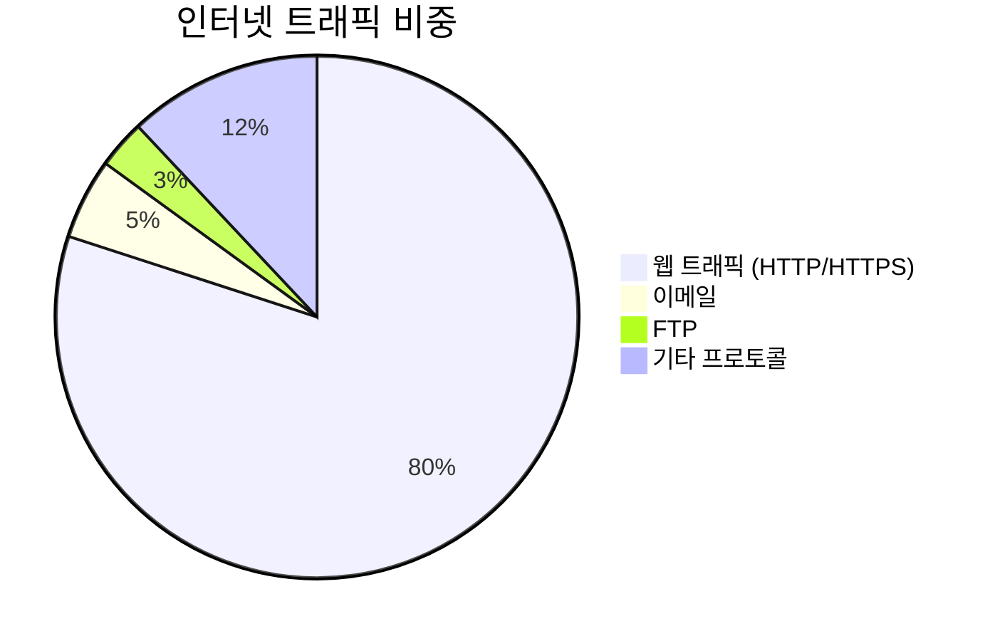

💡 **핵심 인사이트**: "웹 브라우저가 안 열리면 '인터넷이 안 된다'고 말하는 이유는, 웹이 인터넷의 80% 이상을 차지하기 때문입니다. 웹 서비스는 인터넷을 대표하는 대명사가 되었습니다."

#### 웹 서비스의 특징

**과거 (웹 1.0 시대):**
- 단순한 정적 페이지 제공
- 텍스트 중심
- 일방향 정보 전달

**현재 (웹 2.0+ 시대):**
- 동적 콘텐츠 생성
- 미디어 (이미지, 영상, 음성) 통합
- 양방향 상호작용
- 클라우드 기반 서비스

### 애플리케이션 보안의 범위

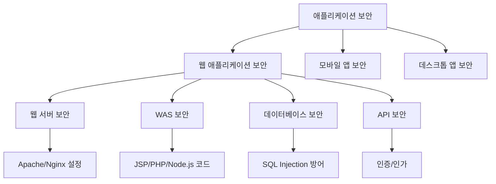

---

## 🦠 랜섬웨어 (Ransomware): 현대 보안의 최대 위협

### 랜섬웨어란?

**정의:**
- **Ransom** (몸값, 납치) + **Ware** (Software)
- 사용자 파일을 **단방향 암호화**하여 인질로 삼는 악성코드
- **비트코인**을 대가로 복호화 키를 제공

💡 **중요**: 키사(KISA) 분기별 보안 리포트에 따르면, 랜섬웨어는 **전체 해킹 사고의 70~80%**를 차지하는 최대 위협입니다.

### 랜섬웨어 동작 원리

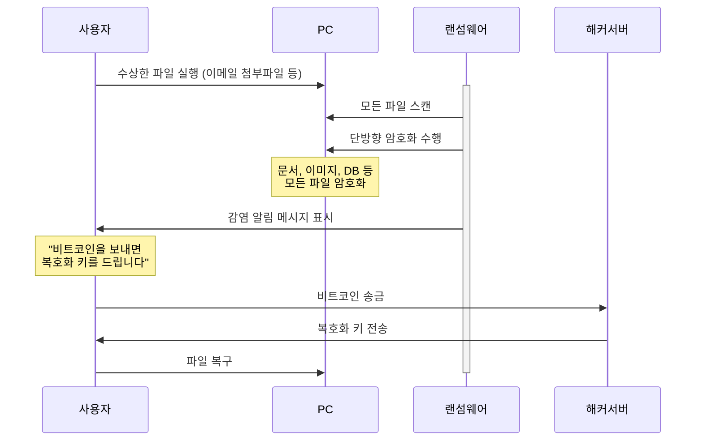

### 암호화 기법: 단방향 vs 양방향

#### 단방향 암호화 (One-way Encryption)

**특징:**
- **역함수가 존재하지 않음**
- 암호화된 데이터를 원본으로 복호화 불가능
- 주로 **패스워드 저장**에 사용

**예시: Linux 패스워드 저장**

```bash
# /etc/shadow 파일 확인
$ sudo cat /etc/shadow
user:$6$random_salt$hashed_password_value:18950:0:99999:7:::
```

- `$6$`: SHA-512 해시 알고리즘 사용
- 사용자가 입력한 패스워드를 해시화하여 저장된 값과 비교
- **저장된 해시를 원본 패스워드로 복구 불가능**

**랜섬웨어가 단방향 암호화를 사용하는 이유:**
- 복호화 키 없이는 **절대 복구 불가능**
- 피해자가 돈을 지불할 수밖에 없는 상황 조성

#### 양방향 암호화 (Two-way Encryption)

**특징:**
- **암호화 ↔ 복호화 가능**
- 키가 있으면 원본 데이터 복구 가능
- 일반적인 데이터 보안에 사용

**예시:**
- HTTPS (TLS/SSL)
- VPN
- 파일 암호화 (Zip 암호 등)

### 실제 랜섬웨어 피해 사례

#### 사례 1: 개인 디자이너 (300만원 지불)

**피해 상황:**
- 직업: 컴퓨터 디자이너
- 피해: 수십 년간 작업한 디자인 작품 전체 암호화
- 특징: 컴퓨터 보안에는 익숙하지 않음

**대응:**
1. 랜섬웨어 감염 확인
2. 복구 불가능 판단
3. **비트코인 300만원 송금**
4. 해커로부터 복호화 키 수신
5. 모든 파일 복구 성공

💡 **교훈**: 백업이 없는 상황에서 중요 데이터가 암호화되면 돈을 지불할 수밖에 없습니다.

#### 사례 2: 비영리 복지 기관 (회계 시스템 감염)

**피해 상황:**
- 조직: 국가 예산을 받는 비영리 복지 기관 (유사: 그린피스)
- 시기: **연말 회계감사 직전**
- 피해: 회계 시스템 전체 암호화

**대응:**
1. 회계감사 직전 랜섬웨어 감염 발견
2. 국가 예산 집행 증빙 자료 접근 불가
3. 데이터 복구 외 선택지 없음
4. **금액 미공개, 비트코인 지불**
5. 복호화 키 수신 후 시스템 복구

⚠️ **주의**: 공공기관이나 정부 관련 조직도 랜섬웨어 피해에 노출되어 있으며, 민감한 시기에 감염되면 큰 피해를 입습니다.

### 랜섬웨어 해커의 "신의"

**흥미로운 사실:**
- 비트코인을 지불하면 **대부분 복호화 키를 제공함**
- 해커들도 "신뢰"를 유지하려 노력
- 복호화 키를 안 주면 앞으로 아무도 돈을 안 낼 것이기 때문

**타임라인:**
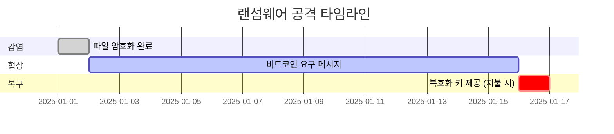

**일반적인 프로세스:**
1. 감염 후 **1~2주의 유예 기간** 제공
2. 기한 내 비트코인 송금 시 복호화 키 전송
3. 대부분의 경우 **키 제공 약속 이행**

---

## 🎯 강의 핵심 학습 방향

### 1. 보안 트렌드 파악

**일일 습관화:**

```bash
# 매일 아침 추천 루틴
1. KISA 보안 뉴스 확인
2. 최신 해킹 사례 분석
3. CVE (Common Vulnerabilities and Exposures) 확인
```

📌 **강사님 조언**: "심심할 때 유튜브만 보지 마시고, 아침마다 보안 뉴스를 확인하세요. 최신 트렌드에 민감하게 대응하는 것이 누적되어 전문성이 됩니다."

**추천 사이트:**
- **KISA (한국인터넷진흥원)**: 분기별 보안 리포트
- **보안뉴스**: 국내 보안 뉴스
- **The Hacker News**: 글로벌 보안 뉴스
- **OWASP**: 웹 애플리케이션 보안 가이드

### 2. 실습 중심 학습

**35개 실습으로 배우는 해킹과 보안:**

| 분류 | 주요 기법 | 실습 내용 |
|:-:|:-:|:-:|
| **웹 해킹** | SQL Injection | DB 쿼리 조작 및 우회 |
| | Cross-Site Scripting (XSS) | 스크립트 삽입 공격 |
| | File Upload | 악성 파일 업로드 |
| | Session Hijacking | 세션 탈취 |
| **보안 설정** | Web Server | Apache, Nginx 보안 설정 |
| | Firewall | iptables, UFW 설정 |
| **도구 활용** | Burp Suite | 패킷 인터셉트 |
| | Metasploit | 취약점 스캐닝 |

### 3. 프로젝트 준비

**미니 프로젝트 2 대비:**
- **팀 구성**: 5개 팀 (사전 공지)
- **공통 기반**: 3-Tier 아키텍처 (Web Server + WAS + DB)
- **시나리오 예시**:
  1. 시스템 해킹 후 랜섬웨어 유포
  2. SQL Injection을 통한 DB 탈취
  3. XSS를 통한 관리자 세션 하이재킹

---

## ✅ 섹션 1 학습 체크리스트

- [ ] 애플리케이션 보안의 정의와 범위를 설명할 수 있다
- [ ] 랜섬웨어의 동작 원리와 단방향 암호화 개념을 이해했다
- [ ] 실제 랜섬웨어 피해 사례를 통해 보안의 중요성을 인식했다
- [ ] 강의 커리큘럼과 학습 방향을 명확히 파악했다
- [ ] 보안 뉴스를 정기적으로 확인하는 습관의 중요성을 이해했다

## 📋 핵심 요약

1. **애플리케이션 보안**: 웹, 모바일, 데스크톱 앱의 취약점을 분석하고 방어하는 분야
2. **랜섬웨어**: 단방향 암호화로 파일을 인질로 삼는 현대 최대 보안 위협 (전체 해킹의 70~80%)
3. **학습 방향**:
   - 이론 + 실습 병행 (35개 실습)
   - 최신 보안 트렌드 지속 학습
   - 프로젝트 대비 3-Tier 아키텍처 이해

---

**다음 섹션 예고**: 인터넷과 웹의 역사, 프로토콜의 개념, TCP/IP의 기초를 학습합니다.
## 📚 Section 2: 인터넷의 역사와 프로토콜 기초

### 🎯 학습 목표

- 인터넷의 탄생 배경과 발전 과정을 이해한다
- 프로토콜(Protocol)의 개념과 필요성을 설명할 수 있다
- TCP/IP의 기본 구조와 역할을 파악한다
- 인터넷 표준화 기구의 역할과 중요성을 인식한다

---

## 🌐 인터넷의 탄생

### 인터넷이란 무엇인가?

**간단한 정의:**
> 인터넷은 전 세계를 연결하는 **구리선 망(네트워크)**입니다.
> 그 위에 **전기 신호**를 흘려 정보를 주고받습니다.

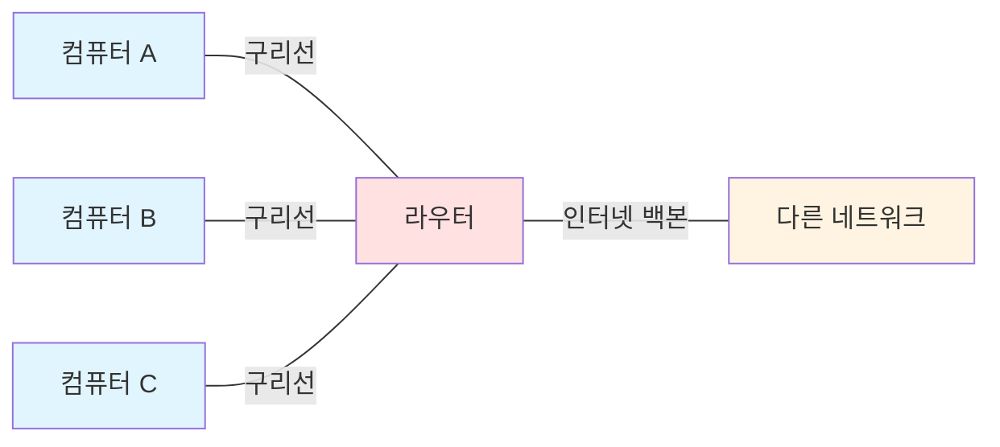

**핵심 요소:**
1. **물리적 매체**: 구리선, 광케이블, 무선
2. **전기 신호**: 데이터를 0과 1의 비트로 변환
3. **약속 (프로토콜)**: 신호를 어떻게 해석할지 정의

### 미국에서의 인터넷 탄생

#### 1단계: 대학 연구소에서 시작 (1960년대)

**발단:**
- **버클리 대학 (UC Berkeley)**에서 정보 전달 목적으로 시작
- 연구 데이터를 효율적으로 공유하기 위한 필요성

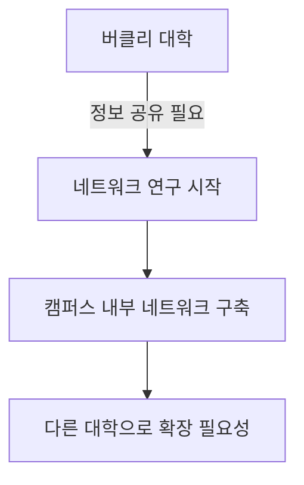

#### 2단계: ARPANET의 등장 (1969년)

**ARPA (Advanced Research Projects Agency):**
- 미국 국방부 산하 연구 기관
- 군사 목적 + 학술 연구 목적

**ARPANET 확장:**
1. UCLA (University of California, Los Angeles) 연결
2. 스탠포드 연구소 연결
3. 미 전역 대학 및 연구소로 확장

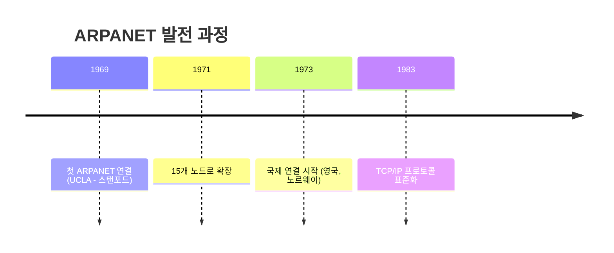

💡 **중요**: ARPANET이 인터넷의 원형이며, 여기서 **최초로 통신 규칙(프로토콜)**이 정의되었습니다.

#### 3단계: TCP/IP 프로토콜의 탄생

**왜 프로토콜이 필요한가?**

상황을 가정해봅시다:
- 컴퓨터 A가 전기 신호 `01001000` 을 보냄
- 컴퓨터 B는 이 신호를 어떻게 해석해야 할까?

**프로토콜 없이:**
- A: "이건 숫자 72야!"
- B: "이건 문자 'H'야!"
- 혼란 발생 ❌

**프로토콜 있으면:**
- **약속**: ASCII 코드 사용
- `01001000` = 72 (10진수) = 'H' (문자)
- 서로 정확히 이해 ✅

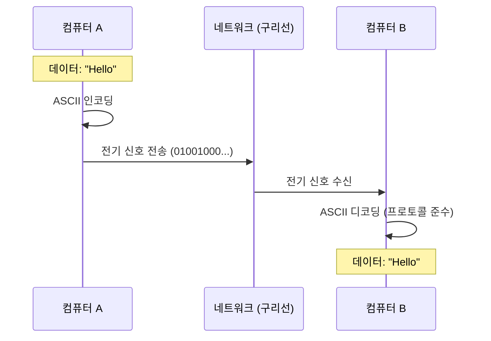

### 대한민국의 인터넷 탄생

#### 국내 인터넷 도입 과정 (1982년~)

**1단계: 국제 연결 (1982년)**
- 태평양 해저 케이블을 통해 미국 → 한국 연결
- **SDN (Service Delivery Network)** 개념 도입
  - **주의**: 현대의 SDN (Software Defined Network)과 다름
  - 당시 SDN = 네트워크를 통한 서비스 제공

**2단계: 국내 기관 연결**
- **KIET (한국전자기술연구소)** ↔ **서울대학교** 연결
- 대전 ETRI (전자통신연구원) 중심으로 확장

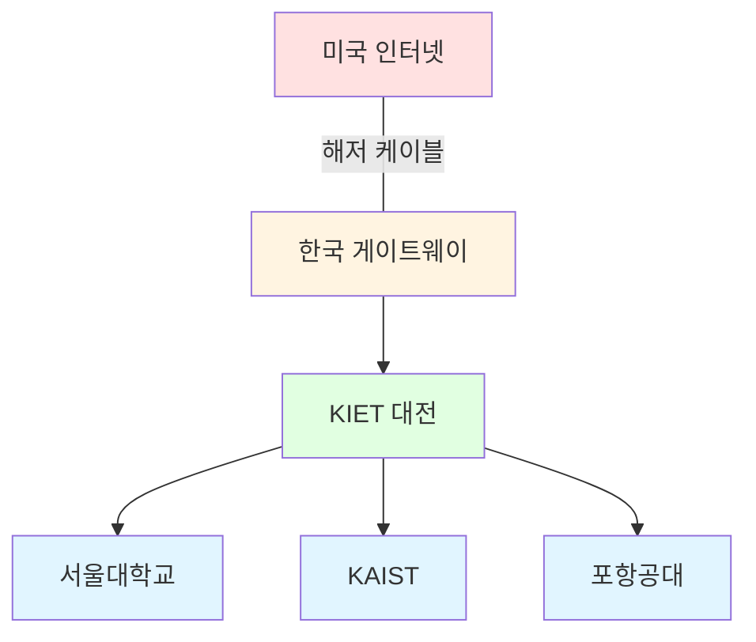

**3단계: 상용화 (1990년대)**
- **코넷 (KORNET)** 서비스 시작
- 가정에 인터넷 보급 시작

#### 코넷 (KORNET) 시대

**코넷이란?**
- 한국통신 (현 KT)에서 제공한 최초의 **가정용 인터넷 서비스**
- **전화선**을 이용한 인터넷 접속

**당시 기술: 모뎀 (Modem)**

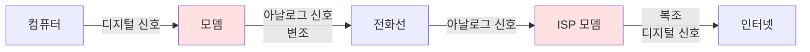

**모뎀 (Modem)의 역할:**
- **Mo**dulator (변조기) + **Dem**odulator (복조기)
- 디지털 신호 → 아날로그 신호 (전화선 전송용)
- 아날로그 신호 → 디지털 신호 (컴퓨터 수신용)

**속도:**
- 초기: 14.4 Kbps (초고속이라고 불렀음!)
- ADSL: 수 Mbps
- 현재 LAN: 1 Gbps ~ 10 Gbps

💡 **강사님 회상**: "당시 TV 광고에서 'ADSL 초고속 인터넷'이라고 홍보했는데, 지금 기준으로는 정말 느린 속도였죠. 하지만 그때는 혁신이었습니다!"

---

## 🔧 프로토콜 (Protocol)의 이해

### 프로토콜이란?

**정의:**
> 통신을 위해 **서로 약속한 규칙**

**한국의 전통 프로토콜 사례: 봉화 (烽火)**

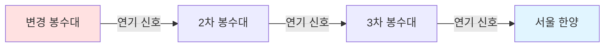

**봉화 프로토콜 규칙:**
| 연기 횟수 | 의미 |
|:-:|:-:|
| 1번 | 평화로움 (이상 없음) |
| 2번 | 적의 움직임 포착 |
| 3번 | 적군 접근 중 |
| 4번 | 침입 시작 |
| 5번 | 전면전 발생 |

💡 **인사이트**: 우리나라는 수백 년 전부터 무선 통신 프로토콜을 발전시켜왔습니다. 봉화는 일종의 **시각적 디지털 통신**이었습니다!

### 현대 인터넷 프로토콜

#### OSI 7계층 모델

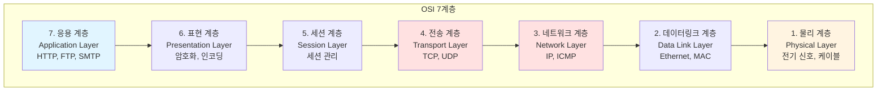

**각 계층의 역할:**

**7계층 - 응용 계층:**
- 사용자와 직접 상호작용
- 프로토콜: HTTP, HTTPS, FTP, SMTP, DNS
- 예: 웹 브라우저, 이메일 클라이언트

**4계층 - 전송 계층:**
- 데이터 전송 보장
- **TCP (Transmission Control Protocol)**:
  - 연결 지향
  - 신뢰성 보장
  - 순서 보장
- **UDP (User Datagram Protocol)**:
  - 비연결 지향
  - 빠른 전송
  - 신뢰성 낮음

**3계층 - 네트워크 계층:**
- IP 주소 기반 라우팅
- **IP (Internet Protocol)**:
  - IPv4: 32비트 (예: 192.168.0.1)
  - IPv6: 128비트 (예: 2001:0db8::1)

**1계층 - 물리 계층:**
- 전기 신호, 광신호 전송
- 케이블, 무선 주파수

#### TCP/IP 모델 (실무에서 주로 사용)

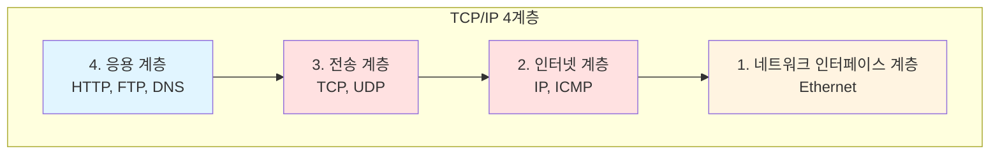

---

## 🏛️ 인터넷 표준화 기구

### 왜 표준화 기구가 필요한가?

**문제 상황:**
- 각 회사가 자기만의 프로토콜 개발
- 제조사별 호환 불가
- 혼란 발생

**해결책:**
- 공신력 있는 기구가 **표준 프로토콜** 정의
- 모든 제조사가 표준 준수
- 상호 호환성 보장

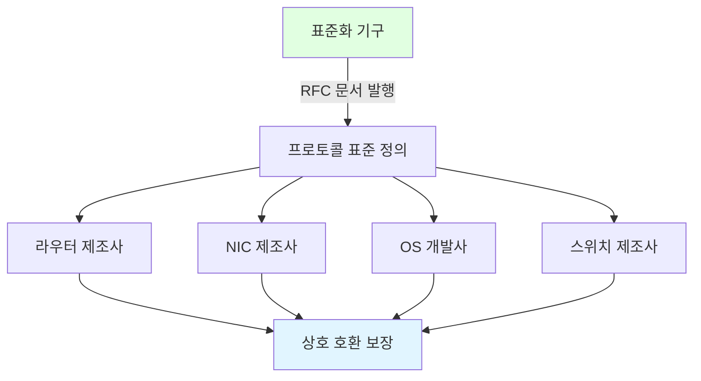

### 주요 인터넷 표준화 기구

#### 1. IETF (Internet Engineering Task Force)

**역할:**
- 인터넷 **프로토콜 표준** 개발
- RFC (Request for Comments) 문서 발행

**RFC란?**
- 인터넷 표준 문서
- 누구나 열람 가능 (오픈 소스)
- 예:
  - **RFC 2616**: HTTP/1.1
  - **RFC 9110**: HTTP/1.1 (최신 업데이트)
  - **RFC 793**: TCP
  - **RFC 791**: IP

**RFC 확인 방법:**

```bash
# RFC 문서 검색
$ curl https://www.rfc-editor.org/rfc/rfc2616.txt

# 또는 웹 브라우저에서:
# https://www.rfc-editor.org/
```

#### 2. ICANN (Internet Corporation for Assigned Names and Numbers)

**역할:**
- **IP 주소 할당**
- **도메인 이름** 관리
- DNS 루트 서버 관리

**예시:**
- IP 주소 블록 할당: 한국 → APNIC
- 도메인 등록: .com, .net, .org, .kr

#### 3. W3C (World Wide Web Consortium)

**역할:**
- **웹 표준** 정의
- HTML, CSS, JavaScript 표준화

**표준 예시:**
- HTML5
- CSS3
- ECMAScript (JavaScript 표준)

---

## 🔧 TCP/IP 프로토콜 심화

### TCP 3-Way Handshake (연결 수립)

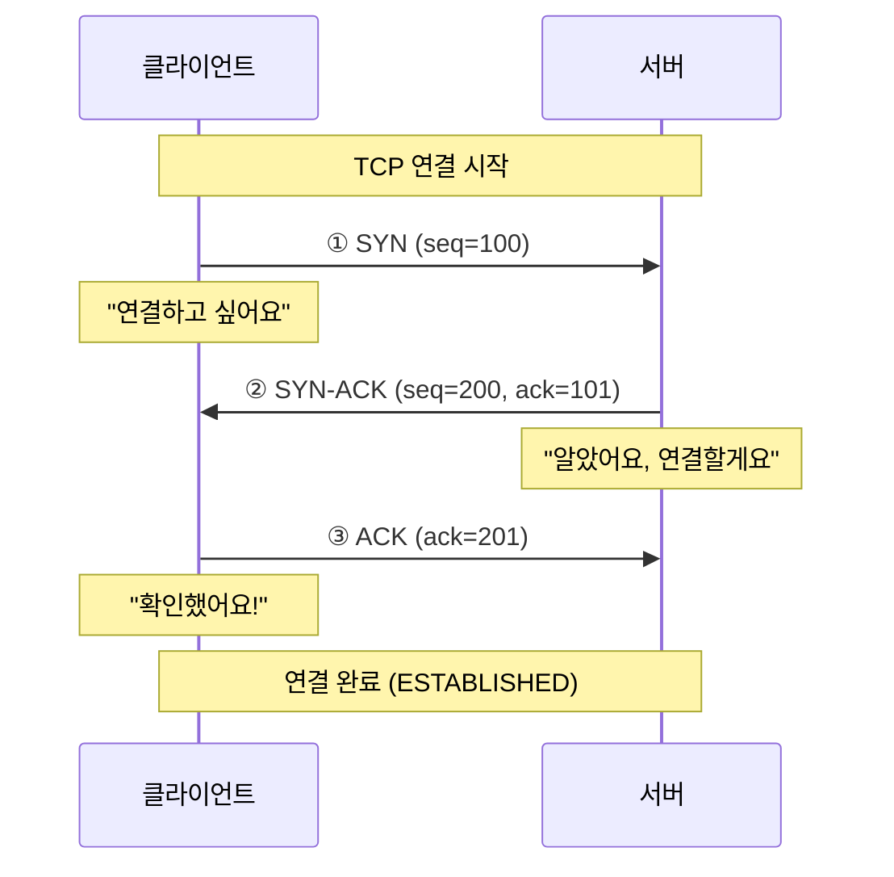

**단계 설명:**
1. **SYN (Synchronize)**: 클라이언트가 연결 요청
2. **SYN-ACK**: 서버가 요청 수락 및 확인
3. **ACK (Acknowledge)**: 클라이언트가 최종 확인

### TCP 연결 종료 (4-Way Handshake)

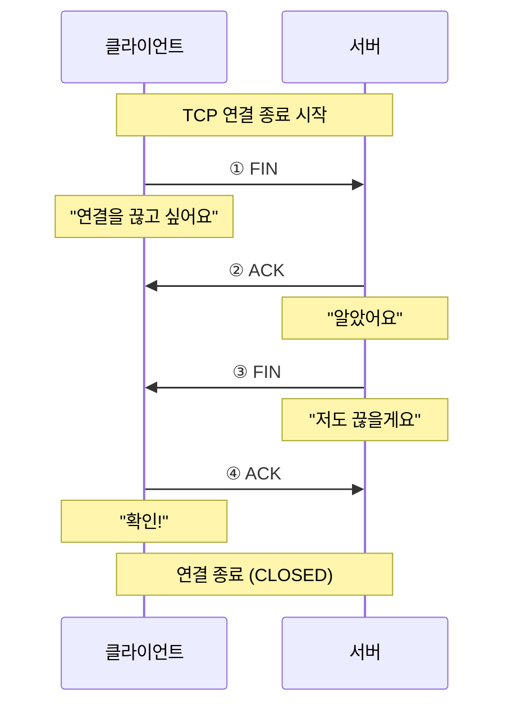

---

## ✅ 섹션 2 학습 체크리스트

- [ ] 인터넷의 탄생 배경과 ARPANET의 역할을 설명할 수 있다
- [ ] 프로토콜의 정의와 필요성을 이해했다
- [ ] OSI 7계층과 TCP/IP 4계층의 차이를 파악했다
- [ ] TCP의 3-Way Handshake 과정을 그릴 수 있다
- [ ] 인터넷 표준화 기구의 역할을 설명할 수 있다

## 📋 핵심 요약

1. **인터넷**: 전 세계를 연결하는 구리선 망 + 전기 신호 + 프로토콜
2. **ARPANET**: 인터넷의 원형, 1969년 탄생
3. **프로토콜**: 통신을 위한 약속된 규칙 (예: 봉화, TCP/IP)
4. **TCP/IP**: 인터넷의 핵심 프로토콜 스택
5. **표준화**: IETF, ICANN, W3C가 인터넷 표준을 관리

---

**다음 섹션 예고**: HTTP 프로토콜의 구조와 헤더 분석, 보안 고려사항을 상세히 학습합니다.
## 📚 Section 3: HTTP 프로토콜 상세 분석

### 🎯 학습 목표

- HTTP의 구조와 메서드를 완벽히 이해한다
- HTTP 헤더의 역할과 보안 관련성을 파악한다
- MIME 타입과 Content-Type의 중요성을 인식한다
- Keep-Alive 메커니즘과 세션 관리를 이해한다
- HTTP 헤더 조작을 통한 보안 우회 기법을 학습한다

---

## 🔧 HTTP (HyperText Transfer Protocol)

### HTTP란?

**정의:**
> **웹 서비스를 위한 응용 계층 프로토콜**
> TCP/IP 위에서 동작하며, 클라이언트-서버 모델 기반

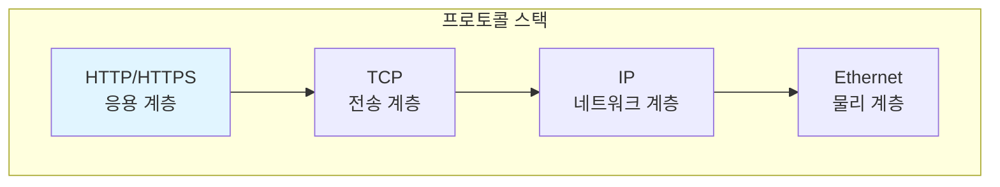

**HTTP의 특징:**
1. **Stateless (무상태성)**: 각 요청은 독립적, 이전 요청 기억 안 함
2. **Request-Response**: 요청-응답 구조
3. **Text-based**: 사람이 읽을 수 있는 텍스트 형식

---

## 📟 HTTP 메서드 (Methods)

### 주요 메서드 종류

| 메서드 | 용도 | 데이터 전송 위치 | 보안 고려사항 |
|:-:|:-:|:-:|:-:|
| **GET** | 데이터 조회 | URL 쿼리 스트링 | 민감 정보 노출 위험 |
| **POST** | 데이터 전송/생성 | HTTP Body | 상대적으로 안전 |
| **PUT** | 데이터 전체 수정 | HTTP Body | 권한 검증 필수 |
| **DELETE** | 데이터 삭제 | URL | 권한 검증 필수 |
| **HEAD** | 헤더만 조회 | - | 정보 수집에 사용 |
| **OPTIONS** | 지원 메서드 확인 | - | CORS에 사용 |

### GET 메서드 상세

**GET 요청 예시:**

```http
GET /search?q=보안&page=1 HTTP/1.1
Host: www.example.com
User-Agent: Mozilla/5.0
Accept: text/html
```

**구조 분석:**
- `GET`: 메서드
- `/search?q=보안&page=1`: 경로 + 쿼리 스트링
- `HTTP/1.1`: 프로토콜 버전

**쿼리 스트링 (Query String):**
- `?` 로 시작
- `key=value` 형식
- `&`로 여러 파라미터 연결

**보안 위험:**
```http
GET /login?id=admin&pw=1234 HTTP/1.1
```
⚠️ **문제점**:
- URL에 패스워드 노출
- 브라우저 히스토리에 저장
- 서버 로그에 기록
- 중간자 공격에 취약

### POST 메서드 상세

**POST 요청 예시:**

```http
POST /login HTTP/1.1
Host: www.example.com
Content-Type: application/x-www-form-urlencoded
Content-Length: 27

id=admin&pw=secure_password
```

**특징:**
- 데이터를 **HTTP Body**에 포함
- URL에 노출되지 않음
- 대용량 데이터 전송 가능

**Content-Type 종류:**
| Content-Type | 용도 | 예시 |
|:-:|:-:|:-:|
| `application/x-www-form-urlencoded` | 폼 데이터 (기본) | `name=value&age=30` |
| `multipart/form-data` | 파일 업로드 | 파일 + 텍스트 혼합 |
| `application/json` | JSON 데이터 | `{"name": "user", "age": 30}` |
| `text/plain` | 단순 텍스트 | `Hello World` |

---

## 📋 HTTP 헤더 (Headers) 상세

### 헤더의 구조

```http
GET / HTTP/1.1
Host: www.example.com
User-Agent: Mozilla/5.0 (Windows NT 10.0; Win64; x64)
Accept: text/html,application/xhtml+xml
Accept-Language: ko-KR,ko;q=0.9,en-US;q=0.8
Accept-Encoding: gzip, deflate
Connection: keep-alive
Cookie: session_id=abc123xyz
```

### 주요 헤더 분석

#### 1. Host 헤더

**목적**: 요청하는 도메인 명시

```http
Host: www.google.com
```

**🔐 보안 활용:**

**시나리오**: 외부 링크를 통한 접근 차단

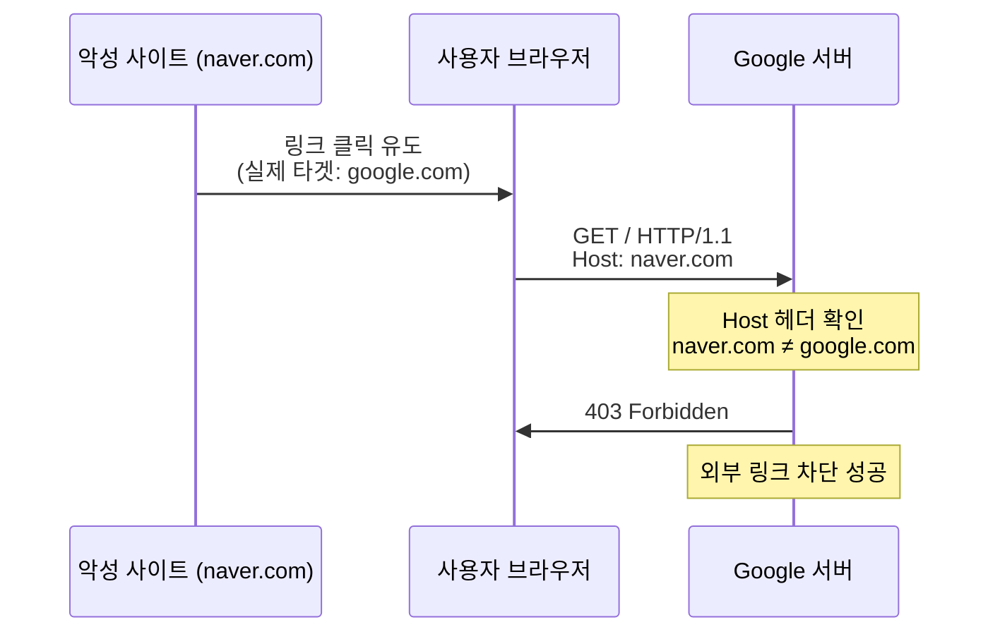

**서버 측 검증 코드 (의사 코드):**

```python
# 외부 링크 차단 로직
if request.headers.get('Host') != 'www.google.com':
    return "403 Forbidden: Direct access only"
```

#### 2. Accept 헤더

**목적**: 클라이언트가 받을 수 있는 MIME 타입 명시

```http
Accept: text/html, application/xhtml+xml, application/xml;q=0.9, */*;q=0.8
```

**MIME 타입 (Multipurpose Internet Mail Extensions):**

| MIME 타입 | 설명 | 파일 확장자 |
|:-:|:-:|:-:|
| `text/html` | HTML 문서 | .html |
| `text/plain` | 텍스트 파일 | .txt |
| `image/jpeg` | JPEG 이미지 | .jpg, .jpeg |
| `image/png` | PNG 이미지 | .png |
| `application/json` | JSON 데이터 | .json |
| `application/pdf` | PDF 문서 | .pdf |
| `application/octet-stream` | 바이너리 파일 | .exe, .bin |

**🔐 보안 위험: Accept 헤더 조작**

**공격 시나리오**: 악성 파일을 이미지로 위장하여 업로드

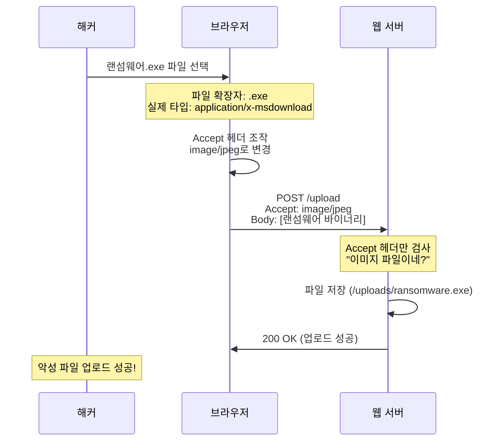

**취약한 서버 코드:**

```python
# ❌ 취약한 코드 (Accept 헤더만 검증)
if request.headers.get('Accept').startswith('image/'):
    save_file(uploaded_file)  # 위험!
```

**안전한 서버 코드:**

```python
# ✅ 안전한 코드 (다중 검증)
def validate_upload(file, headers):
    # 1. Accept 헤더 검증
    if not headers.get('Accept').startswith('image/'):
        return False

    # 2. 파일 확장자 검증
    allowed_extensions = ['.jpg', '.jpeg', '.png', '.gif']
    if not any(file.name.endswith(ext) for ext in allowed_extensions):
        return False

    # 3. 파일 Magic Byte 검증 (실제 파일 타입)
    magic_bytes = file.read(8)
    file.seek(0)  # 파일 포인터 초기화

    # JPEG: FF D8 FF
    # PNG: 89 50 4E 47
    if magic_bytes[:3] == b'\xFF\xD8\xFF':
        return True  # JPEG
    elif magic_bytes[:4] == b'\x89PNG':
        return True  # PNG
    else:
        return False  # 위장된 파일!
```

💡 **핵심 교훈**: 클라이언트가 보내는 **모든 정보는 조작 가능**합니다. 서버 측에서 **다중 검증**이 필수입니다!

#### 3. User-Agent 헤더

**목적**: 클라이언트의 브라우저 및 OS 정보

```http
User-Agent: Mozilla/5.0 (Windows NT 10.0; Win64; x64) AppleWebKit/537.36 (KHTML, like Gecko) Chrome/120.0.0.0 Safari/537.36
```

**해석:**
- `Mozilla/5.0`: 호환성 표시 (역사적 이유)
- `Windows NT 10.0`: Windows 10
- `AppleWebKit/537.36`: 렌더링 엔진
- `Chrome/120.0.0.0`: Chrome 브라우저 버전

**🔐 보안 활용: 웹 크롤러 탐지**

**로그 분석 시나리오:**

```bash
# 웹 서버 로그 (access.log)
192.168.1.10 - - [16/Dec/2025:10:30:15] "GET /admin HTTP/1.1" 200 1234 "Mozilla/5.0..."
192.168.1.11 - - [16/Dec/2025:10:30:16] "GET /login HTTP/1.1" 200 2345 "Mozilla/5.0..."
192.168.1.12 - - [16/Dec/2025:10:30:17] "GET /data HTTP/1.1" 200 3456 "python-requests/2.28.0"
192.168.1.12 - - [16/Dec/2025:10:30:18] "GET /api HTTP/1.1" 200 4567 "python-requests/2.28.0"
192.168.1.12 - - [16/Dec/2025:10:30:19] "GET /users HTTP/1.1" 200 5678 "python-requests/2.28.0"
```

⚠️ **의심 상황**:
- `192.168.1.12` 에서 짧은 시간에 대량 요청
- User-Agent: `python-requests` → **자동화 스크립트**
- 정상 브라우저 아님!

**자동화 도구 User-Agent 예시:**
| 도구 | User-Agent |
|:-:|:-:|
| Python requests | `python-requests/2.28.0` |
| curl | `curl/7.68.0` |
| wget | `Wget/1.20.3` |
| Burp Suite | `Burp Suite Professional` |
| Nikto (취약점 스캐너) | `Nikto/2.1.6` |

**대응 방법:**

```python
# 비정상 User-Agent 차단
BLOCKED_USER_AGENTS = ['python-requests', 'curl', 'wget', 'Nikto', 'sqlmap']

def check_user_agent(user_agent):
    for blocked in BLOCKED_USER_AGENTS:
        if blocked.lower() in user_agent.lower():
            return "403 Forbidden: Automated tool detected"
    return "200 OK"
```

#### 4. Cookie 헤더

**목적**: 세션 유지 및 사용자 식별

```http
Cookie: session_id=abc123xyz; user_pref=dark_mode; lang=ko
```

**세션 관리 과정:**

```mermaid
sequenceDiagram
    participant C as 클라이언트
    participant S as 서버

    Note over C,S: 1. 최초 로그인
    C->>S: POST /login<br/>id=user&pw=1234
    S->>S: 인증 성공<br/>세션 ID 생성
    S->>C: Set-Cookie: session_id=무궁화꽃이피었습니다
    Note over C: 쿠키 저장

    Note over C,S: 2. 이후 요청
    C->>S: GET /mypage<br/>Cookie: session_id=무궁화꽃이피었습니다
    S->>S: 세션 ID 확인<br/>"이 사용자는 로그인 상태!"
    S->>C: 200 OK (마이페이지 데이터)
```

**🔐 보안 위험: 세션 하이재킹 (Session Hijacking)**

```mermaid
sequenceDiagram
    participant V as 피해자
    participant H as 해커
    participant S as 서버

    V->>S: 로그인 성공
    S->>V: Set-Cookie: session_id=VALID_SESSION
    Note over H: XSS 공격으로 쿠키 탈취
    V->>H: <script>alert(document.cookie)</script>
    H->>H: session_id=VALID_SESSION 획득
    H->>S: GET /admin<br/>Cookie: session_id=VALID_SESSION
    Note over S: 세션 유효 확인<br/>"관리자 맞네!"
    S->>H: 200 OK (관리자 페이지)
    Note over H: 피해자 계정으로 로그인 성공!
```

**방어 방법:**

```http
Set-Cookie: session_id=abc123; HttpOnly; Secure; SameSite=Strict
```

- **HttpOnly**: JavaScript로 쿠키 접근 불가 (XSS 방어)
- **Secure**: HTTPS에서만 쿠키 전송
- **SameSite**: CSRF 공격 방어

#### 5. Connection 헤더: Keep-Alive

**목적**: TCP 연결 유지

```http
Connection: keep-alive
```

**Keep-Alive가 없다면?**

```mermaid
sequenceDiagram
    participant C as 클라이언트
    participant S as 서버

    Note over C,S: 매 요청마다 3-Way Handshake

    C->>S: SYN (연결 요청)
    S->>C: SYN-ACK
    C->>S: ACK (연결 수립)
    C->>S: GET /index.html
    S->>C: 200 OK (HTML)
    C->>S: FIN (연결 종료)

    Note over C,S: 이미지 요청 (새 연결)

    C->>S: SYN
    S->>C: SYN-ACK
    C->>S: ACK
    C->>S: GET /logo.png
    S->>C: 200 OK (이미지)
    C->>S: FIN

    Note over C: 비효율적!<br/>매번 핸드셰이크
```

**Keep-Alive 사용 시:**

```mermaid
sequenceDiagram
    participant C as 클라이언트
    participant S as 서버

    Note over C,S: 한 번만 연결

    C->>S: SYN
    S->>C: SYN-ACK
    C->>S: ACK (연결 수립)

    C->>S: GET /index.html<br/>Connection: keep-alive
    S->>C: 200 OK (HTML)

    Note over C,S: 연결 유지 (No FIN)

    C->>S: GET /logo.png<br/>(Same connection!)
    S->>C: 200 OK (이미지)

    C->>S: GET /style.css
    S->>C: 200 OK (CSS)

    Note over C: 효율적!<br/>한 번의 핸드셰이크로<br/>여러 요청 처리
```

**명령어로 확인:**

```bash
# 현재 TCP 연결 상태 확인
$ netstat -an | grep ESTABLISHED

# 예상 출력:
tcp   0   0 192.168.0.10:54321   93.184.216.34:80   ESTABLISHED
tcp   0   0 192.168.0.10:54322   93.184.216.34:80   ESTABLISHED
# Keep-Alive 사용 시 연결 수 감소!
```

#### 6. Accept-Encoding 헤더

**목적**: 압축 방식 지원 명시

```http
Accept-Encoding: gzip, deflate, br
```

**압축 과정:**

```mermaid
sequenceDiagram
    participant C as 클라이언트
    participant S as 서버

    C->>S: GET /data.json<br/>Accept-Encoding: gzip
    Note over S: 원본 크기: 100KB<br/>gzip 압축 → 20KB
    S->>C: 200 OK<br/>Content-Encoding: gzip<br/>Content-Length: 20KB<br/>(압축된 데이터)
    Note over C: 압축 해제<br/>원본 100KB 복구
```

**압축률 비교:**

| 파일 타입 | 원본 크기 | gzip 압축 후 | 압축률 |
|:-:|:-:|:-:|:-:|
| HTML/CSS | 100 KB | 15~20 KB | 80~85% |
| JSON | 50 KB | 8~10 KB | 80~84% |
| JPEG | 500 KB | 490 KB | 2% (이미 압축됨) |

---

## 🔧 실습: netstat로 네트워크 상태 확인

### netstat 명령어 상세 분석

**기본 문법:**

```bash
$ netstat [옵션]
```

**주요 옵션:**

| 옵션 | 의미 | 사용 목적 |
|:-:|:-:|:-:|
| `-a` | All (모든 연결) | 모든 소켓 표시 |
| `-n` | Numeric (숫자로 표시) | IP 주소를 이름으로 변환 안 함 |
| `-t` | TCP | TCP 연결만 표시 |
| `-u` | UDP | UDP 연결만 표시 |
| `-l` | Listening | 대기 중인 포트만 표시 |
| `-p` | Process | 프로세스 정보 표시 (root 권한 필요) |

**실행 예제 1: 모든 연결 확인**

```bash
$ netstat -an

# 출력:
Proto  Recv-Q  Send-Q  Local Address          Foreign Address        State
tcp    0       0       0.0.0.0:22             0.0.0.0:*              LISTEN
tcp    0       0       0.0.0.0:80             0.0.0.0:*              LISTEN
tcp    0       0       192.168.0.10:45678     93.184.216.34:443      ESTABLISHED
tcp    0       0       192.168.0.10:45679     172.217.161.46:80      ESTABLISHED
```

**출력 해석:**
- **Proto**: 프로토콜 (tcp, udp)
- **Local Address**: 내 컴퓨터의 IP:포트
- **Foreign Address**: 상대방 IP:포트
- **State**: 연결 상태

**주요 State 값:**

| State | 의미 | 설명 |
|:-:|:-:|:-:|
| `LISTEN` | 대기 중 | 서버가 포트를 열고 요청 대기 |
| `ESTABLISHED` | 연결됨 | 정상 통신 중 |
| `TIME_WAIT` | 종료 대기 | 연결 종료 후 잠시 대기 |
| `CLOSE_WAIT` | 종료 대기 | 상대방 종료 신호 수신, 내가 종료 예정 |

**실행 예제 2: LISTENING 포트만 확인**

```bash
$ netstat -ln

# 출력:
Proto  Local Address          State
tcp    0.0.0.0:22             LISTEN      # SSH 서버
tcp    0.0.0.0:80             LISTEN      # 웹 서버
tcp    0.0.0.0:3306           LISTEN      # MySQL
tcp    0.0.0.0:8080           LISTEN      # Burp Suite (예시)
```

💡 **보안 활용**: 내가 모르는 포트가 LISTEN 상태라면 **백도어** 의심!

**실행 예제 3: 프로세스 정보 포함**

```bash
$ sudo netstat -lnp

# 출력:
Proto  Local Address    State       PID/Program name
tcp    0.0.0.0:22       LISTEN      1234/sshd
tcp    0.0.0.0:80       LISTEN      5678/nginx
tcp    0.0.0.0:8080     LISTEN      9999/burpsuite
tcp    0.0.0.0:12345    LISTEN      6666/unknown
```

⚠️ **의심 상황**: `12345` 포트에 `unknown` 프로세스 → 조사 필요!

---

## ✅ 섹션 3 학습 체크리스트

- [ ] HTTP 메서드 (GET, POST)의 차이와 보안 고려사항을 이해했다
- [ ] Accept 헤더 조작을 통한 파일 업로드 공격을 설명할 수 있다
- [ ] User-Agent를 통한 자동화 도구 탐지 방법을 파악했다
- [ ] Keep-Alive의 동작 원리와 효율성을 이해했다
- [ ] netstat 명령어로 네트워크 상태를 분석할 수 있다

## 📋 핵심 요약

1. **HTTP**: 웹 서비스를 위한 응용 계층 프로토콜, TCP 기반
2. **GET vs POST**: GET은 URL에 데이터 노출, POST는 Body에 포함 (보안)
3. **Accept 헤더**: MIME 타입 명시, **조작 가능** → 서버 측 다중 검증 필수
4. **User-Agent**: 자동화 도구 탐지에 활용
5. **Keep-Alive**: TCP 연결 재사용으로 효율성 향상
6. **netstat**: 네트워크 연결 상태 및 LISTEN 포트 확인 도구

---

**다음 섹션 예고**: Burp Suite를 활용한 HTTP 패킷 인터셉트 및 조작 실습을 진행합니다.
## 📚 Section 4: Burp Suite 실습 - HTTP 패킷 인터셉트

### 🎯 학습 목표

- Burp Suite의 기본 사용법을 익힌다
- HTTP 요청/응답을 실시간으로 인터셉트할 수 있다
- 패킷 헤더를 조작하여 보안 우회 기법을 실습한다
- 로컬 보안(JavaScript 검증)의 취약점을 이해한다

---

## 🛠️ Burp Suite란?

**정의:**
> **웹 애플리케이션 보안 테스트 도구**
> HTTP 요청/응답을 **중간에서 가로채어 (Intercept)** 분석 및 조작

**주요 기능:**
1. **Proxy**: HTTP 트래픽 인터셉트
2. **Scanner**: 취약점 자동 스캔 (Pro 버전)
3. **Repeater**: 요청 반복 전송
4. **Intruder**: 자동화 공격 (Fuzzing)

```mermaid
graph LR
    A[웹 브라우저] -->|HTTP 요청| B[Burp Suite<br/>Proxy]
    B -->|요청 조작 가능| C[웹 서버]
    C -->|HTTP 응답| B
    B -->|응답 조작 가능| A

    style B fill:#ffe1e1
```

---

## 🚀 Burp Suite 설치 및 설정

### 1단계: Burp Suite 다운로드

**공식 웹사이트**: https://portswigger.net/burp

**버전 종류:**
- **Community Edition**: 무료, 기본 기능
- **Professional**: 유료, 자동 스캔 포함

💡 **추천**: Community Edition으로 충분 (교육 목적)

### 2단계: Burp Suite 실행

**실행 방법:**

```bash
# Java 기반 프로그램이므로 Java 필요
$ java -jar burpsuite_community.jar

# 또는 실행 파일 더블클릭 (Windows/Mac)
```

**초기 화면:**
- **Temporary Project**: 임시 프로젝트 (추천)
- **Use Burp Defaults**: 기본 설정 사용

### 3단계: Proxy 설정 확인

**Burp Suite 내부 설정:**

1. **Proxy** 탭 클릭
2. **Options** 하위 탭 선택
3. **Proxy Listeners** 확인:
   - **Interface**: `127.0.0.1:8080` (기본값)
   - **Running**: 체크 확인

```mermaid
graph TD
    A[Burp Suite 실행] --> B[Proxy 탭]
    B --> C[Options]
    C --> D[Proxy Listeners 확인]
    D --> E{127.0.0.1:8080<br/>Running?}
    E -->|Yes| F[정상]
    E -->|No| G[Start 버튼 클릭]

    style F fill:#e1ffe1
    style G fill:#ffe1e1
```

### 4단계: 브라우저 Proxy 설정

#### 방법 1: Windows 시스템 설정 (비추천)

**문제점**: Burp Suite 사용 중 모든 트래픽이 인터셉트되어 다른 작업 불가

#### 방법 2: Burp Suite 내장 브라우저 (추천)

**사용법:**

1. Burp Suite 메인 화면에서 **"Open Browser"** 클릭
2. **Chromium 기반 브라우저** 자동 실행
3. 자동으로 `127.0.0.1:8080` Proxy 설정됨

```bash
# 자동 설정된 Proxy 확인
브라우저 주소창 → chrome://settings/ → Proxy settings
# 127.0.0.1:8080 설정 확인
```

---

## 🔍 HTTP 패킷 인터셉트 실습

### 실습 1: 기본 요청 인터셉트

**목표**: `http://www.hanbit.co.kr` 요청을 가로채기

**단계별 실습:**

**Step 1: Intercept 활성화**

```
Burp Suite → Proxy → Intercept
[Intercept is on] 버튼 확인 (주황색)
```

**Step 2: 브라우저에서 요청 발생**

```
Burp 내장 브라우저 → 주소창
http://www.hanbit.co.kr 입력 → Enter
```

**Step 3: 요청 확인**

Burp Suite에서 요청이 **일시 정지**됨:

```http
GET / HTTP/1.1
Host: www.hanbit.co.kr
User-Agent: Mozilla/5.0 (Windows NT 10.0; Win64; x64)
Accept: text/html,application/xhtml+xml,application/xml;q=0.9,*/*;q=0.8
Accept-Language: ko-KR,ko;q=0.9
Accept-Encoding: gzip, deflate
Connection: keep-alive
```

**Step 4: 요청 조작 (선택)**

```http
# 버전 변경 예시
GET / HTTP/2.0  ← 1.1에서 2.0으로 변경
Host: www.hanbit.co.kr
```

**Step 5: Forward 클릭**

- **Forward**: 서버로 전송
- **Drop**: 요청 폐기
- **Intercept is off**: 인터셉트 중지

### 실습 2: 히스토리에서 요청/응답 확인

**HTTP History 탭:**

1. **Proxy** → **HTTP history** 탭
2. 모든 요청/응답 목록 표시

| # | Host | Method | URL | Status | Length |
|:-:|:-:|:-:|:-:|:-:|:-:|
| 1 | www.hanbit.co.kr | GET | / | 200 | 34KB |
| 2 | www.hanbit.co.kr | GET | /logo.png | 200 | 15KB |
| 3 | www.hanbit.co.kr | GET | /style.css | 200 | 8KB |

**요청/응답 상세 보기:**

```http
# Request
GET / HTTP/1.1
Host: www.hanbit.co.kr
...

# Response
HTTP/1.1 200 OK
Server: nginx
Content-Type: text/html; charset=UTF-8
Content-Length: 34567
...

<!DOCTYPE html>
<html>
...
</html>
```

---

## 🔐 보안 우회 실습: 로컬 보안 우회

### 시나리오: 패스워드 길이 제한 우회

**상황 설정:**

1. 웹 사이트에서 회원가입 시 **패스워드 10자 이상** 요구
2. JavaScript로 **클라이언트 측에서만** 검증
3. **서버에서는 검증 안 함** (취약점!)

```mermaid
sequenceDiagram
    participant U as 사용자
    participant B as 브라우저<br/>(JavaScript)
    participant P as Burp Suite
    participant S as 서버

    U->>B: 패스워드 입력: "abc"
    B->>B: JavaScript 검증<br/>"3글자 = 오류!"
    B->>U: "10자 이상 입력하세요"

    Note over U: Burp Suite 사용

    U->>B: 패스워드: "1234567890"
    B->>B: JavaScript 검증 통과
    B->>P: POST /register<br/>password=1234567890
    Note over P: 패킷 인터셉트!
    P->>P: password=1234 로 변경
    P->>S: POST /register<br/>password=1234
    S->>S: 서버 검증 없음<br/>"저장!"
    S->>P: 200 OK (회원가입 성공)
    P->>B: 200 OK
    B->>U: "회원가입 완료"

    Note over U: 4자 패스워드로<br/>가입 성공!
```

### 실습 단계

**Step 1: 정상 회원가입 시도**

```html
<!-- 웹 페이지 (예시) -->
<form id="registerForm">
  <input type="text" id="username" placeholder="아이디">
  <input type="password" id="password" placeholder="패스워드 (10자 이상)">
  <button type="submit">가입</button>
</form>

<script>
document.getElementById('registerForm').addEventListener('submit', function(e) {
  var password = document.getElementById('password').value;
  if (password.length < 10) {
    e.preventDefault();  // 전송 중지
    alert("패스워드는 10자 이상이어야 합니다!");
  }
});
</script>
```

**Step 2: Burp Suite로 우회**

1. 패스워드에 **"a1b2c3d4e5"** (10자) 입력
2. JavaScript 검증 통과 → 서버로 전송 시작
3. **Burp Suite에서 인터셉트**

```http
POST /register HTTP/1.1
Host: example.com
Content-Type: application/x-www-form-urlencoded

username=testuser&password=a1b2c3d4e5
```

4. **password 값을 "1234"로 변경**

```http
POST /register HTTP/1.1
Host: example.com
Content-Type: application/x-www-form-urlencoded

username=testuser&password=1234
```

5. **Forward** 클릭

**Step 3: 결과 확인**

```http
HTTP/1.1 200 OK
Content-Type: application/json

{
  "message": "회원가입 성공",
  "username": "testuser"
}
```

✅ **결과**: 4자 패스워드로 가입 성공!

### 취약점 원인 분석

**❌ 취약한 코드 (클라이언트만 검증):**

```javascript
// 프론트엔드 (JavaScript)
if (password.length < 10) {
  alert("10자 이상 입력하세요!");
  return false;
}
```

```python
# 백엔드 (서버)
def register(username, password):
    # 검증 없음!
    save_user(username, password)
    return "회원가입 성공"
```

**✅ 안전한 코드 (서버에서도 검증):**

```python
# 백엔드 (서버)
def register(username, password):
    # 서버 측 검증
    if len(password) < 10:
        return "오류: 패스워드는 10자 이상이어야 합니다", 400

    # 추가 검증
    if not re.search("[a-z]", password):
        return "오류: 소문자 필수", 400
    if not re.search("[A-Z]", password):
        return "오류: 대문자 필수", 400
    if not re.search("[0-9]", password):
        return "오류: 숫자 필수", 400

    save_user(username, password)
    return "회원가입 성공", 200
```

💡 **핵심 원칙**: **클라이언트를 절대 신뢰하지 마세요!** 모든 검증은 **서버에서 다시 수행**해야 합니다.

---

## 🔧 실습: netstat로 Burp Suite Proxy 확인

### Burp Suite 프록시 리스닝 확인

```bash
$ netstat -an | grep 8080

# 예상 출력:
tcp    0    0    127.0.0.1:8080    0.0.0.0:*    LISTEN
```

**해석:**
- `127.0.0.1:8080`: Burp Suite가 8080 포트에서 대기 중
- `LISTEN`: 연결 요청 대기 상태

### 브라우저 연결 확인

```bash
$ netstat -an | grep 8080

# 브라우저 실행 후:
tcp    0    0    127.0.0.1:54321    127.0.0.1:8080    ESTABLISHED
```

**해석:**
- `127.0.0.1:54321`: 브라우저 (클라이언트)
- `127.0.0.1:8080`: Burp Suite (서버 역할)
- `ESTABLISHED`: 연결 완료

---

## ✅ 섹션 4 학습 체크리스트

- [ ] Burp Suite를 설치하고 실행할 수 있다
- [ ] Proxy 설정을 확인하고 브라우저를 연결할 수 있다
- [ ] HTTP 요청을 인터셉트하고 헤더를 확인할 수 있다
- [ ] 패킷을 조작하여 로컬 보안을 우회할 수 있다
- [ ] 클라이언트 검증의 한계와 서버 검증의 필요성을 이해했다

## 📋 핵심 요약

1. **Burp Suite**: 웹 보안 테스트 도구, HTTP 트래픽 인터셉트
2. **Proxy 설정**: `127.0.0.1:8080` 기본 포트, 내장 브라우저 사용 권장
3. **인터셉트**: Forward (전송), Drop (폐기), 헤더 조작 가능
4. **로컬 보안 우회**: JavaScript 검증은 쉽게 우회 가능 → **서버 검증 필수**
5. **보안 원칙**: 클라이언트를 절대 신뢰하지 말 것!

---

**다음 섹션 예고**: 웹 애플리케이션의 3-Tier 아키텍처와 웹 서버 기술을 학습합니다.
## 📚 Section 5: 웹 애플리케이션 아키텍처

### 🎯 학습 목표

- 3-Tier 아키텍처의 구조와 각 계층의 역할을 이해한다
- 웹 서버와 WAS의 차이를 명확히 구분할 수 있다
- 주요 웹 서버 및 WAS 기술을 비교 분석한다
- 실무에서 사용되는 아키텍처 패턴을 파악한다

---

## 🏗️ 3-Tier 아키텍처

### 아키텍처 개요

**정의:**
> 웹 애플리케이션을 **3개의 계층(Tier)**으로 분리하여 구성

```mermaid
graph TD
    subgraph Tier 1: Presentation Layer
    A[웹 브라우저]
    B[모바일 앱]
    end

    subgraph Tier 2: Application Layer
    C[웹 서버<br/>Apache/Nginx]
    D[WAS<br/>Tomcat/Node.js]
    end

    subgraph Tier 3: Data Layer
    E[데이터베이스<br/>MySQL/PostgreSQL]
    end

    A -->|HTTP 요청| C
    B -->|HTTP 요청| C
    C <-->|동적 처리 요청| D
    D <-->|SQL 쿼리| E

    style C fill:#e1f5ff
    style D fill:#ffe1e1
    style E fill:#e1ffe1
```

### 각 계층의 역할

#### Tier 1: Presentation Layer (프레젠테이션 계층)

**역할:**
- 사용자 인터페이스 제공
- 사용자 입력 수집
- 결과 표시

**구성 요소:**
- 웹 브라우저 (Chrome, Firefox, Safari)
- 모바일 앱 (Android, iOS)
- 데스크톱 앱

#### Tier 2: Application Layer (애플리케이션 계층)

**역할:**
- 비즈니스 로직 처리
- 데이터 검증
- 동적 콘텐츠 생성

**구성 요소:**

```mermaid
graph LR
    A[클라이언트] -->|정적 파일 요청| B[웹 서버]
    A -->|동적 처리 요청| C[WAS]
    C -->|DB 조회| D[데이터베이스]

    B -.->|PHP/JSP 실행 위임| C

    style B fill:#e1f5ff
    style C fill:#ffe1e1
    style D fill:#e1ffe1
```

**웹 서버 (Web Server):**
- 정적 파일 제공 (HTML, CSS, JS, 이미지)
- 예: **Apache**, **Nginx**, **IIS**

**WAS (Web Application Server):**
- 동적 콘텐츠 생성
- 프로그램 실행
- 예: **Tomcat** (Java), **Node.js**, **Django** (Python)

#### Tier 3: Data Layer (데이터 계층)

**역할:**
- 데이터 영구 저장
- 데이터 조회, 수정, 삭제
- 트랜잭션 관리

**구성 요소:**
- **RDBMS**: MySQL, PostgreSQL, Oracle
- **NoSQL**: MongoDB, Redis

---

## 🌐 웹 서버 vs WAS

### 웹 서버 (Web Server)

**정의:**
> **HTTP 프로토콜**을 통해 정적 파일을 제공하는 서버

**주요 웹 서버:**

| 웹 서버 | 특징 | 장점 | 단점 |
|:-:|:-:|:-:|:-:|
| **Apache** | 오픈소스, 모듈 방식 | 안정성, 풍부한 모듈 | 상대적으로 느림 |
| **Nginx** | 경량, 이벤트 기반 | 빠른 속도, 간단한 설정 | 모듈 제한적 |
| **IIS** | Windows 전용 | Windows 통합 우수 | 비용, 플랫폼 제한 |

### WAS (Web Application Server)

**정의:**
> **동적 콘텐츠**를 생성하는 애플리케이션 실행 환경

**주요 WAS 및 언어:**

| 언어/기술 | WAS/프레임워크 | 사용률 | 추천 이유 |
|:-:|:-:|:-:|:-:|
| **Java/JSP** | Tomcat, WildFly | ⭐⭐⭐⭐⭐ | 국내 관공서 대부분 사용 |
| **Node.js** | Express, Nest.js | ⭐⭐⭐⭐ | 최신 트렌드, 빠른 개발 |
| **Python** | Django, Flask | ⭐⭐⭐ | 데이터 분석 연계 |
| **PHP** | Apache + PHP | ⭐⭐⭐ | 워드프레스 등 CMS |
| **ASP.NET** | IIS | ⭐⭐ | Windows 환경 |

💡 **강사님 추천**:
- **실무 취업**: **Java/JSP** (국내 관공서 및 대기업 다수 사용)
- **최신 트렌드**: **Node.js** (빠른 개발, 비동기 처리)
- **학습 친숙도**: **Python** (이미 배운 언어 활용)

### 웹 서버 + WAS 연동 구조

```mermaid
sequenceDiagram
    participant C as 클라이언트
    participant W as 웹 서버<br/>(Nginx)
    participant A as WAS<br/>(Tomcat)
    participant D as DB<br/>(MySQL)

    Note over C,D: 정적 파일 요청
    C->>W: GET /image/logo.png
    W->>W: 파일 시스템에서 로드
    W->>C: 200 OK (logo.png)

    Note over C,D: 동적 콘텐츠 요청
    C->>W: GET /login?id=user&pw=1234
    W->>W: ".jsp" 확장자 감지
    W->>A: 실행 요청 (login.jsp)
    A->>D: SELECT * FROM users WHERE id='user'
    D->>A: (user 데이터 반환)
    A->>A: 패스워드 검증 (로그인 로직)
    A->>A: HTML 생성
    A->>W: 동적 HTML 반환
    W->>C: 200 OK (로그인 성공 페이지)
```

---

## 💻 주요 웹 서버 기술

### Apache HTTP Server

**특징:**
- **오픈소스**, 무료
- 모듈 방식으로 확장 가능
- `.htaccess` 파일로 디렉토리별 설정

**설치 (Ubuntu):**

```bash
# Apache 설치
$ sudo apt update
$ sudo apt install apache2 -y

# 서비스 시작
$ sudo systemctl start apache2

# 자동 시작 설정
$ sudo systemctl enable apache2

# 상태 확인
$ sudo systemctl status apache2
```

**기본 설정 파일:**

```bash
# 주 설정 파일
/etc/apache2/apache2.conf

# 가상 호스트 설정
/etc/apache2/sites-available/000-default.conf

# 문서 루트 (기본)
/var/www/html/
```

### Nginx

**특징:**
- **경량**, 빠른 속도
- 이벤트 기반 (비동기 처리)
- 리버스 프록시로 많이 사용

**설치 (Ubuntu):**

```bash
# Nginx 설치
$ sudo apt update
$ sudo apt install nginx -y

# 서비스 시작
$ sudo systemctl start nginx

# 자동 시작 설정
$ sudo systemctl enable nginx

# 상태 확인
$ sudo systemctl status nginx
```

**기본 설정 파일:**

```bash
# 주 설정 파일
/etc/nginx/nginx.conf

# 사이트 설정
/etc/nginx/sites-available/default

# 문서 루트 (기본)
/var/www/html/
```

### Apache vs Nginx 비교

| 비교 항목 | Apache | Nginx |
|:-:|:-:|:-:|
| **처리 방식** | 프로세스/스레드 기반 | 이벤트 기반 |
| **동시 연결** | 제한적 | 우수 (C10K 문제 해결) |
| **설정 복잡도** | 복잡 | 간단 |
| **모듈** | 풍부 | 제한적 |
| **정적 파일** | 보통 | 빠름 |
| **동적 콘텐츠** | 내장 (mod_php 등) | 외부 WAS 필요 |
| **사용 사례** | 전통적인 웹 호스팅 | 고성능 필요 시, 리버스 프록시 |

---

## 🔄 실무 아키텍처 패턴

### 패턴 1: Nginx + Tomcat

```mermaid
graph LR
    A[인터넷] --> B[Nginx<br/>리버스 프록시<br/>:80]
    B -->|정적 파일| C[/var/www/html]
    B -->|동적 요청| D[Tomcat<br/>:8080]
    D --> E[MySQL<br/>:3306]

    style B fill:#e1f5ff
    style D fill:#ffe1e1
    style E fill:#e1ffe1
```

**장점:**
- Nginx가 정적 파일 처리 (빠름)
- Tomcat은 동적 처리만 담당 (효율적)

### 패턴 2: Apache + PHP (LAMP Stack)

```mermaid
graph LR
    A[인터넷] --> B[Apache + mod_php<br/>:80]
    B --> C[MySQL<br/>:3306]

    style B fill:#e1f5ff
    style C fill:#e1ffe1
```

**구성 요소:**
- **L**inux
- **A**pache
- **M**ySQL
- **P**HP

### 패턴 3: Node.js (단독)

```mermaid
graph LR
    A[인터넷] --> B[Node.js<br/>Express<br/>:3000]
    B --> C[MongoDB<br/>:27017]

    style B fill:#ffe1e1
    style C fill:#e1ffe1
```

**특징:**
- 웹 서버 + WAS 통합
- 경량, 빠른 개발

---

## 🎯 프로젝트 적용 가이드

### 미니 프로젝트 2 대비 기술 스택 선택

**옵션 1: Java/JSP (추천 - 취업 유리)**

```
[클라이언트] → [Nginx] → [Tomcat (JSP)] → [MySQL]
```

**장점:**
- 국내 기업 대부분 사용
- 취업 시 유리
- 안정적인 생태계

**단점:**
- 학습 곡선이 높음
- 설정이 복잡

**옵션 2: Node.js (추천 - 빠른 개발)**

```
[클라이언트] → [Node.js (Express)] → [MongoDB/MySQL]
```

**장점:**
- JavaScript로 통일 (프론트/백엔드)
- 빠른 개발 속도
- 최신 트렌드

**단점:**
- 실무 채용 Java보다 적음

**옵션 3: Python (추천 - 친숙도)**

```
[클라이언트] → [Nginx] → [Django/Flask] → [MySQL]
```

**장점:**
- 이미 배운 언어
- 간결한 문법

**단점:**
- 웹 개발에서 점유율 낮음

---

## ✅ 섹션 5 학습 체크리스트

- [ ] 3-Tier 아키텍처의 각 계층 역할을 설명할 수 있다
- [ ] 웹 서버와 WAS의 차이를 명확히 구분할 수 있다
- [ ] Apache와 Nginx의 특징과 차이점을 비교할 수 있다
- [ ] 실무 아키텍처 패턴을 이해하고 프로젝트에 적용할 수 있다

## 📋 핵심 요약

1. **3-Tier**: Presentation (브라우저) + Application (웹 서버/WAS) + Data (DB)
2. **웹 서버**: 정적 파일 제공 (Apache, Nginx)
3. **WAS**: 동적 콘텐츠 생성 (Tomcat, Node.js, Django)
4. **Apache vs Nginx**: Apache는 풍부한 모듈, Nginx는 빠른 속도
5. **프로젝트 선택**: Java/JSP (취업), Node.js (트렌드), Python (친숙)

---

**다음 섹션 예고**: Ubuntu 서버 구축 실습 및 종합 정리를 진행합니다.
## 📚 Section 6: Ubuntu 서버 구축 및 종합 정리

### 🎯 학습 목표

- VMware에서 Ubuntu Server 24.04를 설치할 수 있다
- Run Level을 변경하여 CLI 모드로 전환할 수 있다
- 스냅샷과 클론 기능을 활용하여 효율적으로 서버를 관리한다
- 강의 전체 내용을 종합 정리하고 다음 학습을 준비한다

---

## 🖥️ Ubuntu Server 24.04 LTS 설치

### VMware Workstation Pro 준비

**VMware 버전:**
- VMware Workstation Pro 17.x 이상 권장
- 학생용 무료 라이선스 가능

**시스템 요구사항:**
- CPU: 2코어 이상
- RAM: 4GB 이상 (권장: 8GB)
- HDD: 20GB 이상

### Ubuntu ISO 다운로드

**공식 다운로드:**
- https://ubuntu.com/download/server
- 버전: **Ubuntu Server 24.04 LTS**

---

## 🚀 Ubuntu Server 설치 실습

### Step 1: 새 가상 머신 생성

**VMware에서 작업:**

1. **File** → **New Virtual Machine**
2. **Typical (recommended)** 선택
3. **Installer disc image file (iso)** 선택
   - `ubuntu-24.04-live-server-amd64.iso` 파일 선택
4. **Guest OS**: Linux → Ubuntu 64-bit
5. **Virtual machine name**: `ubuntu-server` (원본용)
6. **Disk size**: 20GB
   - **Store virtual disk as a single file** 선택
7. **Customize Hardware**:
   - **Memory**: 4096 MB (4GB)
   - **Processors**: 2
   - **Network Adapter**: NAT

### Step 2: Ubuntu 설치 진행

**설치 과정:**

```bash
# 1. 언어 선택
한국어 선택

# 2. 키보드 레이아웃
Korean 선택

# 3. 설치 유형
Ubuntu Server 설치 (기본값)

# 4. 네트워크 설정
유선 연결 (DHCP 자동 설정)

# 5. 프록시 설정
(건너뛰기)

# 6. 미러 사이트
기본값 (한국 미러)

# 7. 디스크 파티션
"디스크 지우고 Ubuntu 설치" (기본값)

# 8. 계정 정보 입력
이름: yoyo
서버 이름: yoyo-server
사용자 이름: yoyo
암호: 암호 (또는 원하는 패스워드)

# 9. SSH 설치
[v] Install OpenSSH server 체크

# 10. 추가 소프트웨어
(건너뛰기)
```

**설치 완료 후:**
- **Reboot Now** 클릭
- 첫 로그인: `yoyo` / `암호`

---

## 🔧 서버 초기 설정

### Step 1: 시스템 업데이트

```bash
# 패키지 목록 업데이트
$ sudo apt update

# 출력 예시:
Hit:1 http://kr.archive.ubuntu.com/ubuntu noble InRelease
Get:2 http://kr.archive.ubuntu.com/ubuntu noble-updates InRelease [126 kB]
...
All packages are up to date.

# 설치된 패키지 업그레이드
$ sudo apt upgrade -y

# 업그레이드 중 메시지 예시:
Reading package lists... Done
Building dependency tree... Done
...
Unpacking ... (100%)
...
```

💡 **팁**: `-y` 옵션은 자동으로 "Yes" 응답

### Step 2: SSH 서버 설정

**SSH 서비스 확인:**

```bash
# SSH 서비스 상태 확인
$ sudo systemctl status sshd

# 출력:
● ssh.service - OpenBSD Secure Shell server
     Loaded: loaded (/lib/systemd/system/ssh.service; enabled;)
     Active: active (running) since Mon 2025-12-16 10:00:00 KST
...
```

**SSH 포트 확인:**

```bash
$ netstat -lntp | grep sshd

# 출력:
tcp   0   0   0.0.0.0:22   0.0.0.0:*   LISTEN   1234/sshd
```

### Step 3: Run Level 변경 (GUI → CLI)

**Run Level이란?**

| Run Level | 모드 | 설명 |
|:-:|:-:|:-:|
| 0 | Halt | 시스템 종료 |
| 1 | Single User | 단일 사용자 (복구 모드) |
| 2, 3, 4 | Multi User | 다중 사용자 (텍스트 모드) |
| 5 | Graphical | 그래픽 모드 (GUI) |
| 6 | Reboot | 재부팅 |

**현재 Run Level 확인:**

```bash
$ runlevel

# 출력:
N 5
```
- `N`: 이전 Run Level 없음
- `5`: 현재 Run Level = Graphical

**CLI 모드로 변경:**

```bash
# systemd 타겟 변경
$ sudo systemctl set-default multi-user.target

# 출력:
Created symlink /etc/systemd/system/default.target → /lib/systemd/system/multi-user.target

# 재부팅
$ sudo init 6
```

**재부팅 후 확인:**
- GUI 없이 **텍스트 로그인 화면**만 표시

```
Ubuntu 24.04 LTS yoyo-server tty1

yoyo-server login: yoyo
Password:
```

---

## 📸 스냅샷 및 클론 활용

### 스냅샷 (Snapshot)

**목적:**
> 현재 VM 상태를 **저장**하여 나중에 복원 가능

```mermaid
graph LR
    A[초기 설치] -->|스냅샷 1| B[업데이트 완료]
    B -->|스냅샷 2| C[SSH 설정 완료]
    C -->|스냅샷 3| D[Run Level 변경]

    D -.->|복원| C
    D -.->|복원| B
    D -.->|복원| A

    style A fill:#e1ffe1
    style B fill:#e1ffe1
    style C fill:#e1ffe1
    style D fill:#e1f5ff
```

**스냅샷 생성:**

1. VM 종료 (`sudo init 0`)
2. VMware에서 **VM 우클릭** → **Snapshot** → **Take Snapshot**
3. 이름: `init_0_ssh_installed`
4. 설명:
   ```
   - 계정: yoyo / 암호
   - SSH 설치 완료
   - Run Level 3 (CLI 모드)
   ```

**스냅샷 복원:**

1. VMware에서 **VM 우클릭** → **Snapshot** → **Snapshot Manager**
2. 복원할 스냅샷 선택
3. **Go To** 클릭

### 클론 (Clone)

**목적:**
> 현재 VM을 **복사**하여 새로운 독립적인 VM 생성

**Full Clone vs Linked Clone:**

| 구분 | Full Clone | Linked Clone |
|:-:|:-:|:-:|
| **복사 방식** | 전체 디스크 복사 | 차이점만 저장 |
| **용량** | 크다 (20GB+) | 작다 (수백 MB) |
| **독립성** | 완전 독립 | 원본 필요 |
| **속도** | 느림 | 빠름 |
| **이동** | 다른 PC로 이동 가능 | 원본과 함께만 이동 |

**Linked Clone 생성 (실습):**

1. VM 종료 (`sudo init 0`)
2. VM 우클릭 → **Manage** → **Clone**
3. **Next**
4. Clone Source: **Current state** 선택
5. Clone Type: **Create a linked clone** 선택
6. VM Name: `web-server` (또는 `db-server`, `was-server`)
7. **Finish**

**결과:**
- `web-server` VM 생성 (용량: ~500MB)
- 부팅하면 원본과 동일한 상태

---

## 🔧 원격 접속 (SSH)

### IP 주소 확인

```bash
# VM 내부에서 IP 확인
$ ip addr show

# 출력 예시:
2: ens33: <BROADCAST,MULTICAST,UP,LOWER_UP> mtu 1500
    inet 192.168.xxx.xxx/24 brd 192.168.xxx.255 scope global dynamic ens33
```

### Windows에서 SSH 접속

**PuTTY 사용:**

1. PuTTY 실행
2. **Host Name**: `192.168.xxx.xxx`
3. **Port**: `22`
4. **Connection Type**: SSH
5. **Open** 클릭
6. 로그인: `yoyo` / `암호`

**Windows Terminal (PowerShell):**

```powershell
# SSH 접속
PS> ssh yoyo@192.168.xxx.xxx

# 최초 접속 시:
The authenticity of host '192.168.xxx.xxx' can't be established.
...
Are you sure you want to continue connecting (yes/no)? yes

# 패스워드 입력
yoyo@192.168.xxx.xxx's password:
```

---

## 🎯 종합 정리 및 다음 단계

### 오늘 배운 핵심 내용

#### 1. 애플리케이션 보안 개요
- 웹 해킹이 전체 해킹의 80% 이상 차지
- 랜섬웨어는 현재 최대 보안 위협 (70~80%)

#### 2. 인터넷과 프로토콜
- 인터넷 = 구리선 망 + 전기 신호 + 프로토콜
- TCP/IP: 인터넷의 핵심 프로토콜
- HTTP: 웹 서비스를 위한 응용 계층 프로토콜

#### 3. HTTP 프로토콜
- GET vs POST: 보안 차이
- HTTP 헤더: Accept, User-Agent, Cookie, Connection
- Keep-Alive: TCP 연결 재사용

#### 4. Burp Suite
- HTTP 패킷 인터셉트 도구
- 로컬 보안 우회 실습
- 클라이언트를 절대 신뢰하지 말 것!

#### 5. 웹 아키텍처
- 3-Tier: Presentation + Application + Data
- 웹 서버 (Apache, Nginx) vs WAS (Tomcat, Node.js)

#### 6. Ubuntu Server
- VMware에서 설치 및 설정
- Run Level 변경 (GUI → CLI)
- 스냅샷 및 클론 활용

### 내일 학습 예정

**주제:**
- **웹 서버 (Nginx) 설치 및 설정**
- **간단한 정적 웹 페이지 호스팅**
- **Burp Suite로 웹 서버 트래픽 분석**

**준비 사항:**
- VM 클론 2개 생성 준비:
  - `web-server` (Nginx 설치용)
  - `db-server` (MySQL 설치용, 향후)

---

## ✅ 전체 강의 학습 체크리스트

### Section 1: 강의 소개
- [ ] 애플리케이션 보안의 범위를 이해했다
- [ ] 랜섬웨어의 위험성을 인식했다

### Section 2: 인터넷 역사
- [ ] ARPANET과 TCP/IP의 역사를 이해했다
- [ ] 프로토콜의 개념과 필요성을 파악했다

### Section 3: HTTP 프로토콜
- [ ] HTTP 메서드와 헤더를 분석할 수 있다
- [ ] 보안 취약점을 식별할 수 있다

### Section 4: Burp Suite
- [ ] HTTP 패킷을 인터셉트하고 조작할 수 있다
- [ ] 로컬 보안 우회를 실습했다

### Section 5: 웹 아키텍처
- [ ] 3-Tier 아키텍처를 설명할 수 있다
- [ ] 프로젝트 기술 스택을 선택할 수 있다

### Section 6: Ubuntu Server
- [ ] 서버를 설치하고 초기 설정을 완료했다
- [ ] 스냅샷과 클론을 활용할 수 있다

---

## 📋 최종 핵심 요약

### 보안 원칙

1. **클라이언트를 절대 신뢰하지 마라**
   - 모든 입력은 서버에서 다시 검증
   - JavaScript 검증만으로는 불충분

2. **다중 검증 (Defense in Depth)**
   - 헤더 검증 + 확장자 검증 + Magic Byte 검증

3. **최신 보안 트렌드 파악**
   - KISA 보안 리포트 정기 확인
   - CVE 데이터베이스 모니터링

### 실무 기술 스택

**웹 서버 + WAS + DB:**

```
[Nginx] → [Tomcat/Node.js/Django] → [MySQL/PostgreSQL]
```

**프로젝트 추천:**
- **취업 중심**: Nginx + Tomcat (JSP) + MySQL
- **빠른 개발**: Node.js (Express) + MongoDB
- **친숙한 언어**: Nginx + Django (Python) + MySQL

---

## 🚀 다음 학습 로드맵

### 단기 (내일~3일)
1. Nginx 웹 서버 설치 및 설정
2. HTML/CSS 정적 페이지 호스팅
3. Burp Suite로 트래픽 분석

### 중기 (4~7일)
1. SQL Injection 실습
2. XSS (Cross-Site Scripting) 실습
3. 파일 업로드 취약점 실습

### 장기 (미니 프로젝트 2)
1. 3-Tier 아키텍처 구축
2. 보안 시나리오 설계
3. 모의 해킹 및 방어 실습

---

## 📚 추가 학습 자료

### 추천 웹사이트

1. **KISA (한국인터넷진흥원)**
   - https://www.kisa.or.kr
   - 분기별 보안 리포트

2. **OWASP Top 10**
   - https://owasp.org/www-project-top-ten/
   - 웹 애플리케이션 10대 취약점

3. **PortSwigger Web Security Academy**
   - https://portswigger.net/web-security
   - 무료 웹 보안 실습

### 추천 도서

1. **"웹 해킹 & 보안 완벽 가이드"** - 한빛미디어
2. **"모의 해킹을 위한 메타스플로잇"**
3. **"실전 악성코드와 멀웨어 분석"**

---

## 🎓 강의 1일차 마무리

**오늘의 성과:**
- ✅ 애플리케이션 보안의 전체 그림 파악
- ✅ HTTP 프로토콜 깊이 이해
- ✅ Burp Suite 실습 완료
- ✅ Ubuntu Server 환경 구축

**다음 학습 준비:**
- VM 스냅샷 확인
- Nginx 설치 사전 조사
- 웹 서버 기본 개념 복습

---

**수고하셨습니다! 🎉**

**내일 학습 주제**: 웹 서버 (Nginx) 설치 및 정적 콘텐츠 호스팅
