# Linux 기반 3계층 웹 아키텍처 구축 및 보안 실습

**강의 날짜**: 2025년 12월 17일
**강의 시간**: 오전 9시 11분 ~ (약 6시간)
**강의 주제**: Ubuntu Linux 환경에서 nginx, Tomcat, MariaDB를 활용한 3계층 웹 아키텍처 구축 및 SQL 인젝션 보안
**강사**: [강사명]
**수강생 학습 노트 정리본**


## 📚 강의 개요

본 강의는 Linux 시스템 관리와 웹 애플리케이션 아키텍처 구축에 대한 실습 중심 강의입니다. 이전 강의에서 학습한 Linux 기본 개념을 복습하고, 실무에서 사용되는 3계층(3-tier) 웹 아키텍처를 직접 구축합니다.

### 🎯 학습 목표

1. **Linux 시스템 관리**
   - Ubuntu 24.04 설치 및 초기 설정
   - 네트워크 설정 및 SSH 서버 구성
   - 프로세스 및 서비스 관리 (systemd)
   - 디렉토리 구조 이해 및 활용

2. **웹 서버 구축 (nginx)**
   - nginx 설치 및 기본 설정
   - 리버스 프록시 개념 이해 및 구현
   - 로그 관리 및 트러블슈팅

3. **WAS 서버 구축 (Tomcat)**
   - Java 개발 환경 구성
   - Tomcat10 설치 및 관리
   - JSP/Servlet 배포 및 실행
   - HTTP 메서드 (GET/POST) 이해

4. **데이터베이스 서버 구축 (MariaDB)**
   - MariaDB 설치 및 보안 설정
   - 원격 접속 허용 설정
   - 사용자 권한 관리
   - SQL CRUD 작업

5. **3계층 아키텍처 통합**
   - JDBC를 통한 데이터베이스 연동
   - 로그인 시스템 구현
   - 전체 시스템 통합 테스트

6. **웹 애플리케이션 보안**
   - OWASP Top 10 이해
   - SQL 인젝션 공격 원리 및 시연
   - PreparedStatement를 통한 방어
   - 보안 베스트 프랙티스

### 🏗️ 실습 환경

```
┌─────────────────────────────────────────────────────────────┐
│                         Client                               │
│                      (웹 브라우저)                            │
└─────────────────────────────────────────────────────────────┘
                            │
                            │ HTTP (Port 80)
                            ▼
┌─────────────────────────────────────────────────────────────┐
│              Web Server (192.168.186.128)                    │
│                      nginx 1.24.0                            │
│                   리버스 프록시 역할                          │
└─────────────────────────────────────────────────────────────┘
                            │
                            │ HTTP Proxy (Port 8080)
                            ▼
┌─────────────────────────────────────────────────────────────┐
│              WAS Server (192.168.186.129)                    │
│                    Tomcat 10.1.20                            │
│                 JSP/Servlet 실행 환경                        │
│                    Java 11 OpenJDK                           │
└─────────────────────────────────────────────────────────────┘
                            │
                            │ JDBC (Port 3306)
                            ▼
┌─────────────────────────────────────────────────────────────┐
│              DB Server (192.168.186.130)                     │
│                  MariaDB 10.11.8                             │
│                CloudDB.UserInfo 테이블                       │
└─────────────────────────────────────────────────────────────┘
```

### 📋 주요 실습 내용

| 단계 | 내용 | 주요 기술 |
|------|------|-----------|
| 1 | Web Server 구축 | nginx, 리버스 프록시 |
| 2 | WAS Server 구축 | Tomcat, JSP, Servlet |
| 3 | DB Server 구축 | MariaDB, SQL |
| 4 | JDBC 연동 | JDBC Driver, Connection Pool |
| 5 | 로그인 시스템 구현 | JSP, HTML Form, PreparedStatement |
| 6 | 보안 실습 | SQL Injection 공격 시연 및 방어 |

### 🔑 핵심 키워드

`Linux` `Ubuntu` `nginx` `Tomcat` `MariaDB` `JDBC` `JSP` `3-tier Architecture` `SQL Injection` `PreparedStatement` `리버스 프록시` `systemd` `보안` `OWASP`


## 📖 목차

### Section 1: 강의 소개 및 이전 강의 복습
- 학습 목표
- Linux 런레벨 (Run Level)
- Linux 디렉토리 구조 상세 설명
- 오늘의 실습 목표

### Section 2: Linux 시스템 기초 및 네트워크 개념
- Ubuntu 24.04 설치
- 네트워크 기초 (IP, 서브넷 마스크)
- 네트워크 설정 확인 (ifconfig, ip)
- DNS 설정
- 주요 Linux 명령어 (ps, netstat, ss, systemctl)
- SSH 서버 설정
- 시스템 리소스 확인

### Section 3: 웹 서버 구축 (nginx)
- nginx 소개 및 특징
- nginx 설치
- nginx 디렉토리 구조
- 기본 설정
- 리버스 프록시 설정
- nginx 관리 명령어
- 트러블슈팅

### Section 4: WAS 서버 구축 (Tomcat)
- Apache Tomcat 소개
- Java 및 Tomcat10 설치
- Tomcat 디렉토리 구조
- 웹 애플리케이션 배포
- JSP 동작 원리
- GET vs POST 메서드
- Tomcat 로그 확인
- 트러블슈팅

### Section 5: 데이터베이스 서버 구축 (MariaDB)
- MariaDB 소개
- MariaDB 설치 및 보안 설정
- 원격 접속 설정 (bind-address)
- 사용자 생성 및 권한 관리
- 데이터베이스 및 테이블 생성
- CRUD 작업
- 보안 고려사항 (비밀번호 해싱)
- 백업 및 복원

### Section 6: 3계층 아키텍처 통합 및 로그인 구현
- 3계층 아키텍처 통합
- JDBC (Java Database Connectivity)
- MariaDB JDBC Connector 설치
- JDBC 연결 테스트
- 로그인 시스템 구현 (login.jsp)
- PreparedStatement 사용법
- 통합 테스트
- 트러블슈팅

### Section 7: 보안 개념 및 SQL 인젝션
- 웹 애플리케이션 보안 개요 (OWASP Top 10)
- CIA Triad (기밀성, 무결성, 가용성)
- SQL 인젝션 공격 원리
- SQL 인젝션 공격 시나리오 4가지
- SQL 인젝션 실습 (취약한 코드)
- SQL 인젝션 방어 방법
- 추가 보안 고려사항


**📝 노트 작성 방식**: 본 문서는 강의를 수강하며 작성한 학습 노트로, 실습 과정의 모든 명령어와 출력 결과, 설정 파일 내용, 그리고 발생한 문제와 해결 과정을 상세히 기록하였습니다. 각 섹션은 독립적으로 학습할 수 있도록 구성되었으며, 실무에서 바로 적용할 수 있는 실용적인 내용을 담았습니다.

**⚠️ 주의사항**: 본 문서의 SQL 인젝션 관련 내용은 교육 목적으로만 사용해야 하며, 실제 운영 환경이나 타인의 시스템에 무단으로 사용해서는 안 됩니다.


# Section 1: 강의 소개 및 이전 강의 복습

## 📋 학습 목표

이번 강의에서는 3계층(3-tier) 웹 아키텍처를 구축하는 방법을 학습한다. 웹 서버(nginx), WAS(Tomcat), 데이터베이스(MariaDB)를 각각 독립적인 시스템에 설치하고 연동하여 실제 동작하는 로그인 시스템을 구현한다.

**핵심 학습 내용:**
- Linux 시스템 기초 및 디렉토리 구조 이해
- 웹 서버(nginx) 설치 및 리버스 프록시 설정
- WAS(Tomcat) 설치 및 JSP 배포
- 데이터베이스(MariaDB) 설치 및 원격 접속 설정
- JDBC를 통한 데이터베이스 연동
- SQL 인젝션 공격 개념 이해

## 🔄 이전 강의 복습

### Linux 시스템의 런레벨(Run Level)

리눅스 시스템은 다양한 실행 레벨을 가지고 있으며, 각 레벨은 시스템이 어떤 상태로 동작할지를 정의한다.

**Run Level 종류:**

```
Run Level 0: 시스템 종료 (Halt)
Run Level 1: 단일 사용자 모드 (Single User Mode) - 복구 모드
Run Level 2: 네트워크 없는 다중 사용자 모드
Run Level 3: 네트워크 있는 다중 사용자 모드 (텍스트 모드) - 서버에서 주로 사용
Run Level 4: 사용자 정의 가능 (일반적으로 사용하지 않음)
Run Level 5: 그래픽 사용자 인터페이스 모드 (GUI) - 데스크톱에서 주로 사용
Run Level 6: 시스템 재시작 (Reboot)
```

**Run Level 확인 방법:**

```bash
# 현재 런레벨 확인
runlevel
# 출력 예: N 5 (이전 런레벨 없음, 현재 런레벨 5)

# systemd 기반 시스템에서는
systemctl get-default
# 출력 예: graphical.target (Run Level 5와 동일)
```

**Run Level 변경:**

```bash
# Run Level 3으로 변경 (텍스트 모드)
sudo init 3

# 또는 systemd 방식으로
sudo systemctl isolate multi-user.target

# 기본 런레벨을 텍스트 모드로 설정
sudo systemctl set-default multi-user.target

# 기본 런레벨을 GUI 모드로 설정
sudo systemctl set-default graphical.target
```

**💡 실무 팁:**
- 서버 환경에서는 Run Level 3(텍스트 모드)를 사용하는 것이 권장된다
- GUI는 메모리와 CPU 자원을 많이 소모하므로 서버에서는 불필요
- 문제 발생 시 Run Level 1(Single User Mode)로 부팅하여 복구 작업 수행

### Linux 디렉토리 구조 이해

Linux 파일 시스템은 계층적 트리 구조로 구성되어 있으며, 각 디렉토리는 특정한 목적을 가지고 있다.

```mermaid
graph TD
    A[/ Root] --> B[/bin]
    A --> C[/etc]
    A --> D[/home]
    A --> E[/usr]
    A --> F[/var]
    A --> G[/tmp]
    A --> H[/opt]
    A --> I[/dev]
    A --> J[/proc]

    C --> C1[/etc/nginx]
    C --> C2[/etc/mysql]
    C --> C3[/etc/systemd]

    E --> E1[/usr/bin]
    E --> E2[/usr/lib]
    E --> E3[/usr/share]

    F --> F1[/var/log]
    F --> F2[/var/lib]
    F --> F3[/var/www]

    D --> D1[/home/user1]
    D --> D2[/home/user2]
```

#### 주요 디렉토리 상세 설명

**1. `/` (루트 디렉토리)**
- 모든 디렉토리의 최상위 디렉토리
- 시스템의 모든 파일과 디렉토리가 이 아래에 위치

**2. `/bin` (바이너리 디렉토리)**
```bash
# 기본 명령어들이 위치한 디렉토리
ls /bin
# 포함된 주요 명령어: ls, cp, mv, rm, cat, grep, ps 등

# 예제: ls 명령어의 실제 위치 확인
which ls
# 출력: /usr/bin/ls (최근 Linux는 /bin이 /usr/bin으로 심볼릭 링크됨)
```

**설명:**
- 시스템 부팅 및 기본 운영에 필요한 필수 명령어 포함
- 단일 사용자 모드에서도 사용 가능해야 하는 명령어들
- 모든 사용자가 실행 가능

**3. `/etc` (설정 파일 디렉토리)**
```bash
# 시스템 및 애플리케이션 설정 파일이 위치
ls -l /etc | head -n 10

# 중요 설정 파일 예시:
/etc/passwd          # 사용자 계정 정보
/etc/shadow          # 암호화된 비밀번호 정보
/etc/group           # 그룹 정보
/etc/hosts           # 호스트 이름과 IP 매핑
/etc/hostname        # 시스템 호스트 이름
/etc/network/        # 네트워크 설정
/etc/systemd/        # systemd 설정
```

**nginx 설정 파일 위치:**
```bash
# nginx 주 설정 파일
/etc/nginx/nginx.conf

# 사이트별 설정 파일
/etc/nginx/sites-available/default
/etc/nginx/sites-enabled/default  # 활성화된 사이트 (심볼릭 링크)
```

**MariaDB/MySQL 설정 파일 위치:**
```bash
# MySQL/MariaDB 주 설정
/etc/mysql/my.cnf

# MariaDB 서버 설정
/etc/mysql/mariadb.conf.d/50-server.cnf
```

**💡 중요:**
- `/etc` 디렉토리의 파일을 수정할 때는 반드시 백업 먼저 수행
- 설정 파일 수정 후에는 해당 서비스를 재시작해야 적용됨

**4. `/home` (사용자 홈 디렉토리)**
```bash
# 각 사용자의 개인 공간
ls -l /home

# 사용자별 디렉토리 구조
/home/user1/
    ├── Documents/
    ├── Downloads/
    ├── Desktop/
    └── .bashrc       # 사용자별 bash 설정 파일
```

**홈 디렉토리로 이동하는 방법:**
```bash
# 방법 1: cd만 입력
cd
pwd
# 출력: /home/username

# 방법 2: ~ 기호 사용
cd ~
pwd
# 출력: /home/username

# 방법 3: $HOME 환경 변수 사용
cd $HOME
pwd
# 출력: /home/username
```

**5. `/usr` (유닉스 시스템 리소스)**
```bash
# 사용자 프로그램과 라이브러리가 위치
ls -l /usr

/usr/bin/          # 사용자 명령어 바이너리
/usr/lib/          # 라이브러리 파일
/usr/local/        # 로컬에서 컴파일한 프로그램
/usr/share/        # 아키텍처 독립적인 데이터
/usr/share/doc/    # 문서 파일
```

**예제: Java가 설치된 위치 확인**
```bash
# Java 실행 파일 위치
which java
# 출력: /usr/bin/java

# 실제 Java 설치 경로 확인 (심볼릭 링크 추적)
readlink -f /usr/bin/java
# 출력: /usr/lib/jvm/java-11-openjdk-amd64/bin/java
```

**6. `/var` (가변 데이터 디렉토리)**
```bash
# 시스템 운영 중 변경되는 데이터가 저장
ls -l /var

/var/log/          # 로그 파일
/var/lib/          # 애플리케이션 상태 정보
/var/www/          # 웹 서버 문서 루트 (일반적)
/var/cache/        # 캐시 데이터
/var/tmp/          # 임시 파일 (재부팅 후에도 유지)
```

**주요 로그 파일 위치:**
```bash
# 시스템 전체 로그
/var/log/syslog              # Ubuntu/Debian 시스템 로그
/var/log/messages            # CentOS/RHEL 시스템 로그
/var/log/auth.log            # 인증 관련 로그
/var/log/kern.log            # 커널 로그

# 서비스별 로그
/var/log/nginx/access.log    # nginx 접속 로그
/var/log/nginx/error.log     # nginx 에러 로그
/var/log/mysql/error.log     # MySQL 에러 로그
```

**로그 파일 확인 예제:**
```bash
# 최근 로그 확인 (실시간)
sudo tail -f /var/log/syslog

# 최근 50줄 확인
sudo tail -n 50 /var/log/syslog

# 로그 파일 검색
sudo grep "error" /var/log/nginx/error.log

# 로그 파일 크기 확인
du -sh /var/log/*
```

**Tomcat 관련 중요 디렉토리:**
```bash
# Tomcat 애플리케이션 배포 디렉토리
/var/lib/tomcat10/webapps/
    ├── ROOT/              # 기본 웹 애플리케이션 (/)
    ├── manager/           # Tomcat 관리자 앱
    └── examples/          # 예제 애플리케이션

# Tomcat 로그 디렉토리
/var/log/tomcat10/
    ├── catalina.out       # 표준 출력 로그
    ├── catalina.2025-12-17.log
    └── localhost_access_log.2025-12-17.txt
```

**7. `/tmp` (임시 디렉토리)**
```bash
# 임시 파일 저장 공간
ls -l /tmp

# 특징:
# - 모든 사용자가 쓰기 가능
# - 시스템 재부팅 시 삭제됨
# - Sticky bit 설정되어 있음 (다른 사용자의 파일 삭제 불가)
```

**Sticky bit 확인:**
```bash
ls -ld /tmp
# 출력: drwxrwxrwt 10 root root 4096 Dec 17 09:00 /tmp
#        ↑ 마지막 t가 sticky bit
```

**8. `/opt` (옵션 소프트웨어)**
```bash
# 추가로 설치한 대형 소프트웨어 패키지
ls -l /opt

# 예: Oracle, Google Chrome, 상용 소프트웨어 등
/opt/google/chrome/
/opt/oracle/
```

**9. `/dev` (디바이스 파일)**
```bash
# 하드웨어 장치를 파일로 표현
ls -l /dev | head -n 20

/dev/sda           # 첫 번째 하드 디스크
/dev/sda1          # 첫 번째 파티션
/dev/null          # null 디바이스 (데이터 버리기)
/dev/zero          # 0으로 채워진 데이터 제공
/dev/random        # 난수 생성기
```

**디바이스 파일 활용 예제:**
```bash
# null 디바이스로 출력 버리기
command > /dev/null 2>&1

# 디스크 정보 확인
sudo fdisk -l /dev/sda

# 파티션 목록 확인
lsblk
```

**10. `/proc` (프로세스 정보)**
```bash
# 실행 중인 프로세스와 시스템 정보를 파일 형태로 제공
ls -l /proc | head -n 20

# 각 숫자는 프로세스 ID(PID)
/proc/1/           # init/systemd 프로세스
/proc/self/        # 현재 프로세스
/proc/cpuinfo      # CPU 정보
/proc/meminfo      # 메모리 정보
```

**프로세스 정보 확인 예제:**
```bash
# CPU 정보 확인
cat /proc/cpuinfo | grep "model name" | head -n 1

# 메모리 정보 확인
cat /proc/meminfo | grep MemTotal

# 특정 프로세스의 명령줄 확인
cat /proc/1234/cmdline  # PID 1234의 명령줄

# 네트워크 연결 정보
cat /proc/net/tcp
```

### 디렉토리 구조 실습 요약

**체크리스트:**
- [ ] 각 주요 디렉토리의 목적을 이해했는가?
- [ ] 설정 파일이 어디에 위치하는지 알고 있는가? (`/etc`)
- [ ] 로그 파일을 어디서 확인할 수 있는지 알고 있는가? (`/var/log`)
- [ ] 웹 애플리케이션을 어디에 배포하는지 알고 있는가? (`/var/lib/tomcat10/webapps`)
- [ ] 홈 디렉토리로 이동하는 여러 방법을 알고 있는가? (`cd`, `cd ~`, `cd $HOME`)

## 🎯 오늘의 실습 목표

오늘 강의에서는 다음과 같은 3대의 가상 머신을 구축하고 연동한다:

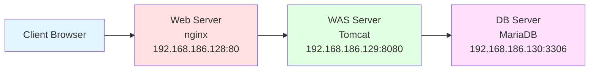

**각 서버의 역할:**

1. **웹 서버 (192.168.186.128)**
   - nginx 설치
   - 정적 파일 서빙
   - 리버스 프록시로 WAS로 요청 전달

2. **WAS 서버 (192.168.186.129)**
   - Tomcat10 설치
   - JSP/Servlet 실행
   - 데이터베이스 연동

3. **데이터베이스 서버 (192.168.186.130)**
   - MariaDB 설치
   - 사용자 인증 정보 저장
   - 원격 접속 허용

**최종 구현 기능:**
- 로그인 페이지 (HTML)
- 로그인 처리 (JSP)
- 데이터베이스 인증
- SQL 인젝션 시연

## 📝 강의 진행 방식

1. **각 서버 개별 구축**: Web → WAS → DB 순서로 설치
2. **단계별 테스트**: 각 단계마다 정상 동작 확인
3. **통합 테스트**: 3계층 전체 연동 확인
4. **보안 취약점 학습**: SQL 인젝션 시연

**💡 학습 포인트:**
- 각 계층을 독립적으로 구축하는 이유 (확장성, 보안, 유지보수)
- 네트워크를 통한 서비스 간 통신
- 설정 파일의 중요성
- 보안 취약점과 방어 방법


**다음 섹션에서는** Linux 시스템의 기초 개념과 네트워크 설정 방법에 대해 자세히 학습한다.
# Section 2: Linux 시스템 기초 및 네트워크 개념

## 🐧 Ubuntu 24.04 설치

### 설치 전 준비사항

**시스템 요구사항:**
- 메모리: 최소 2GB (권장 4GB 이상)
- 디스크 공간: 최소 25GB
- 프로세서: 2GHz 듀얼 코어 이상
- 네트워크: 인터넷 연결 (패키지 설치용)

**설치 미디어 준비:**
```bash
# ISO 파일 다운로드
wget https://releases.ubuntu.com/24.04/ubuntu-24.04-live-server-amd64.iso

# ISO 파일 무결성 검증
sha256sum ubuntu-24.04-live-server-amd64.iso
```

### 설치 과정

**1. 부팅 및 언어 선택**
- ISO로 부팅
- 언어 선택: English (한글 선택 가능하나 서버는 영문 권장)
- 키보드 레이아웃 선택

**2. 설치 타입 선택**
```
Ubuntu Server (최소 설치)
Ubuntu Server (GUI 포함) - 실습용
```

**3. 네트워크 설정**
```
DHCP 자동 설정 또는 수동 설정
IP: 192.168.186.128 (Web 서버)
Netmask: 255.255.255.0
Gateway: 192.168.186.2
DNS: 8.8.8.8
```

**4. 스토리지 설정**
- Use entire disk (전체 디스크 사용)
- LVM 설정 (선택사항)

**5. 사용자 계정 생성**
```
Your name: Administrator
Server name: webserver
Username: admin
Password: ******
```

**6. SSH 서버 설치 옵션**
- [x] Install OpenSSH server (반드시 체크)

**7. 추가 소프트웨어 선택**
- 기본 설치만 진행 (추후 필요한 것만 설치)

### 설치 후 초기 설정

**시스템 업데이트:**
```bash
# 패키지 목록 업데이트
sudo apt update

# 출력 예시:
# Hit:1 http://archive.ubuntu.com/ubuntu jammy InRelease
# Get:2 http://archive.ubuntu.com/ubuntu jammy-updates InRelease [119 kB]
# ...
# Fetched 2,345 kB in 5s (469 kB/s)
# Reading package lists... Done
# Building dependency tree... Done

# 설치된 패키지 업그레이드
sudo apt upgrade -y

# 시스템 재부팅 (커널 업데이트 시 필요)
sudo reboot
```

**💡 명령어 설명:**
- `apt update`: 설치 가능한 패키지 목록을 최신 상태로 업데이트
- `apt upgrade`: 실제로 패키지를 최신 버전으로 업그레이드
- `-y` 옵션: 설치 확인 프롬프트에 자동으로 "yes" 응답

## 🌐 네트워크 기초 개념

### IP 주소와 서브넷 마스크

**IP 주소 구조:**
```
192.168.186.128
 │   │   │   │
 │   │   │   └─ 호스트 부분
 │   │   └───── 네트워크 부분
 │   └───────── 네트워크 부분
 └───────────── 네트워크 부분
```

**서브넷 마스크:**
```
255.255.255.0 = /24
  │   │   │  │
  1   1   1  0  (비트로 표현)

네트워크 비트: 24개
호스트 비트: 8개
가능한 호스트 수: 2^8 - 2 = 254개
```

**주소 범위:**
```
네트워크 주소: 192.168.186.0
사용 가능 범위: 192.168.186.1 ~ 192.168.186.254
브로드캐스트: 192.168.186.255
```

### 네트워크 설정 확인

**ifconfig 명령어:**
```bash
# 네트워크 인터페이스 정보 확인
ifconfig

# 출력 예시:
ens33: flags=4163<UP,BROADCAST,RUNNING,MULTICAST>  mtu 1500
        inet 192.168.186.128  netmask 255.255.255.0  broadcast 192.168.186.255
        inet6 fe80::20c:29ff:fe3a:1234  prefixlen 64  scopeid 0x20<link>
        ether 00:0c:29:3a:12:34  txqueuelen 1000  (Ethernet)
        RX packets 1234  bytes 567890 (567.8 KB)
        RX errors 0  dropped 0  overruns 0  frame 0
        TX packets 5678  bytes 901234 (901.2 KB)
        TX errors 0  dropped 0 overruns 0  carrier 0  collisions 0
```

**출력 정보 분석:**
- `ens33`: 네트워크 인터페이스 이름 (eth0, enp0s3 등도 가능)
- `inet 192.168.186.128`: IPv4 주소
- `netmask 255.255.255.0`: 서브넷 마스크
- `broadcast 192.168.186.255`: 브로드캐스트 주소
- `ether 00:0c:29:3a:12:34`: MAC 주소
- `RX packets`: 수신한 패킷 수
- `TX packets`: 전송한 패킷 수

**ip 명령어 (최신 방식):**
```bash
# 네트워크 인터페이스 목록
ip addr show

# 또는 줄여서
ip a

# 특정 인터페이스만 확인
ip addr show ens33

# 출력 예시:
2: ens33: <BROADCAST,MULTICAST,UP,LOWER_UP> mtu 1500 qdisc fq_codel state UP group default qlen 1000
    link/ether 00:0c:29:3a:12:34 brd ff:ff:ff:ff:ff:ff
    inet 192.168.186.128/24 brd 192.168.186.255 scope global dynamic ens33
       valid_lft 86400sec preferred_lft 86400sec
    inet6 fe80::20c:29ff:fe3a:1234/64 scope link
       valid_lft forever preferred_lft forever
```

**라우팅 테이블 확인:**
```bash
# route 명령어
route -n

# 출력 예시:
Kernel IP routing table
Destination     Gateway         Genmask         Flags Metric Ref    Use Iface
0.0.0.0         192.168.186.2   0.0.0.0         UG    100    0        0 ens33
192.168.186.0   0.0.0.0         255.255.255.0   U     100    0        0 ens33

# ip route 명령어 (최신 방식)
ip route show

# 출력 예시:
default via 192.168.186.2 dev ens33 proto dhcp metric 100
192.168.186.0/24 dev ens33 proto kernel scope link src 192.168.186.128 metric 100
```

**출력 정보 설명:**
- `default via 192.168.186.2`: 기본 게이트웨이
- `192.168.186.0/24 dev ens33`: 로컬 네트워크 라우팅

### 네트워크 연결 테스트

**ping 명령어:**
```bash
# 게이트웨이 연결 테스트
ping -c 4 192.168.186.2

# 출력 예시:
PING 192.168.186.2 (192.168.186.2) 56(84) bytes of data.
64 bytes from 192.168.186.2: icmp_seq=1 ttl=64 time=0.234 ms
64 bytes from 192.168.186.2: icmp_seq=2 ttl=64 time=0.189 ms
64 bytes from 192.168.186.2: icmp_seq=3 ttl=64 time=0.201 ms
64 bytes from 192.168.186.2: icmp_seq=4 ttl=64 time=0.198 ms

--- 192.168.186.2 ping statistics ---
4 packets transmitted, 4 received, 0% packet loss, time 3067ms
rtt min/avg/max/mdev = 0.189/0.205/0.234/0.017 ms

# 외부 인터넷 연결 테스트
ping -c 4 8.8.8.8

# DNS 동작 테스트
ping -c 4 google.com
```

**💡 ping 출력 분석:**
- `64 bytes`: ICMP 패킷 크기
- `icmp_seq`: 패킷 순서 번호
- `ttl`: Time To Live (패킷이 거칠 수 있는 최대 라우터 수)
- `time`: 왕복 시간 (ms)
- `0% packet loss`: 패킷 손실률 (0%가 정상)

**traceroute 명령어:**
```bash
# 경로 추적 (설치 필요 시)
sudo apt install traceroute

# 목적지까지의 경로 확인
traceroute google.com

# 출력 예시:
traceroute to google.com (142.250.196.78), 30 hops max, 60 byte packets
 1  192.168.186.2 (192.168.186.2)  0.234 ms  0.189 ms  0.201 ms
 2  10.0.0.1 (10.0.0.1)  5.678 ms  5.432 ms  5.567 ms
 3  * * *
 4  142.250.196.78 (142.250.196.78)  12.345 ms  12.234 ms  12.456 ms
```

### DNS 설정 확인

**DNS 서버 확인:**
```bash
# DNS 설정 파일 확인
cat /etc/resolv.conf

# 출력 예시:
nameserver 8.8.8.8
nameserver 8.8.4.4

# systemd-resolved 사용 시
resolvectl status

# 출력 예시:
Global
       LLMNR setting: yes
MulticastDNS setting: yes
  DNSOverTLS setting: no
      DNSSEC setting: no
    DNSSEC supported: no
  Current DNS Server: 8.8.8.8
         DNS Servers: 8.8.8.8
                      8.8.4.4
```

**DNS 질의 테스트:**
```bash
# nslookup 명령어 (설치 필요 시)
sudo apt install dnsutils

# 도메인 이름 조회
nslookup google.com

# 출력 예시:
Server:     8.8.8.8
Address:    8.8.8.8#53

Non-authoritative answer:
Name:   google.com
Address: 142.250.196.78

# dig 명령어 (상세 정보)
dig google.com

# 간단한 출력만
dig google.com +short
# 출력: 142.250.196.78
```

## 🔧 주요 Linux 명령어

### 프로세스 관리

**ps 명령어:**
```bash
# 현재 터미널의 프로세스
ps

# 모든 프로세스 (상세 정보)
ps aux

# 출력 예시:
USER         PID %CPU %MEM    VSZ   RSS TTY      STAT START   TIME COMMAND
root           1  0.0  0.1 168976 11234 ?        Ss   09:00   0:02 /sbin/init
root           2  0.0  0.0      0     0 ?        S    09:00   0:00 [kthreadd]
www-data    1234  0.1  0.5 123456 45678 ?        S    10:30   0:05 nginx: worker
tomcat10    5678  2.5  5.2 2345678 567890 ?      Sl   10:35   15:34 /usr/lib/jvm/java-11-openjdk

# 특정 프로세스 검색
ps aux | grep nginx

# 출력 예시:
root        1234  0.0  0.1  12345  5678 ?        Ss   10:30   0:00 nginx: master process
www-data    1235  0.0  0.2  12456  6789 ?        S    10:30   0:00 nginx: worker process
```

**ps 출력 컬럼 설명:**
- `USER`: 프로세스 소유자
- `PID`: 프로세스 ID
- `%CPU`: CPU 사용률
- `%MEM`: 메모리 사용률
- `VSZ`: 가상 메모리 크기 (KB)
- `RSS`: 실제 메모리 사용량 (KB)
- `TTY`: 터미널 (? 는 데몬 프로세스)
- `STAT`: 프로세스 상태
  - `R`: Running (실행 중)
  - `S`: Sleeping (대기 중)
  - `D`: Uninterruptible sleep (IO 대기)
  - `Z`: Zombie (좀비 프로세스)
  - `T`: Stopped (중지됨)
- `START`: 시작 시간
- `TIME`: CPU 사용 시간
- `COMMAND`: 실행 명령어

**top 명령어 (실시간 모니터링):**
```bash
# 실시간 프로세스 모니터링
top

# 출력 예시:
top - 14:30:25 up 5:30,  2 users,  load average: 0.52, 0.58, 0.59
Tasks: 245 total,   1 running, 244 sleeping,   0 stopped,   0 zombie
%Cpu(s):  2.3 us,  0.7 sy,  0.0 ni, 96.8 id,  0.2 wa,  0.0 hi,  0.0 si,  0.0 st
MiB Mem :   3936.2 total,    234.5 free,   1678.9 used,   2022.8 buff/cache
MiB Swap:   2048.0 total,   2048.0 free,      0.0 used.   2023.4 avail Mem

  PID USER      PR  NI    VIRT    RES    SHR S  %CPU  %MEM     TIME+ COMMAND
 5678 tomcat10  20   0 2345678 567890  23456 S   2.3   5.2  15:34.56 java
 1234 www-data  20   0  123456  45678   5678 S   0.3   0.5   0:05.23 nginx
    1 root      20   0  168976  11234   7890 S   0.0   0.1   0:02.34 systemd
```

**top 화면 내 단축키:**
- `h`: 도움말 표시
- `q`: 종료
- `k`: 프로세스 종료 (PID 입력)
- `M`: 메모리 사용률 기준 정렬
- `P`: CPU 사용률 기준 정렬
- `1`: CPU 코어별 사용률 표시

**htop 명령어 (개선된 top):**
```bash
# htop 설치
sudo apt install htop

# 실행
htop

# 특징:
# - 컬러풀한 인터페이스
# - 마우스 지원
# - 프로세스 트리 표시
# - 쉬운 정렬 및 필터링
```

### 네트워크 포트 확인

**netstat 명령어:**
```bash
# 모든 리스닝 포트 확인
sudo netstat -tuln

# 출력 예시:
Active Internet connections (only servers)
Proto Recv-Q Send-Q Local Address           Foreign Address         State
tcp        0      0 0.0.0.0:80              0.0.0.0:*               LISTEN
tcp        0      0 0.0.0.0:22              0.0.0.0:*               LISTEN
tcp        0      0 0.0.0.0:3306            0.0.0.0:*               LISTEN
tcp6       0      0 :::8080                 :::*                    LISTEN

# 프로세스 정보 포함
sudo netstat -tulnp

# 출력 예시:
Proto Recv-Q Send-Q Local Address           Foreign Address         State       PID/Program name
tcp        0      0 0.0.0.0:80              0.0.0.0:*               LISTEN      1234/nginx: master
tcp        0      0 0.0.0.0:22              0.0.0.0:*               LISTEN      890/sshd: /usr/sbin
tcp        0      0 0.0.0.0:3306            0.0.0.0:*               LISTEN      2345/mysqld
tcp6       0      0 :::8080                 :::*                    LISTEN      5678/java

# 연결된 모든 소켓 확인
sudo netstat -tuanp
```

**netstat 옵션 설명:**
- `-t`: TCP 프로토콜
- `-u`: UDP 프로토콜
- `-l`: 리스닝 상태 (대기 중)
- `-n`: 숫자로 표시 (이름 해석 안 함)
- `-p`: 프로세스 정보 표시
- `-a`: 모든 소켓 (연결 및 리스닝)

**ss 명령어 (최신 방식, netstat보다 빠름):**
```bash
# 리스닝 포트 확인
sudo ss -tuln

# 프로세스 정보 포함
sudo ss -tulnp

# 출력 예시:
Netid  State   Recv-Q  Send-Q  Local Address:Port   Peer Address:Port  Process
tcp    LISTEN  0       511     0.0.0.0:80            0.0.0.0:*          users:(("nginx",pid=1234,fd=6))
tcp    LISTEN  0       128     0.0.0.0:22            0.0.0.0:*          users:(("sshd",pid=890,fd=3))
tcp    LISTEN  0       80      0.0.0.0:3306          0.0.0.0:*          users:(("mysqld",pid=2345,fd=21))
tcp    LISTEN  0       100     :::8080               :::*               users:(("java",pid=5678,fd=45))

# 특정 포트 확인
sudo ss -tuln | grep :80

# 연결 상태 확인
sudo ss -tan
```

**lsof 명령어 (파일 및 포트 사용 확인):**
```bash
# 특정 포트를 사용하는 프로세스 확인
sudo lsof -i :80

# 출력 예시:
COMMAND   PID     USER   FD   TYPE DEVICE SIZE/OFF NODE NAME
nginx    1234     root    6u  IPv4  12345      0t0  TCP *:http (LISTEN)
nginx    1235 www-data    6u  IPv4  12345      0t0  TCP *:http (LISTEN)

# 특정 프로세스가 사용하는 포트 확인
sudo lsof -p 1234

# TCP 포트만 확인
sudo lsof -iTCP -sTCP:LISTEN
```

### systemd 서비스 관리

**systemctl 명령어:**
```bash
# 서비스 시작
sudo systemctl start nginx

# 서비스 중지
sudo systemctl stop nginx

# 서비스 재시작
sudo systemctl restart nginx

# 설정 리로드 (재시작 없이)
sudo systemctl reload nginx

# 서비스 상태 확인
sudo systemctl status nginx

# 출력 예시:
● nginx.service - A high performance web server and a reverse proxy server
     Loaded: loaded (/lib/systemd/system/nginx.service; enabled; vendor preset: enabled)
     Active: active (running) since Tue 2025-12-17 10:30:25 KST; 4h 5min ago
       Docs: man:nginx(8)
    Process: 1234 ExecStartPre=/usr/sbin/nginx -t -q -g daemon on; master_process on; (code=exited, status=0/SUCCESS)
    Process: 1235 ExecStart=/usr/sbin/nginx -g daemon on; master_process on; (code=exited, status=0/SUCCESS)
   Main PID: 1236 (nginx)
      Tasks: 3 (limit: 4558)
     Memory: 12.3M
        CPU: 234ms
     CGroup: /system.slice/nginx.service
             ├─1236 nginx: master process /usr/sbin/nginx -g daemon on; master_process on;
             ├─1237 nginx: worker process
             └─1238 nginx: worker process

Dec 17 10:30:25 webserver systemd[1]: Starting A high performance web server...
Dec 17 10:30:25 webserver systemd[1]: Started A high performance web server.

# 부팅 시 자동 시작 활성화
sudo systemctl enable nginx

# 출력 예시:
Created symlink /etc/systemd/system/multi-user.target.wants/nginx.service → /lib/systemd/system/nginx.service.

# 부팅 시 자동 시작 비활성화
sudo systemctl disable nginx

# 서비스가 활성화되어 있는지 확인
systemctl is-enabled nginx
# 출력: enabled 또는 disabled

# 서비스가 실행 중인지 확인
systemctl is-active nginx
# 출력: active 또는 inactive

# 모든 서비스 목록
systemctl list-units --type=service

# 실행 중인 서비스만
systemctl list-units --type=service --state=running

# 실패한 서비스 확인
systemctl --failed
```

**서비스 로그 확인 (journalctl):**
```bash
# 특정 서비스의 로그 확인
sudo journalctl -u nginx

# 최근 로그만 확인
sudo journalctl -u nginx -n 50

# 실시간 로그 확인 (tail -f와 유사)
sudo journalctl -u nginx -f

# 특정 시간 이후의 로그
sudo journalctl -u nginx --since "2025-12-17 10:00:00"

# 오늘의 로그만
sudo journalctl -u nginx --since today

# 부팅 이후의 로그
sudo journalctl -u nginx -b
```

## 🔐 SSH 서버 설정

### SSH 서버 설치 및 시작

```bash
# SSH 서버 설치
sudo apt install openssh-server

# SSH 서비스 시작
sudo systemctl start ssh

# 부팅 시 자동 시작 설정
sudo systemctl enable ssh

# SSH 서비스 상태 확인
sudo systemctl status ssh

# 출력 예시:
● ssh.service - OpenBSD Secure Shell server
     Loaded: loaded (/lib/systemd/system/ssh.service; enabled; vendor preset: enabled)
     Active: active (running) since Tue 2025-12-17 09:00:00 KST; 5h 35min ago
       Docs: man:sshd(8)
             man:sshd_config(5)
   Main PID: 890 (sshd)
      Tasks: 1 (limit: 4558)
     Memory: 5.2M
        CPU: 123ms
     CGroup: /system.slice/ssh.service
             └─890 sshd: /usr/sbin/sshd -D [listener] 0 of 10-100 startups

# SSH 포트 확인
sudo ss -tuln | grep :22
# 출력: tcp   LISTEN 0      128    0.0.0.0:22     0.0.0.0:*
```

### SSH 접속 테스트

```bash
# 로컬에서 접속 테스트
ssh localhost

# 원격에서 접속 (클라이언트에서)
ssh admin@192.168.186.128

# 특정 포트로 접속
ssh -p 22 admin@192.168.186.128

# 접속 후 출력 예시:
The authenticity of host '192.168.186.128 (192.168.186.128)' can't be established.
ED25519 key fingerprint is SHA256:abcd1234efgh5678ijkl9012mnop3456qrst7890.
This key is not known by any other names
Are you sure you want to continue connecting (yes/no/[fingerprint])? yes
Warning: Permanently added '192.168.186.128' (ED25519) to the list of known hosts.
admin@192.168.186.128's password:
Welcome to Ubuntu 24.04 LTS (GNU/Linux 6.8.0-51-generic x86_64)
```

### SSH 설정 파일

**주요 설정 파일 위치:**
```bash
# SSH 서버 설정 파일
/etc/ssh/sshd_config

# SSH 클라이언트 설정 파일
/etc/ssh/ssh_config
```

**주요 설정 옵션:**
```bash
# sshd_config 파일 확인
sudo cat /etc/ssh/sshd_config | grep -v "^#" | grep -v "^$"

# 주요 설정:
Port 22                      # SSH 포트 (기본값 22)
PermitRootLogin no           # root 직접 로그인 허용 여부
PasswordAuthentication yes   # 비밀번호 인증 허용
PubkeyAuthentication yes     # 공개키 인증 허용
X11Forwarding yes            # GUI 애플리케이션 포워딩
```

**설정 변경 후 적용:**
```bash
# 설정 파일 수정
sudo nano /etc/ssh/sshd_config

# 설정 테스트
sudo sshd -t

# 설정 적용 (서비스 재시작)
sudo systemctl restart ssh
```

## 📊 시스템 리소스 확인

**메모리 사용량:**
```bash
# free 명령어
free -h

# 출력 예시:
               total        used        free      shared  buff/cache   available
Mem:           3.8Gi       1.6Gi       234Mi        12Mi       2.0Gi       2.0Gi
Swap:          2.0Gi          0B       2.0Gi
```

**디스크 사용량:**
```bash
# 디스크 여유 공간 확인
df -h

# 출력 예시:
Filesystem      Size  Used Avail Use% Mounted on
/dev/sda1        50G   15G   33G  32% /
/dev/sda2       100G   45G   50G  48% /var

# 특정 디렉토리 크기 확인
du -sh /var/log
# 출력: 234M    /var/log

# 하위 디렉토리 포함
du -h /var/log | sort -h
```

**CPU 정보:**
```bash
# CPU 정보 확인
lscpu

# 출력 예시:
Architecture:            x86_64
CPU op-mode(s):          32-bit, 64-bit
CPU(s):                  4
Thread(s) per core:      1
Core(s) per socket:      4
Model name:              Intel(R) Core(TM) i7-8700 CPU @ 3.20GHz
```

## ✅ 학습 체크리스트

**네트워크 설정:**
- [ ] IP 주소를 확인할 수 있는가? (`ifconfig`, `ip addr`)
- [ ] 라우팅 테이블을 확인할 수 있는가? (`route -n`, `ip route`)
- [ ] 네트워크 연결을 테스트할 수 있는가? (`ping`)
- [ ] DNS 동작을 확인할 수 있는가? (`nslookup`, `dig`)

**프로세스 관리:**
- [ ] 실행 중인 프로세스를 확인할 수 있는가? (`ps aux`)
- [ ] 특정 프로세스를 검색할 수 있는가? (`ps aux | grep`)
- [ ] 실시간 시스템 모니터링을 할 수 있는가? (`top`, `htop`)

**네트워크 포트:**
- [ ] 리스닝 포트를 확인할 수 있는가? (`netstat -tuln`, `ss -tuln`)
- [ ] 특정 포트를 사용하는 프로세스를 찾을 수 있는가? (`lsof -i :PORT`)

**서비스 관리:**
- [ ] 서비스를 시작/중지할 수 있는가? (`systemctl start/stop`)
- [ ] 서비스 상태를 확인할 수 있는가? (`systemctl status`)
- [ ] 부팅 시 자동 시작을 설정할 수 있는가? (`systemctl enable/disable`)
- [ ] 서비스 로그를 확인할 수 있는가? (`journalctl -u`)

**SSH:**
- [ ] SSH 서버를 설치하고 시작할 수 있는가?
- [ ] SSH로 원격 접속할 수 있는가?
- [ ] SSH 설정을 변경하고 적용할 수 있는가?


**다음 섹션에서는** nginx 웹 서버를 설치하고 리버스 프록시로 설정하는 방법을 학습한다.
# Section 3: 웹 서버 구축 (nginx)

## 🌐 nginx 소개

### nginx란?

nginx(엔진엑스)는 고성능 웹 서버이자 리버스 프록시 서버이다. Apache HTTP Server의 C10K 문제(1만 개 이상의 동시 연결 처리)를 해결하기 위해 개발되었다.

**nginx의 주요 특징:**
- 높은 동시성 처리 능력
- 낮은 메모리 사용량
- 비동기 이벤트 기반 아키텍처
- 리버스 프록시 기능
- 로드 밸런싱
- HTTP 캐싱
- 정적 파일 서빙에 탁월

**Apache vs nginx 비교:**

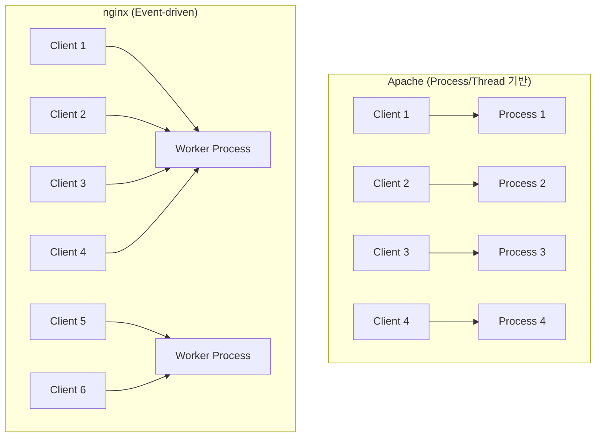

**💡 핵심 차이:**
- Apache: 각 연결당 프로세스/스레드 생성 → 메모리 많이 사용
- nginx: 소수의 워커 프로세스로 수천 개의 연결 처리 → 메모리 효율적

### 3계층 아키텍처에서 nginx의 역할

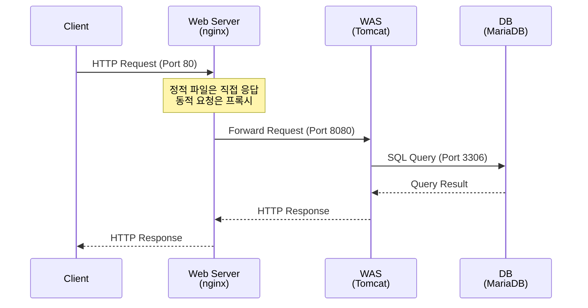

**웹 서버의 역할:**
1. 클라이언트의 HTTP 요청 수신 (Port 80, 443)
2. 정적 파일(HTML, CSS, JS, 이미지) 직접 서빙
3. 동적 요청(JSP, PHP 등)은 WAS로 프록시
4. SSL/TLS 암호화 처리
5. 로드 밸런싱
6. HTTP 캐싱

**💡 웹 서버와 WAS를 분리하는 이유:**
- **보안**: WAS를 외부에 직접 노출하지 않음
- **성능**: 정적 파일은 nginx가 처리 (빠름)
- **확장성**: 여러 WAS 서버로 로드 밸런싱 가능
- **관리**: 웹 서버와 애플리케이션 서버를 독립적으로 관리

## 📦 nginx 설치

### APT를 통한 설치

```bash
# 패키지 목록 업데이트
sudo apt update

# nginx 설치
sudo apt install nginx -y

# 설치 과정 출력 예시:
Reading package lists... Done
Building dependency tree... Done
Reading state information... Done
The following additional packages will be installed:
  fontconfig-config fonts-dejavu-core libdeflate0 libfontconfig1 libgd3
  libjbig0 libjpeg-turbo8 libjpeg8 libnginx-mod-http-geoip2
  libnginx-mod-http-image-filter libnginx-mod-http-xslt-filter
  libnginx-mod-mail libnginx-mod-stream libnginx-mod-stream-geoip2
  libtiff5 libwebp7 libxpm4 nginx-common nginx-core
Suggested packages:
  libgd-tools fcgiwrap nginx-doc ssl-cert
The following NEW packages will be installed:
  fontconfig-config fonts-dejavu-core libdeflate0 libfontconfig1 libgd3
  libjbig0 libjpeg-turbo8 libjpeg8 libnginx-mod-http-geoip2
  libnginx-mod-http-image-filter libnginx-mod-http-xslt-filter
  libnginx-mod-mail libnginx-mod-stream libnginx-mod-stream-geoip2
  libtiff5 libwebp7 libxpm4 nginx nginx-common nginx-core
0 upgraded, 20 newly installed, 0 to remove and 0 not upgraded.
Need to get 2,345 kB of archives.
After this operation, 7,890 kB of additional disk space will be used.
```

**설치 확인:**
```bash
# nginx 버전 확인
nginx -v
# 출력: nginx version: nginx/1.24.0 (Ubuntu)

# 상세 버전 정보 및 컴파일 옵션
nginx -V
# 출력 예시:
nginx version: nginx/1.24.0 (Ubuntu)
built with OpenSSL 3.0.2 15 Mar 2022
TLS SNI support enabled
configure arguments: --with-cc-opt='-g -O2 -ffile-prefix-map=/build/nginx...

# nginx 실행 파일 위치
which nginx
# 출력: /usr/sbin/nginx
```

### nginx 서비스 시작

```bash
# nginx 서비스 시작
sudo systemctl start nginx

# 서비스 상태 확인
sudo systemctl status nginx

# 출력 예시:
● nginx.service - A high performance web server and a reverse proxy server
     Loaded: loaded (/lib/systemd/system/nginx.service; enabled; vendor preset: enabled)
     Active: active (running) since Tue 2025-12-17 10:30:25 KST; 5s ago
       Docs: man:nginx(8)
    Process: 1234 ExecStartPre=/usr/sbin/nginx -t -q -g daemon on; master_process on; (code=exited, status=0/SUCCESS)
    Process: 1235 ExecStart=/usr/sbin/nginx -g daemon on; master_process on; (code=exited, status=0/SUCCESS)
   Main PID: 1236 (nginx)
      Tasks: 3 (limit: 4558)
     Memory: 4.8M
        CPU: 45ms
     CGroup: /system.slice/nginx.service
             ├─1236 nginx: master process /usr/sbin/nginx -g daemon on; master_process on;
             ├─1237 nginx: worker process
             └─1238 nginx: worker process

Dec 17 10:30:25 webserver systemd[1]: Starting A high performance web server and a reverse proxy server...
Dec 17 10:30:25 webserver nginx[1234]: nginx: the configuration file /etc/nginx/nginx.conf syntax is ok
Dec 17 10:30:25 webserver nginx[1234]: nginx: configuration file /etc/nginx/nginx.conf test is successful
Dec 17 10:30:25 webserver systemd[1]: Started A high performance web server and a reverse proxy server.

# 부팅 시 자동 시작 설정
sudo systemctl enable nginx

# 출력:
Synchronizing state of nginx.service with SysV service script with /lib/systemd/systemd-sysv-install.
Executing: /lib/systemd/systemd-sysv-install enable nginx
```

**프로세스 확인:**
```bash
# nginx 프로세스 확인
ps aux | grep nginx

# 출력 예시:
root        1236  0.0  0.1  12345  5678 ?        Ss   10:30   0:00 nginx: master process /usr/sbin/nginx
www-data    1237  0.0  0.2  12456  6789 ?        S    10:30   0:00 nginx: worker process
www-data    1238  0.0  0.2  12456  6789 ?        S    10:30   0:00 nginx: worker process
```

**프로세스 구조 설명:**
- **master process (root)**: 설정 읽기, 워커 프로세스 관리, 권한 있는 작업 수행
- **worker process (www-data)**: 실제 클라이언트 요청 처리, 낮은 권한으로 실행 (보안)

**포트 확인:**
```bash
# 80번 포트 리스닝 확인
sudo ss -tuln | grep :80

# 출력:
tcp   LISTEN 0      511    0.0.0.0:80     0.0.0.0:*

# 또는 netstat 사용
sudo netstat -tuln | grep :80

# lsof로 확인
sudo lsof -i :80

# 출력:
COMMAND   PID     USER   FD   TYPE DEVICE SIZE/OFF NODE NAME
nginx    1236     root    6u  IPv4  12345      0t0  TCP *:http (LISTEN)
nginx    1237 www-data    6u  IPv4  12345      0t0  TCP *:http (LISTEN)
```

### 웹 서버 동작 테스트

**curl을 통한 테스트:**
```bash
# 로컬에서 테스트
curl http://localhost

# 출력 (HTML):
<!DOCTYPE html>
<html>
<head>
<title>Welcome to nginx!</title>
<style>
html { color-scheme: light dark; }
body { width: 35em; margin: 0 auto;
font-family: Tahoma, Verdana, Arial, sans-serif; }
</style>
</head>
<body>
<h1>Welcome to nginx!</h1>
<p>If you see this page, the nginx web server is successfully installed and
working. Further configuration is required.</p>
...
</body>
</html>

# IP 주소로 테스트
curl http://192.168.186.128

# HTTP 헤더 확인
curl -I http://localhost

# 출력:
HTTP/1.1 200 OK
Server: nginx/1.24.0 (Ubuntu)
Date: Tue, 17 Dec 2025 01:30:25 GMT
Content-Type: text/html
Content-Length: 615
Last-Modified: Mon, 16 Dec 2025 14:20:00 GMT
Connection: keep-alive
ETag: "675f5e00-267"
Accept-Ranges: bytes
```

**브라우저에서 테스트:**
```
http://192.168.186.128
```
- "Welcome to nginx!" 페이지가 표시되면 정상

**💡 HTTP 응답 코드:**
- `200 OK`: 성공
- `301 Moved Permanently`: 영구 리다이렉트
- `302 Found`: 임시 리다이렉트
- `304 Not Modified`: 캐시된 리소스 사용
- `400 Bad Request`: 잘못된 요청
- `401 Unauthorized`: 인증 필요
- `403 Forbidden`: 접근 거부
- `404 Not Found`: 리소스 없음
- `500 Internal Server Error`: 서버 오류
- `502 Bad Gateway`: 프록시/게이트웨이 오류
- `503 Service Unavailable`: 서비스 이용 불가

## 📁 nginx 디렉토리 구조

### 주요 디렉토리 및 파일

```bash
# nginx 관련 디렉토리 구조
/etc/nginx/
    ├── nginx.conf                      # 주 설정 파일
    ├── sites-available/                # 사용 가능한 사이트 설정
    │   └── default                     # 기본 사이트 설정
    ├── sites-enabled/                  # 활성화된 사이트 (심볼릭 링크)
    │   └── default -> ../sites-available/default
    ├── conf.d/                         # 추가 설정 파일
    ├── modules-available/              # 사용 가능한 모듈
    ├── modules-enabled/                # 활성화된 모듈
    ├── snippets/                       # 재사용 가능한 설정 조각
    ├── mime.types                      # MIME 타입 정의
    ├── fastcgi_params                  # FastCGI 파라미터
    └── proxy_params                    # 프록시 파라미터

/var/log/nginx/
    ├── access.log                      # 접근 로그
    └── error.log                       # 에러 로그

/var/www/html/                          # 기본 문서 루트
    └── index.nginx-debian.html         # 기본 페이지

/usr/share/nginx/html/                  # 대체 문서 루트 (배포판에 따라)
```

**디렉토리별 설명:**

**1. `/etc/nginx/nginx.conf` (주 설정 파일)**
```bash
# 주 설정 파일 확인
sudo cat /etc/nginx/nginx.conf

# 주요 설정 구조:
user www-data;                          # nginx 워커 프로세스 실행 사용자
worker_processes auto;                  # 워커 프로세스 수 (auto = CPU 코어 수)
pid /run/nginx.pid;                     # PID 파일 위치

events {
    worker_connections 768;             # 워커당 최대 연결 수
}

http {
    # HTTP 관련 설정
    include /etc/nginx/mime.types;
    default_type application/octet-stream;

    # 로깅
    access_log /var/log/nginx/access.log;
    error_log /var/log/nginx/error.log;

    # 가상 호스트 설정 포함
    include /etc/nginx/conf.d/*.conf;
    include /etc/nginx/sites-enabled/*;
}
```

**2. `/etc/nginx/sites-available/default` (기본 사이트 설정)**
```bash
# 기본 설정 파일 확인
sudo cat /etc/nginx/sites-available/default

# 기본 설정 내용:
server {
    listen 80 default_server;           # IPv4 80번 포트 리스닝
    listen [::]:80 default_server;      # IPv6 80번 포트 리스닝

    root /var/www/html;                 # 문서 루트 디렉토리
    index index.html index.htm index.nginx-debian.html;

    server_name _;                      # 서버 이름 (언더스코어는 모든 도메인)

    location / {
        try_files $uri $uri/ =404;      # 파일 찾기 시도, 없으면 404
    }
}
```

**3. 로그 파일**
```bash
# 접근 로그 확인
sudo tail -f /var/log/nginx/access.log

# 출력 형식:
192.168.186.1 - - [17/Dec/2025:10:30:25 +0900] "GET / HTTP/1.1" 200 615 "-" "Mozilla/5.0..."
 └─ 클라이언트IP  └─ 날짜/시간              └─ 요청    └─ 상태  └─크기    └─ User-Agent

# 에러 로그 확인
sudo tail -f /var/log/nginx/error.log

# 출력 예시:
2025/12/17 10:30:25 [error] 1237#1237: *1 open() "/var/www/html/favicon.ico" failed (2: No such file or directory)
```

## ⚙️ nginx 기본 설정

### 가상 호스트 (Virtual Host) 설정

**새로운 사이트 설정 생성:**
```bash
# 새 설정 파일 생성
sudo nano /etc/nginx/sites-available/mysite

# 설정 내용:
server {
    listen 80;
    server_name mysite.com www.mysite.com;

    root /var/www/mysite;
    index index.html index.htm;

    location / {
        try_files $uri $uri/ =404;
    }

    # 로그 파일 분리
    access_log /var/log/nginx/mysite_access.log;
    error_log /var/log/nginx/mysite_error.log;
}

# 문서 루트 디렉토리 생성
sudo mkdir -p /var/www/mysite

# 테스트 페이지 생성
echo "<h1>My Site</h1>" | sudo tee /var/www/mysite/index.html

# 권한 설정
sudo chown -R www-data:www-data /var/www/mysite
sudo chmod -R 755 /var/www/mysite

# 사이트 활성화 (심볼릭 링크 생성)
sudo ln -s /etc/nginx/sites-available/mysite /etc/nginx/sites-enabled/

# 심볼릭 링크 확인
ls -l /etc/nginx/sites-enabled/
# 출력: lrwxrwxrwx 1 root root 34 Dec 17 10:30 mysite -> /etc/nginx/sites-available/mysite

# 설정 문법 검사
sudo nginx -t

# 출력:
nginx: the configuration file /etc/nginx/nginx.conf syntax is ok
nginx: configuration file /etc/nginx/nginx.conf test is successful

# 설정 적용 (리로드)
sudo systemctl reload nginx
```

**사이트 비활성화:**
```bash
# 심볼릭 링크 제거
sudo rm /etc/nginx/sites-enabled/mysite

# 설정 리로드
sudo systemctl reload nginx
```

### 정적 파일 서빙 설정

```nginx
server {
    listen 80;
    server_name static.example.com;

    root /var/www/static;

    # 이미지 디렉토리
    location /images/ {
        alias /var/www/static/images/;
        autoindex on;                   # 디렉토리 목록 표시
        expires 7d;                     # 7일간 캐시
    }

    # CSS/JS 파일
    location ~* \.(css|js)$ {
        expires 1h;                     # 1시간 캐시
        add_header Cache-Control "public";
    }

    # 특정 파일 접근 차단
    location ~ /\.ht {
        deny all;                       # .htaccess 등 차단
    }
}
```

## 🔄 리버스 프록시 설정

### 리버스 프록시란?

**포워드 프록시 vs 리버스 프록시:**

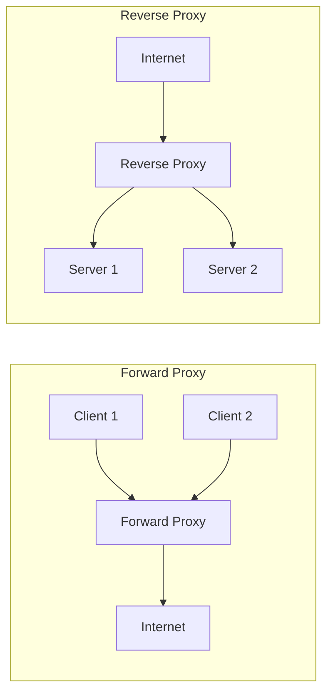

**포워드 프록시:**
- 클라이언트를 대신하여 요청
- 클라이언트 익명화
- 콘텐츠 필터링
- 예: 회사 프록시 서버

**리버스 프록시:**
- 서버를 대신하여 응답
- 서버 보호 (실제 서버 숨김)
- 로드 밸런싱
- SSL 종료
- 캐싱
- 예: nginx, HAProxy, Cloudflare

### WAS로 프록시 설정

**실습 목표: nginx(80) → Tomcat(8080)**

```bash
# sites-available/default 파일 수정
sudo nano /etc/nginx/sites-available/default

# 기존 설정 백업
sudo cp /etc/nginx/sites-available/default /etc/nginx/sites-available/default.backup
```

**리버스 프록시 설정:**
```nginx
server {
    listen 80 default_server;
    listen [::]:80 default_server;

    server_name _;

    # 로그 설정
    access_log /var/log/nginx/access.log;
    error_log /var/log/nginx/error.log;

    # 모든 요청을 WAS로 프록시
    location / {
        proxy_pass http://192.168.186.129:8080;

        # 프록시 헤더 설정
        proxy_set_header Host $host;
        proxy_set_header X-Real-IP $remote_addr;
        proxy_set_header X-Forwarded-For $proxy_add_x_forwarded_for;
        proxy_set_header X-Forwarded-Proto $scheme;

        # 타임아웃 설정
        proxy_connect_timeout 60s;
        proxy_send_timeout 60s;
        proxy_read_timeout 60s;
    }

    # 정적 파일은 nginx가 직접 서빙 (선택사항)
    location /static/ {
        alias /var/www/static/;
        expires 30d;
    }

    # 이미지 파일은 nginx가 직접 서빙 (선택사항)
    location ~* \.(jpg|jpeg|png|gif|ico|css|js)$ {
        root /var/www/html;
        expires 7d;
    }
}
```

**프록시 헤더 설명:**

| 헤더 | 설명 | 예시 값 |
|------|------|---------|
| `Host` | 원래 요청의 Host 헤더 | example.com |
| `X-Real-IP` | 클라이언트의 실제 IP | 192.168.186.1 |
| `X-Forwarded-For` | 프록시 체인의 모든 IP | 192.168.186.1, 10.0.0.1 |
| `X-Forwarded-Proto` | 원래 프로토콜 (http/https) | http |

**설정 적용:**
```bash
# 설정 문법 검사
sudo nginx -t

# 출력:
nginx: the configuration file /etc/nginx/nginx.conf syntax is ok
nginx: configuration file /etc/nginx/nginx.conf test is successful

# 설정 적용
sudo systemctl reload nginx

# 또는 재시작
sudo systemctl restart nginx

# 설정 변경 사항 확인
sudo nginx -T | grep -A 10 "location /"
# -T 옵션: 실제 적용된 전체 설정 출력
```

### 프록시 동작 확인

```bash
# nginx에서 WAS로의 연결 확인
curl -I http://192.168.186.128

# 정상 시 출력:
HTTP/1.1 200 OK
Server: nginx/1.24.0 (Ubuntu)
Date: Tue, 17 Dec 2025 01:35:00 GMT
Content-Type: text/html;charset=UTF-8
Connection: keep-alive

# 로그 확인 (실시간)
sudo tail -f /var/log/nginx/access.log

# 접속 시 로그 예시:
192.168.186.1 - - [17/Dec/2025:10:35:00 +0900] "GET / HTTP/1.1" 200 1234 "-" "Mozilla/5.0..."

# 에러 발생 시
sudo tail -f /var/log/nginx/error.log

# WAS 연결 실패 시 로그:
2025/12/17 10:35:00 [error] 1237#1237: *1 connect() failed (111: Connection refused) while connecting to upstream,
client: 192.168.186.1, server: _, request: "GET / HTTP/1.1", upstream: "http://192.168.186.129:8080/"
```

## 🔧 nginx 관리 명령어

### 기본 명령어

```bash
# nginx 시작
sudo systemctl start nginx
# 또는
sudo nginx

# nginx 중지
sudo systemctl stop nginx
# 또는 (graceful shutdown - 현재 연결 처리 후 종료)
sudo nginx -s quit
# 또는 (즉시 종료)
sudo nginx -s stop

# nginx 재시작
sudo systemctl restart nginx

# 설정 리로드 (다운타임 없음)
sudo systemctl reload nginx
# 또는
sudo nginx -s reload

# 서비스 상태 확인
sudo systemctl status nginx

# 설정 문법 검사
sudo nginx -t

# 전체 설정 내용 출력
sudo nginx -T

# nginx 프로세스 확인
ps aux | grep nginx

# 포트 확인
sudo ss -tuln | grep :80
```

### 로그 로테이션

**nginx는 logrotate를 통해 자동으로 로그 로테이션 수행:**

```bash
# logrotate 설정 확인
cat /etc/logrotate.d/nginx

# 내용:
/var/log/nginx/*.log {
    daily                           # 매일 로테이션
    missingok                       # 로그 파일 없어도 에러 안 냄
    rotate 14                       # 14일치 보관
    compress                        # 압축
    delaycompress                   # 다음 로테이션 때 압축
    notifempty                      # 빈 파일은 로테이션 안 함
    create 0640 www-data adm        # 새 로그 파일 생성 권한
    sharedscripts
    prerotate
        if [ -d /etc/logrotate.d/httpd-prerotate ]; then \
            run-parts /etc/logrotate.d/httpd-prerotate; \
        fi \
    endscript
    postrotate
        invoke-rc.d nginx rotate >/dev/null 2>&1
    endscript
}

# 수동 로그 로테이션 테스트
sudo logrotate -f /etc/logrotate.d/nginx

# 로테이션된 로그 확인
ls -lh /var/log/nginx/
# 출력 예시:
-rw-r----- 1 www-data adm  12K Dec 17 00:00 access.log
-rw-r----- 1 www-data adm 123K Dec 16 23:59 access.log.1
-rw-r----- 1 www-data adm  45K Dec 15 23:59 access.log.2.gz
```

## 🐛 트러블슈팅

### 일반적인 문제와 해결

**1. nginx 시작 실패**
```bash
# 에러 확인
sudo systemctl status nginx
sudo journalctl -u nginx -n 50

# 일반적인 원인:
# - 설정 파일 문법 오류
sudo nginx -t

# - 80번 포트 이미 사용 중
sudo ss -tuln | grep :80
sudo lsof -i :80

# - 권한 문제
sudo chown -R www-data:www-data /var/www/html
```

**2. 502 Bad Gateway (WAS 연결 실패)**
```bash
# WAS 서버 동작 확인
curl http://192.168.186.129:8080

# 방화벽 확인
sudo ufw status

# SELinux 확인 (CentOS/RHEL)
getenforce

# 네트워크 연결 확인
ping 192.168.186.129
telnet 192.168.186.129 8080

# nginx 에러 로그 확인
sudo tail -f /var/log/nginx/error.log
```

**3. 403 Forbidden**
```bash
# 파일 권한 확인
ls -la /var/www/html/

# 디렉토리 권한 확인 (실행 권한 필요)
chmod 755 /var/www/html/

# 파일 권한 확인 (읽기 권한 필요)
chmod 644 /var/www/html/index.html

# 소유자 확인
sudo chown -R www-data:www-data /var/www/html/

# index 파일 존재 확인
ls -l /var/www/html/index.html
```

**4. 설정이 적용되지 않음**
```bash
# 설정 문법 검사
sudo nginx -t

# 심볼릭 링크 확인
ls -l /etc/nginx/sites-enabled/

# 강제 재시작
sudo systemctl restart nginx

# 프로세스가 이전 설정으로 실행 중인지 확인
ps aux | grep nginx
sudo kill -9 <PID>  # 비상시에만 사용
sudo systemctl start nginx
```

## ✅ 학습 체크리스트

**설치 및 기본 설정:**
- [ ] nginx를 설치할 수 있는가?
- [ ] nginx 서비스를 시작/중지/재시작할 수 있는가?
- [ ] nginx의 기본 페이지를 브라우저에서 확인했는가?
- [ ] nginx 프로세스 구조를 이해하는가? (master/worker)

**설정 파일:**
- [ ] 주 설정 파일의 위치를 알고 있는가? (`/etc/nginx/nginx.conf`)
- [ ] 사이트 설정 파일의 위치를 알고 있는가? (`/etc/nginx/sites-available/`)
- [ ] 사이트를 활성화/비활성화할 수 있는가? (심볼릭 링크)
- [ ] 설정 문법을 검사할 수 있는가? (`nginx -t`)

**리버스 프록시:**
- [ ] 리버스 프록시의 개념을 이해하는가?
- [ ] proxy_pass 지시어를 사용할 수 있는가?
- [ ] 프록시 헤더의 의미를 이해하는가?
- [ ] WAS로 요청을 프록시하는 설정을 작성할 수 있는가?

**로그 및 모니터링:**
- [ ] access.log의 위치와 내용을 확인할 수 있는가?
- [ ] error.log에서 문제를 진단할 수 있는가?
- [ ] 리스닝 포트를 확인할 수 있는가?

**문제 해결:**
- [ ] nginx 시작 실패 시 원인을 찾을 수 있는가?
- [ ] 502 Bad Gateway 에러를 해결할 수 있는가?
- [ ] 403 Forbidden 에러를 해결할 수 있는가?


**다음 섹션에서는** WAS 서버(Tomcat)를 설치하고 JSP 애플리케이션을 배포하는 방법을 학습한다.
# Section 4: WAS 서버 구축 (Tomcat)

## ☕ Apache Tomcat 소개

### WAS (Web Application Server)란?

WAS는 동적 콘텐츠를 생성하고 처리하는 미들웨어 서버이다. 웹 서버와 데이터베이스 사이에서 비즈니스 로직을 실행한다.

**웹 서버 vs WAS 비교:**

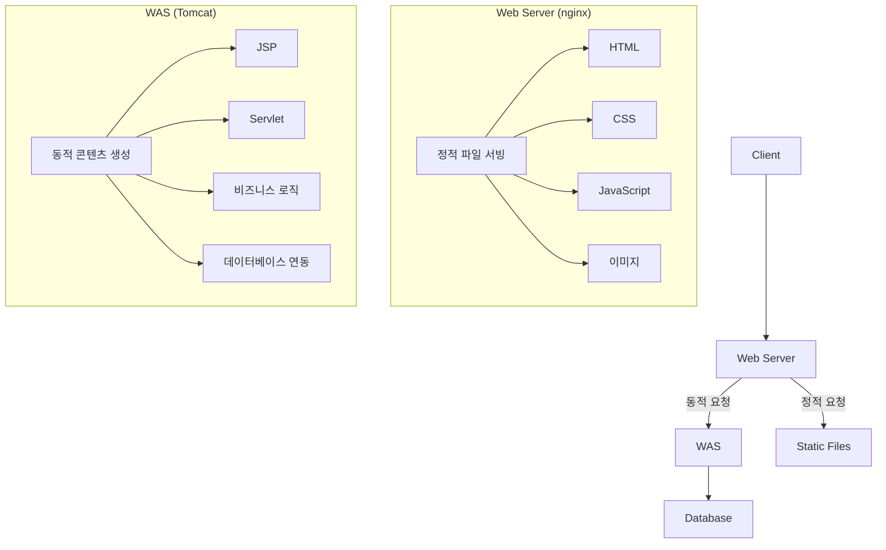

**주요 차이점:**

| 구분 | 웹 서버 (nginx, Apache) | WAS (Tomcat, JBoss, WebLogic) |
|------|------------------------|-------------------------------|
| 역할 | 정적 콘텐츠 서빙 | 동적 콘텐츠 생성 |
| 처리 | HTML, CSS, JS, 이미지 | JSP, Servlet, EJB |
| 프로토콜 | HTTP, HTTPS | HTTP, HTTPS + 비즈니스 로직 |
| DB 연동 | 없음 | JDBC, JPA 등 |
| 예시 | nginx, Apache HTTP Server | Tomcat, JBoss, WebSphere |

### Apache Tomcat이란?

Tomcat은 Apache Software Foundation에서 개발한 오픈 소스 WAS이다. Java Servlet, JSP(JavaServer Pages) 스펙을 구현한 서블릿 컨테이너이자 웹 애플리케이션 서버이다.

**Tomcat의 특징:**
- 오픈 소스 (무료)
- 가볍고 빠름
- Java EE 표준 일부 지원 (Servlet, JSP)
- 대규모 커뮤니티
- 상용 WAS에 비해 설정이 간단

**Tomcat 버전:**
- Tomcat 10.x: Jakarta EE 9+ (패키지명 jakarta.*)
- Tomcat 9.x: Java EE 8 (패키지명 javax.*)
- Tomcat 8.5.x: Java EE 7

**💡 중요:** Tomcat 10부터 패키지명이 `javax.*`에서 `jakarta.*`로 변경되었다.

## 📦 Java 및 Tomcat 설치

### Java 설치

Tomcat을 실행하려면 먼저 Java가 필요하다.

```bash
# Java 설치 여부 확인
java -version

# Java가 없으면 설치
sudo apt update
sudo apt install default-jdk -y

# 설치 후 버전 확인
java -version
# 출력 예시:
openjdk version "11.0.24" 2024-07-16
OpenJDK Runtime Environment (build 11.0.24+8-post-Ubuntu-1ubuntu324.04)
OpenJDK 64-Bit Server VM (build 11.0.24+8-post-Ubuntu-1ubuntu324.04, mixed mode, sharing)

javac -version
# 출력: javac 11.0.24

# JAVA_HOME 환경 변수 확인
echo $JAVA_HOME

# JAVA_HOME이 설정되지 않았다면
# Java 설치 경로 찾기
update-alternatives --config java
# 출력 예시: /usr/lib/jvm/java-11-openjdk-amd64/bin/java

# JAVA_HOME 설정 (영구적)
echo 'export JAVA_HOME=/usr/lib/jvm/java-11-openjdk-amd64' | sudo tee -a /etc/environment
echo 'export PATH=$PATH:$JAVA_HOME/bin' | sudo tee -a /etc/environment

# 적용
source /etc/environment

# 확인
echo $JAVA_HOME
# 출력: /usr/lib/jvm/java-11-openjdk-amd64
```

### Tomcat10 설치

```bash
# Tomcat10 설치
sudo apt install tomcat10 -y

# 설치 과정 출력 예시:
Reading package lists... Done
Building dependency tree... Done
Reading state information... Done
The following additional packages will be installed:
  libeclipse-jdt-core-java libtomcat10-java tomcat10-common
Suggested packages:
  tomcat10-admin tomcat10-docs tomcat10-examples
The following NEW packages will be installed:
  libeclipse-jdt-core-java libtomcat10-java tomcat10 tomcat10-common
0 upgraded, 4 newly installed, 0 to remove and 0 not upgraded.
Need to get 8,234 kB of archives.
After this operation, 10,567 kB of additional disk space will be used.

# Tomcat 버전 확인
/usr/share/tomcat10/bin/version.sh

# 출력 예시:
Using CATALINA_BASE:   /var/lib/tomcat10
Using CATALINA_HOME:   /usr/share/tomcat10
Using CATALINA_TMPDIR: /var/lib/tomcat10/temp
Using JRE_HOME:        /usr/lib/jvm/java-11-openjdk-amd64
Using CLASSPATH:       /usr/share/tomcat10/bin/bootstrap.jar:/usr/share/tomcat10/bin/tomcat-juli.jar
Using CATALINA_OPTS:
Server version: Apache Tomcat/10.1.20 (Ubuntu)
Server built:   May 3 2024 20:13:00 UTC
Server number:  10.1.20.0
OS Name:        Linux
OS Version:     6.8.0-51-generic
Architecture:   amd64
JVM Version:    11.0.24+8-post-Ubuntu-1ubuntu324.04
JVM Vendor:     Ubuntu
```

### Tomcat 서비스 시작

```bash
# Tomcat 서비스 시작
sudo systemctl start tomcat10

# 서비스 상태 확인
sudo systemctl status tomcat10

# 출력 예시:
● tomcat10.service - Apache Tomcat 10 Web Application Server
     Loaded: loaded (/lib/systemd/system/tomcat10.service; enabled; vendor preset: enabled)
     Active: active (running) since Tue 2025-12-17 11:00:00 KST; 5s ago
       Docs: https://tomcat.apache.org/tomcat-10.1-doc/index.html
    Process: 5678 ExecStartPre=/usr/libexec/tomcat10/tomcat-update-policy.sh (code=exited, status=0/SUCCESS)
   Main PID: 5680 (java)
      Tasks: 31 (limit: 4558)
     Memory: 156.7M
        CPU: 3.456s
     CGroup: /system.slice/tomcat10.service
             └─5680 /usr/lib/jvm/java-11-openjdk-amd64/bin/java -Djava.util.logging.config.file=/var/lib/tomcat10/conf/logging.properties...

Dec 17 11:00:00 wasserver systemd[1]: Starting Apache Tomcat 10 Web Application Server...
Dec 17 11:00:03 wasserver systemd[1]: Started Apache Tomcat 10 Web Application Server.

# 부팅 시 자동 시작 설정
sudo systemctl enable tomcat10

# 프로세스 확인
ps aux | grep tomcat

# 출력 예시:
tomcat10 5680 2.5 5.2 2345678 234567 ?      Ssl  11:00  0:03 /usr/lib/jvm/java-11-openjdk-amd64/bin/java ...

# 포트 확인
sudo ss -tuln | grep :8080

# 출력:
tcp6  LISTEN 0  100  :::8080  :::*

# 또는
sudo lsof -i :8080

# 출력:
COMMAND   PID     USER   FD   TYPE DEVICE SIZE/OFF NODE NAME
java     5680 tomcat10   48u  IPv6  12345      0t0  TCP *:http-alt (LISTEN)
```

**Tomcat 주요 포트:**
- `8080`: HTTP 포트 (기본)
- `8443`: HTTPS 포트
- `8005`: Shutdown 포트
- `8009`: AJP 포트 (Apache와 연동 시)

### Tomcat 동작 테스트

```bash
# 로컬에서 테스트
curl http://localhost:8080

# 출력 (HTML):
<!DOCTYPE html>
<html lang="en">
    <head>
        <meta charset="UTF-8" />
        <title>Apache Tomcat/10.1.20 (Ubuntu)</title>
        ...
    </head>
    <body>
        <h1>It works !</h1>
        ...
    </body>
</html>

# HTTP 헤더 확인
curl -I http://localhost:8080

# 출력:
HTTP/1.1 200
Content-Type: text/html;charset=UTF-8
Transfer-Encoding: chunked
Date: Tue, 17 Dec 2025 02:00:00 GMT

# IP 주소로 테스트
curl http://192.168.186.129:8080

# 브라우저에서 테스트:
# http://192.168.186.129:8080
```

**정상 동작 시 브라우저에 표시되는 내용:**
- "It works!" 메시지
- Tomcat 버전 정보
- 설치 성공 메시지

## 📁 Tomcat 디렉토리 구조

### 주요 디렉토리

```bash
# Tomcat 관련 디렉토리
/usr/share/tomcat10/           # Tomcat 홈 디렉토리 (CATALINA_HOME)
    ├── bin/                   # 실행 스크립트
    ├── lib/                   # 공통 라이브러리
    └── ...

/var/lib/tomcat10/             # Tomcat 베이스 디렉토리 (CATALINA_BASE)
    ├── conf/                  # 설정 파일
    │   ├── server.xml         # 주 설정 파일
    │   ├── web.xml            # 웹 애플리케이션 설정
    │   ├── context.xml        # 컨텍스트 설정
    │   ├── tomcat-users.xml   # 사용자 인증 설정
    │   └── logging.properties # 로깅 설정
    ├── webapps/               # 웹 애플리케이션 배포 디렉토리
    │   ├── ROOT/              # 기본 웹 애플리케이션
    │   ├── manager/           # Tomcat 관리자 앱
    │   └── docs/              # 문서
    ├── work/                  # JSP 컴파일된 서블릿
    ├── temp/                  # 임시 파일
    └── logs/                  # 로그 파일 (심볼릭 링크)

/var/log/tomcat10/             # 로그 파일 실제 위치
    ├── catalina.out           # 표준 출력/에러 로그
    ├── catalina.YYYY-MM-DD.log
    ├── localhost.YYYY-MM-DD.log
    └── localhost_access_log.YYYY-MM-DD.txt
```

**디렉토리 확인:**
```bash
# webapps 디렉토리 확인
ls -l /var/lib/tomcat10/webapps/

# 출력 예시:
total 4
drwxr-xr-x 3 tomcat10 tomcat10 4096 Dec 17 11:00 ROOT

# ROOT 디렉토리 내용
ls -l /var/lib/tomcat10/webapps/ROOT/

# 출력 예시:
-rw-r--r-- 1 root root  1234 May  3 20:13 index.html
drwxr-xr-x 2 root root  4096 May  3 20:13 WEB-INF
```

### 설정 파일 구조

**server.xml (주 설정 파일):**
```bash
sudo cat /var/lib/tomcat10/conf/server.xml | grep -v "<!--" | grep -v "^$"

# 주요 설정 요소:
<Server port="8005" shutdown="SHUTDOWN">      # 서버 설정
  <Service name="Catalina">                   # 서비스
    <Connector port="8080" protocol="HTTP/1.1"  # HTTP 커넥터
               connectionTimeout="20000"
               redirectPort="8443" />
    <Engine name="Catalina" defaultHost="localhost">  # 엔진
      <Host name="localhost" appBase="webapps"        # 가상 호스트
            unpackWARs="true" autoDeploy="true">
      </Host>
    </Engine>
  </Service>
</Server>
```

## 🚀 웹 애플리케이션 배포

### JSP 파일 직접 배포

**간단한 JSP 파일 생성:**
```bash
# ROOT 애플리케이션에 JSP 파일 생성
sudo nano /var/lib/tomcat10/webapps/ROOT/test.jsp
```

**test.jsp 내용:**
```jsp
<%@ page contentType="text/html;charset=UTF-8" language="java" %>
<!DOCTYPE html>
<html>
<head>
    <title>JSP Test Page</title>
</head>
<body>
    <h1>JSP Test Page</h1>
    <p>현재 시간: <%= new java.util.Date() %></p>
    <p>서버 정보: <%= application.getServerInfo() %></p>
    <p>세션 ID: <%= session.getId() %></p>

    <%
        // Java 코드 블록
        int number = (int)(Math.random() * 100);
        out.println("<p>랜덤 숫자: " + number + "</p>");
    %>

    <h2>요청 정보</h2>
    <ul>
        <li>요청 URI: <%= request.getRequestURI() %></li>
        <li>요청 Method: <%= request.getMethod() %></li>
        <li>클라이언트 IP: <%= request.getRemoteAddr() %></li>
        <li>서버 이름: <%= request.getServerName() %></li>
        <li>서버 포트: <%= request.getServerPort() %></li>
    </ul>
</body>
</html>
```

**파일 권한 설정:**
```bash
# 소유자를 tomcat10으로 변경
sudo chown tomcat10:tomcat10 /var/lib/tomcat10/webapps/ROOT/test.jsp

# 읽기 권한 설정
sudo chmod 644 /var/lib/tomcat10/webapps/ROOT/test.jsp

# 파일 확인
ls -l /var/lib/tomcat10/webapps/ROOT/test.jsp
# 출력: -rw-r--r-- 1 tomcat10 tomcat10 567 Dec 17 11:10 test.jsp
```

**접속 테스트:**
```bash
# curl로 테스트
curl http://localhost:8080/test.jsp

# 브라우저에서 접속:
# http://192.168.186.129:8080/test.jsp
```

### JSP 동작 원리

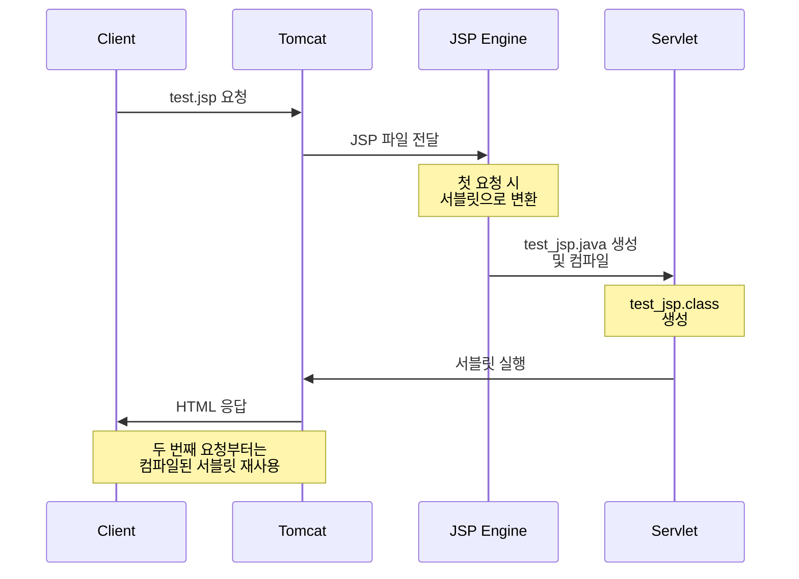

**JSP 컴파일된 파일 확인:**
```bash
# work 디렉토리에서 컴파일된 서블릿 확인
find /var/lib/tomcat10/work -name "*test_jsp*"

# 출력 예시:
/var/lib/tomcat10/work/Catalina/localhost/ROOT/org/apache/jsp/test_jsp.java
/var/lib/tomcat10/work/Catalina/localhost/ROOT/org/apache/jsp/test_jsp.class

# Java 소스 확인
sudo cat /var/lib/tomcat10/work/Catalina/localhost/ROOT/org/apache/jsp/test_jsp.java | head -n 30

# 출력 (일부):
package org.apache.jsp;
import jakarta.servlet.*;
import jakarta.servlet.http.*;
import jakarta.servlet.jsp.*;
public final class test_jsp extends org.apache.jasper.runtime.HttpJspBase
    implements org.apache.jasper.runtime.JspSourceDependent {
  ...
}
```

### HTML 로그인 폼 생성

**로그인 페이지 생성:**
```bash
sudo nano /var/lib/tomcat10/webapps/ROOT/login.html
```

**login.html 내용:**
```html
<!DOCTYPE html>
<html lang="ko">
<head>
    <meta charset="UTF-8">
    <meta name="viewport" content="width=device-width, initial-scale=1.0">
    <title>로그인</title>
    <style>
        body {
            font-family: Arial, sans-serif;
            background-color: #f0f0f0;
            display: flex;
            justify-content: center;
            align-items: center;
            height: 100vh;
            margin: 0;
        }
        .login-container {
            background-color: white;
            padding: 30px;
            border-radius: 8px;
            box-shadow: 0 2px 10px rgba(0,0,0,0.1);
            width: 300px;
        }
        h2 {
            text-align: center;
            color: #333;
            margin-bottom: 20px;
        }
        .form-group {
            margin-bottom: 15px;
        }
        label {
            display: block;
            margin-bottom: 5px;
            color: #555;
            font-weight: bold;
        }
        input[type="text"],
        input[type="password"] {
            width: 100%;
            padding: 10px;
            border: 1px solid #ddd;
            border-radius: 4px;
            box-sizing: border-box;
            font-size: 14px;
        }
        input[type="submit"] {
            width: 100%;
            padding: 10px;
            background-color: #4CAF50;
            color: white;
            border: none;
            border-radius: 4px;
            cursor: pointer;
            font-size: 16px;
            font-weight: bold;
            margin-top: 10px;
        }
        input[type="submit"]:hover {
            background-color: #45a049;
        }
    </style>
</head>
<body>
    <div class="login-container">
        <h2>로그인</h2>
        <form action="login.jsp" method="post">
            <div class="form-group">
                <label for="username">사용자 이름</label>
                <input type="text" id="username" name="username" required>
            </div>
            <div class="form-group">
                <label for="password">비밀번호</label>
                <input type="password" id="password" name="password" required>
            </div>
            <input type="submit" value="로그인">
        </form>
    </div>
</body>
</html>
```

**권한 설정:**
```bash
sudo chown tomcat10:tomcat10 /var/lib/tomcat10/webapps/ROOT/login.html
sudo chmod 644 /var/lib/tomcat10/webapps/ROOT/login.html
```

**접속 테스트:**
```
http://192.168.186.129:8080/login.html
```

### GET vs POST 메서드

**GET 메서드:**
```html
<!-- URL에 데이터가 노출됨 -->
<form action="login.jsp" method="get">
    <input type="text" name="username">
    <input type="password" name="password">
    <input type="submit">
</form>

<!-- 전송 시 URL:
     http://example.com/login.jsp?username=admin&password=1234
-->
```

**GET의 특징:**
- URL에 파라미터가 노출됨
- 브라우저 히스토리에 남음
- 북마크 가능
- 데이터 길이 제한 (약 2KB)
- 멱등성 (여러 번 요청해도 같은 결과)
- 조회(Read) 작업에 적합

**POST 메서드:**
```html
<!-- HTTP Body에 데이터가 포함됨 (URL에 노출 안 됨) -->
<form action="login.jsp" method="post">
    <input type="text" name="username">
    <input type="password" name="password">
    <input type="submit">
</form>

<!-- 전송 시 URL:
     http://example.com/login.jsp
     (파라미터는 HTTP Body에 포함)
-->
```

**POST의 특징:**
- URL에 파라미터가 노출되지 않음
- 브라우저 히스토리에 데이터가 남지 않음
- 북마크 불가
- 데이터 길이 제한 없음
- 비멱등성 (요청마다 서버 상태 변경 가능)
- 생성(Create), 수정(Update), 삭제(Delete) 작업에 적합

**💡 보안 관점:**
- 로그인 폼은 반드시 POST 사용 (비밀번호 보호)
- GET은 민감한 정보 전송에 부적합 (URL에 노출)
- HTTPS 사용 권장 (네트워크 스니핑 방지)

## 📊 Tomcat 로그 확인

### 주요 로그 파일

```bash
# 로그 디렉토리 확인
ls -lh /var/log/tomcat10/

# 출력 예시:
-rw-r----- 1 tomcat10 adm   1.2K Dec 17 11:00 catalina.2025-12-17.log
-rw-r----- 1 tomcat10 adm    45K Dec 17 11:05 catalina.out
-rw-r----- 1 tomcat10 adm   567B Dec 17 11:00 localhost.2025-12-17.log
-rw-r----- 1 tomcat10 adm   2.3K Dec 17 11:05 localhost_access_log.2025-12-17.txt

# 실시간 로그 모니터링
sudo tail -f /var/log/tomcat10/catalina.out

# 출력 예시:
17-Dec-2025 11:00:00.123 INFO [main] org.apache.catalina.startup.Catalina.start Server startup in [3456] milliseconds
17-Dec-2025 11:05:23.456 INFO [http-nio-8080-exec-1] org.apache.catalina.core.ApplicationContext.log Initializing Spring DispatcherServlet 'dispatcher'
```

**로그 파일별 설명:**

**1. catalina.out**
- Tomcat의 표준 출력/에러
- 시스템 레벨 로그
- 서버 시작/종료 메시지

```bash
# 최근 50줄 확인
sudo tail -n 50 /var/log/tomcat10/catalina.out

# 에러만 확인
sudo grep "ERROR" /var/log/tomcat10/catalina.out

# 특정 날짜 로그 확인
sudo grep "17-Dec-2025" /var/log/tomcat10/catalina.out
```

**2. catalina.YYYY-MM-DD.log**
- 날짜별 Tomcat 내부 로그
- Catalina 엔진 관련 메시지

**3. localhost.YYYY-MM-DD.log**
- 가상 호스트(localhost) 관련 로그
- 웹 애플리케이션 배포/해제 메시지

**4. localhost_access_log.YYYY-MM-DD.txt**
- HTTP 접근 로그 (Apache의 access.log와 유사)

```bash
# 접근 로그 확인
sudo tail -f /var/log/tomcat10/localhost_access_log.2025-12-17.txt

# 출력 예시:
192.168.186.1 - - [17/Dec/2025:11:05:23 +0900] "GET /test.jsp HTTP/1.1" 200 1234
192.168.186.1 - - [17/Dec/2025:11:05:30 +0900] "GET /login.html HTTP/1.1" 200 567
192.168.186.1 - - [17/Dec/2025:11:05:45 +0900] "POST /login.jsp HTTP/1.1" 200 890
```

### journalctl을 통한 로그 확인

```bash
# Tomcat 서비스 로그
sudo journalctl -u tomcat10

# 최근 로그만
sudo journalctl -u tomcat10 -n 50

# 실시간 로그
sudo journalctl -u tomcat10 -f

# 특정 시간 이후
sudo journalctl -u tomcat10 --since "2025-12-17 11:00:00"

# 오늘의 로그만
sudo journalctl -u tomcat10 --since today

# 에러만 확인
sudo journalctl -u tomcat10 -p err
```

## 🔧 Tomcat 관리 명령어

### 서비스 관리

```bash
# Tomcat 시작
sudo systemctl start tomcat10

# Tomcat 중지
sudo systemctl stop tomcat10

# Tomcat 재시작
sudo systemctl restart tomcat10

# 서비스 상태 확인
sudo systemctl status tomcat10

# 부팅 시 자동 시작 설정
sudo systemctl enable tomcat10

# 부팅 시 자동 시작 해제
sudo systemctl disable tomcat10

# 서비스 활성화 여부 확인
systemctl is-enabled tomcat10

# 서비스 실행 여부 확인
systemctl is-active tomcat10
```

### 애플리케이션 재배포

```bash
# JSP 파일 수정 후 자동 반영 확인
# Tomcat은 기본적으로 파일 변경을 감지하여 자동 리로드

# 강제 리로드가 필요한 경우
sudo systemctl restart tomcat10

# 또는 특정 애플리케이션만 리로드
# (manager 앱 설치 및 설정 필요)

# work 디렉토리 삭제 (컴파일된 JSP 재생성)
sudo rm -rf /var/lib/tomcat10/work/Catalina/localhost/ROOT/*
sudo systemctl restart tomcat10
```

## 🐛 트러블슈팅

### 일반적인 문제와 해결

**1. Tomcat 시작 실패**
```bash
# 서비스 상태 확인
sudo systemctl status tomcat10

# 로그 확인
sudo journalctl -u tomcat10 -n 100
sudo tail -n 100 /var/log/tomcat10/catalina.out

# 일반적인 원인:
# - Java가 설치되지 않음
java -version

# - 8080 포트 이미 사용 중
sudo ss -tuln | grep :8080
sudo lsof -i :8080

# - 권한 문제
sudo chown -R tomcat10:tomcat10 /var/lib/tomcat10
sudo chmod -R 755 /var/lib/tomcat10/webapps
```

**2. JSP 페이지가 표시되지 않음 (404 오류)**
```bash
# 파일 존재 확인
ls -l /var/lib/tomcat10/webapps/ROOT/*.jsp

# 파일 권한 확인
sudo chmod 644 /var/lib/tomcat10/webapps/ROOT/*.jsp

# Tomcat 로그 확인
sudo tail -f /var/log/tomcat10/catalina.out
sudo tail -f /var/log/tomcat10/localhost.*.log

# Tomcat 재시작
sudo systemctl restart tomcat10
```

**3. JSP 컴파일 오류 (500 오류)**
```bash
# 에러 메시지 확인 (브라우저에 표시됨)
# 일반적인 원인:
# - JSP 문법 오류
# - 누락된 import 문
# - 잘못된 EL 표현식

# work 디렉토리에서 컴파일 오류 확인
sudo tail -f /var/log/tomcat10/catalina.out

# work 디렉토리 삭제 후 재컴파일
sudo rm -rf /var/lib/tomcat10/work/Catalina/localhost/ROOT/*
# 브라우저에서 페이지 재요청
```

**4. 메모리 부족 (OutOfMemoryError)**
```bash
# Tomcat 메모리 설정 변경
sudo nano /etc/default/tomcat10

# 다음 줄 추가 또는 수정:
CATALINA_OPTS="-Xms512M -Xmx1024M -XX:MaxPermSize=256M"
# -Xms: 초기 힙 메모리
# -Xmx: 최대 힙 메모리
# -XX:MaxPermSize: 최대 Perm Gen 메모리 (Java 7 이하)

# Tomcat 재시작
sudo systemctl restart tomcat10

# 메모리 사용량 확인
ps aux | grep tomcat
top -p $(pgrep -f tomcat)
```

**5. 느린 응답 시간**
```bash
# 스레드 풀 설정 확인
sudo cat /var/lib/tomcat10/conf/server.xml | grep Connector

# Connector 설정 최적화
<Connector port="8080" protocol="HTTP/1.1"
           connectionTimeout="20000"
           maxThreads="200"           <!-- 최대 스레드 수 -->
           minSpareThreads="25"       <!-- 최소 유휴 스레드 -->
           maxConnections="10000"     <!-- 최대 연결 수 -->
           acceptCount="100"          <!-- 대기 큐 크기 -->
           redirectPort="8443" />

# 설정 변경 후 재시작
sudo systemctl restart tomcat10
```

## ✅ 학습 체크리스트

**설치 및 설정:**
- [ ] Java를 설치하고 버전을 확인할 수 있는가?
- [ ] JAVA_HOME 환경 변수를 설정할 수 있는가?
- [ ] Tomcat10을 설치할 수 있는가?
- [ ] Tomcat 서비스를 시작/중지/재시작할 수 있는가?
- [ ] Tomcat이 8080 포트로 리스닝하는지 확인할 수 있는가?

**디렉토리 구조:**
- [ ] webapps 디렉토리의 위치를 알고 있는가?
- [ ] ROOT 애플리케이션이 무엇인지 이해하는가?
- [ ] 로그 파일의 위치를 알고 있는가?
- [ ] work 디렉토리의 역할을 이해하는가?

**JSP 배포:**
- [ ] JSP 파일을 생성하고 배포할 수 있는가?
- [ ] JSP 동작 원리를 이해하는가? (서블릿 변환)
- [ ] HTML 폼을 생성할 수 있는가?
- [ ] GET과 POST의 차이를 이해하는가?

**로그 및 모니터링:**
- [ ] catalina.out 로그를 확인할 수 있는가?
- [ ] 접근 로그를 확인할 수 있는가?
- [ ] journalctl로 Tomcat 로그를 확인할 수 있는가?

**문제 해결:**
- [ ] Tomcat 시작 실패 시 원인을 찾을 수 있는가?
- [ ] 404/500 오류를 진단할 수 있는가?
- [ ] 포트 충돌을 해결할 수 있는가?


**다음 섹션에서는** MariaDB 데이터베이스 서버를 설치하고 원격 접속을 설정하는 방법을 학습한다.
# Section 5: 데이터베이스 서버 구축 (MariaDB)

## 🗄️ MariaDB 소개

### MariaDB란?

MariaDB는 MySQL의 창시자인 Michael "Monty" Widenius가 Oracle의 MySQL 인수 후 만든 오픈 소스 관계형 데이터베이스 관리 시스템(RDBMS)이다. MySQL과 높은 호환성을 유지하면서도 더 많은 기능과 개선사항을 제공한다.

**MariaDB의 특징:**
- MySQL과의 높은 호환성 (드롭인 대체 가능)
- 완전한 오픈 소스 (GPL 라이선스)
- 더 빠른 성능
- 더 많은 스토리지 엔진 지원
- 활발한 개발 커뮤니티
- 엔터프라이즈 기능 무료 제공

**MySQL vs MariaDB:**

| 특징 | MySQL | MariaDB |
|------|-------|---------|
| 라이선스 | GPL (일부 상용) | GPL (완전 오픈소스) |
| 소유 | Oracle | MariaDB Foundation |
| 스토리지 엔진 | InnoDB, MyISAM 등 | 더 많은 엔진 지원 |
| 호환성 | - | MySQL과 호환 |
| 성능 | 좋음 | 더 좋음 |

### 3계층 아키텍처에서 데이터베이스의 역할

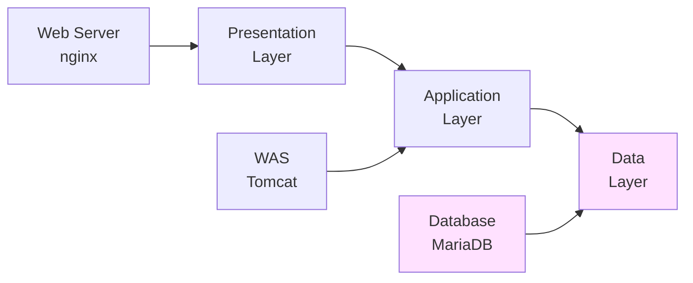

**데이터베이스 서버의 역할:**
1. 데이터 저장 및 관리
2. CRUD 작업 처리 (Create, Read, Update, Delete)
3. 데이터 무결성 보장
4. 트랜잭션 관리 (ACID 속성)
5. 동시성 제어
6. 백업 및 복구
7. 보안 및 접근 제어

**💡 데이터베이스를 별도 서버로 분리하는 이유:**
- **확장성**: DB 부하에 따라 독립적으로 스케일업
- **보안**: DB를 외부 네트워크에서 완전히 격리
- **성능**: DB 전용 하드웨어 리소스 사용
- **안정성**: DB 장애가 다른 계층에 영향 최소화
- **관리**: DB 백업, 유지보수 독립적 수행

## 📦 MariaDB 설치

### MariaDB 서버 설치

```bash
# 패키지 목록 업데이트
sudo apt update

# MariaDB 서버 설치
sudo apt install mariadb-server -y

# 설치 과정 출력 예시:
Reading package lists... Done
Building dependency tree... Done
Reading state information... Done
The following additional packages will be installed:
  galera-4 libconfig-inifiles-perl libdbd-mariadb-perl libdbi-perl
  libmariadb3 libterm-readkey-perl mariadb-client mariadb-client-core
  mariadb-common mariadb-server-core mysql-common socat
Suggested packages:
  libipc-sharedcache-perl libterm-readline-gnu-perl mailx tinyca
The following NEW packages will be installed:
  galera-4 libconfig-inifiles-perl libdbd-mariadb-perl libdbi-perl
  libmariadb3 libterm-readkey-perl mariadb-client mariadb-client-core
  mariadb-common mariadb-server mariadb-server-core mysql-common socat
0 upgraded, 13 newly installed, 0 to remove and 0 not upgraded.
Need to get 24.5 MB of archives.
After this operation, 231 MB of additional disk space will be used.

# MariaDB 버전 확인
mysql --version
# 출력: mysql  Ver 15.1 Distrib 10.11.8-MariaDB, for debian-linux-gnu (x86_64) using  EditLine wrapper

# 또는
mariadb --version
# 출력: mariadb from 10.11.8-MariaDB, client 15.2 for debian-linux-gnu (x86_64) using  EditLine wrapper
```

**💡 주의:** `mysql` 명령어와 `mariadb` 명령어는 동일하다. MariaDB는 MySQL과의 호환성을 위해 두 명령어를 모두 제공한다.

### MariaDB 서비스 시작

```bash
# MariaDB 서비스 시작
sudo systemctl start mariadb

# 서비스 상태 확인
sudo systemctl status mariadb

# 출력 예시:
● mariadb.service - MariaDB 10.11.8 database server
     Loaded: loaded (/lib/systemd/system/mariadb.service; enabled; vendor preset: enabled)
     Active: active (running) since Tue 2025-12-17 12:00:00 KST; 5s ago
       Docs: man:mariadbd(8)
             https://mariadb.com/kb/en/library/systemd/
    Process: 2345 ExecStartPre=/usr/bin/install -m 755 -o mysql -g root -d /var/run/mysqld (code=exited, status=0/SUCCESS)
    Process: 2346 ExecStartPre=/bin/sh -c systemctl unset-environment _WSREP_START_POSITION (code=exited, status=0/SUCCESS)
    Process: 2348 ExecStartPre=/bin/sh -c [ ! -e /usr/bin/galera_recovery ] && VAR= ||   VAR=`cd /usr/bin/..; /usr/bin/galera_recovery`; [ $? -eq 0 ]   && systemctl set-environment _WSREP_START_POSITION=$VAR || exit 1 (code=exited, status=0/SUCCESS)
    Process: 2391 ExecStartPost=/bin/sh -c systemctl unset-environment _WSREP_START_POSITION (code=exited, status=0/SUCCESS)
    Process: 2393 ExecStartPost=/etc/mysql/debian-start (code=exited, status=0/SUCCESS)
   Main PID: 2371 (mariadbd)
     Status: "Taking your SQL requests now..."
      Tasks: 9 (limit: 4558)
     Memory: 84.3M
        CPU: 567ms
     CGroup: /system.slice/mariadb.service
             └─2371 /usr/sbin/mariadbd

Dec 17 12:00:00 dbserver systemd[1]: Starting MariaDB 10.11.8 database server...
Dec 17 12:00:00 dbserver mariadbd[2371]: 2025-12-17 12:00:00 0 [Note] /usr/sbin/mariadbd (server 10.11.8-MariaDB-0ubuntu0.24.04.1) starting as process 2371 ...
Dec 17 12:00:00 dbserver systemd[1]: Started MariaDB 10.11.8 database server.

# 부팅 시 자동 시작 설정
sudo systemctl enable mariadb

# 프로세스 확인
ps aux | grep mariadb

# 출력 예시:
mysql     2371  0.1  2.8 1789456 123456 ?      Ssl  12:00   0:00 /usr/sbin/mariadbd

# 포트 확인
sudo ss -tuln | grep :3306

# 출력:
tcp   LISTEN 0      80     127.0.0.1:3306     0.0.0.0:*
# ↑ 기본적으로 localhost(127.0.0.1)만 리스닝

# lsof로 확인
sudo lsof -i :3306

# 출력:
COMMAND   PID  USER   FD   TYPE DEVICE SIZE/OFF NODE NAME
mariadbd 2371 mysql   18u  IPv4  12345      0t0  TCP localhost:mysql (LISTEN)
```

### MariaDB 보안 설정

**mysql_secure_installation 실행:**
```bash
sudo mysql_secure_installation

# 대화형 프롬프트:

NOTE: RUNNING ALL PARTS OF THIS SCRIPT IS RECOMMENDED FOR ALL MariaDB
      SERVERS IN PRODUCTION USE!  PLEASE READ EACH STEP CAREFULLY!

Enter current password for root (enter for none): [Enter 키]
# 초기에는 비밀번호가 없음

Switch to unix_socket authentication [Y/n] n
# Unix 소켓 인증 사용 여부 (일반적으로 n)

Change the root password? [Y/n] Y
# root 비밀번호 설정
New password: ********
Re-enter new password: ********
Password updated successfully!

Remove anonymous users? [Y/n] Y
# 익명 사용자 제거 (보안상 권장)
 ... Success!

Disallow root login remotely? [Y/n] Y
# root 원격 로그인 차단 (보안상 권장)
 ... Success!

Remove test database and access to it? [Y/n] Y
# 테스트 데이터베이스 제거
 - Dropping test database...
 ... Success!
 - Removing privileges on test database...
 ... Success!

Reload privilege tables now? [Y/n] Y
# 권한 테이블 리로드
 ... Success!

Cleaning up...

All done!  If you've completed all of the above steps, your MariaDB
installation should now be secure.

Thanks for using MariaDB!
```

## 🔌 MariaDB 접속

### 로컬 접속

```bash
# root 사용자로 MariaDB 접속
sudo mysql -u root -p

# 비밀번호 입력 후 프롬프트 표시:
Enter password: ********

Welcome to the MariaDB monitor.  Commands end with ; or \g.
Your MariaDB connection id is 35
Server version: 10.11.8-MariaDB-0ubuntu0.24.04.1 Ubuntu 24.04

Copyright (c) 2000, 2018, Oracle, MariaDB Corporation Ab and others.

Type 'help;' or '\h' for help. Type '\c' to clear the current input statement.

MariaDB [(none)]> _

# 또는 비밀번호를 명령줄에 포함 (보안상 권장하지 않음)
sudo mysql -u root -p비밀번호

# sudo 없이 접속 (Unix 소켓 인증 사용 시)
sudo mysql
```

**기본 SQL 명령어:**
```sql
-- 데이터베이스 목록 확인
SHOW DATABASES;

-- 출력:
+--------------------+
| Database           |
+--------------------+
| information_schema |
| mysql              |
| performance_schema |
| sys                |
+--------------------+
4 rows in set (0.001 sec)

-- 현재 사용자 확인
SELECT USER();

-- 출력:
+----------------+
| USER()         |
+----------------+
| root@localhost |
+----------------+
1 row in set (0.000 sec)

-- MariaDB 버전 확인
SELECT VERSION();

-- 출력:
+-----------------------------------------+
| VERSION()                               |
+-----------------------------------------+
| 10.11.8-MariaDB-0ubuntu0.24.04.1        |
+-----------------------------------------+
1 row in set (0.000 sec)

-- 현재 시간 확인
SELECT NOW();

-- 출력:
+---------------------+
| NOW()               |
+---------------------+
| 2025-12-17 12:05:30 |
+---------------------+
1 row in set (0.000 sec)

-- 접속 종료
EXIT;
-- 또는
QUIT;
-- 또는
\q
```

## 🌐 원격 접속 설정

### bind-address 변경

기본적으로 MariaDB는 보안상의 이유로 localhost(127.0.0.1)에서만 연결을 수신한다. 원격 접속을 허용하려면 설정을 변경해야 한다.

```bash
# MariaDB 설정 파일 위치 확인
sudo find /etc/mysql -name "*.cnf" -type f

# 출력:
/etc/mysql/my.cnf
/etc/mysql/mariadb.cnf
/etc/mysql/conf.d/mysql.cnf
/etc/mysql/mariadb.conf.d/50-client.cnf
/etc/mysql/mariadb.conf.d/50-mysql-clients.cnf
/etc/mysql/mariadb.conf.d/50-mysqldump.cnf
/etc/mysql/mariadb.conf.d/50-server.cnf    ← 이 파일 수정

# 서버 설정 파일 백업
sudo cp /etc/mysql/mariadb.conf.d/50-server.cnf /etc/mysql/mariadb.conf.d/50-server.cnf.backup

# 설정 파일 편집
sudo nano /etc/mysql/mariadb.conf.d/50-server.cnf
```

**50-server.cnf 파일에서 bind-address 찾기:**
```ini
# 원래 설정 (localhost만 허용):
[mysqld]
bind-address = 127.0.0.1

# 변경 후 (모든 IP에서 접속 허용):
[mysqld]
bind-address = 0.0.0.0

# 또는 특정 IP만 허용:
[mysqld]
bind-address = 192.168.186.130
```

**💡 bind-address 설명:**
- `127.0.0.1`: localhost만 접속 가능
- `0.0.0.0`: 모든 IP에서 접속 가능
- `192.168.186.130`: 특정 IP 인터페이스만 리스닝

**설정 적용:**
```bash
# 변경 내용 확인
sudo grep "bind-address" /etc/mysql/mariadb.conf.d/50-server.cnf

# 출력:
bind-address = 0.0.0.0

# MariaDB 재시작
sudo systemctl restart mariadb

# 재시작 확인
sudo systemctl status mariadb

# 포트 확인 (0.0.0.0으로 리스닝)
sudo ss -tuln | grep :3306

# 출력:
tcp   LISTEN 0      80     0.0.0.0:3306     0.0.0.0:*
#                    ↑ 모든 IP에서 접속 가능
```

### 원격 접속 사용자 생성

```bash
# MariaDB 접속
sudo mysql -u root -p
```

**사용자 생성 및 권한 부여:**
```sql
-- CloudDB 데이터베이스 삭제 (기존 것이 있다면)
DROP DATABASE IF EXISTS CloudDB;

-- CloudDB 데이터베이스 생성
CREATE DATABASE CloudDB;

-- 데이터베이스 확인
SHOW DATABASES;

-- CloudDB 사용
USE CloudDB;

-- 현재 데이터베이스 확인
SELECT DATABASE();

-- 출력:
+------------+
| DATABASE() |
+------------+
| CloudDB    |
+------------+

-- 원격 접속 사용자 생성
-- '%'는 모든 IP에서 접속 가능을 의미
CREATE USER 'clouduser'@'%' IDENTIFIED BY 'password123';

-- 또는 특정 IP/네트워크만 허용
CREATE USER 'clouduser'@'192.168.186.%' IDENTIFIED BY 'password123';
-- 192.168.186.0/24 네트워크만 허용

-- 또는 특정 호스트만 허용
CREATE USER 'clouduser'@'192.168.186.129' IDENTIFIED BY 'password123';
-- WAS 서버만 허용

-- 사용자에게 CloudDB 데이터베이스의 모든 권한 부여
GRANT ALL PRIVILEGES ON CloudDB.* TO 'clouduser'@'%';

-- 특정 권한만 부여하는 방법:
-- GRANT SELECT, INSERT, UPDATE, DELETE ON CloudDB.* TO 'clouduser'@'%';

-- 권한 테이블 리로드 (변경사항 즉시 적용)
FLUSH PRIVILEGES;

-- 사용자 목록 확인
SELECT User, Host FROM mysql.user;

-- 출력 예시:
+-------------+---------------+
| User        | Host          |
+-------------+---------------+
| clouduser   | %             |
| mariadb.sys | localhost     |
| mysql       | localhost     |
| root        | localhost     |
+-------------+---------------+

-- 사용자 권한 확인
SHOW GRANTS FOR 'clouduser'@'%';

-- 출력:
+--------------------------------------------------+
| Grants for clouduser@%                           |
+--------------------------------------------------+
| GRANT USAGE ON *.* TO `clouduser`@`%`            |
| GRANT ALL PRIVILEGES ON `CloudDB`.* TO `clouduser`@`%` |
+--------------------------------------------------+
```

**💡 권한 레벨:**
- `*.*`: 모든 데이터베이스의 모든 테이블
- `CloudDB.*`: CloudDB 데이터베이스의 모든 테이블
- `CloudDB.UserInfo`: CloudDB 데이터베이스의 UserInfo 테이블만

**💡 주요 권한 종류:**
- `ALL PRIVILEGES`: 모든 권한
- `SELECT`: 읽기
- `INSERT`: 삽입
- `UPDATE`: 수정
- `DELETE`: 삭제
- `CREATE`: 테이블/DB 생성
- `DROP`: 테이블/DB 삭제
- `ALTER`: 테이블 구조 변경
- `INDEX`: 인덱스 생성/삭제

### 원격 접속 테스트

**WAS 서버(192.168.186.129)에서 테스트:**
```bash
# WAS 서버에 MySQL 클라이언트 설치
sudo apt install mysql-client -y

# DB 서버로 접속 테스트
mysql -h 192.168.186.130 -u clouduser -p

# 비밀번호 입력:
Enter password: password123

# 성공 시 출력:
Welcome to the MySQL monitor.  Commands end with ; or \g.
Your MySQL connection id is 40
Server version: 10.11.8-MariaDB-0ubuntu0.24.04.1 Ubuntu 24.04

Copyright (c) 2000, 2024, Oracle and/or its affiliates.

Oracle is a registered trademark of Oracle Corporation and/or its
affiliates. Other names may be trademarks of their respective owners.

Type 'help;' or '\h' for help. Type '\c' to clear the current input statement.

mysql> _

# 데이터베이스 확인
mysql> SHOW DATABASES;

# 출력:
+--------------------+
| Database           |
+--------------------+
| CloudDB            |
| information_schema |
+--------------------+

# 접속 종료
mysql> EXIT;
```

**접속 실패 시 원인 확인:**
```bash
# 1. 네트워크 연결 확인
ping 192.168.186.130

# 2. 포트 확인
telnet 192.168.186.130 3306
# 또는
nc -zv 192.168.186.130 3306

# 3. 방화벽 확인
sudo ufw status

# 4. MariaDB 로그 확인
sudo tail -f /var/log/mysql/error.log
```

## 📊 데이터베이스 및 테이블 생성

### UserInfo 테이블 생성

```sql
-- MariaDB 접속 (DB 서버에서)
sudo mysql -u root -p

-- CloudDB 사용
USE CloudDB;

-- UserInfo 테이블 생성
CREATE TABLE UserInfo (
    uid INT PRIMARY KEY AUTO_INCREMENT,
    uname VARCHAR(20) NOT NULL,
    pass VARCHAR(128) NOT NULL,
    profile VARCHAR(200),
    priority INT DEFAULT 0
);

-- 테이블 목록 확인
SHOW TABLES;

-- 출력:
+-------------------+
| Tables_in_CloudDB |
+-------------------+
| UserInfo          |
+-------------------+

-- 테이블 구조 확인
DESC UserInfo;

-- 출력:
+----------+--------------+------+-----+---------+----------------+
| Field    | Type         | Null | Key | Default | Extra          |
+----------+--------------+------+-----+---------+----------------+
| uid      | int(11)      | NO   | PRI | NULL    | auto_increment |
| uname    | varchar(20)  | NO   |     | NULL    |                |
| pass     | varchar(128) | NO   |     | NULL    |                |
| profile  | varchar(200) | YES  |     | NULL    |                |
| priority | int(11)      | YES  |     | 0       |                |
+----------+--------------+------+-----+---------+----------------+

-- 또는
SHOW CREATE TABLE UserInfo\G

-- 출력:
*************************** 1. row ***************************
       Table: UserInfo
Create Table: CREATE TABLE `UserInfo` (
  `uid` int(11) NOT NULL AUTO_INCREMENT,
  `uname` varchar(20) NOT NULL,
  `pass` varchar(128) NOT NULL,
  `profile` varchar(200) DEFAULT NULL,
  `priority` int(11) DEFAULT 0,
  PRIMARY KEY (`uid`)
) ENGINE=InnoDB DEFAULT CHARSET=utf8mb4 COLLATE=utf8mb4_general_ci
```

**컬럼 설명:**
- `uid`: 사용자 ID (자동 증가 기본키)
- `uname`: 사용자 이름 (최대 20자, NULL 불가)
- `pass`: 비밀번호 (최대 128자, NULL 불가)
- `profile`: 프로필 정보 (최대 200자, NULL 허용)
- `priority`: 우선순위 (기본값 0)

### 테스트 데이터 삽입

```sql
-- 테스트 사용자 추가
INSERT INTO UserInfo (uname, pass, profile, priority) VALUES
('admin', '1234', 'Administrator', 100),
('user1', 'pass1', 'Regular User 1', 10),
('user2', 'pass2', 'Regular User 2', 10),
('guest', 'guest', 'Guest User', 1);

-- 삽입 확인
SELECT * FROM UserInfo;

-- 출력:
+-----+-------+-------+-----------------+----------+
| uid | uname | pass  | profile         | priority |
+-----+-------+-------+-----------------+----------+
|   1 | admin | 1234  | Administrator   |      100 |
|   2 | user1 | pass1 | Regular User 1  |       10 |
|   3 | user2 | pass2 | Regular User 2  |       10 |
|   4 | guest | guest | Guest User      |        1 |
+-----+-------+-------+-----------------+----------+
4 rows in set (0.001 sec)

-- 특정 사용자 조회
SELECT * FROM UserInfo WHERE uname = 'admin';

-- 출력:
+-----+-------+------+---------------+----------+
| uid | uname | pass | profile       | priority |
+-----+-------+------+---------------+----------+
|   1 | admin | 1234 | Administrator |      100 |
+-----+-------+------+---------------+----------+

-- 사용자명과 비밀번호로 인증 (로그인 시뮬레이션)
SELECT * FROM UserInfo WHERE uname = 'admin' AND pass = '1234';

-- 출력:
+-----+-------+------+---------------+----------+
| uid | uname | pass | profile       | priority |
+-----+-------+------+---------------+----------+
|   1 | admin | 1234 | Administrator |      100 |
+-----+-------+------+---------------+----------+
1 row in set (0.001 sec)

-- 잘못된 비밀번호로 시도
SELECT * FROM UserInfo WHERE uname = 'admin' AND pass = 'wrong';

-- 출력:
Empty set (0.000 sec)
```

## 🔧 CRUD 작업

### CREATE (데이터 삽입)

```sql
-- 단일 행 삽입
INSERT INTO UserInfo (uname, pass, profile, priority)
VALUES ('newuser', 'newpass', 'New User', 50);

-- 여러 행 동시 삽입
INSERT INTO UserInfo (uname, pass, profile, priority) VALUES
('test1', 'test1', 'Test User 1', 5),
('test2', 'test2', 'Test User 2', 5),
('test3', 'test3', 'Test User 3', 5);

-- uid 자동 증가 확인
SELECT LAST_INSERT_ID();

-- 특정 컬럼만 삽입 (나머지는 기본값 또는 NULL)
INSERT INTO UserInfo (uname, pass) VALUES ('minimal', 'min123');
```

### READ (데이터 조회)

```sql
-- 모든 데이터 조회
SELECT * FROM UserInfo;

-- 특정 컬럼만 조회
SELECT uname, profile FROM UserInfo;

-- 조건부 조회
SELECT * FROM UserInfo WHERE priority >= 10;

-- 정렬
SELECT * FROM UserInfo ORDER BY priority DESC;

-- 상위 N개만 조회
SELECT * FROM UserInfo ORDER BY priority DESC LIMIT 3;

-- 패턴 매칭 (LIKE)
SELECT * FROM UserInfo WHERE uname LIKE 'test%';

-- 개수 세기
SELECT COUNT(*) FROM UserInfo;

-- 조건별 개수
SELECT priority, COUNT(*) AS user_count
FROM UserInfo
GROUP BY priority
ORDER BY priority DESC;
```

### UPDATE (데이터 수정)

```sql
-- 특정 사용자 비밀번호 변경
UPDATE UserInfo SET pass = 'newpassword' WHERE uname = 'user1';

-- 여러 컬럼 동시 수정
UPDATE UserInfo
SET pass = 'updated', profile = 'Updated User', priority = 20
WHERE uname = 'user2';

-- 조건에 맞는 모든 행 수정
UPDATE UserInfo SET priority = priority + 10 WHERE priority < 50;

-- 영향받은 행 수 확인
-- Query OK, X rows affected
```

### DELETE (데이터 삭제)

```sql
-- 특정 사용자 삭제
DELETE FROM UserInfo WHERE uname = 'test3';

-- 조건에 맞는 모든 행 삭제
DELETE FROM UserInfo WHERE priority < 5;

-- ⚠️ 모든 데이터 삭제 (주의!)
DELETE FROM UserInfo;

-- 테이블 초기화 (더 빠름, AUTO_INCREMENT 리셋)
TRUNCATE TABLE UserInfo;
```

**💡 DELETE vs TRUNCATE:**
- `DELETE`: 행별로 삭제, WHERE 조건 사용 가능, 롤백 가능, 느림
- `TRUNCATE`: 테이블 전체 삭제, 조건 불가, 롤백 불가, 빠름, AUTO_INCREMENT 리셋

## 🛡️ 보안 고려사항

### 비밀번호 해싱

**⚠️ 현재 문제점:**
```sql
-- 비밀번호를 평문으로 저장 (매우 위험!)
INSERT INTO UserInfo (uname, pass) VALUES ('user', '1234');

SELECT * FROM UserInfo WHERE uname = 'user';
-- 출력: pass 컬럼에 '1234'가 그대로 보임
```

**✅ 권장 방법:**
```sql
-- SHA2 해싱 사용 (256비트)
INSERT INTO UserInfo (uname, pass)
VALUES ('secure_user', SHA2('1234', 256));

-- 로그인 검증
SELECT * FROM UserInfo
WHERE uname = 'secure_user'
AND pass = SHA2('1234', 256);

-- MD5 (보안이 약함, 권장하지 않음)
UPDATE UserInfo SET pass = MD5('1234') WHERE uname = 'user1';

-- bcrypt 사용 (애플리케이션 레벨에서 처리 권장)
-- Java의 BCrypt, Python의 bcrypt 라이브러리 등
```

**해시 비교:**

| 알고리즘 | 출력 길이 | 보안성 | 속도 |
|---------|----------|--------|------|
| MD5 | 32자 (16바이트) | 낮음 | 빠름 |
| SHA1 | 40자 (20바이트) | 낮음 | 빠름 |
| SHA256 | 64자 (32바이트) | 중간 | 중간 |
| bcrypt | 60자 | 높음 | 느림 (의도적) |

**💡 최선의 방법:**
- 애플리케이션 레벨에서 bcrypt/Argon2 사용
- Salt 추가 (같은 비밀번호도 다른 해시값 생성)
- 데이터베이스에는 해시값만 저장
- HTTPS 사용 (전송 중 암호화)

### SQL 인젝션 방어

**취약한 쿼리 (SQL 인젝션 가능):**
```java
// ❌ 절대 이렇게 하지 말 것!
String query = "SELECT * FROM UserInfo WHERE uname='" + username + "' AND pass='" + password + "'";
```

**공격 시나리오:**
```
입력된 username: admin' OR '1'='1
입력된 password: anything

실제 실행되는 쿼리:
SELECT * FROM UserInfo WHERE uname='admin' OR '1'='1' AND pass='anything'
↑ '1'='1'은 항상 참이므로 모든 사용자 정보가 반환됨
```

**안전한 쿼리 (PreparedStatement 사용):**
```java
// ✅ 올바른 방법
String query = "SELECT * FROM UserInfo WHERE uname=? AND pass=?";
PreparedStatement pstmt = conn.prepareStatement(query);
pstmt.setString(1, username);
pstmt.setString(2, password);
ResultSet rs = pstmt.executeQuery();
```

## 📝 MariaDB 관리 명령어

### 서비스 관리

```bash
# MariaDB 시작
sudo systemctl start mariadb

# MariaDB 중지
sudo systemctl stop mariadb

# MariaDB 재시작
sudo systemctl restart mariadb

# 서비스 상태 확인
sudo systemctl status mariadb

# 부팅 시 자동 시작
sudo systemctl enable mariadb

# 부팅 시 자동 시작 해제
sudo systemctl disable mariadb
```

### 로그 확인

```bash
# 에러 로그 확인
sudo tail -f /var/log/mysql/error.log

# 슬로우 쿼리 로그 (느린 쿼리 기록)
sudo tail -f /var/log/mysql/mysql-slow.log

# journalctl로 확인
sudo journalctl -u mariadb -f
```

### 백업 및 복원

```bash
# 데이터베이스 백업
mysqldump -u root -p CloudDB > clouddb_backup.sql

# 모든 데이터베이스 백업
mysqldump -u root -p --all-databases > all_databases_backup.sql

# 테이블 구조만 백업
mysqldump -u root -p --no-data CloudDB > clouddb_structure.sql

# 백업 복원
mysql -u root -p CloudDB < clouddb_backup.sql

# 새 데이터베이스에 복원
mysql -u root -p -e "CREATE DATABASE CloudDB_restore;"
mysql -u root -p CloudDB_restore < clouddb_backup.sql
```

## 🐛 트러블슈팅

### 일반적인 문제와 해결

**1. 원격 접속 실패**
```bash
# 원인 1: bind-address가 localhost로 설정됨
sudo grep "bind-address" /etc/mysql/mariadb.conf.d/50-server.cnf
# 0.0.0.0으로 변경

# 원인 2: 방화벽 차단
sudo ufw status
sudo ufw allow 3306/tcp

# 원인 3: 사용자 권한 없음
mysql> SHOW GRANTS FOR 'clouduser'@'%';
mysql> GRANT ALL PRIVILEGES ON CloudDB.* TO 'clouduser'@'%';
mysql> FLUSH PRIVILEGES;

# 원인 4: MariaDB가 리스닝하지 않음
sudo ss -tuln | grep :3306
sudo systemctl restart mariadb
```

**2. Access Denied 에러**
```bash
# 비밀번호 확인
mysql -u clouduser -p

# 사용자 존재 확인
mysql> SELECT User, Host FROM mysql.user WHERE User='clouduser';

# 권한 확인
mysql> SHOW GRANTS FOR 'clouduser'@'%';

# 비밀번호 재설정
mysql> ALTER USER 'clouduser'@'%' IDENTIFIED BY 'new_password';
mysql> FLUSH PRIVILEGES;
```

**3. MariaDB 시작 실패**
```bash
# 로그 확인
sudo journalctl -u mariadb -n 100
sudo cat /var/log/mysql/error.log

# 일반적인 원인:
# - 포트 이미 사용 중
sudo lsof -i :3306

# - 디스크 공간 부족
df -h

# - 설정 파일 오류
sudo mariadbd --help --verbose
```

**4. 연결이 느림**
```sql
-- 슬로우 쿼리 로그 활성화
SET GLOBAL slow_query_log = 'ON';
SET GLOBAL long_query_time = 2;  -- 2초 이상 걸리는 쿼리 기록

-- 쿼리 실행 계획 확인
EXPLAIN SELECT * FROM UserInfo WHERE uname = 'admin';

-- 인덱스 추가
CREATE INDEX idx_uname ON UserInfo(uname);

-- 인덱스 확인
SHOW INDEX FROM UserInfo;
```

## ✅ 학습 체크리스트

**설치 및 설정:**
- [ ] MariaDB를 설치할 수 있는가?
- [ ] MariaDB 서비스를 시작/중지할 수 있는가?
- [ ] mysql_secure_installation을 실행했는가?
- [ ] bind-address를 변경하여 원격 접속을 허용할 수 있는가?

**사용자 및 권한:**
- [ ] 새로운 사용자를 생성할 수 있는가?
- [ ] 사용자에게 권한을 부여할 수 있는가?
- [ ] 사용자 목록과 권한을 확인할 수 있는가?
- [ ] 원격 접속을 테스트할 수 있는가?

**데이터베이스 및 테이블:**
- [ ] 데이터베이스를 생성할 수 있는가?
- [ ] 테이블을 생성할 수 있는가?
- [ ] 테이블 구조를 확인할 수 있는가?

**CRUD 작업:**
- [ ] 데이터를 삽입(INSERT)할 수 있는가?
- [ ] 데이터를 조회(SELECT)할 수 있는가?
- [ ] 데이터를 수정(UPDATE)할 수 있는가?
- [ ] 데이터를 삭제(DELETE)할 수 있는가?

**보안:**
- [ ] 비밀번호 해싱의 중요성을 이해하는가?
- [ ] SQL 인젝션 공격을 이해하는가?
- [ ] PreparedStatement의 필요성을 이해하는가?

**관리:**
- [ ] 로그 파일을 확인할 수 있는가?
- [ ] 데이터베이스를 백업하고 복원할 수 있는가?


**다음 섹션에서는** 3계층 아키텍처를 통합하고 JDBC를 사용하여 로그인 시스템을 구현하는 방법을 학습한다.
# Section 6: 3계층 아키텍처 통합 및 로그인 구현

## 🔗 3계층 아키텍처 통합

### 전체 아키텍처 개요

이제 지금까지 구축한 3대의 서버를 연동하여 완전한 웹 애플리케이션을 만든다.

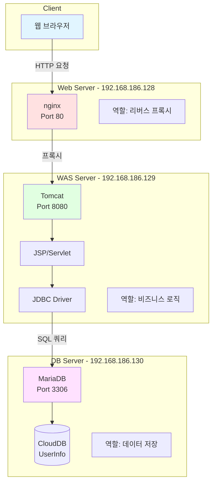

### 데이터 흐름

**로그인 요청 시 데이터 흐름:**

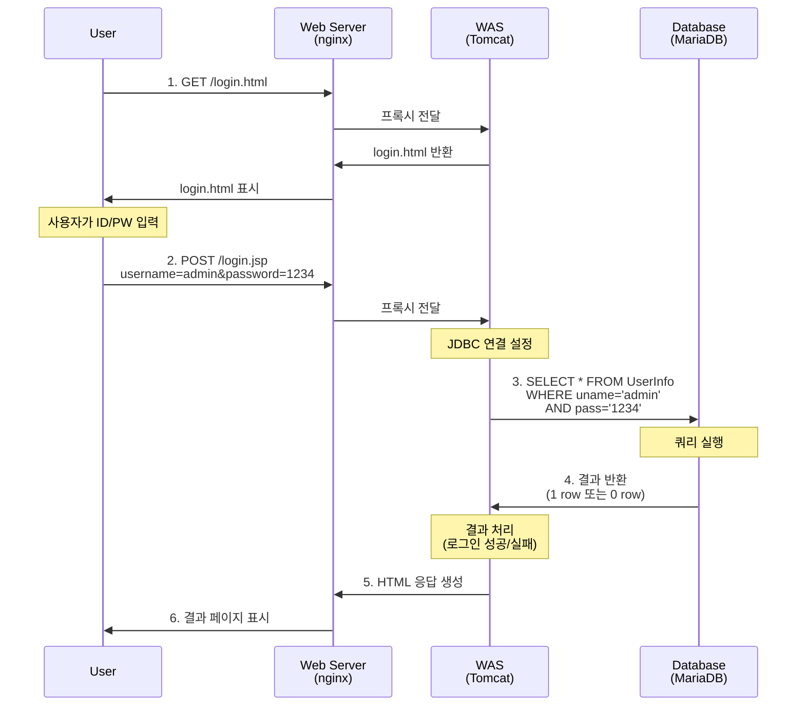

## 📚 JDBC (Java Database Connectivity)

### JDBC란?

JDBC는 Java 애플리케이션에서 데이터베이스에 접근하기 위한 표준 API이다.

**JDBC 아키텍처:**

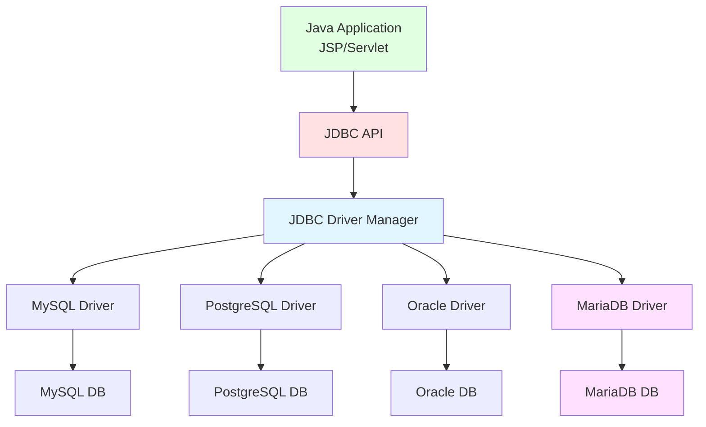

**JDBC의 주요 구성 요소:**
1. **Driver Manager**: 드라이버를 로드하고 연결 관리
2. **Driver**: 특정 데이터베이스와 통신하는 드라이버
3. **Connection**: 데이터베이스 연결 객체
4. **Statement**: SQL 문 실행 객체
5. **ResultSet**: 쿼리 결과 저장 객체

### MariaDB JDBC Connector 다운로드 및 설치

**WAS 서버(192.168.186.129)에서 작업:**

```bash
# Tomcat lib 디렉토리로 이동
cd /var/lib/tomcat10/lib

# MariaDB JDBC Connector 다운로드
sudo wget https://dlm.mariadb.com/3784278/Connectors/java/connector-java-3.3.3/mariadb-java-client-3.3.3.jar

# 또는 apt로 설치
sudo apt install libmariadb-java

# 설치 확인
ls -lh /var/lib/tomcat10/lib/mariadb-java-client*.jar

# 또는
ls -lh /usr/share/java/mariadb-java-client.jar

# 심볼릭 링크 생성 (apt 설치 시)
sudo ln -s /usr/share/java/mariadb-java-client.jar /var/lib/tomcat10/lib/

# 최종 확인
ls -lh /var/lib/tomcat10/lib/ | grep mariadb

# 출력 예시:
-rw-r--r-- 1 root root 618K Dec 17 13:00 mariadb-java-client-3.3.3.jar

# 권한 확인
sudo chown tomcat10:tomcat10 /var/lib/tomcat10/lib/mariadb-java-client*.jar
sudo chmod 644 /var/lib/tomcat10/lib/mariadb-java-client*.jar

# Tomcat 재시작 (새 라이브러리 로드)
sudo systemctl restart tomcat10
```

**💡 JDBC 드라이버 버전:**
- MariaDB Connector/J 3.x: MariaDB 10.2+, MySQL 5.5+
- Jakarta EE 9+ (Tomcat 10) 호환
- JDBC 4.2 스펙 지원

### JDBC 연결 테스트 JSP

**간단한 연결 테스트 페이지 생성:**

```bash
sudo nano /var/lib/tomcat10/webapps/ROOT/jdbc_test.jsp
```

**jdbc_test.jsp 내용:**
```jsp
<%@ page contentType="text/html;charset=UTF-8" language="java" %>
<%@ page import="java.sql.*" %>
<!DOCTYPE html>
<html>
<head>
    <title>JDBC Connection Test</title>
</head>
<body>
    <h1>JDBC Connection Test</h1>
    <%
        Connection conn = null;
        try {
            // 1. JDBC 드라이버 로드
            Class.forName("org.mariadb.jdbc.Driver");
            out.println("<p>✓ JDBC 드라이버 로드 성공</p>");

            // 2. 데이터베이스 연결
            String url = "jdbc:mariadb://192.168.186.130:3306/CloudDB";
            String user = "clouduser";
            String password = "password123";

            conn = DriverManager.getConnection(url, user, password);
            out.println("<p>✓ 데이터베이스 연결 성공</p>");

            // 3. 연결 정보 출력
            DatabaseMetaData meta = conn.getMetaData();
            out.println("<h2>연결 정보:</h2>");
            out.println("<ul>");
            out.println("<li>Database Product: " + meta.getDatabaseProductName() + "</li>");
            out.println("<li>Database Version: " + meta.getDatabaseProductVersion() + "</li>");
            out.println("<li>Driver Name: " + meta.getDriverName() + "</li>");
            out.println("<li>Driver Version: " + meta.getDriverVersion() + "</li>");
            out.println("<li>URL: " + meta.getURL() + "</li>");
            out.println("<li>Username: " + meta.getUserName() + "</li>");
            out.println("</ul>");

            // 4. 테스트 쿼리 실행
            Statement stmt = conn.createStatement();
            ResultSet rs = stmt.executeQuery("SELECT COUNT(*) AS cnt FROM UserInfo");

            if (rs.next()) {
                int count = rs.getInt("cnt");
                out.println("<p>✓ UserInfo 테이블에 " + count + "개의 레코드가 있습니다.</p>");
            }

            rs.close();
            stmt.close();

        } catch (ClassNotFoundException e) {
            out.println("<p style='color:red'>✗ JDBC 드라이버를 찾을 수 없습니다: " + e.getMessage() + "</p>");
            e.printStackTrace();
        } catch (SQLException e) {
            out.println("<p style='color:red'>✗ 데이터베이스 연결 오류: " + e.getMessage() + "</p>");
            e.printStackTrace();
        } finally {
            // 5. 연결 종료
            if (conn != null) {
                try {
                    conn.close();
                    out.println("<p>✓ 데이터베이스 연결 종료</p>");
                } catch (SQLException e) {
                    e.printStackTrace();
                }
            }
        }
    %>
</body>
</html>
```

**파일 권한 설정:**
```bash
sudo chown tomcat10:tomcat10 /var/lib/tomcat10/webapps/ROOT/jdbc_test.jsp
sudo chmod 644 /var/lib/tomcat10/webapps/ROOT/jdbc_test.jsp
```

**접속 테스트:**
```
http://192.168.186.128/jdbc_test.jsp (nginx를 통한 접속)
또는
http://192.168.186.129:8080/jdbc_test.jsp (직접 접속)
```

**정상 출력 예시:**
```
JDBC Connection Test
✓ JDBC 드라이버 로드 성공
✓ 데이터베이스 연결 성공

연결 정보:
• Database Product: MariaDB
• Database Version: 10.11.8-MariaDB-0ubuntu0.24.04.1
• Driver Name: MariaDB Connector/J
• Driver Version: 3.3.3
• URL: jdbc:mariadb://192.168.186.130:3306/CloudDB
• Username: clouduser@192.168.186.129

✓ UserInfo 테이블에 4개의 레코드가 있습니다.
✓ 데이터베이스 연결 종료
```

### JDBC 연결 실패 시 문제 해결

**1. ClassNotFoundException: org.mariadb.jdbc.Driver**
```bash
# 원인: JDBC 드라이버 JAR 파일이 없음
ls /var/lib/tomcat10/lib/mariadb-java-client*.jar

# 해결: 드라이버 다운로드 및 배치
sudo wget -P /var/lib/tomcat10/lib/ https://dlm.mariadb.com/3784278/Connectors/java/connector-java-3.3.3/mariadb-java-client-3.3.3.jar
sudo systemctl restart tomcat10
```

**2. SQLException: Access denied**
```bash
# 원인: 사용자 인증 실패
# 해결: DB 서버에서 사용자 확인 및 재생성

mysql -u root -p
```
```sql
SELECT User, Host FROM mysql.user WHERE User='clouduser';
SHOW GRANTS FOR 'clouduser'@'%';

-- 필요시 재생성
DROP USER 'clouduser'@'%';
CREATE USER 'clouduser'@'%' IDENTIFIED BY 'password123';
GRANT ALL PRIVILEGES ON CloudDB.* TO 'clouduser'@'%';
FLUSH PRIVILEGES;
```

**3. SQLException: Communications link failure**
```bash
# 원인 1: DB 서버가 실행 중이 아님
ssh root@192.168.186.130
sudo systemctl status mariadb

# 원인 2: 네트워크 연결 문제
ping 192.168.186.130
telnet 192.168.186.130 3306

# 원인 3: bind-address 설정 문제
sudo grep "bind-address" /etc/mysql/mariadb.conf.d/50-server.cnf
# 0.0.0.0 또는 192.168.186.130이어야 함

# 원인 4: 방화벽
sudo ufw status
sudo ufw allow 3306/tcp
```

## 🔐 로그인 시스템 구현

### login.jsp 생성

**WAS 서버에서 login.jsp 생성:**

```bash
sudo nano /var/lib/tomcat10/webapps/ROOT/login.jsp
```

**login.jsp 전체 코드:**
```jsp
<%@ page contentType="text/html;charset=UTF-8" language="java" %>
<%@ page import="java.sql.*" %>
<!DOCTYPE html>
<html lang="ko">
<head>
    <meta charset="UTF-8">
    <meta name="viewport" content="width=device-width, initial-scale=1.0">
    <title>로그인 결과</title>
    <style>
        body {
            font-family: Arial, sans-serif;
            background-color: #f0f0f0;
            display: flex;
            justify-content: center;
            align-items: center;
            min-height: 100vh;
            margin: 0;
            padding: 20px;
        }
        .result-container {
            background-color: white;
            padding: 30px;
            border-radius: 8px;
            box-shadow: 0 2px 10px rgba(0,0,0,0.1);
            max-width: 500px;
            width: 100%;
        }
        .success {
            color: #4CAF50;
            border: 2px solid #4CAF50;
            padding: 20px;
            border-radius: 5px;
            background-color: #f0fff0;
        }
        .failure {
            color: #f44336;
            border: 2px solid #f44336;
            padding: 20px;
            border-radius: 5px;
            background-color: #fff5f5;
        }
        .user-info {
            margin-top: 20px;
            padding: 15px;
            background-color: #f5f5f5;
            border-radius: 5px;
        }
        .back-button {
            display: inline-block;
            margin-top: 20px;
            padding: 10px 20px;
            background-color: #2196F3;
            color: white;
            text-decoration: none;
            border-radius: 4px;
        }
        .back-button:hover {
            background-color: #0b7dda;
        }
    </style>
</head>
<body>
    <div class="result-container">
        <%
            // POST로 전송된 파라미터 받기
            String username = request.getParameter("username");
            String password = request.getParameter("password");

            // 입력값 검증
            if (username == null || password == null ||
                username.trim().isEmpty() || password.trim().isEmpty()) {
                out.println("<div class='failure'>");
                out.println("<h2>입력 오류</h2>");
                out.println("<p>사용자 이름과 비밀번호를 모두 입력해주세요.</p>");
                out.println("</div>");
                out.println("<a href='login.html' class='back-button'>돌아가기</a>");
                return;
            }

            Connection conn = null;
            PreparedStatement pstmt = null;
            ResultSet rs = null;

            try {
                // 1. JDBC 드라이버 로드
                Class.forName("org.mariadb.jdbc.Driver");

                // 2. 데이터베이스 연결
                String url = "jdbc:mariadb://192.168.186.130:3306/CloudDB";
                String dbUser = "clouduser";
                String dbPassword = "password123";

                conn = DriverManager.getConnection(url, dbUser, dbPassword);

                // 3. SQL 쿼리 준비 (PreparedStatement 사용 - SQL 인젝션 방어)
                String sql = "SELECT * FROM UserInfo WHERE uname = ? AND pass = ?";
                pstmt = conn.prepareStatement(sql);
                pstmt.setString(1, username);
                pstmt.setString(2, password);

                // 4. 쿼리 실행
                rs = pstmt.executeQuery();

                // 5. 결과 처리
                if (rs.next()) {
                    // 로그인 성공
                    int uid = rs.getInt("uid");
                    String uname = rs.getString("uname");
                    String profile = rs.getString("profile");
                    int priority = rs.getInt("priority");

                    out.println("<div class='success'>");
                    out.println("<h2>✓ 로그인 성공!</h2>");
                    out.println("<p>환영합니다, " + uname + "님!</p>");
                    out.println("</div>");

                    out.println("<div class='user-info'>");
                    out.println("<h3>사용자 정보</h3>");
                    out.println("<p><strong>사용자 ID:</strong> " + uid + "</p>");
                    out.println("<p><strong>사용자 이름:</strong> " + uname + "</p>");
                    out.println("<p><strong>프로필:</strong> " + profile + "</p>");
                    out.println("<p><strong>우선순위:</strong> " + priority + "</p>");
                    out.println("</div>");

                    // 세션에 사용자 정보 저장
                    session.setAttribute("username", uname);
                    session.setAttribute("uid", uid);

                } else {
                    // 로그인 실패
                    out.println("<div class='failure'>");
                    out.println("<h2>✗ 로그인 실패</h2>");
                    out.println("<p>사용자 이름 또는 비밀번호가 올바르지 않습니다.</p>");
                    out.println("</div>");
                }

            } catch (ClassNotFoundException e) {
                out.println("<div class='failure'>");
                out.println("<h2>오류 발생</h2>");
                out.println("<p>JDBC 드라이버를 찾을 수 없습니다.</p>");
                out.println("<p>오류 메시지: " + e.getMessage() + "</p>");
                out.println("</div>");
                e.printStackTrace();

            } catch (SQLException e) {
                out.println("<div class='failure'>");
                out.println("<h2>데이터베이스 오류</h2>");
                out.println("<p>데이터베이스 연결 또는 쿼리 실행 중 오류가 발생했습니다.</p>");
                out.println("<p>오류 메시지: " + e.getMessage() + "</p>");
                out.println("</div>");
                e.printStackTrace();

            } finally {
                // 6. 리소스 정리 (역순으로)
                try {
                    if (rs != null) rs.close();
                    if (pstmt != null) pstmt.close();
                    if (conn != null) conn.close();
                } catch (SQLException e) {
                    e.printStackTrace();
                }
            }
        %>

        <a href="login.html" class="back-button">돌아가기</a>

        <div style="margin-top: 20px; padding: 10px; background-color: #f0f0f0; border-radius: 5px; font-size: 12px;">
            <p><strong>접속 정보:</strong></p>
            <p>클라이언트 IP: <%= request.getRemoteAddr() %></p>
            <p>서버 이름: <%= request.getServerName() %></p>
            <p>서버 포트: <%= request.getServerPort() %></p>
            <p>요청 URI: <%= request.getRequestURI() %></p>
            <p>세션 ID: <%= session.getId() %></p>
        </div>
    </div>
</body>
</html>
```

**파일 권한 설정:**
```bash
sudo chown tomcat10:tomcat10 /var/lib/tomcat10/webapps/ROOT/login.jsp
sudo chmod 644 /var/lib/tomcat10/webapps/ROOT/login.jsp
```

### 코드 상세 설명

**1. 파라미터 받기:**
```jsp
<%
    String username = request.getParameter("username");
    String password = request.getParameter("password");
%>
```
- `request.getParameter()`: POST/GET으로 전송된 폼 데이터를 받음
- HTML 폼의 `name` 속성과 일치해야 함

**2. JDBC 드라이버 로드:**
```java
Class.forName("org.mariadb.jdbc.Driver");
```
- JVM에 JDBC 드라이버 클래스를 로드
- MariaDB Connector/J는 `org.mariadb.jdbc.Driver` 사용
- MySQL Connector/J는 `com.mysql.cj.jdbc.Driver` 사용

**3. 데이터베이스 연결:**
```java
String url = "jdbc:mariadb://192.168.186.130:3306/CloudDB";
String user = "clouduser";
String password = "password123";
Connection conn = DriverManager.getConnection(url, user, password);
```

**연결 URL 형식:**
```
jdbc:mariadb://호스트:포트/데이터베이스명?옵션
```

**주요 옵션:**
```java
// 타임아웃 설정
"jdbc:mariadb://192.168.186.130:3306/CloudDB?connectTimeout=5000"

// 문자 인코딩 설정
"jdbc:mariadb://192.168.186.130:3306/CloudDB?characterEncoding=UTF-8"

// 여러 옵션 조합
"jdbc:mariadb://192.168.186.130:3306/CloudDB?characterEncoding=UTF-8&connectTimeout=5000"
```

**4. PreparedStatement 사용 (중요!):**
```java
String sql = "SELECT * FROM UserInfo WHERE uname = ? AND pass = ?";
PreparedStatement pstmt = conn.prepareStatement(sql);
pstmt.setString(1, username);  // 첫 번째 ? 에 값 설정
pstmt.setString(2, password);  // 두 번째 ? 에 값 설정
```

**PreparedStatement vs Statement:**

```java
// ❌ Statement (SQL 인젝션 취약)
String sql = "SELECT * FROM UserInfo WHERE uname='" + username + "' AND pass='" + password + "'";
Statement stmt = conn.createStatement();
ResultSet rs = stmt.executeQuery(sql);

// ✅ PreparedStatement (안전)
String sql = "SELECT * FROM UserInfo WHERE uname = ? AND pass = ?";
PreparedStatement pstmt = conn.prepareStatement(sql);
pstmt.setString(1, username);
pstmt.setString(2, password);
ResultSet rs = pstmt.executeQuery();
```

**PreparedStatement의 장점:**
- SQL 인젝션 방어
- 성능 향상 (쿼리 캐싱)
- 코드 가독성
- 자동 이스케이핑

**5. 결과 처리:**
```java
ResultSet rs = pstmt.executeQuery();

if (rs.next()) {
    // 결과가 있으면 (로그인 성공)
    int uid = rs.getInt("uid");
    String uname = rs.getString("uname");
    String profile = rs.getString("profile");
    int priority = rs.getInt("priority");
} else {
    // 결과가 없으면 (로그인 실패)
}
```

**ResultSet 메서드:**
- `next()`: 다음 행으로 이동 (결과가 있으면 true)
- `getInt(컬럼명)`: INT 타입 값 가져오기
- `getString(컬럼명)`: VARCHAR 타입 값 가져오기
- `getDate(컬럼명)`: DATE 타입 값 가져오기

**6. 리소스 정리:**
```java
finally {
    try {
        if (rs != null) rs.close();
        if (pstmt != null) pstmt.close();
        if (conn != null) conn.close();
    } catch (SQLException e) {
        e.printStackTrace();
    }
}
```

**💡 중요:** 리소스는 반드시 `finally` 블록에서 역순으로 닫아야 한다.
- ResultSet → PreparedStatement → Connection 순서

## 🧪 통합 테스트

### 전체 시스템 테스트

**1. 각 서버 상태 확인:**

```bash
# Web 서버 (192.168.186.128)
sudo systemctl status nginx
sudo ss -tuln | grep :80

# WAS 서버 (192.168.186.129)
sudo systemctl status tomcat10
sudo ss -tuln | grep :8080

# DB 서버 (192.168.186.130)
sudo systemctl status mariadb
sudo ss -tuln | grep :3306
```

**2. 데이터베이스 데이터 확인:**

```bash
# DB 서버에서
mysql -u root -p CloudDB
```
```sql
SELECT * FROM UserInfo;

-- 테스트 계정이 있는지 확인
-- admin / 1234
-- user1 / pass1
-- 등등
```

**3. 브라우저에서 테스트:**

```
1. http://192.168.186.128/login.html 접속
   → nginx를 통해 접속 (권장)

2. 올바른 계정으로 로그인:
   사용자 이름: admin
   비밀번호: 1234
   → "로그인 성공!" 메시지와 사용자 정보 표시

3. 잘못된 계정으로 로그인:
   사용자 이름: admin
   비밀번호: wrong
   → "로그인 실패" 메시지 표시

4. 빈 필드로 제출:
   → "입력 오류" 메시지 표시
```

**4. 로그 확인:**

**nginx 로그:**
```bash
# Web 서버에서
sudo tail -f /var/log/nginx/access.log

# 출력 예시:
192.168.186.1 - - [17/Dec/2025:13:30:00 +0900] "GET /login.html HTTP/1.1" 200 1234
192.168.186.1 - - [17/Dec/2025:13:30:15 +0900] "POST /login.jsp HTTP/1.1" 200 5678
```

**Tomcat 로그:**
```bash
# WAS 서버에서
sudo tail -f /var/log/tomcat10/localhost_access_log.2025-12-17.txt

# 출력 예시:
192.168.186.128 - - [17/Dec/2025:13:30:00 +0900] "GET /login.html HTTP/1.1" 200 1234
192.168.186.128 - - [17/Dec/2025:13:30:15 +0900] "POST /login.jsp HTTP/1.1" 200 5678
```

**MariaDB 로그:**
```bash
# DB 서버에서
sudo tail -f /var/log/mysql/error.log
```

### 네트워크 트래픽 확인

**tcpdump를 사용한 패킷 캡처:**

```bash
# WAS 서버에서 DB 서버로의 트래픽 캡처
sudo tcpdump -i any port 3306 -nn

# 출력 예시:
13:30:15.123456 IP 192.168.186.129.54321 > 192.168.186.130.3306: Flags [S], seq 123456
13:30:15.123789 IP 192.168.186.130.3306 > 192.168.186.129.54321: Flags [S.], seq 789012

# 또는 상세 정보
sudo tcpdump -i any port 3306 -X

# Web → WAS 트래픽 캡처
sudo tcpdump -i any port 8080 -nn
```

### 성능 테스트

**ab (Apache Bench)를 사용한 부하 테스트:**

```bash
# ab 설치
sudo apt install apache2-utils

# 100개 요청, 10개 동시 연결
ab -n 100 -c 10 http://192.168.186.128/login.html

# 출력 예시:
Server Software:        nginx/1.24.0
Server Hostname:        192.168.186.128
Server Port:            80

Document Path:          /login.html
Document Length:        1234 bytes

Concurrency Level:      10
Time taken for tests:   2.345 seconds
Complete requests:      100
Failed requests:        0
Total transferred:      145678 bytes
HTML transferred:       123400 bytes
Requests per second:    42.64 [#/sec] (mean)
Time per request:       234.5 [ms] (mean)
Time per request:       23.45 [ms] (mean, across all concurrent requests)
Transfer rate:          60.67 [Kbytes/sec] received

Connection Times (ms)
              min  mean[+/-sd] median   max
Connect:        0    5   2.3      5      12
Processing:    45  220  45.2    210     345
Waiting:       40  215  44.8    205     340
Total:         50  225  46.1    215     350
```

## 🐛 통합 테스트 문제 해결

### 일반적인 문제

**1. 502 Bad Gateway (nginx)**

```bash
# WAS 서버 동작 확인
curl http://192.168.186.129:8080/login.html

# nginx 설정 확인
sudo cat /etc/nginx/sites-enabled/default | grep proxy_pass

# nginx 에러 로그
sudo tail -f /var/log/nginx/error.log

# 일반적인 원인:
# - Tomcat이 실행 중이 아님
# - proxy_pass URL이 잘못됨
# - 방화벽 차단
```

**2. 로그인 페이지가 표시되지 않음 (404)**

```bash
# 파일 존재 확인
ls -l /var/lib/tomcat10/webapps/ROOT/login.html
ls -l /var/lib/tomcat10/webapps/ROOT/login.jsp

# 권한 확인
sudo chmod 644 /var/lib/tomcat10/webapps/ROOT/login.*
sudo chown tomcat10:tomcat10 /var/lib/tomcat10/webapps/ROOT/login.*

# Tomcat 재시작
sudo systemctl restart tomcat10
```

**3. JDBC 연결 실패**

```bash
# JDBC 드라이버 확인
ls -l /var/lib/tomcat10/lib/mariadb-java-client*.jar

# DB 연결 테스트
mysql -h 192.168.186.130 -u clouduser -p CloudDB

# 네트워크 연결
ping 192.168.186.130
telnet 192.168.186.130 3306

# Tomcat 로그 확인
sudo tail -f /var/log/tomcat10/catalina.out
```

**4. SQL Exception**

```bash
# DB 서버 로그 확인
sudo tail -f /var/log/mysql/error.log

# 사용자 권한 확인
mysql -u root -p
```
```sql
SHOW GRANTS FOR 'clouduser'@'%';
SELECT User, Host FROM mysql.user WHERE User='clouduser';

-- 필요시 권한 재부여
GRANT ALL PRIVILEGES ON CloudDB.* TO 'clouduser'@'%';
FLUSH PRIVILEGES;
```

## ✅ 통합 테스트 체크리스트

**시스템 구성:**
- [ ] 3대의 서버가 모두 실행 중인가?
- [ ] 각 서버의 서비스가 정상 동작하는가?
- [ ] 네트워크 연결이 정상인가?

**JDBC 연동:**
- [ ] JDBC 드라이버가 올바르게 설치되었는가?
- [ ] JDBC 연결 테스트가 성공하는가?
- [ ] PreparedStatement를 사용하여 SQL 인젝션을 방어하는가?

**로그인 시스템:**
- [ ] login.html 페이지가 정상 표시되는가?
- [ ] 올바른 계정으로 로그인이 성공하는가?
- [ ] 잘못된 계정으로 로그인이 실패하는가?
- [ ] 에러 처리가 적절한가?

**전체 흐름:**
- [ ] Client → Web Server → WAS → DB 흐름이 정상인가?
- [ ] 각 계층의 로그에서 요청이 확인되는가?
- [ ] 응답 시간이 적절한가?


**다음 섹션에서는** SQL 인젝션 공격의 원리와 방어 방법에 대해 자세히 학습한다.
# Section 7: 보안 개념 및 SQL 인젝션

## 🛡️ 웹 애플리케이션 보안 개요

### OWASP Top 10

OWASP (Open Web Application Security Project)는 웹 애플리케이션의 가장 중요한 보안 위협 10가지를 선정하여 발표한다.

**OWASP Top 10 (2021):**

1. **Broken Access Control** (접근 제어 취약점)
2. **Cryptographic Failures** (암호화 실패)
3. **Injection** (인젝션) ← SQL 인젝션 포함
4. **Insecure Design** (안전하지 않은 설계)
5. **Security Misconfiguration** (보안 설정 오류)
6. **Vulnerable and Outdated Components** (취약한 구성요소)
7. **Identification and Authentication Failures** (인증 실패)
8. **Software and Data Integrity Failures** (무결성 실패)
9. **Security Logging and Monitoring Failures** (로깅/모니터링 실패)
10. **Server-Side Request Forgery (SSRF)** (서버측 요청 위조)

**💡 주요 위협:**
- **Injection**: SQL, OS 명령어, LDAP 등
- **Broken Authentication**: 세션 하이재킹, 약한 비밀번호
- **XSS (Cross-Site Scripting)**: 악성 스크립트 삽입
- **CSRF (Cross-Site Request Forgery)**: 위조된 요청
- **Insecure Direct Object References**: 직접 객체 참조 취약점

### CIA Triad (정보 보안의 3대 원칙)

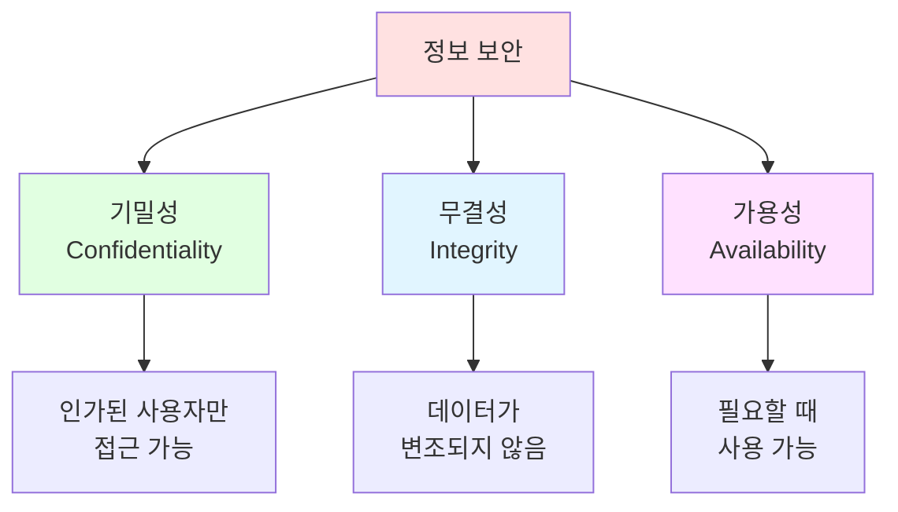

**1. 기밀성 (Confidentiality)**
- 인가된 사용자만 정보에 접근
- 예: 암호화, 접근 제어, 인증

**2. 무결성 (Integrity)**
- 정보가 변조되지 않음을 보장
- 예: 해시, 디지털 서명, 체크섬

**3. 가용성 (Availability)**
- 필요할 때 정보를 사용할 수 있음
- 예: 백업, 이중화, DDoS 방어

## 💉 SQL 인젝션 (SQL Injection)

### SQL 인젝션이란?

SQL 인젝션은 사용자 입력을 통해 악의적인 SQL 쿼리를 삽입하여 데이터베이스를 조작하는 공격 기법이다. OWASP Top 10에 포함된 매우 위험한 취약점이다.

**공격의 영향:**
- 데이터 유출 (사용자 정보, 비밀번호 등)
- 데이터 변조 또는 삭제
- 인증 우회 (로그인 우회)
- 권한 상승
- 시스템 명령 실행 (일부 DB에서)

### 취약한 코드 예제

**❌ 취약한 JSP 코드:**
```jsp
<%
    // 사용자 입력을 직접 SQL 쿼리에 연결
    String username = request.getParameter("username");
    String password = request.getParameter("password");

    // 취약한 쿼리 생성 (String concatenation)
    String sql = "SELECT * FROM UserInfo WHERE uname='" + username + "' AND pass='" + password + "'";

    Statement stmt = conn.createStatement();
    ResultSet rs = stmt.executeQuery(sql);
%>
```

**정상적인 입력:**
```
username: admin
password: 1234

실제 실행되는 쿼리:
SELECT * FROM UserInfo WHERE uname='admin' AND pass='1234'
```

### SQL 인젝션 공격 시나리오

#### 시나리오 1: 인증 우회 (Authentication Bypass)

**공격 입력:**
```
username: admin' OR '1'='1
password: anything

실제 실행되는 쿼리:
SELECT * FROM UserInfo WHERE uname='admin' OR '1'='1' AND pass='anything'
```

**쿼리 분석:**
```sql
SELECT * FROM UserInfo
WHERE uname='admin' OR '1'='1' AND pass='anything'
       ↑           ↑
       항상 거짓    항상 참

-- AND는 OR보다 우선순위가 높으므로:
WHERE uname='admin' OR ('1'='1' AND pass='anything')
WHERE uname='admin' OR 참

-- 결과: 모든 사용자가 반환됨
```

**더 간단한 공격:**
```
username: admin' --
password: (입력하지 않아도 됨)

실제 실행되는 쿼리:
SELECT * FROM UserInfo WHERE uname='admin' -- ' AND pass=''

-- '--'는 SQL 주석이므로 뒤의 내용이 무시됨
SELECT * FROM UserInfo WHERE uname='admin'
```

**💡 SQL 주석:**
- `--`: 한 줄 주석 (MySQL, MariaDB, SQL Server)
- `#`: 한 줄 주석 (MySQL, MariaDB)
- `/* */`: 여러 줄 주석 (모든 DB)

#### 시나리오 2: UNION 공격 (Data Exfiltration)

**공격 입력:**
```
username: admin' UNION SELECT 1,2,3,4,5 --
password: (무관)

실제 실행되는 쿼리:
SELECT * FROM UserInfo WHERE uname='admin' UNION SELECT 1,2,3,4,5 -- ' AND pass=''

-- 결과: UserInfo 테이블의 컬럼 수를 알아냄 (5개)
```

**컬럼 수를 알아낸 후:**
```
username: admin' UNION SELECT 1, user(), database(), version(), 5 --

실제 쿼리:
SELECT * FROM UserInfo WHERE uname='admin' UNION SELECT 1, user(), database(), version(), 5 --

-- 결과: 현재 DB 사용자, 데이터베이스 이름, 버전 정보 유출
```

**다른 테이블의 데이터 추출:**
```
username: ' UNION SELECT 1, User, Password, Host, 5 FROM mysql.user --

실제 쿼리:
SELECT * FROM UserInfo WHERE uname='' UNION SELECT 1, User, Password, Host, 5 FROM mysql.user --

-- 결과: mysql.user 테이블의 모든 사용자 계정 정보 유출
```

#### 시나리오 3: Blind SQL Injection

**조건부 응답을 이용한 공격:**
```
username: admin' AND SUBSTRING((SELECT password FROM UserInfo WHERE uname='admin'),1,1)='a' --

-- 비밀번호의 첫 글자가 'a'인지 확인
-- 로그인 성공/실패 여부로 참/거짓 판단

username: admin' AND SUBSTRING((SELECT password FROM UserInfo WHERE uname='admin'),1,1)='1' --

-- 비밀번호의 첫 글자가 '1'인지 확인
-- 이런 식으로 한 글자씩 비밀번호를 추출
```

**시간 기반 Blind SQL Injection:**
```
username: admin' AND IF(SUBSTRING((SELECT password FROM UserInfo WHERE uname='admin'),1,1)='1', SLEEP(5), 0) --

-- 비밀번호의 첫 글자가 '1'이면 5초 대기
-- 응답 시간으로 참/거짓 판단
```

#### 시나리오 4: 데이터 변조 및 삭제

**데이터 수정:**
```
username: admin'; UPDATE UserInfo SET pass='hacked' WHERE uname='admin' --

실제 쿼리:
SELECT * FROM UserInfo WHERE uname='admin';
UPDATE UserInfo SET pass='hacked' WHERE uname='admin' -- ' AND pass=''

-- admin 계정의 비밀번호가 'hacked'로 변경됨
```

**데이터 삭제:**
```
username: admin'; DROP TABLE UserInfo; --

실제 쿼리:
SELECT * FROM UserInfo WHERE uname='admin';
DROP TABLE UserInfo; -- ' AND pass=''

-- UserInfo 테이블이 삭제됨!
```

**💡 Stacked Queries:**
- 여러 SQL 문을 세미콜론(;)으로 구분하여 실행
- 모든 데이터베이스가 지원하는 것은 아님
- MariaDB/MySQL의 기본 PHP/JSP 드라이버는 기본적으로 비활성화

### SQL 인젝션 실습

**취약한 로그인 페이지 생성 (테스트용):**

```bash
sudo nano /var/lib/tomcat10/webapps/ROOT/vulnerable_login.jsp
```

**vulnerable_login.jsp 내용:**
```jsp
<%@ page contentType="text/html;charset=UTF-8" language="java" %>
<%@ page import="java.sql.*" %>
<!DOCTYPE html>
<html lang="ko">
<head>
    <meta charset="UTF-8">
    <title>취약한 로그인 (테스트용)</title>
    <style>
        body { font-family: Arial, sans-serif; padding: 20px; }
        .warning { color: red; font-weight: bold; padding: 10px; background-color: #ffe1e1; }
        .query-box { background-color: #f0f0f0; padding: 10px; margin: 10px 0; font-family: monospace; }
        .result { margin: 20px 0; padding: 10px; border: 1px solid #ccc; }
    </style>
</head>
<body>
    <h1>취약한 로그인 페이지 (SQL Injection 테스트용)</h1>
    <div class="warning">
        ⚠️ 경고: 이 페이지는 교육 목적으로만 사용하세요!<br/>
        실제 운영 환경에서는 절대 이런 코드를 사용하지 마세요!
    </div>

    <form method="post">
        <p>
            <label>사용자 이름:</label><br/>
            <input type="text" name="username" size="50" value="<%= request.getParameter("username") != null ? request.getParameter("username") : "" %>">
        </p>
        <p>
            <label>비밀번호:</label><br/>
            <input type="text" name="password" size="50" value="<%= request.getParameter("password") != null ? request.getParameter("password") : "" %>">
        </p>
        <p>
            <input type="submit" value="로그인">
        </p>
    </form>

    <h2>시도해볼 공격 예제:</h2>
    <ul>
        <li><code>admin' OR '1'='1</code> (인증 우회)</li>
        <li><code>admin' --</code> (주석을 이용한 우회)</li>
        <li><code>admin' UNION SELECT 1,2,3,4,5 --</code> (UNION 공격)</li>
        <li><code>' OR 1=1 --</code> (모든 레코드 조회)</li>
    </ul>

    <%
        String username = request.getParameter("username");
        String password = request.getParameter("password");

        if (username != null && password != null) {
            Connection conn = null;
            Statement stmt = null;
            ResultSet rs = null;

            try {
                Class.forName("org.mariadb.jdbc.Driver");
                String url = "jdbc:mariadb://192.168.186.130:3306/CloudDB";
                conn = DriverManager.getConnection(url, "clouduser", "password123");

                // ❌ 취약한 쿼리 (String concatenation)
                String sql = "SELECT * FROM UserInfo WHERE uname='" + username + "' AND pass='" + password + "'";

                out.println("<h2>실행된 쿼리:</h2>");
                out.println("<div class='query-box'>" + sql + "</div>");

                stmt = conn.createStatement();
                rs = stmt.executeQuery(sql);

                out.println("<h2>결과:</h2>");
                out.println("<div class='result'>");

                boolean hasResult = false;
                while (rs.next()) {
                    hasResult = true;
                    out.println("<p><strong>로그인 성공!</strong></p>");
                    out.println("<ul>");
                    out.println("<li>UID: " + rs.getInt("uid") + "</li>");
                    out.println("<li>이름: " + rs.getString("uname") + "</li>");
                    out.println("<li>프로필: " + rs.getString("profile") + "</li>");
                    out.println("<li>우선순위: " + rs.getInt("priority") + "</li>");
                    out.println("</ul>");
                    out.println("<hr/>");
                }

                if (!hasResult) {
                    out.println("<p>로그인 실패</p>");
                }
                out.println("</div>");

            } catch (Exception e) {
                out.println("<div class='result' style='color:red'>");
                out.println("<h3>SQL 에러 발생:</h3>");
                out.println("<pre>" + e.getMessage() + "</pre>");
                out.println("</div>");
            } finally {
                try {
                    if (rs != null) rs.close();
                    if (stmt != null) stmt.close();
                    if (conn != null) conn.close();
                } catch (SQLException e) {}
            }
        }
    %>
</body>
</html>
```

**파일 권한 설정:**
```bash
sudo chown tomcat10:tomcat10 /var/lib/tomcat10/webapps/ROOT/vulnerable_login.jsp
sudo chmod 644 /var/lib/tomcat10/webapps/ROOT/vulnerable_login.jsp
```

**접속 및 테스트:**
```
http://192.168.186.128/vulnerable_login.jsp

테스트할 입력:
1. admin' OR '1'='1
2. admin' --
3. ' OR 1=1 --
4. admin' UNION SELECT 1,2,3,4,5 --
```

## 🛡️ SQL 인젝션 방어 방법

### 1. PreparedStatement 사용 (최우선)

**✅ 안전한 코드:**
```java
String sql = "SELECT * FROM UserInfo WHERE uname = ? AND pass = ?";
PreparedStatement pstmt = conn.prepareStatement(sql);
pstmt.setString(1, username);  // 자동 이스케이핑
pstmt.setString(2, password);  // 자동 이스케이핑
ResultSet rs = pstmt.executeQuery();
```

**PreparedStatement가 안전한 이유:**
1. SQL 쿼리 구조가 미리 컴파일됨
2. 파라미터는 데이터로만 취급됨 (코드로 해석 안 됨)
3. 특수 문자가 자동으로 이스케이핑됨
4. Stacked Queries 방지

**내부 동작 원리:**
```
사용자 입력: admin' OR '1'='1

Statement (취약):
SELECT * FROM UserInfo WHERE uname='admin' OR '1'='1' AND pass=''
                                    ↑ SQL 코드로 해석됨

PreparedStatement (안전):
SELECT * FROM UserInfo WHERE uname='admin'' OR ''1''=''1' AND pass=''
                                    ↑ 작은따옴표가 이스케이핑되어 문자열로 취급됨
```

### 2. 입력값 검증 (Input Validation)

**화이트리스트 방식 (권장):**
```java
// 사용자 이름은 영문자와 숫자만 허용
if (!username.matches("^[a-zA-Z0-9]+$")) {
    throw new IllegalArgumentException("유효하지 않은 사용자 이름");
}

// 또는
if (username.contains("'") || username.contains("--") ||
    username.contains(";") || username.contains("/*")) {
    throw new IllegalArgumentException("유효하지 않은 문자 포함");
}
```

**길이 제한:**
```java
if (username.length() > 20) {
    throw new IllegalArgumentException("사용자 이름이 너무 깁니다");
}
```

**JSP에서의 입력 검증:**
```jsp
<%
    String username = request.getParameter("username");

    if (username == null || username.isEmpty()) {
        out.println("사용자 이름을 입력하세요.");
        return;
    }

    if (!username.matches("^[a-zA-Z0-9]+$")) {
        out.println("사용자 이름은 영문자와 숫자만 사용 가능합니다.");
        return;
    }

    if (username.length() > 20) {
        out.println("사용자 이름은 20자 이하여야 합니다.");
        return;
    }
%>
```

### 3. 최소 권한 원칙 (Least Privilege)

**데이터베이스 사용자 권한 최소화:**
```sql
-- ❌ 나쁜 예: 모든 권한 부여
GRANT ALL PRIVILEGES ON *.* TO 'webuser'@'%';

-- ✅ 좋은 예: 필요한 권한만 부여
CREATE USER 'webuser'@'192.168.186.129' IDENTIFIED BY 'password123';
GRANT SELECT, INSERT, UPDATE ON CloudDB.UserInfo TO 'webuser'@'192.168.186.129';
FLUSH PRIVILEGES;

-- DROP, CREATE, ALTER 권한은 부여하지 않음
-- 다른 데이터베이스 접근 불가
```

**읽기 전용 사용자 생성:**
```sql
CREATE USER 'readonly'@'192.168.186.129' IDENTIFIED BY 'readpass';
GRANT SELECT ON CloudDB.* TO 'readonly'@'192.168.186.129';
FLUSH PRIVILEGES;
```

### 4. 에러 메시지 노출 방지

**❌ 나쁜 예:**
```jsp
catch (SQLException e) {
    out.println("SQL Error: " + e.getMessage());
    // 출력: Table 'CloudDB.UserInfo' doesn't exist
    // 공격자에게 테이블 이름, 구조 등의 정보 제공
}
```

**✅ 좋은 예:**
```jsp
catch (SQLException e) {
    // 로그에만 기록
    logger.error("Database error", e);
    // 사용자에게는 일반적인 메시지만 표시
    out.println("로그인 처리 중 오류가 발생했습니다. 관리자에게 문의하세요.");
}
```

### 5. 웹 애플리케이션 방화벽 (WAF)

**WAF의 역할:**
- 악의적인 요청 패턴 탐지
- SQL 인젝션 시도 차단
- XSS, CSRF 등 다양한 공격 방어

**오픈소스 WAF:**
- **ModSecurity**: Apache, nginx용
- **NAXSI**: nginx용
- **AWS WAF**: 클라우드 환경

**ModSecurity 예제:**
```nginx
# nginx + ModSecurity 설정
location / {
    modsecurity on;
    modsecurity_rules_file /etc/nginx/modsec/main.conf;
    proxy_pass http://192.168.186.129:8080;
}
```

### 6. 데이터베이스 설정 강화

**MySQL/MariaDB 보안 설정:**
```ini
# /etc/mysql/mariadb.conf.d/50-server.cnf

[mysqld]
# 로컬 파일 로드 비활성화 (보안)
local-infile=0

# 심볼릭 링크 사용 안 함
symbolic-links=0

# 쿼리 로그 활성화 (감사)
general_log=1
general_log_file=/var/log/mysql/query.log

# 슬로우 쿼리 로그
slow_query_log=1
slow_query_log_file=/var/log/mysql/slow.log
long_query_time=2
```

### 7. ORM (Object-Relational Mapping) 사용

**Hibernate 예제 (JPA):**
```java
// ❌ Native SQL (위험할 수 있음)
String sql = "SELECT * FROM UserInfo WHERE uname = '" + username + "'";
Query query = em.createNativeQuery(sql);

// ✅ JPQL with Parameters (안전)
String jpql = "SELECT u FROM UserInfo u WHERE u.uname = :username";
TypedQuery<UserInfo> query = em.createQuery(jpql, UserInfo.class);
query.setParameter("username", username);
List<UserInfo> results = query.getResultList();
```

## 🔍 SQL 인젝션 탐지 및 모니터링

### 로그 분석

**의심스러운 패턴:**
```bash
# 웹 서버 로그에서 SQL 인젝션 시도 탐지
sudo grep -E "(union|select|insert|update|delete|drop|--|;|/\*)" /var/log/nginx/access.log

# 예시 출력:
192.168.186.1 - - [17/Dec/2025:14:30:00 +0900] "POST /login.jsp HTTP/1.1" 200 1234 "username=admin'%20OR%20'1'='1"
192.168.186.1 - - [17/Dec/2025:14:30:15 +0900] "POST /login.jsp HTTP/1.1" 200 5678 "username=admin'%20UNION%20SELECT"
```

**MariaDB 쿼리 로그 활성화:**
```sql
-- 일반 쿼리 로그 활성화 (성능 영향 있음, 개발/테스트 환경에서만)
SET GLOBAL general_log = 'ON';
SET GLOBAL general_log_file = '/var/log/mysql/query.log';

-- 로그 확인
-- sudo tail -f /var/log/mysql/query.log

-- 비활성화
SET GLOBAL general_log = 'OFF';
```

### 침입 탐지 시스템 (IDS)

**Snort 규칙 예제:**
```
alert tcp any any -> any 80 (msg:"SQL Injection Attempt - UNION"; flow:to_server,established; content:"UNION"; nocase; classtype:web-application-attack; sid:1000001; rev:1;)

alert tcp any any -> any 80 (msg:"SQL Injection Attempt - OR 1=1"; flow:to_server,established; content:"OR"; nocase; content:"1=1"; nocase; distance:0; classtype:web-application-attack; sid:1000002; rev:1;)
```

## 📚 추가 보안 고려사항

### 세션 관리

**안전한 세션 사용:**
```jsp
<%
    // 로그인 성공 시
    session.setAttribute("username", username);
    session.setAttribute("authenticated", true);
    session.setMaxInactiveInterval(1800);  // 30분

    // 세션 고정 공격 방어: 로그인 성공 시 세션 ID 재생성
    session.invalidate();
    session = request.getSession(true);
    session.setAttribute("username", username);
%>
```

**세션 검증:**
```jsp
<%
    // 보호된 페이지에서
    if (session.getAttribute("authenticated") == null ||
        !((Boolean) session.getAttribute("authenticated"))) {
        response.sendRedirect("login.html");
        return;
    }
%>
```

### HTTPS 사용

**HTTPS의 중요성:**
- 전송 중 데이터 암호화
- 중간자 공격 (MITM) 방지
- 네트워크 스니핑 방어

**nginx HTTPS 설정:**
```nginx
server {
    listen 443 ssl;
    server_name example.com;

    ssl_certificate /etc/ssl/certs/example.com.crt;
    ssl_certificate_key /etc/ssl/private/example.com.key;

    ssl_protocols TLSv1.2 TLSv1.3;
    ssl_ciphers HIGH:!aNULL:!MD5;

    location / {
        proxy_pass http://192.168.186.129:8080;
    }
}

# HTTP를 HTTPS로 리다이렉트
server {
    listen 80;
    server_name example.com;
    return 301 https://$server_name$request_uri;
}
```

### 비밀번호 해싱

**bcrypt 사용 예제 (Java):**
```java
import org.mindrot.jbcrypt.BCrypt;

// 비밀번호 해싱
String hashedPassword = BCrypt.hashpw(plainPassword, BCrypt.gensalt());
// 출력: $2a$10$N9qo8uLOickgx2ZMRZoMyeIjZAgcfl7p92ldGxad68LJZdL17lhWy

// 비밀번호 검증
if (BCrypt.checkpw(plainPassword, hashedPassword)) {
    System.out.println("비밀번호 일치");
} else {
    System.out.println("비밀번호 불일치");
}
```

**데이터베이스에 저장:**
```sql
-- pass 컬럼을 VARCHAR(128)로 설정 (bcrypt 해시는 60자)
CREATE TABLE UserInfo (
    uid INT PRIMARY KEY AUTO_INCREMENT,
    uname VARCHAR(20) NOT NULL,
    pass VARCHAR(128) NOT NULL,  -- bcrypt 해시 저장
    ...
);

-- 해시된 비밀번호 삽입
INSERT INTO UserInfo (uname, pass) VALUES
('admin', '$2a$10$N9qo8uLOickgx2ZMRZoMyeIjZAgcfl7p92ldGxad68LJZdL17lhWy');
```

## ✅ 보안 체크리스트

**SQL 인젝션 방어:**
- [ ] PreparedStatement를 사용하는가?
- [ ] 사용자 입력을 검증하는가?
- [ ] 화이트리스트 방식으로 검증하는가?
- [ ] SQL 에러 메시지를 사용자에게 노출하지 않는가?

**데이터베이스 보안:**
- [ ] 최소 권한 원칙을 적용했는가?
- [ ] 읽기 전용 사용자를 별도로 생성했는가?
- [ ] bind-address를 적절히 설정했는가?
- [ ] 불필요한 샘플 데이터베이스를 제거했는가?

**인증 및 세션:**
- [ ] 비밀번호를 해싱하여 저장하는가?
- [ ] bcrypt 또는 Argon2를 사용하는가?
- [ ] 세션 타임아웃을 설정했는가?
- [ ] 세션 고정 공격을 방어하는가?

**네트워크 보안:**
- [ ] HTTPS를 사용하는가?
- [ ] 방화벽을 설정했는가?
- [ ] 불필요한 포트를 닫았는가?
- [ ] 로그를 주기적으로 확인하는가?

**일반 보안:**
- [ ] 시스템을 최신 상태로 유지하는가?
- [ ] 강력한 비밀번호 정책을 사용하는가?
- [ ] 정기적으로 백업하는가?
- [ ] 보안 패치를 즉시 적용하는가?

## 🎯 학습 마무리

### 강의 핵심 내용 요약

**1. 3계층 아키텍처**
```
Client ← → Web Server (nginx) ← → WAS (Tomcat) ← → Database (MariaDB)
```
- 각 계층의 역할과 책임 분리
- 확장성, 보안, 유지보수성 향상

**2. 주요 기술**
- **Linux**: Ubuntu, 네트워크, 프로세스 관리
- **nginx**: 웹 서버, 리버스 프록시
- **Tomcat**: WAS, JSP/Servlet 컨테이너
- **MariaDB**: 관계형 데이터베이스
- **JDBC**: Java 데이터베이스 연동

**3. 보안**
- **SQL 인젝션**: 가장 위험한 웹 취약점 중 하나
- **PreparedStatement**: 필수 방어 수단
- **입력 검증, 최소 권한, 암호화**: 다층 방어

### 추가 학습 권장사항

**심화 학습 주제:**
1. **고급 SQL**: 인덱스, 쿼리 최적화, 트랜잭션
2. **프레임워크**: Spring Boot, Hibernate/JPA
3. **보안**: OWASP Top 10, 침투 테스트
4. **성능**: 캐싱, 로드 밸런싱, CDN
5. **DevOps**: Docker, Kubernetes, CI/CD
6. **클라우드**: AWS, Azure, GCP

**실습 프로젝트 아이디어:**
- 게시판 시스템
- 쇼핑몰
- 예약 시스템
- REST API 서버
- 실시간 채팅 애플리케이션

### 마치며

이번 강의를 통해 3계층 웹 아키텍처의 전체 구조를 이해하고, 각 계층을 구축하고 연동하는 방법을 학습했다. 또한 SQL 인젝션이라는 치명적인 보안 취약점과 그 방어 방법에 대해 배웠다.

**💡 기억할 점:**
- 보안은 선택이 아닌 필수
- PreparedStatement는 항상 사용
- 최소 권한 원칙 준수
- 입력은 항상 검증
- 에러 메시지 노출 주의

**성공적인 개발을 위해:**
- 코드를 작성하기 전에 설계
- 문서화를 생활화
- 코드 리뷰 적극 활용
- 보안을 우선 순위에 두기
- 지속적인 학습과 개선


**수고하셨습니다!** 🎉
