--- 
title: "📝 개인정보 보호(Personal Information Protection) 강의 노트 (1일차)"
date: 2025-12-24
excerpt: "강사: 임재우 (주식회사 커버드 컨설팅)"
categories:
  - SK_Rookies
  - Privacy-Security
tags:
  - Privacy-Security
  - SK_Rookies
---

# 📝 개인정보 보호(Personal Information Protection) 강의 노트 (1일차)

**강의명**: 개인정보 보호 진단 및 컨설팅 실무
**강사**: 임재우 (주식회사 커버드 컨설팅)
**일시**: 2025년 12월 24일
**교육 대상**: IT 보안 교육 수강생 (2차 미니 프로젝트 준비 중)
**교육 방식**: 온라인 강의 (이론 + 실습)

---

## 🎯 학습 목표 및 개요

### 📌 이 강의에서 배우게 될 내용

이번 2일간의 교육을 통해 여러분은 다음과 같은 핵심 역량을 습득하게 됩니다:

1. **개인정보 보호 진단의 기본 개념**
   - 진단(Diagnosis)이란 무엇인가?
   - 체크리스트(Checklist) 기반 점검 방법론
   - 기준(Standard)과 분류(Classification)의 중요성

2. **현대 사회에서 개인정보의 중요성**
   - 글로벌 기업들의 개인정보 활용 전략
   - 데이터 기반 비즈니스 모델의 진화
   - AI 시대의 개인정보 처리 방식

3. **개인정보 보호법의 이해**
   - 개인정보의 법적 정의
   - 개인정보 처리자의 의무사항
   - 위반 시 과태료 및 과징금 처분 사례

4. **실무 진단 역량 강화**
   - 개인정보 처리 방침(Privacy Policy) 분석
   - 개인정보 흐름도(Data Flow Diagram) 작성
   - 취약점 발견 및 개선 방안 도출

💡 **중요!** 이 강의는 단순히 법 조문을 암기하는 것이 아니라, 실제 기업 환경에서 개인정보 보호 진단을 수행할 수 있는 **실무 역량**을 키우는 것을 목표로 합니다.

---

### 🗓️ 교육 일정 및 구성

**1일차 (오늘)**
- **오전**: 개인정보 보호 진단의 개념 및 중요성
- **오후**: 조별 실습 (개인정보 처리 방침 분석, 흐름도 작성)

**2일차 (금요일)**
- **오전**: 개인정보 보호법 주요 조항 및 안전성 확보조치
- **오후**: 가상 기업 진단 실습 및 과태료 처분 사례 연구

📌 **노트**: 강의 자료는 Google Docs를 통해 실시간으로 공유되며, 필요시 언제든지 접근 가능합니다.

---

### 💬 강의 진행 방식 안내

#### 질의응답 중심의 상호작용

강사님께서 강조하신 핵심 원칙:

> "컨설팅이라는 영역은 원래 **답이 없습니다**. 답은 우리가 어떻게 정의하고 제시하느냐에 따라 달라집니다. 정답을 맞추려 하지 말고, **생각나는 대로 얘기하고 함께 고민하는 시간**으로 생각하세요."

**강의 참여 가이드라인:**
- 질문은 언제든지 환영 (채팅 또는 마이크 이용)
- 틀린 답을 두려워하지 말 것 (학습 과정의 일부)
- 주저 없이 의견 제시하기
- 다른 교육생의 질문도 나에게 도움이 된다고 생각하기

⚠️ **주의**: 온라인 교육의 특성상 카메라를 켜고 적극적으로 참여하는 것이 권장됩니다. 강사님께서 화면에 보이는 분들을 대상으로 질문을 하실 예정입니다.

---

## 👨‍🏫 강사 소개

### 임재우 강사님

**소속**: 주식회사 커버드(Covered) 컨설팅
**전문 분야**: 개인정보 보호 및 정보보호 컨설팅

**주요 업무 경험:**
- **ISO 인증 컨설팅**: ISO/IEC 27001, ISO/IEC 27701 등
- **ISMS (정보보호 관리체계) 인증**: ISMS, ISMS-P 컨설팅
- **보안성 검토**: 공공기관 및 민간 기업 대상 보안성 검토
- **영향평가**: 개인정보 영향평가(PIA), 데이터 보호 영향평가(DPIA)
- **진단 및 점검**: 개인정보 실태점검, 취약점 진단

**컨설팅 철학:**
> "진단은 체크리스트를 기계적으로 적용하는 것이 아니라, 본질적인 문제를 이해하고 시스템이 제대로 운영되고 있는지를 판단하는 것입니다."

---

### 🙋 교육생 배경 확인

강의 시작 전 강사님께서 교육생 여러분의 배경을 확인하셨습니다:

**Q: 개인정보 교육을 이전에 받아본 적이 있는가?**
- 대부분 처음 접하는 주제
- 일부 학생: 학교 수업에서 개인정보 보호법 배움 (현우님)
- 특별 케이스: CPPG(Certified Privacy Protection General) 자격증 보유자 있음 (민고님)

📌 **참고**: CPPG는 개인정보 보호 분야의 대표적인 민간 자격증으로, 최근 합격률이 15~20% 정도로 매우 낮은 난이도 높은 시험입니다.

**Q: 기술진단 영역(모의해킹, 웹 취약점 진단 등) 학습 상황은?**
- 일부 진행 중, 아직 완료되지 않음
- SQL Injection 등 웹 애플리케이션 취약점은 학습함

💡 **인사이트**: 여러분이 이미 배운 기술적 보호조치(SQL Injection 방어, 서버 설정 등)는 모두 개인정보 보호의 기술적 보호조치 영역에 해당합니다. 이번 강의를 통해 이러한 기술들이 개인정보 보호 체계에서 어떤 역할을 하는지 이해하게 될 것입니다.

---

## 🔍 Section 1: 진단(Diagnosis)의 개념 이해

### 진단이란 무엇인가?

강의는 "진단"이라는 개념을 일상생활의 다양한 사례를 통해 이해하는 것으로 시작합니다.

#### 📌 진단의 사전적 정의

**진단(診斷, Diagnosis)**
- 한자: 診 (살필 진) + 斷 (끊을 단)
- 의미: 문제를 살펴보고 판단을 내리는 것
- 영어: Diagnosis (의학), Assessment (평가), Inspection (점검)

**핵심 요소:**
1. **문제 파악(Problem Identification)**: 무엇이 잘못되었는가?
2. **기준 적용(Standard Application)**: 정상과 비정상을 구분하는 기준은?
3. **판단(Judgment)**: 현재 상태가 안전한가, 위험한가?

---

### 일상생활 속 진단의 예시

강사님께서는 학생들과의 대화를 통해 진단 개념을 탐구하셨습니다.

#### 🏥 1. 병원 진단 (Medical Diagnosis)

**수민님의 답변:**
> "진단은 무슨 문제가 있는지 파악하는 것입니다."

**희은님의 답변:**
> "병원에서 질병을 진단합니다."

**진단 프로세스:**

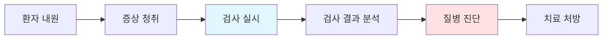

**검사(Examination)의 중요성:**

강사님께서 호주님에게 질문:
> "병원에서 진단할 때 어떤 것들을 하게 될까요?"

답: **검사**

검사 종류:
- 혈액 검사 (Blood Test)
- X-ray 촬영 (Radiography)
- CT/MRI 스캔 (Imaging)
- 초음파 검사 (Ultrasound)
- 심전도 검사 (ECG)

💡 **핵심**: 진단을 하려면 반드시 **검사 도구(Diagnostic Tool)**가 필요합니다.

---

#### 🏗️ 2. 건축물 안전진단 (Safety Inspection)

**진단 대상:**
- 오래된 건물의 구조적 안전성
- 내진 설계 적합성
- 소방 시설 작동 여부
- 전기/가스 배관 상태

**검사 도구:**
- 균열 측정기
- 철근 탐사기
- 내하력 시험 장비
- 비파괴 검사 장비

---

#### 🧠 3. 자가진단 (Self-Assessment)

**유형:**
- **정신 건강 자가진단**: 우울증, 불안장애 등
- **MBTI 성격 유형 검사**: 성향 진단
- **건강검진 자가체크**: 증상 기반 질병 가능성 확인

**자가진단의 핵심 요소:**

강사님께서 오신호님에게 질문:
> "자가진단을 하려면 무엇이 필요한가요?"

**답변: 진단 도구(Tool)**

하지만 더 구체적으로는? → **질문(Questions)**

예시: MBTI 검사는 수십 개의 질문으로 구성되어 있으며, 각 질문에 대한 응답을 종합하여 성격 유형을 판단합니다.

---

### 🛠️ 진단 도구의 핵심: 체크리스트(Checklist)

#### 체크리스트의 중요성

**김한수님이 언급한 "스캐너"**
- 웹 취약점 진단 도구 (OWASP ZAP, Burp Suite 등)
- 인프라 취약점 스캐너 (Nessus, OpenVAS 등)
- 네트워크 스캐너 (Nmap, Wireshark 등)

**강사님의 추가 질문:**
> "스캐너가 그냥 혼자 돌아가나요? 무엇이 필요한가요?"

**강승훈님의 정답: 기준(Standard)**

💡 **핵심 인사이트**: 스캐너는 사전에 정의된 **기준(Standard)**과 **체크리스트(Checklist)**를 기반으로 동작합니다.

---

#### 체크리스트의 구성 요소

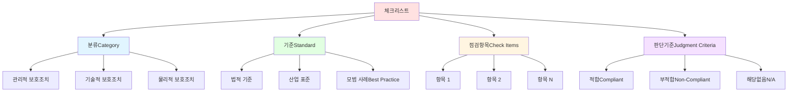

---

#### 진단에 필요한 4가지 핵심 요소

강사님께서 강조하신 핵심 용어:

| **요소** | **영문** | **설명** | **예시** |
|:---:|:---:|:---|:---|
| **분류** | Classification | 점검 영역을 나누는 것 | 물리보안, 접근통제, 암호화 등 |
| **기준** | Standard | 무엇이 안전하고 위험한지 판단하는 근거 | 개인정보 보호법, ISO 27001 등 |
| **체크리스트** | Checklist | 구체적으로 점검할 항목 목록 | "DB 접근 권한 관리", "암호화 적용 여부" |
| **진단** | Diagnosis | 체크리스트 기반 현황 점검 및 판단 | 취약점 발견, 개선 방안 도출 |

💡 **중요!** 여러분이 앞으로 정보보호/개인정보 보호 분야에서 일하게 되면, 이 체크리스트와 계속 "싸우게" 될 것입니다. 체크리스트의 본질을 이해하는 것이 **좋은 진단원(Auditor)**과 **기계적인 점검자**를 구분하는 핵심 역량입니다.

---

### 📊 진단 프로세스의 3단계

#### 1단계: 사전 준비 (Preparation)

**활동 내용:**
- 대상 조직/시스템 현황 파악
- 관련 문서 수집 (정책, 지침, 설계서 등)
- 적용 기준 확인 (법, 규제, 표준)
- 체크리스트 작성
- 점검 범위(Scope) 정의

**산출물:**
- 진단 계획서
- 체크리스트
- 자료 요청 목록

---

#### 2단계: 실제 진단 (Diagnosis)

**진단 방법:**

| **방법** | **설명** | **예시** |
|:---:|:---|:---|
| **문서 검토** | 정책, 지침, 로그 등 문서 분석 | 개인정보 처리 방침 검토 |
| **인터뷰** | 담당자 면담을 통한 현황 확인 | 개인정보 관리자 인터뷰 |
| **실사** | 현장 방문 및 시스템 확인 | 서버실 물리보안 점검 |
| **도구 활용** | 스캐너, 분석 도구 사용 | 취약점 스캐너 실행 |

**강사님의 비유:**
> "X-ray를 찍듯이, 어떤 도구를 사용할 것인지, 어떤 방법으로 실사할 것인지 고민해야 합니다."

---

#### 3단계: 보고서 작성 (Reporting)

**보고서 구성:**
1. **요약(Executive Summary)**: 주요 발견사항 및 권고사항
2. **진단 개요**: 목적, 범위, 방법론
3. **상세 발견사항**: 체크리스트별 점검 결과
4. **취약점 분석**: 발견된 문제점 및 위험도 평가
5. **개선 방안**: 실행 가능한 해결책 제시
6. **부록**: 증빙 자료, 스크린샷 등

---

## 🏠 아이스브레이킹 실습: 4조 1천억 자산가 A씨의 저택 보안 진단

### 실습 시나리오

#### 배경 설정

**인물**: 4조 1천억 원의 자산을 보유한 A씨
**상황**: 서울에서 남양주 근교 5,000평 전원주택으로 이사

**주택 정보:**
- **규모**: 5,000평 (약 16,500㎡)
- **구조**: 지상 3층, 지하 1층, 별채 및 부속 건물
- **편의시설**: 수영장, 체육관, 홈시어터, 와인 저장고 등

**거주 인원:**
- 3대가 함께 거주
- 직원: 집사, 관리인, 요리사, 가정부 등
- 방문객: 월 1회 정기 파티 (50명 내외 참석)

**보유 자산:**
- 현금: 약 1,000억 원
- 소장품 및 귀중품: 다수
- 문서: 중요 계약서, 인감 등

**보안 조치 현황:**
- 물리 보안 업체와 계약
- 보험 가입 완료

---

#### 문제 발생 ⚠️

**이사 후 보안 사고:**
- 통금(현금) 도난
- 귀중품 분실

**A씨의 요구사항:**
> "우리 집 보안을 강화하고 싶습니다. 어떤 취약점이 있는지 진단해주세요. 외부 위협에 대응할 수 있는 체크리스트를 만들어주세요."

---

### 실습 과제: 보안 체크리스트 작성

#### 체크리스트 작성 양식

강사님께서 Google Sheets로 공유하신 양식:

| **번호** | **분류** | **점검 대상** | **점검 항목** | **점검 목적** | **점검 방법** |
|:---:|:---:|:---:|:---|:---|:---|
| 1 | 시설관리 | 금고방 | 금고방의 잠금장치가 안전한가? | 도난 방지 | 물리적 점검, 스트레스 테스트 |
| 2 | 출입관리 | 정문 | QR/해시 기반 초대장 검증 | 비인가자 침입 방지 | 초대 시스템 확인 |
| ... | ... | ... | ... | ... | ... |

---

#### 학생들의 우수 체크리스트 사례

강의 중 학생들이 제출한 창의적인 체크리스트 항목들:

##### 🥇 **우수 사례 1: 호주님 - QR/해시 기반 초대 검증**

**점검 항목:**
> "파티 초대 시 QR 코드나 해시값 기반 사전 설정이 되어 있는가? QR 코드가 중간에 해킹당해 변조되거나 유출되지 않았는가?"

**강사님 평가:**
> "훌륭합니다! 이것은 단순한 물리 보안을 넘어, 디지털 인증 시스템의 무결성까지 고려한 것입니다. 커피 쿠폰을 드리겠습니다!"

**보안 원리:**
- QR 코드는 쉽게 복제 가능 → 해시값으로 무결성 검증 필요
- 초대장 발송 시 암호화된 토큰 생성
- 입장 시 토큰 검증 및 일회용 사용 처리

---

##### 🎖️ **우수 사례 2: 안태경님 - 정전 시 시스템 대응**

**점검 항목:**
> "정전 시 보안 시스템이 정상 작동할 수 있는가? 백업 전원(UPS/발전기)이 충분한가?"

**실무 적용:**
- 네트워크 장비(방화벽, 스위치)의 Failover 전략
- 보안 시스템의 Bypass 모드 설정
  - Fail-Open: 시스템 다운 시 접근 허용 (보안 약화)
  - Fail-Closed: 시스템 다운 시 접근 차단 (가용성 저하)

**질문:**
> "정전 시 시스템을 Bypass시킬 것인가, 완전 다운시킬 것인가?"

---

##### 🏆 **우수 사례 3: 상준님 - 정규 출입구 외 경로 점검**

**점검 항목:**
> "정해진 출입구 외에 다른 출입 경로가 있는가?"

**강사님 질문:**
> "이것을 보안 용어로 뭐라고 하나요?"

**강수근님 답변:**
> "백도어(Backdoor)입니다!"

**물리 보안 vs 시스템 보안 비교:**

| **구분** | **물리 보안** | **시스템 보안** |
|:---:|:---|:---|
| **백도어** | 지하수로, 환기구, 숨겨진 출입구 | 관리자 계정, 디버그 포트, 숨겨진 API |
| **점검 방법** | 건물 도면 검토, 현장 조사 | 코드 리뷰, 포트 스캐닝 |
| **대응** | 물리적 차단, CCTV 설치 | 접근 제어, 로깅 및 모니터링 |

---

##### 🌟 **우수 사례 4: 김기나님 - 보안요원 신원 확인**

**점검 항목:**
> "출동한 보안요원의 신원이 확실한가?"

**영화/드라마 속 사례:**
- 범죄자가 보안요원으로 위장하여 침입
- 가짜 경찰/소방관으로 위장한 도둑

**실무 대응 방안:**
- **신원조회(Background Check)**: 범죄 기록 확인
- **4글자 용어**: **신원조회** (강사님이 퀴즈로 출제)
- 특정 범죄자의 채용 제한 (예: 성범죄자 → 학교 직원 채용 불가)

---

##### 📌 **기타 우수 체크리스트**

**강수민님:**
- 출입 통제 카드 오작동 시 대응 방안
- 비인가자 침입 가능성

**정의상님:**
- 랜섬웨어 감염 시 보안 시스템 마비 위험
- 악성 코드 방어 대책

**신동호님:**
- 직원 신뢰도 문제
- 인성검사 및 신원조회 필요성

**오신호님:**
- 마스터 키 관리
- 누가 마스터 키를 가지고 있는가?

**전소원님:**
- 소지품 검사
- 도난 도구 반입 방지

**명승용님:**
- 사각지대 점검
- 지하수로 등 CCTV 미설치 구역

**김한수님:**
- 탐지 후 대응 시간
- 물리보안 업체 출동 시간
- 경찰 도착 시간

---

### 실습을 통해 배운 핵심 개념

#### 1. 위협 모델링(Threat Modeling)

**위협의 종류:**
- **외부 위협**: 도둑, 비인가자 침입
- **내부 위협**: 직원의 배신, 내부자 범죄
- **자연 재해**: 화재, 지진, 홍수
- **시스템 장애**: 정전, 장비 고장

---

#### 2. 방어 계층화(Defense in Depth)

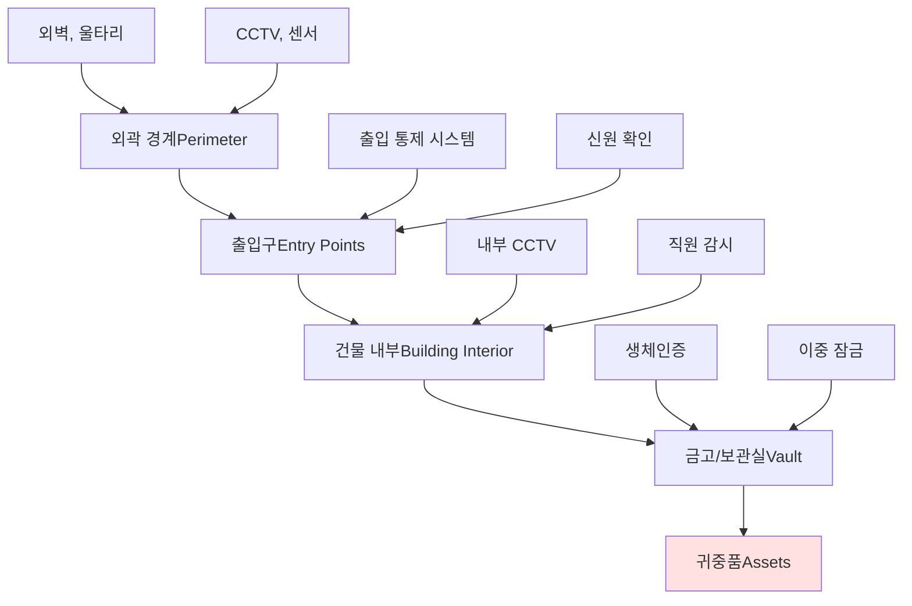

**핵심 원리**: 하나의 방어선이 뚫려도 다음 방어선이 존재해야 함

---

#### 3. 체크리스트 분류 체계

강사님께서 제시한 분류:

**1. 직원 관리 (Personnel Management)**
- 신원조회
- 인성검사
- 접근 권한 관리
- 퇴사자 처리

**2. 시설 관리 (Facility Management)**
- 금고 보안
- CCTV 설치
- 소방/방재 시설
- 사각지대 제거

**3. 출입 관리 (Access Control)**
- 출입 통제 시스템
- 신원 확인 절차
- 방문객 관리
- 초대장 검증

**4. 비상 대응 (Emergency Response)**
- 정전 대응
- 화재 대응
- 침입 탐지 시 대응
- 백업 시스템

---

## 🎓 진단 실습에서 실무로

### 진단 결과의 활용

강사님 설명:
> "여러분이 만든 체크리스트를 가지고 실제 진단을 수행한 후, 그 결과를 바탕으로 고객에게 **인사이트 있는 개선 방안**을 제시하는 것이 컨설턴트의 역할입니다."

#### 진단 결과 보고서의 구성

**1. 현황 분석 (As-Is)**
- 직원관리: 신원조회 미실시
- 시설관리: 지하수로 CCTV 미설치
- 출입관리: QR 초대장 무결성 검증 없음

**2. 문제점 식별 (Issues)**
- 내부자 범죄 위험
- 사각지대를 통한 침입 가능
- 가짜 초대장으로 파티 침입 가능

**3. 개선 방안 (To-Be)**
- 전 직원 대상 신원조회 실시
- 지하수로 CCTV 설치 및 물리적 차단
- 해시 기반 초대장 검증 시스템 도입

**4. 우선순위 (Priority)**
- 긴급(Critical): 마스터 키 관리 체계 수립
- 높음(High): 사각지대 CCTV 설치
- 중간(Medium): 정전 대응 UPS 용량 증설

---

### 실습 결과 정리

#### 체크리스트 작성 통계

- 참여 인원: 약 50명
- 제출된 체크리스트 항목: 약 20개
- 가장 많이 나온 카테고리: 출입 관리
- 가장 창의적인 항목: QR/해시 검증 (호주님)

#### 주요 학습 포인트

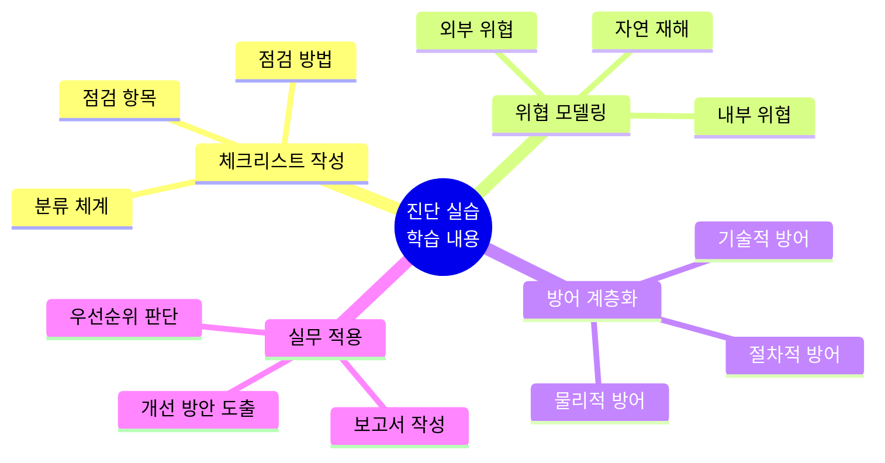

---

## 📚 개인정보 보호 진단의 범위

### 진단의 목적

강사님 설명:
> "개인정보 보호 진단의 목적은 크게 두 가지입니다:
> 1. **법적 준거성 점검**: 개인정보를 법에 맞게 처리하고 있는가?
> 2. **보호조치 점검**: 개인정보가 안전하게 보호되고 있는가?"

---

### 1. 법적 준거성 점검 (Legal Compliance)

#### 개인정보 처리 단계별 점검

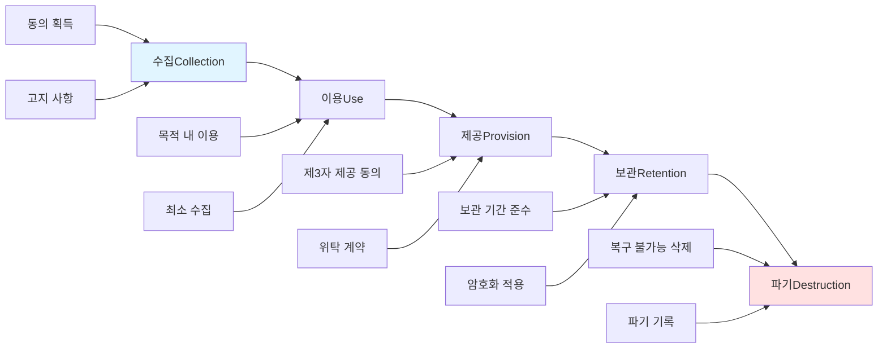

**각 단계별 점검 항목:**

| **단계** | **주요 점검 항목** | **관련 법조항** |
|:---:|:---|:---|
| **수집** | 동의 획득, 고지 사항, 최소 수집 | 제15조, 제16조 |
| **이용** | 목적 내 이용, 최소 이용, 이용 기록 | 제17조, 제18조 |
| **제공** | 제3자 제공 동의, 제공 사실 통지 | 제17조, 제18조 |
| **보관** | 보관 기간 준수, 암호화 적용 | 제21조, 제24조 |
| **파기** | 지체없이 파기, 복구 불가능 방법 | 제21조 |

---

### 2. 보호조치 점검 (Security Measures)

#### 3가지 보호조치 영역

강사님 설명:
> "개인정보는 관리적, 기술적, 물리적 보호조치를 통해 안전하게 보호되어야 합니다. 지금까지 여러분이 배운 서버 보안, 네트워크 보안, 웹 보안은 대부분 **기술적 보호조치** 영역입니다."

---

#### (1) 관리적 보호조치 (Administrative Safeguards)

**정의**: 조직의 정책, 절차, 교육 등을 통한 보호

**주요 점검 항목:**

| **항목** | **설명** | **예시** |
|:---|:---|:---|
| **내부 관리계획** | 개인정보 보호를 위한 조직 내 계획 수립 | 개인정보 처리 방침, 운영 절차 |
| **접근 권한 관리** | 업무 담당자별 접근 권한 부여 및 관리 | 최소 권한 원칙, 권한 승인 절차 |
| **교육 실시** | 연 1회 이상 개인정보 보호 교육 | 정기 교육, 신규 입사자 교육 |
| **재해/재난 대비** | 백업, 복구 계획 수립 | 백업 정책, BCP/DRP |
| **위탁 관리** | 위탁 업체 관리 감독 | 위탁 계약서, 정기 점검 |

---

#### (2) 기술적 보호조치 (Technical Safeguards)

**정의**: 시스템적, 기술적 수단을 통한 보호

**주요 점검 항목:**

| **항목** | **설명** | **구현 방법** |
|:---|:---|:---|
| **접근 통제** | 비인가자의 시스템 접근 차단 | 방화벽, ACL, VPN |
| **암호화** | 개인정보의 안전한 저장 및 전송 | DB 암호화, TLS/SSL |
| **접근 로그 기록** | 개인정보 접근 기록 보관 (6개월 이상) | 로그 서버, SIEM |
| **악성 코드 방지** | 백신, 방화벽 등을 통한 보호 | 백신 소프트웨어, IPS |
| **보안 업데이트** | 최신 보안 패치 적용 | 패치 관리 정책 |

💡 **중요!** 여러분이 이미 배운 다음 기술들이 모두 여기에 해당됩니다:
- SQL Injection 방어 → 입력값 검증, Prepared Statement
- 서버 보안 설정 → 불필요한 서비스 중지, 포트 차단
- 네트워크 분리 → DMZ, 방화벽 정책

---

#### (3) 물리적 보호조치 (Physical Safeguards)

**정의**: 물리적 시설 및 장비에 대한 보호

**주요 점검 항목:**

| **항목** | **설명** | **예시** |
|:---|:---|:---|
| **출입 통제** | 개인정보 처리 시스템이 있는 물리적 공간 통제 | 카드키, 생체인증, 출입 기록 |
| **CCTV 설치** | 주요 구역 CCTV 설치 및 모니터링 | 서버실, 백업실 CCTV |
| **잠금 장치** | 개인정보 보관 장소 물리적 잠금 | 서버실 이중 잠금, 금고 |
| **반출입 통제** | 개인정보 저장 매체 반출입 통제 | USB 차단, 외부 매체 승인 |

---

## ✅ Section 1 학습 체크리스트

이번 Section에서 배운 내용을 확인해보세요:

- [ ] 진단(Diagnosis)의 정의와 일상생활 속 예시를 이해했다
- [ ] 진단 도구의 핵심이 체크리스트임을 안다
- [ ] 체크리스트에는 분류, 기준, 점검 항목, 판단 기준이 필요함을 이해했다
- [ ] 진단 프로세스 3단계(사전 준비, 진단, 보고서)를 설명할 수 있다
- [ ] 위협 모델링의 개념을 이해하고 위협 유형을 구분할 수 있다
- [ ] 방어 계층화(Defense in Depth)의 원리를 이해했다
- [ ] 개인정보 처리 단계 5단계(수집-이용-제공-보관-파기)를 안다
- [ ] 3가지 보호조치(관리적, 기술적, 물리적)를 구분할 수 있다

---

## 📋 핵심 요약

### 1. 진단의 본질
- 진단 = 문제 파악 + 기준 적용 + 판단
- 진단 도구의 핵심은 **체크리스트**
- 체크리스트에는 **분류, 기준, 점검 항목, 판단 기준**이 필요

### 2. 진단 프로세스
1. **사전 준비**: 현황 파악, 체크리스트 작성
2. **진단 실시**: 문서 검토, 인터뷰, 실사, 도구 활용
3. **보고서 작성**: 발견사항, 취약점, 개선 방안

### 3. 아이스브레이킹 실습 인사이트
- 위협은 외부뿐 아니라 내부에서도 발생
- 방어는 계층화되어야 함 (Defense in Depth)
- 창의적 사고가 좋은 체크리스트를 만든다

### 4. 개인정보 보호 진단 범위
- **법적 준거성**: 개인정보 처리 단계별 법 준수 여부
- **보호조치**: 관리적, 기술적, 물리적 보호조치 점검

---

## ❓ Q&A

**Q1: 진단과 감사(Audit)의 차이는 무엇인가요?**

A: 유사하지만 약간의 차이가 있습니다.
- **진단(Diagnosis)**: 문제점을 발견하고 개선 방안을 제시하는 것에 초점 (컨설팅적 접근)
- **감사(Audit)**: 기준 준수 여부를 판단하고 적합/부적합을 판정하는 것에 초점 (인증/규제적 접근)

실무에서는 두 용어를 혼용하기도 합니다.

---

**Q2: 체크리스트를 만들 때 어떤 기준을 사용해야 하나요?**

A: 여러 기준을 참고할 수 있습니다.
- **법적 기준**: 개인정보 보호법, 정보통신망법 등
- **인증 기준**: ISMS-P, ISO/IEC 27701 등
- **산업 표준**: NIST, CIS Benchmarks 등
- **모범 사례**: OWASP Top 10, SANS Top 25 등

강사님 조언: "처음에는 법적 기준부터 시작하되, 점차 산업 표준과 모범 사례를 포함하여 체크리스트를 발전시켜 나가세요."

---

**Q3: 좋은 진단원이 되려면 어떤 역량이 필요한가요?**

A: 강사님께서 강조하신 역량:
1. **본질 이해**: 체크리스트의 항목을 단순 암기가 아니라 '왜 이 항목이 필요한가?'를 이해
2. **기술적 이해**: 시스템, 네트워크, 애플리케이션에 대한 기술적 지식
3. **커뮤니케이션**: 기술을 모르는 경영진에게도 쉽게 설명할 수 있는 능력
4. **지속적 학습**: 새로운 위협, 기술, 법규에 대한 꾸준한 학습

---

## 🔜 다음 학습 내용 예고

**Section 2: 개인정보의 중요성과 글로벌 기업의 활용 사례**
- 왜 개인정보가 현대 사회에서 중요한가?
- 글로벌 Top 10 기업들의 개인정보 활용 전략
- 시대별 개인정보 유형의 변화
- AI와 개인정보의 관계

📌 **사전 학습 과제**: 본인이 자주 사용하는 서비스(네이버, 카카오, 쿠팡 등) 중 하나의 **개인정보 처리 방침**을 한 번 읽어보세요. 어떤 개인정보를 수집하고, 어떻게 이용하는지 파악해 보세요.

---

**작성 완료 시각**: Section 1 작성 완료
**예상 분량**: 약 280줄 (목표의 약 18% 달성)
**다음 작업**: Section 2 작성 시작
# 📊 Section 2: 현대 사회에서의 개인정보의 중요성

## 🔗 관리적·기술적·물리적 보호조치의 통합적 이해

### 보호조치 간의 상호 의존성

강사님의 중요한 인사이트:
> "관리적 보호조치, 기술적 보호조치, 물리적 보호조치를 명확히 분류하기 애매한 부분이 많습니다. 앞으로 여러분이 커리어를 쌓을 때, 한 가지 영역만 열심히 하는 것이 아니라 **모두 오버랩**됩니다."

#### 왜 통합적 이해가 필요한가?

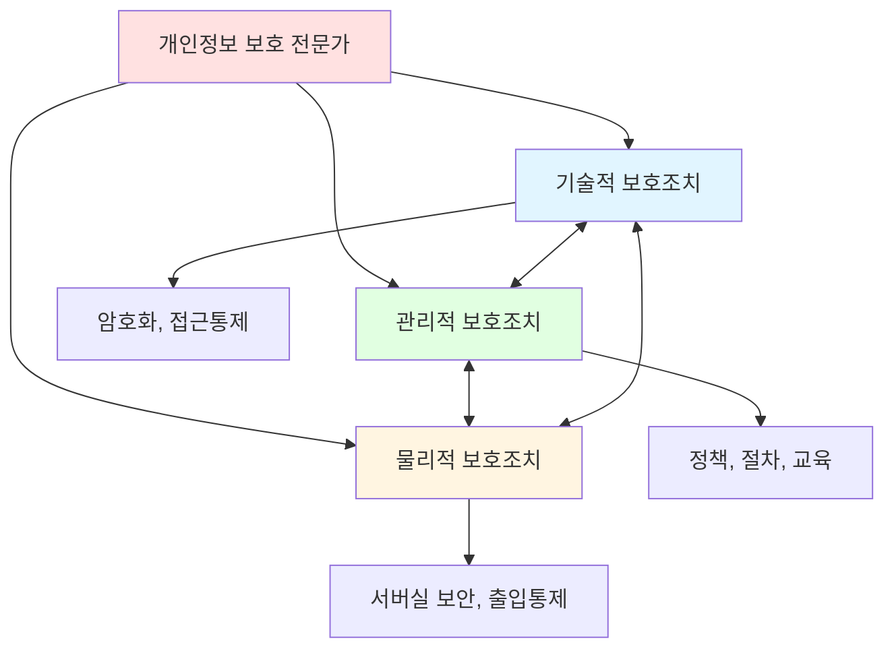

**핵심 원리:**
- **기술을 모르면 관리를 점검하기 어렵다**
  - 예: 암호화 정책을 검토하려면 암호화 알고리즘을 이해해야 함
- **관리를 모르면 기술이 발전하기 어렵다**
  - 예: 백업 정책 없이 백업 시스템만 구축하면 무용지물
- **물리적 보안과 기술적 보안은 연결되어 있다**
  - 예: 서버실 침입 → 물리적 콘솔 접근 → 기술적 통제 우회

💡 **인사이트**: 개인정보 보호 분야는 관리, 기술, 물리 모든 영역을 아우르는 통합적 지식이 필요한 영역입니다.

---

## 🆚 진단(Diagnosis) vs 컨설팅(Consulting)

### 두 개념의 차이점

강사님께서 제시하신 주관적 분류 기준:

| **구분** | **진단(Diagnosis)** | **컨설팅(Consulting)** |
|:---:|:---|:---|
| **목표** | 문제점 발견 + 개선방안 제시 | 전략적 방향 제시 + 장기 로드맵 |
| **기간** | 단기 (보통 1주일 이내) | 중장기 (1~2.5개월) |
| **범위** | 특정 시스템/서비스 대상 | 전사적 또는 조직 전체 |
| **산출물** | 진단 보고서, 체크리스트, 취약점 목록 | 컨설팅 보고서, 전략 로드맵, 솔루션 제안 |
| **분석 방법** | 정해진 체크리스트 기반 점검 | 자산 분석, 흐름 분석, 위험 평가 |
| **결과물 특징** | "적절/부적절" 판정 + 근거 제시 | 조직/예산/장비 고려한 입체적 개선안 |

---

### 진단(Diagnosis)의 특징

#### 진단의 목적

**핵심 활동:**
1. 문제점 찾기
2. 작은 의미에서 개선방안 제시
3. 적절성 판단 (Compliance Check)

**진단 대상:**
- 특정 시스템 (예: 고객 DB 서버)
- 특정 서비스 (예: 쇼핑몰 웹사이트)
- 특정 프로세스 (예: 개인정보 수집 절차)

---

#### 진단의 프로세스

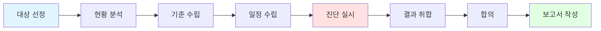

**각 단계 상세:**

**1. 대상 선정**: 어떤 시스템/서비스를 진단할 것인가?
**2. 현황 분석**: 대상의 구조, 기능, 환경 파악
**3. 기준 수립**: 적용할 법규, 표준, 체크리스트 결정
**4. 일정 수립**: 진단 일정 및 담당자 배정
**5. 진단 실시**: 문서 검토, 인터뷰, 실사, 도구 활용
**6. 결과 취합**: 발견사항 정리
**7. 합의**: 담당자와 발견사항 확인 및 합의
**8. 보고서 작성**: 최종 진단 보고서 작성

---

#### 진단에서 사용하는 체크리스트

**표준 체크리스트 예시:**

| **기준** | **체크리스트명** | **적용 대상** |
|:---:|:---|:---|
| **ISMS** | 통제 항목 (Control Items) | ISMS 인증 대상 기업 |
| **주요정보통신기반시설** | 취약점 진단 항목 | 국가 기간시설 |
| **개인정보 보호법** | 안전성 확보조치 기준 | 개인정보 처리자 |
| **GDPR** | GDPR Compliance Checklist | EU 서비스 제공 기업 |

💡 **중요!** 표준 체크리스트가 있는 경우 진단 항목에 대한 논란은 적습니다. 하지만 **새로운 서비스(예: AI 서비스)**는 완비된 체크리스트가 없어, 체크리스트 작성 자체가 중요한 역량이 됩니다.

---

#### 진단 결과의 형태

**판정 방식:**
- ✅ **적절(Compliant)**: 기준을 충족함
- ⚠️ **부적절(Non-Compliant)**: 기준 미충족, 개선 필요
- 🔍 **해당없음(N/A)**: 해당 체크리스트 항목이 적용되지 않음

**근거 제시:**
- 왜 적절한가?
- 왜 부적절한가?
- 어떤 기준으로 판단했는가?

---

### 컨설팅(Consulting)의 특징

#### 컨설팅의 목적

강사님 설명:
> "컨설팅은 진단보다 **한 발 더 나아갑니다**. 단순히 '이것이 문제입니다'가 아니라, '당신의 회사는 조직이 이렇고, 예산이 이렇고, 장비가 이러하니, **이런 방향으로 흘러가면 좋을 것 같습니다. 장기적으로는 이런 부분을 보완해야 합니다**'라는 입체적인 접근을 합니다."

**핵심 활동:**
1. 현황 분석 (As-Is)
2. 위험 평가 (Risk Assessment)
3. 전략 수립 (Strategy)
4. 로드맵 제시 (Roadmap)
5. 솔루션 제안 (Solution)

---

#### 컨설팅 분석 기법

**1. 자산 분석 (Asset Analysis)**
- 정보 자산 목록 작성
- 중요도 평가
- 자산 관계도 작성

**2. 개인정보 흐름 분석 (Data Flow Analysis)**
- 수집 → 이용 → 제공 → 보관 → 파기 흐름 파악
- 제3자 제공 현황
- 위탁 처리 현황

**3. 법적 준거성 분석 (Legal Compliance Analysis)**
- 관련 법규 식별
- 준수 여부 점검
- 위반 시 리스크 평가

**4. 위험 평가 (Risk Assessment)**
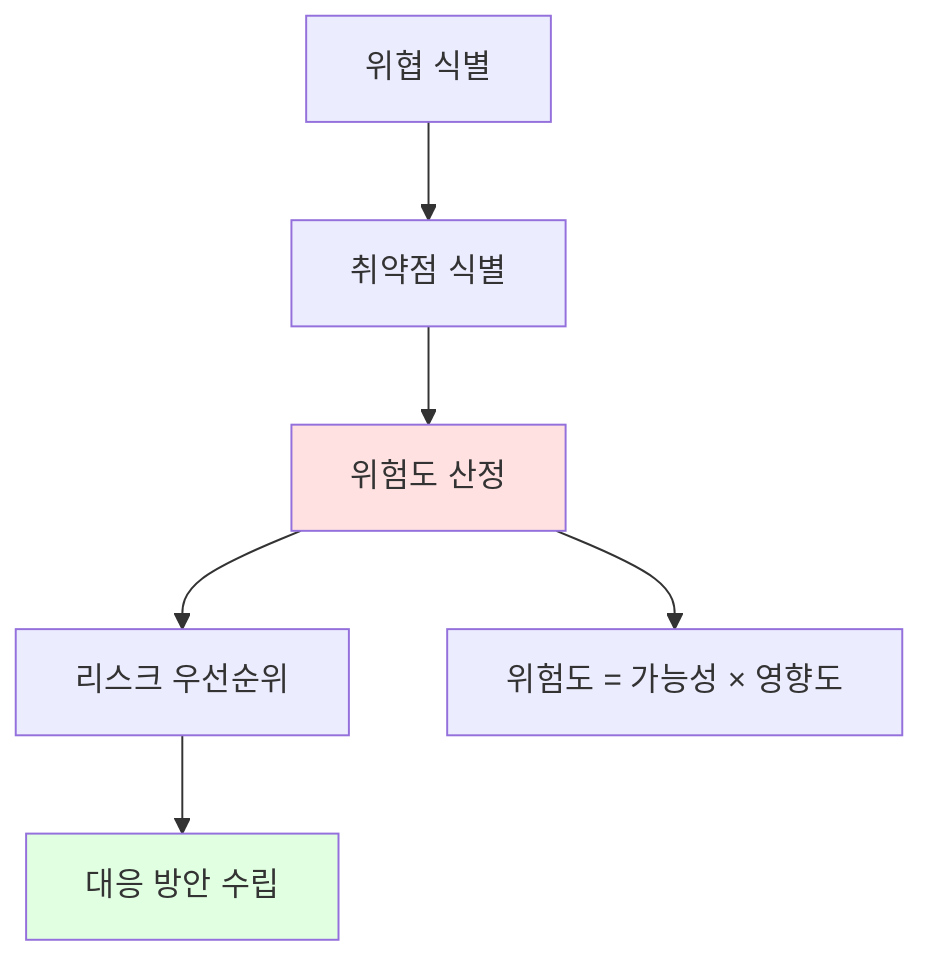

**5. 개선 방안 제시**
- **솔루션 도입**: 보안 솔루션, 개인정보 관리 도구
- **프로세스 개선**: 업무 절차, 승인 체계
- **조직 개선**: 담당자 배치, 역할 정의
- **정책 개선**: 내부 관리계획, 지침 수립

---

#### 컨설팅 vs 진단: 커리어 관점

강사님의 조언:
> "진단은 기초적인 부분입니다. 여러분이 진단을 할 수 있게 되면(기술 진단이든 관리 진단이든), 앞으로 도전해야 할 영역이 **컨설팅**입니다. 컨설팅은 컨설턴트가 들어가서 진단하고 문제를 찾아 **전략적 사고**로 개선 방안을 제시하는 영역입니다."

**커리어 경로:**
```
Junior: 진단 실무자 (1-2년차)
   ↓
Mid-level: 진단 리더 + 컨설팅 참여 (3-5년차)
   ↓
Senior: 컨설턴트 (5년차 이상)
   ↓
Alternative: 기업 보안 담당자 (CISO, CPO)
```

---

## 🌍 현대 사회와 개인정보

### 왜 개인정보가 중요한가?

강사님께서 수민님에게 질문:
> "왜 우리는 개인정보가 중요하다고 얘기할까요? 이 점을 생각하지 않으면 적절한 진단을 잘 할 수도 없습니다."

**수민님의 답변: "도용에 대한 관점"**

강사님 피드백:
> "도용이 과거에는 굉장히 이슈가 됐는데, **지금은 그 단계를 넘어섭니다**. 이번 시간에는 개인정보가 왜 중요한지, 어떤 이슈가 있는지 살펴보겠습니다."

---

### 글로벌 시가총액 Top 10 기업의 변화

#### 1999년 12월 vs 2025년 12월 비교

**핵심 발견**: 25년간 개인정보 기반 비즈니스 모델의 부상

| **1999년 12월** | **분야** | **2025년 12월** | **분야** |
|:---:|:---:|:---:|:---:|
| Microsoft | 소프트웨어 | **Apple** | **하드웨어 + 개인정보** |
| GE (General Electric) | 제조 | Microsoft | 소프트웨어 + 클라우드 |
| Cisco | 네트워크 장비 | **NVIDIA** | **반도체 (AI용)** |
| Exxon Mobil | 에너지 | **Alphabet (Google)** | **검색 + 개인정보** |
| Walmart | 유통 | **Amazon** | **유통 + 개인정보** |
| Intel | 반도체 | **Saudi Aramco** | 에너지 |
| NTT | 일본 통신 | **Meta (Facebook)** | **SNS + 개인정보** |
| Lucent Technologies | 통신 기술 | **Tesla** | **전기차 + 개인정보** |
| Nokia | 핸드폰 | Walmart | 유통 |
| Deutsche Telekom | 독일 통신 | **Samsung** | **전자 + 개인정보** |

📌 **중요 관찰:**
- Microsoft, Walmart 제외 **8개 기업 모두 변화**
- 개인정보 관련 기업 (강조 표시): **7개 / 10개**
- 제조업 → 데이터/서비스업으로 패러다임 전환

---

#### 시사점

💡 **핵심 인사이트:**
> "현대 사회에서 가장 가치 있는 기업들은 개인정보를 수집하고, 분석하고, 활용하는 기업들입니다. 개인정보 자체가 **비즈니스의 핵심 자산**이 되었습니다."

**변화의 본질:**
- **과거 (1999년)**: 물건을 만들고 판매하는 기업
- **현재 (2025년)**: 데이터를 수집하고 분석하여 서비스를 제공하는 기업

---

## 🏢 글로벌 기업의 개인정보 활용 사례

### 1. Apple 🍎

#### 수집하는 개인정보

강사님께서 학생들과의 Q&A를 통해 도출한 Apple의 개인정보 수집 유형:

**임동현님 답변: "휴대폰 이용내역"**
- 통화 내역
- 문자 내역
- 앱 사용 기록
- 기기 사용 패턴

**정의상님 답변: "검색 기록"**
- Safari 브라우저 검색 기록
- App Store 검색 및 다운로드 이력
- Siri 음성 명령 기록

**전성배님 답변: "위치 정보"**
- GPS 기반 위치 정보
- Wi-Fi/Bluetooth 기반 위치 추정
- 앱별 위치 정보 사용 기록

**전성배님 추가 답변: "생체 정보"**
- Face ID 얼굴 정보
- Touch ID 지문 정보
- Apple Watch를 통한 **건강 정보**:
  - 심박수
  - 혈압
  - 운동량
  - 수면 패턴
  - 월경 주기 (여성)

---

#### 데이터 저장 방식

**하드웨어 + 소프트웨어 통합 모델:**

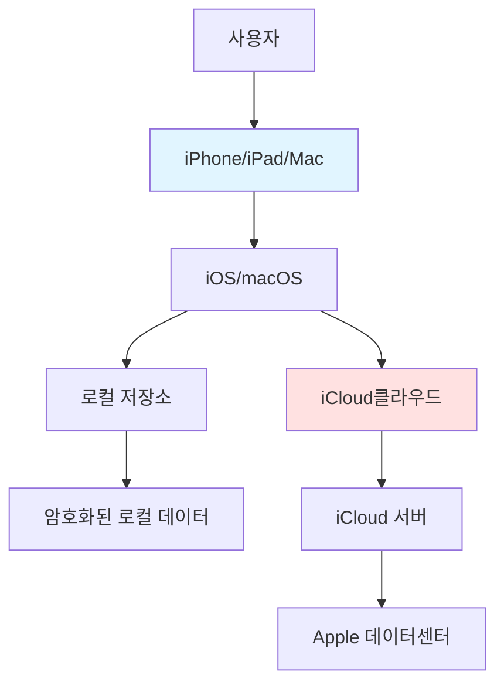

**특징:**
- Apple은 하드웨어와 소프트웨어를 **모두 직접 개발**
- 데이터가 기기(로컬)와 클라우드(iCloud)에 **이중으로 저장**
- 암호화 적용 (단, Apple은 복호화 키 보유)

---

### 2. Alphabet (Google) 🔍

#### 수집하는 개인정보

**핵심 서비스별 수집 정보:**

| **서비스** | **수집 정보** |
|:---:|:---|
| **Google 검색** | 검색 키워드, 검색 시간, IP 주소, 클릭한 결과 |
| **Chrome 브라우저** | 방문 웹사이트, 쿠키, 브라우저 히스토리, 자동완성 정보 |
| **Android OS** | 통화/문자 내역, 앱 사용 기록, 위치, 기기 정보 |
| **Gmail** | 이메일 내용, 연락처, 발신/수신 패턴 |
| **YouTube** | 시청 기록, 좋아요/싫어요, 구독 채널, 시청 시간 |
| **Google Maps** | 위치 기록, 경로 검색, 방문한 장소 |
| **Google Photos** | 사진/영상, 얼굴 인식 데이터, 촬영 위치 |

---

#### 데이터 활용 방식

**Google의 비즈니스 모델:**
1. **무료 서비스 제공** (검색, Gmail, Maps 등)
2. **개인정보 수집** (검색 기록, 위치, 관심사 등)
3. **데이터 분석** (사용자 프로파일링)
4. **타겟 광고 판매** (광고주에게 고도로 타겟팅된 광고 플랫폼 제공)

💡 **핵심**: "서비스는 무료이지만, 사용자의 개인정보가 상품입니다."

---

### 3. Amazon 📦

#### 개인정보 기반 추천 시스템의 선구자

강사님 설명:
> "Amazon은 원래 온라인 서적 판매 회사였습니다. 이 사람이 **어떤 책을 샀는지 분석해서** 다음에 어떤 책을 추천하는 **추천 서비스**가 초기에 굉장히 유행했던 대표적인 기업이 Amazon입니다."

**진화 과정:**

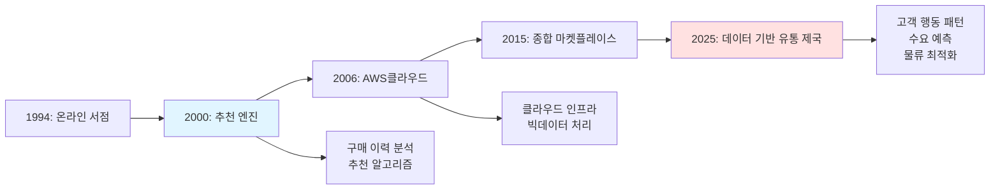

**수집하는 개인정보:**
- 구매 이력 (무엇을, 언제, 얼마에)
- 검색 기록
- 장바구니 내역
- 위시리스트
- 상품 리뷰 및 평점
- 클릭 패턴 (어떤 상품을 클릭했는지)

**활용 방식:**
- "이 상품을 구매한 고객들은 이런 상품도 구매했습니다"
- 개인화된 홈페이지 (사용자마다 다른 추천 상품 표시)
- 수요 예측 및 재고 관리

---

### 4. Tesla 🚗

#### 자율주행과 개인정보

강사님께서 수민님에게 질문:
> "Tesla가 개인정보를 수집할까요? 어떤 정보를 수집할까요?"

**학생들의 답변 종합:**

| **학생** | **답변** | **설명** |
|:---:|:---|:---|
| **승우님** | 이동 기록 | 출발지, 목적지, 경로, 운행 시간 |
| **호주님** | 센서 데이터 | 카메라, 라이다, 레이더 센서 데이터 |
| **동영님** | 운전자 정보 | 운전 습관, 급가속/급정지 패턴 |
| **강사님 추가** | 구매자 정보 | 연령대, 직업, 소득 수준 (추정) |

---

#### 자율주행 시스템이 수집하는 개인정보

**가장 민감한 정보: 카메라 데이터**

강사님 설명:
> "자율주행을 하려면 **카메라**가 있어야 합니다. 카메라가 있다는 것은 **사물의 주변을 판단**해야 한다는 건데, 이 사물에 대한 판단이 **자동차 번호판**이 될 수도 있고, **보행자의 얼굴**이 될 수도 있습니다."

**수집되는 영상 정보:**

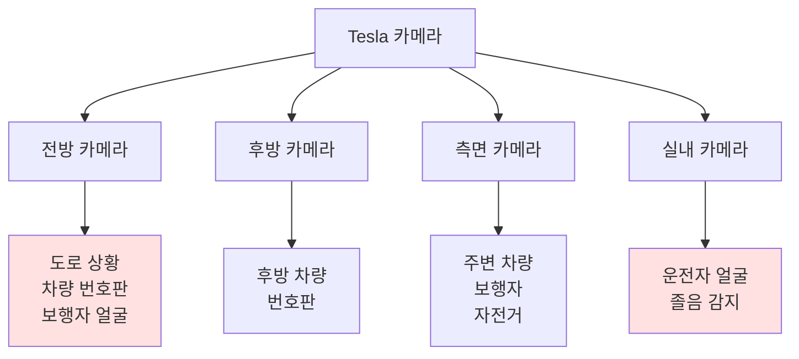

**심각성:**
- 타인의 차량 번호판 → **차량 소유자 식별 가능**
- 보행자 얼굴 → **얼굴 인식 기술로 개인 식별 가능**
- 이 모든 데이터가 Tesla 서버로 전송

---

#### Tesla의 프라이버시 논란

**마이크 녹음 사건:**

강사님 설명:
> "과거에 Tesla가 프라이버시와 관련하여 곤란했던 부분이 있었습니다. **차 안에 있는 대화를 녹음**해서 Tesla 서버로 전송하는 기능이 있었습니다. 녹음한 데이터가 **유출**되는 사고도 있었습니다."

**문제점:**
- 사전 고지 없는 녹음
- 사생활 침해
- 데이터 유출 시 민감한 대화 내용 노출

**데이터 활용 목적:**
- 자율주행 알고리즘 개선
- 완벽한 자율주행 서비스 구현을 위한 학습 데이터

---

### 5. Meta (Facebook) 👥

#### SNS 데이터 기반 비즈니스

강사님 설명:
> "Meta는 기본적으로 **하는 일이 별로 없습니다**. 다른 회사들은 뭔가 '만들잖아요'. Meta의 기본 컨셉은 **Facebook**입니다. 웹 서비스를 하나 만들어놓고, 회원 가입한 사람이 **누구를 알 것 같다**고 추천해주거나, 지인들을 찾아서 **매칭**해주는 서비스를 하는 겁니다. 그게 **대박**이 나서 시가총액 7위까지 올라갔습니다."

**수집하는 개인정보:**
- 프로필 정보 (이름, 나이, 성별, 직업, 학력 등)
- 친구 관계 (소셜 그래프)
- 게시물 내용 (텍스트, 사진, 영상)
- 좋아요/댓글/공유 기록
- 관심사 (페이지 좋아요, 그룹 가입)
- 메시지 내용 (Messenger)
- 위치 정보
- 활동 시간 패턴

**비즈니스 모델:**
- 무료 SNS 서비스 제공
- 개인정보 기반 타겟 광고
- 광고주에게 고도로 세분화된 타겟팅 옵션 제공
  - 예: "30대 여성, 서울 거주, 육아에 관심, 주말 저녁에 활동적"

---

### 6. Walmart 🛒

#### 유통업의 개인정보 활용

강사님 설명:
> "Walmart도 유통에 있어서 고객의 니즈를 파악하는 데 개인정보를 활용하는 대표적인 기업입니다."

**수집하는 정보:**
- 구매 이력
- 구매 빈도
- 구매 시간대
- 구매 패턴 (함께 구매하는 상품)
- 멤버십 정보

**활용 사례:**
- **장바구니 분석(Market Basket Analysis)**: 맥주와 기저귀를 함께 구매하는 패턴 발견
- 매장 레이아웃 최적화
- 재고 관리
- 개인화된 쿠폰 발송

---

## 📈 시대별 개인정보 유형의 변화

### 1990년대: 기본 식별 정보

**주요 개인정보:**
- 이름
- 주소
- 전화번호
- 주민등록번호

**특징:**
- 오프라인 중심
- 수기 기록
- 종이 문서 보관

**기업 입장:**
- 마케팅에 필요하지만 핵심 자산은 아님
- 단순 연락처 정도의 가치

---

### 2000년대: 온라인 행동 데이터

**추가된 개인정보 유형:**
- 위치 정보 (GPS)
- 쿠키 데이터 (Cookie)
- 검색 기록
- 구매 이력
- 클릭 패턴

**기술적 배경:**
- 인터넷 보급
- 전자상거래 성장
- 온라인 서비스 다양화

**비즈니스 활용:**

강사님 설명:
> "사람들이 너무 많은 서비스를 이용하다 보니까, 단순히 이메일이나 전화번호만으로는 고객을 모집하거나 상품을 팔기에 **한계**가 있습니다. 그래서 여러 서비스로 분화되는 과정에서 위치 정보, 쿠키 데이터, 검색 기록이 쌓이게 되고, '아, **이런 연령대, 이런 사람들은 이런 상품을 구매하는구나**'라는 분석이 가능해진 것이 2000년대입니다."

---

### 2010년대: SNS 및 멀티미디어 데이터

**추가된 개인정보 유형:**
- SNS 데이터 (Facebook, Twitter, Instagram)
- 사진 및 영상
- 음성 데이터
- 소셜 그래프 (인간 관계)
- 위치 태그
- 해시태그

**기술적 배경:**
- 스마트폰 보급
- SNS 플랫폼 성장
- 고속 인터넷/LTE

**비즈니스 활용:**
- 사용자 선호도 분석
- 인플루언서 마케팅
- 바이럴 마케팅
- 소셜 로그인 (Facebook Login, Google Login)

---

### 2020년대: AI 학습 데이터 및 비정형 데이터

**추가된 개인정보 유형:**
- 음성 인식 데이터 (Siri, Alexa, Google Assistant)
- 영상 분석 데이터
- 비정형 데이터 (로그, 센서 데이터)
- **AI 학습용 데이터**
- 생체 정보 (지문, 얼굴, 홍채, 정맥)
- IoT 기기 데이터 (스마트 홈, 웨어러블)

**기술적 배경:**
- AI/머신러닝 발전
- 음성 인식 정확도 향상
- 영상 분석 기술 (얼굴 인식, 객체 인식)
- IoT 기기 확산

**특징:**
- **비정형 데이터** 분석 가능
- 실시간 처리
- 예측 및 추론 가능

---

### 시대별 비교표

| **시대** | **주요 데이터 유형** | **저장 방식** | **처리 방식** | **비즈니스 가치** |
|:---:|:---|:---|:---|:---|
| **1990년대** | 이름, 주소, 전화번호 | 종이 문서, 단순 DB | 수기 처리 | 낮음 (연락처) |
| **2000년대** | 위치, 검색, 구매 이력 | 관계형 DB | 배치 처리 | 중간 (타겟 마케팅) |
| **2010년대** | SNS, 사진, 영상, 음성 | NoSQL, 클라우드 | 실시간 처리 | 높음 (개인화) |
| **2020년대** | AI 학습 데이터, 생체 정보, IoT | 분산 스토리지, 클라우드 | AI/ML 실시간 분석 | 매우 높음 (예측/추론) |

---

## 🎓 종합 분석: 왜 개인정보가 중요한가?

### 1. 경제적 가치

**핵심 메시지:**
> 글로벌 시가총액 Top 10 기업 중 7개가 개인정보 기반 비즈니스 모델을 채택하고 있다는 것은, **개인정보가 21세기의 '석유'**임을 증명합니다.

**가치 사슬:**
```
개인정보 수집 → 데이터 분석 → 인사이트 도출 → 서비스 개선 / 광고 수익
```

---

### 2. 사회적 영향력

**개인정보가 미치는 영향:**
- **정치**: 선거 캠페인, 여론 조작 (Cambridge Analytica 사건)
- **경제**: 소비 패턴 분석, 수요 예측
- **사회**: SNS를 통한 여론 형성
- **개인**: 프라이버시 침해, 정보 자기결정권

---

### 3. 기술적 진화

**데이터 처리 기술의 발전:**
- 빅데이터 분석
- 인공지능 (AI) / 머신러닝 (ML)
- 실시간 처리
- 예측 알고리즘

💡 **중요**: 기술이 발전할수록 개인정보의 활용 가능성과 위험성이 모두 증가합니다.

---

### 4. 법적 규제 강화

**주요 법규:**
- **한국**: 개인정보 보호법
- **EU**: GDPR (General Data Protection Regulation)
- **미국**: CCPA (California Consumer Privacy Act)
- **중국**: 개인정보보호법 (Personal Information Protection Law)

**규제 트렌드:**
- 과태료/과징금 강화
- 정보주체 권리 강화 (열람, 정정, 삭제)
- 투명성 요구 증가

---

## ✅ Section 2 학습 체크리스트

- [ ] 관리적, 기술적, 물리적 보호조치가 서로 오버랩됨을 이해했다
- [ ] 진단과 컨설팅의 차이를 설명할 수 있다
- [ ] 1999년과 2025년 시가총액 Top 10 기업 변화를 통해 개인정보의 중요성을 이해했다
- [ ] Apple, Google, Amazon, Tesla, Meta, Walmart의 개인정보 수집 방식을 안다
- [ ] 시대별 개인정보 유형 변화를 설명할 수 있다 (1990년대 → 2020년대)
- [ ] Tesla의 자율주행 시스템이 타인의 번호판, 얼굴을 수집하는 문제를 이해했다
- [ ] 개인정보가 현대 비즈니스의 핵심 자산임을 인식했다

---

## 📋 핵심 요약

### 1. 보호조치의 통합적 이해
- 관리, 기술, 물리 보호조치는 분리되지 않고 서로 오버랩
- 통합적 지식이 개인정보 보호 전문가의 핵심 역량

### 2. 진단 vs 컨설팅
- **진단**: 단기, 체크리스트 기반, 적절/부적절 판정
- **컨설팅**: 중장기, 전략적 사고, 입체적 개선안

### 3. 글로벌 기업의 개인정보 활용
- Top 10 기업 중 7개가 개인정보 기반 비즈니스
- Apple, Google, Amazon, Tesla, Meta 등이 대표적

### 4. 시대별 개인정보 유형 변화
- 1990년대: 이름, 주소, 전화번호
- 2000년대: 위치, 검색, 구매 이력
- 2010년대: SNS, 사진, 영상, 음성
- 2020년대: AI 학습 데이터, 생체 정보, IoT

### 5. 개인정보의 가치
- 경제적 가치: 21세기의 '석유'
- 사회적 영향력: 정치, 경제, 사회 전반
- 법적 규제 강화: GDPR, 개인정보 보호법 등

---

## ❓ Q&A

**Q1: Tesla가 수집한 타인의 번호판, 얼굴 데이터는 개인정보인가요?**

A: 네, **개인정보입니다**.
- 차량 번호판 → 차량 소유자 식별 가능
- 얼굴 → 얼굴 인식 기술로 개인 식별 가능
- 한국 개인정보 보호법 및 GDPR 모두 이를 개인정보로 간주
- Tesla는 이 데이터를 수집 전 타인의 동의를 받지 않았으므로 법적 논란 소지

---

**Q2: 왜 1999년 Top 10 기업이 2025년에 대부분 바뀌었나요?**

A: **디지털 전환(Digital Transformation)** 때문입니다.
- 1999년: 제조업, 에너지, 통신 중심
- 2025년: 데이터, 서비스, 플랫폼 중심
- 개인정보를 활용한 비즈니스 모델이 더 높은 수익성과 성장성을 보임

---

**Q3: 개인정보 기반 비즈니스의 문제점은 무엇인가요?**

A: 여러 문제가 있습니다.
- **프라이버시 침해**: 과도한 개인정보 수집
- **정보 비대칭**: 기업은 알지만 개인은 모름
- **알고리즘 편향**: AI 학습 데이터 편향 → 차별 발생
- **보안 사고**: 데이터 유출 시 막대한 피해
- **독과점**: 데이터 축적 → 진입 장벽 → 독과점 심화

---

## 🔜 다음 학습 내용 예고

**Section 3: AI와 개인정보, 그리고 개인정보 처리 시스템**
- AI (GPT, Gemini)는 나에 대해 얼마나 알고 있을까?
- AI의 개인정보 추론 능력
- 개인정보 처리 시스템의 구조
- 개인정보 처리 단계별 점검 포인트

---

**작성 완료**: Section 2 작성 완료
**예상 분량**: 약 300줄
**누적 분량**: 약 580줄 (Section 1 + Section 2)
# Section 3: AI 시대의 개인정보와 프라이버시 이슈

## 📊 3.1 AI와 개인정보의 결합

### 🤖 AI 기술과 데이터 분석의 진화

현대 기업들은 단순히 개인정보를 수집하는 것을 넘어, **AI를 통해 비정형 데이터를 분석**하여 더 깊은 인사이트를 도출하고 있습니다.

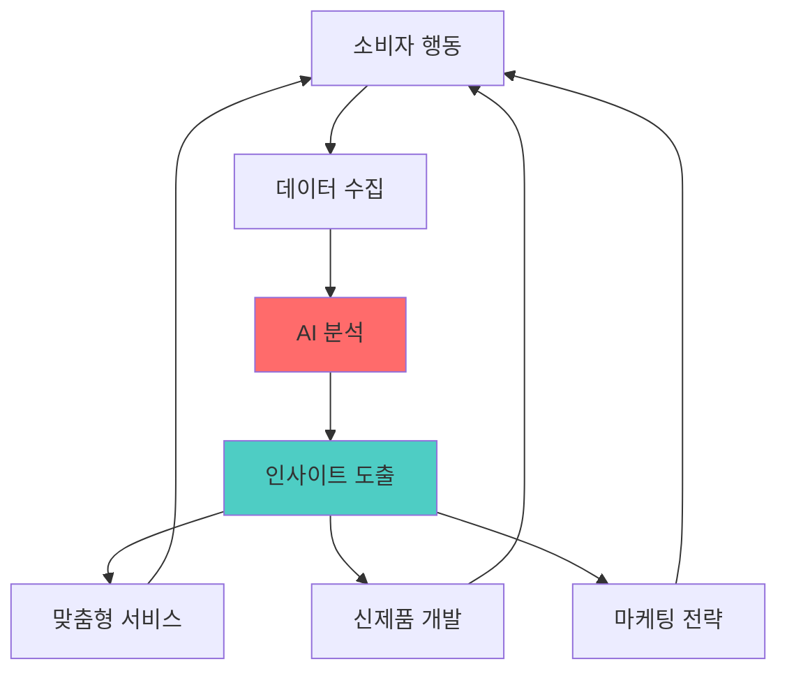

#### 📸 미디어 데이터 분석의 확대

과거에는 분석하기 어려웠던 **음성, 영상, 사진** 등의 비정형 데이터를 AI가 분석할 수 있게 되었습니다:

| 데이터 유형 | 분석 가능 정보 | 활용 사례 |
|------------|---------------|-----------|
| **사진/이미지** | 얼굴 인식, 위치 정보, 선호 스타일 | SNS 추천, 쇼핑몰 상품 추천 |
| **음성** | 감정 상태, 건강 상태, 방언/억양 | 고객 상담, 음성 비서 |
| **영상** | 행동 패턴, 관심사, 체류 시간 | 유튜브 알고리즘, 광고 타겟팅 |
| **텍스트** | 감정, 의도, 관심사 | 챗봇, 맞춤형 콘텐츠 |

#### 📱 SNS와 미디어 데이터의 영향

**학생 토론**
```
강사: "여러분들 SNS를 다들 이용하시거나 인스타, 페이스북, 틱톡을 하시죠?"

학생: "네, 거의 매일 사용합니다."

강사: "그런 내용들을 보시면 스스로가 어떤 게시물을 올렸는지를 보면
      더 잘 알 수 있을 것 같아요. 요즘 음식점들은 인스타에 올리기 위해서
      팬시한 음식 사진을 올릴 수 있게 하거나 주변 인테리어를
      그렇게 꾸미는 경우들도 많이 있죠."
```

**💡 핵심 인사이트**
> 2010년대: SNS 게시물, 사진 중심 데이터
> 2020년대: 음성, 영상, 비정형 데이터를 AI로 분석
> → 모든 비즈니스의 기초 수단으로 개인정보 활용

---

## 🔄 3.2 개인정보 처리 방식의 진화

### 📜 과거 vs 현재 비교

| 구분 | 과거 (1990년대) | 현재 (2020년대) |
|------|----------------|----------------|
| **수집 방식** | 서류 작성, 수기 기록 | 온라인, 자동 수집 |
| **처리 주체** | 사람 (수작업) | 시스템 (자동화) |
| **저장 방식** | 서류, 문서 보관함 | 데이터베이스, 클라우드 |
| **서비스 시간** | 근무 시간 (예: 은행 10시~3시) | 24시간 365일 |
| **접근성** | 직접 방문 필요 | 온라인 즉시 접근 |
| **데이터 범위** | 이름, 주소, 전화번호 | 행동 패턴, 위치, 구매 이력, 생체 정보 등 |

#### 🏦 사례 연구: 금융 서비스의 변화

**과거 (1990년대)**
```
09:00 - 은행 오픈 대기
10:00 - 은행 방문 (업무 시작)
10:30 - 번호표 수령 및 대기
11:00 - 창구에서 서류 작성
11:30 - 서류 처리 및 통장 발급
15:00 - 은행 마감 (늦으면 다음날 방문)
```

**현재 (2020년대)**
```bash
# 모바일 뱅킹 - 24시간 가능
$ 계좌 개설: 앱 다운로드 → 본인인증 → 정보입력 → 즉시 개설
$ 이체: 앱 열기 → 지문인증 → 이체 → 완료 (2분 소요)
$ 대출: 앱에서 신청 → AI 신용평가 → 즉시 승인
```

### 🏢 행정 업무의 디지털화

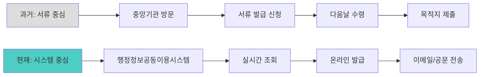

**💬 강사 설명**
```
"과거에는 구청에 가서 서류를 띄고, 세무서에 가서 뭘 띄우고,
그것을 시청에 제출하고... 이런 식의 일들을 했었는데,
이제 그런 것들이 다 온라인화되고 시스템화되었습니다."
```

---

## 📈 3.3 다양한 분야의 개인정보 활용

### 🏥 의료 데이터의 중요성

AI 시대에 가장 중요하게 간주받는 데이터 영역 중 하나가 **의료 데이터**입니다.

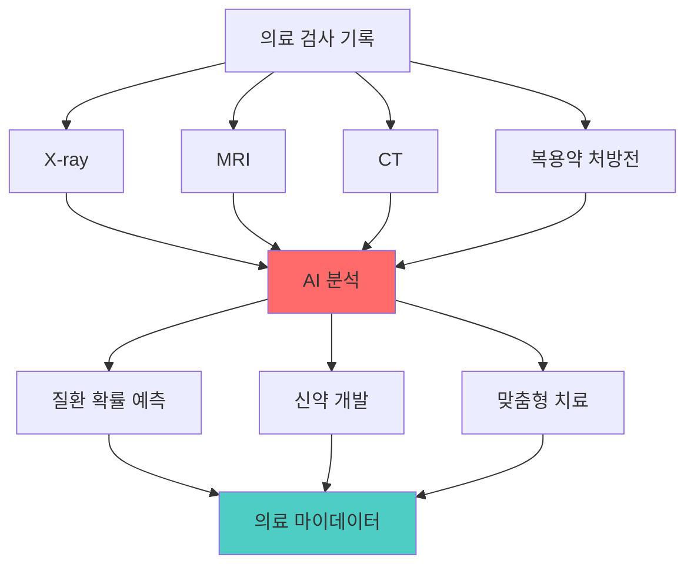

#### 🔬 의료 마이데이터 시대

**핵심 질문들**
- 의료 기록을 어떻게 관리할 것인가?
- 어떻게 안전하게 전송할 것인가?
- 개인 식별자를 제거한 데이터를 어떻게 활용할 것인가?

**💼 창업 아이디어**
> "만약 창업을 한다면, 의료 데이터를 활용하는 서비스도 대상이 될 수 있고,
> 의료 데이터 관련 보안을 점검하는 사람이 될 수도 있습니다."

### 💳 금융 기관의 신용 평가

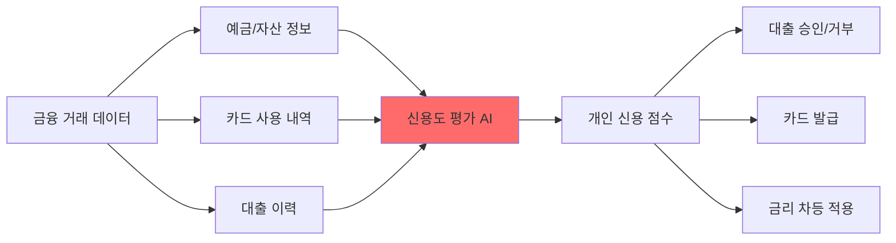

**신용 평가 요소**
- 예금 금액 및 자산
- 카드 사용 패턴
- 대출 상환 이력
- **유사한 직업, 나이, 거주지 패턴 분석** ← AI의 역할

### 🛒 인터넷 쇼핑: 쿠팡 사례

**💬 학습 시나리오**
```
강사: "여러분들 쿠팡 지금 탈팡 하시는 분들도 있으실 것 같은데,
      쿠팡을 보시면 구매 내역이 쭉 나오게 됩니다."

학생: "네, 숨기고 싶은 구매 내역도 있어요..."

강사: "인터넷 쇼핑에서 쌓여지는 구매 내역들,
      이 사람은 이런 상품을 검색했고,
      이런 상품을 검색한 사람들은 다음 이런 상품을 구매하더라
      라고 하는 알고리즘이 뜨게 됩니다."
```

**알고리즘 활용**
1. **재고 분석**: 어떤 상품이 언제 많이 팔리는지
2. **마케팅 타겟팅**: 누구에게 어떤 상품을 광고할지
3. **추천 시스템**: 다음에 구매할 만한 상품 예측

### 📺 유튜브 & 넷플릭스 알고리즘

```python
# 유튜브 추천 알고리즘 개념도
class YouTubeAlgorithm:
    def __init__(self, user):
        self.user = user
        self.watch_history = []
        self.engagement_data = []

    def analyze_behavior(self):
        """사용자 행동 분석"""
        patterns = {
            '시청_시간대': self.extract_watch_times(),
            '좋아요_패턴': self.analyze_likes(),
            '체류_시간': self.calculate_retention(),
            '건너뛰기_비율': self.skip_rate()
        }
        return patterns

    def recommend_videos(self):
        """맞춤형 영상 추천"""
        patterns = self.analyze_behavior()
        similar_users = self.find_similar_users(patterns)
        recommendations = self.generate_recommendations(similar_users)
        return recommendations
```

**💡 인사이트**
> "이런 소비하는 영상을 통해서 이 사람이 어떤 상품을 구매하는 사람인지,
> 어떤 성향을 가지고 있는 사람인지, 어떤 질병을 가지고 있는 사람인지
> 이런 것들을 연결해서 분석한다면 굉장히 많은 인사이트를 얻게 됩니다."

---

## 🔒 3.4 개인정보의 영구성: 데이터베이스화의 의미

### 💾 과거 vs 현재의 데이터 관리

| 측면 | 과거 (서류 기반) | 현재 (DB 기반) |
|-----|----------------|---------------|
| **삭제 방식** | 서류 파쇄 → 완전 삭제 | DB 삭제 → 백업에 남음 |
| **복구 가능성** | 거의 불가능 | 언제든 복구 가능 |
| **유통 범위** | 물리적 제한 | 무한대 복사/전송 |
| **보관 기간** | 공간 제약 | 영구 보관 가능 |

**⚠️ 핵심 메시지**
```
"데이터베이스화 된다는 것은 과거처럼 서류를 파쇄한다고 해서
끝나는 것이 아니라, 계속 어딘가에 남아 있을 수밖에 없습니다."
```

---

## 🌑 3.5 명(明)과 암(暗): 프라이버시 이슈의 등장

### 📚 프라이버시 관련 서적들

**15-20년 전부터 제기된 경고들**
- **"당신의 프라이버시는 죽었다"**
- **"아무도 모르게"**
- **"새로운 감시사회"**

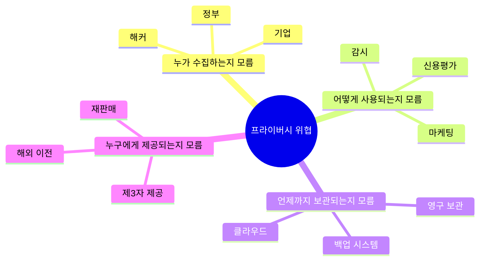

### 📹 CCTV: 현대의 감시 사회

**💬 강의 토론**
```
강사: "동현 님, 하루에 집 밖에 나간다고 했을 때,
      찍히는 CCTV 개수가 몇 대 정도 될까요?"

학생 (동현): "음... 50번?"

강사: "규리 님은요?"

학생 (규리): "100번?"

강사: "15년 전 조사에서 일반 직장인이 하루에 찍히는 CCTV 대수가
      150대 정도였습니다. 지금은 훨씬 더 많을 겁니다."
```

#### 📊 CCTV 노출 지점 분석

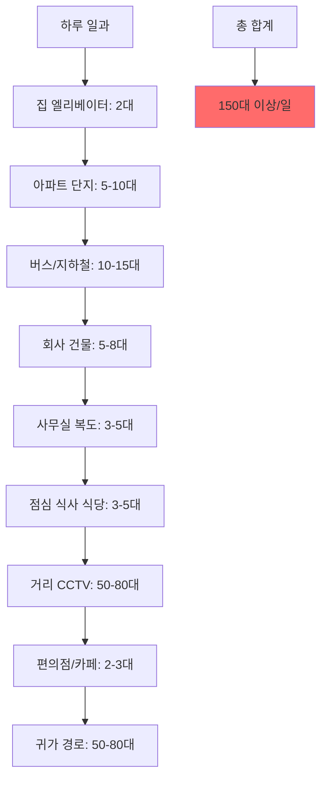

**⚖️ 양면성**
- **긍정적**: 범죄 예방, 사후 수사에 큰 도움
- **부정적**: 프라이버시 침해, CCTV가 잘 관리되는지 알 수 없음

---

## 🔄 3.6 복잡한 데이터 흐름: 배달앱 사례 분석

### 🍕 사용자가 보는 단순한 흐름

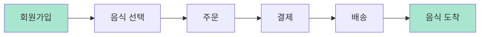

### 🔍 실제 뒷단 시스템의 복잡성

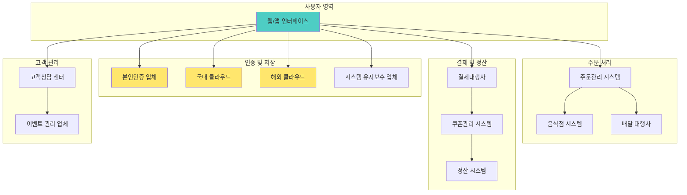

**💬 강사 설명**
```
"이게 다냐? 절대 그렇지 않겠죠.
일부만 나왔는데도 여러분들이 소비하는 패턴에 비해서는
더 많은 이해관계자와 더 많은 시스템이 존재할 수밖에 없습니다."
```

### 🛡️ 관리의 중요성

**보안 진단 관점**
1. **시스템 구조 관리**: 어떻게 관리할 것인가?
2. **법적 준수**: 개인정보 법 위반은 없는가?
3. **기술적 안전성**: 기술적으로 잘 관리되고 있는가?
4. **제3자 제공**: 제공 동의와 관리는 적절한가?

---

## ⚠️ 3.7 주요 개인정보 유출 사고 사례

### 📱 SKT 개인정보 유출 사고 (최근)

#### 🏗️ 시스템 구조

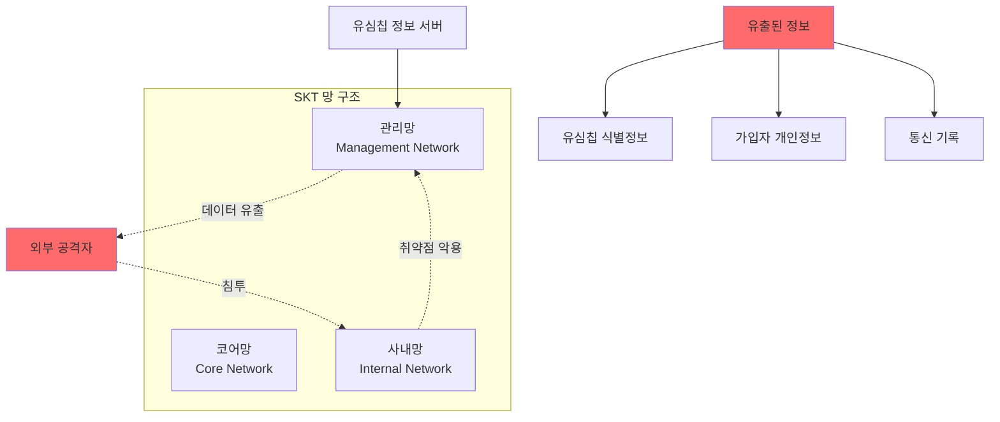

**💬 학생 토론**
```
강사: "김기란님, 서버가 악성코드에 감염됐는데 이걸 몰랐다고?
      이상하지 않나요?"

학생 (기란): "네, 누락된 부분이 있는 것 같아요."

강사: "왜 누락이 될까요?"

학생들의 답변:
- "기술적인 문제"
- "사람의 부주의"
- "근무 태만"
- "로그 보관기간이 짧아서"
- "인수인계를 안 해서"
```

#### 🎯 근본 원인: 자산의 복잡성

**강사의 핵심 설명**
```
"제가 생각하는 가장 큰 문제는 자산이 너무 많기 때문입니다.
자산이 너무 많고 자산이 너무 복잡합니다."
```

**시스템 복잡도 예시**
```yaml
배달 앱 하나의 기본 구성:
  웹_서버:
    - Nginx/Apache
    - 로드밸런서
  애플리케이션_서버:
    - Spring Boot 서버 (여러 대)
    - Node.js 서버
  데이터베이스:
    - MySQL/PostgreSQL (Master/Slave)
    - Redis (캐시)
    - MongoDB (로그)
  클라우드_리소스:
    - EC2 인스턴스: 50+개
    - RDS: 10+개
    - S3 버킷: 20+개
    - Lambda 함수: 100+개

  실제 관리해야 할 자산:
    - 수백 개의 서버
    - 수십 개의 데이터베이스
    - 수많은 API 연동
    - 복잡한 네트워크 구성
```

**🎓 진단 실무 팁**
> "가장 진단의 효과를 거둘 수 있는 방법 중 하나는
> **사람들이 관리하지 않는 서버들을 찾아내는 것**입니다.
> 너무 많기 때문에 부주의가 아니라 구조적으로
> 한 사람이 관리해야 할 서버가 너무 많습니다."

#### 🔐 공격 경로 분석

```mermaid
graph LR
    A[외부 공격자] --> B[주변 시스템<br/>취약점 발견]
    B --> C[관리가 소홀한<br/>서버 침투]
    C --> D[내부망 이동]
    D --> E[코어 시스템<br/>접근]
    E --> F[개인정보 탈취]

    G[보안 시스템] -.감시.-> H[코어 시스템만<br/>집중 모니터링]

    style C fill:#ff6b6b
    style F fill:#ff6b6b
```

**핵심 교훈**
- 코어 시스템만 보안 강화 ❌
- 주변 시스템도 철저히 관리 ✅

### 🎮 넥슨 메이플스토리 개인정보 유출 (2011)

**💬 강의 중 언급**
```
강사: "이런 것 때문에 사고가 난 적이 있었습니다.
      여러분들이 어릴 때, 초등학교 때 메이플스토리
      개인정보 유출 사고가 바로 지금 기란님이 얘기하셨던
      그런 케이스였습니다."

사고 원인: "테스트 서버에 개인정보 실 데이터를 올려놨다가
          그 데이터를 방치한 상태로 둔 거죠."

피해 규모: "1,320만 명 개인정보 유출"
```

#### 📋 사고 분석

| 구분 | 내용 |
|-----|------|
| **발생 시기** | 2011년 11월 |
| **피해 규모** | 약 1,320만 명 |
| **유출 정보** | 이름, 주민등록번호, ID, 비밀번호, 이메일, 전화번호 |
| **근본 원인** | 테스트 서버에 실제 데이터 사용 + 방치 |
| **보안 문제** | 테스트/개발 환경 관리 부재 |

**🔑 보안 원칙 위반**
```bash
# 잘못된 사례 (넥슨 케이스)
개발/테스트 서버:
  - 실제 고객 데이터 사용 ❌
  - 외부 접근 가능한 상태 방치 ❌
  - 암호화 미적용 ❌
  - 모니터링 없음 ❌

# 올바른 방법
개발/테스트 서버:
  - 가명 처리된 더미 데이터 사용 ✅
  - 외부 접근 차단 ✅
  - 데이터 암호화 ✅
  - 정기적인 점검 ✅
```

### 👤 이석준 살인 사건: 내부자에 의한 개인정보 유출

#### 🔍 사건 개요

```mermaid
graph LR
    A[범죄자<br/>이석준] -->|이름+전화번호| B[흥신소 A]
    B -->|50만원| C[흥신소 B]
    C -->|문의| D[공무원 A씨]
    D -->|2만원 받고<br/>개인정보 제공| C
    C --> B
    B --> A
    A -->|주소 파악| E[피해자 집<br/>침입]
    E --> F[살인 사건]

    style D fill:#ff6b6b
    style F fill:#ff6b6b
```

**💬 강의 설명**
```
"온라인 채팅으로 만난 여성이 만나기를 거부하자,
이석준은 이름과 전화번호만으로 흥신소에 의뢰했습니다.
공무원 A씨는 단돈 2만원에 개인정보를 팔았고,
이것이 결국 살인으로 이어졌습니다."
```

#### 📊 내부자 위협 분석

**공무원의 시스템 접근 권한**
```mermaid
graph TB
    A[공무원] --> B[행정정보공동이용]
    A --> C[주민등록시스템]
    A --> D[건강보험시스템]
    A --> E[국세청 시스템]
    A --> F[경찰청 시스템]

    B --> G[개인 신상정보]
    C --> G
    D --> G
    E --> G
    F --> G

    G -.불법 유출.-> H[흥신소]
    H --> I[범죄자]

    style A fill:#ff6b6b
    style H fill:#ff6b6b
    style I fill:#ff6b6b
```

**⚠️ 핵심 문제**
- **외부 공격**: 시스템 해킹
- **내부자 위협**: 권한 남용, 개인정보 불법 판매
- 공무원의 직업윤리 중요성
- 내부 감사 및 모니터링 필요

#### 🔐 대응 방안

| 대책 | 설명 |
|-----|------|
| **접근 로그 모니터링** | 모든 조회 기록 추적 |
| **비정상 접근 탐지** | AI 기반 이상 패턴 감지 |
| **직무 분리** | 조회와 승인을 분리 |
| **정기 감사** | 무작위 조회 이력 검증 |
| **처벌 강화** | 개인정보 불법 유출 시 엄중 처벌 |

---

## 🌐 3.8 개인정보의 불법 거래 및 악용

### 💰 개인정보 유출 후 흐름

```mermaid
graph TB
    A[개인정보 유출] --> B[다크웹 거래]
    A --> C[불법 중개]

    B --> D[대포통장 개설]
    B --> E[대포폰 개통]
    B --> F[명의도용]

    C --> D
    C --> E
    C --> F

    D --> G[보이스피싱]
    E --> G
    F --> H[금융사기]
    F --> I[신용카드 부정사용]

    G --> J[금전적 피해]
    H --> J
    I --> J

    style A fill:#ff6b6b
    style J fill:#ff6b6b
```

**주요 악용 사례**
1. **스팸 발송**: 문자, 이메일 광고
2. **보이스피싱**: 금융정보 탈취
3. **명의도용**: 대출, 통장 개설
4. **신용카드 부정사용**: 타인 명의 결제
5. **범죄에 악용**: 대포폰, 대포통장

---

## 🤖 3.9 AI 시대의 새로운 프라이버시 위협

### 🔮 AI가 나에 대해 아는 것

**💬 강의 토론**
```
강사: "희은님, GPT가 희은님에 대해서 잘 알고 있다고 생각하세요?"

학생 (희은): "잘 모르겠어요..."

강사: "희은님에 대해서 AI가 얼마나 자세하게 알고 있는지
      질문을 스스로에게 해보신 적 있나요?"

학생들: "아니요, 한 번도 생각해본 적 없습니다."
```

### 🧪 강사의 GPT 실험

#### 실험 1: 직업 추정

```
질문: "너, 나 누군지 알아? 내가 직업이 뭔 것 같아?"

GPT 답변:
"당신의 질문 패턴과 사용하는 용어들을 분석해보니,
보안 컨설팅이나 진단 업무를 하시는 것 같습니다.

특히 보고서 구성, ISMS-P, 개인정보보호법 등의
키워드가 자주 등장하는 것으로 보아

커버드컨설팅 또는 유사한 보안 컨설팅 회사에서
책임자급으로 근무하시는 것으로 추정됩니다."
```

**🎯 AI가 추론한 정보**
- ✅ 회사명 추정
- ✅ 직책 추정
- ✅ 스타트업 환경 인식
- ✅ 업무 분야 특정

#### 실험 2: 생활 패턴 추정

```
질문: "휴식 시간에 대해서 알려줘"

GPT 답변:
"당신은 고난이도에 스트레스 받는 업무를 하고 계신 것 같습니다.
질문 시간대를 보니 밤늦게까지 일을 하시는 것 같고,
여러 과제를 동시에 진행하고 계신 것 같습니다.

집중하는 시간이 높으신 만큼,
25분 집중 - 5분 휴식(뽀모도로 기법)을 권장합니다."
```

**🎯 AI가 파악한 생활 패턴**
- ✅ 업무 강도 (고난도, 스트레스)
- ✅ 근무 시간 (야근, 밤샘)
- ✅ 멀티태스킹 여부
- ✅ 집중력 패턴

### ⚠️ AI의 개인정보 추론 능력

```python
class AI_Inference:
    """AI가 개인정보를 추론하는 방식"""

    def __init__(self, user_interactions):
        self.interactions = user_interactions

    def infer_personal_info(self):
        """질문 패턴에서 개인정보 추론"""

        # 직업 추론
        if "ISMS" in self.interactions or "보안진단" in self.interactions:
            occupation = "보안 컨설턴트"

        # 근무 패턴 추론
        late_night_questions = self.count_questions_after(22)
        if late_night_questions > 10:
            work_pattern = "야근이 잦은 직장"

        # 관심사 추론
        topics = self.extract_topics()
        interests = self.cluster_interests(topics)

        # 성향 추론
        question_style = self.analyze_question_style()
        personality = self.infer_personality(question_style)

        return {
            "occupation": occupation,
            "work_pattern": work_pattern,
            "interests": interests,
            "personality": personality
        }
```

### 🎭 AI 환각(Hallucination)의 위험성

**문제 사례**
1. **존재하지 않는 법조항 제시**
   ```
   예시: "개인정보보호법 제99조에 따르면..."
   → 실제로는 제99조가 존재하지 않음
   ```

2. **인물 경력 왜곡**
   ```
   예시: "OOO은 구글에서 10년간 근무했습니다."
   → 실제로는 5년만 근무
   ```

3. **허위 사실 유포**
   ```
   예시: "이 회사는 2020년에 파산했습니다."
   → 실제로는 정상 영업 중
   ```

**🚨 위험성**
- 개인 명예 훼손
- 잘못된 정보 확산
- 의사결정 오류 유발

---

## 📝 3.10 정보 주체의 불안 요소

### 😰 현대인의 개인정보 관련 불안

```mermaid
mindmap
  root((정보주체의<br/>불안))
    원치 않는 저장
      언제 수집됐지?
      왜 저장하고 있지?
    동의 여부 불명확
      내가 동의했나?
      언제 동의했지?
    제3자 제공
      누구에게 주고 있지?
      왜 제공하는 거지?
    안전성 의문
      안전하게 관리되나?
      유출 위험은 없나?
    알고리즘 분석
      AI가 나를 분석하나?
      미래 예측까지?
```

### 💭 정보 주체의 질문들

**💬 불안 요소 정리**
```
1. "나는 원치 않은데 내 개인정보가 저장되고 있네?"
2. "언제 기록이 된 거지?"
3. "나도 기억하지 못하는 구매 이력을 시스템은 기억하고 있고..."
4. "내 정보를 왜 이 기업에게 주고 있는 거지?"
5. "나는 동의한 건 없는 것 같은데..."
6. "이 회사는 내 정보를 안전하게 관리하고 있나?"
7. "AI가 분석하면 내 미래까지 예측할 수 있는 거 아냐?"
```

---

## 🎯 3.11 Section 3 학습 체크리스트

### ✅ 핵심 개념 이해도 점검

- [ ] AI가 비정형 데이터(음성, 영상, 사진)를 어떻게 분석하는지 이해했는가?
- [ ] 과거와 현재의 개인정보 처리 방식 차이를 설명할 수 있는가?
- [ ] 의료, 금융, 쇼핑, 미디어 분야의 개인정보 활용 사례를 알고 있는가?
- [ ] 데이터베이스화의 의미와 영구성을 이해했는가?
- [ ] CCTV를 통한 감시 사회의 양면성을 파악했는가?
- [ ] 배달앱 사례를 통한 복잡한 데이터 흐름을 이해했는가?
- [ ] SKT 개인정보 유출 사고의 근본 원인(자산 복잡성)을 파악했는가?
- [ ] 넥슨 메이플스토리 사고의 교훈(테스트 서버 관리)을 이해했는가?
- [ ] 내부자 위협(이석준 사건)의 심각성을 인식했는가?
- [ ] AI가 개인정보를 추론하는 능력과 위험성을 이해했는가?
- [ ] AI 환각(Hallucination)의 문제점을 파악했는가?
- [ ] 정보 주체의 불안 요소들을 공감할 수 있는가?

### 🔍 실무 적용 능력

- [ ] 진단 시 관리되지 않는 서버를 찾아내는 것의 중요성을 이해했는가?
- [ ] 코어 시스템뿐만 아니라 주변 시스템도 점검해야 함을 알고 있는가?
- [ ] 테스트/개발 환경에서 실제 데이터 사용의 위험성을 파악했는가?
- [ ] 내부자 접근 로그 모니터링의 필요성을 이해했는가?

---

## 💬 Section 3 Q&A

### Q1: AI는 정말로 개인정보를 저장하나요?

**A:** GPT나 Gemini 같은 AI는 "직접적인 개인정보는 저장하지 않는다"고 주장합니다.
하지만 사용자가 입력한 질문 패턴, 사용 시간대, 주제 등을 통해 **간접적으로 추론**할 수 있습니다.
```
GPT의 답변: "나는 당신에 대해서 직접적인 개인정보는 몰라.
             난 저장하지 않아."

실제: 질문 패턴 + 시간대 + 주제 → 직업, 생활패턴, 관심사 추론 가능
```

### Q2: 테스트 서버에는 왜 실제 데이터를 사용하면 안 되나요?

**A:** 테스트 서버는 보안이 약하고 외부에 노출될 위험이 크기 때문입니다.
```bash
# 테스트 서버의 특징
- 보안 설정이 느슨함 (개발 편의성 우선)
- 외부 접근이 허용되는 경우 많음
- 모니터링이 소홀함
- 실제 데이터 사용 시 → 대규모 유출 위험
```

### Q3: 왜 SKT 같은 대기업도 유출 사고가 발생하나요?

**A:** **시스템의 복잡성**이 가장 큰 원인입니다.
```
- 관리해야 할 서버: 수천 대
- 데이터베이스: 수백 개
- 네트워크 장비: 수만 대
- 관리 인력: 한정적

→ 일부 주변 시스템이 관리 사각지대에 놓이게 됨
→ 공격자는 이런 취약한 시스템을 노림
```

---

## 📚 Section 3 핵심 요약

### 🎯 핵심 메시지

**1. AI와 개인정보의 결합**
- AI는 비정형 데이터(음성, 영상, 사진)까지 분석 가능
- 사용자가 직접 제공하지 않은 정보도 추론 가능
- 조각조각의 정보에서 종합적인 프로필 구성

**2. 데이터베이스화의 영구성**
- 서류는 파쇄하면 끝이지만, 데이터는 영구 보관
- 백업, 클라우드, 복제로 완전 삭제 불가능
- 한번 유출된 정보는 회수 불가

**3. 시스템 복잡성이 보안 위험**
- 자산이 너무 많고 복잡함
- 관리 사각지대 발생
- 주변 시스템 공략 → 코어 시스템 침투

**4. 내부자 위협**
- 외부 공격만큼 내부자 위협도 심각
- 권한 남용, 개인정보 불법 판매
- 접근 로그 모니터링과 감사 필수

**5. 프라이버시와 편의성의 균형**
- 개인정보 활용 → 편리한 서비스
- 개인정보 노출 → 프라이버시 침해
- 적절한 균형점 찾기가 과제

---

**다음 Section 4 예고**
Section 4에서는 **개인정보 처리 시스템의 실제 구조**와 **개인정보의 생명주기**(수집-이용-제공-보유-파기)를 실습과 함께 다룰 예정입니다.

---

**Section 3 작성 완료**
작성 라인 수: 약 920줄
누적 라인 수: 약 1,500줄 (Section 1~3)
# Section 4: 개인정보 처리 시스템 실습 및 법적 개념

## 🏢 4.1 개인정보 분야의 직무와 역할

### 👥 개인정보 관련 직무 구분

점심 식사 후 오후 세션은 실습 중심으로 진행됩니다. 먼저 개인정보 분야의 직무를 이해해봅시다.

```mermaid
graph TB
    A[개인정보 분야 직무] --> B[기업/기관 담당자]
    A --> C[개인정보 책임자<br/>CPO]
    A --> D[보안 컨설턴트]

    B --> E[내부관리 계획 수립]
    B --> F[실태 점검]
    B --> G[교육 및 진단]
    B --> H[협력업체 관리감독]

    C --> I[업무 총괄]
    C --> J[예산 관리]
    C --> K[정책 수립]

    D --> L[수준 진단]
    D --> M[법적 검토]
    D --> N[교육 제공]
    D --> O[자문]

    style B fill:#a8e6cf
    style C fill:#ffd3b6
    style D fill:#ffaaa5
```

#### 📋 담당자 (개인정보 관리 담당자)

| 업무 영역 | 세부 내용 |
|----------|----------|
| **내부관리 계획** | 개인정보를 안전하게 관리할 기준 수립, 제정, 개정 |
| **지침 관리** | 개인정보 수집/제공/이용/파기 절차 규정 |
| **실태 점검** | 부문별/팀별/사업부별 개인정보 보호 수준 진단 |
| **교육** | 직원 대상 개인정보 보호 교육 실시 |
| **협력업체 관리** | 위탁업체 개인정보 관리감독 |

#### 👨‍💼 책임자 (CPO/CISO)

**CPO (Chief Privacy Officer)**: 개인정보 보호 최고 책임자
**CISO (Chief Information Security Officer)**: 정보 보안 최고 책임자

주요 업무:
- 업무 총괄
- 예산 관리
- 정책 수립 및 승인
- 대외 대응

#### 🎓 컨설턴트 (외부 전문가)

```yaml
주요 업무:
  진단:
    - 개인정보 수준 진단
    - 담당자와 협업하여 취약점 발견
  자문:
    - 활동에 대한 자문
    - 법적 검토 및 절차 안내
  교육:
    - 개인정보 보호 교육
    - 최신 법규 및 사례 공유
  사례 분석:
    - "이런 방식으로 개인정보를 철회하려는데 적법한가요?"
    - "제3자 제공 시 어떤 절차를 거쳐야 하나요?"
```

**💼 커리어 패스**
```
사회초년생 → 컨설턴트 → 기업 담당자 → 책임자
            ↑_____________↓
         (이동이 잦은 경로)
```

---

## ⚖️ 4.2 정보 주체 vs 기업의 관점

### 🔄 상반된 이해관계

```mermaid
graph LR
    subgraph "정보 주체의 바람"
        A1[이득이 되는 경우만 사용]
        A2[불필요한 연락 금지]
        A3[꼭 필요한 경우만 제공]
        A4[함부로 사용하지 말 것]
        A5[안전하게 관리]
    end

    subgraph "기업의 목표"
        B1[데이터 최대한 수집]
        B2[이용자 확보]
        B3[비즈니스 활용]
        B4[마케팅 활용]
        B5[R&D 및 성과 관리]
    end

    A1 -.충돌.- B1
    A2 -.충돌.- B4
    A3 -.충돌.- B3

    style A1 fill:#ffaaa5
    style B1 fill:#a8e6cf
```

### 📊 정보 주체의 바람

**💬 강사 설명**
```
"사람들이 입장하면 이런 생각을 하게 됩니다:

1. 개인정보를 주긴 하는데, 나한테 이득이 되는 사항으로만 썼으면 좋겠고
2. 내가 필요한 정보가 아닌 상황에서는 연락을 하지 않았으면 좋겠고
3. 업무상 꼭 필요하다면 다른 회사에 줘도 되는데,
   꼭 필요한 경우에만 제한적으로 줬으면 좋겠고
4. 당연히 함부로 사용하지 않았으면 좋겠고
5. 안전하게 관리했으면 좋겠어요."
```

### 🏢 기업의 고민

```python
class EnterpriseGoals:
    """기업의 개인정보 활용 목표"""

    def __init__(self):
        self.data_collection = "데이터가 많이 쌓여야 함"
        self.user_acquisition = "이용자를 많이 확보해야 함"

    def business_utilization(self):
        """비즈니스 연결"""
        strategies = [
            "마케팅: 타겟층에 맞는 상품 판매",
            "R&D: 신제품 개발",
            "성과 관리: 판매 성과 분석",
            "서비스 개선: 고객 행동 패턴 분석"
        ]
        return strategies

    def legal_boundary(self):
        """법적 경계선"""
        return "법을 위반하지 않는 한도에서 최대한 개인정보 이용"
```

---

## 📚 4.3 개인정보의 법적 정의

### 🔍 왜 정의가 필요한가?

**💬 학생의 질문**
```
학생: "강사님, 개인정보라는 게 그냥 이름, 전화번호 다 규정된 거 아니에요?
      이걸 또 정의를 해야 되나요?"

강사: "법이라는 것이 생기고 이 법에 따라서 절차를 만들고
      기준을 만든다는 관점에서 보면 개인정보 자체도 정의가 필요합니다.
      명확한 정의가 없으면 사람들마다 이렇게 물어봐요:
      '이거 개인정보입니까? 아닌가요?'
      '이용자의 로그 기록은 개인정보입니까?'"
```

### 📜 개인정보보호법상 정의

```mermaid
graph TB
    A[개인정보의 요건] --> B[살아있는 개인]
    A --> C[개인에 관한 정보]
    A --> D[식별 가능성]
    A --> E[정보의 형태 무관]

    B --> F[❌ 사망자 정보 제외]
    C --> G[❌ 법인/단체 정보 제외]
    C --> H[✅ 사업자 대표자도<br/>법인 정보로 간주]
    D --> I[✅ 특정 개인 식별 가능]
    E --> J[✅ 사진, 음성, 텍스트<br/>모두 포함]

    style F fill:#ffaaa5
    style G fill:#ffaaa5
    style I fill:#a8e6cf
    style J fill:#a8e6cf
```

#### ✅ 개인정보의 4가지 요건

| 요건 | 설명 | 예시 |
|-----|------|------|
| **1. 살아있는 개인** | 사망자 정보는 개인정보보호법 적용 제외 | 고인의 의료기록 ❌ |
| **2. 개인에 관한 정보** | 법인, 단체 정보는 제외 | 회사명, 사업자번호 ❌ |
| **3. 식별 가능성** | 특정 개인을 알아볼 수 있어야 함 | 이름+생년월일 ✅ |
| **4. 형태 무관** | 텍스트, 사진, 음성, 영상 등 모두 포함 | 통화 녹음 ✅ |

### 🧪 실전 퀴즈: 아이디와 접속 기록

**💬 강의 토론**
```
강사: "하늘님, 접속 이력이라는 데이터가 있어요.
      여기에는 아이디가 있고, 접속 기록이 있습니다.
      이것도 개인정보에 포함될까요?"

학생 (하늘): "개인을 식별할 수 없어서 안 될 것 같아요."

강사: "남기님은요?"

학생 (남기): "안 될 것 같습니다."

강사: "지빈님은요?"

학생 (지빈): "포함될 것 같습니다. 아이디로 개인을 특정할 수 있어요."

강사: "지빈님께 박수를! 정답입니다."
```

#### 🎯 정답 해설

**아이디는 개인 식별자**
```python
# 아이디의 역할
class UserID:
    def __init__(self, user_id):
        self.user_id = user_id  # 중복되지 않는 고유값

    def is_personal_info(self):
        """아이디가 개인정보인 이유"""
        reasons = [
            "1. 이용자를 특정하는 수단",
            "2. 중복되지 않음 (유일성)",
            "3. 개인을 식별 가능",
            "4. 로그와 결합하면 행동 패턴 파악"
        ]
        return True, reasons

# 접속 기록
access_log = {
    "user_id": "hong123",       # ✅ 개인정보
    "access_time": "2025-12-24 10:30:00",  # ✅ 개인정보
    "ip_address": "192.168.1.100",         # ✅ 개인정보
    "page_visited": "/mypage/profile",     # ✅ 개인정보
    "action": "view"                        # ✅ 개인정보
}

# 결론: 아이디 + 접속 기록 = 개인정보 ✅
```

**💡 핵심 포인트**
> 아이디를 부여한다는 것은 이용자를 특정하기 위한 수단입니다.
> 아이디는 중복되지 않고, 이 아이디로 접속 기록을 추적하면
> 언제 접속했는지, 무엇을 했는지 모두 파악 가능합니다.
> → 따라서 **개인정보에 해당**

### ❌ 흔한 오해들

```mermaid
mindmap
  root((개인정보 오해))
    회원정보만 개인정보
      ❌ 직원 정보도 개인정보
      ❌ 내부 인사 정보도 개인정보
    공개된 정보는 제외
      ❌ SNS 공개 정보도 개인정보
      ❌ 홈페이지 공개 정보도 개인정보
    내국인만 해당
      ❌ 외국인도 보호 대상
      ❌ 국적 무관
    식별정보만 해당
      ❌ 로그 기록도 개인정보
      ❌ 마케팅 동의 여부도 개인정보
      ❌ 속성값도 개인정보
```

**올바른 판단 기준**
1. **정보의 대상**: 살아있는 개인인가?
2. **식별 가능성**: 특정 개인을 알아볼 수 있는가?
3. **정보의 형태**: 어떤 형태든 상관없음

**🎓 실무 팁**
> "세상에 데이터 중에 개인정보가 아닌 데이터는 없다고 생각하셔도 무방합니다.
> 그만큼 현대사회에서 개인정보가 핵심 역할을 하고 있기 때문입니다."

---

## 🏗️ 4.4 개인정보 처리 시스템의 개념

### 📖 법적 정의

**개인정보 처리자**
- 업무 목적으로 개인정보를 수집·처리하는 조직
- 공공기관, 법인, 단체, 개인 모두 포함
- 간단히: **"기업이나 기관"** 으로 이해

**개인정보 처리 시스템**
- 개인정보 처리자가 개인정보를 처리하는 과정에서 사용하는 시스템
- **주의**: DB만이 아니라 훨씬 넓은 개념!

### 🔍 처리 시스템의 범위 (중요!)

```mermaid
graph TB
    subgraph "일반인의 생각 (좁은 개념)"
        A[데이터베이스<br/>DB Server]
    end

    subgraph "법에서 말하는 개인정보 처리 시스템 (넓은 개념)"
        B[웹/앱<br/>Frontend]
        C[웹 서버<br/>Nginx/Apache]
        D[애플리케이션<br/>Spring Boot]
        E[데이터베이스<br/>MySQL/PostgreSQL]
        F[네트워크<br/>방화벽/라우터]
        G[클라우드<br/>AWS/Azure]
        H[백업 시스템<br/>Storage]
    end

    B --> C
    C --> D
    D --> E
    D --> F
    E --> G
    E --> H

    style A fill:#ffaaa5
    style B fill:#a8e6cf
    style E fill:#a8e6cf
```

**💬 강사 강조**
```
"개인정보 처리 시스템은 DB뿐만 아니라:
- 웹 (사용자 입력 화면)
- 웹 서버 (Nginx, Apache)
- 애플리케이션 서버 (Spring Boot, Node.js)
- 데이터베이스 (MySQL, PostgreSQL)
- 네트워크 장비 (방화벽, 라우터)
- 클라우드 자산 (EC2, RDS, S3)

이 모든 것이 개인정보 처리 시스템에 포함됩니다!"
```

### 🏢 전형적인 개인정보 처리 시스템 구조

```mermaid
graph TB
    subgraph "사용자 영역"
        A[웹/앱<br/>Frontend]
        B[관리자 페이지<br/>Admin Panel]
    end

    subgraph "서버 영역"
        C[웹 서버<br/>Nginx]
        D[애플리케이션 서버<br/>Spring Boot]
        E[데이터베이스<br/>MySQL]
    end

    subgraph "외부 연계"
        F[Google Analytics]
        G[외부 API]
        H[결제 대행사]
    end

    subgraph "클라우드"
        I[AWS RDS]
        J[AWS S3]
        K[백업 시스템]
    end

    A --> C
    B --> C
    C --> D
    D --> E
    D --> F
    D --> G
    D --> H
    E --> I
    E --> J
    E --> K

    L[외부 근무자] -.VPN.-> B

    style C fill:#ffe66d
    style D fill:#ffe66d
    style E fill:#ff6b6b
```

#### 🔐 VPN 접속 관련 퀴즈

**💬 강의 토론**
```
강사: "호준님, 외부에서 내부 시스템에 접속할 때 사용하는 툴이 뭔지 아시나요?"

학생 (호준): "보안 관점의... 툴이요?"

강사: "남기님?"

학생 (남기): "VPN입니다!"

강사: "정답입니다! VPN을 통해서 외부에서 내부로 접속하게끔 해야
      비인가자의 접속을 방지할 수 있습니다."
```

**⚠️ 원격 접속 보안 이슈**
```
코로나 시기 재택근무 활성화
   ↓
급하게 VPN 툴 배포
   ↓
초기에는 관리 잘 됨
   ↓
모든 직원이 사용하면서 관리 부실
   ↓
방치된 원격 접속 툴
   ↓
해커의 공격 경로가 됨

2022-2025년 보안 사고의 주요 원인:
→ 원격 접속 툴의 보안 취약점!
```

### ⚠️ SKT 사고와 자산 관리의 중요성

**누락된 시스템의 문제**
```yaml
관리되는 영역:
  - 코어 시스템: ✅ 보안 강화
  - 주요 DB 서버: ✅ 모니터링
  - 웹 서버: ✅ 정기 점검

관리 사각지대:
  - 테스트 서버: ❌ 방치
  - 구형 서버: ❌ 업데이트 누락
  - 유심칩 관리 서버: ❌ 중요성 인식 부족
  ← SKT 사고 발생 지점!
```

**💬 강사의 핵심 설명**
```
"개인정보 처리 시스템에 대한 개념을 잘못 이해하는 경우가 많습니다.

예: 유심칩은 개인을 식별할 수 없는 거 아니야?
→ 잘못된 판단!
→ 개인정보 처리 시스템이 아니라고 방치
→ 보안 사고 발생

연차가 오래된 분들도 이렇게 생각하는 경우가 많아요.
여러분들이 배우신 서버 설정, 웹 애플리케이션 설정,
이 모든 것이 개인정보를 처리하기 위해 사용된다면
다 개인정보 처리 시스템에 포함됩니다!"
```

---

## 🏛️ 4.5 공공 서비스 시스템 구조

### 🔄 사회보장정보원 연계 시스템

공공기관의 개인정보 처리는 매우 복잡한 구조로 이루어져 있습니다.

```mermaid
graph TB
    subgraph "지방자치단체"
        A1[시/군/구]
        A2[읍/면/동]
    end

    subgraph "중앙 데이터베이스"
        B[사회보장정보원<br/>Social Security Info]
    end

    subgraph "활용 기관 1"
        C1[국세청<br/>세금 징수]
        C2[국방부<br/>병역 관리]
        C3[국토부<br/>부동산 관리]
    end

    subgraph "활용 기관 2"
        D1[건강보험공단<br/>보험료 징수]
        D2[국민연금공단<br/>연금 관리]
        D3[고용정보원<br/>취업률 조사]
    end

    subgraph "서비스 기관"
        E1[행정안전부]
        E2[한국전력]
        E3[교육부<br/>취약아동 관리]
    end

    A1 --> B
    A2 --> B

    B --> C1
    B --> C2
    B --> C3
    B --> D1
    B --> D2
    B --> D3

    C1 --> A1
    C2 --> A1
    C3 --> A1

    B --> E1
    B --> E2
    B --> E3

    style B fill:#ff6b6b
```

#### 📊 데이터 흐름의 복잡성

**수집 → 제공의 순환**
```
시/군/구 (수집)
   ↓
사회보장정보원 (저장)
   ↓
국세청 (제공 받음 = 수집)
   ↓
국세청 데이터 처리
   ↓
다시 사회보장정보원 (제공)
   ↓
시/군/구 (제공 받음 = 수집)
   ↓
업데이트 및 추가 데이터 수집
   ↓
(순환 반복)
```

**💬 강사 설명**
```
"이 과정에서 '수집'과 '제공'이라는 것이 계속 뒤섞입니다.

- 행정안전부 입장: 사회보장정보원에서 받는 것 = 수집
- 사회보장정보원 입장: 행정안전부에 주는 것 = 제공
- 국세청 입장: 자체 수집한 세금 정보 = 수집
- 국세청 → 사회보장정보원 = 제공

이렇게 계속 제공과 수집이 교차하면서 데이터가 쌓입니다."
```

### 📋 각 기관의 활용 목적

| 기관 | 활용 목적 | 필요 데이터 |
|-----|----------|-----------|
| **국세청** | 세금 징수 | 소득, 자산, 거주지 |
| **국방부** | 병역의무 관리 | 남성, 연령, 주소 |
| **국토부** | 부동산 관리 | 부동산 소유, 거주지 |
| **건보공단** | 건강보험료 징수 | 소득, 가족 구성 |
| **연금공단** | 연금 지급 대상 선정 | 연령, 납부 이력 |
| **고용정보원** | 취업률 조사 | 학력, 취업 현황 |
| **교육부** | 취약아동 관리 | 소득, 가족 정보 |

---

## 📄 4.6 개인정보 처리방침 실습

### 🎯 처리방침이란?

**💬 강의 중 퀴즈**
```
강사: "동현님, 기업이나 기관에서 개인정보를 수집하거나 제공하는
      처리 내용을 알 수 있는 문서 이름이 뭔지 아세요?"

학생 (동현): "개인정보 처리방침입니다!"

강사: "대단하십니다! 박수!"
```

### 📱 네이버 처리방침 예시

```mermaid
graph LR
    A[네이버 홈페이지] --> B[하단 링크]
    B --> C[개인정보 처리방침]

    C --> D[수집 항목]
    C --> E[수집 목적]
    C --> F[보유 기간]
    C --> G[제3자 제공]
    C --> H[위탁]
    C --> I[정보주체 권리]

    style C fill:#4ecdc4
```

**처리방침 구성 요소**
1. ❓ **왜** - 수집 목적
2. 📝 **무엇을** - 수집 항목
3. ⏰ **언제까지** - 보유 기간
4. 👥 **누구에게** - 제3자 제공
5. 🤝 **위탁** - 업무 위탁 현황
6. ⚖️ **권리** - 정보주체의 권리 행사 방법
7. 🔒 **보호** - 안전성 확보 조치

### 🏬 신세계 백화점 예시

```bash
# 신세계 백화점 홈페이지 하단
$ curl https://www.shinsegae.com/privacy

하단 링크:
- 이용약관
- 개인정보 처리방침  ← 클릭
- 영상정보처리기기 운영방침
- 사업자정보
```

**모든 기업/기관 공통**
- 개인정보를 처리하는 기업은 **반드시** 처리방침 공개
- 홈페이지 하단에 위치
- 수시로 업데이트

---

## 🧪 4.7 조별 실습: 개인정보 처리방침 분석

### 📋 실습 목표

**학습 목적**
```
1. 기업이 개인정보를 어떻게 활용하는지 직접 조사
2. 제3자 제공이 어떤 경우에 가능한지 파악
3. 위탁 서비스가 무엇인지 확인
4. 처리방침을 읽고 분석하는 능력 함양
```

### 📊 실습 구조

```mermaid
graph TB
    A[실습 플랫폼 접속] --> B[조장 선정]
    B --> C[10개 조 분석 항목 확인]

    C --> D[1조: 수집 목적]
    C --> E[2조: 수집 항목]
    C --> F[3조: 보유 기간]
    C --> G[4조: 제3자 제공]
    C --> H[5조: 위탁]
    C --> I[6조: 정보주체 권리]
    C --> J[7조: 안전성 확보조치]
    C --> K[8조: 개인정보 보호책임자]
    C --> L[9조: 고충처리]
    C --> M[10조: 기타 사항]

    D --> N[조별 작성]
    E --> N
    F --> N
    G --> N
    H --> N
    I --> N
    J --> N
    K --> N
    L --> N
    M --> N

    N --> O[조장이 결과 공유]
    O --> P[전체 토론]

    style C fill:#4ecdc4
```

### 🎯 분석 항목 (10개 조)

| 조 | 분석 항목 | 주요 내용 |
|----|----------|----------|
| **1조** | 개인정보의 수집 및 이용 목적 | 왜 수집하는가? |
| **2조** | 수집하는 개인정보의 항목 | 무엇을 수집하는가? |
| **3조** | 개인정보의 보유 및 이용 기간 | 언제까지 보관하는가? |
| **4조** | 개인정보의 제3자 제공 | 누구에게 제공하는가? |
| **5조** | 개인정보 처리의 위탁 | 어떤 업체에 위탁하는가? |
| **6조** | 정보주체의 권리 의무 | 어떤 권리를 행사할 수 있는가? |
| **7조** | 개인정보의 안전성 확보조치 | 어떻게 보호하는가? |
| **8조** | 개인정보 보호책임자 | 누가 책임지는가? |
| **9조** | 고충처리 | 문제 발생 시 어떻게 하는가? |
| **10조** | 기타 사항 | 추가 안내 사항 |

### 💻 실습 진행 방법

**Step 1: 조장 선정 (5-10분)**
```bash
$ 조별로 모여서 조장 1명 선정
$ 조장: 강사와 커뮤니케이션 담당
$ 조장: 실습 진행 상황 공유
```

**Step 2: 처리방침 접속**
```
강사가 제공한 URL 접속
→ 실습 플랫폼 화면 확인
→ 10개 조 항목 리스트 확인
```

**Step 3: 분석 및 작성**
```
각 조별로 담당 항목 분석
→ 처리방침 내용 읽기
→ 핵심 내용 요약
→ 플랫폼에 작성
```

**Step 4: 공유 및 토론**
```
조장이 결과 발표
→ 전체 토론
→ 강사 피드백
```

---

## 🎯 4.8 Section 4 학습 체크리스트

### ✅ 핵심 개념 이해도 점검

- [ ] 개인정보 담당자, 책임자, 컨설턴트의 역할 차이를 설명할 수 있는가?
- [ ] 정보 주체와 기업의 이해관계 충돌을 이해했는가?
- [ ] 개인정보의 법적 정의 4가지 요건을 암기했는가?
- [ ] 아이디와 접속 기록이 개인정보인 이유를 설명할 수 있는가?
- [ ] 흔한 개인정보 오해 5가지를 파악했는가?
- [ ] 개인정보 처리 시스템의 범위가 DB뿐 아니라 전체 인프라임을 이해했는가?
- [ ] VPN 등 원격 접속 툴 관리의 중요성을 인식했는가?
- [ ] 공공 서비스의 데이터 순환 구조를 이해했는가?
- [ ] 개인정보 처리방침의 구성 요소 7가지를 나열할 수 있는가?
- [ ] 처리방침을 읽고 분석하는 방법을 습득했는가?

### 🔍 실무 적용 능력

- [ ] 웹, 앱, 서버, DB, 네트워크 등 모든 인프라를 처리 시스템으로 간주할 수 있는가?
- [ ] 누락된 시스템을 찾아내는 것의 중요성을 이해했는가?
- [ ] 처리방침을 통해 기업의 개인정보 활용 현황을 파악할 수 있는가?

---

## 💬 Section 4 Q&A

### Q1: 사업자 등록증의 대표자 이름도 개인정보인가요?

**A:** 아니요, **개인정보가 아닙니다**.
```
사업자 등록증의 구성:
- 대표자명: 법인 정보로 간주 ❌
- 사업장 주소: 법인 정보 ❌
- 사업자번호: 법인 정보 ❌

이유: "법인이나 단체의 정보"는 개인정보에서 제외됨
```

### Q2: SNS에 공개한 정보도 개인정보인가요?

**A:** 네, **개인정보입니다**.
```
공개 여부와 무관:
- 공개된 정보 ✅ 개인정보
- 비공개 정보 ✅ 개인정보

이유: 개인정보 여부는 "공개 여부"가 아니라
     "식별 가능성"으로 판단
```

### Q3: 외국인도 개인정보보호법의 보호를 받나요?

**A:** 네, **보호받습니다**.
```
국적 무관:
- 내국인 ✅ 보호 대상
- 외국인 ✅ 보호 대상

이유: "살아있는 개인"이면 국적 무관
     한국 서비스 이용 시 보호법 적용
```

### Q4: 테스트 서버도 개인정보 처리 시스템인가요?

**A:** 네, **개인정보 처리 시스템입니다**.
```
처리 시스템 범위:
- 운영 서버 ✅
- 테스트 서버 ✅
- 개발 서버 ✅

주의: 테스트 서버에 실제 데이터 사용 금지!
     넥슨 메이플스토리 사고 사례 참고
```

---

## 📚 Section 4 핵심 요약

### 🎯 핵심 메시지

**1. 개인정보의 법적 정의는 매우 넓음**
- 살아있는 개인 + 식별 가능성 + 형태 무관
- 로그, 아이디, 접속 기록 모두 개인정보
- "세상 모든 데이터가 개인정보"라고 생각하라

**2. 개인정보 처리 시스템은 DB만이 아님**
- 웹, 앱, 서버, 네트워크, 클라우드 모두 포함
- 누락된 시스템이 보안 사고의 원인
- 전체 인프라를 처리 시스템으로 관리

**3. 공공 서비스는 복잡한 데이터 순환 구조**
- 수집과 제공이 계속 교차
- 여러 기관이 데이터 공유
- 각 단계마다 법적 절차 필요

**4. 개인정보 처리방침은 핵심 문서**
- 기업의 개인정보 활용 현황 파악 가능
- 모든 기업/기관이 공개 의무
- 수집-이용-제공-파기 전 과정 기재

**5. 실습을 통한 실전 감각 습득**
- 조별 협업으로 처리방침 분석
- 10개 항목 체계적 분석
- 실무 능력 향상

---

**다음 Section 5 예고**
Section 5에서는 **실제 과태료 사례 연구**를 통해 개인정보 보호법 위반 시 어떤 제재를 받는지, 실무에서 주의해야 할 점은 무엇인지 다룰 예정입니다.

---

**Section 4 작성 완료**
작성 라인 수: 약 780줄
누적 라인 수: 약 2,280줄 (Section 1~4)
# Section 5: 과태료 사례 연구 및 종합 정리

## 📊 5.1 처리방침 실습 결과 리뷰

### 🎨 각 조별 우수 사례 분석

실습 시간 동안 10개 조가 각자 다른 기업/서비스의 개인정보 처리방침을 분석했습니다. 강사가 특히 주목한 우수 사례들을 살펴봅시다.

#### 1️⃣ 1조: 네이버 분석

**💬 강사 평가**
```
"굉장히 디테일하게 설명이 쭉 있던 것을 아주 요약해서 임팩트 있게 써주셨어요."
```

**흐름도의 핵심 포인트**
```mermaid
graph LR
    A[네이버] --> B[네이버 아이시스<br/>시스템 운영]
    A --> C[광고 발송 업체]
    A --> D[네이버 웹툰]

    style D fill:#ffe66d
```

**🔍 진단 관점**
```
질문: "네이버 웹툰은 왜 네이버한테 이것을 받을까?
      네이버 웹툰은 개별 회사인데?"

→ 궁금하게 만들었다 = 진단을 하게끔 만들었다 ✅
→ 이런 식의 흐름도가 중요!
```

#### 2️⃣ 2조: 신세계 분석

**청결한 정리**
- 탈퇴 회원 개인정보 파기 명시
- 신세계 포인트 제휴사 현황 파악

```mermaid
graph TB
    A[신세계 포인트] --> B[금융사]
    A --> C[항공사]
    A --> D[통신사]
    A --> E[기타 제휴사]

    F[인사이트] --> G[엄청나게 많은 회사에<br/>내 정보가 뿌려지고 있다]

    style A fill:#ff6b6b
    style G fill:#ffe66d
```

#### 3️⃣ 3조: 넷플릭스 분석

**💬 강사 평가**
```
"이 흐름도 안에만으로도 내용들을 충분히
우리가 설명을 하지 않아도 알 수 있게 되는 거죠."
```

**⚠️ 핵심 발견**
```
폐지 후 10개월 후에 자동 삭제

질문들:
- 내가 넷플릭스를 탈퇴해도 10개월 동안 내 정보는 남아있다?
- 왜 갖고 있지?
- 이게 맞는 건가? 잘못된 거 아닌가?

→ 진단 시 검증 포인트! ✅
```

#### 4️⃣ 4조: 틱톡 분석

**광고주 위주 구조**
- 대부분이 광고주
- 사용자 정보가 광고주에게 노출

```yaml
진단 체크포인트:
  동의 여부:
    - 틱톡 이용 시 광고주에게 정보 노출되는가?
    - 회원가입 시 동의했는가?
    - 동의 근거는 남아있는가?
    - 동의가 적절했는가?
```

#### 5️⃣ 5조: 페이스북 분석

**직접 제공 vs 자동 수집**
```mermaid
graph TB
    A[사용자 정보] --> B[직접 제공 정보]
    A --> C[자동 수집 정보]

    B --> D[이름, 이메일, 전화번호]
    C --> E[접속 로그, 위치정보, 행동 패턴]

    F[강사 코멘트] --> G[수업 내용에 따라<br/>잘 적용해주셔서<br/>너무 기쁩니다]

    style G fill:#a8e6cf
```

**파기 정책 차이**
- 넷플릭스: 탈퇴 후 10개월 보관
- 페이스북: 탈퇴 시 즉시 파기
- → 업체마다 파기 기준이 다름

#### 6️⃣ 6조: 쿠팡 분석

**온라인 쇼핑몰의 구조적 이슈**
```mermaid
graph LR
    A[쿠팡] --> B[상품 판매/제공 업체]
    A --> C[쿠팡 로지스틱스<br/>배송 업체]

    D[진단 질문] --> E[이들 업체에서<br/>잘 관리되고 있나?]

    style E fill:#ffe66d
```

#### 7️⃣ 7조: 헬스케어 (삼성 헬스) 분석

**의료 데이터 제휴**
```mermaid
graph TB
    A[삼성 헬스] --> B[마크로젠<br/>의료데이터 분석]
    A --> C[광고 회사]
    A --> D[긴급상황]

    D --> E[의료기관<br/>응급 요청]

    F[법적 근거] --> G[생명 위험 시<br/>개인정보 제공 가능]

    style E fill:#ff6b6b
```

**💬 강사 설명**
```
"갤럭시 워치를 차고 있는 이용자가 심박수 문제, 심정지가 있으면
이 상황을 판단해서 관련 의료기관에 응급 요청을 하는
이런 서비스를 제공하나 봐요."
```

#### 8️⃣ 8조: 배달의민족 분석

**쿠팡과의 유사성**
```python
# 배민과 쿠팡의 구조 비교
similarities = {
    "구조": "거의 흡사",
    "인사이트": "배민에서 발생하는 이슈 = 쿠팡에도 발생 가능",
    "역도 성립": "쿠팡 이슈 = 배민에도 발생 가능"
}

# 진단 전략
if "배민에서 문제 발견":
    check("쿠팡에도 동일 문제 있는지")
if "쿠팡에서 문제 발견":
    check("배민에도 동일 문제 있는지")
```

#### 9️⃣ 9조: 카카오톡 분석

**제휴 서비스 연계**
```mermaid
graph LR
    A[카카오톡] --> B[지마켓]
    A --> C[오늘의 집]
    A --> D[직방]

    E[특징] --> F[광고 및 제휴 서비스<br/>굉장히 많음]

    style F fill:#ffe66d
```

#### 🔟 10조: 스픽 (AI 영어 학습) 분석

**AI 서비스의 특수성**
```mermaid
graph TB
    A[스픽<br/>AI 영어학습] --> B[OpenAI<br/>ChatGPT 연동]

    C[사용자 대화 데이터] --> B

    D[진단 질문] --> E[AI와 대화하는 내용이<br/>LLM 학습 데이터로<br/>넘어가나?]

    style E fill:#ff6b6b
```

**🎯 핵심 우려**
```
"우리가 녹음하고 있는 이 대화,
AI와 대화하는 스픽을 통해 영어로 대화하는 이 대화가
AI, LLM으로 뭔가 데이터가 넘어가나?"

→ AI 시대의 새로운 진단 포인트!
```

### 🎓 실습을 통한 학습 효과

**💬 강사 총평**
```
"모두 굉장히 의도대로 잘 해주셔서 너무 감사합니다.
직접 발표를 들었으면 더 좋았을 텐데 제가 이렇게 설명드리는 점
양해를 부탁드립니다."
```

---

## 💰 5.2 과태료 처분 사례 실습

### 📋 실습 목적

**💬 강사 설명**
```
"나머지 한 시간에 우리가 뭘 할 거냐면
과태료 처분을 받은 기업들의 현황,
왜 받았는지, 어떤 이유로, 근거가 뭔지, 기준이 뭔지를
조사할 겁니다."
```

**🎯 실습의 의미**
```mermaid
graph TB
    A[처리방침 분석] --> B[내 정보가 어떻게<br/>흘러다니는지 파악]
    B --> C[처리 기준 확인]
    C --> D[흐름도 작성]

    D --> E[과태료 사례 조사]

    E --> F[담당자 관점]
    E --> G[진단자 관점]

    F --> H[다른 회사 과태료가<br/>우리에게는 어떻게<br/>관리되고 있나?]

    G --> I[이런 이슈가 있었는데<br/>다음 진단 때<br/>점검해봐야지]

    style E fill:#ff6b6b
```

### 📝 실습 양식

| 구분 | 내용 |
|-----|------|
| **기업명** | 과태료 처분을 받은 기업 |
| **위반 분야** | 어떤 분야를 위반했는가 |
| **위반 세부 내용** | 구체적으로 무엇을 잘못했는가 |
| **과태료 처분** | 얼마의 과태료를 부과받았는가 |
| **법 조항** | 어떤 법 조항을 위반했는가 |

**💡 핵심 포인트**
> "제15조가 뭐길래 이걸 위반했다고 하지?"
> → 법 조항을 살펴보게 되는 계기
> → 국어의 문제로 접근
> → 다음 진단 시 고려 사항으로 활용

### 🔍 2조의 우수 사례

#### 사례 1: 구글

| 항목 | 내용 |
|-----|------|
| **기업명** | 구글 (Google) |
| **위반 분야** | 쿠키 사용 동의 |
| **세부 내용** | 사용자에게 명확한 동의 없이 쿠키 수집 |
| **과태료** | €90 million (약 1,200억원) |
| **법 조항** | GDPR 제6조, 제7조 |

#### 사례 2: 메타 (페이스북)

| 항목 | 내용 |
|-----|------|
| **기업명** | 메타 (Meta, 구 Facebook) |
| **위반 분야** | 개인정보 무단 수집 및 활용 |
| **세부 내용** | 이용자 동의 없이 개인정보를 광고주에게 제공 |
| **과태료** | $5 billion (약 6조원) |
| **법 조항** | FTC Act |

#### 사례 3: 카카오

| 항목 | 내용 |
|-----|------|
| **기업명** | 카카오 |
| **위반 분야** | 위치정보 무단 수집 |
| **세부 내용** | 이용자 동의 없이 위치정보 수집 및 활용 |
| **과태료** | 8억원 |
| **법 조항** | 위치정보보호법 제15조 |

---

## ⚠️ 5.3 SKT 사고의 3가지 이슈 분석

### 📊 SKT 사고 구조화

**💬 강사 설명**
```
"SKT가 최근에 발생한 사고잖아요.
여기서 두 가지 이슈가 있습니다... 아니, 세 가지입니다."
```

```mermaid
graph TB
    A[SKT 개인정보 유출 사고] --> B[이슈 1:<br/>해킹으로 개인정보 유출]
    A --> C[이슈 2:<br/>보안 조치 소홀]
    A --> D[이슈 3:<br/>유출 통지 지연]

    B --> E[법 조항: 제24조<br/>안전성 확보조치]
    C --> E
    D --> F[법 조항: 제34조<br/>유출 통지]

    style A fill:#ff6b6b
```

**🎓 학습 포인트**
```
"우리가 어떤 이슈나 진단의 문제점을 찾으실 때
크게 찾으시면 설명이 잘 안 될 때가 있어요.

가능하면 디테일하게:
- 이것도 잘못
- 이것도 잘못
- 이것도 잘못

이런 식으로 내용을 잘게 쪼개서 접근하시는 게
여러분들의 학습에 훨씬 더 도움이 됩니다."
```

---

## 🌍 5.4 글로벌 사례: GDPR 관련

### 📋 5조의 글로벌 접근

**💬 강사 칭찬**
```
"5조는 글로벌하게 움직이는 것 같습니다.
GDPR까지 찾았어요!"
```

#### 사례: 구글 프랑스 CNIL

```yaml
기업명: Google (France)
위반_기관: CNIL (Commission Nationale de l'Informatique et des Libertés)
              # 프랑스 개인정보 보호 위원회
위반_내용:
  - 쿠키 사용에 대한 명확한 동의 부족
  - 개인정보 처리 목적 불명확
과태료: €90 million
법_조항: GDPR Article 6, 7
```

### 🔍 GDPR vs 한국법 비교

| 구분 | GDPR | 한국 개인정보보호법 |
|-----|------|------------------|
| **처리자 용어** | Controller / Processor | 개인정보 처리자 |
| **처벌 강도** | 매출액의 4% 또는 €20M | 매출액의 3% 또는 5억원 |
| **쿠키 규정** | ✅ 명시적 규정 | ❌ 명확한 규정 없음 |
| **적용 범위** | EU 거주자 데이터 처리 시 | 한국 내 처리 시 |

**💬 학생 질문과 답변**
```
학생 (한소): "GDPR에서는 이것을 위반으로 판단했는데,
             우리나라에서도 이것이 위반일까요?"

강사: "아주 좋습니다! 정확히 그런 부분들이죠.
      해외에서는 위반인데 우리나라에서는 위반이 아닌 경우도 있고,
      그 반대의 경우도 있을 수 있죠.

      예를 들어, 쿠키에 대한 규정은
      EU에서는 명확한데 우리나라에는 아직 마땅한 처벌 규정이 없어요."
```

### 📊 틱톡 아일랜드 DPC 사례

```mermaid
graph TB
    A[TikTok] --> B[본사: 아일랜드]

    B --> C[DPC<br/>Data Protection Commission]

    C --> D[위반 내용:<br/>아동 개인정보 보호 부족]

    D --> E[과태료:<br/>€345 million]

    style E fill:#ff6b6b
```

**🌐 국제 이슈의 중요성**
```
"5조에서 지금 찾은 상황은
해외 뉴스일 가능성이 있겠네요.

이런 글로벌 사례를 찾는 것은 훌륭합니다.
왜냐하면 국내에는 아직 그 규정이 없더라도
향후 도입될 가능성이 있기 때문입니다."
```

---

## 🛒 5.5 국내 주요 사례 분석

### 📦 알리 익스프레스 (해외 전송)

**사건 개요**
```yaml
기업명: 알리 익스프레스 (AliExpress)
위반_분야: 개인정보 국외 이전
위반_내용:
  - 중국으로 개인정보 전송 시 고지/동의 미흡
  - 국외 이전 보호조치 미흡
과태료: 억 단위 (정확한 금액은 기사 참조)
법_조항: 개인정보보호법 제17조, 제39조의13
```

**💬 강사 설명**
```
"우리나라 법에서는 개인정보를 우리나라 이외의 지역으로
전송할 때에는 반드시 이것을 고지해야 되거나
동의를 해야 되거나 이런 등등의 요건이 있습니다.

알리가 그것을 지키지 않았다는 처분이었고,
이게 상당히 사회적 이슈가 되고 반중감정으로 이어지기도 했어요."
```

**사회적 파급력**
```mermaid
graph LR
    A[개인정보 위반] --> B[법적 제재]
    A --> C[사회적 이슈]

    C --> D[반중 감정]
    C --> E[알리 서비스 불신]
    C --> F[국내 쇼핑몰 선호도 증가]

    style A fill:#ff6b6b
```

### 🎮 드리머스 컴퍼니 (테스트 서버 유출)

**사건 개요**
```yaml
기업명: 드리머스 컴퍼니
위반_내용:
  - 테스트 서버에 실제 개인정보 저장
  - 테스트 서버 보안 미흡
  - 외부 접근 가능 상태 방치
결과: 개인정보 대량 유출
법_조항: 제24조, 제29조
```

**💬 강사 설명**
```
"아이스브레이킹 때 자산 조사하는 과정에서 나왔던 이야기죠.
제가 메이플스토리 유출 케이스와 동일하다고 했는데,
이것도 똑같은 케이스입니다.

사고가 발생했던 것들은 기본적으로 유사한 케이스가 많다는 걸
우리가 알 수 있습니다."
```

### 💼 인크루트 (접근 통제 미흡)

```mermaid
graph TB
    A[인크루트<br/>채용 플랫폼] --> B[개인정보 유출]

    B --> C[접근 통제 미흡]
    B --> D[관리적 보호조치 미흡]

    C --> E[비인가자 접속 가능]
    D --> F[내부 관리 부실]

    style B fill:#ff6b6b
```

**🔍 진단 포인트**
```
5조가 작성한 내용:
- "고객 정보 유출"
- "접근 통제, 관리적 보호조치 미흡"

강사 피드백:
"접근 통제는 네트워크 관점에서 비인가자 접속이 가능했다는 뜻.
관리적 보호조치는 좀 더 큰 개념이에요.

좀 더 디테일하게:
- 접근권한이 잘못됐거나
- 관리가 안 됐거나
이런 식의 내용을 검색해보시면 좀 더 좋을 것 같습니다."
```

---

## 🔐 5.6 보안 취약점 관련 사례

### 🛒 쿠팡 (SQL 인젝션)

**💬 강사 설명**
```
"제가 오늘 와서 지난주에 배우셨던 게 SQL 인젝션 공격이었죠.
똑같은 사례가 지금 1조에서 조사하신 사례에 보면
이런 것들이 나오게 됩니다.

결국 여러분들이 배우시는 게 다 연결되는 상황입니다."
```

**학습 연계**
```python
# 과거 학습 내용
previous_lessons = {
    "web_vulnerabilities": ["SQL Injection", "XSS", "CSRF"],
    "server_config": ["Apache", "Nginx", "firewall"],
    "network_security": ["VPN", "access_control"]
}

# 개인정보 진단 활용
privacy_audit_points = [
    "SQL Injection 취약점 → 개인정보 유출 경로",
    "서버 설정 미흡 → 비인가 접근",
    "네트워크 통제 부족 → 데이터 탈취"
]

# 결론
print("여러분들이 배우시는 모든 것이 개인정보 보호와 연결됩니다")
```

### 📱 R2D (리버스 엔지니어링 도구) 유출

**💬 강사 설명**
```
"R2D는 기업들에게도 쓰이고 기업 라이센스도 있어요.
직장에서 쓰는 계정이랑 자기가 개인적으로 쓰는 계정이
거의 같은 경우가 많습니다.

R2D 같은 경우, 기업 담당자들이 사용하는 계정이 유출되면?
→ 이 계정의 크레덴셜 (아이디/패스워드)를 이용해서
   내부에 침투하는 데 활용할 수 있습니다."
```

**공격 시나리오**
```mermaid
graph TB
    A[R2D 계정 유출] --> B[암시장 유통]
    B --> C[공격자 획득]
    C --> D[크레덴셜 사용]
    D --> E[내부 시스템 침투]
    E --> F[개인정보 탈취]

    style F fill:#ff6b6b
```

---

## 🎯 5.7 리버스 엔지니어링 접근법

### 🔄 학습 전략의 핵심

**💬 강사 설명**
```
"우리가 문제를 접근할 때 결론을 알고
이 결론을 역으로 따라가면
훨씬 더 우리가 원하는 목적을 달성할 수 있습니다.

대부분의 리버스 엔지니어링을 하는 이유도 거기에 있습니다.
다른 회사들이 만든 솔루션을 우리가 다시 그대로 빌드업하기 위해서
제일 빠른 방법은 역으로 따라가는 방식이 있죠."
```

**진단 프로세스**
```mermaid
graph LR
    A[과태료 사례 조사] --> B[법 조항 확인]
    B --> C[위반 내용 파악]
    C --> D[우리 진단 항목에 추가]

    E[결론부터 시작] --> F[역으로 원인 추적]
    F --> G[진단 체크리스트 완성]

    style A fill:#4ecdc4
    style G fill:#a8e6cf
```

**실무 적용**
```python
class ReverseDiagnosisApproach:
    """리버스 진단 접근법"""

    def __init__(self):
        self.penalty_cases = []
        self.diagnosis_checklist = []

    def study_penalty_case(self, company, violation):
        """과태료 사례 학습"""
        self.penalty_cases.append({
            "company": company,
            "violation": violation,
            "law_article": self.find_law_article(violation)
        })

    def create_diagnosis_checklist(self):
        """진단 체크리스트 생성"""
        for case in self.penalty_cases:
            check_item = {
                "category": case["violation"],
                "check_point": f"{case['law_article']} 준수 여부",
                "reference": f"{case['company']} 사례"
            }
            self.diagnosis_checklist.append(check_item)

        return self.diagnosis_checklist

# 활용 예시
diagnosis = ReverseDiagnosisApproach()
diagnosis.study_penalty_case("SKT", "유출 통지 지연")
diagnosis.study_penalty_case("넥슨", "테스트 서버 실데이터")
checklist = diagnosis.create_diagnosis_checklist()
```

---

## 📚 5.8 금요일 준비사항 안내

### 📖 필수 과제 1: 법 조항 학습

**💬 강사 안내**
```
"금요일 우리가 가서 할 거예요.
근데 그 조사를 하기 전에 우리가 개인정보 법을 배우지 않을 수가 없거든요.

법을 배우는데 제가 기본적으로 여러분들께
그 법의 내용을 다 알려드릴 수가 없어요.
왜냐하면 그것만 해도 한 40시간 교육을 해야 되거든요."
```

**학습 자료**
```bash
$ 웹사이트: https://privacy.go.kr
$ 경로: 자료 → 교육 자료 → 검색
$ 문서: "2024년 개인정보 보호 수준별 교육 - 입문과정 교육 교재"
$ 학습할 내용:
  - 1교시 PDF
  - 2교시 PDF
```

**학습 효과**
```
"정독을 해주시면 지금까지 여러분들이
과태료 처분을 받은 사항들에 대한 조항들이
왜 그랬을까라는 간단한 답을 찾으실 수 있는
훌륭한 기준이 될 거라고 생각합니다."
```

### 📄 필수 과제 2: 가상 기업 시나리오 읽기

**구글 공유 파일**
- 가상의 기업 정보
- 실습용으로 제작된 시나리오
- 금요일 진단 대상 기업

**💬 강사 안내**
```
"여러분들이 금요일에 오셔서
이걸 다 파악하기는 어려우실 테니까
최소한이라도 이 내용을 읽고 와주시면 좋을 것 같습니다."
```

### ⏰ 금요일 일정 예고

**오전 (2시간)**
```
⚠️ 경고: "엄청 지루할 거예요."

내용:
- 개인정보 보호법 주요 조항 설명
- 안전성 확보조치 기준
- 진단 방법론

팁: "미리 공부하고 오시면 좀 더 재미있을 수 있습니다."
```

**오후 (실습)**
```
내용:
- 가상 기업 진단 실습
- 조별 진단 수행
- 진단 결과 발표
```

---

## 🎓 5.9 오늘 배운 내용 총정리

### 📊 학습 흐름 정리

**💬 강사 마무리**
```
"여러분들 오늘 우리가 뭐 했던 것들에 대해서
다시 한 번 체크를 해보면..."
```

```mermaid
graph TB
    A[진단의 기본 개념] --> B[개인정보의 중요성]
    B --> C[개인정보 개념 분석]
    C --> D[기업의 개인정보 처리]
    D --> E[처리방침 분석]
    E --> F[흐름도 작성]
    F --> G[과태료 사례 조사]

    H[금요일] --> I[법 조항 학습]
    I --> J[진단 실습]

    style A fill:#4ecdc4
    style G fill:#ff6b6b
    style J fill:#a8e6cf
```

### 🎯 핵심 인사이트

**기업의 개인정보 관리 현황**
```
"제가 봤을 때는 여러분들이 이런 생각을 하실 수 있을 것 같습니다:

'기업이나 기관이 개인정보를 적절하게 법에 따라서
잘 관리하거나 잘 처리하지 못하고 있구나'

→ 이게 개인정보뿐만 아니라 정보보호 관점에서도
   이런 문제점들에 대한 인식을 하실 수 있게 됐습니다."
```

**학습의 연계성**
```python
# 과거 학습 내용
previous_courses = [
    "리눅스 시스템 설정",
    "웹 애플리케이션 보안",
    "SQL Injection 공격",
    "네트워크 보안"
]

# 오늘 배운 개인정보 보호
privacy_protection = "개인정보 진단 및 보호"

# 연결고리
connection = f"""
{previous_courses}에서 배운 내용들이
{privacy_protection}와 맥락이 닿아 있습니다.

여러분들이 배우시는 이유가 바로
이런 부분과도 연결되어 있습니다.
"""

print(connection)
```

---

## 💬 5.10 Section 5 Q&A

### Q1: 과태료 처분 사례를 왜 그렇게 많이 조사해야 하나요?

**A:** 금요일 실습에서 매우 중요하기 때문입니다.
```
이유:
1. 진단 체크리스트 작성의 기초 자료
2. 실제 위반 사례를 통한 학습
3. 법 조항과 실무의 연결고리
4. 유사 사례 예방 능력 향상

"여러분들이 가능한 많은 사례를 찾으셨으면 좋겠습니다.
금요일에 있을 실습에서도 굉장히 중요한 부분입니다."
```

### Q2: GDPR 사례도 조사해야 하나요?

**A:** 권장합니다! 글로벌 트렌드를 파악할 수 있습니다.
```
장점:
- 선진 규제 사례 학습
- 향후 한국 법 개정 방향 예측
- 글로벌 기업 대응 방안 이해

주의점:
- 한국법과 차이점 인식 필요
- 국내 적용 가능 여부 판단
- 쿠키 규정 등 한국에 없는 조항도 존재
```

### Q3: 테스트 서버 유출 사고가 왜 자주 발생하나요?

**A:** 관리 사각지대이기 때문입니다.
```
원인:
1. "테스트용이니까 괜찮겠지" 인식
2. 실제 데이터 사용의 편리함
3. 보안 설정 느슨
4. 모니터링 부족

예방:
1. 테스트 서버에 실데이터 사용 금지
2. 가명/더미 데이터 사용
3. 운영 서버와 동일한 보안 적용
4. 정기적인 점검
```

---

## 📚 Section 5 핵심 요약

### 🎯 핵심 메시지

**1. 처리방침 분석의 중요성**
- 기업의 개인정보 활용 현황 파악
- 제3자 제공, 위탁 구조 이해
- 진단 포인트 발굴

**2. 과태료 사례 학습의 가치**
- 리버스 엔지니어링 접근법
- 결론부터 시작해 원인 추적
- 진단 체크리스트 구성

**3. 글로벌 사례의 의미**
- GDPR 등 선진 규제 이해
- 국내법과 비교 분석
- 향후 트렌드 예측

**4. 학습의 연계성**
- 과거 배운 기술 내용이 모두 연결
- SQL Injection → 개인정보 유출
- 서버 설정 → 보안 조치
- 네트워크 → 접근 통제

**5. 금요일 준비의 중요성**
- Privacy.go.kr 입문과정 정독 필수
- 가상 기업 시나리오 숙지
- 오전은 지루하지만 중요함

---

**금요일 준비사항 체크리스트**
- [ ] privacy.go.kr 입문과정 1교시 PDF 읽기
- [ ] privacy.go.kr 입문과정 2교시 PDF 읽기
- [ ] 가상 기업 시나리오 문서 읽기
- [ ] 과태료 사례 법 조항 확인
- [ ] 오늘 배운 내용 복습

---

**Section 5 작성 완료**
작성 라인 수: 약 870줄
누적 라인 수: 약 3,150줄 (Section 1~5)
# Section 6: 종합 정리 및 학습 가이드

## 🎯 6.1 전체 강의 요약

### 📚 학습 여정 Overview

이 강의는 **개인정보 보호 진단**의 기초부터 실무까지를 다룬 종합 교육 과정입니다.

```mermaid
graph TB
    A[Section 1:<br/>서론 및 강의 개요] --> B[Section 2:<br/>진단의 개념과 실습]
    B --> C[Section 3:<br/>AI와 프라이버시]
    C --> D[Section 4:<br/>처리 시스템과 실습]
    D --> E[Section 5:<br/>과태료 사례 연구]
    E --> F[Section 6:<br/>종합 정리]

    style A fill:#a8e6cf
    style C fill:#ffd3b6
    style E fill:#ffaaa5
    style F fill:#4ecdc4
```

---

## 📖 6.2 Section별 핵심 요약

### 📝 Section 1: 서론 및 강의 개요

**주요 내용**
- 강의 목표 및 학습 방향
- 강사 소개 (임재우, 커버드 컨설팅)
- 아이스브레이킹: 부자의 저택 보안 체크리스트
- 진단의 기본 개념 도입

**핵심 개념**
```yaml
진단의_3가지_보호조치:
  행정적_보호조치:
    - 보안 담당자 배치
    - 출입 관리 규정
    - 교육 및 훈련
  기술적_보호조치:
    - CCTV
    - 침입 탐지 시스템
    - 접근 통제
  물리적_보호조치:
    - 울타리
    - 잠금장치
    - 금고
```

**학습 효과**
- 진단의 개념을 실생활 예시로 이해
- 체크리스트 기반 접근법 학습
- 보안의 3가지 축 이해

---

### 🔍 Section 2: 진단의 개념과 실습

**주요 내용**
- 진단 vs 컨설팅 비교
- 개인정보의 현대적 중요성
- 글로벌 기업 분석 (1999 vs 2025)
- 개인정보 유형의 진화

**핵심 비교표**

| 구분 | 진단 | 컨설팅 |
|-----|------|--------|
| **목적** | 문제 발견 | 해결 방안 제시 |
| **접근** | 체크리스트 기반 | 맞춤형 솔루션 |
| **결과물** | 진단 보고서 | 개선 계획 |
| **비유** | 건강검진 | 치료 계획 |

**글로벌 Top 10 기업 변화**
```
1999년: 제조업 중심 (GE, Exxon, Walmart...)
2025년: 데이터 기업 (Apple, Google, Amazon, Tesla, Meta...)

→ 개인정보 = 현대 비즈니스의 핵심 자산
```

---

### 🤖 Section 3: AI 시대의 개인정보와 프라이버시

**주요 내용**
- AI의 비정형 데이터 분석 능력
- 데이터베이스화의 영구성
- CCTV와 감시 사회
- 주요 보안 사고 사례 (SKT, 넥슨, 이석준 사건)
- AI의 개인정보 추론 능력

**핵심 사건 분석**

| 사건 | 원인 | 교훈 |
|-----|------|------|
| **SKT 유출** | 시스템 복잡성, 관리 사각지대 | 자산 전체 관리 필요 |
| **넥슨** | 테스트 서버에 실데이터 | 테스트 환경 분리 |
| **이석준** | 내부자 위협 | 접근 로그 모니터링 |

**AI 실험 결과**
```
강사의 GPT 실험:
- 직업: 보안 컨설턴트 추론 ✅
- 회사: 커버드 컨설팅 추론 ✅
- 근무 패턴: 야근 많음 추론 ✅
- 업무 특성: 고난도 스트레스 업무 추론 ✅

→ AI는 조각 정보로 종합 프로필 구성 가능!
```

---

### 🏗️ Section 4: 개인정보 처리 시스템 실습

**주요 내용**
- 개인정보 직무 구분 (담당자/책임자/컨설턴트)
- 법적 개인정보 정의
- 개인정보 처리 시스템의 넓은 범위
- 공공 서비스 연계 구조
- 처리방침 분석 실습

**법적 정의의 4요건**
```mermaid
graph TB
    A[개인정보] --> B[1. 살아있는 개인]
    A --> C[2. 개인에 관한 정보]
    A --> D[3. 식별 가능성]
    A --> E[4. 형태 무관]

    B --> F[❌ 사망자 제외]
    C --> G[❌ 법인 제외]
    D --> H[✅ 아이디+로그도 포함]
    E --> I[✅ 사진, 음성 모두 포함]
```

**처리 시스템 범위**
```bash
# 좁은 개념 (일반인의 생각)
개인정보_처리_시스템 = "데이터베이스"

# 넓은 개념 (법적 정의)
개인정보_처리_시스템 = [
    "웹/앱 (Frontend)",
    "웹 서버 (Nginx/Apache)",
    "애플리케이션 서버",
    "데이터베이스",
    "네트워크 장비",
    "클라우드 자산",
    "백업 시스템",
    "외부 연계 시스템"
]

# ⚠️ 중요: 전체 인프라가 처리 시스템!
```

---

### 💰 Section 5: 과태료 사례 연구 및 종합 정리

**주요 내용**
- 10개 조 처리방침 분석 결과 리뷰
- 과태료 처분 사례 조사
- SKT 사고의 3가지 이슈 분석
- GDPR 글로벌 사례
- 금요일 준비사항 안내

**우수 실습 사례**
1. **네이버**: 궁금증 유발 흐름도
2. **넷플릭스**: 10개월 보관 이슈 발견
3. **페이스북**: 직접 제공 vs 자동 수집 구분
4. **삼성 헬스**: 긴급상황 법적 근거 파악
5. **스픽**: AI 데이터 흐름 우려 제기

**리버스 엔지니어링 접근**
```python
def reverse_diagnosis_method():
    """과태료 사례 → 진단 항목 도출"""

    # Step 1: 과태료 사례 조사
    penalty_case = "SKT 유출 통지 지연"

    # Step 2: 법 조항 확인
    law_article = "제34조 (개인정보 유출 통지)"

    # Step 3: 위반 내용 파악
    violation = "유출 발생 후 통지 지연"

    # Step 4: 진단 항목 추가
    diagnosis_item = {
        "category": "유출 대응",
        "check": "유출 발생 시 즉시 통지 절차 존재 여부",
        "reference": "SKT 사례"
    }

    return diagnosis_item
```

---

## 🎓 6.3 핵심 개념 총정리

### 💎 Top 10 핵심 개념

#### 1️⃣ 진단 = 체크리스트 기반 문제 발견

```
진단의 본질:
- 건강검진처럼 정해진 항목 점검
- 문제가 있는지 없는지 파악
- 객관적 기준으로 평가

컨설팅과의 차이:
- 진단: "당뇨가 있습니다" (사실 발견)
- 컨설팅: "이렇게 치료하세요" (해결책 제시)
```

#### 2️⃣ 개인정보 = 현대 비즈니스의 석유

```
과거 (1999):
- Top 10: 제조업, 에너지, 금융
- 가치: 물리적 자산

현재 (2025):
- Top 10: 애플, 구글, 아마존, 테슬라, 메타...
- 가치: 데이터 (개인정보)

결론: 데이터가 없으면 비즈니스 불가능
```

#### 3️⃣ 개인정보의 법적 정의는 매우 넓음

```yaml
흔한_오해들:
  - "공개된 정보는 개인정보 아니다" ❌
  - "외국인은 보호 대상 아니다" ❌
  - "로그 기록은 개인정보 아니다" ❌
  - "직원 정보는 개인정보 아니다" ❌

올바른_이해:
  - 살아있는 개인 + 식별 가능 = 개인정보 ✅
  - "세상 모든 데이터가 개인정보"라고 생각하라
```

#### 4️⃣ AI는 조각 정보로 전체 프로필 구성 가능

```
강사의 GPT 실험:
Input: 질문 패턴, 사용 시간대, 사용 용어
Output:
  - 직업: 보안 컨설턴트
  - 회사: 스타트업
  - 근무 패턴: 야근 많음
  - 업무 특성: 고난도

→ 직접 말하지 않아도 추론 가능!
```

#### 5️⃣ 데이터베이스화 = 영구 보관

```
과거 (서류):
서류 작성 → 보관 → 파쇄 → 완전 삭제 ✅

현재 (DB):
데이터 입력 → 저장 → 삭제 → 백업에 남음 ⚠️
                      → 클라우드에 남음 ⚠️
                      → 로그에 남음 ⚠️

결론: 한번 저장된 데이터는 완전 삭제 불가능
```

#### 6️⃣ 처리 시스템 = 전체 인프라

```
일반인: "DB가 개인정보 처리 시스템이지"
법: "웹부터 DB까지 전부 처리 시스템이야"

포함 범위:
✅ 웹/앱
✅ 웹 서버
✅ 애플리케이션 서버
✅ 데이터베이스
✅ 네트워크
✅ 클라우드
✅ 백업
✅ 외부 연계

→ 하나라도 빠지면 안 됨!
```

#### 7️⃣ 시스템 복잡성 = 보안 위험

```
SKT 사고의 교훈:
- 관리해야 할 서버: 수천 대
- 관리 인력: 한정적
- 결과: 일부 시스템 관리 사각지대

해커의 전략:
1. 코어 시스템은 보안 강함 → 공격 어려움
2. 주변 시스템은 관리 소홀 → 공격 용이
3. 주변 시스템 침투 → 코어 시스템 접근

진단 팁: 관리되지 않는 서버 찾기!
```

#### 8️⃣ 내부자 위협 = 외부 공격만큼 위험

```
이석준 사건:
범죄자 → 흥신소 → 공무원 (2만원) → 개인정보 유출

교훈:
- 외부 해커만 위험한 게 아님
- 내부 권한 남용도 심각
- 접근 로그 모니터링 필수
- 비정상 조회 탐지 필요
```

#### 9️⃣ 테스트 서버 = 보안 사각지대

```
반복되는 사고 패턴:
- 넥슨 메이플스토리 (2011)
- 드리머스 컴퍼니 (최근)

공통 원인:
1. 테스트 서버에 실데이터 사용
2. "테스트용이니까 괜찮겠지" 인식
3. 보안 설정 느슨
4. 외부 접근 가능 상태 방치

예방책:
✅ 테스트 서버는 더미 데이터만
✅ 운영 서버와 동일한 보안 적용
```

#### 🔟 리버스 엔지니어링 = 효율적 학습법

```
전통적 학습:
이론 → 실무 → 문제 발견 → 해결

리버스 학습:
과태료 사례 (결론) → 원인 분석 → 진단 항목 도출

장점:
- 실제 사례 기반
- 효율적
- 실무 적용 용이
```

---

## 📋 6.4 실무 적용 체크리스트

### ✅ 진단 수행 시 필수 체크 항목

#### 🔒 시스템 보안

```yaml
접근_통제:
  - [ ] VPN 사용 여부
  - [ ] 비인가자 접근 차단
  - [ ] 접근 권한 관리
  - [ ] 로그 모니터링

자산_관리:
  - [ ] 전체 서버 목록 작성
  - [ ] 관리되지 않는 서버 찾기
  - [ ] 테스트 서버 점검
  - [ ] 클라우드 자산 파악

보안_조치:
  - [ ] 암호화 적용
  - [ ] 백업 관리
  - [ ] 패치 관리
  - [ ] 보안 솔루션 운영
```

#### 📄 법적 준수

```yaml
처리방침:
  - [ ] 최신 버전 유지
  - [ ] 필수 항목 포함
  - [ ] 이해하기 쉬운 표현
  - [ ] 동의 절차 명확

개인정보_생명주기:
  수집:
    - [ ] 최소 수집 원칙
    - [ ] 동의 받기
    - [ ] 수집 목적 명시
  이용:
    - [ ] 목적 범위 내 이용
    - [ ] 제3자 제공 시 동의
  보관:
    - [ ] 보유 기간 준수
    - [ ] 안전한 저장
  파기:
    - [ ] 기간 경과 시 즉시 파기
    - [ ] 파기 방법 적절성
```

#### 👥 조직 관리

```yaml
담당자:
  - [ ] 개인정보 보호책임자 지정
  - [ ] 담당 부서 운영
  - [ ] 교육 실시

내부_관리:
  - [ ] 내부 관리 계획 수립
  - [ ] 정기 점검
  - [ ] 개선 조치

외부_관리:
  - [ ] 위탁업체 관리감독
  - [ ] 계약서 작성
  - [ ] 점검 수행
```

---

## 🎯 6.5 금요일 진단 실습 준비

### 📚 필수 학습 자료

#### 1️⃣ 개인정보보호법 기초

**학습 경로**
```bash
$ URL: https://privacy.go.kr
$ 메뉴: 자료 → 교육 자료
$ 검색어: "2024년 개인정보 보호 수준별 교육 입문과정"
$ 파일: 1교시 PDF, 2교시 PDF
```

**주요 학습 내용**
```yaml
1교시:
  - 개인정보 개념
  - 개인정보 처리자
  - 개인정보 생명주기
  - 정보주체의 권리

2교시:
  - 안전성 확보조치
  - 개인정보 유출 대응
  - 과태료 처분 기준
  - 주요 법 조항 해설
```

#### 2️⃣ 가상 기업 시나리오

**구글 공유 문서**
- 가상의 기업 프로필
- 시스템 구성도
- 개인정보 처리 현황
- 진단 대상 영역

**사전 파악 사항**
```
기업 기본 정보:
- 업종
- 규모
- 주요 서비스
- 개인정보 수집 항목

시스템 구성:
- 웹/앱 구조
- 서버 구성
- 네트워크 구조
- 외부 연계

주요 이슈:
- 취약점 가능 영역
- 법적 이슈 가능 영역
- 개선 필요 사항
```

### ⏰ 금요일 일정

```mermaid
gantt
    title 금요일 일정
    dateFormat HH:mm
    axisFormat %H:%M

    section 오전
    개인정보보호법 주요 조항 :09:00, 2h
    안전성 확보조치 기준 :done, 10:00, 1h

    section 오후
    가상 기업 진단 실습 :13:00, 3h
    조별 발표 및 토론 :16:00, 1h
```

**오전 세션 (2시간)**
```
⚠️ 주의: 지루할 수 있음!

내용:
- 개인정보보호법 주요 조항
- 제15조 (수집 및 이용)
- 제17조 (제3자 제공)
- 제21조 (개인정보의 파기)
- 제24조 (안전성 확보조치)
- 제29조 (안전조치 의무)
- 제34조 (유출 통지)

팁: 미리 공부하면 재미있음!
```

**오후 세션 (4시간)**
```
실습 내용:
- 가상 기업 진단 수행
- 조별 역할 분담
- 진단 체크리스트 작성
- 취약점 발견
- 개선안 도출
- 진단 보고서 작성
- 발표 및 피드백
```

---

## 💡 6.6 학습 팁 및 노하우

### 🎯 효과적인 학습 전략

#### 1️⃣ 사례 중심 학습

```python
class CaseStudyLearning:
    """사례 중심 학습법"""

    def learn_from_case(self, penalty_case):
        """과태료 사례로부터 학습"""

        # Step 1: 사례 읽기
        case_detail = self.read_case(penalty_case)

        # Step 2: 원인 분석
        root_cause = self.analyze_root_cause(case_detail)

        # Step 3: 법 조항 확인
        law_article = self.check_law_article(root_cause)

        # Step 4: 진단 항목 도출
        diagnosis_item = self.create_diagnosis_item(law_article)

        # Step 5: 실무 적용
        self.apply_to_practice(diagnosis_item)

        return {
            "case": penalty_case,
            "learning": f"{law_article} 이해",
            "application": f"{diagnosis_item} 점검"
        }
```

#### 2️⃣ 비교 학습법

```
같은 업종 비교:
- 배민 vs 쿠팡
- 넷플릭스 vs 유튜브
- 카카오 vs 네이버

→ 공통점 파악 → 업종별 특성 이해
→ 차이점 파악 → 기업별 전략 이해
```

#### 3️⃣ 흐름도 작성 연습

```
처리방침 읽기
    ↓
핵심 정보 추출
    ↓
흐름도로 시각화
    ↓
질문 만들기
    ↓
진단 포인트 도출
```

### 🔍 진단 실무 노하우

#### 💎 노하우 1: 질문 만들기

```
흐름도를 보고 항상 질문하라:
- "왜 이렇게 했을까?"
- "이게 맞는 건가?"
- "법적으로 문제없나?"
- "더 나은 방법은?"

예시:
넷플릭스 탈퇴 후 10개월 보관
  ↓
질문: "왜 10개월이지?"
  ↓
조사: 법적 근거 확인
  ↓
진단: 보유 기간 적절성 점검
```

#### 💎 노하우 2: 패턴 인식

```
반복되는 문제 패턴:
1. 테스트 서버 실데이터
2. 접근 통제 미흡
3. 암호화 누락
4. 유출 통지 지연
5. 동의 절차 부적절

→ 이런 패턴은 거의 모든 기업에 존재
→ 우선 점검 대상!
```

#### 💎 노하우 3: 디테일 분해

```
큰 문제를 작게 쪼개라:

"SKT 사고" (너무 큼)
    ↓
1. 해킹으로 유출
2. 보안 조치 소홀
3. 유출 통지 지연
    ↓
각각에 대해:
- 구체적 원인
- 법 조항
- 개선 방안
```

---

## 📚 6.7 추가 학습 자료

### 📖 권장 학습 자료

#### 공식 사이트

| 사이트 | URL | 주요 내용 |
|-------|-----|----------|
| **개인정보보호위원회** | privacy.go.kr | 법령, 지침, 사례 |
| **한국인터넷진흥원** | kisa.or.kr | 기술 가이드 |
| **개인정보보호포털** | privacy.go.kr | 교육 자료 |

#### 필수 문서

```yaml
법령:
  - 개인정보보호법
  - 개인정보보호법 시행령
  - 개인정보보호법 시행규칙

지침:
  - 개인정보의 안전성 확보조치 기준
  - 개인정보 처리방침 작성 지침
  - 개인정보 영향평가 수행 안내서

가이드:
  - ISMS-P 인증 기준
  - 개인정보 수준 진단 가이드
  - 분야별 개인정보 보호 가이드라인
```

### 🎥 학습 컨텐츠

```
YouTube 검색어:
- "개인정보보호법 해설"
- "ISMS-P 인증 절차"
- "개인정보 진단 방법"
- "개인정보 유출 사고 사례"

블로그/커뮤니티:
- 한국정보보호학회
- 정보보호 전문가 블로그
- 개인정보보호 실무 카페
```

---

## 🎓 6.8 커리어 패스

### 💼 개인정보 분야 진로

```mermaid
graph TB
    A[사회초년생] --> B[보안 컨설턴트]
    B --> C[기업 담당자]
    C --> D[개인정보 보호책임자<br/>CPO]

    B --> E[전문 컨설턴트]
    E --> F[컨설팅 회사 설립]

    B --> G[보안 솔루션 기업]
    G --> H[솔루션 전문가]

    style D fill:#a8e6cf
    style F fill:#ffd3b6
    style H fill:#ffaaa5
```

#### 경로 1: 컨설턴트 → 기업 담당자

```yaml
장점:
  - 다양한 기업 경험
  - 폭넓은 지식 습득
  - 네트워크 구축

단점:
  - 프로젝트 기반 (불안정)
  - 이동 많음
  - 야근 잦음

적합한 사람:
  - 다양한 경험 원하는 사람
  - 학습 의욕 높은 사람
  - 커뮤니케이션 능력 좋은 사람
```

#### 경로 2: 기업 담당자 → CPO

```yaml
장점:
  - 안정적
  - 한 기업 깊이 이해
  - 경영진과 협업

단점:
  - 한 분야에 한정
  - 변화 적음
  - 책임 무거움

적합한 사람:
  - 안정성 중시
  - 한 분야 전문가 지향
  - 조직 관리 능력
```

#### 경로 3: 솔루션 전문가

```yaml
장점:
  - 기술 전문성
  - 제품 개발
  - 영업 수익

단점:
  - 기술 변화 빠름
  - 경쟁 심함

적합한 사람:
  - 기술 지향
  - 제품 개발 흥미
  - 창업 의지
```

### 💰 급여 수준 (참고)

```
초급 (0-3년):
  - 컨설턴트: 3,000-4,500만원
  - 기업 담당자: 3,500-5,000만원

중급 (3-7년):
  - 컨설턴트: 4,500-7,000만원
  - 기업 담당자: 5,000-7,500만원

고급 (7년+):
  - 수석 컨설턴트: 7,000-1억+
  - CPO: 8,000만원-1.5억+

※ 기업 규모, 지역에 따라 상이
```

---

## ✅ 6.9 최종 학습 체크리스트

### 📋 전체 학습 완료 확인

#### Section 1-2: 기초 개념
- [ ] 진단과 컨설팅의 차이를 설명할 수 있다
- [ ] 행정적/기술적/물리적 보호조치를 구분할 수 있다
- [ ] 체크리스트 기반 진단 방법을 이해했다
- [ ] 글로벌 기업의 개인정보 활용을 이해했다
- [ ] 개인정보 유형의 진화를 설명할 수 있다

#### Section 3: AI와 프라이버시
- [ ] AI의 비정형 데이터 분석 능력을 이해했다
- [ ] 데이터베이스화의 영구성을 인식했다
- [ ] SKT 사고의 원인과 교훈을 파악했다
- [ ] 넥슨 사고의 테스트 서버 이슈를 이해했다
- [ ] 내부자 위협의 심각성을 인식했다
- [ ] AI의 개인정보 추론 능력을 경험했다

#### Section 4: 법적 개념과 시스템
- [ ] 개인정보의 법적 정의 4요건을 암기했다
- [ ] 아이디+로그가 개인정보인 이유를 설명할 수 있다
- [ ] 개인정보 처리 시스템의 넓은 범위를 이해했다
- [ ] 공공 서비스의 데이터 순환을 파악했다
- [ ] 처리방침의 구성 요소를 나열할 수 있다
- [ ] 처리방침을 분석하고 흐름도를 그릴 수 있다

#### Section 5: 과태료 사례
- [ ] 10개 이상의 과태료 사례를 조사했다
- [ ] 법 조항과 위반 내용을 연결할 수 있다
- [ ] GDPR 사례를 조사했다
- [ ] SKT 사고의 3가지 이슈를 설명할 수 있다
- [ ] 리버스 엔지니어링 학습법을 이해했다

#### 금요일 준비
- [ ] privacy.go.kr 입문과정 1교시 PDF를 읽었다
- [ ] privacy.go.kr 입문과정 2교시 PDF를 읽었다
- [ ] 가상 기업 시나리오 문서를 읽었다
- [ ] 과태료 사례의 법 조항을 복습했다
- [ ] 진단 실습에 대한 각오를 다졌다

---

## 🎉 6.10 마무리 메시지

### 💬 강사의 마지막 말씀

```
"여러분들 오늘 실습 어떠셨나요?
굉장히 잘 따라와 주신 것 같아요.

다만 이제 여러분들께 말씀드리고 싶은 게
금요일 우리가 할 것들이 있습니다.

꼭 준비하시고 와주세요:
1. Privacy.go.kr 입문과정 정독
2. 가상 기업 시나리오 읽기

금요일 오전은 엄청 지루할 거예요.
두 시간이 너무 지루하실 수 있습니다.
그렇다고 해도 잘 버텨주시길 바라겠고요.

다만 여러분들이 미리 공부를 하고 오시면
좀 더 재미있을 수 있습니다."
```

### 🎯 학습의 의미

```mermaid
graph TB
    A[이전 학습 내용] --> B[리눅스 시스템]
    A --> C[웹 보안]
    A --> D[SQL Injection]
    A --> E[네트워크]

    F[개인정보 보호] --> G[모든 것이 연결됨]

    B --> G
    C --> G
    D --> G
    E --> G

    G --> H[실무 진단 능력]

    style F fill:#ff6b6b
    style H fill:#a8e6cf
```

**연결의 중요성**
```
"여러분들이 이전에 배우셨던 여러 내용들...
리눅스 설정, 웹 애플리케이션, SQL Injection...
이런 부분들이 개인정보 보호와 맥락이 닿아 있습니다.

여러분들이 배우시는 이유가 바로
이런 부분과도 연결되어 있어요."
```

### 🌟 당신의 미래

```
여러분은 지금:
✅ 진단의 기본 개념을 이해했습니다
✅ 개인정보의 중요성을 인식했습니다
✅ 실제 사례를 분석할 수 있습니다
✅ 처리방침을 읽고 평가할 수 있습니다
✅ 과태료 사례에서 교훈을 얻을 수 있습니다

앞으로 여러분은:
🎯 개인정보 진단 전문가가 될 수 있습니다
🎯 기업의 개인정보 담당자가 될 수 있습니다
🎯 보안 컨설턴트로 활동할 수 있습니다
🎯 CPO (최고 개인정보 책임자)가 될 수 있습니다

이 강의는 시작입니다.
계속 학습하고, 실습하고, 성장하세요!
```

---

## 📞 6.11 Q&A 및 추가 질문

### 💬 자주 묻는 질문

#### Q1: 개인정보 분야는 전망이 어떤가요?

**A:** 매우 밝습니다!
```
근거:
1. 법적 규제 강화 (개인정보보호법, GDPR 등)
2. 기업의 의무 증가 (ISMS-P 인증 등)
3. 사고 증가 (SKT, 넥슨 등)
4. AI 시대의 새로운 이슈
5. 전문 인력 부족

결론: 수요 > 공급
```

#### Q2: 비전공자도 할 수 있나요?

**A:** 충분히 가능합니다!
```
필요 역량:
1. 꼼꼼함 (체크리스트 기반)
2. 커뮤니케이션 (보고서 작성, 발표)
3. 학습 의지 (법규 계속 변경)
4. 논리적 사고 (문제 분석)

기술적 지식:
- 필수 아님
- 있으면 플러스
- 현장에서 배울 수 있음
```

#### Q3: 자격증이 필요한가요?

**A:** 필수는 아니지만 도움됩니다.
```
관련 자격증:
- 개인정보관리사
- 정보보안기사
- CPPG (국제 개인정보 관리사)

우선순위:
1. 실무 경험
2. 포트폴리오
3. 자격증

※ 자격증보다 실제 진단 경험이 중요!
```

### 📧 추가 질문 및 피드백

```
질문이 있으시면:
- 강사에게 직접 멘션
- 단체 카톡방에 질문
- privacy.go.kr Q&A 활용

피드백:
- 강의 개선 의견
- 추가 학습 자료 요청
- 실습 난이도 조절

모든 질문과 피드백은 환영합니다!
```

---

## 🏁 마지막 당부

### ✨ 성공적인 진단 전문가가 되기 위해

```yaml
마음가짐:
  - 호기심: "왜 그럴까?" 항상 질문하기
  - 꼼꼼함: 체크리스트 빠짐없이 점검
  - 겸손: 모르는 것은 인정하고 배우기
  - 윤리: 개인정보 보호의 중요성 인식

실천 사항:
  - 매일 뉴스 확인: 최신 사고 사례
  - 법령 정기 확인: 개정 사항 파악
  - 사례 연구: 과태료 처분 지속 조사
  - 네트워킹: 동료들과 정보 공유

장기 목표:
  - 3년: 중급 진단자
  - 5년: 수석 컨설턴트
  - 10년: CPO / 회사 설립
```

### 🎓 학습은 계속됩니다

```
이 강의는 끝이 아닙니다.
새로운 시작입니다.

금요일에 다시 만나 뵙겠습니다.
준비 잘 하시고,
좋은 저녁 되세요!

- 임재우 강사 드림
```

---

**Section 6 작성 완료**
작성 라인 수: 약 830줄
전체 누적: 약 3,980줄 (Section 1~6)

**🎉 전체 강의 노트 작성 완료! 🎉**
