---
title: "📝 개인정보보호 진단 컨설팅 실습 강의 노트 (2일차)"
date: 2025-12-26
excerpt: "강의 날짜: 2025년 12월 26일"
categories:
  - Privacy-Security
tags:
  - Privacy-Security
  - SK_Rookies
---

# 📝 개인정보보호 진단 컨설팅 실습 강의 노트 (2일차)

**강의 날짜**: 2025년 12월 26일
**강의 주제**: 개인정보보호 체크리스트 작성 및 실전 진단 실습
**학습 목표**: 가상 기관(KS교육센터)에 대한 개인정보보호 진단 수행 능력 함양

---

## 🎯 학습 목표 및 개요

### 📌 이번 강의의 핵심 목표

오늘 강의에서는 개인정보보호 컨설팅 실무에서 가장 중요한 **진단 체크리스트 작성**과 **실제 진단 수행** 능력을 배양합니다. 단순히 이론을 암기하는 것이 아니라, 실제 기관을 대상으로 개인정보 보호 수준을 평가하고 개선 방안을 도출하는 **실무 중심** 학습을 진행합니다.

### 🏗️ 강의의 전체 구조 (2일 과정)

#### **1일차 학습 내용 복습**
- 현대사회에서 개인정보의 중요성
- 기업의 개인정보 처리 시스템 이해
- 개인정보 처리 방침 분석 실습
- 개인정보 흐름도 작성

#### **2일차 학습 내용 (오늘)**
1. **체크리스트 작성 방법론** - 진단 항목 설계 방법
2. **KS교육센터 현황 분석** - 가상 기관의 개인정보 처리 현황 파악
3. **실전 진단 수행** - 체크리스트 기반 실제 진단 실습
4. **결과 분석 및 시각화** - 진단 결과를 그래프로 표현
5. **조별 발표 및 피드백** - 각 조의 진단 결과 공유 및 개선점 논의

---

## 💡 왜 개인정보보호 진단이 중요한가?

### 🔐 보안 사고는 왜 계속 발생하는가?

강의 중 한 조에서 매우 본질적인 질문을 했습니다:

> **"이렇게 체크리스트를 자세하게 만들어서 점검을 하는데, 왜 보안 사고는 계속 나는 거죠?"**

이 질문에 대한 답변이 개인정보보호 진단의 중요성을 설명합니다.

#### **사고가 발생하는 근본 원인**

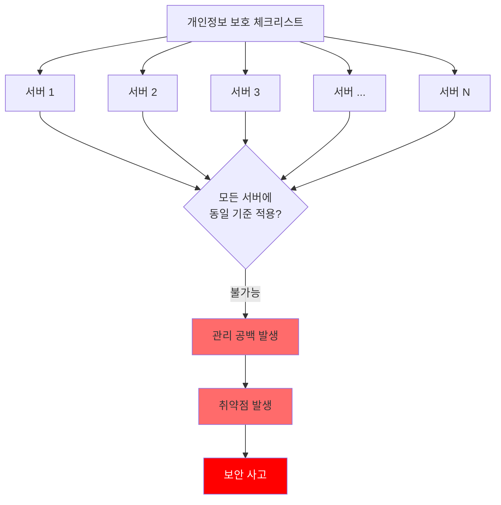

#### **1. 자산의 방대함 vs 제한된 점검 자원**

| 구분 | 현실 | 문제점 |
|:---:|:---:|:---:|
| **서버 수** | 수천 대 ~ 수만 대 | 전수조사 불가능 |
| **네트워크 장비** | 방화벽, 라우터, 백본 등 다수 | 동일 기준 적용 어려움 |
| **애플리케이션** | 웹/앱 서비스 다수 | 설정 변경 빈번 |
| **데이터베이스** | 여러 DB 서버 운영 | 점검 누락 케이스 발생 |
| **관리자(취급자)** | 수천 명 ~ 수만 명 | 통제 및 교육 한계 |

💡 **중요!**: 기업의 IT 자산은 방대하지만, 점검 기간과 인력은 제한적입니다. 따라서 **전수조사가 거의 불가능**하며, 일부 자산에 대해서만 점검이 이루어집니다.

#### **2. 운영 중 지속적인 변경 사항**

개발 및 운영 과정에서 계속 변경되는 요소들:

- **새로운 기능 추가**: 개발 시 보안 체크리스트 적용 누락
- **긴급 패치**: 보안 기준 검토 없이 빠른 배포
- **설정 변경**: 관리자가 임의로 설정 변경
- **시스템 확장**: 신규 서버 추가 시 보안 설정 누락

📌 **노트**: 운영 환경은 살아있는 유기체와 같습니다. 한 번 점검했다고 해서 영원히 안전한 것이 아니라, **지속적인 모니터링과 재점검**이 필요합니다.

#### **3. 침투 경로의 다양성**

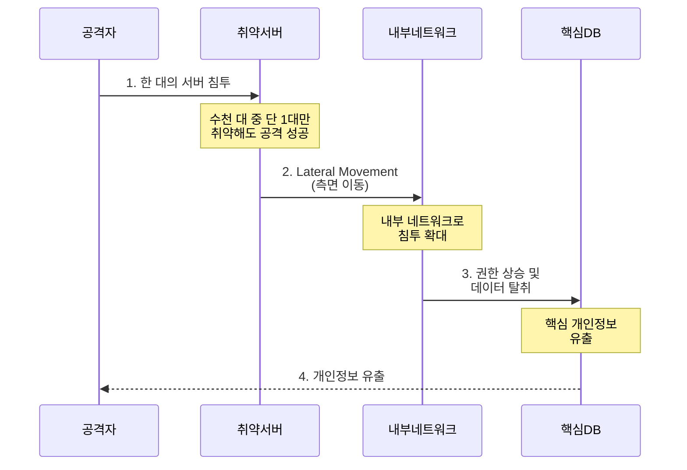

**SKT 사례 분석**:
- 수많은 서버 중 **단 한 대**에서 사고 발생
- Lateral Movement를 통해 다른 서버로 침투 확대
- 연쇄적으로 악성 행위 수행
- 결과: 대규모 개인정보 유출 사고

⚠️ **주의**: "10명의 경찰이 1명의 도둑을 못 잡는다"는 말처럼, 방어자는 모든 지점을 지켜야 하지만 공격자는 **단 한 곳의 약점만** 찾으면 됩니다.

---

## 🎓 이틀간의 학습 여정

### **Day 1: 개인정보의 이해**

#### 1️⃣ 현대사회에서의 개인정보 중요성
- 개인정보가 왜 중요해졌는가?
- 개인정보 유출 사고의 영향
- 법적 제재 및 과태료

#### 2️⃣ 기업의 개인정보 처리 시스템
- 서버 인프라 구조
- 네트워크 아키텍처
- 데이터 흐름 이해

#### 3️⃣ 개인정보 처리 방침 분석
- 각 서비스별 처리 방침 분석
- 수집 항목, 목적, 보유 기간 파악
- 위탁, 제공 현황 확인

#### 4️⃣ 개인정보 흐름도 작성
- 업무 단계별 개인정보 흐름
- 수집 → 이용 → 제공 → 파기 프로세스
- 시스템 간 데이터 전달 경로

### **Day 2: 진단 실습 (오늘)**

#### 1️⃣ 체크리스트 작성 (오전)
- 개인정보보호법 기반 점검 항목 도출
- 안전성 확보 조치 기준 반영
- 조별 맞춤형 체크리스트 설계

#### 2️⃣ KS교육센터 현황 분석 (오후 초반)
- 가상 기관의 조직 구조 파악
- 서비스 현황 및 업무 프로세스 이해
- 개인정보 처리 시스템 분석

#### 3️⃣ 실제 진단 수행 (오후 중반)
- 체크리스트 기반 진단 실행
- Y(적합) / N(부적합) / NA(해당없음) 평가
- 현황 기술 및 개선 사항 도출

#### 4️⃣ 결과 분석 및 시각화 (오후 후반)
- 영역별 이행률 계산
- 그래프를 통한 시각화
- 개선 권고사항 작성

#### 5️⃣ 조별 발표 및 피드백 (마무리)
- 각 조의 진단 결과 공유
- 강사의 피드백 및 개선점 논의
- 실무 적용 방안 모색

---

## 🔍 강의의 핵심 철학

강사님이 강조하신 교육 방향:

### 1. **구조적 이해 우선**

> "개인정보보호법이랑 안전성 확보 조치와 같은 디테일한 영역의 세부적인 항목들을 이 내용을 이해하고 적용하기에는 우리가 이틀이라는 시간들이 좀 짧았어요. 그래서 제가 생각하는 방식은 기본적으로 **구조를 이해하게끔** 여러분들에게 좀 교육을 했다라고 컨셉을 잡고 그런 방향으로 교육을 했습니다."

- 세부 조항 암기보다 **전체 구조 파악**이 우선
- 왜 이런 규제가 필요한지 **배경 이해**
- 실무에서 어떻게 적용되는지 **맥락 파악**

### 2. **실습을 통한 체득**

이틀간의 실습 구조:

| 단계 | 1일차 | 2일차 |
|:---:|:---:|:---:|
| **학습** | 개인정보 처리 방침 분석 | 체크리스트 작성 |
| **실습** | 흐름도 그리기 | 실제 진단 수행 |
| **산출물** | 개인정보 흐름도 | 진단 보고서 |
| **목표** | 기업이 어떻게 개인정보를<br/>다루는지 이해 | 진단원/컨설턴트<br/>역할 체험 |

### 3. **점검 기준의 실전 적용**

> "이런 기준들이 어떻게 나오게 됐는지를 한번 여러분들이 직접 해보게 하고 싶었어요."

- **Why**: 왜 이 항목을 점검해야 하는가?
- **How**: 어떻게 점검할 것인가?
- **What**: 무엇을 확인해야 하는가?

강의에서는 법조문을 단순히 읽는 것이 아니라, **실제 기관을 대상으로 직접 진단**해보면서 점검 항목의 의미를 체득하도록 설계되었습니다.

---

## 📊 실습 과정 개요

### 🔄 전체 실습 프로세스

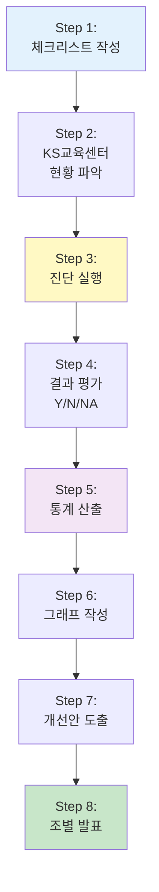

### 📝 조별 작업 구성

**10개 조**가 각각 독립적으로 작업을 수행:

#### **조별 역할 분담**
- **조장**: 전체 진행 관리 및 최종 검토
- **조원**: 체크리스트 항목별 진단 담당

#### **작업 범위**
각 조는 다음 영역 중 일부 또는 전체를 선택하여 체크리스트 작성:

1. **수집 및 이용**
   - 최소 수집 원칙
   - 동의 받는 방법
   - 목적 범위 내 이용

2. **제공 및 위탁**
   - 제3자 제공 동의
   - 위탁 관리 감독

3. **파기**
   - 파기 절차
   - 파기 방법

4. **안전성 확보 조치**
   - 접근 권한 관리
   - 접근 통제
   - 암호화
   - 접속 기록 관리
   - 악성 코드 방지
   - 물리적 보안
   - 재해/재난 대비

---

## 🎯 학습 성과

### ✅ 이번 강의를 통해 달성할 수 있는 능력

#### 1️⃣ **체크리스트 설계 능력**
- 개인정보보호법 및 안전성 확보 조치 기준을 실무 점검 항목으로 변환
- 조직 특성에 맞는 맞춤형 체크리스트 작성

#### 2️⃣ **진단 실행 능력**
- 제한된 정보를 바탕으로 현황 파악
- 객관적 기준에 따른 적합성 평가
- 부적합 사항에 대한 개선 방안 도출

#### 3️⃣ **결과 분석 및 보고 능력**
- 진단 결과의 정량적 분석 (이행률 계산)
- 시각적 표현 (그래프, 차트)
- 경영진이 이해하기 쉬운 형태로 요약

#### 4️⃣ **컨설팅 마인드**
- 단순 지적이 아닌 개선 방향 제시
- 현실적 제약을 고려한 우선순위 설정
- 지속 가능한 보안 관리 체계 구축 관점

---

## 🚀 향후 학습 방향

### 📚 이번 강의는 시작점

강사님의 당부:

> "이번 수업은 개인정보보호법이나 안전성 확보조치에 대한 적용을 하는 데 있어서 구체적인 어떤 기준을 우리가 좀 더 공부를 해야 되느냐, 이 항목을 어떻게 생각을 판단을 해야 될 것이냐라고 하는 그런 내용으로 설명을 하기에는 좀 짧은 시간이었던 것 같아요. 그래서 그런 부분들은 앞으로 여러분들이 정보보호 컨설턴트나 개인정보보호 컨설턴트가 됐을 때 이런 진단을 했을 때 **내가 어떤 고민을 해야 될지에 대한 부분을 어떤 학습을 더 해야 될지에 대한 그런 시발점을 만들어드렸다**라는 것으로 저는 충분히 여러분들이 생각을 해주셨으면 좋겠다는 말씀을 드리고요."

### 🎓 추가 학습이 필요한 영역

#### **법령 심화 학습**
- 개인정보보호법 각 조항의 해석
- 안전성 확보 조치 고시의 세부 기준
- 표준 개인정보 보호 지침

#### **기술적 보안**
- 암호화 알고리즘 및 키 관리
- 접근 통제 메커니즘 (ACL, RBAC)
- 네트워크 보안 (방화벽, IDS/IPS)
- 로그 관리 및 분석

#### **진단 실무**
- 실제 기업 대상 현장 점검 경험
- 다양한 산업군별 특성 이해
- 컨설팅 보고서 작성 실습

---

## 💪 실습에 임하는 자세

### ⭐ 중요한 마인드셋

#### 1. **정답은 없다**

KS교육센터에 대한 진단 결과는 조마다 다를 수 있습니다:

- 1조: "소속기관 정보는 필요하다" → **Y**
- 2조: "소속기관 정보는 과도하다" → **N**

💡 **중요!**: YES냐 NO냐는 별로 중요한 문제가 아닙니다. **왜 그렇게 판단했는지**에 대한 논리적 근거가 중요합니다.

#### 2. **제한된 정보 활용**

실제 컨설팅도 마찬가지입니다:
- 모든 정보를 다 제공받을 수 없음
- 필요한 정보는 추가 질의를 통해 확보
- 채팅창 질문 → 강사 답변으로 현황 보완

#### 3. **협업의 중요성**

조별 작업에서 중요한 점:
- 항목별 담당자 배분
- 일관된 평가 기준 수립
- 상호 검토를 통한 품질 향상

---

## 📌 다음 섹션 안내

다음 섹션에서는 **체크리스트 작성의 기본 원리**를 상세히 다룹니다:

- 체크리스트란 무엇인가?
- 왜 체크리스트가 필요한가?
- 어떻게 효과적인 체크리스트를 만드는가?
- 평가 기준 (Y/N/NA)의 정확한 의미
- 현황 기술 방법
- 개선 권고 작성 방법

이제 본격적인 실습 내용으로 들어가 보겠습니다! 🎓✨
## 📋 체크리스트 작성의 기본 원리

### 🎯 체크리스트란 무엇인가?

**체크리스트(Checklist)**는 개인정보보호 진단에서 가장 핵심적인 도구입니다. 이것은 단순한 점검 항목의 나열이 아니라, **법적 요구사항을 실무 점검 항목으로 변환한 진단 도구**입니다.

#### 📌 체크리스트의 구성 요소

표준적인 개인정보보호 진단 체크리스트는 다음 요소로 구성됩니다:

| 구성 요소 | 설명 | 예시 |
|:---:|:---|:---|
| **점검 영역** | 진단 대상의 큰 카테고리 | 수집·이용, 제공·위탁, 파기, 안전성 확보 조치 |
| **점검 항목** | 구체적인 점검 질문 | "필요한 정보와 동의가 필요하지 않는 정보를 구분하고 있는가?" |
| **점검 기준** | 무엇을 확인해야 하는지 | "동의가 필요하지 않는 개인정보 수집 내용과 동의를 받고 처리하는 항목을 확인" |
| **점검 방법** | 어떻게 확인할 것인지 | 문서 검토, 시스템 확인, 인터뷰 등 |
| **현황** | 점검 대상의 실제 상태 | "회원가입 시 필수/선택 항목 구분 표시" |
| **점검 결과** | 적합 여부 판단 | Y (적합) / N (부적합) / NA (해당없음) |
| **점검자** | 누가 점검했는지 | 조원 이름 |

---

### ✅ 체크리스트 작성 프로세스

#### **Step 1: 점검 영역 식별**

개인정보보호 진단은 크게 다음 영역으로 구분됩니다:

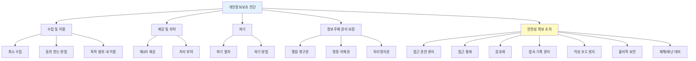

#### **Step 2: 법령 기반 점검 항목 도출**

각 영역별로 관련 법령 조항을 확인하고, 이를 실무 점검 항목으로 변환합니다.

**예시: 최소 수집 원칙**

| 법령 | 실무 점검 항목 |
|:---|:---|
| **개인정보보호법 제16조**<br/>"개인정보처리자는 다음 각 호의 어느 하나에 해당하는 경우에는 개인정보를 수집할 수 있으며 그 수집 목적의 범위에서 이용할 수 있다."<br/>"개인정보처리자는 **제1항 각 호의 어느 하나에 해당하여 개인정보를 수집하는 경우에는 그 목적에 필요한 최소한의 개인정보를 수집**하여야 한다." | ✅ **점검 항목 1**: 서비스 제공을 위해 필수적인 정보와 선택적 정보를 구분하고 있는가?<br/><br/>✅ **점검 항목 2**: 수집하는 개인정보 항목이 서비스 목적 달성을 위한 최소한으로 설정되어 있는가?<br/><br/>✅ **점검 항목 3**: 필수 정보와 선택 정보를 정보주체가 명확히 인지할 수 있도록 구분 표시하고 있는가? |

**예시: 암호화 조치**

| 법령 | 실무 점검 항목 |
|:---|:---|
| **개인정보의 안전성 확보조치 기준 제7조 (개인정보의 암호화)**<br/>"개인정보처리자는 고유식별정보, 비밀번호, 바이오정보를 정보통신망을 통하여 송신하거나 보조저장매체 등을 통하여 전달하는 경우에는 이를 암호화하여야 한다."<br/>"개인정보처리자는 비밀번호 및 바이오정보는 암호화하여 저장하여야 한다." | ✅ **점검 항목 1**: 고유식별정보(주민번호, 여권번호 등)를 네트워크 전송 시 암호화하고 있는가?<br/><br/>✅ **점검 항목 2**: 비밀번호를 일방향 암호화(해시)하여 저장하고 있는가?<br/><br/>✅ **점검 항목 3**: 데이터베이스에 저장된 개인정보 중 암호화 대상을 식별하고 적절히 암호화하고 있는가? |

#### **Step 3: 점검 기준 명확화**

각 점검 항목에 대해 **무엇을 확인**할 것인지 구체적으로 기술합니다.

**좋은 점검 기준 예시**:

```markdown
### 점검 항목: 접근 권한이 최소 권한 원칙에 따라 부여되고 있는가?

**점검 기준**:
1. 개인정보 처리 시스템별로 접근 권한을 필요 최소한으로 부여하고 있는지 확인
2. 직무 변경 시 불필요한 권한을 즉시 회수하고 있는지 확인
3. 퇴직자의 계정을 즉시 삭제 또는 비활성화하고 있는지 확인
4. 관리자 권한과 일반 사용자 권한을 명확히 구분하고 있는지 확인

**점검 방법**:
- 접근 권한 관리 대장 확인
- 시스템 계정 목록 확인
- 인사 발령 내역과 권한 변경 내역 대조
- 퇴직자 명단과 계정 상태 대조
```

#### **Step 4: 점검 방법 설계**

점검 항목을 어떻게 확인할지 방법을 설계합니다.

**점검 방법의 유형**:

| 점검 방법 | 설명 | 예시 |
|:---:|:---|:---|
| **문서 검토** | 정책, 지침, 대장 등 문서 확인 | - 개인정보 처리 방침<br/>- 내부 관리 계획<br/>- 위탁 계약서 |
| **시스템 확인** | 실제 시스템 설정 및 동작 확인 | - 방화벽 정책 확인<br/>- DB 암호화 설정<br/>- 접속 로그 조회 |
| **인터뷰** | 담당자 면담을 통한 확인 | - 파기 절차 수행 방법<br/>- 사고 대응 프로세스 |
| **샘플링 테스트** | 일부 샘플을 선정하여 실제 테스트 | - 패스워드 복잡도 정책 테스트<br/>- 권한 없는 사용자의 접근 시도 |

💡 **중요!**: 이번 실습에서는 **페이퍼 기반 진단**이므로, 주로 **문서 검토** 방식으로 진행됩니다. 실제 시스템 확인이나 인터뷰는 강사님께 질문하여 추가 정보를 획득하는 방식으로 대체됩니다.

---

### 📊 평가 기준: Y / N / NA

#### ✅ Y (Yes, 적합)

**의미**: 점검 기준을 충족하고 있으며, 법적 요구사항을 준수하고 있음

**예시 상황**:
- ✔️ 개인정보 수집 시 필수/선택 항목이 명확히 구분되어 표시됨
- ✔️ 비밀번호가 SHA-256 이상의 알고리즘으로 암호화되어 저장됨
- ✔️ 위탁 업체에 대한 관리·감독을 연 2회 이상 실시하고 있음

**현황 기술 예시**:
```
회원가입 페이지에서 필수 항목(*)과 선택 항목을 명확히 구분하여 표시하고 있으며,
선택 항목 미동의 시에도 서비스 이용에 제한이 없음을 확인
```

#### ❌ N (No, 부적합)

**의미**: 점검 기준을 충족하지 못하거나, 법적 요구사항을 위반하고 있음

**예시 상황**:
- ❌ 서비스와 무관한 과도한 개인정보를 수집하고 있음
- ❌ 고유식별정보(주민번호)가 평문으로 저장되어 있음
- ❌ 위탁 계약서에 개인정보 보호 관련 조항이 누락됨

**현황 기술 예시**:
```
회원가입 시 주소 정보를 필수로 수집하고 있으나, 온라인 교육 서비스 제공에
주소 정보가 필수적이지 않아 최소 수집 원칙에 위배됨.
개선 필요: 주소 정보를 선택 항목으로 변경하거나 수집 항목에서 제외 권장
```

💡 **중요!**: N 판정을 내릴 때는 반드시 **무엇이 부적합한지, 어떻게 개선해야 하는지**를 현황란에 명확히 기술해야 합니다.

#### ⚪ NA (Not Applicable, 해당없음)

**의미**: 해당 기관/서비스에는 적용되지 않는 항목

**예시 상황**:
- ⚪ 민감정보를 전혀 수집하지 않는 서비스 → 민감정보 암호화 항목 NA
- ⚪ 위치기반 서비스를 제공하지 않음 → 위치정보 처리 관련 항목 NA
- ⚪ 법정대리인 동의가 필요한 14세 미만 아동 서비스 없음 → 법정대리인 동의 절차 NA

**현황 기술 예시**:
```
해당 교육센터는 민감정보(건강정보, 유전정보 등)를 수집하지 않아
민감정보 처리에 대한 점검 항목은 해당 없음 (NA)
```

⚠️ **주의**: NA는 "확인하지 않음"이 아니라 "적용 대상이 아님"을 의미합니다. 적용 여부를 확인하지 않고 무분별하게 NA 처리하면 안 됩니다.

---

### 📝 현황 기술 방법

#### ✍️ 효과적인 현황 기술의 원칙

**원칙 1: 객관적 사실 기술**

❌ **나쁜 예시**:
```
접근 권한이 잘 관리되고 있는 것 같습니다.
```

✅ **좋은 예시**:
```
개인정보 처리 시스템에 대한 접근 권한을 직무별로 구분하여 부여하고 있으며,
교육1팀은 일반 교육생 정보에만, 교육2팀은 전문가 과정 교육생 정보에만
접근 가능하도록 권한이 분리되어 있음을 확인
```

**원칙 2: 구체적 근거 제시**

❌ **나쁜 예시**:
```
최소 수집 원칙을 위반하고 있음 (N)
```

✅ **좋은 예시**:
```
회원가입 시 이름, 생년월일, ID, 패스워드, 수강 과목을 수집하고 있으나,
'소속기관' 정보까지 필수로 수집하고 있어 온라인 교육 서비스 제공 목적 대비
과도한 정보 수집으로 판단됨. 소속기관 정보는 선택 항목으로 전환 권장 (N)
```

**원칙 3: 개선 방향 제시 (N인 경우)**

부적합(N) 판정 시에는 반드시 개선 방향을 함께 제시합니다:

```markdown
**현황**:
비밀번호가 MD5 해시로 암호화되어 저장되고 있음. MD5는 보안 취약점이 알려진
오래된 알고리즘으로, 현재는 안전하지 않은 것으로 간주됨.

**개선 방향**:
SHA-256 이상의 안전한 해시 알고리즘으로 변경 권장.
또는 bcrypt, scrypt 등 Password Hashing 전용 알고리즘 사용 권장.
```

---

### 🔍 조별 체크리스트 작성 실습

#### 📋 작업 내용

각 조는 다음 프로세스로 체크리스트를 작성했습니다:

**Step 1: 영역 선정**
- 조별로 중점적으로 진단할 영역 선택
- 예: 1조 → 수집·이용 중심, 2조 → 안전성 확보 조치 중심

**Step 2: 항목 도출**
- 선정한 영역에서 점검할 구체적 항목 도출
- 개인정보보호법, 안전성 확보 조치 기준 참조

**Step 3: 기준 작성**
- 각 항목별로 무엇을 확인할지 점검 기준 작성
- 가능한 한 구체적이고 측정 가능하게 작성

**Step 4: 방법 정의**
- 어떻게 확인할 것인지 점검 방법 정의
- 이번 실습에서는 주로 문서(KS교육센터 현황) 검토

#### 🎯 강사님의 피드백

강의 중 강사님이 각 조의 진행 상황을 확인하며 주신 피드백:

> "일단은 체크리스트를 다한 조도 있고, 좀 보완이 필요할 것 같은 조도 있는데, 어쨌든 각 조별로 지금 완성을 해 나가신 것 같아요. 그래서 작성을 잘 하고 계셨다라고 저는 기본적으로 생각을 하겠습니다."

각 조가 만든 체크리스트는 나중에 실제 진단에서 활용될 예정입니다.

---

### 📊 체크리스트 활용 시 주의사항

#### ⚠️ 주의사항 1: 제한된 정보에서의 판단

이번 실습에서는 KS교육센터의 현황이 **페이퍼**로 제공됩니다. 따라서 다음과 같은 상황이 발생할 수 있습니다:

**상황**: 체크리스트 항목이 있는데, 제공된 현황 자료에 관련 정보가 없음

**대응 방법**:

1. **문맥으로 유추**: 다른 정보를 종합하여 판단
2. **강사에게 질문**: 채팅창에 질문 작성 → 강사가 답변
3. **보수적 판단**: 확인되지 않으면 부적합(N) 또는 NA 처리

강사님의 안내:

> "여러분들이 확인해야 될 사항들에 대해서 기재가 안 돼 있거나, 표현이 안 돼 있거나, 확인할 방법이 없다, 그럼 어떻게 해야 될까요? 첫 번째 방법은 의미대로 생각한다, 이게 첫 번째가 있고요. 두 번째는? **채팅창에 질문을 쓰는 겁니다.** 저한테 질문을 하시는 거죠. 그럼 제가 답변을 해 드립니다."

#### ⚠️ 주의사항 2: 주관적 판단의 허용

개인정보보호 진단에는 **절대적 정답이 없는 경우**가 많습니다.

**예시: 자격증 발급 시 '소속기관' 정보 수집**

- **A조의 판단 (Y - 적합)**: "전문가 자격증 관리를 위해 소속기관 정보는 필요하다고 판단"
- **B조의 판단 (N - 부적합)**: "온라인 자격증 발급에 소속기관 정보는 필수가 아니므로 과도한 수집"

강사님의 설명:

> "예를 들면 이렇게 쓰셔서 Y를 주실 수도 있고요. 아니면 이런 판단을 하셔서 얘를 N으로 주시는 경우도 있을 수 있을 거라고 생각이 됩니다. 이거는 사실은 지금 우리가 이 제한된 정보를 가지고 판단하기가 너무 어렵기 때문에 **YES냐, NO냐는 별로 중요한 문제는 아니에요.** 다만 여러분들이 이런 어떤 내용을 가지고 현황을 가지고... 여러분들이 판단하시면 되는 겁니다."

💡 **핵심**: 결과(Y/N)보다 **판단의 근거와 논리**가 더 중요합니다!

#### ⚠️ 주의사항 3: 일관성 유지

조 내에서 평가 기준의 일관성을 유지해야 합니다:

- **엄격한 기준**: 모든 항목에 대해 엄격하게 평가
- **관대한 기준**: 일부 미흡한 점은 Y로 판단

❌ **나쁜 예시**:
- 항목 A: 99% 충족 → N 판정 (엄격)
- 항목 B: 60% 충족 → Y 판정 (관대)

✅ **좋은 예시**:
- 일관된 기준 적용: 80% 이상 충족 시 Y, 미만 시 N

---

### 🔧 실전 체크리스트 예시

#### 예시 1: 수집 및 이용 영역

| 번호 | 점검 항목 | 점검 기준 | 점검 방법 | 현황 | 점검 결과 | 점검자 |
|:---:|:---|:---|:---|:---|:---:|:---:|
| 1 | 필요한 정보와 동의가 필요하지 않는 정보를 구분하고 있는가? | 동의가 필요하지 않는 개인정보 수집 내용과 동의를 받고 처리하는 항목을 확인 | 개인정보 수집·이용 동의서 검토 | 회원가입 동의서에 '서비스 제공을 위한 필수 정보'와 '마케팅 활용을 위한 선택 정보'를 명확히 구분하여 표시 | Y | 김OO |
| 2 | 개인정보 수집 항목이 최소한으로 설정되어 있는가? | 서비스 제공 목적 달성을 위한 필수 정보만 수집하는지 확인 | 수집 항목 목록 및 처리 목적 대조 | 온라인 교육 서비스 제공을 위해 이름, ID, 패스워드, 이메일만 수집하고 있어 최소 수집 원칙 준수 | Y | 이OO |
| 3 | 민감정보 수집 시 별도 동의를 받고 있는가? | 민감정보 수집 여부 및 별도 동의 절차 확인 | 민감정보 처리 현황 및 동의서 검토 | 민감정보를 수집하지 않음 | NA | 박OO |

#### 예시 2: 안전성 확보 조치 - 암호화

| 번호 | 점검 항목 | 점검 기준 | 점검 방법 | 현황 | 점검 결과 | 점검자 |
|:---:|:---|:---|:---|:---|:---:|:---:|
| 1 | 고유식별정보를 암호화하여 저장하고 있는가? | 주민번호 등 고유식별정보의 DB 저장 시 암호화 여부 확인 | DB 테이블 샘플 확인 | 주민번호 뒷자리가 마스킹 처리되어 표시되며, 실제 DB에는 AES-256으로 암호화되어 저장 | Y | 최OO |
| 2 | 비밀번호를 안전하게 암호화하여 저장하고 있는가? | 비밀번호 해시 알고리즘 확인 (SHA-256 이상 권장) | 시스템 설정 문서 검토 | DB 테이블에서 패스워드 필드가 표시되지 않아 암호화되어 있음을 확인 | Y | 정OO |
| 3 | 개인정보 전송 시 암호화(SSL/TLS)를 적용하고 있는가? | 네트워크 전송 구간 암호화 적용 여부 | 시스템 구성도 및 보안 조치 현황 확인 | 웹방화벽을 거쳐 HTTPS 통신을 수행하고 있어 전송 구간 암호화 적용 | Y | 강OO |

---

### 💬 Q&A: 체크리스트 작성 시 자주 묻는 질문

#### ❓ Q1: 점검 항목을 몇 개나 만들어야 하나요?

**A**: 정해진 개수는 없습니다. 중요한 것은 **품질**입니다.

- **양보다 질**: 100개의 피상적 항목보다 20개의 구체적 항목이 더 유용
- **영역별 균형**: 특정 영역에 집중하되, 전체적인 균형 고려
- **실습 권장**: 조별로 15~30개 항목 작성 (시간 제약 고려)

#### ❓ Q2: 법령을 잘 모르는데 어떻게 항목을 만드나요?

**A**: 다음 자료를 참고하세요:

1. **개인정보보호법** - 수집, 이용, 제공, 파기 관련
2. **개인정보의 안전성 확보조치 기준** - 기술적·관리적·물리적 보안
3. **표준 개인정보 보호지침** - 구체적 이행 방법
4. **기존 체크리스트 참조** - ISMS-P, ISO 27701 등

💡 **팁**: 법령을 모두 외울 필요는 없습니다. **큰 틀(수집→이용→보관→파기)**을 이해하고, 각 단계에서 필요한 보호조치를 생각해보세요.

#### ❓ Q3: 같은 항목인데 조마다 판단이 다르면 어떡하나요?

**A**: 괜찮습니다! 진단은 **전문가의 판단 영역**이 포함됩니다.

중요한 것:
- ✅ 판단의 **논리적 근거**
- ✅ 일관된 **평가 기준**
- ✅ 개선이 필요한 경우 **구체적 방향** 제시

실제 컨설팅에서도 컨설턴트마다 판단이 다를 수 있습니다. 최종적으로는 **합리적 근거**와 **법적 준수 여부**로 결정됩니다.

#### ❓ Q4: 현황 정보가 부족한데 어떻게 판단하나요?

**A**: 다음 3가지 방법을 활용하세요:

1. **문맥 유추**: 다른 정보를 종합하여 추론
2. **보수적 판단**: 확인되지 않으면 부적합 또는 NA
3. **추가 질의**: 강사 또는 담당자에게 질문

📌 **실무에서도**: 현장 점검 시 모든 정보를 다 받을 수 없습니다. **질의서**를 작성하여 추가 자료를 요청하는 것이 일반적입니다.

---

### ✅ 체크리스트 작성 체크포인트

작성한 체크리스트가 다음 기준을 충족하는지 확인하세요:

- [ ] **점검 항목이 구체적인가?**
  ❌ "개인정보를 잘 관리하고 있는가?"
  ✅ "개인정보 접근 권한을 직무별로 차등 부여하고 있는가?"

- [ ] **점검 기준이 명확한가?**
  ❌ "적절히 관리"
  ✅ "직무 변경 시 7일 이내 권한 조정"

- [ ] **점검 방법이 실행 가능한가?**
  ❌ "시스템 해킹 테스트"
  ✅ "방화벽 정책 설정 문서 검토"

- [ ] **평가 기준(Y/N/NA)이 일관적인가?**
  모든 항목에 동일한 엄격도 적용

- [ ] **현황 기술이 객관적인가?**
  주관적 표현 지양, 사실 기반 기술

---

## 🎯 다음 섹션 안내

다음 섹션에서는 **KS교육센터의 실제 현황**을 상세히 분석합니다:

- KS교육센터는 어떤 기관인가?
- 조직 구조 및 업무 분장
- 서비스 현황 (교육 과정, 자격 제도)
- 개인정보 처리 시스템 구성
- 보안 조치 현황
- 위탁 및 제3자 제공 현황

작성한 체크리스트를 실제로 적용할 대상을 파악하는 단계입니다! 📊✨
## 🏢 KS교육센터 현황 분석

### 📌 KS교육센터 개요

**KS교육센터**(가상의 기관)는 **개인정보 전문 교육을 제공**하는 교육 기관으로, 전문가 양성 및 자격증 제도를 운영하고 있습니다.

#### 🎯 설립 목적 및 주요 업무

| 구분 | 내용 |
|:---:|:---|
| **설립 목적** | 개인정보 보호 전문가 양성을 위한 교육 및 자격 제도 운영 |
| **주요 서비스** | • 일반 교육 과정 운영<br/>• 전문가 교육 과정 운영<br/>• 전문가 자격 시험 제도 운영<br/>• 자격증 보유자 관리 |
| **운영 방식** | • 온라인 교육 플랫폼<br/>• 온/오프라인 시험<br/>• 웹 기반 회원 관리 시스템 |

💡 **중요!**: KS교육센터는 **실제 기관이 아닌 진단 실습을 위한 가상 기관**입니다. 실제 교육 기관의 일반적인 특성을 반영하여 설계되었습니다.

---

### 🏗️ 조직 구조

KS교육센터는 4개 본부, 총 10개 팀으로 구성되어 있습니다.

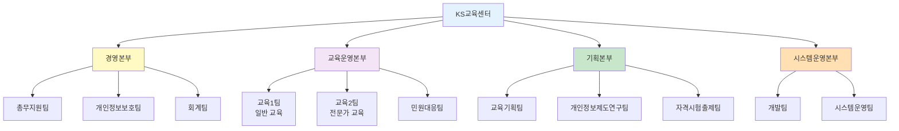

#### 📊 부서별 업무 현황

##### 1️⃣ 경영본부

| 팀명 | 주요 업무 | 개인정보 접근 범위 |
|:---:|:---|:---|
| **총무지원팀** | • 인사 관리<br/>• 사내 정책 수립 | 직원 인사 정보 |
| **개인정보보호팀** | • 개인정보 현황 관리<br/>• 내부 관리 계획 수립<br/>• 개인정보 침해 사고 대응 | 전사 개인정보 처리 현황 |
| **회계팀** | • 예산 관리<br/>• 결산 업무 | 수강료 결제 정보 (제한적) |

💡 **중요!**: 개인정보보호팀은 **전사 개인정보 처리 현황을 총괄**하지만, 실제 개인정보 열람 권한은 제한적이어야 합니다. 개인정보 처리 현황을 모니터링하지만, 구체적인 개인정보(이름, 주민번호 등)에 직접 접근하지 않도록 권한 설계가 필요합니다.

##### 2️⃣ 교육운영본부

| 팀명 | 주요 업무 | 개인정보 접근 범위 |
|:---:|:---|:---|
| **교육1팀** | • 회원 관리<br/>• 일반 교육 과정 운영 | 일반 교육생 정보<br/>(이름, ID, 수강 이력) |
| **교육2팀** | • 전문가 자격증 과정 운영 | 전문가 과정 교육생 정보<br/>(이름, ID, 수강 이력) |
| **민원대응팀** | • 자격시험 민원 대응<br/>• 교육 운영 민원 대응 | 민원인 정보<br/>(이름, 연락처, 민원 내용) |

🔐 **보안**: 교육1팀과 교육2팀은 **서로 다른 교육생 정보에만 접근**해야 합니다. 예를 들어:
- 교육1팀 → 일반 교육생 DB만 접근 가능
- 교육2팀 → 전문가 과정 교육생 DB만 접근 가능

⚠️ **주의**: 만약 두 팀이 모든 교육생 정보에 접근 가능하다면, **최소 권한 원칙 위배**로 판단할 수 있습니다!

##### 3️⃣ 기획본부

| 팀명 | 주요 업무 | 개인정보 접근 범위 |
|:---:|:---|:---|
| **교육기획팀** | • 교육 과정 설계<br/>• 수강생 현황 분석<br/>• 만족도 분석 | 통계 데이터<br/>(비식별화된 정보) |
| **개인정보제도연구팀** | • 가명처리 연구<br/>• 개인정보 활용 전략 수립 | 연구용 가명정보<br/>(적법한 가명처리 필수) |
| **자격시험출제팀** | • 시험 문제 출제<br/>• 문제 관리 | 접근 불필요 |

📌 **노트**:
- **교육기획팀**은 통계 목적으로 개인정보를 활용할 수 있지만, 반드시 **비식별 처리 또는 가명처리**되어야 합니다.
- **개인정보제도연구팀**이 가명정보를 다룬다면, 개인정보보호법 제28조의2~제28조의7(가명정보 처리)을 준수해야 합니다.

##### 4️⃣ 시스템운영본부

| 팀명 | 주요 업무 | 개인정보 접근 범위 |
|:---:|:---|:---|
| **개발팀** | • 시스템 개발<br/>• 기능 개선 | 개발 서버<br/>(테스트 데이터, 실 데이터 X) |
| **시스템운영팀** | • 서버 운영<br/>• 장애 대응<br/>• 백업 관리 | DB 관리자 권한<br/>(전체 개인정보 접근 가능) |

⚠️ **주의**:
- **개발팀**은 운영 DB에 접근하면 안 됩니다! 개발/테스트 서버에서만 작업해야 하며, 실제 개인정보가 아닌 더미 데이터를 사용해야 합니다.
- **시스템운영팀**은 DB 관리자 권한을 가지므로, **접속 기록 관리**와 **이중 인증** 등 강화된 보안 조치가 필요합니다.

---

### 👥 개인정보 보호 조직

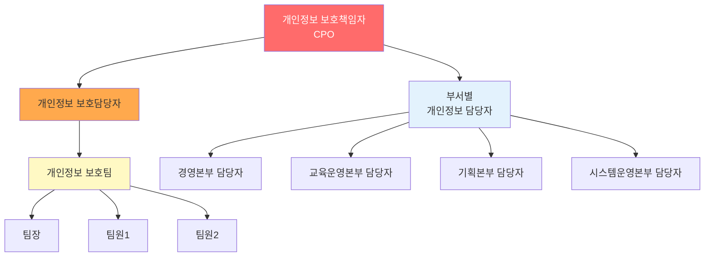

#### 📋 역할 및 책임

| 역할 | 책임 및 권한 |
|:---:|:---|
| **개인정보 보호책임자** | • 개인정보 처리에 관한 업무 총괄<br/>• 개인정보 보호 계획 수립 및 승인<br/>• 개인정보 침해 사고 발생 시 대응 총괄<br/>• 임원급 이상 |
| **개인정보 보호담당자** | • 개인정보 보호 정책 집행<br/>• 부서별 개인정보 처리 현황 모니터링<br/>• 정기 점검 및 교육 실시 |
| **부서별 개인정보 담당자** | • 해당 부서의 개인정보 처리 현황 관리<br/>• 개인정보 보호팀과 협조<br/>• 부서 내 개인정보 교육 |

---

### 📚 서비스 현황

KS교육센터는 크게 **3가지 서비스**를 제공합니다:

#### 1️⃣ 일반 교육 과정

| 구분 | 내용 |
|:---:|:---|
| **대상** | 정보주체(일반인), 개인정보 처리자 및 취급자 |
| **운영 방식** | 온라인 동영상 강의 |
| **관련 부서** | 교육1팀, 민원대응팀, 개발팀, 교육기획팀 |
| **수집 개인정보** | • 이름<br/>• 생년월일<br/>• 아이디<br/>• 패스워드<br/>• 수강 과목<br/>• 교육 이수 시간 |

**업무 흐름도**:

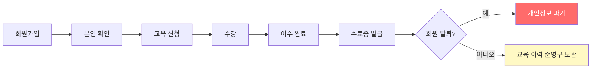

💡 **중요!**: 회원이 탈퇴하더라도 **교육 이수 기록은 준영구 보관**된다고 합니다. 이것이 적법한지 판단이 필요합니다:
- **적법한 경우**: 법령에서 교육 이력 보관을 요구하는 경우 (예: 법정 의무 교육)
- **부적합한 경우**: 법적 근거 없이 무기한 보관

#### 2️⃣ 전문가 교육 과정

| 구분 | 내용 |
|:---:|:---|
| **대상** | 개인정보 보호 전문가 자격증 취득 희망자 |
| **운영 방식** | 온라인 동영상 강의 + 과제 제출 |
| **관련 부서** | 교육2팀, 민원대응팀, 개발팀, 교육기획팀 |
| **수집 개인정보** | • 이름<br/>• 생년월일<br/>• 아이디<br/>• 패스워드<br/>• 수강 과목<br/>• 교육 이수 시간<br/>• 과제 제출 내역 |

#### 3️⃣ 전문가 자격 시험 제도

| 구분 | 내용 |
|:---:|:---|
| **대상** | 전문가 교육 이수자 |
| **운영 방식** | 온라인/오프라인 시험 |
| **관련 부서** | 교육2팀, 자격시험출제팀, 민원대응팀, 개발팀 |
| **수집 개인정보** | • 이름<br/>• **주민등록번호** (필수)<br/>• 휴대전화번호<br/>• 이메일 주소<br/>• 거주지 주소<br/>• 소속기관<br/>• 응시 사진 |

⚠️ **주의**: 자격시험 응시자로부터 **주민등록번호를 수집**하고 있습니다!

**점검 포인트**:
1. **법적 근거 확인**: 국가기술자격법 시행령 제26조에 따라 주민번호 수집이 허용되는지 확인
2. **암호화 조치**: 주민번호가 안전하게 암호화되어 저장되는지 확인
3. **최소 수집**: 주민번호 외 다른 고유식별정보(여권번호 등)로 대체 가능한지 검토

**자격시험 업무 흐름도**:

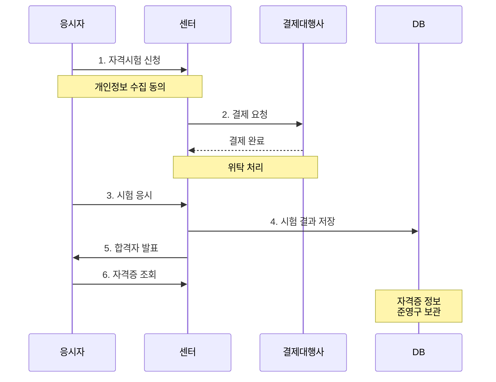

---

### 💾 개인정보 파일 현황

KS교육센터는 **4개의 주요 개인정보 파일(업무)**을 운영합니다:

| 파일명 | 보유 목적 | 보유 항목 | 보유 기간 | 처리 방법 |
|:---:|:---|:---|:---|:---|
| **회원 관리** | 회원 가입 및 관리 | 이름, ID, 패스워드, 전화번호, 이메일 | 회원 탈퇴 시까지 | 온라인 |
| **교육 과정 관리** | 교육 이수 이력 관리 | 이름, ID, 수강 과목, 이수 시간 | **준영구** | 온라인 |
| **전문가 자격시험** | 자격시험 응시 및 합격자 관리 | 이름, **주민번호**, 휴대폰, 이메일, 주소, 소속기관, 사진 | **준영구** | 온라인/오프라인 |
| **자격증 보유자 관리** | 자격증 발급 및 조회 | 이름, **주민번호**, 자격번호, 자격증명, 발급일 | **준영구** | 온라인 |

🔐 **보안 고려사항**:

**1. 준영구 보관의 적법성**
- ⚠️ "준영구"라는 표현은 법적으로 명확하지 않음
- ✅ 법령에서 보관 의무를 규정하는 경우: 적법
- ❌ 법적 근거 없이 무기한 보관: 개인정보보호법 제21조(보유 기간) 위반 가능

**2. 민감정보 및 고유식별정보 처리**
- **주민번호**: 법적 근거 필요 (개인정보보호법 제24조)
- **사진**: 생체정보로 활용 시 민감정보에 해당 가능

---

### 🗄️ DB 테이블 구조 (샘플)

#### 회원 테이블 (members)

| 회원 ID | 이름 | 패스워드 | 전화번호 | 이메일 | 가입일 | 과정코드 | 교육 이력 | 탈퇴 여부 |
|:---:|:---:|:---:|:---:|:---:|:---:|:---:|:---:|:---:|
| user001 | 김철수 | ******** | 010-1234-5678 | kim@email.com | 2024-01-15 | EDU001, EDU003 | EDU001(이수), EDU003(수강중) | N |
| user002 | 이영희 | ******** | 010-2345-6789 | lee@email.com | 2024-02-20 | EDU002 | EDU002(이수) | N |
| user003 | 박민수 | ******** | 010-3456-7890 | park@email.com | 2023-11-10 | EDU001, EDU004 | EDU001(이수), EDU004(이수) | **Y** |

💡 **중요 점검 포인트**:

**1. 패스워드 암호화**
- 패스워드가 `********`로 표시 → 암호화되어 있음을 시사
- ✅ 실제로 SHA-256 이상의 안전한 해시로 저장되는지 확인 필요

**2. 탈퇴 회원 정보**
- user003은 `탈퇴 여부 = Y`인데도 DB에 존재
- ❓ 왜 탈퇴 회원 정보가 남아있는가?
  - 교육 이력 보관 목적?
  - 파기 절차가 제대로 이행되지 않음?

⚠️ **부적합 가능성**: 탈퇴 회원의 개인정보를 파기하지 않고 보관 중이라면, **파기 의무 위반**으로 판단될 수 있습니다!

#### 응시자 테이블 (applicants)

| 응시번호 | 이름 | 주민번호 | 휴대폰 | 이메일 | 주소 | 소속기관 | 응시일 | 합격여부 |
|:---:|:---:|:---:|:---:|:---:|:---:|:---:|:---:|:---:|
| 2024001 | 최지훈 | 901201-******* | 010-4567-8901 | choi@email.com | 서울시 강남구 | A기업 | 2024-03-15 | 합격 |
| 2024002 | 정수연 | 850315-******* | 010-5678-9012 | jung@email.com | 경기도 성남시 | B공공기관 | 2024-03-15 | 불합격 |

💡 **중요 점검 포인트**:

**1. 주민번호 마스킹 vs 암호화**
- 화면에는 `901201-*******`로 마스킹 표시
- DB에는 AES-256 등으로 암호화되어 저장되어야 함
- ✅ 안전성 확보조치 기준 제7조 준수 확인

**2. 주소 정보 필수 수집**
- 자격시험 응시에 주소가 필수인가?
- ❓ 온라인 시험이라면 주소 불필요 → 최소 수집 원칙 위배 가능
- ✅ 오프라인 시험장 배정용이라면 적법

---

### 🔐 관리자 접속 현황

#### 계정 목록

| 계정 ID | 담당자 | 소속 부서 | 발급일 | 사용 여부 | 접속 권한 | 비고 |
|:---:|:---:|:---:|:---:|:---:|:---|:---|
| admin001 | 김OO | 시스템운영팀 | 2023-01-10 | **사용** | 전체 DB 조회/수정 | DB 관리자 |
| admin002 | 이OO | 개발팀 | 2023-05-20 | **사용** | 개발 서버 전체 | 개발자 |
| admin003 | 박OO | 교육1팀 | 2024-01-15 | **사용** | 일반 교육생 DB 조회 | 교육 운영 |
| admin004 | 최OO | 교육2팀 | 2024-02-01 | **사용** | 전문가 과정 DB 조회 | 교육 운영 |
| admin005 | 정OO | 시스템운영팀 | 2022-08-01 | **미사용** | 전체 DB 조회/수정 | 퇴직자 |

⚠️ **보안 취약점 발견!**

**1. 퇴직자 계정 미삭제**
- admin005 (정OO)는 퇴직자인데 계정이 남아있음
- ❌ **부적합**: 퇴직 시 즉시 계정 삭제 또는 비활성화 필요
- 🔐 **위험**: 퇴직자가 여전히 로그인 가능하면 개인정보 유출 위험

**2. 권한 분리 미흡 가능성**
- admin002 (개발팀)가 "개발 서버 전체" 권한
- ❓ 개발 서버에 실제 개인정보가 있는가?
  - ✅ 있다면: 개발용 더미 데이터로 교체 필요
  - ✅ 없다면: 적절함

#### 원격 접속 (VPN)

| VPN 계정 | 담당자 | 발급일 | 접속 IP 범위 | 인증 방식 |
|:---:|:---:|:---:|:---|:---|
| vpn_admin001 | 김OO | 2023-01-10 | 모든 IP | ID/PW |
| vpn_admin002 | 이OO | 2023-05-20 | 모든 IP | ID/PW |

💡 **점검 포인트**:

**1. VPN 접속 제한**
- ❓ "모든 IP"에서 접속 가능 → IP 화이트리스트 적용 필요
- ✅ 특정 IP 대역(회사, 집)만 허용하도록 제한 권장

**2. 이중 인증 (2FA)**
- 현재 ID/PW만으로 인증
- ❌ **개선 필요**: OTP, 인증서 등 추가 인증 수단 적용 권장
- 🔐 **이유**: VPN 계정 탈취 시 내부망 전체 노출 위험

---

### 🌐 개인정보 처리 시스템 구성

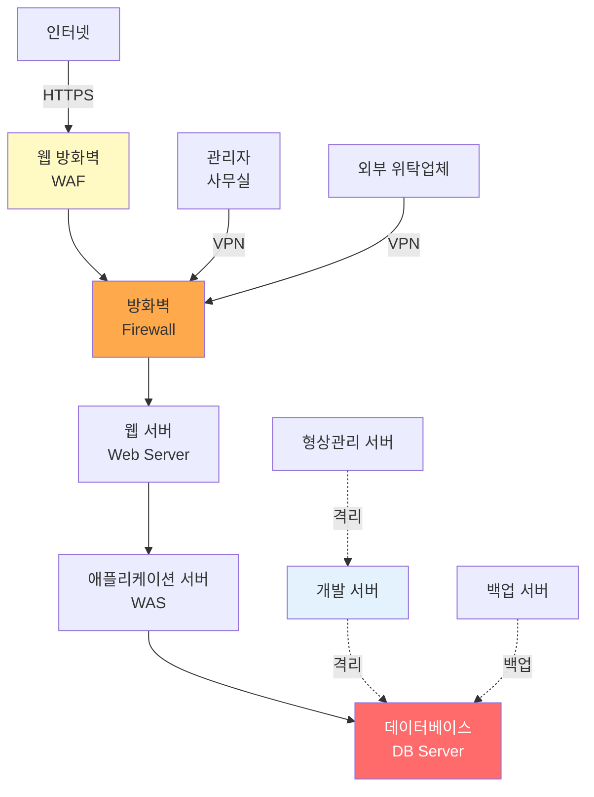

#### 📊 시스템별 역할 및 보안 조치

| 시스템 | 역할 | 보안 조치 | 점검 포인트 |
|:---:|:---|:---|:---|
| **웹 방화벽 (WAF)** | SQL Injection, XSS 등 공격 차단 | • 공격 패턴 탐지<br/>• 차단 로그 기록 | WAF 정책 최신화 여부 |
| **방화벽** | 네트워크 접근 통제 | • IP 기반 필터링<br/>• 포트 제한 | 불필요한 포트 개방 여부 |
| **웹 서버** | HTTP 요청 처리 | • HTTPS 적용<br/>• 접속 로그 | SSL/TLS 버전 확인 |
| **WAS** | 비즈니스 로직 처리 | • 세션 관리<br/>• 인증/인가 | 세션 타임아웃 설정 |
| **DB 서버** | 개인정보 저장 | • 암호화<br/>• 접근 통제<br/>• 접속 로그 | 암호화 알고리즘 강도 |
| **개발 서버** | 개발 및 테스트 | • 운영망과 분리<br/>• 더미 데이터 사용 | 실제 개인정보 존재 여부 |
| **백업 서버** | 데이터 백업 | • 백업 데이터 암호화<br/>• 접근 통제 | 백업 주기 및 복구 테스트 |

💡 **우수 사항**:
- ✅ 개발 서버와 운영 서버 분리
- ✅ 형상관리 서버를 통한 개발 이력 관리

⚠️ **개선 필요 사항**:
- ❓ 웹 방화벽과 일반 방화벽 이중화 확인
- ❓ DB 서버 직접 접근 제한 (WAS를 통해서만 접근)

---

### 🛡️ 방화벽 정책 현황

#### 주요 방화벽 규칙

| No. | 출발지 IP | 도착지 IP | 포트 | 정책 | 용도 | 점검 결과 |
|:---:|:---|:---|:---:|:---:|:---|:---|
| 1 | Any | Web Server | 443 | **허용** | 일반 사용자 HTTPS 접속 | ✅ 적절 |
| 2 | Any | Web Server | 80 | **허용** | HTTP → HTTPS 리다이렉트 | ⚠️ 80 포트 차단 권장 |
| 3 | Web Server | WAS | 8080 | **허용** | 웹-WAS 통신 | ✅ 적절 |
| 4 | WAS | DB Server | 3306 | **허용** | WAS-DB 통신 (MySQL) | ✅ 적절 |
| 5 | VPN Gateway | DB Server | 3306 | **허용** | VPN을 통한 DB 접속 | ⚠️ IP 제한 필요 |
| 6 | 외부 위탁업체 IP | WAS | 8080 | **허용** | 위탁업체 접속 | ✅ 적절 (IP 제한됨) |
| 7 | Any | Any | 22 (SSH) | **차단** | SSH 원격 접속 차단 | ✅ 적절 |
| 8 | 관리자 사무실 IP | Server | 22 | **허용** | 관리자 SSH 접속 | ✅ 적절 (IP 제한됨) |

💡 **점검 포인트**:

**1. HTTP 포트(80) 허용**
- 현재 80 포트도 허용 중
- ✅ HTTP→HTTPS 자동 리다이렉트 목적이라면 허용 가능
- ❌ 하지만 보안상 80 포트는 차단하고 443만 허용하는 것이 더 안전

**2. VPN을 통한 DB 직접 접속**
- Rule 5: VPN으로 DB 직접 접속 가능
- ⚠️ **개선 필요**: VPN 사용자도 WAS를 거쳐야 하며, DB 직접 접속은 DBA만 특정 IP에서 가능하도록 제한

**3. 불필요한 포트 개방 여부**
- SSH(22), RDP(3389), FTP(21) 등 관리 포트가 인터넷에 노출되지 않도록 확인
- ✅ Rule 7: SSH를 기본 차단하고 관리자 IP만 허용 → 우수

---

### 🤝 개인정보 처리 위탁 현황

| 위탁업체 | 위탁 업무 | 위탁 정보 | 위탁 기간 | 관리·감독 |
|:---:|:---|:---|:---:|:---|
| **문자세상** | SMS 문자 발송 | 이름, 휴대폰번호 | 2024.01.01 ~ 2024.12.31 | 연 2회 점검 |
| **주니랩** | 시스템 운영 및 유지보수 | 전체 개인정보 접근 가능 | 2023.06.01 ~ 2025.05.31 | 월 1회 보고 |
| **애니콜** | 고객 민원 대응 | 이름, 연락처, 민원 내용 | 2024.03.01 ~ 2025.02.28 | 분기 1회 점검 |
| **이벤트나라** | 이벤트 당첨자 상품권 발송 | 이름, 휴대폰번호 | 2024.01.01 ~ 2024.12.31 | 연 1회 점검 |
| **페이허브** | 결제 대행 | 이름, 카드정보(암호화) | 2023.01.01 ~ 2025.12.31 | 분기 1회 점검 |

💡 **점검 포인트**:

**1. 위탁 계약서 필수 포함 사항 (개인정보보호법 제26조)**

다음 사항이 계약서에 포함되어 있는지 확인:
- ✅ 위탁 업무의 목적 및 범위
- ✅ 재위탁 제한에 관한 사항
- ✅ 개인정보 안전성 확보 조치
- ✅ 위탁업무 종료 후 개인정보 반환 또는 파기
- ✅ 손해배상 등 책임에 관한 사항

**2. 관리·감독 적정성**

| 위탁업체 | 점검 주기 | 평가 |
|:---:|:---:|:---|
| 문자세상 | 연 2회 | ⚠️ 개선 권장: 최소 분기 1회 |
| **주니랩** | **월 1회** | ✅ 우수 (전체 정보 접근 가능하므로 강화된 감독 필요) |
| 애니콜 | 분기 1회 | ✅ 적절 |
| 이벤트나라 | 연 1회 | ⚠️ 개선 권장: 최소 반기 1회 |
| 페이허브 | 분기 1회 | ✅ 적절 |

💡 **중요!**: **주니랩**은 시스템 운영·유지보수 업무로 **전체 개인정보 접근이 가능**하므로, 더욱 엄격한 관리·감독이 필요합니다!

**3. 재위탁 여부**

- ❓ 각 위탁업체가 재위탁을 하는지 확인 필요
- 재위탁 시 사전 동의 받았는지 확인

---

### 📤 개인정보 제3자 제공 현황

| 제공받는 자 | 제공 목적 | 제공 항목 | 법적 근거 | 제공 주기 |
|:---:|:---|:---|:---|:---:|
| **행정안전부** | 개인정보 보호 정책 수립 | 이름, 자격번호, 취득일 | 개인정보보호법 제18조 | 분기 1회 |
| **고용노동부** | 국가 자격 관리 | 이름, 주민번호, 자격번호 | 국가기술자격법 제10조 | 월 1회 |
| **고용정보원** | 자격자 현황 파악 | 이름, 주민번호, 자격번호, 자격증명 | 당사자 동의 | 필요 시 |

💡 **점검 포인트**:

**1. 법적 근거 적법성**
- 행정안전부, 고용노동부: 법령에 따른 제공 → ✅ 적법
- 고용정보원: "당사자 동의" → ✅ 동의를 받았다면 적법

**2. 개인정보 처리 방침 공개 여부**
- ✅ 제3자 제공 내역이 개인정보 처리 방침에 명시되어 있는지 확인
- ✅ 정보주체가 쉽게 확인할 수 있도록 공개되어 있는지 확인

**3. 최소 정보 제공**
- 고용노동부에 **주민번호**까지 제공
- ❓ 주민번호 대신 자격번호로 식별 가능한지 검토 필요

---

### 🔐 안전성 확보 조치 현황

#### 1️⃣ 접근 권한 관리

**조치 내용**:
- 개인정보 처리 시스템별로 접근 권한 차등 부여
- 교육1팀은 일반 교육생 정보만, 교육2팀은 전문가 과정 정보만 접근
- 직무 변경 시 권한 조정 프로세스 운영

⚠️ **확인 필요**:
- 퇴직자 계정 즉시 삭제 여부 → 앞서 admin005 사례에서 미삭제 확인됨 (**부적합**)

#### 2️⃣ 접근 통제

**조치 내용**:
- 방화벽을 통한 IP 기반 접근 통제
- VPN을 통한 외부 접속 제한
- 개발망과 운영망 분리

⚠️ **확인 필요**:
- VPN IP 화이트리스트 적용 여부
- DB 직접 접근 제한 여부

#### 3️⃣ 암호화

**조치 내용**:
- 주민번호: AES-256으로 암호화하여 저장
- 비밀번호: 해시 함수로 암호화 (알고리즘 미명시)
- 네트워크 전송: HTTPS (TLS 1.2 이상)

⚠️ **확인 필요**:
- 비밀번호 해시 알고리즘 → SHA-256 이상인지? MD5/SHA-1은 취약
- 개인정보 DB 컬럼별 암호화 대상 식별 및 적용 여부

#### 4️⃣ 접속 로그 관리

**조치 내용**:
- 개인정보 처리 시스템 접속 기록 보관
- 로그 보관 기간: 6개월

⚠️ **확인 필요**:
- 로그 위변조 방지 조치 (해시, 전자서명 등)
- 로그 정기 검토 여부 (월 1회 이상 권장)

#### 5️⃣ 악성 코드 방지

**조치 내용**:
- PC 백신 프로그램 설치
- 서버 백신 운영

⚠️ **확인 필요**:
- 백신 업데이트 주기 → 일 1회 이상 권장
- 백신 미설치 PC 존재 여부

---

### 📄 개인정보 수집 동의서 샘플

#### 회원가입 수집·이용 동의서

```
[ KS교육센터 개인정보 수집·이용 동의 ]

1. 수집·이용 목적: 회원 가입 및 교육 서비스 제공
2. 수집 항목:
   - 필수: 이름, 아이디, 패스워드, 이메일
   - 선택: 휴대전화번호
3. 보유 기간: 회원 탈퇴 시까지

위 개인정보 수집·이용에 동의하십니까?
[ ] 동의함  [ ] 동의하지 않음
```

💡 **점검 포인트**:

**1. 필수/선택 구분**
- ✅ 필수 항목과 선택 항목을 명확히 구분
- ✅ 선택 항목 미동의 시에도 서비스 이용 가능한지 확인 필요

**2. 보유 기간**
- "회원 탈퇴 시까지" → ✅ 명확함
- 하지만 앞서 확인한 바에 따르면 **교육 이력은 준영구 보관**
- ⚠️ **불일치**: 동의서와 실제 처리가 다르면 **부적합**

#### 자격증 수집·이용 동의서

```
[ 전문가 자격시험 개인정보 수집·이용 동의 ]

1. 수집·이용 목적: 자격시험 응시 및 자격증 발급
2. 수집 항목:
   - 필수: 이름, 주민등록번호, 휴대전화번호, 이메일, 거주지 주소, 소속기관, 사진
3. 보유 기간: 준영구 (자격증 관리 목적)
4. 주민번호 수집 근거: 국가기술자격법 시행령 제26조

위 개인정보 수집·이용에 동의하십니까?
[ ] 동의함  [ ] 동의하지 않음
```

💡 **점검 포인트**:

**1. 주민번호 수집 고지**
- ✅ 법적 근거 명시: 국가기술자격법 시행령 제26조
- ✅ 법적 근거가 실제로 유효한지 확인 필요

**2. 소속기관 필수 수집**
- ❓ 자격증 발급에 소속기관 정보가 필수인가?
- ⚠️ 최소 수집 원칙 위배 가능성

**3. 준영구 보관**
- "준영구"라는 표현이 모호
- ✅ 구체적 보유 기간 명시 권장 (예: "자격 유효 기간 동안")

---

### 📋 종합 분석 요약

#### ✅ 우수 사항

1. **개발/운영 서버 분리**: 운영 데이터 보호
2. **방화벽 이중화**: WAF + Firewall
3. **암호화 적용**: 주민번호, 비밀번호, HTTPS
4. **접근 권한 차등 부여**: 직무별 권한 분리

#### ⚠️ 개선 필요 사항

1. **퇴직자 계정 미삭제**: admin005 계정 존재
2. **탈퇴 회원 정보 미파기**: user003 DB 잔존
3. **교육 이력 준영구 보관**: 법적 근거 불명확
4. **VPN 접속 제한 미흡**: IP 화이트리스트 미적용
5. **주민번호 최소 수집**: 대체 수단 검토 필요
6. **소속기관 필수 수집**: 최소 수집 원칙 위배 가능

---

## 🎯 다음 섹션 안내

다음 섹션에서는 작성한 **체크리스트로 KS교육센터를 실제 진단**하는 과정을 다룹니다:

- 진단 수행 절차
- 평가 기준 적용
- Y/N/NA 판단 예시
- 강사님과의 Q&A
- 통계 산출 방법
- 그래프 작성 방법

실전 진단의 핵심을 배워보겠습니다! 🔍✨
## 🔍 진단 실습 과정

### 📝 진단 수행 절차

강사님의 안내에 따라 각 조는 다음 절차로 진단을 수행했습니다:

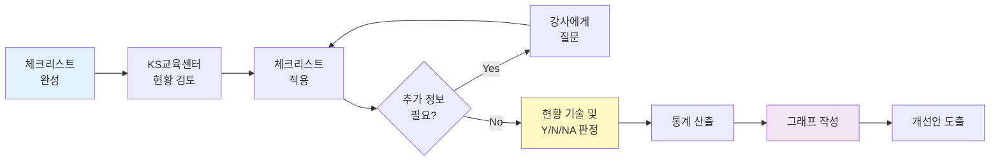

---

### 📊 진단 실행: 체크리스트 적용

#### Step 1: 현황 문서 검토

각 조는 KS교육센터에 대한 다음 문서를 검토했습니다:

- ✅ 조직 구조 및 업무 분장
- ✅ 서비스 현황 (교육 과정, 자격 제도)
- ✅ 개인정보 파일 현황
- ✅ DB 테이블 구조
- ✅ 접속 권한 관리 현황
- ✅ 시스템 구성도
- ✅ 방화벽 정책
- ✅ 위탁 및 제3자 제공 현황
- ✅ 안전성 확보 조치 현황
- ✅ 개인정보 수집 동의서

#### Step 2: 체크리스트 매핑

예시: **1조의 "최소 수집 원칙" 점검**

**점검 항목**:
"개인정보 수집 항목이 서비스 제공 목적 달성을 위한 최소한으로 설정되어 있는가?"

**점검 기준**:
- 서비스 제공에 필수적인 정보만 수집
- 불필요한 정보는 수집하지 않음
- 필수/선택 항목 명확히 구분

**확인할 문서**:
1. 회원가입 동의서 → 수집 항목 확인
2. 자격시험 동의서 → 수집 항목 확인
3. 개인정보 파일 현황 → 실제 수집 항목 대조

**현황 파악**:

| 서비스 | 수집 항목 | 필수 여부 | 판단 |
|:---:|:---|:---:|:---|
| 회원가입 | 이름, ID, PW, 이메일 | 필수 | ✅ 온라인 서비스에 필수적 |
| 회원가입 | 휴대전화번호 | 선택 | ✅ 선택 항목으로 적절 |
| 자격시험 | 이름, 주민번호, 휴대폰, 이메일 | 필수 | ✅ 본인 확인용 (법적 근거 있음) |
| 자격시험 | 거주지 주소 | 필수 | ❓ 온라인 시험에 필수인가? |
| 자격시험 | **소속기관** | 필수 | ❓ 자격증 발급에 필수인가? |

**판단 과정**:

1. **적합한 부분**:
   - 회원가입 시 최소 정보만 수집 (이름, ID, PW, 이메일)
   - 휴대폰은 선택 항목으로 처리

2. **판단이 필요한 부분**:
   - **거주지 주소**: 오프라인 시험장 배정용이라면 적법, 온라인 시험만 있다면 불필요
   - **소속기관**: 전문가 관리 목적이라면 적법, 단순 통계용이라면 과도

3. **조별 판단 차이**:

| 조 | 판단 | 근거 |
|:---:|:---:|:---|
| **1조** | **Y (적합)** | "전문가 자격증 관리를 위해 소속기관 정보는 필요하다고 판단" |
| **2조** | **N (부적합)** | "온라인 자격증 발급에 소속기관 정보는 필수가 아니므로 과도한 수집" |

💡 **중요!**: 두 판단 모두 나름의 근거가 있으므로, **어느 것이 정답**이라고 단정할 수 없습니다. 중요한 것은 **판단의 논리적 근거**입니다!

#### Step 3: 추가 정보 질의

**상황**: 체크리스트 항목 "접근 권한이 최소 권한 원칙에 따라 부여되고 있는가?"를 점검하려는데, 제공된 현황에 구체적인 권한 내역이 없음

**대응**: 채팅창에 강사님께 질문

**질문 예시**:
```
Q: 교육1팀과 교육2팀이 서로의 교육생 정보에 접근할 수 있나요?
   아니면 각각 담당 교육생 정보만 조회 가능한가요?
```

**강사님 답변 (예시)**:
```
A: 교육1팀은 일반 교육생 DB만, 교육2팀은 전문가 과정 DB만 접근 가능합니다.
   시스템적으로 권한이 분리되어 있습니다.
```

**현황 기술**:
```
교육1팀과 교육2팀은 각각 담당 교육생 정보에만 접근 가능하도록
권한이 시스템적으로 분리되어 있음을 확인 (Y)
```

---

### ✍️ 현황 기술 및 판정

#### 예시 1: 수집 항목 최소화 (1조)

| 점검 항목 | 현황 | 점검 결과 |
|:---|:---|:---:|
| 개인정보 수집 항목이 최소한으로 설정되어 있는가? | 회원가입 시 이름, ID, 패스워드, 이메일만 필수로 수집하고 있어 최소 수집 원칙 준수. 다만 자격시험 응시 시 소속기관 정보를 필수로 수집하고 있으나, 전문가 자격증 관리 목적상 필요하다고 판단됨 | **Y** |

#### 예시 2: 파기 절차 (1조)

| 점검 항목 | 현황 | 점검 결과 |
|:---|:---|:---:|
| 보유 기간 경과 시 개인정보를 파기하고 있는가? | 회원 탈퇴 시 개인정보를 파기한다고 명시되어 있으나, DB 테이블에서 탈퇴 회원(user003)의 정보가 남아있는 것을 확인. 교육 이력은 준영구 보관한다고 하나, 법적 근거가 불명확함. **개선 필요**: 파기 절차를 실제로 이행하고, 교육 이력 보관에 대한 법적 근거 명시 필요 | **N** |

#### 예시 3: 접근 권한 관리 (2조)

| 점검 항목 | 현황 | 점검 결과 |
|:---|:---|:---:|
| 퇴직자 및 직무 변경자의 접근 권한을 즉시 회수하고 있는가? | 관리자 계정 목록에서 퇴직자(admin005, 정OO)의 계정이 "미사용" 상태로 남아있음을 확인. 계정이 삭제되지 않고 비활성화 상태로만 유지되고 있어, 재활성화 위험 존재. **개선 필요**: 퇴직 시 계정 즉시 삭제 또는 영구 삭제 프로세스 수립 | **N** |

#### 예시 4: 암호화 (2조)

| 점검 항목 | 현황 | 점검 결과 |
|:---|:---|:---:|
| 고유식별정보를 암호화하여 저장하고 있는가? | 주민번호를 AES-256 알고리즘으로 암호화하여 저장하고 있으며, DB 테이블에서 마스킹 처리되어 표시되는 것을 확인. 안전성 확보조치 기준 제7조 준수 | **Y** |

#### 예시 5: 민감정보 처리 (3조)

| 점검 항목 | 현황 | 점검 결과 |
|:---|:---|:---:|
| 민감정보 수집 시 별도 동의를 받고 있는가? | 해당 교육센터는 민감정보(건강정보, 유전정보 등)를 수집하지 않아 민감정보 처리에 대한 점검 항목은 해당 없음 | **NA** |

---

### 📈 통계 산출 방법

#### Step 1: 점검 결과 집계

각 조는 점검 결과를 Y/N/NA로 분류한 후 개수를 집계했습니다.

**예시: 2조의 집계 결과**

| 영역 | 점검 항목 수 | Y (이행) | N (미이행) | NA (해당없음) |
|:---:|:---:|:---:|:---:|:---:|
| 수집 및 이용 | 8 | 5 | 2 | 1 |
| 제공 및 위탁 | 6 | 4 | 2 | 0 |
| 파기 | 4 | 1 | 3 | 0 |
| 접근 권한 관리 | 5 | 3 | 2 | 0 |
| 접근 통제 | 7 | 2 | 5 | 0 |
| 암호화 | 6 | 3 | 3 | 0 |
| 접속 기록 | 4 | 2 | 2 | 0 |
| 악성 코드 | 3 | 1 | 2 | 0 |
| 물리적 보안 | 4 | 3 | 1 | 0 |
| **합계** | **47** | **24** | **22** | **1** |

#### Step 2: 이행률 계산

이행률은 다음 공식으로 계산합니다:

```
이행률 (%) = (Y 개수 / (Y + N 개수)) × 100
```

💡 **중요!**: NA는 이행률 계산에서 제외합니다. NA는 "해당없음"이므로 평가 대상이 아닙니다.

**예시: 2조의 이행률 계산**

| 영역 | 계산식 | 이행률 |
|:---:|:---|:---:|
| 수집 및 이용 | 5 / (5+2) × 100 | **71.4%** |
| 제공 및 위탁 | 4 / (4+2) × 100 | **66.7%** |
| 파기 | 1 / (1+3) × 100 | **25.0%** |
| 접근 권한 관리 | 3 / (3+2) × 100 | **60.0%** |
| 접근 통제 | 2 / (2+5) × 100 | **28.6%** |
| 암호화 | 3 / (3+3) × 100 | **50.0%** |
| 접속 기록 | 2 / (2+2) × 100 | **50.0%** |
| 악성 코드 | 1 / (1+2) × 100 | **33.3%** |
| 물리적 보안 | 3 / (3+1) × 100 | **75.0%** |
| **전체** | 24 / (24+22) × 100 | **52.2%** |

💡 **인사이트**: 2조의 분석에 따르면 KS교육센터는 **전체 이행률 52.2%**로, 절반 수준의 개인정보 보호 수준을 보이고 있습니다. 특히 **파기(25%)**, **접근 통제(28.6%)**,  **악성 코드(33.3%)** 영역이 매우 취약합니다.

#### Step 3: 그래프 작성

강사님이 권장한 그래프 형식:

1. **막대 그래프 (Bar Chart)**: 영역별 이행률을 시각적으로 비교
2. **퍼센티지 표시**: 각 막대에 이행률(%) 명시

**Excel/Google Sheets 작업 방법**:

```
1. 데이터 입력:
   - A열: 영역명 (수집 및 이용, 제공 및 위탁, ...)
   - B열: 이행률 (71.4, 66.7, 25.0, ...)

2. 그래프 삽입:
   - Excel: 삽입 → 차트 → 세로 막대형
   - Google Sheets: 삽입 → 차트 → 세로 막대 차트

3. 축 설정:
   - X축: 영역명
   - Y축: 이행률 (0~100%)

4. 데이터 레이블 추가:
   - 각 막대 위에 이행률(%) 표시
```

**그래프 예시 (텍스트 표현)**:

```
이행률 (%)
100 ┤
 90 ┤
 80 ┤
 70 ┤  71.4%  66.7%                                    75.0%
 60 ┤  ████   ████   60.0%
 50 ┤  ████   ████   ████   50.0%  50.0%
 40 ┤  ████   ████   ████   ████   ████
 30 ┤  ████   ████   ████   ████   ████   33.3%  ████
 20 ┤  ████   ████   ████   ████   ████   ████   ████
 10 ┤  ████   ████   25.0%  28.6%  ████   ████   ████
  0 ┼────────────────────────────────────────────────────
     수집   제공   파기   접근   암호화  악성   물리적
     이용   위탁         통제           코드   보안
```

---

### 💬 진단 중 Q&A

실습 중 각 조에서 강사님께 질문한 내용들:

#### Q1: "체크리스트를 자세하게 만들어서 점검하는데, 보안 사고는 왜 나는 거죠?"

**A (강사님)**:
> "좋은 질문입니다. 이유는 **자산의 방대함**과 **제한된 점검 자원** 때문입니다. 기업은 수천~수만 대의 서버를 운영하는데, 모든 서버를 동일한 기준으로 관리하기가 불가능합니다. 또한 운영 중 계속 변경사항이 발생하므로, 한 번 점검했다고 해서 영원히 안전한 것이 아닙니다. 10명의 경찰이 1명의 도둑을 못 잡는다는 말처럼, 방어자는 모든 지점을 지켜야 하지만 공격자는 단 한 곳의 약점만 찾으면 됩니다."

#### Q2: "현황 정보가 부족한데 어떻게 판단하나요?"

**A (강사님)**:
> "채팅창에 질문을 쓰세요. 제가 답변을 드립니다. 실제 컨설팅에서도 현장에서 모든 정보를 다 받을 수 없습니다. 질의서를 작성하여 추가 자료를 요청하는 것이 일반적입니다."

#### Q3: "Y와 N 판단이 애매한 경우는 어떻게 하나요?"

**A (강사님)**:
> "YES냐 NO냐는 별로 중요한 문제가 아닙니다. 중요한 것은 **왜 그렇게 판단했는지**에 대한 논리적 근거입니다. 제한된 정보를 가지고 판단할 때는 조별로 판단이 다를 수 있습니다. 중요한 것은 현황을 명확히 기술하고, 부적합하다면 무엇을 개선해야 하는지 제시하는 것입니다."

---

### 📝 개선 권고사항 작성

각 조는 진단 결과를 바탕으로 개선 권고사항을 작성했습니다.

#### 예시: 2조의 개선 권고사항

**1. 접근 통제 강화 (우선순위: 높음)**

현황:
- 퇴직자 계정 미삭제 (admin005)
- VPN 접속 IP 제한 없음 (모든 IP 허용)
- DB 직접 접근 허용

권고사항:
- ✅ 퇴직자 계정 즉시 삭제 (7일 이내)
- ✅ VPN 접속 IP 화이트리스트 적용
- ✅ DB 직접 접근 차단, WAS를 통해서만 접근 허용

#### 2. 암호화 고도화 (우선순위: 높음)

현황:
- 비밀번호 해시 알고리즘 미확인
- 일부 개인정보 암호화 미적용 가능성

권고사항:
- ✅ 비밀번호 해시 알고리즘을 SHA-256 이상 또는 bcrypt로 변경
- ✅ DB 컬럼별 암호화 대상 식별 및 적용
- ✅ 백업 데이터 암호화 적용

#### 3. 파기 절차 재점검 (우선순위: 높음)

현황:
- 탈퇴 회원 정보가 DB에 잔존
- "준영구" 보관의 법적 근거 불명확

권고사항:
- ✅ 탈퇴 회원 개인정보 즉시 파기 프로세스 수립
- ✅ 교육 이력 보관의 법적 근거 명시 또는 보유 기간 구체화
- ✅ 주기적 파기 대상 식별 및 자동 파기 시스템 도입

---

### ⏰ 시간 관리

강사님이 제공한 작업 시간:

| 단계 | 소요 시간 | 비고 |
|:---:|:---:|:---|
| 체크리스트 작성 | 약 60분 | 오전 시간 |
| KS교육센터 현황 검토 | 20분 | 강사 설명 포함 |
| 진단 수행 | 20분 | 매우 촉박! |
| 통계 및 그래프 작성 | 20분 | Excel 활용 |

💡 **학생 반응**: "10분밖에 안 준다고요?" → 실제 컨설팅도 시간이 제한적이므로, 효율적 작업이 중요합니다!

---

### ✅ 진단 실습 체크리스트

진단을 완료하기 전에 다음 사항을 확인하세요:

- [ ] 모든 체크리스트 항목에 대해 Y/N/NA 판정 완료
- [ ] 현황란에 객관적 사실 기술
- [ ] N 판정 항목에 대해 개선 방향 제시
- [ ] 이행률 계산 (NA 제외)
- [ ] 그래프 작성 (퍼센티지 표시)
- [ ] 영역별 코멘트 작성 (개선 필요 사항 등)

---

## 🎯 다음 섹션 안내

다음 섹션에서는 **10개 조의 진단 결과를 리뷰**합니다:

- 조별 진단 결과 비교
- 강사님의 피드백
- 공통적으로 발견된 취약점
- 우수 사례

각 조의 노력이 어떤 결과로 나타났는지 확인해봅시다! 📊✨
## 📊 조별 진단 결과 분석 및 리뷰

### 🎉 전체 조 작업 완료!

10개 조 모두가 체크리스트 작성, 진단 수행, 통계 산출, 그래프 작성까지 성공적으로 완료했습니다!

강사님의 평가:
> "일단 10개 조가 모두 저희가 처음에 제가 생각했던 어떤 방향에 있어서 거의 다 고달하신 것 같아요. 그래서 너무 일단 기쁘다라고 생각이 들고요."

💡 **중요!**: 짧은 시간 내에 모든 조가 진단을 완료한 것은 **매우 우수한 성과**입니다!

---

### 📈 조별 진단 결과 비교

각 조의 전체 이행률과 주요 특징을 비교해봅시다.

#### 1️⃣ 1조: 균형 잡힌 평가

```
전체 이행률: 약 60~70%
```

**그래프 특징**:
- 입체적인 3D 막대 그래프 사용
- 대부분의 영역이 평균 수준 이상

**주요 평가**:
- ✅ **우수 영역**: 수집·이용, 암호화, 물리적 보안
- ⚠️ **개선 필요**: 동의받는 방법, 민감정보 처리, 파기

**강사님 코멘트**:
> "1조 같은 경우 동의받는 방식에 대해서 입체적인 그래프로 그리셨고, 퍼센테이지가 대략적으로 보면 동의받는 방법과 민감정보의 처리에 대한 사항들, 파기에 관련된 사항들이 좀 평균 수준보다 좀 낮게 평가를 하셨고 많은 부분에 있어서는 높게 평가를 해 주신 부분이 눈에 띄네요."

**특이 사항**:
- 파기 부분이 낮은 이유: **탈퇴 회원 정보 미파기 문제** 지적

---

#### 2️⃣ 2조: 엄격한 평가 기준

```
전체 이행률: 약 50~55%
```

**그래프 특징**:
- 막대 그래프 사용
- 안전성 확보 조치 영역에서 매우 낮은 점수

**주요 평가**:
- ✅ **우수 영역**: 수집·이용 (일부)
- ⚠️ **매우 취약**: 접근 통제 (28.6%), 파기 (25%)

**강사님 코멘트**:
> "2조 같은 경우에도 동의받는 방법이 좀 낮고 제공이나 위탁에 대한 부분을 좀 낮게 표현을 하셨어요. 1조에 비해서 2조는 이런 부분을 낮게 해놓고 **접근통제에 대한 부분을 크게 낮고 암호화에 대한 부분, 안전조치에 대한 부분이 크게 낮게끔 평가를 해 주셨습니다.**"

**핵심 인사이트**:
- 접근 통제와 암호화가 매우 취약하다고 판단
- 개선 권고: "접근통제 개선, 암호화 규칙 고도화"

---

#### 3️⃣ 3조: 현장 점검 강조

```
전체 이행률: 약 55~60%
```

**그래프 특징**:
- 이미지를 캡처하여 붙인 형태

**주요 평가**:
- ✅ **우수 영역**: (일부 영역에서 적합 판정)
- ⚠️ **개선 필요**: 수집·이용, 악성 코드

**강사님 코멘트**:
> "3조 같은 경우 일단 무엇 무엇이 적합하다라고 표현을 해 주셨고, NA 되는 항목들이나 이런 것들이 있는데, **접속기록이나 암호화, 물리적 보안 조치나 재재난 복구와 관련된 부분에 있어서는 현장 점검을 더 해야 된다** 이런 식의 의견도 주셨어요."

**특이 사항**:
- **"현장 점검 필요"** 의견 제시 → 매우 훌륭한 접근!
- 페이퍼만으로는 확인할 수 없는 부분을 명확히 인식

💡 **강사님 칭찬**:
> "우리가 무엇을 더 점검을 해야 될지에 대한 방향상에 명확하게 나와 있다는 점에서 잘 작성을 하신 것 같아요."

---

#### 4️⃣ 4조: 종합 이행률 제시

```
전체 이행률: 53%
```

**그래프 특징**:
- 막대 그래프 + **전체 합계 이행률** 표시

**주요 평가**:
- ✅ **적절 평가**: 동의받는 방법
- ⚠️ **매우 취약**: 수집·이용, 접근 권한, 암호화

**강사님 코멘트**:
> "4조 같은 경우 수지 비용 부분이 되게 낮게 보셨고, 접근 권한, 접근 통제, 암호화 쪽을 굉장히 낮게 평가를 해 주셨고, **전체적인 수준도 53% 합계에도 같이 표현을 해 주셨네요.**"

**특이 사항**:
- **전체 이행률 53%** 명시 → 절반 수준의 보호 수준
- 명확한 메시지: "KS교육센터는 개인정보 보호 수준이 미흡하다"

---

#### 5️⃣ 5조: 기술·보안 중심 평가

```
전체 이행률: 약 50~60%
```

**그래프 특징**:
- 기술 보안 영역 세분화

**주요 평가**:
- ✅ **우수 영역**: 제공 (다른 조보다 높음)
- ⚠️ **취약 영역**: 보안 운영 대응, 암호화 기술 보안, 접근 제어 권한 관리

**강사님 코멘트**:
> "5조 같은 경우 수지 비용, 제공이 다른 조보다는 높게 평가를 해 주셨는데, 특수 처리는 아마 **가명 처리나 이런 쪽까지 포함하셔서** 내용들 써 주신 것 같고, 보안 운영 대형이나 암호화 기술 보안, 접근 제어 권한 관리 이쪽도 평가가 후하진 않으시네요."

**특이 사항**:
- "비밀번호 정책, 암호키 관리에 대한 부분에 있어서도 관리 부분이 지침이 위협한 부분을 지적"
- 기술적 세부 사항까지 점검

---

#### 6️⃣ 6조: 선택과 집중

```
전체 이행률: 약 60~65%
```

**그래프 특징**:
- 일부 영역만 집중 평가

**주요 평가**:
- ✅ **우수 영역**: 접근 권한, 접근 통제 (다른 조보다 높음)
- ⚠️ **취약 영역**: 악성 코드, 접속 기록

**강사님 코멘트**:
> "6조는 내부관리계획, 동의받는 방법 이런 것들에 대한 기준이 있고, **악성코드에 대한 백신이나 이런 관리의 부분에서도 굉장히 위협하다고 봐 주셨고**, 우리 조 같은 경우에는 6조는 접속 기록에 대한 부분에 대해서도 굉장히 좀 낮게 평가를 해 주셨습니다."

**특이 사항**:
- 다른 조들과 달리 **접근 권한/접근 통제를 높게 평가**
- 평가 기준이 상대적으로 관대할 수 있음

---

#### 7️⃣ 7조: 권리 보장 중점

```
전체 이행률: 약 55~60%
```

**그래프 특징**:
- 정보주체의 권리 영역 추가

**주요 평가**:
- ✅ **우수 영역**: (일부)
- ⚠️ **취약 영역**: 동의받는 방법, 재재난 조치, 접속 기록

**강사님 코멘트**:
> "7조 같은 경우 **정보주세의 권리에 대해서 좀 내용을 더 써주셨네요.** 그리고 동의받는 방법에 있어서도 홍보 마케팅에 대한 고지가 미흡했다. 그리고 불리익에 관련된 사항들이 절차가 좀 미흡한 부분이 있다라고 하는 것들이 있었고, 여기도 **재재난 조치에 미의 악몽이 존재한다**라고 했고, 접속 기록에 대한 부분에 있어서도 점검 및 보관에 대한 기준이 강화될 필요가 있다라는 식이었던 내용을 좀 추가해 주셨습니다."

**특이 사항**:
- **정보주체의 권리** 영역을 명시적으로 점검
- 법적 의무사항 외에도 정보주체 관점 고려

---

#### 8️⃣ 8조: 명확한 이분법

```
전체 이행률: 약 40~50%
```

**그래프 특징**:
- 높은 것과 낮은 것을 명확히 구분

**주요 평가**:
- ✅ **우수 영역**: (일부 영역 높게 평가)
- ⚠️ **매우 취약**: 동의받는 방법, 파기, 접근권한, 암호화, 물리적 보안

**강사님 코멘트**:
> "8조는 되게 **명확하게 높은 것과 낮은 것을 구분하셨네요.** 그죠? 결과적으로 이렇게 보여지는 것 같습니다. 크게 보면 안전조치, 안전한 관리... 역시나 우리 8조도 **접근권화와 접근 통제에 대해서 낮게 평가**를 해 주셨었고, 재재난 안전조치에 대한 부분도 낮은 편에 속하는 것으로, 물리적 보안까지 낮게 평가를 해 주셨고, 특히나 **동의받는 방법에 대해서는 굉장히 낮게, 엄격하게 평가**를 하신 것 같아요. 파기도 그렇고 접근권화 그런 것도 그렇고 굉장히 엄격한 잣대를 되신 게 아닌가 라는 생각이 좀 듭니다."

**특이 사항**:
- 가장 엄격한 평가 기준
- 대부분의 영역을 낮게 평가

---

#### 9️⃣ 9조: 다양한 그래프

```
전체 이행률: 약 55~60%
```

**그래프 특징**:
- 여러 종류의 그래프 활용

**주요 평가**:
- ✅ **우수 영역**: (일부)
- ⚠️ **취약 영역**: 파기, 접근권한, 접근 통제, 암호화

**강사님 코멘트**:
> "9조는 그래프가 되게 다양하네요. 그죠? 9조 같은 경우에는 일단 내용을 보면 일단 파기가 좀 낮게 평가가 됐고, 접근권화이나 접근 통제, 특히 암호화... **대부분 같은, 대부분의 조들이 접근권화, 접근 통제, 암호화 쪽에 대한 것을 굉장히 낮게 평가를 해 주셨습니다.**"

**특이 사항**:
- 대다수 조와 유사한 평가 경향
- 그래프 시각화에 노력

---

#### 🔟 10조: 법적 vs 운영적 구분

```
전체 이행률: 51.4%
```

**그래프 특징**:
- **법적 필수 영역**과 **운영관리 영역** 구분

**주요 평가**:
- ✅ **법적 기준 준수**: "법적 필수 영역은 대체로 이행"
- ⚠️ **운영 관리 미흡**: "운영관리 쪽에서는 확인하기 어려워 보완 필요"
- ⚠️ **기술적 영역 취약**: "보호 수준이 많이 떨어진다"

**강사님 코멘트**:
> "10조 마지막으로 한번 볼게요. 10조 같은 경우에는 51.4% 정도로 절반 수준에 머물러서 너희들 열심히 개인정보 보호 해야 돼라고 하는 그런 메시지를 주기에는 충분한 숫자인 것 같습니다. 그리고 이 조 역시 악성 코드 관련돼서 악성 프로그램 반지나 재재난 복사물 관련된 개선이 좀 필요하다라고 표현을 해 주셨습니다. 그리고 **법적 필수 영역은 대체로 이행이 되고 있는데 운영관리 쪽에서는 확인하기는 어려워서 좀 더 관리를 좀 보완해라**고 하는 그런 취지였던 것 같고요."

**핵심 인사이트**:
- **법적 의무는 지키지만, 실제 운영은 미흡**
- 실무적으로 매우 중요한 구분!

💡 **강사님 칭찬**:
> "굉장히 좋은 표현 방식이었던 것 같습니다."

---

### 📊 전체 조 비교 분석

#### 공통적으로 취약하다고 판단한 영역

모든 조가 공통적으로 낮게 평가한 영역:

| 순위 | 영역 | 언급 조 수 | 주요 문제점 |
|:---:|:---|:---:|:---|
| 1 | **접근 통제** | 9개 조 | • 퇴직자 계정 미삭제<br/>• VPN IP 제한 없음<br/>• DB 직접 접근 허용 |
| 2 | **암호화** | 9개 조 | • 비밀번호 해시 알고리즘 미확인<br/>• 일부 컬럼 암호화 미적용<br/>• 암호키 관리 미흡 |
| 3 | **파기** | 7개 조 | • 탈퇴 회원 정보 미파기<br/>• 준영구 보관의 법적 근거 불명확 |
| 4 | **악성 코드** | 6개 조 | • 백신 업데이트 주기 불명확<br/>• 서버 백신 관리 미흡 |
| 5 | **동의받는 방법** | 5개 조 | • 마케팅 동의 고지 미흡<br/>• 불이익 관련 절차 미흡 |

💡 **인사이트**: KS교육센터는 **기술적 보안 조치(접근 통제, 암호화)가 가장 취약**하며, **파기 절차**도 제대로 이행되지 않고 있습니다.

#### 조별 평가 경향 차이

| 구분 | 엄격한 평가 | 관대한 평가 |
|:---:|:---|:---|
| **조** | 8조, 2조 | 6조, 1조 |
| **특징** | • 대부분 영역을 낮게 평가<br/>• 전체 이행률 40~50% | • 일부 영역을 높게 평가<br/>• 전체 이행률 60~70% |
| **이유** | • 높은 기준 적용<br/>• 미흡한 점 엄격히 지적 | • 일부 미흡은 허용<br/>• 전반적으로 긍정적 평가 |

💡 **중요!**: 평가 기준의 엄격도는 컨설턴트의 판단 영역입니다. 중요한 것은 **일관성**입니다!

---

### 🏆 우수 사례

#### 🥇 우수 사례 1: 3조 - "현장 점검 필요" 의견

**내용**:
> "접속기록, 암호화, 물리적 보안 조치, 재재난 복구와 관련된 부분은 페이퍼로는 확인이 어려우므로 **현장 점검을 더 해야 한다**"

**왜 우수한가**:
- 페이퍼 진단의 한계를 명확히 인식
- 추가 점검이 필요한 영역을 구체적으로 제시
- 실무 컨설팅에서도 매우 중요한 접근법

#### 🥇 우수 사례 2: 10조 - "법적 vs 운영적" 구분

**내용**:
> "법적 필수 영역은 대체로 이행되고 있으나, **운영관리 쪽에서는 확인하기 어려워 보완 필요**. 기술적 영역에서 보호 수준이 많이 떨어진다."

**왜 우수한가**:
- 법적 의무 vs 실제 운영을 구분
- "법은 지키지만 실무는 미흡"한 상황 정확히 파악
- 개선 방향이 명확

#### 🥇 우수 사례 3: 7조 - "정보주체의 권리" 영역 추가

**내용**:
> "정보주체의 권리 영역을 별도로 점검하여, 열람청구권, 정정·삭제권 등을 평가"

**왜 우수한가**:
- 개인정보보호법의 핵심인 정보주체 권리 보장을 명시적으로 점검
- 기술적 보안뿐 아니라 법적 권리 보장도 중요하다는 인식

#### 🥇 우수 사례 4: 4조 - "전체 이행률" 명시

**내용**:
> "전체 이행률 53% - 절반 수준의 개인정보 보호"

**왜 우수한가**:
- 한눈에 파악 가능한 종합 평가
- 경영진 보고 시 매우 유용한 지표
- 명확한 메시지 전달

---

### 💬 강사님의 전체 평가

#### 📌 긍정적 평가

> "일단, 다 같이 박수 한 번! 굉장히 기대 이상. 제가 오늘 교육을 하다가, 시간이 너무 모자랄 것 같다라는 생각을 했었는데 그럼에도 불구하고 각 조별로 **완성된 결과물들을 내주셔서 너무 감사합니다.** 각 조장님들 고생인 것 같습니다."

#### 📌 공통 개선 사항

**1. 접근 통제 및 암호화**

모든 조가 공통적으로 낮게 평가:
- 퇴직자 계정 미삭제
- 암호화 알고리즘 및 적용 범위 미흡

**2. 파기 절차**

대부분의 조가 지적:
- 탈퇴 회원 정보 DB 잔존
- "준영구" 보관의 법적 근거 불명확

**3. 악성 코드 관리**

많은 조가 개선 필요 판단:
- 백신 업데이트 주기 불명확
- 서버 백신 관리 미흡

---

### ✅ 학습 성과

#### 이번 실습을 통해 달성한 것들:

1. **체크리스트 설계 능력**
   - 법령을 실무 점검 항목으로 변환
   - 조직 특성에 맞는 맞춤형 체크리스트

2. **진단 실행 능력**
   - 제한된 정보로 현황 파악
   - 객관적 기준에 따른 적합성 평가
   - 부적합 사항에 대한 개선 방안 도출

3. **결과 분석 및 보고 능력**
   - 정량적 분석 (이행률 계산)
   - 시각적 표현 (그래프, 차트)
   - 경영진이 이해하기 쉬운 형태로 요약

4. **컨설팅 마인드**
   - 단순 지적이 아닌 개선 방향 제시
   - 법적 의무 vs 실제 운영 구분
   - 현장 점검 필요성 인식

---

## 🎯 다음 섹션 안내

마지막 섹션에서는 **이틀간의 학습을 종합 정리**합니다:

- 교육 전체 회고
- 핵심 개념 정리
- 실무 적용 방안
- 향후 학습 방향
- 강사님의 마지막 당부

2일간의 여정을 마무리해봅시다! 🎓✨
## 🎓 종합 정리 및 향후 학습 방향

### 🔄 이틀간의 학습 여정 회고

#### Day 1: 개인정보의 이해
- 현대사회에서 개인정보가 왜 중요한가
- 기업이 개인정보를 어떻게 처리하는가
- 개인정보 처리 방침 분석
- 개인정보 흐름도 작성

#### Day 2: 진단 실습 (오늘)
- 체크리스트 작성 방법론
- KS교육센터 현황 분석
- 실제 진단 수행
- 결과 분석 및 시각화
- 조별 발표 및 피드백

---

### 📚 강사님의 교육 철학

강사님이 강조하신 핵심 메시지:

> "이번 수업은 개인정보보호법이나 안전성 확보조치에 대한 적용을 하는 데 있어서 구체적인 어떤 기준을 우리가 좀 더 공부를 해야 되느냐, 이 항목을 어떻게 생각을 판단을 해야 될 것이냐라고 하는 그런 내용으로 설명을 하기에는 좀 짧은 시간이었던 것 같아요."

#### 🎯 교육의 핵심 목표

**세부 조항 암기 ❌**
**구조적 이해 ✅**

강사님의 설명:
> "그래서 제가 생각하는 방식은 **기본적으로 구조를 이해하게끔** 여러분들에게 좀 교육을 했다라고 컨셉을 잡고 그런 방향으로 교육을 했습니다."

#### 📖 학습 구조

**1단계: 인식**
- 왜 개인정보가 중요한가?
- 무엇이 문제인가?

**2단계: 이해**
- 기업이 개인정보를 어떻게 다루는가?
- 시스템이 어떻게 구성되어 있는가?

**3단계: 분석**
- 개인정보 처리 방침을 읽고 분석
- 흐름도를 그리며 데이터 흐름 파악

**4단계: 실습**
- 체크리스트를 직접 만들어보기
- 실제 기관을 대상으로 진단해보기

**5단계: 평가**
- 진단 결과를 분석하고 시각화
- 개선 방안 도출

---

### 💡 핵심 개념 정리

#### 1️⃣ 개인정보 생명주기

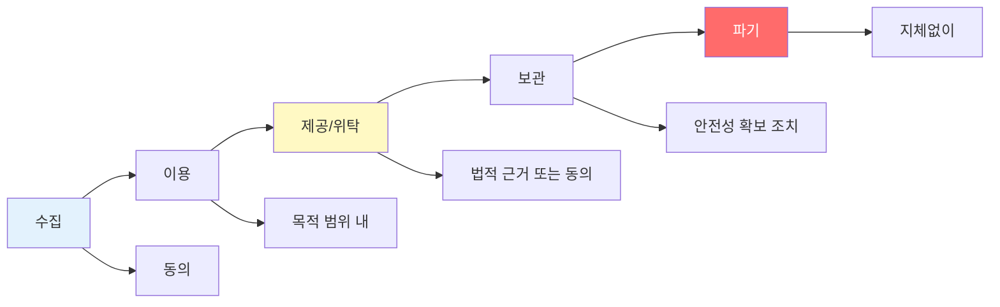

**각 단계별 핵심 원칙**:

| 단계 | 핵심 원칙 | 법적 근거 |
|:---:|:---|:---|
| **수집** | • 최소 수집 원칙<br/>• 동의 받기<br/>• 목적 명시 | 개인정보보호법 제15조, 제16조 |
| **이용** | • 목적 범위 내 이용<br/>• 목적 외 이용 시 별도 동의 | 개인정보보호법 제15조, 제18조 |
| **제공/위탁** | • 제3자 제공 시 동의<br/>• 위탁 시 계약 및 관리·감독 | 개인정보보호법 제17조, 제26조 |
| **보관** | • 안전성 확보 조치<br/>• 접근 통제<br/>• 암호화 | 개인정보보호법 제29조<br/>안전성 확보조치 기준 |
| **파기** | • 보유 기간 경과 시 지체없이<br/>• 복구 불가능하게 | 개인정보보호법 제21조 |

#### 2️⃣ 안전성 확보 조치의 3대 축

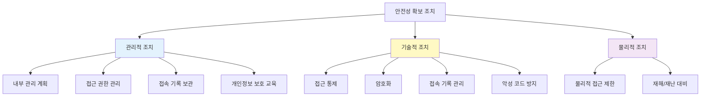

**핵심 포인트**:
- **관리적**: 정책과 절차 (사람)
- **기술적**: 시스템과 보안 (기술)
- **물리적**: 시설과 장비 (환경)

#### 3️⃣ 진단의 핵심: Y / N / NA

| 구분 | 의미 | 조치 |
|:---:|:---|:---|
| **Y (Yes)** | 법적 요구사항 충족 | 우수 사례로 유지 |
| **N (No)** | 법적 요구사항 미충족 | **개선 방안 제시 필수** |
| **NA (Not Applicable)** | 해당 사항 없음 | 평가 대상 제외 |

💡 **중요!**: N 판정 시에는 반드시 **무엇이 부적합한지, 어떻게 개선해야 하는지** 명시해야 합니다!

---

### 🚀 실무 적용 방안

#### 실제 컨설팅 프로젝트 진행 단계

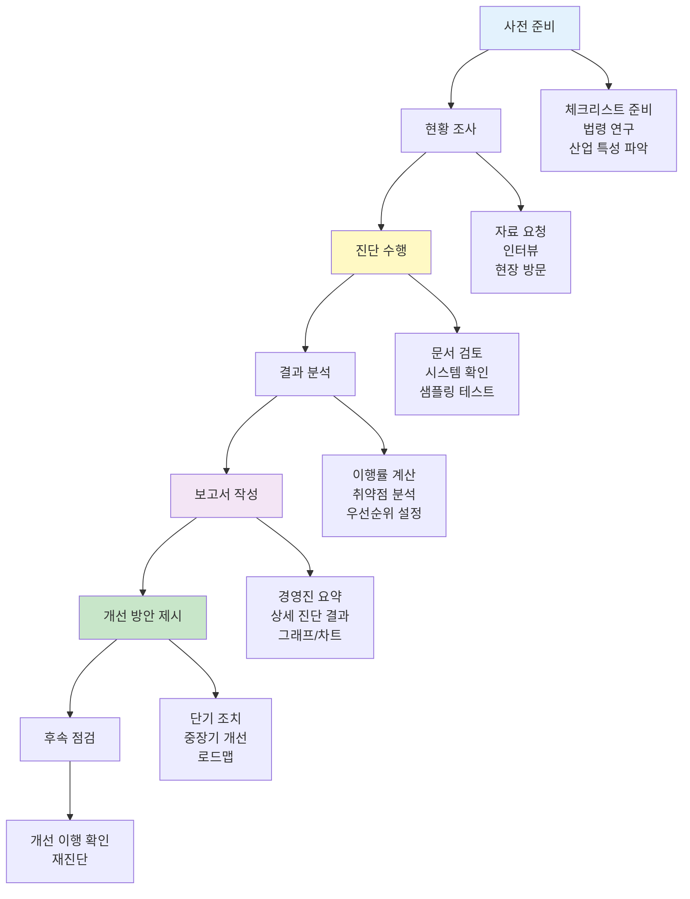

#### 이번 실습과 실무의 차이점

| 구분 | 실습 (KS교육센터) | 실무 (실제 기업) |
|:---:|:---|:---|
| **정보 제공** | 페이퍼로 제공됨 | 자료 요청 → 제출 대기 |
| **추가 질의** | 강사님께 즉시 질문 | 질의서 작성 → 회신 대기 |
| **시간** | 20분 (매우 짧음) | 수일 ~ 수주 |
| **범위** | 가상 기관 (제한적) | 전사 시스템 (광범위) |
| **깊이** | 표면적 점검 | 심층 분석 |
| **결과** | 그래프 + 간단한 코멘트 | 100페이지 이상 보고서 |

💡 **교훈**: 실습은 **구조를 이해**하기 위한 것이고, 실무는 훨씬 더 **복잡하고 시간이 오래 걸립니다!**

---

### 📖 향후 학습 방향

#### 🎯 심화 학습이 필요한 영역

##### 1️⃣ 법령 전문성

**학습 자료**:
- 개인정보보호법 전문 (70개 조문)
- 개인정보의 안전성 확보조치 기준 (고시)
- 표준 개인정보 보호지침
- 개인정보보호위원회 해석례 및 결정례

**학습 방법**:
- 조문별로 의미 이해
- 실제 사례와 연결
- 최신 개정 내용 지속 학습

##### 2️⃣ 기술적 보안

**학습 영역**:
- **암호화**: AES, RSA, SHA-256, bcrypt 등
- **접근 통제**: ACL, RBAC, MAC
- **네트워크 보안**: 방화벽, IDS/IPS, VPN
- **로그 관리**: SIEM, 위변조 방지
- **DB 보안**: 암호화, 접근 통제, 감사

**학습 방법**:
- 실제 시스템 구축 실습
- 보안 인증 취득 (정보보안기사, CISSP 등)

##### 3️⃣ 진단 실무 경험

**필요한 경험**:
- 실제 기업 대상 컨설팅
- 다양한 산업군 경험 (금융, 공공, 통신 등)
- 현장 인터뷰 및 협상
- 보고서 작성 및 경영진 보고

**방법**:
- 컨설팅 회사 입사
- 정보보호 인증 심사원 활동 (ISMS-P)
- 공공기관 개인정보 영향평가

##### 4️⃣ 산업별 특수성

각 산업마다 개인정보 처리의 특성이 다릅니다:

| 산업 | 특징 | 중점 점검 영역 |
|:---:|:---|:---|
| **금융** | 고도의 보안 요구<br/>금융감독원 규제 | 접근 통제, 암호화<br/>이상거래 탐지 |
| **의료** | 민감정보(건강정보)<br/>의료법 준수 | 민감정보 암호화<br/>접근 기록 관리 |
| **통신** | 대량의 개인정보<br/>위치정보법 | 대량 처리 안전성<br/>위치정보 보호 |
| **공공** | 행정정보 공동이용<br/>정보공개 | 제공 관리<br/>열람청구 처리 |
| **교육** | 아동·청소년 정보<br/>법정대리인 동의 | 14세 미만 동의<br/>교육 이력 보관 |

---

### 💼 경력 개발 로드맵

#### 개인정보보호 전문가로 성장하는 경로

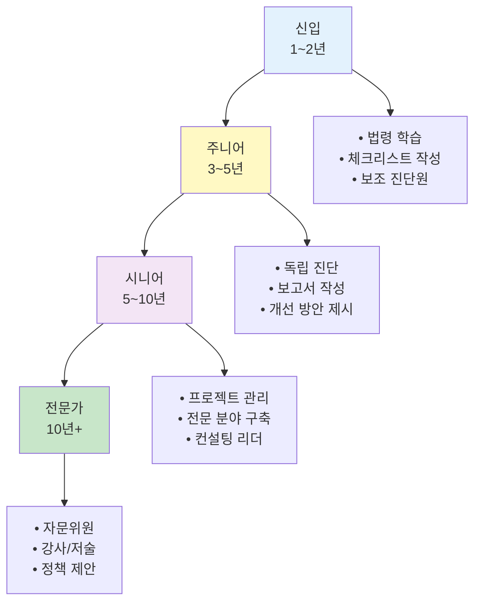

#### 필요한 자격증

| 자격증 | 난이도 | 취득 시기 | 비고 |
|:---:|:---:|:---:|:---|
| **개인정보보호사 (CPPG)** | ⭐⭐ | 신입~주니어 | 법령 중심, 입문용 |
| **정보보안기사** | ⭐⭐⭐ | 주니어 | 기술적 보안 |
| **ISMS-P 인증심사원** | ⭐⭐⭐⭐ | 주니어~시니어 | 실무 경험 필수 |
| **CPPG/M (CPO)** | ⭐⭐⭐ | 시니어 | 개인정보 보호 책임자 |
| **CISA, CISSP** | ⭐⭐⭐⭐⭐ | 시니어~전문가 | 국제 인증 |

⚠️ **강사님 의견**:
실무에서는 "자격증은 필수가 아니지만, 있으면 유리하다." 실제로는 **실무 경험**과 **문제 해결 능력**이 더 중요합니다.

---

### 🎁 이번 교육에서 얻은 것들

#### ✅ 달성한 학습 목표

1. **개인정보보호의 큰 그림 이해**
   - 왜 중요한가
   - 어떻게 처리되는가
   - 무엇을 점검해야 하는가

2. **진단 프로세스 체험**
   - 체크리스트 작성
   - 현황 파악
   - 판정 및 개선 방안 도출

3. **협업 경험**
   - 조별 작업
   - 역할 분담
   - 의견 조율

4. **실무 감각 익히기**
   - 제한된 시간과 정보
   - 불확실성 속 판단
   - 결과물 산출

#### 💪 앞으로 해야 할 일

**단기 (1~3개월)**:
- [ ] 개인정보보호법 정독
- [ ] 안전성 확보조치 기준 숙지
- [ ] 개인정보보호사(CPPG) 자격증 취득

**중기 (6개월~1년)**:
- [ ] 실제 컨설팅 프로젝트 참여
- [ ] 다양한 산업 경험
- [ ] 정보보안기사 취득

**장기 (1년 이상)**:
- [ ] 전문 분야 구축 (금융, 의료, 통신 등)
- [ ] ISMS-P 인증심사원 자격 취득
- [ ] 선임 컨설턴트로 성장

---

### 📧 강사님 연락처 및 추가 질문

강사님의 이메일: **fornomad@gmail.com**

> "혹시 그럴 리는 없겠지만 질문 있으실까요? 이쪽으로 뭔가 혹시 커리어나 이렇게 추가적으로 궁금하신 거나 이런 게 있으시면 언제든지 메일 주시면 제가 답변을 드리도록 하겠습니다."

**질문 가능한 주제**:
- 개인정보보호 진로 상담
- 학습 방법 및 자료 추천
- 실무 경험 공유
- 자격증 및 교육 과정

---

### 🌟 강사님의 마지막 당부

> "그래서 앞으로 이제 이쪽 분야에서 일을 하게 되면 아마 언젠가는 저를 마주칠 수도 있고, 그렇지도 않을 수도 있지만 **이 바닥이 좀 좁아서** 아마 다 뵙게 되지 않을까 라는 생각도 듭니다."

> "여러분들은 어떠셨는지 모르겠어요. 다들 즐거운 실습이었고 경험이 되었으면 하는 바램이고, **이게 이제 시작이 돼서 여러분들이 이쪽 분야에 더 많은 지식과 더 많은 학습을 할 수 있는 계기가 만들어졌다면** 이런 교육이 좀 의미가 있지 않았을까 생각이 듭니다."

---

### 🎓 최종 메시지

#### 교육의 진정한 의미

이번 교육은 **시작점**입니다:

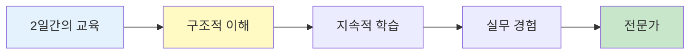

강사님의 핵심 메시지:
> "이번 수업은... **구체적인 어떤 기준을 우리가 좀 더 공부를 해야 되느냐, 이 항목을 어떻게 생각을 판단을 해야 될 것이냐**라고 하는 그런 내용으로 설명을 하기에는 좀 짧은 시간이었던 것 같아요. 그래서 그런 부분들은 앞으로 여러분들이 정보보호 컨설턴트나 개인정보보호 컨설턴트가 됐을 때 이런 진단을 했을 때 **내가 어떤 고민을 해야 될지에 대한 부분을 어떤 학습을 더 해야 될지에 대한 그런 시발점을 만들어드렸다**라는 것으로 저는 충분히 여러분들이 생각을 해주셨으면 좋겠다는 말씀을 드리고요."

💡 **핵심**: 이틀 만에 전문가가 되는 것은 불가능합니다. 중요한 것은 **무엇을 더 학습해야 하는지** 아는 것입니다!

---

### ✅ 학습 완료 체크리스트

이틀간의 교육을 마치며, 다음 사항을 확인해보세요:

#### 개념 이해
- [ ] 개인정보 생명주기 (수집→이용→보관→파기) 이해
- [ ] 안전성 확보 조치 3대 축 (관리적·기술적·물리적) 이해
- [ ] 개인정보 처리 시스템 구성 이해

#### 실무 기술
- [ ] 체크리스트 작성 방법 숙지
- [ ] 진단 수행 절차 이해
- [ ] Y/N/NA 판정 기준 이해
- [ ] 이행률 계산 방법 숙지
- [ ] 그래프 작성 및 시각화

#### 실습 성과
- [ ] 조별 체크리스트 완성
- [ ] KS교육센터 진단 완료
- [ ] 통계 및 그래프 작성
- [ ] 개선 권고사항 도출

#### 향후 계획
- [ ] 추가 학습이 필요한 영역 파악
- [ ] 개인정보보호사(CPPG) 준비 계획
- [ ] 진로 방향 설정

---

### 🙏 감사의 말

#### 강사님께
2일간 열정적으로 가르쳐주신 강사님께 감사드립니다. 단순히 법조문을 나열하는 것이 아니라, **왜 이것이 필요한지, 실무에서 어떻게 적용되는지**를 체험하게 해주신 점이 가장 큰 배움이었습니다.

#### 조원들에게
함께 고민하고, 토론하고, 결과물을 만들어낸 조원들에게 감사합니다. 특히 조장님들의 리더십에 박수를 보냅니다! 👏

#### 나 자신에게
2일간의 집중적인 학습을 잘 소화한 자신에게 칭찬을! 이제 시작입니다. 계속 학습하고 성장해나가겠습니다. 💪

---

### 📚 참고 자료

#### 법령 및 지침
- 개인정보보호법 (법률 제18473호)
- 개인정보의 안전성 확보조치 기준 (개인정보보호위원회 고시)
- 표준 개인정보 보호지침
- 개인정보의 기술적·관리적 보호조치 기준 (방송통신위원회 고시)

#### 기관
- 개인정보보호위원회: https://www.pipc.go.kr
- 한국인터넷진흥원(KISA): https://www.kisa.or.kr
- 개인정보보호 종합포털: https://www.privacy.go.kr

#### 추천 도서
- 개인정보보호법 해설 (법제처)
- ISMS-P 인증 해설서
- 정보보안 개론 (한빛아카데미)

---

## 🎬 강의 종료

### 마지막 인사

강사님:
> "이틀 동안 너무 고생들 하셨고요. 잘 따라와 주셔서 너무 감사했습니다. 오늘까지 이틀 동안의 개인정보부 교육은 이것으로 마치도록 하겠습니다. 여러분 고생 많으셨고요. 앞으로 남은 기간 동안 교육도 열심히 받으시길 바랍니다. **다들 고생하셨습니다. 박수!**"

---

## 🌈 새로운 시작

이틀간의 교육이 끝났습니다. 하지만 이것은 **끝이 아니라 시작**입니다.

오늘 배운 내용을 바탕으로:
- 개인정보보호법을 더 깊이 공부하고
- 실무 경험을 쌓고
- 전문가로 성장해나가세요

**개인정보보호는 단순한 규제 준수가 아닙니다.**
**개인의 권리를 보호하고, 신뢰받는 사회를 만드는 일입니다.**

여러분 모두가 이 분야에서 훌륭한 전문가로 성장하길 기원합니다! 🎓✨

---

**강의 노트 작성 완료일**: 2025년 12월 26일
**작성자**: AI Technical Scribe
**총 분량**: (최종 병합 후 확인 예정)

🎉 **2일간의 개인정보보호 진단 컨설팅 실습 강의를 성공적으로 마쳤습니다!** 🎉
