---
title: "📝 보안 컨설팅 강의 노트 (2026년 1월 7일)"
date: 2026-01-07
excerpt: "이번 강의는 보안 컨설팅의 전반적인 개념과 실무 적용 방법을 다루는 종합 과정입니다. 교육 과정의 후반부에 해당하는 이 강의를 통해, 여러분은 최종 프로젝트(Final Project)를 준비하는 데 필요한 핵심 지식과 실무 스킬을 습득하게 됩니다."
categories:
  - Consulting-Governance
tags:
  - Consulting-Governance
  - SK_Rookies
---

# 📝 보안 컨설팅 강의 노트 (2026년 1월 7일)

## 🎯 학습 목표 및 개요

### 강의 소개

이번 강의는 보안 컨설팅의 전반적인 개념과 실무 적용 방법을 다루는 종합 과정입니다. 교육 과정의 후반부에 해당하는 이 강의를 통해, 여러분은 최종 프로젝트(Final Project)를 준비하는 데 필요한 핵심 지식과 실무 스킬을 습득하게 됩니다.

💡 **중요!** 이 강의는 단순한 이론 학습이 아닌, 실제 보안 컨설팅 업무에서 요구되는 실무 역량을 키우는 것을 목표로 합니다. ISMS(정보보호 관리체계)와 CSAP(클라우드 보안 인증) 같은 실제 인증 제도를 기반으로 학습하며, 실습을 통해 체화할 수 있도록 구성되었습니다.


## 📚 강의 구성 및 일정

### 전체 일정

- **기간**: 2026년 1월 7일 ~ 차주 화요일까지
- **주제**: 보안 컨설팅
- **관련 과정**: 코스 3 (보안 컨설팅, 모의해킹, 관제)

📌 **노트**: 이 강의는 교육 과정의 거의 마지막 단계입니다. 이후 파이널 프로젝트를 진행하게 되므로, 이번 강의 내용은 프로젝트와 직접적으로 연관됩니다.

### 학습 내용 개요


**주요 학습 영역:**

1. **보안 컨설팅 개념**: 보안 컨설팅이 무엇인지, 어떤 업무를 하는지
2. **인증 제도 이해**: ISMS, CSAP 등 주요 보안 인증 제도
3. **실무 적용**: 실제 시스템에 적용하는 방법
4. **실습**: 조별 프로젝트를 통한 실전 경험


## 👥 조 편성 및 학습 방식

### 조 편성 프로세스

이번 강의는 조별 학습 방식으로 진행됩니다. 강사님께서는 학습 의욕을 높이기 위해 관심사를 기반으로 조를 편성하려고 했으나, 보안 컨설팅에 관심을 가진 수강생이 예상보다 적어 최종적으로는 자율 선택 방식으로 조를 구성하게 되었습니다.

**조 편성 기준:**
- 총 8개 조 구성
- 각 조는 6~7명으로 구성
- 선착순 자율 선택 방식
- 조장 1명 선출

💡 **중요!** 조장은 특별히 어려운 역할을 맡는 것이 아니므로 부담 가지지 않아도 됩니다. 조별 활동의 원활한 진행을 돕는 역할입니다.

### 조 편성 배경

**강사의 질문:**
> "보안 컨설팅 쪽으로 파이널 프로젝트를 할 생각이 있으신 분 있습니까?"

**결과:**
- 컨설팅에 관심을 표명한 수강생: 약 4명
- 나머지 대부분: 관제 또는 취약점 진단에 더 관심

📌 **노트**: 보안 컨설팅이 다소 지루할 수 있다는 선입견이 있을 수 있습니다. 개인정보보호법이나 인증 기준 등을 다루기 때문입니다. 하지만 실제로는 매우 중요하고 실무에서 많이 필요한 분야입니다.


## 🎤 아이스브레이킹: UAM 보안 컨설팅 시나리오

### 실습 배경

조 편성 후 첫 번째 활동으로, 실제 보안 컨설팅 상황을 가정한 아이스브레이킹을 진행했습니다.

**시나리오:**
> "어쩌다 보니 UAM(Urban Air Mobility, 드론 택시) 시스템 보안 컨설팅을 하게 되었다. 어떤 점을 고려해야 할까?"

⚠️ **주의**: 이 활동은 정답을 찾는 것이 아닙니다. 자유로운 생각과 창의적인 아이디어를 나누는 것이 목적입니다. GPT나 AI의 도움 없이, 조원들의 순수한 생각을 나누는 시간입니다.

### 조별 아이디어 발표

#### 1조 발표 내용

**발표자**: 탱영님

**핵심 아이디어:**

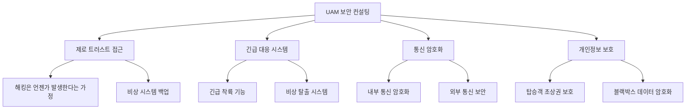

**1. 제로 트러스트(Zero Trust) 접근**
- **개념**: 해킹은 언젠가는 발생할 수 있다는 가정
- **제로데이(Zero-Day) 고려**: 새로운 해킹 기법이 계속 나오므로, 결국 어느 순간 시스템이 뚫릴 수 있음
- **대응 방안**:
  - 비상 시스템 백업 파일 구축
  - 해킹을 당하더라도 최소한의 시스템은 작동할 수 있도록 설계
  - 긴급 대응 버튼/시스템 설치

💡 **중요!** 제로 트러스트는 현대 보안의 핵심 패러다임입니다. "신뢰하되 검증하라"가 아닌 "아무것도 신뢰하지 말고 모두 검증하라"는 접근입니다.

**2. 긴급 대응 시스템**
- 긴급 착륙 기능
- 비상 탈출 시스템
- 해킹 발생 시에도 안전하게 착륙할 수 있는 메커니즘

📌 **노트**: "긴급 탈출 버튼"이라는 표현은 다소 직관적이지만, 실제로는 "긴급 착륙 및 대응 시스템"으로 이해하는 것이 적절합니다.

**3. 통신 암호화**
- 내부 통신(드론 내부 시스템 간) 암호화
- 외부 통신(지상 관제소와의 통신) 암호화
- 통신 프로토콜 보안

**4. 개인정보 보호**
- **탑승객 초상권 보호**: 블랙박스에 탑승객의 얼굴이 촬영될 수 있음
- **블랙박스 데이터 암호화**: 사고 기록 등 민감한 정보 보호
- 데이터 접근 권한 통제

⚠️ **주의**: 탑승객의 초상권은 중요한 개인정보입니다. CCTV나 블랙박스 영상은 적절히 암호화하고 접근을 제한해야 합니다.

**5. 법적 대비**
- 드론 택시 관련 법규가 아직 명확하지 않음
- 법 개정에 따른 대응 방안 마련
- 제로 트러스트 기반의 선제적 보안 정책 수립


#### 2조 발표 내용

**발표자**: 2조 대표

2조는 가장 많은 아이디어를 제시했습니다. 총 18개 이상의 의견이 나왔으며, 그 중 주요 10가지를 발표했습니다.

**핵심 아이디어:**

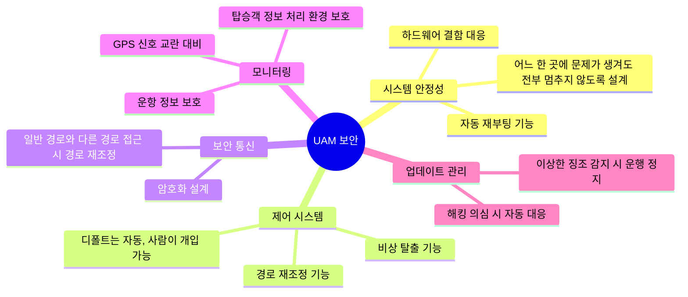

**1. 시스템 안정성 및 장애 허용**

| 항목 | 설명 | 목적 |
|:---:|:---:|:---:|
| **장애 허용 설계** | 어느 한 곳에 문제가 생겨도 전체 시스템이 멈추지 않도록 구성 | 가용성 확보 |
| **자동 재부팅** | 비정상 종료 시 자동으로 재부팅 | 서비스 연속성 |
| **하드웨어 결함 대응** | 물리적 장애 발생 시 대응 방안 | 안전성 강화 |

💡 **중요!** 항공 시스템은 단일 장애점(Single Point of Failure)이 없어야 합니다. Redundancy(중복성)와 Fault Tolerance(장애 허용)가 핵심입니다.

**2. 제어 시스템**

**기본 원칙: 자동화 + 수동 개입 가능**

- **디폴트 자동 제어**: 일반적인 상황에서는 AI가 자동으로 제어
- **사람의 개입 가능**: 긴급 상황 시 조종사나 관제사가 개입할 수 있는 메커니즘
- **경로 재조정**: 일반 경로와 다른 경로로 접근 시 자동으로 경로 재조정

📌 **노트**: 자율 주행 시스템과 유사한 개념입니다. Level 4~5 자율 주행에서도 긴급 상황 시 사람의 개입을 허용합니다.

**3. 보안 통신**

- **암호화 설계**: 모든 통신 구간 암호화
- **경로 이상 감지**: 비정상적인 경로 접근 시 자동 차단 및 재조정
- **중간자 공격(MITM) 방어**: 통신 가로채기 방지

**4. 모니터링 및 탐지**

| 모니터링 대상 | 위협 요소 | 대응 방안 |
|:---:|:---:|:---:|
| **GPS 신호** | GPS 교란/스푸핑 | 다중 센서 활용, 관성 항법 |
| **운항 정보** | 데이터 유출 | 암호화, 접근 통제 |
| **탑승객 정보** | 개인정보 침해 | 처리 환경 격리, 암호화 |
| **시스템 로그** | 해킹 흔적 탐지 | 실시간 로그 모니터링 |

**5. 업데이트 및 이상 징후 관리**

강사님께서 특히 주목하신 아이디어:
> "이상한 징조가 보이면 운행 정지"

- 펌웨어/소프트웨어 업데이트 시 해킹 징후 감지
- 비정상적인 행동 패턴 감지 시 자동 안전 모드 전환
- 해킹 의심 시 즉시 대응 프로토콜 실행

💡 **중요!** 이상 징후 탐지(Anomaly Detection)는 제로데이 공격을 방어하는 효과적인 방법입니다. 정상 행동 패턴을 학습하고, 이탈 시 경보를 발생시킵니다.


#### 3조 발표 내용

**발표자**: 3조 대표

3조는 심플하면서도 핵심적인 접근을 했습니다.

**핵심 아이디어:**

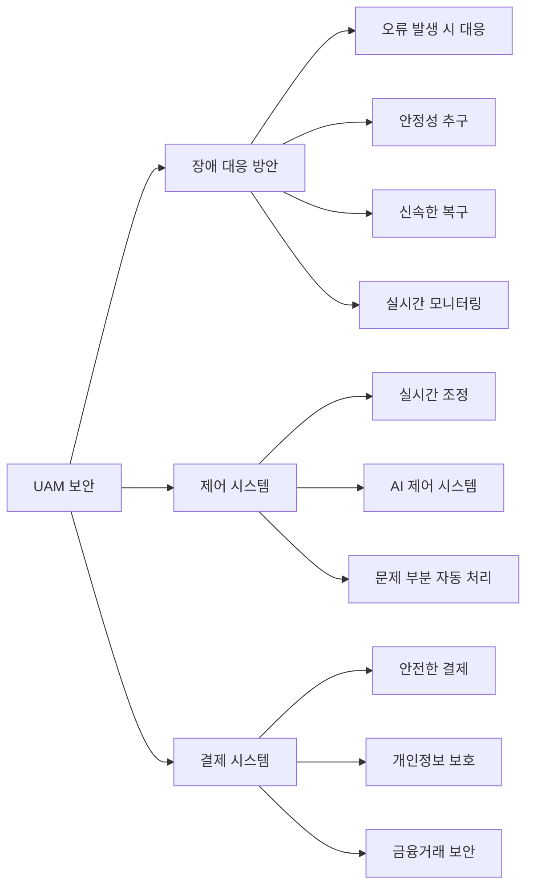

**1. 장애 대응 방안 시스템**

**가정**: 무인 드론 시스템

- **오류 대응**: 시스템 오류 발생 시 즉시 대응할 수 있는 체계
- **안정성**: 시스템의 안정적인 운영 보장
- **신속한 복구**: 장애 발생 시 빠른 복구
- **모니터링**: 실시간으로 시스템 상태 감시

📌 **노트**: 장애 대응은 보안의 3대 목표 중 하나인 **가용성(Availability)**과 직접 연관됩니다.

**2. 제어 시스템**

- **실시간 조정**: 비행 중 실시간으로 상황에 맞게 조정
- **AI 제어**: 인공지능 기반 자동 제어 시스템
- **문제 부분 자동 처리**: 이상 감지 시 AI가 자동으로 문제 해결

💡 **중요!** AI 제어 시스템도 해킹의 대상이 될 수 있습니다. AI 모델 자체의 보안(Adversarial AI)도 고려해야 합니다.

**3. 결제 시스템**

- **안전한 결제**: PCI-DSS(Payment Card Industry Data Security Standard) 준수
- **개인정보 보호**: 결제 정보 암호화 및 격리
- **금융거래 보안**: 전자금융거래법 준수

⚠️ **주의**: 결제 시스템은 금융 관련 법규를 준수해야 하며, 별도의 보안 인증이 필요할 수 있습니다.


#### 4~8조 발표

나머지 조들도 유사한 내용들을 다루었습니다. 공통적으로 많이 언급된 주제:

**공통 키워드:**
- ✅ **암호화**: 통신, 데이터 저장 시 암호화
- ✅ **인증**: 탑승객, 운영자, 시스템 간 인증
- ✅ **해킹 대응**: 해킹 발생 시 대응 방안
- ✅ **데이터 보호**: 개인정보, 운항 정보 보호
- ✅ **시스템 안정성**: 장애 허용, 백업, 복구

💡 **중요!** 다양한 조에서 비슷한 아이디어가 나왔다는 것은, 이러한 요소들이 보안에서 **보편적이고 핵심적인 고려사항**임을 보여줍니다.


## 🔍 아이스브레이킹 활동의 의미

### 학습 목표 달성

이 아이스브레이킹 활동을 통해:

1. **자유로운 사고**: 정답이 없는 상황에서 창의적으로 생각하기
2. **협업 능력**: 조원들과 의견을 나누고 정리하기
3. **보안 마인드**: 어떤 시스템이든 보안 관점에서 바라보는 습관
4. **실무 감각**: 실제 컨설팅에서 고객이 요구할 수 있는 상황 체험

📌 **노트**: 이 활동은 단순한 아이스브레이킹이 아니라, 앞으로 배울 보안 컨설팅의 **사고 프로세스**를 간접적으로 체험하는 과정입니다.

### 보안 컨설팅의 출발점

강사님의 의도:
> "여러분이 자유롭게 생각한 이런 요소들이, 실제로 보안 인증 제도에서 요구하는 항목들과 얼마나 일치하는지 확인해볼 것입니다."

**다음 단계:**
- 📚 **ISMS**: 정보보호 관리체계 인증
- 📚 **CSAP**: 클라우드 서비스 정보보호 인증
- 📚 **실무 적용**: 실제 시스템에 적용하는 방법


## 📖 강의 자료 및 준비물

### 다운로드 자료

**강의 자료 위치**: Google Drive 링크 제공

**포함 내용:**
1. **강의 PPT 파일**: 주요 개념 설명
2. **실습 파일 (PPT)**: 실습용 템플릿
3. **무료 폰트**: 프레젠테이션용 폰트 (선택사항)

⚠️ **주의**: PPT 파일을 다운로드하면 글꼴이 없다는 메시지가 나올 수 있습니다. 제공된 무료 폰트를 설치하거나, 기본 폰트로 보아도 내용에는 문제가 없습니다.

### 필요한 도구

- **협업 도구**: Google Drive, 조별 회의실
- **실습 도구**: PowerPoint 또는 호환 프로그램
- **온라인 화이트보드**: 조별 브레인스토밍용


## 🎓 강의 진행 방식

### 온라인 강의 특성

이번 강의는 비대면(온라인)으로 진행됩니다.

**강사의 소회:**
> "여러분의 얼굴을 대면하지 않고 혼자 화면을 보며 얘기하는 것은 조금 민망하고 적응이 필요합니다."

📌 **노트**: 온라인 강의의 한계를 극복하기 위해, 강사님께서는 수시로 채팅 참여를 요청하고 조별 활동실을 적극 활용합니다.

### 학습 참여 방법

**적극적 참여 권장:**
- 💬 **채팅 참여**: 질문이나 의견을 채팅으로 공유
- 🙋 **발표 참여**: 조별 발표 시 적극적으로 참여
- 👥 **조별 토론**: 조원들과 활발하게 의견 교환

💡 **중요!** 온라인 강의에서는 수동적으로 듣기만 하면 집중도가 떨어집니다. 적극적으로 참여할수록 학습 효과가 높아집니다.


## ✅ Section 1 학습 체크리스트

이번 섹션에서 학습한 내용을 확인해보세요:

- [ ] 보안 컨설팅 강의의 전체 구조를 이해했다
- [ ] 조 편성의 목적과 방식을 알고 있다
- [ ] UAM 보안 시나리오에서 고려해야 할 요소들을 파악했다
- [ ] 제로 트러스트, 암호화, 인증 등 핵심 개념을 이해했다
- [ ] 보안의 3대 목표(기밀성, 무결성, 가용성)를 설명할 수 있다
- [ ] 아이스브레이킹 활동의 의미를 이해했다
- [ ] 강의 자료를 다운로드하고 준비했다


## 📋 Section 1 핵심 요약

### 주요 학습 내용

1. **강의 개요**
   - 보안 컨설팅은 파이널 프로젝트와 직접 연관
   - ISMS, CSAP 등 실제 인증 제도 기반 학습
   - 이론과 실습을 병행하는 실무 중심 강의

2. **조별 학습**
   - 8개 조, 각 6~7명 구성
   - 조장 선출 (부담 없는 역할)
   - 협업을 통한 학습

3. **UAM 보안 컨설팅 시나리오**
   - 제로 트러스트: 해킹은 언젠가 발생한다는 가정
   - 시스템 안정성: 장애 허용, 자동 복구
   - 통신 보안: 암호화, 인증
   - 개인정보 보호: 탑승객 정보, 블랙박스 데이터
   - 제어 시스템: 자동화 + 수동 개입 가능
   - 모니터링: 실시간 감시 및 이상 징후 탐지

4. **보안 핵심 개념**
   - **CIA Triad**: Confidentiality(기밀성), Integrity(무결성), Availability(가용성)
   - **제로 트러스트**: Never trust, always verify
   - **암호화**: 데이터 보호의 기본
   - **인증**: 사용자/시스템 식별
   - **장애 허용**: Single Point of Failure 제거

### 다음 섹션 예고

다음 섹션에서는 본격적으로 **보안 인증 제도**에 대해 학습합니다:
- 📚 **ISMS**: 정보보호 관리체계
- 📚 **CSAP**: 클라우드 서비스 정보보호 인증
- 📚 인증 항목의 구조와 의미
- 📚 실무에서의 적용 방법


**마무리 메시지**

강사님의 말씀:
> "컨설팅이 조금 지루할 수도 있습니다. 하지만 재미있게 해보도록 하겠습니다."

📌 **노트**: 보안 컨설팅은 법규와 기준을 다루기 때문에 다소 딱딱할 수 있지만, 실제로는 매우 중요하고 실무에서 필수적인 분야입니다. 이 강의를 통해 여러분은 보안 전문가로서 필요한 핵심 역량을 갖추게 될 것입니다.


## 🏛️ 보안 인증 제도의 이해

### 보안 컨설팅이란 무엇인가?

보안 컨설팅은 조직의 정보 시스템과 데이터를 보호하기 위한 **종합적인 보안 전략을 수립하고 구현하도록 돕는 전문 서비스**입니다.

**보안 컨설팅의 핵심 업무:**

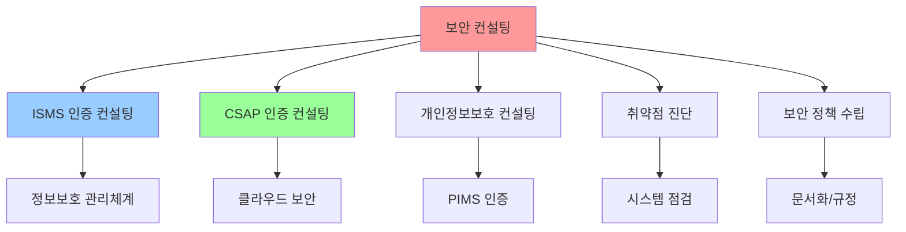

💡 **중요!** 보안 컨설팅은 단순히 기술적인 조언만 제공하는 것이 아닙니다. 조직의 정책, 프로세스, 기술, 사람 등 모든 요소를 종합적으로 고려하여 보안 수준을 향상시키는 것이 목표입니다.


### 왜 인증 제도를 배우는가?

**강사님의 설명:**
> "컨설팅을 하려면 기준이 필요합니다. 우리가 어느 범위를 봐야 하는지, 어떤 항목들을 점검해야 하는지 알아야 합니다. 그 기준이 바로 인증 제도입니다."

**인증 제도 학습의 목적:**

| 목적 | 설명 | 실무 적용 |
|:---:|:---:|:---:|
| **범위 설정** | 컨설팅할 영역을 명확히 정의 | 누락 없이 전체를 다룸 |
| **기준 마련** | 객관적인 평가 기준 확보 | 일관된 품질 보장 |
| **전문성 확보** | 인증 제도 기반의 전문적 조언 | 신뢰도 향상 |
| **법적 요구사항** | 법규 준수 여부 확인 | 법적 리스크 감소 |

📌 **노트**: 실제 보안 컨설팅 업무에서는 ISMS나 CSAP 같은 인증 제도의 요구사항을 기반으로 고객사를 평가하고 개선 방안을 제시합니다.


### 주요 보안 인증 제도 개요

한국에는 여러 보안 관련 인증 제도가 있습니다. 이 중 가장 대표적인 두 가지를 중점적으로 학습합니다.

#### 1️⃣ ISMS (Information Security Management System)

**정식 명칭**: 정보보호 관리체계 인증

**개요:**
- 조직의 정보 자산을 보호하기 위한 **관리체계**가 잘 구축되어 있는지 평가
- 기술적 보안뿐만 아니라 **관리적, 물리적 보안**도 포함
- 한국인터넷진흥원(KISA)에서 인증 수행

**대상:**
- 일정 규모 이상의 정보통신서비스 제공자 (의무 대상)
- 보안 수준을 입증하고자 하는 기업 (자율 대상)

💡 **중요!** ISMS는 단순히 보안 기술만 보는 것이 아닙니다. **"관리체계"**라는 이름에서 알 수 있듯이, 보안을 지속적으로 관리하고 개선하는 **프로세스와 조직**이 잘 갖춰져 있는지를 중점적으로 봅니다.

#### 2️⃣ CSAP (Cloud Service Assurance Program)

**정식 명칭**: 클라우드 서비스 정보보호 인증

**개요:**
- **클라우드 서비스**를 제공하는 기업의 정보보호 수준을 평가
- 클라우드 환경의 특성(가상화, 다중 임대, 탄력성 등)을 고려한 인증
- 과학기술정보통신부와 KISA에서 주관

**대상:**
- AWS, Azure, GCP 같은 퍼블릭 클라우드 제공자
- 프라이빗 클라우드를 운영하는 기업
- SaaS, PaaS, IaaS 서비스 제공자

📌 **노트**: CSAP는 ISMS를 기반으로 하되, 클라우드 환경에 특화된 항목들이 추가되어 있습니다. 예를 들어 가상화 보안, 데이터 이전, 서비스 공급망 관리 등이 포함됩니다.

#### 3️⃣ 기타 인증 제도

**간략한 소개:**

| 인증 제도 | 목적 | 대상 |
|:---:|:---:|:---:|
| **PIMS** | 개인정보보호 관리체계 | 개인정보 처리 기업 |
| **ISO 27001** | 국제 정보보호 관리 표준 | 글로벌 기업 |
| **ISMS-P** | ISMS + 개인정보보호 통합 | 종합 인증 희망 기업 |

⚠️ **주의**: 이 강의에서는 ISMS와 CSAP를 중점적으로 다룹니다. 다른 인증 제도도 유사한 구조를 가지고 있어, 이 두 가지를 이해하면 다른 인증도 쉽게 대응할 수 있습니다.


### ISMS와 CSAP의 관계

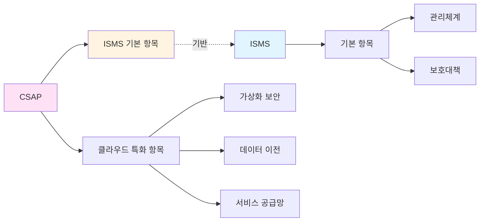

**관계 설명:**
- CSAP는 ISMS의 기본 개념을 **포함**하고 있음
- 클라우드 환경의 특성을 반영한 **추가 항목**이 있음
- 두 인증 제도의 항목들은 서로 **매핑**이 가능함

💡 **중요!** ISMS를 이해하면 CSAP를 이해하기 쉽고, CSAP를 이해하면 클라우드 보안의 특수성을 파악할 수 있습니다.


### 인증 항목의 구조

보안 인증 제도는 일반적으로 다음과 같은 구조로 되어 있습니다:

#### 계층 구조

```
[대분류] - [중분류] - [소분류] - [세부 항목]
```

**예시 (CSAP):**

```
1. 정책 및 조직
  1.1 정보보호 정책
    1.1.1 정보보호 정책 수립
    1.1.2 정보보호 정책 승인 및 공표
    1.1.3 정보보호 정책 검토 및 개선
```

📌 **노트**: 각 항목은 번호로 체계적으로 구분되어 있어, 특정 항목을 참조하거나 매핑할 때 편리합니다.

#### 항목의 구성 요소

각 인증 항목은 다음 요소로 구성됩니다:

| 요소 | 설명 | 예시 |
|:---:|:---:|:---:|
| **제목** | 항목의 이름 | "정보보호 정책 수립" |
| **요구사항** | 반드시 갖춰야 할 사항 | "정책을 문서화하여야 한다" |
| **설명** | 세부적인 지침 | "정책에는 목적, 범위, 책임 등이 포함되어야 함" |
| **점검 항목** | 실제 점검 시 확인할 내용 | "정책 문서가 존재하는가?" |


### 보안의 3가지 영역

인증 제도의 항목들은 크게 **3가지 보안 영역**으로 분류할 수 있습니다.

#### 보안 영역 분류

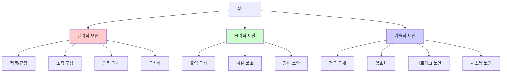

#### 1️⃣ 관리적 보안 (Administrative Security)

**정의**: 조직, 정책, 절차 등 **관리 측면**에서의 보안

**주요 내용:**
- ✅ **정책 수립**: 정보보호 정책, 지침, 절차 문서 작성
- ✅ **조직 구성**: 정보보호 조직, 역할과 책임 정의
- ✅ **인력 관리**: 직원 교육, 보안 서약, 권한 관리
- ✅ **감사 및 평가**: 정기적인 점검 및 개선

**예시:**
```markdown
[관리적 보안의 예]

**정보보호 정책 문서:**
- 최고경영자 승인을 받은 정보보호 정책
- 임직원에게 공표되고 교육됨
- 연 1회 이상 검토 및 갱신

**조직 구성:**
- CISO(최고정보보호책임자) 지정
- 정보보호 위원회 운영
- 보안 담당 부서 설치
```

💡 **중요!** 관리적 보안은 기술적 보안의 **기반**이 됩니다. 아무리 좋은 보안 기술을 도입해도, 이를 관리하는 체계가 없으면 지속가능하지 않습니다.

#### 2️⃣ 물리적 보안 (Physical Security)

**정의**: 하드웨어, 시설 등 **물리적 자산**을 보호하는 보안

**주요 내용:**
- ✅ **출입 통제**: 서버실, 사무실 접근 제한
- ✅ **시설 보호**: 화재, 수해, 정전 등 물리적 위협 대응
- ✅ **장비 보안**: 서버, 네트워크 장비 등의 보호
- ✅ **매체 관리**: 하드디스크, USB 등 저장 매체 관리

**예시:**
```markdown
[물리적 보안의 예]

**출입 통제:**
- 서버실: 생체 인식 출입 시스템
- 사무실: 카드키 출입 시스템
- 방문자: 방문 신청 및 동행 필수

**시설 보호:**
- 화재 감지 및 소화 설비
- 항온항습 시스템
- UPS(무정전 전원 장치)
- 이중 전원선

**장비 보안:**
- 서버 랙 잠금장치
- 케이블 정리 및 보호
- CCTV 설치
```

📌 **노트**: 최근 SK C&C 판교 데이터센터 화재 사고(2024년)처럼, 물리적 보안 사고는 막대한 피해를 초래할 수 있습니다. 아무리 사이버 보안이 완벽해도, 물리적 재해로 시스템이 파괴되면 소용없습니다.

#### 3️⃣ 기술적 보안 (Technical Security)

**정의**: 정보 시스템과 네트워크를 **기술적으로** 보호하는 보안

**주요 내용:**
- ✅ **접근 통제**: 사용자 인증, 권한 관리, 로그인 보안
- ✅ **암호화**: 데이터 암호화, 통신 구간 암호화, 암호 키 관리
- ✅ **네트워크 보안**: 방화벽, IDS/IPS, VPN, 네트워크 분리
- ✅ **시스템 보안**: 악성코드 방지, 패치 관리, 취약점 점검
- ✅ **애플리케이션 보안**: 보안 코딩, 입력값 검증, 세션 관리

**예시:**
```markdown
[기술적 보안의 예]

**접근 통제:**
- 2단계 인증(2FA/MFA)
- 비밀번호 정책 (복잡도, 주기적 변경)
- 권한 분리 (RBAC)
- 로그 기록 및 모니터링

**암호화:**
- DB 암호화 (AES-256)
- 통신 구간 암호화 (TLS 1.2 이상)
- 개인정보 암호화
- 암호 키 주기적 변경

**네트워크 보안:**
- 방화벽 정책
- DMZ 구성
- 네트워크 분리 (개발망/운영망)
- IDS/IPS 운영
```

💡 **중요!** 기술적 보안은 가장 직관적이고 가시적인 보안입니다. 하지만 기술만으로는 부족하며, 관리적·물리적 보안과 함께 **종합적으로** 적용되어야 효과적입니다.


### 보안의 3대 목표: CIA Triad

보안을 통해 달성하고자 하는 핵심 목표는 **CIA**로 요약됩니다.

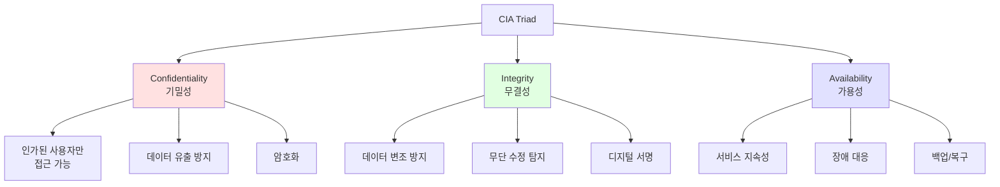

#### 1️⃣ Confidentiality (기밀성)

**정의**: 인가된 사용자만 정보에 접근할 수 있도록 보장

**위협 예시:**
- 해킹으로 인한 데이터 유출
- 내부자에 의한 정보 유출
- 네트워크 도청
- 물리적 매체 분실

**대응 방안:**
- 🔒 **암호화**: 저장 데이터 및 전송 데이터 암호화
- 🔑 **접근 통제**: 인증, 권한 관리
- 🛡️ **네트워크 보안**: VPN, SSL/TLS
- 📝 **정책**: 비밀 유지 서약, 데이터 분류

#### 2️⃣ Integrity (무결성)

**정의**: 데이터가 무단으로 변경되지 않았음을 보장

**위협 예시:**
- 해킹으로 인한 데이터 변조
- 전송 중 데이터 손상
- 악성코드에 의한 파일 변조
- 시스템 오류로 인한 데이터 손실

**대응 방안:**
- ✍️ **해시**: 데이터 무결성 검증 (SHA-256)
- 🔏 **디지털 서명**: 송신자 인증 및 변조 방지
- 📊 **로그 관리**: 변경 이력 추적
- 🔄 **버전 관리**: 변경 사항 추적

#### 3️⃣ Availability (가용성)

**정의**: 필요할 때 언제든지 시스템과 데이터를 사용할 수 있도록 보장

**위협 예시:**
- DDoS 공격
- 시스템 장애
- 자연 재해 (화재, 수해)
- 랜섬웨어

**대응 방안:**
- 💾 **백업**: 정기적인 백업 및 복구 훈련
- 🔄 **이중화**: 서버, 네트워크 이중화
- 🛡️ **DDoS 방어**: Anti-DDoS 솔루션
- 🏗️ **DR/BCP**: 재해 복구 계획

💡 **중요!** CIA 세 가지 목표는 때로 서로 **상충**될 수 있습니다. 예를 들어, 강력한 암호화(기밀성 강화)는 성능을 저하시켜 가용성을 해칠 수 있습니다. 보안 컨설팅에서는 이러한 균형을 적절히 맞추는 것이 중요합니다.


## 🔄 인증 제도 간의 유사성

### 항목 구조의 공통점

강사님께서 CSAP와 ISMS를 비교하며 강조한 내용:

> "인증 제도들을 보면 비슷한 내용이 반복됩니다. 한 번 익숙해지면 다른 인증도 쉽게 이해할 수 있습니다."

**공통 항목 예시:**

| 영역 | CSAP | ISMS | 공통 개념 |
|:---:|:---:|:---:|:---:|
| **정책** | 정보보호 정책 수립 | 관리체계 수립 | 정책 문서화 |
| **조직** | 정보보호 조직 구성 | 조직 및 책임 | 역할과 책임 정의 |
| **인적 보안** | 내부 인력 보안 | 인적 보안 | 직원 관리 |
| **자산 관리** | 자산 식별 및 분류 | 자산 분류 및 관리 | 자산 목록 작성 |
| **위험 관리** | 위험 관리 | 위험 평가 및 대응 | 위험 분석 |
| **접근 통제** | 접근 통제 | 접근권한 관리 | 인증 및 권한 |
| **암호** | 암호 정책 | 암호화 적용 | 암호화 |

📌 **노트**: 인증 제도마다 용어나 세부 항목은 다를 수 있지만, **핵심 개념**은 거의 동일합니다. 이것이 바로 한 가지 인증을 제대로 이해하면 다른 인증도 쉽게 대응할 수 있는 이유입니다.


### ISO 27001과의 관계

**ISO 27001**: 국제 표준 정보보호 관리 체계

**변천사:**
- **2013년 버전**: 14개 대분류, 35개 중분류, 114개 항목
- **2022년 버전**: 4개 대분류로 통합 및 재구성

**2022년 버전의 분류:**

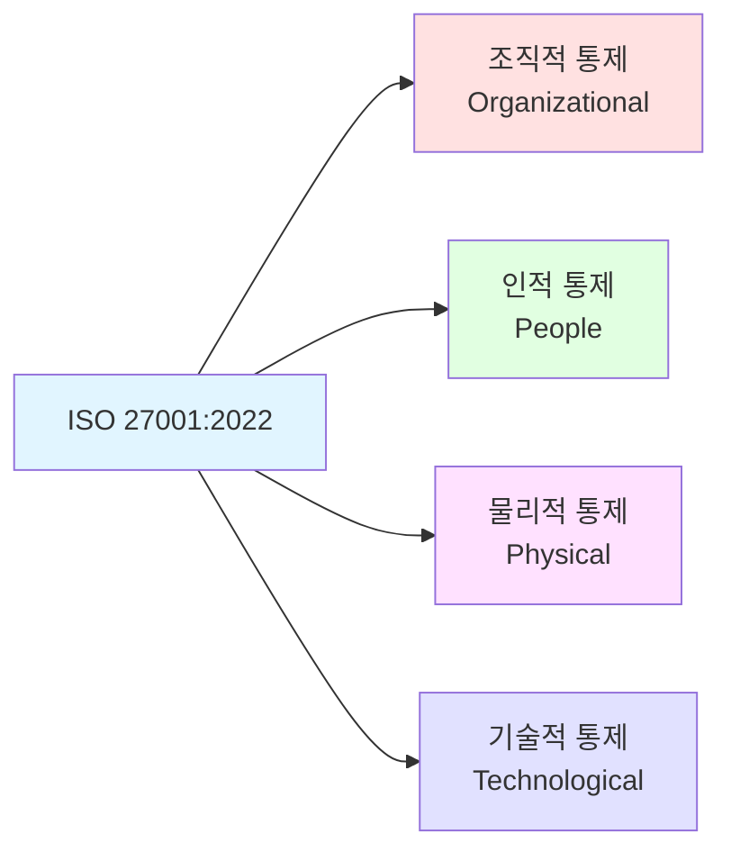

💡 **중요!** ISO 27001의 2022년 개정에서 항목들을 **조직적, 인적, 물리적, 기술적**으로 재분류한 것은, 앞서 배운 **관리적·물리적·기술적 보안**의 분류와 일맥상통합니다.


## 📊 다음 섹션 예고

지금까지 보안 인증 제도의 기초 개념을 배웠습니다. 다음 섹션에서는 **CSAP 인증 항목**을 하나하나 상세히 살펴보겠습니다.

**Section 3 미리보기:**
- 📋 1. 정책 및 조직: 정책 수립, 조직 구성, 역할 정의
- 👥 2. 인적 보안: 내부/외부 인력 관리, 교육
- 📦 3. 자산 관리: 자산 식별, 분류, 책임

각 항목마다:
- ✅ 요구사항이 무엇인지
- ✅ 왜 필요한지
- ✅ 실무에서 어떻게 적용하는지
- ✅ 점검 시 무엇을 확인하는지

를 상세히 다룰 것입니다.


## ✅ Section 2 학습 체크리스트

- [ ] 보안 컨설팅이 무엇인지 설명할 수 있다
- [ ] ISMS와 CSAP의 차이점과 공통점을 이해했다
- [ ] 인증 제도를 배우는 이유를 설명할 수 있다
- [ ] 관리적·물리적·기술적 보안의 차이를 안다
- [ ] CIA Triad (기밀성, 무결성, 가용성)을 설명할 수 있다
- [ ] 인증 항목의 계층 구조를 이해했다
- [ ] 다양한 인증 제도의 유사성을 파악했다


## 📋 Section 2 핵심 요약

1. **보안 컨설팅**
   - 조직의 보안 수준 향상을 돕는 전문 서비스
   - ISMS, CSAP 등 인증 제도 기반으로 수행
   - 기술뿐만 아니라 정책, 조직, 인력도 다룸

2. **주요 인증 제도**
   - ISMS: 정보보호 관리체계 (전반적인 보안 관리)
   - CSAP: 클라우드 보안 인증 (클라우드 특화)
   - 기타: PIMS, ISO 27001, ISMS-P 등

3. **보안의 3가지 영역**
   - 관리적 보안: 정책, 조직, 절차
   - 물리적 보안: 시설, 장비, 출입 통제
   - 기술적 보안: 암호화, 접근 통제, 네트워크

4. **보안의 3대 목표 (CIA)**
   - Confidentiality (기밀성): 인가된 사용자만 접근
   - Integrity (무결성): 데이터 변조 방지
   - Availability (가용성): 서비스 지속성 보장

5. **인증 제도의 공통점**
   - 유사한 항목 구조
   - 핵심 개념은 동일
   - 한 가지를 이해하면 다른 것도 쉬움


## 📋 CSAP 인증 항목 상세 분석 (Part 1)

### 서론: CSAP 항목 구조

CSAP (클라우드 서비스 정보보호 인증)은 총 **13개 대분류**로 구성되어 있습니다. 각 대분류 아래에는 여러 중분류와 세부 항목이 있습니다.

**CSAP 13개 대분류 개요:**

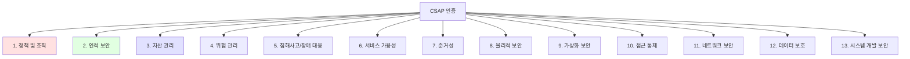

💡 **중요!** 이 섹션에서는 앞의 3개 대분류(정책 및 조직, 인적 보안, 자산 관리)를 집중적으로 다룹니다. 항목이 많아 보이지만, 핵심 개념을 이해하면 자연스럽게 연결됩니다.


## 1️⃣ 정책 및 조직 (Policy and Organization)

### 1.1 정보보호 정책 (Information Security Policy)

#### 왜 정책이 필요한가?

**강사님의 설명:**
> "인증을 받으려면 먼저 정책을 만들어야 합니다. 정책이 없으면 아무것도 시작할 수 없습니다."

**정책의 역할:**

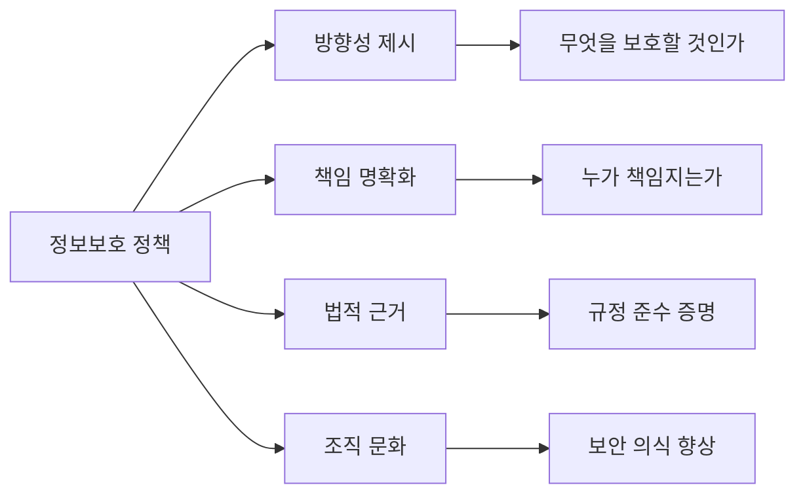

📌 **노트**: 정책은 단순한 문서가 아닙니다. 조직 전체의 보안 활동의 **나침반** 역할을 합니다.


#### 1.1.1 정보보호 정책 수립

**요구사항:**
- 클라우드 서비스의 **정보보호 정책**을 수립하여야 한다
- 정책에는 목적, 범위, 역할과 책임, 준수사항 등이 포함되어야 한다

**정책에 포함되어야 할 내용:**

| 항목 | 설명 | 예시 |
|:---:|:---:|:---:|
| **목적** | 왜 이 정책이 필요한가 | "고객 데이터 보호 및 서비스 안정성 확보" |
| **범위** | 어디까지 적용되는가 | "모든 클라우드 서비스 및 관련 인프라" |
| **역할과 책임** | 누가 무엇을 담당하는가 | "CISO: 정책 총괄, 보안팀: 기술적 통제" |
| **준수사항** | 무엇을 지켜야 하는가 | "암호화 사용, 접근 통제, 로그 관리" |
| **벌칙** | 위반 시 어떻게 되는가 | "징계, 법적 조치" |

**정책 수립 프로세스:**

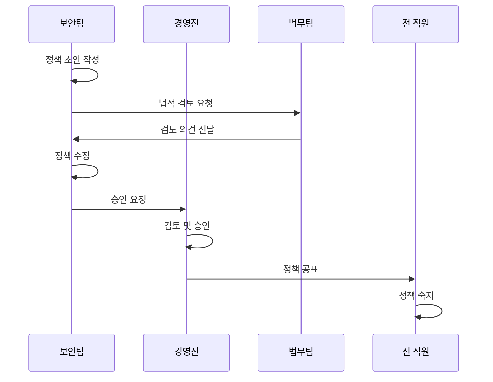

💡 **중요!** 정책은 반드시 **최고경영자의 승인**을 받아야 합니다. 이는 정책의 권위와 실효성을 보장하기 위함입니다.


#### 1.1.2 정보보호 정책 승인 및 공표

**요구사항:**
- 수립된 정보보호 정책은 **최고경영자의 승인**을 받아야 한다
- 승인된 정책은 조직 내 **모든 구성원에게 공표**되어야 한다

**실무 적용 예시:**

```markdown
[정책 승인 및 공표 절차]

**승인:**
1. 보안팀이 정책 초안 작성
2. 관련 부서 검토 (법무, IT, 인사 등)
3. CISO가 최종 검토
4. CEO가 승인 서명

**공표:**
1. 전사 공지 (이메일, 게시판)
2. 정책 문서 공유 (인트라넷)
3. 필수 교육 실시
4. 서약서 징구
```

⚠️ **주의**: 정책을 만들기만 하고 직원들이 모르면 의미가 없습니다. 반드시 **공표**하고 **교육**해야 합니다.


#### 1.1.3 정보보호 정책 검토 및 개선

**요구사항:**
- 정보보호 정책은 **주기적으로 검토**되어야 한다
- 필요 시 **개선** 및 **갱신**되어야 한다

**검토 주기:**
- **정기 검토**: 최소 연 1회
- **수시 검토**: 다음의 경우 즉시 검토
  - 법규 변경
  - 중대한 침해사고 발생
  - 서비스 구조 변경
  - 새로운 위협 출현

**검토 프로세스:**

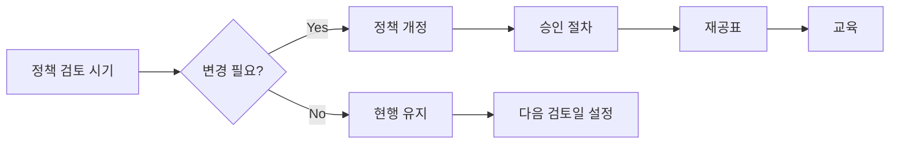

📌 **노트**: 정보보호는 고정된 것이 아닙니다. 기술, 위협, 법규가 계속 변화하므로, 정책도 **살아있는 문서**로 관리해야 합니다.


### 1.2 정보보호 조직 (Information Security Organization)

#### 왜 조직이 필요한가?

정책을 만들었으면, 그것을 **실행**할 조직이 필요합니다.

**조직의 역할:**

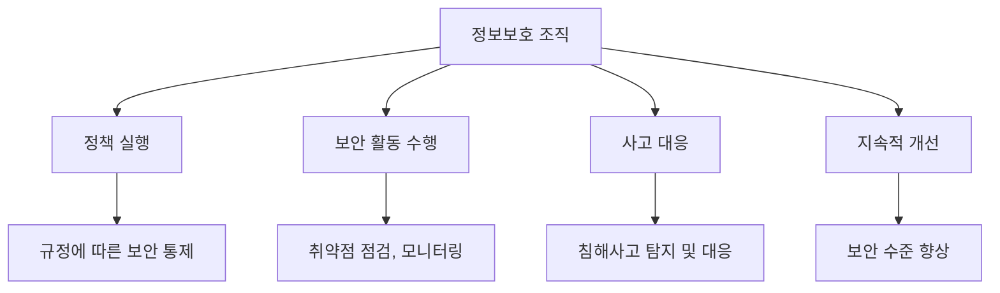

#### 1.2.1 정보보호 조직 구성

**요구사항:**
- 정보보호 활동을 수행할 **전담 조직**을 구성하여야 한다
- 조직의 **역할과 책임**을 명확히 정의하여야 한다

**조직 구성 예시:**

```
[대기업 정보보호 조직 구조]

CEO
 └─ CISO (Chief Information Security Officer)
     ├─ 정보보호 위원회
     ├─ 보안 정책팀
     │   └─ 정책 수립/관리, 컴플라이언스
     ├─ 보안 운영팀
     │   └─ 취약점 점검, 모니터링, 사고 대응
     ├─ 보안 기술팀
     │   └─ 보안 시스템 구축/운영
     └─ 보안 교육팀
         └─ 보안 인식 제고, 교육 실시
```

```
[중소기업 정보보호 조직 구조]

CEO
 └─ IT팀장 (정보보호 책임자 겸임)
     ├─ 보안 담당자 1명
     │   └─ 정책, 점검, 모니터링 통합
     └─ 외부 컨설팅 (필요 시)
```

💡 **중요!** 조직의 크기는 회사 규모에 따라 다를 수 있습니다. 중요한 것은 **전담 인력**이 있고, **역할이 명확**하다는 점입니다.


#### 1.2.2 정보보호 책임자 지정

**요구사항:**
- **최고정보보호책임자(CISO)**를 지정하여야 한다
- CISO는 경영진에 직접 보고할 수 있는 권한을 가져야 한다

**CISO의 역할:**

| 역할 | 설명 | 중요도 |
|:---:|:---:|:---:|
| **정책 총괄** | 정보보호 정책 수립 및 관리 | ⭐⭐⭐⭐⭐ |
| **위험 관리** | 정보보호 위험 평가 및 대응 | ⭐⭐⭐⭐⭐ |
| **사고 대응** | 침해사고 발생 시 총괄 지휘 | ⭐⭐⭐⭐⭐ |
| **경영진 보고** | 보안 현황 및 이슈 보고 | ⭐⭐⭐⭐ |
| **예산 관리** | 정보보호 예산 수립 및 집행 | ⭐⭐⭐⭐ |

⚠️ **주의**: CISO는 단순히 기술 담당자가 아닙니다. **경영진과 소통**하고, **전사적 보안 전략**을 수립하는 **리더십 역할**입니다.


## 2️⃣ 인적 보안 (Human Resource Security)

### 서론: 사람이 가장 중요하다

**강사님의 강조:**
> "아무리 기술이 좋아도 사람이 문제를 일으키면 소용없습니다. 내부자 위협이 가장 무섭습니다."

**인적 보안의 필요성:**

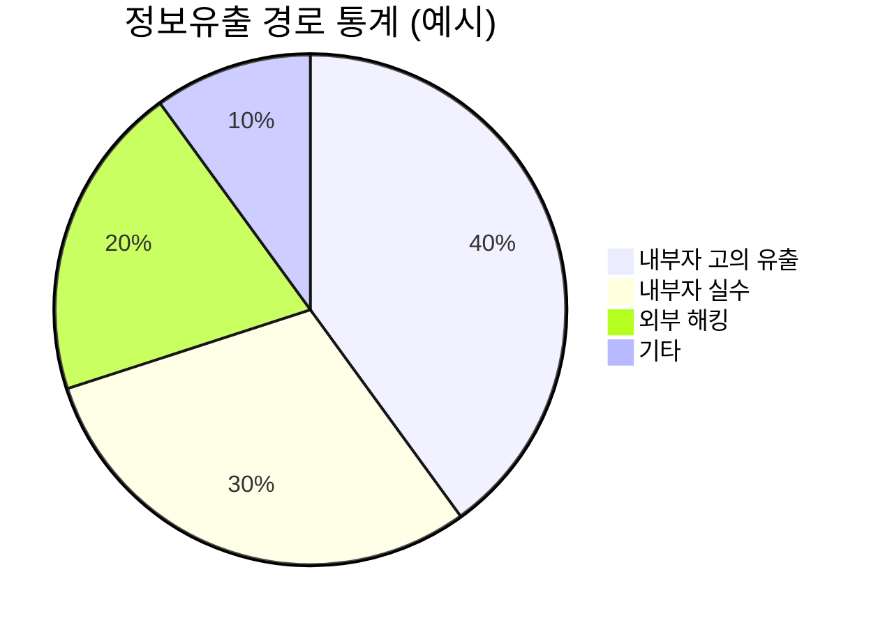

📌 **노트**: 실제로 많은 정보유출 사고가 **내부자**에 의해 발생합니다. 기술적 보안만큼이나 **인적 보안**이 중요한 이유입니다.


### 2.1 내부 인력 보안 (Internal Personnel Security)

#### 2.1.1 고용 계약 (Employment Agreement)

**요구사항:**
- 직원 채용 시 **고용 계약서**에 정보보호 관련 조항을 포함시켜야 한다
- 조항에는 정보보호 정책 준수, 비밀 유지, 위반 시 벌칙 등이 포함되어야 한다

**고용 계약서에 포함할 정보보호 조항 예시:**

```markdown
제XX조 (정보보호 의무)

① 직원은 회사의 정보보호 정책 및 지침을 준수하여야 한다.

② 직원은 업무상 취득한 회사 및 고객의 정보를 외부에 누설하거나
   무단으로 사용하여서는 아니 된다.

③ 직원은 회사가 제공한 정보 자산(컴퓨터, 네트워크, 데이터 등)을
   업무 목적으로만 사용하여야 한다.

④ 본 조항을 위반할 경우, 회사는 민·형사상 책임을 물을 수 있으며,
   징계 절차에 따라 처벌할 수 있다.
```

💡 **중요!** 고용 계약서에 이러한 조항이 있어야, 나중에 문제가 발생했을 때 **법적 근거**를 가질 수 있습니다.


#### 2.1.2 주요 직무자 지정 및 감독 (Critical Personnel Management)

**요구사항:**
- 보안상 중요한 업무를 수행하는 **주요 직무자**를 지정하여야 한다
- 주요 직무자에 대한 **관리 및 감독**을 강화하여야 한다

**주요 직무자란?**

시스템 운영, 개발, 정보보호 등 **보안 사고 시 큰 영향을 줄 수 있는 업무**를 담당하는 직원입니다.

**주요 직무자 예시:**

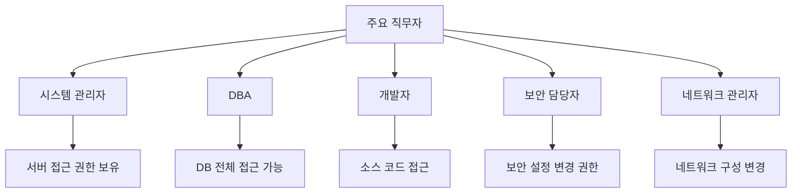

**관리 방법:**

| 관리 항목 | 설명 | 예시 |
|:---:|:---:|:---:|
| **신원 조회** | 채용 시 신원 확인 강화 | 경력 조회, 범죄 경력 조회 |
| **보안 교육** | 강화된 보안 교육 실시 | 연 4회 (일반 직원은 연 1회) |
| **접근 기록** | 모든 접근 활동 로그 기록 | 상세 로그, 정기 검토 |
| **이중 승인** | 중요 작업 시 승인 절차 | 관리자 승인 후 작업 |
| **정기 점검** | 권한 및 활동 정기 검토 | 분기별 점검 |

⚠️ **주의**: 주요 직무자는 **최소한**으로 지정해야 합니다. 너무 많으면 관리가 어렵고, 오히려 보안이 약해질 수 있습니다.


#### 2.1.3 직무 분리 (Separation of Duties)

**요구사항:**
- **권한 오남용**을 방지하기 위해 직무를 적절히 분리하여야 한다
- 한 사람이 처음부터 끝까지 모든 작업을 독단적으로 수행하지 못하도록 해야 한다

**직무 분리의 원칙:**

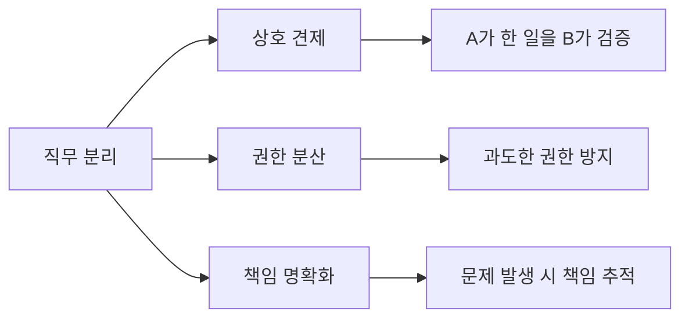

**직무 분리 예시:**

**나쁜 예 (직무 미분리):**
```
[시스템 관리자 A]
- 서버 접근 권한 보유
- 로그 관리 권한 보유
- 보안 설정 변경 권한 보유

→ A가 악의적인 행동을 하고 로그를 삭제하면 추적 불가능!
```

**좋은 예 (직무 분리):**
```
[시스템 관리자 A]
- 서버 접근 권한 보유
- 서버 설정 변경 권한 보유

[보안 담당자 B]
- 로그 관리 권한 보유
- 로그 분석 및 모니터링

→ A가 악의적 행동을 해도, B가 로그를 통해 탐지 가능!
```

**실무 적용 사례:**

| 업무 | 분리 전 | 분리 후 | 효과 |
|:---:|:---:|:---:|:---:|
| **배포** | 개발자가 직접 배포 | 개발자 개발 → 운영팀 배포 | 무단 배포 방지 |
| **권한 부여** | 관리자가 직접 권한 부여 | 신청 → 승인 → 부여 | 권한 오남용 방지 |
| **결제** | 재무 담당자가 결제 처리 | 요청 → 승인 → 결제 | 횡령 방지 |

💡 **중요!** 직무 분리는 **신뢰하지 않아서**가 아닙니다. **시스템적으로 오류를 방지**하고, **투명성을 확보**하기 위한 것입니다.


#### 2.1.4 비밀 유지 서약 (Non-Disclosure Agreement)

**요구사항:**
- 직원은 **비밀 유지 서약서**를 작성하여야 한다
- 서약서는 **정기적으로 갱신**하여야 한다

**비밀 유지 서약서 예시:**

```markdown
비밀 유지 서약서

본인은 재직 중 및 퇴사 후에도 다음 사항을 준수할 것을 서약합니다.

1. 회사의 영업 비밀, 기술 정보, 고객 정보 등을 외부에 누설하지 않겠습니다.
2. 업무상 취득한 정보를 무단으로 복사, 유출, 사용하지 않겠습니다.
3. 개인 소유의 저장 매체에 회사 정보를 저장하지 않겠습니다.
4. SNS, 블로그 등에 회사 관련 정보를 게시하지 않겠습니다.
5. 본 서약을 위반할 경우 법적 책임을 감수하겠습니다.

YYYY년 MM월 DD일
서명: ___________
```

**갱신 주기:**
- **정기 갱신**: 매년 1회
- **수시 갱신**: 직무 변경 시, 중요 프로젝트 투입 시

📌 **노트**: 서약서는 법적 효력을 가지므로, **명확하고 구체적으로** 작성해야 합니다.


#### 2.1.5 퇴직 및 직무 변경 (Termination and Job Change)

**요구사항:**
- 직원 퇴사 또는 직무 변경 시 적절한 **절차**를 수행하여야 한다
- 모든 **자산을 회수**하고, **접근 권한을 즉시 해지**하여야 한다

**퇴직 절차 체크리스트:**

```markdown
[ ] 1. 퇴사 신청서 접수
[ ] 2. 업무 인수인계 완료
[ ] 3. 회사 자산 반납
    [ ] 노트북
    [ ] 휴대폰
    [ ] 출입 카드
    [ ] USB, 외장 하드
    [ ] 기타 장비
[ ] 4. 계정 및 권한 해지
    [ ] 이메일 계정
    [ ] 사내 시스템 계정
    [ ] VPN 접근 권한
    [ ] 서버 접근 권한
    [ ] 데이터베이스 권한
[ ] 5. 데이터 삭제 확인
    [ ] 개인 PC 내 회사 데이터 삭제
    [ ] 클라우드 저장소 확인
[ ] 6. 비밀 유지 서약 재확인
[ ] 7. 퇴사 면담 실시
```

⚠️ **주의**: 퇴사자의 계정을 즉시 해지하지 않으면, **퇴사 후에도 접근이 가능**하여 심각한 보안 사고로 이어질 수 있습니다.

**직무 변경 시 점검 사항:**

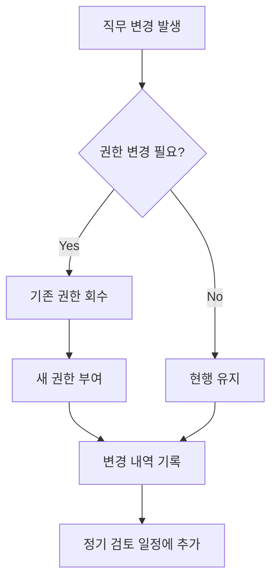

💡 **중요!** 직무가 변경되면 **권한도 반드시 함께 변경**되어야 합니다. 이전 업무의 권한이 남아있으면 불필요한 접근이 가능해집니다.


### 2.2 외부 인력 보안 (External Personnel Security)

#### 왜 외부 인력도 관리해야 하는가?

**강사님의 설명:**
> "외부 협력업체 직원도 우리 시스템에 접근합니다. 그들도 내부자만큼 위험할 수 있습니다."

**외부 인력 예시:**
- 🔧 유지보수 업체 직원
- 💻 SI/아웃소싱 개발자
- 🏢 파견 근무자
- 🧹 청소 용역 직원

#### 2.2.1 외부 인력 계약 (External Personnel Contract)

**요구사항:**
- 외부 인력 계약 시 **정보보호 요구사항**을 명시하여야 한다
- 계약서에 보안 준수 사항을 포함하여야 한다

**계약서 포함 내용:**

```markdown
[외부 인력 계약서 - 정보보호 조항]

제XX조 (정보보호 준수)
1. 계약자는 을(계약업체)의 정보보호 정책을 준수하여야 한다.
2. 계약자는 업무 수행 중 취득한 정보를 외부에 누설하지 않는다.
3. 계약자는 승인된 장비만 사용하며, 개인 장비 사용을 금지한다.

제XX조 (보안 교육)
계약자는 업무 시작 전 을의 보안 교육을 이수하여야 한다.

제XX조 (접근 권한)
계약자의 시스템 접근 권한은 업무 범위 내로 최소화한다.

제XX조 (작업 기록)
계약자의 모든 작업은 로그로 기록되며, 정기적으로 검토된다.

제XX조 (계약 종료)
계약 종료 시 모든 자료를 반납하고, 접근 권한을 즉시 해지한다.
```


#### 2.2.2 외부 인력 이행 관리 (Performance Monitoring)

**요구사항:**
- 외부 인력이 계약 내용을 **실제로 준수**하는지 주기적으로 점검하여야 한다

**점검 항목:**

| 점검 항목 | 점검 방법 | 주기 |
|:---:|:---:|:---:|
| **보안 교육 이수** | 교육 이수 확인서 | 매년 |
| **접근 로그 검토** | 시스템 로그 분석 | 월 1회 |
| **작업 내역 확인** | 작업 보고서 검토 | 주 1회 |
| **보안 수칙 준수** | 현장 점검 | 분기 1회 |


#### 2.2.3 계약 만료 시 절차 (Contract Termination)

**요구사항:**
- 외부 인력 계약 종료 시 적절한 절차를 수행하여야 한다
- 자산 반납, 접근 권한 해지, 정보 파기 등을 수행하여야 한다

**계약 만료 시 체크리스트:**

```markdown
[ ] 1. 사전 통지 (계약 만료 1개월 전)
[ ] 2. 업무 인수인계 (계약 만료 2주 전)
[ ] 3. 자산 반납 (계약 만료일)
    [ ] 출입 카드
    [ ] 임시 장비 (노트북 등)
    [ ] 회사 자료
[ ] 4. 접근 권한 해지 (계약 만료일)
    [ ] 시스템 계정
    [ ] VPN 권한
    [ ] 서버 접근 권한
[ ] 5. 중요 정보 파기 확인
    [ ] 개인 PC 내 데이터 삭제 확인
    [ ] 이메일 백업 삭제
[ ] 6. 비밀 유지 서약 재확인
[ ] 7. 최종 확인서 징구
```

💡 **중요!** 외부 인력은 **계약 만료 즉시** 모든 권한이 해지되어야 합니다. "다음 프로젝트도 할 예정"이라는 이유로 권한을 유지하면 안 됩니다.


### 2.3 정보보호 교육 (Information Security Training)

#### 왜 교육이 중요한가?

**강사님의 강조:**
> "사람이 보안의 가장 약한 고리입니다. 교육을 통해 보안 의식을 높여야 합니다."

**교육의 효과:**

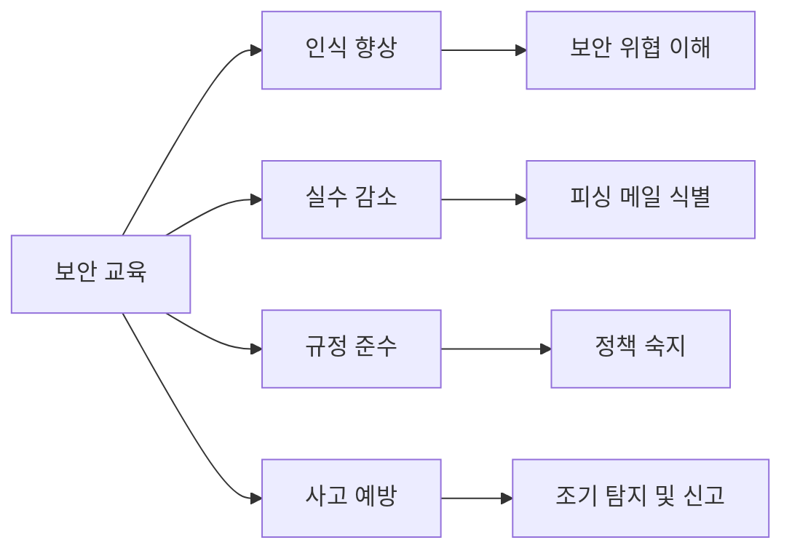


#### 2.3.1 교육 프로그램 수립

**요구사항:**
- **연간 교육 계획**을 수립하여야 한다
- 교육은 **정기적으로** 실시되어야 한다

**연간 교육 계획 예시:**

| 시기 | 대상 | 주제 | 시간 |
|:---:|:---:|:---:|:---:|
| **1월** | 전 직원 | 신년 보안 교육 (연간 의무 교육) | 2시간 |
| **3월** | 개발자 | 시큐어 코딩 교육 | 4시간 |
| **5월** | 전 직원 | 피싱 메일 대응 교육 | 1시간 |
| **7월** | 주요 직무자 | 심화 보안 교육 | 4시간 |
| **9월** | 전 직원 | 개인정보보호 교육 | 2시간 |
| **11월** | 신입사원 | 입문 보안 교육 | 3시간 |

**교육 내용 구성:**

```markdown
[필수 교육 내용]

1. 정보보호 정책 및 규정
   - 회사 정보보호 정책 소개
   - 직원의 의무와 책임
   - 위반 시 벌칙

2. 보안 위협 및 사고 사례
   - 최신 보안 위협 동향
   - 실제 사고 사례 분석
   - 교훈 및 대응 방법

3. 실무 보안 수칙
   - 비밀번호 관리
   - 이메일 보안 (피싱 대응)
   - 소셜 엔지니어링 대응
   - 정보 유출 방지

4. 사고 발생 시 대응
   - 침해사고 신고 절차
   - 긴급 연락처
   - 초기 대응 요령
```


#### 2.3.2 교육 시행 및 평가

**요구사항:**
- 교육을 **실제로 시행**하여야 한다
- 교육 결과를 **기록**하고 **평가**하여야 한다

**교육 시행 방법:**

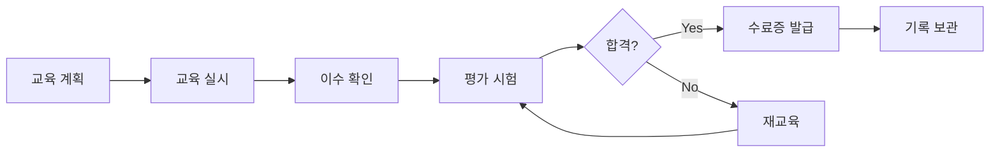

**기록 관리:**

| 기록 항목 | 설명 | 보관 기간 |
|:---:|:---:|:---:|
| **교육 일시** | 교육 실시 날짜 및 시간 | 3년 |
| **교육 내용** | 교육 주제 및 커리큘럼 | 3년 |
| **참석자 명단** | 교육 이수자 목록 | 3년 |
| **평가 결과** | 시험 점수, 수료 여부 | 3년 |
| **수료증** | 교육 이수 증명서 | 영구 |

**교육 평가 방법:**

```markdown
[교육 평가 기준]

1. 출석 (필수)
   - 교육 시간의 80% 이상 출석

2. 이해도 평가 (온라인 퀴즈)
   - 70점 이상 합격
   - 불합격 시 재교육

3. 실습 평가 (해당 시)
   - 피싱 메일 식별 테스트
   - 비밀번호 강도 점검
```


#### 2.3.3 교육 개선

**요구사항:**
- 교육 결과를 분석하여 **개선**하여야 한다

**개선 프로세스:**

```mermaid
sequenceDiagram
    participant A as 교육 담당자
    participant B as 수강생
    participant C as 경영진

    A->>B: 교육 실시
    B->>A: 설문 조사 응답
    A->>A: 교육 효과 분석
    A->>C: 개선 방안 보고
    C->>A: 승인
    A->>A: 다음 교육 반영
```

**개선 항목:**
- 📊 **교육 내용**: 최신 트렌드 반영, 사례 업데이트
- 🕐 **교육 시간**: 적절한 교육 시간 조정
- 🎓 **교육 방법**: 온라인/오프라인, 실습/이론 비율
- 👨‍🏫 **강사**: 내부 강사 vs 외부 전문가


## ✅ Section 3 학습 체크리스트

- [ ] 정보보호 정책의 중요성과 포함 내용을 이해했다
- [ ] 정책 승인 및 공표 절차를 설명할 수 있다
- [ ] 정보보호 조직의 구성과 CISO의 역할을 안다
- [ ] 주요 직무자가 누구인지, 왜 별도 관리가 필요한지 이해했다
- [ ] 직무 분리의 원칙과 실무 적용 방법을 안다
- [ ] 비밀 유지 서약의 중요성을 이해했다
- [ ] 퇴직 및 직무 변경 시 절차를 설명할 수 있다
- [ ] 외부 인력 보안 관리의 필요성을 이해했다
- [ ] 정보보호 교육의 중요성과 실시 방법을 안다


## 📋 Section 3 핵심 요약

1. **정책 및 조직**
   - 정책: 보안 활동의 방향성 제시, 최고경영자 승인 필수
   - 조직: 정책을 실행할 전담 조직, CISO 지정

2. **내부 인력 보안**
   - 고용 계약: 정보보호 조항 포함
   - 주요 직무자: 별도 관리 및 감독 강화
   - 직무 분리: 권한 오남용 방지, 상호 견제
   - 비밀 유지 서약: 정기적 징구
   - 퇴직/직무 변경: 즉시 권한 해지

3. **외부 인력 보안**
   - 계약 시 보안 요구사항 명시
   - 주기적 이행 점검
   - 계약 만료 시 즉시 권한 회수

4. **정보보호 교육**
   - 연간 교육 계획 수립
   - 정기적 교육 실시 및 기록
   - 교육 결과 평가 및 개선


## 📦 CSAP 인증 항목 상세 분석 (Part 2)

## 3️⃣ 자산 관리 (Asset Management)

### 왜 자산 관리가 필요한가?

**강사님의 설명:**
> "보안을 하려면 먼저 무엇을 보호해야 하는지 알아야 합니다. 그것이 자산 식별입니다."

**자산 관리의 필요성:**

```mermaid
graph LR
    A[자산 관리] --> B[대상 명확화]
    A --> C[책임 소재]
    A --> D[보안 활동 계획]

    B --> B1[무엇을 보호할 것인가]
    C --> C1[누가 책임지는가]
    D --> D1[점검 대상 확정]
```

💡 **중요!** 자산을 식별하지 않으면, 어떤 서버를 점검했고 어떤 서버를 점검하지 않았는지 알 수 없습니다. 체계적인 보안 활동의 **첫 단계**입니다.


### 3.1 자산 식별 및 분류 (Asset Identification and Classification)

#### 3.1.1 자산 식별

**요구사항:**
- 클라우드 서비스에 사용되는 **정보 자산을 식별**하여야 한다
- 식별된 자산의 **목록을 작성**하여야 한다

**정보 자산의 종류:**

| 자산 유형 | 예시 | 중요도 |
|:---:|:---:|:---:|
| **하드웨어** | 서버, 네트워크 장비, 스토리지 | 높음 |
| **소프트웨어** | 운영체제, DBMS, 애플리케이션 | 높음 |
| **데이터** | 고객 정보, 거래 데이터, 로그 | 매우 높음 |
| **문서** | 정책, 절차서, 계약서 | 중간 |
| **인력** | 시스템 관리자, 개발자 | 높음 |

**자산 목록 작성 예시:**

```markdown
[정보 자산 목록]

자산 ID: SRV-WEB-001
자산 명: 웹 서버 #1
자산 유형: 하드웨어 (서버)
위치: IDC A동 2층 랙 B-12
OS: Ubuntu 20.04 LTS
용도: 고객 포털 서비스
관리자: 홍길동
중요도: 높음
등록일: 2024-01-15
최종 점검일: 2024-12-20
```


#### 3.1.2 자산 책임 할당

**요구사항:**
- 각 자산에 대한 **책임자를 지정**하여야 한다
- 책임자는 해당 자산의 보안을 책임진다

**책임 유형:**

```mermaid
graph TD
    A[자산 책임] --> B[소유자<br/>Owner]
    A --> C[관리자<br/>Administrator]
    A --> D[사용자<br/>User]

    B --> B1[전체 책임]
    C --> C1[기술적 관리]
    D --> D1[사용 권한]
```


#### 3.1.3 보안 등급 분류

**요구사항:**
- 자산의 **중요도에 따라 등급**을 매겨야 한다
- 등급에 따라 **차등화된 보안**을 적용해야 한다

**보안 등급 예시:**

| 등급 | 설명 | 예시 | 보안 조치 |
|:---:|:---:|:---:|:---:|
| **극비** | 유출 시 치명적 피해 | 고객 결제 정보, 개인식별정보 | 암호화 필수, 접근 최소화 |
| **대외비** | 유출 시 심각한 피해 | 영업 비밀, 계약서 | 암호화 권장, 접근 제한 |
| **내부** | 유출 시 제한적 피해 | 내부 공지사항 | 접근 통제 |
| **공개** | 유출 가능 | 홈페이지 콘텐츠 | 무결성 보호 |


### 3.2 자산 변경 관리 (Asset Change Management)

#### 왜 변경 관리가 필요한가?

자산은 **고정되어 있지 않습니다**. 신규 도입, 교체, 폐기 등이 지속적으로 발생합니다.

**변경 관리 프로세스:**

```mermaid
flowchart LR
    A[변경 요청] --> B{승인 필요?}
    B -->|Yes| C[승인 절차]
    B -->|No| D[변경 실행]
    C --> E{승인됨?}
    E -->|Yes| D
    E -->|No| F[반려]
    D --> G[자산 목록 업데이트]
    G --> H[변경 기록]
```

#### 3.2.1 자산 변경 절차

**요구사항:**
- 자산 변경 시 **절차**를 수립하고 따라야 한다
- 변경 내역을 **기록**하여야 한다

**변경 유형:**

| 변경 유형 | 예시 | 절차 복잡도 |
|:---:|:---:|:---:|
| **신규 도입** | 새 서버 구매 | 높음 |
| **업그레이드** | 메모리 증설 | 중간 |
| **교체** | 노후 장비 교체 | 높음 |
| **폐기** | 구형 서버 폐기 | 높음 |
| **이전** | 서버 위치 변경 | 중간 |


#### 3.2.2 변경 탐지 및 모니터링

**요구사항:**
- **허가되지 않은 변경**을 탐지하여야 한다
- 변경 이력을 **모니터링**하여야 한다

**탐지 방법:**

```markdown
[자산 변경 탐지 도구]

1. 네트워크 스캐너
   - 정기적으로 네트워크 스캔
   - 신규/변경/삭제된 장비 탐지

2. 시스템 모니터링
   - 설정 파일 변경 감지
   - 소프트웨어 설치/제거 추적

3. 물리적 점검
   - 서버실 CCTV
   - 출입 기록 대조
```


### 3.3 자산 폐기 (Asset Disposal)

#### 왜 폐기 절차가 중요한가?

**강사님의 강조:**
> "하드디스크를 그냥 버리면 안 됩니다. 데이터가 복구될 수 있습니다."

#### 3.3.1 안전한 폐기 방법

**요구사항:**
- 저장 매체 폐기 시 **복구 불가능**하게 처리해야 한다

**폐기 방법:**

| 방법 | 설명 | 보안 수준 |
|:---:|:---:|:---:|
| **물리적 파쇄** | 기계로 분쇄 | 매우 높음 ⭐⭐⭐⭐⭐ |
| **소각** | 완전 연소 | 매우 높음 ⭐⭐⭐⭐⭐ |
| **데이터 덮어쓰기** | 여러 번 덮어쓰기 (7회 이상) | 높음 ⭐⭐⭐⭐ |
| **디가우저** | 강력한 자기장으로 데이터 소거 | 높음 ⭐⭐⭐⭐ |
| **단순 삭제** | 파일 삭제 또는 포맷 | 낮음 ⭐ (비권장) |

⚠️ **주의**: 단순 삭제나 포맷만으로는 **복구 소프트웨어로 데이터를 복원**할 수 있습니다. 반드시 **물리적 파쇄** 또는 **덮어쓰기**를 수행해야 합니다.


## 4️⃣ 위험 관리 (Risk Management)

### 위험 관리란?

**정의**: 정보 자산에 대한 **위협을 식별**하고, 그 **영향을 평가**하여, **적절히 대응**하는 프로세스

```mermaid
graph LR
    A[위험 관리] --> B[위험 식별]
    B --> C[위험 분석]
    C --> D[위험 평가]
    D --> E[위험 대응]
    E --> F[지속 모니터링]
    F --> B
```


### 4.1 위험 관리 계획

#### 4.1.1 위험 관리 방법론 수립

**요구사항:**
- 위험 관리 **방법과 절차**를 수립하여야 한다
- 관리적, 기술적, 물리적, 법적 분야를 **모두 고려**하여야 한다

**위험 관리 방법론:**

```markdown
[위험 관리 절차]

1. 위험 식별
   - 자산 식별
   - 위협 식별
   - 취약점 식별

2. 위험 분석
   - 발생 가능성 평가
   - 영향도 평가
   - 위험 수준 산정

3. 위험 평가
   - 허용 가능 수준과 비교
   - 우선순위 결정

4. 위험 대응
   - 회피, 감소, 전가, 수용 중 선택
   - 대응 방안 실행

5. 지속 모니터링
   - 정기적 재평가
   - 변경 사항 반영
```


### 4.2 취약점 점검 (Vulnerability Assessment)

#### 4.2.1 취약점 점검 실시

**요구사항:**
- **정기적으로** 취약점을 점검하여야 한다
- 점검 결과를 **기록**하고 **조치**하여야 한다

**취약점 점검 유형:**

| 점검 유형 | 설명 | 주기 |
|:---:|:---:|:---:|
| **시스템 점검** | OS, 미들웨어 취약점 | 월 1회 |
| **애플리케이션 점검** | 웹/앱 취약점 (OWASP Top 10) | 분기 1회 |
| **네트워크 점검** | 방화벽 정책, 포트 스캔 | 월 1회 |
| **물리적 점검** | 출입 통제, 시설 점검 | 분기 1회 |


### 4.3 위험 분석 및 평가

#### 4.3.1 위험 수준 산정

강사님께서 설명하신 **위험 매트릭스**를 활용합니다.

**위험 매트릭스:**

| 발생 빈도 \ 영향도 | 낮음 | 높음 |
|:---:|:---:|:---:|
| **낮음** | 보유 (Accept) | 전가 (Transfer) |
| **높음** | 통제 (Reduce) | 회피 (Avoid) |

**각 대응 전략 설명:**

```markdown
1. 회피 (Avoid) - 발생 빈도 높음 + 영향도 높음
   - 예: 너무 위험한 사업은 아예 하지 않음
   - 조치: 해당 서비스 중단, 시스템 폐기

2. 전가 (Transfer) - 발생 빈도 낮음 + 영향도 높음
   - 예: 화재, 자연재해
   - 조치: 보험 가입, 아웃소싱

3. 통제 (Reduce) - 발생 빈도 높음 + 영향도 낮음
   - 예: 일반적인 보안 취약점
   - 조치: 보안 패치, 통제 강화

4. 보유 (Accept) - 발생 빈도 낮음 + 영향도 낮음
   - 예: 경미한 이슈
   - 조치: 현상 유지, 지속 관찰
```

**실무 예시:**

```markdown
[위험 사례 1: SQL Injection 취약점]
- 발생 빈도: 높음 (자동화 공격 도구 존재)
- 영향도: 높음 (DB 전체 유출 가능)
- 위험 수준: 매우 높음
- 대응: 회피 (취약한 코드 제거) 또는 통제 (WAF 적용)

[위험 사례 2: 데이터센터 화재]
- 발생 빈도: 낮음 (드물게 발생)
- 영향도: 높음 (전체 서비스 중단)
- 위험 수준: 높음
- 대응: 전가 (보험) + 통제 (이중화, 백업)

[위험 사례 3: 내부 직원 퇴사]
- 발생 빈도: 높음 (자주 발생)
- 영향도: 낮음 (업무 인수인계 가능)
- 위험 수준: 중간
- 대응: 통제 (문서화, 이중화)

[위험 사례 4: 외부 주차장 도난]
- 발생 빈도: 낮음
- 영향도: 낮음
- 위험 수준: 낮음
- 대응: 보유 (현상 유지)
```


### 4.4 위험 대응 (Risk Treatment)

#### 4.4.1 위험 처리 계획 수립

**요구사항:**
- 평가된 위험에 대한 **처리 계획**을 수립하여야 한다
- 계획을 **실행**하고 **결과를 검증**하여야 한다

**위험 처리 계획 템플릿:**

```markdown
[위험 처리 계획서]

위험 ID: RISK-2024-001
위험 명: 웹 서버 SQL Injection 취약점
위험 수준: 높음

대응 전략: 통제 (Reduce)

조치 계획:
1. 단기 (1주 내):
   - WAF 규칙 추가
   - 긴급 패치 적용

2. 중기 (1개월 내):
   - 전체 코드 리뷰
   - Prepared Statement 적용

3. 장기 (3개월 내):
   - 개발자 보안 교육
   - 시큐어 코딩 가이드 수립

책임자: 보안팀 김철수
완료 기한: 2024-06-30
예산: 500만원
```


## 5️⃣ 침해사고 및 장애 대응

### 5.1 침해사고 관리 (Incident Management)

#### 5.1.1 침해사고 대응 절차

**요구사항:**
- 침해사고 발생 시 **대응 절차**를 미리 수립하여야 한다
- 절차에는 탐지, 분석, 대응, 복구가 포함되어야 한다

**침해사고 대응 6단계:**

```mermaid
flowchart LR
    A[1. 준비] --> B[2. 탐지]
    B --> C[3. 분석]
    C --> D[4. 격리]
    D --> E[5. 복구]
    E --> F[6. 사후 조치]
```

**각 단계 상세:**

| 단계 | 활동 | 산출물 |
|:---:|:---:|:---:|
| **준비** | 대응 체계 구축, 훈련 | 대응 매뉴얼, 비상 연락망 |
| **탐지** | 이상 징후 발견 | 사고 신고서 |
| **분석** | 원인 분석, 영향 범위 파악 | 분석 보고서 |
| **격리** | 피해 확산 방지 | 격리 조치 내역 |
| **복구** | 정상 상태 복원 | 복구 완료 보고서 |
| **사후 조치** | 재발 방지 대책 수립 | 개선 계획서 |


#### 5.1.2 침해사고 대응 훈련

**요구사항:**
- **정기적으로** 침해사고 대응 훈련을 실시하여야 한다

**훈련 시나리오 예시:**

```markdown
[침해사고 대응 훈련 시나리오]

시나리오: 랜섬웨어 감염

상황:
- 10:00 AM: 직원 A의 PC에서 이상 증상 발견
- 10:15 AM: 파일이 암호화되기 시작
- 10:30 AM: 랜섬웨어로 확인, 사내 네트워크 확산 중

훈련 목표:
1. 신속한 사고 인지 (15분 내)
2. 네트워크 격리 (30분 내)
3. 경영진 보고 (1시간 내)
4. KISA 신고 (24시간 내)

평가 기준:
- 대응 시간
- 절차 준수 여부
- 커뮤니케이션 원활성
```


### 5.2 침해사고 신고 및 복구

#### 5.2.1 침해사고 보고

**요구사항:**
- 침해사고 발생 시 **관련 기관에 신고**하여야 한다
- 한국: KISA(한국인터넷진흥원)에 **24시간 내** 신고

⚠️ **주의**: 신고 지연 시 과태료가 부과될 수 있습니다.

**신고 절차:**

```mermaid
sequenceDiagram
    participant A as 담당자
    participant B as CISO
    participant C as 경영진
    participant D as KISA

    A->>B: 사고 발견 보고
    B->>B: 사고 분석
    B->>C: 경영진 보고
    C->>B: 신고 승인
    B->>D: KISA 신고
    D->>B: 접수 확인
    B->>A: 대응 지시
```


#### 5.2.2 침해사고 복구

**요구사항:**
- 침해사고 후 **신속히 복구**하여야 한다
- 복구 과정을 **기록**하여야 한다

**복구 체크리스트:**

```markdown
[ ] 1. 공격 경로 차단
[ ] 2. 악성 코드 제거
[ ] 3. 취약점 패치
[ ] 4. 백업 데이터 복원
[ ] 5. 시스템 정상 작동 확인
[ ] 6. 서비스 재개
[ ] 7. 복구 완료 보고
```


### 5.3 침해사고 분석 및 재발 방지

#### 5.3.1 사후 분석 (Post-Incident Analysis)

**요구사항:**
- 침해사고 종료 후 **상세 분석**을 수행하여야 한다
- 재발 방지 대책을 수립하여야 한다

**사후 분석 보고서 구성:**

```markdown
[침해사고 사후 분석 보고서]

1. 사고 개요
   - 발생 일시:
   - 발견 경로:
   - 피해 범위:

2. 원인 분석
   - 직접 원인: (예: 피싱 메일)
   - 근본 원인: (예: 보안 인식 부족)

3. 대응 과정
   - 타임라인
   - 조치 내역

4. 교훈
   - 잘한 점:
   - 개선할 점:

5. 재발 방지 대책
   - 단기 조치:
   - 중장기 개선 계획:
```


### 5.4 장애 대응 (Failure Management)

#### 왜 장애 대응이 보안 인증에 포함되는가?

**강사님의 설명:**
> "보안의 3대 목표 중 하나가 가용성(Availability)입니다. 장애도 가용성을 해치므로 보안 영역에 포함됩니다."

**가용성 관련 위협:**

```mermaid
pie title 가용성을 해치는 요인
    "시스템 장애" : 40
    "DDoS 공격" : 25
    "자연 재해" : 20
    "인적 오류" : 15
```


#### 5.4.1 장애 대응 절차

**요구사항:**
- 장애 발생 시 **대응 절차**를 수립하여야 한다
- 장애 복구 시간 목표(RTO)를 설정하여야 한다

**RTO (Recovery Time Objective):**
- 장애 발생 후 **얼마나 빨리 복구**해야 하는가?
- 예: RTO 4시간 = 장애 후 4시간 내 복구

**RPO (Recovery Point Objective):**
- 복구 시 **어느 시점의 데이터**를 복구할 것인가?
- 예: RPO 1시간 = 최대 1시간치 데이터 손실 허용


## 6️⃣ 서비스 가용성 (Service Availability)

### 6.1 서비스 연속성 관리

#### 6.1.1 백업 및 복구

**요구사항:**
- **정기적으로 백업**을 수행하여야 한다
- 백업 데이터의 **복구 가능성**을 검증하여야 한다

**백업 전략:**

| 백업 유형 | 설명 | 주기 | 보관 기간 |
|:---:|:---:|:---:|:---:|
| **전체 백업** | 모든 데이터 백업 | 주 1회 | 3개월 |
| **증분 백업** | 변경된 데이터만 | 일 1회 | 1개월 |
| **실시간 복제** | 실시간 동기화 | 상시 | N/A |

💡 **중요!** 백업만 하고 복구 테스트를 하지 않으면, 막상 필요할 때 복구가 안 될 수 있습니다. **정기적인 복구 훈련** 필수!


### 6.2 성능 및 용량 관리

#### 6.2.1 시스템 모니터링

**요구사항:**
- 시스템 **성능을 지속적으로 모니터링**하여야 한다
- 임계치 초과 시 **알림**을 발생시켜야 한다

**모니터링 항목:**

```markdown
[시스템 모니터링 항목]

1. CPU 사용률
   - 임계치: 80% 이상 시 경고
   - 조치: 프로세스 점검, 스케일링

2. 메모리 사용률
   - 임계치: 85% 이상 시 경고
   - 조치: 메모리 누수 점검, 증설

3. 디스크 사용률
   - 임계치: 80% 이상 시 경고
   - 조치: 로그 정리, 용량 증설

4. 네트워크 트래픽
   - 임계치: 대역폭 80% 이상 시 경고
   - 조치: DDoS 여부 확인, 대역폭 증설
```


## 7️⃣ 준거성 (Compliance)

### 7.1 법적 준수 (Legal Compliance)

#### 7.1.1 적용 법규 식별

**요구사항:**
- 서비스에 **적용되는 법규**를 식별하여야 한다
- 법규 요구사항을 **준수**하여야 한다

**주요 법규:**

| 법규 | 내용 | 대상 |
|:---:|:---:|:---:|
| **정보통신망법** | 정보통신망 이용 및 정보보호 | 모든 온라인 서비스 |
| **개인정보보호법** | 개인정보 처리 및 보호 | 개인정보 처리 기업 |
| **전자금융거래법** | 전자금융거래 보안 | 금융 서비스 제공자 |
| **클라우드컴퓨팅법** | 클라우드 서비스 이용 및 보호 | 클라우드 제공자 |


### 7.2 보안 감사 (Security Audit)

#### 7.2.1 내부 감사 실시

**요구사항:**
- **정기적으로 내부 감사**를 실시하여야 한다
- 감사는 **독립적인 조직**이 수행하여야 한다

**감사 프로세스:**

```mermaid
flowchart LR
    A[감사 계획] --> B[감사 수행]
    B --> C[발견사항 정리]
    C --> D[개선 권고]
    D --> E[조치 계획]
    E --> F[조치 이행]
    F --> G[이행 확인]
```


## 8️⃣ 물리적 보안 (Physical Security)

### 8.1 물리적 보호구역 (Physical Protection Area)

#### 8.1.1 보호구역 지정

**요구사항:**
- 중요 시설에 대한 **물리적 보호구역**을 지정하여야 한다
- 보호구역은 **등급별로 분리**하여야 한다

**보호구역 등급:**

```markdown
[보호구역 등급]

1등급 (최고 보안): 서버실
- 생체 인식 출입
- 24시간 CCTV
- 출입 기록 보관

2등급 (높은 보안): 네트워크실, 백업실
- 카드키 출입
- CCTV
- 출입 기록

3등급 (중간 보안): 사무실
- 카드키 출입
- 출입 기록

4등급 (낮은 보안): 회의실, 휴게실
- 일반 직원 자유 출입
```


#### 8.1.2 출입 통제 (Access Control)

**요구사항:**
- 보호구역에 대한 **출입을 통제**하여야 한다
- 출입 기록을 **보관**하여야 한다

**출입 통제 방법:**

```mermaid
graph TD
    A[출입 통제 시스템] --> B[인증]
    A --> C[권한 확인]
    A --> D[출입 허가]
    A --> E[기록]

    B --> B1[생체 인식]
    B --> B2[카드키]
    B --> B3[비밀번호]

    E --> E1[출입 시간]
    E --> E2[출입자]
    E --> E3[출입 목적]
```


#### 8.1.3 물리적 보호구역 내 작업

**요구사항:**
- 보호구역 내에서 **외부인이 작업**할 경우 절차를 따라야 한다

**유지보수 작업 절차:**

```markdown
[서버실 유지보수 절차]

사전 절차:
1. 작업 신청서 제출 (3일 전)
2. 작업 내용, 일시, 작업자 정보 기재
3. 반입 장비 목록 제출 (시리얼 번호 포함)
4. 승인 (보안팀 + 운영팀)

작업 당일:
1. 신분증 확인
2. 장비 반입 검사
3. 동행 (내부 담당자)
4. 작업 모니터링
5. 작업 기록

작업 종료:
1. 작업 결과 확인
2. 장비 반출 검사
3. 작업 완료 보고서 작성
4. 출입 기록 보관 (1년)
```


### 8.2 정보처리 시설 및 장비 보호

#### 8.2.1 시설 배치 (Facility Arrangement)

**요구사항:**
- 정보처리 시설의 **위치를 파악**하여야 한다
- **환경적 위험**을 최소화하도록 배치하여야 한다

**배치 시 고려사항:**

```markdown
[서버실 배치 고려사항]

1. 위치 선정:
   - 침수 위험 낮은 곳 (1층 피함)
   - 외벽 피함 (침입 위험)
   - 주요 동선에서 분리

2. 환경 조건:
   - 온도: 18~27°C 유지
   - 습도: 40~60% 유지
   - 정전기 방지 바닥재

3. 전원 공급:
   - 이중 전원선
   - UPS (무정전 전원 장치)
   - 자가 발전기

4. 소방 설비:
   - 화재 감지기
   - 가스 소화 시스템
   - 비상 전원 차단 장치
```

💡 **중요!** 2024년 SK C&C 판교 데이터센터 화재 사고처럼, **물리적 재해**는 막대한 피해를 초래합니다. 시설 배치와 환경 관리가 매우 중요합니다.


#### 8.2.2 보호 설비 (Protection Facilities)

**요구사항:**
- 화재, 수해, 정전 등에 대비한 **보호 설비**를 갖춰야 한다

**필수 보호 설비:**

| 설비 | 목적 | 점검 주기 |
|:---:|:---:|:---:|
| **화재 감지기** | 화재 조기 탐지 | 월 1회 |
| **소화 설비** | 화재 진압 | 분기 1회 |
| **항온항습기** | 온습도 유지 | 월 1회 |
| **UPS** | 순간 정전 대비 | 월 1회 |
| **자가 발전기** | 장시간 정전 대비 | 분기 1회 |
| **이중 전원선** | 전원 이중화 | 연 1회 |


#### 8.2.3 케이블 보호 (Cable Protection)

**요구사항:**
- 네트워크 및 전원 **케이블을 보호**하여야 한다

**케이블 보호 방법:**

```markdown
[케이블 보호 지침]

1. 물리적 보호:
   - 케이블 덕트 사용
   - 바닥/천장 매립
   - 잠금 장치

2. 정리 및 식별:
   - 라벨링 (용도, 연결 정보)
   - 색상 구분 (전원: 빨강, 네트워크: 파랑)
   - 정리 정돈

3. 분리:
   - 전원선과 통신선 분리
   - 고전압과 저전압 분리
```


#### 8.2.4 장비 유지보수 (Equipment Maintenance)

**요구사항:**
- 장비를 **정기적으로 유지보수**하여야 한다
- 유지보수 기록을 **보관**하여야 한다

**유지보수 계획:**

```markdown
[장비 유지보수 일정]

일일 점검:
- 시스템 가동 상태
- 온습도 확인
- 경보 확인

주간 점검:
- 로그 검토
- 성능 지표 확인

월간 점검:
- 하드웨어 점검
- 필터 청소/교체
- 백업 테스트

분기 점검:
- 소프트웨어 업데이트
- 보안 패치
- 시설 전반 점검

연간 점검:
- 장비 교체 검토
- 전문 업체 정밀 점검
```


## ✅ Section 4 학습 체크리스트

- [ ] 자산 관리의 필요성과 방법을 이해했다
- [ ] 자산 식별, 분류, 책임 할당 방법을 안다
- [ ] 자산 변경 관리의 중요성을 이해했다
- [ ] 위험 관리 프로세스를 설명할 수 있다
- [ ] 위험 매트릭스와 대응 전략을 안다
- [ ] 침해사고 대응 절차를 이해했다
- [ ] 장애 대응과 가용성의 관계를 설명할 수 있다
- [ ] 법적 준수의 중요성을 이해했다
- [ ] 물리적 보안의 필요성과 방법을 안다
- [ ] 시설 및 장비 보호 방법을 설명할 수 있다


## 📋 Section 4 핵심 요약

1. **자산 관리**
   - 자산 식별: 보호 대상 명확화
   - 자산 분류: 중요도에 따른 등급 부여
   - 변경 관리: 신규/변경/폐기 관리

2. **위험 관리**
   - 위험 식별 → 분석 → 평가 → 대응
   - 위험 매트릭스: 회피/전가/통제/보유
   - 취약점 점검 정기 실시

3. **침해사고 및 장애 대응**
   - 침해사고: 탐지 → 분석 → 격리 → 복구 → 사후 조치
   - 신고 의무: KISA 24시간 내
   - 장애 대응: RTO/RPO 설정

4. **서비스 가용성**
   - 백업 및 복구 테스트 정기 실시
   - 시스템 모니터링 및 알림
   - 성능 및 용량 관리

5. **준거성**
   - 적용 법규 식별 및 준수
   - 내부 감사 정기 실시
   - 독립적 감사 조직

6. **물리적 보안**
   - 보호구역 지정 및 등급화
   - 출입 통제 및 기록 보관
   - 시설 배치 및 보호 설비
   - 케이블 보호 및 장비 유지보수


## 🔐 CSAP 인증 항목 상세 분석 (Part 3)

## 10️⃣ 접근 통제 (Access Control)

### 10.1 접근 통제 정책 (Access Control Policy)

**요구사항:**
- 비인가자의 접근을 통제할 수 있도록 **접근 통제 정책**을 수립하여야 한다

**접근 통제 정책 포함 내용:**

```markdown
[접근 통제 정책]

1. 접근 통제 원칙
   - 최소 권한의 원칙 (Least Privilege)
   - 직무 분리의 원칙 (Separation of Duties)
   - 알아야 할 필요성 (Need to Know)

2. 접근 통제 범위
   - 네트워크 접근
   - 시스템 접근
   - 애플리케이션 접근
   - 데이터 접근

3. 접근 통제 방법
   - 인증 (Authentication)
   - 권한 부여 (Authorization)
   - 감사 (Auditing)
```


### 10.2 사용자 인증 및 권한 관리

#### 10.2.1 사용자 식별 및 인증

**요구사항:**
- 시스템 사용자를 **고유하게 식별**하여야 한다
- **강력한 인증 수단**을 사용하여야 한다

**인증 방식:**

| 인증 유형 | 설명 | 보안 수준 |
|:---:|:---:|:---:|
| **1단계 인증** | 비밀번호만 | 낮음 ⭐⭐ |
| **2단계 인증 (2FA)** | 비밀번호 + OTP | 높음 ⭐⭐⭐⭐ |
| **다단계 인증 (MFA)** | 비밀번호 + OTP + 생체 인식 | 매우 높음 ⭐⭐⭐⭐⭐ |
| **생체 인식** | 지문, 홍채, 얼굴 인식 | 높음 ⭐⭐⭐⭐ |
| **인증서** | 공인인증서, 디지털 인증서 | 높음 ⭐⭐⭐⭐ |

💡 **중요!** 중요한 시스템에는 **2단계 인증 이상**을 적용해야 합니다.


#### 10.2.2 비밀번호 관리

**요구사항:**
- **강력한 비밀번호 정책**을 수립하여야 한다

**비밀번호 정책 예시:**

```markdown
[비밀번호 정책]

1. 복잡도 요구사항:
   - 최소 길이: 10자 이상
   - 대문자, 소문자, 숫자, 특수문자 조합
   - 연속된 문자 금지 (예: 123, abc)
   - 사용자 정보 포함 금지 (이름, 생일 등)

2. 주기적 변경:
   - 일반 사용자: 3개월마다
   - 관리자: 2개월마다
   - 변경 이력 관리 (최근 5개 비밀번호 재사용 금지)

3. 계정 잠금:
   - 로그인 5회 실패 시 계정 잠금
   - 30분 후 자동 해제 또는 관리자 해제

4. 초기 비밀번호:
   - 임시 비밀번호 발급
   - 최초 로그인 시 변경 강제
```


#### 10.2.3 권한 관리

**요구사항:**
- 사용자에게 **최소한의 권한**만 부여하여야 한다
- 권한을 **정기적으로 검토**하여야 한다

**RBAC (Role-Based Access Control):**

```mermaid
graph LR
    A[사용자] --> B[역할]
    B --> C[권한]
    C --> D[자원]

    B1[개발자] --> C1[코드 읽기/쓰기]
    B2[운영자] --> C2[서버 관리]
    B3[일반 사용자] --> C3[서비스 사용]
```


### 10.3 접근 기록 관리 (Access Logging)

**요구사항:**
- 모든 접근 활동을 **로그로 기록**하여야 한다
- 로그를 **정기적으로 검토**하여야 한다

**로그 기록 항목:**

```markdown
[접근 로그 필수 항목]

- 사용자 ID
- 접근 시간 (타임스탬프)
- 접근 대상 (IP, 시스템, 파일 등)
- 접근 행위 (로그인, 읽기, 쓰기, 삭제 등)
- 결과 (성공/실패)
- 출발지 IP 주소
```

**로그 보관 기간:**
- 일반 로그: 최소 6개월
- 중요 시스템 로그: 최소 1년
- 법적 요구사항에 따라 더 길 수 있음


## 11️⃣ 네트워크 보안 (Network Security)

### 11.1 네트워크 보안 정책

**요구사항:**
- **네트워크 보안 정책**을 수립하여야 한다

**정책 포함 내용:**

```markdown
[네트워크 보안 정책]

1. 네트워크 분리
   - 개발망 / 운영망 분리
   - DMZ 구성
   - 내부망 세분화

2. 방화벽 정책
   - 기본 정책: Deny All
   - 필요한 트래픽만 명시적 허용
   - 정기적 정책 검토

3. 암호화 통신
   - 모든 외부 통신 암호화
   - 중요 내부 통신 암호화
   - TLS 1.2 이상 사용

4. 무선 네트워크
   - WPA3 사용
   - 게스트 망 분리
   - 정기적 비밀번호 변경
```


### 11.2 방화벽 및 IDS/IPS

**요구사항:**
- **방화벽**을 설치하고 운영하여야 한다
- **IDS/IPS**를 설치하고 모니터링하여야 한다

**방화벽 정책 예시:**

```markdown
[방화벽 규칙]

# 1. 외부 → DMZ (웹 서버)
ALLOW TCP 0.0.0.0/0 → 10.0.1.0/24 Port 80, 443

# 2. DMZ (웹 서버) → 내부 (앱 서버)
ALLOW TCP 10.0.1.0/24 → 10.0.2.0/24 Port 8080

# 3. 내부 (앱 서버) → DB 서버
ALLOW TCP 10.0.2.0/24 → 10.0.3.0/24 Port 3306

# 4. 기본 정책
DENY ALL
```


### 11.3 네트워크 분리 (Network Segmentation)

**요구사항:**
- 네트워크를 **용도별로 분리**하여야 한다

**네트워크 구성 예시:**

```mermaid
graph TB
    A[인터넷] --> B[방화벽 #1]
    B --> C[DMZ<br/>웹 서버]
    C --> D[방화벽 #2]
    D --> E[내부망<br/>앱 서버]
    E --> F[방화벽 #3]
    F --> G[DB 서버망]

    H[개발망] -.격리.-> E

    style A fill:#ffcccc
    style C fill:#ffffcc
    style E fill:#ccffcc
    style G fill:#ccccff
    style H fill:#ffccff
```


## 12️⃣ 데이터 보호 및 암호화 (Data Protection & Cryptography)

### 12.1 데이터 분류 및 관리

**요구사항:**
- 데이터를 **중요도에 따라 분류**하여야 한다
- 분류에 따라 **차등 보호**하여야 한다

**데이터 분류:**

| 등급 | 예시 | 암호화 |
|:---:|:---:|:---:|
| **극비** | 개인식별정보, 결제 정보 | 필수 (AES-256) |
| **대외비** | 계약서, 영업 정보 | 권장 |
| **내부** | 내부 공지사항 | 선택 |
| **공개** | 홈페이지 콘텐츠 | 불필요 |


### 12.2 암호 정책 (Cryptographic Policy)

**요구사항:**
- **암호 정책**을 수립하여야 한다

**암호 정책 예시:**

```markdown
[암호 정책]

1. 암호 알고리즘:
   - 대칭키: AES-256
   - 비대칭키: RSA-2048 이상
   - 해시: SHA-256 이상
   - 통신: TLS 1.2 이상

2. 암호 키 관리:
   - 키 생성: 안전한 난수 생성기 사용
   - 키 저장: HSM 또는 Key Vault
   - 키 변경: 연 1회 이상
   - 키 폐기: 안전한 삭제

3. 암호화 대상:
   - 저장 데이터: 극비/대외비 등급
   - 전송 데이터: 모든 외부 통신
   - 백업 데이터: 전체
```


### 12.3 통신 구간 암호화

**요구사항:**
- 네트워크 통신 구간을 **암호화**하여야 한다

**암호화 적용:**

| 통신 구간 | 프로토콜 | 포트 |
|:---:|:---:|:---:|
| **웹 트래픽** | HTTPS (TLS 1.2+) | 443 |
| **이메일** | SMTPS, IMAPS | 465, 993 |
| **파일 전송** | SFTP, FTPS | 22, 990 |
| **원격 접속** | SSH | 22 |
| **VPN** | IPSec, OpenVPN | 500, 1194 |


### 12.4 암호 키 관리 (Key Management)

**요구사항:**
- 암호 키를 **안전하게 관리**하여야 한다

**키 생명주기:**

```mermaid
flowchart LR
    A[키 생성] --> B[키 저장]
    B --> C[키 사용]
    C --> D[키 변경]
    D --> E[키 폐기]
    D -.주기적.-> A

    style A fill:#e1ffe1
    style B fill:#ffe1e1
    style C fill:#e1e1ff
    style D fill:#ffffd1
    style E fill:#ffe1ff
```

**키 관리 원칙:**

```markdown
[키 관리 원칙]

1. 키 생성:
   - 암호학적으로 안전한 난수 생성기 사용
   - 충분한 키 길이 (AES-256, RSA-2048+)

2. 키 저장:
   - HSM (Hardware Security Module) 사용
   - 또는 클라우드 Key Vault (AWS KMS, Azure Key Vault)
   - 평문 저장 절대 금지

3. 키 접근 통제:
   - 키에 접근할 수 있는 사람 최소화
   - 키 사용 로그 기록

4. 키 변경 (Rotation):
   - 정기적 변경 (연 1회 이상)
   - 침해사고 발생 시 즉시 변경

5. 키 백업:
   - 안전한 장소에 백업
   - 백업 키도 암호화

6. 키 폐기:
   - 더 이상 사용하지 않는 키는 안전하게 폐기
   - 복구 불가능하게 삭제
```


## 13️⃣ 시스템 개발 및 유지보수 보안 (System Development Security)

### 13.1 보안 요구사항 정의

**요구사항:**
- 시스템 개발 시 **보안 요구사항**을 정의하여야 한다

**보안 요구사항 예시:**

```markdown
[신규 시스템 보안 요구사항]

1. 인증 및 인가:
   - 2단계 인증 (2FA) 적용
   - RBAC 기반 권한 관리
   - 세션 타임아웃: 30분

2. 암호화:
   - 개인정보 필드 DB 암호화 (AES-256)
   - HTTPS 통신 (TLS 1.2+)
   - 비밀번호 해싱 (bcrypt)

3. 로깅:
   - 모든 사용자 행위 로그 기록
   - 로그 변조 방지 (별도 서버에 전송)
   - 최소 6개월 보관

4. 취약점 방어:
   - SQL Injection 방어 (Prepared Statement)
   - XSS 방어 (입력값 검증 및 인코딩)
   - CSRF 방어 (토큰 사용)

5. 시각 동기화:
   - NTP 서버 동기화
```


### 13.2 시큐어 코딩 (Secure Coding)

**요구사항:**
- **시큐어 코딩 가이드**를 수립하고 따라야 한다

**시큐어 코딩 원칙:**

```markdown
[시큐어 코딩 가이드]

1. 입력값 검증:
   - 모든 외부 입력값 검증
   - 화이트리스트 방식 우선
   - 길이, 타입, 형식 검사

2. SQL Injection 방지:
   ```python
   # 나쁜 예
   query = f"SELECT * FROM users WHERE id = {user_id}"

   # 좋은 예 (Prepared Statement)
   cursor.execute("SELECT * FROM users WHERE id = ?", (user_id,))
   ```

3. XSS 방지:
   ```javascript
   // 나쁜 예
   element.innerHTML = userInput;

   // 좋은 예
   element.textContent = userInput;
   ```

4. 비밀번호 저장:
   ```python
   # 나쁜 예
   password = user_input

   # 좋은 예
   password_hash = bcrypt.hashpw(user_input, bcrypt.gensalt())
   ```
```


### 13.3 개발 환경과 운영 환경 분리

**요구사항:**
- **개발 환경**과 **운영 환경**을 분리하여야 한다

**강사님의 설명:**
> "개발망에서 악성코드에 감염될 수 있습니다. 개발망과 운영망을 분리하지 않으면, 악성코드가 운영 시스템으로 전파될 수 있습니다."

**개발/운영 환경 분리:**

```mermaid
graph LR
    A[개발 환경] -.네트워크 격리.-> B[운영 환경]

    A --> A1[개발 서버]
    A --> A2[테스트 DB]
    A --> A3[인터넷 연결 O]

    B --> B1[운영 서버]
    B --> B2[운영 DB]
    B --> B3[인터넷 연결 X]

    style A fill:#ffffcc
    style B fill:#ccffcc
```

**분리 원칙:**

```markdown
[개발/운영 환경 분리 원칙]

1. 네트워크 분리:
   - 개발망과 운영망 물리적/논리적 분리
   - 방화벽으로 트래픽 차단

2. 데이터 분리:
   - 운영 데이터를 개발 환경에서 사용 금지
   - 테스트용 더미 데이터 사용

3. 권한 분리:
   - 개발자는 운영 시스템 접근 불가
   - 운영팀만 운영 시스템 접근

4. 배포 프로세스:
   - 개발 → 테스트 → 스테이징 → 운영
   - 각 단계마다 승인 절차
```


### 13.4 소프트웨어 테스트 (Software Testing)

**요구사항:**
- 개발 완료 후 **보안 테스트**를 수행하여야 한다

**보안 테스트 유형:**

| 테스트 유형 | 설명 | 시기 |
|:---:|:---:|:---:|
| **정적 분석** | 소스 코드 분석 | 개발 중 |
| **동적 분석** | 실행 중 분석 | 테스트 단계 |
| **취약점 스캔** | 자동화 도구로 스캔 | 배포 전 |
| **모의 해킹** | 실제 공격 시뮬레이션 | 배포 전 |
| **침투 테스트** | 전문가에 의한 침투 시도 | 정기적 |


### 13.5 소스 코드 관리 (Source Code Management)

**요구사항:**
- 소스 코드를 **안전하게 관리**하여야 한다

**소스 코드 보안:**

```markdown
[소스 코드 관리 원칙]

1. 접근 통제:
   - Git 등 버전 관리 시스템 사용
   - 접근 권한 최소화 (개발자만)
   - 2단계 인증 (GitHub, GitLab)

2. 민감 정보 제거:
   - 소스 코드에 비밀번호, API 키 포함 금지
   - 환경 변수 또는 별도 설정 파일 사용
   - .gitignore에 민감 파일 추가

3. 코드 리뷰:
   - 모든 코드는 리뷰 후 병합
   - 보안 취약점 점검

4. 백업:
   - 소스 코드 정기 백업
   - 클라우드 저장소 활용
```


### 13.6 외주 개발 보안 (Outsourcing Development Security)

**요구사항:**
- 외부 개발사 사용 시 **보안 요구사항**을 명시하여야 한다

**외주 계약 시 보안 조항:**

```markdown
[외주 개발 보안 계약 조항]

1. 보안 요구사항 준수:
   - 시큐어 코딩 가이드 준수
   - 정기적 보안 점검

2. 소스 코드 관리:
   - 소스 코드 소유권: 발주사
   - 완성 후 모든 소스 코드 인계

3. 데이터 보호:
   - 개발 중 취득한 데이터 외부 유출 금지
   - 계약 종료 시 모든 데이터 삭제

4. 보안 테스트:
   - 인수 전 취약점 스캔 필수
   - 발견된 취약점 개발사 책임 수정

5. 책임 및 배상:
   - 보안 사고 발생 시 책임 소재 명시
```


## ✅ Section 5 학습 체크리스트

- [ ] 접근 통제 정책의 구성 요소를 이해했다
- [ ] 사용자 인증 방식과 비밀번호 정책을 안다
- [ ] 권한 관리와 RBAC를 설명할 수 있다
- [ ] 네트워크 보안 정책과 방화벽 설정을 이해했다
- [ ] 네트워크 분리의 필요성과 방법을 안다
- [ ] 데이터 분류 및 암호화 정책을 이해했다
- [ ] 암호 키 관리 방법을 설명할 수 있다
- [ ] 시스템 개발 시 보안 요구사항을 정의할 수 있다
- [ ] 시큐어 코딩 원칙을 이해했다
- [ ] 개발/운영 환경 분리의 중요성을 안다


## 📋 Section 5 핵심 요약

1. **접근 통제**
   - 접근 통제 정책: 최소 권한, 직무 분리
   - 사용자 인증: 2FA/MFA 권장
   - 비밀번호 정책: 복잡도, 주기적 변경
   - 권한 관리: RBAC, 정기 검토
   - 접근 로그: 모든 활동 기록 및 검토

2. **네트워크 보안**
   - 네트워크 분리: 개발/운영, DMZ
   - 방화벽: Deny All 기본, 필요한 것만 허용
   - IDS/IPS: 침입 탐지 및 차단
   - 암호화 통신: TLS 1.2+

3. **데이터 보호 및 암호화**
   - 데이터 분류: 중요도별 등급 부여
   - 암호화: AES-256, RSA-2048+
   - 통신 암호화: HTTPS, SFTP, SSH
   - 키 관리: HSM, Key Vault, 정기 변경

4. **시스템 개발 보안**
   - 보안 요구사항: 개발 초기 정의
   - 시큐어 코딩: 입력값 검증, SQL Injection 방지
   - 개발/운영 분리: 네트워크, 데이터, 권한
   - 보안 테스트: 정적/동적 분석, 취약점 스캔
   - 소스 코드 관리: 접근 통제, 민감 정보 제거
   - 외주 개발: 계약 시 보안 조항 명시


## 🧪 실습: 인증 항목 매핑 및 시스템 구성도

### 실습 개요

이번 섹션에서는 두 가지 실습을 진행합니다:
1. **CSAP와 ISMS 인증 항목 매핑**: 두 인증 제도의 유사한 항목을 찾아 연결하기
2. **웹 서비스 시스템 구성도 그리기**: 보안을 고려한 네트워크 구성도 작성


## 🔗 실습 1: CSAP와 ISMS 항목 매핑

### 실습 목적

**강사님의 설명:**
> "인증 제도들을 보면 항목이 비슷합니다. CSAP의 한 항목이 ISMS의 어느 항목과 유사한지 찾아보세요. 이를 통해 인증 제도의 공통점을 이해할 수 있습니다."

### 실습 방법

**제공된 자료:**
- Google Drive에 엑셀 파일 제공
- 왼쪽: CSAP 항목 목록
- 오른쪽: 매핑할 ISMS 항목 번호 입력란

**작업 방식:**
- 조별로 진행
- CSAP 각 항목과 유사한 ISMS 항목 찾기
- 엑셀 파일에 매핑 결과 기록


### 매핑 예시

#### CSAP → ISMS 매핑 예시

| CSAP 항목 | 내용 | ISMS 매핑 | ISMS 내용 |
|:---:|:---:|:---:|:---:|
| **1.1.1 정보보호 정책 수립** | 정보보호 정책 문서 작성 | **1.1.1** | 정보보호 정책 수립 |
| **2.1.1 고용 계약** | 정보보호 조항 포함 | **2.1.1** | 인력 채용 시 보안 |
| **2.3.1 교육 프로그램** | 연간 교육 계획 수립 | **2.3.1** | 정보보호 교육 |
| **3.1.1 자산 식별** | 자산 목록 작성 | **3.1.1** | 자산 분류 |
| **4.1.1 위험 관리 계획** | 위험 관리 방법론 | **4.1.1** | 위험 관리 체계 |
| **10.1.1 접근 통제 정책** | 접근 통제 정책 수립 | **8.1.1** | 접근 통제 정책 |
| **13.1.1 보안 요구사항** | 개발 시 보안 요구사항 정의 | **10.1.1** | 시스템 개발 보안 |

📌 **노트**: 항목 번호는 완전히 일치하지 않을 수 있지만, **내용**이 유사한 것을 찾는 것이 핵심입니다.


### 매핑 작업 체크포인트

**매핑 시 고려사항:**

```markdown
✅ 핵심 개념이 동일한가?
   - 예: "정책 수립" vs "정책 수립"

✅ 요구사항이 비슷한가?
   - 예: "자산 목록 작성" vs "자산 분류 및 관리"

✅ 적용 대상이 유사한가?
   - 예: "내부 인력" vs "직원 관리"

⚠️ 완전히 일치하지 않아도 괜찮음
   - 클라우드 특화 항목은 ISMS에 없을 수 있음
```


### 학습 효과

이 실습을 통해:
1. **인증 제도의 구조 이해**: 대부분의 인증 제도는 유사한 구조를 가짐
2. **핵심 개념 파악**: 정책, 인력, 자산, 위험, 접근통제 등 공통 개념
3. **실무 적용**: 한 인증을 취득하면 다른 인증 대응도 쉬움

💡 **중요!** 이 실습의 핵심은 **정답을 찾는 것**이 아닙니다. 두 인증 제도를 비교하며 **보안의 공통 요소**를 이해하는 것이 목적입니다.


## 🖥️ 실습 2: 웹 서비스 시스템 구성도 그리기

### 실습 배경

**강사님의 설명:**
> "보안 컨설팅을 할 때 시스템 구성에 대한 이해가 필요합니다. 웹 서비스를 예로, 보안을 고려한 네트워크 구성도를 그려보겠습니다."

### 실습 목적

- 웹 서비스의 전형적인 시스템 구성 이해
- 보안을 고려한 네트워크 분리 개념 습득
- 방화벽, DMZ 등 보안 장비 배치 연습


### 제공된 자료

**PPT 파일에 포함된 요소:**

| 구성 요소 | 설명 | 개수 |
|:---:|:---:|:---:|
| **라우터** | 네트워크 경로 설정 | 여러 개 사용 가능 |
| **방화벽** | 트래픽 차단/허용 | 여러 개 사용 가능 |
| **스위치** | 네트워크 연결 | 여러 개 사용 가능 |
| **웹 서버** | 사용자 요청 처리 | 1개 이상 |
| **앱 서버** | 비즈니스 로직 처리 | 1개 이상 |
| **DB 서버** | 데이터 저장 | 1개 이상 |

**작업 방법:**
1. PPT에서 요소를 복사
2. 적절한 위치에 배치
3. 선으로 연결하여 데이터 흐름 표시


### 기본 구성 예시

#### 3계층 웹 서비스 구성

```mermaid
graph TB
    A[인터넷] --> B{라우터}
    B --> C[방화벽 #1]
    C --> D[DMZ Zone]

    D --> E[웹 서버]
    D --> F[웹 서버 백업]

    E --> G[방화벽 #2]
    F --> G

    G --> H[내부망]
    H --> I[앱 서버]
    H --> J[앱 서버 백업]

    I --> K[방화벽 #3]
    J --> K

    K --> L[DB Zone]
    L --> M[(DB 서버 Master)]
    L --> N[(DB 서버 Slave)]

    O[관리자] --> P[VPN]
    P --> H

    style A fill:#ffcccc
    style D fill:#ffffcc
    style H fill:#ccffcc
    style L fill:#ccccff
    style O fill:#ffccff
```


### 세부 구성 설명

#### Zone 1: DMZ (Demilitarized Zone)

**목적**: 외부에서 직접 접근하는 서버를 배치

**배치 서버:**
- 웹 서버 (Port 80, 443)
- 로드 밸런서
- 리버스 프록시

**보안 설정:**
```markdown
방화벽 #1 규칙 (인터넷 → DMZ):
- ALLOW TCP Port 80, 443 (HTTP/HTTPS)
- ALLOW TCP Port 22 (SSH, 관리 목적)
- DENY ALL (기본 정책)
```


#### Zone 2: 내부망 (Application Layer)

**목적**: 비즈니스 로직을 처리하는 앱 서버 배치

**배치 서버:**
- 애플리케이션 서버 (Java, Python, Node.js 등)
- API 서버
- 파일 서버

**보안 설정:**
```markdown
방화벽 #2 규칙 (DMZ → 내부망):
- ALLOW TCP Port 8080 (웹 서버 → 앱 서버)
- DENY ALL
```


#### Zone 3: DB Zone (Database Layer)

**목적**: 데이터베이스를 격리하여 보호

**배치 서버:**
- DB 서버 (MySQL, PostgreSQL, MongoDB 등)
- DB 백업 서버
- 캐시 서버 (Redis, Memcached)

**보안 설정:**
```markdown
방화벽 #3 규칙 (내부망 → DB Zone):
- ALLOW TCP Port 3306 (앱 서버 → DB 서버)
- DENY ALL
```


### 고급 구성: 추가 고려사항

#### 1. 이중화 (Redundancy)

**목적**: 단일 장애점(SPOF) 제거

```mermaid
graph LR
    A[로드 밸런서] --> B[웹 서버 #1]
    A --> C[웹 서버 #2]
    A --> D[웹 서버 #3]

    B --> E[앱 서버 #1]
    C --> F[앱 서버 #2]
    D --> E
    D --> F

    E --> G[(DB Master)]
    F --> G
    G -.복제.-> H[(DB Slave)]
```


#### 2. 개발망 분리

**강사님의 강조:**
> "개발 환경과 운영 환경을 반드시 분리하세요. 개발망에서 악성코드에 감염되면 운영망으로 전파될 수 있습니다."

**개발/운영 분리 구성:**

```mermaid
graph TB
    subgraph 운영망
    A1[운영 웹 서버] --> B1[운영 앱 서버]
    B1 --> C1[(운영 DB)]
    end

    subgraph 개발망
    A2[개발 웹 서버] --> B2[개발 앱 서버]
    B2 --> C2[(개발 DB)]
    D2[인터넷] --> A2
    end

    E[방화벽] -. 격리 .- 운영망
    E -. 격리 .- 개발망

    style 운영망 fill:#ccffcc
    style 개발망 fill:#ffffcc
```

**분리 원칙:**
- 네트워크 완전 분리
- 운영 데이터를 개발 환경에서 사용 금지
- 개발자는 운영 시스템 접근 불가


#### 3. 보안 장비 추가

**추가 보안 요소:**

| 장비 | 위치 | 목적 |
|:---:|:---:|:---:|
| **IDS/IPS** | DMZ 입구 | 침입 탐지/차단 |
| **WAF** | 웹 서버 앞 | 웹 공격 방어 |
| **VPN 게이트웨이** | 내부망 경계 | 원격 접속 |
| **로그 서버** | 별도 Zone | 로그 수집 및 분석 |


### 실습 진행 과정

**단계별 작업:**

```markdown
Step 1: 기본 구조 그리기 (15분)
- 인터넷 → 라우터 → 방화벽 → DMZ
- DMZ → 방화벽 → 내부망
- 내부망 → 방화벽 → DB Zone

Step 2: 서버 배치 (10분)
- DMZ: 웹 서버
- 내부망: 앱 서버
- DB Zone: DB 서버

Step 3: 연결선 그리기 (10분)
- 화살표로 데이터 흐름 표시
- 양방향/단방향 구분

Step 4: 보안 강화 (10분)
- 이중화 추가
- 개발망 분리
- 보안 장비 추가

Step 5: 발표 준비 (5분)
- 조별로 구성도 정리
- 발표 내용 준비
```


### 조별 발표 예시

**우수 사례:**

**조 이름**: 3조

**구성 특징:**
- 간결하면서도 핵심 요소 포함
- 명확한 Zone 구분
- 각 Zone의 목적 명시

**발표 내용:**
> "저희는 무인 드론 서비스를 가정하고 구성했습니다.
>
> 1. **DMZ**: 웹 서버만 배치하여 외부 공격 최소화
> 2. **내부망**: 앱 서버와 제어 시스템 분리
> 3. **DB Zone**: 탑승객 정보와 운항 정보 격리
> 4. **관리망**: 관리자 전용 네트워크 별도 구성
>
> 각 Zone 사이에 방화벽을 배치하여 접근을 통제했습니다."


### 학습 목표 달성 확인

이 실습을 통해:

- ✅ **3계층 아키텍처 이해**: 웹-앱-DB 분리
- ✅ **네트워크 분리 개념**: Zone별 격리
- ✅ **방화벽 배치**: 각 Zone 사이에 방화벽
- ✅ **보안 원칙 적용**: 최소 권한, 심층 방어
- ✅ **실무 구성 감각**: 실제 시스템 구성 이해


## 🎯 실습 종합 정리

### 두 실습의 연관성

```mermaid
graph LR
    A[실습 1:<br/>항목 매핑] --> C[보안 개념 이해]
    B[실습 2:<br/>시스템 구성도] --> C
    C --> D[보안 컨설팅 역량]

    D --> E[인증 제도 대응]
    D --> F[시스템 진단]
    D --> G[개선 방안 제시]
```

**실습 1 (항목 매핑)**:
- 인증 제도의 **이론적 이해**
- 보안 요구사항의 공통점 파악

**실습 2 (시스템 구성도)**:
- 보안 개념의 **실제 적용**
- 네트워크 구성의 실무 이해

**통합 효과**:
- 이론과 실무의 연결
- 보안 컨설팅 수행 능력 향상


## ✅ 실습 체크리스트

- [ ] CSAP와 ISMS의 유사 항목을 5개 이상 매핑했다
- [ ] 두 인증 제도의 공통점을 이해했다
- [ ] 3계층 웹 서비스 구성도를 그렸다
- [ ] DMZ, 내부망, DB Zone을 구분했다
- [ ] 각 Zone 사이에 방화벽을 배치했다
- [ ] 데이터 흐름을 화살표로 표시했다
- [ ] 개발망과 운영망 분리의 필요성을 이해했다
- [ ] 이중화 개념을 이해했다
- [ ] 조별로 발표를 준비하고 수행했다
- [ ] 실습을 통해 보안 개념을 체화했다


## 📋 실습 핵심 요약

1. **항목 매핑 실습**
   - CSAP ↔ ISMS 항목 연결
   - 인증 제도의 공통 구조 이해
   - 핵심 보안 개념 파악

2. **시스템 구성도 실습**
   - 3계층 아키텍처 (웹-앱-DB)
   - 네트워크 Zone 분리 (DMZ, 내부망, DB Zone)
   - 방화벽을 통한 접근 통제
   - 개발/운영 환경 분리
   - 이중화를 통한 가용성 확보

3. **학습 효과**
   - 이론적 지식 → 실무 적용 능력
   - 보안 개념의 시각화
   - 조별 협업 및 발표 경험


# Section 7: 종합 정리 및 학습 체크리스트

## 📚 전체 과정 요약

### 오늘 배운 내용

이번 보안 컨설팅 강의에서는 **ISMS**와 **CSAP** 인증 제도를 중심으로 정보보호 관리체계의 핵심 요소들을 학습했습니다.

**강사님의 마무리 멘트:**
> "오늘 하루 동안 많은 내용을 다뤘습니다. 인증 제도는 처음에는 복잡해 보이지만, 결국 **보안의 기본 원칙**을 체계적으로 정리한 것입니다.
>
> 여러분이 실무에서 이 내용을 적용할 때는 **완벽함보다 지속성**이 중요합니다. 작은 것부터 시작하되, 꾸준히 개선해 나가세요."


## 🎯 핵심 개념 통합 정리

### 1. 보안의 3대 요소 (CIA Triad)

모든 보안 활동의 기반이 되는 원칙:

```mermaid
graph TB
    A[정보보호] --> B[기밀성<br/>Confidentiality]
    A --> C[무결성<br/>Integrity]
    A --> D[가용성<br/>Availability]

    B --> B1[암호화]
    B --> B2[접근통제]
    B --> B3[권한관리]

    C --> C1[변조방지]
    C --> C2[해시검증]
    C --> C3[전자서명]

    D --> D1[백업]
    D --> D2[이중화]
    D --> D3[재해복구]

    style A fill:#ff9999
    style B fill:#99ccff
    style C fill:#99ff99
    style D fill:#ffff99
```

**실무 적용:**
- 기밀성: 개인정보는 AES-256으로 암호화
- 무결성: 중요 파일은 SHA-256 해시 검증
- 가용성: 핵심 시스템은 99.9% 가동률 목표


### 2. 보안의 3대 영역

**관리적 보안 (40%)**
- 정책 수립 및 시행
- 조직 구성 및 역할
- 인적 보안 관리
- 위험 관리 체계

**물리적 보안 (30%)**
- 출입 통제
- 시설 보안
- 재해 대비
- 장비 보호

**기술적 보안 (30%)**
- 접근 통제
- 네트워크 보안
- 암호화
- 로그 관리

**비율의 의미:**
> "기술만으로는 보안 문제를 해결할 수 없습니다. 정책과 사람, 물리적 환경이 함께 갖춰져야 합니다."


## 📋 CSAP 13개 영역 종합 맵

### 전체 구조 한눈에 보기

| 영역 | 핵심 키워드 | 필수 산출물 | 점검 주기 |
|:---:|:---:|:---:|:---:|
| **1. 정책과 조직** | 정책 수립, CISO, 조직도 | 정보보호 정책 문서 | 연 1회 |
| **2. 인적 보안** | 고용 계약, 교육, NDA | 교육 이수 기록 | 분기별 |
| **3. 자산 관리** | 자산 식별, 분류, 변경 관리 | 자산 목록, 변경 이력 | 월별 |
| **4. 위험 관리** | 위험 평가, 대응 계획 | 위험 평가서 | 반기별 |
| **5. 사고 대응** | 탐지, 대응, 보고 | 사고 대응 절차서 | 즉시 |
| **6. 서비스 가용성** | 백업, 복구, 모니터링 | 백업 로그, RTO/RPO | 매일 |
| **7. 컴플라이언스** | 법규 준수, 내부 감사 | 감사 보고서 | 연 1회 |
| **8. 물리적 보안** | 출입 통제, 시설 보호 | 출입 로그, 점검 일지 | 월별 |
| **9. 시스템 보안** | OS 보안, 보안 설정 | 보안 설정 가이드 | 분기별 |
| **10. 접근 통제** | 인증, 권한, 로그 | 접근 권한 목록 | 월별 |
| **11. 네트워크 보안** | 방화벽, 분리, 모니터링 | 방화벽 정책 | 월별 |
| **12. 데이터 보호** | 암호화, 키 관리 | 암호화 정책 | 반기별 |
| **13. 개발 보안** | 보안 코딩, 테스트 | 보안 체크리스트 | 매 배포 |


### CSAP 영역별 상호 연관성

```mermaid
graph TB
    subgraph "관리적 보안"
    A1[1. 정책과 조직] --> A2[2. 인적 보안]
    A1 --> A3[3. 자산 관리]
    A1 --> A4[4. 위험 관리]
    A4 --> A5[5. 사고 대응]
    end

    subgraph "기술적 보안"
    T1[9. 시스템 보안] --> T2[10. 접근 통제]
    T2 --> T3[11. 네트워크 보안]
    T3 --> T4[12. 데이터 보호]
    T4 --> T5[13. 개발 보안]
    end

    subgraph "운영적 보안"
    O1[6. 서비스 가용성]
    O2[7. 컴플라이언스]
    O3[8. 물리적 보안]
    end

    A1 -.정책 제공.-> T1
    A1 -.정책 제공.-> O1
    A3 -.자산 정보.-> T1
    A4 -.위험 정보.-> T3
    T2 -.접근 제어.-> O3

    style A1 fill:#ffcccc
    style T1 fill:#ccffcc
    style O1 fill:#ccccff
```

**연관성 이해:**
- 정책은 모든 영역의 기반
- 위험 관리는 사고 대응과 직결
- 접근 통제는 물리적/기술적 보안 연결
- 개발 보안은 시스템 보안의 사전 단계


## ✅ 최종 학습 체크리스트

### Level 1: 기본 개념 이해

- [ ] **CIA Triad**를 설명할 수 있다
- [ ] 기밀성, 무결성, 가용성의 차이를 구분할 수 있다
- [ ] 보안의 3대 영역(관리적/물리적/기술적)을 이해한다
- [ ] ISMS와 CSAP의 차이를 설명할 수 있다
- [ ] ISO 27001과 ISMS의 관계를 안다
- [ ] 정보보호 인증이 왜 필요한지 설명할 수 있다


### Level 2: CSAP 영역별 핵심 파악

#### 관리적 보안 (영역 1-5)

- [ ] **정책 수립** 시 포함해야 할 요소를 안다
- [ ] CISO의 역할과 책임을 이해한다
- [ ] **고용 계약서**에 정보보호 조항을 포함하는 이유를 안다
- [ ] 핵심 인력 관리의 필요성을 이해한다
- [ ] **직무 분리 원칙**을 설명할 수 있다
- [ ] 자산 분류 기준(극비/대외비/내부/공개)을 안다
- [ ] **변경 관리 프로세스**의 단계를 이해한다
- [ ] 위험 평가 매트릭스(발생 빈도 × 영향도)를 활용할 수 있다
- [ ] 위험 대응 4가지 전략(회피/전가/통제/보유)을 구분한다
- [ ] **사고 대응 6단계**를 순서대로 나열할 수 있다
- [ ] KISA 침해사고 신고 의무(24시간)를 안다

#### 운영적 보안 (영역 6-8)

- [ ] **백업 유형**(전체/증분/차등/실시간)을 구분한다
- [ ] RTO와 RPO의 차이를 설명할 수 있다
- [ ] 시스템 모니터링 임계값 설정 방법을 안다
- [ ] 적용 법규 식별 방법을 이해한다
- [ ] **내부 감사** 프로세스를 안다
- [ ] 물리적 보호 구역 4단계를 구분한다
- [ ] 출입 통제 시스템의 종류를 안다
- [ ] UPS와 발전기의 차이를 이해한다

#### 기술적 보안 (영역 9-13)

- [ ] **OS 보안 설정** 주요 항목을 안다
- [ ] 불필요한 서비스 중지 이유를 설명할 수 있다
- [ ] **접근 통제 3대 원칙**(최소 권한/직무 분리/알 필요)을 안다
- [ ] 1FA, 2FA, MFA의 차이를 구분한다
- [ ] **비밀번호 정책** 주요 요구사항을 안다
- [ ] RBAC 개념을 이해한다
- [ ] 방화벽 정책 작성 원칙(화이트리스트)을 안다
- [ ] **네트워크 분리**(DMZ/내부망/DB Zone)의 목적을 이해한다
- [ ] IDS와 IPS의 차이를 설명할 수 있다
- [ ] **암호화 알고리즘** 권장 사항(AES-256, RSA-2048+)을 안다
- [ ] 키 생명주기 관리 단계를 이해한다
- [ ] 보안 코딩 주요 원칙을 안다
- [ ] **개발/운영 환경 분리**의 중요성을 이해한다


### Level 3: 실무 적용 능력

#### 문서 작성 능력

- [ ] 정보보호 정책 문서를 작성할 수 있다
- [ ] 위험 평가서를 작성할 수 있다
- [ ] 사고 대응 절차서를 작성할 수 있다
- [ ] 내부 감사 체크리스트를 만들 수 있다
- [ ] 보안 설정 가이드를 작성할 수 있다

#### 시스템 구성 능력

- [ ] **3계층 웹 서비스 구성도**를 그릴 수 있다
- [ ] 방화벽 정책을 설계할 수 있다
- [ ] 네트워크 Zone을 구분할 수 있다
- [ ] 서버 보안 설정을 할 수 있다
- [ ] 백업 전략을 수립할 수 있다

#### 인증 대응 능력

- [ ] CSAP와 ISMS 항목을 매핑할 수 있다
- [ ] 인증 취득 절차를 이해한다
- [ ] 심사 시 필요한 증빙 자료를 준비할 수 있다
- [ ] 인증 기준에 따라 현황을 점검할 수 있다
- [ ] 개선 계획을 수립할 수 있다


## 🎓 핵심 교훈 및 실무 팁

### 강사님의 핵심 조언 모음

#### 1. 정책은 실천 가능하게

**강사님의 말씀:**
> "정책을 너무 이상적으로 만들지 마세요. 지킬 수 없는 정책은 의미가 없습니다. **현실적이고 측정 가능한** 정책을 만드세요."

**예시:**
- ❌ 나쁜 정책: "모든 직원은 매일 보안 교육을 받는다"
- ✅ 좋은 정책: "모든 직원은 연 1회 2시간 이상 정보보호 교육을 이수한다"


#### 2. 개발/운영 환경 반드시 분리

**강사님의 강조:**
> "개발 환경에서 악성코드에 감염되면 운영 환경으로 전파됩니다. **물리적으로 완전히 분리**하세요. 비용이 들더라도 반드시 해야 합니다."

**분리 방법:**
```markdown
✅ 권장 분리 방식:
1. 네트워크 완전 분리 (다른 VLAN, 다른 방화벽)
2. 서버 물리적 분리 (다른 하드웨어)
3. 데이터 분리 (운영 데이터를 개발에서 사용 금지)
4. 접근 권한 분리 (개발자는 운영 시스템 접근 불가)

⚠️ 피해야 할 방식:
- 같은 서버에서 포트만 다르게
- 같은 DB에서 스키마만 분리
- 논리적 분리만 (물리적 분리 필수)
```


#### 3. 로그는 반드시 남기고 보관

**강사님의 조언:**
> "사고가 발생했을 때 로그가 없으면 원인을 찾을 수 없습니다. **모든 접근과 행위를 로그로 남기세요**."

**로그 관리 원칙:**
| 항목 | 내용 | 보관 기간 |
|:---:|:---:|:---:|
| **접근 로그** | 누가, 언제, 어디서 접근했는가 | 최소 1년 |
| **변경 로그** | 무엇을, 왜, 어떻게 변경했는가 | 최소 1년 |
| **에러 로그** | 어떤 오류가, 왜 발생했는가 | 최소 6개월 |
| **감사 로그** | 중요 작업 (삭제, 권한 변경 등) | 최소 3년 |

**로그 보호:**
- 로그 서버를 별도로 구성
- 로그는 수정 불가능하게 설정
- 중요 로그는 암호화 보관


#### 4. 백업은 복구 테스트까지

**강사님의 경험담:**
> "백업을 매일 했는데, 막상 복구하려니 안 되더라고요. **백업만 하지 말고 복구 테스트도 정기적으로 하세요**."

**백업 전략:**
```markdown
백업 3-2-1 규칙:
- 3: 최소 3개의 복사본 (원본 + 백업 2개)
- 2: 최소 2가지 다른 매체 (디스크 + 테이프)
- 1: 최소 1개는 외부 보관 (다른 건물, 클라우드)

복구 테스트:
- 월 1회: 샘플 파일 복구 테스트
- 분기 1회: 전체 시스템 복구 테스트
- 연 1회: 재해 복구 훈련 (DR Drill)
```


#### 5. 비밀번호는 해시로 저장

**강사님의 경고:**
> "절대로 비밀번호를 평문이나 암호화로 저장하지 마세요. 반드시 **해시**로 저장하고, **Salt**를 추가하세요."

**비밀번호 저장 예시:**

❌ **절대 금지:**
```sql
-- 평문 저장 (절대 금지!)
INSERT INTO users (username, password)
VALUES ('user1', 'Password123!');

-- 암호화 저장 (복호화 가능, 금지!)
INSERT INTO users (username, password)
VALUES ('user1', AES_ENCRYPT('Password123!', 'key'));
```

✅ **올바른 방법:**
```python
import hashlib
import os

# Salt 생성
salt = os.urandom(32)

# 비밀번호 + Salt 해시
password = "Password123!"
hash_value = hashlib.pbkdf2_hmac('sha256', password.encode(), salt, 100000)

# DB 저장: hash_value + salt (복호화 불가능)
```

**왜 해시인가?**
- 암호화: 복호화 가능 → DB 탈취 시 비밀번호 노출
- 해시: 복호화 불가능 → DB 탈취되어도 원본 비밀번호 모름
- Salt: 같은 비밀번호도 다른 해시 → Rainbow Table 공격 방어


#### 6. 최소 권한 원칙

**강사님의 조언:**
> "권한은 필요한 만큼만 주세요. 나중에 회수하기는 어렵지만, **처음부터 최소로 주면** 문제가 적습니다."

**권한 부여 절차:**
```mermaid
graph TB
    A[권한 요청] --> B{업무상 필요한가?}
    B -->|No| C[거부]
    B -->|Yes| D{최소 권한인가?}
    D -->|No| E[권한 범위 축소]
    E --> F[승인]
    D -->|Yes| F
    F --> G[사용 기간 설정]
    G --> H[정기 재검토]
    H --> I{여전히 필요한가?}
    I -->|No| J[권한 회수]
    I -->|Yes| H

    style C fill:#ffcccc
    style F fill:#ccffcc
    style J fill:#ffcccc
```


#### 7. 패치는 테스트 후 적용

**강사님의 경험:**
> "긴급 패치라고 바로 적용했다가 시스템이 다운된 적이 있습니다. **테스트 환경에서 먼저** 검증하세요."

**패치 관리 프로세스:**
```markdown
Step 1: 패치 모니터링
- 보안 취약점 공지 확인 (CVE, KISA)
- 심각도 평가 (Critical, High, Medium, Low)

Step 2: 테스트 (개발 환경)
- 패치 적용 후 기능 테스트
- 성능 영향 확인
- 롤백 절차 준비

Step 3: 적용 계획 수립
- 적용 일시 결정 (비영업 시간)
- 관련자 공지
- 백업 확인

Step 4: 운영 환경 적용
- 단계적 적용 (일부 서버 먼저)
- 모니터링 강화
- 롤백 준비 상태 유지

Step 5: 검증 및 문서화
- 정상 동작 확인
- 패치 이력 기록
```


## 🌟 실무 시나리오별 대응 가이드

### 시나리오 1: 보안 사고 발생 시

**상황**: 웹 서버에서 비정상적인 트래픽 탐지

**대응 절차:**
```markdown
즉시 조치 (5분 이내):
1. 의심 서버 네트워크 격리 (방화벽 차단)
2. 사고 대응팀 소집
3. 초기 로그 수집 및 보존

1시간 이내:
4. 영향 범위 파악 (어떤 데이터가 노출되었는가?)
5. 임시 조치 (계정 비활성화, 비밀번호 리셋)
6. 경영진 보고

24시간 이내:
7. KISA 침해사고 신고
8. 근본 원인 분석
9. 항구적 조치 (취약점 패치, 정책 수정)

1주일 이내:
10. 재발 방지 대책 수립
11. 관련 직원 교육
12. 사고 보고서 작성
```


### 시나리오 2: CSAP 인증 준비 시

**상황**: 6개월 후 CSAP 인증 심사 예정

**준비 로드맵:**

**6개월 전 (현황 파악)**
```markdown
Week 1-2: Gap Analysis
- CSAP 13개 영역별 현황 점검
- 부족한 부분 식별
- 우선순위 결정

Week 3-4: 프로젝트 계획
- TF팀 구성 (각 영역별 담당자)
- 예산 확보
- 일정 수립
```

**5개월 전 (문서 작업)**
```markdown
Month 2-3: 정책 및 절차 문서화
- 정보보호 정책 수립/갱신
- 각 영역별 절차서 작성
- 양식 및 템플릿 개발

필수 문서:
1. 정보보호 정책 (최상위 문서)
2. 위험 관리 절차서
3. 사고 대응 절차서
4. 접근 통제 절차서
5. 백업 및 복구 절차서
6. 물리적 보안 절차서
7. 개발 보안 가이드
```

**3개월 전 (기술적 조치)**
```markdown
Month 4: 시스템 구성 및 설정
- 네트워크 분리 (DMZ 구성)
- 방화벽 정책 정비
- 접근 통제 시스템 구축
- 로그 관리 시스템 구축
- 백업 시스템 점검
```

**2개월 전 (증빙 준비)**
```markdown
Month 5: 운영 기록 수집
- 교육 이수 기록
- 접근 로그
- 변경 이력
- 백업 로그
- 점검 일지
- 회의록
```

**1개월 전 (사전 심사)**
```markdown
Month 6: 내부 심사 및 최종 점검
- 자체 점검 (모의 심사)
- 미비점 보완
- 심사 대응 시뮬레이션
- 담당자 교육
```


### 시나리오 3: 새로운 웹 서비스 런칭 시

**상황**: 신규 전자상거래 웹사이트 오픈 예정

**보안 체크리스트:**

**개발 단계**
```markdown
[ ] 보안 요구사항 정의
    - 개인정보 암호화 (AES-256)
    - 결제 정보 별도 저장 (PCI-DSS 준수)
    - 비밀번호 정책 (8자 이상, 복잡도)

[ ] 보안 코딩
    - SQL Injection 방지 (Prepared Statement)
    - XSS 방지 (입력 검증, 출력 인코딩)
    - CSRF 방지 (토큰 사용)
    - 파일 업로드 검증

[ ] 보안 테스트
    - 정적 분석 (SonarQube 등)
    - 동적 분석 (OWASP ZAP 등)
    - 모의 해킹
```

**인프라 구성**
```markdown
[ ] 네트워크 분리
    - DMZ: 웹 서버 (Nginx)
    - 내부망: 앱 서버 (Spring Boot)
    - DB Zone: MySQL 서버

[ ] 방화벽 설정
    - 인터넷 → DMZ: 80, 443만 허용
    - DMZ → 내부망: 8080만 허용
    - 내부망 → DB: 3306만 허용
    - 기본 정책: DENY ALL

[ ] 보안 장비
    - WAF 설치 (웹 방화벽)
    - IDS/IPS 구성
    - 로그 서버 별도 구성
```

**운영 준비**
```markdown
[ ] 백업 전략
    - DB 전체 백업: 매일 새벽 2시
    - DB 증분 백업: 매 6시간
    - 파일 백업: 매일 새벽 3시
    - 백업 보관: 30일

[ ] 모니터링
    - 시스템 리소스 (CPU, Memory, Disk)
    - 네트워크 트래픽
    - 애플리케이션 로그
    - 보안 이벤트

[ ] 사고 대응 계획
    - 사고 대응팀 구성
    - 비상 연락망 정리
    - 절차서 숙지
```


## 📊 학습 성과 자가 평가

### 평가 기준

각 항목을 5점 만점으로 자가 평가하세요:
- 5점: 완전히 이해하고 설명 가능
- 4점: 대부분 이해하고 활용 가능
- 3점: 개념은 이해하나 실무는 어려움
- 2점: 들어본 적 있으나 설명 어려움
- 1점: 처음 듣는 내용

### 평가표

| 영역 | 세부 항목 | 점수 | 개선 계획 |
|:---:|:---|:---:|:---|
| **기본 개념** | CIA Triad 이해 | /5 |  |
| | 보안 3대 영역 구분 | /5 |  |
| | ISMS vs CSAP 차이 | /5 |  |
| **정책/조직** | 정책 수립 절차 | /5 |  |
| | CISO 역할 이해 | /5 |  |
| **인적 보안** | 고용 계약 보안 조항 | /5 |  |
| | 직무 분리 원칙 | /5 |  |
| **자산 관리** | 자산 분류 기준 | /5 |  |
| | 변경 관리 프로세스 | /5 |  |
| **위험 관리** | 위험 평가 매트릭스 | /5 |  |
| | 위험 대응 전략 | /5 |  |
| **사고 대응** | 사고 대응 6단계 | /5 |  |
| | KISA 신고 의무 | /5 |  |
| **가용성** | 백업 유형 구분 | /5 |  |
| | RTO/RPO 개념 | /5 |  |
| **물리 보안** | 출입 통제 구역 | /5 |  |
| | 시설 보호 요소 | /5 |  |
| **접근 통제** | 인증 수단 (MFA) | /5 |  |
| | 비밀번호 정책 | /5 |  |
| **네트워크** | 방화벽 정책 설계 | /5 |  |
| | 네트워크 분리 | /5 |  |
| **암호화** | 암호화 알고리즘 선택 | /5 |  |
| | 키 관리 생명주기 | /5 |  |
| **개발 보안** | 보안 코딩 원칙 | /5 |  |
| | 개발/운영 분리 | /5 |  |
| **실습** | 시스템 구성도 작성 | /5 |  |
| | 인증 항목 매핑 | /5 |  |

**총점: _____ / 130점**

**등급 기준:**
- 110점 이상: 우수 (실무 즉시 적용 가능)
- 90-109점: 양호 (추가 학습 후 적용 가능)
- 70-89점: 보통 (복습 필요)
- 70점 미만: 재학습 권장


## 🎯 다음 단계: 실무 적용 계획

### 즉시 실천 가능한 항목 (이번 주)

```markdown
1. 현황 점검
   [ ] 우리 조직의 정보보호 정책 확인
   [ ] 현재 백업 현황 파악
   [ ] 개발/운영 환경 분리 여부 확인
   [ ] 로그 관리 현황 점검

2. 간단한 개선
   [ ] 비밀번호 복잡도 정책 강화
   [ ] 불필요한 계정 삭제
   [ ] 중요 서버 접근 로그 확인
   [ ] 방화벽 불필요한 규칙 정리
```

### 1개월 내 실행 항목

```markdown
1. 문서화
   [ ] 우리 조직 정보보호 정책 초안 작성
   [ ] 사고 대응 절차서 작성
   [ ] 백업 절차서 작성

2. 기술적 조치
   [ ] 주요 시스템 백업 테스트
   [ ] 방화벽 정책 재검토
   [ ] 개발 환경 분리 계획 수립

3. 교육
   [ ] 팀원 대상 보안 교육 실시
   [ ] 비밀번호 관리 캠페인
```

### 3개월 내 목표

```markdown
1. 체계 구축
   [ ] 정보보호 관리 체계 수립
   [ ] 위험 관리 프로세스 구축
   [ ] 내부 감사 체계 마련

2. 인증 준비
   [ ] ISMS 또는 CSAP 인증 계획 수립
   [ ] Gap Analysis 실시
   [ ] TF팀 구성
```


## 📚 추가 학습 자료

### 추천 도서

1. **인증 제도**
   - 『정보보호 및 개인정보보호 관리체계(ISMS-P) 인증 가이드』
   - 『클라우드 보안 인증 CSAP 실무 가이드』

2. **기술적 보안**
   - 『보안 전문가를 위한 파이썬』
   - 『웹 해킹 & 보안 완벽 가이드』

3. **관리적 보안**
   - 『정보보호 거버넌스』
   - 『위험 관리 실무』

### 온라인 자료

**공식 사이트:**
- KISA 인터넷 보안 나라: https://www.boho.or.kr
- 한국인터넷진흥원 ISMS 포털: https://isms.kisa.or.kr
- 클라우드보안인증: https://csap.kisa.or.kr

**기술 자료:**
- OWASP: https://owasp.org
- CWE/CVE: https://cve.mitre.org
- NIST 사이버보안 프레임워크: https://www.nist.gov/cyberframework

**커뮤니티:**
- 보안프로젝트 (BoB)
- 화이트햇 스쿨
- KISA 정보보호 아카데미


## 💡 마치며

### 강사님의 마지막 당부

**지속적인 학습:**
> "보안은 한 번 배워서 끝나는 것이 아닙니다. 새로운 위협이 계속 나타나므로 **지속적으로 학습**하세요."

**실천이 중요:**
> "이론만 아는 것은 의미가 없습니다. 작은 것부터 **실제로 적용**해 보세요. 실수하더라도 괜찮습니다. 그게 학습입니다."

**균형잡힌 접근:**
> "보안이 중요하다고 해서 업무를 방해해서는 안 됩니다. **보안과 편의성의 균형**을 찾으세요."

**문서화 습관:**
> "모든 것을 문서로 남기세요. 6개월 후에는 **본인도 기억 못 합니다**. 문서가 있어야 개선할 수 있습니다."


### 학습 목표 달성 확인

이 강의를 통해:

✅ **인증 제도의 구조를 이해**했습니다
- ISMS와 CSAP의 차이와 공통점
- 13개 CSAP 영역의 핵심 내용

✅ **보안의 기본 원칙을 습득**했습니다
- CIA Triad
- 최소 권한 원칙
- 심층 방어

✅ **실무 적용 방법을 배웠습니다**
- 시스템 구성도 작성
- 정책 문서 작성
- 인증 준비 프로세스

✅ **협업 능력을 향상**시켰습니다
- 조별 활동
- 발표 및 토론
- 아이디어 공유


### 최종 메시지

```mermaid
graph LR
    A[오늘의 학습] --> B[지속적 연습]
    B --> C[실무 적용]
    C --> D[경험 축적]
    D --> E[보안 전문가]

    style A fill:#ccffcc
    style E fill:#ffcc99
```

**여러분은 이제:**
- 정보보호 인증 제도의 기본을 이해했습니다
- CSAP 13개 영역의 핵심을 파악했습니다
- 실무에 적용할 수 있는 기초를 다졌습니다

**다음 단계:**
- 배운 내용을 실제 업무에 적용해 보세요
- 작은 프로젝트로 시작하세요
- 실수를 두려워하지 말고 도전하세요
- 동료들과 지식을 공유하세요


## 🎊 수고하셨습니다!

오늘 하루 긴 시간 집중해 주셔서 감사합니다.

**강사님의 마무리:**
> "보안 전문가는 하루아침에 만들어지지 않습니다. 오늘이 시작입니다.
>
> 앞으로도 꾸준히 학습하고, 실천하고, 공유하면서 성장해 나가시길 바랍니다.
>
> 여러분의 보안 컨설팅 여정을 응원합니다!"

**행운을 빕니다!** 🎯🔒🚀


**문서 정보:**
- 작성일: 2026-01-07
- 강의명: 보안 컨설팅 기초 - ISMS 및 CSAP 인증
- 작성자: 학습 노트 (강의 내용 기반)
- 버전: 1.0
