--- 
title: "📝 ISMS 정보보호 관리체계 인증 컨설팅 강의 노트 (2일차)"
date: 2026-01-08
excerpt: "강의 형태: 온라인 실시간 교육"
categories:
  - SK_Rookies
  - Consulting-Governance
tags:
  - SK_Rookies
  - Consulting-Governance
---

# 📝 ISMS 정보보호 관리체계 인증 컨설팅 강의 노트 (2일차)

## 🎓 강의 개요

**강의 일자**: 2026년 1월 8일 (수요일)
**강의 주제**: ISMS 정보보호 관리체계 - 위험 관리 및 보호대책 요구사항
**강의 형태**: 온라인 실시간 교육
**학습 범위**: ISMS 1.2 위험관리 ~ 2영역 보호대책 요구사항

---

## 📚 지난 시간 복습 (1일차 내용 정리)

### 🔍 복습의 중요성

보안 컨설팅 교육은 **누적식 학습**이 매우 중요합니다. 전날 배운 개념들이 오늘 학습할 내용의 기반이 되기 때문에, 강의 시작 전 반드시 복습 시간을 가져야 합니다.

💡 **중요!**: ISMS 인증 기준은 **항목이 많고 복잡하여** 복습 없이는 맥락을 잃기 쉽습니다. 특히 1영역, 2영역, 3영역의 관계를 명확히 이해하지 못하면 "이 내용이 앞에도 나왔었나?" 하는 혼란을 겪게 됩니다.

---

### 🏢 보안 컨설팅이란?

#### 보안 컨설팅의 정의

보안 컨설팅은 조직의 **정보 보호 수준을 진단하고 개선 방안을 제시**하는 전문 서비스입니다. ISMS 인증 컨설팅의 경우, 다음과 같은 활동을 수행합니다:

1. **현황 진단**: 조직의 현재 보안 수준 파악
2. **갭 분석**: ISMS 인증 기준과의 차이 식별
3. **개선 방안 제시**: 인증 기준을 충족하기 위한 구체적 조치 제안
4. **이행 지원**: 개선 조치 실행 과정 지원
5. **인증 준비**: 인증 심사 대비 지원

#### 인증제도의 역할

ISMS 같은 **인증제도**는 조직이 정보 보호를 체계적으로 수행하고 있음을 외부에 증명하는 수단입니다.

**인증제도가 제공하는 것**:
- **표준화된 기준**: 어떤 항목을 점검해야 하는지 명확한 가이드라인
- **객관적 평가**: 제3자 인증기관의 공정한 심사
- **신뢰성 확보**: 고객과 이해관계자에 대한 신뢰도 향상
- **법적 요구사항 충족**: 일부 산업군에서는 법적으로 인증 의무화

---

### 📊 ISMS 구조 이해 (3개 영역)

ISMS는 크게 **3개 영역**으로 구성되어 있습니다. 이 구조를 이해하는 것이 ISMS 학습의 핵심입니다.

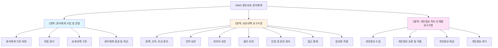

#### 1영역: 관리체계 수립 및 운영 (Management System)

**목적**: 정보보호를 **프로세스**로 관리하는 체계를 구축하고 운영

**특징**:
- ISMS의 **핵심 몸통**에 해당
- PDCA(Plan-Do-Check-Act) 사이클을 반복하며 지속적으로 개선
- 전체 프로세스를 정의하는 영역

**주요 구성 요소**:
1. **관리체계 기반 마련** (1.1)
   - 경영진 참여
   - 최고 책임자 지정
   - 조직 구성
   - 범위 설정
   - 정책 수립
   - 자원 할당

2. **위험 관리** (1.2) ← 오늘 학습
   - 정보자산 식별
   - 현황 및 흐름 분석
   - 위험 평가
   - 보호대책 선정

3. **보호대책 구현** (1.3)
   - 보호대책 이행
   - 공유 및 교육
   - 운영 현황 관리

4. **관리체계 점검 및 개선** (1.4)
   - 법적 요구사항 준수 검토
   - 관리체계 점검
   - 개선

#### 2영역: 보호대책 요구사항 (Protection Measures)

**목적**: 정보보호를 위해 **구체적으로 구현해야 할 보안 통제**를 정의

**특징**:
- 1영역의 "보호대책 선정" 단계에서 참조하는 **세부 사항**
- 실무에서 가장 많이 참조하게 되는 영역
- 기술적, 관리적, 물리적 보안 통제를 망라

**법과 시행령의 관계로 이해하기**:
- 1영역 = **법률** (큰 틀, 프로세스)
- 2영역 = **시행령/시행규칙** (구체적 실행 사항)

💡 **노트**: 이 때문에 1영역과 2영역에서 비슷한 내용이 반복적으로 나타날 수 있습니다. 예를 들어, 1영역에서 "정책을 수립해야 한다"고 하면, 2영역에서는 "정책에는 이러이러한 항목이 포함되어야 한다"고 상세히 설명합니다.

**주요 구성 영역**:
- 정책, 조직, 자산 관리
- 인적 보안
- 외부자 보안
- 물리 보안
- 인증 및 권한 관리
- 접근 통제
- 암호화
- 정보시스템 도입 및 개발
- 시스템 및 서비스 운영 관리
- 시스템 및 서비스 보안 관리
- 사고 예방 및 대응

#### 3영역: 개인정보 처리 단계별 요구사항

**목적**: **개인정보 보호법**을 준수하기 위한 세부 요구사항

**특징**:
- 개인정보의 생명주기(수집 → 이용 → 제공 → 파기)별로 보호 조치를 정의
- 개인정보를 처리하는 조직은 반드시 준수해야 함
- ISMS-P (개인정보 보호 관리체계 포함) 인증 시 필수

**주요 단계**:
1. 개인정보 수집 시 보호조치
2. 개인정보 보관 및 이용 시 보호조치
3. 개인정보 제공 시 보호조치
4. 개인정보 파기 시 보호조치

---

### 🔄 PDCA 사이클과 ISMS

ISMS는 **PDCA(Plan-Do-Check-Act) 사이클**을 기반으로 지속적으로 개선하는 체계입니다.

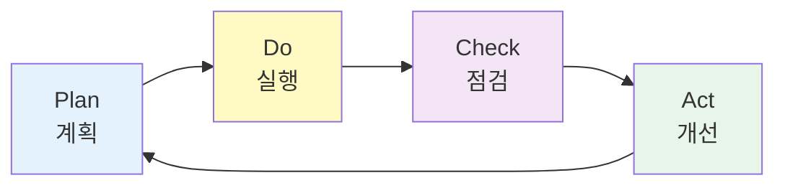

#### PDCA 각 단계의 ISMS 적용

**Plan (계획)**:
- 관리체계 기반 마련
- 위험 평가
- 보호대책 선정
- → "우리가 무엇을 어떻게 할 것인가?"

**Do (실행)**:
- 보호대책 구현
- 교육 훈련
- 운영 활동 수행
- → "계획한 대로 실제로 실행"

**Check (점검)**:
- 관리체계 점검
- 법적 요구사항 준수 검토
- 내부 심사
- → "제대로 하고 있는가?"

**Act (개선)**:
- 점검 결과 개선
- 경영진 검토
- 개선 조치
- → "문제점을 고쳐서 다음 사이클로"

💡 **중요!**: PDCA는 **한 번 돌리고 끝이 아닙니다**. 연 1회 이상 반복하며 **지속적으로 개선**하는 것이 ISMS의 핵심입니다.

---

### 🎯 1일차에 학습한 내용: 관리체계 기반 마련 (1.1)

#### 1.1.1 경영진의 참여

**왜 중요한가?**

정보보호는 **비용과 인력이 투입되는 활동**입니다. 경영진의 관심과 지원 없이는:
- 예산이 확보되지 않음
- 인력이 배정되지 않음
- 부서 간 협업이 이루어지지 않음
- 결과적으로 **실효성 없는 정보보호**가 됨

**요구사항**:
- 경영진이 정보보호에 **관심**을 가져야 함
- 정기적인 **보고 체계** 수립
- 주요 의사결정에 경영진이 **참여**

**구체적 활동**:
- 월 1회 또는 분기 1회 정보보호 현황 보고
- 중요한 보안 사고 발생 시 즉시 보고
- 연간 정보보호 예산 승인
- 정보보호 정책 승인

#### 1.1.2 최고 책임자 지정

**CSO/CPO의 역할**

- **CSO (Chief Security Officer)**: 정보보호 최고 책임자
- **CPO (Chief Privacy Officer)**: 개인정보 보호 최고 책임자

**지정 기준** (회사 규모에 따라 다름):

| 구분 | 매출액/자산 | 요구사항 |
|:---:|:---:|:---|
| 대기업 | 1조원 이상 | **전임 임원급** CSO/CPO 지정 필수 |
| 중견기업 | 5000억~1조 | 임원급 또는 부서장급, 전임 권장 |
| 중소기업 | 5000억 미만 | 부서장급 이상, 겸직 가능 |

**최고 책임자의 권한**:
- 정보보호 **예산 집행** 권한
- **인력 배치** 권한
- 부서 간 **조율** 권한
- 경영진에 대한 **직접 보고** 권한

⚠️ **주의**: 권한이 없는 명목상의 책임자 지정은 **인증 기준 위반**입니다.

**겸직 제한**:
- IT 부서장과 정보보호 책임자를 **겸직하면 안 됨**
  - 이유: 개발 편의성과 보안이 **상충**될 수 있음
  - 예: IT 부서는 빠른 개발을 원하지만, 보안 부서는 안전한 개발을 원함
- 내부 감사 부서장과 **겸직하면 안 됨**
  - 이유: 자기 자신을 감사하는 **이해상충**

#### 1.1.3 조직 구성

정보보호를 수행할 **전담 조직**이 필요합니다.

**구성 요소**:

1. **실무 조직** (Working Group)
   - 실제로 정보보호 업무를 수행하는 팀
   - 정보보호팀, 개인정보보호팀 등
   - 전문성을 갖춘 인력으로 구성

2. **위원회** (Committee)
   - 주요 의사결정 기구
   - 경영진, 부서장급으로 구성
   - 월 1회 또는 분기 1회 개최
   - 중요 정책, 예산, 사고 대응 등 결정

3. **실무 협의체** (Working Council)
   - 부서 간 협업을 위한 실무자급 협의체
   - 각 부서의 정보보호 담당자로 구성
   - 정책 전파, 이슈 공유, 협업 조율

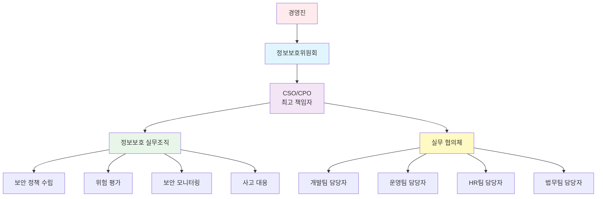

#### 1.1.4 범위 설정

**범위 설정이란?**

ISMS를 **어디에 적용할 것인가**를 명확히 정의하는 것입니다.

**범위 설정의 요소**:
- **서비스 범위**: 어떤 서비스/시스템에 적용할 것인가?
  - 예: "온라인 쇼핑몰 서비스"
  - 예: "내부 인사 시스템"
- **물리적 범위**: 어떤 사업장/건물을 포함할 것인가?
  - 예: "본사 서울 사무실 + 부산 IDC"
- **조직 범위**: 어떤 조직/부서를 포함할 것인가?
  - 예: "IT본부, 정보보호팀, 개발팀"

**범위 설정이 중요한 이유**:
- 범위 밖의 것은 인증 심사 대상이 **아님**
- 범위가 너무 크면 **관리 부담** 증가
- 범위가 너무 작으면 **실효성** 감소

**범위 내 자산 식별**:
- 범위가 정해지면, 그 안의 **모든 정보자산**을 식별해야 함
- 서버, 네트워크 장비, 데이터베이스, 응용 프로그램, 문서 등
- 이것이 1.2 위험관리의 "자산 식별"과 연결됨

#### 1.1.5 정책 수립

**정책의 계층 구조**

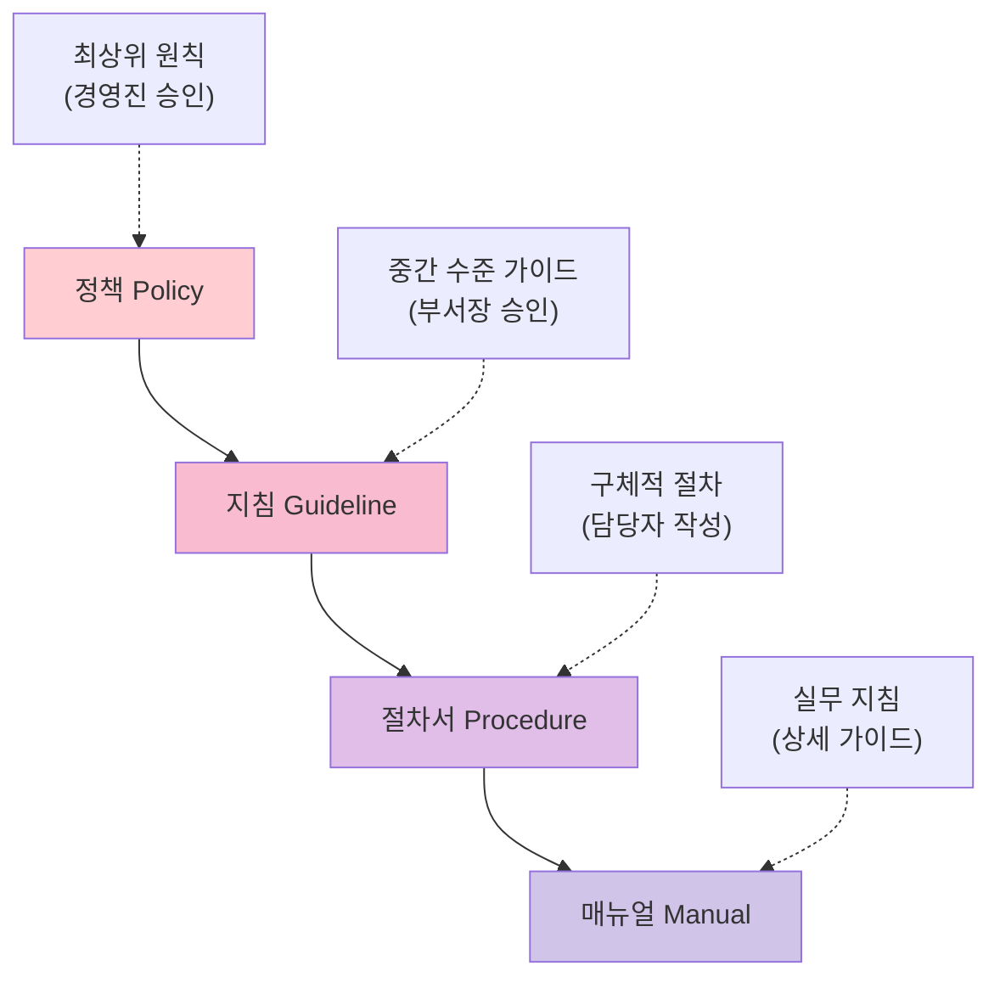

**정책 (Policy)**:
- 가장 상위 문서
- **경영진이 승인**
- 조직의 정보보호에 대한 **기본 방침**
- 예: "정보보호 정책", "개인정보 보호 정책"
- 내용: "우리 회사는 고객 정보를 안전하게 보호한다"

**지침 (Guideline)**:
- 정책을 실행하기 위한 **중간 수준의 가이드**
- 부서장급이 승인
- 예: "접근통제 지침", "암호화 지침"
- 내용: "접근 권한은 최소 권한 원칙을 따른다"

**절차서 (Procedure)**:
- 지침을 실행하는 **구체적 절차**
- 담당자가 작성
- 예: "계정 생성 절차서", "백업 수행 절차서"
- 내용: "1단계: 신청서 작성 → 2단계: 승인 → 3단계: 계정 생성"

**매뉴얼 (Manual)**:
- 가장 상세한 **실무 가이드**
- 예: "서버 보안 설정 매뉴얼", "개인정보 처리 매뉴얼"
- 내용: 화면 캡처, 명령어 예제 등 포함

**정책 수립 시 고려사항**:
- 법적 요구사항을 반영해야 함
- 조직의 비즈니스 특성을 고려해야 함
- 실행 가능해야 함 (너무 이상적이면 안 됨)
- 정기적으로 검토하고 업데이트해야 함

#### 1.1.6 자원 할당

**인적 자원**:
- 정보보호 전담 인력 배치
- 필요한 전문성:
  - 보안 관제 전문가
  - 침해사고 대응 전문가
  - 정책 수립 전문가
  - 개인정보 보호 전문가

**물적 자원**:
- 보안 장비 구매 예산
  - 방화벽, IDS/IPS, 백신, DLP 등
- 보안 솔루션 라이선스
- 교육 훈련 예산
- 컨설팅 비용

**예산 확보**:
- 연간 정보보호 예산을 **경영진이 승인**
- 예산 집행 현황을 주기적으로 **보고**
- 예산 부족 시 **추가 요청** 절차

---

### 📌 1일차 실습: 인터뷰 문제 풀이

#### 인터뷰 실습의 목적

**실제 컨설팅 현장**에서는 문서를 검토하고, 담당자를 **인터뷰**하여 현황을 파악합니다. 인터뷰 실습은 이러한 실무 능력을 기르는 훈련입니다.

**인터뷰 실습 진행 방식**:
1. **인터뷰 내용** 제공 (담당자와의 대화 내용)
2. **ISMS 인증 기준서** 참고
3. **문제점 식별**: 인증 기준과 맞지 않는 부분 찾기
4. **개선 방안 제시**: 어떻게 고쳐야 하는지 제안

#### 인터뷰 1번: 형식적인 조직 구성

**문제 상황**:
- 정보보호위원회가 구성되어 있으나, **실제로 운영되지 않음**
- 회의록이 없고, 의사결정이 이루어지지 않음
- 멤버 구성에서 **개인정보 담당 부서가 누락**됨

**위반 항목**: 1.1.3 조직 구성

**개선 방안**:
- 정보보호위원회를 **정기적으로 개최** (월 1회 또는 분기 1회)
- 회의록 작성 및 보관
- 개인정보 처리 부서를 위원회에 **포함**
- 실질적인 의사결정이 이루어지도록 안건 상정

#### 인터뷰 2번: 정책 전파 미흡

**문제 상황**:
- 새로운 정보보호 정책을 **경영진이 의결하지 않음**
- 직원들이 접근 가능한 공용 폴더에만 저장, **공지하지 않음**
- 직원들이 새로운 정책을 **인지하지 못함**
- 구버전 정책을 따라 업무 수행

**위반 항목**: 1.1.5 정책 수립, 정책의 유지 관리

**개선 방안**:
- 정책 변경 시 **경영진의 공식 승인** 필수
- 전 직원에게 **공지** (게시판, 이메일 등)
- 교육 훈련 시 새로운 정책 내용 전파
- 정책 버전 관리 및 이력 관리

---

## 🎯 오늘(2일차) 학습 목표

### 학습 범위

오늘은 **1.2 위험 관리**부터 시작하여, **2영역 보호대책 요구사항**까지 학습합니다.

### 학습 목표

1. **위험 관리 프로세스 이해**
   - 정보자산을 식별하고 목록화할 수 있다
   - 업무 흐름도와 개인정보 흐름도를 그릴 수 있다
   - 위험 평가 방법을 이해하고 적용할 수 있다
   - 위험에 대한 보호대책을 선정할 수 있다

2. **보호대책 구현 및 운영**
   - 보호대책을 효과적으로 구현하는 방법 이해
   - 보호대책을 조직 내에 공유하고 교육하는 방법 학습
   - 관리체계의 운영 현황을 관리하는 방법 파악

3. **보호대책 요구사항 숙지 (2영역)**
   - 인적 보안 통제 항목 이해
   - 외부자 보안 통제 항목 이해
   - 물리 보안 통제 항목 이해
   - 인증 및 권한 관리 항목 이해

4. **실습을 통한 실무 능력 향상**
   - 인터뷰 3, 4번 문제를 통해 현장 컨설팅 능력 배양
   - 문제점 식별 및 개선 방안 도출 능력 향상

---

### 학습 로드맵

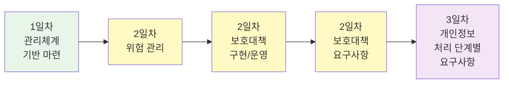

---

## ✅ 복습 체크리스트

학습을 시작하기 전, 1일차 내용을 제대로 이해했는지 점검하세요.

- [ ] ISMS의 3개 영역 (1영역, 2영역, 3영역)을 설명할 수 있다
- [ ] 1영역, 2영역, 3영역의 관계를 법/시행령 구조로 이해했다
- [ ] PDCA 사이클을 설명할 수 있다
- [ ] 경영진의 참여가 왜 중요한지 설명할 수 있다
- [ ] CSO/CPO의 역할과 권한을 설명할 수 있다
- [ ] 정보보호 조직 구성 요소 (실무조직, 위원회, 협의체)를 안다
- [ ] 범위 설정의 중요성을 이해했다
- [ ] 정책의 계층 구조 (정책-지침-절차서-매뉴얼)를 안다
- [ ] 인터뷰 1, 2번 문제의 핵심 문제점을 설명할 수 있다

📌 **노트**: 위 항목 중 하나라도 불확실하다면, 1일차 강의 노트를 다시 복습하세요. 2일차 내용은 1일차 내용 위에 쌓이는 개념입니다.

---

## 💡 학습 전 준비사항

### 필요한 자료

1. **ISMS 인증 기준 안내서** (ISMS-P 포함)
   - 한국인터넷진흥원(KISA) 홈페이지에서 다운로드
   - 최신 버전 사용 (법 개정에 따라 업데이트됨)

2. **실습 문제 파일**
   - 인터뷰 3, 4, 5, 6, 7, 8번 문제
   - 조별 협업을 위한 Google Drive 또는 공유 문서

3. **노트 필기 도구**
   - 블로그, Notion, OneNote 등
   - 실시간으로 정리하며 학습 권장

### 학습 태도

💡 **중요!**: ISMS 학습은 **암기가 아닌 이해**가 중요합니다.

- ❌ 나쁜 학습: "이 항목이 뭐였더라?" → 기계적 암기
- ✅ 좋은 학습: "왜 이 항목이 필요할까?" → 논리적 이해

**이해 중심 학습 방법**:
1. 각 항목의 **목적**을 먼저 이해
2. **실제 사례**와 연결하여 생각
3. **상식선**에서 추론 가능한지 확인
4. 헷갈리는 항목은 **비교표**로 정리

---

## 🔐 보안 컨설턴트의 마음가짐

### 컨설턴트의 역할

보안 컨설턴트는 단순히 **체크리스트를 확인하는 사람이 아닙니다**. 다음과 같은 역할을 수행합니다:

1. **조직의 파트너**
   - 문제를 지적하는 것이 아니라, **함께 개선**하는 파트너
   - "이건 틀렸어요"가 아니라 "이렇게 하면 더 좋습니다"

2. **위험의 커뮤니케이터**
   - 기술적인 위험을 **비즈니스 언어**로 설명
   - 경영진이 이해할 수 있도록 **쉽게** 풀어서 전달

3. **실행 가능한 조언자**
   - 이상적이지만 실행 불가능한 조언은 무의미
   - 조직의 **현실을 고려**한 실용적 조언

4. **지속적인 개선 촉진자**
   - 일회성 컨설팅이 아닌 **지속 가능한 개선** 지원
   - 조직이 스스로 개선할 수 있도록 역량 강화

### 실습 시 주의사항

**인터뷰 실습 시**:
- ISMS 기준서를 **반드시 참조**
- 단순히 "문제다"가 아니라 "어떤 기준의 어떤 항목을 위반했는가" 명확히 식별
- 개선 방안은 **구체적이고 실행 가능**하게 작성

**조별 활동 시**:
- 서로의 의견을 **존중**
- 정답이 하나가 아닐 수 있음을 인정
- 논의 과정에서 **더 깊은 이해** 도출

---

## 📊 학습 로드맵 전체 조망

우리가 어디쯤 와 있는지, 앞으로 무엇을 학습할지 전체 그림을 파악하는 것이 중요합니다.

### 전체 교육 일정 (예상)

| 일차 | 학습 내용 | 비고 |
|:---:|:---|:---|
| **1일차** | ISMS 개요, 인증제도, 1.1 관리체계 기반 마련 | 완료 |
| **2일차** | 1.2 위험 관리, 1.3 보호대책 구현/운영, 2영역 시작 | ← 오늘 |
| **3일차** | 2영역 보호대책 요구사항 심화 | |
| **4일차** | 3영역 개인정보 처리 단계별 요구사항 | |
| **5일차** | 클라우드 보안, 종합 실습 | |
| **6일차** | 모의 컨설팅 프로젝트 | 최종 프로젝트 |

💡 **노트**: 일정은 학습 진도에 따라 조정될 수 있습니다.

---

## 🎓 강사님의 조언

오늘 강의를 시작하면서 강사님께서 강조하신 내용:

> "ISMS는 항목이 많아서 보다 보면 헷갈립니다. 앞에서도 나온 것 같고, 뒤에서도 나온 것 같고... **왜 겹치느냐?** 그 이유는 1영역, 2영역, 3영역의 관계가 **법과 시행령의 관계**이기 때문입니다. 이 구조를 머릿속에 그리고 있으면 훨씬 이해가 쉽습니다."

> "여러분은 컨설팅을 사랑해야 합니다. (웃음) 왜냐하면 이것이 여러분의 미래 직업이 될 수 있기 때문입니다. 진지하게 임하되, 너무 어렵게 생각하지 마세요. **상식선에서 충분히 이해할 수 있는 내용**들입니다."

---

## 🚀 다음 섹션 미리보기

다음 섹션에서는 **1.2 위험 관리**를 본격적으로 다룹니다.

**미리 알아둘 키워드**:
- 정보자산 (Information Assets)
- 자산 분류 및 중요도
- 업무 흐름도 (Business Process Flow)
- 개인정보 흐름도 (Personal Information Flow)
- 위험 평가 (Risk Assessment)
- 위험 처리 (Risk Treatment): 감소, 회피, 전가, 수용
- 보호대책 (Protection Measures)

💡 **중요!**: 위험 관리는 ISMS의 **핵심 프로세스**입니다. 모든 보안 활동의 출발점이 되므로, 집중해서 학습하세요.

---

**오늘도 열심히 학습하여 ISMS 보안 컨설팅 전문가로 성장합시다!** 🎓✨
## 🎯 ISMS 1.2 위험 관리 (Risk Management)

### 📌 위험 관리란?

위험 관리는 **조직의 정보자산에 대한 위협을 식별하고, 평가하고, 적절한 대응책을 마련**하는 일련의 프로세스입니다.

**위험 관리의 목적**:
- 정보자산의 **가용성, 기밀성, 무결성** 보호
- 보안 사고 발생 **가능성 감소**
- 사고 발생 시 **피해 최소화**
- 제한된 예산으로 **효과적인 보안 투자**

💡 **중요!**: 위험 관리는 ISMS의 **핵심 프로세스**입니다. 모든 보안 활동은 위험 관리에서 시작됩니다.

---

### 🔄 위험 관리 프로세스 흐름도

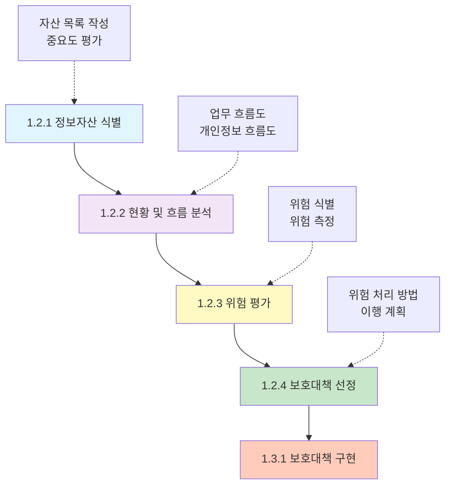

**각 단계의 관계**:
1. **자산 식별** → "무엇을 보호할 것인가?"
2. **흐름 분석** → "어떻게 처리되고 있는가?"
3. **위험 평가** → "어디가 위험한가?"
4. **보호대책 선정** → "어떻게 보호할 것인가?"

---

## 📊 1.2.1 정보자산 식별 (Information Asset Identification)

### 정보자산이란?

정보자산은 **조직이 업무를 수행하는 데 필요한 모든 정보와 그것을 처리/저장/전송하는 시스템**을 의미합니다.

**정보자산의 종류**:

| 분류 | 설명 | 예시 |
|:---:|:---|:---|
| **하드웨어** | 물리적 장비 | 서버, PC, 노트북, 스토리지, 네트워크 장비 |
| **소프트웨어** | 응용 프로그램 | 운영체제, DBMS, 웹 애플리케이션, ERP |
| **네트워크** | 통신 장비 및 회선 | 라우터, 스위치, 방화벽, 전용선, 인터넷 회선 |
| **데이터** | 전자 형태의 정보 | 고객 데이터, 거래 내역, 설계 도면, 소스 코드 |
| **문서** | 종이/전자 문서 | 계약서, 보안 정책, 매뉴얼, 설계서 |
| **인력** | 정보를 처리하는 사람 | 직원, 관리자, 협력업체 인력 |
| **서비스** | 외부 서비스 | 클라우드 서비스, SaaS, 호스팅 서비스 |

### 정보자산 식별 프로세스

#### Step 1: 자산 분류 기준 수립

조직의 특성에 맞는 **자산 분류 기준**을 먼저 정의해야 합니다.

**분류 기준 예시**:
```
- 대분류: 하드웨어, 소프트웨어, 네트워크, 데이터, 문서
- 중분류: 서버, 네트워크 장비, 보안 시스템, 응용 프로그램
- 소분류: 웹 서버, DB 서버, 메일 서버, 파일 서버
```

#### Step 2: 자산 식별 및 목록화

관리체계 범위 내의 **모든 정보자산**을 빠짐없이 식별합니다.

**자산 목록 예시** (엑셀 형태):

| 자산ID | 자산명 | 자산유형 | 소재지 | 관리 부서 | 중요도 | 비고 |
|:---:|:---|:---:|:---:|:---:|:---:|:---|
| SRV-001 | 웹 서버 #1 | 서버 | 본사 IDC | IT팀 | 상 | 쇼핑몰 서비스 |
| SRV-002 | DB 서버 #1 | 서버 | 본사 IDC | IT팀 | 상 | 고객 정보 저장 |
| SRV-003 | 파일 서버 | 서버 | 본사 2층 | IT팀 | 중 | 내부 문서 공유 |
| NET-001 | 방화벽 #1 | 네트워크 | 본사 IDC | IT팀 | 상 | 외부 접근 통제 |
| NET-002 | 스위치 #1 | 네트워크 | 본사 IDC | IT팀 | 중 | 내부 네트워크 |
| APP-001 | 쇼핑몰 시스템 | 응용 SW | SRV-001 | 개발팀 | 상 | 고객 서비스 |
| APP-002 | 인사 시스템 | 응용 SW | SRV-003 | 인사팀 | 중 | 내부 시스템 |
| DATA-001 | 고객 DB | 데이터 | SRV-002 | IT팀 | 상 | 개인정보 포함 |

#### Step 3: 중요도 산정

각 자산의 **중요도**를 평가하여 등급을 부여합니다.

**중요도 평가 기준**:

| 등급 | 기준 | 예시 |
|:---:|:---|:---|
| **상** | - 고객 서비스 직접 영향<br/>- 개인정보 대량 포함<br/>- 법적 의무 대상<br/>- 중단 시 심각한 피해 | 쇼핑몰 웹 서버<br/>고객 DB<br/>결제 시스템 |
| **중** | - 내부 업무에 중요<br/>- 제한적 개인정보 포함<br/>- 중단 시 업무 지연 | 인사 시스템<br/>메일 서버<br/>파일 서버 |
| **하** | - 보조적 기능<br/>- 민감 정보 미포함<br/>- 대체 가능 | 테스트 서버<br/>공용 PC<br/>일반 문서 |

**중요도 산정 방법론**:

1. **정성적 평가** (가장 일반적)
   - 기밀성, 무결성, 가용성 관점에서 평가
   - 각 항목을 상/중/하로 평가 후 종합

2. **정량적 평가** (선택적)
   - 점수화: 기밀성(1-5점) + 무결성(1-5점) + 가용성(1-5점)
   - 11-15점: 상, 6-10점: 중, 1-5점: 하

**중요도 산정 기준표 예시**:

| 평가 항목 | 상 (5점) | 중 (3점) | 하 (1점) |
|:---:|:---|:---|:---|
| **기밀성** | 대외비, 개인정보 대량 포함 | 사내 기밀, 제한적 개인정보 | 공개 정보 |
| **무결성** | 변조 시 법적 문제 또는 서비스 중단 | 변조 시 업무 지연 | 변조 영향 경미 |
| **가용성** | 중단 시 고객 서비스 중단 | 중단 시 업무 불편 | 중단 시 영향 미미 |

#### Step 4: 목록 관리 및 유지보수

자산 목록은 **주기적으로 업데이트**해야 합니다.

**관리 주기**:
- 신규 자산 도입 시: **즉시** 등록
- 자산 폐기 시: **즉시** 삭제
- 전체 목록 검토: **연 1회 이상**
- 중요도 재평가: **연 1회 이상**

**관리 책임**:
- 자산별로 **담당자(Asset Owner)** 지정
- 담당자는 해당 자산의 보안 책임을 짐
- 담당자 변경 시 인수인계 필수

### 자산 식별 시 주의사항

⚠️ **주의**: 다음 자산을 빠뜨리기 쉽습니다:

1. **클라우드 자산**
   - SaaS, IaaS, PaaS 서비스
   - 예: AWS EC2, Office 365, Google Drive

2. **개인 소유 장비**
   - BYOD (Bring Your Own Device)
   - 개인 노트북, 개인 스마트폰으로 업무 수행 시

3. **임시 자산**
   - 테스트 서버, 개발 서버
   - "임시"라도 중요 정보가 있다면 자산에 포함

4. **외부 위탁 자산**
   - 호스팅 업체의 서버
   - 아웃소싱 업체가 사용하는 시스템

5. **백업 데이터**
   - 백업 서버, 백업 테이프
   - 백업도 원본만큼 중요!

---

## 🔄 1.2.2 현황 및 흐름 분석 (Flow Analysis)

### 흐름 분석이란?

식별된 정보자산이 **실제 업무에서 어떻게 사용되고 흐르는지**를 파악하는 과정입니다.

**흐름 분석의 목적**:
- 정보의 **입력 → 처리 → 저장 → 출력** 과정 파악
- 각 단계에서 발생할 수 있는 **위험 식별**
- **통제 지점**을 명확히 함

---

### 📈 정보 서비스 흐름도

#### 정보 서비스 흐름도란?

**시스템 간의 연결 관계**와 **데이터 흐름**을 시각화한 다이어그램입니다.

#### 정보 서비스 흐름도 예시

**시나리오**: 온라인 쇼핑몰 서비스

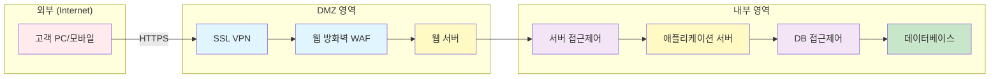

**흐름 설명**:
1. **고객 접속**: 인터넷을 통해 쇼핑몰 접속 (HTTPS)
2. **SSL VPN 통과**: SSL/TLS 암호화 통신
3. **WAF 검사**: 웹 공격 패턴 차단 (SQL Injection, XSS 등)
4. **웹 서버**: 정적 콘텐츠 제공
5. **서버 접근제어**: 내부 영역 접근 시 검증
6. **애플리케이션 서버**: 비즈니스 로직 처리
7. **DB 접근제어**: 데이터베이스 접근 시 검증
8. **데이터베이스**: 고객 정보, 상품 정보 저장

#### 흐름도 작성 시 포함 사항

**필수 포함 요소**:
- **네트워크 구간**: 인터넷, DMZ, 내부망, 관리망 등
- **보안 장비**: 방화벽, IDS/IPS, WAF 등
- **시스템**: 서버, 데이터베이스, 스토리지 등
- **프로토콜**: HTTP, HTTPS, DB 프로토콜 등
- **포트 번호**: 80, 443, 3306 등
- **통제 지점**: 접근제어, 인증, 암호화 등

#### 흐름도 분석을 통한 위험 식별

흐름도를 그리고 나면, 각 **연결 지점**에서 발생할 수 있는 위험을 식별합니다.

**위험 식별 질문**:
- 외부에서 내부로 바로 접근할 수 있나? → **접근 통제 필요**
- 암호화되지 않은 구간이 있나? → **암호화 필요**
- 우회 경로가 있나? → **네트워크 분리 필요**
- 로그가 기록되나? → **로깅 필요**

**흐름도 분석 예시**:

| 구간 | 위험 | 통제 방법 |
|:---|:---|:---|
| 고객 → 웹 서버 | 중간자 공격 (Man-in-the-Middle) | HTTPS 암호화 |
| 웹 서버 → DB | SQL Injection 공격 | Prepared Statement, DB 접근제어 |
| 내부망 → DMZ | 내부자의 외부 서버 공격 | 방화벽 정책, 로그 모니터링 |

---

### 📋 개인정보 흐름도

#### 개인정보 흐름도란?

**개인정보의 생명주기** (수집 → 이용 → 제공 → 파기)를 시각화한 다이어그램입니다.

💡 **중요!**: 개인정보를 처리하는 조직은 **개인정보 보호법 준수**를 위해 흐름도 작성이 필수입니다.

#### 개인정보 흐름도 예시

**시나리오**: 외국인 단체 견학 신청 업무

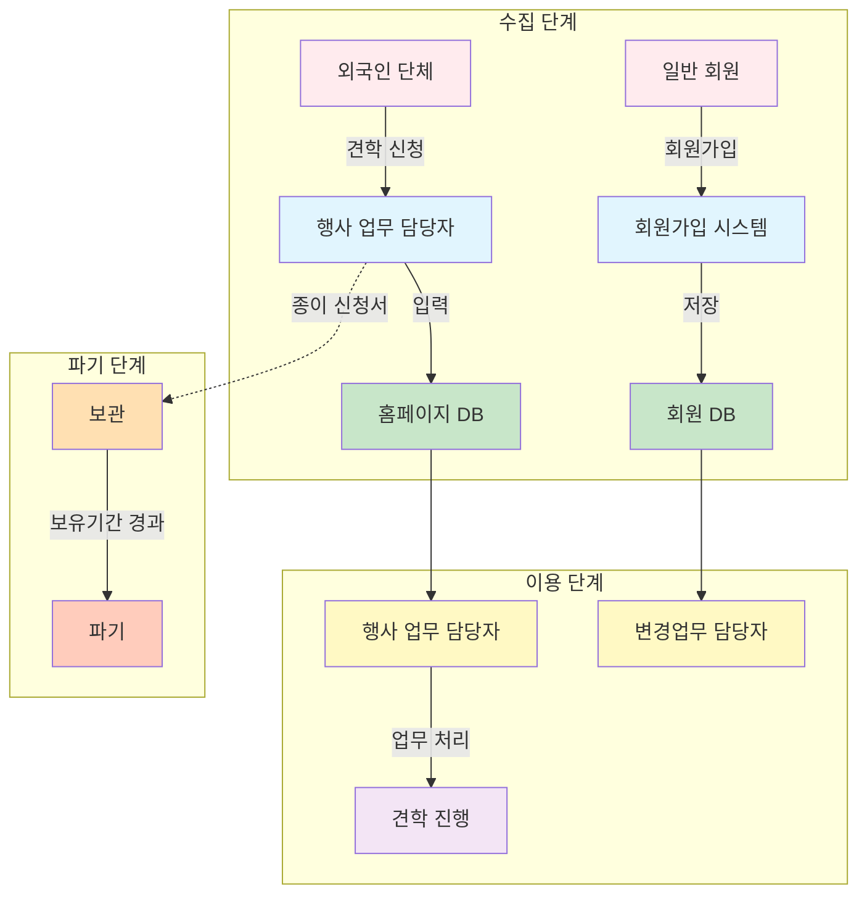

**흐름 설명**:

**수집 경로**:
1. **온라인 수집**: 외국인 단체가 홈페이지에서 직접 입력
2. **오프라인 수집**: 종이 신청서 제출 → 담당자가 시스템에 입력
3. **회원가입**: 일반 회원이 회원가입 시 개인정보 입력

**이용**:
- 행사 업무 담당자가 견학 진행을 위해 개인정보 조회/이용
- 변경업무 담당자가 회원 정보 관리

**파기**:
- 종이 신청서: 보유기간 경과 후 **파쇄**
- 전자 데이터: 홈페이지 DB는 파기하지 않음 (지속 보관)

#### 개인정보 흐름도 작성 기준

**개인정보 보호법 기준**:
- **수집 단계**: 동의, 최소 수집, 목적 명시
- **이용 단계**: 목적 내 이용, 접근 권한 통제
- **제공 단계**: 제3자 제공 시 동의, 위탁 시 계약
- **파기 단계**: 보유기간 경과 시 즉시 파기

**흐름도에 포함할 정보**:
- **수집 항목**: 이름, 주민등록번호, 연락처, 주소 등
- **수집 방법**: 온라인, 오프라인, 제3자 제공 등
- **보관 위치**: 어느 서버, 어느 DB에 저장되는가
- **이용 목적**: 왜 수집하는가
- **보유기간**: 언제까지 보관하는가
- **파기 방법**: 어떻게 파기하는가

#### 개인정보 흐름도 분석을 통한 위험 식별

**위험 식별 질문**:
- 불필요한 개인정보를 수집하고 있나? → **최소 수집 원칙 위반**
- 동의 없이 제3자에게 제공하나? → **불법 제공**
- 보유기간 경과 후에도 계속 보관하나? → **불법 보유**
- 암호화되지 않고 저장되나? → **기술적 보호조치 미흡**
- 불필요한 직원이 접근할 수 있나? → **접근 권한 과다**

---

### 흐름 분석 실습 예시

#### 시나리오: 신규 전자상거래 서비스 런칭

**요구사항**:
- 고객이 회원가입하고 상품을 구매하는 서비스
- 결제는 PG사 연동
- 배송은 물류 업체 위탁

**작성해야 할 흐름도**:
1. **시스템 구성도**: 웹 서버, DB 서버, 결제 연동 등
2. **네트워크 흐름도**: 고객 → 인터넷 → DMZ → 내부망
3. **개인정보 흐름도**: 회원가입 → 주문 → 배송 정보 전달

**흐름 분석 결과 (위험 식별)**:
- PG사로 전달되는 카드 정보: **암호화 필요**
- 물류 업체로 전달되는 배송 정보: **위탁 계약 필요**
- DB에 저장되는 고객 정보: **접근 통제, 암호화 필요**

---

### 📚 흐름 분석 체크리스트

흐름 분석을 완료한 후, 다음 항목을 점검하세요.

- [ ] 모든 주요 업무 프로세스에 대해 흐름도를 작성했는가?
- [ ] 개인정보를 처리하는 모든 업무에 대해 개인정보 흐름도를 작성했는가?
- [ ] 흐름도에 보안 통제 지점이 명시되어 있는가?
- [ ] 외부와의 연결 지점이 명확히 표시되어 있는가?
- [ ] 흐름도를 통해 잠재적 위험을 식별했는가?
- [ ] 흐름도를 정기적으로 검토하고 업데이트하는 절차가 있는가?

---

## ⚠️ 1.2.3 위험 평가 (Risk Assessment)

### 위험 평가란?

식별된 위험의 **발생 가능성**과 **영향도**를 측정하여, 위험의 **심각도를 정량화**하는 프로세스입니다.

**위험 평가의 목적**:
- 어떤 위험이 **더 위험한지** 우선순위 결정
- 제한된 예산을 **효과적으로 배분**
- 경영진에게 위험 수준을 **객관적으로 보고**

💡 **중요!**: 위험 평가는 **연 1회 이상** 정기적으로 수행해야 합니다.

---

### 위험(Risk)의 정의

**위험 = 위협(Threat) × 취약점(Vulnerability) × 자산가치(Asset Value)**

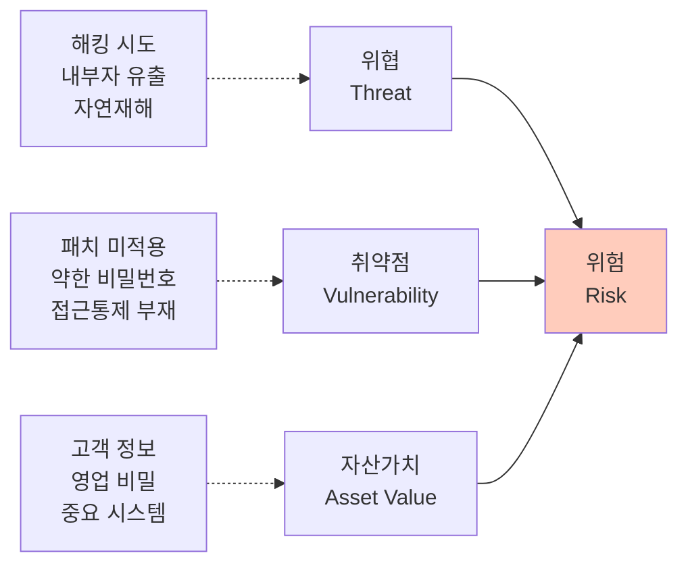

**위협 (Threat)**:
- 자산에 해를 끼칠 수 있는 **잠재적 원인**
- 예: 해킹, 내부자 유출, 자연재해, 시스템 장애

**취약점 (Vulnerability)**:
- 위협이 실현될 수 있게 하는 **약점**
- 예: 보안 패치 미적용, 약한 비밀번호, 접근 통제 부재

**자산가치 (Asset Value)**:
- 자산이 훼손되었을 때의 **피해 크기**
- 예: 고객 정보 유출 시 법적 제재, 평판 손상, 금전적 손실

---

### 위험 평가 방법론

ISMS에서 제시하는 위험 평가 방법:

#### 1. 베이스라인 접근법 (Baseline Approach)

**정의**: 표준 보안 통제 목록을 기반으로 준수 여부를 평가

**특징**:
- 가장 **간단하고 빠름**
- 중소기업에 적합
- ISMS 인증 기준 자체가 베이스라인

**평가 방법**:
- ISMS 2영역 보호대책 요구사항을 체크리스트로 사용
- 각 항목의 준수 여부를 확인 (O/X)
- 미준수 항목 = 위험

**장점**: 평가가 쉽고 빠름
**단점**: 조직 특성 반영 부족, 위험 우선순위 불명확

#### 2. 상세위험 분석법 (Detailed Risk Analysis)

**정의**: 각 자산에 대해 위협, 취약점, 영향을 상세히 분석

**특징**:
- 가장 **정교하고 정확**
- 대기업, 금융권에 적합
- 시간과 비용이 많이 소요

**평가 방법**:
```
위험값 = 자산가치 × 위협발생가능성 × 취약점 수준
```

**예시**:
- 자산가치: 5 (1~5점)
- 위협발생가능성: 4 (1~5점)
- 취약점 수준: 3 (1~5점)
- **위험값 = 5 × 4 × 3 = 60점**

**위험 등급**:
- 60점 이상: 상 (즉시 조치)
- 30~59점: 중 (단계적 조치)
- 29점 이하: 하 (모니터링)

**장점**: 정확한 위험 측정, 우선순위 명확
**단점**: 시간과 비용 多, 전문성 필요

#### 3. 복합 접근법 (Combined Approach)

**정의**: 베이스라인 + 상세 분석을 선택적으로 적용

**평가 방법**:
- 일반 자산: **베이스라인** 적용
- 핵심 자산: **상세 분석** 적용

**장점**: 효율성과 정확성의 균형
**단점**: 기준 설정의 어려움

#### 4. 시나리오 기반 접근법

**정의**: 실제 발생 가능한 **공격 시나리오**를 기반으로 평가

**평가 방법**:
1. 위협 시나리오 작성
   - 예: "외부 해커가 웹 취약점을 통해 DB에 침입"
2. 각 단계별 통제 확인
3. 성공 가능성 평가

**장점**: 현실적, 이해하기 쉬움
**단점**: 시나리오 작성의 어려움

---

### 위험 평가 수행 절차

#### Step 1: 위험 평가 방법 선정

조직의 규모, 예산, 전문성을 고려하여 적절한 방법을 선택합니다.

| 조직 규모 | 권장 방법 |
|:---:|:---|
| 중소기업 | 베이스라인 접근법 |
| 중견기업 | 복합 접근법 |
| 대기업 | 상세위험 분석법 또는 복합 접근법 |

#### Step 2: 위험 식별

앞서 작성한 **흐름도**를 바탕으로 위험을 식별합니다.

**위험 식별 관점**:
- **기술적 위험**: 해킹, 악성코드, 시스템 장애
- **물리적 위험**: 화재, 도난, 자연재해
- **인적 위험**: 내부자 유출, 실수, 사회공학
- **법적 위험**: 법 위반, 규제 미준수

**위험 식별 질문**:
- 이 자산이 **훼손/유출/파괴**되면 어떻게 되는가?
- 이 구간에서 **어떤 공격**이 가능한가?
- 현재 **어떤 통제**가 있는가?
- 통제가 **충분한가**?

#### Step 3: 위험 측정

식별된 위험의 **심각도**를 측정합니다.

**위험 측정 매트릭스**:

| | 발생 가능성 낮음 | 발생 가능성 중간 | 발생 가능성 높음 |
|:---:|:---:|:---:|:---:|
| **영향 높음** | 중 | 상 | 상 |
| **영향 중간** | 하 | 중 | 상 |
| **영향 낮음** | 하 | 하 | 중 |

**예시**:
- **위험**: 고객 DB에 대한 SQL Injection 공격
- **발생 가능성**: 높음 (웹 애플리케이션의 일반적 취약점)
- **영향**: 높음 (개인정보 대량 유출 시 법적 제재, 평판 손상)
- **위험 등급**: **상**

#### Step 4: 위험 수용 수준 결정

조직이 **감수할 수 있는 위험 수준**을 정의합니다.

**위험 수용 기준 예시**:
- **상**: 즉시 조치 필요, 수용 불가
- **중**: 1년 내 조치 계획 수립
- **하**: 모니터링, 필요 시 조치

⚠️ **주의**: **법적 의무 사항**은 위험 수준과 무관하게 **무조건 준수**해야 합니다.

**법적 의무 사항 예시**:
- 주민등록번호 암호화 (개인정보 보호법)
- 고유식별정보 암호화 (개인정보 보호법)
- 접속 기록 보관 (개인정보 보호법)
- 비밀번호 안전한 저장 (개인정보 보호법)

💡 **중요!**: "예산이 없어서" 또는 "기술적으로 어려워서" 법적 의무를 **위험 수용 처리하면 안 됩니다**.

#### Step 5: 위험 평가 보고서 작성

위험 평가 결과를 **경영진에게 보고**합니다.

**보고서 포함 내용**:
- 위험 평가 수행 일시 및 범위
- 위험 평가 방법론
- 식별된 위험 목록 (위험 등급별)
- 즉시 조치가 필요한 위험 (상 등급)
- 보호대책 이행 계획
- 위험 수용 항목 (경영진 승인 필요)

---

### 위험 관리 전략

위험을 **어떻게 처리할 것인가**에 대한 4가지 전략:

#### 1. 위험 감소 (Risk Reduction) - 가장 일반적

**정의**: 보안 통제를 구현하여 위험을 **낮추는** 방법

**예시**:
- **위험**: 비밀번호 도용으로 인한 계정 탈취
- **보호대책**: 비밀번호 복잡도 강화, 2FA 도입
- **결과**: 위험 "상" → "중"으로 감소

#### 2. 위험 회피 (Risk Avoidance)

**정의**: 위험을 발생시키는 **활동 자체를 중단**

**예시**:
- **위험**: 구형 시스템의 해킹 위험이 너무 높음
- **보호대책**: 해당 시스템 사용 중단, 신규 시스템으로 대체
- **결과**: 위험 자체가 사라짐

#### 3. 위험 전가 (Risk Transfer)

**정의**: 위험을 **제3자에게 이전**

**예시**:
- **위험**: 랜섬웨어 공격으로 인한 금전적 피해
- **보호대책**: 사이버 보험 가입
- **결과**: 피해 발생 시 보험사가 보상

⚠️ **주의**: 위험 전가는 **법적 책임**까지 전가하지는 못합니다.

#### 4. 위험 수용 (Risk Acceptance)

**정의**: 위험을 **그대로 받아들임**

**적용 조건**:
- 위험 수준이 **낮음**
- 보호대책 비용이 **피해 비용보다 큼**
- 경영진이 **승인**

**예시**:
- **위험**: 테스트 서버의 보안 취약점
- **판단**: 테스트 데이터만 있고, 중요 정보 없음
- **결정**: 위험 수용, 모니터링만 수행

⚠️ **절대 수용하면 안 되는 위험**:
- **법적 의무 사항 위반**
- 고객 개인정보 대량 유출 가능성
- 서비스 중단 가능성이 높은 경우

---

### 위험 관리 계획 수립

**위험 관리 계획 포함 내용**:

1. **위험 평가 주기**: 연 1회, 변경 시
2. **위험 평가 방법**: 베이스라인 / 상세 분석 / 복합
3. **위험 수용 기준**: 상/중/하 정의
4. **위험 처리 전략**: 감소/회피/전가/수용 기준
5. **보고 체계**: 누구에게, 언제, 어떻게 보고할 것인가

---

## 🛡️ 1.2.4 보호대책 선정 (Protection Measure Selection)

### 보호대책이란?

식별된 위험을 **처리하기 위한 구체적인 보안 통제(Security Controls)**입니다.

**보호대책의 종류**:
- **기술적 보호대책**: 방화벽, 암호화, 접근통제 등
- **관리적 보호대책**: 정책, 절차, 교육, 감사 등
- **물리적 보호대책**: 출입통제, CCTV, 잠금장치 등

---

### 보호대책 선정 기준

보호대책을 선정할 때는 다음을 고려합니다:

#### 1. ISMS 2영역 요구사항

**ISMS 2영역 보호대책 요구사항**을 기본 기준으로 삼습니다.

**2영역 구성**:
- 2.1 정책, 조직, 자산 관리
- 2.2 인적 보안
- 2.3 외부자 보안
- 2.4 물리 보안
- 2.5 인증 및 권한 관리
- 2.6 접근 통제
- 2.7 암호화 적용
- 2.8 정보시스템 도입 및 개발 보안
- 2.9 시스템 및 서비스 운영 관리
- 2.10 시스템 및 서비스 보안 관리
- 2.11 사고 예방 및 대응
- 2.12 재해복구

💡 **중요!**: 2영역의 모든 항목을 **무조건 다 적용**해야 하는 것은 아닙니다. 조직의 특성과 위험 평가 결과에 따라 **선택적으로 적용**합니다.

#### 2. 위험 평가 결과

**위험 등급이 높은 항목**에 우선적으로 보호대책을 적용합니다.

#### 3. 법적 요구사항

**법으로 의무화된 사항**은 반드시 적용합니다.

#### 4. 비용 효과

**보호대책의 비용**과 **위험 감소 효과**를 비교합니다.

---

### 보호대책 선정 프로세스

#### Step 1: 위험 처리 방법 결정

각 위험에 대해 **감소/회피/전가/수용** 중 선택합니다.

**예시**:

| 위험 | 위험 등급 | 처리 방법 | 선정 이유 |
|:---|:---:|:---:|:---|
| 비밀번호 도용 | 상 | 감소 | 비밀번호 정책 강화로 해결 가능 |
| 구형 시스템 해킹 | 상 | 회피 | 시스템 교체 |
| 랜섬웨어 피해 | 중 | 전가 | 사이버 보험 가입 |
| 테스트 서버 취약점 | 하 | 수용 | 영향 미미 |

#### Step 2: 보호대책 식별

**위험 감소**를 선택한 경우, 구체적인 보호대책을 식별합니다.

**보호대책 선정 예시**:

**위험**: 비밀번호 도용으로 인한 계정 탈취
**위험 처리**: 감소

**보호대책 후보**:
1. 비밀번호 복잡도 정책 강화
   - 3종 이상 조합, 10자 이상
   - 주기적 변경 (90일)
2. 2FA (Two-Factor Authentication) 도입
   - OTP, SMS 인증 등
3. 계정 잠금 정책
   - 5회 실패 시 30분 잠금
4. 비밀번호 암호화 저장
   - BCrypt, SHA-256 등

**선정된 보호대책**: 1, 2, 4 (비용과 효과 고려)

#### Step 3: 이행 계획 수립

선정된 보호대책을 **언제, 어떻게** 구현할지 계획합니다.

**이행 계획 포함 내용**:
- **보호대책 항목**: 무엇을 구현할 것인가
- **우선순위**: 긴급(즉시), 단기(3개월), 중기(6개월), 장기(1년)
- **담당 부서**: 누가 구현할 것인가
- **일정**: 시작일, 완료 예정일
- **예산**: 소요 비용
- **완료 기준**: 어떻게 되면 완료인가

**이행 계획 예시**:

| 번호 | 보호대책 | 우선순위 | 담당 부서 | 완료 예정일 | 예산 | 비고 |
|:---:|:---|:---:|:---:|:---:|:---:|:---|
| 1 | 비밀번호 복잡도 강화 | 긴급 | IT팀 | 2주 후 | 0원 | 설정 변경만 |
| 2 | 주민등록번호 암호화 | 긴급 | 개발팀 | 1개월 | 500만원 | 법적 의무 |
| 3 | 2FA 도입 | 단기 | IT팀 | 3개월 | 2000만원 | OTP 솔루션 |
| 4 | 방화벽 업그레이드 | 중기 | IT팀 | 6개월 | 5000만원 | 예산 확보 필요 |
| 5 | 보안 교육 실시 | 긴급 | 보안팀 | 1개월 | 300만원 | 연간 교육 |

#### Step 4: 경영진 보고 및 승인

이행 계획을 **경영진에게 보고**하고 **승인**을 받습니다.

**보고 내용**:
- 위험 평가 결과 요약
- 보호대책 이행 계획
- 소요 예산 및 일정
- 기대 효과
- 위험 수용 항목 (승인 필요)

💡 **중요!**: 경영진의 **공식 승인**이 있어야 예산 집행과 이행이 가능합니다.

---

### 보호대책 선정 시 주의사항

#### ⚠️ 흔한 실수

**실수 1: 법적 의무 사항을 위험 수용 처리**

❌ **잘못된 사례**:
> "주민등록번호 암호화가 기술적으로 어렵고 예산도 없어서 위험 수용으로 처리했습니다."

✅ **올바른 처리**:
> "법적 의무 사항이므로 반드시 이행해야 합니다. 예산 확보 및 단계적 이행 계획을 수립하고, 임시 대책을 먼저 적용합니다."

**실수 2: 즉시 조치 가능한 항목을 장기 계획으로 분류**

❌ **잘못된 사례**:
> "비밀번호 복잡도 설정 변경을 1년 후 장기 계획으로 잡았습니다."

✅ **올바른 처리**:
> "설정만 변경하면 되는 간단한 조치는 즉시 수행합니다."

**실수 3: 50개 위험 중 5개 누락**

❌ **잘못된 사례**:
> "위험 평가에서 50개 항목이 나왔는데, 이행 계획서에 45개만 반영했습니다."

✅ **올바른 처리**:
> "모든 위험 항목은 빠짐없이 이행 계획에 포함되어야 합니다. 위험 수용한 항목도 기록합니다."

---

### 📋 위험 관리 체크리스트

위험 관리를 완료한 후, 다음 항목을 점검하세요.

- [ ] 관리체계 범위 내 모든 정보자산을 식별했는가?
- [ ] 자산별 중요도를 평가하고 목록으로 관리하는가?
- [ ] 주요 업무에 대한 흐름도를 작성했는가?
- [ ] 개인정보 처리 업무에 대한 흐름도를 작성했는가?
- [ ] 적절한 위험 평가 방법을 선정했는가?
- [ ] 위험 평가를 연 1회 이상 수행하고 있는가?
- [ ] 위험 수용 기준을 명확히 정의했는가?
- [ ] 위험 수용 항목에 대해 경영진 승인을 받았는가?
- [ ] 법적 의무 사항을 위험 수용하지 않았는가?
- [ ] 보호대책 이행 계획을 수립했는가?
- [ ] 이행 계획에 우선순위, 일정, 예산이 포함되어 있는가?
- [ ] 이행 계획을 경영진에게 보고하고 승인받았는가?

---

## 💡 위험 관리 실무 팁

### Tip 1: 위험 평가는 "완벽"보다 "실행"이 중요

위험 평가는 **100% 정확할 수 없습니다**. 중요한 것은:
- 주기적으로 수행하는 것
- 결과를 실제 보호대책으로 연결하는 것
- 지속적으로 개선하는 것

### Tip 2: 경영진의 언어로 말하라

**기술적 용어** 대신 **비즈니스 언어**로 설명하세요.

❌ "SQL Injection 취약점이 있습니다."
✅ "해커가 고객 정보 100만 건을 탈취할 수 있습니다. 법적 제재와 평판 손상으로 예상 피해액은 50억 원입니다."

### Tip 3: 법적 의무는 절대 타협 금지

**법적 의무 사항**은 "예산이 없어서", "기술적으로 어려워서"를 **이유로 미룰 수 없습니다**.

임시 대책이라도 먼저 적용하고, 단계적으로 개선하세요.

### Tip 4: 위험 평가 결과는 변화의 동력

위험 평가 결과를 활용하여:
- 예산 확보의 근거로 사용
- 조직 개편의 근거로 사용
- 경영진의 관심 환기

---

## 🎯 위험 관리 핵심 요약

### 위험 관리 4단계

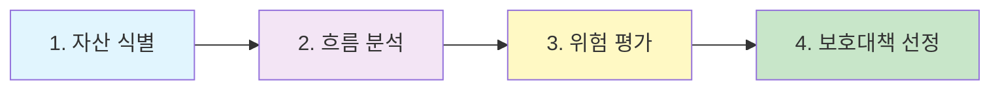

**1. 자산 식별**: 무엇을 보호할 것인가?
**2. 흐름 분석**: 어떻게 사용되고 있는가?
**3. 위험 평가**: 어디가 위험한가?
**4. 보호대책 선정**: 어떻게 보호할 것인가?

### 위험 처리 4가지 전략

- **감소**: 보안 통제 구현 (가장 일반적)
- **회피**: 위험 활동 중단
- **전가**: 보험, 아웃소싱
- **수용**: 경영진 승인 하에 그대로 받아들임

### 반드시 기억할 원칙

1. **연 1회 이상** 위험 평가 수행
2. **법적 의무 사항**은 절대 위험 수용 불가
3. **경영진 승인** 필수
4. **모든 위험**을 이행 계획에 포함 (수용 포함)
5. **즉시 조치 가능한 항목**은 즉시 수행

---

다음 섹션에서는 **1.3 보호대책 구현 및 운영**을 다룹니다.
## 🚀 ISMS 1.3 보호대책 구현 및 운영

### 📌 개요

위험 관리를 통해 **보호대책을 선정**했다면, 이제 **실제로 구현하고 운영**해야 합니다. 1.3영역은 이러한 실행 단계를 다룹니다.

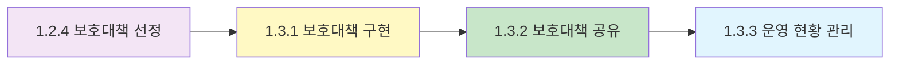

---

## 🛠️ 1.3.1 보호대책 구현 (Implementation)

### 보호대책 구현이란?

선정한 보호대책을 **이행 계획에 따라 효과적으로 구현**하고, 그 **결과를 검증**하는 프로세스입니다.

**요구사항**:
- 보호대책을 **이행 계획에 따라** 구현
- 이행 결과의 **정확성** 확인
- 이행 결과의 **효과성** 확인

---

### 보호대책 구현 절차

#### Step 1: 이행 계획 검토

구현을 시작하기 전, 이행 계획을 다시 한번 확인합니다.

**검토 사항**:
- 우선순위가 적절한가?
- 일정이 현실적인가?
- 예산이 확보되었는가?
- 담당자가 명확한가?
- 의존 관계가 있는 다른 작업이 완료되었는가?

**예시**:
> "2FA 도입을 위해서는 먼저 사용자 DB에 전화번호 필드가 추가되어야 한다. DB 스키마 변경 작업이 선행되어야 함."

#### Step 2: 보호대책 구현

이행 계획에 따라 보호대책을 구현합니다.

**구현 예시 1: 비밀번호 복잡도 강화**

**Before (현재 상태)**:
```
비밀번호 정책:
- 최소 길이: 6자
- 복잡도: 제한 없음
- 변경 주기: 제한 없음
```

**After (개선 후)**:
```
비밀번호 정책:
- 최소 길이: 10자
- 복잡도: 영문 대/소문자, 숫자, 특수문자 중 3종 이상 조합
- 변경 주기: 90일마다 강제 변경
- 이전 비밀번호 재사용: 최근 5개 불가
- 계정 잠금: 5회 실패 시 30분 잠금
```

**구현 방법**:
```python
# 비밀번호 복잡도 검증 모듈 (예시)
import re

def validate_password(password):
    """
    비밀번호 복잡도 검증
    - 최소 10자
    - 영문 대/소문자, 숫자, 특수문자 중 3종 이상
    """
    if len(password) < 10:
        return False, "비밀번호는 최소 10자 이상이어야 합니다."

    complexity = 0
    if re.search(r'[a-z]', password):
        complexity += 1
    if re.search(r'[A-Z]', password):
        complexity += 1
    if re.search(r'[0-9]', password):
        complexity += 1
    if re.search(r'[!@#$%^&*]', password):
        complexity += 1

    if complexity < 3:
        return False, "영문 대/소문자, 숫자, 특수문자 중 3종 이상 조합해야 합니다."

    return True, "비밀번호가 안전합니다."
```

**적용 위치**:
- 회원가입 페이지
- 비밀번호 변경 페이지
- 관리자 계정 생성 페이지

**구현 예시 2: 주민등록번호 암호화**

**Before**:
```sql
-- 고객 테이블 (암호화 전)
CREATE TABLE customers (
    id INT PRIMARY KEY,
    name VARCHAR(100),
    ssn VARCHAR(14),  -- 주민등록번호 평문 저장 ❌
    phone VARCHAR(20)
);
```

**After**:
```sql
-- 고객 테이블 (암호화 후)
CREATE TABLE customers (
    id INT PRIMARY KEY,
    name VARCHAR(100),
    ssn_encrypted VARCHAR(256),  -- 주민등록번호 암호화 저장 ✅
    phone VARCHAR(20)
);
```

**암호화 적용 코드 (예시)**:
```python
from cryptography.fernet import Fernet

# 암호화 키 (안전한 곳에 보관)
key = Fernet.generate_key()
cipher = Fernet(key)

def encrypt_ssn(ssn):
    """주민등록번호 암호화"""
    return cipher.encrypt(ssn.encode()).decode()

def decrypt_ssn(encrypted_ssn):
    """주민등록번호 복호화"""
    return cipher.decrypt(encrypted_ssn.encode()).decode()

# 사용 예시
ssn = "123456-1234567"
encrypted = encrypt_ssn(ssn)
print(f"암호화: {encrypted}")
# 출력: gAAAAABh... (암호화된 문자열)
```

**마이그레이션 절차**:
1. 새 컬럼 추가 (`ssn_encrypted`)
2. 기존 데이터 암호화하여 이관
3. 애플리케이션 코드 수정 (암호화/복호화 로직 추가)
4. 테스트 환경에서 검증
5. 프로덕션 적용
6. 기존 컬럼 삭제 (`ssn`)

#### Step 3: 구현 결과 검증

보호대책이 **제대로 작동하는지** 검증합니다.

**검증 방법**:

**1. 기능 테스트**
- 의도한 대로 작동하는가?
- 예: 약한 비밀번호 입력 시 거부되는가?

**2. 효과성 테스트**
- 위험이 실제로 감소했는가?
- 예: 비밀번호 크래킹 시도 시 성공률이 낮아졌는가?

**3. 부작용 확인**
- 기존 기능에 영향은 없는가?
- 사용자 불편은 없는가?

**검증 예시: 비밀번호 복잡도 강화**

**기능 테스트**:
```
테스트 케이스 1: "abc123" 입력 → ❌ 거부 (길이 부족)
테스트 케이스 2: "abcdefghij" 입력 → ❌ 거부 (복잡도 부족)
테스트 케이스 3: "Abcd1234!@" 입력 → ✅ 허용
```

**효과성 테스트**:
```
Before: 6자 비밀번호, 크래킹 시간 = 1분
After: 10자 복잡도 비밀번호, 크래킹 시간 = 10년 이상
→ 위험 "상" → "하"로 감소 ✅
```

**부작용 확인**:
```
- 기존 사용자 비밀번호 변경 강제
- 고객 센터 문의 증가 가능성
- 대응: 사전 공지, FAQ 작성, 헬프데스크 교육
```

#### Step 4: 구현 결과 문서화

구현 내용을 **문서로 기록**합니다.

**문서 포함 내용**:
- **구현 일자**: 2026-01-15
- **구현 내용**: 비밀번호 복잡도 강화
- **변경 사항**: 정책 설정, 코드 수정 내역
- **검증 결과**: 테스트 통과
- **담당자**: 홍길동 (IT팀)
- **승인자**: 김철수 (CSO)

---

### 보호대책 구현 시 주의사항

#### ⚠️ 주의 1: 테스트 환경에서 먼저 검증

**운영 환경에 바로 적용하지 마세요!**

**올바른 절차**:
1. 개발 환경에서 구현
2. 테스트 환경에서 검증
3. 스테이징 환경에서 최종 확인
4. 운영 환경에 적용

#### ⚠️ 주의 2: 롤백 계획 수립

**구현 후 문제 발생 시 원래대로 되돌릴 수 있어야 합니다.**

**롤백 계획 예시**:
```
보호대책: 방화벽 정책 변경
구현일: 2026-01-15 10:00
롤백 조건: 서비스 장애 발생 시
롤백 방법:
  1. 기존 정책 백업 파일 복원
  2. 방화벽 재시작
  3. 연결 테스트
롤백 책임자: 홍길동
롤백 소요 시간: 10분
```

#### ⚠️ 주의 3: 사용자 영향 최소화

**사용자에게 미치는 영향을 최소화하세요.**

**고려 사항**:
- 업무 시간 외 적용 (야간, 주말)
- 사전 공지 (1주일 전)
- 교육 및 가이드 제공
- 헬프데스크 준비

---

## 📢 1.3.2 보호대책 공유 (Communication)

### 보호대책 공유란?

구현된 보호대책을 **조직 구성원들에게 알리고 교육**하여, **지속적으로 운영**될 수 있도록 하는 활동입니다.

**요구사항**:
- 보호대책을 **교육 및 훈련**
- 정보 보호 활동이 **지속적으로 운영**되도록 관리

---

### 보호대책 공유 방법

#### 1. 정책 및 지침 배포

**배포 채널**:
- 사내 게시판
- 이메일 공지
- 사내 포털
- 인트라넷

**배포 예시**:
```
제목: [공지] 비밀번호 정책 변경 안내

전 직원 귀하,

정보 보호 강화를 위해 비밀번호 정책이 다음과 같이 변경됩니다.

■ 변경 일시: 2026-01-20 (월) 00:00
■ 주요 변경 사항:
  - 최소 길이: 6자 → 10자
  - 복잡도: 영문 대/소문자, 숫자, 특수문자 중 3종 이상
  - 변경 주기: 90일마다 강제 변경

■ 조치 사항:
  - 최초 로그인 시 새로운 정책에 맞는 비밀번호로 변경 필요
  - 변경 방법: 사내 포털 > 내 정보 > 비밀번호 변경

■ 문의: IT팀 (내선 1234)

감사합니다.
정보보호팀 드림
```

#### 2. 교육 및 훈련

**교육 대상별 맞춤 교육**:

| 대상 | 교육 내용 | 교육 방식 |
|:---:|:---|:---|
| **전 직원** | 정보 보호 기본 교육 | 온라인 교육 (연 1회) |
| **주요직무자** | 개인정보 보호 심화 교육 | 집합 교육 (연 1회) |
| **시스템 관리자** | 기술적 보호조치 교육 | 실습 교육 (반기 1회) |
| **개발자** | 시큐어 코딩 교육 | 실습 교육 (반기 1회) |
| **신입 직원** | 정보 보호 입문 교육 | 오리엔테이션 |

**교육 내용 예시**:
- 비밀번호 관리 방법
- 피싱 메일 식별 방법
- 개인정보 취급 시 주의사항
- 보안 사고 발생 시 대응 방법
- 회사 정보 보호 정책

**교육 효과 측정**:
- 교육 이수율 (전 직원 100% 목표)
- 테스트 점수 (80점 이상)
- 만족도 조사
- 보안 사고 감소율

#### 3. 인식 제고 캠페인

**지속적인 보안 인식 제고**를 위한 활동:

**캠페인 예시**:
- **보안 포스터** 부착 (엘리베이터, 휴게실)
- **이메일 서명** 하단에 보안 문구 삽입
  ```
  "이 메일에 개인정보가 포함되어 있나요? 암호화하여 전송하세요!"
  ```
- **사내 방송**: 월 1회 보안 팁 방송
- **보안 뉴스레터**: 월 1회 발행
- **보안 퀴즈 이벤트**: 분기 1회, 상품 제공

#### 4. 보안 서약서

**전 직원 및 외부자**에게 보안 서약서를 받습니다.

**보안 서약서 내용**:
- 정보 보호 정책 준수
- 비밀 유지 의무
- 개인정보 보호 의무
- 위반 시 책임

**서약서 관리**:
- 신규 입사자: 입사 시 서약
- 기존 직원: 연 1회 재서약
- 외부자: 계약 시 서약

---

### 보호대책 공유의 중요성

💡 **중요!**: **아무리 좋은 보호대책도 사람들이 모르면 무용지물**입니다.

**사례**:
> "회사가 2FA를 도입했지만, 직원들이 사용 방법을 몰라서 헬프데스크에 문의가 폭주했습니다. 결국 2FA를 비활성화하고 다시 교육을 진행했습니다."

**교훈**:
- 구현 **전에** 교육 계획 수립
- 구현 **후에** 지속적인 공유
- **피드백** 수렴 및 개선

---

## 📊 1.3.3 운영 현황 관리 (Operation Management)

### 운영 현황 관리란?

관리체계가 **제대로 운영되고 있는지** 모니터링하고, **기록을 관리**하는 프로세스입니다.

**요구사항**:
- 상시적 또는 주기적으로 수행하는 **운영 활동 식별**
- 수행 내역을 **식별 및 추적 가능**하도록 기록 관리
- 운영의 **효과성 확인**

---

### 운영 활동 예시

조직이 수행하는 다양한 **정보 보호 운영 활동**:

| 활동 | 주기 | 담당자 | 기록 |
|:---|:---:|:---:|:---|
| **백업 수행** | 매일 | IT팀 | 백업 로그, 검증 기록 |
| **보안 패치 적용** | 월 1회 | IT팀 | 패치 적용 내역서 |
| **접속 로그 검토** | 매일 | 보안팀 | 로그 분석 보고서 |
| **계정 권한 검토** | 분기 1회 | IT팀 | 계정 목록, 검토 보고서 |
| **보안 교육** | 연 1회 | 보안팀 | 교육 이수 명단, 평가 결과 |
| **위험 평가** | 연 1회 | 보안팀 | 위험 평가 보고서 |
| **취약점 점검** | 분기 1회 | 보안팀 | 취약점 진단 보고서 |
| **침입 탐지 모니터링** | 24시간 | 보안팀 | IDS/IPS 로그, 알람 기록 |

---

### 운영 기록 관리

#### 기록 관리의 원칙

**ARMA 원칙** (Accountability, Transparency, Integrity, Protection, Compliance, Availability, Retention, Disposition):

1. **식별 가능성** (Identifiability)
   - 누가, 언제, 무엇을 했는지 명확히 기록

2. **추적 가능성** (Traceability)
   - 일련의 활동을 시간 순으로 추적 가능

3. **무결성** (Integrity)
   - 기록이 위/변조되지 않았음을 보장

4. **보존성** (Retention)
   - 법적 요구사항에 따라 일정 기간 보존

**기록 관리 예시: 백업 수행 기록**

```
백업 수행 기록부

일자: 2026-01-10
수행자: 홍길동 (IT팀)
백업 대상:
  - DB 서버 (SRV-001)
  - 파일 서버 (SRV-002)
백업 시작 시간: 02:00
백업 종료 시간: 04:30
백업 용량: 500GB
백업 저장 위치: /backup/20260110/
백업 검증: 정상 (복원 테스트 완료)
특이 사항: 없음
```

#### 기록 보존 기간

**법적 요구사항**:

| 기록 유형 | 보존 기간 | 법적 근거 |
|:---|:---:|:---|
| **개인정보 접속 기록** | 최소 6개월 | 개인정보 보호법 |
| **정보통신망 접속 기록** | 최소 3개월 | 정보통신망법 |
| **감사 로그** | 최소 1년 | 내부 정책 |
| **교육 이수 기록** | 3년 | 내부 정책 |
| **위험 평가 보고서** | 3년 | 내부 정책 |

⚠️ **주의**: 법적 요구사항보다 **짧게 보존하면 위법**입니다.

---

### 운영 효과성 확인

운영 활동이 **실제로 효과**가 있는지 확인합니다.

**효과성 지표 예시**:

| 운영 활동 | 효과성 지표 | 목표값 |
|:---|:---|:---|
| 백업 | 백업 성공률 | 99% 이상 |
| 보안 패치 | 패치 적용률 | 90% 이상 (30일 내) |
| 보안 교육 | 교육 이수율 | 100% |
| 침입 탐지 | 탐지율, 오탐률 | 탐지율 95% 이상, 오탐률 5% 이하 |
| 취약점 점검 | 고위험 취약점 해결율 | 100% (30일 내) |

**효과성 확인 방법**:
- 정기적으로 지표 측정
- 목표값과 비교
- 미달 시 원인 분석 및 개선

**효과성 확인 예시**:
```
활동: 보안 패치 적용
측정 결과:
  - 패치 적용률: 85% (목표: 90%)
  - 미달 원인: 일부 서버 패치 시 서비스 중단 우려
  - 개선 방안: 야간/주말에 패치 적용, 이중화 구성
  - 개선 후 결과: 92% (목표 달성 ✅)
```

---

## 🔍 ISMS 1.4 관리체계 점검 및 개선

### 📌 개요

관리체계를 구축하고 운영했다면, 이제 **제대로 운영되고 있는지 점검**하고, **문제점을 개선**해야 합니다.

이것이 PDCA 사이클의 **Check (점검)**와 **Act (개선)** 단계입니다.

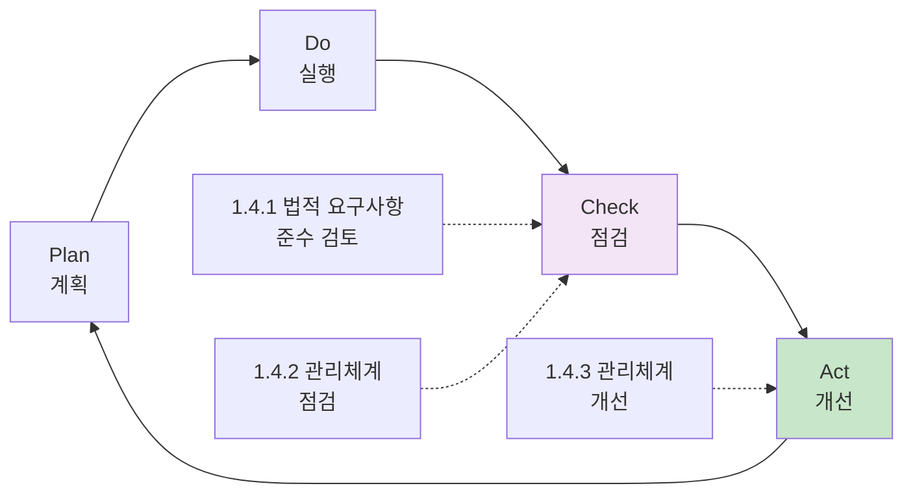

---

## ⚖️ 1.4.1 법적 요구사항 준수 검토

### 법적 요구사항 준수 검토란?

**정보 보호 관련 법령의 변경 사항**을 파악하고, 조직이 **법을 준수하고 있는지** 확인하는 활동입니다.

**요구사항**:
- **연 1회 이상** 법적 요구사항 준수 여부 검토
- 법령 변경 사항을 관리체계에 **반영**

---

### 정보 보호 관련 주요 법령

**ISMS 인증 기준서에 제시된 주요 법령**:

| 법령 | 주요 내용 |
|:---|:---|
| **개인정보 보호법** | 개인정보 수집/이용/제공/파기, 기술적/관리적 보호조치 |
| **정보통신망 이용촉진 및 정보보호 등에 관한 법률** | 정보통신서비스 제공자의 정보 보호 의무 |
| **전자금융거래법** | 전자금융 서비스의 보안 요구사항 |
| **전자서명법** | 전자서명의 법적 효력 |
| **통신비밀보호법** | 통신 비밀의 보호 |
| **신용정보의 이용 및 보호에 관한 법률** | 신용정보의 보호 |
| **클라우드컴퓨팅 발전 및 이용자 보호에 관한 법률** | 클라우드 서비스의 정보 보호 |
| **위치정보의 보호 및 이용 등에 관한 법률** | 위치정보의 보호 |

---

### 법적 요구사항 준수 검토 절차

#### Step 1: 적용 법령 식별

조직이 **준수해야 하는 법령**을 식별합니다.

**식별 기준**:
- 사업 유형 (전자상거래, 금융, 통신 등)
- 처리하는 정보 (개인정보, 신용정보, 위치정보 등)
- 서비스 형태 (클라우드, 플랫폼 등)

**예시: 온라인 쇼핑몰**
```
적용 법령:
  - 개인정보 보호법 ✅
  - 정보통신망법 ✅
  - 전자상거래법 ✅
  - 전자금융거래법 ✅ (결제 기능)
```

#### Step 2: 법령 변경 사항 모니터링

법령은 **매년 개정**됩니다. 변경 사항을 지속적으로 모니터링해야 합니다.

**모니터링 방법**:
- 법제처 국가법령정보센터 (www.law.go.kr)
- 개인정보보호위원회 (www.pipc.go.kr)
- 한국인터넷진흥원 (www.kisa.or.kr)
- 법률 자문 (필요 시)

**변경 사항 예시**:
```
개인정보 보호법 시행령 개정 (2025-03-14 시행)
- 가명정보 처리 기준 변경
- 안전조치 기준 강화
- 과징금 상한액 조정
```

#### Step 3: 준수 여부 점검

변경된 법령에 대해 조직이 **준수하고 있는지** 점검합니다.

**점검 방법**:
- 체크리스트 작성
- 관련 부서 인터뷰
- 증적 확인 (정책, 로그, 시스템 설정 등)

**점검 예시**:

| 법적 요구사항 | 준수 여부 | 증적 | 비고 |
|:---|:---:|:---|:---|
| 주민등록번호 암호화 | ✅ | DB 스키마, 암호화 모듈 | 준수 |
| 고유식별정보 암호화 | ✅ | 운전면허번호 암호화 확인 | 준수 |
| 접속 기록 보관 (6개월) | ✅ | 로그 파일 확인 | 준수 |
| 개인정보 파기 (보유기간 경과 시) | ❌ | 일부 탈퇴 회원 정보 미파기 | **미준수** |
| 개인정보 처리방침 게시 | ✅ | 홈페이지 확인 | 준수 |

#### Step 4: 미준수 사항 개선

미준수 사항에 대해 **즉시 개선 조치**를 취합니다.

**개선 예시**:
```
미준수 사항: 탈퇴 회원 개인정보 미파기
원인: 자동 파기 스크립트 오류
개선 방안:
  1. 즉시 조치: 수동으로 파기 (2주 내)
  2. 근본 조치: 스크립트 수정 및 테스트 (1개월 내)
  3. 재발 방지: 월 1회 파기 현황 점검
담당자: 홍길동 (IT팀)
완료 예정일: 2026-02-10
```

#### Step 5: 관리체계 반영

변경된 법령을 **정책, 지침, 절차서**에 반영합니다.

**반영 예시**:
```
개정 법령: 개인정보 보호법 시행령 (2025-03-14)
영향 받는 문서:
  - 개인정보 보호 정책
  - 개인정보 처리 방침
  - 개인정보 파기 절차서
개정 일자: 2025-04-01
승인: CSO
```

---

## 🔎 1.4.2 관리체계 점검

### 관리체계 점검이란?

관리체계가 **효과적으로 운영**되고 있는지, **인증 기준을 충족**하고 있는지 확인하는 활동입니다.

**요구사항**:
- **연 1회 이상** 관리체계 점검
- 점검 결과를 **경영진에게 보고**

---

### 관리체계 점검 방법

#### 1. 자체 점검 (Self-Assessment)

**조직 스스로** 점검하는 방법입니다.

**장점**:
- 비용 절감
- 내부 역량 강화

**단점**:
- 객관성 부족
- 누락 가능성

**점검 방법**:
- ISMS 인증 기준서를 체크리스트로 사용
- 각 부서별로 해당 항목 점검
- 보안팀이 취합 및 분석

#### 2. 내부 감사 (Internal Audit)

**내부 감사 부서**가 점검하는 방법입니다.

**장점**:
- 자체 점검보다 객관적
- 독립성 확보

**단점**:
- 내부 감사 역량 필요

**점검 방법**:
- 연간 감사 계획에 포함
- 샘플링 기법 사용
- 인터뷰 및 증적 확인

#### 3. 외부 감사 (External Audit)

**외부 전문 기관**이 점검하는 방법입니다.

**장점**:
- 가장 객관적
- 전문성 확보

**단점**:
- 비용 발생

**점검 방법**:
- 컨설팅 업체 또는 인증기관
- 인증 심사 준비
- 취약점 진단

---

### 관리체계 점검 절차

#### Step 1: 점검 계획 수립

**점검 계획서** 작성:
- 점검 범위
- 점검 일정
- 점검 담당자
- 점검 방법

**점검 계획 예시**:
```
2026년도 관리체계 점검 계획

■ 점검 범위:
  - ISMS 1영역: 관리체계 수립 및 운영
  - ISMS 2영역: 보호대책 요구사항

■ 점검 일정:
  - 계획 수립: 2026-01-01 ~ 2026-01-15
  - 점검 수행: 2026-02-01 ~ 2026-02-28
  - 보고서 작성: 2026-03-01 ~ 2026-03-15
  - 경영진 보고: 2026-03-20

■ 점검 담당자:
  - 총괄: 김철수 (CSO)
  - 실무: 홍길동, 이영희 (보안팀)

■ 점검 방법:
  - 문서 검토
  - 시스템 점검
  - 담당자 인터뷰
```

#### Step 2: 점검 수행

**점검 활동**:
- 정책 및 지침 최신 여부 확인
- 조직 구성 적절성 검토
- 위험 평가 수행 여부 확인
- 보호대책 이행 현황 확인
- 교육 이수율 확인
- 로그 기록 및 보존 확인

**점검 결과 기록**:
```
점검 항목: 1.1.2 최고 책임자 지정
점검 결과: 적합
증적: 임명장, 업무 분장표
특이 사항: 없음

점검 항목: 1.2.3 위험 평가
점검 결과: 부적합
증적: 위험 평가 보고서 (2025-01-10)
특이 사항: 작년에 수행, 올해 미수행
개선 사항: 2026-03-31까지 위험 평가 수행
```

#### Step 3: 개선 사항 도출

**부적합 사항**에 대해 개선 계획을 수립합니다.

**개선 사항 예시**:
```
부적합 사항: 위험 평가 미수행
원인: 담당자 퇴사로 업무 공백 발생
개선 방안:
  - 즉시 위험 평가 수행 (2026-03-31까지)
  - 담당자 충원 또는 교육
  - 위험 평가 일정 관리 프로세스 개선
담당자: 보안팀장
완료 예정: 2026-03-31
```

#### Step 4: 경영진 보고

점검 결과를 **경영진에게 보고**합니다.

**보고서 구성**:
- 점검 개요 (범위, 일정, 방법)
- 점검 결과 요약 (적합/부적합 통계)
- 주요 발견 사항
- 개선 계획
- 다음 점검 일정

---

## 🔧 1.4.3 관리체계 개선

### 관리체계 개선이란?

점검 결과 발견된 **문제점을 개선**하고, **지속적으로 발전**시키는 활동입니다.

**요구사항**:
- 점검 결과 **개선 필요 사항** 도출
- 개선 계획 수립 및 **이행**
- 개선 결과 **확인**

---

### PDCA의 완성: Act (개선)

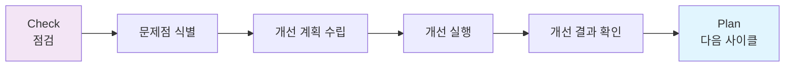

---

### 개선 활동 예시

**개선 사례 1: 교육 이수율 저조**

**문제점**:
- 보안 교육 이수율: 75% (목표: 100%)
- 원인: 교육 시간 중 업무 집중, 온라인 교육 접근성 부족

**개선 방안**:
1. 교육 일정 사전 공지 (1개월 전)
2. 모바일 교육 플랫폼 도입
3. 미이수자 관리: 직속 상사에게 통보
4. 교육 내용 개선: 재미있고 실용적으로

**개선 결과**:
- 교육 이수율: 98% (목표 달성 ✅)

**개선 사례 2: 백업 실패율 증가**

**문제점**:
- 백업 성공률: 90% (목표: 99%)
- 원인: 디스크 용량 부족, 백업 스크립트 오류

**개선 방안**:
1. 백업 스토리지 증설
2. 백업 스크립트 수정 및 테스트
3. 백업 모니터링 알람 강화
4. 주간 백업 현황 보고

**개선 결과**:
- 백업 성공률: 99.5% (목표 달성 ✅)

---

## ✅ 1영역 완료 체크리스트

1영역 학습을 완료했습니다. 다음 항목을 점검하세요.

**1.1 관리체계 기반 마련**:
- [ ] 경영진 참여의 중요성을 이해했다
- [ ] CSO/CPO의 역할과 권한을 설명할 수 있다
- [ ] 정보보호 조직 구성 요소를 안다
- [ ] 범위 설정의 중요성을 이해했다
- [ ] 정책의 계층 구조를 안다

**1.2 위험 관리**:
- [ ] 정보자산 식별 방법을 안다
- [ ] 업무 흐름도와 개인정보 흐름도를 그릴 수 있다
- [ ] 위험 평가 방법을 이해했다
- [ ] 위험 처리 4가지 전략을 안다
- [ ] 법적 의무는 위험 수용 불가함을 이해했다

**1.3 보호대책 구현 및 운영**:
- [ ] 보호대책 구현 절차를 안다
- [ ] 보호대책 공유 방법을 이해했다
- [ ] 운영 활동 기록 관리의 중요성을 안다

**1.4 관리체계 점검 및 개선**:
- [ ] 법적 요구사항 준수 검토 방법을 안다
- [ ] 관리체계 점검 방법을 이해했다
- [ ] PDCA 사이클을 설명할 수 있다

---

**1영역 학습을 마쳤습니다. 이제 2영역 보호대책 요구사항으로 넘어갑니다!** 🎯✨
## 🛡️ ISMS 2영역: 보호대책 요구사항 (Protection Requirements)

### 📌 2영역 개요

**2영역은 무엇인가?**

2영역은 정보 보호를 위해 **구체적으로 구현해야 할 보안 통제**를 정의하는 영역입니다.

**1영역과 2영역의 관계**:
- **1영역**: "보호대책을 선정하고 구현하라" (프로세스)
- **2영역**: "이런 보호대책들이 있다" (구체적 통제 목록)

💡 **중요!**: 2영역의 항목들은 **베이스라인(기본 기준)**입니다. 조직의 특성에 따라 선택적으로 적용하지만, ISMS 인증을 받으려면 대부분의 항목을 구현해야 합니다.

---

### 2영역 전체 구조

| 대분류 | 중분류 | 주요 내용 |
|:---|:---|:---|
| **2.1 정책, 조직, 자산 관리** | 정책/조직/자산의 유지 관리 | 1영역에서 수립한 것들의 유지 보수 |
| **2.2 인적 보안** | 사람에 대한 보안 | 주요직무자, 직무분리, 보안서약, 교육, 퇴직 관리 등 |
| **2.3 외부자 보안** | 외부 인력에 대한 보안 | 외부자 현황 관리, 계약, 이행 관리, 계약 종료 시 조치 |
| **2.4 물리 보안** | 물리적 보호 | 보호구역, 출입통제, 정보시스템 보호, 보호설비 등 |
| **2.5 인증 및 권한 관리** | 계정 및 권한 통제 | 사용자 계정, 비밀번호, 특수계정, 접근권한 관리 |
| **2.6 접근 통제** | 네트워크/시스템/DB 접근 | 네트워크, 정보시스템, DB, 무선, 원격, 인터넷 접근 통제 |
| **2.7 암호화 적용** | 암호화 및 키 관리 | 암호정책, 암호키 관리 |
| **2.8 정보시스템 도입 및 개발** | 시스템 개발 보안 | 보안 요구사항 정의, 시큐어 코딩, 테스트, 형상 관리 |
| **2.9 시스템 및 서비스 운영** | 시스템 운영 관리 | 변경 관리, 성능 관리, 백업, 로그 관리, 시간 동기화 |
| **2.10 시스템 및 서비스 보안** | 시스템 보안 관리 | 악성코드, 패치, 보안 취약점, 네트워크 보안 |
| **2.11 사고 예방 및 대응** | 침해사고 관리 | 사고 대응 체계, 모니터링, 사고 대응 절차 |
| **2.12 재해복구** | 비상 대응 및 복구 | 재해복구 계획, 백업 체계, 복구 훈련 |

📌 **노트**: 오늘 강의에서는 2.1 ~ 2.4 (정책/조직/자산, 인적 보안, 외부자 보안, 물리 보안)를 중심으로 다루었습니다. 나머지는 차후 강의에서 심화 학습합니다.

---

## 📂 2.1 정책, 조직, 자산 관리

### 📌 개요

1영역에서 **수립한 정책, 조직, 자산**을 지속적으로 **유지 관리**해야 합니다.

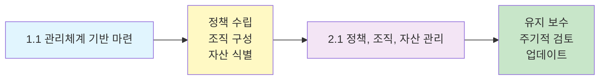

---

### 2.1.1 정책의 유지 관리

**요구사항**:
- 정보 보호 정책을 **주기적으로 검토**
- 필요 시 **재개정**
- 개정 이력을 **관리**

**검토 주기**: **연 1회 이상**

**검토 사항**:
- 법령 변경 사항 반영 필요 여부
- 조직 변화 (신규 서비스, 조직 개편 등) 반영 필요 여부
- 새로운 위협에 대한 대응 필요 여부
- 실효성 평가 (실제로 잘 지켜지고 있는가?)

**정책 개정 절차**:
```
1. 검토 필요성 식별
2. 개정안 작성
3. 관련 부서 의견 수렴
4. 경영진 승인
5. 전 직원 공지 및 교육
6. 개정 이력 기록
```

**정책 버전 관리 예시**:
```
정보보호 정책

버전: 3.0
제정일: 2020-01-01
개정일: 2026-01-10
개정 사유: 개인정보 보호법 시행령 개정 반영
승인: 김철수 (CSO)

[개정 이력]
버전 1.0 (2020-01-01): 제정
버전 2.0 (2023-06-15): 클라우드 서비스 관련 내용 추가
버전 3.0 (2026-01-10): 법령 개정 사항 반영
```

---

### 2.1.2 조직의 유지 관리

**요구사항**:
- 정보 보호 조직의 **역할과 책임**을 명확히 정의
- 담당자 **활동 평가** 체계 수립
- 의사소통 체계 및 절차 수립

#### 역할과 책임 명확화

**조직도 예시**:
```
[정보보호위원회]
  - 위원장: CEO
  - 위원: 각 본부장
  - 역할: 중요 의사결정

    ↓

[CSO - 정보보호 최고 책임자]
  - 역할: 정보 보호 총괄
  - 권한: 예산 집행, 인력 배치

    ↓

[정보보호팀]
  - 팀장: 홍길동
  - 팀원: 이영희, 박철수, 김민지
  - 역할:
    * 정책 수립 및 관리
    * 위험 평가 수행
    * 보안 모니터링
    * 사고 대응
    * 교육 훈련

    ↔

[실무 협의체]
  - 구성원: 각 부서 정보보호 담당자
  - 역할:
    * 정책 전파
    * 부서별 이슈 공유
    * 협업 조율
```

#### 담당자 활동 평가

정보 보호 담당자의 **활동을 평가**하여 실효성을 확보합니다.

**평가 항목 예시**:

| 평가 항목 | 평가 기준 | 가중치 |
|:---|:---|:---:|
| 교육 이수율 | 목표 100% 달성 여부 | 20% |
| 보안 사고 대응 | 대응 시간, 해결 품질 | 30% |
| 정책 준수율 | 부서 내 정책 준수율 | 20% |
| 보안 활동 참여도 | 회의 참석, 개선 제안 등 | 15% |
| 보안 인식 제고 | 부서 내 보안 인식 수준 | 15% |

**평가 결과 활용**:
- 인사 평가 반영 (승진, 보상)
- 역량 부족 시 교육 및 코칭
- 심각한 경우 담당자 교체

#### 의사소통 체계

**정보 보호 이슈**를 조직 내에서 원활히 소통할 수 있는 체계를 구축합니다.

**의사소통 채널**:
- **상향**: 보안팀 → CSO → 경영진 (보고)
- **하향**: 경영진 → CSO → 보안팀 → 각 부서 (지시)
- **수평**: 보안팀 ↔ 각 부서 (협업)

**의사소통 절차**:
1. **일상적 이슈**: 이메일, 메신저
2. **중요 이슈**: 회의, 보고서
3. **긴급 이슈**: 전화, 긴급 회의

---

### 2.1.3 자산 관리

**요구사항**:
- 자산별 **책임자 명확히 정의**
- 자산 목록 **주기적으로 갱신**
- 중요도 **재평가**

**자산 책임자 (Asset Owner)**:
- 각 자산마다 **담당자 지정**
- 담당자는 해당 자산의 **보안 책임**을 짐
- 예: DB 서버 → IT팀 홍길동, 인사 시스템 → 인사팀 김영희

**자산 목록 갱신**:
- 신규 자산 도입 시: **즉시** 등록
- 자산 폐기 시: **즉시** 삭제
- 전체 목록 검토: **연 1회 이상**

**중요도 재평가**:
- 비즈니스 중요도 변화 시
- 법적 요구사항 변경 시
- 보안 사고 발생 후

---

## 👥 2.2 인적 보안 (Personnel Security)

### 📌 개요

**인적 보안이란?**

**사람**은 정보 보안에서 가장 **취약한 고리**이면서 동시에 가장 **중요한 자산**입니다. 인적 보안은 내부 직원들이 보안 사고를 일으키지 않도록 **관리하는 활동**입니다.

**인적 위협의 종류**:
- **고의적**: 내부자 정보 유출, 사보타주
- **비고의적**: 실수, 무지, 사회공학 공격에 속음

💡 **중요!**: 아무리 기술적 보안이 뛰어나도, **사람이 문제를 일으키면** 모든 보안이 무너집니다.

---

### 2.2.1 주요직무자 지정 및 관리

#### 주요직무자란?

**중요한 정보**를 취급하거나 **주요 시스템에 접근**하는 직원을 말합니다.

**주요직무자 예시**:
- **시스템 관리자**: 서버, 데이터베이스 관리
- **개인정보 취급자**: 개인정보를 조회/다운로드할 수 있는 직원
- **보안 관리자**: 방화벽, 로그 등을 관리하는 직원
- **개발자**: 소스 코드를 작성하고 배포할 수 있는 직원
- **DBA**: 데이터베이스를 직접 제어할 수 있는 직원

#### 요구사항

**주요직무 기준을 정의**하고, 해당하는 직원을 **주요직무자로 지정**하여 **목록으로 관리**해야 합니다.

**주요직무 기준 예시**:
```
주요직무 기준

1. 개인정보 취급자
   - 개인정보를 대량(1,000건 이상) 조회할 수 있는 권한 보유자
   - 개인정보를 다운로드할 수 있는 권한 보유자

2. 주요 시스템 접근자
   - 운영 서버에 root/admin 권한 보유자
   - 데이터베이스에 DBA 권한 보유자
   - 방화벽, IDS/IPS 등 보안 장비 관리 권한 보유자

3. 개발자
   - 운영 시스템에 배포 권한 보유자
   - 핵심 소스 코드 접근 권한 보유자
```

**주요직무자 목록 예시**:

| 직무 구분 | 이름 | 부서 | 권한 | 지정일 | 비고 |
|:---|:---:|:---:|:---|:---:|:---|
| 시스템 관리자 | 홍길동 | IT팀 | root 권한 | 2024-01-01 | 웹/DB 서버 관리 |
| DBA | 이영희 | IT팀 | DBA 권한 | 2024-01-01 | 고객 DB 관리 |
| 개인정보 취급자 | 박철수 | 고객센터 | 전체 조회 권한 | 2025-03-01 | 고객 상담 |
| 개발자 | 김민지 | 개발팀 | 배포 권한 | 2025-06-01 | 쇼핑몰 시스템 |

#### 주요직무자 지정 최소화

**요구사항**: 주요직무자를 **최소한**으로 지정해야 합니다.

**이유**:
- 많을수록 위험 증가
- 관리 부담 증가

**최소화 방법**:
- **필요한 경우에만** 권한 부여
- 업무 종료 시 **즉시 권한 회수**
- 정기적으로 **권한 검토** (분기 1회)

---

### 2.2.2 직무 분리 (Separation of Duties)

#### 직무 분리란?

한 사람이 **너무 많은 권한**을 가지지 않도록, **상호 견제가 가능하게** 직무를 분리하는 것입니다.

**직무 분리의 목적**:
- **부정행위 방지**: 혼자서는 부정행위를 저지르기 어렵게
- **실수 방지**: 상호 검증으로 오류 감소
- **책임 추적성**: 누가 무엇을 했는지 명확히

#### 요구사항

**잠재적 피해를 예방**하기 위해 **직무 분리 기준**을 수립하고, 이를 적용해야 합니다.

#### 직무 분리 예시

**분리해야 할 직무**:

| 직무 A | 직무 B | 분리 이유 |
|:---|:---|:---|
| **시스템 운영** | **시스템 감사** | 자기 자신을 감사할 수 없음 |
| **개인정보 시스템 관리** | **일반 정보시스템 관리** | 개인정보 접근을 다른 사람이 감시 |
| **정보 보호 업무** | **정보 보호 감사 업무** | 자기 자신의 보안 활동을 감사할 수 없음 |
| **시스템 개발** | **시스템 배포** | 개발자가 임의로 배포하지 못하게 |
| **데이터 입력** | **데이터 승인** | 입력자가 승인까지 하면 오류 발견 어려움 |

**직무 분리 시나리오**:

**시나리오: 시스템 로그 관리**

❌ **직무 분리 없음** (위험):
```
홍길동 (시스템 관리자):
  - 서버 관리 (root 권한)
  - 로그 관리 (로그 삭제 가능)

→ 문제: 홍길동이 부정행위 후 로그를 삭제할 수 있음
```

✅ **직무 분리 적용** (안전):
```
홍길동 (시스템 관리자):
  - 서버 관리 (root 권한)
  - 로그는 읽기만 가능

이영희 (보안 담당자):
  - 로그 관리 (로그 보관, 분석)
  - 서버 접근 권한 없음

→ 홍길동이 부정행위를 해도, 로그가 남아있어 이영희가 탐지 가능
```

#### 직무 분리가 어려운 경우

중소기업은 **인력 부족**으로 직무 분리가 어려울 수 있습니다.

**대안**:
- **이중 승인**: 중요한 작업은 2명이 승인
- **로그 모니터링 강화**: 활동 기록을 상사가 주기적으로 검토
- **정기 감사**: 외부 감사 또는 내부 감사 강화
- **자동화 통제**: 시스템이 자동으로 제약

---

### 2.2.3 보안 서약

#### 보안 서약이란?

직원이 **정보 보호 의무**를 인지하고 **준수하겠다는 약속**을 문서로 받는 것입니다.

**보안 서약서 == 비밀유지서약서**

#### 요구사항

모든 **내부 인력**과 **외부 인력**으로부터 보안 서약을 받아야 합니다.

**서약 시기**:
- **신규 입사자**: 입사 시
- **기존 직원**: 연 1회 재서약 (권장)
- **외부 협력업체**: 계약 시

#### 보안 서약서 포함 내용

**필수 포함 사항**:
- 정보 보호 정책 준수
- 비밀 유지 의무
- 개인정보 보호 의무
- 회사 정보 무단 유출 금지
- 위반 시 책임 (징계, 법적 조치)

**보안 서약서 예시**:
```
보안 서약서

본인은 ㈜ABC에 재직하는 동안 다음 사항을 준수할 것을 서약합니다.

1. 회사의 정보보호 정책 및 지침을 준수합니다.
2. 업무상 알게 된 회사 기밀 및 고객 정보를 외부에 유출하지 않습니다.
3. 개인정보를 업무 목적 외로 사용하지 않습니다.
4. 회사 정보를 개인 이메일, USB 등으로 무단 반출하지 않습니다.
5. 퇴직 후에도 비밀 유지 의무를 지킵니다.
6. 위반 시 회사의 징계 및 법적 조치에 따를 것을 서약합니다.

서약일: 2026년 1월 10일
서약자: 홍길동 (서명)
```

#### 보안 서약과 고용 계약

**보안 서약**은 별도 문서로 받을 수도 있고, **고용 계약서**에 포함시킬 수도 있습니다.

**고용 계약서 포함 예시**:
```
근로 계약서

제10조 (비밀 유지)
근로자는 재직 중 및 퇴직 후에도 회사의 영업 비밀, 고객 정보, 기술 정보 등을 제3자에게 누설하거나 사적으로 이용해서는 안 된다.

제11조 (손해 배상)
근로자가 제10조를 위반하여 회사에 손해를 입힌 경우, 손해액 전액을 배상하여야 한다.
```

---

### 2.2.4 인식 제고 및 교육 훈련

#### 정보 보호 교육의 중요성

💡 **중요!**: **아무리 좋은 보안 정책도 직원들이 모르면 무용지물**입니다.

**교육의 목적**:
- 정보 보호 **인식 제고**
- 정책 및 지침 **숙지**
- 보안 위협 **대응 능력** 향상
- 개인정보 보호법 등 **법적 의무** 교육

#### 요구사항

**전 직원**에게 **연 1회 이상** 정보 보호 교육을 실시해야 합니다.

**교육 대상별 구분**:
- **전 직원**: 기본 교육 (연 1회 이상)
- **주요직무자**: 심화 교육 (연 1회 이상)
- **신규 입사자**: 입문 교육 (입사 시)

#### 교육 내용

**전 직원 대상 (기본 교육)**:
- 정보 보호 정책 및 지침
- 비밀번호 관리
- 피싱 메일 식별
- 사회공학 공격 대응
- 개인정보 보호
- 보안 사고 발생 시 신고 방법
- 최근 보안 이슈 (랜섬웨어 등)

**주요직무자 대상 (심화 교육)**:
- 개인정보 보호법 상세
- 개인정보 안전조치 기준
- 개인정보 유출 사고 대응
- 로그 분석 방법
- 보안 모니터링

**시스템 관리자/개발자 대상 (기술 교육)**:
- 시큐어 코딩
- 서버 보안 설정
- 취약점 진단 및 조치
- 보안 패치 적용

#### 교육 방법

| 방법 | 장점 | 단점 | 적합한 대상 |
|:---|:---|:---|:---|
| **집합 교육** | 쌍방향 소통, 몰입도 높음 | 시간/장소 제약 | 주요직무자, 관리자 |
| **온라인 교육** | 시간/장소 자유, 비용 절감 | 몰입도 낮음 | 전 직원 |
| **이러닝** | 반복 학습 가능 | 지루할 수 있음 | 전 직원 (기본) |
| **실습 교육** | 실전 능력 향상 | 시간/비용 많이 소요 | 기술 직군 |

#### 교육 관리

**교육 계획 수립**:
```
2026년 정보보호 교육 계획

■ 전 직원 대상:
  - 교육명: 정보보호 및 개인정보 보호 교육
  - 대상: 전 직원 (500명)
  - 시기: 2026년 3월 (1개월간)
  - 방법: 온라인 이러닝
  - 시간: 2시간
  - 내용: 정보보호 정책, 개인정보 보호, 피싱 대응 등
  - 목표: 이수율 100%

■ 주요직무자 대상:
  - 교육명: 개인정보 보호 심화 교육
  - 대상: 개인정보 취급자 (50명)
  - 시기: 2026년 6월
  - 방법: 집합 교육
  - 시간: 4시간
  - 내용: 개인정보 보호법, 안전조치, 사고 대응
  - 목표: 이수율 100%, 평가 80점 이상

■ 신규 입사자 대상:
  - 교육명: 정보보호 입문 교육
  - 대상: 신규 입사자
  - 시기: 입사 오리엔테이션
  - 방법: 집합 교육
  - 시간: 1시간
  - 내용: 회사 정보보호 정책, 보안 수칙
```

**교육 이수 관리**:
- 교육 이수 여부를 **시스템으로 관리**
- 미이수자에 대한 **추가 교육** 실시
- 이수 명단 및 평가 결과 **보관** (3년)

**교육 효과성 평가**:
- 교육 후 **테스트** 실시 (80점 이상 목표)
- 만족도 조사
- 보안 사고 감소율 측정
- 다음 교육에 **피드백 반영**

---

### 2.2.5 퇴직 및 직무 변경 관리

#### 퇴직 및 직무 변경 시 위험

**퇴직자**:
- 회사 정보를 가지고 나가는 위험
- 퇴직 후에도 계정이 살아있어 접근하는 위험

**직무 변경자**:
- 더 이상 필요 없는 권한을 계속 보유하는 위험
- 권한이 누적되어 과도한 권한을 가지는 위험

#### 요구사항

퇴직 및 직무 변경 시 **정보자산 반납**, **접근 권한 해제** 등의 절차를 수립하고 이행해야 합니다.

#### 퇴직 시 조치

**퇴직 절차 체크리스트**:
```
퇴직자 보안 조치 체크리스트

퇴직자: 홍길동
퇴직일: 2026-01-31

[ ] 1. 회사 자산 반납
    - 노트북 반납 (자산번호: NB-001)
    - 휴대폰 반납 (010-1234-5678)
    - 출입카드 반납
    - USB, 외장하드 등 반납

[ ] 2. 계정 삭제/비활성화
    - 이메일 계정 비활성화
    - 사내 시스템 계정 삭제
    - VPN 계정 삭제
    - 클라우드 계정 (Office 365 등) 삭제

[ ] 3. 접근 권한 해제
    - 서버 접근 권한 삭제
    - 데이터베이스 계정 삭제
    - 공용 폴더 접근 권한 해제
    - 출입 권한 해제 (카드 등록 삭제)

[ ] 4. 데이터 인수인계
    - 업무 데이터 후임자에게 인계
    - 개인 데이터 삭제 (PC, 이메일)

[ ] 5. 비밀유지 확약
    - 비밀유지 확약서 징구
    - 퇴직 면담 (보안 사항 안내)

[ ] 6. 부서 간 공유
    - IT팀에 퇴직 사실 통보
    - 보안팀에 퇴직 사실 통보
    - 관련 부서에 공유

확인자: 이영희 (인사팀)
확인일: 2026-01-31
```

#### 직무 변경 시 조치

**직무 변경 절차**:
```
직무 변경 시 권한 조정

대상자: 박철수
변경 전: IT팀 시스템 관리자
변경 후: 기획팀 기획자
변경일: 2026-02-01

[해제할 권한]
  - 서버 root 권한
  - 데이터베이스 DBA 권한
  - VPN 접근 권한

[유지할 권한]
  - 이메일 계정
  - 사내 포털 접근

[신규 부여할 권한]
  - 기획팀 공용 폴더 접근

조치 담당: IT팀
조치 완료일: 2026-02-01
```

#### 자동화 시스템 연동

**인사 시스템 연동**:
- 인사 시스템에서 퇴직 처리 시
- 자동으로 IT 시스템 계정 비활성화
- 이메일 자동 전환 (개인 메일함 → 팀 공용 메일함)

---

### 2.2.6 보안 위반 시 조치

#### 보안 위반이란?

직원이 정보 보호 정책을 **위반**하거나 **보안 사고**를 일으키는 것입니다.

**보안 위반 예시**:
- 개인정보 무단 유출
- 비밀번호 타인에게 공유
- 회사 정보 개인 이메일로 전송
- USB에 회사 정보 저장 후 분실
- 피싱 메일 클릭하여 악성코드 감염

#### 요구사항

**보안 위반 시 조치 규정**을 수립하고, 실제로 **조치**를 취해야 합니다.

#### 보안 위반 조치 규정

**위반 유형별 조치**:

| 위반 유형 | 1차 위반 | 2차 위반 | 3차 위반 |
|:---|:---:|:---:|:---:|
| 경미한 위반 (비밀번호 공유 등) | 경고 | 경고 + 교육 | 견책 |
| 중대한 위반 (정보 유출 미수) | 견책 | 감봉 | 정직 |
| 심각한 위반 (고의적 유출) | 정직 또는 해고 | 해고 | 해고 + 고소 |

**조치 절차**:
```
1. 위반 사실 확인
   - 로그 분석
   - 관련자 인터뷰
   - 증적 수집

2. 조사 위원회 구성
   - 인사팀, 보안팀, 법무팀
   - 해당 부서 관리자

3. 위반 정도 판단
   - 고의성 여부
   - 피해 규모
   - 재발 가능성

4. 조치 결정
   - 규정에 따른 조치
   - 경영진 승인

5. 조치 집행
   - 인사 조치
   - 재발 방지 교육
   - 시스템 접근 차단 (필요 시)

6. 사례 공유
   - 경각심 제고 (익명 처리)
```

#### 보안 위반 사례 관리

**위반 사례 DB 구축**:
- 위반 유형, 조치 내용 기록
- 재발 방지를 위한 참고 자료
- 통계 분석 (어떤 위반이 많은가?)

---

## 🤝 2.3 외부자 보안 (Third-Party Security)

### 📌 개요

**외부자**는 회사 직원이 아닌, **외부 인력**을 의미합니다.

**외부자 유형**:
- 협력업체 직원 (개발, 유지보수 등)
- 파견 근로자
- 아르바이트
- 용역 업체 (청소, 경비 등)
- 방문자 (감사, 점검 등)

💡 **중요!**: 외부자도 회사 정보에 접근할 수 있으므로, **내부 직원만큼 엄격히** 관리해야 합니다.

---

### 2.3.1 외부자 현황 관리

#### 요구사항

업무 위탁, 외부 서비스 이용 시 **현황을 식별**하고, **위험을 파악**하여 **보호대책을 마련**해야 합니다.

#### 외부자 현황 파악

**외부자 목록**:

| 구분 | 업체명 | 업무 내용 | 접근 정보 | 계약 기간 | 담당자 |
|:---|:---|:---|:---|:---|:---|
| 개발 위탁 | ㈜ABC | 쇼핑몰 개발 | 소스코드, DB | 2025-01-01 ~ 2026-12-31 | 홍길동 |
| 유지보수 | ㈜DEF | 서버 유지보수 | 서버 접근 | 2026-01-01 ~ 2026-12-31 | 이영희 |
| 클라우드 | AWS | 인프라 서비스 | 시스템 데이터 | 상시 | 박철수 |
| 용역 | ㈜청소 | 청소 | 사무실 출입 | 2026-01-01 ~ 2026-12-31 | 김민지 |

#### 위험 파악

**외부자로 인한 위험**:
- 정보 유출
- 시스템 오작동
- 법적 책임 (외부 업체의 개인정보 유출)
- 보안 사고 (외부 업체의 해킹 경로)

#### 보호대책 마련

**계약서에 보안 조항 포함** (2.3.2 참조)

---

### 2.3.2 외부자 계약 (Contract Security)

#### 요구사항

외부자와 계약 시 **보안 요구사항**을 계약서에 명시해야 합니다.

#### 계약서 포함 사항

**필수 포함 조항**:
1. **비밀 유지 의무**
   ```
   제10조 (비밀 유지)
   을은 본 계약 수행 중 알게 된 갑의 영업 비밀, 고객 정보, 기술 정보 등을
   제3자에게 누설하거나 본 계약 목적 외로 사용해서는 안 된다.
   ```

2. **개인정보 보호 의무** (개인정보 처리 시)
   ```
   제11조 (개인정보 보호)
   을은 개인정보 보호법을 준수하며, 개인정보 유출 사고 발생 시 모든
   법적 책임을 진다.
   ```

3. **정보 보호 준수 의무**
   ```
   제12조 (정보 보호)
   을은 갑의 정보 보호 정책 및 지침을 준수해야 하며, 위반 시 계약을
   해지할 수 있다.
   ```

4. **보안 사고 시 책임**
   ```
   제13조 (손해 배상)
   을의 귀책 사유로 인한 정보 유출, 보안 사고 발생 시 갑의 손해를
   전액 배상한다.
   ```

5. **보안 감사 권한**
   ```
   제14조 (보안 감사)
   갑은 을의 보안 준수 여부를 점검할 수 있으며, 을은 이에 협조해야 한다.
   ```

#### 업체 선정 시 고려사항

**보안 역량 평가**:
- 정보 보호 인증 (ISMS, ISO 27001 등) 보유 여부
- 보안 사고 이력
- 보안 조직 및 인력
- 보안 관리 절차

---

### 2.3.3 외부자 보안 이행 관리

#### 요구사항

계약서에 명시된 **보안 요구사항을 실제로 준수**하는지 **주기적으로 점검**해야 합니다.

#### 이행 관리 방법

**정기 점검**:
- 분기 1회 또는 연 1회
- 체크리스트 기반 점검
- 보안 감사

**모니터링**:
- 외부자의 시스템 접근 로그 검토
- 작업 내역 확인
- 정보 반출 내역 확인

**보고 체계**:
- 월간 활동 보고서
- 보안 이슈 발생 시 즉시 보고

---

### 2.3.4 외부자 계약 변경 및 만료 시 보안

#### 요구사항

계약 종료 또는 변경 시 **자산 반납**, **접근 권한 해제**, **비밀유지 확약**을 받아야 합니다.

#### 계약 종료 시 조치

**외부자 계약 종료 체크리스트**:
```
[ ] 1. 자산 반납
    - 회사 지급 노트북, 휴대폰
    - 출입카드
    - 보안 토큰 (OTP 등)

[ ] 2. 계정 삭제
    - VPN 계정
    - 시스템 계정
    - 이메일 계정 (제공한 경우)

[ ] 3. 접근 권한 해제
    - 서버 접근 권한
    - 소스코드 저장소 권한
    - 공용 폴더 권한

[ ] 4. 정보 파기
    - 제공받은 데이터 파기 확인
    - 개발/테스트 환경 정리

[ ] 5. 비밀유지 확약
    - 비밀유지 확약서 징구
    - 계약 종료 후에도 비밀유지 의무 지속

확인자: 담당 부서장
확인일: 계약 종료일
```

---

## 🏢 2.4 물리 보안 (Physical Security)

### 📌 개요

**물리 보안**은 **물리적 위협**으로부터 정보자산을 보호하는 활동입니다.

**물리적 위협**:
- 무단 침입
- 도난
- 화재
- 수해
- 정전
- 자연재해

💡 **중요!**: 아무리 사이버 보안이 강력해도, **서버실에 아무나 들어갈 수 있으면** 의미가 없습니다.

---

### 2.4.1 보호구역 지정 (Security Zones)

#### 요구사항

중요 정보자산이 있는 구역을 **물리적 보호구역**으로 지정하고 관리해야 합니다.

#### 보호구역 유형

| 구역 | 정의 | 예시 | 출입 통제 |
|:---|:---|:---|:---|
| **통제구역** | 핵심 자산 보관 | 서버실, IDC | 엄격 (인가자만) |
| **제한구역** | 중요 업무 수행 | 개발실, 보안팀 | 중간 (부서원만) |
| **일반구역** | 일반 업무 수행 | 사무실 | 완화 (직원 전체) |

#### 보호구역 지정 기준

**통제구역 지정 기준**:
- 서버, 네트워크 장비 등 **핵심 시스템** 보관
- 개인정보, 영업 비밀 등 **중요 정보** 보관
- 무단 접근 시 **심각한 피해** 발생 가능

**보호구역 표시**:
- 출입문에 **표지판** 부착
  ```
  ┌──────────────────┐
  │  통제구역           │
  │  Server Room     │
  │  관계자 외 출입금지  │
  └──────────────────┘
  ```

---

### 2.4.2 출입 통제 (Access Control)

#### 요구사항

보호구역에 대한 **출입 통제**를 수행하고, **출입 기록**을 관리해야 합니다.

#### 출입 통제 방법

**물리적 통제**:
- 잠금장치 (열쇠, 전자키)
- 출입카드 시스템
- 생체 인증 (지문, 홍채)

**절차적 통제**:
- 출입 신청 및 승인
- 출입증 발급
- 동행 출입 (방문자)

#### 출입 기록 관리

**출입 로그**:
```
출입 일시: 2026-01-10 14:30
구역: 서버실 (통제구역)
출입자: 홍길동 (IT팀)
목적: 서버 점검
승인자: 이영희 (IT팀장)
퇴실 일시: 2026-01-10 15:00
```

**출입 로그 검토**:
- 주기적으로 **이상 출입** 확인
- 비인가자 출입 시도 탐지
- 보존 기간: 최소 1년

---

### 2.4.3 정보시스템 보호

#### 요구사항

정보시스템을 **물리적 손상**으로부터 보호해야 합니다.

#### 보호 조치

**온도/습도 관리**:
- 서버실 적정 온도: 18~27°C
- 적정 습도: 40~60%
- 에어컨, 항온항습기 설치

**화재 방지**:
- 소화설비 (스프링클러, 소화기)
- 화재 감지기
- 비상 전원 차단 장치

**수해 방지**:
- 서버실은 1층 이상 배치 (지하 X)
- 누수 감지 센서
- 방수 처리

**전원 보호**:
- UPS (무정전 전원 공급 장치)
- 비상 발전기
- 이중 전원선

---

### 2.4.4 보호설비 운영

#### 요구사항

**소화설비**, **비상발전기** 등 보호설비를 구비하고 **정기적으로 점검**해야 합니다.

#### 보호설비 점검

**점검 주기**:
- UPS: 월 1회
- 소화설비: 분기 1회
- 비상발전기: 월 1회 (가동 테스트)
- 에어컨/항온항습기: 월 1회

---

### 2.4.5 보호구역 내 작업

#### 요구사항

보호구역 내에서 작업 시 **절차를 수립**하고, **작업 내역을 기록**해야 합니다.

#### 작업 절차

**작업 신청**:
```
서버실 작업 신청서

작업일시: 2026-01-15 14:00 ~ 16:00
작업자: 홍길동 (IT팀)
작업 내용: DB 서버 메모리 증설
작업 위험도: 중 (서비스 중단 가능)
승인자: 이영희 (IT팀장)
비상 연락처: 010-1234-5678
```

**작업 중 모니터링**:
- CCTV 녹화
- 작업 로그 기록
- 필요 시 동행 감시

---

### 2.4.6 반출입 기기 통제

#### 요구사항

보호구역에 **반입/반출**되는 **기기를 통제**해야 합니다.

#### 반입 통제

**위험한 반입 기기**:
- 개인 노트북 (악성코드 위험)
- USB, 외장하드 (정보 유출 위험)
- 스마트폰 (촬영 위험)

**통제 방법**:
- 반입 금지
- 반입 시 승인 필요
- 반입 시 검사 (악성코드 스캔)

#### 반출 통제

**반출 승인 절차**:
```
정보 반출 신청서

반출일시: 2026-01-20
반출자: 홍길동
반출 정보: 고객 통계 데이터 (엑셀 파일)
반출 사유: 외부 회의 자료
반출 방법: 회사 노트북
승인자: 부서장
반출 후 조치: 회의 종료 즉시 파기
```

---

### 2.4.7 업무 환경 보안 (Clear Desk/Clear Screen)

#### 요구사항

사무실 환경에서의 **정보 유출을 방지**해야 합니다.

#### Clear Desk Policy

**책상 정리**:
- 퇴근 시 중요 문서 **서랍에 보관** 또는 **파쇄**
- 모니터에 **화면 보호기** 설정 (비밀번호)
- 출력물 방치 금지

#### Clear Screen Policy

**화면 보호**:
- 자리 이탈 시 **화면 잠금** (Windows + L)
- 모니터 위치 조정 (후면에서 안 보이게)
- 모니터 보호 필름 부착 (선택)

#### 공용 장비 보안

**복합기 보안**:
- 출력물 **즉시 수거**
- 출력 후 방치 시 **자동 파쇄** 설정
- 팩스 수신 시 **자동 암호화**

**공용 PC 보안**:
- 사용 후 **로그아웃** 필수
- 개인 정보 저장 금지
- 주기적으로 **데이터 삭제**

---

### 2.4.8 출력물 및 문서 보안

#### 요구사항

중요 **출력물** 및 **문서**의 보안을 유지해야 합니다.

#### 문서 보안 등급

| 등급 | 정의 | 예시 | 조치 |
|:---|:---|:---|:---|
| **대외비** | 유출 시 회사에 심각한 피해 | 영업 비밀, 개인정보 대량 | 암호화, 접근 제한 |
| **사내 기밀** | 유출 시 업무에 지장 | 내부 보고서 | 사내 공유만 |
| **일반** | 유출 영향 미미 | 공개 문서 | 제한 없음 |

#### 문서 파기

**파기 방법**:
- 종이 문서: **파쇄기**
- 전자 문서: **완전 삭제** (복구 불가)
- 저장 매체 (HDD): **물리적 파괴** 또는 **데이터 와이핑**

**파기 기록**:
```
문서 파기 대장

파기일: 2026-01-31
파기 문서: 2025년 고객 상담 기록 (보존기간 1년 경과)
파기 방법: 파쇄기
파기 담당: 홍길동
파기 확인: 이영희 (팀장)
```

---

## ✅ 2영역 (인적/외부자/물리 보안) 학습 체크리스트

- [ ] 주요직무자 지정 기준을 이해했다
- [ ] 직무 분리의 목적과 예시를 설명할 수 있다
- [ ] 보안 서약의 중요성을 이해했다
- [ ] 정보 보호 교육의 대상과 내용을 안다
- [ ] 퇴직 시 보안 조치 사항을 안다
- [ ] 외부자 계약 시 포함할 보안 조항을 안다
- [ ] 보호구역의 종류를 설명할 수 있다
- [ ] 출입 통제 방법을 이해했다
- [ ] 물리적 보호 조치 (화재, 수해, 정전)를 안다
- [ ] Clear Desk/Clear Screen 정책을 이해했다

---

**2영역 (일부) 학습 완료! 나머지 2영역과 3영역은 차후 강의에서 계속됩니다.** 🎯✨
# 📋 섹션 5: 인터뷰 실습 - 문제 3, 4번 풀이 및 해설

## 🎯 인터뷰 실습의 목적

ISMS 컨설팅에서 **인터뷰 실습**은 실제 컨설팅 현장에서 고객사의 담당자를 인터뷰하고, ISMS 인증 기준에 맞지 않는 부분을 찾아내어 개선방안을 제시하는 능력을 키우기 위한 핵심 훈련입니다.

### 인터뷰 실습의 핵심 역량


| 단계 | 주요 활동 | 필요 역량 |
|------|----------|----------|
| 1단계 | 인터뷰 내용 분석 | 경청, 핵심 파악 |
| 2단계 | 기준 대조 | ISMS 가이드 숙지 |
| 3단계 | 결함 식별 | 비판적 사고 |
| 4단계 | 개선방안 도출 | 문제해결 능력 |
| 5단계 | 보고서 작성 | 문서화 능력 |

---

## 📝 인터뷰 3번: 위험평가 및 보호대책 선정 관련

### 🎤 인터뷰 시나리오

**인터뷰 대상**: 정보보호 담당자 (김실장)
**인터뷰 주제**: 위험평가 및 보호대책 선정 프로세스
**관련 인증기준**: 1.2.3 위험평가, 1.2.4 보호대책 선정

### 📊 인터뷰 내용 요약

```
질문자: "위험평가 결과를 경영진에게 어떻게 보고하셨나요?"

김실장: "음... 저희는 위험평가를 하고 나서 결과를 구두로 사장님께
        보고드렸습니다. 큰 문제는 없다고 말씀드렸고, 사장님도
        '알았다'고 하셨습니다."

질문자: "고위험 항목이나 법적 의무사항은 어떻게 처리하셨나요?"

김실장: "고유식별정보 암호화가 비용이 많이 들어서요...
        일단 위험을 수용하기로 했습니다. 큰 문제는 없을 거라고
        판단했어요."

질문자: "보호대책 이행계획은 수립하셨나요?"

김실장: "네... 계획은 따로 없고요, 필요한 것들은 그때그때
        처리하고 있습니다."
```

### 🚨 결함 사항 분석

#### ❌ 결함 1: 경영진 보고 및 승인 누락

**관련 기준**: 1.2.3 위험평가

```
[ISMS 가이드 요구사항]
- 위험평가 결과는 경영진에게 "문서로" 보고되어야 함
- 경영진의 "공식적인 승인"을 받아야 함
- 보고 내용: 위험 수준, 보호대책, 잔여위험 등을 명확히 기재
```

**문제점**:
- ❌ 구두로만 보고 (문서화 없음)
- ❌ 경영진의 공식적인 승인 없음
- ❌ 위험평가 결과의 추적성 부재

**영향**:
- 향후 감사 시 증적자료 미확보
- 경영진의 책임과 의사결정 근거 불명확
- 보안 사고 발생 시 법적 책임 문제 발생 가능

#### ❌ 결함 2: 법적 의무사항에 대한 부적절한 위험 수용

**관련 기준**: 1.2.4 보호대책 선정

```
[ISMS 가이드 요구사항]
- "법적 의무사항"은 반드시 준수해야 함
- 위험 수용은 법적 요구사항이 아닌 경우에만 가능
- 개인정보보호법: 고유식별정보 암호화 "의무"
```

**문제점**:
- ❌ 고유식별정보 암호화는 **법적 의무사항**
- ❌ 비용 절감을 이유로 위험 수용 처리 (법 위반)
- ❌ 법적 요구사항과 일반 보안 요구사항 구분 실패

**법적 근거**:

```text
[개인정보보호법 시행령 제21조 제1항]
개인정보처리자는 주민등록번호, 여권번호, 운전면허번호,
외국인등록번호 등 고유식별정보를 처리하는 경우
이를 암호화하여 저장하여야 한다.

→ 이는 "의무사항"이며, 선택 사항이 아님!
```

**영향**:
- 🚨 개인정보보호법 위반 → 과태료 부과 가능 (최대 5천만원)
- 🚨 개인정보 유출 시 민형사상 책임 가중
- 🚨 ISMS 인증 심사 시 부적합 판정 가능성 높음

#### ❌ 결함 3: 보호대책 이행계획 누락

**관련 기준**: 1.2.4 보호대책 선정

```
[ISMS 가이드 요구사항]
- 선정된 보호대책에 대한 "구체적인 이행계획" 수립
- 이행 일정, 담당자, 소요예산 등 명시
- 정기적인 이행 현황 점검 및 보고
```

**문제점**:
- ❌ 이행계획 미수립
- ❌ "그때그때 처리" 방식 → 체계적 관리 부재
- ❌ 담당자, 일정, 예산 등 불명확

**영향**:
- 보호대책 미이행 또는 지연 발생 가능
- 보안 투자 우선순위 불명확
- 경영진의 의사결정 자료 부족

### ✅ 개선 방안

#### 개선 1: 위험평가 결과 문서화 및 경영진 승인 프로세스 확립

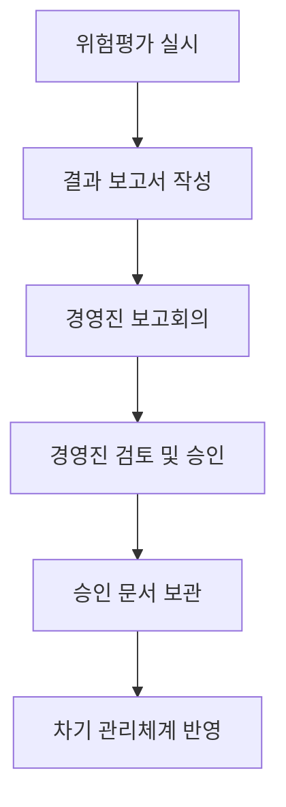

**구체적 조치사항**:

1. **위험평가 결과 보고서 양식 수립**

```markdown
# 위험평가 결과 보고서

## 1. 평가 개요
- 평가 기간: YYYY-MM-DD ~ YYYY-MM-DD
- 평가 범위: [적용 범위 명시]
- 평가 방법론: [사용한 평가 방법론]

## 2. 위험평가 결과 요약
| 위험 수준 | 자산 수 | 비율 |
|----------|--------|------|
| 매우 높음 | X개 | X% |
| 높음 | X개 | X% |
| 중간 | X개 | X% |
| 낮음 | X개 | X% |

## 3. 주요 고위험 항목
[상위 10개 고위험 항목 목록]

## 4. 보호대책 권고사항
[필수 조치사항, 권고 조치사항]

## 5. 위험 수용 항목 (경영진 승인 필요)
[위험 수용 대상 목록 및 사유]

---
작성자: [이름/직위]
작성일: YYYY-MM-DD

경영진 승인: _______________ (서명/날짜)
```

2. **경영진 승인 프로세스**

```python
# 위험평가 승인 절차 체크리스트
approval_checklist = {
    "1단계_보고서_작성": {
        "담당자": "정보보호담당자",
        "기한": "평가 완료 후 3일 이내",
        "산출물": "위험평가 결과 보고서"
    },
    "2단계_경영진_보고": {
        "담당자": "정보보호최고책임자",
        "방법": "경영진 회의 안건 상정",
        "기한": "보고서 작성 후 1주일 이내"
    },
    "3단계_경영진_승인": {
        "승인자": "CEO/대표이사",
        "방법": "서면 승인 (서명 또는 전자결재)",
        "보관": "3년간 보관 (전자문서 또는 실물)"
    },
    "4단계_후속조치": {
        "담당자": "정보보호담당자",
        "내용": "승인된 보호대책 이행계획 수립",
        "기한": "승인 후 2주일 이내"
    }
}
```

#### 개선 2: 법적 의무사항 필터링 및 필수 이행

**법적 의무사항 식별 절차**:

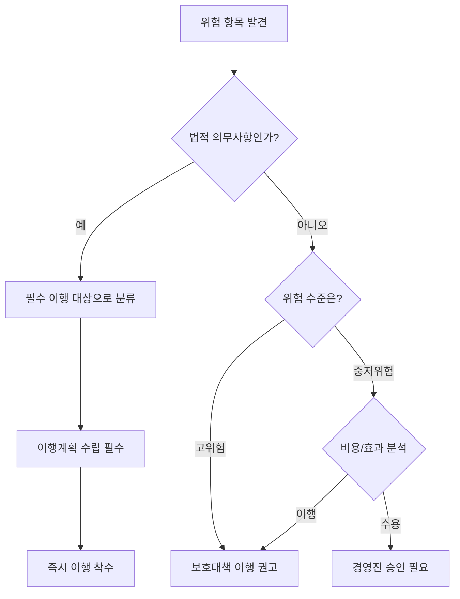

**법적 의무사항 체크리스트**:

| 분야 | 법률 | 필수 요구사항 | 위반 시 제재 |
|------|------|--------------|------------|
| 개인정보 | 개인정보보호법 | 고유식별정보 암호화 | 과태료 최대 5천만원 |
| 개인정보 | 개인정보보호법 | 비밀번호 암호화 저장 | 과태료 최대 5천만원 |
| 개인정보 | 개인정보보호법 | 접근 로그 6개월 이상 보관 | 과태료 최대 3천만원 |
| 정보통신 | 정보통신망법 | 개인정보 파기 절차 | 과태료 최대 3천만원 |
| 전자금융 | 전자금융거래법 | 거래 로그 5년 보관 | 과태료 최대 5천만원 |

**고유식별정보 암호화 이행 예시**:

```sql
-- [현재 상태 - 위험!]
-- 고유식별정보가 평문으로 저장되어 있음
CREATE TABLE users (
    id INT PRIMARY KEY,
    name VARCHAR(100),
    ssn VARCHAR(14),  -- ❌ 주민등록번호가 평문!
    email VARCHAR(100)
);

-- [개선 후 - 암호화 적용]
-- 고유식별정보를 암호화하여 저장
CREATE TABLE users (
    id INT PRIMARY KEY,
    name VARCHAR(100),
    ssn_encrypted BLOB,  -- ✅ 암호화된 주민등록번호
    email VARCHAR(100)
);

-- 암호화 적용 예시 (AES-256 사용)
-- 애플리케이션 단에서 암호화 처리
INSERT INTO users (id, name, ssn_encrypted, email)
VALUES (
    1,
    '홍길동',
    AES_ENCRYPT('123456-1234567', 'encryption_key_here'),  -- 암호화
    'hong@example.com'
);

-- 조회 시 복호화
SELECT
    id,
    name,
    AES_DECRYPT(ssn_encrypted, 'encryption_key_here') AS ssn,  -- 복호화
    email
FROM users
WHERE id = 1;
```

**암호화 키 관리**:

```python
# 암호화 키 관리 모범 사례
class EncryptionKeyManager:
    """
    암호화 키 관리 시스템
    - 키는 환경변수 또는 별도 키 관리 시스템(KMS)에서 관리
    - 코드에 하드코딩 금지!
    """

    def __init__(self):
        # 환경변수에서 키 로드 (또는 AWS KMS, Azure Key Vault 등 사용)
        self.master_key = os.getenv('MASTER_ENCRYPTION_KEY')
        if not self.master_key:
            raise ValueError("암호화 키가 설정되지 않았습니다!")

    def encrypt_ssn(self, ssn):
        """주민등록번호 암호화"""
        from cryptography.fernet import Fernet
        cipher = Fernet(self.master_key)
        encrypted = cipher.encrypt(ssn.encode())
        return encrypted

    def decrypt_ssn(self, encrypted_ssn):
        """주민등록번호 복호화"""
        from cryptography.fernet import Fernet
        cipher = Fernet(self.master_key)
        decrypted = cipher.decrypt(encrypted_ssn).decode()
        return decrypted

    def rotate_key(self):
        """키 순환 (정기적으로 키 변경)"""
        # 새로운 키 생성
        # 기존 데이터를 새 키로 재암호화
        # 키 순환 이력 기록
        pass
```

#### 개선 3: 보호대책 이행계획 수립

**보호대책 이행계획서 양식**:

```markdown
# 보호대책 이행계획서

## 1. 계획 개요
- 작성일: YYYY-MM-DD
- 작성자: [정보보호담당자]
- 승인자: [정보보호최고책임자]

## 2. 이행 대상 보호대책

| No | 대책명 | 위험수준 | 우선순위 | 법적의무 |
|----|--------|---------|---------|---------|
| 1 | 고유식별정보 암호화 | 매우 높음 | 최우선 | ✅ |
| 2 | 접근통제 강화 | 높음 | 높음 | ❌ |
| 3 | 백업 정책 수립 | 중간 | 중간 | ❌ |

## 3. 세부 이행 일정

### 대책 1: 고유식별정보 암호화

| 단계 | 활동 | 담당자 | 시작일 | 완료일 | 예산 | 상태 |
|-----|------|--------|--------|--------|------|-----|
| 1 | 암호화 솔루션 선정 | 김OO | 2026-01-15 | 2026-01-20 | 0원 | 대기 |
| 2 | 암호화 솔루션 도입 | 이OO | 2026-01-21 | 2026-02-10 | 500만원 | 대기 |
| 3 | 개발 및 테스트 | 박OO | 2026-02-11 | 2026-03-10 | 0원 | 대기 |
| 4 | 실운영 적용 | 최OO | 2026-03-11 | 2026-03-20 | 0원 | 대기 |
| 5 | 이행 완료 보고 | 김OO | 2026-03-21 | 2026-03-21 | 0원 | 대기 |

**예산 합계**: 500만원
**완료 예정일**: 2026-03-21

## 4. 이행 현황 관리

- 주간 진행상황 점검 (매주 금요일)
- 월간 경영진 보고 (매월 마지막 주)
- 지연 발생 시 즉시 보고 및 조치
```

**이행 현황 추적 시스템**:

```python
class ProtectionMeasureTracker:
    """보호대책 이행 현황 추적"""

    def __init__(self):
        self.measures = []

    def add_measure(self, measure):
        """보호대책 추가"""
        self.measures.append({
            'id': len(self.measures) + 1,
            'name': measure['name'],
            'priority': measure['priority'],
            'deadline': measure['deadline'],
            'owner': measure['owner'],
            'status': 'pending',  # pending, in_progress, completed, delayed
            'progress': 0  # 0-100%
        })

    def update_status(self, measure_id, status, progress):
        """이행 현황 업데이트"""
        for measure in self.measures:
            if measure['id'] == measure_id:
                measure['status'] = status
                measure['progress'] = progress

                # 지연 발생 시 알림
                if status == 'delayed':
                    self.send_alert(measure)

    def send_alert(self, measure):
        """지연 알림 발송"""
        print(f"⚠️ 보호대책 '{measure['name']}' 이행이 지연되고 있습니다!")
        print(f"   담당자: {measure['owner']}")
        print(f"   기한: {measure['deadline']}")
        print(f"   진행률: {measure['progress']}%")

    def get_weekly_report(self):
        """주간 이행 현황 보고서"""
        report = {
            'total': len(self.measures),
            'completed': len([m for m in self.measures if m['status'] == 'completed']),
            'in_progress': len([m for m in self.measures if m['status'] == 'in_progress']),
            'delayed': len([m for m in self.measures if m['status'] == 'delayed']),
        }
        return report

# 사용 예시
tracker = ProtectionMeasureTracker()

# 보호대책 등록
tracker.add_measure({
    'name': '고유식별정보 암호화',
    'priority': 'critical',
    'deadline': '2026-03-21',
    'owner': '김철수'
})

# 현황 업데이트
tracker.update_status(1, 'in_progress', 30)

# 주간 보고서
print(tracker.get_weekly_report())
# 출력: {'total': 1, 'completed': 0, 'in_progress': 1, 'delayed': 0}
```

### 📊 인터뷰 3번 종합 정리

**발견된 결함**: 3건
- 경영진 보고 및 승인 누락
- 법적 의무사항에 대한 부적절한 위험 수용
- 보호대책 이행계획 누락

**개선 조치**: 3가지
1. 위험평가 결과 문서화 및 승인 프로세스 확립
2. 법적 의무사항 필터링 및 필수 이행 체계 구축
3. 보호대책 이행계획 수립 및 추적 시스템 구축

**예상 비용**: 약 500만원 (암호화 솔루션)
**이행 기간**: 약 2개월

---

## 📚 인터뷰 4번: 정보보호 교육 관련

### 🎤 인터뷰 시나리오

**인터뷰 대상**: 인사팀장 (박팀장)
**인터뷰 주제**: 정보보호 및 개인정보보호 교육 현황
**관련 인증기준**: 2.2.5 정보보호 및 개인정보보호 교육

### 📊 인터뷰 내용 요약

```
질문자: "정보보호 교육은 어떻게 진행하고 계신가요?"

박팀장: "네, 저희는 매년 전 직원 대상으로 1시간씩 정보보호 교육을
        하고 있습니다. 작년에 사용했던 교육 자료를 그대로 사용하고
        있어요. 내용이 크게 바뀌는 것도 아니고요."

질문자: "교육 내용은 어떻게 구성되어 있나요?"

박팀장: "비밀번호 관리, 이메일 보안, 악성코드 주의 같은 기본적인
        내용들이요. 모든 직원에게 똑같은 내용으로 진행합니다."

질문자: "관리자나 개인정보 취급자에게 별도 교육은 없나요?"

박팀장: "아... 그런 건 따로 없고요, 필요하면 그때그때 안내하는
        정도입니다."

질문자: "외주 인력이나 협력업체 직원도 교육을 받나요?"

박팀장: "음... 외주 인력은 명확한 기준이 없어서요. 필요할 때만
        안내하거나 아예 교육 대상에서 빠지는 경우도 있습니다."
```

### 🚨 결함 사항 분석

#### ❌ 결함 1: 교육 내용 최신화 부족

**관련 기준**: 2.2.5 정보보호 및 개인정보보호 교육

```
[ISMS 가이드 요구사항]
- 정보보호 교육은 "최신 보안 위협 및 법제도"를 반영해야 함
- 매년 또는 법제도 변경 시 교육 내용 업데이트
- 최신 보안 이슈 및 사례 포함
```

**문제점**:
- ❌ 작년 교육자료를 그대로 재사용
- ❌ 최신 법제도 변경사항 미반영
- ❌ 새로운 보안 위협 (랜섬웨어 신종 기법 등) 미포함

**2025-2026년 반영 필요 주요 변경사항**:

| 분야 | 변경 내용 | 시행일 | 교육 반영 필요성 |
|------|----------|--------|-----------------|
| 개인정보보호법 | 가명정보 활용 제도 개선 | 2025년 3월 | 높음 |
| 정보통신망법 | 이용자 보호 강화 | 2025년 6월 | 중간 |
| 클라우드 보안 | 클라우드 보안인증(CSAP) 개정 | 2025년 9월 | 높음 |
| 랜섬웨어 | 신종 랜섬웨어 공격 기법 | 계속 발생 | 매우 높음 |
| AI 보안 | 생성형 AI 활용 시 보안 가이드 | 2026년 1월 | 높음 |

**영향**:
- 직원들이 최신 보안 위협에 대응하지 못함
- 법 개정 내용을 모르고 위반할 가능성
- ISMS 심사 시 교육 내용 최신성 지적 가능

#### ❌ 결함 2: 직무별/대상별 교육계획 누락

**관련 기준**: 2.2.5 정보보호 및 개인정보보호 교육

```
[ISMS 가이드 요구사항]
- 직무 특성에 따른 "차별화된 교육" 실시
- 개인정보 취급자, 관리자, 일반 직원 구분
- 각 대상별 필요한 교육 내용 제공
```

**문제점**:
- ❌ 전 직원 동일한 교육만 실시
- ❌ 개인정보 취급자 별도 교육 없음
- ❌ 관리자급 교육 없음

**직무별 교육 요구사항**:

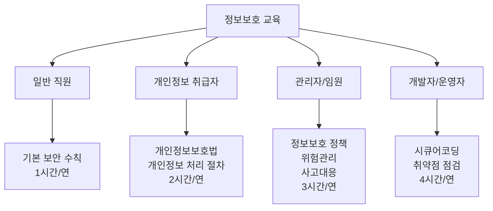

**대상별 교육 내용 예시**:

| 대상 | 필수 교육 내용 | 시간 | 주기 |
|------|---------------|------|------|
| **일반 직원** | • 비밀번호 관리<br/>• 이메일/인터넷 보안<br/>• 사회공학 공격 대응<br/>• 정보 유출 예방 | 1시간 | 연 1회 |
| **개인정보 취급자** | • 개인정보보호법 주요 내용<br/>• 개인정보 처리 절차<br/>• 개인정보 파기 방법<br/>• 개인정보 유출 대응<br/>• 암호화 및 접근통제 | 2시간 | 연 1회 |
| **관리자/임원** | • 정보보호 정책 및 조직<br/>• 위험관리 프로세스<br/>• 사고 대응 및 보고<br/>• 법적 책임 및 준수사항 | 3시간 | 연 1회 |
| **개발자/운영자** | • 시큐어코딩<br/>• 취약점 점검 및 조치<br/>• 로그 관리<br/>• 보안 패치 관리<br/>• 백업 및 복구 | 4시간 | 연 2회 |
| **신규 입사자** | • 회사 정보보호 정책<br/>• 보안 서약<br/>• 기본 보안 수칙 | 1시간 | 입사 시 |

**영향**:
- 개인정보 취급자가 법적 의무를 모르고 위반
- 관리자가 보안 사고 발생 시 대응 미숙
- 개발자가 취약한 코드 작성 → 보안 사고

#### ❌ 결함 3: 외주인력 교육대상 누락

**관련 기준**: 2.2.5 정보보호 및 개인정보보호 교육, 2.3 외부자 보안

```
[ISMS 가이드 요구사항]
- "외부자(외주, 협력업체)"도 정보보호 교육 대상에 포함
- 외부자 교육 실시 여부 관리
- 계약서에 교육 의무 명시
```

**문제점**:
- ❌ 외주인력 교육 기준 없음
- ❌ 필요할 때만 안내 (체계적 관리 부재)
- ❌ 교육 대상에서 누락되는 경우 발생

**외주인력 보안 위험**:

```
[실제 사례]
2023년 A사 개인정보 유출 사고
- 원인: 외주 개발자가 개인정보를 개인 이메일로 전송
- 문제: 외주 개발자에게 개인정보 처리 교육 미실시
- 결과: 과징금 5천만원, 손해배상 소송
```

**영향**:
- 외주인력의 보안 의식 부족 → 보안 사고 위험
- 계약 종료 후에도 정보 보유 가능성
- ISMS 심사 시 외부자 관리 부적합 판정

### ✅ 개선 방안

#### 개선 1: 교육 내용 최신화 프로세스 구축

**연간 교육 내용 업데이트 프로세스**:


**교육 내용 업데이트 체크리스트**:

```markdown
# 연간 교육 내용 업데이트 체크리스트

## 1. 법제도 변경사항 확인 (11월)
- [ ] 개인정보보호법 개정 내용 확인
- [ ] 정보통신망법 개정 내용 확인
- [ ] 전자금융거래법 개정 내용 확인
- [ ] 기타 관련 법규 변경 확인

**확인 방법**:
- 법제처 국가법령정보센터 (www.law.go.kr)
- 개인정보보호위원회 공지사항
- KISA 법제도 동향

## 2. 최신 보안 이슈 조사 (11월)
- [ ] 전년도 주요 보안 사고 사례
- [ ] 신종 사이버 위협 (랜섬웨어, 피싱 등)
- [ ] 업계 보안 동향
- [ ] KISA, 보안 업체 보고서 검토

**참고 자료**:
- KISA 인터넷 보안 위협 동향 보고서
- 보안 전문 기업 연간 보고서 (Kaspersky, Symantec 등)
- 주요 보안 사고 사례 (뉴스, 보도자료)

## 3. 교육 자료 업데이트 (12월)
- [ ] 기존 교육 자료 검토
- [ ] 변경/추가 내용 반영
- [ ] 사례 중심 콘텐츠 제작
- [ ] 시청각 자료 준비 (동영상, 인포그래픽)

## 4. 내부 검토 및 승인 (12월)
- [ ] 정보보호담당자 검토
- [ ] 정보보호최고책임자 승인
- [ ] 교육 일정 수립

## 5. 교육 시행 (다음 연도 1월~)
- [ ] 교육 실시
- [ ] 이수 현황 관리
- [ ] 효과성 평가
```

**2026년 교육 자료 업데이트 예시**:

```python
# 2026년 정보보호 교육 주제 예시
education_topics_2026 = {
    "법제도_변경사항": [
        {
            "주제": "개인정보보호법 개정 (2025.3 시행)",
            "내용": "가명정보 활용 범위 확대, 동의 절차 간소화",
            "중요도": "높음",
            "대상": "전 직원, 개인정보 취급자"
        },
        {
            "주제": "클라우드 보안인증 개정 (2025.9 시행)",
            "내용": "CSAP 인증 기준 변경, 클라우드 이용 시 준수사항",
            "중요도": "중간",
            "대상": "개발자, 운영자"
        }
    ],

    "최신_보안_위협": [
        {
            "주제": "생성형 AI 관련 보안 위협",
            "내용": "ChatGPT, Copilot 사용 시 정보 유출 주의, 프롬프트 인젝션",
            "사례": "B사 영업 기밀 ChatGPT 업로드 사고",
            "대상": "전 직원"
        },
        {
            "주제": "랜섬웨어 신종 기법 (2025 하반기)",
            "내용": "이중 갈취, 공급망 공격, 클라우드 타겟 랜섬웨어",
            "사례": "C사 랜섬웨어 감염 후 데이터 유출 협박",
            "대상": "전 직원"
        },
        {
            "주제": "딥페이크 기반 사회공학 공격",
            "내용": "가짜 영상통화로 임원 사칭, 금전 요구",
            "사례": "D사 CFO 사칭 사건 (피해액 3억)",
            "대상": "관리자, 재무팀"
        }
    ],

    "실무_사례": [
        {
            "주제": "우리 회사 보안 사고 사례 (익명화)",
            "내용": "2025년 발생한 이메일 피싱 시도 사례 분석",
            "교훈": "의심스러운 링크 클릭 금지, 발신자 확인",
            "대상": "전 직원"
        }
    ]
}

# 교육 자료 자동 생성 함수
def generate_education_material(year):
    """연도별 교육 자료 생성"""
    material = f"# {year}년 정보보호 교육 자료\n\n"

    # 법제도 섹션
    material += "## 📜 법제도 변경사항\n"
    for item in education_topics_2026["법제도_변경사항"]:
        material += f"### {item['주제']}\n"
        material += f"- **내용**: {item['내용']}\n"
        material += f"- **대상**: {item['대상']}\n\n"

    # 보안 위협 섹션
    material += "## 🚨 최신 보안 위협\n"
    for item in education_topics_2026["최신_보안_위협"]:
        material += f"### {item['주제']}\n"
        material += f"- **내용**: {item['내용']}\n"
        material += f"- **사례**: {item['사례']}\n\n"

    return material

print(generate_education_material(2026))
```

#### 개선 2: 직무별/대상별 교육계획 수립

**직무별 교육 매트릭스**:

```markdown
# 직무별 정보보호 교육 계획

## 교육 과정 구성

| 과정명 | 대상 | 시간 | 주기 | 방법 | 평가 |
|--------|------|------|------|------|-----|
| **기본 과정** | 전 직원 | 1시간 | 연 1회 | 온라인 | 퀴즈 (80점 이상) |
| **개인정보 과정** | 개인정보 취급자 | 2시간 | 연 1회 | 온라인 + 오프라인 | 시험 (80점 이상) |
| **관리자 과정** | 팀장 이상 | 3시간 | 연 1회 | 오프라인 | 사례 분석 |
| **개발자 과정** | 개발팀 | 4시간 | 연 2회 | 오프라인 | 실습 평가 |
| **신입 과정** | 신규 입사자 | 1시간 | 입사 시 | 오프라인 | 확인서 서명 |
```

**개인정보 취급자 교육 커리큘럼 예시**:

```markdown
# 개인정보 취급자 교육 (2시간)

## 1교시: 개인정보보호법 기초 (60분)

### 1.1 개인정보의 정의 (10분)
- 개인정보란?
- 고유식별정보, 민감정보
- 가명정보, 익명정보

### 1.2 개인정보 처리 단계별 준수사항 (30분)
- 수집: 동의, 최소 수집
- 이용: 목적 내 이용
- 제공: 제3자 제공 동의
- 파기: 보유기간 경과 후 즉시 파기

### 1.3 법적 책임 (20분)
- 개인정보 유출 시 처벌 (형사, 행정)
- 손해배상 책임
- 실제 사례 분석

## 2교시: 실무 적용 (60분)

### 2.1 우리 회사 개인정보 처리 프로세스 (20분)
- 업무 흐름도
- 개인정보 취급 시스템
- 접근 권한 관리

### 2.2 주요 보안 조치 (20분)
- 암호화 (고유식별정보, 비밀번호)
- 접근통제 (직무별 권한)
- 로그 기록 및 보관

### 2.3 사고 대응 (10분)
- 개인정보 유출 인지 시 조치
- 보고 절차
- 대응 매뉴얼

### 2.4 평가 (10분)
- 객관식 시험 (20문항)
- 80점 이상 합격
```

**교육 이수 관리 시스템**:

```python
class EducationTracker:
    """직무별 교육 이수 현황 관리"""

    def __init__(self):
        self.employees = []
        self.courses = {
            '기본과정': {'duration': 1, 'frequency': 'annual'},
            '개인정보과정': {'duration': 2, 'frequency': 'annual'},
            '관리자과정': {'duration': 3, 'frequency': 'annual'},
            '개발자과정': {'duration': 4, 'frequency': 'semi-annual'},
        }

    def assign_courses(self, employee):
        """직무별 필수 교육 과정 배정"""
        required_courses = ['기본과정']  # 전원 필수

        if employee['role'] == '개인정보취급자':
            required_courses.append('개인정보과정')

        if employee['position'] in ['팀장', '부장', '임원']:
            required_courses.append('관리자과정')

        if employee['department'] == '개발팀':
            required_courses.append('개발자과정')

        return required_courses

    def check_completion(self, employee_id):
        """교육 이수 여부 확인"""
        employee = self.get_employee(employee_id)
        required = self.assign_courses(employee)
        completed = employee['completed_courses']

        missing = [c for c in required if c not in completed]

        if missing:
            print(f"⚠️ {employee['name']}님 미이수 과정: {missing}")
            return False
        else:
            print(f"✅ {employee['name']}님 필수 교육 모두 이수")
            return True

    def get_completion_rate(self):
        """전체 교육 이수율"""
        total = len(self.employees)
        completed = len([e for e in self.employees if self.check_completion(e['id'])])
        return (completed / total) * 100

# 사용 예시
tracker = EducationTracker()

# 직원 등록
tracker.employees.append({
    'id': 1,
    'name': '김철수',
    'role': '개인정보취급자',
    'position': '사원',
    'department': '고객관리팀',
    'completed_courses': ['기본과정', '개인정보과정']
})

# 이수 확인
tracker.check_completion(1)
# 출력: ✅ 김철수님 필수 교육 모두 이수
```

#### 개선 3: 외주인력 교육 체계 구축

**외주인력 교육 정책**:

```markdown
# 외부자(외주/협력업체) 정보보호 교육 정책

## 1. 교육 대상
- 회사 정보시스템 접근 권한이 있는 모든 외부자
- 개인정보를 취급하는 외부자
- 3개월 이상 근무하는 외부자

## 2. 교육 시기
- **입사 전**: 계약 체결 후 업무 시작 전
- **재교육**: 연 1회 또는 계약 갱신 시

## 3. 교육 내용
- 회사 정보보호 정책 및 규정
- 보안 서약서 작성
- 기본 보안 수칙 (비밀번호, 이메일, 문서 관리)
- 개인정보 처리 기준 (해당 시)
- 퇴사 시 정보 반납 절차

## 4. 교육 방법
- 온라인 교육 + 서약서 서명
- 소요 시간: 30분
- 평가: 확인 퀴즈 (10문항, 80점 이상)

## 5. 관리
- 교육 이수증 발급 및 보관
- 미이수 시 시스템 접근 권한 부여 불가
- 계약서에 교육 의무 명시
```

**외주인력 계약서 보안 조항 예시**:

```text
[용역 계약서]

제X조 (정보보호 교육)
① 을(계약업체)은 본 계약 업무 수행을 위해 투입되는 인력에 대해
   갑(발주사)이 제공하는 정보보호 교육을 의무적으로 이수하도록 해야 한다.

② 을은 업무 시작 전 모든 투입 인력이 정보보호 교육을 이수했음을
   증명하는 서류를 갑에게 제출해야 한다.

③ 을의 투입 인력이 정보보호 교육을 이수하지 않은 경우,
   갑은 해당 인력의 업무 투입을 거부할 수 있다.

④ 을은 연 1회 재교육을 이수해야 하며, 미이수 시
   시스템 접근 권한이 정지될 수 있다.

제X조 (정보보호 서약)
① 을은 본 계약 업무 수행 과정에서 알게 된 갑의 정보를
   타인에게 공개하거나 유출하지 않을 것을 서약해야 한다.

② 을의 투입 인력은 개별적으로 정보보호 서약서에 서명해야 한다.

제X조 (위반 시 조치)
① 을 또는 을의 투입 인력이 정보보호 교육 미이수 또는
   정보 유출 등 본 계약을 위반한 경우, 갑은 계약을 해지하고
   손해배상을 청구할 수 있다.
```

**외주인력 온보딩 프로세스**:

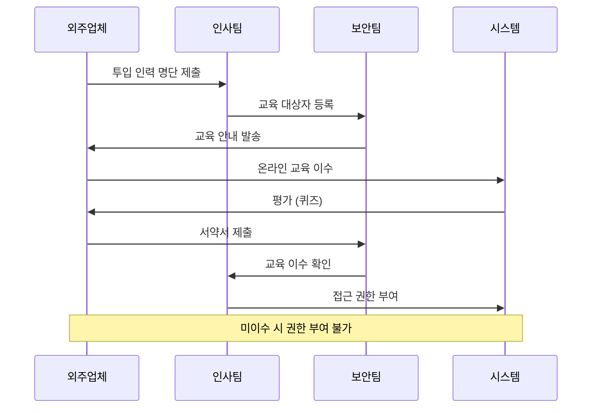

**외주인력 교육 이수 추적**:

```python
class ContractorEducationManager:
    """외주인력 교육 이수 관리"""

    def __init__(self):
        self.contractors = []

    def register_contractor(self, contractor):
        """외주인력 등록"""
        contractor['education_status'] = 'not_started'
        contractor['access_granted'] = False
        self.contractors.append(contractor)

        # 교육 안내 발송
        self.send_education_notice(contractor)

    def send_education_notice(self, contractor):
        """교육 안내 이메일 발송"""
        print(f"📧 교육 안내 발송: {contractor['email']}")
        print(f"   대상: {contractor['name']} ({contractor['company']})")
        print(f"   교육 링크: https://education.company.com/contractor")

    def complete_education(self, contractor_id, score):
        """교육 이수 처리"""
        contractor = self.get_contractor(contractor_id)

        if score >= 80:
            contractor['education_status'] = 'completed'
            contractor['completion_date'] = datetime.now()
            print(f"✅ {contractor['name']}님 교육 이수 완료 (점수: {score})")

            # 서약서 서명 요청
            self.request_pledge(contractor)
        else:
            print(f"❌ {contractor['name']}님 교육 미통과 (점수: {score})")
            print("   재시험이 필요합니다.")

    def submit_pledge(self, contractor_id):
        """서약서 제출"""
        contractor = self.get_contractor(contractor_id)

        if contractor['education_status'] == 'completed':
            contractor['pledge_submitted'] = True
            print(f"📝 {contractor['name']}님 서약서 제출 완료")

            # 접근 권한 부여 가능
            self.grant_access(contractor)

    def grant_access(self, contractor):
        """시스템 접근 권한 부여"""
        if contractor['education_status'] == 'completed' and contractor['pledge_submitted']:
            contractor['access_granted'] = True
            print(f"🔓 {contractor['name']}님 시스템 접근 권한 부여")
        else:
            print(f"🔒 {contractor['name']}님 교육 미이수 - 권한 부여 불가")

    def check_renewal(self):
        """재교육 대상자 확인 (1년 경과)"""
        from datetime import datetime, timedelta

        renewal_needed = []
        for contractor in self.contractors:
            if contractor['access_granted']:
                completion_date = contractor.get('completion_date')
                if completion_date and (datetime.now() - completion_date) > timedelta(days=365):
                    renewal_needed.append(contractor)

        if renewal_needed:
            print(f"⚠️ 재교육 필요: {len(renewal_needed)}명")
            for c in renewal_needed:
                print(f"   - {c['name']} ({c['company']})")
                self.send_education_notice(c)

# 사용 예시
manager = ContractorEducationManager()

# 외주인력 등록
manager.register_contractor({
    'id': 1,
    'name': '이외주',
    'company': 'ABC개발',
    'email': 'lee@abc.com',
    'contract_period': '2026-01-10 ~ 2026-12-31'
})

# 교육 이수
manager.complete_education(1, 85)

# 서약서 제출
manager.submit_pledge(1)

# 결과: 시스템 접근 권한 부여됨
```

### 📊 인터뷰 4번 종합 정리

**발견된 결함**: 4건
- 교육 내용 최신화 부족
- 직무별/대상별 교육계획 누락
- 외주인력 교육대상 누락
- (추가) 교육 효과성 평가 부재

**개선 조치**: 4가지
1. 연간 교육 내용 업데이트 프로세스 구축
2. 직무별/대상별 차별화된 교육계획 수립
3. 외주인력 교육 체계 및 계약서 조항 추가
4. 교육 이수 현황 추적 및 관리 시스템 구축

**예상 비용**: 약 300만원 (교육 플랫폼 구축 또는 외부 교육 서비스 이용)
**이행 기간**: 약 1개월

---

## 🎓 인터뷰 실습 종합 학습 포인트

### 핵심 역량

1. **경청 능력**: 인터뷰 대상자의 말에서 핵심을 파악
2. **기준 숙지**: ISMS 가이드 요구사항을 정확히 알고 있어야 함
3. **비판적 사고**: "이게 기준에 맞는가?" 판단
4. **문제해결**: 현실적이고 구체적인 개선방안 제시
5. **문서화**: 발견사항과 개선방안을 명확히 기록

### 인터뷰 시 주의사항

```mermaid
mindmap
  root((인터뷰 Tip))
    질문 기법
      개방형 질문
      구체적 사례 요청
      "어떻게" "왜" 질문
    경청
      끝까지 듣기
      메모하기
      확인 질문
    증적 확인
      문서 요청
      시스템 확인
      실제 운영 확인
    태도
      비난 금지
      협력적 자세
      개선 지향
```

### 자주 발견되는 결함 패턴

| 영역 | 자주 발견되는 결함 | 개선 방향 |
|------|------------------|----------|
| **위험관리** | • 구두 보고/승인<br/>• 법적 의무사항 위험 수용<br/>• 이행계획 없음 | • 문서화 프로세스<br/>• 법적 요구사항 체크리스트<br/>• 이행 추적 시스템 |
| **교육** | • 작년 자료 재사용<br/>• 전원 동일 교육<br/>• 외주인력 누락 | • 연간 업데이트 프로세스<br/>• 직무별 교육 과정<br/>• 외주 교육 정책 |
| **인적보안** | • 주요직무자 미지정<br/>• 보안 서약 없음<br/>• 퇴직 시 조치 없음 | • 주요직무자 지정 기준<br/>• 입사 시 서약 필수화<br/>• 퇴직 체크리스트 |
| **접근통제** | • 공용 계정 사용<br/>• 퇴사자 계정 미삭제<br/>• 권한 검토 없음 | • 개인 계정 원칙<br/>• 퇴직 시 즉시 삭제<br/>• 분기별 권한 검토 |

### 실습 후 복습 체크리스트

- [ ] 인터뷰 3번 결함 3가지를 설명할 수 있다
- [ ] 법적 의무사항과 일반 보안 요구사항을 구분할 수 있다
- [ ] 위험평가 결과 보고서 양식을 이해했다
- [ ] 인터뷰 4번 결함 4가지를 설명할 수 있다
- [ ] 직무별 교육 대상과 내용을 구분할 수 있다
- [ ] 외주인력 교육 프로세스를 이해했다
- [ ] 실제 컨설팅 현장에서 활용할 수 있는 개선방안을 도출할 수 있다

---

## 💡 실전 Tip: 효과적인 컨설팅 보고서 작성

### 보고서 구조

```markdown
# 인터뷰 결과 보고서

## 1. 인터뷰 개요
- 일시: YYYY-MM-DD HH:MM
- 대상: [부서/직급/성명]
- 주제: [인터뷰 주제]
- 소요시간: X시간

## 2. 인터뷰 요약
[핵심 내용 요약 - 3~5줄]

## 3. 발견 사항

### 3.1 결함 1: [제목]
- **관련 기준**: X.X.X
- **현황**: [인터뷰 내용 요약]
- **문제점**: [왜 문제인지]
- **영향**: [발생 가능한 위험]
- **증적**: [확인한 문서/시스템]

### 3.2 결함 2: ...

## 4. 개선 권고사항

### 4.1 결함 1에 대한 개선안
- **조치사항**: [구체적 조치]
- **이행기한**: [제안 기한]
- **담당자**: [제안 담당 부서/직위]
- **예상비용**: [개략 비용]

## 5. 우선순위
| 순위 | 결함 | 위험도 | 법적의무 | 이행기한 |
|-----|------|--------|---------|---------|
| 1 | ... | 높음 | ✅ | 즉시 |

## 6. 첨부
- 인터뷰 녹취록 (동의 시)
- 확인 문서 (정책, 양식 등)
- 참고자료
```

**보고서 작성 시 주의사항**:
- ✅ 객관적 사실에 기반
- ✅ 구체적 근거 제시 (ISMS 조항)
- ✅ 실현 가능한 개선안
- ❌ 주관적 비난 금지
- ❌ 현실성 없는 과도한 요구

---

**인터뷰 실습 완료! 실제 컨설팅 현장의 70%는 인터뷰입니다. 연습이 실전입니다!** 🎯✨
# 🎓 섹션 6: 종합 정리 및 다음 학습

## 📚 2일차 강의 전체 요약

### 오늘 배운 핵심 내용

```mermaid
mindmap
  root((ISMS 2일차))
    1영역 복습
      관리체계
      위험관리
      문서화
    위험관리 세부
      자산식별
      흐름분석
      위험평가
      보호대책
    2영역 일부
      인적보안
      외부자보안
      물리보안
    실습
      인터뷰 3번
      인터뷰 4번
```

### 학습 목표 달성도 체크

| 학습 목표 | 달성 여부 | 비고 |
|----------|----------|------|
| ISMS 전체 구조 이해 | ✅ | 3개 영역, PDCA 사이클 |
| 위험관리 프로세스 이해 | ✅ | 자산식별→흐름분석→평가→대책 |
| 인적보안 요구사항 이해 | ✅ | 주요직무자, 교육, 서약 등 |
| 외부자 보안 관리 | ✅ | 계약 보안, 계약서 조항 |
| 물리보안 개념 | ✅ | 보호구역, 출입통제 |
| 인터뷰 실습 능력 | ✅ | 결함 발견 및 개선안 도출 |

---

## 🔍 주요 학습 내용 복습

### 1. ISMS 3대 영역 완전 정복

```mermaid
graph TD
    A[ISMS 인증기준] --> B[1영역: 관리체계]
    A --> C[2영역: 보호대책 요구사항]
    A --> D[3영역: 개인정보 처리]

    B --> B1[1.1 관리체계 기반 마련]
    B --> B2[1.2 위험 관리]
    B --> B3[1.3 관리체계 운영]
    B --> B4[1.4 관리체계 점검 및 개선]

    C --> C1[2.1 정책/조직/자산관리]
    C --> C2[2.2 인적보안]
    C --> C3[2.3 외부자보안]
    C --> C4[2.4 물리보안]
    C --> C5[2.5~2.13 기술적 보안]

    D --> D1[3.1 개인정보 수집]
    D --> D2[3.2 개인정보 보관]
    D --> D3[3.3 개인정보 이용]
    D --> D4[3.4 개인정보 제공]
    D --> D5[3.5 개인정보 파기]
```

**핵심 Point**:
- **1영역**: "어떻게 관리할 것인가?" (프로세스)
- **2영역**: "무엇을 지킬 것인가?" (기술/관리적 보호대책)
- **3영역**: "개인정보를 어떻게 다룰 것인가?" (개인정보 생명주기)

### 2. 위험 관리 4단계 프로세스

```
[1단계] 자산 식별 (1.2.1)
   ↓
정보자산 목록 작성
- HW, SW, 데이터, 문서, 인력 등
- 자산의 중요도 평가 (높음/중간/낮음)

[2단계] 현황 및 흐름 분석 (1.2.2)
   ↓
업무 흐름도, 개인정보 흐름도 작성
- 어떤 자산이 어디서 어떻게 사용되는가?
- 취약점은 어디에 있는가?

[3단계] 위험 평가 (1.2.3)
   ↓
위험 = 자산가치 × 위협 × 취약점
- 위험 수준 산정 (매우 높음/높음/중간/낮음)
- 경영진 보고 및 승인 ⚠️ 필수!

[4단계] 보호대책 선정 (1.2.4)
   ↓
위험 대응 전략 수립
- 위험 완화 (보호대책 이행)
- 위험 수용 (경영진 승인 필요)
- 위험 회피 (업무 중단)
- 위험 전가 (보험, 아웃소싱)
```

**절대 잊지 말아야 할 것**:
- ❗ 위험평가 결과는 반드시 **문서로** 경영진에게 보고
- ❗ **법적 의무사항**은 위험 수용 불가 (무조건 이행!)
- ❗ 보호대책 이행계획 수립 필수 (일정, 담당자, 예산)

### 3. 인적보안 핵심 요약

| 항목 | 요구사항 | 실무 Tip |
|------|----------|---------|
| **주요직무자 지정** | 중요 직무 담당자 지정 및 관리 | 정보보호담당자, DBA, 개발팀장 등 |
| **직무 분리** | 권한 집중 방지, 상호 견제 | 개발자 ≠ 운영자, 승인자 ≠ 실행자 |
| **보안 서약** | 입사 시 정보보호 서약서 작성 | 비밀유지, 자산 반납 등 명시 |
| **정보보호 교육** | 전 직원 연 1회 이상 교육 | 직무별 차별화 교육 필수! |
| **퇴직 시 조치** | 퇴직 전 자산 회수, 계정 삭제 | 체크리스트 활용 |

**교육 관련 중요 포인트**:
- ✅ 교육 내용은 **매년 업데이트** (최신 법제도, 보안 이슈 반영)
- ✅ **직무별/대상별** 교육 과정 구분
  - 일반 직원: 1시간/연
  - 개인정보 취급자: 2시간/연
  - 관리자: 3시간/연
  - 개발자/운영자: 4시간/연 (2회)
- ✅ **외주인력도 교육 대상**에 포함!

### 4. 외부자 보안 핵심

```markdown
# 외부자 보안 체크리스트

## 계약 전
- [ ] 정보보호 요구사항 정의
- [ ] 계약서에 보안 조항 포함
  - 정보보호 교육 의무
  - 보안 서약
  - 정보 유출 시 손해배상
  - 재계약 금지 조항

## 계약 중
- [ ] 외부자 정보보호 교육 실시
- [ ] 보안 서약서 징구
- [ ] 접근 권한 최소화
- [ ] 업무 수행 현황 모니터링

## 계약 종료 시
- [ ] 자산 반납 확인
- [ ] 계정 즉시 삭제
- [ ] 보안 서약 재확인
- [ ] 정보 삭제 확인서 징구
```

### 5. 물리보안 핵심

```
[보호구역 분류]

┌─────────────────────────────┐
│  일반 구역 (자유 출입)        │
│  ┌───────────────────────┐  │
│  │ 제한 구역 (직원만)     │  │
│  │  ┌─────────────────┐ │  │
│  │  │ 통제 구역       │ │  │
│  │  │ (핵심 자산)     │ │  │
│  │  └─────────────────┘ │  │
│  └───────────────────────┘  │
└─────────────────────────────┘

통제 구역 예시:
- 서버실
- 전산실
- 개인정보 보관 장소

통제 방법:
- 출입카드 + 생체인증
- CCTV 감시
- 출입 로그 기록
- 방화/항온항습 설비
```

---

## 💪 인터뷰 실습 핵심 정리

### 인터뷰 3번: 위험평가 관련

**발견한 3가지 결함**:
1. ❌ 경영진 보고/승인 누락 (구두 보고)
2. ❌ 법적 의무사항을 위험 수용 처리 (고유식별정보 암호화)
3. ❌ 보호대책 이행계획 없음

**핵심 교훈**:
- 📝 모든 중요 의사결정은 **문서화**!
- ⚖️ 법적 의무는 **선택이 아님**!
- 📅 이행계획 없으면 **실행 안 됨**!

### 인터뷰 4번: 교육 관련

**발견한 4가지 결함**:
1. ❌ 교육 내용 최신화 부족 (작년 자료 재사용)
2. ❌ 직무별/대상별 교육 미구분 (전원 동일 교육)
3. ❌ 외주인력 교육 누락
4. ❌ 교육 효과성 평가 부재

**핵심 교훈**:
- 🔄 교육 자료는 **매년 업데이트** 필수!
- 👥 직무에 맞는 **맞춤형 교육** 제공!
- 🤝 외주도 **우리 직원처럼** 관리!

### 인터뷰 실습 Best Practice

```python
# 인터뷰 시 체크해야 할 핵심 질문

interview_checklist = {
    "문서화_확인": [
        "정책/지침이 문서화되어 있나요?",
        "경영진 승인을 받았나요?",
        "정기적으로 업데이트하나요?"
    ],

    "실제_운영_확인": [
        "문서대로 실제 운영하고 있나요?",
        "담당자가 지정되어 있나요?",
        "점검 기록이 있나요?"
    ],

    "법적_요구사항_확인": [
        "법적 의무사항을 알고 있나요?",
        "모두 준수하고 있나요?",
        "증적자료가 있나요?"
    ],

    "교육_훈련_확인": [
        "관련 교육을 받았나요?",
        "교육 내용을 이해하고 있나요?",
        "교육 이수 기록이 있나요?"
    ]
}

# 인터뷰 후 작성해야 할 것
report_items = {
    "결함사항": "ISMS 기준과 맞지 않는 부분",
    "근거": "ISMS 가이드 조항 번호",
    "영향": "발생 가능한 위험",
    "개선방안": "구체적이고 실현 가능한 조치",
    "우선순위": "법적 의무 > 고위험 > 중위험 > 저위험"
}
```

---

## 🗺️ 학습 로드맵 및 다음 단계

### 전체 교육 과정 진행 현황

```mermaid
gantt
    title ISMS 컨설팅 교육 과정 (28기)
    dateFormat  YYYY-MM-DD
    section 완료
    1일차 ISMS 기초           :done, 2026-01-07, 1d
    2일차 위험관리/보호대책    :done, 2026-01-08, 1d

    section 예정
    인터뷰 실습 계속          :active, 2026-01-09, 2d
    관제 이론 (온라인)        :2026-01-13, 2d
    관제 실습 (오프라인)      :2026-01-19, 5d
    모의해킹 (오프라인 필수)  :2026-01-27, 10d
    최종 프로젝트             :2026-02-10, 20d
```

**진행률**: 약 40~50% 완료 🎯

### 다음 주 학습 내용 Preview

#### 1. 인터뷰 실습 계속 (1/9~1/10)

```markdown
## 남은 인터뷰 문제
- 인터뷰 5번: [주제 미정]
- 인터뷰 6번: [주제 미정]
- 인터뷰 7번: 접근통제 및 계정 관리
- 인터뷰 8번: 방화벽 정책 (네트워크 접근통제)
- 인터뷰 9번: 재해복구

## 준비할 것
- ISMS 가이드 숙지 (특히 2영역 기술적 보안)
- 지금까지 실습한 내용 복습
- 조별 협업 준비
```

#### 2. 관제 (보안관제) 강의 (1/13~1/24)

**관제란?**
정보시스템의 보안 상태를 24시간 모니터링하고, 침해사고 발생 시 신속하게 대응하는 활동

```mermaid
graph LR
    A[보안 이벤트 수집] --> B[로그 분석]
    B --> C[위협 탐지]
    C --> D{침해사고?}
    D -->|예| E[대응 조치]
    D -->|아니오| F[정상 기록]
    E --> G[사고 보고]
```

**학습 내용 예상**:
- 보안관제 개념 및 프로세스
- SIEM (Security Information and Event Management)
- 로그 분석 기법
- 침해사고 대응 절차
- 실습: SIEM 도구 사용, 로그 분석

**중요 공지**:
- 📅 **1/13~1/14 (월, 화)**: 온라인 이론 강의
- 🏢 **1/19~1/24 (월~토)**: 오프라인 전환
  - ⚠️ 이어폰 필수 지참!
  - 교육장에서 강의 수강
  - QR 출석체크 변경됨

#### 3. 모의해킹 (1/27~ 약 2주)

**모의해킹이란?**
실제 해커의 관점에서 시스템의 취약점을 찾아내고 공격을 시뮬레이션하는 보안 진단 기법

```
[모의해킹 단계]

1단계: 정보 수집
   ↓
2단계: 취약점 스캔
   ↓
3단계: 취약점 분석
   ↓
4단계: 침투 시도
   ↓
5단계: 권한 상승
   ↓
6단계: 흔적 제거
   ↓
7단계: 보고서 작성
```

**학습 내용 예상**:
- 모의해킹 방법론 (OWASP, PTES 등)
- Kali Linux 사용법
- 취약점 스캐너 (Nmap, Nessus 등)
- 웹 취약점 진단 (OWASP Top 10)
- 실습: 실제 시스템 대상 모의해킹

**중요 공지**:
- 🏢 **1/27 or 1/28부터 오프라인 필수!**
- 출석 QR 코드가 오프라인 전용으로 변경됨
- 집에서 찍으면 출석 인정 안 됨! ⚠️

#### 4. 컨설팅 특강 (2/10, 2/12)

**특강 내용 예상**:
- ISMS 컨설팅 실무 경험 공유
- 실제 프로젝트 사례 분석
- 컨설턴트 커리어 패스
- Q&A 세션

**장소**: 오프라인 (교육장)

#### 5. 최종 프로젝트 (2월 중순~)

**프로젝트 주제 예상**:
- 보안 관련 서비스/도구 개발
- 실제 시스템 보안 진단 및 개선
- ISMS 컨설팅 프로젝트 (모의)

**최종 프로젝트 강사님**:
- 관제 강의 (1/19~) 강사님 = 최종 프로젝트 강사님
- "재밌게 잘 가르치신다"는 평가
- 파이썬, 취약점 진단 전문가

---

## 📝 복습 및 자기주도 학습 가이드

### 이번 주말에 꼭 해야 할 것

#### 1. ISMS 가이드 정독

```markdown
# 주말 학습 계획

## 토요일 (1/11)
- [ ] ISMS 가이드 1영역 (관리체계) 정독
- [ ] 위험관리 프로세스 복습
- [ ] 인터뷰 1~4번 답안 재작성 (혼자서)

## 일요일 (1/12)
- [ ] ISMS 가이드 2영역 (보호대책) 정독
  - 특히 2.5~2.13 기술적 보안 부분
- [ ] 개인정보보호법 주요 조항 숙지
- [ ] 인터뷰 5~9번 예습 (문제 읽어보기)
```

#### 2. 실무 적용 연습

**나만의 보안 점검 해보기**:

```python
# 내가 사용하는 시스템 보안 자가진단

my_security_checklist = {
    "계정_관리": {
        "비밀번호": {
            "길이": "10자 이상?",
            "복잡도": "영문+숫자+특수문자?",
            "변경주기": "3개월마다 변경?",
            "재사용": "이전 비밀번호 재사용 안 함?"
        },
        "계정": {
            "공용계정": "사용 안 함?",
            "불필요계정": "퇴사자 계정 삭제?",
            "권한": "최소 권한 원칙?"
        }
    },

    "물리적_보안": {
        "PC": "자리 이탈 시 잠금?",
        "문서": "중요 문서 보관 철저?",
        "Clear_Desk": "퇴근 시 책상 정리?"
    },

    "데이터_보안": {
        "백업": "중요 데이터 백업?",
        "암호화": "개인정보 암호화?",
        "전송": "중요 정보 암호화 전송?"
    }
}

# 각 항목 체크하고 개선 필요 사항 정리하기!
```

#### 3. 블로그 작성 시작 📝

**강사님 강력 추천 사항!**

```markdown
# 블로그 작성 주제 추천

## ISMS 학습 시리즈
- "ISMS 인증이란? 초보자를 위한 완벽 가이드"
- "위험관리 4단계 프로세스 이해하기"
- "ISMS 인증 컨설팅 인터뷰 실전 Tip"

## 보안 개념 정리
- "개인정보보호법 주요 조항 정리"
- "보안 3요소: CIA란?"
- "암호화 알고리즘 비교 (AES, RSA, SHA)"

## 실습 후기
- "ISMS 인터뷰 실습 후기 - 결함 찾기"
- "관제 도구 사용 후기"
- "모의해킹 실습 회고"

## 작성 팁
- 배운 내용을 내 언어로 재정리
- 코드 예시, 다이어그램 활용
- 실수했던 부분 공유 (학습 효과 극대화)
- 주 1회 이상 꾸준히 작성
```

**블로그 작성의 장점**:
- ✅ 학습 내용 복습 및 정리
- ✅ 포트폴리오 구축
- ✅ 취업 시 어필 포인트
- ✅ 동기들과 지식 공유
- ✅ 글쓰기 능력 향상

---

## 💡 실무 적용 Tip

### 1. ISMS 컨설턴트로서의 마인드셋

```mermaid
mindmap
  root((컨설턴트 마인드))
    고객 중심
      경청
      공감
      협력
    전문성
      기준 숙지
      최신 트렌드
      실무 경험
    문제해결
      비판적 사고
      창의적 해법
      실현 가능성
    커뮤니케이션
      명확한 전달
      문서화
      보고 능력
```

### 2. 효과적인 학습 방법

```python
# 학습 효과를 극대화하는 방법

effective_learning = {
    "이해": {
        "방법": "개념을 내 언어로 설명해보기",
        "도구": "블로그 작성, 조원에게 설명",
        "효과": "수동적 학습 → 능동적 학습"
    },

    "적용": {
        "방법": "배운 내용을 실제 사례에 적용",
        "도구": "인터뷰 실습, 자가 진단",
        "효과": "이론 → 실무 능력"
    },

    "복습": {
        "방법": "일정 간격으로 반복 학습",
        "도구": "주말 복습, 블로그 재정리",
        "효과": "단기 기억 → 장기 기억"
    },

    "공유": {
        "방법": "동료들과 학습 내용 나누기",
        "도구": "조별 토론, 발표",
        "효과": "개인 학습 → 집단 지성"
    }
}

# 에빙하우스 망각곡선 극복 전략
review_schedule = {
    "1일 후": "강의 노트 재정리",
    "1주 후": "핵심 개념 복습",
    "1개월 후": "전체 내용 리뷰",
    "프로젝트 시": "실전 적용"
}
```

### 3. 취업 준비를 위한 포트폴리오

```markdown
# ISMS 컨설턴트 포트폴리오 구성

## 1. 기술 역량
- ISMS 인증 기준 숙지
- 위험 관리 방법론
- 정보보호 기술 (암호화, 접근통제 등)
- 관제 및 모의해킹 실습

## 2. 프로젝트 경험
- 인터뷰 실습 사례 (결함 발견 및 개선)
- 최종 프로젝트
- 개인 프로젝트 (보안 진단, 도구 개발 등)

## 3. 자격증
- ISMS-P 인증심사원 (목표)
- 정보보안기사
- 개인정보보호사 (CPPG)

## 4. 블로그/GitHub
- 학습 내용 정리
- 코드 샘플
- 프로젝트 문서

## 5. 소프트 스킬
- 커뮤니케이션 (인터뷰, 보고서 작성)
- 팀워크 (조별 실습)
- 문제해결 능력
```

---

## 🎯 다음 주 목표 설정

### 개인 목표 (예시)

```markdown
# 나의 다음 주 목표 (1/13~1/19)

## 학습 목표
- [ ] 인터뷰 5~9번 모두 완료하고 복습
- [ ] ISMS 가이드 2영역 완전 숙지
- [ ] 관제 이론 강의 100% 집중
- [ ] 블로그 1개 이상 작성

## 실습 목표
- [ ] 인터뷰 실습 시 조원들과 적극 토론
- [ ] 관제 실습 시 직접 손으로 해보기
- [ ] 모르는 부분은 즉시 질문

## 커리어 목표
- [ ] ISMS-P 인증심사원 자격 요건 조사
- [ ] 보안 컨설팅 회사 채용 공고 확인
- [ ] LinkedIn 프로필 업데이트

## 건강 목표
- [ ] 오프라인 출석 위해 규칙적인 생활
- [ ] 충분한 수면 (7시간 이상)
- [ ] 스트레스 관리 (운동, 취미)
```

### 팀 목표 (조별)

```markdown
# 우리 조 목표

## 학습 협력
- [ ] 어려운 개념은 서로 설명해주기
- [ ] 인터뷰 실습 전 사전 미팅
- [ ] 우수 사례 공유

## 발표 준비
- [ ] 돌아가며 발표 담당
- [ ] 발표 자료 공동 작성
- [ ] 피드백 주고받기

## 네트워킹
- [ ] 서로의 강점 파악
- [ ] 취업 정보 공유
- [ ] 프로젝트 협업 준비
```

---

## 🔥 동기 부여 및 격려

### 지금까지 잘 해왔습니다! 👏

```
진행률: [████████████░░░░░░░░] 40~50%

✅ 완료한 것들:
- ISMS 전체 구조 이해
- 위험관리 프로세스 숙지
- 인적/외부자/물리 보안 학습
- 인터뷰 실습 4개 완료

🎯 앞으로 남은 것들:
- 인터뷰 실습 5개
- 관제 강의 및 실습
- 모의해킹 이론 및 실습
- 최종 프로젝트

🏆 최종 목표:
- ISMS 컨설턴트로 취업
- 보안 전문가로 성장
```

### 어려울 때는...

```python
# 힘들 때 기억할 것

motivation = {
    "어려움은 당연하다": {
        "사실": "보안은 어려운 분야입니다",
        "마인드": "어려운 만큼 전문성이 높고 가치 있습니다",
        "행동": "포기하지 말고 한 걸음씩 나아가세요"
    },

    "혼자가 아니다": {
        "사실": "28기 동기들이 함께 합니다",
        "마인드": "서로 도우며 성장합니다",
        "행동": "모르는 것은 질문하고, 아는 것은 공유하세요"
    },

    "성장하고 있다": {
        "사실": "2주 전보다 확실히 많이 알게 되었습니다",
        "마인드": "매일매일 성장하고 있습니다",
        "행동": "작은 발전도 스스로 인정하고 칭찬하세요"
    },

    "실패는 배움이다": {
        "사실": "실습에서 틀려도 괜찮습니다",
        "마인드": "실수를 통해 더 확실하게 배웁니다",
        "행동": "틀린 부분을 복습하고 다시 도전하세요"
    }
}

# 명언
quotes = [
    "전문가는 한때 초보자였다.",
    "천 리 길도 한 걸음부터.",
    "포기하지 않는 사람은 실패하지 않는다.",
    "오늘의 나는 어제의 나보다 낫다."
]
```

---

## 📞 도움 받을 수 있는 곳

### 교육 관련 문의

```markdown
# 연락처

## 매니저
- 주영 매니저님: [교육 일정, 출석, 전반적 문의]
- 준기 매니저님: [교육 일정, 출석, 전반적 문의]
  (인수인계 진행 중)

## 강사님
- ISMS 강의 강사님: [ISMS 관련 질문]
- 관제 강의 강사님 (1/19~): [관제 및 최종 프로젝트]

## 동기들
- 카카오톡 단체방: [학습 내용 질문, 정보 공유]
- 조원: [실습 협력, 스터디]

## 온라인 자료
- 구글 드라이브: [강의 자료, 실습 파일]
- 노션: [공지사항, 일정]
```

### 학습 자료

```markdown
# 추천 학습 자료

## 공식 문서
- ISMS 인증기준 및 인증제도 안내서 (KISA)
- 개인정보보호법 (법제처)
- 정보통신망법 (법제처)

## 온라인 강의
- 유튜브: "ISMS 인증" 검색
- KISA 아카데미
- 사이버국방학과 공개 강의

## 커뮤니티
- 정보보호 관련 블로그
- 보안 관련 카페/커뮤니티
- 깃허브 보안 프로젝트

## 도서
- "정보보안 개론" (이만영 저)
- "정보보호론" (화엄사)
- "정보보안기사 필기" (시나공)
```

---

## ✅ 2일차 학습 완료 체크리스트

### 최종 확인

- [ ] ISMS 3대 영역을 설명할 수 있다
- [ ] PDCA 사이클을 이해했다
- [ ] 위험관리 4단계를 순서대로 말할 수 있다
- [ ] 위험평가 결과는 경영진 승인이 필요함을 안다
- [ ] 법적 의무사항은 위험 수용 불가함을 안다
- [ ] 주요직무자 지정 목적을 이해했다
- [ ] 직무별 교육 대상을 구분할 수 있다
- [ ] 외주인력도 교육 대상임을 안다
- [ ] 보호구역 3단계를 설명할 수 있다
- [ ] 인터뷰 3번 결함 3가지를 말할 수 있다
- [ ] 인터뷰 4번 결함 4가지를 말할 수 있다
- [ ] 다음 주 학습 일정을 확인했다
- [ ] 오프라인 전환 일정을 숙지했다
- [ ] 주말 복습 계획을 세웠다
- [ ] 블로그 작성을 시작할 준비가 되었다

---

## 🎊 2일차 강의 마무리

### 오늘 배운 핵심 한 줄 요약

```
"ISMS는 위험을 관리하고, 사람을 교육하며,
 문서화하고, 지속적으로 개선하는 프로세스다!"
```

### 다음 강의 예고

```
📅 다음 강의: 2026년 1월 9일 (목)

📚 주제: 인터뷰 실습 계속 (5~9번)
- 접근통제 및 계정 관리
- 네트워크 보안 (방화벽)
- 재해복구
- 조별 발표 및 토론

✏️ 준비물:
- ISMS 가이드 (2영역 기술적 보안 부분)
- 인터뷰 3, 4번 복습
- 적극적인 참여 의지!
```

### 마지막 당부

```python
# 강사님의 마지막 메시지

final_message = {
    "복습": "오늘 배운 내용은 오늘 정리하세요! (망각 방지)",
    "예습": "다음 실습 문제를 미리 읽어보세요! (이해도 향상)",
    "블로그": "작은 것이라도 기록하세요! (성장의 증거)",
    "휴식": "충분히 쉬세요! (번아웃 방지)",
    "협력": "동기들과 소통하세요! (집단 지성)",
    "질문": "모르는 건 바로 물어보세요! (학습 가속화)"
}

print("여러분은 충분히 잘하고 있습니다! 💪")
print("28기 파이팅! 🔥")
```

---

## 📝 개인 회고 작성 공간

**오늘 강의에서 가장 인상 깊었던 내용**:
```
(여기에 직접 작성해보세요)


```

**어려웠던 부분**:
```


```

**다음에 꼭 복습할 내용**:
```


```

**나의 다짐**:
```


```

---

**2일차 강의 노트 작성 완료! 여러분의 노력이 반드시 결실을 맺을 것입니다!** 🎓✨🚀

**다음 강의에서 만나요! 고생하셨습니다!** 👋😊
