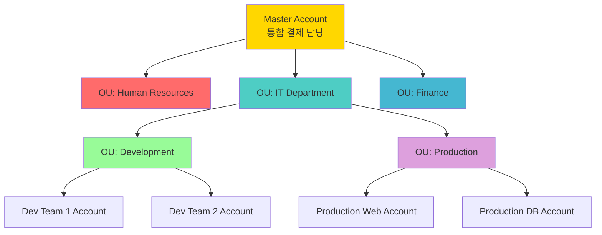

# 📝 AWS VPC 네트워킹 및 ELB 강의 노트 (3일차)

**강의 날짜**: 2025년 12월 5일
**강의 주제**: AWS VPC 고급 네트워킹, EC2 컴퓨팅, Elastic Load Balancer
**강사 강조 사항**: "오늘 배우는 내용은 AWS 클라우드 환경에서 가장 핵심이 되는 네트워킹과 컴퓨팅 서비스입니다. 특히 보안 업무를 담당하시는 분들에게 매우 중요한 내용이니 집중해주시기 바랍니다."

---

## 🎯 오늘의 학습 목표

이번 강의는 전체 7일 과정 중 3일차로, AWS 클라우드 환경의 핵심 서비스들을 다룹니다. 오늘 학습할 내용은:

1. **IAM (Identity and Access Management) 복습**
   - IAM Role의 개념과 사용 시나리오
   - 권한 경계(Permission Boundary)와 SCP(Service Control Policy)
   - 계정 보안 관리 베스트 프랙티스

2. **VPC (Virtual Private Cloud) 기본 개념 복습**
   - VPC와 서브넷 구조
   - 인터넷 게이트웨이와 NAT 게이트웨이
   - 보안 그룹(Security Group)과 NACL(Network ACL)
   - VPC 흐름 로그(VPC Flow Logs)

3. **VPC 고급 네트워킹**
   - VPC 피어링(VPC Peering)
   - Transit Gateway
   - AWS VPN (Site-to-Site VPN, Client VPN)
   - Direct Connect (전용선)
   - VPC Endpoint

4. **EC2 (Elastic Compute Cloud)**
   - EC2 인스턴스 개념과 구조
   - AMI (Amazon Machine Image)
   - 인스턴스 타입과 패밀리
   - 키 페어와 접속 방법
   - 메타데이터

5. **EBS (Elastic Block Store)**
   - EBS 볼륨 유형 (GP2, GP3, IOPS SSD, HDD)
   - 스냅샷(Snapshot)
   - 볼륨 관리

6. **Elastic Load Balancer (ELB)**
   - ALB (Application Load Balancer)
   - NLB (Network Load Balancer)
   - 상태 확인(Health Check)
   - 실습: ALB 구성

💡 **중요!** 강사님 강조: "앞부분에서 학습하는 내용들이 가장 베이직한 내용들입니다. 클라우드 컴퓨팅 환경을 사용한다고 했을 때 꼭 알고 계셔야만 하는 내용들을 중심으로 앞부분에 배치시켜 놨기 때문에, 시간을 많이 투자해서 복습하고 있습니다."

---

## 📚 Section 1: IAM (Identity and Access Management) 복습

### 1.1 IAM이란 무엇인가?

**IAM (Identity and Access Management)**은 AWS 클라우드 컴퓨팅 환경에서 **사용자를 등록하고 권한을 설정**하는 굉장히 중요한 서비스입니다.

#### IAM의 핵심 역할

1. **사용자 관리**: AWS 리소스에 접근할 사용자 등록 및 관리
2. **권한 제어**: 사용자가 어떤 서비스를 사용할 수 있고 없는지 제어
3. **보안 관리**: 최소 권한 원칙(Principle of Least Privilege) 적용
4. **인증 및 인가**: 사용자 신원 확인 및 작업 권한 부여

💡 **중요!** "보안의 시작은 사용자 관리와 권한 관리부터 시작합니다. 보안 업무를 담당하고 계시기 때문에 IAM 서비스에 대해서는 기본적인 용어와 개념을 꼭 기억해 두시는 것이 좋습니다."

---

### 1.2 IAM Role (역할)

#### IAM Role의 개념

**IAM Role**은 **임시 권한을 부여**하는 메커니즘입니다. 영구적인 자격 증명(Permanent Credentials)이 아닌, **임시 자격 증명(Temporary Credentials)**을 통해 AWS 리소스에 접근할 수 있게 합니다.

#### IAM Role 사용 시나리오

##### 1️⃣ IAM 사용자가 임시 권한이 필요할 때

**예시 시나리오**:
- 조정예라는 사원이 출장을 갑니다
- 조정예가 출장 가 있는 동안 홍길동이라는 사원이 업무를 대신해야 합니다
- 이때 **Role을 이용**하여 홍길동에게 임시적으로 조정예의 권한을 부여할 수 있습니다


**흐름 설명**:
1. 홍길동이 IAM Role에 Assume Role을 요청합니다
2. IAM Role은 신뢰 정책을 확인하여 홍길동이 이 Role을 사용할 수 있는지 검증합니다
3. 검증이 완료되면 임시 자격 증명 정보를 발급합니다:
   - 임시 Access Key ID
   - 임시 Secret Access Key
   - Session Token
   - 만료 시간(Expiration Time)
4. 홍길동은 이 임시 자격 증명으로 주어진 기간 동안 AWS 리소스에 접근할 수 있습니다

##### 2️⃣ AWS 서비스가 다른 AWS 서비스에 접근할 때

**예시 시나리오**:
- EC2 인스턴스에서 실행되는 애플리케이션이 S3 버킷의 데이터를 읽어야 합니다
- 이때 **EC2 Instance Profile**을 통해 Role을 연결합니다
- EC2는 이 Role을 통해 S3에 접근할 수 있는 권한을 얻습니다


##### 3️⃣ 교차 계정(Cross-Account) 간 리소스 사용

**시나리오**:
- A 계정과 B 계정이 각각 독립적으로 운영됩니다
- A 계정의 사용자가 B 계정의 리소스에 접근해야 할 때
- Role을 통해 교차 계정 권한을 부여할 수 있습니다

##### 4️⃣ 자격 증명 연동(Identity Federation) 시 권한 부여

**시나리오**:
- 회사가 기존에 Active Directory(마이크로소프트사의 디렉토리 서비스)를 사용하고 있습니다
- 직원들은 회사 컴퓨터에 Active Directory로 로그인합니다
- AWS 서비스를 사용하기 위해 **또 다시 인증하고 권한 부여**를 받는 것은 이중으로 업무가 복잡해집니다
- 해결 방법: **자격 증명 연동(Identity Federation)**
  - Active Directory와 IAM 서비스를 연동합니다
  - **한 번의 인증**을 통해 Active Directory 사용자를 IAM Role과 매핑시킵니다
  - 사용자는 추가 인증 없이 AWS 리소스에 접근할 수 있습니다


**연동 프로세스**:
1. 직원이 Active Directory로 회사 시스템에 로그인합니다
2. Active Directory가 인증을 성공적으로 완료합니다
3. Identity Federation 메커니즘을 통해 SAML Assertion을 IAM에 전달합니다
4. IAM은 미리 설정된 Role Mapping에 따라 적절한 IAM Role을 부여합니다
5. 사용자는 임시 자격 증명을 받습니다
6. 이 자격 증명으로 AWS 리소스에 접근할 수 있습니다

---

#### IAM Role의 구성 요소

IAM Role을 정의할 때는 **두 가지 정책**을 등록해야 합니다:

##### 1️⃣ 신뢰 정책 (Trust Policy)

**신뢰 정책**은 "**누가 이 Role을 사용할 수 있는가?**"를 정의합니다.

```json
{
  "Version": "2012-10-17",
  "Statement": [
    {
      "Effect": "Allow",
      "Principal": {
        "Service": "ec2.amazonaws.com"
      },
      "Action": "sts:AssumeRole"
    }
  ]
}
```

**정책 해석**:
- `Principal`: EC2 서비스가 이 Role을 사용할 수 있습니다
- `Action`: `sts:AssumeRole` API를 호출할 수 있습니다
- 이는 EC2 인스턴스가 이 Role을 "가정(Assume)"할 수 있다는 의미입니다

💡 **핵심**: 신뢰 정책에 등록된다는 것은 **Assume Role API**를 이용할 수 있는 대상을 정의하는 것입니다.

##### 2️⃣ 권한 정책 (Permissions Policy)

**권한 정책**은 "**어떤 작업을 할 수 있는가?**"를 정의합니다.

```json
{
  "Version": "2012-10-17",
  "Statement": [
    {
      "Effect": "Allow",
      "Action": [
        "s3:GetObject",
        "s3:PutObject"
      ],
      "Resource": "arn:aws:s3:::my-bucket/*"
    }
  ]
}
```

**정책 해석**:
- `Action`: S3의 GetObject, PutObject 작업을 수행할 수 있습니다
- `Resource`: `my-bucket` 버킷의 모든 객체에 대해 작업할 수 있습니다

---

#### IAM Role의 보안 주체(Principal)

IAM Role을 사용할 수 있는 **보안 주체(Principal)**는 다음과 같습니다:

1. **IAM 사용자 (IAM User)**
   - AWS 계정 내의 개별 사용자
   - 예: 홍길동, 조정예

2. **AWS 서비스 (AWS Service)**
   - EC2, Lambda, ECS 등의 AWS 서비스
   - 서비스가 다른 AWS 리소스에 접근할 때 사용

3. **연합 사용자 (Federated User)**
   - 외부 자격 증명 시스템(Active Directory, Google, Facebook 등)을 통해 인증받은 사용자
   - Identity Federation을 통해 AWS에 접근


💡 **중요!** Role은 실제 AWS 클라우드 컴퓨팅 환경에서 **자주 사용**됩니다. 개념을 꼭 기억해주시기 바랍니다.

---

### 1.3 최대 권한 설정 정책

최대 권한 설정 정책은 IAM 엔티티(사용자, 역할)가 **가질 수 있는 권한의 상한선**을 정의하는 메커니즘입니다.

#### 1️⃣ 권한 경계 (Permission Boundary)

**권한 경계**는 IAM 사용자나 역할에 연결할 수 있는 **필터**와 같은 기능입니다.

##### 권한 경계의 특징

- **권한을 부여하는 것이 아니라 필터링하는 역할**입니다
- 자격 증명 정책(Identity-based Policy)의 **과도한 허용을 방지**합니다
- **세분화된 액세스 제어**를 가능하게 합니다

##### 작동 원리


**실제 유효한 권한 = 자격 증명 정책 ∩ 권한 경계**

##### 예시 시나리오

**1. 자격 증명 정책 (Identity Policy)**:
```json
{
  "Version": "2012-10-17",
  "Statement": [
    {
      "Effect": "Allow",
      "Action": [
        "s3:*",
        "ec2:*",
        "dynamodb:*"
      ],
      "Resource": "*"
    }
  ]
}
```

**2. 권한 경계 (Permission Boundary)**:
```json
{
  "Version": "2012-10-17",
  "Statement": [
    {
      "Effect": "Allow",
      "Action": [
        "s3:GetObject",
        "s3:PutObject",
        "ec2:Describe*"
      ],
      "Resource": "*"
    }
  ]
}
```

**3. 실제 유효한 권한 (Effective Permissions)**:
```json
{
  "Version": "2012-10-17",
  "Statement": [
    {
      "Effect": "Allow",
      "Action": [
        "s3:GetObject",
        "s3:PutObject",
        "ec2:Describe*"
      ],
      "Resource": "*"
    }
  ]
}
```

**분석**:
- 자격 증명 정책은 S3, EC2, DynamoDB의 모든 작업(`*`)을 허용합니다
- 하지만 권한 경계는 S3의 GetObject, PutObject와 EC2의 Describe* 작업만 허용합니다
- **최종 권한**은 두 정책의 **교집합**이므로, S3의 GetObject/PutObject와 EC2의 Describe* 작업만 가능합니다
- DynamoDB 작업은 권한 경계에 없으므로 실제로는 사용할 수 없습니다

##### 사용 사례

1. **과도한 권한 방지**
   - 관리자가 실수로 너무 많은 권한을 부여하더라도 권한 경계가 제한합니다

2. **역할별 세분화된 제어**
   - 개발팀: S3, Lambda만 접근 가능
   - 인프라팀: EC2, VPC 접근 가능
   - 각 팀의 권한 경계를 다르게 설정하여 관리

---

#### 2️⃣ SCP (Service Control Policy) - 서비스 제어 정책

**SCP**는 **다중 계정 환경**에서 AWS Organizations를 이용할 때 사용하는 **최대 권한 설정 기능**입니다.

##### SCP의 특징

- **조직(Organization) 단위 또는 멤버 계정**에 연결할 수 있습니다
- **필터**와 같은 역할을 합니다 (권한 부여가 아닌 제한)
- **상속 구조**: 조직 단위(OU)에 SCP를 연결하면 하위 조직과 멤버 계정에 자동으로 상속됩니다

##### SCP 상속 구조


**상속 메커니즘**:
1. Root Organization에 적용된 SCP는 모든 하위 조직과 계정에 상속됩니다
2. OU(Organizational Unit)에 적용된 SCP는 해당 OU 내의 모든 멤버 계정에 상속됩니다
3. 계정의 **실제 권한 = Root SCP ∩ OU SCP ∩ Account의 IAM 정책**

##### SCP 예시

**Root Organization SCP - 전체 조직에 EC2 삭제 금지**:
```json
{
  "Version": "2012-10-17",
  "Statement": [
    {
      "Effect": "Deny",
      "Action": [
        "ec2:TerminateInstances"
      ],
      "Resource": "*"
    }
  ]
}
```

**Production OU SCP - 프로덕션 환경은 특정 서비스만 허용**:
```json
{
  "Version": "2012-10-17",
  "Statement": [
    {
      "Effect": "Allow",
      "Action": [
        "s3:*",
        "ec2:*",
        "rds:*"
      ],
      "Resource": "*"
    }
  ]
}
```

**최종 권한 계산 (Prod-Web 계정)**:
- Root SCP: EC2 삭제 금지
- Production OU SCP: S3, EC2, RDS 허용
- **결과**: S3, EC2(삭제 제외), RDS 사용 가능

---

#### AWS Organizations 사용 목적

AWS Organizations를 사용하는 이유:

1. **다중 계정 중앙 관리**
   - 여러 AWS 계정을 하나의 조직으로 통합 관리

2. **통합 결제 (Consolidated Billing)**
   - 모든 계정의 요금을 하나의 마스터 계정에서 통합 결제
   - 볼륨 디스카운트 혜택

3. **조직 단위 계층 관리**
   - 부서별, 프로젝트별로 계정을 조직화
   - 계층적 구조로 관리

4. **서비스 활성화/비활성화 제어**
   - 특정 조직 단위에서 사용할 수 있는 AWS 서비스를 제어



---

### 1.4 계정 보안 관리

#### 보안 관리의 핵심 원칙

##### 1️⃣ 최소 권한 부여의 원칙 (Principle of Least Privilege)

사용자나 서비스에게 **업무 수행에 필요한 최소한의 권한만 부여**합니다.

**나쁜 예**:
```json
{
  "Effect": "Allow",
  "Action": "*",
  "Resource": "*"
}
```
→ 모든 서비스의 모든 작업을 허용 (매우 위험!)

**좋은 예**:
```json
{
  "Effect": "Allow",
  "Action": [
    "s3:GetObject",
    "s3:PutObject"
  ],
  "Resource": "arn:aws:s3:::my-app-bucket/*"
}
```
→ 특정 S3 버킷의 읽기/쓰기만 허용

---

##### 2️⃣ 루트 사용자 관리

**루트 사용자 (Root User)**는 AWS 계정 생성 시 만들어지는 **최고 관리자 계정**입니다.

⚠️ **주의사항**:

1. **일상적인 업무에 루트 사용자 사용 금지**
   - 루트 사용자는 모든 권한을 가지므로 매우 위험합니다
   - 대신 IAM 사용자를 생성하여 사용합니다

2. **루트 사용자의 Access Key 삭제**
   - Access Key가 유출되면 계정 전체가 위험에 노출됩니다
   - **강력히 권고**: 루트 사용자의 Access Key는 삭제하십시오

3. **강력한 암호 사용**
   - 최소 12자 이상
   - 대문자, 소문자, 숫자, 특수문자 조합

4. **MFA (Multi-Factor Authentication) 활성화**
   - 비밀번호 + 추가 인증 수단
   - OTP (One-Time Password), 지문, 하드웨어 토큰 등

**MFA 방식**:

| **MFA 유형** | **설명** | **예시** |
|:-:|:-:|:-:|
| **Virtual MFA** | 스마트폰 앱 기반 OTP | Google Authenticator, Authy |
| **Hardware MFA** | 물리적 하드웨어 토큰 | YubiKey |
| **SMS MFA** | SMS로 코드 전송 | 휴대폰 문자 메시지 |
| **Biometric** | 생체 인증 | 지문, 얼굼 인식 |

---

##### 3️⃣ IAM 사용자 보안 관리

1. **강력한 암호 정책 설정**
   - IAM 콘솔에서 암호 정책 설정 가능
   - 암호 최소 길이, 복잡도 요구 사항 설정

2. **MFA 활성화**
   - 루트 사용자뿐만 아니라 IAM 사용자에게도 MFA 적용 권장

3. **불필요한 사용자 삭제**
   - 퇴사자, 역할 변경으로 더 이상 필요 없는 사용자는 즉시 삭제

4. **불필요한 Access Key 삭제**
   - 사용하지 않는 Access Key는 보안 위험
   - 주기적으로 Access Key 목록 검토 후 불필요한 키 삭제

5. **암호 주기적 교체**
   - 90일마다 암호 변경 권장
   - 암호 정책에서 자동으로 강제 가능

6. **Access Key 주기적 교체**
   - Access Key도 주기적으로 로테이션(Rotation)
   - AWS Secrets Manager를 통해 자동 로테이션 설정 가능

---

##### 4️⃣ 강력한 패스워드 정책

IAM 서비스에서 **패스워드 정책**을 설정할 수 있습니다:

**IAM 콘솔 → Account settings → Password policy**

설정 가능한 항목:
- ✅ 최소 암호 길이: 12자 이상
- ✅ 대문자 포함 필수
- ✅ 소문자 포함 필수
- ✅ 숫자 포함 필수
- ✅ 특수문자 포함 필수
- ✅ 암호 재사용 제한: 최근 5개 암호 재사용 금지
- ✅ 암호 만료 기간: 90일
- ✅ 사용자가 스스로 암호 변경 허용

💡 **중요!** "IAM 서비스의 메뉴에서 이런 강력한 패스워드 정책을 설정하고 변경할 수 있습니다. 우리가 실습에서 이 메뉴를 봤었습니다."

---

#### 계정 보안 관리 체크리스트

##### ✅ 필수 보안 조치

- [ ] 루트 사용자의 Access Key 삭제 완료
- [ ] 루트 사용자에 MFA 활성화
- [ ] 루트 사용자는 일상 업무에 사용하지 않음
- [ ] IAM 사용자별로 개별 계정 생성
- [ ] IAM 사용자에 MFA 활성화
- [ ] 강력한 패스워드 정책 설정
- [ ] 최소 권한 원칙 적용
- [ ] 불필요한 사용자 및 Access Key 정기적으로 삭제
- [ ] 암호 및 Access Key 주기적 교체

---

### 📋 Section 1 핵심 요약

#### IAM 핵심 개념

1. **IAM Role**
   - 임시 권한 부여 메커니즘
   - 신뢰 정책 + 권한 정책
   - 사용 사례: IAM 사용자, AWS 서비스, 교차 계정, 자격 증명 연동

2. **권한 경계 (Permission Boundary)**
   - IAM 사용자/역할에 연결
   - 필터 역할 (과도한 권한 방지)
   - 실제 권한 = 자격 증명 정책 ∩ 권한 경계

3. **SCP (Service Control Policy)**
   - AWS Organizations에서 사용
   - 조직 단위/멤버 계정에 적용
   - 상속 구조로 전파

4. **계정 보안 관리**
   - 최소 권한 원칙
   - 루트 사용자 보호 (Access Key 삭제, MFA 활성화)
   - 강력한 암호 정책
   - 주기적인 보안 검토

💡 **강사 강조**: "IAM 서비스는 보안의 가장 기본이 되는 서비스입니다. 특히 보안 업무를 담당하시는 분들은 IAM Role, 권한 경계, SCP 같은 개념을 꼭 기억해 두셔야 합니다."

---

## 📚 Section 2: VPC (Virtual Private Cloud) 기본 개념 복습

### 2.1 VPC란 무엇인가?

**VPC (Virtual Private Cloud)**는 AWS 클라우드 컴퓨팅 환경에서 **고객의 업무를 수행하기 위한 가상 프라이빗 네트워크**입니다.

#### VPC의 핵심 개념

- **가상 네트워크**: 물리적 네트워크가 아닌 소프트웨어로 정의된 네트워크
- **프라이빗**: 고객 전용의 격리된 네트워크 공간
- **논리적 격리**: 다른 고객의 VPC와 완전히 분리됨

💡 **중요!** "AWS 클라우드 컴퓨팅 환경에서 정보 시스템을 운영하려면 컴퓨팅 자원을 배포할 네트워크가 필요합니다. 그 네트워크가 바로 VPC입니다."

---

### 2.2 VPC의 주요 특징

#### 1️⃣ 단일 리전에 생성

- VPC는 **하나의 리전(Region)** 안에 만들어집니다
- 리전 내의 **모든 가용 영역(Availability Zone)**을 사용할 수 있습니다


**가용 영역 선택**:
- 서브넷을 만들 때 가용 영역을 선택합니다
- 예: 서울 리전에는 4개의 가용 영역이 있습니다
  - ap-northeast-2a
  - ap-northeast-2b
  - ap-northeast-2c
  - ap-northeast-2d
- 고객이 원하는 가용 영역을 선택하여 서브넷을 배치할 수 있습니다

---

#### 2️⃣ 사설 IP 주소 범위 사용

VPC는 **사설 IPv4 CIDR 블록**을 사용합니다.

**사설 IP 주소 범위**:

| **클래스** | **주소 범위** | **CIDR 표기** | **용도** |
|:-:|:-:|:-:|:-:|
| **Class A** | 10.0.0.0 ~ 10.255.255.255 | 10.0.0.0/8 | 대규모 네트워크 |
| **Class B** | 172.16.0.0 ~ 172.31.255.255 | 172.16.0.0/12 | 중간 규모 네트워크 |
| **Class C** | 192.168.0.0 ~ 192.168.255.255 | 192.168.0.0/16 | 소규모 네트워크 |

**VPC CIDR 예시**:
- `10.100.0.0/16` → 65,536개 IP 주소
- `172.31.0.0/16` → 65,536개 IP 주소
- `192.168.0.0/24` → 256개 IP 주소

---

#### 3️⃣ CIDR 블록 중복 방지

**중요한 설계 원칙**: 온프레미스 네트워크, 다른 VPC 간 **CIDR 블록이 중복되지 않도록** 해야 합니다.

**이유**: 나중에 VPC 피어링이나 VPN 연결 시 IP 충돌이 발생하면 통신이 불가능합니다.


**나쁜 예 - CIDR 중복**:
- 온프레미스: `10.0.0.0/16`
- VPC 1: `10.0.0.0/16` ❌ (충돌!)
- → VPN 연결 시 라우팅 불가

**좋은 예 - CIDR 분리**:
- 온프레미스: `10.0.0.0/16`
- VPC 1: `10.100.0.0/16` ✅
- VPC 2: `10.200.0.0/16` ✅
- → 모두 정상 통신 가능

💡 **강사 강조**: "가급적이면 CIDR 블록을 중복되지 않도록 관리하시는 것이 좋습니다. 나중에 사설 IP 통신을 하려고 했을 때 IP가 중복되어 있으면 통신이 안 될 수 있기 때문입니다."

---

### 2.3 서브넷 (Subnet)

#### 서브넷이란?

**서브넷**은 VPC CIDR 블록을 **더 작은 단위로 분할한 하위 네트워크**입니다.


---

#### 서브넷 CIDR 블록 설정

서브넷은 VPC CIDR 블록의 **하위 범위**를 사용해야 합니다.

**예시**:
- **VPC CIDR**: `10.100.0.0/16`
- **서브넷 CIDR**: `10.100.1.0/24` (VPC CIDR의 하위 범위)

**Prefix 길이 규칙**:
- VPC가 `/16`이면 서브넷은 `/17`, `/18`, ..., `/28` 중 선택
- **Prefix 길이가 클수록** IP 주소 개수는 **적어집니다**

| **CIDR** | **Prefix** | **IP 개수** | **용도** |
|:-:|:-:|:-:|:-:|
| 10.100.0.0/16 | /16 | 65,536 | VPC |
| 10.100.1.0/24 | /24 | 256 | 서브넷 |
| 10.100.2.0/25 | /25 | 128 | 작은 서브넷 |
| 10.100.3.0/28 | /28 | 16 | 매우 작은 서브넷 |

---

#### 서브넷별 IP 개수 결정

서브넷을 나눌 때는 **사용할 IP 개수를 고려**해야 합니다.

**질문**: 퍼블릭 서브넷과 프라이빗 서브넷 중 어디가 IP를 더 많이 필요로 할까요?

**정답**: **프라이빗 서브넷**

**이유**:
- 퍼블릭 서브넷: 인터넷에 공개되는 리소스 (로드 밸런서, 베스천 호스트 등) → 적은 IP 필요
- 프라이빗 서브넷: 내부 서버들 (웹 서버, 애플리케이션 서버, DB 서버 등) → 많은 IP 필요

**실제 서브넷 설계 예시**:

```
VPC: 10.100.0.0/16 (65,536 IPs)

퍼블릭 서브넷 (AZ-A): 10.100.1.0/24 (256 IPs)
퍼블릭 서브넷 (AZ-C): 10.100.2.0/24 (256 IPs)

프라이빗 서브넷 (AZ-A): 10.100.10.0/22 (1,024 IPs)
프라이빗 서브넷 (AZ-C): 10.100.20.0/22 (1,024 IPs)
```

💡 **강사 강조**: "일반적으로 기업 환경에 가보면 퍼블릭 서브넷보다 프라이빗 서브넷이 더 많은 IP를 사용할 수 있게끔 서브넷을 나눌 때 그렇게 잡아줍니다."

---

#### 서브넷과 가용 영역

**서브넷은 하나의 가용 영역에 속합니다.**


**서브넷 생성 시 선택 사항**:
- VPC 선택
- 가용 영역 선택 (예: ap-northeast-2a)
- CIDR 블록 지정 (예: 10.100.1.0/24)

---

#### 서브넷의 예약된 IP 주소

**각 서브넷마다 5개의 IP 주소가 예약**되어 있습니다.

**예시**: `10.100.1.0/24` 서브넷

| **순서** | **IP 주소** | **용도** | **설명** |
|:-:|:-:|:-:|:-:|
| **1번째** | 10.100.1.0 | 네트워크 주소 | 서브넷 자체를 식별 |
| **2번째** | 10.100.1.1 | VPC 라우터 | VPC 라우터 주소 |
| **3번째** | 10.100.1.2 | DNS 서버 | Amazon DNS 서버 |
| **4번째** | 10.100.1.3 | 예약됨 | AWS가 미래에 사용하기 위해 예약 |
| **마지막** | 10.100.1.255 | 브로드캐스트 주소 | 브로드캐스트 (VPC에서 미지원) |

⚠️ **주의**: VPC는 **브로드캐스트를 지원하지 않습니다**.
- 이유: 브로드캐스트는 너무 많은 트래픽을 발생시켜 성능에 영향을 줄 수 있기 때문

**실제 사용 가능한 IP 개수**:
- 서브넷 CIDR: `10.100.1.0/24` → 총 256개 IP
- 예약된 IP: 5개
- **실제 사용 가능**: 256 - 5 = **251개**

---

### 2.4 서브넷 유형

서브넷은 **개념적으로** 두 가지 유형으로 구분할 수 있습니다:

#### 1️⃣ 퍼블릭 서브넷 (Public Subnet)

**특징**:
- **인터넷에 공개될 리소스**를 배포하는 서브넷
- **공인 IP 주소**를 가진 리소스 배치
- 인터넷 게이트웨이(IGW)로 가는 라우팅 존재

**배포되는 리소스 예시**:
- 웹 서버 (Web Server)
- 로드 밸런서 (ELB)
- 베스천 호스트 (Bastion Host)
- NAT 게이트웨이

**IP 주소 할당**:
- 사설 IP: 필수 (VPC 내부 통신용)
- 공인 IP: 필수 (인터넷 통신용)

---

#### 2️⃣ 프라이빗 서브넷 (Private Subnet)

**특징**:
- **외부에 공개하지 않을 리소스**를 배포하는 서브넷
- **사설 IP만 사용**
- NAT 게이트웨이를 통해 인터넷 접근

**배포되는 리소스 예시**:
- 애플리케이션 서버 (App Server)
- 데이터베이스 서버 (DB Server)
- 내부용 API 서버
- 백엔드 시스템

**IP 주소 할당**:
- 사설 IP: 필수
- 공인 IP: 불필요

---

#### 퍼블릭 vs 프라이빗 서브넷 비교


| **항목** | **퍼블릭 서브넷** | **프라이빗 서브넷** |
|:-:|:-:|:-:|
| **공인 IP** | 필수 | 불필요 |
| **사설 IP** | 필수 | 필수 |
| **인터넷 접근** | IGW를 통해 직접 접근 | NAT Gateway를 통해 접근 |
| **라우팅** | IGW 경로 필요 | NAT Gateway 경로 필요 |
| **주요 용도** | 인터넷 대면 서비스 | 내부 시스템, DB |

💡 **강사 강조**: "서브넷의 네임 태그에 퍼블릭이다, 프라이빗이다 라는 용어를 넣을 필요는 없습니다. 다만 우리가 구별해주기 위해서 그런 이름을 사용하고 있을 뿐입니다. 개념적인 구분이에요."

---

### 📋 Section 2 핵심 요약

#### VPC 기본 개념

1. **VPC (Virtual Private Cloud)**
   - AWS에서 생성하는 가상 프라이빗 네트워크
   - 단일 리전에 생성, 모든 가용 영역 사용 가능
   - 사설 IPv4 CIDR 블록 사용
   - CIDR 중복 방지 필수

2. **서브넷 (Subnet)**
   - VPC의 하위 네트워크
   - 하나의 가용 영역에 속함
   - 5개의 예약된 IP 주소 존재
   - 퍼블릭 서브넷 vs 프라이빗 서브넷 (개념적 구분)

3. **IP 주소 관리**
   - 사설 IP 범위: 10.0.0.0/8, 172.16.0.0/12, 192.168.0.0/16
   - 서브넷 CIDR은 VPC CIDR의 하위 범위
   - 프라이빗 서브넷에 더 많은 IP 할당 권장

---

## 섹션 3: VPC 네트워킹 구성 요소

### 3.1 라우팅 테이블 (Routing Table)

#### 라우팅 테이블 개념

**라우팅 테이블 (Routing Table)**은 트래픽이 어디로 전달될지 결정하는 **경로 규칙의 집합**입니다.

**주요 특징**:
- 서브넷에 연결하여 해당 서브넷의 트래픽 경로를 제어
- 하나의 서브넷은 반드시 하나의 라우팅 테이블과 연결
- 하나의 라우팅 테이블은 여러 서브넷에 연결 가능

---

#### 라우팅 테이블 구성 요소

**Route (경로 규칙)**는 다음 정보로 구성됩니다:

| **항목** | **설명** | **예시** |
|:-:|:-:|:-:|
| **Destination** | 목적지 CIDR 블록 | 0.0.0.0/0 (모든 IP) |
| **Target** | 트래픽을 전달할 대상 | igw-xxxxx (IGW) |

**Destination 종류**:

1. **0.0.0.0/0**: 모든 IP 주소 (인터넷 전체)
2. **10.100.0.0/16**: VPC 내부 통신 (로컬)
3. **특정 CIDR**: 특정 네트워크 대역

**Target 종류**:

1. **local**: VPC 내부 통신 (기본 경로, 삭제 불가)
2. **igw-xxxxx**: Internet Gateway
3. **nat-xxxxx**: NAT Gateway
4. **pcx-xxxxx**: VPC Peering Connection
5. **tgw-xxxxx**: Transit Gateway
6. **vgw-xxxxx**: Virtual Private Gateway (VPN)

---

#### 퍼블릭 서브넷 라우팅 테이블 예시

```
Destination          Target
-----------------------------------------
10.100.0.0/16       local
0.0.0.0/0           igw-0a1b2c3d4e5f
```

**해석**:
- **10.100.0.0/16 → local**: VPC 내부 통신은 로컬에서 처리
- **0.0.0.0/0 → igw-xxxxx**: 그 외 모든 트래픽은 인터넷 게이트웨이로 전달

💡 **핵심**: 퍼블릭 서브넷은 **0.0.0.0/0 → IGW** 경로가 반드시 존재합니다!

---

#### 프라이빗 서브넷 라우팅 테이블 예시

```
Destination          Target
-----------------------------------------
10.100.0.0/16       local
0.0.0.0/0           nat-0a1b2c3d4e5f
```

**해석**:
- **10.100.0.0/16 → local**: VPC 내부 통신
- **0.0.0.0/0 → nat-xxxxx**: 인터넷 접근은 NAT Gateway를 통해 전달

💡 **핵심**: 프라이빗 서브넷은 **0.0.0.0/0 → NAT Gateway** 경로를 사용합니다!

---

#### 라우팅 우선순위

라우팅 테이블에서 여러 경로가 매칭될 경우, **가장 구체적인 경로 (Longest Prefix Match)**가 우선합니다.

**예시**:

```
Destination          Target
-----------------------------------------
10.100.0.0/16       local
10.100.10.0/24      pcx-xxxxx (VPC Peering)
0.0.0.0/0           igw-xxxxx
```

**트래픽 목적지별 경로 선택**:

1. **10.100.10.50** → `10.100.10.0/24` 매칭 → VPC Peering으로 전달
2. **10.100.20.50** → `10.100.0.0/16` 매칭 → local (VPC 내부)
3. **8.8.8.8** → `0.0.0.0/0` 매칭 → Internet Gateway로 전달

💡 **우선순위**: `/24` > `/16` > `/0` (프리픽스 길이가 길수록 우선)

---

### 3.2 인터넷 게이트웨이 (Internet Gateway, IGW)

#### 인터넷 게이트웨이 개념

**Internet Gateway (IGW)**는 VPC와 인터넷 간의 통신을 가능하게 하는 **수평 확장 가능한 고가용성 게이트웨이**입니다.

**주요 특징**:
- VPC당 1개의 IGW만 연결 가능
- 고가용성 (HA): AWS가 자동으로 이중화 관리
- 대역폭 제한 없음
- 추가 비용 없음

**역할**:
1. **NAT 기능**: 사설 IP ↔ 공인 IP 변환
2. **라우팅**: 인터넷으로 향하는 트래픽 전달

---

#### 인터넷 게이트웨이 동작 방식


**Outbound (송신) 흐름**:
1. EC2 인스턴스가 사설 IP (10.100.1.10)로 패킷 전송
2. IGW가 사설 IP를 공인 IP (54.180.1.1)로 변환
3. 인터넷으로 패킷 전달

**Inbound (수신) 흐름**:
1. 인터넷에서 공인 IP (54.180.1.1)로 패킷 도착
2. IGW가 공인 IP를 사설 IP (10.100.1.10)로 변환
3. EC2 인스턴스로 패킷 전달

💡 **강사 강조**: "EC2 인스턴스는 자신의 공인 IP를 직접 인식하지 못합니다. OS 레벨에서 `ifconfig`를 해보면 사설 IP만 보입니다. IGW에서 NAT 변환을 해주는 것입니다."

---

#### 퍼블릭 서브넷 구성 요구사항

**인터넷 통신을 위한 3가지 필수 조건**:


**1️⃣ Internet Gateway 연결**:
- VPC에 IGW 생성 및 연결

**2️⃣ 공인 IP 할당**:
- EC2 인스턴스에 **Public IP** 또는 **Elastic IP** 할당

**3️⃣ 라우팅 규칙 등록**:
- 서브넷의 라우팅 테이블에 `0.0.0.0/0 → igw-xxxxx` 추가

⚠️ **주의**: 이 3가지 중 하나라도 빠지면 인터넷 통신이 불가능합니다!

---

### 3.3 NAT Gateway vs NAT Instance

#### NAT 개념

**NAT (Network Address Translation)**은 **프라이빗 서브넷의 리소스가 인터넷에 접근**할 수 있도록 하는 서비스입니다.

**NAT의 특징**:
- **Outbound 트래픽만 허용**: 프라이빗 서브넷 → 인터넷 (O)
- **Inbound 트래픽 차단**: 인터넷 → 프라이빗 서브넷 (X)
- **보안**: 외부에서 프라이빗 리소스로 직접 접근 불가


---

#### NAT Gateway (권장)

**NAT Gateway**는 AWS가 관리하는 **완전 관리형 NAT 서비스**입니다.

**주요 특징**:

✅ **AWS 관리형 서비스**
- AWS가 자동으로 고가용성 보장
- 패치, 업데이트 자동 관리
- 장애 발생 시 자동 복구

✅ **고성능**
- 최대 45Gbps 대역폭 지원
- 자동 스케일링

✅ **고가용성 (HA)**
- 가용 영역 내에서 자동 이중화
- 단일 장애 지점 없음

❌ **보안 그룹 적용 불가**
- NAT Gateway에는 Security Group을 연결할 수 없음
- 트래픽 제어가 제한적

❌ **Inbound 포트 포워딩 불가**
- 외부에서 프라이빗 서브넷으로 접근 불가
- 포트 포워딩 기능 없음

**비용**:
- NAT Gateway 시간당 비용: 약 $0.045/시간
- 데이터 처리 비용: $0.045/GB

---

#### NAT Instance (레거시)

**NAT Instance**는 고객이 직접 EC2 인스턴스를 NAT 용도로 구성하는 방식입니다.

**주요 특징**:

✅ **보안 그룹 적용 가능**
- EC2 인스턴스이므로 Security Group 연결 가능
- 세밀한 트래픽 제어 가능

✅ **포트 포워딩 지원**
- iptables 등을 이용한 포트 포워딩 구성 가능
- 외부 → 프라이빗 서브넷 접근 가능 (보안 위험 고려 필요)

✅ **유연한 커스터마이징**
- 필요한 소프트웨어 설치 가능
- 로깅, 모니터링 도구 설치 가능

❌ **고객이 직접 관리**
- EC2 인스턴스 생성, 패치, 업데이트 필요
- 장애 발생 시 수동 복구

❌ **단일 장애 지점 (SPOF)**
- 인스턴스 장애 시 NAT 기능 전체 중단
- 고가용성 구성 시 추가 작업 필요

❌ **대역폭 제한**
- EC2 인스턴스 타입에 따라 네트워크 성능 제한
- 트래픽 증가 시 병목 발생 가능

**비용**:
- EC2 인스턴스 비용 (타입에 따라 다름)
- 일반적으로 NAT Gateway보다 저렴할 수 있음 (트래픽이 적은 경우)

---

#### NAT Gateway vs NAT Instance 비교

| **항목** | **NAT Gateway** | **NAT Instance** |
|:-:|:-:|:-:|
| **관리 주체** | AWS 관리형 | 고객 관리형 |
| **고가용성** | 자동 (가용 영역 내) | 수동 구성 필요 |
| **대역폭** | 최대 45Gbps (자동 스케일링) | 인스턴스 타입에 따라 제한 |
| **보안 그룹** | 적용 불가 | 적용 가능 |
| **포트 포워딩** | 불가능 | 가능 (iptables 등 이용) |
| **패치/업데이트** | 자동 | 수동 |
| **비용** | 시간당 + 데이터 처리 비용 | EC2 인스턴스 비용 |
| **권장 사용** | 대부분의 경우 권장 | 특수한 요구사항이 있는 경우만 |

💡 **강사 강조**: "NAT Gateway는 보안 그룹을 적용할 수 없습니다. 만약 외부에서 프라이빗 서브넷으로 포트 포워딩이 필요한 특수한 경우라면, NAT Instance를 사용해야 합니다. 하지만 대부분의 경우 NAT Gateway 사용을 권장합니다."

---

#### NAT Gateway 구성 예시


**프라이빗 서브넷 라우팅 테이블**:
```
Destination          Target
-----------------------------------------
10.100.0.0/16       local
0.0.0.0/0           nat-0a1b2c3d4e5f
```

**트래픽 흐름 (App Server가 인터넷 패키지 다운로드)**:
1. App Server (10.100.10.10) → NAT Gateway (10.100.1.20)
2. NAT Gateway → 소스 IP를 공인 IP (54.180.1.5)로 변환
3. NAT Gateway → Internet Gateway → 인터넷
4. 응답 트래픽: 인터넷 → IGW → NAT Gateway → App Server

---

### 3.4 보안 그룹 (Security Group)

#### 보안 그룹 개념

**Security Group (보안 그룹)**은 EC2 인스턴스의 **ENI (Elastic Network Interface)**에 연결되는 **가상 방화벽**입니다.

**주요 특징**:
- **인스턴스 레벨 방화벽** (ENI에 연결)
- **Stateful (상태 저장)**: 요청과 응답을 자동으로 추적
- **허용 규칙만 지원**: Deny 규칙은 없음
- **기본 정책**: 명시적으로 허용하지 않으면 거부


---

#### 보안 그룹의 Stateful 특성

**Stateful (상태 저장)**은 **요청 트래픽을 추적하여 응답 트래픽을 자동으로 허용**하는 특성입니다.

**예시 시나리오**:

**Inbound 규칙**:
```
Type        Protocol    Port    Source
----------------------------------------------
HTTP        TCP         80      0.0.0.0/0
```

**Outbound 규칙**:
```
(비어 있음 - 모든 outbound 차단)
```

**트래픽 흐름**:

1. **외부 클라이언트 → EC2 (HTTP 요청)**:
   - Inbound 규칙 확인: TCP 80 허용 ✅
   - 요청 허용 및 **세션 정보 저장**

2. **EC2 → 외부 클라이언트 (HTTP 응답)**:
   - Outbound 규칙 무시
   - 저장된 세션 정보에 기반하여 **자동으로 응답 허용** ✅

💡 **핵심**: Inbound 규칙으로 들어온 트래픽에 대한 응답은 Outbound 규칙과 무관하게 자동 허용됩니다!

**반대 방향도 동일**:

**Outbound 규칙**:
```
Type        Protocol    Port    Destination
----------------------------------------------
HTTPS       TCP         443     0.0.0.0/0
```

**Inbound 규칙**:
```
(비어 있음)
```

**트래픽 흐름**:

1. **EC2 → 외부 서버 (HTTPS 요청)**:
   - Outbound 규칙 확인: TCP 443 허용 ✅
   - 요청 허용 및 세션 정보 저장

2. **외부 서버 → EC2 (HTTPS 응답)**:
   - Inbound 규칙 무시
   - 세션 정보에 기반하여 자동으로 응답 허용 ✅

---

#### 보안 그룹 기본 동작

**사용자 정의 보안 그룹 생성 시 기본 규칙**:

**Inbound 규칙** (기본값):
```
(비어 있음 - 모든 inbound 차단)
```
→ 외부에서 EC2로 들어오는 모든 트래픽 차단

**Outbound 규칙** (기본값):
```
Type        Protocol    Port    Destination
----------------------------------------------
All         All         All     0.0.0.0/0
```
→ EC2에서 외부로 나가는 모든 트래픽 허용

💡 **강사 강조**: "사용자 정의 보안 그룹을 만들면 기본적으로 Inbound는 모두 막혀 있습니다. 따라서 필요한 Inbound 규칙을 반드시 추가해야 합니다. Outbound는 기본적으로 모두 허용되어 있습니다."

---

#### 보안 그룹 규칙 구성

**Inbound 규칙 예시** (웹 서버):

| **Type** | **Protocol** | **Port** | **Source** | **설명** |
|:-:|:-:|:-:|:-:|:-:|
| HTTP | TCP | 80 | 0.0.0.0/0 | 모든 곳에서 HTTP 접근 허용 |
| HTTPS | TCP | 443 | 0.0.0.0/0 | 모든 곳에서 HTTPS 접근 허용 |
| SSH | TCP | 22 | 203.0.113.0/24 | 특정 네트워크에서만 SSH 허용 |

**Source 지정 방법**:

1. **CIDR 블록**: `0.0.0.0/0` (모든 IP), `10.100.0.0/16` (특정 네트워크)
2. **Security Group ID**: `sg-0a1b2c3d` (다른 보안 그룹에 속한 인스턴스)
3. **Prefix List ID**: `pl-xxxxx` (관리형 IP 주소 목록)

---

#### 보안 그룹 체이닝 (Security Group Chaining)

**Security Group Chaining**은 보안 그룹을 Source로 지정하여 **인스턴스 간의 통신을 제어**하는 기법입니다.

**예시 시나리오**: 3-Tier 아키텍처


**sg-web (Web Server 보안 그룹)**:

**Inbound**:
```
Type        Protocol    Port    Source
----------------------------------------------
HTTP        TCP         80      0.0.0.0/0
HTTPS       TCP         443     0.0.0.0/0
```

**Outbound**:
```
Type        Protocol    Port    Destination
----------------------------------------------
Custom TCP  TCP         8080    sg-app
```

---

**sg-app (App Server 보안 그룹)**:

**Inbound**:
```
Type        Protocol    Port    Source
----------------------------------------------
Custom TCP  TCP         8080    sg-web
```
→ **sg-web 보안 그룹에 속한 인스턴스**에서만 접근 허용

**Outbound**:
```
Type        Protocol    Port    Destination
----------------------------------------------
MySQL       TCP         3306    sg-db
```

---

**sg-db (Database 보안 그룹)**:

**Inbound**:
```
Type        Protocol    Port    Source
----------------------------------------------
MySQL       TCP         3306    sg-app
```
→ **sg-app 보안 그룹에 속한 인스턴스**에서만 접근 허용

**Outbound**:
```
(필요한 경우에만 추가)
```

---

**보안 그룹 체이닝의 장점**:

✅ **IP 주소 관리 불필요**
- 인스턴스의 IP가 변경되어도 보안 그룹 규칙 수정 불필요

✅ **자동 확장 지원**
- Auto Scaling으로 인스턴스가 추가/삭제되어도 자동으로 적용

✅ **명확한 계층 구조**
- 애플리케이션의 티어별 접근 제어가 명확

✅ **보안 강화**
- 최소 권한 원칙 (Principle of Least Privilege) 적용 용이

💡 **강사 강조**: "보안 그룹 체이닝을 사용하면 IP 주소를 일일이 관리할 필요가 없습니다. sg-app에서 sg-db로 접근할 수 있도록 설정하면, sg-app에 속한 모든 인스턴스가 자동으로 허용됩니다."

---

#### 보안 그룹 규칙 평가

보안 그룹은 **모든 규칙을 평가**한 후 결정합니다.

**예시 규칙**:

```
Type        Protocol    Port    Source
----------------------------------------------
SSH         TCP         22      203.0.113.0/24
HTTP        TCP         80      0.0.0.0/0
HTTPS       TCP         443     10.100.0.0/16
```

**트래픽 평가**:

1. **Source: 203.0.113.10, Port: 22** → SSH 규칙 매칭 → ✅ 허용
2. **Source: 1.2.3.4, Port: 80** → HTTP 규칙 매칭 → ✅ 허용
3. **Source: 10.100.10.50, Port: 443** → HTTPS 규칙 매칭 → ✅ 허용
4. **Source: 1.2.3.4, Port: 22** → 매칭되는 규칙 없음 → ❌ 거부

💡 **핵심**: 보안 그룹은 **허용 규칙만** 지원하므로, **명시적으로 허용하지 않은 모든 트래픽은 거부**됩니다.

---

### 3.5 Network ACL (NACL)

#### Network ACL 개념

**Network ACL (NACL)**은 **서브넷 레벨**에 연결되는 **가상 방화벽**입니다.

**주요 특징**:
- **서브넷 레벨 방화벽** (서브넷에 연결)
- **Stateless (상태 비저장)**: 요청과 응답을 별도로 평가
- **허용 및 거부 규칙 모두 지원**
- **규칙 번호 순서대로 평가**: 낮은 번호부터 우선


💡 **핵심**: NACL은 **서브넷 전체**에 적용되며, 서브넷 내 모든 리소스에 영향을 줍니다.

---

#### NACL의 Stateless 특성

**Stateless (상태 비저장)**는 **요청과 응답을 독립적으로 평가**하는 특성입니다.

**예시 시나리오**:

**Inbound 규칙**:
```
Rule #    Type        Protocol    Port    Source          Allow/Deny
-------------------------------------------------------------------------
100       HTTP        TCP         80      0.0.0.0/0       ALLOW
*         All         All         All     0.0.0.0/0       DENY
```

**Outbound 규칙**:
```
Rule #    Type        Protocol    Port    Destination     Allow/Deny
-------------------------------------------------------------------------
*         All         All         All     0.0.0.0/0       DENY
```

**트래픽 흐름**:

1. **외부 클라이언트 → EC2 (HTTP 요청)**:
   - Inbound 규칙 확인
   - Rule #100 매칭: TCP 80 허용 ✅
   - 요청 허용

2. **EC2 → 외부 클라이언트 (HTTP 응답)**:
   - Outbound 규칙 확인
   - 매칭되는 ALLOW 규칙 없음
   - Rule #* (기본 거부) 매칭 → ❌ 응답 차단!

⚠️ **문제**: Inbound로 들어온 트래픽의 응답이 Outbound에서 차단됨!

---

**올바른 NACL 구성** (응답 트래픽 허용):

**Inbound 규칙**:
```
Rule #    Type        Protocol    Port        Source          Allow/Deny
-------------------------------------------------------------------------
100       HTTP        TCP         80          0.0.0.0/0       ALLOW
*         All         All         All         0.0.0.0/0       DENY
```

**Outbound 규칙**:
```
Rule #    Type        Protocol    Port        Destination     Allow/Deny
-------------------------------------------------------------------------
100       Custom TCP  TCP         1024-65535  0.0.0.0/0       ALLOW
*         All         All         All         0.0.0.0/0       DENY
```

**해석**:
- **Inbound Rule #100**: HTTP 요청 (Port 80) 허용
- **Outbound Rule #100**: Ephemeral Ports (1024-65535) 허용
  - HTTP 응답은 Ephemeral Port를 사용하므로 이 범위를 허용해야 함

💡 **Ephemeral Ports (임시 포트)**: 클라이언트가 서버와 통신할 때 사용하는 임시 포트 범위 (일반적으로 1024-65535)

---

#### NACL 규칙 평가 순서

NACL은 **규칙 번호가 낮은 순서부터** 평가하며, **첫 번째로 매칭되는 규칙을 적용**합니다.

**예시 규칙**:

**Inbound 규칙**:
```
Rule #    Type        Protocol    Port    Source          Allow/Deny
-------------------------------------------------------------------------
100       SSH         TCP         22      203.0.113.0/24  ALLOW
200       SSH         TCP         22      0.0.0.0/0       DENY
300       HTTP        TCP         80      0.0.0.0/0       ALLOW
*         All         All         All     0.0.0.0/0       DENY
```

**트래픽 평가**:

1. **Source: 203.0.113.10, Port: 22**:
   - Rule #100 매칭 → ✅ ALLOW (평가 종료)

2. **Source: 1.2.3.4, Port: 22**:
   - Rule #100 불일치 (Source가 다름)
   - Rule #200 매칭 → ❌ DENY (평가 종료)

3. **Source: 1.2.3.4, Port: 80**:
   - Rule #100 불일치
   - Rule #200 불일치
   - Rule #300 매칭 → ✅ ALLOW (평가 종료)

4. **Source: 1.2.3.4, Port: 443**:
   - Rule #100, #200, #300 모두 불일치
   - Rule #* (기본 거부) 매칭 → ❌ DENY

💡 **핵심**: 첫 번째로 매칭되는 규칙이 적용되므로, **규칙 번호 순서가 매우 중요**합니다!

---

#### 기본 NACL vs 사용자 정의 NACL

**VPC 생성 시 기본 NACL (Default NACL)**:

**Inbound 규칙**:
```
Rule #    Type        Protocol    Port    Source          Allow/Deny
-------------------------------------------------------------------------
100       All         All         All     0.0.0.0/0       ALLOW
*         All         All         All     0.0.0.0/0       DENY
```

**Outbound 규칙**:
```
Rule #    Type        Protocol    Port    Destination     Allow/Deny
-------------------------------------------------------------------------
100       All         All         All     0.0.0.0/0       ALLOW
*         All         All         All     0.0.0.0/0       DENY
```

→ **모든 트래픽 허용** (보안 그룹에서 트래픽 제어)

---

**사용자 정의 NACL (Custom NACL) 생성 시**:

**Inbound 규칙**:
```
Rule #    Type        Protocol    Port    Source          Allow/Deny
-------------------------------------------------------------------------
*         All         All         All     0.0.0.0/0       DENY
```

**Outbound 규칙**:
```
Rule #    Type        Protocol    Port    Destination     Allow/Deny
-------------------------------------------------------------------------
*         All         All         All     0.0.0.0/0       DENY
```

→ **모든 트래픽 거부** (필요한 규칙을 직접 추가해야 함)

💡 **강사 강조**: "VPC 생성 시 기본 NACL은 모든 트래픽을 허용하도록 설정되어 있습니다. 따라서 대부분의 경우 NACL은 건드리지 않고 보안 그룹만으로 트래픽을 제어합니다."

---

#### Security Group vs NACL 비교

| **항목** | **Security Group** | **Network ACL (NACL)** |
|:-:|:-:|:-:|
| **적용 레벨** | 인스턴스 (ENI) | 서브넷 |
| **상태 관리** | Stateful (상태 저장) | Stateless (상태 비저장) |
| **규칙 유형** | 허용 (Allow)만 | 허용 (Allow) + 거부 (Deny) |
| **규칙 평가** | 모든 규칙 평가 | 규칙 번호 순서대로 평가 |
| **기본 정책** | 모든 inbound 거부 | 기본 NACL: 모든 허용 |
| **응답 트래픽** | 자동 허용 | 별도 규칙 필요 |
| **적용 대상** | 인스턴스별로 선택 가능 | 서브넷 내 모든 리소스 |
| **사용 사례** | 일반적인 트래픽 제어 | 서브넷 레벨 추가 보안 계층 |

---

**방어 계층 (Defense in Depth)**:


**트래픽 흐름**:
1. **NACL 평가**: 서브넷 레벨에서 1차 필터링
2. **Security Group 평가**: 인스턴스 레벨에서 2차 필터링
3. **애플리케이션 도달**: 두 계층을 모두 통과한 트래픽만 도달

💡 **Best Practice**: NACL을 기본 허용 상태로 두고, **Security Group으로 세밀한 트래픽 제어**를 하는 것이 일반적입니다.

---

### 3.6 VPC Flow Logs

#### VPC Flow Logs 개념

**VPC Flow Logs**는 VPC의 **ENI (Elastic Network Interface)**에서 송수신되는 **네트워크 트래픽 로그**를 수집하는 기능입니다.

**주요 특징**:
- **트래픽 가시성**: 네트워크 트래픽 패턴 분석
- **보안 분석**: 비정상 트래픽 탐지
- **문제 해결**: 연결 문제 디버깅

**수집 범위**:
- VPC 레벨: VPC 전체의 모든 ENI 트래픽
- 서브넷 레벨: 특정 서브넷의 모든 ENI 트래픽
- ENI 레벨: 특정 ENI의 트래픽만

---

#### VPC Flow Logs 저장 위치

**1️⃣ Amazon S3 버킷**:
- 장기 보관 및 아카이빙
- 대용량 로그 저장
- 비용 효율적

**2️⃣ CloudWatch Logs**:
- 실시간 모니터링 및 분석
- CloudWatch Insights를 통한 쿼리
- 알람 설정 가능

**3️⃣ Amazon Kinesis Data Firehose**:
- 실시간 스트리밍 분석
- 다른 서비스로 전송 (Elasticsearch, Splunk 등)

---

#### Flow Log 레코드 형식

**기본 Flow Log 레코드 예시**:

```
2 123456789012 eni-0a1b2c3d 10.100.10.50 172.31.16.21 49761 80 6 20 4249 1620000000 1620000060 ACCEPT OK
```

**필드 설명**:

| **필드** | **값** | **설명** |
|:-:|:-:|:-:|
| version | 2 | Flow Log 버전 |
| account-id | 123456789012 | AWS 계정 ID |
| interface-id | eni-0a1b2c3d | ENI ID |
| srcaddr | 10.100.10.50 | 송신 IP 주소 |
| dstaddr | 172.31.16.21 | 수신 IP 주소 |
| srcport | 49761 | 송신 포트 |
| dstport | 80 | 수신 포트 |
| protocol | 6 | 프로토콜 (6 = TCP) |
| packets | 20 | 패킷 수 |
| bytes | 4249 | 바이트 수 |
| start | 1620000000 | 시작 시간 (Unix timestamp) |
| end | 1620000060 | 종료 시간 (Unix timestamp) |
| action | ACCEPT | 트래픽 허용/거부 |
| log-status | OK | 로그 상태 |

---

#### Flow Log Action 필드

**ACCEPT**: 트래픽이 허용됨 (보안 그룹 또는 NACL 통과)

**REJECT**: 트래픽이 거부됨 (보안 그룹 또는 NACL에서 차단)

**Action 분석을 통한 문제 해결**:

| **srcaddr** | **dstaddr** | **dstport** | **action** | **의미** |
|:-:|:-:|:-:|:-:|:-:|
| 1.2.3.4 | 10.100.10.50 | 22 | REJECT | SSH 접근 차단 (보안 그룹 또는 NACL) |
| 10.100.10.50 | 8.8.8.8 | 443 | ACCEPT | HTTPS 통신 허용 |
| 203.0.113.10 | 10.100.10.50 | 3389 | REJECT | RDP 접근 차단 |

---

#### VPC Flow Logs 활용 사례

**1️⃣ 보안 그룹/NACL 규칙 검증**

**시나리오**: SSH 접속이 안 되는 문제 진단

**Flow Log 확인**:
```
srcaddr=1.2.3.4 dstaddr=10.100.10.50 dstport=22 action=REJECT
```

**진단 결과**:
- SSH (Port 22)로 접근 시도
- 트래픽이 REJECT됨
- 보안 그룹 또는 NACL에서 1.2.3.4 → Port 22 차단 중

**해결 방법**:
- 보안 그룹에 `Source: 1.2.3.4, Port: 22` Inbound 규칙 추가
- 또는 NACL에서 해당 트래픽 허용

---

**2️⃣ 비정상 트래픽 탐지**

**Flow Log 확인**:
```
srcaddr=203.0.113.50 dstaddr=10.100.10.50 dstport=22 packets=1000 action=REJECT
srcaddr=203.0.113.50 dstaddr=10.100.10.50 dstport=3389 packets=1500 action=REJECT
srcaddr=203.0.113.50 dstaddr=10.100.10.50 dstport=3306 packets=2000 action=REJECT
```

**진단 결과**:
- 동일한 Source IP (203.0.113.50)에서
- 여러 포트 (22, 3389, 3306)로 반복 접근 시도
- 모두 REJECT됨
- **포트 스캔 (Port Scanning) 공격 의심**

**대응 방법**:
- NACL에 해당 IP 차단 규칙 추가
- AWS WAF 또는 Security Group 강화

---

**3️⃣ 트래픽 패턴 분석**

**Flow Log 분석** (CloudWatch Insights 쿼리):

```sql
fields @timestamp, srcaddr, dstaddr, dstport, bytes
| filter dstport = 80 or dstport = 443
| stats sum(bytes) as total_bytes by dstaddr
| sort total_bytes desc
| limit 10
```

**결과**: HTTP/HTTPS 트래픽이 가장 많은 상위 10개 대상 IP 확인

**활용**:
- 어떤 서버가 가장 많은 트래픽을 처리하는지 확인
- 용량 계획 (Capacity Planning)
- 비용 최적화

---

**4️⃣ 네트워크 연결 문제 해결**

**문제**: App Server → Database 연결 실패

**Flow Log 확인**:
```
srcaddr=10.100.10.50 dstaddr=10.100.20.10 dstport=3306 action=REJECT
```

**진단 과정**:

1. **NACL 확인**:
   - Private Subnet 1 (App Server) → Private Subnet 2 (Database) 통신
   - NACL Outbound 규칙: MySQL (3306) 허용 여부 확인

2. **Security Group 확인**:
   - sg-app → sg-db 통신
   - sg-db Inbound 규칙: `Source: sg-app, Port: 3306` 존재 여부 확인

3. **라우팅 테이블 확인**:
   - 10.100.20.0/24 → local 경로 존재 여부 확인

💡 **강사 강조**: "VPC Flow Logs는 보안 그룹이나 NACL 규칙이 정상적으로 동작하는지 판단할 때 매우 유용합니다. 트래픽이 REJECT되고 있다면, 어떤 규칙 때문인지 확인할 수 있습니다."

---

#### VPC Flow Logs 설정 예시

**1️⃣ VPC 레벨 Flow Log 생성** (AWS CLI):

```bash
aws ec2 create-flow-logs \
    --resource-type VPC \
    --resource-ids vpc-0a1b2c3d4e5f \
    --traffic-type ALL \
    --log-destination-type s3 \
    --log-destination arn:aws:s3:::my-flow-logs-bucket/vpc-logs/ \
    --tag-specifications 'ResourceType=vpc-flow-log,Tags=[{Key=Name,Value=VPC-Flow-Log}]'
```

**파라미터 설명**:
- `--resource-type VPC`: VPC 레벨 로그
- `--traffic-type ALL`: 모든 트래픽 (ACCEPT + REJECT)
  - 다른 옵션: `ACCEPT` (허용된 트래픽만), `REJECT` (거부된 트래픽만)
- `--log-destination-type s3`: S3 버킷에 저장
- `--log-destination`: S3 버킷 ARN

---

**2️⃣ ENI 레벨 Flow Log 생성** (CloudWatch Logs):

```bash
aws ec2 create-flow-logs \
    --resource-type NetworkInterface \
    --resource-ids eni-0a1b2c3d \
    --traffic-type ALL \
    --log-destination-type cloud-watch-logs \
    --log-group-name /aws/vpc/flowlogs \
    --deliver-logs-permission-arn arn:aws:iam::123456789012:role/flowlogsRole
```

**파라미터 설명**:
- `--resource-type NetworkInterface`: ENI 레벨 로그
- `--log-destination-type cloud-watch-logs`: CloudWatch Logs에 저장
- `--log-group-name`: CloudWatch Logs 그룹 이름
- `--deliver-logs-permission-arn`: Flow Logs가 CloudWatch에 쓸 수 있는 IAM Role

---

#### VPC Flow Logs 비용

**비용 구성**:

1. **Flow Log 수집 비용**:
   - 데이터 수집량에 따라 과금 (GB당)
   - 리전별로 가격 다름

2. **저장 비용**:
   - **S3**: S3 Standard 스토리지 비용
   - **CloudWatch Logs**: 로그 저장 및 보관 비용

3. **데이터 분석 비용**:
   - CloudWatch Insights 쿼리 비용 (스캔된 데이터양에 따라)

💡 **비용 최적화 팁**:
- 필요한 트래픽 유형만 수집 (`--traffic-type REJECT`로 거부된 트래픽만 수집)
- S3 Lifecycle 정책으로 오래된 로그를 Glacier로 아카이빙
- 불필요한 Flow Log는 삭제

---

### 📋 Section 3 핵심 요약

#### VPC 네트워킹 구성 요소

**1. 라우팅 테이블 (Routing Table)**
   - 트래픽 경로를 결정하는 규칙 집합
   - Destination (목적지)과 Target (대상)으로 구성
   - 퍼블릭 서브넷: `0.0.0.0/0 → IGW`
   - 프라이빗 서브넷: `0.0.0.0/0 → NAT Gateway`

**2. Internet Gateway (IGW)**
   - VPC와 인터넷 간 통신 게이트웨이
   - NAT 기능: 사설 IP ↔ 공인 IP 변환
   - VPC당 1개, 고가용성, 무제한 대역폭

**3. NAT Gateway vs NAT Instance**
   - NAT Gateway: AWS 관리형, 고가용성, 보안 그룹 불가
   - NAT Instance: 고객 관리형, 포트 포워딩 가능, 보안 그룹 가능

**4. Security Group (보안 그룹)**
   - 인스턴스 레벨 방화벽 (ENI에 연결)
   - Stateful (요청 ↔ 응답 자동 추적)
   - 허용 규칙만 지원
   - Security Group Chaining으로 계층별 접근 제어

**5. Network ACL (NACL)**
   - 서브넷 레벨 방화벽
   - Stateless (요청과 응답 독립 평가)
   - 허용 + 거부 규칙 지원
   - 규칙 번호 순서대로 평가

**6. VPC Flow Logs**
   - ENI 트래픽 로그 수집
   - S3 또는 CloudWatch Logs에 저장
   - 보안 분석, 문제 해결, 트래픽 패턴 분석
   - ACCEPT/REJECT 액션으로 규칙 검증

---
# AWS VPC 네트워킹 고급 - 섹션 2

## 섹션 4: VPC 간 연결 서비스

### 4.1 VPC Peering (VPC 피어링)

#### VPC Peering 개념

**VPC Peering**은 **두 개의 VPC를 직접 연결**하여 사설 IP 통신을 가능하게 하는 서비스입니다.

**주요 특징**:
- **1:1 연결**: 두 VPC 간의 직접 연결
- **사설 IP 통신**: 공인 IP 없이 VPC 내부 IP로 통신
- **리전 간 지원**: 다른 리전의 VPC끼리도 연결 가능
- **계정 간 지원**: 다른 AWS 계정의 VPC와도 연결 가능
- **암호화**: 리전 간 피어링 트래픽은 자동 암호화

---

#### VPC Peering이 필요한 이유

**피어링 없이 VPC 간 통신**:

```mermaid
graph TB
    subgraph VPC_A["VPC A: 10.0.0.0/16"]
        EC2_A[EC2<br/>10.0.10.50]
        IGW_A[Internet Gateway]
    end

    subgraph VPC_B["VPC B: 10.20.0.0/16"]
        EC2_B[EC2<br/>10.20.10.50]
        IGW_B[Internet Gateway]
    end

    Internet[Internet<br/>공인 IP 통신]

    EC2_A --> IGW_A
    IGW_A -->|"공인 IP<br/>보안 취약"| Internet
    Internet -->|"공인 IP<br/>보안 취약"| IGW_B
    IGW_B --> EC2_B

    style Internet fill:#FFD700
    style IGW_A fill:#FF6B6B
    style IGW_B fill:#FF6B6B
```

**문제점**:
- ❌ 인터넷을 통해 통신 (보안 위험)
- ❌ 공인 IP 필요 (비용 증가)
- ❌ NAT Gateway 비용 발생
- ❌ 지연 시간 증가
- ❌ 대역폭 제한

---

**VPC Peering 사용 시**:

```mermaid
graph TB
    subgraph VPC_A["VPC A: 10.0.0.0/16"]
        EC2_A[EC2<br/>10.0.10.50]
    end

    subgraph VPC_B["VPC B: 10.20.0.0/16"]
        EC2_B[EC2<br/>10.20.10.50]
    end

    Peering[VPC Peering<br/>사설 IP 통신]

    EC2_A <-->|"10.0.10.50 ↔ 10.20.10.50<br/>AWS 내부 네트워크"| Peering
    Peering <--> EC2_B

    style Peering fill:#4ECDC4
    style VPC_A fill:#98FB98
    style VPC_B fill:#DDA0DD
```

**장점**:
- ✅ 사설 IP로 안전한 통신
- ✅ 공인 IP 불필요
- ✅ AWS 내부 네트워크 사용 (빠른 속도)
- ✅ 추가 비용 없음 (데이터 전송 비용만 발생)
- ✅ 대역폭 제한 없음

💡 **강사 강조**: "VPC 피어링을 사용하면 인터넷을 거치지 않고 AWS 내부 네트워크로 안전하게 통신할 수 있습니다. 같은 회사의 여러 VPC를 운영할 때 매우 유용합니다."

---

#### VPC Peering 연결 구조

**3개의 VPC 연결 예시**:

```mermaid
graph TB
    VPC_A[VPC A<br/>10.0.0.0/16]
    VPC_B[VPC B<br/>10.20.0.0/16]
    VPC_C[VPC C<br/>10.50.0.0/16]

    VPC_A <-->|"Peering<br/>A-B"| VPC_B
    VPC_A <-->|"Peering<br/>A-C"| VPC_C

    VPC_B -.->|"직접 연결 없음<br/>전이적 라우팅 불가"| VPC_C

    style VPC_A fill:#98FB98
    style VPC_B fill:#87CEEB
    style VPC_C fill:#DDA0DD
```

**연결 규칙**:

1. **VPC A ↔ VPC B**: 피어링 연결 존재 → ✅ 통신 가능
2. **VPC A ↔ VPC C**: 피어링 연결 존재 → ✅ 통신 가능
3. **VPC B ↔ VPC C**: 피어링 연결 없음 → ❌ 통신 불가능

💡 **핵심**: VPC B → VPC A → VPC C 경로로 **전이적 라우팅 (Transitive Routing) 불가**!

---

#### VPC Peering 제약 사항

**1️⃣ 1:1 연결만 가능**

- 두 VPC 간 직접 피어링만 지원
- N개의 VPC를 모두 연결하려면 N×(N-1)/2개의 피어링 필요

**예시**: 4개 VPC 완전 연결

```mermaid
graph TB
    A[VPC A]
    B[VPC B]
    C[VPC C]
    D[VPC D]

    A --- B
    A --- C
    A --- D
    B --- C
    B --- D
    C --- D

    style A fill:#98FB98
    style B fill:#87CEEB
    style C fill:#DDA0DD
    style D fill:#FFD700
```

- 필요한 피어링 수: 4×3/2 = **6개**
- 관리 복잡도가 VPC 수에 따라 급증

---

**2️⃣ 전이적 라우팅 불가 (No Transitive Routing)**

```mermaid
graph LR
    VPC_A[VPC A<br/>웹 서버]
    VPC_B[VPC B<br/>로그 수집]
    VPC_C[VPC C<br/>분석 서버]

    VPC_A <-->|"Peering"| VPC_B
    VPC_B <-->|"Peering"| VPC_C

    VPC_A -.->|"❌ 불가능"| VPC_C

    style VPC_B fill:#87CEEB
```

**시나리오**:
- VPC A ↔ VPC B 피어링 존재
- VPC B ↔ VPC C 피어링 존재
- VPC A에서 VPC C로 직접 통신하고 싶음

**결과**:
- ❌ VPC A → VPC B → VPC C 경로 불가능
- ✅ VPC A ↔ VPC C 피어링을 별도로 생성해야 함

---

**3️⃣ CIDR 블록 중복 불가**

```mermaid
graph TB
    VPC_A[VPC A<br/>10.0.0.0/16]
    VPC_B[VPC B<br/>10.0.0.0/16<br/>❌ 중복]

    VPC_A -.->|"피어링 불가<br/>CIDR 중복"| VPC_B

    style VPC_A fill:#98FB98
    style VPC_B fill:#FF6B6B
```

**제약**:
- 피어링하려는 두 VPC의 CIDR 블록이 **중복되면 연결 불가**
- 사설 IP로 통신하므로 라우팅이 불가능

**올바른 예시**:
- VPC A: `10.0.0.0/16` ✅
- VPC B: `10.20.0.0/16` ✅
- VPC C: `10.50.0.0/16` ✅
- 모두 중복 없음 → 피어링 가능

---

#### VPC Peering 구성 단계

**1️⃣ Peering Connection 생성**

**AWS Console**:
1. VPC → Peering Connections → Create Peering Connection
2. Requester VPC: VPC A 선택
3. Accepter VPC: VPC B 선택 (같은 계정 또는 다른 계정)
4. Create

**AWS CLI**:
```bash
aws ec2 create-vpc-peering-connection \
    --vpc-id vpc-0a1b2c3d \
    --peer-vpc-id vpc-4e5f6g7h \
    --peer-region ap-northeast-2
```

---

**2️⃣ Peering Connection 수락**

**요청자 (Requester)**가 피어링을 생성하면, **수락자 (Accepter)**가 수락해야 합니다.

**AWS Console**:
1. VPC → Peering Connections → 대기 중인 연결 선택
2. Actions → Accept Request

**AWS CLI**:
```bash
aws ec2 accept-vpc-peering-connection \
    --vpc-peering-connection-id pcx-0a1b2c3d
```

---

**3️⃣ 라우팅 테이블 업데이트**

**VPC A의 라우팅 테이블**:
```
Destination          Target
-----------------------------------------
10.0.0.0/16         local
10.20.0.0/16        pcx-0a1b2c3d (Peering)
0.0.0.0/0           igw-xxxxx
```

**VPC B의 라우팅 테이블**:
```
Destination          Target
-----------------------------------------
10.20.0.0/16        local
10.0.0.0/16         pcx-0a1b2c3d (Peering)
0.0.0.0/0           igw-xxxxx
```

💡 **중요**: **양쪽 VPC의 라우팅 테이블 모두 업데이트**해야 양방향 통신 가능!

---

**4️⃣ 보안 그룹 설정**

**VPC A의 보안 그룹** (Inbound):
```
Type        Protocol    Port    Source
----------------------------------------------
All         All         All     10.20.0.0/16
```
→ VPC B의 CIDR 블록 허용

**VPC B의 보안 그룹** (Inbound):
```
Type        Protocol    Port    Source
----------------------------------------------
All         All         All     10.0.0.0/16
```
→ VPC A의 CIDR 블록 허용

💡 **Best Practice**: 전체 CIDR 대신 **필요한 포트만** 허용하는 것이 보안상 좋습니다.

---

#### VPC Peering 트래픽 흐름

```mermaid
sequenceDiagram
    participant EC2_A as EC2 (VPC A)<br/>10.0.10.50
    participant RT_A as Routing Table (VPC A)
    participant Peering as VPC Peering
    participant RT_B as Routing Table (VPC B)
    participant EC2_B as EC2 (VPC B)<br/>10.20.10.50

    EC2_A->>RT_A: Destination: 10.20.10.50
    Note over RT_A: 10.20.0.0/16 → pcx-xxxxx
    RT_A->>Peering: Route to Peering
    Peering->>RT_B: AWS 내부 네트워크
    Note over RT_B: 10.0.0.0/16 → pcx-xxxxx
    RT_B->>EC2_B: Deliver packet

    EC2_B->>RT_B: Response: 10.0.10.50
    RT_B->>Peering: Route to Peering
    Peering->>RT_A: AWS 내부 네트워크
    RT_A->>EC2_A: Deliver response
```

**트래픽 특징**:
- AWS 내부 네트워크 사용 (인터넷 거치지 않음)
- 사설 IP로 통신
- 리전 간 피어링의 경우 자동 암호화
- 낮은 지연 시간, 높은 대역폭

---

#### 리전 간 VPC Peering (Inter-Region VPC Peering)

**다른 리전의 VPC 연결**:

```mermaid
graph TB
    subgraph Seoul["Seoul Region<br/>ap-northeast-2"]
        VPC_Seoul[VPC A<br/>10.0.0.0/16]
    end

    subgraph Tokyo["Tokyo Region<br/>ap-northeast-1"]
        VPC_Tokyo[VPC B<br/>10.20.0.0/16]
    end

    Peering[Inter-Region<br/>VPC Peering<br/>자동 암호화]

    VPC_Seoul <--> Peering
    Peering <--> VPC_Tokyo

    style Peering fill:#4ECDC4
    style Seoul fill:#98FB98
    style Tokyo fill:#DDA0DD
```

**특징**:
- ✅ 리전 간 사설 IP 통신
- ✅ **자동 암호화**: 전송 중 데이터 암호화
- ✅ 고속 AWS 백본 네트워크 사용
- ✅ 인터넷 거치지 않음

**비용**:
- 데이터 전송 비용 발생 (리전 간)
- 피어링 연결 자체는 무료

---

#### 계정 간 VPC Peering (Cross-Account VPC Peering)

**다른 AWS 계정의 VPC 연결**:

```mermaid
graph TB
    subgraph Account_A["AWS Account A<br/>123456789012"]
        VPC_A[VPC A<br/>10.0.0.0/16]
    end

    subgraph Account_B["AWS Account B<br/>987654321098"]
        VPC_B[VPC B<br/>10.20.0.0/16]
    end

    Peering[Cross-Account<br/>VPC Peering]

    VPC_A <--> Peering
    Peering <--> VPC_B

    style Peering fill:#4ECDC4
    style Account_A fill:#98FB98
    style Account_B fill:#DDA0DD
```

**구성 절차**:

1. **Account A**: Peering Connection 생성 요청
   - Accepter Account ID: `987654321098` 입력
   - Accepter VPC ID: `vpc-4e5f6g7h` 입력

2. **Account B**: Peering Connection 수락
   - 대기 중인 피어링 요청 확인
   - Accept Request 클릭

3. **양쪽 계정**: 라우팅 테이블 및 보안 그룹 업데이트

**사용 사례**:
- 파트너사와 VPC 연결
- 자회사와 모회사 간 VPC 연결
- 개발 계정과 프로덕션 계정 분리

---

#### VPC Peering 비용

**무료**:
- ✅ Peering Connection 생성 및 유지

**데이터 전송 비용 (유료)**:

| **경로** | **비용** |
|:-:|:-:|
| 같은 가용 영역 내 | $0.01/GB |
| 같은 리전, 다른 가용 영역 | $0.01/GB |
| 다른 리전 간 | $0.02/GB (리전에 따라 다름) |

**예시 계산** (Seoul → Tokyo):
- 데이터 전송량: 100GB/월
- 비용: 100GB × $0.02 = **$2/월**

💡 **비용 최적화**: 같은 리전 내 피어링이 리전 간 피어링보다 저렴합니다.

---

#### VPC Peering 사용 사례

**1️⃣ Multi-Tier 아키텍처 분리**

```mermaid
graph TB
    subgraph VPC_Web["VPC Web<br/>10.0.0.0/16"]
        Web[Web Tier]
    end

    subgraph VPC_App["VPC App<br/>10.20.0.0/16"]
        App[Application Tier]
    end

    subgraph VPC_DB["VPC DB<br/>10.50.0.0/16"]
        DB[(Database Tier)]
    end

    Web <-->|"Peering"| App
    App <-->|"Peering"| DB

    style VPC_Web fill:#98FB98
    style VPC_App fill:#87CEEB
    style VPC_DB fill:#DDA0DD
```

- 각 티어를 별도 VPC로 분리
- 피어링으로 안전하게 연결
- 장애 격리 (Fault Isolation)

---

**2️⃣ 환경별 VPC 분리**

```mermaid
graph LR
    Dev[Development VPC<br/>10.0.0.0/16]
    Staging[Staging VPC<br/>10.20.0.0/16]
    Prod[Production VPC<br/>10.50.0.0/16]

    Dev <-.->|"필요시만 Peering"| Staging
    Staging <-->|"Peering"| Prod

    style Dev fill:#98FB98
    style Staging fill:#87CEEB
    style Prod fill:#DDA0DD
```

- 개발, 스테이징, 프로덕션 환경 분리
- 필요한 경우만 선택적 연결
- 보안 및 권한 분리

---

**3️⃣ 공유 서비스 VPC**

```mermaid
graph TB
    Shared[Shared Services VPC<br/>10.100.0.0/16<br/>AD, DNS, Monitoring]

    App1[Application VPC 1<br/>10.0.0.0/16]
    App2[Application VPC 2<br/>10.20.0.0/16]
    App3[Application VPC 3<br/>10.50.0.0/16]

    App1 <--> Shared
    App2 <--> Shared
    App3 <--> Shared

    style Shared fill:#FFD700
    style App1 fill:#98FB98
    style App2 fill:#87CEEB
    style App3 fill:#DDA0DD
```

- Active Directory, DNS, 모니터링 등 공유 서비스
- 각 애플리케이션 VPC에서 공유 서비스 접근

---

### 4.2 AWS Transit Gateway

#### Transit Gateway 개념

**AWS Transit Gateway**는 **여러 VPC, VPN, Direct Connect를 중앙 집중식으로 연결**하는 **네트워크 허브 서비스**입니다.

**주요 특징**:
- **Hub-and-Spoke 구조**: 중앙 허브를 통한 연결
- **확장성**: 수천 개의 VPC 연결 가능
- **단순화된 관리**: 복잡한 피어링 네트워크를 단순화
- **라우팅 제어**: 세밀한 트래픽 제어 가능
- **리전 간 연결**: Transit Gateway Peering 지원

```mermaid
graph TB
    TGW[Transit Gateway<br/>중앙 허브]

    VPC1[VPC 1<br/>10.0.0.0/16]
    VPC2[VPC 2<br/>10.20.0.0/16]
    VPC3[VPC 3<br/>10.50.0.0/16]
    VPN[VPN<br/>On-Premises]
    DX[Direct Connect<br/>Data Center]

    VPC1 <--> TGW
    VPC2 <--> TGW
    VPC3 <--> TGW
    VPN <--> TGW
    DX <--> TGW

    style TGW fill:#FFD700
    style VPC1 fill:#98FB98
    style VPC2 fill:#87CEEB
    style VPC3 fill:#DDA0DD
```

💡 **강사 강조**: "Transit Gateway는 다수의 VPC와 온프레미스 네트워크를 연결할 때 허브 앤 스포크 형식으로 연결할 수 있습니다. 피어링보다 훨씬 관리가 쉽습니다."

---

#### Transit Gateway vs VPC Peering 비교

**VPC Peering 구조** (4개 VPC 완전 연결):

```mermaid
graph TB
    A[VPC A]
    B[VPC B]
    C[VPC C]
    D[VPC D]

    A --- B
    A --- C
    A --- D
    B --- C
    B --- D
    C --- D

    style A fill:#98FB98
    style B fill:#87CEEB
    style C fill:#DDA0DD
    style D fill:#FFD700
```

- 필요한 피어링: **6개** (N×(N-1)/2)
- 10개 VPC: **45개** 피어링 필요
- 관리 복잡도 높음

---

**Transit Gateway 구조** (4개 VPC 연결):

```mermaid
graph TB
    TGW[Transit Gateway]

    A[VPC A]
    B[VPC B]
    C[VPC C]
    D[VPC D]

    A <--> TGW
    B <--> TGW
    C <--> TGW
    D <--> TGW

    style TGW fill:#FFD700
    style A fill:#98FB98
    style B fill:#87CEEB
    style C fill:#DDA0DD
    style D fill:#FFA500
```

- 필요한 연결: **4개** (N개)
- 10개 VPC: **10개** 연결만 필요
- 관리 단순화

---

**비교 표**:

| **항목** | **VPC Peering** | **Transit Gateway** |
|:-:|:-:|:-:|
| **연결 구조** | 1:1 (Mesh) | Hub-and-Spoke |
| **연결 수 (N개 VPC)** | N×(N-1)/2 | N |
| **전이적 라우팅** | 불가능 | 가능 |
| **라우팅 테이블 관리** | 각 VPC별로 관리 | 중앙 집중식 관리 |
| **온프레미스 연결** | 각 VPC별로 VPN 필요 | 1개 VPN으로 모든 VPC 연결 |
| **비용** | 데이터 전송 비용만 | TGW 시간당 + 데이터 처리 비용 |
| **최대 VPC 수** | 125개 (VPC당) | 5,000개 (TGW당) |
| **사용 사례** | 소규모 (2-10 VPC) | 대규모 (10+ VPC) |

---

#### Transit Gateway 주요 기능

**1️⃣ 다양한 연결 타입 지원**

**지원 Attachment (연결) 타입**:
1. **VPC Attachment**: VPC 연결
2. **VPN Attachment**: Site-to-Site VPN 연결
3. **Direct Connect Gateway Attachment**: Direct Connect 연결
4. **Transit Gateway Peering Attachment**: 다른 TGW 연결 (리전 간)

```mermaid
graph TB
    TGW[Transit Gateway<br/>Seoul Region]

    VPC1[VPC 1]
    VPC2[VPC 2]
    VPN[Site-to-Site VPN<br/>On-Premises]
    DXG[Direct Connect Gateway<br/>Data Center]
    TGW2[Transit Gateway<br/>Tokyo Region]

    VPC1 <-->|"VPC Attachment"| TGW
    VPC2 <-->|"VPC Attachment"| TGW
    VPN <-->|"VPN Attachment"| TGW
    DXG <-->|"DX Attachment"| TGW
    TGW <-->|"Peering Attachment"| TGW2

    style TGW fill:#FFD700
```

---

**2️⃣ 라우팅 테이블을 통한 트래픽 제어**

**Transit Gateway Route Tables**를 사용하여 **세밀한 트래픽 제어** 가능:

```mermaid
graph TB
    TGW[Transit Gateway]

    subgraph Production["Production Route Table"]
        Prod_VPC1[Production VPC 1]
        Prod_VPC2[Production VPC 2]
    end

    subgraph Development["Development Route Table"]
        Dev_VPC1[Development VPC 1]
        Dev_VPC2[Development VPC 2]
    end

    VPN[VPN<br/>On-Premises]

    Production <--> TGW
    Development <--> TGW
    VPN <--> TGW

    Production <-.->|"격리됨"| Development

    style TGW fill:#FFD700
    style Production fill:#DDA0DD
    style Development fill:#98FB98
```

**시나리오**:
- Production VPC끼리는 통신 가능
- Development VPC끼리는 통신 가능
- **Production ↔ Development 통신 차단**
- 온프레미스는 Production과만 통신 허용

---

**3️⃣ 멀티캐스트 지원**

**Multicast (멀티캐스트)**:
- 하나의 소스에서 여러 목적지로 동시에 데이터 전송
- 비디오 스트리밍, 소프트웨어 배포 등에 유용

```mermaid
graph TB
    Source[Source<br/>Multicast Sender]

    TGW[Transit Gateway<br/>Multicast Domain]

    Receiver1[Receiver 1]
    Receiver2[Receiver 2]
    Receiver3[Receiver 3]

    Source --> TGW
    TGW --> Receiver1
    TGW --> Receiver2
    TGW --> Receiver3

    style TGW fill:#FFD700
```

---

#### Transit Gateway 구성 단계

**1️⃣ Transit Gateway 생성**

**AWS Console**:
1. VPC → Transit Gateways → Create Transit Gateway
2. Name: `my-transit-gateway`
3. Amazon side ASN: `64512` (BGP ASN)
4. Default route table association: Enable
5. Default route table propagation: Enable
6. Create

**AWS CLI**:
```bash
aws ec2 create-transit-gateway \
    --description "My Transit Gateway" \
    --options AmazonSideAsn=64512
```

---

**2️⃣ VPC Attachment 생성**

각 VPC를 Transit Gateway에 연결합니다.

**AWS Console**:
1. VPC → Transit Gateway Attachments → Create Transit Gateway Attachment
2. Transit Gateway ID: `tgw-xxxxx` 선택
3. Attachment type: VPC
4. VPC ID: 연결할 VPC 선택
5. Subnet IDs: 각 가용 영역에서 1개씩 선택
6. Create

**AWS CLI**:
```bash
aws ec2 create-transit-gateway-vpc-attachment \
    --transit-gateway-id tgw-0a1b2c3d \
    --vpc-id vpc-4e5f6g7h \
    --subnet-ids subnet-11111111 subnet-22222222
```

💡 **Best Practice**: **각 가용 영역에 최소 1개의 서브넷**을 포함해야 고가용성 확보!

---

**3️⃣ VPC 라우팅 테이블 업데이트**

**VPC A의 라우팅 테이블**:
```
Destination          Target
-----------------------------------------
10.0.0.0/16         local
10.20.0.0/16        tgw-0a1b2c3d
10.50.0.0/16        tgw-0a1b2c3d
192.168.0.0/16      tgw-0a1b2c3d (On-Premises)
```

**VPC B의 라우팅 테이블**:
```
Destination          Target
-----------------------------------------
10.20.0.0/16        local
10.0.0.0/16         tgw-0a1b2c3d
10.50.0.0/16        tgw-0a1b2c3d
192.168.0.0/16      tgw-0a1b2c3d (On-Premises)
```

---

**4️⃣ Transit Gateway Route Table 확인**

Transit Gateway는 자동으로 라우팅 테이블을 관리합니다 (Default route table association/propagation 활성화 시).

**Transit Gateway Route Table 예시**:
```
Destination          Attachment
-----------------------------------------
10.0.0.0/16         vpc-attachment-A
10.20.0.0/16        vpc-attachment-B
10.50.0.0/16        vpc-attachment-C
192.168.0.0/16      vpn-attachment
```

---

#### Transit Gateway 고급 라우팅

**시나리오**: Production과 Development 환경 격리

**1️⃣ 라우팅 테이블 생성**

```bash
# Production Route Table 생성
aws ec2 create-transit-gateway-route-table \
    --transit-gateway-id tgw-0a1b2c3d \
    --tag-specifications 'ResourceType=transit-gateway-route-table,Tags=[{Key=Name,Value=Production-RT}]'

# Development Route Table 생성
aws ec2 create-transit-gateway-route-table \
    --transit-gateway-id tgw-0a1b2c3d \
    --tag-specifications 'ResourceType=transit-gateway-route-table,Tags=[{Key=Name,Value=Development-RT}]'
```

---

**2️⃣ VPC Attachment 연결**

```bash
# Production VPC를 Production RT에 연결
aws ec2 associate-transit-gateway-route-table \
    --transit-gateway-route-table-id tgw-rtb-prod \
    --transit-gateway-attachment-id tgw-attach-vpc-prod

# Development VPC를 Development RT에 연결
aws ec2 associate-transit-gateway-route-table \
    --transit-gateway-route-table-id tgw-rtb-dev \
    --transit-gateway-attachment-id tgw-attach-vpc-dev
```

---

**3️⃣ 라우팅 규칙 설정**

**Production Route Table**:
```
Destination          Attachment
-----------------------------------------
10.100.0.0/16       vpc-attachment-prod1
10.110.0.0/16       vpc-attachment-prod2
192.168.0.0/16      vpn-attachment (On-Premises)
```
→ Development VPC (10.200.0.0/16)는 **포함 안 함** → 격리

**Development Route Table**:
```
Destination          Attachment
-----------------------------------------
10.200.0.0/16       vpc-attachment-dev1
10.210.0.0/16       vpc-attachment-dev2
```
→ Production VPC와 On-Premises는 **포함 안 함** → 격리

---

#### Transit Gateway Peering (리전 간 연결)

**다른 리전의 Transit Gateway 연결**:

```mermaid
graph TB
    subgraph Seoul["Seoul Region"]
        TGW_Seoul[Transit Gateway<br/>Seoul]
        VPC_Seoul1[VPC Seoul 1]
        VPC_Seoul2[VPC Seoul 2]
    end

    subgraph Tokyo["Tokyo Region"]
        TGW_Tokyo[Transit Gateway<br/>Tokyo]
        VPC_Tokyo1[VPC Tokyo 1]
        VPC_Tokyo2[VPC Tokyo 2]
    end

    Peering[TGW Peering<br/>리전 간 연결]

    VPC_Seoul1 <--> TGW_Seoul
    VPC_Seoul2 <--> TGW_Seoul

    TGW_Seoul <--> Peering
    Peering <--> TGW_Tokyo

    VPC_Tokyo1 <--> TGW_Tokyo
    VPC_Tokyo2 <--> TGW_Tokyo

    style Peering fill:#FFD700
    style Seoul fill:#98FB98
    style Tokyo fill:#DDA0DD
```

**특징**:
- 리전 간 VPC 통신
- 자동 암호화
- 고속 AWS 백본 네트워크

**구성**:
```bash
# TGW Peering Connection 생성
aws ec2 create-transit-gateway-peering-attachment \
    --transit-gateway-id tgw-seoul \
    --peer-transit-gateway-id tgw-tokyo \
    --peer-region ap-northeast-1
```

---

#### Transit Gateway 비용

**1️⃣ Transit Gateway 시간당 비용**:
- **$0.05/시간** (약 $36/월)

**2️⃣ 데이터 처리 비용**:

| **경로** | **비용** |
|:-:|:-:|
| VPC → TGW → VPC (같은 AZ) | $0.02/GB |
| VPC → TGW → VPC (다른 AZ) | $0.02/GB + AZ 간 전송 비용 |
| VPC → TGW → VPN/DX | $0.02/GB |
| 리전 간 TGW Peering | $0.02/GB + 리전 간 전송 비용 |

**예시 계산**:
- Transit Gateway 1개: $36/월
- 데이터 전송 100GB/월: 100GB × $0.02 = $2/월
- **총 비용**: $38/월

💡 **비용 고려**: VPC가 적은 경우 (2-5개) VPC Peering이 더 저렴할 수 있습니다.

---

#### Transit Gateway 사용 사례

**1️⃣ 대규모 Multi-VPC 환경**

```mermaid
graph TB
    TGW[Transit Gateway]

    Web1[Web VPC 1]
    Web2[Web VPC 2]
    App1[App VPC 1]
    App2[App VPC 2]
    DB1[DB VPC 1]
    DB2[DB VPC 2]
    Shared[Shared Services]
    VPN[VPN to On-Premises]

    Web1 <--> TGW
    Web2 <--> TGW
    App1 <--> TGW
    App2 <--> TGW
    DB1 <--> TGW
    DB2 <--> TGW
    Shared <--> TGW
    VPN <--> TGW

    style TGW fill:#FFD700
```

- 10개 이상의 VPC 관리
- 온프레미스와 모든 VPC 연결
- 중앙 집중식 관리

---

**2️⃣ 글로벌 네트워크**

```mermaid
graph LR
    subgraph Seoul
        TGW_Seoul[TGW Seoul]
        VPC_Seoul[VPCs]
    end

    subgraph Tokyo
        TGW_Tokyo[TGW Tokyo]
        VPC_Tokyo[VPCs]
    end

    subgraph Singapore
        TGW_SG[TGW Singapore]
        VPC_SG[VPCs]
    end

    TGW_Seoul <--> TGW_Tokyo
    TGW_Tokyo <--> TGW_SG
    TGW_Seoul <--> TGW_SG

    style TGW_Seoul fill:#FFD700
    style TGW_Tokyo fill:#FFD700
    style TGW_SG fill:#FFD700
```

- 다중 리전 VPC 연결
- 글로벌 네트워크 구축

---

**3️⃣ 환경별 격리 및 제어**

```mermaid
graph TB
    TGW[Transit Gateway]

    subgraph Prod_RT["Production RT"]
        Prod[Production VPCs]
    end

    subgraph Dev_RT["Development RT"]
        Dev[Development VPCs]
    end

    subgraph Test_RT["Test RT"]
        Test[Test VPCs]
    end

    Prod_RT <--> TGW
    Dev_RT <--> TGW
    Test_RT <--> TGW

    Prod_RT <-.->|"격리"| Dev_RT
    Prod_RT <-.->|"격리"| Test_RT

    style TGW fill:#FFD700
```

- 환경별 트래픽 격리
- 세밀한 라우팅 제어

---

### 4.3 AWS VPN (Virtual Private Network)

#### AWS VPN 개념

**AWS VPN**은 **온프레미스 네트워크와 AWS 클라우드를 암호화된 터널로 연결**하는 서비스입니다.

**주요 특징**:
- **IPsec VPN 터널**: 암호화된 통신
- **고가용성**: 2개의 터널 자동 생성
- **빠른 구성**: 몇 분 내 VPN 연결 가능
- **저렴한 비용**: Direct Connect 대비 저렴

**VPN 유형**:
1. **Site-to-Site VPN**: 온프레미스 네트워크 ↔ AWS VPC
2. **Client VPN**: 개별 사용자 PC ↔ AWS VPC

---

#### Site-to-Site VPN

**Site-to-Site VPN**은 **온프레미스 데이터 센터와 AWS VPC를 연결**하는 VPN입니다.

```mermaid
graph LR
    subgraph OnPrem["On-Premises Data Center<br/>192.168.0.0/16"]
        CGW[Customer Gateway<br/>VPN 장비/라우터]
    end

    Internet[Internet<br/>IPsec 암호화 터널]

    subgraph AWS["AWS VPC<br/>10.100.0.0/16"]
        VGW[Virtual Private Gateway]
        EC2[EC2 Instances]
    end

    CGW <-->|"Tunnel 1"| Internet
    CGW <-->|"Tunnel 2"| Internet
    Internet <--> VGW
    VGW <--> EC2

    style Internet fill:#FFD700
    style CGW fill:#4ECDC4
    style VGW fill:#4ECDC4
```

---

#### Site-to-Site VPN 구성 요소

**1️⃣ Virtual Private Gateway (VGW)**

**Virtual Private Gateway**는 AWS VPC 쪽의 VPN 엔드포인트입니다.

**특징**:
- VPC에 연결하는 게이트웨이
- 2개의 VPN 터널 엔드포인트 제공 (고가용성)
- BGP ASN 설정 가능

**생성**:
```bash
aws ec2 create-vpn-gateway \
    --type ipsec.1 \
    --amazon-side-asn 64512

aws ec2 attach-vpn-gateway \
    --vpn-gateway-id vgw-0a1b2c3d \
    --vpc-id vpc-4e5f6g7h
```

---

**2️⃣ Customer Gateway (CGW)**

**Customer Gateway**는 온프레미스 쪽의 VPN 장비/라우터입니다.

**지원 장비**:
- Cisco ASA, ISR, Meraki
- Juniper SRX, MX
- Palo Alto Networks
- pfSense, strongSwan (소프트웨어 VPN)

**AWS에 CGW 정보 등록**:
```bash
aws ec2 create-customer-gateway \
    --type ipsec.1 \
    --public-ip 203.0.113.50 \
    --bgp-asn 65000
```

**파라미터**:
- `--public-ip`: 온프레미스 VPN 장비의 공인 IP
- `--bgp-asn`: BGP AS 번호 (동적 라우팅 사용 시)

---

**3️⃣ Site-to-Site VPN Connection**

**VPN Connection**은 VGW와 CGW 간의 IPsec 터널입니다.

**생성**:
```bash
aws ec2 create-vpn-connection \
    --type ipsec.1 \
    --customer-gateway-id cgw-0a1b2c3d \
    --vpn-gateway-id vgw-4e5f6g7h \
    --options StaticRoutesOnly=false
```

**터널 구성**:
- **Tunnel 1**: Primary (주 터널)
- **Tunnel 2**: Secondary (백업 터널)
- 두 터널 모두 활성화되어 고가용성 제공

---

#### Site-to-Site VPN 구성 단계

**1️⃣ Virtual Private Gateway 생성 및 VPC 연결**

**AWS Console**:
1. VPC → Virtual Private Gateways → Create Virtual Private Gateway
2. Name: `my-vgw`
3. ASN: `64512` (AWS side)
4. Create

5. Actions → Attach to VPC → VPC 선택

---

**2️⃣ Customer Gateway 생성**

**AWS Console**:
1. VPC → Customer Gateways → Create Customer Gateway
2. Name: `my-cgw`
3. Routing: Dynamic (BGP) 또는 Static
4. IP Address: `203.0.113.50` (온프레미스 VPN 장비 공인 IP)
5. BGP ASN: `65000` (온프레미스 side)
6. Create

---

**3️⃣ Site-to-Site VPN Connection 생성**

**AWS Console**:
1. VPC → Site-to-Site VPN Connections → Create VPN Connection
2. Name: `my-vpn`
3. Target Gateway Type: Virtual Private Gateway
4. Virtual Private Gateway: `my-vgw` 선택
5. Customer Gateway: Existing → `my-cgw` 선택
6. Routing Options: Dynamic (BGP) 또는 Static
7. Create

---

**4️⃣ VPN Configuration 다운로드 및 온프레미스 설정**

**AWS Console**:
1. VPN Connection 선택 → Download Configuration
2. Vendor: `Cisco`, Platform: `ASA`, Software: `ASA 9.x` 선택
3. Download

**온프레미스 VPN 장비 설정**:
- 다운로드한 설정 파일을 참고하여 VPN 장비 설정
- IPsec Phase 1/2 파라미터 설정
- 터널 IP 주소, Pre-shared Key 설정

**예시 (Cisco ASA)**:
```
crypto ikev1 policy 200
  encryption aes
  authentication pre-share
  group 2
  lifetime 28800
  hash sha
exit

tunnel-group 52.79.123.45 type ipsec-l2l
tunnel-group 52.79.123.45 ipsec-attributes
  ikev1 pre-shared-key <pre-shared-key>
exit
```

---

**5️⃣ 라우팅 테이블 업데이트**

**VPC 라우팅 테이블**:
```
Destination          Target
-----------------------------------------
10.100.0.0/16       local
192.168.0.0/16      vgw-0a1b2c3d (VPN)
0.0.0.0/0           igw-xxxxx
```

**Route Propagation 활성화** (권장):
- VGW에서 자동으로 온프레미스 네트워크 경로를 전파
- BGP를 통해 동적 라우팅

**AWS Console**:
1. Route Tables → 라우팅 테이블 선택
2. Route Propagation 탭 → Edit → Enable 체크
3. Save

---

#### Site-to-Site VPN 터널 이중화

**고가용성 (HA) 구성**:

```mermaid
graph TB
    subgraph OnPrem["On-Premises"]
        CGW[Customer Gateway<br/>203.0.113.50]
    end

    Internet[Internet]

    subgraph AWS["AWS VPC"]
        subgraph VGW_HA["Virtual Private Gateway<br/>(Highly Available)"]
            VGW_EP1[Endpoint 1<br/>AZ-A]
            VGW_EP2[Endpoint 2<br/>AZ-B]
        end

        EC2[EC2 Instances]
    end

    CGW <-->|"Tunnel 1"| Internet
    CGW <-->|"Tunnel 2"| Internet

    Internet <-->|"Tunnel 1"| VGW_EP1
    Internet <-->|"Tunnel 2"| VGW_EP2

    VGW_EP1 <--> EC2
    VGW_EP2 <--> EC2

    style VGW_HA fill:#4ECDC4
    style CGW fill:#4ECDC4
```

**특징**:
- VGW는 **자동으로 2개의 엔드포인트** 생성 (서로 다른 AZ)
- CGW에서 2개의 터널 모두 연결
- 한 터널 장애 시 자동으로 다른 터널 사용

💡 **Best Practice**: 온프레미스에도 **2개의 CGW 장비**를 구성하여 완전한 이중화

---

#### 완전한 HA 구성 (Dual CGW)

```mermaid
graph TB
    subgraph OnPrem["On-Premises"]
        CGW1[Customer Gateway 1]
        CGW2[Customer Gateway 2]
    end

    Internet[Internet]

    subgraph AWS["AWS VPC"]
        VGW[Virtual Private Gateway<br/>2 Endpoints]
    end

    CGW1 <-->|"Tunnel 1"| Internet
    CGW1 <-->|"Tunnel 2"| Internet
    CGW2 <-->|"Tunnel 3"| Internet
    CGW2 <-->|"Tunnel 4"| Internet

    Internet <--> VGW

    style VGW fill:#4ECDC4
```

**총 4개의 터널**:
1. CGW1 → VGW Endpoint 1
2. CGW1 → VGW Endpoint 2
3. CGW2 → VGW Endpoint 1
4. CGW2 → VGW Endpoint 2

**장애 복구**:
- 1개 터널 장애: 나머지 3개로 자동 전환
- 1개 CGW 장애: 다른 CGW의 2개 터널 사용
- 완전한 고가용성 확보

---

#### Client VPN

**AWS Client VPN**은 **개별 사용자가 VPN 클라이언트로 VPC에 접속**하는 서비스입니다.

```mermaid
graph LR
    subgraph Users["Remote Users"]
        Laptop1[Laptop 1<br/>VPN Client]
        Laptop2[Laptop 2<br/>VPN Client]
        Phone[Mobile<br/>VPN Client]
    end

    Internet[Internet<br/>TLS 암호화]

    subgraph AWS["AWS VPC<br/>10.100.0.0/16"]
        ClientVPN[Client VPN Endpoint<br/>172.31.0.0/22]
        EC2[Private EC2<br/>10.100.10.50]
        RDS[(RDS<br/>10.100.20.10)]
    end

    Laptop1 <--> Internet
    Laptop2 <--> Internet
    Phone <--> Internet

    Internet <--> ClientVPN
    ClientVPN <--> EC2
    ClientVPN <--> RDS

    style ClientVPN fill:#4ECDC4
    style Internet fill:#FFD700
```

---

#### Client VPN 특징

**주요 특징**:
- **OpenVPN 기반**: 표준 OpenVPN 클라이언트 사용 가능
- **TLS 암호화**: 안전한 연결
- **사용자 인증**: Active Directory, Certificate, SAML 2.0
- **Split Tunnel**: VPC 트래픽만 VPN으로, 나머지는 인터넷 직접 연결

**사용 사례**:
- 재택근무 직원의 VPC 접근
- 프라이빗 서브넷의 EC2, RDS 접근
- 개발자가 내부 리소스 접근

---

#### Client VPN 구성

**1️⃣ Certificate 생성** (상호 인증 방식):

```bash
# Easy-RSA를 이용한 인증서 생성
git clone https://github.com/OpenVPN/easy-rsa
cd easy-rsa/easyrsa3

./easyrsa init-pki
./easyrsa build-ca nopass
./easyrsa build-server-full server nopass
./easyrsa build-client-full client1.domain.tld nopass
```

**2️⃣ ACM에 인증서 업로드**:

```bash
aws acm import-certificate \
    --certificate fileb://server.crt \
    --private-key fileb://server.key \
    --certificate-chain fileb://ca.crt

aws acm import-certificate \
    --certificate fileb://client1.domain.tld.crt \
    --private-key fileb://client1.domain.tld.key \
    --certificate-chain fileb://ca.crt
```

---

**3️⃣ Client VPN Endpoint 생성**:

```bash
aws ec2 create-client-vpn-endpoint \
    --client-cidr-block 172.31.0.0/22 \
    --server-certificate-arn arn:aws:acm:...:server-cert \
    --authentication-options Type=certificate-authentication,MutualAuthentication={ClientRootCertificateChainArn=arn:aws:acm:...:client-cert} \
    --connection-log-options Enabled=false
```

**파라미터**:
- `--client-cidr-block`: VPN 클라이언트에 할당할 IP 범위 (VPC CIDR과 중복 금지)
- `--server-certificate-arn`: 서버 인증서 ARN
- `--authentication-options`: 인증 방식 (Certificate, Active Directory, SAML)

---

**4️⃣ Target Network 연결 및 Authorization Rule 추가**:

```bash
# Target Network 연결 (VPC의 서브넷)
aws ec2 associate-client-vpn-target-network \
    --client-vpn-endpoint-id cvpn-endpoint-0a1b2c3d \
    --subnet-id subnet-11111111

# Authorization Rule 추가 (모든 사용자가 VPC 접근 허용)
aws ec2 authorize-client-vpn-ingress \
    --client-vpn-endpoint-id cvpn-endpoint-0a1b2c3d \
    --target-network-cidr 10.100.0.0/16 \
    --authorize-all-groups
```

---

**5️⃣ VPN Configuration 다운로드 및 클라이언트 설정**:

**AWS Console**:
1. Client VPN Endpoints → Endpoint 선택 → Download Client Configuration

**클라이언트 설정**:
1. OpenVPN GUI 또는 AWS VPN Client 설치
2. 다운로드한 `.ovpn` 파일 import
3. 인증서 (`client1.domain.tld.crt`, `client1.domain.tld.key`) 추가
4. Connect 클릭

---

#### VPN 성능 및 대역폭

**Site-to-Site VPN**:
- **최대 대역폭**: 1.25 Gbps (VGW 기준)
- **실제 처리량**: 약 1 Gbps (IPsec 오버헤드)
- **지연 시간**: 인터넷 연결에 따라 다름 (일반적으로 50-200ms)

**Client VPN**:
- **최대 대역폭**: 계정당 5 Gbps
- **동시 연결**: Endpoint당 최대 20,000개 (리전에 따라 다름)

💡 **제한 사항**: 더 높은 대역폭이 필요하면 **Direct Connect** 사용 권장!

---

#### VPN 비용

**Site-to-Site VPN**:
- **VPN Connection 시간당**: $0.05/시간 (약 $36/월)
- **데이터 전송**: 아웃바운드 데이터 전송 비용 (표준 요금)

**Client VPN**:
- **Endpoint 시간당**: $0.10/시간 (약 $72/월)
- **Connection 시간당**: $0.05/시간/연결
- **데이터 전송**: 아웃바운드 데이터 전송 비용

**예시 계산** (Site-to-Site VPN):
- VPN Connection 1개: $36/월
- 데이터 전송 100GB/월: 약 $9/월
- **총 비용**: $45/월

---

#### VPN vs Direct Connect 비교

| **항목** | **VPN** | **Direct Connect** |
|:-:|:-:|:-:|
| **연결 방식** | 인터넷 기반 IPsec | 전용선 |
| **구성 시간** | 즉시 (몇 분) | 수주~수개월 |
| **대역폭** | 최대 1.25 Gbps | 1 Gbps ~ 100 Gbps |
| **지연 시간** | 인터넷 의존 (가변적) | 일관되고 낮음 |
| **비용** | 저렴 ($36/월 +) | 비쌈 (포트 + 전송 비용) |
| **암호화** | 기본 제공 (IPsec) | 추가 구성 필요 (VPN over DX) |
| **안정성** | 인터넷 품질에 따라 다름 | 높음 (SLA 제공) |
| **사용 사례** | 소규모, 테스트, 백업 | 대규모, 프로덕션, 미션 크리티컬 |

💡 **권장 조합**: **Direct Connect (Primary) + VPN (Backup)** - 고가용성과 비용 효율성

---

### 📋 Section 4 핵심 요약

#### VPC 간 연결 서비스

**1. VPC Peering**
   - 두 VPC를 1:1로 직접 연결
   - 사설 IP 통신, 전이적 라우팅 불가
   - CIDR 중복 불가
   - 소규모 환경 (2-10 VPC) 적합

**2. Transit Gateway**
   - Hub-and-Spoke 구조의 중앙 집중식 연결
   - 다수의 VPC, VPN, Direct Connect 연결
   - 세밀한 라우팅 제어 가능
   - 대규모 환경 (10+ VPC) 적합

**3. Site-to-Site VPN**
   - 온프레미스와 AWS VPC를 IPsec 터널로 연결
   - 2개 터널로 고가용성 제공
   - 최대 1.25 Gbps 대역폭
   - 빠른 구성, 저렴한 비용

**4. Client VPN**
   - 개별 사용자가 VPN 클라이언트로 VPC 접속
   - OpenVPN 기반, TLS 암호화
   - 재택근무, 원격 접속에 유용

---

# AWS 클라우드 인프라 - 섹션 3

## 섹션 5: Direct Connect와 VPC Endpoint

### 5.1 AWS Direct Connect

#### Direct Connect 개념

**AWS Direct Connect**는 온프레미스 데이터 센터와 AWS를 **전용선(Dedicated Line)**으로 연결하는 서비스입니다.

**주요 특징**:
- **전용선 연결**: 인터넷을 거치지 않는 전용 회선
- **높은 대역폭**: 1Gbps ~ 100Gbps 지원
- **일관된 성능**: 낮고 일관된 네트워크 지연 시간
- **안정성**: 인터넷 품질에 영향받지 않음
- **보안**: 프라이빗 연결로 데이터 노출 최소화

```mermaid
graph TB
    subgraph OnPrem["On-Premises Data Center<br/>192.168.0.0/16"]
        Router[Customer Router]
    end

    subgraph DXLocation["Direct Connect Location"]
        Customer_Port[Customer Router Port]
        AWS_Port[AWS Router Port<br/>Direct Connect Endpoint]
    end

    subgraph AWS_Cloud["AWS Cloud"]
        VGW[Virtual Private Gateway]

        subgraph VPC["VPC<br/>10.100.0.0/16"]
            EC2[EC2 Instances]
        end
    end

    Router <-->|"전용선<br/>(고객 구성)"| Customer_Port
    Customer_Port <-->|"Cross Connect<br/>(DC 내부)"| AWS_Port
    AWS_Port <-->|"AWS 백본 네트워크<br/>(AWS 관리)"| VGW
    VGW <--> EC2

    style DXLocation fill:#FFD700
    style AWS_Port fill:#4ECDC4
    style VGW fill:#4ECDC4
```

💡 **강사 강조**: "전용선은 광케이블로 연결된 물리적인 전용 라인입니다. 인터넷을 거치지 않기 때문에 안정적이면서 고속의 네트워크를 만들 수 있습니다. 하지만 비용이 굉장히 큽니다."

---

#### VPN vs Direct Connect 차이

**VPN 연결** (인터넷 기반):

```mermaid
graph LR
    OnPrem[On-Premises<br/>192.168.0.0/16]
    Internet[Internet<br/>인터넷 구간<br/>품질 변동]
    VPC[VPC<br/>10.100.0.0/16]

    OnPrem <-->|"VPN 터널<br/>암호화"| Internet
    Internet <--> VPC

    style Internet fill:#FFD700
```

**특징**:
- ❌ 인터넷 품질에 의존 (지연 시간 변동)
- ❌ 제한된 대역폭 (최대 1.25Gbps)
- ✅ 빠른 구성 (몇 분)
- ✅ 저렴한 비용 ($36/월 +)

---

**Direct Connect 연결** (전용선):

```mermaid
graph LR
    OnPrem[On-Premises<br/>192.168.0.0/16]
    DX[Direct Connect<br/>전용선<br/>전용 라인]
    VPC[VPC<br/>10.100.0.0/16]

    OnPrem <-->|"광케이블<br/>전용선"| DX
    DX <-->|"AWS 백본"| VPC

    style DX fill:#4ECDC4
```

**특징**:
- ✅ 안정적인 성능 (일관된 지연 시간)
- ✅ 높은 대역폭 (최대 100Gbps)
- ❌ 긴 구성 시간 (수주 ~ 수개월)
- ❌ 높은 비용 (포트 비용 + 데이터 전송 비용)

---

#### Direct Connect 구성 요소

**1️⃣ Direct Connect Location**

**Direct Connect Location**은 AWS가 제공하는 **물리적인 데이터 센터 연결 지점**입니다.

**위치**:
- 전 세계 주요 데이터 센터에 위치
- 한국: 서울, 부산 등
- 일본: 도쿄, 오사카 등
- 미국: 버지니아, 캘리포니아 등

**내부 구성**:
- **Customer Router Cage**: 고객 라우터 공간
- **AWS Direct Connect Router**: AWS 라우터
- **Cross Connect**: 고객 라우터와 AWS 라우터 간 물리적 연결

---

**2️⃣ Virtual Interface (VIF)**

**Virtual Interface (VIF)**는 Direct Connect 연결 위에 생성하는 **논리적 인터페이스**입니다.

**VIF 유형**:

1. **Private VIF**: VPC 연결용
   - Virtual Private Gateway (VGW)와 연결
   - VPC의 사설 IP 주소와 통신

2. **Public VIF**: AWS 퍼블릭 서비스 연결용
   - S3, DynamoDB 등 퍼블릭 서비스 접근
   - 공인 IP 주소 사용

3. **Transit VIF**: Transit Gateway 연결용
   - 여러 VPC를 하나의 연결로 접근
   - 확장성 향상

```mermaid
graph TB
    DX[Direct Connect<br/>물리적 연결]

    Private_VIF[Private VIF<br/>VPC 연결]
    Public_VIF[Public VIF<br/>퍼블릭 서비스]
    Transit_VIF[Transit VIF<br/>Transit Gateway]

    VPC1[VPC 1]
    VPC2[VPC 2]
    S3[S3]
    DynamoDB[DynamoDB]
    TGW[Transit Gateway]

    DX --> Private_VIF
    DX --> Public_VIF
    DX --> Transit_VIF

    Private_VIF --> VPC1
    Public_VIF --> S3
    Public_VIF --> DynamoDB
    Transit_VIF --> TGW
    TGW --> VPC2

    style DX fill:#4ECDC4
    style TGW fill:#FFD700
```

---

**3️⃣ Direct Connect Gateway**

**Direct Connect Gateway**는 **하나의 Direct Connect를 여러 리전의 VPC에 연결**할 수 있게 하는 게이트웨이입니다.

```mermaid
graph TB
    OnPrem[On-Premises]
    DX[Direct Connect]
    DXGW[Direct Connect Gateway]

    subgraph Seoul["Seoul Region"]
        VPC_Seoul1[VPC Seoul 1]
        VPC_Seoul2[VPC Seoul 2]
    end

    subgraph Tokyo["Tokyo Region"]
        VPC_Tokyo1[VPC Tokyo 1]
        VPC_Tokyo2[VPC Tokyo 2]
    end

    OnPrem <--> DX
    DX <--> DXGW

    DXGW <--> VPC_Seoul1
    DXGW <--> VPC_Seoul2
    DXGW <--> VPC_Tokyo1
    DXGW <--> VPC_Tokyo2

    style DXGW fill:#4ECDC4
```

**장점**:
- 하나의 Direct Connect로 여러 리전 VPC 접근
- 리전별로 별도 Direct Connect 불필요
- 비용 효율적

---

#### Direct Connect 대역폭

**Dedicated Connection (전용 연결)**:

| **대역폭** | **용도** | **비용 (예상)** |
|:-:|:-:|:-:|
| 1 Gbps | 중소규모 | 포트: ~$220/월 |
| 10 Gbps | 대규모 | 포트: ~$1,870/월 |
| 100 Gbps | 엔터프라이즈 | 포트: ~$15,000/월 |

**Hosted Connection (파트너 제공)**:

| **대역폭** | **용도** |
|:-:|:-:|
| 50 Mbps ~ 10 Gbps | 소규모 ~ 중규모 |

- AWS Direct Connect 파트너를 통해 제공
- 유연한 대역폭 선택
- 낮은 초기 비용

💡 **지역별 제한**: 지역마다 지원하는 최대 대역폭이 다를 수 있습니다. 한국은 최근 100Gbps까지 지원 가능하게 되었습니다.

---

#### Direct Connect 구성 단계

**1️⃣ Direct Connect Connection 생성**

**AWS Console**:
1. Direct Connect → Connections → Create Connection
2. Name: `my-direct-connect`
3. Location: Seoul Direct Connect Location 선택
4. Port Speed: `1Gbps` 선택
5. Service Provider: 파트너 선택 (선택 사항)
6. Create

---

**2️⃣ LOA-CFA (Letter of Authorization and Connecting Facility Assignment) 다운로드**

**LOA-CFA**는 AWS가 발급하는 **연결 승인서**입니다.

**절차**:
1. Connection 상태가 `Available`이 되면 LOA-CFA 다운로드
2. LOA-CFA를 데이터 센터 또는 통신사에 제출
3. 물리적 Cross Connect 작업 의뢰

**Cross Connect 작업**:
- 고객 라우터와 AWS 라우터를 광케이블로 연결
- 데이터 센터에서 수행 (수일 ~ 수주 소요)

---

**3️⃣ Virtual Interface (VIF) 생성**

**Private VIF 생성** (VPC 연결용):

```bash
aws directconnect create-private-virtual-interface \
    --connection-id dxcon-0a1b2c3d \
    --new-private-virtual-interface \
    virtualInterfaceName=my-private-vif,vlan=100,asn=65000,\
    authKey=myBGPKey,amazonAddress=169.254.1.1/30,\
    customerAddress=169.254.1.2/30,virtualGatewayId=vgw-xxxxx
```

**파라미터**:
- `--vlan`: VLAN ID (100 ~ 4094)
- `--asn`: Customer Gateway BGP ASN
- `--amazonAddress`: AWS 측 BGP Peer IP
- `--customerAddress`: 고객 측 BGP Peer IP
- `--virtualGatewayId`: 연결할 VGW ID

---

**4️⃣ 라우터 설정**

**고객 라우터 BGP 설정** (예: Cisco):

```
router bgp 65000
  neighbor 169.254.1.1 remote-as 64512
  neighbor 169.254.1.1 activate

  network 192.168.0.0 mask 255.255.0.0
exit
```

**VPC 라우팅 테이블 업데이트**:
```
Destination          Target
-----------------------------------------
10.100.0.0/16       local
192.168.0.0/16      vgw-xxxxx (Direct Connect)
```

---

#### Direct Connect + VPN 이중화 (Hybrid)

**권장 구성**: **Direct Connect (Primary) + VPN (Backup)**

```mermaid
graph TB
    OnPrem[On-Premises<br/>192.168.0.0/16]

    DX[Direct Connect<br/>Primary<br/>1 Gbps]
    VPN[Site-to-Site VPN<br/>Backup<br/>1.25 Gbps]

    Internet[Internet]

    subgraph AWS["AWS VPC<br/>10.100.0.0/16"]
        VGW[Virtual Private Gateway]
        EC2[EC2 Instances]
    end

    OnPrem <-->|"전용선"| DX
    DX <--> VGW

    OnPrem <-->|"VPN 터널"| Internet
    Internet <--> VGW

    VGW <--> EC2

    style DX fill:#4ECDC4
    style VPN fill:#FF6B6B
```

**장점**:
- ✅ Direct Connect 장애 시 VPN으로 자동 Failover
- ✅ 비용 효율적 (VPN 비용은 낮음)
- ✅ 고가용성 확보

**BGP 경로 우선순위**:
- Direct Connect: AS Path가 짧아 우선 선택
- VPN: 백업 경로로 대기

---

#### Direct Connect 비용

**1️⃣ Port Hour 비용** (서울 리전 기준):

| **Port Speed** | **시간당 비용** | **월간 비용 (730시간)** |
|:-:|:-:|:-:|
| 1 Gbps | $0.30 | $219 |
| 10 Gbps | $2.56 | $1,869 |
| 100 Gbps | $20.52 | $14,980 |

**2️⃣ 데이터 전송 비용** (Outbound):

| **방향** | **비용** |
|:-:|:-:|
| AWS → On-Premises | $0.0216/GB |
| On-Premises → AWS | 무료 |

**예시 계산**:
- 1Gbps Port: $219/월
- 데이터 전송 500GB/월: 500GB × $0.0216 = $10.80
- **총 비용**: $229.80/월

💡 **비교**: VPN은 약 $36/월이지만, 대역폭이 낮고 성능이 가변적입니다. 대규모 데이터 전송이나 안정적인 성능이 필요한 경우 Direct Connect가 유리합니다.

---

#### Direct Connect 사용 사례

**1️⃣ 대용량 데이터 전송**

- 빅데이터 분석: 온프레미스 데이터를 AWS로 전송
- 백업/복원: 대용량 백업 데이터 전송
- 미디어 처리: 4K/8K 비디오 파일 전송

---

**2️⃣ Hybrid Cloud 환경**

```mermaid
graph TB
    subgraph OnPrem["On-Premises"]
        Legacy[Legacy Systems]
        Database[(Production DB)]
    end

    DX[Direct Connect]

    subgraph AWS["AWS Cloud"]
        App[Application Servers]
        Analytics[Analytics Services]
    end

    Legacy <--> DX
    Database <--> DX
    DX <--> App
    DX <--> Analytics

    style DX fill:#4ECDC4
```

- 레거시 시스템과 클라우드 통합
- 데이터베이스 복제 (Replication)
- 일관된 네트워크 성능 필요

---

**3️⃣ 미션 크리티컬 워크로드**

- 금융 거래 시스템
- 의료 시스템
- 실시간 데이터 처리

**요구사항**:
- 낮은 지연 시간 (< 5ms)
- 높은 안정성 (99.9% 이상)
- 보안 강화

---

### 5.2 VPC Endpoint

#### VPC Endpoint 개념

**VPC Endpoint**는 **VPC 외부의 AWS 서비스를 인터넷을 거치지 않고 프라이빗하게 연결**하는 서비스입니다.

**주요 특징**:
- **프라이빗 연결**: 인터넷 게이트웨이, NAT 불필요
- **보안 강화**: 트래픽이 AWS 내부 네트워크로만 이동
- **비용 절감**: NAT Gateway 비용 절감
- **성능 향상**: AWS 백본 네트워크 사용

```mermaid
graph TB
    subgraph VPC["VPC: 10.100.0.0/16"]
        subgraph Private["Private Subnet<br/>10.100.10.0/24"]
            EC2[EC2 Instance<br/>10.100.10.50]
        end

        Endpoint[VPC Endpoint]
    end

    S3[S3 Service<br/>AWS 퍼블릭 서비스]

    EC2 <-->|"사설 IP<br/>AWS 내부 네트워크"| Endpoint
    Endpoint <-->|"PrivateLink"| S3

    EC2 -.->|"인터넷 거치지 않음"| S3

    style Endpoint fill:#4ECDC4
    style S3 fill:#FFD700
```

💡 **강사 강조**: "VPC Endpoint를 사용하면 S3 같은 서비스를 접근할 때 인터넷을 통하지 않고 AWS 내부 네트워크로 직접 통신할 수 있습니다. 보안도 강화되고 NAT Gateway 비용도 절감할 수 있습니다."

---

#### VPC Endpoint 없이 S3 접근

**문제점**:

```mermaid
graph LR
    subgraph VPC["VPC"]
        subgraph Private["Private Subnet"]
            EC2[EC2]
        end

        subgraph Public["Public Subnet"]
            NAT[NAT Gateway<br/>비용 발생]
        end

        IGW[Internet Gateway]
    end

    Internet[Internet<br/>공인 IP 필요]
    S3[S3]

    EC2 --> NAT
    NAT --> IGW
    IGW -->|"인터넷 경유"| Internet
    Internet --> S3

    style NAT fill:#FF6B6B
    style Internet fill:#FFD700
```

**문제**:
- ❌ NAT Gateway 비용 ($0.045/시간 + $0.045/GB)
- ❌ 공인 IP 필요
- ❌ 인터넷 경유 (보안 위험)
- ❌ 대역폭 제한

---

#### VPC Endpoint로 S3 접근

**해결**:

```mermaid
graph LR
    subgraph VPC["VPC"]
        subgraph Private["Private Subnet"]
            EC2[EC2]
        end

        Endpoint[VPC Endpoint<br/>Gateway 또는 Interface]
    end

    S3[S3]

    EC2 -->|"사설 IP<br/>프라이빗 연결"| Endpoint
    Endpoint -->|"AWS 내부 네트워크"| S3

    style Endpoint fill:#4ECDC4
    style S3 fill:#FFD700
```

**장점**:
- ✅ NAT Gateway 불필요 (비용 절감)
- ✅ 사설 IP만 사용
- ✅ AWS 내부 네트워크 (안전)
- ✅ 대역폭 제한 없음

---

#### VPC Endpoint 유형

**1️⃣ Gateway Endpoint** (게이트웨이 유형)

**특징**:
- **지원 서비스**: S3, DynamoDB만
- **라우팅 테이블**: 경로 규칙 등록 필요
- **비용**: 무료

```mermaid
graph TB
    subgraph VPC["VPC"]
        subgraph Subnet["Subnet"]
            EC2[EC2]
        end

        RT[Routing Table<br/>Destination: pl-xxxxx<br/>Target: vpce-xxxxx]
        GW_Endpoint[Gateway Endpoint]
    end

    S3[S3 Bucket]

    EC2 --> RT
    RT -->|"라우팅 규칙"| GW_Endpoint
    GW_Endpoint --> S3

    style GW_Endpoint fill:#4ECDC4
```

**라우팅 테이블 예시**:
```
Destination          Target
-----------------------------------------
10.100.0.0/16       local
pl-12a34b56         vpce-0a1b2c3d (Gateway Endpoint for S3)
```

💡 **Prefix List (pl-)**: S3의 IP 주소 범위를 나타내는 관리형 Prefix List

---

**2️⃣ Interface Endpoint** (인터페이스 유형)

**특징**:
- **지원 서비스**: S3, DynamoDB 외 대부분의 AWS 서비스
- **ENI 생성**: 서브넷에 ENI (Elastic Network Interface) 생성
- **라우팅 테이블**: 경로 규칙 불필요 (자동)
- **Security Group**: ENI에 보안 그룹 적용 가능
- **비용**: 시간당 + 데이터 처리 비용

```mermaid
graph TB
    subgraph VPC["VPC"]
        subgraph Subnet["Subnet"]
            EC2[EC2]
            ENI[ENI<br/>10.100.10.100<br/>보안 그룹 적용]
        end

        Interface_Endpoint[Interface Endpoint<br/>PrivateLink]
    end

    SQS[SQS Service]

    EC2 -->|"사설 IP"| ENI
    ENI --> Interface_Endpoint
    Interface_Endpoint -->|"PrivateLink"| SQS

    style Interface_Endpoint fill:#4ECDC4
    style ENI fill:#87CEEB
```

**동작 방식**:
1. Interface Endpoint 생성 시 서브넷에 ENI 생성
2. ENI는 사설 IP 할당 (예: 10.100.10.100)
3. EC2가 SQS 접근 시 자동으로 ENI를 통해 전달
4. ENI → PrivateLink → SQS

---

#### Gateway vs Interface Endpoint 비교

| **항목** | **Gateway Endpoint** | **Interface Endpoint** |
|:-:|:-:|:-:|
| **지원 서비스** | S3, DynamoDB만 | 대부분의 AWS 서비스 |
| **라우팅 테이블** | 경로 규칙 필요 | 불필요 (자동) |
| **ENI 생성** | 없음 | 각 서브넷에 ENI 생성 |
| **Security Group** | 불가능 | 가능 (ENI에 적용) |
| **비용** | 무료 | 시간당 + 데이터 처리 비용 |
| **트래픽 제어** | 제한적 | 세밀한 제어 가능 |
| **사용 권장** | S3, DynamoDB 접근 | 기타 AWS 서비스 접근 |

💡 **강사 강조**: "보안 입장에서 보면 Interface Endpoint가 더 유용합니다. Security Group을 연결할 수 있어서 세밀한 트래픽 제어가 가능하니까요."

---

#### Interface Endpoint 지원 서비스

**주요 지원 서비스**:
- **메시징**: SQS, SNS, Kinesis
- **관리/모니터링**: CloudWatch, Systems Manager, CloudTrail
- **보안**: Secrets Manager, KMS
- **데이터베이스**: RDS, DynamoDB (Interface로도 가능)
- **컨테이너**: ECR, ECS, EKS
- **AI/ML**: SageMaker, Rekognition
- **스토리지**: S3 (Interface로도 가능), EFS

**전체 목록 확인**:
```bash
aws ec2 describe-vpc-endpoint-services --region ap-northeast-2
```

---

#### AWS PrivateLink

**AWS PrivateLink**는 VPC와 AWS 서비스 또는 다른 VPC의 서비스를 **프라이빗하게 연결**하는 기술입니다.

```mermaid
graph LR
    subgraph VPC_Consumer["Consumer VPC<br/>10.0.0.0/16"]
        EC2[EC2 Instance]
        Interface_EP[Interface Endpoint<br/>ENI: 10.0.10.50]
    end

    PrivateLink[AWS PrivateLink<br/>프라이빗 연결]

    subgraph VPC_Provider["Provider VPC<br/>10.20.0.0/16"]
        NLB[Network Load Balancer]
        Service[서비스<br/>애플리케이션]
    end

    EC2 <--> Interface_EP
    Interface_EP <-->|"프라이빗 IP"| PrivateLink
    PrivateLink <--> NLB
    NLB <--> Service

    style PrivateLink fill:#FFD700
    style Interface_EP fill:#4ECDC4
```

**사용 사례**:
- VPC 전체가 아닌 **특정 서비스만** 연결
- SaaS 제공자가 고객에게 서비스 제공
- 마이크로서비스 간 프라이빗 통신

💡 **핵심**: PrivateLink를 사용하면 전체 VPC를 피어링하지 않고도 특정 서비스만 안전하게 연결할 수 있습니다.

---

#### Gateway Endpoint 구성

**1️⃣ Gateway Endpoint 생성**

**AWS Console**:
1. VPC → Endpoints → Create Endpoint
2. Service Category: AWS services
3. Service Name: `com.amazonaws.ap-northeast-2.s3` 선택
4. VPC: VPC 선택
5. Route tables: 라우팅 테이블 선택
6. Policy: Full Access (또는 Custom)
7. Create endpoint

**AWS CLI**:
```bash
aws ec2 create-vpc-endpoint \
    --vpc-id vpc-0a1b2c3d \
    --service-name com.amazonaws.ap-northeast-2.s3 \
    --route-table-ids rtb-11111111 rtb-22222222
```

---

**2️⃣ 라우팅 테이블 자동 업데이트 확인**

Endpoint 생성 후 선택한 라우팅 테이블에 자동으로 경로 추가:

```
Destination          Target
-----------------------------------------
10.100.0.0/16       local
pl-12a34b56         vpce-0a1b2c3d (S3 Gateway Endpoint)
```

---

**3️⃣ S3 접근 테스트**

```bash
# EC2에서 S3 접근 (프라이빗 연결)
aws s3 ls s3://my-bucket/

# VPC Endpoint를 통해 접근됨 (인터넷 거치지 않음)
```

---

#### Interface Endpoint 구성

**1️⃣ Interface Endpoint 생성**

**AWS Console**:
1. VPC → Endpoints → Create Endpoint
2. Service Category: AWS services
3. Service Name: `com.amazonaws.ap-northeast-2.sqs` 선택
4. VPC: VPC 선택
5. Subnets: 각 AZ의 서브넷 선택
6. Security group: 보안 그룹 선택
7. Policy: Full Access (또는 Custom)
8. Create endpoint

**AWS CLI**:
```bash
aws ec2 create-vpc-endpoint \
    --vpc-id vpc-0a1b2c3d \
    --vpc-endpoint-type Interface \
    --service-name com.amazonaws.ap-northeast-2.sqs \
    --subnet-ids subnet-11111111 subnet-22222222 \
    --security-group-ids sg-0a1b2c3d
```

---

**2️⃣ ENI 생성 확인**

Endpoint 생성 후 각 서브넷에 ENI가 자동 생성됩니다:

```bash
aws ec2 describe-network-interfaces \
    --filters "Name=vpc-endpoint-id,Values=vpce-0a1b2c3d"
```

**결과**:
```
NetworkInterfaceId: eni-11111111
PrivateIpAddress: 10.100.10.100
SubnetId: subnet-11111111

NetworkInterfaceId: eni-22222222
PrivateIpAddress: 10.100.20.100
SubnetId: subnet-22222222
```

---

**3️⃣ Security Group 설정**

**Endpoint ENI의 보안 그룹** (Inbound):
```
Type        Protocol    Port    Source
----------------------------------------------
HTTPS       TCP         443     10.100.0.0/16
```
→ VPC 내부에서 HTTPS (443) 접근 허용

---

**4️⃣ Private DNS 활성화** (권장)

**Private DNS 활성화 시**:
- 기존 서비스 엔드포인트 URL 그대로 사용 가능
- 예: `sqs.ap-northeast-2.amazonaws.com` → 자동으로 VPC Endpoint로 라우팅

**비활성화 시**:
- VPC Endpoint DNS 이름 사용 필요
- 예: `vpce-0a1b2c3d-12345678.sqs.ap-northeast-2.vpce.amazonaws.com`

💡 **권장**: Private DNS를 활성화하면 애플리케이션 코드 변경 없이 VPC Endpoint 사용 가능!

---

#### VPC Endpoint 비용

**Gateway Endpoint**:
- **무료** (S3, DynamoDB)

**Interface Endpoint**:
- **시간당 비용**: $0.01/시간/AZ (약 $7.30/월/AZ)
  - 3개 AZ에 배포: $7.30 × 3 = $21.90/월
- **데이터 처리 비용**: $0.01/GB

**예시 계산** (3 AZ, 100GB 데이터):
- Endpoint 시간당: $21.90/월
- 데이터 처리: 100GB × $0.01 = $1.00
- **총 비용**: $22.90/월

**비교** (NAT Gateway 사용 시):
- NAT Gateway 시간당: $32.85/월
- 데이터 처리: 100GB × $0.045 = $4.50
- **총 비용**: $37.35/월

💡 **절감액**: VPC Endpoint 사용 시 약 $14.45/월 절감!

---

#### VPC Endpoint Policy

**Endpoint Policy**는 VPC Endpoint를 통한 **접근을 세밀하게 제어**하는 IAM 정책입니다.

**기본 정책** (모든 접근 허용):
```json
{
  "Statement": [
    {
      "Effect": "Allow",
      "Principal": "*",
      "Action": "*",
      "Resource": "*"
    }
  ]
}
```

---

**제한된 정책** (특정 S3 버킷만 허용):
```json
{
  "Statement": [
    {
      "Effect": "Allow",
      "Principal": "*",
      "Action": [
        "s3:GetObject",
        "s3:PutObject",
        "s3:ListBucket"
      ],
      "Resource": [
        "arn:aws:s3:::my-allowed-bucket",
        "arn:aws:s3:::my-allowed-bucket/*"
      ]
    }
  ]
}
```
→ `my-allowed-bucket`에만 접근 허용

---

**특정 IAM Role만 허용**:
```json
{
  "Statement": [
    {
      "Effect": "Allow",
      "Principal": {
        "AWS": "arn:aws:iam::123456789012:role/MyAppRole"
      },
      "Action": "sqs:*",
      "Resource": "*"
    }
  ]
}
```
→ `MyAppRole` IAM Role에서만 SQS 접근 허용

---

### 📋 Section 5 핵심 요약

#### Direct Connect와 VPC Endpoint

**1. AWS Direct Connect**
   - 온프레미스와 AWS를 전용선으로 연결
   - 높은 대역폭 (최대 100Gbps)
   - 안정적이고 일관된 성능
   - 비용이 높음 (포트 + 데이터 전송)
   - 미션 크리티컬, 대용량 데이터 전송에 적합

**2. Gateway Endpoint**
   - S3, DynamoDB만 지원
   - 라우팅 테이블 경로 규칙 필요
   - 무료
   - Security Group 적용 불가

**3. Interface Endpoint**
   - 대부분의 AWS 서비스 지원
   - ENI 생성, 라우팅 자동
   - Security Group 적용 가능
   - 시간당 + 데이터 처리 비용

**4. AWS PrivateLink**
   - VPC와 서비스 간 프라이빗 연결
   - 특정 서비스만 안전하게 노출
   - SaaS, 마이크로서비스 연결에 유용

---

## 섹션 6: Amazon EC2 기본 개념

### 6.1 EC2 (Elastic Compute Cloud) 소개

#### EC2 개념

**Amazon EC2 (Elastic Compute Cloud)**는 AWS에서 제공하는 **가상화 기반의 확장 가능한 컴퓨팅 서비스**입니다.

**주요 특징**:
- **가상 서버**: 물리 서버를 가상화하여 제공
- **탄력적**: 필요에 따라 즉시 확장/축소
- **다양한 OS**: Linux, Windows, macOS 지원
- **종량제**: 사용한 시간만큼만 비용 지불
- **글로벌**: 전 세계 리전에서 배포 가능

```mermaid
graph TB
    subgraph Physical["AWS 물리 서버"]
        Hypervisor[Hypervisor<br/>가상화 계층]

        subgraph Instance_A["EC2 Instance A<br/>Account 123"]
            OS_A[Ubuntu 22.04]
        end

        subgraph Instance_B["EC2 Instance B<br/>Account 456"]
            OS_B[Amazon Linux 2]
        end

        subgraph Instance_C["EC2 Instance C<br/>Account 789"]
            OS_C[Windows Server 2022]
        end
    end

    Hypervisor --> Instance_A
    Hypervisor --> Instance_B
    Hypervisor --> Instance_C

    style Hypervisor fill:#4ECDC4
    style Instance_A fill:#98FB98
    style Instance_B fill:#87CEEB
    style Instance_C fill:#DDA0DD
```

💡 **인스턴스 (Instance)**: 배포된 가상 서버를 "EC2 인스턴스"라고 부릅니다.

---

#### EC2 역사 및 특징

**출시**:
- 2006년 AWS가 최초로 상용 출시한 서비스
- 가상화 기술을 활용한 클라우드 컴퓨팅의 시작

**Tenancy (테넌시)**:
- **Shared (공유)**: 기본값, 여러 고객이 하나의 물리 서버 공유
- **Dedicated Instance**: 고객 전용 물리 서버
- **Dedicated Host**: 완전히 고객 전용 호스트 (소켓, 코어 수 확인 가능)

**OS 지원**:
- Linux: Amazon Linux, Ubuntu, Red Hat, CentOS, Debian 등
- Windows: Windows Server 2012/2016/2019/2022
- macOS: macOS Big Sur, Monterey 등

**과금**:
- **초단위 과금**: 대부분의 Linux 인스턴스
- **시간당 과금**: Red Hat Enterprise Linux, SUSE, Windows (일부)

---

#### On-Premises vs EC2 비교

| **항목** | **On-Premises** | **AWS EC2** |
|:-:|:-:|:-:|
| **비용 모델** | CapEx (초기 투자) | OpEx (운영 비용) |
| **용량 산정** | 사전 예측 필요 | 사용 후 변경 가능 |
| **배포 시간** | 수주 ~ 수개월 | 수분 |
| **스펙 결정** | 제조사별 비교 구매 | AWS 스펙 시트에서 선택 |
| **관리 책임** | 하드웨어 + OS + 앱 전체 | OS 설정 + 앱 (하드웨어는 AWS) |
| **확장성** | 제한적 | 무제한 |
| **고가용성** | 수동 구성 필요 | Auto Scaling, ELB 등 자동화 |

**공동 책임 모델** (Shared Responsibility Model):

```mermaid
graph TB
    subgraph Customer["고객 책임"]
        App[애플리케이션]
        OS_Config[OS 설정/패치]
        Data[데이터]
    end

    subgraph AWS["AWS 책임"]
        OS_Install[OS 설치]
        Virtualization[가상화 계층]
        Hardware[하드웨어]
        Physical[물리적 보안]
    end

    Customer --> AWS

    style Customer fill:#FFD700
    style AWS fill:#4ECDC4
```

---

### 6.2 EC2 구성 요소

#### EC2 인스턴스 생성에 필요한 요소

```mermaid
graph TB
    EC2[EC2 Instance<br/>생성]

    AMI[1. AMI<br/>Amazon Machine Image]
    InstanceType[2. Instance Type<br/>인스턴스 유형]
    KeyPair[3. Key Pair<br/>SSH 인증]
    Network[4. Network<br/>VPC, Subnet, SG]
    Storage[5. Storage<br/>EBS Volume]
    IAM[6. IAM Role<br/>인스턴스 프로파일]
    UserData[7. User Data<br/>초기화 스크립트]

    EC2 --> AMI
    EC2 --> InstanceType
    EC2 --> KeyPair
    EC2 --> Network
    EC2 --> Storage
    EC2 --> IAM
    EC2 --> UserData

    style EC2 fill:#FFD700
```

---

### 6.3 AMI (Amazon Machine Image)

#### AMI 개념

**AMI (Amazon Machine Image)**는 **EC2 인스턴스의 부팅 디스크 (루트 볼륨) 템플릿**입니다.

**AMI 포함 내용**:
1. **운영체제 (OS)**: Linux, Windows 등
2. **소프트웨어**: 추가 설치된 애플리케이션, 유틸리티
3. **블록 디바이스 매핑 정보**: 어떤 EBS 볼륨을 사용할지
4. **권한 정보**: 누가 이 AMI를 사용할 수 있는지

```mermaid
graph LR
    AMI[AMI<br/>Amazon Machine Image]

    subgraph Contents["AMI 구성"]
        OS[Operating System<br/>Ubuntu, Amazon Linux, etc.]
        Software[Software<br/>Web Server, Database, etc.]
        Config[Configuration<br/>설정 파일, 환경 변수]
        BlockMapping[Block Device Mapping<br/>디스크 정보]
    end

    AMI --> Contents

    Contents -->|"Launch"| EC2[EC2 Instance<br/>Root Volume]

    style AMI fill:#4ECDC4
    style EC2 fill:#98FB98
```

💡 **비유**: AMI는 VM을 설치할 때 사용하는 ISO 파일과 비슷합니다. Ubuntu ISO로 VM을 설치하듯이, AMI로 EC2 인스턴스를 생성합니다.

---

#### AMI 소스

**1️⃣ Quick Start AMI** (AWS 제공):
- Amazon Linux 2, Amazon Linux 2023
- Ubuntu Server 20.04, 22.04
- Red Hat Enterprise Linux
- Windows Server 2019, 2022
- macOS Big Sur, Monterey

**2️⃣ AWS Marketplace**:
- 서드파티 벤더가 제공하는 사전 구성된 AMI
- 예: WordPress, LAMP Stack, Deep Learning AMI
- 유료/무료 AMI 존재

**3️⃣ Community AMIs**:
- 커뮤니티에서 공유한 AMI
- 무료
- 보안 검증 필요

**4️⃣ My AMIs** (사용자 생성):
- 고객이 직접 생성한 AMI
- S3에 자동 저장
- 재사용 가능

---

#### 사용자 정의 AMI 생성 과정

```mermaid
sequenceDiagram
    participant User
    participant Console as AWS Console
    participant EC2_1 as EC2 Instance (Source)
    participant AMI as Custom AMI
    participant S3 as S3 Bucket
    participant EC2_2 as EC2 Instance (New)

    User->>Console: 1. AWS 제공 AMI 선택
    Console->>EC2_1: 2. EC2 인스턴스 생성
    User->>EC2_1: 3. 소프트웨어 설치, 설정
    User->>Console: 4. Create Image 클릭
    Console->>AMI: 5. AMI 생성
    AMI->>S3: 6. AMI를 S3에 저장
    User->>Console: 7. Custom AMI로 인스턴스 생성
    Console->>EC2_2: 8. 사전 설정된 EC2 배포
```

**절차**:

1. **기본 AMI로 EC2 생성**:
   - AWS 제공 Ubuntu AMI 선택
   - EC2 인스턴스 생성

2. **소프트웨어 설치 및 설정**:
   ```bash
   # Apache 웹 서버 설치
   sudo apt update
   sudo apt install apache2 -y

   # 애플리케이션 코드 배포
   sudo cp -r /tmp/myapp /var/www/html/

   # 설정 파일 수정
   sudo nano /etc/apache2/apache2.conf
   ```

3. **AMI 생성**:
   - EC2 Console → Instance 선택 → Actions → Image and templates → Create image
   - Image name: `my-web-server-ami`
   - Create image

4. **AMI 자동 S3 저장**:
   - AMI는 자동으로 S3에 저장됨 (고객은 직접 접근 불가)

5. **새 EC2 인스턴스 배포**:
   - My AMIs → `my-web-server-ami` 선택
   - Launch instance
   - 소프트웨어가 사전 설치된 EC2 즉시 사용 가능!

---

### 6.4 Instance Type (인스턴스 유형)

#### Instance Type 명명 규칙

**형식**: `패밀리 + 세대 + 크기`

**예시**: `t3.medium`
- **t**: 패밀리 (Burstable Performance)
- **3**: 세대 (3세대)
- **medium**: 크기

```
t3.medium
│ │  └─ Size (크기)
│ └─ Generation (세대)
└─ Family (패밀리)
```

**크기 옵션** (일반적으로 2배씩 증가):
- `nano` → `micro` → `small` → `medium` → `large` → `xlarge` → `2xlarge` → `4xlarge` → ...

---

#### Instance Family (패밀리 유형)

**T - Burstable Performance (버스트 가능한 범용)**:
- **CPU 크레딧 시스템**: 평소 성능 이하로 사용 시 크레딧 축적
- **버스트**: 크레딧 소모하여 일시적으로 높은 성능 사용
- **용도**: 웹 서버, 개발/테스트 환경, 소규모 DB

```mermaid
graph TB
    subgraph CPUUsage["CPU 사용률"]
        Baseline[Baseline 20%<br/>평상시 사용량]
        Credits[크레딧 축적 구간<br/>미사용 CPU → 크레딧]
        Burst[Burst 80%<br/>크레딧 소모하여 초과 사용]
    end

    Time[시간] --> Baseline
    Baseline -.->|"크레딧 축적"| Credits
    Credits -.->|"크레딧 소모"| Burst

    style Credits fill:#4ECDC4
    style Burst fill:#FF6B6B
```

**예시**:
- T3 인스턴스는 평소 20% CPU 사용
- 사용하지 않은 80%만큼 크레딧 축적
- 갑자기 80% CPU 필요 시 크레딧 소모하여 버스트

---

**M - General Purpose (균형 잡힌 범용)**:
- **CPU:메모리 비율**: 1:4 (vCPU 1개당 메모리 4GB)
- **용도**: 범용 웹 서버, 앱 서버, 백엔드

**예시**:
- `m6i.large`: vCPU 2개, 메모리 8GB
- `m6i.xlarge`: vCPU 4개, 메모리 16GB

---

**C - Compute Optimized (컴퓨팅 최적화)**:
- **CPU:메모리 비율**: 1:2 (CPU가 많음)
- **용도**: HPC (High Performance Computing), 과학 시뮬레이션, 게임 서버, 비디오 인코딩

**예시**:
- `c6i.large`: vCPU 2개, 메모리 4GB
- `c6i.xlarge`: vCPU 4개, 메모리 8GB

---

**R - Memory Optimized (메모리 최적화)**:
- **CPU:메모리 비율**: 1:8 (메모리가 많음)
- **용도**: 대용량 데이터베이스 (In-Memory DB), 캐시 서버, 빅데이터 분석

**예시**:
- `r6i.large`: vCPU 2개, 메모리 16GB
- `r6i.xlarge`: vCPU 4개, 메모리 32GB

---

**P - Accelerated Computing (GPU - AI/ML)**:
- **GPU**: NVIDIA GPU 탑재
- **용도**: 딥러닝 학습, 추론, 그래픽 렌더링

**G - Graphics Intensive (그래픽 집약적)**:
- **GPU**: AMD GPU 탑재
- **용도**: 그래픽 워크스테이션, 게임 스트리밍

**Inf - Inference (추론 최적화)**:
- **AWS Inferentia Chip**: AWS 자체 개발 AI 칩
- **용도**: 머신러닝 추론 (학습 아님)

---

**I - Storage Optimized (스토리지 최적화)**:
- **고속 NVMe SSD**: 로컬 스토리지
- **용도**: NoSQL 데이터베이스, 검색 엔진, 데이터 웨어하우스

---

#### Instance Type 선택 가이드

| **워크로드** | **추천 Instance Family** |
|:-:|:-:|
| 웹 서버 (일반) | T3, M6i |
| 대용량 웹 트래픽 | M6i, C6i |
| API 서버 | T3, M6i |
| 과학 시뮬레이션 | C6i, C6g |
| 관계형 DB (RDS 대신 직접 관리) | R6i, R6g |
| 캐시 서버 (Redis, Memcached) | R6i |
| 딥러닝 학습 | P4, P3 |
| ML 추론 | Inf1, G4 |
| NoSQL DB (Cassandra, MongoDB) | I3, I4i |

💡 **일반적 선택**: 대부분의 웹 애플리케이션은 **T3 또는 M6i**로 충분합니다!

---

### 6.5 Key Pair (키 페어)

#### Key Pair 개념

**Key Pair**는 EC2 인스턴스에 **SSH 또는 RDP로 접속**할 때 사용하는 **공개키-개인키 쌍**입니다.

```mermaid
graph LR
    User[사용자<br/>개인키 보유]

    subgraph EC2["EC2 Instance"]
        PubKey[공개키<br/>~/.ssh/authorized_keys]
        OS[Linux]
    end

    User -->|"SSH 접속<br/>개인키로 인증"| PubKey
    PubKey --> OS

    style PubKey fill:#4ECDC4
    style User fill:#FFD700
```

**동작 원리**:
1. EC2 생성 시 Key Pair 선택
2. AWS가 **공개키**를 EC2 인스턴스에 설치 (`~/.ssh/authorized_keys`)
3. 사용자는 **개인키** 다운로드 (`.pem` 파일)
4. SSH 접속 시 개인키로 인증

---

#### Key Pair 생성

**AWS Console**:
1. EC2 → Key Pairs → Create key pair
2. Name: `my-keypair`
3. Key pair type: RSA
4. Private key file format: `.pem` (Linux/Mac) 또는 `.ppk` (Windows/PuTTY)
5. Create key pair
6. **개인키 자동 다운로드** (재다운로드 불가!)

**AWS CLI**:
```bash
aws ec2 create-key-pair \
    --key-name my-keypair \
    --query 'KeyMaterial' \
    --output text > my-keypair.pem

chmod 400 my-keypair.pem
```

---

#### SSH 접속 (Linux 인스턴스)

**Key Pair 사용**:
```bash
ssh -i my-keypair.pem ubuntu@54.180.1.1
```

**파라미터**:
- `-i my-keypair.pem`: 개인키 파일 경로
- `ubuntu`: 사용자 이름 (AMI에 따라 다름)
  - Amazon Linux: `ec2-user`
  - Ubuntu: `ubuntu`
  - Red Hat: `ec2-user`
- `54.180.1.1`: EC2 공인 IP

**권한 설정 필요**:
```bash
chmod 400 my-keypair.pem
```
→ 개인키는 소유자만 읽기 가능해야 함

---

#### Session Manager (키 페어 없이 접속)

**AWS Systems Manager Session Manager**를 사용하면 **Key Pair 없이** EC2에 접속 가능합니다.

**요구사항**:
- EC2에 IAM Role 연결 필요
- 정책: `AmazonSSMManagedInstanceCore`

```mermaid
graph LR
    User[사용자]
    Console[AWS Console]
    SSM[Systems Manager<br/>Session Manager]

    subgraph EC2["EC2 Instance"]
        Role[IAM Role<br/>SSMManagedInstanceCore]
        Agent[SSM Agent]
    end

    User --> Console
    Console --> SSM
    SSM <-->|"웹 기반<br/>셸 세션"| Agent
    Role -.->|"권한 부여"| Agent

    style SSM fill:#4ECDC4
    style Role fill:#FFD700
```

**장점**:
- ✅ Key Pair 관리 불필요
- ✅ 브라우저에서 직접 접속
- ✅ 세션 로그 자동 기록 (CloudWatch Logs)
- ✅ 보안 강화 (IAM 권한 기반)

**접속 방법**:
1. EC2 Console → Instances → 인스턴스 선택
2. Connect → Session Manager 탭
3. Connect 클릭

---

### 📋 Section 6 핵심 요약

#### Amazon EC2 기본 개념

**1. EC2 (Elastic Compute Cloud)**
   - AWS의 가상 서버 서비스
   - 2006년 출시, 가상화 기반
   - 초단위 과금 (대부분 Linux)
   - 공유/전용 Tenancy 선택 가능

**2. AMI (Amazon Machine Image)**
   - EC2의 부팅 디스크 템플릿
   - OS + 소프트웨어 + 설정 포함
   - AWS 제공, Marketplace, Community, 사용자 정의
   - 사용자 정의 AMI는 S3에 자동 저장

**3. Instance Type**
   - 패밀리 + 세대 + 크기 (예: t3.medium)
   - T (버스트), M (범용), C (컴퓨팅), R (메모리), P/G (GPU), I (스토리지)
   - 워크로드에 맞는 패밀리 선택 중요

**4. Key Pair**
   - SSH/RDP 접속 인증용 공개키-개인키 쌍
   - 개인키는 재다운로드 불가 (안전 보관 필수)
   - Session Manager로 Key Pair 없이 접속 가능

---

# AWS VPC/Networking 3일차 학습 노트 - Section 4

## Section 7: EC2 인스턴스 생성 실습

이번 섹션에서는 Amazon EC2 인스턴스를 실제로 생성하고 관리하는 전체 과정을 실습합니다. 단순히 버튼을 클릭하는 것을 넘어서, 각 설정 항목이 어떤 의미를 가지는지, 왜 이렇게 설정해야 하는지를 이해하는 것이 목표입니다.

---

### 7.1 EC2 인스턴스 생성 준비

#### 생성 전 체크리스트

EC2 인스턴스를 생성하기 전에 다음 사항들을 미리 준비하고 확인해야 합니다:

**1. VPC 및 네트워크 환경 확인**
- VPC가 생성되어 있는가?
- Public 서브넷과 Private 서브넷이 구성되어 있는가?
- Internet Gateway가 연결되어 있는가?
- 라우팅 테이블이 올바르게 설정되어 있는가?

**2. IAM 역할 준비**
- Session Manager 사용을 위한 IAM Role이 생성되어 있는가?
- 필요한 정책: `AmazonSSMManagedInstanceCore`

**3. Security Group 계획**
- 어떤 포트를 열어야 하는가? (SSH 22, RDP 3389, HTTP 80, HTTPS 443 등)
- 누구에게 접근을 허용할 것인가? (0.0.0.0/0, My IP, 특정 CIDR 등)

**4. 인스턴스 스펙 결정**
- AMI: 어떤 OS를 사용할 것인가?
- Instance Type: 필요한 CPU/메모리 스펙은?
- 스토리지: EBS 볼륨 크기와 타입은?

---

### 7.2 첫 번째 EC2 인스턴스 생성 (Session Manager용)

#### Step 1: EC2 콘솔 접근

```
AWS Console → EC2 → Instances → Launch instances
```

**화면 구성**:
- 왼쪽: EC2 관련 모든 리소스 메뉴
- 중앙: 인스턴스 목록 및 상태
- 우측: 선택한 인스턴스의 상세 정보

---

#### Step 2: 이름 및 태그 설정

```
Name: [prefix]-ec2-pub-01
```

**네이밍 규칙 예시**:
```
[조직/프로젝트]-[리소스타입]-[위치]-[순번]

예시:
- myproject-ec2-pub-01
- dev-ec2-web-01
- prod-ec2-db-master-01
```

**태그의 중요성**:
- 비용 추적 (Cost Allocation)
- 리소스 그룹화
- 자동화 스크립트에서 활용
- 권한 관리 (Tag-based IAM Policy)

**강사 강조**: "태그는 나중에 수백 개의 리소스를 관리할 때 생명줄이 됩니다. 처음부터 명명 규칙을 정하고 일관되게 사용하세요."

---

#### Step 3: AMI (Amazon Machine Image) 선택

**Amazon Linux 2023 선택**:
```
AMI: Amazon Linux 2023 AMI
Architecture: 64-bit (x86)
Kernel Version: 6.1
```

**AMI 선택 기준**:

| AMI 유형 | 특징 | 사용 사례 |
|---------|------|----------|
| Amazon Linux 2023 | AWS 최적화, 최신 커널 | 일반 웹 서버, 애플리케이션 서버 |
| Ubuntu Server | 널리 사용, 패키지 풍부 | 개발 환경, Docker 호스트 |
| Red Hat Enterprise Linux | 엔터프라이즈 지원 | 금융, 정부 기관 |
| Windows Server | GUI 필요 시 | .NET 애플리케이션, Active Directory |

**Amazon Linux의 장점**:
1. ✅ AWS 서비스와 긴밀한 통합
2. ✅ 보안 업데이트 자동 제공
3. ✅ EC2 최적화된 커널
4. ✅ 초단위 과금 (대부분의 Linux)

**프리티어 고려사항**:
```
Free tier eligible: Yes
- 750 hours/month (t2.micro 또는 t3.micro)
- 처음 12개월간 제공
```

---

#### Step 4: Instance Type 선택

**t2.micro 또는 t3.micro 선택**:

```
Instance Type: t2.micro
vCPU: 1
Memory: 1 GiB
Network Performance: Low to Moderate
```

**t2 vs t3 비교**:

| 항목 | t2.micro | t3.micro |
|------|----------|----------|
| vCPU | 1 | 2 |
| Memory | 1 GiB | 1 GiB |
| CPU Credits | 제한적 | 더 관대함 |
| Network | 낮음 | 향상됨 |
| EBS 최적화 | 추가 비용 | 기본 제공 |
| 비용 | 더 저렴 | 약간 비쌈 |

**가용 영역별 지원**:
```
⚠️ 주의: 일부 가용 영역에서 t2.micro를 지원하지 않을 수 있음
→ 해결: ap-northeast-2a 또는 2c 선택
→ 대안: t3.micro 사용
```

**버스트 성능 개념**:
```
T 패밀리는 "버스트 가능" 인스턴스
- 기본 CPU 성능: 5-40%
- CPU 크레딧 축적
- 필요 시 크레딧 소비하여 100% 성능 사용
```

```mermaid
graph LR
    subgraph "T2/T3 CPU Credits"
        Idle[유휴 시간] -->|크레딧 축적| Bank[크레딧 뱅크]
        Bank -->|크레딧 소비| Burst[버스트 사용]
        Burst -->|100% CPU| Peak[피크 성능]
    end

    style Bank fill:#4ECDC4
    style Peak fill:#FFD700
```

---

#### Step 5: Key Pair 설정

**Session Manager 사용 시**:
```
Key pair: Proceed without a key pair (Not recommended)
```

**Session Manager를 사용하는 이유**:
1. ✅ 키 관리 불필요
2. ✅ 브라우저에서 직접 접속
3. ✅ 세션 로깅 자동 기록
4. ✅ IAM 권한 기반 접근 제어
5. ✅ 방화벽/22번 포트 오픈 불필요

```mermaid
graph LR
    User[사용자] --> Console[AWS Console]
    Console --> SSM[Systems Manager<br/>Session Manager]

    subgraph EC2["EC2 Instance"]
        Role[IAM Role<br/>SSMManagedInstanceCore]
        Agent[SSM Agent]
    end

    SSM <-->|HTTPS 443| Agent
    Role -.->|권한 부여| Agent

    style SSM fill:#4ECDC4
    style Role fill:#FFD700
```

**Session Manager vs SSH 비교**:

| 항목 | Session Manager | SSH |
|------|----------------|-----|
| 키 관리 | 불필요 | 필수 (.pem 파일) |
| 포트 오픈 | 불필요 | 22번 필요 |
| 접속 방법 | 브라우저 | 터미널/PuTTY |
| 로깅 | 자동 (CloudWatch) | 수동 설정 |
| IAM 통합 | 완전 통합 | 제한적 |
| 비용 | 무료 | 무료 |

**강사 강조**: "Session Manager를 사용하면 SSH 키를 잃어버려서 서버에 접속 못하는 사태를 방지할 수 있습니다. 프로덕션 환경에서 매우 유용합니다."

---

#### Step 6: 네트워크 설정

**Edit 버튼 클릭 후 상세 설정**:

**6-1. VPC 선택**:
```
VPC: [실습용 VPC 선택]

예시: vpc-xxxxx (10.100.0.0/16)
```

**6-2. Subnet 선택**:
```
Subnet: [Public Subnet 1]

예시: subnet-xxxxx (10.100.10.0/24, ap-northeast-2a)
```

**Public vs Private 서브넷 선택 기준**:

```mermaid
graph TD
    Start{인터넷 접근 필요?}
    Start -->|Yes| Public[Public Subnet]
    Start -->|No| Private[Private Subnet]

    Public --> IGW[Internet Gateway 필요]
    Public --> PubIP[Public IP 할당]

    Private --> NAT[NAT Gateway 필요]
    Private --> NoPubIP[Public IP 불필요]

    style Public fill:#4ECDC4
    style Private fill:#95E1D3
```

**6-3. Auto-assign Public IP 설정**:
```
Auto-assign public IP: Enable
```

**⚠️ 매우 중요**: 이 설정을 놓치면 Public IP가 할당되지 않아 인터넷 접속 불가!

**자동 할당 동작 방식**:
```
1. EC2 인스턴스 시작
2. Public 서브넷에 배포
3. Auto-assign Public IP = Enable
4. AWS가 공인 IP 풀에서 IP 할당
5. 인스턴스에 Public IP 부여
```

**Public IP vs Elastic IP**:

| 항목 | Public IP | Elastic IP |
|------|-----------|-----------|
| 할당 | 자동, 임시 | 수동, 영구 |
| 인스턴스 재시작 | 변경됨 | 유지됨 |
| 비용 | 무료 | 미사용 시 과금 |
| 사용 사례 | 개발/테스트 | 프로덕션 |

---

#### Step 7: Security Group 생성

**Create security group 선택**:

```
Security group name: [prefix]-ec2-ssh-sg
Description: Allow SSH access from internet
```

**Inbound Rules 설정**:

```
Type: SSH
Protocol: TCP
Port: 22
Source: 0.0.0.0/0
Description: SSH access (testing only)
```

**보안 경고**:
```
⚠️ 0.0.0.0/0은 전 세계 모든 IP를 허용
→ 실무에서는 절대 사용 금지
→ My IP 또는 회사 IP 대역으로 제한
```

**더 안전한 설정 예시**:
```
Source: 203.234.63.0/24 (회사 IP 대역)
또는
Source: My IP (현재 내 공인 IP)
```

```mermaid
graph LR
    subgraph "보안 수준"
        Level1["0.0.0.0/0<br/>모든 IP 허용<br/>⚠️ 위험"]
        Level2["My IP<br/>내 IP만 허용<br/>✅ 안전"]
        Level3["특정 CIDR<br/>회사 IP 대역<br/>✅ 권장"]
    end

    Level1 -.->|보안 강화| Level2
    Level2 -.->|권장| Level3

    style Level1 fill:#FF6B6B
    style Level2 fill:#FFD93D
    style Level3 fill:#6BCF7F
```

**Outbound Rules**:
```
기본값: All traffic to 0.0.0.0/0
→ 아웃바운드는 기본적으로 모두 허용
```

**Security Group Stateful 특성**:
```
인바운드 규칙에서 허용된 트래픽의 응답은
아웃바운드 규칙과 무관하게 자동 허용
```

---

#### Step 8: 스토리지 구성

**Root Volume 설정**:

```
Volume Type: gp3 (General Purpose SSD)
Size: 8 GiB
IOPS: 3000 (기본값)
Throughput: 125 MB/s (기본값)
Delete on Termination: Yes (기본값)
Encrypted: No (실습용)
```

**gp2 vs gp3 비교**:

| 항목 | gp2 | gp3 |
|------|-----|-----|
| 기본 IOPS | 크기 × 3 | 3,000 고정 |
| 최대 IOPS | 16,000 | 16,000 |
| 최소 볼륨 크기 | 1 GiB | 1 GiB |
| 가격 | 저렴 | 비슷하거나 저렴 |
| 성능 예측성 | 낮음 | 높음 |

**gp2의 IOPS 계산**:
```
예시 1: 10 GiB 볼륨
→ 10 × 3 = 30 IOPS

예시 2: 100 GiB 볼륨
→ 100 × 3 = 300 IOPS

예시 3: 1000 GiB 볼륨
→ 1000 × 3 = 3000 IOPS
```

**강사 강조**: "gp3는 작은 볼륨에서도 3,000 IOPS를 보장하므로 부트 볼륨으로 gp3를 사용하는 것을 강력히 권장합니다."

**Delete on Termination 옵션**:
```
Yes: 인스턴스 삭제 시 볼륨도 함께 삭제
No: 인스턴스 삭제 후에도 볼륨 유지
```

**사용 사례별 권장**:
- Root Volume: Yes (OS는 재생성 가능)
- Data Volume: No (데이터 보존 필요)

---

#### Step 9: Advanced Details - IAM Instance Profile

**Advanced details 확장**:

```
IAM instance profile: [SSM-Instance-Profile]
```

**이 설정의 중요성**:
```
Session Manager 접속을 위해 필수!
→ 이 Role이 없으면 Session Manager 사용 불가
```

**IAM Instance Profile의 역할**:

```mermaid
graph TD
    EC2[EC2 Instance] -->|Role 부여| Profile[Instance Profile]
    Profile -->|정책 제공| Policy[SSMManagedInstanceCore]

    Policy --> P1[ssm:UpdateInstanceInformation]
    Policy --> P2[ssmmessages:CreateControlChannel]
    Policy --> P3[ssmmessages:OpenControlChannel]

    subgraph "Session Manager 통신"
        P1
        P2
        P3
    end

    style Profile fill:#4ECDC4
    style Policy fill:#FFD700
```

**필요한 정책**:
```json
{
    "Version": "2012-10-17",
    "Statement": [
        {
            "Effect": "Allow",
            "Action": [
                "ssm:UpdateInstanceInformation",
                "ssmmessages:CreateControlChannel",
                "ssmmessages:CreateDataChannel",
                "ssmmessages:OpenControlChannel",
                "ssmmessages:OpenDataChannel"
            ],
            "Resource": "*"
        }
    ]
}
```

**기타 Advanced Details 옵션**:

**Placement Group**:
```
용도: 인스턴스 간 네트워크 지연 최소화
실습: 사용하지 않음
```

**Tenancy**:
```
Shared (기본값): 여러 고객이 하드웨어 공유
Dedicated: 전용 하드웨어 (비용 높음)
실습: Shared 사용
```

**User Data**:
```bash
#!/bin/bash
# 인스턴스 시작 시 자동 실행될 스크립트
# (이번 실습에서는 사용하지 않음)
```

---

#### Step 10: 인스턴스 생성 및 상태 확인

**Launch instance 클릭**:

```
Success! Instance is now launching.
Instance ID: i-0123456789abcdef0
```

**인스턴스 상태 변화**:

```mermaid
stateDiagram-v2
    [*] --> Pending: Launch
    Pending --> Running: 초기화 완료
    Running --> StatusCheck: 상태 검사
    StatusCheck --> Ready: 2/2 checks passed
    Ready --> [*]: 사용 가능

    note right of Pending
        실제 물리 서버 할당
        OS 부팅 중
    end note

    note right of StatusCheck
        시스템 상태 검사
        인스턴스 상태 검사
    end note
```

**상태 검사 단계**:

**1. Pending 상태**:
```
- 물리 서버 할당 중
- 하이퍼바이저 인스턴스 생성
- 네트워크 인터페이스 연결
- 소요 시간: 30초 ~ 1분
```

**2. Running 상태**:
```
- OS 부팅 시작
- 사용자 데이터 실행 (있는 경우)
- SSH/RDP 서비스 시작
- 소요 시간: 1 ~ 2분
```

**3. Status Check**:
```
System Status: AWS 인프라 상태
Instance Status: 인스턴스 OS 상태

2/2 checks passed: 사용 가능
Initializing: 아직 준비 중
```

**인스턴스 상세 정보 확인**:

```
Instance ID: i-0123456789abcdef0
Instance Type: t2.micro
Public IPv4 address: 3.34.XXX.XXX
Private IPv4 address: 10.100.10.50
VPC ID: vpc-xxxxx
Subnet ID: subnet-xxxxx
Availability Zone: ap-northeast-2a
Key name: -
```

**비용 발생 시점**:
```
Running 상태 진입 시점부터 과금 시작
→ Pending 상태는 과금 안됨
→ Stopped 상태는 과금 안됨 (EBS는 과금)
→ Terminated 상태는 완전 삭제
```

---

### 7.3 메타데이터 (Metadata) 이해

EC2 인스턴스의 콘솔 화면에서 보이는 정보들을 **메타데이터**라고 합니다.

**메타데이터의 종류**:

**1. Details 탭**:
```
Instance ID: i-0123456789abcdef0
Instance Type: t2.micro
Public IPv4 address: 3.34.XXX.XXX
Private IPv4 address: 10.100.10.50
Key name: -
AMI ID: ami-xxxxx
Launch time: 2025-12-05 10:30:00 GMT+9
Platform: Linux/UNIX
```

**2. Security 탭**:
```
IAM Role: SSM-Instance-Role
Security groups: sg-xxxxx (ec2-ssh-sg)
Owner ID: 123456789012
```

**3. Networking 탭**:
```
VPC ID: vpc-xxxxx
Subnet ID: subnet-xxxxx
Availability Zone: ap-northeast-2a
Primary private IPv4 IP: 10.100.10.50
Public IPv4 address: 3.34.XXX.XXX
Primary IPv4 public IP: Auto-assigned
```

**4. Storage 탭**:
```
Root device name: /dev/xvda
Root device type: EBS
Block devices: /dev/xvda (8 GiB, gp3)
```

**5. Status checks 탭**:
```
System status checks: 1/1 checks passed
Instance status checks: 1/1 checks passed
```

**메타데이터 활용**:
- 모니터링 및 관리
- 자동화 스크립트에서 인스턴스 정보 조회
- 비용 추적 및 리소스 태깅
- 문제 해결 (Troubleshooting)

---

## Section 8: Session Manager를 이용한 EC2 접속

Session Manager는 브라우저 기반으로 EC2 인스턴스에 안전하게 접속할 수 있는 AWS Systems Manager의 기능입니다.

---

### 8.1 Session Manager 접속 실습

#### 접속 전 확인 사항

**1. 인스턴스 상태 확인**:
```
Status checks: 2/2 checks passed
또는
Status checks: 3/3 checks passed
```

**2. IAM Role 확인**:
```
Security 탭 → IAM Role 확인
→ SSM-Instance-Role이 연결되어 있어야 함
```

**3. 네트워크 연결 확인**:
```
- Public Subnet에 배포
- Public IP 할당
- Internet Gateway 연결
- 라우팅 테이블 설정 확인
```

---

#### Session Manager 접속 단계

**Step 1: Connect 버튼 클릭**:
```
EC2 Console → Instances → 인스턴스 선택 → Connect
```

**Step 2: Session Manager 탭 선택**:
```
Connection method:
- EC2 Instance Connect
- Session Manager ✅
- SSH client
- RDP client
```

**Step 3: Connect 클릭**:
```
새 브라우저 탭에서 터미널 세션 시작
```

**접속 화면**:
```bash
Starting session with SessionId: john-doe-0a1b2c3d4e5f6789
```

**기본 사용자**:
```bash
sh-5.2$ whoami
ssm-user
```

**강사 강조**: "Session Manager를 사용하면 ssm-user라는 사용자로 자동 로그인됩니다. 이는 AWS가 자동으로 생성한 사용자입니다."

---

### 8.2 EC2 메타데이터 서비스 활용

EC2 인스턴스 내부에서도 메타데이터에 접근할 수 있습니다.

#### Instance Metadata Service (IMDS)

**IMDS v2 사용 (권장)**:

```bash
# Step 1: 토큰 발급
TOKEN=$(curl -X PUT "http://169.254.169.254/latest/api/token" \
  -H "X-aws-ec2-metadata-token-ttl-seconds: 21600")

# Step 2: 메타데이터 조회
curl -H "X-aws-ec2-metadata-token: $TOKEN" \
  http://169.254.169.254/latest/meta-data/
```

**Public IP 조회**:
```bash
TOKEN=$(curl -X PUT "http://169.254.169.254/latest/api/token" \
  -H "X-aws-ec2-metadata-token-ttl-seconds: 21600")

curl -H "X-aws-ec2-metadata-token: $TOKEN" \
  http://169.254.169.254/latest/meta-data/public-ipv4
```

**출력 예시**:
```
3.34.123.45
```

**Private IP 조회**:
```bash
TOKEN=$(curl -X PUT "http://169.254.169.254/latest/api/token" \
  -H "X-aws-ec2-metadata-token-ttl-seconds: 21600")

curl -H "X-aws-ec2-metadata-token: $TOKEN" \
  http://169.254.169.254/latest/meta-data/local-ipv4
```

**출력 예시**:
```
10.100.10.50
```

**사용 가능한 메타데이터 목록**:
```bash
TOKEN=$(curl -X PUT "http://169.254.169.254/latest/api/token" \
  -H "X-aws-ec2-metadata-token-ttl-seconds: 21600")

curl -H "X-aws-ec2-metadata-token: $TOKEN" \
  http://169.254.169.254/latest/meta-data/
```

**출력**:
```
ami-id
ami-launch-index
ami-manifest-path
block-device-mapping/
hostname
instance-action
instance-id
instance-type
local-hostname
local-ipv4
mac
network/
placement/
profile
public-hostname
public-ipv4
public-keys/
reservation-id
security-groups
```

**주요 메타데이터 조회**:

| 항목 | 엔드포인트 |
|------|-----------|
| Instance ID | `/latest/meta-data/instance-id` |
| Instance Type | `/latest/meta-data/instance-type` |
| AMI ID | `/latest/meta-data/ami-id` |
| Availability Zone | `/latest/meta-data/placement/availability-zone` |
| Security Groups | `/latest/meta-data/security-groups` |
| IAM Role | `/latest/meta-data/iam/security-credentials/[role-name]` |

**실습 예시**:
```bash
# 인스턴스 ID 조회
TOKEN=$(curl -X PUT "http://169.254.169.254/latest/api/token" \
  -H "X-aws-ec2-metadata-token-ttl-seconds: 21600")

INSTANCE_ID=$(curl -H "X-aws-ec2-metadata-token: $TOKEN" \
  http://169.254.169.254/latest/meta-data/instance-id)

echo "My Instance ID: $INSTANCE_ID"
```

**출력**:
```
My Instance ID: i-0123456789abcdef0
```

---

#### 메타데이터 활용 사례

**1. 셸 스크립트에서 활용**:
```bash
#!/bin/bash
# 인스턴스 정보를 로그에 기록

TOKEN=$(curl -X PUT "http://169.254.169.254/latest/api/token" \
  -H "X-aws-ec2-metadata-token-ttl-seconds: 21600")

INSTANCE_ID=$(curl -H "X-aws-ec2-metadata-token: $TOKEN" \
  http://169.254.169.254/latest/meta-data/instance-id)

PRIVATE_IP=$(curl -H "X-aws-ec2-metadata-token: $TOKEN" \
  http://169.254.169.254/latest/meta-data/local-ipv4)

AZ=$(curl -H "X-aws-ec2-metadata-token: $TOKEN" \
  http://169.254.169.254/latest/meta-data/placement/availability-zone)

echo "[$(date)] Instance: $INSTANCE_ID, IP: $PRIVATE_IP, AZ: $AZ" >> /var/log/instance-info.log
```

**2. 동적 설정 파일 생성**:
```bash
#!/bin/bash
# Nginx 설정에 인스턴스 ID 추가

TOKEN=$(curl -X PUT "http://169.254.169.254/latest/api/token" \
  -H "X-aws-ec2-metadata-token-ttl-seconds: 21600")

INSTANCE_ID=$(curl -H "X-aws-ec2-metadata-token: $TOKEN" \
  http://169.254.169.254/latest/meta-data/instance-id)

cat > /etc/nginx/conf.d/instance-id.conf <<EOF
add_header X-Instance-ID "$INSTANCE_ID";
EOF
```

**3. CloudWatch 커스텀 메트릭 전송**:
```bash
#!/bin/bash
# 디스크 사용률을 CloudWatch에 전송

TOKEN=$(curl -X PUT "http://169.254.169.254/latest/api/token" \
  -H "X-aws-ec2-metadata-token-ttl-seconds: 21600")

INSTANCE_ID=$(curl -H "X-aws-ec2-metadata-token: $TOKEN" \
  http://169.254.169.254/latest/meta-data/instance-id)

DISK_USAGE=$(df -h / | awk 'NR==2 {print $5}' | sed 's/%//')

aws cloudwatch put-metric-data \
  --namespace "Custom/EC2" \
  --metric-name "DiskUsage" \
  --value "$DISK_USAGE" \
  --unit "Percent" \
  --dimensions InstanceId="$INSTANCE_ID"
```

**강사 강조**: "메타데이터 서비스는 인스턴스 내부에서만 접근 가능합니다. 외부에서는 접근할 수 없으므로 보안상 안전합니다."

---

### 8.3 서브넷 자동 Public IP 할당 설정

매번 EC2 인스턴스를 생성할 때 "Auto-assign Public IP"를 Enable로 변경하는 것이 번거로울 수 있습니다. 서브넷 레벨에서 설정하면 자동으로 Public IP가 할당됩니다.

#### 서브넷 설정 변경

**Step 1: VPC Console 접근**:
```
AWS Console → VPC → Subnets
```

**Step 2: Public Subnet 선택**:
```
Public Subnet 1 선택
```

**Step 3: 설정 수정**:
```
Actions → Edit subnet settings
```

**Step 4: Auto-assign Public IP 활성화**:
```
☑ Enable auto-assign public IPv4 address
```

**Step 5: 저장**:
```
Save
```

**설정 후 동작**:
```
이제 이 서브넷에 생성되는 모든 EC2 인스턴스는
자동으로 Public IP를 할당받습니다
```

**두 Public Subnet 모두 설정**:
```
Public Subnet 1 → Auto-assign Public IP Enable
Public Subnet 2 → Auto-assign Public IP Enable
```

**확인 방법**:
```
EC2 Launch → Network settings → Edit
→ Subnet: Public Subnet 1 선택
→ Auto-assign Public IP: Enable (기본값으로 나타남)
```

**강사 강조**: "서브넷 레벨에서 설정하면 실수로 Public IP를 할당하지 않는 실수를 방지할 수 있습니다. Public Subnet은 항상 이 설정을 켜두는 것을 권장합니다."

---

## Section 9: SSH 및 RDP 접속 실습

이번 섹션에서는 전통적인 방식인 SSH와 RDP를 이용한 EC2 접속을 실습합니다.

---

### 9.1 SSH 접속을 위한 Key Pair 생성

#### Key Pair란?

```mermaid
graph LR
    AWS[AWS EC2] -->|공개키 저장| PubKey[Public Key]
    User[사용자] -->|개인키 보관| PrivKey[Private Key]

    User -->|SSH 접속 시도| EC2
    EC2 -->|Challenge| User
    User -->|개인키로 서명| EC2
    EC2 -->|공개키로 검증| Success[접속 허용]

    style PubKey fill:#4ECDC4
    style PrivKey fill:#FF6B6B
    style Success fill:#6BCF7F
```

**공개키 암호화 방식**:
- **Public Key**: EC2에 저장, 공개 가능
- **Private Key**: 사용자가 보관, 절대 노출 금지

**동작 원리**:
1. EC2 인스턴스 생성 시 Key Pair 선택
2. AWS가 Public Key를 EC2의 `~/.ssh/authorized_keys`에 저장
3. 사용자는 Private Key (`.pem` 파일) 다운로드
4. SSH 접속 시 Private Key로 인증

---

#### Key Pair 생성 단계

**Step 1: EC2 Console → Key Pairs**:
```
EC2 → Network & Security → Key Pairs
```

**Step 2: Create key pair**:
```
Name: [prefix]-ec2-keypair
Key pair type: RSA
Private key file format:
  - .pem (Linux/Mac/Windows 10+)
  - .ppk (Windows PuTTY)
```

**파일 형식 선택 기준**:

| 형식 | 사용 환경 | 호환 도구 |
|------|----------|----------|
| .pem | Linux, Mac, Windows 10+ | OpenSSH, ssh 명령어 |
| .ppk | Windows (구버전) | PuTTY, WinSCP |

**실습에서는 .ppk 선택** (PuTTY 사용 예정)

**Step 3: Create key pair**:
```
자동으로 Private Key 다운로드 시작
→ [prefix]-ec2-keypair.ppk
```

**⚠️ 매우 중요**:
```
Private Key는 재다운로드 불가능!
→ 분실 시 새로운 Key Pair 생성 필요
→ 안전한 장소에 백업 보관
```

**Private Key 보관 위치 권장**:
```
Windows: C:\Users\[Username]\.ssh\
Mac/Linux: ~/.ssh/
→ 권한 설정: chmod 400 (읽기 전용)
```

---

### 9.2 Linux 인스턴스 SSH 접속 (PuTTY)

#### EC2 인스턴스 생성 (SSH용)

**Key Pair를 사용하는 인스턴스 생성**:

```
Name: [prefix]-ec2-ssh-01
AMI: Amazon Linux 2023
Instance Type: t2.micro
Key pair: [prefix]-ec2-keypair (방금 생성한 것)
Network:
  - VPC: 실습 VPC
  - Subnet: Public Subnet 1
  - Auto-assign Public IP: Enable
Security Group:
  - Name: [prefix]-ssh-sg
  - Inbound: SSH (22) from 0.0.0.0/0
Advanced Details:
  - IAM Instance Profile: (선택 안함 - SSH 직접 접속)
```

**Security Group 설정 (SSH용)**:
```
Type: SSH
Protocol: TCP
Port: 22
Source: 0.0.0.0/0 (실습용)
또는 My IP (권장)
```

**인스턴스 생성 후 Public IP 확인**:
```
Instance Details → Public IPv4 address: 3.34.XXX.XXX
→ 메모장에 복사
```

---

#### PuTTY 설치 및 설정

**PuTTY 다운로드**:
```
https://www.putty.org/
→ Download PuTTY
→ 64-bit x86: putty-64bit-installer.msi
```

**설치**:
```
1. putty-64bit-installer.msi 실행
2. Next → Next → Install
3. Finish
```

**PuTTY 실행**:
```
시작 메뉴 → PuTTY
```

---

#### PuTTY 연결 설정

**Session 설정**:

```
Host Name (or IP address): ec2-user@3.34.XXX.XXX
Port: 22
Connection type: SSH
```

**Host Name 형식**:
```
[사용자명]@[Public IP]

Amazon Linux 2023: ec2-user@3.34.XXX.XXX
Ubuntu: ubuntu@3.34.XXX.XXX
Red Hat: ec2-user@3.34.XXX.XXX
```

**Connection → SSH → Auth → Credentials 설정**:

```
Private key file for authentication:
→ Browse...
→ [다운로드한 .ppk 파일 선택]
```

**세션 저장 (선택사항)**:
```
Saved Sessions: [prefix]-ec2-ssh
→ Save

다음 번에는 저장된 세션을 더블클릭하여 빠르게 접속
```

---

#### SSH 접속

**Open 버튼 클릭**:

**처음 접속 시 경고 메시지**:
```
PuTTY Security Alert

The server's host key is not cached in the registry.
You have no guarantee that the server is the computer you think it is.

Server's RSA key fingerprint is:
ssh-rsa 2048 aa:bb:cc:dd:ee:ff:...

Accept
```

**Accept 클릭** (서버 키를 신뢰)

**접속 성공 화면**:
```bash
login as: ec2-user
Authenticating with public key "imported-openssh-key"

       __|  __|_  )
       _|  (     /   Amazon Linux 2023
      ___|\___|___|

https://aws.amazon.com/linux/amazon-linux-2023/
[ec2-user@ip-10-100-10-50 ~]$
```

**현재 사용자 확인**:
```bash
[ec2-user@ip-10-100-10-50 ~]$ whoami
ec2-user
```

**시스템 정보 확인**:
```bash
[ec2-user@ip-10-100-10-50 ~]$ uname -a
Linux ip-10-100-10-50 6.1.102-108.177.amzn2023.x86_64
```

**네트워크 정보 확인**:
```bash
[ec2-user@ip-10-100-10-50 ~]$ ip addr show
1: lo: <LOOPBACK,UP,LOWER_UP> mtu 65536 qdisc noqueue state UNKNOWN
    inet 127.0.0.1/8 scope host lo
2: eth0: <BROADCAST,MULTICAST,UP,LOWER_UP> mtu 9001 qdisc mq state UP
    inet 10.100.10.50/24 brd 10.100.10.255 scope global eth0
```

---

#### Key Pair 보안 관리

**Private Key 보안 수칙**:

```
✅ DO:
- 안전한 위치에 백업 보관
- 암호화된 저장소 사용 (BitLocker, FileVault 등)
- 팀원과 공유 시 암호화된 채널 사용
- 정기적으로 Key Pair 교체

❌ DON'T:
- 이메일로 Private Key 전송
- Public 저장소 (GitHub 등)에 업로드
- 여러 사람과 동일한 Key 공유
- 암호화하지 않은 USB에 보관
```

**Private Key 유출 시 대응**:
1. 즉시 해당 Key Pair 삭제
2. 새로운 Key Pair 생성
3. EC2 인스턴스의 `~/.ssh/authorized_keys` 업데이트
4. 보안 팀에 보고

**AWS에서 권장하는 대안**:
- **Systems Manager Session Manager 사용** (Key 관리 불필요)
- **AWS Systems Manager Fleet Manager** (브라우저 기반)
- **EC2 Instance Connect** (임시 Key 자동 생성)

---

### 9.3 Windows 인스턴스 RDP 접속 (선택 실습)

#### Windows Server 인스턴스 생성

**Step 1: EC2 Launch instances**:

```
Name: [prefix]-ec2-windows-01
AMI: Microsoft Windows Server 2022 Base
  → Free tier eligible 선택
Instance Type: t3.micro (Windows는 t2보다 t3 권장)
Key pair:
  - Create new key pair
  - Name: [prefix]-windows-keypair
  - Type: RSA
  - Format: .pem (RDP 암호 복호화용)
```

**Step 2: Network 설정**:
```
VPC: 실습 VPC
Subnet: Public Subnet 1
Auto-assign Public IP: Enable
```

**Step 3: Security Group 생성**:
```
Name: [prefix]-rdp-sg
Description: Allow RDP access

Inbound Rule:
  Type: RDP
  Protocol: TCP
  Port: 3389
  Source: 0.0.0.0/0 (실습용) 또는 My IP (권장)
```

**Step 4: Storage**:
```
Size: 30 GiB (Windows는 최소 30 GiB 권장)
Volume Type: gp3
```

**Step 5: Launch instance**:

**⚠️ 주의**: Windows 인스턴스는 초기화가 오래 걸림 (3-5분)

---

#### 암호 가져오기 (Get Windows Password)

**인스턴스 실행 대기** (Status checks: 2/2):

**Step 1: Connect 버튼 클릭**:
```
EC2 Console → Instances → Windows 인스턴스 선택 → Connect
```

**Step 2: RDP client 탭 선택**:

**Step 3: Get password 클릭**:

**Step 4: Private key 업로드**:
```
Upload private key → [prefix]-windows-keypair.pem 선택
```

**Step 5: Decrypt Password**:
```
Password: Abcd1234!@#$Xyz (예시)
→ 복사
```

**암호 복호화 원리**:
```
1. Windows 설치 시 임의의 관리자 암호 생성
2. 공개키로 암호를 암호화
3. 암호화된 암호를 EC2 메타데이터에 저장
4. 사용자가 개인키로 암호를 복호화
```

---

#### Remote Desktop 접속

**Step 1: Download remote desktop file**:
```
RDP client 탭 → Download remote desktop file
→ [prefix]-ec2-windows-01.rdp 다운로드
```

**Step 2: RDP 파일 실행**:
```
다운로드한 .rdp 파일 더블클릭
```

**Step 3: 자격 증명 입력**:
```
Username: Administrator (자동 입력)
Password: [복호화한 암호 붙여넣기]
```

**Step 4: 인증서 경고**:
```
"The identity of the remote computer cannot be verified"
→ ☑ Don't ask me again for connections to this computer
→ Yes
```

**Step 5: 원격 데스크톱 연결 진행**:
```
Windows Server 부팅 중...
→ 데스크톱 화면 표시
```

**접속 후 화면**:
```
Windows Server 2022 Datacenter
Server Manager 자동 실행
```

---

#### Windows Server 초기 설정

**IE Enhanced Security Configuration 비활성화**:
```
Server Manager → Local Server
→ IE Enhanced Security Configuration: On
→ 클릭 → Administrators: Off, Users: Off
→ OK
```

**시간대 설정**:
```
Control Panel → Clock and Region
→ Set the time and date
→ Change time zone → (UTC+09:00) Seoul
```

**한글 언어팩 설치** (선택):
```
Control Panel → Clock and Region
→ Region → Administrative
→ Change system locale → Korean (Korea)
→ Restart
```

---

#### RDP 세션 종료

**연결 끊기 vs 로그오프**:

| 동작 | 연결 끊기 (Disconnect) | 로그오프 (Sign out) |
|------|---------------------|------------------|
| 세션 | 유지됨 | 종료됨 |
| 실행 중인 프로그램 | 계속 실행 | 종료됨 |
| 재접속 | 이전 세션 복원 | 새 세션 시작 |

**연결 끊기 방법**:
```
X 버튼 클릭 → OK
```

**로그오프 방법**:
```
Start → Administrator → Sign out
```

---

## Section 10: EBS 볼륨 관리 실습

이번 섹션에서는 EC2 인스턴스에 추가 스토리지를 연결하고 관리하는 방법을 실습합니다.

---

### 10.1 EBS (Elastic Block Store) 볼륨 개념

#### EBS란?

**Amazon Elastic Block Store (EBS)**는 EC2 인스턴스에 연결하여 사용할 수 있는 블록 레벨 스토리지 서비스입니다.

```mermaid
graph LR
    EC2[EC2 Instance] -->|연결| Vol1[EBS Volume 1<br/>Root /dev/xvda<br/>8 GiB]
    EC2 -->|연결| Vol2[EBS Volume 2<br/>Data /dev/xvdf<br/>100 GiB]
    EC2 -->|연결| Vol3[EBS Volume 3<br/>Data /dev/xvdg<br/>500 GiB]

    Vol1 -.->|스냅샷| S3[S3 Bucket<br/>자동 백업]

    style EC2 fill:#4ECDC4
    style Vol1 fill:#FFD93D
    style S3 fill:#95E1D3
```

**EBS의 특징**:
1. **블록 스토리지**: 파일 시스템으로 포맷 필요
2. **고가용성**: 자동으로 가용 영역 내에서 복제
3. **영구 스토리지**: 인스턴스 종료 후에도 데이터 유지 (설정에 따라)
4. **성능 선택 가능**: IOPS, 처리량 조정
5. **스냅샷 지원**: S3에 백업

---

#### EBS 볼륨 유형

**1. SSD 기반 볼륨**:

| 유형 | 이름 | IOPS | 처리량 | 사용 사례 |
|------|------|------|--------|----------|
| gp3 | General Purpose SSD | 3,000~16,000 | 125~1,000 MB/s | 범용, 부트 볼륨 |
| gp2 | General Purpose SSD | 100~16,000<br/>(크기 × 3) | 128~250 MB/s | 범용 (구형) |
| io2 Block Express | Provisioned IOPS SSD | 최대 256,000 | 최대 4,000 MB/s | 초고성능 DB |
| io2 | Provisioned IOPS SSD | 최대 64,000 | 최대 1,000 MB/s | 고성능 DB |
| io1 | Provisioned IOPS SSD | 최대 64,000 | 최대 1,000 MB/s | 고성능 DB (구형) |

**2. HDD 기반 볼륨**:

| 유형 | 이름 | 처리량 | 사용 사례 |
|------|------|--------|----------|
| st1 | Throughput Optimized HDD | 최대 500 MB/s | 빅데이터, 로그 처리 |
| sc1 | Cold HDD | 최대 250 MB/s | 아카이브, 저빈도 접근 |

**⚠️ HDD 볼륨의 제약**:
```
Root 볼륨으로 사용 불가
→ 반드시 SSD (gp3, gp2, io2, io1)만 부트 볼륨으로 사용 가능
```

---

#### gp2 vs gp3 상세 비교

**gp2의 IOPS 계산**:
```
IOPS = 볼륨 크기(GiB) × 3

최소: 100 IOPS (33 GiB 이하)
최대: 16,000 IOPS (5,334 GiB 이상)
```

**예시**:
```
10 GiB → 30 IOPS
100 GiB → 300 IOPS
1,000 GiB → 3,000 IOPS
5,334 GiB → 16,000 IOPS
```

**gp3의 성능**:
```
기본 IOPS: 3,000 (볼륨 크기와 무관)
기본 처리량: 125 MB/s
최대 IOPS: 16,000 (추가 비용)
최대 처리량: 1,000 MB/s (추가 비용)
```

**비용 비교**:
```
예시: 100 GiB 볼륨

gp2:
- 성능: 300 IOPS, 128 MB/s
- 비용: $10/month

gp3:
- 성능: 3,000 IOPS, 125 MB/s
- 비용: $8/month

→ gp3가 더 저렴하고 성능도 우수
```

**강사 강조**: "작은 볼륨에서는 gp3가 훨씬 유리합니다. 특히 부트 볼륨은 무조건 gp3를 사용하세요."

---

#### Provisioned IOPS SSD (io2, io1)

**사용 시나리오**:
- I/O 집약적인 데이터베이스 (MySQL, PostgreSQL, Oracle, SQL Server)
- NoSQL 데이터베이스 (MongoDB, Cassandra)
- 높은 IOPS가 필요한 애플리케이션

**io1 vs io2 비교**:

| 항목 | io1 | io2 | io2 Block Express |
|------|-----|-----|-------------------|
| 최대 IOPS | 64,000 | 64,000 | 256,000 |
| IOPS:GiB 비율 | 50:1 | 500:1 | 1000:1 |
| 최대 볼륨 크기 | 16 TiB | 16 TiB | 64 TiB |
| 내구성 | 99.8~99.9% | 99.999% | 99.999% |
| 가격 | 저렴 | 중간 | 비쌈 |

**IOPS 계산 예시 (io2)**:
```
32 GiB 볼륨:
- 최대 IOPS: 32 × 500 = 16,000

128 GiB 볼륨:
- 최대 IOPS: 64,000 (상한)

256 GiB 볼륨 (io2 Block Express):
- 최대 IOPS: 256,000
```

---

#### HDD 볼륨 (st1, sc1)

**st1 (Throughput Optimized HDD)**:
```
용도: 순차 읽기/쓰기 워크로드
- 빅데이터 분석
- 데이터 웨어하우스
- 로그 처리
- Apache Kafka

성능:
- 기본 처리량: 40 MB/s/TiB
- 최대 처리량: 500 MB/s
- 버스트 처리량: 250 MB/s/TiB
```

**sc1 (Cold HDD)**:
```
용도: 저빈도 접근 데이터
- 아카이브
- 백업
- 재해 복구 데이터

성능:
- 기본 처리량: 12 MB/s/TiB
- 최대 처리량: 250 MB/s
- 버스트 처리량: 80 MB/s/TiB

가격: 가장 저렴
```

---

### 10.2 EBS 볼륨 생성 실습

#### 볼륨 생성 전 확인 사항

**가용 영역 확인**:
```
EC2 Console → Instances → 대상 인스턴스 선택
→ Networking 탭 → Availability Zone 확인

예: ap-northeast-2a
```

**⚠️ 매우 중요**:
```
EBS 볼륨과 EC2 인스턴스는 반드시 같은 가용 영역에 있어야 연결 가능!
다른 가용 영역의 볼륨은 연결 불가
```

**가용 영역 간 볼륨 이동 방법**:
```
1. 스냅샷 생성
2. 다른 가용 영역에서 스냅샷으로부터 볼륨 생성
```

---

#### Step 1: EBS 볼륨 생성

**EC2 Console → Elastic Block Store → Volumes**:

```
기존 볼륨 목록:
- 현재 실행 중인 인스턴스들의 루트 볼륨
```

**Create volume 클릭**:

**볼륨 설정**:
```
Volume Type: General Purpose SSD (gp3)
Size: 1 GiB (실습용 최소 크기)
IOPS: 3000 (기본값)
Throughput: 125 MB/s (기본값)
Availability Zone: ap-northeast-2a (인스턴스와 동일)
Snapshot ID: (선택 안함)
Encryption: (선택 안함 - 실습용)
```

**태그 추가**:
```
Key: Name
Value: [prefix]-ebs-data-01
```

**Create volume 클릭**

**볼륨 상태 확인**:
```
State: Creating → Available
→ 사용 가능 상태
```

---

#### Step 2: 볼륨을 EC2에 연결 (Attach)

**볼륨 선택 → Actions → Attach volume**:

**Attach 설정**:
```
Instance: [대상 EC2 인스턴스 선택]
Device name: /dev/sdf (또는 /dev/xvdf)
```

**디바이스 이름 규칙**:
```
/dev/xvda: Root 볼륨 (이미 사용 중)
/dev/sdf ~ /dev/sdp: 추가 볼륨용

실제 Linux에서는:
/dev/xvdf, /dev/xvdg, ... 로 인식됨
```

**Attach volume 클릭**:

**상태 확인**:
```
State: Available → In-use
Attachment information: i-xxxxx (/dev/sdf)
```

---

### 10.3 파일 시스템 생성 및 마운트

#### Session Manager로 EC2 접속

```
EC2 Console → Instances → 인스턴스 선택
→ Connect → Session Manager → Connect
```

---

#### Step 1: 디바이스 확인

**블록 디바이스 목록 확인**:
```bash
[ec2-user@ip-10-100-10-50 ~]$ lsblk
NAME    MAJ:MIN RM SIZE RO TYPE MOUNTPOINT
xvda    202:0    0   8G  0 disk
└─xvda1 202:1    0   8G  0 part /
xvdf    202:80   0   1G  0 disk
```

**해석**:
- `xvda`: Root 볼륨 (8 GiB)
- `xvda1`: Root 파티션 (`/`에 마운트됨)
- `xvdf`: 새로 연결한 볼륨 (1 GiB, 아직 마운트 안됨)

**현재 마운트 상태 확인**:
```bash
[ec2-user@ip-10-100-10-50 ~]$ df -h
Filesystem      Size  Used Avail Use% Mounted on
/dev/xvda1      8.0G  1.5G  6.5G  19% /
tmpfs           483M     0  483M   0% /dev/shm
```

→ `/dev/xvdf`가 보이지 않음 (아직 마운트 안됨)

---

#### Step 2: 파일 시스템 생성

**⚠️ 주의**: 파일 시스템을 생성하면 디스크의 모든 데이터가 삭제됩니다!

**ext4 파일 시스템 생성**:
```bash
[ec2-user@ip-10-100-10-50 ~]$ sudo mkfs -t ext4 /dev/xvdf
mke2fs 1.47.0 (5-Feb-2023)
Creating filesystem with 262144 4k blocks and 65536 inodes
Filesystem UUID: 12345678-1234-1234-1234-123456789abc
Superblock backups stored on blocks:
        32768, 98304, 163840, 229376

Allocating group tables: done
Writing inode tables: done
Creating journal (8192 blocks): done
Writing superblocks and filesystem accounting information: done
```

**파일 시스템 유형**:

| 유형 | 특징 | 사용 사례 |
|------|------|----------|
| ext4 | 안정적, 널리 사용 | 일반 용도 |
| xfs | 대용량 파일 최적화 | 빅데이터, 미디어 |
| btrfs | 스냅샷, 압축 지원 | 고급 기능 필요 시 |

**ext4를 선택하는 이유**:
- Amazon Linux 기본 파일 시스템
- 안정성과 성능의 균형
- 관리 도구 풍부

---

#### Step 3: 마운트 디렉터리 생성

```bash
[ec2-user@ip-10-100-10-50 ~]$ sudo mkdir /appdir
```

**디렉터리 생성 확인**:
```bash
[ec2-user@ip-10-100-10-50 ~]$ ls -ld /appdir
drwxr-xr-x 2 root root 6 Dec  5 01:30 /appdir
```

---

#### Step 4: 볼륨 마운트

```bash
[ec2-user@ip-10-100-10-50 ~]$ sudo mount /dev/xvdf /appdir
```

**마운트 확인**:
```bash
[ec2-user@ip-10-100-10-50 ~]$ df -h
Filesystem      Size  Used Avail Use% Mounted on
/dev/xvda1      8.0G  1.5G  6.5G  19% /
tmpfs           483M     0  483M   0% /dev/shm
/dev/xvdf       974M   24K  907M   1% /appdir
```

→ `/dev/xvdf`가 `/appdir`에 마운트됨

**lsblk로 다시 확인**:
```bash
[ec2-user@ip-10-100-10-50 ~]$ lsblk
NAME    MAJ:MIN RM SIZE RO TYPE MOUNTPOINT
xvda    202:0    0   8G  0 disk
└─xvda1 202:1    0   8G  0 part /
xvdf    202:80   0   1G  0 disk /appdir
```

---

#### Step 5: 파일 생성 테스트

**테스트 파일 생성**:
```bash
[ec2-user@ip-10-100-10-50 ~]$ sudo touch /appdir/test.txt
[ec2-user@ip-10-100-10-50 ~]$ sudo sh -c "echo 'Hello EBS' > /appdir/test.txt"
```

**파일 확인**:
```bash
[ec2-user@ip-10-100-10-50 ~]$ cat /appdir/test.txt
Hello EBS
```

**디스크 사용량 확인**:
```bash
[ec2-user@ip-10-100-10-50 ~]$ df -h /appdir
Filesystem      Size  Used Avail Use% Mounted on
/dev/xvdf       974M   24K  907M   1% /appdir
```

---

#### 영구 마운트 설정 (재부팅 후에도 유지)

**현재 마운트는 임시**:
```
재부팅하면 마운트 해제됨
→ /etc/fstab에 등록 필요
```

**/etc/fstab 편집**:
```bash
[ec2-user@ip-10-100-10-50 ~]$ sudo vim /etc/fstab
```

**추가할 내용**:
```
/dev/xvdf       /appdir ext4    defaults,nofail 0       2
```

**각 필드 설명**:
```
/dev/xvdf        : 디바이스
/appdir          : 마운트 포인트
ext4             : 파일 시스템 유형
defaults,nofail  : 마운트 옵션
0                : dump (백업 대상 여부, 0=제외)
2                : fsck 순서 (0=검사 안함, 1=root, 2=기타)
```

**nofail 옵션의 중요성**:
```
볼륨이 연결되지 않아도 부팅 성공
→ 볼륨 문제로 인한 부팅 실패 방지
```

**설정 테스트**:
```bash
[ec2-user@ip-10-100-10-50 ~]$ sudo mount -a
```
→ 오류 없으면 /etc/fstab 설정이 올바름

---

### 10.4 EBS 스냅샷 (Snapshot)

#### 스냅샷이란?

**스냅샷**은 특정 시점의 EBS 볼륨 상태를 S3에 백업하는 기능입니다.

```mermaid
graph LR
    Vol[EBS Volume<br/>10 GiB] -->|첫 스냅샷| S1[Snapshot 1<br/>10 GiB<br/>2025-12-01]

    Vol -->|변경 발생| Vol2[EBS Volume<br/>+2 GiB 변경]
    Vol2 -->|증분 백업| S2[Snapshot 2<br/>+2 GiB<br/>2025-12-02]

    Vol2 -->|변경 발생| Vol3[EBS Volume<br/>+1 GiB 변경]
    Vol3 -->|증분 백업| S3[Snapshot 3<br/>+1 GiB<br/>2025-12-03]

    S1 -.->|저장| S3Storage[S3<br/>자동 저장]
    S2 -.->|저장| S3Storage
    S3 -.->|저장| S3Storage

    style S1 fill:#4ECDC4
    style S2 fill:#95E1D3
    style S3 fill:#6BCF7F
```

**스냅샷의 특징**:
1. **증분 백업**: 변경된 블록만 저장
2. **S3 자동 저장**: 고가용성, 내구성
3. **리전 내 접근**: 다른 가용 영역에서도 사용 가능
4. **AMI 생성 가능**: 루트 볼륨 스냅샷으로 AMI 생성

---

#### 스냅샷 생성

**EC2 Console → Volumes → 볼륨 선택**:

```
Actions → Create snapshot
```

**스냅샷 설정**:
```
Description: [prefix]-ebs-data-snapshot-20251205
Tags:
  - Key: Name
  - Value: [prefix]-ebs-snapshot-01
```

**Create snapshot 클릭**:

**스냅샷 상태 확인**:
```
EC2 Console → Elastic Block Store → Snapshots

Status: Pending → Completed
Progress: 0% → 100%
```

**스냅샷 생성 시간**:
```
첫 스냅샷: 볼륨 크기에 비례 (수 분 ~ 수 시간)
증분 스냅샷: 변경된 데이터만 (수 분 이내)
```

---

#### 스냅샷으로부터 볼륨 생성

**Snapshots → 스냅샷 선택 → Actions → Create volume from snapshot**:

**볼륨 설정**:
```
Volume Type: gp3
Size: 1 GiB (원본과 동일 또는 더 크게)
Availability Zone: ap-northeast-2c (다른 AZ 가능!)
```

**Create volume**:

**활용 사례**:
```
1. 재해 복구: 볼륨 장애 시 스냅샷으로 복구
2. 데이터 복제: 다른 AZ에 동일한 데이터 생성
3. 테스트 환경: 프로덕션 데이터로 테스트 볼륨 생성
```

---

#### 스냅샷 복사 (리전 간)

**Snapshots → 스냅샷 선택 → Actions → Copy snapshot**:

```
Destination region: us-east-1 (다른 리전)
Description: [prefix]-ebs-snapshot-us-east-1
Encryption: Enable (권장)
```

**리전 간 복사 활용**:
- 글로벌 재해 복구
- 다른 리전에서 서비스 확장
- 규정 준수 (데이터 지역 요구사항)

---

#### 스냅샷 비용

**스냅샷 비용 계산**:
```
비용 = 저장된 데이터 크기 × GB당 비용

예시 (ap-northeast-2):
- $0.05/GB/월
- 10 GiB 스냅샷 = $0.50/월
```

**비용 절감 팁**:
1. **불필요한 스냅샷 삭제**: 오래된 백업 정리
2. **증분 백업 활용**: 첫 스냅샷 이후 변경분만 저장
3. **라이프사이클 정책**: Amazon Data Lifecycle Manager 사용

---

### 10.5 볼륨 및 인스턴스 정리

#### EBS 볼륨 분리 (Detach)

**⚠️ 중요**: 볼륨을 삭제하기 전에 반드시 언마운트 필요!

**Step 1: 언마운트**:
```bash
[ec2-user@ip-10-100-10-50 ~]$ cd ~
[ec2-user@ip-10-100-10-50 ~]$ sudo umount /appdir
```

**언마운트 확인**:
```bash
[ec2-user@ip-10-100-10-50 ~]$ df -h
Filesystem      Size  Used Avail Use% Mounted on
/dev/xvda1      8.0G  1.5G  6.5G  19% /
tmpfs           483M     0  483M   0% /dev/shm
```
→ `/dev/xvdf`가 보이지 않음 (언마운트 완료)

**Step 2: EC2 Console에서 Detach**:
```
Volumes → 볼륨 선택 → Actions → Detach volume
→ Detach
```

**State 변화**:
```
In-use → Available
```

**Step 3: 볼륨 삭제**:
```
Volumes → 볼륨 선택 → Actions → Delete volume
→ Yes, Delete
```

---

#### EC2 인스턴스 삭제

**Instances → 인스턴스 선택**:

```
Instance state → Terminate instance
→ Terminate
```

**Delete on Termination 설정에 따라**:
```
Yes: Root 볼륨도 함께 삭제
No: Root 볼륨은 유지 (별도 삭제 필요)
```

**인스턴스 상태 변화**:
```
Running → Shutting-down → Terminated
```

**⚠️ Terminated 상태**:
```
복구 불가능!
→ 중요한 데이터는 스냅샷 또는 AMI로 백업 필수
```

---

### 10.6 요약

**EBS 볼륨 생명 주기**:

```mermaid
stateDiagram-v2
    [*] --> Creating: Create volume
    Creating --> Available: 생성 완료
    Available --> InUse: Attach
    InUse --> Available: Detach
    Available --> [*]: Delete

    InUse --> Snapshot: Create snapshot
    Snapshot --> NewVolume: Create volume from snapshot
    NewVolume --> Available

    note right of Available
        아직 연결 안됨
        과금 시작
    end note

    note right of InUse
        EC2에 연결됨
        I/O 가능
    end note
```

**볼륨 관리 체크리스트**:
```
✅ 가용 영역 확인 (EC2와 동일해야 함)
✅ 볼륨 타입 선택 (gp3 권장)
✅ 파일 시스템 생성 (mkfs)
✅ 마운트 디렉터리 생성
✅ 마운트 (mount 명령어)
✅ /etc/fstab 등록 (영구 마운트)
✅ 정기적인 스냅샷 백업
✅ 불필요한 볼륨 정리
```

---

## Section 11: Security Group 심화 - Chaining

이번 섹션에서는 Security Group의 고급 기능인 "Security Group Chaining"을 다룹니다. 이는 3-tier 아키텍처 등 복잡한 환경에서 매우 유용한 기법입니다.

---

### 11.1 Security Group Chaining이란?

#### 개념

**Security Group Chaining**은 Security Group을 Source로 지정하여 동적으로 접근을 제어하는 기법입니다.

```mermaid
graph LR
    Internet[Internet<br/>0.0.0.0/0] -->|HTTP 80| WebSG[Web SG]

    subgraph "Web Tier"
        Web1[Web Server 1<br/>10.100.10.10]
        Web2[Web Server 2<br/>10.100.10.20]
    end

    WebSG --> Web1
    WebSG --> Web2

    Web1 -->|HTTP 8080| WASSG[WAS SG]
    Web2 -->|HTTP 8080| WASSG

    subgraph "WAS Tier"
        WAS1[WAS Server 1<br/>10.100.20.10]
        WAS2[WAS Server 2<br/>10.100.20.20]
    end

    WASSG --> WAS1
    WASSG --> WAS2

    WAS1 -->|MySQL 3306| DBSG[DB SG]
    WAS2 -->|MySQL 3306| DBSG

    subgraph "DB Tier"
        DB1[DB Server<br/>10.100.30.10]
    end

    DBSG --> DB1

    style WebSG fill:#4ECDC4
    style WASSG fill:#95E1D3
    style DBSG fill:#FFD93D
```

**전통적인 방식 (IP 기반)**:
```
WAS Security Group Inbound Rules:
- Source: 10.100.10.10/32 → Allow 8080
- Source: 10.100.10.20/32 → Allow 8080
- Source: 10.100.10.30/32 → Allow 8080
...

문제점:
❌ Web 서버가 추가/삭제될 때마다 규칙 수정 필요
❌ IP가 변경되면 규칙 업데이트 필요
❌ 관리 복잡도 증가
```

**Security Group Chaining 방식**:
```
WAS Security Group Inbound Rules:
- Source: sg-xxxxx (Web-SG) → Allow 8080

장점:
✅ Web 서버 추가/삭제해도 규칙 변경 불필요
✅ IP 변경에 영향받지 않음
✅ 관리 간소화
✅ 동적으로 확장 가능
```

---

### 11.2 3-Tier 아키텍처 Security Group 설계

#### Tier별 Security Group 설계

**1. Web Tier Security Group**:
```
Name: Web-SG
Description: Security group for web servers

Inbound Rules:
┌─────────────┬──────────┬──────┬─────────────┐
│ Type        │ Protocol │ Port │ Source      │
├─────────────┼──────────┼──────┼─────────────┤
│ HTTP        │ TCP      │ 80   │ 0.0.0.0/0   │
│ HTTPS       │ TCP      │ 443  │ 0.0.0.0/0   │
└─────────────┴──────────┴──────┴─────────────┘

Outbound Rules:
┌─────────────┬──────────┬──────┬─────────────┐
│ Type        │ Protocol │ Port │ Destination │
├─────────────┼──────────┼──────┼─────────────┤
│ All traffic │ All      │ All  │ 0.0.0.0/0   │
└─────────────┴──────────┴──────┴─────────────┘
```

**2. WAS Tier Security Group**:
```
Name: WAS-SG
Description: Security group for WAS servers

Inbound Rules:
┌──────────────┬──────────┬──────┬─────────────┐
│ Type         │ Protocol │ Port │ Source      │
├──────────────┼──────────┼──────┼─────────────┤
│ Custom TCP   │ TCP      │ 8080 │ Web-SG      │ ✅
│ Custom TCP   │ TCP      │ 8443 │ Web-SG      │ ✅
└──────────────┴──────────┴──────┴─────────────┘

Outbound Rules:
┌─────────────┬──────────┬──────┬─────────────┐
│ Type        │ Protocol │ Port │ Destination │
├─────────────┼──────────┼──────┼─────────────┤
│ All traffic │ All      │ All  │ 0.0.0.0/0   │
└─────────────┴──────────┴──────┴─────────────┘
```

**3. DB Tier Security Group**:
```
Name: DB-SG
Description: Security group for database servers

Inbound Rules:
┌─────────────┬──────────┬──────┬─────────────┐
│ Type        │ Protocol │ Port │ Source      │
├─────────────┼──────────┼──────┼─────────────┤
│ MySQL/Aurora│ TCP      │ 3306 │ WAS-SG      │ ✅
└─────────────┴──────────┴──────┴─────────────┘

Outbound Rules:
┌─────────────┬──────────┬──────┬─────────────┐
│ Type        │ Protocol │ Port │ Destination │
├─────────────┼──────────┼──────┼─────────────┤
│ All traffic │ All      │ All  │ 0.0.0.0/0   │
└─────────────┴──────────┴──────┴─────────────┘
```

**강사 강조**: "Security Group Chaining은 클라우드 환경에서 보안을 동적으로 관리할 수 있는 매우 강력한 기능입니다. 실무에서 반드시 활용하세요."

---

### 11.3 My IP 제한 설정 실습

#### 보안 강화를 위한 Source 제한

**0.0.0.0/0의 위험성**:
```
⚠️ 전 세계 모든 IP에서 접근 가능
→ 무차별 대입 공격 (Brute Force) 위험
→ 포트 스캔 노출
→ DDoS 공격 대상
```

**My IP로 제한 예시**:

**실습 8번 웹 서버 Security Group 수정**:

**Step 1: Security Group 선택**:
```
EC2 Console → Network & Security → Security Groups
→ [prefix]-web-server-sg 선택
```

**Step 2: Inbound rules 편집**:
```
Actions → Edit inbound rules
```

**Step 3: Source 변경**:
```
Before:
Type: HTTP
Port: 80
Source: 0.0.0.0/0

After:
Type: HTTP
Port: 80
Source: My IP (자동으로 현재 공인 IP 입력됨)
```

**My IP 자동 감지**:
```
Source 드롭다운 → My IP 선택
→ 자동으로 203.234.63.123/32 입력됨
```

**Save rules**

---

#### 접근 테스트

**PC에서 웹 브라우저 접속**:
```
http://[EC2-Public-IP]
→ 정상 접속됨 ✅
```

**스마트폰 모바일 데이터(5G/LTE)로 접속**:
```
1. Wi-Fi 끄기
2. 모바일 데이터 켜기
3. http://[EC2-Public-IP] 접속 시도
→ 접속 안됨 (타임아웃) ❌
```

**이유**:
```
PC 공인 IP: 203.234.63.123 (허용됨)
모바일 통신사 IP: 211.xxx.xxx.xxx (차단됨)
→ Security Group이 정상 작동
```

---

#### 회사 IP 대역으로 제한

**실무 권장 설정**:
```
Type: SSH
Port: 22
Source: 203.234.63.0/24 (회사 IP 대역)
Description: SSH access from office
```

**CIDR 계산 예시**:
```
회사 공인 IP: 203.234.63.45
CIDR 표기:
  - /32: 203.234.63.45/32 (정확히 1개 IP)
  - /24: 203.234.63.0/24 (256개 IP)
  - /16: 203.234.0.0/16 (65,536개 IP)
```

**보안 레벨 비교**:

| Source | 보안 수준 | 사용 사례 |
|--------|----------|----------|
| 0.0.0.0/0 | ⚠️ 매우 낮음 | Public 웹 서비스 (HTTP/HTTPS만) |
| My IP (/32) | ✅ 높음 | 개인 개발 환경 |
| 회사 대역 (/24) | ✅ 권장 | 기업 프로덕션 환경 |
| VPN IP (/32) | ✅ 매우 높음 | 민감한 관리 작업 |

---

## Section 12: User Data를 이용한 웹 서버 자동 구축

이번 섹션에서는 EC2 인스턴스 생성 시 User Data 스크립트를 이용하여 자동으로 웹 서버를 구축하는 방법을 실습합니다.

---

### 12.1 User Data란?

**User Data**는 EC2 인스턴스가 처음 시작될 때 자동으로 실행되는 스크립트입니다.

```mermaid
graph TD
    Start[EC2 Launch] --> Boot[OS 부팅]
    Boot --> UserData[User Data<br/>스크립트 실행]
    UserData --> Install[패키지 설치]
    UserData --> Config[설정 파일 수정]
    UserData --> Service[서비스 시작]

    Install --> Complete[인스턴스 준비 완료]
    Config --> Complete
    Service --> Complete

    style UserData fill:#4ECDC4
    style Complete fill:#6BCF7F
```

**User Data의 특징**:
1. **한 번만 실행**: 첫 부팅 시에만 (기본 동작)
2. **root 권한**: sudo 없이도 관리자 권한
3. **로그 기록**: `/var/log/cloud-init-output.log`
4. **스크립트 형식**: Bash, Python 등

---

### 12.2 웹 서버 자동 설치 실습

#### User Data 스크립트 작성

**Apache httpd 설치 스크립트**:
```bash
#!/bin/bash
# Apache 웹 서버 자동 설치 및 구성

# 1. 시스템 업데이트 및 httpd 설치
yum update -y
yum install -y httpd

# 2. 메타데이터에서 로컬 IP 주소 가져오기
TOKEN=$(curl -X PUT "http://169.254.169.254/latest/api/token" \
  -H "X-aws-ec2-metadata-token-ttl-seconds: 21600")
LOCAL_IP=$(curl -H "X-aws-ec2-metadata-token: $TOKEN" \
  http://169.254.169.254/latest/meta-data/local-ipv4)

# 3. 간단한 index.html 생성
cat > /var/www/html/index.html <<EOF
<!DOCTYPE html>
<html>
<head>
    <title>AWS EC2 Web Server</title>
    <style>
        body {
            font-family: Arial, sans-serif;
            max-width: 800px;
            margin: 50px auto;
            padding: 20px;
            background-color: #f0f0f0;
        }
        .container {
            background-color: white;
            padding: 30px;
            border-radius: 10px;
            box-shadow: 0 2px 5px rgba(0,0,0,0.1);
        }
        h1 {
            color: #232F3E;
        }
        .info {
            background-color: #f9f9f9;
            padding: 15px;
            border-left: 4px solid #FF9900;
            margin: 20px 0;
        }
    </style>
</head>
<body>
    <div class="container">
        <h1>🚀 EC2 웹 서버 정상 작동 중</h1>
        <div class="info">
            <p><strong>서버 정보:</strong></p>
            <p>Private IP: <code>$LOCAL_IP</code></p>
            <p>구동 시각: <code>$(date)</code></p>
        </div>
        <p>이 페이지는 EC2 User Data를 이용하여 자동 생성되었습니다.</p>
    </div>
</body>
</html>
EOF

# 4. httpd 서비스 시작 및 자동 시작 설정
systemctl start httpd
systemctl enable httpd
```

**스크립트 설명**:
1. `yum update -y`: 시스템 패키지 업데이트
2. `yum install -y httpd`: Apache 웹 서버 설치
3. `curl ... metadata`: 인스턴스 메타데이터에서 Private IP 조회
4. `cat > index.html`: HTML 페이지 생성
5. `systemctl start httpd`: 웹 서버 시작
6. `systemctl enable httpd`: 부팅 시 자동 시작 설정

---

#### EC2 인스턴스 생성 (User Data 포함)

**Launch instances**:

```
Name: [prefix]-web-auto-01
AMI: Amazon Linux 2023
Instance Type: t2.micro
Key pair: (없음 - Session Manager 사용)

Network settings:
  - VPC: 실습 VPC
  - Subnet: Public Subnet 1
  - Auto-assign Public IP: Enable

Security Group:
  - Create new security group
  - Name: [prefix]-web-auto-sg
  - Inbound rule:
    Type: HTTP
    Port: 80
    Source: 0.0.0.0/0
```

**Advanced details**:
```
IAM instance profile: SSM-Instance-Profile
```

**User data**:
```bash
#!/bin/bash
yum update -y
yum install -y httpd

TOKEN=$(curl -X PUT "http://169.254.169.254/latest/api/token" \
  -H "X-aws-ec2-metadata-token-ttl-seconds: 21600")
LOCAL_IP=$(curl -H "X-aws-ec2-metadata-token: $TOKEN" \
  http://169.254.169.254/latest/meta-data/local-ipv4)

cat > /var/www/html/index.html <<EOF
<!DOCTYPE html>
<html>
<head>
    <title>EC2 Web Server</title>
</head>
<body>
    <h1>EC2 웹 서버 정상 작동</h1>
    <p>Private IP: $LOCAL_IP</p>
    <p>$(date)</p>
</body>
</html>
EOF

systemctl start httpd
systemctl enable httpd
```

**Launch instance**

---

#### 웹 서버 접속 확인

**인스턴스 Status checks 대기**:
```
2/2 checks passed 확인
→ User Data 스크립트 실행 완료
```

**Public IP 복사**:
```
예: 3.34.123.45
```

**브라우저에서 접속**:
```
http://3.34.123.45
```

**정상 화면**:
```
EC2 웹 서버 정상 작동
Private IP: 10.100.10.50
Thu Dec 05 10:30:45 UTC 2025
```

---

### 12.3 User Data 로그 확인

**Session Manager로 접속**:

**User Data 실행 로그 확인**:
```bash
[ec2-user@ip-10-100-10-50 ~]$ sudo cat /var/log/cloud-init-output.log
```

**로그 내용 예시**:
```
Cloud-init v. 23.3.1 running 'init-local' at Thu, 05 Dec 2025 01:30:10 +0000.
Cloud-init v. 23.3.1 running 'init' at Thu, 05 Dec 2025 01:30:15 +0000.
Cloud-init v. 23.3.1 running 'modules:config' at Thu, 05 Dec 2025 01:30:20 +0000.
Cloud-init v. 23.3.1 running 'modules:final' at Thu, 05 Dec 2025 01:30:25 +0000.

Loaded plugins: extras_suggestions, priorities
Existing lock /var/run/yum.pid: another copy is running as pid 1234.
...
Complete!
Loaded plugins: extras_suggestions, priorities
Installing httpd
...
Complete!
Created symlink /etc/systemd/system/multi-user.target.wants/httpd.service → /usr/lib/systemd/system/httpd.service.
```

**User Data 재실행** (수동):
```bash
[ec2-user@ip-10-100-10-50 ~]$ sudo /var/lib/cloud/instance/scripts/part-001
```

**⚠️ 주의**: User Data는 기본적으로 첫 부팅 시에만 실행됨

---

### 12.4 User Data 활용 사례

**1. 개발 환경 자동 구성**:
```bash
#!/bin/bash
# Node.js 개발 환경 자동 설치

# Node.js 설치
curl -sL https://rpm.nodesource.com/setup_18.x | bash -
yum install -y nodejs

# Git 설치
yum install -y git

# PM2 글로벌 설치
npm install -g pm2

# 애플리케이션 클론
cd /home/ec2-user
git clone https://github.com/mycompany/myapp.git
cd myapp
npm install

# 서비스 시작
pm2 start app.js
pm2 save
pm2 startup systemd -u ec2-user --hp /home/ec2-user
```

**2. 모니터링 에이전트 설치**:
```bash
#!/bin/bash
# CloudWatch Agent 설치 및 구성

wget https://s3.amazonaws.com/amazoncloudwatch-agent/amazon_linux/amd64/latest/amazon-cloudwatch-agent.rpm
rpm -U ./amazon-cloudwatch-agent.rpm

# 설정 파일 생성
cat > /opt/aws/amazon-cloudwatch-agent/etc/config.json <<'EOF'
{
  "metrics": {
    "namespace": "Custom/EC2",
    "metrics_collected": {
      "mem": {
        "measurement": [
          {"name": "mem_used_percent", "unit": "Percent"}
        ]
      },
      "disk": {
        "measurement": [
          {"name": "disk_used_percent", "unit": "Percent"}
        ]
      }
    }
  }
}
EOF

# Agent 시작
/opt/aws/amazon-cloudwatch-agent/bin/amazon-cloudwatch-agent-ctl \
  -a fetch-config \
  -m ec2 \
  -s \
  -c file:/opt/aws/amazon-cloudwatch-agent/etc/config.json
```

**3. 보안 강화 스크립트**:
```bash
#!/bin/bash
# 보안 설정 자동 적용

# 자동 보안 업데이트 활성화
yum install -y yum-cron
systemctl enable yum-cron
systemctl start yum-cron

# 불필요한 서비스 비활성화
systemctl disable rpcbind
systemctl stop rpcbind

# 방화벽 설정 (firewalld)
yum install -y firewalld
systemctl enable firewalld
systemctl start firewalld
firewall-cmd --permanent --add-service=http
firewall-cmd --permanent --add-service=https
firewall-cmd --reload

# fail2ban 설치 (무차별 대입 공격 방어)
yum install -y fail2ban
systemctl enable fail2ban
systemctl start fail2ban
```

---

## Section 13: EC2 요금제 옵션

EC2는 다양한 요금제 옵션을 제공하여 비용을 최적화할 수 있습니다.

---

### 13.1 On-Demand 인스턴스

#### 개념

**On-Demand**는 사용한 만큼 초 단위로 과금되는 기본 요금제입니다.

**특징**:
```
✅ 선불금 없음
✅ 장기 약정 불필요
✅ 필요할 때 시작/중지 자유
✅ 초 단위 과금 (Linux/Windows 대부분)
```

**가격 예시 (ap-northeast-2)**:
```
t2.micro: $0.0128/시간
t3.micro: $0.0114/시간
m5.large: $0.112/시간
```

**월 비용 계산**:
```
t2.micro 1개월 24/7 운영:
$0.0128 × 24시간 × 30일 = $9.216/월
```

---

#### 사용 사례

**On-Demand가 적합한 경우**:
1. **단기 프로젝트**: 몇 주~몇 달 사용
2. **개발/테스트**: 필요 시에만 사용
3. **예측 불가능한 워크로드**: 트래픽 변동이 큼
4. **신규 애플리케이션**: 사용 패턴 파악 전

**예시**:
```
시나리오: 3개월간 개발 프로젝트
- 업무 시간만 사용 (평일 09:00~18:00)
- On-Demand가 유리 (약정 불필요)
```

---

### 13.2 Reserved Instances (예약 인스턴스)

#### 개념

**Reserved Instances**는 1년 또는 3년 약정으로 최대 72% 할인을 받는 요금제입니다.

```mermaid
graph LR
    OnDemand[On-Demand<br/>$100/월] -->|1년 약정| RI1[Reserved Instance<br/>$60/월<br/>40% 할인]
    OnDemand -->|3년 약정| RI3[Reserved Instance<br/>$28/월<br/>72% 할인]

    style OnDemand fill:#FF6B6B
    style RI1 fill:#FFD93D
    style RI3 fill:#6BCF7F
```

**약정 기간**:
- **1년**: 약 40% 할인
- **3년**: 약 72% 할인

**결제 옵션**:

| 옵션 | 설명 | 할인율 |
|------|------|--------|
| All Upfront | 전액 선불 | 최대 할인 |
| Partial Upfront | 일부 선불 + 시간당 할인 | 중간 할인 |
| No Upfront | 선불 없음, 시간당 할인 | 최소 할인 |

---

#### Reserved Instance 유형

**1. Standard RI (표준 RI)**:
```
특징:
- 가장 높은 할인율 (최대 72%)
- 인스턴스 패밀리 변경 불가
- 가용 영역 고정

예시:
- t2.micro를 t2.small로 변경 가능
- t2.micro를 t3.micro로 변경 불가
```

**2. Convertible RI (전환형 RI)**:
```
특징:
- 인스턴스 패밀리 변경 가능
- 할인율 약간 낮음 (최대 54%)
- 유연성 높음

예시:
- t2.micro를 t3.micro로 변경 가능
- m5.large를 c5.xlarge로 변경 가능
```

---

#### 비용 비교

**시나리오**: t2.micro 1대, 3년 운영

| 요금제 | 총 비용 (3년) | 월평균 |
|--------|-------------|--------|
| On-Demand | $331.78 | $9.22 |
| Reserved 1년 (No Upfront) | $198.72 | $5.52 |
| Reserved 3년 (All Upfront) | $92.88 | $2.58 |

**절감액**: $238.90 (72% 절감)

**강사 강조**: "프로덕션 환경에서 항상 켜두는 인스턴스는 반드시 Reserved Instance를 구매하세요. 비용을 70% 이상 절감할 수 있습니다."

---

### 13.3 Spot Instances (스팟 인스턴스)

#### 개념

**Spot Instances**는 AWS의 여유 용량을 활용하여 최대 90% 할인을 받을 수 있는 요금제입니다.

**작동 방식**:
```
1. AWS가 사용하지 않는 EC2 용량을 Spot으로 제공
2. 고객이 입찰가 설정 (또는 최대 가격)
3. Spot 가격 < 입찰가 → 인스턴스 실행
4. Spot 가격 > 입찰가 → 2분 경고 후 회수
```

```mermaid
stateDiagram-v2
    [*] --> Running: Spot 가격 < 입찰가
    Running --> Warning: Spot 가격 > 입찰가
    Warning --> Terminated: 2분 후
    Terminated --> [*]

    note right of Warning
        2분 경고
        중요 작업 저장
    end note

    note right of Terminated
        강제 종료
        복구 불가
    end note
```

---

#### Spot Instance 가격 동향

**가격 변동 예시**:
```
On-Demand: $0.0128/시간 (t2.micro)
Spot 가격:
- 평상시: $0.0038/시간 (70% 할인)
- 수요 증가: $0.0090/시간 (30% 할인)
- 수요 급증: $0.0130/시간 (회수됨)
```

**Spot 가격 확인**:
```
EC2 Console → Spot Requests → Pricing History
```

---

#### Spot Instance 적합한 사용 사례

**✅ 적합한 워크로드**:
1. **배치 작업**: 중단되어도 재시작 가능
2. **빅데이터 분석**: Hadoop, Spark
3. **CI/CD 빌드**: 실패 시 재실행
4. **이미지/비디오 처리**: 작업 단위로 분할 가능
5. **웹 크롤링**: 중단 후 재개 가능

**❌ 부적합한 워크로드**:
1. **데이터베이스**: 중단 시 데이터 손실 위험
2. **웹 서버**: 사용자 경험 저하
3. **실시간 처리**: 중단 불가
4. **상태 유지 필요**: 세션 정보 등

---

#### Spot Instance 요청

**Spot Request 생성**:
```
EC2 Console → Instances → Launch instances
→ Purchase options
→ ☑ Request Spot Instances
```

**설정**:
```
Maximum price:
- Default: On-Demand 가격까지
- Custom: 원하는 최대 가격 (예: $0.01/시간)

Request type:
- Persistent: 회수 후 자동 재요청
- One-time: 회수 후 종료
```

---

#### Spot Instance 인터럽션 처리

**2분 경고 받기**:
```bash
# CloudWatch Events 규칙 생성
# Spot Instance Interruption Warning 이벤트 모니터링
```

**스크립트에서 경고 확인**:
```bash
#!/bin/bash
# Spot 인터럽션 확인 스크립트

while true; do
  HTTP_CODE=$(curl -s -o /dev/null -w "%{http_code}" \
    http://169.254.169.254/latest/meta-data/spot/instance-action)

  if [ "$HTTP_CODE" -eq "200" ]; then
    echo "Spot instance interruption detected!"
    # 중요 작업 저장
    # 데이터 백업
    # 작업 체크포인트 생성
    break
  fi

  sleep 5
done
```

---

### 13.4 Savings Plans

#### 개념

**Savings Plans**는 일정 사용량을 약정하여 할인받는 유연한 요금제입니다.

**Reserved Instance와의 차이**:

| 항목 | Reserved Instance | Savings Plans |
|------|------------------|---------------|
| 약정 대상 | 특정 인스턴스 타입 | 시간당 사용 금액 |
| 유연성 | 낮음 | 높음 |
| 할인율 | 최대 72% | 최대 72% |
| 변경 가능 | 제한적 | 자유로움 |

**예시**:
```
Savings Plans 약정:
- 시간당 $10 사용 약정
- 1년 또는 3년

자동 적용:
- t2.micro 사용 → 할인 적용
- m5.large로 변경 → 할인 자동 적용
- Lambda, Fargate 사용 → 할인 적용 (Compute Savings Plans)
```

---

#### Savings Plans 유형

**1. Compute Savings Plans**:
```
적용 범위:
- EC2
- Lambda
- Fargate

할인율: 최대 66%
유연성: 매우 높음
```

**2. EC2 Instance Savings Plans**:
```
적용 범위:
- EC2만

할인율: 최대 72%
유연성: 중간 (리전 내 인스턴스 패밀리 변경 가능)
```

---

### 13.5 요금제 선택 가이드

```mermaid
graph TD
    Start{워크로드 특성?}
    Start -->|항상 실행| LongTerm{장기 사용?}
    Start -->|간헐적 사용| OnDemand[On-Demand]
    Start -->|중단 가능| Spot[Spot Instance]

    LongTerm -->|1년 이상| Reserved{변경 가능성?}
    LongTerm -->|1년 미만| OnDemand

    Reserved -->|변경 없음| StandardRI[Standard RI<br/>최대 72% 할인]
    Reserved -->|변경 가능| ConvertibleRI[Convertible RI<br/>최대 54% 할인]
    Reserved -->|매우 유연| SavingsPlan[Savings Plans<br/>최대 72% 할인]

    style StandardRI fill:#6BCF7F
    style ConvertibleRI fill:#95E1D3
    style SavingsPlan fill:#4ECDC4
    style Spot fill:#FFD93D
```

**의사결정 표**:

| 질문 | Yes → | No → |
|------|-------|------|
| 항상 실행되는가? | Reserved / Savings Plans | On-Demand / Spot |
| 1년 이상 사용하는가? | Reserved / Savings Plans | On-Demand |
| 인스턴스 타입이 확정되었는가? | Standard RI | Convertible RI / Savings Plans |
| 중단되어도 괜찮은가? | Spot | On-Demand / Reserved |
| Lambda/Fargate도 사용하는가? | Compute Savings Plans | EC2 Savings Plans / RI |

---

## Section 14: 종합 정리 및 삭제

이번 섹션에서는 오늘 실습한 내용을 정리하고 생성한 리소스를 깔끔하게 삭제하는 방법을 다룹니다.

---

### 14.1 오늘 실습 내용 요약

**생성한 리소스**:
```
1. EC2 인스턴스 (3~5개)
   - Session Manager용
   - SSH용
   - Windows RDP용
   - User Data 웹 서버

2. EBS 볼륨
   - 추가 데이터 볼륨 (1 GiB)
   - 스냅샷

3. Security Group
   - SSH 접근용
   - RDP 접근용
   - 웹 서버용

4. Key Pair
   - SSH 접속용 (.ppk)
   - Windows 접속용 (.pem)

5. Elastic IP (있다면)
```

---

### 14.2 리소스 삭제 순서

#### 올바른 삭제 순서

```mermaid
graph TD
    Start[리소스 삭제 시작] --> Step1[1. EBS 볼륨<br/>Umount]
    Step1 --> Step2[2. EBS 볼륨<br/>Detach]
    Step2 --> Step3[3. EBS 볼륨<br/>Delete]
    Step3 --> Step4[4. EC2 인스턴스<br/>Terminate]
    Step4 --> Step5[5. EBS 스냅샷<br/>Delete]
    Step5 --> Step6[6. AMI<br/>Deregister]
    Step6 --> Step7[7. Elastic IP<br/>Release]
    Step7 --> Complete[삭제 완료]

    style Complete fill:#6BCF7F
```

---

#### 단계별 삭제 방법

**Step 1: EBS 볼륨 언마운트**

```bash
# Session Manager 접속
# 1. 홈 디렉터리로 이동
cd ~

# 2. 언마운트
sudo umount /appdir

# 3. 확인
df -h
# /dev/xvdf가 보이지 않으면 성공
```

**Step 2: EBS 볼륨 분리 (Detach)**

```
EC2 Console → Volumes
→ 추가 볼륨 선택 (1 GiB)
→ Actions → Detach volume
→ Detach
```

**State**: `in-use` → `available`

**Step 3: EBS 볼륨 삭제**

```
Volumes → 볼륨 선택
→ Actions → Delete volume
→ Yes, Delete
```

**Step 4: EC2 인스턴스 종료**

```
EC2 Console → Instances
→ 인스턴스 선택 (여러 개 선택 가능)
→ Instance state → Terminate instance
→ Terminate
```

**⚠️ 주의**: Terminated 인스턴스는 복구 불가!

**Root 볼륨 자동 삭제**:
```
Delete on Termination = Yes인 경우
→ Root 볼륨 자동 삭제

Delete on Termination = No인 경우
→ Volumes에서 별도 삭제 필요
```

**Step 5: EBS 스냅샷 삭제** (생성했다면)

```
EC2 Console → Snapshots
→ 스냅샷 선택
→ Actions → Delete snapshot
→ Yes, Delete
```

**Step 6: AMI 등록 해제** (생성했다면)

```
EC2 Console → AMIs
→ AMI 선택
→ Actions → Deregister AMI
→ Deregister
```

**AMI와 연결된 스냅샷도 삭제**:
```
AMI Deregister 후
→ Snapshots에서 관련 스냅샷 찾아 삭제
```

**Step 7: Elastic IP 릴리스** (할당했다면)

```
EC2 Console → Elastic IPs
→ EIP 선택
→ Actions → Release Elastic IP addresses
→ Release
```

**⚠️ 중요**: 사용하지 않는 Elastic IP는 **시간당 과금**!

---

### 14.3 Security Group과 Key Pair 관리

#### Security Group

**삭제 vs 유지**:
```
✅ 유지 권장:
- Security Group 자체는 무료
- 재사용 가능
- 삭제해도 비용 절감 효과 없음

❌ 삭제 필요:
- 더 이상 사용하지 않는 경우
- 정리를 원하는 경우
```

**Security Group 삭제**:
```
EC2 Console → Security Groups
→ Security Group 선택
→ Actions → Delete security group
→ Delete
```

**⚠️ 삭제 불가 조건**:
```
- 다른 Security Group에서 참조 중
- EC2 인스턴스에 연결 중
→ 먼저 연결 해제 필요
```

---

#### Key Pair

**삭제 vs 유지**:
```
✅ 유지 권장:
- Key Pair 자체는 무료
- Private Key는 AWS에 저장 안됨 (안전)
- 재사용 가능

❌ 삭제 필요:
- 보안 침해 우려 시
- Private Key 분실 시
```

**Key Pair 삭제**:
```
EC2 Console → Key Pairs
→ Key Pair 선택
→ Actions → Delete
→ Delete
```

**⚠️ 주의**: 삭제 후에도 기존 인스턴스는 계속 사용 가능 (이미 공개키가 설치됨)

---

### 14.4 비용 확인

**AWS Cost Explorer**:
```
AWS Console → Billing and Cost Management
→ Cost Explorer
→ 일별/월별 비용 확인
```

**EC2 비용 구성**:
```
1. 인스턴스 사용 요금
2. EBS 스토리지 요금
3. 스냅샷 스토리지 요금
4. 데이터 전송 요금 (Outbound)
5. Elastic IP 요금 (미사용 시)
```

**프리티어 사용량 확인**:
```
Billing Dashboard → Free Tier
→ EC2: 750 hours/month
→ EBS: 30 GiB/month
→ Snapshots: 1 GiB/month
```

---

### 14.5 📋 Section 4 핵심 요약

#### EC2 인스턴스 생성

**필수 단계**:
1. ✅ AMI 선택 (Amazon Linux 2023 권장)
2. ✅ Instance Type 선택 (t2/t3.micro)
3. ✅ Key Pair 설정 (SSH) 또는 생략 (Session Manager)
4. ✅ VPC 및 Subnet 선택
5. ✅ Auto-assign Public IP 활성화 (Public Subnet)
6. ✅ Security Group 설정
7. ✅ IAM Instance Profile 연결 (Session Manager용)

---

#### Security Group 설계 원칙

**기본 원칙**:
```
✅ Least Privilege: 최소 권한 원칙
✅ Source 제한: 0.0.0.0/0 지양
✅ Security Group Chaining: 동적 접근 제어
✅ 설명 추가: 각 규칙의 용도 명시
```

**3-Tier 아키텍처**:
```
Web-SG: 0.0.0.0/0 → HTTP/HTTPS
WAS-SG: Web-SG → 8080
DB-SG: WAS-SG → 3306
```

---

#### EBS 볼륨 관리

**볼륨 타입 선택**:
```
gp3: 범용 (권장)
io2: 고성능 DB
st1: 빅데이터
sc1: 아카이브
```

**마운트 순서**:
```
1. mkfs -t ext4 /dev/xvdf
2. mkdir /appdir
3. mount /dev/xvdf /appdir
4. /etc/fstab 등록 (영구 마운트)
```

**스냅샷 백업**:
```
- 증분 백업 (변경분만)
- S3 자동 저장
- 리전 간 복사 가능
```

---

#### 요금제 최적화

**선택 가이드**:
```
On-Demand: 단기, 테스트
Reserved: 장기, 프로덕션 (최대 72% 할인)
Spot: 배치 작업 (최대 90% 할인)
Savings Plans: 유연한 장기 약정
```

**비용 절감 팁**:
```
✅ 프로덕션은 Reserved/Savings Plans
✅ 개발/테스트는 On-Demand
✅ 배치 작업은 Spot
✅ 미사용 리소스 정기 정리
✅ Right Sizing (적정 스펙 선택)
```

---

#### User Data 활용

**자동화 가능 작업**:
```
✅ 패키지 설치 (yum, apt)
✅ 서비스 설정 및 시작
✅ 파일 생성 및 수정
✅ 사용자 추가
✅ 모니터링 에이전트 설치
```

**로그 확인**:
```
/var/log/cloud-init-output.log
```

---

### 14.6 다음 학습 예고

**Section 5: EBS, 보안 그룹, ELB 개념**
- ELB (Elastic Load Balancing) 심화
- ALB vs NLB 비교
- Target Group 구성
- Health Check 설정

**Section 6: ELB 실습 및 종합 정리**
- ALB 생성 및 구성
- Security Group Chaining 실습
- Auto Scaling 연동 (다음 주)
- 리소스 정리 및 최종 검증

---

**🎉 Section 4 완료!**

오늘 학습한 내용:
- ✅ EC2 인스턴스 생성 및 관리
- ✅ Session Manager, SSH, RDP 접속
- ✅ 메타데이터 서비스 활용
- ✅ EBS 볼륨 생성, 연결, 마운트
- ✅ Security Group 고급 설정
- ✅ User Data 자동화
- ✅ EC2 요금제 최적화

**수고하셨습니다! 🚀**

# AWS VPC 및 네트워킹 학습 노트 - 섹션 5

## 목차
- [섹션 15: EBS (Elastic Block Store) 심화](#섹션-15-ebs-elastic-block-store-심화)
- [섹션 16: EBS 스냅샷 전략](#섹션-16-ebs-스냅샷-전략)
- [섹션 17: Security Group 심화](#섹션-17-security-group-심화)
- [섹션 18: Security Group Chaining 패턴](#섹션-18-security-group-chaining-패턴)
- [섹션 19: ELB (Elastic Load Balancing) 개념](#섹션-19-elb-elastic-load-balancing-개념)
- [섹션 20: ALB vs NLB 비교](#섹션-20-alb-vs-nlb-비교)
- [섹션 21: ELB 구성 요소 상세](#섹션-21-elb-구성-요소-상세)

---

## 섹션 15: EBS (Elastic Block Store) 심화

### 15.1 EBS 개요

**EBS란?**
- Amazon Elastic Block Store는 EC2 인스턴스에서 사용할 수 있는 블록 스토리지 서비스
- 물리적 하드 디스크나 SSD와 유사한 역할
- EC2 인스턴스와 독립적으로 존재하며, 필요시 분리 및 재연결 가능

**EBS의 주요 용도**
1. **OS 볼륨 (Root Volume)**: 운영체제가 설치되는 부트 디스크
2. **데이터 볼륨**: 애플리케이션 데이터, 데이터베이스 파일 저장
3. **로그 저장소**: 시스템 로그, 애플리케이션 로그 저장
4. **임시 작업 공간**: 대용량 데이터 처리를 위한 임시 저장소

**EBS의 특징**
- 단일 가용 영역(AZ) 내에 자동으로 복제되어 고가용성 보장
- 스냅샷을 통한 백업 및 복구 지원
- 볼륨 크기 및 성능을 필요에 따라 조정 가능
- EC2 인스턴스가 종료되어도 데이터 유지 (설정에 따라 삭제 가능)

```mermaid
graph TB
    subgraph "가용 영역 A"
        EC2_A[EC2 인스턴스]
        EBS_Root[EBS 루트 볼륨<br/>8 GB gp3]
        EBS_Data[EBS 데이터 볼륨<br/>100 GB gp3]

        EC2_A -->|연결| EBS_Root
        EC2_A -->|연결| EBS_Data
    end

    subgraph "가용 영역 B"
        EC2_B[EC2 인스턴스]
        EBS_B[EBS 볼륨]

        EC2_B -.->|불가능| EBS_Root
        EC2_B -->|연결| EBS_B
    end

    style EBS_Root fill:#e1f5ff
    style EBS_Data fill:#e1f5ff
    style EBS_B fill:#e1f5ff
```

**중요한 제약 사항**
- EBS 볼륨은 생성된 가용 영역 내에서만 사용 가능
- 다른 가용 영역의 EC2 인스턴스에는 직접 연결 불가
- 가용 영역 간 데이터 이동이 필요한 경우 스냅샷 활용 필요

### 15.2 EBS 볼륨 타입 상세 분석

#### 15.2.1 볼륨 타입 개요

EBS는 워크로드의 특성에 따라 5가지 주요 볼륨 타입을 제공합니다.

| 볼륨 타입 | 유형 | 최대 IOPS | 최대 처리량 | 주요 용도 | 가격 |
|---------|------|----------|-----------|---------|------|
| gp3 | SSD | 16,000 | 1,000 MB/s | 범용, 부트 볼륨 | 중간 |
| gp2 | SSD | 16,000 | 250 MB/s | 범용 (레거시) | 중간 |
| io2 Block Express | SSD | 256,000 | 4,000 MB/s | 고성능 DB | 매우 높음 |
| io2/io1 | SSD | 64,000 | 1,000 MB/s | 고성능 DB | 높음 |
| st1 | HDD | 500 | 500 MB/s | 빅데이터, 로그 | 낮음 |
| sc1 | HDD | 250 | 250 MB/s | 아카이브 | 매우 낮음 |

**IOPS (Input/Output Operations Per Second)**
- 스토리지의 I/O 성능을 나타내는 지표
- 1초당 처리할 수 있는 읽기/쓰기 작업의 수
- 데이터베이스와 같이 랜덤 I/O가 많은 워크로드에 중요

**처리량 (Throughput)**
- 단위 시간당 전송할 수 있는 데이터의 양 (MB/s)
- 순차적 읽기/쓰기가 많은 워크로드에 중요
- 빅데이터 분석, 로그 처리 등에서 중요한 지표

#### 15.2.2 범용 SSD (gp3) - 가장 권장되는 선택

**gp3의 특징**
- 2020년 12월 출시된 최신 범용 SSD
- gp2 대비 20% 저렴한 가격
- 성능과 비용을 독립적으로 조정 가능

**기본 성능**
```
볼륨 크기: 1 GB ~ 16 TB
기본 IOPS: 3,000 IOPS (볼륨 크기와 무관)
기본 처리량: 125 MB/s
```

**성능 확장**
```
추가 IOPS: 최대 16,000 IOPS까지 증가 가능
추가 처리량: 최대 1,000 MB/s까지 증가 가능
독립적 조정: IOPS와 처리량을 개별적으로 증가 가능
```

**gp3 사용 예제**

*예제 1: 작은 웹 서버 부트 볼륨*
```bash
# 사양
볼륨 크기: 20 GB
IOPS: 3,000 (기본값)
처리량: 125 MB/s (기본값)

# 특징
- 작은 용량에도 높은 IOPS 보장
- gp2 대비 훨씬 우수한 성능
- 비용 효율적
```

*예제 2: 중간 규모 데이터베이스*
```bash
# 사양
볼륨 크기: 500 GB
IOPS: 8,000 (추가 프로비저닝)
처리량: 500 MB/s (추가 프로비저닝)

# 특징
- 필요한 성능만큼만 프로비저닝
- gp2보다 저렴하면서 성능 우수
- 예측 가능한 성능
```

*예제 3: 고성능 애플리케이션*
```bash
# 사양
볼륨 크기: 2 TB
IOPS: 16,000 (최대)
처리량: 1,000 MB/s (최대)

# 특징
- io2를 사용하기 전에 고려할 옵션
- io2 대비 저렴한 비용
- 대부분의 워크로드에 충분
```

**gp3 프로비저닝 비용 구조**
```
기본 비용: $0.08 per GB-month
추가 IOPS 비용: $0.005 per provisioned IOPS-month (3,000 IOPS 초과분)
추가 처리량 비용: $0.04 per MB/s-month (125 MB/s 초과분)
```

**계산 예제**
```bash
# 100 GB, 5,000 IOPS, 250 MB/s 볼륨의 월간 비용
스토리지 비용: 100 GB × $0.08 = $8.00
IOPS 비용: (5,000 - 3,000) × $0.005 = $10.00
처리량 비용: (250 - 125) × $0.04 = $5.00
총 비용: $23.00/월
```

#### 15.2.3 범용 SSD (gp2) - 레거시 타입

**gp2의 특징**
- gp3 이전의 범용 SSD 타입
- 볼륨 크기에 비례하여 IOPS 증가
- 신규 생성시 gp3 권장

**IOPS 계산 방식**
```
기본 IOPS = 볼륨 크기(GB) × 3
최소 IOPS = 100 IOPS
최대 IOPS = 16,000 IOPS
```

**gp2 성능 계산 예제**

*예제 1: 작은 볼륨 (10 GB)*
```bash
IOPS = 10 GB × 3 = 30 IOPS
실제 적용 = 100 IOPS (최소값)

# 문제점: 매우 낮은 성능
# gp3 비교: gp3는 10 GB에도 3,000 IOPS 제공
```

*예제 2: 중간 볼륨 (100 GB)*
```bash
IOPS = 100 GB × 3 = 300 IOPS

# gp3 비교: gp3는 기본 3,000 IOPS
# 성능 차이: gp3가 10배 우수
```

*예제 3: 큰 볼륨 (1,000 GB)*
```bash
IOPS = 1,000 GB × 3 = 3,000 IOPS

# gp3와 동일한 IOPS
# 그러나 gp3가 20% 저렴
```

*예제 4: 최대 성능 (5,334 GB 이상)*
```bash
IOPS = 5,334 GB × 3 = 16,002 IOPS
실제 적용 = 16,000 IOPS (최대값)

# 16,000 IOPS를 위해 최소 5,334 GB 필요
# gp3는 어떤 크기에서든 16,000 IOPS 가능
```

**Burst Credit 시스템**
- gp2는 버스트 크레딧 메커니즘 사용
- 기준 성능 이상 사용 시 크레딧 소비
- 크레딧 소진 시 기준 성능으로 제한

```mermaid
graph LR
    A[평상시] -->|크레딧 축적| B[버스트 크레딧 풀]
    B -->|갑작스런 부하| C[높은 IOPS 사용]
    C -->|크레딧 소진| D[기준 성능으로 제한]
    D -->|부하 감소| A

    style B fill:#90EE90
    style D fill:#FFB6C1
```

**gp2 vs gp3 비교표**

| 항목 | gp2 | gp3 |
|-----|-----|-----|
| 최소 IOPS | 100 | 3,000 |
| IOPS 계산 | 크기 × 3 | 기본 3,000 (독립) |
| 100 GB 볼륨 IOPS | 300 | 3,000 |
| 처리량 | 최대 250 MB/s | 최대 1,000 MB/s |
| 가격 | $0.10/GB-월 | $0.08/GB-월 |
| 성능 조정 | 크기로만 가능 | 독립적 조정 |
| 버스트 크레딧 | 있음 | 없음 (예측 가능) |

**결론: gp2는 언제 사용하나?**
- 기존 레거시 시스템과의 호환성이 필요한 경우
- 특별한 이유가 없다면 gp3 사용 권장

#### 15.2.4 프로비저닝된 IOPS SSD (io2 Block Express)

**io2 Block Express의 특징**
- 2020년 출시된 최고 성능 EBS 볼륨
- 가장 높은 IOPS와 처리량 제공
- 미션 크리티컬 애플리케이션에 최적

**성능 스펙**
```
볼륨 크기: 4 GB ~ 64 TB
IOPS: 최대 256,000 IOPS
처리량: 최대 4,000 MB/s
IOPS:GB 비율: 최대 1,000:1
지연 시간: 서브 밀리초 (< 1ms)
```

**io2 Block Express 사용 사례**

*사례 1: 대규모 트랜잭션 데이터베이스*
```bash
# Oracle RAC, SAP HANA 등
볼륨 크기: 16 TB
IOPS: 256,000
처리량: 4,000 MB/s

# 특징
- 매우 높은 동시 트랜잭션 처리
- 서브 밀리초 지연 시간
- 미션 크리티컬 워크로드
```

*사례 2: 고성능 컴퓨팅 (HPC)*
```bash
# 유전체 분석, 금융 모델링 등
볼륨 크기: 10 TB
IOPS: 160,000
처리량: 3,000 MB/s

# 특징
- 대용량 데이터 실시간 처리
- 높은 I/O 병렬성
- 짧은 작업 완료 시간
```

**비용 구조**
```
스토리지 비용: $0.125 per GB-month
IOPS 비용: $0.065 per provisioned IOPS-month

예제: 1 TB, 64,000 IOPS
스토리지: 1,000 GB × $0.125 = $125
IOPS: 64,000 × $0.065 = $4,160
총 비용: $4,285/월
```

**io2 Block Express 성능 최적화**

*최적화 1: IOPS:GB 비율 고려*
```bash
# 높은 IOPS를 위해서는 적절한 볼륨 크기 필요
필요 IOPS: 128,000
최대 비율: 1,000:1
최소 볼륨 크기: 128,000 / 1,000 = 128 GB

# 권장 크기: 256 GB 이상 (여유 확보)
```

*최적화 2: 워크로드 패턴 분석*
```bash
# 랜덤 I/O가 많은 경우
- io2 Block Express 선택
- 높은 IOPS 프로비저닝

# 순차 I/O가 많은 경우
- 처리량 중심 고려
- gp3 또는 st1 검토
```

#### 15.2.5 프로비저닝된 IOPS SSD (io2/io1)

**io2의 특징**
- io2 Block Express의 표준 버전
- 대부분의 고성능 요구사항 충족
- io1의 후속 버전 (동일 가격에 더 높은 내구성)

**성능 스펙**
```
볼륨 크기: 4 GB ~ 16 TB
IOPS: 최대 64,000 IOPS (io1도 동일)
처리량: 최대 1,000 MB/s
IOPS:GB 비율: 최대 500:1
내구성: 99.999% (io1은 99.8~99.9%)
```

**io2 vs io1 비교**

| 항목 | io2 | io1 |
|-----|-----|-----|
| 내구성 | 99.999% | 99.8~99.9% |
| 연간 장애율 | 0.001% | 0.1~0.2% |
| 최대 IOPS | 64,000 | 64,000 |
| 최대 크기 | 16 TB | 16 TB |
| 가격 | 동일 | 동일 |
| 권장 사항 | 신규 사용 | 레거시 |

**io2 사용 예제**

*예제 1: MySQL 프로덕션 데이터베이스*
```bash
# 사양
볼륨 크기: 2 TB
IOPS: 32,000
처리량: 500 MB/s

# 선택 이유
- 높은 트랜잭션 처리 필요
- 99.999% 내구성 요구
- gp3 최대 성능(16,000 IOPS) 초과
```

*예제 2: MongoDB Replica Set*
```bash
# Primary 노드
볼륨 크기: 1 TB
IOPS: 20,000

# Secondary 노드들
볼륨 크기: 1 TB
IOPS: 10,000 (읽기 부하가 적음)

# 특징
- 노드별 성능 차별화
- 비용 최적화
```

**IOPS 계산 및 프로비저닝**

*IOPS 요구사항 산정*
```bash
# 1. 워크로드 분석
초당 쿼리 수: 5,000
쿼리당 평균 I/O: 4
필요 IOPS: 5,000 × 4 = 20,000 IOPS

# 2. 피크 시간 대비
평상시 IOPS: 20,000
피크 배율: 1.5배
프로비저닝 IOPS: 20,000 × 1.5 = 30,000 IOPS

# 3. 볼륨 크기 계산
IOPS:GB 비율: 500:1
최소 볼륨 크기: 30,000 / 500 = 60 GB
권장 크기: 100 GB (데이터 증가 대비)
```

**Multi-Attach 기능**
- io1/io2만 지원하는 특별 기능
- 하나의 볼륨을 여러 EC2 인스턴스에 동시 연결
- 클러스터 파일 시스템에 유용

```mermaid
graph TB
    EBS[io2 볼륨<br/>Multi-Attach 활성화]

    EC2_1[EC2 인스턴스 1]
    EC2_2[EC2 인스턴스 2]
    EC2_3[EC2 인스턴스 3]

    EBS -->|동시 연결| EC2_1
    EBS -->|동시 연결| EC2_2
    EBS -->|동시 연결| EC2_3

    style EBS fill:#FFD700
```

*Multi-Attach 사용 예제*
```bash
# 사용 사례: 고가용성 클러스터
aws ec2 create-volume \
  --volume-type io2 \
  --size 500 \
  --iops 32000 \
  --multi-attach-enabled \
  --availability-zone us-east-1a

# 주의사항
- 동일 가용 영역 내에서만 가능
- 클러스터 파일 시스템 필요 (GFS2, OCFS2 등)
- 최대 16개 인스턴스까지 연결 가능
```

#### 15.2.6 처리량 최적화 HDD (st1)

**st1의 특징**
- 순차적 처리량에 최적화된 HDD 타입
- IOPS보다 처리량이 중요한 워크로드에 적합
- SSD 대비 저렴한 비용

**성능 스펙**
```
볼륨 크기: 125 GB ~ 16 TB
최대 처리량: 500 MB/s
최대 IOPS: 500 IOPS
기준 처리량: 40 MB/s per TB
버스트 처리량: 250 MB/s per TB
```

**st1 사용 사례**

*사례 1: 빅데이터 분석*
```bash
# Hadoop, Spark 클러스터
볼륨 크기: 5 TB
처리량: 500 MB/s
IOPS: 500 (충분)

# 특징
- 대용량 순차 읽기/쓰기
- 비용 효율적
- IOPS 요구사항 낮음
```

*사례 2: 로그 수집 및 처리*
```bash
# ELK Stack, Splunk 등
볼륨 크기: 2 TB
처리량: 400 MB/s

# 특징
- 지속적인 로그 쓰기
- 순차적 데이터 접근
- 저렴한 비용
```

*사례 3: 데이터 웨어하우스*
```bash
# Amazon Redshift, 백업 스토리지
볼륨 크기: 10 TB
처리량: 500 MB/s

# 특징
- 대량 데이터 스캔
- 배치 처리
- 랜덤 액세스 불필요
```

**처리량 계산**
```bash
# 1 TB 볼륨
기준 처리량: 1 TB × 40 MB/s = 40 MB/s
버스트 처리량: 1 TB × 250 MB/s = 250 MB/s
실제 처리량: min(250 MB/s, 500 MB/s) = 250 MB/s

# 3 TB 볼륨
기준 처리량: 3 TB × 40 MB/s = 120 MB/s
버스트 처리량: 3 TB × 250 MB/s = 750 MB/s
실제 처리량: min(750 MB/s, 500 MB/s) = 500 MB/s (최대값)
```

**st1 vs gp3 비용 비교**
```bash
# 1 TB 볼륨 기준
st1 비용: 1,000 GB × $0.045 = $45/월
gp3 비용: 1,000 GB × $0.08 = $80/월

# 5 TB 볼륨 기준
st1 비용: 5,000 GB × $0.045 = $225/월
gp3 비용: 5,000 GB × $0.08 = $400/월

# 결론: 대용량 순차 I/O에는 st1이 비용 효율적
```

**st1 사용 시 주의사항**
```
1. 부트 볼륨으로 사용 불가 (OS 설치 불가)
2. 랜덤 I/O 성능 낮음 (데이터베이스 부적합)
3. 최소 125 GB 이상 생성 필요
4. 작은 파일 처리에 비효율적
```

#### 15.2.7 Cold HDD (sc1)

**sc1의 특징**
- 가장 저렴한 EBS 볼륨 타입
- 접근 빈도가 낮은 데이터에 최적
- 아카이빙 용도로 적합

**성능 스펙**
```
볼륨 크기: 125 GB ~ 16 TB
최대 처리량: 250 MB/s
최대 IOPS: 250 IOPS
기준 처리량: 12 MB/s per TB
버스트 처리량: 80 MB/s per TB
```

**sc1 사용 사례**

*사례 1: 로그 아카이브*
```bash
# 장기 보관 로그
볼륨 크기: 10 TB
처리량: 250 MB/s
월간 접근: 2~3회

# 특징
- 매우 저렴한 비용
- 가끔 대량 읽기
- 실시간 접근 불필요
```

*사례 2: 백업 스토리지*
```bash
# 데이터베이스 백업 파일
볼륨 크기: 5 TB
사용 패턴: 주 1회 백업, 복구 시만 읽기

# 특징
- 비용 최소화
- 접근 빈도 매우 낮음
- S3 Glacier 대안
```

*사례 3: 콜드 데이터 저장*
```bash
# 과거 거래 기록, 규정 준수 데이터
볼륨 크기: 8 TB
보관 기간: 7년
월간 접근: 거의 없음

# 특징
- 규정 준수 목적
- 검색 가능한 형태로 보관
- S3보다 블록 스토리지 선호 시
```

**비용 비교 (10 TB 기준)**
```bash
sc1: 10,000 GB × $0.015 = $150/월
st1: 10,000 GB × $0.045 = $450/월
gp3: 10,000 GB × $0.08 = $800/월

# sc1이 gp3 대비 81% 저렴
# 단, 성능은 현저히 낮음
```

**sc1 vs S3 Glacier 비교**

| 항목 | sc1 | S3 Glacier |
|-----|-----|-----------|
| 월간 비용 (10 TB) | $150 | $40 |
| 읽기 지연 시간 | 즉시 | 1~5분 |
| 쓰기 지연 시간 | 즉시 | 즉시 |
| 액세스 방식 | 블록 스토리지 | 객체 스토리지 |
| 최소 보관 기간 | 없음 | 90일 |
| 사용 사례 | 가끔 접근 | 거의 접근 안함 |

**선택 가이드라인**
```
sc1 선택:
- 월 1회 이상 접근
- 블록 스토리지 필요
- 즉시 읽기 필요
- 파일 시스템 마운트 필요

S3 Glacier 선택:
- 년 1회 미만 접근
- 객체 스토리지로 충분
- 지연 시간 허용 가능
- 매우 저렴한 비용 중요
```

#### 15.2.8 EBS 볼륨 타입 선택 가이드

**의사결정 플로우차트**

```mermaid
graph TD
    START[EBS 볼륨 선택] --> Q1{부트 볼륨?}
    Q1 -->|Yes| GP3[gp3 선택]
    Q1 -->|No| Q2{워크로드 타입?}

    Q2 -->|트랜잭션 DB| Q3{필요 IOPS?}
    Q3 -->|< 16,000| GP3
    Q3 -->|16,000~64,000| IO2[io2 선택]
    Q3 -->|> 64,000| IO2BE[io2 Block Express]

    Q2 -->|순차 I/O| Q4{접근 빈도?}
    Q4 -->|자주| ST1[st1 선택]
    Q4 -->|가끔| SC1[sc1 선택]

    Q2 -->|범용| Q5{예산?}
    Q5 -->|최적화| GP3
    Q5 -->|최소화| GP2[gp2 검토]

    style GP3 fill:#90EE90
    style IO2 fill:#FFD700
    style IO2BE fill:#FF6347
    style ST1 fill:#87CEEB
    style SC1 fill:#D3D3D3
```

**워크로드별 추천 볼륨**

*웹 서버*
```bash
타입: gp3
크기: 20-100 GB
IOPS: 3,000 (기본값)
이유: 적당한 성능, 비용 효율적
```

*애플리케이션 서버*
```bash
타입: gp3
크기: 50-200 GB
IOPS: 3,000-6,000
이유: 범용 워크로드에 최적
```

*개발/테스트 환경*
```bash
타입: gp3 또는 gp2
크기: 20-50 GB
IOPS: 기본값
이유: 비용 절감, 성능 요구 낮음
```

*MySQL/PostgreSQL (소규모)*
```bash
타입: gp3
크기: 100-500 GB
IOPS: 6,000-12,000
처리량: 250-500 MB/s
이유: 중간 성능, 적정 비용
```

*MySQL/PostgreSQL (대규모)*
```bash
타입: io2
크기: 500 GB - 2 TB
IOPS: 16,000-32,000
이유: 높은 트랜잭션 처리
```

*Oracle/SAP HANA*
```bash
타입: io2 Block Express
크기: 2 TB 이상
IOPS: 64,000-256,000
처리량: 2,000-4,000 MB/s
이유: 미션 크리티컬, 최고 성능
```

*MongoDB (Primary)*
```bash
타입: io2
크기: 1-5 TB
IOPS: 20,000-40,000
이유: 높은 쓰기 성능 필요
```

*MongoDB (Secondary)*
```bash
타입: gp3
크기: 1-5 TB
IOPS: 10,000-16,000
이유: 읽기 위주, 비용 절감
```

*Cassandra/DynamoDB*
```bash
타입: io2
크기: 500 GB - 2 TB (노드당)
IOPS: 16,000-32,000
이유: 분산 아키텍처, 노드당 고성능
```

*Redis/Memcached 백업*
```bash
타입: gp3
크기: 50-200 GB
IOPS: 3,000
이유: 백업 목적, 실시간 I/O 아님
```

*Elasticsearch (Hot 노드)*
```bash
타입: gp3 또는 io2
크기: 500 GB - 2 TB
IOPS: 12,000-32,000
이유: 최근 데이터, 높은 검색 성능
```

*Elasticsearch (Warm 노드)*
```bash
타입: st1
크기: 2-10 TB
처리량: 500 MB/s
이유: 과거 데이터, 순차 스캔
```

*Hadoop HDFS*
```bash
타입: st1
크기: 5-16 TB
처리량: 500 MB/s
이유: 대용량 순차 I/O
```

*Spark (로컬 스토리지)*
```bash
타입: st1 또는 gp3
크기: 1-5 TB
처리량: 500 MB/s
이유: 임시 데이터, 높은 처리량
```

*로그 수집 서버*
```bash
타입: st1
크기: 2-10 TB
처리량: 500 MB/s
이유: 지속적 순차 쓰기
```

*백업 서버*
```bash
타입: sc1
크기: 5-16 TB
처리량: 250 MB/s
이유: 저렴한 비용, 낮은 접근 빈도
```

*미디어 인코딩*
```bash
타입: st1
크기: 2-10 TB
처리량: 500 MB/s
이유: 대용량 파일 순차 처리
```

*컨테이너 이미지 저장소*
```bash
타입: gp3
크기: 100-500 GB
IOPS: 6,000-12,000
이유: 중간 규모, 빠른 pull 필요
```

**성능 테스트 명령어**

*IOPS 테스트 (랜덤 읽기)*
```bash
# fio를 사용한 랜덤 읽기 테스트
sudo fio --filename=/dev/xvdf --direct=1 --rw=randread \
  --bs=4k --ioengine=libaio --iodepth=256 --runtime=60 \
  --numjobs=4 --time_based --group_reporting --name=iops-test

# 결과 해석
# IOPS: read: IOPS=12.5k
# 대역폭: BW=50.0MiB/s
```

*처리량 테스트 (순차 읽기)*
```bash
# 순차 읽기 처리량 테스트
sudo fio --filename=/dev/xvdf --direct=1 --rw=read \
  --bs=1M --ioengine=libaio --iodepth=64 --runtime=60 \
  --numjobs=4 --time_based --group_reporting --name=throughput-test

# 결과 해석
# 처리량: BW=500MiB/s
```

*쓰기 성능 테스트*
```bash
# 랜덤 쓰기 테스트
sudo fio --filename=/dev/xvdf --direct=1 --rw=randwrite \
  --bs=4k --ioengine=libaio --iodepth=256 --runtime=60 \
  --numjobs=4 --time_based --group_reporting --name=write-test
```

*혼합 워크로드 테스트*
```bash
# 70% 읽기, 30% 쓰기
sudo fio --filename=/dev/xvdf --direct=1 --rw=randrw \
  --rwmixread=70 --bs=4k --ioengine=libaio --iodepth=256 \
  --runtime=60 --numjobs=4 --time_based --group_reporting \
  --name=mixed-test
```

**CloudWatch 메트릭 모니터링**

*주요 메트릭*
```bash
# IOPS 메트릭
VolumeReadOps: 읽기 작업 수
VolumeWriteOps: 쓰기 작업 수

# 처리량 메트릭
VolumeReadBytes: 읽기 바이트 수
VolumeWriteBytes: 쓰기 바이트 수

# 지연 시간 메트릭
VolumeTotalReadTime: 총 읽기 시간
VolumeTotalWriteTime: 총 쓰기 시간

# 큐 길이
VolumeQueueLength: 대기 중인 I/O 작업 수
```

*알람 설정 예제*
```bash
# IOPS 임계값 알람
aws cloudwatch put-metric-alarm \
  --alarm-name high-iops-alarm \
  --alarm-description "IOPS exceeds 80% of provisioned" \
  --metric-name VolumeReadOps \
  --namespace AWS/EBS \
  --statistic Sum \
  --period 300 \
  --threshold 2400 \
  --comparison-operator GreaterThanThreshold \
  --evaluation-periods 2

# 큐 길이 알람 (성능 병목 감지)
aws cloudwatch put-metric-alarm \
  --alarm-name high-queue-length \
  --metric-name VolumeQueueLength \
  --namespace AWS/EBS \
  --statistic Average \
  --period 300 \
  --threshold 10 \
  --comparison-operator GreaterThanThreshold
```

### 15.3 EBS 볼륨 관리 모범 사례

#### 15.3.1 볼륨 크기 조정

**볼륨 확장**
- 운영 중 다운타임 없이 크기 증가 가능
- 축소는 불가능 (새 볼륨 생성 필요)

```bash
# 1. 볼륨 크기 증가
aws ec2 modify-volume --volume-id vol-1234567890abcdef0 --size 200

# 2. 파일 시스템 확장 (Linux)
# 파티션 확장
sudo growpart /dev/xvdf 1

# 파일 시스템 확장 (ext4)
sudo resize2fs /dev/xvdf1

# 파일 시스템 확장 (xfs)
sudo xfs_growfs /mount-point

# 3. 확인
df -h
```

**IOPS 및 처리량 조정**
```bash
# gp3 볼륨의 IOPS 증가
aws ec2 modify-volume \
  --volume-id vol-1234567890abcdef0 \
  --iops 10000

# gp3 볼륨의 처리량 증가
aws ec2 modify-volume \
  --volume-id vol-1234567890abcdef0 \
  --throughput 500

# io2 볼륨의 IOPS 증가
aws ec2 modify-volume \
  --volume-id vol-1234567890abcdef0 \
  --volume-type io2 \
  --iops 32000
```

**볼륨 타입 변경**
```bash
# gp2에서 gp3로 변경 (권장)
aws ec2 modify-volume \
  --volume-id vol-1234567890abcdef0 \
  --volume-type gp3

# gp3에서 io2로 변경
aws ec2 modify-volume \
  --volume-id vol-1234567890abcdef0 \
  --volume-type io2 \
  --iops 20000

# 변경 진행 상황 확인
aws ec2 describe-volumes-modifications \
  --volume-ids vol-1234567890abcdef0
```

#### 15.3.2 성능 최적화

**I/O 크기 최적화**
```bash
# 작은 랜덤 I/O (4 KB)
- IOPS가 중요
- gp3 또는 io2 선택

# 큰 순차 I/O (1 MB)
- 처리량이 중요
- st1 또는 gp3 (높은 처리량) 선택
```

**인스턴스 타입 고려**
```bash
# EBS 최적화 인스턴스 사용
- 전용 EBS 대역폭 제공
- 네트워크 트래픽과 분리
- m5, c5, r5 등 최신 세대 권장

# 예제: m5.xlarge
EBS 전용 대역폭: 최대 4,750 Mbps (593 MB/s)
네트워크 대역폭: 최대 10 Gbps (별도)
```

**Pre-warming (사전 준비) - 더 이상 필요 없음**
```bash
# 과거 (2018년 이전)
- 스냅샷에서 복원된 볼륨은 pre-warming 필요
- 모든 블록을 한번 읽어야 최대 성능 발휘

# 현재 (Fast Snapshot Restore)
- 스냅샷에서 즉시 최대 성능 사용 가능
- 추가 비용 발생
```

---

## 섹션 16: EBS 스냅샷 전략

### 16.1 스냅샷 개요

**스냅샷이란?**
- EBS 볼륨의 특정 시점 백업
- 증분식 백업 (변경된 블록만 저장)
- Amazon S3에 자동 저장 (사용자에게 보이지 않음)
- 리전 내 여러 가용 영역에 자동 복제

**스냅샷의 특징**
```
증분식 백업:
- 첫 번째 스냅샷: 전체 데이터 복사
- 이후 스냅샷: 변경된 블록만 복사
- 스토리지 비용 절감

예제:
스냅샷 1 (0일차): 100 GB (전체)
스냅샷 2 (1일차): +5 GB (변경분만)
스냅샷 3 (2일차): +3 GB (변경분만)
총 저장 용량: 108 GB
```

```mermaid
graph LR
    V[EBS 볼륨<br/>100 GB] -->|Day 0| S1[스냅샷 1<br/>100 GB]
    V -->|Day 1<br/>+5 GB 변경| S2[스냅샷 2<br/>+5 GB]
    V -->|Day 2<br/>+3 GB 변경| S3[스냅샷 3<br/>+3 GB]

    S1 --> S3_Storage[S3 저장소<br/>108 GB]
    S2 --> S3_Storage
    S3 --> S3_Storage

    style S3_Storage fill:#90EE90
```

**스냅샷 사용 사례**
1. **정기 백업**: 데이터 손실 방지
2. **재해 복구**: 다른 리전으로 복사하여 DR 구성
3. **환경 복제**: 프로덕션 데이터를 테스트 환경에 복사
4. **AMI 생성**: 루트 볼륨 스냅샷으로 사용자 정의 AMI 생성
5. **리전 간 마이그레이션**: 스냅샷 복사로 데이터 이전

### 16.2 스냅샷 생성 및 관리

#### 16.2.1 수동 스냅샷 생성

**AWS CLI를 통한 생성**
```bash
# 기본 스냅샷 생성
aws ec2 create-snapshot \
  --volume-id vol-1234567890abcdef0 \
  --description "Daily backup 2025-12-06"

# 태그와 함께 생성
aws ec2 create-snapshot \
  --volume-id vol-1234567890abcdef0 \
  --description "Production DB backup" \
  --tag-specifications \
    'ResourceType=snapshot,Tags=[{Key=Name,Value=prod-db-backup},{Key=Environment,Value=production}]'

# 다중 볼륨 스냅샷 (일관성 보장)
aws ec2 create-snapshots \
  --instance-specification InstanceId=i-1234567890abcdef0 \
  --description "Multi-volume backup"
```

**Console을 통한 생성**
```
1. EC2 Console > Elastic Block Store > Volumes
2. 볼륨 선택
3. Actions > Create Snapshot
4. Description 입력
5. Tags 추가 (선택사항)
6. Create Snapshot
```

**애플리케이션 일관성 보장**
```bash
# 데이터베이스 스냅샷 (일관성 보장)
# 1. 데이터베이스 정지 또는 플러시
mysql> FLUSH TABLES WITH READ LOCK;

# 2. 파일 시스템 동기화
sudo sync

# 3. 스냅샷 생성
aws ec2 create-snapshot \
  --volume-id vol-1234567890abcdef0 \
  --description "MySQL consistent snapshot"

# 4. 데이터베이스 잠금 해제
mysql> UNLOCK TABLES;
```

**다중 볼륨 일관성 스냅샷**
```bash
# 여러 볼륨을 동시에 스냅샷 (크래시 일관성 보장)
aws ec2 create-snapshots \
  --instance-specification InstanceId=i-1234567890abcdef0 \
  --description "Multi-volume consistent snapshot" \
  --tag-specifications \
    'ResourceType=snapshot,Tags=[{Key=Application,Value=Database}]'

# 특징
- 모든 볼륨을 동일 시점에 스냅샷
- 크래시 일관성 보장
- 애플리케이션 일관성은 추가 작업 필요
```

#### 16.2.2 자동화된 스냅샷 (AWS Backup)

**AWS Backup을 사용한 자동화**
```bash
# Backup Plan 생성
aws backup create-backup-plan \
  --backup-plan '{
    "BackupPlanName": "DailyEBSBackup",
    "Rules": [{
      "RuleName": "DailyBackup",
      "TargetBackupVaultName": "Default",
      "ScheduleExpression": "cron(0 5 * * ? *)",
      "StartWindowMinutes": 60,
      "CompletionWindowMinutes": 120,
      "Lifecycle": {
        "DeleteAfterDays": 30
      }
    }]
  }'

# Resource Assignment (태그 기반)
aws backup create-backup-selection \
  --backup-plan-id <plan-id> \
  --backup-selection '{
    "SelectionName": "ProductionVolumes",
    "IamRoleArn": "arn:aws:iam::123456789012:role/AWSBackupRole",
    "ListOfTags": [{
      "ConditionType": "STRINGEQUALS",
      "ConditionKey": "Environment",
      "ConditionValue": "Production"
    }]
  }'
```

**Data Lifecycle Manager (DLM) 정책**
```bash
# DLM 정책 생성 (일일 스냅샷, 7일 보관)
aws dlm create-lifecycle-policy \
  --description "Daily snapshots, 7 day retention" \
  --state ENABLED \
  --execution-role-arn arn:aws:iam::123456789012:role/AWSDataLifecycleManagerDefaultRole \
  --policy-details '{
    "PolicyType": "EBS_SNAPSHOT_MANAGEMENT",
    "ResourceTypes": ["VOLUME"],
    "TargetTags": [{
      "Key": "Backup",
      "Value": "true"
    }],
    "Schedules": [{
      "Name": "DailySnapshot",
      "CreateRule": {
        "Interval": 24,
        "IntervalUnit": "HOURS",
        "Times": ["03:00"]
      },
      "RetainRule": {
        "Count": 7
      },
      "TagsToAdd": [{
        "Key": "SnapshotType",
        "Value": "DailyBackup"
      }],
      "CopyTags": true
    }]
  }'
```

### 16.3 스냅샷 복원 및 활용

#### 16.3.1 볼륨 복원

**스냅샷에서 새 볼륨 생성**
```bash
# 동일 리전, 동일 가용 영역에 복원
aws ec2 create-volume \
  --snapshot-id snap-1234567890abcdef0 \
  --availability-zone us-east-1a \
  --volume-type gp3 \
  --tag-specifications \
    'ResourceType=volume,Tags=[{Key=Name,Value=restored-volume}]'

# 다른 가용 영역에 복원
aws ec2 create-volume \
  --snapshot-id snap-1234567890abcdef0 \
  --availability-zone us-east-1b \
  --volume-type gp3

# 볼륨 타입 및 성능 변경하여 복원
aws ec2 create-volume \
  --snapshot-id snap-1234567890abcdef0 \
  --availability-zone us-east-1a \
  --volume-type io2 \
  --iops 20000 \
  --size 200
```

**Fast Snapshot Restore (FSR)**
```bash
# FSR 활성화 (즉시 전체 성능 사용 가능)
aws ec2 enable-fast-snapshot-restores \
  --availability-zones us-east-1a us-east-1b \
  --source-snapshot-ids snap-1234567890abcdef0

# FSR 상태 확인
aws ec2 describe-fast-snapshot-restores \
  --filters Name=snapshot-id,Values=snap-1234567890abcdef0

# 비용 주의사항
- FSR은 시간당 비용 발생 ($0.75/DSU-hour)
- DSU (Data Services Unit) = 스냅샷 크기(GB)
- 예: 100 GB 스냅샷 FSR = 100 DSU × $0.75/hour
```

#### 16.3.2 리전 간 스냅샷 복사

**DR 구성을 위한 리전 간 복사**
```bash
# 다른 리전으로 스냅샷 복사
aws ec2 copy-snapshot \
  --source-region us-east-1 \
  --source-snapshot-id snap-1234567890abcdef0 \
  --region us-west-2 \
  --description "DR copy from us-east-1" \
  --encrypted \
  --kms-key-id arn:aws:kms:us-west-2:123456789012:key/abcd1234

# 진행 상황 확인
aws ec2 describe-snapshots \
  --snapshot-ids snap-copied-id \
  --region us-west-2 \
  --query 'Snapshots[*].[Progress,State]'
```

**자동화된 리전 간 복사**
```bash
# Lambda를 사용한 자동 복사
# EventBridge 규칙으로 새 스냅샷 감지 후 복사

# Lambda 함수 예제 (Python)
import boto3

def lambda_handler(event, context):
    source_region = 'us-east-1'
    dest_region = 'us-west-2'

    snapshot_id = event['detail']['snapshot_id']

    ec2_dest = boto3.client('ec2', region_name=dest_region)

    response = ec2_dest.copy_snapshot(
        SourceRegion=source_region,
        SourceSnapshotId=snapshot_id,
        Description=f'DR copy from {source_region}',
        Encrypted=True
    )

    return response['SnapshotId']
```

#### 16.3.3 AMI 생성

**루트 볼륨 스냅샷으로 AMI 생성**
```bash
# EC2 인스턴스에서 직접 AMI 생성
aws ec2 create-image \
  --instance-id i-1234567890abcdef0 \
  --name "WebServer-GoldenImage-2025-12-06" \
  --description "Web server with Apache and configurations" \
  --no-reboot

# 스냅샷에서 AMI 생성
aws ec2 register-image \
  --name "CustomAMI-2025-12-06" \
  --architecture x86_64 \
  --root-device-name /dev/xvda \
  --block-device-mappings '[{
    "DeviceName": "/dev/xvda",
    "Ebs": {
      "SnapshotId": "snap-1234567890abcdef0",
      "VolumeType": "gp3"
    }
  }]'
```

### 16.4 스냅샷 비용 최적화

#### 16.4.1 증분 백업 활용

**불필요한 스냅샷 정리**
```bash
# 오래된 스냅샷 목록 조회
aws ec2 describe-snapshots \
  --owner-ids self \
  --query 'Snapshots[?StartTime<=`2024-01-01`].[SnapshotId,StartTime,Description]' \
  --output table

# 스냅샷 삭제
aws ec2 delete-snapshot --snapshot-id snap-1234567890abcdef0

# 자동 정리 스크립트
#!/bin/bash
RETENTION_DAYS=30
CUTOFF_DATE=$(date -d "$RETENTION_DAYS days ago" +%Y-%m-%d)

aws ec2 describe-snapshots \
  --owner-ids self \
  --query "Snapshots[?StartTime<='$CUTOFF_DATE'].SnapshotId" \
  --output text | while read snapshot_id; do
    echo "Deleting $snapshot_id"
    aws ec2 delete-snapshot --snapshot-id $snapshot_id
done
```

#### 16.4.2 스냅샷 아카이브

**EBS Snapshots Archive (저비용 장기 보관)**
```bash
# 스냅샷을 아카이브로 이동 (90일 이상 보관 시 75% 비용 절감)
aws ec2 modify-snapshot-tier \
  --snapshot-id snap-1234567890abcdef0 \
  --storage-tier archive

# 아카이브에서 복원 (24~72시간 소요)
aws ec2 modify-snapshot-tier \
  --snapshot-id snap-1234567890abcdef0 \
  --storage-tier standard

# 비용 비교
# 표준 스냅샷: $0.05 per GB-month
# 아카이브 스냅샷: $0.0125 per GB-month (75% 절감)
# 복원 비용: $0.03 per GB
```

**비용 계산 예제**
```bash
# 시나리오: 1 TB 스냅샷을 2년 보관

# 표준 티어
월간 비용: 1,000 GB × $0.05 = $50
2년 비용: $50 × 24 = $1,200

# 아카이브 티어
월간 비용: 1,000 GB × $0.0125 = $12.50
2년 비용: $12.50 × 24 = $300
복원 비용: 1,000 GB × $0.03 = $30 (1회)
총 비용: $330

# 절감액: $1,200 - $330 = $870 (72.5% 절감)
```

---

## 섹션 17: Security Group 심화

### 17.1 Security Group 기본 개념 복습

**Security Group이란?**
- EC2 인스턴스에 연결되는 가상 방화벽
- 인바운드 및 아웃바운드 트래픽 제어
- Stateful 특성 (상태 기반 방화벽)

**기본 특징**
```
허용 규칙만 정의:
- ALLOW 규칙만 설정 가능
- DENY 규칙은 없음
- 규칙이 없으면 모든 트래픽 차단

Stateful 동작:
- 허용된 인바운드 트래픽의 응답은 자동 허용
- 허용된 아웃바운드 트래픽의 응답도 자동 허용
```

```mermaid
graph TB
    Internet[인터넷 클라이언트]
    SG[Security Group<br/>인바운드: HTTP 80 허용]
    EC2[EC2 인스턴스<br/>웹 서버]

    Internet -->|HTTP 요청<br/>80 포트| SG
    SG -->|허용| EC2
    EC2 -->|HTTP 응답| SG
    SG -->|자동 허용<br/>Stateful| Internet

    style SG fill:#FFD700
```

### 17.2 Stateful vs Stateless

**Stateful 방화벽 (Security Group)**
```bash
# 인바운드 규칙만 설정
Type: HTTP
Protocol: TCP
Port: 80
Source: 0.0.0.0/0

# 동작
1. 외부 → EC2: HTTP 요청 (80 포트) → 허용
2. EC2 → 외부: HTTP 응답 → 자동 허용 (상태 추적)

# 아웃바운드 규칙은 불필요
- 인바운드 트래픽의 응답은 자동 허용
```

**Stateless 방화벽 (NACL)**
```bash
# 인바운드 규칙
Rule #100: Allow TCP 80 from 0.0.0.0/0

# 아웃바운드 규칙 (반드시 필요)
Rule #100: Allow TCP 1024-65535 to 0.0.0.0/0

# 동작
1. 외부 → EC2: HTTP 요청 (80 포트) → 인바운드 규칙 확인
2. EC2 → 외부: HTTP 응답 → 아웃바운드 규칙 확인 (상태 추적 없음)

# Ephemeral Port 고려 필요
- 응답 트래픽은 임시 포트(1024-65535) 사용
```

**비교표**

| 항목 | Security Group | NACL |
|-----|---------------|------|
| 상태 추적 | Stateful | Stateless |
| 규칙 타입 | ALLOW만 | ALLOW + DENY |
| 규칙 평가 | 모든 규칙 | 번호 순서대로 |
| 적용 수준 | 인스턴스 | 서브넷 |
| 응답 트래픽 | 자동 허용 | 명시적 규칙 필요 |
| 기본 정책 | 모든 트래픽 거부 | 모든 트래픽 허용 |

### 17.3 Security Group 규칙 설정

#### 17.3.1 인바운드 규칙

**소스 타입별 설정**

*1. IP 주소로 지정*
```bash
# 특정 IP 허용
Type: SSH
Protocol: TCP
Port: 22
Source: 203.234.63.100/32

# IP 대역 허용
Type: SSH
Protocol: TCP
Port: 22
Source: 203.234.63.0/24
```

*2. Security Group으로 지정*
```bash
# 다른 Security Group에서 오는 트래픽 허용
Type: MySQL/Aurora
Protocol: TCP
Port: 3306
Source: sg-0123456789abcdef0 (Web Server SG)

# 특징
- IP가 변경되어도 자동 추적
- 동적 환경에 적합
- Security Group Chaining 패턴의 핵심
```

*3. Prefix List로 지정*
```bash
# AWS 서비스 IP 대역 허용
Type: HTTPS
Protocol: TCP
Port: 443
Source: pl-63a5400a (S3 Prefix List)

# CloudFront IP 대역 허용
Source: pl-3b927c52 (CloudFront Prefix List)
```

*4. 현재 내 IP 자동 입력*
```bash
# Console에서 "My IP" 선택
- 자동으로 현재 공인 IP/32 입력
- 관리자 액세스용으로 편리
```

#### 17.3.2 아웃바운드 규칙

**기본 아웃바운드 규칙**
```bash
# 기본값: 모든 트래픽 허용
Type: All traffic
Protocol: All
Port: All
Destination: 0.0.0.0/0

# 대부분의 경우 기본값 사용
```

**제한적 아웃바운드 규칙 (보안 강화)**
```bash
# 필요한 트래픽만 허용

# 1. HTTP/HTTPS만 허용 (패키지 업데이트)
Type: HTTP
Protocol: TCP
Port: 80
Destination: 0.0.0.0/0

Type: HTTPS
Protocol: TCP
Port: 443
Destination: 0.0.0.0/0

# 2. 데이터베이스 연결만 허용
Type: MySQL/Aurora
Protocol: TCP
Port: 3306
Destination: sg-db-security-group

# 3. DNS 쿼리 허용
Type: DNS (UDP)
Protocol: UDP
Port: 53
Destination: 0.0.0.0/0
```

### 17.4 Security Group 모범 사례

#### 17.4.1 최소 권한 원칙

**SSH/RDP 접근 제한**
```bash
# Bad Practice
Type: SSH
Port: 22
Source: 0.0.0.0/0  # 전 세계 허용 - 위험!

# Good Practice
Type: SSH
Port: 22
Source: 203.234.63.0/24  # 사무실 IP 대역만

# Best Practice
Type: SSH
Port: 22
Source: sg-bastion-host  # Bastion Host SG만
```

**포트 범위 최소화**
```bash
# Bad Practice
Type: Custom TCP
Port: 0-65535
Source: 0.0.0.0/0  # 모든 포트 - 위험!

# Good Practice
Type: HTTP
Port: 80
Source: 0.0.0.0/0  # 필요한 포트만

Type: HTTPS
Port: 443
Source: 0.0.0.0/0
```

#### 17.4.2 명명 규칙 및 태그

**일관된 명명 규칙**
```bash
# 패턴: <prefix>-<tier>-<protocol>-<environment>-sg

# 예제
prod-web-http-sg
prod-app-internal-sg
prod-db-mysql-sg
dev-web-http-sg

# 설명에 상세 정보 포함
Description: "Production web servers - Allow HTTP/HTTPS from internet"
```

**태그 활용**
```bash
# 환경별 태그
Environment: Production
Tier: Web
Application: ECommerce
CostCenter: IT-001

# 자동화에 활용
Backup: true
Monitoring: enabled
```

#### 17.4.3 정기 검토 및 감사

**사용하지 않는 Security Group 정리**
```bash
# 연결된 리소스가 없는 SG 조회
aws ec2 describe-security-groups \
  --query 'SecurityGroups[?length(IpPermissions)==`0`].[GroupId,GroupName]' \
  --output table

# 특정 기간 이상 변경되지 않은 SG 조회
# CloudTrail 로그 분석 필요
```

**과도한 권한 규칙 감사**
```bash
# 0.0.0.0/0 소스를 가진 규칙 조회
aws ec2 describe-security-groups \
  --query 'SecurityGroups[?IpPermissions[?contains(IpRanges[].CidrIp, `0.0.0.0/0`)]].[GroupId,GroupName]' \
  --output table

# AWS Config 규칙 사용
# restricted-ssh: SSH가 0.0.0.0/0에 노출되지 않도록 감사
# restricted-common-ports: 일반 포트의 무제한 접근 감사
```

---

## 섹션 18: Security Group Chaining 패턴

### 18.1 Security Group Chaining 개념

**Chaining이란?**
- Security Group을 소스로 사용하여 계층적 보안 구성
- IP 주소 대신 Security Group ID 참조
- 동적 환경에서 유연한 보안 관리

**장점**
1. **IP 변경에 강함**: 인스턴스 IP가 바뀌어도 규칙 수정 불필요
2. **Auto Scaling 호환**: 인스턴스가 증가/감소해도 자동 적용
3. **유지보수 용이**: 각 계층별 보안 규칙 명확히 분리
4. **Defence in Depth**: 다층 보안 구현

```mermaid
graph TB
    Internet[인터넷]
    ALB[Application Load Balancer<br/>ALB-SG]
    Web1[Web Server 1<br/>Web-SG]
    Web2[Web Server 2<br/>Web-SG]
    App1[App Server 1<br/>App-SG]
    App2[App Server 2<br/>App-SG]
    DB[(Database<br/>DB-SG)]

    Internet -->|HTTP/HTTPS<br/>0.0.0.0/0| ALB
    ALB -->|HTTP<br/>Source: ALB-SG| Web1
    ALB -->|HTTP<br/>Source: ALB-SG| Web2
    Web1 -->|HTTP<br/>Source: Web-SG| App1
    Web2 -->|HTTP<br/>Source: Web-SG| App2
    App1 -->|MySQL<br/>Source: App-SG| DB
    App2 -->|MySQL<br/>Source: App-SG| DB

    style ALB fill:#90EE90
    style DB fill:#FFB6C1
```

### 18.2 3-Tier 아키텍처 보안 구성

#### 18.2.1 ALB Security Group

**ALB-SG 규칙**
```bash
# 인바운드 규칙
# Rule 1: 인터넷에서 HTTP 허용
Type: HTTP
Protocol: TCP
Port: 80
Source: 0.0.0.0/0

# Rule 2: 인터넷에서 HTTPS 허용
Type: HTTPS
Protocol: TCP
Port: 443
Source: 0.0.0.0/0

# 아웃바운드 규칙
# Web Server SG로만 트래픽 전송
Type: HTTP
Protocol: TCP
Port: 80
Destination: sg-web-servers
```

#### 18.2.2 Web Server Security Group

**Web-SG 규칙**
```bash
# 인바운드 규칙
# ALB에서 오는 HTTP만 허용
Type: HTTP
Protocol: TCP
Port: 80
Source: sg-alb  # ALB Security Group

# 관리자 SSH 접근
Type: SSH
Protocol: TCP
Port: 22
Source: sg-bastion  # Bastion Host SG

# 아웃바운드 규칙
# App Server로 트래픽 전송
Type: HTTP 또는 Custom
Protocol: TCP
Port: 8080
Destination: sg-app-servers

# 패키지 업데이트용
Type: HTTPS
Protocol: TCP
Port: 443
Destination: 0.0.0.0/0
```

**특징**
- 인터넷에서 직접 접근 불가 (ALB를 통해서만)
- IP 주소가 아닌 Security Group으로 제어
- 새로운 웹 서버 추가 시 자동으로 보안 규칙 적용

#### 18.2.3 Application Server Security Group

**App-SG 규칙**
```bash
# 인바운드 규칙
# Web Server에서 오는 트래픽만 허용
Type: Custom TCP
Protocol: TCP
Port: 8080
Source: sg-web-servers  # Web SG

# 관리자 SSH 접근
Type: SSH
Protocol: TCP
Port: 22
Source: sg-bastion

# 아웃바운드 규칙
# Database로 트래픽 전송
Type: MySQL/Aurora
Protocol: TCP
Port: 3306
Destination: sg-database

# 외부 API 호출
Type: HTTPS
Protocol: TCP
Port: 443
Destination: 0.0.0.0/0
```

#### 18.2.4 Database Security Group

**DB-SG 규칙**
```bash
# 인바운드 규칙
# App Server에서 오는 MySQL만 허용
Type: MySQL/Aurora
Protocol: TCP
Port: 3306
Source: sg-app-servers  # App SG

# 관리자 액세스 (Bastion을 통해서만)
Type: MySQL/Aurora
Protocol: TCP
Port: 3306
Source: sg-bastion

# 아웃바운드 규칙
# 일반적으로 필요 없음 (응답 트래픽은 자동 허용)
Type: All traffic
Protocol: All
Port: All
Destination: 0.0.0.0/0  # 또는 제거
```

### 18.3 실전 예제: Security Group Chaining 구성

#### 18.3.1 Security Group 생성

**1. ALB Security Group 생성**
```bash
aws ec2 create-security-group \
  --group-name prod-alb-sg \
  --description "Production ALB - Internet facing" \
  --vpc-id vpc-1234567890abcdef0 \
  --tag-specifications 'ResourceType=security-group,Tags=[{Key=Name,Value=prod-alb-sg},{Key=Tier,Value=LoadBalancer}]'

# 인바운드 규칙 추가
aws ec2 authorize-security-group-ingress \
  --group-id sg-alb-id \
  --ip-permissions \
    IpProtocol=tcp,FromPort=80,ToPort=80,IpRanges='[{CidrIp=0.0.0.0/0}]' \
    IpProtocol=tcp,FromPort=443,ToPort=443,IpRanges='[{CidrIp=0.0.0.0/0}]'
```

**2. Web Server Security Group 생성**
```bash
aws ec2 create-security-group \
  --group-name prod-web-sg \
  --description "Production Web Servers" \
  --vpc-id vpc-1234567890abcdef0

# ALB SG를 소스로 하는 인바운드 규칙
aws ec2 authorize-security-group-ingress \
  --group-id sg-web-id \
  --ip-permissions \
    IpProtocol=tcp,FromPort=80,ToPort=80,UserIdGroupPairs='[{GroupId=sg-alb-id}]'
```

**3. App Server Security Group 생성**
```bash
aws ec2 create-security-group \
  --group-name prod-app-sg \
  --description "Production App Servers" \
  --vpc-id vpc-1234567890abcdef0

# Web SG를 소스로 하는 인바운드 규칙
aws ec2 authorize-security-group-ingress \
  --group-id sg-app-id \
  --ip-permissions \
    IpProtocol=tcp,FromPort=8080,ToPort=8080,UserIdGroupPairs='[{GroupId=sg-web-id}]'
```

**4. Database Security Group 생성**
```bash
aws ec2 create-security-group \
  --group-name prod-db-sg \
  --description "Production Database" \
  --vpc-id vpc-1234567890abcdef0

# App SG를 소스로 하는 인바운드 규칙
aws ec2 authorize-security-group-ingress \
  --group-id sg-db-id \
  --ip-permissions \
    IpProtocol=tcp,FromPort=3306,ToPort=3306,UserIdGroupPairs='[{GroupId=sg-app-id}]'
```

#### 18.3.2 트래픽 흐름 검증

**연결 테스트**
```bash
# 1. ALB에서 Web Server로 연결 테스트
# Web Server에서 실행
sudo tcpdump -i eth0 port 80

# ALB에서 HTTP 요청 시 트래픽 확인

# 2. Web Server에서 App Server로 연결 테스트
curl http://<app-server-private-ip>:8080/health
# 성공하면 Security Group 규칙이 올바르게 설정됨

# 3. App Server에서 Database로 연결 테스트
mysql -h <db-endpoint> -u admin -p
# 연결 성공 확인

# 4. 직접 접근 차단 확인
# 인터넷에서 Web Server로 직접 접근 시도
curl http://<web-server-public-ip>
# 타임아웃 발생해야 정상 (ALB를 통해서만 접근 가능)
```

### 18.4 고급 패턴

#### 18.4.1 Bastion Host 패턴

**Bastion-SG 구성**
```bash
# Bastion Security Group
# 인바운드: 사무실 IP에서 SSH만
Type: SSH
Port: 22
Source: 203.234.63.0/24  # 사무실 IP

# 아웃바운드: 모든 서버로 SSH 가능
Type: SSH
Port: 22
Destination: 0.0.0.0/0
```

**Private Server에서 Bastion SG 허용**
```bash
# Web/App/DB 모든 SG에 추가
Type: SSH
Port: 22
Source: sg-bastion  # Bastion SG

# 특징
- Private 서버에 직접 인터넷 접근 불필요
- Bastion을 통한 안전한 관리 접근
- 모든 접근이 Bastion을 통과 (감사 용이)
```

#### 18.4.2 Microservices 패턴

**Service Mesh Security Group**
```bash
# Service A SG
인바운드: sg-api-gateway (포트 8001)
아웃바운드: sg-service-b, sg-service-c

# Service B SG
인바운드: sg-service-a (포트 8002)
아웃바운드: sg-database

# Service C SG
인바운드: sg-service-a (포트 8003)
아웃바운드: sg-cache, sg-queue

# 특징
- 서비스 간 명확한 통신 정의
- 불필요한 서비스 간 통신 차단
- 마이크로서비스 격리
```

---

## 섹션 19: ELB (Elastic Load Balancing) 개념

### 19.1 로드 밸런서 기본 개념

**로드 밸런서란?**
- 들어오는 트래픽을 여러 대상(서버)에 분산
- 고가용성 및 내결함성 제공
- 자동 상태 확인 및 트래픽 라우팅

```mermaid
graph TB
    Client1[클라이언트 1]
    Client2[클라이언트 2]
    Client3[클라이언트 3]
    
    LB[Load Balancer]
    
    Server1[서버 1<br/>Healthy]
    Server2[서버 2<br/>Healthy]
    Server3[서버 3<br/>Unhealthy]
    
    Client1 --> LB
    Client2 --> LB
    Client3 --> LB
    
    LB -->|트래픽 분산| Server1
    LB -->|트래픽 분산| Server2
    LB -.->|트래픽 차단| Server3
    
    style Server1 fill:#90EE90
    style Server2 fill:#90EE90
    style Server3 fill:#FFB6C1
    style LB fill:#FFD700
```

**로드 밸런싱 알고리즘**
```
Round Robin:
- 순차적으로 서버에 분배
- 모든 서버가 동일한 성능일 때 적합

Least Connections:
- 연결 수가 가장 적은 서버로 분배
- 세션 길이가 다양할 때 유용

IP Hash:
- 클라이언트 IP를 해싱하여 항상 동일 서버로 분배
- 세션 고정성 필요 시 사용
```

### 19.2 AWS ELB의 특징

**1. 고가용성**
```
다중 AZ 배포:
- 여러 가용 영역에 자동 배포
- 한 AZ 장애 시 다른 AZ에서 처리
- 99.99% SLA 제공
```

**2. 자동 스케일링**
```
탄력적 확장:
- 트래픽 증가 시 자동으로 용량 증가
- 사용자가 수동으로 조정할 필요 없음
- 초당 수백만 요청 처리 가능
```

**3. Health Check**
```
상태 확인:
- 주기적으로 대상 서버의 상태 확인
- 비정상 서버는 자동으로 트래픽에서 제외
- 복구되면 자동으로 트래픽 재개
```

**4. Security**
```
Security Group 통합:
- ELB에 Security Group 연결 가능
- SSL/TLS 인증서 관리
- WAF(Web Application Firewall) 통합
```

**5. 모니터링 및 로깅**
```
CloudWatch 통합:
- 요청 수, 지연 시간, 오류율 등 메트릭
- 실시간 모니터링 및 알람

Access Logs:
- 모든 요청 로깅 (S3에 저장)
- 트래픽 분석 및 문제 해결
```

### 19.3 ELB 타입 비교

**ELB 종류**

| 타입 | 레이어 | 프로토콜 | 사용 사례 | 출시 연도 |
|-----|--------|---------|---------|---------|
| Classic Load Balancer (CLB) | Layer 4/7 | HTTP, HTTPS, TCP | 레거시 | 2009 |
| Application Load Balancer (ALB) | Layer 7 | HTTP, HTTPS, gRPC | 웹 앱, 마이크로서비스 | 2016 |
| Network Load Balancer (NLB) | Layer 4 | TCP, UDP, TLS | 고성능, 정적 IP | 2017 |
| Gateway Load Balancer (GWLB) | Layer 3/4 | IP | 보안 어플라이언스 | 2020 |

**선택 가이드**
```mermaid
graph TD
    START[로드 밸런서 선택] --> Q1{프로토콜?}
    
    Q1 -->|HTTP/HTTPS| Q2{기능 요구사항?}
    Q2 -->|콘텐츠 기반 라우팅| ALB[ALB 선택]
    Q2 -->|간단한 분산| CLB[CLB 고려<br/>신규는 ALB 권장]
    
    Q1 -->|TCP/UDP| Q3{성능 요구사항?}
    Q3 -->|초고성능<br/>정적 IP| NLB[NLB 선택]
    Q3 -->|일반| CLB2[CLB 또는 NLB]
    
    Q1 -->|보안 어플라이언스| GWLB[GWLB 선택]
    
    style ALB fill:#90EE90
    style NLB fill:#87CEEB
    style GWLB fill:#FFD700
    style CLB fill:#D3D3D3
    style CLB2 fill:#D3D3D3
```

---

## 섹션 20: ALB vs NLB 비교

### 20.1 Application Load Balancer (ALB)

**ALB의 특징**
- Layer 7 (애플리케이션 계층) 로드 밸런서
- HTTP/HTTPS/gRPC 프로토콜 지원
- 콘텐츠 기반 라우팅 (URL, 헤더, 쿼리 스트링 등)
- WebSocket 및 HTTP/2 지원

**주요 기능**

*1. Path-based Routing*
```bash
# URL 경로에 따라 다른 대상 그룹으로 라우팅
example.com/api/*     → API 서버 그룹
example.com/images/*  → 이미지 서버 그룹
example.com/*         → 웹 서버 그룹
```

*2. Host-based Routing*
```bash
# 호스트 헤더에 따라 라우팅
api.example.com    → API 서버 그룹
www.example.com    → 웹 서버 그룹
admin.example.com  → 관리자 서버 그룹
```

*3. HTTP Header/Method Routing*
```bash
# HTTP 메소드에 따라 라우팅
GET  → 읽기 전용 서버 그룹
POST → 쓰기 서버 그룹

# 헤더에 따라 라우팅
User-Agent: Mobile  → 모바일 최적화 서버
User-Agent: Desktop → 데스크톱 서버
```

*4. Query String Routing*
```bash
# 쿼리 파라미터에 따라 라우팅
?version=v1  → V1 API 서버
?version=v2  → V2 API 서버
```

**ALB 사용 사례**
```
1. 마이크로서비스 아키텍처
   - 서비스별로 다른 경로 라우팅
   - 컨테이너 기반 애플리케이션

2. 웹 애플리케이션
   - HTTP/HTTPS 트래픽
   - 세션 어피니티 필요

3. 모바일 백엔드
   - RESTful API
   - WebSocket 실시간 통신

4. A/B 테스팅
   - 트래픽 가중치 분배
   - 카나리 배포
```

### 20.2 Network Load Balancer (NLB)

**NLB의 특징**
- Layer 4 (전송 계층) 로드 밸런서
- TCP, UDP, TLS 프로토콜 지원
- 초고성능 (초당 수백만 요청)
- 고정 IP 주소 지원 (Elastic IP)
- 클라이언트 IP 보존

**주요 기능**

*1. 고정 IP*
```bash
# Elastic IP 할당 가능
- 화이트리스트 관리 용이
- DNS 변경 불필요
- 온프레미스와 연동 시 유용
```

*2. 초고성능*
```bash
성능 지표:
- 초당 수백만 요청 처리
- 서브 밀리초 지연 시간
- 갑작스런 트래픽 급증 처리

ALB 대비:
- 10배 이상의 처리량
- 더 낮은 지연 시간
```

*3. Source IP 보존*
```bash
# 클라이언트의 원본 IP 주소를 대상까지 전달
- ALB는 X-Forwarded-For 헤더 사용
- NLB는 패킷의 소스 IP를 그대로 유지
- 방화벽 규칙, 로깅에 유용
```

**NLB 사용 사례**
```
1. 고성능 애플리케이션
   - 게임 서버
   - 실시간 스트리밍
   - IoT 애플리케이션

2. TCP/UDP 프로토콜
   - 데이터베이스 연결
   - SSH, RDP 접속
   - DNS 서버

3. 고정 IP 필요
   - 화이트리스트 방화벽
   - 온프레미스 연동
   - DDoS 방어

4. 극한의 성능
   - 초당 수백만 연결
   - 밀리초 지연 시간 요구
```

### 20.3 ALB vs NLB 상세 비교

| 기능 | ALB | NLB |
|-----|-----|-----|
| **OSI 레이어** | Layer 7 | Layer 4 |
| **프로토콜** | HTTP, HTTPS, gRPC | TCP, UDP, TLS |
| **라우팅** | 콘텐츠 기반 (URL, 헤더) | IP/포트 기반 |
| **성능** | 높음 | 매우 높음 |
| **지연 시간** | ~100ms | ~1ms |
| **처리량** | 수만 RPS | 수백만 RPS |
| **고정 IP** | 불가능 | 가능 (Elastic IP) |
| **클라이언트 IP** | X-Forwarded-For | 보존 |
| **WebSocket** | 지원 | 지원 (TCP) |
| **SSL Offload** | 지원 | 지원 |
| **HTTP/2** | 지원 | 미지원 |
| **경로 기반 라우팅** | 지원 | 미지원 |
| **가격** | 중간 | 낮음 |
| **Health Check** | HTTP/HTTPS | TCP, HTTP, HTTPS |

**비용 비교 (us-east-1 기준)**
```bash
# ALB
시간당 비용: $0.0225/hour
LCU 비용: $0.008/LCU-hour

# NLB
시간당 비용: $0.0225/hour
NLCU 비용: $0.006/NLCU-hour

# LCU (Load Balancer Capacity Unit)
- 새 연결 수: 25/초
- 활성 연결 수: 3,000
- 처리 바이트: 1 GB/시간
- 규칙 평가: 1,000/초

# NLCU (Network Load Balancer Capacity Unit)
- 새 연결/흐름: 800/초
- 활성 연결/흐름: 100,000
- 처리 바이트: 1 GB/시간
```

**선택 기준**
```
ALB 선택:
✓ HTTP/HTTPS 웹 애플리케이션
✓ 마이크로서비스, 컨테이너
✓ 경로 기반 라우팅 필요
✓ 인증, 리다이렉션 필요
✓ WebSocket, HTTP/2 필요

NLB 선택:
✓ 비 HTTP 프로토콜 (TCP/UDP)
✓ 초고성능 요구사항
✓ 고정 IP 주소 필요
✓ 클라이언트 IP 보존 필요
✓ 비용 최적화 (높은 트래픽)
```

---

## 섹션 21: ELB 구성 요소 상세

### 21.1 리스너 (Listener)

**리스너란?**
- 로드 밸런서가 연결 요청을 확인하는 프로세스
- 프로토콜 및 포트 구성
- 규칙에 따라 요청을 대상 그룹으로 라우팅

**ALB 리스너 구성**
```bash
# HTTP 리스너
Protocol: HTTP
Port: 80
Default Action: Forward to target group

# HTTPS 리스너
Protocol: HTTPS
Port: 443
SSL Certificate: ACM 인증서 또는 IAM 인증서
Security Policy: ELBSecurityPolicy-2016-08
Default Action: Forward to target group
```

**NLB 리스너 구성**
```bash
# TCP 리스너
Protocol: TCP
Port: 80
Default Action: Forward to target group

# TLS 리스너
Protocol: TLS
Port: 443
SSL Certificate: ACM 인증서
Security Policy: ELBSecurityPolicy-TLS-1-2-2017-01
Default Action: Forward to target group

# UDP 리스너
Protocol: UDP
Port: 53
Default Action: Forward to target group
```

### 21.2 규칙 (Rules)

**규칙의 구성 요소**
```
Condition (조건):
- 경로 패턴
- 호스트 헤더
- HTTP 헤더
- HTTP 메서드
- 쿼리 스트링
- 소스 IP

Action (동작):
- Forward: 대상 그룹으로 전달
- Redirect: 다른 URL로 리다이렉트
- Fixed Response: 고정 응답 반환
- Authenticate: 인증 수행
```

**규칙 예제**

*1. 경로 기반 라우팅*
```bash
# Rule 1
IF path = /api/*
THEN forward to api-target-group

# Rule 2
IF path = /images/*
THEN forward to images-target-group

# Default Rule
THEN forward to web-target-group
```

*2. 호스트 기반 라우팅*
```bash
# Rule 1
IF host-header = api.example.com
THEN forward to api-target-group

# Rule 2
IF host-header = admin.example.com
AND source-ip = 203.234.63.0/24
THEN forward to admin-target-group
```

*3. 리다이렉션*
```bash
# HTTP to HTTPS 리다이렉션
IF protocol = HTTP
THEN redirect to https://#{host}:443#{path}?#{query}
     Status code: 301 (Permanent)

# 도메인 변경 리다이렉션
IF host-header = old.example.com
THEN redirect to https://new.example.com#{path}
     Status code: 301
```

*4. 고정 응답*
```bash
# 점검 중 페이지
IF path = /*
THEN return fixed-response
     Status code: 503
     Content-Type: text/html
     Body: "<html><body><h1>Maintenance Mode</h1></body></html>"
```

### 21.3 대상 그룹 (Target Group)

**대상 그룹 타입**

*1. Instance (EC2 인스턴스)*
```bash
# 인스턴스 ID로 등록
Target Type: instance
Targets: i-1234567890abcdef0, i-0987654321fedcba0
Port: 80
Protocol: HTTP
```

*2. IP (IP 주소)*
```bash
# 프라이빗 IP 주소로 등록
Target Type: ip
Targets: 10.0.1.10, 10.0.2.20
Port: 8080
Protocol: HTTP

# 사용 사례
- 컨테이너 (ECS, EKS)
- 온프레미스 서버
- Lambda 함수 (NLB)
```

*3. Lambda*
```bash
# Lambda 함수 ARN으로 등록
Target Type: lambda
Target: arn:aws:lambda:region:account:function:function-name

# 특징
- ALB만 지원
- 서버리스 아키텍처
- 이벤트 기반 처리
```

### 21.4 Health Check

**Health Check 설정**
```bash
# HTTP Health Check
Protocol: HTTP
Path: /health
Port: traffic-port (또는 custom)
Interval: 30초
Timeout: 5초
Healthy threshold: 2회 연속 성공
Unhealthy threshold: 2회 연속 실패
Success codes: 200

# 동작
1. 30초마다 /health 경로에 HTTP GET 요청
2. 5초 내에 응답 없으면 실패
3. 2회 연속 성공 시 "Healthy" 상태
4. 2회 연속 실패 시 "Unhealthy" 상태
5. Unhealthy 대상에는 트래픽 전송 안함
```

**고급 Health Check**
```bash
# 상세한 Health Check 엔드포인트 예제 (Node.js)
app.get('/health', (req, res) => {
  const healthcheck = {
    uptime: process.uptime(),
    message: 'OK',
    timestamp: Date.now()
  };

  try {
    // 데이터베이스 연결 확인
    db.ping();
    // 캐시 연결 확인
    redis.ping();

    res.status(200).send(healthcheck);
  } catch (error) {
    healthcheck.message = error;
    res.status(503).send();
  }
});

# 특징
- 단순 응답 코드만이 아닌 실제 서비스 상태 확인
- DB, 캐시 등 의존성 체크
- 문제 조기 발견
```

**Health Check 메트릭**
```bash
# CloudWatch 메트릭
HealthyHostCount: 정상 대상 수
UnHealthyHostCount: 비정상 대상 수
TargetResponseTime: 대상 응답 시간

# 알람 설정
UnHealthyHostCount >= 1 for 5 minutes
→ 비정상 대상 발생 시 알람
```

### 21.5 SSL/TLS 오프로드

**SSL Offload 개념**
- ELB에서 SSL/TLS 암호화/복호화 처리
- 백엔드 서버의 CPU 부하 감소
- 인증서 중앙 관리

```mermaid
graph LR
    Client[클라이언트]
    ALB[ALB<br/>SSL 인증서]
    EC2[EC2<br/>웹 서버]

    Client -->|HTTPS<br/>암호화| ALB
    ALB -->|HTTP<br/>평문| EC2

    style ALB fill:#FFD700
```

**ACM 인증서 사용**
```bash
# ACM에서 인증서 요청
aws acm request-certificate \
  --domain-name example.com \
  --subject-alternative-names www.example.com \
  --validation-method DNS

# 인증서를 ALB 리스너에 연결
aws elbv2 create-listener \
  --load-balancer-arn <alb-arn> \
  --protocol HTTPS \
  --port 443 \
  --certificates CertificateArn=<acm-arn> \
  --default-actions Type=forward,TargetGroupArn=<tg-arn>
```

**SSL Policy 선택**
```bash
# 권장 정책
ELBSecurityPolicy-TLS13-1-2-2021-06
- TLS 1.3 및 1.2 지원
- 최신 보안 기준

ELBSecurityPolicy-FS-1-2-Res-2020-10
- Forward Secrecy
- PCI DSS 준수

# 레거시 클라이언트 지원
ELBSecurityPolicy-2016-08
- TLS 1.0, 1.1, 1.2 지원
- 구형 브라우저 호환
```

### 21.6 연결 유지 (Connection Draining)

**Deregistration Delay**
```bash
# 대상 등록 해제 시 기존 연결 처리 대기 시간
Default: 300초
Range: 0-3600초

# 동작
1. 대상을 "draining" 상태로 변경
2. 신규 연결은 다른 대상으로 전송
3. 기존 연결은 완료될 때까지 대기 (최대 300초)
4. 타임아웃 후 강제 종료
```

**적절한 설정**
```bash
# 빠른 요청 (웹 페이지)
Deregistration Delay: 30초

# 긴 요청 (파일 업로드/다운로드)
Deregistration Delay: 300-600초

# API Gateway, 마이크로서비스
Deregistration Delay: 5-30초
```

# AWS VPC 및 네트워킹 학습 노트 - 섹션 6

## 목차
- [섹션 22: NAT Gateway 생성 및 구성](#섹션-22-nat-gateway-생성-및-구성)
- [섹션 23: ALB 실습 - Security Group 구성](#섹션-23-alb-실습---security-group-구성)
- [섹션 24: ALB 실습 - EC2 웹 서버 생성](#섹션-24-alb-실습---ec2-웹-서버-생성)
- [섹션 25: ALB 실습 - Target Group 및 ALB 생성](#섹션-25-alb-실습---target-group-및-alb-생성)
- [섹션 26: ALB 테스트 및 검증](#섹션-26-alb-테스트-및-검증)
- [섹션 27: AWS 리소스 정리](#섹션-27-aws-리소스-정리)
- [섹션 28: 최종 종합 정리 및 복습](#섹션-28-최종-종합-정리-및-복습)

---

## 섹션 22: NAT Gateway 생성 및 구성

### 22.1 NAT Gateway가 필요한 이유

**Private 서브넷의 인터넷 접근**
- Private 서브넷의 EC2 인스턴스는 공인 IP가 없음
- 패키지 업데이트, 외부 API 호출 등을 위해 인터넷 접근 필요
- NAT Gateway를 통해 아웃바운드 트래픽만 허용

```mermaid
graph TB
    Internet[인터넷]
    IGW[Internet Gateway]
    NAT[NAT Gateway<br/>Public 서브넷]
    EC2_Pub[Public EC2]
    EC2_Priv[Private EC2<br/>웹 서버]

    Internet <-->|양방향| IGW
    IGW <-->|양방향| EC2_Pub
    IGW <-->|아웃바운드만| NAT
    NAT <-->|아웃바운드만| EC2_Priv

    style NAT fill:#FFD700
    style EC2_Priv fill:#E1F5FF
```

**NAT Gateway vs NAT Instance**

| 항목 | NAT Gateway | NAT Instance |
|-----|------------|-------------|
| 가용성 | 고가용성 (AWS 관리) | 단일 장애점 (직접 관리) |
| 대역폭 | 최대 100 Gbps | 인스턴스 타입에 의존 |
| 유지보수 | AWS 관리 | 사용자 관리 |
| Security Group | 미지원 | 지원 |
| Bastion Host | 불가능 | 가능 |
| 비용 | 높음 ($0.045/시간 + 데이터 전송) | 낮음 (EC2 비용만) |
| 권장 사항 | 프로덕션 환경 | 개발/테스트, 비용 절감 |

### 22.2 NAT Gateway 생성

#### 22.2.1 Console을 통한 생성

**단계별 생성 과정**

*1. VPC Console 접속*
```
AWS Console → VPC → NAT Gateways → Create NAT gateway
```

*2. 기본 정보 설정*
```bash
Name: prod-nat-gateway-1a
Subnet: public-subnet-1a (퍼블릭 서브넷 선택 필수!)
Connectivity type: Public

# 주의사항
- 반드시 Public 서브넷에 생성
- Public 서브넷은 IGW로 가는 라우팅이 있어야 함
```

*3. Elastic IP 할당*
```
Elastic IP allocation ID:
- 기존 EIP 선택 또는
- "Allocate Elastic IP" 클릭하여 새로 생성

# EIP 비용
- NAT Gateway 연결 시: 무료
- 미사용 또는 연결 해제 시: $0.005/시간
```

*4. 태그 추가*
```bash
Key: Name
Value: prod-nat-gateway-1a

Key: Environment
Value: Production
```

*5. Create NAT gateway*

#### 22.2.2 CLI를 통한 생성

**AWS CLI 명령어**
```bash
# 1. Elastic IP 할당
EIP_ALLOC=$(aws ec2 allocate-address \
  --domain vpc \
  --tag-specifications 'ResourceType=elastic-ip,Tags=[{Key=Name,Value=prod-nat-eip}]' \
  --query 'AllocationId' \
  --output text)

echo "Elastic IP Allocation ID: $EIP_ALLOC"

# 2. NAT Gateway 생성
NAT_GW=$(aws ec2 create-nat-gateway \
  --subnet-id subnet-public-1a-id \
  --allocation-id $EIP_ALLOC \
  --tag-specifications 'ResourceType=natgateway,Tags=[{Key=Name,Value=prod-nat-gw-1a}]' \
  --query 'NatGateway.NatGatewayId' \
  --output text)

echo "NAT Gateway ID: $NAT_GW"

# 3. 생성 상태 확인
aws ec2 describe-nat-gateways \
  --nat-gateway-ids $NAT_GW \
  --query 'NatGateways[0].State' \
  --output text

# 출력: pending → available (1-2분 소요)
```

**생성 대기 스크립트**
```bash
#!/bin/bash
NAT_GW_ID=$1

echo "Waiting for NAT Gateway to become available..."

while true; do
  STATE=$(aws ec2 describe-nat-gateways \
    --nat-gateway-ids $NAT_GW_ID \
    --query 'NatGateways[0].State' \
    --output text)

  echo "Current state: $STATE"

  if [ "$STATE" == "available" ]; then
    echo "NAT Gateway is now available!"
    break
  elif [ "$STATE" == "failed" ]; then
    echo "NAT Gateway creation failed!"
    exit 1
  fi

  sleep 10
done
```

### 22.3 라우팅 테이블 구성

#### 22.3.1 Private 라우팅 테이블 수정

**라우팅 규칙 추가**
```bash
# 1. Private 라우팅 테이블 선택
VPC Console → Route Tables → private-route-table

# 2. Routes 탭 → Edit routes → Add route

Destination: 0.0.0.0/0
Target: NAT Gateway → nat-gw-xxxxx

# 3. Save changes
```

**CLI로 라우팅 추가**
```bash
# Private 라우팅 테이블에 NAT Gateway 경로 추가
aws ec2 create-route \
  --route-table-id rtb-private-id \
  --destination-cidr-block 0.0.0.0/0 \
  --nat-gateway-id $NAT_GW

# 라우팅 테이블 확인
aws ec2 describe-route-tables \
  --route-table-ids rtb-private-id \
  --query 'RouteTables[0].Routes' \
  --output table
```

**라우팅 테이블 예시**
```
Private Subnet Route Table

Destination          Target                   Status
---------------------------------------------------------
10.0.0.0/16         local                     active
0.0.0.0/0           nat-xxxxxxxxx             active
```

#### 22.3.2 서브넷 연결 확인

**서브넷 연결 검증**
```bash
# Console
Route Tables → Subnet associations 탭

# 연결되어야 할 서브넷
- private-subnet-1a
- private-subnet-1b (또는 사용 중인 Private 서브넷)

# CLI로 확인
aws ec2 describe-route-tables \
  --route-table-ids rtb-private-id \
  --query 'RouteTables[0].Associations[].SubnetId' \
  --output table
```

### 22.4 NAT Gateway 테스트

#### 22.4.1 Private EC2에서 인터넷 접근 테스트

**Session Manager로 접속**
```bash
# Private EC2 인스턴스에 Session Manager로 접속
AWS Console → EC2 → Instances → 인스턴스 선택 → Connect → Session Manager

# 또는 CLI
aws ssm start-session --target i-private-instance-id
```

**인터넷 연결 테스트**
```bash
# 1. 외부 사이트 접근 테스트
curl -I https://www.google.com

# 성공 출력 예시
HTTP/2 200
content-type: text/html; charset=ISO-8859-1
...

# 2. 패키지 업데이트 테스트 (Amazon Linux 2023)
sudo dnf update -y

# 3. 외부 API 호출 테스트
curl https://api.ipify.org

# 출력: NAT Gateway의 Elastic IP
52.1.2.3

# 4. DNS 해석 테스트
nslookup amazon.com

# 성공 시 IP 주소 반환
```

**실패 시 문제 해결**
```bash
# 1. 라우팅 테이블 확인
ip route
# 0.0.0.0/0가 NAT Gateway를 향하는지 확인

# 2. 인터넷 연결 확인
ping -c 4 8.8.8.8
# 실패 시 라우팅 문제

# 3. DNS 확인
cat /etc/resolv.conf
# nameserver가 설정되어 있는지 확인

# 4. Security Group 확인
# 아웃바운드 규칙이 있는지 확인
```

#### 22.4.2 NAT Gateway 모니터링

**CloudWatch 메트릭**
```bash
# 주요 메트릭
ActiveConnectionCount: 활성 연결 수
BytesInFromDestination: 대상에서 받은 바이트
BytesInFromSource: 소스에서 받은 바이트
BytesOutToDestination: 대상으로 보낸 바이트
BytesOutToSource: 소스로 보낸 바이트
ConnectionAttemptCount: 연결 시도 수
ConnectionEstablishedCount: 확립된 연결 수
ErrorPortAllocation: 포트 할당 오류
PacketsDropCount: 삭제된 패킷 수
```

**알람 설정**
```bash
# 포트 할당 오류 알람
aws cloudwatch put-metric-alarm \
  --alarm-name nat-gateway-port-allocation-error \
  --alarm-description "NAT Gateway port allocation errors" \
  --metric-name ErrorPortAllocation \
  --namespace AWS/NATGateway \
  --statistic Sum \
  --period 300 \
  --threshold 10 \
  --comparison-operator GreaterThanThreshold \
  --evaluation-periods 1 \
  --dimensions Name=NatGatewayId,Value=$NAT_GW
```

### 22.5 고가용성 NAT Gateway 구성

#### 22.5.1 다중 AZ NAT Gateway

**아키텍처**
```mermaid
graph TB
    subgraph "가용 영역 A"
        PubA[Public 서브넷 1a]
        PrivA[Private 서브넷 1a]
        NATA[NAT Gateway 1a]

        PubA --- NATA
        NATA --- PrivA
    end

    subgraph "가용 영역 B"
        PubB[Public 서브넷 1b]
        PrivB[Private 서브넷 1b]
        NATB[NAT Gateway 1b]

        PubB --- NATB
        NATB --- PrivB
    end

    IGW[Internet Gateway]
    IGW --- PubA
    IGW --- PubB

    style NATA fill:#FFD700
    style NATB fill:#FFD700
```

**각 AZ별로 NAT Gateway 생성**
```bash
# AZ-A NAT Gateway
aws ec2 create-nat-gateway \
  --subnet-id subnet-public-1a \
  --allocation-id eipalloc-1a \
  --tag-specifications 'ResourceType=natgateway,Tags=[{Key=Name,Value=nat-gw-1a}]'

# AZ-B NAT Gateway
aws ec2 create-nat-gateway \
  --subnet-id subnet-public-1b \
  --allocation-id eipalloc-1b \
  --tag-specifications 'ResourceType=natgateway,Tags=[{Key=Name,Value=nat-gw-1b}]'

# 라우팅 테이블 구성
# Private Subnet 1a → NAT Gateway 1a
# Private Subnet 1b → NAT Gateway 1b
```

**장점**
- 한 AZ 장애 시 다른 AZ는 정상 동작
- AZ 간 데이터 전송 비용 없음
- 더 높은 가용성

**비용**
- NAT Gateway 2개 비용
- 각 NAT Gateway당 $0.045/시간
- 월 비용: 2 × $0.045 × 730 = $65.7

---

## 섹션 23: ALB 실습 - Security Group 구성

### 23.1 실습 아키텍처 개요

**목표 구성**
```mermaid
graph TB
    Internet[인터넷 사용자]
    ALB[Application<br/>Load Balancer<br/>Public 서브넷]
    SG_ALB[ALB-SG<br/>80, 443 허용]

    Web1[Web Server 1<br/>Private 서브넷 1a]
    Web2[Web Server 2<br/>Private 서브넷 1b]
    SG_Web[Web-SG<br/>ALB-SG에서만 허용]

    Internet -->|HTTP/HTTPS| ALB
    ALB -.- SG_ALB
    ALB -->|HTTP 80| Web1
    ALB -->|HTTP 80| Web2
    Web1 -.- SG_Web
    Web2 -.- SG_Web

    style ALB fill:#90EE90
    style SG_ALB fill:#FFD700
    style SG_Web fill:#87CEEB
```

**트래픽 흐름**
1. 인터넷 사용자가 ALB의 DNS 이름으로 HTTP 요청
2. ALB가 요청을 받아서 Target Group의 웹 서버로 전달
3. 웹 서버는 Private 서브넷에 있어 직접 접근 불가
4. Security Group Chaining으로 ALB → Web Server만 허용

### 23.2 ALB Security Group 생성

#### 23.2.1 ALB-SG 생성

**Console을 통한 생성**
```
1. EC2 Console → Security Groups → Create security group

2. Basic details
   Name: prod-alb-sg
   Description: Security group for Application Load Balancer - Allow HTTP/HTTPS from internet
   VPC: 실습용 VPC 선택

3. Inbound rules
   Add rule:
   - Type: HTTP
   - Protocol: TCP
   - Port: 80
   - Source: 0.0.0.0/0
   - Description: Allow HTTP from internet

   Add rule:
   - Type: HTTPS
   - Protocol: TCP
   - Port: 443
   - Source: 0.0.0.0/0
   - Description: Allow HTTPS from internet

4. Outbound rules
   기본값 유지 (All traffic to 0.0.0.0/0)

5. Tags
   Key: Name, Value: prod-alb-sg
   Key: Tier, Value: LoadBalancer

6. Create security group
```

**CLI를 통한 생성**
```bash
# Security Group 생성
ALB_SG=$(aws ec2 create-security-group \
  --group-name prod-alb-sg \
  --description "ALB Security Group - Internet to ALB" \
  --vpc-id vpc-xxxxx \
  --tag-specifications 'ResourceType=security-group,Tags=[{Key=Name,Value=prod-alb-sg},{Key=Tier,Value=LoadBalancer}]' \
  --query 'GroupId' \
  --output text)

echo "ALB Security Group ID: $ALB_SG"

# HTTP 인바운드 규칙
aws ec2 authorize-security-group-ingress \
  --group-id $ALB_SG \
  --ip-permissions \
    IpProtocol=tcp,FromPort=80,ToPort=80,IpRanges='[{CidrIp=0.0.0.0/0,Description="Allow HTTP"}]'

# HTTPS 인바운드 규칙
aws ec2 authorize-security-group-ingress \
  --group-id $ALB_SG \
  --ip-permissions \
    IpProtocol=tcp,FromPort=443,ToPort=443,IpRanges='[{CidrIp=0.0.0.0/0,Description="Allow HTTPS"}]'

# Security Group 규칙 확인
aws ec2 describe-security-groups \
  --group-ids $ALB_SG \
  --query 'SecurityGroups[0].IpPermissions' \
  --output table
```

#### 23.2.2 규칙 검증

**인바운드 규칙 확인**
```bash
# Console에서 확인
EC2 → Security Groups → prod-alb-sg → Inbound rules

# 예상 출력
Type        Protocol  Port   Source        Description
HTTP        TCP       80     0.0.0.0/0     Allow HTTP from internet
HTTPS       TCP       443    0.0.0.0/0     Allow HTTPS from internet

# CLI로 확인
aws ec2 describe-security-groups \
  --group-ids $ALB_SG \
  --query 'SecurityGroups[0].IpPermissions[*].[IpProtocol,FromPort,ToPort,IpRanges[0].CidrIp]' \
  --output table
```

### 23.3 Web Server Security Group 생성

#### 23.3.1 Web-SG 생성 (Security Group Chaining)

**Console을 통한 생성**
```
1. EC2 Console → Security Groups → Create security group

2. Basic details
   Name: prod-web-sg
   Description: Security group for Web Servers - Allow HTTP from ALB only
   VPC: 실습용 VPC 선택

3. Inbound rules
   Add rule:
   - Type: HTTP
   - Protocol: TCP
   - Port: 80
   - Source: Custom
     → 검색창에서 "prod-alb-sg" 선택 또는 sg-xxxxx 입력
   - Description: Allow HTTP from ALB

   주의: Source를 IP 주소가 아닌 Security Group으로 설정!

4. Outbound rules
   기본값 유지 (All traffic to 0.0.0.0/0)

5. Tags
   Key: Name, Value: prod-web-sg
   Key: Tier, Value: WebServer

6. Create security group
```

**CLI를 통한 생성**
```bash
# Web Server Security Group 생성
WEB_SG=$(aws ec2 create-security-group \
  --group-name prod-web-sg \
  --description "Web Server Security Group - ALB to Web" \
  --vpc-id vpc-xxxxx \
  --tag-specifications 'ResourceType=security-group,Tags=[{Key=Name,Value=prod-web-sg},{Key=Tier,Value=WebServer}]' \
  --query 'GroupId' \
  --output text)

echo "Web Security Group ID: $WEB_SG"

# ALB Security Group을 소스로 하는 인바운드 규칙 (Security Group Chaining!)
aws ec2 authorize-security-group-ingress \
  --group-id $WEB_SG \
  --ip-permissions \
    IpProtocol=tcp,FromPort=80,ToPort=80,UserIdGroupPairs="[{GroupId=$ALB_SG,Description='Allow HTTP from ALB'}]"

# 규칙 확인
aws ec2 describe-security-groups \
  --group-ids $WEB_SG \
  --query 'SecurityGroups[0].IpPermissions' \
  --output json
```

**출력 예시**
```json
[
  {
    "FromPort": 80,
    "IpProtocol": "tcp",
    "ToPort": 80,
    "UserIdGroupPairs": [
      {
        "GroupId": "sg-0123456789abcdef0",
        "Description": "Allow HTTP from ALB"
      }
    ]
  }
]
```

#### 23.3.2 Security Group Chaining 검증

**규칙 이해**
```
일반적인 규칙 (IP 기반):
Source: 203.234.63.0/24
→ 특정 IP 대역에서 오는 트래픽만 허용
→ IP가 변경되면 규칙 수정 필요

Security Group Chaining (SG 기반):
Source: sg-alb-xxxxx (ALB Security Group)
→ ALB Security Group이 연결된 리소스에서 오는 트래픽만 허용
→ IP 변경되어도 자동으로 추적
→ Auto Scaling 환경에 적합
```

**동작 확인**
```bash
# 시나리오 1: ALB에서 Web Server로 접근
# ALB가 sg-alb-sg를 사용하고 있으므로 → 허용

# 시나리오 2: 인터넷에서 Web Server로 직접 접근
# 인터넷은 sg-alb-sg를 사용하지 않으므로 → 차단

# 시나리오 3: ALB가 삭제되고 새로 생성되어도
# 새 ALB에 sg-alb-sg를 연결하면 → 자동으로 허용
```

### 23.4 추가 Security Group (선택사항)

#### 23.4.1 Bastion Host Security Group

**SSH 접근을 위한 Bastion SG**
```bash
# Bastion Security Group 생성
BASTION_SG=$(aws ec2 create-security-group \
  --group-name prod-bastion-sg \
  --description "Bastion Host Security Group" \
  --vpc-id vpc-xxxxx \
  --query 'GroupId' \
  --output text)

# 사무실 IP에서 SSH 허용
aws ec2 authorize-security-group-ingress \
  --group-id $BASTION_SG \
  --ip-permissions \
    IpProtocol=tcp,FromPort=22,ToPort=22,IpRanges='[{CidrIp=203.234.63.0/24,Description="Office SSH"}]'

# Web Server SG에 Bastion SSH 허용 추가
aws ec2 authorize-security-group-ingress \
  --group-id $WEB_SG \
  --ip-permissions \
    IpProtocol=tcp,FromPort=22,ToPort=22,UserIdGroupPairs="[{GroupId=$BASTION_SG,Description='SSH from Bastion'}]"
```

### 23.5 Security Group 정리 및 검증

**전체 Security Group 목록**
```bash
# 생성된 Security Group 확인
aws ec2 describe-security-groups \
  --filters "Name=vpc-id,Values=vpc-xxxxx" \
  --query 'SecurityGroups[*].[GroupId,GroupName,Description]' \
  --output table

# 예상 출력
---------------------------------------------------------
|              DescribeSecurityGroups                    |
+----------------------+------------------+--------------+
| sg-0123456789abcdef0 | prod-alb-sg     | ALB SG       |
| sg-0987654321fedcba0 | prod-web-sg     | Web Server SG|
| sg-bastion-xxxxxxxxx | prod-bastion-sg | Bastion SG   |
+----------------------+------------------+--------------+
```

**Security Group 의존성 확인**
```bash
# Web SG가 ALB SG를 참조하는지 확인
aws ec2 describe-security-groups \
  --group-ids $WEB_SG \
  --query 'SecurityGroups[0].IpPermissions[*].UserIdGroupPairs[*].GroupId' \
  --output text

# 출력: sg-alb-xxxxx (ALB Security Group ID)
```

---

## 섹션 24: ALB 실습 - EC2 웹 서버 생성

### 24.1 User Data 스크립트 준비

#### 24.1.1 Apache 웹 서버 자동 설치 스크립트

**User Data 스크립트 내용**
```bash
#!/bin/bash

# 시스템 업데이트
dnf update -y

# Apache 웹 서버 설치
dnf install -y httpd

# IMDS v2를 사용하여 메타데이터 가져오기
TOKEN=$(curl -X PUT "http://169.254.169.254/latest/api/token" \
  -H "X-aws-ec2-metadata-token-ttl-seconds: 21600")

# 로컬 IP 주소 가져오기
LOCAL_IP=$(curl -H "X-aws-ec2-metadata-token: $TOKEN" \
  http://169.254.169.254/latest/meta-data/local-ipv4)

# 가용 영역 정보 가져오기
AZ=$(curl -H "X-aws-ec2-metadata-token: $TOKEN" \
  http://169.254.169.254/latest/meta-data/placement/availability-zone)

# HTML 파일 생성
cat > /var/www/html/index.html <<EOF
<!DOCTYPE html>
<html lang="ko">
<head>
    <meta charset="UTF-8">
    <meta name="viewport" content="width=device-width, initial-scale=1.0">
    <title>EC2 웹 서버</title>
    <style>
        body {
            font-family: Arial, sans-serif;
            background: linear-gradient(135deg, #667eea 0%, #764ba2 100%);
            color: white;
            display: flex;
            justify-content: center;
            align-items: center;
            height: 100vh;
            margin: 0;
        }
        .container {
            text-align: center;
            background: rgba(255, 255, 255, 0.1);
            padding: 40px;
            border-radius: 10px;
            box-shadow: 0 8px 32px 0 rgba(31, 38, 135, 0.37);
        }
        h1 {
            font-size: 2.5em;
            margin-bottom: 20px;
        }
        .info {
            font-size: 1.2em;
            margin: 10px 0;
        }
        .highlight {
            color: #FFD700;
            font-weight: bold;
        }
    </style>
</head>
<body>
    <div class="container">
        <h1>🚀 EC2 웹 서버 실행 중</h1>
        <div class="info">Private IP: <span class="highlight">$LOCAL_IP</span></div>
        <div class="info">가용 영역: <span class="highlight">$AZ</span></div>
        <div class="info">현재 시간: <span class="highlight">$(date)</span></div>
        <div class="info">서버 가동 시간: <span class="highlight">$(uptime -p)</span></div>
    </div>
</body>
</html>
EOF

# Apache 서비스 시작 및 자동 시작 설정
systemctl start httpd
systemctl enable httpd

# 방화벽 설정 (Amazon Linux 2023은 기본적으로 방화벽 비활성화)
# systemctl stop firewalld
# systemctl disable firewalld
```

**스크립트 설명**
```
1. dnf update -y
   - Amazon Linux 2023의 패키지 관리자
   - 시스템 패키지 업데이트

2. dnf install -y httpd
   - Apache 웹 서버 설치

3. IMDS v2 Token 획득
   - 보안을 위한 토큰 기반 메타데이터 접근
   - TTL 21600초 (6시간)

4. 메타데이터 수집
   - local-ipv4: Private IP 주소
   - availability-zone: 가용 영역 정보

5. HTML 파일 생성
   - 시각적으로 보기 좋은 웹 페이지
   - 서버 정보 표시

6. Apache 시작
   - systemctl start httpd: 즉시 시작
   - systemctl enable httpd: 부팅 시 자동 시작
```

### 24.2 첫 번째 웹 서버 생성

#### 24.2.1 EC2 인스턴스 생성 (Private Subnet 1a)

**Console을 통한 생성**
```
1. EC2 Console → Instances → Launch instances

2. Name and tags
   Name: prod-web-server-01
   Additional tags:
   - Tier: Web
   - Environment: Production

3. Application and OS Images (AMI)
   - Amazon Linux 2023 AMI
   - Architecture: 64-bit (x86)

4. Instance type
   - t2.micro (프리 티어)
   또는
   - t3.micro (더 나은 성능)

5. Key pair
   - "Proceed without a key pair" 선택
   (Session Manager 사용 예정)

6. Network settings
   Edit 클릭:
   - VPC: 실습용 VPC
   - Subnet: private-subnet-1a (Private 서브넷!)
   - Auto-assign public IP: Disable (Private이므로 불필요)

   Firewall (security groups):
   - Select existing security group
   - prod-web-sg 선택

7. Configure storage
   - 8 GiB gp3 (기본값 사용)

8. Advanced details
   확장하여:
   - IAM instance profile: SSM-Instance-Profile 선택
     (Session Manager 접속용)

   - User data:
     위에서 작성한 User Data 스크립트 복사하여 붙여넣기

9. Summary 확인 후
   Launch instance
```

**CLI를 통한 생성**
```bash
# User Data를 파일로 저장
cat > user-data.sh <<'EOF'
#!/bin/bash
dnf update -y
dnf install -y httpd

TOKEN=$(curl -X PUT "http://169.254.169.254/latest/api/token" \
  -H "X-aws-ec2-metadata-token-ttl-seconds: 21600")

LOCAL_IP=$(curl -H "X-aws-ec2-metadata-token: $TOKEN" \
  http://169.254.169.254/latest/meta-data/local-ipv4)

AZ=$(curl -H "X-aws-ec2-metadata-token: $TOKEN" \
  http://169.254.169.254/latest/meta-data/placement/availability-zone)

cat > /var/www/html/index.html <<HTML
<!DOCTYPE html>
<html lang="ko">
<head>
    <meta charset="UTF-8">
    <title>EC2 웹 서버</title>
    <style>
        body { font-family: Arial; background: linear-gradient(135deg, #667eea 0%, #764ba2 100%); color: white; text-align: center; padding: 50px; }
        .container { background: rgba(255,255,255,0.1); padding: 40px; border-radius: 10px; display: inline-block; }
        h1 { font-size: 2.5em; }
        .info { font-size: 1.2em; margin: 10px 0; }
        .highlight { color: #FFD700; font-weight: bold; }
    </style>
</head>
<body>
    <div class="container">
        <h1>🚀 EC2 웹 서버 실행 중</h1>
        <div class="info">Private IP: <span class="highlight">$LOCAL_IP</span></div>
        <div class="info">가용 영역: <span class="highlight">$AZ</span></div>
        <div class="info">현재 시간: <span class="highlight">$(date)</span></div>
    </div>
</body>
</html>
HTML

systemctl start httpd
systemctl enable httpd
EOF

# EC2 인스턴스 시작
aws ec2 run-instances \
  --image-id ami-0c02fb55b87c5c8b4 \
  --instance-type t2.micro \
  --subnet-id subnet-private-1a \
  --security-group-ids $WEB_SG \
  --iam-instance-profile Name=SSM-Instance-Profile \
  --user-data file://user-data.sh \
  --tag-specifications \
    'ResourceType=instance,Tags=[{Key=Name,Value=prod-web-server-01},{Key=Tier,Value=Web}]' \
  --no-associate-public-ip-address

# 인스턴스 ID 저장
INSTANCE1=$(aws ec2 describe-instances \
  --filters "Name=tag:Name,Values=prod-web-server-01" "Name=instance-state-name,Values=running" \
  --query 'Reservations[0].Instances[0].InstanceId' \
  --output text)

echo "Web Server 1 Instance ID: $INSTANCE1"
```

#### 24.2.2 인스턴스 상태 확인

**상태 체크 대기**
```bash
# Console에서 확인
EC2 → Instances → prod-web-server-01
Status checks: 2/2 checks passed

# CLI로 확인
aws ec2 describe-instance-status \
  --instance-ids $INSTANCE1 \
  --query 'InstanceStatuses[0].[SystemStatus.Status,InstanceStatus.Status]' \
  --output table

# 예상 출력
-------------------
|  DescribeInstanceStatus  |
+-----------+---------+
|  ok       |   ok    |
+-----------+---------+

# 대기 스크립트
aws ec2 wait instance-status-ok --instance-ids $INSTANCE1
echo "Instance is ready!"
```

### 24.3 두 번째 웹 서버 생성

#### 24.3.1 EC2 인스턴스 생성 (Private Subnet 1b)

**Console을 통한 생성**
```
1. 첫 번째 서버 생성과 거의 동일

2. 차이점
   Name: prod-web-server-02
   Subnet: private-subnet-1b (다른 가용 영역!)

3. 나머지 설정은 동일
   - Security Group: prod-web-sg
   - IAM Profile: SSM-Instance-Profile
   - User Data: 동일한 스크립트
```

**CLI를 통한 생성**
```bash
# EC2 인스턴스 시작 (AZ-1b)
aws ec2 run-instances \
  --image-id ami-0c02fb55b87c5c8b4 \
  --instance-type t2.micro \
  --subnet-id subnet-private-1b \
  --security-group-ids $WEB_SG \
  --iam-instance-profile Name=SSM-Instance-Profile \
  --user-data file://user-data.sh \
  --tag-specifications \
    'ResourceType=instance,Tags=[{Key=Name,Value=prod-web-server-02},{Key=Tier,Value=Web}]' \
  --no-associate-public-ip-address

# 인스턴스 ID 저장
INSTANCE2=$(aws ec2 describe-instances \
  --filters "Name=tag:Name,Values=prod-web-server-02" "Name=instance-state-name,Values=running" \
  --query 'Reservations[0].Instances[0].InstanceId' \
  --output text)

echo "Web Server 2 Instance ID: $INSTANCE2"

# 상태 확인 대기
aws ec2 wait instance-status-ok --instance-ids $INSTANCE2
```

### 24.4 웹 서버 동작 확인

#### 24.4.1 Session Manager로 접속

**접속 및 확인**
```bash
# Console
EC2 → Instances → prod-web-server-01 → Connect → Session Manager → Connect

# CLI
aws ssm start-session --target $INSTANCE1

# Apache 상태 확인
sudo systemctl status httpd

# 예상 출력
● httpd.service - The Apache HTTP Server
   Loaded: loaded
   Active: active (running)

# HTML 파일 확인
cat /var/www/html/index.html

# 로컬 접근 테스트
curl http://localhost

# HTML 출력 확인
```

#### 24.4.2 Private IP 확인

**인스턴스 정보 조회**
```bash
# Console
EC2 → Instances → Details 탭
Private IPv4 address: 10.0.x.x

# CLI
aws ec2 describe-instances \
  --instance-ids $INSTANCE1 $INSTANCE2 \
  --query 'Reservations[*].Instances[*].[Tags[?Key==`Name`].Value|[0],PrivateIpAddress,State.Name]' \
  --output table

# 예상 출력
-------------------------------------------------
| DescribeInstances                             |
+---------------------+--------------+----------+
| prod-web-server-01  | 10.0.1.10    | running  |
| prod-web-server-02  | 10.0.2.20    | running  |
+---------------------+--------------+----------+
```

---

## 섹션 25: ALB 실습 - Target Group 및 ALB 생성

### 25.1 Target Group 생성

#### 25.1.1 Target Group이란?

**개념**
- 로드 밸런서가 트래픽을 전달할 대상(EC2, IP, Lambda)의 논리적 그룹
- Health Check를 통해 정상 대상에만 트래픽 전송
- 하나의 ALB에 여러 Target Group 연결 가능

**구성 요소**
```
Target Type:
- Instance: EC2 인스턴스 ID
- IP: IP 주소 (컨테이너, 온프레미스)
- Lambda: Lambda 함수

Protocol/Port:
- ALB가 대상에게 트래픽을 전달할 프로토콜 및 포트

Health Check:
- 대상의 상태를 확인하는 설정
```

#### 25.1.2 Console을 통한 Target Group 생성

**단계별 생성**
```
1. EC2 Console → Load Balancing → Target Groups → Create target group

2. Specify group details

   Choose a target type:
   - Instances 선택

   Target group name: prod-web-tg

   Protocol: HTTP
   Port: 80

   VPC: 실습용 VPC 선택

   Protocol version: HTTP1 (기본값)

3. Health checks

   Health check protocol: HTTP
   Health check path: /

   Advanced health check settings 확장:
   - Port: Traffic port
   - Healthy threshold: 2
   - Unhealthy threshold: 2
   - Timeout: 5 seconds
   - Interval: 30 seconds
   - Success codes: 200

   설명:
   - 30초마다 HTTP GET / 요청
   - 5초 내 응답 없으면 실패
   - 2회 연속 성공 시 Healthy
   - 2회 연속 실패 시 Unhealthy

4. Tags
   Key: Name, Value: prod-web-tg
   Key: Application, Value: WebServers

5. Next
```

**대상 등록**
```
6. Register targets

   Available instances:
   - prod-web-server-01 선택
   - prod-web-server-02 선택

   Ports for the selected instances: 80

   "Include as pending below" 클릭

   Review targets:
   - prod-web-server-01:80
   - prod-web-server-02:80

7. Create target group
```

#### 25.1.3 CLI를 통한 Target Group 생성

**Target Group 생성**
```bash
# Target Group 생성
TG_ARN=$(aws elbv2 create-target-group \
  --name prod-web-tg \
  --protocol HTTP \
  --port 80 \
  --vpc-id vpc-xxxxx \
  --health-check-protocol HTTP \
  --health-check-path / \
  --health-check-interval-seconds 30 \
  --health-check-timeout-seconds 5 \
  --healthy-threshold-count 2 \
  --unhealthy-threshold-count 2 \
  --matcher HttpCode=200 \
  --tags Key=Name,Value=prod-web-tg \
  --query 'TargetGroups[0].TargetGroupArn' \
  --output text)

echo "Target Group ARN: $TG_ARN"

# 대상 등록
aws elbv2 register-targets \
  --target-group-arn $TG_ARN \
  --targets Id=$INSTANCE1 Id=$INSTANCE2

# 등록 확인
aws elbv2 describe-target-health \
  --target-group-arn $TG_ARN \
  --query 'TargetHealthDescriptions[*].[Target.Id,TargetHealth.State]' \
  --output table

# 예상 출력 (초기)
-------------------------------------
|  DescribeTargetHealth             |
+----------------------+------------+
| i-0123456789abcdef0  |  initial  |
| i-0987654321fedcba0  |  initial  |
+----------------------+------------+

# 1-2분 후 다시 확인
# healthy로 변경되어야 함
```

### 25.2 Application Load Balancer 생성

#### 25.2.1 Console을 통한 ALB 생성

**단계별 생성**
```
1. EC2 Console → Load Balancing → Load Balancers → Create load balancer

2. Select load balancer type
   - Application Load Balancer 선택
   - Create

3. Basic configuration

   Load balancer name: prod-web-alb

   Scheme: Internet-facing
   (인터넷에서 접근 가능)

   IP address type: IPv4

4. Network mapping

   VPC: 실습용 VPC

   Mappings:
   가용 영역 선택:
   - us-east-1a (또는 사용 중인 첫 번째 AZ)
     Subnet: public-subnet-1a 선택

   - us-east-1b (또는 사용 중인 두 번째 AZ)
     Subnet: public-subnet-1b 선택

   주의: Public 서브넷에 ALB 생성!

5. Security groups

   - default 제거 (X 클릭)
   - prod-alb-sg 선택

6. Listeners and routing

   Protocol: HTTP
   Port: 80

   Default action:
   - Forward to: prod-web-tg (Target Group 선택)

7. Tags
   Key: Name, Value: prod-web-alb
   Key: Tier, Value: LoadBalancer

8. Summary 검토

9. Create load balancer
```

**생성 대기**
```
Load balancer state: provisioning → active
(약 2-3분 소요)

Console에서 확인:
Load Balancers → prod-web-alb
State: Active
```

#### 25.2.2 CLI를 통한 ALB 생성

**ALB 생성**
```bash
# Public 서브넷 ID 가져오기
SUBNET_1A=$(aws ec2 describe-subnets \
  --filters "Name=tag:Name,Values=public-subnet-1a" \
  --query 'Subnets[0].SubnetId' \
  --output text)

SUBNET_1B=$(aws ec2 describe-subnets \
  --filters "Name=tag:Name,Values=public-subnet-1b" \
  --query 'Subnets[0].SubnetId' \
  --output text)

# ALB 생성
ALB_ARN=$(aws elbv2 create-load-balancer \
  --name prod-web-alb \
  --subnets $SUBNET_1A $SUBNET_1B \
  --security-groups $ALB_SG \
  --scheme internet-facing \
  --type application \
  --ip-address-type ipv4 \
  --tags Key=Name,Value=prod-web-alb \
  --query 'LoadBalancers[0].LoadBalancerArn' \
  --output text)

echo "ALB ARN: $ALB_ARN"

# ALB DNS 이름 가져오기
ALB_DNS=$(aws elbv2 describe-load-balancers \
  --load-balancer-arns $ALB_ARN \
  --query 'LoadBalancers[0].DNSName' \
  --output text)

echo "ALB DNS: $ALB_DNS"

# 리스너 생성
aws elbv2 create-listener \
  --load-balancer-arn $ALB_ARN \
  --protocol HTTP \
  --port 80 \
  --default-actions Type=forward,TargetGroupArn=$TG_ARN

# ALB 상태 확인
aws elbv2 describe-load-balancers \
  --load-balancer-arns $ALB_ARN \
  --query 'LoadBalancers[0].State.Code' \
  --output text

# 출력: provisioning → active
```

**ALB 활성화 대기**
```bash
# 활성화될 때까지 대기
echo "Waiting for ALB to become active..."

while true; do
  STATE=$(aws elbv2 describe-load-balancers \
    --load-balancer-arns $ALB_ARN \
    --query 'LoadBalancers[0].State.Code' \
    --output text)

  echo "Current state: $STATE"

  if [ "$STATE" == "active" ]; then
    echo "ALB is now active!"
    break
  fi

  sleep 10
done
```

### 25.3 ALB 구성 확인

#### 25.3.1 리스너 확인

**Console 확인**
```
Load Balancers → prod-web-alb → Listeners 탭

예상 구성:
Protocol  Port  Default action
HTTP      80    Forward to prod-web-tg
```

**CLI 확인**
```bash
aws elbv2 describe-listeners \
  --load-balancer-arn $ALB_ARN \
  --query 'Listeners[*].[Protocol,Port,DefaultActions[0].Type,DefaultActions[0].TargetGroupArn]' \
  --output table
```

#### 25.3.2 Target Group Health 확인

**Console 확인**
```
Target Groups → prod-web-tg → Targets 탭

예상 상태:
Instance ID          Port  Zone      Health status
i-0123456789abcdef0  80    us-east-1a  healthy
i-0987654321fedcba0  80    us-east-1b  healthy
```

**CLI 확인**
```bash
aws elbv2 describe-target-health \
  --target-group-arn $TG_ARN \
  --query 'TargetHealthDescriptions[*].[Target.Id,TargetHealth.State,TargetHealth.Reason]' \
  --output table

# Healthy가 아닌 경우 Reason 확인
# - Target.FailedHealthChecks: Health check 실패
# - Elb.RegistrationInProgress: 등록 진행 중
# - Target.Timeout: 타임아웃
```

**Unhealthy 상태 문제 해결**
```bash
# 1. Security Group 확인
# ALB SG → Web Server SG로 트래픽 허용되는지 확인

# 2. Apache 상태 확인
aws ssm start-session --target $INSTANCE1
sudo systemctl status httpd
# Active: active (running) 인지 확인

# 3. 웹 서버 로컬 테스트
curl http://localhost
# HTML 출력되는지 확인

# 4. Health Check 경로 확인
# Target Group에서 Health check path가 / 인지 확인

# 5. 로그 확인
sudo tail -f /var/log/httpd/access_log
# ALB의 Health Check 요청이 들어오는지 확인
```

---

## 섹션 26: ALB 테스트 및 검증

### 26.1 ALB DNS를 통한 웹 접속

#### 26.1.1 ALB DNS 이름 확인

**Console에서 확인**
```
Load Balancers → prod-web-alb → Details 탭
DNS name: prod-web-alb-1234567890.us-east-1.elb.amazonaws.com
```

**CLI로 확인**
```bash
ALB_DNS=$(aws elbv2 describe-load-balancers \
  --load-balancer-arns $ALB_ARN \
  --query 'LoadBalancers[0].DNSName' \
  --output text)

echo "ALB DNS: http://$ALB_DNS"
```

#### 26.1.2 브라우저 접속 테스트

**웹 브라우저에서 접속**
```
주소창에 입력:
http://prod-web-alb-1234567890.us-east-1.elb.amazonaws.com

예상 결과:
- 웹 페이지 정상 표시
- Private IP 주소 표시 (10.0.1.10 또는 10.0.2.20)
- 가용 영역 표시 (us-east-1a 또는 us-east-1b)
- 현재 시간 표시
```

**여러 번 새로고침 (F5)**
```
Private IP가 교대로 변경됨을 확인:
- 10.0.1.10 (prod-web-server-01)
- 10.0.2.20 (prod-web-server-02)

→ ALB가 Round Robin 방식으로 로드 밸런싱
```

#### 26.1.3 curl을 통한 테스트

**명령줄에서 테스트**
```bash
# 단일 요청
curl http://$ALB_DNS

# Private IP만 추출
curl -s http://$ALB_DNS | grep -oP 'Private IP: <span class="highlight">\K[^<]+'

# 10회 요청하여 로드 밸런싱 확인
for i in {1..10}; do
  echo "Request $i:"
  curl -s http://$ALB_DNS | grep -oP 'Private IP: <span class="highlight">\K[^<]+'
  sleep 1
done

# 예상 출력 (교대로 표시)
Request 1: 10.0.1.10
Request 2: 10.0.2.20
Request 3: 10.0.1.10
Request 4: 10.0.2.20
...
```

### 26.2 로드 밸런싱 동작 검증

#### 26.2.1 한 서버 중단 시 동작 확인

**시나리오: prod-web-server-01 중단**
```bash
# 1. 서버 1 중단
aws ec2 stop-instances --instance-ids $INSTANCE1

# 2. Target Health 확인
aws elbv2 describe-target-health \
  --target-group-arn $TG_ARN \
  --query 'TargetHealthDescriptions[*].[Target.Id,TargetHealth.State]' \
  --output table

# 예상 출력 (약 1분 후)
Instance 1: unused (stopped)
Instance 2: healthy

# 3. 웹 접속 테스트
for i in {1..10}; do
  curl -s http://$ALB_DNS | grep -oP 'Private IP: <span class="highlight">\K[^<]+'
done

# 결과: 모든 요청이 10.0.2.20으로만 전달
```

**서버 재시작**
```bash
# 서버 1 재시작
aws ec2 start-instances --instance-ids $INSTANCE1

# Health Check 통과 대기 (약 1-2분)
aws ec2 wait instance-status-ok --instance-ids $INSTANCE1

# Target Health 확인
aws elbv2 describe-target-health --target-group-arn $TG_ARN

# 결과: 다시 두 서버 모두 healthy
```

#### 26.2.2 Apache 서비스 중단 시 동작 확인

**시나리오: Apache 중단**
```bash
# 1. 서버 1에 Session Manager 접속
aws ssm start-session --target $INSTANCE1

# 2. Apache 중단
sudo systemctl stop httpd

# 3. Health Check 실패 확인 (약 1분 후)
# Target Group에서 Instance 1이 unhealthy로 변경

# 4. 웹 접속 테스트
# 모든 요청이 Instance 2로만 전달

# 5. Apache 재시작
sudo systemctl start httpd

# 6. Health Check 통과 확인 (약 1분 후)
# Instance 1이 다시 healthy로 변경
```

### 26.3 모니터링 및 로그

#### 26.3.1 ALB CloudWatch 메트릭

**주요 메트릭**
```bash
# Console에서 확인
Load Balancers → prod-web-alb → Monitoring 탭

주요 메트릭:
- RequestCount: 총 요청 수
- TargetResponseTime: 대상 응답 시간
- HTTPCode_Target_2XX_Count: 성공 응답 (200번대)
- HTTPCode_Target_4XX_Count: 클라이언트 오류 (400번대)
- HTTPCode_Target_5XX_Count: 서버 오류 (500번대)
- HealthyHostCount: 정상 대상 수
- UnHealthyHostCount: 비정상 대상 수

# CLI로 메트릭 조회
aws cloudwatch get-metric-statistics \
  --namespace AWS/ApplicationELB \
  --metric-name RequestCount \
  --dimensions Name=LoadBalancer,Value=app/prod-web-alb/1234567890abcdef \
  --start-time $(date -u -d '1 hour ago' +%Y-%m-%dT%H:%M:%S) \
  --end-time $(date -u +%Y-%m-%dT%H:%M:%S) \
  --period 300 \
  --statistics Sum
```

#### 26.3.2 ALB Access Logs 설정

**S3 버킷 생성 및 정책 설정**
```bash
# 1. S3 버킷 생성
BUCKET_NAME=prod-alb-logs-$(aws sts get-caller-identity --query Account --output text)

aws s3 mb s3://$BUCKET_NAME

# 2. 버킷 정책 설정 (ELB가 로그를 쓸 수 있도록)
# ELB Account ID (리전별로 다름)
# us-east-1: 127311923021
# us-west-2: 797873946194

cat > bucket-policy.json <<EOF
{
  "Version": "2012-10-17",
  "Statement": [
    {
      "Effect": "Allow",
      "Principal": {
        "AWS": "arn:aws:iam::127311923021:root"
      },
      "Action": "s3:PutObject",
      "Resource": "arn:aws:s3:::$BUCKET_NAME/prod-web-alb/AWSLogs/*"
    }
  ]
}
EOF

aws s3api put-bucket-policy \
  --bucket $BUCKET_NAME \
  --policy file://bucket-policy.json

# 3. ALB Access Logs 활성화
aws elbv2 modify-load-balancer-attributes \
  --load-balancer-arn $ALB_ARN \
  --attributes \
    Key=access_logs.s3.enabled,Value=true \
    Key=access_logs.s3.bucket,Value=$BUCKET_NAME \
    Key=access_logs.s3.prefix,Value=prod-web-alb
```

**Access Logs 확인**
```bash
# 로그 파일 나열
aws s3 ls s3://$BUCKET_NAME/prod-web-alb/AWSLogs/ --recursive

# 로그 다운로드
aws s3 cp s3://$BUCKET_NAME/prod-web-alb/AWSLogs/... ./alb-logs.gz

# 압축 해제 및 확인
gunzip alb-logs.gz
cat alb-logs
```

**로그 형식**
```
type time elb client:port target:port request_processing_time target_processing_time response_processing_time elb_status_code target_status_code received_bytes sent_bytes "request" "user_agent" ssl_cipher ssl_protocol target_group_arn "trace_id" "domain_name" "chosen_cert_arn" matched_rule_priority request_creation_time "actions_executed" "redirect_url" "error_reason"

예시:
http 2025-12-06T10:30:00.123456Z app/prod-web-alb/1234567890abcdef 203.0.113.1:12345 10.0.1.10:80 0.001 0.002 0.000 200 200 123 456 "GET http://prod-web-alb-xxx.elb.amazonaws.com:80/ HTTP/1.1" "Mozilla/5.0" - - arn:aws:elasticloadbalancing:us-east-1:123456789012:targetgroup/prod-web-tg/abc123 "Root=1-abc-def" "prod-web-alb-xxx.elb.amazonaws.com" "-" 0 2025-12-06T10:30:00.120000Z "forward" "-" "-"
```

---

## 섹션 27: AWS 리소스 정리

### 27.1 리소스 삭제 순서

**올바른 삭제 순서**
```
1. ALB 삭제
2. Target Group 삭제
3. EC2 인스턴스 삭제
4. EBS 볼륨 삭제 (필요 시)
5. NAT Gateway 삭제
6. Elastic IP 해제
7. Security Group 삭제 (선택사항)
```

**주의사항**
```
- 의존성이 있는 리소스는 순서대로 삭제
- NAT Gateway 삭제 시 과금 중지
- Elastic IP 미사용 시 과금되므로 반드시 해제
- EBS 볼륨은 EC2 종료 시 자동 삭제 (DeleteOnTermination=true)
```

### 27.2 ALB 및 Target Group 삭제

#### 27.2.1 ALB 삭제

**Console을 통한 삭제**
```
1. EC2 Console → Load Balancers
2. prod-web-alb 선택
3. Actions → Delete load balancer
4. Type "confirm" 입력
5. Delete

상태: active → deleting (약 5-10초)
```

**CLI를 통한 삭제**
```bash
# ALB 삭제
aws elbv2 delete-load-balancer --load-balancer-arn $ALB_ARN

echo "ALB deletion initiated"

# 삭제 완료 대기
aws elbv2 wait load-balancers-deleted --load-balancer-arns $ALB_ARN

echo "ALB deleted successfully"
```

#### 27.2.2 Target Group 삭제

**Console을 통한 삭제**
```
1. EC2 Console → Target Groups
2. prod-web-tg 선택
3. Actions → Delete
4. Yes, delete
```

**CLI를 통한 삭제**
```bash
# Target Group 삭제
aws elbv2 delete-target-group --target-group-arn $TG_ARN

echo "Target Group deleted"
```

### 27.3 EC2 인스턴스 및 볼륨 삭제

#### 27.3.1 실습용 웹 서버 삭제

**Console을 통한 삭제**
```
1. EC2 Console → Instances
2. prod-web-server-01, prod-web-server-02 선택
3. Instance state → Terminate instance
4. Terminate

상태: running → shutting-down → terminated
```

**CLI를 통한 삭제**
```bash
# 웹 서버 인스턴스 종료
aws ec2 terminate-instances --instance-ids $INSTANCE1 $INSTANCE2

# 종료 완료 대기
aws ec2 wait instance-terminated --instance-ids $INSTANCE1 $INSTANCE2

echo "Web servers terminated"
```

#### 27.3.2 이전 실습 리소스 정리

**모든 실습 인스턴스 삭제**
```bash
# 실습용 모든 인스턴스 조회
aws ec2 describe-instances \
  --filters "Name=instance-state-name,Values=running,stopped" \
  --query 'Reservations[*].Instances[*].[InstanceId,Tags[?Key==`Name`].Value|[0]]' \
  --output table

# 확인 후 삭제할 인스턴스 선택
INSTANCES_TO_DELETE="i-xxxxx i-yyyyy i-zzzzz"

aws ec2 terminate-instances --instance-ids $INSTANCES_TO_DELETE
```

#### 27.3.3 EBS 볼륨 정리

**연결 해제된 볼륨 확인**
```bash
# available 상태의 볼륨 조회
aws ec2 describe-volumes \
  --filters "Name=status,Values=available" \
  --query 'Volumes[*].[VolumeId,Size,VolumeType,CreateTime]' \
  --output table

# 불필요한 볼륨 삭제
VOLUME_ID=vol-xxxxx
aws ec2 delete-volume --volume-id $VOLUME_ID
```

**마운트된 볼륨 정리 (이전 실습)**
```bash
# 이전 실습에서 마운트한 볼륨이 있다면

# 1. EC2에 Session Manager 접속
aws ssm start-session --target <instance-id>

# 2. 언마운트
sudo umount /appdir

# 3. EC2 Console → Volumes → 볼륨 선택
# Actions → Detach volume

# 4. 볼륨 삭제
# Actions → Delete volume
```

### 27.4 NAT Gateway 및 Elastic IP 삭제

#### 27.4.1 NAT Gateway 삭제

**Console을 통한 삭제**
```
1. VPC Console → NAT Gateways
2. prod-nat-gateway-1a 선택
3. Actions → Delete NAT gateway
4. Type "delete" 입력
5. Delete

상태: available → deleting → deleted (약 1-2분)

주의: 삭제되기 전까지 계속 과금됨!
```

**CLI를 통한 삭제**
```bash
# NAT Gateway 삭제
aws ec2 delete-nat-gateway --nat-gateway-id $NAT_GW

echo "NAT Gateway deletion initiated"

# 삭제 완료까지 대기
while true; do
  STATE=$(aws ec2 describe-nat-gateways \
    --nat-gateway-ids $NAT_GW \
    --query 'NatGateways[0].State' \
    --output text 2>/dev/null)

  if [ "$STATE" == "deleted" ] || [ -z "$STATE" ]; then
    echo "NAT Gateway deleted"
    break
  fi

  echo "Current state: $STATE"
  sleep 10
done
```

#### 27.4.2 Elastic IP 해제

**Console을 통한 해제**
```
1. VPC Console → Elastic IPs
2. NAT Gateway용 EIP 선택
3. Actions → Release Elastic IP addresses
4. Release
```

**CLI를 통한 해제**
```bash
# Elastic IP 해제
aws ec2 release-address --allocation-id $EIP_ALLOC

echo "Elastic IP released"

# 확인
aws ec2 describe-addresses --allocation-ids $EIP_ALLOC

# 오류 발생 시 정상 (이미 해제됨)
```

### 27.5 Security Group 정리 (선택사항)

#### 27.5.1 Security Group 삭제

**주의사항**
```
- Security Group은 과금되지 않음
- 삭제하지 않고 유지해도 비용 없음
- 나중에 재사용 가능
- 의존성이 있으면 삭제 불가
```

**삭제가 필요한 경우**
```bash
# Console
EC2 → Security Groups → prod-alb-sg 선택
Actions → Delete security group

# CLI
aws ec2 delete-security-group --group-id $ALB_SG
aws ec2 delete-security-group --group-id $WEB_SG

# 오류 발생 시
# 다른 리소스가 사용 중이거나
# 다른 Security Group의 규칙에서 참조 중
```

### 27.6 AMI 및 스냅샷 정리

#### 27.6.1 사용자 정의 AMI 삭제

**Console을 통한 삭제**
```
1. EC2 Console → AMIs
2. 실습용 AMI 선택
3. Actions → Deregister AMI
4. Continue

주의: AMI를 Deregister해도 스냅샷은 남아있음
```

**CLI를 통한 삭제**
```bash
# AMI 조회
aws ec2 describe-images \
  --owners self \
  --query 'Images[*].[ImageId,Name,CreationDate]' \
  --output table

# AMI Deregister
AMI_ID=ami-xxxxx
aws ec2 deregister-image --image-id $AMI_ID

# 연결된 스냅샷 조회
SNAPSHOT_ID=$(aws ec2 describe-snapshots \
  --owner-ids self \
  --filters "Name=description,Values=*$AMI_ID*" \
  --query 'Snapshots[0].SnapshotId' \
  --output text)

# 스냅샷 삭제
aws ec2 delete-snapshot --snapshot-id $SNAPSHOT_ID
```

### 27.7 최종 검증

#### 27.7.1 리소스 확인 체크리스트

**EC2 관련**
```bash
# 실행 중인 인스턴스 확인
aws ec2 describe-instances \
  --filters "Name=instance-state-name,Values=running" \
  --query 'Reservations[*].Instances[*].[InstanceId,Tags[?Key==`Name`].Value|[0]]' \
  --output table

# 결과: 빈 테이블 (모두 종료됨)

# EBS 볼륨 확인
aws ec2 describe-volumes \
  --filters "Name=status,Values=available" \
  --query 'Volumes[*].[VolumeId,Size]' \
  --output table

# 결과: 빈 테이블 또는 필요한 볼륨만
```

**ELB 관련**
```bash
# ALB 확인
aws elbv2 describe-load-balancers \
  --query 'LoadBalancers[*].[LoadBalancerName,State.Code]' \
  --output table

# 결과: 빈 테이블

# Target Group 확인
aws elbv2 describe-target-groups \
  --query 'TargetGroups[*].TargetGroupName' \
  --output table

# 결과: 빈 테이블
```

**VPC 관련**
```bash
# NAT Gateway 확인
aws ec2 describe-nat-gateways \
  --filter "Name=state,Values=available" \
  --query 'NatGateways[*].[NatGatewayId,State]' \
  --output table

# 결과: 빈 테이블

# Elastic IP 확인
aws ec2 describe-addresses \
  --query 'Addresses[*].[AllocationId,PublicIp,AssociationId]' \
  --output table

# 결과: 연결되지 않은 EIP 없음
```

#### 27.7.2 비용 발생 리소스 최종 확인

**과금되는 리소스**
```
실행 중 확인:
✓ EC2 인스턴스 (running)
✓ NAT Gateway (available)
✓ Elastic IP (미사용)
✓ EBS 볼륨 (available, attached)
✓ ALB (active)
✓ S3 스토리지 (로그 저장)

과금 없는 리소스:
✓ Security Group
✓ VPC
✓ Subnet
✓ Route Table
✓ Internet Gateway
```

**확인 명령어**
```bash
#!/bin/bash
echo "=== 비용 발생 리소스 확인 ==="

echo -e "\n1. Running EC2 Instances:"
aws ec2 describe-instances \
  --filters "Name=instance-state-name,Values=running" \
  --query 'Reservations[*].Instances[*].InstanceId' \
  --output text | wc -w

echo -e "\n2. Available NAT Gateways:"
aws ec2 describe-nat-gateways \
  --filter "Name=state,Values=available" \
  --query 'NatGateways[*].NatGatewayId' \
  --output text | wc -w

echo -e "\n3. Unassociated Elastic IPs:"
aws ec2 describe-addresses \
  --query 'Addresses[?AssociationId==null].AllocationId' \
  --output text | wc -w

echo -e "\n4. Active Load Balancers:"
aws elbv2 describe-load-balancers \
  --query 'LoadBalancers[?State.Code==`active`].LoadBalancerName' \
  --output text | wc -w

echo -e "\n5. Available EBS Volumes:"
aws ec2 describe-volumes \
  --filters "Name=status,Values=available" \
  --query 'Volumes[*].VolumeId' \
  --output text | wc -w

echo -e "\n=== 모든 값이 0이어야 과금 없음 ==="
```

---

## 섹션 28: 최종 종합 정리 및 복습

### 28.1 학습 내용 요약

#### 28.1.1 VPC 및 네트워킹 핵심 개념

**VPC (Virtual Private Cloud)**
```
정의:
- AWS 클라우드 내 논리적으로 격리된 네트워크
- 사용자가 정의하는 가상 네트워크

구성 요소:
- CIDR Block: IP 주소 범위 (예: 10.0.0.0/16)
- Subnet: VPC를 세분화한 IP 범위
- Route Table: 트래픽 라우팅 규칙
- Internet Gateway: 인터넷 연결
- NAT Gateway: Private 서브넷의 아웃바운드 인터넷 연결
```

**Subnet 구분**
```
Public Subnet:
- Internet Gateway로 가는 라우팅 존재
- 공인 IP 할당 가능
- 인터넷 양방향 통신
- 사용 예: 웹 서버, Load Balancer

Private Subnet:
- NAT Gateway를 통한 아웃바운드만 가능
- 공인 IP 없음
- 외부에서 직접 접근 불가
- 사용 예: 애플리케이션 서버, 데이터베이스
```

#### 28.1.2 EC2 핵심 개념

**EC2 (Elastic Compute Cloud)**
```
인스턴스 타입:
- T 시리즈: 범용, 버스트 가능 (t2.micro, t3.micro)
- M 시리즈: 범용, 밸런스 (m5.large)
- C 시리즈: 컴퓨팅 최적화 (c5.xlarge)
- R 시리즈: 메모리 최적화 (r5.2xlarge)
- I/D 시리즈: 스토리지 최적화

접속 방법:
1. SSH (Linux): 22 포트, 키 페어
2. RDP (Windows): 3389 포트, 비밀번호
3. Session Manager: 브라우저, IAM 기반

User Data:
- 인스턴스 최초 시작 시 실행되는 스크립트
- 소프트웨어 설치, 설정 자동화
```

#### 28.1.3 EBS 핵심 개념

**EBS (Elastic Block Store)**
```
볼륨 타입 선택:
- gp3: 범용, 대부분의 워크로드
- io2: 고성능 DB, 미션 크리티컬
- st1: 빅데이터, 로그 (HDD)
- sc1: 아카이브 (HDD)

스냅샷:
- 증분식 백업
- S3에 자동 저장
- 다른 리전으로 복사 가능
- AMI 생성 가능
```

#### 28.1.4 Security Group 핵심 개념

**Security Group (가상 방화벽)**
```
특징:
- Stateful: 응답 트래픽 자동 허용
- ALLOW 규칙만 존재
- 인스턴스 레벨 적용

Security Group Chaining:
- SG를 소스로 사용
- IP 변경에 강함
- Auto Scaling 친화적
- 3-tier 아키텍처 구현

모범 사례:
- 최소 권한 원칙
- SSH/RDP는 특정 IP만 허용
- 계층별 SG 분리
```

#### 28.1.5 ELB 핵심 개념

**Application Load Balancer (ALB)**
```
특징:
- Layer 7 (HTTP/HTTPS)
- 콘텐츠 기반 라우팅
- WebSocket, HTTP/2 지원

사용 사례:
- 마이크로서비스
- 컨테이너 애플리케이션
- 웹 애플리케이션

주요 기능:
- Path-based routing
- Host-based routing
- Target Group
- Health Check
```

### 28.2 아키텍처 패턴 정리

#### 28.2.1 3-Tier 웹 애플리케이션

**아키텍처 다이어그램**
```mermaid
graph TB
    subgraph "Public Subnet"
        ALB[Application<br/>Load Balancer]
        NAT[NAT Gateway]
    end

    subgraph "Private Subnet - Web Tier"
        Web1[Web Server 1]
        Web2[Web Server 2]
    end

    subgraph "Private Subnet - App Tier"
        App1[App Server 1]
        App2[App Server 2]
    end

    subgraph "Private Subnet - DB Tier"
        DB[(RDS Database<br/>Multi-AZ)]
    end

    Internet[Internet] -->|HTTPS| ALB
    ALB -->|HTTP| Web1
    ALB -->|HTTP| Web2
    Web1 -->|API| App1
    Web2 -->|API| App2
    App1 -->|SQL| DB
    App2 -->|SQL| DB

    Web1 -.->|패키지 업데이트| NAT
    Web2 -.->|패키지 업데이트| NAT
    App1 -.->|외부 API| NAT
    App2 -.->|외부 API| NAT

    style ALB fill:#90EE90
    style NAT fill:#FFD700
    style DB fill:#FFB6C1
```

**Security Group 구성**
```
ALB-SG:
  Inbound: 0.0.0.0/0 → 80, 443
  Outbound: Web-SG → 80

Web-SG:
  Inbound: ALB-SG → 80
  Outbound: App-SG → 8080

App-SG:
  Inbound: Web-SG → 8080
  Outbound: DB-SG → 3306

DB-SG:
  Inbound: App-SG → 3306
  Outbound: (없음)
```

#### 28.2.2 고가용성 아키텍처

**Multi-AZ 배포**
```mermaid
graph TB
    subgraph "Region"
        subgraph "AZ-A"
            PubA[Public Subnet]
            PrivA[Private Subnet]
            WebA[Web Server]
            DBA[(DB Primary)]
        end

        subgraph "AZ-B"
            PubB[Public Subnet]
            PrivB[Private Subnet]
            WebB[Web Server]
            DBB[(DB Standby)]
        end

        ALB[ALB<br/>Multi-AZ]
        ALB --> WebA
        ALB --> WebB

        DBA -.->|동기 복제| DBB
    end

    style ALB fill:#90EE90
    style DBA fill:#FFD700
    style DBB fill:#87CEEB
```

**장점**
```
고가용성:
- 한 AZ 장애 시 다른 AZ에서 서비스 지속
- RDS Multi-AZ: 자동 Failover
- ALB: 자동으로 정상 대상에만 트래픽 전송

성능:
- 지연 시간 감소
- 부하 분산

재해 복구:
- AZ 단위 장애 대응
- 데이터 손실 최소화
```

### 28.3 모범 사례 정리

#### 28.3.1 보안 모범 사례

**1. 네트워크 보안**
```
VPC 설계:
✓ Public/Private 서브넷 분리
✓ Private 서브넷에 중요 리소스 배치
✓ NAT Gateway로 아웃바운드만 허용

Security Group:
✓ 최소 권한 원칙
✓ SSH/RDP 접근 제한 (특정 IP만)
✓ Security Group Chaining 활용
✓ 정기적 검토 및 감사

NACL (추가 보안):
✓ 서브넷 레벨 방화벽
✓ DENY 규칙 가능
✓ Stateless
```

**2. 인증 및 권한**
```
IAM:
✓ 루트 계정 사용 최소화
✓ MFA 활성화
✓ 최소 권한 정책
✓ Role 사용 (Access Key 최소화)

EC2 접근:
✓ Session Manager 사용 (키 관리 불필요)
✓ Bastion Host 패턴
✓ SSH 키 정기 교체
```

**3. 데이터 보안**
```
암호화:
✓ EBS 볼륨 암호화
✓ S3 버킷 암호화
✓ RDS 암호화
✓ SSL/TLS 인증서 사용

백업:
✓ EBS 스냅샷 정기 백업
✓ RDS 자동 백업
✓ 다른 리전으로 복사 (DR)
```

#### 28.3.2 성능 최적화 모범 사례

**1. 컴퓨팅 최적화**
```
EC2:
✓ 워크로드에 맞는 인스턴스 타입 선택
✓ Auto Scaling 활용
✓ CPU Credit 모니터링 (T 시리즈)

EBS:
✓ gp3 사용 (gp2 대비 성능/비용 우수)
✓ IOPS 프로비저닝 (고성능 필요 시)
✓ EBS 최적화 인스턴스 사용
```

**2. 네트워크 최적화**
```
ELB:
✓ Connection Draining 설정
✓ Health Check 간격 조정
✓ Cross-Zone Load Balancing 활성화

VPC:
✓ Placement Group (HPC 워크로드)
✓ Enhanced Networking
✓ VPC 엔드포인트 (S3, DynamoDB)
```

**3. 모니터링 및 알람**
```
CloudWatch:
✓ 주요 메트릭 대시보드 구성
✓ 임계값 알람 설정
✓ 로그 중앙 집중화

Metrics:
✓ CPU 사용률
✓ 네트워크 트래픽
✓ ELB 응답 시간
✓ Target Health
```

#### 28.3.3 비용 최적화 모범 사례

**1. EC2 비용 절감**
```
요금제 선택:
✓ On-Demand: 단기, 변동 워크로드
✓ Reserved: 1-3년 장기 예측 가능
✓ Spot: 90% 할인, 중단 가능

Right Sizing:
✓ 사용률 모니터링
✓ 과도한 스펙 다운사이징
✓ Compute Optimizer 활용
```

**2. 스토리지 비용 절감**
```
EBS:
✓ 사용하지 않는 볼륨 삭제
✓ 스냅샷 라이프사이클 정책
✓ gp2 → gp3 마이그레이션
✓ 아카이브 티어 활용 (오래된 스냅샷)

S3:
✓ Lifecycle Policy
✓ Intelligent-Tiering
✓ Glacier/Deep Archive
```

**3. 네트워크 비용 절감**
```
데이터 전송:
✓ VPC 엔드포인트 사용 (S3, DynamoDB)
✓ CloudFront 사용 (정적 콘텐츠)
✓ 동일 AZ 내 통신 (AZ 간 비용)

NAT Gateway:
✓ 필요 시에만 사용
✓ VPC 엔드포인트로 대체 (가능한 경우)
✓ 단일 NAT Gateway 공유 (개발 환경)
```

### 28.4 다음 학습 주제

#### 28.4.1 권장 학습 경로

**1. Auto Scaling**
```
주제:
- Auto Scaling Group
- Launch Template
- Scaling Policy
- Target Tracking

실습:
- ALB + Auto Scaling 통합
- CPU 기반 스케일링
- 예약된 스케일링
```

**2. RDS 및 데이터베이스**
```
주제:
- RDS Multi-AZ
- Read Replica
- 백업 및 복원
- Parameter Group

실습:
- MySQL RDS 생성
- Multi-AZ 구성
- 애플리케이션 연결
```

**3. CloudFormation (IaC)**
```
주제:
- 템플릿 작성
- 스택 관리
- 파라미터 및 출력
- 변경 세트

실습:
- VPC 템플릿
- 3-Tier 아키텍처 자동화
- 재사용 가능한 템플릿
```

**4. 모니터링 및 로깅**
```
주제:
- CloudWatch Metrics
- CloudWatch Logs
- CloudWatch Alarms
- AWS X-Ray

실습:
- 사용자 정의 메트릭
- 로그 집계 및 분석
- 알람 및 SNS 통합
```

**5. 보안 심화**
```
주제:
- AWS WAF
- Shield (DDoS 방어)
- GuardDuty
- Security Hub

실습:
- WAF 규칙 생성
- 보안 이벤트 모니터링
- 컴플라이언스 체크
```

### 28.5 학습 검증 퀴즈

#### 28.5.1 핵심 개념 퀴즈

**1. VPC 및 서브넷**
```
Q1: Public 서브넷의 조건은?
A: Internet Gateway로 가는 라우팅 존재 + 공인 IP 할당

Q2: NAT Gateway는 어느 서브넷에 위치?
A: Public 서브넷

Q3: Private 서브넷의 인터넷 접근 방법?
A: NAT Gateway를 통한 아웃바운드만 가능
```

**2. Security Group**
```
Q4: Security Group의 Stateful 특성은?
A: 허용된 인바운드의 응답은 자동으로 아웃바운드 허용

Q5: Security Group Chaining의 장점은?
A: IP 변경에 강함, Auto Scaling 친화적, 계층 분리

Q6: Security Group에 DENY 규칙 가능?
A: 불가능 (ALLOW만 가능, NACL에서 DENY 사용)
```

**3. ELB**
```
Q7: ALB와 NLB의 주요 차이는?
A: ALB는 Layer 7 (HTTP), NLB는 Layer 4 (TCP/UDP)

Q8: Target Group의 Health Check 실패 시?
A: 트래픽을 해당 대상으로 전송하지 않음

Q9: ALB에서 경로 기반 라우팅이란?
A: URL 경로에 따라 다른 Target Group으로 라우팅
```

**4. EBS**
```
Q10: gp2와 gp3의 주요 차이는?
A: gp3는 성능/비용 독립 조정, 더 저렴, 더 높은 기본 IOPS

Q11: EBS 스냅샷의 특징은?
A: 증분식 백업, S3 저장, 리전 간 복사 가능

Q12: io2 Block Express의 사용 사례는?
A: 미션 크리티컬 DB, 초고성능 필요, SAP HANA 등
```

### 28.6 마무리

**학습 완료 체크리스트**
```
✓ VPC 및 서브넷 구성 이해
✓ EC2 인스턴스 생성 및 관리
✓ EBS 볼륨 타입 선택 및 관리
✓ Security Group 및 Chaining 구현
✓ NAT Gateway 구성
✓ ALB 및 Target Group 설정
✓ 3-Tier 아키텍처 구현
✓ 리소스 정리 및 비용 관리
```

**실습 성과**
```
구축한 아키텍처:
- 고가용성 웹 애플리케이션
- Multi-AZ 배포
- Security Group Chaining
- 로드 밸런싱 및 Health Check

학습한 기술:
- AWS 네트워킹 핵심 개념
- 보안 모범 사례
- 성능 및 비용 최적화
- 인프라 자동화 (User Data)
```

**감사합니다!**
```
이번 학습을 통해 AWS VPC 및 네트워킹의 핵심 개념과
실전 아키텍처 구현 방법을 습득하셨습니다.

다음 단계로 Auto Scaling, RDS, CloudFormation 등을
학습하시면 더욱 견고한 클라우드 아키텍처를
구축하실 수 있습니다.

계속해서 실습하고 학습하시기 바랍니다!
```

---

**학습 노트 끝**
