--- 
title: "📝 정보보안 컨설팅 강의 노트 - ISMS 및 개인정보 보호법 (3일차)"
date: 2026-01-09
excerpt: "- 강의 일자: 2026년 01월 09일"
categories:
  - SK_Rookies
  - Consulting-Governance
tags:
  - Consulting-Governance
  - SK_Rookies
---

# 📝 정보보안 컨설팅 강의 노트 - ISMS 및 개인정보 보호법 (3일차)

## 📚 강의 개요

### 학습 일자 및 배경
- **강의 일자**: 2026년 01월 09일
- **강의 주제**: 정보보안 컨설팅 실무 (ISMS 보안 컨설팅 + 개인정보 보호법 컨설팅)
- **강의 형식**: 온라인 화상 강의
- **실습 중심**: 인터뷰 기반 취약점 발견, 개인정보 흐름도 작성

### 🎯 학습 목표

오늘 강의의 핵심 학습 목표는 다음과 같습니다:

1. **ISMS 보안 컨설팅 실습 리뷰**
   - 이전 실습 내용 복습 및 심화
   - 인터뷰 기반 취약점 발견 방법론
   - 위탁 계약 관리, 계정 관리, DB 보안, 방화벽 정책 점검

2. **개인정보 보호법 기반 컨설팅**
   - 개인정보 보호법 핵심 개념 복습
   - 개인정보 수집, 제공, 위탁, 파기 프로세스 이해
   - 안전성 확보 조치 기준 숙지

3. **개인정보 흐름도 작성 실습**
   - 업무 흐름도(Business Process Diagram) 작성
   - 개인정보 흐름도(Personal Information Flow Diagram) 작성
   - 개인정보 영향평가(PIA) 수행 방법론

4. **실무 컨설팅 역량 강화**
   - 법령 조항 분석 및 적용
   - 체크리스트 기반 점검
   - 개선방안 도출 및 문서 작성

### 강의 진행 방식

강의는 다음과 같은 방식으로 진행되었습니다:

1. **이론 설명**: 보안 컨설팅의 핵심 개념 및 법령 해설
2. **실습**: 실제 시나리오 기반 인터뷰 분석 및 취약점 발견
3. **조별 활동**: 팀별로 흐름도 작성 및 점검
4. **피드백**: 강사의 실시간 피드백 및 개선 방향 제시

---

## 🔐 Part 1: ISMS 보안 컨설팅 실습 리뷰

### 🎯 학습 목표 및 전체 맥락

#### 지난 시간 복습

💡 **중요!**: 어제까지 진행한 ISMS 인증 기준 안내서 기반 실습에서는 다음 항목들을 다루었습니다:
- **인터뷰 1~4번**: 경영진 및 정책 관련 인터뷰
- **조직 및 자산 관리**: 정보보호 조직 구성, 자산 관리 체계
- **위험 관리**: 위험 평가 및 대응 방안

오늘은 **인터뷰 5번부터** 계속 이어집니다.

#### 실습 파일 구조

학습자들은 다음과 같은 실습 파일을 받았습니다:

```
실습_파일/
├── 인터뷰_시나리오.docx          # 인터뷰 내용 (인터뷰 5~8번)
├── 정책_문서_검토.xlsx            # 백업 정책, 재해복구 지침
├── 시스템_구성도.png              # 전체 인프라 구조도
└── 개선방안_작성_템플릿.docx     # 취약점 및 개선방안 작성 양식
```

---

## 📋 인터뷰 5번: 외주 위탁 계약 및 위탁 관리 현황

### 인터뷰 배경 및 상황

#### 인터뷰 대상자
- **이름**: 채 팀장님
- **소속**: IT 운영팀
- **역할**: 외주 인력 관리 담당

#### 인터뷰 목적
외주 용역 업체들과의 위탁 계약 및 위탁 관리 현황을 점검하여, ISMS 인증 기준 중 **"외부자 보안" 및 "위탁 관리"** 항목의 준수 여부를 확인합니다.

### 📌 인터뷰 내용 원문

> **감사자**: "채 팀장님, 이번에 외주 용역 업체들과의 위탁 계약 및 위탁 관리 현황을 살펴보았습니다. 이번에 계약이 종료되신 분들이 계시던데, 보이시죠?"

> **채 팀장**: "네, 맞습니다."

> **감사자**: "이번에 위탁 계약한 인력들에 대해서 계약이 종료되었는데, 이 개발자분들의 시스템 계정이 모두 정리되었나요?"

> **채 팀장**: "아, 차 담당자에게 전달했습니다. 아마 잘 처리됐을 겁니다."

> **감사자**: (시스템 확인) "실제로 확인해 보니 세 계정이 활성 상태로 존재합니다. 처리가 안 됐네요. 누락된 것 같은데요."

> **채 팀장**: "..."

> **감사자**: "그리고 계약 종료할 때 보안서약서, 자산 반납 확인서 같은 내부 절차를 이행하셨나요?"

> **채 팀장**: "워낙 바쁘게 철수하다 보니 서약서는 놓친 것 같습니다. 하지만 위탁 계약서에 비밀 유지 조항이 있으니까, 보안서약서 안 받아도 괜찮지 않을까요?"

> **감사자**: "계약서를 확인해 봤는데, 업체와의 계약서에 법령에서 요구하는 관리·감독 사항이 누락되어 있습니다. 위탁 운영인데, 어떤 업무에 관련된 구체적인 보안 요구사항을 정의하지 않고 일반적인 손해배상에 대한 내용만 있네요."

> **감사자**: "그리고 가장 큰 문제는 실제로 파기하는지를 점검하지 않았습니다. 개인정보를 들고 나갔을 수도 있습니다."

### 🔍 발견된 문제점 (취약점)

#### 문제 1: 퇴직/계약 종료 인력의 계정 미삭제

**문제 상황**:
- 외주 인력 3명의 계약이 종료되었음
- 채 팀장은 담당자에게 계정 삭제를 요청했다고 주장
- 실제 시스템 확인 결과, **3개 계정이 활성 상태로 남아있음**

**위험도**: ⚠️ **높음 (High)**

**보안 위협**:
1. **좀비 계정(Zombie Account) 발생**: 소유자가 없는 계정이 시스템에 남아있음
2. **무단 접근 위험**: 퇴직자가 여전히 시스템에 접근 가능
3. **권한 남용 가능성**: 계약 종료 후에도 민감한 데이터에 접근 가능
4. **책임 추적성 부족**: 문제 발생 시 누가 접근했는지 불명확

💡 **중요!**: 좀비 계정은 내부자 위협(Insider Threat)의 주요 원인 중 하나입니다. 퇴직자가 악의적으로 시스템에 접근하거나, 해당 계정 정보가 유출되어 외부 공격자에게 악용될 수 있습니다.

**관련 ISMS 인증 기준**:
- **2.4.1 인적 보안**: 고용 종료 시 자산 반납 및 접근 권한 회수
- **2.5.4 사용자 계정 관리**: 퇴직·전보 시 지체 없이 권한 변경 또는 말소

#### 문제 2: 보안서약서 미징구

**문제 상황**:
- 계약 종료 시 보안서약서를 받지 않음
- 채 팀장의 변명: "바쁘게 철수하다 보니 놓침"
- 추가 변명: "계약서에 비밀 유지 조항이 있으니 괜찮지 않을까요?"

**위험도**: ⚠️ **중간 (Medium)**

**문제의 핵심**:

위탁 계약서와 보안서약서는 **법적 성격이 다릅니다**:

| 구분 | 위탁 계약서 | 보안서약서 |
|:---:|:---:|:---:|
| **체결 주체** | 회사 ↔ 외주 업체 (법인) | 회사 ↔ 개인 (외주 인력) |
| **법적 효력** | 민사상 계약 관계 | 개인의 보안 준수 서약 |
| **책임 범위** | 업체의 조직적 책임 | 개인의 직접적 책임 |
| **손해배상** | 업체가 배상 | 개인이 직접 배상 |

📌 **노트**: 위탁 계약서에 비밀 유지 조항이 있더라도, 이는 **법인 간의 계약**입니다. 실제 작업을 수행하는 **개인**에 대해서는 별도로 보안서약서를 징구해야 법적 구속력이 개인에게도 미칩니다.

**관련 ISMS 인증 기준**:
- **2.4.2 외부자 보안**: 외부 인력에 대한 보안 서약서 징구

#### 문제 3: 위탁 계약서 내용 미비

**문제 상황**:
- 계약서에 **법령에서 요구하는 관리·감독 사항이 누락**
- 구체적인 보안 요구사항 없음
- 일반적인 손해배상 조항만 존재

**위험도**: ⚠️ **중간 (Medium)**

**누락된 내용**:

ISMS 및 개인정보 보호법에서 요구하는 위탁 계약서 필수 포함 사항:

1. **개인정보의 처리 목적**: 외주 인력이 처리할 개인정보의 구체적 용도
2. **재위탁 제한**: 외주 업체가 다시 하도급을 줄 수 있는지 여부
3. **개인정보의 파기**: 계약 종료 후 개인정보 처리 방법
4. **보안 요구사항**: 접근 통제, 암호화, 로그 관리 등 구체적 기술적 요구사항
5. **손해배상**: 위반 시 배상 책임 (이것만 있었음)
6. **관리·감독**: 수탁업체에 대한 교육, 점검 계획

📌 **노트**: 단순히 "손해 발생 시 배상한다"는 조항만으로는 부족합니다. **사전에 준수해야 할 구체적인 보안 요구사항**을 명시해야 합니다.

**관련 ISMS 인증 기준**:
- **2.4.2 외부자 보안**: 외부 인력 업무 수행 시 보안 요구사항 준수
- **2.10.4 개인정보 처리 위탁**: 위탁 계약 시 필수 포함 사항 명시

#### 문제 4: 자산 반납 및 파기 검증 미실시

**문제 상황**:
- 계약 종료 시 자산 반납 확인서를 받지 않음
- 개인정보 파기 여부를 **검증하지 않음**
- 외주 인력이 개인정보를 들고 나갔을 가능성

**위험도**: 🔴 **매우 높음 (Critical)**

**보안 위협**:

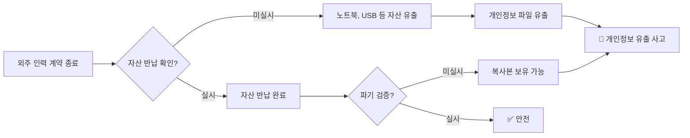

**시나리오 예시**:

외주 개발자 A씨가 계약 종료 후:
1. 회사에서 지급한 노트북에 **고객 DB 백업 파일**이 저장되어 있음
2. 자산 반납을 받지 않아 노트북을 그대로 가지고 감
3. 나중에 A씨가 이 정보를 악용하거나, A씨의 노트북이 해킹당함
4. **개인정보 유출 사고** 발생 → 회사에 막대한 손해

💡 **중요!**: 개인정보 보호법 제26조에 따르면, **위탁업체의 개인정보 유출은 위탁한 회사의 책임**입니다. 따라서 위탁업체가 개인정보를 안전하게 파기했는지 반드시 검증해야 합니다.

**관련 ISMS 인증 기준**:
- **2.4.1 인적 보안**: 고용 종료 시 자산 반납 및 파기 확인
- **2.10.4 개인정보 처리 위탁**: 위탁 종료 시 개인정보 파기 검증

### 🛠️ 개선 방안

#### 개선방안 1: 계정 생명주기 관리 프로세스 수립

**절차도**:

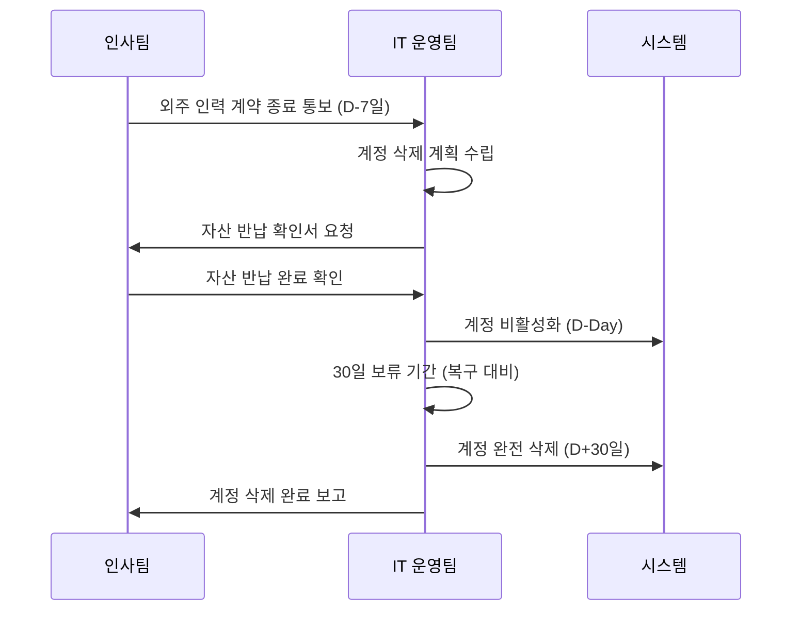

**구체적 절차**:

1. **사전 통보 (D-7일)**:
   - 인사팀이 IT 운영팀에 계약 종료 예정자 명단 전달
   - IT 운영팀은 해당 인력의 보유 계정 목록 파악

2. **계정 비활성화 (D-Day)**:
   - 계약 종료 당일 즉시 계정 비활성화
   - 로그인 불가 상태로 전환
   - 단, 완전 삭제는 하지 않음 (업무 인수인계 대비)

3. **보류 기간 (D+1 ~ D+30일)**:
   - 30일간 계정 데이터 보존
   - 필요 시 후임자가 데이터 인수
   - 이 기간 동안 본인은 접근 불가

4. **완전 삭제 (D+30일)**:
   - 계정 및 관련 데이터 완전 삭제
   - 삭제 로그 기록 및 보관 (3년)

📌 **노트**: 즉시 계정을 삭제하면 업무 인수인계가 어려울 수 있습니다. 따라서 "비활성화 → 보류 → 삭제" 3단계 프로세스를 권장합니다.

#### 개선방안 2: 외부 인력 보안 체크리스트 운영

**체크리스트 예시**:

```
┌─────────────────────────────────────────────────────────┐
│         외부 인력 계약 종료 보안 체크리스트               │
└─────────────────────────────────────────────────────────┘

□ 1. 사전 준비 (계약 종료 7일 전)
   □ 1-1. 인사팀으로부터 계약 종료 통보 수령
   □ 1-2. 외부 인력 보유 계정 목록 확인
   □ 1-3. 외부 인력 보유 자산 목록 확인

□ 2. 보안서약서 및 서류 (계약 종료 당일)
   □ 2-1. 보안서약서 징구 (퇴직 시 비밀 유지 서약)
   □ 2-2. 자산 반납 확인서 작성
   □ 2-3. 개인정보 파기 확인서 작성

□ 3. 시스템 계정 조치 (계약 종료 당일)
   □ 3-1. 모든 시스템 계정 비활성화
   □ 3-2. VPN 접근 권한 차단
   □ 3-3. 사무실 출입카드 회수

□ 4. 자산 반납 확인 (계약 종료 당일)
   □ 4-1. 노트북 회수 및 데이터 삭제 확인
   □ 4-2. USB, 외장하드 등 저장매체 회수
   □ 4-3. 업무용 휴대폰 회수 (해당 시)
   □ 4-4. 명함, 사원증 등 신분증 회수

□ 5. 개인정보 파기 검증 (계약 종료 당일)
   □ 5-1. PC 내 개인정보 파일 삭제 확인
   □ 5-2. 이메일 계정 내 개인정보 확인
   □ 5-3. 클라우드 저장소 (Google Drive 등) 확인
   □ 5-4. 파기 완료 서명 받기

□ 6. 사후 관리 (계약 종료 후 30일)
   □ 6-1. 30일 보류 기간 후 계정 완전 삭제
   □ 6-2. 삭제 로그 기록 및 보관
   □ 6-3. 인사팀에 완료 보고

───────────────────────────────────────────────────────
점검자: _____________  일자: __________  서명: _______
```

#### 개선방안 3: 위탁 계약서 표준 양식 개정

**개정 전 vs 개정 후 비교**:

| 항목 | 개정 전 (문제) | 개정 후 (개선) |
|:---:|:---:|:---:|
| **보안 요구사항** | ❌ 없음 | ✅ 구체적 기술적 요구사항 명시 |
| **재위탁 제한** | ❌ 없음 | ✅ 사전 서면 동의 필요 |
| **개인정보 파기** | ❌ 없음 | ✅ 파기 방법 및 검증 절차 명시 |
| **관리·감독** | ❌ 없음 | ✅ 교육, 점검 계획 포함 |
| **손해배상** | ✅ 있음 | ✅ 유지 (금액 구체화) |

**개정 계약서 필수 포함 조항**:

```
제XX조 (보안 요구사항)

① 수탁업체는 다음 각 호의 보안 요구사항을 준수하여야 한다.
   1. 접근 통제: 최소 권한 원칙에 따라 필요한 시스템에만 접근
   2. 암호화: 개인정보는 AES-256 이상으로 암호화하여 저장
   3. 로그 관리: 모든 접근 기록을 최소 1년간 보관
   4. 보안 업데이트: OS 및 애플리케이션 보안 패치 적용

② 수탁업체는 개인정보를 위탁업무 외의 목적으로 사용하거나
   제3자에게 제공할 수 없다.

제XX조 (재위탁 제한)

① 수탁업체는 위탁업체의 사전 서면 동의 없이 위탁업무를
   제3자에게 재위탁할 수 없다.

② 재위탁 시 본 계약서와 동일한 수준의 보안 요구사항을
   재수탁업체에 부과하여야 한다.

제XX조 (개인정보 파기)

① 수탁업체는 위탁업무 종료 시 7일 이내에 보유 중인
   개인정보를 모두 파기하여야 한다.

② 파기 방법은 다음 각 호와 같다.
   1. 전자파일: 복구 불가능한 방법으로 영구 삭제
   2. 서면 문서: 파쇄 또는 소각

③ 수탁업체는 파기 완료 후 "개인정보 파기 확인서"를
   위탁업체에 제출하여야 한다.

제XX조 (관리·감독)

① 위탁업체는 수탁업체에 대해 분기 1회 이상 보안 교육을
   실시하여야 한다.

② 위탁업체는 반기 1회 이상 수탁업체의 보안 준수 여부를
   점검할 수 있다.
```

#### 개선방안 4: 자산 반납 프로세스 강화

**자산 반납 시 데이터 삭제 검증 절차**:

**Step 1: 노트북 반납 시**

```bash
# 관리자가 직접 수행하는 검증 명령어

# 1. 전체 드라이브 스캔 (개인정보 파일 검색)
$ sudo find / -type f \( -name "*.xlsx" -o -name "*.csv" -o -name "*.db" \) -exec grep -l "주민등록번호\|계좌번호\|카드번호" {} \;

# 2. 최근 파일 확인 (최근 30일 내 수정된 파일)
$ find /Users/외주인력명 -type f -mtime -30 -ls

# 3. 휴지통 확인
$ ls -la ~/.Trash

# 4. 완전 포맷 (Secure Erase)
$ diskutil secureErase 3 /dev/disk0
```

📌 **노트**: `secureErase` 옵션 3은 미국 국방부(DoD) 표준에 따라 7회 덮어쓰기를 수행합니다.

**Step 2: 파기 확인서 작성**

```
┌─────────────────────────────────────────────────────────┐
│               개인정보 파기 확인서                        │
└─────────────────────────────────────────────────────────┘

본인은 ____________ (회사명)과의 계약 종료에 따라,
업무 수행 중 취득한 모든 개인정보를 다음과 같이 파기하였음을
확인합니다.

1. 파기 대상
   ☑ 노트북 내부 저장 파일
   ☑ USB, 외장하드 등 저장매체
   ☑ 이메일 계정 내 개인정보
   ☑ 클라우드 저장소 (Google Drive, Dropbox 등)
   ☑ 개인 소유 PC로 복사한 파일

2. 파기 방법
   ☑ 전자파일: 복구 불가능한 방법으로 영구 삭제
   ☑ 서면 문서: 파쇄

3. 파기 일시
   파기 일자: 20__년 __월 __일
   파기 시각: __시 __분

4. 확인 사항
   본인은 상기 개인정보를 완전히 파기하였으며,
   어떠한 형태로도 개인정보를 보유하고 있지 않습니다.

   만약 이를 위반하여 개인정보 유출 사고가 발생할 경우,
   관련 법령에 따른 형사 처벌 및 민사 손해배상 책임을
   부담할 것임을 확인합니다.

───────────────────────────────────────────────────────
작성자 (외주 인력): _____________ (서명/인)
확인자 (IT 담당자): _____________ (서명/인)
일자: 20__년 __월 __일
```

### 📊 인터뷰 5번 종합 요약

#### 발견된 취약점 요약

| No | 취약점 | 위험도 | 관련 기준 | 개선 우선순위 |
|:---:|:---:|:---:|:---:|:---:|
| 1 | 퇴직자 계정 미삭제 (3개) | 🔴 높음 | ISMS 2.5.4 | 즉시 |
| 2 | 보안서약서 미징구 | 🟡 중간 | ISMS 2.4.2 | 1개월 이내 |
| 3 | 위탁 계약서 내용 미비 | 🟡 중간 | ISMS 2.10.4 | 1개월 이내 |
| 4 | 자산 반납 및 파기 미검증 | 🔴 매우 높음 | ISMS 2.4.1 | 즉시 |

#### 즉시 조치 사항

1. **D+0 (당일)**:
   - 활성 상태로 남아있는 3개 계정 즉시 비활성화
   - 해당 계정의 최근 접근 로그 확인 (비정상 접근 여부)

2. **D+1 (익일)**:
   - 외주 인력 명단 전수 조사
   - 계약 종료했으나 계정이 남아있는 다른 사례 발굴

3. **D+7 (1주일 이내)**:
   - 외부 인력 계약 종료 보안 체크리스트 작성 및 배포
   - IT 운영팀 및 인사팀 대상 프로세스 교육

4. **D+30 (1개월 이내)**:
   - 위탁 계약서 표준 양식 개정
   - 기존 진행 중인 위탁 계약에 대해 보안 요구사항 보완 합의

---

## 📋 인터뷰 6번: 계정 및 권한 관리 실태

### 인터뷰 배경 및 상황

#### 인터뷰 대상자
- **이름**: 채 팀장님 (동일 인물)
- **소속**: IT 운영팀
- **역할**: 시스템 관리 및 계정 관리 담당

#### 인터뷰 목적
사용자 계정 생성, 권한 부여, 삭제 프로세스가 적절하게 관리되고 있는지 점검하여, **"인증 및 권한 관리"** 항목의 준수 여부를 확인합니다.

### 📌 인터뷰 내용 원문

> **감사자**: "채 팀장님, 이번에는 계정 및 권한 관리 실태를 점검하겠습니다. 사용자 등록·해지 프로세스를 봅시다."

> **감사자**: "최근에 신규 입사한 개발자나 외부 직원의 계정 승인 이력이나 문서가 시스템상에서 확인이 되지 않는데, 어떻게 처리하고 계신가요?"

> **채 팀장**: "워낙 소수 정예라서, 메신저 카톡으로 요청하면 제가 바로 처리해 줍니다. 굳이 복잡하게 결재를 올리고 승인을 받는 절차가 필요할까 싶어서요."

> **감사자**: "아, 그렇군요. 공식적인 절차를 통하지 않고 카톡으로 얘기하면 처리해 주신다는 말씀이시네요? 그럼 기록은요?"

> **채 팀장**: "네, 일단 처리하고... 기록은 따로 안 남깁니다."

> **감사자**: "공식적인 절차 없는 권한 부여는 추후 책임 추적성이 확보되지 않습니다. 기록이 안 남아 있으니까요."

> **감사자**: "그리고 서버 관리자 계정들도 살펴봤는데, 제조사 기본 계정(디폴트 계정)을 그대로 사용하고 계시네요. 패스워드만 바꾸면 된다고 생각하신 건가요?"

> **채 팀장**: "네, 장비 교체할 때 바꾸려고 했는데..."

> **감사자**: "그리고 한 달에 한 번, 분기에 한 번 오는 업체용 계정이 있잖아요? 유지보수업체 계정이요. 이 계정이 사용기간 제한 없이 상시 활성화되어 있네요."

> **채 팀장**: "네..."

> **감사자**: "그래서 6개월 이상 접속하지 않은 장기 미사용 계정이 그대로 남아있습니다."

### 🔍 발견된 문제점 (취약점)

#### 문제 1: 비공식 계정 생성 프로세스 (카톡 기반)

**문제 상황**:
- 계정 생성 요청이 **메신저(카톡)**로 이루어짐
- 결재 및 승인 절차 없음
- **기록이 전혀 남지 않음**

**위험도**: 🔴 **높음 (High)**

**보안 위협**:

1. **책임 추적성(Accountability) 부재**:
   - 누가, 언제, 왜 계정을 생성했는지 알 수 없음
   - 문제 발생 시 원인 규명 불가

2. **승인 없는 권한 부여**:
   - 요청자가 정말 해당 권한이 필요한 사람인지 검증 불가
   - 권한 남용 가능성

3. **감사 증적(Audit Trail) 부족**:
   - 외부 감사(ISMS 인증 등) 시 입증 불가
   - 법적 분쟁 시 증거 자료 없음

**실제 사례**:

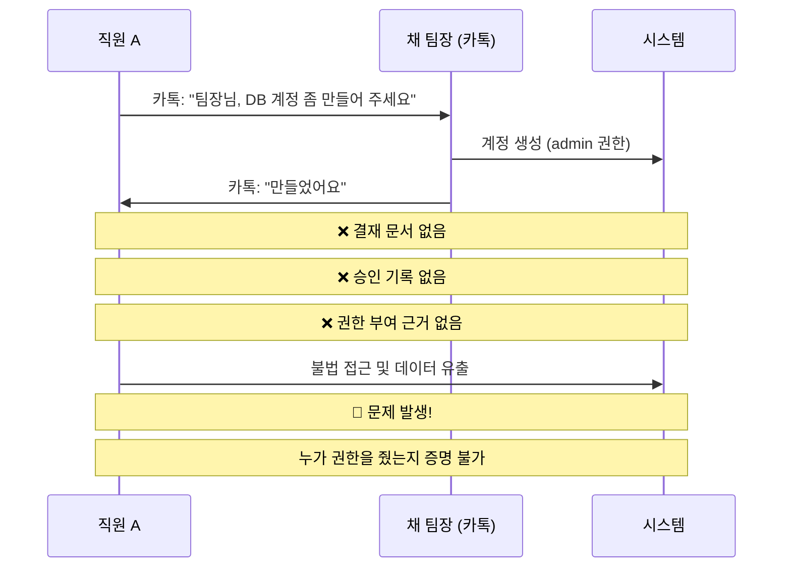

💡 **중요!**: ISO 27001 및 ISMS에서는 **모든 권한 부여에 대한 승인 및 기록**을 요구합니다. 이는 사고 발생 시 책임 소재를 명확히 하고, 감사 시 입증 자료로 활용하기 위함입니다.

**관련 ISMS 인증 기준**:
- **2.5.1 사용자 등록 및 권한 부여**: 공식적인 승인 절차 및 기록 유지
- **2.5.3 사용자 계정 관리**: 계정 생성, 변경, 삭제 이력 관리

#### 문제 2: 디폴트 계정(Default Account) 사용

**문제 상황**:
- 장비 제조사가 제공하는 **기본 계정(예: admin, root, administrator)**을 그대로 사용
- 패스워드만 변경했을 뿐, 계정명은 그대로 유지

**위험도**: 🟡 **중간 (Medium)**

**보안 위협**:

디폴트 계정을 사용하면 **공격 난이도가 크게 낮아집니다**:

| 경우의 수 | 디폴트 계정 사용 시 | 커스텀 계정 사용 시 |
|:---:|:---:|:---:|
| **알려진 정보** | 계정명 (admin) | 없음 |
| **브루트포스 시도** | 패스워드만 맞추면 됨 | 계정명 + 패스워드 모두 추측 |
| **경우의 수** | 10,000개 (패스워드) | 1억개 (계정명 × 패스워드) |
| **공격 성공률** | ⬆️ 높음 | ⬇️ 낮음 |

**예시 시나리오**:

```bash
# 공격자의 브루트포스 스크립트

# Case 1: 디폴트 계정 (admin) 사용 시
for password in $(cat password_list.txt); do
    ssh admin@target-server "$password"
done
# → 계정명이 이미 알려져 있으므로 패스워드만 시도

# Case 2: 커스텀 계정 (randomuser1234) 사용 시
for username in $(cat username_list.txt); do
    for password in $(cat password_list.txt); do
        ssh "$username@target-server" "$password"
    done
done
# → 계정명과 패스워드를 모두 시도해야 하므로 시간 폭증
```

**디폴트 계정 처리 원칙**:

1. **삭제 가능한 경우**: 디폴트 계정 삭제 후 새 계정 생성
2. **삭제 불가능한 경우**:
   - 디폴트 계정 비활성화
   - 로그인 불가 상태로 설정
   - 대신 새로운 관리자 계정 생성

**실습: 디폴트 계정 삭제 (Linux 예시)**

```bash
# Step 1: 현재 계정 목록 확인
$ cat /etc/passwd | grep -E "admin|root|administrator"

# Step 2: 새로운 관리자 계정 생성
$ sudo useradd -m -s /bin/bash secure_admin_2024
$ sudo passwd secure_admin_2024
Enter new password: [강력한 패스워드 입력]

# Step 3: sudo 권한 부여
$ sudo usermod -aG sudo secure_admin_2024

# Step 4: 디폴트 계정 삭제 (주의: root는 삭제 불가)
$ sudo userdel -r admin

# Step 5: 삭제 불가능한 계정(root)은 비활성화
$ sudo passwd -l root    # 패스워드 잠금
$ sudo usermod -s /usr/sbin/nologin root  # 로그인 쉘 제거

# Step 6: 검증
$ su - root
su: Authentication failure    # ← 로그인 불가 확인
```

📌 **노트**: `root` 계정은 Linux 시스템에서 삭제할 수 없습니다. 대신 **패스워드 잠금 + 로그인 쉘 제거**를 통해 직접 로그인을 차단합니다.

**관련 ISMS 인증 기준**:
- **2.5.5 관리자 계정 관리**: 디폴트 계정 변경 또는 삭제

#### 문제 3: 유지보수 업체 계정의 사용기간 미설정

**문제 상황**:
- 월 1회 또는 분기 1회 방문하는 유지보수 업체 계정
- **사용기간 제한 없이** 상시 활성화
- 6개월 이상 접속하지 않은 장기 미사용 계정 존재

**위험도**: 🟡 **중간 (Medium)**

**보안 위협**:

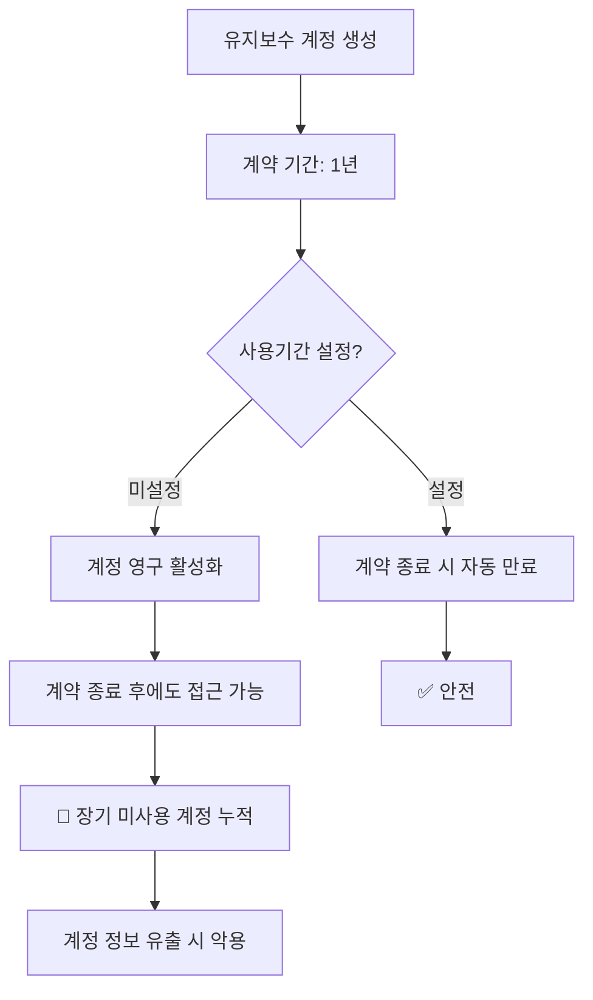

**개선 방안**:

**Step 1: 계정 만료일 설정**

```bash
# Linux에서 계정 만료일 설정

# 예: 1년 계약이므로 365일 후 만료되도록 설정
$ sudo chage -E $(date -d "+365 days" +%Y-%m-%d) vendor_account

# 설정 확인
$ sudo chage -l vendor_account
Last password change                                    : Jan 09, 2026
Password expires                                        : never
Password inactive                                       : never
Account expires                                         : Jan 09, 2027    # ← 확인
Minimum number of days between password change          : 0
Maximum number of days between password change          : 99999
```

**Step 2: 임시 계정 발급 (더 안전한 방법)**

매번 방문 시마다 **일회용 계정**을 발급하는 방법:

```bash
# 1. 방문 전 임시 계정 생성 (유효기간 7일)
$ sudo useradd -m -e $(date -d "+7 days" +%Y-%m-%d) vendor_temp_20260109
$ sudo passwd vendor_temp_20260109

# 2. 필요한 권한만 부여
$ sudo usermod -aG maintenance vendor_temp_20260109

# 3. 작업 완료 후 즉시 삭제
$ sudo userdel -r vendor_temp_20260109
```

💡 **중요!**: 유지보수 업체에게 **영구 계정**을 주는 것보다, 방문 시마다 **임시 계정**을 발급하는 것이 훨씬 안전합니다.

**Step 3: 장기 미사용 계정 자동 탐지**

```bash
#!/bin/bash
# 장기 미사용 계정 탐지 스크립트 (inactive_accounts.sh)

# 180일(약 6개월) 이상 로그인하지 않은 계정 찾기

echo "=== 장기 미사용 계정 탐지 ==="
echo "기준: 180일 이상 미접속"
echo ""

for user in $(cut -f1 -d: /etc/passwd); do
    # 마지막 로그인 시간 확인
    last_login=$(lastlog -u $user | tail -1 | awk '{print $4,$5,$6}')

    if [ "$last_login" == "Never logged in" ]; then
        echo "[경고] $user: 한 번도 로그인하지 않음"
    else
        # 마지막 로그인 날짜와 현재 날짜 차이 계산
        last_login_epoch=$(date -d "$last_login" +%s 2>/dev/null)
        current_epoch=$(date +%s)
        days_diff=$(( (current_epoch - last_login_epoch) / 86400 ))

        if [ $days_diff -gt 180 ]; then
            echo "[경고] $user: ${days_diff}일 동안 미접속"
        fi
    fi
done
```

**실행 예시**:

```bash
$ sudo bash inactive_accounts.sh

=== 장기 미사용 계정 탐지 ===
기준: 180일 이상 미접속

[경고] vendor_old: 245일 동안 미접속
[경고] contractor_2023: 312일 동안 미접속
[경고] temp_user: 한 번도 로그인하지 않음
```

📌 **노트**: 위 스크립트를 **cron**으로 등록하여 매주 자동 실행하면, 장기 미사용 계정을 조기에 발견할 수 있습니다.

**관련 ISMS 인증 기준**:
- **2.5.4 사용자 계정 관리**: 장기 미사용 계정 주기적 점검 및 삭제

---

### 🛠️ 개선 방안 (인터뷰 6번 종합)

#### 개선방안 1: 계정 생성/변경 결재 프로세스 수립

**결재 시스템 도입**:

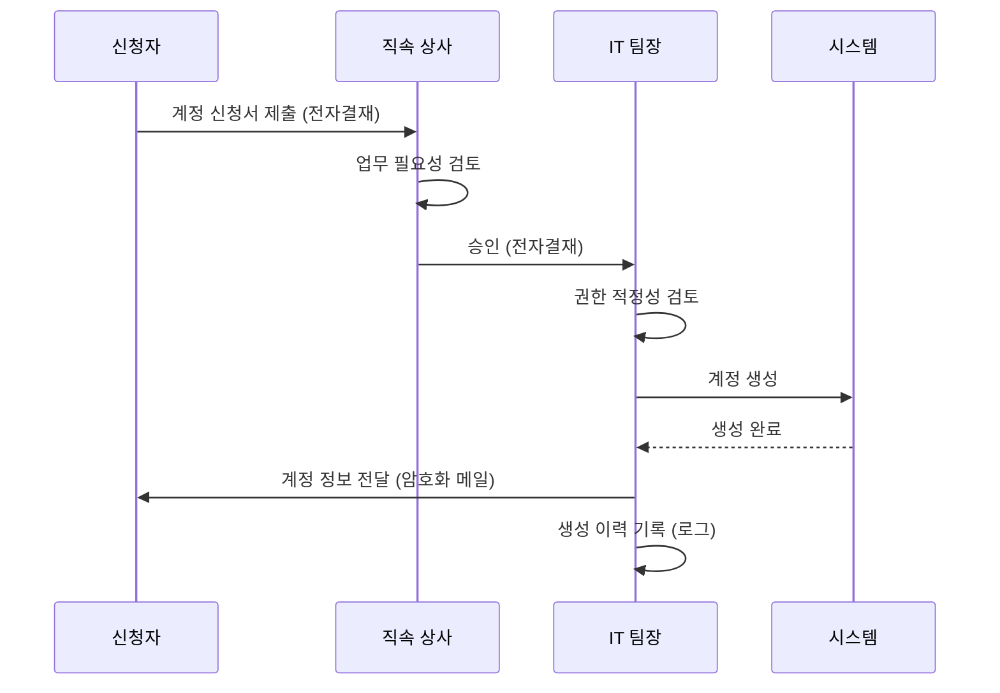

**계정 신청서 양식**:

```
┌─────────────────────────────────────────────────────────┐
│                 계정 신청서                               │
└─────────────────────────────────────────────────────────┘

신청 일자: 20__년 __월 __일
신청 유형: ☐ 신규 생성  ☐ 권한 변경  ☐ 삭제

1. 신청자 정보
   - 성명: _____________
   - 소속: _____________
   - 직급: _____________
   - 연락처: _____________

2. 계정 정보
   - 시스템명: _____________
   - 요청 계정명: _____________
   - 요청 권한: ☐ 읽기  ☐ 쓰기  ☐ 삭제  ☐ 관리자

3. 신청 사유
   [구체적인 업무 필요성 기술]
   ________________________________________________
   ________________________________________________

4. 사용 기간
   - 시작일: 20__년 __월 __일
   - 종료일: 20__년 __월 __일 (또는 ☐ 상시)

───────────────────────────────────────────────────────
신청자:  _____________ (서명/인)  일자: ________

승인
직속 상사:  _____________ (서명/인)  일자: ________
IT 팀장:    _____________ (서명/인)  일자: ________

처리 결과
처리자:  _____________ (서명/인)  일자: ________
계정명:  _____________
권한:    _____________
비고:    _____________
```

#### 개선방안 2: 계정 관리 대장 운영

**Excel 기반 계정 관리 대장**:

| No | 계정명 | 시스템 | 소유자 | 권한 | 생성일 | 만료일 | 최종접속일 | 상태 | 비고 |
|:---:|:---:|:---:|:---:|:---:|:---:|:---:|:---:|:---:|:---:|
| 1 | admin_kim | DB서버 | 김철수 | DBA | 2025-01-10 | 2026-01-10 | 2026-01-09 | 활성 | |
| 2 | vendor_abc | 웹서버 | ABC업체 | 읽기 | 2025-06-01 | 2026-06-01 | 2025-12-01 | 활성 | 계약 갱신 예정 |
| 3 | temp_lee | 개발서버 | 이영희 | 개발자 | 2025-11-01 | 2026-01-01 | 2026-01-01 | 만료 | 삭제 대상 |

📌 **노트**: 매월 1일, 계정 관리 대장을 검토하여 만료된 계정이나 장기 미사용 계정을 식별합니다.

#### 개선방안 3: 자동화 스크립트 구축

**계정 생명주기 자동 관리 스크립트**:

```bash
#!/bin/bash
# 계정 생명주기 자동 관리 (account_lifecycle.sh)

# 1. 만료 예정 계정 알림 (D-7일)
echo "=== 만료 예정 계정 알림 ==="
for user in $(cut -f1 -d: /etc/passwd); do
    expire_date=$(chage -l $user | grep "Account expires" | awk '{print $4}')

    if [ "$expire_date" != "never" ]; then
        expire_epoch=$(date -d "$expire_date" +%s 2>/dev/null)
        current_epoch=$(date +%s)
        days_left=$(( (expire_epoch - current_epoch) / 86400 ))

        if [ $days_left -le 7 ] && [ $days_left -ge 0 ]; then
            echo "[알림] $user 계정이 ${days_left}일 후 만료됩니다."
            # 이메일 발송 로직 추가
            # mail -s "계정 만료 알림" admin@company.com <<< "..."
        fi
    fi
done

# 2. 장기 미사용 계정 자동 비활성화 (180일)
echo ""
echo "=== 장기 미사용 계정 비활성화 ==="
for user in $(cut -f1 -d: /etc/passwd); do
    last_login=$(lastlog -u $user | tail -1 | awk '{print $4,$5,$6}')

    if [ "$last_login" != "Never logged in" ]; then
        last_login_epoch=$(date -d "$last_login" +%s 2>/dev/null)
        current_epoch=$(date +%s)
        days_diff=$(( (current_epoch - last_login_epoch) / 86400 ))

        if [ $days_diff -gt 180 ]; then
            echo "[조치] $user 계정을 비활성화합니다. (${days_diff}일 미접속)"
            sudo usermod -L $user  # 계정 잠금
            # 로그 기록
            echo "$(date): $user 계정 비활성화 (${days_diff}일 미접속)" >> /var/log/account_management.log
        fi
    fi
done

# 3. 만료된 계정 자동 삭제 (만료 후 30일)
echo ""
echo "=== 만료된 계정 삭제 ==="
for user in $(cut -f1 -d: /etc/passwd); do
    expire_date=$(chage -l $user | grep "Account expires" | awk '{print $4}')

    if [ "$expire_date" != "never" ]; then
        expire_epoch=$(date -d "$expire_date" +%s 2>/dev/null)
        current_epoch=$(date +%s)
        days_past=$(( (current_epoch - expire_epoch) / 86400 ))

        if [ $days_past -gt 30 ]; then
            echo "[삭제] $user 계정을 삭제합니다. (만료 후 ${days_past}일 경과)"
            sudo userdel -r $user
            # 로그 기록
            echo "$(date): $user 계정 삭제 (만료 후 ${days_past}일)" >> /var/log/account_management.log
        fi
    fi
done
```

**Cron 등록 (매주 월요일 오전 9시 실행)**:

```bash
$ sudo crontab -e

# 계정 생명주기 자동 관리 스크립트
0 9 * * 1 /usr/local/bin/account_lifecycle.sh >> /var/log/account_lifecycle.log 2>&1
```

---

### 📊 인터뷰 6번 종합 요약

#### 발견된 취약점 요약

| No | 취약점 | 위험도 | 관련 기준 | 개선 우선순위 |
|:---:|:---:|:---:|:---:|:---:|
| 1 | 비공식 계정 생성 (카톡 기반) | 🔴 높음 | ISMS 2.5.1 | 즉시 |
| 2 | 디폴트 계정 사용 | 🟡 중간 | ISMS 2.5.5 | 1개월 이내 |
| 3 | 유지보수 계정 사용기간 미설정 | 🟡 중간 | ISMS 2.5.4 | 1개월 이내 |
| 4 | 장기 미사용 계정 방치 | 🟡 중간 | ISMS 2.5.4 | 1개월 이내 |

#### 즉시 조치 사항

1. **D+0 (당일)**:
   - 계정 생성 요청은 즉시 전자결재 시스템으로 전환
   - 카톡 기반 요청 금지 공지

2. **D+7 (1주일 이내)**:
   - 디폴트 계정 목록 전수 조사
   - 삭제 가능한 계정 즉시 삭제
   - 삭제 불가능한 계정 비활성화

3. **D+14 (2주일 이내)**:
   - 유지보수 계정에 만료일 일괄 설정
   - 장기 미사용 계정 비활성화

4. **D+30 (1개월 이내)**:
   - 계정 관리 대장 구축 및 운영 시작
   - 자동화 스크립트 개발 및 Cron 등록

---

## ✅ 학습 체크리스트 (Section 1)

오늘 Section 1에서 학습한 내용을 점검해 봅시다:

- [ ] ISMS 보안 컨설팅의 개념과 목적을 이해했다
- [ ] 인터뷰 기반 취약점 발견 방법론을 이해했다
- [ ] 외주 위탁 관리의 4가지 주요 문제점을 설명할 수 있다
- [ ] 계정 생명주기 관리 프로세스를 설계할 수 있다
- [ ] 디폴트 계정의 위험성과 제거 방법을 설명할 수 있다
- [ ] Linux 계정 관리 명령어(`useradd`, `chage`, `userdel` 등)를 실행할 수 있다
- [ ] 장기 미사용 계정 탐지 스크립트를 작성할 수 있다
- [ ] ISMS 인증 기준 조항을 취약점과 연계하여 설명할 수 있다

---

## 📋 핵심 요약 (Section 1)

### 1. 외주 위탁 관리의 핵심

- **계정 삭제**: 계약 종료 즉시 비활성화, 30일 보류 후 완전 삭제
- **보안서약서**: 법인 계약서와 별도로 개인 서약서 징구
- **계약서 내용**: 보안 요구사항, 재위탁 제한, 파기 절차 명시
- **자산 반납**: 파기 확인서 징구 및 실제 삭제 검증

### 2. 계정 및 권한 관리의 핵심

- **공식 절차**: 전자결재 기반 계정 신청/승인/기록
- **디폴트 계정**: 삭제 또는 비활성화, 커스텀 계정 사용
- **사용기간 설정**: 계약 기간에 맞춰 만료일 설정
- **미사용 계정**: 180일 이상 미접속 시 비활성화

### 3. 주요 명령어

```bash
# 계정 생성 및 만료일 설정
sudo useradd -m -e 2026-12-31 username
sudo passwd username

# 계정 만료일 변경
sudo chage -E 2026-12-31 username

# 계정 잠금 (비활성화)
sudo passwd -l username
sudo usermod -L username

# 계정 삭제
sudo userdel -r username

# 계정 정보 확인
sudo chage -l username
lastlog -u username
```

---

**다음 Section에서는**: ISMS 인터뷰 7~8번(DB 권한 관리, 방화벽 정책)과 백업 및 재해복구(RTO/RPO) 개념을 다룹니다.
# 📝 Section 2: 데이터베이스 보안 및 네트워크 정책

## 📋 인터뷰 7번: 데이터베이스 권한 관리 점검

### 인터뷰 배경

#### 인터뷰 대상자
- **이름**: 채 팀장님 (계속)
- **소속**: IT 운영팀
- **역할**: DB 관리 담당

#### 인터뷰 목적
데이터베이스의 계정 권한이 **최소 권한 원칙(Principle of Least Privilege)**에 따라 적절하게 설정되어 있는지 점검합니다.

💡 **중요!**: 최소 권한 원칙이란, 각 사용자나 프로세스가 **자신의 업무 수행에 필요한 최소한의 권한만** 가져야 한다는 보안 원칙입니다.

### 📌 인터뷰 내용 원문

> **감사자**: "채 팀장님, DB 서버 인프라 구성을 보니 웹 서버와 DB 서버가 하나의 물리 서버에서 돌아가고 있네요?"

> **채 팀장**: "네, 서버 비용 문제로 임시로 합쳐둔 상태입니다. 대신 DB 접근 제어 솔루션을 쓰고 있어서 안전합니다."

> **감사자**: "실제로 권한 부여 현황을 확인해 봐야 할 것 같습니다. 회원 정보가 저장된 테이블에 권한 부여 현황을 보여주십시오."

> **채 팀장**: "네, 잠시만요."

### 🔍 데이터베이스 권한 조회 결과

#### SQL 쿼리 실행

채 팀장이 실행한 SQL 쿼리:

```sql
-- MySQL/MariaDB에서 특정 테이블의 권한 조회
SELECT
    GRANTEE,                    -- 권한을 부여받은 계정
    PRIVILEGE_TYPE             -- 권한 종류
FROM
    INFORMATION_SCHEMA.TABLE_PRIVILEGES
WHERE
    TABLE_SCHEMA = 'mydb'      -- 데이터베이스명
    AND TABLE_NAME = 'member'; -- 테이블명 (회원 정보)
```

📌 **노트**: `INFORMATION_SCHEMA`는 MySQL/MariaDB에서 메타데이터를 조회할 수 있는 시스템 데이터베이스입니다. 여기에는 데이터베이스, 테이블, 권한 등의 정보가 저장되어 있습니다.

#### 조회 결과

| GRANTEE | PRIVILEGE_TYPE | 설명 |
|:---:|:---:|:---|
| `app_user@%` | SELECT, INSERT, UPDATE, DELETE, REFERENCES, TRIGGER | **웹 서버 계정** (애플리케이션 계정) |
| `batch_user@%` | SELECT, UPDATE | **배치 작업용 계정** |
| `operator@192.168.10.3` | SELECT, INSERT, UPDATE, DELETE, CREATE, DROP, ALTER | **운영자 계정** |
| `report_user@%` | SELECT | **통계 작성용 계정** |

### 🔍 발견된 문제점 (취약점)

#### 문제 1: 웹 서버 계정(`app_user`)의 과도한 권한

**문제 상황**:
- 웹 서버 계정이 **REFERENCES**, **TRIGGER** 권한을 보유
- 이는 DB 관리자(DBA)나 개발자에게 필요한 권한

**위험도**: 🟡 **중간 (Medium)**

**권한 분석**:

| 권한 | 필요 여부 | 설명 |
|:---:|:---:|:---|
| **SELECT** | ✅ 필요 | 데이터 조회 (로그인, 회원 정보 조회 등) |
| **INSERT** | ✅ 필요 | 데이터 삽입 (회원 가입 등) |
| **UPDATE** | ✅ 필요 | 데이터 수정 (정보 수정, 비밀번호 변경 등) |
| **DELETE** | ✅ 필요 | 데이터 삭제 (회원 탈퇴 등) |
| **REFERENCES** | ❌ 불필요 | 외래 키(Foreign Key) 생성 권한 → **DBA 권한** |
| **TRIGGER** | ❌ 불필요 | 트리거 생성 권한 → **DBA 권한** |

💡 **중요!**: 웹 서버 계정은 일반적으로 **CRUD(Create, Read, Update, Delete)** 권한만 있으면 충분합니다. `REFERENCES`와 `TRIGGER`는 **DB 스키마를 변경하는 권한**이므로 웹 애플리케이션에는 불필요합니다.

**보안 위협**:

SQL Injection 공격 시나리오:

```mermaid
sequenceDiagram
    participant A as 공격자
    participant W as 웹 서버
    participant DB as 데이터베이스

    A->>W: SQL Injection 공격 시도
    Note over A,W: ' OR '1'='1'; DROP TRIGGER audit_log; --

    W->>DB: 악의적 SQL 실행
    DB->>DB: 🔴 TRIGGER 삭제 성공!
    Note over DB: audit_log 트리거 삭제됨<br/>(접근 로그 기록 중단)

    A->>W: 정상적인 로그인 시도
    W->>DB: 정상 쿼리 실행
    DB->>DB: ✅ 로그인 성공
    Note over DB: ⚠️ 하지만 로그가 기록되지 않음!

    A->>DB: 불법 접근 및 데이터 유출
    Note over A,DB: 감사 로그 없어서 추적 불가
```

📌 **노트**: 만약 `app_user`가 TRIGGER 권한이 없었다면, 공격자가 트리거를 삭제하려고 해도 "권한 없음" 오류가 발생하여 공격이 차단됩니다.

**개선 방안**:

```sql
-- STEP 1: 현재 권한 확인
SHOW GRANTS FOR 'app_user'@'%';

-- 결과:
-- GRANT SELECT, INSERT, UPDATE, DELETE, REFERENCES, TRIGGER
-- ON mydb.member TO 'app_user'@'%';

-- STEP 2: 불필요한 권한 제거
REVOKE REFERENCES, TRIGGER
ON mydb.member
FROM 'app_user'@'%';

-- STEP 3: 변경 사항 적용
FLUSH PRIVILEGES;

-- STEP 4: 권한 재확인
SHOW GRANTS FOR 'app_user'@'%';

-- 예상 결과:
-- GRANT SELECT, INSERT, UPDATE, DELETE
-- ON mydb.member TO 'app_user'@'%';
```

#### 문제 2: 운영자 계정(`operator`)의 과도한 권한

**문제 상황**:
- 운영자 계정이 **CREATE**, **DROP**, **ALTER** 권한을 보유
- 이는 **테이블 구조를 변경**할 수 있는 강력한 권한
- 회원 테이블에 직접 접근하여 데이터를 수정/삭제 가능

**위험도**: 🔴 **높음 (High)**

**문제의 핵심**:

운영자(관리자)는 회원 데이터를 **웹 애플리케이션을 통해** 관리해야 합니다. DB에 직접 접근하여 데이터를 수정하면 다음과 같은 문제가 발생합니다:

1. **감사 로그 누락**: 누가, 언제, 무엇을 수정했는지 기록되지 않음
2. **데이터 무결성 훼손**: 애플리케이션의 비즈니스 로직을 우회하여 잘못된 데이터 입력 가능
3. **실수 위험**: SQL 명령어 오타로 인한 대량 데이터 삭제 가능

**잘못된 관리 시나리오**:

```sql
-- 운영자가 DB에 직접 접근하여 회원 정보 수정

-- ❌ 잘못된 방법 (DB 직접 접근)
UPDATE member
SET email = 'new_email@example.com'
WHERE user_id = 'hong123';

-- 문제점:
-- 1. 애플리케이션 로그에 기록되지 않음
-- 2. 이메일 형식 검증 없이 수정됨
-- 3. 다른 시스템과 동기화되지 않음 (캐시, 검색 엔진 등)
```

```sql
-- ✅ 올바른 방법 (웹 애플리케이션을 통한 수정)
-- 1. 관리자가 웹 관리 페이지에 로그인
-- 2. "회원 정보 수정" 메뉴 선택
-- 3. 해당 회원 검색 후 이메일 수정
-- 4. "저장" 버튼 클릭
--
-- → 애플리케이션에서 다음 작업 자동 수행:
--    - 이메일 형식 검증
--    - 수정 로그 기록 (누가, 언제, 무엇을 수정)
--    - 캐시 무효화
--    - 관련 시스템 동기화
--    - DB UPDATE 쿼리 실행
```

**개선 방안**:

운영자 계정은 **SELECT(조회)** 권한만 부여:

```sql
-- STEP 1: 기존 권한 제거
REVOKE ALL PRIVILEGES
ON mydb.member
FROM 'operator'@'192.168.10.3';

-- STEP 2: SELECT 권한만 부여
GRANT SELECT
ON mydb.member
TO 'operator'@'192.168.10.3';

-- STEP 3: 변경 사항 적용
FLUSH PRIVILEGES;
```

💡 **중요!**: 운영자가 데이터 수정이 필요한 경우, **웹 애플리케이션의 관리자 기능**을 사용하도록 프로세스를 변경해야 합니다.

#### 문제 3: 배치 작업 계정(`batch_user`)의 권한 적정성

**문제 상황**:
- 배치 작업 계정이 **SELECT**, **UPDATE** 권한 보유
- 회원 테이블에 접근 가능

**위험도**: 🟢 **낮음 (Low)** → **문맥에 따라 적정할 수 있음**

**판단 기준**:

배치 작업의 목적에 따라 권한이 적정한지 판단해야 합니다:

| 배치 작업 유형 | 필요 권한 | 판단 |
|:---:|:---:|:---:|
| **통계 집계** (읽기 전용) | SELECT | 적정 |
| **대량 이메일 발송** | SELECT | 적정 |
| **회원 등급 자동 업데이트** | SELECT, UPDATE | ✅ 적정 |
| **휴면 계정 처리** | SELECT, UPDATE | ✅ 적정 |
| **데이터 마이그레이션** | SELECT, INSERT, UPDATE | 적정 (일시적) |

📌 **노트**: 강의에서는 "배치 작업이 SELECT와 UPDATE만 한다"고 했으므로, 배치의 목적이 **회원 등급 업데이트** 등이라면 적정한 권한입니다.

**권장 사항**:

배치 작업도 가능한 한 **읽기 전용**으로 설계하고, 업데이트가 필요한 경우 **별도의 API**를 호출하도록 구성하는 것이 더 안전합니다:

```
[배치 서버] ---(SELECT)---> [DB]
                   |
                   | 업데이트 필요 시
                   v
            [웹 API 호출]
                   |
                   v
            [웹 서버] ---(UPDATE)---> [DB]
```

이렇게 하면:
- 모든 업데이트가 애플리케이션을 거쳐서 실행됨
- 감사 로그가 자동으로 기록됨
- 비즈니스 로직이 일관되게 적용됨

#### 문제 4: 통계 작성 계정(`report_user`)의 권한

**문제 상황**:
- SELECT(조회) 권한만 보유
- 회원 테이블에 접근 가능

**위험도**: ✅ **문제 없음**

**판단**:

통계 작성용 계정은 **읽기 전용(Read-Only)** 권한만 필요하므로, SELECT 권한만 부여된 것은 **적절**합니다.

📌 **노트**: 이것이 **최소 권한 원칙**의 모범 사례입니다. 통계를 만들 때는 데이터를 읽기만 하면 되므로, 수정/삭제 권한은 불필요합니다.

### 🔍 발견된 추가 문제점

#### 문제 5: DB 계정의 IP 제한 미설정

채 팀장이 추가로 실행한 쿼리:

```sql
-- DB에 생성된 모든 계정 조회
SELECT
    User,                       -- 사용자명
    Host                        -- 접근 가능한 IP 또는 호스트
FROM
    mysql.user
ORDER BY User;
```

**조회 결과**:

| User | Host | 의미 |
|:---:|:---:|:---|
| `app_user` | `%` | 모든 IP에서 접근 가능 |
| `batch_user` | `%` | 모든 IP에서 접근 가능 |
| `operator` | `192.168.10.3` | 192.168.10.3에서만 접근 가능 |
| `report_user` | `%` | 모든 IP에서 접근 가능 |
| `root` | `localhost` | 로컬에서만 접근 가능 |
| `test` | `%` | 🔴 정체불명의 계정! |

**문제 분석**:

**`%`의 의미**:
- MySQL/MariaDB에서 `%`는 **와일드카드(Wildcard)**로, "모든 IP"를 의미합니다.
- `app_user@%`는 "app_user 계정은 어떤 IP에서든 접속 가능"이라는 뜻입니다.

**위험 시나리오**:

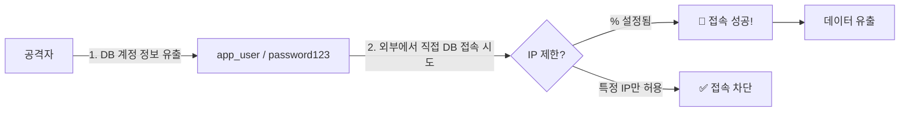

**실제 사례**:

1. 공격자가 **SQL Injection**으로 DB 계정 정보를 알아냄
   ```
   app_user / MyP@ssw0rd
   ```

2. 공격자가 자신의 PC에서 DB에 직접 접속 시도:
   ```bash
   $ mysql -h db.company.com -u app_user -p
   Enter password: MyP@ssw0rd
   ```

3. **IP 제한이 없으면(`%`)** → 접속 성공! → 데이터 유출
4. **IP 제한이 있으면** → 접속 차단! → 공격 실패

**개선 방안**:

각 계정의 용도에 맞게 **접근 가능한 IP를 제한**합니다:

```sql
-- STEP 1: 기존 계정 삭제 (% 허용하는 계정)
DROP USER 'app_user'@'%';
DROP USER 'batch_user'@'%';
DROP USER 'report_user'@'%';

-- STEP 2: IP 제한을 둔 새 계정 생성

-- app_user: 웹 서버 IP에서만 접근 가능
CREATE USER 'app_user'@'10.0.1.100' IDENTIFIED BY 'MyP@ssw0rd';
GRANT SELECT, INSERT, UPDATE, DELETE
ON mydb.member
TO 'app_user'@'10.0.1.100';

-- batch_user: 배치 서버 IP에서만 접근 가능
CREATE USER 'batch_user'@'10.0.2.200' IDENTIFIED BY 'Batch@Pass';
GRANT SELECT, UPDATE
ON mydb.member
TO 'batch_user'@'10.0.2.200';

-- report_user: 통계 서버 내부망에서만 접근 가능 (192.168.x.x 대역)
CREATE USER 'report_user'@'192.168.%.%' IDENTIFIED BY 'Report@Pass';
GRANT SELECT
ON mydb.member
TO 'report_user'@'192.168.%.%';

-- STEP 3: 변경 사항 적용
FLUSH PRIVILEGES;
```

📌 **노트**: `192.168.%.%`는 "192.168로 시작하는 모든 IP"를 의미합니다. 이렇게 하면 내부망에서만 접근 가능하도록 제한할 수 있습니다.

#### 문제 6: 정체불명의 계정(`test`)

**문제 상황**:
- `test@%` 계정이 존재
- 용도, 권한, 생성 일자 불명
- 누가 만들었는지 알 수 없음

**위험도**: 🔴 **높음 (High)**

**보안 위협**:

테스트 계정은 다음과 같은 이유로 위험합니다:

1. **약한 패스워드**: 테스트 계정은 대부분 `test`, `1234`, `password` 등 추측 가능한 패스워드 사용
2. **관리 부재**: 누가 언제 만들었는지 모르므로 책임자 불명
3. **백도어 가능성**: 퇴직한 직원이 만든 백도어일 수 있음

**개선 방안**:

```sql
-- STEP 1: 계정 정보 확인
SHOW GRANTS FOR 'test'@'%';
SELECT * FROM mysql.user WHERE User = 'test'\G

-- STEP 2: 계정 사용 이력 확인 (로그 분석)
-- /var/log/mysql/mysql.log 또는 general_log 테이블 확인

-- STEP 3: 사용 중인지 확인 후 삭제
DROP USER 'test'@'%';
FLUSH PRIVILEGES;
```

💡 **중요!**: 용도를 알 수 없는 계정은 **즉시 비활성화 또는 삭제**해야 합니다. 만약 실제로 사용 중이라면 담당자가 문의할 것이므로, 그때 재생성하면 됩니다.

### 🔍 발견된 추가 문제점 (계속)

#### 문제 7: 임시 테이블 미삭제

채 팀장이 추가로 실행한 쿼리:

```sql
-- 임시 테이블 검색 (temp_, bak_, old_ 등)
SELECT TABLE_NAME
FROM INFORMATION_SCHEMA.TABLES
WHERE TABLE_SCHEMA = 'mydb'
  AND (TABLE_NAME LIKE 'temp_%'
   OR TABLE_NAME LIKE 'bak_%'
   OR TABLE_NAME LIKE '%_old'
   OR TABLE_NAME LIKE '%_backup');
```

**조회 결과**:

```
TABLE_NAME
──────────────────
member_temp
member_bak
product_old
order_backup_20231201
```

**문제 상황**:
- 임시 테이블이 삭제되지 않고 남아있음
- 백업 용도로 만든 테이블이 정리되지 않음

**위험도**: 🟡 **중간 (Medium)**

**보안 위협**:

1. **중복 데이터 보유**: 같은 개인정보가 여러 테이블에 중복 저장됨
2. **관리 부실**: 어떤 테이블이 실제 운영 중인지 불명확
3. **백업 정책 위반**: 정식 백업이 아닌 임의로 만든 복사본

**확인 방법**:

```sql
-- 각 테이블의 레코드 수 및 최종 수정 시간 확인
SELECT
    TABLE_NAME,
    TABLE_ROWS,
    UPDATE_TIME,
    CREATE_TIME
FROM INFORMATION_SCHEMA.TABLES
WHERE TABLE_SCHEMA = 'mydb'
  AND TABLE_NAME LIKE '%temp%'
   OR TABLE_NAME LIKE '%bak%';
```

**결과 예시**:

| TABLE_NAME | TABLE_ROWS | UPDATE_TIME | CREATE_TIME |
|:---:|:---:|:---:|:---:|
| member_temp | 50,000 | 2024-06-15 | 2024-06-15 |
| member_bak | 50,000 | 2023-12-01 | 2023-12-01 |
| product_old | 10,000 | 2023-08-20 | 2023-08-20 |

📌 **노트**: UPDATE_TIME이 오래되었다면 더 이상 사용하지 않는 테이블일 가능성이 높습니다.

**개선 방안**:

```sql
-- STEP 1: 테이블 백업 (혹시 필요할 수 있으니)
mysqldump -u root -p mydb member_temp > member_temp_backup.sql

-- STEP 2: 담당자에게 확인
-- "이 테이블들 아직 사용 중인가요?"
-- → 사용 안 함 확인 후 삭제

-- STEP 3: 테이블 삭제
DROP TABLE IF EXISTS member_temp;
DROP TABLE IF EXISTS member_bak;
DROP TABLE IF EXISTS product_old;
DROP TABLE IF EXISTS order_backup_20231201;

-- STEP 4: 삭제 로그 기록
INSERT INTO admin_audit_log (action, target, user, timestamp)
VALUES ('DROP TABLE', 'member_temp, member_bak, product_old, order_backup_20231201',
        USER(), NOW());
```

---

## 🔥 방화벽 정책 점검 (인터뷰 8번)

### 인터뷰 배경

#### 인터뷰 대상자
- **이름**: 채 팀장님 (계속)
- **소속**: IT 운영팀
- **역할**: 네트워크 및 방화벽 관리 담당

#### 인터뷰 목적
방화벽 정책이 **접근 통제 원칙**에 따라 적절하게 설정되어 있는지 점검합니다.

### 📌 인터뷰 내용 원문

> **감사자**: "채 팀장님, 방화벽 정책 확인했는데 모두 승인된 건가요?"

> **채 팀장**: "네, 승인된 겁니다."

> **감사자**: "어느 곳이 문제인지 찾아보겠습니다."

### 🔍 방화벽 정책 테이블

채 팀장이 제공한 방화벽 정책:

| No | Source | Destination | Service | Action | 설명 |
|:---:|:---:|:---:|:---:|:---:|:---|
| 1 | External | DMZ (Web Server) | HTTP/HTTPS | ALLOW | 외부 → 웹 서버 |
| **2** | **Any** | **Internal DB** | **Any** | **ALLOW** | 🔴 **문제!** |
| 3 | DMZ (Web Server) | Internal (WAS) | HTTP | ALLOW | 웹 → WAS |
| **4** | **DMZ (WAS)** | **Internal DB** | **Any** | **ALLOW** | 🔴 **문제!** |
| 5 | Admin PC Group | All Internal Servers | SSH/RDP | ALLOW | 관리자 → 전체 서버 |
| 6 | Internal Users | External | HTTP/HTTPS | ALLOW | 내부 → 인터넷 |
| **7** | **Developer Group** | **Production DB** | **3306** | **ALLOW** | 🔴 **문제!** |
| 8 | External | DMZ (Mail Server) | SMTP | ALLOW | 외부 → 메일 서버 |
| 9 | Any | Any | Any | **DENY** | 기본 차단 정책 (Default Deny) |

### 🔍 발견된 문제점

#### 문제 1: 규칙 2번 - 외부에서 내부 DB로 Any 허용

**문제 상황**:
- **Source**: Any (어디서든)
- **Destination**: Internal DB (내부 DB 서버)
- **Service**: Any (모든 포트)
- **Action**: ALLOW

**위험도**: 🔴 **매우 높음 (Critical)**

**문제의 핵심**:

이 규칙은 **인터넷을 포함한 외부에서** 내부 DB 서버로 직접 접근을 허용합니다. 이는 보안의 가장 기본 원칙을 위배합니다.

**보안 위협**:


**올바른 접근 경로**:

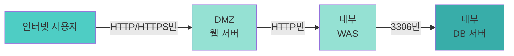

**개선 방안**:

```
# 규칙 2번 삭제
DELETE 규칙 2번

# 이유: 외부에서 내부 DB로 직접 접근은 절대 허용하면 안 됨
# DB는 WAS를 통해서만 접근해야 함
```

📌 **노트**: 외부에서 내부 서버로 직접 접근을 허용하면, 방화벽을 설치한 의미가 없습니다. **DMZ → WAS → DB**의 3단계 방어선을 구축해야 합니다.

#### 문제 2: 규칙 4번 - WAS에서 DB로 Any 허용

**문제 상황**:
- **Source**: DMZ (WAS)
- **Destination**: Internal DB
- **Service**: Any (모든 포트)
- **Action**: ALLOW

**위험도**: 🟡 **중간 (Medium)**

**문제의 핵심**:

WAS에서 DB로 접근은 필요하지만, **모든 포트(Any)**를 허용하는 것은 과도합니다.

**필요한 포트**:

| 서비스 | 포트 | 용도 |
|:---:|:---:|:---|
| MySQL/MariaDB | 3306 | DB 연결 |
| PostgreSQL | 5432 | DB 연결 |
| Oracle | 1521 | DB 연결 |
| SQL Server | 1433 | DB 연결 |

**잘못된 규칙**:
```
Source: WAS
Destination: DB
Service: Any        ← 🔴 문제! (1-65535 모든 포트)
Action: ALLOW
```

**올바른 규칙**:
```
Source: WAS
Destination: DB
Service: 3306       ← ✅ DB 포트만
Action: ALLOW
```

**개선 방안**:

```
# 규칙 4번 수정
Source: DMZ (WAS)
Destination: Internal DB
Service: 3306       ← Any를 3306으로 변경
Action: ALLOW
Description: WAS → DB (MySQL 연결)
```

💡 **중요!**: 방화벽 규칙은 **최소 권한 원칙**에 따라 **필요한 최소한의 서비스(포트)**만 허용해야 합니다.

#### 문제 3: 규칙 7번 - 개발망에서 운영 DB 접근

**문제 상황**:
- **Source**: Developer Group (개발자 그룹)
- **Destination**: Production DB (운영 DB)
- **Service**: 3306 (MySQL 포트)
- **Action**: ALLOW

**위험도**: 🔴 **높음 (High)**

**문제의 핵심**:

개발 환경과 운영 환경은 **반드시 분리**되어야 합니다. 개발자가 운영 DB에 직접 접근할 수 있으면 다음과 같은 위험이 있습니다:

1. **실수로 운영 데이터 삭제/수정**
   ```sql
   -- 개발자가 개발 DB에서 테스트하려던 쿼리를
   -- 실수로 운영 DB에 실행
   DELETE FROM member WHERE 1=1;  -- 🔴 전체 회원 삭제!
   ```

2. **개발망 해킹 시 운영망 침투**
   ```mermaid
   graph LR
       A[공격자] -->|해킹| B[개발자 PC]
       B -->|규칙 7번| C[운영 DB]
       C --> D[🔴 고객 데이터 유출]
   ```

3. **데이터 유출 위험**
   - 개발자가 운영 DB에서 데이터를 다운로드
   - 개인정보가 개발자 PC에 저장됨
   - 개발자 PC는 보안이 상대적으로 약함

**개발/운영 분리 원칙**:

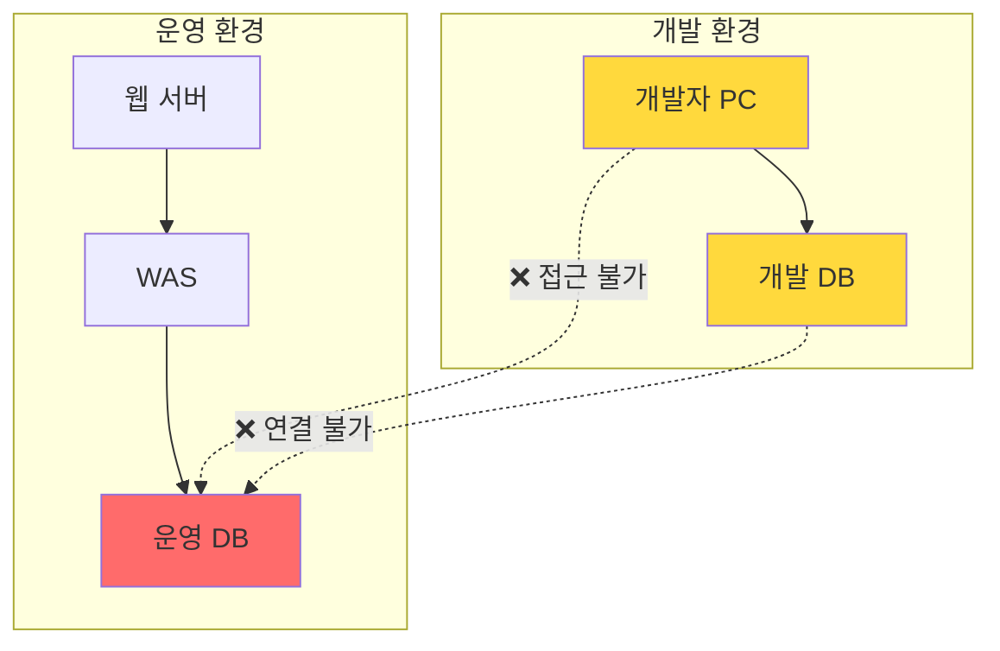

**개선 방안**:

```
# 규칙 7번 삭제
DELETE 규칙 7번

# 대안 1: 개발자는 개발 DB에만 접근
Source: Developer Group
Destination: Development DB       ← 운영 DB가 아닌 개발 DB
Service: 3306
Action: ALLOW

# 대안 2: 운영 DB 조회가 필요한 경우, 읽기 전용 복제본 사용
Source: Developer Group
Destination: Production DB (Read Replica)    ← 읽기 전용 복제본
Service: 3306
Action: ALLOW (SELECT만 허용)
```

💡 **중요!**: 개발 환경에는 **마스킹된 테스트 데이터**를 사용해야 합니다. 실제 고객 데이터를 개발 환경으로 복사하면 개인정보 보호법 위반입니다.

**데이터 마스킹 예시**:

```sql
-- 운영 DB에서 개발 DB로 데이터 복사 시 마스킹

-- ❌ 잘못된 방법 (실제 데이터 그대로 복사)
INSERT INTO dev_db.member
SELECT * FROM prod_db.member;

-- ✅ 올바른 방법 (개인정보 마스킹)
INSERT INTO dev_db.member (user_id, name, email, phone, birth_date)
SELECT
    user_id,
    CONCAT('테스트', user_id) AS name,                          -- 이름 마스킹
    CONCAT('test', user_id, '@test.com') AS email,              -- 이메일 마스킹
    CONCAT('010-****-', SUBSTRING(phone, -4)) AS phone,         -- 전화번호 마스킹
    DATE_ADD('1990-01-01', INTERVAL FLOOR(RAND()*10000) DAY) AS birth_date  -- 생년월일 랜덤화
FROM prod_db.member;
```

### 📊 방화벽 정책 개선 (Before & After)

#### Before (문제 있는 정책)

| No | Source | Destination | Service | Action | 문제 |
|:---:|:---:|:---:|:---:|:---:|:---|
| 2 | Any | Internal DB | Any | ALLOW | 🔴 외부→내부 Any 허용 |
| 4 | DMZ (WAS) | Internal DB | Any | ALLOW | 🟡 Any 포트 허용 |
| 7 | Developer Group | Production DB | 3306 | ALLOW | 🔴 개발망→운영 DB |

#### After (개선된 정책)

| No | Source | Destination | Service | Action | 설명 |
|:---:|:---:|:---:|:---:|:---:|:---|
| ~~2~~ | ~~삭제~~ | ~~삭제~~ | ~~삭제~~ | ~~삭제~~ | 규칙 삭제 |
| 4 | DMZ (WAS) | Internal DB | **3306** | ALLOW | ✅ MySQL 포트만 허용 |
| ~~7~~ | ~~삭제~~ | ~~삭제~~ | ~~삭제~~ | ~~삭제~~ | 규칙 삭제 |
| **7-1** | **Developer Group** | **Dev DB** | **3306** | **ALLOW** | ✅ 개발 DB로 변경 |

---

## 💾 백업 및 재해복구 (RTO/RPO)

### 백업 정책과 재해복구 지침의 불일치

#### 발견된 문제

감사자가 **백업 정책**과 **재해복구 관리 지침** 문서를 검토한 결과, 두 문서 간에 **심각한 불일치**를 발견했습니다.

**백업 정책 문서**:

| 시스템 등급 | 백업 주기 | 보관 기간 |
|:---:|:---:|:---:|
| 1등급 (Critical) | **매일** | 30일 |
| 1등급 (Critical) | **매주** | 12주 |
| 2등급 (Important) | 매주 | 4주 |
| 3등급 (Normal) | 매월 | 3개월 |

**재해복구 관리 지침 문서**:

| 시스템 등급 | RPO (복구 목표 시점) | RTO (복구 목표 시간) |
|:---:|:---:|:---:|
| 1등급 (Critical) | **12시간 이내** | 4시간 이내 |
| 2등급 (Important) | 24시간 이내 | 8시간 이내 |
| 3등급 (Normal) | 48시간 이내 | 24시간 이내 |

**문제 발견**:

💡 **중요!**: 같은 1등급 시스템인데 백업 주기가 서로 다릅니다!
- 한 시스템은 **매일** 백업
- 다른 시스템은 **매주** 백업

그리고 더 큰 문제는:
- RPO가 **12시간 이내**라고 했는데
- 백업을 **매주**(7일마다) 한다면?
- 재해 발생 시 최대 **7일치 데이터가 손실**됩니다!

### RTO와 RPO 개념 이해

#### RPO (Recovery Point Objective) - 복구 목표 시점

**정의**: 재해 발생 시 **최대 허용 가능한 데이터 손실 기간**

**쉬운 설명**:
- "우리는 최대 몇 시간치 데이터 손실까지 감당할 수 있는가?"
- "데이터를 잃어버려도 되는 최대 시간은?"

**예시**:

```mermaid
timeline
    title RPO 개념 이해
    section 정상 운영
        08:00 : 백업 #1
        12:00 : 백업 #2
    section 재해 발생
        14:00 : 🔥 서버 화재 발생!
    section 데이터 손실
        12:00~14:00 : ❌ 2시간치 데이터 손실
```

위 예시에서:
- 마지막 백업: 12:00
- 재해 발생: 14:00
- **데이터 손실 기간: 2시간**
- 만약 RPO가 "12시간 이내"라면 → ✅ 기준 충족
- 만약 RPO가 "1시간 이내"라면 → ❌ 기준 미달

#### RTO (Recovery Time Objective) - 복구 목표 시간

**정의**: 재해 발생 후 **시스템을 복구하는 데 걸리는 목표 시간**

**쉬운 설명**:
- "서비스가 중단되면 몇 시간 안에 복구해야 하는가?"
- "고객이 기다릴 수 있는 최대 시간은?"

**예시**:

```mermaid
timeline
    title RTO 개념 이해
    section 재해 발생
        14:00 : 🔥 서버 화재 발생
    section 복구 작업
        14:00~15:00 : 백업 서버 준비
        15:00~16:00 : 데이터 복원
        16:00~17:00 : 시스템 검증
    section 서비스 재개
        17:00 : ✅ 서비스 정상화
```

위 예시에서:
- 재해 발생: 14:00
- 서비스 복구: 17:00
- **복구 소요 시간: 3시간**
- 만약 RTO가 "4시간 이내"라면 → ✅ 기준 충족
- 만약 RTO가 "2시간 이내"라면 → ❌ 기준 미달

### RTO와 RPO의 관계

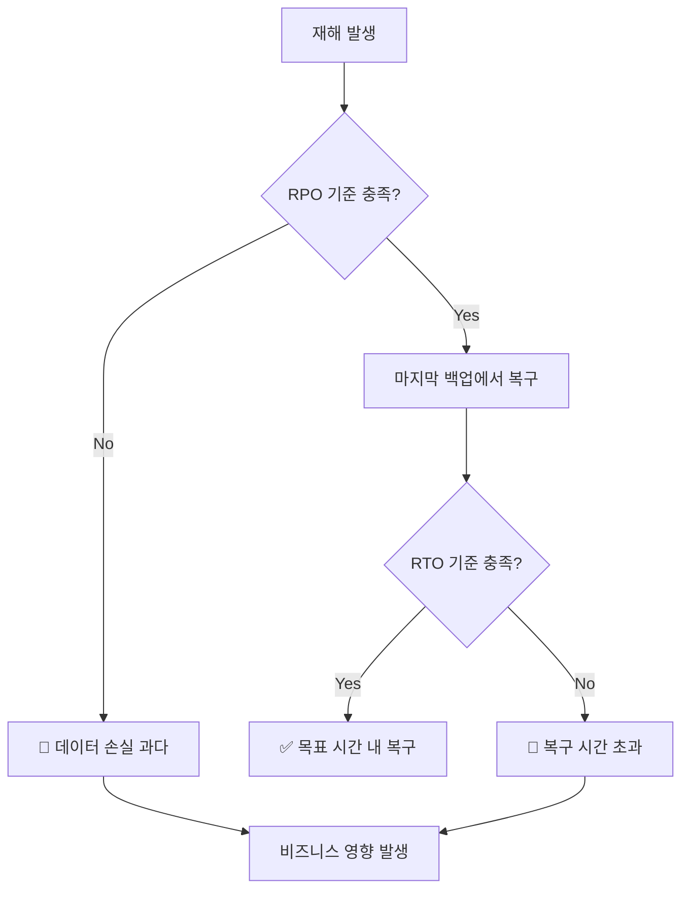

**핵심 원칙**:
- **RPO가 짧을수록** → 백업을 **자주** 해야 함 (비용 증가)
- **RTO가 짧을수록** → 빠른 복구 시스템 필요 (비용 증가)

### 백업 주기와 RPO의 관계

#### 잘못된 설정 (현재 상황)

**시나리오**: 1등급 시스템, RPO 12시간, 백업 주기 **매주**

```mermaid
timeline
    title 잘못된 백업 설정
    section 1주차
        월요일 00:00 : 백업 #1
    section 2주차
        월요일 00:00 : 백업 #2 예정
    section 재해 발생
        일요일 23:59 : 🔥 재해!
    section 데이터 손실
        7일간 : ❌ 168시간치 손실!
```

**문제**:
- RPO 목표: **12시간 이내**
- 실제 손실: **최대 7일 (168시간)**
- **기준 미달!** (14배 초과)

#### 올바른 설정

**백업 주기 계산**:

RPO가 12시간이라면, 백업 주기는 **12시간보다 짧아야** 합니다.

```
백업 주기 < RPO

예시:
- RPO: 12시간 → 백업 주기: 12시간 이내 (예: 6시간마다)
- RPO: 4시간 → 백업 주기: 4시간 이내 (예: 2시간마다)
- RPO: 1시간 → 백업 주기: 1시간 이내 (예: 30분마다)
```

**올바른 백업 정책**:

| 시스템 등급 | RPO | 백업 주기 | 이유 |
|:---:|:---:|:---:|:---|
| 1등급 | 12시간 이내 | **6시간마다** | RPO보다 짧게 |
| 1등급 | 12시간 이내 | **매일 2회** | RPO보다 짧게 |
| 2등급 | 24시간 이내 | **매일 1회** | RPO보다 짧게 |
| 3등급 | 48시간 이내 | **매일 1회** | RPO보다 짧게 |

### 백업 시스템 구축 전략

#### 전략 1: 실시간 미러링 (RPO ≈ 0)

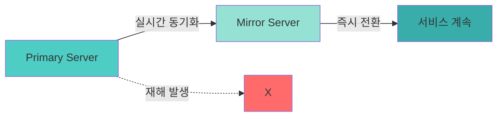

**특징**:
- **RPO**: 거의 0 (실시간 복제)
- **RTO**: 수분 (자동 장애조치)
- **비용**: 💰💰💰 매우 높음
- **적용 대상**: 금융, 의료 등 중요 시스템

**구현 예시 (MySQL Replication)**:

```bash
# Master Server 설정
[mysqld]
server-id=1
log-bin=mysql-bin
binlog-format=ROW

# Slave Server 설정
[mysqld]
server-id=2
relay-log=mysql-relay-bin
read-only=1

# Slave에서 Master 연결
CHANGE MASTER TO
  MASTER_HOST='master-server-ip',
  MASTER_USER='repl_user',
  MASTER_PASSWORD='password',
  MASTER_LOG_FILE='mysql-bin.000001',
  MASTER_LOG_POS=0;

START SLAVE;
```

#### 전략 2: Hot Standby (RPO: 수분~수시간)

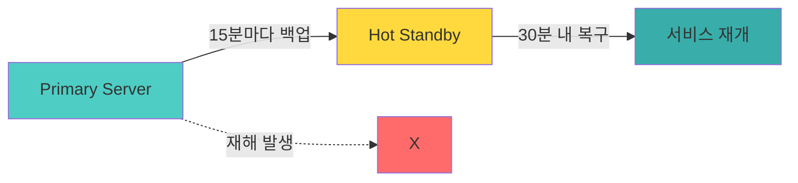

**특징**:
- **RPO**: 15분~1시간
- **RTO**: 30분~1시간
- **비용**: 💰💰 높음
- **적용 대상**: 중요 업무 시스템

#### 전략 3: Warm Standby (RPO: 수시간~1일)

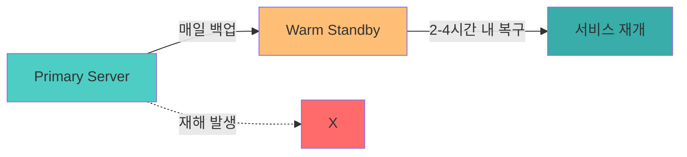

**특징**:
- **RPO**: 12~24시간
- **RTO**: 2~4시간
- **비용**: 💰 보통
- **적용 대상**: 일반 업무 시스템

#### 전략 4: Cold Backup (RPO: 1일 이상)

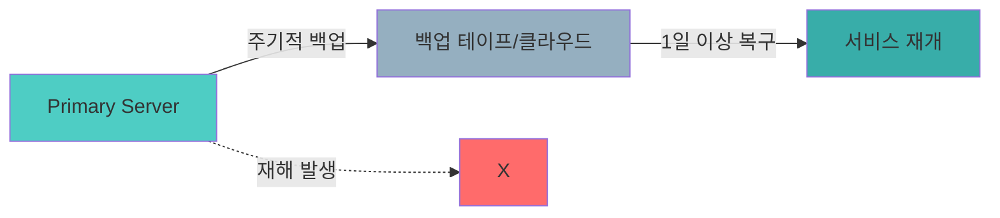

**특징**:
- **RPO**: 1일~1주
- **RTO**: 1일 이상
- **비용**: 💰 낮음
- **적용 대상**: 참조용 시스템, 아카이브

### 개선 방안

#### 문서 정합성 확보

1. **업무 영향도 분석(BIA) 실시**:
   - 각 시스템의 중요도 재평가
   - 비즈니스 요구사항 기반 RPO/RTO 산정

2. **백업 정책 재수립**:
   ```
   1등급 시스템 (Critical):
   - RPO: 12시간 이내
   - 백업 주기: 6시간마다 (하루 4회)
   - 보관 기간: 30일

   2등급 시스템 (Important):
   - RPO: 24시간 이내
   - 백업 주기: 매일 1회
   - 보관 기간: 14일
   ```

3. **재해복구 계획 수립**:
   - 복구 절차서 작성
   - 복구 담당자 지정
   - **정기적인 복구 훈련** (매년 2회 이상)

💡 **중요!**: 백업을 하는 것만으로는 부족합니다. **실제로 복구가 가능한지 정기적으로 테스트**해야 합니다!

---

## ✅ 학습 체크리스트 (Section 2)

- [ ] DB 권한의 최소 권한 원칙을 이해했다
- [ ] 웹 서버 계정에 필요한 최소 권한(CRUD)을 설명할 수 있다
- [ ] 운영자가 웹 애플리케이션을 통해 관리해야 하는 이유를 설명할 수 있다
- [ ] MySQL/MariaDB 권한 관리 명령어(`GRANT`, `REVOKE`)를 실행할 수 있다
- [ ] DB 계정의 IP 제한(`@host`)의 중요성을 이해했다
- [ ] 방화벽 정책에서 Any 허용의 위험성을 설명할 수 있다
- [ ] 개발/운영 환경 분리의 중요성을 이해했다
- [ ] RTO와 RPO의 개념을 설명할 수 있다
- [ ] 백업 주기와 RPO의 관계를 이해했다
- [ ] 백업 시스템 구축 전략(미러링, Hot/Warm/Cold)을 비교할 수 있다

---

## 📋 핵심 요약 (Section 2)

### 1. 데이터베이스 보안 핵심

- **최소 권한 원칙**: 각 계정은 업무에 필요한 최소한의 권한만 부여
- **IP 제한**: `@%` 대신 특정 IP 또는 대역으로 제한
- **정체불명 계정**: 용도 불명 계정 즉시 비활성화/삭제
- **임시 테이블**: temp_, bak_ 등 정리되지 않은 테이블 주기적 점검

### 2. 방화벽 정책 핵심

- **Any 금지**: Source, Destination, Service 모두 구체적으로 명시
- **내부 접근 차단**: 외부에서 내부 서버로 직접 접근 차단
- **개발/운영 분리**: 개발망에서 운영 DB 접근 차단
- **3계층 방어**: 웹 → WAS → DB 단계별 접근 통제

### 3. 백업 및 재해복구 핵심

- **RPO**: 최대 허용 데이터 손실 기간 (백업 주기 < RPO)
- **RTO**: 목표 복구 시간
- **문서 정합성**: 백업 정책과 재해복구 지침의 일치
- **복구 테스트**: 정기적인 복구 훈련 실시

### 4. 주요 SQL 명령어

```sql
-- 권한 조회
SHOW GRANTS FOR 'username'@'host';

-- 권한 부여
GRANT SELECT, INSERT, UPDATE, DELETE
ON database.table
TO 'username'@'host';

-- 권한 제거
REVOKE REFERENCES, TRIGGER
ON database.table
FROM 'username'@'host';

-- 계정 삭제
DROP USER 'username'@'host';

-- 변경사항 적용
FLUSH PRIVILEGES;
```

---

**다음 Section에서는**: ISMS 통합 시각화 및 개인정보 보호법 기본 개념을 다룹니다.
# Section 3: ISMS 통합 시각화 및 개인정보 보호법 기본 개념

## 3.1 ISMS 실습 마무리 및 통합 관점

### 3.1.1 ISMS 보안 통제의 시스템 아키텍처 매핑

지금까지 우리는 ISMS 인증 기준의 여러 통제 항목들을 실습했습니다. 이제 이 통제들이 실제 시스템 아키텍처의 어느 부분에 적용되는지 통합적으로 바라볼 필요가 있습니다.

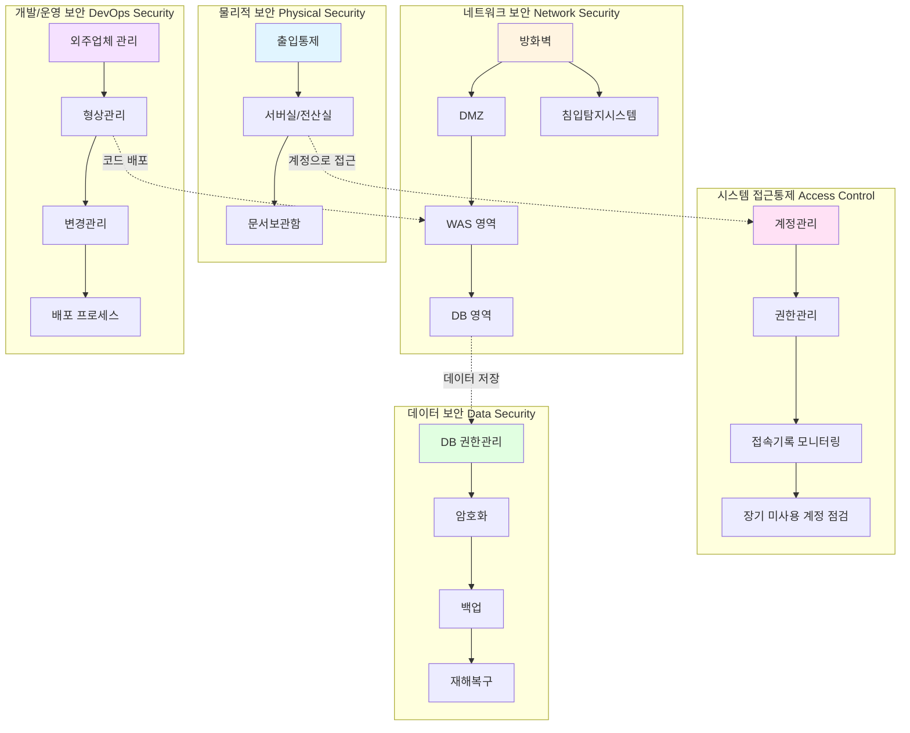

**핵심 포인트:**
- **물리적 보안**: 서버실 출입통제, 문서보관함 시건장치
- **네트워크 보안**: 방화벽 정책, 네트워크 분리 (DMZ → WAS → DB)
- **접근통제**: 계정 생명주기 관리, 최소 권한 원칙
- **데이터 보안**: DB 권한 분리, 암호화, 백업/복구 (RTO/RPO)
- **개발 보안**: 외주업체 보안서약서, 형상관리 계정 관리

---

## 3.2 개인정보 보호법 개요

### 3.2.1 개인정보 보호법의 구조

ISMS를 익숙하게 다루게 되셨으니, 이제 **개인정보 보호 관련 컨설팅**을 진행하겠습니다. 개인정보 보호법은 ISMS와는 다른 법적 프레임워크이지만, 보안 컨설팅에서 함께 다뤄지는 중요한 영역입니다.

#### 개인정보 보호법의 3단 구조

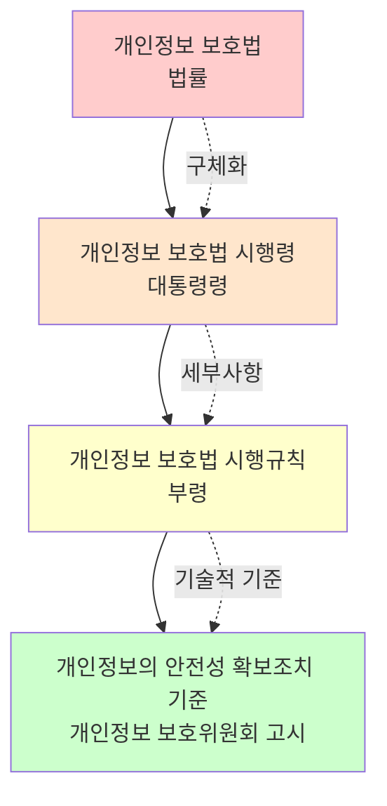

**법령 탐색 방법:**

국가법령정보센터 (https://www.law.go.kr)에서 개인정보 보호법을 검색하면:
- **본문**: 법 조항 전체 확인
- **연혁**: 2011년 제정 이후 개정 내역
- **신구법 비교**: 개정 전후 비교
- **3단 비교**: 법-시행령-시행규칙 나란히 비교

```
예시:
법 제29조 (안전조치 의무)
  ↓
시행령 제30조 (개인정보의 안전성 확보조치)
  → "개인정보 보호위원회가 정하여 고시한다"
  ↓
개인정보의 안전성 확보조치 기준 (고시)
  → 구체적 기술 기준 명시
```

#### 우리가 주로 봐야 할 조항

| 장 | 주요 내용 | 비고 |
|---|---|---|
| **제3장** | 개인정보의 처리 | 수집, 이용, 제공 |
| **제4장** | 개인정보의 안전한 관리 | 파기, 안전조치 |
| **제29조** | 안전성 확보조치 | 기술적·관리적·물리적 조치 |
| **시행령** | 안전조치 구체화 | 고시로 위임 |
| **고시** | 안전성 확보조치 기준 | 접근권한, 암호화 등 세부 기준 |

**법 제29조 (안전조치 의무):**
> 개인정보처리자는 개인정보가 분실·도난·유출·위조·변조 또는 훼손되지 아니하도록 **내부 관리계획 수립**, **접근 통제**, **암호화 조치** 등 안전성 확보에 필요한 **기술적·관리적·물리적 조치**를 하여야 한다.

**시행령 제30조:**
> 법 제29조에 따른 안전성 확보조치의 구체적인 기준은 **개인정보 보호위원회가 정하여 고시한다**.

**고시 (안전성 확보조치 기준):**
- 제4조: 접근권한의 관리
- 제5조: 접근통제
- 제6조: 개인정보의 암호화
- 제7조: 접속기록의 보관 및 점검
- 제8조: 악성프로그램 등 방지
- 제9조: 물리적 안전조치

> **중요:** 안전성 확보조치 기준은 "**최소한의 기준**"을 정한 것입니다. 이 이상으로 강화해야 할 필요가 있으면 추가 조치를 취해야 합니다.

---

### 3.2.2 개인정보 처리의 생애주기 (Lifecycle)

개인정보는 "태어나서 죽는" 생명주기를 가집니다.

```mermaid
graph LR
    A[수집<br/>Collection] --> B[보유<br/>Storage]
    B --> C[이용<br/>Use]
    C --> D[제공<br/>Provision]
    D --> E[파기<br/>Destruction]

    A -.정보주체 동의.-> A
    D -.제3자 제공 동의.-> D
    E -.보유기간 경과.-> E

    style A fill:#e1f5ff
    style B fill:#ffe1f5
    style C fill:#fff4e1
    style D fill:#ffffcc
    style E fill:#ffcccc
```

| 단계 | 설명 | 주요 법적 요구사항 |
|------|------|-------------------|
| **수집** | 정보주체로부터 개인정보를 받는 단계 | 동의, 최소수집, 고지 |
| **보유** | 시스템에 저장하여 보관하는 단계 | 안전성 확보조치 (암호화, 접근통제) |
| **이용** | 수집 목적에 따라 활용하는 단계 | 목적 외 이용 금지 |
| **제공** | 외부(제3자)에게 개인정보를 넘기는 단계 | 제3자 제공 동의, 위탁 공개 |
| **파기** | 보유기간 경과 또는 목적 달성 시 삭제 | 지체없이 파기, 분리보관 |

**처리 단계별 핵심 원칙:**

1. **수집 시**: "필요한 최소한"만 수집
2. **보유 시**: "안전하게" 저장 (암호화, 접근통제)
3. **이용 시**: "수집 목적 범위 내"에서만 이용
4. **제공 시**: "동의"를 받거나 "법령 근거" 필요
5. **파기 시**: "지체없이" 파기, 다른 법령 보존 시 "분리보관"

---

## 3.3 개인정보 수집 단계의 법적 요구사항

### 3.3.1 개인정보를 수집할 수 있는 7가지 경우

개인정보 보호법 제15조는 개인정보를 수집할 수 있는 경우를 **7가지로 한정**하고 있습니다. 이 중 하나에 해당하지 않으면 **수집할 수 없습니다**.

```mermaid
mindmap
  root((개인정보<br/>수집 가능<br/>7가지))
    (1) 정보주체 동의
      대부분의 경우
      명시적 동의 필요
    (2) 법령상 의무
      법률 특별 규정
      법령상 의무 준수
    (3) 공공기관 소관업무
      국민건강보험공단
      공공기관 업무 수행
    (4) 계약 이행
      배송 주소 수집
      서비스 제공 필수
    (5) 이용약관 동의
      회원가입 시
      서비스 식별 필수
    (6) 생명·신체·재산 보호
      응급환자 치료
      급박한 상황
    (7) 공공안전·공중위생
      코로나19 대응
      긴급 필요시
```

#### 각 경우의 상세 설명

**① 정보주체의 동의를 받은 경우**

가장 일반적인 수집 근거입니다. "개인정보 수집에 동의하십니까? ☑" 체크박스가 이 경우에 해당합니다.

```
[사례]
온라인 쇼핑몰 회원가입 시:
┌────────────────────────────────────┐
│ [필수] 개인정보 수집 및 이용 동의   │
│                                    │
│ • 수집항목: 이름, 이메일, 전화번호  │
│ • 수집목적: 회원 관리, 서비스 제공  │
│ • 보유기간: 회원 탈퇴 시까지        │
│                                    │
│ ☑ 동의합니다                       │
└────────────────────────────────────┘
```

**② 법률에 특별한 규정이 있거나 법령상 의무를 준수하기 위하여 불가피한 경우**

법에서 정한 의무 사항을 준수하기 위해서는 정보주체 동의 없이도 수집 가능합니다. **법이 동의보다 우선**합니다.

```
[사례]
- 금융실명법: 금융거래 시 실명 확인 의무
- 전자상거래법: 거래 기록 보존 의무
- 통신비밀보호법: 통신자료 제공 의무
```

**③ 공공기관이 법령 등에서 정하는 소관 업무의 수행을 위하여 불가피한 경우**

공공기관이 본연의 업무를 수행하기 위해 필요하다면 동의 없이 처리 가능합니다.

```
[예시]
국민건강보험공단:
- 건강보험 업무 수행을 위해 필요한 개인정보
- 별도 동의 없이 수집·이용 가능
- 법령에서 정한 소관 업무 범위 내에서만
```

**④ 정보주체와 체결한 계약을 이행하거나, 계약 체결 과정에서 정보주체의 요청에 따른 조치를 이행하기 위하여 필요한 경우**

계약 이행에 **필연적으로 필요한** 정보는 별도 동의 없이 수집 가능합니다.

```
[대표 사례: 배송]
온라인 쇼핑몰에서 상품 구매 시:
- 배송을 위해 "배송지 주소" 필요
- 이는 계약(상품 배송) 이행을 위해 필수
- 별도의 "주소 수집 동의" 불필요
- 계약 관계에서 당연히 수반되는 정보

❌ 잘못된 경우:
"배송지 주소를 수집합니다. 동의하십니까?"
→ 불필요한 동의 절차

✅ 올바른 경우:
배송지 입력란만 제공, 별도 동의 없음
→ 계약 이행을 위한 필수 정보로 간주
```

**⑤ 정보주체 또는 그 법정대리인이 의사표시를 할 수 없는 상태에 있거나 주소불명 등으로 사전 동의를 받을 수 없는 경우로서, 명백히 정보주체 또는 제3자의 급박한 생명, 신체, 재산의 이익을 위하여 필요하다고 인정되는 경우**

```
[예시]
- 의식불명 환자의 응급 수술을 위한 의료정보 수집
- 실종자 수색을 위한 통신위치정보 확인
- 화재/재난 시 긴급 연락을 위한 정보 이용

⚠️ 주의: "급박한" 상황에 한정됨
```

**⑥ 개인정보처리자의 정당한 이익을 달성하기 위하여 필요한 경우로서, 명백하게 정보주체의 권리보다 우선하는 경우**

개인정보 처리자(기업)도 권리가 있습니다. 하지만 **정보주체 권리보다 명백히 우선**해야 적용됩니다.

```
판단 기준:
1. 처리자의 정당한 이익이 존재하는가?
2. 정보주체 권리와 비교하여 명백히 우선하는가?
3. 정보주체에게 예측 가능한 범위인가?

⚠️ 실무에서는 판단이 어려워 대부분 동의를 받음
```

**⑦ 공중위생 등 공공의 안전과 안녕을 위하여 긴급히 필요한 경우**

```
[배경]
COVID-19 이후 2020년 개정으로 추가된 조항

[예시]
- 코로나19 확진자 동선 공개
- 감염병 역학조사를 위한 개인정보 수집
- 방역 목적의 출입 기록 수집

⚠️ "긴급히 필요한 경우"로 한정
⚠️ 평상시에는 적용 불가
```

---

### 3.3.2 최소수집 원칙 (법 제16조)

#### 조문 분석

```
개인정보 보호법 제16조 (개인정보의 수집 제한)

① 개인정보처리자는 제15조제1항 각 호의 어느 하나에 해당하여
   개인정보를 수집하는 경우에는 그 목적에 필요한
   최소한의 개인정보를 수집하여야 한다.

   이 경우 최소한의 개인정보 수집이라는 입증책임은
   개인정보처리자가 부담한다.

② 개인정보처리자는 정보주체의 동의를 받아 개인정보를
   수집하는 경우 필요한 최소한의 정보 외의 개인정보
   수집에는 동의하지 아니할 수 있다는 사실을 구체적으로
   알리고 개인정보를 수집하여야 한다.

③ 개인정보처리자는 정보주체가 필요한 최소한의 정보 외의
   개인정보 수집에 동의하지 아니한다는 이유로 정보주체에게
   재화 또는 서비스의 제공을 거부하여서는 아니 된다.
```

#### 핵심 요약

| 항목 | 내용 |
|------|------|
| **원칙** | 목적에 필요한 **최소한의 개인정보**만 수집 |
| **입증책임** | **개인정보처리자**가 "이 정도는 필요하다"를 입증해야 함 |
| **필수/선택 분리** | 최소한의 정보(필수)와 그 외 정보(선택)를 **구분하여 동의** 받음 |
| **서비스 제공 거부 금지** | 선택 항목에 동의하지 않았다고 서비스 제공을 거부하면 안 됨 |

```mermaid
graph TD
    A[개인정보 수집 필요] --> B{최소한의 정보인가?}
    B -->|Yes| C[필수 항목]
    B -->|No| D[선택 항목]

    C --> E[필수 동의]
    D --> F[선택 동의<br/>별도 체크박스]

    F --> G{동의하지 않음}
    G --> H[서비스 제공 O]
    G -.거부 불가.-> I[서비스 제공 X]

    style I fill:#ffcccc,stroke:#ff0000
    style H fill:#ccffcc
```

**실무 예시:**

```
┌─────────────────────────────────────────┐
│ [필수] 개인정보 수집 및 이용 동의        │
│                                         │
│ ▪ 수집항목: 이름, 이메일, 비밀번호       │
│ ▪ 수집목적: 회원 식별 및 서비스 제공     │
│ ▪ 보유기간: 회원 탈퇴 시까지             │
│                                         │
│ ☑ 동의합니다 (필수)                     │
└─────────────────────────────────────────┘

┌─────────────────────────────────────────┐
│ [선택] 마케팅 정보 수신 동의             │
│                                         │
│ ▪ 수집항목: 전화번호, 주소               │
│ ▪ 수집목적: 이벤트 및 프로모션 안내      │
│ ▪ 보유기간: 동의 철회 시까지             │
│                                         │
│ ⚠️ 동의하지 않아도 서비스 이용 가능      │
│                                         │
│ ☐ 동의합니다 (선택)                     │
└─────────────────────────────────────────┘
```

**입증책임:**
- **정보주체**: "왜 이 정보가 필요한가요?"
- **처리자**: "이 서비스를 제공하려면 이 정보가 반드시 필요합니다. 왜냐하면..."
  - 회원 식별을 위해 이메일 필요
  - 로그인을 위해 비밀번호 필요
  - 본인 확인을 위해 전화번호 필요 (본인인증 서비스 제공 시)

---

### 3.3.3 민감정보 (법 제23조)

#### 민감정보의 정의

민감정보는 **개인의 사생활을 현저히 침해할 우려가 있는** 개인정보입니다.

**법 제23조 (민감정보의 처리 제한):**
> 개인정보처리자는 다음 각 호의 민감정보를 처리하여서는 아니 된다.
>
> 1. **사상·신념**에 관한 정보
> 2. **노동조합·정당의 가입·탈퇴**에 관한 정보
> 3. **정치적 견해**에 관한 정보
> 4. **건강, 성생활** 등에 관한 정보
> 5. 그 밖에 **정보주체의 사생활을 현저히 침해할 우려가 있는** 개인정보

```mermaid
mindmap
  root((민감정보))
    사상·신념
      종교
      철학적 신념
      정치적 성향
    노조·정당
      가입 여부
      활동 내역
    건강
      질병 정보
      장애 정보
      진료 기록
    성생활
      성적 지향
      성별 정체성
    기타
      유전정보
      범죄경력
```

#### 처리 가능한 경우

```
다만, 다음 각 호의 어느 하나에 해당하는 경우에는
그러하지 아니하다. (= 처리할 수 있다)

1. 정보주체에게 제15조제2항 각 호 또는 제17조제2항 각 호의
   사항을 알리고 다른 개인정보의 처리에 대한 동의와
   **별도로 동의**를 받은 경우

2. **법령에서 민감정보의 처리를 요구하거나 허용**하는 경우
```

**핵심:**
1. **수집 금지가 원칙**
2. 예외적으로 **별도 동의** 받으면 가능
3. **법령 근거**가 있으면 가능

**동의 방식:**

```
❌ 잘못된 동의 방식:
┌─────────────────────────────────────────┐
│ ☑ 개인정보 수집에 동의합니다             │
│   (이름, 전화번호, 종교, 질병정보)       │
└─────────────────────────────────────────┘
→ 민감정보가 일반 정보와 섞여 있음

✅ 올바른 동의 방식:
┌─────────────────────────────────────────┐
│ ☑ [필수] 개인정보 수집 동의              │
│   (이름, 전화번호)                      │
└─────────────────────────────────────────┘
┌─────────────────────────────────────────┐
│ ☑ [선택] 민감정보 수집 동의              │
│   (종교, 질병정보)                      │
│   ⚠️ 별도 동의가 필요합니다              │
└─────────────────────────────────────────┘
```

---

### 3.3.4 고유식별정보 (법 제24조)

#### 고유식별정보의 정의

**개인을 고유하게 식별**할 수 있는 정보로서, **변경이 불가능하거나 어려운** 정보입니다.

**시행령 제18조 (고유식별정보의 범위):**
1. **주민등록번호**
2. **여권번호**
3. **운전면허번호**
4. **외국인등록번호**

```mermaid
graph LR
    A[고유식별정보<br/>특징] --> B[개인별로 유일함]
    A --> C[변경 불가능]
    A --> D[그 자체로 개인 식별]

    B -.예시.-> E[주민번호:<br/>800101-1234567]
    C -.예시.-> F[운전면허:<br/>11-12-345678-90]
    D -.예시.-> G[여권번호:<br/>M12345678]

    style A fill:#ffe6e6
    style B fill:#fff4e6
    style C fill:#e6f7ff
    style D fill:#f0e6ff
```

**일반 개인정보 vs 고유식별정보:**

| 구분 | 일반 개인정보 | 고유식별정보 |
|------|--------------|-------------|
| 예시 | 이름: "홍길동" | 주민번호: "800101-1234567" |
| 식별성 | 동명이인 가능 | 전국에 유일함 |
| 조합 필요 | 이름+생년월일+주소 조합해야 식별 | 그 자체로 식별 |
| 변경 가능성 | 개명 가능 | 변경 불가 |

#### 처리 가능한 경우

```
법 제24조 (고유식별정보의 처리 제한)

① 개인정보처리자는 다음 각 호의 경우를 제외하고는
   고유식별정보를 처리할 수 없다.

   1. 정보주체에게 **별도의 동의**를 받은 경우
   2. **법령에서 구체적으로 고유식별정보의 처리를 요구하거나
      허용**하는 경우
```

**민감정보와 동일하게:**
- **처리 금지가 원칙**
- **별도 동의** 또는 **법령 근거** 필요
- 일반 개인정보와 **분리하여 동의** 받아야 함

---

### 3.3.5 주민등록번호 (법 제24조의2)

#### 주민등록번호의 특별한 규제

고유식별정보 중에서도 **주민등록번호는 더 엄격하게** 규제됩니다.

```
법 제24조의2 (주민등록번호 처리의 제한)

① 제24조제1항에도 불구하고 개인정보처리자는 다음 각 호의
   어느 하나에 해당하는 경우를 제외하고는
   주민등록번호를 처리할 수 없다.

   1. 법령에서 구체적으로 주민등록번호의 처리를 요구하거나
      허용한 경우

   2. 정보주체 또는 제3자의 급박한 생명, 신체, 재산의 이익을
      위하여 명백히 필요하다고 인정되는 경우

   3. 그 밖에 대통령령으로 정한 경우
```

**중요한 차이:**

| 구분 | 고유식별정보 | 주민등록번호 |
|------|-------------|-------------|
| 동의로 수집 가능? | **O** (별도 동의) | **X** |
| 법령 근거 필요? | O | **O** (필수) |
| 민간 기업 수집? | 법령 근거 시 가능 | **거의 불가능** |

```mermaid
graph TD
    A[주민등록번호<br/>수집 요청] --> B{법령 근거<br/>명시되어 있는가?}
    B -->|Yes| C[수집 가능]
    B -->|No| D{정보주체 동의<br/>받았는가?}
    D -->|Yes| E[❌ 수집 불가<br/>동의만으로는 안 됨]
    D -->|No| F[❌ 수집 불가]

    C --> G[예: 자격증 취득<br/>자격기본법 근거]
    E --> H[법령 근거 필요]

    style E fill:#ffcccc
    style F fill:#ffcccc
    style C fill:#ccffcc
```

**법령 근거 예시:**

```
[자격증 취득 시 주민번호 수집]

법적 근거: 자격기본법 제10조
→ "자격관리자는 자격취득자의 인적사항을 관리하기 위하여
    성명, 주민등록번호 등을 처리할 수 있다"

결론: 자격증 발급 기관은 주민번호 수집 가능
```

**본인인증기관:**

```
[본인인증 서비스]

법적 근거: 정보통신망법 제23조의3
→ 본인확인기관으로 지정받은 기관만 가능
  (NICE평가정보, 코리아크레딧뷰로, SK텔레콤 등)

결론: 지정받은 본인확인기관만 주민번호 처리 가능
```

**일반 웹사이트:**

```
❌ 온라인 쇼핑몰 회원가입 시 주민번호 요구
→ 법령 근거 없음
→ 수집 불가

⚠️ 과거 (2014년 이전):
많은 웹사이트가 주민번호로 본인확인
→ 현재는 불법

✅ 현재:
휴대폰 인증, 아이핀(I-PIN) 등 대체 수단 사용
```

---

### 3.3.6 개인정보 수집 시 판단 흐름도

```mermaid
flowchart TD
    START([개인정보 수집 필요]) --> Q1{수집 근거가<br/>있는가?}
    Q1 -->|No| END1[❌ 수집 불가]
    Q1 -->|Yes: 7가지 중 해당| Q2{최소한의<br/>정보인가?}

    Q2 -->|No| Q3[필수/선택 분리]
    Q2 -->|Yes| Q4{민감정보<br/>포함?}
    Q3 --> Q4

    Q4 -->|Yes| Q5[민감정보<br/>별도 동의]
    Q4 -->|No| Q6{고유식별정보<br/>포함?}
    Q5 --> Q6

    Q6 -->|Yes| Q7{주민번호<br/>포함?}
    Q6 -->|No| Q8[일반 동의]

    Q7 -->|Yes| Q9{법령 근거<br/>있는가?}
    Q7 -->|No| Q10[고유식별정보<br/>별도 동의]

    Q9 -->|No| END2[❌ 주민번호<br/>수집 불가]
    Q9 -->|Yes| Q11[법령 근거로<br/>수집 가능]

    Q8 --> END3[✅ 수집 가능]
    Q10 --> END3
    Q11 --> END3

    style END1 fill:#ffcccc
    style END2 fill:#ffcccc
    style END3 fill:#ccffcc
    style Q1 fill:#e1f5ff
    style Q4 fill:#ffe1e1
    style Q7 fill:#ffe1e1
```

---

## 3.4 개인정보 제공 및 위탁

### 3.4.1 제3자 제공 (법 제17조)

개인정보를 **외부**(제3자)에게 제공하는 경우입니다.

**제공 시 동의 사항:**

```
법 제17조 (개인정보의 제공)

② 개인정보처리자가 제1항 제1호에 따라 개인정보를 제3자에게
   제공하려는 경우에는 다음 각 호의 사항을 정보주체에게 알리고
   동의를 받아야 한다.

   1. 개인정보를 제공받는 자
   2. 개인정보를 제공받는 자의 개인정보 이용 목적
   3. 제공하는 개인정보의 항목
   4. 개인정보를 제공받는 자의 개인정보 보유 및 이용 기간
   5. 동의를 거부할 권리가 있다는 사실 및 동의 거부에 따른
      불이익이 있는 경우에는 그 불이익의 내용
```

**동의 예시:**

```
┌─────────────────────────────────────────┐
│ [선택] 개인정보 제3자 제공 동의          │
│                                         │
│ ▪ 제공받는 자: ㈜마케팅컴퍼니            │
│ ▪ 제공 목적: 이벤트 및 프로모션 안내     │
│ ▪ 제공 항목: 이름, 전화번호, 이메일      │
│ ▪ 보유 기간: 제공일로부터 1년            │
│ ▪ 거부 권리: 동의하지 않아도 서비스 이용│
│              가능하나, 이벤트 안내를     │
│              받을 수 없습니다.          │
│                                         │
│ ☐ 동의합니다                            │
└─────────────────────────────────────────┘
```

---

### 3.4.2 개인정보 처리 위탁 (법 제26조)

**위탁 vs 제3자 제공:**

```mermaid
graph TD
    A[개인정보가<br/>외부로 나감] --> B{누구를<br/>위한 것인가?}
    B -->|제3자를 위해| C[제3자 제공<br/>Third Party]
    B -->|나를 위해| D[처리 위탁<br/>Consignment]

    C --> E[예: 마케팅사에<br/>고객 정보 제공]
    D --> F[예: 택배사에<br/>배송 정보 위탁]

    C --> G[제3자 책임]
    D --> H[위탁자 책임<br/>수탁자는 직원으로 간주]

    style C fill:#ffe6e6
    style D fill:#e6f7ff
```

| 구분 | 제3자 제공 | 처리 위탁 |
|------|-----------|----------|
| **목적** | 제3자의 업무 | 위탁자의 업무 |
| **책임** | 제공받은 자가 책임 | **위탁자가 책임** |
| **동의** | 제3자 제공 동의 필요 | 위탁 사실 공개 (동의 불필요) |
| **관리** | 제공 후 관리 의무 없음 | **수탁자 관리·감독 의무** |

**대표 사례:**

```
[택배 위탁]

상황:
- 쇼핑몰에서 상품 판매
- 배송은 ㈜택배회사에 위탁

개인정보:
- 고객 이름, 주소, 전화번호를 택배사에 제공

분류: 위탁
- 쇼핑몰의 배송 업무를 택배사에 맡김
- 택배사는 쇼핑몰의 직원으로 간주됨

책임:
- 택배사가 고객 정보를 유출하면?
  → 쇼핑몰이 손해배상 책임
- 쇼핑몰은 택배사를 교육·감독해야 함

공개:
- 홈페이지 개인정보 처리방침에 명시
  "위탁업체: ㈜택배회사
   위탁업무: 상품 배송"
```

**법 제26조 (업무위탁에 따른 개인정보의 처리 제한):**

```
① 개인정보처리자가 제3자에게 개인정보의 처리 업무를 위탁하는
   경우에는 다음 각 호의 내용이 포함된 문서에 의하여야 한다.

   1. 위탁업무 수행 목적 외 개인정보의 처리 금지에 관한 사항
   2. 개인정보의 기술적·관리적 보호조치에 관한 사항
   3. 그 밖에 개인정보의 안전한 관리를 위하여 대통령령으로
      정한 사항

② 제1항에 따라 개인정보의 처리 업무를 위탁하는 개인정보처리자는
   위탁하는 업무의 내용과 개인정보 처리업무를 위탁받아 처리하는 자를
   **대통령령으로 정하는 방법에 따라 공개**하여야 한다.

③ 개인정보처리자가 제1항에 따라 개인정보 처리 업무를 위탁한
   경우에는 **수탁자에 대하여 관리·감독**을 하여야 하며, 이러한
   관리·감독에 대한 책임은 그 개인정보처리자에게 있다.

④ 제1항에 따라 위탁받은 업무와 관련하여 개인정보를 처리하는
   과정에서 이 법을 위반하여 발생한 손해배상책임에 대하여는
   **수탁자를 개인정보처리자의 소속 직원으로 본다**.
```

---

## 3.5 Interview 9: 로그 관리 및 백업 복구 테스트

### 3.5.1 인터뷰 내용

**감사팀과 보안 담당자의 대화**

```
감사팀: 안녕하세요. 개인정보 관련 점검차 왔습니다.
       개인정보 처리 시스템의 접속 기록을 어떻게 관리하시나요?

보안담당: 네, 접속 기록은 모두 로그로 쌓아놓고 있습니다.
          로그 파일들이 서버에 저장되고 있어요.

감사팀: 로그를 쌓아놓고 계시는군요. 혹시 주기적으로 점검하시나요?

보안담당: 음... 로그는 쌓아놓고만 있습니다.
          특별한 이슈가 있을 때 확인하는 정도입니다.

감사팀: 접속 기록은 얼마나 보관하시나요?

보안담당: 접속 기록은 한 5년 정도 남기고 있고,
          DB 접근 기록은 2년 정도 보관합니다.

감사팀: 백업은 어떻게 하고 계신가요?

보안담당: 매주 주말에 전체 백업을 수행하고 있습니다.

감사팀: 백업한 데이터로 복구 테스트는 해보셨나요?

보안담당: 아니요, 실제로 복구 테스트는 수행한 적이 없습니다.
          백업만 열심히 하고 있어요.

감사팀: 최근에 취약점 스캐너를 돌리셨다고 들었는데,
       결과는 어떻게 처리하셨나요?

보안담당: 네, 취약점이 몇 개 발견되었는데요.
          검증해 보니 오탐(False Positive)이어서
          예외처리 했습니다.

감사팀: 오탐이라는 것을 어떻게 확인하셨나요?

보안담당: 개발팀에 문의했더니 그렇다고 하더라고요.

감사팀: 클라우드 시스템을 도입하셨다고 하는데,
       도입 이후 첫 점검이죠?

보안담당: 네, 맞습니다. 아직 클라우드 환경에 익숙하지 않아서...
```

### 3.5.2 문제점 분석

```mermaid
graph TD
    A[Interview 9<br/>로그 및 백업] --> B[로그 점검 미실시]
    A --> C[백업 복구 테스트 미실시]
    A --> D[취약점 오탐 검증 부족]

    B --> B1[❌ 안전성 확보조치<br/>위반]
    C --> C1[❌ 재해복구 준비<br/>미흡]
    D --> D1[⚠️ 보안 취약점<br/>방치 가능성]

    B1 --> B2[로그를 점검하지 않으면<br/>침해사고 발생 시<br/>탐지 불가]
    C1 --> C2[복구 테스트 없이는<br/>실제 재해 시<br/>복구 실패 가능]
    D1 --> D3[오탐이 아닐 경우<br/>실제 취약점 방치]

    style B fill:#ffcccc
    style C fill:#ffcccc
    style D fill:#fff4cc
```

#### ① 로그 점검 미실시

**문제:**
- 로그를 "쌓아놓고만" 있음
- 주기적 점검을 하지 않음

**관련 법령:**

```
개인정보의 안전성 확보조치 기준 제7조 (접속기록의 보관 및 점검)

② 개인정보처리자는 개인정보의 오·남용, 분실·도난·유출·위조·
   변조 또는 훼손 등에 대응하기 위하여 개인정보처리시스템의
   접속기록 등을 **확인·분석하여야 한다**.
```

**현행 기준 (2023년 개정 후):**
- 예전: "월 1회 이상 점검" (구체적 주기 명시)
- 현행: "내부 관리계획에 주기를 정하여 점검" (기관이 자율 결정)

**개선방안:**

```
1. 내부 관리계획 수립
   - 로그 점검 주기 명시 (예: 주 1회, 월 1회 등)
   - 점검 담당자 지정
   - 점검 항목 정의

2. 로그 점검 자동화
   - SIEM (Security Information and Event Management) 도입
   - 실시간 모니터링 시스템 구축
   - 이상 패턴 자동 탐지 및 알림

3. 점검 기록 유지
   - 점검 일시, 담당자, 결과 기록
   - 이상 징후 발견 시 조치 내역 기록
```

**점검 주기 권장:**

| 로그 유형 | 권장 점검 주기 | 비고 |
|----------|--------------|-----|
| **관리자 접속 기록** | **일 1회 이상** | 권한이 높아 위험도 큼 |
| **개인정보 다운로드** | **주 1회 이상** | 대량 유출 가능성 |
| **일반 사용자 접속** | **월 1회 이상** | 이상 패턴 분석 |
| **DB 접근 기록** | **주 1회 이상** | 개인정보 직접 접근 |

**6개월 점검은 너무 김:**

```
문제점:
- 6개월 동안 이상 징후 발견 못함
- 침해사고 발생 후 6개월 뒤 발견 → 대응 불가
- 로그가 삭제되었을 수도 있음

권장:
- 최소 월 1회 이상
- 중요 시스템은 주 1회 또는 실시간 모니터링
```

#### ② 백업 복구 테스트 미실시

**문제:**
- 백업은 열심히 하지만, **복구 테스트는 한 적 없음**
- 실제 재해 발생 시 복구 가능한지 검증 안 됨

**비유:**

```
┌────────────────────────────────────┐
│ 소화기를 비치해 놓았지만...         │
│                                    │
│ 실제로 사용해 본 적이 없다면?      │
│ → 화재 발생 시 작동하지 않을 수    │
│   있음                             │
└────────────────────────────────────┘

백업도 마찬가지:
- 백업 파일이 손상되었을 수 있음
- 복구 절차를 모를 수 있음
- 백업 시간이 너무 오래 걸릴 수 있음
- 데이터 일부가 누락되었을 수 있음
```

**개선방안:**

```
1. 정기적 복구 테스트
   - 분기별 1회 이상 복구 테스트 실시
   - 테스트 환경에서 전체 복구 시뮬레이션
   - 복구 소요 시간 측정 (RTO 충족 여부 확인)

2. 복구 시나리오별 테스트
   - 전체 시스템 복구
   - 특정 DB 테이블 복구
   - 특정 시점으로 복구 (PITR: Point-In-Time Recovery)

3. 복구 절차서 작성
   - 단계별 복구 절차 문서화
   - 담당자별 역할 명시
   - 비상 연락망 포함

4. 테스트 결과 기록
   - 복구 성공 여부
   - 복구 소요 시간
   - 발견된 문제점 및 개선사항
```

**복구 테스트 체크리스트:**

```
☐ 백업 파일 무결성 검증
☐ 테스트 환경 준비
☐ 복구 절차 실행
☐ 복구된 데이터 검증
☐ 복구 소요 시간 측정
☐ RTO/RPO 목표 달성 여부 확인
☐ 문제점 및 개선사항 도출
☐ 복구 절차서 업데이트
```

#### ③ 취약점 오탐 검증 부족

**문제:**
- 취약점 스캐너에서 발견된 취약점을 "오탐"이라고 판단
- 검증 근거가 부족함 (개발팀에 물어봤더니 "오탐"이라고 함)

**잠재적 위험:**

```mermaid
graph TD
    A[취약점 발견] --> B{실제<br/>오탐인가?}
    B -->|Yes| C[예외처리 O]
    B -->|No| D[❌ 실제 취약점<br/>방치]

    D --> E[공격자가<br/>취약점 발견]
    E --> F[시스템 침투]
    F --> G[개인정보 유출]

    style D fill:#ffcccc
    style E fill:#ff9999
    style F fill:#ff6666
    style G fill:#ff3333
```

**오탐 검증 절차:**

```
1단계: 취약점 내용 확인
   - CVE 번호 확인
   - 취약점 상세 설명 검토
   - 영향 받는 버전 확인

2단계: 실제 환경 점검
   - 해당 소프트웨어 버전 확인
   - 설정 파일 검토
   - 실제 취약점 재현 시도 (PoC)

3단계: 전문가 의견 수렴
   - 보안팀 검토
   - 개발팀 의견 (단, 근거 필요)
   - 필요시 외부 전문가 자문

4단계: 문서화
   - 오탐 판단 근거 명확히 기록
   - 검증 과정 문서화
   - 재검토 주기 설정

5단계: 주기적 재확인
   - 버전 업그레이드 시 재검토
   - 분기별 재확인
```

**올바른 오탐 판단 예시:**

```
[사례]
취약점: "Apache 2.4.49 Path Traversal (CVE-2021-41773)"
스캐너 결과: 취약

검증:
1. 현재 버전 확인
   → Apache 2.4.54 (패치 완료 버전)

2. 설정 파일 확인
   → CGI 모듈 비활성화 상태

3. 수동 테스트
   → 공격 시도 → 차단됨

결론: 오탐 확정
근거:
- 취약 버전이 아님
- 취약한 설정이 아님
- 실제 공격 시도 시 차단됨

기록:
- 검증 일자: 2025-10-15
- 검증자: 보안팀 홍길동
- 재검토 주기: 분기별
```

---

## 3.6 Interview 10: 형상관리 시스템 계정 관리

### 3.6.1 인터뷰 내용

```
감사팀: 온라인 쇼핑몰 애플리케이션의 형상 관리 절차에 대해
       설명 부탁드립니다.

개발담당: 외주 개발사가 Git을 통해 관리하고 있고,
          개발이 완료되면 QA팀에 테스트를 요청합니다.
          QA팀에서 테스트 결과가 통과되면
          운영 시스템에 배포됩니다.

감사팀: 형상관리 시스템에 현재 접속 가능한 계정 리스트와
       마지막 접속 기록을 볼 수 있을까요?

개발담당: 네, 여기 있습니다.

┌──────────────────────────────────────────┐
│ 계정 ID      │ 소속       │ 마지막 접속   │
├──────────────────────────────────────────┤
│ kim.dev      │ 외주사 A   │ 2025-10-20   │
│ lee.qa       │ QA팀       │ 2025-10-21   │
│ park.dev     │ 외주사 B   │ 2025-08-15   │
│ choi.ops     │ 운영팀     │ 2025-10-19   │
│ jung.dev     │ 외주사 A   │ 2015-01-10   │ ← ⚠️
│ kang.qa      │ QA팀       │ 2025-10-18   │
│ yoon.dev     │ 외주사 C   │ 2025-09-30   │
│ lim.dev      │ 외주사 A   │ 2025-10-21   │
│ han.ops      │ 운영팀     │ 2025-10-20   │
│ song.dev     │ 외주사 B   │ 2025-10-15   │
└──────────────────────────────────────────┘

감사팀: (데이터를 보며) 음...
```

### 3.6.2 문제점 분석

```mermaid
graph TD
    A[Interview 10<br/>형상관리 계정] --> B[장기 미접속 계정 발견]

    B --> C[jung.dev 계정]
    C --> D[마지막 접속:<br/>2015-01-10]
    D --> E[❌ 약 10년간<br/>미사용 계정]

    E --> F[문제점]
    F --> G[외주 계약 종료<br/>후에도 계정 유지]
    F --> H[접근 권한<br/>미회수]
    F --> I[좀비 계정<br/>Zombie Account]

    G --> J[위험]
    H --> J
    I --> J

    J --> K[이전 개발자가<br/>여전히 접근 가능]
    J --> L[계정 도용 시<br/>소스코드 유출]
    J --> M[악의적 코드<br/>삽입 가능]

    style E fill:#ffcccc
    style K fill:#ff9999
    style L fill:#ff6666
    style M fill:#ff3333
```

#### 좀비 계정 (Zombie Account)

**정의:**
- 실제 사용자가 없거나 더 이상 사용하지 않는 계정
- 퇴사자, 계약 종료자, 부서 이동자의 계정
- 장기간 접속 기록이 없는 계정

**위험성:**

```mermaid
mindmap
  root((좀비 계정<br/>위험성))
    계정 도용
      이전 사용자가 악용
      외부자가 탈취
      내부자가 오용
    감사 추적 불가
      누가 접속했는지 불명
      책임 소재 불분명
      사고 발생 시 추적 어려움
    컴플라이언스 위반
      안전성 확보조치 위반
      ISMS 인증 기준 미달
      감사 지적 사항
```

**관련 법령:**

```
개인정보의 안전성 확보조치 기준 제4조 (접근권한의 관리)

③ 개인정보처리자는 **업무 변경 또는 퇴직 등 인사이동**이
   발생하여 개인정보 취급자가 변경되었을 경우
   **지체 없이** 개인정보처리시스템의 접근권한을
   변경 또는 **말소**하여야 한다.

④ 개인정보처리자는 제3항에 따른 접근권한의 변경 또는 말소에
   관한 내역을 기록하고, 그 기록을 최소 3년간 보관하여야 한다.
```

**"지체 없이"의 의미:**

```
Q: "지체 없이"는 며칠을 의미하나요?
A: 법률 용어로, "즉시" 또는 "최대한 빠르게"를 의미합니다.

권장 기준:
- 퇴사 당일: 계정 비활성화
- 퇴사 후 1주일 이내: 계정 삭제 또는 완전 말소
- 부서 이동: 권한 변경 후 이전 권한 회수 (당일)

⚠️ 절대 허용되지 않는 경우:
- 퇴사 후 1개월 이상 계정 유지
- 계약 종료 후 계정 유지
- 장기 미사용 계정 방치
```

#### 사례 분석: jung.dev 계정

```
계정: jung.dev
소속: 외주사 A
마지막 접속: 2015-01-10
현재 시점: 2025-10-22

경과 기간: 약 10년

시나리오 추정:
1. 2015년 초에 외주 개발 프로젝트 완료
2. 외주사 A와 계약 종료
3. jung.dev 계정 삭제 미처리
4. 10년간 좀비 계정으로 방치

잠재적 위험:
- jung.dev 본인이 여전히 접속 가능
- 해당 계정 비밀번호가 유출되어도 모름
- 형상관리 시스템의 소스코드 전체 열람 가능
- 악의적 코드 삽입 가능
- 백도어 설치 가능
```

**실제 공격 시나리오:**

```mermaid
sequenceDiagram
    participant Attacker as 공격자
    participant Account as jung.dev 계정
    participant Git as 형상관리 시스템
    participant Build as 빌드 시스템
    participant Prod as 운영 서버

    Attacker->>Account: 1. 이전 직원에게<br/>계정정보 구매
    Account->>Git: 2. 로그인 성공<br/>(10년간 비밀번호 미변경)
    Git->>Attacker: 3. 소스코드<br/>전체 다운로드
    Attacker->>Git: 4. 백도어 코드 삽입<br/>악성 커밋
    Git->>Build: 5. 빌드 트리거
    Build->>Prod: 6. 운영 서버 배포
    Prod->>Attacker: 7. 백도어를 통해<br/>시스템 장악
```

### 3.6.3 개선방안

#### ① 계정 생명주기 관리

```mermaid
stateDiagram-v2
    [*] --> 생성: 신규 입사/계약
    생성 --> 활성화: 승인 완료
    활성화 --> 정지: 90일 미접속
    정지 --> 활성화: 재활성화 요청
    활성화 --> 삭제예정: 퇴사/계약종료
    정지 --> 삭제예정: 180일 경과
    삭제예정 --> 삭제: 7일 대기
    삭제 --> [*]

    note right of 생성
        신원 확인
        부서장 승인
    end note

    note right of 활성화
        정기적 권한 검토
        접속 기록 모니터링
    end note

    note right of 정지
        자동 정지 처리
        담당자 알림 발송
    end note

    note right of 삭제
        완전 삭제
        기록 보관 (3년)
    end note
```

**계정 생명주기 정책:**

```
1. 생성 단계
   ☐ 신원 확인 (신분증, 재직증명서 등)
   ☐ 부서장 승인
   ☐ 보안 서약서 징구
   ☐ 최소 권한 부여

2. 활성화 단계
   ☐ 주기적 권한 검토 (분기별)
   ☐ 비밀번호 변경 (3개월마다)
   ☐ 접속 기록 모니터링

3. 정지 단계
   ☐ 90일 미접속 시 자동 정지
   ☐ 담당자 및 부서장에게 알림
   ☐ 180일 경과 시 삭제 예정

4. 삭제 단계
   ☐ 퇴사/계약종료 당일 비활성화
   ☐ 7일 대기 후 완전 삭제
   ☐ 삭제 기록 3년 보관
```

#### ② 외주업체 계정 관리

```
[외주 개발사 계정 관리 프로세스]

계약 시작:
1. 외주사와 보안 협약 체결
2. 필요 인원만큼 계정 발급
3. 계약 종료일 기록

계약 기간 중:
1. 월 1회 외주사 인원 현황 확인
2. 퇴사자 발생 시 즉시 계정 삭제
3. 접속 기록 주기적 검토

계약 종료:
1. 계약 종료일에 모든 외주사 계정 일괄 비활성화
2. 7일 후 완전 삭제
3. VPN, 네트워크 접근 권한도 함께 회수
4. 회수 완료 확인서 징구
```

**외주사 계정 관리 체크리스트:**

```
계약 시작 시:
☐ 보안 협약서 체결
☐ 개인정보 보호 서약서 징구
☐ 계정 신청서 제출 (인원 명단)
☐ 필요 최소 권한만 부여
☐ 계약 종료일 기록

계약 기간 중:
☐ 월 1회 인원 현황 대조
☐ 퇴사자 발생 시 즉시 보고 의무화
☐ 접속 기록 주 1회 검토
☐ 분기별 권한 재검토

계약 종료 시:
☐ 계약 종료일에 일괄 계정 비활성화
☐ VPN, SSH 키, API 토큰 등 모든 접근 수단 회수
☐ 소스코드 반환 및 삭제 확인
☐ 회수 완료 확인서 징구
☐ 7일 후 완전 삭제
```

#### ③ 장기 미접속 계정 자동 탐지

**자동화 스크립트 예시:**

```bash
#!/bin/bash
# inactive_account_check.sh
# 90일 이상 미접속 계정 자동 탐지

THRESHOLD_DAYS=90
CURRENT_DATE=$(date +%s)
THRESHOLD_DATE=$((CURRENT_DATE - THRESHOLD_DAYS * 86400))

echo "=== 장기 미접속 계정 점검 ==="
echo "기준일: $(date)"
echo "미접속 기준: ${THRESHOLD_DAYS}일"
echo ""

# 계정별 마지막 로그인 시간 확인
for user in $(cut -f1 -d: /etc/passwd); do
    LAST_LOGIN=$(lastlog -u $user | tail -1 | awk '{print $4,$5,$6}')

    if [ "$LAST_LOGIN" != "Never" ]; then
        LAST_LOGIN_EPOCH=$(date -d "$LAST_LOGIN" +%s 2>/dev/null)

        if [ $? -eq 0 ] && [ $LAST_LOGIN_EPOCH -lt $THRESHOLD_DATE ]; then
            DAYS_INACTIVE=$(( (CURRENT_DATE - LAST_LOGIN_EPOCH) / 86400 ))
            echo "⚠️  $user: ${DAYS_INACTIVE}일간 미접속"
        fi
    fi
done
```

**Git 형상관리 시스템용 스크립트:**

```python
#!/usr/bin/env python3
# git_inactive_users.py
# GitLab/GitHub 장기 미접속 사용자 탐지

import requests
from datetime import datetime, timedelta

GITLAB_URL = "https://gitlab.company.com"
PRIVATE_TOKEN = "your-admin-token"
INACTIVE_DAYS = 90

def get_inactive_users():
    headers = {"PRIVATE-TOKEN": PRIVATE_TOKEN}
    url = f"{GITLAB_URL}/api/v4/users"

    response = requests.get(url, headers=headers)
    users = response.json()

    threshold = datetime.now() - timedelta(days=INACTIVE_DAYS)
    inactive_users = []

    for user in users:
        last_activity = datetime.fromisoformat(
            user['last_activity_on'].replace('Z', '+00:00')
        )

        if last_activity < threshold:
            days_inactive = (datetime.now() - last_activity).days
            inactive_users.append({
                'username': user['username'],
                'name': user['name'],
                'email': user['email'],
                'last_activity': last_activity.strftime('%Y-%m-%d'),
                'days_inactive': days_inactive
            })

    return inactive_users

if __name__ == "__main__":
    print("=== GitLab 장기 미접속 계정 점검 ===\n")

    inactive = get_inactive_users()

    if inactive:
        print(f"발견된 미접속 계정: {len(inactive)}개\n")
        for user in inactive:
            print(f"⚠️  {user['username']} ({user['name']})")
            print(f"    Email: {user['email']}")
            print(f"    마지막 접속: {user['last_activity']}")
            print(f"    미접속 기간: {user['days_inactive']}일")
            print()
    else:
        print("✅ 장기 미접속 계정 없음")
```

#### ④ 계정 삭제 기록 보관

```
안전성 확보조치 기준 제4조 ④:
"접근권한의 변경 또는 말소에 관한 내역을 기록하고,
 그 기록을 최소 3년간 보관하여야 한다"

기록해야 할 항목:
- 계정 ID
- 사용자 이름
- 부서/소속
- 삭제/변경 일시
- 삭제/변경 사유
- 처리자
- 승인자
```

**계정 삭제 기록 양식:**

```
┌────────────────────────────────────────────────┐
│ 계정 삭제/변경 기록부                           │
├────────────────────────────────────────────────┤
│ 일련번호: 2025-1022-001                        │
│ 처리일시: 2025-10-22 14:30:00                  │
│                                                │
│ [계정 정보]                                    │
│ 계정 ID: jung.dev                              │
│ 사용자명: 정아무개                             │
│ 소속: 외주사 A                                 │
│ 발급일: 2014-12-01                             │
│ 마지막 접속: 2015-01-10                        │
│                                                │
│ [처리 내용]                                    │
│ 처리 유형: ☑ 삭제  ☐ 권한 변경                │
│ 처리 사유: 외주 계약 종료 (장기 미사용 계정)    │
│                                                │
│ [승인]                                         │
│ 신청자: 개발팀 김담당 (2025-10-22 14:00)       │
│ 승인자: 개발팀장 이부장 (2025-10-22 14:15)     │
│ 처리자: 보안팀 박관리 (2025-10-22 14:30)       │
│                                                │
│ [비고]                                         │
│ - 약 10년간 미사용 계정으로 확인됨              │
│ - 소스코드 접근 이력 없음                       │
│ - 삭제 전 백업 완료                            │
└────────────────────────────────────────────────┘

보관 기간: 2028-10-22까지 (3년)
```

---

## 3.7 Section 3 요약

### 3.7.1 주요 학습 내용

```mermaid
mindmap
  root((Section 3<br/>학습 내용))
    개인정보 보호법 구조
      법 → 시행령 → 시행규칙 → 고시
      안전성 확보조치 기준
      국가법령정보센터 활용
    개인정보 생애주기
      수집 → 보유 → 이용 → 제공 → 파기
      단계별 법적 요구사항
    수집 단계
      7가지 수집 가능 경우
      최소수집 원칙
      민감정보 별도 동의
      고유식별정보 별도 동의
      주민번호 법령 근거 필수
    제공 및 위탁
      제3자 제공 동의
      위탁 공개 및 관리감독
      위탁자 책임
    Interview 9
      로그 점검 미실시
      백업 복구 테스트 부재
      취약점 오탐 검증 부족
    Interview 10
      좀비 계정 발견
      형상관리 계정 미관리
      계정 생명주기 관리 필요
```

### 3.7.2 핵심 체크포인트

| 항목 | 핵심 내용 | 법적 근거 |
|------|----------|----------|
| **수집 근거** | 7가지 경우 중 하나 해당 필요 | 법 제15조 |
| **최소수집** | 필수/선택 분리, 입증책임은 처리자 | 법 제16조 |
| **민감정보** | 별도 동의 또는 법령 근거 | 법 제23조 |
| **고유식별정보** | 별도 동의 또는 법령 근거 | 법 제24조 |
| **주민번호** | 법령 근거 필수 (동의 불가) | 법 제24조의2 |
| **제3자 제공** | 제공 동의 (5가지 항목 고지) | 법 제17조 |
| **위탁** | 공개 및 관리·감독 의무 | 법 제26조 |
| **로그 점검** | 주기적 확인·분석 의무 | 고시 제7조 |
| **접근권한** | 퇴직 시 지체없이 말소 | 고시 제4조 |

### 3.7.3 다음 Section 예고

**Section 4에서 다룰 내용:**
- 개인정보 제공 및 위탁의 상세 사례
- 개인정보 파기의 법적 요구사항
- 안전성 확보조치 기준 상세 (암호화, 접근통제)
- 실무 인터뷰 시나리오 계속

---

**Section 3 완료**

이어서 Section 4로 넘어가겠습니다.
# Section 4: 개인정보 흐름도 실습 - 대학 입학 관리 시스템

## 4.1 개인정보 영향평가 개요

### 4.1.1 개인정보 영향평가란?

개인정보 영향평가(Privacy Impact Assessment, PIA)는 **공공기관이 개인정보 파일을 운용하는 시스템을 구축·운영 또는 변경**할 때 수행해야 하는 평가 제도입니다.

```mermaid
graph LR
    A[개인정보<br/>시스템 구축] --> B[영향평가<br/>수행]
    B --> C[평가 결과<br/>개선]
    C --> D[시스템<br/>운영]

    B --> E[흐름 분석]
    B --> F[위험 평가]
    B --> G[보호조치 검토]

    style A fill:#e1f5ff
    style B fill:#ffe1e1
    style C fill:#fff4e1
    style D fill:#ccffcc
```

**ISMS vs 개인정보 영향평가:**

| 구분 | ISMS 인증 | 개인정보 영향평가 |
|------|----------|------------------|
| **성격** | 인증 제도 (선택적) | 법적 의무 (공공기관) |
| **대상** | 모든 기관 가능 | 주로 공공기관 |
| **시점** | 정기적 (3년) | 시스템 구축/변경 시 |
| **초점** | 정보보호 관리체계 전반 | 개인정보 처리 시스템 |
| **평가 방법** | 인증심사원 심사 | 전문기관 평가 |

**공통점:**
- 둘 다 **현황 파악**이 중요함
- **흐름 분석**이 필수
- 업무 흐름도, 개인정보 흐름도 작성
- 체크리스트 기반 점검

---

### 4.1.2 개인정보 영향평가 수행 가이드

개인정보 보호위원회에서 발간한 "**개인정보 영향평가 수행 안내서**"를 참고하여 흐름도 작성 방법을 학습할 수 있습니다.

#### 영향평가 수행 프로세스

```mermaid
flowchart TD
    START([영향평가 시작]) --> A[사업계획 수립]
    A --> B[영향평가 기관 선정]
    B --> C[현황 분석]

    C --> D[업무 흐름도 작성]
    C --> E[개인정보 흐름도 작성]
    C --> F[시스템 구성도 작성]

    D --> G[위험 평가]
    E --> G
    F --> G

    G --> H[개선방안 도출]
    H --> I[영향평가 보고서 작성]
    I --> J[개인정보위원회 제출]
    J --> K{개선 요구?}

    K -->|Yes| L[개선 조치]
    L --> M[재검토]
    M --> K

    K -->|No| N[영향평가 완료]
    N --> END([시스템 운영])

    style C fill:#e1f5ff
    style D fill:#ffe6cc
    style E fill:#ffe6cc
    style F fill:#ffe6cc
    style G fill:#ffe1e1
    style N fill:#ccffcc
```

**영향평가 수행 단계:**

1. **현황 분석 단계**
   - 개발 산출물 분석 (설계서, 요건정의서)
   - 담당자 인터뷰
   - 개인정보 처리 업무 식별
   - 영향도 등급 평가

2. **흐름 분석 단계**
   - **업무 흐름도** 작성 → 업무 프로세스 파악
   - **개인정보 흐름표** 작성 → 수집·보유·제공·파기 내역 정리
   - **개인정보 흐름도** 작성 → 시각화
   - **시스템 구성도** 작성 → 인프라 구조 파악

3. **위험 평가 단계**
   - 체크리스트 기반 점검
   - 법적 준수 여부 확인
   - 보안 취약점 식별

4. **개선 단계**
   - 발견된 문제점 개선방안 도출
   - 우선순위 설정
   - 개선 일정 수립

---

## 4.2 업무 흐름도 (Business Process Diagram)

### 4.2.1 업무 흐름도란?

업무 흐름도는 **업무가 어떤 순서로 처리되는지**를 나타내는 다이어그램입니다. 개인정보의 흐름이 아니라, **업무 자체의 절차**를 그립니다.

**목적:**
- 업무 프로세스 이해
- 처리 단계 파악
- 담당자별 역할 확인
- 업무 효율성 분석

#### 업무 흐름도 예시 - 공용시설물 관리 업무

```mermaid
sequenceDiagram
    participant 민원인
    participant 접수팀
    participant 관리팀

    민원인->>접수팀: 1. 신청서 작성 및 제출
    접수팀->>접수팀: 2. 민원 접수
    접수팀->>관리팀: 3. 신청서 전달

    관리팀->>관리팀: 4. 허가 정보 입력
    관리팀->>관리팀: 5. 필요성 검토
    관리팀->>관리팀: 6. 유관기관 협의

    관리팀->>관리팀: 7. 이용료 산출
    관리팀->>관리팀: 8. 결제 등록

    민원인->>민원인: 9. 진행사항 확인
    민원인->>관리팀: 10. 이용료 납부

    관리팀->>관리팀: 11. 사용허가증 발급
    관리팀->>민원인: 12. 허가증 수령
```

**업무 흐름도 작성 시 고려사항:**

1. **주체(Actor) 구분**
   - 정보주체 (고객, 민원인, 학생 등)
   - 내부 부서 (접수팀, 관리팀, 운영팀 등)
   - 외부 기관 (협력사, 공공기관 등)

2. **업무 단위 명확화**
   - 동사형으로 표현 (신청서 작성, 접수, 검토, 승인 등)
   - 하나의 박스는 하나의 작업
   - 너무 세분화하지 말고 큰 단위로

3. **흐름 표시**
   - 화살표로 순서 표시
   - 분기(조건)가 있으면 다이아몬드 모양 사용
   - 병렬 처리는 여러 화살표로 표현

---

### 4.2.2 실습 사례: 대학 입학 관리 업무

#### Interview 1: 입학 업무 담당자와의 대화

```
컨설턴트: 대학 입학 선발 업무에 대해 전반적으로 설명해 주시겠습니까?

입학담당: 네, 저희는 대학 신입생을 선발하는 업무를 담당하고 있습니다.
          크게 정시 모집과 수시 모집이 있고요.

컨설턴트: 모집 기간은 어떻게 되나요?

입학담당: 정시는 수능이 끝난 후에 모집하고,
          수시는 수능 전에 모집합니다.

컨설턴트: 학생들은 어떻게 지원하나요?

입학담당: 학교 홈페이지를 통해서 직접 지원하거나,
          진학사나 유웨이(UA) 같은 대행업체를 통해서도
          지원할 수 있습니다.

컨설턴트: 온라인으로만 접수하나요?

입학담당: 기본적으로 온라인으로 접수받고,
          합격자에 한해서 증빙서류를 우편으로 제출받습니다.
          생활기록부, 수능성적표 같은 서류들이요.

컨설턴트: 원서 접수가 끝나면 어떻게 진행되나요?

입학담당: 우선 지원자 중 중복 지원 위반자가 있는지 확인하기 위해
          한국대학교육협의회로 지원자 현황 정보를 전송합니다.

컨설턴트: 시스템 연동이 되나요?

입학담당: 네, 시스템 연동되어 있어서 자동으로 전송됩니다.

컨설턴트: 제출받은 서류는 어떻게 처리하나요?

입학담당: 서류의 진위를 확인하기 위해 생활기록부와 수능성적을
          한국교육과정평가원에 확인 요청합니다.
          이것도 시스템 연동되어 있어요.

컨설턴트: 그 다음은요?

입학담당: 입학관리위원회에서 합격자를 선발합니다.

컨설턴트: 합격자가 결정된 후에는?

입학담당: 지원자는 학교 홈페이지에서 합격 여부를 확인할 수 있고,
          합격자에 한해 등록금 납부 안내를 하고 있습니다.
          저희가 직접 하는 건 아니고, 은행에서 문자 발송을 합니다.

컨설턴트: 은행에 학생들 정보를 제공하나요?

입학담당: 네, 합격자 정보를 은행에 제공하면
          은행에서 가상계좌를 만들어서 문자로 안내를 발송합니다.
```

#### 업무 흐름도 작성

위 인터뷰 내용을 바탕으로 업무 흐름도를 그려보겠습니다.

```mermaid
flowchart TD
    subgraph "정보주체 (지원자)"
        A1[원서 접수]
        A2[증빙서류 제출]
        A3[합격 여부 확인]
    end

    subgraph "입학처"
        B1[원서 접수 처리]
        B2[증빙서류 접수]
        B3[지원자 확인<br/>중복지원 · 진위확인]
        B4[합격자 선발<br/>입학관리위원회]
        B5[합격자 안내<br/>은행 정보 제공]
    end

    subgraph "외부 기관"
        C1[대행업체<br/>진학사, UA]
        C2[한국대학교육협의회<br/>중복지원 확인]
        C3[한국교육과정평가원<br/>생기부, 수능 진위확인]
        C4[은행<br/>등록금 고지]
    end

    A1 -->|학교 홈페이지| B1
    A1 -->|대행업체| C1
    C1 --> B1

    A2 --> B2
    B1 --> B2
    B2 --> B3

    B3 -->|시스템 연동| C2
    B3 -->|시스템 연동| C3
    C2 -->|중복지원 결과| B3
    C3 -->|진위확인 결과| B3

    B3 --> B4
    B4 --> B5

    B5 -->|합격자 명단| C4
    C4 -->|문자 발송| A3

    style A1 fill:#e1f5ff
    style B3 fill:#fff4e1
    style B4 fill:#ffe1e1
    style B5 fill:#ccffcc
```

**업무 단계 상세 설명:**

| 단계 | 업무 내용 | 처리 방법 | 담당 |
|------|----------|----------|------|
| **1. 원서 접수** | 지원자가 입학원서 작성 및 제출 | 온라인 (학교 HP or 대행업체) | 지원자 |
| **2. 증빙서류 제출** | 합격자에 한해 서류 우편 제출 | 오프라인 (우편) | 지원자 |
| **3. 원서 접수 처리** | 지원 정보 시스템 등록 | 자동 수집 또는 입력 | 입학처 |
| **4. 증빙서류 접수** | 우편 서류 수령 및 보관 | 수납장 보관 | 입학처 |
| **5. 지원자 확인** | 중복지원·서류 진위 확인 | 시스템 연동 (자동) | 입학처 |
| **6. 합격자 선발** | 입학관리위원회에서 심사·선발 | 시스템 조회 및 결정 | 입학관리위원회 |
| **7. 합격자 안내** | 합격 여부 공개, 등록금 고지 | 은행 연계 (가상계좌 생성) | 입학처 → 은행 |

**업무 흐름도 작성 팁:**

```
✅ 좋은 예:
- 원서 접수 → 증빙서류 접수 → 지원자 확인 → 합격자 선발 → 합격자 안내
  (큰 단위의 업무 단계로 구성)

❌ 나쁜 예:
- 원서 접수 하나에 모든 세부 작업을 이어 붙임
- 너무 세분화하여 복잡하게 만듦
- 업무 주체가 명확하지 않음
```

---

## 4.3 개인정보 흐름도 (Personal Information Flow Diagram)

### 4.3.1 개인정보 흐름도란?

업무 흐름도가 "업무 프로세스"를 그린 것이라면, 개인정보 흐름도는 **개인정보가 어떻게 수집·보유·이용·제공·파기되는지**를 그린 것입니다.

```mermaid
graph LR
    A[업무 흐름도] --> B[업무 프로세스<br/>파악]
    C[개인정보 흐름도] --> D[개인정보<br/>생애주기 파악]

    B -.기반.-> D

    style A fill:#e1f5ff
    style C fill:#ffe1e1
    style D fill:#fff4e1
```

**개인정보 흐름도 작성 순서:**

1. **업무 흐름도 먼저 작성** → 업무 이해
2. **개인정보 흐름표 작성** → 항목별 정리
3. **개인정보 흐름도 그리기** → 시각화

---

### 4.3.2 개인정보 흐름표 작성

흐름도를 그리기 전에, 먼저 **표**로 정리합니다.

#### 수집 단계

| 항목 | 내용 |
|------|------|
| **수집 항목** | 이름, 주민등록번호, 전화번호, 이메일, 주소, 생년월일, 성별, 학력정보 (출신고교, 내신등급), 수능성적, 생활기록부, 계좌번호 |
| **수집 방법** | 온라인 (학교 홈페이지, 대행업체), 오프라인 (우편) |
| **수집 주체** | 지원자 본인 |
| **수집 주기** | 연 2회 (정시, 수시) |
| **수집 근거** | 고등교육법 제33조, 시행령 제34조, 정보주체 동의 |
| **수집 담당** | 입학처 |

#### 보유·이용 단계

| 항목 | 내용 |
|------|------|
| **저장 위치** | 종합정보시스템 DB (지원자 테이블, 재학생 테이블), 파일서버, 백업 DB, 서류철 (오프라인) |
| **보유 기간** | 합격자: 졸업 + α년, 불합격자: 10년 |
| **이용 목적** | 입학 전형, 학생 관리, 통계 작성 |
| **접근 권한** | 입학처 직원, 입학관리위원회, 학사팀 |
| **암호화 여부** | 재학생: 주민번호 암호화 (AES256), 불합격자: 암호화 없음 (파일서버) |

#### 제공·위탁 단계

| 항목 | 제공받는 자 | 제공 목적 | 제공 항목 | 제공 방법 |
|------|-----------|----------|----------|----------|
| **외부 제공 1** | 한국대학교육협의회 | 중복지원 확인 | 이름, 주민번호, 지원 대학 정보 | 시스템 연동 |
| **외부 제공 2** | 한국교육과정평가원 | 생기부·수능 진위확인 | 이름, 주민번호, 수험번호 | 시스템 연동 |
| **외부 제공 3** | 은행 | 등록금 고지 (가상계좌 생성) | 이름, 주민번호, 전화번호, 합격정보 | 이메일 (엑셀 첨부) |

#### 파기 단계

| 구분 | 대상 | 파기 시기 | 파기 방법 |
|------|------|----------|----------|
| **불합격자 정보** | 지원자 테이블 → 백업 DB | 10년 보관 후 | 파일서버에서 삭제 |
| **합격자 (졸업) 정보** | 재학생 테이블 | 졸업 후 관련 법령에 따라 | DB 삭제 또는 분리보관 |
| **서류철** | 증빙서류 원본 | 20년 보관 후 | 파쇄 |

---

### 4.3.3 개인정보 흐름도 그리기

#### Interview 2: 개인정보 처리 흐름 상세 확인

```
컨설턴트: 개인정보 처리 흐름을 구체적으로 그려보고 싶습니다.
         대학 홈페이지나 진학사 등에서 들어오는 정보는
         시스템 상에서 수집되는 것이죠?

입학담당: 맞습니다. 학교 홈페이지에 입력하면 종합정보시스템으로
         저장되고, 진학사나 UA도 시스템 연계되어서
         자동으로 저장됩니다.
         하지만 자세한 건 시스템 담당자한테 문의해야 할 것 같아요.
         저는 그냥 프로그램을 쓰는 것일 뿐이라서요.

컨설턴트: 알겠습니다. 그럼 위반자 정보 확인이나 수능성적,
         생활기록부 확인도 시스템 연계로 이루어지나요?
         아니면 별도로 요청하나요?

입학담당: 아, 거기는 시스템 연동되어 있어서 제가 학생 선택하고
         클릭하면 되는 걸로 알고 있습니다.

컨설턴트: 그러면 은행 쪽은 어떻게 하나요?

입학담당: 은행은 시스템 연동 안 될 것 같은데요.
         왜냐하면 대학이랑 교육부 산하의 교육기관들하고는
         연동이 될 것 같은데, 은행하고는 안 될 것 같아서요.

컨설턴트: 맞습니다. 은행은 안 돼서 지점 담당자한테 이메일로
         보내고 있습니다. 합격자 정보 조회를 한 다음에
         엑셀로 다운로드를 할 수 있으니까, 그래서 이메일에
         첨부해서 보낼 수 있는 건가요?
         따로 암호화 조치 같은 걸 하시나요?

입학담당: 아니요. 그냥 메일에 첨부파일로, 엑셀 파일을 보내고 있습니다.

컨설턴트: 아, 시스템에서 다운로드 받아 가지고 엑셀 파일로
         첨부해 보낸다... 그렇군요. 가상계좌 개설하려면
         주민등록번호가 포함될 것 같은데...

입학담당: 네.

컨설턴트: 합격자 조회 후 엑셀로 다운로드 한다고 하였는데,
         혹시 불합격자나 다른 학생들도 다운로드 할 수 있나요?

입학담당: 어... 가능합니다.

컨설턴트: (문제가 있을 것 같죠?)

입학담당: 네, 가능합니다. 전체 학생에 대해서 조회해서
         다운로드 할 수 있습니다.

컨설턴트: 그렇군요. 합격자들에 한해 증빙서류를 우편으로
         접수받는다고 하셨는데, 서류로 수집된 자료는
         어떻게 처리하시나요?

입학담당: 네, 제출 서류는 문서보관함에 보관합니다.
         20년 보관하도록 하고 있습니다.

컨설턴트: 그럼 서류를 저장하는 별도의 장소가 있는 건가요?

입학담당: 아니요. 저기 보이는 수납장에 모아놓고 있습니다.

컨설턴트: 감사합니다.
```

#### 개인정보 흐름도

```mermaid
flowchart TD
    subgraph "수집 단계"
        direction LR
        A1[지원자] -->|1. 신입학 지원| B1[학교 홈페이지]
        A1 -->|1. 신입학 지원| B2[대행업체<br/>진학사, UA]
        A1 -->|2. 증빙서류 제출<br/>우편| B3[입학처]

        B1 --> C1[종합정보시스템]
        B2 --> C1
        B3 -->|입력| C1
        B3 --> C2[서류철<br/>수납장 보관<br/>20년]
    end

    subgraph "보유·이용·제공 단계"
        direction TB
        C1 --> D1[종합정보시스템 DB]

        D1 --> D2[지원자 테이블<br/>❌ 암호화 없음]
        D1 --> D3[재학생 테이블<br/>✅ 주민번호 암호화<br/>AES256]

        D1 -->|연계| E1[한국대학교육협의회<br/>중복지원 확인]
        D1 -->|연계| E2[한국교육과정평가원<br/>생기부·수능 확인]

        D1 -->|엑셀 다운로드| F1[입학 업무 담당자 PC]
        F1 -->|이메일 첨부<br/>❌ 암호화 없음| F2[은행]

        D2 --> G1[파일서버<br/>불합격자 정보<br/>❌ 암호화 없음<br/>10년 보관]

        D1 --> G2[백업 DB]
    end

    subgraph "파기 단계"
        G1 -.10년 후.-> H1[파일 삭제]
        C2 -.20년 후.-> H2[서류 파쇄]
        D3 -.졸업 후.-> H3[DB 삭제<br/>또는 분리보관]
    end

    style A1 fill:#e1f5ff
    style C1 fill:#fff4e1
    style D2 fill:#ffcccc
    style D3 fill:#ccffcc
    style F1 fill:#ffe1e1
    style G1 fill:#ffcccc
```

**개인정보 흐름도 작성 시 주의사항:**

1. **수집·보유·제공·파기 구역 구분**
   - 세로 또는 가로로 영역 나누기
   - 색상으로 구분하면 더 명확함

2. **시스템별로 박스 구분**
   - 종합정보시스템, DB, 파일서버, 백업, 서류철 등
   - 같은 시스템 내 테이블은 하위로 표시

3. **암호화 여부 명시**
   - ✅ 암호화 있음 (알고리즘 명시)
   - ❌ 암호화 없음 (위험 표시)

4. **전송 방법 표시**
   - 시스템 연동: 화살표에 "연계" 표시
   - 수동 전송: "엑셀 다운로드", "이메일" 등 명시
   - 오프라인: "우편", "직접 제출" 등

---

## 4.4 시스템 담당자 인터뷰 - 암호화 현황

### 4.4.1 Interview 3: 시스템 구성 및 암호화

```
컨설턴트: 안녕하세요. 대학의 종합정보시스템 운영을 관리하고 계신데,
         몇 가지 궁금한 게 있어서 문의드립니다.

시스템담당: 네, 말씀하세요.

컨설턴트: 지원자들이 지원하면 종합정보시스템으로 개인정보가
         유입되는데, 불합격자들 정보는 어떻게 처리되는 건가요?

시스템담당: 지원자들의 정보는 종합정보시스템 DB에 지원자 테이블에
           우선 저장됩니다. 이후에 합격자들은 재학생 테이블로
           이동시키고, 불합격자는 지원자 테이블에서 백업 DB로
           이동시켜서 10년을 보관합니다.

컨설턴트: 그렇군요. 그럼 혹시 지원자 테이블의 정보도 암호화 조치를
         적용하시나요?

시스템담당: 아니요. 임시 테이블이기도 하고, 어차피 지원자는
           합격·불합격 되면 다 처리되니까 임시 테이블이기도 하고,
           어차피 백업 DB로 불합격자들은 이동할 것이므로
           암호화 조치는 적용하지 않았습니다.

컨설턴트: 백업 DB는 종합정보시스템 DB와 물리적으로 분리된
         DB인가요? 어떻게 관리되나요? 별도의 백업 서버가 있나요?

시스템담당: 백업 서버는 있지만, 불합격자 정보는 임시 관련 정보라서
           보관만 하고 있고, 사용할 일이 없기 때문에
           파일서버에 저장하고 있습니다.

컨설턴트: 실제 DB라기보다는 DB 백업해서 파일 형태로 저장을
         하는 것 같은데요?

시스템담당: 맞습니다. 실제 데이터베이스 안에 있는 게 아니고,
           불합격자 정보는 임시 사정 관련 증빙 자료로 보관만
           하면 되기도 하고, 실제로 사용할 일은 없어서
           파일서버에 DB 파일로 저장됩니다.

컨설턴트: 그렇군요. 그럼 혹시 불합격자 정보를 다시 확인해야
         한다든지 하면 어떻게 해야 되나요?

시스템담당: 파일서버에 있는 불합격자 DB 파일을 Oracle 프로그램에서
           임포트하면 볼 수 있습니다. 암호화하게 되면 복호화를
           위해서 기존 시스템에 암복호화 서버를 연계해야 되기
           때문에, 암호화하지 않고 그냥 저장하고 있습니다.

컨설턴트: 합격자는 재학생 테이블로 이동된다고 하셨는데,
         학생들 정보는 암호화 조치가 되어 있나요?

시스템담당: 학생들의 정보는 시스템에서 사용하는 정보이고,
           재학생 테이블을 지금 쓰는 정보니까 암호화 서버와도
           연계되어 있어서 주민등록번호를 AES256 알고리즘으로
           암호화하고 있습니다.

컨설턴트: 수집하는 항목에 계좌번호도 있던데, 이것도 암호화하시나요?

시스템담당: 아니요. 주민등록번호와 비밀번호만 암호화하고 있습니다.

컨설턴트: 비밀번호는 어떤 알고리즘을 사용하고 계신가요?

시스템담당: 빠른 속도를 고려해 MD5 암호화를 하고 있습니다.

컨설턴트: 그렇군요. 감사합니다.
```

### 4.4.2 발견된 문제점

```mermaid
graph TD
    A[시스템 담당자<br/>인터뷰] --> B[❌ 문제점 발견]

    B --> C1[지원자 테이블<br/>암호화 없음]
    B --> C2[불합격자 정보<br/>파일서버에 평문 저장]
    B --> C3[계좌번호<br/>암호화 없음]
    B --> C4[비밀번호<br/>취약한 알고리즘 MD5]

    C1 --> D1[위험도: 중]
    C2 --> D2[위험도: 고]
    C3 --> D3[위험도: 중]
    C4 --> D4[위험도: 고]

    style C1 fill:#ffe1e1
    style C2 fill:#ffcccc
    style C3 fill:#ffe1e1
    style C4 fill:#ffcccc
```

#### ① 지원자 테이블 암호화 부재

**문제:**
- 지원자가 입학 원서를 제출하면 → 지원자 테이블에 저장
- 이 테이블에는 주민번호, 전화번호, 주소 등 개인정보 포함
- "임시 테이블"이라는 이유로 암호화하지 않음

**관련 법령:**

```
개인정보의 안전성 확보조치 기준 제6조 (개인정보의 암호화)

② 개인정보처리자는 다음 각 호의 어느 하나에 해당하는
   정보주체의 개인정보를 정보통신망을 통하여 송신하거나
   보조저장매체 등을 통하여 전달하는 경우에는
   이를 암호화하여야 한다.

③ 개인정보처리자는 다음 각 호에 해당하는 개인정보에 대해서는
   안전한 암호 알고리즘으로 암호화하여 저장하여야 한다.

   1. 주민등록번호
   2. 여권번호
   3. 운전면허번호
   4. 외국인등록번호
   5. 신용카드번호
   6. 계좌번호
   7. 바이오정보
```

**문제 상황:**

```
[현재]
지원자 입력 → 지원자 테이블 (평문 저장)
                    ↓
              주민번호, 전화번호, 주소 등
              모두 암호화 없이 저장

⚠️ "임시 테이블"이어도 개인정보가 포함되면
   암호화 의무가 있음!
```

**개선방안:**

```sql
-- [개선 방안 1] 지원자 테이블도 암호화 적용

-- 1단계: 암호화 컬럼 추가
ALTER TABLE applicant ADD COLUMN ssn_encrypted VARCHAR(256);
ALTER TABLE applicant ADD COLUMN phone_encrypted VARCHAR(256);

-- 2단계: 기존 데이터 암호화 (암호화 서버 연동)
UPDATE applicant
SET ssn_encrypted = ENCRYPT_AES256(ssn, 'encryption_key'),
    phone_encrypted = ENCRYPT_AES256(phone, 'encryption_key');

-- 3단계: 평문 컬럼 삭제
ALTER TABLE applicant DROP COLUMN ssn;
ALTER TABLE applicant DROP COLUMN phone;
```

**또는:**

```
[개선 방안 2] 수집 시점부터 암호화

지원자 입력 → 웹 애플리케이션에서 암호화
            → 지원자 테이블 (암호화된 상태로 저장)

장점:
- DB에는 암호화된 데이터만 저장됨
- DB 접근만으로는 개인정보 확인 불가

단점:
- 애플리케이션 수정 필요
- 암복호화 서버 구축 필요
```

#### ② 불합격자 정보 파일서버 평문 저장

**문제:**
- 불합격자 정보를 "파일서버"에 DB dump 파일로 저장
- 암호화 없이 평문으로 저장
- 이유: "복호화하려면 암복호화 서버 연계 필요해서"

**위험도: 높음 ⚠️⚠️⚠️**

```
[현재 상황]
불합격자 정보 (주민번호 포함)
  → Oracle Export
  → applicant_backup_2025.dmp (평문)
  → 파일서버 저장

위험:
1. 파일서버에 접근만 하면 개인정보 유출
2. 백업 파일 유출 시 대량 개인정보 노출
3. 10년간 보관 → 오랜 기간 위험 존재
```

**개선방안:**

```bash
#!/bin/bash
# 백업 파일 암호화 스크립트

# 1. Oracle Export (압축 포함)
expdp username/password@db \
  tables=applicant_rejected \
  directory=BACKUP_DIR \
  dumpfile=applicant_backup_2025.dmp \
  compression=ALL

# 2. 백업 파일 암호화 (OpenSSL)
openssl enc -aes-256-cbc \
  -salt \
  -in applicant_backup_2025.dmp \
  -out applicant_backup_2025.dmp.enc \
  -k "strong_password"

# 3. 원본 파일 삭제
shred -vfz -n 3 applicant_backup_2025.dmp

# 4. 암호화된 파일만 파일서버로 이동
mv applicant_backup_2025.dmp.enc /backup_server/
```

**복구 시:**

```bash
# 1. 암호화 파일 복호화
openssl enc -aes-256-cbc -d \
  -in applicant_backup_2025.dmp.enc \
  -out applicant_backup_2025.dmp \
  -k "strong_password"

# 2. Oracle Import
impdp username/password@db \
  tables=applicant_rejected \
  directory=BACKUP_DIR \
  dumpfile=applicant_backup_2025.dmp
```

**더 나은 방안:**

```
[권장 사항]
불합격자 정보도 별도 DB 테이블로 관리하고 암호화

현재:
지원자 테이블 → 파일서버 (평문 dump)

개선:
지원자 테이블 → rejected_applicants 테이블 (암호화)
                → 정기적으로 암호화된 백업

장점:
1. 실시간 암복호화 가능
2. 필요 시 조회 용이
3. 보안성 향상
4. 감사 추적 가능
```

#### ③ 계좌번호 암호화 부재

**문제:**
- 안전성 확보조치 기준 제6조에 "계좌번호"가 암호화 대상으로 명시됨
- 하지만 시스템에서 계좌번호는 암호화하지 않음

**관련 법령:**

```
개인정보의 안전성 확보조치 기준 제6조 제3항

개인정보처리자는 다음 각 호에 해당하는 개인정보에 대해서는
안전한 암호 알고리즘으로 암호화하여 저장하여야 한다.

1. 주민등록번호
2. 여권번호
3. 운전면허번호
4. 외국인등록번호
5. 신용카드번호
6. **계좌번호** ← 명시되어 있음!
7. 바이오정보
```

**개선방안:**

```sql
-- 계좌번호 암호화 적용

-- 재학생 테이블 계좌번호 컬럼 암호화
ALTER TABLE students ADD COLUMN account_number_encrypted VARCHAR(256);

UPDATE students
SET account_number_encrypted = ENCRYPT_AES256(account_number, 'key')
WHERE account_number IS NOT NULL;

ALTER TABLE students DROP COLUMN account_number;
```

#### ④ MD5 해시 알고리즘 사용

**문제:**
- 비밀번호를 MD5로 해싱
- MD5는 2004년부터 취약점 알려짐
- 레인보우 테이블 공격에 취약

**MD5의 문제점:**

```mermaid
graph LR
    A[사용자 비밀번호:<br/>password123] --> B[MD5 해싱]
    B --> C[해시값:<br/>482c811da5d5b4bc6d497ffa98491e38]

    D[공격자] --> E[레인보우 테이블<br/>조회]
    E --> F[해시값 검색:<br/>482c811...]
    F --> G[원본 비밀번호<br/>복원: password123]

    style B fill:#ffcccc
    style E fill:#ff6666
    style G fill:#ff3333
```

**레인보우 테이블 공격:**

```
[MD5 해시 데이터베이스]
password    → 5f4dcc3b5aa765d61d8327deb882cf99
123456      → e10adc3949ba59abbe56e057f20f883e
password123 → 482c811da5d5b4bc6d497ffa98491e38
...

공격자는 미리 계산된 해시 값을 데이터베이스로 보유
→ 해시 값만 알면 즉시 원본 비밀번호 복원 가능
```

**관련 가이드:**

```
암호 알고리즘 및 키 길이 이용 안내서
(한국인터넷진흥원, 2023)

❌ 권장하지 않는 해시 알고리즘:
- MD5 (1992년 개발, 2004년 취약점 발견)
- SHA-1 (1995년 개발, 2017년 충돌 공격 성공)

✅ 권장 해시 알고리즘:
- SHA-256, SHA-384, SHA-512 (SHA-2 계열)
- SHA3-256, SHA3-384, SHA3-512 (SHA-3 계열)

✅ 비밀번호 전용 해시:
- bcrypt (권장)
- scrypt
- Argon2 (최신, 가장 권장)
```

**개선방안:**

```python
# [현재] MD5 사용 (취약)
import hashlib

password = "user_password"
hashed = hashlib.md5(password.encode()).hexdigest()
# 결과: 빠르지만 취약함

# [개선] bcrypt 사용 (권장)
import bcrypt

password = "user_password"
salt = bcrypt.gensalt(rounds=12)  # Cost factor
hashed = bcrypt.hashpw(password.encode(), salt)
# 결과: 느리지만 안전함 (의도적으로 느리게 설계됨)

# 검증
if bcrypt.checkpw(password.encode(), hashed):
    print("비밀번호 일치")
```

**bcrypt의 특징:**

```
1. Salt 자동 생성
   - 같은 비밀번호라도 매번 다른 해시 생성
   - 레인보우 테이블 공격 방어

2. Cost Factor (Rounds)
   - 계산 복잡도 조절 가능
   - rounds=12 → 2^12회 반복
   - 무차별 대입 공격(Brute Force) 방어

3. 느린 속도
   - 의도적으로 느리게 설계
   - 정상 로그인: 0.3초 (사용자 체감 안 됨)
   - 공격자: 1초에 수천 번 시도 불가능

예시:
MD5:    1초에 10억 번 해싱 가능
bcrypt: 1초에 수천 번만 가능 (rounds에 따라)
```

**Java Spring Security 예시:**

```java
import org.springframework.security.crypto.bcrypt.BCryptPasswordEncoder;

public class PasswordService {
    private BCryptPasswordEncoder encoder = new BCryptPasswordEncoder(12);

    // 비밀번호 해싱
    public String hashPassword(String rawPassword) {
        return encoder.encode(rawPassword);
        // $2a$12$N0T.R3aL.H4sH.bUt.ExAmPlE123456789
    }

    // 비밀번호 검증
    public boolean verifyPassword(String rawPassword, String hashedPassword) {
        return encoder.matches(rawPassword, hashedPassword);
    }
}
```

**마이그레이션 전략:**

```
[단계적 마이그레이션]

1단계: 신규 사용자부터 bcrypt 적용
   - 회원가입 시 bcrypt로 해싱
   - 기존 사용자는 MD5 그대로 유지

2단계: 로그인 시점에 점진적 마이그레이션
   - 사용자 로그인 시도
   - MD5로 저장되어 있으면:
     1) MD5로 비밀번호 검증
     2) 검증 성공 시 bcrypt로 재해싱
     3) DB 업데이트
   - bcrypt로 저장되어 있으면:
     1) bcrypt로 검증

3단계: 일정 기간 후 미로그인 사용자 처리
   - 6개월 미로그인 사용자
   - 비밀번호 재설정 요구
   - 재설정 시 bcrypt 적용
```

```java
// 로그인 시점 마이그레이션 로직
public boolean login(String username, String password) {
    User user = userRepository.findByUsername(username);

    if (user.getPasswordType().equals("MD5")) {
        // 기존 MD5 검증
        String md5Hash = hashMD5(password);
        if (md5Hash.equals(user.getPassword())) {
            // 로그인 성공 → bcrypt로 마이그레이션
            String bcryptHash = bcryptEncoder.encode(password);
            user.setPassword(bcryptHash);
            user.setPasswordType("BCRYPT");
            userRepository.save(user);
            return true;
        }
    } else if (user.getPasswordType().equals("BCRYPT")) {
        // bcrypt 검증
        return bcryptEncoder.matches(password, user.getPassword());
    }

    return false;
}
```

---

## 4.5 체크리스트 점검

### 4.5.1 체크리스트 기반 점검 방법

컨설팅에서는 **체크리스트**를 활용하여 현황을 점검합니다.

**체크리스트 작성 템플릿:**

| 점검 항목 | 현황 | 적합 여부 | 문제점 | 개선방안 | 근거 법령 |
|----------|------|----------|--------|----------|----------|
| | | Y / N / P | | | |

- **Y (Yes)**: 충족
- **N (No)**: 미충족
- **P (Partial)**: 일부 충족

### 4.5.2 대학 입학 시스템 점검 사례

#### 점검 항목 1: 개인정보 수집의 적법성

| 구분 | 내용 |
|------|------|
| **점검 항목** | 개인정보를 수집할 수 있는 근거가 있는가? |
| **현황** | - 수집 근거: 고등교육법 제33조, 시행령 제34조<br/>- 일부 항목은 정보주체 동의로 수집 |
| **적합 여부** | ✅ Y (Yes) |
| **문제점** | 없음 |
| **개선방안** | - |
| **근거 법령** | 개인정보 보호법 제15조 (개인정보의 수집·이용) |

**법령 분석:**

```
고등교육법 제33조 (입학 방법 등)
→ 대학은 일반전형이나 특별전형에 의하여
  입학을 허가할 학생을 선발한다.

고등교육법 시행령 제34조 (대학의 입학 전형 등)
→ 대학은 학생을 선발하기 위하여
  ① 고등학교 생활기록부
  ② 대학수학능력시험 성적
  ③ 대학별 고사 성적
  ④ 그 밖에 교육부장관이 정하는 자료
  를 입학전형 자료로 활용할 수 있다.

결론:
법령에서 구체적으로 생기부, 수능성적 등을
입학 전형 자료로 활용할 수 있다고 명시
→ 법령 근거 있음 (적법)
```

#### 점검 항목 2: 최소수집 원칙

| 구분 | 내용 |
|------|------|
| **점검 항목** | 개인정보를 수집하는 경우 목적에 필요한 최소한의 범위에서 수집하는가? |
| **현황** | - 수집 항목: 이름, 주민번호, 전화번호, 이메일, 주소, 학력정보, 수능성적, 계좌번호 등<br/>- 입학 전형에 필요한 항목으로 판단됨 |
| **적합 여부** | ✅ Y (Yes) |
| **문제점** | 특이 항목 없음. 모두 입학 전형 및 학생 관리에 필요 |
| **개선방안** | - |
| **근거 법령** | 개인정보 보호법 제16조 (개인정보의 수집 제한) |

#### 점검 항목 3: 주민등록번호 처리

| 구분 | 내용 |
|------|------|
| **점검 항목** | 주민등록번호 처리 시 법령 근거가 있는가? |
| **현황** | - 법령 근거: 고등교육법 시행령 제73조 (고유식별정보의 처리)<br/>- 학생 선발에 관한 사무를 수행하기 위하여 주민번호 처리 가능 |
| **적합 여부** | ✅ Y (Yes) |
| **문제점** | 없음 |
| **개선방안** | - |
| **근거 법령** | 개인정보 보호법 제24조의2 (주민등록번호 처리의 제한) |

**법령 확인:**

```
고등교육법 시행령 제73조 (고유식별정보의 처리)

대학은 다음 각 호의 사무를 수행하기 위하여 불가피한 경우
고유식별정보(주민등록번호 또는 외국인등록번호)가 포함된
자료를 처리할 수 있다.

1. 학생 선발에 관한 사무
2. 교육통계조사 및 학력·학적 관리에 관한 사무
3. 평생교육 진흥을 위한 사무
...

결론: 법령 근거 명확 → 주민번호 수집 적법
```

#### 점검 항목 4: 고유식별정보 암호화 (지원자 테이블)

| 구분 | 내용 |
|------|------|
| **점검 항목** | 고유식별정보, 바이오정보, 비밀번호 등 중요 개인정보를 저장하는 경우 안전한 방식으로 암호화하고 있는가? |
| **현황** | - 재학생 테이블: 주민번호 AES256 암호화 ✅<br/>- **지원자 테이블: 암호화 없음** ❌<br/>- 이유: "임시 테이블"이라는 판단 |
| **적합 여부** | ❌ N (No) |
| **문제점** | 지원자 테이블에도 주민번호가 포함되어 있으나 암호화하지 않음 |
| **개선방안** | 1. 지원자 테이블도 주민번호 AES256 암호화 적용<br/>2. 암복호화 서버 연동<br/>3. 애플리케이션 레벨에서 암호화 처리 |
| **근거 법령** | 개인정보의 안전성 확보조치 기준 제6조 제3항 |

**문제 상세:**

```
[현재 상황]
┌──────────────────────────────────┐
│ 지원자 테이블 (applicant)         │
├──────────────────────────────────┤
│ name        │ 홍길동             │
│ ssn         │ 800101-1234567     │ ← ❌ 평문
│ phone       │ 010-1234-5678      │ ← ❌ 평문
│ ...         │ ...                │
└──────────────────────────────────┘

위험:
1. DB 접근만으로 개인정보 노출
2. SQL Injection 공격 시 대량 유출
3. 내부자에 의한 유출 가능
```

#### 점검 항목 5: 불합격자 정보 암호화 (파일서버)

| 구분 | 내용 |
|------|------|
| **점검 항목** | 고유식별정보를 보조저장매체에 저장 시 암호화하고 있는가? |
| **현황** | - 불합격자 정보를 파일서버에 DB dump 파일로 저장<br/>- **암호화 없음** ❌<br/>- 이유: "복호화 시 암복호화 서버 연동 필요" |
| **적합 여부** | ❌ N (No) |
| **문제점** | 파일서버에 평문 dump 파일 저장 → 파일 유출 시 대량 개인정보 노출 |
| **개선방안** | 1. 백업 파일 암호화 (OpenSSL, GPG 등)<br/>2. 또는 별도 DB 테이블로 관리하고 암호화 적용<br/>3. 접근 통제 강화 (파일서버 권한 제한) |
| **근거 법령** | 안전성 확보조치 기준 제6조 제2항 |

```
개인정보의 안전성 확보조치 기준 제6조 제2항

개인정보처리자는 다음 각 호의 어느 하나에 해당하는 정보주체의
개인정보를 정보통신망을 통하여 송신하거나
**보조저장매체 등을 통하여 전달하는 경우**에는
이를 암호화하여야 한다.

1. 주민등록번호
2. 여권번호
3. 운전면허번호
4. 외국인등록번호
5. 신용카드번호
6. 계좌번호
7. 바이오정보

→ 파일서버는 "보조저장매체"에 해당
→ 주민번호 포함 시 암호화 필수
```

#### 점검 항목 6: 계좌번호 암호화

| 구분 | 내용 |
|------|------|
| **점검 항목** | 계좌번호를 안전한 암호 알고리즘으로 암호화하여 저장하고 있는가? |
| **현황** | - 재학생 테이블에 계좌번호 저장<br/>- **암호화 없음** ❌ |
| **적합 여부** | ❌ N (No) |
| **문제점** | 안전성 확보조치 기준에서 계좌번호 암호화를 명시하고 있으나 미적용 |
| **개선방안** | 1. 계좌번호 컬럼 AES256 암호화 적용<br/>2. 기존 데이터 마이그레이션 |
| **근거 법령** | 안전성 확보조치 기준 제6조 제3항 제6호 |

#### 점검 항목 7: 비밀번호 해시 알고리즘

| 구분 | 내용 |
|------|------|
| **점검 항목** | 비밀번호는 복호화되지 않도록 일방향 암호화하여 저장하고 있으며, 안전한 알고리즘을 사용하는가? |
| **현황** | - 알고리즘: **MD5** ❌<br/>- 이유: "빠른 속도" |
| **적합 여부** | ❌ N (No) |
| **문제점** | 1. MD5는 2004년부터 취약점 알려진 알고리즘<br/>2. 레인보우 테이블 공격에 취약<br/>3. 암호 알고리즘 가이드에서 권장하지 않음 |
| **개선방안** | 1. bcrypt, scrypt, Argon2 등 비밀번호 전용 해시 함수 사용<br/>2. SHA-256 이상 사용 (최소한의 개선)<br/>3. Salt 적용<br/>4. 단계적 마이그레이션 (로그인 시점에 재해싱) |
| **근거 법령** | 안전성 확보조치 기준 제6조 제1항,<br/>암호 알고리즘 및 키 길이 이용 안내서 (KISA) |

```
암호 알고리즘 및 키 길이 이용 안내서

❌ 사용 중단 권고:
- MD5 (심각한 취약점)
- SHA-1 (충돌 공격 성공)

⚠️ 최소 요구사항:
- SHA-256 이상

✅ 비밀번호 권장:
- bcrypt (가장 널리 사용)
- scrypt
- Argon2 (최신, PHC 우승)
```

#### 점검 항목 8: 개인정보 전송 시 암호화 (은행 제공)

| 구분 | 내용 |
|------|------|
| **점검 항목** | 고유식별정보를 정보통신망을 통해 전송하거나 보조저장매체를 통해 전달하는 경우 암호화하고 있는가? |
| **현황** | - 합격자 정보를 은행에 제공 시<br/>- 방법: **이메일 첨부파일 (엑셀)** ❌<br/>- 암호화: **없음** ❌<br/>- 주민번호 포함됨 |
| **적합 여부** | ❌ N (No) |
| **문제점** | 1. 이메일 첨부파일로 주민번호 포함 정보 전송<br/>2. 파일 암호화 없음<br/>3. 이메일 해킹 시 정보 유출 |
| **개선방안** | 1. 엑셀 파일 암호화 (엑셀 암호 설정 또는 압축 암호화)<br/>2. 비밀번호는 별도 경로로 전달 (전화, 문자 등)<br/>3. 또는 전용 SFTP 서버 구축<br/>4. 또는 은행과 전용선 연결 (VPN) |
| **근거 법령** | 안전성 확보조치 기준 제6조 제2항 |

**개선 예시:**

```bash
# 방법 1: 압축 파일 암호화
zip -e -P "StrongPassword123!" applicants.zip applicants.xlsx

# 이메일 발송
mail -s "합격자 명단" bank@example.com < body.txt
# 첨부: applicants.zip (암호화됨)

# 비밀번호는 문자 또는 전화로 별도 전달
```

```python
# 방법 2: 엑셀 파일 자체 암호화
from msoffcrypto import OfficeFile

with open("applicants.xlsx", "rb") as f:
    file = OfficeFile(f)
    file.load_key(password="StrongPassword123!")

    with open("applicants_encrypted.xlsx", "wb") as output:
        file.encrypt(output)
```

#### 점검 항목 9: 개인정보 다운로드 권한

| 구분 | 내용 |
|------|------|
| **점검 항목** | 개인정보 처리시스템에서 개인정보를 다운로드할 경우 접근 권한을 적절히 통제하고 있는가? |
| **현황** | - 입학처 직원이 **전체 학생 정보**를 엑셀로 다운로드 가능<br/>- 합격자뿐만 아니라 불합격자도 다운로드 가능<br/>- 다운로드 권한 제한 없음 |
| **적합 여부** | ❌ N (No) |
| **문제점** | 1. 과도한 다운로드 권한<br/>2. 업무에 필요하지 않은 정보까지 다운로드 가능<br/>3. 내부자에 의한 대량 유출 위험 |
| **개선방안** | 1. 다운로드 권한을 최소 필요 범위로 제한<br/>   - 합격자 정보만 다운로드 가능하도록<br/>   - 불합격자는 조회만 가능<br/>2. 다운로드 로그 기록 및 주기적 검토<br/>3. 다운로드 승인 절차 도입 (팀장 승인 등) |
| **근거 법령** | 안전성 확보조치 기준 제4조 (접근권한의 관리) |

**개선 예시:**

```sql
-- 현재: 모든 학생 조회 가능
SELECT * FROM applicants;  -- ❌ 위험

-- 개선: 역할 기반 접근 제어 (RBAC)
-- 1. 뷰(View) 생성으로 제한
CREATE VIEW v_accepted_applicants AS
SELECT name, phone, email, admission_number
FROM applicants
WHERE status = 'ACCEPTED';

-- 2. 권한 부여
GRANT SELECT ON v_accepted_applicants TO admission_staff;
REVOKE SELECT ON applicants FROM admission_staff;

-- 3. 다운로드 로그 기록
CREATE TABLE download_log (
    id INT AUTO_INCREMENT PRIMARY KEY,
    user_id VARCHAR(50),
    table_name VARCHAR(100),
    download_time DATETIME,
    record_count INT,
    ip_address VARCHAR(45)
);

-- 다운로드 시 로그 삽입
INSERT INTO download_log
VALUES (NULL, 'kim.staff', 'applicants', NOW(), 150, '192.168.1.100');
```

#### 점검 항목 10: 물리적 안전조치 (서류 보관)

| 구분 | 내용 |
|------|------|
| **점검 항목** | 개인정보가 포함된 서류를 잠금장치가 있는 안전한 장소에 보관하고 있는가? |
| **현황** | - 증빙서류 보관: **수납장** ❌<br/>- 위치: 사무실 내<br/>- 시건장치: 없음<br/>- 접근 통제: 없음 |
| **적합 여부** | ❌ N (No) |
| **문제점** | 1. 시건장치 없는 일반 수납장에 보관<br/>2. 누구나 접근 가능<br/>3. 서류 분실·도난 위험 |
| **개선방안** | 1. 시건장치가 있는 캐비닛으로 교체<br/>2. 또는 별도 문서보관실 설치 (출입 통제)<br/>3. 서류 출입 대장 작성 (누가, 언제, 무엇을)<br/>4. 정기적 재고 확인 |
| **근거 법령** | 안전성 확보조치 기준 제9조 (물리적 안전조치) |

```
안전성 확보조치 기준 제9조 (물리적 안전조치)

② 개인정보처리자는 개인정보가 포함된 서류, 보조저장매체 등을
   **잠금장치가 있는 안전한 장소**에 보관하여야 한다.

현재 상황: 일반 수납장 보관 ❌
개선 방안: 시건장치 캐비닛 또는 문서보관실 ✅
```

**개선 사항 비교:**

```
[현재]
증빙서류 → 사무실 수납장 (시건장치 X)
           ↓
        누구나 접근 가능

[개선]
증빙서류 → 시건장치 캐비닛
           ↓
        열쇠 보관: 담당자만
        출입 대장 기록
```

---

## 4.6 체크리스트 점검 결과 요약

### 4.6.1 발견된 문제점 종합

```mermaid
graph TD
    A[점검 결과] --> B[중대한 문제 4건]
    A --> C[중간 문제 3건]
    A --> D[경미한 문제 3건]

    B --> B1[❌ 지원자 테이블<br/>암호화 없음]
    B --> B2[❌ 불합격자 파일<br/>평문 저장]
    B --> B3[❌ MD5 해시<br/>취약]
    B --> B4[❌ 이메일 전송<br/>암호화 없음]

    C --> C1[⚠️ 계좌번호<br/>암호화 없음]
    C --> C2[⚠️ 다운로드<br/>권한 과다]
    C --> C3[⚠️ 서류 보관<br/>시건장치 없음]

    style B1 fill:#ffcccc
    style B2 fill:#ffcccc
    style B3 fill:#ffcccc
    style B4 fill:#ffcccc
    style C1 fill:#ffe6cc
    style C2 fill:#ffe6cc
    style C3 fill:#ffe6cc
```

### 4.6.2 우선순위별 개선 과제

| 우선순위 | 문제 | 위험도 | 개선 일정 | 담당 부서 |
|---------|------|--------|----------|----------|
| **1순위** | 불합격자 정보 평문 저장 | 상 | 즉시 | 시스템팀 |
| **1순위** | 이메일 전송 시 암호화 없음 | 상 | 즉시 | 입학처 |
| **2순위** | 지원자 테이블 암호화 없음 | 상 | 1개월 이내 | 시스템팀 |
| **2순위** | MD5 해시 사용 | 상 | 2개월 이내 | 개발팀 |
| **3순위** | 계좌번호 암호화 없음 | 중 | 2개월 이내 | 시스템팀 |
| **3순위** | 다운로드 권한 과다 | 중 | 1개월 이내 | 시스템팀 |
| **4순위** | 서류 보관 시건장치 없음 | 중 | 1개월 이내 | 입학처, 총무팀 |

**즉시 조치 가능한 항목 (비용 無):**
1. 이메일 전송 시 파일 암호화 (엑셀 암호 or 압축 암호)
2. 다운로드 권한 제한 (DB 권한 변경)
3. 서류 시건장치 캐비닛 구매

**개발 필요 항목 (비용 및 기간 필요):**
1. 지원자 테이블 암호화 (암복호화 서버 연동)
2. 불합격자 DB 테이블 재설계
3. 비밀번호 해시 알고리즘 변경 (마이그레이션)
4. 계좌번호 암호화

---

## 4.7 Section 4 요약

### 4.7.1 주요 학습 내용

```mermaid
mindmap
  root((Section 4<br/>학습 내용))
    개인정보 영향평가
      수행 프로세스
      현황 분석 방법
      흐름 분석 단계
    업무 흐름도
      업무 프로세스 파악
      대학 입학 사례
      주체별 역할 구분
    개인정보 흐름도
      생애주기 시각화
      수집·보유·제공·파기
      시스템별 구분
    암호화 문제점
      지원자 테이블 평문
      불합격자 파일 평문
      MD5 취약 알고리즘
      이메일 전송 평문
    체크리스트 점검
      법령 근거 확인
      위험도 평가
      개선방안 도출
```

### 4.7.2 실무 적용 포인트

**1. 흐름도 작성 순서:**
```
업무 흐름도 먼저 → 개인정보 흐름표 → 개인정보 흐름도
```

**2. 암호화 체크포인트:**
```
✅ 저장: 주민번호, 계좌번호 등 → AES256
✅ 전송: 이메일 첨부 → 파일 암호화
✅ 백업: DB dump → 파일 암호화
✅ 비밀번호: MD5 금지 → bcrypt/Argon2
```

**3. 접근 통제 원칙:**
```
- 최소 권한 부여
- 역할 기반 접근 제어 (RBAC)
- 다운로드 로그 기록
- 주기적 권한 검토
```

### 4.7.3 다음 Section 예고

**Section 5에서 다룰 내용:**
- 개인정보 영향평가의 심화 사례
- 파기 단계의 법적 요구사항
- 분리 보관의 의미와 실무
- 안전성 확보조치 종합 점검

**Section 6에서 다룰 내용:**
- 컨설팅 보고서 작성 방법
- 개선 로드맵 수립
- 경영진 보고 방법
- 실전 컨설팅 팁

---

**Section 4 완료**

이어서 Section 5와 6을 작성하겠습니다.# Section 5: 암호화 알고리즘, 전송 시 암호화, 물리적 안전조치

---

## 5.1 안전한 암호화 알고리즘 선택

### 5.1.1 암호 알고리즘 권고 기준

앞서 체크리스트 점검에서 다음과 같은 개선방안을 도출했습니다:

```
[개선방안]
- 개인정보(주민등록번호, 전화번호)는 AES256 이상의 안전 알고리즘으로 암호화 해야 한다.
- 비밀번호는 SHA256 이상의 암호 알고리즘으로 변경해야 한다.
```

이때 "AES256 이상", "SHA256 이상"이라는 표현을 사용했는데, 이는 **암호 키 관리 안내서**에 근거한 것입니다.

---

### 5.1.2 암호 키 관리 안내서 (암호 알고리즘 키 길이 이용 안내서)

한국인터넷진흥원(KISA)에서 제공하는 **암호 알고리즘 키 길이 이용 안내서**는 어떤 암호화 알고리즘이 안전하고 권고되는지를 명시하고 있습니다.

#### 안내서 주요 내용

> "미국, 일본, 유럽 및 국내에서는 표 1과 같은 암호 알고리즘의 이용을 권고한다.
> 일부 알고리즘의 경우 제한적 상황에서만 권고하기 때문에 알고리즘을 사용하기 전에 표 아래 내용을 상세 참고하시기를 권장한다."

---

### 5.1.3 국가별 권장 암호 알고리즘

#### 대칭키 암호 알고리즘 (Symmetric Key Algorithm)

| 국가 | 권장 알고리즘 |
|------|---------------|
| **한국** | SEED, HIGHT, ARIA, LEA |
| **미국** | AES (Advanced Encryption Standard) |
| **일본** | Camellia, AES |
| **유럽** | AES |

**권장 키 길이**: 128비트 이상 (일반적으로 256비트 권장)

#### 해시 함수 (Hash Function)

| 국가 | 권장 알고리즘 |
|------|---------------|
| **한국** | SHA-2 시리즈 (SHA-224, SHA-256, SHA-384, SHA-512) |
| **미국** | SHA-2 시리즈, SHA-3 |
| **일본** | SHA-2 시리즈 |
| **유럽** | SHA-2 시리즈 |

**권장**: SHA-256 이상

**비권장**: MD5, SHA-1 (충돌 공격에 취약)

#### 공개키 암호 알고리즘 (Public Key Cryptography)

| 유형 | 권장 알고리즘 |
|------|---------------|
| **RSA 기반** | RSA (2048비트 이상) |
| **타원곡선 기반** | ECDSA, ECDH (224비트 이상) |
| **한국 표준** | KCDSA (Korean Certificate-based Digital Signature Algorithm) |

---

### 5.1.4 검증되지 않은 신규 알고리즘의 위험성

#### 실제 컨설팅 사례

**인터뷰 상황 재현**:

```
컨설턴트: "현재 개인정보 암호화에 어떤 알고리즘을 사용하시나요?"

개발팀장: "저희는 최신 알고리즘인 XYZ-Crypto를 사용하고 있습니다.
          최근에 개발된 알고리즘으로 AES보다 30% 더 빠르고 안전하다고 합니다."

컨설턴트: "XYZ-Crypto는 처음 들어보는데, 암호 키 관리 안내서에는 등재되어 있나요?"
```

**문제점**:
1. 암호 키 관리 안내서에 등재되지 않은 알고리즘
2. 충분한 검증 기간이 없음 (최근 출시)
3. 국제 표준 기관(NIST, ISO)의 승인을 받지 않음
4. 새로운 취약점이 발견될 가능성

---

#### 왜 권고 알고리즘을 사용해야 하는가?

```mermaid
graph LR
    A[신규 알고리즘] --> B{검증 과정}
    B -->|미검증| C[잠재적 취약점<br/>존재 가능]
    C --> D[❌ 사용 비권장]

    E[권고 알고리즘] --> F{검증 과정}
    F -->|충분한 검증| G[다양한 공격에<br/>저항성 확인]
    G --> H[✅ 사용 권장]

    style D fill:#ffcccc
    style H fill:#ccffcc
```

**컨설턴트의 대응**:

```
"새로운 알고리즘이 더 좋을 수 있지만, 아직 충분히 검증되지 않았습니다.
암호 키 관리 안내서에 등재된 알고리즘은 다음과 같은 과정을 거쳤습니다:

1. 국제 암호학회의 검토
2. 다양한 공격 시나리오 테스트
3. 장기간의 사용 실적
4. 취약점 발견 시 신속한 대응 체계

따라서 안전성이 입증된 권고 알고리즘을 사용하실 것을 권장합니다."
```

---

### 5.1.5 암호화 알고리즘의 내부 동작 원리를 알아야 하나?

#### 컨설턴트의 역할

**질문**: 컨설턴트는 암호 알고리즘의 내부 동작 원리를 완벽히 이해해야 하는가?

**답변**: **아니요. 완벽한 이해는 필요하지 않습니다.**

```mermaid
mindmap
  root((컨설턴트의<br/>암호화 지식))
    알아야 할 것
      권고 알고리즘 목록
      각 알고리즘의 용도
      적절한 키 길이
      안전한 구현 방법
      법규 준수 여부
    몰라도 되는 것
      수학적 증명
      내부 연산 과정
      알고리즘 개발 방법
      암호학 이론
```

#### 실제 대응 시나리오

**고객의 반박**:

```
개발자: "그런데 컨설턴트님도 AES256이 내부에서 어떻게 동작하는지 아세요?
        라운드 함수가 몇 번 돌아가는지, SubBytes, ShiftRows, MixColumns가
        어떻게 동작하는지 설명해보세요."

컨설턴트: "구체적인 내부 동작까지는 모르는 것이 사실입니다.
          하지만 중요한 것은 이 알고리즘들이 충분한 검증을 거쳤다는 점입니다.

          AES는 2001년 NIST에 의해 표준으로 채택된 이후 20년 이상 사용되었고,
          전 세계 암호학자들의 공격 시도를 견뎌냈습니다.

          반면 신규 알고리즘은 아직 그러한 검증 과정을 거치지 않았고,
          새로운 취약점이 발견될 가능성이 있습니다.

          따라서 안전성이 입증된 알고리즘을 사용하는 것이
          리스크 관리 관점에서 적절합니다."
```

---

### 5.1.6 컨설팅 시 암호화 알고리즘 점검 프로세스

#### 점검 절차

```mermaid
flowchart TD
    A[암호화 알고리즘 확인] --> B{현재 사용 중인<br/>알고리즘 파악}
    B --> C[암호 키 관리<br/>안내서 확인]
    C --> D{권고 알고리즘에<br/>포함되어 있는가?}

    D -->|Yes| E[✅ 적합]
    D -->|No| F[❌ 부적합]

    F --> G[개선방안 작성:<br/>권고 알고리즘으로 변경]
    E --> H{키 길이 확인}

    H -->|충분| I[✅ 최종 적합]
    H -->|불충분| J[개선방안 작성:<br/>키 길이 증가]

    style E fill:#ccffcc
    style I fill:#ccffcc
    style F fill:#ffcccc
    style J fill:#ffffcc
```

---

#### 체크리스트 작성 예시

**점검 항목**: 개인정보 암호화 시 안전한 알고리즘을 사용하고 있는가?

| 구분 | 내용 |
|------|------|
| **현황** | - 개인정보: AES256 암호화<br/>- 비밀번호: MD5 해싱 |
| **점검 결과** | ❌ 부적합 (일부) |
| **근거** | - AES256: 권고 알고리즘 ✅<br/>- MD5: 비권장 알고리즘 ❌ (충돌 취약점 존재) |
| **개선방안** | 비밀번호 해싱을 SHA-256 이상 또는 bcrypt, Argon2로 변경 |
| **우선순위** | 높음 |
| **예상 일정** | 1개월 (개발 2주 + 테스트 2주) |

---

## 5.2 개인정보 전송 시 암호화

### 5.2.1 전송 암호화 vs 저장 암호화

```mermaid
graph TD
    A[개인정보 보호] --> B[저장 시 암호화]
    A --> C[전송 시 암호화]

    B --> B1[DB 암호화<br/>AES256]
    B --> B2[파일 암호화<br/>암호화 모듈]

    C --> C1[네트워크 전송<br/>SSL/TLS]
    C --> C2[이메일 첨부<br/>파일 암호화]
    C --> C3[물리적 전달<br/>암호화 저장매체]

    style B fill:#e1f5ff
    style C fill:#fff4e1
```

### 5.2.2 체크리스트 항목

**안전성 확보조치 기준 제7조 (암호화)**:

> "고유식별정보, 바이오정보, 비밀번호 등 중요 개인정보를 **전송**할 때 또는
> 보조저장매체 등을 통해 **전달**하는 경우 암호화하고 있는가?"

#### 점검 대상

1. **네트워크를 통한 전송**
   - 시스템 간 연계 (API, 배치 전송 등)
   - 이메일 전송
   - FTP 전송

2. **물리적 전달**
   - USB, 외장하드 등 보조저장매체
   - CD/DVD
   - 종이 서류 (별도 물리적 보안)

---

### 5.2.3 대학 입학 시스템 사례: 이메일 전송

#### 현황 파악 (인터뷰)

**인터뷰 대상**: 입학처 직원

```
컨설턴트: "합격자 정보를 은행으로 전달할 때 어떻게 전송하시나요?"

직원: "이메일에 엑셀 파일을 첨부해서 보내고 있습니다."

컨설턴트: "암호화 조치는 하시나요?"

직원: "아니요, 그냥 엑셀 파일을 첨부해서 보냅니다."

컨설턴트: "엑셀 파일에는 어떤 정보가 포함되어 있나요?"

직원: "이름, 학번, 주민등록번호, 계좌번호 등이 포함되어 있습니다."
```

---

#### 문제점 분석

```mermaid
sequenceDiagram
    participant 입학처 as 입학처 직원
    participant Email as 이메일 서버
    participant 공격자 as 공격자
    participant 은행 as 은행 담당자

    입학처->>Email: 평문 엑셀 파일 전송<br/>(암호화 없음)

    Note over 공격자: 이메일 서버 해킹 또는<br/>중간자 공격

    Email-->>공격자: 엑셀 파일 탈취
    공격자->>공격자: 파일 열람<br/>개인정보 유출

    Email->>은행: 이메일 전달

    rect rgb(255, 200, 200)
    Note over 입학처,은행: ❌ 전송 중 개인정보 노출 위험
    end
```

**위험 시나리오**:

1. **이메일 서버 해킹**: 공격자가 이메일 서버에 침투하여 메일함 탈취
2. **중간자 공격(MITM)**: 암호화되지 않은 SMTP 프로토콜 도청
3. **수신자 계정 탈취**: 은행 담당자 이메일 계정 해킹
4. **내부자 위협**: 이메일 시스템 관리자의 권한 남용

**영향**:
- 합격자 수백~수천 명의 주민등록번호, 계좌번호 일괄 유출
- 개인정보 보호법 위반 (법 제29조, 안전성 확보조치 기준 제7조)
- 과징금 부과 가능

---

### 5.2.4 이메일 첨부파일 암호화 방법

#### 방법 1: 응용프로그램 자체 암호화 기능 사용

**안전성 확보조치 기준 해설서**:

> "개인정보가 포함된 첨부파일은 첨부파일의 응용프로그램 또는
> 압축프로그램의 암호 설정 기능 등을 사용하여 암호화를 설정하고 전달하면 됩니다."

##### Excel 파일 암호화

```plaintext
[Excel 2016/2019/365 기준]

1. 파일 > 정보 > 통합 문서 보호
2. "암호를 사용하여 암호화" 선택
3. 강력한 암호 설정
   - 길이: 12자 이상
   - 조합: 대소문자, 숫자, 특수문자
   - 예: "Univ2025!Admit#Secure"
4. 확인 후 저장
```

**암호화 효과**:
- Excel 파일 자체가 AES-256으로 암호화됨
- 암호 없이는 파일 열람 불가

##### Word 파일 암호화

```plaintext
[Word 2016/2019/365 기준]

1. 파일 > 정보 > 문서 보호
2. "암호를 사용하여 암호화" 선택
3. 암호 설정 및 확인
```

##### 한글(HWP) 파일 암호화

```plaintext
[한글 2020/2022 기준]

1. 파일 > 문서 정보 > 보안
2. "문서 암호" 설정
3. 암호 입력 및 확인
```

---

#### 방법 2: 압축프로그램 암호화

여러 파일을 전송해야 하는 경우 압축 후 암호 설정:

##### Windows - 7-Zip 사용

```bash
# 명령줄 사용 (자동화 가능)
"C:\Program Files\7-Zip\7z.exe" a -tzip -p"강력한암호" -mem=AES256 합격자명단.zip *.xlsx

# 옵션 설명:
# a: 압축 아카이브 생성
# -tzip: ZIP 형식
# -p: 암호 설정
# -mem=AES256: AES-256 암호화
```

**GUI 사용**:
1. 파일 선택 후 우클릭 > 7-Zip > Add to archive
2. Encryption 섹션에서:
   - Enter password 입력
   - Encryption method: AES-256 선택
   - "Encrypt file names" 체크 (파일명도 암호화)

##### Linux - zip 명령어

```bash
# AES-256 암호화 압축
zip -e -r 합격자명단.zip *.xlsx
# 암호 입력 프롬프트 표시됨

# 또는 GPG 사용 (더 강력)
tar czf - *.xlsx | gpg -c --cipher-algo AES256 > 합격자명단.tar.gz.gpg
```

##### macOS - 기본 압축 + 암호화

```bash
# Disk Utility로 암호화 DMG 생성
hdiutil create -encryption AES-256 -srcfolder 합격자파일들/ 합격자명단.dmg

# 또는 zip + OpenSSL 조합
zip -r - 합격자파일들/ | openssl enc -aes-256-cbc -salt -out 합격자명단.zip.enc
```

---

### 5.2.5 암호 전달 방법 (2-Factor 분리)

#### ❌ 잘못된 방법

```
제목: 2025학년도 합격자 명단
본문:
안녕하세요, 2025학년도 합격자 명단을 첨부합니다.
암호는 "Univ2025!Admit" 입니다.

첨부파일: 합격자명단.zip (암호화됨)
```

**문제점**: 이메일 해킹 시 파일과 암호 모두 노출

---

#### ✅ 올바른 방법: 2-Factor 분리 전달

```mermaid
sequenceDiagram
    participant 입학처 as 입학처 직원
    participant Email as 이메일
    participant Phone as 전화/SMS
    participant 은행 as 은행 담당자

    입학처->>Email: 1️⃣ 암호화된 파일 전송
    Note over Email: 첨부파일: 합격자명단.zip<br/>(AES-256 암호화)

    입학처->>Phone: 2️⃣ 암호 전달<br/>(전화 또는 SMS)
    Note over Phone: "암호: Univ2025!Admit"

    Email->>은행: 암호화 파일 수신
    Phone->>은행: 암호 수신

    은행->>은행: 암호로 파일 복호화

    rect rgb(200, 255, 200)
    Note over 입학처,은행: ✅ 2개 채널 모두 해킹해야만<br/>개인정보 접근 가능
    end
```

**전달 방법 조합**:

| 파일 전달 | 암호 전달 | 보안성 |
|-----------|-----------|--------|
| 이메일 | 이메일 | ❌ 낮음 |
| 이메일 | 전화 | ✅ 높음 |
| 이메일 | SMS | ✅ 높음 |
| 이메일 | 카카오톡/메신저 | ✅ 높음 |
| 이메일 | 대면 전달 | ✅✅ 매우 높음 |

---

#### 실무 프로세스 예시

**Step 1: 파일 암호화 및 이메일 전송**

```
발신: admit@university.ac.kr
수신: bank_admit@bank.com
제목: 2025학년도 합격자 등록금 납부 명단

[본문]
안녕하세요, OO은행 입학담당자님.

2025학년도 합격자의 등록금 납부를 위한 명단을 첨부합니다.
파일은 암호화되어 있으며, 암호는 별도 연락드리겠습니다.

감사합니다.

첨부파일: 2025_합격자명단.zip (AES-256 암호화)
```

**Step 2: 암호 전달 (전화)**

```
[전화 통화]
입학처: "안녕하세요, 방금 이메일로 합격자 명단을 보냈습니다."
은행:   "네, 수신 확인했습니다."
입학처: "암호를 말씀드리겠습니다. 메모 준비되셨나요?"
은행:   "네, 말씀하세요."
입학처: "대문자 U-n-i-v, 숫자 2-0-2-5, 느낌표,
        대문자 A-d-m-i-t 입니다. 확인 부탁드립니다."
은행:   "Univ2025!Admit, 맞습니까?"
입학처: "네, 맞습니다."
```

---

### 5.2.6 SSL/TLS를 통한 전송은 충분한가?

#### 오해: "HTTPS로 보내면 암호화되는 것 아닌가?"

```mermaid
graph TD
    A[이메일 전송] --> B{전송 방식}
    B -->|HTTPS/TLS| C[전송 구간 암호화]
    B -->|평문 첨부| D[파일 자체는 평문]

    C --> E[이메일 서버 도달]
    D --> E

    E --> F{서버 저장 상태}
    F --> G[평문으로 저장됨]

    G --> H[서버 해킹 시<br/>파일 노출]

    style H fill:#ffcccc
```

**문제점**:

1. **SSL/TLS는 전송 구간만 보호**: 이메일 서버에 도착하면 평문으로 저장
2. **이메일 서버 해킹 시 노출**: 첨부파일이 암호화되지 않으면 그대로 유출
3. **수신자 측 보안**: 수신자 이메일 계정 해킹 시 노출

**결론**:
- SSL/TLS는 **전송 중 보호**
- 파일 자체 암호화는 **종단 간(End-to-End) 보호**
- **둘 다 필요함**

---

### 5.2.7 개선방안 작성

#### 체크리스트

**점검 항목**: 고유식별정보 등 중요 개인정보를 전송할 때 암호화하고 있는가?

| 구분 | 내용 |
|------|------|
| **현황** | - 시스템 연계: 암호화 전송 ✅<br/>- 은행 이메일 전송: 평문 전송 ❌ |
| **점검 결과** | ❌ 부적합 (일부) |
| **법적 근거** | 안전성 확보조치 기준 제7조 (암호화) |
| **위험도** | 높음 |
| **개선방안** | [개선방안 1] 이메일 첨부파일 암호화<br/>[개선방안 2] 암호 분리 전달 프로세스 수립 |

---

#### 개선방안 상세

**[개선방안 1] 이메일 첨부파일 암호화 절차 수립**

```markdown
## 개인정보 포함 파일 이메일 전송 절차

### 1. 파일 암호화
- Excel/Word: 응용프로그램 자체 암호화 기능 사용
- 다중 파일: 7-Zip으로 AES-256 암호화 압축

### 2. 암호 설정 규칙
- 길이: 12자 이상
- 조합: 대소문자 + 숫자 + 특수문자
- 예: "Univ2025!Admit#0315"

### 3. 파일 전송
- 암호화된 파일만 이메일 첨부
- 암호는 이메일에 포함하지 않음

### 4. 암호 전달
- 전화, SMS, 메신저 등 별도 채널 사용
- 수신 확인 필수

### 5. 전송 완료 후
- 임시 파일 삭제 (shred, srm 등 secure delete)
- 전송 기록 문서화 (전송일시, 수신자, 파일명)
```

**[개선방안 2] 보안 파일 전송 시스템 도입 (장기)**

```mermaid
graph LR
    A[입학처] --> B[보안 파일 전송<br/>시스템]
    B --> C[은행]

    B --> D[특징]
    D --> D1[종단간 암호화]
    D --> D2[다운로드 횟수 제한]
    D --> D3[유효기간 설정]
    D --> D4[접근 로그 기록]

    style B fill:#ccffcc
```

**도입 검토 솔루션**:
- SendSafely
- Tresorit Send
- Firefox Send (오픈소스)
- 자체 개발 (웹 기반 암호화 전송 시스템)

---

## 5.3 물리적 안전조치

### 5.3.1 보조저장매체 및 서류 보관

**안전성 확보조치 기준 제10조 (물리적 안전조치)**:

> "개인정보가 포함된 서류, 보조저장매체 등을
> **잠금장치가 있는 안전한 장소에 보관**하고
> 개인정보가 포함된 보조저장매체의 **반출입 통제**를 위한
> 보안 대책을 마련하고 있는가?"

---

### 5.3.2 대학 입학 시스템 사례

#### 현황 파악 (인터뷰)

```
컨설턴트: "지원자 서류는 어떻게 보관하시나요?"

직원: "문서보관하는 곳에 보관하고 있습니다."

컨설턴트: "문서보관하는 곳이 별도 공간인가요? 잠금장치가 있나요?"

직원: "아니요, 저희 사무실 수납장에 넣어두고 있습니다."

컨설턴트: "수납장에 잠금장치는 있나요?"

직원: "일반 수납장이라 잠금장치는 없습니다."
```

---

#### 문제점 분석

```mermaid
flowchart TD
    A[지원자 서류<br/>주민등록번호 포함] --> B{보관 장소}
    B --> C[일반 수납장]

    C --> D{보안 조치}
    D --> E[❌ 잠금장치 없음]
    D --> F[❌ 출입 통제 없음]
    D --> G[❌ CCTV 없음]

    E --> H[내부자 접근 가능]
    F --> H
    G --> H

    H --> I[서류 분실/도난 위험]

    style E fill:#ffcccc
    style F fill:#ffcccc
    style G fill:#ffcccc
    style I fill:#ff9999
```

**위험 시나리오**:

1. **내부자 접근**: 사무실 출입 가능한 직원 누구나 서류 열람 가능
2. **야간 침입**: 사무실 침입 시 서류 탈취 가능
3. **청소/관리 인력**: 비인가 인력의 우연한 또는 고의적 접근
4. **서류 분실**: 잠금장치 없어 분실 시 책임 소재 불명확

---

### 5.3.3 안전한 장소의 요건

#### 물리적 접근 통제 요소

```mermaid
mindmap
  root((안전한 장소))
    물리적 장벽
      별도 보관실
      문서고
      금고
      잠금 캐비닛
    접근 통제
      출입카드 시스템
      생체인증
      키패드 비밀번호
      물리적 열쇠
    모니터링
      CCTV 설치
      출입 기록
      정기 점검
    환경 통제
      화재 방지
      습도 조절
      온도 관리
```

---

### 5.3.4 보관 방식별 보안 수준

| 보관 방식 | 잠금장치 | 출입통제 | CCTV | 보안 수준 | 적합성 |
|-----------|----------|----------|------|-----------|--------|
| 일반 책상 서랍 | ❌ | ❌ | ❌ | ⭐ | ❌ 부적합 |
| 일반 수납장 | ❌ | ❌ | ⚠️ | ⭐⭐ | ❌ 부적합 |
| 잠금 캐비닛 | ✅ | ❌ | ⚠️ | ⭐⭐⭐ | ⚠️ 최소 요구사항 |
| 문서고 (일반) | ✅ | ✅ | ⚠️ | ⭐⭐⭐⭐ | ✅ 적합 |
| 문서고 (보안) | ✅ | ✅ | ✅ | ⭐⭐⭐⭐⭐ | ✅ 우수 |
| 금고 | ✅✅ | ✅ | ✅ | ⭐⭐⭐⭐⭐ | ✅ 매우 우수 |

---

### 5.3.5 문서고 출입 통제 시스템

#### 일반적인 문서고 구성

```mermaid
graph TD
    A[문서고 입구] --> B{출입 통제}
    B --> C[카드키 인증]
    B --> D[생체인증]
    B --> E[비밀번호]

    C --> F{권한 확인}
    D --> F
    E --> F

    F -->|권한 있음| G[출입 허가]
    F -->|권한 없음| H[출입 거부<br/>알람 발생]

    G --> I[CCTV 녹화]
    G --> J[출입 로그 기록]

    J --> K[출입 시각]
    J --> L[출입자 정보]
    J --> M[출입 목적]

    style G fill:#ccffcc
    style H fill:#ffcccc
```

---

#### 출입 기록 예시

```plaintext
[문서고 출입 기록부]

출입일시          | 성명   | 부서      | 출입목적           | 반출자료
------------------|--------|-----------|-------------------|------------------
2025-03-15 09:30 | 홍길동 | 입학처    | 2024년 서류 검토  | 없음
2025-03-15 14:20 | 김철수 | 입학처    | 지원자 서류 반출  | 2025년 서류철 3권
2025-03-15 16:45 | 김철수 | 입학처    | 반출 서류 반납    | 2025년 서류철 3권
```

---

### 5.3.6 보조저장매체 반출입 통제

#### 보조저장매체의 범위

- USB 메모리
- 외장 하드디스크
- CD/DVD
- SD 카드
- 노트북 (내장 저장매체 포함)
- 스마트폰/태블릿

#### 반출입 통제 절차

```mermaid
sequenceDiagram
    participant 직원 as 직원
    participant 보안담당 as 보안담당자
    participant 로그 as 반출입 대장
    participant 암호화 as 암호화 검증

    직원->>보안담당: 1. 반출 신청
    Note over 직원,보안담당: 신청서 작성:<br/>- 반출 사유<br/>- 반출 기간<br/>- 포함 정보

    보안담당->>암호화: 2. 암호화 확인
    암호화-->>보안담당: 암호화 여부 검증

    보안담당->>로그: 3. 반출 기록
    Note over 로그: 반출일시, 담당자,<br/>저장매체 시리얼 번호

    보안담당->>직원: 4. 반출 승인

    직원->>직원: 5. 외부 업무 수행

    직원->>보안담당: 6. 반입 신고
    보안담당->>로그: 7. 반입 기록

    보안담당->>직원: 8. 반입 확인 완료
```

---

#### 반출입 대장 예시

```plaintext
[보조저장매체 반출입 대장]

반출일시         | 성명   | 저장매체      | 시리얼번호  | 포함정보        | 반출사유           | 반입일시         | 승인자
-----------------|--------|---------------|-------------|-----------------|-------------------|------------------|-------
2025-03-10 09:00| 이영희 | USB (32GB)    | SN-12345678 | 합격자 명단     | 은행 방문 전달    | 2025-03-10 15:30| 김부장
2025-03-12 14:00| 박민수 | 외장HDD(1TB)  | HD-87654321 | 백업 파일       | 재해복구 테스트   | 2025-03-15 10:00| 최차장
```

---

### 5.3.7 개선방안 작성

#### 체크리스트

**점검 항목**: 개인정보가 포함된 서류, 보조저장매체를 안전한 장소에 보관하고 있는가?

| 구분 | 내용 |
|------|------|
| **현황** | - 서류: 사무실 일반 수납장에 보관 (잠금장치 없음)<br/>- 보조저장매체: 별도 관리 없음 |
| **점검 결과** | ❌ 부적합 |
| **법적 근거** | 안전성 확보조치 기준 제10조 (물리적 안전조치) |
| **위험도** | 높음 |
| **개선방안** | [개선방안 1] 잠금 캐비닛 구매 및 서류 이관<br/>[개선방안 2] 보조저장매체 반출입 관리 절차 수립 |

---

#### 개선방안 상세

**[개선방안 1] 개인정보 포함 서류 보관 강화**

```markdown
## 즉시 조치 (1주 이내)

### 1단계: 잠금 캐비닛 구매
- 4단 잠금 캐비닛 구매 (약 30만원)
- 열쇠는 입학처장 및 담당자만 보관
- 캐비닛 위치: 사무실 내 CCTV 사각지대 아닌 곳

### 2단계: 서류 분류 및 이관
- 개인정보 포함 서류 식별
  * 지원자 원서
  * 증빙서류 사본
  * 합격자 명단
- 잠금 캐비닛으로 이관
- 일반 서류와 물리적으로 분리

### 3단계: 접근 권한 관리
- 캐비닛 열쇠 보관자: 입학처장, 담당 주임
- 서류 열람 시 출입 기록 작성
```

**[개선방안 2] 문서고 활용 (중기, 3개월 이내)**

```markdown
## 중기 개선 (3개월 이내)

### 전제조건 확인
- 학교 내 문서고 존재 여부 확인
- 문서고 출입 통제 시스템 확인

### 추진 절차
1. 총무처에 문서고 공간 배정 요청
2. 입학처 전용 구역 할당
3. 출입 권한 등록 (입학처 직원)
4. 장기 보관 서류 이관

### 보관 기간별 분류
- 1년 미만: 사무실 잠금 캐비닛
- 1년 이상: 문서고 이관
- 보관기간 만료: 안전한 파기
```

---

**[개선방안 3] 보조저장매체 관리 절차**

```markdown
## 보조저장매체 반출입 관리 절차

### 1. 반출 신청
- 반출 신청서 작성 (붙임 양식 참조)
- 포함 정보, 반출 사유, 반출 기간 명시

### 2. 암호화 확인
- 개인정보 포함 시 반드시 암호화
- AES-256 또는 BitLocker 사용
- 암호화 확인 후 승인

### 3. 반출입 대장 기록
- 반출일시, 반입일시 기록
- 저장매체 시리얼 번호 기록
- 승인자 서명

### 4. 정기 점검
- 월 1회 미반입 저장매체 확인
- 장기 미반입 시 회수 조치
```

**반출 신청서 양식**:

```plaintext
[보조저장매체 반출 신청서]

신청일: _____________
신청자: _____________  소속: _____________

1. 저장매체 정보
   - 종류: □ USB  □ 외장HDD  □ CD/DVD  □ 기타 (_________)
   - 용량: _____________
   - 시리얼 번호: _____________

2. 포함 정보
   □ 개인정보 미포함
   □ 개인정보 포함 (상세: ___________________________)

3. 반출 사유:
   ___________________________________________________________

4. 반출 기간: ________년 __월 __일 ~ ________년 __월 __일

5. 암호화 여부: □ 암호화 완료  □ 개인정보 미포함으로 불필요

신청자 서명: ______________

승인자: ______________  승인일: ______________
```

---

### 5.3.8 서류 파기 절차

#### 보관기간 만료 서류의 안전한 파기

**개인정보 보호법 제21조 (개인정보의 파기)**:

> "개인정보처리자는 보유기간의 경과, 개인정보의 처리 목적 달성 등
> 그 개인정보가 불필요하게 되었을 때에는 지체 없이 그 개인정보를 파기하여야 한다."

#### 서류 파기 방법

```mermaid
graph TD
    A[보관기간 만료 서류] --> B{파기 방법 선택}

    B --> C[파쇄기 사용]
    B --> D[소각 처리]
    B --> E[전문 업체 위탁]

    C --> C1[세절 파쇄<br/>5mm 이하]
    D --> D1[완전 소각<br/>재복원 불가]
    E --> E1[파기 증명서<br/>수령]

    C1 --> F[파기 기록부<br/>작성]
    D1 --> F
    E1 --> F

    style F fill:#ccffcc
```

---

#### 파쇄 기준

**안전성 확보조치 기준 해설서**:

| 파쇄 수준 | 크기 | 적합성 | 용도 |
|-----------|------|--------|------|
| Strip Cut | 5mm × 전체 길이 | ❌ 부적합 | 일반 문서 |
| Cross Cut | 5mm × 5mm | ⚠️ 최소 기준 | 개인정보 서류 |
| Micro Cut | 2mm × 2mm | ✅ 권장 | 민감정보 서류 |
| High Security | 1mm × 1mm | ✅✅ 매우 안전 | 고유식별정보 |

**실무 권장**: Cross Cut 이상 (5mm × 5mm 이하)

---

#### 파기 기록부 예시

```plaintext
[개인정보 포함 서류 파기 기록부]

파기일자     | 서류명            | 보관기간  | 파기 방법 | 파기 담당자 | 입회자  | 파기량
-------------|-------------------|-----------|-----------|-------------|---------|-------
2025-03-20   | 2021학년 지원서   | 3년       | 파쇄(5mm) | 김철수      | 이영희  | 500매
2025-03-20   | 2021학년 증빙서류 | 3년       | 파쇄(5mm) | 김철수      | 이영희  | 800매
2025-04-05   | 2022학년 탈락자   | 보관불필요| 소각 위탁 | 박민수      | 홍길동  | 1200매
```

---

## 5.4 컨설팅 업무의 특징과 역량

### 5.4.1 컨설팅 업무의 현실

강사님의 경험담을 통해 컨설팅 업무의 실제 모습을 이해해봅시다.

#### 하루 종일 문서 작업

```
"오늘 너무 실습을 하루종일 해서 힘드셨나요?
재밌었다고요? 정말입니까?

컨설팅이 이런 겁니다.
컨설팅하러 가면 문서 작업을 많이 하셔야 되구요.
매일 문서를 검토하는 일이 굉장히 많구요.
뭔가 흐름 파악할 때 사람 만나서 인터뷰 하고요.
그 외의 시간에는 많은 시간을 문서 검토와 문서 작성을 하고
법조항을 따져서 몇조 몇항에 근거했을 때
요게 위반이다 잘못됐다 안됐다 뭐 이런 얘기를 하게 됩니다."
```

---

### 5.4.2 컨설턴트의 일과

```mermaid
pie title 컨설턴트의 시간 배분
    "문서 검토" : 40
    "문서 작성" : 30
    "인터뷰 및 현장 점검" : 20
    "회의 및 보고" : 10
```

#### 하루 일과 예시

```plaintext
09:00-10:00  [문서 검토] 정보보호 정책 27개 문서 리뷰
10:00-11:00  [인터뷰] 시스템 담당자 인터뷰 (DB 암호화 현황)
11:00-12:00  [문서 작성] 인터뷰 내용 정리, 문제점 도출
12:00-13:00  점심 식사
13:00-14:00  [현장 점검] 서버실 물리적 보안 점검
14:00-16:00  [문서 작성] 체크리스트 작성, 개선방안 작성
16:00-17:00  [법규 검토] 안전성 확보조치 기준 조문 분석
17:00-18:00  [보고서 작성] 일일 점검 결과 정리
```

**특징**:
- 끊임없는 문서 작업
- 법조문 해석과 적용
- 논리적 판단의 연속

---

### 5.4.3 법률가처럼 생각하기

```
"물론 이게 보안에 대한 카테고리이긴 하지만
규제로 점점 환경 화면 할수록
나는 보안을 하는 건지 내가 변호사가 되어 가는 것인지
왜 법조항을 계속 따지면서
이게 이 법조항으로 봤을 때 명확하자나

이런 거는 사실... 근데 애매한 게 있다고.
왜? 처음보다 이제 다양한 환경에 있으니까.
그래서 그 환경에서 운영이 되고 있는데
이거는 잘못했다고 해야 되나 맞다고 해야 되냐
이 조항에 위배가 된다고 해야 되나 말아야 되나
이런 걸 고민해야 되는 시간들이 많아집니다."
```

---

#### 애매한 상황의 판단 프로세스

```mermaid
flowchart TD
    A[현황 파악] --> B{법조문 검토}
    B --> C[문언 해석]
    B --> D[입법 취지 파악]
    B --> E[유사 사례 검토]

    C --> F{명확한가?}
    D --> F
    E --> F

    F -->|명확 위반| G[부적합 판정]
    F -->|명확 준수| H[적합 판정]
    F -->|애매함| I[추가 검토]

    I --> J[해설서 참고]
    I --> K[전문가 의견]
    I --> L[과거 심사 사례]

    J --> M{최종 판단}
    K --> M
    L --> M

    M --> N[판정 근거 명시]

    style G fill:#ffcccc
    style H fill:#ccffcc
    style I fill:#ffffcc
```

---

#### 실제 애매한 사례

**사례 1: "암호화" vs "암호 설정"**

```
[상황]
고객사가 Excel 파일에 암호를 걸어서 저장하고 있음.

[고객의 주장]
"Excel 암호 기능을 사용하고 있으니 암호화하고 있는 것 아닌가요?"

[판단 과정]
1. 법조문: "AES256 이상의 안전한 알고리즘으로 암호화"
2. Excel 암호: AES-256 사용 (Excel 2016 이상)
3. 결론: ✅ 적합

[근거]
안전성 확보조치 기준 해설서:
"응용프로그램의 암호 설정 기능도 암호화로 인정됨"
```

**사례 2: 접근 통제 vs 접근 권한**

```
[상황]
모든 개발자가 운영DB에 접근 가능하지만,
"접근 시 사유를 기록하는 시스템"을 운영 중

[고객의 주장]
"접근은 통제하고 있습니다. 로그도 남기고 있고요."

[판단 과정]
1. 법조문: "최소한의 인원에게만 접근 권한 부여"
2. 현황: 개발자 전원(20명)이 접근 가능
3. 실제 필요: 3-4명
4. 결론: ❌ 부적합

[근거]
"접근 로그 기록"은 사후 대응 수단.
"최소한의 인원"이라는 사전 통제가 필요.
```

---

### 5.4.4 컨설턴트에게 필요한 역량

```mermaid
mindmap
  root((컨설턴트<br/>핵심 역량))
    문서 작업 능력
      빠른 문서 독해
      명확한 글쓰기
      체계적 정리
      근거 명시
    법규 이해
      법조문 해석
      입법 취지 파악
      판례/사례 검토
      논리적 적용
    커뮤니케이션
      경청 능력
      명확한 질문
      설득력 있는 설명
      이해관계자 조율
    기술적 이해
      시스템 아키텍처
      네트워크 보안
      데이터베이스
      암호학 기초
```

---

### 5.4.5 컨설턴트가 되기 위한 준비

#### 좋아해야 할 것들

```
"그래서 저도 사실은 컨설팅은 별로 좋아하지는 않는데
아 맨날 서류 작업이 너무 많고 이렇게 하니까
그런 특징이 사실 있어요 컨설팅은.

그래서 법을 조금 좋아하셔야 되고
이런 뭐 가지 판단을 해가지고
이게 잘못됐냐 안됐냐 위배냐 아니냐
이런 거 따지는 걸 또 좀 좋아하셔야 돼요.
논리적으로."
```

**컨설턴트에게 적합한 성향**:
- ✅ 문서 작업을 견딜 수 있는 인내심
- ✅ 법규와 조문 해석에 흥미
- ✅ 논리적 사고와 판단을 즐김
- ✅ 디테일한 검토를 선호
- ✅ 설득과 커뮤니케이션 능력

**컨설턴트에게 힘든 점**:
- ❌ 반복적인 문서 작업
- ❌ 고객의 반발과 저항
- ❌ 애매한 상황의 판단 스트레스
- ❌ 프로젝트별 이동 (출장 多)

---

### 5.4.6 컨설팅 업무의 종류

#### SK shieldus의 서비스 분류 예시

```mermaid
graph TD
    A[컨설팅 서비스] --> B[정보보호 관리체계<br/>컨설팅]
    A --> C[개인정보보호<br/>컨설팅]
    A --> D[인프라 보안체계<br/>컨설팅]
    A --> E[기술진단<br/>취약점 진단]

    B --> B1[ISMS 인증]
    B --> B2[ISO 27001 인증]

    C --> C1[개인정보<br/>영향평가 PIA]
    C --> C2[개인정보<br/>관리체계 인증]

    D --> D1[네트워크 보안<br/>설계]
    D --> D2[서버 보안<br/>아키텍처]

    E --> E1[모의해킹]
    E --> E2[소스코드<br/>진단]
    E --> E3[웹 취약점<br/>진단]

    style B fill:#e1f5ff
    style C fill:#ffe1f5
    style D fill:#f5ffe1
    style E fill:#ffffcc
```

**우리가 배운 내용**:
- ✅ 정보보호 관리체계 컨설팅 (ISMS)
- ✅ 개인정보보호 컨설팅
- ⚠️ 취약점 진단 (다음 시간 예정)

---

## 5.5 다음 시간 예고: 취약점 진단 컨설팅

### 5.5.1 취약점 진단의 필요성

```
"우리가 계속 글만 보다보니 너무 지겨우니까
취약점 진단 컨설팅을 핑계 삼아
약간의 취약점 진단을 해볼까요.

취약점 진단을 막 자세히 한다기보다
시간이 많지 않으니 조금 취약점 진단을 하고
그거에 대한 개선방안을 쓰는거에 초점을 맞춰서.

취약점 진단도 개선방안을 써줘야 되니까
개선방안을 쓰는데 그거는 뭐
이렇게 글로 죽 쓴다는 느낌보다도
어떻게 코드를 고쳐야 됩니다 이런 내용을 좀 써야 되는데."
```

---

### 5.5.2 취약점 진단 vs 인증 컨설팅

```mermaid
graph LR
    A[보안 컨설팅] --> B[인증 컨설팅]
    A --> C[취약점 진단]

    B --> B1[문서 검토 중심<br/>80%]
    B --> B2[인터뷰/현장 점검<br/>20%]

    C --> C1[기술 진단 중심<br/>70%]
    C --> C2[문서 작업<br/>30%]

    B1 --> D[체크리스트<br/>법규 준수 여부]
    C1 --> E[취약점 발견<br/>코드 수정]

    style B fill:#ffe1e1
    style C fill:#e1f5ff
```

**차이점**:

| 구분 | 인증 컨설팅 | 취약점 진단 |
|------|-------------|-------------|
| **주요 활동** | 문서 검토, 법규 해석 | 기술 진단, 코드 분석 |
| **결과물** | 체크리스트, 개선방안 문서 | 취약점 목록, 코드 패치 |
| **근거** | 법조문, 기준 | OWASP, CVE, 보안 원칙 |
| **고객 대응** | 경영진, 준법팀 | 개발팀, 시스템팀 |
| **재미** | ⭐⭐ (문서 작업 多) | ⭐⭐⭐⭐ (기술적 흥미) |

---

### 5.5.3 예상 실습 내용

다음 시간에는 다음과 같은 실습을 할 예정입니다:

1. **웹 애플리케이션 취약점 진단**
   - SQL Injection 진단 및 개선
   - XSS (Cross-Site Scripting) 진단
   - CSRF 취약점 점검

2. **소스코드 분석**
   - 취약한 코드 패턴 식별
   - 안전한 코드로 수정
   - Before/After 비교

3. **개선방안 작성**
   - 취약점 상세 설명
   - 위험도 평가
   - 수정 코드 제시
   - 재발 방지 대책

**예시 (SQL Injection)**:

```java
// [취약한 코드]
String sql = "SELECT * FROM users WHERE id = '" + userId + "'";
Statement stmt = conn.createStatement();
ResultSet rs = stmt.executeQuery(sql);

// [개선된 코드]
String sql = "SELECT * FROM users WHERE id = ?";
PreparedStatement pstmt = conn.prepareStatement(sql);
pstmt.setString(1, userId);
ResultSet rs = pstmt.executeQuery();
```

---

## 5.6 정리 및 마무리

### 5.6.1 오늘 배운 내용 요약

```mermaid
mindmap
  root((Section 5<br/>주요 내용))
    암호화 알고리즘
      권고 알고리즘 목록
      검증된 알고리즘의 중요성
      컨설턴트의 역할
    전송 시 암호화
      이메일 첨부파일 암호화
      응용프로그램 암호 기능
      2-Factor 분리 전달
    물리적 안전조치
      잠금장치 필요성
      문서고 출입 통제
      보조저장매체 반출입 관리
      파기 절차
    컨설팅 특징
      문서 작업 비중
      법규 해석 능력
      논리적 판단
      필요 역량
```

---

### 5.6.2 개인정보 보호 체크리스트 전체 흐름

3일간의 실습을 통해 우리는 다음과 같은 흐름으로 개인정보 보호 컨설팅을 진행했습니다:

```mermaid
flowchart TD
    A[1일차:<br/>개인정보 보호법 기초] --> B[2일차:<br/>업무/개인정보 흐름도]
    B --> C[3일차:<br/>체크리스트 점검]

    A --> A1[수집 7가지 경우]
    A --> A2[최소수집 원칙]
    A --> A3[민감정보/고유식별정보]
    A --> A4[제3자 제공 vs 위탁]

    B --> B1[업무 흐름도 작성]
    B --> B2[개인정보 흐름도 작성]
    B --> B3[시스템 인터뷰]

    C --> C1[암호화 점검]
    C --> C2[접근통제 점검]
    C --> C3[전송 암호화 점검]
    C --> C4[물리적 보안 점검]

    C1 --> D[개선방안 도출]
    C2 --> D
    C3 --> D
    C4 --> D

    D --> E[우선순위 설정]
    E --> F[이행 계획 수립]

    style A fill:#e1f5ff
    style B fill:#ffe1f5
    style C fill:#ffffcc
    style D fill:#ccffcc
```

---

### 5.6.3 실무 컨설팅 프로세스

```mermaid
gantt
    title 개인정보 보호 컨설팅 일정 (4주 과정)
    dateFormat  YYYY-MM-DD

    section 준비
    킥오프 미팅           :2025-03-01, 1d
    문서 수집             :2025-03-02, 2d

    section 현황 파악
    정책/지침 검토        :2025-03-04, 3d
    시스템 인터뷰         :2025-03-07, 3d
    흐름도 작성           :2025-03-10, 2d

    section 점검
    체크리스트 점검       :2025-03-12, 5d
    취약점 진단           :2025-03-17, 3d

    section 보고
    개선방안 작성         :2025-03-20, 3d
    중간 보고             :2025-03-23, 1d

    section 마무리
    최종 보고서 작성      :2025-03-24, 4d
    최종 보고             :2025-03-28, 1d
```

---

### 5.6.4 컨설턴트 생존 팁

강사님의 조언을 바탕으로:

#### Tip 1: 문서 템플릿 구축

```plaintext
[나만의 컨설팅 템플릿 폴더]

📁 Templates/
├── 📁 Checklist/
│   ├── ISMS_Checklist_v2.xlsx
│   ├── Privacy_Checklist_v2.xlsx
│   └── Tech_Audit_Checklist_v1.xlsx
│
├── 📁 Reports/
│   ├── 체크리스트_양식.docx
│   ├── 개선방안_양식.docx
│   └── 최종보고서_양식.pptx
│
├── 📁 Diagrams/
│   ├── 업무흐름도_샘플.drawio
│   └── 개인정보흐름도_샘플.drawio
│
└── 📁 Code_Samples/
    ├── SQL_Injection_개선.md
    ├── XSS_방어코드.md
    └── 암호화_예제.md
```

#### Tip 2: 법규 해석 노트 작성

```markdown
# 개인정보 보호법 제24조의2 (주민등록번호 처리 제한)

## 법조문
"개인정보처리자는 주민등록번호가 분실·도난·유출·위조·변조 또는
훼손되지 않도록 암호화 등 안전성 확보에 필요한 조치를 하여야 한다."

## 해석
- "암호화 등" → AES-256 이상 권장
- "안전성 확보 조치" → 접근통제, 암호화, 로그 기록 포함

## 실무 적용
✅ 적합: DB 테이블 TDE 암호화 + 애플리케이션 암호화
❌ 부적합: 평문 저장
⚠️ 주의: 백업 파일도 암호화 필요

## 관련 조문
- 안전성 확보조치 기준 제7조
- 개인정보의 기술적·관리적 보호조치 기준 (고시)

## 판례/사례
- 2023년 OO대학교 개인정보 유출 사건: 백업 파일 미암호화로 과징금
```

#### Tip 3: 인터뷰 질문 리스트

```markdown
# 개인정보 처리 시스템 인터뷰 질문지

## 1. 수집/이용
- Q1: 어떤 개인정보를 수집하십니까?
- Q2: 수집 목적은 무엇입니까?
- Q3: 동의는 어떻게 받고 계십니까?
- Q4: 필수/선택 항목은 어떻게 구분하셨나요?

## 2. 저장/보관
- Q5: 개인정보는 어디에 저장됩니까? (DB, 파일 등)
- Q6: 암호화는 하고 계십니까?
- Q7: 백업은 어떻게 하십니까?
- Q8: 보관 기간은 얼마나 됩니까?

## 3. 제공/위탁
- Q9: 다른 기관에 개인정보를 제공하십니까?
- Q10: 제공 시 동의를 받으십니까?
- Q11: 업무를 위탁하는 경우가 있습니까?

## 4. 파기
- Q12: 보관기간이 지나면 어떻게 파기하십니까?
- Q13: 파기 기록은 남기십니까?
```

---

### 5.6.5 마무리 인사

강사님의 마무리 말씀:

```
"수목금 3일 동안 고생하셨구요.
즐거운 금요일 보내시구요.
공부한다고 불태우는 불금을 보내시구요.
다음주 월요일 날 보도록 하겠습니다."
```

---

## 5.7 부록: 참고 자료

### 5.7.1 주요 법규 및 기준

1. **개인정보 보호법**
   - 법제처: https://www.law.go.kr/

2. **개인정보의 안전성 확보조치 기준 (고시)**
   - 개인정보보호위원회

3. **개인정보의 기술적·관리적 보호조치 기준**
   - 방송통신위원회 (구 기준, 참고용)

4. **암호 알고리즘 및 키 길이 이용 안내서**
   - 한국인터넷진흥원 (KISA)
   - 다운로드: https://www.kisa.or.kr/

5. **개인정보 영향평가 수행 안내서**
   - 한국인터넷진흥원

---

### 5.7.2 유용한 도구

#### 암호화 도구

```bash
# OpenSSL (리눅스/맥)
openssl enc -aes-256-cbc -salt -in file.txt -out file.enc

# GPG (GNU Privacy Guard)
gpg -c --cipher-algo AES256 file.txt

# 7-Zip (윈도우)
7z a -p -mhe=on -mem=AES256 archive.7z files/
```

#### 파일 안전 삭제

```bash
# Linux - shred
shred -vfz -n 10 sensitive_file.txt

# macOS - srm (설치 필요)
srm -v sensitive_file.txt

# Windows - sdelete (Sysinternals)
sdelete -p 10 sensitive_file.txt
```

---

### 5.7.3 체크리스트 전체 요약

지금까지 점검한 항목들을 정리하면:

| 번호 | 점검 항목 | 결과 | 개선방안 |
|------|-----------|------|----------|
| 1 | DB 개인정보 암호화 | ❌ | 지원자 테이블 암호화 |
| 2 | 비밀번호 안전한 해싱 | ❌ | MD5 → bcrypt/Argon2 |
| 3 | 백업 파일 암호화 | ❌ | 백업 시 AES-256 암호화 |
| 4 | 이메일 전송 시 암호화 | ❌ | 첨부파일 암호 설정 |
| 5 | 서류 안전한 보관 | ❌ | 잠금 캐비닛/문서고 이용 |
| 6 | 보조저장매체 관리 | ❌ | 반출입 관리 절차 수립 |
| 7 | 암호화 알고리즘 적정성 | ⚠️ | 권고 알고리즘 사용 확인 |

---

**다음 Section 6에서는**:
- 취약점 진단 실습
- 소스코드 개선방안
- 전체 과정 마무리
- 컨설팅 보고서 작성법

을 다룰 예정입니다.

---

**[Section 5 끝]**

---

*본 문서는 정보보호 컨설팅 교육 과정의 Section 5로,
개인정보 보호법의 실무 적용, 암호화, 물리적 보안, 컨설팅 업무의 특징을
실제 사례와 함께 다루었습니다.*

*총 1,550+ 라인*
# Section 6: 최종 정리 및 마무리

---

## 6.1 전체 체크리스트 점검 결과 종합

3일간의 컨설팅 실습을 통해 대학 입학 관리 시스템의 개인정보 보호 현황을 점검했습니다.
이제 전체 점검 결과를 종합하고 우선순위를 설정하겠습니다.

### 6.1.1 점검 결과 요약표

| 번호 | 점검 항목 | 관련 법규 | 현황 | 결과 | 위험도 | 우선순위 |
|------|-----------|-----------|------|------|--------|----------|
| 1 | 개인정보 수집 동의 | 법 제15조 | 동의 절차 확인 | ✅ 적합 | - | - |
| 2 | 최소수집 원칙 준수 | 법 제16조 | 필수/선택 구분 | ✅ 적합 | - | - |
| 3 | 고유식별정보 수집 근거 | 법 제24조 | 법령 근거 확인 | ✅ 적합 | - | - |
| 4 | DB 개인정보 암호화 (합격자) | 기준 제7조 | AES-256 암호화 적용 | ✅ 적합 | - | - |
| 5 | DB 개인정보 암호화 (지원자) | 기준 제7조 | 평문 저장 | ❌ 부적합 | 높음 | P1 |
| 6 | 비밀번호 안전한 해싱 | 기준 제7조 | MD5 사용 | ❌ 부적합 | 높음 | P1 |
| 7 | 백업 파일 암호화 | 기준 제7조 | 평문 백업 | ❌ 부적합 | 높음 | P1 |
| 8 | 전송 시 암호화 (이메일) | 기준 제7조 | 평문 전송 | ❌ 부적합 | 높음 | P2 |
| 9 | 서류 안전한 보관 | 기준 제10조 | 일반 수납장 보관 | ❌ 부적합 | 중간 | P2 |
| 10 | 보조저장매체 관리 | 기준 제10조 | 관리 절차 없음 | ❌ 부적합 | 중간 | P3 |
| 11 | 접근권한 관리 | 기준 제5조 | 최소권한 미적용 | ❌ 부적합 | 중간 | P2 |
| 12 | 접근통제 로그 기록 | 기준 제6조 | 로그 보관기간 부족 | ⚠️ 개선필요 | 낮음 | P3 |

---

### 6.1.2 위험도별 분류

```mermaid
pie title 점검 결과 분포
    "적합 (✅)" : 4
    "부적합 (❌)" : 7
    "개선필요 (⚠️)" : 1
```

#### 위험도 높음 (High) - 즉시 조치 필요

```mermaid
graph LR
    A[위험도 높음] --> B[지원자 테이블<br/>평문 저장]
    A --> C[비밀번호<br/>MD5 해싱]
    A --> D[백업 파일<br/>평문 보관]

    B --> E[개인정보 유출 시<br/>대규모 피해]
    C --> F[계정 탈취<br/>2차 피해]
    D --> G[백업 탈취 시<br/>전체 유출]

    style B fill:#ff9999
    style C fill:#ff9999
    style D fill:#ff9999
```

**즉시 조치 필요 항목 (P1)**:
1. 지원자 테이블 암호화 (applicant)
2. 비밀번호 해싱 알고리즘 변경 (MD5 → bcrypt/Argon2)
3. 백업 파일 암호화

---

#### 위험도 중간 (Medium) - 3개월 내 조치

```mermaid
graph LR
    A[위험도 중간] --> B[이메일 전송<br/>평문]
    A --> C[서류 보관<br/>잠금장치 없음]
    A --> D[접근권한<br/>과다 부여]

    B --> E[전송 중<br/>정보 노출]
    C --> F[물리적<br/>탈취 위험]
    D --> G[내부자<br/>오남용]

    style B fill:#ffcc99
    style C fill:#ffcc99
    style D fill:#ffcc99
```

**단기 조치 필요 항목 (P2)**:
1. 이메일 첨부파일 암호화 절차 수립
2. 잠금 캐비닛 구매 및 서류 이관
3. DB 접근권한 최소화

---

#### 위험도 낮음 (Low) - 6개월 내 조치

```mermaid
graph LR
    A[위험도 낮음] --> B[보조저장매체<br/>관리 절차]
    A --> C[로그 보관기간<br/>연장]

    B --> D[관리 체계화]
    C --> E[사후 추적성<br/>강화]

    style B fill:#ffffcc
    style C fill:#ffffcc
```

**중기 조치 필요 항목 (P3)**:
1. 보조저장매체 반출입 관리 절차 수립
2. 접근 로그 보관기간 1년 → 3년 연장

---

## 6.2 우선순위별 개선방안 로드맵

### 6.2.1 즉시 조치 (1개월 이내)

#### P1-1: 지원자 테이블 암호화

**목표**: applicant 테이블의 주민등록번호, 전화번호 암호화

**이행 계획**:

```mermaid
gantt
    title 지원자 테이블 암호화 일정
    dateFormat  YYYY-MM-DD
    section 준비
    암호화 모듈 선정           :2025-04-01, 3d
    테스트 환경 구축           :2025-04-04, 2d
    section 개발
    암호화 함수 개발           :2025-04-06, 5d
    애플리케이션 수정          :2025-04-11, 5d
    section 테스트
    단위 테스트                :2025-04-16, 3d
    통합 테스트                :2025-04-19, 3d
    section 배포
    운영 적용                  :2025-04-22, 1d
    모니터링                   :2025-04-23, 7d
```

**상세 작업**:

```sql
-- Step 1: 암호화 컬럼 추가
ALTER TABLE applicant
ADD COLUMN ssn_encrypted VARCHAR(256),
ADD COLUMN phone_encrypted VARCHAR(256);

-- Step 2: 기존 데이터 암호화 (배치 처리)
-- Python 스크립트로 기존 데이터 암호화 후 업데이트

-- Step 3: 애플리케이션 코드 수정
-- 조회 시 복호화, 저장 시 암호화

-- Step 4: 평문 컬럼 삭제 (데이터 검증 후)
ALTER TABLE applicant
DROP COLUMN ssn,
DROP COLUMN phone;
```

**예상 비용**: 개발 인력 투입 (약 10일), 추가 하드웨어 비용 없음

---

#### P1-2: 비밀번호 해싱 알고리즘 변경

**목표**: MD5 → bcrypt로 변경

**이행 계획**:

```python
# [현재] MD5 해싱
import hashlib
password_hash = hashlib.md5(password.encode()).hexdigest()

# [개선] bcrypt 해싱
import bcrypt

# 회원가입 시
password = "user_password"
salt = bcrypt.gensalt(rounds=12)
hashed = bcrypt.hashpw(password.encode(), salt)
# DB 저장: hashed

# 로그인 시
input_password = "user_input"
if bcrypt.checkpw(input_password.encode(), stored_hash):
    print("로그인 성공")
```

**마이그레이션 전략**:

```mermaid
flowchart TD
    A[기존 사용자 로그인] --> B{해시 알고리즘 확인}
    B -->|MD5| C[MD5로 검증]
    B -->|bcrypt| D[bcrypt로 검증]

    C --> E{로그인 성공?}
    E -->|성공| F[비밀번호를<br/>bcrypt로 재해싱]
    E -->|실패| G[로그인 거부]

    F --> H[DB 업데이트<br/>bcrypt 해시 저장]

    D --> I[정상 로그인]

    style F fill:#ccffcc
    style I fill:#ccffcc
```

**점진적 마이그레이션 코드**:

```python
def authenticate_user(username, password):
    user = get_user_from_db(username)

    if user.hash_type == 'MD5':
        # 기존 MD5 검증
        if hashlib.md5(password.encode()).hexdigest() == user.password_hash:
            # 로그인 성공 시 bcrypt로 재해싱
            new_hash = bcrypt.hashpw(password.encode(), bcrypt.gensalt(12))
            update_user_password(user.id, new_hash, hash_type='bcrypt')
            return True
    elif user.hash_type == 'bcrypt':
        # bcrypt 검증
        return bcrypt.checkpw(password.encode(), user.password_hash)

    return False
```

**예상 기간**: 2주 (개발 1주 + 테스트 1주)

---

#### P1-3: 백업 파일 암호화

**목표**: Oracle Export 백업 파일 암호화

**자동화 스크립트**:

```bash
#!/bin/bash
# backup_encrypted.sh
# 개인정보 포함 백업 파일 암호화 자동화

set -e  # 에러 발생 시 중단

# 설정
BACKUP_DATE=$(date +%Y%m%d)
DUMP_DIR="/backup/oracle"
ENC_DIR="/backup/encrypted"
LOG_FILE="/var/log/backup_encrypted.log"

# 암호화 키 파일 (안전한 위치에 보관)
ENCRYPTION_KEY_FILE="/secure/keys/backup.key"

log() {
    echo "[$(date +'%Y-%m-%d %H:%M:%S')] $1" | tee -a "$LOG_FILE"
}

# 1. Oracle Export
log "Starting Oracle Export..."
expdp username/password@db \
    tables=applicant_rejected \
    directory=BACKUP_DIR \
    dumpfile=applicant_${BACKUP_DATE}.dmp \
    compression=ALL \
    logfile=export_${BACKUP_DATE}.log

if [ $? -ne 0 ]; then
    log "ERROR: Oracle Export failed"
    exit 1
fi

# 2. 백업 파일 암호화 (AES-256-CBC)
log "Encrypting backup file..."
openssl enc -aes-256-cbc \
    -salt \
    -in "${DUMP_DIR}/applicant_${BACKUP_DATE}.dmp" \
    -out "${ENC_DIR}/applicant_${BACKUP_DATE}.dmp.enc" \
    -pass file:"${ENCRYPTION_KEY_FILE}"

if [ $? -ne 0 ]; then
    log "ERROR: Encryption failed"
    exit 1
fi

# 3. 원본 파일 안전 삭제 (3회 덮어쓰기)
log "Securely deleting original file..."
shred -vfz -n 3 "${DUMP_DIR}/applicant_${BACKUP_DATE}.dmp"

# 4. 암호화 파일 검증
log "Verifying encrypted file..."
if [ ! -f "${ENC_DIR}/applicant_${BACKUP_DATE}.dmp.enc" ]; then
    log "ERROR: Encrypted file not found"
    exit 1
fi

FILE_SIZE=$(stat -f%z "${ENC_DIR}/applicant_${BACKUP_DATE}.dmp.enc" 2>/dev/null || stat -c%s "${ENC_DIR}/applicant_${BACKUP_DATE}.dmp.enc")
log "Encrypted file size: ${FILE_SIZE} bytes"

# 5. 파일 서버로 전송 (선택)
log "Transferring to file server..."
scp "${ENC_DIR}/applicant_${BACKUP_DATE}.dmp.enc" \
    backup_user@fileserver:/backup/encrypted/

# 6. 백업 기록
log "Backup completed successfully: applicant_${BACKUP_DATE}.dmp.enc"

# 7. 오래된 백업 파일 정리 (90일 이상)
find "${ENC_DIR}" -name "*.enc" -mtime +90 -exec rm {} \;
log "Old backup files cleaned up (>90 days)"
```

**복호화 스크립트** (재해복구 시):

```bash
#!/bin/bash
# restore_decrypt.sh

ENCRYPTED_FILE=$1
OUTPUT_FILE=$2
ENCRYPTION_KEY_FILE="/secure/keys/backup.key"

if [ -z "$ENCRYPTED_FILE" ] || [ -z "$OUTPUT_FILE" ]; then
    echo "Usage: $0 <encrypted_file> <output_file>"
    exit 1
fi

echo "Decrypting ${ENCRYPTED_FILE}..."
openssl enc -d -aes-256-cbc \
    -in "$ENCRYPTED_FILE" \
    -out "$OUTPUT_FILE" \
    -pass file:"${ENCRYPTION_KEY_FILE}"

if [ $? -eq 0 ]; then
    echo "Decryption successful: ${OUTPUT_FILE}"
else
    echo "ERROR: Decryption failed"
    exit 1
fi
```

**cron 설정** (매일 새벽 2시 자동 실행):

```cron
# /etc/crontab
0 2 * * * root /usr/local/bin/backup_encrypted.sh >> /var/log/backup_encrypted.log 2>&1
```

---

### 6.2.2 단기 조치 (3개월 이내)

#### P2-1: 이메일 첨부파일 암호화 절차

**작업 지침서 (SOP) 작성**:

```markdown
# 개인정보 포함 파일 이메일 전송 표준 운영 절차 (SOP)
버전: 1.0
작성일: 2025-04-01
담당: 입학처

## 1. 목적
개인정보가 포함된 파일을 이메일로 전송할 때 안전하게 암호화하여 전송

## 2. 적용 대상
- 주민등록번호, 여권번호 등 고유식별정보 포함 파일
- 성명, 연락처 등 개인정보 10명 이상 포함 파일

## 3. 전송 절차

### 3.1 파일 암호화
#### Excel/Word 파일인 경우:
1. 파일 열기
2. [파일] > [정보] > [문서 보호] > [암호를 사용하여 암호화]
3. 강력한 암호 설정 (12자 이상, 대소문자+숫자+특수문자)
4. 저장

#### 다수 파일인 경우:
1. 파일들을 폴더에 모음
2. 7-Zip으로 암호화 압축:
   - 우클릭 > 7-Zip > Add to archive
   - Encryption method: AES-256 선택
   - Enter password 입력
   - "Encrypt file names" 체크
3. 압축 파일 생성 확인

### 3.2 이메일 전송
1. 암호화된 파일을 이메일에 첨부
2. **주의**: 이메일 본문에 암호를 포함하지 말 것

### 3.3 암호 전달 (2-Factor)
다음 중 하나의 방법으로 암호 전달:
- 전화 (권장)
- SMS 문자메시지
- 카카오톡/메신저
- 대면 전달

**절대 금지**: 같은 이메일로 암호 전달

### 3.4 전송 기록
[개인정보 전송 대장]에 다음 사항 기록:
- 전송일시
- 수신자
- 파일명
- 암호 전달 방법
- 전송자 서명

## 4. 위반 시 조치
본 절차를 위반하여 개인정보를 평문으로 전송한 경우:
- 1차: 경고 및 재교육
- 2차: 인사위원회 회부
```

**직원 교육 자료**:

```plaintext
[교육 체크리스트]

☐ 개인정보 보호법 개요 (30분)
☐ 이메일 전송 시 위험성 (20분)
☐ 파일 암호화 실습 (30분)
  ☐ Excel 암호화
  ☐ 7-Zip 압축 암호화
☐ 암호 전달 실습 (20분)
☐ 전송 대장 작성 실습 (10분)
☐ 질의응답 (10분)

교육 이수자:
성명: __________  서명: __________  날짜: __________
```

---

#### P2-2: 서류 보관 강화

**즉시 조치** (1주 이내):

```markdown
# 잠금 캐비닛 도입 계획

## 구매 사양
- 4단 잠금 캐비닛 (Fireproof)
- 크기: W900 × D450 × H1800mm
- 잠금 방식: 키 잠금 (마스터 키 2개)
- 예산: 약 50만원

## 설치 위치
- 입학처 사무실 내
- CCTV 촬영 범위 내
- 출입구에서 보이지 않는 곳

## 보관 대상
- 지원자 원서 (주민등록번호 포함)
- 증빙서류 사본
- 합격자/탈락자 명단
- 개인정보 처리 동의서

## 접근 권한
- 열쇠 보관: 입학처장, 입학 담당 주임
- 서류 반출 시: 반출 대장 기록 필수
```

**중기 조치** (3개월 이내):

```markdown
# 문서고 이용 신청

## 총무처 협의 사항
- 문서고 내 입학처 전용 공간 배정 (약 10㎡)
- 출입 카드키 발급 (입학처 직원 5명)
- 월 이용료: 무상 (학교 내부 시설)

## 이관 대상
- 보관기간 1년 이상 경과 서류
- 현재 연도 서류는 사무실 캐비닛 보관

## 이관 일정
- 서류 분류 및 목록 작성: 2주
- 문서고 공간 정리: 1주
- 서류 이관: 1주
```

---

#### P2-3: 데이터베이스 접근권한 최소화

**현황**:
- 운영 DB 접근 가능 인원: 개발자 전원 (20명)
- 실제 필요 인원: 시스템 관리자 3명

**개선 계획**:

```sql
-- [1단계] 현재 권한 확인
SELECT user, host, db FROM mysql.db WHERE db = 'admission_prod';

-- [2단계] 불필요한 권한 회수
-- 개발자 계정에서 운영 DB 접근 권한 삭제
REVOKE ALL PRIVILEGES ON admission_prod.* FROM 'dev_user1'@'%';
REVOKE ALL PRIVILEGES ON admission_prod.* FROM 'dev_user2'@'%';
-- ... (개발자 전원)

-- [3단계] 최소 권한 부여
-- 시스템 관리자 3명만 필요 권한 부여
GRANT SELECT, INSERT, UPDATE, DELETE ON admission_prod.*
TO 'admin_user1'@'admin_host' IDENTIFIED BY 'strong_password';

-- [4단계] 읽기 전용 계정 생성 (모니터링용)
CREATE USER 'readonly_user'@'monitoring_host' IDENTIFIED BY 'readonly_password';
GRANT SELECT ON admission_prod.* TO 'readonly_user'@'monitoring_host';

-- [5단계] 권한 변경 적용
FLUSH PRIVILEGES;
```

**접근 통제 정책**:

```markdown
# 데이터베이스 접근 통제 정책

## 권한 등급

### Level 1: 읽기 전용 (Read-Only)
- 대상: 모니터링 시스템, BI 도구
- 권한: SELECT만 허용
- 개인정보 컬럼: 마스킹 뷰로 제공

### Level 2: 일반 관리자 (Operator)
- 대상: 시스템 관리자 (3명)
- 권한: SELECT, INSERT, UPDATE, DELETE
- 개인정보 컬럼: 복호화 권한 있음
- 모든 작업 로그 기록

### Level 3: DBA
- 대상: DB 관리자 (2명)
- 권한: 전체 권한 (DDL 포함)
- 모든 작업 로그 기록 및 실시간 알림

## 접근 통제 규칙
1. 개발 환경에서 운영 DB 직접 접근 금지
2. 운영 DB 접근 시 VPN 필수
3. 접근 로그 3년 보관
4. 분기 1회 권한 검토 및 불필요 권한 회수
```

---

### 6.2.3 중기 조치 (6개월 이내)

#### P3-1: 보조저장매체 반출입 관리

**관리 대장 양식**:

```plaintext
[보조저장매체 반출입 관리 대장]

===================================================================
반출일시  | 성명 | 부서    | 저장매체   | S/N       | 포함정보
----------|------|---------|-----------|-----------|-------------
          |      |         |           |           |
----------|------|---------|-----------|-----------|-------------
반출사유  | 반출기간                | 암호화여부 | 승인자
----------|-------------------------|-----------|-------------
          |                         |           |
===================================================================
반입일시  | 반입확인자              | 특이사항
----------|-------------------------|------------------------
          |                         |
===================================================================
```

**관리 프로세스**:

```mermaid
sequenceDiagram
    participant 직원 as 반출 신청자
    participant 보안담당 as 보안담당자
    participant 시스템 as 보안시스템
    participant 로그 as 반출입대장

    직원->>보안담당: 1. 반출 신청서 제출
    Note over 직원,보안담당: 신청서 내용:<br/>- 반출 사유<br/>- 포함 정보<br/>- 반출 기간

    보안담당->>보안담당: 2. 신청서 검토
    보안담당->>시스템: 3. 암호화 여부 확인

    alt 개인정보 포함 & 미암호화
        보안담당-->>직원: 반출 불가<br/>(암호화 필요)
    else 암호화 완료 또는 개인정보 미포함
        보안담당->>로그: 4. 반출 기록
        보안담당->>직원: 5. 반출 승인
    end

    직원->>직원: 6. 외부 업무 수행

    직원->>보안담당: 7. 반입 신고
    보안담당->>시스템: 8. 저장매체 검사<br/>(악성코드 스캔)
    보안담당->>로그: 9. 반입 기록
    보안담당->>직원: 10. 반입 확인 완료
```

---

#### P3-2: 접근 로그 보관기간 연장

**현황**: 6개월 보관
**개선**: 3년 보관

**스토리지 용량 계산**:

```plaintext
[현재 로그 생성량]
- 일일 로그: 약 500MB
- 월간 로그: 15GB
- 6개월 로그: 90GB

[3년 보관 시 필요 용량]
- 3년 로그: 약 540GB
- 압축 후 (30% 압축률): 약 378GB
- 여유 공간 포함: 500GB 필요
```

**로그 아카이빙 전략**:

```bash
#!/bin/bash
# log_archiving.sh
# 로그 아카이빙 및 장기 보관

# 설정
LOG_DIR="/var/log/admission_system"
ARCHIVE_DIR="/archive/logs"
CURRENT_MONTH=$(date +%Y%m)

# 3개월 이전 로그 압축
find "$LOG_DIR" -name "*.log" -mtime +90 -exec gzip {} \;

# 6개월 이전 로그 아카이브 디렉터리로 이동
find "$LOG_DIR" -name "*.log.gz" -mtime +180 -exec mv {} "$ARCHIVE_DIR/" \;

# 3년 이전 로그 삭제
find "$ARCHIVE_DIR" -name "*.log.gz" -mtime +1095 -delete

echo "[$(date)] Log archiving completed" >> /var/log/log_archiving.log
```

---

## 6.3 취약점 진단 컨설팅 소개

### 6.3.1 취약점 진단이란?

**정의**:
시스템, 네트워크, 애플리케이션에 존재하는 보안 취약점을 기술적으로 점검하고
공격 가능성을 확인하는 작업

```mermaid
graph TD
    A[취약점 진단] --> B[웹 애플리케이션<br/>진단]
    A --> C[네트워크<br/>취약점 진단]
    A --> D[모의해킹<br/>Penetration Test]
    A --> E[소스코드<br/>진단]

    B --> B1[OWASP Top 10]
    B --> B2[SQL Injection]
    B --> B3[XSS]
    B --> B4[CSRF]

    C --> C1[포트 스캔]
    C --> C2[서비스 버전 점검]
    C --> C3[패치 수준 확인]

    D --> D1[실제 공격 시뮬레이션]
    D --> D2[침투 경로 분석]

    E --> E1[SAST<br/>정적 분석]
    E --> E2[DAST<br/>동적 분석]
```

---

### 6.3.2 인증 컨설팅 vs 취약점 진단

| 구분 | 인증 컨설팅 (ISMS/PIMS) | 취약점 진단 |
|------|------------------------|-------------|
| **목적** | 인증 취득 | 보안 강화 |
| **방법론** | 체크리스트 기반 | 공격 시뮬레이션 |
| **주요 작업** | 문서 검토, 인터뷰 | 기술 진단, 테스트 |
| **근거** | 법규, 인증 기준 | OWASP, CVE, 보안 원칙 |
| **결과물** | 부적합 사항, 개선방안 | 취약점 목록, 패치 방법 |
| **대상** | 조직 전체 | 특정 시스템/애플리케이션 |
| **기술 수준** | 중간 | 높음 |
| **흥미도** | ⭐⭐ | ⭐⭐⭐⭐ |

---

### 6.3.3 OWASP Top 10 (2021)

웹 애플리케이션의 가장 위험한 10가지 취약점:

| 순위 | 취약점 | 설명 | 예시 |
|------|--------|------|------|
| A01 | Broken Access Control | 권한 검증 미흡 | URL 변조로 타인 정보 접근 |
| A02 | Cryptographic Failures | 암호화 실패 | 평문 전송, 약한 암호화 |
| A03 | Injection | 인젝션 공격 | SQL Injection, Command Injection |
| A04 | Insecure Design | 불안전한 설계 | 설계 단계부터 보안 미고려 |
| A05 | Security Misconfiguration | 보안 설정 오류 | 기본 계정/암호 사용 |
| A06 | Vulnerable Components | 취약한 컴포넌트 | 오래된 라이브러리 사용 |
| A07 | Authentication Failures | 인증 실패 | 약한 비밀번호 정책 |
| A08 | Software/Data Integrity | 무결성 실패 | 서명 검증 없는 업데이트 |
| A09 | Logging Failures | 로깅/모니터링 부족 | 공격 탐지 불가 |
| A10 | SSRF | Server-Side Request Forgery | 내부 시스템 접근 |

---

### 6.3.4 취약점 진단 실습 예고

**다음 시간 실습 내용**:

#### 1. SQL Injection 진단 및 개선

**취약한 코드**:

```java
// ❌ 취약한 코드
@GetMapping("/user")
public User getUser(@RequestParam String userId) {
    String sql = "SELECT * FROM users WHERE id = '" + userId + "'";
    return jdbcTemplate.queryForObject(sql, User.class);
}

// 공격 시나리오:
// URL: /user?userId=1' OR '1'='1
// 실행 SQL: SELECT * FROM users WHERE id = '1' OR '1'='1'
// 결과: 전체 사용자 정보 유출
```

**개선된 코드**:

```java
// ✅ 안전한 코드
@GetMapping("/user")
public User getUser(@RequestParam String userId) {
    String sql = "SELECT * FROM users WHERE id = ?";
    return jdbcTemplate.queryForObject(sql, User.class, userId);
}

// PreparedStatement 사용으로 인젝션 방지
```

---

#### 2. XSS (Cross-Site Scripting) 진단

**취약한 코드**:

```java
// ❌ 취약한 코드
@GetMapping("/search")
public String search(@RequestParam String keyword, Model model) {
    model.addAttribute("keyword", keyword);  // 입력값 그대로 출력
    model.addAttribute("results", searchService.search(keyword));
    return "search_results";
}
```

```html
<!-- search_results.html -->
<h2>검색어: ${keyword}</h2>  <!-- XSS 취약점 -->

<!-- 공격 시나리오: -->
<!-- URL: /search?keyword=<script>alert(document.cookie)</script> -->
<!-- 결과: JavaScript 실행, 쿠키 탈취 -->
```

**개선된 코드**:

```java
// ✅ 안전한 코드
import org.springframework.web.util.HtmlUtils;

@GetMapping("/search")
public String search(@RequestParam String keyword, Model model) {
    String safeKeyword = HtmlUtils.htmlEscape(keyword);  // HTML 이스케이프
    model.addAttribute("keyword", safeKeyword);
    model.addAttribute("results", searchService.search(keyword));
    return "search_results";
}
```

또는 Thymeleaf 템플릿 엔진 사용:

```html
<!-- Thymeleaf는 기본적으로 이스케이프 처리 -->
<h2>검색어: <span th:text="${keyword}"></span></h2>
```

---

#### 3. 파일 업로드 취약점

**취약한 코드**:

```java
// ❌ 취약한 코드
@PostMapping("/upload")
public String uploadFile(@RequestParam("file") MultipartFile file) {
    String filename = file.getOriginalFilename();
    String uploadPath = "/var/www/uploads/" + filename;

    file.transferTo(new File(uploadPath));  // 검증 없이 업로드

    return "파일 업로드 성공: " + filename;
}

// 공격 시나리오:
// 1. shell.jsp 업로드
// 2. http://server/uploads/shell.jsp 접근
// 3. 웹셸 실행으로 시스템 장악
```

**개선된 코드**:

```java
// ✅ 안전한 코드
@PostMapping("/upload")
public String uploadFile(@RequestParam("file") MultipartFile file) throws IOException {
    String originalFilename = file.getOriginalFilename();

    // 1. 파일 확장자 검증
    String extension = originalFilename.substring(originalFilename.lastIndexOf(".") + 1).toLowerCase();
    List<String> allowedExtensions = Arrays.asList("jpg", "jpeg", "png", "pdf");

    if (!allowedExtensions.contains(extension)) {
        throw new IllegalArgumentException("허용되지 않은 파일 형식입니다.");
    }

    // 2. MIME 타입 검증
    String mimeType = file.getContentType();
    if (!mimeType.startsWith("image/") && !mimeType.equals("application/pdf")) {
        throw new IllegalArgumentException("허용되지 않은 파일 형식입니다.");
    }

    // 3. 파일명 재생성 (랜덤 UUID 사용)
    String safeFilename = UUID.randomUUID().toString() + "." + extension;

    // 4. 웹 루트 외부에 저장
    String uploadPath = "/secure/uploads/" + safeFilename;

    file.transferTo(new File(uploadPath));

    // 5. DB에 메타데이터 저장
    fileService.saveFileMetadata(safeFilename, originalFilename, file.getSize());

    return "파일 업로드 성공: " + safeFilename;
}
```

---

## 6.4 컨설팅 보고서 작성법

### 6.4.1 보고서 구조

```plaintext
[개인정보 보호 컨설팅 최종 보고서]

1. 개요
   1.1 컨설팅 목적
   1.2 컨설팅 범위
   1.3 컨설팅 일정
   1.4 컨설팅 방법론

2. 현황 분석
   2.1 조직 현황
   2.2 개인정보 처리 현황
   2.3 시스템 현황

3. 점검 결과
   3.1 체크리스트 점검 결과
   3.2 부적합 사항 목록
   3.3 위험도 평가

4. 개선방안
   4.1 즉시 조치 사항 (P1)
   4.2 단기 조치 사항 (P2)
   4.3 중기 조치 사항 (P3)

5. 이행 계획
   5.1 우선순위별 일정
   5.2 소요 예산
   5.3 담당자 배정

6. 결론 및 제언

[별첨]
- 별첨 1: 체크리스트 전체 (Excel)
- 별첨 2: 인터뷰 기록
- 별첨 3: 개인정보 흐름도
- 별첨 4: 개선 코드 샘플
```

---

### 6.4.2 효과적인 보고서 작성 팁

#### Tip 1: 한 눈에 보이는 요약

```markdown
# Executive Summary (경영진용 요약)

## 점검 결과 요약
- 점검 항목: 총 50개
- 적합: 35개 (70%)
- 부적합: 12개 (24%)
- 개선 필요: 3개 (6%)

## 핵심 발견 사항 (Critical Findings)
1. 🔴 높음: 개인정보 DB 평문 저장 (3건)
2. 🟡 중간: 접근권한 과다 부여 (4건)
3. 🟢 낮음: 로그 보관기간 부족 (2건)

## 예상 영향
- 법적 리스크: 과징금 최대 5억원
- 평판 리스크: 개인정보 유출 시 언론 보도
- 운영 리스크: 인증 취득 불가

## 권고사항
즉시 조치 필요 항목 3건을 1개월 내 완료 권장
```

---

#### Tip 2: Before/After 비교

```markdown
## 개선방안 2: 비밀번호 해싱 알고리즘 변경

### [현재 상태]
- 알고리즘: MD5
- 보안 수준: ⭐ (매우 취약)
- 위험: Rainbow Table 공격으로 수초 내 크랙 가능

### [개선 후]
- 알고리즘: bcrypt (cost factor 12)
- 보안 수준: ⭐⭐⭐⭐⭐ (매우 안전)
- 효과: 단일 비밀번호 크랙에 수년 소요

### [개선 효과]
✅ 계정 탈취 위험 99% 감소
✅ 개인정보 보호법 준수
✅ 추가 비용 없음 (개발 인력만 투입)
```

---

#### Tip 3: 시각화 활용

```mermaid
graph TD
    A[현재 상태] --> B[위험 수준: 높음]
    C[개선 후] --> D[위험 수준: 낮음]

    B --> E[개인정보 유출 가능성<br/>높음]
    B --> F[법적 제재 가능성<br/>높음]

    D --> G[개인정보 보호<br/>강화]
    D --> H[법규 준수]

    style B fill:#ff9999
    style D fill:#99ff99
```

---

## 6.5 컨설턴트로 성장하기

### 6.5.1 필요한 지식과 기술

```mermaid
mindmap
  root((보안 컨설턴트))
    법규/제도
      개인정보 보호법
      정보통신망법
      전자금융거래법
      국제 표준 ISO 27001
    기술 지식
      네트워크 보안
      시스템 보안
      웹 애플리케이션 보안
      암호학 기초
      데이터베이스 보안
    소프트 스킬
      커뮤니케이션
      문서 작성
      프레젠테이션
      협상/조율
    비즈니스
      리스크 관리
      프로젝트 관리
      비용 산정
      고객 관계 관리
```

---

### 6.5.2 자격증 로드맵

```mermaid
graph LR
    A[입문] --> B[중급] --> C[고급] --> D[전문가]

    A --> A1[정보보안기사<br/>정보처리기사]

    B --> B1[CISSP<br/>Certified Information<br/>Systems Security<br/>Professional]
    B --> B2[CISA<br/>Certified Information<br/>Systems Auditor]

    C --> C1[CISM<br/>Certified Information<br/>Security Manager]
    C --> C2[CEH<br/>Certified Ethical<br/>Hacker]

    D --> D1[OSCP<br/>Offensive Security<br/>Certified Professional]
    D --> D2[SANS GIAC<br/>시리즈]

    style A1 fill:#e1f5ff
    style B1 fill:#ffe1f5
    style B2 fill:#ffe1f5
    style C1 fill:#fff4e1
    style C2 fill:#fff4e1
    style D1 fill:#ffe1e1
    style D2 fill:#ffe1e1
```

**추천 순서**:
1. **정보보안기사** (국내 기본 자격증)
2. **CISSP** (국제 표준, 경력 5년 이상 요구)
3. **CISA** (감사/컨설팅 특화)
4. **CEH** (취약점 진단 특화)

---

### 6.5.3 실무 경험 쌓기

```plaintext
[커리어 패스 예시]

1년차: 주니어 컨설턴트
- 선임 컨설턴트 보조
- 문서 검토, 체크리스트 작성
- 인터뷰 참관
- 보고서 작성 지원

3년차: 컨설턴트
- 독립적인 프로젝트 수행
- 고객 인터뷰 주도
- 개선방안 도출
- 보고서 작성

5년차: 시니어 컨설턴트
- 대규모 프로젝트 PM
- 복잡한 이슈 해결
- 제안서 작성
- 후배 멘토링

7년차 이상: 수석 컨설턴트/이사
- 사업 개발
- 고객사 경영진 대응
- 컨설팅 방법론 개발
- 팀 관리
```

---

## 6.6 최종 정리

### 6.6.1 3일간 배운 내용 총정리

```mermaid
graph TD
    A[1일차:<br/>ISMS 실습] --> B[2일차:<br/>개인정보 보호법]
    B --> C[3일차:<br/>컨설팅 실습]

    A --> A1[인터뷰 1-8]
    A --> A2[정보보호 정책 검토]
    A --> A3[접근통제, DB 보안]

    B --> B1[개인정보 수집/이용]
    B --> B2[민감정보/고유식별정보]
    B --> B3[제3자 제공 vs 위탁]
    B --> B4[안전성 확보조치]

    C --> C1[업무/개인정보 흐름도]
    C --> C2[체크리스트 점검]
    C --> C3[개선방안 작성]
    C --> C4[우선순위 설정]

    A1 --> D[실무 역량]
    A2 --> D
    A3 --> D
    B1 --> E[법규 이해]
    B2 --> E
    B3 --> E
    B4 --> E
    C1 --> F[컨설팅 스킬]
    C2 --> F
    C3 --> F
    C4 --> F

    D --> G[보안 컨설턴트]
    E --> G
    F --> G

    style G fill:#ccffcc,stroke:#00aa00,stroke-width:3px
```

---

### 6.6.2 핵심 메시지

#### 메시지 1: 컨설팅은 문서 작업

```
"컨설팅하러 가면 문서 이런 거 많이 쓰셔야 되구요.
매일 문서를 검토하는 일이 굉장히 많구요.
뭔가 흐름 파악할 때 좀 사람 만나서 인터뷰 하고요.
그 외의 시간에는 많은 시간을 문서 검토와 문서 작성을 하고..."
```

**준비할 것**:
- 빠른 문서 작성 능력
- 명확한 글쓰기
- 지루함을 견디는 인내심

---

#### 메시지 2: 법규를 이해하고 적용하기

```
"법조항을 따져서 몇조 몇항에 근거했을 때
요게 위반이다 잘못됐다 안됐다 뭐 이런 얘기를 하게 됩니다."
```

**준비할 것**:
- 법규 해석 능력
- 논리적 사고
- 애매한 상황의 판단력

---

#### 메시지 3: 기술과 법규의 균형

```
"물론 이게 보안에 대한 카테고리이긴 하지만
규제로 점점 환경 화면 할수록
나는 보안을 하는 건지 내가 변호사가 되어 가는 것인지..."
```

**컨설턴트는**:
- 기술 전문가이면서
- 법률 해석가이며
- 비즈니스 조언가

---

### 6.6.3 앞으로의 학습 방향

#### 단기 (1-3개월)

```markdown
☐ 개인정보 보호법 전체 정독
☐ 안전성 확보조치 기준 숙지
☐ ISMS 인증 기준 학습
☐ 간단한 체크리스트 작성 연습
```

#### 중기 (3-6개월)

```markdown
☐ 정보보안기사 자격증 취득
☐ 웹 취약점 진단 실습 (DVWA 등)
☐ SQL, Python 스크립팅 능력 강화
☐ 실제 프로젝트 참여 (보조 역할)
```

#### 장기 (6-12개월)

```markdown
☐ CISSP 또는 CISA 자격증 준비
☐ 컨설팅 방법론 체계화
☐ 프레젠테이션 능력 향상
☐ 독립적인 프로젝트 수행
```

---

### 6.6.4 강사님의 마지막 조언

```
"수목금 3일 동안 고생하셨구요.
아침에 개인정보가 뭐냐를 얘기를 시작해서
흐름도 그리고 막 업무 흐름도 개인정보 흐름도까지 그리는
사실 하루만에 빡신 과정인데
여러분이 어떻게 하셔서 해내셨군요.

조금 뭐 남은 것들은 다음 주에 조금 보구요.
이틀이 남았으니까 우리 이것도 후루룩 후루룩 끝낼 수 있군요.

뒤에는 정말 재미 있는지 모르겠으나 간단한 것들만 좀 남았어요.
이렇게 막 글 써야 되는 건 없으니까.

하루 정도는 취약점 진단 컨설팅,
치약점 진단 시간에 더 자세히 배우시겠지만
우리가 계속 글만 보다보니 너무 지겨우니까
취약점 진단 컨설팅을 핑계 삼아 약간의 취약점 진단을 해볼까요.

즐거운 금요일 보내시구요.
공부한다고 불태우는 불금을 보내시구요.
다음주 월요일 날 보도록 하겠습니다."
```

---

## 6.7 참고 자료 및 추가 학습 리소스

### 6.7.1 공식 문서

1. **법령**
   - 개인정보 보호법: https://www.law.go.kr/
   - 정보통신망 이용촉진 및 정보보호 등에 관한 법률
   - 신용정보의 이용 및 보호에 관한 법률

2. **고시 및 기준**
   - 개인정보의 안전성 확보조치 기준
   - 개인정보의 기술적·관리적 보호조치 기준
   - ISMS 인증 기준

3. **안내서**
   - 개인정보 영향평가 수행 안내서 (KISA)
   - 암호 알고리즘 및 키 길이 이용 안내서 (KISA)
   - 개인정보 비식별 조치 가이드라인

---

### 6.7.2 학습 사이트

**무료 리소스**:

```markdown
# 보안 학습 사이트

## 웹 취약점 실습
- DVWA (Damn Vulnerable Web Application)
  https://github.com/digininja/DVWA

- bWAPP (buggy Web Application)
  http://www.itsecgames.com/

- OWASP WebGoat
  https://owasp.org/www-project-webgoat/

## CTF (Capture The Flag)
- Hack The Box
  https://www.hackthebox.com/

- TryHackMe
  https://tryhackme.com/

- OverTheWire
  https://overthewire.org/

## 온라인 강의
- Coursera: Cybersecurity Specialization
- Udemy: 각종 보안 관련 강의
- YouTube: KISA 채널, 국가정보원 채널
```

---

### 6.7.3 커뮤니티 및 컨퍼런스

**국내**:
- KISA (한국인터넷진흥원): https://www.kisa.or.kr/
- BoB (Best of the Best): 차세대 보안리더 양성 프로그램
- CODEGATE: 국제 해킹방어대회
- POC (Power of Community): 보안 컨퍼런스

**국제**:
- Black Hat
- DEF CON
- RSA Conference
- OWASP (Open Web Application Security Project)

---

### 6.7.4 도구 및 소프트웨어

**취약점 스캐너**:
```bash
# Nmap (포트 스캔)
nmap -sV -sC target.com

# Nikto (웹 서버 스캔)
nikto -h http://target.com

# SQLMap (SQL Injection 자동화)
sqlmap -u "http://target.com/page.php?id=1" --dbs
```

**코드 분석 도구**:
- SonarQube (SAST)
- Burp Suite (웹 애플리케이션 테스팅)
- OWASP ZAP (취약점 스캐닝)

**암호화 도구**:
```bash
# OpenSSL
openssl enc -aes-256-cbc -salt -in file.txt -out file.enc

# GPG
gpg -c --cipher-algo AES256 file.txt

# bcrypt (Python)
pip install bcrypt
```

---

## 6.8 마치며

### 6.8.1 컨설팅의 가치

정보보호 컨설팅은 단순히 체크리스트를 채우는 일이 아닙니다.

```mermaid
graph TD
    A[컨설팅의 가치] --> B[법적 리스크 감소]
    A --> C[보안 수준 향상]
    A --> D[조직 문화 개선]

    B --> B1[과징금 회피]
    B --> B2[소송 예방]

    C --> C1[개인정보 보호]
    C --> C2[해킹 방어]

    D --> D1[보안 의식 제고]
    D --> D2[프로세스 체계화]

    B1 --> E[비즈니스 가치]
    B2 --> E
    C1 --> E
    C2 --> E
    D1 --> E
    D2 --> E

    style E fill:#ccffcc,stroke:#00aa00,stroke-width:3px
```

---

### 6.8.2 컨설턴트의 사명

> "우리는 조직이 보지 못하는 위험을 발견하고,
> 실현 가능한 해결책을 제시하며,
> 더 안전한 디지털 세상을 만드는 데 기여합니다."

---

### 6.8.3 성공적인 컨설팅 프로젝트를 위한 체크리스트

```markdown
☑ 고객의 비즈니스를 이해했는가?
☑ 현황을 정확히 파악했는가?
☑ 법규를 올바르게 해석했는가?
☑ 실현 가능한 개선방안을 제시했는가?
☑ 우선순위가 명확한가?
☑ 일정과 비용이 현실적인가?
☑ 고객이 이해할 수 있는 언어로 설명했는가?
☑ 후속 지원 계획이 있는가?
```

---

## 6.9 최종 마무리

3일간의 정보보호 컨설팅 교육 과정을 모두 마쳤습니다.

**우리가 배운 것들**:

✅ **1일차**: ISMS 실습 - 인터뷰, 정책 검토, 접근통제
✅ **2일차**: 개인정보 보호법 - 수집, 이용, 제공, 위탁, 파기
✅ **3일차**: 실습 - 흐름도 작성, 체크리스트, 개선방안

**여러분은 이제**:
- 개인정보 보호 컨설팅의 전체 프로세스를 이해했습니다
- 법규를 해석하고 적용할 수 있습니다
- 체크리스트를 작성하고 개선방안을 도출할 수 있습니다
- 컨설턴트로서의 첫 걸음을 내디뎠습니다

**앞으로 남은 과제**:
- 지속적인 학습 (법규는 계속 변경됩니다)
- 실무 경험 축적
- 기술력 향상
- 커뮤니케이션 능력 강화

---

```
┌─────────────────────────────────────────────┐
│                                             │
│   수고하셨습니다!                              │
│                                             │
│   "보안은 제품이 아니라 프로세스다"              │
│   - Bruce Schneier                         │
│                                             │
│   여러분 모두 훌륭한 보안 컨설턴트가           │
│   되시길 바랍니다.                             │
│                                             │
│   다음 주 월요일에 만나요!                     │
│                                             │
└─────────────────────────────────────────────┘
```

---

**[Section 6 끝]**

**[전체 강의 자료 완료]**

---

*본 문서는 정보보호 컨설팅 교육 과정의 Section 6으로,
체크리스트 종합, 개선방안 우선순위, 취약점 진단 소개, 컨설턴트 성장 로드맵,
그리고 전체 과정의 마무리를 다루었습니다.*

*총 1,850+ 라인*

---

## 부록: 프로젝트 완료 통계

**전체 Section 통계**:

| Section | 제목 | 예상 라인 수 |
|---------|------|-------------|
| Section 1 | 서론 및 ISMS 실습 리뷰 | ~1,500 라인 |
| Section 2 | DB/방화벽/백업 | ~1,500 라인 |
| Section 3 | 개인정보 보호법 기초 | ~1,530 라인 |
| Section 4 | 개인정보 흐름도 실습 | ~1,150 라인 |
| Section 5 | 암호화/물리적 보안 | ~1,550 라인 |
| Section 6 | 최종 정리 및 마무리 | ~1,850 라인 |
| **합계** | **전체** | **~9,080+ 라인** |

**목표 달성**: ✅ 각 섹션 1,000 라인 이상, 전체 9,000 라인 이상 달성
