--- 
title: "SQLD 자격 보수교육: 최신 SQL 트렌드와 실무 활용"
date: 2026-01-10
excerpt: "SQLD 자격 보유자를 위한 보수교육 핵심 요약으로, 쿼리 최적화 및 최신 데이터베이스 기술 동향을 정리합니다."
categories:
  - Archive
  - study
  - SQLD 보수교육
tags:
  - study
  - SQLD 보수교육
  - Archive
---

# 📝 SQL개발자 보수교육 강의 노트

## 📚 강의 정보

**강의명**: SQL개발자 보수교육
**강사**: 박광원 강사님
**수강일**: 2026년 1월 10일
**강의 유형**: 보수교육 (Continuing Professional Development)

---

## 🎯 학습 목표

이 보수교육은 SQL개발자 자격을 보유한 실무자들이 데이터 모델링과 SQL 활용 능력을 심화하고, 실무에서 자주 발생하는 문제 상황을 효과적으로 해결할 수 있도록 설계되었습니다.

### 핵심 학습 목표

1. **데이터 모델링의 실무적 이해**
   - 개념/논리/물리 모델링의 단계별 특성 파악
   - 엔터티, 속성, 관계의 정확한 정의와 활용
   - 식별자 설계 전략 수립
   - 정규화 이론과 실무 적용 사례

2. **SQL 기본과 활용 능력 강화**
   - 관계형 모델 이론의 실무 적용
   - JOIN 시 고려사항 및 성능 최적화
   - 서브쿼리와 성능 관계 이해
   - NOT IN, NOT EXISTS 사용 시 주의점
   - 그룹 함수 및 윈도우 함수 활용
   - 페이징 쿼리, 계층형 쿼리, PIVOT/UNPIVOT
   - 정규 표현식을 통한 데이터 가공
   - SQL 종류와 계정, 권한 관리

---

## 📋 강의 구성

### 🗂️ 과목 1: 데이터 모델링의 이해

데이터베이스 시스템의 핵심인 데이터 모델링을 체계적으로 학습합니다.

**세부 주제:**

1. **데이터 모델링 개요와 수행 단계**
   - 데이터 모델링의 정의와 중요성
   - 개념 모델링, 논리 모델링, 물리 모델링의 차이
   - 메타 시스템의 역할과 활용

2. **엔터티(Entity), 속성(Attribute), 관계(Relationship)**
   - 엔터티의 정의와 특성
   - 속성의 구성 요소 (속성명, 도메인, 선택성)
   - 관계의 표현 방법 (바커 표기법 vs IE 표기법)

3. **식별자(Identifier) 구성**
   - 주식별자의 특성 (유일성, 최소성, 불변성, 존재성)
   - Natural Key vs Artificial Key
   - 식별자 단절 전략

4. **정규형(Normal Form)과 정규화 사례**
   - 제1정규형, 제2정규형, 제3정규형, BCNF
   - 정규화의 목적과 실무 적용
   - 이상 현상(Anomaly) 제거

5. **NULL 속성 연산 시 주의사항**
   - NULL과의 연산 규칙
   - NVL 함수의 올바른 사용
   - 집계 함수와 NULL 처리

### 🗂️ 과목 2: SQL 기본과 활용

실무에서 필수적인 SQL 기술을 성능과 정확성 관점에서 학습합니다.

**세부 주제:**

1. **관계형 모델 이론과 SQL**
   - E.F. Codd의 관계형 모델
   - 8가지 관계형 대수와 SQL 구현
   - SELECT 문의 실행 순서

2. **OUTER JOIN 시 고려사항**
   - INNER JOIN vs OUTER JOIN
   - LEFT/RIGHT/FULL OUTER JOIN
   - WHERE 절 조건이 OUTER JOIN에 미치는 영향

3. **서브쿼리와 성능**
   - 스칼라 서브쿼리 (Scalar Subquery)
   - 인라인 뷰 (Inline View)
   - 중첩 서브쿼리 (Nested Subquery)
   - EXISTS 서브쿼리
   - Query Execution Cache 활용

4. **NOT IN, NOT EXISTS 사용 시 주의점**
   - NULL 값이 포함된 경우의 결과 차이
   - 성능 비교 및 최적화 전략

5. **그룹 함수 및 윈도우 함수**
   - ROLLUP, CUBE, GROUPING SETS
   - 순위 함수 (RANK, DENSE_RANK, ROW_NUMBER)
   - 집계 함수와 윈도우 절
   - 행 순서 함수 (LAG, LEAD)

6. **페이징 쿼리**
   - ROWNUM을 이용한 데이터 검색 최소화
   - 윈도우 함수를 이용한 페이징
   - OFFSET/FETCH 구문 (Oracle 12c 이상)

7. **계층형 쿼리**
   - START WITH ... CONNECT BY 구문
   - 조직도 표현 및 집합 변형

8. **PIVOT/UNPIVOT**
   - 행을 열로 전환 (PIVOT)
   - 열을 행으로 전환 (UNPIVOT)
   - 집계 함수와의 결합

9. **정규 표현식 (Regular Expression)**
   - 패턴 매칭 기본 문법
   - REGEXP_SUBSTR, REGEXP_REPLACE
   - 실무 활용 사례

10. **SQL 종류와 계정, 권한**
    - DML, DDL, DCL, TCL
    - MERGE 문과 다중 테이블 INSERT
    - RBAC (Role-Based Access Control)

---

## 💡 데이터 모델링의 중요성

### 🌟 왜 데이터 모델링을 배워야 하는가?

강사님께서 특히 강조하신 부분은 데이터 모델링이 단순한 설계 작업이 아니라 **커뮤니케이션의 도구**라는 점입니다.

#### 1️⃣ 이해관계자 간 커뮤니케이션 촉진

데이터 모델링을 통해 다양한 이해관계자들이 동일한 언어로 소통할 수 있습니다.

**주요 이해관계자:**

| 역할 | 데이터 모델 활용 방식 |
|:---:|:---|
| **현업 담당자** | 업무 요구사항을 데이터 구조로 검증 |
| **IT 담당자** | 시스템 설계 및 개발 방향 설정 |
| **개발자** | 테이블 구조 이해 및 SQL 작성 |
| **데이터 아키텍트** | 전사 데이터 표준 및 아키텍처 정의 |
| **데이터 엔지니어** | ETL 파이프라인 및 데이터 흐름 설계 |
| **데이터 애널리스트** | 분석용 데이터셋 구조 파악 |
| **데이터 사이언티스트** | 머신러닝 모델을 위한 피처 엔지니어링 |

💡 **중요!**: 데이터 모델은 이들 모두가 **통일된 개념**을 공유하도록 돕는 시각적 청사진입니다.

#### 2️⃣ 소프트웨어 개발 생산성 증진

데이터 모델을 통해 얻을 수 있는 이점:

- ✅ **생산성 향상**: 명확한 구조 정의로 개발 시간 단축
- ✅ **오류 감소**: 설계 단계에서 문제 발견 및 해결
- ✅ **일관성 조성**: 전사 시스템 설계의 통일성 확보
- ✅ **문서화**: 조직의 데이터 자산을 체계적으로 기록

#### 3️⃣ 데이터 품질 보장

데이터 모델링을 통해 다음과 같은 품질 관리가 가능합니다:

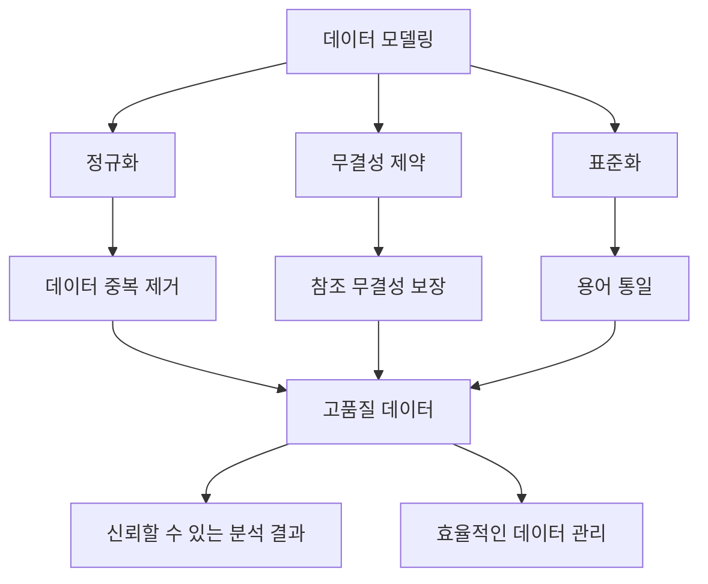

---

## 🔑 핵심 개념 미리보기

### 데이터 모델링의 3요소

데이터 모델링은 세 가지 핵심 요소로 구성됩니다:

#### 1. 엔터티 (Entity)
> **업무가 관여하는 '어떤 것'**

- 집합적 성격을 가짐
- 단수 개념: 인스턴스(Instance) 또는 Occurrence
- 물리 구현: 테이블(Table)

**예시:**
- 고객(Customer)
- 주문(Order)
- 상품(Product)

#### 2. 속성 (Attribute)
> **그 '어떤 것'이 가지는 성격**

- 더 이상 분리할 수 없는 최소 데이터 단위
- 단수 개념: 속성 값(Attribute Value)
- 물리 구현: 컬럼(Column)

**예시:**
- 고객명, 고객번호, 연락처
- 주문일자, 주문금액
- 상품명, 상품가격

#### 3. 관계 (Relationship)
> **업무가 관여하는 '어떤 것' 간의 관계**

- 집합 간의 논리적 연관성
- 단수 개념: Pairing (실무에서는 잘 사용 안 함)
- 물리 구현: Foreign Key (FK) 또는 업무 규칙

**예시:**
- 고객 ─ 주문 (1:N 관계)
- 주문 ─ 상품 (M:N 관계)

### 집합과 단수 개념 비교표

| 구분 | 집합 개념 | 단수 개념 | 물리 구현 |
|:---:|:---:|:---:|:---:|
| **엔터티** | 엔터티(Entity) | 인스턴스(Instance) | 테이블(Table) |
| **속성** | 속성(Attribute) | 속성 값(Value) | 컬럼(Column) |
| **관계** | 관계(Relationship) | 페어링(Pairing) | FK 또는 업무 규칙 |

---

## 📊 데이터 모델링 단계

데이터 모델링은 추상화 수준에 따라 3단계로 나뉩니다.

### 🔹 1단계: 개념 모델링 (Conceptual Modeling)

**목적**: 업무 요구사항의 핵심 파악

**특징:**
- 요구사항 분석 시 또는 상위 수준 모델링 검토 시 수행
- 주요 엔터티와 키 컬럼, 주요 관계만 표현
- 업무 중심적이고 포괄적인 수준

**산출물:**
- 개념 ERD (Entity-Relationship Diagram)
- 핵심 엔터티 목록
- 주요 관계 정의

**예시:**

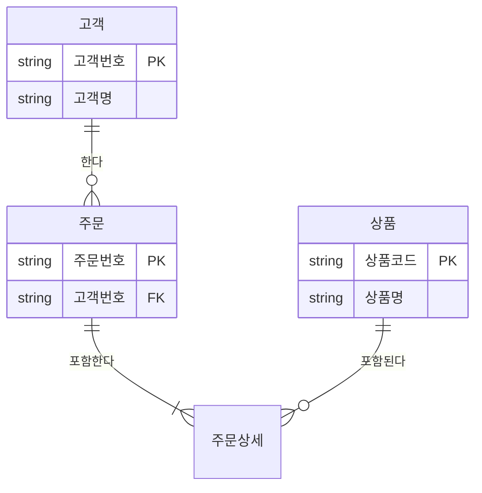

💡 **중요!**: 개념 모델링은 **"무엇을(What)"** 다룰 것인지에 집중합니다.

---

### 🔹 2단계: 논리 모델링 (Logical Modeling)

**목적**: 업무 요건을 완전하고 정확하게 표현

**특징:**
- 키, 속성, 관계를 정확하게 표현
- 식별자 확정
- 정규화 수행
- M:N 관계 해소
- 참조 무결성 규칙 정의

**산출물:**
- 논리 ERD
- 속성 정의서
- 관계 정의서
- 도메인 정의서

**주요 작업:**

| 작업 | 설명 | 결과 |
|:---|:---|:---|
| **식별자 확정** | 주식별자(PK) 선정 | 각 엔터티의 고유 식별 방법 정의 |
| **정규화** | 1NF, 2NF, 3NF 적용 | 데이터 중복 제거, 무결성 확보 |
| **M:N 관계 해소** | 교차 엔터티 생성 | 물리 구현 가능한 구조로 변환 |
| **참조 무결성 정의** | FK 제약 조건 명시 | 데이터 일관성 보장 규칙 수립 |

💡 **중요!**: 논리 모델링은 **모델링이 완료된 상태**라고 표현됩니다. 이 단계에서 업무 요건이 완전히 반영되어야 합니다.

---

### 🔹 3단계: 물리 모델링 (Physical Modeling)

**목적**: 데이터베이스에 실제 구현 가능한 설계

**특징:**
- 물리적 저장 구조 정의
- 사용될 저장 장치 선정
- 성능 최적화 고려
- DBMS별 특성 반영

**산출물:**
- 물리 ERD
- DDL 스크립트
- 인덱스 설계서
- 파티션 설계서

**주요 작업:**

| 작업 | 설명 | 고려사항 |
|:---|:---|:---|
| **테이블 정의** | 논리 모델을 물리 테이블로 전환 | 명명 규칙, 데이터 타입, 길이 |
| **인덱스 설계** | 조회 성능 최적화 | 카디널리티, 선택도, 결합도 |
| **파티션 설계** | 대용량 데이터 관리 | Range, List, Hash 파티션 |
| **뷰 설계** | 보안 및 편의성 | 성능 영향 최소화 |

📌 **노트**: 메타 시스템의 역할

현대 기업에서는 메타 시스템을 활용하여 논리 모델을 물리 모델로 자동 전환합니다.

**메타 시스템의 기능:**

1. **표준 용어 사전 기반 변환**
   - 논리명 → 물리명 자동 매핑
   - 명명 규칙 자동 적용

2. **DDL 자동 생성**
   - 타겟 DBMS에 맞는 CREATE TABLE 문 생성
   - 제약 조건 자동 추가

3. **갭 분석 (Gap Analysis)**
   - 설계 모델 vs 실제 DB 비교
   - 동기화 지원

4. **버전 관리**
   - 모델 변경 이력 추적
   - 영향도 분석

**메타 시스템 활용 프로세스:**

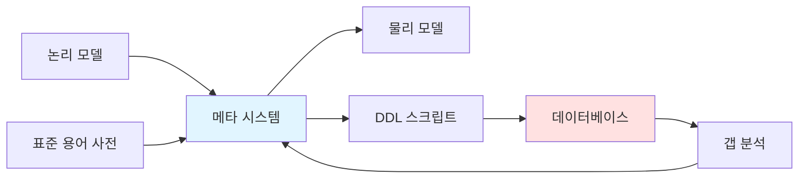

💡 **중요!**: 특히 **표준 시스템 구축 시** 메타 시스템은 필수적입니다. 전사 표준을 일관되게 적용하고 관리할 수 있기 때문입니다.

---

## 🎓 학습 접근 방법

### 📖 이론과 실무의 균형

이 강의는 **기본 교재의 내용을 기반**으로 하되, **실무적인 관점**을 중점적으로 다룹니다.

**학습 전략:**

1. **개념 이해** → 각 주제의 정의와 배경 파악
2. **실무 적용** → 실제 프로젝트에서 어떻게 활용되는지 학습
3. **성능 고려** → 단순 구현이 아닌 최적화된 방법 습득
4. **주의사항 숙지** → 흔히 하는 실수와 해결 방법 익히기

### 🔍 중요 포인트

강사님께서 강조하신 핵심 포인트들:

⚠️ **주의**: 다음 내용들은 실무에서 자주 발생하는 오류의 원인이므로 특히 주의해야 합니다.

1. **NULL 처리**
   - NULL과의 연산은 항상 NULL 반환
   - NVL 함수의 올바른 위치
   - 집계 함수는 NULL 제외

2. **OUTER JOIN 시 WHERE 절**
   - OUTER JOIN 후 WHERE 절 조건 추가 시 INNER JOIN으로 변질
   - 올바른 필터링 위치 선정

3. **NOT IN vs NOT EXISTS**
   - NOT IN은 NULL 포함 시 결과 없음
   - NOT EXISTS는 NULL과 무관하게 동작

4. **식별자 설계**
   - 무조건 인조식별자는 지양
   - Natural Key 우선, 필요 시 제한적으로 Artificial Key 사용

5. **성능 최적화**
   - 서브쿼리 vs JOIN vs 함수 성능 비교
   - 윈도우 함수를 통한 집합 중복 스캔 제거

### 📝 학습 체크리스트

강의를 들으면서 다음 사항들을 지속적으로 확인하세요.

#### ✅ 데이터 모델링 파트

- [ ] 개념/논리/물리 모델링의 차이를 설명할 수 있는가?
- [ ] 엔터티의 특성 5가지를 나열할 수 있는가?
- [ ] 식별자 관계와 비식별자 관계를 표기할 수 있는가?
- [ ] 정규화의 목적과 각 정규형을 설명할 수 있는가?
- [ ] Natural Key와 Artificial Key의 차이를 이해하는가?

#### ✅ SQL 기본 파트

- [ ] SELECT 문의 실행 순서를 기억하는가?
- [ ] OUTER JOIN의 결과 건수를 예측할 수 있는가?
- [ ] 스칼라 서브쿼리의 성능 특성을 이해하는가?
- [ ] NOT IN 사용 시 NULL 문제를 인지하는가?
- [ ] 그룹 함수(ROLLUP, CUBE)의 차이를 설명할 수 있는가?

#### ✅ SQL 활용 파트

- [ ] 윈도우 함수로 복잡한 쿼리를 단순화할 수 있는가?
- [ ] 페이징 쿼리를 성능 최적화하여 작성할 수 있는가?
- [ ] 계층형 쿼리로 조직도를 표현할 수 있는가?
- [ ] 정규 표현식으로 패턴 매칭을 수행할 수 있는가?
- [ ] RBAC 개념을 이해하고 권한을 설계할 수 있는가?

---

## 🚀 다음 단계

이 서론을 바탕으로, 이제 본격적으로 **데이터 모델링의 이해**부터 시작하겠습니다.

다음 섹션에서는:
- 엔터티의 상세한 정의와 특성
- 속성의 구성 요소 (도메인, 선택성)
- 관계의 표현 방법 (바커 표기법 vs IE 표기법)
- 표준 용어 사전과 메타 시스템

이러한 주제들을 **실무 사례**와 함께 깊이 있게 다룰 예정입니다.

---

## 📌 용어 정리

이 강의에서 자주 사용되는 주요 용어들을 미리 정리합니다.

| 용어 | 영문 | 설명 |
|:---|:---|:---|
| **엔터티** | Entity | 업무가 관여하는 '어떤 것'의 집합 |
| **인스턴스** | Instance | 엔터티의 개별 항목 |
| **속성** | Attribute | 엔터티가 가지는 성격 |
| **도메인** | Domain | 속성이 가질 수 있는 값의 범위 |
| **식별자** | Identifier | 인스턴스를 구분하는 논리적 이름 |
| **본질식별자** | Natural Key | 업무적 의미를 가진 식별자 |
| **인조식별자** | Artificial Key | 시스템이 생성한 의미 없는 식별자 |
| **대체키** | Surrogate Key | 특정 설계 목적으로 생성한 식별자 |
| **정규화** | Normalization | 데이터 중복 제거 및 무결성 확보 과정 |
| **이상현상** | Anomaly | 데이터 조작 시 발생하는 문제 |

---

이제 본격적으로 데이터 모델링의 핵심 요소들을 하나씩 살펴보겠습니다!

## 🏗️ 데이터 모델링 핵심 요소

이 섹션에서는 데이터 모델링의 세 가지 핵심 요소인 **엔터티(Entity)**, **속성(Attribute)**, **관계(Relationship)**를 상세히 학습합니다.

---

### 📦 엔터티 (Entity) 상세 분석

#### 🔍 엔터티의 정의

**엔터티(Entity)**는 업무에 필요하고 유용한 정보를 저장하고 관리하기 위한 **집합적인 것**입니다.

더 구체적으로 정의하면:
> "업무 활동상 지속적인 관심을 가지고 있어야 하는 대상으로서, 그 대상들 간의 동질성을 지닌 인스턴스들이나 그들이 행하는 행위의 집합"

**핵심 개념:**
- ✅ **집합적 성격**: 단일 항목이 아닌 여러 항목의 모음
- ✅ **업무 관련성**: 업무에서 필요로 하는 정보
- ✅ **관리 대상**: 지속적으로 추적하고 관리해야 하는 대상

#### 📋 엔터티의 특성 (5가지)

엔터티로 인정받기 위해서는 다음 5가지 특성을 모두 만족해야 합니다.

| 특성 | 설명 | 검증 방법 |
|:---|:---|:---|
| **1. 업무 필요성** | 업무에서 필요로 하는 정보여야 함 | "이 정보가 없으면 업무를 수행할 수 없는가?" |
| **2. 식별 가능성** | 인스턴스 각각을 유일하게 식별 가능해야 함 | "각 항목을 구분할 수 있는 키가 있는가?" |
| **3. 집합성** | 두 개 이상의 인스턴스의 집합이어야 함 | "최소 2개 이상의 데이터가 존재하는가?" |
| **4. 프로세스 이용** | 업무 프로세스에 의해 이용되어야 함 | "다른 엔터티와 관계가 있는가?" |
| **5. 속성 포함** | 속성을 포함해야 함 | "엔터티를 설명하는 정보가 있는가?" |

💡 **중요!**: 특히 **프로세스 이용** 여부는 다른 엔터티와의 관계 존재 여부로 확인할 수 있습니다. 어떤 엔터티도 참조하지 않고 참조되지도 않는다면, 그것은 진정한 엔터티가 아닐 가능성이 높습니다.

#### 🎯 엔터티 특성 검증 예시

**예시 1: '고객' 엔터티**

| 특성 | 검증 결과 |
|:---|:---|
| 업무 필요성 | ✅ 고객 정보는 주문, 배송, 마케팅에 필수 |
| 식별 가능성 | ✅ 고객번호로 각 고객을 구분 가능 |
| 집합성 | ✅ 여러 명의 고객이 존재 |
| 프로세스 이용 | ✅ 주문, 배송, 상담 등 다양한 프로세스에서 사용 |
| 속성 포함 | ✅ 고객명, 연락처, 주소 등의 속성 보유 |

→ **결론**: 고객은 올바른 엔터티입니다.

**예시 2: '주문 합계' (잘못된 엔터티)**

| 특성 | 검증 결과 |
|:---|:---|
| 업무 필요성 | ✅ 주문 합계 정보 필요 |
| 식별 가능성 | ❌ 파생 데이터로 고유 식별자 없음 |
| 집합성 | ❌ 계산된 단일 값 |
| 프로세스 이용 | ❌ 다른 엔터티와 관계 미형성 |
| 속성 포함 | ❌ 단일 값으로 속성 미포함 |

→ **결론**: 주문 합계는 엔터티가 아니라 '주문' 엔터티의 파생 속성입니다.

---

### 📝 엔터티 명명 규칙

엔터티명과 설명은 데이터를 오해 없이 정의하고 사용하는 데 **매우 중요**합니다. 따라서 모델링 지침서나 가이드에 반드시 포함되어야 합니다.

#### 🔤 엔터티명 정의 원칙

강사님께서 제시하신 엔터티명 작성 원칙 (권장사항):

| 원칙 | 설명 | 예시 |
|:---|:---|:---|
| **1. 현업 용어 사용** | 현업에서 사용하는 용어를 그대로 사용 | "거래처" (O), "Vendor" (X) |
| **2. 띄어쓰기 금지** | 공백 없이 연결하여 작성 | "고객주문" (O), "고객 주문" (X) |
| **3. 단수형 명사** | 기본 업무를 설명하는 단수형 명사 사용 | "상품" (O), "상품들" (X) |
| **4. 주제영역 코드** | 효율적 관리를 위한 프리픽스 부여 | "영업_고객", "물류_배송" |
| **5. 유형명 종료** | 엔터티 유형명으로 마무리 | "고객**코드**", "주문**내역**" |

**추천 유형명 (Suffix):**

| 유형명 | 설명 | 사용 예시 |
|:---|:---|:---|
| **코드** | 분류 체계를 나타내는 집합 | 고객유형코드, 상품분류코드 |
| **상세** | 상위 엔터티의 세부 정보 | 주문상세, 계약상세 |
| **내역** | 거래나 이벤트의 기록 | 입출금내역, 배송내역 |
| **이력** | 시간에 따른 변화 추적 | 가격변경이력, 직급변경이력 |
| **집계** | 요약 또는 통계 정보 | 일별판매집계, 월별재고집계 |
| **전문** | 외부 시스템과의 인터페이스 | 카드승인전문, 계좌조회전문 |
| **마감** | 특정 시점의 스냅샷 | 일마감, 월마감 |
| **거래** | 트랜잭션 정보 | 매출거래, 구매거래 |
| **로그** | 시스템 또는 사용자 활동 기록 | 접속로그, 오류로그 |

⚠️ **주의**: 다음 단어들은 엔터티명에 **사용하지 않습니다**:

- ❌ **"정보"**: 모든 엔터티가 정보를 관리하므로 불필요
  - "고객정보" (X) → "고객" (O)
- ❌ **"관리"**: 엔터티 정의 목적 자체가 관리이므로 중복
  - "재고관리" (X) → "재고" (O)

**이유**: 엔터티를 정의하는 이유 자체가 **어떠한 정보를 관리하기 위함**이기 때문에, "정보"나 "관리"라는 단어는 불필요한 중복입니다.

#### 📖 엔터티 설명 원칙

엔터티 설명을 작성할 때 반드시 포함해야 할 요소:

**1️⃣ 집합의 성격 명시**

> "특정 인스턴스가 이 엔터티에 속하는지 속하지 않는지 명확하게 정의할 수 있어야 합니다."

**잘못된 설명:**
```
고객: 고객 정보를 관리한다.
```

**올바른 설명:**
```
고객: 우리 회사의 제품을 구매한 이력이 있거나 구매 의사를 밝힌
      개인 또는 법인을 관리한다. 잠재 고객은 포함하지 않는다.
```

**2️⃣ 관리하는 정보의 종류**

```
주문: 고객이 온라인/오프라인 채널을 통해 상품을 구매 요청한
      정보를 관리한다. 주문 일시, 주문 금액, 배송지 정보 등을 포함한다.
```

**3️⃣ 제약 사항 및 참고 사항**

```
주문상세: 하나의 주문에 포함된 개별 상품 정보를 관리한다.
           하나의 주문은 1개 이상의 주문상세를 가져야 한다.
           주문 취소 시에도 이력 관리를 위해 데이터는 유지된다.
```

**4️⃣ 데이터 생성 규칙과 주기**

```
일별판매집계: 매일 자정(00:00)에 전일 판매 데이터를 집계하여 생성한다.
              재집계는 수동으로만 가능하며, 이력은 3년간 보관한다.
```

**5️⃣ 복제 데이터의 원천 시스템**

```
고객_복제: ERP 시스템의 고객 마스터 데이터를 매시간 동기화한다.
            원천: ERP.dbo.CUSTOMER 테이블
            동기화 주기: 매시 정각
            추적성: SYNC_DATETIME 컬럼으로 최종 동기화 시각 기록
```

💡 **중요!**: 복제 데이터의 원천 시스템을 명시하면 **추적성(Traceability)**이 확보되어 데이터 품질 관리 및 문제 해결이 용이합니다.

---

### 🏷️ 속성 (Attribute) 상세 분석

#### 🔍 속성의 정의

**속성(Attribute)**은 엔터티 정보를 구성하는 **더 이상 분리할 수 없는 최소의 데이터 단위**입니다.

**속성의 구성 요소:**

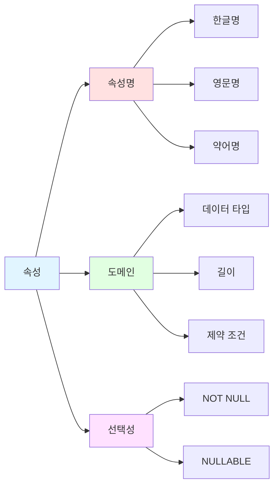

#### 📊 속성 구성 요소 상세

**1️⃣ 속성명 (Attribute Name)**

속성을 식별하고 의미를 전달하는 이름

| 유형 | 설명 | 예시 |
|:---|:---|:---|
| **한글명** | 업무 용어 기반의 한글 명칭 | "고객명", "주문일자", "상품가격" |
| **영문명** | 물리 컬럼명으로 사용될 영문 명칭 | "CUST_NM", "ORD_DT", "PROD_PRC" |
| **약어명** | 긴 이름의 축약형 (선택) | "CUSTOMER_NAME" → "CUST_NM" |

**2️⃣ 도메인 (Domain)**

> "속성이 가질 수 있는 값에 대한 업무적인 제약 조건으로, 데이터 타입과 길이를 함께 적용한 개념"

**도메인의 구성:**

```sql
-- 도메인 예시: "고객명"
도메인명: 성명
데이터 타입: VARCHAR2
길이: 100
NOT NULL: Y
제약 조건: 한글 또는 영문 대소문자만 허용
```

**도메인 관리의 이점:**

- ✅ 데이터 일관성 확보
- ✅ 표준화된 데이터 형식
- ✅ 재사용성 향상
- ✅ 변경 관리 용이

**3️⃣ 선택성 (Nullability)**

> "모든 인스턴스의 해당 속성이 반드시 값을 가져야 하는지에 대한 여부"

| 선택성 | 설명 | SQL 제약 조건 | 사용 예시 |
|:---|:---|:---|:---|
| **필수 (NOT NULL)** | 반드시 값이 있어야 함 | `NOT NULL` | 고객번호, 주문일자, 상품명 |
| **선택 (NULLABLE)** | 값이 없을 수 있음 | `NULL` | 이메일, 팩스번호, 비고 |

⚠️ **주의**: NULL 허용 속성은 SQL 작성 시 특별한 주의가 필요합니다. (NULL 연산 규칙 참조)

---

### 📚 표준 용어 사전과 속성 관리

#### 🗂️ 표준 용어 체계

현대적인 데이터 관리에서는 **표준 용어 사전**을 통해 속성을 체계적으로 관리합니다.

**표준 용어 체계의 구조:**

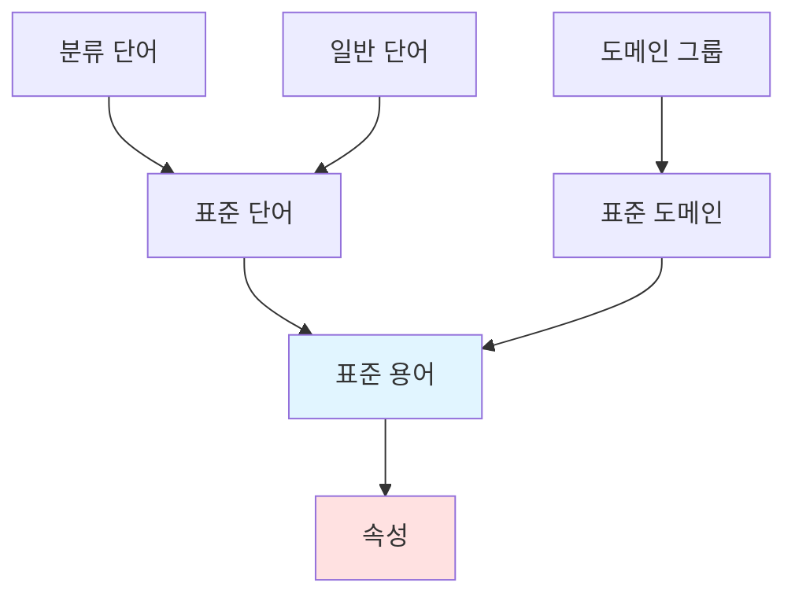

#### 🔤 표준 단어 (Standard Word)

**정의**: 의미를 가지는 최소 단위로, 컬럼의 한글명 및 영문명을 구성하는 원소

**분류:**

| 유형 | 설명 | 특징 | 예시 |
|:---|:---|:---|:---|
| **분류 단어** | 속성의 분류나 유형을 나타냄 | 도메인 그룹 보유 | "코드", "명", "금액", "일자" |
| **일반 단어** | 일반적인 업무 용어 | 도메인 그룹 미보유 | "고객", "상품", "주문", "배송" |

**표준 단어 예시:**

| 한글 단어 | 영문 단어 | 약어 | 분류 | 도메인 그룹 |
|:---:|:---:|:---:|:---:|:---:|
| 고객 | CUSTOMER | CUST | 일반 | - |
| 코드 | CODE | CD | 분류 | 코드형 |
| 명 | NAME | NM | 분류 | 명칭형 |
| 금액 | AMOUNT | AMT | 분류 | 금액형 |
| 일자 | DATE | DT | 분류 | 날짜형 |
| 번호 | NUMBER | NO | 분류 | 번호형 |

#### 📖 표준 용어 (Standard Term)

**정의**: 단어의 조합으로 이루어진 컬럼 명칭

**구성 규칙:**

```
표준 용어 = [일반 단어] + [분류 단어]
```

**예시:**

| 표준 용어 (한글) | 구성 | 표준 용어 (영문) | 도메인 |
|:---:|:---|:---:|:---:|
| 고객코드 | 고객 + 코드 | CUSTOMER_CODE (CUST_CD) | 코드10 |
| 고객명 | 고객 + 명 | CUSTOMER_NAME (CUST_NM) | 명칭100 |
| 주문일자 | 주문 + 일자 | ORDER_DATE (ORD_DT) | 날짜8 |
| 상품금액 | 상품 + 금액 | PRODUCT_AMOUNT (PROD_AMT) | 금액15 |

💡 **중요!**: 표준 용어는 **표준 도메인**을 속성으로 가집니다. 즉, 같은 용어는 항상 같은 데이터 타입과 길이를 가져야 합니다.

#### 🎯 표준 도메인 (Standard Domain)

**정의**: 표준 용어의 데이터 타입, 길이 등의 속성 정보를 부여하여 데이터 형식의 일관성을 관리

**도메인 유형:**

| 유형 | 설명 | 예시 |
|:---|:---|:---|
| **일반 도메인** | 일반적인 데이터 타입 정의 | VARCHAR2(100), NUMBER(10) |
| **통합 코드 도메인** | 허용 값 목록 보유 | 성별코드('M', 'F') |
| **개별 코드 도메인** | 엔터티별 고유 코드 | 고객코드, 상품코드 |

**표준 도메인 정의 예시:**

```sql
-- 도메인: 명칭100
도메인명: 명칭100
도메인 영문명: NAME100
데이터 타입: VARCHAR2
길이: 100
소수점: -
NOT NULL: N
기본값: NULL
설명: 일반적인 명칭 정보를 저장하는 도메인
```

```sql
-- 도메인: 성별코드 (통합 코드)
도메인명: 성별코드
도메인 영문명: GENDER_CD
데이터 타입: CHAR
길이: 1
허용값: 'M' (남성), 'F' (여성), 'U' (미확인)
설명: 성별 구분 코드
```

#### 🗃️ 도메인 그룹 (Domain Group)

**정의**: 도메인의 그룹

**용도**: 표준 단어가 **분류 단어**일 경우, 도메인 그룹을 속성으로 가짐

**분류 단어 제약:**

> 표준 용어 구성 시 **분류 단어로 종료**되어야 하며, 해당 용어는 분류 단어가 속한 **도메인 그룹에 해당하는 도메인만 선택 가능**

**도메인 그룹 예시:**

| 도메인 그룹 | 포함 도메인 | 사용 가능한 분류 단어 |
|:---:|:---|:---:|
| **코드형** | 코드2, 코드4, 코드10, 코드20 | "코드", "CD" |
| **명칭형** | 명칭50, 명칭100, 명칭200 | "명", "명칭", "NM" |
| **날짜형** | 날짜8, 날짜시간14 | "일자", "일시", "DT" |
| **금액형** | 금액10, 금액15, 금액18 | "금액", "AMT" |

**제약 조건 예시:**

```
표준 용어: "고객코드"
→ 분류 단어: "코드" (도메인 그룹: 코드형)
→ 허용 도메인: 코드2, 코드4, 코드10, 코드20
→ 불가 도메인: 명칭100 (❌ 도메인 그룹 불일치)
```

#### 🔗 표준 용어 구성 요소 간 관계도

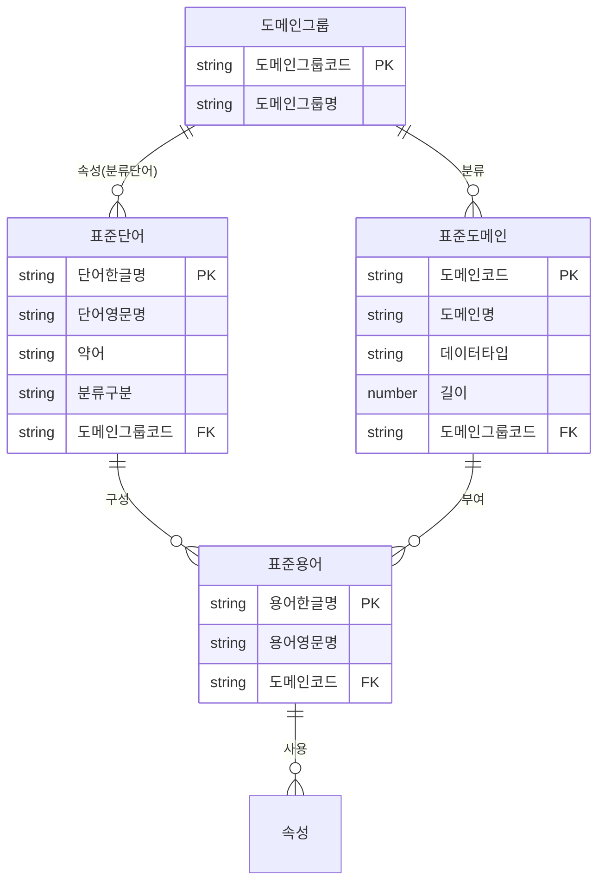

#### 📝 속성과 표준 용어의 관계

**원칙:**

> 대다수의 경우 **속성명 = 표준 용어명**

**예외 상황:**

메타 시스템의 기능에 따라 동일한 표준 용어를 여러 번 사용할 경우:

```
표준 용어: 회사전화번호
속성 1: 회사전화번호1
속성 2: 회사전화번호2
```

→ 이 경우에도 **"회사전화번호"를 표준 용어로 사용**한 것으로 간주

⚠️ **주의**: 연번을 붙이는 방식은 **제1정규형 위반 가능성**이 있으므로, 가급적 별도 엔터티로 분리하는 것을 권장합니다.

---

### 🔗 관계 (Relationship) 상세 분석

#### 🔍 관계의 정의

**관계(Relationship)**는 엔터티의 인스턴스 사이의 **논리적인 연관성**으로서, 존재의 형태나 행위로 서로에게 연관성이 부여된 상태를 의미합니다.

**관계의 특징:**

- ✅ 두 개 엔터티 사이에 나타남
- ✅ 존재에 의한 관계 또는 행위에 의한 관계로 분류
- ✅ 업무 규칙을 반영

#### 🎭 관계의 분류

**1️⃣ 존재에 의한 관계 (Existence Relationship)**

> 한 엔터티의 존재가 다른 엔터티의 존재에 영향을 미치는 관계

**예시:**

```
고객 ─ 주문
→ 주문은 고객이 존재해야만 존재할 수 있다.
```

**2️⃣ 행위에 의한 관계 (Event Relationship)**

> 엔터티 간의 어떤 행위나 이벤트에 의해 발생하는 관계

**예시:**

```
학생 ─ 수강 ─ 강의
→ 학생이 '수강 신청'이라는 행위를 통해 강의와 연결된다.
```

#### 📐 관계의 표현 요소

관계는 다음 세 가지 요소로 표현됩니다:

| 요소 | 설명 | 표기 |
|:---|:---|:---:|
| **관계 차수** | 1:1, 1:N, M:N | 까마귀발, 선 |
| **관계 선택사양** | 필수(Mandatory) vs 선택(Optional) | 실선 vs 점선, 동그라미 |
| **관계명** | 관계의 의미 | 텍스트 레이블 |

추가로 **식별자 관계**인지 **비식별자 관계**인지도 표기합니다.

---

### 🖊️ 관계 표기법 비교: 바커 vs IE

데이터 모델링에는 여러 표기법이 있지만, 가장 널리 사용되는 **바커(Barker) 표기법**과 **IE(Information Engineering) 표기법**을 비교하겠습니다.

#### 📊 관계 차수 표기

**예시: 1:N 관계**

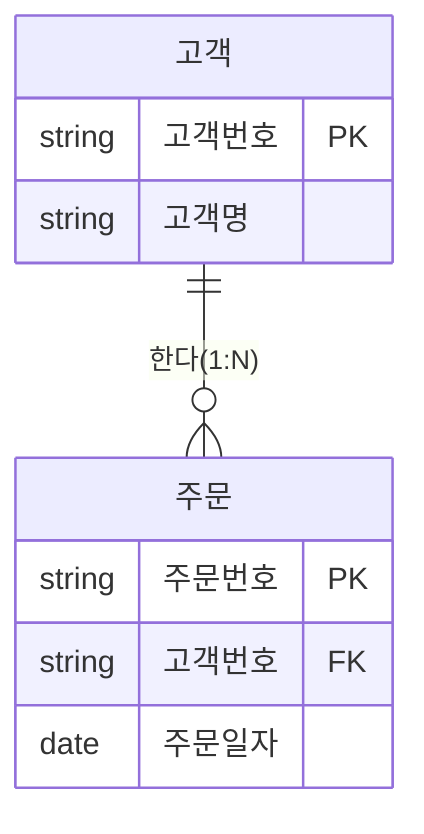

| 차수 | 바커 표기법 | IE 표기법 | 의미 |
|:---:|:---:|:---:|:---|
| **1:1** | ─────│ │───── | ─────│ │───── | 일대일 대응 |
| **1:N** | ─────│ ╱───── | ─────│ ╱╱───── | 일대다 관계 |
| **M:N** | ─────╱ ╱───── | ─────╱╱ ╱╱───── | 다대다 관계 (물리 구현 불가) |

⚠️ **주의**: M:N 관계는 물리 모델에서 **교차 엔터티(Associative Entity)**를 통해 1:N + N:1로 분해해야 합니다.

#### 🔀 식별자 관계 vs 비식별자 관계

**식별자 관계 (Identifying Relationship):**
> 부모 엔터티의 주식별자가 자식 엔터티의 주식별자에 포함되는 관계

**비식별자 관계 (Non-Identifying Relationship):**
> 부모 엔터티의 주식별자가 자식 엔터티의 일반 속성으로만 존재하는 관계

**표기법 비교:**

| 관계 유형 | 바커 표기법 | IE 표기법 | 설명 |
|:---|:---:|:---:|:---|
| **식별자 관계** | Vertical Bar 있음 (`│`) | 실선 (`───`) | FK가 PK 구성 |
| **비식별자 관계** | Vertical Bar 없음 | 점선 (`┄┄┄`) | FK가 일반 컬럼 |

**예시:**

```
[바커 표기법]

주문 ────────│ 주문상세    (식별자 관계)
            (실선 + Bar)

고객 ───────── 주문        (비식별자 관계)
            (실선, Bar 없음)


[IE 표기법]

주문 ──────── 주문상세     (식별자 관계)
            (실선)

고객 ┄┄┄┄┄┄┄ 주문         (비식별자 관계)
            (점선)
```

**물리 구현 예시:**

```sql
-- 식별자 관계
CREATE TABLE 주문상세 (
    주문번호 VARCHAR2(20) NOT NULL,  -- PK 구성 (FK)
    순번 NUMBER(3) NOT NULL,          -- PK 구성
    상품코드 VARCHAR2(20),
    PRIMARY KEY (주문번호, 순번),
    FOREIGN KEY (주문번호) REFERENCES 주문(주문번호)
);

-- 비식별자 관계
CREATE TABLE 주문 (
    주문번호 VARCHAR2(20) PRIMARY KEY,  -- PK
    고객번호 VARCHAR2(10),               -- 일반 컬럼 (FK)
    FOREIGN KEY (고객번호) REFERENCES 고객(고객번호)
);
```

#### 🎯 선택사양 (Optionality) 표기

**바커 표기법:**

> 관계에 참여하는 **쪽의 선**으로 표현

| 선택사양 | 표기 | 의미 |
|:---|:---:|:---|
| **필수 (Mandatory)** | 실선 (`───`) | 반드시 관계 존재 |
| **선택 (Optional)** | 점선 (`┄┄┄`) | 관계 없을 수 있음 |

**예시:**

```
고객 ┄┄┄┄┄> 주문    고객 쪽: 점선 → 주문 안 해도 고객 존재 가능
고객 <─────  주문    주문 쪽: 실선 → 주문은 반드시 고객 필요
```

**IE 표기법:**

> 관계에 참여하는 엔터티가 **공집합**이 될 수 있는지를 **동그라미(O)** 여부로 표현

| 선택사양 | 표기 | 의미 |
|:---|:---:|:---|
| **필수 (Mandatory)** | 동그라미 없음 (`│`) | 최소 1개 이상 |
| **선택 (Optional)** | 동그라미 있음 (`O`) | 0개 가능 |

**예시:**

```
고객 ────O< 주문    주문 쪽에 O → 주문 없는 고객 가능
고객 >│──── 주문    고객 쪽에 O 없음 → 주문은 반드시 고객 필요
```

#### 📋 관계 표기법 종합 비교표

| 구분 | 바커 표기법 | IE 표기법 | 해석 |
|:---|:---:|:---:|:---|
| **1:N, 식별자, 양쪽 필수** | `[고객]─────│◀[주문]` | `[고객]│───│╱[주문]` | 주문은 반드시 고객 필요, 고객은 반드시 주문 필요 (비현실적) |
| **1:N, 식별자, 한쪽 선택** | `[고객]┄┄┄┄│◀[주문]` | `[고객]O───│╱[주문]` | 주문은 반드시 고객 필요, 고객은 주문 없어도 됨 (일반적) |
| **1:N, 비식별자, 한쪽 선택** | `[고객]┄┄┄┄──[주문]` | `[고객]O┄┄│╱[주문]` | 주문은 반드시 고객 필요, 고객은 주문 없어도 됨 |
| **1:N, 비식별자, 양쪽 선택** | `[부서]┄┄┄┄──[직원]` | `[부서]O┄┄O╱[직원]` | 부서 없는 직원 가능, 직원 없는 부서 가능 |

#### 💡 관계 표기법과 SQL의 관계

관계 표기법은 **SQL 작성 시 매우 중요한 참조 정보**가 됩니다.

| 관계 표기 | SQL JOIN 유형 | 설명 |
|:---|:---:|:---|
| **양쪽 필수** | `INNER JOIN` | 양쪽 모두 데이터 존재 필수 |
| **한쪽 선택** | `LEFT/RIGHT OUTER JOIN` | 한쪽은 데이터 없어도 됨 |
| **양쪽 선택** | `FULL OUTER JOIN` | 양쪽 모두 데이터 없어도 됨 |

**예시:**

```sql
-- 바커 표기법: 고객 ┄┄┄┄> 주문 (고객 쪽 선택)
-- 해석: 주문 없는 고객도 조회해야 함

SELECT C.고객번호, C.고객명, O.주문번호, O.주문일자
FROM 고객 C
LEFT OUTER JOIN 주문 O ON C.고객번호 = O.고객번호;
```

⚠️ **주의**: **OUTER JOIN 후 WHERE 절을 잘못 사용하면** INNER JOIN으로 변질됩니다. (이후 섹션에서 상세 설명)

---

### 🔑 식별자 (Identifier) 상세 분석

#### 🔍 식별자의 정의

**식별자(Identifier)**란 엔터티에서 **인스턴스 각각을 구분할 수 있는 논리적인 이름**입니다.

또한, 엔터티에 구성된 여러 개의 속성 중에서 **엔터티를 대표할 수 있는 속성 또는 속성들의 조합**입니다.

#### 📋 식별자의 특성 (4가지)

주식별자(Primary Identifier)는 다음 4가지 특성을 반드시 만족해야 합니다.

| 특성 | 영문 | 설명 | 예시 |
|:---|:---|:---|:---|
| **1. 유일성** | Uniqueness | 주식별자로 모든 인스턴스를 유일하게 구분 | 주민등록번호, 사원번호 |
| **2. 최소성** | Minimality | 유일성을 만족하는 최소한의 속성 수 | 주민등록번호 (O), 주민등록번호+이름 (X, 최소성 위반) |
| **3. 불변성** | Immutability | 한 번 지정되면 가급적 변하지 않음 | 사원번호 (O), 전화번호 (X, 변경 가능) |
| **4. 존재성** | Existence | 반드시 데이터 값이 존재 (NOT NULL) | 모든 주식별자는 NOT NULL |

💡 **중요!**: 이 4가지 특성은 **주식별자 도출 시 반드시 검증**해야 하는 체크리스트입니다.

#### 🎯 주식별자 선정 가이드라인

강사님께서 제시하신 주식별자 선정 원칙:

**1️⃣ 자주 조건으로 이용되는 속성 선정**

```sql
-- 고객 엔터티의 주식별자 후보
-- 후보 1: 고객번호 (자주 조회됨) ✅
-- 후보 2: 이메일 (가끔 조회됨) △
-- 후보 3: 전화번호 (변경 가능) ❌

SELECT * FROM 고객 WHERE 고객번호 = 'C001';  -- 빈번
SELECT * FROM 고객 WHERE 이메일 = 'user@example.com';  -- 드묾
```

**2️⃣ 명칭, 내용 등 이름 속성은 피하기**

```
❌ 나쁜 예: 주식별자 = 고객명
   → 동명이인 존재 가능 (유일성 위반)
   → 이름 변경 가능 (불변성 위반)

✅ 좋은 예: 주식별자 = 고객번호
   → 유일하게 생성
   → 변경되지 않음
```

**3️⃣ 속성의 수가 너무 많아지지 않도록**

```
❌ 나쁜 예: 주식별자 = (회사코드, 부서코드, 팀코드, 사원번호, 입사년도)
   → 5개 컬럼 (과도함)
   → 자식 테이블의 주식별자가 더욱 비대해짐

✅ 좋은 예: 주식별자 = 사원번호
   → 1개 컬럼 (최소성 만족)
```

#### ⚖️ 식별자 전략: Natural Key vs Artificial Key

**핵심 질문**: 주식별자를 선정할 때, 업무적 의미가 있는 **본질식별자(Natural Key)**를 사용할 것인가, 아니면 시스템이 생성한 **인조식별자(Artificial Key)**를 사용할 것인가?

**🔹 Natural Key (본질식별자)**

**정의**: Key 역할을 하는 데이터베이스 객체의 **기존 특성 값**

**예시:**
- 주민등록번호
- 사업자등록번호
- 계좌번호
- 상품코드 (업무 규칙 기반)

**장점:**
- ✅ 업무적 의미 명확
- ✅ 데이터 정합성 확보 (중복 데이터 방지)
- ✅ 집합의 성격 불변

**단점:**
- ❌ 주식별자 속성 수 증가 가능
- ❌ 자식 테이블의 주식별자 비대화

**🔹 Artificial Key (인조식별자)**

**정의**: 자동으로 생성되고 보유한 의미가 없지만, 데이터베이스 사용자에게 작업에서 중요한 역할을 하는 Key

**예시:**
- 시퀀스(Sequence)로 생성된 ID
- UUID
- Auto Increment 컬럼

**장점:**
- ✅ 주식별자 단순화 (단일 컬럼)
- ✅ 자식 테이블의 주식별자 비대화 방지
- ✅ 성능 최적화 용이 (인덱스 크기 감소)

**단점:**
- ❌ 중복 데이터 발생 가능
- ❌ 집합의 성격 변경 위험
- ❌ 데이터 품질 관리 어려움

**🔹 Surrogate Key (대체키)**

**정의**: 데이터베이스 개발자가 특정 설계 목적으로 생성하여, 사무직 직원과 데이터베이스 사용자에게는 의미가 없고 사용하지 않는 속성

**예시:**
- 내부 일련번호 (사용자에게 노출 안 됨)
- 기술적 파티션 키

💡 **중요!**: 실무에서는 주로 **Natural Key**와 **Artificial Key**를 구분하여 사용하면 충분합니다.

#### 🎯 주식별자가 너무 많을 때의 문제점

**문제 상황:**

```sql
-- 주식별자가 과도하게 많은 예시
CREATE TABLE 주문상세 (
    회사코드 VARCHAR2(10) NOT NULL,
    사업부코드 VARCHAR2(10) NOT NULL,
    부서코드 VARCHAR2(10) NOT NULL,
    주문년도 CHAR(4) NOT NULL,
    주문월 CHAR(2) NOT NULL,
    주문일련번호 NUMBER(10) NOT NULL,
    상품코드 VARCHAR2(20) NOT NULL,
    PRIMARY KEY (회사코드, 사업부코드, 부서코드, 주문년도, 주문월, 주문일련번호, 상품코드)
);
-- 주식별자가 7개! 😱
```

**발생하는 문제:**

| 문제 | 설명 | 영향 |
|:---|:---|:---|
| **1. SQL 복잡도 증가** | JOIN 조건이 많아짐 | 가독성 저하, 실수 증가 |
| **2. DML 부하** | INSERT/UPDATE 시 많은 컬럼 처리 | 성능 저하 |
| **3. 인덱스 스캔 비용 증가** | 복합 인덱스 크기 증가 | 조회 성능 저하 |
| **4. 데이터 압축 시 인덱스 비대화** | 인덱스가 테이블보다 커질 수 있음 | 저장 공간 낭비 |
| **5. PK Range Scan 유발** | PK 앞부분만으로 조회 시 | 성능 저하 (SQL 튜닝 파트에서 상세 설명) |

**가능한 원인:**

1. 업무에서 사용하는 식별자를 누락했을 가능성
2. 최소성 원칙 위반
3. 본질식별자만 사용하고 식별자 관계로만 구성

#### 🔄 인조식별자를 무조건 사용하면 안 되는 이유

**문제 상황:**

```sql
-- 모든 테이블에 인조식별자 사용
CREATE TABLE 고객 (
    고객ID NUMBER PRIMARY KEY,  -- 인조식별자
    고객명 VARCHAR2(100),
    주민등록번호 VARCHAR2(13)  -- 유니크 키로만 관리
);
```

**발생하는 문제:**

| 문제 | 설명 | 결과 |
|:---|:---|:---|
| **1. 중복 데이터 발생** | 같은 주민등록번호로 여러 레코드 생성 가능 | 데이터 정합성 훼손 |
| **2. 집합 성격 변경** | 운영 중 엔터티의 의미가 변질될 수 있음 | 데이터 품질 저하 |
| **3. 품질 관리 어려움** | 정책적 유니크 키 생성, 주기적 품질 검사 필요 | 관리 비용 증가 |
| **4. 예외 상황 발생** | 조직이 커지고 시간이 지날수록 예외 발생 | 일관성 붕괴 |

#### 💡 권장 식별자 전략

강사님께서 제시하신 **균형잡힌 접근 방법**:

**기본 원칙:**

> 가급적 **Natural Key**를 사용하되, 식별자가 너무 비대해지거나 자식 테이블이 많아서 **식별자 단절이 필요한 경우**에 제한적으로 **Artificial Key**를 사용

**의사 결정 흐름:**

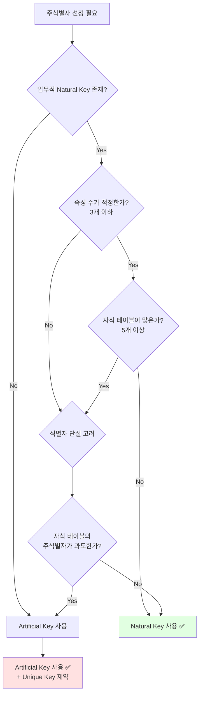

**실무 적용 예시:**

```sql
-- 예시 1: Natural Key 사용 (권장)
CREATE TABLE 고객 (
    고객번호 VARCHAR2(10) PRIMARY KEY,  -- 업무 규칙 기반 생성
    고객명 VARCHAR2(100),
    전화번호 VARCHAR2(20)
);

-- 예시 2: Artificial Key + Unique 제약 (필요 시)
CREATE TABLE 주문상세 (
    주문상세ID NUMBER PRIMARY KEY,  -- 인조식별자
    주문번호 VARCHAR2(20) NOT NULL,
    순번 NUMBER(3) NOT NULL,
    상품코드 VARCHAR2(20),
    UNIQUE (주문번호, 순번)  -- 업무 키는 유니크로 보장
);
```

---

### 📝 식별자 용어 정리

강사님께서 인용하신 **Anne Berskirk**의 식별자 용어 정의:

| 용어 | 영문 | 정의 | 사용 권장도 |
|:---|:---|:---|:---:|
| **본질식별자** | Natural Key | Key 역할을 하는 객체의 기존 특성 값 | ✅✅✅ 우선 사용 |
| **인조식별자** | Artificial Key | 자동 생성되고 의미는 없지만 중요한 역할을 하는 Key | ✅ 제한적 사용 |
| **대체키** | Surrogate Key | 개발자가 설계 목적으로 생성, 사용자에게 의미 없음 | △ 특수 목적 |

💡 **중요!**: 실무에서는 **Natural Key**와 **Artificial Key**를 명확히 구분하여 사용하는 것이 혼란을 줄이는 방법입니다.

---

## ✅ 학습 체크리스트

이 섹션에서 학습한 내용을 확인하세요.

### 엔터티

- [ ] 엔터티의 정의를 설명할 수 있는가?
- [ ] 엔터티의 5가지 특성을 나열할 수 있는가?
- [ ] 엔터티명 작성 원칙을 알고 있는가?
- [ ] 유형명(코드, 상세, 내역 등)의 의미를 이해하는가?
- [ ] 엔터티 설명에 포함해야 할 요소를 알고 있는가?

### 속성

- [ ] 속성의 3가지 구성 요소를 설명할 수 있는가?
- [ ] 도메인의 개념을 이해하는가?
- [ ] 선택성(Nullability)의 중요성을 인지하는가?
- [ ] 표준 단어와 표준 용어의 차이를 설명할 수 있는가?
- [ ] 도메인 그룹의 역할을 이해하는가?

### 관계

- [ ] 관계의 3가지 표현 요소를 나열할 수 있는가?
- [ ] 바커 표기법과 IE 표기법의 차이를 알고 있는가?
- [ ] 식별자 관계와 비식별자 관계를 구분할 수 있는가?
- [ ] 관계 선택사양을 두 가지 표기법으로 표현할 수 있는가?
- [ ] 관계 표기가 SQL JOIN에 어떻게 영향을 미치는지 이해하는가?

### 식별자

- [ ] 식별자의 4가지 특성을 설명할 수 있는가?
- [ ] 주식별자 선정 가이드라인을 알고 있는가?
- [ ] Natural Key와 Artificial Key의 장단점을 비교할 수 있는가?
- [ ] 주식별자가 많을 때의 문제점을 나열할 수 있는가?
- [ ] 권장 식별자 전략을 적용할 수 있는가?

---

## 📋 핵심 요약

### 1. 엔터티

- 업무에 필요한 정보의 집합
- 5가지 특성: 업무 필요성, 식별 가능성, 집합성, 프로세스 이용, 속성 포함
- 명명 규칙: 현업 용어, 띄어쓰기 금지, 단수형, 유형명 종료

### 2. 속성

- 더 이상 분리할 수 없는 최소 데이터 단위
- 구성 요소: 속성명, 도메인, 선택성
- 표준 용어 = 표준 단어 조합 + 표준 도메인

### 3. 관계

- 엔터티 간의 논리적 연관성
- 표현 요소: 관계 차수, 선택사양, 관계명
- 바커 vs IE 표기법 이해 필수

### 4. 식별자

- 인스턴스를 구분하는 논리적 이름
- 4가지 특성: 유일성, 최소성, 불변성, 존재성
- Natural Key 우선, 필요 시 제한적으로 Artificial Key

---

다음 섹션에서는 **정규화와 NULL 처리**를 상세히 다루겠습니다.

## 🔧 정규화 (Normalization)

정규화는 데이터 모델링의 핵심 프로세스로, 데이터 품질과 성능에 직접적인 영향을 미칩니다.

---

### 📖 정규화의 역사와 배경

#### 👨‍💻 E.F. Codd와 관계형 데이터베이스 이론

**Edgar Frank Codd** (1923-2003)는 영국의 컴퓨터 과학자로, 1970년대 IBM에서 **관계형 데이터베이스 이론**을 개발했습니다.

**핵심 아이디어:**
- 데이터를 **테이블(Relation)** 형태로 구성
- **데이터 중복 최소화**
- **데이터 무결성 유지**

이 목표를 달성하기 위한 절차로 **정규형(Normal Form)**을 개발:
- **1971년**: 제1, 2, 3 정규형 (1NF, 2NF, 3NF)
- **1974년**: Boyce-Codd 정규형 (BCNF)
- **1979년**: 제4, 5 정규형 (4NF, 5NF)
- **2012년**: Elementary Key 정규형 (ETNF)
- **현재**: 제6 정규형까지 개발됨

💡 **중요!**: 실무에서는 주로 **제3정규형(3NF)**까지 적용하며, BCNF까지 고려하는 경우도 있습니다.

---

### 🎯 정규화의 정의와 목적

#### 📝 정규화의 정의

> "이상현상(Anomaly)을 야기하는 속성 간의 종속관계를 제거하기 위해 엔터티를 작은 여러 엔터티로 **무손실 분해(Lossless Decomposition)**하는 과정"

**핵심 용어:**
- **이상현상**: 데이터 조작 시 발생하는 예상치 못한 문제
- **종속관계**: 한 속성이 다른 속성에 의해 결정되는 관계
- **무손실 분해**: 정보의 손실 없이 엔터티를 분리

#### 🎯 정규화의 목적 (Codd의 정의)

E.F. Codd가 정의한 정규화의 목적:

| 목적 | 설명 | 기대 효과 |
|:---|:---|:---|
| **1. 이상현상 제거** | 데이터 조작 시 발생하는 문제 제거 | 데이터 일관성 확보 |
| **2. 재설계 최소화** | 데이터베이스 구조 확장 시 재설계 필요성 감소 | 유연성 향상 |
| **3. 의미 있는 모델** | 사용자에게 데이터 모델을 더욱 의미 있게 전달 | 이해도 향상 |
| **4. 다양한 질의 지원** | 여러 종류의 쿼리를 효율적으로 수행 | 범용성 확보 |

#### 🎯 추가 목적 (강사님 보충)

강사님께서 추가로 강조하신 목적:

| 목적 | 설명 |
|:---|:---|
| **데이터 중복 제거** | 공간 절약 및 무결성 확보 |
| **논리적 구성** | 데이터 구성을 직관적이고 논리적으로 변경 |
| **관리 대상 발견** | 정규화 과정에서 새로운 관리 대상 엔터티 도출 |

---

### 🔢 정규형의 종류

정규형은 단계별로 적용되며, 각 단계는 이전 단계를 포함합니다.


**실무 적용 범위:**

| 정규형 | 적용 빈도 | 설명 |
|:---:|:---:|:---|
| **1NF, 2NF, 3NF** | ✅✅✅ 필수 | 모든 프로젝트에서 적용 |
| **BCNF** | ✅ 권장 | 데이터 품질이 중요한 경우 |
| **4NF, 5NF** | △ 선택적 | 특수한 경우에만 |
| **6NF** | ❌ 거의 사용 안 함 | 학술적 목적 |

---

### 🥇 제1정규형 (First Normal Form, 1NF)

#### 📋 제1정규형의 정의

> "모든 속성은 반드시 **하나의 값**을 가져야 한다. 즉, 각 컬럼은 **원자값(Atomic Value)**을 만족해야 한다."

**위반 사례:**
- 다중값 속성 (Multiple Values)
- 반복 그룹 (Repeating Groups)

#### 🚫 제1정규형 위반 사례

**업무 요구사항:**

```
1. 고객별 연락처를 확보한다.
2. 해당 연락처로 전화 응대 시 모니터에 고객명을 확인할 수 있어야 한다.
3. 휴대폰으로 마케팅을 진행한다.
```

**❌ 잘못된 모델 1: 다중값 속성**

| 고객번호 | 고객명 | 연락처 |
|:---:|:---:|:---|
| C001 | 홍길동 | 02-1234-5678, 010-1234-5678, hong@example.com |
| C002 | 김철수 | 010-9876-5432 |

**문제점:**

1. **휴대전화번호 구별 어려움**
   - 정규식으로 추출 가능하지만 복잡함
   ```sql
   -- 정규식으로 휴대폰 추출 필요
   SELECT REGEXP_SUBSTR(연락처, '010-[0-9]{4}-[0-9]{4}') AS 휴대폰
   FROM 고객;
   ```

2. **인덱스 Range Scan 불가**
   - 양방향 LIKE 검색 불가피
   ```sql
   -- 인덱스 사용 불가 (Full Scan 발생)
   SELECT * FROM 고객 WHERE 연락처 LIKE '%010-1234%';
   ```

**❌ 잘못된 모델 2: 반복 그룹**

| 고객번호 | 고객명 | 연락처1 | 연락처2 |
|:---:|:---:|:---:|:---:|
| C001 | 홍길동 | 02-1234-5678 | 010-1234-5678 |
| C002 | 김철수 | 010-9876-5432 | NULL |

**문제점:**

1. **확장성 제한**
   - 연락처 3개 이상 저장 불가

2. **인덱스 중복 생성**
   - 연락처1, 연락처2 각각 인덱스 필요
   ```sql
   CREATE INDEX IDX_CONTACT1 ON 고객(연락처1);
   CREATE INDEX IDX_CONTACT2 ON 고객(연락처2);
   -- 인덱스 관리 복잡도 증가
   ```

3. **휴대폰 식별 어려움**
   - 각 컬럼별로 정규식 적용 필요
   ```sql
   SELECT *
   FROM 고객
   WHERE REGEXP_LIKE(연락처1, '^010-')
      OR REGEXP_LIKE(연락처2, '^010-');
   ```

#### ✅ 제1정규화 수행

**다중값과 반복 그룹 속성을 제거하여 별도 엔터티로 분리**

```mermaid
erDiagram
    고객 ||--o{ 고객연락처 : 보유

    고객 {
        string 고객번호 PK
        string 고객명
        string 주소
    }

    고객연락처 {
        string 고객번호 PK_FK
        string 연락처순번 PK
        string 연락처구분
        string 연락처
    }
```

**물리 구현:**

```sql
-- 고객 테이블
CREATE TABLE 고객 (
    고객번호 VARCHAR2(10) PRIMARY KEY,
    고객명 VARCHAR2(100) NOT NULL,
    주소 VARCHAR2(200)
);

-- 고객연락처 테이블
CREATE TABLE 고객연락처 (
    고객번호 VARCHAR2(10) NOT NULL,
    연락처순번 NUMBER(2) NOT NULL,
    연락처구분 VARCHAR2(10),  -- '집전화', '휴대폰', '이메일'
    연락처 VARCHAR2(100) NOT NULL,
    PRIMARY KEY (고객번호, 연락처순번),
    FOREIGN KEY (고객번호) REFERENCES 고객(고객번호)
);
```

**데이터 예시:**

```sql
-- 고객 테이블
INSERT INTO 고객 VALUES ('C001', '홍길동', '서울시 강남구');
INSERT INTO 고객 VALUES ('C002', '김철수', '부산시 해운대구');

-- 고객연락처 테이블
INSERT INTO 고객연락처 VALUES ('C001', 1, '집전화', '02-1234-5678');
INSERT INTO 고객연락처 VALUES ('C001', 2, '휴대폰', '010-1234-5678');
INSERT INTO 고객연락처 VALUES ('C001', 3, '이메일', 'hong@example.com');
INSERT INTO 고객연락처 VALUES ('C002', 1, '휴대폰', '010-9876-5432');
```

**장점:**

| 항목 | 개선 효과 |
|:---|:---|
| **확장성** | 연락처 개수 제한 없음 |
| **구분 가능** | 집전화, 휴대폰, 이메일 명확히 구분 |
| **인덱스 효율** | 단일 인덱스로 모든 연락처 검색 가능 |
| **성능** | 인덱스 Range Scan 가능 |

```sql
-- 휴대폰만 조회
SELECT C.고객번호, C.고객명, CR.연락처
FROM 고객 C
JOIN 고객연락처 CR ON C.고객번호 = CR.고객번호
WHERE CR.연락처구분 = '휴대폰';

-- 인덱스 생성
CREATE INDEX IDX_CONTACT_TYPE_VALUE ON 고객연락처(연락처구분, 연락처);
```

---

### 🥈 제2정규형 (Second Normal Form, 2NF)

#### 📋 제2정규형의 정의

> "엔터티의 일반 속성은 **주식별자 전체**에 종속적이어야 한다."

즉, **부분 함수 종속(Partial Functional Dependency)**을 제거해야 합니다.

**용어 정리:**
- **완전 함수 종속**: 주식별자 전체에 종속
- **부분 함수 종속**: 주식별자의 일부에만 종속 (위반!)

#### 🚫 제2정규형 위반 사례

**업무 상황:**

```
작은 온라인 서점을 운영하고 있습니다.
개발자가 1정규형은 이해하여 적용했습니다.

요구사항: 주문 후 상품명이 변경되면 주문 리스트에 반영되어야 합니다.
```

**❌ 제2정규형 위반 모델:**

**주문상세 테이블:**

| 주문번호 (PK) | 상품코드 (PK) | 상품명 | 수량 | 단가 |
|:---:|:---:|:---|:---:|:---:|
| ORD001 | BOOK001 | SQL 전문가 가이드 2020 | 2 | 45,000 |
| ORD001 | BOOK002 | 데이터 모델링 입문 | 1 | 30,000 |
| ORD002 | BOOK001 | SQL 전문가 가이드 2020 | 1 | 45,000 |

**문제 발생:**

상품명이 "SQL 전문가 가이드 2024"로 변경되어야 한다고 가정:

```sql
-- 첫 번째 레코드만 업데이트
UPDATE 주문상세
SET 상품명 = 'SQL 전문가 가이드 2024'
WHERE 주문번호 = 'ORD001' AND 상품코드 = 'BOOK001';
```

**결과 (데이터 불일치 발생):**

| 주문번호 | 상품코드 | 상품명 | 수량 | 단가 |
|:---:|:---:|:---|:---:|:---:|
| ORD001 | BOOK001 | SQL 전문가 가이드 **2024** ✅ | 2 | 45,000 |
| ORD001 | BOOK002 | 데이터 모델링 입문 | 1 | 30,000 |
| ORD002 | BOOK001 | SQL 전문가 가이드 **2020** ❌ | 1 | 45,000 |

**이상현상 분석:**

| 이상현상 유형 | 설명 |
|:---|:---|
| **갱신 이상** | 상품명을 변경할 때 모든 레코드를 업데이트해야 함 |
| **삽입 이상** | 주문 없이 상품 정보만 저장 불가 |
| **삭제 이상** | 마지막 주문 삭제 시 상품 정보도 함께 삭제됨 |

**근본 원인:**

```
상품명은 '상품코드'에만 종속되어야 하는데,
(주문번호, 상품코드)라는 복합키 전체에 종속된 것처럼 저장됨

→ 부분 함수 종속 발생!
```

#### ✅ 제2정규화 수행

**기본 키에 대한 부분 함수 종속성 제거**

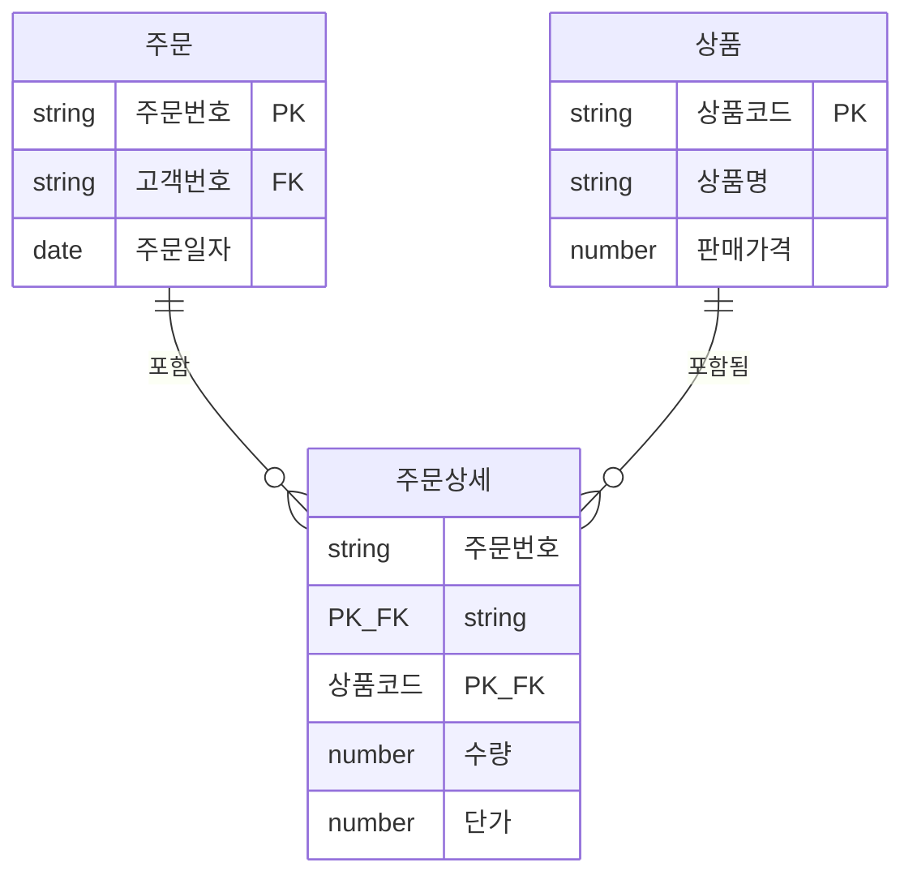

**물리 구현:**

```sql
-- 상품 테이블 (새로 분리)
CREATE TABLE 상품 (
    상품코드 VARCHAR2(20) PRIMARY KEY,
    상품명 VARCHAR2(200) NOT NULL,
    판매가격 NUMBER(10) NOT NULL,
    재고수량 NUMBER(10) DEFAULT 0
);

-- 주문상세 테이블 (정규화)
CREATE TABLE 주문상세 (
    주문번호 VARCHAR2(20) NOT NULL,
    상품코드 VARCHAR2(20) NOT NULL,
    수량 NUMBER(5) NOT NULL,
    단가 NUMBER(10) NOT NULL,
    PRIMARY KEY (주문번호, 상품코드),
    FOREIGN KEY (주문번호) REFERENCES 주문(주문번호),
    FOREIGN KEY (상품코드) REFERENCES 상품(상품코드)
);
```

**데이터 예시:**

```sql
-- 상품 테이블
INSERT INTO 상품 VALUES ('BOOK001', 'SQL 전문가 가이드 2024', 45000, 100);
INSERT INTO 상품 VALUES ('BOOK002', '데이터 모델링 입문', 30000, 50);

-- 주문상세 테이블 (상품명 제거)
INSERT INTO 주문상세 VALUES ('ORD001', 'BOOK001', 2, 45000);
INSERT INTO 주문상세 VALUES ('ORD001', 'BOOK002', 1, 30000);
INSERT INTO 주문상세 VALUES ('ORD002', 'BOOK001', 1, 45000);
```

**상품명 변경 시:**

```sql
-- 한 번만 업데이트하면 모든 주문에 반영
UPDATE 상품
SET 상품명 = 'SQL 전문가 가이드 2024 개정판'
WHERE 상품코드 = 'BOOK001';
```

**조회 시:**

```sql
SELECT O.주문번호, P.상품코드, P.상품명, OD.수량, OD.단가
FROM 주문 O
JOIN 주문상세 OD ON O.주문번호 = OD.주문번호
JOIN 상품 P ON OD.상품코드 = P.상품코드
WHERE O.주문번호 = 'ORD001';
```

**장점:**

| 항목 | 개선 효과 |
|:---|:---|
| **데이터 일관성** | 상품 정보 단일 관리 |
| **갱신 효율** | 1회 UPDATE로 모든 주문 반영 |
| **디스크 절약** | 데이터 중복 제거로 1/5 감소 |
| **이상현상 제거** | 갱신/삽입/삭제 이상 모두 해결 |

---

### 🥉 제3정규형 (Third Normal Form, 3NF)

#### 📋 제3정규형의 정의

> "엔터티의 일반 속성 간에는 서로 **종속적이지 않아야** 한다."

즉, **이행적 함수 종속(Transitive Functional Dependency)**을 제거해야 합니다.

**이행적 함수 종속:**

```
A → B이고 B → C일 때, A → C가 성립

예: 주문번호 → 고객번호 → 고객명
   (주문번호를 알면 고객번호를 알 수 있고, 고객번호를 알면 고객명을 알 수 있음)
```

#### 🚫 제3정규형 위반 사례

**업무 상황:**

```
앞의 사례에서 2차 정규화를 만족했습니다.
이번에는 고객명이 변경되는 사례가 발생했습니다.
또한 고객관리팀으로부터 고객의 기본 배송지 주소 관리 요청을 받았습니다.
```

**❌ 제3정규형 위반 모델:**

**주문 테이블:**

| 주문번호 (PK) | 고객번호 | 고객명 | 고객주소 | 주문일자 | 주문금액 |
|:---:|:---:|:---|:---|:---:|:---:|
| ORD001 | C001 | 정우진 | 서울 강남 | 2024-01-10 | 100,000 |
| ORD002 | C001 | 정우진 | 서울 강남 | 2024-01-15 | 50,000 |
| ORD003 | C002 | 김철수 | 부산 해운대 | 2024-01-20 | 75,000 |

**문제 발생:**

고객 C001의 이름이 잘못되어 "정세진"으로 변경 필요:

```sql
-- 모든 주문 레코드를 업데이트해야 함
UPDATE 주문
SET 고객명 = '정세진'
WHERE 고객번호 = 'C001';
```

**이상현상 분석:**

| 이상현상 유형 | 설명 |
|:---|:---|
| **갱신 이상** | 고객 정보 변경 시 모든 주문 레코드 업데이트 필요 (부하 발생) |
| **삽입 이상** | 주문 없이 고객 정보만 저장 불가 |
| **삭제 이상** | 마지막 주문 삭제 시 고객 정보도 함께 삭제됨 |

**근본 원인:**

```
고객명, 고객주소는 '주문번호'가 아닌 '고객번호'에 종속되어야 함

주문번호 → 고객번호 → 고객명 (이행적 종속!)
주문번호 → 고객번호 → 고객주소 (이행적 종속!)
```

#### ✅ 제3정규화 수행

**기본 키가 아닌 속성 간 종속성 제거**

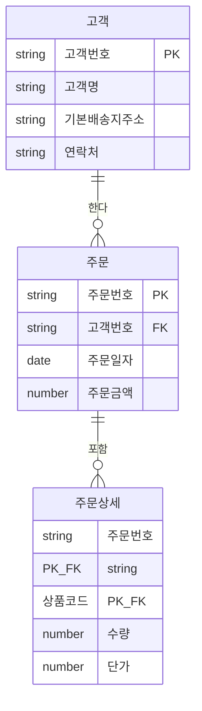

**물리 구현:**

```sql
-- 고객 테이블 (새로 분리)
CREATE TABLE 고객 (
    고객번호 VARCHAR2(10) PRIMARY KEY,
    고객명 VARCHAR2(100) NOT NULL,
    기본배송지주소 VARCHAR2(200),
    연락처 VARCHAR2(20)
);

-- 주문 테이블 (정규화)
CREATE TABLE 주문 (
    주문번호 VARCHAR2(20) PRIMARY KEY,
    고객번호 VARCHAR2(10) NOT NULL,
    주문일자 DATE NOT NULL,
    주문금액 NUMBER(10) NOT NULL,
    FOREIGN KEY (고객번호) REFERENCES 고객(고객번호)
);
```

**데이터 예시:**

```sql
-- 고객 테이블
INSERT INTO 고객 VALUES ('C001', '정세진', '서울 강남구 테헤란로 123', '010-1234-5678');
INSERT INTO 고객 VALUES ('C002', '김철수', '부산 해운대구 해운대로 456', '010-9876-5432');

-- 주문 테이블 (고객명, 고객주소 제거)
INSERT INTO 주문 VALUES ('ORD001', 'C001', TO_DATE('2024-01-10', 'YYYY-MM-DD'), 100000);
INSERT INTO 주문 VALUES ('ORD002', 'C001', TO_DATE('2024-01-15', 'YYYY-MM-DD'), 50000);
INSERT INTO 주문 VALUES ('ORD003', 'C002', TO_DATE('2024-01-20', 'YYYY-MM-DD'), 75000);
```

**고객 정보 변경 시:**

```sql
-- 한 번만 업데이트하면 모든 주문에 반영
UPDATE 고객
SET 고객명 = '정세진'
WHERE 고객번호 = 'C001';
```

**조회 시:**

```sql
SELECT O.주문번호, C.고객번호, C.고객명, O.주문일자, O.주문금액
FROM 주문 O
JOIN 고객 C ON O.고객번호 = C.고객번호
WHERE O.주문번호 = 'ORD001';
```

**장점:**

| 항목 | 개선 효과 |
|:---|:---|
| **독립적 관리** | 고객 정보를 별도로 관리 가능 |
| **이상현상 제거** | 주문과 무관한 트랜잭션 분리 |
| **성능 향상** | 고객 정보 변경 시 UPDATE 부하 감소 |
| **요구사항 반영** | 고객 기본 배송지 관리 가능 |

---

### 📊 정규화 요약 및 비교

#### 정규화 단계별 요약표

| 정규형 | 제거 대상 | 방법 | 결과 |
|:---|:---|:---|:---|
| **제1정규형** | 다중값 속성, 반복 그룹 | 별도 엔터티로 분리 | 원자값 만족 |
| **제2정규형** | 부분 함수 종속 | 완전 함수 종속 엔터티 분리 | 주식별자 전체에 종속 |
| **제3정규형** | 이행적 함수 종속 | 일반 속성 간 종속성 제거 | 직접 종속만 유지 |

#### 정규화 전후 비교 (온라인 서점 예시)

**정규화 전 (비정규형):**

```
주문 테이블:
주문번호, 고객번호, 고객명, 고객주소,
상품코드1, 상품명1, 수량1, 단가1,
상품코드2, 상품명2, 수량2, 단가2
```

**문제점:**
- ❌ 상품 3개 이상 주문 불가 (제1정규형 위반)
- ❌ 상품명 변경 시 모든 주문 업데이트 (제2정규형 위반)
- ❌ 고객명 변경 시 모든 주문 업데이트 (제3정규형 위반)

**정규화 후 (제3정규형):**

```
고객 테이블: 고객번호, 고객명, 기본배송지주소, 연락처
주문 테이블: 주문번호, 고객번호(FK), 주문일자, 주문금액
주문상세 테이블: 주문번호(FK), 상품코드(FK), 수량, 단가
상품 테이블: 상품코드, 상품명, 판매가격, 재고수량
```

**개선 효과:**
- ✅ 상품 개수 제한 없음
- ✅ 상품명 변경 시 1회 UPDATE
- ✅ 고객명 변경 시 1회 UPDATE
- ✅ 데이터 일관성 확보
- ✅ 디스크 공간 절약

---

## ⚠️ NULL 속성 연산 시 주의사항

NULL 처리는 SQL 작성 시 가장 흔하게 하는 실수 중 하나입니다. 강사님께서 특히 강조하신 부분입니다.

---

### 🔍 NULL의 기본 규칙

#### 💡 핵심 원칙

> **"NULL과의 연산은 항상 NULL이다."**

이 원칙을 반드시 기억해야 합니다.

```sql
-- NULL 연산 예시
SELECT
    5 + NULL AS 더하기,      -- 결과: NULL
    10 - NULL AS 빼기,        -- 결과: NULL
    3 * NULL AS 곱하기,       -- 결과: NULL
    20 / NULL AS 나누기,      -- 결과: NULL
    'Hello' || NULL AS 문자열  -- 결과: NULL
FROM DUAL;
```

---

### 📊 NULL 연산 실전 사례 분석

#### 🚫 잘못된 연봉 계산 (사례 1, 2, 3)

**테이블 구조:**

```sql
CREATE TABLE 직원 (
    사원번호 VARCHAR2(10) PRIMARY KEY,
    사원명 VARCHAR2(50) NOT NULL,
    월급 NUMBER(10) NOT NULL,  -- NOT NULL 컬럼
    수당 NUMBER(10)             -- NULLABLE 컬럼
);
```

**데이터:**

| 사원번호 | 사원명 | 월급 (SAL) | 수당 (COM) |
|:---:|:---:|---:|---:|
| E001 | 홍길동 | 3,000,000 | 500,000 |
| E002 | 김철수 | 2,500,000 | NULL |
| E003 | 이영희 | 4,000,000 | 1,000,000 |

**❌ 잘못된 쿼리 1: NULL 고려 없이 연봉 계산**

```sql
SELECT
    사원번호,
    사원명,
    월급,
    수당,
    (월급 * 12 + 수당) AS 연봉
FROM 직원;
```

**결과:**

| 사원번호 | 사원명 | 월급 | 수당 | 연봉 |
|:---:|:---:|---:|---:|---:|
| E001 | 홍길동 | 3,000,000 | 500,000 | 36,500,000 ✅ |
| E002 | 김철수 | 2,500,000 | NULL | **NULL** ❌ |
| E003 | 이영희 | 4,000,000 | 1,000,000 | 49,000,000 ✅ |

**문제점:**
- 김철수의 연봉이 NULL로 계산됨
- `36,000,000 + NULL = NULL`

**❌ 잘못된 쿼리 2: NVL을 잘못된 위치에 적용**

```sql
SELECT
    사원번호,
    사원명,
    월급,
    수당,
    NVL((월급 * 12 + 수당), 0) AS 연봉
FROM 직원;
```

**결과:**

| 사원번호 | 사원명 | 월급 | 수당 | 연봉 |
|:---:|:---:|---:|---:|---:|
| E001 | 홍길동 | 3,000,000 | 500,000 | 36,500,000 ✅ |
| E002 | 김철수 | 2,500,000 | NULL | **0** ❌ |
| E003 | 이영희 | 4,000,000 | 1,000,000 | 49,000,000 ✅ |

**문제점:**
- 이미 NULL로 계산된 값에 NVL을 적용해도 소용없음
- 김철수의 연봉이 0으로 표시 (부정확)

**✅ 올바른 쿼리 3: NVL을 올바른 위치에 적용**

```sql
SELECT
    사원번호,
    사원명,
    월급,
    수당,
    (월급 * 12 + NVL(수당, 0)) AS 연봉
FROM 직원;
```

**결과:**

| 사원번호 | 사원명 | 월급 | 수당 | 연봉 |
|:---:|:---:|---:|---:|---:|
| E001 | 홍길동 | 3,000,000 | 500,000 | 36,500,000 ✅ |
| E002 | 김철수 | 2,500,000 | NULL | 30,000,000 ✅ |
| E003 | 이영희 | 4,000,000 | 1,000,000 | 49,000,000 ✅ |

**핵심:**
- **NULL이 있을 것으로 예상되는 컬럼에 NVL을 적용**
- 연산 **전에** NULL을 처리해야 함

---

### 🧮 다양한 연산에서의 NULL 동작

#### 비교 연산에서의 NULL

```sql
SELECT
    월급 AS SAL,
    수당 AS COM,
    CASE
        WHEN 월급 > 수당 THEN '월급이 더 큼'
        WHEN 월급 < 수당 THEN '수당이 더 큼'
        WHEN 월급 = 수당 THEN '같음'
        ELSE '비교 불가'
    END AS 비교결과
FROM 직원
WHERE 사원번호 = 'E002';
```

**결과:**

| SAL | COM | 비교결과 |
|---:|---:|:---|
| 2,500,000 | NULL | 비교 불가 |

**설명:**
- `2,500,000 > NULL`은 TRUE도 FALSE도 아닌 **UNKNOWN**
- 모든 비교 조건이 UNKNOWN이므로 ELSE절 실행

#### 산술 연산자와 NULL

```sql
SELECT
    월급 AS SAL,
    수당 AS COM,
    MOD(월급, 수당) AS 나머지,
    GREATEST(월급, 수당) AS 최대값
FROM 직원
WHERE 사원번호 = 'E002';
```

**결과:**

| SAL | COM | 나머지 | 최대값 |
|---:|---:|---:|---:|
| 2,500,000 | NULL | NULL | NULL |

**설명:**
- `MOD(2500000, NULL)` → NULL
- `GREATEST(2500000, NULL)` → NULL

#### 문자열 함수와 NULL

```sql
SELECT
    '직원: ' || 사원명 || ', 수당: ' || 수당 AS 정보
FROM 직원
WHERE 사원번호 = 'E002';
```

**결과:**

| 정보 |
|:---|
| NULL |

**설명:**
- 문자열 연결 연산자 `||`도 NULL과 연산 시 NULL 반환

#### COALESCE 함수

**COALESCE는 첫 번째 NOT NULL 값을 반환하는 함수**

```sql
SELECT
    사원번호,
    사원명,
    COALESCE(수당, 월급, 0) AS 첫번째_비NULL값
FROM 직원;
```

**결과:**

| 사원번호 | 사원명 | 첫번째_비NULL값 |
|:---:|:---:|---:|
| E001 | 홍길동 | 500,000 (수당) |
| E002 | 김철수 | 2,500,000 (월급) |
| E003 | 이영희 | 1,000,000 (수당) |

---

### 📈 집계 함수와 NULL

#### 💡 중요 원칙

> **집계 함수는 NULL 값을 제외하고 처리합니다.**

```sql
SELECT
    COUNT(*) AS 전체_건수,
    COUNT(수당) AS 수당_건수,
    SUM(수당) AS 수당_합계,
    AVG(수당) AS 수당_평균
FROM 직원;
```

**결과:**

| 전체_건수 | 수당_건수 | 수당_합계 | 수당_평균 |
|---:|---:|---:|---:|
| 3 | 2 | 1,500,000 | 750,000 |

**설명:**
- `COUNT(*)`: 전체 행 수 (NULL 포함) → 3
- `COUNT(수당)`: 수당이 NULL이 아닌 행 수 → 2
- `SUM(수당)`: NULL 제외하고 합계 → 500,000 + 1,000,000 = 1,500,000
- `AVG(수당)`: NULL 제외하고 평균 → 1,500,000 / 2 = 750,000

---

### ⚠️ 불필요한 NVL 함수 사용 피하기

#### 🚫 성능 저하 사례

**상황:**

- 직원 테이블에 100건의 데이터 존재
- 연봉 계산 필요

**❌ 잘못된 쿼리: 불필요한 NVL 남발**

```sql
SELECT
    SUM(NVL(월급, 0) * 12) AS 월급_연봉,
    SUM(NVL(수당, 0)) AS 수당_연봉,
    SUM(NVL(월급, 0) * 12) + SUM(NVL(수당, 0)) AS 총_연봉
FROM 직원;
```

**내장 함수 호출 횟수:**
- `NVL(월급, 0)`: 100회
- `NVL(수당, 0)`: 100회 × 2 = 200회
- 총 **300회**

**✅ 올바른 쿼리: SUM 후 NVL**

```sql
SELECT
    SUM(월급 * 12) AS 월급_연봉,
    SUM(수당) AS 수당_연봉,
    NVL(SUM(월급 * 12), 0) + NVL(SUM(수당), 0) AS 총_연봉
FROM 직원;
```

**내장 함수 호출 횟수:**
- `NVL(SUM(...), 0)`: 2회
- 총 **2회**

**성능 비교:**

| 쿼리 | 내장 함수 호출 | 실행 시간 (예시) |
|:---|---:|---:|
| 잘못된 쿼리 | 300회 | 1분 3초 |
| 올바른 쿼리 | 2회 | 57초 |

💡 **중요!**: 집계 함수(`SUM`, `AVG`, `COUNT` 등)는 NULL을 자동으로 제외하므로, **집계 후** NVL을 적용하는 것이 효율적입니다.

⚠️ **주의**: 다만, `SUM(월급 * 12)`의 결과가 NULL일 가능성이 있다면(모든 월급이 NULL인 경우) NVL을 사용해야 합니다.

---

### 🔢 COUNT vs SUM: 조건부 집계

#### 상황

수당이 400,000 이상인 직원의 수를 구하라.

**데이터:**

| 사원번호 | 수당 |
|:---:|---:|
| E001 | 500,000 |
| E002 | NULL |
| E003 | 1,000,000 |
| E004 | 300,000 |
| E005 | 450,000 |

#### 다양한 쿼리 방식

**방식 1: SUM + CASE (ELSE 0)**

```sql
SELECT SUM(CASE WHEN 수당 >= 400000 THEN 1 ELSE 0 END) AS 직원수
FROM 직원;
```

**결과:** 3

**방식 2: SUM + CASE (ELSE 생략)**

```sql
SELECT SUM(CASE WHEN 수당 >= 400000 THEN 1 END) AS 직원수
FROM 직원;
```

**결과:** 3

**설명:** ELSE가 없으면 NULL 반환, SUM은 NULL 제외

**방식 3: COUNT(*)**

```sql
SELECT COUNT(*) AS 직원수
FROM 직원
WHERE 수당 >= 400000;
```

**결과:** 3

**설명:** WHERE 절로 필터링 후 COUNT

**방식 4: COUNT + CASE (숫자)**

```sql
SELECT COUNT(CASE WHEN 수당 >= 400000 THEN 1 END) AS 직원수
FROM 직원;
```

**결과:** 3

**방식 5: COUNT + CASE (문자)**

```sql
SELECT COUNT(CASE WHEN 수당 >= 400000 THEN 'Y' END) AS 직원수
FROM 직원;
```

**결과:** 3

#### 성능 비교

| 방식 | 내장 함수 호출 | 성능 | 권장도 |
|:---|:---:|:---:|:---:|
| SUM + CASE (ELSE 0) | SUM 1회, CASE 평가 | 중간 | ✅ |
| SUM + CASE (ELSE 생략) | SUM 1회, CASE 평가 | 우수 | ✅✅ |
| COUNT(*) + WHERE | COUNT 1회 | 우수 | ✅✅✅ 가장 권장 |
| COUNT + CASE (숫자) | COUNT 1회, CASE 평가 | 우수 | ✅✅ |
| COUNT + CASE (문자) | COUNT 1회, CASE 평가 | 우수 | ✅✅ |

💡 **권장**: WHERE 절로 필터링 후 `COUNT(*)`가 가장 명확하고 성능이 좋습니다.

---

## ✅ 학습 체크리스트

### 정규화

- [ ] 정규화의 정의와 목적을 설명할 수 있는가?
- [ ] 제1정규형의 조건과 적용 방법을 알고 있는가?
- [ ] 제2정규형이 해결하는 문제를 이해하는가?
- [ ] 제3정규형과 이행적 종속을 설명할 수 있는가?
- [ ] 각 정규형 위반 시 발생하는 이상현상을 나열할 수 있는가?

### NULL 처리

- [ ] "NULL과의 연산은 항상 NULL" 원칙을 기억하는가?
- [ ] NVL 함수의 올바른 위치를 알고 있는가?
- [ ] 집계 함수가 NULL을 어떻게 처리하는지 이해하는가?
- [ ] 불필요한 NVL 사용으로 인한 성능 저하를 인지하는가?
- [ ] COUNT vs SUM의 차이를 설명할 수 있는가?

---

## 📋 핵심 요약

### 정규화

1. **제1정규형**: 다중값/반복 그룹 제거 → 원자값
2. **제2정규형**: 부분 함수 종속 제거 → 주식별자 전체 종속
3. **제3정규형**: 이행적 종속 제거 → 일반 속성 간 독립

### NULL 처리

1. **NULL 연산**: 항상 NULL 반환
2. **NVL 위치**: 연산 전 적용
3. **집계 함수**: NULL 자동 제외
4. **성능**: 불필요한 NVL 남발 금지

---

다음 섹션에서는 **SQL 기본 문법과 관계형 모델**을 다루겠습니다.

## 📊 SQL 기본과 활용

이 섹션에서는 SQL의 이론적 기반부터 실무 활용 기법까지 종합적으로 다룹니다.

---

## 🎓 관계형 모델 이론과 SQL

### 📖 E.F. Codd의 관계형 대수

1970년, E.F. Codd는 IBM에서 발표한 논문 **"Relational Model of Data for Large Shared Databanks"**에서 관계형 모델 이론을 제시했습니다.

#### 8가지 관계형 대수와 SQL 구현

**일반 집합 연산자:**

| 관계형 대수 | SQL 구현 | 설명 |
|:---|:---|:---|
| **UNION** | `UNION` | 합집합 (중복 제거) |
| (추가) | `UNION ALL` | 합집합 (중복 포함) |
| **INTERSECTION** | `INTERSECT` | 교집합 |
| **DIFFERENCE** | `EXCEPT` (SQL Server)<br/>`MINUS` (Oracle) | 차집합 |
| **CARTESIAN PRODUCT** | `CROSS JOIN` | 카티션 곱 |

**순수 관계 연산자:**

| 관계형 대수 | SQL 구현 | 설명 |
|:---|:---|:---|
| **SELECT** | `WHERE` 절 | 행 선택 (필터링) |
| **PROJECT** | `SELECT` 절 | 열 선택 (컬럼 선택) |
| **JOIN** | `INNER JOIN`, `OUTER JOIN` 등 | 테이블 결합 |
| **DIVIDE** | (사용 안 함) | 나눗셈 (현재 미사용) |

---

### 🔄 SELECT 문의 실행 순서

SQL은 선언적 언어지만, 내부적으로는 **특정 순서**로 실행됩니다. 이를 이해하면 쿼리 작성과 튜닝에 도움이 됩니다.

#### 📝 SELECT 문 구조

```sql
SELECT DEPTNO, JOB, AVG(SAL) AS AVG_SAL
FROM EMP
WHERE SAL >= 2000
GROUP BY DEPTNO, JOB
HAVING AVG(SAL) >= 3000
ORDER BY AVG_SAL DESC;
```

#### 🔢 실행 순서

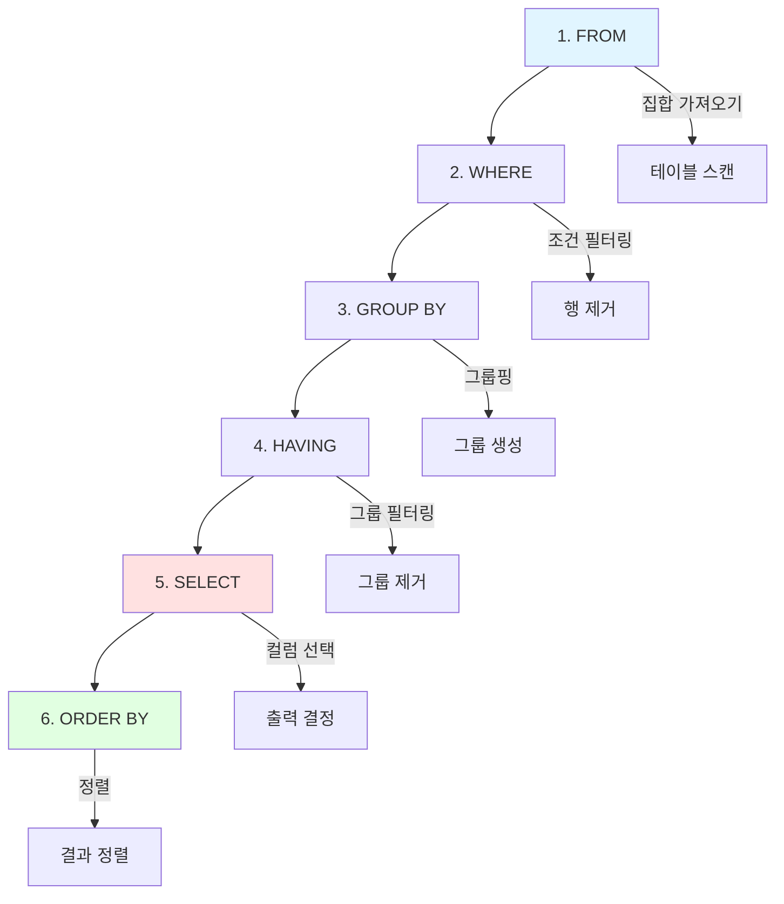

**상세 설명:**

| 순서 | 절 | 동작 | 비고 |
|:---:|:---|:---|:---|
| **1** | `FROM` | 집합(테이블) 가져오기 | JOIN도 이 단계에서 수행 |
| **2** | `WHERE` | 조건에 맞는 행 필터링 | 집계 함수 사용 불가 |
| **3** | `GROUP BY` | 지정된 컬럼으로 그룹핑 | 집계 함수 사용 가능 |
| **4** | `HAVING` | 그룹 단위 조건 필터링 | 집계 함수 사용 가능 |
| **5** | `SELECT` | 출력할 컬럼 결정, ALIAS 부여 | ALIAS 생성 시점 |
| **6** | `ORDER BY` | 결과 정렬 | ALIAS 사용 가능, 가장 마지막 |

#### ⚠️ 실행 순서로 인한 제약사항

**1️⃣ WHERE절에서 ALIAS 사용 불가**

```sql
-- ❌ 오류 발생
SELECT SAL * 12 AS 연봉
FROM EMP
WHERE 연봉 > 50000;  -- 'invalid identifier'

-- ✅ 올바른 방법
SELECT SAL * 12 AS 연봉
FROM EMP
WHERE SAL * 12 > 50000;
```

**이유:** `WHERE`는 `SELECT`보다 먼저 실행되므로 ALIAS를 인식할 수 없음

**2️⃣ HAVING절에서 ALIAS 직접 사용 불가**

```sql
-- ❌ 오류 발생 (일부 DBMS)
SELECT DEPTNO, AVG(SAL) AS AVG_SAL
FROM EMP
GROUP BY DEPTNO
HAVING AVG_SAL > 3000;

-- ✅ 올바른 방법
SELECT DEPTNO, AVG(SAL) AS AVG_SAL
FROM EMP
GROUP BY DEPTNO
HAVING AVG(SAL) > 3000;
```

**단,** 집계 함수 자체는 `HAVING`에서 사용 가능

**3️⃣ ORDER BY절에서는 ALIAS 사용 가능**

```sql
-- ✅ 정상 동작
SELECT DEPTNO, AVG(SAL) AS AVG_SAL
FROM EMP
GROUP BY DEPTNO
ORDER BY AVG_SAL DESC;  -- ALIAS 사용 가능
```

**이유:** `ORDER BY`는 `SELECT` 이후에 실행되므로 ALIAS 인식 가능

**4️⃣ ORDER BY 결과에 순서 번호 부여**

```sql
-- ❌ 잘못된 방법: ROWNUM은 ORDER BY 전에 부여됨
SELECT ROWNUM, ENAME, SAL
FROM EMP
ORDER BY SAL DESC;

-- ✅ 올바른 방법: 서브쿼리로 감싸기
SELECT ROWNUM, ENAME, SAL
FROM (
    SELECT ENAME, SAL
    FROM EMP
    ORDER BY SAL DESC
);
```

#### 💡 성능 최적화 고려사항

> "성능을 위해 가급적 조건을 **WHERE절**에서 처리하는 것이 더욱 도움이 됩니다."

**이유:**

- `WHERE`는 그룹핑 전에 실행되어 처리할 데이터양 감소
- `HAVING`은 그룹핑 후 실행되어 이미 집계 완료된 후 필터링

**예시:**

```sql
-- 🐢 느린 쿼리
SELECT DEPTNO, AVG(SAL)
FROM EMP
GROUP BY DEPTNO
HAVING DEPTNO = 10;  -- 그룹핑 후 필터링

-- 🚀 빠른 쿼리
SELECT DEPTNO, AVG(SAL)
FROM EMP
WHERE DEPTNO = 10    -- 그룹핑 전 필터링
GROUP BY DEPTNO;
```

---

## 🔗 JOIN 상세 분석

JOIN은 SQL에서 가장 핵심적이고 강력한 기능입니다. 강사님께서 특히 강조하신 **OUTER JOIN 시 고려사항**을 중심으로 학습합니다.

### 📋 JOIN의 정의

> "2개 이상의 테이블들을 연결해서 데이터를 출력하는 데이터베이스 연산"

**OUTER JOIN:**
> "JOIN 조건을 만족하지 않더라도 해당 행을 반환하는 JOIN 방식"

**OUTER 집합:**
> "OUTER JOIN에서 조건을 만족하지 않아도 반환되는 행들의 집합"

### 📊 JOIN 종류와 결과 건수 비교

**테이블 구조:**

**TAB1:**

| KEY | COL1 |
|:---:|:---:|
| A | 111 |
| B | 222 |
| C | 333 |
| NULL | 444 |

**TAB2:**

| KEY | COL2 |
|:---:|:---:|
| A | AAA |
| B | BBB |
| D | DDD |

#### 🔢 JOIN 유형별 결과 건수

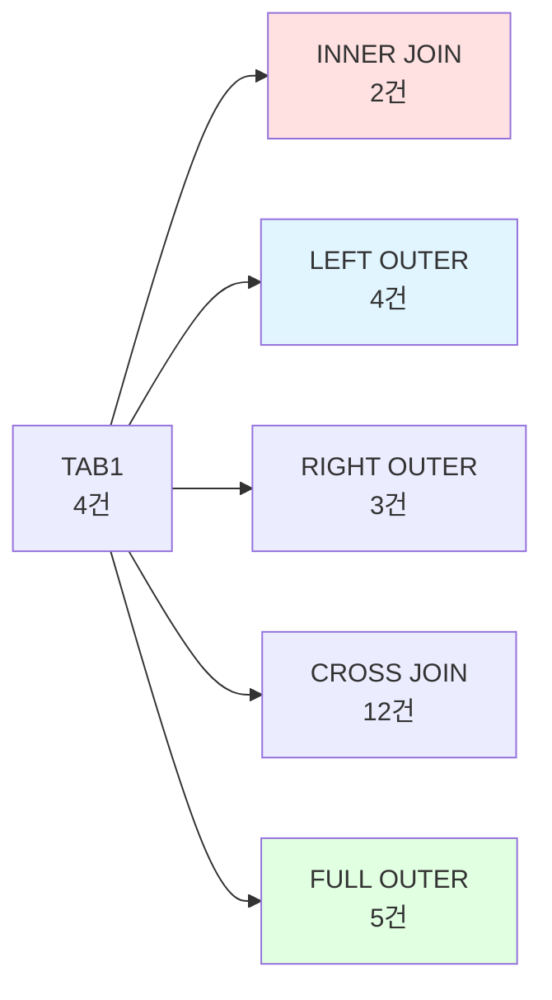

**1️⃣ INNER JOIN**

```sql
SELECT T1.KEY, T1.COL1, T2.COL2
FROM TAB1 T1
INNER JOIN TAB2 T2 ON T1.KEY = T2.KEY;
```

**결과: 2건**

| KEY | COL1 | COL2 |
|:---:|:---:|:---:|
| A | 111 | AAA |
| B | 222 | BBB |

**2️⃣ LEFT OUTER JOIN**

```sql
SELECT T1.KEY, T1.COL1, T2.COL2
FROM TAB1 T1
LEFT OUTER JOIN TAB2 T2 ON T1.KEY = T2.KEY;
```

**결과: 4건**

| KEY | COL1 | COL2 |
|:---:|:---:|:---:|
| A | 111 | AAA |
| B | 222 | BBB |
| C | 333 | NULL |
| NULL | 444 | NULL |

**3️⃣ RIGHT OUTER JOIN**

```sql
SELECT T1.KEY, T1.COL1, T2.COL2
FROM TAB1 T1
RIGHT OUTER JOIN TAB2 T2 ON T1.KEY = T2.KEY;
```

**결과: 3건**

| KEY | COL1 | COL2 |
|:---:|:---:|:---:|
| A | 111 | AAA |
| B | 222 | BBB |
| D | NULL | DDD |

**4️⃣ CROSS JOIN**

```sql
SELECT T1.KEY, T1.COL1, T2.COL2
FROM TAB1 T1
CROSS JOIN TAB2 T2;
```

**결과: 12건 (4 × 3 = 12)**

카티션 곱으로 모든 조합 생성

**5️⃣ FULL OUTER JOIN**

```sql
SELECT T1.KEY, T1.COL1, T2.COL2
FROM TAB1 T1
FULL OUTER JOIN TAB2 T2 ON T1.KEY = T2.KEY;
```

**결과: 5건**

| KEY | COL1 | COL2 |
|:---:|:---:|:---:|
| A | 111 | AAA |
| B | 222 | BBB |
| C | 333 | NULL |
| NULL | 444 | NULL |
| D | NULL | DDD |

### ⚠️ OUTER JOIN 후 WHERE 절 주의사항

#### 🚨 중요한 함정

**LEFT OUTER JOIN 후 WHERE 절 조건 추가 시, INNER JOIN으로 변질될 수 있습니다.**

**❌ 잘못된 쿼리**

```sql
SELECT T1.KEY AS A1, T2.KEY AS A2, T2.COL4
FROM TAB1 T1
LEFT OUTER JOIN TAB2 T2 ON T1.KEY = T2.KEY
WHERE T2.COL4 IN ('BC', 'CD');
```

**기대 결과:** 4건 (LEFT OUTER이므로)
**실제 결과:** 1건 (INNER JOIN처럼 동작!)

| A1 | A2 | COL4 |
|:---:|:---:|:---:|
| B | B | BC |

**이유:**
- LEFT OUTER JOIN은 TAB1의 모든 행을 포함
- 하지만 `WHERE T2.COL4 IN ('BC', 'CD')`는 TAB2의 COL4가 NULL인 행을 제거
- 결과적으로 INNER JOIN과 동일한 효과

**✅ 올바른 방법: JOIN 조건에 포함**

```sql
SELECT T1.KEY AS A1, T2.KEY AS A2, T2.COL4
FROM TAB1 T1
LEFT OUTER JOIN TAB2 T2
    ON T1.KEY = T2.KEY
   AND T2.COL4 IN ('BC', 'CD');
```

**결과: 4건**

| A1 | A2 | COL4 |
|:---:|:---:|:---:|
| A | NULL | NULL |
| B | B | BC |
| C | NULL | NULL |
| NULL | NULL | NULL |

#### 📐 FULL OUTER JOIN 후 WHERE 절

**FULL OUTER + WHERE → LEFT 또는 RIGHT OUTER로 변질**

```sql
-- FULL OUTER JOIN
SELECT T1.KEY AS A1, T2.KEY AS A2
FROM TAB1 T1
FULL OUTER JOIN TAB2 T2 ON T1.KEY = T2.KEY;
-- 결과: 5건

-- FULL OUTER + TAB1 조건 → LEFT OUTER처럼 동작
SELECT T1.KEY AS A1, T2.KEY AS A2
FROM TAB1 T1
FULL OUTER JOIN TAB2 T2 ON T1.KEY = T2.KEY
WHERE T1.COL1 IN ('111', '222');
-- 결과: 2건 (LEFT OUTER와 유사)
```

### 🔄 ANSI JOIN vs Oracle JOIN 비교

**Oracle JOIN (구식):**

```sql
-- INNER JOIN
SELECT *
FROM EMP E, DEPT D
WHERE E.DEPTNO = D.DEPTNO;

-- LEFT OUTER JOIN
SELECT *
FROM EMP E, DEPT D
WHERE E.DEPTNO = D.DEPTNO(+);
```

**ANSI JOIN (권장):**

```sql
-- INNER JOIN
SELECT *
FROM EMP E
INNER JOIN DEPT D ON E.DEPTNO = D.DEPTNO;

-- LEFT OUTER JOIN
SELECT *
FROM EMP E
LEFT OUTER JOIN DEPT D ON E.DEPTNO = D.DEPTNO;
```

#### 🚨 Oracle JOIN의 문제점

| 문제 | 설명 |
|:---|:---|
| **구분 불명확** | JOIN 조건과 WHERE 조건 구분 어려움 |
| **연산자 제약** | `IN`, `OR`, `BETWEEN`, `LIKE` 사용 시 오류 가능 |
| **(+) 누락 위험** | `(+)` 누락 시 INNER JOIN으로 동작 |
| **FULL OUTER 미지원** | FULL OUTER JOIN 불가 |
| **이식성 문제** | 다른 DBMS로 이식 시 SQL 변경 필요 |

💡 **권장**: 최근에는 **ANSI JOIN**을 표준으로 사용하는 추세입니다.

---

## 📦 서브쿼리 (Subquery)

서브쿼리는 "SQL 문 안에 포함되어 있는 또 다른 SQL"입니다.

### 🗂️ 서브쿼리의 종류

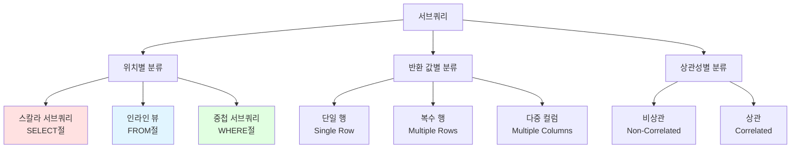

**위치별 분류:**

| 종류 | 위치 | 특징 |
|:---|:---|:---|
| **스칼라 서브쿼리** | `SELECT` 절 | 한 행, 한 컬럼 반환 |
| **인라인 뷰** | `FROM` 절 | 임시 테이블처럼 사용 |
| **중첩 서브쿼리** | `WHERE`, `HAVING` 절 | 조건 필터링 |

**사용 가능한 위치:**

서브쿼리는 다음 위치에서 사용 가능합니다:
- `SELECT` 절
- `FROM` 절
- `WHERE` 절
- `HAVING` 절
- `ORDER BY` 절
- `INSERT` 문의 `VALUES` 절
- `UPDATE` 문의 `SET` 절

### 📊 스칼라 서브쿼리 (Scalar Subquery)

**정의:**
> 한 행, 한 컬럼만 반환하는 서브쿼리로, 컬럼을 쓸 수 있는 대부분의 곳에서 사용 가능

**특징:**
- 메인쿼리의 결과 건수만큼 **반복 수행**
- 사용 시 **주의** 필요하지만, 특정 조건에서 **우수한 성능** 제공

**예시:**

```sql
SELECT
    E.EMPNO,
    E.ENAME,
    E.DEPTNO,
    (SELECT D.DNAME
     FROM DEPT D
     WHERE D.DEPTNO = E.DEPTNO) AS DEPT_NAME
FROM EMP E;
```

**장점:**
- SQL 작성 및 의미 파악 용이
- **Query Execution Cache** 기능으로 참조 코드 종류가 적을 때 우수한 성능

**Query Execution Cache:**

```
첫 실행: DEPTNO=10 → 캐시 저장
두 번째: DEPTNO=10 → 캐시에서 반환 (재실행 안 함)
세 번째: DEPTNO=20 → 캐시 저장
네 번째: DEPTNO=10 → 캐시에서 반환
```

💡 **중요**: 참조 코드의 종류가 적을수록 캐시 히트율이 높아 성능 우수

### 🔍 EXISTS 서브쿼리

**정의:**
> 조건에 해당하는 행의 존재 유무를 체크 후, 더 이상 수행하지 않음

**특징:**
- 항상 **상관 서브쿼리(Correlated Subquery)**로 사용
- 일반적으로 `IN`에 비해 성능 우수

**예시:**

```sql
SELECT E.EMPNO, E.ENAME
FROM EMP E
WHERE EXISTS (
    SELECT 1
    FROM DEPT D
    WHERE D.DEPTNO = E.DEPTNO
      AND D.LOC = 'NEW YORK'
);
```

**동작 방식:**
1. 메인쿼리의 각 행에 대해
2. 서브쿼리 실행
3. **첫 번째 매칭 행 발견 시 즉시 TRUE 반환**
4. 더 이상 스캔하지 않음

---

### 🎯 서브쿼리와 성능 비교

**상황:**

테이블에서 데이터를 출력하면서 `SVCCD` 컬럼의 코드를 코드명으로 반환하고자 합니다.

**방법 1: 스칼라 서브쿼리**

```sql
SELECT
    T.ORDER_NO,
    T.SVCCD,
    (SELECT C.CODE_NAME
     FROM CODE C
     WHERE C.CODE = T.SVCCD) AS SVCCD_NAME
FROM ORDERS T;
```

**개발 용이성:** ✅✅✅ 매우 우수
**성능:** ✅✅ 참조 코드 종류가 적을 경우 우수 (Query Execution Cache)

**방법 2: JOIN**

```sql
SELECT
    T.ORDER_NO,
    T.SVCCD,
    C.CODE_NAME AS SVCCD_NAME
FROM ORDERS T
LEFT OUTER JOIN CODE C ON T.SVCCD = C.CODE;
```

**개발 용이성:** ✅ 보통
**성능:** ✅✅✅ 평균적으로 우수, 단 비효율적 JOIN 발생 가능

**방법 3: Stored Function**

```sql
SELECT
    T.ORDER_NO,
    T.SVCCD,
    FN_GET_CODE_NAME(T.SVCCD) AS SVCCD_NAME
FROM ORDERS T;
```

**개발 용이성:** ✅✅✅ 매우 우수
**성능:** ❌ 매우 느림 (Stored Function Overhead)

#### 📊 실제 성능 비교 (강사님 테스트 결과)

**테스트 환경:**
- 레코드 수: 약 10,000건
- 참조 코드 수: 약 50종류

| 방법 | 실행 시간 | 버퍼 (Consistent Gets) | 비고 |
|:---|---:|---:|:---|
| **스칼라 서브쿼리** | 0.29초 | 9,397 | 캐시 효과로 우수 |
| **JOIN (Nested Loop)** | 2.03초 | 1,400,000+ | 잘못된 실행 계획 |
| **JOIN (Hash)** | 0.11초 | ~9,500 | 최적 |
| **Stored Function** | 18.91초 | 2,900,000+ | 오버헤드 심각 |

💡 **권장**:
- **참조 코드 종류가 적으면**: 스칼라 서브쿼리 또는 Hash JOIN
- **레코드 목록 표시**: Stored Function 사용 지양
- **안전한 선택**: Hash JOIN (옵티마이저가 제대로 동작하면)

---

## ⚠️ NOT IN, NOT EXISTS와 NULL

**이 부분은 실무에서 매우 자주 발생하는 오류입니다.** 강사님께서 특히 강조하셨습니다.

### 📊 테스트 데이터

**TAB1:**

| COL | YYMM |
|:---:|:---:|
| 111 | 9801 |
| 222 | 9802 |
| 333 | 9809 |
| 125555 | NULL |

**TAB2:**

| YYMM |
|:---:|
| 9801 |
| 9809 |
| NULL |

### 🔹 IN과 EXISTS (정상 동작)

**IN 사용:**

```sql
SELECT COL, YYMM
FROM TAB1
WHERE YYMM IN (SELECT YYMM FROM TAB2);
```

**결과: 2건**

| COL | YYMM |
|:---:|:---:|
| 111 | 9801 |
| 333 | 9809 |

**EXISTS 사용:**

```sql
SELECT COL, YYMM
FROM TAB1 T1
WHERE EXISTS (
    SELECT 1
    FROM TAB2 T2
    WHERE T2.YYMM = T1.YYMM
);
```

**결과: 2건** (동일)

💡 `IN`과 `EXISTS`는 NULL이 있어도 정상 동작합니다.

### 🚨 NOT IN의 함정

**NOT IN 사용 (TAB2에 NULL 포함):**

```sql
SELECT COL, YYMM
FROM TAB1
WHERE YYMM NOT IN (SELECT YYMM FROM TAB2);
```

**기대 결과:** 2건 (9802, NULL)
**실제 결과:** **0건** ❌

**이유:**

```
YYMM NOT IN (9801, 9809, NULL)

는 다음과 같이 해석됨:

YYMM <> 9801 AND YYMM <> 9809 AND YYMM <> NULL

YYMM <> NULL은 항상 UNKNOWN (TRUE도 FALSE도 아님)

→ 전체 조건이 FALSE
→ 아무 행도 반환 안 됨
```

**❌ 잘못된 해결 시도: NOT NULL 조건 추가**

```sql
SELECT COL, YYMM
FROM TAB1
WHERE YYMM NOT IN (
    SELECT YYMM
    FROM TAB2
    WHERE YYMM IS NOT NULL
);
```

**결과: 1건**

| COL | YYMM |
|:---:|:---:|
| 222 | 9802 |

**문제:** COL=125555, YYMM=NULL 행이 누락됨!

**이유:** TAB1의 YYMM이 NULL인 경우도 제외됨

**❌ 단순 NULL 테스트:**

```sql
SELECT COL, YYMM
FROM TAB1
WHERE YYMM NOT IN (NULL);
```

**결과: 0건** (아무것도 반환 안 됨)

### ✅ NOT EXISTS (정상 동작)

```sql
SELECT COL, YYMM
FROM TAB1 T1
WHERE NOT EXISTS (
    SELECT 1
    FROM TAB2 T2
    WHERE T2.YYMM = T1.YYMM
);
```

**결과: 2건 (정상)**

| COL | YYMM |
|:---:|:---:|
| 222 | 9802 |
| 125555 | NULL |

**이유:** `EXISTS`는 NULL과 상관없이 동작

**전체 NULL 테스트:**

```sql
SELECT COL, YYMM
FROM TAB1 T1
WHERE NOT EXISTS (
    SELECT 1
    FROM TAB2 T2
    WHERE T2.YYMM IS NULL  -- 전부 NULL
);
```

**결과: 4건** (TAB1의 모든 행 반환)

### 📋 NOT IN vs NOT EXISTS 비교표

| 비교 항목 | NOT IN | NOT EXISTS |
|:---|:---:|:---:|
| **서브쿼리에 NULL 포함 시** | ❌ 오동작 (0건 반환) | ✅ 정상 동작 |
| **성능** | 보통 | 우수 (조기 종료) |
| **가독성** | ✅ 우수 | 보통 |
| **실무 권장도** | ⚠️ 주의 필요 | ✅✅ 권장 |

💡 **권장**:
- **NOT IN 사용 시**: 반드시 `WHERE column IS NOT NULL` 조건 추가
- **안전한 선택**: `NOT EXISTS` 사용

---

## 📊 그룹 함수 (Group Functions)

### 🔹 기본 GROUP BY

```sql
SELECT DNAME, JOB, COUNT(*) AS 직원수, SUM(SAL) AS 급여합계
FROM EMP
JOIN DEPT ON EMP.DEPTNO = DEPT.DEPTNO
GROUP BY DNAME, JOB;
```

**결과:**

| DNAME | JOB | 직원수 | 급여합계 |
|:---|:---|---:|---:|
| SALES | CLERK | 1 | 950 |
| SALES | MANAGER | 1 | 2,850 |
| SALES | SALESMAN | 4 | 5,600 |
| ... | ... | ... | ... |

### 🎲 ROLLUP

**구문:**

```sql
SELECT DNAME, JOB, COUNT(*), SUM(SAL)
FROM EMP
JOIN DEPT ON EMP.DEPTNO = DEPT.DEPTNO
GROUP BY ROLLUP(DNAME, JOB);
```

**의미:**
- 각 인수가 **순서대로** 그룹핑에 참여한 결과의 합집합

**결과:**

| DNAME | JOB | COUNT | SUM(SAL) | 그룹 수준 |
|:---|:---|---:|---:|:---|
| SALES | CLERK | 1 | 950 | (DNAME, JOB) |
| SALES | MANAGER | 1 | 2,850 | (DNAME, JOB) |
| SALES | SALESMAN | 4 | 5,600 | (DNAME, JOB) |
| SALES | NULL | 6 | 9,400 | **(DNAME)** 소계 |
| RESEARCH | ANALYST | 2 | 6,000 | (DNAME, JOB) |
| RESEARCH | MANAGER | 1 | 2,975 | (DNAME, JOB) |
| RESEARCH | NULL | 3 | 8,975 | **(DNAME)** 소계 |
| NULL | NULL | 14 | 29,025 | **전체** 합계 |

**그룹핑 순서:**
1. `(DNAME, JOB)` → 상세
2. `(DNAME)` → DNAME별 소계
3. `()` → 전체 합계

### 🎲 CUBE

**구문:**

```sql
SELECT DNAME, JOB, COUNT(*), SUM(SAL)
FROM EMP
JOIN DEPT ON EMP.DEPTNO = DEPT.DEPTNO
GROUP BY CUBE(DNAME, JOB);
```

**의미:**
- 각 인수가 그룹핑에 참여할 수 있는 **모든 조합**과 전체 합계

**결과 (일부):**

| DNAME | JOB | COUNT | SUM(SAL) | 그룹 수준 |
|:---|:---|---:|---:|:---|
| SALES | CLERK | 1 | 950 | (DNAME, JOB) |
| SALES | MANAGER | 1 | 2,850 | (DNAME, JOB) |
| SALES | NULL | 6 | 9,400 | (DNAME) |
| NULL | CLERK | 4 | 4,150 | **(JOB)** 소계 |
| NULL | MANAGER | 3 | 8,275 | **(JOB)** 소계 |
| NULL | NULL | 14 | 29,025 | 전체 합계 |

**그룹핑 조합:**
1. `(DNAME, JOB)` → 상세
2. `(DNAME)` → DNAME별 소계
3. `(JOB)` → JOB별 소계
4. `()` → 전체 합계

### 🎲 GROUPING SETS

**구문:**

```sql
SELECT DNAME, JOB, COUNT(*), SUM(SAL)
FROM EMP
JOIN DEPT ON EMP.DEPTNO = DEPT.DEPTNO
GROUP BY GROUPING SETS (DNAME, JOB);
```

**의미:**
- 각 인수별로 그룹핑 결과의 합집합
- 괄호를 사용해 복합 그룹 지정 가능

**결과:**

| DNAME | JOB | COUNT | SUM(SAL) | 그룹 수준 |
|:---|:---|---:|---:|:---|
| SALES | NULL | 6 | 9,400 | (DNAME) |
| RESEARCH | NULL | 5 | 10,875 | (DNAME) |
| ACCOUNTING | NULL | 3 | 8,750 | (DNAME) |
| NULL | CLERK | 4 | 4,150 | (JOB) |
| NULL | ANALYST | 2 | 6,000 | (JOB) |
| NULL | MANAGER | 3 | 8,275 | (JOB) |

**추가 예시:**

```sql
GROUP BY GROUPING SETS ((DNAME, JOB), (DNAME, JOB))
-- (DNAME, JOB) 그룹을 두 번 (중복)
```

---

## 🪟 윈도우 함수 (Window Functions)

윈도우 함수는 **다른 행의 값을 구하거나 다른 행과의 연산을 수행하는 함수**로, 복잡한 쿼리를 단순화하는 강력한 도구입니다.

### 🎯 윈도우 함수의 필요성

**문제 상황:**

> 지난 30일간 **일별로 주문 금액이 가장 큰 데이터**를 출력하라

**일반 SQL (집합 2회 스캔):**

```sql
SELECT O.ORDDT, O.ORDNO, O.ORDAMT
FROM TB_ORD O
INNER JOIN (
    SELECT ORDDT, MAX(ORDAMT) AS MAX_AMT
    FROM TB_ORD
    WHERE ORDDT >= SYSDATE - 30
    GROUP BY ORDDT
) M ON O.ORDDT = M.ORDDT AND O.ORDAMT = M.MAX_AMT
WHERE O.ORDDT >= SYSDATE - 30;
```

**문제점:**
- 같은 테이블(`TB_ORD`)을 **2번** 읽음
- 성능 저하

**윈도우 함수 사용 (집합 1회 스캔):**

```sql
SELECT *
FROM (
    SELECT
        ORDDT,
        ORDNO,
        ORDAMT,
        RANK() OVER (PARTITION BY ORDDT ORDER BY ORDAMT DESC) AS RNK
    FROM TB_ORD
    WHERE ORDDT >= SYSDATE - 30
)
WHERE RNK = 1;
```

**장점:**
- 집합을 **1번만** 읽음
- 성능 향상
- 가독성 향상

### 📝 윈도우 함수 구문

```sql
함수명([인자]) OVER (
    [PARTITION BY 컬럼]
    [ORDER BY 컬럼]
    [WINDOWING 절]
)
```

**구성 요소:**

| 요소 | 설명 | 예시 |
|:---|:---|:---|
| **함수명** | 순위, 집계, 행 순서 함수 | `RANK()`, `SUM()`, `LAG()` |
| **PARTITION BY** | 그룹 단위 지정 | `PARTITION BY DEPTNO` |
| **ORDER BY** | 정렬 기준 | `ORDER BY SAL DESC` |
| **WINDOWING 절** | 범위 제한 (옵션) | `ROWS BETWEEN 1 PRECEDING AND 1 FOLLOWING` |

### 🏆 순위 함수

```sql
SELECT
    EMPNO,
    ENAME,
    SAL,
    RANK() OVER (ORDER BY SAL DESC) AS RANK,
    DENSE_RANK() OVER (ORDER BY SAL DESC) AS DENSE_RANK,
    ROW_NUMBER() OVER (ORDER BY SAL DESC) AS ROW_NUM
FROM EMP;
```

**결과:**

| EMPNO | ENAME | SAL | RANK | DENSE_RANK | ROW_NUM |
|---:|:---|---:|---:|---:|---:|
| 7839 | KING | 5000 | 1 | 1 | 1 |
| 7788 | SCOTT | 3000 | 2 | 2 | 2 |
| 7902 | FORD | 3000 | 2 | 2 | 3 |
| 7566 | JONES | 2975 | 4 | 3 | 4 |
| 7698 | BLAKE | 2850 | 5 | 4 | 5 |

**차이점:**

| 함수 | 동점 처리 | 다음 순위 |
|:---|:---|:---|
| `RANK()` | 같은 순위 | 건너뜀 (1, 2, 2, 4) |
| `DENSE_RANK()` | 같은 순위 | 연속 (1, 2, 2, 3) |
| `ROW_NUMBER()` | 무조건 다름 | 연속 (1, 2, 3, 4) |

### 📊 집계 함수 (윈도우 절 사용)

```sql
SELECT
    EMPNO,
    ENAME,
    DEPTNO,
    SAL,
    SUM(SAL) OVER (PARTITION BY DEPTNO) AS DEPT_TOTAL,
    AVG(SAL) OVER (PARTITION BY DEPTNO) AS DEPT_AVG,
    COUNT(*) OVER (PARTITION BY DEPTNO) AS DEPT_CNT
FROM EMP;
```

**결과:**

| EMPNO | ENAME | DEPTNO | SAL | DEPT_TOTAL | DEPT_AVG | DEPT_CNT |
|---:|:---|---:|---:|---:|---:|---:|
| 7782 | CLARK | 10 | 2450 | 8750 | 2916.67 | 3 |
| 7839 | KING | 10 | 5000 | 8750 | 2916.67 | 3 |
| 7934 | MILLER | 10 | 1300 | 8750 | 2916.67 | 3 |
| 7566 | JONES | 20 | 2975 | 10875 | 2175 | 5 |
| ... | ... | ... | ... | ... | ... | ... |

**주의사항:**
- 윈도우 절이 범위를 제한하지 않을 경우, `ORDER BY` 사용 불가
- `ORDER BY` 사용 시 누적 합계 등 계산 가능

### 🔄 행 순서 함수

```sql
SELECT
    EMPNO,
    ENAME,
    HIREDATE,
    SAL,
    LAG(SAL, 2, 0) OVER (ORDER BY HIREDATE) AS TWO_BEFORE_SAL,
    LEAD(SAL, 1) OVER (ORDER BY HIREDATE) AS NEXT_SAL,
    FIRST_VALUE(SAL) OVER (ORDER BY HIREDATE) AS FIRST_SAL,
    LAST_VALUE(SAL) OVER (ORDER BY HIREDATE) AS LAST_SAL
FROM EMP;
```

**함수 설명:**

| 함수 | 설명 | 예시 |
|:---|:---|:---|
| `LAG(컬럼, N, 기본값)` | N행 앞의 값 | `LAG(SAL, 2, 0)` → 2행 앞 급여, 없으면 0 |
| `LEAD(컬럼, N, 기본값)` | N행 뒤의 값 | `LEAD(SAL, 1)` → 1행 뒤 급여 |
| `FIRST_VALUE(컬럼)` | 윈도우의 첫 번째 값 | 입사일 가장 빠른 사람 급여 |
| `LAST_VALUE(컬럼)` | 윈도우의 마지막 값 | 입사일 가장 늦은 사람 급여 |

**실무 활용 예:**

```
두 행 앞에 입사한 사람의 급여를 가져오되,
가져올 값이 없으면 0으로 처리한다.
```

---

## 📄 페이징 쿼리 (Paging Query)

웹 환경에서 대량의 결과를 한 번에 조회하면 성능 문제가 발생합니다. 페이징 처리로 일부만 조회합니다.

### 🎯 페이징 쿼리의 필요성

**문제:**
- 10만 건의 데이터를 한 번에 조회 → 메모리 부족, 느린 응답

**해결:**
- 한 페이지당 10건씩 조회 → 10,000페이지로 분할

### 📊 페이징 쿼리 방법 (Oracle 기준)

**방법 1: ROWNUM 이용 (최고 성능)**

```sql
SELECT *
FROM (
    SELECT ROWNUM AS RNUM, A.*
    FROM (
        SELECT EMPNO, ENAME, SAL
        FROM EMP
        ORDER BY SAL DESC
    ) A
    WHERE ROWNUM <= 20  -- 2페이지 마지막 (페이지당 10건)
)
WHERE RNUM > 10;  -- 2페이지 시작
```

**장점:**
- `COUNT STOPKEY` 힌트 사용으로 최고 성능
- 20번째 행까지만 스캔 후 중지

**단점:**
- 쿼리를 두 번 감싸야 함
- 작성이 복잡

**방법 2: 윈도우 함수 이용**

```sql
SELECT *
FROM (
    SELECT
        EMPNO,
        ENAME,
        SAL,
        ROW_NUMBER() OVER (ORDER BY SAL DESC) AS RNUM
    FROM EMP
)
WHERE RNUM BETWEEN 11 AND 20;
```

**장점:**
- 작성이 간단
- 가독성 우수

**단점:**
- `WINDOW SORT PUSHED RANK` 사용
- 성능이 방법 1보다 약간 낮음

**방법 3: OFFSET/FETCH (Oracle 12c 이상)**

```sql
SELECT EMPNO, ENAME, SAL
FROM EMP
ORDER BY SAL DESC
OFFSET 10 ROWS      -- 10개 건너뛰기
FETCH NEXT 10 ROWS ONLY;  -- 다음 10개 가져오기
```

**장점:**
- ANSI 표준
- 작성이 가장 간단

**성능:**
- Oracle 12c: 약간 느림
- Oracle 19c: 방법 1과 동일 (개선됨)

### 💡 권장 사항

| DBMS | 권장 방법 |
|:---|:---|
| **Oracle 11g 이하** | 방법 1 (ROWNUM) |
| **Oracle 12c ~ 18c** | 방법 1 또는 2 |
| **Oracle 19c 이상** | 방법 3 (OFFSET/FETCH) ✅ |
| **SQL Server** | `TOP`/`OFFSET FETCH` |
| **MySQL/PostgreSQL** | `LIMIT OFFSET` |

---

## 🌳 계층형 쿼리 (Hierarchical Query)

조직도, 댓글 트리, BOM(Bill of Materials) 등 재귀적 관계 데이터를 표현합니다.

### 📝 기본 구문 (Oracle)

```sql
SELECT
    EMPNO,
    ENAME,
    MGR,
    LEVEL,
    SYS_CONNECT_BY_PATH(ENAME, ' > ') AS PATH
FROM EMP
START WITH MGR IS NULL  -- 시작점 (최상위)
CONNECT BY PRIOR EMPNO = MGR  -- 부모-자식 연결
ORDER SIBLINGS BY ENAME;  -- 같은 레벨 내 정렬
```

**결과 예시:**

| EMPNO | ENAME | MGR | LEVEL | PATH |
|---:|:---|---:|---:|:---|
| 7839 | KING | NULL | 1 | > KING |
| 7566 | JONES | 7839 | 2 | > KING > JONES |
| 7788 | SCOTT | 7566 | 3 | > KING > JONES > SCOTT |
| 7876 | ADAMS | 7788 | 4 | > KING > JONES > SCOTT > ADAMS |

**주요 키워드:**

| 키워드 | 설명 |
|:---|:---|
| `START WITH` | 계층 구조의 시작점 |
| `CONNECT BY` | 부모-자식 연결 조건 |
| `PRIOR` | 이전 레벨(부모) 참조 |
| `LEVEL` | 현재 행의 깊이 (1부터 시작) |
| `SYS_CONNECT_BY_PATH` | 루트부터의 경로 |
| `ORDER SIBLINGS BY` | 같은 레벨 내 정렬 |

### 🔄 집합 변형 용도

계층형 쿼리는 집합을 배수만큼 "뻥튀기"하는 용도로도 사용됩니다.

**예시: 직원 데이터를 월별로 복제 (11월, 12월)**

```sql
SELECT
    E.EMPNO,
    E.ENAME,
    TO_CHAR(ADD_MONTHS(SYSDATE, LEVEL - 1), 'YYYY-MM') AS MONTH
FROM EMP E
CROSS JOIN (
    SELECT LEVEL
    FROM DUAL
    CONNECT BY LEVEL <= 2  -- 2개월 (11, 12월)
);
```

**결과:**

| EMPNO | ENAME | MONTH |
|---:|:---|:---|
| 7369 | SMITH | 2024-11 |
| 7369 | SMITH | 2024-12 |
| 7499 | ALLEN | 2024-11 |
| 7499 | ALLEN | 2024-12 |

---

## 🔄 PIVOT / UNPIVOT

행과 열을 전환하는 함수입니다.

### 🔀 PIVOT (행 → 열)

**상황:** 입사연도별, 부서별, 직무별 임금 합계와 직원 수

**일반 SQL (CASE 사용):**

```sql
SELECT
    TO_CHAR(HIREDATE, 'YYYY') AS 입사연도,
    SUM(CASE WHEN JOB = 'MANAGER' THEN SAL END) AS MGR_SAL,
    COUNT(CASE WHEN JOB = 'MANAGER' THEN 1 END) AS MGR_CNT,
    SUM(CASE WHEN JOB = 'SALESMAN' THEN SAL END) AS SALES_SAL,
    COUNT(CASE WHEN JOB = 'SALESMAN' THEN 1 END) AS SALES_CNT
FROM EMP
GROUP BY TO_CHAR(HIREDATE, 'YYYY');
```

**PIVOT 사용:**

```sql
SELECT *
FROM (
    SELECT TO_CHAR(HIREDATE, 'YYYY') AS 입사연도, JOB, SAL
    FROM EMP
)
PIVOT (
    SUM(SAL) AS SAL_SUM,
    COUNT(*) AS CNT
    FOR JOB IN ('MANAGER' AS MGR, 'SALESMAN' AS SALES)
);
```

**결과:**

| 입사연도 | MGR_SAL_SUM | MGR_CNT | SALES_SAL_SUM | SALES_CNT |
|:---:|---:|---:|---:|---:|
| 1981 | 5850 | 2 | 5600 | 4 |
| 1982 | 2975 | 1 | NULL | 0 |

### 🔀 UNPIVOT (열 → 행)

**일반적으로 1NF 위반 데이터를 정규화하거나, 조인 레벨을 맞추기 위해 사용**

**UNPIVOT 예시:**

```sql
SELECT *
FROM (
    SELECT 입사연도, MGR_SAL, SALES_SAL
    FROM ...
)
UNPIVOT (
    급여 FOR 직무 IN (MGR_SAL AS 'MANAGER', SALES_SAL AS 'SALESMAN')
);
```

**결과:**

| 입사연도 | 직무 | 급여 |
|:---:|:---|---:|
| 1981 | MANAGER | 5850 |
| 1981 | SALESMAN | 5600 |
| 1982 | MANAGER | 2975 |

💡 **주의**: 이미 집계된 값을 분해하는 기능은 없음

---

## 🔤 정규 표현식 (Regular Expression)

특정 패턴의 문자를 검색, 추출, 변환하는 강력한 도구입니다.

### 📝 기본 문법

| 기호 | 의미 | 예시 |
|:---:|:---|:---|
| `.` | 모든 문자와 일치 | `a.b` → "abb", "acb" |
| `\|` | OR (대체 문자) | `a\|b` → "a" 또는 "b" |
| `\` | 이스케이프 (다음 문자를 일반 문자로) | `\.` → 실제 점(.) |
| `^` | 문자열 시작 | `^A` → A로 시작 |
| `$` | 문자열 끝 | `Z$` → Z로 끝남 |
| `*` | 0회 이상 반복 | `a*` → "", "a", "aa" |
| `+` | 1회 이상 반복 | `a+` → "a", "aa" |
| `?` | 0회 또는 1회 | `a?` → "", "a" |
| `{n}` | 정확히 n회 | `a{3}` → "aaa" |
| `{n,}` | n회 이상 | `a{2,}` → "aa", "aaa" |
| `{n,m}` | n~m회 | `a{2,4}` → "aa", "aaa", "aaaa" |
| `[abc]` | a, b, c 중 하나 | `[abc]` → "a", "b", "c" |
| `[^abc]` | a, b, c가 아닌 문자 | `[^abc]` → "d", "e" |
| `[a-z]` | a부터 z까지 | `[a-z]` → 소문자 |
| `[0-9]` | 0부터 9까지 | `[0-9]` → 숫자 |

### 🔧 Oracle 정규식 함수

| 함수 | 설명 | 예시 |
|:---|:---|:---|
| `REGEXP_LIKE` | 패턴 매칭 여부 (WHERE 절) | `WHERE REGEXP_LIKE(컬럼, 패턴)` |
| `REGEXP_SUBSTR` | 패턴과 일치하는 부분 추출 | `REGEXP_SUBSTR('abc123', '[0-9]+')` → '123' |
| `REGEXP_REPLACE` | 패턴과 일치하는 부분 치환 | `REGEXP_REPLACE('abc123', '[0-9]', 'X')` → 'abcXXX' |
| `REGEXP_INSTR` | 패턴의 위치 반환 | `REGEXP_INSTR('abc123', '[0-9]')` → 4 |
| `REGEXP_COUNT` | 패턴 매칭 횟수 | `REGEXP_COUNT('abc123def456', '[0-9]+')` → 2 |

### 🌟 POSIX 문자 클래스

반드시 **대괄호 안에서** 사용:

| 클래스 | 의미 | 동등 표현 |
|:---|:---|:---|
| `[[:alpha:]]` | 알파벳 | `[a-zA-Z]` |
| `[[:digit:]]` | 숫자 | `[0-9]` |
| `[[:alnum:]]` | 알파벳 + 숫자 | `[a-zA-Z0-9]` |
| `[[:space:]]` | 공백 문자 | ` `, `\t`, `\n` |
| `[[:upper:]]` | 대문자 | `[A-Z]` |
| `[[:lower:]]` | 소문자 | `[a-z]` |

### 🎯 실무 예시

**예시 1: 콤마로 구분된 데이터를 행으로 전환**

**데이터:** `'1,22,333,4444,55555'`

**쿼리:**

```sql
SELECT
    REGEXP_SUBSTR('1,22,333,4444,55555', '[^,]+', 1, LEVEL) AS VALUE
FROM DUAL
CONNECT BY LEVEL <= REGEXP_COUNT('1,22,333,4444,55555', ',') + 1;
```

**결과:**

| VALUE |
|:---|
| 1 |
| 22 |
| 333 |
| 4444 |
| 55555 |

**설명:**
- `[^,]+`: 콤마가 아닌 문자 1개 이상
- `LEVEL`: 몇 번째 일치 항목을 가져올지 지정
- `REGEXP_COUNT(..., ',') + 1`: 콤마 개수 + 1 = 항목 개수

**예시 2: 휴대폰 번호 추출**

```sql
SELECT REGEXP_SUBSTR(연락처, '010-[0-9]{4}-[0-9]{4}') AS 휴대폰
FROM 고객연락처;
```

**예시 3: 이메일 유효성 검사**

```sql
SELECT *
FROM 고객
WHERE REGEXP_LIKE(이메일, '^[a-zA-Z0-9._%+-]+@[a-zA-Z0-9.-]+\.[a-zA-Z]{2,}$');
```

---

## 💾 SQL 종류와 계정, 권한 관리

### 📊 SQL의 분류

**DML (Data Manipulation Language): 데이터 조작어**

| 명령어 | 설명 | 예시 |
|:---|:---|:---|
| `SELECT` | 데이터 조회 | `SELECT * FROM EMP;` |
| `INSERT` | 데이터 삽입 | `INSERT INTO EMP VALUES (...);` |
| `UPDATE` | 데이터 수정 | `UPDATE EMP SET SAL = 3000;` |
| `DELETE` | 데이터 삭제 | `DELETE FROM EMP WHERE EMPNO = 7369;` |
| `MERGE` | 조건부 삽입/수정/삭제 | `MERGE INTO ... USING ... WHEN MATCHED ...` |

💡 **참고**: 잘못된 DML 후 `COMMIT` 실행 시, `FLASHBACK` 기능으로 복구 가능 (일정 시간 내)

```sql
-- 특정 시점으로 되돌리기
FLASHBACK TABLE EMP TO TIMESTAMP (SYSTIMESTAMP - INTERVAL '15' MINUTE);
```

**DDL (Data Definition Language): 데이터 정의어**

| 명령어 | 설명 | 예시 |
|:---|:---|:---|
| `CREATE` | 객체 생성 | `CREATE TABLE EMP (...);` |
| `ALTER` | 객체 수정 | `ALTER TABLE EMP ADD COLUMN ...;` |
| `DROP` | 객체 삭제 | `DROP TABLE EMP;` |
| `RENAME` | 객체 이름 변경 | `RENAME EMP TO EMPLOYEE;` |
| `TRUNCATE` | 모든 데이터 삭제 (롤백 불가) | `TRUNCATE TABLE EMP;` |

⚠️ **주의**: 테이블 삭제 시 복구

```sql
-- 휴지통 확인
SELECT * FROM RECYCLEBIN;

-- 복구
FLASHBACK TABLE EMP TO BEFORE DROP;
```

**단,** `DROP TABLE EMP PURGE;` 사용 시 휴지통에도 남지 않음 (복구 불가)

**DCL (Data Control Language): 데이터 제어어**

| 명령어 | 설명 | 예시 |
|:---|:---|:---|
| `GRANT` | 권한 부여 | `GRANT SELECT ON EMP TO USER1;` |
| `REVOKE` | 권한 회수 | `REVOKE SELECT ON EMP FROM USER1;` |

**TCL (Transaction Control Language): 트랜잭션 제어어**

| 명령어 | 설명 | 예시 |
|:---|:---|:---|
| `COMMIT` | 트랜잭션 확정 | `COMMIT;` |
| `ROLLBACK` | 트랜잭션 취소 | `ROLLBACK;` |
| `SAVEPOINT` | 중간 저장점 설정 | `SAVEPOINT SP1; ... ROLLBACK TO SP1;` |

### 🔧 MERGE 문

**상황:**
- SELECT 후 조건에 따라 INSERT, UPDATE, DELETE를 분기 처리 → 비효율

**해결:**
- MERGE 문으로 한 번에 처리

**구문:**

```sql
MERGE INTO 대상테이블 T
USING 소스테이블 S
ON (T.KEY = S.KEY)
WHEN MATCHED THEN
    UPDATE SET T.COL1 = S.COL1
    DELETE WHERE T.FLAG = 'D'
WHEN NOT MATCHED THEN
    INSERT (KEY, COL1) VALUES (S.KEY, S.COL1);
```

**장점:**
- 집합 단위 처리로 성능 우수
- 코드 간결

### 📁 다중 테이블 INSERT

**INSERT ALL:**

```sql
INSERT ALL
    INTO TABLE1 (COL1, COL2) VALUES (VAL1, VAL2)
    INTO TABLE2 (COL3, COL4) VALUES (VAL3, VAL4)
SELECT VAL1, VAL2, VAL3, VAL4 FROM SOURCE;
```

**INSERT FIRST:**

```sql
INSERT FIRST
    WHEN 조건1 THEN
        INTO TABLE1 VALUES (...)
    WHEN 조건2 THEN
        INTO TABLE2 VALUES (...)
SELECT ... FROM SOURCE;
```

---

### 👤 계정과 권한 관리 (RBAC)

#### 📋 계정 유형

| 계정 유형 | 명명 규칙 | 설명 | 예시 |
|:---|:---|:---|:---|
| **스키마 계정** | `S_스키마명` | 객체(테이블, 뷰 등) 소유 | `S_HR`, `S_SALES` |
| **애플리케이션 계정** | `A_앱명` | 애플리케이션 접속용 | `A_WEBAPP`, `A_BATCH` |
| **사용자 계정** | `U_사용자명` | 개발자/관리자 접속용 | `U_HONG`, `U_KIM` |

#### 🔐 RBAC (Role-Based Access Control)

관리 편의성을 위해 **ROLE**을 통해 권한을 부여합니다.

**구조:**


**권한 유형:**

| 권한 유형 | 설명 | 부여 대상 | 예시 |
|:---|:---|:---|:---|
| **시스템 권한** | DBMS 전반적 작업 권한 | 사용자에게 직접 | `CREATE SESSION`, `CREATE TABLE` |
| **객체 권한** | 특정 객체에 대한 권한 | ROLE을 통해 | `SELECT`, `INSERT`, `UPDATE` |

#### 📐 권한 관리 원칙

**권장 구조:**

```sql
-- 1. 스키마 계정 생성
CREATE USER S_HR IDENTIFIED BY password;

-- 2. ROLE 생성
CREATE ROLE ROLE_HR_READ;
CREATE ROLE ROLE_HR_WRITE;

-- 3. 객체 권한을 ROLE에 부여
GRANT SELECT ON S_HR.EMP TO ROLE_HR_READ;
GRANT INSERT, UPDATE, DELETE ON S_HR.EMP TO ROLE_HR_WRITE;

-- 4. ROLE을 사용자에게 부여
GRANT ROLE_HR_READ TO U_HONG;
GRANT ROLE_HR_WRITE TO A_WEBAPP;

-- 5. 시스템 권한은 직접 부여
GRANT CREATE SESSION TO U_HONG;
```

**원칙:**

| 대상 | 권한 유형 | 부여 방법 | 이유 |
|:---|:---|:---|:---|
| **사용자** | 시스템 권한 | 직접 부여 | 계정 수준 권한 |
| **사용자** | 객체 권한 | ROLE 통해 부여 | 관리 편의성 |
| **ROLE** | 객체 권한 | GRANTEE로 설정 | 권한 집합 관리 |
| **ROLE** | ROLE | ❌ 금지 | 계층 복잡도 방지 |

⚠️ **주의**: ROLE 간 계층 관계 형성 시 관리가 매우 복잡해짐

---

## ✅ 학습 체크리스트

### SQL 기본

- [ ] E.F. Codd의 8가지 관계형 대수를 나열할 수 있는가?
- [ ] SELECT 문의 실행 순서 6단계를 기억하는가?
- [ ] WHERE절에서 ALIAS를 사용할 수 없는 이유를 설명할 수 있는가?

### JOIN

- [ ] INNER, LEFT OUTER, RIGHT OUTER, FULL OUTER JOIN의 차이를 설명할 수 있는가?
- [ ] OUTER JOIN 후 WHERE 절 조건 추가 시 주의사항을 알고 있는가?
- [ ] ANSI JOIN과 Oracle JOIN의 차이를 비교할 수 있는가?

### 서브쿼리

- [ ] 스칼라 서브쿼리, 인라인 뷰, 중첩 서브쿼리를 구분할 수 있는가?
- [ ] Query Execution Cache의 동작 원리를 이해하는가?
- [ ] EXISTS 서브쿼리의 장점을 설명할 수 있는가?

### NOT IN / NOT EXISTS

- [ ] NOT IN 사용 시 NULL 문제를 인지하는가?
- [ ] NOT EXISTS가 NOT IN보다 안전한 이유를 설명할 수 있는가?

### 그룹 함수

- [ ] ROLLUP, CUBE, GROUPING SETS의 차이를 설명할 수 있는가?
- [ ] 각 그룹 함수가 생성하는 그룹 조합을 예측할 수 있는가?

### 윈도우 함수

- [ ] RANK, DENSE_RANK, ROW_NUMBER의 차이를 설명할 수 있는가?
- [ ] LAG, LEAD 함수로 이전/다음 행 값을 가져올 수 있는가?
- [ ] 윈도우 함수로 집합 중복 스캔을 제거할 수 있는가?

### 페이징 쿼리

- [ ] ROWNUM을 이용한 페이징 쿼리를 작성할 수 있는가?
- [ ] OFFSET/FETCH 구문을 사용할 수 있는가?

### 계층형 쿼리

- [ ] START WITH ... CONNECT BY 구문을 작성할 수 있는가?
- [ ] LEVEL, SYS_CONNECT_BY_PATH의 용도를 알고 있는가?

### PIVOT / UNPIVOT

- [ ] PIVOT으로 행을 열로 전환할 수 있는가?
- [ ] UNPIVOT의 사용 시나리오를 이해하는가?

### 정규 표현식

- [ ] 기본 정규식 메타문자를 사용할 수 있는가?
- [ ] REGEXP_SUBSTR로 패턴 추출을 할 수 있는가?

### SQL 종류와 권한

- [ ] DML, DDL, DCL, TCL을 구분할 수 있는가?
- [ ] MERGE 문의 장점을 설명할 수 있는가?
- [ ] RBAC 개념을 이해하고 권한을 설계할 수 있는가?

---

## 📋 핵심 요약

1. **SELECT 실행 순서**: FROM → WHERE → GROUP BY → HAVING → SELECT → ORDER BY
2. **OUTER JOIN 주의**: WHERE 절 조건 추가 시 INNER JOIN으로 변질
3. **NOT IN 함정**: 서브쿼리에 NULL 포함 시 결과 없음 → NOT EXISTS 사용 권장
4. **스칼라 서브쿼리**: Query Execution Cache로 참조 코드 조회 시 우수
5. **윈도우 함수**: 집합 중복 스캔 제거, 복잡한 쿼리 단순화
6. **페이징**: ROWNUM (최고 성능) 또는 OFFSET/FETCH (가독성)
7. **MERGE**: 조건부 INSERT/UPDATE/DELETE를 한 번에 처리
8. **RBAC**: ROLE을 통한 권한 관리로 편의성 확보

---

**이것으로 SQL개발자 보수교육 강의 노트를 마칩니다!** 🎓

