# 📝 개인정보 및 정보보호관리체계(ISMS-P) 컨설팅 강의 노트

**강의 날짜**: 2026년 1월 14일 (화)
**강사**: 정승훈 팀장 (SK실더스 금융 컨설팅 사업 담당)
**강의 주제**: 개인정보 및 정보보호관리체계 수립, ISMS-P 컨설팅 전반

---

## 📋 강의 개요

### 🎯 학습 목표

이번 강의에서는 실제 보안 컨설팅 현장에서 진행되는 **ISMS-P(정보보호 및 개인정보보호 관리체계) 인증 컨설팅**의 전반적인 과정을 학습합니다. 단순히 이론적인 개념을 넘어서, 실무에서 어떤 절차로 프로젝트가 진행되는지, 어떤 도구(툴킷)를 사용하는지, 그리고 컨설턴트가 가져야 할 마음가짐과 역량까지 포괄적으로 다룹니다.

**💡 중요!** 이 강의는 이전에 정보보호관리체계 수립 영역에 대해 기본 교육을 받은 수강생을 대상으로, 그 연장선상에서 **실제 컨설팅 프로젝트의 실무적 측면**을 중점적으로 다룹니다.

### 📚 강의 목차

오늘 강의는 크게 다음과 같은 순서로 진행됩니다:

1. **최근 보안 동향**
   - 국내외 보안 사고 사례
   - 금융권 보안 이슈 (랜섬웨어, AI 보안, 스테이블코인 등)
   - 2026년 디지털 금융 및 사이버 보안 전망

2. **보안 컨설팅 사업 소개**
   - 보안 컨설팅의 다양한 유형
   - ISMS-P 인증 컨설팅이란?
   - 기타 컴플라이언스 기반 컨설팅

3. **정보보호 및 개인정보관리체계 수립 절차**
   - 갭분석 (Gap Analysis)
   - 자산 분석 및 위험평가
   - 취약점 진단 (인프라, 웹, 모바일)
   - 정책 및 규정 재개정

4. **ISMS-P 인증 항목 소개**
   - 101개 통제 영역, 399개 세부 통제 항목
   - 금융보안원 vs KISA 기준 차이
   - 가이드라인 활용 방법

### 🎤 강사 소개

**정승훈 팀장 (SK실더스 금융 컨설팅 사업 담당)**

강사님은 SK실더스 컨설팅 사업 그룹에서 금융 컨설팅을 주도적으로 이끌고 있는 팀장입니다. 특히 금융권 보안 컨설팅에 특화되어 있으며, 은행, 증권, 카드사 등 다양한 금융기관의 정보보호 및 개인정보 관리체계 수립 프로젝트를 수행해 왔습니다.

**경력 및 전문 분야:**
- SK실더스 (구 인포섹) 15년 이상 컨설팅 경력
- 금융 컨설팅 사업 오너십 보유
- ISMS-P, 주요정보통신기반시설, 전자금융기반시설 취약점 분석평가 전문
- 정보보호 관리체계 수립 및 재개정 프로젝트 다수 수행
- 루키스(Rookies) 교육 4년차 (2022년부터 진행)

**💡 강사님의 컨설팅 철학:**
> "컨설팅은 단순히 기술만 아는 것으로는 부족합니다. **컴플라이언스(제도에 대한 이해)**가 반드시 필요합니다. 기술과 제도를 모두 이해해야 보안을 제대로 할 수 있습니다."

**강사님의 이력:**
- 2010년 이전: 네트워크 엔지니어, 에이전시 영업 (SKT 등)
- 2010년: 인포섹(현 SK실더스) 입사, 컨설팅 업무 시작
- 현재: 40대 중반, 컨설팅 15년차 시니어 컨설턴트

**📌 노트**: 강사님은 네트워크 엔지니어로 시작하여 40세 전후에 컨설팅으로 전환한 케이스입니다. "컨설팅은 나이가 들어도 할 수 있는 직업"이라는 점을 강조하시며, 60대까지도 프리랜서로 활동 가능하다고 말씀하셨습니다.

---

## 🌐 강의 배경 및 맥락

### 왜 금융권 중심인가?

강사님이 금융 컨설팅을 주로 다루시는 이유는 다음과 같습니다:

1. **최근 보안 사고의 집중**
   - 2024~2025년 금융권 대상 해킹 및 랜섬웨어 사고 다수 발생
   - SKT, KT, LG플러스, 쿠팡 등 대기업의 정보 유출 사건
   - 금융보증보험, 세틀뱅크 등 금융기관 랜섬웨어 감염

2. **금융권의 높은 보안 수준**
   - 타 산업 대비 보안 투자 비율이 높음
   - 하지만 전 세계적으로 보면 국내 금융권의 보안 투자는 약 9% 수준 (유럽 20% 대비 낮음)
   - 법규 및 감독기관의 강력한 규제

3. **보안 중요성의 재인식**
   - 정부 차원에서 보안 투자 확대 요구
   - 금융회사의 내부 인력 강화 필요성 증가
   - 보안 인력 채용 시장 확대 예상

**💡 중요!** 금융권은 보안 수준이 높은 편이지만, 그럼에도 불구하고 사고가 발생하는 이유는 **관리 체계의 허점, 내부 통제 미흡, 제3자 리스크 관리 부족** 등 복합적인 요인 때문입니다.

### 보안 산업의 전망

**취업 시장 관점:**
- 일반 기업: 신입 보안 인력 채용은 여전히 어려움 (경력직 위주 채용)
- 전문 업체: 기술 습득 및 체득 기회 제공 → 이후 일반 기업 이직
- 금융권: 보안 투자 확대로 인력 채용 증가 예상

**⚠️ 주의**: 보안 직무는 **기술만으로는 부족**합니다. 컴플라이언스(법규 및 제도)에 대한 이해가 반드시 필요하며, 폭넓은 지식(잡지식)을 갖추는 것이 중요합니다.

**📌 노트**: 강사님은 "보안은 랩스(깊이)도 중요하지만, 브로드(넓이)하게 많은 지식을 갖추는 것이 더 중요하다"고 강조하셨습니다.

---

## 📖 강의 자료 및 참고 사항

### 강의 자료 공유 방식

강사님은 **별도의 강의 자료를 사전에 공유하지 않으며**, 강의 중 화면을 보며 설명하는 방식으로 진행합니다. 필요한 경우 강의 후 추가 자료를 공유합니다.

**📌 노트**: 강의 중 언급된 가이드라인이나 참고 자료는 다음 웹사이트에서 다운로드 가능합니다:
- **KISA (한국인터넷진흥원)**: ISMS-P 가이드라인
- **금융보안원**: 금융권 ISMS-P 가이드라인, 전자금융기반시설 가이드라인
- **개인정보보호위원회**: 개인정보보호법 관련 자료
- **법제처 국가법령센터**: 각종 법령 및 시행령

### 실습 여부

오늘 강의는 **이론 및 절차 중심**이며, 별도의 실습은 없습니다. 다만, 강사님이 실제 프로젝트에서 사용하는 **툴킷 및 템플릿**을 화면으로 보여주시며, 이를 통해 실무 감각을 익힐 수 있습니다.

---

## 🎯 수강 전 알아두어야 할 사항

### 사전 지식

이 강의는 다음과 같은 사전 지식이 있는 수강생을 대상으로 합니다:
- 정보보호관리체계(ISMS) 기본 개념
- 개인정보보호 관리체계 개념
- 보안 컨설팅의 기본적인 이해

**💡 중요!** 만약 ISMS-P에 대한 기본 지식이 부족하다면, KISA 홈페이지에서 제공하는 **ISMS-P 인증 안내서**를 먼저 읽어보는 것을 추천합니다.

### 학습 태도

강사님이 강조하신 학습 태도:

1. **열정과 적극성**
   - "신입사원이에요"라는 마인드가 아닌, 전문가처럼 일하는 마음가짐
   - 문제 해결 능력과 사고력 중요

2. **목적과 사명감**
   - "보안을 왜 하는가?"에 대한 명확한 목표 필요
   - 단순히 돈 벌기 위한 것이라면 오래 버티기 어려움

3. **겸손과 배움의 자세**
   - 낮은 자세로 열정을 갖고 배워야 함
   - 시간이 지나면 자동으로 실력이 느는 것이 아니라, 본인의 노력이 중요

4. **브로드한 지식 습득**
   - 하나의 기술만 깊이 파는 것도 좋지만, 여러 분야를 폭넓게 아는 것이 컨설팅에서는 더 중요
   - AI, 블록체인, 양자 컴퓨팅 등 신기술에 대한 관심 필요

**⚠️ 주의**: 보안 업계는 **연차만으로 진급이 결정되지 않습니다**. 본인의 능력과 성과에 따라 조기 진급도 가능하며, 반대로 능력이 부족하면 오랜 기간 같은 직급에 머물 수 있습니다.

---

## 🏢 SK실더스 컨설팅 조직 소개

### 회사 특징

**SK실더스 (구 인포섹)**
- 국내 대표적인 보안 컨설팅 전문 기업
- 금융, 공공, 제조, 통신 등 다양한 산업군 대상 컨설팅 수행
- 특히 금융권 컨설팅에 강점 보유

**💡 중요!** SK실더스에서 1년 근무하는 것은 다른 보안 업체보다 약 **1.5배 힘들지만, 성장 속도도 1.5배 빠릅니다**.

### 컨설팅 조직의 역할 분담

컨설팅 조직은 크게 두 가지 트랙으로 나뉩니다:

#### 1️⃣ 관리 체계 트랙
- ISMS-P 인증 컨설팅
- 정보보호 관리체계 수립
- 개인정보 영향평가
- 수탁사 점검
- 정책 및 규정 재개정

**특징:**
- 고객사 담당자와의 인터뷰 및 문서 작업 중심
- 논리적 사고와 커뮤니케이션 능력 중요
- 야근이 상대적으로 많을 수 있음 (단, 최근에는 줄어드는 추세)

#### 2️⃣ 기술 진단 트랙
- 취약점 진단 (인프라, 서버, DB, 네트워크)
- 웹 모의해킹 (Web Penetration Testing)
- 모바일 앱 진단
- 소스코드 진단

**특징:**
- 기술적 스킬 중심
- 진단 결과가 명확하여 9 to 6 근무 가능
- 솔루션 활용 능력 필요 (Burp Suite, Wireshark 등)

**📌 노트**: 신입 컨설턴트는 보통 **수탁사 점검**이나 **기술 진단 서브**로 시작하여, 3~4년 차가 되면 ISMS-P 인증 컨설팅의 메인 담당자로 성장합니다.

---

## 🔑 컨설팅 업무의 핵심 역량

### PPT 관점: People, Process, Technology

보안 컨설팅을 이해하기 위해서는 **PPT 관점**으로 바라봐야 합니다:

1. **People (사람)**
   - 보안 조직 구성
   - 역할 및 책임 (R&R)
   - 인력의 전문성 및 교육

2. **Process (프로세스)**
   - 관리 체계 및 절차
   - 정책, 지침, 매뉴얼
   - 모니터링 및 개선 활동

3. **Technology (기술)**
   - 보안 솔루션 및 시스템
   - 취약점 진단 및 패치
   - 기술적 보호 조치

**💡 중요!** 이 세 가지 요소가 조화롭게 구성되어야 진정한 보안이 이루어집니다. 기술만 있다고 해서, 또는 관리 체계만 잘 되어 있다고 해서 보안이 완성되는 것이 아닙니다.

### 컨설턴트에게 필요한 역량

강사님이 강조하신 컨설턴트의 핵심 역량:

1. **사고력 (Thinking)**
   - 문제를 분석하고 해결 방안을 도출하는 능력
   - 논리적으로 설명하고 설득하는 능력

2. **관찰력 (Observation)**
   - 고객사의 현황을 정확히 파악하는 능력
   - 잠재적 위험 요소를 발견하는 능력

3. **커뮤니케이션 (Communication)**
   - 고객사 담당자와 원활한 소통
   - 보고서 작성 및 발표 능력

4. **폭넓은 지식 (Broad Knowledge)**
   - 법규 및 컴플라이언스
   - 기술적 이해 (보안 솔루션, 시스템, 네트워크)
   - 신기술 트렌드 (AI, 블록체인, 양자 컴퓨팅 등)

5. **에티튜드 (Attitude)**
   - 전문가로서의 자세
   - 책임감과 소명의식
   - 지속적인 자기 개발

**⚠️ 주의**: 컨설팅은 **기술만으로는 절대 불가능**합니다. 법규를 이해하지 못하면 고객사에게 올바른 가이드를 제공할 수 없습니다.

---

## 📊 보안에서 가장 중요한 것은?

강사님이 제시하신 질문: **"보안에 있어 무엇이 가장 중요한가?"**

다음 네 가지 요소 중에서 우선순위를 정해보세요:

1. **기술적 방어** (Technical Defense)
   - 보안 솔루션, 취약점 점검, 모의해킹 등

2. **관리 체계** (Management System)
   - 정책, 지침, 절차 등 관리 체계

3. **컴플라이언스** (Compliance)
   - 법규 준수, 규제 대응

4. **보안 실무 인력의 의지** (Security Personnel's Willingness)
   - 담당자의 책임감과 적극성

### 정답

**💡 정답: 네 가지 모두 중요합니다!**

각 요소는 독립적으로 작동하는 것이 아니라, **상호보완적으로 작용**해야 합니다:

- **기술적 방어**: 솔루션만 도입한다고 해서 보안이 완성되는 것이 아닙니다. 운영 능력과 관리 체계가 뒷받침되어야 합니다.
- **관리 체계**: 절차가 잘 만들어져 있어도, 실제로 이행되지 않으면 무용지물입니다.
- **컴플라이언스**: 법규를 모르면 무엇을 지켜야 하는지 알 수 없습니다.
- **실무 인력의 의지**: 담당자가 "이 정도면 괜찮겠지"라는 안일한 생각으로 절차를 무시하면, 모든 것이 무너집니다.

**📌 노트**: 보안 사고는 대부분 **사람의 의지 부족** 또는 **관리 체계의 허점**에서 발생합니다. 기술적 방어만 강조하는 것은 위험합니다.

---

## ✅ 학습 체크리스트 (섹션 1)

이 섹션을 마친 후, 다음 항목을 이해했는지 확인하세요:

- [ ] 강의의 목적과 전체 목차를 이해했다
- [ ] 강사님의 배경과 금융 컨설팅 중심인 이유를 알았다
- [ ] 보안 산업의 현황과 취업 전망을 파악했다
- [ ] 컨설팅에 필요한 핵심 역량(기술 + 컴플라이언스)을 이해했다
- [ ] ISMS-P 인증 컨설팅의 개요를 알게 되었다
- [ ] 보안의 4가지 핵심 요소(기술, 관리, 컴플라이언스, 의지)를 이해했다
- [ ] 참고 자료를 찾을 수 있는 웹사이트를 알게 되었다

---

다음 섹션에서는 **2026년 최근 보안 동향**에 대해 상세히 다루겠습니다. 특히 금융권에서 발생한 주요 보안 사고, AI 보안 이슈, 랜섬웨어, 스테이블코인 등 최신 트렌드를 학습합니다.
# 📊 2026년 최근 보안 동향

이 섹션에서는 2025~2026년 국내외 보안 산업의 최신 동향을 살펴봅니다. 특히 **금융권**을 중심으로 한 보안 사고, 신기술 도입에 따른 보안 이슈, 그리고 금융보안원이 발표한 2026년 전망을 상세히 다룹니다.

---

## 🚨 최근 보안 사고 동향

### 금융권 보안 사고 증가

2024~2025년은 국내 금융권에서 **전례 없는 보안 사고가 다발적으로 발생**한 시기였습니다.

**주요 사고 사례:**

#### 1️⃣ 세틀뱅크 랜섬웨어 감염 (2024년)
- **사고 내용**: 금융기관 간 거래를 중계하는 세틀뱅크가 랜섬웨어에 감염
- **영향**: 전국 은행 간 거래 마비, 금융 시스템 전반에 영향
- **원인**: 내부 시스템의 취약점 관리 미흡

#### 2️⃣ 서울보증보험 랜섬웨어 감염 (2024년)
- **사고 내용**: 보증보험 시스템 랜섬웨어 감염
- **영향**: 고객 정보 유출 우려, 업무 마비
- **원인**: 보안 투자 부족 및 관리 감독 부실

#### 3️⃣ 대기업 개인정보 유출 사건
- **SKT, KT, LG플러스**: 통신 3사의 연이은 정보 유출 사건
- **쿠팡**: 내부 통제 실패로 인한 정보 유출
- **공통 원인**: 내부자에 의한 유출 또는 관리 미흡

**💡 중요!** 금융권은 타 산업 대비 보안 수준이 높은 편이지만, 그럼에도 사고가 발생하는 이유는:
1. **제3자 리스크 관리 부족** (협력사, 수탁사 관리 미흡)
2. **내부 통제 실패** (직원의 정보 유출)
3. **신기술 도입 시 보안 고려 부족**
4. **보안 투자 대비 공격 기술 발전 속도**

### 국내 보안 투자 현황

**한국 vs 글로벌 보안 투자 비교:**

| 구분 | 한국 | 유럽 | 미국 |
|:--:|:--:|:--:|:--:|
| **보안 투자 비율** | **약 9%** | 약 20% | 약 15% |
| **특징** | IT 예산 대비 낮음 | 규제 강화로 투자 확대 | 기업 자율 투자 활발 |

**📌 노트**: 한국의 보안 투자 비율이 낮은 이유는:
- 보안을 **비용(Cost)**으로 인식
- 사고 발생 전까지는 투자 우선순위가 낮음
- 규제 대응에만 집중하는 경향

**⚠️ 주의**: 2025년 이후 정부에서는 금융회사에 **최소 보안 인력 기준**을 제시할 예정입니다. 이에 따라 **보안 인력 채용이 확대**될 것으로 예상됩니다.

---

## 📈 2026년 디지털 금융 및 사이버 보안 전망

금융보안원은 매년 연말에 다음 해의 보안 트렌드를 발표합니다. 2026년 전망의 핵심 키워드는 **"리드 체인지(Lead Change)"** - 변화를 주도하다 입니다.

### 🔑 2026년 7대 보안 트렌드

#### 1. Leading Self-Governing Security (리딩 셀프 거버닝 스큐리티)
**핵심 리스크로 부각된 보안, 이제는 금융회사가 주도**

**주요 내용:**
- 최근 보안 사고로 인해 금융회사의 **안정성이 위협**받고 있음
- 감독기관(금융위원회, 금융감독원)에서 명확한 가이드 제시
- 금융회사는 **보안 투자를 대폭 확대**해야 함

**보안 투자 확대 방향:**
1. **인력 채용 확대**
   - 보안 인력 최소 기준 제시 예정
   - 내부 보안 인력 강화
   - 경력직 위주 채용 (신입 채용은 여전히 어려움)

2. **솔루션 도입 확대**
   - 최신 보안 솔루션 도입
   - 기존 솔루션 업그레이드

3. **조직 구조 개편**
   - 보안 조직의 독립성 강화
   - CISO의 권한 확대

**💡 중요!** 금융회사는 이제 **보안을 선택이 아닌 필수**로 인식하고 있으며, 이는 보안 인력 채용 확대로 이어질 것입니다.

---

#### 2. Invading a Security Culture (인베이딩 어 시큐리티 컬쳐)
**보안은 조직원 모두의 책임, 전사적 보안 문화 구축**

**문제점 진단:**
- 보안 사고 발생 시, **보안 조직만 책임**을 지는 구조
- 일반 임직원의 보안 인식 부족
- 형식적인 보안 교육

**개선 방향:**

**1️⃣ 보안 교육 강화**
- **온라인 교육 → 집체 교육** 전환
- 상하반기 각 2시간 이상 의무 교육
- 실질적인 보안 인식 제고 프로그램 운영

**2️⃣ 경영진의 보안 리더십 강화**
- CEO, CFO의 보안 팔로업 강화
- 정기적인 보안 현황 보고
- 보안 투자 의사결정 참여

**3️⃣ 전사적 보안 문화 조성**
- 보안은 **모든 부서의 책임**
- 업무 프로세스에 보안 절차 내재화
- 보안 위반 시 책임 추궁 강화

**📌 노트**: 금융회사에 입사하면, 매년 **개인정보보호 교육**을 필수로 이수해야 합니다. 이는 법적 의무사항이며, 미이수 시 제재를 받을 수 있습니다.

---

#### 3. Advancing AI Agent (어드밴싱 AI 에이전트)
**AI 활용 확대와 보안 이슈**

**💡 중요!** AI는 이제 단순한 기술이 아닌, **사람을 대체하는 도구**로 발전하고 있습니다.

**AI 도입 현황:**

**금융권 AI 활용 사례:**
1. **챗봇 (Chatbot)**
   - 고객 상담 자동화
   - 콜센터 인력 감소 (→ 일자리 감소)

2. **RPA (Robotic Process Automation)**
   - 단순 반복 업무 자동화
   - 백오피스 업무 효율화

3. **이상거래 탐지**
   - AI 기반 이상거래 탐지 시스템 (FDS)
   - 보이스피싱 탐지

**AI 보안 이슈:**

**⚠️ 주의**: ChatGPT, Gemini(구 Bard), Claude 등의 생성형 AI는 **금융회사에서 제대로 사용할 수 없습니다!**

**왜 금융회사에서 생성형 AI 사용이 제한되는가?**

| 문제점 | 설명 | 위험성 |
|:--:|:--:|:--:|
| **데이터 유출** | 질문 및 답변이 외부 서버(미국)로 전송 | 기밀 정보 유출 |
| **학습 데이터 활용** | 입력한 데이터가 AI 학습에 사용될 수 있음 | 경쟁사 정보 유출 |
| **개인정보 포함** | 고객 정보가 포함된 질문 시 유출 우려 | 개인정보보호법 위반 |

**💡 해결 방안:**
금융회사는 **프라이빗 AI**(Private AI, On-Premise AI)를 구축하여, 외부로 데이터가 전송되지 않는 환경에서 AI를 활용하고 있습니다.

**AI 발전 단계:**

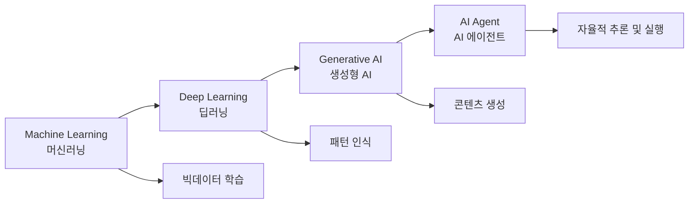

**AI 에이전트란?**
- 학습된 데이터를 기반으로 **스스로 판단하고 실행**하는 AI
- 단순 질문 답변이 아닌, **업무 자동화 및 의사결정 지원**
- 예: 보고서 자동 작성, 계약서 검토, 리스크 분석 등

**⚠️ 주의**: AI 에이전트 도입 시, **거버넌스 체계 확립**이 필수입니다:
1. AI의 판단 기준 및 한계 설정
2. AI 결과에 대한 검증 프로세스
3. AI 오작동 시 대응 방안
4. 개인정보 및 윤리적 고려

---

#### 4. Defending Digital Assets (디펜딩 디지털 에셋)
**디지털 자산 시대, 준비된 법과 준비 안 된 위험**

**디지털 자산의 확대:**

**암호화폐 시장의 변화:**

| 구분 | 비트코인 | 테더 (Tether) | 스테이블코인 |
|:--:|:--:|:--:|:--:|
| **특징** | 가격 변동성 높음 | 1 Tether = 1 USD 고정 | 법정화폐 연동 |
| **용도** | 투자, 자산 저장 | 거래 매개 | 결제, 송금 |
| **규제** | 금융감독원 규제 시작 | 해외 거래소 중심 | 법규 제정 중 |

**📌 노트**: **스테이블코인(Stablecoin)**이란?
- 법정화폐(원화, 달러 등)에 1:1로 연동된 암호화폐
- 가격 변동성이 낮아 **결제 수단**으로 활용 가능
- 예: 1 KRW Stablecoin = 1원

**국내 스테이블코인 추진 현황:**
1. **2024~2025년**: 한국은행 주도 추진 → 중단
2. **2025년 말**: 은행권 주도로 전환
3. **2026년**: 네이버, 카카오 등 플랫폼 기업 참여
   - 네이버페이, 카카오페이와 연동
   - 원화 스테이블코인 시범 운영

**보안 이슈:**
- 디지털 자산 거래소 해킹 (업비트, 빗썸, 코인원 등)
- 스테이블코인 발행 기관의 보안 관리
- 탈중앙화 금융(DeFi)의 스마트 컨트랙트 취약점

**💡 중요!** 스테이블코인 도입 시, **가이드라인이 먼저 제정**되고, 이를 기반으로 보안 점검이 진행됩니다. 컨설턴트는 **해외 사례 및 기술적 이해**를 갖추어야 합니다.

---

#### 5. Coordinating Digital Identity (코디네이팅 디지털 아이덴티티)
**디지털 신원 확인의 진화와 보안**

**디지털 신원 확인 기술:**

**1️⃣ 모바일 신분증**
- 운전면허증, 주민등록증의 디지털화
- 비대면 본인 확인에 활용

**2️⃣ 생체 인증**
- 지문, 안면, 홍채 인식
- 음성 인식

**보안 이슈: 딥페이크(Deepfake)**

**⚠️ 주의**: AI 기술 발전으로 **딥페이크 공격**이 증가하고 있습니다!

**딥페이크 공격 사례:**
- **음성 합성**: 가족의 목소리를 흉내 내어 보이스피싱
- **얼굴 합성**: 화상 회의에서 본인으로 위장
- **동영상 조작**: 허위 정보 유포

**대응 방안:**

**1️⃣ 논휴먼 아이덴티티 (Non-Human Identity) 탐지**
- AI 생성 콘텐츠 탐지 기술
- 생체 정보의 진위 여부 판별

**2️⃣ 다단계 인증 (Multi-Factor Authentication)**
- 비밀번호 + 생체 인증 + OTP

**3️⃣ 행동 패턴 분석**
- 사용자의 평소 행동 패턴과 비교
- 이상 행동 탐지 시 추가 인증 요구

**💡 중요!** 모르는 전화번호에서 전화가 왔을 때, **"여보세요"라고 먼저 말하지 마세요!**
- 짧은 음성만으로도 AI가 음성을 복제할 수 있습니다.
- 상대방이 먼저 말하게 하고, 응답이 없으면 끊으세요.

---

#### 6. Ending Voice Phishing Call (엔딩 보이스 피싱 콜)
**보이스피싱의 진화와 대응**

**AI 기반 보이스피싱:**
- 가족의 음성을 합성하여 긴급 상황 연출
- 은행 직원, 검찰 등을 사칭
- 실시간 대화 가능 (챗봇 기반)

**대응 기술:**
- AI 기반 이상 통화 탐지 시스템
- 금융거래 시 추가 인증 강화
- 통신사의 스팸 전화 차단

---

#### 7. Addressing Advanced Ransomware (어드레싱 어드밴스드 랜섬웨어)
**똑똑해진 랜섬웨어**

**랜섬웨어 공격 트렌드:**

**전통적 랜섬웨어 vs 최신 랜섬웨어:**

| 구분 | 전통적 랜섬웨어 | 최신 랜섬웨어 |
|:--:|:--:|:--:|
| **감염 방식** | 이메일 첨부파일 | 취약점 자동 탐지 및 공격 |
| **암호화 대상** | 개인 PC | 전사 시스템 (서버, DB) |
| **요구 금액** | 소액 (수백만 원) | 고액 (수억~수십억 원) |
| **협상** | 없음 | 전문 협상팀 운영 |
| **데이터 유출** | 암호화만 | 암호화 + 데이터 탈취 후 협박 |

**⚠️ 주의**: 2026년부터는 **랜섬웨어 감염 시 신고 의무화**가 시행됩니다. 신고하지 않고 협상할 경우 제재를 받습니다.

**대응 방안:**

**1️⃣ 망분리 (Network Segmentation)**
- 업무망과 인터넷망 분리
- 중요 시스템은 폐쇄망으로 운영

**2️⃣ 백업 전략**
- 3-2-1 백업 원칙
  - 3개의 복사본
  - 2개의 다른 저장 매체
  - 1개는 오프라인 보관

**3️⃣ 취약점 관리**
- 정기적인 보안 패치
- 취약점 진단 및 조치

**📌 노트**: **망분리**란?
- 금융회사는 법적으로 망분리를 해야 합니다.
- 업무망 PC, 인터넷망 PC, 중요단말 PC를 **별도로 지급**
- 일반 직원: 2대, IT/보안 담당자: 3대

---

### 🌐 추가 보안 트렌드

#### 8. Navigating Supply Chain Risk (서플라이 체인 리스크)
**공급망 보안 관리: SBOM**

**SBOM (Software Bill of Materials)이란?**
- **소프트웨어 제작 명세서**
- 소프트웨어를 구성하는 모든 요소(라이브러리, 오픈소스, 라이선스 등)를 명시
- 미국 바이든 행정부에서 의무화

**왜 SBOM이 필요한가?**

**문제점:**
1. **오픈소스 취약점**
   - 많은 소프트웨어가 오픈소스를 사용
   - 오픈소스에 취약점이 발견되면, 해당 오픈소스를 사용한 모든 소프트웨어가 위험

2. **라이선스 위반**
   - 오픈소스 라이선스를 위반한 상용 소프트웨어 판매
   - 법적 분쟁 가능성

3. **공급망 공격**
   - 악의적인 코드가 포함된 오픈소스 배포
   - 이를 사용한 소프트웨어가 전부 감염

**실제 사례:**
- **미국 송유관 시스템 마비 사건 (2021년)**
  - 오픈소스 취약점을 이용한 랜섬웨어 공격
  - 한 달간 시스템 마비

**SBOM 도입 현황:**
- **금융권**: SBOM → **OSS (Open Source Security)** 솔루션 도입 중
  - 은행, 카드사: 이미 도입 완료
  - 증권사, 캐피탈, 소형 보험사: 도입 예정
- **대기업**: 일부 도입

**💡 중요!** SBOM/OSS 관리는 컨설턴트가 알아야 할 **신기술 영역**입니다. 해외 사례를 참고하여 가이드를 만들어야 합니다.

---

## 🔐 기타 신기술 보안 이슈

### 양자 컴퓨팅 (Quantum Computing)

**💡 중요!** 양자 컴퓨팅은 기존 암호 체계를 무너뜨릴 수 있는 **가장 큰 위협**입니다.

**양자 컴퓨팅이란?**
- **큐비트 (Qubit)** 기반의 초고속 연산
- 기존 컴퓨터보다 수천~수만 배 빠름
- 복잡한 암호를 빠르게 해독 가능

**왜 위험한가?**
- 현재 사용 중인 **RSA, AES 등의 암호 알고리즘**이 양자 컴퓨팅으로 해독 가능
- 금융거래, 개인정보, 군사 정보 등 모든 암호화된 데이터가 위험

**대응 방안: 양자 내성 암호 (Post-Quantum Cryptography)**
- 양자 컴퓨팅으로도 해독이 어려운 새로운 암호 알고리즘 개발
- NIST (미국 표준기술연구소)에서 표준화 진행 중

**국내 동향:**
- 통신사 (SKT, KT, LG U+): 양자 암호 통신 연구
- 금융권: 양자 내성 암호 도입 준비
- SK텔레콤: 양자 암호 칩이 탑재된 휴대폰 출시 (시범)

**📌 노트**: 양자 컴퓨팅은 현재 **실험실 단계**이지만, 10년 내 상용화될 것으로 예상됩니다. 컨설턴트는 이에 대한 기본 지식을 갖추어야 합니다.

---

## ✅ 학습 체크리스트 (섹션 2)

이 섹션을 마친 후, 다음 항목을 이해했는지 확인하세요:

- [ ] 2024~2025년 주요 보안 사고 사례를 알고 있다
- [ ] 국내 보안 투자 비율(9%)과 글로벌 대비 낮은 이유를 이해했다
- [ ] 2026년 금융보안원의 7대 트렌드를 설명할 수 있다
- [ ] AI 에이전트와 생성형 AI의 차이를 이해했다
- [ ] 금융회사에서 ChatGPT를 사용할 수 없는 이유를 설명할 수 있다
- [ ] 스테이블코인의 개념과 국내 추진 현황을 알고 있다
- [ ] 딥페이크의 위험성과 대응 방안을 이해했다
- [ ] 랜섬웨어의 진화와 망분리의 개념을 알고 있다
- [ ] SBOM/OSS의 개념과 필요성을 이해했다
- [ ] 양자 컴퓨팅이 암호 체계에 미치는 영향을 알고 있다

### 📋 핵심 요약

1. **보안 사고 증가**: 금융권 및 대기업에서 랜섬웨어, 정보 유출 사고 다발
2. **보안 투자 확대**: 정부 주도로 금융회사의 보안 투자 확대 (인력 채용 증가 예상)
3. **AI 보안**: 생성형 AI → AI 에이전트로 진화, 거버넌스 체계 필요
4. **디지털 자산**: 스테이블코인 도입, 암호화폐 거래소 보안 강화
5. **디지털 신원**: 딥페이크 대응, 다단계 인증 강화
6. **랜섬웨어**: 신고 의무화, 망분리 및 백업 전략 필수
7. **공급망 보안**: SBOM/OSS 관리로 오픈소스 취약점 대응
8. **양자 컴퓨팅**: 암호 체계 위협, 양자 내성 암호 개발 필요

---

다음 섹션에서는 **보안 컨설팅 사업의 다양한 유형**을 상세히 살펴보겠습니다. ISMS-P 인증 컨설팅뿐만 아니라, 취약점 분석평가, 수탁사 점검, 자체 보안성 심의 등 다양한 컨설팅 업무를 다룹니다.
# 💼 보안 컨설팅 사업 소개

이 섹션에서는 정보보호 컨설팅의 다양한 유형과 각각의 특징을 상세히 살펴봅니다. ISMS-P 인증 컨설팅뿐만 아니라, 컴플라이언스 기반 컨설팅, 기술 진단, 수탁사 점검 등 실무에서 진행되는 모든 컨설팅 유형을 포괄합니다.

---

## 🎯 정보보호 컨설팅이란?

### 정의 및 목적

**정보보호 컨설팅**은 기업이 보유한 **핵심 정보 자산을 보호**하기 위해, 현재의 보안 수준을 진단하고 개선 방안을 제시하는 전문 서비스입니다.

**💡 컨설팅의 궁극적 목적:**
> 기업의 **기밀 정보, R&D 정보, 고객 정보**를 보호하여, 정보 유출로 인한 재무적 손실과 평판 훼손을 방지하는 것

**보호해야 할 핵심 정보:**
- **기밀 정보**: 경영 전략, 신제품 개발 계획, M&A 정보 등
- **기술 정보**: R&D 데이터, 특허, 제조 공정 등
- **고객 정보**: 개인정보, 거래 내역, 신용 정보 등

**📌 노트**: 정보가 없는 기업은 굳이 보안 투자를 할 필요가 없습니다. 즉, **데이터가 곧 자산**이며, 보안은 이 자산을 지키기 위한 필수 활동입니다.

---

## 📚 보안 컨설팅의 유형

보안 컨설팅은 크게 **4가지 관점**으로 분류할 수 있습니다:

### 1️⃣ 사업 목적에 따른 분류

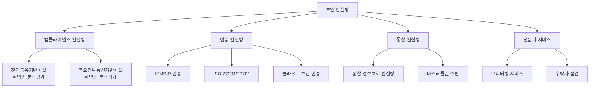

---

### 2️⃣ 정형성에 따른 분류

#### 정형 컨설팅 (Structured Consulting)

**특징:**
- 체크리스트 기반
- 방법론이 명확히 정립됨
- 상대적으로 난이도가 낮음

**주요 사업:**
- ISMS-P 인증 컨설팅
- 전자금융기반시설 취약점 분석평가
- 주요정보통신기반시설 취약점 분석평가
- 개인정보 영향평가
- 수탁사 점검

**💡 중요!** 정형 컨설팅은 **툴킷화**되어 있어, 신규 컨설턴트도 비교적 빠르게 습득할 수 있습니다.

#### 비정형 컨설팅 (Unstructured Consulting)

**특징:**
- 고도의 기술력 및 경험 필요
- 맞춤형 솔루션 제공
- 높은 수준의 전문성 요구

**주요 사업:**
- 개발보안 컨설팅
- 클라우드 보안 컨설팅
- OT/ICS 보안 컨설팅
- 마스터플랜 (중장기 계획 수립)
- 신기술 보안 컨설팅 (AI, 블록체인, 양자 등)

**📌 노트**: 비정형 컨설팅은 선임급 이상의 경험이 필요하며, 컨설팅 보고서가 PPT 100~400장에 달할 수 있습니다.

---

### 3️⃣ 법적 강제성에 따른 분류

#### 필수(의무) 컨설팅

법적으로 반드시 수행해야 하는 컨설팅:

| 컨설팅 유형 | 법적 근거 | 대상 | 주기 |
|:--:|:--:|:--:|:--:|
| **전자금융기반시설<br/>취약점 분석평가** | 전자금융거래법 | 금융회사, 전자금융업자 | 매년 |
| **주요정보통신기반시설<br/>취약점 분석평가** | 정보통신망법 | 주요기반시설 운영자 | 매년 |
| **ISMS 인증<br/>(의무 대상)** | 정보통신망법 | 정보통신서비스 제공자 등 | 3년 |
| **개인정보 영향평가** | 개인정보보호법 | 공공기관 (5만 명 이상) | 사업 시작 전 |
| **클라우드 보안 인증** | 클라우드컴퓨팅법 | 클라우드 서비스 제공자 | 3년 |

**⚠️ 주의**: 법적 의무 컨설팅을 수행하지 않으면 **과태료 또는 영업 정지** 등의 제재를 받을 수 있습니다.

#### 자율(선택) 컨설팅

기업이 자율적으로 선택하는 컨설팅:
- ISMS-P 인증 (비의무 대상)
- ISO 27001/27701 인증
- 종합 정보보호 컨설팅
- 마스터플랜 수립
- 개발보안 컨설팅

---

## 🏆 주요 컨설팅 사업 상세 설명

### 1. ISMS-P 인증 컨설팅

**ISMS-P (Information Security Management System - Personal information)**: 정보보호 및 개인정보보호 관리체계 인증

#### 인증 유형

1. **ISMS (Information Security Management System)**
   - 정보보호 관리체계만 인증
   - 시스템 중심 (예: 홈페이지, 모바일 앱 등)

2. **ISMS-P (ISMS + Privacy)**
   - 정보보호 + 개인정보보호 관리체계 통합 인증
   - 개인정보 Life Cycle 중심 (수집→저장→이용→제공→파기)

#### 인증 범위

**ISMS 인증 범위 (시스템 중심):**
```
예: 대표 홈페이지 및 모바일 청약 서비스 운영
→ 해당 시스템과 관련 운영 부서만 포함
```

**ISMS-P 인증 범위 (개인정보 Life Cycle 중심):**
```
예: 인터넷뱅킹 서비스
→ 고객정보가 수집, 저장, 이용, 제공, 파기되는 전 과정
→ 관련된 모든 부서 및 시스템 포함
```

**💡 중요!** ISMS는 **시스템 위주**, ISMS-P는 **개인정보 Life Cycle 위주**로 인증 범위를 설정합니다.

#### 인증 기준

| 구분 | KISA (일반 기업) | 금융보안원 (금융회사) |
|:--:|:--:|:--:|
| **통제 영역** | 101개 | 101개 |
| **세부 통제 항목** | 328개 | 399개 |
| **특징** | 기본 항목 | 전자금융기반시설 항목 추가 |

**📌 노트**: 금융회사는 전자금융거래법에 따라 추가 항목을 점검해야 하므로, 일반 기업보다 항목이 더 많습니다.

#### 인증 절차 (5단계)

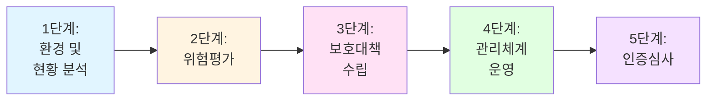

**각 단계 설명:**

**1단계: 환경 및 현황 분석**
- 자산 조사 (서버, 네트워크, DB, 애플리케이션 등)
- 개인정보 처리 현황 파악
- 보안 조직 및 역할 분석
- 현행 정책 및 규정 검토

**2단계: 위험평가**
- 갭분석 (Gap Analysis): 현재 보안 수준 진단
- 자산 중요도 평가 (CIA 기준)
- 취약점 진단 (인프라, 웹, 모바일)
- 위협 시나리오 작성
- 위험도 산정 (DoA 기준)

**3단계: 보호대책 수립**
- 개선과제 도출
- 우선순위 결정 (긴급도, 중요도, 난이도)
- 단기/중기/장기 로드맵 작성
- 예산 계획 수립

**4단계: 관리체계 운영**
- 정책 및 규정 재개정
- 조직 구성 및 역할 정립
- 이행점검 (조치 완료 확인)
- 내부감사 (모의심사)

**5단계: 인증심사**
- 인증 신청서 작성
- 심사원 대응 (문서 검토, 인터뷰, 현장 실사)
- 결함 조치
- 인증서 발급

**⚠️ 주의**: 최근 심사가 강화되고 있으며, 최초 심사 시 **전방위적 점검**이 이루어집니다.

---

### 2. 전자금융기반시설 취약점 분석평가

**법적 근거**: 전자금융거래법 제21조의2

#### 대상

- 은행, 증권사, 카드사, 캐피탈, 보험사 등 금융회사
- 전자금융업자 (PG, VAN 등)

#### 점검 주기

- **매년 1회 필수**
- 연초 (1~3월)에 전년도 평가 결과를 금융감독원에 제출

#### 점검 항목

**4대 영역:**
1. **서버**: Unix, Linux, Windows 서버 보안 설정 점검
2. **데이터베이스**: Oracle, MS-SQL, MySQL 등 DB 보안 점검
3. **네트워크**: 방화벽, 스위치, 라우터 설정 점검
4. **웹/앱 애플리케이션**: 웹 취약점 (OWASP Top 10 등), 모바일 앱 진단

**📌 노트**: 금융권은 **48개 웹 취약점 항목**, **52개 모바일 취약점 항목**을 점검해야 하며, 일반 기업보다 훨씬 엄격합니다.

#### 진단 방법

**1️⃣ 인프라 진단**: 스크립트 또는 진단 도구 활용
- Nessus, Qualys 등 상용 도구
- 자체 개발 스크립트

**2️⃣ 웹 진단**: 수동 + 자동화 도구 병행
- Burp Suite, OWASP ZAP, Acunetix 등

**3️⃣ 모바일 진단**: 루팅/탈옥 기기 활용
- 메모리 덤프 분석
- 패킷 캡처 (Wireshark 등)
- 리버스 엔지니어링

---

### 3. 주요정보통신기반시설 취약점 분석평가

**법적 근거**: 정보통신기반 보호법

#### 대상

국가 기반시설 운영 기관:
- 발전소, 정유 시설
- 철도, 항공
- 통신사
- 대형 금융기관

#### 점검 주기

- **매년 1회 필수**
- 과학기술정보통신부 또는 전담기관에 제출

#### 자산 등급 분류

| 등급 | 설명 | 보안 수준 |
|:--:|:--:|:--:|
| **가등급** | 매우 중요 자산 | 최상 |
| **나등급** | 중요 자산 | 상 |
| **다등급** | 일반 자산 | 중 |

**💡 중요!** 자산 등급에 따라 **보안 통제 수준**이 달라지며, 가등급 자산은 가장 엄격한 보안 조치를 적용해야 합니다.

---

### 4. 수탁사 점검 (제3자 관리)

**법적 근거**: 개인정보보호법 제26조 (개인정보 처리 업무 위탁 시 수탁자 관리 감독)

#### 수탁사란?

기업이 특정 업무를 외부에 위탁할 때, 그 업무를 수행하는 회사를 **수탁사(Subcontractor)**라고 합니다.

**대표적인 수탁사 예시:**

| 위탁 업무 | 수탁사 예시 | 취급 정보 |
|:--:|:--:|:--:|
| **콜센터** | 전문 콜센터 업체 | 고객 정보, 통화 내용 |
| **물류** | 택배사, 물류센터 | 배송지 정보 |
| **IT 운영** | 아웃소싱 업체 | 시스템 관리자 권한 |
| **마케팅** | 광고 대행사 | 고객 연락처, 구매 이력 |

**📌 노트**: 수탁사 직원도 고객 정보를 취급하므로, **제3자 관리 감독**이 필수입니다.

#### 왜 수탁사 점검이 필요한가?

**문제 상황:**
- SKT가 모든 콜센터 업무를 정직원이 수행하면?
  → 인건비 폭증 (억대 연봉 직원이 단순 상담 업무)
- 해결 방법: 전문 콜센터 업체에 위탁
  → 비용 절감 + 전문성 확보

**하지만 위험 요소:**
- 수탁사 직원의 정보 유출
- 수탁사의 보안 관리 미흡
- 위탁 계약 외 업무 수행

**💡 중요!** 개인정보보호법에 따라, 위탁사는 **수탁사의 관리 감독 책임**을 집니다.

#### 수탁사 점검 절차

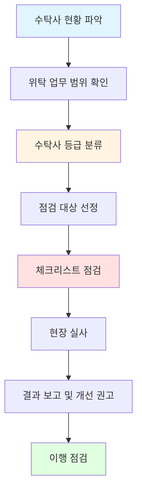

**수탁사 등급 분류 기준:**
- **고위험**: 고유식별정보(주민번호 등) 취급, 취급자 수 다수
- **중위험**: 일반 개인정보 취급, 취급자 수 중간
- **저위험**: 개인정보 취급 최소, 취급자 수 소수

#### 수탁사 점검 체크리스트 (주요 항목)

**관리적 보안:**
- 보안 서약서 징구
- 개인정보보호 교육 이수
- 접근 권한 관리
- 계약서 상 보안 조항

**기술적 보안:**
- 개인정보 암호화
- 접속 기록 관리
- 망분리 또는 가상화 환경
- 백신 및 보안 패치

**물리적 보안:**
- 출입 통제
- CCTV 설치
- 문서 보안 (개인정보 포함 문서 관리)

**📌 노트**: 수탁사 점검은 **사전 협의** 후 진행하며, 점검 결과는 위탁사와 수탁사 모두에게 전달됩니다.

#### 최근 동향: 수탁사 모의해킹

최근에는 수탁사의 **웹/모바일 애플리케이션**에 대해서도 모의해킹을 실시하는 추세입니다.

**이유:**
- 수탁사의 시스템이 해킹당하면, 위탁사의 고객 정보도 유출
- 수탁사의 보안 수준이 낮은 경우가 많음

---

### 5. 종합 정보보호 컨설팅

**특징**: 기업의 전반적인 보안 현황을 진단하고, **맞춤형 보안 전략**을 제시하는 컨설팅

#### 포함 내용

- ISMS-P 인증 + 취약점 진단 + 개인정보 진단 + 수탁사 점검
- 모든 영역을 **한 번에 종합적으로** 수행

#### 대상

- 보안 수준을 전반적으로 향상시키고자 하는 기업
- ISMS-P 인증을 받지 않지만, 보안 관리체계를 구축하고자 하는 기업

**📌 노트**: 종합 컨설팅은 **비용이 높지만**, 한 번에 모든 보안 영역을 점검할 수 있어 효율적입니다.

---

### 6. 마스터플랜 (MP, Master Plan) 수립

**정의**: 기업의 **중장기 보안 전략 및 투자 계획**을 수립하는 고난이도 컨설팅

#### 수행 내용

1. **As-Is 분석** (현황 진단)
   - 갭분석 (보안 수준 진단)
   - 취약점 진단
   - 위험평가

2. **To-Be 설계** (목표 설정)
   - 목표 보안 수준 정의
   - 보안 아키텍처 설계

3. **로드맵 작성** (단계별 계획)
   - 단기(1년), 중기(2~3년), 장기(3~5년) 과제 도출
   - 우선순위 결정
   - 예산 계획

4. **최종 산출물** (PPT 보고서)
   - 100~400장 규모의 PPT
   - 경영진 보고용 자료

**💡 중요!** 마스터플랜은 **비정형 컨설팅**이며, **선임급 이상**의 전문가가 수행합니다.

#### 마스터플랜 수립 시 고려 사항

- **컴플라이언스 이슈**: 현행 법규 및 향후 변경 예정 법규 반영
- **신기술 트렌드**: AI, 클라우드, 블록체인 등 신기술 보안 고려
- **예산 현실성**: 기업의 재무 상황을 고려한 현실적인 계획

---

### 7. 개발보안 컨설팅

**정의**: 소프트웨어 개발 단계에서 **보안을 내재화**하는 컨설팅

#### Secure SDLC (Software Development Life Cycle)

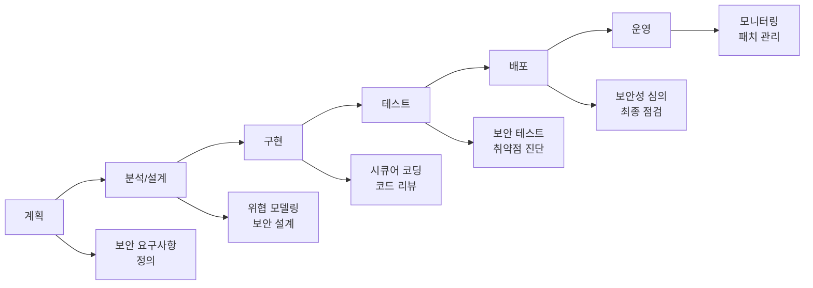

#### 주요 활동

1. **보안 요구사항 정의**
   - 어떤 보안 기능이 필요한가?
   - OWASP Top 10 대응 방안

2. **시큐어 코딩**
   - SQL Injection, XSS 등 취약점 방지
   - 입력 값 검증, 출력 값 인코딩

3. **소스코드 진단**
   - 정적 분석 도구 활용 (SonarQube, Fortify 등)
   - 동적 분석 (웹 모의해킹)

4. **보안성 심의**
   - 차세대 시스템 구축 시 필수
   - 금융권은 법적 의무 (전자금융거래법)

**📌 노트**: 개발보안은 **개발자와의 협업**이 핵심이며, 기술적 이해도가 높아야 합니다.

---

### 8. 클라우드 보안 컨설팅

**배경**: 온프레미스(On-Premise) → 클라우드 전환이 가속화

#### 클라우드 유형

| 유형 | 설명 | 보안 책임 |
|:--:|:--:|:--:|
| **IaaS** | 인프라만 제공 (AWS EC2, Azure VM) | 고객 책임 높음 |
| **PaaS** | 플랫폼 제공 (AWS Lambda, GCP App Engine) | 공동 책임 |
| **SaaS** | 소프트웨어 제공 (Google Workspace, Salesforce) | 제공자 책임 높음 |

#### 주요 보안 이슈

**1️⃣ 공동 책임 모델 (Shared Responsibility Model)**
- CSP (Cloud Service Provider): 인프라 보안 책임
- 고객: 데이터 및 애플리케이션 보안 책임

**2️⃣ 클라우드 보안 위협**
- 계정 탈취 (Credential Stuffing)
- 설정 오류 (Misconfiguration)
- 데이터 유출

**3️⃣ 컴플라이언스**
- 금융권: 금융감독원 클라우드 이용 가이드라인 준수
- 공공기관: 개인정보 국외 이전 제한

#### 클라우드 보안 컨설팅 내용

- 클라우드 환경 진단 (AWS, Azure, GCP, Naver Cloud 등)
- IAM (Identity and Access Management) 설정 검토
- 데이터 암호화 및 백업 전략
- 로깅 및 모니터링 체계 구축

**📌 노트**: 클라우드 보안 진단 가이드라인은 별도로 제공되며, 금융권은 **프라이빗 클라우드**(Private Cloud) 진단도 포함됩니다.

---

### 9. 신기술 보안 컨설팅

최근 신기술 도입에 따라, 해당 기술의 **보안성 검토**가 필수입니다.

#### 주요 신기술

**1️⃣ AI 보안**
- AI 모델 보안 (Model Poisoning, Adversarial Attack)
- 데이터 프라이버시 (학습 데이터 유출 방지)
- AI 거버넌스 체계

**2️⃣ 블록체인 보안**
- 스마트 컨트랙트 취약점 진단
- 합의 알고리즘 보안
- 지갑 보안

**3️⃣ 제로 트러스트 (Zero Trust)**
- "신뢰하지 말고 항상 검증하라"
- 모든 접근에 대한 인증 및 권한 검증
- 네트워크 세분화 (Micro-Segmentation)

**4️⃣ 양자 보안**
- 양자 내성 암호 알고리즘 도입
- 기존 암호 체계의 마이그레이션 계획

**💡 중요!** 신기술 컨설팅은 **가이드라인이 없는 경우가 많아**, 해외 사례와 자체 연구를 기반으로 체크리스트를 만들어야 합니다.

---

## 🎓 컨설턴트의 역할 및 역량

### 컨설턴트 vs 아키텍트 vs 기술 전문가

| 역할 | 주요 업무 | 필요 역량 |
|:--:|:--:|:--:|
| **보안 컨설턴트** | 현황 진단, 개선 권고, 관리체계 수립 | 논리적 사고, 커뮤니케이션, 문서 작성 |
| **보안 아키텍트** | 보안 구조 설계, 솔루션 선정, 기술 가이드 | 기술 깊이, 아키텍처 설계 능력 |
| **기술 전문가** | 취약점 진단, 모의해킹, 보안 운영 | 기술 전문성, 도구 활용 능력 |

**📌 노트**: 한 사람이 **여러 역할을 겸할 수 있으며**, 특히 컨설턴트는 시간이 지나면서 아키텍트 역할도 수행하게 됩니다.

### 컨설턴트의 커리어 패스

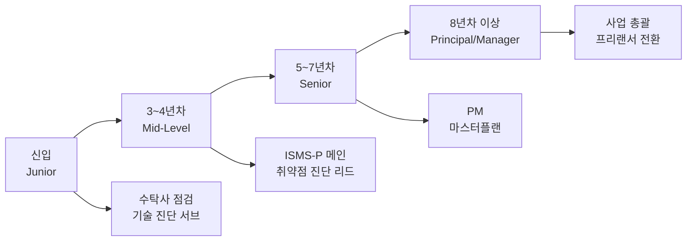

**💡 중요!** 컨설턴트는 **나이가 들어도 할 수 있는 직업**입니다:
- 60대까지 프리랜서로 활동 가능
- 경력이 쌓일수록 가치 상승
- 단, 지속적인 자기 개발 필수

---

## ✅ 학습 체크리스트 (섹션 3)

이 섹션을 마친 후, 다음 항목을 이해했는지 확인하세요:

- [ ] 정보보호 컨설팅의 목적을 설명할 수 있다
- [ ] 정형 vs 비정형 컨설팅의 차이를 이해했다
- [ ] 필수(의무) 컨설팅과 자율 컨설팅을 구분할 수 있다
- [ ] ISMS-P 인증의 5단계 절차를 알고 있다
- [ ] 전자금융기반시설 취약점 분석평가의 대상과 주기를 알고 있다
- [ ] 수탁사 점검의 필요성과 절차를 이해했다
- [ ] 마스터플랜 수립의 특징을 설명할 수 있다
- [ ] 개발보안 컨설팅의 주요 활동을 알고 있다
- [ ] 클라우드 보안의 주요 이슈를 이해했다
- [ ] 컨설턴트의 커리어 패스를 파악했다

### 📋 핵심 요약

1. **컨설팅 목적**: 기업의 핵심 정보 자산 보호
2. **유형 분류**: 목적별, 정형성별, 법적 강제성별
3. **ISMS-P 인증**: 5단계 절차 (현황 분석 → 위험평가 → 보호대책 → 운영 → 심사)
4. **필수 컨설팅**: 전자금융/주요정보통신기반시설 취약점 분석평가 (매년)
5. **수탁사 점검**: 제3자 관리 감독 의무 (개인정보보호법)
6. **비정형 컨설팅**: 마스터플랜, 개발보안, 신기술 보안 (고난이도)
7. **컨설턴트 역량**: 기술 + 컴플라이언스 + 커뮤니케이션
8. **커리어**: 나이가 들어도 가능, 프리랜서 전환 가능

---

다음 섹션에서는 **ISMS-P 인증 절차**를 더욱 상세히 다루며, 특히 **위험평가**, **갭분석**, **취약점 진단**, **정책 재개정** 등의 실무적인 내용을 학습합니다.
# Section 4: ISMS-P 인증 절차 완벽 가이드

## 4.1 ISMS-P 인증을 받는 이유와 목적

### 4.1.1 기업이 ISMS-P 인증을 추구하는 주요 목적

#### 컴플라이언스 준수 목적
- **규제 기관의 요구사항 변화**: 최근 감독기관과 규제기관들의 요구사항이 지속적으로 변화하고 있음
- **관련 법규**: 전자금융거래법, 감독규정, 신용정보법, 개인정보보호법, 정보통신망법 등
- **법규 변경 대응**: 지속적인 법률 개정에 대한 체계적 대응 필요

#### 보호대책 마련 및 리스크 관리
- **취약점 발굴**: 기업이 보유한 솔루션 및 시스템의 취약점 지속 발굴
- **리스크 최소화**: 발견된 취약점에 대한 체계적 관리를 통한 리스크 감소
- **보안 수준 강화**: 한 단계 업그레이드된 보안 수준 확보

#### 대내외 신뢰도 제고
- **인증 효과**: 인증 취득을 통한 이해관계자의 신뢰 향상
- **브랜드 가치**: 보안 인증을 통한 기업 이미지 개선
- **법적 책임**: 보안 사고 발생 시 기업의 책임 경감

> **중요 포인트**: ISMS-P 인증은 단순히 체크리스트를 통과하는 것이 아니라, 기업의 전반적인 보안 수준을 향상시키는 과정입니다.

### 4.1.2 ISMS-P 인증을 위한 조직 구성 요건

#### 필수 조직 구성 요소

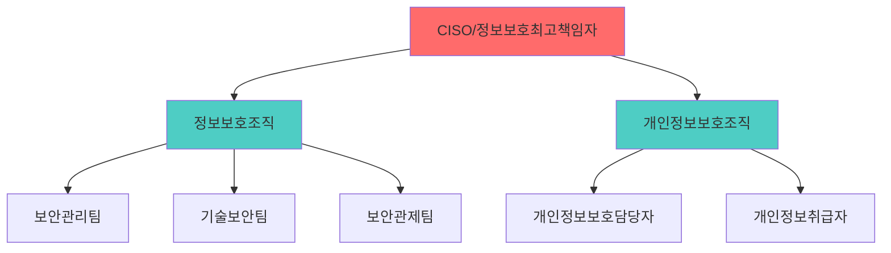

#### 조직 구성 필수 요건
1. **전담 보안 인력**: 보안 업무를 전담하는 인력 필수 (겸업 불가)
2. **개인정보보호 조직**: ISMS-P 인증 시 개인정보 관련 별도 조직 필수
3. **역할 분담**: 각 조직의 명확한 역할과 책임 정의
4. **주기적 활동**: 활동 계획에 따른 정기적 보안 활동 수행

| 조직 유형 | 필수 인원 | 주요 역할 | 비고 |
|---------|---------|---------|------|
| CISO | 1명 | 정보보호 총괄 책임 | 임원급 권한 필요 |
| 정보보호팀 | 2명 이상 | 보안 정책 수립 및 운영 | 전담 조직 필수 |
| 개인정보보호팀 | 1명 이상 | 개인정보 관리 총괄 | ISMS-P 필수 |
| 보안관제팀 | 24/7 운영 | 보안 모니터링 및 대응 | 금융권 필수 |

#### 최근 변화 사항 (2024-2026년)
- **인력 충원 강화**: 감독기관에서 보안 인력 충원을 지속적으로 요구
- **겸업 금지**: 보안 업무 겸업 시 인증 받을 수 없음
- **전수 검사 확대**: 최초 심사 시 전방위적 심사로 강화 (기존 샘플링 방식에서 변경)

> **강사의 조언**: "최근 1년의 사태를 보면 ISMS-P 인증을 받았는데도 사고가 나는 경우가 있어요. 그래서 심사 기준이 매우 강화되고 있습니다. 심사 받기가 점점 어려워지고 있다는 거죠."

---

## 4.2 SK실더스의 ISMS-P 인증 5단계 절차

### 4.2.1 전체 프로세스 개요

SK실더스에서는 ISMS-P 인증을 위해 총 5단계의 컨설팅 절차를 진행합니다. 이는 약 1년의 기간이 소요되는 프로세스입니다.

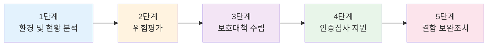

### 4.2.2 절차별 주요 활동

| 단계 | 주요 활동 | 기간 | 산출물 |
|-----|---------|------|--------|
| 1단계 | 요구사항 분석, IT환경 분석, 개인정보 흐름 분석 | 1-2개월 | 현황 분석 보고서, 개인정보 흐름도 |
| 2단계 | 갭분석, 자산분석, 취약점 점검, 위험평가 | 2-3개월 | 위험평가 보고서, 취약점 진단 보고서 |
| 3단계 | 정책/규정 재개정, 보호대책 수립 | 1-2개월 | 정책/규정 문서, 보호대책 수립 보고서 |
| 4단계 | 심사 준비, 담당자 교육, 심사 대응 | 1-2개월 | 인증 신청서, 관리체계 명세서 |
| 5단계 | 결함 조치, 재검사 대응 | 1개월 | 보완조치 내역서 |

### 4.2.3 방법론 근거

SK실더스의 5단계 절차는 다음의 방법론을 기반으로 구성되었습니다:

1. **취약점 진단 방법론**: 인프라, 웹, 모바일 취약점 점검
2. **ISMS-P 컨설팅 방법론**: 정보보호 관리체계 수립
3. **개인정보 실태 점검 방법론**: 개인정보 처리 현황 분석
4. **수탁사 진단 방법론**: 제3자 위탁업체 점검

---

## 4.3 1단계: 환경 및 현황 분석

### 4.3.1 요구사항 분석

#### 고객사의 요구사항 파악
```
[컨설팅 착수 시 확인 사항]
☑ 최초 인증인가? 사후 심사인가?
☑ 인증 범위는 어디까지인가? (온프레미스, 클라우드 포함 여부)
☑ 특별히 취약한 영역은 무엇인가?
☑ 최근 감독기관의 점검 이슈는?
☑ 기존 취약점 점검 이력은?
```

#### 컴플라이언스 분석
- **상위 법령 분석**: 기업에 적용되는 모든 법률 및 규정 확인
- **정책/규정 검토**: 기존 보안 정책, 지침, 규정, 매뉴얼, 가이드 검토
- **법률 요구사항 반영 여부**: 상위 기관 법에서 요구하는 사항이 내부 규정에 반영되었는지 확인

**주요 검토 법규**:
- 정보통신망 이용촉진 및 정보보호 등에 관한 법률 (망법)
- 개인정보보호법 (개법법)
- 전자금융거래법
- 신용정보의 이용 및 보호에 관한 법률 (신정법)
- 금융회사 감독규정
- 전자금융감독규정

### 4.3.2 IT 환경 및 업무 환경 분석

#### 조직 환경 분석
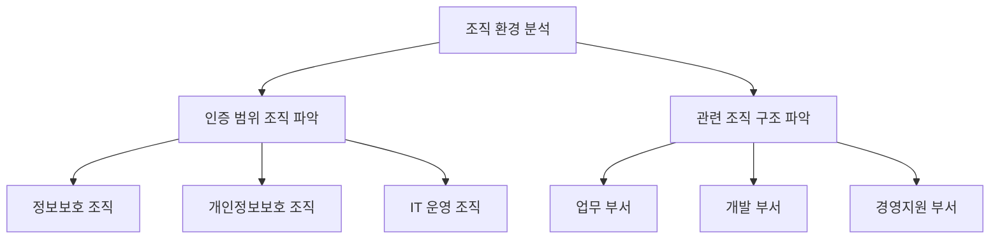

#### IT 운영 환경 분석
- **네트워크 구성**: 네트워크 토폴로지 및 망분리 현황
- **업무 부서 파악**: 각 업무 부서의 역할 및 담당자
- **인증 범위 자산 목록**: 인증 대상이 되는 모든 정보자산 리스트
- **자산 담당자 현황**: 각 자산별 운영 담당자 정보

#### 문서 검토
- **기존 문서 재검토**: 보유 중인 보안 관련 문서의 최신성 검증
- **법규 반영 확인**: 신규 버전의 법률 요구사항 반영 여부
- **문서 체계 점검**: 정책-지침-절차-가이드의 계층 구조 적정성

### 4.3.3 취약점 점검 이력 관리 현황 파악

모든 인증 신청 기업은 기본적으로 매년 취약점 점검을 수행하고 있어야 합니다.

#### 이력 관리 확인 사항
| 확인 항목 | 세부 내용 |
|---------|---------|
| 최근 점검 시기 | 최근 1년 이내 취약점 점검 수행 여부 |
| 취약점 조치 현황 | 발견된 취약점의 조치 완료 비율 |
| 미조치 사유 | 미조치 취약점의 사유 및 대응 계획 |
| 반복 발생 취약점 | 매년 반복 발견되는 취약점 분석 |

### 4.3.4 PDCA 활동 현황 파악

**Plan-Do-Check-Act 사이클** 확인

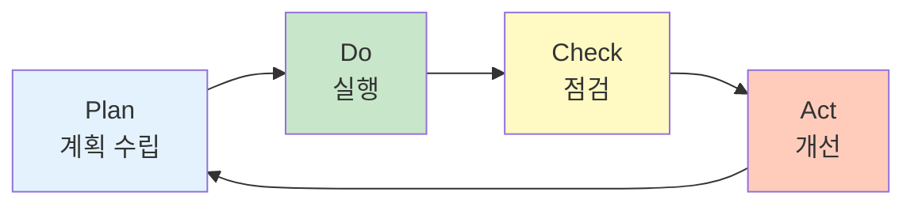

- **Plan**: 연간 정보보호 활동 계획 수립 여부
- **Do**: 계획에 따른 실제 활동 수행 여부
- **Check**: 활동 결과에 대한 점검 수행 여부
- **Act**: 점검 결과에 따른 개선 조치 여부

### 4.3.5 ISMS-P 통제 항목 매핑

#### 통제 항목 구조
- **현재**: ISMS-P 통제 항목 101개 (향후 변경 예정)
- **KISA 홈페이지**: 최신 통제 항목 확인 가능
- **세부 항목**: 각 통제 항목마다 여러 개의 세부 점검 항목 존재

#### 담당자 매핑 작업
```
[통제 항목 담당자 매핑 예시]
1.1.1 정보보호 조직 구성 → 정보보호팀장 (홍길동)
1.1.2 정보보호 정책 수립 → 정책담당자 (김철수)
1.2.1 자산 식별 및 관리 → IT운영팀 (이영희)
...
```

#### 해당 사항 여부 판단
- **클라우드 미사용 조직**: 클라우드 관련 통제 항목 배제
- **모바일 서비스 미제공**: 모바일 관련 통제 항목 배제
- **해당 없음 처리**: 업무 특성상 적용되지 않는 항목 명확히 표시

### 4.3.6 업무 흐름 분석 및 정보서비스 흐름도 작성

#### 정보서비스 흐름도란?
> 운영자 및 관리자가 내부에서 각 시스템에 접근할 때의 보안 조치를 도식화한 문서

**일반 사용자 접근 vs 운영자 접근**
- 일반 사용자: 외부에서 서비스 이용 (웹, 모바일 앱 등)
- 운영자/관리자: 내부에서 시스템 관리 목적 접근

#### 정보서비스 흐름도 작성 목적
- **보안 조치 확인**: 운영자 접근 시 적용되는 보안 통제 파악
- **접근 경로 명확화**: 관리자가 어떤 경로로 시스템에 접근하는지 표현
- **보안 솔루션 표시**: 방화벽, VPN, 접근제어 등 보안 장비 표시

#### 작성 방법
```
[정보서비스 흐름도 구성 요소]
1. 운영자 PC/서버
2. 접근 경로 (네트워크, VPN, 전용선 등)
3. 보안 장비 (방화벽, IPS, 접근제어 등)
4. 대상 시스템 (서버, DBMS, 네트워크 장비 등)
5. 인증 방식 (OTP, 공인인증서, 생체인증 등)
```

**정보서비스 흐름도 예시**:
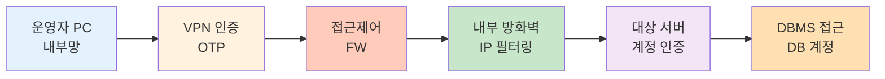

#### 작성 시 주의사항
- **검증 필수**: 작성 후 담당자에게 실제 접근 경로가 맞는지 확인
- **네트워크 이해도 필요**: 네트워크 구성에 대한 기본 지식 필수
- **보안 조치 표기**: 각 구간별 적용된 보안 솔루션 명시

### 4.3.7 개인정보 흐름 분석

개인정보 흐름 분석은 ISMS-P 인증에서 가장 시간이 많이 소요되고 난이도가 높은 작업입니다.

#### 분석 절차

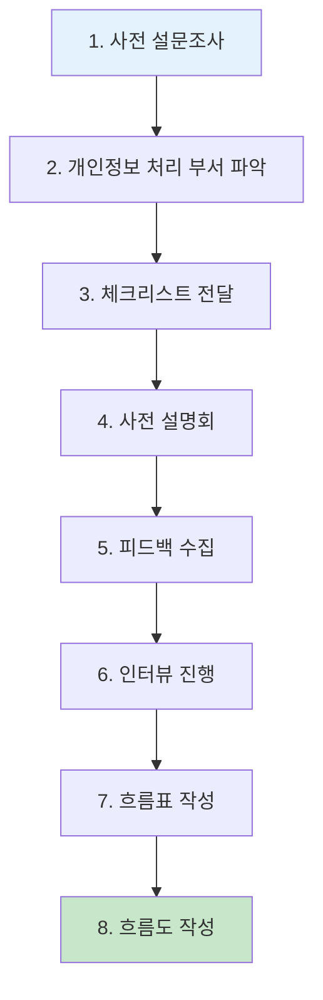

#### 1단계: 사전 설문조사
- **목적**: 개인정보를 처리하는 부서 전체 파악
- **방법**: 전사 부서 대상 설문 발송
- **내용**: 개인정보 처리 여부, 처리 시스템, 취급자 정보 등

#### 2단계: 체크리스트 전달 및 설명
체크리스트에 포함되는 항목:
- 수집하는 개인정보 항목
- 개인정보 수집 방법
- 개인정보 저장 위치 (시스템, DB)
- 개인정보 이용 목적
- 개인정보 제3자 제공 현황
- 개인정보 파기 방법 및 주기

#### 3단계: 시스템별 상세 인터뷰

**인터뷰 확인 사항**:
| 분류 | 확인 항목 |
|------|---------|
| 접근 통제 | OS 접근 방식, 애플리케이션 접근 통제, DB 접근 권한 |
| 암호화 | 전송 구간 암호화 (TLS), 저장 암호화 (AES), 암호 알고리즘 |
| 로그 관리 | 접근 로그 기록, 로그 보관 기간, 로그 검토 주기 |
| 개인정보 보호 | 마스킹 적용 여부, 화면 출력 시 마스킹, 로그 마스킹 |
| 백업 및 파기 | 백업 주기, 백업 데이터 암호화, 파기 방법 |

#### 4단계: 개인정보 처리 흐름표 작성

흐름표는 개인정보의 **라이프사이클**을 정리한 문서입니다.

**개인정보 라이프사이클**:
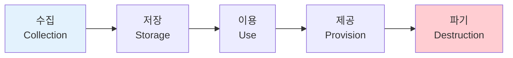

**흐름표 작성 항목**:
```
[개인정보 처리 흐름표 예시]
업무명: 회원 가입 처리
담당 부서: 고객관리팀
처리 시스템: 회원관리시스템

1. 수집
   - 수집 항목: 이름, 생년월일, 이메일, 휴대폰번호
   - 수집 방법: 웹사이트 회원가입 페이지
   - 법적 근거: 이용자 동의

2. 저장
   - 저장 위치: 회원DB (Oracle 12c)
   - 암호화: AES-256 (이름, 생년월일 제외)
   - 보관 기간: 회원 탈퇴 후 3년

3. 이용
   - 이용 목적: 회원 식별, 서비스 제공
   - 접근 권한: 고객관리팀 5명
   - 마스킹: 화면 조회 시 일부 마스킹

4. 제공
   - 제공 대상: 배송업체 (00택배)
   - 제공 항목: 이름, 주소, 휴대폰번호
   - 제공 방법: 전용선 (암호화 전송)

5. 파기
   - 파기 시점: 보관 기간 만료 시
   - 파기 방법: DB 영구 삭제
   - 파기 증적: 파기 로그 기록
```

#### 5단계: 개인정보 흐름도 작성

흐름표를 바탕으로 시각적 흐름도를 작성합니다.

**흐름도 작성 특징**:
- **대규모 작업**: 큰 기업의 경우 150~200장의 PPT 분량
- **반복 작업**: 담당자 피드백을 받아 수차례 수정
- **심사 자료**: 인증 심사 시 제출 필수 문서

**작성 도구**:
- PowerPoint
- Visio
- Draw.io
- Lucidchart

> **강사의 조언**: "개인정보 흐름도 작성은 시간이 매우 오래 걸립니다. 한 번에 끝나는 게 아니라 수정, 피드백, 재작성의 반복 과정입니다. 보통 신입이 바로 이 작업을 하지는 않고, 최소 2년 차는 되어야 개인정보 영역을 담당할 수 있습니다."

#### 개인정보 컨설팅의 특징
- **성별 구분 없음**: 여성 컨설턴트가 특히 두각을 나타내는 영역
- **꼼꼼함 필요**: 세밀한 인터뷰와 문서 작업 능력 중요
- **수탁사 점검 경험**: 남성 컨설턴트의 경우 수탁사 점검 경력이 도움됨

---

## 4.4 2단계: 위험평가

### 4.4.1 갭분석 (Gap Analysis)

#### 갭분석이란?
> 정보보호 및 개인정보보호 관리체계가 제대로 구축되어 있는지 수준을 진단하는 과정

**갭분석의 목적**:
- 현재 보안 수준 파악
- 법규 요구사항과의 차이 식별
- 개선이 필요한 영역 도출

#### 갭분석 수행 절차

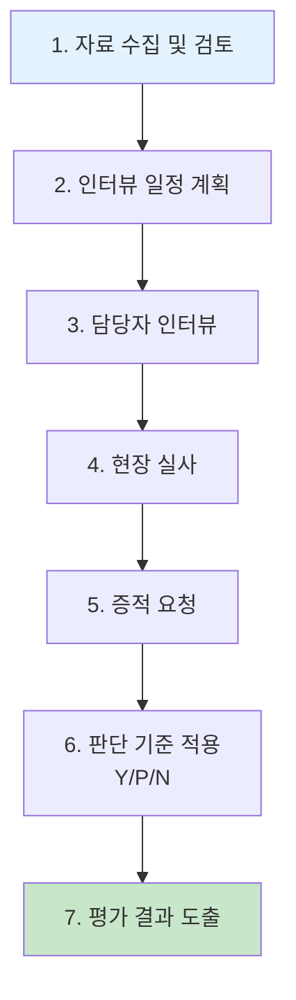

#### 1단계: 자료 수집 및 검토

**요청 자료 목록**:
```
[관리체계 운영 관련]
☑ 정보보호 계획서
☑ 위험관리 보고서
☑ 대책 명세서 (사후심사인 경우)
☑ 내부감사 결과 보고서
☑ 교육 실시 현황 및 증적

[정책 및 규정]
☑ 정보보호 정책
☑ 개인정보 처리방침
☑ 각종 지침 및 절차서
☑ 직무기술서

[운영 관련]
☑ 자산 목록
☑ 조직도
☑ 네트워크 구성도
☑ 정보서비스 흐름도
☑ 개인정보 흐름도
☑ 접근권한 관리 대장
☑ 취약점 점검 결과
```

#### 2단계: 인터뷰 일정 계획

인터뷰 일정표 예시:
| 일자 | 시간 | 영역 | 담당자 | 항목 |
|-----|------|------|--------|------|
| 1/15(월) | 10:00-12:00 | 관리체계 운영 | 정보보호팀장 | 1.1~1.3 |
| 1/15(월) | 14:00-16:00 | 자산 관리 | IT운영팀 | 2.1~2.2 |
| 1/16(화) | 10:00-12:00 | 접근통제 | 보안관리자 | 3.1~3.4 |
| ... | ... | ... | ... | ... |

#### 3단계: 통제 항목별 평가

**평가 방법**:
- **문서 심사**: 정책, 지침, 절차서 등 문서 검토
- **인터뷰**: 담당자 인터뷰를 통한 현황 파악
- **현장 실사**: 실제 시스템 및 설비 확인

**판단 기준 (Y/P/N)**:
| 판단 | 의미 | 설명 |
|------|------|------|
| Y (Yes) | 이행 | 요구사항을 완전히 충족 |
| P (Partial) | 부분 이행 | 일부 충족하나 개선 필요 |
| N (No) | 미이행 | 요구사항을 충족하지 못함 |

#### 4단계: 갭분석 결과 도출

**스파이더맵 (Spider Map)**:
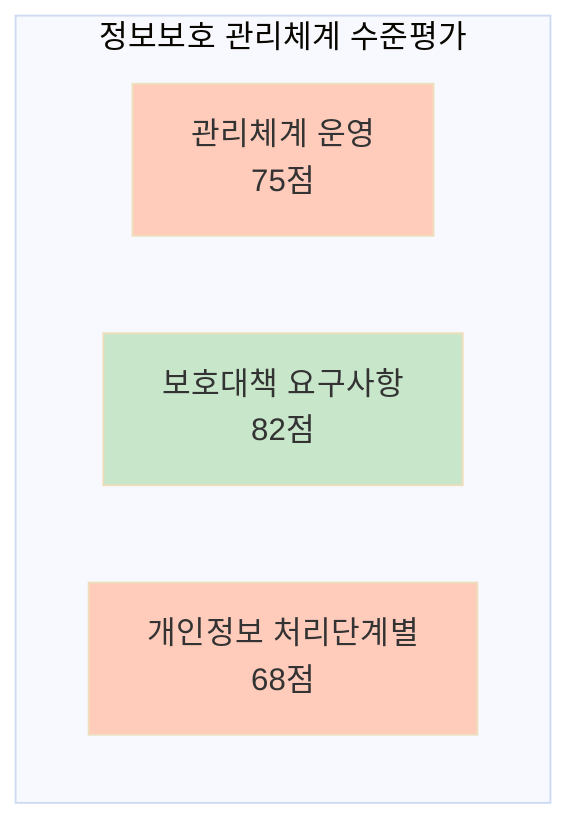

**영역별 보안 지수 산출**:
| 영역 | 통제 항목 수 | Y | P | N | 이행률 |
|------|------------|---|---|---|--------|
| 1. 관리체계 수립 및 운영 | 16 | 10 | 4 | 2 | 75% |
| 2. 보호대책 요구사항 | 64 | 48 | 12 | 4 | 82% |
| 3. 개인정보 처리단계 | 21 | 12 | 6 | 3 | 68% |
| **전체** | **101** | **70** | **22** | **9** | **78%** |

#### 갭분석 산출물
1. **수준평가 보고서**: 전체 평가 결과 종합
2. **항목별 점검 결과**: 101개 항목 각각의 평가 내용
3. **보안 지수**: 영역별 점수 및 그래프
4. **개선 과제 도출**: 미흡 항목에 대한 개선 방안

### 4.4.2 자산 분석 및 중요도 평가

#### 자산 분석의 목적
- 인증 범위 내 모든 자산 식별
- 자산별 중요도 평가
- 위험평가의 기초 자료 마련

#### 자산 분석 프로세스

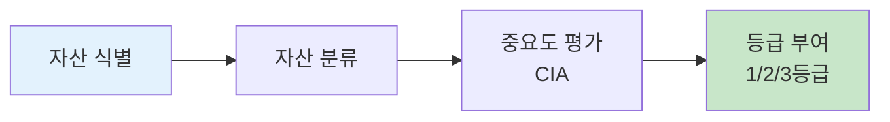

#### 1단계: 자산 식별 (Asset Identification)
- **자산 목록 수집**: 기존 자산 관리 대장 확보
- **실제 자산 확인**: 목록과 실제 자산의 일치 여부 검증
- **누락 자산 추가**: 목록에 없는 자산 발굴 및 추가

**자산 유형**:
```
[하드웨어 자산]
- 서버 (Unix, Linux, Windows)
- 네트워크 장비 (라우터, 스위치, 방화벽)
- DBMS (Oracle, MS-SQL, MySQL, PostgreSQL)
- 보안 장비 (IPS, WAF, Anti-DDoS, NAC)

[소프트웨어 자산]
- 운영체제
- 미들웨어 (WAS, Web Server)
- 데이터베이스
- 애플리케이션

[데이터 자산]
- 고객 정보
- 거래 정보
- 내부 기밀 정보

[문서 자산]
- 정책 및 절차서
- 설계 문서
- 매뉴얼

[인적 자산]
- 정보보호 담당자
- 시스템 운영자
- 개발자
```

#### 2단계: 자산 분류 (Asset Classification)
- **그룹핑**: 유사 자산끼리 분류 (서버, DB, 네트워크, 보안 등)
- **용도 파악**: 각 자산의 업무적 용도 확인
- **위치 정보**: 물리적 위치 및 네트워크 위치

#### 3단계: CIA 기반 중요도 평가

**CIA 평가 기준**:
| 구분 | 상 (3점) | 중 (2점) | 하 (1점) |
|------|---------|---------|---------|
| **C<br/>(기밀성)** | 매우 민감한 정보<br/>(개인정보, 금융정보) | 내부 공개 정보 | 공개 정보 |
| **I<br/>(무결성)** | 변조 시 심각한 영향<br/>(거래 데이터) | 변조 시 보통 영향 | 변조 시 경미한 영향 |
| **A<br/>(가용성)** | 중단 불가<br/>(핵심 업무 시스템) | 단기 중단 가능 | 중단 가능 |

**중요도 등급 산정**:
```
CIA 합산 점수:
- 7점 이상 → 1등급 (高)
- 5점 이상 7점 미만 → 2등급 (中)
- 5점 미만 → 3등급 (低)
```

#### 자산 중요도 평가 예시

| 자산명 | 유형 | C | I | A | 합계 | 등급 |
|--------|------|---|---|---|------|------|
| 고객DB | DBMS | 3 | 3 | 3 | 9 | 1등급 |
| 웹서버 | 서버 | 2 | 3 | 3 | 8 | 1등급 |
| 관리자PC | 단말 | 2 | 1 | 1 | 4 | 3등급 |
| 백업서버 | 서버 | 3 | 2 | 2 | 7 | 1등급 |

#### 등급별 자산 분포 시각화

**자산 유형별 등급 분포**:
```
[서버 자산 - 총 150대]
1등급: █████████████████████ 45대 (Unix 25, Linux 15, Windows 5)
2등급: ████████████████ 35대
3등급: ████████████████████████████████████ 70대

[네트워크 자산 - 총 80대]
1등급: ████████████████████████ 50대 (코어 스위치, 방화벽)
2등급: ████████ 20대
3등급: ████ 10대

[DBMS - 총 30대]
1등급: ████████████████████████████ 25대 (고객정보 포함)
2등급: ████ 5대
3등급: 0대
```

#### 자산 관리 대장 작성

**자산 관리 대장 구성 항목**:
```excel
[자산 관리 대장 필수 항목]
1. 자산 ID
2. 자산명
3. 자산 유형 (서버/네트워크/DBMS 등)
4. 용도
5. 중요도 등급 (1/2/3등급)
6. CIA 점수 (C/I/A 각각)
7. 담당 부서
8. 담당자 이름 및 연락처
9. 물리적 위치
10. IP 주소
11. 제조사
12. 모델명
13. OS/SW 버전
14. 도입 연도
15. 비고
```

> **실무 팁**: "자산 관리 대장은 수식을 걸어놓으면 편리합니다. CIA 점수만 입력하면 자동으로 등급이 산정되도록 엑셀 수식을 활용하세요."

### 4.4.3 취약점 점검 (Vulnerability Assessment)

취약점 점검은 **기술적 영역**에 대한 보안 점검으로, 인프라 진단 전문가가 주로 수행합니다.

#### 취약점 점검 대상

| 분류 | 세부 대상 | 점검 도구 |
|------|---------|----------|
| **서버** | Unix, Linux, Windows | 진단 스크립트, Nessus |
| **DBMS** | Oracle, MS-SQL, MySQL, PostgreSQL | DB 진단 스크립트 |
| **네트워크** | 라우터, 스위치, 방화벽, IPS | 수동 점검, Nmap |
| **정보보호시스템** | 방화벽, IPS, WAF, Anti-DDoS | 정책 검토, 로그 분석 |
| **웹 애플리케이션** | 웹사이트, 웹 서비스 | Burp Suite, OWASP ZAP |
| **모바일** | Android, iOS 앱 | Frida, MobSF, Drozer |

#### 인프라 취약점 점검 4단계 프로세스

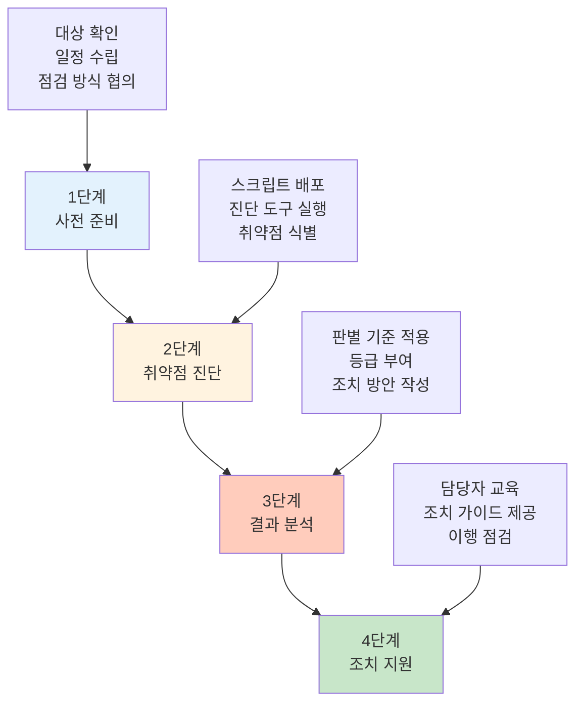

#### 1단계: 사전 준비

**점검 방식 협의**:
1. **스크립트 방식**: 점검 스크립트를 담당자에게 전달하여 실행 후 결과 회신
2. **원격 점검**: VPN 또는 원격 접속을 통한 직접 점검
3. **솔루션 활용**: 취약점 점검 솔루션(Nessus, Qualys 등) 활용

#### 2단계: 취약점 진단 수행

**서버 취약점 점검 항목 예시**:
```
[주요 점검 항목 - Unix/Linux]
☑ 계정 관리
  - 불필요한 계정 존재 여부
  - root 계정 원격 접속 차단 여부
  - 패스워드 복잡도 설정
  - 패스워드 최대 사용 기간 설정

☑ 파일 및 디렉터리 관리
  - 주요 파일 권한 설정 (passwd, shadow 등)
  - SetUID/SetGID 설정 파일 점검
  - world writable 파일 점검

☑ 서비스 관리
  - 불필요한 서비스 비활성화
  - Telnet, FTP 등 취약한 서비스 사용 여부

☑ 패치 관리
  - 최신 보안 패치 적용 여부
  - 커널 버전 확인

☑ 로그 관리
  - 로그 기록 활성화 여부
  - 로그 보관 기간 설정
```

#### 3단계: 결과 분석 및 등급 부여

**취약점 등급 분류**:
| 등급 | 설명 | 조치 기한 | 예시 |
|------|------|----------|------|
| 상 (High) | 즉시 악용 가능한 치명적 취약점 | 즉시 | 패치되지 않은 원격 코드 실행 취약점 |
| 중 (Medium) | 악용 시 보안에 영향을 미치는 취약점 | 1개월 이내 | 약한 암호 정책, 불필요한 서비스 |
| 하 (Low) | 간접적으로 영향을 미치는 취약점 | 3개월 이내 | 배너 정보 노출, 오래된 버전 사용 |
| 양호 (Good) | 보안 요구사항 충족 | - | 적절한 권한 설정, 최신 패치 적용 |

#### 4단계: 조치 지원

**조치 가이드 제공**:
- 각 취약점에 대한 상세 조치 방법 제공
- 조치 시 업무 영향도 분석
- 조치 후 확인 방법 안내

**조치 계획 수립**:
```
[취약점 조치 계획서 예시]
취약점명: root 계정 원격 접속 허용
대상 시스템: 웹서버 10대
위험도: 상
조치 방법: /etc/ssh/sshd_config 파일에서 PermitRootLogin no 설정
업무 영향도: 없음 (개별 계정으로 접속 후 su 사용 가능)
조치 예정일: 2026-01-30
담당자: 홍길동 (IT운영팀)
```

#### 이행 점검
- 조치 계획에 따라 모든 취약점 조치 완료 후 재점검 수행
- 조치 완료 증적 확보 (설정 파일, 스크린샷 등)

### 4.4.4 웹 취약점 점검

웹 취약점 점검은 **모의해킹 전문가**가 수행하며, OWASP Top 10을 기반으로 합니다.

#### 웹 취약점 점검 절차

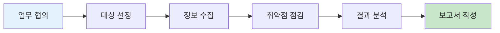

#### 점검 항목

**금융권 웹 취약점 점검 항목 (약 40개)**:
1. **입력값 검증 부재**
   - SQL Injection
   - XSS (Cross-Site Scripting)
   - Command Injection
   - Path Traversal

2. **인증 및 세션 관리**
   - 약한 패스워드 정책
   - 세션 타임아웃 미설정
   - 세션 고정 공격 취약점

3. **시큐어 코딩**
   - 하드코딩된 패스워드
   - 중요 정보 평문 저장
   - 오류 메시지를 통한 정보 노출

4. **접근 통제**
   - 권한 우회
   - IDOR (Insecure Direct Object Reference)
   - 강제 브라우징

#### 주요 점검 도구

| 도구 | 용도 | 특징 |
|------|------|------|
| **Burp Suite** | 웹 프록시, 취약점 스캐닝 | 업계 표준 도구 |
| **OWASP ZAP** | 취약점 스캐닝 | 오픈소스, 무료 |
| **Fiddler** | HTTP/HTTPS 트래픽 분석 | 프록시 도구 |
| **Wireshark** | 패킷 분석 | 네트워크 레벨 분석 |
| **Acunetix** | 자동화 스캐너 | 상용 도구 |
| **WebGoat** | 실습 환경 | 교육용 |

> **실무 팁**: "웹 모의해킹은 솔루션 활용 능력뿐만 아니라, 결과 값에 대한 이해도가 매우 중요합니다. Burp Suite 등의 도구 사용법을 많이 공부해야 합니다."

### 4.4.5 모바일 앱 취약점 점검

#### 모바일 점검 특징
- **루팅/탈옥 필수**: 안드로이드 루팅, iOS 탈옥된 디바이스 필요
- **정적 분석**: APK/IPA 파일 디컴파일 및 분석
- **동적 분석**: 앱 실행 중 메모리 분석, 통신 데이터 분석

#### 금융권 모바일 점검 항목 (약 48-52개)

**주요 점검 영역**:
1. **데이터 저장 보안**
   - 로컬 데이터 암호화
   - 중요 정보 평문 저장 여부
   - SharedPreferences/KeyChain 보안

2. **통신 보안**
   - SSL/TLS 적용 여부
   - 인증서 검증 (Certificate Pinning)
   - 중간자 공격 방어

3. **코드 보안**
   - 난독화 적용 여부
   - 하드코딩된 키/패스워드
   - 디버깅 모드 비활성화

4. **인증 및 세션**
   - 생체 인증 구현
   - 세션 관리
   - 자동 로그아웃

#### 모바일 점검 도구

| 도구 | 플랫폼 | 용도 |
|------|--------|------|
| **MobSF** | Android, iOS | 정적/동적 분석 통합 도구 |
| **Frida** | Android, iOS | 동적 분석, 후킹 |
| **Drozer** | Android | 앱 공격 표면 분석 |
| **objection** | Android, iOS | Frida 기반 모의해킹 도구 |
| **APKTool** | Android | APK 디컴파일 |
| **Burp Suite** | Android, iOS | 통신 분석 |

#### 메모리 분석 과정
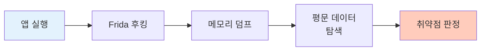

### 4.4.6 위협 분석 (Threat Analysis)

#### 위협 vs 위험
- **위협 (Threat)**: 자산에 피해를 줄 수 있는 잠재적 요인
- **위험 (Risk)**: 위협이 취약점을 악용하여 실제 피해가 발생할 가능성

**예시**:
```
위협: 날씨가 추워짐
취약점: 면역력이 약함, 야외 활동
위험: 감기에 걸릴 확률이 높음
```

#### 위협 분석 로직

**위협 요소 분석 프레임워크**:
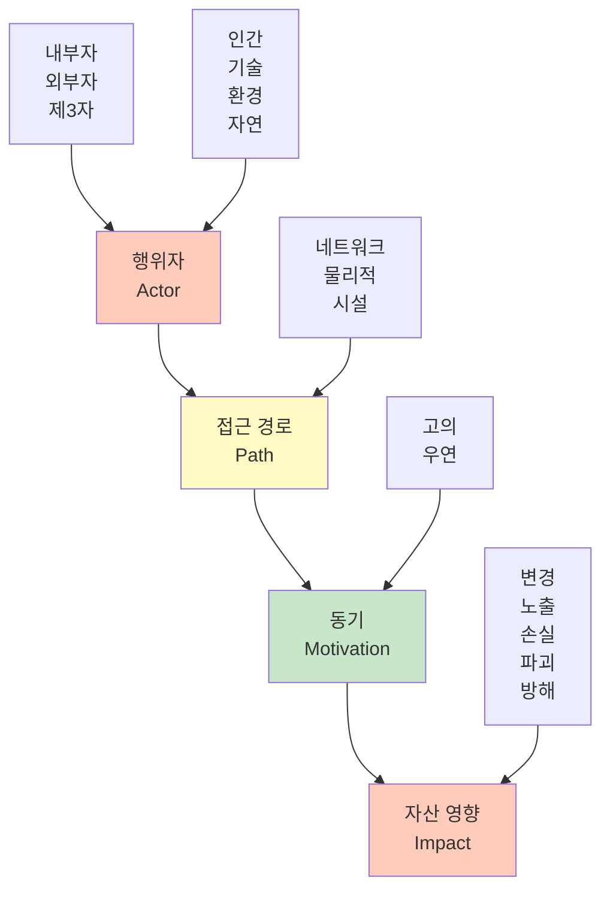

#### 위협 시나리오 예시

**시나리오 1: 내부 직원에 의한 개인정보 유출**
```
행위자: 내부 직원 (인간)
접근 경로: 네트워크 (업무 PC)
동기: 고의 (금전적 이득)
자산 영향: 노출 (개인정보 DB)
위협 수준: 상
```

**시나리오 2: 외부 해커의 시스템 침투**
```
행위자: 외부 공격자 (인간)
접근 경로: 네트워크 (인터넷)
동기: 고의 (데이터 탈취)
자산 영향: 변경, 노출 (웹 서버, DB)
위협 수준: 상
```

**시나리오 3: 자연재해로 인한 시스템 중단**
```
행위자: 자연 (환경)
접근 경로: 물리적 (IDC)
동기: 우연 (지진, 화재)
자산 영향: 파괴, 방해 (서버)
위협 수준: 중
```

#### 위협 시나리오 DB
SK실더스에서는 수백 개의 위협 시나리오를 DB화하여 보유하고 있으며, 자산 유형과 업무 특성에 따라 적절한 시나리오를 매핑합니다.

**시나리오 DB 구조**:
```
[위협 시나리오 DB]
1. 공통 관리 위협 (관리체계 전반) - 위험도: 상 (5점)
2. 서버 위협 (항목별 세분화) - 위험도: 상/중/하
3. 네트워크 위협 (장비별 세분화) - 위험도: 상/중/하
4. DBMS 위협 - 위험도: 상/중/하
5. 웹/모바일 위협 - 위험도: 상/중/하
```

### 4.4.7 위험도 산정 (Risk Assessment)

#### 위험도 계산 공식

**기본 공식**:
```
위험도 = 자산 중요도 × 위협 × 취약성 × 항목 중요도
```

**각 요소별 점수**:
- **자산 중요도**: 1~3점 (CIA 평가 결과)
- **위협**: 1~5점 (위협 시나리오 DB의 점수)
- **취약성**: 1~5점 (취약점 점검 결과)
- **항목 중요도**: 가중치 (통제 항목별 상이)

#### CIA 기준 위험도 산정

**C (기밀성), I (무결성), A (가용성) 각각에 대해 위험도 계산**:
```
위험도_C = 자산_C점수 × 위협 × 취약성_C
위험도_I = 자산_I점수 × 위협 × 취약성_I
위험도_A = 자산_A점수 × 위협 × 취약성_A

최종 위험도 = (위험도_C + 위험도_I + 위험도_A) / 3 × 항목 중요도
```

#### 위험도 등급 분류

| 위험도 점수 | 등급 | 조치 우선순위 | 대응 전략 |
|------------|------|-------------|----------|
| 80점 이상 | 매우 높음 | 즉시 | 위험 감소 (즉시 조치) |
| 60~79점 | 높음 | 긴급 | 위험 감소 (1개월 이내) |
| 40~59점 | 보통 | 중기 | 위험 감소 (3개월 이내) |
| 20~39점 | 낮음 | 장기 | 위험 수용 또는 감소 |
| 20점 미만 | 매우 낮음 | 모니터링 | 위험 수용 |

### 4.4.8 DoA (Degree of Assurance) 설정

#### DoA란?
> 조직이 수용 가능한 위험 수준을 정의하는 기준점

**보험 상품 설계와 유사한 개념**:
- 보험사는 수익과 손실의 균형점을 찾아 상품을 설계
- 일정 수준 이상의 위험은 보장하고, 그 이하는 고객이 부담

**ISMS-P에서의 DoA**:
```
예: DoA = 40점으로 설정한 경우
- 40점 이상: 위험 감소 조치 필수 (취약점 조치, 보안 통제 강화)
- 40점 미만: 위험 수용 (주기적 모니터링, 추후 재평가)
```

#### 위험 대응 전략

| 전략 | 설명 | 적용 시점 | 예시 |
|------|------|----------|------|
| **위험 감소** | 취약점 조치를 통한 위험도 낮춤 | DoA 이상 | 취약점 패치, 보안 설정 강화 |
| **위험 수용** | 위험을 인지하고 받아들임 | DoA 이하 | 낮은 등급 취약점 모니터링 |
| **위험 회피** | 위험한 활동 자체를 중단 | 매우 높은 위험 | 취약한 서비스 폐기 |
| **위험 전가** | 제3자에게 위험 이전 | 특정 경우 | 사이버 보험 가입, 아웃소싱 |

---

## 4.5 3단계: 보호대책 수립

### 4.5.1 정책 및 규정 재개정

위험평가가 완료되면, 식별된 취약점과 위험에 대응하기 위해 **정책, 지침, 절차를 재개정**합니다.

#### 재개정이 필요한 이유
- **법적 준거성**: 최신 법률 요구사항 반영
- **컴플라이언스**: 감독규정, 시행세칙 변경 사항 반영
- **조직 변경**: 조직 개편, 업무 프로세스 변경 반영
- **정책 간 연계성**: 상위 정책과 하위 지침의 일관성 확보

#### 정책 체계 구조

```mermaid
graph TD
    A[정보보호 정책<br/>Policy] --> B[정보보호 지침<br/>Guideline]
    B --> C[정보보호 절차<br/>Procedure]
    C --> D[업무 매뉴얼<br/>Manual]

    style A fill:#ffccbc
    style B fill:#fff9c4
    style C fill:#c8e6c9
    style D fill:#e3f2fd
```

#### 법적 준거성 확인

**국가법령정보센터** (www.law.go.kr) 활용:
- 정보통신망법 및 시행령, 시행규칙
- 개인정보보호법 및 시행령, 시행규칙
- 전자금융거래법 및 감독규정
- 신용정보법 및 감독규정

> **강사의 조언**: "컨설팅을 하시는 분들은 국가법령정보센터에 자주 방문해서 최신 법률을 확인하셔야 합니다. 특히 금융권의 경우 감독규정과 시행세칙을 꼭 확인하세요."

### 4.5.2 정책 재개정 프로젝트 사례

#### 프로젝트 개요
```
[프로젝트 기본 정보]
목적: ISMS 인증 획득을 위한 정책 체계 전면 재정비
대상: 금융회사 (IT 업무규정 11종)
기간: 13주
인력: 전담 컨설턴트 1명
```

#### 기존 문제점
- IT 보안 관리 지침에 모든 내용이 혼재
- ISMS 인증 체계에 맞지 않는 구조
- 최신 법규 미반영

#### 재개정 결과

**변경 전**:
```
[기존 구조 - 1개 문서]
- IT 보안 관리 지침 (모든 내용 포함)
```

**변경 후**:
```
[신규 구조 - 1개 규정 + 16개 지침]
정보보호 규정 (상위 문서)
├── 정보보호 조직 지침
├── 인력 보안 지침
├── 자산 관리 지침
├── 보안성 심의 지침
├── 해킹 및 바이러스 대응 지침
├── 계정 관리 지침
├── 물리 보안 지침
├── 서버 보안 지침
├── 네트워크 보안 지침
├── 데이터베이스 보안 지침
├── 애플리케이션 보안 지침
├── 정보보호시스템 보안 지침
├── PC 보안 지침
├── 암호 지침
├── 모바일 보안 지침
└── 기타 기술 지침
```

#### 재개정 프로세스

```mermaid
graph LR
    A[1주차<br/>필요성 검토] --> B[3주차<br/>인터뷰 및<br/>요구사항 분석]
    B --> C[5주차<br/>초안 작성]
    C --> D[3주차<br/>리뷰 및 수정]
    D --> E[1주차<br/>최종화]

    style A fill:#e3f2fd
    style E fill:#c8e6c9
```

### 4.5.3 보안 통제 전략 수립

위험평가 결과를 바탕으로 **보안 통제 전략**을 수립합니다.

#### 통제 전략 평가 기준

| 평가 요소 | 평가 내용 | 점수 |
|----------|----------|------|
| **보안 중요도** | 이 통제가 보안에 얼마나 중요한가? | 1~5점 |
| **긴급도** | 얼마나 빨리 구축해야 하는가? | 1~5점 |
| **수행 난이도** | 자체 인력으로 수행 가능한가? | 1~5점 (낮을수록 쉬움) |
| **비용** | 예산이 얼마나 소요되는가? | 1~5점 |

#### 우선순위 결정

**종합 점수 계산**:
```
우선순위 점수 = (보안 중요도 × 2) + 긴급도 - 수행 난이도 - (비용 ÷ 2)
```

**조치 시기 분류**:
- **즉시 (Immediate)**: 우선순위 점수 10점 이상, 인증 전 필수
- **단기 (Short-term)**: 우선순위 점수 7~9점, 3개월 이내
- **중기 (Medium-term)**: 우선순위 점수 5~6점, 6개월 이내
- **장기 (Long-term)**: 우선순위 점수 5점 미만, 1년 이내

### 4.5.4 이행 조치 계획 수립

위험평가와 보호대책 수립이 완료되면, **이행 조치 계획**을 작성합니다.

#### 이행 조치 계획서 구성

| 항목 | 내용 |
|------|------|
| 프로젝트명 | 예: "웹 방화벽(WAF) 도입" |
| 조치 목적 | 웹 애플리케이션 공격 방어 |
| 위험도 | 현재 위험도: 85점 → 목표 위험도: 30점 |
| 보안 중요도 | 5점 (매우 높음) |
| 긴급도 | 4점 (높음) |
| 수행 난이도 | 3점 (중간) |
| 예상 비용 | 5,000만원 |
| 조치 시기 | 즉시 (인증 심사 전) |
| 담당 부서 | IT운영팀 |
| 담당자 | 홍길동 과장 |
| 완료 예정일 | 2026-03-31 |

#### 로드맵 작성

```mermaid
gantt
    title ISMS-P 인증 이행 조치 로드맵
    dateFormat  YYYY-MM-DD
    section 즉시 조치
    웹 방화벽 도입        :2026-01-15, 60d
    취약점 긴급 조치       :2026-01-15, 30d
    section 단기 조치
    DLP 솔루션 도입       :2026-03-01, 90d
    NAC 구축             :2026-03-15, 90d
    section 중기 조치
    SIEM 구축           :2026-06-01, 120d
    section 장기 조치
    개인정보 암호화 고도화 :2026-10-01, 90d
```

---

## 4.6 4단계: 인증 심사 지원

### 4.6.1 인증 범위서 작성

#### 인증 범위 설정
인증 심사를 받기 위해서는 **인증 범위**를 명확히 정의해야 합니다.

**인증 범위 예시**:
```
[인증 범위 명칭]
"인터넷 및 모바일 기반 금융 서비스 제공을 위한 정보보호 및 개인정보보호 관리체계"

[세부 범위]
1. 서비스 범위
   - 인터넷뱅킹 서비스
   - 모바일뱅킹 서비스
   - HTS (Home Trading System)
   - 고객센터 상담 서비스

2. 시스템 범위
   - 웹 서버 50대
   - 애플리케이션 서버 80대
   - 데이터베이스 서버 30대
   - 네트워크 장비 100대
   - 보안 장비 50대

3. 물리적 범위
   - 본사 IDC (서울 강남)
   - DR센터 (경기 부천)
   - 개발센터 (서울 여의도)

4. 조직 범위
   - 정보보호부 (15명)
   - IT운영부 (30명)
   - 개발부 (50명)
   - 고객지원부 (20명)
```

#### 인증 명칭 정하기
인증 명칭은 KISA 또는 금융보안원과 **사전 협의**를 통해 결정합니다. 이를 **장명(場名)**이라고 합니다.

### 4.6.2 인증 신청서 작성

인증 신청서는 KISA 또는 금융보안원 홈페이지에서 양식을 다운로드하여 작성합니다.

**주요 기재 사항**:
- 기업 정보 (상호, 대표자, 소재지)
- 인증 범위
- 조직 현황
- 정보자산 현황
- CISO 정보

### 4.6.3 관리체계 정비

#### 필수 산출물 목록

**관리체계 문서**:
```
☑ 정보보호 정책
☑ 개인정보 처리방침
☑ 정보보호 및 개인정보보호 지침 (16종)
☑ 업무 절차서
☑ 정보보호 계획서
☑ 대책 명세서 (사후심사 시)
☑ 위험관리 보고서
☑ 자산 관리 대장
☑ 정보서비스 흐름도
☑ 개인정보 흐름도 (150~200장)
☑ 개인정보 처리 업무 목록
☑ 개인정보 처리 시스템 목록
☑ 수탁사 관리 대장
☑ 취약점 진단 보고서
☑ 갭분석 결과 보고서
☑ 내부감사 보고서
☑ 이행증적 관리 대장
☑ 교육 이수 현황
```

### 4.6.4 이행증적 관리

#### 이행증적이란?
> 통제 항목별 요구사항을 실제로 이행했음을 증명하는 기록 및 문서

**이행증적 유형**:
1. **문서 증적**: 정책, 지침, 절차서, 계획서, 보고서
2. **기록 증적**: 로그, 점검 결과, 교육 이수 기록, 회의록
3. **시스템 증적**: 스크린샷, 설정 파일, 시스템 로그
4. **활동 증적**: 교육 자료, 훈련 시나리오, 훈련 결과

#### 이행증적 관리 대장

| 통제 항목 | 요구사항 | 이행증적 | 관련 규정 | 담당자 | 비고 |
|---------|---------|---------|---------|--------|------|
| 1.1.1 | 정보보호 조직 구성 | 조직도, 발령문 | 정보보호 정책 3조 | 인사팀 | |
| 1.2.1 | 정보보호 계획 수립 | 정보보호 계획서 | 정보보호 정책 5조 | 정보보호팀 | |
| 2.1.1 | 자산 식별 및 관리 | 자산 관리 대장 | 자산관리 지침 4조 | IT운영팀 | |

### 4.6.5 내부감사 (모의심사)

인증 심사 전에 **내부감사**를 통해 실제 심사를 대비합니다.

#### 내부감사 프로세스

```mermaid
graph LR
    A[내부감사<br/>계획 수립] --> B[내부감사<br/>실시]
    B --> C[결함 도출]
    C --> D[결함 보고서<br/>작성]
    D --> E[CISO 보고]
    E --> F[개선 조치]

    style A fill:#e3f2fd
    style F fill:#c8e6c9
```

#### 내부감사 기준
- ISMS-P 통제 항목 101개 전체 또는 일부
- 실제 심사와 동일한 방식 (문서 심사, 인터뷰, 현장 실사)
- 제3자 관점에서 객관적 평가

#### 결함 도출 및 조치
- 내부감사에서 발견된 결함은 본 심사 전에 모두 조치
- 조치 완료 증적 확보

### 4.6.6 담당자 교육

심사 시 실제 대응하는 것은 **기업 담당자**이므로, 교육이 필수입니다.

#### 교육 내용
```
[심사 대응 교육 커리큘럼]
1. ISMS-P 개요 및 심사 프로세스 (1시간)
2. 통제 항목별 요구사항 설명 (3시간)
3. 담당 영역 현황 점검 (2시간)
4. 심사원 질문 예상 및 답변 연습 (2시간)
5. 이행증적 확인 및 제출 방법 (1시간)
```

#### 모의 인터뷰
- 실제 심사와 유사한 상황을 연출하여 인터뷰 연습
- 답변이 어려운 질문에 대한 사전 준비

### 4.6.7 심사 자료 준비

#### 바인딩 방식
- 과거: 종이 문서 출력 및 바인딩 (심사원 1명당 2-3권, 500~1000페이지)
- 현재: PC 제공 방식 (모든 문서를 PC에 저장하여 제공)

#### PC 제공 시 폴더 구조
```
[심사 자료 폴더 구조]
/ISMS-P 심사 자료/
├── 01. 인증 신청서/
│   ├── 인증 신청서.pdf
│   └── 인증 범위서.pdf
├── 02. 관리체계 문서/
│   ├── 정보보호 정책.pdf
│   ├── 정보보호 지침 (16종)/
│   └── 절차서/
├── 03. 위험평가/
│   ├── 자산 관리 대장.xlsx
│   ├── 취약점 진단 보고서.pdf
│   └── 위험평가 보고서.pdf
├── 04. 개인정보/
│   ├── 개인정보 흐름도.pptx
│   └── 개인정보 처리 현황.xlsx
├── 05. 이행증적/
│   ├── 교육 이수 현황.xlsx
│   ├── 로그 점검 기록.xlsx
│   └── 기타 증적/
└── 06. 기타/
```

---

## 4.7 5단계: 인증 결함 보완 조치

### 4.7.1 인증 심사 프로세스

#### 심사 일정
```
[1주일 심사 일정 예시]
월요일: 오리엔테이션, 문서 심사
화요일: 인터뷰 (관리체계 영역)
수요일: 인터뷰 (기술적 영역), 현장 실사
목요일: 추가 인터뷰, 증적 확인
금요일: 최종 결함 협의, 클로징 미팅
```

#### 심사 방식
- **문서 심사**: 정책, 지침, 보고서 등 문서 검토
- **인터뷰**: 담당자 대상 질의응답
- **현장 실사**: 실제 시스템, 설비, 물리적 보안 확인

### 4.7.2 결함 발생 구조

#### 심사원의 결함 할당량
> **중요**: 심사원마다 최소 5개의 결함을 찾아야 하며, 그 중 2~3개는 실제 결함으로 인정되어야 합니다.

**이는 심사원 평가 기준**이기 때문에, **결함은 반드시 발생**합니다.

**강사의 말**:
> "매년 심사를 받으면 취약점은 계속 나옵니다. 안 나올 수가 없어요. 안 나온다면 그 심사원은 다음 심사 때 배제될 수 있습니다."

### 4.7.3 예상 결함 협의

#### 수요일 저녁 시점
심사 주간 수요일 저녁부터 **예상 결함 리스트**가 나옵니다.

**협상 과정**:
```
[예상 결함 협의 시나리오]
심사팀장: "현재 20개의 결함이 발견되었습니다."
기업 담당자: "일부는 경미한 사항이므로 권고사항으로 조정 가능할까요?"
심사팀장: "검토 후 최종 15개로 조정하겠습니다."
```

- 예상 결함 개수는 협상을 통해 줄일 수 있음
- 경미한 사항은 권고사항으로 전환 가능
- 최종 결함은 클로징 미팅에서 확정

### 4.7.4 결함 유형

| 결함 유형 | 설명 | 조치 기한 | 영향 |
|---------|------|----------|------|
| **지적 사항 (Finding)** | 요구사항 미충족, 즉시 조치 필요 | 심사 후 1개월 이내 | 조치 전까지 인증서 미발급 |
| **권고 사항 (Observation)** | 개선이 필요하나 경미한 사항 | 차기 심사까지 | 인증서 발급에 영향 없음 |

### 4.7.5 보완 조치 내역서 작성

결함 조치가 완료되면 **보완 조치 내역서**를 작성합니다.

#### 보완 조치 내역서 구성

```
[보완 조치 내역서 예시]
━━━━━━━━━━━━━━━━━━━━━━━━━━━━━━━━
결함 번호: F-001
통제 항목: 2.3.1 접근권한 검토
결함 내용: 퇴직자 계정이 삭제되지 않고 남아있음 (5개 계정)
위험도: 중

[조치 내용]
1. 퇴직자 계정 5개 전체 삭제 완료
2. 퇴직자 계정 자동 삭제 프로세스 수립
3. 월 1회 계정 점검 프로세스에 퇴직자 계정 확인 항목 추가

[조치 증적]
- 첨부 1: 계정 삭제 로그
- 첨부 2: 계정 관리 절차서 (개정 후)
- 첨부 3: 월간 점검 체크리스트

조치 완료일: 2026-02-15
조치 담당자: 홍길동 (IT운영팀 과장)
━━━━━━━━━━━━━━━━━━━━━━━━━━━━━━━━
```

### 4.7.6 재심사 및 인증서 발급

#### 재심사
- 보완 조치 내역서 제출 후, 심사팀장이 **재심사** 진행
- 모든 조치가 완료되었는지 현장 확인 또는 원격 확인
- 미흡 시 추가 조치 요청

#### 인증위원회 심의
- 재심사 통과 후 **인증위원회** 상정
- 인증위원회에서 최종 승인

#### 인증서 발급
- 인증위원회 승인 후 **인증서** 발급
- 유효 기간: 3년 (매년 사후 심사 필수)

**인증서 예시 정보**:
```
[인증서]
인증 번호: ISMS-P-2026-001
인증 명칭: 인터넷 및 모바일 기반 금융 서비스 제공을 위한 정보보호 및 개인정보보호 관리체계
인증 기관: 한국인터넷진흥원 (KISA)
인증 유효기간: 2026-03-01 ~ 2029-02-28
```

---

## 4.8 수탁사 점검

### 4.8.1 수탁사 점검이란?

ISMS-P 인증 시, 개인정보 처리를 **제3자에게 위탁**한 경우 해당 수탁사에 대한 점검이 필수입니다.

#### 수탁사 예시
- 콜센터 운영 업체
- SMS 발송 대행 업체
- 데이터 입력 대행 업체
- 클라우드 서비스 제공 업체
- 배송 업체

### 4.8.2 수탁사 점검 절차

```mermaid
graph TD
    A[수탁사 목록 작성] --> B[샘플링 선정]
    B --> C[점검 계획 수립]
    C --> D[수탁사 방문 점검]
    D --> E[결과 보고서 작성]
    E --> F[개선 요청]

    style A fill:#e3f2fd
    style F fill:#ffccbc
```

#### 1단계: 수탁사 현황 조사
- 수탁사 목록 작성
- 위탁 업무 내용
- 취급 개인정보 항목
- 위탁 계약서 검토

#### 2단계: 샘플링
- 전체 수탁사 중 일부를 선정하여 점검
- 중요도가 높은 수탁사 우선 선정

#### 3단계: 점검 수행
- 금융권: 금융보안원 체크리스트 활용
- 일반 기업: KISA 가이드라인 또는 자체 체크리스트

### 4.8.3 수탁사 점검 항목

| 영역 | 점검 항목 |
|------|---------|
| 관리적 보안 | 정보보호 정책, 개인정보 처리방침, 조직 구성 |
| 기술적 보안 | 접근 통제, 암호화, 로그 관리 |
| 물리적 보안 | 출입 통제, CCTV, 보관 시설 |
| 계약 관리 | 위탁 계약서, 재위탁 금지 조항, 손해배상 |

---

## 4.9 정리 및 핵심 요약

### 4.9.1 ISMS-P 인증 전체 타임라인

```mermaid
gantt
    title ISMS-P 인증 1년 타임라인
    dateFormat  YYYY-MM-DD
    section 1단계
    환경 및 현황 분석      :2026-01-01, 60d
    section 2단계
    위험평가             :2026-03-01, 90d
    section 3단계
    보호대책 수립         :2026-06-01, 60d
    section 4단계
    인증 심사 지원        :2026-08-01, 60d
    section 5단계
    결함 보완 조치        :2026-10-01, 30d
```

### 4.9.2 핵심 체크리스트

```
[ISMS-P 인증 준비 체크리스트]

□ 조직 구성
  ☑ CISO 임명
  ☑ 정보보호 전담 조직
  ☑ 개인정보보호 전담 조직

□ 환경 분석
  ☑ IT 환경 파악
  ☑ 개인정보 흐름도 작성 (150~200장)
  ☑ 정보서비스 흐름도 작성

□ 위험평가
  ☑ 자산 분석 (CIA 평가)
  ☑ 갭분석 (101개 통제 항목)
  ☑ 취약점 점검 (인프라/웹/모바일)
  ☑ 위험도 산정

□ 보호대책
  ☑ 정책/규정 재개정 (16종)
  ☑ 이행 조치 계획 수립
  ☑ 로드맵 작성

□ 심사 준비
  ☑ 인증 신청서 작성
  ☑ 이행증적 관리 대장
  ☑ 내부감사 실시
  ☑ 담당자 교육

□ 심사 대응
  ☑ 심사 자료 준비 (PC 또는 바인딩)
  ☑ 결함 협의
  ☑ 보완 조치 내역서 작성
```

### 4.9.3 강사의 실무 조언

> **"컨설팅은 단순히 체크리스트를 통과하는 게 아닙니다. 기업의 보안 수준을 실질적으로 향상시키는 것이 목표입니다. 그래서 렉스 있게 많이 봐야 하고, 심사 기준도 점점 강화되고 있습니다."**

> **"개인정보 영역은 여성 컨설턴트가 특히 잘하는 영역입니다. 꼼꼼함과 인터뷰 능력이 중요하기 때문이죠. 남성 컨설턴트는 기술적 영역과 수탁사 점검에서 강점을 보입니다."**

> **"컨설팅을 하려면 법을 알아야 합니다. 망법, 개법법, 전자금융거래법, 감독규정, 시행세칙을 꼭 읽어보세요. 국가법령정보센터를 자주 방문하세요."**

### 4.9.4 다음 섹션 예고

다음 섹션에서는 **취약점 진단**에 대해 더 깊이 다룰 예정입니다.
- 전자금융기반시설 취약점 점검
- 주요정보통신기반시설 취약점 점검
- 인프라 진단 세부 기법
- 웹/모바일 모의해킹 실전 기법
# Section 5: 취약점 진단 완전 가이드

## 5.1 취약점 진단 개요

### 5.1.1 취약점 진단이란?

> 정보 시스템의 보안 취약점을 기술적으로 점검하고 분석하여, 잠재적 위협을 사전에 식별하고 제거하는 활동

**취약점 진단의 목적**:
- 시스템의 보안 취약점 식별
- 해킹 및 침해사고 예방
- 법규 및 규제 준수 (컴플라이언스)
- 보안 수준 향상

### 5.1.2 취약점 진단의 종류

```mermaid
graph TD
    A[취약점 진단] --> B[인프라 진단]
    A --> C[웹 애플리케이션 진단]
    A --> D[모바일 애플리케이션 진단]
    A --> E[소스코드 진단]
    A --> F[무선 네트워크 진단]

    B --> B1[서버<br/>Unix, Linux, Windows]
    B --> B2[DBMS<br/>Oracle, MS-SQL, MySQL]
    B --> B3[네트워크<br/>라우터, 스위치, 방화벽]
    B --> B4[보안장비<br/>IPS, WAF, NAC]

    C --> C1[OWASP Top 10]
    C --> C2[SQL Injection]
    C --> C3[XSS]

    D --> D1[Android]
    D --> D2[iOS]

    style A fill:#ffccbc
    style B fill:#c8e6c9
    style C fill:#fff9c4
    style D fill:#e1bee7
```

### 5.1.3 취약점 진단 대상 선정

| 대상 | 선정 기준 | 점검 주기 |
|------|----------|----------|
| **전자금융기반시설** | 전자금융거래법 적용 금융기관 | 연 1회 이상 |
| **주요정보통신기반시설** | 정보통신기반보호법 지정 시설 | 연 1회 이상 |
| **ISMS-P 인증 대상** | 인증 범위 내 모든 자산 | 인증 시, 연 1회 |
| **일반 기업** | 중요 시스템 | 필요 시 |

---

## 5.2 법적 요구사항 및 컴플라이언스

### 5.2.1 전자금융기반시설 취약점 점검

#### 법적 근거
- **전자금융거래법 제21조의2**: 전자금융기반시설의 안전성 확보
- **전자금융감독규정 시행세칙**: 연 1회 이상 취약점 점검 의무

#### 점검 대상
```
[전자금융기반시설 범위]
☑ 인터넷뱅킹 시스템
☑ 모바일뱅킹 시스템
☑ HTS (Home Trading System)
☑ MTS (Mobile Trading System)
☑ 전자금융 거래 처리 시스템
☑ 전자지급결제대행(PG) 시스템
☑ ATM, CD기 연동 시스템
```

#### 점검 항목
금융보안원에서 제공하는 **전자금융기반시설 취약점 점검 가이드**를 따릅니다.

**주요 점검 영역**:
1. **서버 보안**: 계정 관리, 파일 권한, 패치 관리
2. **DBMS 보안**: 계정 보안, 암호화, 접근 통제
3. **네트워크 보안**: 방화벽 정책, 네트워크 분리
4. **웹 보안**: OWASP Top 10 기반 점검 (40개 항목)
5. **모바일 보안**: 모바일 앱 취약점 점검 (48~52개 항목)

### 5.2.2 주요정보통신기반시설 취약점 점검

#### 법적 근거
- **정보통신기반 보호법 제9조**: 취약점 분석·평가
- **시행령 제7조**: 연 1회 이상 취약점 점검

#### 점검 대상
정부가 지정한 주요정보통신기반시설:
- 에너지 (전력, 가스, 석유)
- 통신 (통신망, 방송)
- 금융 (은행, 증권, 보험)
- 교통 (철도, 항공, 도로)
- 의료 (병원 정보시스템)
- 수자원 (상하수도)

### 5.2.3 ISMS-P 인증과 취약점 점검

ISMS-P 인증을 받기 위해서는 **위험평가 단계**에서 취약점 점검이 필수입니다.

**점검 범위**:
- 인증 범위 내 모든 정보자산
- 서버, DBMS, 네트워크, 보안장비, 웹, 모바일 전체

**점검 시기**:
- 최초 인증: 심사 전 최근 1년 이내
- 사후 심사: 매년 실시

---

## 5.3 인프라 취약점 진단

### 5.3.1 인프라 진단 프로세스

```mermaid
graph LR
    A[사전 준비] --> B[취약점 진단]
    B --> C[결과 분석]
    C --> D[조치 지원]
    D --> E[이행 점검]

    style A fill:#e3f2fd
    style E fill:#c8e6c9
```

#### 1단계: 사전 준비

**점검 대상 확인**:
```
[점검 대상 리스트 작성]
1. 서버
   - Unix: 25대 (Solaris 10, AIX 7.2, HP-UX 11)
   - Linux: 80대 (RHEL 8, CentOS 7, Ubuntu 20.04)
   - Windows: 50대 (Windows Server 2019, 2022)

2. DBMS
   - Oracle: 15대 (19c, 12c)
   - MS-SQL: 10대 (2019, 2022)
   - MySQL: 5대 (8.0)
   - PostgreSQL: 3대 (14)

3. 네트워크 장비
   - 라우터: 10대 (Cisco)
   - 스위치: 50대 (Cisco, Juniper)
   - 방화벽: 20대 (Palo Alto, Fortinet)

4. 보안 장비
   - IPS: 5대
   - WAF: 3대
   - Anti-DDoS: 2대
   - NAC: 2대
```

**점검 방식 협의**:
| 방식 | 설명 | 장점 | 단점 |
|------|------|------|------|
| **원격 점검** | VPN 또는 전용선으로 원격 접속 | 신속, 효율적 | 고객사 승인 필요 |
| **스크립트 방식** | 점검 스크립트 전달 후 실행 결과 회신 | 보안성 높음 | 시간 소요 |
| **현장 점검** | 직접 방문하여 점검 | 정확도 높음 | 비용 및 시간 소요 |
| **솔루션 활용** | Nessus, Qualys 등 활용 | 자동화 가능 | 솔루션 비용 |

#### 2단계: 취약점 진단 수행

**진단 도구**:
- **서버**: 자체 개발 스크립트, Nessus, OpenVAS
- **DBMS**: DB 진단 스크립트, DbProtect
- **네트워크**: Nmap, Wireshark, 수동 점검
- **보안장비**: 정책 검토, 설정 확인

### 5.3.2 서버 취약점 진단

#### Unix/Linux 서버 주요 점검 항목

**1. 계정 관리**
```bash
# 주요 점검 사항
☑ root 계정 원격 접속 차단 여부
  → /etc/ssh/sshd_config: PermitRootLogin no

☑ 불필요한 계정 존재 여부
  → /etc/passwd 확인

☑ 패스워드 복잡도 설정
  → /etc/security/pwquality.conf (RHEL/CentOS)
  → /etc/pam.d/common-password (Ubuntu)

☑ 패스워드 최대 사용 기간 설정
  → /etc/login.defs: PASS_MAX_DAYS 90

☑ 계정 잠금 임계값 설정
  → PAM 설정: deny=5 unlock_time=600
```

**취약점 예시**:
```
[취약]
PermitRootLogin yes

[조치 방법]
1. /etc/ssh/sshd_config 편집
2. PermitRootLogin no 설정
3. systemctl restart sshd

[업무 영향도]
없음 (일반 계정으로 접속 후 su 또는 sudo 사용 가능)
```

**2. 파일 및 디렉터리 관리**
```bash
# 주요 점검 사항
☑ 주요 파일 권한 설정
  /etc/passwd → 644
  /etc/shadow → 400 또는 000
  /etc/hosts → 644
  /etc/services → 644

☑ SetUID/SetGID 설정 파일 점검
  find / -perm -4000 -o -perm -2000 -print

☑ World Writable 파일 점검
  find / -type f -perm -0002 -print

☑ 소유자 없는 파일 점검
  find / -nouser -o -nogroup -print
```

**3. 서비스 관리**
```bash
# 주요 점검 사항
☑ 불필요한 서비스 비활성화
  telnet, ftp, rsh, rlogin, finger 등

☑ 안전한 서비스 사용
  SSH (22/tcp), SFTP 사용
  Telnet (23/tcp), FTP (21/tcp) 사용 금지

☑ 부팅 시 자동 실행 서비스 점검
  systemctl list-unit-files --type=service --state=enabled
```

**4. 패치 관리**
```bash
# 주요 점검 사항
☑ 최신 보안 패치 적용 여부
  RHEL/CentOS: yum updateinfo list security
  Ubuntu: apt list --upgradable

☑ 커널 버전 확인
  uname -r

☑ 주요 데몬 버전 확인
  sshd -V
  httpd -v
  mysqld --version
```

**5. 로그 관리**
```bash
# 주요 점검 사항
☑ 로그 기록 활성화
  rsyslog 또는 syslog-ng 실행 확인

☑ 로그 보관 기간 설정
  /etc/logrotate.conf
  rotate 12 (12주 보관)

☑ 주요 로그 파일 권한
  /var/log/messages → 640
  /var/log/secure → 640
```

#### Windows 서버 주요 점검 항목

**1. 계정 관리**
```powershell
# 주요 점검 사항
☑ Administrator 계정 이름 변경
  로컬 보안 정책 → 계정 정책 → 계정: Administrator 계정 이름 바꾸기

☑ Guest 계정 사용 안 함
  로컬 사용자 및 그룹 → 사용자 → Guest 사용 안 함

☑ 패스워드 정책
  최소 길이: 8자 이상
  최대 사용 기간: 90일
  복잡성 요구사항: 사용

☑ 계정 잠금 정책
  임계값: 5회
  잠금 기간: 10분
```

**2. 서비스 및 포트 관리**
```powershell
# 주요 점검 사항
☑ 불필요한 서비스 중지
  - Telnet
  - FTP
  - SNMP (필요 시 제외)
  - Remote Registry

☑ 원격 데스크톱 (RDP) 보안
  - NLA (Network Level Authentication) 활성화
  - 접근 제한 (특정 IP만 허용)

☑ SMB 보안
  - SMBv1 비활성화
  - SMBv2/v3 사용
```

**3. 패치 관리**
```powershell
# 주요 점검 사항
☑ Windows Update 설정
  자동 업데이트 활성화

☑ 최신 보안 패치 확인
  WSUS 또는 Windows Update 로그 확인

☑ 취약한 구성 요소 업데이트
  .NET Framework, IIS 등
```

### 5.3.3 DBMS 취약점 진단

#### Oracle 주요 점검 항목

**1. 계정 보안**
```sql
-- 주요 점검 사항
☑ 기본 계정 비밀번호 변경 여부
  SYS, SYSTEM, DBSNMP 등

☑ 불필요한 계정 잠금 또는 삭제
  SELECT username, account_status
  FROM dba_users
  WHERE account_status = 'OPEN';

☑ 패스워드 복잡도 설정
  PASSWORD_VERIFY_FUNCTION 사용

☑ 패스워드 재사용 제한
  PASSWORD_REUSE_TIME, PASSWORD_REUSE_MAX 설정
```

**취약점 예시**:
```sql
-- [취약] 기본 계정이 기본 패스워드 사용
SCOTT / TIGER

-- [조치]
ALTER USER SCOTT IDENTIFIED BY "Complex!Pass123";
ALTER USER SCOTT ACCOUNT LOCK;  -- 또는 삭제
```

**2. 권한 관리**
```sql
-- 주요 점검 사항
☑ 과도한 권한 부여 여부
  DBA, SYSDBA 권한 최소화

☑ PUBLIC 권한 점검
  SELECT * FROM dba_tab_privs
  WHERE grantee = 'PUBLIC';

☑ 애플리케이션 계정 권한 최소화
  CREATE SESSION만 부여하고,
  테이블별 SELECT, INSERT, UPDATE, DELETE 개별 부여
```

**3. 접근 통제**
```sql
-- 주요 점검 사항
☑ 원격 접속 제한
  listener.ora: ADMIN_RESTRICTIONS_LISTENER=ON

☑ SQL*Net 암호화
  sqlnet.ora: SQLNET.ENCRYPTION_SERVER=REQUIRED

☑ 접속 시도 기록 (Audit)
  AUDIT SESSION;
  AUDIT SELECT TABLE, UPDATE TABLE, DELETE TABLE, INSERT TABLE BY ACCESS;
```

**4. 데이터 암호화**
```sql
-- 주요 점검 사항
☑ 민감 데이터 암호화
  TDE (Transparent Data Encryption) 적용

☑ 네트워크 암호화
  SSL/TLS 적용

☑ 백업 데이터 암호화
  RMAN 암호화 백업
```

#### MySQL 주요 점검 항목

**1. 계정 보안**
```sql
-- 주요 점검 사항
☑ root 계정 원격 접속 차단
  DELETE FROM mysql.user WHERE User='root' AND Host NOT IN ('localhost', '127.0.0.1', '::1');
  FLUSH PRIVILEGES;

☑ 익명 계정 삭제
  DELETE FROM mysql.user WHERE User='';
  FLUSH PRIVILEGES;

☑ test 데이터베이스 삭제
  DROP DATABASE test;

☑ 패스워드 정책
  SHOW VARIABLES LIKE 'validate_password%';
```

**2. 권한 관리**
```sql
-- 주요 점검 사항
☑ FILE 권한 제거
  REVOKE FILE ON *.* FROM 'user'@'host';

☑ GRANT OPTION 최소화
  애플리케이션 계정에 부여 금지

☑ 최소 권한 원칙
  SELECT mysql.user \G
  특정 DB, 특정 테이블에만 권한 부여
```

### 5.3.4 네트워크 취약점 진단

#### 방화벽 점검

**1. 정책 검토**
```
[점검 사항]
☑ 불필요한 허용 정책 존재 여부
  - Any to Any 정책 존재 여부
  - 과도하게 넓은 범위의 Source/Destination

☑ Deny 로그 기록 여부
  차단된 트래픽 로그 기록

☑ 정책 정리 (Clean-up)
  사용하지 않는 정책 삭제

☑ 관리 인터페이스 접근 제한
  특정 IP에서만 관리 접속 허용
```

**2. 설정 보안**
```
[점검 사항]
☑ 관리자 계정 보안
  - 기본 계정 (admin) 비활성화
  - 강력한 패스워드 설정
  - 다중 인증 (MFA) 적용

☑ 펌웨어 버전
  최신 보안 패치 적용 여부

☑ 로그 전송
  Syslog 서버로 로그 전송 설정
```

#### 스위치 점검

**1. 접근 통제**
```
[점검 사항]
☑ Telnet 비활성화, SSH 사용
  line vty 0 4
    transport input ssh

☑ Console 포트 접근 통제
  line console 0
    password <strong-password>
    login

☑ VLAN 분리
  업무망, 개발망, 관리망 분리
```

**2. 포트 보안**
```
[점검 사항]
☑ 사용하지 않는 포트 Shutdown
  interface range FastEthernet0/1 - 24
    shutdown

☑ Port Security 설정
  switchport port-security maximum 2
  switchport port-security violation restrict

☑ DHCP Snooping 활성화
  DHCP 스푸핑 공격 방어
```

### 5.3.5 보안장비 취약점 진단

#### IPS (Intrusion Prevention System) 점검

```
[점검 사항]
☑ 시그니처 업데이트
  최신 공격 패턴 반영 여부

☑ 탐지 정책 설정
  High, Critical 등급 공격 차단 설정

☑ Bypass 모드 비활성화
  장애 시 트래픽 차단 (Fail-Close)

☑ 오탐 (False Positive) 관리
  오탐 로그 분석 및 정책 조정
```

#### WAF (Web Application Firewall) 점검

```
[점검 사항]
☑ 보호 대상 URL 등록
  모든 웹 서비스 URL 보호

☑ OWASP Top 10 방어 규칙
  SQL Injection, XSS, CSRF 등

☑ 학습 모드 종료
  운영 환경에서는 차단 모드 (Blocking Mode)

☑ 로그 수집 및 분석
  공격 시도 로그 분석
```

---

## 5.4 웹 애플리케이션 취약점 진단

### 5.4.1 웹 진단 개요

웹 애플리케이션 진단은 **OWASP Top 10**을 기반으로 합니다.

**OWASP Top 10 (2021)**:
1. A01:2021 – Broken Access Control (접근 통제 실패)
2. A02:2021 – Cryptographic Failures (암호화 실패)
3. A03:2021 – Injection (인젝션)
4. A04:2021 – Insecure Design (안전하지 않은 설계)
5. A05:2021 – Security Misconfiguration (보안 구성 오류)
6. A06:2021 – Vulnerable and Outdated Components (취약하고 오래된 구성요소)
7. A07:2021 – Identification and Authentication Failures (식별 및 인증 실패)
8. A08:2021 – Software and Data Integrity Failures (소프트웨어 및 데이터 무결성 실패)
9. A09:2021 – Security Logging and Monitoring Failures (보안 로깅 및 모니터링 실패)
10. A10:2021 – Server-Side Request Forgery (서버측 요청 위조)

### 5.4.2 웹 진단 프로세스

```mermaid
graph LR
    A[업무 협의] --> B[대상 선정]
    B --> C[정보 수집]
    C --> D[취약점 점검]
    D --> E[결과 분석]
    E --> F[보고서 작성]

    style A fill:#e3f2fd
    style F fill:#c8e6c9
```

#### 1단계: 업무 협의 및 대상 선정

**점검 범위 확정**:
```
[점검 대상 예시]
☑ 메인 홈페이지: https://www.example.com
☑ 인터넷뱅킹: https://bank.example.com
☑ 모바일웹: https://m.example.com
☑ 관리자 페이지: https://admin.example.com

[제외 대상]
✘ 스테이징 서버
✘ 개발 서버
✘ 서비스 중단이 필요한 페이지
```

#### 2단계: 정보 수집 (Reconnaissance)

**수집 정보**:
- 도메인 정보 (WHOIS)
- DNS 레코드
- 서버 정보 (웹 서버 종류, 버전)
- 디렉터리 구조
- 파라미터 목록

**사용 도구**:
- **Nmap**: 포트 스캔, 서비스 식별
- **Nikto**: 웹 서버 스캔
- **Burp Suite**: 사이트맵 생성
- **DirBuster**: 디렉터리 및 파일 탐색

### 5.4.3 주요 취약점 점검

#### 1. SQL Injection

**취약점 개요**:
> 사용자 입력값을 적절히 검증하지 않아, SQL 쿼리를 조작하여 DB에 비정상적으로 접근하는 취약점

**취약 코드 예시** (PHP):
```php
// [취약]
$id = $_GET['id'];
$query = "SELECT * FROM users WHERE id = $id";
$result = mysqli_query($conn, $query);
```

**공격 예시**:
```
# 정상 요청
https://example.com/user.php?id=1

# 공격 시도 (항상 참인 조건)
https://example.com/user.php?id=1 OR 1=1--

# 실행되는 SQL
SELECT * FROM users WHERE id = 1 OR 1=1--
→ 모든 사용자 정보 노출
```

**점검 방법**:
```
1. 입력 필드에 SQL 구문 입력
   ' OR '1'='1
   1' OR '1'='1'--
   1' UNION SELECT null, null, null--

2. 에러 메시지 확인
   SQL 구문 오류가 그대로 출력되는지 확인

3. Blind SQL Injection 점검
   시간 기반: 1' AND SLEEP(5)--
   불리언 기반: 1' AND 1=1-- vs 1' AND 1=2--
```

**조치 방법**:
```php
// [안전]
$id = $_GET['id'];
$stmt = $conn->prepare("SELECT * FROM users WHERE id = ?");
$stmt->bind_param("i", $id);
$stmt->execute();

// Prepared Statement 또는 ORM 사용
// 입력값 검증 및 이스케이프 처리
```

#### 2. Cross-Site Scripting (XSS)

**취약점 개요**:
> 사용자 입력값을 적절히 필터링하지 않아, 악의적인 스크립트가 실행되는 취약점

**유형**:
1. **Reflected XSS**: URL 파라미터에 스크립트 삽입
2. **Stored XSS**: DB에 저장되어 지속적으로 실행
3. **DOM-based XSS**: 클라이언트측 JavaScript에서 발생

**취약 코드 예시**:
```php
// [취약]
$name = $_GET['name'];
echo "Hello, $name!";
```

**공격 예시**:
```html
<!-- 정상 요청 -->
https://example.com/hello.php?name=John
→ Hello, John!

<!-- 공격 시도 -->
https://example.com/hello.php?name=<script>alert('XSS')</script>
→ 스크립트 실행
```

**점검 방법**:
```html
1. 기본 스크립트 삽입
   <script>alert('XSS')</script>
   
   <svg onload=alert('XSS')>

2. 필터링 우회
   <ScRiPt>alert('XSS')</ScRiPt>
   
   <iframe src="javascript:alert('XSS')">
```

**조치 방법**:
```php
// [안전]
$name = $_GET['name'];
echo "Hello, " . htmlspecialchars($name, ENT_QUOTES, 'UTF-8') . "!";

// HTML Entity 인코딩
// CSP (Content Security Policy) 설정
```

#### 3. CSRF (Cross-Site Request Forgery)

**취약점 개요**:
> 사용자가 의도하지 않은 요청을 전송하도록 유도하는 공격

**공격 시나리오**:
```html
<!-- 공격자가 작성한 악성 페이지 -->


<!-- 피해자가 로그인 상태에서 이 페이지 방문 시 자동 송금 -->
```

**점검 방법**:
```
1. CSRF 토큰 존재 여부 확인
   POST 요청 시 form에 토큰 포함 여부

2. Referer 검증 여부
   요청 출처 확인

3. 중요 작업 재인증 여부
   송금, 비밀번호 변경 등
```

**조치 방법**:
```php
// [안전]
// CSRF 토큰 생성 (세션에 저장)
$_SESSION['csrf_token'] = bin2hex(random_bytes(32));

// Form에 토큰 포함
<input type="hidden" name="csrf_token" value="<?php echo $_SESSION['csrf_token']; ?>">

// 서버에서 토큰 검증
if ($_POST['csrf_token'] !== $_SESSION['csrf_token']) {
    die('CSRF token validation failed');
}
```

#### 4. 접근 통제 실패 (Broken Access Control)

**취약점 개요**:
> 권한 검증 부재로 인해 비인가 사용자가 민감 기능에 접근

**취약점 예시**:
```php
// [취약] 권한 검증 없음
// admin.php
<?php
// 관리자 페이지이지만 권한 검증 없음
?>
<h1>Admin Panel</h1>
```

**공격 예시**:
```
# URL 직접 접근
https://example.com/admin/deleteUser.php?id=123

# 파라미터 조작 (IDOR)
https://example.com/mypage.php?user_id=1
→ user_id=2로 변경하여 타인 정보 조회
```

**점검 방법**:
```
1. 비로그인 상태에서 관리자 페이지 접근 시도
2. 일반 사용자로 관리자 기능 URL 직접 접근
3. user_id, order_id 등 파라미터 조작
4. 수직적 권한 상승 (일반 사용자 → 관리자)
5. 수평적 권한 상승 (사용자 A → 사용자 B 정보 접근)
```

**조치 방법**:
```php
// [안전]
session_start();

// 로그인 확인
if (!isset($_SESSION['user_id'])) {
    header('Location: login.php');
    exit;
}

// 권한 확인
if ($_SESSION['role'] !== 'admin') {
    die('Access Denied');
}

// 본인 확인 (IDOR 방지)
$requested_user_id = $_GET['user_id'];
if ($_SESSION['user_id'] !== $requested_user_id) {
    die('Access Denied');
}
```

### 5.4.4 금융권 웹 취약점 점검

금융권은 **전자금융기반시설 취약점 점검 가이드**에 따라 약 40개 항목을 점검합니다.

**주요 점검 항목 (일부)**:
| 번호 | 항목 | 내용 |
|------|------|------|
| 1 | 입력값 검증 | SQL Injection, XSS, Command Injection 방어 |
| 2 | 에러 처리 | 시스템 정보 노출 방지 |
| 3 | 세션 관리 | 세션 타임아웃, 세션 고정 공격 방어 |
| 4 | 인증 | 안전한 패스워드 정책, 다중 인증 |
| 5 | 권한 관리 | 최소 권한 원칙, IDOR 방지 |
| 6 | 암호화 | 중요 데이터 암호화, HTTPS 사용 |
| 7 | 파일 업로드 | 파일 타입 검증, 업로드 경로 제한 |
| 8 | 보안 헤더 | CSP, X-Frame-Options 등 |

### 5.4.5 웹 진단 도구

| 도구 | 유형 | 용도 | 비용 |
|------|------|------|------|
| **Burp Suite Pro** | 프록시, 스캐너 | 종합 웹 진단 | 유료 (연 $399) |
| **OWASP ZAP** | 프록시, 스캐너 | 종합 웹 진단 | 무료 (오픈소스) |
| **Acunetix** | 자동 스캐너 | 대규모 취약점 스캔 | 유료 |
| **Netsparker** | 자동 스캐너 | 오탐률 낮음 | 유료 |
| **Nikto** | 웹 서버 스캐너 | 웹 서버 취약점 점검 | 무료 |
| **SQLMap** | SQL Injection 전문 | SQL Injection 자동 공격 | 무료 |

---

## 5.5 모바일 애플리케이션 취약점 진단

### 5.5.1 모바일 진단 개요

모바일 앱 진단은 **OWASP Mobile Top 10**을 기반으로 합니다.

**OWASP Mobile Top 10 (2024)**:
1. M1: Improper Credential Usage (부적절한 자격증명 사용)
2. M2: Inadequate Supply Chain Security (불충분한 공급망 보안)
3. M3: Insecure Authentication/Authorization (안전하지 않은 인증/인가)
4. M4: Insufficient Input/Output Validation (불충분한 입출력 검증)
5. M5: Insecure Communication (안전하지 않은 통신)
6. M6: Inadequate Privacy Controls (불충분한 개인정보 통제)
7. M7: Insufficient Binary Protections (불충분한 바이너리 보호)
8. M8: Security Misconfiguration (보안 설정 오류)
9. M9: Insecure Data Storage (안전하지 않은 데이터 저장)
10. M10: Insufficient Cryptography (불충분한 암호화)

### 5.5.2 모바일 진단 프로세스

```mermaid
graph TD
    A[업무 협의] --> B[APK/IPA 수집]
    B --> C[정적 분석<br/>Static Analysis]
    B --> D[동적 분석<br/>Dynamic Analysis]

    C --> E[디컴파일]
    C --> F[코드 분석]

    D --> G[루팅/탈옥 디바이스]
    D --> H[프록시 설정]
    D --> I[메모리 분석]

    F --> J[취약점 도출]
    I --> J

    J --> K[보고서 작성]

    style A fill:#e3f2fd
    style K fill:#c8e6c9
```

### 5.5.3 Android 앱 취약점 진단

#### 사전 준비

**필수 환경**:
1. **루팅된 Android 디바이스** 또는 에뮬레이터
   - Genymotion
   - Android Studio AVD (루팅 이미지)

2. **필수 도구**:
   - **APKTool**: APK 디컴파일
   - **JADX**: Java 소스 확인
   - **Frida**: 동적 후킹
   - **objection**: Frida 기반 모의해킹 도구
   - **MobSF**: 자동화 분석 도구

#### 주요 점검 항목

**1. 안전하지 않은 데이터 저장**
```bash
# 점검 위치
/data/data/<package_name>/shared_prefs/
/data/data/<package_name>/databases/
/data/data/<package_name>/files/
/sdcard/

# 확인 사항
☑ 중요 정보 평문 저장 여부
  - 패스워드
  - 토큰 (access_token, refresh_token)
  - 개인정보
  - 카드 정보

☑ SharedPreferences 암호화 여부
☑ SQLite DB 암호화 여부 (SQLCipher 사용)
```

**취약 코드 예시**:
```java
// [취약] SharedPreferences에 평문 저장
SharedPreferences prefs = getSharedPreferences("user_prefs", MODE_PRIVATE);
SharedPreferences.Editor editor = prefs.edit();
editor.putString("password", "myPassword123");  // 평문 저장
editor.commit();
```

**조치 방법**:
```java
// [안전] EncryptedSharedPreferences 사용 (Android Keystore)
MasterKey masterKey = new MasterKey.Builder(context)
    .setKeyScheme(MasterKey.KeyScheme.AES256_GCM)
    .build();

SharedPreferences sharedPreferences = EncryptedSharedPreferences.create(
    context,
    "secure_prefs",
    masterKey,
    EncryptedSharedPreferences.PrefKeyEncryptionScheme.AES256_SIV,
    EncryptedSharedPreferences.PrefValueEncryptionScheme.AES256_GCM
);
```

**2. 통신 보안**
```bash
# 점검 사항
☑ HTTPS 사용 여부
☑ Certificate Pinning 적용 여부
☑ 민감 데이터 전송 시 암호화
☑ 중간자 공격 (MITM) 방어
```

**Burp Suite를 이용한 트래픽 분석**:
```bash
# 1. Burp Suite Proxy 설정 (8080 포트)
# 2. Android 디바이스 Proxy 설정
Settings → Wi-Fi → 네트워크 → Proxy → Manual
Proxy: 192.168.1.100:8080

# 3. Burp CA 인증서 설치
http://burp 접속하여 CA 인증서 다운로드
Settings → Security → Install from storage

# 4. 앱 실행하여 트래픽 캡처
```

**Certificate Pinning 우회** (Frida):
```javascript
// ssl-pinning-bypass.js
Java.perform(function() {
    var CertificatePinner = Java.use('okhttp3.CertificatePinner');
    CertificatePinner.check.overload('java.lang.String', 'java.util.List').implementation = function(str, list) {
        console.log('[+] Certificate Pinning bypassed for: ' + str);
        return;
    };
});

// 실행
frida -U -f com.example.app -l ssl-pinning-bypass.js --no-pause
```

**3. 코드 보호**
```bash
# 점검 사항
☑ ProGuard/R8 난독화 적용
☑ Root 탐지 구현
☑ 디버깅 방지
☑ 에뮬레이터 탐지
☑ 재패키징 방지
```

**Root 탐지 우회** (Frida):
```javascript
// root-bypass.js
Java.perform(function() {
    var RootBeer = Java.use('com.scottyab.rootbeer.RootBeer');
    RootBeer.isRooted.implementation = function() {
        console.log('[+] Root check bypassed');
        return false;
    };
});
```

### 5.5.4 iOS 앱 취약점 진단

#### 사전 준비

**필수 환경**:
1. **탈옥된 iOS 디바이스**
   - checkra1n, unc0ver 등 탈옥 도구 사용
   - SSH 접속 가능하도록 OpenSSH 설치

2. **필수 도구**:
   - **Frida**: 동적 분석
   - **objection**: iOS 앱 후킹
   - **Cycript**: Runtime 조작
   - **class-dump**: 클래스 덤프
   - **Hopper Disassembler**: 디스어셈블러

#### 주요 점검 항목

**1. 안전하지 않은 데이터 저장**
```bash
# 점검 위치
/var/mobile/Containers/Data/Application/<App_UUID>/Library/Preferences/
/var/mobile/Containers/Data/Application/<App_UUID>/Documents/
/var/mobile/Containers/Data/Application/<App_UUID>/Library/Caches/

# Keychain 저장소
/var/Keychains/

# 확인 사항
☑ UserDefaults에 중요 정보 평문 저장
☑ Keychain 사용 여부
☑ 파일 시스템 암호화
```

**2. 통신 보안**
```bash
# 점검 사항
☑ App Transport Security (ATS) 설정
☑ NSAllowsArbitraryLoads: NO 설정
☑ Certificate Pinning
```

**Info.plist 확인**:
```xml
<!-- [취약] ATS 비활성화 -->
<key>NSAppTransportSecurity</key>
<dict>
    <key>NSAllowsArbitraryLoads</key>
    <true/>  <!-- HTTP 허용, 취약 -->
</dict>

<!-- [안전] ATS 활성화 -->
<key>NSAppTransportSecurity</key>
<dict>
    <key>NSAllowsArbitraryLoads</key>
    <false/>  <!-- HTTPS만 허용 -->
</dict>
```

### 5.5.5 금융권 모바일 진단

금융권은 **전자금융기반시설 취약점 점검 가이드**에 따라 **48~52개 항목**을 점검합니다.

**주요 점검 영역**:
1. **데이터 저장 보안**: 중요 정보 암호화, Keychain 사용
2. **통신 보안**: HTTPS, Certificate Pinning
3. **코드 보안**: 난독화, Root/Jailbreak 탐지
4. **인증 및 세션**: 생체 인증, 자동 로그아웃
5. **로그 관리**: 민감 정보 로그 제외
6. **화면 보안**: 스크린샷 방지, 백그라운드 화면 마스킹

---

## 5.6 취약점 조치 및 이행 점검

### 5.6.1 취약점 조치 우선순위

```mermaid
graph TD
    A[취약점 발견] --> B{위험도 분류}
    B -->|상| C[즉시 조치<br/>1주 이내]
    B -->|중| D[긴급 조치<br/>1개월 이내]
    B -->|하| E[일반 조치<br/>3개월 이내]

    C --> F[조치 완료 확인]
    D --> F
    E --> F

    F --> G[이행 점검]

    style C fill:#ffccbc
    style D fill:#fff9c4
    style E fill:#c8e6c9
    style G fill:#e1bee7
```

### 5.6.2 조치 가이드 제공

취약점 진단 결과에는 **조치 방법**을 상세히 제공해야 합니다.

**조치 가이드 예시**:
```
━━━━━━━━━━━━━━━━━━━━━━━━━━━━━━━━
[취약점 정보]
취약점명: root 계정 원격 접속 허용
대상 시스템: Web Server 01 (192.168.1.10)
위험도: 상
CVSS 점수: 9.1

[취약점 설명]
SSH 설정에서 root 계정의 원격 접속이 허용되어 있습니다.
root 계정이 탈취될 경우 시스템 전체가 장악될 위험이 있습니다.

[조치 방법]
1. /etc/ssh/sshd_config 파일 백업
   cp /etc/ssh/sshd_config /etc/ssh/sshd_config.bak

2. 설정 파일 편집
   vi /etc/ssh/sshd_config

   # 다음 항목 수정
   PermitRootLogin no

3. SSH 서비스 재시작
   systemctl restart sshd
   또는
   service sshd restart

4. 설정 확인
   grep "^PermitRootLogin" /etc/ssh/sshd_config

[예상 영향도]
○ 서비스 중단: 없음
○ 재부팅 필요: 없음
○ 주의사항: root 접속이 필요한 경우 일반 계정으로 접속 후 su 사용

[조치 기한]
2026-01-31

[담당자]
홍길동 (IT운영팀)
━━━━━━━━━━━━━━━━━━━━━━━━━━━━━━━━
```

### 5.6.3 이행 점검

조치 완료 후 **이행 점검**을 통해 실제 조치 여부를 확인합니다.

**이행 점검 체크리스트**:
```
[이행 점검 확인 사항]
☑ 조치 내용이 계획대로 수행되었는가?
☑ 조치 후 취약점이 실제로 제거되었는가?
☑ 조치로 인한 업무 영향은 없는가?
☑ 조치 증적이 확보되었는가? (설정 파일, 스크린샷 등)
☑ 관련 문서(정책, 절차)가 업데이트되었는가?
```

---

## 5.7 취약점 진단 보고서 작성

### 5.7.1 보고서 구성

```
[취약점 진단 보고서 목차]
1. 요약 (Executive Summary)
   - 진단 개요
   - 주요 발견 사항
   - 취약점 통계

2. 진단 개요
   - 진단 목적
   - 진단 범위
   - 진단 기간 및 인력
   - 진단 방법론

3. 진단 결과
   - 취약점 통계
   - 위험도별 분류
   - 취약점 상세 내역

4. 취약점 상세
   - 취약점별 상세 정보
   - 조치 방법

5. 권고사항
   - 단기 조치사항
   - 중장기 개선사항

6. 부록
   - 점검 체크리스트
   - 참고 자료
```

### 5.7.2 취약점 통계 및 시각화

**취약점 통계 예시**:
```
[전체 통계]
총 점검 항목: 250개
취약 항목: 45개 (18%)
양호 항목: 205개 (82%)

[위험도별 분류]
상: 5개 (11.1%)
중: 15개 (33.3%)
하: 25개 (55.6%)

[영역별 분류]
서버: 20개
DBMS: 10개
네트워크: 5개
웹: 8개
모바일: 2개
```

**그래프 예시** (Mermaid):
```mermaid
%%{init: {'theme':'base'}}%%
pie title 위험도별 취약점 분포
    "상 (5개)" : 5
    "중 (15개)" : 15
    "하 (25개)" : 25
```

---

## 5.8 실무 Tips 및 경력 조언

### 5.8.1 인프라 진단 전문가로 성장하기

**학습 로드맵**:
```
1단계 (0-6개월): 기초 다지기
☑ Linux 기본 명령어 숙달
☑ Windows Server 기본 관리
☑ 네트워크 기초 (TCP/IP, OSI 7 Layer)
☑ 주요 프로토콜 이해 (HTTP, SSH, FTP, DNS)

2단계 (6개월-1년): 진단 스크립트 이해
☑ 진단 가이드 숙지 (금융보안원, KISA)
☑ 진단 스크립트 분석 및 수정
☑ 취약점 판정 기준 숙지
☑ 조치 방법 학습

3단계 (1-2년): 실전 경험
☑ 프로젝트 투입 (서브 역할)
☑ 취약점 진단 수행
☑ 보고서 작성
☑ 고객 커뮤니케이션

4단계 (2년 이상): 전문가
☑ 독립적 진단 수행
☑ 신규 항목 연구
☑ 가이드 개선 제안
☑ 후배 교육
```

### 5.8.2 웹/모바일 모의해커로 성장하기

**필수 역량**:
1. **기술적 역량**
   - 프로그래밍 (Python, JavaScript, Java)
   - 웹 기술 (HTML, CSS, JavaScript, HTTP)
   - 모바일 앱 구조 (Android, iOS)
   - 도구 활용 (Burp Suite, Frida, JADX)

2. **보안 지식**
   - OWASP Top 10 완벽 이해
   - 공격 기법 및 방어 기법
   - 최신 취약점 동향 파악

3. **문서화 능력**
   - 취약점 재현 절차 작성
   - PoC (Proof of Concept) 작성
   - 조치 방법 명확히 전달

**경력 발전 경로**:
```
신입 (0-2년)
→ 취약점 점검 보조
→ 도구 활용법 습득
→ 간단한 취약점 발견

주니어 (2-4년)
→ 독립적 진단 수행
→ 복잡한 취약점 발견
→ 고객 커뮤니케이션

시니어 (4년 이상)
→ 프로젝트 리드
→ 제로데이 취약점 연구
→ 신규 공격 기법 연구
→ 컨퍼런스 발표
```

### 5.8.3 강사의 조언

> **"모의해킹은 재미있지만, 오래 지속하기는 힘듭니다. 결국 많은 모의해커들이 관리체계 쪽으로 전향합니다. 기술만 아는 것이 아니라, 그 이면의 관리체계까지 이해하는 사람이 진정한 보안 전문가입니다."**

> **"인프라 진단은 정형화되어 있어 비교적 쉽게 배울 수 있습니다. 하지만 웹/모바일 모의해킹은 창의성과 끈기가 필요합니다. 본인의 성향에 맞는 분야를 선택하세요."**

> **"취약점 진단 업무는 솔루션으로 점점 대체되고 있습니다. 단순 점검이 아니라, 분석 능력과 컨설팅 능력을 키워야 생존할 수 있습니다."**

---

## 5.9 정리 및 다음 섹션 예고

### 5.9.1 핵심 요약

```
[취약점 진단 핵심 체크리스트]

□ 법적 요구사항
  ☑ 전자금융기반시설: 연 1회 이상
  ☑ 주요정보통신기반시설: 연 1회 이상
  ☑ ISMS-P 인증: 심사 시 필수

□ 인프라 진단
  ☑ 서버 (Unix, Linux, Windows)
  ☑ DBMS (Oracle, MS-SQL, MySQL)
  ☑ 네트워크 (방화벽, 스위치)
  ☑ 보안장비 (IPS, WAF)

□ 웹 진단
  ☑ OWASP Top 10 기반
  ☑ SQL Injection, XSS, CSRF
  ☑ 금융권: 40개 항목

□ 모바일 진단
  ☑ OWASP Mobile Top 10
  ☑ 안전하지 않은 데이터 저장
  ☑ 통신 보안, 코드 보호
  ☑ 금융권: 48~52개 항목

□ 조치 및 이행
  ☑ 위험도별 조치 우선순위
  ☑ 상세한 조치 가이드 제공
  ☑ 이행 점검 수행
```

### 5.9.2 다음 섹션 예고

다음 섹션에서는 **컴플라이언스 및 보안성 심의**에 대해 다룰 예정입니다.
- 전자금융거래법 컴플라이언스
- 개인정보보호법 컴플라이언스
- 자체 보안성 심의 절차
- 개인정보 영향평가 (PIA)
- 컴플라이언스 체크리스트 및 실무 가이드
# Section 6: 컴플라이언스 및 보안성 심의

## 6.1 컴플라이언스 개요

### 6.1.1 컴플라이언스란?

> 기업이 준수해야 하는 법률, 규정, 지침, 표준 등을 지키는 활동

**주요 컴플라이언스 영역**:
- 법적 컴플라이언스 (Legal Compliance)
- 규제 컴플라이언스 (Regulatory Compliance)
- 내부 정책 컴플라이언스 (Internal Policy Compliance)

### 6.1.2 금융권 주요 법규

```mermaid
graph TD
    A[금융권<br/>컴플라이언스] --> B[전자금융거래법]
    A --> C[개인정보보호법]
    A --> D[신용정보법]
    A --> E[정보통신망법]
    A --> F[전자금융감독규정]
    A --> G[전자금융감독규정<br/>시행세칙]

    style A fill:#ffccbc
```

| 법규 | 주관 기관 | 주요 내용 |
|------|----------|----------|
| **전자금융거래법** | 금융위원회 | 전자금융거래 보안, 보안성 심의 |
| **개인정보보호법** | 개인정보보호위원회 | 개인정보 처리, 영향평가 |
| **신용정보법** | 금융위원회 | 신용정보 보호, 제3자 제공 |
| **정보통신망법** | 과학기술정보통신부 | 정보통신서비스 보호, ISMS-P |
| **전자금융감독규정** | 금융감독원 | 전자금융기반시설 보호 |

---

## 6.2 자체 보안성 심의

### 6.2.1 보안성 심의란?

> 신규 전자금융서비스 또는 시스템을 도입·변경 시 보안성을 사전에 검토하는 절차

**법적 근거**:
- 전자금융거래법 제21조의2 (전자금융기반시설의 안전성 확보)
- 전자금융감독규정 시행세칙

### 6.2.2 보안성 심의 대상

**필수 대상**:
```
☑ 신규 전자금융 서비스 개발
☑ 기존 서비스 대규모 변경
☑ 전자금융기반시설 구축/변경
☑ 대외 오픈 시스템 변경
```

**예시**:
- 신규 인터넷뱅킹 서비스 출시
- 모바일 앱 대규모 업데이트
- 전자지급결제대행(PG) 시스템 구축
- API 뱅킹 서비스 오픈

### 6.2.3 보안성 심의 절차

```mermaid
graph LR
    A[계획 단계<br/>보안성 검토] --> B[분석·설계 단계<br/>적정성 검토]
    B --> C[구현 단계<br/>변경사항 검토]
    C --> D[테스트 단계<br/>이행 점검]
    D --> E[심의 의결]
    E --> F[7일 이내<br/>금융감독원 보고]

    style A fill:#e3f2fd
    style F fill:#ffccbc
```

**단계별 상세 활동**:

#### 1단계: 계획 단계 보안성 검토
```
[점검 사항]
☑ 사업 개요 파악
☑ 보안 요구사항 정의
☑ 위험 분석
☑ 보안 통제 계획 수립
```

#### 2단계: 분석·설계 단계 적정성 검토
```
[점검 사항]
☑ 보안 아키텍처 검토
☑ 데이터 흐름도 검토
☑ 개인정보 처리 방안 검토
☑ 보안 설계 적정성 평가
```

#### 3단계: 구현 단계 변경사항 검토
```
[점검 사항]
☑ 계획 대비 변경사항 확인
☑ 추가 보안 조치 필요성 검토
☑ 소스코드 진단 (필요 시)
```

#### 4단계: 테스트 단계 이행 점검
```
[점검 사항]
☑ 관리적 보안: 86개 항목 점검
☑ 인프라 진단: 취약점 점검
☑ 웹/모바일 진단: 모의해킹
☑ 소스코드 진단: 보안 취약점 분석
```

#### 5단계: 심의 의결
```
[심의 절차]
1. 보안성 심의 결과 보고서 작성
2. 정보보호위원회 상정
3. 위원회 심의 및 의결
4. 결과 보고 (금융감독원, 7일 이내)
```

### 6.2.4 보안성 심의 점검 항목

#### 관리적 보안 (86개 항목)

**8개 영역**:
1. **거래 당사자 인증**: 사용자 인증, 다중 인증
2. **거래 정보의 기밀성·무결성**: 암호화, 전자서명
3. **정보처리시스템 보호대책**: 접근 통제, 로그 관리
4. **고객 단말기 보호대책**: 백신, 보안 프로그램
5. **정보 유출 방지**: DLP, 출력물 관리
6. **이상거래 탐지·차단**: FDS (Fraud Detection System)
7. **시스템 가용성**: 이중화, 백업, 재해복구
8. **물리적 장소 접근 통제**: 출입 통제, CCTV

**점검 방식**:
- 체크리스트 기반 인터뷰
- 문서 검토
- 현장 실사

#### 기술적 보안

**인프라 진단**:
```
☑ 서버 취약점 점검
☑ DBMS 보안 점검
☑ 네트워크 보안 점검
☑ 보안 장비 점검
```

**웹/모바일 진단**:
```
☑ 웹 애플리케이션: 40개 항목 (금융권)
☑ 모바일 앱: 48~52개 항목
☑ OWASP Top 10 기반
```

**소스코드 진단**:
```
☑ 시큐어 코딩 가이드 준수 여부
☑ 하드코딩된 비밀번호
☑ SQL Injection, XSS 취약점
☑ 민감 정보 평문 저장
```

### 6.2.5 보안성 심의 결과 보고서

#### 보고서 구성
```
[보안성 심의 결과 보고서 목차]
1. 심의 개요
   - 사업 개요
   - 심의 범위
   - 심의 기간

2. 관리적 보안 점검 결과
   - 86개 항목 점검 결과
   - 취약 사항 및 조치 계획

3. 인프라 진단 결과
   - 서버, DBMS, 네트워크 점검 결과
   - 취약점 목록 및 조치 계획

4. 웹/모바일 진단 결과
   - OWASP 기반 점검 결과
   - 취약점 상세 및 조치 계획

5. 소스코드 진단 결과 (필요 시)
   - 시큐어 코딩 위반 사항
   - 조치 계획

6. 종합 의견
   - 전체 평가
   - 권고 사항

7. 첨부
   - 상세 점검 결과
   - 이행 증적
```

#### 심의 의결
```
[정보보호위원회 상정]
1. 보안성 심의 결과 보고서 제출
2. 위원회 심의
   - CISO (위원장)
   - 정보보호팀장
   - IT운영팀장
   - 개발팀장
   - 법무팀 (필요 시)
3. 의결
   - 승인
   - 조건부 승인 (보완 후 재심의)
   - 반려
4. 의결서 작성
```

### 6.2.6 실무 Tips

**강사의 조언**:
> "보안성 심의는 프로젝트 규모에 따라 진행 빈도가 다릅니다. 큰 프로젝트는 1년에 몇 건 나올까 말까 하지만, 작은 변경 건은 자주 발생합니다. 관리체계 경험이 있는 2-3년 차 이상이 담당하며, 템플릿이 잘 되어 있어 어렵지 않게 수행할 수 있습니다."

---

## 6.3 개인정보 영향평가 (PIA)

### 6.3.1 개인정보 영향평가란?

> 개인정보를 활용하는 신규 시스템 구축 또는 기존 시스템 변경 시, 개인정보 침해 위험을 사전에 분석·평가하는 절차

**법적 근거**:
- 개인정보보호법 제33조 (개인정보 영향평가)
- 개인정보보호법 시행령 제35조 (영향평가 대상)

### 6.3.2 영향평가 대상

**필수 대상** (의무 수행):
```
☑ 구축·운용 또는 변경하려는 개인정보파일이 5만 명 이상의 정보주체에 관한 민감정보 또는 고유식별정보 처리
☑ 구축·운용 또는 변경하려는 개인정보파일이 100만 명 이상의 정보주체에 관한 개인정보 처리
☑ 개인정보 영향평가를 받은 후 개인정보 검색체계 등 개인정보파일의 운용체계를 변경
```

**금융권 자발적 수행**:
- 최근에는 금융회사도 자체적으로 영향평가를 수행하는 추세

### 6.3.3 영향평가 수행 기관

- **행정안전부 지정 평가 기관**
- 공공기관의 경우 외부 평가 기관을 통해 수행
- 민간 기업은 자체 수행 가능

**평가 기관 예시**:
- 한국인터넷진흥원 (KISA)
- 한국정보화진흥원 (NIA)
- 개인정보보호 전문기관

### 6.3.4 영향평가 절차

```mermaid
graph LR
    A[사전 준비] --> B[영향평가 수행]
    B --> C[평가서 작성]
    C --> D[전문기관 검토]
    D --> E[개인정보<br/>보호위원회 제출]

    style A fill:#e3f2fd
    style E fill:#c8e6c9
```

**단계별 활동**:
1. **사전 준비**: 평가 대상 파악, 범위 설정
2. **영향평가 수행**: 체크리스트 기반 점검, 인터뷰
3. **평가서 작성**: 영향평가서 작성
4. **전문기관 검토**: 평가 기관의 검토 및 자문
5. **제출**: 개인정보보호위원회에 제출

### 6.3.5 영향평가 점검 항목

**주요 점검 영역**:
```
1. 개인정보의 수집·이용·제공 등 처리 현황
   ☑ 개인정보 수집 항목 및 방법
   ☑ 개인정보 이용 목적
   ☑ 제3자 제공 현황

2. 개인정보의 보유 및 파기
   ☑ 보유 기간
   ☑ 파기 절차 및 방법

3. 개인정보의 처리 위탁
   ☑ 위탁 업체 관리
   ☑ 위탁 계약서

4. 정보주체의 권리 보장
   ☑ 열람, 정정, 삭제 요구 처리

5. 개인정보의 기술적·관리적 보호조치
   ☑ 암호화
   ☑ 접근 통제
   ☑ 로그 관리

6. 개인정보 침해요인 및 위험도 분석
   ☑ 잠재적 침해 요인
   ☑ 위험도 평가

7. 개인정보 보호 관련 법령 준수 여부
```

---

## 6.4 수탁사 점검

### 6.4.1 수탁사 점검 개요

> 개인정보 처리를 제3자에게 위탁한 경우, 위탁받은 업체(수탁사)의 개인정보 보호 수준을 점검하는 활동

**법적 근거**:
- 개인정보보호법 제26조 (업무 위탁에 따른 개인정보의 처리 제한)
- ISMS-P 인증 시 수탁사 점검 필수

### 6.4.2 수탁사 유형

**주요 수탁사**:
```
☑ 콜센터 운영 업체
☑ SMS 발송 대행 업체
☑ 데이터 입력 대행 업체
☑ 클라우드 서비스 제공업체 (CSP)
☑ 배송 업체
☑ 마케팅 대행 업체
☑ 시스템 운영 대행 업체
```

### 6.4.3 수탁사 점검 절차

```mermaid
graph TD
    A[수탁사 목록 작성] --> B[규모·중요도<br/>분류]
    B --> C[샘플링 선정]
    C --> D[사전 협의]
    D --> E[현장 점검]
    E --> F[결과 보고]
    F --> G[개선 요청]
    G --> H[이행 점검]

    style A fill:#e3f2fd
    style H fill:#c8e6c9
```

#### 1단계: 수탁사 현황 파악
```
[수탁사 정보 수집]
☑ 수탁사명
☑ 위탁 업무 내용
☑ 취급 개인정보 항목
☑ 취급자 수
☑ 위탁 기간
☑ 위탁 계약서
```

#### 2단계: 규모 및 중요도 분류

| 등급 | 기준 | 점검 빈도 |
|------|------|----------|
| A등급 | 고위험 개인정보 취급, 취급자 多 | 연 2회 |
| B등급 | 일반 개인정보, 중규모 | 연 1회 |
| C등급 | 소규모, 저위험 | 2년 1회 |

#### 3단계: 샘플링
- 전체 수탁사 중 일부 선정
- A등급 전체 + B등급 일부 + C등급 일부

#### 4단계: 현장 점검
- 체크리스트 기반 점검
- 담당자 인터뷰
- 시스템 실사
- 물리적 보안 확인

### 6.4.4 수탁사 점검 항목

**금융권 체크리스트**:
```
[관리적 보안]
☑ 개인정보 보호 정책
☑ 조직 및 인력
☑ 교육 실시 여부
☑ 위탁 계약서 적정성

[기술적 보안]
☑ 접근 통제
☑ 암호화
☑ 로그 관리
☑ 백업 및 복구

[물리적 보안]
☑ 출입 통제
☑ CCTV
☑ 문서 보관 시설

[개인정보 처리]
☑ 개인정보 수집·이용·제공
☑ 개인정보 파기
☑ 정보주체 권리 보장
```

### 6.4.5 수탁사 점검 결과 처리

#### 결과 보고
```
[보고 대상]
1. 위탁사 (고객사)
2. 수탁사 (점검 대상)
```

#### 개선 요청
```
[조치 요구]
☑ 취약 사항 명시
☑ 조치 방법 가이드
☑ 조치 기한 설정
☑ 이행 증적 요청
```

#### 이행 점검
```
[재방문]
☑ 조치 완료 확인
☑ 증적 검토
☑ 최종 결과 보고
```

### 6.4.6 수탁사 점검 실무 Tips

**강사의 조언**:
> "수탁사 점검은 감사 방식이 아닙니다. 사전에 협의하고, 교육적 관점에서 접근해야 합니다. 현장에서 잘못된 부분을 발견하면 즉시 인식 제고 교육을 해주세요. 대부분 온라인 교육만 받아서 실무에 어떻게 적용해야 할지 모르는 경우가 많습니다."

**주의사항**:
```
☑ 고객사 홈페이지의 위탁업체 공개 목록과 실제 목록 대조
☑ 재위탁 여부 확인
☑ 위탁 계약서 갱신 여부
☑ 개인정보 처리 범위가 계약 범위 내인지 확인
```

---

## 6.5 컴플라이언스 관리 체계

### 6.5.1 컴플라이언스 관리 프로세스

```mermaid
graph LR
    A[법규 모니터링] --> B[Gap Analysis]
    B --> C[정책 개정]
    C --> D[교육 및 전파]
    D --> E[이행 점검]
    E --> F[감사 및 개선]

    style A fill:#e3f2fd
    style F fill:#ffccbc
```

**단계별 활동**:
1. **법규 모니터링**: 법률 개정 사항 지속 확인
2. **Gap Analysis**: 현행 정책과 법규 요구사항 비교
3. **정책 개정**: 내부 정책·지침 업데이트
4. **교육 및 전파**: 관련 부서에 변경 사항 전파
5. **이행 점검**: 실제 이행 여부 확인
6. **감사 및 개선**: 내부감사 및 개선 조치

### 6.5.2 컴플라이언스 담당자의 역할

**주요 업무**:
```
☑ 법규 동향 파악
☑ 정책 수립 및 개정
☑ 컴플라이언스 점검
☑ 교육 실시
☑ 감독기관 대응
☑ 보고서 작성
```

**필요 역량**:
- 법규 해석 능력
- 문서 작성 능력
- 커뮤니케이션 능력
- 프로젝트 관리 능력

### 6.5.3 주요 참고 사이트

**법령 정보**:
- 국가법령정보센터: www.law.go.kr
- 금융위원회: www.fsc.go.kr
- 금융감독원: www.fss.or.kr

**보안 가이드**:
- 금융보안원: www.fsec.or.kr
- 한국인터넷진흥원 (KISA): www.kisa.or.kr
- 개인정보보호위원회: www.pipc.go.kr
- 국가정보원: www.nis.go.kr

---

## 6.6 정리 및 다음 섹션 예고

### 6.6.1 핵심 요약

```
[컴플라이언스 및 보안성 심의 체크리스트]

□ 자체 보안성 심의
  ☑ 대상: 신규 전자금융서비스, 대규모 변경
  ☑ 절차: 계획 → 설계 → 구현 → 테스트 → 심의
  ☑ 점검: 관리 (86개) + 인프라 + 웹/모바일
  ☑ 보고: 금융감독원 (7일 이내)

□ 개인정보 영향평가
  ☑ 대상: 5만 명 민감정보, 100만 명 개인정보
  ☑ 수행: 전문기관 또는 자체 수행
  ☑ 제출: 개인정보보호위원회

□ 수탁사 점검
  ☑ 대상: 개인정보 처리 위탁 업체
  ☑ 샘플링: 규모·중요도별 선정
  ☑ 점검: 관리적·기술적·물리적 보안
  ☑ 후속: 개선 요청 → 이행 점검

□ 컴플라이언스 관리
  ☑ 법규 모니터링
  ☑ 정책 개정
  ☑ 교육 및 점검
  ☑ 감사 및 개선
```

### 6.6.2 다음 섹션 예고

다음 섹션에서는 **종합 정리 및 경력 조언**을 다룰 예정입니다.
- 보안 컨설팅 경력 개발 로드맵
- 분야별 특징 및 선택 가이드
- 장기 경력 전략
- Q&A 및 실무 조언
# 섹션 7: 종합 정리 및 보안 컨설팅 경력 조언

## 7.1 보안 컨설팅 커리어 패스 및 로드맵

### 7.1.1 보안 컨설턴트로의 전환 사례

강사님(정승훈)의 실제 경험을 통해 보안 컨설턴트로의 커리어 전환 과정을 살펴보겠습니다.

#### 📌 커리어 여정 타임라인

```mermaid
timeline
    title 보안 컨설턴트 커리어 여정
    2000-2002 : 네트워크 엔지니어
              : SI 업체 근무
              : 네트워크 장비 구축
              : Cisco 장비 설정
    2002-2009 : 시스템·네트워크 운영
              : 운영 및 유지보수
              : 7년간 운영 경험
    2009-2010 : SI 프로젝트 매니저
              : 개발 프로젝트 관리
              : 제안서 작성
              : PPT 제작 역량 강화
    2010-현재 : 보안 컨설턴트
              : SK인포섹(현 SK실더스) 입사
              : 15년+ 컨설팅 경력
              : ISMS-P, 취약점진단, 컴플라이언스
```

#### 💡 전환 동기 및 이유

**1. 기술 분야의 한계 인식**
- 네트워크/시스템 엔지니어는 기술 발전 속도가 빠름
- 지속적인 자격증 취득 및 학습 부담
- 40대 이후 경력 유지의 어려움

```
"네트워크는 한계가 있더라구요. 기술 발전이 많았기 때문에
그걸 따라가기가 많이 힘들어 맨날 공부해야 됐어요."
```

**2. 컨설팅의 장점**
- **나이 들어도 지속 가능한 직업**
- 경력이 쌓일수록 전문성 인정
- 40대 이후에도 안정적인 경력 유지 가능
- 프리랜서 전환 옵션 존재

```
"컨설팅은 나이가 들어도 할 수가 있다.
10년 15년 20년 이렇게 컨설팅 업무를 하셨다라고 하면
그래도 그 업계에서는 인정을 받아요."
```

**3. 관리직의 한계**
- 일반 IT 기업: 부장급까지 승진 후 정년퇴임 또는 명예퇴직
- 관리 업무만 하다 보면 기술력 상실
- 퇴사 후 재취업 어려움

```
"관리를 하다 보면 정년퇴임되면 나오고 아니면
중간에 회사가 어려지면 나와서 할 게 없어요.
기술이 없으니까 사람 관리하는 것밖에 없기 때문에"
```

**4. 컨설턴트의 장점**
- 나이가 많아도 프리랜서로 활동 가능
- 전문성 기반의 지속 가능한 커리어
- 육아휴직 후에도 복귀 가능 (여성 컨설턴트 사례 다수)

---

### 7.1.2 보안 컨설팅 분야별 특징 비교

보안 컨설팅은 크게 **관리체계**, **기술진단**, **모의해킹** 세 가지 분야로 나뉩니다.

#### 📊 분야별 비교표

| 구분 | 관리체계 컨설팅 | 기술진단 (취약점진단) | 모의해킹 |
|------|----------------|---------------------|----------|
| **주요 업무** | ISMS-P 인증, 갭분석<br>정책수립, 위험평가<br>개인정보 흐름분석 | 인프라 취약점 점검<br>웹 애플리케이션 진단<br>모바일 앱 진단 | 침투 테스트<br>취약점 공격 시나리오<br>보안 취약점 발굴 |
| **업무 특성** | 답이 없음 (해석의 영역)<br>고객 커뮤니케이션 중요<br>문서 작성 능력 필수 | 답이 명확함<br>체크리스트 기반<br>솔루션 활용 증가 | 창의적 사고 필요<br>단독 작업 많음<br>기술적 전문성 |
| **근무 시간** | 야근 가능성 높음<br>(프로젝트 막바지)<br>최근엔 개선 추세 | 9 to 6 가능<br>일정 조절 가능 | 프로젝트에 따라 유동적<br>단독 수행 많음 |
| **프로젝트 기간** | 2~6개월<br>연간 상시 프로젝트도 있음 | 1~2주<br>이행점검은 수일 | 1~2주<br>URL별 진단 |
| **필요 역량** | • 커뮤니케이션 능력<br>• 법규 이해력<br>• 문서 작성력<br>• 시스템 이해도<br>• 신기술 이해 | • 기술적 지식<br>• 체크리스트 숙지<br>• 보고서 작성<br>• 툴 활용 능력 | • 해킹 기술<br>• 창의적 사고<br>• 공격 시나리오 구성<br>• 최신 취약점 연구 |
| **경력 발전** | 10년+ 경력 시<br>프리랜서 전환 유리<br>장기 커리어 가능 | 기술 → 관리체계 전환<br>3~4년 후 관리 전환 추천 | 3~7년 차 프리랜서 전환<br>장기적으론 관리체계 전환 |
| **프리랜서 시장** | 10년+ 경력자 선호<br>높은 단가<br>안정적 수요 | 중급(3~7년) 수요<br>솔루션 대체 우려 | 중급(3~7년) 선호<br>고급은 수요 감소 |
| **장점** | • 나이 들어도 가능<br>• 경력 인정<br>• 프리랜서 전환 유리<br>• 여성도 육아 후 복귀 가능 | • 명확한 업무 범위<br>• 워라밸 가능<br>• 학습 곡선 완만 | • 초반 재미<br>• 기술적 성취감<br>• 화이트해커 역할 |
| **단점** | • 초반 학습 곡선 가파름<br>• 야근 가능성<br>• 고객 응대 스트레스<br>• 법규 지속 학습 필요 | • 솔루션으로 대체 추세<br>• 단순 반복 업무<br>• 기술 발전 따라가기 필요 | • 사회성 부족 경향<br>• 장기 지속 어려움<br>• 고급 경력 수요 적음 |

#### 🎯 분야 선택 가이드

**관리체계를 선택하면 좋은 경우:**
- 사람들과 소통하는 것을 좋아함
- 문서 작성, PPT 제작에 자신 있음
- 법규와 정책에 관심 있음
- 장기적인 커리어를 원함
- 고객 응대에 스트레스를 느끼지 않음

**기술진단을 선택하면 좋은 경우:**
- IT 기술에 관심이 많음
- 관리적 업무보다 기술적 업무 선호
- 명확한 답이 있는 업무를 좋아함
- 워라밸을 중시함
- 체크리스트 기반 업무를 선호함

**모의해킹을 선택하면 좋은 경우:**
- 해킹 기술에 흥미가 있음
- 창의적인 문제 해결을 좋아함
- 혼자 작업하는 것을 선호함
- 기술적 성취감을 중시함
- 단기 프로젝트를 선호함

> ⚠️ **중요:** 모의해킹은 초반엔 재미있지만, 장기적으로는 관리체계로 전환하는 경우가 많습니다.
> 모의해킹만으로는 보안의 전체 그림을 보기 어렵고, 관리체계까지 아우르는 사람이
> "보안을 제대로 아는 사람"으로 인정받습니다.

---

## 7.2 신입 컨설턴트 성장 로드맵

### 7.2.1 신입 시작 방법: 수탁사 점검부터

SK실더스를 포함한 대부분의 보안 컨설팅 회사에서는 **신입 컨설턴트에게 처음부터 ISMS-P 인증을 맡기지 않습니다.**

#### 📌 신입 컨설턴트 성장 단계

```mermaid
graph LR
    A[신입 입사] --> B[수탁사 점검]
    B --> C[개인정보 컨설팅]
    C --> D[ISMS-P 서브 참여]
    D --> E[ISMS-P 메인 수행]
    E --> F[프리랜서 전환]

    B --> G[기술진단 선택]
    G --> H[인프라/웹/모바일]
    H --> I[3-4년 후 관리체계 전환 가능]
    I --> E

    style B fill:#e1f5ff
    style C fill:#e1f5ff
    style G fill:#ffe1e1
    style H fill:#ffe1e1
```

#### 🔰 1단계: 수탁사 점검 (입사 후 1~2년)

**왜 수탁사 점검부터 시작하는가?**
- 고객과의 커뮤니케이션 능력 배양
- 주도적인 업무 수행 능력 습득
- 개인정보보호법 및 관련 법규 학습
- 프로젝트 진행 프로세스 이해
- 보고서 작성 능력 향상

**수탁사 점검에서 배우는 것들:**
1. 고객 인터뷰 기법
2. 증적자료 요청 및 분석
3. 체크리스트 기반 점검
4. 결과 보고서 작성
5. 개선방안 제시

```
"신입 직원분들한테 관리 체계도 처음서부터 안 맡겨요. 수탁사 먼저 시켜요.
수탁사를 시키면 보통 수탁사 진단 프로젝트를 많이 하게 되면
친구들이 어떤 스킬이 늘어지냐면 고객과의 어떤 커뮤니케이션 능력하고
주도적인 성향을 갖는 걸 배우게 돼요."
```

#### 📈 2단계: 전문 분야 선택 (2~3년차)

**A. 관리 트랙 (개인정보 → ISMS-P)**

```mermaid
flowchart TD
    A[수탁사 점검 1-2년] --> B{개인정보 집중}
    B --> C[개인정보 흐름분석]
    B --> D[개인정보 영향평가]
    B --> E[컴플라이언스 점검]

    C --> F[ISMS-P 서브 참여]
    D --> F
    E --> F

    F --> G[3-4년차<br>ISMS-P 메인 수행]
    G --> H[5년차 이상<br>PM 역할]
```

**개인정보 컨설팅의 특징:**
- 정보보호보다 빠르게 학습 가능
- 최근 정보보호와 개인정보의 경계가 모호
- ISMS-P에 모두 포함되므로 유리
- 법규 변화에 민감하게 대응 필요

**B. 기술 트랙 (인프라/웹/모바일 진단)**

```mermaid
flowchart TD
    A[신입 입사] --> B{기술 선호}
    B --> C[인프라 진단]
    B --> D[웹 애플리케이션 진단]
    B --> E[모바일 앱 진단]

    C --> F[1-2년 집중]
    D --> F
    E --> F

    F --> G[3-4년차<br>관리체계 전환 선택]
    G --> H[정보보호 관리체계]

    F --> I[기술 진단 지속]
```

**기술 트랙의 특징:**
- IT 전공자에게 유리
- 체크리스트 기반 업무
- 명확한 진단 기준 존재
- 1~2년이면 어느 정도 수행 가능

#### 🎯 3단계: 전문가로의 성장 (4년차 이상)

**관리 트랙 전문가:**
- ISMS-P 메인 컨설턴트
- 갭분석, 위험평가 전문
- 고객사 컨설팅 PM 역할
- 보안성 심의 주도

**기술 트랙 → 관리 트랙 전환:**
- 3~4년차에 관리체계로 전환 시 매우 유리
- 기술적 배경 + 관리체계 지식 = 최고의 컨설턴트
- 기술을 아는 관리 컨설턴트는 고객으로부터 신뢰받음

```
"기술을 하셨던 분들이 나중에 정보보호 관리 체계를 할 때
한 4년? 3~4년 있으면 관리 체계를 했을 때 그쪽을 전환하게 되면 잘 하세요."
```

---

### 7.2.2 경력별 역량 및 목표

#### 📊 경력별 성장 로드맵

| 경력 | 역할 | 주요 업무 | 필요 역량 | 목표 |
|------|------|----------|----------|------|
| **신입~1년** | 사원<br>(조사원) | • 수탁사 점검 보조<br>• 자료 수집 및 정리<br>• 체크리스트 점검<br>• 보고서 초안 작성 | • 기본 법규 이해<br>• 문서 작성<br>• 엑셀, PPT<br>• 커뮤니케이션 | 기본 프로세스 이해<br>고객 응대 능력 배양 |
| **2~3년** | 대리<br>(주사원) | • 수탁사 점검 주도<br>• ISMS-P 서브<br>• 특정 분야 전문화<br>• 보고서 독립 작성 | • 법규 숙지<br>• 독립 수행 능력<br>• 고객 대응<br>• 이슈 해결 | 독립적 프로젝트 수행<br>전문 분야 확립 |
| **4~6년** | 과장<br>(선임급) | • ISMS-P 메인 수행<br>• 프로젝트 리딩<br>• 후배 교육<br>• 복잡한 이슈 해결 | • 프로젝트 관리<br>• 고객 설득<br>• 문제 해결<br>• 멘토링 | PM 역할 수행<br>전문성 인정 |
| **7~10년** | 차장<br>(책임급) | • 대형 프로젝트 PM<br>• 고객 관계 관리<br>• 제안서 작성<br>• 팀 관리 | • 사업 이해<br>• 영업 지원<br>• 팀 리더십<br>• 전략 수립 | 비즈니스 이해<br>조직 기여 |
| **10년+** | 부장 이상<br>(수석급) | • 전사 프로젝트 총괄<br>• 컨설팅 방법론 개발<br>• 프리랜서 전환 고려 | • 전략적 사고<br>• 조직 관리<br>• 사업 개발<br>• 전문성 극대화 | 프리랜서 또는<br>조직 리더 |

---

## 7.3 프리랜서 전환 전략

### 7.3.1 프리랜서 전환 시기 및 조건

#### 🎯 전환 권장 시기

**✅ 10년 이상 경력 후 전환 권장 (관리체계)**
- 충분한 프로젝트 경험 필요
- 고객사 네트워크 형성
- 독립적인 프로젝트 수행 능력
- 회사 경력 인정받은 후 전환

**⚠️ 조기 전환의 위험성**
```
"프리는 제가 봤을 때 나이 들어서 전향하는 거고
벌써부터 프리를 하시면 안 돼요.
왜? 본인들이 경력이 있어야 되잖아.
프리는 경력 인정 안 해줘요. 아시죠?
프리는 경력 인정이 안 됩니다."
```

**프리랜서의 경력 불인정 문제:**
- 다시 회사로 복귀 시 경력 인정 안 됨
- 개인사업자로 평생 활동해야 함
- 젊은 나이 전환 시 나중에 후회 가능

#### 📊 분야별 프리랜서 시장 분석

| 분야 | 최적 전환 시기 | 활동 가능 기간 | 시장 수요 | 단가 수준 |
|------|---------------|---------------|----------|----------|
| **관리체계 컨설팅** | 10년 이상 | 60대까지 가능 | 높음 (지속 증가) | 높음 |
| **기술진단** | 7~10년 | 40대 중반까지 | 중간 (솔루션 대체) | 중간 |
| **모의해킹** | 3~7년 (중급) | 40대 초반까지 | 중간 (중급 선호) | 중하 |

```mermaid
graph TD
    A[경력 쌓기] --> B{10년 이상?}
    B -->|Yes| C[프리랜서 전환 고려]
    B -->|No| D[회사 경력 지속]

    C --> E{분야는?}
    E -->|관리체계| F[✅ 프리 전환 유리<br>60대까지 활동 가능]
    E -->|기술진단| G[⚠️ 솔루션 대체 우려<br>40대 중반까지]
    E -->|모의해킹| H[❌ 고급 수요 적음<br>관리체계 전환 권장]

    style F fill:#c8e6c9
    style G fill:#fff9c4
    style H fill:#ffcdd2
```

#### 💰 프리랜서 장단점

**장점:**
- 높은 수입 (회사원보다 2~3배 가능)
- 시간 유연성
- 프로젝트 선택권
- 나이 제한 없음
- 워라밸 가능

**단점:**
- 경력 인정 안 됨
- 불안정한 수입
- 복리후생 없음
- 영업 활동 필요
- 세금 관리 필요

---

## 7.4 AI 및 최신 기술 활용

### 7.4.1 컨설팅에서의 AI 활용

보안 컨설팅에서도 AI를 적극 활용하는 추세입니다. 특히 **ChatGPT**, **Claude**, **Gemini** 등을 보조 도구로 많이 사용합니다.

#### 🤖 AI 활용 사례

**1. 문서 작성 보조**
```
💡 활용 예시:
- ISMS-P 정책 초안 작성
- 보고서 템플릿 생성
- 개선방안 제시문 작성
- 요약문 생성
```

**예시 프롬프트:**
```
[ChatGPT에 입력]
"개인정보보호법 제29조(안전조치의무)에 따라
금융회사가 취해야 할 기술적 보호조치 5가지를
정책 문서 형식으로 작성해줘.
각 항목마다 점검 기준도 포함해줘."
```

**2. 기술 자료 검색 및 이해**
```
💡 활용 예시:
- 최신 취약점 정보 검색
- CVE 상세 내용 파악
- 복잡한 스크립트 이해
- 기술 용어 설명
```

**예시 프롬프트:**
```
[Gemini에 입력]
"리눅스 서버에서 SUID 비트가 설정된 파일을 찾는 명령어와
왜 이것이 보안 위험인지 설명해줘.
그리고 안전한 권한 설정 방법도 알려줘."
```

**3. PPT 및 프레젠테이션 제작**
```
💡 활용 예시:
- 발표 자료 구성안 작성
- 슬라이드 내용 요약
- 다이어그램 아이디어 도출
- 디자인 개선 제안
```

**4. 신기술 학습**
```
"최근에 작년에 어떤 신기술 관련된 문서를 작성할 때
PPT 문서를 작성할 때 Gemini를 많이 활용을 해서 한 적이 있어요.
인터넷 검색하는 것보다 Gemini나 AI를 활용해서 찾으면 잘 나와요."
```

#### 📋 AI 활용 시 주의사항

**⚠️ 폐쇄망 환경의 제약**
```
"컨설팅을 들어가게 되면 주로 인터넷이 사용되는 공간에서
저희가 컨설팅을 잘 안 해요.
정보보호 컨설팅이 우리는 좀 민감한 정보를 취급하는 조직 아니에요.
그러다 보니까 주로 권한이 없는 그런 데 들어가서
공간에서 회의실이나 이런 데서 하는데 인터넷 안 되는 경우도 많아요."
```

**대응 방법:**
1. **사전 자료 준비**: 프로젝트 시작 전 필요한 자료를 AI로 미리 생성
2. **오프라인 도구 활용**: 인터넷 없이도 사용 가능한 툴 준비
3. **반입 절차 활용**: 고객사 승인 받아 필요 자료 반입
4. **대용량 메일/USB**: 외부에서 작업 후 파일 전달

#### 💻 AI 외 업무 효율화 도구

**문서 작성:**
- MS Office 365 (Word, Excel, PowerPoint)
- 한글 (HWP)
- Google Docs (협업 시)

**다이어그램 작성:**
- Draw.io
- Lucidchart
- Mermaid (마크다운 기반)
- Visio

**프로젝트 관리:**
- Jira
- Trello
- Notion
- Excel 간트차트

**보고서 디자인:**
- Canva (PPT 템플릿)
- Figma (다이어그램)

---

## 7.5 핵심 학습 리소스 및 사이트

보안 컨설턴트가 되기 위해서는 다양한 공식 사이트와 자료를 정기적으로 확인해야 합니다.

### 7.5.1 필수 사이트 목록

#### 🏛️ 1. 금융보안원 (FSI - Financial Security Institute)

**웹사이트**: https://www.fsec.or.kr

**주요 자료:**
- 전자금융기반시설 취약점 점검 가이드
- 자체 보안성 심의 가이드라인 (2018년 개정판)
- 금융권 보안 동향 리포트
- 보안 취약점 대응 가이드
- 클라우드 보안 가이드

**활용 방법:**
```mermaid
graph LR
    A[금융보안원 접속] --> B[자료마당]
    B --> C[보안 가이드]
    B --> D[보고서]
    B --> E[정보보호 동향]

    C --> F[취약점 진단 기준 다운로드]
    D --> G[보안 동향 분석]
    E --> H[최신 위협 파악]
```

**추천 자료:**
1. **전자금융기반시설 취약점 진단 가이드**
   - Unix/Linux 점검 항목
   - Windows 점검 항목
   - DBMS 점검 항목
   - 네트워크 장비 점검 항목

2. **자체 보안성 심의 가이드라인**
   - 86개 통제 항목
   - 적정성 검토 방법
   - 심의위원회 구성 방법

3. **금융보안 인사이트 리포트**
   - Red Teaming 방법론
   - 최신 공격 기법
   - 보안 사고 사례

#### 🛡️ 2. KISA (한국인터넷진흥원)

**웹사이트**: https://www.kisa.or.kr

**주요 자료:**
- ISMS-P 인증 안내서
- 정보보호 및 개인정보보호 관리체계 인증기준
- 보안 공지 및 권고사항
- 취약점 정보 (KrCERT)
- 주요정보통신기반시설 기술적 취약점 분석·평가 방법 상세가이드

**ISMS-P 관련 자료:**
```
📁 KISA > 인증제도 > ISMS-P
  ├─ 인증기준 해설서
  ├─ 인증심사 가이드
  ├─ 통제항목별 점검 가이드
  ├─ 산업별 가이드 (금융, 공공, 의료 등)
  └─ FAQ 및 사례집
```

**보안 공지 확인:**
```bash
# KISA 보안공지 RSS 구독 (선택사항)
https://www.krcert.or.kr/data/secNoticeList.do
```

#### 📜 3. 개인정보보호위원회

**웹사이트**: https://www.pipc.go.kr

**주요 자료:**
- 개인정보보호법 해설서
- 개인정보 영향평가 (PIA) 가이드
- 개인정보 처리방침 작성 가이드
- 개인정보 유출 대응 매뉴얼
- 개인정보 비식별 조치 가이드라인

**법령 업데이트:**
```
💡 Tip: 개인정보보호위원회 > 정책·법령 > 법령정보
여기서 최신 법령 개정사항을 확인할 수 있습니다.
```

**입법예고 확인:**
- 법령 개정 전 입법예고 단계에서 미리 확인
- 컨설팅에 반영할 변경사항 사전 파악
- 고객사에 선제적 안내 가능

#### 🔐 4. 국가정보원 (NIS)

**웹사이트**: https://www.nis.go.kr

**주요 자료:**
- 국가정보보안 기본지침
- 국가·공공기관 정보보안 업무규정
- 보안 제품 검증 목록
- **NTFS (National Technical Framework for Security)** ⭐

**NTFS 란?**
- 최신 보안 기술 프레임워크
- 국가 차원의 보안 기준
- 최신 기술 트렌드 반영
- 영지식 증명, 블록체인 보안 등 포함

```
"최근에 법들이 다 바뀌고 최신화되면서
그런 변화들이 발생됐기 때문에 최근 트렌드에 맞게
그런 것들이 쭉 나오고 있습니다."
```

#### ⚖️ 5. 국가법령정보센터

**웹사이트**: https://www.law.go.kr

**주요 법령:**
- 개인정보보호법
- 정보통신망 이용촉진 및 정보보호 등에 관한 법률
- 전자금융거래법
- 신용정보의 이용 및 보호에 관한 법률
- 전자서명법

**활용 방법:**
```mermaid
flowchart TD
    A[법령 검색] --> B{법령 종류}
    B -->|법률| C[법률 원문]
    B -->|시행령| D[시행령]
    B -->|시행규칙| E[시행규칙]

    C --> F[조문 해석]
    D --> F
    E --> F

    F --> G[컨설팅 적용]
```

**법령 검색 팁:**
```
💡 검색 예시:
1. "개인정보보호법 제29조" 검색
2. 관련 조문 전체 읽기
3. 시행령·시행규칙 교차 확인
4. 최근 개정 이력 확인
5. 해당 법령의 "해설서" 다운로드
```

#### 🌐 6. 해외 보안 리소스

**NIST (미국 국립표준기술연구소)**
- https://www.nist.gov
- NIST CSF (Cybersecurity Framework)
- NIST SP 800 시리즈 (보안 가이드라인)
- 미국 정부기관 표준

**OWASP (Open Web Application Security Project)**
- https://owasp.org
- OWASP Top 10 (웹 취약점)
- OWASP Mobile Top 10
- 보안 테스팅 가이드

**SANS Institute**
- https://www.sans.org
- 보안 교육 자료
- 취약점 연구 자료

**CVE (Common Vulnerabilities and Exposures)**
- https://cve.mitre.org
- 최신 취약점 정보
- CVE 번호별 상세 정보

---

### 7.5.2 지속적 학습 전략

#### 📚 정기 학습 루틴

**주간 루틴:**
```
월요일:
- KISA 보안 공지 확인
- 금융보안원 신규 자료 확인

수요일:
- CVE 최신 취약점 리뷰
- OWASP 업데이트 확인

금요일:
- 개인정보보호위원회 입법예고 확인
- 주간 보안 뉴스 정리
```

**월간 루틴:**
```
매월 첫째 주:
- KISA 월간 보안 동향 리포트 읽기
- 금융보안원 인사이트 리포트 읽기

매월 셋째 주:
- 법령 개정사항 정리
- 자격증 갱신 교육 이수
```

**분기별 루틴:**
```
분기별:
- ISMS-P 인증기준 변경사항 확인
- 산업별 보안 가이드 업데이트 확인
- 새로운 취약점 진단 도구 테스트
```

#### 🎓 추천 자격증

| 자격증 | 발급기관 | 난이도 | 추천 대상 | 비고 |
|--------|---------|--------|----------|------|
| **정보보안기사** | 한국산업인력공단 | 중 | 신입~3년차 | 국가기술자격 |
| **정보보안산업기사** | 한국산업인력공단 | 하 | 신입 | 입문용 |
| **개인정보관리사** | KISA | 중 | 개인정보 컨설턴트 | 민간자격 |
| **ISMS-P 인증심사원** | KISA | 상 | 5년차 이상 | 실무 경험 필수 |
| **CISA** | ISACA | 상 | 5년차 이상 | 국제 자격증 |
| **CISSP** | (ISC)² | 최상 | 7년차 이상 | 국제 최고 수준 |

---

## 7.6 법률 지식 및 해석

### 7.6.1 컨설턴트에게 필요한 법률 수준

많은 신입 컨설턴트들이 "법을 얼마나 알아야 하나요?"라고 질문합니다.

#### ⚖️ 법률 지식의 범위

**컨설턴트 ≠ 변호사**

```
"법은 잘 몰라도 지속적으로 확인해보고
할 수 있는 능력은 있어야 된다.

우리는 어떻게 보면 그런 가이드 기반으로 해서
고객사한테 어떻게 제시를 해드리는 거지 명확한 답 아니에요.
판결은 판사가 내리는 거예요."
```

**필요한 법률:**
1. **개인정보보호법** ⭐⭐⭐⭐⭐ (최우선)
2. **정보통신망 이용촉진 및 정보보호 등에 관한 법률** ⭐⭐⭐⭐⭐
3. **전자금융거래법** ⭐⭐⭐⭐ (금융권)
4. **신용정보의 이용 및 보호에 관한 법률** ⭐⭐⭐ (금융권)
5. **전자서명법** ⭐⭐⭐

**불필요한 법률:**
- 형사법
- 민사법
- 상법 등 일반 법률

#### 📖 법률 학습 방법

**1. 해설서 활용 (가장 중요)**
```
법률 원문 → 시행령 → 시행규칙 → 해설서
                                    ↑
                              여기서 시작!
```

**해설서의 장점:**
- 법률 조문을 쉬운 언어로 설명
- 적용 사례 제시
- 예외 사항 명시
- 점검 기준 제시

**2. 반복 학습**
```
"보게 되면 우리가 형사법을 보는 게 아니에요 그쵸?
매번 보게 되면 그걸 익숙해져요.
그게 무슨 말인지 처음에는 이해가 안 되죠.
저도 그랬으니까. 근데 익숙해져요."
```

**3. 선배에게 질문**
```
"모른다라고 하면 상위 선배들한테 다 물어봐요.
이런 거는 어떻게 해결을 해야 돼요? 라고 하면
최근에 뭐 바뀌어서 적용 사례는 이렇게 하면 되라고 해서
가이드를 다 줍니다 선배들이 있기 때문에"
```

**4. 실무 적용 사례 수집**
```mermaid
flowchart LR
    A[법률 조문] --> B[고객사 상황]
    B --> C{적용 방법은?}
    C -->|모르겠음| D[선배에게 질문]
    C -->|알겠음| E[가이드 제시]
    D --> F[사례 학습]
    F --> E
    E --> G[사례 노트 작성]
    G --> H[다음 프로젝트에 활용]
```

#### 💼 실무에서의 법률 해석

**시나리오 1: 개인정보 수집 동의**

```
고객사 질문:
"고객이 회원가입 시 마케팅 수신 동의를
필수로 받아도 되나요?"

컨설턴트 답변:
"개인정보보호법 제22조에 따르면
마케팅 목적의 개인정보 처리는
선택적 동의사항이어야 합니다.

따라서 필수 동의로 받으시면 안 되고,
선택 동의로 받으셔야 합니다.

참고: 개인정보보호법 제22조 제2항
'정보주체는 동의를 거부할 수 있으며,
동의를 거부할 경우 서비스 이용에
제한이 있을 수 있다는 사실을 고지해야 함'"
```

**시나리오 2: 개인정보 보유기간**

```
고객사 질문:
"회원 탈퇴 후 개인정보를 언제까지 보관할 수 있나요?"

컨설턴트 답변:
"원칙적으로 수집 목적 달성 시 즉시 파기해야 하지만,
관련 법령에서 보존 기간을 정한 경우는 예외입니다.

전자상거래법 제6조에 따라:
- 계약·청약철회 기록: 5년
- 대금결제·재화공급 기록: 5년
- 소비자 불만·분쟁처리 기록: 3년

이 경우 별도 DB에 분리 보관하시고,
일반 회원 정보와 접근 권한을 분리하셔야 합니다."
```

---

## 7.7 컨설팅 실무 Q&A

실제 강의에서 나온 질문과 답변을 정리했습니다.

### Q1. 컨설팅 프로젝트 기간은 얼마나 되나요?

**A1. 프로젝트 유형에 따라 다양합니다.**

| 프로젝트 유형 | 기간 | 비고 |
|--------------|------|------|
| 모의해킹 (URL 단위) | 1~2주 | URL 2개 기준 1주 |
| 웹/모바일 취약점 진단 | 1~2주 | 앱 1개 기준 2주 |
| 인프라 취약점 진단 | 1주~2주 | 서버 10대 기준 |
| 이행점검 | 3일~1주 | 재점검 |
| 수탁사 점검 | 2~4주 | 수탁사 규모에 따라 |
| 보안성 심의 | 1~2개월 | 관리+기술 통합 |
| ISMS-P 인증 | 2~6개월 | 기업 규모에 따라 |
| 연간 컨설팅 | 12개월 | 상시 지원 |

```
"프로젝트는 보통 관리 프로젝트는 짧으면 두 달 한 달 두 달
길면 6개월짜리도 있고 연간 상시로 하는 프로젝트도 있습니다.
그리고 정말 짧은 거는 일주일짜리 있어요."
```

---

### Q2. 모의해킹을 하고 싶은데, 어떤 사람에게 적합한가요?

**A2. 모의해킹은 특정 성향이 맞아야 합니다.**

**✅ 모의해킹에 적합한 사람:**
- 혼자 작업하는 것을 좋아함
- 기술적 문제 해결에 흥미가 있음
- 창의적 사고를 즐김
- 사회성보다 기술력에 관심
- 단기 프로젝트를 선호

```
"모이킹은 처음에 시작할 때는 참 재밌어요.
그 희열 해킹을 했다라고 화이트해커 역할을 해갖고
취약점을 찾아낸 거에 대한 그런 쾌감이라든가
이런 게 되게 노순이다."
```

**⚠️ 하지만 주의사항:**
```
"나중에는 그중으로 가더라고요. (관리체계로)
모이킹만 알아서는 되는 게 아니라
그 이면에는 최종적으로는 관리 체계까지 아우르는 사람이
되는지 보완을 제대로 했다라고 느껴지더라고요."
```

**모의해킹의 특징:**
- 초반엔 재미있지만 장기 지속은 힘듦
- 사회성이 떨어지는 경향 (혼자 작업 많음)
- 고급 경력자보다 중급(3~7년) 선호
- 프리랜서 전환 시 40대 초반까지만 활발

---

### Q3. 관제 업무를 하고 있는데, 컨설팅으로 전환 가능한가요?

**A3. 가능하지만, 쉽지 않습니다.**

**관제 → 컨설팅 전환의 특징:**
```
"관제 하시는 분들이 컨설팅에 오고 싶어해요. 왜?
솔루션이나 이런 거에 대한 이해도는 많은데
관리책에 대한 이해도가 없기 때문에
그것까지 알게 되면 금상첨화거든요."
```

**전환을 위해 필요한 것:**
1. 관리체계 지식 습득
2. 법규 학습
3. 문서 작성 능력
4. 고객 커뮤니케이션 능력

**현실적인 어려움:**
```
"관제를 처음에 지원을 하셔가지고 하셨던 분들이
컨설팅으로 전배 신청을 하시는 경우가 많아요.
하지만 컨설팅에서는 절대 안 받죠."
```

**추천 방법:**
- 사내 전환보다는 이직 시 컨설팅 직무로 지원
- 관제 경력 + 정보보안기사 자격증
- 관리체계 관련 교육 이수 (루키스 등)

---

### Q4. 컨설팅 업무 중 야근이 많나요?

**A4. 분야와 프로젝트 단계에 따라 다릅니다.**

**분야별 야근 경향:**

| 분야 | 야근 정도 | 이유 |
|------|----------|------|
| **관리체계** | ⭐⭐⭐ (높음) | 답이 없는 업무<br>고객 요구사항 변경<br>보고서 퀄리티 관리 |
| **기술진단** | ⭐ (낮음) | 명확한 진단 기준<br>일정 조절 가능<br>9 to 6 가능 |
| **모의해킹** | ⭐⭐ (중간) | 프로젝트별 상이<br>취약점 발굴 시간 필요 |

```
"기술을 하셨던 분은 기술은 딱 답이 나와요.
답이 나오면 어떻게 하겠어요?
9~6가 가능하세요. 내가 조절해서 언제까지 하고 이러면 되거든요.

관리는 답이 없어요. 야근도 좀 할 경우가 많아요.
근데 최근엔 들어서 우리 회사 같은 경우도
야근은 거의 안 하니까 친구들이"
```

**프로젝트 단계별 야근:**
- 초기 분석 단계: 보통 정시 퇴근
- 중간 진행 단계: 정시 퇴근 또는 약간의 연장
- 보고서 마감 단계: 야근 가능성 높음 (1~2주)
- 심사 대응 단계: 야근 가능성 높음

**최근 추세:**
- 대기업 컨설팅사는 워라밸 개선 추세
- 야근보다는 업무 효율화
- AI 도구 활용으로 시간 단축

---

### Q5. 여성도 컨설팅 업무를 오래 할 수 있나요?

**A5. 컨설팅은 여성에게도 장기 커리어로 적합합니다.**

**✅ 여성 컨설턴트의 장점:**
```
"특히 여성분들도 괜찮은게 뭐냐면
여성분들도 편한거 좋아하시면 컨설팅 하시면 안되겠지만은
그래도 나이 들어갖고도 컨설팅을 하실 수 있어요.

실제 어떤 사례도 있냐면
애기 낳고 육아휴직 갔다와서
계속 지속적으로 나이 먹어서 컨설팅 하시는 분들
애 키워가면서 그런 분들도 꽤 많이 봤습니다."
```

**여성 컨설턴트 사례:**
- 육아휴직 후 복귀 가능
- 나이 들어도 전문성 인정
- 경력 단절 없이 지속 가능
- 출산 후에도 프로젝트 재개

**추천 분야:**
- 관리체계 컨설팅 (커뮤니케이션 중요)
- 개인정보 컨설팅
- 컴플라이언스 점검

---

### Q6. 프리랜서는 언제 전환하는 게 좋나요?

**A6. 최소 10년 이상 회사 경력을 쌓은 후 전환을 권장합니다.**

**⚠️ 조기 전환의 위험:**
```
"프리는 제가 봤을 때 나이 들어서 전향하는 거고
벌써부터 프리를 하시면 안 돼요.
왜? 본인들이 경력이 있어야 되잖아.
프리는 경력 인정 안 해줘요."
```

**프리랜서 경력의 문제점:**
- 프리랜서 기간은 회사 경력으로 인정 안 됨
- 다시 회사로 복귀 시 불이익
- 개인사업자로 평생 활동해야 함

**전환 시기 권장:**

```mermaid
timeline
    title 프리랜서 전환 타임라인
    0-3년 : 신입 단계
          : 회사 경력 쌓기
          : 기본 역량 습득
    4-7년 : 중급 단계
          : 전문 분야 확립
          : 독립 수행 능력
    8-10년 : 고급 단계
           : PM 역할 수행
           : 고객 네트워크 형성
    10년+ : 프리랜서 고려
          : 독립적 수행 가능
          : 안정적 수입 확보
```

**분야별 프리랜서 전환:**
- **관리체계**: 10년 이상 권장 (60대까지 활동 가능)
- **기술진단**: 7~10년 권장 (40대 중반까지)
- **모의해킹**: 5~7년 권장 (40대 초반까지, 장기 비추천)

---

## 7.8 종합 정리 및 핵심 메시지

### 7.8.1 보안 컨설팅의 미래

```mermaid
mindmap
  root((보안 컨설팅))
    장기 성장성
      사이버 보안 위협 증가
      법규 강화 추세
      ISMS-P 의무화 확대
      개인정보보호 중요성
    기술 변화
      AI 활용 증가
      솔루션 자동화
      클라우드 보안
      제로 트러스트
    인력 수요
      전문 인력 부족
      경험 중시
      나이 제한 없음
      여성 진출 확대
```

**보안 컨설팅의 전망:**
```
"보안이라는 게 앞으로도 계속 발전할 것이고
이 여기에는 어 사람의 수요가
계속 지속적으로 나올 것이다."
```

**자동화와 컨설턴트의 역할:**
- 단순 진단 업무는 솔루션으로 대체
- 하지만 해석과 자문은 사람의 영역
- 관리체계 컨설팅은 자동화 불가능
- 경험과 전문성이 더욱 중요해짐

---

### 7.8.2 성공적인 컨설턴트가 되기 위한 10가지 조언

#### 1️⃣ **장기적 관점으로 접근하라**
```
"컨설팅이 좋다 라는 걸 제가 말씀을 드리고 싶구요.
롱런을 하고 싶다면 컨설팅을 하시는 게 맞구요."
```

- 초반은 어렵지만 나중에 보람
- 3년은 배우는 시기
- 5년 차부터 전문가
- 10년 차부터 인정받음

#### 2️⃣ **기본을 철저히 하라**
- 법규 숙지 (개인정보보호법, 정보통신망법)
- 체크리스트 암기 수준으로 숙지
- 문서 작성 능력 배양
- PPT 제작 기술 습득

#### 3️⃣ **커뮤니케이션 능력을 키워라**
- 고객 인터뷰 기법
- 경청과 질문의 기술
- 설득력 있는 발표
- 갈등 관리 능력

#### 4️⃣ **지속적으로 학습하라**
- KISA, 금융보안원 정기 확인
- 법령 개정사항 모니터링
- 최신 기술 트렌드 파악
- 보안 사고 사례 연구

#### 5️⃣ **AI를 적극 활용하라**
- ChatGPT, Claude, Gemini 활용
- 문서 작성 보조
- 기술 자료 검색
- PPT 구성안 작성

#### 6️⃣ **선배들에게 배워라**
```
"모른다라고 하면 상위 선배들한테 다 물어봐요.
가이드를 다 줍니다 선배들이 있기 때문에"
```

- 겸손한 자세
- 적극적 질문
- 경험 공유
- 멘토 찾기

#### 7️⃣ **프로젝트 경험을 축적하라**
- 다양한 산업 경험
- 규모별 프로젝트 경험
- 실패 경험도 자산
- 사례 노트 작성

#### 8️⃣ **전문 분야를 확립하라**
- 금융권 전문가
- 공공기관 전문가
- 특정 기술 전문가
- 특정 법규 전문가

#### 9️⃣ **네트워크를 구축하라**
- 동료들과 좋은 관계
- 고객사와 신뢰 구축
- 협력사와 파트너십
- 커뮤니티 활동

#### 🔟 **워라밸을 유지하라**
- 번아웃 방지
- 체계적 시간 관리
- 취미 생활 유지
- 건강 관리

---

### 7.8.3 최종 메시지

```
╔══════════════════════════════════════════════════════╗
║                                                      ║
║  "컨설팅은 나이가 들어도 할 수가 있다.              ║
║   10년 15년 20년 이렇게 컨설팅 업무를 하셨다면      ║
║   그래도 그 업계에서는 인정을 받아요."              ║
║                                                      ║
║  "오히려 컨설팅 하는게 초반에 본인들이              ║
║   이걸 제가 지금 말씀드리면서                        ║
║   제가 한 15년 동안 근무하면서 알았던               ║
║   터득한 내용들을 바로 말씀을 드리는데              ║
║   이게 이 정도 이해할 정도라면                       ║
║   3년 정도 컨설팅을 하신 분들이나                    ║
║   이해를 하실거에요."                                ║
║                                                      ║
║  - 정승훈 수석 컨설턴트, SK실더스                   ║
╚══════════════════════════════════════════════════════╝
```

**보안 컨설턴트의 길:**
1. 초반 3년은 어렵고 배우는 시기
2. 하지만 포기하지 않고 성장하면
3. 나이 들어도 전문가로 인정받음
4. 프리랜서로도 활동 가능
5. 장기적으로 안정적인 커리어

**이 강의를 듣는 여러분에게:**
- 보안 컨설팅은 충분히 도전할 가치가 있는 분야입니다
- 초반의 어려움을 극복하면 장기적인 보상이 있습니다
- 지속적인 학습과 성장이 필요합니다
- 커뮤니케이션 능력이 기술력만큼 중요합니다
- AI와 최신 기술을 적극 활용하세요
- 선배들의 조언을 겸허히 받아들이세요
- 장기적 관점으로 커리어를 설계하세요

---

## 7.9 참고 자료 및 추가 학습

### 7.9.1 핵심 사이트 요약

| 사이트명 | URL | 주요 자료 |
|---------|-----|----------|
| **금융보안원** | https://www.fsec.or.kr | 전자금융 취약점 가이드<br>보안성 심의 가이드<br>금융보안 동향 |
| **KISA** | https://www.kisa.or.kr | ISMS-P 인증기준<br>취약점 정보<br>보안 가이드 |
| **개인정보보호위원회** | https://www.pipc.go.kr | 개인정보보호법<br>PIA 가이드<br>법령 해설서 |
| **국가정보원** | https://www.nis.go.kr | 국가정보보안지침<br>NTFS 프레임워크 |
| **국가법령정보센터** | https://www.law.go.kr | 법령 원문<br>시행령·규칙<br>개정 이력 |
| **OWASP** | https://owasp.org | OWASP Top 10<br>보안 테스팅 가이드 |
| **CVE** | https://cve.mitre.org | 최신 취약점 정보 |
| **NIST** | https://www.nist.gov | NIST CSF<br>SP 800 시리즈 |

### 7.9.2 추천 도서

**입문서:**
- 『정보보호개론』
- 『개인정보보호법 해설』
- 『정보보안기사 필기』

**실무서:**
- 『ISMS-P 인증 가이드』
- 『웹 해킹 & 보안 완벽 가이드』
- 『보안 컨설팅 실무』

**전문서:**
- 『The Web Application Hacker's Handbook』
- 『Penetration Testing』
- 『Security Engineering』

### 7.9.3 온라인 강의 및 교육

**KISA 보안 아카데미:**
- ISMS-P 인증심사원 교육
- 개인정보 전문가 과정
- 보안 실무 과정

**루키스 (ROOKISS):**
- 보안 전문가 양성 과정
- 실무 중심 교육
- 취업 연계

**SK실더스 내부 교육:**
- 신입 컨설턴트 교육
- 분야별 전문 교육
- 프로젝트 OJT

---

## 7.10 결론

이 강의를 통해 **ISMS-P 인증**, **취약점 진단**, **컴플라이언스**, **보안성 심의** 등
보안 컨설팅의 전반적인 업무를 살펴보았습니다.

**핵심 요약:**

1. **ISMS-P 인증**: 5단계 프로세스 (환경분석 → 위험평가 → 보호대책 → 심사지원 → 결함보완)
2. **취약점 진단**: 인프라, 웹, 모바일 전반에 걸친 보안 점검
3. **컴플라이언스**: 법규 준수 및 보안성 심의 (86개 항목)
4. **경력 개발**: 수탁사 → 전문 분야 → ISMS-P → 프리랜서

**보안 컨설턴트로 성공하려면:**
- 기본기 (법규, 체크리스트, 문서 작성)
- 커뮤니케이션 능력
- 지속적 학습
- AI 활용
- 장기적 관점

**마지막 조언:**
```
보안 컨설팅은 어렵지만 보람찬 직업입니다.
초반 3년은 힘들지만, 그 이후에는
"이 선택을 잘 했다"라는 생각을 하게 됩니다.
나이 들어도 전문가로 인정받을 수 있는
몇 안 되는 IT 직종입니다.

여러분의 성공적인 보안 컨설턴트 커리어를 응원합니다!
```

---

**[강의 종료]**

> 💼 정승훈 수석 컨설턴트, SK실더스
> 📧 Contact: SK실더스 인사팀
> 🔐 보안 컨설팅 경력 15년+
>
> "오늘 고생하셨습니다. 모두 수고하셨습니다."

---

**📌 다음 단계:**
1. KISA 홈페이지에서 ISMS-P 인증기준 다운로드
2. 금융보안원에서 취약점 진단 가이드 다운로드
3. 개인정보보호위원회에서 법령 해설서 다운로드
4. 정보보안기사 자격증 준비
5. 보안 컨설팅 회사 지원 (SK실더스, 안랩, 라온시큐어 등)

**🎯 목표 설정:**
- 1년차: 수탁사 점검 마스터
- 2년차: 전문 분야 확립
- 3년차: ISMS-P 서브 참여
- 4년차: ISMS-P 메인 수행
- 5년차+: 프로젝트 PM

---

## 부록: 용어 사전

이 강의에서 자주 등장한 용어들을 정리했습니다.

| 용어 | 의미 |
|------|------|
| **ISMS-P** | Information Security Management System - Personal information (정보보호 및 개인정보보호 관리체계) |
| **갭분석** | Gap Analysis, 현재 상태와 목표 상태 간의 차이 분석 |
| **DoA** | Degree of Assurance, 위험 수용 기준점 |
| **수탁사** | 개인정보 처리를 위탁받은 업체 |
| **보안성 심의** | 전자금융 시스템 구축 시 보안 적정성 검토 (86개 항목) |
| **PIA** | Privacy Impact Assessment, 개인정보 영향평가 |
| **전자금융기반시설** | 전자금융거래법상 취약점 진단 대상 |
| **주요정보통신기반시설** | 국가 기간시설로 지정된 정보통신 시스템 |
| **CVE** | Common Vulnerabilities and Exposures, 공통 취약점 목록 |
| **OWASP Top 10** | 웹 애플리케이션 10대 보안 취약점 |
| **PM** | Project Manager, 프로젝트 관리자 |
| **OJT** | On-the-Job Training, 실무 교육 |
| **프리랜서** | 프리랜서 컨설턴트 |

---

**[문서 끝]**
