# 📝 보안관제 실무 및 운영 강의 노트 (2일차)

> **강의 일자**: 2026년 1월 16일
> **강의 주제**: 보안관제 모니터링, 운영 업무, 보안 솔루션 활용 및 침해사고 대응
> **강의 형태**: 이론 + 실습 (조별 발표 포함)

---

## 📚 목차

1. [학습 목표 및 개요](#학습-목표-및-개요)
2. [지난 시간 복습](#지난-시간-복습)
3. [가용성 체크 및 장애관리](#가용성-체크-및-장애관리)
4. [초동 분석 및 정책 관리](#초동-분석-및-정책-관리)
5. [SOAR와 AI 관제](#soar와-ai-관제)
6. [모의훈련 체계](#모의훈련-체계)
7. [정보공유 및 침해예방 점검](#정보공유-및-침해예방-점검)
8. [보안 운영 업무](#보안-운영-업무)
9. [보안관제 솔루션 체계](#보안관제-솔루션-체계)
10. [ESM과 SIEM](#esm과-siem)
11. [실습: 티켓팅 및 침해대응](#실습-티켓팅-및-침해대응)
12. [핵심 요약 및 체크리스트](#핵심-요약-및-체크리스트)

---

## 🎯 학습 목표 및 개요

### 오늘 강의에서 배울 내용

오늘 강의에서는 보안관제 업무의 나머지 핵심 영역과 실무적인 운영 방법에 대해 학습합니다. 어제 진행했던 모니터링 및 침해사고 대응 절차에 이어서, 오늘은 다음 내용을 다룹니다:

1. **보안관제 모니터링 보완 사항** - 가용성 체크, 장애 발생 시 대응 방법
2. **운영 파트 업무** - 자산관리, 장애관리, 작업관리, 성능관리, 재해복구관리
3. **보안 솔루션 활용** - 다양한 보안장비의 특성과 활용 방법
4. **보안 대책 수립** - 실제 침해사고 사례를 기반으로 한 대응방안 작성

### 학습의 중요성

> 💡 **중요!**: 보안관제 인력은 단순히 이벤트를 탐지하는 것을 넘어, 장비의 상태를 모니터링하고, 장애 발생 시 적절한 보고 체계를 따르며, 다양한 보안 솔루션을 이해하고 활용할 수 있어야 합니다.

---

## 📖 지난 시간 복습

### 어제 학습한 내용 요약

어제까지는 **보안관제 절차**에 대해 실습을 하면서 모니터링과 침해사고 발생 시 업무 처리 절차를 학습했습니다.

| 구분 | 학습 내용 | 핵심 포인트 |
|:---:|:---|:---|
| **모니터링** | ESM/SIEM을 통한 실시간 이벤트 감시 | 티켓 발생 시 정탐/오탐 판단 |
| **침해사고 대응** | 사고 발생 시 대응 절차 | 탐지 → 분석 → 보고 → 조치 |
| **사이버 위기 경보** | 정상/관심/주의/경계/심각 5단계 | 23년부터 관심~심각 4단계로 변경 |
| **보고 체계** | 일일보안관제보고서 작성 | 탐지 현황, 대응 현황 포함 |

---

## 🔧 가용성 체크 및 장애관리

### 왜 가용성 체크가 필요한가?

보안관제를 수행할 때, 단순히 공격 이벤트만 모니터링하는 것이 아니라 **보안장비 자체의 상태**도 지속적으로 확인해야 합니다. 장비에 문제가 발생하면 탐지 자체가 불가능해지기 때문입니다.

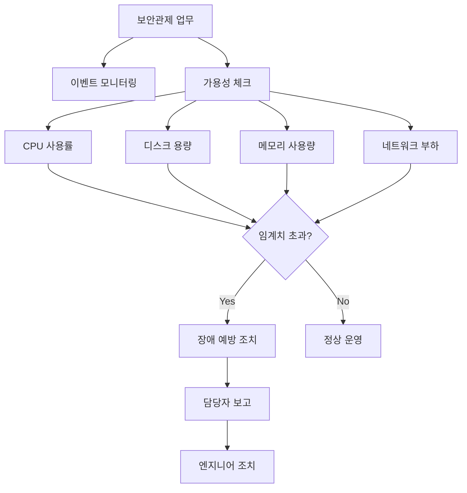

### 가용성 체크 주기 및 방법

#### 점검 주기

| 근무 시간대 | 점검 횟수 | 점검 시점 |
|:---:|:---:|:---|
| **주간 근무** | 2회 | 오전 1회, 오후 1회 |
| **야간 근무** | 1~2회 | 야간 교대 전후 |

#### 점검 방법

가용성 체크는 **NMS(Network Management System)** 또는 **EMS(Enterprise Management System)** 같은 솔루션을 이용하여 수행합니다.

```bash
# NMS/EMS 솔루션을 통한 헬스 체크 연동 구조
┌──────────────┐     ┌──────────────┐     ┌──────────────┐
│   ESM/SIEM   │────▶│   NMS/EMS    │────▶│  보안장비    │
│  (관제콘솔)   │◀────│  (헬스체크)   │◀────│ (FW/IPS/WAF) │
└──────────────┘     └──────────────┘     └──────────────┘
        │                                         │
        └─────────── 상태 정보 수집 ───────────────┘
```

#### 점검 항목별 임계치 예시

| 점검 항목 | 주의 임계치 | 경고 임계치 | 위험 임계치 |
|:---:|:---:|:---:|:---:|
| **CPU 사용률** | 70% | 80% | 90% |
| **메모리 사용률** | 75% | 85% | 95% |
| **디스크 사용률** | 70% | 80% | 90% |
| **네트워크 부하** | 60% | 75% | 85% |

### 장애 발생 시 대응 절차

> ⚠️ **주의**: 장애가 발생하더라도 관제 인력이 직접 서버를 재시작하거나 조치를 취해서는 **절대 안 됩니다**. 반드시 보고 후 승인을 받고 진행해야 합니다.

#### 장애 대응 프로세스

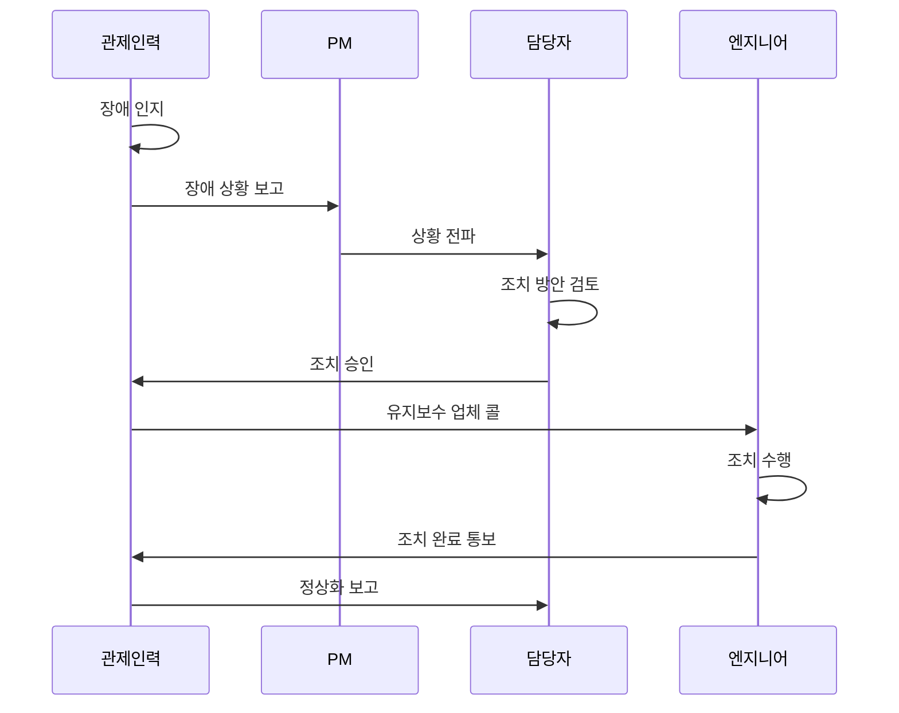

#### 야간/휴일 장애 발생 시 보고 체계

```
야간/휴일 장애 발생
        │
        ▼
┌───────────────────┐
│   PM에게 보고     │  ◀── 1차 연락
└───────────────────┘
        │ (연락 불가 시)
        ▼
┌───────────────────┐
│  담당자에게 보고   │  ◀── 2차 연락
└───────────────────┘
        │
        ▼
┌───────────────────┐
│  유지보수 업체 콜  │  ◀── 엔지니어 출동 요청
└───────────────────┘
```

> 💡 **중요!**: 야간에 장애가 발생해도 **선조치 후보고**는 허용되지 않습니다. 서버를 잘못 건드렸다가 올라오지 않으면 책임 문제가 발생합니다. 반드시 보고 → 승인 → 조치 순서를 따라야 합니다.

### 유지보수 업체 SLA(Service Level Agreement)

유지보수 업체와의 계약에는 **대응 시간**이 명시되어 있습니다.

| 구분 | 기준 시간 | 설명 |
|:---:|:---:|:---|
| **현장 도착** | 4시간 이내 | 장애 신고 접수 후 현장 도착까지 |
| **조치 완료** | 4시간 이내 | 현장 도착 후 조치 완료까지 |

#### 비상 연락망 관리의 중요성

> 📌 **노트**: 비상 연락망 갱신은 매우 중요한 업무입니다. 담당자가 바뀌거나 엔지니어가 교체되었을 때 연락처를 갱신하지 않으면 심각한 문제가 발생할 수 있습니다.

**실제 사례 1 - 담당자 미갱신으로 인한 사고**:
- 침해시도 탐지 후 담당자에게 1차, 2차, 3차 통보
- 담당자 교체 사실을 몰라 계속 이전 담당자에게만 연락
- 결국 사고 발생 후에야 담당자 교체 사실 인지
- **교훈**: 비상 연락망을 월 1회 이상 갱신해야 함

**실제 사례 2 - 비밀번호 분실 사례**:
- 취약점 점검 중 비밀번호 변경 이력 없는 시스템 발견
- 시스템 담당자도 비밀번호 모름
- 유지보수 업체 엔지니어도 퇴사
- 퇴사한 엔지니어에게 연락하여 겨우 비밀번호 확인
- **교훈**: 비밀번호 관리와 인수인계 체계 확립 필요

### 바이패스(Bypass) 상황 대응

장비 장애로 인해 **바이패스** 모드로 전환되면, 해당 장비의 보안 기능이 작동하지 않습니다.

```
정상 상태:
[트래픽] ──▶ [보안장비(IPS)] ──▶ [내부 서버]
              ▲ 탐지/차단

바이패스 상태:
[트래픽] ──────────────────────▶ [내부 서버]
              (보안장비 우회)
              ▲ 보안 기능 미작동!
```

> 🔐 **보안**: 바이패스 상태에서는 평소보다 더 세밀하게 관제를 해야 합니다. SIEM에서 놓치는 이벤트가 있을 수 있으므로, 개별 보안장비에 직접 접속하여 확인이 필요할 수 있습니다.

---

## 🏢 운영 인력과 관제 인력의 역할 분담

### 조직 구성별 역할

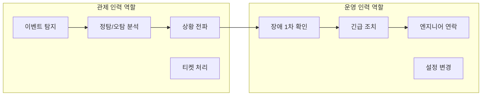

### 상황별 대응 체계

| 상황 | 관제 인력만 있는 경우 | 관제+운영 인력 있는 경우 |
|:---|:---|:---|
| **장애 인지** | 즉시 PM에게 보고 | 운영 파트에 전달 |
| **1차 확인** | 불가 (권한 없음) | 운영 인력이 확인 |
| **긴급 조치** | 엔지니어 콜 후 대기 | 가능한 범위 내 조치 |
| **엔지니어 연락** | 직접 연락 | 운영 인력이 연락 |
| **조치 완료 확인** | 정상화 여부 확인 | 운영+관제 함께 확인 |

> 💡 **중요!**: 관제 인력의 핵심 역할은 **빠른 인지**와 **신속한 전파**입니다. 직접 조치하는 것이 아니라, 상황을 파악하고 적절한 담당자에게 전달하는 것이 주 업무입니다.

---


## 🔍 초동 분석 및 정책 관리

### 초동 분석(Initial Analysis)

관제를 수행하면서 이벤트가 발생했을 때, 가장 먼저 수행하는 것이 **초동 분석**입니다.

#### 초동 분석 대상

| 분석 대상 | 수집 방법 | 분석 목적 |
|:---:|:---|:---|
| **로그 데이터** | 보안장비에서 ESM/SIEM으로 수집 | 이벤트 내용 파악 |
| **패킷 데이터** | 네트워크 탭(TAP)을 통해 수집 | 공격 패턴 상세 분석 |
| **시스템 로그** | 서버에서 직접 수집 | 침해 여부 확인 |

#### 분석 프로세스

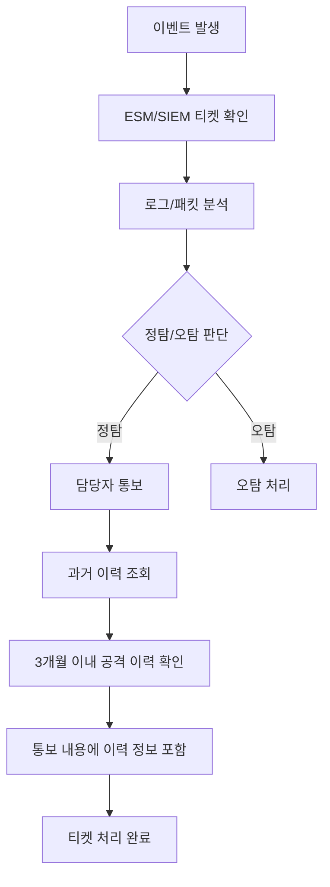

#### 과거 이력 조회의 중요성

> 💡 **중요!**: 정탐으로 판단된 공격에 대해 담당자에게 통보할 때, 단순히 "공격이 발생했습니다"라고만 알리는 것이 아니라, **과거 3개월 정도의 이력을 조회**하여 해당 공격자 IP가 이전에도 공격을 시도했는지 확인하고 함께 전달해야 합니다.

**통보 내용 예시**:
```
[탐지 이벤트 통보]

- 공격 유형: SQL Injection
- 공격자 IP: 192.168.xxx.xxx (중국)
- 목적지 IP: 10.0.0.xxx (웹서버)
- 탐지 시간: 2026-01-16 10:30:25
- 과거 이력: 최근 3개월 내 동일 IP 공격 이력 없음
  (또는) 2025-12-05에 동일 IP에서 XSS 공격 시도 탐지 이력 있음
- 조치 사항: 방화벽 차단 완료
```

---

### 정책 관리(Policy Management)

#### 위협 정보 수집 경로

탐지 정책을 만들기 위한 위협 정보는 다양한 경로를 통해 수집됩니다.

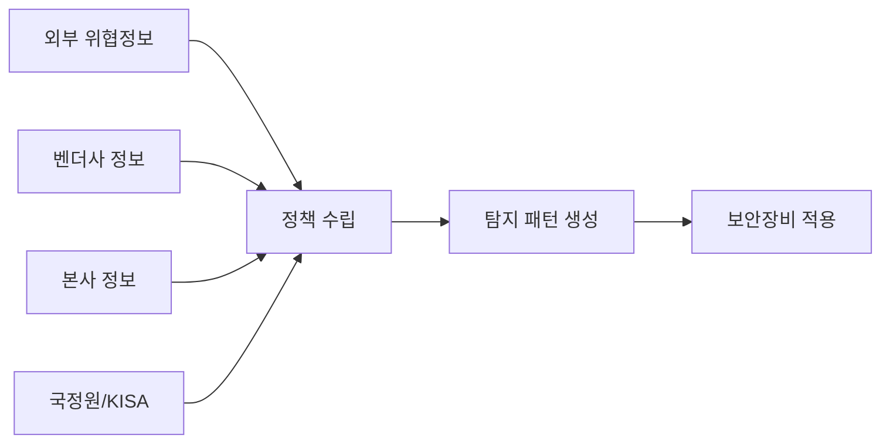

| 수집 경로 | 정보 유형 | 예시 |
|:---:|:---|:---|
| **외부 위협정보** | 제로데이, 신규 취약점 | CVE 정보 |
| **벤더사** | 장비 업데이트, 시그니처 | Snort Rule |
| **본사** | 자체 분석 위협정보 | 블랙리스트 IP/URL |
| **국정원/KISA** | 국가 차원 위협정보 | TMS 룰 업데이트 |

#### 정책 적용 시 주의사항

> ⚠️ **주의**: 외부에서 받은 룰을 그대로 적용하면 안 됩니다. 해당 사이트의 환경에 맞게 수정하여 적용해야 합니다. 운이 좋으면 바로 탐지가 되지만, 환경에 맞지 않으면 탐지가 안 될 수도 있습니다.

#### 공격 유형 분류 체계

보안관제에서 탐지되는 공격은 다음과 같이 분류됩니다.

| 대분류 | 세부 공격 유형 | 설명 |
|:---:|:---|:---|
| **웹해킹** | SQL Injection, XSS, 파일 업로드/다운로드, CSRF | 웹 애플리케이션 대상 공격 |
| **비인가 접근** | 무차별 대입, 관리자 페이지 접근 시도 | 인증 우회 시도 |
| **서비스 거부** | DDoS, SYN Flood, UDP Flood | 가용성 침해 공격 |
| **악성코드** | 랜섬웨어, 트로이목마, 웜 | 악성 프로그램 감염 |
| **스캐닝** | 포트 스캔, 취약점 스캔 | 정보 수집 활동 |

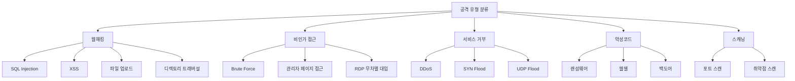

---

### 탐지정책 관리(Detection Policy Management)

#### 정책 관리 유형

탐지 정책은 크게 세 가지 목적으로 관리됩니다.

| 목적 | 정책 유형 | 적용 대상 |
|:---:|:---:|:---|
| **모니터링** | 블랙리스트 | 공격 탐지/차단용 IP |
| **침해사고 분석** | 블랙리스트 | 사고 분석 결과 차단용 IP |
| **침해예방 점검** | 화이트리스트 | 취약점 점검용 IP |

> 📌 **노트**: 모니터링과 침해사고 분석에서 나온 IP는 **블랙리스트**(차단 목적)로 처리하고, 침해예방 점검을 위한 IP는 **화이트리스트**(허용 목적)로 처리합니다.

#### 방화벽 정책 적용 프로세스

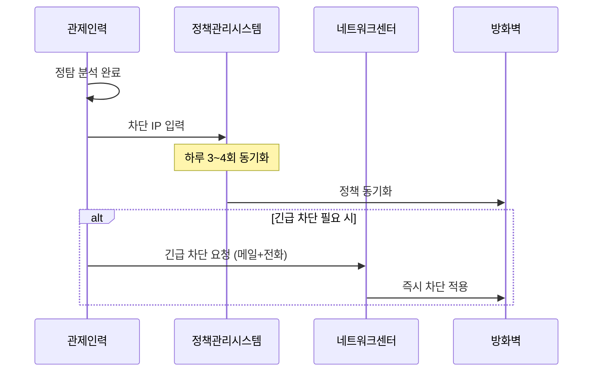

#### 방화벽 정책 입력 시 주의사항

> ⚠️ **주의**: 방화벽에 IP를 입력할 때 **비트 수를 정확하게 입력**해야 합니다. 숫자 하나 잘못 입력하면 네트워크 전체가 마비될 수 있습니다.

**사고 사례**:
- `/32` 비트를 입력해야 하는데 `/3`만 입력
- 해당 순간 네트워크 전체 마비
- 원인 파악을 위해 정책을 역순으로 확인해야 하는 상황 발생

```bash
# 올바른 입력 예시
192.168.1.100/32    # 단일 IP 차단

# 잘못된 입력 예시 (위험!)
192.168.1.100/3     # 광범위한 대역 차단 → 네트워크 마비 가능
```

> 💡 **중요!**: 정책 입력 전 **2~3번 확인**하는 습관을 들이세요. 입력 실수 하나가 전체 서비스에 영향을 줄 수 있습니다.

#### 방화벽 정책 입력 권한 관리

| 시간대 | 권한 주체 | 처리 방식 |
|:---:|:---:|:---|
| **주간** | 네트워크센터/담당자 | 관제에서 정책관리시스템에 입력 → 동기화 |
| **야간** | 관제인력 (위임) | 직접 입력 권한 부여 → 출근 시 회수 |

> 🔐 **보안**: 용역업체(관제업체)에 대한 보안성 강화로 인해, 현재는 관제 인력에게 직접 방화벽 접근 권한을 주는 곳이 줄어들고 있습니다. 대부분 정책 동기화 시스템을 통해 간접적으로 적용합니다.

#### 탐지 정책 유지 기간

| IP 유형 | 유지 기간 | 연장 조건 |
|:---:|:---:|:---|
| **국내 IP** (과거) | 1주일 | - |
| **국외 IP** (과거) | 3개월 | - |
| **현재 (통합)** | 3~6개월 | 재접속 이력 있으면 연장 |

> 📌 **노트**: 현재는 국내/국외 IP 구분 없이 3~6개월 정도 유지하며, 해당 기간 내 재접속 이력이 있으면 마지막 탐지일 기준으로 기간을 연장합니다.

#### 탐지 정책 수량

| 정책 유형 | 수량 | 관리 주체 |
|:---:|:---:|:---|
| **TMS(국정원 연동)** | 1,000~8,000개 | 국정원에서 수시 업데이트 |
| **IDS/IPS 자체 패턴** | 200~300개 | 관제 인력이 직접 관리 |
| **벤더사 시그니처** | 수천 개 | 월/분기 단위 업데이트 |

---

### 포트 허용 신청 및 화이트리스트 관리

#### 포트 허용 신청서 처리

침해예방 점검(모의해킹, 취약점 점검)을 위해서는 점검 인력의 IP를 **화이트리스트**로 처리해야 합니다.

**포트 허용 신청서 주요 항목**:
```
┌─────────────────────────────────────────────┐
│           포트 허용 신청서                    │
├─────────────────────────────────────────────┤
│ 신청 부서: ________________________          │
│ 신청자: ________________________            │
│ 신청 사유: 시스템 취약점 점검               │
│                                             │
│ 출발지 IP: 192.168.xxx.xxx (점검용 PC)      │
│ 목적지 IP: 10.0.0.xxx (대상 서버)           │
│ 포트: 80, 443, 22                           │
│ 적용 기간: 2026-01-16 ~ 2026-01-20          │
│                                             │
│ 담당자 승인: _____________ (서명)            │
└─────────────────────────────────────────────┘
```

#### 상황 전파문(위협정보 공유)

블랙리스트로 처리되는 정보는 **상황 전파문**으로 작성하여 유관기관에 배포합니다.

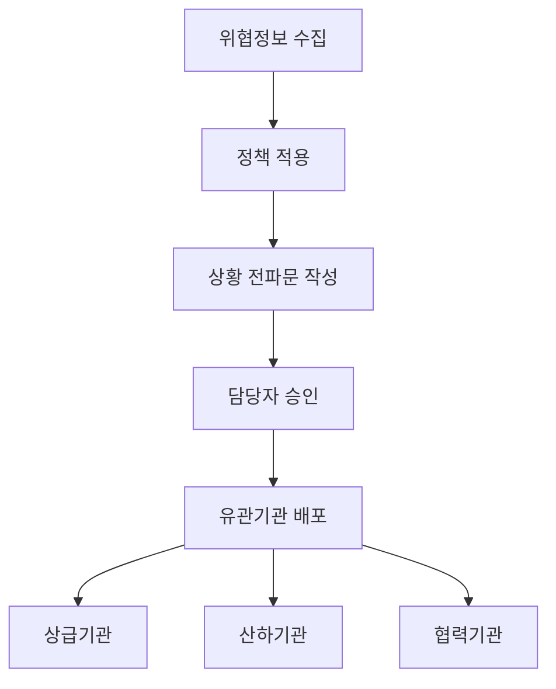

---


## 🤖 SOAR와 AI 관제

### SOAR(Security Orchestration, Automation and Response)

#### SOAR란 무엇인가?

SOAR는 보안 관제 업무의 **자동화**를 위한 솔루션입니다. SIEM에서 탐지된 이벤트를 기반으로 미리 정의된 **플레이북(Playbook)**에 따라 자동으로 대응 조치를 수행합니다.

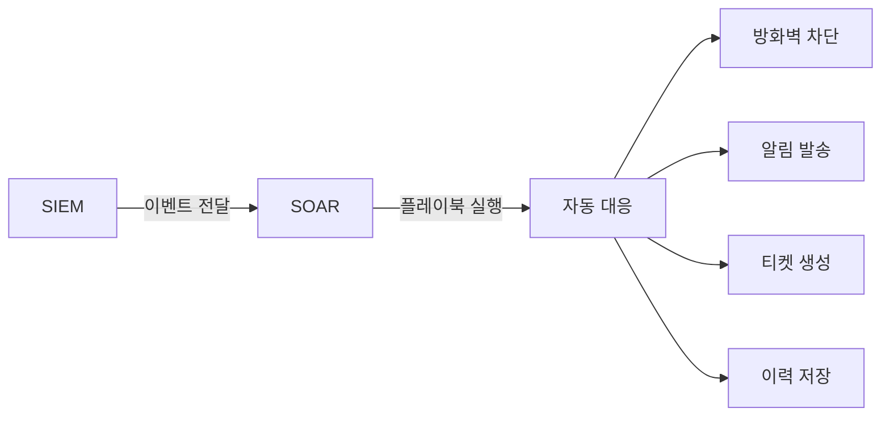

#### SOAR의 핵심 기능

| 기능 | 설명 | 자동화 대상 |
|:---:|:---|:---|
| **Orchestration** | 여러 보안 도구 간 연동 | API 연동, 데이터 공유 |
| **Automation** | 반복 업무 자동화 | 차단, 알림, 티켓팅 |
| **Response** | 위협에 대한 대응 | 격리, 복구, 보고 |

#### 플레이북(Playbook) 개발

> 📌 **노트**: 플레이북은 관제 업무의 프로세스를 분석하여 개발합니다. 관제 인력이 직접 개발하는 것이 아니라, **개발자에게 업무 프로세스를 설명**하여 플레이북을 만들도록 합니다.

**플레이북 개발 프로세스**:
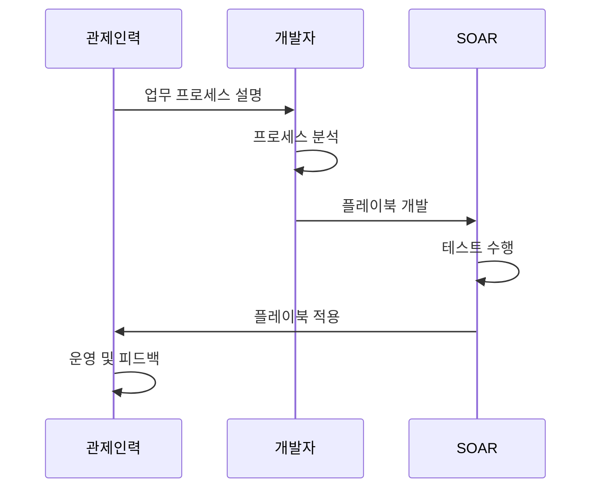

**플레이북 예시 - SQL Injection 자동 대응**:
```
[플레이북: SQL_INJECTION_AUTO_RESPONSE]

1. 트리거 조건
   - SIEM에서 SQL Injection 이벤트 탐지
   - 위험도: High 이상

2. 자동 수행 작업
   Step 1: 공격자 IP 추출
   Step 2: 평판 조회 (VirusTotal API 연동)
   Step 3: 블랙리스트 등록 여부 확인
   Step 4: 방화벽 차단 API 호출
   Step 5: 담당자에게 알림 발송 (이메일/SMS)
   Step 6: 티켓 자동 생성

3. 완료 후 조치
   - 이력 DB 저장
   - 일일보고서 항목에 자동 추가
```

#### SOAR의 한계점

> ⚠️ **주의**: SOAR의 이상적인 목표는 탐지부터 차단까지 완전 자동화이지만, 현실적으로는 **국내 제품과 해외 제품 간 연동의 한계**가 있습니다.

| 구분 | 해외 SOAR + 해외 장비 | 해외 SOAR + 국내 장비 | 국내 SOAR + 해외 장비 |
|:---:|:---:|:---:|:---:|
| **자동 차단** | ⭕ 가능 | ❌ 제한적 | ❌ 제한적 |
| **API 연동** | ⭕ 완전 지원 | △ 부분 지원 | △ 부분 지원 |

**현재 SOAR 활용 현황**:
- 완전 자동화보다는 **관제 인력의 업무 효율성 향상**에 초점
- 티켓팅 시 버튼 클릭만으로 담당자에게 자동 통보
- 회신 이력 자동 관리
- 수동으로 처리하던 반복 업무 간소화

---

### AI 관제(AI-based Security Monitoring)

#### AI 관제의 두 가지 방식

AI 관제는 크게 두 가지 방식으로 운영됩니다.

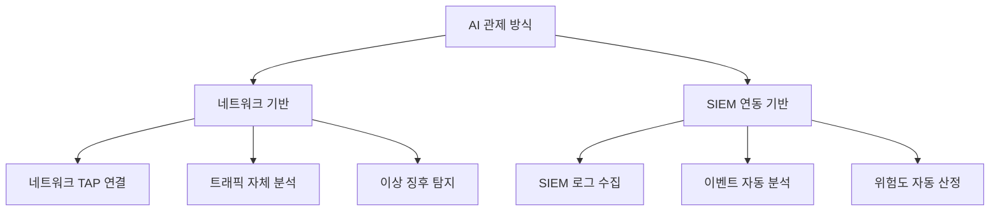

| 방식 | 특징 | 대표 제품 |
|:---:|:---|:---|
| **네트워크 기반** | 네트워크에 연결하여 트래픽 직접 분석 | Darktrace, Stella |
| **SIEM 연동** | SIEM 로그를 받아 자동 분석 | MLTK(Splunk), 자체 개발 AI |

#### AI 관제의 학습 방식

| 학습 방식 | 설명 | 관제 인력 개입 |
|:---:|:---|:---|
| **지도학습** | 사람이 직접 정의한 정보 기반 학습 | 처음부터 정의 필요 |
| **비지도학습** | 트래픽 수집 후 스스로 패턴 인식 | 최종 결정 시 개입 필요 |

> 💡 **중요!**: 비지도학습이라 하더라도 결국 사람의 손이 들어갑니다. AI가 "이건 뭐냐?"라고 질문하면 담당자가 "이건 정탐이야", "이건 빼"라고 최종 결정을 해주어야 합니다.

#### AI 관제의 현실

**과거 AI 제품 사례 - Stella**:
- 미국 NASA 박사들과 연구하여 개발했다고 소개
- Palo Alto 등 해외 방화벽과 API 연동으로 자동 차단 기능 홍보
- 시간이 지나면서 **상업적 목적**(상품 추천 등)으로 변질
- 현재 보안 분야에서는 활용도 낮음

**현재 활용 현황**:
- Darktrace가 가장 알려진 제품이나, 실제 도입/운영 사례는 제한적
- 도입 계획은 많으나 실제 운영 데이터는 부족
- 기대만큼의 효과가 나오지 않는 상황

#### AI + SOAR 연동 모델

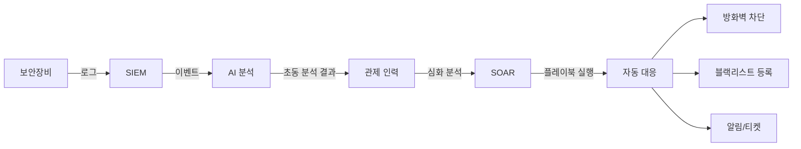

**향후 발전 방향**:
1. AI가 **초동 분석**(이상 탐지, 위험도 산정) 담당
2. 관제 인력이 **심화 분석** 수행
3. SOAR가 분석 결과 기반 **자동 대응** 실행

> 📌 **노트**: 현재 SK쉴더스 원격관제센터에서 **시큐디움 AI**를 개발 중이며, 1차 개발은 완료되었으나 효율성 검증 중에 있습니다.

---

## 🎯 모의훈련 체계

### 모의훈련의 종류

보안관제에서 지원해야 하는 모의훈련은 크게 4가지가 있습니다.

| 훈련 유형 | 목적 | 관제 인력 역할 |
|:---:|:---|:---|
| **해킹메일 모의훈련** | 피싱 대응 능력 점검 | 화이트리스트 처리, 신고 접수 |
| **DDoS 모의훈련** | DDoS 대응 체계 점검 | 트래픽 모니터링, 증적 수집 |
| **서버해킹 모의훈련** | 침투 탐지 능력 점검 | 주의 관제, 탐지/차단 수행 |
| **전산망 침투훈련** | 종합 보안 체계 점검 | 주의 관제, 탐지/차단 수행 |

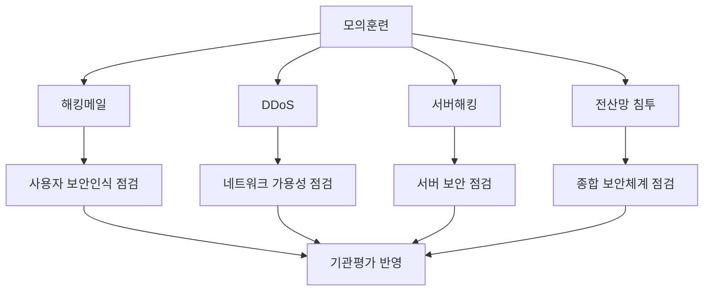

### 해킹메일 모의훈련

#### 훈련 개요

해킹메일 모의훈련은 **사용자들의 피싱 대응 능력**을 점검하는 훈련입니다.

#### 훈련 프로세스

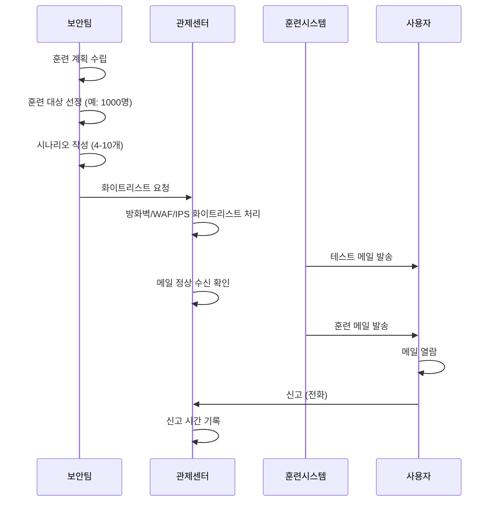

#### 관제 인력의 역할

| 단계 | 역할 | 주의사항 |
|:---:|:---|:---|
| **사전 준비** | 화이트리스트 처리 | 방화벽, WAF, IPS 등 모든 장비에 적용 |
| **테스트** | 메일 수신 확인 | 훈련 시스템에서 정상 발송 여부 확인 |
| **훈련 중** | 신고 접수 | **신고 시간 정확히 기록** |
| **훈련 후** | 결과 전달 | 담당자에게 신고 내역 전달 |

#### 시나리오 예시

훈련 시나리오는 **사용자들이 속을 만한 내용**으로 작성됩니다.

```
[훈련 메일 시나리오 예시]

시나리오 1: 연봉 인상 관련
- 제목: "[긴급] 2026년 연봉 5% 이상 인상 확정 안내"
- 내용: 첨부파일 확인 요청

시나리오 2: 결재 요청
- 제목: "[결재요청] 1월 업무비 정산 건 확인 부탁드립니다"
- 내용: 링크 클릭 유도

시나리오 3: 보안 업데이트
- 제목: "[필독] 보안 패치 미설치 PC 조치 안내"
- 내용: 프로그램 설치 유도
```

#### 신고 기준 시간

> 💡 **중요!**: 해킹메일 모의훈련은 **기관평가**에 반영됩니다. 신고 기준 시간(30분~1시간)을 초과하면 해당 부서 점수가 깎이므로, 신고 시간을 정확히 기록해야 합니다.

**평가 기준 예시**:
- 열람 후 30분 이내 신고: 감점 없음
- 열람 후 30분~1시간 신고: 경미한 감점
- 열람 후 1시간 초과: 점수 차감

#### 해킹메일 차단 시스템 동작 원리

> 📌 **노트**: 해킹메일 차단 시스템은 **전 세계 DNS 정보**를 보유하고 있어, 알려지지 않은 도메인에서 온 메일은 자동으로 차단합니다.

**예시**:
- `naver.com` → 정상 도메인, 통과
- `navar.com` (오타 도메인) → 미등록 도메인, 차단

---

### DDoS 모의훈련

#### 훈련 개요

DDoS 모의훈련은 **네트워크 가용성과 DDoS 방어 체계**를 점검하는 훈련입니다.

#### 훈련 시간 및 대역폭

| 항목 | 기준 |
|:---:|:---|
| **훈련 시간** | 밤 11시 ~ 새벽 4시 30분 |
| **공격 대역폭** | 네트워크 대역폭의 70~80% |
| **공격 유형** | 12~13가지 DDoS 공격 시나리오 |

> ⚠️ **주의**: 4시 반까지 종료하는 이유는 문제 발생 시 **원복 시간**이 필요하기 때문입니다.

#### 훈련 시 관제 역할

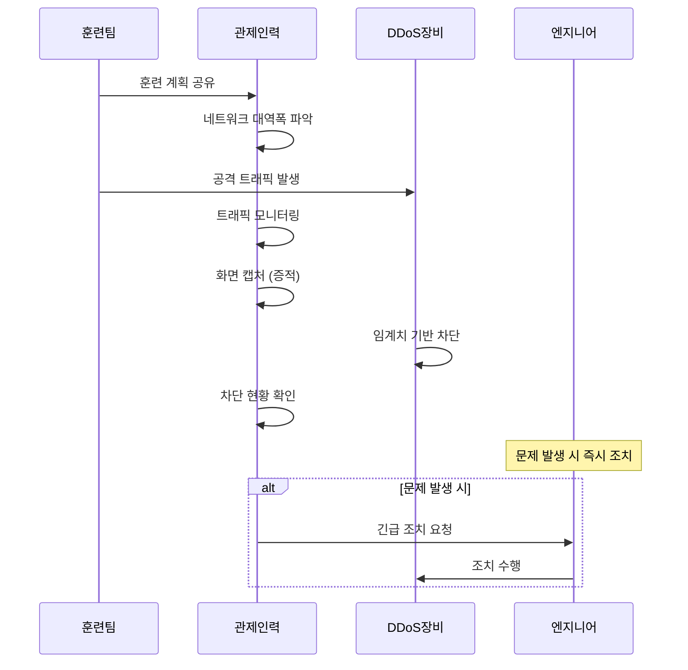

#### 관제 인력 업무

1. **사전 준비**
   - 네트워크 대역폭 파악 (1G, 2G, 10G 등)
   - 각 보안장비 엔지니어 섭외 (대기)

2. **훈련 중**
   - 트래픽 모니터링
   - **화면 캡처** (증적 자료)
   - DDoS 장비 차단 현황 확인

3. **훈련 후**
   - 증적 자료 정리
   - 결과 보고서 작성 지원

#### ISP 클린존 서비스

> 📌 **노트**: 대규모 DDoS 공격에 대응하기 위해 **ISP 클린존** 서비스를 활용합니다.

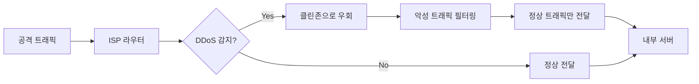

**클린존 효과**:
- 700~800Mbps 공격 발생 시 → 클린존 우회
- 비정상 트래픽 제거 후 → 평균 100Mbps 수준 유지
- 정상 서비스 가능

**ISP 3사 클린존 서비스**:
| ISP | 서비스명 | 월 비용 (대략) |
|:---:|:---:|:---:|
| KT | DDoS 방어 서비스 | 400~500만원 |
| SKB | DDoS 클린존 | 400~500만원 |
| LGU+ | 클린존 서비스 | 400~500만원 |

---

### 서버해킹 및 전산망 침투훈련

#### 훈련 개요

서버해킹과 전산망 침투훈련은 **실제 모의해킹**을 통해 보안 체계를 점검하는 훈련입니다.

| 훈련 유형 | 특징 |
|:---:|:---|
| **서버해킹** | 특정 서버 대상 침투 시도 |
| **전산망 침투** | 내부 네트워크 전체 대상 침투 시도 |

#### 훈련 규칙

> 🔐 **보안**: 모의해킹 훈련은 반드시 **사전 협의된 규칙** 내에서 수행됩니다.

**협의 사항**:
- 침투 허용 범위 (어디까지 진행할 것인가)
- 정보 유출 금지 (실제 유출하지 않음)
- 서버 다운 금지 (가용성 침해 금지)
- 발견된 취약점까지만 보고

#### 관제 인력 역할

> 💡 **중요!**: 서버해킹/전산망 침투훈련 기간에는 **주의 관제**를 수행해야 합니다.

| 단계 | 역할 |
|:---:|:---|
| **훈련 전** | 훈련 기간, 공격자 IP 정보 파악 |
| **훈련 중** | 의심 이벤트 탐지 시 즉시 차단 및 보고 |
| **훈련 후** | 탐지 리스트 추출 및 제출 |

#### 훈련 결과 매칭

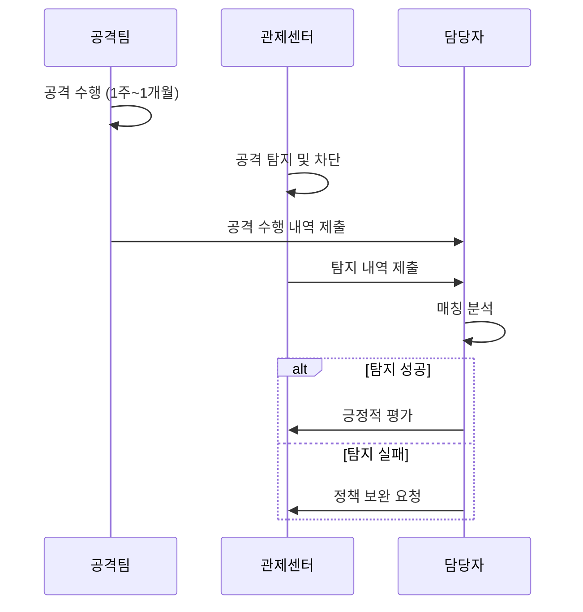

**평가 결과**:
- 모든 공격 탐지: 좋은 평가
- 1~2개 미탐지: 보통 평가 + 보완 필요
- 다수 미탐지: 정책 전면 재검토 필요

---

### 침해사고 모의훈련(도상훈련)

침해사고 도상훈련은 **가상의 침해사고 시나리오**를 기반으로 대응 절차를 점검하는 훈련입니다.

#### 훈련 방식

1. 가상 시나리오 제시 (예: "랜섬웨어 감염 발생")
2. 각 담당자별 대응 방안 작성
3. 침해사고 대응 절차에 따라 단계별 대응
4. 최종 복구까지의 과정 시뮬레이션

> 📌 **노트**: 도상훈련은 실제 시스템에 영향을 주지 않고, **대응 절차를 사전에 숙지**하기 위한 훈련입니다.

---


## 📡 정보공유 및 침해예방 점검

### 정보공유(Information Sharing)

관제 업무에서 고객에게 제공하는 주요 정보는 크게 두 가지입니다.

#### 정보 유형

| 정보 유형 | 수집 경로 | 전달 방식 |
|:---:|:---|:---|
| **보안 뉴스** | 전자신문, 데일리시큐리티 등 | 일일보안관제보고서 포함 |
| **취약점 권고문** | KISA KrCERT, 국정원 | 보안 권고문 형식 발송 |

#### 보안 뉴스 수집

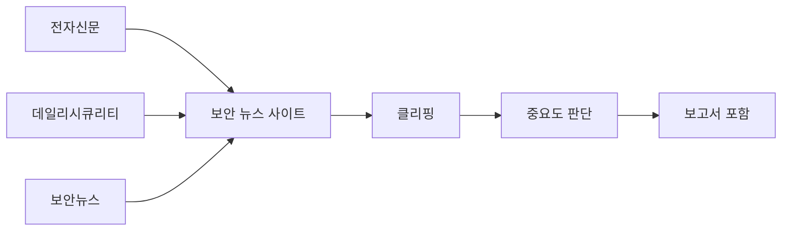

#### 취약점 권고문

취약점 권고문은 **KISA KrCERT**에서 수집하여 담당자에게 전달합니다.

**권고문 포함 내용**:
```
┌─────────────────────────────────────────────┐
│            보안 권고문 (예시)                │
├─────────────────────────────────────────────┤
│ 취약점명: CVE-2026-XXXXX                    │
│ 영향받는 제품: Linux Kernel 5.x ~ 6.x       │
│ 위험도: High                                │
│ 영향받는 버전: 5.0 ~ 6.2                    │
│ 해결 버전: 6.3 이상                         │
│                                             │
│ 대응방안:                                   │
│ 1. 최신 버전으로 업데이트                   │
│ 2. 임시 조치: 특정 모듈 비활성화            │
│                                             │
│ 참고 URL: https://www.krcert.or.kr/...      │
└─────────────────────────────────────────────┘
```

#### 영향받는 시스템 파악 방법

> 📌 **노트**: 고객은 권고문을 받으면 "우리 기관에 해당 취약점이 있는 시스템이 몇 대나 있나?"를 궁금해합니다. 하지만 관제 입장에서는 전체 시스템 정보를 알기 어렵습니다.

**정보 수집 방법**:
1. **전산실 협조** - 직접 문의 (시간 소요)
2. **취약점 점검 인력 협조** - 정보자산 현황 공유 요청

**취약점 점검 인력의 정보**:
- 연초에 정보자산 갱신
- 시스템 담당 부서, 담당자, OS 버전 정보 보유
- 단, 연초 이후 갱신이 잘 안 됨

#### 대외기관 정보 공유 체계

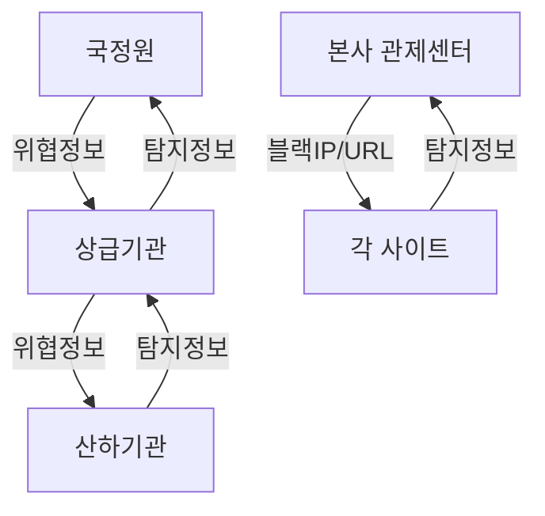

> ⚠️ **주의**: 동일한 위협정보가 여러 경로로 중복 전달될 수 있습니다. 정책 적용 시 중복 확인이 필요합니다.

**중복 발생 예시**:
- 국정원 → 상급기관 → 산하기관 (경로 1)
- 국정원 TMS 룰 → IP 추출 → 상황전파문 (경로 2)
- 본사 → 각 사이트 (경로 3)

---

### 침해예방 점검

#### 점검 유형

| 점검 유형 | 설명 | 현황 |
|:---:|:---|:---|
| **구글 위험 점검** | 구글 검색으로 노출 정보 확인 | ASM으로 대체 |
| **개인정보 노출 점검** | 개인정보 외부 노출 여부 확인 | 운영 중 |
| **악성코드 탐지 점검** | 웹서버 악성코드 스캔 | 웹쉘 점검과 통합 |
| **웹쉘 점검** | 웹서버 내 웹쉘 탐지 | 운영 중 |

#### ASM(Attack Surface Management)

구글 위험 점검은 현재 **ASM** 솔루션으로 대체되고 있습니다.

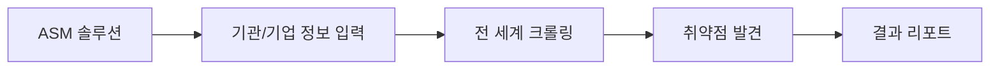

**ASM 기능**:
- 자동으로 외부 노출 자산 탐지
- 발견된 취약점 자동 보고
- 지속적인 모니터링

#### 웹쉘 점검 시스템

> 📌 **노트**: 웹쉘 점검 시스템은 초창기에 **획기적인 제품**이었습니다. 기존에 알지 못했던 웹쉘들을 발견해냈기 때문입니다.

**동작 원리**:
```
웹쉘 점검 시스템
        │
        ▼
┌───────────────────┐
│  대상 URL 등록    │ ◀── 라이센스 수량만큼
└───────────────────┘
        │
        ▼
┌───────────────────┐
│   자동 크롤링     │
└───────────────────┘
        │
        ▼
┌───────────────────┐
│   웹쉘 패턴 매칭  │
└───────────────────┘
        │
        ▼
┌───────────────────┐
│   탐지 결과 보고  │
└───────────────────┘
```

**현재 상황**:
- 초창기: 많은 웹쉘 탐지로 높은 만족도
- 현재: 지속 운영 중이나 탐지 건수 감소
- 고객 의문: "정상적으로 작동하는 게 맞아?"
- 실제: 정상 작동 중, 웹쉘 침투 자체가 감소

---

## 🏗️ 보안 운영 업무

### 보안 운영의 정의

보안 운영은 **보안장비를 정상적으로 유지**하기 위한 업무입니다. 관제가 "탐지와 대응"에 집중한다면, 운영은 "장비 관리"에 집중합니다.

### 운영 업무 분류

```mermaid
flowchart TD
    A[보안 운영] --> B[자산 관리]
    A --> C[장애 관리]
    A --> D[작업 관리]
    A --> E[성능 관리]
    A --> F[재해복구 관리]
```

| 업무 | 설명 | 관제 인력 관여도 |
|:---:|:---|:---:|
| **자산 관리** | 보안장비 정보 관리 | 낮음 |
| **장애 관리** | 장애 인지 및 조치 | **높음** |
| **작업 관리** | 교체/변경 작업 지원 | 중간 |
| **성능 관리** | 가용성 체크 | **높음** |
| **재해복구 관리** | 백업 확인 | 중간 |

---

### 자산 관리

자산 관리는 **운영 인력 전담 업무**입니다. 관제 인력만 있는 경우 크게 신경 쓰지 않아도 됩니다.

**관리 항목**:
- 보안장비 목록
- 장비 상세 정보 (IP, 버전, 라이센스 등)
- ESM/SIEM 연동 장비 현황

> 📌 **노트**: 관제 인력이 알아야 할 부분은 **SIEM 연동 장비 현황**입니다. 어떤 장비가 추가되거나 빠지는지는 파악하고 있어야 합니다.

---

### 장애 관리

#### 관제 인력의 핵심 역할: 장애 인지

> 💡 **중요!**: 관제 인력의 장애 관리에서 가장 중요한 것은 **빠른 인지**입니다.

```mermaid
flowchart LR
    A[장애 발생] --> B[인지]
    B --> C[전파]
    C --> D[조치]
    D --> E[정상화 확인]

    style B fill:#ff6b6b
    style C fill:#ff6b6b
```

**주간 vs 야간/휴일**:
| 시간대 | 인지 난이도 | 이유 |
|:---:|:---:|:---|
| **주간** | 낮음 | 여러 인력이 함께 모니터링 |
| **야간/휴일** | **높음** | 소수 인력, 느슨한 모니터링 |

#### 장애 대응 프로세스 (상세)

```mermaid
sequenceDiagram
    participant 관제인력
    participant 운영인력
    participant PM
    participant 담당자
    participant 엔지니어

    관제인력->>관제인력: 이상 징후 인지
    관제인력->>운영인력: 상황 전달

    alt 운영인력 있는 경우
        운영인력->>운영인력: 1차 원인 확인
        운영인력->>운영인력: 긴급 조치 시도
        alt 조치 가능
            운영인력->>관제인력: 조치 완료 통보
        else 조치 불가
            운영인력->>엔지니어: 유지보수 업체 콜
        end
    else 운영인력 없는 경우
        관제인력->>PM: 즉시 보고
        PM->>담당자: 상황 전파
        담당자->>엔지니어: 유지보수 업체 콜
    end

    엔지니어->>엔지니어: 조치 수행
    엔지니어->>관제인력: 조치 완료 통보
    관제인력->>관제인력: 정상화 확인
    관제인력->>담당자: 결과 보고
```

#### 장애 조치 권한

> ⚠️ **주의**: 관제 인력은 장애를 직접 조치할 권한이 없습니다. 인지 → 전파 → 정상화 확인이 주 역할입니다.

| 역할 | 할 수 있는 것 | 할 수 없는 것 |
|:---:|:---|:---|
| **관제 인력** | 인지, 전파, 확인, 보고 | 서버 재시작, 설정 변경 |
| **운영 인력** | 1차 확인, 긴급 조치 | 하드웨어 수리 |
| **엔지니어** | 전문 조치, 수리, 교체 | - |

---

### 작업 관리

#### 작업 유형

| 작업 유형 | 설명 | 단절 발생 |
|:---:|:---|:---:|
| **교체 작업** | 장비 교체 | ⭕ 있음 |
| **변경 작업** | 설정 변경 | △ 경우에 따라 |
| **점검 작업** | 정기 점검 | ❌ 없음 |
| **긴급 작업** | 장애 조치 | △ 경우에 따라 |

#### 작업 시 보고 의무

> 💡 **중요!**: 작업으로 인해 **단절이 발생**하는 경우, 반드시 상급기관에 사전 통보해야 합니다.

```mermaid
flowchart TD
    A[작업 발생] --> B{단절 발생?}
    B -->|Yes| C[상급기관 사전 통보]
    B -->|No| D[작업 진행]
    C --> E[국정원 통보 포함]
    E --> D
    D --> F[작업 수행]
    F --> G[정상화 확인]
    G --> H[결과 보고]
```

**보고 체계 예시**:
- 국토교통부 산하기관에서 작업 발생
- 국토교통부에 사전 통보
- 국토교통부 → 국정원에 통보

> ⚠️ **주의**: 사전 통보 없이 작업 진행 시, 상급기관에서 역으로 연락이 옵니다. "장비 이상이 있는데 무슨 일이냐?"

#### 작업 완료 후 확인

| 확인 항목 | 확인 방법 |
|:---:|:---|
| 장비 정상 동작 | 콘솔 접속, 상태 확인 |
| 로그 수집 정상 | ESM/SIEM 로그 확인 |
| 탐지 기능 정상 | 테스트 이벤트 발생 |

---

### 성능 관리

성능 관리는 앞서 설명한 **가용성 체크**와 동일합니다.

#### 점검 항목 및 임계치

| 항목 | 주의 | 경고 | 위험 |
|:---:|:---:|:---:|:---:|
| CPU | 70% | 80% | 90% |
| 메모리 | 75% | 85% | 95% |
| 디스크 | 70% | 80% | 90% |
| 네트워크 | 60% | 75% | 85% |

#### 정기점검과 긴급점검

| 점검 유형 | 시기 | 수행 주체 |
|:---:|:---|:---|
| **정기점검** | 월 1회 또는 분기 1회 | 유지보수 업체 엔지니어 |
| **긴급점검** | 장애 발생 시 | 유지보수 업체 엔지니어 |

---

### 재해복구 관리

#### 백업 관리

> 📌 **노트**: 백업은 사이트에 따라 필요한 곳과 필요 없는 곳이 있습니다. 필요한 곳은 **스케줄러**에 의해 매일 백업이 수행됩니다.

**관제 인력의 백업 확인 업무**:
```
백업 확인 체크리스트

□ 백업 시작 시간 확인
□ 백업 완료 시간 확인
□ 백업 용량 확인
□ 보고서에 기록
```

**확인 사항**:
- 백업이 정상 완료되었는지
- 백업 용량이 정상인지
- 백업 파일이 정상 생성되었는지

#### 비상 연락망 관리 (재강조)

> 💡 **중요!**: 비상 연락망 관리는 재해복구에서도 매우 중요합니다. 유지보수 업체, 고객사 담당자의 연락처가 최신 상태여야 합니다.

**연락망 갱신 주기**: 월 1회 이상

**확인 항목**:
- 유지보수 업체 엔지니어 연락처
- 고객사 담당자 연락처
- 야간/휴일 비상 연락처

---


## 🔐 보안관제 솔루션 체계

### 보안관제센터 환경

#### 물리적 환경

보안관제센터는 **제한구역**으로 지정되어 운영됩니다.

```
보안관제센터 출입 체계

┌─────────────────────────────────────────────────────────────────┐
│                      보안관제센터                                │
├─────────────────────────────────────────────────────────────────┤
│  상시출입자: 정보보안 담당자, 관제 인력 (명단 게시)             │
│  임시출입자: 출입자 명부 작성 → 담당자 승인 필요                │
│                                                                  │
│  ┌────────────────┐   ┌────────────────┐   ┌────────────────┐   │
│  │   상황판       │   │  모니터링 화면  │   │   뉴스 채널    │   │
│  │  (8~10개 화면) │   │  (이벤트/트래픽)│   │  (YTN/MBN)     │   │
│  └────────────────┘   └────────────────┘   └────────────────┘   │
│                                                                  │
│  ┌──────────────────────────────────────────────────────────┐   │
│  │              관제 인력 근무 구역                         │   │
│  │   [PC] [PC] [PC] [PC] [PC] [PC] [PC] [PC] [PC] [PC]      │   │
│  └──────────────────────────────────────────────────────────┘   │
└─────────────────────────────────────────────────────────────────┘
```

**상황판 구성**:
- 보안장비 이벤트 현황
- 네트워크 트래픽 현황
- 실시간 공격 유입 현황 (지도 시각화)
- VIP 방문 시 시각적 효과가 좋은 화면 표시

#### 출입 관리 체계

| 구분 | 관리 방법 | 비고 |
|:---:|:---|:---|
| **상시출입자** | 명단 게시판 게시 | 정보보안 담당자, 관제 인력 |
| **임시출입자** | 출입자 명부 작성 | 출입 목적, 시간, 신원 정보 기록 |
| **승인 절차** | 담당자 서명 필수 | 모든 센터 동일 적용 |

> 📌 **노트**: 관제센터 출입 관리는 모든 센터에서 동일하게 적용됩니다. 관리 수준의 차이는 있을 수 있으나, 출입자 명부 자체는 반드시 존재합니다.

---

### 보안서약 및 신원조회

#### 보안서약서 체계

```mermaid
flowchart TD
    A[사업 수주] --> B[투입 전 보안서약서]
    B --> C[대표이사 서약서]
    B --> D[투입 인력 서약서]

    E[프로젝트 종료] --> F[퇴직자 보안서약서]
    G[중도 이탈] --> F

    H[다음 프로젝트 시작] --> B

    style B fill:#ff9999
    style F fill:#ff9999
```

**보안서약서 주요 내용**:
- 업무 중 알게 된 정보의 외부 유출 금지
- 비밀유지 의무
- 위반 시 민형사상 책임

> ⚠️ **주의**: 프로젝트 종료 후 동일 인원이 다음 프로젝트에 투입되더라도, 퇴직자 보안서약서 제출 후 다시 보안서약서를 작성해야 합니다.

#### 신원조회 절차

정부부처 및 공공기관 대상 보안관제 업무 투입 시 **신원조회**가 필수입니다.

```
신원조회 프로세스

경찰청 양식 다운로드
        │
        ▼
양식 작성 및 제출
        │
        ▼
조회 기간 (15일 ~ 1개월)
        │
        ▼
결과 확인
        │
        ├── 정상 → 투입 진행
        │
        └── 결격 사유 발견 → 투입 불가 또는 중도 퇴장
```

**결격 사유 예시**:
- 벌금 200만원 이상 (기관별 규정에 따라 상이)
- 음주운전 이력
- 폭행 등 범죄 이력

> 💡 **중요!**: 신원조회 결과에서 문제가 발견되면 이미 투입되었더라도 중도에 나가야 하는 경우가 발생합니다. 개인 이력 관리에 주의가 필요합니다.

---

### 관제사업 조직 구성

#### 조직 체계

```mermaid
flowchart TD
    A[고객사 - 사업 총괄] --> B[PM]
    B --> C[보안 관제]
    B --> D[침해 대응]
    B --> E[취약점 진단]
    B --> F[보안 운영]

    C --> C1[초급 관제원]
    C --> C2[중급 관제원]
    D --> D1[CERT 인력]
    E --> E1[모의해킹]
    E --> E2[시스템 점검]
    F --> F1[장비 운영]
```

#### 인력 등급 체계

| 등급 | 요건 | 경력 |
|:---:|:---|:---:|
| **특급** | 고급 + 추가 경력 | 10년 이상 |
| **고급** | 중급 + 3~4년 경력 | 6~7년 이상 |
| **중급** | 초급 + 3년 경력 | 3년 이상 |
| **초급** | 전산 전공 4년제 졸업 또는 정보처리기사 | 신입 |

> 📌 **노트**: 과거에는 기사 자격증 필수였으나, 현재는 전공 졸업자도 초급으로 인정받을 수 있도록 변경되었습니다.

**등급별 비용 처리**:
- 인원 수와 등급에 따라 사업비가 산정됨
- 제안 요청에 맞게 인력 편성
- 예: "관제 중급 1명, 초급 1명" → 3년 이상 경력자 1명 + 신입 1명

---

### 보안관제 솔루션 종류

#### 탐지 및 차단 솔루션

| 솔루션 | 영문명 | 주요 기능 |
|:---:|:---:|:---|
| **방화벽** | Firewall | 네트워크 접근 제어, IP/포트 차단 |
| **IDS** | Intrusion Detection System | 침입 탐지 (패시브) |
| **IPS** | Intrusion Prevention System | 침입 탐지 + 차단 (액티브) |
| **WAF** | Web Application Firewall | 웹 애플리케이션 공격 차단 |
| **DDoS 대응** | Anti-DDoS | 서비스 거부 공격 방어 |
| **NAC** | Network Access Control | 네트워크 접근 제어 |

#### 정보 보호 솔루션

```mermaid
flowchart LR
    subgraph "데이터 보호"
        A[DB 접근제어]
        B[DB 암호화]
        C[DRM]
    end

    subgraph "엔드포인트 보호"
        D[안티바이러스]
        E[안티랜섬웨어]
        F[EDR]
    end

    subgraph "접근 관리"
        G[통합 접근 관리]
        H[특권 접근 관리]
        I[SSO]
    end
```

| 솔루션 | 설명 | 적용 대상 |
|:---:|:---|:---:|
| **DB 접근제어** | 데이터베이스 접근 권한 관리 | DB 서버 |
| **DB 암호화** | 주요 정보 암호화 저장 | DB 서버 |
| **DRM** | 문서 권한 관리 | 파일 시스템 |
| **안티랜섬웨어** | 랜섬웨어 탐지 및 차단 | 엔드포인트 |
| **EDR** | 엔드포인트 위협 탐지 대응 | 엔드포인트 |

#### 안티랜섬웨어 동작 원리

> 📌 **노트**: 안티랜섬웨어는 초창기와 현재의 탐지 방식이 다릅니다.

```
초창기 방식:
파일 삭제/변경 감지
        │
        ▼
동시다발적 변경 (10개 이상)
        │
        ▼
자동 차단

현재 방식:
랜섬웨어 특성 분석
        │
        ▼
시그니처 기반 탐지
        │
        ▼
행위 기반 탐지
        │
        ▼
자동 차단
```

---

### 망분리 체계

#### 망분리의 필요성

> 💡 **중요!**: 중소기업에서 침해사고가 발생하는 주요 원인 중 하나는 망분리가 제대로 되어 있지 않기 때문입니다.

```mermaid
flowchart LR
    subgraph "물리적 망분리"
        A[업무망 PC] --- B[업무 서버]
        C[인터넷망 PC] --- D[인터넷]
    end

    subgraph "논리적 망분리"
        E[단일 PC] --> F{VDI/가상화}
        F --> G[업무 영역]
        F --> H[인터넷 영역]
    end
```

#### 기관별 망분리 현황

| 기관 유형 | 망분리 방식 | 특징 |
|:---:|:---:|:---|
| **정부기관** | 물리적 분리 | PC 2대 운영 (업무망/인터넷망) |
| **금융권** | 물리적 분리 | 엄격한 분리 정책 |
| **일반 기업** | 논리적 분리 | VDI 또는 가상화 |

**인터넷망 PC 제한 사항**:
- 문서 편집 불가 (뷰어만 가능)
- 편집 가능한 애플리케이션 사용 금지
- 정기 감사 시 점검 대상

---

## 📊 ESM과 SIEM

### ESM(Enterprise Security Management)

ESM은 다양한 보안장비의 로그를 **통합 수집**하고 **분석**하여 보안 이벤트를 관리하는 솔루션입니다.

#### ESM 아키텍처

```mermaid
flowchart TD
    subgraph "보안장비"
        A[방화벽]
        B[IDS/IPS]
        C[WAF]
        D[서버]
    end

    subgraph "ESM"
        E[에이전트/포트포워딩] --> F[로그 수집]
        F --> G[분석 시스템]
        G --> H[관제 콘솔]
    end

    A --> E
    B --> E
    C --> E
    D --> E

    H --> I[관제 인력]
```

#### ESM 주요 메뉴

| 메뉴 | 기능 | 사용 빈도 |
|:---:|:---|:---:|
| **사이버 위기 단계** | 현재 경보 단계 표시 | 상시 |
| **보안관제** | 티켓 발생/접수/처리 현황 | **높음** |
| **침해사고 대응** | 처리 현황, 인원별 처리 건수 | **높음** |
| **예방 활동** | 블랙 IP/URL 관리 | 높음 |
| **정보공유** | 보안 뉴스, 취약점 권고문 | 높음 |
| **보고서** | 백데이터 추출 | 중간 |

#### ESM 티켓 처리 프로세스

```mermaid
sequenceDiagram
    participant 보안장비
    participant ESM
    participant 관제인력

    보안장비->>ESM: 이벤트 발생 (5분 단위)
    ESM->>ESM: 로그 수집 및 분석
    ESM->>관제인력: 티켓 목록 표시
    관제인력->>관제인력: 정탐/오탐 분석

    alt 정탐
        관제인력->>ESM: 수동 접수
        관제인력->>관제인력: 대응 조치
        관제인력->>ESM: 처리 완료
    else 오탐
        관제인력->>ESM: 오탐 처리
    end
```

> 📌 **노트**: ESM의 티켓 접수는 **수동**으로 이루어집니다. 자동 할당 기능이 없기 때문에 관제 인원이 직접 접수하고 처리합니다.

#### ESM 리포팅 기능

ESM의 보고서 기능은 **탐지/대응 현황 추출** 목적입니다.

```
ESM 리포팅 ≠ 일일보안관제보고서 자동화

ESM 리포팅 기능:
├── 탐지 이벤트 현황
├── 대응 처리 현황
├── 장비별 이벤트 현황
└── 기간별 통계

일일보안관제보고서:
├── ESM 백데이터 활용
├── 수동 작성 필요
└── 고객 요구사항 반영
```

---

### SIEM(Security Information and Event Management)

SIEM은 ESM의 발전된 형태로, **빅데이터 기반** 실시간 분석 기능을 제공합니다.

#### ESM vs SIEM 비교

| 구분 | ESM | SIEM |
|:---:|:---:|:---:|
| **데이터 처리** | 일반 DB | 빅데이터 플랫폼 |
| **처리 속도** | 보통 | **빠름** |
| **확장성** | 제한적 | 높음 |
| **개념 범위** | 국내 용어 | 글로벌 표준 용어 |
| **관계** | SIEM의 하위 개념 | ESM 포함 |

> 💡 **중요!**: 글로벌 관점에서 SIEM이 더 큰 개념이며, ESM을 포함합니다. ESM은 주로 국내에서 사용되는 용어입니다.

#### SIEM 시나리오 기반 탐지

SIEM은 **시나리오**를 통해 복합적인 위협을 탐지합니다.

```mermaid
flowchart TD
    A[정보 유출 사고 분석] --> B[특징 추출]
    B --> C[시나리오 생성]

    C --> D{조건 정의}
    D --> E[동일 ID - 다수 IP 동시 접속]
    D --> F[특정 IP - 과다 패킷 발생]
    D --> G[접속 계정별 조회량 이상]

    E --> H[탐지 룰셋]
    F --> H
    G --> H

    H --> I[실시간 탐지]
```

**시나리오 구성 요소**:
- 단일 룰셋: 개별 조건 탐지
- 종합 룰셋: 다중 조건 조합 탐지
- 임계치 기반: 패턴 + 수량 조합

#### SIEM 대표 제품

| 제품 | 벤더 | 특징 |
|:---:|:---:|:---|
| **Splunk** | Splunk | 강력한 검색 및 분석, MLTK 지원 |
| **QRadar** | IBM | 통합 위협 인텔리전스 |
| **ArcSight** | Micro Focus | 대규모 환경 지원 |
| **LogRhythm** | LogRhythm | 자동화된 위협 탐지 |

---

### SOAR(Security Orchestration, Automation and Response)

#### SOAR의 등장 배경

SIEM의 한계를 보완하기 위해 SOAR가 등장했습니다.

```
SIEM의 한계:
├── 탐지까지만 가능
├── 대응은 수동 처리
├── 관제 인력 부담 증가
└── 반복 업무 효율성 저하

      │
      ▼

SOAR의 해결:
├── 자동화된 대응
├── 플레이북 기반 처리
├── 반복 업무 자동화
└── 관제 효율성 향상
```

#### SOAR 아키텍처

```mermaid
flowchart LR
    A[SIEM] --> B[SOAR]
    B --> C{플레이북}
    C --> D[방화벽 API]
    C --> E[티켓 시스템]
    C --> F[메일 시스템]
    C --> G[SMS 시스템]

    D --> H[자동 차단]
    E --> I[자동 티켓 생성]
    F --> J[자동 통보]
    G --> K[자동 알림]
```

#### SOAR 플레이북 예시

```
플레이북: SQL Injection 자동 대응

트리거: SIEM에서 SQL Injection 탐지
        │
        ▼
Step 1: 공격자 IP 추출
        │
        ▼
Step 2: 평판 조회 (VirusTotal API)
        │
        ├── 악성 판정 → Step 3
        │
        └── 미판정 → 관제 인력 확인 대기
        │
        ▼
Step 3: 방화벽 차단 API 호출
        │
        ▼
Step 4: 티켓 자동 생성
        │
        ▼
Step 5: 담당자 메일/SMS 발송
        │
        ▼
Step 6: 이력 DB 저장
```

#### SOAR 활용의 현실적 한계

> ⚠️ **주의**: SOAR의 이상적인 목표와 현실 사이에는 차이가 있습니다.

| 구분 | 이상 | 현실 |
|:---:|:---|:---|
| **자동 차단** | 모든 장비 연동 | 국내/해외 제품 호환성 문제 |
| **완전 자동화** | 무인 관제 가능 | 관제 인력 필요 |
| **실제 활용** | 탐지→차단 자동화 | 티켓팅 프로세스 자동화 위주 |

**현실적 SOAR 활용**:
- 버튼 하나로 분석 결과 자동 발송
- 메일/SMS 자동 발송
- 회신 이력 자동 DB 저장
- 반복적인 수작업 감소

---

### AI 보안관제

#### AI 관제 개념

AI 기반 보안관제는 **자동화된 탐지 및 분석**을 목표로 합니다.

```mermaid
flowchart TD
    subgraph "네트워크 기반 AI"
        A[네트워크 구간 연결] --> B[트래픽 학습]
        B --> C[이상 탐지]
    end

    subgraph "SIEM 연동 AI"
        D[SIEM 로그] --> E[MLTK 분석]
        E --> F[위험도 판단]
    end

    C --> G[관제 인력 검토]
    F --> G
    G --> H[정탐/오탐 분류]
    H --> I[AI 재학습]
```

#### AI 관제 현황

| 항목 | 설명 |
|:---|:---|
| **기대** | 능동적 탐지, 자동 분석, 자동 대응 |
| **현실** | 학습 데이터 필요, 오탐 정리 필요, 지속적 튜닝 필요 |
| **효과** | 기대만큼의 결과 미흡 |
| **방향** | 지속적인 개발 및 개선 중 |

#### Splunk MLTK(Machine Learning Toolkit)

> 📌 **노트**: Splunk의 MLTK 기능은 존재하지만, 실제 활용 사례와 참고 자료가 매우 부족합니다.

```
MLTK 활용의 현실

장점:
├── SIEM 내장 기능
├── 자동 분석 가능
└── 위험도 판단 지원

제약:
├── 정책 입력 필요
├── 전문 인력 부족
├── 참고 자료 희소
└── 활용 사례 미공개
```

#### AI + SOAR 연동 모델

```mermaid
flowchart LR
    A[이벤트 발생] --> B[AI 탐지]
    B --> C[초동 분석]
    C --> D[관제 인력]
    D --> E[심화 분석]
    E --> F[SOAR]
    F --> G[자동 차단]
    F --> H[블랙리스트 등록]
    F --> I[이력 관리]
```

**향후 관제 모델**:
1. AI가 탐지 및 초동 분석 수행
2. 관제 인력이 심화 분석 수행
3. SOAR가 플레이북에 의해 자동 대응
4. 관제 인력의 수작업 감소

---

### 현재와 미래의 관제 모델

#### 현재 모델

```
현재 관제 모델

이벤트 발생
    │
    ▼
ESM/SIEM 탐지
    │
    ▼
관제 인력 분석 (수동)
    │
    ▼
티켓 처리 시스템 (별도)
    │
    ▼
담당자 통보 (수동)
    │
    ▼
조치 및 회신 (수동)
```

#### 미래 모델

```
미래 관제 모델 (AI + SOAR)

이벤트 발생
    │
    ▼
AI 자동 탐지 + 초동 분석
    │
    ▼
관제 인력 심화 분석
    │
    ▼
SOAR 플레이북 실행
    │
    ├── 자동 차단
    ├── 자동 통보
    └── 자동 이력 관리
```

> 💡 **중요!**: 미래 모델의 핵심은 **관제 인력의 업무 부담 감소**입니다. AI와 SOAR가 반복적인 작업을 대신하고, 관제 인력은 고급 분석에 집중할 수 있게 됩니다.

---


## 📝 실습: 티켓팅 및 침해대응

### 일일보안관제보고서 작성

#### 보고서 작성 시간 기준

일일보안관제보고서의 작성 시간 기준은 **사이트마다 다릅니다**.

| 기준 유형 | 시작 시간 | 종료 시간 | 특징 |
|:---:|:---:|:---:|:---|
| **자정 기준** | 00:00 | 23:59 | 당일 기준 집계 |
| **교대 기준** | 06:00 | 익일 05:59 | 야간 교대 고려 |

> 📌 **노트**: 9시 근무 교대 전에 보고서가 완성되어야 하므로, 통상 06:00 이후부터는 보고서 마무리 시간으로 활용합니다.

#### 보고서 양식 결정 요소

보고서 양식은 **고객의 궁금증**을 해결하는 방향으로 결정됩니다.

```mermaid
flowchart TD
    A[고객 요구사항] --> B{주요 궁금증}
    B --> C[탐지 현황]
    B --> D[대응 현황]
    B --> E[장비 상태]

    C --> F[보고서 양식 결정]
    D --> F
    E --> F

    G[PM] --> H[담당자 협의]
    H --> F
```

**보고서 주요 포함 내용**:
- 공격 유형별 탐지 현황 (웹해킹, 비인가 접근, 악성코드, 서비스 거부, 스캐닝)
- 대응 처리 현황 (정탐 건수)
- 장비 정상 운영 현황
- 로그 수집 현황

#### 보고서 샘플 구조

```
┌─────────────────────────────────────────────────────────────────┐
│                    일일보안관제보고서                            │
├─────────────────────────────────────────────────────────────────┤
│ 작성일: 2026-01-16                                              │
│ 작성자: 홍길동                                                   │
├─────────────────────────────────────────────────────────────────┤
│ 1. 탐지 현황                                                     │
│ ┌─────────┬──────────┬──────────┐                               │
│ │ 공격유형  │ 탐지건수  │ 대응건수  │                               │
│ ├─────────┼──────────┼──────────┤                               │
│ │ 웹해킹    │ 2,340    │ 3       │                               │
│ │ 비인가접근 │ 1,520    │ 1       │                               │
│ │ 악성코드   │ 890     │ 0       │                               │
│ │ 서비스거부 │ 450     │ 1       │                               │
│ │ 스캐닝    │ 340     │ 0       │                               │
│ ├─────────┼──────────┼──────────┤                               │
│ │ 합계     │ 5,540    │ 5       │                               │
│ └─────────┴──────────┴──────────┘                               │
│                                                                  │
│ 2. 상세 대응 내역                                                │
│ - 공격유형: SQL Injection                                        │
│ - 공격자 IP: xxx.xxx.xxx.xxx (국가)                              │
│ - 목적지 IP: xxx.xxx.xxx.xxx (웹서버)                            │
│ - 로우데이터: [상세 패킷 정보]                                    │
│ - 조치사항: 방화벽 차단 완료                                      │
│                                                                  │
│ 3. 장비 운영 현황                                                │
│ - ESM 연동 장비: 정상 (15대)                                     │
│ - 로그 미수집 장비: 없음                                          │
│                                                                  │
│ 4. 침해사고 예방 활동                                            │
│ - 보안 뉴스: 3건 클리핑                                          │
│ - 취약점 권고문: 1건 전달                                        │
└─────────────────────────────────────────────────────────────────┘
```

#### 탐지 건수와 대응 건수의 차이

> 💡 **중요!**: 탐지 건수와 대응 건수의 차이를 이해해야 합니다.

```
탐지 건수: 5,540건
대응 건수: 5건

         │
         ▼

왜 차이가 나는가?

1. 하나의 공격자 IP에서 여러 공격 시도
   - 단일 IP → 100개 이상 공격 시도 가능
   - 중복된 공격은 묶어서 처리

2. 동일 공격 유형의 반복
   - SQL Injection 시도 1,000건
   - 정탐 1건으로 처리 (동일 공격자)

3. 오탐 제외
   - 5,540건 중 대부분 오탐
   - 정탐 5건만 대응 처리
```

---

### 티켓팅 프로세스 상세

#### 티켓팅 대상 및 경로

티켓팅은 **정보보안 담당자**에게 전달됩니다. 담당자는 두 가지 유형이 있습니다.

```mermaid
flowchart TD
    A[관제센터 탐지] --> B[정탐 분석]
    B --> C{담당자 유형}

    C --> D[본부 정보보안 담당자]
    C --> E[타 기관 정보보안 담당자]

    D --> F[시스템 담당자]
    F --> G[서버 로그 확인]
    G --> H[웹로그/시스로그]

    D --> I[관제센터]
    I --> J[공격자 IP 차단 확인]

    E --> K[타 기관 보안 담당자]
    K --> L[공격자 IP 차단 요청]
    K --> M[시스템 담당자]
    M --> N[로그 확인 및 회신]
```

#### 본부 내 티켓팅 프로세스

```mermaid
sequenceDiagram
    participant 관제센터
    participant 정보보안담당자
    participant 시스템담당자
    participant 방화벽

    관제센터->>관제센터: 정탐 분석 완료
    관제센터->>방화벽: 공격자 IP 차단
    관제센터->>정보보안담당자: 티켓 발행

    정보보안담당자->>시스템담당자: 로그 확인 요청

    시스템담당자->>시스템담당자: 웹로그/시스로그 확인
    시스템담당자->>시스템담당자: 공격 후 상황 확인

    alt 영향 없음
        시스템담당자->>정보보안담당자: 403 응답, 영향 없음
        정보보안담당자->>관제센터: 종결 회신
    else 침해 의심
        시스템담당자->>정보보안담당자: 침해 의심, 분석 요청
        정보보안담당자->>관제센터: CERT 투입 요청
    end
```

#### 타 기관 티켓팅 프로세스

> ⚠️ **주의**: 타 기관의 보안장비는 직접 접근 권한이 없습니다. 차단 요청을 해야 합니다.

```mermaid
sequenceDiagram
    participant 본부관제센터
    participant 본부보안담당자
    participant 타기관보안담당자
    participant 타기관시스템담당자

    본부관제센터->>본부보안담당자: 타 기관 이벤트 탐지
    본부보안담당자->>타기관보안담당자: 티켓 전달

    타기관보안담당자->>타기관보안담당자: 공격자 IP 차단 요청
    타기관보안담당자->>타기관시스템담당자: 로그 확인 요청

    타기관시스템담당자->>타기관시스템담당자: 로그 분석
    타기관시스템담당자->>타기관보안담당자: 분석 결과 회신

    타기관보안담당자->>본부보안담당자: 최종 회신
    본부보안담당자->>본부관제센터: 종결 처리
```

---

### 티켓팅 작성 요령

#### 티켓에 포함되어야 할 내용

| 항목 | 내용 | 필수 여부 |
|:---:|:---|:---:|
| **이벤트명** | 탐지된 공격 유형 | 필수 |
| **공격자 IP** | 출발지 IP | 필수 |
| **목적지 IP** | 공격 대상 시스템 | 필수 |
| **포트 정보** | 목적지 포트 (80, 443 등) | 필수 |
| **로우데이터** | 실제 공격 패킷 내용 | 필수 |
| **탐지 시간** | 이벤트 발생 시간 | 필수 |
| **탐지 장비** | IPS, WAF 등 | 권장 |
| **조치 사항** | 차단 여부, 추가 조치 | 필수 |
| **회신 요청** | 시스템 담당자 확인 요청 | 권장 |

#### 티켓 작성 예시

```
┌─────────────────────────────────────────────────────────────────┐
│                      보안 이벤트 통보서                          │
├─────────────────────────────────────────────────────────────────┤
│ [사건 개요]                                                     │
│ - 발생 시점: 2026-01-16 14:30:25                               │
│ - 공격 유형: SQL Injection (웹해킹)                             │
│ - 탐지 장비: WAF                                                │
│ - 위험도: 중                                                    │
│                                                                  │
│ [탐지 내용]                                                     │
│ - 공격자 IP: 192.168.xxx.xxx                                   │
│ - 공격자 MAC: XX:XX:XX:XX:XX:XX                                │
│ - 목적지 IP: 10.0.0.xxx (웹서버)                               │
│ - 목적지 포트: 443                                              │
│ - 접근 경로: /login.php?id=admin                               │
│                                                                  │
│ [로우데이터]                                                    │
│ GET /login.php?id=admin' OR '1'='1'-- HTTP/1.1                  │
│ Host: www.example.com                                           │
│ User-Agent: Mozilla/5.0...                                      │
│                                                                  │
│ [관제센터 선조치 사항]                                           │
│ 1. WAF 정책으로 해당 공격 IP 차단 완료                          │
│ 2. 동일 패턴 공격 모니터링 강화 적용                             │
│ 3. 유사 이벤트 발생 시 지속 관제 예정                            │
│                                                                  │
│ [시스템 담당자 조치 요청 사항]                                    │
│ 1. 입력값 검증 및 필터링 적용 여부 확인                          │
│ 2. Prepared Statement 적용 여부 확인                            │
│ 3. DB 로그상 이상 입출력 및 조회 기록 확인                       │
│ 4. 확인 결과 회신 요청                                          │
└─────────────────────────────────────────────────────────────────┘
```

---

### 공격 유형별 탐지 사례

#### 관리자 페이지 접근 시도

```
탐지 문자열: /admin, /administrator, /manage

┌─────────────────────────────────────────────────────────────────┐
│ GET /admin HTTP/1.1                                             │
│ Host: www.example.com                                           │
│ User-Agent: Mozilla/5.0 (compatible; scanner)                   │
└─────────────────────────────────────────────────────────────────┘

대응 방안:
├── 관리자 페이지 접근 권한 제어
├── 관리자 페이지 경로 변경 (예측 어려운 경로)
├── IP 기반 접근 제한
└── 2차 인증 적용
```

#### RDP 무차별 대입 공격

> ⚠️ **주의**: RDP는 랜섬웨어 감염의 주요 경로입니다.

```
공격 특징:
├── Windows 원격 접속 프로토콜 (3389 포트)
├── 무차별 대입으로 계정 탈취 시도
├── 성공 시 정보 유출 + 랜섬웨어 감염
└── 이중 협박 (정보 유출 + 암호화)

랜섬웨어 공격 패턴:
1. RDP 무차별 대입 → 접속 성공
2. 내부 정보 유출
3. 파일 암호화 (랜섬웨어 실행)
4. 이중 협박
   - 정보 유출 막기 위한 돈
   - 복호화를 위한 돈
```

**대응 방안**:
- RDP 포트 변경
- VPN 통한 접속만 허용
- 계정 잠금 정책 적용
- 안티랜섬웨어 솔루션 적용

#### 디렉토리 트래버설 공격

```
탐지 문자열: ../, ..\, %2e%2e%2f (URL 인코딩)

┌─────────────────────────────────────────────────────────────────┐
│ GET /download.php?file=../../../etc/passwd HTTP/1.1             │
│                                                                  │
│ 또는 (인코딩 방식)                                              │
│ GET /download.php?file=%2e%2e%2f%2e%2e%2f%2e%2e%2fetc/passwd    │
└─────────────────────────────────────────────────────────────────┘

주의사항:
├── 인코딩 방식으로 공격 시 디코딩 필요
├── IDS/IPS 룰 작성 시 인코딩 고려 필요
└── 잘못된 룰 적용 시 문자열 깨짐 발생 가능
```

#### SQL Injection 공격

```
탐지 문자열: ' OR '1'='1, AND, UPDATE, UNION, SELECT

┌─────────────────────────────────────────────────────────────────┐
│ GET /search.php?q=' OR '1'='1'-- HTTP/1.1                       │
│ GET /user.php?id=1 UNION SELECT * FROM users--                  │
└─────────────────────────────────────────────────────────────────┘

오탐 발생 원인:
├── 메일 본문에 AND, OR 등 포함
├── 일반 검색어에 SQL 키워드 포함
├── 정상 쿼리 파라미터 오탐지
└── 초기 룰 작성 시 고생 많이 함
```

> 📌 **노트**: SQL Injection 탐지 룰은 오탐이 많이 발생하는 유형입니다. 지속적인 필터링과 튜닝이 필요합니다.

---

### 실습: 침해대응 보고서 작성

#### 실습 시나리오

**시나리오**: "참 좋은 여행사" 개인정보 유출 사고

```
사고 개요:
├── 피해 기관: 참 좋은 여행사 (중소기업, 직원 약 390명)
├── 사고 유형: 개인정보 유출
├── 공격 방법: SQL Injection
├── 발견 경위: 뉴스 기사를 통해 인지
└── 분석 결과: 웹해킹으로 DB 개인정보 유출
```

#### 조별 발표 요약

**1조 발표 내용**:
```
단계별 대응 방안

1단계: 사고 식별
├── 침해사고 판별
├── 긴급조치 수행
├── 침입 경로 차단
├── 관계당국 신고
└── IPS로 실시간 공격 탐지, WAF로 트래픽 분석

2단계: 확산 방지 및 격리
├── 통합 접근 관리 시스템으로 비정상 접근 식별
├── 식별된 계정 차단
├── 침해 의심 서버 네트워크 격리
└── 개인용 PC 방화벽으로 외부 접근 차단

3단계: 위험 제거 및 원인 분석
├── 보안 구성 관리로 서버 변경 내역 탐지
├── 백도어, 취약한 설정 식별 및 복구
└── 스팸메일 차단 솔루션으로 피싱메일 식별

4단계: 복구 및 사후 대응
├── 조치 완료 서버 복구
├── 솔루션 유지보수
├── 보안 전문 업체 권택
└── 최신 보안 업데이트 및 시스템 점검
```

#### 강사 피드백 및 보완 사항

> 💡 **중요!**: 중소기업의 보안 대책 수립 시 **예산**을 고려해야 합니다.

```mermaid
flowchart TD
    A[중소기업 보안 대책] --> B[1차: 중장기 계획 수립]
    B --> C[정보보호 컨설팅 업체 활용]
    C --> D[필요 보안 대책 도출]
    D --> E[우선순위 결정]
    E --> F[순차적 도입]

    G[즉시 적용 가능 사항] --> H{보안장비 유무}
    H -->|있음| I[정책 점검 및 적용]
    H -->|없음| J[기본 보안 조치]

    I --> K[IPS/WAF 정책 확인]
    J --> L[DB 접근제어]
    J --> M[DB 암호화]
    J --> N[망분리]
```

**실제 보안 대책 우선순위**:

| 우선순위 | 대책 | 사유 |
|:---:|:---|:---|
| 1 | 중장기 계획 수립 | 체계적 접근 필요 |
| 2 | IPS/WAF 정책 점검 | 기존 장비 활용 |
| 3 | DB 접근제어 | 개인정보 보호 |
| 4 | DB 암호화 | 데이터 보호 |
| 5 | DRM | 문서 보안 |
| 6 | 망분리 | 네트워크 보안 |

---

### 티켓팅 실습 발표

#### 5조 발표: SQL Injection 티켓팅

```
┌─────────────────────────────────────────────────────────────────┐
│                    [사건 개요]                                   │
├─────────────────────────────────────────────────────────────────┤
│ 발생 시점: 2026-01-16 15:00:00                                 │
│ 공격 유형: SQL Injection (웹해킹)                               │
│ 탐지 장비: WAF                                                  │
│ 대상 웹서버: www.example.com                                    │
│ 위험도: 중                                                      │
├─────────────────────────────────────────────────────────────────┤
│                    [탐지 내용]                                   │
├─────────────────────────────────────────────────────────────────┤
│ 공격자 IP: xxx.xxx.xxx.xxx                                     │
│ 공격자 MAC: XX:XX:XX:XX:XX:XX                                  │
│ 접근 경로: /login.php?id=admin                                 │
│ 요청 정보: ' OR '1'='1'-- (SQL Injection 페이로드)             │
├─────────────────────────────────────────────────────────────────┤
│                [관제센터 선조치 사항]                             │
├─────────────────────────────────────────────────────────────────┤
│ 1. WAF 정책으로 해당 공격 IP 차단 완료                          │
│ 2. 동일 패턴 공격에 대한 모니터링 강화                           │
│ 3. 유사 이벤트 발생 여부 지속 관제                               │
├─────────────────────────────────────────────────────────────────┤
│              [시스템 담당자 조치 요청 사항]                        │
├─────────────────────────────────────────────────────────────────┤
│ 1. 입력값 검증 및 필터링 적용 확인                               │
│ 2. Prepared Statement 활용 여부 확인                            │
│ 3. DB 로그의 이상 입출력 및 조회 기록 확인                       │
└─────────────────────────────────────────────────────────────────┘
```

**강사 피드백**: 필요한 내용이 대부분 포함됨. 담당자 회신 요청 사항까지 포함되면 더 좋음.

#### 6조 발표: 웹해킹 티켓팅

```mermaid
flowchart LR
    A[외부 공격자] --> B[취약점 발견]
    B --> C[공격 실행]
    C --> D[유해 트래픽 발생]
    D --> E[보안 시스템 탐지]
    E --> F[관제팀 티켓팅]
    F --> G[시스템 담당자]
    G --> H[조치 및 회신]
```

```
┌─────────────────────────────────────────────────────────────────┐
│                    [탐지 개요]                                   │
├─────────────────────────────────────────────────────────────────┤
│ 공격 유형: SQL Injection (웹해킹)                               │
│ 탐지 일시: 2026-01-16 15:30:00                                 │
│ 공격 대상: 웹 서버                                              │
│ 공격 경로: HTTP/HTTPS                                          │
│ 공격자 IP: xxx.xxx.xxx.xxx                                     │
├─────────────────────────────────────────────────────────────────┤
│                    [탐지 내용]                                   │
├─────────────────────────────────────────────────────────────────┤
│ 공격 세부 정보: SQL Injection 페이로드 탐지                      │
│ 임시 조치: WAF 차단 적용                                        │
│ 현재 피해 정보: 확인 중                                         │
├─────────────────────────────────────────────────────────────────┤
│                [조치 요청 사항]                                   │
├─────────────────────────────────────────────────────────────────┤
│ 1. IP 차단 가능 여부 확인                                       │
│ 2. 웹쉘/하드코딩 점검 요청                                       │
│ 3. 트래픽 로그 조회 요청                                         │
└─────────────────────────────────────────────────────────────────┘
```

**강사 피드백**: 포함되어야 할 내용이 거의 충족됨.

---

### 침해사고 발생 시 시스템 담당자 회신 내용

#### 회신 시나리오

```mermaid
flowchart TD
    A[티켓 수신] --> B[로그 확인]
    B --> C{응답 코드}

    C -->|403 Error| D[공격 차단됨]
    D --> E[영향 없음 회신]

    C -->|200 OK| F{후속 공격}
    F -->|없음| G[영향 없음 회신]
    F -->|있음| H[침해 의심]

    H --> I[CERT 투입 요청]
    I --> J[네트워크 격리]
    J --> K[분석 대기]

    E --> L[티켓 종결]
    G --> L
```

#### 회신 내용 예시

**케이스 1: 영향 없음**
```
┌─────────────────────────────────────────────────────────────────┐
│                    시스템 담당자 회신                             │
├─────────────────────────────────────────────────────────────────┤
│ 확인 결과:                                                      │
│ - 웹로그 확인 결과 공격자 IP의 요청에 대해 403 응답 반환        │
│ - 해당 공격 이후 추가 공격 시도 없음                            │
│ - 시스템 영향 없음                                              │
│                                                                  │
│ 조치 사항:                                                      │
│ - 입력값 검증 정상 동작 확인                                    │
│ - 추가 모니터링 예정                                            │
│                                                                  │
│ 결론: 종결 처리 요청                                            │
└─────────────────────────────────────────────────────────────────┘
```

**케이스 2: 침해 의심**
```
┌─────────────────────────────────────────────────────────────────┐
│                    시스템 담당자 회신                             │
├─────────────────────────────────────────────────────────────────┤
│ 확인 결과:                                                      │
│ - 웹로그 확인 결과 200 OK 응답 다수 확인                        │
│ - DB 로그에 비정상적인 조회 기록 발견                           │
│ - 개인정보 유출 가능성 존재                                     │
│                                                                  │
│ 긴급 조치:                                                      │
│ - 해당 서버 네트워크 격리 완료                                  │
│                                                                  │
│ 요청 사항:                                                      │
│ - CERT 인력 투입 및 상세 분석 요청                              │
│ - 서버 분석 전까지 격리 상태 유지                               │
└─────────────────────────────────────────────────────────────────┘
```

> 💡 **중요!**: 침해사고 발생 시 피해 시스템은 **네트워크와 단절**시키고, CERT 인원이 도착할 때까지 **아무도 건드리지 못하게** 해야 합니다.

---

### 평판 조회 및 판단 기준

#### VirusTotal 활용

```
평판 조회 프로세스

공격자 IP 추출
        │
        ▼
VirusTotal 검색
        │
        ▼
결과 확인
        │
        ├── 다수 악성 판정 → 즉시 차단
        │
        └── 소수 악성 판정 → 주관적 판단 필요
```

#### 주관적 판단이 필요한 경우

> 📌 **노트**: VirusTotal에서 1~2개만 악성으로 나오는 경우, 관제 인력의 판단이 필요합니다.

**판단 기준**:
| 확인 항목 | 판단 기준 |
|:---|:---|
| **IP 위치** | 국외 IP인가? |
| **해외 지사** | 해외 지사에서 사용하는 IP 대역인가? |
| **과거 이력** | 이전에 공격 이력이 있는가? |
| **연관성** | 정상적인 업무 관련성이 있는가? |

**판단 결론**:
- 의심이 되면 **차단 후 추후 해제** 방식 권장
- 국외 IP + 관련성 없음 = 차단 권장
- 불확실해도 방어적 관점에서 대응

---

## 📋 핵심 요약 및 체크리스트

### 관제 업무 핵심 요약

```mermaid
mindmap
  root((보안관제))
    모니터링
      이벤트 탐지
      정탐/오탐 분석
      가용성 체크
    대응
      티켓팅
      차단 조치
      담당자 통보
    운영
      자산 관리
      장애 관리
      성능 관리
    예방
      정보 공유
      취약점 권고
      모의훈련
```

### 업무별 체크리스트

#### 일일 업무 체크리스트

```
□ 가용성 체크 (오전/오후 각 1회)
  □ CPU 사용률 확인
  □ 메모리 사용률 확인
  □ 디스크 사용률 확인
  □ 네트워크 부하 확인

□ 이벤트 모니터링
  □ ESM/SIEM 티켓 확인
  □ 정탐/오탐 분석
  □ 정탐 건 티켓팅

□ 보고서 작성
  □ 탐지 현황 집계
  □ 대응 현황 정리
  □ 장비 상태 확인
  □ 보안 뉴스 클리핑

□ 정보 공유
  □ 보안 뉴스 전달
  □ 취약점 권고문 전달 (해당 시)
```

#### 장애 발생 시 체크리스트

```
□ 장애 인지
  □ 장애 현상 파악
  □ 영향 범위 확인

□ 보고
  □ PM에게 보고
  □ 담당자에게 전파 (PM 연락 불가 시)

□ 조치
  □ 조치 승인 대기
  □ 유지보수 업체 연락
  □ 엔지니어 조치 대기

□ 확인
  □ 정상화 확인
  □ 결과 보고
```

#### 침해사고 발생 시 체크리스트

```
□ 탐지 및 분석
  □ 이벤트 정탐 확인
  □ 공격 유형 분류
  □ 로우데이터 확보

□ 초동 조치
  □ 공격자 IP 차단
  □ 담당자 통보
  □ 티켓 발행

□ 회신 확인
  □ 시스템 담당자 로그 확인 결과
  □ 영향 여부 판단
  □ 종결 또는 CERT 투입

□ 문서화
  □ 침해대응 보고서 작성
  □ 이력 관리
```

---

### 보안관제 인력의 핵심 역량

| 역량 | 설명 |
|:---:|:---|
| **빠른 인지** | 이상 징후를 신속하게 파악 |
| **정확한 분석** | 정탐/오탐을 정확하게 구분 |
| **신속한 전파** | 적절한 담당자에게 빠르게 전달 |
| **문서화 능력** | 보고서 및 티켓 작성 능력 |
| **커뮤니케이션** | 담당자, 엔지니어와의 원활한 소통 |

---

### 강의 마무리

> 💡 **강사 코멘트**: "AI를 활용하는 관제 시스템은 계속 개발 중입니다. SK쉴더스 원격관제센터에서 시큐디움 AI를 개발하고 있으나, 아직 효과성이 충분히 검증되지 않았습니다. 앞으로도 지속적인 개발이 필요한 상황입니다."

**향후 관제 방향**:
1. AI 기반 자동 탐지 및 초동 분석
2. SOAR를 통한 자동화 대응
3. 관제 인력의 고급 분석 집중
4. 반복 업무의 자동화

---

## 📌 부록: 주요 용어 정리

| 용어 | 영문 | 설명 |
|:---:|:---:|:---|
| ESM | Enterprise Security Management | 통합 보안 관리 시스템 |
| SIEM | Security Information and Event Management | 보안 정보 및 이벤트 관리 |
| SOAR | Security Orchestration, Automation and Response | 보안 오케스트레이션, 자동화 및 대응 |
| IDS | Intrusion Detection System | 침입 탐지 시스템 |
| IPS | Intrusion Prevention System | 침입 방지 시스템 |
| WAF | Web Application Firewall | 웹 애플리케이션 방화벽 |
| CERT | Computer Emergency Response Team | 침해사고 대응팀 |
| SOC | Security Operations Center | 보안 운영 센터 |
| TMS | Threat Management System | 위협 관리 시스템 |
| NAC | Network Access Control | 네트워크 접근 제어 |
| EDR | Endpoint Detection and Response | 엔드포인트 탐지 및 대응 |
| DRM | Digital Rights Management | 디지털 권한 관리 |
| SLA | Service Level Agreement | 서비스 수준 협약 |
| MLTK | Machine Learning Toolkit | 머신러닝 툴킷 (Splunk) |
| API | Application Programming Interface | 응용 프로그램 인터페이스 |

---

