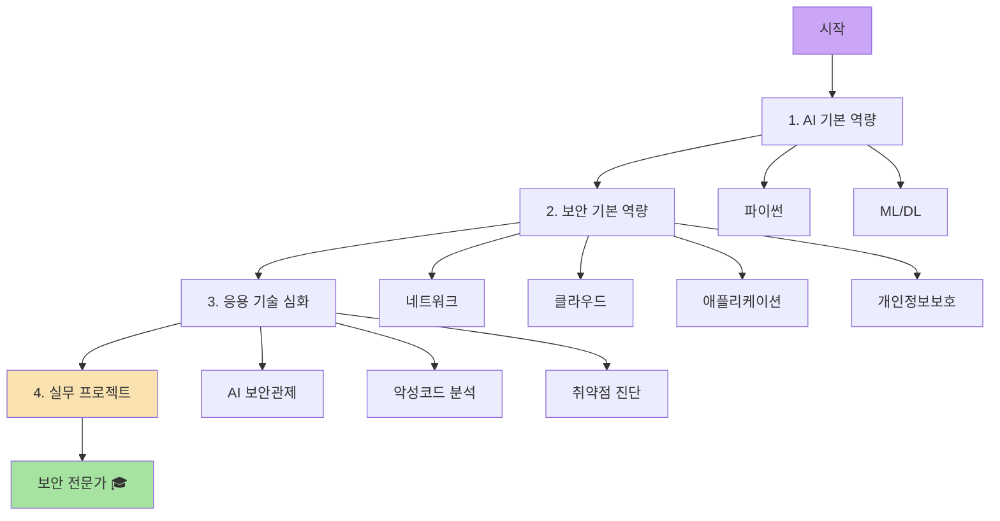

# 🛡️ 환영합니다, 에브리DAI에 오신 것을 환영합니다

> **AI와 사이버 보안, 그리고 개인 학습의 기록**

---

## 👋 About

**에브리DAI**는 AI 기술과 사이버 보안을 중심으로 다양한 학습 내용을 정리하는 기술 블로그입니다.

- **SK Rookies 과정**: 생성형 AI 사이버보안 마스터 과정의 심화 학습 자료
- **AI & 머신러닝**: 최신 AI 기술 트렌드와 실습 프로젝트
- **보안 연구**: 네트워크, 클라우드, 애플리케이션 보안 탐구
- **개인 학습**: 프로그래밍, 개발 도구, 문제 해결 과정 기록

클라우드와 AI 기술을 융합하여 **실전적인 보안 전문가**로 성장하는 과정을 공유합니다.

---

## 📚 목차

### 🤖 1. AI 기본 역량
Python, 머신러닝/딥러닝 기초부터 보안 데이터 분석까지

- **[1-1. 파이썬](SK_Rookies/1_AI_기본_역량/1-1_파이썬/)** - 보안 자동화와 데이터 처리 기초
- **[1-2. 머신러닝/딥러닝](SK_Rookies/1_AI_기본_역량/1-2_머신러닝_딥러닝/)** - AI 기반 위협 탐지 모델 구축

### 🛡️ 2. 보안 기본 역량
네트워크부터 클라우드, 애플리케이션 보안까지 핵심 지식 체계

- **[2-1. 네트워크 보안](SK_Rookies/2_보안_기본_역량/2-1_네트워크_보안/)** - 프로토콜 분석, 공격/방어, 보안 솔루션
- **[2-2. 클라우드 보안](SK_Rookies/2_보안_기본_역량/2-2_클라우드_보안/)** - IAM, VPC, 위협 대응
- **[2-3. 애플리케이션 보안](SK_Rookies/2_보안_기본_역량/2-3_애플리케이션_보안/)** - OWASP TOP 10, 시큐어 코딩, SAST/DAST
- **[2-4. 개인정보보호](SK_Rookies/2_보안_기본_역량/2-4_개인정보보호/)** - 법규 준수와 보호조치

### 🚀 3. 응용 기술 심화
AI와 보안 기술을 실전 문제에 적용

- **[3-1. AI 보안관제](SK_Rookies/3_응용_기술_심화/3-1_AI_보안관제_및_로그_분석/)** - SIEM, 로그 분석, 자연어 질의응답
- **[3-2. 악성코드 분석](SK_Rookies/3_응용_기술_심화/3-2_악성코드_분석_및_대응/)** - 리버스 엔지니어링, AI 분류, Yara Rule 생성
- **[3-3. 취약점 진단](SK_Rookies/3_응용_기술_심화/3-3_취약점_진단_및_모의해킹/)** - AI 모의해킹, 공격/방어 코드 생성

### 💼 4. 실무 프로젝트
종합 프로젝트 수행과 전문가 멘토링

- **[4-1. 최종 프로젝트](SK_Rookies/4_실무_프로젝트/4-1_최종_프로젝트/)** - 기획부터 발표까지 전 과정 실습

---

## 🎯 학습 목표

### 기술 역량
- ✅ Python, ML/DL을 활용한 **보안 데이터 분석**
- ✅ **네트워크, 클라우드, 애플리케이션** 보안 전문 지식
- ✅ **AI 기반 위협 탐지** 및 대응 시스템 구축
- ✅ **악성코드 분석** 및 취약점 진단 자동화

### 실무 역량
- ✅ 실전 **모의해킹** 및 침투 테스트
- ✅ **SIEM, 로그 분석** 기반 보안 관제
- ✅ **보안 사고 대응** 및 보고서 작성
- ✅ 팀 프로젝트 및 협업 경험

---

## 💡 특징

### 🔥 실전 중심
이론과 실습을 결합한 hands-on 학습

### 🤖 AI 통합
최신 생성형 AI와 머신러닝을 보안에 적용

### 🛠️ 도구 활용
실무 보안 도구와 프레임워크 경험

### 👥 커뮤니티
GitHub Discussions를 통한 질문과 토론

---

## 📞 Contact & Community

### 💬 질문하기
각 페이지 하단의 **댓글 시스템(Giscus)**을 통해 질문하세요

### 📷 Instagram
일상과 학습 여정: [@khsqowp1](https://www.instagram.com/khsqowp1/)

### 🐛 오류 제보
[GitHub Issues](https://github.com/khsqowp/khsqowp.github.io/issues)에 제보해주세요

### 💡 개선 제안
[GitHub Discussions](https://github.com/khsqowp/khsqowp.github.io/discussions)에서 함께 논의해요

---

## 📊 통계

  

    <h3 style="margin: 0; color: var(--ctp-mauve);">40+</h3>
    
학습 문서

  

  

    <h3 style="margin: 0; color: var(--ctp-blue);">4</h3>
    
주요 모듈

  

  

    <h3 style="margin: 0; color: var(--ctp-green);">10+</h3>
    
하위 카테고리

  

---

## 🏆 학습 경로

---

  <h2 style="color: var(--ctp-mauve);">🚀 지금 바로 시작하세요!</h2>
  
AI와 보안의 융합, 함께 성장하는 여정

  <a href="SK_Rookies/1_AI_기본_역량/1-1_파이썬/1. 파이썬 기초 문법.html" style="display: inline-block; padding: 1rem 2rem; background: var(--ctp-mauve); color: var(--ctp-base); border-radius: 8px; text-decoration: none; font-weight: 600; transition: all 0.3s;">
    학습 시작하기 →
  </a>

---

  Made with 💜 by AI Security Enthusiast 
  © 2025 에브리DAI. All rights reserved.

