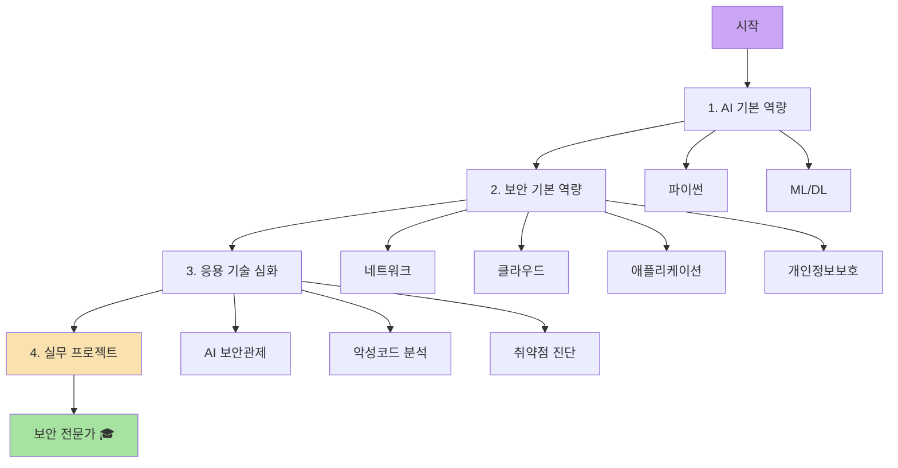

# 🛡️ 환영합니다, 에브리DAI에 오신 것을 환영합니다

> **AI 기반 사이버 보안 전문가를 위한 심화 학습 과정**

---

## 👋 About

**에브리DAI**는 SK Rookies 생성형 AI 사이버보안 마스터 과정의 학습 자료를 정리한 기술 블로그입니다.

클라우드와 AI 기술을 융합하여 **실전적인 위협 대응 능력**을 갖춘 사이버보안 전문가 양성을 목표로 합니다.

---

## 📚 학습 로드맵

### 🤖 1. AI 기본 역량
AI 기반 사이버 보안 전문가가 되기 위한 필수 기초 역량

- **[1-1. 파이썬](SK_Rookies/1_AI_기본_역량/1-1_파이썬/)** - 보안 자동화와 데이터 분석
  - 파이썬 기초 문법
  - 데이터 핸들링 (Pandas)
  - 수치 연산 (Numpy)
  - API 활용

- **[1-2. 머신러닝/딥러닝](SK_Rookies/1_AI_기본_역량/1-2_머신러닝_딥러닝/)** - AI 기반 위협 탐지
  - 머신러닝 기초
  - 딥러닝 기초
  - 딥러닝 심화
  - 모델링 프로세스
  - 데이터 시각화

---

### 🛡️ 2. 보안 기본 역량
사이버 보안 전문가를 위한 핵심 지식과 기술

- **[2-1. 네트워크 보안](SK_Rookies/2_보안_기본_역량/2-1_네트워크_보안/)** - 모든 사이버 보안의 기초
- **[2-2. 클라우드 보안](SK_Rookies/2_보안_기본_역량/2-2_클라우드_보안/)** - 현대 인프라 보안의 필수 요소
- **[2-3. 애플리케이션 보안](SK_Rookies/2_보안_기본_역량/2-3_애플리케이션_보안/)** - 소프트웨어 보안의 실전
- **[2-4. 개인정보보호](SK_Rookies/2_보안_기본_역량/2-4_개인정보보호/)** - 법규 준수와 윤리적 책임

---

### 🚀 3. 응용 기술 심화
AI와 보안 기술을 융합한 실전 문제 해결

- **[3-1. AI 보안관제](SK_Rookies/3_응용_기술_심화/3-1_AI_보안관제_및_로그_분석/)** - 지능형 위협 탐지
- **[3-2. 악성코드 분석](SK_Rookies/3_응용_기술_심화/3-2_악성코드_분석_및_대응/)** - AI 기반 멀웨어 분석
- **[3-3. 취약점 진단](SK_Rookies/3_응용_기술_심화/3-3_취약점_진단_및_모의해킹/)** - 자동화된 보안 테스팅

---

### 💼 4. 실무 프로젝트
학습한 모든 지식을 종합한 실제 프로젝트 수행

- **[4-1. 최종 프로젝트](SK_Rookies/4_실무_프로젝트/4-1_최종_프로젝트/)** - 종합 보안 프로젝트 수행
  - 프로젝트 기획
  - 프로젝트 실행 및 협업
  - 전문가 멘토링
  - 최종 발표 및 평가

---

## 🎯 학습 목표

### 기술 역량
- ✅ Python, ML/DL을 활용한 **보안 데이터 분석**
- ✅ **네트워크, 클라우드, 애플리케이션** 보안 전문 지식
- ✅ **AI 기반 위협 탐지** 및 대응 시스템 구축
- ✅ **악성코드 분석** 및 취약점 진단 자동화

### 실무 역량
- ✅ 실전 **모의해킹** 및 침투 테스트
- ✅ **SIEM, 로그 분석** 기반 보안 관제
- ✅ **보안 사고 대응** 및 보고서 작성
- ✅ 팀 프로젝트 및 협업 경험

---

## 💡 특징

### 🔥 실전 중심
이론뿐만 아니라 **실습과 프로젝트**를 통한 hands-on 학습

### 🤖 AI 통합
최신 **생성형 AI와 머신러닝**을 보안에 적용

### 🛠️ 도구 활용
실무에서 사용하는 **보안 도구와 프레임워크** 경험

### 👥 커뮤니티
**GitHub Discussions**를 통한 질문과 토론

---

## 🚀 시작하기

### 초보자라면
1. **[파이썬 기초 문법](SK_Rookies/1_AI_기본_역량/1-1_파이썬/1.%20파이썬%20기초%20문법.html)**부터 시작하세요
2. 순차적으로 **1 → 2 → 3 → 4** 모듈 진행
3. 각 모듈의 실습 코드 직접 실행

### 특정 분야만 관심 있다면
- **네트워크 보안** → [2-1. 네트워크 보안](SK_Rookies/2_보안_기본_역량/2-1_네트워크_보안/)
- **클라우드 보안** → [2-2. 클라우드 보안](SK_Rookies/2_보안_기본_역량/2-2_클라우드_보안/)
- **악성코드 분석** → [3-2. 악성코드 분석](SK_Rookies/3_응용_기술_심화/3-2_악성코드_분석_및_대응/)

### 실무 경험자라면
- **[3. 응용 기술 심화](SK_Rookies/3_응용_기술_심화/)** 부터 도전
- **[4. 실무 프로젝트](SK_Rookies/4_실무_프로젝트/)** 직접 수행

---

## 📞 Contact & Community

### 💬 질문하기
각 페이지 하단의 **댓글 시스템(Giscus)**을 통해 질문하세요

### 🐛 오류 제보
[GitHub Issues](https://github.com/khsqowp/khsqowp.github.io/issues)에 제보해주세요

### 💡 개선 제안
[GitHub Discussions](https://github.com/khsqowp/khsqowp.github.io/discussions)에서 함께 논의해요

---

## 📊 통계

  

    <h3 style="margin: 0; color: var(--ctp-mauve);">40+</h3>
    
학습 문서

  

  

    <h3 style="margin: 0; color: var(--ctp-blue);">4</h3>
    
주요 모듈

  

  

    <h3 style="margin: 0; color: var(--ctp-green);">10+</h3>
    
하위 카테고리

  

---

## 🏆 학습 경로 추천

---

  <h2 style="color: var(--ctp-mauve);">🚀 지금 바로 시작하세요!</h2>
  
AI와 보안의 융합, 미래의 사이버 보안 전문가가 되는 여정

  <a href="SK_Rookies/1_AI_기본_역량/1-1_파이썬/1. 파이썬 기초 문법.html" style="display: inline-block; padding: 1rem 2rem; background: var(--ctp-mauve); color: var(--ctp-base); border-radius: 8px; text-decoration: none; font-weight: 600; transition: all 0.3s;">
    학습 시작하기 →
  </a>

---

  Made with 💜 by SK Rookies AI Security Team 
  © 2025 에브리DAI. All rights reserved.

